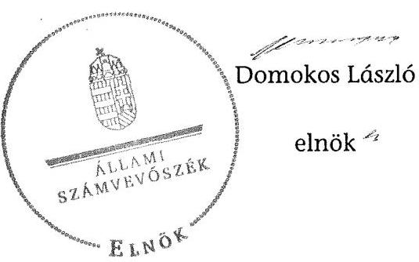

# ÁLLAMI   SZÁMVEVŐSZÉK 

## JELENTÉS

az önkormányzati vagyongazdálkodás
szabályszerűségi ellenőrzéséről
Zalalövő

---

# Állami Számvevőszék 

Iktatószám: V-0026-083-103/2013.
Témaszám: 1065
Vizsgálat-azonosító szám: V061514

## Az ellenőrzést felügyelte:

## Makkai Mária

felügyeleti vezető
Az ellenőrzést vezette és az ellenőrzés végrehajtásáért felelős:
Schósz Attila Ferencné
ellenőrzésvezető
A számvevőszéki jelentés összeállításában közreműködött:
Molnár Antal Lászlóné
számvevő
Az ellenőrzést végezték:
Molnár Antal Lászlóné Rácz József István
számvevő
számvevő

A témához kapcsolódó eddig készített számvevőszéki jelentések:
címe
sorszáma
Jelentés a közbeszerzési rendszer működésének ellenőrzéséről V0831

---

# TARTALOMJEGYZÉK 

BEVEZETÉS ..... 3
I. ÖSSZEGZŐ MEGÁLLAPÍTÁSOK, KÖVETKEZTETÉSEK, JAVASLATOK ..... 6
II. RÉSZLETES MEGÁLLAPÍTÁSOK ..... 11

1. A vagyongazdálkodási tevékenység szabályozottsága ..... 11
1.1. A feladatellátás formáinak meghatározása, a döntések megalapozottsága ..... 11
1.2. A vagyonnal gazdálkodó szervezetek szervezeti rendjének szabályozottsága, a kötelező szabályzatok megfelelősége ..... 12
1.3. A vagyongazdálkodás szabályozása ..... 13
1.4. A vagyonkezeléssel megbízott szervezetek beszámolási kötelezettségének szabályozása ..... 14
2. A vagyongazdálkodás szabályszerűsége ..... 14
2.1. A vagyon nyilvántartásának megfelelősége ..... 14
2.2. A vagyongazdálkodást érintő gazdasági események követelmények szerinti dokumentáltsága ..... 16
2.3. A vagyongazdálkodási döntések, intézkedések szabályszerűsége ..... 17
2.4. A közbeszerzési eljárás alkalmazása ..... 18
3. A vagyon változását eredményező gazdasági események szabályszerűsége ..... 19
3.1. A vagyon értékének és összetételének változása ..... 19
3.2. A vagyon fenntartására kialakított rendszer működésének megfelelősége és szabályozottsága ..... 20
3.3. A hitelfelvétel, kötvénykibocsátás, garancia és kezességvállalás szabályszerűsége ..... 21
3.4. A térítés nélküli átadások szabályszerűsége ..... 22
4. A vagyongazdálkodás szabályszerűségére vonatkozó belső és külső ellenőrzések hasznosulása ..... 22
4.1. A belső ellenőrzés által tett megállapítások, javaslatok hasznosulása ..... 22
4.2. A többségi tulajdonban lévő gazdasági társaságok vagyongazdálkodásának felügyelete ..... 23
4.3. A könyvvizsgálatnak a vagyongazdálkodás szabályosságához való hozzájárulása ..... 23
4.4. A külső ellenőrző szervezetek által tett javaslatok hasznosulása ..... 23

---

# MELLÉKLETEK 

1. számú Zalalövő Város Önkormányzata gazdálkodására jellemző adatok, mutatószámok
2. számú Zalalövő Város Önkormányzata vagyonának alakulása 2007. január 1-je és 2011. december 31-e között
3. számú Zalalövő Város Önkormányzata kötelezettségeinek alakulása 2007. január 1-je és 2011. december 31-e között

## FÜGGELÉKEK

1. számú Rövidítések jegyzéke
2. számú Értelmező szótár

---

# JELENTÉS 

## az önkormányzati vagyongazdálkodás szabályszerűségi ellenőrzéséről Zalalövő

## BEVEZETÉS

Az ÁSZ kiemelten fontosnak tartja az ÁSZ tv. 5. § (4) bekezdése alapján az önkormányzatok vagyongazdálkodási tevékenységének, a vagyongazdálkodási szabályok betartásának ellenőrzését. Az ellenőrzés feladata, hogy értékelje a vagyongazdálkodással kapcsolatban a jogszabályokban és az önkormányzati belső szabályozásban előírtak érvényesülését a közpénzek felhasználásának átláthatósága, nyilvánossága érdekében. Az ÁSZ ellenőrzése nemcsak az ellenőrzött szervezet vagyongazdálkodásának hibáira, hiányosságaira mutat rá, számon kérve azok kijavítását, hanem megállapításaival, javaslataival segíti a közpénzekkel, a közvagyonnal való felelős gazdálkodást.

Az önkormányzati vagyon alapvető funkciója, hogy a helyi közérdeket és egyúttal az önkormányzati célok megvalósítását szolgálja. A feladatellátás terén elsősorban a kötelezően ellátandó feladatok végrehajtását hivatott szolgálni, amely mellett az önként vállalt feladatok ellátása is megvalósulhat.

## Az ellenőrzés célja annak értékelése volt, hogy az Önkormányzatnál:

- a vagyongazdálkodási tevékenység, annak szervezeti keretei szabályozottak-e;
- az önkormányzati vagyongazdálkodás törvényességét, szabályszerűségét biztosították-e; a vagyon értékének és összetételének változását jogszerű döntésekkel alátámasztották-e;
- a belső ellenőrzés elősegítette-e a vagyongazdálkodás szabályszerű működését, valamint hasznosultak-e a korábbi külső ellenőrzések által tett javaslatok.

Az ellenőrzés típusa: szabályszerűségi ellenőrzés
Az ellenőrzés a 2007. január 1. és 2011. december 31. közötti időszakra terjedt ki. A közbeszerzési eljárások lefolytatásának ellenőrzése a 2011. évet és a 2012. év I. negyedévét érintette. Az Nvtv. egyes rendelkezései végrehajtásának ellenőrzése a nemzetgazdasági szempontból kiemelt jelentőségű nemzeti vagyonnak minősülő forgalomképtelen vagyonelemek meghatározására, valamint a közép- és hosszú távú vagyongazdálkodási terv készítésére terjedt ki 2012-től 2013. július 8-ig, a helyszíni ellenőrzés befejezéséig.

---

Az ellenőrzés szakmai módszertana az ÁSZ hivatalos honlapján közzétett szakmai szabályokon alapult, amely a Legfőbb Ellenőrző Intézmények Nemzetközi Szervezete (INTOSAI) által kiadott nemzetközi standardok (ISSAI) figyelembevételével készült.

A vagyonváltozásokkal kapcsolatos gazdasági események közül az ellenőrzött tételeket véletlen mintavétellel választottuk ki a Polgármesteri Hivatal 2007-2011. évi számviteli nyilvántartásaiból. Az Önkormányzattól tanúsítványt kértünk a korábbi ÁSZ ellenőrzések vagyongazdálkodásra vonatkozó javaslatainak hasznosulásáról, a könyvvizsgáló és a külső ellenőrzési szervek vagyongazdálkodással kapcsolatos 2007-2011. évi javaslataira tett intézkedésekről, valamint a 2007-2011. évek térítésmentes vagyonátadásairól és átvételeiről.

Zalalövő város állandó lakosainak száma 2011. január 1-jén 3053 fő volt. Az Önkormányzat hét tagú Képviselő-testületének munkáját két állandó bizottság segítette. Az Önkormányzat a 2011. évben a Polgármesteri Hivatalon kívül három önállóan működő költségvetési szervvel látta el a feladatát. A kötelező feladatok közül az alapfokú oktatásról és az óvodai nevelésről saját intézménnyel, intézményfenntartó társulás keretében gondoskodott. Önként vállalt feladatként a közművelődési feladatok ellátását és az alapfokú művészetoktatást saját intézményével, a tanyagondnoki feladatokat a Polgármesteri Hivatal útján biztosította. Kistérségi társulással gondoskodott a szociális alapellátási és a belső ellenőrzési kötelező feladatokról. Az egészséges ivóvízellátásra és szennyvízkezelésre koncessziós szerződést, a települési szilárd hulladék kezelésre és a helyi közutak fenntartására szolgáltatási szerződéseket kötött. Az Önkormányzat három, ebből kettő többségi tulajdoni hányadú gazdasági társasággal rendelkezett, a társaságok tevékenysége az Önkormányzat feladatellátásához nem kapcsolódott. Az Önkormányzat indoklása szerint a társaságokban az önkormányzati szerepvállalás a helyi munkalehetőségek bővítése és az iparűzési adó bevétel növelése érdekében történt.

A jelenlegi polgármester a 2009. évi időközi polgármester választás óta tölti be tisztségét, de 2007. november 12-től az előző polgármestert (annak tartós távolléte miatt, mint alpolgármester) helyettesítette. A jegyző 1990. november 20-tól látja el feladatát. A Polgármesteri Hivatal hat szervezeti egységre tagolódott, a foglalkoztatott köztisztviselők száma 2011. december 31-én 22 fő volt. Az Önkormányzat által fenntartott önállóan gazdálkodó költségvetési szerveknél 2011. december 31-én 76 fő közalkalmazottat foglalkoztattak.

Az Önkormányzat a 2011. évi költségvetési beszámolója szerint 587,7 millió Ft költségvetési bevételt ért el, valamint 579,9 millió Ft költségvetési kiadást teljesített. A 2011. december 31-i könyvviteli mérleg szerint 1746,2 millió Ft értékű nettó eszközvagyonnal rendelkezett, 3,6 millió Ft hosszú lejáratú, valamint 81,6 millió Ft rövid lejáratú kötelezettsége volt. Az Önkormányzatnál az ellenőrzött időszakban PPP konstrukcióban megvalósuló fejlesztés nem történt.

Az Önkormányzat gazdálkodására jellemző adatokat, mutatószámokat az 1-3. számú mellékletek tartalmazzák. A jelentésben alkalmazott rövidítéseket az 1. számú függelék, az egyes fogalmak magyarázatát a 2. számú függelék tartalmazza.

---

Az ÁSZ a 2011. évi LXVI. törvény 29. § (1) bekezdése szerint a jelentéstervezetet megküldte egyeztetésre Zalalövő Város Önkormányzata polgármesterének, aki az ÁSZ tv. 29. § (2) bekezdésében foglalt észrevételezési jogával nem élt, a jelentéstervezetre észrevételt nem tett.

---

# I. ÖSSZEGZŐ MEGÁLLAPÍTÁSOK, KÖVETKEZTETÉSEK, JAVASLATOK 

Az Önkormányzat könyvviteli mérleg szerinti vagyona a 2007. január 1-jei nettó 1945,0 millió Ft-os nyitó értékről a 2011. év végére nettó 1746,2 millió Ftra, 10,2%-kal csökkent, melynek oka elsősorban az volt, hogy az értékesített ingatlanok értéke, valamint az elszámolt értékcsökkenés és a mérlegből kivezetett befejezetlen beruházások együttes összege meghaladta a beruházásokból és a felújításokból származó vagyon növekedés összegét. A 2007-2011. évek között a beruházásokra és felújításokra fordított kiadások összege (241,1 millió Ft) 75,0%-a volt az elszámolt értékcsökkenés összegének (321,5 millió Ft). A megvalósult beruházások és felújítások fedezetét európai uniós és hazai támogatásokból, hitelből, kölcsönből, valamint önkormányzati saját forrásból biztosították. A 2007-2011. években megvalósult legjelentősebb beruházások (a Főtér és a Margaréta utca felújítása, valamint az óvoda bővítése) a gazdasági programban rögzített célkitűzésekkel összhangban voltak, az Önkormányzat kötelező feladatainak ellátásához kapcsolódtak.

A Képviselő-testület a gazdasági programban rögzítette az önkormányzati feladatellátás fő irányait. Az Önkormányzat a kötelező és önként vállalt feladatait a 2007. év elején a Polgármesteri Hivatal mellett intézményekkel, társulásokkal, valamint szolgáltatási és koncessziós szerződésekkel biztosította. A Képviselő-testület 2009. január 1-jétől - a költségtakarékosabb működés érdekében - intézmény megszüntetéséről és a szociális alapszolgáltatás kötelező feladatainak Kistérségi társulás útján történő ellátásáról döntött. Az Önkormányzat önként vállalt feladatai - a külterületen élők ellátásának biztosítása érdekében - a Képviselő-testület döntése alapján 2010. július 1-jétől a tanyagondnoki feladatokkal bővültek.

Az Önkormányzatnál a vagyongazdálkodás szabályozása hiányos volt. Az Önkormányzat - az Ötv. előírása ellenére - nem határozta meg a vagyonkezelői jog részletes szabályait (vagyonkezelési szerződést a 2007-2011. években nem kötöttek). A Képviselő-testület az Nvtv. előírása ellenére határidőre, 2012. március 1-jéig (és az ÁSZ helyszíni ellenőrzésének befejezéséig, 2013. július 8-ig) nem jelölte meg a forgalomképtelennek minősülő vagyonból a nemzetgazdasági szempontból kiemelt jelentőségű vagyonelemeket. Az ÁSZ helyszíni ellenőrzésének befejezéséig az Önkormányzat a közép- és hosszú távú vagyongazdálkodási tervét elkészítette. A Képviselő-testület - az Ötv.-ben foglaltaknak eleget téve - a vagyongazdálkodási rendeletben meghatározta az önkormányzati feladatellátást biztosító törzsvagyon körét, azon belül a forgalomképtelen és a korlátozottan forgalomképes vagyonelemeket, illetve a törzsvagyonba nem tartozó, forgalomképes vagyontárgyakat. A vagyongazdálkodási rendeletben előírták a forgalomképesség megváltoztatásának részletes szabályait, dokumentálásának módját, továbbá - a tulajdonosi jogok védelme érdekében - a garanciális elemek szerződésekben, egyéb dokumentumokban való rögzítésének kötelezettségét.

---

A jegyző a Htv. előírása alapján kialakította a Polgármesteri Hivatal, valamint az intézmények számviteli rendjét. A számviteli politika és a hozzá kapcsolódó (pénzkezelési, selejtezési és értékelési) szabályzatokat a jogszabályi előírásoknak és a helyi sajátosságoknak megfelelően készítették el. A költségvetési rendeletekben előírt kétévenkénti leltározás nem volt összhangban a leltározási szabályzat előírásával, mivel abban évenkénti leltározást írtak elő a koncesszióba adott eszközök leltározására. A leltározási szabályzatban a vagyon, azon belül a koncesszióba adott eszközök leltározásának módjáról a 2007-2011. években az Áhsz. előírásainak megfelelően rendelkeztek.

Az Önkormányzatnál a 2007-2011. években a vagyongazdálkodás működésének szabályszerűségét hiányosan biztosították. Az Önkormányzat a 2007-2011. években - az Ötv.-ben és a vagyongazdálkodási rendeletben foglalt előírásoknak megfelelően - a főkönyvi számlák alábontásával biztosította a törzsvagyon többi vagyontárgytól való elkülönített nyilvántartását. Ennek ellenére a 2007-2011. években a Képviselő-testület számára a zárszámadással egyidejűleg bemutatott vagyonkimutatás - az Áhsz. előírásával szemben - nem tartalmazta az Önkormányzat vagyonát törzsvagyon és törzsvagyonon kívüli, egyéb vagyonbontásban, valamint nem tartalmazta a „0”-ra leírt eszközök állományát sem. Az ellenőrzött időszakban - a 147/1992. (XI. 6.) Korm. rendelet előírásai ellenére - nem állt fenn az ingatlanvagyon-kataszteri nyilvántartás egyezősége a koncesszióba adott vízi közmű vagyon analitikus nyilvántartásával és a földhivatali adatokkal, továbbá a 2008. évben a főkönyvi nyilvántartással. A 2007-2011. években az Önkormányzat könyvviteli mérlegeit - a koncesszióba adott eszközök 2010-2011. évi értékének kivételével - leltárral alátámasztották. Az Áhsz., illetve a leltározási szabályzat előírása ellenére a 2010-2011. évekre a koncesszióba adott eszközök mérleg szerinti értékét nem támasztották alá az üzemeltetést végző szerv által elkészített, hitelesített leltárral, mivel a leltározást az üzemeltető helyett az Önkormányzat végezte el, továbbá a 2010. évben a leltározást mennyiségi felvétel helyett egyeztetéssel végezték.

A 2007-2011. években a gazdálkodási jogkörök gyakorlása a kiadások esetében megfelelő volt. A bevételek szakmai teljesítésigazolása - az Ámr. és a kötelezettségvállalási szabályzat előírásai ellenére - a 2007-2010. években
 összesen 1,2 millió Ft értékben elmaradt, melyet az érvényesítő és utalvány ellenjegyzője nem jelzett. A jegyző a kötelezettségvállalási szabályzat ₉-ben 2010. október 4-től már élt annak a lehetőségével, hogy a bevételek szakmai teljesítésigazolásának kötelezettségét nem írta elő.

Az önkormányzati vagyon értékének és összetételének változáához kapcsolódó döntéseket az arra jogosultak hozták meg, a döntések előkészítése és végrehajtása során betartották a jogszabályok, az önkormányzati SZMSZ ₁₋₃, a vagyongazdálkodási és a lakásrendelet, valamint az éves költségvetési rendeletek, képviselő-testületi határozatok előírásait. A vagyonhasznosítási és vagyonértékesítési szerződésekbe (a vagyongazdálkodási rendelet előírása alapján) beépítették az Önkormányzat érdekeit védő garanciális elemeket. Az Önkormányzat a 2011. évben, illetve a 2012. év I. negyedévében a közbeszerzési értékhatárt elérő beruházás esetében lefolytatta a közbeszerzési eljárást, a kiválasztott eljárásrend megfelelt a Kbt. ₁,₂ előírásainak. Az Önkormányzat az ellenőrzött időszakban - fejlesztési célra, kötelező feladataihoz kapcsolódóan -

---

15,5 millió Ft hosszú lejáratú, 3,7 millió Ft rövid lejáratú hitelt, és 6,9 millió Ft alapítványi kölcsönt vett igénybe. Önként vállalt feladatához kapcsolódóan 4,0 millió Ft rövid lejáratú hitelt vett fel. A hitelfelvételek során az Önkormányzat az Ötv. előírását betartotta, fedezetként önkormányzati törzsvagyont nem ajánlott fel. A hitel- és kölcsönszerződések megkötésére minden esetben a Képviselő-testület döntését követően került sor.

Az ellenőrzött időszakban az Önkormányzat kültagként három betéti társaságban rendelkezett - kettőben többségi - tulajdoni részesedéssel. A társasági szerződések szerint a betéti társaságok tagjai - tulajdoni részesedéstől függetlenül - egy-egy szavazattal rendelkeztek, ezért az Önkormányzatnak egyik társaságban sem volt többségi befolyása.

A jegyző az Eisztv. és a 18/2005. (XII. 27.) IHM rendelet előírásai szerint biztosította a közérdekű gazdálkodási adatok közzétételét a felhalmozási célú pénzeszközátadások, a vagyonnal való gazdálkodásra vonatkozó (nettó ötmillió Ft-ot elérő vagy meghaladó értékű beruházási, vagyonhasznosítási) szerződések adatai, a 2007-2011. évi költségvetési rendeletek és elemi költségvetések, valamint zárszámadási rendeletek és beszámolók tekintetében.

A belső ellenőrzési feladatokat az Önkormányzat a 2007-2011. években a Kistérségi társulás keretében látta el. A belső ellenőrzés a vagyongazdálkodás szabályszerű működését nem segítette elő, mivel - a 2007-2011. években - e területet érintően csak egy alkalommal volt belső ellenőrzés, melynek során javaslatot nem tettek. A 2007-2011. években - az Ötv.-ben foglaltak ellenére - a polgármester ₁,₂ helyett a belső ellenőr, illetve a belső ellenőrzési vezető terjesztette a Képviselő-testület elé a zárszámadási rendelettervezetekkel egyidejűleg az Önkormányzat éves összefoglaló ellenőrzési jelentéseit, melyeket a Képviselő-testület elfogadott.

A könyvvizsgáló az Önkormányzat 2007-2011. évi költségvetési beszámolóit megbízhatónak és hitelesnek minősítette. A költségvetési rendelettervezetek könyvvizsgálata során a kötelező és önként vállalt feladatok áttekintését, a kiadások felülvizsgálatát javasolta, melyre azonban az ellenőrzött időszakban nem került sor.

Az Önkormányzatnál a 2007-2011. években a külső ellenőrző szervek a hazai támogatással megvalósult fejlesztésekkel kapcsolatban végeztek záró helyszíni ellenőrzést. A Magyar Államkincstár és a Nyugat-Dunántúli Regionális Fejlesztési Ügynökség az ellenőrzések során két esetben állapított meg hiányosságot, melyeket az Önkormányzat pótolt.

Az Állami Számvevőszékről szóló 2011. évi LXVI. törvény 33. § (1) bekezdésében foglaltak értelmében a jelentésben foglalt megállapításokhoz kapcsolódó intézkedési tervet köteles az ellenőrzött szervezet vezetője összeállítani, és azt a jelentés kézhezvételétől számított 30 napon belül az ÁSZ részére megküldeni. Amennyiben az intézkedési tervet határidőben nem küldi meg a szervezet, vagy az nem elfogadható, az ÁSZ elnöke a hivatkozott törvény 33. § (3) bekezdés a)-b) pontjaiban foglaltakat érvényesítheti.

---

Az ellenőrzés intézkedést igénylő megállapításai és javaslatai:

# a Polgármesternek 

A Képviselő-testület az Nvtv. 18. § (1) bekezdésében foglaltak ellenére a megjelölt határidőre, 2012. március 1-jéig (és az ÁSZ helyszíni ellenőrzésének befejezéséig, 2013. július 8-ig) nem jelölte meg a forgalomképtelennek minősülő vagyonból a nemzetgazdasági szempontból kiemelt jelentőségű, nemzeti vagyonnak minősülő forgalomképtelen törzsvagyont.

Javaslat:
Terjessze a Képviselő-testület elé a nemzetgazdasági szempontból kiemelt jelentőségű nemzeti vagyonnak minősülő forgalomképtelen vagyonelemek kijelöléséről szóló, a jegyző által elkészített rendelettervezetet az Nvtv. 18. § (1) bekezdésében előírtak szerint.

## a jegyzőnek

1. A Képviselő-testület az Nvtv. 18. § (1) bekezdésében foglaltak ellenére a megjelölt határidőre, 2012. március 1-jéig (és az ÁSZ helyszíni ellenőrzésének befejezéséig, 2013. július 8-ig) nem jelölte meg a forgalomképtelennek minősülő vagyonból a nemzetgazdasági szempontból kiemelt jelentőségű, nemzeti vagyonnak minősülő forgalomképtelen törzsvagyont.

Javaslat:
Készítsen rendelettervezetet a nemzetgazdasági szempontból kiemelt jelentőségű nemzeti vagyonnak minősülő forgalomképtelen vagyonelemek kijelölése érdekében az Nvtv. 18. § (1) bekezdésében előírtak szerint, és kezdeményezze a polgármesternél a rendelettervezet Képviselő-testület elé terjesztését.
2. Az Önkormányzatnál a 2007-2011. évek között elkészített és a zárszámadással egyidejűleg a Képviselő-testületnek bemutatott vagyonkimutatás tagolása, részletezettsége nem felelt meg az Áhsz. 44/A. § (2)-(3) bekezdésében előírt minimális tartalmi követelményeknek, mivel nem tartalmazta az Önkormányzat tárgyi eszközeit és a befektetett pénzügyi eszközcsoportok arab számmal jelzett tételeik szerinti tagolását, az Önkormányzat vagyonát törzsvagyon és törzsvagyonon kívüli egyéb vagyon bontásban, valamint a „0”-ra leírt eszközök állományát.

Javaslat:
Intézkedjen az önkormányzat vagyonkimutatásának az Áhsz. 44/A. § (2)-(3) bekezdésében előírtak szerinti elkészítéséről és annak a Képviselő-testület részére történő bemutatásáról.
3. A 2010-2011. évekre a koncesszióba adott eszközök mérleg szerinti értékét az Áhsz. 37. § (3)-(4) bekezdésében, illetve a leltározási szabályzat ₃-ban foglalt előírás ellenére az Önkormányzat nem támasztotta alá az üzemeltetést végző szerv által - a december 31-ei fordulónapra vonatkozó évenkénti leltározás alapján - elkészített, hite-

---

lesített leltárral, mivel a leltározást az üzemeltető helyett az Önkormányzat végezte el. A 2010. évben a leltározást mennyiségi felvétel helyett egyeztetéssel végezték.

Javaslat:
Intézkedjen az Áhsz. 37. § (4) bekezdés előírásának megfelelően, hogy az üzemeltetésre átadott eszközökről a könyvviteli mérleg alátámasztásához az üzemeltető által évente elvégzett és hitelesített leltárak álljanak rendelkezésre.
4. A 2007-2011. években a koncesszióba adott vízi közmű vagyon kataszteri nyilvántartása és a földhivatali nyilvántartás között a 147/1992. (XI. 6.) Korm. rendelet 1. § (2) bekezdésében foglalt előírás ellenére nem állt fenn az egyezőség. Az ingatlanvagyon-kataszterben a vízmű telep értékeként helyesen a vagyonátadási szerződésnek megfelelő tulajdoni hányadra jutó összeget szerepeltették (bruttó 76,0 millió Ft), míg az illetékes földhivatal azt 100%-ban az Önkormányzat tulajdonaként tartotta nyilván.

Javaslat:
Intézkedjen a 147/1992. (XI. 6.) Korm. rendelet 1. § (2) bekezdésében foglalt egyezőség érdekében az illetékes földhivatal felé, hogy a földhivatali ingatlannyilvántartásban a vízmű telep esetében az Önkormányzat megfelelő tulajdoni hányada kerüljön rögzítésre.
5. A koncesszióba adott vízi közmű analitikus nyilvántartása és a vagyonkataszteri nyilvántartás nem felelt meg a 147/1992. (XI. 6.) Korm. rendelet 1. § (3) bekezdésében és 2. számú mellékletében foglalt előírásnak, mivel az nem biztosította a vízi közművek számviteli nyilvántartásának az ingatlanvagyon-kataszterrel való egyezőségét. Az ivóvízhálózat esetében az analitikus nyilvántartások tartalmaztak olyan vagyonelemeket is, amelyek nem az Önkormányzat tulajdonát képezték (5,0% Felsőjánosfa, 2,7% Csöde Község Önkormányzataié).

Javaslat:
Intézkedjen, hogy a 147/1992. (XI. 6.) Korm. rendelet 1. § (3) bekezdésében és 2. számú mellékletében foglaltaknak megfelelően az ingatlanvagyon-kataszter adatai egyezzenek meg a számviteli (analitikus) nyilvántartás azonos tartalmú adataival.
6. A 2007-2011. években az Önkormányzatnál az Ötv. 92. § (10) bekezdésében foglaltak ellenére a polgármester ₂ helyett a belső ellenőr, illetve a belső ellenőrzési vezető terjesztette a Képviselő-testület elé az éves összefoglaló ellenőrzési jelentéseket a zárszámadási rendelettervezettel egyidejűleg.

Javaslat:
Kezdeményezze a polgármesternél a Bkr. 56. § (8) bekezdésének megfelelően az éves ellenőrzési jelentéseknek - a zárszámadással egyidejűleg - a Képviselő-testület elő történő beterjesztését.

---

# II. RÉSZLETES MEGÁLLAPÍTÁSOK 

## 1. A VAGYONGAZDÁLKODÁSI TEVÉKENYSÉG SZABÁLYOZOTTSÁGA

### 1.1. A feladatellátás formáinak meghatározása, a döntések megalapozottsága

Az Önkormányzat a 2006-2010. évekre, illetve a 2010-2014. évekre szóló gazdasági program ₁,₂-ben jóváhagyta az önkormányzati feladatellátással összefüggő fő irányokat, célkitűzéseket. A gazdasági program ₁-ben a kötelező feladatokhoz kapcsolódó fejlesztési feladatként az akadálymentesítést, az általános iskola és konyhája, valamint utak és járdák felújítását, az óvoda bővítését és a víziközmű-hálózat felújítását tervezték. Önként vállalt feladatként a településközpont rehabilitációját, a termál program indítását, a piactér kialakítását, továbbá a sportcentrum és a Borostyán-tó környékének felújítását jelentették meg. A gazdasági program ₂-ben továbbra is fejlesztési célként szerepelt az akadálymentesítés, az általános iskola felújítása, az óvoda bővítése, az utak, járdák felújítása, valamint a termál program felülvizsgálata, a sportcentrum, és a Borostyán-tó környékének kialakítása.

Az Önkormányzat az Ötv. 8. § (2) bekezdése alapján meghatározta ¹ a kötelezően ellátandó és önként vállalt feladatainak körét, a feladatellátás módját és mértékét. Az Önkormányzat 2007. január 1-jén kötelező és önként vállalt feladatait a Polgármesteri Hivatal mellett intézményekkel, társulással, koncessziós és szolgáltatási szerződésekkel látta el.

Az Önkormányzat a kötelező feladatainak körébe tartozó alapfokú oktatás és óvodai nevelés ellátásáról saját intézményével, intézményfenntartó társulás ₁,₂ útján gondoskodott. A szociális alapellátás kötelező feladatait - intézményfenntartó társulás ₃ keretében - az Önkormányzat intézménye, a Szociális Alapszolgáltatási Központ látta el.

A belső ellenőrzési feladatok ellátását az Önkormányzat a Kistérségi társulással biztosította. Az egészséges ivóvízellátás és szennyvízkezelés kötelező feladatot koncessziós szerződés keretében az AQUAZALA Kft. végezte. A települési szilárd hulladék kezelés kötelező feladatát szolgáltatási szerződéssel a ZALAISPA Hulladékkezelő Társulás végezte. A helyi közutak fenntartásáról a Zala Megyei Települési Önkormányzatok Útkezelői Társulása közreműködésével gondoskodtak. Az Önkormányzat önként vállalt feladatként a közművelődési feladatok ellátását és az alapfokú művészetoktatást a Művelődési Központ intézményével biztosította.

A 2008. évben a Képviselő-testület a költségtakarékosabb működés érdekében egy esetben intézmény - a Szociális Alapszolgáltatási Központ - megszüntetéséről és a feladatok Kistérségi társulás útján történő ellátásáról döntött. A pol-

[^0]
[^0]: ¹ Az önkormányzati SZMSZ ₁₋₂-ban

---

gármester ₂ a Képviselő-testület számára készített előterjesztésben a megalapozott döntés meghozatala érdekében a várható eredmények, fejlesztési lehetőségek, a kistérségi formában nyújtott szolgáltatások szakmai előnyeit bemutatta. A Képviselő-testület döntése alapján a szociális alapszolgáltatás kötelező feladatait 2009. január 1-jétől a Kistérségi társulással kötött megállapodás alapján a Támasz Alapszolgáltatási Intézmény mint a Kistérségi társulás intézménye végezte.

Az Önkormányzat - a külterületen élők ellátásának biztosítása érdekében 2010. július 1-jétől önként vállalt feladatainak körét bővítette a tanyagondnoki szolgálattal, melynek ellátását a Polgármesteri Hivatallal biztosította.

# 1.2. A vagyonnal gazdálkodó szervezetek szervezeti rendjének szabályozottsága, a kötelező szabályzatok megfelelősége 

A Képviselő-testület a 2007-2011. években az Ötv.-ben foglaltak alapján alkotta meg az önkormányzati SZMSZ ₁,₂,₃-at. A Képviselő-testület élt az Ötv. 9. § (3) bekezdésében biztosított jogával, a vagyongazdálkodási rendeletében a vagyongazdálkodással kapcsolatos egyes hatásköröket a polgármester ₁,₂-nek, illetve az Önkormányzat intézmény vezetőinek átadta. Az önkormányzati SZMSZ ₂,₃-ban rögzítették, hogy az átruházott hatáskör gyakorlásához a Képviselő-testület utasítást adhat. Az átruházott hatáskör gyakorlásáról a polgármester ₁,₂-nek - az önkormányzati SZMSZ ₂,₃-ban rögzítettek szerint - a döntését követő képviselő-testületi ülésen beszámolási kötelezettsége volt.

A Képviselő-testület a vagyongazdálkodási rendelet szerint a polgármester
 }_{1,2}$-t a Polgármesteri Hivatalban selejtezett és feleslegessé vált vagyontárgyak értékesítésével, a költségvetésben jóváhagyott előirányzatok terhére megbízási szerződések megkötésével, továbbá 2010. április 1-jétől az átmenetileg szabad pénzeszközökkel való gazdálkodással, illetve a 100 ezer Ft értékhatárt el nem érő forgalomképes vagyon feletti rendelkezés jogával bízta meg. A vagyongazdálkodási rendelet szerint az intézményi kezelésben lévő vagyontárgyak szabad kapacitás terhére történő hasznosítását - 100 ezer Ft értékhatárig átruházott hatáskörben - az intézmények vezetői engedélyezhették.

A jegyző a Htv. 140. § (1) bekezdés c) pontjában foglalt előírásnak megfelelően kialakította a Polgármesteri Hivatal és az intézmények számviteli rendjét. A számviteli politika ${ }_{1,2}$ és annak mellékleteként a pénzkezelési szabályzat ${ }_{1-3}$, a selejtezési szabályzat ${ }_{1,2}$ és az értékelési szabályzat ${ }_{1,2}$ az Áhsz.-nek és a helyi sajátosságoknak megfelelt. A Képviselő-testület - az Áhsz. 37. § (7) bekezdése szerinti lehetőséggel élve - az éves költségvetési rendeletekben döntött a kétévenkénti leltározásról. A leltározási szabályzat ${ }_{3}$ IV. pontjában a koncesszióba adott eszközökre évenkénti leltározási kötelezettséget határoztak meg, ellentétben az éves költségvetési rendeletben rögzítettekkel. A vagyon, azon belül a koncesszióba adott eszközök leltározásának módjáról a leltározási szabályzat ${ }_{1-3}$-ban az Áhsz. előírásainak megfelelően rendelkeztek.

A jegyző az operatív gazdálkodással és annak munkafolyamatba épített ellenőrzésével összefüggő jogkörök gyakorlásának rendjét és a velük kapcsolatos összeférhetetlenségi követelményeket a kötelezettségvállalási szabályzat ${ }_{1-9}$-ben kialakította.

---

# 1.3. A vagyongazdálkodás szabályozása 

A Képviselő-testület a vagyongazdálkodási rendeletben az Ötv. 79. § (2) bekezdésének megfelelően meghatározta az önkormányzati feladatellátást biztosító törzsvagyon körét, azon belül a forgalomképtelen és a korlátozottan forgalomképes vagyonelemeket, illetve a törzsvagyonba nem tartozó, forgalomképes vagyontárgyakat. A törzsvagyon többi vagyontárgytól elkülönített nyilvántartásának kötelezettségét a vagyongazdálkodási rendeletben, az ingatlan-vagyon-kataszterrel kapcsolatos előírásokat a vagyongazdálkodási és beruházási szabályzatokban ${ }^{2}$ írták elő.

A Képviselő-testület az önkormányzati vagyonnal való gazdálkodás szabályait a vagyongazdálkodási rendeletben hiányosan alakította ki, mivel az Ötv. 80/B. $\S$-a${ }^{3}$ ellenére nem rendelkezett a vagyonkezelői jog részletes szabályairól, továbbá az Áht. 108. § (2) bekezdésében foglaltak ellenére nem rögzítették az ingyenes átruházás részletes feltételeit, módját és eseteit ${ }^{4}$.

A megalapozott vagyongazdálkodási döntések meghozatala érdekében - célszerűsége ellenére - a vagyongazdálkodási rendeletben és az Önkormányzat egyéb rendeleteiben, szabályzataiban nem írták elő a döntés előkészítés folyamatában a költség-haszon elemzés készítésének kötelezettségét. Nem szabályozták továbbá a támogatásokkal megvalósuló beruházásokkal létrejövő létesítmények fenntarthatóságának vizsgálatát. A finanszírozási célú pénzügyi műveletek vonatkozásában nem írták elő a pénzügyi kockázatok felmérését, a hitelfelvételről szóló döntés-előkészítés folyamatában a futamidő egyes éveit terhelő kötelezettség költségvetési egyensúlyra gyakorolt hatásának vizsgálatát.

A Képviselő-testület az önkormányzati tulajdonban lévő lakások értékesítéséhez a lakásrendeletben értékbecslés készítési kötelezettséget határozott meg. A vagyongazdálkodási rendeletben a Képviselő-testület szabályozta a forgalomképesség megváltoztatásának részletes szabályait és dokumentálásának módját, valamint a tulajdonosi jogok védelme érdekében a garanciális elemek szerződésekben, egyéb dokumentumokban való rögzítésének kötelezettségét.

A vagyongazdálkodást érintő előterjesztések készítésének, megtárgyalásának, véleményezésének és döntéshozatalának rendjét az Önkormányzat külön nem szabályozta, arra az önkormányzati SZMSZ ${ }_{1,2,3}$-ban rögzített, az előterjesztésekre vonatkozó általános szabályok voltak érvényesek.

A Képviselő-testület az Nvtv. 18. § (1) bekezdésében foglaltak ellenére a megjelölt határidőre, 2012. március 1-jéig (és az ÁSZ helyszíni ellenőrzésének befejezéséig, 2013. július 8-ig) nem jelölte meg a forgalomképtelennek minősülő vagyonból a nemzetgazdasági szempontból kiemelt jelentőségű, nemzeti vagyonnak minősülő forgalomképtelen törzsvagyont. A Képviselő-testület az

[^0]
[^0]:    ${ }^{2}$ A jegyző által 2003. szeptember 1-jén, illetve 2008. július 1-jén kiadott szabályzatok
    ${ }^{3}$ 2012. január 1-jétől az Mötv. 109. §-a szabályozza
    ${ }^{4}$ A vagyon tulajdonjogának ingyenes átruházására vonatkozó szabályokat, az ingyenes átruházás módjait, eseteit a Képviselő-testület a vagyongazdálkodási rendeletben 2012. április 1-jétől határozta meg.

---

Nvtv. 9. § (1) bekezdése alapján elfogadta a közép- és hosszú távú vagyongazdálkodási tervét ${ }^{5}$.

# 1.4. A vagyonkezeléssel megbízott szervezetek beszámolási kötelezettségének szabályozása 

Az ellenőrzött időszakban az Önkormányzat az Ötv. 80/A. § előírása szerinti vagyonkezelési szerződést nem kötött, vagyonkezelői jogot nem alapított.

Az Önkormányzat a víziközművek üzemeltetését az ellenőrzött időszakban koncessziós szerződés alapján biztosította. A koncesszióba átadott vagyonnal kapcsolatban az Önkormányzat számára a szerződés lehetőséget adott egy fő felügyelő bizottsági tag delegálására, amely lehetőségével az Önkormányzat nem élt. A szerződés lehetővé tette, hogy a település polgármestere a felügyelő bizottsági üléseken tanácskozási joggal részt vegyen, mely jogát a polgármester nem gyakorolta.

A koncessziós szerződés szerint az üzemeltetőt adatszolgáltatási kötelezettség terhelte ${ }^{6}$ a fogyasztási adatokról, a közműhálózaton elvégzett rekonstrukciós munkákról és a fejlesztésekről. Az adatszolgáltatási kötelezettségeinek az üzemeltető az ellenőrzött időszakban eleget tett. Az adatszolgáltatásokat a Képviselő-testület megtárgyalta és elfogadta. A koncessziós szerződésben az Önkormányzat az átadott eszközök tekintetében, az üzemeltetőnek leltározási kötelezettséget - az átadás-átvétel kivételével - nem írt elő.

## 2. A VAGYONGAZDÁLKODÁS SZABÁLYSZERŰSÉGE

### 2.1. A vagyon nyilvántartásának megfelelősége

Az Önkormányzat a 2007-2011. években eleget tett az Ötv. 78. § (2) bekezdésében és a vagyongazdálkodási rendeletben előírtaknak, mivel a főkönyvi számlák alábontásával biztosította a törzsvagyon (ezen belül forgalomképtelen, illetve a korlátozottan forgalomképes vagyon) többi vagyontárgytól elkülönített nyilvántartását.

Az Önkormányzatnál a 2007-2011. évek között - az Ötv. 78. § (2) bekezdésében foglaltak szerint - a vagyonkimutatást elkészítették, és a zárszámadási rendelettervezet előterjesztésekor, az Áht 118. § (2) bekezdés 2. c) pontja alapján, a Képviselő-testület részére tájékoztatásul bemutatták. A 2007-2011. évi vagyonkimutatások felépítése és tartalma nem felelt meg az Áhsz. 44/A. § (2)-(3) bekezdéseiben előírtaknak.

A 2007-2011. években vagyonkimutatás elnevezéssel a zárszámadás 21. számú mellékleteként szerepeltették az Önkormányzat vagyonát összevontan bemutató mérleget, amelynek tagolása, részletezettsége nem felelt meg az Áhsz. 44/A. § (2)(3) bekezdése által, a vagyonkimutatásra vonatkozóan előírt minimális tartalmi

[^0]
[^0]:    ${ }^{5}$ A Képviselő testület 83/2013. (V. 28.) számú határozatával
    ${ }^{6}$ Minden év III. negyedévet követő hónap 20-áig

---

követelményeknek. Nem tartalmazta a tárgyi eszköz és a befektetett pénzügyi eszközcsoportok tekintetében a könyvviteli mérleg arab számmal jelzett tételei szerinti tagolást és az Önkormányzat vagyonát törzsvagyon (forgalomképtelen és korlátozottan forgalomképes), illetve törzsvagyonon kívüli, egyéb vagyon bontásban, valamint a „0"-ra leírt eszközök állományát.

Az Önkormányzatnál a 2007-2011. években eleget tettek az Áhsz. 37. § (1) bekezdésében előírt leltározási kötelezettségnek december 31-i fordulónappal. A 2007-2011. években az Önkormányzat könyvviteli mérlegeit - a koncesszióba adott eszközök 2010-2011. évi értékének kivételével - leltárral alátámasztották. Az Áhsz. 37. § (4) bekezdése ${ }^{7}$, illetve a leltározási szabályzat ${ }_{2}$ előírása ellenére a 2010-2011. évekre koncesszióba adott eszközök mérleg szerinti értékét nem támasztották alá az üzemeltetést végző szerv által elkészített, hitelesített leltárral, mivel a leltározást az üzemeltető helyett az Önkormányzat végezte el, és azt a 2010. évben mennyiségi felvétel helyett egyeztetéssel végezték.

Az ellenőrzött időszakban az Önkormányzatnál - a leltározási szabályzat ${ }_{1,2,3}$ szerint - a leltározást a kijelölt leltározási körzetenként elvégezték. A leltározás befejezését követően készített jegyzőkönyvek több esetben tártak fel eltérést a tényleges mennyiségi felvétellel felvett leltárak és a számviteli nyilvántartások között, azonban a leltárkülönbözeteket az év végi zárások során rendezték.

A koncesszióba adott víziközmű-vagyon analitikus nyilvántartása és a vagyonkataszteri nyilvántartás a 2007-2011. években nem felelt meg a 147/1992. (XI. 6.) Korm. rendelet 1. § (3) bekezdésében és 2. számú mellékletében foglalt előírásoknak, mert az nem biztosította a vízi közművek számviteli nyilvántartásának az ingatlanvagyon-kataszterrel való egyezőségét.

A koncesszióba adott közművagyonnál az ivóvízhálózat esetében az analitikus nyilvántartások tartalmaztak olyan vagyonelemeket is, amelyek nem az Önkormányzat tulajdonát képezték. Az 1992. évi vízi közmű-vagyon átvétele során a szerződés szerint a szennyvízcsatorna rendszer és a szennyvíztisztító 100%-ban az Önkormányzat tulajdonába került, míg az ivóvíz-vagyonnak 92,3%-a illette meg az Önkormányzatot ${ }^{8}$. A vagyonátadási szerződésben rögzítettek ellenére a teljes ivóvíz-vagyon az Önkormányzat eszköznyilvántartásaiba lett felvezetve. Az ellenőrzött időszakban az év végi zárások során az értékcsökkenési leírást helyesen, csak az önkormányzati tulajdonú eszközökre számolták el, továbbá a főkönyvi nyilvántartásban csak az Önkormányzat tulajdoni hányadának megfelelő összeget mutattak ki.

A 147/1992. (XI. 6.) Korm. rendelet 1. § (3) bekezdésében és 2. számú mellékletében foglaltak ellenére az ingatlanvagyon-kataszter egyezősége a főkönyvi nyilvántartással a 2008. évben nem állt fenn.

A 2007-2011. években a leltározás során elvégezték a főkönyvi nyilvántartások és az ingatlanvagyon-kataszter bruttó érték adatainak egyeztetését. Az ingatlanvagyon-kataszter és a számviteli nyilvántartás adatai az egyeztetések ellenére a 2008. év végén bruttó 1,1 millió Ft-os eltérést mutattak, melynek oka, hogy a

[^0]
[^0]:    ${ }^{7}$ Megállapította a 317/2009. (XII. 29.) Korm. rendelet 18. §-a. Először a 2010. évről készített beszámolókra kellett alkalmazni.
    ${ }^{8}$ 5,0%-a Felsőjánosfa, 2,7%-a Csöde Község Önkormányzatait illette meg.

---

számviteli nyilvántartásokban rögzített közművagyon felújítások az ingatlanvagyon kataszteri nyilvántartásból kimaradtak. A 2009. évben a korrekciót elvégezték, ezáltal az ingatlanvagyon kataszter és a főkönyvi nyilvántartás adatainak egyezőségét biztosították.

Az ellenőrzött időszakban a koncesszióba adott vízi közmű vagyonkataszteri nyilvántartása és a földhivatali nyilvántartás között - a 147/1992. (XI. 6.) számú Korm. rendelet 1. § (2) bekezdésében foglalt előírás ellenére - nem állt fenn az egyezőség.

Az ingatlanvagyon-kataszterben helyesen, a vízmű telep értékeként a vagyonátadási szerződésnek megfelelő tulajdoni hányadra jutó összeget szerepeltették, amely 2011. év végén bruttó 76,0 millió Ft volt, míg az illetékes földhivatal azt 100%-ban az Önkormányzat tulajdonaként tartotta nyilván, ebből eredően az eltérés bruttó 6,3 millió Ft volt.

A befejezetlen beruházások állományából a 72,0 millió Ft értékben nyilvántartott Zalalövői Termálprojekt előkészítését - az Önkormányzat által 2011. február 28-án készített feljegyzés alapján - a 2010. év végi mérleg készítése során a beruházások állományából a tőkeváltozással szemben kivezették. A tervek megvalósításához az Önkormányzat külső forrást nem tudott bevonni, saját forrásból a beruházást nem tudta megvalósítani. Az Önkormányzat által készített feljegyzés szerint az elvi építési engedélyek lejártak, illetve a jogszabályi előírások megváltoztak, ennek következtében a tervek már nem voltak felhasználhatóak. A Zalalövői Termálprojekt előkészítésének beruházását - a tervek elkészültét követően - az Önkormányzat az immateriális javak között nem vette nyilvántartásba a Számv. tv. 25. § (1) bekezdése ellenére, emiatt elmaradt az Áhsz. 30. §-ában előírt értékcsökkenési leírás elszámolása. A feleslegessé vált szellemi termék után - a 2010. év végi mérleg készítése során - a Számv. tv. 53. § (1) bekezdés b) pontjában foglaltak ellenére terven felüli értékcsökkenést nem számoltak el. A felesleges vagyontárgy selejtezését a selejtezési szabályzat előírása ellenére az Önkormányzat nem hajtotta végre.

A számviteli politika ${ }_{2}$-ben a részesedések év végi - piaci értéken történő - értékelését írták elő. Ennek ellenére
 az Önkormányzat három gazdasági társaságánál a részesedések év végi értékelése a 2007-2009. években elmaradt, ezért a mérleg készítésekor az értékvesztéseket - a társaságok beszámolói és a mérlegadatok alapján - nem számolták el. A 2010. év végi értékelések során az Önkormányzat a három ${ }^{9}$ gazdasági társaság beszámolója és mérleg adatai alapján az üzletrészek 100%-os (összesen 153 ezer Ft) értékvesztését elszámolta.

# 2.2. A vagyongazdálkodást érintő gazdasági események követelmények szerinti dokumentáltsága 

A Polgármesteri Hivatalban a 2007-2011. években a gazdálkodási jogkörök gyakorlása során az Ámr. 1 138. § (1)-(3) bekezdéseiben, valamint az Ámr. 2 80. § (1)-(2) bekezdésében rögzített összeférhetetlenségi követelményeket betartották.

[^0]
[^0]:    ${ }^{9}$ Kettő többségi és egy kisebbségi (23,6%-os) tulajdoni hányadú önkormányzati gazdasági társaság

---

A vagyongazdálkodással kapcsolatban a 2007-2011. években a gazdálkodási jogkörök gyakorlása a kiadások esetében megfelelő volt. A bevételek beszedését megelőzően az ellenőrzött tételek közül az alábbi esetekben - az Ámr. 1,2-ben, illetve a kötelezettségvállalási szabályzat 1,8-ban foglaltakkal ellentétben - nem végezték el a gazdálkodási és ellenőrzési jogkörök gyakorlásával felhatalmazott személyek az előírt ellenőrzési feladatokat.

A bevételek beszedésének teljesítése során 2007. január 1. és 2010. október 3. között rendszeresen előforduló hibaként (összesen 1,2 millió Ft összegben) a szakmai teljesítés igazolásával írásban megbízott személy nem tett eleget az Ámr. 1 135. § (1) bekezdésében és az Ámr. 2 76. § (1) bekezdésében előírt ellenőrzési kötelezettségének, nem ellenőrizte a bevételek jogosságát, összegszerűségét és teljesítését. A jegyző a kötelezettségvállalási szabályzat 8-ban 2010. október 4-től már élt annak a lehetőségével, hogy a bevételek szakmai teljesítésigazolásának kötelezettségét nem írta elő.

Az érvényesítő a 2007-2010. években aláírása ellenére nem megfelelően végezte el - az Ámr. 1 135. § (3) bekezdése, illetve az Ámr. 2 77. § (1) bekezdése szerinti - ellenőrzési feladatát, mert nem kifogásolta a szakmai teljesítés igazolásának hiányát. Az utalványok ellenjegyzői aláírásuk ellenére az Ámr. 1 137. § (3), valamint az Ámr. 2 79. § (2) bekezdés ellenére nem győződtek meg az érvényesítés szabályszerű végrehajtásáról, mivel nem kifogásolták, hogy az érvényesítést a szakmai teljesítésigazolás hiányában végezték el.

A polgármester 2 az önkormányzati képviselők és polgármesterek választását megelőzően az Áht. 1 50/A. § (4) bekezdés szerinti határidőn túl - 2010. szeptember 10-én - részletes jelentést tett közzé az Önkormányzat vagyoni és pénzügyi helyzetéről, valamint a Képviselő-testület megalakulását követően keletkezett, a későbbi éveket terhelő pénzügyi kötelezettségekről.

A jegyző a hirdetőtáblán történő kifüggesztéssel, valamint az Önkormányzat honlapján az Eisztv. és a 18/2005. (XII. 27.) IHM rendelet előírásai alapján a 2007-2011. évi költségvetési és zárszámadási rendeleteket, az éves (elemi) költségvetéseket és a költségvetés végrehajtásáról készített beszámolókat közzétette. Gondoskodott továbbá az Áht. 1 15/A. §-ában és a 15/B. §-ban előírtaknak megfelelően a céljellegű, működési és fejlesztési támogatások, a vagyongazdálkodással összefüggő - a nettó öt millió Ft-ot elérő vagy azt meghaladó értékű szerződések adatainak közzétételéről.

# 2.3. A vagyongazdálkodási döntések, intézkedések szabályszerűsége 

Az Önkormányzatnál a vagyontárgyak hasznosítása, a vagyon értékének és összetételének változását befolyásoló döntések előkészítése során betartották a jogszabályok, az önkormányzati SZMSZ 1,2,3, a vagyongazdálkodási rendelet, a lakásrendelet, valamint az éves költségvetési rendeletek és képviselőtestületi határozatok előírásait. A Képviselő-testület az önkormányzati tulajdonban lévő lakások értékesítéséhez a lakásrendeletnek megfelelően - értékbecslő, árszakértő által - készített értékbecsléseket tartalmazó előterjesztések alapján hozta meg a döntését. Az önkormányzati tulajdonú egyéb ingatlanok eseti értékesítése során azon esetekben, ahol az értékesítésre szánt ingatlanok (földterületek) forgalmi értéke az értékbecslés díjához képest aránytalanul ala-

---

csony volt, a forgalmi értéket a Képviselő-testület - a vagyongazdálkodási rendeletben előírtaknak megfelelően - az ingatlan könyv szerinti értékének figyelembevételével határozta meg. Az ellenőrzött tételeknél a vételár minden esetben meghaladta a nyilvántartási értéket. A vagyongazdálkodáshoz kapcsolódó döntéseket - a jogszabályokban, valamint a vagyongazdálkodási rendeletben és a lakásrendeletben foglaltaknak megfelelően - az arra felhatalmazottak hozták meg. Az ellenőrzött tételek esetében a vagyonváltozásokról hozott képviselő-testületi döntésekkel azonos tartalmú szerződéseket, megállapodásokat kötöttek. A vagyonhasznosítási és vagyonértékesítési szerződésekbe (a vagyongazdálkodási rendelet előírása szerint) beépítették az Önkormányzat érdekeit védő garanciális elemeket.

Az ingatlanok értékesítésekor a tulajdonjog bejegyzésének feltételéül szabták a teljes vételár kifizetését. A késedelmes fizetés esetére késedelmi kamat felszámítását írták elő, a bérleti díj meg nem fizetése esetére a bérleti jogviszony felmondását jelölték meg.

A 2007-2011. években a két ellenőrzött nagy értékű beruházást, illetve felújítást (a kötelező önkormányzati feladatokhoz kapcsolódóan az óvoda épületének bővítését és átalakítását, valamint a Margaréta utca felújítását) megelőzően a Képviselő-testület az önkormányzati SZMSZ 2 előírásának megfelelően elkészített előterjesztések alapján döntött a fejlesztések megvalósításáról. Az európai uniós támogatással megvalósuló fejlesztések kivitelezőit, a Kbt. 1,2 előírásainak megfelelően közbeszerzési eljárás alkalmazásával választották ki. A döntések során az összességében legkedvezőbb ajánlatot tevő gazdasági társasággal kötöttek vállalkozási szerződést. A megkötött szerződések összhangban voltak a képviselő-testületi döntésekkel. Az Önkormányzat a pályázatokhoz csatolt megvalósíthatósági tanulmányokban bemutatta a tervezett fejlesztésekkel létrejövő létesítmények fenntarthatóságát is.

# 2.4. A közbeszerzési eljárás alkalmazása 

Az Önkormányzat a 2011. évben, illetve a 2012. év I. negyedévében a közbeszerzési értékhatárt elérő építési beruházás esetében lefolytatta a Kbt. 1,2 által előírt közbeszerzési eljárást, amely megfelelt a jogszabályok előírásainak. A Kbt. 1,2-ben előírt egybeszámítási kötelezettségnek eleget tettek, illetve a becsült érték alapján megalapozottan választották ki az alkalmazandó eljárásrendet.

A helyszíni ellenőrzés a „Zalalövő Napközi otthonos Óvoda bővítése, átalakítása" elnevezésű beruházást követte nyomon. A beruházás előkészítése az NYDOP ${ }^{10}$-keretében meghirdetett „Övodák fejlesztése" elnevezésű pályázat benyújtására vonatkozó önkormányzati döntés ${ }^{11}$ meghozatalával indult. Az Önkormányzat a beruházás előkészítése során a pályázatban előírtaknak megfelelően - ideértve a közbeszerzéssel kapcsolatos tevékenységet - szabályszerűen járt el. A döntések és a szerződéskötés megfelelt a jogszabályokban, a pályázati felhívásban, valamint a belső szabályzatokban előírt követelményeknek. A kifizetésekkel összefüggő

[^0]
[^0]:    ${ }^{10}$ Nyugat Dunántúli Operatív Program NYDOP-2009- 5.3.1/B „Óvoda fejlesztése projekt"
    ${ }^{11}$ A Képviselő-testület 49/2010. (III. 23.) számú határozata alapján

---

gazdálkodási jogkörök gyakorlása a kötelezettségvállalási szabályzat 9-ben előírtak szerint történt.

A kivitelezés során pótmunkára az Országos Tűzvédelmi Szabályzatról szóló 28/2011. (IX. 6.) BM rendelet hatálybalépése miatt volt szükség, mely a közintézmények esetében előírta az automata tűzjelző rendszer kiépítését. A pótmunkák a használatbavételt késleltették, de a beruházás határidőn belül elkészült. A műszaki átadás-átvételi eljárást követően, a létesítményt 2012. augusztus 30-án 72,8 millió Ft-os bekerülési értéken nyilvántartásba vették.

# 3. A VAGYON VÁLTOZÁSÁT EREDMÉNYEZŐ GAZDASÁGI ESEMÉNYEK SZABÁLYSZERŰSÉGE 

### 3.1. A vagyon értékének és összetételének változása

Az Önkormányzat könyvviteli mérleg szerinti vagyona a 2007. január 1-jei nettó 1945,0 millió Ft-os (bruttó 2225,8 millió Ft) nyitó értékről a 2011. év végére nettó 1746,2 millió Ft-ra (bruttó 2283,6 millió Ft) 10,2%-kal csökkent, a befektetett eszközök 9,8%-os és a forgóeszközök 35,7%-os csökkenése miatt. A befektetett eszközök 98,2%-98,7% közötti részarányt képviseltek az eszközvagyonon belül. A forgóeszközök értéke 34,8 millió Ft-ról 22,4 millió Ft-ra csökkent, részarányuk 1,2% és 1,3% között alakult. Az Önkormányzat a 2007-2011. években - a költségvetési beszámolók adatai szerint - összesen bruttó 241,1 millió Ft-ot fordított beruházási és felújítási kiadásokra. A vagyonnövekedést eredményező beruházási, felújítási tevékenység hozzájárult az Önkormányzat közfeladatainak ellátásához. A 2007-2011. években a - a gazdasági program 1,2-vel összhangban - megvalósult legjelentősebb beruházások és felújítások a kötelező önkormányzati feladatellátáshoz kapcsolódtak, így a több utcát érintő útfelújítások (20,1 millió Ft), a Főtér felújítása (22,0 millió Ft) és az óvoda épületének bővítése (72,8 millió Ft). A vagyon növekedésének pénzügyi fedezetét hazai és európai uniós támogatásból ${ }^{12}$, a fejlesztésekhez kapcsolódó hitel- és kölcsön felvételekkel, valamint az iparűzési adó bevételből biztosították. A beruházásokhoz és felújításokhoz az Önkormányzat kimutatása alapján 101,3 millió Ft támogatást (a bekerülési költségek 42%-át) vettek igénybe.

Az ingatlanok és a kapcsolódó vagyoni értékű jogok könyvviteli mérlegben kimutatott állományi értéke a 2007. évi 1065,6 millió Ft-os nyitó értékről a 2011. évre 0,5%-kal, 5,7 millió Ft-tal csökkent, melynek oka, hogy az értékesített ingatlanok értéke, valamint az elszámolt értékcsökkenés együttes összege meghaladta a beruházásokból és a felújításokból származó vagyonnövekedés összegét.

A beruházások és felújítások könyvviteli mérlegben kimutatott állományi értéke a 2007. évi 119,7 millió Ft-os nyitó értékről a 2011. évre 59,7%-kal

[^0]
[^0]:    ${ }^{12}$ Az Önkormányzat a 2007-2011. évek sikeres pályázatai alapján összesen 42,1 millió Ft hazai, illetve 59,2 millió Ft európai uniós támogatást nyert.

---

csökkent, elsősorban a 2010. év végi mérlegből a tőkeváltozással szemben kivezetett Zalalövői Termálprojekt miatt.

A koncesszióba adott eszközök nettó állományi értéke a 2007. évről a 2011. évre 12,8%-kal (88,4 millió Ft) csökkent az elszámolt értékcsökkenési leírás és a selejtezések következtében.

Az Önkormányzat könyvviteli mérleg szerinti forrásai a 2007. évről a 2011. évre 198,8 millió Ft-tal, 10,2%-kal csökkentek. A mérlegfőösszeg csökkenését forrás oldalon a kötelezettségek 66,3 millió Ft-os (43,7%-os) és a saját tőke állományának 143,1 millió Ft-os (8,0%-os) csökkenése eredményezte, eszköz oldalon a befektetett eszközök értékének 186,3 millió Ft-os (9,2%-os) csökkenése mellett. A befektetett eszközök saját fedezete növekedett, aránya a 2007. évi 94,0%-ról a 2011. évre 96,0%-ra nőtt.

A hosszú lejáratú kötelezettségek a 2007. január 1-jei 8,0 millió Ft-ról a 2011. év végére 54,3%-kal, 3,6 millió Ft-ra csökkentek. A rövid lejáratú kötelezettségek összege a 2007. január 1-jei 121,0 millió Ft-ról a 2011. évre 81,6 millió Ft-ra, 39,4 millió Ft-tal (32,6%-kal) csökkent. A 2011. év végi rövid lejáratú hitelek 16,7 millió Ft-os állományi értéke a 2007. évi 34,2 millió Ft 48,8%-a volt. A szállítói tartozások összege a 2007. év eleji 44,0 millió Ft-ról 32,1 millió Ft-ra csökkent a 2011. év végére, amely 11,9 millió Ft-tal (27,0%-kal) kevesebb terhet jelentett az Önkormányzat számára, mint a 2007. év elején.

# 3.2. A vagyon fenntartására kialakított rendszer működésének megfelelősége és szabályozottsága 

Az eszközök értékcsökkenésének elszámolásáról a számviteli politika 1,2-ben a jogszabályoknak megfelelően rendelkeztek, az Áhsz. 30. § (2) bekezdésében meghatározott leírási kulcsok alkalmazásától az Önkormányzat nem tért el.

Az Önkormányzat a 2007-2011. évek között a tárgyi eszközökre együttesen 321,5 millió Ft összegű értékcsökkenést számolt el, mely 33,4%-kal (80,4 millió Ft) meghaladta a felhalmozási kiadásokat. A használhatósági fok mutató az elszámolt értékcsökkenés, valamint a beruházásokkal összefüggő értéknövekedés együttes
 hatására, összességében 83,7%-ról 73,6%-ra csökkent. Az Önkormányzat a 2007-2011. években - a költségvetési beszámolók adatai szerint - összesen 241,1 millió Ft-ot fordított beruházási és felújítási kiadásokra, amely az elszámolt 321,5 millió Ft értékcsökkenés 75,0%-a volt.

A 2007-2011. évi zárszámadási rendelettervezetek előterjesztésekor a Képviselőtestület részére - célszerűsége ellenére - nem mutatták be az Önkormányzat eszközei után a tárgyévben elszámolt értékcsökkenések összegét, valamint az eszközök elhasználódási fokának alakulását. Az eszközpótlásra fordított tényleges kiadásokat az éves zárszámadási rendeletek mellékletei tartalmazták.

---

# 3.3. A hitelfelvétel, kötvénykibocsátás, garancia és kezességvállalás szabályszerűsége 

Az Önkormányzat a 2009-2011. évek között négy alkalommal, összesen 23,2 millió Ft hitelt vett fel pénzintézettől, és két alkalommal, összesen 6,9 millió Ft kölcsönt alapítványoktól a fejlesztései finanszírozására. A felvett hitelek és kölcsönök az Önkormányzat kötelező feladatainak ellátásához (útépítések, a Főtér felújítása, az óvoda épületének bővítése) és az önként vállalt feladatok között a Tájház tetőfelújításához kapcsolódtak.

Az Önkormányzat a 2009-2010. években a belterületi utak felújításához szükséges pályázati ${ }^{13}$ önerő biztosítására - a Képviselő-testület döntése ${ }^{14}$ alapján 8,2 millió Ft, illetve 7,3 millió Ft, összesen 15,5 millió Ft hosszú lejáratú fejlesztési célú hitelt vett igénybe 2011. december 5-ei, illetve 2013. december 5-ei visszafizetési határidővel. A 2009-2011. években a Főtér és a Tájház tetőfelújításához 7,7 millió Ft rövid lejáratú fejlesztési célú hitelt vett fel az Önkormányzat. Az ellenőrzött időszakban az Önkormányzat a rövid és a hosszú lejáratú, felhalmozási célú hitelek felvétele során az Ötv. 88. § (1) bekezdés b) pontjában foglaltakat betartotta, mivel fedezetként önkormányzati törzsvagyont nem ajánlott fel. Az Önkormányzat fejlesztéseinek finanszírozásához két esetben (egy éven belüli visszafizetéssel) a Főtér felújításához 0,6 millió Ft kamatmentes és az óvoda épületének bővítéséhez 6,3 millió Ft évi 6%-os kamatozású alapítványi kölcsönt vett igénybe.

A hitel és a kölcsönszerződések megkötésére minden esetben a Képviselő-testület döntését követően került sor. A Pénzügyi bizottság a döntésekhez kapcsolódó előterjesztéseket - melyek tartalmazták a hitelfelvétel indokait, annak gazdasági megalapozottságát - véleményezte, azonban a visszafizetésének forrását nem vizsgálta. A hitelszerződésekben foglaltak szerint a hitel visszafizetésének biztosítéka az Önkormányzat - az állami hozzájáruláson, az állami támogatáson, a személyi jövedelemadón, valamint az államháztartáson belülről működési célra átvett bevételein kívüli - költségvetési bevétele volt. A kölcsönszerződésekben a visszafizetés fedezetét nem jelölték meg, azonban a kölcsön összegének szerződés szerinti felhasználását kikötötték.

Az Önkormányzat a 2007-2011. években kötvényt nem bocsátott ki, valamint garanciát és kezességet nem vállalt.

Az Önkormányzat a Magyarország 2012. évi központi költségvetéséről szóló 2011. évi CLXXXVIII. törvény 76/C. §-a és a helyi önkormányzatok adósságállományának részleges konszolidációjáról szóló 1540/2012. (XII. 14.) Korm. határozatban foglaltakat figyelembe véve a hitelekből 2012. december 28-án fennálló 43,6 millió Ft adósságállomány teljes összegére, valamint 0,5 millió Ft kamatra és járulékaira kapott törlesztési célú állami támogatást.

[^0]
[^0]:    ${ }^{13}$ Az útfelújítások hazai pályázati támogatással, a települési önkormányzati belterületi közutak felújításának, korszerűsítésének támogatásával valósultak meg.
    ${ }^{14}$ 146/2008. (IX. 22.) és 146/2009. (X. 12.) számú képviselő-testületi határozat

---

# 3.4. A térítés nélküli átadások szabályszerűsége 

Az Önkormányzatnál a 2007-2011. években térítés nélküli vagyonátadás nem történt, a vagyongazdálkodási rendelet előírásainak megfelelően, kettő alkalommal vettek át térítés nélkül eszközöket 0,5 millió Ft értékben. A térítésmentes átvételekről az arra jogosult Képviselő-testület döntött.

Az Önkormányzat térítés nélkül vett át 2008. augusztus 25-én a Magyar Iszlám Közösségtől 0,5 millió Ft értékben egy újraélesztő készüléket, mely az egészségügyi központban került elhelyezésre, valamint magánszemélytől egy csónakkikötő stéget, amely a Borostyán tavon került felállításra.

## 4. A VAGYONGAZDÁLKODÁS SZABÁLYSZERŰSÉGÉRE VONATKOZÓ BELSŐ ÉS KÜLSŐ ELLENŐRZÉSEK HASZNOSULÁSA

### 4.1. A belső ellenőrzés által tett megállapítások, javaslatok hasznosulása

Az Önkormányzat a belső ellenőrzési feladatokat - az Ötv. 92. § (8) bekezdés c) pontja szerint - a Kistérségi társulás keretében látta el.

A 2007-2008. években a jegyző, a 2009-2011. években a belső ellenőrzési vezető által összeállított - a 2009-2011. években kockázatelemzéssel alátámasztott éves ellenőrzési terveket a Képviselő-testület jóváhagyta. Az Önkormányzat 2007-2008. évi ellenőrzési terveit - a Ber. 21. § (2) bekezdésében ${ }^{15}$ foglaltak ellenére - kockázatelemzéssel nem támasztották alá. A 2009. évi kockázatelemzésben a vagyongazdálkodás kockázatát nem értékelték, míg a 2010-2011. évi kockázatelemzésben ezt a területet közepes kockázatúnak minősítették. A 2007-2011. években az ellenőrzések végrehajtására a jóváhagyott éves ellenőrzési tervek alapján került sor, a Képviselő-testület - a Ber. 21. § (4), illetve (6) bekezdése szerinti - soron kívüli ellenőrzés elrendeléséről nem döntött.

Az éves ellenőrzési tervnek megfelelően a 2007-2011. években a Polgármesteri Hivatalban évente kettő ellenőrzést végeztek. A belső ellenőrzés a vagyongazdálkodás szabályszerű működését nem segítette elő, mivel - a 2007-2011. években - e területet érintően csak a 2010. évben, a közbeszerzési eljárások ellenőrzésére került sor. A belső ellenőrzési jelentésben vagyongazdálkodást érintő javaslatokat nem tettek.

A 2007-2011. években az Ötv. 92. § (10) bekezdésében ${ }^{16}$ foglaltak ellenére a polgármester ${ }_{1,2}$ helyett a belső ellenőr, illetve a belső ellenőrzési vezető terjesztette a Képviselő-testület elé a zárszámadási rendelettervezetekkel egyidejűleg az Önkormányzat éves összefoglaló ellenőrzési jelentéseit, melyeket a Képviselő-testület elfogadott.

[^0]
[^0]:    ${ }^{15}$ 2012. január 1-jétől a Bkr. 31. § (2) bekezdése szabályozza
    ${ }^{16}$ 2012. január 1-jétől a Bkr. 56. § (8)-(9) bekezdései szabályozzák

---

# 4.2. A többségi tulajdonban lévő gazdasági társaságok vagyongazdálkodásának felügyelete 

Az ellenőrzött időszakban az Önkormányzat kültagként három betéti társaságban rendelkezett - kettőben többségi - tulajdoni részesedéssel. A társasági szerződések szerint a betéti társaságok tagjai tulajdoni részesedéstől függetlenül -egy-egy szavazattal rendelkeztek, ezért az Önkormányzatnak egyik társaságban sem volt többségi befolyása. Az Önkormányzat a gazdasági társaságok pénzügyi, gazdasági helyzetéről a 2008-2009. években a megküldött 2007-2008. évi egyszerűsített beszámoló adataiból, ezt követően a céginformációs szolgálat adatbázisából tájékozódott. A Képviselő-testület a társaságok 2007-2008. évi beszámolóit a polgármester előterjesztésének hiányában, illetve a 2009-2011. évi beszámolók megküldésének elmaradása miatt nem tárgyalta. A társaságok tevékenységi köre nem érintette az Önkormányzat feladatellátását, indoklásuk szerint az önkormányzati szerepvállalás a helyi munkalehetőségek bővítése és az iparűzési adó bevétel növelése érdekében történt. A gazdasági társaságokban a részesedések nyilvántartott értéke egységesen 51,0 ezer Ft volt, melyek teljes összegére a 2010. év végi értékelések során értékvesztést számoltak el.

### 4.3. A könyvvizsgálatnak a vagyongazdálkodás szabályosságához való hozzájárulása

A 2007-2011. évek között elvégzett könyvvizsgálat alapján az Önkormányzat egyszerűsített éves költségvetési beszámolóját a könyvvizsgáló megbízhatónak és hitelesnek minősítette. Az éves költségvetési beszámolókhoz javaslatokat nem tett.

A költségvetési rendelettervezetek könyvvizsgálata során a könyvvizsgáló megállapította, hogy a várható bevételek alapján a költségvetés egyensúlya egyik évben sem biztosítható, továbbá a 2007., illetve 2009-2011. években javaslatot tett a kötelezően ellátandó és önként vállalt feladatok áttekintésére, a kiadások felülvizsgálatára. A könyvvizsgáló javaslatai ellenére az Önkormányzat a feladatokat nem tekintette át, a kiadásokat nem vizsgálta felül, ezáltal a könyvvizsgálat megállapításai nem járultak hozzá eredményesen az Önkormányzat vagyongazdálkodásának szabályszerű működéséhez.

### 4.4. A külső ellenőrző szervezetek által tett javaslatok hasznosulása

Az ÁSZ a 2008. évben a közbeszerzési rendszer működését, a 2010. évben az Önkormányzat gazdálkodási rendszerét ellenőrizte.

A közbeszerzési rendszer működésének 2008. évi ellenőrzése során a Polgármesteri Hivatalban kötött szerződésekkel kapcsolatban a szerződő fél kötelezettségeinek teljes körű meghatározására és az Önkormányzat szerződésekben foglalt jogainak érvényesítésére vonatkozó javaslatok hasznosultak. A részben önállóan működő gazdálkodó szervezetek esetében az ajánlatkérői regisztráció-

---

ra, a saját közbeszerzési szabályzat és a közbeszerzési terv elkészítésére, valamint a közérdekű közbeszerzések önkormányzati honlapon történő megjelenítésére tett javaslatok szintén teljesültek.

A 2010. évben az Önkormányzat gazdálkodási rendszerének ellenőrzése során a vagyongazdálkodást érintően tett javaslatok hasznosultak, melyek a konceszsziós díjbevételből származó közműfejlesztési kiadások előirányzatának megtervezésére, a beszámoló szöveges részében az európai uniós támogatásokból beérkezett pénzeszközök és a kapcsolódó saját források értékelésére, valamint a belső ellenőrzéssel kapcsolatban az ellenőrzési program végrehajtásának nyomon követésére vonatkoztak. Teljesült továbbá az eszközök hasznosítási és selejtezési szabályzatának kiegészítésére, a koncesszióba adott eszközök kezelésének szabályozására, továbbá a jogszabályi változások követésére vonatkozó javaslat.

Az Önkormányzatnál a 2007-2011. években az ÁSZ ellenőrzésen kívül külső szervek - a Magyar Államkincstár és a Nyugat-Dunántúli Regionális Fejlesztési Ügynökség - az európai uniós és hazai támogatású fejlesztések (útfelújítás, a Főtér felújítása, óvodabővítés) támogatásával kapcsolatosan záró helyszíni ellenőrzést tartottak. Két esetben tártak fel hiányosságokat, az óvoda bővítésénél az akadálymentesítésre vonatkozóan és a létesítmény jogerős használatbavételi engedélyének hiányával kapcsolatosan. Az Önkormányzat a helyszíni ellenőrzésen észlelt hiányosságokat pótolta.

Budapest, 2013. 12. hónap 02. nap

|  |  |
| :-- | :-- |
| Melléklet: | 3 db |
| Függelék: | 2 db |

---

# Zalalövő Város Önkormányzata gazdálkodására jellemző adatok, mutatószámok

|  Megnevezés | 2007. év | 2011. év  |
| --- | --- | --- |
|  A település állandó lakosainak száma január 1-én (fő) | 3154 | 3053  |
|  A Képviselő-testület tagjainak a száma december 31-én (fő) | 12 | 7  |
|  A Képviselő-testület munkáját segítő állandó bizottságok száma december 31-én (db) | 3 | 2  |
|  A Polgármesteri hivatalban foglalkoztatott köztisztviselők száma december 31-én (fő) | 20 | 22  |
|  Az Önkormányzat által foglalkoztatott közalkalmazottak száma december 31-én (fő) | 93 | 76  |
|  Az összes vagyon értéke a december 31-i könyvviteli mérleg szerint (millió Ft) | 1922,0 | 1746,2  |
|  Az adósságállomány (hosszú és rövid lejáratú kötelezettség) december 31-én (millió Ft) | 91,3 | 85,2  |
|  Az összes teljesített költségvetési bevétel (millió Ft)*/*** | 540,2 | 587,7  |
|  Saját bevétel/ Felhalmozási célú költségvetési kiadásokkal csökkentett összes költségvetési bevétel aránya (%) | 27,9 | 23,2  |
|  Az összes teljesített költségvetési kiadás (millió Ft)*** | 539,7 | 579,9  |
|  Ebből: felhalmozási célú költségvetési kiadás (millió Ft) | 48,7 | 83,8  |
|  A költségvetési kiadásból a felhalmozási célú költségvetési kiadás aránya (%) | 9,0 | 10,7  |
|  A költségvetési intézmények száma december 31-én (db)** | 4 | 3  |
|  Ebből: önállóan működő (db) | 4 | 3  |

- a költségvetési bevétel az előző évek pénzmaradványának, vállalkozási maradványának igénybevételét is tartalmazza ** a Polgármesteri hivatalon kívül *** A MÁK-nak leadott beszámolóban és a zárszámadási rendeletben a 2011. évi összes teljesített költségvetési bevétel 790,2 millió Ft, az összes teljesített költségvetési kiadás 782,4 millió Ft, melyek halmozottan tartalmazták a 202,5 millió Ft intézményi támogatást, mert az éves önkormányzati nettósítás során
 a finanszírozás nem került összevezetésre.

---

Zalalövő Város Önkormányzata vagyonának alakulása 2007. január 1-je és 2011. december 31-e között

|  Mérlegsor megnevezése | 2007. jan. 1. (millió Ft) | 2007. dec. 31. (millió Ft) | 2008. dec. 31. (millió Ft) | 2009. dec. 31. (millió Ft) | 2010. dec. 31. (millió Ft) | 2011. dec. 31. (millió Ft) | Változás %-a 2011. dec. 31./ 2007. jan. 1.  |
| --- | --- | --- | --- | --- | --- | --- | --- |
|  Immateriális javak | 2,0 | 1,0 | 0,3 | 0,1 | 2,8 | 2,3 | 111,9  |
|  Tárgyi eszközök | 1215,0 | 1185,8 | 1179,1 | 1176,7 | 1096,4 | 1116,9 | 91,9  |
|  ebből: ingatlanok és kapcs. vagy. ért. jogok | 1065,6 | 1093,2 | 1091,6 | 1067,0 | 1078,3 | 1059,9 | 99,5  |
|  beruházások, felújítások | 119,7 | 75,4 | 77,1 | 99,8 | 9,5 | 48,2 | 40,3  |
|  Befektetett pénzügyi eszközök | 0,5 | 0,5 | 0,5 | 0,5 | 0,3 | 0,3 | 68,3  |
|  Üzemeltetésre átadott eszközök | 692,7 | 687,7 | 660,1 | 652,0 | 630,9 | 604,3 | 87,2  |
|  Befektetett eszközök összesen | 1910,2 | 1875,0 | 1840,0 | 1829,3 | 1730,4 | 1723,8 | 90,2  |
|  Forgóeszközök összesen | 34,8 | 47,0 | 35,5 | 36,0 | 21,3 | 22,4 | 64,3  |
|  ebből: követelések | 13,9 | 23,1 | 15,7 | 17,4 | 14,1 | 13,7 | 98,1  |
|  pénzeszközök | 10,1 | 11,1 | 3,6 | 4,3 | 3,8 | 2,5 | 24,6  |
|  Eszközök összesen | 1945,0 | 1922,0 | 1875,5 | 1865,3 | 1751,7 | 1746,2 | 89,8  |
|  Saját tőke összesen | 1795,6 | 1807,5 | 1784,0 | 1759,3 | 1667,0 | 1652,5 | 92,0  |
|  Tartalék összesen | -2,2 | -2,2 | 3,8 | 3,2 | -2,5 | 8,4 | -376,7  |
|  Kötelezettségek összesen | 151,6 | 116,7 | 87,7 | 102,8 | 87,2 | 85,3 | 56,3  |
|  ebből: hosszú lejáratú kötelezettségek | 8,0 | 6,0 | 3,5 | 5,4 | 7,3 | 3,6 | 45,7  |
|  rövid lejáratú kötelezettségek | 121,0 | 85,3 | 69,1 | 82,3 | 77,4 | 81,6 | 67,4  |
|  Források összesen: | 1945,0 | 1922,0 | 1875,5 | 1865,3 | 1751,7 | 1746,2 | 89,8  |

---

Zalalövő Város Önkormányzata kötelezettségeinek alakulása 2007. január 1-je és 2011. december 31-e között

|  Mérlegsor megnevezése | 2007. jan. 1. (millió Ft) | 2007. dec. 31. (millió Ft) | 2008. dec. 31. (millió Ft) | 2009. dec. 31. (millió Ft) | 2010. dec. 31. (millió Ft) | 2011. dec. 31. (millió Ft) | Változás %-a 2011. dec. 31./ 2007. jan. 1.  |
| --- | --- | --- | --- | --- | --- | --- | --- |
|  Hosszú lejáratú kötelezettségek összesen | 8,0 | 6,0 | 3,5 | 5,4 | 7,3 | 3,6 | 45,7  |
|  ebből: hosszú lejáratra kapott kölcsönök | 0,0 | 0,0 | 0,0 | 0,0 | 0,0 | 0,0 | -  |
|  tartozások fejlesztési célú kötvénykibocsátásból | 0,0 | 0,0 | 0,0 | 0,0 | 0,0 | 0,0 | -  |
|  tartozások működési célú kötvénykibocsátásból | 0,0 | 0,0 | 0,0 | 0,0 | 0,0 | 0,0 | -  |
|  beruházási és fejlesztési hitelek | 0,0 | 0,0 | 0,0 | 4,0 | 7,3 | 3,6 | -  |
|  működési célú hosszú lejáratú hitelek | 0,0 | 0,0 | 0,0 | 0,0 | 0,0 | 0,0 | -  |
|  egyéb hosszú lejáratú kötelezettségek | 8,0 | 6,0 | 3,5 | 1,4 | 0,0 | 0,0 | 0,0  |
|  Rövid lejáratú kötelezettségek összesen | 121,0 | 85,3 | 69,1 | 82,3 | 77,4 | 81,6 | 67,4  |
|  1. rövid lejáratú kölcsönök | 0,0 | 0,0 | 0,0 | 0,0 | 0,0 | 0,0 | -  |
|  2. rövid lejáratú hitelek | 34,2 | 19,5 | 2,3 | 6,6 | 15,4 | 16,7 | 48,8  |
|  3. kötelezettségek áruszállításból, szolgáltatásból | 44,0 | 45,8 | 51,7 | 42,4 | 48,0 | 32,1 | 72,9  |
|  4. egyéb rövid lejáratú kötelezettség | 42,8 | 20,0 | 15,1 | 33,3 | 14,0 | 32,8 | 76,7  |
|  ebből: munkavállalókkal szembeni különféle | 0,0 | 0,0 | 0,0 | 0,0 | 0,0 | 0,0 | -  |
|  költségvetéssel szembeni kötelezettség | 0,0 | 0,0 | 0,0 | 0,0 | 0,0 | 0,0 | -  |
|  Iparűzési adó miatti feltöltési kötelezettség | 27,9 | 4,3 | 9,1 | 10,9 | 0,0 | 0,0 | 0,0  |
|  helyi adó túlfizetése miatti kötelezettség | 2,3 | 1,7 | 2,3 | 6,5 | 7,3 | 7,0 | 311,0  |
|  támogatási program előlege miatti kötelezettség | 4,5 | 0,0 | 0,0 | 0,0 | 0,0 | 0,0 | 0,0  |
|  garancia- és kezességvállalásból származó köt. | 0,0 | 0,0 | 0,0 | 0,0 | 0,0 | 0,0 | -  |
|  h. lejár. kapott kölcsön köv. évet terh. törl. részlet | 0,0 | 0,0 | 0,0 | 0,0 | 0,0 | 0,0 | -  |
|  felh. c. kötv. kib.-ból származó tart. köv. évet terh. r. | 0,0 | 0,0 | 0,0 | 0,0 | 0,0 | 0,0 | -  |
|  műk. c. kötv. kib.-ból származó tart. köv. évet terh. r. | 0,0 | 0,0 | 0,0 | 0,0 | 0,0 | 0,0 | -  |
|  beruh. fejl. hitel köv. évet terhelő törl. részlete | 0,0 | 0,0 | 0,0 | 4,0 | 4,0 | 3,7 | -  |
|  egyéb hosszú lejáratú kötelezettség köv. évi törl. | 2,7 | 2,2 | 2,1 | 2,2 | 1,4 | 0,0 | 0,0  |
|  tárgyévi költségvetést terhelő egyéb r. lej. köt. | 5,4 | 11,8 | 0,9 | 8,3 | 0,3 | 20,4 | 376,8  |
|  tárgyévet követő évet terhelő egyéb r. lej. köt. | 0,0 | 0,0 | 0,7 | 1,4 | 0,8 | 1,5 | -  |
|  egyéb különféle kötelezettség | 0,0 | 0,0 | 0,0 | 0,0 | 0,2 | 0,2 | -  |
|  Források összesen (Tájékoztató, nem összegző adat!) | 1945,0 | 1922,0 | 1875,5 | 1865,3 | 1751,7 | 1746,2 | 89,8  |

Forrás: Magyar Államkincstár éves költségvetési beszámoló "01" számú űrlap adatai.

---

# RÖVIDÍTÉSEK JEGYZÉKE 

| Törvények |  |
| :--: | :--: |
| Áht. 1 | az államháztartásról szóló 1992. évi XXXVIII. törvény (hatályon kívül: 2012. január 1-jétől) |
| Áht. 2 | az államháztartásról szóló 2011. évi CXCV. törvény (hatályos: 2011. december 31-től, kivéve a 110. § (2) bekezdésében meghatározott paragrafusokat) |
| ÁSZ tv. | az Állami Számvevőszékről szóló 2011. évi LXVI. törvény (hatályos: 2011. július 1-jétől) |
| Eisztv. | az elektronikus információszabadságról szóló 2005. évi XC. törvény (hatályon kívül: 2012. január 1-jétől) |
| Htv. | a helyi önkormányzatok és szerveik, a köztársasági megbízottak, valamint egyes centrális alárendeltségű szervek feladat- és hatásköreiről szóló 1991. évi XX. törvény |
| Kbt. $_{1}$ | a közbeszerzésekről szóló 2003. évi CXXIX. törvény (hatályon kívül: 2012. január 1-jétől) |
| Kbt. 2 | a közbeszerzésekről szóló 2011. évi CVIII. törvény (hatályos: 2011. augusztus 21-től, kivéve a 180. § (2) bekezdésében meghatározott paragrafusok egyes bekezdéseit és a mellékleteket, amelyek 2012. január 1-jétől léptek hatályba) |
| Mötv. | Magyarország helyi önkormányzatairól szóló 2011. évi CLXXXIX. törvény (hatályos: 2012. január 1-től) |
| Nvtv. | a nemzeti vagyonról szóló 2011. évi CXCVI. törvény (hatályos: 2011. december 31-től, kivéve a 20. § (2)-(3) bekezdéseiben meghatározott paragrafusokat) |
| Ötv. | a helyi önkormányzatokról szóló 1990. évi LXV. törvény |
| Számv. tv. | a számvitelről szóló 2000. évi C. törvény |
| Rendeletek |  |
| Áhsz. | az államháztartás szervezetei beszámolási és könyvvezetési kötelezettségének sajátosságairól szóló 249/2000. (XII. 24.) Korm. rendelet |
| Ámr. $_{1}$ | az államháztartás működési rendjéről szóló 217/1998. (XII. 30.) Korm. rendelet (hatályon kívül: 2010. január 1-jétől) |
| Ámr. 2 | az államháztartás működési rendjéről szóló 292/2009. (XII. 19.) Korm. rendelet (hatályon kívül: 2012. január 1-jétől) |
| Ber. | a költségvetési szervek belső ellenőrzéséről szóló 193/2003. (XI. 26.) Korm. rendelet (hatályon kívül: 2012. január 1-jétől) |
| Bkr. | a költségvetési szervek belső kontrollrendszeréről és belső ellenőrzéséről szóló 370/2011. (XII. 31.) Korm. rendelet (hatályos: 2012. január 1-jétől, kivéve a 15. § (5) bekezdése, mely 2012. július 1-jétől hatályos) |

---

lakásrendelet
önkormányzati
SZMSZ $_{1}$
önkormányzati
SZMSZ $_{2}$
önkormányzati
SZMSZ $_{3}$
vagyongazdálkodási rendelet
147/1992. (XI. 6.)
Korm. rendelet
18/2005. (XII. 27.) IHM rendelet

## Szórövidítések

AQUAZALA Kft.
ÁSZ
értékelési szabályzat $_{1}$
értékelési szabályzat $_{2}$
gazdasági program $_{1}$
gazdasági program $_{2}$

Zalalövő Város Önkormányzata Képviselő-testületének 13/2000. (XI. 30.) számú rendelete a lakások és helyiségek bérletére, valamint az elidegenítésükre vonatkozó szabályokról (módosította: a 4/2007. (II. 15.) számú, a 20/2007. (XII. 03.) számú, a 26/2007. (XII. 20.) számú, a 6/2008. (IV. 21.) számú a 12/2008. (XII. 04.) számú, a 23/2009. (XII. 22.) számú, a 25/2010. (XII. 16.) számú és a 29/2011. (XII. 22.) számú rendelet)
Zalalövő Város Önkormányzata Képviselő-testületének 21/2003. (XII. 15.) számú rendelete az Önkormányzat Szervezeti és Működési Szabályzatáról
Zalalövő Város Önkormányzata Képviselő-testületének 6/2007. (III. 22.) számú rendelete az Önkormányzat Szervezeti és Működési Szabályzatáról (módosította: a 15/2007. (IX. 13.) számú, a 25/2007. (XII. 20.) számú, a 11/2010. (III. 25.) számú és a 19/2010. (X. 18.) számú rendelet)
Zalalövő Város Önkormányzata Képviselő-testületének 11/2011. (IV. 7.) számú rendelete az Önkormányzat Szervezeti és Működési Szabályzatáról
Zalalövő Város Önkormányzata Képviselő-testületének 17/2005. (X. 27.) számú önkormányzati rendelete az önkormányzat vagyonáról, a vagyongazdálkodás és a vagyonhasznosítás szabályairól (módosította: a 10/2010. (III. 25.) számú, a 24/2011. (XI. 30.) számú és a 7/2012. (III. 26.) számú rendelet)
az

 önkormányzatok tulajdonában lévő ingatlanvagyon nyilvántartási és adatszolgáltatási rendjéről szóló 147/1992. (XI. 6.) Korm. rendelet
a közzétételi listákon szereplő adatok közzétételéhez szükséges közzétételi mintákról szóló 18/2005. (XII. 27.) IHM rendelet

AQUAZALA Közszolgáltató Koncessziós Kft.
Állami Számvevőszék
Zalalövő Város Önkormányzata Eszközök és Források Értékelési Szabályzata (hatályos 2003. október 1. és 2010. június 30. között)
Zalalövő Város Önkormányzata Eszközök és Források Értékelési Szabályzata (hatályos: 2010. július 1-jétől)
a 136/2006. (X. 30.) számú határozattal jóváhagyott, Zalalövő Város Önkormányzatának 2006-2010. évekre szóló Gazdasági programja
a 159/2010. (X. 18.) számú határozattal jóváhagyott, Zalalövő Város Önkormányzatának 2010-2014. évekre szóló Gazdasági programja

---

intézményfenntartó társulás ${ }_{1}$
intézményfenntartó társulás ${ }_{2}$
intézményfenntartó társulás ${ }_{3}$
jegyző
Képviselő-testület
Kistérségi társulás
kötelezettségvállalási szabályzat ${ }_{1-8}$
kötelezettségvállalási szabályzat ${ }_{9}$
leltározási szabályzat ${ }_{1}$
leltározási szabályzat ${ }_{2}$
leltározási szabályzat ${ }_{3}$
Múvelődési Központ
Önkormányzat
selejtezési szabályzat ${ }_{1}$
selejtezési szabályzat ${ }_{2}$
pénzkezelési szabályzat ${ }_{1}$
pénzkezelési szabályzat ${ }_{2}$
pénzkezelési szabályzat ${ }_{3}$
Pénzügyi bizottság
polgármester ${ }_{1}$

Zalalövő és környező települések „általános iskolára szóló" Intézményfenntartó Társulása
Zalalövő és környező települések „Napközi Otthonos Óvodára szóló" Intézményfenntartó Társulása
Zalalövő és környező települések Szociális Alapszolgáltatási Központra vonatkozó Intézményfenntartó Társulása
Zalalövő Város Önkormányzatának jegyzője
Zalalövő Város Önkormányzatának Képviselő-testülete
Zalaegerszeg és Térsége Többcélú Kistérségi Társulás
Zalalövő Város Önkormányzata Kötelezettségvállalás, érvényesítés, utalványozás, ellenjegyzés szabályzatai (hatályos: 2006. november 1. és 2010. október 3. között)
Zalalövő Város Önkormányzata Kötelezettségvállalás, érvényesítés, utalványozás, ellenjegyzés szabályzata (hatályos: 2010. október 4-től)
Zalalövő Város Önkormányzata Polgármesteri Hivatalának Leltárkészítési és leltározási szabályzata (hatályos: 2005. május 1. és 2008. március 31. között)
Zalalövő Város Önkormányzata Polgármesteri Hivatalának Leltárkészítési és leltározási szabályzata (hatályos: 2008. április 1. és 2010. június 30. között)
Zalalövő Város Önkormányzata Polgármesteri Hivatalának Leltárkészítési és leltározási szabályzata (hatályos: 2010. július 1-jétől)
„Salla" Művelődési Központ, Könyvtár és Alapfokú Művészeti Iskola
Zalalövő Város Önkormányzata
Zalalövő Város Önkormányzata Felesleges Vagyontárgyak Hasznosításának és Selejtezésének Szabályzata (hatályos: 2005. július 1. és 2011. szeptember 30. között)

Zalalövő Város Önkormányzata Felesleges Vagyontárgyak Hasznosításának és Selejtezésének Szabályzata (hatályos: 2011. október 1-jétől)

Zalalövő Város Önkormányzata Polgármesteri Hivatalának Pénztári és pénzkezelési szabályzata (hatályos: 2007. január 8. és 2008. január 2. között)
Zalalövő Város Önkormányzata Polgármesteri Hivatalának Pénztári és pénzkezelési szabályzata (hatályos: 2008. január 3. és 2009. április 19. között)
Zalalövő Város Önkormányzata Polgármesteri Hivatalának Pénztári és pénzkezelési szabályzata (hatályos: 2009. április 20-tól)
Zalalövő Város Önkormányzat Képviselő-testület Pénzügyi-Gazdasági és Városfejlesztési Bizottság
Zalalövő Város Önkormányzatának polgármestere (1990. szeptember 1-jétől 2009. augusztus 25-ig)

---

polgármester ${ }_{2}$ Zalalövő Város Önkormányzatának polgármestere (2009. november 23-tól)
Polgármesteri Hivatal Számviteli politika ${ }_{1}$ Zalalövő Város Önkormányzatának Polgármesteri Hivatala Zalalövő Város Önkormányzat Polgármesteri Hivatalának Számviteli politikája (hatályos: 2005. július 1. és 2010. március 31. között)
számviteli politika ${ }_{2}$ Zalalövő Város Önkormányzat Polgármesteri Hivatalának Számviteli politikája (hatályos: 2010. április 1-jétől)
ZALAISPA Hulladékkezelő Társulás

Nyugat-Balaton és Zala folyó Medence Nagytérség Települési Szilárdhulladékai Kezelésének Korszerű Megoldására létrehozott társulás

---

# ÉRTELMEZŐ SZÓTÁR 

befektetett eszközök
beruházás
felújítás
forgalomképtelen
gyon

Befektetett eszközként csak olyan eszközt szabad kimutatni, amelynek az a rendeltetése, hogy az államháztartás szervezetének tevékenységét tartósan, legalább egy éven túl szolgálja. A befektetett eszközök közé az immateriális javakat, a tárgyi eszközöket, a befektetett pénzügyi eszközöket és az üzemeltetésre, kezelésre átadott, koncesszióba, vagyonkezelésbe adott, illetve vagyonkezelésbe vett eszközöket kell besorolni. (Forrás: Áhsz. 16. § (1) és (2) bekezdése)
A tárgyi eszköz beszerzése, létesítése saját vállalkozásban történő előállítása, a beszerzett tárgyi eszköz üzembe helyezése. A beruházás a meglévő tárgyi eszköz bővítését, rendeltetésének megváltoztatását, átalakítását, élettartamának, teljesítőképességének közvetlen növelését eredményező tevékenység.
Az elhasználódott tárgyi eszköz eredeti állaga (kapacitása, pontossága) helyreállítását szolgáló időszakonként visszatérő olyan tevékenység, amely mindenképpen azzal jár, hogy az adott eszköz élettartama megnövekszik, eredeti műszaki állapota, teljesítőképessége megközelítően vagy teljesen visszaáll, az előállított termékek minősége vagy az eszköz használata jelentősen javul.
forgalomképtelenek a helyi közutak és műtárgyaik, a terek, a parkok, továbbá a helyi önkormányzat kizárólagos tulajdonában álló, az Ötv. 9. § (5) bekezdése szerinti gazdasági társaságban fennálló részesedés - a 68/D. §-ban foglalt kivétellel - és minden más ingatlan és ingó dolog, amelyet törvény vagy a helyi önkormányzat forgalomképtelennek nyilvánít. (Forrás: Ötv. 79. § (2) bekezdés a) pontja, hatálytalan 2012. január 1-jétől)

Az a nemzeti vagyon, amely a Nvtv.-ben meghatározott kivétellel nem idegeníthető el, vagyonkezelői jog, jogszabályon alapuló, továbbá az ingatlanra közérdekből külön jogszabályban feljogosított szervek javára alapított használati jog, vezetékjog vagy ugyanezen okokból alapított szolgalom, továbbá a helyi önkormányzat javára alapított vezetékjog kivételével nem terhelhető meg, biztosítékul nem adható, azon osztott tulajdon nem létesíthető. (Forrás: Nvtv. 3. § (1) bekezdés 3. pontja szerint, hatályos 2012. január 1-jétől)

---

forgóeszközök
használhatósági fok
ingatlanvagyon-
kataszter
korlátozottan forgalomképes vagyon
közfeladat

PPP
(Public Private
Partnership)

A forgóeszközök csoportjába a könyvviteli mérlegben a készleteket, az államháztartás szervezetének tevékenységét nem tartósan szolgáló követeléseket, forgatási célú hitelviszonyt megtestesítő értékpapírokat, tulajdoni részesedést jelentő befektetéseket, pénzeszközöket és az egyéb aktív pénzügyi elszámolásokat kell besorolni. (Forrás: Áhsz. 21. § (1) bekezdése)
Az eszközgazdálkodás vizsgálatának elemzése során használt mutató, százalékban kifejezve. Számításakor a tárgyi eszköz könyv szerinti (nettó) értékét viszonyítják a tárgyi eszköz bruttó (beszerzési/létesítési) értékéhez. A %-ban kifejezett mutató csökkenése az eszköz állagának romlására, avulására utal.
Az ingatlanvagyon-kataszter elkülönítetten tartalmazza törzsvagyon és egyéb vagyon szerinti bontásban - az ingatlanra vonatkozó főbb adatokat, továbbá, ha rendelkezésre áll, az ingatlan számviteli nyilvántartás szerinti bruttó értékét, értékbecslés esetén a becsült értékét. (Forrás: 147/1992. (XI. 6.) Korm. rendelet 1. § (3) bekezdése)
Korlátozottan forgalomképesek a közművek, az intézmények és középületek, továbbá a helyi önkormányzat által meghatározott ingatlanok és ingók. (Forrás: Ötv. 79. § (2) bekezdés b) pontja, hatálytalan 2012. január 1-jétől)
A helyi önkormányzat tulajdonában álló nemzeti vagyon külön része, amely közvetlenül a kötelező önkormányzati feladatkör ellátását vagy hatáskör gyakorlását szolgálja, és amelyet törvény vagy a helyi önkormányzat rendelete korlátozottan forgalomképes vagyonelemként állapít meg. (Forrás: Nvt. 5. §. (2) bekezdés c) pontja, hatályos 2012. január 1-jétől)
A jogszabályban meghatározott állami vagy önkormányzati feladat, amit az arra kötelezett közérdekből, jogszabályban meghatározott követelményeknek és feltételeknek megfelelve végez, ideértve a lakosság közszolgáltatásokkal való ellátását, továbbá az állam nemzetközi szerződésekben vállalt kötelezettségeiből adódó közérdekű feladatokat, valamint e feladatok ellátásához szükséges infrastruktúra biztosítását is. (Forrás: Nvtv. 3. § (1) bekezdés 7. pontja, hatályos 2012. január 1-jétől)

Az állami és a magánszféra együttműködésének egyik formája, amelynek keretében a közcél a magánszféra jelentős mértékű közreműködésével valósul meg. Az állam (önkormányzat) a közszolgáltatások létrehozását a tradicionálisnál komplexebb módon bízza a magánszférára. Az együttműködés hosszú távra szól. A magán partner felelőssége az infrastruktúra tervezésére, megépítésére, működtetésére és legalább részben a projekt finanszírozására terjed ki. Az állam (önkormányzat) és/vagy a szolgáltatások igénybe vevője szolgáltatási díjat fizet.

---

önkormányzati vagyon
vagyongazdálkodás
vagyongazdálkodási terv
vagyonhasznosítás
vagyonkimutatás

A helyi önkormányzat vagyona a tulajdonából és a helyi önkormányzatot megillető vagyoni értékű jogokból áll, amelyek az önkormányzati célok megvalósítását szolgálják. (Forrás: Ötv. 78. § (1) bekezdése, hatálytalan 2012. január 1-jétől)
A helyi önkormányzat vagyona törzsvagyon vagy üzleti vagyon lehet. (Forrás: Nvtv. 5. § (1) bekezdése, hatályos 2012. január 1-jétől)
A vagyonnal felelős módon, rendeltetésszerűen kell gazdálkodni. (Forrás: Áht. 104. § (3) bekezdése, hatálytalan 2012. január 1-jétől)

A nemzeti vagyongazdálkodás feladata a nemzeti vagyon rendeltetésének megfelelő, az állam, az önkormányzat mindenkori teherbíró képességéhez igazodó, elsődlegesen a közfeladatok ellátásához és a mindenkori társadalmi szükségletek kielégítéséhez szükséges, egységes elveken alapuló, átlátható, hatékony és költségtakarékos működtetése, értékének megőrzése, állagának védelme, értéknövelő használata, hasznosítása, gyarapítása, továbbá az állam vagy a helyi önkormányzat feladatának ellátása szempontjából feleslegessé váló vagyontárgyak elidegenítése. (Forrás: Nvtv. 7. § (2) bekezdése, hatályos 2012. január 1-jétől)
A helyi önkormányzat a vagyongazdálkodásának meghatározott rendeltetése biztosítása céljából közép- és hosszútávú vagyongazdálkodási tervet köteles készíteni. (Forrás: Nvtv. 9. § (1) bekezdés, hatályos 2012. január 1-jétől)
A tulajdonosi joggyakorló vagy a nemzeti vagyon használója által a nemzeti vagyon birtoklásának, használatának, hasznok szedése jogának bármely - a tulajdonjog átruházását nem eredményező - jogcímen történő átengedése, ide nem értve a vagyonkezelésbe adást, valamint a haszonélvezeti jog alapítását. (Forrás: Nvtv. 3. § (1) bekezdés 4. pontja, hatályos 2012. január 1-jétől)
A helyi önkormányzat képviselő-testülete részére a zárszámadáshoz csatolt vagyonkimutatás az önkormányzat és intézményei saját vagyonának adatait (eszközeit és kötelezettségeit) mutatja be. (Forrás: Áhsz. 44/A. § (1) bekezdés)

