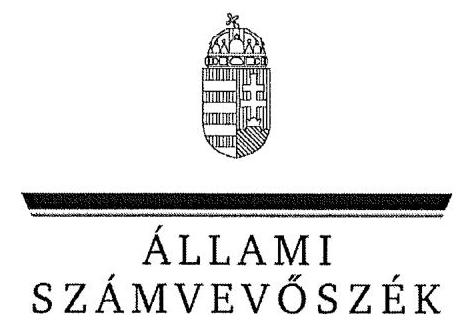
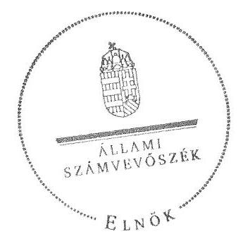

ÁLLAMI
SZÁMVEVÔSZÉK

# JELENTÉS 

az önkormányzati vagyongazdálkodás
szabályszerúségi ellenôrzéséröl
Nyékládháza

---

# Állami Számvevőszék 

Iktatószám: V-0026-082-049/2013.
Témaszám: 1065
Vizsgálat-azonosító szám: V061513

## Az ellenőrzést felügyelte:

## Makkai Mária

felügyeleti vezető
Az ellenőrzést vezette és az ellenőrzés végrehajtásáért felelős:
Schósz Attila Ferencné
ellenőrzésvezető
A számvevőszéki jelentés összeállításában közreműködött:
Lakatos József
számvevő
Az ellenőrzést végezték:
Lakatos József Ungár Ervin
számvevő

A témához kapcsolódó eddig készített számvevőszéki jelentések:
címe
sorszáma
Jelentés a helyi önkormányzatok gazdálkodási rendszerének 2007. 0822
évi átfogó és egyéb szabályszerűségi ellenőrzéséről

---

# TARTALOMJEGYZÉK 

BEVEZETÉS ..... 3
I. ÖSSZEGZŐ MEGÁLLAPÍTÁSOK, KÖVETKEZTETÉSEK, JAVASLATOK ..... 6
II. RÉSZLETES MEGÁLLAPÍTÁSOK ..... 11

1. A vagyongazdálkodási tevékenység szabályozottsága ..... 11
1.1. A feladatellátás formáinak meghatározása, a döntések megalapozottsága ..... 11
1.2. A vagyonnal gazdálkodó szervezetek szervezeti rendjének szabályozottsága, a kötelező szabályzatok megfelelősége ..... 12
1.3. A vagyongazdálkodás szabályozása ..... 13
1.4. A vagyonkezeléssel megbízott szervezetek beszámolási kötelezettségének szabályozása ..... 14
2. A vagyongazdálkodás szabályszerűsége ..... 14
2.1. A vagyon nyilvántartásának megfelelősége ..... 14
2.2. A vagyongazdálkodást érintő gazdasági események követelmények szerinti dokumentáltsága ..... 15
2.3. A vagyongazdálkodási döntések, intézkedések szabályszerűsége ..... 18
2.4. A közbeszerzési eljárás alkalmazása ..... 20
3. A vagyon változását eredményező gazdasági események szabályszerűsége ..... 20
3.1. A vagyon értékének és összetételének változása ..... 20
3.2. A vagyon fenntartására kialakított rendszer működésének megfelelősége és szabályozottsága ..... 21
4. A vagyongazdálkodás szabályszerűségére vonatkozó belső és külső ellenőrzések hasznosulása ..... 22
4.1. A belső ellenőrzés által tett megállapítások, javaslatok hasznosulása ..... 22
4.2. A könyvvizsgálatnak a vagyongazdálkodás szabályosságához való hozzájárulása ..... 23
4.3. A külső ellenőrző szervezetek által tett javaslatok hasznosulása ..... 23

---

# MELLÉKLETEK 

1. számú Nyékládháza Város Önkormányzata gazdálkodására jellemző adatok, mutatószámok
2. számú Nyékládháza Város Önkormányzata vagyonának alakulása 2007. január 1-je és 2011. december 31-e között
3. számú Nyékládháza Város Önkormányzata kötelezettségeinek alakulása 2007. január 1-je és 2011. december 31-e között

## FÜGGELÉKEK

1. számú Rövidítések jegyzéke
2. számú Értelmező szótár

---

# JELENTÉS 

## az önkormányzati vagyongazdálkodás szabályszerűségi ellenőrzéséről Nyékládháza

## BEVEZETÉS

Az ÁSZ kiemelten fontosnak tartja az ÁSZ tv. 5. § (4) bekezdése alapján az önkormányzatok vagyongazdálkodási tevékenységének, a vagyongazdálkodási szabályok betartásának ellenőrzését. Az ellenőrzés feladata, hogy értékelje a vagyongazdálkodással kapcsolatban a jogszabályokban és az önkormányzati belső szabályozásban előírtak érvényesülését a közpénzek felhasználásának átláthatósága, nyilvánossága érdekében. Az ÁSZ ellenőrzése nemcsak az ellenőrzött szervezet vagyongazdálkodásának hibáira, hiányosságaira mutat rá, számon kérve azok kijavítását, hanem megállapításaival, javaslataival segíti a közpénzekkel, a közvagyonnal való felelős gazdálkodást.

Az önkormányzati vagyon alapvető funkciója, hogy a helyi közérdeket és egyúttal az önkormányzati célok megvalósítását szolgálja. A feladatellátás terén elsősorban a kötelezően ellátandó feladatok végrehajtását hivatott szolgálni, amely mellett az önként vállalt feladatok ellátása is megvalósulhat.

## Az ellenőrzés célja annak értékelése volt, hogy az Önkormányzatnál:

- a vagyongazdálkodási tevékenység, annak szervezeti keretei szabályozottake;
- az önkormányzati vagyongazdálkodás törvényességét, szabályszerűségét biztosították-e; a vagyon értékének és összetételének változását jogszerű döntésekkel alátámasztották-e;
- a belső ellenőrzés elősegítette-e a vagyongazdálkodás szabályszerű működését, valamint hasznosultak-e a korábbi külső ellenőrzések által tett javaslatok.

Az ellenőrzés típusa: szabályszerűségi ellenőrzés
Az ellenőrzés a 2007. január 1. és 2011. december 31. közötti időszakra terjedt ki. A közbeszerzési eljárások lefolytatásának ellenőrzése a 2011. évet és a 2012. év I. negyedévét érintette. Az Nvtv. egyes rendelkezései végrehajtásának ellenőrzése a nemzetgazdasági szempontból kiemelt jelentőségű nemzeti vagyonnak minősülő forgalomképtelen vagyonelemek meghatározására, valamint a kö-zép- és hosszú távú vagyongazdálkodási terv készítésére terjedt ki 2012-től 2013. július 8 -ig, a helyszíni ellenőrzés befejezéséig.

---

Az ellenőrzés szakmai módszertana az ÁSZ hivatalos honlapján közzétett szakmai szabályokon alapult, amely a Legfőbb Ellenőrző Intézmények Nemzetközi Szervezete (INTOSAI) által kiadott nemzetközi standardok (ISSAI) figyelembevételével készült.

A vagyonváltozásokkal kapcsolatos gazdasági események közül az ellenőrzött tételeket véletlen mintavétellel választottuk ki a Polgármesteri Hivatal 20072011. évi számviteli nyilvántartásaiból. Az Önkormányzattól tanúsítványt kértünk a korábbi ÁSZ ellenőrzések vagyongazdálkodásra vonatkozó javaslatainak hasznosulásáról, a könyvvizsgáló és a külső ellenőrzési szervek vagyongazdálkodással kapcsolatos 2007-2011. évi javaslataira tett intézkedésekről, valamint a 2007-2011. évek térítésmentes vagyonátadásairól és átvételeiről.

Nyékládháza város állandó lakosainak száma 2011. január 1-jén 5151 fő volt. Az Önkormányzat kilenc tagú Képviselő-testületének munkáját négy állandó bizottság segítette. Az Önkormányzat a 2007-2011. években a Polgármesteri Hivatalon felül egy önállóan múködő és gazdálkodó (Városgondnokság), valamint négy önállóan működő költségvetési szervvel látta el a feladatát. Az óvodai, általános iskolai kötelező feladatokat az Önkormányzat saját intézményeivel, a csatornahálózat múködtetését üzemeltetési szerződéssel gazdasági társaság útján, a települési szilárd hulladék kezelését, a gyermekjóléti és családsegítési feladatokat, valamint a belső ellenőrzést társulások keretében látta el. A háziorvosi, gyermekorvosi és fogorvosi ellátást vállalkozó orvosok bevonásával biztosították. Az Önkormányzat többségi tulajdoni hányadú gazdasági társasággal nem rendelkezett.

A polgármester a 2010. évi önkormányzati választások óta tölti be tisztségét. A Polgármesteri Hivatalban a jelenlegi jegyző 2012. május 1-jétől látja el feladatát. A jegyzői munkakört 2007. június 18-tól 2012. január 31-ig a jegyző; töltötte be. 2007. január 1-jétől 2007. június 17-ig, továbbá 2012. február 1jétől 2012. április 30-ig a jegyzői munkakör betöltetlen volt, a Polgármesteri Hivatalt az aljegyző (a jelenlegi jegyző ${ }_{2}$ ) vezette.

A Polgármesteri Hivatal szervezeti egységekre nem tagolódott, a foglalkoztatott köztisztviselők száma 2011. december 31-én 14 fő volt. A költségvetési szerveknél 2011. december 31-én 103 fő közalkalmazottat foglalkoztattak.

Az Önkormányzat a 2011. évi költségvetési beszámolója szerint 812,1 millió Ft költségvetési bevételt ért el, valamint 757,7 millió Ft költségvetési kiadást teljesített. A 2011. december 31-i könyvviteli mérleg szerint 2547,5 millió Ft értékű nettó eszközvagyonnal rendelkezett, hosszú lejáratú kötelezettsége nem volt, rövid lejáratú kötelezettségei 16,5 millió Ft-ot tettek ki. Az Önkormányzatnál a 2007-2011. években rövid vagy hosszú lejáratú hitelt nem vettek igénybe, kötvényt nem bocsátottak ki, lizingszerződést nem kötöttek, készfizető kezességet, garanciát nem vállaltak, térítés nélküli vagyon átadására, átvételére, valamint PPP konstrukcióban történő fejlesztésre nem került sor.

Az Önkormányzat gazdálkodására jellemző adatokat, mutatószámokat az 1-3. számú mellékletek tartalmazzák. A jelentéstervezetben alkalmazott rövidítéseket az 1. számú függelék, az egyes fogalmak magyarázatát a 2. számú függelék tartalmazza.

---

Az ÁSZ a 2011. évi LXVI. törvény 29. § (1) bekezdése szerint a jelentéstervezetet megküldte egyeztetésre Nyékládháza Város Önkormányzata polgármesterének, aki az ÁSZ tv. 29. § (2) bekezdésében foglalt észrevételezési jogával nem élt, a jelentéstervezetre észrevételt nem tett.

---

# I. ÖSSZEGZŐ MEGÁLLAPÍTÁSOK, KÖVETKEZTETÉSEK, JAVASLATOK 

Az Önkormányzat könyvviteli mérleg szerinti nettó vagyona a 2007. év eleji 2378,9 millió Ft-ról a 2011. év végére 2547,5 millió Ft-ra, 7,1\%-kal (168,6 millió Ft-tal) nőtt. A 2007-2011. években megvalósított jelentősebb beruházások és felújítások (óvodák bővítése és felújítása, belterületi utak felújítása) az Önkormányzat kötelező feladatainak ellátásához kapcsolódtak. A beruházások és felújítások pénzügyi fedezetét hazai és európai uniós támogatásokból, valamint az Önkormányzat saját bevételeiből biztosították. A 2007-2011. évek között beruházásokra és felújításokra fordított kiadások nettó 323,2 millió Ft-os értéke az elszámolt értékcsökkenés ( 172,1 millió Ft) közel kétszeresét tette ki.

A Képviselő-testület a 2007-2010. és 2011-2014. évekre szóló gazdasági progra $\mathrm{m}_{1,2}$-ben meghatározta az önkormányzati feladatok ellátásának módját. Az Önkormányzat a kötelező és önként vállalt feladatait költségvetési szervekkel, társulásokkal, vállalkozói szerződések útján, valamint üzemeltetési szerződés keretében gazdasági társaság bevonásával látta el. Az Önkormányzat az ellenőrzött időszakban egy alkalommal döntött feladatellátás módosításáról. A gyermekjóléti alapfeladatok ellátása (a gazdaságosabb múködés érdekében) 2008. január 1-jétől társulás keretében történt.

A Képviselő-testület az önkormányzati vagyonnal való gazdálkodás szabályozása során a törvényi előírásoknak - a vagyonkezelői jog szabályozása kivételével - eleget tett. Az Önkormányzatnál a vagyongazdálkodási feladatokat és annak szervezeti kereteit a helyi sajátosságoknak megfelelően határozták meg. Az Ötv. előírásaival összhangban rendelkeztek az önkormányzati feladatellátást biztosító törzsvagyon, azon belül a forgalomképtelen és a korlátozottan forgalomképes vagyontárgyak köréről, nyilvántartási rendjéről és hasznosításának szabályairól. Az Önkormányzat - az Nvtv.-ben foglaltaknak megfelelően - határidőn belül kijelölte a nemzetgazdasági szempontból kiemelt jelentőségű, nemzeti vagyonként forgalomképtelen törzsvagyonnak minősített vagyonelemeket. A Képviselő-testület a 2013. évben elfogadta az Önkormányzat közép- és hosszú távú vagyongazdálkodási tervét. Az Ötv. előírása ellenére azonban nem rendelkeztek a vagyonkezelői jog részletes szabályairól (vagyonkezelési szerződést a 2007-2011. években nem kötöttek). A megalapozott vagyongazdálkodási döntések meghozatala érdekében - célszerűsége ellenére - nem írták elő a döntés előkészítés folyamatában a költséghaszon elemzés készítésének, a tulajdonosi jogok védelme érdekében a garanciális elemek rögzítésének kötelezettségét, a támogatásokkal megvalósuló beruházásokkal létrejövő létesítmények fenntarthatóságának vizsgálatát.

A jegyző ${ }_{1,2}$ kialakította a Polgármesteri Hivatal számviteli rendjét, kiadta a helyi sajátosságoknak megfelelő számviteli politikát és a hozzá kapcsolódó (selejtezési, értékelési és pénzkezelési) szabályzatokat. A 2010. évtől az üzemeltetésre átadott eszközök leltározásának a leltározási szabályzatban rögzített módja nem felelt meg az Áhsz.-ben foglaltaknak, mivel abban nem írták elő, hogy

---

az üzemeltetésre átadott eszközöket az üzemeltetést végző szerv által elkészített, hitelesített leltárral kell alátámasztani.

Az Önkormányzatnál a vagyongazdálkodás múködésének szabályszerűségét hiányosan biztosították. A 2007-2011. években az Ötv. előírásának megfelelően elkészítették a vagyonkimutatást és azt a zárszámadási rendelettervezet előterjesztésekor a Képviselő-testület tájékoztatására bemutatták. A vagyonkimutatások tartalmazták az Önkormányzat és intézményei saját vagyonát törzsvagyon és törzsvagyonon kívüli, egyéb vagyon bontásban, azonban a 2010. és 2011. években a saját tőke elemeit nem a hatályos Áhsz.ben szereplő megnevezéseknek megfelelően mutatták be. A 2007. évben az ingatlanvagyon-kataszternek az analitikus és a földhivatali nyilvántartással való egyezőségét biztosították, míg a 2008. évben az egyezőség nem állt fenn. A 2008. évben egy alkalommal, 0,5 millió Ft értékű földterület értékesítését követően az ingatlan analitikus nyilvántartásból való kivezetése nem történt meg. A 2009. évtől - a 147/1992. (XI. 6.) Korm. rendeletben foglaltak ellenére - nem vezettek az Önkormányzat tulajdonában lévő ingatlanvagyonról kataszteri nyilvántartást. Az Önkormányzatnál a 2007-2011. években - az üzemeltetésre átadott eszközök kivételével - eleget tettek a leltározási kötelezettségnek. A 2007-2009. években - az Áhsz.-ben és a leltározási szabályzatban foglaltak ellenére - leltárral nem támasztották alá a mérlegben kimutatott, üzemeltetésre átadott eszközök állományi értékének valódiságát. A 2010-2011. években az üzemeltetésre átadott eszközökről készült leltár nem tartalmazta az Önkormányzat által a 2007. évben átadott - és az Önkormányzat nyilvántartásában szereplő - bruttó 2,0 millió Ft értékű eszközt.

A gazdálkodási jogkörök gyakorlásával kapcsolatban ellenőrzött esetekben a 2007-2011. évek között a kötelezettségvállalásokat 0,6 millió Ft kiadás esetében nem foglalták írásba, a kötelezettségvállalást az ellenőrzött tételek több mint felénél nem előzte meg ellenjegyzés (összesen 31,5 millió Ft kiadásnál), és nem történt meg a szakmai teljesítés igazolása, illetve a szakmai teljesítést igazoló aláírása ellenére nem megfelelően látta el ellenőrzési feladatát, összesen 30,6 millió Ft kiadás esetében. Mindezek következtében nem történt meg a fedezet meglétének, a szabad előirányzat rendelkezésre állásának, a kifizetés jogosságának, összegszerűségének és teljesítésének ellenőrzése. Az érvényesítő és az utalványok ellenjegyzője ezáltal nem megfelelően látta el feladatát, nem kifogásolta az előzetes írásbeli kötelezettségvállalás, az ellenjegyzés és a szakmai teljesítés igazolásának elmaradását. A 2007-2009. években a szakmai teljesítés igazoló 105,0 millió Ft értékű (ingatlanok értékesítéséből befolyt) bevétel beszedésének elrendelése előtt nem ellenőrizte a bevételek jogosságát, összegszerűségét; az érvényesítő és az utalvány ellenjegyzője mindezt nem kifogásolta. A kötelezettségvállalásokról vezetett nyilvántartásból nem volt megállapítható az évenkénti kötelezettségvállalás, illetve a kötelezettségvállalással nem terhelt, szabad előirányzatok összege, azonban a 2007-2011. évi költségvetések végrehajtása során kötelezettségvállalásra és utalványozásra csak a jóváhagyott kiadási előirányzatok mértékéig került sor. A szakmai teljesítésigazolás, érvényesítés és utalvány ellenjegyzés folyamatba épített ellenőrzési feladatai ellátásának hiányosságai annak ellenére fennálltak, hogy azokat az ÁSZ 2007. évi ellenőrzése is megállapította.

---

Az önkormányzati vagyon értékének és összetételének változását eredményező gazdasági eseményeket - a kábel-tv hálózat értékesítésének kivételével - jogszerú döntésekkel támasztották alá. A nettó 4,9 millió Ft nyilvántartási értékű kábel-tv hálózat 2007. évi értékesítése - az Áht. ${ }_{1}$, valamint a vagyongazdálkodási rendelet előírásai ellenére - nyilvános versenytárgyalás és forgalmi értékbecslés készítése nélkül történt. A Képviselő-testület az értékesítésekről, a kábel-tv hálózat kivételével - a vagyongazdálkodási rendelet előírásának megfelelően - értékbecsléseket tartalmazó előterjesztések alapján hozta meg a döntéseket. A vagyonváltozásokról hozott képviselő-testületi döntésekkel azonos tartalmú szerződéseket, megállapodásokat kötöttek, amelyekbe az Önkormányzat érdekeit védő garanciális elemeket - belső szabályozás hiányában is - beépítették. Az Önkormányzat a 2011. évben és a 2012. év I. negyedévében az építési beruházásokkal kapcsolatos közbeszerzési eljárásokat lefolytatta, a Kbt. ${ }_{1,2}$-ben előírt egybeszámítási kötelezettségnek eleget tett. A becsült érték alapján megalapozottan választották ki az alkalmazandó eljárásrendet.

A jegyző ${ }_{1,2}$ hiányosan biztosította a közérdekú adatok közzétételét, mivel az Eisztv. és a 18/2005. (XII. 27.) IHM rendeletben foglaltak ellenére elmaradt a 2008-2011. évek elemi költségvetéseinek, beszámolóinak, valamint a vagyongazdálkodással összefüggő, nettó ötmillió Ft-ot elérő szerződések közül egy 34,6 millió Ft összegű szerződés közzététele.

Az Önkormányzat a belső ellenőrzési feladatokat társulás keretében látta el. A 2007-2011. években a belső ellenőrzések végrehajtására kockázatelemzéssel megalapozott ellenőrzési tervek alapján került sor, melyeket a Képviselőtestület elfogadott. A 2008-2011. évek belső ellenőrzési terveibe - az ÁSZ 2007. évi ellenőrzésének javaslatát hasznosítva - a közbeszerzések ellenőrzését beépítették. A vagyongazdálkodást érintő belső ellenőrzések a közbeszerzéseket, a Polgármesteri Hivatal átfogó szabályszerűségi ellenőrzését és a korábbi ellenőrzésekkel kapcsolatos intézkedési tervek utóellenőrzését érintették. Az elvégzett belső ellenőrzésekről készült jelentésekben megfogalmazott javaslatokra a jegy$z^{2}{ }_{1}$ intézkedési tervet készített. Az ellenőrzésekkel és javaslatokkal a belső ellenőrzés jelentései - a kötelezettségvállalásokról vezetett nyilvántartás kivételével hozzájárultak a vagyongazdálkodás szabályszerű működéséhez. A polgármester ${ }_{1,2}$ a zárszámadási rendelettervezettel egyidejűleg a Képviselő-testület elé terjesztette az éves ellenőrzési jelentést és az éves összefoglaló ellenőrzési jelentést.

A külső ellenőrző szervek közül a Munkácsy úti óvoda beruházással kapcsolatban a MÁK három alkalommal, a Mátyás király úti óvoda beruházás esetében a VÁTI Nonprofit Kft. egy alkalommal ellenőrzött, melyek során hiányosságokat nem tártak fel. A Hejő patak rekonstrukció esetében a Közreműködő szervezet egy alkalommal végzett ellenőrzést, melynek megállapításaival kapcsolatban az Önkormányzat intézkedett.

Az Állami Számvevőszékről szóló 2011. évi LXVI. törvény 33. § (1) bekezdésében foglaltak értelmében a jelentésben foglalt megállapításokhoz kapcsolódó intézkedési tervet köteles az ellenőrzött szervezet vezetője összeállítani, és azt a jelentés kézhezvételétől számított 30 napon belül az ÁSZ részére megküldeni. Amennyiben az intézkedési tervet határidőben nem küldi meg a szervezet, vagy az nem elfogadható, az ÁSZ elnöke a hivatkozott törvény 33. § (3) bekezdés a)-b) pontjaiban foglaltakat érvényesítheti.

---

Az ellenőrzés intézkedést igénylő megállapításai és javaslatai:

# a polgármesternek 

A 2009-2011. években nem vezették folyamatosan az Önkormányzat tulajdonában lévő ingatlanvagyonról a kataszteri nyilvántartást.

A gazdálkodási jogkörök gyakorlásával kapcsolatban ellenőrzött esetekben a 2008. és a 2011. években a kötelezettségvállalásokat 0,6 millió Ft kiadás esetében nem foglalták írásba. A 2007-2011. évek között az ellenőrzött tételek több mint felénél a kötelezettségvállalást nem előzte meg ellenjegyzés, összesen 31,5 millió Ft kiadásnál, és nem történt meg a szakmai teljesítés igazolása, illetve a szakmai teljesítést igazoló aláírása ellenére nem megfelelően látta el feladatát összesen 30,6 millió Ft kiadás esetében.

Javaslat:
Intézkedjen a számvevőszéki jelentés megállapításai alapján az ingatlanvagyonkataszterrel és a gazdálkodási jogkörök gyakorlásával összefüggésben feltárt hiányosságok, szabálytalanságok körülményeinek kivizsgálásáról, és a vizsgálat eredményének függvényében tegye meg a szükséges munkajogi intézkedéseket.

## a jegyzőnek

1. A 147/1992. (XI. 6.) Korm. rendelet 1. § (1) bekezdésének előírása ellenére a 20092011. években nem vezették folyamatosan az Önkormányzat tulajdonában lévő ingatlanvagyonról a rendelet 1-5. számú mellékleteinek megfelelő tartalmú ingatlan-vagyon-katasztert, mivel a 2009. évtől kezdődően a katasztert a MÁK által biztosított, az ingatlanvagyon-statisztikai jelentés elkészítését támogató program használatával váltották fel. Ez nem volt alkalmas az ingatlanvagyon tételes, helyrajzi szám szerinti nyilvántartására. Ennek következtében 2008-2011. évek között nem biztosították az ingatlanvagyon számviteli nyilvántartásában szereplő bruttó értékek és az ingatlanvagyon-kataszter, valamint az ingatlanvagyon-kataszter és a földhivatali in-gatlan-nyilvántartás azonos tartalmú adatai közötti egyezőséget.

Javaslat:
Intézkedjen, hogy a 147/1992. (XI. 6.) Korm. rendelet 1. § (1) bekezdés előírásának megfelelően az Önkormányzat tulajdonában lévő ingatlanvagyonról, a rendelet 1-5. számú mellékleteinek megfelelő tartalommal folyamatosan vezessék az ingatlanva-gyon-katasztert, továbbá biztosítsák az 1. § (2) bekezdésében foglalt előírásnak megfelelően a kataszter és a földhivatal ingatlan-nyilvántartásának azonos tartalmú adatai közötti, valamint az 1. § (3) bekezdésében rögzítetteknek megfelelően a számviteli nyilvántartás és az ingatlanvagyon-kataszter adatai közötti egyezőséget.
2. A 2007-2009. évekre az Önkormányzat az Áhsz. 37. § (4) bekezdésében foglalt előírás ellenére nem támasztotta alá az üzemeltetésre átadott eszközök mérleg szerinti értékét leltárral. A 2010-2011. években az üzemeltetést végző szervek által elkészített, hitelesített leltár nem tartalmazta teljes körűen az üzemeltetésre átadott eszközöket.

---

Javaslat:
Intézkedjen, hogy az üzemeltetésre átadott eszközökről a könyvviteli mérleg alátámasztásához az Áhsz. 37. § (4) bekezdés előírásának megfelelően, az üzemeltetők által évente elvégzett és hitelesített leltárak teljes körűen álljanak rendelkezésre.
3. A vagyongazdálkodás egyes területeivel kapcsolatos kiadások teljesítését és a bevételek beszedését megelőzően a gazdálkodási és ellenőrzési jogkörök gyakorlásával felhatalmazott személyek nem végezték el az előírt ellenőrzési feladatokat. Az Ámr. 134. § (8)-(9) bekezdése, illetve az Ámr. 3 74. § (1) és (3) bekezdése ellenére összesen 0,6 millió Ft összegű kiadást előzetes írásbeli kötelezettségvállalás nélkül teljesítettek, a kötelezettségvállalást nem előzte meg ellenjegyzés összesen 31,5 millió Ft kiadás esetében. Az Ámr. 135. § (1) és (3) bekezdése, illetve az Ámr. 2 76. § (1) bekezdése és 77. § (1) bekezdése ellenére a szakmai teljesítés igazolója (összesen 30,6 millió Ft kiadás, illetve 105,0 millió Ft bevétel) és az érvényesítő (összesen 32,6 millió Ft kiadás, illetve 105,0 millió Ft bevétel esetében) nem látta el ellenőrzési feladatát.

Javaslat:
Intézkedjen, hogy a pénzügyi ellenjegyző, a teljesítést igazoló és az érvényesítő - az Áht. 2 37. § (1) bekezdése, az Ávr. 57. § (1) bekezdése, valamint az Ávr. 58. § (1) bekezdése előírásainak megfelelően - végezze el ellenőrzési feladatait.
4. A jegyző ${ }_{1,2}$ hiányosan biztosította a közérdekű adatok közzétételét, mivel az Eisztv. 6. § (1) bekezdéséhez rendelt mellékletben, valamint a 18/2005. (XII. 27.) IHM rendelet 2. számú mellékletének 3.2. pontjában foglaltak ellenére elmaradt a 2008-2011. évek elemi költségvetéseinek, beszámolóinak, továbbá a vagyongazdálkodással öszszefüggő, nettó ötmillió Ft-ot elérő szerződések közül egy 34,6 millió Ft összegű szerződés közzététele.

Javaslat:
Intézkedjen az Infotv. 37. § (1) bekezdése alapján az 1. számú mellékletében meghatározott adatok közzétételéről.
5. Az ingatlanok értékesítése során - a kijelölt mintatételek alapján - 2009-ben áfa nélkül 4,4 millió Ft, 2011-ben 2,0 millió Ft értékben egy földterület és egy ingatlan értékesítése esetében a vagyontárgyakat az ingatlanvagyon analitikus nyilvántartásában nem a nyilvántartási, hanem az értékesítési ár alapján vezették ki az Áhsz. 34. § (2) bekezdésében foglalt előírások ellenére.

Javaslat:
Intézkedjen az ingatlanvagyon analitikus nyilvántartásának korrekciójáról annak érdekében, hogy az értékesített földterület és az ingatlan kivezetése az Áhsz. 34. § (2) bekezdésében foglalt előírásoknak megfelelően nyilvántartási ár szerint szerepeljen.

---

# II. RÉSZLETES MEGÁLLAPÍTÁSOK 

## 1. A VAGYONGAZDÁLKODÁSI TEVÉKENYSÉG SZABÁLYOZOTTSÁGA

### 1.1. A feladatellátás formáinak meghatározása, a döntések megalapozottsága

Az Önkormányzat - az Ötv. 91. § (7) bekezdésében foglaltaknak eleget téve - a 2007-2010. évekre, illetve a 2011-2014. évekre szóló gazdasági program ${ }_{1,2}$ ben meghatározta a kötelezően ellátandó és önként vállalt feladatainak körét és a feladatellátás módját az Ötv. 8. § (2) bekezdésének megfelelően. A feladatellátás mértékét az éves költségvetési rendeletekben határozták meg. Az Önkormányzat a gazdasági program ${ }_{1,2}$-ben meghatározott célkitűzéseinek megvalósítását hitel felvétele nélkül, pályázati források bevonásával tervezte. A gazdasági program ${ }_{1,2}$ általános fejlesztési célkitűzései között a városi infrastruktúra, ipar, környezetvédelem és idegenforgalom fejlesztése szerepelt. A konkrét fejlesztési elképzelések a vízrendezés és csapadékvíz elvezetés, a helyi közutak, óvodák és az általános iskola fejlesztésére, továbbá az egészségügyi és szociális ellátások biztosítására vonatkoztak.

Az Önkormányzat a 2007-2011. években az egészségügyi alapellátást, az óvodai nevelést és az általános iskolai oktatást, a könyvtári feladatok ellátását, az idősek nappali ellátását és a szociális ellátásokat, valamint a hulladékszállítást, közvilágítást, a helyi közutak és a köztemető fenntartását határozta meg kötelezően ellátandó feladatként. Az alapellátáson túli egészségügyi ellátásról, a Városi televízió működtetéséről és a Nyékládházi Krónika kiadásáról, mint önként vállalt feladatokról, a négy önállóan működő intézménye ${ }^{1}$, illetve két önállóan működő és gazdálkodó intézménye ${ }^{2}$ útján gondoskodott. Az egészségügyi ellátással kapcsolatos kötelező és önként vállalt feladatait a háziorvosokkal és szakorvosokkal kötött szerződésekkel biztosította. Az Önkormányzat a 2011. évtől a gazdasági program ${ }_{2}$-ben az önként vállalt feladatainak körét a civil szerveződések, a versenysport, a hagyományőrző rendezvények és települési kapcsolatok, valamint az egyházak támogatásával bővítette, amelyeket a Polgármesteri Hivatal látott el.

Az Önkormányzat a csatornahálózat működtetését az ellenőrzött időszakban üzemeltetési szerződés keretében biztosította. A település egészséges ivóvízellátását a fogyasztókkal kötött szerződéseken keresztül gazdasági társaság nyújtotta, melyben az Önkormányzat - az ellenőrzési időszakot megelőzően apportált vízvezeték-hálózat ellenében kapott részvénycsomag révén - kisebbségi tulajdoni hányaddal rendelkezett. Az Önkormányzat a lakossági hulladékgazdál-

[^0]
[^0]:    ${ }^{1}$ Gyermekvarázs Óvoda, Kossuth Lajos Általános Iskola, Furmann Imre Művelődési Ház és Könyvtár, Idősek Klubja önállóan működő intézmények, melyek gazdálkodással kapcsolatos feladatait az önállóan működő és gazdálkodó Városgondnokság látta el.
    ${ }^{2}$ A Polgármesteri Hivatal és a Városgondnokság volt.

---

kodással kapcsolatos feladatokat a - 2001. évben 80 településsel közösen alapított - Sajó-Bódva Völgye és Környéke Hulladékkezelési Önkormányzati Társulással, a belső ellenőrzést a Többcélú társulás keretében látta el.

Az Önkormányzat az ellenőrzött időszakban egy alkalommal döntött feladatellátás módosításáról. A gyermekjóléti és családsegítési alapfeladatok ellátása a 2007. évben az önkormányzati intézmény, 2008. január 1-jétől Muhi Község Önkormányzatával kötött megállapodás alapján a Gyermekjóléti társulás keretében történt. A feladatellátás módjának megváltoztatásakor az előterjesztésben a polgármester ${ }_{1}$ nem fogalmazott meg alternatív javaslatokat a feladatellátás formájára, körére. A feladatellátás társulás keretében történő ellátását a gazdaságosabb múködéssel indokolták.

# 1.2. A vagyonnal gazdálkodó szervezetek szervezeti rendjének szabályozottsága, a kötelező szabályzatok megfelelősége 

A Képviselő-testület a 2007-2011. években az Ötv.-ben foglaltak szerint megalkotott önkormányzati SZMSZ ${ }_{1,2}$ alapján múködött. A Képviselő-testület nem élt az Ötv. 9. § (3) bekezdésében biztosított lehetőségével, vagyongazdálkodást és tulajdonosi jogokat érintő hatásköröket nem ruházott át. A vagyonnal gazdálkodó, közfeladatot ellátó költségvetési szervek - a Polgármesteri Hivatal és a Városgondnokság - alapító okirataiban a Képviselő-testület meghatározta alaptevékenységüket és a feladatellátást szolgáló vagyont.

A jegyzo̊ ${ }_{1,2}$ - a Htv. 140. § (1) bekezdés c) pontjában foglalt előírás szerint kialakította a Polgármesteri Hivatal számviteli rendjét. A Polgármesteri Hivatal rendelkezett az Áhsz.-nek és a helyi sajátosságoknak megfelelő számviteli politikával és az annak keretében elkészített pénzkezelési, selejtezési és értékelési szabályzattal. A jegyző ${ }_{1,2}$ gondoskodott az egységes számviteli elvek szerinti beszámoló elkészítéséről.

A Képviselő-testület nem élt az Áhsz. 37. § (7) bekezdése szerinti lehetőséggel, nem alkotott rendeletet a kétévenkénti leltározásról. A leltározási szabályzat a 2007-2009. évek között - az Áhsz. 37. § (3) bekezdésében rögzítetteknek megfelelően - tartalmazta az üzemeltetésre átadott eszközök leltározásának módját. A 2005. évben kiadott leltározási szabályzatot nem módosították, a 2010. évtől az üzemeltetésre átadott eszközök leltározásának (a leltározási szabályzatban rögzített) módja nem felelt meg az Áhsz. 37. § (4) bekezdésében ${ }^{3}$ foglaltaknak, mivel nem írták elő, hogy az üzemeltetésre átadott eszközöket az üzemeltetést végző szerv által elkészített, hiteles leltárral kell alátámasztani.

A jegyző ${ }_{1,2}$ az operatív gazdálkodással és annak munkafolyamatba épített ellenőrzésével összefüggő jogkörök gyakorlásának rendjét, továbbá a velük kapcsolatos összeférhetetlenségi követelményeket a kötelezettségvállalási szabályzatban kialakította.

[^0]
[^0]:    ${ }^{3}$ Megállapította a 317/2009. (XII. 29.) Korm. rendelet 18. §-a. Először a 2010. évről készített beszámolókra kellett alkalmazni.

---

# 1.3. A vagyongazdálkodás szabályozása 

A Képviselő-testület az önkormányzati $\mathrm{SZMSZ}_{1,2}$-ben és a vagyongazdálkodási rendeletben a helyi sajátosságok figyelembe vételével határozta meg a vagyongazdálkodási feladatokat. Az Önkormányzat - a Htv. 138. § (1) bekezdés j) pontja alapján - a vagyongazdálkodási rendeletben rögzítette az önkormányzati vagyonnal való felelős gazdálkodás szabályait. Az Ötv. 79. § (2) bekezdésének megfelelően meghatározták az önkormányzati feladatellátást biztosító törzsvagyon körét, azon belül a forgalomképtelen és a korlátozottan forgalomképes vagyonelemeket, illetve a forgalomképes vagyon körébe tartozó vagyontárgyakat. A törzsvagyon elkülönített nyilvántartásának kötelezettségét a 2007-2011. évekre a számviteli politika részét képező számlarendben írták elő.

Az Önkormányzat a vagyon hasznosításának eljárásrendjét a vagyongazdálkodási rendeletben szabályozta. Önkormányzati ingó és ingatlanvagyon elidegenítése, használati, illetve hasznosítási jogának átengedése - értékhatártól függetlenül - a vagyongazdálkodási rendelet 14. §-ában rögzítettek kivételével, csak nyilvános versenytárgyalás útján, a legjobb ajánlattevőnek volt lehetséges. A vagyongazdálkodási rendeletben meghatározták a forgalomképesség megváltoztatásának szabályait, az egyes vagyonelemek hasznosítási módját és az ingyenes átruházásra vonatkozó szabályokat. Az Önkormányzat megtiltotta a korlátozottan forgalomképes ingatlanok elidegenítését és biztosítékul történő felhasználását. A vagyontárgyak hasznosítását az Önkormányzat a Képviselő-testület engedélyéhez kötötte.

A Képviselő-testület - az Ötv. 80/B. § ellenére ${ }^{4}$ - nem rendelkezett a vagyonkezelői jog részletes szabályairól. Az Önkormányzat - célszerűsége ellenére - nem írta elő a fejlesztések során létrehozott vagyontárgyak fenntarthatósága, várható üzemeltetési költsége felmérésének kötelezettségét. A döntés előkészítés folyamatában a költség-haszon elemzés készítését, az Önkormányzat tulajdonosi jogainak, érdekeinek védelmét szolgáló garanciális elemek szerződésben, egyéb dokumentumban való rögzítésének kötelezettségét nem írták elő.

A vagyongazdálkodási rendeletben a hasznosításra szánt vagyon értékének megállapítása céljából előírták az értékbecslés készítésének kötelezettségét. A Pénzügyi bizottság részére az önkormányzati $\mathrm{SZMSZ}_{1,2}$-ben előírták a beszámolási kötelezettséget a vagyon változásának figyelemmel kíséréséről.

Az Nvtv. 18. § (1) bekezdése alapján az Önkormányzat határidőn belül megjelölte a forgalomképtelen vagyonából a nemzetgazdasági szempontból kiemelt jelentőségű nemzeti vagyonnak minősített vagyonelemeket. A helyszíni ellenőrzés alatt elkészítették, és a Képviselő-testület elfogadta az Nvtv. 9. § (1) bekezdésében előírt közép- és hosszú távú vagyongazdálkodási tervet ${ }^{5}$.

[^0]
[^0]:    ${ }^{4}$ 2012. január 1-jétől az Mötv. 109. §-a szabályozza.
    ${ }^{5}$ A Képviselő-testület az 52/2013. (VI. 25.) számú határozatával fogadta el.

---

# 1.4. A vagyonkezeléssel megbízott szervezetek beszámolási kötelezettségének szabályozása 

Az Önkormányzat tulajdonában lévő vagyont kezelésre nem adott át, az Ötv. 80/A. § előírása szerinti vagyonkezelési szerződést a 2007-2011. években nem kötöttek.

Az Önkormányzat tulajdonát képező szennyvízcsatorna hálózat üzemeltetésre történő átadásáról 2001. december 31-én 2012. december 31-ig szóló, határozott idejű üzemeltetési szerződést kötöttek a GW-Borsodvíz Kft-vel (a Borsodvíz Zrt. jogelődjével), mint üzemeltetővel. A szerződés szerint az üzemeltető feladata volt az üzemeltetés folyamatosságának biztosítása és az ehhez szükséges karbantartási munkák elvégzése ${ }^{6}$, azonban az Önkormányzat az üzemeltetett vagyonnal kapcsolatosan leltározási ${ }^{7}$ és beszámolási kötelezettséget nem írt elő. A Borsodvíz Zrt. az éves beszámolók keretében adott számot a részvényes önkormányzatok felé a tevékenységéről, amelyekben az üzemeltetett eszközökön végzett felújításokról nem adott tájékoztatást.

## 2. A VAGYONGAZDÁLKODÁs SZABÁLYSZERŰSÉGE

### 2.1. A vagyon nyilvántartásának megfelelősége

Az Önkormányzatnál a 2007-2011. évek között betartották az Ötv. 78. § (2) bekezdésének előírását, minden évben elkészítették a vagyonkimutatást, és azt a zárszámadási rendelettervezet előterjesztésekor - az Áht. 118. § (2) bekezdése 2. c) pontjának előírása szerint - a Képviselő-testület részére tájékoztatásul bemutatták. A vagyonkimutatások tartalmazták az Önkormányzat és intézményei saját vagyonát tételesen, törzsvagyon és törzsvagyonon kívüli, egyéb vagyon bontásban, azonban a 2010. és a 2011. évi vagyonkimutatásokban a saját tőke elemeit nem a hatályos Áhsz. 1. számú mellékletében szereplő könyvviteli mérleg előírt tagolása szerinti megnevezéseknek megfelelően mutatták be.

Az Önkormányzat a 2007-2011. években eleget tett az Ötv. 78. § (2) bekezdésében és a számlarendben foglalt előírásnak, mivel a főkönyvi számlák alábontásával, valamint a számlákhoz kapcsolódó analitikus nyilvántartások vezetésével biztosította a törzsvagyon (ezen belül a forgalomképtelen, illetve korlátozottan forgalomképes vagyon) elkülönített nyilvántartását.

A 2007. évben az ingatlanvagyon-kataszternek az analitikus nyilvántartással és a földhivatali nyilvántartással való egyezőségét biztosították. A 2008. évben egy alkalommal, egy 0,5 millió Ft értékű földterület értékesítését követően az ingatlan analitikus nyilvántartásból való kivezetése nem történt meg. Az Önkormányzatnál ezáltal - a 147/1992. (XI. 6.) Korm. rendelet 1. § (2)-(3) bekez-

[^0]
[^0]:    ${ }^{6}$ Az üzemeltetési szerződés 2008. március 14-i módosítását követően a 2008. évtől a felújítások évente (áfa nélkül) 2,0 millió Ft összeghatárig az Önkormányzat feladatát képezték.
    ${ }^{7}$ A leltározási feladatot a 2010. szeptember 8-i megállapodásban rögzítették.

---

désében, valamint a 2. számú mellékletében foglaltak ellenére - a 2008. évben az ingatlanvagyon-kataszternek az analitikus nyilvántartással és a földhivatali nyilvántartással való egyezősége nem állt fenn.

Az ingatlanok értékesítése során - a kijelölt mintatételek alapján - a 2009. évben áfa nélkül 4,4 millió Ft, 2011-ben 2,0 millió Ft értékben egy földterület és egy ingatlan értékesítés esetében a vagyontárgyakat az ingatlanvagyon analitikus nyilvántartásából nem a nyilvántartási, hanem az értékesítési ár alapján vezették ki az Áhsz. 34. § (2) bekezdésében foglalt előírás ellenére, melynek helyesbítése nem történt meg.

Az Önkormányzat az ingatlanvagyon nyilvántartására a 2007-2008. években alkalmazott programot, a 2009. évtől kezdődően azt a MÁK által biztosított, az ingatlanvagyon-statisztikai jelentés elkészítését támogató program használatával váltotta fel, amely nem volt alkalmas az ingatlanvagyon tételes, helyrajzi szám szerinti - a 147/1992. (XI. 6.) Korm. rendelet előírásainak megfelelő nyilvántartására. Az Önkormányzatnál ezáltal a 2009. évtől a 147/1992. (XI. 6.) Korm. rendelet 1. § (1) bekezdésének előírása ellenére nem vezettek folyamatosan az Önkormányzat tulajdonában lévő ingatlanvagyonról a fenti rendelet 1-5. számú mellékletének megfelelő tartalmú ingatlanvagyonkatasztert, továbbá a jegyző, nem gondoskodott a 147/1992. (XI. 6.) Korm. rendelet 2. § (1)-(2) bekezdése szerinti kataszteri napló vezetéséről.

Az Önkormányzatnál a 2007-2011. években az üzemeltetésre átadott eszközök kivételével eleget tettek a leltározási kötelezettségnek december 31-ei fordulónappal. Az Önkormányzat - az Áhsz. 37. § (2) bekezdésében és a leltározási szabályzatban foglaltak ellenére - a 2007-2009. években leltárral nem támasztotta alá a mérlegben kimutatott, üzemeltetésre átadott eszközök állományi értékének valódiságát. A 2010-2011. években az üzemeltetésre átadott eszközök esetében (a leltározási szabályzat nem megfelelő előírása ellenére is) a leltárfelvételt a Borsodvíz Zrt. által elkészített és megküldött, hitelesített leltárral támasztották alá. A 2011. évi leltárt azonban - felszólítást követően - 2012. június 20 -án küldték meg az Önkormányzat számára, ily módon a beszámoló készítésének időpontjában - az Áhsz. 37. § (4) bekezdésének előírása ellenére - a mérleg alátámasztásaként a leltár nem állt rendelkezésre. Az üzemeltetésre átadott eszközök leltára a 2010-2011. években nem tartalmazta az Önkormányzat által 2007. május 24 -én a Borsodvíz Zrt. részére üzemeltetésre átadott - és az Önkormányzat nyilvántartásában szereplő - bruttó 2,0 millió Ft értékű víznyomásfokozót.

# 2.2. A vagyongazdálkodást érintő gazdasági események követelmények szerinti dokumentáltsága 

A gazdálkodási jogkörök gyakorlásának rendjét, az összeférhetetlenségi követelményeket a kötelezettségvállalási szabályzatban meghatározták. A polgármester ${ }_{1,2}$ - összeférhetetlensége, illetve akadályoztatása esetére - felhatalmazást adott kötelezettségvállalásra és utalványozásra. A jegyzö ${ }_{1,2}$ gondoskodott a szakmai teljesítésigazolást végzők kijelöléséről, írásbeli megbízást adott az érvényesítés feladatának ellátására, és kijelölte a kötelezettségvállalás és utalványozás ellenjegyzésére jogosultakat. A gazdálkodási jogkörök gyakorlása során

---

betartották az - Ámr. 1 138. § (1)-(3) bekezdéseiben, valamint az Ámr. 2 80. § (1)-(2) bekezdésében ${ }^{8}$ rögzített - összeférhetetlenséget kizáró követelményeket.

A Polgármesteri Hivatalnál a kötelezettségvállalásokról vezetett kézi nyilvántartásból nem volt megállapítható - az Ámr. 134. § (13), illetve az Ámr. 2 75. § (1) bekezdésében ${ }^{9}$ előírtak ellenére - az évenkénti kötelezettségvállalás, illetve a kötelezettségvállalással nem terhelt, szabad előirányzatok öszszege. A nyilvántartás hiányossága ellenére a 2007-2011. évi költségvetések végrehajtása során kötelezettségvállalásra és utalványozásra csak a jóváhagyott kiadási előirányzatok mértékéig került sor.

Az Önkormányzatnál a 2007-2011. évek között a kijelölt mintában szereplő kötelezettségvállalásokat - az Áht. ${ }^{10}$, az Ámr. ${ }_{1} 134 . \S$ (8) bekezdésében és az Ámr. 2 74. § (1) bekezdésében ${ }^{11}$ foglaltak ellenére - négy alkalommal (az ellenőrzött tételek $14,8 \%$-a esetében), a kötelező feladatokhoz kapcsolódó óvodaépítési és útfelújítási feladatok esetében, összesen 0,6 millió Ft kiadást érintően nem foglalták írásba.

A Polgármesteri Hivatalban a 2007-2011. években a vagyongazdálkodás egyes területeivel kapcsolatos kiadások teljesítését és a bevételek beszedését megelőzően a gazdálkodási és ellenőrzési feladatokat az arra felhatalmazott és kijelölt személyek látták el, azonban az alábbi esetekben nem - az Ámr. ${ }_{1,2}$-ben előírt a jogszabályi és a kötelezettségvállalási szabályzat előírásainak megfelelően végezték el ellenőrzési feladataikat:

- az Ámr. 1 134. § (8) bekezdésében és az Ámr. 2 74. § (1) bekezdésében ${ }^{12}$ előírtak ellenére a 2007-2011. években (az ellenőrzött.tételek 51,9\%-ánál) az arra kijelölt személy ellenjegyzése nem előzte meg - áfa nélkül - 31,5 millió Ft értékű kötelezettség vállalását az Önkormányzat kötelező feladatainak ellátásához kapcsolódó épület beruházások, út- és épület felújítások esetében. Ezáltal - az Ámr. 1 134. § (9) bekezdés a)-c), illetve az Ámr. 2 74. § (3) bekezdés a)-c) ${ }^{13}$ pontjaiban foglaltak ellenére - a kötelezettségvállalás ellenjegyzője nem végezte el ellenőrzési feladatát, nem győződött meg a kiadási előirányzatok rendelkezésre állásáról és a fedezet meglétéről;
- a szakmai teljesítés igazolására a jegyző ${ }_{1,2}$ által kijelölt személyek ellenőrzési feladataikat a 2007-2011. években - áfa nélkül - 30,6 millió Ft, kötelező feladat ellátásával összefüggésben felmerült (óvoda, iskola és útfelújításokhoz kapcsolódó, az ellenőrzött tételek 55,6\%-át kitevő esetben) kiadás teljesítése előtt nem végezték el, illetve nem megfelelően végezték el az Ámr. ${ }_{1} 135 . \S$

[^0]
[^0]:    ${ }^{8}$ 2012. január 1-jétől az Ávr. 60. § (1)-(2) bekezdése írja elő.
    ${ }^{9}$ 2008. január 1-jétől az Ámr. ${ }_{1}$ 25. számú melléklete, 2012. január 1-jétől az Ávr. 56. § (1) bekezdése tartalmazza.
    ${ }^{10}$ 2009. január 1-jétől az Áht. ${ }_{1}$ 100/B. § (3) bekezdése, 2010. augusztus 15-től az Áht. ${ }_{1}$ 100/C. § (3) bekezdése írta elő.
    ${ }^{11}$ 2012. január 1-jétől az Ávr. 52. § (1) bekezdés c) pontja tartalmazza.
    ${ }^{12}$ 2012. január 1-jétől az Áht. ${ }_{2}$ 37. § (1) bekezdése szabályozza a pénzügyi ellenjegyző feladatait.
    ${ }^{13}$ 2012. január 1-jétől az Áht. ${ }_{2}$ 37. § (1) bekezdése tartalmazza.

---

(1)-(2), illetve az Ámr. 2 76. § (1) bekezdésében ${ }^{14}$ előírtak ellenére. A kiadások jogosságának, összegszerűségének ellenőrzését a kifizetés alapját képező bizonylatokon az igazolási kötelezettség végrehajtásának megjelölésével nem hajtották végre. Az Önkormányzatnál a 2008-2011. években rendszeresen előforduló hiányosság volt, hogy a beruházásokhoz az Önkormányzat által megbízott külső műszaki ellenőr által kiadott, a beruházást lebonyolító vállalkozó számára a számla kibocsátásának jogosságát alátámasztó teljesítésigazolást a szakmai teljesítés igazolásaként elfogadták;

- a kiadások teljesítését megelőzően a 2007-2011. évek között az érvényesítő az Ámr. 1 135. § (3) és az Ámr. 2 77. § (1) bekezdése ${ }^{15}$ ellenére - áfa nélkül öszszesen 32,6 millió Ft kötelező feladat ellátáshoz kapcsolódó óvodabővítési és útfelújítási kiadásnál nem győződött meg a szakmai teljesítésigazolás megtörténtéről és a fedezet meglétéről, az utalványok ellenjegyzője, az Ámr. ${ }_{1}$ 137. § (3), illetve az Ámr. 2 79. § (2) ${ }^{16}$ bekezdésben foglalt előírások és aláírása ellenére, nem győződött meg a szakmai teljesítésigazolás és az érvényesítés megtörténtéről;
- a 2007-2009. években az Ámr. ${ }_{1}$ 135. § (1) és az Ámr. 2 76. § (1) bekezdésében előírtak ellenére a szakmai teljesítésigazoló ${ }^{17}$ - áfa nélkül - 105,0 millió Ft (ingatlanok eladásából származó) bevétel (melyből 100,0 millió Ft a kábel-tv hálózat értékesítése) beszedésének elrendelése előtt nem ellenőrizte a bevételek jogosságát, összegszerűségét. Az érvényesítő, valamint az utalvány ellenjegyzője az Ámr. 1 135. § (3), illetve az Ámr. 2 77. § (1) bekezdésében, illetve az Ámr. 1 137. § (3) és az Ámr. 2 79. § (2) bekezdésében előírtak ellenére, a szakmai teljesítésigazolás hiányában érvényesítette, illetve ellenjegyezte az utalványrendeletet.

A szakmai teljesítésigazolás, érvényesítés és utalvány ellenjegyzés folyamatba épített ellenőrzési feladatai ellátásának hiányosságai annak ellenére fennálltak, hogy azokat az ÁSZ 2007. évi ellenőrzése is megállapította. A jegyző ${ }_{1}$ a 2007-2011. évekre vonatkozóan az Ámr. 123 . számú melléklete ${ }^{18}$ szerinti nyilatkozat kitöltésével - a feltárt hiányosságok ellenére - kijelentette, hogy gondoskodott a Polgármesteri Hivatalnál a belső kontrollrendszerek szabályszerű, gazdaságos, hatékony és eredményes múködéséről.

A polgármester ${ }_{1}$ az önkormányzati képviselők és polgármesterek általános választását megelőzően határidőn belül - 2010. augusztus 30 -án - részletes jelentést tett közzé az Önkormányzat vagyoni és pénzügyi helyzetéről, valamint a Képviselő-testület megalakulását követően keletkezett, a későbbi éveket terhelő pénzügyi kötelezettségekről, az Áht. ${ }_{1}$ 50/A. § (4) bekezdése előírásainak megfelelően. A polgármesteri munkakör 2010. október 6-ai átadási jegyzőkönyve tar-

[^0]
[^0]:    ${ }^{14}$ 2012. január 1-jétől Ávr. 57. § (1) bekezdése írja elő.
    ${ }^{15}$ 2012. január 1-jétől az Ávr. 58. § (1) bekezdése tartalmazza.
    ${ }^{16}$ 2012. január 1-jétől jogszabály nem írja elő az utalvány ellenjegyzését.
    ${ }^{17}$ A jegyző nem élt annak lehetőségével, hogy a 2010. évtől előírhatja a bevételek szakmai teljesítésigazolásának kötelezettségét.
    18 2010. január 1-jétől az Ámr. 2 21. számú melléklete, 2012. január 1-jétől a Bkr. 1. számú melléklete írja elő.

---

talmazta a 26/2000. (IX. 27.) BM rendelet 1. § (1) bekezdésében előírtakat, így a folyamatban lévő és peres ügyekre, valamint az Önkormányzat gazdálkodására vonatkozó tájékoztatást, valamint az eszközök és berendezések átadását. A jegyzőkönyvben rögzítették, hogy a 26/2000. (IX. 27.) BM rendelet 1. § (2) bekezdésében megnevezett dokumentumokat (a gazdasági programot, a költségvetési koncepciókat, a költségvetési és zárszámadási rendeleteket, az aktuális vagyonmérleget és vagyonkatasztert, a társulási megállapodásokat és kötelezettségvállalásokat) áttekintették.

A jegyző ${ }_{1,2}$ az Önkormányzat honlapján a 2008-2011. évi költségvetési és zárszámadási rendeleteket közzétette, de az Eisztv. mellékletében és a 18/2005. (XII. 27.) IHM rendelet 2. számú melléklete 3.2. pontjában ${ }^{19}$ előírt közzétételi kötelezettségei közül 2008. július 1-jétől nem tett eleget az éves (elemi) költségvetések és a költségvetés végrehajtásáról készített beszámolók közzététele kötelezettségének. A jegyző ${ }_{1}$ - az Áht. ${ }_{1}$ 15/A. §-ban előírtaknak megfelelően - gondoskodott a céljellegú, fejlesztési célú támogatás adatainak közzétételéről. Az Áht. ${ }_{1}$ 15/B. §-ában előírt, a vagyongazdálkodással összefüggő - a nettó öt millió Ft-ot elérő vagy azt meghaladó értékű - szerződések adatainak közzététele során az ellenőrzött szerződések közül egy vagyongazdálkodással összefüggő (a Munkácsy úti óvoda 2008. évi felújítására és bővítésére vonatkozó), áfa nélkül 34,6 millió Ft összegű szerződést nem tettek közzé.

# 2.3. A vagyongazdálkodási döntések, intézkedések szabályszerűsége 

Az Önkormányzat a vagyontárgyak hasznosítása, a vagyon értékének és összetételének változását befolyásoló döntések során a 2007. évben a kábel-tv hálózat értékesítésekor nem tartotta be az Áht. 108. § (1) bekezdésének ${ }^{20}$, valamint a vagyongazdálkodási rendelet 9. § (1) bekezdésének előírását, amely szerint önkormányzati vagyont elidegeníteni csak nyilvános versenytárgyalás útján lehet. A vagyongazdálkodási rendelet 16. § (2) bekezdésének a) pontjában foglaltakkal ellentétben az értékesítést nem előzte meg forgalmi értékbecslés készítése. A kábel-tv hálózat értékesítését nyilvánosan nem hirdették meg, ezáltal nem biztosították a közpénzek felhasználásának átláthatóságát, mely miatt az Önkormányzat integritása ${ }^{21}$ az elvárthoz képest alacsonyabb szintű volt. Ez növelte a korrupció kockázatát.

A kábel-tv hálózat felújításához szükséges kiadások felméréséről a Képviselőtestület Műszaki bizottsága a 2007. február 5-i ülésén tárgyalt. Ennek során megállapították, hogy a felújítás az Önkormányzat számára nem gazdaságos, ezért

[^0]
[^0]:    ${ }^{19}$ 2012. január 1-jétől az Info tv. 37. § (1) bekezdése alapján az 1. számú melléklet III. pontja szabályozza.
    ${ }^{20}$ 2012. január 1-jétől az Nvtv. 13. § (1) bekezdése írja elő a nemzeti vagyon tulajdonának átruházása során a versenyeztetés követelményét.
    ${ }^{21}$ Az államigazgatási szervek integritásirányítási rendszeréről és az érdekérvényesitők fogadásának rendjéről szóló 50/2013. (II. 25.) Korm. rendelet 2. § a) pontja szerint az integritás az államigazgatási szerv múködésének, a rá vonatkozó szabályoknak, valamint a hivatali szervezet vezetője és az irányító szerv által meghatározott célkitűzéseknek, értékeknek és elveknek megfelelő múködése.

---

felmerült a hálózat értékesítése. A polgármester ${ }_{1}$ levélben keresett meg vállalkozásokat ajánlattételre, amely az Önkormányzat szempontjait, az értékesítés vagy üzemeltetésre átadás feltételeit nem tartalmazta.

A Képviselő-testület 2007. július 6-i ülésén hat érdeklődő ajánlattételének meghallgatására került sor. A két legjobb ajánlatot tevő ismételt meghallgatását követően a Képviselő-testület döntött a legjobb ajánlat elfogadásáról, a nettó 4,9 millió Ft nyilvántartási értékű hálózat - áfa nélkül - 110,0 millió Ft-ért történő értékesítéséről. Az adásvételi szerződést módosították, mivel az Önkormányzat által vállalt, meghatározott számú előfizető átszerződtetése nem teljesült. A Képviselőtestület a 2007. szeptember 28 -ai ülésén a kábel-tv hálózat eladási áraként - áfa nélkül - 100,0 millió Ft-ot határozott meg, melyet a vevő megfizetett.

A Képviselő-testület az ingatlanok értékesítéséről (a kábel-tv hálózat kivételével) a vagyongazdálkodási rendelet előírásának megfelelően - ingatlanforgalmi értékbecslő által - készített értékbecsléseket tartalmazó előterjesztések alapján hozta meg a döntéseket. Az ellenőrzésre kiválasztott mintatételek esetében a vagyongazdálkodási döntések során a döntéshozó - a jogszabályban, valamint a vagyongazdálkodási rendeletben foglaltaknak megfelelően - a Képviselő-testület volt. A vagyonváltozásokról hozott képviselő-testületi döntésekkel azonos tartalmú szerződéseket, megállapodásokat kötöttek, amelyekbe az Önkormányzat érdekeit védő garanciális elemeket - belső szabályozás hiányában is - beépítették.

A 2007-2011. években az Önkormányzatnál megvalósított beruházások és felújítások tervezésekor a fejlesztési szükségletek mellett a hazai, valamint az európai uniós pályázati lehetőségeket is figyelembe vették. Az Önkormányzat által benyújtott pályázatok - a gazdasági program ${ }_{1,2}$-ben foglalt célkitűzésekkel összhangban - a belterületi utak felújításához, a belvíz- és árvízveszély elhárításához, valamint az óvoda és általános iskola felújításához, bővítéséhez kapcsolódtak. A 2007-2011. évek között megvalósított fejlesztések közül a két legnagyobb költségvetési kiadással járó projekt - két óvoda felújítása és bővítése az Önkormányzat kötelező feladatellátásához kapcsolódott. A fejlesztésekkel kapcsolatos döntéseket - a vagyongazdálkodási rendeletnek megfelelően - a Pénzügyi bizottság véleményét is figyelembe véve a Képviselő-testület hozta meg.

A Munkácsy úti óvoda felújítását a Képviselő-testület 51/2008. (IV. 29.) számú határozata alapján 2008-ban hajtották végre. A beruházást 14,5 millió Ft saját forrás és 20,0 millió Ft hazai támogatás igénybe vételével tervezték megvalósítani. Az elvégzett pótmunkákkal együtt a beruházás összesen bruttó 53,2 millió Ft kiadással valósult meg.

A Mátyás király úti óvoda felújítását és bővítését európai uniós finanszírozással tervezték a 2010. évben, a Képviselő-testület 103/2010. (X. 19.) számú határozata alapján. A beruházás tervezett költségvetési kiadása bruttó 110,4 millió Ft volt, melyből 99,4 millió Ft hazai és európai uniós támogatás volt. Az Önkormányzat a pályázathoz csatolt megvalósíthatósági tanulmányban bemutatta a tervezett fejlesztéssel létrejövő létesítmény fenntarthatóságát is. A beruházás a 2011. évben megvalósult, pénzügyi lezárására a 2012. évben került sor.

A Pénzügyi bizottság az önkormányzati SZMSZ ${ }_{1,2}$ előírása alapján az Önkormányzat vagyonváltozását - a költségvetési rendeletek előterjesztéseinek és

---

módosításainak megtárgyalása során - figyelemmel kísérte, melyről a Képvise-lő-testületi üléseken beszámolt.

# 2.4. A közbeszerzési eljárás alkalmazása 

A Kbt. ${ }_{1,2}$ előírásainak eleget téve az Önkormányzat a 2011. és a 2012. évi közbeszerzési terveket elkészítette. Az évközben megjelent pályázatoknak, a Képvi-selő-testület által elrendelt feladatoknak és a belső ellenőrzés javaslatainak megfelelően azokat évközben módosította, a becsült értéket feltüntette. Az Önkormányzat a 2011. évben, illetve a 2012. év I. negyedévében az összes építési beruházási feladathoz lefolytatta a jogszabályok által előírt esetben a közbeszerzési eljárást, az adott év közbeszerzési tervének és a Kbt. ${ }_{1,2}$ előírásainak megfelelően. A Kbt. ${ }_{1,2}$-ben előírt egybeszámítási kötelezettségnek eleget tettek. A becsült érték alapján megalapozottan választották ki az alkalmazandó eljárásrendet.

A helyszíni ellenőrzés a Mátyás király úti óvoda beruházás és a Hejő patak rekonstrukció lebonyolítását követte nyomon. Mindkét beruházáshoz az Észak-Magyarországi Operatív Program keretében európai uniós támogatást vettek igénybe. Az Önkormányzat a beruházások előkészítése során szabályszerűen járt el, a szerződéskötésre a nyertes kihirdetéséről szóló jegyzőkönyvekben leírtakkal összhangban került sor. A belső ellenőrzés javaslatára a megkötött szerződéseket a honlapon közzétették.

A Mátyás király úti óvoda beruházás hirdetménnyel induló, tárgyalás nélküli, egyszerű közbeszerzési eljárása során az összességében legkedvezőbb - bruttó 90,3 millió Ft-os összegű - pályázatot a Képviselő-testület a 24/2011. (III. 22.) számú határozatával jóváhagyta. A Hejő patak rekonstrukciós munkáinak kivitelezőjét - a Kbt $_{2}$-nek megfelelő - ajánlatkéréssel induló egyszerű tárgyalásos eljárással választották ki. A kivitelezési szerződést 2012. március 29 -én a polgármester ${ }_{2}$ az érvényes és eredményes pályázattal összhangban, bruttó 66,7 millió Ft értékben aláirta.

A műszaki és a pénzügyi teljesítés alapján a fejlesztéseket nyilvántartásba vették, a Mátyás király úti óvoda beruházást bruttó 120,7 millió Ft, a Hejő patak rekonstrukciót bruttó 75,9 millió Ft értékben aktiválták.

## 3. A VAGYON VÁLTOZÁSÁT EREDMÉNYEZŐ GAZDASÁGI ESEMÉNYEK SZABÁLYSZERŰSÉGE

### 3.1. A vagyon értékének és összetételének változása

Az Önkormányzat könyvviteli mérleg szerinti nettó vagyona a 2007. január 1jei 2378,9 (bruttó 2621,6) millió Ft-os nyitó értékről a 2011. év végére 2547,5 (bruttó 2936,9) millió Ft-ra, 7,1\%-kal növekedett. A befektetett eszközök részraránya az eszközvagyonon belül a 2007. év elején mutatott $96,8 \%$-ról a 2007. év végére $93,3 \%$-ra csökkent és a 2009. év végéig ezen a szinten maradt, majd a 2010-2011. évek között $96,3 \%$-ra emelkedett. A forgóeszközök részaránya a 2007. év eleji $3,2 \%$-ról az év végére $6,7 \%$-ra, a 2008. év végére $6,8 \%$-ra nőtt, majd a 2011. év végére $3,7 \%$-ra csökkent. A forgóeszközök részarányának 2007. évi növekedésében szerepet játszott a kábel-tv hálózat értékesítéséből be-

---

folyt nettó 100,0 millió Ft, továbbá az Önkormányzat tulajdonában lévő, a befektetett pénzügyi eszközök között szereplő értékpapírok (államkötvény) értékesítését követően az abból származó bevétel betétként történt elhelyezése.

Az ingatlanok és a kapcsolódó vagyoni értékű jogok mérlegben kimutatott állományi értéke a 2007. év eleji 1945,6 millió Ft-os nyitó értékről a 2011. év végére $11,9 \%$-kal, 2177,6 millió Ft-ra emelkedett, főként a 2008-2011. években 299,8 millió Ft értékben aktivált beruházások és felújítások hatására. A 20072011. években megvalósult nagyobb összegű - 10,0 millió Ft-ot meghaladó költségvetési kiadású - beruházások és felújítások a kötelező feladatellátáshoz kapcsolódtak: a Munkácsy úti óvoda beruházás a 2008. évben (53,2 millió Ft), utak felújítása a 2009. és a 2010. évben ( 25,0 millió Ft, illetve 14,0 millió Ft), illetve a Mátyás király úti óvoda beruházás a 2011. évben ( 120,7 millió Ft ). Az üzemeltetésre átadott eszközök állományi értéke a 2007. évi nyitó értékről a 2011. év végére közel 18,7\%-kal (244,5 millió Ft-ról 198,7 millió Ft-ra) csökkent az elszámolt értékcsökkenés eredményeként.

A vagyon növekedésének pénzügyi fedezetét - a gazdasági program ${ }_{1,2}$ célkitűzésének megfelelően - hazai és európai uniós támogatásból, valamint saját forrásból biztosították. Az Önkormányzatnál a 2007-2011. években aktivált beruházások és felújítások kiadásainak kiegyenlítésére 119,4 millió Ft pályázati támogatást vettek igénybe, amely a bekerülési költségek $71,4 \%$-át jelentette.

Az Önkormányzat könyvviteli mérleg szerinti forrásai a 2007. évi nyitó 2378,9 millió Ft-ról a 2011. év végére 168,6 millió Ft-tal, 7,1\%-kal bővültek, elsődlegesen a 2008. és 2011. évi pályázati forrásból származó támogatások eredményeként. A saját tőke állománya a 2007. január 1-jén meglévő 2288,0 millió Ft-ról a 2011. év végére 185,7 millió Ft-tal ( $8,1 \%$ ) emelkedett, melynek hatására a befektetett eszközök fedezete a 2007. évi 101,2\%-ról 2011re $103,1 \%$-ra nőtt.

Az Önkormányzatnak a 2007-2011. években hosszú lejáratú kötelezettsége nem volt, rövid lejáratú kötelezettségei a 2007. év elején kimutatott 28,6 millió Ft-ról a 2011. év végére 16,5 millió Ft-ra ( $42,3 \%$-kal) csökkentek, elsősorban a helyi adók túlfizetésének rendezése miatti kötelezettségek csökkenésének hatására.

# 3.2. A vagyon fenntartására kialakított rendszer múködésének megfelelősége és szabályozottsága 

Az eszközök értékcsökkenésének elszámolásáról a számviteli politikában a jogszabályoknak megfelelően rendelkeztek, az Áhsz. 30. § (2) bekezdésében meghatározott leírási kulcsok alkalmazásától az Önkormányzat nem tért el.

Az Önkormányzat a 2007-2011. évek között a könyvviteli mérlegében kimutatott tárgyi eszközökre együttesen 172,1 millió Ft összegű értékcsökkenést számolt el. A használhatósági fok mutató az elszámolt értékcsökkenés hatására 88,4\%-ról 85,3\%-ra csökkent. Az Önkormányzat a 2007-2011. években - a költségvetési beszámolók adatai szerint - összesen nettó 323,2 millió Ft-ot (bruttó 386,8 millió Ft-ot) fordított beruházási és felújítási kiadásokra,

---

amely az elszámolt 172,1 millió Ft értékcsökkenés közel kétszerese. A felújítási kiadások áfa nélküli összege 114,6 millió Ft, az összesen elszámolt értékcsökkenés 66,6\%-a volt. A 2007-2011. évi zárszámadási rendelettervezetek előterjesztésekor a Képviselő-testület részére - célszerűsége ellenére - nem mutatták be az Önkormányzat eszközei után a tárgyévben elszámolt értékcsökkenések összegét, az eszközpótlásra fordított tényleges kiadásokat, valamint az eszközök elhasználódási fokának alakulását.

# 4. A VAGYONGAZDÁLKODÁS SZABÁLYSZERŰSÉGÉRE VONATKOZÓ BELSŐ ÉS KÜLSŐ ELLENŐRZÉSEK HASZNOSULÁSA 

### 4.1. A belső ellenőrzés által tett megállapítások, javaslatok hasznosulása

Az Önkormányzat a 2007-2011. évek között a belső ellenőrzési feladatokat - az Ötv. 92. § (8) bekezdés c) pontjában foglaltaknak megfelelően - a Többcélú társulás keretében látta el. A belső ellenőrzés rendelkezett - a Ber. 19. §-ában előírt - stratégiai ellenőrzési tervvel. A 2007-2010. évekre szóló belső ellenőrzési stratégiai tervet a Ber. 21. § (2) bekezdése ellenére kockázatelemzéssel nem támasztották alá ${ }^{22}$, a 2011-2015. évi stratégiai ellenőrzési terv kockázatelemzésen alapult. A belső ellenőrzési vezető által - a belső ellenőrzési kézikönyvben leírtaknak megfelelően, kockázatelemzés alapján - összeállított éves ellenőrzési tervet a Képviselő-testület minden évben elfogadta. A kockázatelemzés során a 2007-2011. években magas kockázatúnak ítélték a szabályozás összetettségét, az informatikai támogatottság hiányát, a munkatársak tapasztalatának és képzettségének hiányát, de a vagyongazdálkodás kockázatát nem értékelték. A 2007-2011. években a belső ellenőrzések végrehajtására az éves ellenőrzési terveknek megfelelően került sor.

A Képviselő-testület a 2008. évben - a Ber. 21. § (4), illetve (6) bekezdése szerint a 2007. évi ÁSZ ellenőrzés javaslatára a közbeszerzési eljárások szabályszerűségének soron kívüli ellenőrzését rendelte el a Polgármesteri Hivatalnál és a Városgondnokságnál, melyet végrehajtottak. A belső ellenőrzési jelentés javasolta, hogy a közbeszerzési eljárások során a bíráló bizottság tagjai lássák el az ajánlatok bontásával kapcsolatos feladatokat. A 2009-ben a Polgármesteri Hivatalnál elvégzett két belső ellenőrzés közül a közbeszerzési eljárások ellenőrzése során megállapítást nem tettek. A gazdálkodás szabályszerűségének 2009. évi ellenőrzése esetében a kötelezettségvállalás nyilvántartás vezetésével kapcsolatban megállapították, hogy az nem felelt meg az Ámr.,-nek, a nyilvántartást nem előirányzatonként, hanem összevontan vezették. A 2010. évben elvégzett két ellenőrzés utóellenőrzés, valamint a közbeszerzési eljárások ellenőrzése volt, melynek során a közbeszerzési szabályzat aktualizálására és a közbeszerzési tervek módosítására tettek javaslatokat. A 2011. évben a lebonyolított két -árubeszerzési és építési - közbeszerzési eljárást ellenőrizték, melynek során javasolták a közbeszerzési tervekben a becsült érték feltüntetését és a megkötött szerződések honlapon való közzétételét. A 2007. évben a Polgármesteri Hivatalnál és az intézményeknél végrehajtott három, valamint a 2008. évre tervezett és elvégzett két ellenőrzés a vagyongazdálkodást nem érintette.

[^0]
[^0]:    ${ }^{22}$ 2012. január 1-jétől a Bkr. 31. § (2) bekezdése szabályozza.

---

A belső ellenőrzés által a 2008-2011. években a vagyongazdálkodást érintően megfogalmazott javaslatok hasznosítására a jegyző; minden esetben felelősöket és határidőket tartalmazó intézkedési terveket készített, melyeket egy javaslat kivételével végrehajtottak. A javaslatok végrehajtását utóellenőrzés keretében is vizsgálták. A belső ellenőrzés jelentései - a kötelezettségvállalásokról vezetett nyilvántartás kivételével - hozzájárultak a vagyongazdálkodás szabályszerú múködéséhez. A polgármester ${ }_{1,2}$ - az Ötv. 92. § (10) bekezdésének megfelelően - a zárszámadási rendelettervezettel egyidejűleg a Képviselőtestület elé terjesztette a tárgyévre vonatkozó éves ellenőrzési jelentést és az önkormányzat felügyelete alá tartozó költségvetési szervek éves jelentései alapján készített éves összefoglaló ellenőrzési jelentést.

# 4.2. A könyvvizsgálatnak a vagyongazdálkodás szabályosságához való hozzájárulása 

Az Önkormányzat az Ötv. 92/A. § (2)-(3) ${ }^{23}$ bekezdése alapján az ellenőrzött időszakban nem volt könyvvizsgálatra kötelezett. Az Önkormányzatnál a 20072011. évek között a Mátyás király úti óvoda beruházás európai uniós és hazai támogatásának elszámolásához kapcsolódóan egy alkalommal került sor könyvvizsgálatra, a támogatási szerződésekben leírtaknak megfelelően. A könyvvizsgálói jelentés a projekt megvalósításának szabályszerűségét, a támogatási szerződésben rögzítettek teljesítését, az elszámolások alátámasztottságát és a közbeszerzési eljárás lebonyolítását rögzítette, vagyongazdálkodásra vonatkozó javaslatot nem fogalmazott meg.

### 4.3. A külső ellenőrző szervezetek által tett javaslatok hasznosulása

Az ÁSZ az Önkormányzat gazdálkodási rendszerét a 2007. évben ellenőrizte, melynek során a javaslatok közül egy, a belső kontrollok múködési hiányosságainak megszüntetésére tett javaslat nem hasznosult. A Polgármesteri Hivatal SZMSZ-ének és a közbeszerzési szabályzatnak az elkészítésére, a belső ellenőrzés szervezeti kereteinek, továbbá a kötelezettségvállalásra és utalványozásra adott felhatalmazások keretösszegeinek meghatározására vonatkozó javaslatok teljesültek. Hasznosult továbbá a közbeszerzési eljárások belső ellenőrzésére vonatkozó javaslat.

Az Önkormányzatnál az ellenőrzött időszak alatt - az ÁSZ ellenőrzésen kívül a MÁK a Munkácsy úti óvoda beruházást három alkalommal ellenőrizte, hiányosságokat nem állapított meg. A VÁTI Nonprofit Kft. a Mátyás király úti óvoda beruházás záró ellenőrzésekor szintén nem tárt fel hiányosságot. A Hejő patak rekonstrukciós munkák befejezését követően a Közremúködő szervezet helyszíni szemle során megállapította, hogy a beruházás a műszaki leírásban és a pályázatban szereplő paraméterekkel valósult meg. Intézkedést igénylő hiányosságként rögzítették, hogy egy számláról hiányzott a műszaki ellenőr telje-

[^0]
[^0]:    ${ }^{23}$ 2011. január 2-a után az Ötv. fenti §-ának számozása megváltozott (addig nem volt (3) bekezdés).

---

sítésigazolása, emiatt a hiánypótlásig a kifizetést felfüggesztették. A határidőn belül teljesített hiánypótlás után a támogatást átutalták.

Budapest, 2013. 12. hónap 02. nap

Melléklet: $\quad 3 \mathrm{db}$
Függelék: $\quad 2 \mathrm{db}$

Domokos László
elnök $\Rightarrow$

---

# Nyékládháza Város Önkormányzata gazdálkodására jellemző adatok, mutatószámok

|  Megnevezés | 2007. év | 2011. év  |
| --- | --- | --- |
|  A település állandó lakosainak száma január 1-jén (fő) | 5078 | 5151  |
|  A Képviselő-testület tagjainak a száma december 31-én (fő) | 14 | 9  |
|  A Képviselő-testület munkáját segítő állandó bizottságok száma december 31-én (db) | 5 | 4  |
|  A Polgármesteri hivatalban foglalkoztatott köztisztviselők száma december 31-én (fő) | 15 | 14  |
|  Az Önkormányzat által foglalkoztatott közalkalmazottak száma december 31-én (fő) | 116 | 103  |
|  Az összes vagyon értéke a december 31-i könyvviteli mérleg szerint (millió Ft) | 2435,5 | 2547,5  |
|  Az adósságállomány (hosszú és rövid lejáratú kötelezettség) december 31-én (millió Ft) | 32,5 | 16,5  |
|  Az összes teljesített költségvetési bevétel (millió Ft)* | 761,2 | 812,1  |
|  Saját bevétel/ Felhalmozási célú költségvetési kiadásokkal csökkentett összes költségvetési bevétel aránya (\%) | 74,3 | 77,8  |
|  Az összes teljesített költségvetési kiadás (millió Ft) | 638,1 | 757,7  |
|  Ebből: felhalmozási célú költségvetési kiadás (millió Ft) | 29,7 | 159,3  |
|  A költségvetési kiadásból a felhalmozási célú költségvetési kiadás aránya (\%) | 4,7 | 21,0  |
|  A költségvetési intézmények száma december 31-én (db) ** | 5 | 5  |
|  Ebből: önállóan működő (db) | 4 | 4  |

- a költségvetési bevétel az előző évek pénzmaradványának, vállalkozási maradványának igénybevételét is tartalmazza ** Polgármesteri hivatal nélkül

---

# Nyékládháza Város Önkormányzata vagyonának alakulása 2007. január 1-je és 2011. december 31-e között

|  Mérlegsor megnevezése | 2007. jan. 1. (millió Ft) | 2007. dec. 31. (millió Ft) | 2008. dec. 31. (millió Ft) | 2009. dec. 31. (millió Ft) | 2010. dec. 31. (millió Ft) | 2011. dec. 31. (millió Ft) | Változás \%-a 2011. dec. 31./ 2007. jan. 1.  |
| --- | --- | --- | --- | --- | --- | --- | --- |
|  Immateriális javak | 2,9 | 1,1 | 0,8 | 2,2 | 2,0 | 1,5 | 51,7  |
|  Tárgyi eszközök | 1971,0 | 1960,8 | 2024,7 | 2060,1 | 2083,6 | 2212,0 | 112,2  |
|  ebből: ingatlanok és kapcs.vagy.ért.jogok | 1945,6 | 1948,6 | 2013,8 | 2049,6 | 2059,9 | 2177,6 | 111,9  |
|  beruházások, felújítások | 1,2 | 1,2 | 1,3 | 1,3 | 0,0 | 3,6 | 300,0  |
|  Befektetett pénzügyi eszközök | 84,5 | 73,3 | 42,2 | 42,2 | 42,2 | 42,2 | 49,9  |
|  Üzemeltetésre átadott eszközök | 244,5 | 236,0 | 226,0 | 217,7 | 207,1 | 198,7 | 81,3  |
|  Befektetett eszközök összesen | 2302,9 | 2271,2 | 2293,7 | 2322,2 | 2334,9 | 2454,4 | 106,6  |
|  Forgóeszközök összesen | 76,0 | 164,3 | 167,8 | 167,8 | 104,1 | 93,1 | 122,5  |
|  ebből: követelések | 12,5 | 18,3 | 21,1 | 28,3 | 36,3 | 35,2 | 281,6  |
|  pénzeszközök | 46,9 | 127,5 | 127,4 | 112,4 | 51,5 | 55,0 | 117,3  |
|  Eszközök összesen | 2378,9 | 2435,5 | 2461,5 | 2490,0 | 2439,0 | 2547,5 | 107,1  |
|  Saját tőke összesen | 2288,0 | 2258,6 | 2272,1 | 2322,6 | 2354,9 | 2473,7 | 108,1  |
|  Tartalék összesen | 42,6 | 123,0 | 121,8 | 114,5 | 66,5 | 57,1 | 134,2  |
|  Kötelezettségek összesen | 48,3 | 53,9 | 67,6 | 52,9 | 17,6 | 16,7 | 34,6  |
|  ebből: hosszú lejáratú kötelezettségek | 0,0 | 0,0 | 0,0 | 0,0 | 0,0 | 0,0 | --  |
|  rövid lejáratú kötelezettségek | 28,6 | 32,5 | 43,7 | 30,3 | 17,6 | 16,5 | 57,7  |
|  Források összesen: | 2378,9 | 2435,5 | 2461,5 | 2490,0 | 2439,0 | 2547,5 | 107,1  |

---

# Nyékládháza Város Önkormányzata kötelezettségeinek alakulása 2007. január 1-je és 2011. december 31-e között

|  Mérlegsor megnevezése | 2007. jan. 1. (millió Ft) | 2007. dec. 31. (millió Ft) | 2008. dec. 31. (millió Ft) | 2009. dec. 31. (millió Ft) | 2010. dec. 31. (millió Ft) | 2011. dec. 31. (millió Ft) | Változás \%-a 2011. dec. 31./ 2007. jan. 1.  |
| --- | --- | --- | --- | --- | --- | --- | --- |
|  Hosszú lejáratú kötelezettségek összesen | 0,0 | 0,0 | 0,0 | 0,0 | 0,0 | 0,0 | -  |
|  ebből: hosszú lejáratra kapott kölcsönök | 0,0 | 0,0 | 0,0 | 0,0 | 0,0 | 0,0 | -  |
|  tartozások fejlesztési célú kötvénykibocsátásból | 0,0 | 0,0 | 0,0 | 0,0 | 0,0 | 0,0 | -  |
|  tartozások múködési célú kötvénykibocsátásból | 0,0 | 0,0 | 0,0 | 0,0 | 0,0 | 0,0 | -  |
|  beruházási és fejlesztési hitelek | 0,0 | 0,0 | 0,0 | 0,0 | 0,0 | 0,0 | -  |
|  múködési célú hosszú lejáratú hitelek | 0,0 | 0,0 | 0,0 | 0,0 | 0,0 | 0,0 | -  |
|  egyéb hosszú lejáratú kötelezettségek | 0,0 | 0,0 | 0,0 | 0,0 | 0,0 | 0,0 | -  |
|  Rövid lejáratú kötelezettségek összesen | 28,6 | 32,5 | 43,7 | 30,3 | 17,6 | 16,5 | 57,7  |
|  1. rövid lejáratú kölcsönök | 0,0 | 0,0 | 0,0 | 0,0 | 0,0 | 0,0 | -  |
|  2. rövid lejáratú hitelek | 0,0 | 0,0 | 0,0 | 0,0 | 0,0 | 0,0 | -  |
|  3. kötelezettségek áruszállításból, szolgáltatásból | 4,9 | 3,0 | 7,0 | 3,1 | 2,5 | 5,9 | 120,4  |
|  4. egyéb rövid lejáratú kötelezettség | 23,7 | 29,5 | 36,7 | 27,2 | 15,1 | 10,6 | 44,7  |
|  ebből: munkavállalókkal szembeni különféle köt. | 0,0 | 0,0 | 0,0 | 0,0 | 0,0 | 0,0 | -  |
|  költségvetéssel szembeni kötelezettség | 0,0 | 0,0 | 0,0 | 0,0 | 0,0 | 0,0 | -  |
|  iparűzési adó miatti feltöltési kötelezettség | 16,1 | 16,7 | 15,8 | 7,2 | 0,0 | 0,0 | 0,0  |
|  helyi adó túlfizetése miatti kötelezettség | 6,8 | 12,0 | 20,2 | 18,7 | 14,5 | 10,0 | 147,1  |
|  támogatási program előlege miatti kötelezettség | 0,0 | 0,0 | 0,0 | 0,0 | 0,0 | 0,0 | -  |
|  garancia- és kezességvállalásból szárm. köt. | 0,0 | 0,0 | 0,0 | 0,0 | 0,0 | 0,0 | -  |
|  h. lejár. kapott kölcsön köv. évet terh.törl.részl. | 0,0 | 0,0 | 0,0 | 0,0 | 0,0 | 0,0 | -  |
|  felh.c.kötv.kib-ból szárm.tart.köv.évet terh.r. | 0,0 | 0,0 | 0,0 | 0,0 | 0,0 | 0,0 | -  |
|  múk.c.kötv.kib-ból szárm.tart.köv.évet terh.r. | 0,0 | 0,0 | 0,0 | 0,0 | 0,0 | 0,0 | -  |
|  beruh.fejl.hitel köv.évet terhelő törl. részlete | 0,0 | 0,0 | 0,0 | 0,0 | 0,0 | 0,0 | -  |
|  múködési c.hosszú lej.hitel köv.évet terh.törl.r. | 0,0 | 0,0 | 0,0 | 0,0 | 0,0 | 0,0 | -  |
|  a tárgyévet követő évet terh.egyéb rövid lejáratú köt. | 0,0 | 0,0 | 0,0 | 0,0 | 0,0 | 0,0 | -  |
|  egyéb különféle kötelezettség | 0,8 | 0,8 | 0,7 | 1,3 | 0,6 | 0,6 | 68,8  |
|  Források összesen (Tájékoztató, nem összegző adat!) | 2378,9 | 2435,5 | 2461,5 | 2490,0 | 2439,0 | 2547,5 | 107,1  |

Forrás: Magyar Államkincstár éves költségvetési beszámoló "01" számú úrlap adatai.

---

# RÖVIDÍTÉSEK JEGYZÉKE 

## Törvények

Áht. 1
Áht. 2

ÁSZ tv.
Eisztv.
Htv.

Info tv.

Kbt. $_{1}$
Kbt. $_{2}$

Mötv.
Nvtv.

Ötv.
Számv. tv.

## Rendeletek

Áhsz.

Ámr. 1

Ámr. 2

Ávr.
az államháztartásról szóló 1992. évi XXXVIII. törvény (hatályon kívül: 2012. január 1-jétől)
az államháztartásról szóló 2011. évi CXCV. törvény (hatályos: 2011. december 31-től, kivéve a 110. § (2) bekezdésében meghatározott paragrafusokat)
az Állami Számvevőszékről szóló 2011. évi LXVI. törvény (hatályos: 2011. július 1-jétől)
az elektronikus információszabadságról szóló 2005. évi XC. törvény (hatályon kívül: 2012. január 1-jétől)
a helyi önkormányzatok és szerveik, a köztársasági megbízottak, valamint egyes centrális alárendeltségű szervek feladat- és hatásköreiről szóló 1991. évi XX. törvény
az információs önrendelkezési jogról és az információszabadságról szóló 2011. évi CXII. Törvény (hatályos: 2011. július 27 -től, kivéve a 73. § (2)-(3) bekezdéseiben meghatározott $\S$-okat)
a közbeszerzésekről szóló 2003. évi CXXIX. törvény (hatályon kívül: 2012. január 1-jétől)
a közbeszerzésekről szóló 2011. évi CVIII. törvény (hatályos: 2011. augusztus 21 -től, kivéve a 180. § (2) bekezdésében meghatározott paragrafusok egyes bekezdéseit és a mellékleteket, amelyek 2012. január 1-jétől léptek hatályba)
Magyarország helyi önkormányzatairól szóló 2011. évi CLXXXIX. törvény (hatályos: 2012. január 1-jétől)
a nemzeti vagyonról szóló 2011. évi CXCVI. törvény (hatályos: 2011. december 31-től, kivéve a 20. § (2)-(3) bekezdéseiben meghatározott paragrafusokat)
a helyi önkormányzatokról szóló 1990. évi LXV. törvény a számvitelről szóló 2000. évi C. törvény
az államháztartás szervezetei beszámolási és könyvvezetési kötelezettségének sajátosságairól szóló 249/2000. (XII. 24.) Korm. rendelet
az államháztartás múködési rendjéről szóló 217/1998. (XII. 30.) Korm. rendelet (hatályon kívül: 2010. január 1-jétől)
az államháztartás múködési rendjéről szóló 292/2009. (XII. 19.) Korm. rendelet (hatályon kívül: 2012. január 1-jétől)
az államháztartásról szóló törvény végrehajtásáról szóló 368/2011. (XII. 31.) Korm. rendelet (hatályos: 2012. január 1-jétől)

---

Ber.

Bkr.
önkormányzati SZMSZ ${ }_{1}$
önkormányzati SZMSZ ${ }_{2}$
vagyongazdálkodási rendelet

147/1992. (XI. 6.) Korm. rendelet

26/2000. (IX. 27.) BM rendelet
18/2005. (XII. 27.) IHM rendelet

## Szórövidítések

áfa
ÁSZ
Borsodvíz Zrt.
CÉDE
értékelési szabályzat
gazdasági program ${ }_{1}$
gazdasági program ${ }_{2}$
a költségvetési szervek belső ellenőrzéséről szóló 193/2003. (XI. 26.) Korm. rendelet (hatályon kívül: 2012. január 1-jétől)

a költségvetési szervek belső kontrollrendszeréről és belső ellenőrzéséről szóló 370/2011. (XII. 31.) Korm. rendelet (hatályos: 2012. január 1-jétől, kivéve a 15. § (5) bekezdése, mely 2012. július 1-jétől hatályos)
Nyékládháza Város Önkormányzata Képviselőtestületének a 9/2007. (VI. 30.), a 10/2008. (VI. 12.) és a 8/2010. (X. 20.) számú rendeletekkel módosított 1/1995. (I. 17.) számú rendelete az Önkormányzat Szervezeti és Múködési Szabályzatáról (hatályon kívül: 2011. február 15-től)
Nyékládháza Város Önkormányzata Képviselőtestületének 5/2011. (II. 16.) számú rendelete az Önkormányzat Szervezeti és Múködési Szabályzatáról (hatályos: 2011. február 16-tól)
Nyékládháza Város Önkormányzata Képviselőtestületének 11/2005. (X. 26.) számú rendelete az Önkormányzat vagyonáról és a vagyongazdálkodás szabályairól
az önkormányzatok tulajdonában lévő ingatlanvagyon nyilvántartási és adatszolgáltatási rendjéről szóló 147/1992. (XI. 6.) Korm. rendelet
26/2000. (IX. 27.) BM rendelet a polgármesteri munkakör átadása jegyzőkönyvének tartalmáról
a közzétételi listákon szereplő adatok közzétételéhez szükséges közzétételi mintákról szóló 18/2005. (XII. 27.) IHM rendelet
általános fogalmi adó
Álami Számvevőszék
Borsodvíz Önkormányzati Közüzemi Szolgáltató Zártkörűen Múködő Részvénytársaság
A helyi önkormányzatok fejlesztési feladatainak céljellegű decentralizált támogatása
Nyékládháza Város Önkormányzata Polgármesteri Hivatalának Eszközök és források értékelési szabályzata (hatályos: 2005. július 2-tól)
Nyékládháza Város Önkormányzatának 2007-2010. évekre vonatkozó Gazdasági programja, melyet a Képviselőtestület a 30/2007. (II. 28.) számú határozatával fogadott el
Nyékládháza Város Önkormányzatának 2011-2014. évekre vonatkozó Gazdasági programja, melyet a Képviselőtestület a 28/2011. (III. 29.) számú határozatával fogadott el

---

Gyermekjóléti társulás
Hejő patak rekonstrukció
jegyzó $_{1}$
jegyzó $_{2}$

Képviselő-testület költségvetési szabályzat
kötelezettségvállalási szabályzat

Közremúködő szervezet
leltározási szabályzat

MÁK
Mátyás király úti óvoda beruházás

Munkácsy úti óvoda beruházás
Önkormányzat
pénzkezelési szabályzat

Pénzügyi bizottság
polgármester $_{1}$
polgármester $_{2}$
Polgármesteri Hivatal
selejtezési szabályzat
számlarend

Nyékládháza Környéki Gyermekjóléti Intézményfenntartó Társulás
Az ÉMOP-3.2.1/-10-2011-0090 „Hejő patak rekonstrukciója Nyékládházán" fejlesztési feladat
Nyékládháza Város Önkormányzatának jegyzője 2007. június 18 -tól 2012. január 31-ig
Nyékládháza Város Önkormányzatának jegyzője 2012. május 1-jétől (2007. január 1-jétől 2007. június 17-ig aljegyzőként vezette a Polgármesteri Hivatalt)
Nyékládháza Város Képviselö-testülete
A költségvetés tervezésével és végrehajtásával kapcsolatos különleges előírások, feltételek és a költségvetési terv készítésére és a beszámoló összeállítására vonatkozó általános és speciális szabályok, (hatályos 2007. július 1-jétől)
Nyékládháza Város Önkormányzata Polgármesteri Hivatalának kötelezettségvállalás, utalványozás, ellenjegyzés, érvényesítés rendjének szabályzata (hatályos: 2005. július 2-tól)
NORDA Észak-Magyarországi Regionális Fejlesztési Ügynökség Közhasznú Nonprofit Kft.
Nyékládháza Város Önkormányzata Polgármesteri Hivatalának Leltárkészítési és leltározási szabályzata (hatályos: 2007. július 2-tól)
Magyar Államkincstár
Az ÉMOP-4.3.1/A-09-2010-004 „Gyermek helye városunk szivében" projekt keretében megvalósított Gyermekvarázs óvoda bővítése és felújítása
a Munkácsy úti óvoda bővítése és korszerűsítése fejlesztési feladat
Nyékládháza Város Önkormányzata
Nyékládháza Város Önkormányzata Polgármesteri Hivatalának Pénztári és pénzkezelési szabályzata (hatályos: 2007. január 1-jétől)

Nyékládháza Város Önkormányzata Képviselőtestületének Pénzügyi bizottsága
Nyékládháza Város Önkormányzatának polgármestere 2006-2010. október 3-ig
Nyékládháza Város Önkormányzatának polgármestere 2010. október 3-tól

Nyékládháza Város Önkormányzatának Polgármesteri Hivatala
Nyékládháza Város Önkormányzata Polgármesteri Hivatalának Felesleges vagyontárgyak hasznosításának, selejtezésének szabályzata (hatályos: 2005. július 2-tól)
Nyékládháza Város Önkormányzata Polgármesteri Hivatalának számlarendje (hatályos: 2005. július 2-tól)

---

számviteli politika
Nyékládháza Város Önkormányzata Polgármesteri Hivatalának Számviteli politikája (hatályos: 2005. július 2-tól)
Többcélú társulás
Miskolc Kistérség Többcélú Társulása
Városgondnokság
VÁTI Nonprofit Kft.
Nyékládháza Város Önkormányzata Városgondnoksága
VÁTI Városépítési Tervező Iroda Magyar Regionális Fejlesztési és Urbanisztikai Nonprofit Kft.

---

# ÉRTELMEZŐ SZÓTÁR 

befektetett eszközök
befektetett eszközként csak olyan eszközt szabad kimutatni, amelynek az a rendeltetése, hogy az államháztartás szervezetének tevékenységét tartósan, legalább egy éven túl szolgálja. A befektetett eszközök közé az immateriális javakat, a tárgyi eszközöket, a befektetett pénzügyi eszközöket és az üzemeltetésre, kezelésre átadott, koncesszióba, vagyonkezelésbe adott, illetve vagyonkezelésbe vett eszközöket kell besorolni. (Forrás: Áhsz. 16. § (1) és (2) bekezdése)
befektetett eszközök fedezete
beruházás
felújítás
forgalomképtelen vagyon

A mutató kifejezi, hogy az önkormányzat saját vagyona (saját tőke+tartalékok összege) milyen arányban nyújt fedezetet a befektetett eszközökre. Számítása: saját vagyon/befektetett eszközök. A mutató értéke akkor kedvező, ha egy, vagy annál nagyobb értéket mutat.
A tárgyi eszköz beszerzése, létesítése saját vállalkozásban történő előállítása, a beszerzett tárgyi eszköz üzembe helyezése. A beruházás a meglévő tárgyi eszköz bővítését, rendeltetésének megváltoztatását, átalakítását, élettartamának, teljesítőképességének közvetlen növelését eredményező tevékenység.
Az elhasználódott tárgyi eszköz eredeti állaga (kapacitása, pontossága) helyreállítását szolgáló időszakonként visszatérő olyan tevékenység, amely mindenképpen azzal jár, hogy az adott eszköz élettartama megnövekszik, eredeti műszaki állapota, teljesítőképessége megközelítően vagy teljesen visszaáll, az előállított termékek minősége vagy az eszköz használata jelentősen javul.
Forgalomképtelenek a helyi közutak és műtárgyaik, a terek, a parkok, továbbá a helyi önkormányzat kizárólagos tulajdonában álló, az Ötv. 9. § (5) bekezdése szerinti gazdasági társaságban fennálló részesedés - a 68/D. §ban foglalt kivétellel - és minden más ingatlan és ingó dolog, amelyet törvény vagy a helyi önkormányzat forgalomképtelennek nyilvánít. (Forrás: Ötv. 79. § (2) bekezdés a) pontja, hatálytalan 2012. január 1-jétől)

Az a nemzeti vagyon, amely a Nvtv.-ben meghatározott kivétellel nem idegeníthető el, vagyonkezelői jog, jogszabályon alapuló, továbbá az ingatlanra közérdekből külön jogszabályban feljogosított szervek javára alapított használati jog, vezetékjog vagy ugyanezen okokból alapított szolgalom, továbbá a helyi önkormányzat javára alapított vezetékjog kivételével nem terhelhető meg, biztosítékul nem adható, azon osztott tulajdon nem létesíthető. (Forrás: Nvtv. 3. § (1) bekezdés 3. pontja szerint, hatályos 2012. január 1-jétől)

---

használhatósági fok
ingatlanvagyon-
kataszter
korlátozottan forgalomképes vagyon
közfeladat
önkormányzati vagyon

Az eszközgazdálkodás vizsgálatának elemzése során használt mutató, százalékban kifejezve. Számításakor a tárgyi eszköz könyv szerinti (nettó) értékét viszonyítják a tárgyi eszköz bruttó (beszerzési/létesítési) értékéhez. A \%-ban kifejezett mutató csökkenése az eszköz állagának romlására, avulására utal.
Az ingatlanvagyon-kataszter elkülönítetten tartalmazza törzsvagyon és egyéb vagyon szerinti bontásban - az ingatlanra vonatkozó főbb adatokat, továbbá, ha rendelkezésre áll, az ingatlan számviteli nyilvántartás szerinti bruttó értékét, értékbecslés esetén a becsült értékét. (Forrás: 147/1992. (XI. 6.) Korm. rendelet 1. § (3) bekezdése)
Korlátozottan forgalomképesek a közművek, az intézmények és középületek, továbbá a helyi önkormányzat által meghatározott ingatlanok és ingók. (Forrás: Ötv. 79. § (2) bekezdés b) pontja, hatálytalan 2012. január 1-jétől)
A helyi önkormányzat tulajdonában álló nemzeti vagyon külön része, amely közvetlenül a kötelező önkormányzati feladatkör ellátását vagy hatáskör gyakorlását szolgálja, és amelyet törvény vagy a helyi önkormányzat rendelete korlátozottan forgalomképes vagyonelemként állapít meg. (Forrás: Nvtv. 5. §. (2) bekezdés c) pontja, hatályos 2012. január 1-jétől)
A jogszabályban meghatározott állami vagy önkormányzati feladat, amit az arra kötelezett közérdekből, jogszabályban meghatározott követelményeknek és feltételeknek megfelelve végez, ideértve a lakosság közszolgáltatásokkal való ellátását, továbbá az állam nemzetközi szerződésekben vállalt kötelezettségeiből adódó közérdekű feladatokat, valamint e feladatok ellátásához szükséges infrastruktúra biztosítását is. (Forrás: Nvtv. 3. § (1) bekezdés 7. pontja, hatályos 2012. január 1-jétől)
A helyi önkormányzat vagyona a tulajdonából és a helyi önkormányzatot megillető vagyoni értékű jogokból áll, amelyek az önkormányzati célok megvalósítását szolgálják. (Forrás: Ötv. 78. § (1) bekezdése, hatálytalan 2012. január 1-jétől)
A helyi önkormányzat vagyona törzsvagyon vagy üzleti vagyon lehet. (Forrás: Nvtv. 5. § (1) bekezdése, hatályos 2012. január 1-jétől)

---

PPP (Public Private Partnership)
saját vagyon
vagyongazdálkodás
vagyongazdálkodási terv
vagyonkimutatás

Az állami és a magánszféra együttmúködésének egyik formája, amelynek keretében a közcél a magánszféra jelentős mértékű közreműködésével valósul meg. Az állam (önkormányzat) a közszolgáltatások létrehozását a tradicionálisnál komplexebb módon bízza a magánszférára. Az együttmúködés hosszú távra szól. A magán partner felelőssége az infrastruktúra tervezésére, megépítésére, múködtetésére és legalább részben a projekt finanszírozására terjed ki. Az állam (önkormányzat) és/vagy a szolgáltatások igénybe vevője szolgáltatási díjat fizet.
A könyvviteli mérlegben szereplő eszközöknek a kötelezettségekkel csökkentett összege, amellyel azonos a források között szereplő saját tőke és tartalékok együttes összege. A saját vagyonhoz tartoznak továbbá a számviteli nyilvántartásban érték nélkül szereplő eszközök.
A vagyonnal felelős módon, rendeltetésszerűen kell gazdálkodni. (Forrás: Áht. 104. § (3) bekezdése, hatálytalan 2012. január 1-jétől)

A nemzeti vagyongazdálkodás feladata a nemzeti vagyon rendeltetésének megfelelő, az állam, az önkormányzat mindenkori teherbíró képességéhez igazodó, elsődlegesen a közfeladatok ellátásához és a mindenkori társadalmi szükségletek kielégítéséhez szükséges, egységes elveken alapuló, átlátható, hatékony és költségtakarékos múködtetése, értékének megőrzése, állagának védelme, értéknövelő használata, hasznosítása, gyarapítása, továbbá az állam vagy a helyi önkormányzat feladatának ellátása szempontjából feleslegessé váló vagyontárgyak elidegenítése. (Forrás: Nvtv. 7. § (2) bekezdése, hatályos 2012. január 1-jétől)
A helyi önkormányzat a vagyongazdálkodásának meghatározott rendeltetése biztosítása céljából közép- és hoszszú távú vagyongazdálkodási tervet köteles készíteni. (Forrás: Nvtv. 9. § (1) bekezdés, hatályos 2012. január 1-jétől)
A helyi önkormányzat képviselő-testülete részére a zárszámadáshoz csatolt vagyonkimutatás az önkormányzat és intézményei saját vagyonának adatait (eszközeit és kötelezettségeit) mutatja be. (Forrás: Áhsz. 44/A. § (1) bekezdés)