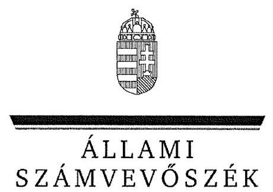
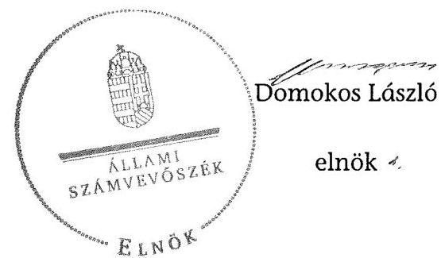
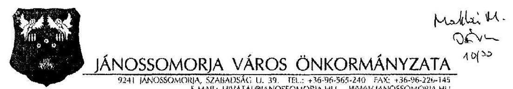
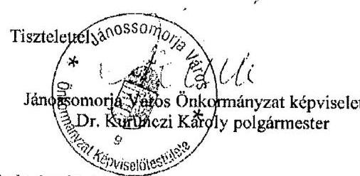
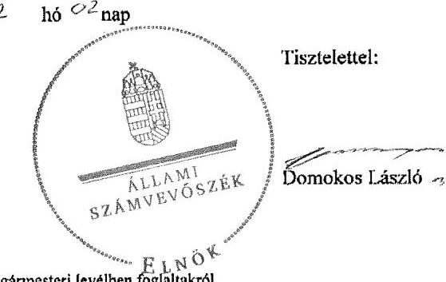

ÁLLAMI
SZÁMVEVÔSZÉK

# JELENTÉS 

az önkormányzati vagyongazdálkodás
szabályszerúségi ellenôrzéséről
Jánossomorja

---

# Állami Számvevőszék 

Iktatószám: V-0026-080-038/2013.
Témaszám: 1065
Vizsgálat-azonosító szám: V061509

## Az ellenőrzést felügyelte:

## Makkai Mária

felügyeleti vezető
Az ellenőrzést vezette és az ellenőrzés végrehajtásáért felelős:
Schósz Attila Ferencné
ellenőrzésvezető
A számvevőszéki jelentés összeállításában közremúködött:
Groholy Andrásné Hangyál Márta
számvevő tanácsos
Az ellenőrzést végezték:
Szeibel Gáborné Dr. Eke-Pekács Tibor
számvevő
számvevő tanácsos

A témához kapcsolódó eddig készített számvevőszéki jelentések:
címe
sorszáma
Jelentés a helyi önkormányzatok gazdálkodási rendszerének 2007. 0822
évi átfogó és egyéb szabályszerűségi ellenőrzéséről

---

# TARTALOMJEGYZÉK 

BEVEZETÉS ..... 3
I. ÖSSZEGZŐ MEGÁLLAPÍTÁSOK, KÖVETKEZTETÉSEK, JAVASLATOK ..... 6
II. RÉSZLETES MEGÁLLAPÍTÁSOK ..... 11

1. A vagyongazdálkodási tevékenység szabályozottsága ..... 11
1.1. A feladatellátás formáinak meghatározása, a döntések megalapozottsága ..... 11
1.2. A vagyonnal gazdálkodó szervezetek szervezeti rendjének szabályozottsága, a kötelező szabályzatok megfelelősége ..... 12
1.3. A vagyongazdálkodás szabályozása ..... 13
1.4. A vagyonkezeléssel megbízott szervezetek beszámolási kötelezettségének szabályozása ..... 14
2. A vagyongazdálkodás szabályszerűsége ..... 15
2.1. A vagyon nyilvántartásának megfelelősége ..... 15
2.2. A vagyongazdálkodást érintő gazdasági események követelmények szerinti dokumentáltsága ..... 16
2.3. A vagyongazdálkodási döntések, intézkedések szabályszerűsége ..... 18
3. A vagyon változását eredményező gazdasági események szabályszerűsége ..... 19
3.1. A vagyon értékének és összetételének változása ..... 19
3.2. A vagyon fenntartására kialakított rendszer működésének megfelelősége és szabályozottsága ..... 20
3.3. A hitelfelvétel, kötvénykibocsátás, garancia- és kezességvállalás szabályszerűsége ..... 21
3.4. A térítés nélküli átadások szabályszerűsége ..... 21
4. A vagyongazdálkodás szabályszerűségére vonatkozó belső és külső ellenőrzések hasznosulása ..... 22
4.1. A belső ellenőrzés által tett megállapítások, javaslatok hasznosulása ..... 22
4.2. A könyvvizsgálatnak a vagyongazdálkodás szabályosságához való hozzájárulása ..... 23
4.3. A külső ellenőrző szervezetek által tett javaslatok hasznosulása ..... 23

---

# MELLÉKLETEK 

1. számú Jánossomorja Város Önkormányzata gazdálkodására jellemző adatok, mutatószámok
2. számú Jánossomorja Város Önkormányzata vagyonának alakulása 2007. január 1-je és 2011. december 31-e között
3. számú Jánossomorja Város Önkormányzata kötelezettségeinek alakulása 2007. január 1-je és 2011. december 31-e között
4. számú Jánossomorja Város Önkormányzata polgármesterének észrevétele
5. számú A polgármester észrevételére adott válasz

## FÜGGELÉKEK

1. számú Rövidítések jegyzéke
2. számú Értelmező szótár

---

# JELENTÉS 

## az önkormányzati vagyongazdálkodás szabályszerűségi ellenőrzéséről Jánossomorja

## BEVEZETÉS

Az ÁSZ kiemelten fontosnak tartja az ÁSZ tv. 5. § (4) bekezdése alapján az önkormányzatok vagyongazdálkodási tevékenységének, a vagyongazdálkodási szabályok betartásának ellenőrzését. Az ellenőrzés feladata, hogy értékelje a vagyongazdálkodással kapcsolatban a jogszabályokban és az önkormányzati belső szabályozásban előírtak érvényesülését a közpénzek felhasználásának átláthatósága, nyilvánossága érdekében. Az ÁSZ ellenőrzése nemcsak az ellenőrzött szervezet vagyongazdálkodásának hibáira, hiányosságaira mutat rá, számon kérve azok kijavítását, hanem megállapításaival, javaslataival segíti a közpénzekkel, a közvagyonnal való felelős gazdálkodást.

Az önkormányzati vagyon alapvető funkciója, hogy a helyi közérdeket és egyúttal az önkormányzati célok megvalósítását szolgálja. A feladatellátás terén elsősorban a kötelezően ellátandó feladatok végrehajtását hivatott szolgálni, amely mellett az önként vállalt feladatok ellátása is megvalósulhat.

## Az ellenőrzés célja annak értékelése volt, hogy az Önkormányzatnál:

- a vagyongazdálkodási tevékenység, annak szervezeti keretei szabályozottake;
- az önkormányzati vagyongazdálkodás törvényességét, szabályszerűségét biztosították-e; a vagyon értékének és összetételének változását jogszerű döntésekkel alátámasztották-e;
- a belső ellenőrzés elősegítette-e a vagyongazdálkodás szabályszerű működését, valamint hasznosultak-e a korábbi külső ellenőrzések által tett javaslatok.

Az ellenőrzés típusa: szabályszerűségi ellenőrzés
Az ellenőrzés a 2007. január 1. és 2011. december 31. közötti időszakra terjedt ki. A közbeszerzési eljárások lefolytatásának ellenőrzése a 2011. évet és a 2012. év I. negyedévét érintette. Az Nvtv. egyes rendelkezései végrehajtásának ellenőrzése a nemzetgazdasági szempontból kiemelt jelentőségű nemzeti vagyonnak minősülő forgalomképtelen vagyonelemek meghatározására, valamint a kö-zép- és hosszú távú vagyongazdálkodási terv készítésére terjedt ki 2012-től 2013. július 8 -ig, a helyszíni ellenőrzés befejezéséig.

---

Az ellenőrzés szakmai módszertana az ÁSZ hivatalos honlapján közzétett szakmai szabályokon alapult, amely a Legfőbb Ellenőrző Intézmények Nemzetközi Szervezete (INTOSAI) által kiadott nemzetközi standardok (ISSAI) figyelembevételével készült.

A vagyonváltozásokkal kapcsolatos gazdasági események közül az ellenőrzött tételeket véletlen mintavétellel választottuk ki a Polgármesteri Hivatal 20072011. évi számviteli nyilvántartásaiból. Az Önkormányzattól tanúsítványt kértünk a korábbi ÁSZ ellenőrzések vagyongazdálkodásra vonatkozó javaslatainak hasznosulásáról, a könyvvizsgáló és a külső ellenőrzési szervek vagyongazdálkodással kapcsolatos 2007-2011. évi javaslataira tett intézkedésekről, valamint a 2007-2011. évek térítésmentes vagyonátadásairól és átvételeiről.

A jelentéstervezetben alkalmazott rövidítéseket az 1. számú függelék, az egyes fogalmak magyarázatát a 2. számú függelék tartalmazza.

Jánossomorja város állandó lakosainak száma 2011. január 1-jén 6101 fő volt. Az Önkormányzat kilenc tagú Képviselő-testületének munkáját négy állandó bizottság segítette. Az Önkormányzat a 2011. évben a Polgármesteri Hivatalon felül három költségvetési szervet tartott fenn. Önállóan működő intézményekkel, önként vállalt feladatként az alapfokú művészetoktatást, a bölcsődei ellátást, továbbá a Művelődési Ház fenntartását biztosította. Az Önkormányzat az alapfokú oktatás, az óvodai nevelés, a belső ellenőrzés, valamint az idősek és fogyatékosok nappali szociális ellátásának kötelező feladatairól társulások keretében gondoskodott. A háziorvosi és a fogorvosi ellátást megbízási szerződések útján biztosították. A víz- és szennyvízcsatorna hálózat múködtetése, valamint a települési hulladéklerakó üzemeltetése és a hulladékkezelés üzemeltetési szerződésekkel történt. Az Önkormányzat többségi tulajdoni hányadú gazdasági társasággal nem rendelkezett.

A polgármester az 1994. év óta tölti be tisztségét. A jelenlegi jegyző 2011. szeptember 1-jétől látja el feladatait. A Polgármesteri Hivatal két szervezeti egységre - Igazgatási, valamint Pénzügyi- és adó osztályra - tagolódott, a foglalkoztatott köztisztviselők száma 2011. december 31-én 21 fő volt. Az Önkormányzat költségvetési intézményeiben 2011. december 31-én 134 fő közalkalmazottat foglalkoztattak.

Az Önkormányzat a 2011. évi költségvetési beszámolója szerint 1194,5 millió Ft költségvetési bevételt ért el, valamint 1032,0 millió Ft költségvetési kiadást teljesített. A 2011. december 31-i könyvviteli mérleg szerint az Önkormányzat nettó 2941,0 millió Ft értékű eszközvagyonnal rendelkezett, 15,6 millió Ft hosszú lejáratú és 40,4 millió Ft rövid lejáratú kötelezettsége volt. Az Önkormányzat a 2007-2011. évek között kötvényt nem bocsátott ki, garanciát és kezességet nem vállalt, valamint PPP konstrukcióban történő fejlesztésre nem került sor. A 2011. évben, illetve a 2012. év I. negyedévében az Önkormányzat nem végzett olyan felújítási és beruházási feladatot, amely a Kbt. ${ }_{1,2}$ előírása alapján közbeszerzési eljárást tett volna szükségessé.

Az Önkormányzat gazdálkodására jellemző adatokat, mutatószámokat az 1-3. számú mellékletek tartalmazzák.

---

Az ÁSZ a 2011. évi LXVI. törvény 29. §-a szerint a jelentéstervezetet megküldte Jánossomorja Város Önkormányzata polgármesterének egyeztetésre. A beérkezett észrevételt és az arra adott választ a jelentés 4-5. számú mellékletei tartalmazzák.

---

# I. ÖSSZEGZŐ MEGÁLLAPÍTÁSOK, KÖVETKEZTETÉSEK, JAVASLATOK 

Az Önkormányzat könyvviteli mérleg szerinti vagyona a 2007. évi nettó 2476,9 millió Ft nyitó értékről a 2011. év végére nettó 2941,0 millió Ft-ra, 18,7\%-kal ( 464,1 millió Ft-tal) nőtt. A 2007-2011. években megvalósult legjelentősebb beruházások, felújítások a gazdasági program ${ }_{1,2}$-ben foglalt célkitűzésekkel összhangban voltak, döntő részben ( $91,0 \%$-ban) az Önkormányzat kötelező feladatainak ellátásához kapcsolódtak (az ivóvízbázis kiváltása, a Polgármesteri Hivatal átalakítása, az Általános Iskola épületének felújítása, út- és járdafelújítások). A beruházások, felújítások fedezetét európai uniós és hazai támogatásokból, valamint önkormányzati saját forrásból biztosították. A 20072011. években a felújításokra, beruházásokra fordított kiadások összege (nettó 747,2 millió Ft) $71,2 \%$-kal meghaladta az elszámolt értékcsökkenés összegét ( 436,5 millió Ft), ezáltal hozzájárult az elhasználódott eszközök pótlásához.

A Képviselő-testület a gazdasági program ${ }_{1,2}$-ben rögzítette az önkormányzati feladatellátás fő irányait. Az Önkormányzat a kötelező és önként vállalt feladatait a 2007. év elején a Polgármesteri Hivatal mellett intézményekkel, társulásokkal, üzemeltetési és megbízási szerződésekkel látta el. A Képviselőtestület a 2009. évben az Idősek Klubja intézmény megszüntetéséről és a feladatellátás érdekében társuláshoz történő csatlakozásról, valamint a 2010. évben a víz- és szennyvízcsatorna közművek esetében új üzemeltetővel történő szerződéskötésről döntött.

A Képviselő-testület az önkormányzati vagyonnal való gazdálkodás szabályozása során a törvényi előírásoknak eleget tett. Az Ötv.-ben foglaltaknak megfelelően a vagyongazdálkodási rendeletben meghatározták a vagyonkezelői jog részletes szabályait, továbbá a törzsvagyonba tartozó forgalomképtelen és korlátozottan forgalomképes vagyoni kört, a törzsvagyonba nem tartozó vagyonelemeket, valamint a vagyon nyilvántartásának fő szabályait, és rendelkeztek a tulajdonosi jogok gyakorlásáról. A vagyongazdálkodási rendeletben az 5,0 millió Ft forgalmi értéket meghaladó önkormányzati vagyon elidegenítése, bérbeadása, más módon történő hasznosítása esetében előírták a versenyeztetési kötelezettséget. Az Nvtv.-ben foglaltaknak megfelelően a Képviselő-testület határidőn belül megjelölte a forgalomképtelennek minősülő vagyonból a nemzetgazdasági szempontból kiemelt jelentőségű, nemzeti vagyonnak minősülő forgalomképtelen törzsvagyont. Az Önkormányzat a 2013. évben elfogadta a közép- és hosszú távú vagyongazdálkodási tervét. A megalapozott vagyongazdálkodási döntések meghozatala érdekében - célszerűsége ellenére - nem szabályozták a tulajdonosi jogok védelmére a garanciális elemek rögzítésének kötelezettségét. Nem írták továbbá elő a támogatásokkal megvalósuló beruházásokkal létrejövő létesítmények fenntarthatóságának vizsgálatát.

A jegyzö ${ }_{1,2}$ - a Htv. előírása alapján - kialakította a Polgármesteri Hivatal, valamint az intézmények számviteli rendjét. A számviteli politika ${ }_{1,2}$-t és a hozzá kapcsolódó leltározási, értékelési és pénzkezelési szabályzat ${ }_{1,2}$-t, valamint a

---

számlarend ${ }_{1,2}$-t az Áhsz.-nek és a helyi sajátosságoknak megfelelően készítették el. A leltározási szabályzat ${ }_{1,2}$-ben a vagyon, azon belül az üzemeltetésre átadott eszközök leltározásának módját a 2007-2011. években az Áhsz.-ben foglaltaknak megfelelően írták elő.

Az Önkormányzatnál a vagyongazdálkodás múködésének szabályszerűségét hiányosan biztosították. A 2007-2011. években a Képviselőtestület számára a zárszámadással egyidejűleg bemutatott vagyonkimutatás tartalmazta az Önkormányzat és intézményei saját vagyonát, tételesen, törzsvagyon és törzsvagyonon kívüli, egyéb vagyon bontásban. A 2010. és a 2011. évi zárszámadási rendelettervezetekhez csatolt vagyonkimutatásból azonban hiányzott az üzemeltetetésre átadott vízi közművek közül a szolgáltató kivitelezésében (önkormányzati forrásból) bruttó 107,7 (nettó 86,4) millió Ft értékben megvalósult fejlesztések eszközeinek felsorolása és értéke. Az Önkormányzatnál ezen eszközöket a főkönyvi és analitikus nyilvántartásba nem vezették fel. A 2007-2011. években - az üzemeltetésre átadott eszközök kivételével - eleget tettek az Áhsz.-ben előírt leltározási kötelezettségnek. Az üzemeltetésre átadott ivóvíz- és szennyvízcsatorna hálózat eszközeiről - az Áhsz.-ben foglalt előírások ellenére - nem készült (mennyiségi felvétellel) leltár a 2007-2009. években, a 2010-2011. évekre a mérleg szerinti értékét az Áhsz., illetve a leltározási szabályzat ${ }_{2}$-ben foglalt előírás ellenére az Önkormányzat nem támasztotta alá az üzemeltetést végző szerv által elkészített, hitelesített leltárral. Mindezek következtében sérült a Számv. tv. szerinti mérleg valódiság elve. Az Önkormányzatnál az ellenőrzött években - az üzemeltetésre átadott eszközök kivételével - a főkönyvi nyilvántartás, valamint az annak adatait alátámasztó analitikus nyilvántartások és az ingatlanvagyon-kataszter bruttó érték adatainak egyezősége biztosított volt.

A gazdálkodási és ellenőrzési jogkörök gyakorlásával kapcsolatban ellenőrzött esetekben a 2007-2011. évek között építési beruházásokhoz, felújításokhoz és nagy értékű eszköz beszerzésekhez kapcsolódóan - az Áht. ${ }_{1,2}$-ben és az Ámr. ${ }_{1,2}$-ben foglaltak, valamint az ÁSZ korábbi javaslata ellenére - összesen 1,9 millió Ft összegű kiadást előzetes írásbeli kötelezettségvállalás nélkül teljesítettek. A kötelezettségvállalást az ellenőrzött tételek közel felénél nem előzte meg ellenjegyzés, összesen 52,6 millió Ft kiadás esetében. Nem megfelelően tettek eleget ellenőrzési kötelezettségüknek a szakmai teljesítést igazolók, mivel nem kifogásolták az előzetes írásbeli kötelezettségvállalás hiányát, továbbá az érvényesítők és az utalványt ellenjegyzők nem jelezték az előzetes írásbeli kötelezettségvállalás, illetve ellenjegyzés hiányát. Mindezek következtében nem történt meg a fedezet és szabad előirányzat rendelkezésre állásának, a kifizetés jogosságának, összegszerűségének és teljesítésének ellenőrzése.

Az önkormányzati vagyon értékének és összetételének változásához kapcsolódó döntéseket (egy térítés nélküli átvétel kivételével) az arra jogosult Képviselő-testület, illetve átruházott hatáskörben a polgármester vagy a Pénzügyi bizottság hozta meg. Az önkormányzati forrásból finanszírozott és a szolgáltatási szerződés felmondását követően a szolgáltató által a 2010. december 31-i állapotnak megfelelően térítésmentesen átadott eszközök átvételéről - a polgármester előterjesztése hiányában - a vagyongazdálkodási rendelet előírása ellenére a Képviselő-testület nem döntött. A vagyongazdálkodást érintő döntések előkészítése, végrehajtása során az önkormányzati SZMSZ ${ }_{1,2}$, a va-

---

gyongazdálkodási rendelet és a képviselő-testületi határozatok előírásait betartották. Az Önkormányzatnál - szabályozás hiányában, célszerűsége ellenére az ingatlanértékesítésre vonatkozó szerződések nem tartalmaztak az Önkormányzat érdekeit védő garanciális elemeket, továbbá nem végezték el a beruházásokkal létrejövő létesítmények fenntarthatóságának vizsgálatát a kötelező feladathoz kapcsolódó ivóvízbázis kiváltása, valamint az önként vállalt feladathoz kapcsolódó Múvelődési Ház és Bölcsőde felújítása esetében.

A jegyző ${ }_{1,2}$ nem biztosította a közérdekú gazdálkodási adatok közzétételét. Az Áht. ${ }_{1}$ és az Eisztv. előírásai, valamint az ÁSZ korábbi javaslata ellenére a céljellegú, múködési és fejlesztési támogatások, valamint a vagyonnal való gazdálkodásra vonatkozó (nettó ötmillió Ft-ot elérő vagy meghaladó értékű beruházási, vagyonhasznosítási) szerződések adatainak, a 2009-2010. évi költségvetési rendeletek és elemi költségvetések, továbbá a 2008-2010. évekre vonatkozó zárszámadási rendeletek és elemi költségvetési beszámolók közzététele elmaradt. Ezáltal a jegyző ${ }_{1,2}$ az Önkormányzat gazdálkodásának átláthatóságát nem biztosította. A 2011. évi költségvetési és zárszámadási rendeleteket a jegyző ${ }_{2}$ hiányos tartalommal tette közzé, mivel azok mellékleteinek közzététele elmaradt.

A belső ellenőrzési feladatokat az Önkormányzat a 2007-2011. években a társulás ${ }_{1}$ keretében látta el. A lefolytatott belső ellenőrzések csak az önkormányzati intézmények vagyongazdálkodásának szabályszerű múködését segítették elő, mivel a 2007-2011. évek között a vagyongazdálkodást érintő három belső ellenőrzés az Önkormányzat intézményeire terjedt ki. A belső ellenőrzési jelentések javaslatai a belső kontrollrendszer szabályozására, az intézményi SZMSZ-ek aktualizálására és az analitikus nyilvántartások vezetésére vonatkoztak. Intézkedési tervet a hiányosságok megszüntetésére a Ber. előírásai ellenére nem készítettek, azonban a belső ellenőrzés által feltárt hiányosságok megszüntetéséről intézkedtek. Az ellenőrzött évekre vonatkozóan az Ötv. előírásával szemben a polgármester helyett a jegyző ${ }_{1,2}$ terjesztette a Képviselőtestület elé az éves ellenőrzési jelentéseket, melyeket a Képviselő-testület elfogadott.

Az Önkormányzat 2007-2011. évi költségvetési beszámolóit a könyvvizsgáló minden évben megbízhatónak és hitelesnek minősítette. A jelentésekhez csatolt kiegészítésében a vagyongazdálkodást érintően megállapításokat tett a leltározás dokumentálására, továbbá a szakmai teljesítésigazolás elvégzésére. A könyvvizsgáló által feltárt hiányosságokat nem szüntették meg, javaslatai nem hasznosultak. A könyvvizsgáló az Önkormányzat 2010. és a 2011. évi beszámolóit korlátozás nélküli záradékkal látta el annak ellenére, hogy hiányzott az Önkormányzat mérlegbeszámolóiból a vízi közművek üzemeltetője által önkormányzati forrásból megvalósított -, majd az üzemeltetési szerződés felmondását követően az Önkormányzatnak térítésmentesen átadott víziközművagyon.

Az Állami Számvevőszékről szóló 2011. évi LXVI. törvény 33. § (1) bekezdésében foglaltak értelmében a jelentésben foglalt megállapításokhoz kapcsolódó intézkedési tervet köteles az ellenőrzött szervezet vezetője összeállítani, és azt a jelentés kézhezvételétől számított 30 napon belül az ÁSZ részére megküldeni. Amennyiben az intézkedési tervet határidőben nem küldi meg a szervezet,

---

vagy az nem elfogadható, az ÁSZ elnöke a hivatkozott törvény 33. § (3) bekezdés a)-b) pontjaiban foglaltakat érvényesítheti.

Az ellenőrzés intézkedést igénylő megállapításai és javaslatai:

# a polgármesternek 

Az üzemeltetésre átadott ivóvíz- és szennyvízcsatorna hálózat eszközei leltározásának hiányában az Önkormányzat 2010. és 2011. évi mérleg beszámolóinak készítése során nem tárták fel, hogy az önkormányzati forrásból az üzemeltető által megvalósított, majd általa az Önkormányzat részére térítésmentesen átadott 107,7 millió Ft (nettó 86,4 millió Ft) értékű eszközöket az Önkormányzat főkönyvi és analitikus nyilvántartásaiban nem vezették fel. Az Önkormányzat az új üzemeltető részére 2011. január 1-jével átadta az üzemeltetéshez szükséges eszközöket. Ennek során nem csak az Önkormányzat nyilvántartásában szereplő, hanem a korábbi üzemeltető által, önkormányzati forrásból megvalósított és térítésmentesen átadott eszközök is átadásra kerültek.

Javaslat:
Intézkedjen annak kivizsgálásáról, hogy a számvevőszéki jelentésben feltárt szabálytalanságokkal és hiányosságokkal összefüggésben történt-e károkozás, és károkozás feltárása esetén tegye meg a szükséges lépéseket a személyes felelősség felvetése érdekében.

## a jegyzönek

1. Az Önkormányzatnál a 2010-2011. években elkészített és a zárszámadással egyidejűleg a Képviselő-testületnek bemutatott vagyonkimutatás nem felelt meg az Áhsz. 44/A. § (2)-(3) bekezdésében előírt tartalmi követelményeknek, mert nem tartalmazta az Önkormányzat üzemeltetetésre átadott vízi közművei közül a szolgáltató kivitelezésében (önkormányzati forrásból) megvalósult fejlesztések eszközeinek felsorolását és értékét.

Javaslat:
Intézkedjen az Önkormányzat vagyonkimutatásának az Áhsz. 44/A. § (2)-(3) bekezdésében előírtak szerinti elkészítéséről és annak a Képviselő-testület részére történő bemutatásáról.
2. Az üzemeltetésre átadott ivóvíz- és szennyvízcsatorna hálózat eszközeiről - az Áhsz. 37. § (1) bekezdéseiben foglalt előírások ellenére - nem készült (mennyiségi felvétellel történő) leltár a 2007-2009. években. A 2010-2011. évekre üzemeltetésre átadott eszközök (ivóvíz- és szennyvízcsatorna hálózat) mérleg szerinti értékét - az Áhsz. 37. § (4) bekezdésében, illetve a leltározási szabályzat ${ }_{2}$-ben foglalt előírás ellenére - az Önkormányzat nem támasztotta alá az üzemeltetést végző szerv által - a december 31-ei fordulónapra vonatkozó évenkénti leltározás alapján - elkészített, hitelesített leltárral.

---

Javaslat:
Intézkedjen, hogy az üzemeltetésre átadott eszközökről a könyvviteli mérleg alátámasztásához, az Áhsz. 37. § (4) bekezdés előírásának megfelelően, az üzemeltetők által évente elvégzett és hitelesített leltárak álljanak rendelkezésre.
3. A vagyongazdálkodás egyes területeivel kapcsolatos kiadások teljesítését és a bevételek beszedését megelőzően a gazdálkodási és ellenőrzési jogkörök gyakorlásával felhatalmazott személyek nem végezték el az előírt ellenőrzési feladatokat. Az Ámr. 134. § (8)-(9) bekezdései, illetve az Ámr. 2 74. § (1) és (3) bekezdése ellenére összesen 1,9 millió Ft összegű kiadást előzetes írásbeli kötelezettségvállalás nélkül teljesítettek, a kötelezettségvállalást nem előzte meg ellenjegyzés összesen 52,3 millió Ft kiadás esetében. Az Ámr. 135. § (1) és (3) bekezdése, illetve az Ámr. 2 76. § (1) bekezdése és 77. § (1) bekezdése ellenére a szakmai teljesítés igazolója és az érvényesítő nem megfelelően látta el ellenőrzési feladatát.

Javaslat:
Intézkedjen, hogy a pénzügyi ellenjegyző, a teljesítést igazoló és az érvényesítő - az Áht. 2 37. § (1) bekezdése, az Ávr. 57. § (1) bekezdése és az Ávr. 58. § (1) bekezdése előírásainak megfelelően - végezze el ellenőrzési feladatait.
4. A jegyző ${ }_{1,2}$ az Eisztv. 6. § (1) bekezdéséhez rendelt mellékletben előírtak ellenére 2008. július 1-jét követően nem gondoskodott az Önkormányzat 2009-2010. évi költségvetési rendeletének, elemi költségvetésének, 2008-2010. évi költségvetési beszámolójának és zárszámadási rendeletének, valamint az Áht. 1 15/A. § és 15/B. § ellenére a céljellegű, működési és fejlesztési támogatásokra, illetve a vagyongazdálkodással összefüggő - a nettó ötmillió forintot elérő vagy azt meghaladó értékű - szerződésekre vonatkozó adatok közzétételéről. A 2011. évi költségvetési és zárszámadási rendeletek közzététele hiányos tartalommal, a rendelet mellékletei nélkül történt meg.

Javaslat:
Intézkedjen az Infotv. 37. § (1) bekezdése alapján az 1. számú mellékletében meghatározott adatok közzétételéről.
5. Az ellenőrzött évekre vonatkozóan az Ötv. 92. § (10) bekezdésének előírása ellenére a polgármester helyett a jegyző ${ }_{1,2}$ terjesztette minden évben (a zárszámadással egyidejűleg) a Képviselő-testület elé az éves ellenőrzési jelentést.

Javaslat:
Kezdeményezze a polgármesternél a Bkr. 56. § (8) bekezdésének megfelelően az éves ellenőrzési jelentéseknek - a zárszámadással egyidejűleg - a Képviselő-testület elé történő beterjesztését.

---

# II. RÉSZLETES MEGÁLLAPÍTÁSOK 

## 1. A VAGYONGAZDÁLKODÁSI TEVÉKENYSÉG SZABÁLYOZOTTSÁGA

### 1.1. A feladatellátás formáinak meghatározása, a döntések megalapozottsága

Az Önkormányzat a 2007-2010. évekre, illetve a 2010-2014. évekre szóló gazdasági program ${ }_{1,2}$-ben fő célkitűzésként a kötelező és önként vállalt feladatainak ellátásához kapcsolódó fejlesztési irányokat határozta meg. A fejlesztési feladatok megvalósítását elődlegesen pályázati források igénybevételéhez kötötték. Az Önkormányzat kötelező feladataihoz kapcsolódott a gazdasági progra ${ }_{1}$-ben az ivóvízbázis kiváltása, valamint a lakossági szelektív hulladékgyűjtés megvalósítása. A gazdasági program ${ }_{2}$-ben az Önkormányzat teljes intézményhálózatának energiaracionalizálását szolgáló felújítások kerültek előtérbe. Önként vállalt feladatként a gazdasági program ${ }_{1,2}$-ben a Művelődési Ház tetőcseréje, biogáz erőmű építése, a lakás- és helyiséggazdálkodás hatékonyabbá tétele, a közösségi tér, valamint a közművelődési, helyi művészeti tevékenység és kiadványok, valamint a sport támogatása jelentek meg.

Az Önkormányzat az Ötv. 8. § (2) bekezdése alapján a kötelező és önként vállalt feladatai ellátásának módját és mértékét meghatározta ${ }^{1}$. Az Önkormányzat 2007. január 1-jén kötelező és önként vállalt feladatait a Polgármesteri Hivatal mellett intézményekkel, társulásokkal, üzemeltetési és megbízási szerződések útján látta el.

Az Önkormányzat a belső ellenőrzésről a társulás ${ }_{1}$, az alapfokú oktatás és az óvodai nevelés kötelező feladatainak ellátásáról a társulás ${ }_{2,3}$ útján gondoskodott. Önállóan múködő intézményekkel, önként vállalt feladatként az alapfokú művészetoktatást, a bölcsődei ellátást, továbbá az Idősek Klubja és a Művelődési Ház fenntartását biztosította. Az Önkormányzat a kötelező háziorvosi és fogorvosi ellátást megbízási szerződések útján látta el. Az Önkormányzat üzemeltetési szerződésekkel gondoskodott az általa megvalósított ivóvíz- és szennyvízcsatorna hálózat müködtetéséről, valamint a településen lévő hulladék-lerakóhely üzemeltetéséről és a hulladékkezelésről.

A Képviselő-testület - a 2007-2011. évek között - a feladatok ellátása érdekében intézmény megszüntetéséről², társulás ${ }_{1}$-hez történő csatlakozásról, üzemeltetési szerződés felmondásáról, valamint új üzemeltetési szerződés megkötéséről döntött. Ezen döntéseket megelőzően - a megalapozott döntések meghozatala érdekében - az előterjesztésekben a polgármester a feladatellátás formáira és körére nem fogalmazott meg alternatív javaslatokat.

[^0]
[^0]:    ${ }^{1}$ A gazdasági program ${ }_{1,2}$-ben, a Polgármesteri Hivatal és a költségvetési intézmények alapító okirataiban, valamint az éves költségvetési rendeletekben.
    ${ }^{2}$ A Képviselő-testület 73/2009. (X. 28.) számú határozata.

---

Az Önkormányzat a 2009. évben a Kistérségi Egyesített Szociális Intézmény által biztosított hatékonyabb szakmai koordináció és a kiegészítő kistérségi források gazdaságosabb felhasználása miatt az Idősek Klubja megszüntetéséről döntött. Az idôsek és fogyatékosok nappali szociális ellátásának feladatait az Önkormányzat 2010. január 1-jétől a társulás ${ }_{1}$-hez történt csatlakozással látta el.

A Képviselő-testület a 2009-2010. években támogatással megvalósult ivóvízbázis kiváltása beruházás befejezését követően felülvizsgálta a víz- és szennyvízelvezetés üzemeltetésének módját. Megállapította, hogy a közfeladat ellátását az ugyanazon vízbázison már üzemeltető vállalkozással, a meglévő hálózatra történő rácsatlakozással célszerű megoldani ${ }^{3}$, így a korábbi üzemeltetővel (PannonVíz Rt.-vel) a szerződését nem hosszabbította meg. Az önkormányzati tulajdonú víz- és szennyvízcsatorna hálózatot az Önkormányzat 2011. január 1-jétől átadta az AQUA Kft-nek üzemeltetésre.

# 1.2. A vagyonnal gazdálkodó szervezetek szervezeti rendjének szabályozottsága, a kötelező szabályzatok megfelelősége 

A Képviselő-testület a vagyongazdálkodási rendeletben az önkormányzati vagyon kezelésével a Polgármesteri Hivatalt bízta meg, a vagyonnal gazdálkodó, közfeladatot ellátó költségvetési szerv alapító okiratában a szervezet alaptevékenységét meghatározta.

A Képviselő-testület élt az Ötv. 9. § (3) bekezdésében biztosított jogával, és a vagyongazdálkodási rendeletben a vagyongazdálkodással kapcsolatos egyes hatásköröket a polgármesterre és a Pénzügyi bizottságra ruházta át.

A korlátozottan forgalomképes ingatlan vagyontárgy feletti rendelkezés joga 0,1 millió Ft, ingó vagyontárgy esetén 0,5 millió Ft értékhatárig a polgármestert illette meg. A vagyongazdálkodási rendelet szerint az Önkormányzat részére 1,0 millió Ft értékhatár alatt ellenérték nélkül felajánlott vagyon elfogadásáról a polgármester döntött. A behajthatatlan fizetési követelés elengedése 0,1 millió Ft egyedi értékhatárig a polgármester, 0,1 millió Ft és 5 millió Ft egyedi értékhatár között a Pénzügyi bizottság átruházott hatásköre volt.

A vagyongazdálkodási rendelet alapján a forgalomképtelen önkormányzati törzsvagyon körébe tartozó vagyontárgyak feletti rendelkezés - értékhatárra tekintet nélkül - a Képviselő-testület hatáskörébe tartozott.

A jegyző ${ }_{1,2}$ - a Htv. 140. § (1) bekezdés c) pontjában foglalt előírásnak megfelelően - kialakította a Polgármesteri Hivatal, valamint az intézmények számviteli rendjét, amely megfelelő keretet biztosított a vagyongazdálkodás szempontjából az Önkormányzat költségvetési szervei egységes számviteli elvek szerinti, önkormányzati szintű beszámolójának elkészítéséhez.

A Polgármesteri Hivatal rendelkezett az Áhsz.-nek és a helyi sajátosságoknak megfelelő számviteli politika, ${ }_{1,2}$-vel és a kapcsolódó szabályzatokkal (értékelési szabályzat ${ }_{1,2}$, leltározási szabályzat ${ }_{1,2}$, pénzkezelési szabályzat ${ }_{1,2}$ ), valamint a számlarend ${ }_{1,2}$-vel. A jegyző ${ }_{1,2}$ a számviteli politika ${ }_{1,2}$ és a kapcsolódó szabályzatok hatályát a költségvetési intézményekre is kiterjesztette.

[^0]
[^0]:    ${ }^{3}$ A Képviselő-testület 72/2010. (X. 25.) számú határozata.

---

A jegyző ${ }_{1,2}$ az operatív gazdálkodással és annak munkafolyamatba épített ellenőrzésével összefüggő jogkörök gyakorlásának rendjét, valamint a velük kapcsolatos összeférhetetlenségi követelményeket a gazdálkodási szabályzat ${ }_{1,2}$-ben kialakította.

Az Önkormányzat nem élt az Áhsz. 37. § (7) bekezdése szerinti lehetőséggel, nem alkotott rendeletet a kétévenkénti leltározásról. A leltározási szabályzat ${ }_{1,2}{ }^{-}$ ben a számlálható, mérhető eszközökre évenkénti mennyiségi felvétellel történő leltározási kötelezettséget írtak elő, mely megfelelt az Áhsz. 37. § (3) bekezdés szerinti, mennyiségi felvétellel leltározandó eszközökre vonatkozó szabályozásnak. A leltározási szabályzat ${ }_{1,2}$ a 2007-2009. évek között az Áhsz. 37. § (2) bekezdésében, a 2010. évtől az Áhsz. 37. § (4) bekezdésében foglaltaknak megfelelően tartalmazta az üzemeltetésre átadott eszközök leltározásának módját.

# 1.3. A vagyongazdálkodás szabályozása 

A Képviselő-testület az önkormányzati vagyonnal való gazdálkodás szabályozása során a törvényi előírásoknak eleget tett. Az Önkormányzat a vagyongazdálkodási feladatokat és az önkormányzati vagyonnal való gazdálkodás, valamint - az Ötv. 80/B. § előírásának megfelelően - a vagyonkezelői jog részletes szabályait meghatározta. A Htv. 138. § (1) bekezdés j) pontja alapján a vagyongazdálkodási rendeletben rögzítették az önkormányzati vagyonnal való felelős gazdálkodás szabályait. A Képviselő-testület a vagyongazdálkodási rendeletben - az Ötv. 79. § (2) bekezdésének megfelelően - meghatározta az önkormányzati feladatellátást biztosító törzsvagyon körét, azon belül a forgalomképes és korlátozottan forgalomképes vagyonelemeket, valamint a törzsvagyonba nem tartozó vagyoni kört. Az egyes vagyonelemek hasznosítási módját a vagyongazdálkodási rendelet ${ }^{4}$ előírásai tartalmazták. A vagyongazdálkodási rendelet az 5,0 millió Ft forgalmi értéket meghaladó önkormányzati vagyon elidegenítése, használatba vagy bérbeadása, illetve más módon történő hasznosítása esetében előírta a versenyeztetési kötelezettséget. A hasznosítás a legjobb ajánlatot tevő részére történhetett a vagyongazdálkodási rendelet értelmében.

A vagyongazdálkodási rendelet - az Áht. ${ }_{1}$ 108. § (2) bekezdésének megfelelően - tartalmazta az ingyenes átruházás részletes feltételeit, eseteit és módját. A vagyongazdálkodási rendeletben rögzítették a vagyon nyilvántartásának fő szabályait, és rendelkeztek a tulajdonosi jogok gyakorlásáról. A forgalomképesség megváltoztatásának részletes szabályait és dokumentálásának módját nem írták elő.

A vagyongazdálkodást érintő előterjesztések készítésének, megtárgyalásának, véleményezésének és döntéshozatalának rendjére az önkormányzati SZMSZ ${ }_{1,2}$ általános szabályai vonatkoztak.

A megalapozott vagyongazdálkodási döntések meghozatala érdekében - célszerűsége ellenére - a vagyongazdálkodási rendeletben és az Önkormányzat egyéb rendeleteiben, szabályzataiban nem írták elő a döntés előkészítés folya-

[^0]
[^0]:    ${ }^{4}$ A vagyongazdálkodási rendelet 4., 5., 8., 9. és 10. §-ai.

---

matában a költség-haszon elemzés készítésének, a tulajdonosi jogok védelme érdekében a garanciális elemek szerződésekben, egyéb dokumentumokban való rögzítésének kötelezettségét. Nem szabályozták továbbá a támogatásokkal megvalósuló beruházásokkal létrejövő létesítmények fenntarthatóságának vizsgálatát.

A Képviselő-testület elfogadta ${ }^{5}$ az Nvtv. 9. § (1) bekezdésében előírtak alapján az Önkormányzat közép- és hosszú távú vagyongazdálkodási tervét, továbbá meghatározta törzsvagyonának és üzleti vagyonának körét.

A Képviselő-testület az Nvtv. 18. § (1) bekezdésében foglaltaknak megfelelően határidőn belül (2012. március 1-je előtt) megjelölte ${ }^{6}$ a forgalomképtelennek minősülő vagyonból a nemzetgazdasági szempontból kiemelt jelentőségű, nemzeti vagyonnak minősülő forgalomképtelen törzsvagyont.

# 1.4. A vagyonkezeléssel megbízott szervezetek beszámolási kötelezettségének szabályozása 

Az ellenőrzött időszakban az Önkormányzat az Ötv. 80/A. § előírása szerinti vagyonkezelési szerződést nem kötött, vagyonkezelői jogot nem alapított.

Az Önkormányzat a víz- és szennyvízcsatorna hálózat működtetésére a 2004. és a 2010. években megkötött üzemeltetési szerződésekben rögzítette az üzemeltetők feladatát, illetékességét, hatáskörét és felelősségét. Szabályozták a közmú üzemeltetés ellenőrzésének általános irányelveit, és beépítettek - az Önkormányzat érdekeit védő - garanciális elemeket. A szerződések tartalmazták a közmű üzemeltetés részletes szabályait, a felek közötti elszámolási, valamint a beszámolási kötelezettséget.

Az üzemeltetőnek évente egyszer az Önkormányzat adatszolgáltatási kötelezettséget írt elő az üzemeltetésre átvett eszközök műszaki állapotának tárgyévi változásáról, valamint a feladatellátás gazdasági és műszaki feltételeinek alakulásáról, mely kötelezettségének az üzemeltető a 2007-2011. években eleget tett. A Képviselő-testület az üzemeltető képviselője által készített beszámolók elfogadásáról az ellenőrzött években - a polgármester előterjesztésének hiányában - nem döntött.

A településen lévő szilárdhulladék-lerakóhely üzemeltetésére az Önkormányzat az 1998. évben ${ }^{7}$ kötött szerződést, melyben rögzítették az üzemeltető évente egyszeri (március 31-ig) tájékoztatási kötelezettségét a lerakóhelyre beszállított hulladék összetételéről, mennyiségéről, valamint a társaság éves munkájáról. Az üzemeltetést végző társaság tájékoztatási kötelezettségének az ellenőrzött időszakban eleget tett.

[^0]
[^0]:    ${ }^{5}$ A Képviselő-testület 14/2013. (III. 27.) számú határozata.
    ${ }^{6}$ A Képviselő-testület 4/2012. (II. 16.) számú határozata.
    ${ }^{7} 25$ éves határozott időtartamra kötött szerződés

---

# 2. A VAGYONGAZDÁLKODÁS SZABÁLYSZERŰSÉGE 

### 2.1. A vagyon nyilvántartásának megfelelősége

A 2007-2011. években az Ötv. 78. § (2) bekezdése szerint a vagyonkimutatást elkészítették, és az Áht. 1 118. § (2) bekezdés 2. c) pontjában foglaltaknak megfelelően az Önkormányzat zárszámadásának elő́terjesztésekor a Kép-viselő-testület részére bemutatták. A 2007-2011. évi vagyonkimutatás tartalmazta az Önkormányzat és intézményei saját vagyonát tételesen, törzsvagyon és törzsvagyonon kívüli, egyéb vagyon bontásban, az a 2007-2009. években az Áhsz. rendelkezésének megfelelő tartalommal készült. A 2010. és a 2011. évi zárszámadási rendelettervezetekhez csatolt vagyonkimutatásból azonban ellentétben az Áhsz. 44/A. § (2)-(3) bekezdéseiben foglaltakkal - hiányzott az üzemeltetetésre átadott vízi közmúvek közül a szolgáltató kivitelezésében (önkormányzati forrásból) megvalósult fejlesztések eszközeinek felsorolása és értéke.

Az Önkormányzatnál a 2007-2011. években - az üzemeltetésre átadott eszközök kivételével - eleget tettek az Áhsz. 37. § (1) bekezdésében előírt leltározási kötelezettségnek december 31-ei fordulónappal. A leltározás során leltározási körzetenként minden évben tételes, mennyiségi leltárt vettek fel a mérhető, számlálható eszközökről, továbbá a könyvviteli mérlegben értékkel nem szereplő eszközök (nettó értéken nyilvántartott tárgyi eszközök, 0-ra leírt eszközök) és források (saját tőke, tartalékok és kötelezettségek) leltározását egyeztetéssel elvégezték.

A leltározási szabályzat ${ }_{1,2}$-ben rögzítettek ellenére a leltározás ellenőrzéséért felelős személy nem írta alá a leltárkörzetenként felvett leltárakat. Az éves könyvviteli mérleg soronkénti egyeztetéséhez a leltározási szabályzat ${ }_{1,2}$-ben előírtak és a könyvvizsgáló jelzése ellenére nem készítettek összesítő dokumentumot.

Az üzemeltetésre átadott eszközök közül a hulladékkezeléshez kapcsolódó eszközvagyonnak a 2007. és a 2009-2011. évekre vonatkozó mérlegadatait leltárral alátámasztották, azonban a 2008. évi mérleget - az Áhsz. 37. § (2) bekezdésében előírtakkal ellentétben - az Önkormányzatnál leltárral nem támasztották alá.

Az üzemeltetésre átadott ivóvíz- és szennyvízcsatorna hálózat eszközeiről - az Áhsz. 37. § (1) bekezdésében foglalt előírások ellenére - nem készült (mennyiségi felvétellel) leltár a 2007-2009. években. A 2010-2011. évekre az üzemeltetésre átadott eszközök (ivóvíz- és szennyvízcsatorna hálózat) mérleg szerinti értékét - az Áhsz. 37. § (4) bekezdésében ${ }^{8}$, illetve a leltározási szabályzat ${ }_{2}$-ben foglalt előírás ellenére - az Önkormányzat nem támasztotta alá az üzemeltetést végző szerv által a december 31-ei fordulónapra vonatkozó, évenként elkészített, hitelesített leltárral. Mindezek következtében sérült a Számv. tv. 15. § (3) bekezdése szerinti mérleg valódiság elve.

[^0]
[^0]:    ${ }^{8}$ Megállapította a 317/2009. (XII. 29.) Korm. rendelet 18. §-a. Először a 2010. évről készített beszámolókra kellett alkalmazni.

---

Az ellenőrzött időszakban az Önkormányzatnál az üzemeltetésre átadott eszközök főkönyvi és analitikus nyilvántartásaiban a hulladékkezeléshez kapcsolódó eszközvagyon, a 2004. július 1-jétől üzemeltetésre átadott ivóvíz- és szennyvízcsatorna hálózat és a kutak, valamint a 2011. január 1-jén aktivált ivóvízbázis kiváltásával létrejött hálózat szerepelt. Az üzemeltetésre átadott ivóvíz- és szennyvízcsatorna hálózat eszközei leltározásának hiányában az Önkormányzat 2010. és 2011. évi mérleg beszámolóinak készítése során nem tárták fel, hogy az önkormányzati forrásból az üzemeltető Pannon-Víz Rt. által megvalósított, majd általa az Önkormányzat részére térítésmentesen átadott 107,7 millió Ft (nettó 86,4 millió Ft) értékű eszközöket - az Áhsz. 49. § (1) bekezdésében foglalt előírás ellenére - az Önkormányzat főkönyvi és analitikus nyilvántartásaiba nem vezették fel.

Az Önkormányzat az új üzemeltetővel (az AQUA Kft-vel) kötött szerződés alapján az üzemeltetéshez szükséges eszközöket 2011. január 1. napjával természetben átadta a korábbi üzemeltető által készített tételes eszközlista szerint, mely ezáltal nem csak az Önkormányzat nyilvántartásaiban szereplő eszközöket, hanem a korábbi üzemeltető által önkormányzati forrásból megvalósított és térítésmentesen átadott eszközöket is tartalmazta. Az Önkormányzat analitikus nyilvántartásaiban a 2011. január 1-je utáni szolgáltató-váltásból eredő módosításokat nem vezették át, a számviteli nyilvántartások hiányosságát a helyszíni ellenőrzés befejezéséig sem pótolták.

Az Önkormányzatnál az ellenőrzött években az üzemeltetésre átadott eszközök kivételével, a főkönyvi nyilvántartás, valamint az annak adatait alátámasztó analitikus nyilvántartások és az ingatlanvagyon-kataszter bruttó érték adatainak egyezősége biztosított volt. Az ingatlanokkal kapcsolatos vagyonváltozásról minden esetben (az Önkormányzat részéről megbízott jogi képviselő által elkészített és ellenjegyzett) adásvételi szerződések alapján megtörténtek a földhivatali bejegyzések. Az ingatlanokkal kapcsolatos vagyonváltozást a kiválasztott mintatételek ellenőrzése alapján (növekedés, csökkenés) az ingatlanvagyon-kataszter nyilvántartásban átvezették.

# 2.2. A vagyongazdálkodást érintő gazdasági események követelmények szerinti dokumentáltsága 

A Polgármesteri Hivatalban a 2007-2011. években a vagyongazdálkodással kapcsolatban a kiadások teljesítését és a bevételek beszedését megelőzően az ellenőrzött tételek közül az alábbi esetekben - az Ámr. ${ }_{1,2}$-ben, illetve a gazdálkodási szabályzat ${ }_{1,2}$-ben foglaltakkal ellentétben - nem végezték el a gazdálkodási és ellenőrzési jogkörök gyakorlásával felhatalmazott személyek az előírt ellenőrzési feladatokat. A gazdálkodási jogkörök gyakorlása során az Ámr. ${ }_{1}$ 138. § (1)-(3) bekezdésében, valamint az Ámr. ${ }_{2}$ 80. § (1)-(2) bekezdésében rögzített összeférhetetlenségi követelményeket betartották.

A 2007-2008. években építési beruházások, felújítások, nagy értékű eszköz beszerzések kiadásai esetében elmaradt az előzetes írásbeli kötelezettségvállalás az

---

Áht. ${ }^{9}$ és az Ámr. ${ }_{1}$ 134. § (8)-(9) bekezdései, a 2010-2011. években az Áht. ${ }_{1}$ és az Ámr. ${ }_{2} 74$. § (1) és (3) bekezdése ${ }^{10}$ ellenére eseti jelleggel (összesen 1,9 millió Ft öszszegben), valamint a 2007-2011. években a kötelezettségvállalást nem előzte meg az ellenjegyzés 52,6 millió Ft értékben (az ellenőrzött tételek 45,8\%-ánál). A kötelezettségvállalások ellenjegyzésének hiányában elmaradt a szabad előirányzat és a pénzügyi fedezet rendelkezésre állásának, valamint a gazdálkodásra vonatkozó szabályok betartásának ellenőrzése. A szakmai teljesítésigazoló - aláírása ellenére - nem megfelelően tett eleget az Ámr. ${ }_{1} 135$. § (1) bekezdésében és az Ámr. ${ }_{2}$ 76. § (1) bekezdésében ${ }^{11}$ foglalt ellenőrzési kötelezettségének, nem kifogásolta az előzetes írásbeli kötelezettségvállalás hiányát. Az érvényesítő és az utalvány ellenjegyzője a 2007-2009. években az Ámr. ${ }_{1}$ 135. § (3) bekezdése és a 137. § (3) bekezdésében foglaltak, a 2010-2011. években az Ámr. ${ }_{2}$ 77. § (1) bekezdése ${ }^{12}$ és a 79. § (2) bekezdésében ${ }^{13}$ foglaltak ellenére nem kifogásolta az előzetes írásbeli kötelezettségvállalás, illetve ellenjegyzés hiányát.

A bevételek elszámolása során eseti jelleggel - a gazdálkodási szabályzat ${ }_{1}$-ben, valamint az Ámr. ${ }_{1} 136 . \S$ (4) bekezdésében foglalt előírás ellenére a 2007. évben ( 0,1 millió Ft összegben) az utalványrendeleten nem tüntették fel az utalványozás és az utalványozás ellenjegyzése, valamint az érvényesítés dátumát. A 2010. évben az utalványrendeleten - a gazdálkodási szabályzat ${ }_{2}$-ben és az Ámr. ${ }_{2} 78$. § (2) bekezdés a) pontjában foglaltak ${ }^{14}$ ellenére - ( 0,5 millió Ft összegben) elmaradt az utalvány ellenjegyzésének, valamint az utalványozás dátumának feltüntetése.

A polgármester az önkormányzati képviselők és polgármesterek általános választását megelőzően az Önkormányzat honlapján részletes jelentést tett közzé az Önkormányzat vagyoni és pénzügyi helyzetéről, valamint a Képviselőtestület megalakulását követően keletkezett, a későbbi éveket terhelő pénzügyi kötelezettségekről az Áht. ${ }_{1} 50 /$ A. § (4) bekezdése előírásainak megfelelően.

A jegyző ${ }_{1,2}$ a korábbi ÁSZ ellenőrzés javaslata ellenére nem gondoskodott - az Áht. ${ }_{1} 15 /$ A. §-15/B. §-okban előírtak ellenére - a céljellegú, múködési és fejlesztési támogatások ${ }^{15}$, továbbá a vagyongazdálkodással összefüggő - a nettó öt millió Ft-ot elérő, vagy azt meghaladó értékű - szerződések adatainak közzétételéről. Nem tett továbbá eleget a 18/2005. (XII. 27.) IHM rendelet 2. számú melléklete 3.2. pontjában ${ }^{16}$, valamint az Eisztv. mellékletében ${ }^{17}$ előírtak ellenére a 2009-2010. évi költségvetési rendeletek és elemi költségveté-

[^0]
[^0]:    ${ }^{9}$ A 2007-2008. években az Áht. ${ }_{1}$ 98. § (2) bekezdése, 2009. január 1-jétől a 100/B. § (3) bekezdése, 2010. augusztus 15-étől a 100/C. § (3) bekezdése, 2012. január 1-jétől az Áht. ${ }_{2} 37$. § (1) bekezdése írta elő.
    ${ }^{10}$ 2012. január 1-jétől az Ávr. 52. § (1) bekezdés c) pontja írja elő.
    ${ }^{11}$ 2012. január 1-jétől az Ávr. 57. § (1) bekezdése szabályozza.
    ${ }^{12}$ 2012. január 1-jétől az Ávr. 58. § (1) bekezdése tartalmazza.
    ${ }^{13}$ 2012. január 1-jétől jogszabály nem írja elő az utalvány ellenjegyzését.
    ${ }^{14}$ 2012. január 1-jétől az Ávr. 59. § (3) bekezdése írta elő.
    ${ }^{15}$ Az Önkormányzat az államháztartáson kívülre a 2007. évben 53,5 millió Ft, a 2008. évben 67,2 millió Ft, a 2009. évben 59,4 millió Ft, a 2010. évben 65,4 millió Ft és a 2011. évben 53,6 millió Ft céljellegú múködési és fejlesztési támogatást nyújtott.
    ${ }^{16}$ 2012. január 1-jétől az Info tv. 37. § (1) bekezdése alapján az 1. számú melléklet III. pontja szabályozza.
    ${ }^{17}$ Az Eisztv. 21. § (3) bekezdése alapján 2008. július 1-jétől kell alkalmazni.

---

sek, valamint a 2008-2010. évekre vonatkozó zárszámadásról szóló rendeletek és elemi költségvetési beszámolók közzétételi kötelezettségének. A jegyző ${ }_{1,2}$ ezáltal nem biztosította a közpénzek felhasználásának átláthatóságát, mely miatt az Önkormányzat integritása ${ }^{18}$ az elvárthoz képest alacsonyabb szintű volt. Ez növelte a korrupció kockázatát.

A 2011. évi (elemi) költségvetés és a költségvetés végrehajtásáról készített rendeletek közzétételéről gondoskodtak. A közzététel azonban - a 18/2005. (XII. 27.) IHM rendelet 2. § (1) bekezdésében foglalt előírás ellenére - nem a „Közérdekü adatok" hivatkozás alatt, hanem az önkormányzati rendeletek között történt. A közzététel hiányos volt, mivel a költségvetési és zárszámadási rendeletek mellett annak mellékleteit nem tették közzé.

# 2.3. A vagyongazdálkodási döntések, intézkedések szabályszerűsége 

Az Önkormányzat a 2007-2011. években az ellenőrzött mintatételekhez (beruházások, felújítások, vagyonüzemeltetés, vagyonkezelés) kapcsolódó Képviselőtestületi döntések előkészítése során az önkormányzati SZMSZ ${ }_{1,2}$ és a vagyongazdálkodási rendelet, valamint a Képviselő-testületi határozatok előirásait betartotta. A vagyongazdálkodáshoz kapcsolódó döntések során a döntéshozók a vagyongazdálkodási rendeletben foglaltaknak megfelelően - a térítés nélkül átvett vízi közművek fejlesztési célú ráfordításainak összege kivételével - a Képviselő-testület és átruházott hatáskörben a polgármester, illetve a Pénzügyi bizottság voltak. A vagyonváltozásokról hozott Képviselő-testületi döntésekkel azonos tartalmú szerződéseket, megállapodásokat kötöttek.

Az Önkormányzatnál - belső szabályozás hiányában, célszerűsége ellenére nem végezték el a beruházásokkal létrejövő létesítmények fenntarthatóságának vizsgálatát sem a kötelező feladathoz kapcsolódó ivóvízbázis kiváltása beruházás, sem az önként vállalt feladathoz kapcsolódó Művelődési Ház és Bölcsőde felújítása esetében.

A 2007-2010. években a vagyongazdálkodási rendelet szerint nyilvános versenytárgyaláson értékesített ingatlanok adásvételi szerződései - belső szabályozás hiányában, célszerűsége ellenére - nem tartalmaztak az Önkormányzat érdekeit védő garanciális elemeket. Ennek következtében a 2007. évben egy alkalommal az Önkormányzat az értékesített telek vételárához végrehajtási eljárás során jutott hozzá. Az ellenőrzött vagyonhasznosítással kapcsolatos bérleti szerződéseknél azonban - szabályozás hiányában is - beépítettek az Önkormányzat érdekeit védő garanciális elemeket (mint a rendeltetésszerű használatra kötelezés, a bérlemény al- vagy haszonbérletének kizárása, a bérlemény karbantartási kötelezettségének megszegése, valamint bérleti dí hátralék esetén az Önkormányzat azonnali intézkedési lehetősége).

[^0]
[^0]:    ${ }^{18}$ Az államigazgatási szervek integritásirányítási rendszeréről és az érdekérvényesitők fogadásának rendjéről szóló 50/2013. (II. 25.) Korm. rendelet 2. § a) pontja szerint az integritás az államigazgatási szerv múködésének, a rá vonatkozó szabályoknak, valamint a hivatali szervezet vezetője és az irányító szerv által meghatározott célkitűzéseknek, értékeknek és elveknek megfelelő múködése.

---

A 2007-2011. években a két ellenőrzött nagy értékű beruházást, illetve felújítást (a kötelező önkormányzati feladatokhoz kapcsolódó ivóvízbázis kiváltása és a Polgármesteri Hivatal felújítása) megelőzően a Képviselő-testület az önkormányzati SZMSZ ${ }_{1,2}$ előírásának megfelelően elkészített előterjesztések alapján döntött a fejlesztések megvalósításáról. Az európai uniós támogatással megvalósuló fejlesztések kivitelezôit a 2009-2010. években a Kbt. ${ }_{1}$ előírásainak megfelelően nyílt, egyszerű közbeszerzési eljárás alkalmazásával választották ki. A döntések során az összességében legkedvezőbb ajánlatot tevővel kötöttek szerződést, amelyek összhangban voltak a képviselő-testületi döntésekkel.

# 3. A VAGYON VÁLTOZÁSÁT EREDMÉNYEZŐ GAZDASÁGI ESEMÉNYEK SZABÁLYSZERŰSÉGE 

### 3.1. A vagyon értékének és összetételének változása

Az Önkormányzat könyvviteli mérleg szerinti vagyona a 2007. évi nettó 2476,9 millió Ft-os (bruttó 2737,8 millió Ft) nyitó értékről a 2011. év végére nettó 2941,0 millió Ft-ra (bruttó 3835,9 millió Ft), 18,7\%-kal növekedett. Az eszközök értékének növekedését a befektetett eszközök értékének 15,9\%-os, 377,1 millió Ft-os emelkedése, valamint a forgóeszközök 78,1\%-os, 87,0 millió Ft-os növekedése okozta. A befektetett eszközökön belül a tárgyi eszközök értéke $14,9 \%$-kal, 260,9 millió Ft-tal, a befektetett pénzügyi eszközök állománya $82,8 \%$-kal, 8,2 millió Ft-tal emelkedett. A forgóeszközök állományán belül a követelések összege 1,2 millió Ft-tal, 3,6\%-kal csökkent, a pénzeszközök összege 73,7 millió Ft-tal, 136,2\%-kal növekedett a szabad pénzeszközállomány emelkedése miatt.

Az Önkormányzat a 2007-2011. években - a költségvetési beszámolók adatai szerint - összesen nettó 747,2 millió Ft-ot fordított beruházási ( 526,7 millió Ft) és felújítási ( 220,5 millió Ft) kiadásokra, melyből 91,0\% a kötelező feladatok ellátását szolgálta. Az ellenőrzött időszakban megvalósult legnagyobb összegű fejlesztések - az ivóvízbázis kiváltása (279,4 millió Ft), a Polgármesteri Hivatal átalakítása (103,1 millió Ft), az Általános Iskola épületének felújítása, továbbá a végrehajtott út- és járdafelújítások, parkoló kialakítások - hozzájárultak az Önkormányzat kötelező feladatainak magasabb színvonalon történő ellátásához. A Bölcsőde és a Művelődési Ház épületeinek felújítása (31,6 millió Ft) az Önkormányzat önként vállalt feladataihoz kapcsolódva emelte az ellátások színvonalát. A fejlesztések a gazdasági program ${ }_{1,2}$ célkitűzéseivel összhangban valósultak meg. Az Önkormányzat kimutatása szerint a vagyon növekedésének pénzügyi fedezetét 263,5 millió Ft európai uniós és 67,1 millió Ft hazai támogatásból, valamint az Önkormányzat saját forrásából (helyi adóbevételekből) biztosították. Az Önkormányzatnál a 20072011. években megvalósított beruházások és felújítások kiadásainak teljesítéséhez igénybevett támogatások a bekerülési költségek 39,6\%-át tették ki.

Az ingatlanok és a kapcsolódó vagyoni értékú jogok könyvviteli mérlegben kimutatott állományi értéke a 2007. évi 1654,1 millió Ft-os nyitó értékről a 2011. évre 15,0\%-kal (247,7 millió Ft-tal) emelkedett. A változást a 2007-2011. években az ingatlanok vonatkozásában a bruttó 524,0 millió Ft ér-

---

tékben megvalósított beruházások és felújítások, valamint az elszámolt értékcsökkenés együttes hatása okozta.

Az Önkormányzat mérlegbeszámolója szerint az üzemeltetésre átadott eszközök nettó értéke a 2007. évről 2011-re 17,8\%-kal (108,0 millió Ft-tal) növekedett. Az üzemeltetésre átadott eszközök könyv szerinti nettó értéke a 2007. évtől a 2010. év végéig folyamatosan csökkent az elszámolt értékcsökkenés miatt, a 2011. évben az ivóvízbázis kiváltása beruházás aktiválása okozta a kimutatott növekedést. Nem számolták el az Önkormányzat könyveiben a 20042010. évek között önkormányzati forrásból finanszírozott, az üzemeltető által kivitelezett fejlesztések 107,7 millió Ft-os értékét, így az Önkormányzat 2010. és 2011. évi mérlegbeszámolói sem tartalmazták ezt a vagyon növekményt.

Az Önkormányzat saját vagyona (saját tőke és tartalékok együttes összege) a 2007-2011. évek között az eszközök állományának növekedése miatt, valamint a saját tőke 360,7 millió Ft-os és a tartalékok 105,3 millió Ft-os növekedésének eredményeként 2416,7 millió Ft-ról 2882,7 millió Ft-ra (19,3\%-kal) növekedett. A befektetett eszközök fedezete a saját vagyon növekedése hatására a 2007. január 1-jei 102,2\%-ról 2011. december 31-ére 105,1\%-ra emelkedett. Az Önkormányzatnál 2007. január 1-jén hosszú lejáratú kötelezettséget nem tartottak nyilván. A 2006. évben kötött „Közkincs" hitelprogram szerződése alapján 20,0 millió Ft igénybevételére a 2007. évben került sor, melyből 2011. december 31-én 15,6 millió Ft-os hitelállomány állt fenn. Az ellenőrzött időszakban a rövid lejáratú kötelezettségek állománya 0,5\%-kal emelkedett az áruszállításból és szolgáltatásból származó kötelezettségek 14,3 millió Ft-os növekedésének hatására.

# 3.2. A vagyon fenntartására kialakított rendszer múködésének megfelelősége és szabályozottsága 

Az eszközök értékcsökkenésének elszámolásáról a számviteli politika ${ }_{1,3}$-ben a jogszabályoknak megfelelően rendelkeztek, az Áhsz. 30. § (2) bekezdésében meghatározott leírási kulcsok alkalmazásától az Önkormányzat nem tért el.

Az Önkormányzat a 2007-2011. években a tárgyi eszközökre együttesen 436,5 millió Ft összegű értékcsökkenést számolt el. A használhatósági fok mutató az elszámolt értékcsökkenés hatására 78,6\%-ról 73,2\%-ra csökkent. A 2007-2011. évek között összesen bruttó 220,5 millió Ft értékű felújítást valósítottak meg, amely az összesen elszámolt értékcsökkenés 50,5\%-a volt. A beruházások és felújítások együttes összegét figyelembe véve ez az arány 171,2\% volt ( 310,7 millió Ft-tal magasabb összegben valósítottak meg fejlesztéseket, mint az elszámolt értékcsökkenés).

A 2007-2011. évi zárszámadási rendeletekben - célszerűsége ellenére - nem mutatták be az Önkormányzat eszközei után a tárgyévben elszámolt értékcsökkenés összegét, az eszközpótlásra fordított tényleges kiadásokat, valamint az eszközök elhasználódási fokának számított értékét.

---

# 3.3. A hitelfelvétel, kötvénykibocsátás, garancia- és kezességvállalás szabályszerűsége 

Az Önkormányzat a 2007-2011. évek között kötvényt nem bocsátott ki, garanciát és kezességet nem vállalt.

Az önként vállalt feladatokhoz kapcsolódó (a volt mozi épületének átalakításával a városi könyvtár, a helytörténeti gyűjtemény és egy információs központ elhelyezése) 2006. évi „Közkincs" hitelprogram szerződésének futamideje az ellenőrzött időszakot érintette, így a 2007-2011. években a támogatott hitel az Önkormányzat mérlegében hosszú lejáratú kötelezettségként szerepelt.

A Képviselő-testület a Pénzügyi bizottság javaslatára a 2007. évben döntött ${ }^{19}$ a kötelező településtisztasági feladatainak ellátásához egy seprőgépjármú vásárlásáról. A gépjármú beszerzéséhez az Önkormányzat svájci frank alapú lizingszerződést kötött a finanszírozó lítingtársasággal. A lizingszerződés szerint a seprőgépjármú vételára bruttó 9,2 millió Ft, a szerződés futamideje 36 hónap, az utolsó törlesztés időpontja 2010. július 1-jén volt. Az Önkormányzat a szerződésben vállalt kötelezettségét határidőn belül teljesítette.

Az Önkormányzat az Ötv. 88. § (1) bekezdés b) pontjában foglaltakat betartotta, a kötelezettségek fedezeteként önkormányzati törzsvagyont nem ajánlott fel.

Az Önkormányzat a Magyarország 2012. évi központi költségvetéséről szóló 2011. évi CLXXXVIII. törvény 76/C. §-a és az 1540/2012. (XII. 14.) Kormányhatározat alapján 2013. február 27-én megállapodást írt alá az államháztartásért és az önkormányzatokért felelős miniszterrel az adósság részbeni átvállalásáról. A megállapodás alapján az állam a „Közkincs" hitelből fennálló 6,2 millió Ft adósságot átvállalta az Önkormányzattól.

A felhalmozási célú hitelfelvétel miatt az Önkormányzatnál az eladósodási mutató mértéke a 2007. évi 1,6\%-ról a 2011. évre 1,9\%-ra emelkedett.

### 3.4. A térítés nélküli átadások szabályszerűsége

Az Önkormányzatnál (a költségvetési beszámolóiban szereplő adatok szerint) a 2007-2011. években összesen 0,8 millió Ft értékben történt Önkormányzaton kívülre térítés nélküli tárgyi eszköz átadás, amelynek során a jogszabályokban és a vagyongazdálkodási rendeletben foglalt előírásokat betartották.

A térítésmentesen átadott tárgyi eszközökről (számítógép, nyomtató 0,3 millió Ft értékben) a vagyongazdálkodási rendelet előírása alapján, átruházott hatáskörben a polgármester döntött. A 0,5 millió Ft értékű (a bentlakó magánszemély részére történt) ingatlanrész térítés nélküli átadásáról a vagyongazdálkodási rendelet előírásának megfelelően a Képviselő-testület hozta meg a döntést.

Az Önkormányzat (a költségvetési beszámolói és az azzal számszakilag megegyező, tanúsítványokban szereplő adatok szerint) a 2007-2011. években há-

[^0]
[^0]:    ${ }^{19}$ A Képviselő-testület 72/2007. (VIII. 29.) számú határozatával hozott döntés.

---

rom alkalommal, összesen 10,4 millió Ft értékben vett át térítés nélkül ingatlanokat. A térítésmentes átvételek során az Önkormányzatnál a vagyongazdálkodási rendeletben foglaltak szerint a Képviselő-testület és átruházott hatáskörben a polgármester döntött.

Az eszközök átadás-átvételének bizonylatolása, a számviteli nyilvántartásból való kivezetése, nyilvántartásba vétele a számviteli politika ${ }_{1,2}$-ben és az értékelési szabályzat ${ }_{1,2}$-ben előírtaknak megfelelően megtörtént. Az ingatlanok esetében a kataszteri nyilvántartásban a változásokat rögzítették.

Az Önkormányzat víz- és szennyvízcsatorna hálózatának üzemeltetési szerződése szerint az önkormányzati forrásból (bérleti díj, közműfejlesztési hozzájárulás) finanszírozott és a szolgáltatási szerződés felmondását követően a szolgáltató Pannon-Víz Rt. által a 2010. december 31-i állapotnak megfelelően térítésmentesen átadott eszközök átvételéről a polgármester előterjesztése hiányában, a vagyongazdálkodási rendelet előírása ellenére a Képviselőtestület nem döntött.

# 4. A VAGYONGAZDÁLKODÁS SZABÁLYSZERŰSÉGÉRE VONATKOZÓ BELSŐ ÉS KÜLSŐ ELLENŐRZÉSEK HASZNOSULÁSA 

### 4.1. A belső ellenőrzés által tett megállapítások, javaslatok hasznosulása

Az Önkormányzat a 2007-2011. évek között a belső ellenőrzési feladatokat a társulás ${ }_{1}$ által (megbízott külső szolgáltatóval) látta el, amely megfelelt az Ötv. 92. § (8) bekezdés c) pontjában foglaltaknak.

A Képviselő-testület által a 2007-2011. évekre jóváhagyott éves ellenőrzési tervek kockázatelemzésen alapultak, melyek az önkormányzati vagyongazdálkodást nem értékelték magas kockázatú területnek. Soron kívüli ellenőrzés elrendelésére (kapacitás hiányában) a 2007-2011. években nem került sor, az éves ellenőrzési tervben foglalt évi egy-egy ellenőrzést megvalósították. Az Önkormányzatnál a vagyongazdálkodást érintően a 2007-2011. évek között három alkalommal folytattak le szabályszerűségi ellenőrzést, mely az Önkormányzat intézményeit (az Idősek Klubja, a Bölcsőde és a Művelődési Ház gazdálkodásának szabályozottságát és működését) érintette.

A belső ellenőrzések mindhárom intézménynél szabályozási és működési hiányosságokat tártak fel. Kifogásolták az intézményi SZMSZ-ek aktualizálásának és a kis értékű tárgyi eszközök analitikus nyilvántartással való alátámasztásának hiányát, továbbá az intézményi operatív gazdálkodás során a szabályozás hiányosságaiból adódó hatáskör elvonást állapítottak meg (az intézményeknél is a polgármester gyakorolta a szakmai teljesítésigazolást és az utalványozást).

Intézkedési tervet a hiányosságok megszüntetésére a Ber. 29. § (1) bekezdésében ${ }^{20}$ foglalt előírás ellenére a költségvetési szervek vezetői a 2008., 2009. és a

[^0]
[^0]:    ${ }^{20}$ 2012. január 1-jétől a Bkr. 28. § c) pontja és 45. § (1)-(3) bekezdései szabályozzák.

---

2011. évi ellenőrzéseket követően nem készítettek. A belső ellenőrzés utóellenőrzést egyik évben sem végzett.

Az ellenőrzött évekre vonatkozóan az Ötv. 92. § (10) bekezdésének ${ }^{21}$ előírása ellenére a polgármester helyett a jegyző ${ }_{1,2}$ terjesztette minden évben (a zárszámadással egyidejűleg) a Képviselő-testület elé az éves ellenőrzési jelentést, melyet a Képviselő-testület elfogadott. A jegyző ${ }_{1,2}$ az éves ellenőrzési jelentésekben tájékoztatta a Képviselő-testületet arról, hogy a belső ellenőrzés által feltárt hiányosságok megszüntetéséről az intézmények vezetői intézkedtek. A belső ellenőrzés az önkormányzati intézmények vagyongazdálkodásának szabályszerű múködését elősegítette.

# 4.2. A könyvvizsgálatnak a vagyongazdálkodás szabályosságához való hozzájárulása 

Az Önkormányzat 2007-2011. évi egyszerűsített költségvetési beszámolóját a könyvvizsgáló megbízhatónak és hitelesnek minősítette. A könyvvizsgáló véleménye szerint a zárszámadáshoz készített vagyonkimutatásban, valamint az önkormányzati ingatlanvagyon-kataszter nyilvántartásban szereplő értékadatok az éves költségvetési beszámoló adataival összhangban voltak.

A könyvvizsgáló a 2007-2009. évi jelentéseihez csatolt kiegészítésekben az Önkormányzat vagyongazdálkodására vonatkozóan megállapítást tett a leltár és a selejtezés folyamatának dokumentálására, továbbá a szakmai teljesítésigazolás elvégzésére. A 2010-2011. évi könyvvizsgálói jelentések a mérlegvalódiság alátámasztásaként csatolt leltári összesítők tartalmi és formai hiányosságára hívták fel a figyelmet.

A könyvvizsgálat megállapításai nem járultak hozzá eredményesen az Önkormányzat vagyongazdálkodásának szabályszerű múködéséhez, mert a javaslatait az Önkormányzat nem hasznosította.

A könyvvizsgáló az Önkormányzat éves beszámolóit korlátozás nélküli záradékkal látta el annak ellenére, hogy az üzemeltetésre átadott ivóvíz- és szennyvízcsatorna hálózat eszközök mérleg tételeit az ellenőrzött időszakban leltárral nem támasztották alá, továbbá, hogy hiányzott az Önkormányzat 2010. és 2011. évi mérlegbeszámolóiból - a vízi közművek üzemeltetője által önkormányzati forrásból megvalósított, majd az üzemeltetési szerződés felmondását követően az Önkormányzatnak térítésmentesen átadott - víziközmű-vagyon.

### 4.3. A külső ellenőrző szervezetek által tett javaslatok hasznosulása

Az ÁSZ az Önkormányzat gazdálkodási rendszerét a 2007. évben ellenőrizte.

Az ÁSZ vagyongazdálkodással kapcsolatos javaslatai közül nem hasznosult - az Áht. ${ }_{1}$ 15/A. §-ban foglalt - a céljellegú fejlesztési támogatások adatainak, a

[^0]
[^0]:    ${ }^{21}$ 2012. január 1-jétől a Bkr. 56. § (8)-(9) bekezdései szabályozzák.

---

15/B. §-ban szereplő előírás ellenére a pénzeszközök felhasználásával, a vagyonnal történő gazdálkodással összefüggő, nettó öt millió Ft-ot elérő vagy azt meghaladó értékű szerződések adatainak, továbbá az Ámr. ${ }_{1}$ 157/D. § (1) bekezdésében szabályozott - az éves költségvetési beszámoló szöveges indoklása - közérdekü adatok közzététele.

A hivatali SZMSZ-ben rögzítették ugyan a belső ellenőrzést végző szervezet jogállását, azonban a Ber. 4. § (2) bekezdésében rögzítettek ellenére nem szabályozták annak feladatait. A jegyző ${ }_{1,2}$ nem gondoskodott a Ber. 21. § (4) bekezdése szerint a soron kívüli ellenőrzési feladatokra tervezett kapacitásról, a belső ellenőrzési programhoz nem csatolták a Ber. 23. § (4) bekezdés i) pontjában előírt ellenőrzési kérdőíveket. A jegyző ${ }_{1,2}$ az ellenőrzött tételek esetében nem biztosította teljes körüen az Ámr. ${ }_{1}$ 135. § (1) bekezdésében, valamint az Ámr. ${ }_{2}$ 76. §-ában foglaltakat, mivel a kiadások elrendelése előtt az arra jogosultak (írásbeli kötelezettségvállalás hiányában) nem minden esetben végezték el megfelelően ellenőrzési feladataikat. A 2007-2011. években részben hasznosult az ÁSZ-nak a költségvetést terhelő, 100 ezer Ft-ot meghaladó kötelezettségvállalások írásba foglalásának az ellenjegyzésére vonatkozó javaslata, az Ámr. ${ }_{1}$ 134. § (9), valamint az Ámr. ${ }_{2}$ 74. § (1) bekezdésében foglaltak ellenére.

Az Önkormányzatnál a 2007-2011. években - az ÁSZ ellenőrzésen kívül - külső szervek (a Magyar Államkincstár, a Nyugat-Dunántúli Regionális Fejlesztési Ügynökség, az Adó- és Pénzügyi Ellenőrzési Hivatal ${ }^{22}$ ) a fejlesztések támogatásával kapcsolatban végeztek ellenőrzéseket.

A pályázati támogatások, valamint a költségvetési támogatás kiutalása előtti ellenőrzések során, az ellenőrzést végzők a projektek végrehajtásával kapcsolatban hiányosságot nem állapítottak meg, a vagyongazdálkodást érintő elmarasztaló megállapítást a jegyzőkönyvek nem tartalmaztak.
Budapest, 2013. 12. hónap 02. nap

Melléklet: 5 db
Függelék: $\quad 2 \mathrm{db}$

[^0]
[^0]:    ${ }^{22}$ A 2011. évtől Nemzeti Adó- és Vámhivatal.

---

# Jánossomorja Város Önkormányzata gazdálkodására jellemző adatok, mutatószámok

|  Megnevezés | 2007. év | 2011. év  |
| --- | --- | --- |
|  A település állandó lakosainak száma január 1-jén (fő) | 6013 | 6101  |
|  A Képviselő-testület tagjainak a száma december 31-én (fő) | 14 | 9  |
|  A Képviselő-testület munkáját segítő állandó bizottságok száma december 31-én | 5 | 4  |
|  A Polgármesteri hivatalban foglalkoztatott köztisztviselők száma december 31-én (fő) | 22 | 21  |
|  Az Önkormányzat által foglalkoztatott közalkalmazottak száma december 31-én (fő) | 138 | 134  |
|  Az összes vagyon értéke a december 31-i könyvviteli mérleg szerint (millió Ft) | 2551,0 | 2941,0  |
|  Az adósságállomány (hosszú és rövid lejáratú kötelezettség) december 31-én (millió Ft) | 66,2 | 56,0  |
|  Az összes teljesített költségvetési bevétel (millió Ft)* | 1047,0 | 1194,5  |
|  Saját bevétel/ Felhalmozási célú költségvetsi kiadásokkal csökkentett összes költségvetési bevétel aránya (\%) | 78,7 | 81,1  |
|  Az összes teljesített költségvetési kiadás (millió Ft) | 974,8 | 1032,0  |
|  Ebből: felhalmozási célú költségvetési kiadás (millió Ft) | 136,1 | 137,7  |
|  A költségvetési kiadásból a felhalmozási célú költségvetési kiadás aránya (\%) | 14,0 | 13,3  |
|  A költségvetési intézmények száma december 31-én (db)** | 4 | 3  |
|  Ebből: önállóan múködő (db) | 4 | 3  |

[^0] [^0]: * a költségvetési bevétel az előző évek pénzmaradványának, vállalkozási maradványának igénybevételét is tartalmazza ** a Polgármesteri hivatalon kívül

---

Jánossomorja Város Önkormányzata vagyonának alakulása 2007. január 1-je és 2011. december 31-e között

|  Mérlegsor megnevezése | 2007. jan. 1. (millió Ft) | 2007. dec. 31. (millió Ft) | 2008. dec. 31. (millió Ft) | 2009. dec. 31. (millió Ft) | 2010. dec. 31. (millió Ft) | 2011. dec. 31. (millió Ft) | Változás \%-a 2011. dec. 31./ 2007. jan. 1.  |
| --- | --- | --- | --- | --- | --- | --- | --- |
|  Immateriális javak | 0,2 | 0,7 | 1,4 | 0,9 | 0,5 | 0,2 | 100,0\%  |
|  Tárgyi eszközök | 1747,2 | 1816,1 | 1871,2 | 1965,9 | 2216,8 | 2008,1 | 114,9\%  |
|  ebből; ingatlanok és kapcs.vagy.ért.jogok | 1654,1 | 1694,3 | 1774,9 | 1859,4 | 1871,4 | 1901,8 | 115,0\%  |
|  beruházások, felújítások | 37,9 | 66,0 | 41,4 | 43,5 | 293,4 | 41,8 | 110,3\%  |
|  Befektetett pénzügyi eszközök | 9,9 | 9,9 | 12,8 | 16,3 | 17,8 | 18,1 | 182,8\%  |
|  Üzemeltetésre átadott eszközök | 608,2 | 568,0 | 527,7 | 487,5 | 464,9 | 716,2 | 117,8\%  |
|  Befektetett eszközök összesen | 2365,5 | 2394,7 | 2413,1 | 2470,6 | 2700,0 | 2742,6 | 115,9\%  |
|  Forgóeszközök összesen | 111,4 | 156,3 | 148,5 | 178,9 | 135,4 | 198,4 | 178,1\%  |
|  ebből; követelések | 33,8 | 42,8 | 35,0 | 33,4 | 37,2 | 32,6 | 96,4\%  |
|  pénzeszközök | 54,1 | 89,0 | 91,8 | 120,4 | 90,9 | 127,8 | 236,2\%  |
|  Eszközök összesen | 2476,9 | 2551,0 | 2561,6 | 2649,5 | 2835,4 | 2941,0 | 118,7\%  |
|  Saját tőke összesen | 2360,5 | 2372,7 | 2375,3 | 2426,3 | 2706,3 | 2721,2 | 115,3\%  |
|  Tartalék összesen | 56,2 | 92,7 | 90,1 | 120,5 | 91,6 | 161,5 | 287,4\%  |
|  Kötelezettségek összesen | 60,2 | 85,6 | 96,2 | 102,7 | 37,5 | 58,3 | 96,8\%  |
|  ebből; hosszú lejáratú kötelezettségek | 0,0 | 25,5 | 20,7 | 17,9 | 16,8 | 15,6 | --  |
|  rövid lejáratú kötelezettségek | 40,2 | 40,7 | 53,6 | 61,3 | 15,8 | 40,4 | 100,5\%  |
|  Források összesen: | 2476,9 | 2551,0 | 2561,6 | 2649,5 | 2835,4 | 2941,0 | 118,7\%  |

---

Jánossomorja Város Önkormányzata kötelezettségeinek alakulása 2007. január 1-je és 2011. december 31-e között

|  Mérlegsor megnevezése | 2007. jan. 1. (millió Ft) | 2007. dec. 31. (millió Ft) | 2008. dec. 31. (millió Ft) | 2009. dec. 31. (millió Ft) | 2010. dec. 31. (millió Ft) | 2011. dec. 31. (millió Ft) | Változás \%-a 2011. dec. 31./ 2007. jan. 1.  |
| --- | --- | --- | --- | --- | --- | --- | --- |
|  Hosszú lejáratú kötelezettségek összesen | 0,0 | 25,5 | 20,7 | 17,9 | 16,8 | 15,6 | -  |
|  ebből: hosszú lejáratra kapott kölcsönök | 0,0 | 0,0 | 0,0 | 0,0 | 0,0 | 0,0 | -  |
|  tartozások fejlesztési célú kötvénykibocsátásból | 0,0 | 0,0 | 0,0 | 0,0 | 0,0 | 0,0 | -  |
|  tartozások müködési célú kötvénykibocsátásból | 0,0 | 0,0 | 0,0 | 0,0 | 0,0 | 0,0 | -  |
|  beruházási és fejlesztési hitelek | 0,0 | 19,9 | 19,1 | 17,9 | 16,8 | 15,6 | -  |
|  müködési célú hosszú lejáratú hitelek | 0,0 | 0,0 | 0,0 | 0,0 | 0,0 | 0,0 | -  |
|  egyéb hosszú lejáratú kötelezettségek | 0,0 | 5,6 | 1,6 | 0,0 | 0,0 | 0,0 | -  |
|  Rövid lejáratú kötelezettségek összesen | 40,2 | 40,7 | 53,6 | 61,3 | 15,8 | 40,4 | 100,5\%  |
|  1. rövid lejáratú kölcsönök | 0,0 | 0,0 | 0,0 | 0,0 | 0,0 | 0,0 | -  |
|  2. rövid lejáratú hitelek | 0,0 | 0,0 | 0,0 | 0,0 | 0,0 | 0,0 | -  |
|  3. kötelezettségek áruszállításból, szolgáltatásból | 0,8 | 5,0 | 1,6 | 7,4 | 7,9 | 15,1 | 1887,5\%  |
|  4. egyéb rövid lejáratú kötelezettség | 39,4 | 35,7 | 52,0 | 53,9 | 7,9 | 25,3 | 64,2\%  |
|  ebből: munkavállalókkal szembeni különféle kötelezettségek | 0,0 | 0,0 | 0,0 | 0,0 | 0,0 | 0,0 | -  |
|  költségvetéssel szembeni kötelezettség | 0,0 | 0,0 | 0,0 | 0,0 | 0,0 | 0,0 | -  |
|  iparúzési adó miatti feltöltési kötelezettség | 33,0 | 29,0 | 37,3 | 33,5 | 0,0 | 0,0 | 0,0\%  |
|  helyi adó tülfizetése miatti kötelezettség | 6,4 | 6,6 | 11,3 | 16,5 | 6,7 | 24,1 | 376,6\%  |
|  támogatási program előlege miatti kötelezettség | 0,0 | 0,0 | 0,0 | 0,0 | 0,0 | 0,0 | -  |
|  beruh.fejl.hitel köv.évet terhelő törl. részlete | 0,0 | 0,0 | 0,9 | 1,2 | 1,2 | 1,2 | -  |
|  egyéb hosszú lej. köt. köv. évi törlesztése | 0,0 | 0,0 | 2,2 | 2,5 | 0,0 | 0,0 | -  |
|  tárgyévet köv. évet terh. egyéb röv. lej. kötelez. | 0,0 | 0,0 | 0,3 | 0,2 | 0,0 | 0,0 | -  |
|  felh.c.kötv.kib-ból szárm.tart.köv.évet terh.r. | 0,0 | 0,0 | 0,0 | 0,0 | 0,0 | 0,0 | -  |
|  mük.c.kötv.kib-ból szárm.tart.köv.évet terh.r. | 0,0 | 0,0 | 0,0 | 0,0 | 0,0 | 0,0 | -  |
|  egyéb különféle kötelezettség | 0,0 | 0,1 | 0,0 | 0,0 | 0,0 | 0,0 | -  |
|  Források összesen (Tájékoztató, nem összegző adat!) | 2476,9 | 2551,0 | 2561,6 | 2649,5 | 2835,4 | 2941,0 | 118,7\%  |

Forrás: Magyar Államkincstár éves költségvetési beszámoló "01" számú űrlap adatai.

---

# $m a n / 479 / 2013$. 

Állami Számvevőszék Elnöke
Budapest
Apáczai Csere János u. 10.

Tisztelt Elnök Úr!
A 2013. október 14-én érkezett „Jelentéstervezet az önkormányzati vagyongazdálkodás szabályszerűségi ellenőrzéséről - Jánossomorja" című Számvevőszéki jelentős tervezethez az Állami Számvevőszékről szóló 2011. évi LXVI törvény 22. § (2) bekezdése szerinti észrevételczési lehetőséggel élve az alábbi megállapításokat teszem:

- A jelentéstervezetben a 2010. és a 2011. évi záxszámadási rendelet tervezetekhez csatolt vagyonkimutatásból hiányzott az üzemeltetésre átadott vizi közmüvek közül a szolgáltató kivitelezésében megvalósult fejlesztések eszközelnek felsorolása és értéke. Az önkormányzat könyveiben azért nem szerepeltek ezek az eszközök, mert az elmúlt években - elszámolási vita miatt - nem került sor a hivatkozott térítés nélküli átadásra.
2010. évben az Önkormányzat üzemeltető váltásról határozott, egyben döntött a társaságból történő kilépésről és kezdeményezte, hogy az elszámolást az üzemeltető tulajdonában lévő eszközök átadása tekintetében, figyelembe véve a bérüzemeltetés során visszajuttatott önkormányzati forrásokat.
Önkormányzat külső szakértő bevonásával kért további információkat az egyezség érdekében.
Az üzemeltető által elkészített „elszámolási tervezetet" a szolgáltató 2011. február 17-én kelt levelében összegezte, mely nehezen értelmezhető, esetenként hiányos levezetést tartalmaz (1. számú melléklet). Az ajánlat szerint az üzemeltető, az önkormányzati forrásból megvalósított beruházások, felújítások keretében létrejött eszközök egy részét értékesítés (2005. év előtti időszak), másik részét (2005. év utáni időszak) térítést nélküli átadás keretében kívánta visszajuttatni az önkormányzathoz, majd a követelések és kötelezettségek kompenzálását követően - a részvény visszavásárlási értéke nélkül) 108 millió Ft-ban határozták meg a tartozását összegét, melyet az üzemeltető részére Jánossomorja Önkormányzatának meg kell fizetni. Az üzemeltető 2011. október 14-én kelt leveléhez mellékelte a könyveiben nyilvántartott - 2010. december 31-i állapot szerinti - Jánossomorja és Hanságliget ivóvíz,- és szennyvizeivezetési biztosító tárgyi eszközök kimutatatását, mely eszközök értékesítés illetve térítés nélküli átadás keretében - a felek megegyezését követően átkerülnek az Önkormányzat tulajdonába. (2. számú melléklet). Az egyezség azonban nem jött létre.
Jánossomorja Város Polgármestere 2012. évben is több alkalommal fordult írásbeli kéréssel az előző üzemeltetőhöz az elszámolások rendezése miatt, továbbá személyes

---

# JÁNOSSOMORJA VÁROS ÖNKORMÁNYZATA 

9241 JÁNOSSOMORJA, SZABÁDSÁG LL. 29, TEL.: 436-96-565-240 FAX: 436-96-226-145 E-MAIL: HIVALAL@JANOSSOMORJA.HU WWW.JANOSSOMORJA.HU
egyeztetésre is sor került (3. számú melléklet), de egyezség 2012. évben sem szülletett.
2013. évben az Önkormányzat a Magyar Energetikai és Közmű - Szabályozási Hivatalt is megkereste (4. számú melléklet), hogy a régi üzemeltető nem müködik közre az Önkormányzattal a közmüvagyon tulajdonjogának a 2011.ćvi CCIX. törvény 79. § (1) bekezdésének megfelelően visszaadásával kapcsolatosan. Ezt követően 2013. május 10 -én érkezett meg az Önkormányzathoz a megállapodás (2013. január 1-i keltezéssel), mely alapján a hivatkozott törvényhelynek megfelelően - áfa mentesena feladat ellátásért felelős önkormányzat tulajdonában visszakerül a közmüvagyon. (5. számú melléklet)

- Véleményünk szerint a leltározással kapcsolatos hiányosságok abból adódtak, hogy Önkormányzatunk nem bírt kellő befolyással, hogy az üzemeltető jogkövető magatartását kikényszerítse, a térítésmentesen átadott eszközök listáját csak 2013. május 10.-én bocsátotta a korábbi szolgáltató rendelkezésünkre. Fentiekből kifolyólag Önkormányzatunk az új üzemeltető részére 2011. január 1.-vel nem adta át a szükséges eszközöket, csak megbízta az üzemeltetéssel.

Fentiekre tekintettel az alábbi megállapítások, javaslatok helyesbítését ill. visszavonását kérjük:

- A könyvvizsgáló az Önkormányzat 2010. és 2011. évi beszámolói korlátozás nélküli záradékkal látta el annak ellenére, hogy hiányzott az Önkormányzat mérlegbeszámolóiból a vízi közmüvek üzemeltetője által - önkormányzati forrásból megvalósított - , majd az üzemeltetési szerződés felmondását követően az Önkormányzatnak térítésmentesen átadott vízióközmű vagyon.
- Az ellenőrzés intézkedést igénylő megállapításai és javaslatai:

## a.Polgármesternck:

Az üzemeltetésre átadott ívóvíz- és szennyvízcsatorna hálózat eszközei leltározásának hiányában az Önkormányzat 2010. és 2011. évi mérleg beszámolóinak készitése során nem tárták fel, hogy az önkormányzati forrásból az üzemeltető által megvalósított, majd általa az Önkormányzat részére térítésmentesen átadott 107,7 millió Ft (nettó 86,4 millió Ft) értékủ eszközöket az Önkormányzat fökönyvi és analitikus nyilvántartásaiban nem vezették fel. Az Önkormányzat az új üzemeltető részére 2011. január 1-jével átadta a üzemeltetéshez szükséges eszközöket. Ennek során nem csak az Önkormányzat nyilvántartásában szereplő, hanem a korábbi üzemeltető által, önkormányzati forrásból megvalósított és térítésmentesen átadott eszközök is átadásra kerültek.

Javaslat: Intézkedjen annak kivizsgálásáról, hogy a számvevőszéki jelentésben feltárt szabálytalanságokkal és hiányosságokkal

---

# JÁNOSSOMORJA VÁROS ÖNKORMÁNYZATA 

9241 JÁNOSSOMORJA, SZÁBAJZÁG, U. 19. TEL: +36-96-365-240 FAX: +36-96-236-145 KIMAL: HIS-ATALBIANOSSOMORJA.HU WWW.JANOSSOMORJA.HU
összeftiggésben történt-e károkozás, és károkozás feltárása esetén tegye meg a szükséges lépéseket a személyes felelősség felvetése érdekében.

## A jegyzönek:

Az Önkormányzatnál a 2010-2011. években elkészített és a zárszámadással egyidejűleg a Képviselő-testületnek bemutatott vagyonkimutatás nem felelt meg az Áhsz. 44/A.§ (2)-(3) bekezdésében elírt tartalmi követelményeknek, mert nem tartalmazta az Önkormányzat üzemeltetésre átadott vízi közmüvei közül a szolgáltató kivitelezésében (önkormányzati forrásból) megvalósult fejlesztések eszközeinek felsorolását és értékét.
Javaslat: Intézkedjen az Önkormányzat vagyonkimutatásának az Áhsz. 44/A.§ (2)-(3) bekezdésében elóírtak szerinti elkészítéséröl és annak a Képviselő-testület részére történő bemutatásáról.

Kérném, hogy az általunk tett észrevételeket jelentésük véglegesítésénél szíveskedjenek figyelembe venni.

Jánossomorja, 2013. október 22.

Mellékletek: 1.sz. melléklet: Üzemeltető elszámolás tervezete
2. sz melléklet: Elszámolásra vonatkozó ajánlat
3. sz. melléklet: További információ kérés az elszámoláshoz 2012.évben
4. sz. melléklet: Levél A Magyar Energetikai és Közmű - szabályozási hivatalhoz 2013.évben
5. sz. melléklet: Korábbi üzemeltető által rendelkezésre bocsátott eszközlista

---

# ELNÖK 

## Dr. Kurunezi Károly úr

polgármester
Jánossomorja Városi Önkormányzat

## Jánossomorja

## Tisztelt Polgármester Úr!

A Jánossomorja Városi Önkormányzat vagyongazdálkodásának szabályszerűségi ellenőrzéséről készitetett jelentéstervezettel kapcsolatos levelét köszönettel megkaptam.

A levelében foglaltakra vonatkozóan az Állami Számvevőszék álláspontjáról a felügyeleti vezető által készített részletes tájékoztatást csatoltan megküldőm.

Tájékoztatom Polgármester urat, hogy a számvevőszéki jelentés mellékleteként szerepeltetjük levelét, valamint az arra adott válaszunkat.

Budapest, 2013.

Melléklet: Tájékoztatás a polgármesteri levélben foglaltakról

---

# Tájékoztatás   a polgármesteri levélben foglaltakról 

Jánossomorja Városi Önkormányzat vagyongazdálkodásának szabályszerűségi ellenőrzéséről készített jelentéstervezetre vonatkozó polgármesteri levelével kapcsolatban a következő tájékoztatást adom.

Polgármester Úr levelében magyarázatot ad a jelentéstervezetben a 2010. és 2011. évi zárszámadási rendelet tervezetekhez csatolt vagyonkimutatás hiányosságaira, az üzemeltetésre átadott vízi közmüvek közül a szolgáltató kivitelezésében megvalósult fejlesztések eszközeinek felsorolásával és értékével összefüggésben. A továbbiakban pedig a leltározással kapcsolatos hiányosságok okairól ad tájékoztatást. Mindezek a jelentéstervezet módosítását nem indokolják.

Az Állami Számvevőszékről szóló 2011. évi LXVI. törvény 33. § (1) bekezdésben foglalt előírás alapján az ellenőrzött szervezet vezetője köteles a számvevőszéki jelentésben foglalt megállapításokhoz kapcsolódóan intézkedési tervet készíteni és azt a jelentés kézhezvételétől számított 30 napon belül az Állami Számvevőszék részére megküldeni. A számvevőszéki jelentésben az intézkedést igénylő megállapítások alapján tett javaslatok hasznosulására vonatkozó, tervezett vagy már megvalósított intézkedéseket, így a polgármesteri levélben foglalt intézkedéseket is, az intézkedési tervben indokolt szerepeltetni. Az intézkedési tervben foglaltak végrehajtását az Állami Számvevőszék utóellenőrzés keretében ellenőrizheti.

Budapest, 2013. 14. hó 0 -nap

Makkai Mária
felügyeleti vezető

---

# RÖVIDÍTÉSEK JEGYZÉKE 

## Törvények

Áht. 1
Áht. 2

ÁSZ tv.
Eisztv.
Htv.

Info tv.

Kbt. $_{1}$
Kbt. $_{2}$

Nvtv.

Ötv.
Számv. tv.

## Rendeletek

Áhsz.
Ámr. 1
Ámr. 2
Ávr.
az államháztartásról szóló 1992. évi XXXVIII. törvény (hatályon kívül: 2012. január 1-jétől)
az államháztartásról szóló 2011. évi CXCV. törvény (hatályos: 2011. december 31-től, kivéve a 110. § (2) bekezdésében meghatározott paragrafusokat)
az Állami Számvevőszékről szóló 2011. évi LXVI. törvény (hatályos: 2011. július 1-jétől)
az elektronikus információszabadságról szóló 2005. évi XC. törvény (hatályon kívül: 2012. január 1-jétől)
a helyi önkormányzatok és szerveik, a köztársasági megbízottak, valamint egyes centrális alárendeltségű szervek feladat- és hatásköreiről szóló 1991. évi XX. törvény
az információs önrendelkezési jogról és az információszabadságról szóló 2011. évi CXII. törvény (hatályos: 2011. július 27 -től, kivéve a 73. § (2)-(3) bekezdéseiben meghatározott $\S$-okat)
a közbeszerzésekről szóló 2003. évi CXXIX. törvény (hatályon kívül: 2012. január 1-jétől)
a közbeszerzésekről szóló 2011. évi CVIII. törvény (hatályos: 2011. augusztus 21 -től, kivéve a 180. § (2) bekezdésében meghatározott paragrafusok egyes bekezdéseit és a mellékleteket, amelyek 2012. január 1-jétől léptek hatályba)
a nemzeti vagyonról szóló 2011. évi CXCVI. törvény (hatályos: 2011. december 31-től), kivéve a 20. § (2)-(3) bekezdéseiben meghatározott paragrafusokat)
a helyi önkormányzatokról szóló 1990. évi LXV. törvény a számvitelről szóló 2000. évi C. törvény
az államháztartás szervezetei beszámolási és könyvvezetési kötelezettségének sajátosságairól szóló 249/2000. (XII. 24.) Korm. rendelet
az államháztartás múködési rendjéről szóló 217/1998. (XII. 30.) Korm. rendelet (hatályon kívül: 2010. január 1-jétől)
az államháztartás múködési rendjéről szóló 292/2009. (XII. 19.) Korm. rendelet (hatályon kívül: 2012. január 1-jétől)
az államháztartásról szóló törvény végrehajtásáról szóló 368/2011. (XII. 31.) Korm. rendelet (hatályos: 2012. január 1-jétől)

---

Ber.
Bkr.
önkormányzati SZMSZ ${ }_{1}$
önkormányzati SZMSZ ${ }_{2}$
vagyongazdálkodási rendelet
18/2005. (XII. 27.) IHM rendelet

## Szórövidítések

Általános Iskola
AQUA Kft.
ÁSZ
Bölcsőde
értékelési szabályzat ${ }_{1}$
értékelési szabályzat ${ }_{2}$
gazdasági program ${ }_{1}$
gazdasági program ${ }_{2}$
a költségvetési szervek belső ellenőrzéséről szóló 193/2003. (XI. 26.) Korm. rendelet (hatályos: 2011. december 31-ig)
a költségvetési szervek belső kontrollrendszeréről és belső ellenőrzéséről szóló 370/2011. (XII. 31.) Korm. rendelet (hatályos: 2012. január 1-jétől, kivéve a 15. § (5) bekezdése, mely 2012. július 1-jétől hatályos)
Jánossomorja Város Önkormányzata Képviselőtestületének 9/2007. (IV. 26.) számú rendelete az Önkormányzat Szervezeti és Múködési Szabályzatáról (módosította: a 8/2010. (X. 14.) számú rendelet)
Jánossomorja Város Önkormányzata Képviselőtestületének 7/2011. (IV. 29.) számú rendelete az Önkormányzat Szervezeti és Múködési Szabályzatáról
Jánossomorja Város Önkormányzata Képviselőtestületének többször módosított 17/2000. (XII. 14.) számú rendelete az Önkormányzat vagyonáról és a vagyongazdálkodás szabályairól (módosította: a 8/2001. (VI. 14.) számú, a 6/2002. (VI. 13.) számú, a 8/2004. (VII. 1.) számú, a 7/2007. (III. 29.) számú, a 14/2007. (VIII. 30.) számú és a 10/2011. (VI. 30.) számú rendelet)
a közzétételi listákon szereplő adatok közzétételéhez szükséges közzétételi mintákról szóló 18/2005. (XII. 27.) IHM rendelet

Jánossomorja Város Önkormányzatának Körzeti Általános Iskolája
AQUA Szolgáltató Kft.
Állami Számvevőszék
Jánossomorja Város Önkormányzatának Kék Bagoly Bölcsődéje
Jánossomorja Város Önkormányzata Polgármesteri Hivatalának Eszközök és források értékelési szabályzata (hatályos: 2006. január 1-jétől)
Jánossomorja Város Önkormányzata Polgármesteri Hivatalának Eszközök és források értékelési szabályzata (hatályos: 2008. január 1-jétől)
Jánossomorja Város Önkormányzatának a 81/2006. (XI. 29.) számú határozatával elfogadott, a 2007-2010. évekre szóló gazdasági programja
Jánossomorja Város Önkormányzatának a 80/2010. (XI. 24.) számú határozatával elfogadott, a 2010-2014. évekre szóló gazdasági programja

---

gazdálkodási szabály$\mathrm{zat}_{1}$
gazdálkodási szabály$\mathrm{zat}_{2}$
hivatali SZMSZ
Idősek Klubja
ivóvízbázis kiváltása
jegyzö ${ }_{1}$
jegyzö ${ }_{2}$
Képviselő-testület
leltározási szabályzat $_{1}$
leltározási szabályzat $_{2}$
lízingszerződés
Művelődési Ház
Önkormányzat
Pannon-Víz Rt.
pénzkezelési szabályzat $_{1}$
pénzkezelési szabályzat $_{2}$
Pénzügyi bizottság
polgármester
Polgármesteri Hivatal
számlarend $_{1}$
számlarend $_{2}$

Jánossomorja Város Önkormányzatának a kötelezettségvállalás és ellenjegyzése, az utalványozás és ellenjegyzése, valamint a szakmai teljesítés igazolás és érvényesítés rendjéről szóló szabályzat (hatályos: 2006. január 1-jétől) Jánossomorja Város Önkormányzatának a Gazdálkodási jogkörök gyakorlásának, Kötelezettségvállalások nyilvántartásának Szabályzata (hatályos: 2010. január 1-jétől) Jánossomorja Város Önkormányzata Polgármesteri Hivatalának 2006. május 1-jétől hatályos Szervezeti és Müködési Szabályzata
Jánossomorja Város Önkormányzatának Idősek Klubja KEOP-1.3-0/F pályázati támogatással megvalósult "ivóvízbázis kiváltása" beruházás
Jánossomorja Város Önkormányzatának 2011. augusztus 31-ig hivatalban lévő jegyzője
Jánossomorja Város Önkormányzatának 2011. szeptember 1-jétől kinevezett jegyzője
Jánossomorja Város Önkormányzata Képviselő-testülete
Jánossomorja Város Önkormányzata Polgármesteri Hivatalának Leltárkészítési és leltározási szabályzata (hatályos: 2006. január 1-jétől)
Jánossomorja Város Önkormányzata Polgármesteri Hivatalának Leltárkészítési és leltározási szabályzata (hatályos: 2008. január 1-jétől)
LP2D07/001906 számú Pénzügyi Lízingszerződés
Jánossomorja Város Önkormányzata Balassi Bálint Múvelődési Ház és Könyvtára
Jánossomorja Város Önkormányzata
„PANNON - VÍZ" Víz, Csatornamú és Fürdő Részvénytársaság
Jánossomorja Város Önkormányzata Polgármesteri Hivatalának Pénztári és pénzkezelési szabályzata (hatályos: 2006. január 1-jétől)
Jánossomorja Város Önkormányzata Polgármesteri Hivatalának Pénztári és pénzkezelési szabályzata (hatályos: 2008. január 1-jétől)
Jánossomorja Város Önkormányzata Képviselőtestületének Pénzügyi és Gazdasági Bizottsága
Jánossomorja Város Önkormányzatának polgármestere
Jánossomorja Város Önkormányzatának Polgármesteri Hivatala
Jánossomorja Város Önkormányzata Polgármesteri Hivatalának Számlarendje (hatályos: 2006. január 1-jétől)
Jánossomorja Város Önkormányzata Polgármesteri Hivatalának Számlarendje (hatályos: 2008. január 1-jétől)

---

| számviteli politika $_{1}$ | Jánossomorja Város Önkormányzata Polgármesteri Hivatalának Számviteli politikája (hatályos: 2006. január 1-jétől) |
| :--: | :--: |
| számviteli politika $_{2}$ | Jánossomorja Város Önkormányzata Polgármesteri Hivatalának Számviteli politikája (hatályos: 2008. január 1-jétől) |
| társulás $_{1}$ | Mosonmagyaróvári Többcélú Kistérségi Társulás |
| társulás $_{2}$ | Jánossomorja, Újrónafő, Várbalog önkormányzatoknak az alapfokú oktatási feladatok ellátására létrejött Intézményfenntartó társulása (hatályos: 2005. szeptember 1-jétől) |
| társulás $_{3}$ | Jánossomorja, Újrónafő, Várbalog önkormányzatoknak az óvodai nevelési feladatok ellátására létrejött Intézményfenntartó társulása (hatályos: 2004. szeptember 1jétől) |

---

# ÉRTELMEZŐ SZÓTÁR 

befektetett eszközök
befektetett eszközként csak olyan eszközt szabad kimutatni, amelynek az a rendeltetése, hogy az államháztartás szervezetének tevékenységét tartósan, legalább egy éven túl szolgálja. A befektetett eszközök közé az immateriális javakat, a tárgyi eszközöket, a befektetett pénzügyi eszközöket és az üzemeltetésre, kezelésre átadott, koncesszióba, vagyonkezelésbe adott, illetve vagyonkezelésbe vett eszközöket kell besorolni. (Forrás: Áhsz. 16. § (1)-(2) bekezdése)
befektetett eszközök A mutató kifejezi, hogy az önkormányzat saját vagyona (saját fedezete
fedezete
beruházás
eladósodási mutató
felújítás
forgalomképtelen vagyon tőke+tartalékok összege) milyen arányban nyújt fedezetet a befektetett eszközökre. Számítása: saját vagyon/befektetett eszközök. A mutató értéke akkor kedvező, ha egy, vagy annál nagyobb értéket mutat.
A tárgyi eszköz beszerzése, létesítése saját vállalkozásban történő előállítása, a beszerzett tárgyi eszköz üzembe helyezése. A beruházás a meglévő tárgyi eszköz bővítését, rendeltetésének megváltoztatását, átalakítását, élettartamának, teljesítőképességének közvetlen növelését eredményező tevékenység.
A mutató kifejezi, hogy az önkormányzat vagyona milyen mértékben nyújt fedezetet a hosszú és rövid lejáratú kötelezettségekre. Számítása: hosszú és rövid lejáratú kötelezettségek/összes forrás. Ha a mutató értéke emelkedett, akkor az önkormányzat eladósodottsága nőtt.
Az elhasználódott tárgyi eszköz eredeti állaga (kapacitása, pontossága) helyreállítását szolgáló időszakonként visszatérő olyan tevékenység, amely mindenképpen azzal jár, hogy az adott eszköz élettartama megnövekszik, eredeti műszaki állapota, teljesítőképessége megközelítően vagy teljesen visszaáll, az előállított termékek minősége vagy az eszköz használata jelentősen javul.
forgalomképtelenek a helyi közutak és műtárgyaik, a terek, a parkok, továbbá a helyi önkormányzat kizárólagos tulajdonában álló, az Ötv. 9. § (5) bekezdése szerinti gazdasági társaságban fennálló részesedés - a 68/D. §-ban foglalt kivétellel és minden más ingatlan és ingó dolog, amelyet törvény vagy a helyi önkormányzat forgalomképtelennek nyilvánít. (Forrás: Ötv. 79. § (2) bekezdés a) pontja, hatálytalan 2012. január 1jétől)
Az a nemzeti vagyon, amely a Nvtv.-ben meghatározott kivétellel nem idegeníthető el, vagyonkezelői jog, jogszabályon alapuló, továbbá az ingatlanra közérdekből külön jogszabályban feljogosított szervek javára alapított használati jog, vezetékjog vagy ugyanezen okokból alapított szolgalom, továbbá a helyi önkormányzat javára alapított vezetékjog kivételével nem terhelhető meg, biztosítékul nem adható, azon osztott tulajdon nem létesíthető. (Forrás: Nvtv. 3. § (1) bekezdés 3.

---

forgóeszközök
használhatósági fok
ingatlanvagyon-
kataszter
korlátozottan forgalomképes vagyon
közfeladat
önkormányzati vagyon
pontja szerint, hatályos 2012. január 1-jétől)
A forgóeszközök csoportjába a könyvviteli mérlegben a készleteket, az államháztartás szervezetének tevékenységét nem tartósan szolgáló követeléseket, forgatási célú hitelviszonyt megtestesítő értékpapírokat, tulajdoni részesedést jelentő befektetéseket, pénzeszközöket és az egyéb aktív pénzügyi elszámolásokat kell besorolni. (Forrás: Áhsz. 21. § (1) bekezdése)
Az eszközgazdálkodás vizsgálatának elemzése során használt mutató, százalékban kifejezve. Számításakor a tárgyi eszköz könyv szerinti (nettó) értékét viszonyítják a tárgyi eszköz bruttó (beszerzési/létesítési) értékéhez. A \%-ban kifejezett mutató csökkenése az eszköz állagának romlására, avulására utal.
Az ingatlanvagyon-kataszter elkülönítetten tartalmazza törzsvagyon és egyéb vagyon szerinti bontásban - az ingatlanra vonatkozó főbb adatokat, továbbá, ha rendelkezésre áll, az ingatlan számviteli nyilvántartás szerinti bruttó értékét, értékbecslés esetén a becsült értékét. (Forrás: 147/1992. (XI. 6.) Korm. rendelet 1. § (3) bekezdése)
Korlátozottan forgalomképesek a közművek, az intézmények és középületek, továbbá a helyi önkormányzat által meghatározott ingatlanok és ingók. (Forrás: Ötv. 79. § (2) bekezdés b) pontja, hatálytalan 2012. január 1-jétől)
A helyi önkormányzat tulajdonában álló nemzeti vagyon külön része, amely közvetlenül a kötelező önkormányzati feladatkör ellátását vagy hatáskör gyakorlását szolgálja, és amelyet törvény vagy a helyi önkormányzat rendelete korlátozottan forgalomképes vagyonelemként állapít meg. (Forrás: Nvtv. 5. §. (2) bekezdés c) pontja, hatályos 2012. január 1-jétől) A jogszabályban meghatározott állami vagy önkormányzati feladat, amit az arra kötelezett közérdekből, jogszabályban meghatározott követelményeknek és feltételeknek megfelelve végez, ideértve a lakosság közszolgáltatásokkal való ellátását, továbbá az állam nemzetközi szerződésekben vállalt kötelezettségeiből adódó közérdekű feladatokat, valamint e feladatok ellátásához szükséges infrastruktúra biztosítását is. (Forrás: Nvtv. 3. § (1) bekezdés 7. pontja, hatályos 2012. január 1-jétől)
A helyi önkormányzat vagyona a tulajdonából és a helyi önkormányzatot megillető vagyoni értékű jogokból áll, amelyek az önkormányzati célok megvalósítását szolgálják. (Forrás: Ötv. 78. § (1) bekezdése, hatálytalan 2012. január 1-jétől)
A helyi önkormányzat vagyona törzsvagyon vagy üzleti vagyon lehet. (Forrás: Nvtv. 5. § (1) bekezdése, hatályos 2012. január 1-jétől)

---

PPP (Public Private Partnership)
saját vagyon
vagyongazdálkodás
vagyongazdálkodási terv
vagyonkimutatás

Az állami és a magánszféra együttmúködésének egyik formája, amelynek keretében a közcél a magánszféra jelentős mértékủ közreműködésével valósul meg. Az állam (önkormányzat) a közszolgáltatások létrehozását a tradicionálisnál komplexebb módon bízza a magánszférára. Az együttmúködés hosszú távra szól. A magán partner felelőssége az infrastruktúra tervezésére, megépítésére, müködtetésére és legalább részben a projekt finanszírozására terjed ki. Az állam (önkormányzat) és/vagy a szolgáltatások igénybe vevője szolgáltatási díjat fizet.
A könyvviteli mérlegben szereplő eszközöknek a kötelezettségekkel csökkentett összege, amellyel azonos a források között szereplő saját tőke és tartalékok együttes összege. A saját vagyonhoz tartoznak továbbá a számviteli nyilvántartásban érték nélkül szereplő eszközök.
A vagyonnal felelős módon, rendeltetésszerűen kell gazdálkodni. (Forrás: Áht. 104. § (3) bekezdése, hatálytalan 2012. január 1-jétől)
A nemzeti vagyongazdálkodás feladata a nemzeti vagyon rendeltetésének megfelelő, az állam, az önkormányzat mindenkori teherbíró képességéhez igazodó, elsődlegesen a közfeladatok ellátásához és a mindenkori társadalmi szükségletek kielégítéséhez szükséges, egységes elveken alapuló, átlátható, hatékony és költségtakarékos müködtetése, értékének megőrzése, állagának védelme, értéknövelő használata, hasznosítása, gyarapítása, továbbá az állam vagy a helyi önkormányzat feladatának ellátása szempontjából feleslegessé váló vagyontárgyak elidegenítése. (Forrás: Nvtv. 7. § (2) bekezdése, hatályos 2012. január 1-jétől)
A helyi önkormányzat a vagyongazdálkodásának meghatározott rendeltetése biztosítása céljából közép- és hosszú távú vagyongazdálkodási tervet köteles készíteni. (Forrás: Nvtv. 9. § (1) bekezdés, hatályos 2012. január 1-jétől)
A helyi önkormányzat képviselő-testülete részére a zárszámadáshoz csatolt vagyonkimutatás az önkormányzat és intézményei saját vagyonának adatait (eszközeit és kötelezettségeit) mutatja be. (Forrás: Áhsz. 44/A. § (1) bekezdés)