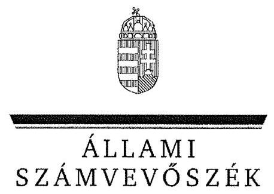
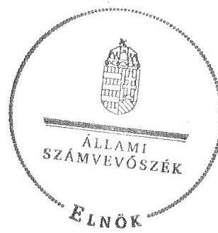

ÁLLAMI
SZÁMVEVÔSZÉK

# JELENTÉS 

az önkormányzati vagyongazdálkodás
szabályszerúségi ellenôrzéséröl
Mágocs

---

# Állami Számvevőszék 

Iktatószám: V-0026-081-032/2013.
Témaszám: 1065
Vizsgálat-azonosító szám: V061511

## Az ellenőrzést felügyelte:

## Makkai Mária

felügyeleti vezető
Az ellenőrzést vezette és az ellenőrzés végrehajtásáért felelős:
Schósz Attila Ferencné
ellenőrzésvezető
A számvevőszéki jelentés összeállításában közremúködött:
Balogné Lehoczki Éva
számvevő
Az ellenőrzést végezték:
Nagy Adrienn
Számvevő

## Dr. Hegedüs György

számvevő tanácsos

A témához kapcsolódó eddig készített számvevőszéki jelentések:
címe
sorszáma
Jelentés a térségek felzárkóztatására fordított pénzeszközök fel- 0991
használásának ellenőrzéséről

---

# TARTALOMJEGYZÉK 

BEVEZETÉS ..... 3
I. ÖSSZEGZŐ MEGÁLLAPÍTÁSOK, KÖVETKEZTETÉSEK, JAVASLATOK ..... 6
II. RÉSZLETES MEGÁLLAPÍTÁSOK ..... 11

1. A vagyongazdálkodási tevékenység szabályozottsága ..... 11
1.1. A feladatellátás formáinak meghatározása, a döntések megalapozottsága ..... 11
1.2. A vagyonnal gazdálkodó szervezetek szervezeti rendjének szabályozottsága, a kötelező szabályzatok megfelelősége ..... 12
1.3. A vagyongazdálkodás szabályozása ..... 13
1.4. A vagyonkezeléssel megbízott szervezetek beszámolási kötelezettségének szabályozása ..... 14
2. A vagyongazdálkodás szabályszerűsége ..... 15
2.1. A vagyon nyilvántartásának megfelelősége ..... 15
2.2. A vagyongazdálkodást érintő gazdasági események követelmények szerinti dokumentáltsága ..... 16
2.3. A vagyongazdálkodási döntések, intézkedések szabályszerűsége ..... 18
2.4. A közbeszerzési eljárás alkalmazása ..... 18
3. A vagyon változását eredményező gazdasági események szabályszerűsége ..... 19
3.1. A vagyon értékének és összetételének változása ..... 19
3.2. A vagyon fenntartására kialakított rendszer működésének megfelelősége és szabályozottsága ..... 20
3.3. A térítés nélküli átadások szabályszerűsége ..... 20
4. A vagyongazdálkodás szabályszerűségére vonatkozó belső és külső ellenőrzések hasznosulása ..... 21
4.1. A belső ellenőrzés által tett megállapítások, javaslatok hasznosulása ..... 21
4.2. A többségi tulajdonban lévő gazdasági társaságok vagyongazdálkodásának felügyelete ..... 22
4.3. A külső ellenőrző szervezetek által tett javaslatok hasznosulása ..... 23

---

# MELLÉKLETEK 

1. számú Mágocs Város Önkormányzata gazdálkodására jellemző adatok, mutatószámok
2. számú Mágocs Város Önkormányzata vagyonának alakulása 2007. január 1-je és 2011. december 31-e között
3. számú Mágocs Város Önkormányzata kötelezettségeinek alakulása 2007. január 1-je és 2011. december 31-e között

## FÜGGELÉKEK

1. számú Rövidítések jegyzéke
2. számú Értelmező szótár

---

# JELENTÉS 

## az önkormányzati vagyongazdálkodás szabályszerűségi ellenőrzéséről Mágocs

## BEVEZETÉS

Az ÁSZ kiemelten fontosnak tartja az ÁSZ tv. 5. § (4) bekezdése alapján az önkormányzatok vagyongazdálkodási tevékenységének, a vagyongazdálkodási szabályok betartásának ellenőrzését. Az ellenőrzés feladata, hogy értékelje a vagyongazdálkodással kapcsolatban a jogszabályokban és az önkormányzati belső szabályozásban előírtak érvényesülését a közpénzek felhasználásának átláthatósága, nyilvánossága érdekében. Az ÁSZ ellenőrzése nemcsak az ellenőrzött szervezet vagyongazdálkodásának hibáira, hiányosságaira mutat rá, számon kérve azok kijavítását, hanem megállapításaival, javaslataival segíti a közpénzekkel, a közvagyonnal való felelős gazdálkodást.

Az önkormányzati vagyon alapvető funkciója, hogy a helyi közérdeket és egyúttal az önkormányzati célok megvalósítását szolgálja. A feladatellátás terén elsősorban a kötelezően ellátandó feladatok végrehajtását hivatott szolgálni, amely mellett az önként vállalt feladatok ellátása is megvalósulhat.

## Az ellenőrzés célja annak értékelése volt, hogy az Önkormányzatnál:

- a vagyongazdálkodási tevékenység, annak szervezeti keretei szabályozottak$\mathrm{e} ;$
- az önkormányzati vagyongazdálkodás törvényességét, szabályszerűségét biztosították-e; a vagyon értékének és összetételének változását jogszerú döntésekkel alátámasztották-e;
- a belső ellenőrzés elősegítette-e a vagyongazdálkodás szabályszerű működését, valamint hasznosultak-e a korábbi külső ellenőrzések által tett javaslatok.

Az ellenőrzés típusa: szabályszerűségi ellenőrzés
Az ellenőrzés a 2007. január 1. és 2011. december 31. közötti időszakra terjedt ki. A közbeszerzési eljárások lefolytatásának ellenőrzése a 2011. évet és a 2012. év I. negyedévét érintette. Az Nvtv. egyes rendelkezései végrehajtásának ellenőrzése a nemzetgazdasági szempontból kiemelt jelentőségű nemzeti vagyonnak minősülő forgalomképtelen vagyonelemek meghatározására, valamint a kö-zép- és hosszú távú vagyongazdálkodási terv készítésére terjedt ki 2012-től 2013. július 8 -ig, a helyszíni ellenőrzés befejezéséig.

---

Az ellenőrzés szakmai módszertana az ÁSZ hivatalos honlapján közzétett szakmai szabályokon alapult, amely a Legfőbb Ellenőrző Intézmények Nemzetközi Szervezete (INTOSAI) által kiadott nemzetközi standardok (ISSAI) figyelembevételével készült.

A vagyonváltozásokkal kapcsolatos gazdasági események közül az ellenőrzött tételeket véletlen mintavétellel választottuk ki a Polgármesteri Hivatal 20072011. évi számviteli nyilvántartásaiból. Az Önkormányzattól tanúsítványt kértünk a korábbi ÁSZ ellenőrzések vagyongazdálkodásra vonatkozó javaslatainak hasznosulásáról, a könyvvizsgáló és a külső ellenőrzési szervek vagyongazdálkodással kapcsolatos 2007-2011. évi javaslataira tett intézkedésekről, valamint a 2007-2011. évek térítésmentes vagyonátadásairól és átvételeiről.

Mágocs város ${ }^{1}$ állandó lakosainak száma 2011. január 1-jén 2450 fő volt. Az Önkormányzat hét tagú Képviselő-testületének munkáját kettő állandó bizottság segítette. Az Önkormányzat a 2011. évben a Polgármesteri Hivatalon felül egy önállóan működő költségvetési szervvel, két társulással, továbbá egy 100\%-os önkormányzati tulajdonú gazdasági társasággal látta el feladatát. Az Önkormányzat kötelező feladatai közül az alapfokú oktatást az intézményfenntartó társulás, a belső ellenőrzési, valamint a gyermekvédelmi és családsegítési feladatokat a kistérségi társulás látta el. A védőnői szolgálatról és az egészségügyi alapellátásról feladat-ellátási szerződések keretében gondoskodtak. A szociális alapellátási feladatokat az Önkormányzat intézménye végezte. Az Önkormányzat gazdasági társaságának tevékenységi köre több közszolgáltatási tevékenységre terjedt ki: a szennyvíz gyűjtése és kezelése, a nem veszélyes hulladék kezelése és ártalmatlanítása, a köztemetői feladatok ellátása, települési zöldterület kezelés, víztermelés, vízkezelés, vízellátás.

Az Önkormányzat önként vállalt feladatai között a parkok gondozása, játszótér létesítése és fenntartása, a sport- és szabadidős tevékenység, civil szervezetek támogatása, a mezőőri szolgálat, közművelődési feladatok és az alapfokú művészetoktatás, valamint fizikoterápiás szolgáltatás és praxislabor működtetése szerepelt.

A polgármester a 2006. évi önkormányzati választások óta tölti be tisztségét, a jegyző 1990. december 10-től látja el feladatait. A Polgármesteri Hivatal hatósági és pénzügyi szervezeti egységre tagolódott, a foglalkoztatott köztisztviselők száma 2011. december 31-én 12 fő volt. A költségvetési szerveknél 2011. december 31-én 33 fő közalkalmazottat foglalkoztattak.

Az Önkormányzat a 2011. évi költségvetési beszámolója szerint 654,4 millió Ft költségvetési bevételt ért el, valamint 628,1 millió Ft költségvetési kiadást teljesített. A 2011. december 31-i könyvviteli mérleg szerint 969,1 millió Ft értékű nettó eszközvagyonnal rendelkezett, a rövid lejáratú kötelezettsége 3,6 millió Ft-ot tett ki. A 2007-2011. években nem vettek igénybe hosszú lejáratú fejlesztési célú hitelt, kötvényt nem bocsátottak ki, garanciát, készfizető kezességet nem vállaltak. Az ellenőrzött időszakban PPP konstrukcióban történő

[^0]
[^0]:    ${ }^{1}$ A köztársasági elnök 76/2009. (VI. 30.) számú határozatával városi címet adományozott Mágocs településnek.

---

fejlesztésre nem került sor. Az Önkormányzat a 2007-2011. évek között könyvvizsgálatra nem volt kötelezett.

Az Önkormányzat gazdálkodására jellemző adatokat, mutatószámokat az 1-3. számú mellékletek tartalmazzák. A jelentéstervezetben alkalmazott rövidítéseket az 1. számú függelék, az egyes fogalmak magyarázatát a 2. számú függelék tartalmazza.

Az ÁSZ a 2011. évi LXVI. törvény 29. § (1) bekezdése szerint a jelentéstervezetet megküldte egyeztetésre Mágocs Város Önkormányzata polgármesterének, aki az ÂSZ tv. 29. § (2) bekezdésében foglalt észrevételezési jogával nem élt, a jelentéstervezetre észrevételt nem tett.

---

# I. ÖSSZEGZŐ MEGÁLLAPÍTÁSOK, KÖVETKEZTETÉSEK, JAVASLATOK 

Az Önkormányzat könyvviteli mérleg szerinti vagyona a 2007. évi nettó 852,0 millió Ft nyitó értékről a 2011. év végére nettó 969,1 millió Ft-ra, 13,7\%$\mathrm{kal}(117,1$ millió Ft-tal) nőtt. A 2007-2011. években megvalósult legjelentősebb beruházások és felújítások az Önkormányzat kötelező feladatainak ellátásához kapcsolódtak (a Gondozási Központ korszerűsítése, csapadékvíz-elvezető hálózat fejlesztése, helyi utak fejlesztése, felújítása). A beruházások és felújítások fedezetét - a gazdasági porgram ${ }_{1,2}$-ben foglalt célkitűzésekkel összhangban - európai uniós és hazai támogatásokból, valamint önkormányzati saját forrásból biztosították. A 2007-2011. években a felújításokra és beruházásokra fordított kiadások összege (bruttó 254,7 millió Ft) $66,7 \%$-kal meghaladta az elszámolt értékcsökkenés összegét ( 152,8 millió Ft), hozzájárulva az elhasználódott eszközök pótlásához.

A Képviselő-testület a gazdasági program ${ }_{1,2}$-ben rögzítette az önkormányzati feladatellátás fő célkitűzéseit. Az Önkormányzat a kötelező és önként vállalt feladatainak ellátásáról a 2007. év elején a Polgármesteri Hivatal mellett egy intézménnyel, egy 100\%-os önkormányzati tulajdonú gazdasági társasággal, társulásokkal, üzemeltetési és feladat-ellátási szerződések útján gondoskodott. A Képviselő-testület a közoktatási feladatellátás szervezeti kereteit érintően a 2009. évben - gazdaságossági okok miatt - döntött az intézményfenntartó társulás ${ }_{1}$ megszüntetéséről és az intézményfenntartó társulás ${ }_{2}$ létrehozásáról.

A Képviselő-testület az önkormányzati vagyonnal való gazdálkodás szabályozása során a törvényi előírásoknak - a vagyonkezelői jog szabályozása kivételével - eleget tett. A Képviselő-testület az Ötv.-ben foglaltak alapján a vagyongazdálkodási rendeletben meghatározta a törzsvagyonba tartozó forgalomképtelen és korlátozottan forgalomképes vagyoni kört, a törzsvagyonba nem tartozó vagyonelemeket, valamint rögzítette az önkormányzati vagyonnal való felelős gazdálkodás és a vagyonhasznosítás szabályait. Az Önkormányzat az Nvtv.-ben meghatározott 2012. március 1-jei határidőn túl, 2013. június 1-jén jelölte meg a forgalomképtelennek minősülő vagyonból a nemzetgazdasági szempontból kiemelt jelentőségű, nemzeti vagyonnak minősülő, forgalomképtelen törzsvagyont. Az Önkormányzat a 2013. évben elfogadta a közép- és hosszú távú vagyongazdálkodási tervét. Az Ötv. előírása ellenére a vagyonkezelői jog szabályait nem alkották meg (vagyonkezelési szerződést a 2007-2011. években nem kötöttek). A Képviselő-testület - célszerűsége ellenére nem írta elő a tulajdonosi jogok védelme érdekében a garanciális elemek szerződésekben, egyéb dokumentumokban való rögzítésének kötelezettségét, valamint a forgalomképesség megváltoztatásának szabályait.

A jegyző a Htv. előírásának megfelelően kialakította a Polgármesteri Hivatal, valamint az önálló intézmény számviteli rendjét. A Polgármesteri Hivatal a 2007-2011. években rendelkezett az előírt pénzügyi-számviteli szabályzatokkal,

---

de a leltározási szabályzat ${ }_{1,2}$ - az Áhsz. előírásával ellentétben - nem tartalmazta az üzemeltetésre átadott eszközök leltározásának módját.

Az Önkormányzatnál a vagyongazdálkodás múködésének szabályszerűségét hiányosan biztosították. Az elkészített és a Képviselő-testület részére bemutatott vagyonkimutatás nem felelt meg az Áhsz. előírásainak, mivel a 2007. évi nem tartalmazta az önkormányzati vagyont törzsvagyon és törzsvagyonon kívüli egyéb vagyon bontásban, valamint a „0"-ra leírt eszközök állományát. A 2008-2011. évi vagyonkimutatás nem terjedt ki a források bemutatására. Az évenkénti leltározási kötelezettségnek az Önkormányzatnál a 2007., a 2009. és a 2011. években nem tettek eleget (az üzemeltetésre átadott eszközök esetében a 2010. évben sem), ezáltal a könyvviteli mérleg és a vagyonkimutatás adatait - az Áhsz. előírásaival szemben - ezekben az években leltárral nem támasztották alá, ennek következtében sérült a Számv. tv. szerinti mérleg valódiság elve. Az ingatlanvagyon-kataszter bruttó érték adatainak a számviteli nyilvántartások és a földhivatali nyilvántartás adataival való egyezőségét minden évben biztosították.

A jegyző az összeférhetetlenségi követelmények figyelembevételével kialakította a gazdálkodási jogkörök gyakorlásának rendjét, azonban - az Ámr. ${ }_{1}$ előírásai ellenére - 2010. január 1-jét megelőzően, a pénztári kifizetések kivételével, nem gondoskodott a szakmai teljesítésigazoló írásbeli kijelöléséről. A gazdálkodási és ellenőrzési jogkörök gyakorlásával kapcsolatban a 2007-2011. évek között az ellenőrzött építési beruházások, felújítások és nagy értékű eszköz beszerzések kiadásai esetében - az Áht. ${ }_{1,2}$ - ben és az Ámr. ${ }_{1,2}$-ben foglaltak ellenére - a kötelezettségvállalást nem előzte meg annak ellenjegyzése. A 2007-2009. években a szakmai teljesítésigazoló kijelölés hiányában látta el feladatát 5,6 millió Ft kiadás és 3,7 millió Ft bevétel esetében. A 2010. évtől a szakmai teljesítés igazolása a jogszabályi előírásoknak megfelelően megtörtént. Az érvényesítő és az utalvány ellenjegyzője aláírása ellenére nem kifogásolta, hogy a szakmai teljesítés igazolását jogosulatlanul végezték el, illetve nem jelezte, hogy a kötelezettségvállalást nem előzte meg annak ellenjegyzése. Nem történt meg az utalványozás és az utalvány ellenjegyzése 1,1 millió Ft tárgyi eszköz értékesítésből és bérleti díjakból származó bevételek esetében. Mindezek következtében nem történt meg a fedezet meglétének, a szabad előirányzat rendelkezésre állásának, a kiadások és bevételek teljesítésének, összegszerűségének, a szakmai teljesítésigazolás és az érvényesítés megtörténtének ellenőrzése.

Az önkormányzati vagyon értékének és összetételének változásához kapcsolódó döntések előkészítése és a döntéshozatal során - egy térítésmentes eszköz átvétel kivételével - betartották a jogszabályok és a belső szabályzatok előírásait. Az Ötv. hatásköri szabályai és a vagyongazdálkodási rendelet előírása ellenére egy autóbusz térítésmentes átvételéről a Képviselő-testület helyett a polgármester döntött. A vagyonváltozásokról hozott képviselő-testületi döntésekkel azonos tartalmú szerződéseket, megállapodásokat kötöttek. A szerződésekbe - szabályozás hiányában is - beépítették az Önkormányzat érdekeit védő garanciális elemeket. A vagyonváltozásokat eredményező döntések végrehajtása a szerződésekben, megállapodásokban foglaltaknak megfelelően történt. Az Önkormányzat a 2011. évben, illetve a 2012. év I. negyedévében a közbeszerzési értékhatárt elérő beruházás esetében lefolytatta a közbeszerzési eljárást, a kiválasztott eljárásrend megfelelt a Kbt. ${ }_{1,2}$ előírásainak.

---

A jegyző - a 2011. évi céljellegű, működési és fejlesztési támogatások kivételével - eleget tett az Áht-1 és a 18/2005. (XII. 27.) IHM rendelet szerinti, közérdekű gazdálkodási adatok (költségvetési, zárszámadási rendeletek, elemi költségvetések és beszámolók, vagyongazdálkodással összefüggő szerződések) közzétételére vonatkozó kötelezettségének.

A belső ellenőrzési feladatokat az Önkormányzat a 2007-2011. években a kistérségi társulás keretében látta el. A 2007-2011. évek között a vagyongazdálkodást érintően két alkalommal végeztek belső ellenőrzést. A belső ellenőrzési jelentések javaslatai a leltározás szabályszerű végrehajtására, valamint a belső kontrollrendszer szabályozására és múködésére vonatkoztak. Felelősöket és határidőket tartalmazó intézkedési tervet a javaslatok hasznosítására - a Ber. előírásai ellenére - a jegyző nem készített. A belső ellenőrzés által feltárt - vagyongazdálkodást érintő - szabályozási hiányosságokat a jegyző (intézkedési terv hiányában is) megszüntette. A gazdálkodási jogkörök gyakorlására tett megállapítások és javaslatok azonban nem hasznosultak, ezáltal a belső ellenőrzés a vagyongazdálkodás szabályszerű múködését nem segítette elő.

A 2007-2011. években az Önkormányzat kizárólagos tulajdonában álló gazdasági társaság pénzügy-gazdasági helyzetét a Képviselő-testület - a tulajdonosi felügyelet keretében, a vagyongazdálkodási rendelet előírásainak megfelelően - figyelemmel kísérte, a társaság éves beszámolóit a felügyelőbizottság és a könyvvizsgáló jelentésének figyelembe vételével fogadta el. Az Önkormányzat részéről - a gazdasági társaság nyereséges gazdálkodása következtében - tőkepótlásra, tőkeemelésre, értékvesztés elszámolására nem volt szükség.

Az Önkormányzatnál a 2007-2011. években a külső szervek a fejlesztések támogatásával kapcsolatosan végeztek ellenőrzéseket. Az ellenőrzések során két esetben szólították fel az Önkormányzatot hiánypótlásra, melynek eleget tettek.

Az Állami Számvevőszékről szóló 2011. évi LXVI. törvény 33. § (1) bekezdésében foglaltak értelmében a jelentésben foglalt megállapításokhoz kapcsolódó intézkedési tervet köteles az ellenőrzött szervezet vezetője összeállítani, és azt a jelentés kézhezvételétől számított 30 napon belül az ÁSZ részére megküldeni. Amennyiben az intézkedési tervet határidőben nem küldi meg a szervezet, vagy az nem elfogadható, az ÁSZ elnöke a hivatkozott törvény 33. § (3) bekezdés a)-b) pontjaiban foglaltakat érvényesítheti.

Az ellenőrzés intézkedést igénylő megállapításai és javaslatai:

# a polgármesternek 

Az évenkénti leltározási kötelezettségnek az Önkormányzatnál a 2007., a 2009. és a 2011. években nem tettek eleget (az üzemeltetésre átadott eszközök esetében a 2010. évben sem), ezáltal a könyvviteli mérleg és a vagyonkimutatás adatait ezekben az években leltárral nem támasztották alá.

---

A gazdálkodási és ellenőrzési jogkörök gyakorlásával kapcsolatban ellenőrzött esetekben a 2007-2011. évek között az építési beruházások, felújítások és nagy értékű eszköz beszerzések kiadásai esetében a kötelezettségvállalást ellenjegyző, a szakmai teljesítésigazoló, az érvényesítő és az utalvány ellenjegyző nem végezték el az előírt ellenőrzési feladataikat.

Javaslat:
Intézkedjen a számvevőszéki jelentés megállapításai alapján a leltározással és a gazdálkodási jogkörök gyakorlásával összefüggésben feltárt hiányosságok, szabálytalanságok körülményeinek kivizsgálásáról, és a vizsgálat eredményének függvényében tegye meg a szükséges munkajogi intézkedéseket.

# a jegyzőnek 

1. Az Önkormányzatnál a 2007-2011. évi vagyonkimutatások felépítése és tartalma nem felelt meg az Áhsz. 44/A. § (2)-(3) bekezdésében foglalt előírásoknak, mivel a 2007. évi vagyonkimutatás nem tartalmazta az önkormányzati vagyont törzsvagyon és törzsvagyonon kívüli egyéb vagyon bontásban, valamint a „0"-ra leírt eszközök állományát. A 2008-2011. évi vagyonkimutatás csak az eszközökre vonatkozott, a források bemutatása elmaradt.

Javaslat:
Intézkedjen az Önkormányzat vagyonkimutatásának az Áhsz. 44/A. § (2)-(3) bekezdésében előírtak szerinti elkészítéséről és annak a Képviselő-testület részére történő bemutatásáról.
2. Az Önkormányzatnál az Áhsz. 37. § (1) bekezdésében foglalt évenkénti leltározási kötelezettségnek a 2007., a 2009. és a 2011. években nem tettek eleget. Az üzemeltetésre átadott eszközök vonatkozásában - az Áhsz. 37. § (4) bekezdésében foglalt előírás ellenére - a 2010. évben sem állt rendelkezésre az üzemeltetést végző szervek által elkészített hitelesített leltár.

Javaslat:
Intézkedjen az Áhsz. 37. § (1) bekezdésének megfelelően a könyvviteli mérlegben kimutatott eszközök és források leltározásáról, továbbá arról, hogy az üzemeltetésre átadott eszközökről a könyvviteli mérleg alátámasztásához az Áhsz. 37. § (4) bekezdés előírásának megfelelően, az üzemeltetők által évente elvégzett és hitelesített leltárak álljanak rendelkezésre.
3. Az Önkormányzatnál a 2007-2011. években - az Ámr. 134. § (13) bekezdésében és az Ámr. 2 75. § (1) bekezdésében előírtak ellenére - nem vezettek a kötelezettségvállalásokról analitikus nyilvántartást.

Javaslat:
Intézkedjen az Ávr. 56. § (1) bekezdése szerint a kötelezettségvállalások nyilvántartásba vételéről.

---

4. A vagyongazdálkodás egyes területeivel kapcsolatos kiadások teljesítését és a bevételek beszedését megelőzően a gazdálkodási és ellenőrzési jogkörök gyakorlásával felhatalmazott személyek nem végezték el az előírt ellenőrzési feladatokat. Az Ámr. 134. § (8)-(9) bekezdése és az Ámr. 74. § (1)-(3) bekezdései ellenére összesen 12,3 millió Ft összegű kiadásnál a kötelezettségvállalást nem előzte meg annak ellenjegyzése. Az érvényesítő a 2007-2011. évek között nem végezte el az Ámr. 1 135. § (3) bekezdése, illetve az Ámr. 2 77. § (1) bekezdése szerinti ellenőrzési feladatát, mivel aláírása ellenére nem kifogásolta, hogy a szakmai teljesítés igazolását jogosulatlanul végezték el, illetve nem jelezte, hogy a kiadások esetében a kötelezettségvállalást egyetlen esetben sem előzte meg annak írásbeli ellenjegyzése. Az Ámr. 1 136. § (3) bekezdése és az Ámr. 2 78. § (2) bekezdése, valamint az Ámr. 1 137. § (3) bekezdése és az Ámr. 2 79. § (2) bekezdése ellenére nem történt meg az utalványozás és az utalvány ellenjegyzése a bevételek (összesen 1,1 millió Ft értékű) elszámolása során.

Javaslat:
Intézkedjen, hogy a pénzügyi ellenjegyző, az érvényesítő és az utalványozó - az Áht. 2 37. § (1) bekezdésében, az Ávr. 58. § (1)-(2) bekezdéseiben foglalt előírásoknak megfelelően - végezze el ellenőrzési feladatait.
5. A Ber. 29. § (1) bekezdés előírása ellenére a belső ellenőrzés által feltárt hiányosságok megszüntetésére egyik ellenőrzést követően sem készítettek intézkedési tervet. Az Önkormányzat a gazdálkodási jogkörök gyakorlása tekintetében tett javaslatokat nem hasznosította, ezáltal a belső ellenőrzés nem járult hozzá a vagyongazdálkodás szabályszerű működéséhez.

Javaslat:
Intézkedjen, hogy a Bkr. 28. § c) pontjában előírtaknak megfelelően készüljön intézkedési terv a belső ellenőrzés által feltárt hiányosságok megszüntetésére, továbbá az intézkedési tervben foglaltak végrehajtására.

---

# II. RÉSZLETES MEGÁLLAPÍTÁSOK 

## 1. A VAGYONGAZDÁLKODÁSI TEVÉKENYSÉG SZABÁLYOZOTTSÁGA

### 1.1. A feladatellátás formáinak meghatározása, a döntések megalapozottsága

Az Önkormányzat 2007-2010., valamint 2011-2014. évekre szóló gazdasági program ${ }_{1,2}$-jét a Képviselő-testület elfogadta. A gazdasági program ${ }_{1,2}$-ben fő célkitűzésként a munkahelyteremtés érdekében a vállalkozások segittését, a bevételek növelését, a helyi adópolitikának megfelelő adórendszer megteremtését, a költségvetési támogatási rendszer nyújtotta előnyök kihasználását, valamint a vagyontárgyak gazdaságos hasznosítását határozták meg.

Az Önkormányzat az Ötv. 8. § (2) bekezdése alapján a kötelező és önként vállalt feladatok körét és a feladatellátás módját meghatározta ${ }^{2}$, mértékét az éves költségvetési rendeletekben rögzítette. Az Önkormányzat 2007. január 1-jén a kötelező és önként vállalt feladatait a Polgármesteri Hivatal mellett egy részben önállóan gazdálkodó költségvetési szervvel, egy kizárólagos tulajdonú közhasznú társasággal és kettő társulással látta el.

Az Önkormányzat kötelező feladatai közül az alapfokú oktatásról az intézményfenntartó társulás ${ }_{1}$ költségvetési szerveként múködő ÁMK keretében gondoskodott. A belső ellenőrzési, valamint a gyermekvédelmi és családsegittési feladatokat a kistérségi társulás látta el. A védőnői szolgálatról, az egészségügyi alapellátásról feladat-ellátási szerződések keretében gondoskodtak. A szociális alapellátási feladatokat a Gondozási Központ végezte. Az igazgatási és egyéb közszolgáltatási feladatokról a Polgármesteri Hivatal gondoskodott. A Mágocsvíz Kft. tevékenységi köre több közszolgáltatási tevékenységre terjedt ki: a szennyvíz gyüjtése és kezelése, a nem veszélyes hulladék kezelése és ártalmatlanítása, a köztemetői feladatok ellátása, illetve üzletszerű gazdasági tevékenységei között nevesítette a települési zöldterület-kezelést, víztermelést, vízkezelést és vízellátást. Ezek a tevékenységek a szakmai ágazati szabályok szerint kötelezően ellátandó önkormányzati feladatnak minősültek.

Az önkormányzati SZMSZ 1. számú melléklete az önként vállalt feladatok között nevesítette a Polgármesteri Hivatal által ellátott feladatok közül a játszótér létesítését és fenntartását, a sport, a szabadidős tevékenység, valamint a civil szervezetek támogatását és a mezőőri szolgálatot. Az önként vállalt feladatok közé tartozott továbbá az ÁMK-hoz tartozó művelődési házzal és könyvtárral ellátott közművelődési feladatok és alapfokú művészetoktatás, valamint a feladat-ellátási szerződés keretében ellátott fizikoterápiás szolgáltatás és a praxislabor müködtetése.

[^0]
[^0]:    ${ }^{2}$ Az Önkormányzat kötelező feladatait a gazdasági program ${ }_{1,2}$ tartalmazta. Az önként vállalt feladatokat az önkormányzati SZMSZ 1. számú melléklete sorolta fel.

---

A Képviselő-testület a 2007-2011. évek között az önkormányzati feladatellátással kapcsolatban egy döntést hozott, azonban a feladatellátás szervezetében nem történt változás. A polgármester az előterjesztésben a feladatellátás körének, formájának módosítására alternatív javaslatokat mutatott be, amelyek figyelembevételével hozta meg a döntését a Képviselő-testület.

A Képviselő-testület gazdaságossági okok miatt 2009. június 30 -án a meglévő intézményfenntartó társulás ${ }_{1}$ megszüntetéséről, illetve az intézményfenntartó társulás ${ }_{2}$ létrehozásáról döntött. A feladatellátás a közoktatás szakmai feladatainak körét nem érintette, azonban a társulásban résztvevő önkormányzatok körét bővítették. Ezáltal az ellátotti létszám nőtt, javult az intézmények kapacitás kihasználtsága.

# 1.2. A vagyonnal gazdálkodó szervezetek szervezeti rendjének szabályozottsága, a kötelező szabályzatok megfelelősége 

A Képviselő-testület a 2007-2011. években - az Ötv. 1. § (6) bekezdés a) pontjában foglaltaknak megfelelően - kialakította a szervezeti és múködési rendjét. A Képviselő-testület az önkormányzati SZMSZ-ben és a vagyongazdálkodási rendeletben a helyi sajátosságok figyelembe vételével meghatározta a vagyongazdálkodási feladatokat, továbbá rögzítette a polgármesterre, a Pénzügyi bizottságra, illetve a vagyonnal gazdálkodó szervezetek (az önkormányzati feladatokat ellátó költségvetési szervek, az Önkormányzat gazdasági társasága) vezetőire átruházott hatásköröket. Az átruházott hatáskörben hozott intézkedésekről beszámolási kötelezettséget nem írtak elő. A vagyongazdálkodási rendelet szabályozása összhangban volt az önkormányzati SZMSZ-szel.

A vagyongazdálkodási rendelet szerint a Pénzügyi bizottság hatáskörébe tartozott az 1,0 millió Ft értékhatár alatti, ellenérték nélkül felajánlott vagyon elfogadásának jóváhagyása és a behajthatatlan követelések törlése 0,3 millió Ft értékhatárig. A polgármester volt jogosult a hatáskörrel rendelkező szerv döntése alapján a vagyonhasznosítással kapcsolatos jogügyletek, illetve a nem intézményi használatban lévő bérleti szerződések megkötésére. A vagyonnal gazdálkodó önkormányzati szervezetek vezetőinek hatáskörébe tartozott a Pénzügyi bizottság jóváhagyásával a használatukban, kezelésükben lévő 0,1 millió Ft-ot meg nem haladó értékű ingó vagyontárgyak értékesítése, továbbá a közszolgáltatáshoz nélkülözhető vagyon két évet meg nem haladó, határozott időtartamú bérbeadás útján történő hasznosítása.

A jegyző - a Htv. 140. § (1) bekezdés c) pontjában foglaltak szerint - kialakította a Polgármesteri Hivatal, valamint az önálló intézmény számviteli rendjét, amely megfelelő keretet biztosított a vagyongazdálkodás szempontjából az Önkormányzat költségvetési szervei egységes számviteli elvek szerinti, önkormányzati szintű beszámolójának elkészítéséhez. A Polgármesteri Hivatal a 2007-2011. években rendelkezett az Áhsz.-ben előírt pénzügyi-számviteli szabályzatokkal. A Képviselő-testület nem élt az Áhsz. 37. § (7) bekezdése szerinti lehetőséggel, nem alkotott rendeletet a kétévenkénti leltározásról. A leltározási szabályzat ${ }_{1,2}$ - a 2007-2009. évek között - az Áhsz. 37. § (2) bekezdésében, a 2010. évtől az Áhsz. 37. § (4) bekezdésében foglaltakkal ellentétben - nem tartalmazta az üzemeltetésre átadott eszközök leltározásának módját.

---

# 1.3. A vagyongazdálkodás szabályozása 

A Képviselő-testület az önkormányzati vagyonnal való gazdálkodás szabályozása során a törvényi előírásoknak - a vagyonkezelői jog szabályozása kivételével - eleget tett. A Htv. 138. § (1) bekezdés j) pontja alapján a vagyongazdálkodási rendeletben rögzítették az önkormányzati vagyonnal való felelős gazdálkodás szabályait. A vagyongazdálkodási rendeletben - az Ötv. 79. § (2) bekezdésének megfelelően - meghatározták az önkormányzati feladatellátást biztosító törzsvagyon körét, azon belül a forgalomképtelen és a korlátozottan forgalomképes vagyonelemeket, illetve a forgalomképes vagyon körébe tartozó vagyontárgyakat. A vagyongazdálkodási rendelet a teljes vagyoni körre kiterjedt és tartalmazta az önkormányzati vagyon ingyenes vagy kedvezményes átruházása és a követelésről való lemondás szabályait. Az Ötv. 80/B. §-a ellenére ${ }^{3}$ nem írták elő a vagyonkezelői jog részletes szabályait (az Önkormányzat a 2007-2011. években nem kötött vagyonkezelési szerződést). A Képviselő-testület - célszerűsége ellenére - nem írta elő a tulajdonosi jogok védelme érdekében a garanciális elemek szerződésekben, egyéb dokumentumokban való rögzítésének kötelezettségét. Az Önkormányzat nem rendelkezett továbbá a forgalomképesség megváltoztatásának szabályairól.

A törzsvagyon, ezen belül a forgalomképtelen és korlátozottan forgalomképes, illetve a forgalomképes vagyon besorolás szerinti elkülönített nyilvántartását a 2007-2011. évek időszakára a hatályos számviteli politika ${ }_{1,2,3}$ részét képező számlarend ${ }_{1,2}$ biztosította.

Az egyes vagyonelemek hasznosítási módjáról a vagyongazdálkodási rendelet rendelkezett.

Az 1,0 millió Ft értékhatárt meghaladó önkormányzati vagyon elidegenítése, használatba vagy bérbeadása, más módon történő hasznosítása esetében előírták a versenyeztetési kötelezettséget. A hasznosítás az előírás szerint csak a legjobb ajánlatot tevő részére történhetett. Az önkormányzati intézmények esetében a vagyon hasznosításának a lehetőségét a kötelező feladataik ellátásához kötötték. A szabad kapacitás hasznosítására csak a kötelező feladatok ellátásán túl volt lehetőség. Az intézményeknek nem tették lehetővé az ingatlanok elidegenítését, illetve biztosítékul történő felhasználását. A vagyontárgyak egyéb célú hasznosítását a fenntartó engedélyéhez kötötték.

A vagyongazdálkodást érintő előterjesztések készítésének, megtárgyalásának, véleményezésének és döntéshozatalának rendjére az önkormányzati SZMSZ általános szabályai vonatkoztak.

Az Önkormányzatnál a jegyző szabályozta ${ }^{4}$ a nyilvánosság biztosításának eszközeit, a közérdekű adatok megismerésére irányuló igények teljesítésének rend-

[^0]
[^0]:    ${ }^{3}$ 2012. január 1-jétől az Mötv. 109. §-a szabályozza.
    ${ }^{4}$ A közérdekű adatok megismerésére vonatkozó igények teljesítésének rendjéről szóló szabályzat 2010. január 1-jén lépett hatályba.

---

jét, a személyes adatok védelméről és a közérdekű adatok nyilvánosságáról szóló 1992. évi LXIII. törvény 20. § (8) bekezdésében foglaltaknak megfelelően ${ }^{5}$.

A jegyző kialakította az operatív gazdálkodással és annak munkafolyamatba épített ellenőrzésével összefüggő jogkörök gyakorlásának rendjét, valamint a velük kapcsolatos összeférhetetlenségi követelményeket a pénzgazdálkodási szabályzat ${ }_{2}$-ben. A 2009. december 31-ig hatályban lévő pénzgazdálkodási szabályzat ${ }_{1}$-ben - az Ámr. 135. § (2) bekezdésében ${ }^{6}$ rögzítettekkel ellentétben a jegyző nem szabályozta a szakmai teljesítésigazolás módját és - a pénztári kifizetések kivételével - nem jelölte ki a szakmai teljesítés igazolására jogosult személyeket. A polgármester felhatalmazást adott kötelezettségvállalásra és utalványozásra. A jegyző 2010. január 1-jét követően a pénzgazdálkodási szabályzat ${ }_{2}$-ben gondoskodott a kiadások esetében a szakmai teljesítésigazolást végzők kijelöléséről, de nem élt annak lehetőségével, hogy ezen időponttól előírhatja a bevételek szakmai teljesítésigazolásának kötelezettségét.

Az Önkormányzat a vagyongazdálkodási rendeletben - az Nvtv.-ben meghatározott 2012. március 1-jei határidőn túl, 2013. június 1-jén - jelölte meg az Nvtv. 18. § (1) bekezdése alapján a forgalomképtelennek minősülő vagyonából nemzetgazdasági szempontból kiemelt jelentőségű nemzeti vagyonként a Mágocsvíz Kft.-ben fennálló önkormányzati részesedést. A Képviselő-testület 2013. április 23-án fogadta el - az Nvtv. 9. § (1) bekezdésében előírt - közép- és hosszú távú vagyongazdálkodási tervet.

# 1.4. A vagyonkezeléssel megbízott szervezetek beszámolási kötelezettségének szabályozása 

Az Önkormányzat az ellenőrzött időszakban - az Ötv. 80/A. §-a által szabályozott - vagyonkezelői jogot nem alapított.

Az Önkormányzat és a Mágocsvíz Kft. között 1996. december 27-én megkötött szerződés a társaságnak, mint üzemeltetőnek átadott kezelői és üzemeltetői jogokról rendelkezett. A szerződésben az üzemeltető számára beszámolási kötelezettséget nem írtak elő. A társaság az Önkormányzatnak, mint tulajdonosnak a Számv. tv. szerinti beszámolóját, mérlegét és eredmény-kimutatását rendelkezésére bocsátotta. A Képviselő-testület a beszámolókat határozatokkal fogadta el ${ }^{7}$.

[^0]
[^0]:    ${ }^{5}$ 2012. január 1-jétől az információs önrendelkezési jogról szóló és az információszabadságról szóló 2011. évi CXII. törvény 30. § (6) bekezdés szabályozza.
    ${ }^{6}$ 2010. január 1-jétől az Ámr. 2 76. § (5) bekezdése, 2012. január 1-től az Ávr. 57. § (4) bekezdése szabályozza.
    ${ }^{7}$ A 117/2007. (XI. 27.) számú, az 53/2008. (V. 27.) számú, a 41/2009. (VI. 2.) számú, az 51/2010. (V. 25.) számú, a 107/2010. (XI. 30.) számú és az 54/2012. (V. 30.) számú határozatokkal fogadta el a Képviselő-testület.

---

# 2. A VAGYONGAZDÁLKODÁS SZABÁLYSZERŰSÉGE 

### 2.1. A vagyon nyilvántartásának megfelelősége

A 2007-2011. évek között - az Ötv. 78. § (2) bekezdése szerint - minden évben elkészítették a vagyonkimutatást és azt a zárszámadási rendelettervezet előterjesztésekor - az Áht. ${ }_{1} 118$. § (2) bekezdése 2. c) pontjának megfelelően - a Képviselő-testület részére tájékoztatásul bemutatták. A 2007-2011. évi vagyonkimutatások felépítése és tartalma nem felelt meg az - Áhsz. 44/A. § (2)-(3) bekezdésében foglalt - előírásoknak, mivel a 2007. évi vagyonkimutatás nem tartalmazta az önkormányzati vagyont törzsvagyon és törzsvagyonon kívüli egyéb vagyon bontásban, valamint a „0"-ra leírt eszközök állományát. A 20082011. évi vagyonkimutatás csak az eszközökre vonatkozott, a források bemutatása elmaradt.

Az Önkormányzat a 2007-2011. években eleget tett az Ötv 78. § (2) bekezdésében foglalt előírásnak, mivel a főkönyvi számlák alábontásával, valamint a számlákhoz kapcsolódó analitikus nyilvántartások vezetésével biztosította a törzsvagyon (ezen belül forgalomképtelen, illetve korlátozottan forgalomképes vagyon) többi vagyontárgytól való elkülönített nyilvántartását.

Az Önkormányzat a 2007-2011. években elvégezte a számviteli nyilvántartásban szereplő ingatlanvagyon adatainak az ingatlanvagyon-kataszter adatai val való egyeztetését, amelynek tényét írásban rögzítették. A vagyonkataszter szerinti bruttó érték adatok a számviteli nyilvántartás szerinti bruttó érték adatokkal megegyeztek. A 147/1992. (XI. 6.) Korm. rendelet 1. § (2) bekezdésének megfelelően az ingatlanvagyon-kataszter adatainak a földhivatali nyilvántartással való egyezőségét folyamatosan biztosították az ellenőrzött időszakban.

Az Önkormányzatnál - az Áhsz. 37. § (1) bekezdésében foglalt - évenkénti leltározási kötelezettség állt fent, amelynek a 2007., a 2009. és a 2011. években nem tettek eleget. Az üzemeltetésre átadott eszközök vonatkozásában - az Áhsz. 37. § (4) ${ }^{8}$ bekezdésében foglalt előírás ellenére - a 2010. évben sem állt rendelkezésre az üzemeltetést végző szervek által elkészített hitelesített leltár.

Mindezek miatt az Önkormányzat elemi költségvetési beszámolójának részét képező könyvviteli mérlegeket - az Áhsz. 37. § (2) bekezdésében foglaltak ellenére - a 2007., 2009. és a 2011. években (valamint az üzemeltetésre átadott eszközök tekintetében a 2010. évben) nem támasztották alá leltárral, ennek következtében sérült a Számv. tv. 15. § (3) bekezdése szerinti mérleg valódiság elve.

[^0]
[^0]:    ${ }^{8}$ Megállapította a 317/2009. (XII. 29.) Korm. rendelet 18. §-a. Először a 2010. évről készített beszámolókra kellett alkalmazni.

---

# 2.2. A vagyongazdálkodást érintő gazdasági események követelmények szerinti dokumentáltsága 

Az Önkormányzatnál a 2007-2011. években - az Ámr. ${ }_{1}$ 134. § (13) bekezdésében ${ }^{9}$ előírtak ellenére - nem vezettek a kötelezettségvállalásokról analitikus nyilvántartást.

A Polgármesteri Hivatalban a 2007-2011. években a vagyongazdálkodással összefüggő kiadások teljesítését és a bevételek beszedését megelőzően az ellenőrzött tételek közül az alábbi esetekben - az Ámr. ${ }_{1,2}$-ben foglaltak ellenérenem végezték el - a gazdálkodási és ellenőrzési jogkörök gyakorlása során az előírt (folyamatba épített) ellenőrzési feladatokat.

Az építési beruházások, felújítások és nagy értékű eszköz beszerzések kiadásai esetében a 2007-2011. években - az Áht. ${ }^{10}$ és az Ámr. ${ }_{1}$ 134. § (8)-(9) bekezdéseiben ${ }^{11}$ foglaltak ellenére - a kötelezettségvállalást nem előzte meg annak ellenjegyzése (összesen nettó 12,3 millió Ft értékben). A kötelezettségvállalások ellenjegyzésének hiányában elmaradt a szabad előirányzat és a pénzügyi fedezet rendelkezésre állásának, valamint a gazdálkodásra vonatkozó szabályok betartásának ellenőrzése.

A 2007-2009. években a szakmai teljesítés igazolása nem felelt meg a jogszabályi előírásoknak. Az Ámr. ${ }_{1}$ 135. § (2) bekezdésében foglalt előírás ellenére 2009. december 31-éig a szakmai teljesítés igazolója írásbeli kijelölés hiányában ${ }^{12}$ végezte el a szakmai teljesítés igazolását (összesen nettó 5,6 millió Ft értékű kiadás és nettó 3,7 millió Ft értékű bevétel esetében). A 2010. évtől a szakmai teljesítés igazolása a jogszabályi előírásoknak megfelelően megtörtént. Az érvényesítő a 2007-2011. évek között nem végezte el az Ámr. ${ }_{1}$ 135. § (3) bekezdése, illetve az Ámr. ${ }_{2}$ 77. § (1) bekezdése ${ }^{13}$ szerinti ellenőrzési feladatát, mivel aláírása ellenére nem kifogásolta, hogy a szakmai teljesítés igazolását jogosulatlanul végezték el, illetve nem jelezte, hogy a kiadások esetében a kötelezettségvállalást egyetlen esetben sem előzte meg annak írásbeli ellenjegyzése.

Az utalvány ellenjegyzője nem a jogszabályi előírásoknak megfelelően végezte el a 2007-2011. években az Ámr. ${ }_{1}$ 137. § (3) bekezdése, illetve az Ámr. ${ }_{2}$ 79. § (2) bekezdése ${ }^{14}$ szerinti ellenőrzési feladatát, nem kifogásolta, hogy a szakmai teljesítés igazolását jogosulatlanul végezték el, illetve nem jelezte, hogy a kiadások esetében a kötelezettségvállalást egyetlen esetben sem előzte meg annak írásbeli ellenjegyzése. Aláírása ellenére - kötelezettségvállalás nyilvántartás hiányában a kiadások ellenjegyzése során nem győződhetett meg arról, hogy a jóváhagyott

[^0]
[^0]:    ${ }^{9}$ 2010. január 1-jétől az Ámr. ${ }_{2}$ 75. § (1) bekezdése, 2012. január 1-jétől az Ávr. 56. § (1) bekezdése szabályozta.
    ${ }^{10}$ 2009. január 1-jétől az Áht. ${ }_{1}$ 100/B. § (3) bekezdése, 2010. augusztus 15-től az Áht. ${ }_{1}$ 100/C. § (3) bekezdése írta elő. 2012. január 1-jétől az Áht. ${ }_{2}$ 37. § (1) bekezdése szabályozza.
    ${ }^{11}$ 2010.január 1-jétől az Ámr. ${ }_{2}$ 74. § (1) és (3) bekezdése írta elő, 2012. január 1-jétől az Áht. ${ }_{2}$ 37. § (1) bekezdése szabályozza.
    ${ }^{12}$ A szakmai teljesítés igazolására jogosultak kijelölése 2010. január 1-jén történt meg.
    ${ }^{13}$ 2012. január 1-jétől az Ávr. 58. § (1) bekezdése szabályozza.
    ${ }^{14}$ 2012. január 1-jétől jogszabály nem írja elő az utalvány ellenjegyzését.

---

költségvetés fel nem használt, illetve le nem kötött, a kötelezettségvállalás tárgyával összefüggő kiadási előirányzat rendelkezésre állt-e.

Az Ámr. ${ }_{1}$ 136. § (3) bekezdése és az Ámr. ${ }_{2}$ 78. § (2) bekezdése, valamint az Ámr. ${ }_{1}$ 137. § (3) bekezdése és az Ámr. ${ }_{2}$ 79. § (2) bekezdése ellenére nem történt meg az utalványozás és az utalvány ellenjegyzése a bevételek 16,9\%-ánál (nettó 1,1 millió Ft értékű bevétel elszámolása során).

A gazdálkodási jogkörök gyakorlása során betartották az - Ámr. ${ }_{1}$ 138. § (1)-(3) bekezdéseiben, valamint az Ámr. ${ }_{2} 80 . \S$ (1) és (2) bekezdésében, továbbá a pénzgazdálkodási szabályzat ${ }_{1,2}$-ben rögzített - összeférhetetlenséget kizáró követelményeket.

A gazdálkodási és ellenőrzési jogkörök gyakorlásával kapcsolatban feltárt hiányosságok annak ellenére fennálltak, hogy a jegyző a 2007-2011. évekre vonatkozóan az Ámr. ${ }_{1} 23$. számú melléklete ${ }^{15}$ szerinti nyilatkozat kitöltésével kijelentette, hogy gondoskodott a Polgármesteri Hivatalnál a belső kontroll rendszerek múködéséről.

Az Önkormányzat az ellenőrzött időszakban - az Áhsz. 9. sz. melléklet 1. g) pontjában foglalt szabályozás ellenére - a beruházási kiadásokat a vásárlás, létesítés, illetve felújítás számlákra aktiválta a pénzügyi teljesítéssel egyidejűleg azokban az esetekben is, amikor részszámla került kiállításra, és az üzembe helyezés még nem történt meg, ezért beszámolóiban függőben lévő beruházás, felújítás nem szerepelt. Ebből következően az értékcsökkenés elszámolásának kezdő időpontja megelőzte az üzembe helyezés időpontját, ellentétben az Áhsz. 30. § (1) bekezdésében foglaltakkal.

A polgármester az önkormányzati képviselők és polgármesterek általános választását megelőzően, az Áht. ${ }_{1}$ 50/A. § (4) bekezdése előírásainak megfelelően - az Önkormányzat hirdetőtábláján és honlapján - tájékoztatót tett közzé az Önkormányzat vagyoni és pénzügyi helyzetéről, valamint a Képvise-lő-testület megalakulását követően keletkezett, a későbbi éveket terhelő pénzügyi kötelezettségekről.

A jegyző a 2007-2011. évi költségvetési és zárszámadási rendeletek, elemi költségvetések és költségvetési beszámolók önkormányzat honlapján történő közzétételével eleget tett a 18/2005. (XII. 27.) IHM rendelet 2. számú mellékletében foglalt kötelezettségének. A jegyző gondoskodott a 2007-2011. években az Áht. ${ }_{1}$ 15/B. §-ban előírtaknak megfelelően a vagyongazdálkodással összefüggő - a nettó öt millió Ft-ot elérő vagy azt meghaladó értékű - szerződések adatainak közzétételéről. Az Önkormányzat az Áht. ${ }_{1}$ 15/A. §-ban előírtak ellenére a 2011. évben nem tette közzé a céljellegú, múködési és fejlesztési támogatásokat, míg a 2007-2010. években a közzétételi kötelezettségnek eleget tett.

[^0]
[^0]:    ${ }^{15}$ 2010. január 1-jétől az Ámr. ${ }_{2}$ 21. számú melléklete, 2012. január 1-jétől a Bkr. 1. számú melléklete szabályozza.

---

# 2.3. A vagyongazdálkodási döntések, intézkedések szabályszerűsége 

Az Önkormányzat a vagyontárgyak hasznosítása, a vagyon értékének és összetételének változását befolyásoló döntések előkészítése során egy térítésmentes eszköz átvétel kivételével - betartotta a jogszabályok és a belső szabályzatok előirásait. A 2007-2011. években az Önkormányzatnál a beruházások és felújítások indítását a fejlesztési szükségletek és az európai uniós pályázati lehetőségek befolyásolták. Az európai uniós finanszírozással megvalósult fejlesztések - a Gondozási Központ korszerűsítése és a belterületi csapadékvíz-hálózat fejlesztése, közlekedési szolgáltatások fejlesztése - pályázataihoz, a döntések előkészítése során a kötelezően csatolt megvalósíthatósági tanulmányokban vizsgálták a létrehozandó létesítmények fenntarthatóságát.

Az ellenőrzött, vagyonváltozáshoz kapcsolódó döntéseket - egy térítésmentes eszköz átvételének kivételével - az arra jogosult Képviselő-testület, illetve a polgármester hozta meg. A Képviselő-testület az önkormányzati tulajdonban lévő ingatlanok értékesítéséről a vagyongazdálkodási rendeletnek megfelelően készített értékbecslések, illetve a kimutatott nyilvántartási értéken alapuló előterjesztések alapján döntött.

A vagyonváltozásokról hozott képviselő-testületi döntésekkel azonos tartalmú szerződéseket, megállapodásokat kötöttek. A vagyonváltozásokhoz kapcsolódó szerződésekbe - belső szabályozás hiányában is - beépítették az Önkormányzat érdekeit védő garanciális elemeket. A szerződésekben a késedelmes fizetés esetére késedelmi kamat felszámítását írták elő, a bérleti díj meg nem fizetése esetére a bérleti jogviszony felmondását jelölték meg.

A vagyonváltozásokat eredményező döntések végrehajtása a szerződésekben, megállapodásokban foglaltaknak megfelelően történt.

### 2.4. A közbeszerzési eljárás alkalmazása

Az Önkormányzat a 2011. évben, illetve a 2012. év I. negyedévében a közbeszerzési értékhatárt elérő esetben lefolytatta a Kbt. ${ }_{1,2}$ által előírt közbeszerzési eljárást, amely megfelelt a jogszabályok előírásainak. A Kbt. ${ }_{1,2}$-ben előírt egybeszámítási kötelezettségnek eleget tettek, illetve a becsült érték alapján megalapozottan választották ki az alkalmazandó eljárásrendet.

Az Önkormányzat a 2011. évben 254,7 millió Ft támogatást nyert el a bruttó 356,0 millió Ft becsült költségű, funkcióbővítő városfejlesztési projektjére a DélDunántúli Operatív Program keretéből. A Képviselő-testület egy projektelem esetében az általános egyszerú közbeszerzési eljárás megindításáról határozott ${ }^{16}$, melynek becsült értéke nettó 21,1 millió Ft volt. Az eljárás 2011. december 8-án érvénytelen ajánlat miatt eredménytelenül zárult. A Képviselő-testület új közbeszerzési eljárás megindításáról döntött ${ }^{17}$, más ajánlattevők meghívásával. Az el-

[^0]
[^0]:    ${ }^{16}$ A 153/2011. (X. 25.) számú határozatával döntött a Képviselő-testület.
    ${ }^{17}$ A 171/2011. (XII. 14.) számú határozatával döntött a Képviselő-testület.

---

járás ismételten eredménytelenül zárult a rendelkezésre álló anyagi fedezetet meghaladó ajánlattételi összegek miatt. A közbeszerzés az ellenőrzött időszakon túl, az összes projektelemre vonatkozó nyílt eljárás lefolytatását követően vezetett eredményre, a szerződéseket a képviselő-testületi döntésnek megfelelően kötötték meg.

# 3. A VAGYON VÁLTOZÁSÁT EREDMÉNYEZŐ GAZDASÁGI ESEMÉNYEK SZABÁLYSZERŰSÉGE 

### 3.1. A vagyon értékének és összetételének változása

Az Önkormányzat könyvviteli mérleg szerinti vagyona a 2007. január 1-jei nettó 852,0 (bruttó 1149) millió Ft-os nyitó értékről a 2011. év végére nettó 969,1 (bruttó 1303,3) millió Ft-ra, 13,7\%-kal növekedett. A befektetett eszközök aránya az eszközvagyonon belül - a befektetett eszközök értékének növekedése ellenére - a 2007. évi 92,2\%-ról a 2011. évre 87,2\%-ra csökkent, a forgóeszközök között szereplő pénzeszközök és követelések értékének növekedése miatt.

Az Önkormányzat a 2007-2011. években - a költségvetési beszámolók adatai szerint - összesen nettó 208,4 millió Ft-ot, bruttó 254,7 millió Ft-ot fordított beruházási és felújítási kiadásokra. Az ellenőrzött időszakban megvalósított fejlesztések forrását - a gazdasági program ${ }_{1,2}$ célkitűzéseinek megfelelően - 163,0 millió Ft hazai és európai uniós pályázati támogatás és 91,7 millió Ft saját forrás (elsősorban helyi adóbevétel) biztosította. A fejlesztésekhez igénybe vett támogatások a bekerülési költségek 64,0\%-át tették ki. A felhalmozási tevékenység hozzájárult az Önkormányzat kötelező feladatainak ellátásához. A 2007-2011. években megvalósult nagyobb értékű beruházások és felújítások a következők voltak: a Gondozási Központ korszerűsítése (bruttó 39,6 millió Ft), a belterületi csapadékvíz-elvezető hálózat fejlesztése (bruttó 21,6 millió Ft), akcióterületi terv készíttetése (bruttó 16,1 millió Ft), valamint épület felújítás (bruttó 12,2 millió Ft). Helyi utak fejlesztésére és felújítására a 20072011. években az Önkormányzat - a csapadékvíz-hálózat fejlesztésén kívül összesen bruttó 66,3 millió Ft-ot fordított.

Az ingatlanok és a kapcsolódó vagyoni értékú jogok könyvviteli mérlegben kimutatott állományi értéke a 2007. évi 644,0 millió Ft-os nyitó értékről a 2011. évre 696,5 millió Ft-ra ( $8,2 \%$-kal) emelkedett, elsődlegesen a 2007-2011. években aktivált beruházások és felújítások hatására.

Az Önkormányzat eszközállományán belül - az üzemeltetésre átadott eszközök kivételével - valamennyi eszközcsoport bruttó és nettó értéke is növekedett a 2007. évről a 2011. évre. A Mágocsvíz Kft.-nek üzemeltetésre átadott eszközök bruttó állományi értéke a 2007. évről a 2011. évre nem változott, de nettó értéke az értékcsökkenés következtében 98,2 millió Ft-ról 75,2 millió Ft-ra csökkent.

Az Önkormányzat könyvviteli mérleg szerinti forrásai a 2007. év elejéről a 2011. év végére 117,1 millió Ft-tal, 13,7\%-kal bővültek, elsődlegesen a pályázati források bevonása révén. Az Önkormányzat saját vagyona - a saját

---

tőke és a tartalékok - a 2007-2011. évek között a tartalékok állományának öt év alatt bekövetkezett 21,1 millió Ft-os csökkenése mellett összességében 8,9\%$\mathrm{kal}(73,8$ millió Ft-tal) nőtt. A befektetett eszközök fedezete a 2007. január 1-jei 105,7\%-ról 2011. december 31-re 107,0\%-ra emelkedett. A 2007-2011. években az Önkormányzatnak hosszú lejáratú kötelezettsége nem volt. A rövid lejáratú kötelezettsége a 2007. év elején 6,0 millió Ft-ot, a 2011. év végén 3,6 millió Ft-ot tett ki. Az eladósodási mutató az ellenőrzött időszakban alacsony volt, 0,42,1\% között változott. Az Önkormányzatnak az ellenőrzött időszakban, év végén szállítói tartozása nem volt.

# 3.2. A vagyon fenntartására kialakított rendszer múködésének megfelelősége és szabályozottsága 

Az eszközök értékcsökkenésének elszámolásáról a számviteli politika ${ }_{1,2,3}$-ban a jogszabályoknak megfelelően rendelkeztek, az Áhsz. 30. § (2) bekezdésében meghatározott leírási kulcsok alkalmazásától az Önkormányzat nem tért el.

Az Önkormányzat a 2007-2011. évek között a tárgyi eszközökre együttesen 152,8 millió Ft összegű értékcsökkenést számolt el. Az eszközök használhatósági foka $\mathbf{7 5 , 1 \%}$-ról $\mathbf{6 9 , 0 \%}$-ra csökkent annak ellenére, hogy a 20072011. évek között összesen bruttó 254,7 millió Ft értékű felújítást és beruházást aktiváltak, amely az elszámolt értékcsökkenés összegének 166,7\%-át tette ki. A felújítási kiadások összege bruttó 70,6 millió Ft, az összesen elszámolt értékcsökkenés $46,2 \%$-a volt.

A 2007-2011. évi zárszámadási rendelet-tervezetek előterjesztésekor - célszerúsége ellenére - nem mutatták be a Képviselő-testületnek az Önkormányzat eszközei után a tárgyévben elszámolt értékcsökkenések összegét, valamint az eszközök használhatósági fokának alakulását.

### 3.3. A térítés nélküli átadások szabályszerűsége

Az Önkormányzat - az éves összevont beszámolóiban és az azzal számszakilag megegyező tanúsítványokban szereplő adatok szerint - a 2007-2011. években önkormányzaton kívülre nem adott át térítés nélkül tárgyi eszközt.

Az Önkormányzat a 2009. évben a kistérségi társulástól egy 17,9 millió Ft értékű autóbuszt vett át térítés nélkül. A vagyongazdálkodási rendelet szerint az Önkormányzat részére 1,0 millió Ft értékhatár felett ellenérték nélkül felajánlott vagyon elfogadásához a Képviselő-testület jóváhagyása volt szükséges, a jóváhagyásra azonban nem került sor. Az autóbusz átvételéről szóló megállapodást az Önkormányzat részéről a polgármester írta alá az Ötv. 9. § (1) bekezdésében ${ }^{18}$ foglalt hatásköri szabályokkal ellentétben.

[^0]
[^0]:    ${ }^{18}$ 2013. január 1-jétől az Mötv. 41. § (3) bekezdése szabályozza.

---

# 4. A VAGYONGAZDÁLKODÁS SZABÁLYSZERŰSÉGÉRE VONATKOZÓ BELSŐ ÉS KÜLSŐ ELLENŐRZÉSEK HASZNOSULÁSA 

### 4.1. A belsö ellenőrzés által tett megállapítások, javaslatok hasznosulása

Az Önkormányzat a 2007-2011. évek között a belső ellenőrzési feladatokat a kistérségi társulás útján látta el, amely megfelelő az Ötv. 92. § (8) bekezdés c) pontjában foglaltaknak.

A belső ellenőrzési feladatokat ellátó kistérségi társulás rendelkezett az ellenőrzött időszak alatt hatályos belső ellenőrzési kézikönyvvel, továbbá a 2009-2011. évekre vonatkozóan a Ber. 19. §-ában előírt stratégiai ellenőrzési tervvel. A belső ellenőrzési vezető által összeállított éves ellenőrzési tervet a 2007-2011. években a Képviselő-testület elé terjesztették, de azok az Ötv. 92. § (6) bekezdésében ${ }^{19}$ előírt határidőt követően kerültek elfogadásra ${ }^{20}$. Az Önkormányzat a 2007-2008. évi ellenőrzési terveit - a Ber. 21. § (2) bekezdésében ${ }^{21}$ foglaltak ellenére - kockázatelemzéssel nem támasztották alá, a 2009-2011. évi ellenőrzési tervek azonban már kockázatelemzés alapján készültek. A Képvise-lő-testület - a Ber. 21. § (4) és (6) bekezdése szerinti - soron kívüli ellenőrzés elrendeléséről nem döntött.

Az ellenőrzések végrehajtása során a 2007-2011. években az éves ellenőrzési tervektől eltértek, és a kistérségi társulás belső ellenőri létszámában bekövetkezett személyi változások miatt elmaradtak ellenőrzések, melyek közül kettő - a 2007. évi beszámoló és a 2008. évi mérleget alátámasztó leltárak vizsgálata - érintette volna a vagyongazdálkodást.

A vagyongazdálkodáshoz kapcsolódó belső ellenőrzésre a 2007. és a 2010. években egy-egy alkalommal került sor.

A 2007. évben az Önkormányzat 2006. évi mérlegét ellenőrizték, melynek során szabályozási hiányosságot az értékelési szabályzat előírásait érintően tártak fel, működési hiányosságot a leltározási munkafolyamat dokumentálásával és a Mágocsvíz Kft.-nek a 2002. évben nyújtott, 2006. évben esedékes kölcsön nem megfelelő ütemezésben történő visszafizetésével kapcsolatosan állapítottak meg. A belső ellenőrzés a 2010. évben a gazdálkodási feladatokat ellátó Polgármesteri Hivatal pénzkezelésének és pénzgazdálkodásának ellenőrzése során tárt fel az Önkormányzat vagyongazdálkodását is érintő szabálytalanságokat. Szabályozási hiányosságot állapítottak meg a gazdasági szervezet ügyrendjével és a pénzkezelési szabályzattal kapcsolatosan, müködési hiányosságot a szakmai teljesítés igazolását és az érvényesítést illetően tártak fel.

[^0]
[^0]:    ${ }^{19}$ 2013. január 1-jétől az Mötv. 119. § (5) bekezdése szabályozza.
    ${ }^{20}$ A 116/2007. (XI. 27), a 117/2008. (XI. 27), a 107/2009. (XII. 22.) és a 122/2010. (XII. 21.) számú képviselő-testületi határozatokkal fogadták el.
    ${ }^{21}$ 2012. január 1-jétől a Bkr. 31. § (2) bekezdése szabályozza.

---

A belső ellenőrzési jelentések a hiányosságok megszüntetésére javaslatokat tettek. A javaslatok hasznosítására határidőt és felelőst tartalmazó intézkedési terv - a Ber. 29. § (1) bekezdésében ${ }^{22}$ foglaltak ellenére - nem készült.

A polgármester a zárszámadási rendelettervezettel egyidejűleg a Képviselőtestület elé terjesztette a 2008. és a 2009. évekre vonatkozó éves ellenőrzési jelentéseket ${ }^{23}$, melyek kiterjedtek az Önkormányzat költségvetési intézményeire is. A 2007. és a 2010-2011. évekre vonatkozó éves ellenőrzési jelentést azonban a polgármester - az Ötv. 92. §. (10) bekezdésében ${ }^{24}$ előírtakkal ellentétben (azok rendelkezésre állása ellenére) nem terjesztette a Képviselő-testület elé.

A belső ellenőrzés által feltárt - vagyongazdálkodást érintő - szabályozási hiányosságokat a jegyző (intézkedési terv hiányában is) megszüntette. A gazdálkodási jogkörök gyakorlása tekintetében tett megállapítások és javaslatok azonban nem hasznosultak, ezáltal a belső ellenőrzés a vagyongazdálkodás szabályszerű múködését nem segítette elő.

# 4.2. A többségi tulajdonban lévő gazdasági társaságok vagyongazdálkodásának felügyelete 

A 2007-2011. években az Önkormányzat a 100\%-os tulajdonában álló gazdasági társasága pénzügyi és gazdasági helyzetét - a vagyongazdálkodási rendelet 4. § (1) bekezdésében előírtaknak megfelelően - a Képviselő-testület figyelemmel kísérte. A gazdasági társaság éves beszámolóit a Képviselőtestület a felügyelőbizottság és a könyvvizsgáló jelentésének figyelembe vételével fogadta el ${ }^{25}$.

Az éves beszámolók elfogadását kezdeményező előterjesztések helyzetértékelést, az érintett társaság pénzügyi, jövedelmi helyzetének elemzését és értékelését tartalmazták, továbbá kitértek a társaság folyamatos üzletmenetének bemutatására is. A gazdasági társaság a 2007-2011. években pénzintézet felé nem halmozott fel tartozást, az Önkormányzat a 2007-2011. évek között nem nyújtott kölcsönt a Mágocsvíz Kft.-nek.

A gazdasági társaság saját tőkéje - nyereséges gazdálkodása következtében minden évben meghaladta a 3,0 millió Ft-os jegyzett tőkéjét, ezért az Önkormányzat részéről tőkepótlás, vagy értékvesztés elszámolása nem vált szükségessé, illetve tőkeemelésre, apportra nem került sor az ellenőrzött időszakban. A feladatellátásra vonatkozó szerződések, megállapodások teljesítésének értékelé-

[^0]
[^0]:    ${ }^{22}$ 2012. január 1-jétől a Bkr. 28. § c) pontja és a 45. § (1)-(3) bekezdései szabályozzák.
    ${ }^{23}$ A 27/2009. (IV. 28) számú határozattal és a 38/2010. (IV. 29.) számú határozattal hagyta jóvá a Képviselő-testület.
    ${ }^{24}$ 2012. január 1-jétől a Bkr. 56. § (8)-(9) bekezdései szabályozzák.
    ${ }^{25}$ A Képviselő-testület 53/2008. (V. 27.), 41/2009. (VI. 2.), 51/2010. (V. 25.), 71/2011. (V. 30.) és 54/2012. (V. 30.) számú határozatai alapján.

---

sét és ellenőrzését a Képviselő-testület az éves díjak megállapítása során ${ }^{26}$ elvégezte.

# 4.3. A külső ellenőrző szervezetek által tett javaslatok hasznosulása 

Az ÁSZ által a 2011. évben lefolytatott, a térségek felzárkóztatására fordított pénzeszközök felhasználására vonatkozó ellenőrzés kiterjedt az Önkormányzatra is, mely a beruházások ellenőrzése révén érintette a vagyongazdálkodás területét, de a vagyongazdálkodáshoz kapcsolódóan javaslatot nem fogalmazott meg.

Az Önkormányzatnál a 2007-2011. években - az ÁSZ-on kívül - külső szervek (az ESZA NKft., a MÁK, a DDRFÜ Kft. és az MVH) a fejlesztések támogatásával kapcsolatosan végeztek ellenőrzést.

Az ESZA NKft. a támogatással megvalósult Gondozási Központ korszerűsítését ellenőrizte a 2010. évben. A MÁK ellenőrzései a hazai támogatási forrásból megvalósult beruházásokra - szolgáltatóház tetőfelújítás, útburkolat felújítás és szélesítés, közterület felújítás - vonatkoztak a 2009-2011. években. A belterületi csapa-dékvíz-hálózat fejlesztését a 2010. évben a DDRFÜ Kft. ellenőrizte. Az MVH a falumegújítás és fejlesztés érdekében nyújtott támogatás felhasználását vizsgálta a 2010. évben.

Az ellenőrzések során két esetben szólították fel az Önkormányzatot hiánypótlásra, melynek eleget tettek.

Budapest, 2013. 12. hónap 02. nap

Domokos László
elnök ${ }^{4}$.
Melléklet: $\quad 3 \mathrm{db}$
Függelék: $\quad 2 \mathrm{db}$

[^0]
[^0]:    ${ }^{26}$ A 127/2006. (XII. 19.), 136/2007. (XII. 18.), 116/2008. (XI. 27.), 58/2009. (VI. 30.), 105/2009. (XII. 22.) számú határozatok alapján.

---

# Mágocs Város Önkormányzata gazdálkodására jellemző adatok, mutatószámok

|  Megnevezés | 2007. év | 2011. év  |
| --- | --- | --- |
|  A település állandó lakosainak száma (fő) január 1-én | 2558 | 2450  |
|  A Képviselő-testület tagjainak a száma (fő) (december 31-én) | 10 | 7  |
|  A Képviselő-testület munkáját segítő állandó bizottságok száma (december 31-én) | 3 | 2  |
|  A Polgármesteri hivatalban foglalkoztatott köztisztviselők száma (fő) (december 31-én) | 12 | 12  |
|  Az Önkormányzat által foglalkoztatott közalkalmazottak száma (fő) (december 31-én) | 89 | 32,5  |
|  Az összes vagyon értéke a december 31-i könyvviteli mérleg szerint (millió Ft) | 832 | 969,1  |
|  Az adósságállomány (hosszú és rövid lejáratú kötelezettség) december 31-én (millió Ft) | 13,3 | 3,6  |
|  Az összes teljesített költségvetési bevétel (millió Ft)* | 562,8 | 654,4  |
|  Saját bevétel/ Felhalmozási célú költségvetési kiadásokkal csökkentett összes költségvetési bevétel aránya (\%) | 25,5 | 13,8  |
|  Az összes teljesített költségvetési kiadás (millió Ft) | 488,8 | 628,1  |
|  Ebből: felhalmozási célú költségvetési kiadás (millió Ft) | 20,7 | 17,4  |
|  A költségvetési kiadásból a felhalmozási célú költségvetési kiadás aránya (\%) ${ }^{*}$ | 4,2 | 2,8  |
|  A költségvetési intézmények száma december 31-én (db)** | 1 | 1  |
|  Ebből: önállóan múködő (db) | 1 | 1  |

- a költségvetési bevétel az előző évek pénzmaradványának, vállalkozási maradványának igénybevételét is tartalmazza ** Polgármesteri hivatal nélkül

---

# Mágocs Város Önkormányzata vagyonának alakulása 2007. január 1-je és 2011. december 31-e között

|  Mérlegsor megnevezése | 2007. jan. 1. (millió Ft) | 2007. dec. 31. (millió Ft) | 2008. dec. 31. (millió Ft) | 2009. dec. 31. (millió Ft) | 2010. dec. 31. (millió Ft) | 2011. dec. 31. (millió Ft) | Változás \%-a 2011. dec. 31./ 2007. jan. 1.  |
| --- | --- | --- | --- | --- | --- | --- | --- |
|  Immateriális javak | 2,2 | 2,3 | 4,2 | 2,3 | 24,3 | 21,8 | 975,4  |
|  Tárgyi eszközök | 656,9 | 621,6 | 651,9 | 718,3 | 752,4 | 734,2 | 111,8  |
|  ebből: ingatlanok és kapcs.vagy.ért.jogok | 644,0 | 609,8 | 629,7 | 679,2 | 721,0 | 696,5 | 108,2  |
|  beruházások, felújítások | 0,0 | 0,0 | 0,0 | 0,0 | 0,0 | 0,0 | --  |
|  Befektetett pénzügyi eszközök | 28,5 | 16,8 | 19,7 | 16,3 | 14,2 | 14,2 | 49,8  |
|  Üzemeltetésre átadott eszközök | 98,2 | 93,6 | 89,0 | 84,3 | 79,8 | 75,2 | 76,6  |
|  Befektetett eszközök összesen | 785,8 | 734,3 | 764,8 | 821,2 | 870,7 | 845,4 | 107,6  |
|  Forgóeszközök összesen | 66,2 | 97,7 | 78,4 | 93,3 | 23,6 | 123,7 | 186,9  |
|  ebből: követelések | 4,3 | 6,4 | 14,6 | 8,2 | 4,3 | 37,4 | 873,4  |
|  pénzeszközök | 47,4 | 79,6 | 42,0 | 68,3 | 18,3 | 71,7 | 151,3  |
|  Eszközök összesen | 852,0 | 832,0 | 843,2 | 914,5 | 894,3 | 969,1 | 113,7  |
|  Saját tőke összesen | 784,8 | 728,1 | 782,5 | 810,6 | 870,3 | 879,7 | 112,1  |
|  Tartalék összesen | 46,0 | 74,0 | 36,0 | 32,3 | 17,4 | 24,9 | 54,2  |
|  Kötelezettségek összesen | 21,2 | 29,9 | 24,7 | 71,6 | 6,6 | 64,5 | 304,2  |
|  ebből: hosszú lejáratú kötelezettségek | 0,0 | 0,0 | 0,0 | 0,0 | 0,0 | 0,0 | --  |
|  rövid lejáratú kötelezettségek | 6,0 | 13,3 | 8,2 | 19,2 | 5,2 | 3,6 | 59,9  |
|  Források összesen: | 852,0 | 832,0 | 843,2 | 914,5 | 894,3 | 969,1 | 113,7  |

---

Mágocs Város Önkormányzata kötelezettségeinek alakulása 2007. január 1-je és 2011. december 31-e között

|  Mérlegsor megnevezése | 2007. jan. 1. (millió Ft) | 2007. dec. 31. (millió Ft) | 2008. dec. 31. (millió Ft) | 2009. dec. 31. (millió Ft) | 2010. dec. 31. (millió Ft) | 2011. dec. 31. (millió Ft) | Változás \%-a 2011. dec. 31./ 2007. jan. 1.  |
| --- | --- | --- | --- | --- | --- | --- | --- |
|  Hosszú lejáratú kötelezettségek összesen | 0,0 | 0,0 | 0,0 | 0,0 | 0,0 | 0,0 | -  |
|  ebből: hosszú lejáratra kapott kölcsönök | 0,0 | 0,0 | 0,0 | 0,0 | 0,0 | 0,0 | -  |
|  tartozások fejlesztési célú kötvénykibocsátásból | 0,0 | 0,0 | 0,0 | 0,0 | 0,0 | 0,0 | -  |
|  tartozások müködési célú kötvénykibocsátásból | 0,0 | 0,0 | 0,0 | 0,0 | 0,0 | 0,0 | -  |
|  beruházási és fejlesztési hitelek | 0,0 | 0,0 | 0,0 | 0,0 | 0,0 | 0,0 | -  |
|  müködési célú hosszú lejáratú hitelek | 0,0 | 0,0 | 0,0 | 0,0 | 0,0 | 0,0 | -  |
|  egyéb hosszú lejáratú kötelezettségek | 0,0 | 0,0 | 0,0 | 0,0 | 0,0 | 0,0 | -  |
|  Rövid lejáratú kötelezettségek összesen | 6,0 | 13,3 | 8,2 | 19,2 | 5,2 | 3,6 | 59,9  |
|  1. rövid lejáratú kölcsönök | 0,0 | 0,0 | 0,0 | 0,0 | 0,0 | 0,0 | -  |
|  2. rövid lejáratú hitelek | 0,0 | 0,0 | 0,0 | 0,0 | 0,0 | 0,0 | -  |
|  3. kötelezettségek áruszállításból, szolgáltatásból | 0,0 | 0,0 | 0,0 | 0,0 | 0,0 | 0,0 | -  |
|  4. egyéb rövid lejáratú kötelezettség | 6,0 | 13,3 | 8,2 | 19,2 | 5,2 | 3,6 | 59,5  |
|  ebből: munkavállalókkal szembeni különféle kötelezettsé | 0,0 | 0,0 | 0,0 | 0,0 | 0,0 | 0,0 | -  |
|  költségvetéssel szembeni kötelezettség | 0,0 | 0,0 | 0,0 | 0,0 | 0,0 | 0,0 | -  |
|  iparűzési adó miatti feltöltési kötelezettség | 5,2 | 10,6 | 7,5 | 18,2 | 4,3 | 2,9 | 55,3  |
|  helyi adó túlfizetése miatti kötelezettség | 0,0 | 0,1 | 0,1 | 0,0 | 0,0 | 0,0 | 0,0  |
|  támogatási program előlege miatti kötelezettség | 0,0 | 0,0 | 0,0 | 0,0 | 0,0 | 0,0 | -  |
|  garancia- és kezességvállalásból szárm. köt. | 0,0 | 0,0 | 0,0 | 0,0 | 0,0 | 0,0 | -  |
|  h. lejár. kapott kölcsön köv. évet terh.törl.részl. | 0,0 | 0,0 | 0,0 | 0,0 | 0,0 | 0,0 | -  |
|  felh.c.kötv.kib-ból szárm.tart.köv.évet terh.r. | 0,0 | 0,0 | 0,0 | 0,0 | 0,0 | 0,0 | -  |
|  mük.c.kötv.kib-ból szárm.tart.köv.évet terh.r. | 0,0 | 0,0 | 0,0 | 0,0 | 0,0 | 0,0 | -  |
|  beruh.fejl.hitel köv.évet terhelő törl. részlete | 0,0 | 0,0 | 0,0 | 0,0 | 0,0 | 0,0 | -  |
|  egyéb hosszú lejáratú kötelezettség köv.évi törl. | 0,0 | 0,0 | 0,0 | 0,0 | 0,0 | 0,0 | -  |
|  tárgyévi költségvetést terhelő egyéb r. lej. köt. | 0,8 | 2,6 | 0,6 | 1,0 | 0,9 | 0,6 | 75,0  |
|  egyéb különféle kötelezettség | 0,0 | 0,0 | 0,0 | 0,0 | 0,0 | 0,1 | -  |
|  Források összesen (Tájékoztató, nem összegző adat!) | 852,0 | 832,0 | 843,2 | 914,5 | 894,3 | 969,1 | 113,7  |

Forrás: Magyar Államkincstár éves költségvetési beszámoló "01" számú úriap adatai.

---

# RÖVIDÍTÉSEK JEGYZÉKE 

| Törvények |  |
| :--: | :--: |
| Áht. 1 | az államháztartásról szóló 1992. évi XXXVIII. törvény (hatályon kívül: 2012. január 1-jétől) |
| Áht. 2 | az államháztartásról szóló 2011. évi CXCV. törvény (hatályos: 2011. december 31-től, kivéve a 110. § (2) bekezdésében meghatározott paragrafusokat) |
| ÁSZ tv. | az Állami Számvevőszékről szóló 2011. évi LXVI. törvény (hatályos: 2011. július 1-jétől) |
| Htv. | a helyi önkormányzatok és szerveik, a köztársasági megbízottak, valamint egyes centrális alárendeltségú szervek fel-adat- és hatásköreiről szóló 1991. évi XX. törvény |
| Kbt. $_{1}$ | a közbeszerzésekről szóló 2003. évi CXXIX. törvény (hatályon kívül: 2012. január 1-jétől) |
| Kbt. 2 | a közbeszerzésekről szóló 2011. évi CVIII. törvény (hatályos: 2011. augusztus 21-től, kivéve a 180. § (2) bekezdésében meghatározott paragrafusok egyes bekezdéseit és a mellékleteket, amelyek 2012. január 1-jétől léptek hatályba) |
| Mötv. | Magyarország helyi önkormányzatairól szóló 2011. évi CLXXXIX. törvény (hatályos: 2012. január 1-jétől) |
| Nvtv. | a nemzeti vagyonról szóló 2011. évi CXCVI. törvény (hatályos: 2011. december 31-től, kivéve a 20. § (2)-(3) bekezdéseiben meghatározott paragrafusokat) |
| Ötv. | a helyi önkormányzatokról szóló 1990. évi LXV. törvény |
| Számv. tv. | a számvitelről szóló 2000 . évi C. törvény |
| Rendeletek |  |
| Áhsz. | az államháztartás szervezetei beszámolási és könyvvezetési kötelezettségének sajátosságairól szóló 249/2000. (XII. 24.) Korm. rendelet |
| Ámr. $_{1}$ | az államháztartás múködési rendjéről szóló 217/1998. (XII. 30.) Korm. rendelet (hatályon kívül: 2010. január 1jétől) |
| Ámr. 2 | az államháztartás múködési rendjéről szóló 292/2009. (XII. 19.) Korm. rendelet (hatályon kívül: 2012. január 1jétől) |
| Ávr. | az államháztartásról szóló törvény végrehajtásáról szóló 368/2011. (XII. 31.) Korm. rendelet (hatályos: 2012. január 1-jétől) |
| Ber. | a költségvetési szervek belső ellenőrzéséről szóló 193/2003. (XI. 26.) Korm. rendelet (hatályon kívül: 2012. január 1-jétől) |
| Bkr. | a költségvetési szervek belső kontrollrendszeréről és belső ellenőrzéséről szóló 370/2011. (XII. 31.) Korm. rendelet (hatályos: 2012. január 1-jétől, kivéve a 15. § (5) bekezdése, mely 2012. július 1-jétől hatályos) |

---

önkormányzati SZMSZ
vagyongazdálkodási rendelet

147/1992. (XI. 6.)
Korm. rendelet

18/ 2005. (XII. 27.) IHM rendelet

## Szórövidítések

ÁMK

ÁSZ
DDRFÜ Kft.
ESZA NKft.
gazdasági program ${ }_{1}$
gazdasági program ${ }_{2}$

Gondozási Központ
intézményfenntartó társulás ${ }_{1}$
intézményfenntartó társulás ${ }_{2}$
jegyzó
Képviselő-testület
kistérségi társulás
leltározási szabály$\mathrm{zat}_{1}$

Mágocs Nagyközség/Város Önkormányzata Képviselőtestületének 2/1991. (III. 26.) számú rendelete az Önkormányzat Szervezeti és Múködési Szabályzatáról (a 8/2008. (VI. 27.) számú, a 4/2011. (IV. 1.) számú, a 13/2011 (IX. 1.) számú és a 9/2012.(VII. 2.) számú rendeletmódosításokkal egységes szerkezetben)
Mágocs Nagyközség/Város Önkormányzata Képviselőtestületének 5/2004. (IV. 2.) számú rendelete az Önkormányzat vagyonáról és a vagyongazdálkodás szabályairól (módosította: a 11/2006. (XII. 22.) számú, a 8/2012. (VI. 1.) számú és a 16/2012. (XII. 27.) számú rendelet)
az önkormányzatok tulajdonában lévő ingatlanvagyon nyilvántartási és adatszolgáltatási rendjéről szóló 147/1992. (XI. 6.) Korm. rendelet
a közzétételi listákon szereplő adatok közzétételéhez szükséges közzétételi mintákról szóló 18/2005. (XII. 27.) IHM rendelet

Mágocs és Környéke Általános Múvelődési Központ és Könyvtár 2009. július 31-ig, 2009. augusztus 1-jétől Hegyháti Intézményi Társulás Egységes Óvoda- Bölcsőde, Óvoda, Általános Iskola és Alapfokú Múvészetoktatási Intézmény
Állami Számvevőszék
Dél-Dunántúli Regionális Fejlesztési Ügynökség Közhasznú Nonprofit Kft.
ESZA Társadalmi Szolgáltató Nonprofit Kft.
Mágocs Nagyközség Önkormányzatának 2007-2010. évekre szóló Gazdasági programja, melyet a Képviselő-testület a 37/2007. (III. 27.) számú határozatával fogadott el.
Mágocs Város Önkormányzatának 2011-2014. évekre szóló Gazdasági programja, melyet a Képviselő-testület a 34/2011. (III. 29). számú határozatával fogadott el.

Mágocs Város Önkormányzata Szociális Gondozási Központja
Mágocs, Alsómocsolád, Nagyhajmás, Mekényes Közoktatási Intézményfenntartó és Irányító Társulás
Hegyháti Intézményi Társulás
Mágocs Nagyközség/Város Önkormányzatának jegyzője
Mágocs Nagyközség/Város Önkormányzata Képviselőtestülete
Sásdi Többcélú Kistérségi Társulás
Mágocs Nagyközség Önkormányzat Polgármesteri Hivatalának Eszközök és források leltározási és leltárkészítési szabályzata (hatályos: 2002. január 1-jétől 2009. december 31-ig)

---

| leltározási szabály-   zat $_{2}$ | Mágocs Város Önkormányzata Polgármesteri Hivatalának Eszközök és források leltározási és leltárkészítési szabályzata (hatályos: 2010. január 1-jétől) |
| :--: | :--: |
| Mágocsvíz Kft. | Mágocsvíz Önkormányzati Víz- és Községgazdálkodási Közhasznú Nonprofit Kft., 2009. január 15-ig Mágocsvíz Önkormányzati Víz- és Községgazdálkodási Kht. |
| MÁK | Magyar Államkincstár |
| MVH | Mezőgazdasági és Vidékfejlesztési Hivatal |
| Önkormányzat | Mágocs Város Önkormányzata, 2009. június 30-ig Mágocs Nagyközség Önkormányzata |
| pénzgazdálkodási   szabályzat $_{1}$ | Mágocs Nagyközség Önkormányzata Polgármesteri Hivatalának a pénzgazdálkodással kapcsolatos kötelezettségvállalás, utalványozás, érvényesítés és ellenjegyzés hatásköri rendjéről (hatályos: 2007. január 1-jétől 2009. december 31ig) |
| pénzgazdálkodási   szabályzat $_{2}$ | Mágocs Város Önkormányzata Polgármesteri Hivatalának szabályzata a pénzgazdálkodással kapcsolatos kötelezettségvállalás, utalványozás, érvényesítés és ellenjegyzés hatásköri rendjéről (hatályos: 2010. január 1-jétől 2011. december 31ig) |
| Pénzügyi bizottság | Mágocs Nagyközség/Város Önkormányzata Képviselőtestületének Pénzügyi bizottsága 2011-ig, ezután Mágocs Város Önkormányzat Képviselő-testületének Pénzügyi-gazdasági-fejlesztési Bizottsága |
| polgármester | Mágocs Nagyközség/Város Önkormányzatának polgármestere |
| Polgármesteri Hivatal | Mágocs Nagyközség/Város Önkormányzatának Polgármesteri Hivatala |
| számlarend $_{1}$ | Mágocs Nagyközségi Önkormányzat Polgármesteri Hivatalának számlarendje (hatályos: 2007. január 1-től 2009. december 31-ig) |
| számlarend $_{2}$ | Mágocs Város Önkormányzata Polgármesteri Hivatalának Számlarendje (hatályos: 2010. december 1-jétől) |
| számviteli politika $_{1}$ | Mágocs Nagyközségi Önkormányzata Polgármesteri Hivatalának Számviteli politikája (hatályos: 2007. január 1-jétől 2007. december 31-ig) |
| számviteli politika $_{2}$ | Mágocs Nagyközségi Önkormányzata Polgármesteri Hivatalának Számviteli politikája (hatályos: 2008. január 01-jétől 2009. december 31-ig) |
| számviteli politika $_{3}$ | Mágocs Város Önkormányzata Polgármesteri Hivatalának Számviteli politikája (hatályos: 2010. január 1-jétől) |

---

# ÉRTELMEZŐ SZÓTÁR 

befektetett eszközök
befektetett eszközök
fedezete
beruházás
eladósodási mutató
felújítás
forgalomképtelen vagyon

Befektetett eszközként csak olyan eszközt szabad kimutatni, amelynek az a rendeltetése, hogy az államháztartás szervezetének tevékenységét tartósan, legalább egy éven túl szolgálja. A befektetett eszközök közé az immateriális javakat, a tárgyi eszközöket, a befektetett pénzügyi eszközöket és az üzemeltetésre, kezelésre átadott, koncesszióba, vagyonkezelésbe adott, illetve vagyonkezelésbe vett eszközöket kell besorolni. (Forrás: Áhsz. 16. § (1)-(2) bekezdése)
A mutató kifejezi, hogy az önkormányzat saját vagyona (saját tőke+tartalékok összege) milyen arányban nyújt fedezetet a befektetett eszközökre. Számítása: saját vagyon/befektetett eszközök. A mutató értéke akkor kedvező, ha egy, vagy annál nagyobb értéket mutat.
A tárgyi eszköz beszerzése, létesítése saját vállalkozásban történő előállítása, a beszerzett tárgyi eszköz üzembe helyezése. A beruházás a meglévő tárgyi eszköz bővítését, rendeltetésének megváltoztatását, átalakítását, élettartamának, teljesítőképességének közvetlen növelését eredményező tevékenység.
A mutató kifejezi, hogy az önkormányzat vagyona milyen mértékben nyújt fedezetet a hosszú és rövid lejáratú kötelezettségekre. Számítása: hosszú és rövid lejáratú kötelezettségek/összes forrás. Ha a mutató értéke emelkedett, akkor az önkormányzat eladósodottsága nőtt.
Az elhasználódott tárgyi eszköz eredeti állaga (kapacitása, pontossága) helyreállítását szolgáló időszakonként visszatérő olyan tevékenység, amely mindenképpen azzal jár, hogy az adott eszköz élettartama megnövekszik, eredeti műszaki állapota, teljesítőképessége megközelítően vagy teljesen visszaáll, az előállított termékek minősége vagy az eszköz használata jelentősen javul.
Forgalomképtelenek a helyi közutak és műtárgyaik, a terek, a parkok, továbbá a helyi önkormányzat kizárólagos tulajdonában álló, az Ötv. 9. § (5) bekezdése szerinti gazdasági társaságban fennálló részesedés - a 68/D. §-ban foglalt kivétellel - és minden más ingatlan és ingó dolog, amelyet törvény vagy a helyi önkormányzat forgalomképtelennek nyilvánít. (Forrás: Ötv. 79. § (2) bekezdés a) pontja, hatálytalan 2012. január 1-jétől)

Az a nemzeti vagyon, amely a Nvtv.-ben meghatározott kivétellel nem idegeníthető el, vagyonkezelői jog, jogszabályon alapuló, továbbá az ingatlanra közérdekből külön jogszabályban feljogosított szervek javára alapított használati jog, vezetékjog vagy ugyanezen okokból alapított szolgalom, továbbá a helyi önkormányzat javára alapított vezetékjog kivételével nem terhelhető meg, biztosítékul nem adható, azon osztott tulajdon nem létesíthető. (Forrás: Nvtv. 3. § (1) bekezdés 3. pontja szerint, hatályos 2012. január 1-jétől)

---

forgóeszközök
használhatósági fok
ingatlanvagyon-
kataszter
korlátozottan forgalomképes vagyon
közfeladat
önkormányzati vagyon

A forgóeszközök csoportjába a könyvviteli mérlegben a készleteket, az államháztartás szervezetének tevékenységét nem tartósan szolgáló követeléseket, forgatási célú hitelviszonyt megtestesítő értékpapírokat, tulajdoni részesedést jelentő befektetéseket, pénzeszközöket és az egyéb aktív pénzügyi elszámolásokat kell besorolni. (Forrás: Áhsz. 21. § (1) bekezdése)
Az eszközgazdálkodás vizsgálatának elemzése során használt mutató, százalékban kifejezve. Számításakor a tárgyi eszköz könyv szerinti (nettó) értékét viszonyítják a tárgyi eszköz bruttó (beszerzési/létesítési) értékéhez. A \%-ban kifejezett mutató csökkenése az eszköz állagának romlására, avulására utal.
Az ingatlanvagyon-kataszter elkülönítetten tartalmazza törzsvagyon és egyéb vagyon szerinti bontásban - az ingatlanra vonatkozó főbb adatokat, továbbá, ha rendelkezésre áll, az ingatlan számviteli nyilvántartás szerinti bruttó értékét, értékbecslés esetén a becsült értékét. (Forrás: 147/1992. (XI. 6.) Korm. rendelet 1. § (3) bekezdése)
Korlátozottan forgalomképesek a közművek, az intézmények és középületek, továbbá a helyi önkormányzat által meghatározott ingatlanok és ingók. (Forrás: Ötv. 79. § (2) bekezdés b) pontja, hatálytalan 2012. január 1-jétől)
A helyi önkormányzat tulajdonában álló nemzeti vagyon külön része, amely közvetlenül a kötelező önkormányzati feladatkör ellátását vagy hatáskör gyakorlását szolgálja, és amelyet törvény vagy a helyi önkormányzat rendelete korlátozottan forgalomképes vagyonelemként állapít meg. (Forrás: Nvtv. 5. §. (2) bekezdés c) pontja, hatályos 2012. január 1-jétől) A jogszabályban meghatározott állami vagy önkormányzati feladat, amit az arra kötelezett közérdekből, jogszabályban meghatározott követelményeknek és feltételeknek megfelelve végez, ideértve a lakosság közszolgáltatásokkal való ellátását, továbbá az állam nemzetközi szerződésekben vállalt kötelezettségeiből adódó közérdekű feladatokat, valamint e feladatok ellátásához szükséges infrastruktúra biztosítását is. (Forrás: Nvtv. 3. § (1) bekezdés 7. pontja, hatályos 2012. január 1-jétől) A helyi önkormányzat vagyona a tulajdonából és a helyi önkormányzatot megillető vagyoni értékű jogokból áll, amelyek az önkormányzati célok megvalósítását szolgálják. (Forrás: Ötv. 78. § (1) bekezdése, hatálytalan 2012. január 1-jétől)
A helyi önkormányzat vagyona törzsvagyon vagy üzleti vagyon lehet. (Forrás: Nvtv. 5. § (1) bekezdése, hatályos 2012. január 1-jétől)

---

PPP (Public Private Partnership)
saját vagyon
vagyongazdálkodás
vagyongazdálkodási terv
vagyonhasznosítás
vagyonkimutatás

Az állami és a magánszféra együttmúködésének egyik formája, amelynek keretében a közcél a magánszféra jelentős mértékű közreműködésével valósul meg. Az állam (önkormányzat) a közszolgáltatások létrehozását a tradicionálisnál komplexebb módon bízza a magánszférára. Az együttmúködés hosszú távra szól. A magán partner felelőssége az infrastruktúra tervezésére, megépítésére, múködtetésére és legalább részben a projekt finanszírozására terjed ki. Az állam (önkormányzat) és/vagy a szolgáltatások igénybe vevője szolgáltatási díjat fizet.
A könyvviteli mérlegben szereplő eszközöknek a kötelezettségekkel csökkentett összege, amellyel azonos a források között szereplő saját tőke és tartalékok együttes összege. A saját vagyonhoz tartoznak továbbá a számviteli nyilvántartásban érték nélkül szereplő eszközök.
A vagyonnal felelős módon, rendeltetésszerűen kell gazdálkodni. (Forrás: Áht. 104. § (3) bekezdése, hatálytalan 2012. január 1-jétől)
A nemzeti vagyongazdálkodás feladata a nemzeti vagyon rendeltetésének megfelelő, az állam, az önkormányzat mindenkori teherbíró képességéhez igazodó, elsődlegesen a közfeladatok ellátásához és a mindenkori társadalmi szükségletek kielégítéséhez szükséges, egységes elveken alapuló, átlátható, hatékony és költségtakarékos múködtetése, értékének megőrzése, állagának védelme, értéknövelő használata, hasznosítása, gyarapítása, továbbá az állam vagy a helyi önkormányzat feladatának ellátása szempontjából feleslegessé váló vagyontárgyak elidegenítése. (Forrás: Nvtv. 7. § (2) bekezdése, hatályos 2012. január 1-jétől)
A helyi önkormányzat a vagyongazdálkodásának meghatározott rendeltetése biztosítása céljából közép- és hosszú távú vagyongazdálkodási tervet köteles készíteni. (Forrás: Nvtv. 9. § (1) bekezdés, hatályos 2012. január 1-jétől)
A tulajdonosi joggyakorló vagy a nemzeti vagyon használója által a nemzeti vagyon birtoklásának, használatának, hasznok szedése jogának bármely - a tulajdonjog átruházását nem eredményező - jogcímen történő átengedése, ide nem értve a vagyonkezelésbe adást, valamint a haszonélvezeti jog alapítását. (Forrás: Nvtv. 3. § (1) bekezdés 4. pontja, hatályos 2012. január 1-jétől)
A helyi önkormányzat képviselő-testülete részére a zárszámadáshoz csatolt vagyonkimutatás az önkormányzat és intézményei saját vagyonának adatait (eszközeit és kötelezettségeit) mutatja be. (Forrás: Áhsz. 44/A. § (1) bekezdés)