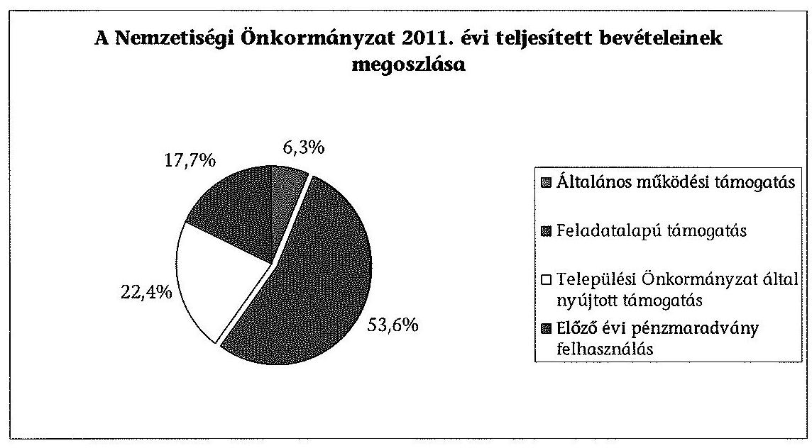
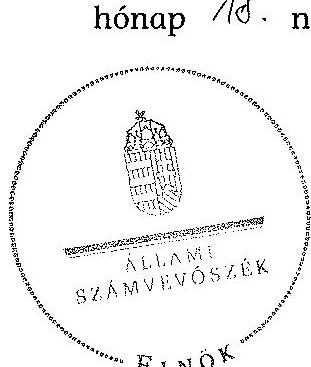

# ÁLLAMI   SZÁMVEVŐSZÉK 

## JELENTÉS

a helyi kisebbségi/nemzetiségi önkormányzatok gazdálkodásának ellenőrzéséről Kecskédi Német Nemzetiségi Önkormányzat

---

# Állami Számvevőszék 

Iktatószám: V-0095-049/2013.
Témaszám: 1105
Vizsgálat-azonosító szám: V06060319

## Az ellenőrzést felügyelte:

Horváth Balázs
felügyeleti vezető
Az ellenőrzést vezette és az ellenőrzés végrehajtásáért felelős:
Preller Zsuzsanna
ellenőrzésvezető
A számvevőszéki jelentést készítették és a jelentés összeállításában
közreműködtek:
Moder Beatrix
számvevő
Ujvári Józsefné
számvevő tanácsos
Az ellenőrzést végezték:
Balogné Lehoczki Éva Draviczky Éva
számvevő
számvevő

---

# TARTALOMJEGYZÉK 

BEVEZETÉS ..... 5
I. ÖSSZEGZŐ MEGÁLLAPÍTÁSOK, KÖVETKEZTETÉSEK, JAVASLATOK ..... 8
II. RÉSZLETES MEGÁLLAPÍTÁSOK ..... 15

1. A Nemzetiségi és a Települési Önkormányzat együttműködésének szabályszerűsége ..... 15
2. A gazdálkodási feladatok ellátásának szabályszerűsége ..... 16
2.1. A költségvetésre és zárszámadásra, valamint a kincstári adatszolgáltatás rendjére vonatkozó jogszabályi előírások betartása ..... 16
2.2. A Nemzetiségi Önkormányzat gazdálkodásának szabályozottsága ..... 17
2.3. A pénzügyi kontrollok működése ..... 18
3. A Nemzetiségi Önkormányzattal összefüggő gazdálkodási feladatok belső ellenőrzése ..... 19
4. A 2011. évi feladatalapú támogatás felhasználásának, elszámolásának szabályszerűsége ..... 20
5. Nemzetiségi Önkormányzat feladatellátása ..... 20

## MELLÉKLET

1. számú A Nemzetiségi Önkormányzat 2011. évi és 2012. I. félévi gazdálkodásának főbb adatai, mutatói

## FÜGGELÉKEK

1. számú Értelmező szótár
2. számú A pénzügyi kontrollok működésének értékelése

---

# **Title: The Impact of Climate Change on Global Ecosystems**

## **Introduction**

Climate change is one of the most pressing environmental issues of our time. It affects ecosystems worldwide, leading to significant changes in biodiversity, habitat loss, and species extinction. This report explores the impacts of climate change on global ecosystems, focusing on key areas such as **forests**, **oceans**, and **polar regions**.

## **1. Forest Ecosystems**

Forests play a crucial role in carbon sequestration and maintaining biodiversity. However, rising temperatures and changing precipitation patterns are altering forest ecosystems. Key impacts include:

- **Increased frequency of wildfires**: Rising temperatures and drought conditions have led to more frequent and severe wildfires, destroying vast areas of forests.
- **Changes in species distribution**: Shifts in temperature and precipitation patterns are altering forest ecosystems, disrupting ecosystem balance.
- **Insect outbreaks**: Warmer temperatures have increased the survival rates of pests like bark beetles, which are causing widespread wildfires.

## **2. Ocean Ecosystems**

Oceans absorb a significant portion of the excess heat and carbon dioxide (CO₂) produced by human activities. The consequences include:

- **Increased frequency of wildfires**: Rising sea levels and drought conditions have led to more frequent and severe wildfires, disrupting ecosystem balance.
- **Changes in ocean currents**: Altered ocean currents are altering ocean currents, disrupting ecosystem balance, and species extinction.
- **Changes in ocean currents**: Altered ocean currents are altering ocean currents, disrupting ecosystem balance, and species extinction.

## **3. Ocean Ecosystems**

Oceans absorb a significant portion of the excess heat and carbon dioxide (CO₂) produced by human activities. The consequences include:

- **Increased frequency of wildfires**: Rising sea levels and drought conditions have led to more frequent and severe wildfires, disrupting ecosystem balance.
- **Changes in ocean currents**: Altered ocean currents are altering ocean currents, disrupting ecosystem balance, and species extinction.

## **4. Polar Ecosystems**

Polar regions are particularly vulnerable to climate change due to their sensitivity to temperature changes. Key impacts include:

- **Melting of sea ice**: The Arctic is warming at twice the rate of the global average, leading to sea ice loss.
- **Glacial retreat**: Melting glaciers and their presence in the Arctic are rising, affecting ocean currents, leading to sea ice loss.
- **Glacial retreat**: Melting glaciers and their presence in the Arctic are altering ocean currents, disrupting ecosystem balance, and species extinction.

## **5. Polar Ecosystems**

Polar regions are particularly vulnerable to climate change due to their sensitivity to temperature changes. Key impacts include:

- **Melting of sea ice**: Melting glaciers and their presence in the Arctic are altering sea ice, affecting ocean currents, affecting species extinction.
- **Glacial retreat**: Melting glaciers and their presence in the Arctic are altering ocean currents, disrupting ecosystem balance, and species extinction.

## **Conclusion**

Climate change poses a significant threat to global ecosystems, with far-reaching consequences for biodiversity and human societies. By reducing the number of wildfires and improving the survival rates of pests like bark beetles, the consequences for biodiversity are long and complex. By understanding the impacts of climate change on global ecosystems, we can help you reduce the risk of human activities and ensure the sustainability of your ecosystem.

---

**References**

1. IPCC (Intergovernmental Panel on Climate Change). (2021). *Climate Change 2021: The Physical Science Basis*.
2. WWF (World Wildlife Fund). (2020). *Living Planet Report 2020*.
3. NASA Global Climate Change. (2022). *Vital Signs: Global Temperature*.

---

# RÖVIDÍTÉSEK JEGYZÉKE 

## Jogszabályok

Áht. 1
Áht. 2
ÁSZ tv.
Nek. 1 tv.
Nek. 2 tv.
Számv. tv.
Áhsz.

Ámr.
Ávr.

Ber.
Bkr.
támogatási kormányrendelet

Települési Önkormányzat SZMSZ-e

## Szórövidítések

ÁSZ
jegyző
Képviselő-testület
1992. évi XXXVIII. törvény az államháztartásról (hatályos 2011. december 31-ig)
2011. évi CXCV. törvény az államháztartásról (hatályos 2011. december 31-től)
2011. évi LXVI. törvény az Állami Számvevőszékről (hatályos 2011. július 1-jétől)
1993. évi LXXVII. törvény a nemzeti és etnikai kisebbségek jogairól (hatályos 2011. december 31-ig)
2011. évi CLXXIX. törvény a nemzetiségek jogairól (hatályos 2011. december 20-tól)
2000. évi C. törvény a számvitelről

249/2000. (XII. 24.) Korm. rendelet az államháztartás szervezetei beszámolási és könyvvezetési kötelezettségének sajátosságairól
292/2009. (XII. 19.) Korm. rendelet az államháztartás működési rendjéről (hatályos 2011. december 31-ig)
368/2011. (XII. 31.) Korm. rendelet az államháztartásról szóló törvény végrehajtásáról (hatályos 2012. január 1-jétől)
193/2003. (XI. 26.) Korm. rendelet a költségvetési szervek belső ellenőrzéséről (hatálytalan 2012. január 1-jétől)
370/2011. (XII. 31.) Korm. rendelet a költségvetési szervek belső kontrollrendszeréről és belső ellenőrzéséről (hatályos 2012. január 1-jétől)
a kisebbségi önkormányzatoknak a központi költségvetésből, valamint fejezeti kezelésű előirányzatból nyújtott támogatások feltételrendszeréről és elszámolásának rendjéről szóló 342/2010. (XII. 28.) Korm. rendelet (hatályon kívül helyezte a 28/2012. (III. 6.) Korm. rendelet a nemzetiségi célú előirányzatokból nyújtott támogatások feltételrendszeréről és elszámolásának rendjéről; jelenleg hatályos a 428/2012. (XII. 29.) Korm. rendelet a nemzetiségi célú előirányzatokból nyújtott támogatások feltételrendszeréről és elszámolásának rendjéről)
6/2011. (III. 30.) önkormányzati rendelet a Szervezeti és Működési Szabályzatról

Állami Számvevőszék
Kecskéd Község Önkormányzatának jegyzője
Kecskédi Német Kisebbségi Önkormányzat Képviselőtestülete 2011. december 31-ig, Kecskédi Német Nemzetiségi Önkormányzat Képviselő-testülete 2012. január 1-jétől

---

Nemzetiségi Önkormányzat

Nemzetiségi Önkormányzat elnöke

Pénzkezelési szabályzat
polgármester
Polgármesteri Hivatal

Polgármesteri Hivatal SZMSZ-e

Nemzetiségi Önkormányzat SZMSZ ${ }_{1}$

Nemzetiségi Önkormányzat SZMSZ ${ }_{2}$

Támogató
Települési Önkormányzat
Települési Önkormányzat Képviselő-testülete

Kecskédi Német Kisebbségi Önkormányzat 2011. december 31-ig, Kecskédi Német Nemzetiségi Önkormányzat 2012. január 1-jétől
Kecskédi Német Kisebbségi Önkormányzat elnöke 2011. december 31-ig, Kecskédi Német Nemzetiségi Önkormányzat elnöke 2012. január 1-jétől
Polgármesteri Hivatal 2012. március 30-án hatályba helyezett Pénzkezelési Szabályzata
Kecskéd Község Önkormányzatának polgármestere
Kecskéd Község Önkormányzatának Polgármesteri Hivatala
Kecskéd Község Önkormányzata Polgármesteri Hivatalának 2012. március 30-án hatályba helyezett Szervezeti és Működési Szabályzata
Kecskédi Német Kisebbségi Önkormányzat 7/2011. (I. 31.) számú határozata a Szervezeti és Működési Szabályzatról
Kecskédi Német Nemzetiségi Önkormányzat 9/2012. (I. 14.) számú határozata a Szervezeti és Működési Szabályzatról
A támogatást nyújtó Közigazgatási és Igazságügyi Minisztérium
Kecskéd Község Önkormányzata
Kecskéd Község Önkormányzatának Képviselő-testülete

---

# JELENTÉS   a helyi kisebbségi/nemzetiségi önkormányzatok gazdálkodásának ellenőrzéséről   Kecskédi Német Nemzetiségi Önkormányzat 

## BEVEZETÉS

Az államháztartás részét, az önkormányzati alrendszer egyik elemét képezik a nemzetiségi önkormányzatok, amelyek jogi személyek és a Nek. ${ }_{1,2}$ tv.-ben meghatározott önálló feladat- és hatáskörökkel rendelkeznek. A nemzetiségi önkormányzatok az önkormányzati, illetve testületi működtetés mellett a helyi nemzetiségi közügyek változatos formában való ellátásában vesznek részt.

A nemzetiségi önkormányzatok, illetve a települési önkormányzatok között a jelenlegi szabályozás szerint nincs alá-fölérendeltségi viszony. A nemzetiségi önkormányzatok azonban sajátos közjogi helyzetben vannak, mert a jogállásukat tekintve önkormányzatok, ám függnek a székhelyük szerinti települési önkormányzat hivatalától, amely ellátja a nemzetiségi önkormányzatok vonatkozásában a megállapodásban rögzített gazdálkodási feladatokat.

A nemzetiségek helyzete, támogatása mind hazai, mind európai uniós szinten kiemelt figyelmet kap napjainkban. A nemzetiségi önkormányzatok gazdálkodására és támogatási rendszerére vonatkozó jogszabályok a 2010-2012. években jelentős változásokon mentek át, amelyek érintették a feladatalapú támogatásra fordítható költségvetési keret megállapítását, az operatív gazdálkodási jogkörök szabályozását, az elkülönített könyvvezetés alkalmazását, a belső ellenőrzés szabályozását.

Az ellenőrzés célja annak értékelése volt, hogy a Nemzetiségi Önkormányzat gazdálkodási kereteinek kialakítása, gazdálkodása és feladatellátása megfelelt-e a hatályos jogszabályoknak.

Ennek keretében ellenőriztük, hogy:

- a Nemzetiségi Önkormányzat és a Települési Önkormányzat együttműködésének szabályozása, a Települési Önkormányzat SZMSZ-ében, a megállapodásban előírt működési feltételek biztosítása megfelelt-e a jogszabályi előírásoknak;
- a felek együttműködése megfelelt-e a megállapodásnak a gazdálkodási feladatok szabályszerű ellátásában, betartották-e a Nemzetiségi Önkormányzat gazdálkodásához kapcsolódóan a költségvetésre és zárszámadásra, a

---

gazdálkodás szabályozására, az operatív gazdálkodási jogkörök gyakorlására vonatkozó jogszabályi előírásokat;

- a jegyző biztosította-e a Polgármesteri Hivatal belső ellenőrzése keretében a Nemzetiségi Önkormányzattal összefüggő gazdálkodási feladatok belső ellenőrzését;
- a 2011. évi feladatalapú támogatás felhasználása, a folyósított feladatalapú támogatással történő elszámolás az előírásoknak megfelelően történt-e;
- a Nemzetiségi Önkormányzat feladatellátása összhangban volt-e a vonatkozó jogszabályi előírásokkal.

Az ellenőrzés típusa: szabályszerűségi ellenőrzés
Az ellenőrzött időszak: 2011. január 1. - 2012. június 30.
Ellenőrzött szervezet: Kecskédi Német Nemzetiségi Önkormányzat és a gazdálkodási feladatait ellátó Kecskéd Község Önkormányzata

Az ellenőrzés jogszabályi alapja: az ÁSZ tv. 5. § (2)-(3) és (6) bekezdései
Az ellenőrzés szakmai módszertana az ÁSZ hivatalos honlapján (www.asz.hu) közzétett szakmai szabályokon alapult, amely a Legfőbb Ellenőrző Intézmények Nemzetközi Szervezete (INTOSAI) által kiadott nemzetközi standardok (ISSAI) figyelembevételével készült.

A fogalmak magyarázatát az 1. számú függelék, a pénzügyi kontrollok megfelelősége értékelésénél alkalmazott egységes minősítési szempontokat a 2. számú függelék tartalmazza.

Az ellenőrzés lefolytatásához a Települési Önkormányzat és a Nemzetiségi Önkormányzat tanúsítványok kitöltésével és a kapcsolódó dokumentumok elektronikus megküldésével szolgáltatott adatokat. A tanúsítványokon szerepeltetett adatok, információk ellenőrzése és szükség szerinti javítása a helyszíni ellenőrzés keretében történt.

Az ÁSZ az ellenőrzés megállapításait az ellenőrzött időszakban hatályos, az intézkedést igénylő megállapításokra tett javaslatokat a jelenleg hatályos jogszabályok alapján fogalmazta meg.

A Nemzetiségi Önkormányzat 1998-ban alakult, az ellenőrzött időszakban az elnöki tisztséget betöltő személy a 2007. évtől látta el feladatát, személyében 2013. március 4-én változás történt. A Nemzetiségi Önkormányzat gazdasági társaságot és más szervezetet nem alapított, társulásban nem vett részt. A négytagú Képviselő-testület munkája segítésére bizottságot nem hozott létre. A Nemzetiségi Önkormányzat költségvetési beszámolója szerint a 2011. évben 3348 ezer Ft bevételt ért el és 2743 ezer Ft kiadást teljesített. A 2012. I. félévi beszámolója alapján a teljesített bevétel 1141 ezer Ft, a teljesített kiadás 217 ezer Ft volt. A 2011. évi és a 2012. I. féléves gazdálkodási adatokat részletesen az 1. számú mellékletben mutatjuk be. Az ÁSZ a Nemzetiségi Önkormányzat gazdálkodását korábban nem ellenőrizte.

---

Az ÁSZ tv. 29. § (1) bekezdése szerint a jelentéstervezetet megküldtük az ellenőrzött szervezetek részére, akik az ÁSZ tv. 29. § (2) bekezdésében foglalt észrevételezési jogukkal nem éltek, a jelentéstervezetre észrevételt nem tettek.

---

# I. ÖSSZEGZŐ MEGÁLLAPÍTÁSOK, KÖVETKEZTETÉSEK, JAVASLATOK 

A Nemzetiségi és a Települési Önkormányzat együttműködése 2011. január 1-je és 2012. május 31-e közötti
 időszakban nem volt szabályozott. A megkötött megállapodás kizárólag a Nemzetiségi Önkormányzat testületi működéséhez szükséges helyiséghasználatot és a fenntartási költségek viselésének rendjét szabályozta.

A 2012. június 1-jén hatályba lépett együttműködési megállapodás a Nek. 2 tv. előírásai ellenére nem tartalmazta a feladatellátáshoz kapcsolódó költségviselés szabályait, a költségvetéssel összefüggő adatszolgáltatási feladatok rendjére, felelősökre, határidőkre vonatkozó tartalmi elemeket és a jegyző Nemzetiségi Önkormányzati testületi üléseken való részvételével kapcsolatos kötelezettségeit. A megállapodás szerinti működési feltételeket a Települési Önkormányzat SZMSZ-ében és a Nemzetiségi Önkormányzat SZMSZ${ }_{2}$-ben nem rögzítették.

A Nemzetiségi Önkormányzat költségvetésére és zárszámadására vonatkozó jogszabályi előírásokat - a szabályozás hiánya ellenére - összességében betartották. A költségvetési és zárszámadási határozatok azonos, egymással összehasonlítható szerkezetben készültek, azokat változatlan formában építették be a Települési Önkormányzat költségvetési és zárszámadási rendeleteibe. A 2011. évi költségvetési határozat az Ámr. előírása ellenére nem tartalmazta a bevételek és kiadások mérlegszerű bemutatását, nem készült előirányzatfelhasználási ütemterv. A 2012. évben a hiányosságokat megszüntették, a költségvetési határozat tartalma a jogszabályi előírásoknak megfelelt. A 2011. évi zárszámadási határozat az Áht. ${ }_{1}$-ben és az Ámr-ben foglaltak ellenére nem tartalmazta a bevételek és kiadások mérlegszerű bemutatását. A Nemzetiségi Önkormányzat Képviselő-testülete a 2011. évi zárszámadási határozatot az Ámr-ben előírt határidőn túl fogadta el, a határidő túllépés nem akadályozta a Települési Önkormányzat zárszámadási rendeletének határidőben történő benyújtását. A jegyző 2012. I. félévben a Nemzetiségi Önkormányzatra vonatkozó kincstári adatszolgáltatási kötelezettségének az Ávr. által előírt határidőn túl tett eleget.

A Nemzetiségi Önkormányzat gazdálkodásának szabályozásáról az ellenőrzött időszakban a jegyző nem gondoskodott. A Nemzetiségi Önkormányzat a Számv. tv-ben és az Áhsz.-ben foglaltak ellenére nem rendelkezett a könyvvezetését és beszámoló készítését megalapozó számviteli politikával, leltározási és leltárkészítési, eszközök és források értékelési, pénzkezelési szabályzatokkal és számlarenddel, továbbá az Ámr. és a Bkr. által előírt ellenőrzési nyomvonallal, szabálytalanságok kezelésének eljárásrendjével, kockázatkezelési rendszer, valamint a folyamatba épített előzetes, utólagos és vezetői ellenőrzés szabályozásával. A Polgármesteri Hivatal SZMSZ-e az Ámr. és az Ávr. előírásai ellenére nem határozta meg a Nemzetiségi Önkormányzat gazdálkodásával kapcsolatos feladat- és hatáskörök gyakorlásának módját, a helyettesítés rendjét, és a felelősségi szabályokat, melyeket a gazdálkodási feladatokat ellátó köztisztviselők munkaköri leírásai sem tartalmaztak. Az operatív gazdálkodási

---

jogköröket nem alakították ki. Az Ámr. és az Ávr. előírásai ellenére a kötelezettségvállalás, ellenjegyzés, teljesítés igazolása, érvényesítés, utalványozás gyakorlásának módjával, eljárási és dokumentációs részletszabályaival, valamint az ezeket végző személyek kijelölésének rendjével kapcsolatos belső előírásokat, feltételeket a jegyző nem szabályozta. A gazdálkodási jogkörök gyakorlására az arra hatáskörrel rendelkezők írásbeli kijelölést, felhatalmazást nem adtak. Az Ámr.-ben és az Ávr.-ben előírt összeférhetetlenségi követelmények betartásának feltételeit nem biztosították.

A pénzügyi kontrollok működése az ellenőrzött időszak egészében a pénzeszközátadás, a dologi és folyó kiadások teljesítésénél gyenge volt, a hibák száma a lényegességi szintet, a kritikus hibahatárt elérte. Az Ámr. előírása ellenére a kötelezettségvállalásokat nem foglalták írásba. A szabályozás és gazdálkodási jogkör gyakorlói kijelölésének elmulasztása miatt a kifizetések az Ámr. előírása ellenére teljesítés igazolása hiányában, vagy arra jogosultsággal nem rendelkező személy teljesítés igazolásával történtek. Az utalvány ellenjegyzője nem az Ámr.-ben meghatározott tartalommal végezte ellenőrzési feladatát, a kifizetéseket megelőzően nem győződött meg a teljesítésigazolás, az érvényesítés elvégzéséről, nem ellenőrizte a gazdálkodásra vonatkozó jogszabályok betartását. A 2012. év I. félévében a pénzügyi ellenjegyzési és érvényesítési feladatokat végzők a feladatellátáshoz megbízás hiányában nem rendelkeztek hatáskörrel, illetve jogosultsággal. A számvevőszéki ellenőrzés az ellenőrzött kifizetésekkel összefüggésben a rendelkezésre bocsátott dokumentumok alapján jogosulatlan kifizetést nem tárt fel, a pénzügyi kontrollok működéséhez kapcsolódó hiányosságok azonban nem biztosítják a hibák megelőzését, feltárását és kijavítását.

Az Áht. ${ }_{1,2}$ előírásai értelmében a Nemzetiségi Önkormányzat gazdálkodásának szabályozásában, valamint az operatív gazdálkodási jogkörök kialakításában és működtetésében feltárt hiányosságok és szabálytalanságok miatt a jegyző, mint a költségvetési szerv vezetője a felelős.

A Nemzetiségi Önkormányzat a 2011. évben 1794 ezer Ft feladatalapú támogatásban részesült, amelyet a tárgyévben a jogszabályi előírásokkal összhangban felhasznált. A támogatási kormányrendeletben hivatkozott, Áht. ${ }_{1}$-ben előírt elszámolás nem történt meg. Az ellenőrzésre jogosult szervezetek a támogatás felhasználását nem ellenőrizték.

A Nemzetiségi Önkormányzat feladatellátásának tárgya részben volt összhangban a Nek. ${ }_{1,2}$ tv. előírásaival, mivel a Nek. ${ }_{1,2}$ tv. szerinti, a nemzetiségi érdekek védelmével és képviseletével kapcsolatos alapvető feladata ellátásához szükséges szervezeti és személyi feltételeket - együttműködési megállapodás és szabályozás hiányában - nem biztosította teljes körűen.

A Polgármesteri Hivatal 2011. és 2012. évi éves ellenőrzési terveit megalapozó kockázatelemzés - a Ber. előírásai ellenére - nem terjedt ki a Nemzetiségi Önkormányzat gazdálkodásával összefüggő végrehajtási feladatok ellátására. A jegyző az ellenőrzött időszakban az Áht. ${ }_{1}$, illetve az Áht. ${ }_{2}$ ellenére nem biztosította a Polgármesteri Hivatal belső ellenőrzése keretében a Nemzetiségi Önkormányzat gazdálkodásával összefüggő végrehajtási feladatok belső ellenőrzését. Belső ellenőrzést a 2011. évben és 2012. I. félévben nem terveztek és nem végeztek.

Az ellenőrzés megállapításai alapján, az észrevételezésre megküldött jelentéstervezetben a Nemzetiségi Önkormányzat gazdálkodásával kapcsolatban intézkedést igénylő megállapításokat és javaslatokat fogalmaztunk meg, amelyek végrehajtásáról az ellenőrzés időszakában intézkedési tájékoztatást adott a polgármester. A 2013. szeptember 11-én megkötött hatályos együttműködési megállapodásban a Nek. 2 tv. vonatkozó előírásait érvényesítették, a tartalmi hiányosságokat megszüntették. A Települési Önkormányzat SZMSZ-ének 2013. szeptember 12-étől hatályos módosítása megfelelt a Nek. 2 tv.-ben foglaltaknak. Figyelemmel az ÁSZ ellenőrzés hasznosítására mindezek vonatkozásában intézkedést igénylő megállapítást, javaslatot már nem szerepeltetünk.

Az ÁSZ tv. 33. § (1) bekezdésében foglaltak értelmében az ellenőrzött szervezet vezetője köteles a jelentésben foglalt megállapításokhoz kapcsolódó intézkedési tervet összeállítani, és azt a jelentés kézhezvételétől számított 30 napon belül az ÁSZ részére megküldeni. Amennyiben az intézkedési tervet határidőre nem küldi meg a szervezet, vagy az nem elfogadható, az ÁSZ elnöke az ÁSZ tv. 33. § (3) bekezdés a)-b) pontjaiban foglaltakat érvényesítheti.

A helyszíni ellenőrzés megállapításainak hasznosítása mellett javasoljuk:

# a jegyzőnek 

1. az együttműködés szabályozásával kapcsolatban

A Nemzetiségi Önkormányzat SZMSZ-ében nem rögzítették a megállapodás szerinti működési feltételeket, a Nek. 2 tv. 80. § (2) bekezdése ellenére.

Javaslat
Az együttműködés szabályszerűsége érdekében kezdeményezze a Nemzetiségi Önkormányzat SZMSZ-ének kiegészítését, a Nek. 2 tv. 80. § (2) bekezdésében foglalt előírás alapján.
2. a gazdálkodási feladatok szabályozottságával kapcsolatban

A Nemzetiségi Önkormányzat a Számv. tv. 14. § (3) és (5) bekezdése, 161. § (1) bekezdése, valamint az Áhsz. 8. § (3)-(4) bekezdései és a 49. § (1) bekezdésében foglaltak ellenére nem rendelkezett számviteli politikával és a kapcsolódó - eszközök és források leltározási és leltárkészítési, eszközök és források értékelési és pénzkezelési szabályzatokkal, valamint számlarenddel.

Az Ámr. 156. § (2)-(3), 157. § (1) bekezdéseiben és az Áht. ${ }_{1}$ 121/A. § (4) bekezdésében, valamint a Bkr. 6. § (3)-(4), a 7. § (1) és a 8. § (2)-(4) bekezdéseiben előírtak ellenére a Nemzetiségi Önkormányzat nem rendelkezett ellenőrzési nyomvonallal, a szabálytalanságok kezelésének eljárásrendjével, a kockázatkezelési rendszer, valamint a folyamatba épített előzetes, utólagos és vezetői ellenőrzés szabályozásával.

---

Az Ámr. 20. § (2) bekezdés h) pontjában, valamint az Ávr. 13. § (1) bekezdés g) pontjában foglaltak ellenére a Polgármesteri Hivatal SZMSZ-e nem tartalmazta nevesített munkakörökhöz tartozóan a Nemzetiségi Önkormányzat gazdálkodásával kapcsolatos feladat- és hatásköröket, a hatáskörök gyakorlásának módját, a helyettesítés rendjét és az ezekre vonatkozó felelősségi szabályokat.

Javaslat
A Nemzetiségi Önkormányzat gazdálkodási feladataira kiterjedő hatállyal
a) készítse el a Számv. tv. 14. § (3) és (5), a 161. § (1) bekezdéseiben, az Áhsz. 8. § (3)-(4) és 49. § (1) bekezdéseiben előírt számviteli szabályzatokat, a számlarendet, valamint a Bkr. 6. § (3)-(4), 7. § (1) és a 8. § (2)-(4) bekezdéseiben meghatározott szabályzatokat;
b) készítse elő a Polgármesteri Hivatal SZMSZ-ének módosítását, hogy az megfeleljen az Ávr. 13. § (1) bekezdés g) pontjában foglalt előírásnak.
3. az operatív gazdálkodási jogkörök kialakításával kapcsolatban

Az Ámr. 20. § (3) bekezdés a) pontja, illetve az Ávr. 13. § (2) bekezdés a) pontja ellenére a kötelezettségvállalás, ellenjegyzés, teljesítés igazolása, érvényesítés, utalványozás gyakorlásának módjával, eljárási és dokumentációs részletszabályaival, valamint az ezeket végző személyek kijelölésének rendjével kapcsolatos belső előírásokat, feltételeket a jegyző nem szabályozta, az Ávr. 55. § (2) bekezdés g) pontjában és 58. § (4) bekezdésében foglaltak ellenére a pénzügyi ellenjegyzőket és az érvényesítésre jogosultakat nem jelölte ki.

Javaslat
Az Ávr. 13. § (2) bekezdés a) pontjának előírása értelmében alakítsa ki a kötelezettségvállalás, ellenjegyzés, teljesítés igazolása, érvényesítés, utalványozás gyakorlásának módjával, eljárási és dokumentációs részletszabályaival, valamint az ezeket végző személyek kijelölésének rendjével kapcsolatos belső előírásokat, feltételeket, továbbá az Ávr. 55. § (2) bekezdés g) pontjában és az 58. § (4) bekezdésében foglalt jogkörében eljárva jelölje ki a pénzügyi ellenjegyzésre és érvényesítésre jogosultakat.
4. a pénzügyi kontrollok működésével kapcsolatban

A pénzügyi ellenjegyzést az Ávr. 55. § (2) bekezdés g) pontjában foglalt kijelölés hiányában az arra hatáskörrel nem rendelkező végezte.

Az Ávr. 57. § (1) bekezdésében foglalt teljesítés igazolását a teljesítést igazoló kijelölésének hiányában nem végezték el, vagy a kijelölés hiányában a teljesítés igazolója nem volt jogosult a kiadásteljesítés jogosságának, összegszerűségének - ellenszolgáltatást is magába foglaló kötelezettségvállalás esetében - a teljesítésének ellenőrzésére.

Az érvényesítő az Ávr. 58. § (4) bekezdésében előírt kijelölés hiányában látta el feladatát, ezáltal nem volt jogosult a teljesítésigazolás, a fedezet meglétének, valamint a gazdálkodásra vonatkozó szabályok betartásának az ellenőrzésére.

---

Javaslat
Az operatív gazdálkodás működési hibáinak megelőzése, feltárása és kijavítása érdekében gondoskodjon
a) az Ávr. 55. § (2) bekezdés g) pontja alapján a pénzügyi ellenjegyző szabályszerű kijelöléséről, az Áht. ${ }_{2}$ 37. § (1) bekezdésében előírt feladatok végrehajtásáról;
b) az Ávr. 57. § (4) bekezdésében foglaltakkal összhangban a teljesítés igazoló kijelöléséről az Ávr. 57. § (1) bekezdésében előírt ellenőrzési feladatok ellátására;
c) az Ávr. 55. § (2) bekezdés g) pontjában és 58. § (4) bekezdésében előírtaknak megfelelően történjen az érvényesítő kijelölése.
5. a feladatalapú támogatás elszámolásával kapcsolatban

A 2011. évben folyósított feladatalapú támogatás elszámolása a támogatási kormányrendelet 7. § (2) bekezdésében hivatkozott Áht. ${ }_{1}$-nek „a helyi önkormányzatok elszámolási rendjére vonatkozó rendelkezései alkalmazása” előírása ellenére nem történt meg.

Javaslat
Gondoskodjon az Áht. ${ }_{2}$ 27. § (2) bekezdésben meghatározott feladatkörében a Nemzetiségi Önkormányzat által igénybe vett feladatalapú támogatás elszámolásának elkészítéséről, figyelemmel az Áht. ${ }_{2}$ 57. § (4) bekezdésben foglaltakra.

# a polgármesternek 

1. Az Ámr. 20. § (2) bekezdés h) pontjában, valamint az Ávr. 13. § (1) bekezdés g) pontjában foglaltak ellenére a Polgármesteri Hivatal SZMSZ-e nem tartalmazta nevesített munkakörökhöz tartozóan a Nemzetiségi Önkormányzat gazdálkodásával kapcsolatos feladat- és hatásköröket, a hatáskörök gyakorlásának módját, a helyettesítés rendjét és az ezekre vonatkozó felelősségi szabályokat.

Javaslat
Terjessze a Települési Önkormányzat Képviselő-testülete elé jóváhagyásra
 az Ávr. 13. § (1) bekezdés g) pontjában foglalt szabályozásra figyelemmel a Polgármesteri Hivatal SZMSZ-e módosítását.
2. A jegyző a Nemzetiségi Önkormányzat gazdálkodásának szabályozásáról, az operatív gazdálkodási jogkörök kialakításáról, a pénzügyi kontrollok működtetéséről és a Nemzetiségi Önkormányzat gazdálkodásával összefüggő végrehajtási feladatok belső ellenőrzéséről nem gondoskodott.

Javaslat
Intézkedjen a számvevőszéki ellenőrzés során feltárt hiányosságokkal, szabálytalanságokkal összefüggésben az esetleges munkajogi felelősséggel kapcsolatos körülmé-

---

nyek kivizsgálásáról, a vizsgálat eredményének függvényében tegye meg a szükséges intézkedéseket.

# a Nemzetiségi Önkormányzat elnökének 

1. A Nemzetiségi Önkormányzat és a Települési Önkormányzat együttműködését szabályozó - 2012. június 30-án hatályos megállapodás - nem tartalmazta a Nek. 2 tv. 80. § (1) bekezdés g) pontja, a (3)-(4) bekezdése ellenére a feladatellátáshoz kapcsolódó költségek viselésének szabályait, a gazdálkodás rendjére, határidőkre, felelősökre vonatkozó előírásokat és a jegyző, vagy annak megbízottja számára előírt, a Nemzetiségi Önkormányzat testületi ülésén való részvételével, jelzési kötelezettségével kapcsolatos szabályokat.

Javaslat
Terjessze a Képviselő-testület elé jóváhagyásra a Nek. ${ }_{2}$ tv. 80. § (1) bekezdés g) pontja és a (3)-(4) bekezdéseiben foglalt előírások betartásával előkészített megállapodás módosítást.
2. A Nemzetiségi Önkormányzat SZMSZ-ében nem rögzítették a megállapodás szerinti működési feltételeket, a Nek. ${ }_{2}$ tv. 80. § (2) bekezdése ellenére.

Javaslat
Terjessze a Képviselő-testület elé jóváhagyásra a Nek. ${ }_{2}$ tv. 80. § (2) bekezdésében foglalt előírás betartásával előkészített Nemzetiségi Önkormányzat SZMSZ-e módosítását.
3. A Nemzetiségi Önkormányzat elnöke a kötelezettségvállalásra és utalványozásra felhatalmazásokat nem adott, így az Ámr. 80. § (1)-(2) bekezdésében, illetve az Ávr. 60. § (1)-(2) bekezdésében előírt összeférhetetlenségi előírás betartásának feltételeit nem biztosította.

Az Ámr. 76. § (5) bekezdésében, illetve az Ávr. 57. § (4) bekezdésében foglaltak ellenére nem jelölte ki írásban a teljesítés igazolóit.

Javaslat
a) az Ávr. 60. § (1)-(2) bekezdésében foglalt összeférhetetlenségi szabályok érvényesülése érdekében adjon felhatalmazást az Ávr. 52. § (7) és 59. § (1) bekezdései szerint a kötelezettségvállalásra és az utalványozásra;
b) jelölje ki írásban az Ávr. 57. § (4) bekezdésében meghatározottak szerint a teljesítés igazolói jogkör gyakorlóit.
4. A 2011. évben folyósított feladatalapú támogatás elszámolása a támogatási kormányrendelet 7. § (2) bekezdésében hivatkozott Áht. ${ }_{1}$-nek „a helyi önkormányzatok elszámolási rendjére vonatkozó rendelkezései alkalmazása" előírása ellenére nem történt meg.

---

Javaslat
Terjessze a Képviselő-testület elé jóváhagyásra az Áht., 57. § (4) bekezdés alapján összeállított, a Nemzetiségi Önkormányzat által igénybe vett feladatalapú támogatás elszámolását.

---

# II. RÉSZLETES MEGÁLLAPÍTÁSOK 

## 1. A Nemzetiségi és a Települési Önkormányzat együttműködésének szabályszerűsége

A Nemzetiségi Önkormányzat és a Települési Önkormányzat együttműködését szabályozó megállapodással 2011. január 1-je és 2012. május 31-e közötti időszakban nem rendelkeztek, megállapodás hiányában a jogszabályi előírásokat nem érvényesítették, mert:

- az Áht. ${ }_{1}$ 66. §-ában foglaltak ellenére nem szabályozták a Nemzetiségi Önkormányzat gazdálkodása végrehajtásának rendjét, az ehhez kapcsolódó feladatellátás jogosultjait és kötelezettjeit nem jelölték ki;
- az Áht. ${ }_{1}$ 68. § (3) bekezdésének, valamint az Ámr. 37. § (4) bekezdés a)-f) pontjainak előírása ellenére nem szabályozták a költségvetés megalkotása során - a költségvetési koncepcióval, a költségvetési határozattal és a költségvetési rendelettel kapcsolatos - ellátandó feladatokat, a munkamegosztást és a határidőket;
- a Nek. ${ }_{1}$ tv. 27. § (2) bekezdés b) pontjában foglaltak ellenére nem rendelkeztek a postai, kézbesítési, gépelési, sokszorosítási feladatok ellátásáról és az ezzel járó költségek viseléséről.

A 2012. június 1. napjától hatályos, a Nek. 2 tv. 80. §, valamint az Áht. 2 27. § (2) bekezdése szerinti feladatok ellátására kötött együttműködési megállapodásban a jogszabályi előírásokat maradéktalanul nem érvényesítették, mert:

- a Nek. 2 tv. 80. § (1) bekezdés g) pontja ellenére nem rendelkeztek a feladatellátásához kapcsolódó költségek viselésének szabályairól;
- a megállapodás nem tartalmazta a Nek. 2 tv. 80. § (3) bekezdés a) pontjában előírt - a költségvetéssel összefüggő adatszolgáltatási kötelezettségek teljesítésével, törzskönyvi nyilvántartásba vétellel, adószám igényléssel kapcsolatos - feladatok rendjére, határidőkre vonatkozó előírásokat, és a feladatok felelőseinek kijelölését;
- a Nek. 2 tv. 80. § (4) bekezdésében foglaltakat figyelmen kívül hagyva, nem írták elő a jegyző, vagy annak megbízottja számára a Nemzetiségi Önkormányzat testületi ülésén való részvételt, és jelzési kötelezettséget törvénysértés észlelése esetén.

A Nek. 2 tv. 80. § (2) bekezdése ellenére sem a Települési Önkormányzat SZMSZ-ében, sem a Nemzetiségi Önkormányzati SZMSZ ${ }_{1,2}$-ben nem rögzítették a megállapodás szerinti működési feltételeket.

---

A Települési Önkormányzat biztosította ${ }^{1}$ a Nemzetiségi Önkormányzat működéséhez szükséges helyiség használatát és fenntartási költségeit.

# 2. A GAZDÁLKODÁSI FELADATOK ELLÁTÁSÁNAK SZABÁLYSZERŰSÉGE 

### 2.1. A költségvetésre és zárszámadásra, valamint a kincstári adatszolgáltatás rendjére vonatkozó jogszabályi előírások betartása

A Nemzetiségi Önkormányzat költségvetésére és zárszámadására vonatkozó jogszabályi előírásokat - egyes tartalmi elemek és a zárszámadási határozat elfogadására vonatkozó határidő kivételével - összességében betartották. A költségvetési és zárszámadási határozatok azonos szerkezetben, egymással összehasonlítható módon készültek, azokat változatlan formában építették be a Települési Önkormányzat költségvetési illetve zárszámadási rendeletébe.

A Képviselő-testület a 2011. évi költségvetési ${ }^{2}$ és zárszámadási határozatot ${ }^{3}$ hiányos tartalommal fogadta el, mert:

- az Áht ${ }_{1} 69 . \S$ (1) bekezdésében és az Ámr. 36. § (1) bekezdés i) pontjában foglaltak ellenére a határozatok nem tartalmazták a bevételi és kiadási előirányzatok mérlegszerű bemutatását;
- a költségvetési határozathoz az Ámr. 36. § (1) bekezdés k) pontjának előírásai ellenére az év várható bevételi és kiadási előirányzatainak teljesüléséről előirányzat-felhasználási ütemterv nem készült.

A 2012. évi költségvetési határozat tartalma megfelelt a jogszabályi előírásoknak.

A Nemzetiségi Önkormányzat a 2011. illetve 2012. évi ${ }^{4}$ költségvetési határozatait az Ámr. és az Áht ${ }_{3}$ szerinti határidőn belül elfogadta és továbbította a polgármester részére. A 2011. évi zárszámadási határozatot egy nappal az Ámr. 37. § (3) bekezdésében előírt határidőn túl, 2012. április 11-én fogadta el a Nemzetiségi Önkormányzat, azonban a határidő túllépés nem akadályozta a Települési Önkormányzat zárszámadási rendelet-tervezetének határidőben történő benyújtását.

[^0]
[^0]:    ${ }^{1}$ A Települési Önkormányzat Képviselő-testülete a 91/2000. (X. 30.) számú határozatában döntött a helyiség biztosításáról. Az erről szóló megállapodást 2001. január 22-én írták alá a Nemzetiségi Önkormányzattal.
    ${ }^{2}$ A Képviselő-testület Nemzetiségi Önkormányzat 2011. évi költségvetéséről szóló 5/2011. (I. 31.) számú határozata.
    ${ }^{3}$ A Képviselő-testület Nemzetiségi Önkormányzat 2011. évi költségvetési beszámolójáról szóló 27/2012. (IV. 11.) számú határozata.
    ${ }^{4}$ A Képviselő-testület Nemzetiségi Önkormányzat 2012. évi költségvetéséről szóló 4/A/2012. (I. 24.) számú határozata.

---

A 2011. évben a Képviselő-testület - a zárszámadással egyidejűleg jóváhagyott - előirányzat-módosítással biztosította a tárgyévi kötelezettség vállalásához szükséges fedezetet. A Nemzetiségi Önkormányzat beszámoló adatai alapján 2012. I. félévben biztosították a kiemelt előirányzatokon belüli gazdálkodást.

A jogszabályokban előírt kincstári adatszolgáltatási kötelezettségének a jegyző 2012. I. félévben eleget tett, azonban késedelmesen teljesítette azt. A Nemzetiségi Önkormányzat 2012. I. negyedévi időközi költségvetési jelentését az Ávr. 169. § (2) bekezdése szerinti határidőn túl, 2012. április 25-én teljesítette.

# 2.2. A Nemzetiségi Önkormányzat gazdálkodásának szabályozottsága 

A Nemzetiségi Önkormányzat gazdálkodásának szabályozásáról az ellenőrzött időszakban a jegyző nem gondoskodott.

A Nemzetiségi Önkormányzat gazdálkodási feladatait ellátó Polgármesteri Hivatal - a Pénzkezelési szabályzat kivételével - nem rendelkezett érvényes gazdálkodási szabályzatokkal, a Pénzkezelési szabályzat rendelkezéseit nem terjesztette ki a Nemzetiségi Önkormányzat gazdálkodására.

- A Nemzetiségi Önkormányzat a Számv.tv. 14. § (3) és (5) bekezdése, a 161. § (1) bekezdése, valamint az Áhsz. 8. § (3)-(4) bekezdései és a 49. § (1) bekezdésében foglaltak ellenére nem rendelkezett számviteli politikával és a kapcsolódó - eszközök és források leltározási és leltárkészítési, eszközök és források értékelési, és pénzkezelési - szabályzatokkal, valamint számlarenddel.
- Az Ámr. 20. § (2) bekezdés h) pontjában, valamint az Ávr. 13. § (1) bekezdés g) pontjában foglaltak ellenére a Polgármesteri Hivatal SZMSZ-e nem tartalmazta a munkakörökhöz kapcsolódóan a Nemzetiségi Önkormányzat gazdálkodásával kapcsolatos feladat- és hatásköröket, a hatáskörök gyakorlásának módját, a helyettesítés rendjét és az ezekre vonatkozó felelősségi szabályokat, azokat a gazdálkodási feladatokat ellátó köztisztviselők munkaköri leírásában sem rögzítették.
- A Nemzetiségi Önkormányzat - a 2011. évben az Ámr. 156. § (2)-(3) és 157. § (1) bekezdéseiben és az Áht., 121/A. § (4) bekezdésében, a 2012. évben a Bkr. 6. § (3)-(4), a 7. § (1) és a 8. § (2)-(4) bekezdéseiben előírtak ellenére nem rendelkezett ellenőrzési nyomvonallal, szabálytalanságok kezelésének eljárásrendjével, kockázatkezelési rendszer, valamint a folyamatba épített előzetes, utólagos és vezetői ellenőrzés szabályozásával.

A Nemzetiségi Önkormányzatnál az operatív gazdálkodási jogköröket nem alakították ki.

A 2011. évben az Ámr. 20. § (3) bekezdés a) pontja, a 2012. évben az Ávr. 13. § (2) bekezdés a) pontja ellenére a kötelezettségvállalás, ellenjegyzés, teljesítés igazolása, érvényesítés, utalványozás gyakorlásának módjával, eljárási és dokumentációs részletszabályaival, valamint az ezeket végző személyek kijelölé-

---

sének rendjével kapcsolatos belső előírásokat, feltételeket a jegyző nem szabályozta.

A 2012. június 1-jétől hatályos együttműködési megállapodás az operatív gazdálkodási jogkörök gyakorlását munkakörökhöz rendelve határozta meg, azonban a jogkörök gyakorlására az arra hatáskörrel rendelkezők írásbeli kijelölést, illetve felhatalmazást nem adtak:

- a Nemzetiségi Önkormányzat elnöke az Ámr. 76. § (5) bekezdésében, illetve az Ávr. 57. § (4) bekezdésében foglaltak ellenére nem jelölte ki írásban a teljesítés igazolóit;
- a jegyző az Ámr. 77. § (4) bekezdésben, illetve az Ávr. 58. § (4) bekezdésben foglaltak ellenére írásban nem jelölte ki az érvényesítést végző személyeket.

A Nemzetiségi Önkormányzat elnöke - az Ávr. 52. § (7) és 59. § (1) bekezdése ellenére - a kötelezettségvállalásra és utalványozásra, a jegyző az ellenjegyzésre felhatalmazásokat nem adott, így az Ámr. 80. § (1)-(2) bekezdésében, illetve az Ávr. 60. § (1)-(2) bekezdésében előírt összeférhetetlenségi előírás betartásának feltételeit nem biztosították.

# 2.3. A pénzügyi kontrollok működése 

A Nemzetiségi Önkormányzat az ellenőrzött időszakban szociálpolitikai ellátásra kiadást nem teljesített. A 2011. évi működési célú pénzeszközátadás, a dologi és folyó kiadások teljesítése során a kötelezettségvállalás ellenjegyzése, a szakmai teljesítésigazolás, az utalvány ellenjegyzése kontrollok működésének megfelelősége - a 2. számú függelékben részletezett szempontok alapján végzett értékelés szerint - gyenge volt, a hibák száma a lényegességi szintet, a kritikus hibahatárt elérte, mert:

- az Ámr. 74. § (1) bekezdésében foglaltak ellenére a kötelezettségvállalást nem foglalták írásba;
- az Ámr. 76. § (1) és (3) bekezdésében foglaltak ellenére a szakmai teljesítés igazolása kijelölés hiányában nem történt meg, illetve jogosulatlanul végezték el a kiadások jogosságának, összegszerűségének és - az ellenszolgáltatást is magukban foglaló kifizetések esetében - a szerződésszerű teljesítés ellenőrzését és igazolását;
- az utalvány ellenjegyzője a feladatát nem az Ámr. 79. § (2) bekezdésében foglalt előírás szerint látta el, mert annak ellenére ellenjegyezte a kiadások teljesítését, hogy a szakmai teljesítésigazolás és az érvényesítés nem történt meg, valamint
 a megelőző ügymenetben nem tartották be a gazdálkodásra - köztük a kötelezettségvállalások írásba foglalására, illetve azok ellenjegyzésére - vonatkozó szabályokat.

A Nemzetiségi Önkormányzatnál 2012. I. félévben a működési célú pénzeszközátadás, valamint a dologi és egyéb folyó kiadások teljesítése során a pénzügyi ellenjegyzés, a teljesítés igazolása és az érvényesítés kontrollok megfelelősége - a 2. számú függelékben részletezett szempontok alapján végzett értékelés szerint - gyenge volt, a hibák száma a lényegességi szintet, a kritikus hibahatárt elérte, mert:

- a pénzügyi ellenjegyzést az Ávr. 55. § (2) bekezdés g) pontjában foglalt felhatalmazás hiányában az arra hatáskörrel nem rendelkező személy végezte;
- a teljesítést igazoló, kijelölésének hiányában nem, illetve jogosulatlanul végezte el - az Ávr. 57. § (1) bekezdése szerinti - a kiadások jogosságának, összegszerűségének - ellenszolgáltatást is magába foglaló kötelezettségvállalás esetében - a szerződésszerű teljesítésnek az ellenőrzését és igazolását;
- az érvényesítő az Ávr. 58. § (4) bekezdésében előírt kijelölés hiányában, jogosulatlanul látta el feladatát, ezáltal a teljesítésigazolás, a fedezet meglétének, valamint a gazdálkodásra vonatkozó szabályok betartásának az ellenőrzése nem szabályszerűen történt.

A Nemzetiségi Önkormányzatnál az ellenőrzött időszakban a pénzügyi folyamatokban kulcsszerepet betöltő belső kontrollok működésében feltárt hiányosságokkal összefüggésben, az ellenőrzött tételek vonatkozásában az ellenőrzés jogosulatlan kifizetést nem állapított meg. A pénzügyi kontrollok működéséhez kapcsolódó hiányosságok azonban nem biztosítják a hibák megelőzését, feltárását és kijavítását.

Az Áhsz. 8. § (12) bekezdésében foglaltak alapján - a Számv. tv. 14. § (3), és az Áhsz. 8. § (3) bekezdése által előírt - számviteli politika irányelveinek meghatározása, elkészítése, jóváhagyása és végrehajtása, továbbá - az Áht. ${ }_{1}$ 121/A. § (1) bekezdése, illetve az Áht. ${ }_{2}$ 69. § (2) bekezdése alapján a folyamatba épített előzetes és utólagos vezetői ellenőrzés működtetése, a belső kontrollrendszer létrehozása és működtetése a költségvetési szerv vezetőjének a feladata. Ezért a Nemzetiségi Önkormányzat gazdálkodási tevékenységében feltárt - szabályozási és a belső kontrollok működésével összefüggő - szabálytalanságokért a jegyző a felelős.

# 3. A Nemzetiségi Önkormányzattal Összefüggő Gazdálkodási Feladatok Belső Ellenőrzése 

A Polgármesteri Hivatal 2011. és 2012. évi ellenőrzési terveit megalapozó kockázatelemzés a Ber. 21. § (2) bekezdése ${ }^{5}$ ellenére nem terjedt ki a Nemzetiségi Önkormányzat gazdálkodásával összefüggő végrehajtási feladatok ellátására. A jegyző az ellenőrzött időszakban az Áht. ${ }_{1}$ 121/B. § (4) bekezdése, illetve az Áht. ${ }_{2}$ 70. § (1) bekezdése előírása ellenére nem biztosította a Polgármesteri Hivatal belső ellenőrzése keretében a Nemzetiségi Önkormányzat gazdálkodásával összefüggő végrehajtási feladatok belső ellenőrzését. Erre vonatkozóan belső ellenőrzést a 2011. évben és 2012. I. félévben nem terveztek és nem végeztek.

[^0]
[^0]:    ${ }^{5}$ 2012. január 1-jétől Bkr. 7. § (2) bekezdése írja elő

# 4. A 2011. Évi Feladatalapú Támogatás Felhasználásának, Elszámolásának Szabályszerűsége 

A Nemzetiségi Önkormányzat a 2011. évben 1794 ezer Ft feladatalapú támogatásban részesült, melynek összes bevételhez viszonyított részarányát a következő ábra szemlélteti:

A 2011. évben folyósított támogatást a tárgyévben a jogszabályi előírásokkal összhangban felhasználták. Elszámolása a támogatási kormányrendelet 7. § (2) bekezdésében hivatkozott Áht, ${ }_{1}$-nek „a helyi önkormányzatok elszámolási rendjére vonatkozó rendelkezései alkalmazása" előírása ellenére nem történt meg. A támogatás felhasználását az ellenőrzésre jogosult szervezetek nem ellenőrizték.

## 5. Nemzetiségi Önkormányzat Feladatellátása

A Nemzetiségi Önkormányzat feladatellátásának tárgya részben volt összhangban a $\mathbf{Nek}_{1,2}$ tv. előírásaival, mivel a Nek. ${ }_{1}$ tv. 5/A. § (1) bekezdése és a Nek. ${ }_{2}$ tv. 10. § (1) bekezdése szerinti - a nemzeti érdekek védelmével és képviseletével kapcsolatos - alapvető feladata ellátásához szükséges szervezeti és személyi feltételeket - együttműködési megállapodás és szabályozás hiányában - nem biztosította teljes körűen.
Budapest, 2013. 12. hónap 18. nap

Melléklet: 1 db
Függelék: 2 db

Domokos László
elnök $\Rightarrow$

# A Nemzetiségi Önkormányzat 2011. évi és 2012. I. félévi Gazdálkodásának Főbb Adatai, Mutatói

A) BEVÉTELEK adatok ezer Ft-ban

|  Megnevezés | 2011. év |  |  |  | 2012. év |  | 2012. I. félév |   |
| --- | --- | --- | --- | --- | --- | --- | --- | --- |
|   | eredeti ei. | módosított ei. | teljesítés | teljesítés megoszlása (%) | eredeti ei. | módosított ei. | teljesítés | teljesítés megoszlása (%)  |
|  Intézményi működési bevétel | 0,0 | 0,0 | 0,0 | 0,0 | 0,0 | 0,0 | 0,0 | 0,0  |
|  Általános működési támogatás ${ }^{1}$ | 0,0 | 210,0 | 210,0 | 6,3 | 0,0 | 71,0 | 71,0 | 6,2  |
|  Feladatalapú támogatás | 0,0 | 1794,0 | 1794,0 | 53,6 | 0,0 | 0,0 | 0,0 | 0,0  |
|  Telepítési Önkormányzat által nyújtott támogatás ${ }^{2}$ | 650,0 | 750,0 | 750,0 | 22,4 | 500,0 | 715,0 | 465,0 | 40,8  |
|  ... Megyei Nemzetiségi Alapítványtól támogatás | 0,0 | 0,0 | 0,0 | 0,0 | 0,0 | 0,0 | 0,0 | 0,0  |
|  Pénzforgalmi bevételek összesen | 650,0 | 2754,0 | 2754,0 | 82,3 | 500,0 | 786,0 | 536,0 | 47,0  |
|  Előző évi pénzmaradvány felhasználás ${ }^{3}$ | 594,0 | 594,0 | 594,0 | 17,7 | 605,0 | 605,0 | 605,0 | 53,0  |
|  Bevételek | 1244,0 | 3348,0 | 3348,0 | 100,0 | 1105,0 | 1391,0 | 1141,0 | 100,0  |

B) KIADÁSOK adatok ezer Ft-ban

|  Megnevezés | 2011. év |  |  |  | 2012. év |  | 2012. I. félév |   |
| --- | --- | --- | --- | --- | --- | --- | --- | --- |
|   | eredeti ei. | módosított ei. | teljesítés | teljesítés megoszlása (%) | eredeti ei. | módosított ei. | teljesítés | teljesítés megoszlása (%)  |
|  Személyi juttatások | 0,0 | 0,0 | 0,0 | 0,0 | 0,0 | 0,0 | 0,0 | 0,0  |
|  Munkaadókat terhelő járulékok | 0,0 | 0,0 | 0,0 | 0,0 | 0,0 | 0,0 | 0,0 | 0,0  |
|  Üzléti és egyéb folyó kiadások | 701,0 | 1288,0 | 1288,0 | 46,9 | 676,0 | 676,0 | 207,0 | 95,4  |
|  Támogatásértékkel működési kiadás | 533,0 | 1305,0 | 1305,0 | 47,6 | 400,0 | 400,0 | 10,0 | 4,6  |
|  Költségvetési tartalék | 10,0 | 605,0 | 0,0 | 0,0 | 29,0 | 315,0 | 0,0 | 0,0  |
|  Működési kiadások összesen | 1244,0 | 3198,0 | 2593,0 | 94,5 | 1105,0 | 1391,0 | 217,0 | 100,0  |
|  Felhasználási kiadások | 0,0 | 150,0 | 150,0 | 5,5 | 0,0 | 0,0 | 0,0 | 0,0  |
|  Kiadások összesen | 1244,0 | 3348,0 | 2743,0 | 100,0 | 1105,0 | 1391,0 | 217,0 | 100,0  |

${ }^{1}$ 2012. I. félévben tartalmaz 71 ezer Ft 2011. évről áthúzódó pályázati támogatást. ${ }^{2}$ A módosított előirányzat és a teljesítési adat tartalmaz 2011-ben 100 ezer Ft, 2012. I. félévében 215 ezer Ft megyei nemzetiségi önkormányzattól származó támogatást ${ }^{3}$ A pénzmaradvány felhasználás a Nemzetiségi Önkormányzat költségvetésének elkülönülése miatt 2012. évben a beszámolóban pénzforgalmi bevételként jelent meg.

# ÉRTELMEZŐ SZÓTÁR 

feladatalapú támogatás részesült, és a Támogatónak a Kincstárhoz intézett, a feladatalapú támogatás utalására vonatkozó rendelkező levele keltének időpontjában működő nemzetiségi önkormányzatoknak a támogatási kormányrendeletben rögzített feltételrendszer alapján nyújtható támogatás. A feladatalapú támogatás a nemzetiségi közügyeknek a nemzetiségi önkormányzatok által történő ellátását szolgálja. (A támogatási kormányrendelet 2. § (2) bekezdés c) pont, és 4. § (1) bekezdés alapján.)
megállapodás
nemzetiség
nemzetiségi közügy

A támogatási évben általános működési támogatásban részesült, és a Támogatónak a Kincstárhoz intézett, a feladatalapú támogatás utalására vonatkozó rendelkező levele keltének időpontjában működő nemzetiségi önkormányzatoknak a támogatási kormányrendeletben rögzített feltételrendszer alapján nyújtható támogatás. A feladatalapú támogatás a nemzetiségi közügyeknek a nemzetiségi önkormányzatok által történő ellátását szolgálja. (A támogatási kormányrendelet 2. § (2) bekezdés c) pont, és 4. § (1) bekezdés alapján.)
A nemzetiségi önkormányzatnak a működési feltételei biztosítására, továbbá a bevételeivel és a kiadásaival kapcsolatban a tervezési, gazdálkodási, ellenőrzési, finanszírozási, adatszolgáltatási és beszámolási feladatai végrehajtására a székhelye szerinti települési önkormányzattal megkötött megállapodás. (Az Áht. ${ }_{1}$ 66. §, a Nek. ${ }_{2}$ tv. 80. § (2) bekezdés, valamint az Áht. ${ }_{2}$ 27. § (2) bekezdés alapján levezetett fogalom.)
Minden olyan Magyarország területén legalább egy évszázada honos népcsoport, amely az állam lakossága körében számszerű kisebbségben van és a lakosság többi részétől saját nyelve és kultúrája, hagyományai különböztetik meg, egyben olyan összetartozás-tudatról tesz bizonyságot, amely mindezek megőrzésére, történelmileg kialakult közösségeik érdekeinek kifejezésére és védelmére irányul. (A Nek. ${ }_{1}$ tv. 1. § (2) bekezdése, valamint a Nek. ${ }_{2}$ tv. 1. § (1) bekezdése alapján levezetett fogalom.)
Az egyéni és közösségi jogok érvényesülése, a nemzetiséghez tartozók érdekeinek kifejezésre juttatása - különösen az anyanyelv ápolása, őrzése és gyarapítása, továbbá a nemzetiségek kulturális autonómiájának a nemzetiségi önkormányzatok által történő megvalósítása és megőrzése - érdekében a nemzetiséghez tartozók meghatározott közszolgáltatásokkal való ellátásával, ezen ügyek önálló vitelével és az ehhez szükséges szervezeti, személyi és anyagi feltételek megteremtésével összefüggő ügy. A közhatalmat gyakorló állami és helyi önkormányzati szervekben, továbbá a nemzetiségi önkormányzati szervekben való nemzetiségi képviselethez és mindezek szervezeti, személyi és anyagi feltételeinek biztosításához kapcsolódó ügy. (A Nek. ${ }_{1}$ tv. 6/A. § 1. pontjából és a Nek. ${ }_{2}$ tv. 2. § 1. pontjából levezetett fogalom.)

nemzetiségi önkormányzat
pénzügyi kontrollok

Törvényben meghatározott nemzetiségi közszolgáltatási feladatokat ellátó, testületi formában működő, jogi személyiséggel rendelkező, demokratikus választások útján törvény alapján létrehozott szervezet, amely a nemzetiségi közösséget megillető jogosultságok érvényesítésére, a nemzetiségek érdekeinek védelmére és képviseletére, a feladat- és hatáskörébe tartozó nemzetiségi közügyek települési, területi vagy országos szinten történő önálló intézésére jön létre. (A Nek. ${ }_{1}$ tv. 6/A. § (1) bekezdés 2. pontjából, valamint a Nek. ${ }_{2}$ tv. 2. § 2. pontjából levezetett fogalom.) A jelentésben e fogalmat a települési nemzetiségi önkormányzatokra leszűkítve használjuk.
a kötelezettségvállalás és az utalvány ellenjegyzése, valamint a szakmai teljesítés igazolása 2011. december 31-éig, 2012. január 1-jétől a pénzügyi ellenjegyzés, a teljesítés igazolása és az érvényesítés.

# A Pénzügyi Kontrollok Működésének Értékelése 

A pénzügyi kontrollok működése megfelelőségének vizsgálatát többlépcsős megfelelőségi tesztek útján, megismételt eljárással, a könyvviteli tételekből vett egyszerű véletlen minta alapján végeztük. A tesztelést az értékelésre kiválasztott három terület
 - a dologi és egyéb folyó kiadásoknál teljesített kifizetések, az államháztartáson belülre és kívülre, működési és felhalmozási célra teljesített pénzeszközátadások, illetve a szociálpolitikai ellátások teljesített kiadásainál végeztük el.

Az ellenőrzés során alkalmazott módszer (többlépcsős megfelelőségi teszt) lényege, hogy a kiválasztott minta ellenőrzését csak addig végezzük, amíg elegendő és megfelelő bizonyítékot nem szerzünk a vizsgált pénzügyi kontroll működésének megfelelő, vagy nem megfelelő voltáról. A megismételt eljárás alkalmazása a szándékolt hatáshoz (törvényes működés, kitűzött célok, teljesítmények elérése, veszteséget okozó kockázatok megelőzése, mérséklése, feltárása) viszonyítva lehetővé teszi a kontrolltevékenységek tényleges hatásának vizsgálatát, ez alapján a működés megfelelősége értékelését. Ennek keretében a számvevő bizonyosságot szerez arról, hogy a rendelkezésre álló szabályozás és dokumentumok alapján a pénzügyi kontrollokhoz szükséges - jogszabályokban előírt - ellenőrzési lépéseket végrehajtották-e.

A tesztek kiértékelése évenkénti bontásban két szinten történt. Először az egyes tevékenységi területekre meghatározott pénzügyi kontrollokat értékeltük, majd általános következtetést vontunk le a pénzügyi kontrollok együttes megfelelősége tekintetében. Az ellenőrzésre kijelölt területek kifizetéseinél a pénzügyi kontrollok működése „kiváló", „jó" vagy „gyenge" minősítést kaphatott.

Az értékelésnél meghatározott lényegességi szint a könyvelési adatállományból vett mintanagysághoz megadott kritikus hibák száma.

A pénzügyi kontrollok működését:

- kiválónak értékeltük abban az esetben, ha azok működése megfelel a hibák megelőzésére és kijavítására meghatározott jogszabályi és helyi szintű szabályozásnak (eseti hibák);
- jónak minősítettük, ha a megállapított kisebb (tolerálható mértékű) hiányosságok nem veszélyeztetik az ellenőrzött területek hibáinak megelőzését és kijavítását (a hibák száma nem érte el a kritikus hibák számát, azaz a lényegességi szintet);
- gyengének értékeltük, amennyiben a kontrollok működésében előforduló hiányosságok miatt nem biztosított a hibák megelőzése, feltárása, kijavítása (a hibák száma elérte az ellenőrzött tételektől függően megállapított kritikus hibák számát, azaz a lényegességi szintet).
