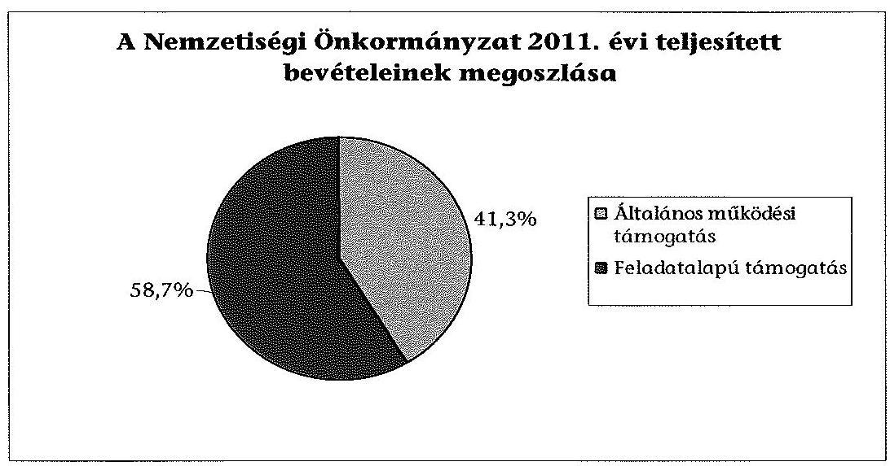
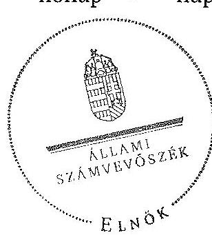

# ÁLLAMI   SZÁMVEVŐSZÉK 

## JELENTÉS

a helyi kisebbségi/nemzetiségi önkormányzatok gazdálkodásának ellenőrzéséről
Nagyhalász Város Roma Nemzetiségi Önkormányzat

---

# Állami Számvevőszék 

Iktatószám: V-0082-020/2013.
Témaszám: 1105
Vizsgálat-azonosító szám: V06060306

## Az ellenőrzést felügyelte:

Horváth Balázs
felügyeleti vezető
Az ellenőrzést vezette és az ellenőrzés végrehajtásáért felelős:
Preller Zsuzsanna
ellenőrzésvezető
A számvevőszéki jelentést készítették és a jelentés összeállításában
közreműködtek:
Moder Beatrix
számvevő
Szabó Leonóra Ildikó
számvevő
Az ellenőrzést végezte:
Vida László
számvevő tanácsos

---

# TARTALOMJEGYZÉK 

BEVEZETÉS ..... 5
I. ÖSSZEGZŐ MEGÁLLAPÍTÁSOK, KÖVETKEZTETÉSEK ..... 8
II. RÉSZLETES MEGÁLLAPÍTÁSOK ..... 10

1. A Nemzetiségi és a Települési Önkormányzat együttműködésének szabályszerűsége ..... 10
2. A gazdálkodási feladatok ellátásának szabályszerűsége ..... 10
2.1. A költségvetésre és zárszámadásra, valamint a kincstári adatszolgáltatás rendjére vonatkozó jogszabályi előírások betartása ..... 10
2.2. A Nemzetiségi Önkormányzat gazdálkodásának szabályozottsága ..... 11
2.3. A pénzügyi kontrollok működése ..... 11
3. A Nemzetiségi Önkormányzattal összefüggő gazdálkodási feladatok belső ellenőrzésének biztosítása ..... 12
4. A 2011. évi feladatalapú támogatás felhasználásának, elszámolásának szabályszerűsége ..... 13
5. A Nemzetiségi Önkormányzat feladatellátása ..... 13

## MELLÉKLET

1. számú A Nemzetiségi Önkormányzat 2011. évi és 2012. I. félévi gazdálkodásának főbb adatai, mutatói

## FÜGGELÉKEK

1. számú Értelmező szótár
2. számú A pénzügyi kontrollok működésének értékelése

---

.

---

# RÖVIDÍTÉSEK JEGYZÉKE 

## Jogszabályok

Áht. 1
Áht. 2
ÁSZ tv.
Nek. ${ }_{1}$ tv.
Nek. 2 tv.
Áhsz.

Ámr.
Ávr.

Ber.
Bkr.
támogatási kormányrendelet

Települési Önkormányzat SZMSZ-e

## Szórövidítések

ÁSZ
Belső Ellenőrzési Társulás
gazdálkodási jogkörök szabályzata
1992. évi XXXVIII. törvény az államháztartásról (hatályos 2011. december 31-ig)
2011. évi CXCV. törvény az államháztartásról (hatályos 2011. december 31-étől)
2011. évi LXVI. törvény az Állami Számvevőszékről (hatályos 2011. július 1-jétől)
1993. évi LXXVII. törvény a nemzeti és etnikai kisebbségek jogairól (hatályos 2011. december 31-ig)
2011. évi CLXXIX. törvény a nemzetiségek jogairól (hatályos 2011. december 20-tól)
249/2000. (XII. 24.) Korm. rendelet az államháztartás szervezeti beszámolási és könyvvezetési kötelezettségének sajátosságairól
292/2009. (XII. 19.) Korm. rendelet az államháztartás működési rendjéről (hatályos 2011. december 31-ig)
368/2011. (XII. 31.) Korm. rendelet az államháztartásról szóló törvény végrehajtásáról (hatályos 2012. január 1-jétől)
193/2003. (XI. 26.) Korm. rendelet a költségvetési szervek belső ellenőrzéséről (hatálytalan 2012. január 1-jétől)
370/2011. (XII. 31.) Korm. rendelet a költségvetési szervek belső kontrollrendszeréről és belső ellenőrzésről (hatályos 2012. január 1-jétől)
a kisebbségi önkormányzatoknak a központi költségvetésből, valamint fejezeti kezelésű előirányzatból nyújtott támogatások feltételrendszeréről és elszámolásának rendjéről szóló 342/2010. (XII. 28.) Korm. rendelet (hatályon kívül helyezte a 28/2012. (III. 6.) Korm. rendelet a nemzetiségi célú előirányzatokból nyújtott támogatások feltételrendszeréről és elszámolásának rendjéről; jelenleg hatályos a 428/2012. (XII. 29.) Korm. rendelet a nemzetiségi célú előirányzatokból nyújtott támogatások feltételrendszeréről és elszámolásának rendjéről)
Nagyhalász Város Önkormányzat Képviselő-testületének 14/2010. (X. 12.) számú rendelete Nagyhalász Város Önkormányzata és szervei Szervezeti és Működési Szabályzatáról

Állami Számvevőszék
Közép- Szabolcsi Többcélú Kistérségi Társulás Belső Ellenőrzési Társulása
Kötelezettségvállalás, utalványozás, ellenjegyzés, érvényesítés rendjének 2011. január 31-ig, a kötelezettségvállalás, pénzügyi ellenjegyzés, teljesítés igazolása, érvénye-

---

jegyző
Képviselő-testület

Nemzetiségi Önkormányzat

Nemzetiségi Önkormányzat elnöke
polgármester
Polgármesteri Hivatal
Polgármesteri Hivatal SZMSZ-e

Támogató
Települési Önkormányzat
Települési Önkormányzat Képviselő-testülete
sítés, utalványozás és adatszolgáltatás rendjéről szóló 2012. január 1-től hatályos szabályzat
Nagyhalász Város Önkormányzatának jegyzője
Nagyhalász Város Cigány Kisebbségi Önkormányzatának Képviselő-testülete 2011. december 31-ig, Nagyhalász Város Roma Nemzetiségi Önkormányzatának Képviselő-testülete 2012. január 1-jétől
Nagyhalász Város Cigány Kisebbségi Önkormányzata 2011. december 31-ig, Nagyhalász Város Roma Nemzetiségi Önkormányzata 2012. január 1-jétől
Nagyhalász Város Cigány Kisebbségi Önkormányzatának elnöke 2011. december 31-ig, Nagyhalász Város Roma Nemzetiségi Önkormányzatának elnöke 2012. január 1-jétől
Nagyhalász Város Önkormányzatának polgármestere
Nagyhalász Város Önkormányzatának Polgármesteri Hivatala
Nagyhalász Város Önkormányzata Képviselőtestületének 6/2011. (II. 1.) számú (hatályos 2012. április 30-áig.), majd a 44/2012. (IV. 25.) számú határozata Nagyhalász Város Önkormányzata Polgármesteri Hivatalának Szervezeti és Működési Szabályzatáról
A támogatást nyújtó Közigazgatási és Igazságügyi Minisztérium
Nagyhalász Város Önkormányzata
Nagyhalász Város Önkormányzatának Képviselőtestülete

---

# JELENTÉS 

## a helyi kisebbségi/nemzetiségi önkormányzatok gazdálkodásának ellenőrzéséről Nagyhalász Város Roma Nemzetiségi Önkormányzat

## BEVEZETÉS

Az államháztartás részét, az önkormányzati alrendszer egyik elemét képezik a nemzetiségi önkormányzatok, amelyek jogi személyek és a Nek. ${ }_{1,2}$ tv.-ben meghatározott önálló feladat- és hatáskörökkel rendelkeznek. A nemzetiségi önkormányzatok az önkormányzati, illetve testületi működtetés mellett a helyi nemzetiségi közügyek változatos formában való ellátásában vesznek részt.

A nemzetiségi önkormányzatok, illetve a települési önkormányzatok között a jelenlegi szabályozás szerint nincs alá-fölérendeltségi viszony. A nemzetiségi önkormányzatok azonban sajátos közjogi helyzetben vannak, mert a jogállásukat tekintve önkormányzatok, ám függnek a székhelyük szerinti települési önkormányzat hivatalától, amely ellátja a nemzetiségi önkormányzatok vonatkozásában a megállapodásban rögzített gazdálkodási feladatokat.

A nemzetiségek helyzete, támogatása mind hazai, mind európai uniós szinten kiemelt figyelmet kap napjainkban. A nemzetiségi önkormányzatok gazdálkodására és támogatási rendszerére vonatkozó jogszabályok a 2010-2012. években jelentős változásokon mentek át, amelyek érintették a feladatalapú támogatásra fordítható költségvetési keret megállapítását, az operatív gazdálkodási jogkörök szabályozását, az elkülönített könyvvezetés alkalmazását, a belső ellenőrzés szabályozását.

Az ellenőrzés célja annak értékelése volt, hogy a Nemzetiségi Önkormányzat gazdálkodási kereteinek kialakítása, gazdálkodása és feladatellátása megfelelt-e a hatályos jogszabályoknak.

Ennek keretében ellenőriztük, hogy:

- a Nemzetiségi Önkormányzat és a Települési Önkormányzat együttműködésének szabályozása, a Települési Önkormányzat SZMSZ-ében, a megállapodásban előírt működési feltételek biztosítása megfelelt-e a jogszabályi előírásoknak;
- a felek együttműködése megfelelt-e a megállapodásnak a gazdálkodási feladatok szabályszerű ellátásában, betartották-e a Nemzetiségi Önkormányzat gazdálkodásához kapcsolódóan a költségvetésre és zárszámadásra, a gazdálkodás szabályozására, az operatív gazdálkodási jogkörök gyakorlására vonatkozó jogszabályi előírásokat;

---

- a jegyző biztosította-e a Polgármesteri Hivatal belső ellenőrzése keretében a Nemzetiségi Önkormányzattal összefüggő gazdálkodási feladatok belső ellenőrzését;
- a 2011. évi feladatalapú támogatás felhasználása, a folyósított feladatalapú támogatással történő elszámolás az előírásoknak megfelelően történt-e;
- a Nemzetiségi Önkormányzat feladatellátása összhangban volt-e a vonatkozó jogszabályi előírásokkal.

Az ellenőrzés típusa: szabályszerűségi ellenőrzés
Az ellenőrzött időszak: 2011. január 1. - 2012. június 30.
Ellenőrzött szervezet: Nagyhalász Város Roma Nemzetiségi Önkormányzat és a gazdálkodási feladatait ellátó Nagyhalász Város Önkormányzata.

Az ellenőrzés jogszabályi alapja: az ÁSZ tv. 5. § (2)-(3) és (6) bekezdései
Az ellenőrzés szakmai módszertana az ÁSZ hivatalos honlapján (www.asz.hu) közzétett szakmai szabályokon alapult, amely a Legfőbb Ellenőrző Intézmények Nemzetközi Szervezete (INTOSAI) által kiadott nemzetközi standardok (ISSAI) figyelembevételével készült.

A fogalmak magyarázatát az 1. számú függelék, a pénzügyi kontrollok megfelelősége értékelésénél alkalmazott egységes minősítési szempontokat a 2. számú függelék tartalmazza.

Az ellenőrzés lefolytatásához a Települési Önkormányzat és a Nemzetiségi Önkormányzat tanúsítványok kitöltésével és a kapcsolódó dokumentumok elektronikus megküldésével szolgáltatott adatokat. A tanúsítványokon szereplő adatok, információk ellenőrzése és szükség szerinti javítása a helyszíni ellenőrzés keretében történt.

Az ÁSZ az ellenőrzés megállapításait az ellenőrzött időszakban hatályos, az intézkedést igénylő megállapításokra tett javaslatokat a jelenleg hatályos jogszabályok alapján fogalmazta meg.

A Nemzetiségi Önkormányzat az 1998. évben alakult, elnöke a megalakulás óta látja el feladatát. A Nemzetiségi Önkormányzat intézményt, gazdasági társaságot és más szervezetet nem alapított, illetve társulásban nem vett részt. A négytagú Képviselő-testület munkája segítésére bizottságot nem hozott létre. A Nemzetiségi Önkormányzat a költségvetési beszámolója szerint a 2011. évben 509 ezer Ft költségvetési bevételt ért el és 509 ezer Ft költségvetési kiadást teljesített. A 2012. évben 508 ezer Ft eredeti költségvetési bevételi és kiadási előirányzatot terveztek. A 2012. I. félévi beszámolója alapján a teljesített költségvetési bevétel 221 ezer Ft, a teljesített költségvetési kiadás 219 ezer Ft volt. A 2011. évi és a 2012. I. féléves gazdálkodási adatokat részletesen az 1. számú mellékletben mutatjuk be. Az ÁSZ a Nemzetiségi Önkormányzat gazdálkodását korábban nem ellenőrizte.

---

Az ÁSZ tv. 29. § (1) bekezdése szerint a jelentéstervezetet megküldtük a polgármester és a Nemzetiségi Önkormányzat elnöke részére, akik az ÁSZ tv. 29. § (2) bekezdésében foglalt észrevételezési jogukkal nem éltek, a jelentéstervezetre észrevételt nem tettek.

---

# I. ÖSSZEGZŐ MEGÁLLAPÍTÁSOK, KÖVETKEZTETÉSEK 

A Nemzetiségi és a Települési Önkormányzat együttműködése a határidők betartásával jóváhagyott megállapodásokon alapult. A Települési Önkormányzat - a megállapodásokban előírt módon - biztosította a Nemzetiségi Önkormányzat működéséhez szükséges személyi és tárgyi feltételeket. Az együttműködési megállapodások tartalma a jogszabályi előírásoknak megfelelt, azonban az együttműködő felek a törvényi előírásokat maradéktalanul nem érvényesítették. A kisebbségi közügyek ellátásához, a működési feltételek biztosításához szükséges ingó és ingatlan vagyontárgyak ingyenes használatba adásáról a Nemzetiségi Önkormányzat megalakulását követő két hónapon belül, a Nek. ${ }_{1}$ tv. előírása ellenére nem készült dokumentum. A megállapodás szerinti működési feltételeket a Nek. ${ }_{2}$ tv-ben foglaltak ellenére sem a Települési, sem a Nemzetiségi Önkormányzat SZMSZ-ében nem rögzítették.

A Nemzetiségi Önkormányzat költségvetésére és zárszámadására vonatkozó jogszabályi előírásokat betartották. A költségvetési és zárszámadási határozatok jóváhagyása, a költségvetési előirányzatok módosítása a jogszabályban előírt eljárásrendnek megfelelt. A határozatokat a jogszabályokban előírt tartalmi követelményeknek megfelelően, egymással összehasonlítható szerkezetben készítették el, és változatlan formában építették be a Települési Önkormányzat költségvetési és zárszámadási rendeleteibe. A jegyző 2012. I. félévben a Nemzetiségi Önkormányzatra vonatkozó kincstári adatszolgáltatási kötelezettségének határidőben eleget tett.

A gazdálkodás szabályozottsága megfelelt a jogszabályi előírásoknak, mert a jegyző a gazdálkodási feladatok végrehajtását ellátó Polgármesteri Hivatal jogszabályokban előírt szabályzatainak hatályát kiterjesztette a Nemzetiségi Önkormányzat gazdálkodási feladataira. Az operatív gazdálkodási jogkörök kialakítása az ellenőrzött időszakban a jogszabályi előírásokkal összhangban történt. A Polgármesteri Hivatal SZMSZ-e az Ámr. és az Ávr. előírásainak megfelelően tartalmazta a munkakörökhöz kapcsolódóan a Nemzetiségi Önkormányzat gazdálkodásával kapcsolatos feladat- és hatásköröket, a hatáskörök gyakorlásának módját, a helyettesítés rendjét és az ezekre vonatkozó felelősségi szabályokat.

A pénzügyi kontrollok működése az ellenőrzött időszakban a dologi és egyéb folyó kiadások teljesítésénél kiváló volt. A 2011. évben a kötelezettségvállalás ellenjegyzője, a szakmai teljesítés igazoló és az utalvány ellenjegyzője, a 2012. évben a pénzügyi ellenjegyző, a teljesítésigazoló és az érvényesítő a jogszabályokban és a gazdálkodási jogkörök szabályzatában előírt módon teljesítette az ellenőrzési és igazolási feladatokat.

A Nemzetiségi Önkormányzat a 2011. évben a forrásai 58,7%-át kitevő, 299 ezer Ft feladatalapú támogatásban részesült, amelyet tárgyév december 31-ig a jogszabályi előírásokkal összhangban felhasznált. A támogatási kormányrendeletben hivatkozott, Áht.-ben előírt elszámolás nem történt meg.

---

A támogatás felhasználását, elszámolását az ellenőrzésre jogosult szervek nem ellenőrizték.

A Nemzetiségi Önkormányzat feladatellátásának tárgya összhangban volt a Nek. ${ }_{1,2}$ tv. előírásaival. Biztosította a nemzetiségi közügyek keretében az alapvető feladat ellátásához szükséges szervezeti, személyi és anyagi feltételeket.

A Polgármesteri Hivatal 2011. és 2012. évi éves ellenőrzési terveit megalapozó kockázatelemzés - a Ber. előírásai ellenére - nem terjedt ki a Nemzetiségi Önkormányzat gazdálkodásával összefüggő végrehajtási feladatok ellátására. A jegyző az ellenőrzött időszakban az Áht. ${ }_{1}$, illetve az Áht. ${ }_{2}$ ellenére nem biztosította a Polgármesteri Hivatal belső ellenőrzése keretében a Nemzetiségi Önkormányzat gazdálkodásával összefüggő végrehajtási feladatok belső ellenőrzését. Belső ellenőrzést a 2011. évben és 2012. I. félévben nem terveztek és nem végeztek. A 2012. június 1-jétől hatályos együttműködési megállapodásban foglaltak alapján a Belső Ellenőrzési Társulás végzi a Nemzetiségi Önkormányzat belső ellenőrzését.

Az ellenőrzés megállapításai alapján, az észrevételezésre megküldött jelentéstervezetben a Nemzetiségi Önkormányzat gazdálkodásával kapcsolatban intézkedést igénylő megállapításokat és javaslatokat fogalmaztunk meg, amelyek végrehajtásáról az ellenőrzés időszakában intézkedési tájékoztatást adott a polgármester és a Nemzetiségi Önkormányzat elnöke. A Települési Önkormányzat és a Nemzetiségi Önkormányzat SZMSZ-ében rögzítették a megállapodás szerinti működési feltételeket.
 A 2011. évi feladatalapú támogatás felhasználásáról a jegyző által készített elszámolást a Nemzetiségi Önkormányzat elnöke a Képviselő-testület elé terjesztette, amit az határozattal elfogadott. Figyelemmel az ÁSZ ellenőrzés hasznosítására intézkedést igénylő megállapítást, javaslatot nem szerepeltetünk.

---

# II. RÉSZLETES MEGÁLLAPÍTÁSOK 

## 1. A Nemzetiségi és a Települési Önkormányzat együttműködésének szabályszerűsége

A Nemzetiségi és a Települési Önkormányzat együttműködése az előírt határidők betartásával jóváhagyott megállapodásokon ${ }^{1}$ alapult. Az együttműködési megállapodások a 2011. évben az Áht.-ben és a Nek. tv-ben, a 2012. évben a Nek. ${ }_{2}$ tv-ben meghatározott tartalmi elemeket tartalmazták, azonban az együttműködő felek a törvényi előírásokat nem érvényesítették maradéktalanul, mert:

- a 2011. december 31-én hatályos megállapodás és a Nek. ${ }_{1}$ tv. 59. § (1) és (3) bekezdéseiben foglalt előírás ellenére nem készült dokumentum a kisebbségi közügyek ellátásához, a működési feltételek biztosításához szükséges ingó és ingatlan vagyontárgyak ingyenes használatba adásáról a Nemzetiségi Önkormányzat megalakulását követő két hónapon belül;
- a Nek. ${ }_{2}$ tv. 80. § (2) bekezdésében foglaltak ellenére nem rögzítették a Települési és a Nemzetiségi Önkormányzat SZMSZ-ében a megállapodás szerinti működési feltételeket.

A Települési Önkormányzat biztosította - a megállapodásokban előírt módon - a Nemzetiségi Önkormányzat működéséhez szükséges személyi és tárgyi feltételeket.

## 2. A GAZDÁLKODÁSI FELADATOK ELLÁTÁSÁNAK SZABÁLYSZERŰSÉGE

### 2.1. A költségvetésre és zárszámadásra, valamint a kincstári adatszolgáltatás rendjére vonatkozó jogszabályi előírások betartása

A Nemzetiségi Önkormányzat költségvetésére és zárszámadására vonatkozó jogszabályi előírásokat betartották. A Nemzetiségi Önkormányzat költségvetési és zárszámadási határozatait ${ }^{2}$ a jogszabályban előírt eljárásrend szerint fogadták el, a költségvetési és zárszámadási határozatok egymással összehasonlítható szerkezetben készültek, azok változatlan formában épültek be a Települési Önkormányzat költségvetési és zárszámadási rendeleteibe.

[^0]
[^0]:    ${ }^{1}$ A 2011. évben és 2012. június 1-jéig hatályos együttműködési megállapodást a Képviselő-testület a 3/2011. (I. 11.) számú, a Települési Önkormányzat Képviselő-testülete az 1/2011. (I. 14.) számú határozattal fogadta el. A Nek. ${ }_{2}$ tv. 159. § (3) bekezdésében előírtak alapján 2012. június 1-jéig felülvizsgált és módosított együttműködési megállapodást a Képviselő-testület 6/2012. (V. 31.) számú, a Települési Önkormányzat Képviselő-testülete a 43/2012. (IV. 25.) számú határozattal fogadta el.
    ${ }^{2}$ A Képviselő-testületnek a Nemzetiségi Önkormányzat 2011. évi költségvetéséről alkotott 4/2011. (I. 20.) számú, a 2011. évi zárszámadásról alkotott 4/2012. (III. 30.) számú, valamint a 2012. évi költségvetéséről alkotott 2/2012. (II. 07.) számú határozatai.

---

Az ellenőrzött időszakban a költségvetési és zárszámadási határozatok tartalma a jogszabályi előírásoknak megfelel. A Nemzetiségi Önkormányzat elnöke határidőben gondoskodott a költségvetési és a zárszámadási határozatok Képviselő-testület elé terjesztéséről, elfogadásáról, valamint a Települési Önkormányzat polgármestere részére történő továbbításáról.
2012. I. félévben az Ávr.-ben és az Áhsz-ben előírt, a Nemzetiségi Önkormányzatra vonatkozó kincstári adatszolgáltatási kötelezettségének a jegyző határidőben eleget tett.

A Nemzetiségi Önkormányzat elnöke a költségvetési előirányzatai felhasználásához szükséges mértékben kezdeményezte azok módosítását, biztosította a tárgyévi fizetési kötelezettség vállalásához szükséges fedezet meglétét.

# 2.2. A Nemzetiségi Önkormányzat gazdálkodásának szabályozottsága 

A Nemzetiségi Önkormányzat gazdálkodását az ellenőrzött időszakban a jogszabályi előírásoknak megfelelően szabályozták. A gazdálkodási feladatok végrehajtását ellátó Polgármesteri Hivatal a jogszabályokban előírt gazdálkodási szabályzatokkal ${ }^{3}$ rendelkezett, azok hatálya kiterjedt a Nemzetiségi Önkormányzat gazdálkodási feladataira.

A Nemzetiségi Önkormányzat operatív gazdálkodási jogköreinek kialakítása - a kötelezettségvállalásra, utalványozásra, kötelezettségvállalás és utalványozás ellenjegyzésére a felhatalmazások, a szakmai teljesítést igazoló, a pénzügyi ellenjegyzést és az érvényesítést végző személyek kijelölése - az ellenőrzött időszakban megfelelt a jogszabályi előírásoknak.

A Nemzetiségi Önkormányzat gazdálkodásával kapcsolatos feladat- és hatásköröket, a hatáskörök gyakorlásának módját, a helyettesítés rendjét és az ezekre vonatkozó felelősségi szabályokat - az Ámr. és az Ávr. előírásainak megfelelően - az ellenőrzött időszakban a Polgármesteri Hivatal SZMSZ-ében rögzítették. Az operatív gazdálkodással kapcsolatos feladat- és hatásköröket az együttműködési megállapodás, a gazdálkodási jogkörök szabályzata, valamint a feladatokat ellátó köztisztviselők munkaköri leírásai tartalmazták.

### 2.3. A pénzügyi kontrollok működése

A Nemzetiségi Önkormányzat az ellenőrzött időszakban államháztartáson belülre és kívülre, működési és felhalmozási célra pénzeszközátadást, illetve szociálpolitikai ellátásra kiadást nem teljesített. A 2011. évi dologi és egyéb folyó kiadások teljesítése során a kötelezettségvállalás ellenjegyzése, a szakmai teljesítésigazolás, az utalvány ellenjegyzése kontrollok működésének megfelelősége - a 2. számú függelékben részletezett szempontok alapján végzett értékelés szerint - kiváló volt, mert:

- a kötelezettségvállalás ellenjegyzője a jogszabályokban és a belső szabályzatban előírt módon végezte el feladatát;
- a szakmai teljesítésigazolást az arra kijelölt személy végezte el, a kiadások teljesítésének jogosságát, összegszerűségét, a megrendelések, szerződések teljesítését az Ámr.-ben és a belső szabályozásban foglalt előírásoknak megfelelően ellenőrizte és igazolta;
- az utalvány ellenjegyzője meggyőződött a szakmai teljesítésigazolás és az érvényesítés elvégzéséről, valamint a gazdálkodásra vonatkozó szabályok érvényesüléséről.

A Nemzetiségi Önkormányzatnál 2012. I. félévben a dologi és egyéb folyó kiadások teljesítése során a pénzügyi ellenjegyzés, a teljesítés igazolás és az érvényesítés kontrollok működésének megfelelősége - a 2. számú függelékben részletezett szempontok alapján végzett értékelés szerint - kiváló volt, mert:

- a pénzügyi ellenjegyző meggyőződött a szabad előirányzat, valamint a kifizetés tervezett időpontjában a pénzügyi fedezet rendelkezésre állásáról, továbbá a kötelezettségvállalások során a gazdálkodásra vonatkozó szabályok betartásáról;
- a teljesítés igazolását az arra kijelölt személy végezte el, a kiadások teljesítésének jogosságát, összegszerűségét, a megrendelések, szerződések teljesítését az Ávr-ben és a belső szabályozásban foglalt előírásoknak megfelelően ellenőrizte és igazolta;
- a jogszerű kijelöléssel rendelkező érvényesítő a feladatait az Ávr. és a belső szabályozás előírásainak megfelelően végezte el.

# 3. A Nemzetiségi Önkormányzattal összefüggő gazdálkodási feladatok belső ellenőrzésének biztosítása 

A Polgármesteri Hivatal 2011. és 2012. évi ellenőrzési terveit megalapozó kockázatelemzés a Ber. 21. § (2) bekezdése ${ }^{4}$ ellenére nem terjedt ki a Nemzetiségi Önkormányzat gazdálkodásával összefüggő végrehajtási feladatok ellátására. A jegyző az ellenőrzött időszakban az Áht. ${ }_{1}$ 121/B. § (4) bekezdése, illetve az Áht. ${ }_{2}$ 70. § (1) bekezdése előírása ellenére nem biztosította a Polgármesteri Hivatal belső ellenőrzése keretében a Nemzetiségi Önkormányzat gazdálkodásával összefüggő végrehajtási feladatok belső ellenőrzését. Erre vonatkozóan belső ellenőrzést a 2011. évben és 2012. I. félévben nem terveztek és nem végeztek.
A 2012. június 1-jétől hatályos együttműködési megállapodásban foglaltak alapján a Nemzetiségi Önkormányzat belső ellenőrzését a Belső Ellenőrzési Társulás végzi.

[^0]
[^0]:    ${ }^{4}$ 2012. január 1-jétől Bkr. 7. § (2) bekezdése írja elő

---

# 4. A 2011. ÉVI FELADATALAPÚ TÁMOGATÁS FELHASZNÁLÁSÁNAK, ELSZÁMOLÁSÁNAK SZABÁLYSZERŰSÉGE 

A Nemzetiségi Önkormányzat a 2011. évben 299 ezer Ft feladatalapú támogatásban részesült, amelynek az összes bevételhez viszonyított részarányát a következő ábra szemlélteti.

A 2011. évben folyósított támogatást a jogszabályi előírásokkal összhangban a tárgyévben felhasználták. Elszámolása a támogatási kormányrendelet 7. § (2) bekezdésében hivatkozott Áht. ${ }_{1}$-nek „a helyi önkormányzatok elszámolási rendjére vonatkozó rendelkezései alkalmazása" előírása ellenére nem történt meg. A támogatás felhasználását, elszámolását az ellenőrzésre jogosult szervek nem ellenőrizték.

## 5. A Nemzetiségi Önkormányzat feladatellátása

A Nemzetiségi Önkormányzat feladatellátásának tárgya összhangban volt a Nek. ${ }_{1,2}$ tv. előírásaival. A Nek. ${ }_{1}$ tv. 5/A. § (1) bekezdése és a Nek. ${ }_{3}$ tv. 10. § (1) bekezdése szerinti, nemzetiségi érdekek védelmével és képviseletével kapcsolatos alapvető feladata ellátásához biztosította a szükséges szervezeti, személyi és anyagi feltételeket.

Budapest, 2013.
12.
hónap 16. nap

Domokos László
elnök $\wedge$

Melléklet: $\quad 1 \mathrm{db}$
Függelék: $\quad 2 \mathrm{db}$

---

.

---

# A Nemzetiségi Önkormányzat 2011. évi és 2012. I. félévi gazdálkodásának főbb adatai, mutatói

A) BEVÉTELEK

|  Megnevezés | 2011. év |  |  |  | 2012. év |  | 2012. I. félév |   |
| --- | --- | --- | --- | --- | --- | --- | --- | --- |
|   | eredeti ei. | módosított ei. | teljesítés | teljesítés megoszlása (%) | eredeti ei. | módosított ei. | teljesítés | teljesítés megoszlása (%)  |
|  Intézményi működési bevétel | 0,0 | 0,0 | 0,0 | 0,0 | 0,0 | 0,0 | 0,0 | 0,0  |
|  Általános működési támogatás | 555,0 | 210,0 | 210,0 | 41,3 | 508,0 | 0,0 | 221,0 | 100,0  |
|  Feladatalapú támogatás | 0,0 | 299,0 | 299,0 | 58,7 | 0,0 | 0,0 | 0,0 | 0,0  |
|  Integrációs Önkormányzat által nyújtott támogatás | 0,0 | 0,0 | 0,0 | 0,0 | 0,0 | 0,0 | 0,0 | 0,0  |
|  Fenntartási bevételek összesen | 555,0 | 509,0 | 509,0 | 100,0 | 508,0 | 0,0 | 221,0 | 100,0  |
|  Ezen évi pénzmaradvány felhasználás | 0,0 | 0,0 | 0,0 | 0,0 | 0,0 | 0,0 | 0,0 | 0,0  |
|  Bevételek | 555,0 | 509,0 | 509,0 | 100,0 | 508,0 | 0,0 | 221,0 | 100,0  |

B) KIADÁSOK

|  Megnevezés | 2011. év |  |  |  | 2012. év |  | 2012. I. félév |   |
| --- | --- | --- | --- | --- | --- | --- | --- | --- |
|   | eredeti ei. | módosított ei. | teljesítés | teljesítés megoszlása (%) | eredeti ei. | módosított ei. | teljesítés | teljesítés megoszlása (%)  |
|  Személyi juttatások | 0,0 | 0,0 | 0,0 | 0,0 | 0,0 | 0,0 | 0,0 | 0,0  |
|  Munkáltatói térítési járulékok | 0,0 | 0,0 | 0,0 | 0,0 | 0,0 | 0,0 | 0,0 | 0,0  |
|  Dologi és egyéb folyó kiadások | 555,0 | 210,0 | 210,0 | 41,3 | 508,0 | 0,0 | 219,0 | 100,0  |
|  Támogatásértékű működési kiadás | 0,0 | 299,0 | 299,0 | 58,7 | 0,0 | 0,0 | 0,0 | 0,0  |
|  Működési kiadások összesen | 0,0 | 0,0 | 0,0 | 100,0 | 0,0 | 0,0 | 0,0 | 100,0  |
|  Felhalmozási kiadások | 0,0 | 0,0 | 0,0 | 0,0 | 0,0 | 0,0 | 0,0 | 0,0  |
|  Kiadások összesen | 555,0 | 509,0 | 509,0 | 100,0 | 508,0 | 0,0 | 219,0 | 100,0  |

---

.

---

# ÉRTELMEZŐ SZÓTÁR 

feladatalapú támogatás A támogatási évben általános működési támogatásban részesült, és a Támogatónak a Kincstárhoz intézett, a feladatalapú támogatás utalására vonatkozó rendelkező levele keltének időpontjában működő nemzetiségi önkormányzatoknak a támogatási kormányrendeletben rögzített feltételrendszer alapján nyújtható támogatás. A feladatalapú támogatás a nemzetiségi közügyeknek a nemzetiségi

 önkormányzatok által történő ellátását szolgálja. (A támogatási kormányrendelet 2. § (2) bekezdés c) pont, és 4. § (1) bekezdés alapján.)
megállapodás
nemzetiség
nemzetiségi közügy

A nemzetiségi önkormányzatnak a működési feltételei biztosítására, továbbá a bevételeivel és a kiadásaival kapcsolatban a tervezési, gazdálkodási, ellenőrzési, finanszírozási, adatszolgáltatási és beszámolási feladatai végrehajtására a székhelye szerinti települési önkormányzattal megkötött megállapodás. (Az Áht. 66. §, a Nek. 2 tv. 80. § (2) bekezdés, valamint az Áht. 27. § (2) bekezdés alapján levezetett fogalom.)
Minden olyan Magyarország területén legalább egy évszázada honos népcsoport, amely az állam lakossága körében számszerű kisebbségben van és a lakosság többi részétől saját nyelve és kultúrája, hagyományai különböztetik meg, egyben olyan összetartozás-tudatról tesz bizonyságot, amely mindezek megőrzésére, történelmileg kialakult közösségeik érdekeinek kifejezésére és védelmére irányul. (A Nek. 1 tv. 1. § (2) bekezdése, valamint a Nek. 2 tv. 1. § (1) bekezdése alapján levezetett fogalom.)
Az egyéni és közösségi jogok érvényesülése, a nemzetiséghez tartozók érdekeinek kifejezésre juttatása - különösen az anyanyelv ápolása, őrzése és gyarapítása, továbbá a nemzetiségek kulturális autonómiájának a nemzetiségi önkormányzatok által történő megvalósítása és megőrzése - érdekében a nemzetiséghez tartozók meghatározott közszolgáltatásokkal való ellátásával, ezen ügyek önálló vitelével és az ehhez szükséges szervezeti, személyi és anyagi feltételek megteremtésével összefüggő ügy. A közhatalmat gyakorló állami és helyi önkormányzati szervekben, továbbá a nemzetiségi önkormányzati szervekben való nemzetiségi képviselethez és mindezek szervezeti, személyi és anyagi feltételeinek biztosításához kapcsolódó ügy. (A Nek. 1 tv. 6/A. § 1. pontjából és a Nek. 2 tv. 2. § 1. pontjából levezetett fogalom.)

---

nemzetiségi önkormányzat
pénzügyi kontrollok

Törvényben meghatározott nemzetiségi közszolgáltatási feladatokat ellátó, testületi formában működő, jogi személyiséggel rendelkező, demokratikus választások útján törvény alapján létrehozott szervezet, amely a nemzetiségi közösséget megillető jogosultságok érvényesítésére, a nemzetiségek érdekeinek védelmére és képviseletére, a feladat- és hatáskörébe tartozó nemzetiségi közügyek települési, területi vagy országos szinten történő önálló intézésére jön létre. (A Nek. 1 tv. 6/A. § (1) bekezdés 2. pontjából, valamint a Nek. 2 tv. 2. § 2. pontjából levezetett fogalom.) A jelentésben e fogalmat a települési nemzetiségi önkormányzatokra leszűkítve használjuk.
a kötelezettségvállalás és az utalvány ellenjegyzése, valamint a szakmai teljesítés igazolása 2011. december 31-ig, 2012. január 1-jétől a pénzügyi ellenjegyzés, a teljesítés igazolása és az érvényesítés.

---

# A PÉNZÜGYI KONTROLLOK MŰKÖDÉSÉNEK ÉRTÉKELÉSE 

A pénzügyi kontrollok működésének megfelelőségének vizsgálatát többlépcsős megfelelőségi tesztek útján, megismételt eljárással, a könyvviteli tételekből vett egyszerű véletlen minta alapján végeztük. A tesztelést az értékelésre kiválasztott három terület - a dologi és egyéb folyó kiadásoknál teljesített kifizetések, az államháztartáson belülre és kívülre, működési és felhalmozási célra teljesített pénzeszközátadások, illetve a szociálpolitikai ellátások teljesített kiadásainál végeztük el.

Az ellenőrzés során alkalmazott módszer (többlépcsős megfelelőségi teszt) lényege, hogy a kiválasztott minta ellenőrzését csak addig végezzük, amíg elegendő és megfelelő bizonyítékot nem szerzünk a vizsgált pénzügyi kontroll működésének megfelelő, vagy nem megfelelő voltáról. A megismételt eljárás alkalmazása a szándékolt hatáshoz (törvényes működés, kitűzött célok, teljesítmények elérése, veszteséget okozó kockázatok megelőzése, mérséklése, feltárása) viszonyítva lehetővé teszi a kontrolltevékenységek tényleges hatásának vizsgálatát, ez alapján a működés megfelelőségének értékelését. Ennek keretében a számvevő bizonyosságot szerez arról, hogy a rendelkezésre álló szabályozás és dokumentumok alapján a pénzügyi kontrollokhoz szükséges - jogszabályokban előírt - ellenőrzési lépéseket végrehajtották-e.

A tesztek kiértékelése évenkénti bontásban két szinten történt. Először az egyes tevékenységi területekre meghatározott pénzügyi kontrollokat értékeltük, majd általános következtetést vontunk le a pénzügyi kontrollok együttes megfelelősége tekintetében. Az ellenőrzésre kijelölt területek kifizetéseinél a pénzügyi kontrollok működése „kiváló", „jó" vagy „gyenge" minősítést kaphatott.

Az értékelésnél meghatározott lényegességi szint a könyvelési adatállományból vett mintanagysághoz megadott kritikus hibák száma.

A pénzügyi kontrollok működését:

- kiválónak értékeltük abban az esetben, ha azok működése megfelel a hibák megelőzésére és kijavítására meghatározott jogszabályi és helyi szintű szabályozásnak (eseti hibák);
- jónak minősítettük, ha a megállapított kisebb (tolerálható mértékű) hiányosságok nem veszélyeztetik az ellenőrzött területek hibáinak megelőzését és kijavítását (a hibák száma nem érte el a kritikus hibák számát, azaz a lényegességi szintet);
- gyengének értékeltük, amennyiben a kontrollok működésében előforduló hiányosságok miatt nem biztosított a hibák megelőzése, feltárása, kijavítása (a hibák száma elérte az ellenőrzött tételektől függően megállapított kritikus hibák számát, azaz a lényegességi szintet).
