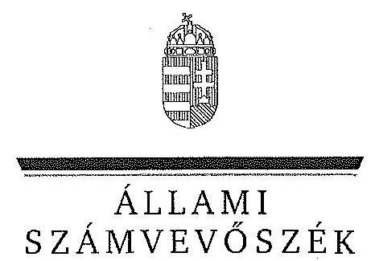
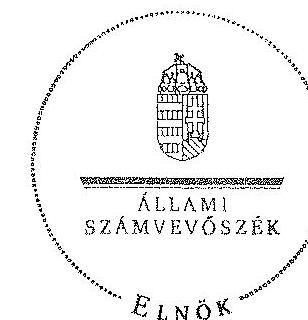

ÁLLAMI
SZÁMVEVŐSZÉK

# JELENTÉS 

a helyi kisebbségi/nemzetiségi önkormányzatok gazdálkodásának ellenőrzéséről
Cigány Nemzetiségi Önkormányzat Törökbálint

---

# Állami Számvevőszék 

Iktatószám: V-0080-016/2013.
Témaszám: 1105
Vizsgálat-azonosító szám: V06060304

## Az ellenőrzést felügyelte:

Horváth Balázs
felügyeleti vezető
Az ellenőrzést vezette és az ellenőrzés végrehajtásáért felelős:
Preller Zsuzsanna
ellenőrzésvezető
A számvevőszéki jelentést készítették és a jelentés összeállításában közreműködtek:

Luhály Matild
számvevő
Moder Beatrix
számvevő
Az ellenőrzést végezte:
Csiszárné dr. Kosik Mária
számvevő tanácsos

---

# TARTALOMJEGYZÉK 

BEVEZETÉS ..... 5
I. ÖSSZEGZŐ MEGÁLLAPÍTÁSOK, KÖVETKEZTETÉSEK, JAVASLATOK ..... 8
II. RÉSZLETES MEGÁLLAPÍTÁSOK ..... 13

1. A Nemzetiségi és a Települési Önkormányzat együttműködésének szabályszerűsége ..... 13
2. A gazdálkodási feladatok ellátásának szabályszerűsége ..... 14
2.1. A költségvetésre és zárszámadásra, valamint a kincstári adatszolgáltatás rendjére vonatkozó jogszabályi előírások betartása ..... 14
2.2. A Nemzetiségi Önkormányzat gazdálkodásának szabályozottsága ..... 15
2.3. A pénzügyi kontrollok működése ..... 16
3. A Nemzetiségi Önkormányzattal összefüggő gazdálkodási feladatok belső ellenőrzése ..... 17
4. A Nemzetiségi Önkormányzat feladatellátása ..... 17

## MELLÉKLET

1. számú A Nemzetiségi Önkormányzat 2011. évi és 2012. I. félévi gazdálkodásának főbb adatai, mutatói

## FÜGGELÉKEK

1. számú Értelmező szótár
2. számú A pénzügyi kontrollok működésének értékelése

---

.

---

# RÖVIDÍTÉSEK JEGYZÉKE 

## Jogszabályok

Áht. 1
Áht. 2
ÁSZ tv.
Nek. ${ }_{1}$ tv.
Nek. ${ }_{2}$ tv.
Számv. tv.
Áhsz.

Ámr.
Ávr.
Ber.
Bkr.
támogatási kormányrendelet

Települési Önkormányzat SZMSZ-e

## Szórövidítések

ÁSZ
jegyző
gazdálkodási jogkörök szabályzata
1992. évi XXXVIII. törvény az államháztartásról, hatályos 2011. december 31-ig
2011. évi CXCV. törvény az államháztartásról, hatályos 2011. december 31-től
2011. évi LXVI. törvény az Állami Számvevőszékről, hatályos 2011. július 1-jétől
1993. évi LXXVII. törvény a nemzeti és etnikai kisebbségek jogairól, hatályos 2011. december 31-ig
2011. évi CLXXIX. törvény a nemzetiségek jogairól, hatályos 2011. december 20-tól
2000. évi C. törvény a számvitelről

249/2000. (XII. 24.) Korm. rendelet az államháztartás szervezetei beszámolási és könyvvezetési kötelezettségének sajátosságairól
292/2009. (XII. 19.) Korm. rendelet az államháztartás működési rendjéről, hatályos 2011. december 31-ig
368/2011. (XII. 31.) Korm. rendelet az államháztartásról törvény végrehajtásáról, hatályos 2012. január 1-jétől
193/2003. (XI. 26.) Korm. rendelet a költségvetési szervek belső ellenőrzéséről (hatálytalan 2012. január 1-jétől)
370/2011. (XII. 31.) Korm. rendelet a költségvetési szervek belső kontrollrendszeréről és belső ellenőrzéséről, hatályos 2012. január 1-jétől
a kisebbségi önkormányzatoknak a központi költségvetésből, valamint fejezeti kezelésű előirányzatból nyújtott támogatások feltételrendszeréről és elszámolásának rendjéről szóló 342/2010. (XII. 28.) Korm. rendelet (hatályon kívül helyezte a 28/2012. (III. 6.) Korm. rendelet a nemzetiségi célú előirányzatokból nyújtott támogatások feltételrendszeréről és elszámolásának rendjéről; jelenleg hatályos a 428/2012. (XII. 29.) Korm. rendelet a nemzetiségi célú előirányzatokból nyújtott támogatások feltételrendszeréről és elszámolásának rendjéről)
Törökbálint Város Önkormányzata Képviselőtestületének 9/2011. (III. 25.) számú rendelete a Szervezeti és Működési Szabályzatáról

Állami Számvevőszék
Törökbálint Város Önkormányzatának jegyzője
Törökbálint Önkormányzatának jegyzője által jóváhagyott a Törökbálint Város Önkormányzata Polgármesteri Hivatalának Kötelezettségvállalás, utalványozás, ellenjegyzés és érvényesítés rendjének szabályzata (hatályos 2011. január 1-jétől)

---

| Képviselő-testület | Cigány Kisebbségi Önkormányzat Törökbálint Képviselőtestülete 2011. december 31-ig, Cigány Nemzetiségi Önkormányzat Törökbálint Képviselő-testülete 2012. január 1-jétől |
| :--: | :--: |
| Kincstár | Magyar Államkincstár |
| Nemzetiségi Önkormányzat | Cigány Kisebbségi Önkormányzat Törökbálint 2011. december 31-ig, Cigány Nemzetiségi Önkormányzat Törökbálint 2012. január 1-jétől |
| Nemzetiségi Önkormányzat elnöke | Cigány Kisebbségi Önkormányzat Törökbálint elnöke 2011. december 31-ig, Cigány Nemzetiségi Önkormányzat Törökbálint elnöke 2012. január 1-jétől |
| Nemzetiségi Önkormányzat SZMSZ-e | Cigány Nemzetiségi Önkormányzat Törökbálint 29/2012. (06.19.) CNÖ számú határozata a Szervezeti és Működési Szabályzatról |
| polgármester | Törökbálint Város Önkormányzatának polgármestere |
| Polgármesteri Hivatal | Törökbálint Város Önkormányzatának Polgármesteri Hivatala |
| Támogató | A támogatást nyújtó Közigazgatási és Igazságügyi minisztérium |
| Települési Önkormányzat | Törökbálint Város Önkormányzat |
| Települési Önkormányzat Képviselő-testülete | Törökbálint Város Önkormányzatának Képviselőtestülete |

---

# JELENTÉS 

## a helyi kisebbségi/nemzetiségi önkormányzatok gazdálkodásának ellenőrzéséről Cigány Nemzetiségi Önkormányzat Törökbálint

## BEVEZETÉS

Az államháztartás részét, az önkormányzati alrendszer egyik elemét képezik a nemzetiségi önkormányzatok, amelyek jogi személyek és a Nek. ${ }_{1,2}$ tv.-ben meghatározott önálló feladat- és hatáskörökkel rendelkeznek. A nemzetiségi önkormányzatok az önkormányzati, illetve testületi működtetés mellett a helyi nemzetiségi közügyek változatos formában való ellátásában vesznek részt.

A nemzetiségi önkormányzatok, illetve a települési önkormányzatok között a jelenlegi szabályozás szerint nincs alá-fölérendeltségi viszony. A nemzetiségi önkormányzatok azonban sajátos közjogi helyzetben vannak, mert a jogállásukat tekintve önkormányzatok, ám függnek a székhelyük szerinti települési önkormányzat hivatalától, amely ellátja a nemzetiségi önkormányzatok vonatkozásában a megállapodásban rögzített gazdálkodási feladatokat.

A nemzetiségek helyzete, támogatása mind hazai, mind európai uniós szinten kiemelt figyelmet kap napjainkban. A nemzetiségi önkormányzatok gazdálkodására és támogatási rendszerére vonatkozó jogszabályok a 2010-2012. években jelentős változásokon mentek át, amelyek érintették a feladatalapú támogatásra fordítható költségvetési keret megállapítását, az operatív gazdálkodási jogkörök szabályozását, az elkülönített könyvvezetés alkalmazását, a belső ellenőrzés szabályozását.

Az ellenőrzés célja annak értékelése volt, hogy a Nemzetiségi Önkormányzat gazdálkodási kereteinek kialakítása, gazdálkodása és feladatellátása megfelelt-e a hatályos jogszabályoknak.

Ennek keretében ellenőriztük, hogy:

- a Nemzetiségi Önkormányzat és a Települési Önkormányzat együttműködésének szabályozása, a Települési Önkormányzat SZMSZ-ében, a megállapodásban előírt működési feltételek biztosítása megfelelt-e a jogszabályi előírásoknak;
- a felek együttműködése megfelelt-e a megállapodásnak a gazdálkodási feladatok szabályszerű ellátásában, betartották-e a Nemzetiségi Önkormányzat gazdálkodásához kapcsolódóan a költségvetésre és zárszámadásra, a gazdálkodás szabályozására, az operatív gazdálkodási jogkörök gyakorlására vonatkozó jogszabályi előírásokat;

---

- a jegyző biztosította-e a Polgármesteri Hivatal belső ellenőrzése keretében a Nemzetiségi Önkormányzattal összefüggő gazdálkodási feladatok belső ellenőrzését;
- a 2011. évi feladatalapú támogatás felhasználása, a folyósított feladatalapú támogatással történő elszámolás az előírásoknak megfelelően történt-e;
- a Nemzetiségi Önkormányzat feladatellátása összhangban volt-e a vonatkozó jogszabályi előírásokkal.

Az ellenőrzés típusa: szabályszerűségi ellenőrzés
Az ellenőrzött időszak: 2011. január 1. - 2012. június 30.
Ellenőrzött szervezet: Cigány Nemzetiségi Önkormányzat Törökbálint és a gazdálkodási feladatait ellátó Törökbálint Város Önkormányzat

Az ellenőrzés jogszabályi alapja: az ÁSZ tv. 5. § (2)-(3) és (6) bekezdései
Az ellenőrzés szakmai módszertana az ÁSZ hivatalos honlapján (www.asz.hu) közzétett szakmai szabályokon alapult, amely a Legfőbb Ellenőrző Intézmények Nemzetközi Szervezete (INTOSAI) által kiadott nemzetközi standardok (ISSAI) figyelembevételével készült.

A fogalmak magyarázatát az 1. számú függelék, a pénzügyi kontrollok megfelelősége értékelésénél alkalmazott egységes minősítési szempontokat a 2. számú függelék tartalmazza.

Az ellenőrzés lefolytatásához a Települési Önkormányzat és a Nemzetiségi Önkormányzat tanúsítványok kitöltésével és a kapcsolódó dokumentumok elektronikus megküldésével szolgáltatott adatokat. A tanúsítványokon szereplő adatok, információk ellenőrzése és szükség szerinti javítása a helyszíni ellenőrzés keretében történt. Az ÁSZ az ellenőrzés megállapításait az ellenőrzött időszakban hatályos, az intézkedést igénylő megállapításokra tett javaslatokat a jelenleg hatályos jogszabályok alapján fogalmazta meg.

A Nemzetiségi Önkormányzat 1994-ben alakult, elnöke a 2006. évi helyhatósági választások óta látja el feladatát. A Nemzetiségi Önkormányzat intézményt, gazdasági társaságot és más szervezetet nem alapított, illetve társulásban nem vett részt. A négytagú Képviselő-testület Kulturális Bizottságot hozott létre. A Nemzetiségi Önkormányzat a 2011. évben a költségvetési beszámolója szerint 4540 ezer Ft költségvetési bevételt és költségvetési kiadást teljesített, feladatalapú támogatásban nem részesült.

A 2012. évben 3554 ezer Ft eredeti költségvetési bevételi és kiadási előirányzatot terveztek. A 2012. I. félévi beszámolója alapján a módosított költségvetési bevételi és kiadási előirányzata 3830 ezer Ft volt, a teljesített költségvetési bevétel 1574 ezer Ft, a teljesített költségvetési kiadás 1303 ezer Ft volt. A 2011. évi és a 2012. I. féléves gazdálkodási adatokat részletesen az 1. számú mellékletben mutatjuk be.

---

Az ÁSZ a Nemzetiségi Önkormányzat gazdálkodását korábban nem ellenőrizte. Az ÁSZ tv. 29. § (1) bekezdése szerint a jelentéstervezetet megküldtük a polgármester és a Nemzetiségi Önkormányzat elnöke részére, akik az ÁSZ tv. 29. § (2) bekezdésében foglalt észrevételezési jogukkal nem éltek, a jelentéstervezetre észrevételt nem tettek.

---

# I. ÖSSZEGZŐ MEGÁLLAPÍTÁSOK, KÖVETKEZTETÉSEK, JAVASLATOK 

A Nemzetiségi és a Települési Önkormányzat között létrejött együttműködési megállapodások - kisebb tartalmi hiányosságok kivételével - megfeleltek a jogszabályi előírásoknak. A Települési Önkormányzat biztosította a Nemzetiségi Önkormányzat működéséhez szükséges személyi és tárgyi feltételeket. A 2011. évben a megállapodás az Ámr. és az Áht ${ }_{1}$-ben rögzített tartalmi elemek tekintetében hiányos volt. A 2012. június 30-án hatályos megállapodás az Áht. ${ }_{2}$ előírása ellenére nem tartalmazta az ellenőrzési feladatok végrehajtásának rendjét és az ehhez kapcsolódó feladatellátás jogosultjainak, kötelezettjeinek a kijelölését.

A Nemzetiségi Önkormányzat 2011. és 2012. évi költségvetésének és a 2011. évi zárszámadásának tartalma, jóváhagyása, valamint a kapcsolódó 2012. évi adatszolgáltatás szabályszerűsége részben felelt meg a jogszabályi előírásoknak. A jóváhagyott költségvetési határozatok 2011-ben az Ámr-ben, 2012-ben az Áht. ${ }_{2}$-ben foglaltak ellenére nem tartalmazták a Nemzetiségi Önkormányzat bevételeit forrásonként és főbb jogcím-csoportonkénti bontásban, valamint bevételi és a kiadási előirányzatok mérlegszerű bemutatását és az előirányzat felhasználási tervet. A 2011. évi zárszámadási határozat az Ámr.-ben előírt határidőn túl, nem az Áht. ${ }_{1}$ előírása szerinti, a költségvetéssel összehasonlítható módon készült. A Nemzetiségi Önkormányzat elnöke a költségvetés előirányzatai felhasználásához szükséges mértékben kezdeményezte azok módosítását, a jegyző a kincstári adatszolgáltatási kötelezettségének eleget tett.

A Nemzetiségi Önkormányzat gazdálkodásának szabályozását a jegyző részben biztosította. A Polgármesteri Hivatal - Számv. tv-ben és Áhsz-ben előírt - gazdálkodási szabályzatainak hatálya kiterjedt a Nemzetiségi Önkormányzat gazdálkodási feladataira, azonban a 2011. évben az Ámr., a 2012. évben a Bkr. előírásait nem tartották be, mivel a Polgármesteri Hivatal ellenőrzési nyomvonala, szabálytalanságok kezelésének eljárásrendje, a kockázatkezelési rendszer, valamint a folyamatba épített előzetes, utólagos és vezetői ellenőrzés szabályzatainak hatálya nem terjedt ki a Nemzetiségi Önkormányzat gazdálkodási feladataira. A Polgármesteri Hivatal SZMSZ-e az ellenőrzött időszakban a jogszabályoknak megfelelően tartalmazta a munkakörökhöz kapcsolódóan a Nemzetiségi Önkormányzat gazdálkodásával kapcsolatos feladat- és hatásköröket, a hatáskörök gyakorlásának módját, a helyettesítés rendjét és az ezekre vonatkozó felelősségi szabályokat. Az operatív gazdálkodási jogkörök kialakítása során a 2011. évben az Ámr-ben előírtak ellenére nem gondoskodtak a szakmai teljesítésigazolási feladatokat ellátó személyek kijelöléséről. A jegyző - 2011-2012-ben az Ámr. és az Ávr. előírásait figyelmen kívül hagyva - az írásbeli kötelezettségvállalást nem igénylő kifizetések rendjét a gazdálkodási jogkörök szabályzatában rögzítettek ellenére nem szabályozta. 2012. I. félévben az Ávr. előírása ellenére a pénzügyi ellenjegyző és az érvényesítő személyeket a jegyző jelölte ki, annak ellenére, hogy e feladatot az Ávr. a gazdasági vezető hatáskörébe utalta.

---

A pénzügyi kontrollok működése az ellenőrzött időszakban a dologi és egyéb folyó kiadások teljesítésénél gyenge volt, a hibák száma a lényegességi szintet, a kritikus hibahatárt elérte. A kötelezettségvállalások ellenjegyzését a 2011. évben, a pénzügyi ellenjegyzést a 2012. év I. félévében a jogszabályokban előírt módon végezték el. A 2011. évben a szakmai teljesítésigazoló személy, kijelölésének hiányában ellenőrzési feladatát jogosulatlanul látta el, az utalvány ellenjegyzője ellenőrzési feladatait nem az Ámr-ben foglaltaknak megfelelően látta el, továbbá nem tartották be a gazdálkodásra - köztük a kötelezettségvállalások nyilvántartásának tartalmára - vonatkozó szabályokat. 2012. I. félévben a teljesítés igazolója az írásbeli kötelezettségvállalást nem igénylő kifizetések rendjének és dokumentációs részletszabályainak meghatározása hiányában az összegszerűség, jogosultság és az ellenszolgáltatás teljesítésének ellenőrzését és igazolását szabályozott módon nem tudta elvégezni. Az érvényesítést nem jogszerűen
 kijelöléssel rendelkező személy - az Ávr-ben foglaltak ellenére - látta el. Az ellenőrzött tételek vonatkozásában - a rendelkezésre álló dokumentumok alapján - az ellenőrzés nem tárt fel jogosulatlan kifizetést, azonban a pénzügyi kontrollok működéséhez kapcsolódó hiányosságok nem biztosítják a hibák megelőzését, feltárását és kijavítását.

A Nemzetiségi Önkormányzat feladatellátásának tárgya a Nek. ${ }_{1,2}$ tv. előírásaival összhangban volt. Biztosította a nemzetiségi közügyek keretében az alapvető feladatához szükséges szervezeti, személyi és anyagi feltételeket.

A Polgármesteri Hivatal 2011. és 2012. évi éves ellenőrzési terveit megalapozó kockázatelemzés - a Ber. előírásai ellenére - nem terjedt ki a Nemzetiségi Önkormányzat gazdálkodásával összefüggő végrehajtási feladatok ellátására. A jegyző az ellenőrzött időszakban az Áht. ${ }_{1,2}$ ellenére nem biztosította a Polgármesteri Hivatal belső ellenőrzése keretében a Nemzetiségi Önkormányzat gazdálkodásával összefüggő végrehajtási feladatok belső ellenőrzését. Erre irányuló ellenőrzést a 2011. évben és 2012. I. félévben nem terveztek és nem végeztek.

Az ellenőrzés megállapításai alapján, az észrevételezésre megküldött jelentéstervezetben a Nemzetiségi Önkormányzat gazdálkodásával kapcsolatban intézkedést igénylő megállapításokat és javaslatokat fogalmaztunk meg, amelyek végrehajtásáról az ellenőrzés időszakában intézkedési tájékoztatást adott a Nemzetiségi Önkormányzat elnöke. A 2013. évi költségvetési határozat Áht. ${ }_{2}$ előírásoknak megfelelő összeállítását, határidőben történő jóváhagyását a beküldött dokumentumokkal igazolták. Figyelemmel az ÁSZ ellenőrzés hasznosítására, ennek vonatkozásában intézkedést igénylő megállapítást, javaslatot már nem szerepeltetünk.

Az ÁSZ tv. 33. § (1) bekezdésében foglaltak értelmében az ellenőrzött szervezet vezetője köteles a jelentésben foglalt megállapításokhoz kapcsolódó intézkedési tervet összeállítani, és azt a jelentés kézhezvételétől számított 30 napon belül az ÁSZ részére megküldeni. Amennyiben az intézkedési tervet határidőre nem küldi meg a szervezet, vagy az nem elfogadható, az ÁSZ elnöke az ÁSZ tv. 33. § (3) bekezdés a)-b) pontjaiban foglaltakat érvényesítheti.

---

A helyszíni ellenőrzés megállapításainak hasznosítása mellett javasoljuk:

# a jegyzőnek 

1. az együttműködés szabályozásával kapcsolatban

A Nemzetiségi Önkormányzat és a Települési Önkormányzat együttműködését meghatározó - 2012. június 30-án hatályos - megállapodás az Áht. 2 27. § (2) bekezdésében előírtak ellenére nem tartalmazta az ellenőrzési feladatok végrehajtásának a rendjét és az ehhez kapcsolódó feladatellátás jogosultjainak, kötelezettjeinek a kijelölését.

Javaslat
Készítse elő az együttműködési megállapodás módosítását annak érdekében, hogy tartalmilag feleljen meg az Áht. 2 27. § (2) bekezdésében foglalt előírásnak.
2. A zárszámadási határozattal kapcsolatban

A 2011. évi zárszámadási határozat nem volt összehasonlítható - az Áht. 1 18. §-ban foglalt előírás ellenére - a költségvetési határozattal, annak nem megfelelő szerkezete miatt.

Javaslat
A jövőben az Áht. 2 89. § (1) bekezdése szerinti előírással összhangban biztosítsa a zárszámadás költségvetéssel összehasonlítható módon történő elkészítését.
3. a gazdálkodási feladatok szabályozottságával kapcsolatban

A Polgármesteri Hivatal szabályzatai közül a 2011. évben az Ámr. 156. § (2)-(3), 157. § (1), az Áht. 1 121/A. § (4) bekezdéseiben, valamint a 2012. évben a Bkr. 6. § (3)-(4), 7. § (1), 8. § (2)-(4) bekezdéseiben előírt ellenőrzési nyomvonal, szabálytalanságkezelési eljárásrend, kockázatkezelési rendszer, továbbá a folyamatba épített előzetes, utólagos és vezetői ellenőrzés szabályozásának hatálya nem terjedt ki a Nemzetiségi Önkormányzat gazdálkodási feladataira.

Az ellenőrzött időszakban az Ámr. 72. § (14) és az Ávr. 53. § (2) bekezdés előírását figyelmen kívül hagyva, az írásbeli kötelezettségvállaláshoz nem kötött kifizetések rendjét annak ellenére nem szabályozta a jegyző, hogy a gazdálkodási jogkörök szabályzatában foglaltak szerint éltek annak lehetőségével.

Javaslat
A gazdálkodás szabályozottsága, szabályszerűsége érdekében:
a) készítse el a Polgármesteri Hivatal ellenőrzési nyomvonalának, a szabálytalanságkezelési eljárásrendjének, a kockázatkezelési rendszer, valamint a folyamatba épített előzetes, utólagos és vezetői ellenőrzés szabályzatainak a módosítását - az Ávr. 13. § (3a) bekezdésének felhatalmazása alapján - annak érdekében, hogy a

---

Bkr. 6. § (3)-(4), 7. § (1) és a 8. § (2)-(4) bekezdéseiben foglalt szabályzatok hatálya terjedjen ki a Nemzetiségi Önkormányzat gazdálkodási feladataira;
b) készítse el az Ávr. 53. § (2) bekezdésében meghatározott, az írásbeli kötelezettségvállaláshoz nem kötött kifizetések rendjét.
4. a gazdálkodási feladatok ellátásával kapcsolatban

A pénzügyi ellenjegyzést és az érvényesítést végző személyek jegyző általi kijelölését 2012. március 31-ét követően nem módosították annak ellenére, hogy az Ávr. 55. § (2) bekezdés g) pontjának és 58. § (4) bekezdésének előírása a kijelölést a gazdasági vezető hatáskörébe utalta.

Javaslat
Biztosítsa, hogy az Ávr. 55. § (2) bekezdés g) pontjában és 58. § (4) bekezdésében előírtaknak megfelelően a pénzügyi ellenjegyzőt és az érvényesítőt a gazdasági vezető jelölje ki.
5. a pénzügyi kontrollok működésével kapcsolatban

A 2011. évben a szakmai teljesítésigazolást az Ámr. 76. § (5) bekezdésben foglaltaktól eltérően kijelöléssel nem rendelkező személy végezte, 2012. I. félévben a teljesítés igazolása során a kiadások teljesítését megelőzően - az Ávr. 57. § (1) bekezdésének előírása ellenére - szabályszerűen nem történt meg a kifizetés jogosságának, összegszerűségének és szerződésszerű teljesítésének ellenőrzése.

Az érvényesítést nem jogszerű kijelöléssel rendelkező személy végezte, az Ávr. 58. § (1) bekezdésében foglaltakat megsértve nem szabályszerűen történt az összegszerűségnek, a fedezet rendelkezésre állásának és a gazdálkodási szabályok érvényesülésének ellenőrzése.

Javaslat
Az operatív gazdálkodás működési hibáinak megelőzése, feltárása és kijavítása érdekében gondoskodjon arról, hogy:
a) az írásbeli kötelezettségvállaláshoz nem kötött kifizetések teljesítés igazolásánál érvényesüljenek az Ávr. 57. § (1) bekezdésében foglalt előírások;
b) az érvényesítésre jogosult tegyen eleget az Ávr. 58. § (1) bekezdésében előírt kötelezettségének.

# a polgármesternek 

A Nemzetiségi Önkormányzat és a Települési Önkormányzat együttműködését meghatározó - 2012. június 30-án hatályos - megállapodás az Áht. 2 27. § (2) bekezdésében előírtak ellenére nem tartalmazta az ellenőrzési feladatok végrehajtásának a rendjét és az ehhez kapcsolódó feladatellátás jogosultjainak, kötelezettjeinek a kijelölését.

---

Javaslat
Terjessze a Települési Önkormányzat Képviselő-testülete elé jóváhagyásra az Áht. 2 27. § (2) bekezdésben foglalt előírás betartásával előkészített megállapodás módosítást.

# a Nemzetiségi Önkormányzat elnökének 

1. A Nemzetiségi Önkormányzat és a Települési Önkormányzat együttműködését meghatározó - 2012. június 30-án hatályos - megállapodás az Áht. 2 27. § (2) bekezdésében előírtak ellenére nem tartalmazta az ellenőrzési feladatok végrehajtásának a rendjét és az ehhez kapcsolódó feladatellátás jogosultjainak, kötelezettjeinek a kijelölését.

Javaslat
Terjessze a Képviselő-testület elé jóváhagyásra az Áht. 2 27. § (2) bekezdésben foglalt előírás betartásával előkészített megállapodás módosítást.
2. A Képviselő-testület az Ámr. 37. § (2)-(3) bekezdésében előírt határidőn túl alkotta meg a 2011. évi zárszámadási határozatát.

Javaslat
A jövőben az Áht. 2 91. § (3) bekezdésben foglalt határidő betartásával nyújtsa be a Képviselő-testületnek a jegyző által előkészített zárszámadási határozat tervezetét.

---

# II. RÉSZLETES MEGÁLLAPÍTÁSOK 

## 1. A Nemzetiségi és a Települési Önkormányzat együttműködésének szabályszerűsége

A Nemzetiségi és a Települési Önkormányzat között létrejött együttműködési megállapodások - kisebb tartalmi hiányosságok kivételével - megfeleltek a jogszabályi előírásoknak. A 2011. évben az Ámr. 37. § (5) bekezdésében foglalt határidőn túl ${ }^{1}$ hagyták jóvá a megállapodást. A 2011. december 31-én hatályos együttműködési megállapodás nem tartalmazta teljes körűen:

- az Ámr. 37. § (4) bekezdés b), d), e) pontjainak előírásai ellenére a költségvetési koncepcióval, a költségvetési határozattal és a költségvetési rendelettel kapcsolatos feladatokat és a határidőket;
- az Áht. ${ }_{1}$ 66. §-ban foglalt előírások ellenére a Nemzetiségi Önkormányzat gazdálkodása végrehajtásának rendjéhez kapcsolódó feladatellátás jogosultjainak, kötelezettjeinek kijelölését.

A 2012. június 30-án hatályos együttműködési megállapodás ${ }^{2}$ az Áht. ${ }_{2}$-ben és a Nek. ${ }_{2}$ tv 80. §-ában előírtaknak megfelelően tartalmazta a Nemzetiségi Önkormányzat bevételeivel és kiadásaival kapcsolatos tervezési, gazdálkodási, finanszírozási és adatszolgáltatási feladatokat, valamint a beszámolási feladatok ellátásának részletes szabályait, azonban nem tartalmazta az Áht. ${ }_{2}$ 27. § (2) bekezdésében előírtak ellenére az ellenőrzési feladatok végrehajtási rendjének, az ehhez kapcsolódó feladatellátás jogosultjainak, kötelezettjeinek kijelölését.

A Települési Önkormányzat biztosította a Nemzetiségi Önkormányzat működéséhez szükséges személyi és tárgyi feltételeket.

[^0]
[^0]:    ${ }^{1}$ A 2011. évben hatályos együttműködési megállapodást a Települési Önkormányzat Képviselő-testülete a 73/2011. (III. 24.) ÖK számú, a Képviselő-testület a 13/2011.(III. 07.) számú határozattal fogadta el.
    ${ }^{2}$ 2012. június 1-jéig felülvizsgált és módosított együttműködési megállapodást a Települési Önkormányzat Képviselő-testülete a 133/2012. (V. 23.) számú, a Képviselőtestület a 15/2012. (V. 21.) számú határozattal fogadta el.

---

# 2. A GAZDÁLKODÁSI FELADATOK ELLÁTÁSÁNAK SZABÁLYSZERŰSÉGE 

### 2.1. A költségvetésre és zárszámadásra, valamint a kincstári adatszolgáltatás rendjére vonatkozó jogszabályi előírások betartása

A Nemzetiségi Önkormányzat 2011. és 2012. évi költségvetésének ${ }^{3}$, a 2011. évi zárszámadásának ${ }^{4}$ tartalma, jóváhagyása, valamint a kapcsolódó 2012. évi adatszolgáltatás részben felelt meg a jogszabályi előírásoknak, mert:

- a költségvetési határozat szerkezete nem felelt meg 2011-ben az Ámr. 36. § (1) bekezdés a) pontjában, 2012-ben az Áht. 2 23. § (2) bekezdés a) pontjában rögzítetteknek, mert nem mutatták be a Nemzetiségi Önkormányzat bevételeit forrásonként, főbb jogcím-csoportonkénti részletezettséggel;
- a költségvetési határozat 2011-ben az Ámr. 36. § (1) bekezdés ec) és i) pontjaiban előírtak ellenére, 2012-ben az Áht. 2 23. § (2) bekezdés c) pontjában rögzítettek ellenére - a bevételek feltüntetésének hiánya miatt - nem tartalmazta a tárgyévi költségvetési bevételek és kiadások különbözeteként a költségvetési többlet vagy hiány összegét, a bevételi és kiadási előirányzatok mérlegszerű bemutatását;
- az Ámr. 36. § (1) bekezdés k) pontjában foglaltakat figyelmen kívül hagyva a 2011. évi költségvetési határozathoz előirányzat-felhasználási ütemterv nem készült. A 2012. évben a költségvetés előterjesztésekor az Áht. 2 24. § (4) bekezdés a) pont előírása ellenére nem mutatták be a Nemzetiségi Önkormányzat előirányzat felhasználási tervét;
- a Képviselő-testület az Ámr. 37. § (3) bekezdésében előírt határidőn túl alkotta meg a 2011. évi zárszámadási határozatát, amely nem volt összehasonlítható - az Áht. 1 18. §-ban foglalt előírás ellenére - a költségvetési határozattal, annak nem megfelelő szerkezete miatt.

A Nemzetiségi Önkormányzat elnöke a költségvetés előirányzatai felhasználásához szükséges mértékben kezdeményezte azok módosítását, biztosította a tárgyévi fizetési kötelezettség vállalásához szükséges fedezetet. A jegyző - az Ávr.-ben, illetve az Áhsz.-ben előírtaknak megfelelően - a 2012. évi költségvetéshez kapcsolódó, a Nemzetiségi Önkormányzatra vonatkozó kincstári adatszolgáltatási kötelezettségének határidőre eleget tett.

[^0]
[^0]:    ${ }^{3}$ A Nemzetiségi Önkormányzat 2011. évi költségvetéséről szóló 2/2011. (II. 9.) CKÖ számú, valamint 2012. évi költségvetéséről szóló 3/2012. (I. 24.) CNÖ számú határozat.
    ${ }^{4}$ A Nemzetiségi Önkormányzat 2011. évi zárszámadásáról szóló 13/2012. (IV. 25.) CNÖ számú határozat.

---

# 2.2. A Nemzetiségi Önkormányzat gazdálkodásának szabályozottsága 

A Nemzetiségi Önkormányzat gazdálkodásának szabályozását az ellenőrzött időszakban a jegyző részben biztosította. A gazdálkodási feladatai végrehajtását ellátó Polgármesteri Hivatal a Számv. tv-ben és az Áhsz-ben előírt gazdálkodási szabályzatokkal ${ }^{5}$ rendelkezett, amelyek hatályát a Nemzetiségi Önkormányzat gazdálkodási feladataira kiterjesztették, azonban a 2011-2012. években az Ámr. 156. § (2)-(3), és a Bkr. 6. § (3)-(4) bekezdéseiben előírt ellenőrzési nyomvonal és szabálytalanságkezelési eljárásrend, az Ámr. 157. § (1) és a Bkr.
 7. § (1) bekezdésében előírt kockázatkezelési rendszer, valamint az Áht. ${ }_{1}$ 121/A. § (4), és a Bkr. 8. § (2)-(4) bekezdéseiben előírt folyamatba épített előzetes, utólagos és vezető ellenőrzés szabályzatainak hatálya nem terjedt ki a Nemzetiségi Önkormányzatra.

A Nemzetiségi Önkormányzat gazdálkodásával kapcsolatos feladat- és hatásköröket, a hatáskörök gyakorlásának módját, a helyettesítés rendjét és az ezekre vonatkozó felelősségi szabályokat a Polgármesteri Hivatal SZMSZ-ében, annak függelékét képező munkaköri leírásokban, valamint a munkamegosztás és felelősség rendjéről szóló megállapodásban az ellenőrzött időszakban szabályozták.

A Nemzetiségi Önkormányzat operatív gazdálkodási jogköreinek kialakítása során a 2011. évben a kötelezettségvállaló, utalványozó, a kötelezettségvállalás és utalványozás ellenjegyző, valamint az érvényesítést végző személyek kijelölése a jogszabályi előírásoknak megfelelően történt, azonban a Nemzetiségi Önkormányzat elnöke, mint kötelezettségvállaló az Ámr. 76. § (5) bekezdésben előírtaknak nem tett eleget, nem jelölte ki a szakmai teljesítésigazolót.
2012. I. félévben az operatív gazdálkodási jogkörök kialakítása keretében a kötelezettségvállaló, az utalványozó és a teljesítésigazoló kijelölése a jogszabályi előírásokkal összhangban volt, azonban a pénzügyi ellenjegyző és az érvényesítő személyeket - az Ávr. 55. § (2) bekezdés g) pontja és az 58. § (4) bekezdés előírása ellenére - nem a Polgármesteri Hivatal gazdasági vezetője ${ }^{6}$, hanem jogosulatlanul a jegyző jelölte ki.

Az operatív gazdálkodási jogkörök gyakorlására kijelölt személyek a feladatuk ellátásához előírt képesítési követelményeknek megfeleltek.

Az ellenőrzött időszakban az Ámr. 72. § (14) és az Ávr. 53. § (2) bekezdés előírását figyelmen kívül hagyva, az írásbeli kötelezettségvállalást nem igénylő kifizetések rendjét annak ellenére nem szabályozta a jegyző, hogy a gazdálkodási jogkörök szabályzatában foglaltak szerint éltek annak lehetőségével.

[^0]
[^0]:    ${ }^{5}$ Számviteli politika, leltározási és leltárkészítési szabályzat, pénzkezelési szabályzat, eszközök és források értékelési szabályzata, számlarend.
    ${ }^{6}$ A Polgármesteri Hivatal Pénzügyi Irodájának irodavezetője.

---

# 2.3. A pénzügyi kontrollok működése 

A pénzügyi kontrollok működésének megfelelősége értékelését a 2011. évben és 2012. I. félévben egyaránt egy területen, a dologi és egyéb folyó kiadásoknál végeztük el.

A Nemzetiségi Önkormányzat 2011. évi dologi és egyéb folyó kiadásainak teljesítése során a kötelezettségvállalás-ellenjegyzése, a szakmai teljesítés igazolása és az utalvány ellenjegyzése kontrollok működésének megfelelősége - a 2. számú függelékben részletezett szempontok alapján végzett értékelés szerint - gyenge volt, annak ellenére, hogy a kötelezettségvállalás ellenjegyzője feladatait a jogszabályi előírásoknak megfelelően elvégezte, a hibák száma a lényegességi szintet, a kritikus hibahatárt elérte, mert:

- a szakmai teljesítésigazolást kijelöléssel nem rendelkező személy, jogosulatlanul végezte, így nem szabályszerűen - az Ámr. 76. § (1) és (3) bekezdése szerint - történt a kifizetések jogosságának, összegszerűségének, és a szolgáltatás teljesítésének ellenőrzése;
- az utalvány ellenjegyző ellenőrzési feladatait nem az Ámr. 79. § (2) bekezdésében foglaltaknak megfelelően látta el, mert annak ellenére ellenjegyezte a kiadásokat, hogy a szakmai teljesítésigazolás feladatait arra kijelöléssel nem rendelkező személy, jogosulatlanul látta el, valamint a megelőző ügymenetben nem tartották be a gazdálkodásra - köztük a kötelezettségvállalások nyilvántartásának tartalmára - vonatkozó szabályokat, mivel a nyilvántartás nem felelt meg az Ámr. 75. § (1) bekezdésben ${ }^{7}$ és a gazdálkodási jogkörök szabályzatában foglalt tartalmi követelményeknek.

A Nemzetiségi Önkormányzatnál 2012. I. félévben a dologi és egyéb folyó kiadások teljesítése során a pénzügyi ellenjegyzés, a teljesítés igazolása és az érvényesítés pénzügyi kontrollok működésének megfelelősége - a 2. számú függelékben részletezett szempontok alapján végzett értékelés szerint - gyenge volt, annak ellenére, hogy a pénzügyi ellenjegyzést a Polgármesteri Hivatal gazdasági vezetője szabályszerűen ellátta, a hibák száma a lényegességi szintet, a kritikus hibahatárt elérte, mert:

- a teljesítés igazolója az írásbeli kötelezettségvállalást nem igénylő kifizetések rendjének és dokumentációs részletszabályainak meghatározása hiányában az ellenőrzési feladatait szabályozott módon nem tudta elvégezni, ezért a kiadások teljesítését megelőzően - az Ávr. 57. § (1)-(3) bekezdései előírása ellenére - nem szabályszerűen történt a kifizetések jogosságának, összegszerűségének és szerződésszerű teljesítésének ellenőrzése és igazolása;
- az érvényesítést nem jogszerű kijelöléssel rendelkező személy végezte, ezért az Ávr. 58. § (1) bekezdésében foglaltak ellenére nem szabályszerűen történt az összegszerűségnek, a fedezet meglétének és a gazdálkodási szabályok megelőző ügymenetben való érvényesülésének ellenőrzése.

[^0]
[^0]:    ${ }^{7}$ A kötelezettségvállalások nyilvántartása nem tartalmazta a kötelezettségvállalást tanúsító dokumentum megnevezését, a kötelezettségvállalás tárgyát, összegét, az évek szerinti forrását, az érintett kiemelt előirányzat szabad keretét.

---

Az ellenőrzött tételek vonatkozásában - a rendelkezésre álló dokumentumok alapján - az ellenőrzés nem tárt fel jogosulatlan kifizetést, azonban a pénzügyi kontrollok működéséhez kapcsolódó hiányosságok nem biztosítják a hibák megelőzését, feltárását és kijavítását.

# 3. A Nemzetiségi Önkormányzattal összefüggő gazdálkodási feladatok belső ellenőrzése 

A Polgármesteri Hivatal 2011. és 2012. évi ellenőrzési terveit megalapozó kockázatelemzés a Ber. 21. § (2) bekezdése ${ }^{8}$ ellenére nem terjedt ki a Nemzetiségi Önkormányzat gazdálkodásával összefüggő végrehajtási feladatok ellátására. A jegyző az ellenőrzött időszakban az Áht. ${ }_{1}$ 121/B. § (4) bekezdése, illetve az Áht. ${ }_{2}$ 70. § (1) bekezdése előírása ellenére nem biztosította a Polgármesteri Hivatal belső ellenőrzése keretében a Nemzetiségi Önkormányzat gazdálkodásával összefüggő végrehajtási feladatok belső ellenőrzését. Erre irányuló ellenőrzést a 2011. évben és 2012. I. félévben nem terveztek és nem végeztek.

## 4. A Nemzetiségi Önkormányzat feladatellátása

A Nemzetiségi Önkormányzat feladatellátásának tárgya összhangban volt a Nek. ${ }_{1,2}$ tv. előírásaival.

A Nemzetiségi Önkormányzat a Nek. ${ }_{1}$ tv. 5/A. § (1) bekezdése és a Nek. ${ }_{2}$ tv. 10. § (1) bekezdése szerinti, a nemzetiségi érdekek védelmével és képviseletével kapcsolatos alapvető feladata ellátásához biztosította a szükséges szervezeti, személyi és anyagi feltételeket.

Budapest, 2013. 12. hónap 16. nap

Domokos László
elnök

Melléklet: $\quad 1 \mathrm{db}$
Függelék: $\quad 2 \mathrm{db}$

[^0]
[^0]:    ${ }^{8}$ 2012. január 1-jétől Bkr. 7. § (2) bekezdése írja elő

---

.

---

# A Nemzetiségi Önkormányzat 2011. évi és 2012. I. félévi gazdálkodásának főbb adatai, mutatói 

A) BEVÉTELEK
adatok ezer Ft-ban

| Megnevezés | 2011. év |  |  |  | 2012. év |  | 2012. I. félév |  |
| :--: | :--: | :--: | :--: | :--: | :--: | :--: | :--: | :--: |
|  | eredeti   ei. | $\begin{gathered} \text { módosított } \\ \text { ei. } \end{gathered}$ | teljesítés | teljesítés   megoszlása   (\%) | eredeti   ei. | $\begin{gathered} \text { módosított } \\ \text { ei. } \end{gathered}$ | teljesítés | teljesítés   megoszlása   (\%) |
| intézményi működési bevétel | 0,0 | 267,0 | 266,0 | 5,9\% | 0,0 | 0,0 | 184,0 | 11,7\% |
| Általános működési támogatás | 210,0 | 210,0 | 210,0 | 4,6\% | 0,0 | 265,0 | 0,0 | 0,0\% |
| Feladatalapú   támogatás | 0,0 | 0,0 | 0,0 | 0,0\% | 0,0 | 0,0 | 0,0 | 0,0\% |
| Település   Önkormányzat által nyújtott támogatás | 2791,0 | 4063,0 | 4064,0 | 89,5\% | 3554,0 | 3554,0 | 1390,0 | 88,3\% |
| Pénzforgalmi   bevételek összesen | 3001,0 | 4540,0 | 4540,0 | 100,0\% | 3554,0 | 3819,0 | 1574,0 | 100,0\% |
| Liózó év   pénzmaradvány   felhasználás | 0,0 | 0,0 | 0,0 | 0,0\% | 0,0 | 11,0 | 0,0 | 0,0\% |
| Bevételek | 3001,0 | 4540,0 | 4540,0 | 100,0\% | 3554,0 | 3830,0 | 1574,0 | 100,0\% |

B) KIADÁSOK
adatok ezer Ft-ban

| Megnevezés | 2011. év |  |  |  | 2012. év |  | 2012. I. félév |  |
| :--: | :--: | :--: | :--: | :--: | :--: | :--: | :--: | :--: |
|  | eredeti   ei. | módosított   ei. | teljesítés | teljesítés   megoszlása   (\%) | eredeti   ei. | módosított   ei. | teljesítés | teljesítés   megoszlása   (\%) |
| Személyi juttatások | 1380,0 | 1443,0 | 1443,0 | 31,8\% | 1485,0 | 1485,0 | 623,0 | 47,8\% |
| Munkaadókat terhelő járulékok | 373,0 | 362,0 | 362,0 | 8,0\% | 401,0 | 401,0 | 153,0 | 11,7\% |
| Ügyleti és egyéb folyó kiadások | 1248,0 | 2235,0 | 2235,0 | 49,2\% | 1668,0 | 1944,0 | 527,0 | 40,4\% |
| Támogatásértékű működési kiadás | 0,0 | 500,0 | 500,0 | 11,0\% | 0,0 | 0,0 | 0,0 | 0,0\% |
| Működési kiadások összesen | 3001,0 | 4540,0 | 4540,0 | 100,0\% | 3554,0 | 3830,0 | 1303,0 | 100,0\% |
| Felhalmazási kiadások | 0,0 | 0,0 | 0,0 | 0,0\% | 0,0 | 0,0 | 0,0 | 0,0\% |
| Kiadások összesen | 3001,0 | 4540,0 | 4540,0 | 100,0\% | 3554,0 | 3830,0 | 1303,0 | 100,0\% |

---

.

---

# ÉRTELMEZŐ SZÓTÁR 

feladatalapú támogatás

megállapodás
nemzetiség
nemzetiségi közügy

A támogatási évben általános működési támogatásban részesült, és a Támogatónak a Kincstárhoz intézett, a feladatalapú támogatás utalására vonatkozó rendelkező levele keltének időpontjában működő nemzetiségi önkormányzatoknak a támogatási kormányrendeletben rögzített feltételrendszer alapján nyújtható támogatás. A feladatalapú támogatás a nemzetiségi közügyeknek a nemzetiségi önkormányzatok által történő ellátását szolgálja. (A támogatási kormányrendelet 2. § (2) bekezdés c) pont, és 4. § (1) bekezdés alapján.)
A nemzetiségi önkormányzatnak a működési feltételei biztosítására, továbbá a bevételeivel és a kiadásaival kapcsolatban a tervezési, gazdálkodási, ellenőrzési, finanszírozási, adatszolgáltatási és beszámolási feladatai végrehajtására a székhelye szerinti települési önkormányzattal megkötött megállapodás. (Az Áht. ${ }_{1} 66 . \S$, a Nek. 2 tv. 80. § (2) bekezdés, valamint az Áht. 2 27. § (2) bekezdés alapján levezetett fogalom.)
Minden olyan Magyarország területén legalább egy évszázada honos népcsoport, amely az állam lakossága körében számszerű kisebbségben van és a lakosság többi részétől saját nyelve és kultúrája, hagyományai különböztetik meg, egyben olyan összetartozás-tudatról tesz bizonyságot, amely mindezek megőrzésére, történelmileg kialakult közösségeik érdekeinek kifejezésére és védelmére irányul. (A Nek. 1 tv. 1. § (2) bekezdése, valamint a Nek. 2 tv. 1. § (1) bekezdése alapján levezetett fogalom.)
Az egyéni és közösségi jogok érvényesülése, a nemzetiséghez tartozók érdekeinek kifejezésre juttatása - különösen az anyanyelv ápolása, őrzése és gyarapítása, továbbá a nemzetiségek kulturális autonómiájának a nemzetiségi önkormányzatok által történő megvalósítása és megőrzése - érdekében a nemzetiséghez tartozók meghatározott közszolgáltatásokkal való ellátásával, ezen ügyek önálló vitelével és az ehhez szükséges szervezeti, személyi és anyagi feltételek megteremtésével összefüggő ügy. A közhatalmat gyakorló állami és helyi önkormányzati szervekben, továbbá a nemzetiségi önkormányzati szervekben való nemzetiségi képviselethez és mindezek szervezeti, személyi és anyagi feltételeinek biztosításához kapcsolódó
 ügy. (A Nek. ${ }_{1}$ tv. 6/A. § 1. pontjából és a Nek. 2 tv. 2. § 1. pontjából levezetett fogalom.)

---

nemzetiségi önkormányzat
pénzügyi kontrollok

Törvényben meghatározott nemzetiségi közszolgáltatási feladatokat ellátó, testületi formában működő, jogi személyiséggel rendelkező, demokratikus választások útján törvény alapján létrehozott szervezet, amely a nemzetiségi közösséget megillető jogosultságok érvényesítésére, a nemzetiségek érdekeinek védelmére és képviseletére, a feladat- és hatáskörébe tartozó nemzetiségi közügyek települési, területi vagy országos szinten történő önálló intézésére jön létre. (A Nek. tv. 6/A. § (1) bekezdés 2. pontjából, valamint a Nek. 2 tv. 2. § 2. pontjából levezetett fogalom.) A jelentésben e fogalmat a települési nemzetiségi önkormányzatokra leszűkítve használjuk.
a kötelezettségvállalás és az utalvány ellenjegyzése, valamint a szakmai teljesítés igazolása 2011. december 31-éig, 2012. január 1-jétől a pénzügyi ellenjegyzés, a teljesítés igazolása és az érvényesítés.

---

# A PÉNZÜGYI KONTROLLOK MŰKÖDÉSÉNEK ÉRTÉKELÉSE 

A pénzügyi kontrollok működése megfelelőségének vizsgálatát többlépcsős megfelelőségi tesztek útján, megismételt eljárással, a könyvviteli tételekből vett egyszerű véletlen minta alapján végeztük. A tesztelést az értékelésre kiválasztott három terület - a dologi és egyéb folyó kiadásoknál teljesített kifizetések, az államháztartáson belülre és kívülre, működési és felhalmozási célra teljesített pénzeszközátadások, illetve a szociálpolitikai ellátások teljesített kiadásainál végeztük el.

Az ellenőrzés során alkalmazott módszer (többlépcsős megfelelőségi teszt) lényege, hogy a kiválasztott minta ellenőrzését csak addig végezzük, amíg elegendő és megfelelő bizonyítékot nem szerzünk a vizsgált pénzügyi kontroll működésének megfelelő, vagy nem megfelelő voltáról. A megismételt eljárás alkalmazása a szándékolt hatáshoz (törvényes működés, kitűzött célok, teljesítmények elérése, veszteséget okozó kockázatok megelőzése, mérséklése, feltárása) viszonyítva lehetővé teszi a kontrolltevékenységek tényleges hatásának vizsgálatát, ez alapján a működés megfelelősége értékelését. Ennek keretében a számvevő bizonyosságot szerez arról, hogy a rendelkezésre álló szabályozás és dokumentumok alapján a pénzügyi kontrollokhoz szükséges - jogszabályokban előírt - ellenőrzési lépéseket végrehajtották-e.

A tesztek kiértékelése évenkénti bontásban két szinten történt. Először az egyes tevékenységi területekre meghatározott pénzügyi kontrollokat értékeltük, majd általános következtetést vontunk le a pénzügyi kontrollok együttes megfelelősége tekintetében. Az ellenőrzésre kijelölt területek kifizetéseinél a pénzügyi kontrollok működése „kiváló", „jó" vagy „gyenge" minősítést kaphatott.

Az értékelésnél meghatározott lényegességi szint a könyvelési adatállományból vett mintanagysághoz megadott kritikus hibák száma.

A pénzügyi kontrollok működését:

- kiválónak értékeltük abban az esetben, ha azok működése megfelel a hibák megelőzésére és kijavítására meghatározott jogszabályi és helyi szintű szabályozásnak (eseti hibák);
- jónak minősítettük, ha a megállapított kisebb (tolerálható mértékű) hiányosságok nem veszélyeztetik az ellenőrzött területek hibáinak megelőzését és kijavítását (a hibák száma nem érte el a kritikus hibák számát, azaz a lényegességi szintet);
- gyengének értékeltük, amennyiben a kontrollok működésében előforduló hiányosságok miatt nem biztosított a hibák megelőzése, feltárása, kijavítása (a hibák száma elérte az ellenőrzött tételektől függően megállapított kritikus hibák számát, azaz a lényegességi szintet).
