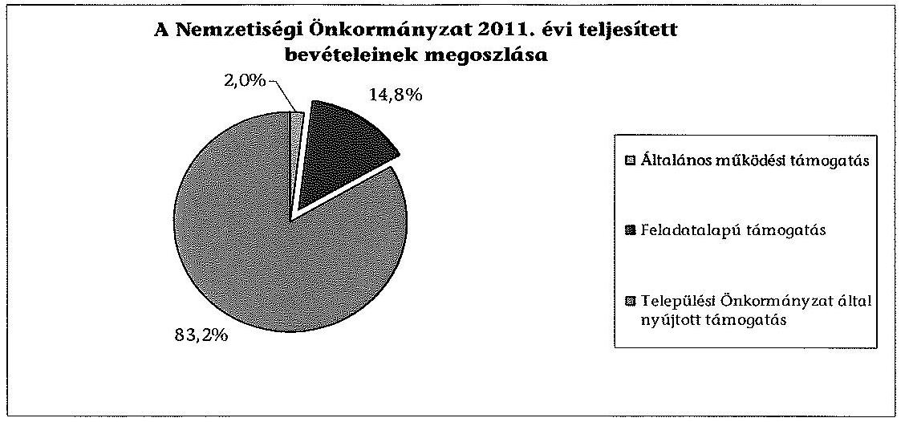
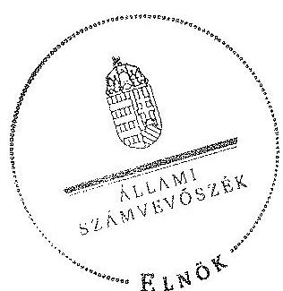

# ÁLLAMI   SZÁMVEVŐSZÉK 

## JELENTÉS

a helyi kisebbségi/nemzetiségi önkormányzatok gazdálkodásának ellenőrzéséről
Német Önkormányzat Törökbálint
13167
2013. december

---

# Állami Számvevőszék 

Iktatószám: V-0081-016/2013.
Témaszám: 1105
Vizsgálat-azonosító szám: V06060305

## Az ellenőrzést felügyelte:

Horváth Balázs
felügyeleti vezető
Az ellenőrzést vezette és az ellenőrzés végrehajtásáért felelős:
Preller Zsuzsanna
ellenőrzésvezető
A számvevőszéki jelentést készítették és a jelentés összeállításában közreműködtek:

## Moder Beatrix

számvevő
Szabó Leonóra Ildikó
számvevő
Az ellenőrzést végezte:
Csiszárné dr. Kosik Mária
számvevő tanácsos

---

# TARTALOMJEGYZÉK 

BEVEZETÉS ..... 5
I. ÖSSZEGZŐ MEGÁLLAPÍTÁSOK, KÖVETKEZTETÉSEK, JAVASLATOK ..... 8
II. RÉSZLETES MEGÁLLAPÍTÁSOK ..... 14

1. A Nemzetiségi és a Települési Önkormányzat együttműködésének szabályszerűsége ..... 14
2. A gazdálkodási feladatok ellátásának szabályszerűsége ..... 15
2.1. A költségvetésre és zárszámadásra, valamint a kincstári adatszolgáltatás rendjére vonatkozó jogszabályi előírások betartása ..... 15
2.2. A Nemzetiségi Önkormányzat gazdálkodásának szabályozottsága ..... 16
2.3. A pénzügyi kontrollok működése ..... 17
3. A Nemzetiségi Önkormányzattal összefüggő gazdálkodási feladatok belső ellenőrzése ..... 18
4. A 2011. évi feladatalapú támogatás felhasználásának, elszámolásának szabályszerűsége ..... 18
5. A Nemzetiségi Önkormányzat feladatellátása ..... 19

## MELLÉKLET

1. számú A Nemzetiségi Önkormányzat 2011. évi és 2012. I. félévi gazdálkodásának főbb adatai, mutatói

## FÜGGELÉKEK

1. számú Értelmező szótár
2. számú A pénzügyi kontrollok működésének értékelése

---

.

---

# RÖVIDÍTÉSEK JEGYZÉKE 

## Jogszabályok

Áht. 1
Áht. 2
ÁSZ tv.
Nek. 1 tv.
Nek. 2 tv.
Számv.tv.
Áhsz.

Ámr.
Ávr.

Ber.
Bkr.
támogatási kormányrendelet

Települési Önkormányzat SZMSZ-e

## Szórövidítések

ÁSZ
jegyző
gazdálkodási jogkörök szabályzata
1992. évi XXXVIII. törvény az államháztartásról, hatályos 2011. december 31-ig
2011. évi CXCV. törvény az államháztartásról, hatályos 2011. december 31-től
2011. évi LXVI. törvény az Állami Számvevőszékről, hatályos 2011. július 1-jétől
1993. évi LXXVII. törvény a nemzeti és etnikai kisebbségek jogairól, hatályos 2011. december 31-ig
2011. évi CLXXIX. törvény a nemzetiségek jogairól, hatályos 2011. december 20-tól
2000. évi C. törvény a számvitelről

249/2000. (XII. 24.) Korm. rendelet az államháztartás szervezetei beszámolási és könyvvezetési kötelezettségének sajátosságairól
292/2009. (XII. 19.) Korm. rendelet az államháztartás működési rendjéről, hatályos 2011. december 31-ig
368/2011. (XII. 31.) Korm. rendelet az államháztartásról szóló törvény végrehajtásáról, hatályos 2012. január 1-jétől
193/2003. (XI. 26.) Korm. rendelet a költségvetési szervek belső ellenőrzéséről (hatálytalan 2012. január 1-jétől)
370/2011. (XII. 31.) Korm. rendelet a költségvetési szervek belső kontrollrendszeréről és belső ellenőrzéséről, hatályos 2012. január 1-jétől
a kisebbségi önkormányzatoknak a központi költségvetésből, valamint fejezeti kezelésű előirányzatból nyújtott támogatások feltételrendszeréről és elszámolásának rendjéről szóló 342/2010. (XII. 28.) Korm. rendelet (hatályon kívül helyezte a 28/2012. (III. 6.) Korm. rendelet a nemzetiségi célú előirányzatokból nyújtott támogatások feltételrendszeréről és elszámolásának rendjéről; jelenleg hatályos a 428/2012. (XII. 29.) Korm. rendelet a nemzetiségi célú előirányzatokból nyújtott támogatások feltételrendszeréről és elszámolásának rendjéről)
Törökbálint Város Önkormányzat Képviselő-testületének 9/2011. (III. 25.) számú rendelete a Szervezeti és Működési Szabályzatáról

Állami Számvevőszék
Törökbálint Város Önkormányzatának jegyzője
Törökbálint Város Önkormányzata Polgármesteri Hivatalának Kötelezettségvállalás, utalványozás, ellenjegyzés és érvényesítés rendjének szabályzata (hatályos 2011. január 1-jétől)

---

| Képviselő-testület | Német Önkormányzat Törökbálint Képviselő-testülete |
| :--: | :--: |
| Kincstár | Magyar Államkincstár |
| Nemzetiségi Önkormányzat | Német Önkormányzat Törökbálint |
| Nemzetiségi Önkormányzat elnöke | Német Önkormányzat Törökbálint elnöke |
| Nemzetiségi Önkormányzat SZMSZ-e | Német Önkormányzat Törökbálint 29/2012. (06. 19.)   TNÖ számú határozata a Szervezeti és Működési Szabályzatról |
| polgármester | Törökbálint Város Önkormányzatának polgármestere |
| Polgármesteri Hivatal | Törökbálint Város Önkormányzatának Polgármesteri Hivatala |
| Támogató | A támogatást nyújtó Közigazgatási és Igazságügyi Minisztérium |
| Települési Önkormányzat | Törökbálint Város Önkormányzat |
| Települési Önkormányzat Képviselő-testülete | Törökbálint Város Önkormányzatának Képviselőtestülete |

---

# JELENTÉS 

## a helyi kisebbségi/nemzetiségi önkormányzatok gazdálkodásának ellenőrzéséről Német Önkormányzat Törökbálint

## BEVEZETÉS

Az államháztartás részét, az önkormányzati alrendszer egyik elemét képezik a nemzetiségi önkormányzatok, amelyek jogi személyek és a Nek. ${ }_{1,2}$ tv-ben meghatározott önálló feladat- és hatáskörökkel rendelkeznek. A nemzetiségi önkormányzatok az önkormányzati, illetve testületi működtetés mellett a helyi nemzetiségi közügyek változatos formában való ellátásában vesznek részt.

A nemzetiségi önkormányzatok, illetve a települési önkormányzatok között a jelenlegi szabályozás szerint nincs alá-fölérendeltségi viszony. A nemzetiségi önkormányzatok azonban sajátos közjogi helyzetben vannak, mert a jogállásukat tekintve önkormányzatok, ám függnek a székhelyük szerinti települési önkormányzat hivatalától, amely ellátja a nemzetiségi önkormányzatok vonatkozásában a megállapodásban rögzített gazdálkodási feladatokat.

A nemzetiségek helyzete, támogatása mind hazai, mind európai uniós szinten kiemelt figyelmet kap napjainkban. A nemzetiségi önkormányzatok gazdálkodására és támogatási rendszerére vonatkozó jogszabályok a 2010-2012. években jelentős változásokon mentek át, amelyek érintették a feladatalapú támogatásra fordítható költségvetési keret megállapítását, az operatív gazdálkodási jogkörök szabályozását, az elkülönített könyvvezetés alkalmazását, a belső ellenőrzés szabályozását.

Az ellenőrzés célja annak értékelése volt, hogy a Nemzetiségi Önkormányzat gazdálkodási kereteinek kialakítása, gazdálkodása és feladatellátása megfelelt-e a hatályos jogszabályoknak.

Ennek keretében ellenőriztük, hogy:

- a Nemzetiségi Önkormányzat és a Települési Önkormányzat együttműködésének szabályozása, a Települési Önkormányzat SZMSZ-ében, a megállapodásban előírt működési feltételek biztosítása megfelelt-e a jogszabályi előírásoknak;
- a felek együttműködése megfelelt-e a megállapodásnak a gazdálkodási feladatok szabályszerű ellátásában, betartották-e a Nemzetiségi Önkormányzat gazdálkodásához kapcsolódóan a költségvetésre és zárszámadásra, a gazdálkodás szabályozására, az operatív gazdálkodási jogkörök gyakorlására vonatkozó jogszabályi előírásokat;

---

- a jegyző biztosította-e a Polgármesteri Hivatal belső ellenőrzése keretében a Nemzetiségi Önkormányzattal összefüggő gazdálkodási feladatok belső ellenőrzését;
- a 2011. évi feladatalapú támogatás felhasználása, a folyósított feladatalapú támogatással történő elszámolás az előírásoknak megfelelően történt-e;
- a Nemzetiségi Önkormányzat feladatellátása összhangban volt-e a vonatkozó jogszabályi előírásokkal.

Az ellenőrzés típusa: szabályszerűségi ellenőrzés
Az ellenőrzött időszak: 2011. január 1. - 2012. június 30.
Ellenőrzött szervezet: Német Önkormányzat Törökbálint és a gazdálkodási feladatait ellátó Törökbálint Város Önkormányzat

Az ellenőrzés jogszabályi alapja: az ÁSZ tv. 5. § (2)-(3) és (6) bekezdései
Az ellenőrzés szakmai módszertana az ÁSZ hivatalos honlapján (www.asz.hu) közzétett szakmai szabályokon alapult, amely a Legfőbb Ellenőrző Intézmények Nemzetközi Szervezete (INTOSAI) által kiadott nemzetközi standardok (ISSAI) figyelembevételével készült.

A fogalmak magyarázatát az 1. számú függelék, a pénzügyi kontrollok megfelelősége értékelésénél alkalmazott egységes minősítési szempontokat a 2. számú függelék tartalmazza.

Az ellenőrzés lefolytatásához a Települési Önkormányzat és a Nemzetiségi Önkormányzat tanúsítványok kitöltésével és a kapcsolódó dokumentumok elektronikus megküldésével szolgáltatott adatokat. A tanúsítványokon szereplő adatok, információk ellenőrzése és szükség szerinti javítása a helyszíni ellenőrzés keretében történt.

Az ÁSZ az ellenőrzés megállapításait az ellenőrzött időszakban hatályos, az intézkedést igénylő megállapításokra tett javaslatokat a jelenleg hatályos jogszabályok alapján fogalmazta meg.

A Nemzetiségi Önkormányzat 1994-ben alakult, elnöke 1998. évi helyhatósági választások óta látja el feladatát. A Nemzetiségi Önkormányzat 1997-ben egy intézményt - nemzetiségi óvodát - alapított. Gazdasági társaságot és más szervezetet nem alapított, társulásban nem vett részt. A négytagú Képviselőtestület munkája segítésére egy Kulturális és Oktatási Bizottságot hozott létre. A Nemzetiségi Önkormányzat a költségvetési beszámolója szerint a 2011. évben 10668 ezer Ft költségvetési bevételt ért el és 10478 ezer Ft költségvetési kiadást teljesített. A 2012. évben 8942 ezer Ft eredeti költségvetési bevételi és kiadási előirányzatot terveztek, a módosított bevételi és kiadási előirányzat 9219 ezer Ft volt. A 2012. I. félévi beszámolója alapján a teljesített költségvetési bevétel 3837 ezer Ft, a teljesített költségvetési kiadás 3474 ezer Ft volt. A 2011. évi és a 2012. I. féléves gazdálkodási adatokat részletesen az 1. számú mellékletben mutatjuk be. Az ÁSZ a Nemzetiségi Önkormányzat gazdálkodását korábban nem ellenőrizte.

---

Az ÁSZ tv. 29. § (1) bekezdése szerint a jelentéstervezetet megküldtük a polgármester és a Nemzetiségi Önkormányzat elnöke részére, akik az ÁSZ tv. 29. § (2) bekezdésében foglalt észrevételezési jogukkal nem éltek, a jelentéstervezetre észrevételt nem tettek.

---

# I. ÖSSZEGZŐ MEGÁLLAPÍTÁSOK, KÖVETKEZTETÉSEK, JAVASLATOK 

A Nemzetiségi és a Települési Önkormányzat együttműködése a jóváhagyott megállapodásokon alapult. Az együttműködési megállapodásokat az ellenőrzött időszakban felülvizsgálták, azonban a 2011. évben hatályos megállapodást az Ámr-ben foglalt határidőn túl kötötték meg. A Települési Önkormányzat biztosította a Nemzetiségi Önkormányzat működéséhez szükséges személyi és tárgyi feltételeket. A 2011. évben a megállapodás az Ámr. és az Áht. ${ }_{1}$-ben rögzített tartalmi elemek tekintetében hiányos volt. A 2012. június 30-án hatályos megállapodás az Áht. ${ }_{2}$ előírása ellenére nem tartalmazta az ellenőrzési feladatok végrehajtásának rendjét és az ehhez kapcsolódó feladatellátás jogosultjainak, kötelezettjeinek a kijelölését.

A Nemzetiségi Önkormányzat költségvetési és zárszámadási határozatait a Képviselő-testület hiányos tartalommal fogadta el, mert a határozatok az Áht. ${ }_{1,2}$ előírásai ellenére nem tartalmazták az általuk alapított költségvetési szervük költségvetését, illetve zárszámadását, azokat külön határozatokkal fogadták el. Ezt a hiányosságot a 2013. évi költségvetés készítése során megszüntették. A határozatok az Áht. ${ }_{1,2}$ és az Ámr.-ben foglaltakat figyelmen kívül hagyva nem tartalmaztak bevételi előirányzatokat, a költségvetési létszámelőirányzatokat elkülönítetten és Nemzetiségi Önkormányzati szinten összesítve. Nem tartalmazták 2011-ben a bevételi és kiadási előirányzatok mérlegszerű bemutatását és 2012-ben a költségvetési egyenleg összegét működési és felhalmozási cél szerinti bontásban, továbbá nem készült előirányzatfelhasználási ütemterv. A Képviselő-testület az Ámr-ben foglalt határidőn túl fogadta el a 2011. évi zárszámadási határozatát. A költségvetési előirányzatok módosítása a jogszabályban előírt eljárásrend szerint történt. A jegyző a 2012. I. félévben a Nemzetiségi Önkormányzatra vonatkozó kincstári adatszolgáltatási kötelezettségének határidőben eleget tett.

A gazdálkodás szabályozottságát a jegyző részben biztosította. A gazdálkodási feladatok végrehajtását ellátó Polgármesteri Hivatal - a Számv. tv-ben és az Áhsz-ben előírt - gazdálkodási szabályzatainak hatálya kiterjedt a Nemzetiségi Önkormányzat gazdálkodási feladataira, azonban a 2011. évben az Ámr., a 2012. évben a Bkr. előírásait nem tartották be, mivel a Polgármesteri Hivatal ellenőrzési nyomvonala, szabálytalanságok kezelésének eljárásrendje, kockázatkezelési rendszer, valamint a folyamatba épített előzetes, utólagos és vezetői ellenőrzés szabályzatainak hatálya nem terjed ki a Nemzetiségi Önkormányzatra. A Polgármesteri Hivatal SZMSZ-e az ellenőrzött időszakban a jogszabályoknak megfelelően tartalmazta a munkakörökhöz kapcsolódóan a Nemzetiségi Önkormányzat gazdálkodásával kapcsolatos feladat- és hatásköröket, a hatáskörök gyakorlásának módját, a helyettesítés rendjét és az ezekre vonatkozó felelősségi szabályokat. Az operatív gazdálkodási jogkörök kialakítása során a 2011. évben nem gondoskodtak a szakmai teljesítésigazolási feladatokat ellátó személyek kijelöléséről, továbbá - 2011-2012-ben az Ámr. és az Ávr. előírásait figyelmen kívül hagyva - az írásbeli kötelezettségvállalást nem igénylő kifizetések rendjét annak ellenére nem szabályozták, hogy a gazdálkodási jogkörök szabályzata szerint éltek ennek lehetőségével. 2012. I. félévben a pénzügyi ellenjegyző és az érvényesítő személyeket a jegyző jelölte ki, annak ellenére, hogy e feladatot az Ávr. a gazdasági vezető hatáskörébe utalta.

A pénzügyi kontrollok működése az ellenőrzött időszakban a dologi és egyéb folyó kiadások teljesítésénél gyenge volt, a hibák száma a lényegességi szintet, a kritikus hibahatárt elérte. A 2011. évben a szakmai teljesítést igazoló személy kijelölésének hiányában ellenőrzési feladatait jogosulatlanul látta el. Az utalvány ellenjegyzője az Ámr-ben foglalt ellenőrzési feladatait nem végezte el, mert annak ellenére ellenjegyezte az utalványt, hogy a szakmai teljesítésigazolást arra kijelöléssel nem rendelkező személy jogosulatlanul látta el, továbbá nem tartották be a gazdálkodásra - köztük a kötelezettségvállalások nyilvántartásba vételére - vonatkozó szabályokat. 2012. I. félévben a teljesítést igazolók az írásbeli kötelezettségvállaláshoz nem kötött kifizetések rendjének és dokumentációs részletszabályainak meghatározása
 hiányában az összegszerűség, jogosultság és az ellenszolgáltatás teljesítésének ellenőrzését és igazolását szabályozott módon nem tudták elvégezni, továbbá az érvényesítési feladatokat az Ávr. előírásai ellenére nem végezték el. Az ellenőrzött tételek vonatkozásában - a rendelkezésre álló dokumentumok alapján - az ellenőrzés nem tárt fel jogosulatlan kifizetést, azonban a pénzügyi kontrollok működéséhez kapcsolódó hiányosságok nem biztosítják a hibák megelőzését, feltárását és kijavítását.

A Nemzetiségi Önkormányzat a 2011. évben 1580 ezer Ft feladatalapú támogatásban részesült, amelyet a tárgyévben a jogszabályi előírásokkal összhangban felhasznált. A támogatási kormányrendeletben hivatkozott Áht. ${ }_{1}$-ben előírt elszámolás nem történt meg. A támogatás felhasználását, elszámolását a jogosult szervek nem ellenőrizték.

A Nemzetiségi Önkormányzat feladatellátásának tárgya összhangban volt a Nek. ${ }_{1,2}$ tv. előírásaival. Biztosította a nemzetiségi közügyek keretében az alapvető feladatához szükséges szervezeti, személyi és anyagi feltételeket.

A Polgármesteri Hivatal 2011. és 2012. évi éves ellenőrzési terveit megalapozó kockázatelemzés - a Ber. előírásai ellenére - nem terjedt ki a Nemzetiségi Önkormányzat gazdálkodásával összefüggő végrehajtási feladatok ellátására. A jegyző az ellenőrzött időszakban az Áht. ${ }_{1}$, illetve az Áht. ${ }_{2}$ ellenére nem biztosította a Polgármesteri Hivatal belső ellenőrzése keretében a Nemzetiségi Önkormányzat gazdálkodásával összefüggő végrehajtási feladatok belső ellenőrzését. Erre irányuló ellenőrzést 2011. évben és 2012. I. félévben nem terveztek és nem végeztek.

Az ÁSZ tv. 33. § (1) bekezdésében foglaltak értelmében az ellenőrzött szervezet vezetője köteles a jelentésben foglalt megállapításokhoz kapcsolódó intézkedési tervet összeállítani, és azt a jelentés kézhezvételétől számított 30 napon belül az ÁSZ részére megküldeni. Amennyiben az intézkedési tervet határidőre nem küldi meg a szervezet, vagy az nem elfogadható, az ÁSZ elnöke az ÁSZ tv. 33. § (3) bekezdés a)-b) pontjaiban foglaltakat érvényesítheti.

---

A helyszíni ellenőrzés megállapításainak hasznosítása mellett javasoljuk:

# a jegyzőnek 

1. az együttműködés szabályozásával kapcsolatban

A Nemzetiségi Önkormányzat és a Települési Önkormányzat együttműködését meghatározó - 2012. június 30-án hatályos - megállapodás az Áht. 2 27. § (2) bekezdésében előírtak ellenére nem tartalmazta az ellenőrzési feladatok végrehajtásának a rendjét és az ehhez kapcsolódó feladatellátás jogosultjainak, kötelezettjeinek a kijelölését.

Javaslat
Készítse elő az együttműködési megállapodás módosítását annak érdekében, hogy tartalmilag feleljen meg az Áht. 2 27. § (2) bekezdésében foglalt előírásnak.
2. a költségvetési és zárszámadási határozatokkal kapcsolatban

A Nemzetiségi Önkormányzat költségvetési és zárszámadási határozatai a 2011. évben az Ámr. 36. § (1) bekezdés a), b), f), k) és i) pontjaiban, 2012. I. félévében az Áht. 2 23. § (2) bekezdés a), b) és c) pontjaiban, valamint a 24. § (4) bekezdés a) pontjában foglaltak ellenére nem tartalmazták a bevételi előirányzatokat, az előirányzat felhasználási (ütem)tervet, a bevételi és a kiadási előirányzatok mérlegszerű bemutatását, a költségvetési létszám-előirányzatokat elkülönítetten és önkormányzati szinten összesítve, a költségvetési egyenleg összegét működési és felhalmozási cél szerinti bontásban.

A Nemzetiségi Önkormányzat Képviselő-testülete az Ámr. 37. § (2)-(3) bekezdésében előírt határidőn túl alkotta meg a 2011. évi zárszámadási határozatát.

Javaslat
A költségvetési, zárszámadási határozatok előkészítésének szabályszerűsége érdekében a jövőben:
a) gondoskodjon arról, hogy a Nemzetiségi Önkormányzat költségvetési és zárszámadási határozatai tartalmilag feleljenek meg az Áht. 2 23. § (2) bekezdés a), b) és c), valamint a 24. § (4) bekezdés a) pontjaiban foglalt rendelkezéseknek;
b) biztosítsa az Áht. 2 24. § (2), illetve 91. § (3) bekezdésében meghatározottakkal összhangban a zárszámadási határozat-tervezet megfelelő időben történő elkészítését, annak érdekében, hogy azt a Nemzetiségi Önkormányzat elnöke határidőig be tudja nyújtani a Képviselő-testületnek.
3. a gazdálkodási feladatok szabályozottságával kapcsolatban

A Polgármesteri Hivatal szabályzatai közül a 2011. évben az Ámr. 156. § (2)-(3), 157. § (1), az Áht. 1 121/A. § (4) bekezdéseiben, valamint a 2012. évben a Bkr. 6. § (3)-(4), 7. § (1), 8. § (2)-(4) bekezdéseiben előírt ellenőrzési nyomvonal, szabálytalanságkezelési eljárásrend, kockázatkezelési rendszer, továbbá a folyamatba épített

---

előzetes, utólagos és vezetői ellenőrzés szabályozásának hatálya nem terjedt ki a Nemzetiségi Önkormányzat gazdálkodási feladataira.

Az ellenőrzött időszakban az Ámr. 72. § (14) és az Ávr. 53. § (2) bekezdés előírását figyelmen kívül hagyva, az írásbeli kötelezettségvállaláshoz nem kötött kifizetések rendjét annak ellenére nem szabályozta a jegyző, hogy a gazdálkodási jogkörök szabályzatában foglaltak szerint éltek annak lehetőségével.

Javaslat
A gazdálkodás szabályozottsága, szabályszerűsége érdekében:
a) készítse elő a Polgármesteri Hivatal ellenőrzési nyomvonalának, a szabálytalanságkezelési eljárásrendjének, a kockázatkezelési rendszer, valamint a folyamatba épített előzetes, utólagos és vezetői ellenőrzés szabályzatainak a módosítását - az Ávr. 13. § (3a) bekezdésének felhatalmazása alapján - annak érdekében, hogy a Bkr. 6. § (3)-(4), 7. § (1) és a 8. § (2)-(4) bekezdéseiben foglalt szabályzatok hatálya terjedjen ki a Nemzetiségi Önkormányzat gazdálkodási feladataira;
b) készítse el az Ávr. 53. § (2) bekezdésében meghatározott, az írásbeli kötelezettségvállaláshoz nem kötött kifizetések rendjét.
4. a gazdálkodási feladatok ellátásával kapcsolatban

A pénzügyi ellenjegyzést és az érvényesítést végző személyek jegyző általi kijelölését 2012. március 31-ét követően nem módosították annak ellenére, hogy az Ávr. 55. § (2) bekezdés g) pontjának és 58. § (4) bekezdésének előírása a kijelölést a gazdasági vezető hatáskörébe utalta.

Javaslat
Biztosítsa, hogy az Ávr. 55. § (2) bekezdés g) pontjában és 58. § (4) bekezdésében előírtaknak megfelelően a pénzügyi ellenjegyzőt és az érvényesítőt a gazdasági vezető jelölje ki.
5. a pénzügyi kontrollok működésével kapcsolatban

A 2011. évben a szakmai teljesítésigazolást az Ámr. 76. § (5) bekezdésben foglaltaktól eltérően kijelöléssel nem rendelkező személy végezte, 2012. I. félévben a teljesítés igazolása során a kiadások teljesítését megelőzően - az Ávr. 57. § (1) bekezdésének előírása ellenére - szabályszerűen nem történt meg a kifizetés jogosságának, összegszerűségének és szerződésszerű teljesítésének ellenőrzése.

Az érvényesítési feladatokat az Ávr. 58. § (1) és (3) bekezdéseinek előírásai ellenére nem végezték el, ezáltal elmaradt a teljesítésigazolás végrehajtásának, a fedezet meglétének, valamint a gazdálkodásra vonatkozó szabályok betartásának az ellenőrzése.

---

Javaslat

Az operatív gazdálkodás működési hibáinak megelőzése, feltárása és kijavítása érdekében gondoskodjon arról, hogy:
a) az írásbeli kötelezettségvállaláshoz nem kötött kifizetések teljesítés igazolásánál érvényesüljenek az Ávr. 57. § (1) bekezdésében foglalt előírások;
b) az érvényesítésre jogosult tegyen eleget az Ávr. 58. § (1)-(3) bekezdéseiben előírt kötelezettségének.
6. a feladatalapú támogatás elszámolásával kapcsolatban

A 2011. évben folyósított feladatalapú támogatás elszámolása a támogatási kormányrendelet 7. § (2) bekezdésében hivatkozott Áht. -nek „a helyi önkormányzatok elszámolási rendjére vonatkozó rendelkezései alkalmazása" előírása ellenére nem történt meg.

Javaslat
Gondoskodjon az Áht. 2 27. § (2) bekezdésben meghatározott feladatkörében a Nemzetiségi Önkormányzat által igénybe vett feladatalapú támogatás elszámolásának elkészítéséről, figyelemmel az Áht. 2 57. § (4) bekezdésben foglaltakra.

# a polgármesternek 

A Nemzetiségi Önkormányzat és a Települési Önkormányzat együttműködését meghatározó - 2012. június 30-án hatályos - megállapodás az Áht. 2 27. § (2) bekezdésében előírtak ellenére nem tartalmazta az ellenőrzési feladatok végrehajtásának a rendjét és az ehhez kapcsolódó feladatellátás jogosultjainak, kötelezettjeinek a kijelölését.

Javaslat
Terjessze a Települési Önkormányzat Képviselő-testülete elé jóváhagyásra az Áht. 2 27. § (2) bekezdésben foglalt előírások betartásával előkészített megállapodás módosítást.

## a Nemzetiségi Önkormányzat elnökének

1. A Nemzetiségi Önkormányzat és a Települési Önkormányzat együttműködését meghatározó - 2012. június 30-án hatályos - megállapodás az Áht. 2 27. § (2) bekezdésében előírtak ellenére nem tartalmazta az ellenőrzési feladatok végrehajtásának a rendjét és az ehhez kapcsolódó feladatellátás jogosultjainak, kötelezettjeinek a kijelölését.

---

Javaslat
Terjessze a Képviselő-testület elé jóváhagyásra az Áht. 2 27. § (2) bekezdésben foglalt előírások betartásával előkészített megállapodás módosítást.
2. A Képviselő-testület az Ámr. 37. § (2)-(3) bekezdésében előírt határidőn túl alkotta meg a 2011. évi zárszámadási határozatát.

Javaslat
A jövőben az Áht. 2 24. § (2), illetve 91. § (3) bekezdésében meghatározott határidőben terjessze a Képviselő-testület elé jóváhagyásra a zárszámadási határozat tervezetet.
3. A 2011. évben folyósított feladatalapú támogatás elszámolása a támogatási kormányrendelet 7. § (2) bekezdésében hivatkozott Áht. ${ }_{1}$-nek „a helyi önkormányzatok elszámolási rendjére vonatkozó rendelkezései alkalmazása" előírása ellenére nem történt meg.

Javaslat
Terjessze a Képviselő-testület elé jóváhagyásra az Áht. 2 57. § (4) bekezdés alapján összeállított, a Nemzetiségi Önkormányzat által igénybe vett feladatalapú támogatás elszámolását.

---

# II. RÉSZLETES MEGÁLLAPÍTÁSOK 

## 1. A Nemzetiségi és a Települési Önkormányzat együttműködésének szabályszerűsége

A Nemzetiségi és a Települési Önkormányzat között létrejött együttműködési megállapodások - kisebb tartalmi hiányosságok kivételével - megfeleltek a jogszabályi előírásoknak. A 2011. évben készített megállapodást az Ámr. 37. § (5) bekezdésében foglalt határidőn ${ }^{1}$ túl hagyták jóvá ${ }^{2}$. A 2011. december 31-én hatályos együttműködési megállapodásban a jogszabályi előírásokat maradéktalanul nem érvényesítették, mert az nem tartalmazta:

- az Ámr. 37. § (4) bekezdésének b) pontjában előírtak ellenére a jegyző azon feladatát, mely szerint a Települési Önkormányzat költségvetési koncepcióját - annak az Áht., 70. §-ában rögzített határidőben történő elfogadását követően egy munkanapon belül - a Nemzetiségi Önkormányzat elnöke rendelkezésére bocsátja;
- az Ámr. 37. § (4) bekezdésének d) pontjában előírtak ellenére a Nemzetiségi Önkormányzat elnökének azon feladatát, mely szerint a Nemzetiségi Önkormányzat költségvetési határozatát az elnök - annak elfogadását követő egy munkanapon belül - megküldi a jegyzőnek, annak érdekében, hogy a határozat - változatlan formában - a Települési Önkormányzat költségvetési rendeletébe beépítésre kerüljön;
- az Ámr. 37. § (4) bekezdésének e) pontjában előírtak ellenére a jegyző azon feladatát, mely szerint a Települési Önkormányzat költségvetési rendeletét annak az Áht., 71. § (1) bekezdésében rögzített határidőben történő elfogadását követő egy munkanapon belül - a Nemzetiségi Önkormányzat elnöke rendelkezésére bocsátja;
- az Áht., 66. §-ban foglalt előírások ellenére a Nemzetiségi Önkormányzat gazdálkodása végrehajtásának rendjéhez kapcsolódó feladatellátás jogosultjainak, kötelezettjeinek kijelölését teljes körűen, mivel elmaradt a szakmai teljesítés igazolójának kijelölése.

A 2012. évben a Nek. ${ }_{2}$ tv. előírásának megfelelően - az abban rögzített június 1-jei határidőig - a Nemzetiségi Önkormányzat és a Települési Önkormányzat között 2011-ben létrejött együttműködési megállapodást felülvizsgálták és módosították. ${ }^{3}$ A 2012. június 30-án hatályos együttműködési megállapodás az

[^0]
[^0]:    ${ }^{1}$ 2011. január 15.
    ${ }^{2}$ A 2011. évben hatályos együttműködési megállapodást a Települési Önkormányzat Képviselő-testülete a 72/2011. (III. 24.) számú, a Képviselő-testület a 16/2011. (III. 1.) számú határozattal fogadta el.
    ${ }^{3}$ A Képviselő-testület 26/2012. (V. 15.) számú, a Települési Önkormányzat Képviselőtestületének 133/2012. (V. 23.) számú határozata.

---

Áht. ${ }_{2}$-ben és a Nek. ${ }_{2}$ tv. 80. §-ban előírtaknak megfelelően tartalmazta a Nemzetiségi Önkormányzat bevételeivel és kiadásaival kapcsolatos tervezési, gazdálkodási, finanszírozási és adatszolgáltatási feladatokat, valamint a beszámolási feladatok ellátásának részletes szabályait, azonban az Áht. ${ }_{2} 27 . \S$ (2) bekezdésében előírtak ellenére nem tartalmazta az ellenőrzési feladatok végrehajtásának rendjét és az ehhez kapcsolódó feladatellátás jogosultjainak, kötelezettjeinek a kijelölését.

A Települési Önkormányzat biztosította a Nemzetiségi Önkormányzat működéséhez
 szükséges személyi és tárgyi feltételeket.

# 2. A GAZDÁLKODÁSI FELADATOK ELLÁTÁSÁNAK SZABÁLYSZERŰSÉGE 

### 2.1. A költségvetésre és zárszámadásra, valamint a kincstári adatszolgáltatás rendjére vonatkozó jogszabályi előírások betartása

A Nemzetiségi Önkormányzat költségvetési és zárszámadási határozatai az ellenőrzött időszakban a Képviselő-testület hiányos tartalommal fogadta el, mert:

- a határozatok a 2011. évben az Ámr. 36. § (1) bekezdése a) pontjában és a 2012. évben az Áht. 2 23. § (2) bekezdése a) pontjában foglaltakat figyelmen kívül hagyva nem tartalmaztak bevételi előirányzatokat;
- a Nemzetiségi Önkormányzat 2011-2012. évi költségvetési határozatai, valamint 2011. évi zárszámadási határozata az Áht. 1 69. § (2) bekezdése, illetve Áht. 2 26. § (1) bekezdése előírásai ellenére nem tartalmazta az általa alapított költségvetési szerv költségvetését, illetve zárszámadását, mert azokat külön határozatokkal fogadták el. Ezt a hiányosságot a 2013. évi költségvetés készítése során megszüntették. A határozatok továbbá a 2011. évben az Áht. 1 69. § (1) bekezdése e) pontjában, illetve a 2012. évben az Áht. 2 23. § (2) bekezdés b) pontjában foglaltakkal ellentétben, nem tartalmazták a költségvetési létszám-előirányzatokat, elkülönítetten és Nemzetiségi önkormányzati szinten összesítve;

[^0]
[^0]:    ${ }^{4}$ A Képviselő-testület 8/2011. (II. 08.) számú, és 5/2012. (I. 24.) számú határozatai a Nemzetiségi Önkormányzat 2011. illetve 2012. évi költségvetéséről, valamint a 21/2012. (IV. 17.) számú határozata a 2011. évi zárszámadásról.
    ${ }^{5}$ A Nemzetiségi Önkormányzat - a fenntartól jog Települési Önkormányzattól való átvételével - 1997. augusztus 28.-án Német Nemzetiségi Óvodát alapított. A Német Nemzetiségi Óvoda költségvetését és az erről készült beszámolót a Települési Önkormányzat költségvetési és zárszámadási rendeletei tartalmazták.
    ${ }^{6}$ A Képviselő-testület 9/2011. (II. 08.) számú, és 2/2012. (I. 24.) számú határozatai az „Ein Herz für Kinder" Csupaszív Német Nemzetiségi Óvoda 2011. illetve 2012. évi költségvetéséről, valamint a 22/2012. (IV. 17.) számú határozata a 2011. évi zárszámadásról.

---

- a 2011. évben az Ámr. 36. § (1) bekezdése k), valamint a 2012. évben az Áht. 2 24. § (4) bekezdése a) pontjában előírtak ellenére az év várható bevételi és kiadási előirányzatainak teljesüléséről előirányzat-felhasználási ütemterv nem készült;
- a határozatok a 2011. évben az Ámr. 36. § (1) bekezdés i) pontjaiban előírtak ellenére nem tartalmazta a bevételi és kiadási előirányzatok mérlegszerű bemutatását és a 2012. évben az Áht. 2 23. § (2) bekezdés c) pontjaiban előírtak ellenére nem tartalmazták a költségvetési egyenleg összegét működési és felhalmozási cél szerinti bontásban;
- a Képviselő-testület az Ámr. 37. § (3) bekezdésében előírt határidőn túl alkotta meg a 2011. évi zárszámadási határozatát.

A Nemzetiségi Önkormányzat elnöke a 2011-ben a költségvetési előirányzatok felhasználásához szükséges mértékben kezdeményezte azok módosítását, biztosítva ezzel a tárgyévi fizetési kötelezettség vállalásához szükséges fedezet meglétét.
2012. I. félévben az Ávr.-ben és az Áhsz.-ben előírt, a Nemzetiségi Önkormányzatra vonatkozó kincstári adatszolgáltatási kötelezettségének a jegyző határidőben eleget tett.

# 2.2. A Nemzetiségi Önkormányzat gazdálkodásának szabályozottsága 

A Nemzetiségi Önkormányzat gazdálkodásának szabályozásáról az ellenőrzött időszakban a jegyző részben gondoskodott. A gazdálkodási feladatai végrehajtását ellátó Polgármesteri Hivatal a Számv. tv-ben és az Áhsz-ben előírt gazdálkodási szabályzatokkal rendelkezett, amelyek hatályát a Nemzetiségi Önkormányzat gazdálkodási feladataira kiterjesztették, azonban a 2011-2012. években az Ámr. 156. § (2)-(3) és a Bkr. 6. § (3)-(4) bekezdéseiben előírt ellenőrzési nyomvonal és szabálytalanságkezelési eljárásrend, az Ámr. 157. § (1) és a Bkr. 7. § (1) bekezdésében előírt kockázatkezelési rendszer, valamint az Áht. 1 121/A. § (4), és a Bkr. 8. § (2)-(4) bekezdéseiben előírt folyamatba épített előzetes, utólagos és vezetői ellenőrzés szabályzatainak hatálya nem terjedt ki a Nemzetiségi Önkormányzatra.

A Nemzetiségi Önkormányzat gazdálkodásával kapcsolatos települési önkormányzati feladat- és hatásköröket, a hatáskörök gyakorlásának módját, a helyettesítés rendjét és az ezekre vonatkozó felelősségi szabályokat a Polgármesteri Hivatal SZMSZ-ében - annak függelékét képező munkaköri leírásokban, valamint a munkamegosztás és felelősség rendjéről szóló megállapodásban - az ellenőrzött időszakban szabályozták.

[^0]
[^0]:    ${ }^{7}$ 2012. április 17-én
    ${ }^{8}$ Számviteli politika, leltározási és leltárkészítési szabályzat, pénzkezelési szabályzat, eszközök és források értékelési szabályzata, számlarend.

---

A Nemzetiségi Önkormányzat operatív gazdálkodási jogköreinek kialakítása során a 2011. évben a kötelezettségvállaló, utalványozó, a kötelezettségvállalás és utalványozás ellenjegyző, valamint az érvényesítést végző személyek kijelölése a jogszabályi előírásoknak megfelelően történt, azonban az Ámr. 76. § (5) bekezdésének előírása ellenére a Nemzetiségi Önkormányzat elnöke, mint kötelezettségvállaló a szakmai teljesítésigazolót nem jelölte ki.
2012. I. félévben az operatív gazdálkodási jogkörök kialakítása keretében a kötelezettségvállaló, az utalványozó és a teljesítésigazoló kijelölése a jogszabályi előírásokkal összhangban volt, azonban a pénzügyi ellenjegyző és az érvényesítő személyeket - az Ávr. 55. § (2) bekezdés g) pontja és az 58. § (4) bekezdés előírása ellenére - nem a Polgármesteri Hivatal gazdasági vezetője, hanem jogosulatlanul a jegyző jelölte ki.

Az operatív gazdálkodási jogkörök gyakorlására kijelölt személyek a feladatuk ellátásához előírt képesítési követelményeknek megfeleltek.

Az ellenőrzött időszakban az Ámr. 72. § (14) és az Ávr. 53. § (2) bekezdés előírását figyelmen kívül hagyva, az írásbeli kötelezettségvállalást nem igénylő kifizetések rendjét annak ellenére nem szabályozta a jegyző, hogy a gazdálkodási jogkörök szabályzatában foglaltak szerint éltek annak lehetőségével.

# 2.3. A pénzügyi kontrollok működése 

A Nemzetiségi Önkormányzat esetében a pénzügyi kontrollok működésének megfelelőségét a kijelölt három terület közül - teljesített kiadási tranzakció hiányában - a 2011. évben és 2012. I. félévben egyaránt egy területen, a dologi és egyéb folyó kiadásoknál értékeltük.
2011. évi dologi és egyéb folyó kiadásai teljesítése során a kötelezettségvállalás ellenjegyzése, a szakmai teljesítés igazolása és az utalvány ellenjegyzése kontrollok működésének megfelelősége, - a 2. számú függelékben részletezett értékelési szempontok alapján - gyenge volt, a hibák száma a lényegességi szintet, a kritikus hibahatárt elérte, mert:

- a Nemzetiségi Önkormányzat elnöke nem jelölte ki az Ámr. 76. § (5) bekezdésében előírtak ellenére a szakmai teljesítésigazolót, így a kifizetések jogosságának, összegszerűségének, és az ellenszolgáltatás teljesítésének - Ámr. 76. § (1) és (3) bekezdésében előírt - igazolását az arra kijelöléssel nem rendelkező személy, jogosulatlanul végezte el;
- az utalvány ellenjegyzője az Ámr. 79. § (2) bekezdésében foglalt ellenőrzési feladatait nem szabályszerűen végezte, mert annak ellenére ellenjegyezte az utalványt, hogy a szakmai teljesítésigazolást arra kijelöléssel nem rendelkező személy jogosulatlanul látta el, továbbá a megelőző ügymenetben nem tartották be az Ámr. 75. § (1) bekezdésében foglalt előírásokat, mert az írás-

[^0]
[^0]:    ${ }^{9}$ a Polgármesteri Hivatal Pénzügyi Irodájának irodavezetője

---

beli kötelezettségvállalást nem igénylő kifizetések nyilvántartásba vételéről nem gondoskodtak.

A Nemzetiségi Önkormányzatnál 2012. I. félévben a dologi és egyéb folyó kiadások teljesítése során a pénzügyi ellenjegyzés, a teljesítés igazolás és az érvényesítés kulcskontrollok működésének megfelelősége - a 2. számú függelékben részletezett értékelési szempontok alapján - gyenge volt, a hibák száma a lényegességi szintet, a kritikus hibahatárt elérte, mert:

- a teljesítésigazoló - az írásbeli kötelezettségvállaláshoz nem kötött kifizetések rendjének és dokumentációs részletszabályainak meghatározása hiányában - az Ávr. 57. § (1) bekezdésében foglalt feladatát, a kifizetések összegszerűségét, jogosultságát és az ellenszolgáltatás teljesítésének ellenőrzését és igazolását szabályozott módon nem tudta elvégezni;
- az érvényesítési feladatokat az Ávr. 58. § (1) és (3) bekezdései előírása ellenére nem végezték el, ezáltal elmaradt a teljesítésigazolás megtörténtének, a fedezet meglétének, valamint a gazdálkodásra vonatkozó szabályok betartásának az ellenőrzése.

Az ellenőrzött tételek vonatkozásában - a rendelkezésre álló dokumentumok alapján - az ellenőrzés nem tárt fel jogosulatlan kifizetést, azonban a pénzügyi kontrollok működéséhez kapcsolódó hiányosságok nem biztosítják a hibák megelőzését, feltárását és kijavítását.

# 3. A Nemzetiségi Önkormányzattal összefüggő gazdálkodási feladatok belső ellenőrzése 

A Polgármesteri Hivatal 2011. és 2012. évi ellenőrzési terveit megalapozó kockázatelemzés a Ber. 21. § (2) bekezdése ellenére nem terjedt ki a Nemzetiségi Önkormányzat gazdálkodásával összefüggő végrehajtási feladatok ellátására. A jegyző az ellenőrzött időszakban az Áht. 1 121/B. § (4) bekezdése, illetve az Áht. 2 70. § (1) bekezdése előírása ellenére nem biztosította a Polgármesteri Hivatal belső ellenőrzése keretében a Nemzetiségi Önkormányzat gazdálkodásával összefüggő végrehajtási feladatok belső ellenőrzését, erre irányuló ellenőrzést a 2011. évben és 2012. I. félévben nem terveztek és nem végeztek.

## 4. A 2011. ÉVI FELADATALAPÚ TÁMOGATÁS FELHASZNÁLÁSÁNAK, ELSZÁMOLÁSÁNAK SZABÁLYSZERŰSÉGE

A Nemzetiségi Önkormányzat a 2011. évben 1580 ezer Ft feladatalapú támogatásban részesült, amelynek az összes bevételhez viszonyított részarányát a következő ábra szemlélteti:

[^0]
[^0]:    ${ }^{10}$ 2012. január 1-jétől Bkr. 7. § (2) bekezdése írja elő

---

A 2011. évben folyósított támogatást a jogszabályi előírásokkal összhangban a tárgyévben felhasználták. Elszámolása a támogatási kormányrendelet 7. § (2) bekezdésében hivatkozott Áht. 1-nek „a helyi önkormányzatok elszámolási rendjére vonatkozó rendelkezései alkalmazása" előírása ellenére nem történt meg. A támogatás felhasználását, elszámolását az ellenőrzésre jogosult szervek nem ellenőrizték.

# 5. A Nemzetiségi Önkormányzat feladatellátása 

A Nemzetiségi Önkormányzat feladatellátásának tárgya összhangban volt a Nek. 1,2 tv. előírásaival. A Nek. 1 tv. 5/A. § (1) bekezdése és a Nek. 2 tv. 10. § (1) bekezdése szerinti, a nemzetiségi érdekek védelmével és képviseletével kapcsolatos alapvető feladata ellátásához biztosította a szükséges szervezeti, személyi és anyagi feltételeket.

Budapest, 2013. 12. hónap 116. nap

Melléklet: 1 db
Függelék: 2 db

Domokos László
elnök

---

.

---

# A Nemzetiségi Önkormányzat 2011. évi és 2012. I. félévi gazdálkodásának főbb adatai, mutatói

A) BEVÉTELEK

|  Megnevezés | 2011. év |  |  |  | 2012. év |  | 2012. I. félév |   |
| --- | --- | --- | --- | --- | --- | --- | --- | --- |
|   | eredeti ei. | módosított ei. | teljesítés | teljesítés megoszlása (%) | eredeti ei. | módosított ei. | teljesítés | teljesítés megoszlása (%)  |
|  Intézményi működési bevétel | 0,0 | 0,0 | 0,0 | 0,0\% | 0,0 | 0,0 | 3,0 | 0,1\%  |
|  Általános működési támogatás | 210,0 | 210,0 | 210,0 | 2,0\% | 0,0 | 215,0 | 0,0 | 0,0\%  |
|  Feladatalapú támogatás | 0,0 | 1580,0 | 1580,0 | 14,8\% | 0,0 | 0,0 | 0,0 | 0,0\%  |
|  Települési Önkormányzat által nyújtott támogatás | 8732,0 | 8732,0 | 8878,0 | 83,2\% | 8942,0 | 8942,0 | 3772,0 | 98,3\%  |
|  Pénztárgondnoki bevételek összesen | 8942,0 | 10522,0 | 10668,0 | 100,0\% | 8942,0 | 9157,0 | 3775,0 | 98,4\%  |
|  Előző évi pénzmaradvány felhasználás

 | 0,0 | 0,0 | 0,0 | 0,0% | 0,0 | 62,0 | 62,0 | 1,6%  |
|  Bevételek | 8942,0 | 10522,0 | 10668,0 | 100,0% | 8942,0 | 9219,0 | 3837,0 | 100,0%  |

B) KIADÁSOK adatok ezer Ft-ban

|  Megnevezés | 2011. év |  |  |  | 2012. év |  | 2012. I. félév |   |
| --- | --- | --- | --- | --- | --- | --- | --- | --- |
|   | eredeti ei. | módosított ei. | teljesítés | teljesítés megoszlása (%) | eredeti ei. | módosított ei. | teljesítés | teljesítés megoszlása (%)  |
|  Személyi juttatások | 3154,0 | 3346,0 | 3346,0 | 31,9% | 3146,0 | 3146,0 | 1396,0 | 40,2%  |
|  Munkaadókat terhelő járulékok | 832,0 | 872,0 | 829,0 | 7,9% | 840,0 | 840,0 | 352,0 | 10,1%  |
|  Üdülési és egyéb folyó kiadások | 4956,0 | 6304,0 | 6303,0 | 60,2% | 4956,0 | 5233,0 | 1726,0 | 49,7%  |
|  Működési kiadások összesen | 8942,0 | 10522,0 | 10478,0 | 100,0% | 8942,0 | 9219,0 | 3474,0 | 100,0%  |
|  Felhalmozási kiadások | 0,0 | 0,0 | 0,0 | 0,0% | 0,0 | 0,0 | 0,0 | 0,0%  |
|  Kiadások összesen | 8942,0 | 10522,0 | 10478,0 | 100,0% | 8942,0 | 9219,0 | 3474,0 | 100,0%  |

---

.

---

# ÉRTELMEZŐ SZÓTÁR 

feladatalapú támogatás
megállapodás
nemzetiség
nemzetiségi közügy

A támogatási évben általános működési támogatásban részesült, és a Támogatónak a Kincstárhoz intézett, a feladatalapú támogatás utalására vonatkozó rendelkező levele keltenének időpontjában működő nemzetiségi önkormányzatoknak a támogatási kormányrendeletben rögzített feltételrendszer alapján nyújtható támogatás. A feladatalapú támogatás a nemzetiségi közügyeknek a nemzetiségi önkormányzatok által történő ellátását szolgálja. (A támogatási kormányrendelet 2. § (2) bekezdés c) pont, és 4. § (1) bekezdés alapján.)
A nemzetiségi önkormányzatnak a működési feltételei biztosítására, továbbá a bevételeivel és a kiadásaival kapcsolatban a tervezési, gazdálkodási, ellenőrzési, finanszírozási, adatszolgáltatási és beszámolási feladatai végrehajtására a székhelye szerinti települési önkormányzattal megkötött megállapodás. (Az Áht. ${ }_{1} 66 . \S$, a Nek. ${ }_{2}$ tv. 80. § (2) bekezdés, valamint az Áht. ${ }_{2} 27 . \S$ (2) bekezdés alapján levezetett fogalom.)
Minden olyan Magyarország területén legalább egy évszázada honos népcsoport, amely az állam lakossága körében számszerű kisebbségben van és a lakosság többi részétől saját nyelve és kultúrája, hagyományai különböztetik meg, egyben olyan összetartozás-tudatról tesz bizonyságot, amely mindezek megőrzésére, történelmileg kialakult közösségeik érdekeinek kifejezésére és védelmére irányul. (A Nek. ${ }_{1}$ tv. 1. § (2) bekezdése, valamint a Nek. ${ }_{2}$ tv. 1. § (1) bekezdése alapján levezetett fogalom.)
Az egyéni és közösségi jogok érvényesülése, a nemzetiséghez tartozók érdekeinek kifejezésre juttatása - különösen az anyanyelv ápolása, őrzése és gyarapítása, továbbá a nemzetiségek kulturális autonómiájának a nemzetiségi önkormányzatok által történő megvalósítása és megőrzése - érdekében a nemzetiséghez tartozók meghatározott közszolgáltatásokkal való ellátásával, ezen ügyek önálló vitelével és az ehhez szükséges szervezeti, személyi és anyagi feltételek megteremtésével összefüggő ügy. A közhatalmat gyakorló állami és helyi önkormányzati szervekben, továbbá a nemzetiségi önkormányzati szervekben való nemzetiségi képviselethez és mindezek szervezeti, személyi és anyagi feltételeinek biztosításához kapcsolódó ügy. (A Nek. ${ }_{1}$ tv. 6/A. § 1. pontjából és a Nek. ${ }_{2}$ tv. 2. § 1. pontjából levezetett fogalom.)

---

nemzetiségi önkormányzat
pénzügyi kontrollok

Törvényben meghatározott nemzetiségi közszolgáltatási feladatokat ellátó, testületi formában működő, jogi személyiséggel rendelkező, demokratikus választások útján törvény alapján létrehozott szervezet, amely a nemzetiségi közösséget megillető jogosultságok érvényesítésére, a nemzetiségek érdekeinek védelmére és képviseletére, a feladat- és hatáskörébe tartozó nemzetiségi közügyek települési, területi vagy országos szinten történő önálló intézésére jön létre. (A Nek. 1 tv. 6/A. § (1) bekezdés 2. pontjából, valamint a Nek. 2 tv. 2. § 2. pontjából levezetett fogalom.) A jelentésben e fogalmat a települési nemzetiségi önkormányzatokra leszűkítve használjuk.
a kötelezettségvállalás és az utalvány ellenjegyzése, valamint a szakmai teljesítés igazolása 2011. december 31-éig, 2012. január 1-jétől a pénzügyi ellenjegyzés, a teljesítés igazolása és az érvényesítés.

---

# A PÉNZÜGYI KONTROLLOK MŰKÖDÉSÉNEK ÉRTÉKELÉSE 

A pénzügyi kontrollok működése megfelelőségének vizsgálatát többlépcsős megfelelőségi tesztek útján, megismételt eljárással, a könyvviteli tételekből vett egyszerű véletlen minta alapján végeztük. A tesztelést az értékelésre kiválasztott három terület - a dologi és egyéb folyó kiadásoknál teljesített kifizetések, az államháztartáson belülre és kívülre, működési és felhalmozási célra teljesített pénzeszközátadások, illetve a szociálpolitikai ellátások teljesített kiadásainál végeztük el.

Az ellenőrzés során alkalmazott módszer (többlépcsős megfelelőségi teszt) lényege, hogy a kiválasztott minta ellenőrzését csak addig végezzük, amíg elegendő és megfelelő bizonyítékot nem szerzünk a vizsgált pénzügyi kontroll működésének megfelelő, vagy nem megfelelő voltáról. A megismételt eljárás alkalmazása a szándékolt hatáshoz (törvényes működés, kitűzött célok, teljesítmények elérése, veszteséget okozó kockázatok megelőzése, mérséklése, feltárása) viszonyítva lehetővé teszi a kontrolltevékenységek tényleges hatásának vizsgálatát, ez alapján a működés megfelelősége értékelését. Ennek keretében a számvevő bizonyosságot szerez arról, hogy a rendelkezésre álló szabályozás és dokumentumok alapján a pénzügyi kontrollokhoz szükséges - jogszabályokban előírt - ellenőrzési lépéseket végrehajtották-e.

A tesztek kiértékelése évenkénti bontásban két szinten történt. Először az egyes tevékenységi területekre meghatározott pénzügyi kontrollokat értékeltük, majd általános következtetést vontunk le a pénzügyi kontrollok együttes megfelelősége tekintetében. Az ellenőrzésre kijelölt területek kifizetéseinél a pénzügyi kontrollok működése „kiváló”, „jó” vagy „gyenge” minősítést kaphatott.

Az értékelésnél meghatározott lényegességi szint a könyvelési adatállományból vett mintanagysághoz megadott kritikus hibák száma.

A pénzügyi kontrollok működését:

- kiválónak értékeltük abban az esetben, ha azok működése megfelel a hibák megelőzésére és kijavítására meghatározott jogszabályi és helyi szintű szabályozásnak (eseti hibák);
- jónak minősítettük, ha a megállapított kisebb (tolerálható mértékű) hiányosságok nem veszélyeztetik az ellenőrzött területek hibáinak megelőzését és kijavítását (a hibák száma nem érte el a kritikus hibák számát, azaz a lényegességi szintet);
- gyengének értékeltük, amennyiben a kontrollok működésében előforduló hiányosságok miatt nem biztosított a hibák megelőzése, feltárása, kijavítása (a hibák száma elérte az ellenőrzött tételektől függően megállapított kritikus hibák számát, azaz a lényegességi szintet).
