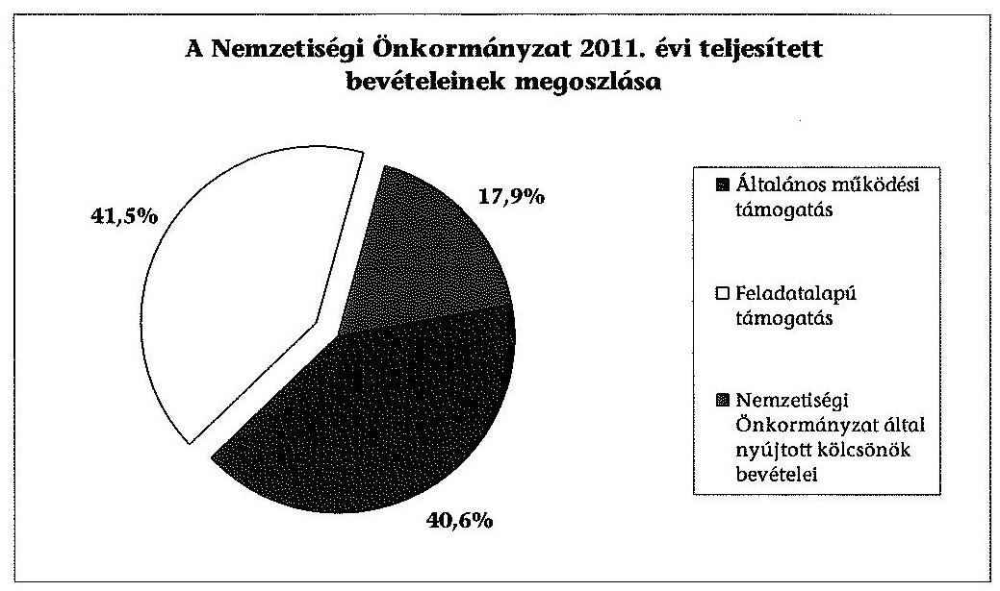
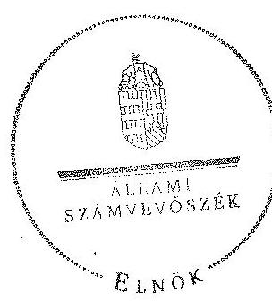

# ÁLLAMI   SZÁMVEVÔSZÉK 

## JELENTÉS

a helyi kisebbségi/nemzetiségi önkormányzatok gazdálkodásának ellenőrzéséről Somogygeszti Község Roma Nemzetiségi Önkormányzat

---

# Állami Számvevőszék 

Iktatószám: V-0094-026/2013.
Témaszám: 1105
Vizsgálat-azonosító szám: V06060318

## Az ellenőrzést felügyelte:

Horváth Balázs
felügyeleti vezető
Az ellenőrzést vezette és az ellenőrzés végrehajtásáért felelős:
Preller Zsuzsanna
ellenőrzésvezető
A számvevőszéki jelentést készítették és a jelentés összeállításában
közremüködtek:
Eigner György Zoltán
számvevő tanácsos
Moder Beatrix
számvevő
Az ellenőrzést végezték:
Vojcsekné Szabó Ágnes Keszthelyi Zoltán
számvevő tanácsos számvevő tanácsos

---

# TARTALOMJEGYZÉK 

BEVEZETÉS ..... 5
I. ÖSSZEGZŐ MEGÁLLAPÍTÁSOK, KÖVETKEZTETÉSEK ..... 8
II. RÉSZLETES MEGÁLLAPÍTÁSOK ..... 10

1. A Nemzetiségi és a Települési Önkormányzat együttmúködésének szabályszerűsége ..... 10
2. A gazdálkodási feladatok ellátásának szabályszerűsége ..... 11
2.1. A költségvetésre és zárszámadásra, valamint a kincstári adatszolgáltatás rendjére vonatkozó jogszabályi előírások betartása ..... 11
2.2. A Nemzetiségi Önkormányzat gazdálkodásának szabályozottsága ..... 12
2.3. A pénzügyi kontrollok múködése ..... 13
3. A Nemzetiségi Önkormányzattal összefüggő gazdálkodási feladatok belső ellenőrzése ..... 14
4. A 2011. évi feladatalapú támogatás felhasználásának, elszámolásának szabályszerűsége ..... 15
5. A Nemzetiségi Önkormányzat feladatellátása ..... 15

## MELLÉKLET

1. számú A Nemzetiségi Önkormányzat 2011. évi és 2012. I. félévi gazdálkodásának főbb adatai, mutatói

## FÜGGELÉKEK

1. számú Értelmező szótár
2. számú A pénzügyi kontrollok múködésének értékelése

---

# **Chemistry**

## **Chemical Reactions**

### **Balancing Chemical Equations**

1. **Write the unbalanced equation:**
   - Example: $$C_3H_8 + O_2 \rightarrow CO_2 + H_2O$$

2. **Balance the equation:**
   - Example: $$2C_3H_8 + 7O_2 \rightarrow 6CO_2 + 8H_2O$$

3. **Balance the equation:**
   - Example: $$2C_3H_8 + 7O_2 \rightarrow 6CO_2 + 8H_2O$$

### **Types of Reactions**

1. **Combination Reaction:**
   - Example: $$2H_2 + O_2 \rightarrow 2H_2O$$

2. **Decomposition Reaction:**
   - Example: $$2H_2O_2 \rightarrow 2H_2O + O_2$$

3. **Single Displacement Reaction:**
   - Example: $$Zn + 2HCl \rightarrow ZnCl_2 + H_2$$

4. **Double Displacement Reaction:**
   - Example: $$AgNO_3 + NaCl \rightarrow AgCl + NaNO_3$$

5. **Combustion Reaction:**
   - Example: $$CH_4 + 2O_2 \rightarrow CO_2 + 2H_2O$$

## **Stoichiometry**

### **Mole Concept**

- **Mole (mol):** The amount of substance containing as many particles (atoms, molecules, ions) as there are atoms in exactly 12 grams of carbon-12.
- **Avogadro's Number:** $$6.022 \times 10^{23}$$ particles per mole.

### **Molar Mass**

- **Molar Mass:** The mass of one mole of a substance.
- Example: The molar mass of water ($$H_2O$$) is 18.015 g/mol.

### **Calculations**

1. **Moles to Mass:**
   - Formula: $$n = \frac{m}{M}$$
   - Example: Calculate the number of moles of $$H_2O$$ in 18 grams of water.
     - $$n = \frac{18.015 \, \text{g}}{18.015 \, \text{g/mol}} = 18.015 \, \text{g/mol}$$

2. **Moles to Mass:**
   - Formula: $$m = n \times M$$
   - Example: Calculate the mass of 18.015 g of water.
     - $$m = 18.015 \, \text{g/mol} = 18.015 \, \text{g/mol}$$

## **Gas Laws**

### **Ideal Gas Law**

- **Equation:** $$PV = nRT$$
- **Variables:**
  - $$P$$: Pressure (atm)
  - $$V$$: Volume (L)
  - $$n$$: Number of moles (mol)
  - $$R$$: Ideal gas constant (0.0821 L·atm/mol·K)
  - $$T$$: Temperature (K)

### **Boyle's Law**

- **Equation:** $$P_1V_1 = P_2V_2$$
- **Variables:**
  - P₁: Pressure (atm)
  - P₂: Volume (L)
  - P₃: Temperature (K)
  - P₁: Pressure (atm)
  - P₂: Volume (L)
  - P₃: Temperature (K)

### **Boyle's Law (Boyle's Law)**

- **Equation:** $$\frac{P_1V_1}{P_2V_2} = \frac{P_1}{V_1}$$

## **Thermochemistry**

### **Enthalpy Change (ΔH)**

- **Definition:** The heat content of a system at constant pressure.
- **Equation:** $$\Delta H = q_p$$
- **Equation:** $$\Delta H = q_p + \frac{Q_p}{2}$$

### **Hess's Law**

- **Statement:** The enthalpy change for a reaction is the same whether it occurs in one step or multiple steps.
- **Equation:** $$\Delta H_{\text{reaction}} = \Delta H - q_p$$
- **Statement:** The enthalpy change for a reaction is the same whether it occurs in one step or multiple steps.

### **Hess's Law (ΔH)**

- **Statement:** The enthalpy change for a reaction is the same whether it occurs in one step or multiple steps.
- **Equation:** $$\Delta H_{\text{ΔH}} = q_p$$
- **Statement:** The enthalpy change for a reaction is the same whether it occurs in one step or multiple steps.

## **Electrochemistry**

### **Oxidation and Reduction**

- **Oxidation:** Loss of electrons.
- **Reduction:** Gain of electrons.

### **Galvanic Cells**

- **Definition:** A cell that converts chemical energy into electrical energy.
- **Components:**
  - Anode: Oxidation occurs.
  - Cathode: Reduction occurs.
  - Salt Bridge: Connects the two half-cells.

### **Nernst Equation**

- **Equation:** $$E = E^\circ - \frac{RT}{nF} \ln Q$$
- **Variables:**
  - E: Cell potential
  - R: Ideal gas constant
  - F: Faraday constant
  - R: Standard cell potential
  - Q: Reaction quotient

## **Electrochemistry**

### **Oxidation and Reduction**

- **Oxidation:** Loss of electrons.
- **Reduction:** Gain of electrons.
- **Reduction:** Gain of electrons.

### **Oxidation and Reduction**

- **Oxidation:** Gain of electrons.
- **Reduction:** Gain of electrons.

### **Electrochemical Cells**

- **Definition:** A cell that converts chemical energy into electrical energy.
- **Components:**
  - Anode: Oxidation occurs.
  - Cathode: Reduction occurs.
  - Salt Bridge: Connects the two half-cells.

### **Oxidation and Reduction**

- **Oxidation:** Gain of electrons.
- **Reduction:** Gain of electrons.

## **Organic Chemistry**

### **Functional Groups**

- **Alkanes:** -C=O -C=18 -C=18 -C=18 -C=18 -C=18 -C=18 -C=18 -C=18 -C=18 -C=18 -C=18 -C=18 -C=18 -C=18 -C=18 -C=18 -C=18 -C=18 -C=18 -C=18 -C=18 -C=18 -C=18 -C=18 -C=18 -C=18 -C=18 -C=18 -C=18 -C=18 -C=18 -C=18 -C=18 -C=18 -C=18 -C=18 -C=18 -C=18 -C=18 -C=18 -C

---

# RÖVIDÍTÉSEK JEGYZÉKE 

## Jogszabályok

Áht. 1
Áht. 2
ÁSZ tv.
Nek. ${ }_{1}$ tv.
Nek. ${ }_{2}$ tv.
Számv. tv.
Áhsz.

Ámr.
Ávr.

Ber.
Bkr.
támogatási kormányrendelet

Települési Önkormányzat SZMSZ-e

## Szórövidítések

ÁSZ
Jegyzó
Kincstár
körjegyzó ${ }_{1}$

1992. évi XXXVIII. törvény az államháztartásról (hatályos 2011. december 31-ig)
1993. évi CXCV. törvény az államháztartásról (hatályos 2011. december 31-étől)
1994. évi LXVI. törvény az Állami Számvevőszékről (hatályos 2011. július 1-jétől)
1995. évi LXXVII. törvény a nemzeti és etnikai kisebbségek jogairól (hatályos 2011. december 31-ig)
1996. évi CLXXIX. törvény a nemzetiségek jogairól (hatályos 2011. december 20-tól)
1997. évi C. törvény a számvitelről
249/2000. (XII. 24.) Korm. rendelet az államháztartás szervezetei beszámolási és könyvvezetési kötelezettségének sajátosságairól
292/2009. (XII. 19.) Korm. rendelet az államháztartás működési rendjéről (hatályos 2011. december 31-ig)
368/2011. (XII. 31.) Korm. rendelet az államháztartásról szóló törvény végrehajtásáról (hatályos 2012. január 1jétől)
193/2003. (XI. 26.) Korm. rendelet a költségvetési szervek belső ellenőrzéséről, hatályos 2011. december 31-ig
370/2011. (XII. 31.) Korm. rendelet a költségvetési szervek belső kontrollrendszeréről és belső ellenőrzésről (hatályos 2012. január 1-jétől)
a kisebbségi önkormányzatoknak a központi költségvetésből, valamint fejezeti kezelésű előirányzatból nyújtott támogatások feltételrendszeréről és elszámolásának rendjéről szóló 342/2010. (XII. 28.) Korm. rendelet (hatályon kívül helyezte a 28/2012. (III. 6.) Korm. rendelet a nemzetiségi célú előirányzatokból nyújtott támogatások feltételrendszeréről és elszámolásának rendjéről; jelenleg hatályos a 428/2012. (XII. 29.) Korm. rendelet a nemzetiségi célú előirányzatokból nyújtott támogatások feltételrendszeréről és elszámolásának rendjéről)
Somogygeszti Község Önkormányzatának 6/2011. (IX. 8.) számú rendelete a Szervezeti és Müködési Szabályzatról

Állami Számvevőszék
Mernyei Közös Önkormányzati Hivatal jegyzője (2013. január 1-től)
Magyar Államkincstár Vas Megyei Igazgatósága
Somogyaszaló - Magyaregres - Somogygeszti Községek körjegyzöje (2008. 01. 01-től 2011. 12. 31-ig)

---

| körjegyzö2 | Mernye, Polány, Ecseny, Felsőmocsolád és Somogygeszti |
| :--: | :--: |
|  | Községek Körjegyzöje (2012. 01. 01-től 2012. 12. 31-ig) |
| Körjegyzőség ${ }_{1}$ | Somogyaszaló - Magyaregres - Somogygeszti Községek |
|  | Körjegyzősége (2008. 01. 01-től 2011. 12. 31-ig) |
| Körjegyzőség ${ }_{2}$ | Mernye, Polány, Ecseny, Felsőmocsolád és Somogygeszti |
|  | Községek Körjegyzősége (2012. 01. 01-től 2012. 12. 31-ig) |
| Körjegyzőség ${ }_{2}$ SZMSZ-e | Mernye, Polány, Ecseny, Felsőmocsolád és Somogygeszti |
|  | Községek Körjegyzőségének Szervezeti és Müködési Sza- |
|  | bályzata (2012. 01. 01-től 2012. 12. 31-ig) |
| Nemzetiségi Önkormányzat | Somogygeszti Község Cigány Kisebbségi Önkormányzat 2012. január 20-áig, Somogygeszti Község Roma Nemzetiségi Önkormányzat 2012. március 27 -ig |
| Nemzetiségi Önkormányzat elnöke | Somogygeszti Község Cigány Kisebbségi Önkormányzatának elnöke 2012. január 20-áig, Somogygeszti Község Roma Nemzetiségi Önkormányzatának elnöke 2012. március 27 -ig |
| Nemzetiségi Önkormányzat Képviselótestülete | Somogygeszti Község Cigány Kisebbségi Önkormányzatának Képviseló-testülete 2012. január 20-áig, Somogygeszti Község Roma Nemzetiségi Önkormányzatának Képviselő-testülete 2012. március 27 -ig |
| polgármester   Támogató | Somogygeszti Község Önkormányzatának polgármestere A támogatást nyújtó Közigazgatási és Igazságügyi Minisztérium |
| Települési Önkormányzat | Somogygeszti Község Önkormányzata |
| Települési Önkormányzat Képviselő-testülete | Somogygeszti Község Önkormányzatának Képviselőtestülete |

---

# JELENTÉS 

## a helyi kisebbségi/nemzetiségi önkormányzatok gazdálkodásának ellenőrzéséről Somogygeszti Község Roma Nemzetiségi Önkormányzat

## BEVEZETÉS

Az államháztartás részét, az önkormányzati alrendszer egyik elemét képezik a nemzetiségi önkormányzatok, amelyek jogi személyek és a Nek. ${ }_{1,2}$ tv.-ben meghatározott önálló feladat- és hatáskörökkel rendelkeznek. A nemzetiségi önkormányzatok az önkormányzati, illetve testületi működtetés mellett a helyi nemzetiségi közügyek változatos formában való ellátásában vesznek részt.

A nemzetiségi önkormányzatok, illetve a települési önkormányzatok között a jelenlegi szabályozás szerint nincs alá-fölérendeltségi viszony. A nemzetiségi önkormányzatok azonban sajátos közjogi helyzetben vannak, mert a jogállásukat tekintve önkormányzatok, ám függnek a székhelyük szerinti települési önkormányzat hivatalától, amely ellátja a nemzetiségi önkormányzatok vonatkozásában a megállapodásban rögzített gazdálkodási feladatokat.

A nemzetiségek helyzete, támogatása mind hazai, mind európai uniós szinten kiemelt figyelmet kap napjainkban. A nemzetiségi önkormányzatok gazdálkodására és támogatási rendszerére vonatkozó jogszabályok a 20102012. években jelentős változásokon mentek át, amelyek érintették a feladatalapú támogatásra fordítható költségvetési keret megállapítását, az operatív gazdálkodási jogkörök szabályozását, az elkülönített könyvvezetés alkalmazását, a belső ellenőrzés szabályozását.

Az ellenőrzés célja annak értékelése volt, hogy a Nemzetiségi Önkormányzat gazdálkodási kereteinek kialakítása, gazdálkodása és feladatellátása megfelelte a hatályos jogszabályoknak.

Ennek keretében ellenőriztük, hogy:

- a Nemzetiségi Önkormányzat és a Települési Önkormányzat együttműködésének szabályozása, a Települési Önkormányzat SZMSZ-ében, a megállapodásban előírt működési feltételek biztosítása megfelelt-e a jogszabályi előírásoknak;
- a felek együttműködése megfelelt-e a megállapodásnak a gazdálkodási feladatok szabályszerű ellátásában, betartották-e a Nemzetiségi Önkormányzat gazdálkodásához kapcsolódóan a költségvetésre és zárszámadásra, a

---

gazdálkodás szabályozására, az operatív gazdálkodási jogkörök gyakorlására vonatkozó jogszabályi előírásokat;

- a jegyző biztosította-e a Polgármesteri Hivatal belső ellenőrzése keretében a Nemzetiségi Önkormányzattal összefüggő gazdálkodási feladatok belső ellenőrzését;
- a 2011. évi feladatalapú támogatás felhasználása, a folyósított feladatalapú támogatással történő elszámolás az előírásoknak megfelelően történt-e;
- a Nemzetiségi Önkormányzat feladatellátása összhangban volt-e a vonatkozó jogszabályi előírásokkal.

Az ellenőrzés típusa: szabályszerűségi ellenőrzés
Az ellenőrzött időszak: a 2011. január 1. - 2012. június 30.
Ellenőrzött szervezet: Somogygeszti Község Roma Nemzetiségi Önkormányzat és a gazdálkodási feladatait 2011. december 31-ig ellátó Somogyaszaló-Magyaregres-Somogygeszti Községek Körjegyzősége, 2012. január 1-től Mernye - Polány - Ecseny - Felsőmocsolád - Somogygeszti Községek Körjegyzősége (jelenleg Mernyei Közös Önkormányzati Hivatal)

Az ellenőrzés jogszabályi alapja: az ÁSZ tv. 5. § (2)-(3) és (6) bekezdései
Az ellenőrzés szakmai módszertana az ÁSZ hivatalos honlapján (www.asz.hu) közzétett szakmai szabályokon alapult, amely a Legfőbb Ellenőrző Intézmények Nemzetközi Szervezete (INTOSAI) által kiadott nemzetközi standardok (ISSAI) figyelembevételével készült.

A fogalmak magyarázatát az 1. számú függelék, a pénzügyi kontrollok megfelelősége értékelésénél alkalmazott egységes minősítési szempontokat a 2. számú függelék tartalmazza.

Az ellenőrzés lefolytatásához a Települési Önkormányzat és a Nemzetiségi Önkormányzat tanúsítványok kitöltésével és a kapcsolódó dokumentumok elektronikus megküldésével szolgáltatott adatokat. A tanúsítványokon szerepeltetett adatok, információk ellenőrzése és szükség szerinti javítása a helyszíni ellenőrzés keretében történt.

Az ÁSZ az ellenőrzés megállapításait az ellenőrzött időszakban hatályos, az intézkedést igénylő megállapításokra tett javaslatokat a jelenleg hatályos jogszabályok alapján fogalmazta meg.

A Nemzetiségi Önkormányzat 2010-ben alakult, elnöke a 2010. évi helyhatósági választások óta látta el feladatát. A Nemzetiségi Önkormányzat intézményt, gazdasági társaságot és más szervezetet nem alapított, illetve ezek társulásában nem vett részt. A négytagú Képviselő-testület munkája segítésére bizottságot nem hozott létre. A Nemzetiségi Önkormányzat a költségvetési beszámolója szerint a 2011. évben 515 ezer Ft költségvetési bevételt ért el és 515 ezer Ft költségvetési kiadást teljesített. A 2012. évben 600 ezer Ft eredeti költségvetési bevételi és kiadási előirányzatot terveztek. A 2012. I. félévi beszá-

---

molója alapján a módosított költségvetési bevételi és kiadási előirányzat 647 ezer Ft, a teljesített költségvetési bevétel 264 ezer Ft, a teljesített költségvetési kiadás pedig 106 ezer Ft volt. A 2011. évi és a 2012. I. féléves gazdálkodási adatokat részletesen az 1. számú mellékletben mutatjuk be. Az ÁSZ a Nemzetiségi Önkormányzat gazdálkodását korábban nem ellenőrizte.

# A Nemzetiségi Önkormányzatot 2013. március 27-én a Helyi Választási Bizottság az 1/2013. (III. 27.) HVB határozatával megszüntette, mert a 

képviselők száma egy főre csökkent, és a 2010. október 3-án megtartott kisebbségi önkormányzati képviselőválasztás hivatalos eredménye szerint nincs soron következő személy, aki képviselőként léphetne a Nemzetiségi Önkormányzat Képviselő-testületébe. A jegyző értesítette ${ }^{1}$ a megszűntetésről az Országos Roma Önkormányzatot, amely azonban a Nek. ${ }_{2}$ tv. 139. § (1) bekezdésében előírtak szerinti ideiglenes kezelésbe vételről - a helyszíni ellenőrzés befejezéséig - nem határozott. A Nemzetiségi Önkormányzat elnöke nem tett eleget a Nek. ${ }_{2}$ tv. 140. § (1) bekezdésében előírt kötelezettségének, mivel az önkormányzati vagyon, ezen belül a központi költségvetésből származó támogatás jogszerú és időarányos felhasználásáról nem számolt el.

A Nemzetiségi Önkormányzatot - az általa benyújtott kérelemnek helyt adva a Magyar Államkincstár Somogy Megyei Igazgatósága 2013. május 7-i dátummal törölte a közhiteles törzskönyvi nyilvántartásból.

Az ÁSZ tv. 29. § (1) bekezdése szerint a jelentéstervezetet megküldtük a polgármester és a jegyző részére, akik az ÁSZ tv. 29. § (2) bekezdésében foglalt észrevételezési jogukkal nem éltek, a jelentéstervezetre észrevételt nem tettek.

[^0]
[^0]:    ${ }^{1}$ A Mernyei Közös Önkormányzati Hivatal jegyzője a 1732-6/2013. ügyiratszámú, 2013. május 2-án kelt levelében értesítette az Országos Roma Önkormányzatot a Nemzetiségi Önkormányzat megszűnéséről.

---

# I. ÖSSZEGZŐ MEGÁLLAPÍTÁSOK, KÖVETKEZTETÉSEK 

#### Abstract

A Nemzetiségi és a Települési Önkormányzat együttmüködésének szabályozása részben felelt meg a jogszabályi előírásoknak. Az együttmúködés a 2011. évben határidőben jóváhagyott megállapodáson alapult, azonban a megállapodás az Áht. ${ }_{1}$-ben meghatározott előírásoknak nem felelt meg. A 2012. évben a megállapodás felülvizsgálatára és a Nek. ${ }_{2}$ tv.-ben előírt új megállapodás megkötésére határidőn túl került sor. A 2012. július 1-jétől hatályos megállapodás a Nek. ${ }_{2}$ tv. előírásai ellenére nem tartalmazta a törzskönyvi nyilvántartásba vétellel és az adószám igénylésével kapcsolatos határidőket, az érvényesítési feladatot ellátó személy kijelölését, a Nemzetiségi Önkormányzat kötelezettségvállalásának szabályait, a múködési feltételek és a gazdálkodás részletszabályait, és a körjegyző ${ }_{2}$ jelzési kötelezettségét a Nemzetiségi Önkormányzat képviselő-testületi ülésein észlelt törvénysértés esetén.

A Nemzetiségi Önkormányzat költségvetésére és zárszámadására vonatkozó jogszabályi előírásokat részben tartották be. A költségvetési és zárszámadási határozatokat egymással összehasonlítható szerkezetben készítették el, azokat változatlan formában építették be a Települési Önkormányzat költségvetési és zárszámadási rendeleteibe. Az Ámr.-ben előírt határidőn túl fogadta el a Képviselő-testület a 2011. évi költségvetési határozatot, amely az Ámr. előírása ellenére nem tartalmazta az előirányzat felhasználási ütemtervet. A 2012. évi költségvetés előterjesztésekor az Áht. ${ }_{2}$ előírását figyelmen kívül hagyva nem mutatták be az előirányzat felhasználási tervet. A körjegyző ${ }_{2}$ 2012. I. félévben a Nemzetiségi Önkormányzatra vonatkozó kincstári adatszolgáltatási kötelezettségének határidőben eleget tett.

A Nemzetiségi Önkormányzat gazdálkodásának szabályozása nem felelt meg a jogszabályi előírásoknak. A Körjegyzőség ${ }_{1,2}$ az Áhsz.-ben foglaltak ellenére az ellenőrzött időszakban nem rendelkezett - hatályba léptetett - számviteli politikával, leltározási és leltárkészítési, eszközök és források értékelési és pénzkezelési szabályzatokkal, valamint számlarenddel. A körjegyzó ${ }_{1,2}$ nem készítette el az Ámr. előírása ellenére az ellenőrzési nyomvonalat, a szabálytalanságok kezelésének eljárásrendjét, a kockázatkezelési szabályzatot, és az Áht. ${ }_{1}$ szerinti folyamatba épített előzetes, utólagos és vezetői ellenőrzés szabályozását. Az ellenőrzött időszakban az operatív gazdálkodási jogkörök kialakítása nem felelt meg a jogszabályi előírásoknak, mert a Körjegyzőség ${ }_{1,2}$ - a Nemzetiségi Önkormányzatra is kiterjedő hatályú, hiteles - gazdálkodási jogkörök szabályzatával nem rendelkezett. A körjegyző ${ }_{1}$ az Ámr. előírásai, a körjegyző ${ }_{2}$ az Áht. ${ }_{2}$, és az Ávr. előírásai ellenére nem jelölte ki az érvényesítési feladatokat ellátó személyt. A 2012. I. félévben a pénzügyi ellenjegyzésre felhatalmazott személy feladatai nem terjedtek ki a Nemzetiségi Önkormányzat kiadási előirányzatai terhére vállalt kötelezettségek pénzügyi ellenjegyzésére.

Az ellenőrzött időszakban a pénzügyi kontrollok múködése a múködési célú pénzeszközátadások, valamint a dologi és egyéb folyó kiadások teljesítésénél gyenge volt, a hibák száma a lényegességi szintet, a kritikus hibahatárt elérte. A 2011. évben az Ámr. előírásait figyelmen kívül hagyva a kötelezettségvál-

---

lalásokra ellenjegyzés nélkül került sor, a szakmai teljesítés igazolását nem végezték el, illetve olyan személy végezte, akinek ellenőrzési és igazolási jogosultsága nem volt megállapítható, továbbá a kifizetéseket az utalvány ellenjegyzése nélkül teljesítették. A 2012. I. félévben az Áht. ${ }_{2}$ előírásai ellenére a kötelezettségvállalásra pénzügyi ellenjegyzés nélkül került sor, a teljesítés igazolására jogosult személy az Ávr. előírása ellenére nem végezte el ellenőrzési és igazolási feladatát, az érvényesítést kijelöléssel nem rendelkező személy, jogosulatlanul végezte.

A körjegyző ${ }_{1,2}$ az ellenőrzött időszakban a Számv. tv. előírását megsértve nem biztosította a beszámoló és a főkönyvi könyvelés közötti egyezőséget.

A Nemzetiségi Önkormányzat a 2011. évben 214 ezer Ft feladatalapú támogatásban részesült, melyet a tárgyévben a jogszabályi előírásokkal összhangban felhasznált. A támogatási kormányrendeletben hivatkozott Áht. ${ }_{1}$-ben előírt elszámolás nem történt meg. A támogatás felhasználását, elszámolását a jogosult szervezetek nem ellenőrizték.

A Nemzetiségi Önkormányzat feladatellátásának tárgya részben volt összhangban a Nek. ${ }_{1,2}$ tv. előírásaival. Biztosította az ellenőrzött időszakban a nemzetiségi közügyek keretében az alapvető feladatához szükséges szervezeti, személyi és anyagi feltételeket. Feladatot látott el a képviselt közösség kulturális autonómiája megerősítése érdekében a kisebbségi oktatás és a hagyományápolás területén. Az ellenőrzött időszakban magánszemélyeknek nyújtott visszatérítendő támogatás azonban nem minősült a Nek. ${ }_{1,2}$ tv.-ben meghatározott nemzetiségi közügynek.

A Körjegyzőség ${ }_{1}$ 2011. évi ellenőrzési tervét megalapozó kockázatelemzés az Ámr. előírásai ellenére nem terjedt ki a Nemzetiségi Önkormányzat gazdálkodásával összefüggő végrehajtási feladatok ellátására. A Körjegyzőség ${ }_{2}$ 2012. évi belső ellenőrzési terve nem kockázatelemzés alapján készült, a Ber. előírásával ellentétesen. Belső ellenőrzést a Nemzetiségi Önkormányzat gazdálkodásával összefüggő végrehajtási feladatok tekintetében az ellenőrzött időszakban nem terveztek és nem végeztek. A körjegyző ${ }_{1,2}$ az ellenőrzött időszakban az Áht. ${ }_{1}$, illetve az Áht. ${ }_{2}$ ellenére nem biztosította a Körjegyzőség ${ }_{1,2}$ belső ellenőrzése keretében a Nemzetiségi Önkormányzat gazdálkodásával összefüggő végrehajtási feladatok belső ellenőrzését.

Az ellenőrzés megállapításai alapján, az észrevételezésre megküldött jelentéstervezetben a Nemzetiségi Önkormányzat megszűnésével kapcsolatban intézkedést igénylő megállapítást és javaslatot fogalmaztunk meg, amely végrehajtásáról az ellenőrzés időszakában intézkedési tájékoztatást adott a jegyző. A Nemzetiségi Önkormányzat vagyonának ideiglenes kezelésbe adására tett kezdeményezést és a visszatérítési kötelezettséggel nyújtott támogatások visszakövetelésének szükségességéről a jelzést a beküldött dokumentumokkal igazolták. Figyelemmel az ÁSZ ellenőrzés hasznosítására intézkedést igénylő megállapítást, javaslatot már nem szerepeltetünk.

---

# II. RÉSZLETES MEGÁLLAPÍTÁSOK 

## 1. A Nemzetiségi és a Telepúlési Önkormányzat együttmúKÖDÉSÉNEK SZABÁLYSZERŰSÉGE

A Nemzetiségi és a Települési Önkormányzat között létrejött együttmúködési megállapodások részben feleltek meg a jogszabályi előírásoknak.

A 2011. december 31-én hatályos együttműködési megállapodás ${ }^{2}$ az Áht. ${ }_{1}$ 66. §-ában foglalt előírás ellenére nem tartalmazta a finanszírozás rendjének szabályozásához kapcsolódóan a feladatellátás jogosultjainak, kötelezetfjeinek, valamint a gazdálkodási jogköröket gyakorlók közül az érvényesítő kijelölését. A megállapodást a Nek. ${ }_{2}$ tv. 159. § (3) bekezdésében előírt határidőn túl vizsgálták felül. A 2012. július 1-jétől hatályos új megállapodásban ${ }^{3}$ rendelkeztek az ingyenes helyiséghasználatról, a költségvetés elkészítésével és jóváhagyásával, valamint a költségvetéssel összefüggő adatszolgáltatási kötelezettségek teljesítésével kapcsolatos feladatokról, határidőkről és felelősökről, az önálló fizetési számla nyitásáról, azonban nem rögzítették:

- a Nek. ${ }_{2}$ tv. 80. § (3) bekezdés a) pontjában foglaltak ellenére a törzskönyvi nyilvántartásba vételével és az adószám igénylésével kapcsolatos határidőket, együttmúködési kötelezettséget és ezek felelőseinek konkrét kijelölését;
- a Nek. ${ }_{2}$ tv. 80. § (3) bekezdés b) pontjában foglaltakat figyelmen kívül hagyva a Nemzetiségi Önkormányzat kötelezettségvállalásaival kapcsolatban a Települési Önkormányzatot terhelő érvényesítési feladatot ellátó személy konkrét kijelölését;
- a Nek. ${ }_{2}$ tv. 80. § (3) bekezdés c) pontjában előírtak ellenére a Nemzetiségi Önkormányzat kötelezettségvállalásának szabályait, különösen az összeférhetetlenségi, nyilvántartási kötelezettségekre;
- a Nek. ${ }_{2}$ tv. 80. § (3) bekezdése d) pontjában előírtak ellenére a Nemzetiségi Önkormányzat múködési feltételeinek és gazdálkodásának eljárási és dokumentációs részletszabályait;
- a Nek. ${ }_{2}$ tv. 80. § (4) bekezdése ellenére annak előírását, hogy a körjegyző ${ }_{2}$ vagy - a körjegyzővel ${ }_{2}$ azonos képesítési előírásoknak megfelelő - megbízottja jelezze a Nemzetiségi Önkormányzat képviselő-testületi ülésein az észlelt törvénysértést.

[^0]
[^0]:    ${ }^{2}$ Nemzetiségi Önkormányzat Képviselő-testülete az 1/2011. (I. 10.) számú határozatával fogadta el az előterjesztett megállapodás-tervezetet.
    ${ }^{3}$ Nemzetiségi Önkormányzat Képviselö-testülete a 12/2012. (VI. 8.) számú határozatával fogadta el az előterjesztett megállapodás-tervezetet, amely 2012. július 1-én lépett hatályba.

---

A Nek. ${ }_{2}$ tv. 80. § (2) bekezdésében foglaltak ellenére nem írták elő a Települési Önkormányzat és a Nemzetiségi Önkormányzat SZMSZ-ében a 2012. július 1jétől hatályos együttműködési megállapodás szerinti módosított múködési feltételeket.

A Települési Önkormányzat az ellenőrzött időszakban a szabályozás hiányossága ellenére biztosította a Nemzetiségi Önkormányzat múködéséhez szükséges személyi és tárgyi feltételeket.

# 2. A GAZDÁLKODÁSI FELADATOK ELLÁTÁSÁNAK SZABÁLYSZERŰSÉGE 

### 2.1. A költségvetésre és zárszámadásra, valamint a kincstári adatszolgáltatás rendjére vonatkozó jogszabályi előírások betartása

A Nemzetiségi Önkormányzat költségvetésére és zárszámadására vonatkozó jogszabályi előírásokat részben tartották be. A költségvetési és zárszámadási határozatok egymással összehasonlítható szerkezetben készültek, azokat a Települési Önkormányzat költségvetési és zárszámadási rendeletébe változatlan formában beépítették. A Nemzetiségi Önkormányzat elnöke a költségvetési előirányzatok felhasználásához szükséges mértékben kezdeményezte azok módosítását, biztosította a tárgyévi fizetési kötelezettség vállalásához szükséges fedezetet.

A Nemzetiségi Önkormányzat 2011. évi költségvetési határozata az Ámr.-ben előírtaknak megfelelően tartalmazta a bevételi forrásokat jogcímcsoportonkénti részletezettségben, a múködési, fenntartási kiadási előirányzatokat kiemelt előirányzatonként részletezve, a tárgyévi költségvetési bevételeket és kiadásokat, azonban nem tartalmazta az Ámr. 36. § (1) bekezdés k) pontja előírása ellenére az év várható bevételi és kiadási előirányzatainak teljesüléséről az előirányzat felhasználási ütemtervet.

A Nemzetiségi Önkormányzat a 2011. évi költségvetési határozatát az Ámr. 37. § (3) bekezdésben foglalt határidőn túl fogadta el, azonban ez nem akadályozta a Települési Önkormányzat költségvetési rendeletének határidőben történő elfogadását. A Képviselő-testület a zárszámadási határozatot határidőben alkotta meg.

A Nemzetiségi Önkormányzat elnöke a 2012. évi költségvetési határozattervezetet a Képviselő-testület elé terjesztette, ami tartalmában megfelelt a jogszabályi előírásoknak, de az Áht. 24 . § (4) bekezdés a) pontját figyelmen kívül hagyva nem mutatta be az előirányzat felhasználási tervet.

A 2012. évi költségvetéshez kapcsolódó, a Nemzetiségi Önkormányzatra vonatkozó kincstári adatszolgáltatási kötelezettségének a körjegyzö ${ }_{2}$ határidőben eleget tett.

---

# 2.2. A Nemzetiségi Önkormányzat gazdálkodásának szabályozottsága 

A Nemzetiségi Önkormányzat gazdálkodásának szabályozásáról az ellenőrzött időszakban a körjegyzö ${ }_{1,2}$ nem gondoskodott, mert:

- a Nemzetiségi Önkormányzat gazdálkodási feladatait ellátó Körjegyzőség ${ }_{1,2}$ a Számv. tv. 14. § (3) és (5) bekezdése, a 161. § (1) bekezdése, valamint az Áhsz. 8. § (3)-(4) bekezdései és a 49. § (1) bekezdésében foglalt előírások ellenére nem rendelkezett - hatályba léptetett - számviteli politikával, és a kapcsolódó eszközök és források leltározási és leltárkészítési, értékelési és pénzkezelési szabályzatokkal, valamint számlarenddel;
- a 2011. évben az Ámr. 20. § (2) bekezdés h) pontjában, 2012. I. félévben az Ávr. 13. § (1) bekezdés g) pontjában foglaltak ellenére a Körjegyzőség ${ }_{1,2}$ SZMSZ-e a Nemzetiségi Önkormányzat gazdálkodásával kapcsolatos fel-adat- és hatásköröket, a hatáskörök gyakorlásának módját, a helyettesítés rendjét és az ezekre vonatkozó felelősségi szabályokat nem tartalmazta;
- a körjegyzö ${ }_{1,2}$ a 2011. évben az Ámr. 156. § (2)-(3) bekezdésében, a 157. § (1) bekezdésében és az Áht. ${ }_{1} 121 /$ A. § (4) bekezdésében, 2012. I. félévben a Bkr. 6. § (3)-(4) bekezdéseiben, a 7. § (1) bekezdésében, valamint a 8. § (2)-(4) bekezdéseiben előírtak ellenére nem készítette el az ellenőrzési nyomvonalat és a szabálytalanságok kezelésének eljárásrendjét, valamint a kockázatkezelés, illetve a folyamatba épített előzetes, utólagos és vezetői ellenőrzés szabályozását.

A Nemzetiségi Önkormányzat operatív gazdálkodási jogköreinek kialakítása az ellenőrzött időszakban nem felelt meg a jogszabályi előírásoknak, mert a körjegyzö ${ }_{1,2}$ a 2011. évben az Ámr. 20. § (3) bekezdés a) pontjában, a 2012. I. félévében az Áht. ${ }_{2} 10 . \S$ (5) bekezdésében és az Ávr. 13. § (2) bekezdés a) pontjában foglalt előírás ellenére nem gondoskodott a gazdálkodással - így különösen a kötelezettségvállalással, az ellenjegyzéssel, a szakmai teljesítésigazolással, az érvényesítéssel, az utalványozás gyakorlásának módjával, eljárási és dokumentációs részletszabályaival, valamint az ezeket végző személyek kijelölésének rendjével - az ellenőrzési, adatszolgáltatási és beszámolási feladatok teljesítésével kapcsolatos belső előírásokat, feltételeket tartalmazó, hatályba helyezett, hiteles szabályozásról.

A 2011. évben az operatív gazdálkodással kapcsolatos feladat- és hatásköröket az együttmúködési megállapodásban részben meghatározták, azonban a körjegyzö ${ }_{1}$ az Ámr. 20. § (3) bekezdés a) pontjában és a 77. § (4) bekezdésében előírtak ellenére nem jelölte ki az érvényesítési feladatokat ellátó személyt.

A 2012. július 1-jétől hatályos együttmúködési megállapodásban részben meghatározták az operatív gazdálkodással kapcsolatos feladat- és hatásköröket, azonban a körjegyzö ${ }_{2}$ az - Áht. ${ }_{2} 38$. § (2) bekezdésében, az Ávr. 55. § (2) bekezdés g) pontjában, illetve 58. § (4) bekezdésben előírtak ellenére - az érvényesítést végző személyt nem jelölte ki, valamint a pénzügyi ellenjegyzésre szóló felhatalmazásokat nem terjesztette ki a Nemzetiségi Önkormányzattal kapcsolatos feladatokra.

---

# 2.3. A pénzügyi kontrollok múködése 

A Nemzetiségi Önkormányzatnál a 2011. évi múködési célú pénzeszközátadás, valamint a dologi és egyéb folyó kiadások teljesítése során a kötelezettségvállalás ellenjegyzése, a szakmai teljesítés igazolása és az utalvány ellenjegyzése kontrollok múködésének megfelelősége - a 2. számú függelékben részletezett értékelési szempontok alapján - gyenge volt, a hibák száma a lényegességi szintet, a kritikus hibahatárt elérte, mert:

- a kötelezettségvállalásra az Ámr. 74. § (1) bekezdésében foglaltakat figyelmen kívül hagyva ellenjegyzés nélkül került sor, így az Ámr. 74. § (3) bekezdése előírása ellenére a kötelezettségvállalás előtt nem történt meg a szabad előirányzat rendelkezésre állásának, valamint a kifizetés tervezett időpontjában a fedezet rendelkezésre állásának az ellenőrzése;
- a működési célú pénzeszközátadás esetében az Ámr. 76. § (1) és (3) bekezdésében foglaltak ellenére nem történt meg a kifizetés jogosságának és összegszerűségének szakmai teljesítésigazolása. A dologi és egyéb folyó kiadások teljesítése során a szakmai teljesítésigazolást olyan személy végezte, akinek aláírás-mintája - az Ámr. 80. § (3) bekezdésében előírt nyilvántartásban, annak hiányában - nem szerepelt, így ellenőrzési feladatainak szabályszerűen nem tudott eleget tenni;
- az Ámr. 79. § (2) bekezdésben előírtak ellenére a kifizetéseket az utalvány ellenjegyzése nélkül teljesítették, így a szakmai teljesítésigazolás és az érvényesítés megtörténtének, és a gazdálkodási szabályok érvényesülésének ellenőrzése elmaradt.

A Nemzetiségi Önkormányzatnál 2012. I. félévben a múködési célú pénzeszközátadás, valamint a dologi és egyéb folyó kiadások teljesítése során a pénzügyi ellenjegyzés, a teljesítés igazolás és az érvényesítés kontrollok múködésének megfelelősége - a 2. számú függelékben részletezett értékelési szempontok alapján - gyenge volt, a hibák száma a lényegességi szintet, a kritikus hibahatárt elérte, mert:

- a kötelezettségvállalásra az Áht. 2 37. § (1) bekezdésben foglaltak ellenére pénzügyi ellenjegyzés nélkül került sor, így a kötelezettségvállalás előtt nem történt meg a szabad előirányzat, valamint - a kifizetés tervezett időpontjában - a fedezet rendelkezésre állásának, továbbá annak ellenőrzése, hogy a kötelezettségvállalás nem sérti-e a gazdálkodásra vonatkozó szabályokat;
- az Ávr. 57. § (1) és (3) bekezdésben foglaltak ellenére nem végezték el a kiadás jogosságának és összegszerűségének - ellenszolgáltatást is magában foglaló kötelezettségvállalás esetében - a szerződés teljesítésének ellenőrzését és igazolását;
- az érvényesítést - az Áht. 2 38. § (2) bekezdésében, az Ávr. 55. § (2) bekezdés g) pontjában, illetve 58. § (4) bekezdésében foglaltakat figyelmen kívül hagyva - kijelöléssel nem rendelkező személy jogosulatlanul végezte, így szabályszerűen nem történt meg az összegszerűség, a fedezet meglétének, valamint a gazdálkodásra vonatkozó szabályok betartásának ellenőrzése.

---

A Nemzetiségi Önkormányzat 2011. évi és 2012. I. félévi költségvetési beszámolója és a főkönyvi könyvelés közötti egyezőséget nem biztosították, amellyel megsértették a Számv. tv. 15. § (2) és (3) bekezdéseiben foglalt teljesség és valódiság számviteli alapelveket.

- A költségvetési beszámoló szerint a Nemzetiségi Önkormányzat a 2011. évben 515 ezer Ft költségvetési bevételt ért el és 515 ezer Ft költségvetési kiadást teljesített. A beszámoló készítésekor nem vették figyelembe, hogy 2011. december 31-én a pénzmaradványból az általános támogatás maradványa 65 ezer Ft volt, amelynek figyelembe vételével - helyes könyvelés esetén - a ténylegesen teljesített bevétel 580 ezer Ft.
- A 2012. I. félévi beszámoló alapján a teljesített költségvetési bevétel 264 ezer Ft, a teljesített költségvetési kiadás pedig 106 ezer Ft volt. A 2012. I. félévi fókönyvi könyvelés adatai alapján a tényleges bevétel 289 ezer Ft, amelyet a 215 ezer Ft általános múködési támogatás, a 65 ezer Ft előző évi pénzmaradvány átvétel, illetve a kilenc ezer Ft kölcsön bevételei eredményezték. A tényleges teljesített kiadás 181 ezer Ft volt, a költségvetési beszámolóhoz képest a 75 ezer Ft eltérést az okozta, hogy a költségvetési beszámoló nem tartalmazta a június hónapban lekönyvelt négy pénztári és egy banki teljesített kiadást.

# 3. A Nemzetiségi Önkormányzattal összefüggő gazdálkodÁsi feladatok belsö ellenörzése 

A Körjegyzőség ${ }_{1}$ 2011. évi belső ellenőrzési tervét megalapozó kockázatelemzés - az Ámr. 157. § (2) bekezdés előírása ellenére - nem terjedt ki a Nemzetiségi Önkormányzat gazdálkodásával összefüggő végrehajtási feladatok ellátására. A Körjegyzőség ${ }_{2}$ 2012. évi belső ellenőrzési terve - a Ber. 18. § előírását figyelmen kívül hagyva - nem kockázatelemzés alapján készült. Az éves ellenőrzési tervek nem tartalmaztak a Nemzetiségi Önkormányzat gazdálkodásával összefüggő végrehajtási feladatok ellátására irányuló ellenőrzéseket, ilyen céllal belső ellenőrzést az ellenőrzött időszakban nem végeztek. A körjegyzö ${ }_{1,2}$ az ellenőrzött időszakban az Áht. ${ }_{1} 121 /$ B. § (4) bekezdés és az Áht. ${ }_{2} 70 . \S$ (1) bekezdése előírása ellenére nem biztosította a Körjegyzőség ${ }_{1,2}$ belső ellenőrzése keretében a Nemzetiségi Önkormányzat gazdálkodásával összefüggő végrehajtási feladatok belső ellenőrzését.

---

# 4. A 2011. ÉVI FELADATALAPÚ TÁMOGATÁs FELHASZNÁLÁSÁNAK, ELSZÁMOLÁSÁNAK SZABÁLYSZERŰSÉGE 

A Nemzetiségi Önkormányzat a 2011. évben 214 ezer Ft feladatalapú támogatásban részesült, amelynek az összes bevételhez viszonyított részarányát az alábbi ábra szemlélteti:

A 2011. évben folyósított támogatást a jogszabályi előírásokkal összhangban a tárgyévben felhasználták. Elszámolása a támogatási kormányrendelet 7. § (2) bekezdésében hivatkozott Áht. ${ }_{1}$-nek „a helyi önkormányzatok elszámolási rendjére vonatkozó rendelkezései alkalmazása" előírása ellenére nem történt meg. A támogatás felhasználását, elszámolását az ellenőrzésre jogosult szervek nem ellenőrizték.

## 5. A Nemzetiségi Önkormányzat feladATELLÁtása

A Nemzetiségi Önkormányzat feladatellátásának tárgya részben volt összhangban a Nek. ${ }_{1,2}$ tv. előírásaival. A Nek. ${ }_{1}$ tv. 5/A. § (1) bekezdése és a Nek. ${ }_{2}$ tv. 10. § (1) bekezdése szerinti, a nemzetiségi érdekek védelmével és képviseletével kapcsolatos alapvető feladata ellátásához biztosította a szükséges szervezeti, személyi és anyagi feltételeket, valamint önként vállalt feladatokat látott el a kisebbségi oktatás és a hagyományápolás területén. Az ellenőrzött időszakban magánszemélyeknek nyújtott visszatérítendő támogatások azonban nem minősültek a Nek. ${ }_{1}$ tv. 30. § (1) bekezdésében, a Nek. ${ }_{2}$ tv. 116. § (2), valamint a 124. § (1) bekezdésében foglaltak alapján nemzetiségi közügynek.

A Nemzetiségi Önkormányzat a 2011. évben három magánszemélynek összesen 95 ezer Ft, a 2012. év I. félévében szintén három magánszemélynek összesen 105 ezer Ft visszatérítendő támogatást nyújtott. A Nemzetiségi Önkormányzat

---

megszüntetéséig a támogatás teljes összegének visszafizetése nem történt meg, a fennálló követelés összege 100 ezer $\mathrm{Ft}^{4}$.

A Nemzetiségi Önkormányzat az ellenőrzött időszakban hatósági tevékenységet nem végzett, közüzemi szolgáltatással összefüggő feladatot nem látott el.

Budapest, 2013. 112. hónap 11. nap

Melléklet: 1 db
Függelék: 2 db

Domokos László
elnök $\wedge$

[^0]
[^0]:    ${ }^{4}$ A Mernyei Közös Önkormányzati Hivatal jegyzője által 2013. május 2-án tett nyilatkozata szerint.

---

# A Nemzetiségi Önkormányzat 2011. évi és 2012. I. félévi gazdálkodásának föbb adatai, mutatói 

A) BEVÉTELEK

| Megnevezés | 2011. év |  |  |  | 2012. év |  | 2012. I. félé |  |
| :--: | :--: | :--: | :--: | :--: | :--: | :--: | :--: | :--: |
|  | eredeti el. | módosított   el. | teljesítés   megoszlósa   (\%) |  | eredeti el. | módosított   el. | teljesítés | teljesítés   megoszlósa   (\%) |
| Intézményi müködési bevétel | 0,0 | 0,0 | 0,0 | $0,0 \%$ | 0,0 | 0,0 | 0,0 | $0,0 \%$ |
| Általános müködési   támogatás | 600,0 | 209,0 | 209,0 | $40,6 \%$ | 600,0 | 638,0 | 215,0 | $81,4 \%$ |
| Feladatolapú támogatás | 0,0 | 214,0 | 214,0 | $41,5 \%$ | 0,0 | 0,0 | 0,0 | $0,0 \%$ |
| Települési Önkormányzat   által nyújtott támogatás | 0,0 | 0,0 | 0,0 | $0,0 \%$ | 0,0 | 0,0 | 0,0 | $0,0 \%$ |
| Kö̉csönök bevételei | 0,0 | 92,0 | 92,0 | $17,9 \%$ | 0,0 | 9,0 | 9,0 | $3,4 \%$ |
| Pénzhogalmi bevételek   összesen | 600,0 | 515,0 | 515,0 | $100,0 \%$ | 600,0 | 647,0 | 224,0 | $64,6 \%$ |
| Göző évi pénzmaradvány   felhuzandás | 0,0 | 0,0 | 0,0 | $0,0 \%$ | 0,0 | 0,0 | 40,0 | $15,2 \%$ |
| Bevételek | 600,0 | 615,0 | 515,0 | 100,0\% | 600,0 | 647,0 | 264,0 | 100,0\% |

B) KIADÁSOK
adatok ezer Fi-ban

| Megnevezés | 2011. év |  |  |  | 2012. év |  | 2012. I. félé |  |
| :--: | :--: | :--: | :--: | :--: | :--: | :--: | :--: | :--: |
|  | eredeti el. | módosított   el. | teljesítés   megoszlósa   (\%) |  | eredeti el. | módosított   el. | teljesítés | teljesítés   megoszlósa   (\%) |
| Személyt juttatások | 0,0 | 0,0 | 0,0 | $0,0 \%$ | 0,0 | 0,0 | 0,0 | $0,0 \%$ |
| Munkaadókat terhelö   iánlékok | 0,0 | 0,0 | 0,0 | $0,0 \%$ | 0,0 | 0,0 | 0,0 | $0,0 \%$ |
| Uologi és egyéb folyó   kiadások | 380,0 | 380,0 | 380,0 | $73,8 \%$ | 380,0 | 397,0 | 74,0 | $69,8 \%$ |
| Támogutásértékö müködési   kiadás | 220,0 | 40,0 | 40,0 | $7,8 \%$ | 220,0 | 220,0 | 2,0 | $1,9 \%$ |
| Müködési kiadások összesen | 600,0 | 420,0 | 420,0 | $81,6 \%$ | 600,0 | 617,0 | 76,0 | $71,7 \%$ |
| Felhuhuszási kiadások | 0,0 | 0,0 | 0,0 | $0,0 \%$ | 0,0 | 0,0 | 0,0 | $0,0 \%$ |
| Kö́csönök kiadásai | 0,0 | 95,0 | 95,0 | $18,4 \%$ | 0,0 | 30,0 | 30,0 | $28,3 \%$ |
| Kiadások összesen | 600,0 | 615,0 | 515,0 | 100,0\% | 600,0 | 647,0 | 106,0 | 100,0\% |

---

.

---

# ÉRTELMEZŐ SZÓTÁR 

feladatalapú támogatás

megállapodás
nemzetiség
nemzetiségi közügy

A támogatási évben általános múködési támogatásban részesült, és a Támogatónak a Kincstárhoz intézett, a feladatalapú támogatás utalására vonatkozó rendelkező levele keltének időpontjában múködő nemzetiségi önkormányzatoknak a támogatási kormányrendeletben rögzített feltételrendszer alapján nyújtható támogatás. A feladatalapú támogatás a nemzetiségi közügyeknek a nemzetiségi önkormányzatok által történő ellátását szolgálja. (A támogatási kormányrendelet 2. § (2) bekezdés c) pont, és 4. § (1) bekezdés alapján.)
A nemzetiségi önkormányzatnak a múködési feltételei biztosítására, továbbá a bevételeivel és a kiadásaival kapcsolatban a tervezési, gazdálkodási, ellenőrzési, finanszírozási, adatszolgáltatási és beszámolási feladatai végrehajtására a székhelye szerinti települési önkormányzattal megkötött megállapodás. (Az Áht. 66. §, a Nek. 2 tv. 80. § (2) bekezdés, valamint az Áht. 27. § (2) bekezdés alapján levezetett fogalom.)
Minden olyan Magyarország területén legalább egy évszázada honos népcsoport, amely az állam lakossága körében számszerú kisebbségben van és a lakosság többi részétől saját nyelve és kultúrája, hagyományai különböztetik meg, egyben olyan összetartozás-tudatról tesz bizonyságot, amely mindezek megőrzésére, történelmileg kialakult közösségeik érdekeinek kifejezésére és védelmére irányul. (A Nek. 1 tv. 1. § (2) bekezdése, valamint a Nek. 2 tv. 1. § (1) bekezdése alapján levezetett fogalom.)
Az egyéni és közösségi jogok érvényesülése, a nemzetiséghez tartozók érdekeinek kifejezésre juttatása - különösen az anyanyelv ápolása, őrzése és gyarapítása, továbbá a nemzetiségek kulturális autonómiájának a nemzetiségi önkormányzatok által történő megvalósítása és megőrzése - érdekében a nemzetiséghez tartozók meghatározott közszolgáltatásokkal való ellátásával, ezen ügyek önálló vitelével és az ehhez szükséges szervezeti, személyi és anyagi feltételek megteremtésével összefüggő ügy. A közhatalmat gyakorló állami és helyi önkormányzati szervekben, továbbá a nemzetiségi önkormányzati szervekben való nemzetiségi képviselethez és mindezek szervezeti, személyi és anyagi feltételeinek biztosításához kapcsolódó ügy. (A Nek. 1 tv. 6/A. § 1. pontjából és a Nek. 2 tv. 2. § 1. pontjából levezetett fogalom.)

---

nemzetiségi önkormányzat
pénzügyi kontrollok

Törvényben meghatározott nemzetiségi közszolgáltatási feladatokat ellátó, testületi formában múködő, jogi személyiséggel rendelkező, demokratikus választások útján törvény alapján létrehozott szervezet, amely a nemzetiségi közösséget megillető jogosultságok érvényesítésére, a nemzetiségek érdekeinek védelmére és képviseletére, a feladat- és hatáskörébe tartozó nemzetiségi közügyek települési, területi vagy országos szinten történő önálló intézésére jön létre. (A Nek. 1 tv. 6/A. § (1) bekezdés 2. pontjából, valamint a Nek. 2 tv. 2. § 2. pontjából levezetett fogalom.) A jelentésben e fogalmat a települési nemzetiségi önkormányzatokra leszúkítve használjuk.
a kötelezettségvállalás és az utalvány ellenjegyzése, valamint a szakmai teljesítés igazolása 2011. december 31éig, 2012. január 1-jétől a pénzügyi ellenjegyzés, a teljesítés igazolása és az érvényesítés.

---

# A PÉNZÜGYI KONTROLLOK MŰKÖDÉSÉNEK ÉRTÉKELÉSE 

A pénzügyi kontrollok működése megfelelőségének vizsgálatát többlépcsős megfelelőségi tesztek útján, megismételt eljárással, a könyvviteli tételekből vett egyszerű véletlen minta alapján végeztük. A tesztelést az értékelésre kiválasztott három terület - a dologi és egyéb folyó kiadásoknál teljesített kifizetések, az államháztartáson belülre és kívülre, működési és felhalmozási célra teljesített pénzeszközátadások, illetve a szociálpolitikai ellátások teljesített kiadásainál végeztük el.

Az ellenőrzés során alkalmazott módszer (többlépcsős megfelelőségi teszt) lényege, hogy a kiválasztott minta ellenőrzését csak addig végezzük, amíg elegendő és megfelelő bizonyítékot nem szerzünk a vizsgált pénzügyi kontroll működésének megfelelő, vagy nem megfelelő voltáról. A megismételt eljárás alkalmazása a szándékolt hatáshoz (törvényes működés, kitűzött célok, teljesítmények elérése, veszteséget okozó kockázatok megelőzése, mérséklése, feltárása) viszonyítva lehetővé teszi a kontrolltevékenységek tényleges hatásának vizsgálatát, ez alapján a működés megfelelősége értékelését. Ennek keretében a számvevő bizonyosságot szerez arról, hogy a rendelkezésre álló szabályozás és dokumentumok alapján a pénzügyi kontrollokhoz szükséges - jogszabályokban előírt - ellenőrzési lépéseket végrehajtották-e.

A tesztek kiértékelése évenkénti bontásban két szinten történt. Először az egyes tevékenységi területekre meghatározott pénzügyi kontrollokat értékeltük, majd általános következtetést vontunk le a pénzügyi kontrollok együttes megfelelősége tekintetében. Az ellenőrzésre kijelölt területek kifizetéseinél a pénzügyi kontrollok működése „kiváló", „jó" vagy „gyenge" minősítést kaphatott.

Az értékelésnél meghatározott lényegességi szint a könyvelési adatállományból vett mintanagysághoz megadott kritikus hibák száma.

A pénzügyi kontrollok múködését:

- kiválónak értékeltük abban az esetben, ha azok múködése megfelel a hibák megelőzésére és kijavítására meghatározott jogszabályi és helyi szintű szabályozásnak (eseti hibák);
- jónak minősítettük, ha a megállapított kisebb (tolerálható mértékű) hiányosságok nem veszélyeztetik az ellenőrzött területek hibáinak megelőzését és kijavítását (a hibák száma nem érte el a kritikus hibák számát, azaz a lényegességi szintet);
- gyengének értékeltük, amennyiben a kontrollok múködésében előforduló hiányosságok miatt nem biztosított a hibák megelőzése, feltárása, kijavítása (a hibák száma elérte az ellenőrzött tételektől függően megállapított kritikus hibák számát, azaz a lényegességi szintet).