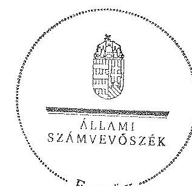

# ÁLLAMI   SZÁMVEVÔSZÉK 

## JELENTÉS

a helyi kisebbségi/nemzetiségi önkormányzatok gazdálkodásának ellenőrzéséről
Bük Város Roma Nemzetiségi Önkormányzat

---

# Állami Számvevőszék 

Iktatószám: V-0092-021/2013.
Témaszám: 1105
Vizsgálat-azonosító szám: V06060316

## Az ellenőrzést felügyelte:

Horváth Balázs
felügyeleti vezető
Az ellenőrzést vezette és az ellenőrzés végrehajtásáért felelős:
Preller Zsuzsanna
ellenőrzésvezető
A számvevőszéki jelentést készítették és a jelentés összeállításában közremüködtek:

Varga József
számvevő tanácsos
dr. Láng Ágnes Krisztina
számvevő
Az ellenőrzést végezték:
dr. Fátrainé Zsebedics Katalin Varga József
számvevő tanácsos számvevő tanácsos

---

# TARTALOMJEGYZÉK 

BEVEZETÉS ..... 5
I. ÖSSZEGZŐ MEGÁLLAPÍTÁSOK, KÖVETKEZTETÉSEK, JAVASLATOK ..... 7
II. RÉSZLETES MEGÁLLAPÍTÁSOK ..... 11

1. A Nemzetiségi és a Települési Önkormányzat együttmúködésének szabályszerűsége ..... 11
2. A gazdálkodási feladatok ellátásának szabályszerűsége ..... 12
2.1. A költségvetésre és zárszámadásra, valamint a kincstári adatszolgáltatás rendjére vonatkozó jogszabályi előírások betartása ..... 12
2.2. A Nemzetiségi Önkormányzat gazdálkodásának szabályozottsága ..... 13
2.3. A pénzügyi kontrollok múködése ..... 14
3. A Nemzetiségi Önkormányzattal összefüggő gazdálkodási feladatok belső ellenőrzésének biztosítása ..... 15
4. A Nemzetiségi Önkormányzat feladatellátása ..... 15

## MELLÉKLET

1. számú A Nemzetiségi Önkormányzat 2011. évi és 2012. I. félévi gazdálkodásának főbb adatai, mutatói

## FÜGGELÉKEK

1. számú Értelmező szótár
2. számú A pénzügyi kontrollok múködésének értékelése

---

.

---

# RÖVIDÍTÉSEK JEGYZÉKE 

## Jogszabályok

Áht. 1
Áht. 2
ÁSZ tv.
Nek. ${ }_{1}$ tv.
Nek. 2 tv.
Áhsz.

Ámr.
Ávr.
támogatási kormányrendelet

Települési Önkormányzat SZMSZ-e

## Szórövidítések

ÁSZ
gazdálkodási jogkörök szabályzata
jegyzó
Képviselő-testület
1992. évi XXXVIII. törvény az államháztartásról (hatályos 2011. december 31-ig)
2011. évi CXCV. törvény az államháztartásról (hatályos 2011. december 31-től)
2011. évi LXVI. törvény az Állami Számvevőszékről (hatályos 2011. július 1-jétől)
1993. évi LXXVII. törvény a nemzeti és etnikai kisebbségek jogairól (hatályos 2011. december 31-ig)
2011. évi CLXXIX. törvény a nemzetiségek jogairól (hatályos 2011. december 20-tól)
249/2000. (XII. 24.) Korm. rendelet az államháztartás szervezetei beszámolási és könyvvezetési kötelezettségének sajátosságairól
292/2009. (XII. 19.) Korm. rendelet az államháztartás múködési rendjéről (hatályos 2011. december 31-ig)
368/2011. (XII. 31.) Korm. rendelet az államháztartásról szóló törvény végrehajtásáról (hatályos 2012. január 1jétől)
a kisebbségi önkormányzatoknak a központi költségvetésből, valamint fejezeti kezelésű előirányzatból nyújtott támogatások feltételrendszeréről és elszámolásának rendjéről szóló 342/2010. (XII. 28.) Korm. rendelet (hatályon kívül helyezte a 28/2012. (III. 6.) Korm. rendelet a nemzetiségi célú előirányzatokból nyújtott támogatások feltételrendszeréről és elszámolásának rendjéről; jelenleg hatályos a 428/2012. (XII. 29.) Korm. rendelet a nemzetiségi célú előirányzatokból nyújtott támogatások feltételrendszeréről és elszámolásának rendjéről)
Bük Város Önkormányzat Képviselő-testülete 13/2006. (X. 31.) számú rendelete Bük Város Önkormányzata Szervezeti és Múködési Szabályzatáról. (Többször módosított, a módosításokkal egységes szerkezetben megküldött.)

Állami Számvevőszék
Bük Város Önkormányzata jegyzője által a 8/2011. (III. 28.) számon kiadott szabályzat az operatív gazdálkodási jogkörök gyakorlásáról
Bük Város Jegyzője
Bük Város Cigány Kisebbségi Önkormányzatának Képvi-selő-testülete 2011. december 31-ig, Bük Város Roma Nemzetiségi Önkormányzatának Képviselő-testülete 2012. január 1-jétől

---

Nemzetiségi Önkormányzat

Nemzetiségi Önkormányzat elnöke

Nemzetiségi Önkormányzat SZMSZ-e
polgármester
Polgármesteri Hivatal
Polgármesteri Hivatal SZMSZ-e

Támogató
Települési Önkormányzat
Települési Önkormányzat Képviselö-testülete

Bük Város Cigány Kisebbségi Önkormányzata 2011. december 31-ig, Bük Város Roma Nemzetiségi Önkormányzat 2012. január 1-jétől
Bük Város Cigány Kisebbségi Önkormányzatának elnöke 2011. december 31-ig, Bük Város Roma Nemzetiségi Önkormányzatának elnöke 2012. január 1-jétől
Bük Város Roma Nemzetiségi Önkormányzat 2/2012. (I. 23.) számú határozatával elfogadott szervezeti és müködési szabályzata.
Bük Város Önkormányzatának polgármestere
Bük Város Önkormányzatának Polgármesteri Hivatala
Bük Város Polgármesteri Hivatalának a Képviselö-testület 147/2010. (VII. 05.) számú határozatával elfogadott szervezeti és müködési szabályzata
A támogatást nyújtó Közigazgatási és Igazságügyi Minisztérium
Bük Város Önkormányzata
Bük Város Önkormányzatának Képviselő-testülete

---

# JELENTÉS 

## a helyi kisebbségi/nemzetiségi önkormányzatok gazdálkodásának ellenőrzéséről Bük Város Roma Nemzetiségi Önkormányzat

## BEVEZETÉS

Az államháztartás részét, az önkormányzati alrendszer egyik elemét képezik a nemzetiségi önkormányzatok, amelyek jogi személyek és a Nek. ${ }_{1,2}$ tv.-ben meghatározott önálló feladat- és hatáskörökkel rendelkeznek. A nemzetiségi önkormányzatok az önkormányzati, illetve testületi müködtetés mellett a helyi nemzetiségi közügyek változatos formában való ellátásában vesznek részt.

A nemzetiségi önkormányzatok, illetve a települési önkormányzatok között a jelenlegi szabályozás szerint nincs alá-fölérendeltségi viszony. A nemzetiségi önkormányzatok azonban sajátos közjogi helyzetben vannak, mert a jogállásukat tekintve önkormányzatok, ám függnek a székhelyük szerinti települési önkormányzat hivatalától, amely ellátja a nemzetiségi önkormányzatok vonatkozásában a megállapodásban rögzített gazdálkodási feladatokat.

A nemzetiségek helyzete, támogatása mind hazai, mind európai uniós szinten kiemelt figyelmet kap napjainkban. A nemzetiségi önkormányzatok gazdálkodására és támogatási rendszerére vonatkozó jogszabályok a 20102012. években jelentős változásokon mentek át, amelyek érintették a feladatalapú támogatásra fordítható költségvetési keret megállapítását, az operatív gazdálkodási jogkörök szabályozását, az elkülönített könyvvezetés alkalmazását, a belső ellenőrzés szabályozását.

Az ellenőrzés célja annak értékelése volt, hogy a Nemzetiségi Önkormányzat gazdálkodási kereteinek kialakítása, gazdálkodása és feladatellátása megfelelte a hatályos jogszabályoknak.

Ennek keretében ellenőriztük, hogy:

- a Nemzetiségi Önkormányzat és a Települési Önkormányzat együttműködésének szabályozása, a Települési Önkormányzat SZMSZ-ében, a megállapodásban előírt működési feltételek biztosítása megfelelt-e a jogszabályi előírásoknak;
- a felek együttműködése megfelelt-e a megállapodásnak a gazdálkodási feladatok szabályszerű ellátásában, betartották-e a Nemzetiségi Önkormányzat gazdálkodásához kapcsolódóan a költségvetésre és zárszámadásra, a gazdálkodás szabályozására, az operatív gazdálkodási jogkörök gyakorlására vonatkozó jogszabályi előírásokat;

---

- a jegyző biztosította-e a Polgármesteri Hivatal belső ellenőrzése keretében a Nemzetiségi Önkormányzattal összefüggő gazdálkodási feladatok belső ellenőrzését;
- a 2011. évi feladatalapú támogatás felhasználása, a folyósított feladatalapú támogatással történő elszámolás az előírásoknak megfelelően történt-e;
- a Nemzetiségi Önkormányzat feladatellátása összhangban volt-e a vonatkozó jogszabályi előírásokkal.

Az ellenőrzés típusa: szabályszerűségi ellenőrzés
Az ellenőrzött időszak: a 2011. január 1.-2012. június 30.
Ellenőrzött szervezet: Bük Város Roma Nemzetiségi Önkormányzat és a gazdálkodási feladatait ellátó Bük Város Önkormányzata.
Az ellenőrzés jogszabályi alapja: az ÁSZ tv. 5. § (2)-(3) és (6) bekezdései
Az ellenőrzés szakmai módszertana az ÁSZ hivatalos honlapján (www.asz.hu) közzétett szakmai szabályokon alapult, amely a Legfőbb Ellenőrző Intézmények Nemzetközi Szervezete (INTOSAI) által kiadott nemzetközi standardok (ISSAI) figyelembevételével készült. A fogalmak magyarázatát az 1. számú függelék, a pénzügyi kontrollok megfelelősége értékelésénél alkalmazott egységes minősítési szempontokat a 2. számú függelék tartalmazza.

Az ellenőrzés lefolytatásához a Települési Önkormányzat és a Nemzetiségi Önkormányzat tanúsítványok kitöltésével és a kapcsolódó dokumentumok elektronikus megküldésével szolgáltatott adatokat. A tanúsítványokon szerepeltetett adatok, információk ellenőrzése és szükség szerinti javítása a helyszíni ellenőrzés keretében történt.

Az ÁSZ az ellenőrzés megállapításait az ellenőrzött időszakban hatályos, az intézkedést igénylő megállapításokra tett javaslatokat a jelenleg hatályos jogszabályok alapján fogalmazta meg.

A Nemzetiségi Önkormányzat 2010. október 11-én alakult, elnöke a 2010. évi helyhatósági választások óta látja el feladatát. A Nemzetiségi Önkormányzat intézményt, gazdasági társaságot és más szervezetet nem alapított, illetve ezek alapítására társulásban nem vett részt. A négytagú Képviselő-testület munkája segítésére bizottságot nem hozott létre. A Nemzetiségi Önkormányzat a költségvetési beszámolója szerint a 2011. évben 909 ezer Ft költségvetési bevételt ért el és 858 ezer Ft költségvetési kiadást teljesített. A 2012. évben 642 ezer Ft eredeti költségvetési bevételi és kiadási előirányzatot terveztek. A 2012. I. félévi beszámolója alapján a módosított költségvetési bevételi és kiadási előirányzat 871 ezer Ft, a teljesített költségvetési bevétel 870 ezer Ft, a teljesített költségvetési kiadás 178 ezer Ft volt. A Nemzetiségi Önkormányzat 2011. évben feladatalapú támogatásban nem részesült. A Nemzetiségi Önkormányzat 2011. évi és 2012. I. félévi gazdálkodásának főbb adatait, mutatóit az 1. számú melléklet szemlélteti. Az ÁSZ a Nemzetiségi Önkormányzat gazdálkodását korábban nem ellenőrizte. Az ÁSZ tv. 29. § (1) bekezdése szerint a jelentéstervezetet megküldtük a polgármester és a Nemzetiségi Önkormányzat elnöke részére, akik az ÁSZ tv. 29. § (2) bekezdésében foglalt észrevételezési jogukkal nem éltek, a jelentéstervezetre észrevételt nem tettek.

---

# I. ÖSSZEGZŐ MEGÁLLAPÍTÁSOK, KÖVETKEZTETÉSEK, JAVASLATOK 

A Nemzetiségi és a Települési Önkormányzat együttmüködése az előírt határidők betartásával jóváhagyott megállapodásokon alapult. A Települési Önkormányzat biztosította a Nemzetiségi Önkormányzat múködéséhez szükséges személyi és tárgyi feltételeket. A 2012. június 30 -án hatályos együttmúködési megállapodás a Nek. ${ }_{2}$ tv. előírásai ellenére nem tartalmazta a Nemzetiségi Önkormányzat törzskönyvi nyilvántartásba vételével és adószám igénylésével kapcsolatos határidőket és együttmúködési kötelezettségeket, valamint ezek konkrét felelőseinek kijelölését. A megállapodásban nem rögzítették a Nemzetiségi Önkormányzat kötelezettségvállalásaival kapcsolatosan a helyi önkormányzatot terhelő ellenjegyzési, érvényesítési, utalványozási, szakmai teljesítésigazolási feladatokat, és a felelősök konkrét kijelölését, valamint a kötelezettségvállalásnak a Nemzetiségi Önkormányzat SZMSZ-ében meghatározott szabályait.

A Nemzetiségi Önkormányzat költségvetésére és zárszámadására vonatkozó jogszabályi előírásokat részben tartották be, mivel a 2011. és 2012. évi költségvetési határozatokat a Képviselő-testület hiányos tartalommal, a 2011. évi zárszámadását az Ámr-ben előírt határidőn túl fogadta el. A 2012. évi költségvetési határozat az Áht. ${ }_{2}$ és az Ávr. előírásai ellenére nem tartalmazta a finanszírozási célú pénzügyi műveletekkel kapcsolatos hatásköröket, az évközi többletigények, valamint az elmaradt bevételek pótlására szolgáló általános és céltartalékot, a költségvetési határozathoz előirányzat felhasználási tervet nem készítettek. A Nemzetiségi Önkormányzat elnöke a 2011. évben a költségvetési előirányzatok felhasználásához szükséges mértékben nem kezdeményezte - az Ámr. előírása ellenére - azok módosítását, így az Áht. ${ }_{1}$-ben foglaltakat figyelmen kívül hagyva nem biztosította a tárgyévi fizetési kötelezettség vállalásához szükséges fedezetet. A jegyző a 2012. évi kincstári adatszolgáltatási kötelezettségének - a 2012. évi elemi költségvetés kivételével - határidőben eleget tett.

A gazdálkodás szabályozottsága érdekében a jegyző a Polgármesteri Hivatal jogszabályokban előírt szabályzatainak hatályát kiterjesztette a Nemzetiségi Önkormányzat gazdálkodási feladataira. Az ellenőrzött időszakban a 100 ezer Ft-ot el nem érő kifizetéseknél az előzetes írásbeli kötelezettségvállalások rendjét az Ávr. előírása ellenére nem szabályozták Az operatív gazdálkodási jogkörök kialakítása a jogszabályi előírásokkal összhangban történt.

A pénzügyi kontrollok múködése a 2011. évben a szociálpolitikai célú támogatásként elszámolt kiadások, a múködési célra teljesített pénzeszközátadások, valamint a dologi és egyéb folyó kiadások, 2012. I. félévben a dologi és egyéb folyó kiadások teljesítésénél gyenge volt, a hibák száma a lényegességi szintet, a kritikus hibahatárt elérte. A 2011. évben az előzetes írásbeli kötelezettségvállalást nem igénylő kifizetések rendjének szabályozása hiányában a kötelezettségvállalás ellenjegyzése szabályszerűen nem történt meg. A kifizetéseket megelőzően a kiadások jogosságát, összegszerűségét és a szerződésszerű teljesítést - az Ámr.-ben foglaltak ellenére - nem, vagy nem szabályszerűen iga-

---

zolták. Az utalvány ellenjegyzője ellenőrzési feladatait nem látta el. A 2012. I. félévben a pénzügyi ellenjegyző és a teljesítés igazolója az Áht. ${ }_{2}$-ben, illetve az Ávr.-ben előírt ellenőrzési feladatát - az előzetes írásbeli kötelezettségvállalást nem igénylő kifizetések rendjének szabályozása hiányában - aláírása ellenére szabályszerűen nem végezte el. Az érvényesítő az ellenőrzési feladatát nem látta el.

Az ellenőrzés a Nemzetiségi Önkormányzatnál - az ellenőrzött tételek esetében - jogosulatlan kifizetést nem tárt fel, a pénzügyi kontrollok múködéséhez kapcsolódó hiányosságok azonban nem biztosítják a hibák megelőzését, feltárását és kijavítását.

A Nemzetiségi Önkormányzat feladatellátásának tárgya a Nek. ${ }_{1,2}$ tv. előírásaival összhangban volt. Biztosította a nemzetiségi közügyek keretében az alapvető feladatához szükséges szervezeti, személyi és anyagi feltételeket.

A jegyző az ellenőrzött időszakban biztosította a Polgármesteri Hivatal belső ellenőrzése keretében a Nemzetiségi Önkormányzat gazdálkodásával összefüggő végrehajtási feladatok belső ellenőrzését. A Polgármesteri Hivatal 2011. és 2012. évi belső ellenőrzési terveit megalapozó kockázatelemzés kiterjedt a Nemzetiségi Önkormányzat gazdálkodásával összefüggő végrehajtási feladatok ellátására. Erre irányuló ellenőrzés lefolytatására 2012-ben került sor, hiányosságot nem tártak fel.

Az ellenőrzés megállapításai alapján az észrevételezésre megküldött jelentéstervezetben a Nemzetiségi Önkormányzat gazdálkodásával kapcsolatban intézkedést igénylő megállapításokat és javaslatokat fogalmaztunk meg, amelyek végrehajtásáról az ellenőrzés időszakában intézkedési tájékoztatást adott a Nemzetiségi Önkormányzat elnöke és a polgármester. A 2013. szeptember 30án megkötött hatályos együttmúködési megállapodásban a Nek. ${ }_{2}$ tv. vonatkozó előírásait érvényesítették, a tartalmi hiányosságokat megszüntették. A jegyző az operatív gazdálkodási jogkörök szabályzatát elkészítette, ebben meghatározta az Ávr. előírásainak megfelelően az előzetes írásbeli kötelezettséget nem igénylő kifizetések, valamint a pénzügyi kontrollok múködési rendjét is. Figyelemmel az ÁSZ ellenőrzés hasznosítására mindezek vonatkozásában intézkedést igénylő megállapítást, javaslatot már nem szerepeltetünk.

Az ÁSZ tv. 33. § (1) bekezdésében foglaltak értelmében az ellenőrzött szervezet vezetője köteles a jelentésben foglalt megállapításokhoz kapcsolódó intézkedési tervet összeállítani, és azt a jelentés kézhezvételétől számított 30 napon belül az ÁSZ részére megküldeni. Amennyiben az intézkedési tervet határidőre nem küldi meg a szervezet, vagy az nem elfogadható, az ÁSZ elnöke az ÁSZ tv. 33. § (3) bekezdés a)-b) pontjaiban foglaltakat érvényesítheti.

---

A helyszíni ellenőrzés megállapításainak hasznosítása mellett javasoljuk:

# a jegyzönek 

1. a költségvetés előterjesztésével, végrehajtásával kapcsolatban

A 2012. évi költségvetési határozat nem tartalmazta az Áht. 2 23. § (2) bekezdése h) pontjában előírt, a finanszírozási célú pénzügyi múveletekkel kapcsolatos hatásköröket, az Áht. 2 23. § (3) bekezdésében és az Ávr. 24. § (1) bekezdése bc) pontjában foglaltak ellenére az évközi többletigények, az elmaradt bevételek pótlására szolgáló általános és céltartalékot, valamint az Áht. 2 24. § (4) bekezdése a) pontja szerinti előirányzat felhasználási tervet.

A Nemzetiségi Önkormányzat 2011. évi költségvetésében a kiadási előirányzat átcsoportosítása - az Ámr. 68. § (4) bekezdésében foglaltakat figyelmen kívül hagyva elmaradt. A szociálpolitikai célú támogatásként elszámolt kiadás teljesítése előirányzat nélkül történt. Ezáltal nem tartották be az Áht., 12/A. § (1) bekezdésében foglalt előírást.

A költségvetés szabályszerű előterjesztése és végrehajtása érdekében a jövőben
a) gondoskodjon az Áht. 2 27. § (2) bekezdésében foglalt előírás alapján a költségvetési határozat tervezetének előkészítéséről, hogy az az Áht. 2 23. § (2) bekezdése h) pontja, a 23. § (3) bekezdése, a 24. § (4) bekezdése a) pontja, valamint az Ávr. 24. § (1) bekezdése bc) pontban foglaltaknak megfeleljen;
b) készítsen előterjesztést az előirányzatok szükséges mértékű módosítására az Áht. 2 34. § (1) és (6) bekezdésben foglaltaknak megfelelően úgy, hogy azt a Nemzetiségi Önkormányzat elnöke határidőben nyújthassa be a Képviselőtestület részére - az Áht. 2 36. § (1) bekezdése szerint - a meghatározott előirányzatokon belül való gazdálkodás érdekében.
2. a kincstári adatszolgáltatási kötelezettséggel kapcsolatban

A jegyző a 2012. évi költségvetéshez kapcsolódó - a Nemzetiségi Önkormányzatra vonatkozó - kincstári adatszolgáltatási kötelezettségét a 2012. évi elemi költségvetés tekintetében az Ávr. 33. § (1) bekezdésében előírt határidőn túl teljesítette.

Javaslat
Tegyen eleget adatszolgáltatási kötelezettségének az Ávr. 33. § (1) bekezdésben előírt határidő betartásával.

## a Nemzetiségi Önkormányzat elnökének

1. A Képviselő-testület a 2011. évi zárszámadási határozatot az Ámr. 37. § (2)-(3) bekezdésében előírt határidőn túl fogadta el.

Javaslat

---

A jövőben az Áht. 2 91. § (3) bekezdésében foglalt határidő betartásával nyújtsa be a jegyző által előkészített zárszámadási határozat tervezetet a Képviselő-testületnek.
2. A Nemzetiségi Önkormányzat 2011. évi költségvetésében a kiadási előirányzat átcsoportosítása - az Ámr. 68. § (3)-(4) bekezdésében foglaltakat figyelmen kívül hagyva - elmaradt. A szociálpolitikai célú támogatásként elszámolt kiadás teljesítése előirányzat nélkül történt. Ezáltal nem tartották be az Áht. 1 12/A. § (1) bekezdésében foglalt előírást.

Javaslat
Terjessze a jövőben a Képviselő-testület elé jóváhagyásra az Áht. 2 34. § (1) és (6) bekezdései alapján készült, az előirányzatok szükséges mértékű módosításáról szóló előterjesztést.

---

# II. RÉSZLETES MEGÁLLAPÍTÁSOK 

## 1. A Nemzetiségi és a Telepúlési Önkormányzat együttmúkÖDÉSÉNEK SZABÁLYSZERÜSÉGE

A Nemzetiségi Önkormányzat és a Települési Önkormányzat együttmúködésének szabályozása, a Nemzetiségi Önkormányzat múködési feltételeinek biztosítása - az együttmúködési megállapodások ${ }^{1}$ kisebb tartalmi hiányosságai kivételével - megfelelt a jogszabályi előírásoknak. A Települési Önkormányzat biztosította a Nemzetiségi Önkormányzat múködéséhez szükséges személyi és tárgyi feltételeket. Az együttműködés feltételeit évente felülvizsgálták, majd a Nek. ${ }_{2}$ tv.-ben foglaltak alapján módosították. A szabályozás során a jogszabályi előírásokat nem érvényesítették maradéktalanul, mert a 2012. június 30 -án hatályos együttmúködési megállapodásban:

- a Nek. ${ }_{2}$ tv. 80. § (3) bekezdés a) pontjában foglaltak ellenére nem rögzítették a Nemzetiségi Önkormányzat törzskönyvi nyilvántartásba vételével és adószám igénylésével kapcsolatos határidőket és az együttmúködési kötelezettségeket, a felelősök konkrét kijelölésével;
- a Nek. ${ }_{2}$ tv. 80. § (3) bekezdés b) pontjában foglaltak ellenére nem szabályozták a Nemzetiségi Önkormányzat kötelezettségvállalásaival kapcsolatosan a helyi önkormányzatot terhelő ellenjegyzési, érvényesítési, utalványozási, szakmai teljesítésigazolási feladatokat, a felelősök konkrét kijelölését;
- a Nek. ${ }_{2}$ tv. 80. § (3) bekezdés c) pontjában foglaltak ellenére nem rögzítették a Nemzetiségi Önkormányzat kötelezettségvállalásának a Nemzetiségi Önkormányzat SZMSZ-ében meghatározott szabályait.

[^0]
[^0]:    ${ }^{1}$ A 2011. évben és 2012. június 1-jéig hatályos együttmúködési megállapodást a Képvi-selő-testület a 4/2010. (X. 15.) számú, a Települési Önkormányzat Képviselő-testülete a 284/2010. (X. 28.) számú határozattal fogadta el. A Nek. ${ }_{2}$ tv. 159. § (3) bekezdésében előírtak alapján 2012. június 1-jéig felülvizsgált és módosított együttmúködési megállapodást a Képviselő-testület a 26/2012. (V. 30.) számú, a Települési Önkormányzat Képviselő-testülete a 133/2012. (V. 21.) számú határozattal fogadta el.

---

# 2. A GAZDÁLKODÁSI FELADATOK ELLÁTÁSÁNAK SZABÁLYSZERŰSÉGE 

### 2.1. A költségvetésre és zárszámadásra, valamint a kincstári adatszolgáltatás rendjére vonatkozó jogszabályi előírások betartása

A Nemzetiségi Önkormányzat 2011. és 2012. évi költségvetésének², a 2011. évi zárszámadásának ${ }^{3}$ tartalmára, jóváhagyására, valamint a kapcsolódó 2012. évi adatszolgáltatásra vonatkozó jogszabályi előírásokat részben tartották be. A Nemzetiségi Önkormányzat az Ámr.-ben előírt határidőn belül állapította meg a 2011. évi költségvetését és azt a Nemzetiségi Önkormányzat elnöke időben továbbította a polgármester részére. A 2012. évi költségvetés tervezetét a Nemzetiségi Önkormányzat elnöke az Ávr.-ben foglalt határidőben benyújtotta a Képviselő-testületnek.

A Képviselő-testület a 2011. és 2012. évi költségvetési határozatokat hiányos tartalommal fogadta el, mert:

- a 2011. évi költségvetési határozat nem tartalmazta az Ámr. 36. § (1) bekezdés k) pontja szerinti előirányzat felhasználási ütemtervet;
- a 2012. évi költségvetési határozat nem tartalmazta az Áht. ${ }_{2}$ 23. § (2) bekezdés h) pontjában előírt, a finanszírozási célú pénzügyi műveletekkel kapcsolatos hatásköröket, az Áht. ${ }_{2}$ 23. § (3) bekezdésében és az Ávr. 24. § (1) bekezdés bc) pontjában foglaltak ellenére az évközi többletigények, valamint az elmaradt bevételek pótlására szolgáló általános és céltartalékot, továbbá az Áht. ${ }_{2} 24 . \S$ (4) bekezdésében foglaltakat figyelmen kívül hagyva, a költségvetési határozathoz nem készítették el az előirányzat felhasználási tervet.

A Nemzetiségi Önkormányzat elnöke a 2011. évben a költségvetési előirányzatok felhasználásához szükséges mértékben nem kezdeményezte - az Ámr. 68. § (3)-(4) bekezdései előírása ellenére - azok módosítását, így az Áht. ${ }_{1} 12 / \mathrm{A}$. § (1) bekezdésben foglaltakat figyelmen kívül hagyva nem biztosította a tárgyévi fizetési kötelezettség vállalásához szükséges fedezetet.

A Nemzetiségi Önkormányzat a 13/2011. (VIII. 24.) számú Képviselő-testületi határozatban arról döntött, hogy a 2011. évi költségvetése terhére rászoruló roma gyermekek beiskolázását taneszköz vásárlással támogatja, anélkül, hogy erre a költségvetésében előirányzatot tervezett volna. A Képviselő-testület határozata ellentétes az Áht. ${ }_{1} 12 /$ A. § (1) bekezdésében foglaltakkal, mert jóváhagyott előirányzat nélkül vállalt kötelezettséget.

[^0]
[^0]:    ${ }^{2}$ A Képviselő-testület 1/2011. (II. 4.) számú határozata a Nemzetiségi Önkormányzat 2011. évi költségvetéséről, valamint a Képviselő-testület 3/2012. (I. 23.) számú határozata a Nemzetiségi Önkormányzat 2012. évi költségvetéséről.
    ${ }^{3}$ A Képviselő-testület 22/2012. (IV. 5.) számú határozata a Nemzetiségi Önkormányzat 2011. évi költségvetési beszámolójáról.

---

A Nemzetiségi Önkormányzat a 2011. évi zárszámadását az Ámr. 37. § (2)-(3) bekezdésében előírt határidőn túl fogadta el ${ }^{4}$. A zárszámadás elfogadását kivéve a Nemzetiségi Önkormányzat a vonatkozó előírásokat betartotta.

A jegyző a kincstári adatszolgáltatási kötelezettségének a 2012. évi elemi költségvetés kivételével az előírt határidőben eleget tett. A 2012. évi elemi költségvetést az Ávr. 33. § (1)-(2) bekezdésben előírt határidőn túl továbbította.

# 2.2. A Nemzetiségi Önkormányzat gazdálkodásának szabályozottsága 

Az ellenőrzött időszakban a Nemzetiségi Önkormányzat gazdálkodásának szabályozása - a kisebb tartalmi hiányosságok ellenére - a jogszabályi előírásoknak megfelelt. A jegyző Nemzetiségi Önkormányzat gazdálkodási feladatai végrehajtását ellátó Polgármesteri Hivatal jogszabályokban előírt gazdálkodási szabályzatainak ${ }^{5}$ hatályát kiterjesztette a Nemzetiségi Önkormányzat gazdálkodására.

A gazdálkodási jogkörök szabályzatában a 2011. évben az Ámr. 72. § (14) bekezdésének, a 2012. évben az Ávr. 53. § (2) bekezdésének előírásait figyelmen kívül hagyva nem alakították ki az előzetes írásbeli kötelezettségvállalást nem igénylő kifizetések rendjét, annak ellenére, hogy a szabályzat lehetővé tette a 100 ezer Ft-ot el nem érő értékű gazdasági események esetében az írásbeli kötelezettségvállalás mellőzését.

A szabályzat nem tartalmaz egyértelműen megfogalmazott és végrehajtható utasítást a 100 ezer Ft összeghatárt el nem érő kötelezettségvállalások nyilvántartására vonatkozóan ${ }^{6}$. A gyakorlatban csak az írásban vállalt kötelezettségekről vezettek nyilvántartást, az előzetes írásba foglaláshoz nem kötött 100 ezer Ft öszszeghatár alatti kötelezettségvállalásokat a nyilvántartásban nem rögzítették, ezért az nem volt alkalmas a kötelezettségvállalás időpontjában rendelkezésre álló előirányzat megállapítására.

A Nemzetiségi Önkormányzat operatív gazdálkodási jogköreinek kialakítása - a kötelezettségvállalásra, az utalványozásra, a kötelezettségvállalás és utalványozás ellenjegyzésére a felhatalmazások, a szakmai teljesítést igazoló, a pénzügyi ellenjegyzést és az érvényesítést végző személyek kijelölése - az ellenőrzött időszakban megfelelt a jogszabályi előirásoknak. Az operatív gazdálkodással kapcsolatos feladat- és hatásköröket a gazdálkodási jogkörök

[^0]
[^0]:    ${ }^{4}$ a 22/2012. (IV. 25.) számú határozattal
    ${ }^{5}$ Számviteli politika, leltározási és leltárkészítési szabályzat, pénzkezelési szabályzat, eszközök és források értékelési szabályzata, számlarend, ellenőrzési nyomvonal, szabálytalanságok kezelésének eljárásrendje, kockázatkezelési szabályzat, folyamatba épített előzetes, utólagos és vezetői ellenőrzés (FEUVE) szabályozás.
    ${ }^{6}$ A 2011. és 2012. évben hatályos szabályzat is a 6. és 7. oldalon található V. fejezetben rögzíti, hogy a „Kötelezettségvállalások nyilvántartása számítógépes programmal támogatott", majd néhány sorral utána: „Amennyiben kézzel vezetik a nyilvántartást,..." kezdetű mondatot.

---

szabályzata, és a feladatokat ellátó köztisztviselők munkaköri leírásai tartalmazták.

A Nemzetiségi Önkormányzat gazdálkodásával kapcsolatos feladat- és hatásköröket, a hatáskörök gyakorlásának módját, a helyettesítés rendjét és az ezekre vonatkozó felelősségi szabályokat a Polgármesteri Hivatal SZMSZ-ében az ellenőrzött időszakban rögzítették.

# 2.3. A pénzügyi kontrollok múködése 

A Nemzetiségi Önkormányzat 2011. évi szociálpolitikai célú támogatásként elszámolt kiadásai, a múködési célra teljesített pénzeszközátadásai, valamint a dologi és egyéb folyó kiadásokra teljesített kifizetései teljesítése során a kötelezettségvállalás ellenjegyzése, a szakmai teljesítésigazolás, az utalvány ellenjegyzése kontrollok múködésének megfelelősége gyenge volt, a hibák száma a lényegességi szintet, a kritikus hibahatárt elérte, mert:

- az előzetes írásbeli kötelezettségvállalást nem igénylő kifizetések rendjének szabályozása hiányában az Ámr. 74. § (3) bekezdésének a)-c) pontjaiban foglaltak ellenére nem történt meg a szabad előirányzat meglétének, a kifizetés időpontjában a fedezet rendelkezésre állásának igazolása, valamint a gazdálkodásra vonatkozó szabályok betartásának ellenőrzése;
- az Ámr. 76. § (3) bekezdésében foglaltak ellenére a kifizetést megelőzően nem történt meg a szakmai teljesítésigazolás, illetve az előzetes írásbeli kötelezettségvállalást nem igénylő kifizetések esetében a szakmai teljesítés igazolója nem látta el az Ámr. 76. § (1) bekezdésben foglalt feladatát, mert - szabályozás hiányában - a kifizetés jogosságának, összegszerűségének és a szerződésszerű teljesítésnek az ellenőrzése szabályszerűen nem történt meg;
- az utalvány ellenjegyzője ellenőrzési feladatát nem az Ámr. 79. § (2) bekezdésében előírtak szerint látta el, mert annak ellenére aláírásával ellenjegyezte a kifizetést, hogy a szakmai teljesítésigazolás és az érvényesítés megtörténtéről, illetve szabályszerűségéről, továbbá a gazdálkodásra vonatkozó szabályok betartásáról meggyőződött volna.

A Nemzetiségi Önkormányzatnál a 2012. I. félévben a dologi és egyéb folyó kiadások teljesítése során a pénzügyi ellenjegyzés, a teljesítés igazolás és az érvényesítés pénzügyi kontrollok múködésének megfelelősége gyenge volt, a hibák száma a lényegességi szintet, a kritikus hibahatárt elérte, mert:

- az előzetes írásbeli kötelezettségvállalást nem igénylő kifizetések rendjének szabályozása hiányában az Áht. ${ }_{2}$ 37. § (1) bekezdésében foglaltak ellenére nem történt meg a szabad előirányzat rendelkezésre állásának, a kifizetés időpontjában a fedezet rendelkezésre állásának igazolása, valamint a gazdálkodásra vonatkozó szabályok betartásának ellenőrzése;
- a teljesítés igazolója az Ávr. 57. § (1) bekezdésében foglalt ellenőrzési kötelezettségének nem tett eleget, mert az előzetes írásbeli kötelezettségvállalást nem igénylő kifizetések esetében - szabályozás hiányában - a kifizetés jo-

---

gosságának, összegszerűségének és a szerződésszerű teljesítésnek az ellenőrzése szabályszerűen nem történt meg;

- az érvényesítő nem az Ávr. 58. § (1) bekezdésében előírtak szerint végezte feladatát, mert nem ellenőrizte azt, hogy a megelőző ügymenetben az Áht. ${ }_{2}$, az Áhsz. és az Ávr. előírásait, továbbá a belső szabályzatokban foglaltakat betartották-e.

Az ellenőrzés a Nemzetiségi Önkormányzatnál - az ellenőrzött tételek esetében - jogosulatlan kifizetést nem tárt fel, a pénzügyi kontrollok múködéséhez kapcsolódó hiányosságok azonban nem biztosítják a hibák megelőzését, feltárását és kijavítását.

# 3. A Nemzetiségi ÖNKORMÁnyZATtal ÖSSZEFÜGGŐ GAZDÁlKODÁSI FELADATOK BELSŐ ELLENŐRZÉSÉNEK BIZTOSÍTÁSA 

A jegyző az ellenőrzött időszakban biztosította a Nemzetiségi Önkormányzat gazdálkodásával összefüggő végrehajtási feladatok belső ellenőrzését. A Polgármesteri Hivatal 2011. és 2012. évi belső ellenőrzési terveit megalapozó kockázatelemzés kiterjedt a Nemzetiségi Önkormányzat gazdálkodásával összefüggő végrehajtási feladatok ellátására. A belső ellenőrzés a Nemzetiségi Önkormányzat gazdálkodása végrehajtási feladatait a 2012. évben a Polgármesteri Hivatal pénz- és bankszámla kezelésével összefüggésben ellenőrizte, hiányosságot nem tárt fel.

## 4. A Nemzetiségi Önkormányzat feladATELLÁtása

A Nemzetiségi Önkormányzat feladatellátásának tárgya összhangban volt a Nek. ${ }_{1,2}$ tv. előírásaival. A Nemzetiségi Önkormányzat biztosította a Nek. ${ }_{1}$ tv. 5/A. § (1) bekezdés és a Nek. ${ }_{2}$ tv. 10. § (1) bekezdés szerinti, a nemzetiségi érdekek védelmével és képviseletével kapcsolatos alapfeladata ellátásához szükséges szervezeti, személyi és tárgyi feltételeket.
Budapest, 2013. 12. hónap 14. nap

Domokos László
elnök $\rightarrow$

Melléklet: 1 db
Függelék: 2 db

---

$\square$
$\square$
$\square$
$\square$
$\square$
$\square$
$\square$
$\square$
$\square$
$\square$
$\square$
$\square$
$\square$
$\square$
$\square$
$\square$
$\square$
$\square$
$\square$
$\square$
$\square$
$\square$
$\square$
$\square$
$\square$
$\square$
$\square$
$\square$
$\square$
$\square$
$\square$
$\square$
$\square$
$\square$
$\square$
$\square$
$\square$
$\square$
$\square$
$\square$
$\square$
$\square$
$\square$
$\square$
$\square$
$\square$
$\square$
$\square$
$\square$
$\square$
$\square$
$\square$
$\square$
$\square$
$\square$
$\square$
$\square$
$\square$
$\square$
$\square$
$\square$
$\square$
$\square$
$\square$
$\square$
$\square$
$\square$
$\square$
$\

---

# A Nemzetiségi Önkormányzat 2011. évi és 2012. I. félévi gazdálkodásának föbb adatai, mutatói

A) BEVÉTELEK

|  Megnevezés | 2011. év |  |  |  | 2012. év |  | 2012. I. félé |   |
| --- | --- | --- | --- | --- | --- | --- | --- | --- |
|   | credeti el. | módosított
el. | teljesítés | teljesités megoszlása (\%) | credeti el. | módosított el. | teljesítés | teljesítés megoszlása
(\%)  |
|  Intézményi müködési bevétel | 10,0 | 10,0 | 0,0 | $0,0 \%$ | 0,0 | 0,0 | 0,0 | $0,0 \%$  |
|  Állalános müködési támogatás | 500,0 | 209,0 | 209,0 | $23,0 \%$ | 290,0 | 0,0 | 0,0 | $0,0 \%$  |
|  Feladatolapú támogatás | 0,0 | 0,0 | 0,0 | $0,0 \%$ | 0,0 | 0,0 | 0,0 | $0,0 \%$  |
|  Települési Önkormányzat által nyújtott támogatás | 200,0 | 300,0 | 300,0 | $33,0 \%$ | 200,0 | 615,0 | 614,0 | $70,6 \%$  |
|  Müködési célra átvett pénzeszköz (Támogatóktól és a Viss Megyei Nemzetiségi Önkormányzattól) | 0,0 | 314,0 | 314,0 | $34,5 \%$ | 100,0 | 256,0 | 256,0 | $29,4 \%$  |
|  Pénzforgalmi bevételek összesen | 710,0 | 833,0 | 823,0 | $90,5 \%$ | 590,0 | 871,0 | 870,0 | $100,0 \%$  |
|  Kibál évt pénzmozdvány felhasználás | 86,0 | 86,0 | 86,0 | $9,5 \%$ | 52,0 | 0,0 | 0,0 | $0,0 \%$  |
|  Bevételek | 796,0 | 919,0 | 909,0 | $100,0 \%$ | 642,0 | 871,0 | 870,0 | $100,0 \%$  |

B) KIADASOK

|  Megnevezés | 2011. év |  |  |  | 2012. év |  | 2012. I. félé |   |
| --- | --- | --- | --- | --- | --- | --- | --- | --- |
|   | credeti el. | módosított el. | teljesítés | teljesités megoszlása (\%) | credeti el. | módosított el. | teljesítés | teljesítés megoszlása
(\%)  |
|  Személyi juttatások | 0,0 | 0,0 | 0,0 | $0,0 \%$ | 0,0 | 0,0 | 0,0 | $0,0 \%$  |
|  Munkoadásul tedvelö járulékok | 0,0 | 0,0 | 0,0 | $0,0 \%$ | 0,0 | 0,0 | 0,0 | $0,0 \%$  |
|  Dologi és egyéb folyó kiadások | 796,0 | 802,0 | 741,0 | $86,4 \%$ | 642,0 | 871,0 | 178,0 | $100,0 \%$  |
|  Támogatózértékủ müködési kiadás | 0,0 | 117,0 | 117,0 | $13,6 \%$ | 0,0 | 0,0 | 0,0 | $0,0 \%$  |
|  Müködési kiadások összesen | 796,0 | 919,0 | 858,0 | $100,0 \%$ | 642,0 | 871,0 | 178,0 | $100,0 \%$  |
|  Felhalmoztat kiadások | 0,0 | 0,0 | 0,0 | $0,0 \%$ | 0,0 | 0,0 | 0,0 | $0,0 \%$  |
|  Kiadások összesen | 796,0 | 919,0 | 858,0 | $100,0 \%$ | 642,0 | 871,0 | 178,0 | $100,0 \%$  |

---

.

---

# ÉRTELMEZŐ SZÓTÁR 

feladatalapú támogatás A támogatási évben általános múködési támogatásban részesült, és a Támogatónak a Kincstárhoz intézett, a feladatalapú támogatás utalására vonatkozó rendelkező levele keltének időpontjában múködő nemzetiségi önkormányzatoknak a támogatási kormányrendeletben rögzített feltételrendszer alapján nyújtható támogatás. A feladatalapú támogatás a nemzetiségi közügyeknek a nemzetiségi önkormányzatok által történő ellátását szolgálja. (A támogatási kormányrendelet 2. § (2) bekezdés c) pont, és 4. § (1) bekezdés alapján.)
megállapodás
nemzetiség
nemzetiségi közügy

A nemzetiségi önkormányzatnak a múködési feltételei biztosítására, továbbá a bevételeivel és a kiadásaival kapcsolatban a tervezési, gazdálkodási, ellenőrzési, finanszírozási, adatszolgáltatási és beszámolási feladatai végrehajtására a székhelye szerinti települési önkormányzattal megkötött megállapodás. (Az Áht. 66. §, a Nek. 2 tv. 80. § (2) bekezdés, valamint az Áht. 2 27. § (2) bekezdés alapján levezetett fogalom.)
Minden olyan Magyarország területén legalább egy évszázada honos népcsoport, amely az állam lakossága körében számszerú kisebbségben van és a lakosság többi részétől saját nyelve és kultúrája, hagyományai különböztetik meg, egyben olyan összetartozás-tudatról tesz bizonyságot, amely mindezek megőrzésére, történelmileg kialakult közösségeik érdekeinek kifejezésére és védelmére irányul. (A Nek. 1 tv. 1. § (2) bekezdése, valamint a Nek. 2 tv. 1. § (1) bekezdése alapján levezetett fogalom.)
Az egyéni és közösségi jogok érvényesülése, a nemzetiséghez tartozók érdekeinek kifejezésre juttatása - különösen az anyanyelv ápolása, őrzése és gyarapítása, továbbá a nemzetiségek kulturális autonómiájának a nemzetiségi önkormányzatok által történő megvalósítása és megőrzése - érdekében a nemzetiséghez tartozók meghatározott közszolgáltatásokkal való ellátásával, ezen ügyek önálló vitelével és az ehhez szükséges szervezeti, személyi és anyagi feltételek megteremtésével összefüggő ügy. A közhatalmat gyakorló állami és helyi önkormányzati szervekben, továbbá a nemzetiségi önkormányzati szervekben való nemzetiségi képviselethez és mindezek szervezeti, személyi és anyagi feltételeinek biztosításához kapcsolódó ügy. (A Nek. 1 tv. 6/A. § 1. pontjából és a Nek. 2 tv. 2. § 1. pontjából levezetett fogalom.)

---

nemzetiségi önkormányzat
pénzügyi kontrollok

Törvényben meghatározott nemzetiségi közszolgáltatási feladatokat ellátó, testületi formában múködő, jogi személyiséggel rendelkező, demokratikus választások útján törvény alapján létrehozott szervezet, amely a nemzetiségi közösséget megillető jogosultságok érvényesítésére, a nemzetiségek érdekeinek védelmére és képviseletére, a feladat- és hatáskörébe tartozó nemzetiségi közügyek települési, területi vagy országos szinten történő önálló intézésére jön létre. (A Nek. 1 tv. 6/A. § (1) bekezdés 2. pontjából, valamint a Nek. 3 tv. 2. § 2. pontjából levezetett fogalom.) A jelentésben e fogalmat a települési nemzetiségi önkormányzatokra leszúkítve használjuk.
a kötelezettségvállalás és az utalvány ellenjegyzése, valamint a szakmai teljesítés igazolása 2011. december 31élg, 2012. január 1-jétől a pénzügyi ellenjegyzés, a teljesítés igazolása és az érvényesítés.

---

# A PÉNZÜGYI KONTROLLOK MÜKÖDÉSÉNEK ÉRTÉKELÉSE 

A pénzügyi kontrollok múködése megfelelőségének vizsgálatát többlépcsős megfelelőségi tesztek útján, megismételt eljárással, a könyvviteli tételekből vett egyszerú véletlen minta alapján végeztük. A tesztelést az értékelésre kiválasztott három terület - a dologi és egyéb folyó kiadásoknál teljesített kifizetések, az államháztartáson belülre és kívülre, múködési és felhalmozási célra teljesített pénzeszközátadások, illetve a szociálpolitikai ellátások teljesített kiadásainál végeztük el.

Az ellenőrzés során alkalmazott módszer (többlépcsős megfelelőségi teszt) lényege, hogy a kiválasztott minta ellenőrzését csak addig végezzük, amíg elegendő és megfelelő bizonyítékot nem szerzünk a vizsgált pénzügyi kontroll múködésének megfelelő, vagy nem megfelelő voltáról. A megismételt eljárás alkalmazása a szándékolt hatáshoz (törvényes múködés, kitűzött célok, teljesítmények elérése, veszteséget okozó kockázatok megelőzése, mérséklése, feltárása) viszonyítva lehetővé teszi a kontrolltevékenységek tényleges hatásának vizsgálatát, ez alapján a múködés megfelelősége értékelését. Ennek keretében a számvevő bizonyosságot szerez arról, hogy a rendelkezésre álló szabályozás és dokumentumok alapján a pénzügyi kontrollokhoz szükséges - jogszabályokban előírt - ellenőrzési lépéseket végrehajtották-e.

A tesztek kiértékelése évenkénti bontásban két szinten történt. Először az egyes tevékenységi területekre meghatározott pénzügyi kontrollokat értékeltük, majd általános következtetést vontunk le a pénzügyi kontrollok együttes megfelelősége tekintetében. Az ellenőrzésre kijelölt területek kifizetéseinél a pénzügyi kontrollok múködése „kiváló", „jó" vagy „gyenge" minősítést kaphatott.

Az értékelésnél meghatározott lényegességi szint a könyvelési adatállományból vett mintanagysághoz megadott kritikus hibák száma.

A pénzügyi kontrollok múködését:

- kiválónak értékeltük abban az esetben, ha azok múködése megfelel a hibák megelőzésére és kijavítására meghatározott jogszabályi és helyi szintű szabályozásnak (eseti hibák);
- jónak minősítettük, ha a megállapított kisebb (tolerálható mértékű) hiányosságok nem veszélyeztetik az ellenőrzött területek hibáinak megelőzését és kijavítását (a hibák száma nem érte el a kritikus hibák számát, azaz a lényegességi szintet);
- gyengének értékeltük, amennyiben a kontrollok múködésében előforduló hiányosságok miatt nem biztosított a hibák megelőzése, feltárása, kijavítása (a hibák száma elérte az ellenőrzött tételektől függően megállapított kritikus hibák számát, azaz a lényegességi szintet).