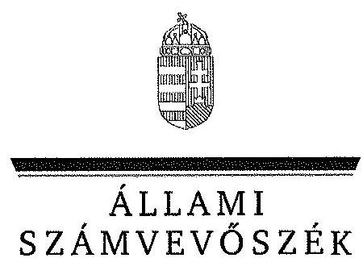
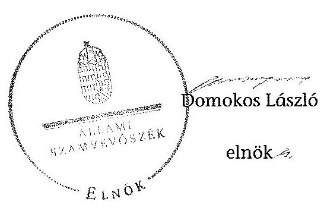

ÁLLAMI
SZÁMVEVÔSZÉK

# JELENTÉS 

az önkormányzatok belső kontrollrendszere kialakításának, egyes
kontrolltevékenységek és a belső ellenőrzés
működésének - 2013. évben induló - ellenőrzéséről
Seregélyes
13171
2013. december

---

# Állami Számvevőszék 

Iktatószám: V-0141-031/2013.
Témaszám: 1162
Vizsgálat-azonosító szám: V064912

## Az ellenőrzést felügyelte:

Dr. Benedek Mária
felügyeleti vezető
Az ellenőrzést vezette és az ellenőrzés végrehajtásáért felelős:
Bíró Zsolt
ellenőrzésvezető
A számvevőszéki jelentés összeállításában közremúködtek:
Gelencsér Zoltán
számvevő tanácsos
Szilágyi Nándorné
számvevő
Az ellenőrzést végezték:
Hámoriné Maróti Györgyi Szilágyi Nándorné
számvevő vezető főtanácsos számvevő

---

# TARTALOMJEGYZÉK 

BEVEZETÉS ..... 5
I. ÖSSZEGZŐ MEGÁLLAPÍTÁSOK, KÖVETKEZTETÉSEK, JAVASLATOK ..... 9
II. RÉSZLETES MEGÁLLAPÍTÁSOK ..... 15

1. Az önkormányzat belső kontrollrendszerének kialakítása ..... 15
1.1. A kontrollkörnyezet ..... 15
1.2. A kockázatkezelési rendszer ..... 16
1.3. A kontrolltevékenységek ..... 16
1.4. Az információs és kommunikációs rendszer ..... 17
1.5. A monitoring rendszer ..... 17
2. A pénzügyi folyamatokban kulcsszerepet betöltő teljesítésigazolás és érvényesítés belső kontrollok múködése ..... 18
3. A belső ellenőrzés múködése ..... 20

## FÜGGELÉKEK

1. számú Értelmező szótár
2. számú Az értékelés módja és szempontjai

---

.

---

# RÖVIDÍTÉSEK JEGYZÉKE 

## Törvények

Áht.
ÁSZ tv.
Htv.

Info tv.

Kttv.

Mötv.

Mvtv.
Ötv.
Számv. tv.
Tvtv.

## Rendeletek

Áhsz.

Ávr.

Bkr.
önkormányzati SZMSZ

## Szórövidítések

Alapító Okirat

ÁSZ
értékelési szabályzat
FEUVE szabályzat

2011. évi CXCV. törvény az államháztartásról (hatályos 2012. január 1-jétől)
2011. évi LXVI. törvény az Állami Számvevőszékről
1991. évi XX. törvény a helyi önkormányzatok és szerveik, a köztársasági megbízottak, valamint egyes centrális alárendeltségú szervek feladat- és hatásköreiről
2011. évi CXII. törvény az információs önrendelkezési jogról és az információszabadságról (hatályos 2012. január 1-jétől)
2011. évi CXCIX. törvény a közszolgálati tisztviselők ről (hatályos 2012. március 1-jétől)
2011. évi CLXXXIX. törvény Magyarország helyi önkormányzatairól (hatályos 2012. január 1-jétől)
1993. évi XCIII. törvény a munkavédelemről
1990. évi LXV. törvény a helyi önkormányzatokról
2000. évi C. törvény a számvitelről
1996. évi XXXI. törvény a tűz elleni védekezésről, a múszaki mentésről és a tűzoltóságról

249/2000. (XII. 24.) Korm. rendelet az államháztartás szervezetei beszámolási és könyvvezetési kötelezettségének sajátosságairól
368/2011. (XII. 31.) Korm. rendelet az államháztartásról szóló törvény végrehajtásáról (hatályos 2012. január 1-jétől)
370/2011. (XII. 31.) Korm. rendelet a költségvetési szervek belső kontrollrendszeréről és belső ellenőrzéséről (hatályos 2012. január 1-jétől)
Seregélyes Nagyközség Önkormányzata Képviselőtestületének 8/2010. (X. 20.) számú határozata a Képvise-lö-testület Szervezeti és Müködési Szabályzatáról (hatályos 2010. október 21-től)

Seregélyes Nagyközség Polgármesteri Hivatalának Alapító Okirata (hivatali SZMSZ 1. számú függelék) és módosításai
Állami Számvevőszék
Seregélyes Nagyközség Polgármesteri Hivatalának Eszközök és források értékelési szabályzata (hatályos 2006. október 2-től)

FEUVE szabályzat - Seregélyes Nagyközség Önkormányzata Polgármesteri Hivatal belső pénzügyi ellenőrzésének folyamatba épített, előzetes és utólagos vezetői ellenőrzési eljárásrendje (hatályos 2011. március 1-jétől)

---

| gazdasági program | Seregélyes Nagyközség Önkormányzatának Gazdasági programja a 2010-2014. évekre |
| :--: | :--: |
| gazdasági szervezet ügyrendje | Polgármesteri Hivatal gazdasági szervezetének Ügyrendje (hivatali SZMSZ 2. számú függelék, hatályos 2011. március 1-jétől) |
| hivatali SZMSZ | Seregélyes Nagyközség Önkormányzata Polgármesteri Hivatalának Szervezeti és Múködési Szabályzata (hatályos 2011. március 1-jétől) |
| INTOSAI | International Organization of Supreme Audit Institutions (Legfőbb Ellenőrző Intézmények Nemzetközi Szervezete) |
| ISSAI | International Standards of Supreme Audit Institutions (Legfőbb Ellenőrző Intézmények Nemzetközi Standardjai) |
| jegyző | Seregélyes Nagyközség Önkormányzatának jegyzője |
| Képviselő-testület | Seregélyes Nagyközség Önkormányzatának Képviselốtestülete |
| leltározási szabályzat | Eszközök és források leltározási és leltárkészítési szabály. zata (hivatali SZMSZ 5. számú függelék, hatályos 2011. március 1-jétől) |
| NGM | Nemzetgazdasági Minisztérium |
| Önkormányzat | Seregélyes Nagyközség Önkormányzata |
| pénzkezelési szabályzat | Seregélyes Nagyközség Polgármesteri Hivatal Pénzkezelési szabályzata (hatályos 2012. április 1-jétől) |
| polgármester | Seregélyes Nagyközség Önkormányzatának polgármestere |
| Polgármesteri Hivatal | Seregélyes Nagyközség Önkormányzat Polgármesteri Hivatala |
| számviteli politika | Seregélyes Nagyközség Önkormányzata Polgármesteri Hivatalának Számviteli Politikája (hatályos 2012. február 6-tól) |
| számlarend | Seregélyes Nagyközség Önkormányzata Polgármesteri Hivatalának számlarendje (hatályos 2012. január 1-jétől) |
| Társulás | Sárvíz Többcélú Kistérségi Társulás |

---

# JELENTÉS 

## az önkormányzatok belső kontrollrendszere kialakításának, egyes kontrolltevékenységek és a belső ellenőrzés múködésének - 2013. évben induló - ellenőrzéséről Seregélyes

## BEVEZETÉS

Seregélyes nagyközség állandó lakosainak száma 2012. január 1-jén 4490 fő volt. Az Önkormányzat héttagú Képviselő-testületének munkáját három állandó bizottság segítette. Az Önkormányzat az önállóan működő és gazdálkodó Polgármesteri Hivatalon kívül kettő önállóan működő intézményt működtetett, többségi tulajdoni hányadú gazdasági társasággal nem rendelkezett. A polgármester a 2010. évi önkormányzati választás óta tölti be tisztségét. A jegyző 2002-től látja el feladatait. A Polgármesteri Hivatal három szervezeti egységre tagolódott, elkülönített gazdasági szervezettel rendelkezett. A foglalkoztatott köztisztviselők száma 2012. január 1-jén 13 fő volt. A Polgármesteri Hivatalnál 2013. január 1-jétől szervezeti átalakítás nem történt. Az Önkormányzat a 2012. évi költségvetési beszámolója szerint 2166533 ezer Ft tárgyévi bevételt ért el, valamint 2058368 ezer Ft tárgyévi kiadást teljesített. A 2012. december 31-i könyvviteli mérleg szerint 4102111 ezer Ft értékű eszközvagyonnal rendelkezett, a rövid lejáratú kötelezettségállománya 944551 ezer Ft volt, míg hosszú lejáratú kötelezettségállománya nem volt.

A demokratikus társadalmakban alapvető igény, hogy a közpénzeket, a közvagyont használók tevékenységükről elszámoljanak, ahhoz egyértelmű és érvényesíthető felelősségi szabályok társuljanak. Ennek a jogos igénynek az érvényesítéséhez meg kell teremteni azokat a folyamatokat, rendszereket, amelyek nélkülözhetetlenek az elszámoltatáshoz. Az elszámoltatás eredményes működtetéséhez szükség van a megfelelő információs, kontroll, értékelési és beszámolási rendszerek kialakítására.

Magyarországon az uniós csatlakozási tárgyalások idejére nyúlnak vissza a belső kontrollrendszer szabályozásának gyökerei. Az uniós elvárásoknak megfelelő új terminológia szerinti államháztartási belső pénzügyi ellenőrzési (ÁBPE) rendszer területén a jogharmonizáció 2003-ban teljes körűen megvalósult, míg az önkormányzati alrendszerre vonatkozó, Ötv.-ben megjelenített speciális szabályozás 2005-ben lépett hatályba. Az államháztartási belső kontrollrendszer koncepciója 2009-ben továbbfejlődött. A változások irányát mutatja, hogy a költségvetési szervek belső kontrollrendszere már magában foglalja a korszerű, felelős szervezetirányítás elemeit (kontrollkörnyezet, kockázatkezelés, kontrolltevékenységek, információ és kommunikáció, monitoring) is. E

---

kontrollrendszer szabályozása háromszintű, a törvényi előírásokat az Áht. és a Mötv., a rendeleti szintű szabályozást az Ávr. és a Bkr. tartalmazza, amelyeket útmutatói szinten az NGM által kiadott standardok és kézikönyvek támogatnak.

A belső kontrollrendszer azt a célt szolgálja, hogy a költségvetési szervek múködésük és gazdálkodásuk során a tevékenységeket szabályszerűen, gazdaságosan, hatékonyan és eredményesen hajtsák végre, teljesítsék elszámolási kötelezettségeiket és megvédjék az erőforrásokat a veszteségektől, a károktól és a nem rendeltetésszerű használattól. A belső kontrollrendszer magában foglalja mindazon szabályokat, eljárásokat, gyakorlati módszereket és szervezeti struktúrákat, kockázatkezelési technikákat, kontrolltevékenységeket, amelyek segítséget nyújtanak a szervezetnek céljai eléréséhez.

Az ÁSZ a 2011-2015. évekre szóló stratégiájában hangsúlyos szerepet szánt annak, hogy szilárd szakmai alapon álló, értékteremtő ellenőrzéseivel előmozdítsa a közpénzügyek átláthatóságát, rendezettségét. A számvevőszéki ellenőrzés nemzetközi alapelvei is rögzítik, hogy a megfelelő belső kontrollrendszer minimálisra csökkenti a hibák és szabálytalanságok kockázatát.

Az ellenőrzés célja annak megállapítása volt, hogy a belső kontrollrendszer elemeinek kialakítása, a pénzügyi folyamatokban kulcsszerepet betöltő teljesítésigazolás és érvényesítés, és a belső ellenőrzés szabályos működése biztosítot-ta-e az önkormányzatnál a közpénzfelhasználás szabályosságát, hozzájárult-e az értéket teremtő rend követelményének érvényesüléséhez.

Ennek keretében értékeltük, hogy:

- a jogszabályi előírásoknak megfelelően alakították-e ki a belső kontrollrendszer elemeit;
- a gazdálkodás folyamatában kulcsszerepet betöltő teljesítésigazolás és érvényesítés kontrolltevékenységeit megfelelően működtették-e;
- biztosították-e a belső ellenőrzés szabályos múködését;
- amennyiben az ÁSZ tett javaslatot a 2008-2011. évek közötti ellenőrzése kapcsán az Önkormányzatnak, intézkedtek-e azok végrehajtására.

Az ellenőrzés várható hasznosulását négy szinten tervezzük. A törvényalkotás számára összegzett tapasztalatok állnak rendelkezésre a belső kontrollrendszer önkormányzati területen való kialakításáról, működéséről és hatásairól, a belső ellenőrzés működéséről. Ennek alapján következtetést lehet levonni arról, hogy a belső kontrollrendszer kialakítására és működtetésére vonatkozó jelenlegi, differenciálás nélküli - jogszabályi előírások reális követelményeket támasztanak-e az eltérő adottságú települési önkormányzatok esetében, illetve indokolt-e esetleges jogszabályi módosítás kezdeményezése. Az ellenőrzés az ellenőrzött számára visszajelzést ad a belső kontrollrendszer kialakításában és múködésében fellépő hiányosságokról, javaslataival hozzájárul azok kiküszöböléséhez, amely csökkentheti a későbbi ellenőrzések gyakoriságát. Az ellenőrzés megállapításait és javaslatait más szervezetek is hasznosíthatják a rendezett gazdálkodási keretek kialakításához. A társadalom számára jelzi, hogy

---

közpénz nem maradhat ellenőrizetlenül, az ÁSZ értékteremtő rend kialakításához és megőrzéséhez hozzájáruló tevékenysége pozitív hatással lesz a szervezetről kialakított összkép formálásában. A szervezeten belül lehetőség nyílik arra, hogy a megállapítások szintetizálásával az ÁSZ a hozzáadott értéket teremtő elemző tevékenységét és tanácsadó szerepét is erősítse.

Az önkormányzatok belső kontrollrendszere kialakításának, egyes kontrolltevékenységek és a belső ellenőrzés működésének ellenőrzéséről szóló jelentés I. fejezetének összegző része az ellenőrzés céljára ad rövid, szintetizáló összefoglalót, és tartalmazza a következtetéseket a II. fejezet részletes megállapításain alapulóan. A jelentés intézkedést igénylő megállapításait és javaslatait az ellenőrzés során feltárt, a jelentés II. fejezetében rögzített részletes megállapítások alapozzák meg. A helyszíni ellenőrzés lezárásáig a helyi szabályozás változásait nyomon követtük.

Az ellenőrzés típusa: szabályszerűségi ellenőrzés.
Az ellenőrzött időszak: a belső kontrollrendszer kialakításának megfelelősége esetében a 2012. évre, a pénzügyi folyamatokban kulcsszerepet betöltő teljesítésigazolás és érvényesítés belső kontrollok múködésének megfelelőségét és a belső ellenőrzés szabályszerű működését a 2012. január 1. és december 31-e közötti időszak eseményeit figyelembe véve értékeltük, míg az ÁSZ javaslatainak utóellenőrzése a 2008-2011. években végzett ellenőrzések nyilvánosságra hozott jelentéseiben tett javaslatok áttekintésére terjedt ki.

Az ellenőrzött szervezet: az Önkormányzat.
Az ellenőrzés jogszabályi alapját az ÁSZ tv. 1. § (3) bekezdése, az 5. § (2) és (6) bekezdése, valamint az Áht. 61. § (2) bekezdésének előírásai képezik.

Az ellenőrzés szakmai módszertana az ÁSZ hivatalos honlapján (www.asz.hu) közzétett szakmai szabályokon alapult, amely az INTOSAI által kiadott ISSAI figyelembevételével készült.

Az ellenőrzés lefolytatásához az Önkormányzat a kimutatások és a tanúsítvány elektronikus kitöltésével, valamint az ÁSZ által kért dokumentumok elektronikus megküldésével szolgáltatott adatokat. Az így rendelkezésre bocsátott adatok, információk kontrollja és a munkalapok kitöltése a helyszíni ellenőrzés keretében történt. A jelentésben használt fogalmak magyarázatát az 1. számú függelék, az ellenőrzés egyes területeinek értékelésénél alkalmazott egységes minősítési szempontokat a 2. számú függelék tartalmazza.

A belső kontrollrendszer kialakításának ellenőrzése során értékeltük a kontrollkörnyezet, a kockázatkezelési rendszer, a kontrolltevékenységek, az információs és kommunikációs rendszer, valamint a monitoring rendszer szabályozottságának megfelelőségét. A pénzügyi folyamatokban kulcsszerepet betöltő teljesítésigazolás és érvényesítés kontrollok múködése megfelelőségének minősítéséhez az állományba nem tartozók megbízási díjai, a külső szolgáltatók által végzett karbantartási, kisjavítási munkák, az egyéb üzemeltetési és fenntartási szolgáltatások, a rendszeres szociális segélyek, valamint az államháztartáson kívülre teljesített múködési és felhalmozási célú pénzeszközátadások közül koc-

---

kázatelemzéssel választottuk ki az ellenőrzött kiadási jogcímeket. Az egyszerű véletlen mintavétellel kiválasztott tételek ellenőrzését többlépcsős megfelelőségi tesztek útján addig végeztük, amíg elegendő és megfelelő bizonyítékot szereztünk a vizsgált folyamatok kulcskontrolljai múködésének megfelelő vagy nem megfelelő voltáról. Értékeltük az Önkormányzatnál a belső ellenőrzés múködésének szabályosságát. Utóellenőrzésre nem került sor, mivel az ÁSZ az Önkormányzatnál a 2008-2011. évek között nem végzett ellenőrzést.

Az ÁSZ tv. 29. § (1) bekezdése szerint a jelentéstervezetet megküldtük a polgármester részére, aki az ÁSZ tv. 29. § (2) bekezdésében foglalt észrevételezési jogával nem élt, a jelentéstervezetre észrevételt nem tett.

---

# I. ÖSSZEGZŐ MEGÁLLAPÍTÁSOK, KÖVETKEZTETÉSEK, JAVASLATOK 

A belső kontrollrendszeren belül 2012-ben a kontrollkörnyezet, a kockázatkezelési rendszer, a kontrolltevékenységek, az információs és kommunikációs rendszer, valamint a monitoring rendszer kialakítását külön-külön és együttesen is értékeltük. A belső kontrollrendszer kialakítása az összesített értékelés alapján nem felelt meg a jogszabályi előírásoknak.

A belső kontrollrendszer egyes területei kialakításának minősítése a következő:

| Kontrollterïlet | Minősítés |
| :-- | :--: |
| Kontrollkörnyezet | megfelelö |
| Kockázatkezelési rendszer | nem |
|  | megfelelö |
| Kontrolltevékenységek | részben |
| Információs és kommuniká- | megfelelö |
| ciós rendszer | nem |
| Monitoring rendszer | megfelelö |

Megfelelőnek értékeltük a kontrollkörnyezet kialakítását, mivel a jogszabályi előírásokban foglaltakat figyelembe véve a jegyző kisebb hiányosságok mellett is megteremtette e kontrollterületen a szabályszerű működés lehetőségét.

Részben megfelelőnek értékeltük a kontrolltevékenységek és a monitoring rendszer kialakítását, mivel a megállapított szabályozásbeli hiányosságok nem veszélyeztették e kontrollterületeken a szabályszerű működést.

Nem megfelelőnek értékeltük a kockázatkezelési, továbbá az információs és kommunikációs rendszer kialakítását, mivel az ellenőrzésünk során megállapított szabályozásbeli hiányosságok magukban hordozzák a szabálytalan működés, valamint a korrupció kockázatát.

A belső kontrollrendszer nem megfelelő kialakítása kockázatot jelent az Önkormányzat tevékenységeinek szabályszerű, gazdaságos, hatékony és eredményes végrehajtása során.

A 2012. évben az állományba nem tartozók megbízási díjaival, valamint a külső szolgáltatók által végzett karbantartási, kisjavítási munkákkal kapcsolatos kifizetések során a pénzügyi folyamatokban kulcsszerepet betöltő teljesítésigazolás és érvényesítés belső kontrollok múködése gyenge volt. Gyengének értékeltük a két kulcskontroll együttes múködését, mivel azok nem biztosították a hibák megelőzését és feltárását.

---

A számvevőszéki ellenőrzés az ellenőrzött kifizetésekkel összefüggésben a rendelkezésre bocsátott dokumentumok alapján jogosulatlan kifizetést nem tárt fel, azonban a gazdálkodásban kulcsszerepet betöltő kontrollok működésében feltárt hiányosságok miatt fennáll a hibák bekövetkezésének kockázata. A nem megfelelően működtetett belső kontrollok korrupciós kockázatot hordoznak.

Az Önkormányzat a belső ellenőrzési feladatokat a Társulás útján látta el. Az Önkormányzatnál a 2012. évben a belső ellenőrzés múködése a jogszabályi előírásoknak megfelelt, azonban a belső ellenőrzés nem tárta fel a belső kontrollrendszer kialakításának, valamint a pénzügyi folyamatokban kulcsszerepet betöltő teljesítésigazolás és érvényesítés belső kontrollok működésének hiányosságait.

Az ÁSZ tv. 33. § (1) bekezdésében foglaltak értelmében az ellenőrzött szervezet vezetője köteles a jelentésben foglalt megállapításokhoz kapcsolódó intézkedési tervet összeállítani, és azt a jelentés kézhezvételétől számított 30 napon belül az ÁSZ részére megküldeni. Amennyiben az intézkedési tervet határidőre nem küldi meg a szervezet, vagy az ÁSZ tv. 33. § (2) bekezdésében foglalt póthatáridő elteltével megküldött intézkedési terv továbbra sem elfogadható, az ÁSZ elnöke a hivatkozott törvény 33. § (3) bekezdés a)-b) pontjaiban foglaltakat érvényesítheti.

Az ellenőrzés intézkedést igénylő megállapításai és javaslatai:

# a polgármesternek 

A számvevőszéki ellenőrzés megállapításai alapján az Önkormányzatnál a belső kontrollrendszer kialakítása összefoglalóan értékelve nem felelt meg a jogszabályi előírásoknak, a kulcskontrollok müködése gyenge volt, a belső ellenőrzés müködése ugyan megfelelt a jogszabályi előírásoknak, azonban nem tárta fel, ezáltal nem is javíttatta ki a hiányosságokat. A megállapított szabályozásbeli és müködésbeli hiányosságok magukban hordozzák a szabálytalan müködés kockázatát.

Javaslat:
A Mötv. 115. § (1) bekezdésében foglaltak alapján kísérje figyelemmel az Önkormányzat gazdálkodásának szabályszerűségét. A Mötv. 67. § f) pontja alapján gondoskodjon a belső kontrollrendszer müködésére vonatkozó jogszabályi rendelkezések be nem tartása, valamint a teljesítésigazolás, illetve az érvényesítés kontrollokkal öszszefüggésben feltárt hiányosságok, szabálytalanságok tekintetében az esetleges munkajogi felelősséggel kapcsolatos körülmények kivizsgálásáról, majd a vizsgálat eredményének függvényében tegye meg a szükséges munkajogi intézkedéseket.

---

# a jegyzőnek 

1. a kontrollkörnyezettel kapcsolatban:

A jegyző - az Ávr. 13. § (1) bekezdés f) pontjában foglaltak ellenére - a hivatali SZMSZ-ben nem rögzítette azokat az ügyköröket, amelyek során a szervezeti egységek vezetői a költségvetési szerv képviselőjeként járhatnak el.

A jegyző - a Htv. 140. §. (1) bekezdés c) pontjában foglaltak ellenére - az Önkormányzat intézményeinek számviteli rendjét nem alakította ki.

A jegyző - a Számv. tv. 161. § (2) bekezdés d) pontjában előírtak ellenére - nem készítette el a Polgármesteri Hivatal bizonylati rendjét.

A jegyző - az Mvtv. 2. § (3) bekezdése ellenére - nem határozta meg a Polgármesteri Hivatalban az egészséget nem veszélyeztető és biztonságos munkavégzés követelményei megvalósításának módját.

A jegyző - a Tvtv. 19. § (1) bekezdésében foglaltak ellenére - nem készítette el a Polgármesteri Hivatal tüzvédelmi szabályzatát.

A jegyző - a Bkr. 6. § (3) bekezdésében foglaltak ellenére - az ellenőrzési nyomvonalat nem aktualizálta.

A jegyző - a Kttv. 130. § (1) bekezdésében foglaltak ellenére - nem készítette el a Polgármesteri Hivatalban dolgozó köztisztviselők teljesítményértékelését.

Javaslat:
a) Készítse el a hivatali SZMSZ módosítását, és kezdeményezze az Áht. 9. § (1) bekezdés a) pontjában foglaltakra tekintettel a Képviselő-testület elé terjesztését annak érdekében, hogy az tartalmazza az Ávr. 13. § (1) bekezdésében előírt tartalmi elemeket.
b) Alakítsa ki a Htv. 140. § (1) bekezdés c) pontjában foglaltak szerint az Önkormányzat intézményeinek számviteli rendjét.
c) Készítse el a Számv. tv. 161. § (2) bekezdés d) pontja előírásának megfelelően a Polgármesteri Hivatal bizonylati rendjét.
d) Határozza meg az Mvtv. 2. § (3) bekezdése alapján az egészséget nem veszélyeztető és biztonságos munkavégzés követelményei megvalósításának módját.
e) Készítse el a Tvtv. 19. § (1) bekezdésében foglalt előírásnak megfelelően a tűzvédelmi szabályzatot.
f) Aktualizálja rendszeresen a Bkr. 6. § (3) bekezdésében előírtaknak megfelelően az ellenőrzési nyomvonalat.
g) Értékelje írásban a Kttv. 130. § (1) bekezdésében előírtak szerint a Polgármesteri Hivatalban dolgozó köztisztviselők munkateljesítményét.

---

2. a kockázatkezelési rendszerrel kapcsolatban:

A jegyző - a Bkr. 7. § (2) bekezdésében foglaltak ellenére - nem állapította meg a Polgármesteri Hivatal tevékenységében, gazdálkodásában rejlő kockázatokat, nem határozta meg az egyes kockázatok kezeléséhez szükséges intézkedéseket, továbbá a kockázatok kezelése érdekében szükséges intézkedések teljesítésének folyamatos nyomon követési módját.

Javaslat:
Állapítsa meg - a Bkr. 7. § (2) bekezdésében foglaltak alapján - a Polgármesteri Hivatal tevékenységében, gazdálkodásában rejlő kockázatokat, és határozza meg az egyes kockázatokkal kapcsolatban szükséges intézkedéseket, valamint azok teljesítése folyamatos nyomon követésének módját.
3. a kontrolltevékenységekkel kapcsolatban:

A jegyző - az Ávr. 13. § (2) bekezdése a) pontjában foglaltak ellenére - nem szabályozta a kötelezettségvállalás, a pénzügyi ellenjegyzés és a teljesítésigazolás gyakorlásának módját.

Javaslat:
Rendezze belső szabályzatban az Ávr. 13. § (2) bekezdés a) pontjában foglaltak alapján a gazdálkodással - különösen a kötelezettségvállalás, az ellenjegyzés, a teljesítésigazolás, az érvényesítés és az utalványozás gyakorlásának módjával, eljárási és dokumentációs részletszabályaival - kapcsolatos belső előírásokat, feltételeket.
4. az információs és kommunikációs rendszerrel kapcsolatban:

A jegyző - az Info tv. 33. § (1) és (3) bekezdésében foglaltak ellenére - nem gondoskodott arról, hogy az Önkormányzat az elektronikus közzétételi kötelezettségének a 2012. évben eleget tegyen.

Javaslat:
Gondoskodjon az Info tv. 33. § (1) és (3) bekezdésében foglaltaknak megfelelően az Önkormányzat elektronikus közzétételi kötelezettségének teljesítéséről.
5. a monitoring rendszerrel kapcsolatban

Az Áht. 69. § (2) bekezdésében és a Bkr. 3. §-ában foglaltakat figyelmen kívül hagyva (a Bkr. 1. melléklete szerinti nyilatkozatban foglaltak alapján, annak indokoltsága ellenére) a jegyző a belső kontrollrendszer továbbfejlesztése érdekében nem tett intézkedéseket.

A jegyző - Bkr. 13. § (2) bekezdésében foglalt előírás ellenére - nem készített a külső ellenőrzések megállapításainak hasznosítására intézkedési tervet.

---

Javaslat:
a) Intézkedjen az Áht. 69. § (2) bekezdésében és a Bkr. 3. §-ában foglaltaknak megfelelően a belső kontrollrendszer továbbfejlesztése érdekében szükséges intézkedések megtételéről.
b) Gondoskodjon a Bkr. 13. § (2) bekezdésében foglaltaknak megfelelően a külső ellenőrzések megállapításai és javaslatai alapján (a végrehajtás felelőseit és határidejét feltüntető) intézkedési tervek készítéséről.
6. a pénzügyi folyamatokban kulcsszerepet betöltő kontrollokkal kapcsolatban:

A teljesítésigazolást - az Áht. 38. § (1) bekezdésében és az Ávr. 57. § (1) és (3) bekezdésében foglaltak ellenére - nem végezték el, vagy nem az arra jogosult személy végezte.

Az érvényesítést - az Áht. 38. § (1) bekezdésében és az Ávr. 58. § (1) bekezdésében foglaltak ellenére - nem végezték el. Az érvényesítést - az Ávr. 58. § (4) bekezdésében előírtak ellenére - nem a kijelölt személy végezte. Az érvényesítő - az Ávr. 58. § (2) bekezdésében előírtak ellenére - nem jelezte az utalványozónak, hogy a megelőző ügymenetben a teljesítésigazolást - az Áht. 38. § (1) bekezdésében és az Ávr. 57. § (1) bekezdésében foglaltak ellenére - nem végezték el, továbbá hogy a teljesítésigazolást - az Ávr. 57. § (3) bekezdésében foglaltak ellenére - nem az arra jogosult személy végezte.

Javaslat:
Intézkedjen - a teljesítésigazolás és az érvényesítés vonatkozásában feltárt hiányosságok megszüntetése, illetve az operatív gazdálkodás során a müködésbeli hibák megelőzése, feltárása és kijavítása érdekében - arról, hogy
a) az Áht. 38. § (1) bekezdésén alapuló teljesítésigazolás során az Ávr. 57. § (1) bekezdésében előírtaknak megfelelően, ellenőrizhető okmányok alapján ellenőrizzék és igazolják a kiadások teljesítésének jogosságát, összegszerűségét, az ellenszolgáltatást is magában foglaló kötelezettségvállalás esetén annak teljesítését, valamint az Ávr. 57. § (3) bekezdése szerint a teljesítést az igazolás dátumának és a teljesítés tényére történő utalásnak a megjelölésével, az arra jogosult személy aláírásával igazolják;
b) a kifizetéseket megelőzően a teljesítésigazolás alapján - az Ávr. 57. § (3) bekezdése szerinti esetben annak hiányában is - az összegszerűségnek, a fedezet meglétének és a megelőző ügymenetben az Áht., az Áhsz., az Ávr. előírásai és a belső szabályzatokban foglaltak betartásának az ellenőrzése és az utalványozó tájékoztatása - az Ávr. 58. § (1)-(3) bekezdései szerint - történjen meg.
7. a belső ellenőrzés működésével kapcsolatban:

A belső ellenőrzési vezető - a Bkr. 22. § (1) bekezdés b) pontjában, a 29. § (1) bekezdésében és a 30. § (1) bekezdésében foglaltak ellenére - stratégiai ellenőrzési tervet nem készített.

---

A 2013. évre vonatkozóan elkészített éves ellenőrzési tervet - a Bkr. 22. § (1) bekezdés b) pontjában, a 29. § (1) bekezdésében és a 31. § (2) bekezdésében foglaltak ellenére - nem alapozta meg kockázatelemzés, valamint - az Ötv. 92. § (6) bekezdésében és a Bkr. 32. § (4) bekezdésében foglaltak ellenére - a Képviselő-testület nem hagyta jóvá.

A belső ellenőrzés javaslatainak végrehajtása érdekében - a Bkr. 28. § c) pontjában és a 45. § (1)-(4) bekezdéseiben foglaltak ellenére - intézkedési terveket nem készítettek.

A Bkr. 21. § (2) bekezdés d) pontjában és a 47. § (1) bekezdésében foglaltak ellenére a belső ellenőrzési jelentésekben tett javaslatokat nyomon követő nyilvántartást nem vezettek.

Javaslat:
a) Kezdeményezze, hogy a belső ellenőrzési vezető a Bkr. 22. § (1) bekezdés b) pontjában, a 29. § (1) bekezdésében és a 30. § (1) bekezdésében foglaltak alapján készítsen stratégiai ellenőrzési tervet.
b) Intézkedjen arról, hogy az éves ellenőrzési terv a Bkr. 22. § (1) bekezdés b) pontja, a 29. § (1) és a 31. § (2) bekezdése alapján kockázatelemzésen alapuljon, továbbá a Mötv. 119. § (5) bekezdésében és a Bkr. 32. § (4) bekezdésében foglaltakra tekintettel kezdeményezze a polgármesternél a Képviselő-testület elé terjesztését.
c) Intézkedjen arról, hogy a Bkr. 28. § c) pontjának és a 45. § (1)-(3) bekezdéseinek megfelelően készüljön intézkedési terv a belső ellenőrzési jelentés javaslatai alapján.
d) Kezdeményezze, hogy a belső ellenőrzési vezető vezessen a Bkr. 21. § (2) bekezdése d) pontjának és a Bkr. 47. § (1) bekezdésének megfelelően a belső ellenőrzési jelentésekben tett megállapításokat, javaslatokat, a vonatkozó intézkedési terveket és azok végrehajtását nyomon követő nyilvántartást.

---

# II. RÉSZLETES MEGÁLLAPÍTÁSOK 

## 1. Az ÖNKORMÁNYZAT BELSŐ KONTROLLRENDSZERÉNEK KIALAKÍTÁSA

A belső kontrollrendszeren belül 2012-ben a kontrollkörnyezet, a kockázatkezelési rendszer, a kontrolltevékenységek, az információs és kommunikációs rendszer, valamint a monitoring rendszer kialakítását külön-külön és együttesen is értékeltük. A belső kontrollrendszer kialakítása az összesített értékelés alapján nem felelt meg a jogszabályi előírásoknak.

### 1.1. A kontrollkörnyezet

A kontrollkörnyezet kialakítása - a 2. számú függelékben részletezett kritériumrendszer alapján végzett értékelés szerint - a jogszabályi előírásoknak megfelelt.

Az Önkormányzat rendelkezett gazdasági programmal, a Polgármesteri Hivatal Alapító Okirattal, amely utóbbi tartalmazta az alaptevékenységeket. A Képviselő-testület döntött a teljesítményértékelés alapját képező célokról. A Képviselő-testület rendelkezett önkormányzati SZMSZ-szel, a Polgármesteri Hivatal pedig hivatali SZMSZ-szel.

A szervezet megfelelő működése érdekében a Polgármesteri Hivatalban kialakították a szabályzatokat, rendeletben meghatározták a vagyongazdálkodás szabályait. A jegyző elkészítette és hatályba léptette a számviteli politikát, a pénzkezelési szabályzatot, a leltározási szabályzatot, az értékelési szabályzatot, valamint a számlarendet, a FEUVE szabályzat részeként a szabálytalanság kezelés eljárásrendjét és a gazdasági szervezet ügyrendjét. Írásos formában rögzítették az ellenőrzési nyomvonalat.

A gazdasági vezető rendelkezett a jogszabályi előírásoknak megfelelő iskolai végzettséggel. A Polgármesteri Hivatalban dolgozó munkatársak munkaköri leírásait a jegyző elkészítette, amelyek tartalmazták a munkavállalók jogait, kötelezettségeit és felelősségét. A Képviselő-testület elfogadta a köztisztviselőkkel szembeni hivatásetikai alapelvek részletes tartalmát, valamint az etikai eljárás szabályait.

---

A kontrollkörnyezet kialakítása az alábbi kisebb hiányosságok mellett megfelelt a jogszabályi előírásoknak:

| Sor-   szám $^{1}$ | Megállapítás |
| :--: | :--: |
| 9. | A hivatali SZMSZ-ben - az Ávr. 13. § (1) bekezdés f) pontjában foglaltak ellenére - a jegyző nem rögzítette azokat az ügyköröket, amelyek során a szervezeti egységek vezetői a költségvetési szerv képviselőjeként járhatnak el. |
| 18. | A jegyző - a Htv. 140. §. (1) bekezdés c) pontjában foglaltak ellenére az Önkormányzat intézményeinek számviteli rendjét nem alakította ki. |
| 31. | A jegyző - a Számv. tv. 161. § (2) bekezdés d) pontjában előírtak ellenére - nem készítette el a Polgármesteri Hivatal bizonylati rendjét. |
| 32. | A Polgármesteri Hivatalban - az Mvtv. 2. § (3) bekezdésében foglaltak ellenére - nem határozták meg az egészséget nem veszélyeztető és biztonságos munkavégzés követelményei megvalósításának módját. |
| 33. | A jegyző - a Tvtv. 19. § (1) bekezdését figyelmen kívül hagyva - nem készítette el a Polgármesteri Hivatal tüzvédelmi szabályzatát. |
| 44. | A jegyző - a Bkr. 6. § (3) bekezdésében foglaltak ellenére - az ellenőrzési nyomvonalat nem aktualizálta. |
| 46. | A jegyző - a Kttv. 130. § (1) bekezdésében foglaltak ellenére - a Polgármesteri Hivatalban dolgozó köztisztviselők teljesítményértékelését nem készítette el. |

# 1.2. A kockázatkezelési rendszer 

A kockázatkezelési rendszer kialakítása - a 2. számú függelékben részletezett kritériumrendszer alapján végzett értékelés szerint - nem felelt meg a jogszabályi előírásoknak, mert:

Sor-
szám
Megállapítás
2., 8 .
és 10 .

A jegyző - a Bkr. 7. § (2) bekezdésében foglaltak ellenére - nem állapította meg a Polgármesteri Hivatal tevékenységében, gazdálkodásában rejlő kockázatokat, nem határozta meg az egyes kockázatok kezeléséhez szükséges intézkedéseket, valamint a kockázatok kezelése érdekében szükséges intézkedések teljesítésének folyamatos nyomon követési módját.

### 1.3. A kontrolltevékenységek

A kontrolltevékenységek kialakítása - a 2. számú függelékben részletezett kritériumrendszer alapján végzett értékelés szerint - a jogszabályi előírásoknak részben felelt meg.

[^0]
[^0]:    ${ }^{1}$ A megállapítás számozása az Önkormányzat által az adatszolgáltatás során kitöltött kimutatások kérdéseinek sorszámával azonos.

---

A jegyző a kontrolltevékenységek részeként a folyamatba épített, előzetes, utólagos és vezetői ellenőrzést előírta a költségvetés tervezése, a beszerzések lebonyolítása, a vagyonhasznosítási tevékenység és a támogatások elszámolása vonatkozásában. Szabályozták az érvényesítés és az utalványozás rendjét. Az iratkezelés szabályozása során előírták az iratok és az adatok védelmét. Meghatározták az üzemeltetés és adatbiztonság feladatait és az ehhez kapcsolódó hatásköröket. Biztosították az adatbiztonság érvényesülését és meghatározták a hozzáférési jogosultságokhoz kapcsolódó felelősségi köröket.

A gazdasági szervezet ügyrendje tartalmazta az időközi és az éves beszámolók elkészítésének feladatait, annak felelőseit, valamint a helyettesítés rendjét.

Szabályozták a jogviszony megszűnése esetére a munkavállaló folyamatban lévő feladatai átadásának rendjét.

A kontrolltevékenységek kialakítása az alábbi kisebb hiányosságok miatt részben felelt meg a jogszabályi előírásoknak:

| Sorszám | Megállapítás | Megjegyzés |
| :--: | :--: | :--: |
| 6. és   9. | A jegyző - az Ávr. 13. § (2) bekezdés a) pontjában foglaltakat figyelmen kívül hagyva - nem szabályozta a teljesítésigazolás, a kötelezettségvállalás és a pénzügyi ellenjegyzés gyakorlásának módját. |  |
| 10. | Az Ávr. 57. § (4) bekezdésében foglaltak ellenére 2012. március 31-ét megelőzően a jegyző, 2012. március 31-étől a polgármester és a jegyző, mint kötelezettségvállalók írásban nem jelölték ki a teljesítésigazolásra jogosult személyeket. | A 2013. évben a teljesítésigazolásra jogosultakat írásban kijelölték. |

# 1.4. Az információs és kommunikációs rendszer 

Az információs és kommunikációs rendszer kialakítása - a 2. számú függelékben részletezett kritériumrendszer alapján végzett értékelés szerint - a jogszabályi előírásoknak nem felelt meg, mert:

| Sorszám | Megállapítás |
| :--: | :--: |
| 7. | Az Önkormányzat - az Info tv. 33. § (1) és (3) bekezdésében foglaltak ellenére - az elektronikus közzétételi kötelezettségének a 2012. évben nem tett eleget. |

### 1.5. A monitoring rendszer

A Polgármesteri Hivatalban a monitoring rendszer kialakítása - a 2. számú függelék kritériumrendszerének értékelése alapján - részben felelt meg a jogszabályi előírásoknak.

---

Kialakították a szervezeti célok elérését szolgáló feladatok megvalósításának nyomon követését biztosító, illetve azok teljesítésének mérésére alkalmas indikátorok ${ }^{2}$ rendszerét és alkalmazásának rendjét, nyomon követését és értékelését. A jegyző nyilatkozatban értékelte a belső kontrollrendszer minőségét a 2011. évre vonatkozóan.

A monitoring rendszer kialakítása az alábbi kisebb hiányosságok miatt részben felelt meg a jogszabályi előírásoknak:

| Sorszám | Megállapítás | Megjegyzés |
| :--: | :--: | :--: |
| 10. | Az Áht. 69. § (2) bekezdésében és a Bkr. 3. §-ában foglaltakat figyelmen kívül hagyva (a Bkr. 1. melléklete szerinti nyilatkozatban foglaltak alapján, annak indokoltsága ellenére) a jegyző a belső kontrollrendszer továbbfejlesztése érdekében nem tett intézkedéseket. |  |
| 12. | A Bkr. 13. § (2) bekezdésében foglalt előírás ellenére a külső ellenőrzések megállapításainak hasznosítására intézkedési tervet a jegyző nem készített. | A Magyar Államkincstár a 2012. év októberében ellenőrizte a 2011. évi központi költségvetési támogatások év végi elszámolásának szabályszerűségét. |

A helyi önkormányzatok törvényességi felügyeletét ellátó kormányhivatal a 2012. évben nem élt törvényességi felhívással vagy más törvényességi felügyeleti eszközzel.

# 2. A PÉNZÜGYI FOLYAMATOKBAN KULCSSZEREPET BETÖLTŐ TELJESÍTÉSIGAZOLÁS ÉS ÉRVÉNYESÍTÉS BELSŐ KONTROLLOK MÜKÖDÉSE 

A 2012. évben az állományba nem tartozók megbízási díjaival, valamint a külső szolgáltatók által végzett karbantartással, kisjavítással kapcsolatos kifizetések során - összefoglalóan értékelve - a pénzügyi folyamatokban kulcsszerepet betöltő teljesítésigazolás és érvényesítés belső kontrollok müködésének megfelelősége gyenge volt, mert:

| Kulcskontroll | Megállapítás |
| :--: | :--: |
| Teljesítésigazolás | A teljesítésigazolást - az Áht. 38. § (1) bekezdésében és az Ávr. 57. § (1) és (3) bekezdésében foglaltak ellenére - nem végezték el, vagy nem az arra jogosult személy végezte. |
| Érvényesítés | Az érvényesítést - az Áht. 38. § (1) bekezdésében és az Ávr. 58. § (1) bekezdésében foglaltak ellenére - nem végezték el. Az érvényesítést - az Ávr. 58. § (4) bekezdésében előírtak ellenére - nem az arra jogosult személy végezte. Az érvényesítő - az Ávr. 58. § (2) bekezdésében előírtak ellenére - nem jelezte az utalványozó- |

[^0]
[^0]:    ${ }^{2}$ mérőszámok, statisztikai adatok, szakfeladatokhoz rendelt feladatmutatók, teljesítménymutatók

---

nak, hogy a megelőző ügymenetben a teljesítésigazolást - az Áht. 38. § (1) bekezdésében és az Ávr. 57. § (1) bekezdésében foglaltak ellenére - nem, vagy - az Ávr. 57. § (3) bekezdésében foglaltak ellenére - nem az arra jogosult személy végezte.

A 2012. évben az állományba nem tartozók megbízási díjainak kifizetése során a teljesítésigazolás és az érvényesítés kulcskontrollok müködésének megfelelősége gyenge volt, mert:

- a teljesítésigazolást a munkavédelmi és kisgépkezelői oktatáshoz, az önkormányzati rendezvények hangosítási feladataihoz, valamint az újságszerkesztéshez kapcsolódó megbízási díjak kifizetéseit megelőzően - az Áht. 38. § (1) bekezdésében és az Ávr. 57. § (1) bekezdésében foglaltak ellenére - nem végezték el;
- az újságszerkesztéshez kapcsolódó megbízási díj kifizetését megelőzően - az Áht. 38. § (1) bekezdésében és az Ávr. 58. § (1) bekezdésében foglaltak ellenére - az érvényesítést nem végezték el;
- a munkavédelmi és kisgépkezelői oktatáshoz, valamint az önkormányzati rendezvények hangosítási feladataihoz kapcsolódó kiadások bizonylatainak érvényesítését - az Ávr. 58. § (4) bekezdésében foglaltak ellenére - nem a kijelölt személy végezte;
- az érvényesítő - az Ávr. 58. § (2) bekezdésében előírtak ellenére - nem jelezte az utalványozónak, hogy a megelőző ügymenetben a teljesítésigazolást a munkavédelmi és kisgépkezelői oktatásra, valamint az önkormányzati rendezvények hangosítási feladataira - az Áht. 38. § (1) bekezdésében és az Ávr. 57. § (1) bekezdésében foglaltak ellenére - nem végezték el.

A Polgármesteri Hivatalban a 2012. évben a külső szolgáltatók által teljesített karbantartási, kisjavítási munkákra történt kifizetések során a teljesítésigazolás és az érvényesítés kulcskontrollok müködésének megfelelősége gyenge volt, mert:

- a teljesítésigazolást a kaszajavítás kifizetését megelőzően - az Áht. 38. § (1) bekezdésében és az Ávr. 57. § (1) bekezdésében foglaltak ellenére - nem végezték el;
- a rakodógép javításához kapcsolódó kiadási bizonylaton a teljesítésigazolást - az Ávr. 57. § (3) bekezdésében foglaltak ellenére - nem az arra jogosult személy végezte;
- a kaszajavítás kifizetését megelőzően - az Áht. 38. § (1) bekezdésében és az Ávr. 58. § (1) bekezdésében foglaltak ellenére - az érvényesítést nem végezték el;
- a rakodógép javításához kapcsolódó kiadási bizonylaton az érvényesítést az Ávr. 58. § (4) bekezdésében foglaltak ellenére - nem a kijelölt személy végezte;
- az érvényesítő - az Ávr. 58. § (2) bekezdésében előírtak ellenére - nem jelezte az utalványozónak, hogy a megelőző ügymenetben a rakodógép javításá-

---

hoz kapcsolódó kiadási bizonylaton a teljesítésigazolást - az Ávr. 57. § (3) bekezdésében foglaltak ellenére - nem az arra jogosult személy végezte.

A számvevőszéki ellenőrzés az ellenőrzött kifizetésekkel összefüggésben a rendelkezésre bocsátott dokumentumok alapján jogosulatlan kifizetést nem tárt fel, azonban a gazdálkodásban kulcsszerepet betöltő kontrollok müködésében feltárt hiányosságok miatt fennáll a hibák bekövetkezésének kockázata. A nem megfelelően múködtetett belső kontrollok korrupciós kockázatot hordoznak.

# 3. A BELSŐ ELLENŐRZÉS MÜKÖDÉSE 

Az Önkormányzatnál a belső ellenőrzés múködése - a 2. számú függelék kritériumrendszere alapján végzett értékelés szerint - megfelelt a jogszabályi előírásoknak, azonban a belső ellenőrzés nem tárta fel a belső kontrollrendszer kialakításának, valamint a pénzügyi folyamatokban kulcsszerepet betöltő teljesítésigazolás és érvényesítés belső kontrollok müködésének hiányosságait.

A belső ellenőrzés ellátásának módja megfelelt a Képviselő-testület döntésének, a feladatokat a Társulás útján látták el. Az Önkormányzat rendelkezett a jogszabályi előírásoknak megfelelő belső ellenőrzési kézikönyvvel, a belső ellenőrzést végzőknek pedig megfelelő iskolai végzettségük és szakképzettségük volt.

Az éves ellenőrzési tervben foglalt ellenőrzéseket végrehajtották, elkészítették az ellenőrzési programokat és az ellenőrzési jelentéseket. A belső ellenőrzési vezető nyilvántartást vezetett a belső ellenőrzésekről.

A belső ellenőrzési vezető által az Önkormányzatnál 2011. évben végzett ellenőrzések alapján - a Bkr.-ben előírt tartalommal - összeállított éves ellenőrzési jelentést a Társulás munkaszervezetének vezetője a jegyzőnek elküldte.

A belső ellenőrzés múködése az alábbi kisebb hiányosságok mellett megfelelt a jogszabályi előírásoknak:

| Sorszám | Megállapítás |
| :--: | :--: |
| 7. | A belső ellenőrzési vezető - a Bkr. 22. § (1) bekezdés b) pontjában, a 29. § (1) bekezdésében és a 30. § (1) bekezdésében foglaltak ellenére - stratégiai ellenőrzési tervet nem készített. |
| $\begin{gathered} \text { B., 9., } \\ 11 . \end{gathered}$ | A 2013. évre vonatkozóan elkészített éves ellenőrzési tervet - a Bkr. 22. § (1) bekezdés b) pontjában, a 29. § (1) bekezdésében és a 31. § (2) bekezdésében foglaltak ellenére - nem alapozta meg kockázatelemzés, valamint az Ötv. 92. § (6) bekezdésében ${ }^{3}$ és a Bkr. 32. § (4) bekezdésében foglaltak ellenére - a Képviselő-testület nem hagyta jóvá. |
| 23. | A belső ellenőrzés javaslatainak végrehajtása érdekében - a Bkr. 28. § c) pontjában és a 45. § (1)-(4) bekezdéseiben foglaltak ellenére - intézkedési terveket nem készítettek. |

[^0]
[^0]:    ${ }^{3}$ 2013. január 1-jétől a Mötv. 119. § (5) bekezdésében

---

24., 26. A Bkr. 21. § (2) bekezdés d) pontjában és a 47. § (1) bekezdésében foglaltak ellenére a belső ellenőrzési jelentésekben tett javaslatokat nyomon követő nyilvántartást nem vezettek.

Az Önkormányzat az ÁSZ-tól a 2011. és 2012. években integritás kérdőív kitöltésére kapott felkérést, amelynek nem tett eleget. A kockázatkezelési rendszer kialakításának hiányosságai, az elektronikus közzétételi kötelezettség 2012. évi elmulasztása, a 2013. évi ellenőrzési terv megalapozatlansága arra utalnak, hogy az Önkormányzatnak még fejlődést kell elérnie az integritási szemlélet érvényesítésében.

Budapest, 2013. 19. hó 31. nap

Függelék: $\quad 2 \mathrm{db}$

---

# **Chemistry**

## **Chemical Reactions**

### **Balancing Chemical Equations**

1. **Write the unbalanced equation:**
   - Example: $$C_3H_8 + O_2 \rightarrow CO_2 + H_2O$$

2. **Balance the equation:**
   - Example: $$2C_3H_8 + 7O_2 \rightarrow 6CO_2 + 8H_2O$$

3. **Balance the equation:**
   - Example: $$2C_3H_8 + 7O_2 \rightarrow 6CO_2 + 8H_2O$$

### **Types of Reactions**

1. **Combination Reaction:**
   - Example: $$2H_2 + O_2 \rightarrow 2H_2O$$

2. **Decomposition Reaction:**
   - Example: $$2H_2O_2 \rightarrow 2H_2O + O_2$$

3. **Single Displacement Reaction:**
   - Example: $$Zn + 2HCl \rightarrow ZnCl_2 + H_2$$

4. **Double Displacement Reaction:**
   - Example: $$AgNO_3 + NaCl \rightarrow AgCl + NaNO_3$$

5. **Combustion Reaction:**
   - Example: $$CH_4 + 2O_2 \rightarrow CO_2 + 2H_2O$$

## **Stoichiometry**

### **Mole Concept**

- **Mole (mol):** The amount of substance containing as many particles (atoms, molecules, ions) as there are atoms in exactly 12 grams of carbon-12.
- **Avogadro's Number:** $$6.022 \times 10^{23}$$ particles per mole.

### **Molar Mass**

- **Molar Mass:** The mass of one mole of a substance.
- Example: The molar mass of water ($$H_2O$$) is 18.015 g/mol.

### **Calculations**

1. **Moles to Mass:**
   - Formula: $$n = \frac{m}{M}$$
   - Example: Calculate the number of moles of $$H_2O$$ in 18 grams of water.
     - $$n = \frac{18.015 \, \text{g}}{18.015 \, \text{g/mol}} = 18.015 \, \text{g/mol}$$

2. **Moles to Mass:**
   - Formula: $$m = n \times M$$
   - Example: Calculate the mass of 18.015 g of water.
     - $$m = 18.015 \, \text{g/mol} = 18.015 \, \text{g/mol}$$

## **Gas Laws**

### **Ideal Gas Law**

- **Equation:** $$PV = nRT$$
- **Variables:**
  - $$P$$: Pressure (atm)
  - $$V$$: Volume (L)
  - $$n$$: Number of moles (mol)
  - $$R$$: Ideal gas constant (0.0821 L·atm/mol·K)
  - $$T$$: Temperature (K)

### **Boyle's Law**

- **Equation:** $$P_1V_1 = P_2V_2$$
- **Variables:**
  - P₁: Pressure (atm)
  - P₂: Volume (L)
  - P₃: Pressure (atm)
  - P₁: Pressure (atm)
  - P₂: Volume (L)
  - P₃: Pressure (atm)
  - P₁: Pressure (atm)

### **Boyle's Law (Boyle's Law)**

- **Equation:** $$\frac{P_1V_1}{P_2V_2} = \frac{P_1}{V} \times P_2V$$
- **Variables:**
  - P₁: Pressure (atm)
  - P₂: Volume (L)
  - P₃: Pressure (atm)
  - P₁: Pressure (atm)
  - P₂: Volume (L)
  - P₃: Pressure (atm)

## **Thermochemistry**

### **Enthalpy (H)**

- **Definition:** The heat content of a system at constant pressure.
- **Equation:** $$\Delta H = q_p$$
- **Variables:**
  - $$q_p$$: Heat transferred at constant pressure.
  - $$q_p$$: Heat transferred at constant pressure.

### **Hess's Law**

- **Statement:** The enthalpy change for a reaction is the same whether it occurs in one step or multiple steps.
- **Equation:** $$\Delta H_{\text{rest}} = \Delta H - Q_p$$
- **Variables:**
  - $$Q_p$$: Heat transferred at constant pressure.
  - $$Q_p$$: Heat transferred at constant pressure.

### **Hess's Law 2.0**

- **Statement:** The enthalpy change for a reaction is the same whether it occurs in one step or multiple steps.
- **Equation:** $$\Delta H_{\text{rest}} = \Delta H - Q_p$$
- **Variables:**
  - $$Q_p$$: Heat transferred at constant pressure.
  - $$Q_p$$: Heat transferred at constant pressure.

## **Electrochemistry**

### **Oxidation and Reduction**

- **Oxidation:** Loss of electrons.
- **Reduction:** Gain of electrons.

### **Galvanic Cells**

- **Definition:** A cell that converts chemical energy into electrical energy.
- **Components:**
  - Anode: Oxidation occurs.
  - Cathode: Reduction occurs.
  - Salt Bridge: Connects the two half-cells.

### **Nernst Equation**

- **Equation:** $$E = E^\circ - \frac{RT}{nF} \ln Q$$
- **Variables:**
  - $$E$$: Energy (K)
  - $$E^\circ$$: Standard deviation (K)
  - $$E$$: Number of electrons transferred
  - $$R$$: Ideal gas constant (0.0821 L·atm/mol·K)
  - $$T$$: Temperature (K)
  - $$n$$: Number of moles of electrons transferred
  - $$F$$: Faraday constant (96,485 C/mol)
  - $$Q$$: Reaction quotient

---

# ÉRTELMEZŐ SZÓTÁR 

belső ellenőrzés
belső kontrollrendszer
területei
egyszerú véletlen mintavétel
integritás
kockázatkezelési rendszer
kontrollkörnyezet

Független, tárgyilagos bizonyosságot adó és tanácsadó tevékenység, amelynek célja, hogy az ellenőrzött szervezet múködését fejlessze és eredményességét növelje, az ellenőrzött szervezet céljai elérése érdekében rendszerszemléletű megközelítéssel és módszeresen értékeli, illetve fejleszti az ellenőrzött szervezet irányítási és belső kontrollrendszerének hatékonyságát. (Forrás: Bkr. 2. § b) pontja)
A belső kontrollrendszer a kockázatok kezelése és tárgyilagos bizonyosság megszerzése érdekében kialakított folyamatrendszer, amely azt a célt szolgálja, hogy a múködés és gazdálkodás során a tevékenységeket szabályszerűen, gazdaságosan, hatékonyan, eredményesen hajtsák végre, az elszámolási kötelezettségeket teljesítsék, megvédjék az erőforrásokat a veszteségektől, károktól és nem rendeltetésszerú használattól. (Forrás: Áht. 69. § (1) bekezdése)
A kontrollkörnyezet, a kockázatkezelési rendszer, a kontrolltevékenységek, az információs és kommunikációs rendszer, valamint a nyomon követési (monitoring) rendszer. (Forrás: Bkr. 3. §-a)
Az alapsokaságból egyszerú véletlen kiválasztással képzett részsokaság. (Forrás: Az ÁsZ ellenőrzési mintavételezés támogatásához készült segédletének 4.1.1. pontja)
Az integritás elvek, értékek, cselekvések, módszerek, intézkedések konzisztenciáját jelenti: olyan magatartásmódot, amely meghatározott értékeknek felel meg. Az integritás a közszféra esetében a társadalom által elvárt nyilvánossági, átláthatósági, illetve jogi/etikai normáknak történő megfelelést jelenti.
(Forrás: a http://integritas.asz.hu honlapon közzételt „A 2012. évi integritás felmérés eredményeinek összefoglalója" címú dokumentum 3. oldal 1. bekezdése)
A kockázat annak a valószínűségét jelenti, hogy egy vagy több esemény vagy intézkedés nem kívánt módon befolyásolja a rendszer múködését, céljainak megvalósulását. (Forrás: Javaslatok a korrupciós kockázatok kezelésére - Kockázatkezelési és ellenőrzési módszertan 35. oldal, ÁSZ)
Olyan irányítási eszközök és módszerek összessége, melynek elemei a szervezeti célok elérését veszélyeztető tényezők (kockázatok) azonosítása, elemzése, csoportosítása, nyomon követése, valamint szükség esetén a kockázati kitettség mérséklése. (Forrás: Bkr. 2. § m) pontja)
A kontrollkörnyezet alakítja ki a szervezet belső kontrollrendszerhez való viszonyát, hozzáállását, befolyásolja az alkalmazottak belső kontrollal kapcsolatos tudatosságát, magatartását. Elemei a személyes és szakmai elkötelezettség és a vezetés, valamint az alkalmazottak által vallott erkölcsi érté-

---

kek; a szakmai hozzáértés iránti elkötelezettség; a felső vezetés hozzáállása - a vezetés filozófiája és tevékenységének stílusa; a szervezeti struktúra; a humánerőforrás-politika és gazdálkodási gyakorlat.
kontrolltevékenységek A kontrolltevékenységek azok a politikák és eljárások, amelyeket a kockázatok megoldására hoznak létre a szervezet céljainak teljesítése érdekében.
kommunikáció
Az a tevékenység, melynek során információ továbbítása valósul meg. A kommunikációs folyamat résztvevői között tájékoztatás történik, mely során tényeket, ezek magyarázatát közlik. „A szervezetben eredményes kommunikációnak kell áramlania lefelé, horizontálisan és felfelé, a szervezet egészében és annak valamennyi elemében."
korrupció Azok a cselekmények, amelyek során a köz érdekében való eljárással megbízott és döntéshozatali felelősséggel felruházott személy a köz érdeke helyett önös vagy részérdekeket követve, mástól jogtalan vagy etikátlan előnyt elfogadva és őt jogtalan vagy etikátlan előnyhöz juttatva jár el, illetve amikor valaki a köz érdekében való eljárással megbízott és döntéshozatali felelősséggel felruházott személynek jogtalan vagy etikátlan előnyt nyújtva vagy felajánlva jogtalan vagy etikátlan előnyt kér. (Forrás: A Kormány korrupció megelőzési programja 2012-2014.)
kulcskontrollok Az azonosított kockázatok mérséklése érdekében kialakított kontrollok közül azok, amelyek elégtelen múködése esetén a szervezetet jelentős veszteség érheti, vagy a múködésükben bekövetkező hiba/hiányosság más kontrollok eredményességét csökkenti. Ezek ellenőrzése, értékelése elegendő bizonyítékot szolgáltat adott területen a kontrollrendszer értékeléséhez. Az önkormányzatok kontrollrendszere kialakításának ellenőrzése során a pénzügyi folyamatokban kulcsszerepet betöltő belső kontrollok a teljesítésigazolás és az érvényesítés.
lényegesség Egy információ akkor lényeges, ha hiánya vagy téves állítása befolyásolhatja ezen információkat felhasználók döntéseit, véleményét. Az ellenőrzés során a lényegesség három szempontból értelmezhető: érték, jelleg és összefüggés szerint.
megfelelőségi teszt Az ellenőrzés során alkalmazott módszer - szekvenciális (megállásos) megfelelőségi teszt - lényege, hogy a kiválasztott minta ellenőrzését csak addig végezzük, amíg elegendő és megfelelő bizonyítékot nem szerzünk az ellenőrzött kulcskontroll (teljesítésigazolás, érvényesítés) múködésének megfelelő vagy nem megfelelő voltáról.
monitoring (nyomon követési rendszer)
A monitoring a különböző szintű szervezeti célok megvalósításának folyamatát kíséri figyelemmel, melynek során a releváns eseményekről és tevékenységekről (együtt: folyamatokról) rendszeres jelleggel, strukturált, döntéstámogató információkhoz jutnak a szervezet vezetői.
utóellenőrzés Az intézkedések nyomon követése érdekében elrendelt ellenőrzés, amelynek célja, hogy a belső ellenőrzés bizonyosságot

---

szerezzen az elfogadott intézkedések végrehajtásáról vagy arról a tényről, hogy ha az ellenőrzött szerv, illetve az ellenőrzött szervezeti egység vezetője nem, vagy nem az elfogadott intézkedésnek megfelelően hajtja végre az intézkedéseket, továbbá meggyőződni arról, hogy a végrehajtott intézkedésekkel a megállapított kockázat ténylegesen megszűnt, vagy a kockázati tűréshatár alá csökkent. (Forrás: Bkr. 2. § s) pontja)

---

.

---

# Az értékelés módja és szempontjai 

## A belső kontrollrendszer kialakítása megfelelőségének értékelése az öt területre vonatkoztatva

Megfelelő a belső kontrollrendszer kialakítása, amennyiben az öt területen (kontrollkörnyezet, kockázatkezelési rendszer, kontrolltevékenységek, információs és kommunikációs rendszer, monitoring rendszer kialakítása) összesen elért és elérhető pontok százalékban kifejezett hányadosa eléri a $81 \%$-ot, és egyik terület sem kapott nem megfelelő értékelést.

Részben megfelelő a kontrollrendszer kialakítása, ha az önkormányzat teljesíti a meghatározott valamennyi főbb kritériumot (amelyeket - 10 kritérium - a program 5. számú melléklete tartalmazza), és az öt munkalapon összesen elért és elérhető pontok százalékban kifejezett hányadosa a $61 \%$-ot meghaladja, és legfeljebb egy terület értékelése nem megfelelő volt.

Nem megfelelő a belső kontrollrendszer kialakítása, amennyiben az önkormányzat nem teljesíti a meghatározott bármelyik főbb kritériumot, vagy az öt munkalapon összesen elért és elérhető pontok százalékban kifejezett hányadosa $0-60 \%$ közötti, vagy egynél több terület értékelése nem megfelelő volt.

A megfelelőség minősítése a következők szerint történik:
A minősítés - részben automatizált - a belső kontrollrendszer kialakítására vonatkozó kérdéseket tartalmazó munkalapokon, az elérhető és az elért pontszámok alapján az alábbi képlettel, számítógépes program segítségével történt, melynek összefüggése:

$$
\frac{\text { Elért pont }}{\text { Elérhető pont }} \quad \mathrm{x} 100=\ldots \ldots . . \%
$$

A belső kontrollrendszer egyes területei kialakítása megfelelőségénél alkalmazandó minősítés:

- nem megfelelő
$0-60 \%$-ig
- részben megfelelő
$61-80 \%$-ig
- megfelelő
$81 \%$ fölött.

---

# Az ellenőrzött önkormányzat belső kontrollrendszere kialakítása megfelelőségének főbb kritériumai 

| Sorszám | Kérdés: | Szempont: |
| :--: | :--: | :--: |
|  | A kontrollkörnyezet kialakítása (2. számú munkalap, kimutatás) |  |
| 1. | A polgármesteri hiva-   tal ${ }^{1}$ rendelkezik-e alapító okirattal? | A polgármesteri hivatal alapító okirata az Âht. 8. § (4) bekezdésében előírtaknak megfelelően elkészült, tartalmazza az Ávr. 5. § (1) bekezdésében előírtakat, kiemelten a c) pont szerinti alaptevékenységeit. |
| 2. | A polgármesteri hivatal rendelkezik-e szervezeti és müködési szabályzattal? | A polgármesteri hivatal rendelkezik az Âht. 10. § (5) bekezdésben elöírt - 2010. január 1-jét követően jóváhagyott vagy módosított - SZMSZ-szel. A költségvetési szerv feladatai ellátásának részletes belső rendjét és módját - törvényben vagy kormányrendeletben meghatározott módon és tartalommal szervezeti és müködési szabályzata állapítja meg. |
| 3. | Meghatározták-e a vagyongazdálkodás szabályait önkormányzati rendeletben? | Az önkormányzat a vagyongazdálkodás szabályait önkormányzati rendeletben meghatározta, és az összhangban van az Mótv. 109. § (4) bekezdése, a Nemzeti vagyonról szóló 2011. évi CXCVI. tv. 18. § (1) bekezdése tartalmával, és a 18. § (12) bekezdésében meghatározottak szerint az 5. § (5)-(7) bekezdésében foglaltaknak megfelelően 2012. október 31-ig azt módosították. |
| 4. | A polgármesteri hiva-   tal rendelkezik-e számviteli politikával? | A polgármesteri hivatal rendelkezik az Âhsz. 8. § (3) bekezdésben elöírt - 2010. január 1-jét követően hatályba helyezett vagy aktualizált - számviteli politikával. A jogszabályhely rögzíti, hogy a Számv. tv. és az e rendeletben foglaltak szerint az államháztartás szervezetének szakmai feladatai és sajátosságai figyelembevételével ki kell alakítania és írásban szabályoznia számviteli politikáját. |
| 5. | A polgármesteri hiva-   tal rendelkezik-e pénz-   kezelési szabályzattal? | A polgármesteri hivatal rendelkezik az Âhsz. 8. § (4) bekezdés d) pontjában elöírt - 2010. január 1-jét követően hatályba helyezett vagy aktualizált - pénzkezelési szabályzattal. A jogszabályhely elöírja, hogy a számviteli politika keretében el kell készíteni a pénzkezelési szabályzatot. |
| 6. | A polgármesteri hiva-   tal rendelkezik-e leltá-   rozási és leltárkészítési   szabályzattal? | A polgármesteri hivatal rendelkezik az Âhsz. 8. § (4) bekezdés a) pontjában elöírt - 2008. január 1-jét követően hatályba helyezett vagy aktualizált - eszközök és források leltározási és leltárkészítési szabályzatával. |

[^0]
[^0]:    ${ }^{1}$ Polgármesteri hivatal alatt a polgármesteri hivatalt, a főpolgármesteri hivatalt, a megyei önkormányzati hivatalt és a körjegyzöséget is érteni kell.

---

| Sorszám | Kérdés: | Szempont: |
| :--: | :--: | :--: |
| 7. | A polgármesteri hivatal gazdasági szervezetének van-e ügyrendje? | A polgármesteri hivatal rendelkezik a gazdasági szervezet ügyrendjével vagy az azzal egyenértékủ szabályozással (Ávr. 9. § (5) bekezdés), vagy az Ávr. 13. § (5) bekezdésében foglaltakat az SZMSZ-ben vagy más belső szabályzatban szabályozta (Áht. 10. § (5) bekezdés), és a szabályozást 2010. január 1jét követően felülvizsgálták, aktualizálták. Elfogadható az is, ha a gazdasági feladatokat a polgármesteri hivatalon belül több szervezeti egység látja el, és azoknak önálló ügyrendjük van, illetve ha a polgármesteri hivatal nem tagolódik szervezeti egységekre, és ezért önálló gazdasági szervezettel nem rendelkezik, azonban az SZMSZ-ben vagy más belső szabályozásban rögzítik az ügyrend kötelező elemeit. |
| 8. | A polgármesteri hiva-   tal rendelkezik-e ellen-   őrzési nyomvonallal? | Az ellenőrzési nyomvonal, folyamatleírás a polgármesteri hivatal tevékenységeire vonatkozóan elkészült, és azt 2010. január 1-jét követően felülvizsgálták, aktualizálták. A szabályzat minta megtalálható a Pénzügyminisztérium Belső kontroll kézikönyv, 2010. 18. és a 19. számú mellékletében. A Bkr. 6. § (3) bekezdésében előírtak szerint a költségvetési szerv vezetője köteles elkészíteni és rendszeresen aktualizálni a költségvetési szerv ellenőrzési nyomvonalát, amely a költségvetési szerv múködési folyamatainak szöveges vagy táblázatba foglalt vagy folyamatábrákkal szemléltetett leírása, amely tartalmazza különösen a felelősségi és információs szinteket és kapcsolatokat, irányítási és ellenőrzési folyamatokat, lehetővé téve azok nyomon követését és utólagos ellenőrzését. |
|  | Az információ és kommunikáció szabályozása és kialakítása (5. számú munkalap, kimutatás) |  |
| 9. | Az önkormányzat eleget tett-e az elektronikus közzétételi kötelezettségének? | Az Önkormányzat az Info tv. 33. § (1) és (3) bekezdésében foglaltaknak megfelelően, saját vagy közösen müködtetett honlapon elektronikus formában bárki számára hozzáférhetően közzé tette az Info tv. 1. számú mellékletében felsoroltak közül legalább az éves költségvetését, a költségvetési beszámolóját, a Képviselő-testület rendeleteit. |
| 10. | A polgármesteri hivatal rendelkezik-e iratkezelési szabályzattal? | A polgármesteri hivatal rendelkezik az Ltv. 10. § (1) bek. c) pontjában előírt iratkezelési szabályzattal. |

# A két kulcskontroll minősítése 

A kulcskontrollok - teljesítésigazolás, érvényesítés - müködésének értékelése megfelelőségi tesztek segítségével történt. A kontrollok müködésének megfelelőségére vonatkozó következtetést az értékelő táblázatban elért súlyozott pontszám, továbbá az eredendő kockázat minősítésétől függően két vagy három kiadási jogcím alapján fogalmaztuk meg. Az értékeléshez alkalmazandó arányszámok kialakítását számítógépes program segítségével központilag az ellenőrzésben közreműködő informatikai támogató végezte az önkormányzatok által elektronikus úton megadott adatokból.

A minősítés automatizált, a megfelelőségi tesztek kitöltésével számítógépes program segítségével történik, melynek összefüggése:

---

| Elérhető pontszám: | Elért súlyozott pontszám értékelése: |
| :--: | :--: |
| $0-70$ | "gyenge" |
| $71-90$ | "jó" |
| $91-100$ | "kiváló" |

- „kiváló"a kontrollok múködése, ha megfelel a szabályozásoknak és a legmagasabb szintű elvárásoknak a múködésbeli hibák megelőzése, feltárása és kijavítása tekintetében; amennyiben a kontrollok múködésének megfelelőségét a helyszíni ellenőrzési munkalap értékelése alapján kiválónak minősítettük, azonban esetleges kisebb - az egységesen meghatározott követelményrendszerben foglalt $10 \%$-ot el nem érő mértékű - hiányosságokat tártunk fel, az összességében kiváló minősítést alátámasztó pozitív megállapításon túl ezeket a hiányosságokat a jelentésben ismertetjük a javaslataink megalapozása érdekében;
- „jó" a kontrollok múködésének megfelelősége, ha azok a megállapított kisebb (tolerálható mértékű) hiányosságok mellett kielégítik az elvárásokat a múködésbeli hibák megelőzése, feltárása, és kijavítása tekintetében, a megállapított hiányosságok nem veszélyeztették a hibák megelőzését, feltárását és kijavítását, továbbá ismertetjük azokat a területeket is, ahol az előírt ellenőrzési, egyeztetési feladatokat nem végezték el;
- "gyenge" a kontrollok múködése, ha a kontrollok múködésében túl sok hiányosság fordul elő ahhoz, hogy megbízhatónak lehessen azokat minősíteni. Ismertetjük a jelentésben azokat a területeket, ahol az előírt ellenőrzési, egyeztetési feladatokat nem végezték el, amely hiányosságok a belső kontrollok megfelelőségének „gyenge" minősítését okozták.

# A belső ellenőrzés szabályszerű múködésének értékelése 

A belső ellenőrzés múködését a 2012. évben történt ellenőrzés tervezési és végrehajtási tevékenységének tapasztalatai alapján értékeljük a munkalapok (kimutatások) kérdéseire adott válaszok alapján, melynek megállapítása az elérhető és az elért pontokból az alábbi képlettel, számítógépes program segítségével történt:

$$
\frac{\text { Elért pont }}{\text { Elérhető pont }} \times 100=\ldots \ldots . \%
$$

A belső ellenőrzés múködésének megfelelőségénél alkalmazandó minősítés:

- nem felelt meg
$0-60 \%$-ig;
- megfelel
$61-80 \%$-ig;
- jól megfelel
$81 \%$ fölött.