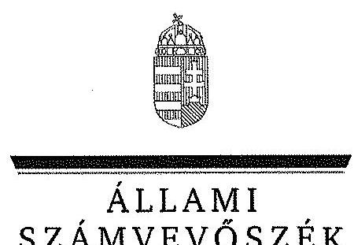
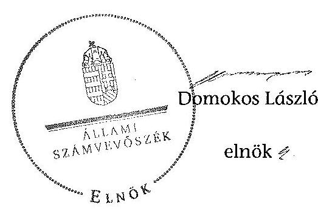

ÁLLAMI
SZÁMVEVŐSZÉK

# JELENTÉS 

az önkormányzatok belső kontrollrendszere kialakításának, egyes
kontrolltevékenységek és a belső ellenőrzés
működésének - 2013. évben induló - ellenőrzéséről
Tét
13172
2013. december

---

# Állami Számvevőszék 

Iktatószám: V-0139-033/2013.
Témaszám: 1162
Vizsgálat-azonosító szám: V064910

## Az ellenőrzést felügyelte:

Dr. Benedek Mária
felügyeleti vezető
Az ellenőrzést vezette és az ellenőrzés végrehajtásáért felelős:
Bíró Zsolt
ellenőrzésvezető
A számvevőszéki jelentés összeállításában közremúködött:
Gelencsér Zoltán
számvevő tanácsos
Az ellenőrzést végezték:
Fekete Győr László
Gölöncsér Péter
számvevő
számvevő

---

# TARTALOMJEGYZÉK 

BEVEZETÉS ..... 5
I. ÖSSZEGZŐ MEGÁLLAPÍTÁSOK, KÖVETKEZTETÉSEK, JAVASLATOK ..... 9
II. RÉSZLETES MEGÁLLAPÍTÁSOK ..... 15

1. Az önkormányzat belső kontrollrendszerének kialakítása ..... 15
1.1. A kontrollkörnyezet ..... 15
1.2. A kockázatkezelési rendszer ..... 16
1.3. A kontrolltevékenységek ..... 16
1.4. Az információs és kommunikációs rendszer ..... 18
1.5. A monitoring rendszer ..... 18
2. A pénzügyi folyamatokban kulcsszerepet betöltő teljesítésigazolás és érvényesítés belső kontrollok múködése ..... 18
3. A belső ellenőrzés múködése ..... 18

## FÜGGELÉKEK

1. számú Értelmező szótár
2. számú Az értékelés módja és szempontjai

---

.

---

# RÖVIDÍTÉSEK JEGYZÉKE 

## Törvények

Áht.
ÁSZ tv.
Kttv.
Ktv.
Mötv.
Ötv.
Számv. tv.

## Rendeletek, határozatok

Áhsz.

Ávr.

Bkr.

Ikr.
adatvédelmi és adatbiztonsági szabályzat

## Szórövidítések

ÁSZ
Belső ellenőrzési kézikönyv
gazdálkodási jogkörök szabályzata ${ }_{1}$
gazdálkodási jogkörök szabályzata ${ }_{2}$
Hivatal
hivatali SZMSZ

INTOSAI
2011. évi CXCV. törvény az államháztartásról (hatályos 2012. január 1-jétől)
2011. évi LXVI. törvény az Állami Számvevőszékről
2011. évi CXCIX. törvény a közszolgálati tisztviselők ről (hatályos 2012. március 1-jétől)
1992. évi XXIII. törvény a köztisztviselők jogállásáról (hatálytalan 2012. március 1-jétől)
2011. évi CLXXXIX. törvény Magyarország helyi önkormányzatairól (hatályos 2012. január 1-jétől)
1990. évi LXV. törvény a helyi önkormányzatokról
2000. évi C. törvény a számvitelről

249/2000. (XII. 24.) Korm. rendelet az államháztartás szervezetei beszámolási és könyvvezetési kötelezettségének sajátosságairól
368/2011. (XII. 31.) Korm. rendelet az államháztartásról szóló törvény végrehajtásáról (hatályos 2012. január 1jétől)
370/2011. (XII. 31.) Korm. rendelet a költségvetési szervek belső kontrollrendszeréről és belső ellenőrzéséről (hatályos 2012. január 1-jétől)
335/2005. (XII. 29.) Korm. rendelet a közfeladatot ellátó szervek iratkezelésének általános követelményeiről
Tét Város Önkormányzata Képviselő-testületének 188/2010. (XII. 22.) számú határozata az Informatikai biztonsági szabályzatról (hatályos 2010. december 22-től)

Állami Számvevőszék
Téti Többcélú Kistérségi Társulás Belső ellenőrzési kézikönyve (Hatályos 2012. március 30 -tól)
Tét Város Önkormányzata Kötelezettségvállalás, utalványozás, ellenjegyzés, érvényesítés rendjének szabályzata (hatályos 2011. év november 1-jétől)
Tét Város Önkormányzata Gazdálkodási Szabályzata (hatályos 2012. december 1-től)
Téti Közös Önkormányzati Hivatal
Tét Város Önkormányzata Polgármesteri Hivatalának Szervezeti és Müködési Szabályzata (hatályos 2007. április 13-tól)
International Organization of Supreme Audit Institutions (Legfőbb Ellenőrző Intézmények Nemzetközi Szervezete)

---

iratkezelési szabályzat
ISSAI
jegyzó
Képviselő-testület
NGM
Önkormányzat
pénzkezelési szabályzat
polgármester
Polgármesteri Hivatal
szabálytalanságkezelési
szabályzat
Társulás
ügyrend

Tét Város Önkormányzata Polgármesteri Hivatalának Iratkezelési Szabályzata (hatályos 2007. július 4-étől)
International Standards of Supreme Audit Institutions (Legfőbb Ellenőrző Intézmények Nemzetközi Standardjai)
Tét Város Önkormányzata jegyzője
Tét Város Önkormányzatának Képviselő-testülete
Nemzetgazdasági Minisztérium
Tét Város Önkormányzata
Tét Város Önkormányzata Pénzkezelési Szabályzata (ha-
tályos 2012. december 1-jétől)
Tét Város Önkormányzata polgármestere
Tét Város Önkormányzata Polgármesteri Hivatala
Tét Város Önkormányzata Szabálytalanságok kezelésé-
nek eljárásrendje (hatályos 2009. október 31-től)
Téti Kistérség Sokoróaljai Önkormányzatainak Többcélú Társulása
Tét Város Önkormányzata Polgármesteri Hivatalának Ügyrendje (hatályos 2009. szeptember 1-jétől)

---

# JELENTÉS 

## az önkormányzatok belsó kontrollrendszere kialakításának, egyes kontrolltevékenységek és a belső ellenőrzés múködésének - 2013. évben induló - ellenőrzéséről Tét

## BEVEZETÉS

Tét város állandó lakosainak száma 2012. január 1-jén 4160 fő volt. Az Önkormányzat héttagú Képviselő-testületének munkáját három állandó bizottság segítette. Az Önkormányzat az önállóan működő és gazdálkodó Polgármesteri Hivatalon kívül egy önállóan működő intézményt múködtetett, többségi tulajdoni hányadú gazdasági társasággal nem rendelkezett. A polgármester a 2010. évi önkormányzati választások óta tölti be tisztségét. A jegyző 1998. december 1-jétől látja el feladatait. A Polgármesteri Hivatal három szervezeti egységre (Gyámügyi csoport, Okmányirodai csoport, Pénzügyi és gazdálkodási csoport) tagolódott, elkülönített gazdasági szervezettel nem rendelkezett. A foglalkoztatott köztisztviselők száma 2012. január 1-jén 24 fő volt. A Képviselő-testület 2013. március 1-jétől Kisbabot, Mérges, Rábacsécsény és Rábaszentmihály községi önkormányzatok képviselő-testületeivel közös önkormányzati hivatalt (Téti Közös Önkormányzati Hivatal) alapított. Az Önkormányzat a 2012. évi költségvetési beszámolója szerint 1006092 ezer Ft tárgyévi bevételt ért el, valamint 956000 ezer Ft tárgyévi kiadást teljesített. A 2012. december 31-i könyvviteli mérleg szerint 1340116 ezer Ft értékű eszközvagyonnal rendelkezett, a rövid lejáratú kötelezettségállománya 27509 ezer Ft, hosszú lejáratú kötelezettségállománya 19728 ezer Ft volt.

A demokratikus társadalmakban alapvető igény, hogy a közpénzeket, a közvagyont használók tevékenységükről elszámoljanak, ahhoz egyértelmű és érvényesíthető felelősségi szabályok társuljanak. Ennek a jogos igénynek az érvényesítéséhez meg kell teremteni azokat a folyamatokat, rendszereket, amelyek nélkülözhetetlenek az elszámoltatáshoz. Az elszámoltatás eredményes múködtetéséhez szükség van a megfelelő információs, kontroll, értékelési és beszámolási rendszerek kialakítására.

Magyarországon az uniós csatlakozási tárgyalások idejére nyúlnak vissza a belső kontrollrendszer szabályozásának gyökerei. Az uniós elvárásoknak megfelelő új terminológia szerinti államháztartási belső pénzügyi ellenőrzési (ÁBPE) rendszer területén a jogharmonizáció 2003-ban teljes körűen megvalósult, míg az önkormányzati alrendszerre vonatkozó, Ötv.-ben megjelenített speciális szabályozás 2005-ben lépett hatályba. Az államháztartási belső kontrollrendszer koncepciója 2009-ben továbbfejlődött. A változások irányát mutat-

---

ja, hogy a költségvetési szervek belső kontrollrendszere már magában foglalja a korszerű, felelős szervezetirányítás elemeit (kontrollkörnyezet, kockázatkezelés, kontrolltevékenység, információ és kommunikáció, monitoring) is. E kontrollrendszer szabályozása háromszintű, a törvényi előírásokat az Áht. és a Mötv., a rendeleti szintű szabályozást az Ávr. és a Bkr. tartalmazza, amelyeket útmutatói szinten az NGM által kiadott standardok és kézikönyvek támogatnak.

A belső kontrollrendszer azt a célt szolgálja, hogy a költségvetési szervek múködésük és gazdálkodásuk során a tevékenységeket szabályszerűen, gazdaságosan, hatékonyan és eredményesen hajtsák végre, teljesítsék elszámolási kötelezettségeiket és megvédjék az erőforrásokat a veszteségektől, a károktól és a nem rendeltetésszerű használattól. A belső kontrollrendszer magában foglalja mindazon szabályokat, eljárásokat, gyakorlati módszereket és szervezeti struktúrákat, kockázatkezelési technikákat, kontrolltevékenységeket, amelyek segítséget nyújtanak a szervezetnek céljai eléréséhez.

Az ÁSZ a 2011-2015. évekre szóló stratégiájában hangsúlyos szerepet szánt annak, hogy szilárd szakmai alapon álló, értékteremtő ellenőrzéseivel előmozdítsa a közpénzügyek átláthatóságát, rendezettségét. A számvevőszéki ellenőrzés nemzetközi alapelvei is rögzítik, hogy a megfelelő belső kontrollrendszer minimálisra csökkenti a hibák és szabálytalanságok kockázatát.

Az ellenőrzés célja annak megállapítása volt, hogy a belső kontrollrendszer elemeinek kialakítása, a pénzügyi folyamatokban kulcsszerepet betöltő teljesítésigazolás és érvényesítés, és a belső ellenőrzés szabályos működése biztosítot-ta-e az önkormányzatnál a közpénzfelhasználás szabályosságát, hozzájárult-e az értéket teremtő rend követelményének érvényesüléséhez.

Ennek keretében értékeltük, hogy:

- a jogszabályi előírásoknak megfelelően alakították-e ki a belső kontrollrendszer elemeit;
- a gazdálkodás folyamatában kulcsszerepet betöltő teljesítésigazolás és érvényesítés kontrolltevékenységeit megfelelően működtették-e;
- biztosították-e a belső ellenőrzés szabályos múködését;
- amennyiben az ÁSZ tett javaslatot a 2008-2011. évek közötti ellenőrzése kapcsán az Önkormányzatnak, intézkedtek-e azok végrehajtására.

Az ellenőrzés várható hasznosulását négy szinten tervezzük. A törvényalkotás számára összegzett tapasztalatok állnak rendelkezésre a belső kontrollrendszer önkormányzati területen való kialakításáról, működéséről és hatásairól, a belső ellenőrzés működéséről. Ennek alapján következtetést lehet levonni arról, hogy a belső kontrollrendszer kialakítására és működtetésére vonatkozó jelenlegi, differenciálás nélküli - jogszabályi előírások reális követelményeket támasztanak-e az eltérő adottságú települési önkormányzatok esetében, illetve indokolt-e esetleges jogszabályi módosítás kezdeményezése. Az ellenőrzés az ellenőrzött számára visszajelzést ad a belső kontrollrendszer kialakításában és működésében fellépő hiányosságokról, javaslataival hozzájárul azok kiküsz-

---

öböléséhez, amely csökkentheti a későbbi ellenőrzések gyakoriságát. Az ellenőrzés megállapításait és javaslatait más szervezetek is hasznosíthatják a rendezett gazdálkodási keretek kialakításához. A társadalom számára jelzi, hogy közpénz nem maradhat ellenőrizetlenül, az ÁSZ értékteremtő rend kialakításához és megőrzéséhez hozzájáruló tevékenysége pozitív hatással lesz a szervezetről kialakított összkép formálásában. A szervezeten belül lehetőség nyílik arra, hogy a megállapítások szintetizálásával az ÁSZ a hozzáadott értéket teremtő elemző tevékenységét és tanácsadó szerepét is erősítse.

Az önkormányzatok belső kontrollrendszere kialakításának, egyes kontrolltevékenységek és a belső ellenőrzés működésének ellenőrzéséről szóló jelentés I. fejezetének összegző része az ellenőrzés céljára ad rövid, szintetizáló összefoglalót, és tartalmazza a következtetéseket a II. fejezet részletes megállapításain alapulóan. A jelentés intézkedést igénylő megállapításait és javaslatait az ellenőrzés során feltárt, a jelentés II. fejezetében rögzített részletes megállapítások alapozzák meg. A helyszíni ellenőrzés lezárásáig a helyi szabályozás változásait nyomon követtük.

Az ellenőrzés típusa: szabályszerűségi ellenőrzés.
Az ellenőrzött időszak: a belső kontrollrendszer kialakításának megfelelősége esetében a 2012. évre, a pénzügyi folyamatokban kulcsszerepet betöltő teljesítésigazolás és érvényesítés belső kontrollok múködésének megfelelőségét és a belső ellenőrzés szabályszerű működését a 2012. január 1. és december 31-e közötti időszak eseményeit figyelembe véve értékeltük, míg az ÁSZ javaslatainak utóellenőrzése a 2008-2011. években végzett ellenőrzések nyilvánosságra hozott jelentéseiben tett javaslatok áttekintésére terjedt ki.

# Az ellenőrzött szervezet: az Önkormányzat. 

Az ellenőrzés jogszabályi alapját az ÁSZ tv. 1. § (3) bekezdése, az 5. § (2) és (6) bekezdése, valamint az Áht. 61. § (2) bekezdésének előírásai képezik.

Az ellenőrzés szakmai módszertana az ÁSZ hivatalos honlapján (www.asz.hu) közzétett szakmai szabályokon alapult, amely az INTOSAI által kiadott ISSAI figyelembevételével készült.

Az ellenőrzés lefolytatásához az Önkormányzat a kimutatások és a tanúsítvány elektronikus kitöltésével, valamint az ÁSZ által kért dokumentumok elektronikus megküldésével szolgáltatott adatokat. Az így rendelkezésre bocsátott adatok, információk kontrollja és a munkalapok kitöltése a helyszíni ellenőrzés keretében történt. A jelentésben használt fogalmak magyarázatát az 1. számú függelék, az ellenőrzés egyes területeinek értékelésénél alkalmazott egységes minősítési szempontokat a 2. számú függelék tartalmazza.

A belső kontrollrendszer kialakításának ellenőrzése során értékeltük a kontrollkörnyezet, a kockázatkezelési rendszer, a kontrolltevékenységek, az információs és kommunikációs rendszer, valamint a monitoring rendszer szabályozottságának megfelelőségét. A pénzügyi folyamatokban kulcsszerepet betöltő teljesítésigazolás és érvényesítés kontrolljai múködése megfelelőségének minősítéséhez az állományba nem tartozók megbízási díjai, a külső szolgáltatók által

---

végzett karbantartási, kisjavítási munkák, az egyéb üzemeltetési és fenntartási szolgáltatások, a rendszeres szociális segélyek, valamint az államháztartáson kívülre teljesített múködési és felhalmozási célú pénzeszközátadások közül kockázatelemzéssel választottuk ki az ellenőrzött kiadási jogcímeket. Az egyszerű véletlen mintavétellel kiválasztott tételek ellenőrzését többlépcsős megfelelőségi tesztek útján addig végeztük, amíg elegendő és megfelelő bizonyítékot szereztünk a vizsgált folyamatok kulcskontrolljai müködésének megfelelő vagy nem megfelelő voltáról. Értékeltük az Önkormányzatnál a belső ellenőrzés működésének szabályosságát. Az ÁSZ az Önkormányzatnál a 2008. évben a helyi önkormányzatok gazdálkodási rendszerének ellenőrzését végezte. A nyilvánosságra hozott, 0927 számon közzétett számvevőszéki jelentésben azonban kifejezetten az Önkormányzat számára konkrét feladatot nem határozott meg, javaslatot nem tett, ezért a jelen ellenőrzés keretében utóellenőrzésre nem került sor.

Az ÁSZ tv. 29. § (1) bekezdése szerint a jelentéstervezetet megküldtük a polgármester részére, aki az ÁSZ tv. 29. § (2) bekezdésében foglalt észrevételezési jogával nem élt, a jelentéstervezetre észrevételt nem tett.

---

# I. ÖSSZEGZŐ MEGÁLLAPÍTÁSOK, KÖVETKEZTETÉSEK, JAVASLATOK 

A belső kontrollrendszeren belül 2012-ben a kontrollkörnyezet, a kockázatkezelési rendszer, a kontrolltevékenységek, az információs és kommunikációs rendszer, valamint a monitoring rendszer kialakítását külön-külön és együttesen is értékeltük. A belső kontrollrendszer kialakítása az összesített értékelés alapján nem felelt meg a jogszabályi előírásoknak.

A belső kontrollrendszer egyes területei kialakításának minősítése a következő:

| Kontrollterület | Minősítés |
| :-- | :-- |
| Kontrollkörnyezet | nem   megfelelö |
| Kockázatkezelési rendszer | nem   megfelelö |
| Kontrolltevékenységek | megfelelö |
| Információs és kommu-   nikációs rendszer | megfelelö |
| Monitoring rendszer | nem   megfelelö |

Megfelelőnek értékeltük a kontrolltevékenységek, valamint az információs és kommunikációs rendszer kialakítását, mivel a jogszabályi előírásokban foglaltakat figyelembe véve kisebb hiányosságok mellett is megteremtette e kontrollterületeken a szabályszerű működés lehetőségét.

Nem megfelelőnek értékeltük a kontrollkörnyezet, a kockázatkezelési rendszer és a monitoring rendszer kialakítását, mivel az ellenőrzésünk során megállapított szabályozásbeli hiányosságok magukban hordozzák a szabálytalan múködés, valamint a korrupció kockázatát.

A belső kontrollrendszer nem megfelelő kialakítása kockázatot jelent az Önkormányzat tevékenységeinek szabályszerű, gazdaságos, hatékony és eredményes végrehajtása során.

A 2012. évben az állományba nem tartozók megbízási díjaival, valamint a külső szolgáltatók által végzett karbantartási, kisjavítási munkákkal kapcsolatos kifizetések során a pénzügyi folyamatokban kulcsszerepet betöltő teljesítésigazolás és érvényesítés belső kontrollok múködése gyenge volt. Gyengének értékeltük a két kulcskontroll együttes múködését, mivel azok nem biztosították a hibák megelőzését és feltárását.

---

A számvevőszéki ellenőrzés az ellenőrzött kifizetésekkel összefüggésben a rendelkezésre bocsátott dokumentumok alapján jogosulatlan kifizetést nem tárt fel, azonban a gazdálkodásban kulcsszerepet betöltő kontrollok működésében feltárt hiányosságok miatt fennáll a hibák bekövetkezésének kockázata. A nem megfelelően működtetett belső kontrollok korrupciós kockázatot hordoznak.

Az Önkormányzat a belső ellenőrzési feladatokat a Társulás útján látta el. A 2012. évben a belső ellenőrzés múködése a jogszabályi előírásoknak megfelelt, azonban a belső ellenőrzés nem tárta fel a belső kontrollrendszer kialakításának, valamint a pénzügyi folyamatokban kulcsszerepet betöltő teljesítésigazolás és érvényesítés belső kontrollok múködésének hiányosságait.

Az ÁSZ tv. 33. § (1) bekezdésében foglaltak értelmében az ellenőrzött szervezet vezetője köteles a jelentésben foglalt megállapításokhoz kapcsolódó intézkedési tervet összeállítani, és azt a jelentés kézhezvételétől számított 30 napon belül az ÁSZ részére megküldeni. Amennyiben az intézkedési tervet határidőre nem küldi meg a szervezet, vagy az ÁSZ tv. 33. § (2) bekezdésében foglalt póthatáridő elteltével megküldött intézkedési terv továbbra sem elfogadható, az ÁSZ elnöke a hivatkozott törvény 33. § (3) bekezdés a)-b) pontjaiban foglaltakat érvényesítheti.

Az ellenőrzés intézkedést igénylő megállapításai és javaslatai:

# a polgármesternek 

A számvevőszéki ellenőrzés megállapításai alapján az Önkormányzatnál a belső kontrollrendszer kialakítása összefoglalóan értékelve nem felelt meg a jogszabályi előírásoknak, a kulcskontrollok müködése gyenge volt, a belső ellenőrzés müködése ugyan megfelelt a jogszabályi előírásoknak, azonban nem tárta fel, ezáltal nem is javíttatta ki a hiányosságokat. A megállapított szabályozásbeli és müködésbeli hiányosságok magukban hordozzák a szabálytalan müködés kockázatát.

Javaslat:
A Mötv. 115. § (1) bekezdésében foglaltak alapján kísérje figyelemmel az Önkormányzat gazdálkodásának szabályszerűségét. A Mötv. 67. § f) pontja alapján gondoskodjon a belső kontrollrendszer müködésére vonatkozó jogszabályi rendelkezések be nem tartása, valamint a teljesítésigazolás és az érvényesítés kontrollokkal összefüggésben feltárt hiányosságok, szabálytalanságok tekintetében az esetleges munkajogi felelősséggel kapcsolatos körülmények kivizsgálásáról, majd a vizsgálat eredményének függvényében tegye meg a szükséges munkajogi intézkedéseket.

## a jegyzőnek (Tét Város Önkormányzata vonatkozásában)

1. a kontrollkörnyezettel kapcsolatban:

A hivatali SZMSZ-ben a jegyző - az Ávr. 13. § (1) bekezdés c), e), f) és g) pontjaiban foglaltak ellenére - nem rögzítette az ellátandó és a szakfeladat rend szerint szakfeladat számmal és megnevezéssel besorolt alaptevékenységek és az alaptevékenységet szabályozó jogszabályok megjelölését; a Polgármesteri Hivatal szervezeti felépítését

---

és működési rendjét; azon ügyköröket, amelyek során a szervezeti egységek vezetői a költségvetési szerv képviselőjeként járhatnak el; a szervezeti és működési szabályzatban nevesített valamennyi munkakörhöz tartozó feladat- és hatásköröket, a hatáskörök gyakorlásának módját, a helyettesítés rendjét és az ezekhez kapcsolódó felelősségi szabályokat.

A jegyző - a Számv. tv. 14.§ (5) bekezdése b) pontjában és az Áhsz. 8. § (4) bekezdés b) pontjában foglaltak ellenére - nem készítette el az eszközök és források értékelési szabályzatát.

A jegyző - a Számv. tv. 161. § (2) bekezdés d) pontjában foglaltak ellenére - nem készítette el a Polgármesteri Hivatal bizonylati rendjét.

A jegyző a Kttv. 130. § (1) bekezdésében foglaltak ellenére a Polgármesteri Hivatalban dolgozó köztisztviselők teljesítményértékelését nem készítette el.

A Képviselő-testület - a Kttv. 231. § (1) bekezdése ellenére - nem állapította meg - a Kttv. 83. §-a szerinti - a köztisztviselőkkel szembeni hivatásetikai alapelvek részletes tartalmát, valamint az etikai eljárás szabályait, mivel a jegyző - az Ötv. 36. § (2) bekezdés a) pontjában előírt feladata ellenére - nem készítette elő ennek dokumentumát.

Javaslat:
a) Készítse el a hivatali SZMSZ módosítását, és kezdeményezze az Áht. 9. § (1) bekezdés a) pontjában foglaltakra tekintettel a Képviselő-testület elé terjesztését annak érdekében, hogy az tartalmazza az Ávr. 13. § (1) bekezdésében előírt tartalmi elemeket.
b) Készítse el a Hivatal eszközök és források értékelési szabályzatát a Számv. tv. 14. § (5) bekezdése b) pontjában és az Áhsz. 8. § (4) bekezdés b) pontjában előírtak alapján.
c) Készítse el az Számv. tv. 161. § (2) bekezdés d) pontjában előírtak alapján a Hivatal bizonylati rendjét.
d) Értékelje írásban a Kttv. 130. § (1) bekezdése alapján a Hivatal köztisztviselőinek munkateljesítményét.
e) Készítse elő a Mötv. 81. § (3) bekezdés c) pontjában foglalt feladatkörében a köztisztviselőkkel szembeni - a Kttv. 83. §-a szerinti - hivatásetikai alapelvek részletes tartalmának, valamint az etikai eljárás szabályainak dokumentumait, és a Kttv. 231. § (1) bekezdésében foglaltak érvényesülése érdekében kezdeményezze azok Képviselő-testület elé terjesztését.
2. a kockázatkezelési rendszerrel kapcsolatban:

A jegyző - a Bkr. 7. § (2) bekezdésében foglaltak ellenére - nem állapította meg a Polgármesteri Hivatal tevékenységében rejlő kockázatokat, nem határozta meg az egyes kockázatok kezeléséhez szükséges intézkedéseket, valamint a kockázatok kezelése érdekében szükséges intézkedések teljesítésének folyamatos nyomon követési módját.

---

Javaslat:
Állapítsa meg - a Bkr. 7. § (2) bekezdésében foglaltak alapján - a Hivatal tevékenységében rejlő kockázatokat, és határozza meg az egyes kockázatok kezeléséhez szükséges intézkedéseket, valamint a kockázatok kezelése érdekében szükséges intézkedések teljesítésének folyamatos nyomon követési módját.
3. a kontrolltevékenységekkel kapcsolatban:

A jegyző az Ávr. 53. § (2) bekezdésében foglaltakat figyelmen kívül hagyva annak ellenére nem határozta meg az előzetes írásbeli kötelezettségvállalást nem igénylő kifizetések rendjét, hogy a gazdálkodási jogkörök szabályzata ${ }_{1,2}$-ben lehetővé tette a 100 ezer Ft-ot el nem érő kifizetések előzetes írásbeli kötelezettségvállalás nélküli teljesítését.

A jegyző az iratkezelési rendszer kialakítása során - az lkr. 8. § (2) bekezdésében foglaltak ellenére - nem határozta meg az üzemeltetés és az adatbiztonság védelmének feladatai esetében a hatásköröket.

A jegyző - a Kttv. 74. § (1) bekezdésében foglaltak ellenére - jogviszony megszűnése esetére nem szabályozta a munkavállaló folyamatban lévő feladatai átadásának rendjét.

Javaslat:
a) Rögzítse belső szabályzatban az Ávr. 53. § (2) bekezdése alapján az előzetes írásbeli kötelezettségvállalást nem igénylő kifizetések rendjét.
b) Határozza meg az lkr. 8. § (2) bekezdésében foglaltaknak megfelelően az iratkezelési rendszer kialakítása során az üzemeltetés és az adatbiztonság védelmének feladatai esetében a hatásköröket.
c) Rögzítse belső szabályzatban a Kttv. 74. § (1) bekezdésében foglaltaknak megfelelően a jogviszony megszűnése esetére a munkavállaló folyamatban lévő feladatai átadásának rendjét.
4. az információs és kommunikációs rendszerrel kapcsolatban:

A jegyző - a Bkr. 3. § d) pontjában és a 9. § (1) bekezdésében foglaltak ellenére nem alakított ki olyan rendszert, amely biztosítja, hogy a megfelelő információk a megfelelő időben eljutnak az illetékes szervezethez, szervezeti egységhez, személyhez.

Javaslat:
Alakítson ki a Bkr. 3. § d) pontjában és a 9. § (1) bekezdésében foglaltaknak megfelelően olyan rendszereket, melyek biztosítják, hogy a megfelelő információk a megfelelő időben eljutnak az illetékes szervezethez, szervezeti egységhez, illetve személyhez.

---

5. a monitoring rendszerrel kapcsolatban:

A jegyző - az Bkr. 3. § e) pontjában és 10. §-ában foglaltak ellenére - nem alakított ki a Polgármesteri Hivatal tevékenységének, a célok megvalósításának nyomon követését biztosító rendszert.

A jegyző - a Bkr. 11. § (1) bekezdésében foglalt kötelezettsége ellenére - a Bkr. 1. mellékletében foglalt nyilatkozatban a 2011. évre vonatkozóan nem értékelte a Polgármesteri Hivatal belső kontrollrendszerének minőségét.

Javaslat:
a) Alakítsa ki és múködtesse a Bkr. 3. § e) bekezdésében és 10. §-ában előírtak alapján a Hivatal tevékenységének, a célok megvalósításának nyomon követését biztosító rendszert, amelynek része az operatív tevékenységek keretében megvalósuló folyamatos és eseti nyomon követés is.
b) Értékelje a Bkr. 11. § (1) bekezdésében előírtaknak megfelelően a jogszabályban meghatározott keretek között a belső kontrollrendszer minőségét a Bkr. 1. melléklete szerinti nyilatkozatban.
6. a pénzügyi folyamatokban kulcsszerepet betöltő kontrollokkal kapcsolatban:

A teljesítésigazolást az Ávr. 57. § (3) bekezdésében foglaltak ellenére nem az arra jogosult személy végezte, illetve az Áht. 38. § (1) bekezdésében és az Ávr. 57. § (1) bekezdésében foglaltak ellenére nem végezték el.

Az érvényesítő a feladatait az Ávr. 58. § (1) bekezdésében foglaltak ellenére - szabályszerű teljesítésigazolás hiányában - nem a jogszabályi előírásoknak megfelelően végezte, továbbá a fedezet meglétét nem ellenőrizte, mert a kötelezettségvállalásokat - az Ávr. 56. § (1) bekezdésében előírtakat figyelmen kívül hagyva - nem vették nyilvántartásba. Az érvényesítő - az Ávr. 58. § (2) bekezdésében előírtak ellenére nem jelezte az utalványozónak, hogy a megelőző ügymenetben - az Ávr. 57. § (3) bekezdésében előírtak ellenére - a teljesítés igazolását nem az arra jogosult személy végezte, hogy a teljesítés igazolására jogosult személy - az Ávr. 57. § (1) bekezdésének előírása ellenére - a teljesítés igazolását nem végezte el, továbbá hogy a kiadási bizonylatokon nem tüntették fel - az Ávr. 59. § (3) bekezdés f) pontjában és (4) bekezdésében előírtak ellenére - a kötelezettségvállalás nyilvántartási számát, mert a kötelezettségvállalásokat - az Ávr. 56. § (1) bekezdésében előírtakat figyelmen kívül hagyva - nem vették nyilvántartásba.

Javaslat:
Intézkedjen - a teljesítésigazolás és az érvényesítés vonatkozásában feltárt hiányosságok megszüntetése, illetve az operatív gazdálkodás során a müködésbeli hibák megelőzése, feltárása és kijavítása érdekében - arról, hogy:
a) az Áht. 38. § (1) bekezdésén alapuló teljesítésigazolás során az Ávr. 57. § (1) bekezdésében előírtaknak megfelelően, ellenőrizhető okmányok alapján ellenőrizzék és igazolják a kiadások teljesítésének jogosságát, összegszerűségét, az ellenszolgáltatást is magában foglaló kötelezettségvállalás esetén annak teljesítését,

---

valamint az Ávr. 57. § (3) bekezdése szerint a teljesítést az igazolás dátumának és a teljesítés tényére történő utalásnak a megjelölésével, az arra jogosult személy aláírásával igazolják;
b) a kifizetéseket megelőzően a teljesítésigazolás alapján - az Ávr. 57. § (3) bekezdése szerinti esetben annak hiányában is - az összegszerűségnek, a fedezet meglétének és a megelőző ügymenetben az Áht., az Áhsz., az Ávr. előírásai és a belső szabályzatokban foglaltak betartásának az ellenőrzése - az Ávr. 58. § (1)-(3) bekezdései szerint - történjen meg;
c) a kötelezettségvállalások nyilvántartását az Ávr. 56. § (1) bekezdésében foglalt előírásnak megfelelően vezessék, és az Ávr. 59. § (3)-(4) bekezdése alapján az utalványon, valamint a bevételi és kiadási pénztárbizonylatra rávezetett rendelkezésen a kötelező tartalmi elemeket tüntessék fel.
7. a belső ellenőrzés működésével kapcsolatban:

Az Ötv. 92. § (5) bekezdésében és a Bkr. 29. § (1) bekezdésében foglaltak ellenére a 2013. évre az Önkormányzatra vonatkozó éves belső ellenőrzési terv nem készült.

A Bkr. 21. § (2) bekezdés d) pontjában és a 47. § (1) bekezdésében foglaltak ellenére a belső ellenőrzési jelentésekben tett javaslatokat, a vonatkozó intézkedési terveket és azok végrehajtását nyomon követő nyilvántartást a belső ellenőrzési vezető nem vezette.

A 2011. évre vonatkozó éves ellenőrzési jelentés nem tartalmazta - a Bkr. 48. § b) pont ba) alpontjában foglaltak ellenére - a belső kontrollrendszer szabályszerűségének, gazdaságosságának, hatékonyságának és eredményességének növelése, javítása érdekében tett javaslatokat, valamint - a Bkr. 48. § b) pont bb) alpontjában foglaltak ellenére - a belső kontrollrendszer öt elemének értékelését.

Javaslat:
a) Kezdeményezze, hogy az éves ellenőrzési terv - a Bkr. 56. § (2) bekezdésnek megfelelően a jegyző írásos véleményének figyelembevételével - a Bkr. 22. § (1) bekezdés b) pontjában, a 29. § (1) bekezdésében és a 31. § (1) bekezdésében foglaltak szerint készüljön el.
b) Kezdeményezze, hogy a belső ellenőrzési vezető vezessen a Bkr. 21. § (2) bekezdése d) pontjának és a Bkr. 47. § (1) bekezdésének megfelelően a belső ellenőrzési jelentésekben tett megállapításokat, javaslatokat, a vonatkozó intézkedési terveket és azok végrehajtását nyomon követő nyilvántartást.
c) Kezdeményezze, hogy az éves ellenőrzési jelentés tartalmazza a Bkr. 48. §-ában előírt tartalmi elemeket.

---

# II. RÉSZLETES MEGÁLLAPÍTÁSOK 

## 1. AZ ÖNKORMÁNYZAT BELSŐ KONTROLLRENDSZERÉNEK KIALAKÍTÁSA

A belső kontrollrendszeren belül 2012-ben a kontrollkörnyezet, a kockázatkezelési rendszer, a kontrolltevékenységek, az információs és kommunikációs rendszer, valamint a monitoring rendszer kialakítását külön-külön és együttesen is értékeltük. A belső kontrollrendszer kialakítása az összesített értékelés alapján nem felelt meg a jogszabályi előírásoknak.

### 1.1. A kontrollkörnyezet

A kontrollkörnyezet kialakítása - a 2. számú függelékben részletezett kritériumrendszer alapján végzett értékelés szerint - nem felelt meg a jogszabályi előírásoknak, mert:

| Sor-   szám $^{1}$ | Megállapítás |
| :--: | :--: |
| 4. | A Képviselő-testület a Ktv. 34. § (3) bekezdésében foglaltak ellenére nem döntött a teljesítményértékelés alapját képező célokról. |
| 5.,   7.,8.,   9., 10 | A Polgármesteri Hivatal rendelkezett a 2012. évben az Áht. 10. § (5) bekezdésében előírt hivatali SZMSZ-szel, azonban 2010. január l-jét követően azt nem vizsgálta felül és nem aktualizálta, mivel a hivatali SZMSZben a jegyző az Ávr. 13. § (1) bekezdés c) pontjában foglaltak ellenére nem rögzítette az ellátandó és a szakfeladat rend szerint szakfeladat számmal és megnevezéssel besorolt alaptevékenységek és az alaptevékenységet szabályozó jogszabályok megjelölését. Továbbá az Ávr. 13. § (1) bekezdés e) pontjában foglaltak ellenére nem rögzítette a Polgármesteri Hivatal szervezeti felépítését és múködési rendjét, az Ávr. 13. § (1) bekezdés f) pontjában foglaltak ellenére nem rögzítette azokat az ügyköröket, amelyek során a szervezeti egységek vezetői a költségvetési szerv képviselőjeként járhatnak el, valamint az Ávr. 13. § (1) bekezdés g) pontjában foglaltak ellenére nem rögzítette a szervezeti és múködési szabályzatban nevesített valamennyi munkakörhöz tartozó feladat- és hatásköröket, a hatáskörök gyakorlásának módját, a helyettesítés rendjét és az ezekhez kapcsolódó felelősségi szabályokat. |
| 29. | A jegyző - a Számv. tv. 14. § (5) bekezdés b) pontjában és az Áhsz. 8. § (4) bekezdés b) pontjában foglaltak ellenére - nem készítette el az eszközök és források értékelési szabályzatát. |

[^0]
[^0]:    ${ }^{1}$ A megállapítás számozása az Önkormányzat által az adatszolgáltatás során kitöltött kimutatások kérdéseinek sorszámával azonos.

---

31. A jegyző - a Számv. tv. 161. § (2) bekezdés d) pontjában foglaltak ellenére - nem készítette el a Polgármesteri Hivatal bizonylati rendjét.
A jegyző a Kttv. 130. § (1) bekezdésében foglaltak ellenére a Polgármesteri Hivatalban dolgozó köztisztviselők teljesítményértékelését nem készítette el.

A Kttv. 231. § (1) bekezdése ellenére a Képviselő-testület nem állapította meg a Kttv. 83. §-ában előírt, a köztisztviselőkkel szembeni hivatásefikai alapelvek részletes tartalmát, valamint az etikai eljárás szabályait, mivel a jegyző az Ötv. 36. § (2) bekezdés a) pontjában előírt feladata ellenére nem készítette elő ennek dokumentumát.

# 1.2. A kockázatkezelési rendszer 

A kockázatkezelési rendszer kialakítása - a 2. számú függelékben részletezett kritériumrendszer alapján végzett értékelés szerint - nem felelt meg a jogszabályi előírásoknak, mert:

| Sorszám | Megállapítás |
| :--: | :--: |
| 2., 8.,   10. | A jegyző - a Bkr. 7. § (2) bekezdésében foglaltak ellenére - nem állapította meg a Polgármesteri Hivatal tevékenységében rejlő kockázatokat, valamint nem határozta meg az egyes kockázatok kezeléséhez szükséges intézkedéseket, és a kockázatok kezelése érdekében szükséges intézkedések teljesítésének folyamatos nyomon követési módját. |

### 1.3. A kontrolltevékenységek

A kontrolltevékenységek kialakítása - a 2. számú függelékben részletezett kritériumrendszer alapján végzett értékelés szerint - a jogszabályi előírásoknak megfelelt.

A jegyző a kontrolltevékenység részeként a folyamatba épített, előzetes, utólagos és vezetői ellenőrzést előírta a költségvetés tervezése, a támogatások elszámolása és a vagyonhasznosítási tevékenység vonatkozásában, továbbá a beszerzések lebonyolításának folyamatában.

A gazdálkodási jogkörök szabályzata ${ }_{1}$-ben, illetve 2012. november 30 -tól a gazdálkodási jogkörök szabályzata ${ }_{2}$-ben meghatározták a kötelezettségvállalás pénzügyi ellenjegyzésének és a kiadások teljesítésigazolásának módját. Az érvényesítés és az utalványozás rendjét a gazdálkodási jogkörök szabályzata1ben, illetve 2012. november 30 -tól a gazdálkodási jogkörök szabályzata2-ben szabályozták.

A jegyző a jogszabályi előírásoknak megfelelően gondoskodott az iratkezelési szoftver által kezelt adatok biztonságáról, kialakította az üzembiztonsági és adatvédelmi szabályok érvényre juttatásához szükséges eljárási szabályokat, valamint az iratkezelési rendszer kialakítása során a jogszabályi előírásoknak megfelelően szabályozta az üzemeltetés és az adatbiztonság védelmének feladatait. Az informatikai rendszer kialakítása során a jogszabályi előírásoknak

---

megfelelően biztosította az adatok biztonságát, és a hozzáférési jogosultságokra vonatkozó eljárásrendben meghatározta a felelősségi köröket.

Az ügyrendben meghatározták az időközi és éves beszámolók elkészítésének feladatait. A gazdálkodási jogkörök szabályzata ${ }_{2}$-ben és az ügyrendben szabályozták a beszámolási eljárásokhoz kapcsolódó felelősségi köröket, továbbá a hivatali SZMSZ-ben, illetve a pénzkezelési szabályzatban a gazdasági feladatot ellátó vezetők és alkalmazottak helyettesítésének rendjét. A költségvetési beszámoló elkészítésével megbízott személy rendelkezik a jogszabályban előírt iskolai végzettséggel és a tevékenység ellátására jogosító engedéllyel.

A polgármester a jogszabályi előírásoknak megfelelően tájékoztatta a Képvise-lő-testületet az Önkormányzat gazdálkodásának első félévi, illetve háromnegyed éves helyzetéről. Megbízást adott a kötelezettségvállalásra és utalványozásra, és egyben biztosította az összeférhetetlenségre vonatkozó előírás érvényesülését. A pénzügyi ellenjegyzési, illetve érvényesítési feladatra a jegyző a Polgármesteri Hivatal állományában dolgozó köztisztviselőt jelölt ki, ezzel is biztosítva az összeférhetetlenségre vonatkozó előírások érvényesülését. A pénzügyi ellenjegyzésre és az érvényesítési feladatok ellátására kijelölt személyek rendelkeztek a jogszabályban előírt szakképzettséggel.

A kontrolltevékenységek kialakítása az alábbi kisebb hiányosságok mellett megfelelt a jogszabályi előírásoknak:

| Sorszám | Megállapítás | Megjegyzés |
| :--: | :--: | :--: |
| 8. | A jegyző az Ávr. 53. § (2) bekezdésében foglaltakat figyelmen kívül hagyva, annak ellenére nem határozta meg az előzetes írásbeli kötelezettségvállalást nem igénylő kifizetések rendjét, hogy a gazdálkodási jogkörök szabályzata ${ }_{1,2}$ ben lehetővé tette a 100 ezer Ft-ot el nem érő kifizetések előzetes írásbeli kötelezettségvállalás nélküli teljesítését. |  |
| 10. | A polgármester mint kötelezettségvállaló - az Ávr. 57. § (4) bekezdésében foglaltak ellenére - a 2012. március 31-tól 2012. november 30 -ig terjedő időszakra nem jelölte ki a teljesítésigazolásra jogosult személyeket. | A kötelezettségvállaló (polgármester) 2012. december 1-jétől jelölte ki a teljesítésigazolásra jogosultakat. |
| 15. | A jegyző az iratkezelési rendszer kialakítása során - az lkr. 8. § (2) bekezdésében foglaltak ellenére - nem határozta meg az üzemeltetés és az adatbiztonság védelmének feladatai esetében a hatásköröket. |  |

---

A jegyző a Kttv. 74. § (1) bekezdésében foglaltak ellenére jogviszony megszủné-
32. se esetére nem szabályozta a munkavállaló folyamatban lévő feladatai átadásának rendjét.

# 1.4. Az információs és kommunikációs rendszer 

Az információs és kommunikációs rendszer kialakítása - a 2. számú függelékben részletezett kritériumrendszer alapján végzett értékelés szerint - a jogszabályi előírásoknak megfelel.

A Polgármesteri Hivatal rendelkezik az Info tv. előírásainak megfelelő adatvédelmi és adatbiztonsági szabályzattal. A jegyző kialakította a kötelezően közzéteendő adatok nyilvánosságra hozatalának rendjét. Az Önkormányzat az elektronikus közzétételi kötelezettségének a 2012. évben eleget tett. Meghatározták a közérdekú adatok megismerésére irányuló igények teljesítésének rendjét. A Polgármesteri Hivatal rendelkezett a jegyző által elkészített és hatályba helyezett - a jogszabályi előírásoknak megfelelő tartalmú - iratkezelési szabályzattal. A jegyző szabályozta az ügyintézési határidők nyomon követésének dokumentálását, és meghatározta a késedelmes ügyintézés felelősségi rendjét. A Polgármesteri Hivatal szabálytalanságkezelési szabályzata tartalmazza a szabálytalansági gyanú észlelésével és jelentésével kapcsolatos részletes eljárásrendet.

Az információs és kommunikációs rendszer kialakítása az alábbi kisebb hiányosságok mellett megfelelt a jogszabályi előírásoknak:

| Sorszám | Megállapítás |
| :--: | :--: |
| 1., 2. | A jegyző - a Bkr. 3. § d) pontjában és a 9. § (1) bekezdésében foglaltak ellenére - nem alakított ki olyan rendszert, amely biztosítja, hogy a megfelelő információk a megfelelő időben eljutnak az illetékes szervezethez, szervezeti egységhez, személyhez. |

### 1.5. A monitoring rendszer

A monitoring rendszer kialakítása - a 2. számú függelékben részletezett kritériumrendszer alapján végzett értékelés szerint - a jogszabályi előírásoknak nem felelt meg, mert:

| Sorszám | Megállapítás |
| :--: | :--: |
| 1. | A jegyző az Bkr. 3. § e) pontjában és 10. §-ában foglaltak ellenére nem alakított ki a Polgármesteri Hivatal tevékenységének, a célok megvalósításának nyomon követését biztosító rendszert. |
| 9. | A jegyző a Bkr. 11. § (1) bekezdésében foglalt kötelezettsége ellenére - a Bkr. 1. mellékletében foglalt nyilatkozatban - a 2011. évre vonatkozóan nem értékelte a Polgármesteri Hivatal belső kontrollrendszerének minőségét. |

---

A helyi önkormányzatok törvényességi felügyeletét ellátó kormányhivatal törvényességi felhívással vagy más törvényességi felügyeleti eszközzel 2012-ben nem élt.

# 2. A PÉNZÜGYI FOLYAMATOKBAN KULCSSZEREPET BETÖLTŐ TELJESÍTÉSIGAZOLÁS ÉS ÉRVÉNYESÍTÉS BELSŐ KONTROLLOK MÜKÖDÉSE 

A 2012. évben az állományba nem tartozók megbízási díjaival, a külső szolgáltatók által végzett karbantartással, kisjavítással kapcsolatos kifizetések során összefoglalóan értékelve - a pénzügyi folyamatokban kulcsszerepet betöltő teljesítésigazolás és érvényesítés belső kontrollok müködésének megfelelősége gyenge volt, mert:

| Kulcskontrollok | Megállapítás |
| :--: | :--: |
| Teljesítésigazolás | A teljesítésigazolást az Ávr. 57. § (3) bekezdésében foglaltak ellenére nem az arra jogosult személy végezte, illetve az Áht. 38. § (1) bekezdésében és az Ávr. 57. § (1) bekezdésében foglaltak ellenére nem végezték el. |
| Érvényesítés | Az érvényesítő a feladatait az Ávr. 58. § (1) bekezdésében foglaltak ellenére - szabályszerű teljesítésigazolás hiányában - nem a jogszabályi előírásoknak megfelelően végezte, továbbá a fedezet meglétét nem ellenőrizte, mert a kötelezettségvállalásokat - az Ávr. 56. § (1) bekezdésében előírtakat figyelmen kívül hagyva - nem vették nyilvántartásba. Az érvényesítő - az Ávr. 58. § (2) bekezdésében előírtak ellenére - nem jelezte az utalványozónak, hogy a megelőző ügymenetben az Ávr. 57. § (3) bekezdésében előírtak ellenére a teljesítés igazolását nem az arra jogosult személy végezte, hogy a teljesítés igazolására jogosult személy az Ávr. 57. § (1) bekezdésének előírása ellenére a teljesítés igazolását nem végezte el, továbbá hogy a kiadási bizonylatokon nem tüntették fel - az Ávr. 59. § (3) bekezdés f) pontjában és (4) bekezdésében előírtak ellenére - a kötelezettségvállalás nyilvántartási számát, mert a kötelezettségvállalásokat - az Ávr. 56. § (1) bekezdésében előírtakat figyelmen kívül hagyva - nem vették nyilvántartásba. |

A 2012. évben az állományba nem tartozók megbízási díjainak kifizetése során a teljesítésigazolás és az érvényesítés kulcskontrollok müködésének megfelelősége gyenge volt, mert:

- a szociális tevékenységre és egyéb vagyonvédelemre, a tanyagondnoki feladatokra, valamint a szociális tevékenységre teljesített kiadások esetében az Ávr. 57. § (4) bekezdésében foglaltak ellenére - nem az arra jogosult személy végezte a teljesítés igazolását;
- az érvényesítő a feladatait - a szociális tevékenységre és egyéb vagyonvédelemre, a tanyagondnoki feladatokra és a szociális tevékenységre teljesített kiadások esetében - az Ávr. 58. § (1) bekezdésében foglaltak ellenére - szabályszerű teljesítésigazolás hiányában - nem a jogszabályi előírásoknak megfelelően végezte, továbbá a fedezet meglétét nem ellenőrizte, mert a kö-

---

telezettségvállalásokat a 2012. évben - az Ávr. 56. § (1) bekezdésében előírtakat figyelmen kívül hagyva - nem vették nyilvántartásba;

- az érvényesítő - az Ávr. 58. § (2) bekezdésében előírtak ellenére - nem jelezte az utalványozónak, hogy a teljesítés igazolását nem az arra jogosult személy végezte, valamint azt, hogy a kiadási bizonylatokon - az Ávr. 59. § (3) bekezdés f) pontjában és (4) bekezdésében foglaltak ellenére - nem tüntették fel a kötelezettségvállalás nyilvántartási számát, mert a kötelezettségvállalásokat a 2012. évben - az Ávr. 56. § (1) bekezdésében előírtakat figyelmen kívül hagyva - nem vették nyilvántartásba.

A 2012. évben a külső szolgáltatók által teljesített karbantartási, kisjavítási munkákra történő kifizetések során a teljesítésigazolás és az érvényesítés kulcskontrollok múködésének megfelelősége gyenge volt, mert:

- a teljesítésigazolást a gyógyszertár tetőfelújítására teljesített kiadás esetében - az Ávr. 57. § (4) bekezdésében foglaltak ellenére - nem az arra jogosult személy végezte, valamint a traktor javítására teljesített kiadás esetében az Áht. 38. § (1) bekezdésének és az Ávr. 57. § (1) bekezdésében foglaltak ellenére nem végezték el;
- az érvényesítő a feladatait - a gyógyszertár tetőfelújítására és a traktor javítására teljesített kiadások esetében az Ávr. 58. § (1) bekezdésében foglaltak ellenére - szabályszerű teljesítésigazolás hiányában nem a jogszabályi előírásoknak megfelelően végezte, továbbá a fedezet meglétét nem ellenőrizte, mert a kötelezettségvállalásokat a 2012. évben - az Ávr. 56. § (1) bekezdésében előírtakat figyelmen kívül hagyva - nem vették nyilvántartásba;
- az érvényesítő - az Ávr. 58. § (2) bekezdésében előírtak ellenére - nem jelezte az utalványozónak, hogy a teljesítés igazolását arra nem jogosult személy végezte, valamint azt, hogy a kiadási bizonylatokon - az Ávr. 59. § (3) bekezdés f) pontjában és (4) bekezdésében előírtak ellenére - nem tüntették fel a kötelezettségvállalás nyilvántartási számát, mert a kötelezettségvállalásokat a 2012. évben - az Ávr. 56. § (1) bekezdésében előírtakat figyelmen kívül hagyva - nem vették nyilvántartásba.

A számvevőszéki ellenőrzés az ellenőrzött kifizetésekkel összefüggésben a rendelkezésre bocsátott dokumentumok alapján jogosulatlan kifizetést nem tárt fel, azonban a gazdálkodásban kulcsszerepet betöltő kontrollok múködésében feltárt hiányosságok miatt fennáll a hibák bekövetkezésének kockázata. A nem megfelelően múködtetett belső kontrollok korrupciós kockázatot hordoznak.

# 3. A BELSŐ ELLENŐRZÉS MŰKÖDÉSE 

Az Önkormányzatnál a belső ellenőrzés múködése - a 2. számú függelékben részletezett kritériumrendszer alapján végzett értékelés szerint - megfelelt a jogszabályi előírásoknak, azonban a belső ellenőrzés nem tárta fel a belső kontrollrendszer kialakításának, valamint a pénzügyi folyamatokban kulcsszerepet betöltő teljesítésigazolás és érvényesítés belső kontrollok múködésének hiányosságait.

---

Az Önkormányzat a belső ellenőrzési feladatokat - képviselő-testületi döntés alapján - a Társulás útján látta el. Az Önkormányzat rendelkezett a jogszabályi előírásoknak megfelelő tartalmú Belső ellenőrzési kézikönyvvel, amelyet a Társulás munkaszervezetének vezetője hagyott jóvá. A kijelölt belső ellenőrzési vezető megfelelt a jogszabályban előírt képesítési és szakmai gyakorlati követelményeknek.

A belső ellenőrzés elkészítette az ellenőrzések tervezését megalapozó, a jogszabályi előírásoknak megfelelő tartalmú stratégiai ellenőrzési tervet. A 2012. évi ellenőrzési tervben foglalt valamennyi ellenőrzést végrehajtották. Soron kívüli ellenőrzést 2012-ben nem végeztek. Ellenőrzés megszakítására, illetve felfüggesztésére a 2012. évben nem került sor. A 2012. évben végrehajtott ellenőrzésekhez - a belső ellenőrzési vezető által jóváhagyott, a Bkr.-ben foglalt tartalmi követelményeknek megfelelő - ellenőrzési programok készültek. Az elvégzett ellenőrzésekről a jogszabályban előírt tartalmú jelentések készültek, az ellenőrzésekről a belső ellenőrzési vezető nyilvántartást vezetett. A belső ellenőrzés által tett javaslatok alapján minden esetben készítettek intézkedési tervet. A belső ellenőrzési vezető által az Önkormányzatnál a 2011. évben végzett ellenőrzések alapján - a Bkr.-ben előírt tartalommal - összeállított éves ellenőrzési jelentést a Társulás munkaszervezetének vezetője a jegyzőnek elküldte.

A belső ellenőrzés működése az alábbi kisebb hiányosságok mellett megfelelt a jogszabályi előírásoknak:

| Sorszám | Megállapítás |
| :--: | :--: |
| 8. | Az Ötv. 92. § (5) bekezdésében ${ }^{2}$ és a Bkr. 29. § (1) bekezdésében foglaltak ellenére a 2013. évre az Önkormányzatra vonatkozó éves belső ellenőrzési terv nem készült. |
| 24.,   26. | A Bkr. 21. § (2) bekezdés d) pontjában és a 47. § (1) bekezdésében foglaltak ellenére a belső ellenőrzési vezető a 2012. évi ellenőrzési jelentésekben tett javaslatokat, a vonatkozó intézkedési terveket és azok végrehajtását nyomon követő nyilvántartást nem vezetett. |
| 27.a)   27.b) | A 2011. évre vonatkozó éves ellenőrzési jelentés nem tartalmazta - a Bkr. 48. § b) pontjának ba) alpontjában foglaltak ellenére - a belső kontroll rendszer szabályszerűségének, gazdaságosságának, hatékonyságának és eredményességének növelése érdekében tett javaslatokat, valamint - a Bkr. 48. § b) pontjának bb) alpontjában foglaltak ellenére - a belső kontrollrendszer öt elemének értékelését. |

Az Önkormányzat az ÁSZ-tól a 2011., 2012. és 2013. években integritás kérdőív kitöltésére kapott felkérést, amelynek nem tett eleget. A kockázatkezelési rendszer hiányosságai (a külső és belső kockázatok beazonosításának hiánya, a kockázatok kezeléséhez szükséges intézkedések, és azok nyomon követési módja meghatározásának hiánya) és az információs rendszer szabályozása és kialakítása során feltárt hibák, a köztisztviselőkkel szembeni hivatásetikai alapelvek meghatározásának, valamint az etikai eljárás szabályainak és a 2013. évi el-

[^0]
[^0]:    ${ }^{2}$ 2013. január 1-től a Mötv. 119. § (4) bekezdése tartalmazza.

---

lenőrzési terv hiánya arra utalnak, hogy az Önkormányzatnak még fejlődést kell elérnie az integritási szemlélet érvényesítésében.

Budapest, 2013. 12. hó 31. nap

Függelék: $\quad 2 \mathrm{db}$

---

# ÉRTELMEZŐ SZÓTÁR 

belső ellenőrzés
belső kontrollrendszer
területei
egyszerű véletlen mintavétel
integritás
kockázat
kockázatkezelési rendszer
kontrollkörnyezet

Független, tárgyilagos bizonyosságot adó és tanácsadó tevékenység, amelynek célja, hogy az ellenőrzött szervezet múködését fejlessze és eredményességét növelje, az ellenőrzött szervezet céljai elérése érdekében rendszerszemléletű megközelítéssel és módszeresen értékeli, illetve fejleszti az ellenőrzött szervezet irányítási és belső kontrollrendszerének hatékonyságát. (Forrás: Bkr. 2. § b) pontja)
A belső kontrollrendszer a kockázatok kezelése és tárgyilagos bizonyosság megszerzése érdekében kialakított folyamatrendszer, amely azt a célt szolgálja, hogy a múködés és gazdálkodás során a tevékenységeket szabályszerűen, gazdaságosan, hatékonyan, eredményesen hajtsák végre, az elszámolási kötelezettségeket teljesítsék, megvédjék az erőforrásokat a veszteségektől, károktól és nem rendeltetésszerú használattól. (Forrás: Áht. 69. § (1) bekezdése)
A kontrollkörnyezet, a kockázatkezelési rendszer, a kontrolltevékenységek, az információs és kommunikációs rendszer, valamint a nyomon követési (monitoring) rendszer. (Forrás: Bkr. 3. §-a)
Az alapsokaságból egyszerű véletlen kiválasztással képzett részsokaság. (Forrás: Az ÁSZ ellenőrzési mintavételezés támogatásához készült segédletének 4.1.1. pontja)
Az integritás elvek, értékek, cselekvések, módszerek, intézkedések konzisztenciáját jelenti: olyan magatartásmódot, amely meghatározott értékeknek felel meg. Az integritás a közszféra esetében a társadalom által elvárt nyilvánossági, átláthatósági, illetve jogi/etikai normáknak történő megfelelést jelenti.
(Forrás: a http://integritas.asz.hu honlapon közzétett „A 2012. évi integritás felmérés eredményeinek összefoglalója" címú dokumentum 3. oldal 1. bekezdése)
A kockázat annak a valószínűségét jelenti, hogy egy vagy több esemény vagy intézkedés nem kívánt módon befolyásolja a rendszer múködését, céljainak megvalósulását. (Forrás: Javaslatok a korrupciós kockázatok kezelésére - Kockázatkezelési és ellenőrzési módszertan 35. oldal, ÁSZ)
Olyan irányítási eszközök és módszerek összessége, melynek elemei a szervezeti célok elérését veszélyeztető tényezők (kockázatok) azonosítása, elemzése, csoportosítása, nyomon követése, valamint szükség esetén a kockázati kitettség mérséklése. (Forrás: Bkr. 2. § m) pontja)
A kontrollkörnyezet alakítja ki a szervezet belső kontrollrendszerhez való viszonyát, hozzáállását, befolyásolja az alkalmazottak belső kontrollal kapcsolatos tudatosságát, magatartását. Elemei a személyes és szakmai elkötelezettség és a vezetés, valamint az alkalmazottak által vallott erkölcsi érté-

---

|  | kek; a szakmai hozzáértés iránti elkötelezettség; a felső vezetés hozzáállása - a vezetés filozófiája és tevékenységének stílusa; a szervezeti struktúra; a humánerőforrás-politika és gazdálkodási gyakorlat. |
| :--: | :--: |
| kontrolltevékenységek | A kontrolltevékenységek azok a politikák és eljárások, amelyeket a kockázatok megoldására hoznak létre a szervezet céljainak teljesítése érdekében. |
| kommunikáció | Az a tevékenység, melynek során információ továbbítása valósul meg. A kommunikációs folyamat résztvevői között tájékoztatás történik, mely során tényeket, ezek magyarázatát közlik. „A szervezetben eredményes kommunikációnak kell áramlania lefelé, horizontálisan és felfelé, a szervezet egészében és annak valamennyi elemében." |
| korrupció | Azok a cselekmények, amelyek során a köz érdekében való eljárással megbízott és döntéshozatali felelősséggel felruházott személy a köz érdeke helyett önös vagy részérdekeket követve, mástól jogtalan vagy etikátlan előnyt elfogadva és őt jogtalan vagy etikátlan előnyhöz juttatva jár el, illetve amikor valaki a köz érdekében való eljárással megbízott és döntéshozatali felelősséggel felruházott személynek jogtalan vagy etikátlan előnyt nyújtva vagy felajánlva jogtalan vagy etikátlan előnyt kér. (Forrás: A Kormány korrupció megelőzési programja 2012-2014.) |
| kulcskontrollok | Az azonosított kockázatok mérséklése érdekében kialakított kontrollok közül azok, amelyek elégtelen múködése esetén a szervezetet jelentős veszteség érheti, vagy a múködésükben bekövetkező hiba/hiányosság más kontrollok eredményességét csökkenti. Ezek ellenőrzése, értékelése elegendő bizonyítékot szolgáltat adott területen a kontrollrendszer értékeléséhez. Az önkormányzatok kontrollrendszere kialakításának ellenőrzése során a pénzügyi folyamatokban kulcsszerepet betöltő belső kontrollok a teljesítésigazolás és az érvényesítés. |
| lényegesség | Egy információ akkor lényeges, ha hiánya vagy téves állítása befolyásolhatja ezen információkat felhasználók döntéseit, véleményét. Az ellenőrzés során a lényegesség három szempontból értelmezhető: érték, jelleg és összefüggés szerint. |
| megfelelőségi teszt | Az ellenőrzés során alkalmazott módszer - szekvenciális (megállásos) megfelelőségi teszt - lényege, hogy a kiválasztott minta ellenőrzését csak addig végezzük, amíg elegendő és megfelelő bizonyítékot nem szerzünk az ellenőrzött kulcskontroll (teljesítésigazolás, érvényesítés) múködésének megfelelő vagy nem megfelelő voltáról. |
| monitoring (nyomon követési rendszer) | A monitoring a különböző szintű szervezeti célok megvalósításának folyamatát kíséri figyelemmel, melynek során a releváns eseményekről és tevékenységekről (együtt: folyamatokról) rendszeres jelleggel, strukturált, döntéstámogató információkhoz jutnak a szervezet vezetői. |
| utóellenőrzés | Az intézkedések nyomon követése érdekében elrendelt ellenőrzés, amelynek célja, hogy a belső ellenőrzés bizonyosságot |

---

szerezzen az elfogadott intézkedések végrehajtásáról vagy arról a tényről, hogy ha az ellenőrzött szerv, illetve az ellenőrzött szervezeti egység vezetője nem, vagy nem az elfogadott intézkedésnek megfelelően hajtja végre az intézkedéseket, továbbá meggyőződni arról, hogy a végrehajtott intézkedésekkel a megállapított kockázat ténylegesen megszűnt, vagy a kockázati túréshatár alá csökkent. (Forrás: Bkr. 2. § s) pontja)

---

.

---

# Az értékelés módja és szempontjai 

## A belső kontrollrendszer kialakítása megfelelőségének értékelése az öt területre vonatkoztatva

Megfelelő a belső kontrollrendszer kialakítása, amennyiben az öt területen (kontrollkörnyezet, kockázatkezelési rendszer, kontrolltevékenységek, információs és kommunikációs rendszer, monitoring rendszer kialakítása) összesen elért és elérhető pontok százalékban kifejezett hányadosa eléri a $81 \%$-ot, és egyik terület sem kapott nem megfelelő értékelést.

Részben megfelelő a kontrollrendszer kialakítása, ha az önkormányzat teljesíti a meghatározott valamennyi főbb kritériumot (amelyeket - 10 kritérium - a program 5. számú melléklete tartalmazza), és az öt munkalapon összesen elért és elérhető pontok százalékban kifejezett hányadosa a $61 \%$-ot meghaladja, és legfeljebb egy terület értékelése nem megfelelő volt.

Nem megfelelő a belső kontrollrendszer kialakítása, amennyiben az önkormányzat nem teljesíti a meghatározott bármelyik főbb kritériumot, vagy az öt munkalapon összesen elért és elérhető pontok százalékban kifejezett hányadosa 0-60\% közötti, vagy egynél több terület értékelése nem megfelelő volt.

A megfelelőség minősítése a következők szerint történik:
A minősítés - részben automatizált - a belső kontrollrendszer kialakítására vonatkozó kérdéseket tartalmazó munkalapokon, az elérhető és az elért pontszámok alapján az alábbi képlettel, számítógépes program segítségével történt, melynek összefüggése:

$$
\frac{\text { Elért pont }}{\text { Elérhető pont }} \quad \times 100=\ldots \ldots . . \%
$$

A belső kontrollrendszer egyes területei kialakítása megfelelőségénél alkalmazandó minősítés:

- nem megfelelő 0-60\%-ig
- részben megfelelő 61-80\%-ig
- megfelelő 81\% fölött.

---

# Az ellenőrzött önkormányzat belső kontrollrendszere kialakítása megfelelőségének főbb kritériumai 

| Sorszám | Kérdés: | Szempont: |
| :--: | :--: | :--: |
|  | A kontrollkörnyezet kialakítása (2. számú munkalap, kimutatás) |  |
| 1. | A polgármesteri hiva-   tal ${ }^{1}$ rendelkezik-e alapító okirattal? | A polgármesteri hivatal alapító okirata az Áht. 8. § (4) bekezdésében elöírtaknak megfelelően elkészült, tartalmazza az Ávr. 5. § (1) bekezdésében elöírtakat, kiemelten a c) pont szerinti alaptevékenységeit. |
| 2. | A polgármesteri hivatal rendelkezik-e szervezeti és múködési szabályzattal? | A polgármesteri hivatal rendelkezik az Áht. 10. § (5) bekezdésben előírt - 2010. január 1-jét követően jóváhagyott vagy módosított - SZMSZ-szel. A költségvetési szerv feladatai ellátásának részletes belső rendjét és módját - törvényben vagy kormányrendeletben meghatározott módon és tartalommal szervezeti és múködési szabályzata állapítja meg. |
| 3. | Meghatározták-e a vagyongazdálkodás szabályait önkormányzati rendeletben? | Az önkormányzat a vagyongazdálkodás szabályait önkormányzati rendeletben meghatározta, és az összhangban van az Mótv. 109. § (4) bekezdése, a Nemzeti vagyonról szóló 2011. évi CXCVI. tv. 18. § (1) bekezdése tartalmával, és a 18. § (12) bekezdésében meghatározottak szerint az 5. § (5)-(7) bekezdésében foglaltaknak megfelelően 2012. október 31-ig azt módosították. |
| 4. | A polgármesteri hiva-   tal rendelkezik-e számviteli politikával? | A polgármesteri hivatal rendelkezik az Áhsz. 8. § (3) bekezdésben előírt - 2010. január 1-jét követően hatályba helyezett vagy aktualizált - számviteli politikával. A jogszabályhely rögzíti, hogy a Számv. tv. és az e rendeletben foglaltak szerint az államháztartás szervezetének szakmai feladatai és sajátosságai figyelembevételével ki kell alakítania és írásban szabályoznia számviteli politikáját. |
| 5. | A polgármesteri hiva-   tal rendelkezik-e pénz-   kezelési szabályzattal? | A polgármesteri hivatal rendelkezik az Áhsz. 8. § (4) bekezdés d) pontjában előírt - 2010. január 1-jét követően hatályba helyezett vagy aktualizált - pénzkezelési szabályzattal. A jogszabályhely előírja, hogy a számviteli politika keretében el kell készíteni a pénzkezelési szabályzatot. |
| 6. | A polgármesteri hiva-   tal rendelkezik-e leltá-   rozási és leltárkészítési   szabályzattal? | A polgármesteri hivatal rendelkezik az Áhsz. 8. § (4) bekezdés a) pontjában elöírt - 2008. január 1-jét követően hatályba helyezett vagy aktualizált - eszközök és források leltározási és leltárkészítési szabályzatával. |

[^0]
[^0]:    ${ }^{1}$ Polgármesteri hivatal alatt a polgármesteri hivatalt, a főpolgármesteri hivatalt, a megyei önkormányzati hivatalt és a körjegyzőséget is érteni kell.

---

| Sorszám | Kérdés: | Szempont: |
| :--: | :--: | :--: |
| 7. | A polgármesteri hivatal gazdasági szervezetének van-e ügyrendje? | A polgármesteri hivatal rendelkezik a gazdasági szervezet ügyrendjével vagy az azzal egyenértékủ szabályozással (Ávr. 9. § (5) bekezdés), vagy az Ávr. 13. § (5) bekezdésében foglaltakat az SZMSZ-ben vagy más belső szabályzatban szabályozta (Áht. 10. § (5) bekezdés), és a szabályozást 2010. január 1jét követően felülvizsgálták, aktualizálták. Elfogadható az is, ha a gazdasági feladatokat a polgármesteri hivatalon belül több szervezeti egység látja el, és azoknak önálló ügyrendjük van, illetve ha a polgármesteri hivatal nem tagolódik szervezeti egységekre, és ezért önálló gazdasági szervezettel nem rendelkezik, azonban az SZMSZ-ben vagy más belső szabályozásban rögzítik az ügyrend kötelező elemeit. |
| 8. | A polgármesteri hiva-   tai rendelkezik-e ellen-   őrzési nyomvonallal? | Az ellenőrzési nyomvonal, folyamatleírás a polgármesteri hivatal tevékenységeire vonatkozóan elkészült, és azt 2010. január 1-jét követően felülvizsgálták, aktualizálták. A szabályzat minta megtalálható a Pénzügyminisztértum Belső kontroll kézikönyv, 2010. 18. és a 19. számú mellékletében. A Bkr. 6. § (3) bekezdésében előírtak szerint a költségvetési szerv vezetője köteles elkészíteni és rendszeresen aktualizálni a költségvetési szerv ellenőrzési nyomvonalát, amely a költségvetési szerv müködési folyamatainak szöveges vagy táblázatba foglalt vagy folyamatábrákkal szemléltetett leírása, amely tartalmazza különösen a felelősségi és információs szinteket és kapcsolatokat, irányítási és ellenőrzési folyamatokat, lehetővé téve azok nyomon követését és utólagos ellenőrzését. |
|  | Az információ és kommunikáció szabályozása és kialakítása (5. számú munkalap, kimutatás) |  |
| 9. | Az önkormányzat eleget tett-e az elektronikus közzétételi kötelezettségének? | Az Önkormányzat az Info tv. 33. § (1) és (3) bekezdésében foglaltaknak megfelelően, saját vagy közösen müködtetett honlapon elektronikus formában bárki számára hozzáférhetően közzé tette az Info tv. 1. számú mellékletében felsoroltak közül legalább az éves költségvetését, a költségvetési beszámolóját, a Képviselő-testület rendeleteit. |
| 10. | A polgármesteri hivatal rendelkezik-e iratkezelési szabályzattal? | A polgármesteri hivatal rendelkezik az Ltv. 10. § (1) bek. c) pontjában elöírt iratkezelési szabályzattal. |

# A két kulcskontroll minősítése 

A kulcskontrollok - teljesítésigazolás, érvényesítés - müködésének értékelése megfelelőségi tesztek segítségével történt. A kontrollok müködésének megfelelőségére vonatkozó következtetést az értékelő táblázatban elért súlyozott pontszám, továbbá az eredendő kockázat minősítésétől függően két vagy három kiadási jogcím alapján fogalmaztuk meg. Az értékeléshez alkalmazandó arányszámok kialakítását számítógépes program segítségével központilag az ellenőrzésben közreműködő informatikai támogató végezte az önkormányzatok által elektronikus úton megadott adatokból.

A minősítés automatizált, a megfelelőségi tesztek kitöltésével számítógépes program segítségével történik, melynek összefüggése:

---

| Elérhető pontszám: | Elért súlyozott pontszám értékelése: |
| :--: | :--: |
| $0-70$ | "gyenge" |
| $71-90$ | "jó" |
| $91-100$ | "kiváló" |

- „kiváló"a kontrollok múködése, ha megfelel a szabályozásoknak és a legmagasabb szintű elvárásoknak a múködésbeli hibák megelőzése, feltárása és kijavítása tekintetében; amennyiben a kontrollok múködésének megfelelőségét a helyszíni ellenőrzési munkalap értékelése alapján kiválónak minősítettük, azonban esetleges kisebb - az egységesen meghatározott követelményrendszerben foglalt $10 \%$-ot el nem érő mértékű - hiányosságokat tártunk fel, az összességében kiváló minősítést alátámasztó pozitív megállapításon túl ezeket a hiányosságokat a jelentésben ismertetjük a javaslataink megalapozása érdekében;
- „jó" a kontrollok múködésének megfelelősége, ha azok a megállapított kisebb (tolerálható mértékű) hiányosságok mellett kielégítik az elvárásokat a múködésbeli hibák megelőzése, feltárása, és kijavítása tekintetében, a megállapított hiányosságok nem veszélyeztették a hibák megelőzését, feltárását és kijavítását, továbbá ismertetjük azokat a területeket is, ahol az előírt ellenőrzési, egyeztetési feladatokat nem végezték el;
- "gyenge" a kontrollok múködése, ha a kontrollok múködésében túl sok hiányosság fordul elő ahhoz, hogy megbízhatónak lehessen azokat minősíteni. Ismertetjük a jelentésben azokat a területeket, ahol az előírt ellenőrzési, egyeztetési feladatokat nem végezték el, amely hiányosságok a belső kontrollok megfelelőségének „gyenge" minősítését okozták.

# A belső ellenőrzés szabályszerű múködésének értékelése 

A belső ellenőrzés múködését a 2012. évben történt ellenőrzés tervezési és végrehajtási tevékenységének tapasztalatai alapján értékeljük a munkalapok (kimutatások) kérdéseire adott válaszok alapján, melynek megállapítása az elérhető és az elért pontokból az alábbi képlettel, számítógépes program segítségével történt:

$$
\frac{\text { Elért pont }}{\text { Elérhető pont }} \times 100=\ldots \ldots . \%
$$

A belső ellenőrzés múködésének megfelelőségénél alkalmazandó minősítés:

- nem felelt meg
$0-60 \%$-ig;
- megfelel
$61-80 \%$-ig;
- jól megfelel
$81 \%$ fölött.