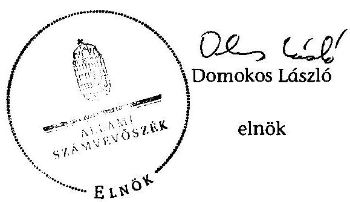

# ÁLLAMI   SZÁMVEVŐSZÉK 

## JELENTÉS

az önkormányzatok belső kontrollrendszere kialakításának, egyes
kontrolltevékenységek és a belső ellenőrzés
működésének - 2013. évben induló - ellenőrzéséről
Ják
13175
2013. december

---

# Állami Számvevőszék 

Iktatószám: V-0143-032/2013.
Témaszám: 1162
Vizsgálat-azonosító szám: V064915

## Az ellenőrzést felügyelte:

Dr. Benedek Mária
felügyeleti vezető
Az ellenőrzést vezette és az ellenőrzés végrehajtásáért felelős:
Bíró Zsolt
ellenőrzésvezető
A számvevőszéki jelentés összeállításában közremúködtek:
Gelencsér Zoltán
számvevő tanácsos
Tóth Béla
számvevő
Az ellenőrzést végezték:
Kalmár István
számvevő tanácsos

Ritecz Tibor
számvevő tanácsos

---

# TARTALOMJEGYZÉK 

BEVEZETÉS ..... 5
I. ÖSSZEGZŐ MEGÁLLAPÍTÁSOK, KÖVETKEZTETÉSEK, JAVASLATOK ..... 9
II. RÉSZLETES MEGÁLLAPÍTÁSOK ..... 18

1. Az önkormányzat belső kontrollrendszerének kialakítása ..... 18
1.1. A kontrollkörnyezet ..... 18
1.2. A kockázatkezelési rendszer ..... 19
1.3. A kontrolltevékenységek ..... 20
1.4. Az információs és kommunikációs rendszer ..... 21
1.5. A monitoring rendszer ..... 21
2. A pénzügyi folyamatokban kulcsszerepet betöltő teljesítésigazolás és érvényesítés belső kontrollok működése ..... 22
3. A belső ellenőrzés működése ..... 24

## FÜGGELÉKEK

1. számú Értelmező szótár
2. számú Az értékelés módja és szempontjai

---

.

---

# RÖVIDÍTÉSEK JEGYZÉKE 

## Törvények

Áht.
ÁSZ tv.
Info tv.

Kttv.

Ktv.

Mötv.

Nvtv.

Ötv.
Számv. tv.
Tvtv.

## Rendeletek, határozatok

Áhsz.

Ávr.

Bkr.
hivatali SZMSZ
vagyongazdálkodási rendelet ${ }_{1}$
vagyongazdálkodási rendelet ${ }_{2}$

## Szórövidítések

2011. évi CXCV. törvény az államháztartásról (hatályos 2012. január 1-jétől)
2011. évi LXVI. törvény az Állami Számvevőszékről
2011. évi CXII. törvény az információs önrendelkezési jogról és az információszabadságról (hatályos 2012. január 1-jétől)
2011. évi CXCIX. törvény a közszolgálati tisztviselőkről (hatályos 2012. március 1-jétől)
1992. évi XXIII. törvény a köztisztviselők jogállásáról (hatálytalan 2012. március 1-jétől)
2011. évi CLXXXIX. törvény Magyarország helyi önkormányzatairól (hatályos 2012. január 1-jétől)
2011. évi CXCVI. törvény a nemzeti vagyonról (hatályos 2011. december 31-étől)
1990. évi LXV. törvény a helyi önkormányzatokról
2000. évi C. törvény a számvitelről
1996. évi XXXI. törvény a tűz elleni védekezésről, a műszaki mentésről és a tűzoltóságról

249/2000. (XII. 24.) Korm. rendelet az államháztartás szervezetei beszámolási és könyvvezetési kötelezettségének sajátosságairól
368/2011. (XII. 31.) Korm. rendelet az államháztartásról szóló törvény végrehajtásáról (hatályos 2012. január 1-jétől)
370/2011. (XII. 31.) Korm. rendelet a költségvetési szervek belső kontrollrendszeréről és belső ellenőrzéséről (hatályos 2012. január 1-jétől)
Ják Község Önkormányzatának Képviselő-testülete 37/2013. (V. 27.) számú határozatával jóváhagyott Jáki Közös Önkormányzati Hivatal Szervezeti és Működési Szabályzata (hatályos 2013. június 6-ától)
Ják Község Önkormányzata Képviselő-testületének a 3/1997. (II. 18.) számú rendeletével módosított 3/1991. (IV. 3.) számú rendelete az önkormányzat korlátozottan forgalomképes vagyonának értékesítéséről, megterheléséről, vállalkozásba való viteléről, illetve más célú hasznosításáról (hatályos 1991. április 3-ától)
Ják Község Önkormányzata Képviselő-testületének 1/2013. (II. 22.) önkormányzati rendelete az önkormányzat vagyonáról és vagyongazdálkodás szabályairól (hatályos 2013. február 22-étől)

---

| ÁSZ | Állami Számvevőszék |
| :--: | :--: |
| INTOSAI | International Organization of Supreme Audit Institutions (Legfőbb Ellenőrző Intézmények Nemzetközi Szervezete) |
| iratkezelési szabályzat | Ják Község Önkormányzata Iratkezelési Szabályzata (hatályos 2010. január 1-jétől) |
| ISSAI | International Standards of Supreme Audit Institutions (Legfőbb Ellenőrző Intézmények Nemzetközi Standardjai) |
| jegyző $_{1}$ | Ják Község Önkormányzata jegyzője (hivatalban 2003. június 1. és 2013. június 15. között) |
| jegyző $_{2}$ | Ják Község Önkormányzata jegyzője (hivatalban 2013. június 15-étől) |
| Képviselő-testület | Ják Község Önkormányzatának Képviselő-testülete |
| Kormányhivatal | Vas Megyei Kormányhivatal |
| Hivatal | Jáki Közös Önkormányzati Hivatal |
| leltározási és leltárkészítési szabályzat | Ják Község Önkormányzata Számviteli és Pénzügyi Szabályzata VIII. fejezete (hatályos 2012. január 1-jétől) |
| NGM | Nemzetgazdasági Minisztérium |
| Önkormányzat | Ják Község Önkormányzata |
| pénzkezelési szabályzat | Ják Község Önkormányzata Házipénztár kezelési szabályzat (hatályos 2012. január 1-jétől) |
| polgármester | Ják Község Önkormányzatának polgármestere |
| Polgármesteri Hivatal | Ják Község Önkormányzatának Polgármesteri Hivatala |
| számviteli és pénzügyi szabályzatok | Ják Község Önkormányzata Számviteli és Pénzügyi Szabályzata (hatályos 2012. január 1-jétől) |
| Társulás | Szombathelyi Kistérség Többcélú Társulása |
| ügyrend | Ják Község Önkormányzata Polgármesteri Hivatal Ügyrendje (hatályos 2012. január 1-jétől) |

---

# JELENTÉS 

## az önkormányzatok belső kontrollrendszere kialakításának, egyes kontrolltevékenységek és a belső ellenőrzés működésének 2013. évben induló - ellenőrzéséről Ják

## BEVEZETÉS

Ják község állandó lakosainak száma 2012. január 1-jén 2620 fő volt. Az Önkormányzat héttagú Képviselő-testületének munkáját két állandó bizottság segítette. Az Önkormányzat az önállóan működő és gazdálkodó Polgármesteri Hivatalon kívül három önállóan működő intézményt működtetett, többségi tulajdoni hányaddal gazdasági társasággal nem rendelkezett. A polgármester 1990 óta tölti be tisztségét. A jegyző ${ }_{1}$ 2003. június 1-től 2013. június 15-ig látta el, míg a jegyző ${ }_{2}$ 2013. június 15-től látja el feladatait. A Polgármesteri Hivatal szervezeti egységekre nem tagolódott, elkülönített gazdasági szervezettel nem rendelkezett. A foglalkoztatott köztisztviselők száma 2012. január 1-jén hét fő volt. A Képviselő-testület - a Kormányhivatal kijelölő döntése alapján - 2013. április 1-jétől Nárai Község Önkormányzatának Képviselő-testületével megalapította a Hivatalt, Ják székhellyel, igazgatási feladataik ellátására. Az Önkormányzat a 2012. évi költségvetési beszámolója szerint 668692 ezer Ft tárgyévi bevételt ért el, valamint 644119 ezer Ft tárgyévi kiadást teljesített. A 2012. december 31-i könyvviteli mérleg szerint 1133570 ezer Ft értékű eszközvagyonnal rendelkezett, a rövid lejáratú kötelezettségállománya 91072 ezer Ft, a hosszú lejáratú kötelezettségállománya 25485 ezer Ft volt.

A demokratikus társadalmakban alapvető igény, hogy a közpénzeket, a közvagyont használók tevékenységükről elszámoljanak, ahhoz egyértelmű és érvényesíthető felelősségi szabályok társuljanak. Ennek a jogos igénynek az érvényesítéséhez meg kell teremteni azokat a folyamatokat, rendszereket, amelyek nélkülözhetetlenek az elszámoltatáshoz. Az elszámoltatás eredményes működtetéséhez szükség van a megfelelő információs, kontroll, értékelési és beszámolási rendszerek kialakítására.

Magyarországon az uniós csatlakozási tárgyalások idejére nyúlnak vissza a belső kontrollrendszer szabályozásának gyökerei. Az uniós elvárásoknak megfelelő új terminológia szerinti államháztartási belső pénzügyi ellenőrzési (ÁBPE) rendszer területén a jogharmonizáció 2003-ban teljes körűen megvalósult, míg az önkormányzati alrendszerre vonatkozó, Ötv.-ben megjelenített speciális szabályozás 2005-ben lépett hatályba. Az államháztartási belső kontrollrendszer koncepciója 2009-ben továbbfejlődött. A változások irányát mutatja, hogy a költségvetési szervek belső kontrollrendszere már magában foglalja

---

a korszerű, felelős szervezetirányítás elemeit (kontrollkörnyezet, kockázatkezelés, kontrolltevékenység, információ és kommunikáció, monitoring) is. E kontrollrendszer szabályozása háromszintű, a törvényi előírásokat az Áht. és a Mötv., a rendeleti szintű szabályozást az Ávr. és a Bkr. tartalmazza, amelyeket útmutatói szinten az NGM által kiadott standardok és kézikönyvek támogatnak.

A belső kontrollrendszer azt a célt szolgálja, hogy a költségvetési szervek működésük és gazdálkodásuk során a tevékenységeket szabályszerűen, gazdaságosan, hatékonyan és eredményesen hajtsák végre, teljesítsék elszámolási kötelezettségeiket és megvédjék az erőforrásokat a veszteségektől, a károktól és a nem rendeltetésszerű használattól. A belső kontrollrendszer magában foglalja mindazon szabályokat, eljárásokat, gyakorlati módszereket és szervezeti struktúrákat, kockázatkezelési technikákat, kontrolltevékenységeket, amelyek segítséget nyújtanak a szervezetnek céljai eléréséhez.

Az ÁSZ a 2011-2015. évekre szóló stratégiájában hangsúlyos szerepet szánt annak, hogy szilárd szakmai alapon álló, értékteremtő ellenőrzéseivel előmozdítsa a közpénzügyek átláthatóságát, rendezettségét. A számvevőszéki ellenőrzés nemzetközi alapelvei is rögzítik, hogy a megfelelő belső kontrollrendszer minimálisra csökkenti a hibák és szabálytalanságok kockázatát.

Az ellenőrzés célja annak megállapítása volt, hogy a belső kontrollrendszer elemeinek kialakítása, a pénzügyi folyamatokban kulcsszerepet betöltő teljesítésigazolás és érvényesítés és a belső ellenőrzés szabályos működése biztosította-e az Önkormányzatnál a közpénzfelhasználás szabályosságát, hozzájárult-e az értéket teremtő rend követelményének érvényesüléséhez.

Ennek keretében értékeltük, hogy:

- a jogszabályi előírásoknak megfelelően alakították-e ki a belső kontrollrendszer elemeit;
- a gazdálkodás folyamatában kulcsszerepet betöltő teljesítésigazolás és érvényesítés kontrolltevékenységeit megfelelően működtették-e;
- biztosították-e a belső ellenőrzés szabályos működését;
- amennyiben az ÁSZ tett javaslatot a 2008-2011. évek közötti ellenőrzése kapcsán az Önkormányzatnak, intézkedtek-e azok végrehajtására.

Az ellenőrzés várható hasznosulását négy szinten tervezzük. A törvényalkotás számára összegzett tapasztalatok állnak rendelkezésre a belső kontrollrendszer önkormányzati területen való kialakításáról, működéséről és hatásairól, a belső ellenőrzés működéséről. Ennek alapján következtetést lehet levonni arról, hogy a belső kontrollrendszer kialakítására és működtetésére vonatkozó jelenlegi, differenciálás nélküli jogszabályi előírások reális követelményeket támasztanak-e az eltérő adottságú települési önkormányzatok esetében, illetve indokolt-e esetleges jogszabályi módosítás kezdeményezése. Az ellenőrzés az ellenőrzött számára visszajelzést ad a belső kontrollrendszer kialakításában és működésében fellépő hiányosságokról, javaslataival hozzájárul azok kiküszöböléséhez, amely csökkentheti a későbbi ellenőrzések gyakoriságát. Az el-

---

lenőrzés megállapításait és javaslatait más szervezetek is hasznosíthatják a rendezett gazdálkodási keretek kialakításához. A társadalom számára jelzi, hogy közpénz nem maradhat ellenőrizetlenül, az ÁSZ értékteremtő rend kialakításához és megőrzéséhez hozzájáruló tevékenysége pozitív hatással lesz a szervezetről kialakított összkép formálásában. A szervezeten belül lehetőség nyílik arra, hogy a megállapítások szintetizálásával az ÁSZ a hozzáadott értéket teremtő elemző tevékenységét és tanácsadó szerepét is erősítse.

Az önkormányzatok belső kontrollrendszere kialakításának, egyes kontrolltevékenységek és a belső ellenőrzés működésének ellenőrzéséről szóló jelentés I. fejezetének összegző része az ellenőrzés céljára ad rövid, szintetizáló összefoglalót, és tartalmazza a következtetéseket a II. fejezet részletes megállapításain alapulóan. A jelentés intézkedést igénylő megállapításait és javaslatait az ellenőrzés során feltárt, a jelentés II. fejezetében rögzített részletes megállapítások alapozzák meg. A helyszíni ellenőrzés lezárásáig a helyi szabályozás változásait nyomon követtük.

Az ellenőrzés típusa: szabályszerűségi ellenőrzés.
Az ellenőrzött időszak: a belső kontrollrendszer kialakításának megfelelősége esetében a 2012. évre, a pénzügyi folyamatokban kulcsszerepet betöltő teljesítésigazolás és érvényesítés belső kontrollok működésének megfelelőségét és a belső ellenőrzés szabályszerű működését a 2012. január 1. és december 31-e közötti időszak eseményeit figyelembe véve értékeltük, míg az ÁSZ javaslatainak utóellenőrzése a 2008-2011. években végzett ellenőrzések nyilvánosságra hozott jelentéseiben tett javaslatok áttekintésére terjedt ki.

# Az ellenőrzött szervezet: az Önkormányzat. 

Az ellenőrzés jogszabályi alapját az ÁSZ tv. 1. § (3) bekezdése, az 5. § (2) és (6) bekezdése, valamint az Áht. 61. § (2) bekezdésének előírásai képezik.

Az ellenőrzés szakmai módszertana az ÁSZ hivatalos honlapján (www.asz.hu) közzétett szakmai szabályokon alapult, amely az INTOSAI által kiadott ISSAI figyelembevételével készült.

Az ellenőrzés lefolytatásához az Önkormányzat a kimutatások és a tanúsítvány elektronikus kitöltésével, valamint az ÁSZ által kért dokumentumok elektronikus megküldésével szolgáltatott adatokat. Az így rendelkezésre bocsátott adatok, információk kontrollja és a munkalapok kitöltése a helyszíni ellenőrzés keretében történt. A jelentésben használt fogalmak magyarázatát az 1. számú függelék, az ellenőrzés egyes területeinek értékelésénél alkalmazott egységes minősítési szempontokat a 2. számú függelék tartalmazza.

A belső kontrollrendszer kialakításának ellenőrzése során értékeltük a kontrollkörnyezet, a kockázatkezelési rendszer, a kontrolltevékenységek, az információs és kommunikációs rendszer, valamint a monitoring rendszer szabályozottságának megfelelőségét. A pénzügyi folyamatokban kulcsszerepet betöltő teljesítésigazolás és érvényesítés kontrollok működése megfelelőségének minősítéséhez az állományba nem tartozók megbízási díjai, a külső szolgáltatók által végzett karbantartási, kisjavítási munkák, az egyéb üzemeltetési és fenntartási

---

szolgáltatások, a rendszeres szociális segélyek, valamint az államháztartáson kívülre teljesített működési és felhalmozási célú pénzeszközátadások közül kockázatelemzéssel választottuk ki az ellenőrzött kiadási jogcímeket. Az egyszerű véletlen mintavétellel kiválasztott tételek ellenőrzését többlépcsős megfelelőségi tesztek útján addig végeztük, amíg elegendő és megfelelő bizonyítékot szereztünk a vizsgált folyamatok kulcskontrolljai működésének megfelelő vagy nem megfelelő voltáról. Értékeltük az Önkormányzatnál a belső ellenőrzés működésének szabályosságát. Az ÁSZ a 2010. évben végezte el az
 állami feladat (közfeladat) ellátás szervezeti és humánerőforrás rendszerének ellenőrzését, melynek helyszíni ellenőrzése érintette az Önkormányzatot is. A nyilvánosságra hozott, és 1022 számon közzétett számvevőszéki jelentésben azonban az ÁSZ kifejezetten az Önkormányzat számára konkrét feladatot nem határozott meg, javaslatot nem tett, ezért a jelen ellenőrzés keretében utóellenőrzésre nem került sor.

Az ÁSZ tv. 29. § (1) bekezdése szerint a jelentéstervezetet megküldtük a polgármester részére, aki az ÁSZ tv. 29. § (2) bekezdésében foglalt észrevételezési jogával nem élt, a jelentéstervezetre észrevételt nem tett.

---

# I. ÖSSZEGZŐ MEGÁLLAPÍTÁSOK, KÖVETKEZTETÉSEK, JAVASLATOK 

A belső kontrollrendszeren belül 2012-ben a kontrollkörnyezet, a kockázatkezelési rendszer, a kontrolltevékenységek, az információs és kommunikációs rendszer, valamint a monitoring rendszer kialakítását külön-külön és együttesen is értékeltük. A belső kontrollrendszer kialakítása az összesített értékelés alapján nem felelt meg a jogszabályi előírásoknak.

A belső kontrollrendszer egyes területei kialakításának minősítése a következő:

| Kontrollterület | Minősítés |
| :-- | :--: |
| Kontrollkörnyezet | nem |
|  | megfelelő |
| Kockázatkezelési rendszer | nem |
|  | megfelelő |
| Kontrolltevékenységek | nem |
| Információs és kommunikációs | megfelelő |
| rendszer | nem |
| Monitoring rendszer |  |

Nem megfelelőnek értékeltük a kontrollkörnyezet, a kockázatkezelési rendszer, a kontrolltevékenységek, az információs és kommunikációs rendszer, valamint a monitoring rendszer kialakítását, mivel az ellenőrzésünk során megállapított szabályozásbeli hiányosságok magukban hordozzák a szabálytalan működés, valamint a korrupció kockázatát.

A belső kontrollrendszer nem megfelelő kialakítása kockázatot jelent az Önkormányzat tevékenységeinek szabályszerű, gazdaságos, hatékony és eredményes végrehajtása során.

A 2012. évben az állományba nem tartozók megbízási díjaival, valamint a külső szolgáltatók által végzett karbantartási, kisjavítási munkákkal kapcsolatos kifizetések során a pénzügyi folyamatokban kulcsszerepet betöltő teljesítésigazolás és érvényesítés belső kontrollok működése gyenge volt. Gyengének értékeltük a két kulcskontroll együttes működését, mivel azok nem biztosították a hibák megelőzését, feltárását.

A számvevőszéki ellenőrzés az ellenőrzött kifizetésekkel összefüggésben a rendelkezésre bocsátott dokumentumok alapján jogosulatlan kifizetést nem tárt fel, azonban a gazdálkodásban kulcsszerepet betöltő kontrollok működésében feltárt hiányosságok miatt fennáll a hibák bekövetkezésének kockázata. A nem megfelelően működtetett belső kontrollok korrupciós kockázatot hordoznak.

---

Az Önkormányzat a belső ellenőrzési feladatokat a Társulás útján látta el. Az Önkormányzatnál a 2012. évben a belső ellenőrzés működése nem felelt meg a jogszabályi előírásoknak, mivel a számvevőszéki ellenőrzés által megállapított szabályozási és működési hiányosságok számossága magában hordozza a szabálytalan önkormányzati gazdálkodás és feladatellátás kockázatát.

Az ÁSZ tv. 33. § (1) bekezdésében foglaltak értelmében az ellenőrzött szervezet vezetője köteles a jelentésben foglalt megállapításokhoz kapcsolódó intézkedési tervet összeállítani, és azt a jelentés kézhezvételétől számított 30 napon belül az ÁSZ részére megküldeni. Amennyiben az intézkedési tervet határidőre nem küldi meg a szervezet, vagy az ÁSZ tv. 33. § (2) bekezdésében foglalt póthatáridő elteltével megküldött intézkedési terv továbbra sem elfogadható, az ÁSZ elnöke a hivatkozott törvény 33. § (3) bekezdés a)-b) pontjaiban foglaltakat érvényesítheti.

Az ellenőrzés intézkedést igénylő megállapításai és javaslatai:

# a polgármesternek 

1. Az Önkormányzat kiadási előirányzatai terhére történt kötelezettségvállalásra - az Áht. 37. § (1) bekezdésében és az Ávr. 55. § (1) bekezdésében foglaltak ellenére pénzügyi ellenjegyzés nélkül került sor.

Javaslat:
Intézkedjen arról, hogy az Önkormányzat kiadási előirányzatai terhére történt kötelezettségvállalásra az Áht. 37. § (1) bekezdésében és az Ávr. 55. § (1) bekezdésében foglaltaknak megfelelően - az Ávr. 53. §-ában meghatározott kivételekkel - kizárólag a pénzügyi ellenjegyzés után, a pénzügyi teljesítés esedékességét megelőzően, írásban kerüljön sor.
2. A polgármester mint kötelezettségvállaló - az Ávr. 57. § (4) bekezdésében foglaltak ellenére - 2012. március 31-étől írásban nem jelölte ki a teljesítésigazolásra jogosult személyeket.

Javaslat:
Jelölje ki az Ávr. 57. § (4) bekezdésének megfelelően az általa történő kötelezettségvállalások esetében a teljesítés igazolására jogosult személyeket.
3. Az éves ellenőrzési jelentést - a Bkr. 56. § (8) bekezdésében foglaltak ellenére - a zárszámadási rendelettervezettel egyidejűleg nem terjesztette a Képviselő-testület elé.

Javaslat:
Terjessze a Képviselő-testület elé a zárszámadási rendelettervezettel egyidejűleg a Bkr. 49. § (3a) bekezdésében, illetve az 56. § (8) bekezdésében foglaltak figyelembevételével az éves ellenőrzési jelentést.

---

4. A számvevőszéki ellenőrzés megállapításai alapján az Önkormányzatnál a belső kontrollrendszer kialakítása összefoglalóan értékelve nem felelt meg a jogszabályi előírásoknak, a kulcskontrollok működése gyenge volt, és a belső ellenőrzés működése sem volt a jogszabályoknak megfelelő. A megállapított szabályozásbeli és működésbeli hiányosságok magukban hordozzák a szabálytalan működés kockázatát.

Javaslat:
A Mötv. 115. § (1) bekezdésében foglaltak alapján kísérje figyelemmel az Önkormányzat gazdálkodásának szabályszerűségét. A Mötv. 67. § f) pontja alapján gondoskodjon a belső kontrollrendszer működésére vonatkozó jogszabályi rendelkezések be nem tartása, valamint a teljesítésigazolás, illetve az érvényesítés kontrollokkal összefüggésben feltárt hiányosságok, szabálytalanságok tekintetében az esetleges munkajogi felelősséggel kapcsolatos körülmények kivizsgálásáról, majd a vizsgálat eredményének függvényében tegye meg a szükséges munkajogi intézkedéseket.

# a jegyzőnek (Ják Község Önkormányzata vonatkozásában) 

1. a kontrollkörnyezettel kapcsolatban:

A pénzkezelési szabályzat - a Számv. tv. 14. § (8) bekezdésében foglaltak ellenére nem tartalmazta a bankszámlán történő pénzforgalom lebonyolításának rendjét és a készpénzállomány ellenőrzésekor követendő eljárást.

A leltározási és leltárkészítési szabályzat a leltározás gyakoriságát és módját nem az Áhsz. 37. § (1)-(3) bekezdéseiben foglaltak szerint tartalmazta, továbbá - az (5) bekezdésben foglaltak ellenére - a leltározás részletes szabályait (a leltárkülönbözetek megállapításának módját, a leltár és a könyvviteli adatok egyeztetésének módját) nem rögzítette.

A jegyző, - a Számv. tv. 14. § (5) bekezdése b) pontjában és az Áhsz. 8. § (4) bekezdés b) pontjában foglaltak ellenére - nem készítette el az eszközök és források értékelési szabályzatát.

A jegyző, - a Tvtv. 19. § (1) bekezdésében foglaltakat figyelmen kívül hagyva - nem készítette el a Polgármesteri Hivatal tűzvédelmi szabályzatát.

A jegyző, - a Bkr. 6. § (3) bekezdésében foglaltak ellenére - a Polgármesteri Hivatal ellenőrzési nyomvonalát nem készítette el. A jegyző, - a Bkr. 6. § (4) bekezdésében foglaltak ellenére - nem készítette el a szabálytalanságok kezelésének eljárásrendjét.

A jegyző, - a Kttv. 130. § (1) bekezdésében foglaltak ellenére - a Polgármesteri Hivatalban dolgozó köztisztviselők teljesítményértékelését nem készítette el.

A Képviselő-testület - a Kttv. 231. § (1) bekezdése ellenére - nem állapította meg a köztisztviselőkkel szembeni - a Kttv. 83. §-a szerinti - hivatásetikai alapelvek részletes tartalmát, valamint az etikai eljárás szabályait, mivel a jegyző, - az Ötv. 36. § (2) bekezdés a) pontjában előírt feladata ellenére - nem készítette elő ennek dokumentumát.

---

Javaslat:
a) Intézkedjen arról, hogy a pénzkezelési szabályzat tartalmazza a Számv. tv. 14. § (8) bekezdésében előírt valamennyi kötelező tartalmi elemet.
b) Gondoskodjon arról, hogy a leltározási és leltárkészítési szabályzat rendelkezései az Áhsz. 37. §-ában előírtaknak megfeleljenek.
c) Készítse el a Hivatal eszközök és források értékelési szabályzatát a Számv. tv. 14. § (5) bekezdése b) pontjában és az Áhsz. 8. § (4) bekezdés b) pontjában előírtak alapján.
d) Készítse el a tűzvédelmi szabályzatot a Tvtv. 19. § (1) bekezdésében foglalt előírásnak megfelelően.
e) Készítse el és rendszeresen aktualizálja az ellenőrzési nyomvonalat, valamint szabályozza a szabálytalanságok kezelésének eljárásrendjét a Bkr. 6. § (3)-(4) bekezdéseiben foglaltaknak megfelelően.
f) Értékelje írásban a Kttv. 130. § (1) bekezdése alapján a Hivatal köztisztviselőinek munkateljesítményét.
g) Készítse elő a Mötv. 81. § (3) bekezdés c) pontjában foglalt feladatkörében a köztisztviselőkkel szembeni, a Kttv. 83. §-ában foglaltak szerinti hivatásetikai alapelvek részletes tartalmának, valamint az etikai eljárás szabályainak dokumentumait, és a Kttv. 231. § (1) bekezdésében foglaltak érvényesülése érdekében kezdeményezze azok Képviselő-testület elé terjesztését.
2. a kockázatkezelési rendszerrel kapcsolatban:

A jegyző, - a Bkr. 7. § (2) bekezdésében foglaltak ellenére - nem mérte fel és nem állapította meg a Polgármesteri Hivatal tevékenységében, gazdálkodásában rejlő kockázatokat, nem határozta meg az egyes kockázatokkal kapcsolatban szükséges intézkedéseket, valamint azok teljesítésének folyamatos nyomon követésének módját.

Javaslat:
Állapítsa meg a Bkr. 7. § (2) bekezdésében foglaltak alapján a Hivatal tevékenységében, gazdálkodásában rejlő kockázatokat, határozza meg az egyes kockázatokkal kapcsolatban szükséges intézkedéseket, valamint azok teljesítése folyamatos nyomon követésének módját.
3. a kontrolltevékenységekkel kapcsolatban:

A jegyző, - a Bkr. 8. § (2) bekezdésében foglaltak ellenére - nem biztosította a beszerzési folyamat és a vagyonhasznosítási tevékenység, valamint a pénzügyi döntések - köztük a költségvetés tervezése és a támogatásokkal való elszámolás - dokumentumainak elkészítésével kapcsolatban a folyamatba épített, előzetes, utólagos és vezetői ellenőrzést.

A jegyző, - az Ávr. 13. § (2) bekezdés a) pontjában foglaltak ellenére - belső szabályzatban nem szabályozta a kötelezettségvállalás, az ellenjegyzés, a teljesítés iga-

---

zolása, az érvényesítés, az utalványozás gyakorlásának módját, valamint nem határozta meg a beszámolási feladatok teljesítésével kapcsolatos belső előírásokat.

A jegyző, - az Ávr. 53. § (2) bekezdésében foglaltak ellenére - nem határozta meg az előzetes kötelezettségvállalást nem igénylő kifizetések rendjét annak ellenére, hogy a belső szabályozásban lehetővé tette a 100 ezer Ft-ot el nem érő kifizetések előzetes írásbeli kötelezettségvállalás nélküli teljesítését.

A jegyző, mint kötelezettségvállaló - az Ávr. 57. § (4) bekezdésében foglaltak ellenére - írásban nem jelölte ki a teljesítésigazolásra jogosult személyeket.

A jegyző, - a Bkr. 8. § (4) bekezdés b) pontjában foglaltak ellenére - belső szabályzatban nem határozta meg a dokumentumokhoz és információkhoz való hozzáféréssel kapcsolatos felelősségi köröket.

A jegyző, - az Ávr. 13. § (5) bekezdésében foglaltak ellenére - nem határozta meg a gazdasági feladatot ellátó alkalmazottak helyettesítésének rendjét.

A jegyző, a Kttv. 74. § (1) bekezdésében foglaltak ellenére jogviszony megszűnése esetére nem szabályozta a munkavállaló folyamatban lévő feladatai átadásának rendjét.

Javaslat:
a) Biztosítsa minden tevékenységre vonatkozóan a folyamatba épített, előzetes, utólagos és vezetői ellenőrzést a Bkr. 8. § (2) bekezdése alapján.
b) Rendezze belső szabályzatban az Ávr. 13. § (2) bekezdés a) pontjában foglaltak szerint a gazdálkodással - különösen a kötelezettségvállalás, az ellenjegyzés, a teljesítés igazolása, az érvényesítés, az utalványozás gyakorlásának módjával, eljárási és dokumentációs részletszabályaival - valamint a beszámolási feladatok teljesítésével kapcsolatos belső előírásokat, feltételeket.
c) Rögzítse belső szabályzatban az Ávr. 53. § (2) bekezdése alapján az előzetes írásbeli kötelezettségvállalást nem igénylő kifizetések rendjét.
d) Jelölje ki az Ávr. 57. § (4) bekezdésének megfelelően az általa történő kötelezettségvállalások esetében a teljesítés igazolására jogosult személyeket.
e) Határozza meg belső szabályzatban a Bkr. 8. § (4) bekezdés b) pontjában előírtaknak megfelelően a dokumentumokhoz és információkhoz való hozzáférésre vonatkozó felelősségi köröket.
f) Határozza meg az Ávr. 13. § (5) bekezdésében előírtaknak megfelelően a gazdasági feladatot ellátó alkalmazottak helyettesítésének rendjét.
g) Szabályozza a Kttv. 74. § (1) bekezdésében foglaltak alapján a jogviszony megszűnése esetére a munkavállaló folyamatban lévő feladatai átadásának rendjét.

---

4. az információs és kommunikációs rendszerrel kapcsolatban:

A jegyző $_{1}$ - a Bkr. 3. § d) pontjában és a 9. § (1) bekezdésében
 foglaltak ellenére nem alakított ki olyan rendszert, amely biztosítja, hogy a megfelelő információk a megfelelő időben eljutnak az illetékes szervezethez, szervezeti egységhez, személyhez.

Az Info tv. 24. § (3) bekezdésében foglaltak ellenére a jegyző¹ nem készítette el a Polgármesteri Hivatal adatvédelmi és adatbiztonsági szabályzatát.

A jegyző¹ - az Info tv. 35. § (3) bekezdésében és az Ávr. 13. § (2) bekezdés h) pontjában foglalt előírás ellenére - a kötelezően közzéteendő adatok nyilvánosságra hozatalának rendjét nem alakította ki.

Az Önkormányzat - az Info tv. 33. § (1) és (3) bekezdésében foglaltak ellenére - az elektronikus közzétételi kötelezettségének a 2012. évben nem tett eleget.

A jegyző¹ - az Info tv. 30. § (6) bekezdésében és az Ávr. 13. § (2) bekezdés h) pontjában foglalt előírások ellenére - nem szabályozta a közérdekű adatok megismerésére irányuló igények teljesítésének rendjét.

Javaslat:
a) Alakítson ki a Bkr. 3. § d) pontjában és a 9. § (1) bekezdésében foglaltaknak megfelelően egy olyan rendszert, amely biztosítja, hogy a megfelelő információk a megfelelő időben eljutnak az illetékes szervezethez, szervezeti egységhez, illetve személyhez.
b) Készítsen adatvédelmi és adatbiztonsági szabályzatot az Info tv. 24. § (3) bekezdésének megfelelően.
c) Állapítsa meg belső szabályzatban - az Info tv. 35. § (3) bekezdésében, valamint az Ávr. 13. § (2) bekezdés h) pontjában foglaltaknak megfelelően - a kötelezően közzéteendő adatok nyilvánosságra hozatalának rendjét.
d) Gondoskodjon az Info tv. 33. § (1) és (3) bekezdésében foglaltaknak megfelelően az elektronikus közzétételi kötelezettség teljesítéséről.
e) Készítse el - az Info tv. 30. § (6) bekezdésében és az Ávr. 13. § (2) bekezdés h) pontjában foglaltaknak megfelelően - a közérdekű adatok megismerésére irányuló igények teljesítésének rendjét rögzítő szabályzatot.
5. a monitoring rendszerrel kapcsolatban:

A jegyző¹ - a Bkr. 3. § e) pontjában és 10. §-ában foglaltak ellenére - nem alakított ki a Polgármesteri Hivatal tevékenységének, a célok megvalósításának nyomon követését biztosító rendszert.

A jegyző¹ - a Bkr. 11. § (1) bekezdésében foglaltak ellenére - a Bkr. 1. melléklete szerinti nyilatkozatában nem értékelte a Polgármesteri Hivatal 2011. évre vonatkozó belső kontrollrendszerének minőségét.

---

Javaslat:
a) Alakítsa ki és működtesse a Bkr. 3. § e) pontjában és a 10. §-ában előírtak alapján a Hivatal tevékenységének, a célok megvalósításának nyomon követését biztosító rendszert, amelynek része az operatív tevékenységek keretében megvalósuló folyamatos és eseti nyomon követés is.
b) Értékelje a Bkr. 11. § (1) bekezdésében előírtaknak megfelelően a jogszabályban meghatározott keretek között a belső kontrollrendszer minőségét a Bkr. 1. melléklete szerinti nyilatkozatban.
6. a pénzügyi folyamatokban kulcsszerepet betöltő kontrollok működésével kapcsolatban:

A kifizetéseket megelőzően a teljesítésigazolást - az Áht. 38. § (1) bekezdésében és az Ávr. 57. § (1) és (3) bekezdésében foglaltak ellenére - nem az arra jogosult személy végezte, vagy nem történt meg a teljesítés igazolása.

Az érvényesítő az Áht. 38. § (1) és az Ávr. 58. § (1) bekezdésekben foglalt feladatát nem végezte el, vagy - az Ávr. 60. § (1) bekezdésében meghatározott összeférhetetlenségi szabályok ellenére - az érvényesítő személy azonos volt a teljesítést igazoló személlyel. Az Ávr. 58. § (2) bekezdésében foglaltak ellenére nem jelezte az utalványozónak, hogy a megelőző ügymenetben a teljesítésigazolást - az Áht. 38. § (1) bekezdésben és az Ávr. 57. § (1) és (3) bekezdésében foglaltak ellenére - nem, vagy jogosulatlanul végezték, a Polgármesteri Hivatal és az Önkormányzat kiadási előirányzatai terhére történt kötelezettségvállalásra - az Áht. 37. § (1) és az Ávr. 55. § (1) bekezdésében foglaltak ellenére - pénzügyi ellenjegyzés nélkül került sor, valamint a kötelezettségvállalásokat a 2012. évben - az Ávr. 56. § (1) bekezdésében foglaltak ellenére - nem vették nyilvántartásba.

Javaslat:
Intézkedjen - a teljesítés igazolása és az érvényesítés vonatkozásában feltárt hiányosságok megszüntetése, illetve az operatív gazdálkodás során a működésbeli hibák megelőzése, feltárása és kijavítása érdekében - arról, hogy:
a) az Áht. 38. § (1) bekezdésén alapuló teljesítésigazolás során az Ávr. 57. § (1) bekezdésében előírtaknak megfelelően, ellenőrizhető okmányok alapján ellenőrizzék és igazolják a kiadások teljesítésének jogosságát, összegszerűségét, az ellenszolgáltatást is magában foglaló kötelezettségvállalás esetén annak teljesítését, valamint az Ávr. 57. § (3) bekezdése szerint a teljesítést az igazolás dátumának és a teljesítés tényére történő utalásnak a megjelölésével, az arra jogosult személy aláírásával igazolják;
b) az érvényesítő a kifizetéseket megelőzően a teljesítésigazolás alapján - az Ávr. 57. § (3) bekezdése szerinti esetben annak hiányában is - az összegszerűségnek, a fedezet meglétének és a megelőző ügymenetben az Áht., az Áhsz., az Ávr. előírásai és a belső szabályzatokban foglaltak betartásának az ellenőrzése - az Ávr. 58. § (1) bekezdése szerint - történjen meg;
c) kötelezettségvállalásra az Áht. 37. § (1) bekezdésében és az Ávr. 55. § (1) bekezdésében foglaltaknak megfelelően - az Ávr. 53. §-ában meghatározott kivételeket figyelembe véve - kizárólag a pénzügyi ellenjegyzés után, a pénzügyi teljesítés esedékességét megelőzően, írásban kerüljön sor;
d) a kötelezettségvállalásokat az Ávr. 56. § (1) bekezdésében foglalt előírásnak megfelelően vegyék nyilvántartásba;
e) az összeférhetetlenségi szabályok az Ávr. 60. § (1) bekezdésében foglaltaknak megfelelően érvényesüljenek.
7. a belső ellenőrzés működésével kapcsolatban:

A Bkr. 17. § (1) bekezdésében, a 22. § (1) bekezdés a) pontjában és az 56. § (7) bekezdésében foglaltak ellenére az Önkormányzat nem rendelkezett a munkaszervezet vezetője által jóváhagyott belső ellenőrzési kézikönyvvel.

A Bkr. 16. § (4) bekezdésében foglaltak ellenére a 22. § (1)-(2) bekezdésében foglalt tevékenységek és kötelességek ellátásának módjáról nem rendelkeztek.

Stratégiai ellenőrzési tervet - a Bkr 22. § (1) bekezdés b) pontjában, a 29. § (1) és a 30. § (1) bekezdésében foglaltak ellenére - nem készítettek.

A Bkr. 22. § (1) bekezdés b) pontjában, a 29. § (1) bekezdésében és a 31. § (2) bekezdésében foglaltak ellenére az éves ellenőrzési tervet kockázatelemzés nem alapozta meg.

A 2013. évi ellenőrzési terv - a Bkr. 31. § (4) bekezdés a), c), e) és f) pontjaiban foglaltak ellenére - nem tartalmazta az ellenőrzési tervet megalapozó elemzések eredményének összefoglaló bemutatását, az ellenőrzések célját és típusát, valamint a szükséges ellenőrzési kapacitás meghatározását.

A 2012-ben végrehajtott ellenőrzésekhez - a Bkr. 19. § (5) bekezdésében foglaltak ellenére - ellenőrzési programok nem készültek.

Az elvégzett ellenőrzésekről készített jelentések - a Bkr. 39. § (3) bekezdés d) és i) pontjában foglaltak ellenére - nem tartalmazták az ellenőrzés típusát, valamint az alkalmazott ellenőrzési eljárásokat és módszereket.

A Bkr. 22. § (2) bekezdés e) pontjában és az 50. §-ában foglalt előírásokat figyelmen kívül hagyva az elvégzett ellenőrzésekről nyilvántartást nem vezettek.

A Bkr. 22. § (1) bekezdés g) pontjában és a 49. § (1) bekezdésében előírtak ellenére a 2011. éves ellenőrzési jelentést nem készítették el, amelynek hiányában - a Bkr. 56. § (8) bekezdésében foglalt előírás ellenére - a polgármester a zárszámadási rendelettervezettel egyidejűleg nem terjesztette a Képviselő-testület elé.

Javaslat:
a) Kezdeményezze, hogy az Önkormányzat rendelkezzen a Bkr. 17. § (1) bekezdésében, a 22. § (1) bekezdés a) pontjában és az 56. § (7) bekezdésében foglaltaknak megfelelő, a munkaszervezet vezetője által jóváhagyott belső ellenőrzési kézikönyvvel.
b) Kezdeményezze, hogy a Bkr. 16. § (4) bekezdésének megfelelően a belső ellenőrzési tevékenység megszervezésére vonatkozó megállapodásban rendelkezzenek a Bkr. 22. § (1)-(2) bekezdésében foglalt tevékenységek és kötelességek ellátásának módjáról.
c) Kezdeményezze - a Bkr. 22. § (1) bekezdés b) pontjában, a 29. § (1) bekezdésében és a 30. § (1) bekezdésében foglaltaknak megfelelően - a stratégiai ellenőrzési terv elkészítését.
d) Kezdeményezze, hogy az éves ellenőrzési tervek tartalmazzák a Bkr. 31. § (4) bekezdésében előírt valamennyi tartalmi elemet, és azok a Bkr. 22. § b) pontja, valamint a 29. § (1) és a 31. § (2) bekezdése alapján kockázatelemzésen alapuljanak.
e) Kezdeményezze, hogy a végrehajtandó ellenőrzésekhez a Bkr. 19. § (5) bekezdésében foglaltaknak megfelelően készüljenek a belső ellenőrzési vezető által jóváhagyott ellenőrzési programok.
f) Kezdeményezze, hogy az elvégzett ellenőrzésekről készített jelentésekben szerepeljenek a Bkr. 39. § (3) bekezdése szerinti tartalmi elemek.
g) Kezdeményezze, hogy a belső ellenőrzési vezető a Bkr. 22. § (2) bekezdés e) pontja és az 50. §-a alapján vezessen nyilvántartást az elvégzett ellenőrzésekről.
h) Kezdeményezze, hogy a belső ellenőrzési vezető a Bkr. 22. § (1) bekezdés g) pontjában és a 49. § (1) és (3) bekezdésében, valamint az 56. § (8) bekezdésében foglaltak alapján az éves (összefoglaló) ellenőrzési jelentést készítse el, és jóváhagyásra a jegyzőnek küldje meg.

---

# II. RÉSZLETES MEGÁLLAPÍTÁSOK 

## 1. AZ ÖNKORMÁNYZAT BELSŐ KONTROLLRENDSZERÉNEK KIALAKÍTÁSA

A belső kontrollrendszeren belül 2012-ben a kontrollkörnyezet, a kockázatkezelési rendszer, a kontrolltevékenységek, az információs és kommunikációs rendszer, valamint a monitoring rendszer kialakítását külön-külön és együttesen is értékeltük. A belső kontrollrendszer kialakítása az összesített értékelés alapján nem felelt meg a jogszabályi előírásoknak.

### 1.1. A kontrollkörnyezet

A kontrollkörnyezet kialakítása - a 2. számú függelékben részletezett kritériumrendszer alapján végzett értékelés szerint - nem felelt meg a jogszabályi előírásoknak, mert:

| Sorszám ¹ | Megállapítás | Megjegyzés |
| :--: | :--: | :--: |
| 4. | A Képviselő-testület a Ktv. 34. § (3) bekezdésében foglaltak ellenére nem döntött a teljesítményértékelés alapját képező célokról. |  |
| 5. | A Polgármesteri Hivatal - az Áht. 10. § (5) bekezdésében foglaltak ellenére - a 2012. évben nem rendelkezett szervezeti és működési szabályzattal. | A hivatali SZMSZ-t a Képviselő-testület a 37/2013. (V. 27.) számú határozatával hagyta jóvá. |
| 16. | A jegyző¹ - az Ötv. 36. § (2) bekezdés a) pontjában² foglaltak ellenére - nem készítette elő a vagyongazdálkodási rendelet¹ módosítását, így az nem felelt meg az Nvtv. 3. § (1) bekezdés 6. pontja, 5-6. §-a, 11. § (16) bekezdése, 13. § (1) bekezdése, 18. § (1) és (12) bekezdése, valamint a Mötv. 109. § (4) bekezdése előírásainak. | A vagyongazdálkodási rendelet²-t a Képviselőtestület 2013. február 22-én fogadta el, amelynek tartalma összhangban áll az Nvtv. és a Mötv. rendelkezéseivel. |
| 22-   23. | A pénzkezelési szabályzat - a Számv. tv. 14. § (8) bekezdésében foglaltak ellenére - nem tartalmazta a bankszámlán történő pénzforgalom lebonyolításának rendjét és a készpénzállomány ellenőrzésekor követendő eljárást. |  |

[^0]
[^0]: ¹ A megállapítás számozása az Önkormányzat által az adatszolgáltatás során kitöltött kimutatások kérdéseinek sorszámával azonos.
² 2013. január 1-jétől a Mötv. 81. § (3) bekezdés c) pontja

---

| 24,   26-
 \\ & 28 . \end{aligned}$ | A leltározási és leltárkészítési szabályzat a leltározás gyakoriságát és módját nem az Áhsz. 37. § (1)-(3) bekezdéseiben foglaltak szerint tartalmazta, továbbá - az (5) bekezdésben foglaltak ellenére - a leltározás részletes szabályait (a leltárkülönbözetek megállapításának módját, a leltár és a könyvviteli adatok egyeztetésének módját) nem rögzítette. | A leltározási és leltárkészítési szabályzatban 3-5 évenkénti és nem évenkénti gyakorisággal írták elő a tárgyi eszközök leltározását mennyiségi felvétellel. |
| :--: | :--: | :--: |
| 29. | A jegyző ${ }_{1}$ - a Számv. tv. 14. § (5) bekezdés b) pontjában és az Áhsz. 8. § (4) bekezdés b) pontjában foglaltak ellenére - nem készítette el az eszközök és források értékelési szabályzatát. |  |
| 33. | A jegyző ${ }_{1}$ - a Tvtv. 19. § (1) bekezdésében foglaltakat figyelmen kívül hagyva - nem készítette el a Polgármesteri Hivatal tűzvédelmi szabályzatát. |  |
| 34. | A jegyző ${ }_{1}$ - a Bkr. 6. § (4) bekezdésében foglaltak ellenére - nem készítette el a szabálytalanságok kezelésének eljárásrendjét. |  |
| 41. | A jegyző ${ }_{1}$ - a Bkr. 6. § (3) bekezdésében foglaltak ellenére - a Polgármesteri Hivatal ellenőrzési nyomvonalát nem készítette el. |  |
| 46. | A jegyző ${ }_{1}$ - a Kttv. 130. § (1) bekezdésében foglaltak ellenére - a Polgármesteri Hivatalban dolgozó köztisztviselők teljesítményértékelését nem készítette el. |  |
| 47. | A Képviselő-testület - a Kttv. 231. § (1) bekezdés ellenére - nem állapította meg - a Kttv. 83. §-a szerinti - a köztisztviselőkkel szembeni hivatásetikai alapelvek részletes tartalmát, valamint az etikai eljárás szabályait, mivel a jegyző ${ }_{1}$ - az Ötv. 36. § (2) bekezdés a) pontjában előírt feladata ellenére - nem készítette elő ennek dokumentumát. |  |

# 1.2. A kockázatkezelési rendszer 

A kockázatkezelési rendszer kialakítása - a 2. számú függelékben részletezett kritériumrendszer alapján végzett értékelés szerint - nem felelt meg a jogszabályi előírásoknak, mert:

| Sorszám | Megállapítás |
| :--: | :--: |
| $\begin{aligned} & 2 ., 8 . \text {, } \\ & 10 . \end{aligned}$ | A jegyző ${ }_{1}$ - a Bkr. 7. § (2) bekezdésében foglaltak ellenére - nem mérte fel és nem állapította meg a Polgármesteri Hivatal tevékenységében, gazdálkodásában rejlő kockázatokat, nem határozta meg az egyes kockázatokkal kapcsolatban szükséges intézkedéseket, valamint azok teljesítésének folyamatos nyomon követésének módját. |

---

# 1.3. A kontrolltevékenységek 

A kontrolltevékenységek kialakítása - a 2. számú függelékben részletezett kritériumrendszer alapján végzett értékelés szerint - nem felelt meg a jogszabályi előírásoknak, mert:

| Sorszám | Megállapítás | Megjegyzés |
| :--: | :--: | :--: |
| $\begin{aligned} & 2 . \\ & 3 . \\ & 4 . \end{aligned}$ | A jegyző ${ }_{1}$ - a Bkr. 8. § (2) bekezdésében foglaltak ellenére - nem biztosította a beszerzési folyamat és a vagyonhasznosítási tevékenység, valamint a pénzügyi döntések - köztük a költségvetés tervezése és a támogatásokkal való elszámolás - dokumentumainak elkészítésével kapcsolatban a folyamatba épített, előzetes, utólagos és vezetői ellenőrzést. |  |
| $\begin{aligned} & 6 . \\ & 9 . \\ & 11 . \\ & 12 . \\ & 19 . \end{aligned}$ | A jegyző ${ }_{1}$ - az Ávr. 13. § (2) bekezdés a) pontjában foglaltak ellenére - belső szabályzatban nem szabályozta a kötelezettségvállalás, az ellenjegyzés, a teljesítés igazolása, az érvényesítés, az utalványozás gyakorlásának módját, valamint nem határozta meg a beszámolási feladatok teljesítésével kapcsolatos belső előírásokat. | A számviteli és pénzügyi szabályzatok, valamint az ügyrend a kötelezettségvállaló, utalványozó, pénzügyi ellenjegyző és érvényesítő jogkörökre vonatkozó kijelöléseket tartalmazta. |
| 8 . | A jegyző ${ }_{1}$ - az Ávr. 53. § (2) bekezdésében foglaltak ellenére - nem határozta meg az előzetes kötelezettségvállalást nem igénylő kifizetések rendjét, annak ellenére, hogy a belső szabályozásban lehetővé tette a 100 ezer Ft-ot el nem érő kifizetések előzetes írásbeli kötelezettségvállalás nélküli teljesítését. |  |
| 10. | A teljesítésigazolásra jogosult személyeket a jegyző ${ }_{1}$, valamint 2012. március 31-étől a polgármester és a jegyző ${ }_{1}$ mint kötelezettségvállalók - az Ávr. 57. § (4) bekezdésében foglaltak ellenére - írásban nem jelölték ki. |  |
| 17. | A jegyző ${ }_{1}$ - a Bkr. 8. § (4) bekezdés b) pontjában foglaltak ellenére - belső szabályzatban nem határozta meg a dokumentumokhoz és információkhoz való hozzáféréssel kapcsolatos felelősségi köröket. |  |
| 21. | A jegyző ${ }_{1}$ - az Ávr. 13. § (5) bekezdésében foglaltak ellenére - nem határozta meg a gazdasági feladatot ellátó alkalmazottak helyettesítésének rendjét. | A számviteli és pénzügyi szabályzatok 23. oldala a helyettesítés rendjére vonatkozóan két fő esetében a helyettesítő személyt nem nevesítette. |

---

| 32. | A jegyző ${ }_{1}$ - a Kttv. 74. § (1) bekezdésében foglaltak ellenére - jogviszony megszűnése esetére nem szabályozta a munkavállaló folyamatban lévő feladatai átadásának rendjét. | Az iratkezelési szabályzat VII. fejezet 21.2. pontja a feladatkör átadásának szabályait csak az iratok átadásával összefüggésben tartalmazta. |
| :--: | :--: | :--: |

# 1.4. Az információs és kommunikációs rendszer 

Az információs és kommunikációs rendszer kialakítása - a 2. számú függelékben részletezett kritériumrendszer alapján végzett értékelés szerint nem felelt meg a jogszabályi előírásoknak, mert:

| Sorszám | Megállapítás |
| :--: | :--: |
| $1-2$. | A jegyző ${ }_{1}$ - a Bkr. 3. § d) pontjában és a 9. § (1) bekezdésében foglaltak ellenére - nem alakított ki olyan rendszert, amely biztosítja, hogy a megfelelő információk a megfelelő időben eljutnak az illetékes szervezethez, szervezeti egységhez, személyhez. |
| 5. | Az Info tv. 24. § (3) bekezdésében foglaltak ellenére a jegyző ${ }_{1}$ nem készítette el a Polgármesteri Hivatal adatvédelmi és adatbiztonsági szabályzatát. |
| 6. | A jegyző ${ }_{1}$ - az Info tv. 35. § (3) bekezdésében és az Ávr. 13. § (2) bekezdés h) pontjában foglalt előírás ellenére - a kötelezően közzéteendő adatok nyilvánosságra hozatalának rendjét nem alakította ki. |
| 7. | Az Önkormányzat - az Info tv. 33. § (1) és (3) bekezdésében foglaltak ellenére - elektronikus közzétételi kötelezettségének a 2012. évben nem tett eleget. |
| 8. | A jegyző ${ }_{1}$ - az Info tv. 30. § (6) bekezdésében és az Ávr. 13. § (2) bekezdés h) pontjában foglalt előírások ellenére - nem szabályozta a közérdekű adatok megismerésére irányuló igények teljesítésének rendjét. |

### 1.5. A monitoring rendszer

A monitoring rendszer kialakítása - a 2. számú függelékben részletezett kritériumrendszer alapján végzett értékelés szerint - nem felelt meg a jogszabályi előírásoknak, mert:

| Sorszám | Megállapítás | Megjegyzés |
| :--: | :--: | :--: |
| 1. | A jegyző ${ }_{1}$ - a Bkr. 3. § e) pontjában és 10. §-ában foglaltak ellenére - nem alakított ki a Polgármesteri Hivatal tevékenységének, a célok megvalósításának nyomon követését biztosító rendszert. |  |
| 9. | A jegyző ${ }_{1}$ - a Bkr. 11. § (1) bekezdésében foglaltak ellenére - a Bkr. 1. melléklete szerinti nyilatkozatában nem értékelte a Polgármesteri Hivatal 2011. évre vonatkozó belső kontrollrendszerének minőségét. | A jegyző ${ }_{1}$ a belső kontrollrendszer minőségét év közben 2011. június 2-án - tett nyilatkozatában értékelte. |

---

A helyi önkormányzatok törvényességi felügyeletét ellátó Kormányhivatal 2012-ben egy esetben élt törvényességi felhívással a Képviselő-testület felé. A felhívásban foglaltakat a Képviselő-testület elfogadta, és a testület határozatairól a polgármester tájékoztatta a Kormányhivatalt.

A Kormányhivatal a 2012. május 24-i törvényességi felhívásában kifogásolta, hogy az önkormányzati fejlesztési feladatok támogatására nyújtott pályázati összegek felhasználása során az Önkormányzat jogszabálysértő módon közvetlenül kötött alvállalkozási szerződést arra a feladatra, amelyet költségvetési szerve útján teljesített. A polgármester egyes vállalkozási szerződéseket törvényellenesen, hatáskör hiányában kötött meg. A törvényességi felhívásban foglaltakkal a jövőre vonatkozó döntéshozatali és törvényességi javaslatokkal - a Képviselőtestület határozatával ${ }^{3}$ egyetértett, valamint a könyvvizsgáló személyéről külön határozatban ${ }^{4}$ döntött.

# 2. A PÉNZÜGYI FOLYAMATOKBAN KULCSSZEREPET BETÖLTŐ TELJESÍTÉSIGAZOLÁS ÉS ÉRVÉNYESÍTÉS BELSŐ KONTROLLOK MŰKÖDÉSE 

A 2012. évben az állományba nem tartozók megbízási díjaival, valamint a külső szolgáltatók által végzett karbantartással, kisjavítással kapcsolatos kifizetések során - összefoglalóan értékelve - a pénzügyi folyamatokban kulcsszerepet betöltő teljesítésigazolás és érvényesítés belső kontrollok működésének megfelelősége gyenge volt, mert:

| Kulcskontrollok | Megállapítás |
| :--: | :--: |
| Teljesítésigazolás | A kifizetéseket megelőzően a teljesítésigazolást - az Áht. 38. § (1) bekezdésében és az Ávr. 57. § (1) és (3) bekezdésében foglaltak ellenére - nem az arra jogosult személy végezte, vagy nem történt meg a teljesítés igazolása. |
| Érvényesítés | Az érvényesítő az Áht. 38. § (1) és az Ávr. 58. § (1) bekezdésekben foglalt feladatát nem végezte el, vagy - az Ávr. 60. § (1) bekezdésében meghatározott összeférhetetlenségi szabályok ellenére - az érvényesítő személy azonos volt a teljesítést igazoló személlyel. Az Ávr. 58. § (2) bekezdésében foglaltak ellenére nem jelezte az utalványozónak, hogy a megelőző ügymenetben a teljesítésigazolást az - Áht. 38. § (1) bekezdésben és az Ávr. 57. § (1) és (3) bekezdésében foglaltak ellenére - nem, vagy jogosulatlanul végezték, a Polgármesteri Hivatal és az Önkormányzat kiadási előirányzatai terhére történt kötelezettségvállalásra - az Áht. 37. § (1) és az Ávr. 55. § (1) bekezdésében foglaltak ellenére - pénzügyi ellenjegyzés nélkül került sor, valamint a kötelezettségvállalásokat a 2012. évben - az Ávr. 56. § (1) bekezdésében foglaltak ellenére - nem vették nyilvántartásba. |

[^0]
[^0]:    ${ }^{3}$ 32/2012. (VII. 5.) számú határozat
    ${ }^{4}$ 33/2012. (VII. 5.) számú határozat

---

A 2012. évben az állományba nem tartozók megbízási díjainak kifizetése során a teljesítésigazolás és az érvényesítés kulcskontrollok működésének megfelelősége gyenge volt, mert:

- a teljesítésigazoló az adminisztrációs feladatok ellátása, valamint az október 29-ei kábel tv-vel kapcsolatos tételeknél a teljesítés igazolását a kifizetést megelőzően - az Ávr. 57. § (3) bekezdésében foglaltak ellenére - kijelölés hiányában jogosulatlanul végezte, míg a január 27-ei kábel tv-vel kapcsolatos tételnél - az Áht. 38. § (1) bekezdésében és az Ávr. 57. § (1) bekezdésében foglaltak ellenére - nem végezte el;
- az adminisztrációs feladatok ellátása, valamint az október 29-ei kábel tv-vel kapcsolatos kiadási tételnél - az Ávr. 60. § (1) bekezdésében meghatározott

 összeférhetetlenségi szabályok ellenére - az érvényesítő személy azonos volt a teljesítést igazoló személlyel, továbbá a január 27-ei kábel tv-vel kapcsolatos kiadási tételnél az érvényesítő a kifizetést megelőzően - az Áht. 38. § (1) bekezdésében és az Ávr. 58. § (1) bekezdésében foglaltak ellenére - nem végezte el az érvényesítést;
- az érvényesítő - az Ávr. 58. § (2) bekezdésében foglaltak ellenére - nem jelezte az utalványozónak, hogy a megelőző ügymenetben a teljesítésigazolást az Áht. 38. § (1) bekezdésében és az Ávr. 57. § (1) és (3) bekezdésében foglaltak ellenére - nem vagy jogosulatlanul végezték, továbbá hogy a Polgármesteri Hivatal adminisztrációs feladatainak ellátásával, az Önkormányzat kábel tv-vel kapcsolatos feladatainak elvégzésével összefüggő kötelezettségvállalásokra - az Áht. 37. § (1) és az Ávr. 55. § (1) bekezdésében foglaltak ellenére - pénzügyi ellenjegyzés nélkül került sor, valamint a kötelezettségvállalásokat a 2012. évben - az Ávr. 56. § (1) bekezdésében foglaltak ellenére nem vették nyilvántartásba.

A 2012. évben a külső szolgáltatók által teljesített karbantartási, kisjavítási munkák kifizetése során a teljesítésigazolás és az érvényesítés kulcskontrollok működésének megfelelősége gyenge volt, mert:

- a teljesítésigazoló a vízautomata-karbantartás tételnél a teljesítés igazolását - az Ávr. 57. § (3) bekezdésében foglaltak ellenére - kijelölés hiányában jogosulatlanul végezte;
- az érvényesítő személye - az Ávr. 60. § (1) bekezdésében meghatározott összeférhetetlenségi szabályok ellenére - azonos volt a teljesítést igazoló személlyel;
- az érvényesítő - az Ávr. 58. § (2) bekezdésében foglaltak ellenére - nem jelezte az utalványozónak, hogy a megelőző ügymenetben a teljesítésigazoló - az Ávr. 57. § (3) bekezdésében foglaltak ellenére - a teljesítésigazolást jogosulatlanul végezte, továbbá hogy a Polgármesteri Hivatal kiadási előirányzata terhére történt kötelezettségvállalásra - az Áht. 37. § (1) és az Ávr. 55. § (1) bekezdésében foglaltak ellenére - pénzügyi ellenjegyzés nélkül került sor, valamint a kötelezettségvállalást a 2012. évben - az Ávr. 56. § (1) bekezdésében foglaltak ellenére - nem vették nyilvántartásba.

A számvevőszéki ellenőrzés az ellenőrzött kifizetésekkel összefüggésben a rendelkezésre bocsátott dokumentumok alapján jogosulatlan kifizetést nem tárt

---

fel, azonban a gazdálkodásban kulcsszerepet betöltő kontrollok működésében feltárt hiányosságok miatt fennáll a hibák bekövetkezésének kockázata. A nem megfelelően működtetett belső kontrollok korrupciós kockázatot hordoznak.

# 3. A BELSŐ ELLENŐRZÉS MŰKÖDÉSE 

Az Önkormányzatnál a belső ellenőrzés működése - a 2. számú függelékben részletezett kritériumrendszer alapján végzett értékelés szerint - nem felelt meg a jogszabályi előírásoknak, mert:

| Sorszám | Megállapítás |
| :--: | :--: |
| 3-4. | A Bkr. 17. § (1) bekezdésében, a 22. § (1) bekezdés a) pontjában és az 56. § (7) bekezdésében foglaltak ellenére az Önkormányzat nem rendelkezett a munkaszervezet vezetője által jóváhagyott belső ellenőrzési kézikönyvvel. |
| 5. | A Bkr. 16. § (4) bekezdésében és a 22. § (1)-(2) bekezdéseiben foglalt belső ellenőrzési vezetői feladatok és kötelességek ellátásának módjáról nem rendelkeztek. |
| 7. | Stratégiai ellenőrzési tervet - a Bkr. 22. § (1) bekezdés b) pontjában, a 29. § (1) bekezdésében és a 30. § (1) bekezdésében foglaltak ellenére - nem készítettek. |
| 8.a),   c), e),   f) | A 2013. évre vonatkozó ellenőrzési terv - a Bkr. 31. § (4) bekezdés a), c), e) és f) pontjaiban foglaltak ellenére - nem tartalmazta az ellenőrzési tervet megalapozó elemzések eredményének összefoglaló bemutatását, az ellenőrzések célját és típusát, valamint a szükséges ellenőrzési kapacitás meghatározását. |
| 11. | A Bkr. 22. § (1) bekezdés b) pontjában, a 29. § (1) bekezdésében és a 31. § (2) bekezdésében foglaltak ellenére az éves ellenőrzési tervet kockázatelemzés nem alapozta meg. |
| 18. | A 2012-ben végrehajtott ellenőrzésekhez - a Bkr. 19. § (5) bekezdésében foglaltak ellenére - ellenőrzési programok nem készültek. |
| $\begin{aligned} & 20 . \\ & \text { a), e) } \end{aligned}$ | Az elvégzett ellenőrzésekről készített jelentések - a Bkr. 39. § (3) bekezdés d) és i) pontjában foglaltak ellenére - nem tartalmazták az ellenőrzés típusát, valamint az alkalmazott ellenőrzési eljárásokat és módszereket. |
| 25. | A Bkr. 22. § (2) bekezdés e) pontjában és az 50. §-ában foglalt előírásokat figyelmen kívül hagyva az elvégzett ellenőrzésekről nyilvántartást nem vezettek. |
| 27. | A Bkr. 22. § (1) bekezdés g) pontjában és a 49. § (1) bekezdésében előírtak ellenére a 2011. éves ellenőrzési jelentést nem készítették el, amelynek hiányában - a Bkr. 56. § (8) bekezdésében foglalt előírás ellenére - a polgármester a zárszámadási rendelettervezettel egyidejűleg nem terjesztette a Képviselő-testület elé. |

Az Önkormányzat az ÁSZ-tól 2011., 2012. és 2013. években integritás kérdőív kitöltésére kapott felkérést, amelyeknek nem tett eleget. A köztisztviselőkkel szembeni hivatásetikai alapelvek meghatározásának elmulasztása, az információs és kommunikációs rendszer kialakítása során feltárt hiányosságok, a

---

szabálytalanságok kezelése eljárásrendjének hiánya, a 2013. évi ellenőrzési terv megalapozását szolgáló kockázatelemzés elmaradása arra utalnak, hogy az Önkormányzatnak még fejlődést kell elérnie az integritási szemlélet érvényesítésében.

Budapest, 2013. 12. 30.

Függelék: $\quad 2 \mathrm{db}$

---

# ÉRTELMEZŐ SZÓTÁR 

belső ellenőrzés
belső kontrollrendszer
belső kontrollrendszer területei
egyszerű véletlen mintavétel

Integritás

Kockázat
kockázatkezelési rendszer

Független, tárgyilagos bizonyosságot adó és tanácsadó tevékenység, amelynek célja, hogy az ellenőrzött szervezet működését fejlessze és eredményességét növelje, az ellenőrzött szervezet céljai elérése érdekében rendszerszemléletű megközelítéssel és módszeresen értékeli, illetve fejleszti az ellenőrzött szervezet irányítási és belső kontrollrendszerének hatékonyságát. (Forrás: Bkr. 2. § b) pontja)
A belső kontrollrendszer a kockázatok kezelése és tárgyilagos bizonyosság megszerzése érdekében kialakított folyamatrendszer, amely azt a célt szolgálja, hogy a működés és gazdálkodás során a tevékenységeket szabályszerűen, gazdaságosan, hatékonyan, eredményesen hajtsák végre, az elszámolási kötelezettségeket teljesítsék, megvédjék az erőforrásokat a veszteségektől, károktól és nem rendeltetésszerű használattól. (Forrás: Áht. 69. § (1) bekezdése)
A kontrollkörnyezet, a kockázatkezelési rendszer, a kontrolltevékenységek, az információs és kommunikációs rendszer, valamint a nyomon követési (monitoring) rendszer. (Forrás: Bkr. 3. §-a)

Az alapsokaságból egyszerű véletlen kiválasztással képzett részsokaság. (Forrás: Az ÁSZ ellenőrzési mintavételezés támogatásához készült segédletének 4.1.1. pontja)
Az integritás elvek, értékek, cselekvések, módszerek, intézkedések konzisztenciáját jelenti: olyan magatartásmódot, amely meghatározott értékeknek felel meg. Az integritás a közszféra esetében a társadalom által elvárt nyilvánossági, átláthatósági, illetve jogi/etikai normáknak történő megfelelést jelenti.
(Forrás: a http://integritas.asz.hu honlapon közzétett „A 2012. évi integritás felmérés eredményeinek összefoglalója" című dokumentum 3. oldal 1. bekezdése)
A kockázat annak a valószínűségét jelenti, hogy egy vagy több esemény vagy intézkedés nem kívánt módon befolyásolja a rendszer működését, céljainak megvalósulását. (Forrás: Javaslatok a korrupciós kockázatok kezelésére - Kockázatkezelési és ellenőrzési módszertan 35. oldal, ÁSZ)
Olyan irányítási eszközök és módszerek összessége, melynek elemei a szervezeti célok elérését veszélyeztető tényezők (kockázatok) azonosítása, elemzése, csoportosítása, nyomon követése, valamint szükség esetén a kockázati kitettség mérséklése. (Forrás: Bkr. 2. § m) pontja)

---

kontrollkörnyezet
kontrolltevékenységek
kommunikáció

Korrupció
kulcskontrollok

Lényegesség
megfelelőségi teszt

A kontrollkörnyezet alakítja ki a szervezet belső kontrollrendszerhez való viszonyát, hozzáállását, befolyásolja az alkalmazottak belső kontrollal kapcsolatos tudatosságát, magatartását. Elemei a személyes és szakmai elkötelezettség és a vezetés, valamint az alkalmazottak által vallott erkölcsi értékek; a szakmai hozzáértés iránti elkötelezettség; a felső vezetés hozzáállása - a vezetés filozófiája és tevékenységének stílusa; a szervezeti struktúra; a humánerőforrás-politika és gazdálkodási gyakorlat.
A kontrolltevékenységek azok a politikák és eljárások, amelyeket a kockázatok megoldására hoznak létre a szervezet céljainak teljesítése érdekében.
Az a tevékenység, melynek során információ továbbítása valósul meg. A kommunikációs folyamat résztvevői között tájékoztatás történik, mely során tényeket, ezek magyarázatát közlik. „A szervezetben eredményes kommunikációnak kell áramlania lefelé, horizontálisan és felfelé, a szervezet egészében és annak valamennyi elemében."
Azok a cselekmények, amelyek során a köz érdekében való eljárással megbízott és döntéshozatali felelősséggel felruházott személy a köz érdeke helyett önös vagy részérdekeket követve, mástól jogtalan vagy etikátlan előnyt elfogadva és őt jogtalan vagy etikátlan előnyhöz juttatva jár el, illetve amikor valaki a köz érdekében való eljárással megbízott és döntéshozatali felelősséggel felruházott személynek jogtalan vagy etikátlan előnyt nyújtva vagy felajánlva jogtalan vagy etikátlan előnyt kér. (Forrás: A Kormány korrupció megelőzési programja 2012-2014.)
Az azonosított kockázatok mérséklése érdekében kialakított kontrollok közül azok, amelyek elégtelen működése esetén a szervezetet jelentős veszteség érheti, vagy a működésükben bekövetkező hiba/hiányosság más kontrollok eredményességét csökkenti. Ezek ellenőrzése, értékelése elegendő bizonyítékot szolgáltat adott területen a kontrollrendszer értékeléséhez. Az önkormányzatok kontrollrendszere kialakításának ellenőrzése során a pénzügyi folyamatokban kulcsszerepet betöltő belső kontrollok a teljesítésigazolás és az érvényesítés.
Egy információ akkor lényeges, ha hiánya vagy téves állítása befolyásolhatja ezen információkat felhasználók döntéseit, véleményét. Az ellenőrzés során a lényegesség három szempontból értelmezhető: érték, jelleg és összefüggés szerint.
Az ellenőrzés során alkalmazott módszer - szekvenciális (megállásos) megfelelőségi teszt - lényege, hogy a kiválasztott minta ellenőrzését csak addig végezzük, amíg elegendő és megfelelő bizonyítékot nem szerzünk az ellenőrzött kulcskontroll (teljesítésigazolás, érvényesítés) működésének megfelelő vagy nem megfelelő voltáról.

---

Monitoring (nyomon követési rendszer)
utóellenőrzés

A monitoring a különböző szintű szervezeti célok megvalósításának folyamatát kíséri figyelemmel, melynek során a releváns eseményekről és tevékenységekről (együtt: folyamatokról) rendszeres jelleggel, strukturált, döntéstámogató információkhoz jutnak a szervezet vezetői.
Az intézkedések nyomon követése érdekében elrendelt ellenőrzés, amelynek célja, hogy a belső ellenőrzés bizonyosságot szerezzen az elfogadott intézkedések végrehajtásáról vagy arról a tényről, hogy ha az ellenőrzött szerv, illetve az ellenőrzött szervezeti egység vezetője nem, vagy nem az elfogadott intézkedésnek megfelelően hajtja végre az intézkedéseket, továbbá meggyőződni arról, hogy a végrehajtott intézkedésekkel a megállapított kockázat ténylegesen megszűnt, vagy a kockázati tűréshatár alá csökkent. (Forrás: Bkr. 2. § s) pontja)

---

# Az értékelés módja és szempontjai 

## A belső kontrollrendszer kialakítása megfelelőségének értékelése az öt területre vonatkoztatva

Megfelelő a belső kontrollrendszer kialakítása, amennyiben az öt területen (kontrollkörnyezet, kockázatkezelési rendszer, kontrolltevékenységek, információs és kommunikációs rendszer, monitoring rendszer kialakítása) összesen elért és elérhető pontok százalékban kifejezett hányadosa eléri a 81%-ot, és egyik terület sem kapott nem megfelelő értékelést.

Részben megfelelő a kontrollrendszer kialakítása, ha az önkormányzat teljesíti a meghatározott valamennyi főbb kritériumot (amelyeket - 10 kritérium - a program 5. számú melléklete tartalmazza), és az öt munkalapon összesen elért és elérhető pontok százalékban kifejezett hányadosa a 61%-ot meghaladja, és legfeljebb egy terület értékelése nem megfelelő volt.

Nem megfelelő a belső kontrollrendszer kialakítása, amennyiben az önkormányzat nem teljesíti a meghatározott bármelyik főbb kritériumot, vagy az öt munkalapon összesen elért és elérhető pontok százalékban kifejezett hányadosa 0-60% közötti, vagy egynél több terület értékelése nem megfelelő volt.

A megfelelőség minősítése a következők szerint történik:
A minősítés - részben automatizált - a belső kontrollrendszer kialakítására vonatkozó kérdéseket tartalmazó munkalapokon, az elérhető és az elért pontszámok alapján az alábbi képlettel, számítógépes program segítségével történt, melynek összefüggése:

$$
\frac{\text {
 Elért pont }}{\text { Elérhető pont }} \quad \times 100=\ldots \ldots . . \%
$$

A belső kontrollrendszer egyes területei kialakítása megfelelőségénél alkalmazandó minősítés:

- nem megfelelő 0-60\%-ig
- részben megfelelő 61-80\%-ig
- megfelelő 81\% fölött.

---

# Az ellenőrzött önkormányzat belső kontrollrendszere kialakítása megfelelőségének főbb kritériumai 

| $\begin{aligned} & \text { Sor- } \\ & \text { szám } \end{aligned}$ | Kérdés: | Szempont: |
| :--: | :--: | :--: |
|  | A kontrollkörnyezet kialakítása (2. számú munkalap, kimutatás) |  |
| 1. | A polgármesteri hiva-   tal${ }^{1}$ rendelkezik-e ala-   pító okirattal? | A polgármesteri hivatal alapító okirata az Áht. 8. § (4) bekezdésében előírtaknak megfelelően elkészült, tartalmazza az   Ávr. 5. § (1) bekezdésében előírtakat, kiemelten a c) pont   szerinti alaptevékenységeit. |
| 2. | A polgármesteri hiva-   tal rendelkezik-e szer-   vezeti és működési   szabályzattal? | A polgármesteri hivatal rendelkezik az Áht. 10. § (5) bekezdésben előírt - 2010. január 1-jét követően jóváhagyott vagy   módosított - SZMSZ-szel. A költségvetési szerv feladatai ellátásának részletes belső rendjét és módját - törvényben vagy   kormányrendeletben meghatározott módon és tartalommal -   szervezeti és működési szabályzata állapítja meg. |
| 3. | Meghatározták-e a   vagyongazdálkodás   szabályait önkor-   mányzati rendeletben? | Az önkormányzat a vagyongazdálkodás szabályait önkormányzati rendeletben meghatározta, és az összhangban van   az Mötv. 109. § (4) bekezdésével, a Nemzeti vagyonról szóló   2011. évi CXCVI. tv. 18. § (1) bekezdésével, és a 18.   § (12) bekezdésében meghatározottak szerint az 5. § (5)-(7)   bekezdésében foglaltaknak megfelelően 2012. október 31-ig   azt módosították. |
| 4. | A polgármesteri hiva-   tal rendelkezik-e szám-   viteli politikával? | A polgármesteri hivatal rendelkezik az Áhsz. 8. § (3) bekezdésben előírt - 2010. január 1-jét követően hatályba helyezett   vagy aktualizált - számviteli politikával. A jogszabályhely   rögzíti, hogy a Számv. tv. és az e rendeletben foglaltak szerint   az államháztartás szervezetének szakmai feladatai és sajátosságai figyelembevételével ki kell alakítania és írásban szabályoznia számviteli politikáját. |
| 5. | A polgármesteri hiva-   tal rendelkezik-e pénz-   kezelési szabályzattal? | A polgármesteri hivatal rendelkezik az Áhsz. 8. § (4) bekezdés   d) pontjában előírt - 2010. január 1-jét követően hatályba   helyezett vagy aktualizált - pénzkezelési szabályzattal. A   jogszabályhely előírja, hogy a számviteli politika keretében el   kell készíteni a pénzkezelési szabályzatot. |
| 6. | A polgármesteri hiva-   tal rendelkezik-e leltá-   rozási és leltárkészítési   szabályzattal? | A polgármesteri hivatal rendelkezik az Áhsz. 8. § (4) bekezdés   a) pontjában előírt - 2008. január 1-jét követően hatályba   helyezett vagy aktualizált - eszközök és források leltározási és   leltárkészítési szabályzatával. |

[^0]
[^0]:    ${ }^{1}$ Polgármesteri hivatal alatt a polgármesteri hivatalt, a főpolgármesteri hivatalt, a megyei önkormányzati hivatalt és a körjegyzőséget is érteni kell.

---

| Sorszám | Kérdés: | Szempont: |
| :--: | :--: | :--: |
| 7. | A polgármesteri hivatal gazdasági szervezetének van-e ügyrendje? | A polgármesteri hivatal rendelkezik a gazdasági szervezet ügyrendjével vagy az azzal egyenértékű szabályozással (Ávr. 9. § (5) bekezdés), vagy az Ávr. 13. § (5) bekezdésében foglaltakat az SZMSZ-ben vagy más belső szabályzatban szabályozta (Áht. 10. § (5) bekezdés), és a szabályozást 2010. január 1-jét követően felülvizsgálták, aktualizálták. Elfogadható az is, ha a gazdasági feladatokat a polgármesteri hivatalon belül több szervezeti egység látja el, és azoknak önálló ügyrendjük van, illetve ha a polgármesteri hivatal nem tagolódik szervezeti egységekre, és ezért önálló gazdasági szervezettel nem rendelkezik, azonban az SZMSZ-ben vagy más belső szabályozásban rögzítik az ügyrend kötelező elemeit. |
| 8. | A polgármesteri hivatal rendelkezik-e ellenőrzési nyomvonallal? | Az ellenőrzési nyomvonal, folyamatleírás a polgármesteri hivatal tevékenységeire vonatkozóan elkészült, és azt 2010. január 1-jét követően felülvizsgálták, aktualizálták. A szabályzat minta megtalálható a Pénzügyminisztérium Belső kontroll kézikönyv, 2010. 18. és a 19. számú mellékletében. A Bkr. 6. § (3) bekezdésében előírtak szerint a költségvetési szerv vezetője köteles elkészíteni és rendszeresen aktualizálni a költségvetési szerv ellenőrzési nyomvonalát, amely a költségvetési szerv működési folyamatainak szöveges vagy táblázatba foglalt vagy folyamatábrákkal szemléltetett leírása, amely tartalmazza különösen a felelősségi és információs szinteket és kapcsolatokat, irányítási és ellenőrzési folyamatokat, lehetővé téve azok nyomon követését és utólagos ellenőrzését. |
|  | Az információ és kommunikáció szabályozása és kialakítása (5. számú munkalap, kimutatás) |  |
| 9. | Az önkormányzat eleget tett-e az elektronikus közzétételi kötelezettségének? | Az Önkormanyzat az Info tv. 33. § (1) és (3) bekezdésében foglaltaknak megfelelően, saját vagy közösen működtetett honlapon elektronikus formában bárki számára hozzáférhetően közzétette az Info tv. 1. számú mellékletében felsoroltak közül legalább az éves költségvetését, a költségvetési beszámolóját, a Képviselő-testület rendeleteit. |
| 10. | A polgármesteri hivatal rendelkezik-e iratkezelési szabályzattal? | A polgármesteri hivatal rendelkezik az Ltv. 10. § (1) bek. c) pontjában előírt iratkezelési szabályzattal. |

# A két kulcskontroll minősítése 

A kulcskontrollok - teljesítésigazolás, érvényesítés - működésének értékelése megfelelőségi tesztek segítségével történt. A kontrollok működésének megfelelőségére vonatkozó következtetést az értékelő táblázatban elért súlyozott pontszám, továbbá az eredendő kockázat minősítésétől függően két vagy három kiadási jogcím alapján fogalmaztuk meg. Az értékeléshez alkalmazandó arányszámok kialakítását számítógépes program segítségével központilag az ellenőrzésben közreműködő informatikai támogató végezte az önkormányzatok által elektronikus úton megadott adatokból.

A minősítés automatizált, a megfelelőségi tesztek kitöltésével számítógépes program segítségével történik, melynek összefüggése:

---

| Elérhető pontszám: | Elért súlyozott pontszám értékelése: |
| :--: | :--: |
| $0-70$ | „gyenge" |
| $71-90$ | „jó" |
| $91-100$ | „kiváló" |

- „kiváló" a kontrollok működése, ha megfelel a szabályozásoknak és a legmagasabb szintű elvárásoknak a működésbeli hibák megelőzése, feltárása és kijavítása tekintetében; amennyiben a kontrollok működésének megfelelőségét a helyszíni ellenőrzési munkalap értékelése alapján kiválónak minősítettük, azonban esetleges kisebb - az egységesen meghatározott követelményrendszerben foglalt 10%-ot el nem érő mértékű - hiányosságokat tártunk fel, az összességében kiváló minősítést alátámasztó pozitív megállapításon túl ezeket a hiányosságokat a jelentésben ismertetjük a javaslataink megalapozása érdekében;
- „jó" a kontrollok működésének megfelelősége, ha azok a megállapított kisebb (tolerálható mértékű) hiányosságok mellett kielégítik az elvárásokat a működésbeli hibák megelőzése, feltárása, és kijavítása tekintetében, a megállapított hiányosságok nem veszélyeztették a hibák megelőzését, feltárását és kijavítását, továbbá ismertetjük azokat a területeket is, ahol az előírt ellenőrzési, egyeztetési feladatokat nem végezték el;
- „gyenge" a kontrollok működése, ha a kontrollok működésében túl sok hiányosság fordul elő ahhoz, hogy megbízhatónak lehessen azokat minősíteni. Ismertetjük a jelentésben azokat a területeket, ahol az előírt ellenőrzési, egyeztetési feladatokat nem végezték el, amely hiányosságok a belső kontrollok megfelelőségének „gyenge" minősítését okozták.

# A belső ellenőrzés szabályszerű működésének értékelése 

A belső ellenőrzés működését a 2012. évben történt ellenőrzés tervezési és végrehajtási tevékenységének tapasztalatai alapján értékeljük a munkalapok (kimutatások) kérdéseire adott válaszok alapján, melynek megállapítása az elérhető és az elért pontokból az alábbi képlettel, számítógépes program segítségével történt:

$$
\frac{\text { Elért pont }}{\text { Elérhető pont }} \quad \times 100=\ldots \ldots . . \%
$$

A belső ellenőrzés működésének megfelelőségénél alkalmazandó minősítés:

- nem felelt meg
0-60\%-ig;
- megfelel
61-80\%-ig;
- jól megfelel
81\% fölött.
