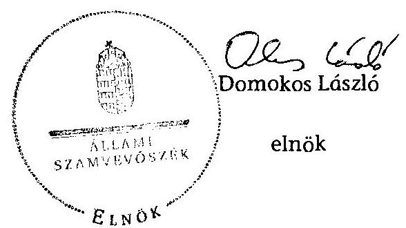

# ÁLLAMI   SZÁMVEVŐSZÉK 

## JELENTÉS

az önkormányzatok belső kontrollrendszere kialakításának, egyes
kontrolltevékenységek és a belső ellenőrzés
működésének - 2013. évben induló - ellenőrzéséről
Sajóbábony
13177
2013. december

---

# Állami Számvevőszék 

Iktatószám: V-0137-035/2013.
Témaszám: 1162
Vizsgálat-azonosító szám: V064908

## Az ellenőrzést felügyelte:

Dr. Benedek Mária
felügyeleti vezető
Az ellenőrzést vezette és az ellenőrzés végrehajtásáért felelős:
Bíró Zsolt
ellenőrzésvezető
A számvevőszéki jelentés összeállításában közremúködtek:
Pappné dr. Szamosi Éva
számvevő tanácsos
Dr. Gaálné Berente Mónika
számvevő
Az ellenőrzést végezték:
Szabó Zsuzsanna
Puskás Balázs
számvevő

---

# TARTALOMJEGYZÉK 

BEVEZETÉS ..... 5
I. ÖSSZEGZŐ MEGÁLLAPÍTÁSOK, KÖVETKEZTETÉSEK, JAVASLATOK ..... 9
II. RÉSZLETES MEGÁLLAPÍTÁSOK ..... 17

1. Az önkormányzat belső kontrollrendszerének kialakítása ..... 17
1.1. A kontrollkörnyezet ..... 17
1.2. A kockázatkezelési rendszer ..... 19
1.3. A kontrolltevékenységek ..... 19
1.4. Az információs és kommunikációs rendszer ..... 20
1.5. A monitoring rendszer ..... 20
2. A pénzügyi folyamatokban kulcsszerepet betöltő teljesítésigazolás és érvényesítés belső kontrollok működése ..... 21
3. A belső ellenőrzés működése ..... 22

## FÜGGELÉKEK

1. számú Értelmező szótár
2. számú Az értékelés módja és szempontjai

---

.

---

# RÖVIDÍTÉSEK JEGYZÉKE 

## Törvények

Áht.
ÁSZ tv.
Info tv.

Kttv.

Mötv.

Ötv.
Számv. tv.
Tvtv.

Vagyonnyilatkozattételről szóló tv.

## Rendeletek

Áhsz.

Ávr.

Bkr.

Ikr.
önkormányzati SZMSZ

## Szórövidítések

ÁSZ
belső ellenőrzési kézikönyv
hivatali SZMSZ

INTOSAI

ISSAI
jegyző

2011. évi CXCV. törvény az államháztartásról (hatályos 2012. január 1-jétől)
2011. évi LXVI. törvény az Állami Számvevőszékről
2011. évi CXII. törvény az információs önrendelkezési jogról és az információszabadságról (hatályos 2012. január 1-jétől)
2011. évi CXCIX. törvény a közszolgálati tisztviselőkről (hatályos 2012. március 1-jétől)
2011. évi CLXXXIX. törvény Magyarország helyi önkormányzatairól (hatályos 2012. január 1-jétől)
1990. évi LXV. törvény a helyi önkormányzatokról
2000. évi C. törvény a számvitelről
1996. évi XXXI. törvény a tűz elleni védekezésről, a műszaki mentésről és a tűzoltóságról
2007. évi CLII. törvény az egyes vagyonnyilatkozat-tételi kötelezettségekről

249/2000. (XII. 24.) Korm. rendelet az államháztartás szervezetei beszámolási és könyvvezetési kötelezettségének sajátosságairól
368/2011. (XII. 31.) Korm. rendelet az államháztartásról szóló törvény végrehajtásáról (hatályos 2012. január 1jétől)
370/2011. (XII. 31.) Korm. rendelet a költségvetési szervek belső kontrollrendszeréről és belső ellenőrzéséről (hatályos 2012. január 1-jétől)
335/2005. (XII. 29.) Korm. rendelet a közfeladatot ellátó szervek iratkezelésének általános követelményeiről
Sajóbábony Önkormányzatának többször módosított 4/2003. (II. 26.) számú rendelete a Szervezeti és Működési Szabályzatáról

Állami Számvevőszék
Belső Ellenőrzési Kézikönyv Miskolc Kistérség Többcélú Társulás (hatályos 2010. június 7-étől)
Sajóbábony Nagyközségi Önkormányzat Polgármesteri Hivatalának Szervezeti és Müködési Szabályzata (hatályos 2008. május 1-jétől)
International Organization of Supreme Audit Institutions (Legfőbb Ellenőrző Intézmények Nemzetközi Szervezete)
International Standards of Supreme Audit Institutions (Legfőbb Ellenőrző Intézmények Nemzetközi Standardjai)
Sajóbábony Város Önkormányzatának jegyzője

---

| Képviselő-testület | Sajóbábony Város Önkormányzatának Képviselőtestülete |
| :--: | :--: |
| NGM | Nemzetgazdasági Minisztérium |
| Önkormányzat polgármester | Sajóbábony Város Önkormányzata   Sajóbábony Város Önkormányzatának polgármestere |
| Polgármesteri Hivatal | Sajóbábony Város Önkormányzatának Polgármesteri Hivatala |
| számlarend | Sajóbábony Nagyközségi Önkormányzat Polgármesteri Hivatalának Számlarendje (hatályos 2009. április 1-jétől) |
| számviteli politika | Sajóbábony Nagyközségi Önkormányzat Polgármesteri Hivatalának Számviteli Politikája (hatályos 2008. április 1-jétől) |
| Társulás   tűzvédelmi szabályzat | Miskolc Kistérség Többcélú Társulása   Sajóbábony Város Önkormányzat Polgármesteri Hivatalának Tüzvédelmi Szabályzata (hatályos 2013. március 20-tól) |

---

# JELENTÉS 

## az önkormányzatok belső kontrollrendszere kialakításának, egyes kontrolltevékenységek és a belső ellenőrzés múködésének - 2013. évben induló - ellenőrzéséről Sajóbábony

## BEVEZETÉS

Sajóbábony város állandó lakosainak száma 2012. január 1-jén 2907 fő volt. Az Önkormányzat hattagú Képviselő-testületének munkáját három állandó bizottság segítette. Az Önkormányzat az önállóan múködő és gazdálkodó Polgármesteri Hivatalon kívül négy önállóan múködő intézményt múködtetett, többségi tulajdonú gazdasági társasággal nem rendelkezett. A polgármester 1990. október 15. óta tölti be tisztségét. A jegyző 2011. június 10-től látja el feladatait. A Polgármesteri Hivatal szervezeti egységekre nem tagolódott, elkülönített gazdasági szervezettel nem rendelkezett, a foglalkoztatott köztisztviselők száma 2012. január 1-jén 12 fő volt. A Polgármesteri Hivatalnál 2013. január 1-jétől szervezeti változás, átalakítás nem volt. Az Önkormányzat a 2012. évi költségvetési beszámolója szerint 840302 ezer Ft tárgyévi bevételt ért el, valamint 688314 ezer Ft tárgyévi kiadást teljesített. A 2012. december 31-i könyvviteli mérleg szerint 1347335 ezer Ft értékű eszközvagyonnal rendelkezett, a rövid lejáratú kötelezettségállománya 10284 ezer Ft volt, hosszú lejáratú kötelezettségállománya nem volt.

A demokratikus társadalmakban alapvető igény, hogy a közpénzeket, a közvagyont használók tevékenységükről elszámoljanak, ahhoz egyértelmű és érvényesíthető felelősségi szabályok társuljanak. Ennek a jogos igénynek az érvényesítéséhez meg kell teremteni azokat a folyamatokat, rendszereket, amelyek nélkülözhetetlenek az elszámoltatáshoz. Az elszámoltatás eredményes múködtetéséhez szükség van a megfelelő információs, kontroll, értékelési és beszámolási rendszerek kialakítására.

Magyarországon az uniós csatlakozási tárgyalások idejére nyúlnak vissza a belső kontrollrendszer szabályozásának gyökerei. Az uniós elvárásoknak megfelelő új terminológia szerinti államháztartási belső pénzügyi ellenőrzési (ÁBPE) rendszer területén a jogharmonizáció 2003-ban teljes körűen megvalósult, míg az önkormányzati alrendszerre vonatkozó, Ötv.-ben megjelenített speciális szabályozás 2005-ben lépett hatályba. Az államháztartási belső kontrollrendszer koncepciója 2009-ben továbbfejlődött. A változások irányát mutatja, hogy a költségvetési szervek belső kontrollrendszere már magában foglalja a korszerű, felelős szervezetirányítás elemeit (kontrollkörnyezet, kockázatkezelés, kontrolltevékenység, információ és kommunikáció, monitoring) is. E kont-

---

rollrendszer szabályozása háromszintű, a törvényi előírásokat az Áht. és a Mötv., a rendeleti szintű szabályozást az Ávr. és a Bkr. tartalmazza, amelyeket útmutatói szinten az NGM által kiadott standardok és kézikönyvek támogatnak.

A belső kontrollrendszer azt a célt szolgálja, hogy a költségvetési szervek működésük és gazdálkodásuk során a tevékenységeket szabályszerűen, gazdaságosan, hatékonyan és eredményesen hajtsák végre, teljesítsék elszámolási kötelezettségeiket, és megvédjék az erőforrásokat a veszteségektől, a károktól és a nem rendeltetésszerű használattól. A belső kontrollrendszer magában foglalja mindazon szabályokat, eljárásokat, gyakorlati módszereket és szervezeti struktúrákat, kockázatkezelési technikákat, kontrolltevékenységeket, amelyek segítséget nyújtanak a szervezetnek céljai eléréséhez.

Az ÁSZ a 2011-2015. évekre szóló stratégiájában hangsúlyos szerepet szánt annak, hogy szilárd szakmai alapon álló, értékteremtő ellenőrzéseivel előmozdítsa a közpénzügyek átláthatóságát, rendezettségét. A számvevőszéki ellenőrzés nemzetközi alapelvei is rögzítik, hogy a megfelelő belső kontrollrendszer minimálisra csökkenti a hibák és szabálytalanságok kockázatát.

Az ellenőrzés célja annak megállapítása volt, hogy a belső kontrollrendszer elemeinek kialakítása, a pénzügyi folyamatokban kulcsszerepet betöltő teljesítésigazolás és érvényesítés, és a belső ellenőrzés szabályos múködése biztosítot-ta-e az Önkormányzatnál a közpénzfelhasználás szabályosságát, hozzájárult-e az értéket teremtő rend követelményének érvényesüléséhez.

Ennek keretében értékeltük, hogy:

- a jogszabályi előírásoknak megfelelően alakították-e ki a belső kontrollrendszer elemeit;
- a gazdálkodás folyamatában kulcsszerepet betöltő teljesítésigazolás és érvényesítés kontrolltevékenységeit megfelelően múködtették-e;
- biztosították-e a belső ellenőrzés szabályos múködését;
- amennyiben az ÁSZ tett javaslatot a 2008-2011. évek közötti ellenőrzése kapcsán az Önkormányzatnak, intézkedtek-e azok végrehajtására.

Az ellenőrzés várható hasznosulását négy szinten tervezzük. A törvényalkotás számára összegzett tapasztalatok állnak rendelkezésre a belső kontrollrendszer önkormányzati területen való kialakításáról, múködéséről és hatásairól, a belső ellenőrzés múködéséről. Ennek alapján következtetést lehet levonni arról, hogy a belső kontrollrendszer kialakítására és múködtetésére vonatkozó jelenlegi, differenciálás nélküli - jogszabályi előírások reális követelményeket támasztanak-e az eltérő adottságú települési önkormányzatok esetében, illetve indokolt-e esetleges jogszabályi módosítás kezdeményezése. Az ellenőrzés az ellenőrzött számára visszajelzést ad a belső kontrollrendszer kialakításában és múködésében fellépő hiányosságokról, javaslataival hozzájárul azok kiküszöböléséhez, amely csökkentheti a későbbi ellenőrzések gyakoriságát. Az ellenőrzés megállapításait és javaslatait más szervezetek is hasznosíthatják a rendezett gazdálkodási keretek kialakításához. A társadalom számára jelzi,

---

hogy közpénz nem maradhat ellenőrizetlenül, az ÁSZ értékteremtő rend kialakításához és megőrzéséhez hozzájáruló tevékenysége pozitív hatással lesz a szervezetről kialakított összkép formálásában. A szervezeten belül lehetőség nyílik arra, hogy a megállapítások szintetizálásával az ÁSZ a hozzáadott értéket teremtő elemző tevékenységét és tanácsadó szerepét is erősítse.

Az önkormányzatok belső kontrollrendszere kialakításának, egyes kontrolltevékenységek és a belső ellenőrzés működésének ellenőrzéséről szóló jelentés I. fejezetének összegző része az ellenőrzés céljára ad rövid, szintetizáló összefoglalót, és tartalmazza a következtetéseket a II. fejezet részletes megállapításain alapulóan. A jelentés intézkedést igénylő megállapításait és javaslatait az ellenőrzés során feltárt, a jelentés II. fejezetében rögzített részletes megállapítások alapozzák meg. A helyszíni ellenőrzés lezárásáig a helyi szabályozás változásait nyomon követtük.

Az ellenőrzés típusa: szabályszerűségi ellenőrzés.
Az ellenőrzött időszak: a belső kontrollrendszer kialakításának megfelelősége esetében a 2012. évre, a pénzügyi folyamatokban kulcsszerepet betöltő teljesítésigazolás és érvényesítés belső kontrollok múködésének megfelelőségét és a belső ellenőrzés szabályszerű működését a 2012. január 1. és december 31-e közötti időszak eseményeit figyelembe véve értékeltük, míg az ÁSZ javaslatainak utóellenőrzése a 2008-2011. években végzett ellenőrzések nyilvánosságra hozott jelentéseiben tett javaslatok áttekintésére terjedt ki.

# Az ellenőrzött szervezet: az Önkormányzat. 

Az ellenőrzés jogszabályi alapját az ÁSZ tv. 1. § (3) bekezdése, az 5. § (2) és (6) bekezdése, valamint az Áht. 61. § (2) bekezdésének előírásai képezik.

Az ellenőrzés szakmai módszertana az ÁSZ hivatalos honlapján (www.asz.hu) közzétett szakmai szabályokon alapult, amely az INTOSAI által kiadott ISSAI figyelembevételével készült.

Az ellenőrzés lefolytatásához az Önkormányzat a kimutatások és a tanúsítvány elektronikus kitöltésével, valamint az ÁSZ által kért dokumentumok elektronikus megküldésével szolgáltatott adatokat. Az így rendelkezésre bocsátott adatok, információk kontrollja és a munkalapok kitöltése a helyszíni ellenőrzés keretében történt. A jelentésben használt fogalmak magyarázatát az 1. számú függelék, az ellenőrzés egyes területeinek értékelésénél alkalmazott egységes minősítési szempontokat a 2. számú függelék tartalmazza.

A belső kontrollrendszer kialakításának ellenőrzése során értékeltük a kontrollkörnyezet, a kockázatkezelési rendszer, a kontrolltevékenységek, az információs és kommunikációs rendszer, valamint a monitoring rendszer szabályozottságának megfelelőségét. A pénzügyi folyamatokban kulcsszerepet betöltő teljesítésigazolás és érvényesítés kontrollok múködése megfelelőségének minősítéséhez az állományba nem tartozók megbízási díjai, a külső szolgáltatók által végzett karbantartási, kisjavítási munkák, az egyéb üzemeltetési és fenntartási szolgáltatások, a rendszeres szociális segélyek, valamint az államháztartáson kívülre teljesített múködési és felhalmozási célú pénzeszközátadások közül koc-

---

kázatelemzéssel választottuk ki az ellenőrzött kiadási jogcímeket. Az egyszerű véletlen mintavétellel kiválasztott tételek ellenőrzését többlépcsős megfelelőségi tesztek útján addig végeztük, amíg elegendő és megfelelő bizonyítékot szereztünk a vizsgált folyamatok kulcskontrolljai múködésének megfelelő vagy nem megfelelő voltáról. Értékeltük az Önkormányzatnál a belső ellenőrzés múködésének szabályosságát. Utóellenőrzésre nem került sor, mivel az ÁSZ az Önkormányzatnál a 2008-2011. évek között ellenőrzést nem végzett.

Az ÁSZ tv. 29. § (1) bekezdése szerint a jelentéstervezetet megküldtük a polgármester részére, aki az ÁSZ tv. 29. § (2) bekezdésében foglalt észrevételezési jogával nem élt, a jelentéstervezetre észrevételt nem tett.

---

# I. ÖSSZEGZŐ MEGÁLLAPÍTÁSOK, KÖVETKEZTETÉSEK, JAVASLATOK 

A belső kontrollrendszeren belül 2012-ben a kontrollkörnyezet, a kockázatkezelési rendszer, a kontrolltevékenységek, az információs és kommunikációs rendszer, valamint a monitoring rendszer kialakítását külön-külön és együttesen is értékeltük. A belső kontrollrendszer kialakítása az összesített értékelés alapján nem felelt meg a jogszabályi előírásoknak.

A belső kontrollrendszer egyes területei kialakításának minősítése a következő:

| Kontrollterület | Minősítés |
| :-- | :--: |
| Kontrollkörnyezet | nem |
|  | megfelelő |
| Kockázatkezelési rendszer | nem |
|  | megfelelő |
| Kontrolltevékenységek | nem |
| Információs és kommunikációs | megfelelő |
| rendszer | nem |
| Monitoring rendszer | medfelelő |

Nem megfelelőnek értékeltük a kontrollkörnyezet, a kockázatkezelési rendszer, a kontrolltevékenységek, az információs és kommunikációs rendszer, valamint a monitoring rendszer kialakítását, mivel az ellenőrzésünk során megállapított szabályozásbeli hiányosságok magukban hordozzák a szabálytalan működés, valamint a korrupció kockázatát.

A belső kontrollrendszer nem megfelelő kialakítása kockázatot jelent az Önkormányzat tevékenységeinek szabályszerű, gazdaságos, hatékony és eredményes végrehajtása során.

A 2012. évben az állományba nem tartozók megbízási díjaival, valamint a külső szolgáltatók által végzett karbantartási, kisjavítási munkákkal kapcsolatos kifizetések során a pénzügyi folyamatokban kulcsszerepet betöltő teljesítésigazolás és érvényesítés belső kontrollok múködése gyenge volt. Gyengének értékeltük a két kulcskontroll együttes múködését, mivel azok nem biztosították a hibák megelőzését, feltárását.

A számvevőszéki ellenőrzés az ellenőrzött kifizetésekkel összefüggésben a rendelkezésre bocsátott dokumentumok alapján jogosulatlan kifizetést nem tárt fel, azonban a gazdálkodásban kulcsszerepet betöltő kontrollok múködésében feltárt hiányosságok miatt fennáll a hibák bekövetkezésének kockázata. A nem megfelelően múködtetett belső kontrollok korrupciós kockázatot hordoznak.

---

Az Önkormányzat a belső ellenőrzési feladatokat a Társulás útján látta el. A 2012. évben a belső ellenőrzés múködése a jogszabályi előírásoknak jól megfelelt, azonban nem tárta fel a belső kontrollrendszer kialakításának, valamint a pénzügyi folyamatokban kulcsszerepet betöltő teljesítésigazolás és érvényesítés belső kontrollok múködésének hiányosságait.

Az ÁSZ tv. 33. § (1) bekezdésében foglaltak értelmében az ellenőrzött szervezet vezetője köteles a jelentésben foglalt megállapításokhoz kapcsolódó intézkedési tervet összeállítani, és azt a jelentés kézhezvételétől számított 30 napon belül az ÁSZ részére megküldeni. Amennyiben az intézkedési tervet határidőre nem küldi meg a szervezet, vagy az ÁSZ tv. 33. § (2) bekezdésében foglalt póthatáridő elteltével megküldött intézkedési terv továbbra sem elfogadható, az ÁSZ elnöke a hivatkozott törvény 33. § (3) bekezdés a)-b) pontjaiban foglaltakat érvényesítheti.

Az ellenőrzés intézkedést igénylő megállapításai és javaslatai:

# a polgármesternek 

1. Az Önkormányzat nevében történő kötelezettségvállalás - az Áht. 37. § (1) bekezdése és az Ávr. 55. § (1) bekezdésében foglaltak ellenére - pénzügyi ellenjegyzés hiányában történt.

Javaslat:
Intézkedjen arról, hogy az Önkormányzat nevében történő kötelezettségvállalásra az Áht. 37. § (1) bekezdésében és az Ávr. 55. § (1) bekezdésében foglaltaknak megfelelően - az Ávr. 53. §-ában meghatározott kivételekkel - kizárólag a pénzügyi ellenjegyzés után, a pénzügyi teljesítés esedékességét megelőzően, írásban kerüljön sor.
2. A polgármester mint kötelezettségvállaló - az Ávr. 57. § (4) bekezdésében foglaltak ellenére - 2012. március 31-étől írásban nem jelölte ki a teljesítésigazolásra jogosult személyeket.

Javaslat:
Jelölje ki az Ávr. 57. § (4) bekezdésének megfelelően az általa történő kötelezettségvállalások esetében a teljesítés igazolására jogosult személyeket.
3. A számvevőszéki ellenőrzés megállapításai alapján az Önkormányzatnál a belső kontrollrendszer kialakítása összefoglalóan értékelve nem felelt meg a jogszabályi előírásoknak, a kulcskontrollok működése gyenge volt, a belső ellenőrzés működése ugyan jól megfelelt a jogszabályi előírásoknak, azonban nem tárta fel, ezáltal nem is javíttatta ki a hiányosságokat. A megállapított szabályozásbeli és működésbeli hiányosságok magukban hordozzák a szabálytalan működés kockázatát.

Javaslat:
Az Mötv. 115. § (1) bekezdésében foglaltak alapján kísérje figyelemmel az Önkormányzat gazdálkodásának szabályszerűségét. Az Mötv. 67. § f) pontja alapján gondoskodjon a belső kontrollrendszerre és a belső ellenőrzés működésére vonatkozó

---

jogszabályi rendelkezések be nem tartása, valamint a teljesítésigazolás, illetve az érvényesítés kontrollokkal összefüggésben feltárt hiányosságok, szabálytalanságok tekintetében az esetleges munkajogi felelősséggel kapcsolatos körülmények kivizsgálásáról, és a vizsgálat eredményének függvényében tegye meg a szükséges munkajogi intézkedéseket.

# a jegyzőnek 

1. a kontrollkörnyezettel kapcsolatban:

A hivatali SZMSZ-ben a jegyző - az Ávr. 13. § (1) bekezdés c), g), és i) pontjaiban foglaltak ellenére - nem rögzítette az alaptevékenységet szabályozó jogszabályok megjelölését, a szervezeti és múködési szabályzatban nevesített valamennyi munkakörhöz tartozó feladat- és hatásköröket és a hatáskörök gyakorlásának módját, a helyettesítés rendjét, az ezekhez kapcsolódó felelősségi szabályokat, valamint az irányító szerv által az Ávr. 10. § (1)-(3) bekezdése szerint a költségvetési szervhez rendelt más költségvetési szervek felsorolását.

A jegyző - a Számv. tv. 14. § (11) bekezdésében foglaltak ellenére - a Számv. tv. 14. § (4) bekezdésében és az Áhsz. 8. § (3) bekezdésében előírt számviteli politikát a törvényi változás hatályba lépését követő 90 napon belül nem aktualizálta.

A jegyző a Számv. tv. 161. § (1) bekezdése és az Áhsz. 49. § (1) bekezdése szerinti számlarend szükséges módosítását - a Számv. tv. 161. § (5) bekezdésében foglaltak ellenére - a törvényi változás hatályba lépését követő 90 napon belül nem végezte el.

A jegyző - a Kttv. 75. § (1) bekezdés d) pontjában foglaltak ellenére - nem készítette el a Polgármesteri Hivatalban múszaki munkakörben dolgozó, határozott időre szóló kinevezéssel rendelkező köztisztviselő munkaköri leírását.

A jegyző - a Bkr. 6. § (3) bekezdésében foglaltak ellenére - az ellenőrzési nyomvonalat nem aktualizálta.

A jegyző - a Kttv. 130. § (1) bekezdésében foglaltak ellenére - a Polgármesteri Hivatalban dolgozó három fő köztisztviselő teljesítményértékelését nem készítette el.

A Kttv. 231. § (1) bekezdése ellenére a Képviselő-testület nem állapította meg, a köztisztviselőkkel szembeni, a Kttv. 83. §-a szerinti hivatásetikai alapelvek részletes tartalmát, valamint az etikai eljárás szabályait, mivel a jegyző - az Ötv. 36. § (2) bekezdés a) pontjában előírt feladata ellenére - nem készítette elő ennek dokumentumát.

Javaslat:
a) Készítse el a hivatali SZMSZ módosítását annak érdekében, hogy az tartalmazza az Ávr. 13. § (1) bekezdésében előírt tartalmi elemeket, és kezdeményezze az Áht. 9. § (1) bekezdés a) pontjában foglaltakra tekintettel a Képviselő-testület elé terjesztését.

---

b) Végezze el a számviteli politika - törvényi változás esetén szükséges - módosítását a Számv. tv. 14. § (11) bekezdése alapján a törvénymódosítás hatálybalépését követő 90 napon belül.
c) Végezze el a számlarend - törvényi változás esetén szükséges - módosítását a Számv. tv. 161. § (5) bekezdése alapján a törvénymódosítás hatálybalépését követő 90 napon belül.
d) Intézkedjen a Kttv. 75. § (1) bekezdés d) pontjában foglaltaknak megfelelően valamennyi köztisztviselő munkaköri leírásának elkészítéséről.
e) Aktualizálja rendszeresen a Bkr. 6. § (3) bekezdésében előírtaknak megfelelően az ellenőrzési nyomvonalat.
f) Értékelje írásban a Kttv. 130. § (1) bekezdése alapján a Polgármesteri Hivatal köztisztviselőinek munkateljesítményét.
g) Készítse elő a Mötv. 81. § (3) bekezdés c) pontjában foglalt feladatkörében a köztisztviselőkkel szembeni - a Kttv. 83. §-a szerinti - hivatásetikai alapelvek részletes tartalmát, valamint az etikai eljárás szabályainak dokumentumait, és a Kttv. 231. § (1) bekezdésében foglaltak érvényesülése érdekében kezdeményezze azok Képviselő-testület elé terjesztését.
2. a kockázatkezelési rendszerrel kapcsolatban:

A jegyző - a Bkr. 7. § (2) bekezdésében foglalt előírások ellenére - nem mérte fel és nem állapította meg a Polgármesteri Hivatal tevékenységében, gazdálkodásában rejlő kockázatokat, nem határozta meg az egyes kockázatokkal kapcsolatban szükséges intézkedéseket, valamint a kockázatok kezelése érdekében szükséges intézkedések teljesítésének folyamatos nyomon követési módját.

A Vagyonnyilatkozat-tételről szóló tv. 4. § a) és d) pontjában foglaltak ellenére a hivatali SZMSZ vagyonnyilatkozat-tételre kötelezettként a 2011. június 10-e előtt közszolgálati jogviszonyban lévő jegyzőt tüntette fel név szerint, valamint az önkormányzati SZMSZ a képviselők vagyonnyilatkozat-tételi kötelezettségét nem tartalmazta.

Javaslat:
a) Mérje fel és állapítsa meg - a Bkr. 7. § (2) bekezdésében foglaltak alapján - a Polgármesteri Hivatal tevékenységében, gazdálkodásában rejlő kockázatokat, és határozza meg az egyes kockázatokkal kapcsolatban szükséges intézkedéseket, valamint a kockázatok kezelése érdekében szükséges intézkedések teljesítésének folyamatos nyomon követési módját.
b) Készítse el a hivatali SZMSZ módosítását, és kezdeményezze az Áht. 9. § (1) bekezdés a) pontjában foglaltakra tekintettel a Képviselő-testület elé terjesztését, továbbá készítse el a Mötv. 81. § (3) bekezdés c) pontjában foglaltak alapján az önkormányzati SZMSZ módosításának tervezetét, és kezdeményezze a Képvise-lő-testület elé terjesztését annak érdekében, hogy azok tartalmazzák a Vagyon-nyilatkozat-tételről szóló tv. 4. § a) és d) pontja alapján a vagyonnyilatkozattételre kötelezettek körét.

---

3. a kontrolltevékenységekkel kapcsolatban:

A jegyző - a Bkr. 8. § (2) bekezdés a) pontjában foglaltak ellenére - nem biztosította a pénzügyi döntések - köztük a támogatásokkal való elszámolás - dokumentumainak elkészítésével kapcsolatban a folyamatba épített, előzetes, utólagos és vezetői ellenőrzést.

A jegyző - az Ávr. 13. § (2) bekezdés a) pontjában foglaltak ellenére - nem szabályozta belső szabályzatban a pénzügyi ellenjegyzés és az érvényesítés módját, továbbá az utalványozás rendjét.

A jegyző belső szabályozásban lehetővé tette az 50 ezer forintot meg nem haladó kifizetések előzetes írásbeli kötelezettségvállalás nélküli teljesítését, azonban - az Ávr. 53. § (2) bekezdésében foglaltakat figyelmen kívül hagyva - nem határozta meg az előzetes írásbeli kötelezettségvállalást nem igénylő kifizetések rendjét.

A teljesítésigazolásra jogosult személyeket a jegyző mint kötelezettségvállaló - az Ávr. 57. § (4) bekezdésében foglaltak ellenére - írásban nem jelölte ki.

A jegyző az Info tv. 7. § (2) és (3) bekezdésében foglalt előírásokat figyelmen kívül hagyva az informatikai rendszer szabályozása során elmulasztotta az adatbiztonság érvényre juttatásához szükséges intézkedések megtételét.

A jegyző - a Bkr. 8. § (4) bekezdés b) pontjában foglaltak ellenére - belső szabályzatban nem határozta meg a dokumentumokhoz és információkhoz való hozzáférés esetében a felelősségi köröket.

A jegyző az iratkezelési rendszer kialakítása során - az lkr. 8. § (2) bekezdésében foglaltak ellenére - nem határozta meg az üzemeltetés és az adatbiztonság védelmének feladatai esetében a hatásköröket.

A jegyző - az Ávr. 13. § (5) bekezdésében foglaltak ellenére - nem határozta meg a gazdasági feladatot ellátó alkalmazottak helyettesítésének rendjét.

A jegyző - a Kttv. 74. § (1) bekezdésében foglaltak ellenére - a jogviszony megszűnése esetére nem szabályozta a munkavállaló folyamatban lévő feladatai átadásának rendjét.

Javaslat:
a) Biztosítsa minden tevékenységre vonatkozóan a folyamatba épített, előzetes, utólagos és vezetői ellenőrzést a Bkr. 8. § (2) bekezdése alapján.
b) Rendezze belső szabályzatban az Ávr. 13. § (2) bekezdés a) pontjában foglaltak alapján a gazdálkodással - különösen a kötelezettségvállalás pénzügyi ellenjegyzésének módjával, valamint az érvényesítés és az utalványozás rendjével - kapcsolatos belső előírásokat, feltételeket.
c) Rögzítse belső szabályzatban az Ávr. 53. § (2) bekezdése alapján az előzetes írásbeli kötelezettségvállalást nem igénylő kifizetések rendjét.

---

d) Jelölje ki az Ávr. 57. § (4) bekezdésének megfelelően az általa történő kötelezettségvállalások esetében a teljesítés igazolására jogosult személyeket.
e) Gondoskodjon az Info tv. 7. § (2) és (3) bekezdésében foglaltaknak megfelelően az adatok biztonságáról.
f) Határozza meg belső szabályzatban a Bkr. 8. § (4) bekezdés b) pontjában előírtaknak megfelelően a dokumentumokhoz és információkhoz való hozzáférésre vonatkozó felelősségi köröket.
g) Határozza meg az lkr. 8. § (2) bekezdésében foglaltaknak megfelelően a hatásköröket az üzemeltetés és adatbiztonság szabályozása alapján előírt feladatok esetében.
h) Határozza meg az Ávr. 13. § (5) bekezdés alapján a gazdasági feladatot ellátó alkalmazottak helyettesítésének rendjét.
i) Szabályozza a Kttv. 74. § (1) bekezdésében foglaltak alapján a jogviszony megszűnése esetére a munkavállaló folyamatban lévő feladatai átadásának rendjét.
4. az információs és kommunikációs rendszerrel kapcsolatban:

Az Önkormányzat - az Info tv. 33. § (1) és (3) bekezdésében foglaltak ellenére - az elektronikus közzétételi kötelezettségének teljes körűen a 2012. évben nem tett eleget, mert a 2011. évi költségvetési beszámolót nem tette közzé.

Javaslat:
Gondoskodjon az Info tv. 33. § (1) és (3) bekezdésében foglaltaknak megfelelően az elektronikus közzétételi kötelezettség teljesítéséről.
5. a monitoring rendszerrel kapcsolatban:

A jegyző - a Bkr. 3. § e) pontjában és 10. §-ában foglaltak ellenére - nem alakított ki a Polgármesteri Hivatal tevékenységének, a célok megvalósításának nyomon követését biztosító rendszert.

Az Áht. 69. § (2) bekezdésében és a Bkr. 3. §-ában foglaltakat figyelmen kívül hagyva (a Bkr. 1. melléklete szerinti nyilatkozatban foglaltak alapján, annak indokoltsága ellenére) a jegyző a belső kontrollrendszer továbbfejlesztése érdekében intézkedéseket nem tett.

A jegyző - a Bkr. 13. § (2) bekezdésében foglalt előírás ellenére - a külső ellenőrzések megállapításainak hasznosítására intézkedési tervet nem készített.

Javaslat:
a) Alakítsa ki és múködtesse a Bkr. 3. § e) pontjában és a 10. §-ában előírtak alapján a Polgármesteri Hivatal tevékenységének, a célok megvalósításának nyomon követését biztosító rendszert.

---

b) Intézkedjen az Áht. 69. § (2) bekezdésében és a Bkr. 3. §-ában foglaltaknak megfelelően a belső kontrollrendszer továbbfejlesztése érdekében szükséges intézkedések megtételéről.
c) Gondoskodjon a Bkr. 13. § (2) bekezdésében foglaltaknak megfelelően a külső ellenőrzések megállapításai és javaslatai alapján (a végrehajtásért felelősöket és a végrehajtás határidejét feltüntető) intézkedési tervek készítéséről.
6. a pénzügyi folyamatokban kulcsszerepet betöltő kontrollokkal kapcsolatban:

A teljesítésigazolást - az Áht. 38. § (1) bekezdésében és az Ávr. 57. § (1) és (3) bekezdésében foglaltak ellenére - nem vagy nem szabályszerűen végezték el.

Az érvényesítést - az Áht. 38. § (1) bekezdésében és az Ávr. 58. § (1) bekezdésében foglaltak ellenére - nem, vagy nem szabályszerűen végezték el. Az érvényesítő - az Ávr. 58. § (2) bekezdésében előírtak ellenére - nem jelezte az utalványozónak, hogy a megelőző ügymenetben a teljesítésigazolást - az Áht. 38. § (1) bekezdésében és az Ávr. 57. § (1) és (3) bekezdésében foglaltak ellenére - nem vagy nem szabályszerűen végezték el, valamint a Polgármesteri Hivatal kiadási előirányzatai terhére történt előzetes írásbeli kötelezettségvállalásokra - Áht. 37. § (1) bekezdésében és az Ávr. 55. § (1) bekezdésében előírtak ellenére - pénzügyi ellenjegyzés nélkül került sor.

Javaslat:
Intézkedjen - a teljesítésigazolás és az érvényesítés vonatkozásában feltárt hiányosságok megszüntetése, illetve az operatív gazdálkodás során a müködésbeli hibák megelőzése, feltárása és kijavítása érdekében - arról, hogy
a) az Áht. 38. § (1) bekezdésén alapuló teljesítésigazolás során az Ávr. 57. § (1) bekezdésében előírtaknak megfelelően, ellenőrizhető okmányok alapján ellenőrizzék és igazolják a kiadások teljesítésének jogosságát, összegszerűségét, az ellenszolgáltatást is magában foglaló kötelezettségvállalás esetén annak teljesítését, valamint az Ávr. 57. § (3) bekezdése szerint a teljesítést az igazolás dátumának és a teljesítés tényére történő utalásnak a megjelölésével, az arra jogosult személy aláírásával igazolják;
b) kötelezettségvállalásra az Áht. 37. § (1) és az Ávr. 55. § (1) bekezdésében foglaltaknak megfelelően - az Ávr. 53. §-ában meghatározott kivételekkel - kizárólag a pénzügyi ellenjegyzés után, a pénzügyi teljesítést megelőzően, írásban kerüljön sor;
c) az érvényesítő a kifizetéseket megelőzően a teljesítésigazolás alapján - az Ávr. 57. § (3) bekezdése szerinti esetben annak hiányában is - az összegszerűségnek, a fedezet meglétének és a megelőző ügymenetben az Áht., az Áhsz., az Ávr. előírásai és a belső szabályzatokban foglaltak betartásának az ellenőrzése - az Ávr. 58. § (1)-(3) bekezdései szerint - történjen meg.
7. a belső ellenőrzés működésével kapcsolatban:

A stratégiai ellenőrzési terv - a Bkr. 30. § (1) bekezdés f) pontjában foglalt előírás ellenére - nem tartalmazta az ellenőrzési gyakoriságot.

---

Javaslat:
Kezdeményezze, hogy a stratégiai ellenőrzési terv tartalmazza a Bkr. 30. § (1) bekezdésében foglalt valamennyi kötelező tartalmi elemet.

---

# II. RÉSZLETES MEGÁLLAPÍTÁSOK 

## 1. AZ ÖNKORMÁNYZAT BELSŐ KONTROLLRENDSZERÉNEK KIALAKÍTÁ-

SA

A belső kontrollrendszeren belül 2012-ben a kontrollkörnyezet, a kockázatkezelési rendszer, a kontrolltevékenységek, az információs és kommunikációs rendszer, valamint a monitoring rendszer kialakítását külön-külön és együttesen is értékeltük. A belső kontrollrendszer kialakítása az összesített értékelés alapján nem felelt meg a jogszabályi előírásoknak.

### 1.1. A kontrollkörnyezet

A kontrollkörnyezet kialakítása - a 2. számú függelékben részletezett kritériumrendszer alapján végzett értékelés szerint - nem felelt meg a jogszabályi előírásoknak, mert:

| Sorszám ${ }^{1}$ | Megállapítás | Megjegyzés |
| :--: | :--: | :--: |
| 7.,   10.,   12. | A hivatali SZMSZ-ben a jegyző - az Ávr. 13. § (1) bekezdés c), g), és i) pontjaiban foglaltak ellenére - nem rögzítette az alaptevékenységet szabályozó jogszabályok megjelölését, a szervezeti és múködési szabályzatban nevesített valamennyi munkakörhöz tartozó feladat- és hatásköröket és a hatáskörök gyakorlásának módját, a helyettesítés rendjét, az ezekhez kapcsolódó felelősségi szabályokat, valamint az irányító szerv által az Ávr. 10. § (1)-(3) bekezdése szerint a költségvetési szervhez rendelt más költségvetési szervek felsorolását. |  |
| 17. | A jegyző - a Számv. tv. 14. § (11) bekezdésében foglaltak ellenére - a Számv. tv. 14. § (4) bekezdésében és az Áhsz. 8. § (3) bekezdésében előírt számviteli politikát - a törvényi változás hatályba lépését követő 90 napon belül - nem aktualizálta. | A számviteli politikában a saját tőke részeinek meghatározása nem felelt meg az Áhsz. hatályos előírásainak. |

[^0]
[^0]:    ${ }^{1}$ A megállapítás számozása az Önkormányzat által az adatszolgáltatás során kitöltött kimutatások kérdéseinek sorszámával azonos.

---

| 30. | A jegyző a Számv. tv. 161. § (1) bekezdése és az Áhsz. 49. § (1) bekezdése szerinti számlarend szükséges módosítását - a Számv. tv. 161. § (5) bekezdésében foglaltak ellenére - a törvényi változás hatályba lépését követő 90 napon belül nem végezte el. | A számlarend mellékletét képező számlakerettükör nem felelt meg az Áhsz. 9. számú melléklete hatályos előírásainak. |
| :--: | :--: | :--: |
| 33. | A jegyző - a Tvtv. 19. § (1) bekezdését figyelmen kívül hagyva - nem készítette el a Polgármesteri Hivatal tűzvédelmi szabályzatát. | A tűzvédelmi szabályzatot 2013ban elkészítették. |
| 37. | A jegyző a Kttv. 75. § (1) bekezdés d) pontjában foglaltak ellenére nem készítette el a Polgármesteri Hivatalban műszaki munkakörben dolgozó - határozott időre szóló kinevezéssel rendelkező - köztisztviselő munkaköri leírását. |  |
| 44. | A jegyző - a Bkr. 6. § (3) bekezdésében foglaltak ellenére - az ellenőrzési nyomvonalat nem aktualizálta. |  |
| 46. | A jegyző - a Kttv. 130. § (1) bekezdésében foglaltak ellenére - a Polgármesteri Hivatalban dolgozó három fő köztisztviselő teljesítményértékelését nem készítette el. |  |
| 47. | A Kttv. 231. § (1) bekezdése ellenére a Képviselő-testület nem állapította meg a köztisztviselőkkel szembeni, a Kttv. 83. §-ában előírt hivatásetikai alapelvek részletes tartalmát, valamint az etikai eljárás szabályait, mivel a jegyző az Ötv. 36. § (2) bekezdés a) pontjában ${ }^{2}$ előírt feladata ellenére nem készítette elő ennek dokumentumát. |  |

[^0]
[^0]:    ${ }^{2}$ 2013. január 1-jétől a Mötv. 81. § (3) bekezdés c) pontja

---

# 1.2. A kockázatkezelési rendszer 

A kockázatkezelési rendszer kialakítása - a 2. számú függelékben részletezett kritériumrendszer alapján végzett értékelés szerint - nem felelt meg a jogszabályi előírásoknak, mert:

| Sor-   szám | Megállapítás | Megjegyzés |
| :--: | :--: | :--: |
| 2.,   8.,   10. | A jegyző - a Bkr. 7. § (2) bekezdésében foglalt előírások ellenére - nem mérte fel és nem állapította meg a Polgármesteri Hivatal tevékenységében, gazdálkodásában rejlő kockázatokat, nem határozta meg az egyes kockázatokkal kapcsolatban szükséges intézkedéseket, valamint a kockázatok kezelése érdekében szükséges intézkedések teljesítésének folyamatos nyomon követési módját. |  |
| 13. | A Vagyonnyilatkozat-tételről szóló tv. 4. § a) és d) pontjában foglaltak ellenére a hivatali SZMSZ vagyonnyilatkozat-tételre kötelezettként a 2011. június 10-e előtt közszolgálati jogviszonyban lévő jegyzőt tüntette fel név szerint, valamint az önkormányzati SZMSZ a képviselők vagyonnyilatkozat-tételi kötelezettségét nem tartalmazta. |  |

### 1.3. A kontrolltevékenységek

A kontrolltevékenységek kialakítása - a 2. számú függelékben részletezett kritériumrendszer alapján végzett értékelés szerint - nem felelt meg a jogszabályi előírásoknak, mert:

| Sor-   szám | Megállapítás |
| :--: | :--: |
| 5. | A jegyző - a Bkr. 8. § (2) bekezdés a) pontjában foglaltak ellenére - nem biztosította a pénzügyi döntések - köztük a támogatásokkal való elszámolás - dokumentumainak elkészítésével kapcsolatban a folyamatba épített, előzetes, utólagos és vezetői ellenőrzést. |
| 6.,   11.,   12. | A jegyző - az Ávr. 13. § (2) bekezdés a) pontjában foglaltak ellenére - nem szabályozta belső szabályzatban a pénzügyi ellenjegyzés és az érvényesítés módját, továbbá az utalványozás rendjét. |
| 8. | A jegyző belső szabályozásban lehetővé tette az 50 ezer forintot meg nem haladó kifizetések előzetes írásbeli kötelezettségvállalás nélküli teljesítését, azonban - az Ávr. 53. § (2) bekezdésében foglaltakat figyelmen kívül hagyva - nem határozta meg az előzetes írásbeli kötelezettségvállalást nem igénylő kifizetések rendjét. |
| 10. | A teljesítésigazolásra jogosult személyeket a jegyző, valamint 2012. március 31-étől a polgármester és a jegyző mint kötelezettségvállalók - az Ávr. 57. § (4) bekezdésében foglaltak ellenére - írásban nem jelölték ki. |

---

| 15. | A jegyző az iratkezelési rendszer kialakítása során az Ikr. 8. § (2) bekezdésében foglaltak ellenére nem határozta meg az üzemeltetés és az adatbiztonság védelmének feladatai esetében a hatásköröket. |
| :--: | :--: |
| 16. | A jegyző az Info tv. 7. § (2) és (3) bekezdésében foglalt előírásokat figyelmen kívül hagyva az informatikai rendszer szabályozása során elmulasztotta az adatbiztonság érvényre juttatásához szükséges intézkedések megtételét. |
| 17. | A jegyző - a Bkr. 8. § (4) bekezdés b) pontjában foglaltak ellenére - belső szabályzatban nem határozta meg a dokumentumokhoz és információkhoz való hozzáférés esetében a felelősségi köröket. |
| 21. | A jegyző - az Ávr. 13. § (5) bekezdésében foglaltak ellenére - nem határozta meg a gazdasági feladatot ellátó alkalmazottak helyettesítésének rendjét. |
| 32. | A jegyző - a Kttv. 74. § (1) bekezdésében foglaltak ellenére - a jogviszony megszűnése esetére nem szabályozta a munkavállaló folyamatban lévő feladatai átadásának rendjét. |

# 1.4. Az információs és kommunikációs rendszer 

Az információs és kommunikációs rendszer kialakítása - a 2. számú függelékben részletezett kritériumrendszer alapján végzett értékelés szerint nem felelt meg a jogszabályi előírásoknak, mert:

| Sorszám | Megállapítás |
| :--: | :--: |
| 7. | Az Önkormányzat - az Info tv. 33. § (1) és (3) bekezdésében foglaltak ellenére - az elektronikus közzétételi kötelezettségének a 2012. évben nem tett eleget, mert a 2011. évi költségvetési beszámolót nem tette közzé. |

### 1.5. A monitoring rendszer

A monitoring rendszer kialakítása - a 2. számú függelékben részletezett kritériumrendszer alapján végzett értékelés szerint - nem felelt meg a jogszabályi előírásoknak, mert:

| Sorszám | Megállapítás | Megjegyzés |
| :--: | :--: | :--: |
| 1. | A jegyző - a Bkr. 3. § e) pontjában és 10. $\S$-ában foglaltak ellenére - nem alakított ki a Polgármesteri Hivatal tevékenységének, a célok megvalósításának nyomon követését biztosító rendszert. |  |
| 10. | Az Áht. 69. § (2) bekezdésében és a Bkr. 3. §-ában foglaltakat figyelmen kívül hagyva - a Bkr. 1. melléklete szerinti nyilatkozatban foglaltak alapján, annak indokoltsága ellenére - a jegyző a belső kontrollrendszer továbbfejlesztése érdekében intézkedéseket nem tett. | A jegyző fejlesztendő területként olyan értékelési rendszer kialakítását határozta meg, amely az intézményi feladatok és programok hatékonyságát, eredményességét objektívebben értékeli. |

---

12. A jegyző - a Bkr. 13. § (2) bekezdésében foglalt előírás ellenére - a külső ellenőrzések megállapításainak hasznosítására intézkedési tervet nem készített.

A Magyar Államkincstár 2012 decemberében ellenőrizte a 2011. évi központi költségvetési támogatások év végi elszámolásának szabályszerűségét.

Az Önkormányzatnál 2012-ben a helyi önkormányzatok törvényességi felügyeletét ellátó kormányhivatal nem élt törvényességi felhívással vagy más törvényességi felügyeleti eszközzel.

# 2. A PÉNZÜGYI FOLYAMATOKBAN KULCSSZEREPET BETÖLTŐ TELJESÍ TÉSIGAZOLÁS ÉS ÉRVÉNYESÍTÉS BELSŐ KONTROLLOK MŰKÖDÉSE 

A 2012. évben az állományba nem tartozók megbízási díjaival, valamint a külső szolgáltatók által végzett karbantartással, kisjavítással kapcsolatos kifizetések során - összefoglalóan értékelve - a pénzügyi folyamatokban kulcsszerepet betöltő teljesítésigazolás és érvényesítés belsö kontrollok müködésének megfelelősége gyenge volt, mert:

| Kulcskontrol-   lok | Megállapítás |
| :--: | :--: |
| Teljesítésigazolás | A teljesítésigazolást - az Áht. 38. § (1) bekezdésében és az Ávr. 57. § (1) és (3) bekezdésében foglaltak ellenére - nem, vagy nem szabályszerűen végezték el. |
| Érvényesítés | Az érvényesítést - az Áht. 38. § (1) bekezdésében és az Ávr. 58. § (1) bekezdésében foglaltak ellenére - nem, vagy nem szabályszerűen végezték el. Az érvényesítő - az Ávr. 58. § (2) bekezdésében előírtak ellenére - nem jelezte az utalványozónak, hogy a megelőző ügymenetben a teljesítésigazolást - az Áht. 38. § (1) bekezdésében és az Ávr. 57. § (1) és (3) bekezdésében foglaltak ellenére - nem, vagy nem szabályszerűen végezték el, valamint a Polgármesteri Hivatal és az Önkormányzat kiadási előirányzatai terhére történt előzetes írásbeli kötelezettségvállalásokra - az Áht. 37. § (1) bekezdésében és az Ávr. 55. § (1) bekezdésében előírtak ellenére - pénzügyi ellenjegyzés nélkül került sor. |

A 2012. évben az állományba nem tartozók megbízási díjaival kapcsolatos kifizetések során a teljesítésigazolás és az érvényesítés kulcskontrollok múködésének megfelelősége gyenge volt, mert:

- a teljesítésigazolást a kutyabefogással, a segédmunkával, a takarítással kapcsolatos megbízási díjak kifizetéseit megelőzően - az Áht. 38. § (1) bekezdésében és az Ávr. 57. § (1) bekezdésében foglaltak ellenére - nem végezték el;
- az érvényesítést a kutyabefogással, a segédmunkával, a takarítással kapcsolatos kifizetéseket megelőzően - az Áht. 38. § (1) bekezdésében és az Ávr. 58. $\S$ (1) bekezdésében foglaltak ellenére - nem végezték el.

---

A 2012. évben a külső szolgáltatók által teljesített karbantartási, kisjavítási munkákkal kapcsolatos kifizetések során a teljesítésigazolás és az érvényesítés kulcskontrollok múködésének megfelelősége gyenge volt, mert:

- a teljesítésigazolást a villanyszerelésre és a festési feladatokra történt kifizetéseket megelőzően - az Áht. 38. § (1) bekezdésében és az Ávr. 57. § (1) bekezdésében foglaltak ellenére - nem végezték el;
- a teljesítésigazolást a szoftver karbantartással, a fénymásoló karbantartással, a kéményellenőrzéssel, valamint a konyhai eszközjavítással kapcsolatos kifizetéseket megelőzően - az Ávr. 57. § (3) bekezdésében foglaltak ellenére nem az arra jogosult személy végezte el;
- az érvényesítést a villanyszereléssel, a festési munkákkal, a kisgépjavítással, a számítógép-alkatrész vásárlásával, a karbantartási anyag beszerzésével és a gázvezeték javításával kapcsolatos kifizetéseket megelőzően - az Áht. 38. § (1) bekezdésében és az Ávr. 58. § (1) bekezdésében foglaltak ellenére - nem végezték el;
- az érvényesítő - az Ávr. 58. § (2) bekezdés előírása ellenére - nem jelezte az utalványozónak, hogy a megelőző ügymenetben a karbantartással, kisjavítással kapcsolatos kifizetéseknél a teljesítésigazolás - az Áht. 38. § (1) bekezdésében és az Ávr. 57. § (1) és (3) bekezdésében előírtak ellenére - nem, vagy nem szabályszerűen történt, valamint a Polgármesteri Hivatal és az Önkormányzat kiadási előirányzatai terhére történt előzetes írásbeli kötelezettségvállalásokra - az Áht. 37. § (1) bekezdése és az Ávr. 55. § (1) bekezdése ellenére - pénzügyi ellenjegyzés nélkül került sor.

A számvevőszéki ellenőrzés az ellenőrzött kifizetésekkel összefüggésben a rendelkezésre bocsátott dokumentumok alapján jogosulatlan kifizetést nem tárt fel, azonban a gazdálkodásban kulcsszerepet betöltő kontrollok múködésében feltárt hiányosságok miatt fennáll a hibák bekövetkezésének kockázata. A nem megfelelően múködtetett belső kontrollok korrupciós kockázatot hordoznak.

# 3. A BELSŐ ELLENŐRZÉS MŰKÖDÉSE 

Az Önkormányzatnál a belső ellenőrzés múködése - a 2. számú függelékben részletezett kritériumrendszer alapján végzett értékelés szerint - jól megfelelt a jogszabályi előírásoknak, azonban nem tárta fel a belső kontrollrendszer kialakításának, valamint a pénzügyi folyamatokban kulcsszerepet betöltő teljesítésigazolás és érvényesítés belső kontrollok múködésének hiányosságait.

A belső ellenőrzés ellátásának módja megfelelt a Képviselő-testület döntésének, az Önkormányzat a belső ellenőrzési feladatokat a Társulás útján látta el. Az Önkormányzat rendelkezett a munkaszervezet vezetője által jóváhagyott, a jogszabályi előírásoknak megfelelő tartalmú belső ellenőrzési kézikönyvvel. A belső ellenőrzést végzők megfelelő iskolai végzettséggel és szakképzettséggel rendelkeztek.

---

Elkészítették a kockázatelemzésen alapuló stratégiai ellenőrzési tervet és a 2013. évi éves ellenőrzési tervet. A 2012. évi éves ellenőrzési tervet a jogszabályi előírásoknak megfelelően módosították.

A belső ellenőrzés a 2012. évre vonatkozó - a Képviselő-testület jóváhagyásával - módosított ellenőrzési tervben foglalt egy ellenőrzést végrehajtotta, valamint elkészítette az ellenőrzési programot és az ellenőrzési jelentést.

Az ellenőrzés által tett javaslatok alapján intézkedési tervet készítettek, amelynek nyomon követéséről a belső ellenőrzés utóellenőrzés keretében gondoskodott. A belső ellenőrzési vezető nyilvántartást vezetett a belső ellenőrzésekről, elkészítette az éves ellenőrzési jelentést, és azt a Társulás munkaszervezetének vezetője megküldte a jegyzőnek. A belső ellenőrzésről készített 2011. évi ellenőrzési jelentést a Képviselő-testület elfogadta.

A belső ellenőrzés múködése az alábbi kisebb hiányosság mellett jól megfelelt a jogszabályi előírásoknak:

| Sorszám | Megállapítás |
| :--: | :--: |
| 7.f) | A stratégiai ellenőrzési terv - a Bkr. 30. § (1) bekezdés f) pontjában foglalt elöírás ellenére - nem tartalmazta az ellenőrzési gyakoriságot. |

Az Önkormányzat az ÁSZ-tól a 2011. és a 2012. évben integritás kérdőív kitöltésére kapott felkérést, amelynek nem tett eleget. Az információs rendszer szabályozása és kialakítása során feltárt hibák, a köztisztviselőkkel szemben támasztott hivatáseťkai alapelvek meghatározásának, valamint az etikai eljárás szabályainak hiánya arra utalnak, hogy az Önkormányzatnak még fejlődést kell elérnie az integritási szemlélet érvényesítésében.

Budapest, 2013. 17. hó 30 nap

Függelék: $\quad 2 \mathrm{db}$

---

# ÉRTELMEZŐ SZÓTÁR 

belső ellenőrzés
belső kontrollrendszer
belső kontrollrendszer területei
egyszerű véletlen mintavétel

Integritás

Kockázat
kockázatkezelési rendszer

Független, tárgyilagos bizonyosságot adó és tanácsadó tevékenység, amelynek célja, hogy az ellenőrzött szervezet működését fejlessze és eredményességét növelje, az ellenőrzött szervezet céljai elérése érdekében rendszerszemléletű megközelítéssel és módszeresen értékeli, illetve fejleszti az ellenőrzött szervezet irányítási és belső kontrollrendszerének hatékonyságát. (Forrás: Bkr. 2. § b) pontja)
A belső kontrollrendszer a kockázatok kezelése és tárgyilagos bizonyosság megszerzése érdekében kialakított folyamatrendszer, amely azt a célt szolgálja, hogy a múködés és gazdálkodás során a tevékenységeket szabályszerűen, gazdaságosan, hatékonyan, eredményesen hajtsák végre, az elszámolási kötelezettségeket teljesítsék, megvédjék az erőforrásokat a veszteségektől, károktól és nem rendeltetésszerű használattól. (Forrás: Áht. 69. § (1) bekezdése)
A kontrollkörnyezet, a kockázatkezelési rendszer, a kontrolltevékenységek, az információs és kommunikációs rendszer, valamint a nyomon követési (monitoring) rendszer. (Forrás: Bkr. 3. §-a)

Az alapsokaságból egyszerű véletlen kiválasztással képzett részsokaság. (Forrás: Az ÁSZ ellenőrzési mintavételezés támogatásához készült segédletének 4.1.1. pontja)
Az integritás elvek, értékek, cselekvések, módszerek, intézkedések konzisztenciáját jelenti: olyan magatartásmódot, amely meghatározott értékeknek felel meg. Az integritás a közszféra esetében a társadalom által elvárt nyilvánossági, átláthatósági, illetve jogi/etikai normáknak történő megfelelést jelenti.
(Forrás: a http://integritas.asz.hu honlapon közzétett „A 2012. évi integritás felmérés eredményeinek összefoglalója" című dokumentum 3. oldal 1. bekezdése)
A kockázat annak a valószínűségét jelenti, hogy egy vagy több esemény vagy intézkedés nem kívánt módon befolyásolja a rendszer múködését, céljainak megvalósulását. (Forrás: Javaslatok a korrupciós kockázatok kezelésére - Kockázatkezelési és ellenőrzési módszertan 35. oldal, ÁSZ)
Olyan irányítási eszközök és módszerek összessége, melynek elemei a szervezeti célok elérését veszélyeztető tényezők (kockázatok) azonosítása, elemzése, csoportosítása, nyomon követése, valamint szükség esetén a kockázati kitettség mérséklése. (Forrás: Bkr. 2. § m) pontja)

---

kontrollkörnyezet
kontrolltevékenységek
kommunikáció

Korrupció
kulcskontrollok

Lényegesség
megfelelőségi teszt

A kontrollkörnyezet alakítja ki a szervezet belső kontrollrendszerhez való viszonyát, hozzáállását, befolyásolja az alkalmazottak belső kontrollal kapcsolatos tudatosságát, magatartását. Elemei a személyes és szakmai elkötelezettség és a vezetés, valamint az alkalmazottak által vallott erkölcsi értékek; a szakmai hozzáértés iránti elkötelezettség; a felső vezetés hozzáállása - a vezetés filozófiája és tevékenységének stílusa; a szervezeti struktúra; a humánerőforrás-politika és gazdálkodási gyakorlat.
A kontrolltevékenységek azok a politikák és eljárások, amelyeket a kockázatok megoldására hoznak létre a szervezet céljainak teljesítése érdekében.
Az a tevékenység, melynek során információ továbbítása valósul meg. A kommunikációs folyamat résztvevői között tájékoztatás történik, mely során tényeket, ezek magyarázatát közlik. „A szervezetben eredményes kommunikációnak kell áramlania lefelé, horizontálisan és felfelé, a szervezet egészében és annak valamennyi elemében."
Azok a cselekmények, amelyek során a köz érdekében való eljárással megbízott és döntéshozatali felelősséggel felruházott személy a köz érdeke helyett önös vagy részérdekeket követve, mástól jogtalan vagy etikátlan előnyt elfogadva és őt jogtalan vagy etikátlan előnyhöz juttatva jár el, illetve amikor valaki a köz érdekében való eljárással megbízott és döntéshozatali felelősséggel felruházott személynek jogtalan vagy etikátlan előnyt nyújtva vagy felajánlva jogtalan vagy etikátlan előnyt kér. (Forrás: A Kormány korrupció megelőzési programja 2012-2014.)
Az azonosított kockázatok mérséklése érdekében kialakított kontrollok közül azok, amelyek elégtelen múködése esetén a szervezetet jelentős veszteség érheti, vagy a múködésükben bekövetkező hiba/hiányosság más kontrollok eredményességét csökkenti. Ezek ellenőrzése, értékelése elegendő bizonyítékot szolgáltat adott területen a kontrollrendszer értékeléséhez. Az önkormányzatok kontrollrendszere kialakításának ellenőrzése során a pénzügyi folyamatokban kulcsszerepet betöltő belső kontrollok a teljesítésigazolás és az érvényesítés.
Egy információ akkor lényeges, ha hiánya vagy téves állítása befolyásolhatja ezen információkat felhasználók döntéseit, véleményét. Az ellenőrzés során a lényegesség három szempontból értelmezhető: érték, jelleg és összefüggés szerint.
Az ellenőrzés során alkalmazott módszer - szekvenciális (megállásos) megfelelőségi teszt - lényege, hogy a kiválasztott minta ellenőrzését csak addig végezzük, amíg elegendő és megfelelő bizonyítékot nem szerzünk az ellenőrzött kulcskontroll (teljesítésigazolás, érvényesítés) múködésének megfelelő vagy nem megfelelő voltáról.

---

Monitoring (nyomon követési rendszer)
utóellenőrzés

A monitoring a különböző szintű szervezeti célok megvalósításának folyamatát kíséri figyelemmel, melynek során a releváns eseményekről és tevékenységekről (együtt: folyamatokról) rendszeres jelleggel, strukturált, döntéstámogató információkhoz jutnak a szervezet vezetői.
Az intézkedések nyomon követése érdekében elrendelt ellenőrzés, amelynek célja, hogy a belső ellenőrzés bizonyosságot szerezzen az elfogadott intézkedések végrehajtásáról vagy arról a tényről, hogy ha az ellenőrzött szerv, illetve az ellenőrzött szervezeti egység vezetője nem, vagy nem az elfogadott intézkedésnek megfelelően hajtja végre az intézkedéseket, továbbá meggyőződni arról, hogy a végrehajtott intézkedésekkel a megállapított kockázat ténylegesen megszűnt, vagy a kockázati tűréshatár alá csökkent. (Forrás: Bkr. 2. § s) pontja)

---

# Az értékelés módja és szempontjai 

## A belső kontrollrendszer kialakítása megfelelőségének értékelése az öt területre vonatkoztatva

Megfelelő a belső kontrollrendszer kialakítása, amennyiben az öt területen (kontrollkörnyezet, kockázatkezelési rendszer, kontrolltevékenységek, információs és kommunikációs rendszer, monitoring rendszer kialakítása) összesen elért és elérhető pontok százalékban kifejezett hányadosa eléri a $81 \%$-ot, és egyik terület sem kapott nem megfelelő értékelést.

Részben megfelelő a kontrollrendszer kialakítása, ha az önkormányzat teljesíti a meghatározott valamennyi főbb kritériumot (amelyeket - 10 kritérium - a program 5. számú melléklete tartalmazza), és az öt munkalapon összesen elért és elérhető pontok százalékban kifejezett hányadosa a $61 \%$-ot meghaladja, és legfeljebb egy terület értékelése nem megfelelő volt.

Nem megfelelő a belső kontrollrendszer kialakítása, amennyiben az önkormányzat nem teljesíti a meghatározott bármelyik főbb kritériumot, vagy az öt munkalapon összesen elért és elérhető pontok százalékban kifejezett hányadosa $0-60 \%$ közötti, vagy egynél több terület értékelése nem megfelelő volt.

A megfelelőség minősítése a következők szerint történik:
A minősítés - részben automatizált - a belső kontrollrendszer kialakítására vonatkozó kérdéseket tartalmazó munkalapokon, az elérhető és az elért pontszámok alapján az alábbi képlettel, számítógépes program segítségével történt, melynek összefüggése:

$$
\frac{\text { Elért pont }}{\text { Elérhető pont }} \quad \times 100=\ldots \ldots . . \%
$$

A belső kontrollrendszer egyes területei kialakítása megfelelőségénél alkalmazandó minősítés:

- nem megfelelő 0-60\%-ig
- részben megfelelő 61-80\%-ig
- megfelelő 81\% fölött.

---

# Az ellenőrzött önkormányzat belső kontrollrendszere kialakítása megfelelőségének főbb kritériumai 

| $\begin{aligned} & \text { Sor- } \\ & \text { szám } \end{aligned}$ | Kérdés: | Szempont: |
| :--: | :--: | :--: |
|  | A kontrollkörnyezet kialakítása (2. számú munkalap, kimutatás) |  |
| 1. | A polgármesteri hiva-   tal ${ }^{1}$ rendelkezik-e ala-   pító okirattal? | A polgármesteri hivatal alapító okirata az Áht. 8. § (4) bekez-   désében előírtaknak megfelelően elkészült, tartalmazza az   Ávr. 5. § (1) bekezdésében előírtakat, kiemelten a c) pont   szerinti alaptevékenységeit. |
| 2. | A polgármesteri hiva-   tal rendelkezik-e szer-   vezeti és múködési   szabályzattal? | A polgármesteri hivatal rendelkezik az Áht. 10. § (5) bekez-   désben előírt - 2010. január 1-jét követően jóváhagyott vagy   módosított - SZMSZ-szel. A költségvetési szerv feladatai ellátá-   sának részletes belső rendjét és módját - törvényben vagy   kormányrendeletben meghatározott módon és tartalommal -   szervezeti és múködési szabályzata állapítja meg. |
| 3. | Meghatározták-e a   vagyongazdálkodás   szabályait önkor-   mányzati rendeletben? | Az önkormányzat a vagyongazdálkodás szabályait önkor-   mányzati rendeletben meghatározta, és az összhangban van   az Mötv. 109. § (4) bekezdése, a Nemzeti vagyonról szóló   2011. évi CXCVI. tv. 18. § (1) bekezdése tartalmával, és a 18.   § (12) bekezdésében meghatározottak szerint az 5. § (5)-(7)   bekezdéseiben foglaltaknak megfelelően 2012. október 31-ig   azt módosították. |
| 4. | A polgármesteri hiva-   tal rendelkezik-e szám-   viteli politikával? | A polgármesteri hivatal rendelkezik az Áhsz. 8. § (3) bekez-   désben előírt - 2010. január 1-jét követően hatályba helyezett   vagy aktualizált - számviteli politikával. A jogszabályhely   rögzíti, hogy a Számv. tv. és az e rendeletben foglaltak szerint   az államháztartás szervezetének szakmai feladatai és sajátos-   ságai figyelembevételével ki kell alakítania és írásban szabályoznia számviteli politikáját. |
| 5. | A polgármesteri hiva-   tal rendelkezik-e pénz-   kezelési szabályzattal? | A polgármesteri hivatal rendelkezik az Áhsz. 8. § (4) bekezdés   d) pontjában előírt - 2010. január 1-jét követően hatályba   helyezett vagy aktualizált - pénzkezelési szabályzattal. A   jogszabályhely előírja, hogy a számviteli politika keretében el   kell készíteni a pénzkezelési szabályzatot. |
| 6. | A polgármesteri hiva-   tal rendelkezik-e leltá-   rozási és leltárkészítési   szabályzattal? | A polgármesteri hivatal rendelkezik az Áhsz. 8. § (4) bekezdés   a) pontjában előírt - 2008. január 1-jét követően hatályba   helyezett vagy aktualizált - eszközök és források leltározási és   leltárkészítési szabályzatával. |

[^0]
[^0]:    ${ }^{1}$ Polgármesteri hivatal alatt a polgármesteri hivatalt, a főpolgármesteri hivatalt, a megyei önkormányzati hivatalt és a körjegyzőséget is érteni kell.

---

| Sorszám | Kérdés: | Szempont: |
| :--: | :--: | :--: |
| 7. | A polgármesteri hivatal gazdasági szervezetének van-e ügyrendje? | A polgármesteri hivatal rendelkezik a gazdasági szervezet ügyrendjével vagy az azzal egyenértékű szabályozással (Ávr. 9. § (5) bekezdés), vagy az Ávr. 13. § (5) bekezdésében foglaltakat az SZMSZ-ben vagy más belső szabályzatban szabályozta (Áht. 10. § (5) bekezdés), és a szabályozást 2010. január 1jét követően felülvizsgálták, aktualizálták. Elfogadható az is, ha a gazdasági feladatokat a polgármesteri hivatalon belül több szervezeti egység látja el, és azoknak önálló ügyrendjük van, illetve ha a polgármesteri hivatal nem tagolódik szervezeti egységekre, és ezért önálló gazdasági szervezettel nem rendelkezik, azonban az SZMSZ-ben vagy más belső szabályozásban rögzítik az ügyrend kötelező elemeit. |
| 8. | A polgármesteri hivatal rendelkezik-e ellenőrzési nyomvonallal? | Az ellenőrzési nyomvonal, folyamatleírás a polgármesteri hivatal tevékenységeire vonatkozóan elkészült, és azt 2010. január 1-jét követően felülvizsgálták, aktualizálták. A szabályzat minta megtalálható a Pénzügyminisztérium Belső kontroll kézikönyv, 2010. 18. és a 19. számú mellékletében. A Bkr. 6. § (3) bekezdésében előírtak szerint a költségvetési szerv vezetője köteles elkészíteni és rendszeresen aktualizálni a költségvetési szerv ellenőrzési nyomvonalát, amely a költségvetési szerv múködési folyamatainak szöveges vagy táblázatba foglalt vagy folyamatábrákkal szemléltetett leírása, amely tartalmazza különösen a felelősségi és információs szinteket és kapcsolatokat, irányítási és ellenőrzési folyamatokat, lehetővé téve azok nyomon követését és utólagos ellenőrzését. |
|  | Az információ és kommunikáció szabályozása és kialakítása (5. számú munkalap, kimutatás) |  |
| 9. | Az önkormányzat eleget tett-e az elektronikus közzétételi kötelezettségének? | Az Önkormányzat az Info tv. 33. § (1) és (3) bekezdésében foglaltaknak megfelelően, saját vagy közösen múködtetett honlapon elektronikus formában bárki számára hozzáférhetően közzé tette az Info tv. 1. számú mellékletében felsoroltak közül legalább az éves költségvetését, a költségvetési beszámolóját, a Képviselő-testület rendeleteit. |
| 10. | A polgármesteri hivatal rendelkezik-e iratkezelési szabályzattal? | A polgármesteri hivatal rendelkezik az Ltv. 10. § (1) bek. c) pontjában előírt iratkezelési szabályzattal. |

# A két kulcskontroll minősítése 

A kulcskontrollok - teljesítésigazolás, érvényesítés - múködésének értékelése megfelelőségi tesztek segítségével történt. A kontrollok múködésének megfelelőségére vonatkozó következtetést az értékelő táblázatban elért súlyozott pontszám, továbbá az eredendő kockázat minősítésétől függően két vagy három kiadási jogcím alapján fogalmaztuk meg. Az értékeléshez alkalmazandó arányszámok kialakítását számítógépes program segítségével központilag az ellenőrzésben közremúködő informatikai támogató végezte az önkormányzatok által elektronikus úton megadott adatokból.

A minősítés automatizált, a megfelelőségi tesztek kitöltésével számítógépes program segítségével történik, melynek összefüggése:

---

| Elérhető pontszám: | Elért súlyozott pontszám értékelése: |
| :--: | :--: |
| $0-70$ | „gyenge" |
| $71-90$ | „jó" |
| $91-100$ | „kiváló" |

- „kiváló"a kontrollok múködése, ha megfelel a szabályozásoknak és a legmagasabb szintű elvárásoknak a múködésbeli hibák megelőzése, feltárása és kijavítása tekintetében; amennyiben a kontrollok múködésének megfelelőségét a helyszíni ellenőrzési munkalap értékelése alapján kiválónak minősítettük, azonban esetleges kisebb - az egységesen meghatározott követelményrendszerben foglalt $10 \%$-ot el nem érő mértékű - hiányosságokat tártunk fel, az összességében kiváló minősítést alátámasztó pozitív megállapításon túl ezeket a hiányosságokat a jelentésben ismertetjük a javaslataink megalapozása érdekében;
- „jó" a kontrollok múködésének megfelelősége, ha azok a megállapított kisebb (tolerálható mértékű) hiányosságok mellett kielégítik az elvárásokat a múködésbeli hibák megelőzése, feltárása, és kijavítása tekintetében, a megállapított hiányosságok nem veszélyeztették a hibák megelőzését, feltárását és kijavítását, továbbá ismertetjük azokat a területeket is, ahol az előírt ellenőrzési, egyeztetési feladatokat nem végezték el;
- „gyenge" a kontrollok múködése, ha a kontrollok múködésében túl sok hiányosság fordul elő ahhoz, hogy megbízhatónak lehessen azokat minősíteni. Ismertetjük a jelentésben azokat a területeket, ahol az előírt ellenőrzési, egyeztetési feladatokat nem végezték el, amely hiányosságok a belső kontrollok megfelelőségének „gyenge" minősítését okozták.

# A belső ellenőrzés szabályszerű múködésének értékelése 

A belső ellenőrzés múködését a 2012. évben történt ellenőrzés tervezési és végrehajtási tevékenységének tapasztalatai alapján értékeljük a munkalapok (kimutatások) kérdéseire adott válaszok alapján, melynek megállapítása az elérhető és az elért pontokból az alábbi képlettel, számítógépes program segítségével történt:

$$
\frac{\text { Elért pont }}{\text { Elérhető pont }} \quad \times 100=\ldots \ldots . . \%
$$

A belső ellenőrzés múködésének megfelelőségénél alkalmazandó minősítés:

- nem felelt meg
$0-60 \%$-ig;
- megfelel
$61-80 \%$-ig;
- jól megfelel
$81 \%$ fölött.