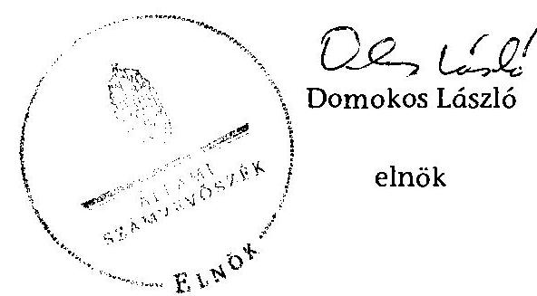

# ÁLLAMI   SZÁMVEVŐSZÉK 

## JELENTÉS

az önkormányzatok belső kontrollrendszere kialakításának, egyes kontrolltevékenységek és a belső ellenőrzés működésének - 2013. évben induló - ellenőrzéséről Mályi

---

# Állami Számvevőszék 

Iktatószám: V-0178-040/2013.
Témaszám: 1190
Vizsgálat-azonosító szám: V064924

## Az ellenőrzést felügyelte:

Dr. Benedek Mária
felügyeleti vezető
Az ellenőrzést vezette és az ellenőrzés végrehajtásáért felelős:
Dr. Veress Tiborné
ellenőrzésvezető
A számvevőszéki jelentés összeállításában közreműködtek:
Csontosné Kiss Margit
számvevő tanácsos
Pető Krisztina
számvevő tanácsos
Az ellenőrzést végezték:
Boros Attila
Számvevő tanácsos

Csontosné Kiss Margit
számvevő tanácsos

---

# TARTALOMJEGYZÉK 

BEVEZETÉS ..... 5
I. ÖSSZEGZŐ MEGÁLLAPÍTÁSOK, KÖVETKEZTETÉSEK, JAVASLATOK ..... 9
II. RÉSZLETES MEGÁLLAPÍTÁSOK ..... 15

1. Az önkormányzat belső kontrollrendszerének kialakítása ..... 15
1.1. A kontrollkörnyezet ..... 15
1.2. A kockázatkezelési rendszer ..... 16
1.3. A kontrolltevékenységek ..... 17
1.4. Az információs és kommunikációs rendszer ..... 18
1.5. A monitoring rendszer ..... 19
2. A pénzügyi folyamatokban kulcsszerepet betöltő teljesítésigazolás és érvényesítés belső kontrollok működése ..... 19
3. A belső ellenőrzés működése ..... 21
FÜGGELÉKEK
4. számú Értelmező szótár
5. számú Az értékelés módja és szempontjai

---

.

---

# RÖVIDÍTÉSEK JEGYZÉKE 

| Törvények |  |
| :--: | :--: |
| Áht. | 2011. évi CXCV. törvény az államháztartásról (hatályos 2012. január 1-jétől) |
| ÁSZ tv. | 2011. évi LXVI. törvény az Állami Számvevőszékről |
| Info tv. | 2011. évi CXII. törvény az információs önrendelkezési jogról és az információszabadságról (hatályos 2012. január 1-jétől) |
| Kttv. | 2011. évi CXCIX. törvény a közszolgálati tisztviselőkről |
| Mötv. | 2011. évi CLXXXIX. törvény Magyarország helyi önkormányzatairól |
| Ötv. | 1990. évi LXV. törvény a helyi önkormányzatokról |
| Rendeletek |  |
| Áhsz. | 249/2000. (XII. 24.) Korm. rendelet az államháztartás szervezetei beszámolási és könyvvezetési kötelezettségének sajátosságairól |
| Ávr. | 368/2011. (XII. 31.) Korm. rendelet az államháztartásról szóló törvény végrehajtásáról (hatályos 2012. január 1-jétől) |
| Bkr. | 370/2011. (XII. 31.) Korm. rendelet a költségvetési szervek belső kontrollrendszeréről és belső ellenőrzéséről (hatályos 2012. január 1-jétől) |
| Ikr. | 335/2005. (XII. 29.) Korm. rendelet a közfeladatot ellátó szervek iratkezelésének általános követelményeiről |
| Szórövidítések |  |
| adatvédelmi szabályzat | Mályi Község Önkormányzat Polgármesteri Hivatal közszolgálati adatvédelmi szabályzata (hatályos 2010. január 13-ától) |
| alapító okirat | Mályi Község Önkormányzat Polgármesteri Hivatalának alapító okirata módosításokkal egységes szerkezetben 2012. évi módosítás dátuma: 2012.02.13. |
| ÁSZ | Állami Számvevőszék |
| belső ellenőrzési kézikönyv | Miskolci Kistérség Többcélú Társulás Belső Ellenőrzési Kézikönyve |
| bizonylati szabályzat | Mályi Község Önkormányzat Polgármesteri Hivatalának Bizonylati Szabályzata |
| eszközök és források értékelési szabályzata | Mályi Község Önkormányzat Polgármesteri Hivatalának Eszközök és források értékelési szabályzata (hatályos 2011. január 13-ától) |
| gazdasági program | Mályi Község Önkormányzat Képviselő-testületének Gazdasági Programja 2011-2014 |
| gazdálkodási szabályzat | Mályi Község Önkormányzat Polgármesteri Hivatalának Gazdálkodási Szabályzata (hatályos 2012. február 27-étől) |

---

| hivatali SZMSZ | Mályi Község Önkormányzat Polgármesteri Hivatal Szervezeti és Működési Szabályzata (hatályos 2011. május 1-jétől) |
| :--: | :--: |
| INTOSAI | International Organization of Supreme Audit Institutions (Legfőbb Ellenőrző Intézmények Nemzetközi Szervezete) |
| irattári szabályzat | Mályi Község Önkormányzat Polgármesteri Hivatala irattári szabályzata (hatályos 2007. március 1-jétől) |
| ISSAI | International Standards of Supreme Audit Institutions (Legfőbb Ellenőrző Intézmények Nemzetközi Standardjai) |
| jegyző | Mályi Község Önkormányzatának jegyzője |
| Képviselő-testület   kockázatkezelési sza-   bályzat | Mályi Község Önkormányzatának Képviselő-testülete Mályi Község Önkormányzat Polgármesteri Hivatala Kockázatkezelési Szabályzata (hatályos 2011. január 3-ától) |
| Kormányhivatal   leltárkészítési és leltározási szabályzat | Borsod-Abaúj-Zemplén Megyei Kormányhivatal   Mályi Község Önkormányzat Polgármesteri Hivatala Eszközök és források leltárkészítési és leltározási szabályzata (hatályos 2011. január 3-ától) |
| NGM | Nemzetgazdasági Minisztérium |
| Önkormányzat   pénzkezelési szabályzat | Mályi Község Önkormányzata   Mályi Község Önkormányzata Polgármesteri Hivatalának Pénzkezelési Szabályzata (hatályos 2012. február 27-étől) |
| polgármester   Polgármesteri Hivatal | Mályi Község Önkormányzatának polgármestere   Mályi Község Önkormányzatának Polgármesteri Hivatala |
| szabálytalanságok kezelésének rendje | Mályi Község Önkormányzata Polgármesteri Hivatala szabálytalanságkezelésének eljárásrendje (hatályos 2011. január 3-ától) |
| számlarend | Mályi Község Önkormányzata Polgármesteri Hivatalának számlarendje |
| számviteli politika | Mályi Község Önkormányzata Polgármesteri Hivatalának számviteli politikája (hatályos 2012. február 29-étől) |
| SZMSZ | Képviselő-testületi Szervezeti és Működési Szabályzat |
| Társulás | Miskolci Kistérség Többcélú Társulás belső ellenőrzési feladatok ellátására |
| tűzvédelmi szabályzat | Mályi Község Önkormányzata Polgármesteri Hivatalának tűzvédelmi szabályzata |
| Ügyrend | Ügyrend Mályi Község Önkormányzat Polgármesteri Hivatalának gazdasági szervezetének gazdálkodással összefüggő feladataira (hatályos 2012. február 27-étől) |

---

# JELENTÉS 

## az önkormányzatok belső kontrollrendszere kialakításának, egyes kontrolltevékenységek és a belső ellenőrzés működésének - 2013. évben induló - ellenőrzéséről Mályi

## BEVEZETÉS

Mályi község állandó lakosainak száma 2012. január 1-jén 4358 fő volt. Az Önkormányzat Képviselő-testület tagjainak száma hét fő volt, munkájukat három állandó bizottság segítette. Az Önkormányzat az önállóan működő és gazdálkodó Polgármesteri Hivatalon kívül kettő önállóan működő intézményt működtetett, és kettő többségi tulajdoni hányaddal gazdasági társasággal rendelkezett. A polgármester a 2010. évi helyi önkormányzati választások óta tölti be tisztségét. A jegyző 2008. november 4-től látja el a jegyzői feladatokat. A Polgármesteri Hivatalnál a gazdasági feladatokat a pénzügyi csoport munkatársai látják el. A köztisztviselők száma 2012. január 1-jén 16 fő volt. Az Önkormányzat a 2012. évi költségvetési beszámolója szerint 645109 ezer Ft költségvetési bevételt ért el, valamint 608710 ezer Ft költségvetési kiadást teljesített. A 2012. december 31-i könyvviteli mérleg szerint 759324 ezer Ft értékű eszközvagyonnal rendelkezett, a rövid lejáratú kötelezettségállománya 31799 ezer Ft volt, a hosszú lejáratú kötelezettsége 1192 ezer Ft volt.

A demokratikus társadalmakban alapvető igény, hogy a közpénzeket, a közvagyont használók tevékenységükről elszámoljanak, ahhoz egyértelmű és érvényesíthető felelősségi szabályok társuljanak. Ennek a jogos igénynek az érvényesítéséhez meg kell teremteni azokat a folyamatokat, rendszereket, amelyek nélkülözhetetlenek az elszámoltatáshoz. Az elszámoltatás eredményes működtetéséhez szükség van a megfelelő információs, kontroll, értékelési és beszámolási rendszerek kialakítására.

Magyarországon az uniós csatlakozási tárgyalások idejére nyúlnak vissza a belső kontrollrendszer szabályozásának gyökerei. Az uniós elvárásoknak megfelelő új terminológia szerinti államháztartási belső pénzügyi ellenőrzési (ÁBPE) rendszer területén a jogharmonizáció 2003-ban teljes körűen megvalósult, míg az önkormányzati alrendszerre vonatkozó, Ötv.-ben megjelenített speciális szabályozás 2005-ben lépett hatályba. Az államháztartási belső kontrollrendszer koncepciója 2009-ben továbbfejlődött. A változások irányát mutatja, hogy a költségvetési szervek belső kontrollrendszere már magában foglalja a korszerű, felelős szervezetirányítás elemeit (kontrollkörnyezet, kockázatkezelés, kontrolltevékenység, információ és kommunikáció, monitoring) is. E kontrollrendszer szabályozása háromszintű, a törvényi előírásokat az Áht. és a

---

Mötv., a rendeleti szintű szabályozást az Ávr. és a Bkr. tartalmazza, amelyeket útmutatói szinten az NGM által kiadott standardok és kézikönyvek támogatnak.

A belső kontrollrendszer azt a célt szolgálja, hogy a költségvetési szervek működésük és gazdálkodásuk során a tevékenységeket szabályszerűen, gazdaságosan, hatékonyan és eredményesen hajtsák végre, teljesítsék elszámolási kötelezettségeiket és megvédjék az erőforrásokat a veszteségektől, a károktól és a nem rendeltetésszerű használattól. A belső kontrollrendszer magában foglalja mindazon szabályokat, eljárásokat, gyakorlati módszereket és szervezeti struktúrákat, kockázatkezelési technikákat, kontrolltevékenységeket, amelyek segítséget nyújtanak a szervezetnek céljai eléréséhez.

Az ÁSZ a 2011-2015. évekre szóló stratégiájában hangsúlyos szerepet szánt annak, hogy szilárd szakmai alapon álló, értékteremtő ellenőrzéseivel előmozdítsa a közpénzügyek átláthatóságát, rendezettségét. A számvevőszéki ellenőrzés nemzetközi alapelvei is rögzítik, hogy a megfelelő belső kontrollrendszer minimálisra csökkenti a hibák és szabálytalanságok kockázatát.

Az ellenőrzés célja annak megállapítása volt, hogy a belső kontrollrendszer elemeinek kialakítása, a pénzügyi folyamatokban kulcsszerepet betöltő teljesítésigazolás és érvényesítés, és a belső ellenőrzés szabályos működése biztosította-e az önkormányzatnál a közpénzfelhasználás szabályosságát, hozzájárult-e az értéket teremtő rend követelményének érvényesüléséhez.

Ennek keretében értékeltük, hogy:

- a jogszabályi előírásoknak megfelelően alakították-e ki a belső kontrollrendszer elemeit;
- a gazdálkodás folyamatában kulcsszerepet betöltő teljesítésigazolás és érvényesítés kontrolltevékenységeit megfelelően működtették-e;
- biztosították-e a belső ellenőrzés szabályos működését;
- amennyiben az ÁSZ tett javaslatot a 2008-2011. évek közötti ellenőrzése kapcsán az Önkormányzatnak, intézkedtek-e azok végrehajtására.

Az ellenőrzés várható hasznosulását négy szinten tervezzük. A törvényalkotás számára összegzett tapasztalatok állnak rendelkezésre a belső kontrollrendszer önkormányzati területen való kialakításáról, működéséről és hatásairól, a belső ellenőrzés működéséről. Ennek alapján következtetést lehet levonni arról, hogy a belső kontrollrendszer kialakítására és működtetésére vonatkozó jelenlegi, differenciálás nélküli jogszabályi előírások reális követelményeket támasztanak-e az eltérő adottságú települési önkormányzatok esetében, illetve indokolt-e esetleges jogszabályi módosítás kezdeményezése. Az ellenőrzés az ellenőrzött számára visszajelzést ad a belső kontrollrendszer kialakításában és működésében fellépő hiányosságokról, javaslataival hozzájárul azok kiküszöböléséhez, amely csökkentheti a későbbi ellenőrzések gyakoriságát. Az ellenőrzés megállapításait és javaslatait más szervezetek is hasznosíthatják a rendezett gazdálkodási keretek kialakításához. A társadalom számára jelzi, hogy közpénz nem maradhat ellenőrizetlenül, az ÁSZ értékteremtő rend kiala-

---

kításához és megőrzéséhez hozzájáruló tevékenysége pozitív hatással lesz a szervezetről kialakított összkép formálásában. A szervezeten belül lehetőség nyílik arra, hogy a megállapítások szintetizálásával az ÁSZ a hozzáadott értéket teremtő elemző tevékenységét és tanácsadó szerepét is erősítse.

Az önkormányzatok belső kontrollrendszere kialakításának, egyes kontrolltevékenységek és a belső ellenőrzés működésének ellenőrzéséről szóló jelentés I. fejezetének összegző része az ellenőrzés céljára ad rövid, szintetizáló összefoglalót, és tartalmazza a következtetéseket a II. fejezet részletes megállapításain alapulóan. A jelentés intézkedést igénylő megállapításait és javaslatait az ellenőrzés során feltárt, a jelentés II. fejezetében rögzített részletes megállapítások alapozzák meg. A helyszíni ellenőrzés lezárásáig a helyi szabályozás változásait nyomon követtük.

Az ellenőrzés típusa: szabályszerűségi ellenőrzés.
Az ellenőrzött időszak: a belső kontrollrendszer kialakításának megfelelősége esetében a 2012. évre, a pénzügyi folyamatokban kulcsszerepet betöltő teljesítésigazolás és érvényesítés belső kontrollok működésének megfelelőségét és a belső ellenőrzés szabályszerű működését a 2012. január 1. és december 31-e közötti időszak eseményeit figyelembe véve értékeltük, míg az ÁSZ javaslatainak utóellenőrzése a 2008-2011. években végzett ellenőrzések nyilvánosságra hozott jelentéseiben tett javaslatok áttekintésére terjedt ki.

# Az ellenőrzött szervezet: az Önkormányzat. 

Az ellenőrzés jogszabályi alapját az ÁSZ tv. 1. § (3) bekezdése, az 5. § (2) és (6) bekezdése, valamint az Áht. 61. §. (2) bekezdésének előírásai képezik.

Az ellenőrzés szakmai módszertana az ÁSZ hivatalos honlapján (www.asz.hu) közzétett szakmai szabályokon alapult, amely az INTOSAI által kiadott ISSAI figyelembevételével készült.

Az ellenőrzés lefolytatásához az Önkormányzat a kimutatások és a tanúsítvány elektronikus kitöltésével, valamint az ÁSZ által kért dokumentumok elektronikus megküldésével szolgáltatott adatokat. Az így rendelkezésre bocsátott adatok, információk kontrollja és a munkalapok kitöltése a helyszíni ellenőrzés keretében történt. A jelentésben használt fogalmak magyarázatát az 1. számú függelék, az ellenőrzés egyes területeinek értékelésénél alkalmazott egységes minősítési szempontokat a 2. számú függelék tartalmazza.

A belső kontrollrendszer kialakításának ellenőrzése során értékeltük a kontrollkörnyezet, a kockázatkezelési rendszer, a kontrolltevékenységek, az információs és kommunikációs rendszer, valamint a monitoring rendszer szabályozottságának megfelelőségét. A pénzügyi folyamatokban kulcsszerepet betöltő teljesítésigazolás és érvényesítés kontrollok működése megfelelőségének minősítéséhez az állományba nem tartozók megbízási díjai,
 a külső szolgáltatók által végzett karbantartási, kisjavítási munkák, az egyéb üzemeltetési és fenntartási szolgáltatások, a rendszeres szociális segélyek, valamint az államháztartáson kívülre teljesített működési és felhalmozási célú pénzeszközátadások közül kockázatelemzéssel választottuk ki az ellenőrzött kiadási jogcímeket. Az egyszerű

---

véletlen mintavétellel kiválasztott tételek ellenőrzését többlépcsős megfelelőségi tesztek útján addig végeztük, amíg elegendő és megfelelő bizonyítékot szereztünk a vizsgált folyamatok kulcskontrolljai működésének megfelelő vagy nem megfelelő voltáról. Értékeltük az Önkormányzatnál a belső ellenőrzés működésének szabályosságát. Utóellenőrzésre nem került sor, mert az ÁSZ az Önkormányzatnál a 2008-2011. években ellenőrzést nem végzett.

Az ÁSZ tv. 29. § (1) bekezdése szerint a jelentéstervezetet megküldtük a polgármester részére, aki az ÁSZ tv. 29. § (2) bekezdésében foglalt észrevételezési jogával nem élt, a jelentéstervezetre észrevételt nem tett.

---

# I. ÖSSZEGZŐ MEGÁLLAPÍTÁSOK, KÖVETKEZTETÉSEK, JAVASLATOK 

A belső kontrollrendszeren belül 2012-ben a kontrollkörnyezet, a kockázatkezelési rendszer, a kontrolltevékenységek, az információs és kommunikációs rendszer, valamint a monitoring rendszer kialakítását külön-külön és együttesen is értékeltük. A belső kontrollrendszer kialakítása az összesített értékelés alapján részben felelt meg a jogszabályi előírásoknak.

A belső kontrollrendszer egyes területei kialakításának minősítése a következő:

| Kontrollterület | Minősítés |  |
| :-- | :-- | :-- |
| Kontrollkörnyezet | megfelelő |  |
| Kockázatkezelési rendszer | megfelelő |  |
| Kontrolltevékenységek | részben | megfelelő |
| Információs és kommuniká- | megfelelő | megfelelő |
| ciós rendszer |  |  |
| Monitoring rendszer | nem | megfelelő |
|  |  |  |

Megfelelőnek értékeltük a kontrollkörnyezet, a kockázatkezelési rendszer és az információs és kommunikációs rendszer kialakítását, mivel az a jogszabályi előírásokban foglaltakat figyelembe véve a kisebb hiányosságok mellett is megteremtette e három kontrollterületen a szabályszerű működés lehetőségét.

Részben megfelelőnek értékeltük a kontrolltevékenységek kialakítását, mivel az ellenőrzésünk által megállapított szabályozásbeli hiányosságok nem veszélyeztették a Polgármesteri Hivatal, ezáltal az Önkormányzat céljainak elérését.

Nem megfelelőnek értékeltük a monitoring rendszer kialakítását, mivel az ellenőrzésünk során megállapított szabályozásbeli hiányosságok magukban hordozzák a szabálytalan működés és gazdálkodás, valamint a korrupció kockázatát.

Az állományba nem tartozók megbízási díjaival és a külső szolgáltatók által végzett karbantartási, kisjavítási munkákkal kapcsolatos kifizetések során a pénzügyi folyamatokban kulcsszerepet betöltő teljesítésigazolás és érvényesítés belső kontrollok működése gyenge volt. Gyengének értékeltük a két kulcskontroll együttes működését, mert azok nem biztosították az ellenőrzésünk által feltárt hiányosságok bekövetkezésének megelőzését.

A számvevőszéki ellenőrzés az ellenőrzött kifizetésekkel összefüggésben a rendelkezésre bocsátott dokumentumok alapján kár bekövetkeztére utaló adatot,

---

tényt nem állapított meg, azonban a gazdálkodásban kulcsszerepet betöltő kontrollok gyenge működése miatt fennáll a hibák bekövetkezésének lehetősége. A nem megfelelően szabályozott és működtetett belső kontrollok korrupciós kockázatot hordoznak.

Az Önkormányzat a belső ellenőrzési feladatokat - képviselő-testületi döntés alapján - a Társulás útján látta el. A belső ellenőrzés működése a jogszabályi előírásoknak megfelelt, azonban nem tárta fel a számvevőszéki ellenőrzés során a pénzügyi folyamatokban kulcsszerepet betöltő teljesítésigazolás és érvényesítés belső kontrollok működésénél megállapított hiányosságokat.

Az ÁSZ tv. 33. § (1) bekezdésében foglaltak értelmében az ellenőrzött szervezet vezetője köteles a jelentésben foglalt megállapításokhoz kapcsolódó intézkedési tervet összeállítani, és azt a jelentés kézhezvételétől számított 30 napon belül az ÁSZ részére megküldeni. Amennyiben az intézkedési tervet határidőre nem küldi meg a szervezet, vagy az ÁSZ tv. 33. § (2) bekezdésében foglalt póthatáridő elteltével megküldött intézkedési terv továbbra sem elfogadható, az ÁSZ elnöke a hivatkozott törvény 33. § (3) bekezdés a)-b) pontjaiban foglaltakat érvényesítheti.

Az ellenőrzés intézkedést igénylő megállapításai és javaslatai:

# a jegyzőnek 

1. a kontrollkörnyezettel kapcsolatban:

A hivatali SZMSZ-ben a jegyző az Ávr. 13. § (1) bekezdés c), e) és g) pontjaiban foglaltak ellenére nem rögzítette az ellátandó és a szakfeladat rend szerint szakfeladat számmal és megnevezéssel besorolt alaptevékenységek, a rendszeresen ellátott vállalkozási tevékenységek és az alaptevékenységet szabályozó jogszabályok megjelölését, a szervezeti felépítést és a működés rendjét, a szervezeti egységek - ezen belül a gazdasági szervezet - megnevezését, engedélyezett létszámát, feladatait, a költségvetési szerv szervezeti ábráját. A hivatali SZMSZ nem tartalmazta a nevesített munkakörökhöz tartozó feladat- és hatásköröket, a hatáskörök gyakorlásának módját, a helyettesítés rendjét, az ezekhez kapcsolódó felelősségi szabályokat.

A Kttv. 231. § (1) bekezdése ellenére a Képviselő-testület nem állapította meg a Kttv. 83. §-ában előírt, a köztisztviselőkkel szembeni hivatásetikai alapelvek részletes tartalmát, valamint az etikai eljárás szabályait, mivel a jegyző az Ötv. 36. § (2) bekezdés a) pontjában előírt feladata ellenére nem készítette elő ennek dokumentumát.

Javaslat:
a) Készítse el a hivatali SZMSZ módosítását annak érdekében, hogy az tartalmazza az Ávr. 13. § (1) bekezdésében előírt tartalmi elemeket, és kezdeményezze az Áht. 9. § (1) bekezdés a) pontjában foglaltakra tekintettel a Képviselő-testület elé terjesztését.
b) Készítse elő a Mötv. 81. § (3) bekezdés c) pontjában foglalt feladatkörében a Kttv. 83. §-ában foglaltaknak megfelelően a köztisztviselőkkel szembeni hivatásetikai alapelvek részletes tartalmának, valamint az etikai eljárás szabályainak dokumentumait és kezdeményezze a Kttv. 231. § (1) bekezdésében foglaltakra tekintettel annak Képviselő-testület elé terjesztését.
2. a kockázatkezelési rendszerrel kapcsolatban:

A jegyző - a Bkr. 7. § (2) bekezdésében foglaltak ellenére - nem határozta meg a kockázatok kezelése érdekében előírt intézkedések teljesítése folyamatos nyomon követésének módját.

Javaslat:
Határozza meg a Bkr. 7. § (2) bekezdésében foglaltak szerint a kockázatok kezelése érdekében szükséges intézkedések teljesítése folyamatos nyomon követésének módját.
3. a kontrolltevékenységekkel kapcsolatban:

A jegyző az iratkezelési rendszer kialakítása során - az Ikr. 8. § (1) bekezdésében foglaltak ellenére - nem gondoskodott az iratkezelési szoftver által kezelt adatok biztonságáról, és nem alakította ki az üzembiztonsági, adatvédelmi szabályok érvényre juttatásához szükséges eljárási szabályokat. A jegyző az Ikr. 8. § (2) bekezdésében foglaltak ellenére nem szabályozta az elektronikusan kezelt adatok üzemeltetése és adatbiztonsága védelmét és nem határozta meg a feladatokat, a hatásköröket.

A jegyző - az Info tv. 7. § (2)-(3) bekezdésében foglalt előírásokat figyelmen kívül hagyva - az informatikai rendszer szabályozása során elmulasztotta az adatbiztonság érvényre juttatásához szükséges intézkedések megtételét.

A jegyző - a Bkr. 8. § (4) bekezdés b) pontjában foglaltak ellenére - a hozzáférési jogosultságokra vonatkozó belső szabályzatban nem határozta meg az elektronikusan kezelt adatok vonatkozásában a dokumentumokhoz és információkhoz való hozzáférés tekintetében a felelősségi köröket.

A jegyző - az Ávr. 13. § (5) bekezdés előírása ellenére - nem határozta meg a gazdasági feladatot ellátó vezető és alkalmazottak helyettesítésének rendjét.

A pénzügyi ellenjegyzési és az érvényesítési feladatra jogosultakat az Ávr. 55. § (2) bekezdés f) pontjának, valamint az 58. § (4) bekezdésének előírása ellenére nem a gazdasági vezető, hanem a jegyző jelölte ki.

A jegyző - a Kttv. 74. § (1) bekezdésében foglaltak ellenére - jogviszony megszűnése esetére nem szabályozta a munkavállaló folyamatban lévő feladatai átadásának rendjét.

Javaslat:
a) Gondoskodjon az Ikr. 8. § (1) bekezdésének megfelelően az iratkezelési szoftver által kezelt adatok biztonságáról, és alakítsa ki az üzembiztonsági, adatvédelmi szabályok érvényre juttatásához szükséges eljárási szabályokat.
b) Szabályozza az iratkezelési rendszer kialakítása során az Ikr. 8. § (2) bekezdése alapján az elektronikusan kezelt adatok üzemeltetése és adatbiztonsága védelmét, határozza meg pontosan a feladatokat, a hatásköröket úgy, hogy azok végrehajthatóak legyenek.
c) Gondoskodjon az Info tv. 7. § (2)-(3) bekezdésében foglaltaknak megfelelően az informatikai rendszer adatainak biztonságáról.
d) Szabályozza belső szabályzatban a felelősségi körök meghatározásával a Bkr. 8. § (4) bekezdés b) pontjának megfelelően az elektronikusan kezelt dokumentumokhoz és információkhoz való hozzáférést.
e) Határozza meg az Ávr. 13. § (5) bekezdés alapján a gazdasági feladatot ellátó vezetők és alkalmazottak helyettesítésének rendjét.
f) Intézkedjen arról, hogy a pénzügyi ellenjegyzési és az érvényesítési feladatra történő kijelölésre az Ávr. 55. § (2) bekezdés f) pontja és az 58. § (4) bekezdése alapján kerüljön sor.
g) Szabályozza a Kttv. 74. § (1) bekezdésében előírtaknak megfelelően a jogviszony megszűnése esetére a munkavállaló folyamatban lévő feladatai átadásának rendjét.
4. a monitoring rendszerrel kapcsolatban:

A jegyző - a Bkr. 11. § (1) bekezdésében foglalt kötelezettsége ellenére - a belső kontrollrendszer minőségét a 2011. évre vonatkozóan - a Bkr. 1. melléklete szerinti nyilatkozatban - nem értékelte.

Javaslat:
Értékelje a Bkr. 11. § (1) bekezdésében előírtaknak megfelelően a jogszabályban meghatározott keretek között a Polgármesteri Hivatal belső kontrollrendszerének minőségét a Bkr. 1. melléklete szerinti nyilatkozatban.
5. A pénzügyi folyamatokban kulcsszerepet betöltő kontrollok működésével kapcsolatban:

A kiadások teljesítésigazolását az Ávr. 57. § (4) bekezdésében foglaltakat figyelmen kívül hagyva kijelöléssel nem rendelkező személy végezte, ezért a kiadások jogosságának, összegszerűségének és a szerződés szerinti teljesítésének ellenőrzése az Ávr. 57. § (1) bekezdésének előírása ellenére nem szabályszerűen történt, továbbá ellenőrizhető okmány hiányában igazolták az ellenszolgáltatás teljesítését.

Az érvényesítést a feladat ellátására jogosulatlan személy végezte, mert az Ávr. 58. § (4) bekezdésében foglaltakat figyelmen kívül hagyva a gazdasági vezető helyett a jegyző jelölte ki az érvényesítőt. Az érvényesítő a kifizetést megelőzően a kiadások összegszerűségét az okmányok hiányában végzett teljesítésigazolás miatt az Ávr. 58. § (1) bekezdésének előírása ellenére nem ellenőrizte, ezért az érvényesítés szabálytalan volt. Az érvényesítő az Ávr. 58. § (2) bekezdés előírása ellenére nem jelezte az utalványozónak, hogy a megelőző ügymenetben a teljesítésigazolást kijelöléssel nem rendelkező személy végezte.

---

Javaslat:
Intézkedjen - a teljesítésigazolás és az érvényesítés vonatkozásában feltárt hiányosságok megszüntetése, illetve az operatív gazdálkodás során a működésbeli hibák megelőzése, feltárása és kijavítása érdekében - arról, hogy:
a) az Ávr. 57. § (4) bekezdésében foglaltak szerint kijelölt személyek az Ávr. 57. § (1) bekezdésében foglalt előírásnak megfelelően, ellenőrizhető okmányok alapján ellenőrizzék és igazolják a kiadások teljesítésének jogosságát, összegszerűségét, az ellenszolgáltatást is magában foglaló kötelezettségvállalás esetén az ellenszolgáltatás teljesítését;
b) az érvényesítést az Ávr. 58. § (4) bekezdésében foglaltak szerint kijelölt személyek végezzék;
c) az érvényesítő a kifizetéseket megelőzően az Ávr. 58. § (1) bekezdésében előírt teljesítésigazolás alapján - az Ávr. 57. § (3) bekezdése szerinti esetben annak hiányában is - ellenőrizze az összegszerűséget;
d) az érvényesítő az Ávr. 58. § (2) bekezdés előírása alapján jelezze az utalványozónak, ha a megelőző ügymenetben az Áht., az Áhsz. és az Ávr. előírásait, továbbá a belső szabályzatokban foglaltak megsértését tapasztalja.
6. A belső ellenőrzés működésével kapcsolatban:

A belső ellenőrzési vezető - a Bkr. 22. § (1) bekezdés b) pontjában és a 30. § (1) bekezdésében foglaltak ellenére - stratégiai ellenőrzési tervet nem készített.

A belső ellenőrzés javaslatainak végrehajtása érdekében a végrehajtásért felelős személyeket a Bkr. 45. § (2) bekezdésében előírtak ellenére az intézkedési tervben nem jelölték meg.

A belső ellenőrzési vezető a Bkr. 21. § (2) bekezdés d) pontjában és a Bkr. 47. § (1) bekezdésében előírtak ellenére a belső ellenőrzési jelentésekben megfogalmazott javaslatoknak, intézkedési terveknek
 és a megtett intézkedéseknek a nyilvántartását és azok végrehajtásának nyomon követését elmulasztotta.

A belső ellenőrzési vezető a Bkr. 22. § (2) bekezdés b) és e) pontjában, valamint az 50. §-ában foglaltak ellenére az elvégzett ellenőrzésekről nyilvántartást nem vezetett.

Javaslat:
a) Kezdeményezze, hogy a belső ellenőrzési vezető a Bkr. 22. § (1) bekezdés b) pontjában és a 30. § (1) bekezdésében foglaltak alapján készítsen stratégiai ellenőrzési tervet.
b) Kezdeményezze, hogy a belső ellenőrzés javaslatainak végrehajtása érdekében, a Bkr. 45. § (2) bekezdésében előírtaknak megfelelően az intézkedési tervben jelöljék meg a végrehajtásért felelős személyeket.
c) Kezdeményezze, hogy a belső ellenőrzési vezető a Bkr. 47. § (1) bekezdésében és a 21. § (2) bekezdés d) pontjában előírtaknak megfelelően vezesse a belső ellenőrzési jelentésekben megfogalmazott javaslatoknak, intézkedési terveknek, a megtett intézkedéseknek a nyilvántartását és kövesse nyomon az intézkedési tervek végrehajtását.
d) Kezdeményezze, hogy a belső ellenőrzési vezető a Bkr. 22. § (2) bekezdés b) és e) pontjában, valamint az 50. §-ában foglalt előírásnak megfelelően az elvégzett ellenőrzésekről vezessen nyilvántartást.

---

# II. RÉSZLETES MEGÁLLAPÍTÁSOK 

## 1. Az ÖNKORMÁNYZAT BELSŐ KONTROLLRENDSZERÉNEK KIALAKÍTÁSA

A belső kontrollrendszeren belül 2012-ben a kontrollkörnyezet, a kockázatkezelési rendszer, a kontrolltevékenységek, az információs és kommunikációs rendszer, valamint a monitoring rendszer kialakítását külön-külön és együttesen is értékeltük. A belső kontrollrendszer kialakítása az összesített értékelés alapján részben felelt meg a jogszabályi előírásoknak.

### 1.1. A kontrollkörnyezet

A kontrollkörnyezet kialakítása - a 2. számú függelékben részletezett kritériumrendszer alapján végzett értékelés szerint - a jogszabályi előírásoknak megfelelt.

A Polgármesteri Hivatal rendelkezett a Képviselő-testület által elfogadott alapító okirattal és hivatali SZMSZ-szel. Az alapító okirat a jogszabályi előírásoknak megfelelően tartalmazta az alaptevékenységek felsorolását. A Képviselő-testület rendelkezett a működésének részletes szabályait tartalmazó SZMSZ-szel.

Az Önkormányzat rendelkezett a Képviselő-testület által elfogadott, a 2012-2014. évekre vonatkozó gazdasági programmal. A vagyongazdálkodás szabályait önkormányzati rendeletben ${ }^{1}$ határozták meg.

A szervezet megfelelő működése érdekében a Polgármesteri Hivatalban kialakították a belső szabályzatokat, elkészítették a számviteli politikát, a pénzkezelési szabályzatot, a leltárkészítési és leltározási szabályzatot, az eszközök és források értékelési szabályzatát, a számlarendet, a bizonylati szabályzatot, a szabálytalanságok kezelésének rendjét és a tűzvédelmi szabályzatot. Meghatározták az egészséget nem veszélyeztető és biztonságos munkavégzés követelményei megvalósításának módját. Elkészítették az önkormányzat intézményeinek számviteli rendjét. A jegyző 2012. február 27-én elkészítette a jogszabályi előírásoknak megfelelő Ügyrendet, azonban a gazdasági szervezetre vonatkozóan a 2011. május 1-jétől hatályos SZMSZ-t ennek megfelelően nem módosították.

Írásban rögzítették az ellenőrzési nyomvonalat, előírták annak rendszeres felülvizsgálatát és gondoskodtak naprakészen tartásáról.

[^0]
[^0]:    ${ }^{1}$ Mályi Község Önkormányzat Képviselő-testületének 3/2012. (IV. 1.) önkormányzati rendelete az Önkormányzat vagyonáról a vagyonhasznosítás rendjéről és a vagyontárgyak feletti tulajdonosi jogok gyakorlásának szabályairól.

---

A gazdasági vezető rendelkezett a feladat ellátásához szükséges végzettséggel. A Polgármesteri Hivatalban dolgozó köztisztviselőknek a jogszabályi előírásoknak megfelelő munkaköri leírást elkészítették.

A Képviselő-testület meghatározta a teljesítményértékelés alapját képező célokat, és az elfogadott teljesítménycélok figyelembevételével a jegyző elkészítette a köztisztviselők teljesítményértékelését.

A kontrollkörnyezet kialakítása az alábbi kisebb hiányosságok mellett megfelelt a jogszabályi előírásoknak:

| Sorszám $^{2}$ | Megállapítás |
| :--: | :--: |

A hivatali SZMSZ-ben a jegyző az Ávr. 13. § (1) bekezdés c), e) és g) pontjaiban foglaltak ellenére nem rögzítette az ellátandó, és a szakfeladat rend szerint szakfeladat számmal és megnevezéssel besorolt alaptevékenységek, a rendszeresen ellátott vállalkozási tevékenységek és az alaptevékenységet szabályozó jogszabályok megjelölését, a szervezeti felépítést és a működés rendjét, a szervezeti egységek - ezen belül a gazdasági szervezet - megnevezését, engedélyezett létszámát, feladatait, a költségvetési szerv szervezeti ábráját. A hivatali SZMSZ nem tartalmazta a nevesített munkakörökhöz tartozó feladat- és hatásköröket, a hatáskörök gyakorlásának módját, a helyettesítés rendjét, az ezekhez kapcsolódó felelősségi szabályokat.

A Kttv. 231. § (1) bekezdése ellenére a Képviselő-testület nem állapította meg a köztisztviselőkkel szembeni, a Kttv. 83. §-ában előírt hivatásetikai alapelvek részletes tartalmát, valamint az etikai eljárás szabályait, mivel a jegyző az Otv. 36. § (2) bekezdés a) pontjában ${ }^{3}$ előírt feladata ellenére nem készítette elő ennek dokumentumát.

# 1.2. A kockázatkezelési rendszer 

A kockázatkezelési rendszer kialakítása - a 2. számú függelékben részletezett kritériumrendszer alapján végzett értékelés szerint - a jogszabályi előírásoknak megfelel.

A kockázatkezelési rendszer egységes és célirányos működtetése érdekében a jegyző elkészítette a kockázatkezelési szabályzatot, gondoskodott a Polgármesteri Hivatal tevékenységében rejlő kockázatok azonosításáról, értékeléséről, és felmérte azok költségvetési szervre gyakorolt hatását. A jegyző meghatározta az egyes kockázatokkal kapcsolatban a szükséges intézkedéseket. A vagyonnyilatkozat-tételre kötelezettek a nyilatkozattételi kötelezettségüknek a jogszabályban előírt gyakorisággal eleget tettek.

[^0]
[^0]:    ${ }^{2}$ A megállapítás számozása az Önkormányzat által az adatszolgáltatás során kitöltött kimutatások kérdéseinek sorszámával azonos.
    ${ }^{3}$ 2013. január 1-jétől Mötv. 81. § (3) bekezdés c) pont

---

A kockázatkezelési rendszer kialakítása az alábbi kisebb hiányosság mellett megfelelt a jogszabályi előírásoknak:

| Sor-   szám | Megállapítás |
| :-- | :-- |
| 10. | A jegyző - a Bkr. 7. § (2) bekezdésében foglaltak ellenére - nem határozta   meg a kockázatok kezelése érdekében előírt intézkedések teljesítése folyam-   atos nyomon követésének módját. |

# 1.3. A kontrolltevékenységek 

A kontrolltevékenységek kialakítása - a 2. számú függelékben részletezett kritériumrendszer alapján végzett értékelés szerint - a jogszabályi előírásoknak részben felelt meg.

A kontrolltevékenység részeként előírták a folyamatba épített, előzetes, utólagos és vezetői ellenőrzést a költségvetés tervezése, a beszerzések lebonyolítása, a vagyonhasznosítási tevékenység és a támogatások elszámolása vonatkozásában. A gazdálkodási szabályzatban rendezték a kötelezettségvállalás, a pénzügyi ellenjegyzés, a teljesítésigazolás, az érvényesítés és az utalványozás gyakorlásának módját, eljárási szabályait. A jogszabályi előírásoknak megfelelően határozták meg az írásbeli kötelezettségvállalást nem igénylő kifizetések rendjét. A pénzügyi ellenjegyzésre és az érvényesítési feladatok ellátására kijelölt személyek rendelkeztek a jogszabályban előírt szakképzettséggel.

Az Ügyrend tartalmazta az időközi és éves beszámolók elkészítésének feladatait és a beszámolási eljárásokhoz kapcsolódó felelősségi köröket. A költségvetési beszámoló elkészítésével megbízott személy rendelkezett a jogszabályban előírt iskolai végzettséggel és a tevékenység ellátására jogosító engedéllyel.

A polgármester a jogszabályi előírásoknak megfelelően az Önkormányzat gazdálkodásának első félévi és háromnegyed éves helyzetéről a Képviselő-testületet tájékoztatta.

A kontrolltevékenységek kialakítása az alábbi kisebb hiányosságok miatt részben felelt meg a jogszabályi előírásoknak, mert:

| Sorszám | Megállapítás | Megjegyzés |
| :--: | :--: | :--: |
| 10. | Az Ávr. 57. § (4) bekezdésében foglalt előírásokat figyelmen kívül hagyva 2012. március 30-ig a jegyzőn kívül a polgármester is jelölt ki teljesítésigazolásra jogosult személyeket. |  |
| 13.,   14.,   15., | A jegyző az iratkezelési rendszer kialakítása során - az Ikr. 8. § (1) bekezdésében foglaltak ellenére - nem gondoskodott az iratkezelési szoftver által kezelt adatok biztonságáról és nem alakította ki az üzembiztonsági és adatvédelmi szabályok érvényre juttatásához szükséges eljárási szabályokat. A jegyző az Ikr. 8. § (2) bekezdésében foglaltak ellené- | Az Önkormányzat rendelkezett irattári szabályzattal, azonban a szabályzatban csak a papír alapú iratokkal kapcsolatos eljárásrendet szabályozták. Az iratkezelési szoftver által kezelt iratokat (adatokat) |

---

|  | re nem szabályozta az elektronikusan kezelt adatok üzemeltetése és adatbiztonsága védelmét és nem határozta meg a feladatokat, a hatásköröket. | az irattári szabályzat nem szabályozza. |
| :--: | :--: | :--: |
| 16. | A jegyző - az Info tv. 7. § (2)-(3) bekezdésében foglalt előírásokat figyelmen kívül hagyva - az informatikai rendszer szabályozása során elmulasztotta az adatbiztonság érvényre juttatásához szükséges intézkedések megtételét. |  |
| 17. | A jegyző - a Bkr. 8. § (4) bekezdés b) pontjában foglaltak ellenére - a hozzáférési jogosultságokra vonatkozó belső szabályzatban nem határozta meg az elektronikusan kezelt adatok vonatkozásában a dokumentumokhoz és információkhoz való hozzáférés tekintetében a felelősségi köröket. |  |
| 21. | A jegyző - az Ávr. 13. § (5) bekezdés előírása ellenére - nem határozta meg a gazdasági feladatot ellátó vezető és alkalmazottak helyettesítésének rendjét. |  |
| $\begin{aligned} & 27 . \\ & 29 . \end{aligned}$ | A pénzügyi ellenjegyzési és az érvényesítési feladatra jogosultakat az Ávr. 55. § (2) bekezdés f) pontjának, valamint az 58. § (4) bekezdésének előírása ellenére nem a gazdasági vezető, hanem a jegyző jelölte ki. |  |
| 32. | A jegyző - a Kttv. 74. § (1) bekezdésében foglaltak ellenére - jogviszony megszűnése esetére nem szabályozta a munkavállaló folyamatban lévő feladatai átadásának rendjét. |  |

# 1.4. Az információs és kommunikációs rendszer 

Az információs és kommunikációs rendszer kialakítása - a 2. számú függelékben részletezett kritériumrendszer alapján végzett értékelés szerint - a jogszabályi előírásoknak megfelel.

A jegyző meghatározta a szervezeten belüli információátadás módját, kialakította az Önkormányzattal kapcsolatos információk külső feleknek történő átadása rendjét, és szabályozta a szervezeten kívülről érkező információk kezelésének rendjét. A Polgármesteri Hivatal rendelkezett a jogszabályi előírásoknak megfelelő tartalmú adatvédelmi szabályzattal. A jegyző kialakította a kötelezően közzéteendő adatok nyilvánosságra hozatalának rendjét. Az Önkormányzat az elektronikus közzétételi kötelezettségének a 2012. évben eleget tett. A jegyző szabályozta a közérdekű adatok megismerésére irányuló igények teljesítésének rendjét. A Polgármesteri Hivatal rendelkezett irattári szabályzattal. A jegyző szabályozta az ügyintézési határidők nyomon követésének dokumentálását, és meghatározta a késedelmes ügyintézés felelősségi rendjét. A szabálytalanságok kezelésének eljárásrendje tartalmazta a szabálytalansági gyanú észlelésével, jelentésével kapcsolatos részletes eljárásrendet.

---

# 1.5. A monitoring rendszer 

A monitoring rendszer kialakítása - a 2. számú függelékben részletezett kritériumrendszer alapján végzett értékelés szerint - nem felelt meg a jogszabályi előírásoknak, mert:

| Sor-   szám | Megállapítás |
| :-- | :-- |
| 9. | A jegyző - a Bkr. 11. § (1) bekezdésében foglalt kötelezettsége ellenére - a   belső kontrollrendszer minőségét a 2011. évre vonatkozóan - a Bkr. 1. mel-   léklete szerinti nyilatkozatban - nem értékelte. |

Az Önkormányzat törvényességi felügyeletét ellátó Kormányhivatal a 2012. év során két alkalommal élt törvényességi felhívással:

- a Kormányhivatal 2012. november 10-én kelt törvényességi felhívása arra vonatkozott, hogy a Képviselő-testület 2012. szeptember 15-ig nem tárgyalta meg az Önkormányzat gazdálkodásának 2012. első félévi helyzetéről szóló tájékoztatót. Az Önkormányzat a 2012. első félévi beszámolót a szeptember 15-i határidő helyett október 10-én tárgyalta meg, és azt a 123/2012. (X. 10.) Önkormányzati határozatával fogadta el;
- a Kormányhivatal 2012. május 21-én kelt törvényességi felhívása az önkormányzati határozatok és rendeletek hatályon kívül helyezésére, módosítására és aktualizálására, valamint a hatályos törvényekkel való összhang megteremtésére vonatkozott. A polgármester a Kormányhivatal részére 2012. augusztus 2-án megküldött levelében tájékoztatást adott a törvényességi felhívásban foglalt hiányosságok megszüntetéséről.

## 2. A PÉNZÜGYI FOLYAMATOKBAN KULCSSZEREPET BETÖLTŐ
 TELJESÍTÉSIGAZOLÁS ÉS ÉRVÉNYESÍTÉS BELSŐ KONTROLLOK MŰKÖDÉSE

Az állományba nem tartozók megbízási díjaival, valamint a külső szolgáltatók által végzett karbantartással, kisjavítással kapcsolatos kifizetések során - összefoglalóan értékelve - a pénzügyi folyamatokban kulcsszerepet betöltő teljesítésigazolás és érvényesítés belső kontrollok működésének megfelelősége gyenge volt, mert:

| Kulcskontroll | Megállapítás |
| :--: | :--: |
| Teljesítésigazolás | A kiadások teljesítésigazolását az Ávr. 57. § (4) bekezdésben foglaltakat figyelmen kívül hagyva jegyzői kijelöléssel nem rendelkező személy végezte, ezért a kiadások jogosságának, összegszerűségének és a szerződés szerinti teljesítésének ellenőrzése az Ávr. 57. § (1) bekezdésének előírása ellenére nem szabályszerűen történt, továbbá ellenőrizhető okmány hiányában igazolták az ellenszolgáltatás teljesítését. |
| Érvényesítés | Az érvényesítést a feladat ellátására jogosulatlan személy végezte, mert az Ávr. 58. § (4) bekezdésében foglaltakat figyelmen kívül hagyva a gazdasági vezető helyett a jegyző jelölte ki az érvényesítőt. Az érvényesítő a kifizetést megelőzően a kiadások összegszerűségét az okmányok hiányában végzett |

---

teljesítésigazolás miatt az Ávr. 58. § (1) bekezdésének előírása ellenére nem ellenőrizte, ezért az érvényesítés szabálytalan volt. Az érvényesítő az Ávr. 58. § (2) bekezdés előírása ellenére nem jelezte az utalványozónak, hogy a megelőző ügymenetben a teljesítésigazolást kijelöléssel nem rendelkező személy végezte.

A 2012. évben az állományba nem tartozók megbízási díjainak kifizetése során a teljesítésigazolás és az érvényesítés kulcskontrollok működésének megfelelősége gyenge volt, mert:

- a kiadások teljesítésigazolását az Ávr. 57. § (4) bekezdésben foglaltak ellenére jegyzői kijelöléssel nem rendelkező személy (a polgármester) végezte el 2012. március 30-ig, ezért a kiadások jogosságának, összegszerűségének és a szerződés szerinti teljesítésének ellenőrzése az Ávr. 57. § (1) bekezdésének előírása ellenére nem szabályszerűen történt az újságcikkek, programfüzetek, műsortervek és beszédek készítésére adott megbízási szerződések esetében. A Polgármesteri Hivatalnál 2012. március 31-e után a fotózásokra adott megbízási díjak kifizetésénél a teljesítés igazolását a kijelöléssel nem rendelkező polgármester végezte el;
- a teljesítésigazoló az egyéb munkákra adott megbízás díjának kifizetését megelőzően az ellenszolgáltatás teljesítését az Ávr. 57. § (1) bekezdésében foglaltak ellenére úgy igazolta, hogy a megbízási szerződés és a rendelkezésre álló munkalap alapján sem volt beazonosítható az elvégzendő/elvégzett munka;
- az érvényesítő az Ávr. 58. § (2) bekezdés előírása ellenére nem jelezte az utalványozónak, hogy a megelőző ügymenetben a teljesítésigazolást kijelöléssel nem rendelkező személy végezte az újságcikkek, programfüzetek, műsortervek és beszédek készítésére adott megbízási szerződések esetében;
- az érvényesítést a feladat ellátására jogosulatlan személy végezte, mert az Ávr. 58. § (4) bekezdésében foglaltak ellenére a gazdasági vezető helyett a jegyző jelölte ki az érvényesítőt az újságcikkek, programfüzetek, műsortervek és beszédek készítésére adott megbízási szerződések esetében.

A 2012. évben a Polgármesteri Hivatalban a külső szolgáltatók által végzett karbantartási, kisjavítási munkákra történő kifizetések során a teljesítésigazolás és az érvényesítés kulcskontrollok működésének megfelelősége gyenge volt, mert:

- a kiadások teljesítésigazolását az Ávr. 57. § (4) bekezdésben foglaltak ellenére jegyzői kijelöléssel nem rendelkező személy (a polgármester) végezte el 2012. március 30-ig, ezért a kiadások jogosságának, összegszerűségének és a szerződés szerinti teljesítésének ellenőrzése az Ávr. 57. § (1) bekezdésének előírása ellenére nem szabályszerűen történt a számítógép karbantartás, gépkölcsönzés és egyéb karbantartás elvégzésére kötött szerződések esetében;
- az érvényesítést a feladat ellátására jogosulatlan személy végezte, mert az Áht. 38. § (2) bekezdése és az Ávr. 58. § (4) bekezdésében foglaltak ellenére a gazdasági vezető helyett a jegyző jelölte ki az érvényesítőt a szoftverkarbantartás és a számítógép karbantartás címén történt kifizetések esetében;

---

- az érvényesítő az Ávr. 58. § (2) bekezdés előírása ellenére nem jelezte az utalványozónak, hogy a megelőző ügymenetben a teljesítésigazolást kijelöléssel nem rendelkező személy végezte a szoftverkarbantartás és a számítógép karbantartás címén történt kifizetések esetében;
- az érvényesítő a szoftverkarbantartásnál a kifizetést megelőzően a kiadások összegszerűségét az Ávr. 58. § (1) bekezdés előírása ellenére szabálytalanul érvényesítette, mert a rendelkezésre álló okmány nem tartalmazta a kifizetés érvényesítéséhez szükséges összeget.

A számvevőszéki ellenőrzés az ellenőrzött kifizetésekkel összefüggésben a rendelkezésre bocsátott dokumentumok alapján kár bekövetkeztére utaló adatot, tényt nem állapított meg, azonban a gazdálkodásban kulcsszerepet betöltő kontrollok gyenge működése miatt fennáll a hibák bekövetkezésének kockázata.

# 3. A BELSŐ ELLENŐRZÉS MŰKÖDÉSE 

Az Önkormányzat a belső ellenőrzési feladatokat - Képviselő-testületi döntés alapján - a Társulás útján látta el.

A belső ellenőrzés működése - a 2. számú függelékben részletezett kritériumrendszer alapján végzett értékelés szerint - az Önkormányzatnál megfelelt a jogszabályi előírásoknak.

Az Önkormányzat rendelkezett - a jogszabályi előírásoknak megfelelő - belső ellenőrzési kézikönyvvel. A belső ellenőrzési vezető személyét a társulás munkaszervezetének vezetője írásban kijelölte. A belső ellenőrzést végzők rendelkeztek a jogszabályban előírt iskolai végzettséggel, szakmai képesítéssel.

A belső ellenőrzési vezető - a jegyző írásos véleményének figyelembe vételével, a Bkr.-ben előírt tartalommal, kockázatelemzés alapján - elkészítette a 2013. évi, az Önkormányzatra vonatkozó éves ellenőrzési tervet, amelyet a Képviselőtestület az Ötv.-ben foglalt határidőn belül jóváhagyott. Az éves ellenőrzési tervben foglalt valamennyi ellenőrzést végrehajtották. A belső ellenőrzési vezető az Önkormányzatnál végzett ellenőrzések alapján - a Bkr.-ben előírt tartalommal - összeállított, éves (összefoglaló) ellenőrzési jelentést a jegyzőnek megküldte.

A belső ellenőrzés működése az alábbi kisebb hiányosságok mellett megfelelt a jogszabályi előírásoknak:

| Sorszám | Megállapítás |
| :--: | :--: |
| 7. | A belső ellenőrzési vezető - a Bkr. 22. § (1) bekezdés b) pontjában és a 30. § (1) bekezdésében foglaltak ellenére - stratégiai ellenőrzési tervet nem készített. |
| 23. | A belső ellenőrzés javaslatainak végrehajtása érdekében a végrehajtásért felelős személyeket a Bkr. 45. § (2) bekezdésében előírtak ellenére az intézkedési tervben nem jelölték meg. |

---

|  | A belső ellenőrzési vezető a Bkr. 21. § (2) bekezdés d) pontjában és a Bkr. 47. § (1) bekezdésében előírtak ellenére a belső ellenőrzési jelentésekben megfogalmazott javaslatoknak, intézkedési terveknek és a megtett intézkedéseknek a nyilvántartását és nyomon követését elmulasztotta. |
| :--: | :--: |
| 25. | A belső ellenőrzési vezető a Bkr. 22. § (2) bekezdés b) és e) pontjában és az 50. §-ában foglaltak ellenére az elvégzett ellenőrzésekről nyilvántartást nem vezetett. |

Az Önkormányzat az ÁSZ-tól a 2011., 2012. és 2013. években integritás kérdőív kitöltésére kapott felkérést, amelynek a 2012. és 2013. évek során nem tett eleget. A köztisztviselőkkel szembeni hivatásetikai alapelvek meghatározásának, valamint az etikai eljárás szabályainak hiánya arra utal, hogy az Önkormányzatnak az integritási szemlélet érvényesítésében még fejlődnie kell.

Budapest, 2013. 12 hónap 50 nap

Függelék: $\quad 2 \mathrm{db}$

---

# ÉRTELMEZŐ SZÓTÁR 

belső ellenőrzés
belső kontrollrendszer
belső kontrollrendszer területei
egyszerű véletlen mintavétel

Integritás

Kockázat
kockázatkezelési rendszer

Független, tárgyilagos bizonyosságot adó és tanácsadó tevékenység, amelynek célja, hogy az ellenőrzött szervezet működését fejlessze és eredményességét növelje, az ellenőrzött szervezet céljai elérése érdekében rendszerszemléletű megközelítéssel és módszeresen értékeli, illetve fejleszti az ellenőrzött szervezet irányítási és belső kontrollrendszerének hatékonyságát. (Forrás: Bkr. 2. § b) pontja)
A belső kontrollrendszer a kockázatok kezelése és tárgyilagos bizonyosság megszerzése érdekében kialakított folyamatrendszer, amely azt a célt szolgálja, hogy a működés és gazdálkodás során a tevékenységeket szabályszerűen, gazdaságosan, hatékonyan, eredményesen hajtsák végre, az elszámolási kötelezettségeket teljesítsék, megvédjék az erőforrásokat a veszteségektől, károktól és nem rendeltetésszerű használattól. (Forrás: Áht. 69. § (1) bekezdése)
A kontrollkörnyezet, a kockázatkezelési rendszer, a kontrolltevékenységek, az információs és kommunikációs rendszer, valamint a nyomon követési (monitoring) rendszer. (Forrás: Bkr. 3. §-a)

Az alapsokaságból egyszerű véletlen kiválasztással képzett részsokaság. (Forrás: Az ÁSZ ellenőrzési mintavételezés támogatásához készült segédletének 4.1.1. pontja)
Az integritás elvek, értékek, cselekvések, módszerek, intézkedések konzisztenciáját jelenti: olyan magatartásmódot, amely meghatározott értékeknek felel meg. Az integritás a közszféra esetében a társadalom által elvárt nyilvánossági, átláthatósági, illetve jogi/etikai normáknak történő megfelelést jelenti.
(Forrás: a http://integritas.asz.hu honlapon közzétett „A 2012. évi integritás felmérés eredményeinek összefoglalója" című dokumentum 3. oldal 1. bekezdése)
A kockázat annak a valószínűségét jelenti, hogy egy vagy több esemény vagy intézkedés nem kívánt módon befolyásolja a rendszer működését, céljainak megvalósulását. (Forrás: Javaslatok a korrupciós kockázatok kezelésére - Kockázatkezelési és ellenőrzési módszertan 35. oldal, ÁSZ)
Olyan irányítási eszközök és módszerek összessége, melynek elemei a szervezeti célok elérését veszélyeztető tényezők (kockázatok) azonosítása, elemzése, csoportosítása, nyomon követése, valamint szükség esetén a kockázati kitettség mérséklése. (Forrás: Bkr. 2. § m) pontja)

---

kontrollkörnyezet
kontrolltevékenységek
kommunikáció

Korrupció
kulcskontrollok

Lényegesség
megfelelőségi teszt

A kontrollkörnyezet alakítja ki a szervezet belső kontrollrendszerhez való viszonyát, hozzáállását, befolyásolja az alkalmazottak belső kontrollal kapcsolatos tudatosságát, magatartását. Elemei a személyes és szakmai elkötelezettség és a vezetés, valamint az alkalmazottak által vallott erkölcsi értékek; a szakmai hozzáértés iránti elkötelezettség; a felső vezetés hozzáállása - a vezetés filozófiája és tevékenységének stílusa; a szervezeti struktúra; a humánerőforrás-politika és gazdálkodási gyakorlat.
A kontrolltevékenységek azok a politikák és eljárások, amelyeket a kockázatok megoldására hoznak létre a szervezet céljainak teljesítése érdekében.
Az a tevékenység, melynek során információ továbbítása valósul meg. A kommunikációs folyamat résztvevői között tájékoztatás történik, mely során tényeket, ezek magyarázatát közlik. „A szervezetben eredményes kommunikációnak kell áramlania lefelé, horizontálisan és felfelé, a szervezet egészében és annak valamennyi elemében."
Azok a cselekmények, amelyek során a köz érdekében való eljárással megbízott és döntéshozatali felelősséggel felruházott személy a köz érdeke helyett önös vagy részérdekeket követve, mástól jogtalan vagy etikátlan előnyt elfogadva és őt jogtalan vagy etikátlan előnyhöz juttatva jár el, illetve amikor valaki a köz érdekében való eljárással megbízott és döntéshozatali felelősséggel felruházott személynek jogtalan vagy etikátlan előnyt nyújtva vagy felajánlva jogtalan vagy etikátlan előnyt kér. (Forrás: A Kormány korrupció megelőzési programja 2012-2014.)
Az azonosított kockázatok mérséklése érdekében kialakított kontrollok közül azok, amelyek elégtelen működése esetén a szervezetet jelentős veszteség érheti, vagy a működésükben bekövetkező hiba/hiányosság más kontrollok eredményességét csökkenti. Ezek ellenőrzése, értékelése elegendő bizonyítékot szolgáltat adott területen a kontrollrendszer értékeléséhez. Az önkormányzatok kontrollrendszere kialakításának ellenőrzése során a pénzügyi folyamatokban kulcsszerepet betöltő belső kontrollok a teljesítésigazolás és az érvényesítés.
Egy információ akkor lényeges, ha hiánya vagy téves állítása befolyásolhatja ezen információkat felhasználók döntéseit, véleményét. Az ellenőrzés során a lényegesség három szempontból értelmezhető: érték, jelleg és összefüggés szerint.
Az ellenőrzés során alkalmazott módszer - szekvenciális (megállásos) megfelelőségi teszt - lényege, hogy a kiválasztott minta ellenőrzését csak addig végezzük, amíg elegendő és megfelelő bizonyítékot nem szerzünk az ellenőrzött kulcskontroll (teljesítésigazolás, érvényesítés) működésének megfelelő vagy nem megfelelő voltáról.

---

Monitoring (nyomon követési rendszer)
utóellenőrzés

A monitoring a különböző szintű szervezeti célok megvalósításának folyamatát kíséri figyelemmel, melynek során a releváns eseményekről és tevékenységekről (együtt: folyamatokról) rendszeres jelleggel, strukturált, döntéstámogató információkhoz jutnak a szervezet vezetői.
Az intézkedések nyomon követése érdekében elrendelt ellenőrzés, amelynek célja, hogy a belső ellenőrzés bizonyosságot szerezzen az elfogadott intézkedések végrehajtásáról vagy arról a tényről, hogy ha az ellenőrzött szerv, illetve az ellenőrzött

 szervezeti egység vezetője nem, vagy nem az elfogadott intézkedésnek megfelelően hajtja végre az intézkedéseket, továbbá meggyőződni arról, hogy a végrehajtott intézkedésekkel a megállapított kockázat ténylegesen megszűnt, vagy a kockázati tűréshatár alá csökkent. (Forrás: Bkr. 2. § s) pontja)

---

# Az értékelés módja és szempontjai 

## A belső kontrollrendszer kialakítása megfelelőségének értékelése az öt területre vonatkoztatva

Megfelelő a belső kontrollrendszer kialakítása, amennyiben az öt területen (kontrollkörnyezet, kockázatkezelési rendszer, kontrolltevékenységek, információs és kommunikációs rendszer, monitoring rendszer kialakítása) összesen elért és elérhető pontok százalékban kifejezett hányadosa eléri a 81%-ot, és egyik terület sem kapott nem megfelelő értékelést.

Részben megfelelő a kontrollrendszer kialakítása, ha az önkormányzat teljesíti a meghatározott valamennyi főbb kritériumot (amelyeket - 10 kritérium - a program 5. számú melléklete tartalmazza), és az öt munkalapon összesen elért és elérhető pontok százalékban kifejezett hányadosa a 61%-ot meghaladja, és legfeljebb egy terület értékelése nem megfelelő volt.

Nem megfelelő a belső kontrollrendszer kialakítása, amennyiben az önkormányzat nem teljesíti a meghatározott bármelyik főbb kritériumot, vagy az öt munkalapon összesen elért és elérhető pontok százalékban kifejezett hányadosa 0-60% közötti, vagy egynél több terület értékelése nem megfelelő volt.

A megfelelőség minősítése a következők szerint történik:
A minősítés - részben automatizált - a belső kontrollrendszer kialakítására vonatkozó kérdéseket tartalmazó munkalapokon, az elérhető és az elért pontszámok alapján az alábbi képlettel, számítógépes program segítségével történt, melynek összefüggése:

$$
\frac{\text { Elért pont }}{\text { Elérhető pont }} \quad \times 100=\ldots \ldots . . \%
$$

A belső kontrollrendszer egyes területei kialakítása megfelelőségénél alkalmazandó minősítés:

- nem megfelelő 0-60%-ig
- részben megfelelő 61-80%-ig
- megfelelő 81% fölött.

---

# Az ellenőrzött önkormányzat belső kontrollrendszere kialakítása megfelelőségének főbb kritériumai 

| $\begin{aligned} & \text { Sor- } \\ & \text { szám } \end{aligned}$ | Kérdés: | Szempont: |
| :--: | :--: | :--: |
|  | A kontrollkörnyezet kialakítása (2. számú munkalap, kimutatás) |  |
| 1. | A polgármesteri hiva-   tal¹ rendelkezik-e ala-   pító okirattal? | A polgármesteri hivatal alapító okirata az Áht. 8. § (4) bekezdésében előírtaknak megfelelően elkészült, tartalmazza az   Ávr. 5. § (1) bekezdésében előírtakat, kiemelten a c) pont   szerinti alaptevékenységeit. |
| 2. | A polgármesteri hiva-   tal rendelkezik-e szer-   vezeti és működési   szabályzattal? | A polgármesteri hivatal rendelkezik az Áht. 10. § (5) bekezdésben előírt - 2010. január 1-jét követően jóváhagyott vagy   módosított - SZMSZ-szel. A költségvetési szerv feladatai ellátásának részletes belső rendjét és módját - törvényben vagy   kormányrendeletben meghatározott módon és tartalommal -   szervezeti és működési szabályzata állapítja meg. |
| 3. | Meghatározták-e a   vagyongazdálkodás   szabályait önkor-   mányzati rendeletben? | Az önkormányzat a vagyongazdálkodás szabályait önkormányzati rendeletben meghatározta, és az összhangban van   az Mötv. 109. § (4) bekezdésével, a Nemzeti vagyonról szóló   2011. évi CXCVI. tv. 18. § (1) bekezdésével, és a 18.   § (12) bekezdésében meghatározottak szerint az 5. § (5)-(7)   bekezdésében foglaltaknak megfelelően 2012. október 31-ig   azt módosították. |
| 4. | A polgármesteri hiva-   tal rendelkezik-e szám-   viteli politikával? | A polgármesteri hivatal rendelkezik az Áhsz. 8. § (3) bekezdésben előírt - 2010. január 1-jét követően hatályba helyezett   vagy aktualizált - számviteli politikával. A jogszabályhely   rögzíti, hogy a Számv. tv. és az e rendeletben foglaltak szerint   az államháztartás szervezetének szakmai feladatai és sajátosságai figyelembevételével ki kell alakítania és írásban szabályoznia számviteli politikáját. |
| 5. | A polgármesteri hiva-   tal rendelkezik-e pénz-   kezelési szabályzattal? | A polgármesteri hivatal rendelkezik az Áhsz. 8. § (4) bekezdés   d) pontjában előírt - 2010. január 1-jét követően hatályba   helyezett vagy aktualizált - pénzkezelési szabályzattal. A   jogszabályhely előírja, hogy a számviteli politika keretében el   kell készíteni a pénzkezelési szabályzatot. |
| 6. | A polgármesteri hiva-   tal rendelkezik-e leltá-   rozási és leltárkészítési   szabályzattal? | A polgármesteri hivatal rendelkezik az Áhsz. 8. § (4) bekezdés   a) pontjában előírt - 2008. január 1-jét követően hatályba   helyezett vagy aktualizált - eszközök és források leltározási és   leltárkészítési szabályzatával. |

[^0]
[^0]: ¹ Polgármesteri hivatal alatt a polgármesteri hivatalt, a főpolgármesteri hivatalt, a megyei önkormányzati hivatalt és a körjegyzőséget is érteni kell.

---

| Sorszám | Kérdés: | Szempont: |
| :--: | :--: | :--: |
| 7. | A polgármesteri hivatal gazdasági szervezetének van-e ügyrendje? | A polgármesteri hivatal rendelkezik a gazdasági szervezet ügyrendjével vagy az azzal egyenértékű szabályozással (Ávr. 9. § (5) bekezdés), vagy az Ávr. 13. § (5) bekezdésében foglaltakat az SZMSZ-ben vagy más belső szabályzatban szabályozta (Áht. 10. § (5) bekezdés), és a szabályozást 2010. január 1-jét követően felülvizsgálták, aktualizálták. Elfogadható az is, ha a gazdasági feladatokat a polgármesteri hivatalon belül több szervezeti egység látja el, és azoknak önálló ügyrendjük van, illetve ha a polgármesteri hivatal nem tagolódik szervezeti egységekre, és ezért önálló gazdasági szervezettel nem rendelkezik, azonban az SZMSZ-ben vagy más belső szabályozásban rögzítik az ügyrend kötelező elemeit. |
| 8. | A polgármesteri hivatal rendelkezik-e ellenőrzési nyomvonallal? | Az ellenőrzési nyomvonal, folyamatleírás a polgármesteri hivatal tevékenységeire vonatkozóan elkészült, és azt 2010. január 1-jét követően felülvizsgálták, aktualizálták. A szabályzat minta megtalálható a Pénzügyminisztérium Belső kontroll kézikönyv, 2010. 18. és a 19. számú mellékletében. A Bkr. 6. § (3) bekezdésében előírtak szerint a költségvetési szerv vezetője köteles elkészíteni és rendszeresen aktualizálni a költségvetési szerv ellenőrzési nyomvonalát, amely a költségvetési szerv működési folyamatainak szöveges vagy táblázatba foglalt vagy folyamatábrákkal szemléltetett leírása, amely tartalmazza különösen a felelősségi és információs szinteket és kapcsolatokat, irányítási és ellenőrzési folyamatokat, lehetővé téve azok nyomon követését és utólagos ellenőrzését. |
|  | Az információ és kommunikáció szabályozása és kialakítása (5. számú munkalap, kimutatás) |  |
| 9. | Az önkormányzat eleget tett-e az elektronikus közzétételi kötelezettségének? | Az Önkormányzat az Info tv. 33. § (1) és (3) bekezdésében foglaltaknak megfelelően, saját vagy közösen működtetett honlapon elektronikus formában bárki számára hozzáférhetően közzétette az Info tv. 1. számú mellékletében felsoroltak közül legalább az éves költségvetését, a költségvetési beszámolóját, a Képviselő-testület rendeleteit. |
| 10. | A polgármesteri hivatal rendelkezik-e iratkezelési szabályzattal? | A polgármesteri hivatal rendelkezik az Ltv. 10. § (1) bek. c) pontjában előírt iratkezelési szabályzattal. |

# A két kulcskontroll minősítése 

A kulcskontrollok - teljesítésigazolás, érvényesítés - működésének értékelése megfelelőségi tesztek segítségével történt. A kontrollok működésének megfelelőségére vonatkozó következtetést az értékelő táblázatban elért súlyozott pontszám, továbbá az eredendő kockázat minősítésétől függően két vagy három kiadási jogcím alapján fogalmaztuk meg. Az értékeléshez alkalmazandó arányszámok kialakítását számítógépes program segítségével központilag az ellenőrzésben közreműködő informatikai támogató végezte az önkormányzatok által elektronikus úton megadott adatokból.

A minősítés automatizált, a megfelelőségi tesztek kitöltésével számítógépes program segítségével történik, melynek összefüggése:

---

| Elérhető pontszám: | Elért súlyozott pontszám értékelése: |
| :--: | :--: |
| $0-70$ | „gyenge" |
| $71-90$ | „jó" |
| $91-100$ | „kiváló" |

- „kiváló" a kontrollok működése, ha megfelel a szabályozásoknak és a legmagasabb szintű elvárásoknak a működésbeli hibák megelőzése, feltárása és kijavítása tekintetében; amennyiben a kontrollok működésének megfelelőségét a helyszíni ellenőrzési munkalap értékelése alapján kiválónak minősítettük, azonban esetleges kisebb - az egységesen meghatározott követelményrendszerben foglalt 10%-ot el nem érő mértékű - hiányosságokat tártunk fel, az összességében kiváló minősítést alátámasztó pozitív megállapításon túl ezeket a hiányosságokat a jelentésben ismertetjük a javaslataink megalapozása érdekében;
- „jó" a kontrollok működésének megfelelősége, ha azok a megállapított kisebb (tolerálható mértékű) hiányosságok mellett kielégítik az elvárásokat a működésbeli hibák megelőzése, feltárása, és kijavítása tekintetében, a megállapított hiányosságok nem veszélyeztették a hibák megelőzését, feltárását és kijavítását, továbbá ismertetjük azokat a területeket is, ahol az előírt ellenőrzési, egyeztetési feladatokat nem végezték el;
- „gyenge" a kontrollok működése, ha a kontrollok működésében túl sok hiányosság fordul elő ahhoz, hogy megbízhatónak lehessen azokat minősíteni. Ismertetjük a jelentésben azokat a területeket, ahol az előírt ellenőrzési, egyeztetési feladatokat nem végezték el, amely hiányosságok a belső kontrollok megfelelőségének „gyenge" minősítését okozták.

# A belső ellenőrzés szabályszerű működésének értékelése 

A belső ellenőrzés működését a 2012. évben történt ellenőrzés tervezési és végrehajtási tevékenységének tapasztalatai alapján értékeljük a munkalapok (kimutatások) kérdéseire adott válaszok alapján, melynek megállapítása az elérhető és az elért pontokból az alábbi képlettel, számítógépes program segítségével történt:

$$
\frac{\text { Elért pont }}{\text { Elérhető pont }} \quad \times 100=\ldots \ldots . . \%
$$

A belső ellenőrzés működésének megfelelőségénél alkalmazandó minősítés:

- nem felelt meg
0-60%-ig;
- megfelel
61-80%-ig;
- jól megfelel
81% fölött.
