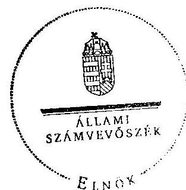

# ÁLLAMI   SZÁMVEVŐSZÉK 

## JELENTÉS

az önkormányzatok belső kontrollrendszere kialakításának, egyes kontrolltevékenységek és a belső ellenőrzés múködésének - 2013. évben induló - ellenőrzéséről

Répcelak

---

# Állami Számvevőszék 

Iktatószám: V-0180-045/2013.
Témaszám: 1190
Vizsgálat-azonosító szám: V064921

## Az ellenőrzést felügyelte:

Dr. Benedek Mária
felügyeleti vezető
Az ellenőrzést vezette és az ellenőrzés végrehajtásáért felelős:
Dr. Veress Tiborné
ellenőrzésvezető
A számvevőszéki jelentés összeállításában közremúködtek:
Baki István
számvevő tanácsos
Pető Krisztina
számvevő tanácsos
Az ellenőrzést végezték:
Baki István Győriné Franyó Éva
számvevő tanácsos számvevő

A témához kapcsolódó eddig készített számvevőszéki jelentés:
címe
sorszáma
Jelentés a szilárdhulladék-gazdálkodásra a Kohéziós Alapból és a 0920 hazai forrásból nyújtott támogatások hasznosulásának ellenőrzéséről

---

# TARTALOMJEGYZÉK 

BEVEZETÉS ..... 5
I. ÖSSZEGZŐ MEGÁLLAPÍTÁSOK, KÖVETKEZTETÉSEK, JAVASLATOK ..... 9
II. RÉSZLETES MEGÁLLAPÍTÁSOK ..... 16

1. Az önkormányzat belső kontrollrendszerének kialakítása ..... 16
1.1. A kontrollkörnyezet ..... 16
1.2. A kockázatkezelési rendszer ..... 17
1.3. A kontrolltevékenységek ..... 17
1.4. Az információs és kommunikációs rendszer ..... 18
1.5. A monitoring rendszer ..... 19
2. A pénzügyi folyamatokban kulcsszerepet betöltő teljesítésigazolás és érvényesítés belső kontrollok működése ..... 19
3. A belső ellenőrzés működése ..... 21

## FÜGGELÉKEK

1. számú Értelmező szótár
2. számú Az értékelés módja és szempontjai

---

.

---

# RÖVIDÍTÉSEK JEGYZÉKE 

| Törvények |  |
| :--: | :--: |
| Áht. | 2011. évi CXCV. törvény az államháztartásról (hatályos 2012. január 1-jétől) |
| ÁSZ tv. | 2011. évi LXVI. törvény az Állami Számvevőszékről |
| Info tv. | 2011. évi CXII. törvény az információs önrendelkezési jogról és az információszabadságról (hatályos 2011. július 27 -étől) |
| Kttv. | 2011. évi CXCIX. törvény a közszolgálati tisztviselőkről |
| Mötv. | 2011. évi CLXXXIX. törvény Magyarország helyi önkormányzatairól (hatályos 2012. január 1-jétől) |
| Ötv. | 1990. évi LXV. törvény a helyi önkormányzatokról |
| Rendeletek |  |
| Áhsz. | 249/2000. (XII. 24.) Korm. rendelet az államháztartás szervezetei beszámolási és könyvvezetési kötelezettségének sajátosságairól |
| Ávr. | 368/2011. (XII. 31.) Korm. rendelet az államháztartásról szóló törvény végrehajtásáról (hatályos 2012. január 1jétől) |
| Ber. | 193/2003. (XI. 26.) Korm. rendelet a költségvetési szervek belső ellenőrzéséről (hatálytalan 2012. január 1-jétől) |
| Bkr. | 370/2011. (XII. 31.) Korm. rendelet a költségvetési szervek belső kontrollrendszeréről és belső ellenőrzéséről (hatályos 2012. január 1-jétől) |
| Szórövidítések |  |
| 2013. évi ellenőrzési terv | Répcelak Város Önkormányzata - Éves Ellenőrzési Terv 2013. |
| Adatvédelmi szabályzat | Adatvédelmi és Számítástechnikai Védelmi Szabályzat (hatályos 2007. január 1-jétől) |
| ÁSZ | Állami Számvevőszék |
| belső ellenőrzési kézikönyv | Sárvár és Kistérsége Többcélú Kistérségi Társulás Belsőellenőrzési kézikönyve (hatályos 2012. március 1-jétől) |
| ellenőrzési nyomvonal | Répcelak Város Önkormányzat Képviselő-testületének Polgármesteri Hivatala Ellenőrzési Nyomvonala (hatályos: 2004. szeptember 15-étől, módosítva 2011. szeptember 22-én) |
| Ellenőrzési stratégiai terv | Stratégiai terv 2010-2014. évekre (hatályos 2010. szeptember 21-étől) |
| FEUVE | Folyamatba épített, előzetes és utólagos vezetői ellenőrzés |
| gazdasági szervezet ügyrendje | Répcelak Város Önkormányzat Polgármesteri Hivatala SZMSZ-ének 2. számú melléklete (hatályos 2010. szeptember 30-ától) |
| gazdálkodási szabályzat | Répcelak Város Önkormányzat Képviselő-testületének Polgármesteri Hivatala Gazdálkodási Szabályzata (hatályos 2012. január 1-jétől) |

---

| Hivatal | Répcelaki Közös Önkormányzati Hivatal (2013. március 1-jétől) |
| :--: | :--: |
| hivatali SZMSZ | Répcelak Város Polgármesteri Hivatal Ügyrendje Szervezeti és Múködési Szabályzata módosításokkal egységes szerkezetben (hatályos 2010. szeptember 30-ától) |
| INTOSAI | International Organization of Supreme Audit Institutions (Legfőbb Ellenőrző Intézmények Nemzetközi Szervezete) |
| iratkezelési szabályzat | A Polgármesteri Hivatal Ügyrendjének 6. számú melléklete: Egyedi Iratkezelési Szabályzat (hatályos 2007. január 1-jétől) |
| ISSAI | International Standards of Supreme Audit Institutions (Legfőbb Ellenőrző Intézmények Nemzetközi Standardjai) |
| jegyző | Répcelak Város Önkormányzat Polgármesteri Hivatala jegyzője |
| Képviselő-testület | Répcelak Város Önkormányzat Képviselő-testülete |
| Kormányhivatal | Vas Megyei Kormányhivatal |
| közérdekú adatok megismerési rendjének szabályozása | Szabályzat a közérdekú adatok megismerésére irányuló igények teljesítésének rendjéről (hatályos 2011. június 1jétől) |
| közzétételi szabályzat | A Polgármesteri Hivatal Ügyrendje 7. számú melléklet, Répcelak Város Önkormányzata Közzétételi Szabályzata a közérdekú adatok közzétételi kötelezettségének teljesítéséről (hatályos 2008. július 1-jétől) |
| NGM | Nemzetgazdasági Minisztérium |
| Önkormányzat polgármester | Répcelak Város Önkormányzata |
| Polgármesteri Hivatal | Répcelak Város Önkormányzat Polgármestere |
| szabálytalanságkezelési szabályzat | A szabálytalanságok kezelésének eljárásrendje (hatályos 2012. június 1 -jétől) |
| Társulás | A Sárvár és Kistérsége Többcélú Kistérségi Társulás (tagjai 32 önkormányzat, a megállapodás kelte 2012. június 1je) |
| ügyintézési folyamat | A Polgármesteri Hivatal Ügyrendje III. A Hivatali múködés rendje (hatályos 2007. január 1-jétől) |

---

# JELENTÉS 

## az önkormányzatok belső kontrollrendszere kialakításának, egyes kontrolltevékenységek és a belső ellenőrzés múködésének - 2013. évben induló - ellenőrzéséről Répcelak

## BEVEZETÉS

Répcelak város állandó lakosainak száma 2012. január 1-jén 2706 fő volt. Az Önkormányzat hattagú Képviselő-testületének munkáját három állandó bizottság segítette. Az Önkormányzat az önállóan működő és gazdálkodó Polgármesteri Hivatalon kívül egy önállóan működő és gazdálkodó, valamint három önállóan működő intézményt múködtetett és egy többségi tulajdoni hányadú gazdasági társasággal rendelkezett. A polgármester 1996 óta tölti be tisztségét. A jegyző 2006. november 1-jétől látja el a jegyzői feladatokat. A Polgármesteri Hivatal négy szervezeti egységre tagolódott: Titkársági csoport, Igazgatási csoport, Pénzügyi csoport és Műszaki csoport. A Hivatalban elkülönített gazdasági szervezet múködéséről a Képviselő-testület döntött, annak múködését szabályozta is, azonban önálló gazdasági szervezet nem lett kialakítva, annak jogszerűen ellátandó feladatait a Pénzügyi csoport látta el a jegyző megbízása alapján. A Polgármesteri Hivatal az ellenőrzött időszakban körjegyzőségi feladatot látott el megállapodás alapján Csánig és Nick községek vonatkozásában, és múködési területéhez tartoztak még Uraiújfalu és Vámoscsalád települések is. A köztisztviselők száma 2012. január 1-jén 20 fő volt. A Polgármesteri Hivatal jogutódjaként 2013. március 1-jétől létrejött a Hivatal. Az Önkormányzat a 2012. évi költségvetési beszámolója szerint 1404205 ezer Ft költségvetési bevételt ért el, valamint 1174638 ezer Ft költségvetési kiadást teljesített. A 2012. december 31-i könyvviteli mérleg szerint 2811398 ezer Ft értékű eszközvagyonnal rendelkezett, a rövid lejáratú kötelezettségállománya 9946 ezer Ft volt, hosszú lejáratú kötelezettsége nem volt.

A demokratikus társadalmakban alapvető igény, hogy a közpénzeket, a közvagyont használók tevékenységükről elszámoljanak, ahhoz egyértelmú és érvényesíthető felelősségi szabályok társuljanak. Ennek a jogos igénynek az érvényesítéséhez meg kell teremteni azokat a folyamatokat, rendszereket, amelyek nélkülözhetetlenek az elszámoltatáshoz. Az elszámoltatás eredményes múködtetéséhez szükség van a megfelelő információs, kontroll, értékelési és beszámolási rendszerek kialakítására.

Magyarországon az uniós csatlakozási tárgyalások idejére nyúlnak vissza a belső kontrollrendszer szabályozásának gyökerei. Az uniós elvárásoknak megfelelő új terminológia szerinti államháztartási belső pénzügyi ellenőrzési

---

(ÁBPE) rendszer területén a jogharmonizáció 2003-ban teljes körűen megvalósult, míg az önkormányzati alrendszerre vonatkozó, Ötv.-ben megjelenített speciális szabályozás 2005-ben lépett hatályba. Az államháztartási belső kontrollrendszer koncepciója 2009-ben továbbfejlődött. A változások irányát mutatja, hogy a költségvetési szervek belső kontrollrendszere már magában foglalja a korszerű felelős szervezetirányítás elemeit (kontrollkörnyezet, kockázatkezelés, kontrolltevékenység, információ és kommunikáció, monitoring) is. E kontrollrendszer szabályozása háromszintű, a törvényi előírásokat az Áht. és a Mötv., a rendeleti szintű szabályozást az Ávr. és a Bkr. tartalmazza, amelyeket útmutatói szinten az NGM által kiadott standardok és kézikönyvek támogatnak.

A belső kontrollrendszer azt a célt szolgálja, hogy a költségvetési szervek működésük és gazdálkodásuk során a tevékenységeket szabályszerűen, gazdaságosan, hatékonyan és eredményesen hajtsák végre, teljesítsék elszámolási kötelezettségeiket és megvédjék az erőforrásokat a veszteségektől, a károktól és a nem rendeltetésszerű használattól. A belső kontrollrendszer magában foglalja mindazon szabályokat, eljárásokat, gyakorlati módszereket és szervezeti struktúrákat, kockázatkezelési technikákat, kontrolltevékenységeket, amelyek segítséget nyújtanak a szervezetnek céljai eléréséhez.

Az ÁSZ a 2011-2015. évekre szóló stratégiájában hangsúlyos szerepet szánt annak, hogy szilárd szakmai alapon álló, értékteremtő ellenőrzéseivel előmozdítsa a közpénzügyek átláthatóságát, rendezettségét. A számvevőszéki ellenőrzés nemzetközi alapelvei is rögzítik, hogy a megfelelő belső kontrollrendszer minimálisra csökkenti a hibák és szabálytalanságok kockázatát.

Az ellenőrzés célja annak megállapítása volt, hogy a belső kontrollrendszer elemeinek kialakítása, a pénzügyi folyamatokban kulcsszerepet betöltő teljesítésigazolás és érvényesítés és a belső ellenőrzés szabályos múködése biztosítot-ta-e az Önkormányzatnál a közpénzfelhasználás szabályosságát, hozzájárult-e az értéket teremtő rend követelményének érvényesüléséhez.

Ennek keretében értékeltük, hogy:

- a jogszabályi előírásoknak megfelelően alakították-e ki a belső kontrollrendszer elemeit;
- a gazdálkodás folyamatában kulcsszerepet betöltő teljesítésigazolás és érvényesítés kontrolltevékenységeit megfelelően működtették-e;
- biztosították-e a belső ellenőrzés szabályos működését;
- amennyiben az ÁSZ tett javaslatot a 2008-2011. évek közötti ellenőrzése kapcsán az Önkormányzatnak, intézkedtek-e azok végrehajtására.

Az ellenőrzés várható hasznosulását négy szinten tervezzük. A törvényalkotás számára összegzett tapasztalatok állnak rendelkezésre a belső kontrollrendszer önkormányzati területen való kialakításáról, működéséről és hatásairól, a belső ellenőrzés működéséről. Ennek alapján következtetést lehet levonni arról, hogy a belső kontrollrendszer kialakítására és működtetésére vonatkozó jelenlegi, differenciálás nélküli - jogszabályi előírások reális követelményeket

---

támasztanak-e az eltérő adottságú települési önkormányzatok esetében, illetve indokolt-e esetleges jogszabályi módosítás kezdeményezése. Az ellenőrzés az ellenőrzött számára visszajelzést ad a belső kontrollrendszer kialakításában és működésében fellépő hiányosságokról, javaslataival hozzájárul azok kiküszöböléséhez, amely csökkentheti a későbbi ellenőrzések gyakoriságát. Az ellenőrzés megállapításait és javaslatait más szervezetek is hasznosíthatják a rendezett gazdálkodási keretek kialakításához. A társadalom számára jelzi, hogy közpénz nem maradhat ellenőrizetlenül, az ÁSZ értékteremtő rend kialakításához és megőrzéséhez hozzájáruló tevékenysége pozitív hatással lesz a szervezetről kialakított összkép formálásában. A szervezeten belül lehetőség nyílik arra, hogy a megállapítások szintetizálásával az ÁSZ a hozzáadott értéket teremtő elemző tevékenységét és tanácsadó szerepét is erősítse.

Az önkormányzatok belső kontrollrendszere kialakításának, egyes kontrolltevékenységek és a belső ellenőrzés működésének ellenőrzéséről szóló jelentés I. fejezetének összegző része az ellenőrzés céljára ad rövid, szintetizáló összefoglalót, és tartalmazza a következtetéseket a II. fejezet részletes megállapításain alapulóan. A jelentés intézkedést igénylő megállapításait és javaslatait az ellenőrzés során feltárt, a jelentés II. fejezetében rögzített részletes megállapítások alapozzák meg. A helyszíni ellenőrzés lezárásáig a helyi szabályozás változásait nyomon követtük.

Az ellenőrzés típusa: szabályszerűségi ellenőrzés.
Az ellenőrzött időszak: a belső kontrollrendszer kialakításának megfelelősége esetében a 2012. évre, a pénzügyi folyamatokban kulcsszerepet betöltő teljesítésigazolás és érvényesítés belső kontrollok múködésének megfelelőségét és a belső ellenőrzés szabályszerű működését a 2012. január 1. és december 31-e közötti időszak eseményeit figyelembe véve értékeltük, míg az ÁSZ javaslatainak utóellenőrzése a 2008-2011. években végzett ellenőrzések nyilvánosságra hozott jelentéseiben tett javaslatok áttekintésére terjedt ki.

# Az ellenőrzött szervezet: az Önkormányzat. 

Az ellenőrzés jogszabályi alapját az ÁSZ tv. 1. § (3) bekezdése, az 5. § (2) és (6) bekezdése, valamint az Áht. 61. §. (2) bekezdésének előírásai képezik.

Az ellenőrzés szakmai módszertana az ÁSZ hivatalos honlapján (www.asz.hu) közzétett szakmai szabályokon alapult, amely az INTOSAI által kiadott ISSAI figyelembevételével készült.

Az ellenőrzés lefolytatásához az Önkormányzat a kimutatások és a tanúsítvány elektronikus kitöltésével, valamint az ÁSZ által kért dokumentumok elektronikus megküldésével szolgáltatott adatokat. Az így rendelkezésre bocsátott adatok, információk kontrollja és a munkalapok kitöltése a helyszíni ellenőrzés keretében történt. A jelentésben használt fogalmak magyarázatát az 1. számú függelék, az ellenőrzés egyes területeinek értékelésénél alkalmazott egységes minősítési szempontokat a 2. számú függelék tartalmazza.

A belső kontrollrendszer kialakításának ellenőrzése során értékeltük a kontrollkörnyezet, a kockázatkezelési rendszer, a kontrolltevékenységek, az információs

---

és kommunikációs rendszer, valamint a monitoring rendszer szabályozottságának megfelelőségét. A pénzügyi folyamatokban kulcsszerepet betöltő teljesítésigazolás és érvényesítés kontrollok múködése megfelelőségének minősítéséhez az állományba nem tartozók megbízási díjai, a külső szolgáltatók által végzett karbantartási, kisjavítási munkák, az egyéb üzemeltetési és fenntartási szolgáltatások, a rendszeres szociális segélyek, valamint az államháztartáson kívülre teljesített múködési és felhalmozási célú pénzeszközátadások közül kockázatelemzéssel választottuk ki az ellenőrzött kiadási jogcímeket. Az egyszerű véletlen mintavétellel kiválasztott tételek ellenőrzését többlépcsős megfelelőségi tesztek útján addig végeztük, amíg elegendő és megfelelő bizonyítékot szereztünk a vizsgált folyamatok kulcskontrolljai múködésének megfelelő vagy nem megfelelő voltáról. Értékeltük az Önkormányzatnál a belső ellenőrzés múködésének szabályosságát. Az ÁSZ az Önkormányzatnál a 2009. évben a szilárd hulladék-gazdálkodásra a Kohéziós Alapból és a hazai forrásból nyújtott támogatások hasznosulását ellenőrizte. A nyilvánosságra hozott, 0920 számon közzétett számvevőszéki jelentésben az Önkormányzat számára az ÁSZ javaslatot nem tett, ezért a jelen ellenőrzés keretében utóellenőrzésre nem került sor.

Az ÁSZ tv. 29. § (1) bekezdése szerint a jelentéstervezetet megküldtük a polgármester részére, aki az ÁSZ tv. 29. § (2) bekezdésében foglalt észrevételezési jogával nem élt, a jelentéstervezetre észrevételt nem tett.

---

# I. ÖSSZEGZŐ MEGÁLLAPÍTÁSOK, KÖVETKEZTETÉSEK, JAVASLATOK 

A belső kontrollrendszeren belül 2012-ben a kontrollkörnyezet, a kockázatkezelési rendszer, a kontrolltevékenységek, az információs és kommunikációs rendszer, valamint a monitoring rendszer kialakítását külön-külön és együttesen is értékeltük. A belső kontrollrendszer kialakítása az összesített értékelés alapján nem felelt meg a jogszabályi előírásoknak.

A belső kontrollrendszer egyes területei kialakításának minősítése a következő:

| Kontrollterület | Minősítés |
| :-- | :--: |
| Kontrollkörnyezet | nem |
|  | megfelelő |
| Kockázatkezelési rendszer | nem |
|  | megfelelő |
| Kontrolltevékenységek | részben |
|  | megfelelő |
| Információs és kommuni- | részben |
| kációs rendszer | megfelelő |
| Monitoring rendszer | nem |

Részben megfelelőnek értékeltük a kontrolltevékenységek, valamint az információs és kommunikációs rendszer kialakítását, mivel a megállapított szabályozásbeli hiányosságok nem veszélyeztették a Polgármesteri Hivatal, ezáltal az Önkormányzat céljainak elérését, a beszámoló rendszerek megbízható múködését.

Nem megfelelőnek értékeltük a kontrollkörnyezet, a kockázatkezelési rendszer, valamint a monitoring rendszer kialakítását, mivel az ellenőrzésünk során megállapított szabályozásbeli hiányosságok magukban hordozzák a szabálytalan múködés, valamint a korrupció kockázatát.

A belső kontrollrendszer nem megfelelő kialakítása kockázatot jelent az Önkormányzat feladatainak szabályszerű, gazdaságos, hatékony és eredményes végrehajtása során.

A 2012. évben az állományba nem tartozók megbízási díjaival, a külső szolgáltatók által végzett karbantartási, kisjavítási munkákkal, valamint az egyéb üzemeltetési, fenntartási kiadásokkal kapcsolatos kifizetések során a pénzügyi folyamatokban kulcsszerepet betöltő teljesítésigazolás és érvényesítés belső kontrollok múködése gyenge volt. Gyengének értékeltük a két kulcskontroll együttes múködését, mivel azok nem biztosították a hibák megelőzését, feltárását.

---

A számvevőszéki ellenőrzés az ellenőrzött kifizetésekkel összefüggésben a rendelkezésre bocsátott dokumentumok alapján kár bekövetkeztére utaló adatot, tényt nem állapított meg, azonban a gazdálkodásban kulcsszerepet betöltő kontrollok gyenge múködése miatt fennáll a hibák bekövetkezésének lehetősége. A nem megfelelően szabályozott és múködtetett belső kontrollok korrupciós kockázatot hordoznak.

A belső ellenőrzési feladatokat Társulás útján látták el. A 2012. évben a belső ellenőrzés múködése a jogszabályi előírásoknak nem felelt meg, mivel a számvevőszéki ellenőrzés által megállapított szabályozási és múködési hiányosságok számossága magában hordozza a szabálytalan önkormányzati gazdálkodás és feladatellátás kockázatát.

Az ÁSZ tv. 33. § (1) bekezdésében foglaltak értelmében az ellenőrzött szervezet vezetője köteles a jelentésben foglalt megállapításokhoz kapcsolódó intézkedési tervet összeállítani, és azt a jelentés kézhezvételétől számított 30 napon belül az ÁSZ részére megküldeni. Amennyiben az intézkedési tervet határidőre nem küldi meg a szervezet, vagy az ÁSZ tv. 33. § (2) bekezdésében foglalt póthatáridő elteltével megküldött intézkedési terv továbbra sem elfogadható, az ÁSZ elnöke a hivatkozott törvény 33. § (3) bekezdés a)-b) pontjaiban foglaltakat érvényesítheti.

Az ellenőrzés intézkedést igénylő megállapításai és javaslatai:

# a polgármesternek 

A számvevőszéki ellenőrzés megállapításai alapján az Önkormányzatnál a belső kontrollrendszer kialakítása összefoglalóan értékelve nem felelt meg a jogszabályi előírásoknak, a kulcskontrollok múködése gyenge volt a belső ellenőrzés múködése ugyancsak nem felelt meg a jogszabályi előírásoknak. A megállapított szabályozásbeli és múködésbeli hiányosságok magukban hordozzák a szabálytalan múködés kockázatát.

Javaslat:
A Mötv. 115. § (1) bekezdésében foglaltak alapján kísérje figyelemmel az Önkormányzat gazdálkodásának szabályszerűségét. A Mötv. 67. § f) pontja alapján gondoskodjon a belső kontrollrendszer múködésére vonatkozó jogszabályi rendelkezések be nem tartása, valamint a teljesítésigazolás, illetve az érvényesítés kontrollokkal öszszefüggésben feltárt hiányosságok, szabálytalanságok tekintetében az esetleges munkajogi felelősséggel kapcsolatos körülmények kivizsgálásáról, majd a vizsgálat eredményének függvényében tegye meg a szükséges munkajogi intézkedéseket.

---

# a jegyzőnek 

1. a kontrollkörnyezettel kapcsolatban:

A hivatali SZMSZ az Ávr. 13. § (1) bekezdés c), g) és i) pontjaiban foglaltak ellenére nem tartalmazta az ellátandó, és a szakfeladatrend szerint szakfeladat számmal és megnevezéssel besorolt alaptevékenységek, az alaptevékenységet szabályozó jogszabályok megjelölését; a helyettesítés rendjét, az ezekhez kapcsolódó felelősségi szabályokat és az irányító szerv által az Ávr. 10. § (1)-(3) bekezdése szerint a költségvetési szervhez rendelt más költségvetési szervek felsorolását.

A jegyző 2010. szeptember 30-ával helyezte hatályba a gazdasági szervezet ügyrendjét, azonban azt a belső szabályzatban előírtak ellenére - a jogszabályi változásokat követően 90 napon belül - nem aktualizálta az Ávr. 13. § (5) bekezdésének megfelelően.

A jegyző - a Bkr. 6. § (3) bekezdésben foglalt kötelezettsége ellenére - az ellenőrzési nyomvonal rendszeres aktualizálásáról nem gondoskodott.

A Képviselő-testület - a Kttv. 231. § (1) bekezdése ellenére - nem állapította meg a köztisztviselőkkel szembeni, a Kttv. 83. §-ában előírt hivatásetikai alapelvek részletes tartalmát, valamint az etikai eljárás szabályait, mivel a jegyző - az Ötv. 36. § (2) bekezdés a) pontjában előírt feladata ellenére - nem készítette elő ennek dokumentumát.

Javaslat:
a) Készítse el a Hivatal szervezeti és múködési szabályzatának módosítását annak érdekében, hogy az tartalmazza az Ávr. 13. § (1) bekezdésében előírt tartalmi elemeket, és kezdeményezze az Áht. 9. § (1) bekezdés a) pontjában foglaltakra tekintettel a Képviselő-testület elé terjesztését.
b) Készítse el az Ávr. 9. § (5) bekezdésében és a belső szabályzatokban foglaltaknak megfelelően a Hivatal gazdasági szervezete ügyrendjének módosítását annak érdekében, hogy az a hatályos szabályok szerint tartalmazza az Ávr. 13. § (5) bekezdésében előírt tartalmi elemeket.
c) Aktualizálja rendszeresen a Bkr. 6. § (3) bekezdésében előírtaknak megfelelően az ellenőrzési nyomvonalat.
d) Készítse elő a Mötv. 81. § (3) bekezdés c) pontjában foglalt feladatkörében a köztisztviselőkkel szembeni - a Kttv. 83. §-a szerinti - hivatásetikai alapelvek részletes tartalmának, valamint az etikai eljárás szabályainak dokumentumait, és a Kttv. 231. § (1) bekezdésében foglaltakra tekintettel kezdeményezze azok Kép-viselő-testület elé terjesztését.
2. a kockázatkezelési rendszerrel kapcsolatban:

A jegyző - a Bkr. 7. § (2) bekezdésében foglaltak ellenére - nem mérte fel és nem állapította meg a Polgármesteri Hivatal tevékenységében, gazdálkodásában rejlő kockázatokat, továbbá nem határozta meg az egyes kockázatokkal kapcsolatban szük-

---

séges intézkedéseket, valamint azok teljesítésének folyamatos nyomon követésének módját.

Javaslat:
Mérje fel és állapítsa meg a Bkr. 7. § (2) bekezdésében foglaltak alapján a Hivatal tevékenységében, gazdálkodásában rejlő kockázatokat, határozza meg az egyes kockázatokkal kapcsolatban szükséges intézkedéseket, valamint azok teljesítése folyamatos nyomon követésének módját.
3. a kontrolltevékenységekkel kapcsolatban:

A jegyző a Bkr. 8. § (2) bekezdésének a) pontjában foglaltak ellenére nem biztosította a pénzügyi döntések - köztük a kifizetések és a támogatásokkal való elszámolás dokumentumainak elkészítésével kapcsolatban a folyamatba épített, előzetes, utólagos és vezetői ellenőrzést.

A jegyző - az Ávr. 53. § (2) bekezdésében foglaltak ellenére - nem határozta meg az előzetes írásbeli kötelezettségvállalást nem igénylő kifizetések rendjét, annak ellenére, hogy a gazdálkodási szabályzat lehetővé tette a 100 ezer Ft-ot el nem érő kifizetések előzetes írásbeli kötelezettségvállalás nélküli teljesítését.

A jegyző - az Ávr. 13. § (2) bekezdés a) pontban foglaltak ellenére - a belső szabályzatban nem rendezte a teljesítésigazolás és az érvényesítés dokumentációs részletszabályait.

Javaslat:
a) Biztosítsa a kifizetések és a támogatásokkal való elszámolások dokumentumainak elkészítésére vonatkozóan a folyamatba épített, előzetes, utólagos és vezetői ellenőrzést a Bkr. 8. § (2) bekezdése alapján.
b) Rögzítse belső szabályzatban - az Ávr. 53. § (2) bekezdése alapján - az előzetes írásbeli kötelezettségvállalást nem igénylő kifizetések rendjét.
c) Rendezze belső szabályzatban az Ávr. 13. § (2) bekezdés a) pontjában foglaltak alapján a gazdálkodással - különösen a teljesítés igazolása és az érvényesítés dokumentációs részletszabályaival - kapcsolatos belső előírásokat, feltételeket.
4. az információs és kommunikációs rendszerrel kapcsolatban:

A jegyző - a Bkr. 3. § d) pontjában és a 9. § (1) bekezdésében foglaltak ellenére nem alakított ki olyan rendszert, amely a szervezeten belüli és a külső felek részére történő információáramlás keretében biztosítja, hogy a megfelelő információk a megfelelő időben eljutnak az illetékes szervezethez, szervezeti egységhez, illetve személyhez.

A jegyző - az Info tv. 24. § (3) bekezdésében foglaltak ellenére - nem készítette el a Polgármesteri Hivatal adatvédelmi és adatbiztonsági szabályzatát.

A jegyző - az Info tv. 30. § (6) bekezdésében és az Ávr. 13. § (2) bekezdés h) pontjában foglaltak ellenére - belső szabályzatban nem szabályozta a közérdekú adatok

---

megismerésére irányuló igények teljesítésének és a kötelezően közzéteendő adatok nyilvánosságra hozatalának a rendjét.

Javaslat:
a) Alakítson ki a Bkr. 3. § d) pontjában és a 9. § (1) bekezdésében foglaltaknak megfelelően olyan rendszert, amely biztosítja, hogy a megfelelő információk a megfelelő időben eljutnak az illetékes szervezethez, szervezeti egységhez, illetve személyhez.
b) Készítsen adatvédelmi és adatbiztonsági szabályzatot az Info tv. 24. § (3) bekezdésének megfelelően.
c) Készítsen - az Info tv. 30. § (6) bekezdése és az Ávr. 13. § (2) bekezdés h) pontja alapján - a közérdekű adatok megismerésére irányuló igények teljesítésének és a kötelezően közzéteendő adatok nyilvánosságra hozatalának rendjét rögzítő szabályzatot.
5. a monitoring rendszerrel kapcsolatban:

A jegyző - a Bkr. 3. § e) pontjában és a 10. §-ban foglaltak ellenére - nem alakított ki a szervezet tevékenységének és a célok megvalósításának folyamatos nyomon követését biztosító rendszert.

Javaslat:
Alakítsa ki és múködtesse a Bkr. 3. § e) pontjában és 10. §-ában előírtak alapján a Hivatal tevékenységének, a célok megvalósításának nyomon követését biztosító rendszert.
6. A pénzügyi folyamatokban kulcsszerepet betöltő kontrollok múködésével kapcsolatban:

A teljesítésigazolást - az Áht. 38. § (1) bekezdésében és az Ávr. 57. § (1) bekezdésében foglaltak ellenére - nem végezték el, vagy ellenőrizhető okmány hiányában nem szabályszerűen történt.

Az érvényesítő - az Ávr. 58. § (2) bekezdésben előírtak ellenére - az utalványozónak nem jelezte, hogy a megelőző ügymenetben a teljesítésigazolás elmaradt, vagy nem szabályszerűen történt.

Javaslat:
Intézkedjen - a teljesítésigazolás és az érvényesítés vonatkozásában feltárt hiányosságok megszüntetése, illetve az operatív gazdálkodás során a múködésbeli hibák megelőzése, feltárása és kijavítása érdekében - arról, hogy:
a) teljesítésigazolás során az Áht. 38. § (1) bekezdésében és az Ávr. 57. § (1) és (3) bekezdésében előírtaknak megfelelően, ellenőrizhető okmányok alapján ellenőrizzék és igazolják a kiadások teljesítésének jogosságát, összegszerűségét, az ellenszolgáltatást is magában foglaló kötelezettségvállalás esetén annak teljesítését;

---

b) az érvényesítő - az Ávr. 58. § (2) bekezdésben foglalt előírásnak megfelelően jelezze az utalványozónak, ha az Áht., az Áhsz., az Ávr. és a belső szabályzatokban foglaltak elmulasztását tapasztalja.
7. a belső ellenőrzés működésével kapcsolatban:

A belső ellenőrzési kézikönyv - a Bkr 17. § (2) bekezdés c), d) és e) pontjában foglaltak ellenére - nem tartalmazta a tervezés megalapozásához alkalmazott kockázatelemzési módszertant, az ellenőrzési dokumentumok formai követelményeit, az alkalmazott iratmintákat és az ellenőrzési megállapítások hasznosítása nyomon követését.

A Bkr. 16. § (4) bekezdésében foglaltak ellenére a 22. § (1)-(2) bekezdésében foglalt tevékenységek és kötelességek ellátásának módjáról nem rendelkeztek.

Az Önkormányzat - a Bkr. 56. § (3) bekezdésben előírtaknak megfelelő tartalmú stratégiai ellenőrzési tervvel nem rendelkezett.

A 2013. évi ellenőrzési terv - a Bkr. 31. § (4) bekezdés a) pontjában foglaltak ellenére - nem tartalmazta az ellenőrzési tervet megalapozó elemzések és a kockázatelemzés eredményének összefoglaló bemutatását.

A 2013. évre vonatkozó éves ellenőrzési terv összeállítása - a Bkr. 56. § (2) bekezdésben foglalt előírás ellenére - nem a jegyző írásos véleményének a figyelembe vételével történt, mivel a jegyző véleményt, javaslatot nem fogalmazott meg.

A lefolytatott három ellenőrzés közül egy esetében az ellenőrzési program - a Bkr. 33. § (2) bekezdés d) és g) pontja ellenére - nem tartalmazta az ellenőrzés célját, a vizsgálatvezető megnevezését, a megbízólevelek számát és a feladatmegosztást.

A lefolytatott három ellenőrzés közül egy esetében az ellenőrzésről készített jelentés - a Bkr. 39. § (3) bekezdés d), e), f) és i) pontjaiban foglaltak ellenére - nem tartalmazta az ellenőrzés típusát, az ellenőrzés tárgyát, az ellenőrzés célját, valamint az alkalmazott ellenőrzési eljárásokat és módszereket.

A 2011. évre vonatkozó éves ellenőrzési jelentés - a Bkr. 48. § b) pontjában foglaltak ellenére - nem tartalmazta a belső kontrollrendszer szabályszerűségének, gazdaságosságának, hatékonyságának és eredményességének növelése, javítása érdekében tett fontosabb javaslatokat, valamint a belső kontrollrendszer öt elemének értékelését.

Javaslat:
a) Intézkedjen arról, hogy a belső ellenőrzési kézikönyv tartalmazza a Bkr 17. § (2) bekezdésében előírt tartalmi elemeket.
b) Kezdeményezze, hogy a Bkr. 16. § (4) bekezdésének megfelelően a belső ellenőrzési tevékenység megszervezésére vonatkozó megállapodásban rendelkezzenek a Bkr. 22. § (1)-(2) bekezdéseiben foglalt tevékenységek és kötelességek ellátásának módjáról.

---

c) Kezdeményezze, hogy a Bkr. 56. § (3) bekezdésében foglaltaknak megfelelően készítsék el a stratégiai ellenőrzési tervet.
d) Intézkedjen, hogy az éves ellenőrzési terv tartalmazza a Bkr. 31. § (4) bekezdésében előírt tartalmi elemeket.
e) Kezdeményezze, hogy az éves ellenőrzési tervet a belső ellenőrzési vezető a Bkr. 56. § (2) bekezdés előírásainak megfelelően a jegyző írásos véleményének figyelembevételével készítse el.
f) Kezdeményezze, hogy az ellenőrzési programok tartalmazzák a Bkr. 33. § (2) bekezdésében előírt tartalmi elemeket.
g) Kezdeményezze, hogy az elvégzett ellenőrzésekről készített jelentések tartalmazzák a Bkr. 39. § (3) bekezdésében előírt tartalmi elemeket.
h) Kezdeményezze, hogy az éves ellenőrzési jelentés tartalmazza a Bkr. 48. §-ában előírt tartalmi elemeket.

---

# II. RÉSZLETES MEGÁLLAPÍTÁSOK 

## 1. AZ ÖNKORMÁNYZAT BELSŐ KONTROLLRENDSZERÉNEK KIALAKÍTÁSA

A belső kontrollrendszeren belül 2012-ben a kontrollkörnyezet, a kockázatkezelési rendszer, a kontrolltevékenységek, az információs és kommunikációs rendszer, valamint a monitoring rendszer kialakítását külön-külön és együttesen is értékeltük. A belső kontrollrendszer kialakítása az összesített értékelés alapján nem felelt meg a jogszabályi előírásoknak.

### 1.1. A kontrollkörnyezet

A kontrollkörnyezet kialakítása - a 2. számú függelékben részletezett kritériumrendszer alapján végzett értékelés szerint - a jogszabályi előírásoknak nem felelt meg, mert:

| Sorszám ${ }^{1}$ | Megállapítás | Megjegyzés |
| :--: | :--: | :--: |
| 5. | A hivatali SZMSZ az Ávr. 13. § (1) bekezdés c), g) és i) pontjaiban foglaltak ellenére nem tartalmazta az ellátandó, és a szakfeladatrend szerint szakfeladat számmal és megnevezéssel besorolt alaptevékenységek, az alaptevékenységet szabályozó jogszabályok megjelölését; a helyettesítés rendjét, az ezekhez kapcsolódó felelősségi szabályokat és az irányító szerv által az Ávr. 10. § (1)-(3) bekezdése szerint a költségvetési szervhez rendelt más költségvetési szervek felsorolását. | A Hivatal szervezeti és működési szabályzatában az Ávr. 13. § (1) bekezdés c) pontja alapján az ellátandó alaptevékenységek, a szakfeladatrend szerinti szakfeladat száma és megnevezése nem felelt meg az 56/2011. (XII. 31.) NGM rendeletben foglaltaknak. |
| 35. | A jegyző 2010. szeptember 30-ával helyezte hatályba a gazdasági szervezet ügyrendjét, azonban azt a belső szabályzatban előírtak ellenére - a jogszabályi változásokat követően 90 napon belül - nem aktualizálta az Ávr. 13. § (5) bekezdésének megfelelően. |  |
| 44. | A jegyző - a Bkr. 6. § (3) bekezdésben foglalt kötelezettsége ellenére - az ellenőrzési nyomvonal rendszeres aktualizálásáról nem gondoskodott. |  |

[^0]
[^0]:    ${ }^{1}$ A megállapítás számozása az Önkormányzat által az adatszolgáltatás során kitöltött kimutatások kérdéseinek sorszámával azonos.

---

| 47. | A Képviselő-testület - a Kttv. 231. § (1) bekezdése ellenére - nem állapította meg a köztisztviselőkkel szembeni, a Kttv. 83. §-ában előírt hivatásetikai alapelvek részletes tartalmát, valamint az etikai eljárás szabályait, mivel a jegyző - az Ötv. 36. § (2) bekezdés a) pontjában ${ }^{2}$ előírt feladata ellenére nem készítette elő ennek dokumentumát. |
| :--: | :--: |

# 1.2. A kockázatkezelési rendszer 

A kockázatkezelési rendszer kialakítása - a 2. számú függelékben részletezett kritériumrendszer alapján végzett értékelés szerint - a jogszabályi előírásoknak nem felelt meg, mert:

| Sorszám | Megállapítás |
| :--: | :--: |
| 2., 4.,   5., 8.,   10. | A jegyző - a Bkr. 7. § (2) bekezdésében foglaltak ellenére - nem mérte fel és nem állapította meg a Polgármesteri Hivatal tevékenységében, gazdálkodá- sában rejlő kockázatokat, továbbá nem határozta meg az egyes kockázatokkal kapcsolatban szükséges intézkedéseket, valamint azok teljesítésének folyamatos nyomon követésének módját. |

### 1.3. A kontrolltevékenységek

A kontrolltevékenységek kialakítása - 2. számú függelékben részletezett kritériumrendszer alapján végzett értékelés szerint - a jogszabályi előírásoknak részben felelt meg.

A jegyző a kontrolltevékenység részeként a költségvetés tervezése vonatkozásában előírta a FEUVE alkalmazását, szabályozta a kötelezettségvállalás pénzügyi ellenjegyzésének módját, a teljesítésigazolásra jogosultak körét, valamint az utalványozás rendjét. A költségvetési beszámoló elkészítésével megbízott személy rendelkezett a jogszabályban előírt iskolai végzettséggel és a tevékenység ellátására jogosító engedéllyel.

A polgármester a jogszabályi előírásoknak megfelelően az Önkormányzat gazdálkodásának első félévi és háromnegyedévi helyzetéről a Képviselő-testületet tájékoztatta. A jegyző szabályozta az iratkezelést, abban előírta az iratok és adatok védelmét, valamint meghatározta a hozzáférési jogosultságuk rendjét.

A feladatvégzés folytonossága érdekében a jegyző szabályozta a jogviszony megszűnése esetére a munkavállaló folyamatban lévő feladatai átadásának rendjét.

[^0]
[^0]:    ${ }^{2}$ 2013. január 1-jétől Mötv. 81. § (3) bekezdés c) pont

---

A kontrolltevékenységek kialakítása az alábbi kisebb hiányosságok miatt részben felelt meg a jogszabályi előírásoknak, mert:

| Sor-   szám | Megállapítás |
| :--: | :--: |
| $3 ., 4 ., 5$. | A jegyző - a Bkr. 8. § (2) bekezdés a) pontjában foglaltak ellenére - nem biztosította a pénzügyi döntések - köztük a kifizetések és a támogatásokkal való elszámolás - dokumentumainak elkészítésével kapcsolatban a folyamatba épített, előzetes, utólagos és vezetői ellenőrzést. |
| 8. | A jegyző - az Ávr. 53. § (2) bekezdésében foglaltak ellenére - nem határozta meg az előzetes írásbeli kötelezettségvállalást nem igénylő kifizetések rendjét, annak ellenére, hogy a gazdálkodási szabályzat lehetővé tette a 100 ezer Ft-ot el nem érő kifizetések előzetes írásbeli kötelezettségvállalás nélküli teljesítését. |
| 9., 11. | A jegyző - az Ávr. 13. § (2) bekezdés a) pontban foglaltak ellenére - a belső szabályzatban nem rendezte a teljesítésigazolás és az érvényesítés dokumentációs részletszabályait. |

# 1.4. Az információs és kommunikációs rendszer 

Az információs és kommunikációs rendszer kialakítása - a 2. számú függelékben részletezett kritériumrendszer alapján végzett értékelés szerint részben felelt meg.

Az Önkormányzat 2012-ben eleget tett az elektronikus közzétételi kötelezettségének, szabályozta a szervezeten kívülről érkező információk kezelésének rendjét, a jogszabályi előírásoknak megfelelő tartalmú iratkezelési és szabálytalanságkezelési szabályzatot készített, továbbá a határidők rögzítésével szabályozta a Polgármesteri Hivatal ügyintézési folyamatait.

Az információs és kommunikációs rendszer kialakítása az alábbi kisebb hiányosság miatt részben felelt meg a jogszabályi előírásoknak, mert:

| Sor-   szám | Megállapítás | Megjegyzés |
| :--: | :--: | :--: |
| 1., 2. | A jegyző - a Bkr. 3. § d) pontjában és a 9. § (1) bekezdésében foglaltak ellenére - nem alakított ki olyan rendszert, amely a szervezeten belüli és a külső felek részére történő információáramlás keretében biztosítja, hogy a megfelelő információk a megfelelő időben eljutnak az illetékes szervezethez, szervezeti egységhez, illetve személyhez. | A Polgármesteri Hivatal Ügyrendjében a hivatkozások hatálytalan jogszabályokra vonatkoztak, a Bkr. végrehajtása érdekében a szabályozást nem aktualizálták. |
| 5. | A jegyző - az Info tv. 24. § (3) bekezdésében foglaltak ellenére - nem készítette el a Polgármesteri Hivatal adatvédelmi és adatbiztonsági szabályzatát. | Az Adatvédelmi szabályzatban a hivatkozások a régi jogszabályokra vonatkoztak, az Info tv. végrehajtása érdekében az aktualizálásról nem gondoskodtak. |

---

A jegyző - az Info tv. 30. § (6) bekezdésében és az Ávr. 13. § (2) bekezdés h) pontjában foglaltak ellenére - belső szabályzatban nem 6., 8. szabályozta a közérdekú adatok megismerésére irányuló igények teljesítésének és a kötelezően közzéteendő adatok nyilvánosságra hozatalának a rendjét.

A közérdekú adatok megismerési rendjének szabályozásában és a közzétételi szabályzatban a hivatkozások hatálytalan jogszabályokra vonatkoztak, az Info tv. és az Ávr. végrehajtása érdekében a szabályozásokat nem aktualizálták.

# 1.5. A monitoring rendszer 

A monitoring rendszer kialakítása - a 2. számú függelékben részletezett kritériumrendszer alapján végzett értékelés szerint - a jogszabályi előírásoknak nem felelt meg, mert:

| Sor-   szám | Megállapítás |
| :-- | :-- |
| 1. | A jegyző - a Bkr. 3. § e) pontjában és a 10. §-ban foglaltak ellenére - nem   alakított ki a szervezet tevékenységének és a célok megvalósításának folya-   matos nyomon követését biztosító rendszert. |

A helyi önkormányzatok törvényességi felügyeletét ellátó Kormányhivatal a 2012. évben nem élt törvényességi felhívással vagy más törvényességi felügyeleti eszközzel a Képviselő-testület által alkotott rendeletekre, határozatokra vonatkozóan.

## 2. A PÉNZÜGYI FOLYAMATOKBAN KULCSSZEREPET BETÖLTŐ TELJESÍTÉSIGAZOLÁS ÉS ÉRVÉNYESÍTÉS BELSŐ KONTROLLOK MŰKÖDÉSE

Az állományba nem tartozók megbízási díjaival, a külső szolgáltatók által végzett karbantartással, kisjavítással kapcsolatos kifizetések során - összefoglalóan értékelve - a pénzügyi folyamatokban kulcsszerepet betöltő teljesítésigazolás és érvényesítés belső kontrollok múködésének megfelelősége gyenge volt, mert:

| Kulcskontroll | Megállapítás |
| :--: | :--: |
| Teljesítésigazolás | A teljesítésigazolást - az Áht. 38. § (1) bekezdésében és az Ávr. 57. § (1) bekezdésében foglaltak ellenére - nem végezték el, vagy ellenőrizhető okmány hiányában nem szabályszerűen történt. |
| Érvényesítés | Az érvényesítő - az Ávr. 58. § (2) bekezdésben előírtak ellenére - az utalványozónak nem jelezte, hogy a megelőző ügymenetben a teljesítésigazolás elmaradt, vagy nem szabályszerűen történt. |

---

A 2012. évben az állományba nem tartozók megbízási díjainak kifizetése során a teljesítésigazolás és az érvényesítés kulcskontrollok múködésének megfelelősége gyenge volt, mert:

- a kiadás teljesítését megelőzően - az Ávr. 57. § (1) bekezdésének előírása ellenére - nem történt meg a kifizetés jogosságának, összegszerűségének és a megbízás szerződés szerinti teljesítésének ellenőrzése a járó beteg szakellátás informatikai feladatok felügyeletére és a temető gondnoki munka elvégzésére vonatkozó kiadások tekintetében;
- a teljesítés igazolására kijelölt személyek a kifizetést megelőzően az ellenszolgáltatás teljesítését - az Ávr. 57. § (1) bekezdésében foglaltak ellenére úgy igazolták, hogy ellenőrizhető dokumentumok nem álltak rendelkezésre az ellenszolgáltatás igazolására a közterület ellenőrzésére, felügyeletére, a szakrendelésekről szóló havi jelentések elkészítésére, valamint a hivatásos gondnoki feladatok elvégzésére kötött megbízási szerződések esetében;
- az érvényesítő a kiadások összegszerűségét - az Ávr. 58. § (1) bekezdés előírása ellenére - szabálytalanul érvényesítette, mert - az Ávr. 58. § (2) bekezdésében és a gazdálkodási szabályzatban előírtakat figyelmen kívül hagyva - nem jelezte az utalványozónak, hogy a megelőző ügymenetben a teljesítésigazolást nem végezték el a járóbeteg szakellátás informatikai feladatok felügyeletével és a temető gondnoki munka elvégzésével kapcsolatos kiadások esetében, továbbá hogy a teljesítésigazoláshoz ellenőrizhető dokumentumok nem álltak rendelkezésre a közterület ellenőrzésére, felügyeletére, a szakrendelésekről szóló havi jelentések elkészítésére, valamint a hivatásos gondnoki feladatok elvégzésére kötött megbízási szerződések esetében.

A 2012. évben a külső szolgáltatók által végzett karbantartási, kisjavítási munkákra történő kifizetések során a teljesítésigazolás és az érvényesítés kulcskontrollok múködésének megfelelősége gyenge volt, mert:

- a teljesítésigazolást végző személyek az Ávr. 57. § (1) bekezdésében foglalt ellenőrzést nem szabályszerűen végezték el, mert az ellenszolgáltatás (a villanyszerelési anyag és munkadíj, a fűnyírók szezonváró felkészítése és javítása, a konvektorok cseréje, a sportpálya öltöző festése, ajtó beépítése) teljesítését megfelelő, a teljesítést igazoló dokumentum hiányában igazolták;
- az érvényesítő a kiadások összegszerűségét - az Ávr. 58. § (1) bekezdés előírása ellenére - szabálytalanul érvényesítette, mert - az Ávr. 58. § (2) bekezdésében előírtakat figyelmen kívül hagyva - nem jelezte az utalványozónak, hogy a megelőző ügymenetben a teljesítést, az ellenszolgáltatás (villanyszerelési anyag és munkadíj, a fűnyírók szezonváró felkészítése és javítása, a konvektorok cseréje, sportpálya öltöző festése, ajtó beépítése) teljesítését annak ellenére igazolták, hogy a munka elvégzésére ellenőrizhető dokumentumok nem álltak rendelkezésre.

A számvevőszéki ellenőrzés az ellenőrzött kifizetésekkel összefüggésben a rendelkezésre bocsátott dokumentumok alapján kár bekövetkeztére utaló adatot, tényt nem állapított meg, azonban a gazdálkodásban kulcsszerepet betöltő kontrollok gyenge múködése miatt fennáll a hibák bekövetkezésének lehetősé-

---

ge. A nem megfelelően múködtetett belső kontrollok korrupciós kockázatot hordoznak.

# 3. A BELSŐ ELLENŐRZÉS MÜKÖDÉSE 

Az Önkormányzat a belső ellenőrzési feladatokat - képviselő-testületi döntés alapján - a Társulás útján látta el.

A belső ellenőrzés múködése - a 2. számú függelékben részletezett kritériumrendszer alapján végzett értékelés szerint - nem felelt meg a jogszabályi előírásoknak, mert:

| Sorszám | Megállapítás | Megjegyzés |
| :--: | :--: | :--: |
| $3 / c, d$,   e | A belső ellenőrzési kézikönyv - a Bkr 17. § (2) bekezdés c), d) és e) pontjában foglaltak ellenére - nem tartalmazta a tervezés megalapozásához alkalmazott kockázatelemzési módszertant, az ellenőrzési dokumentumok formai követelményeit, az alkalmazott iratmintákat és az ellenőrzési megállapítások hasznosítása nyomon követését. | A belső ellenőrzési kézikönyv kockázatelemzési módszertant általánosságban tartalmazott, azonban az Önkormányzat helyi sajátosságaira, szervezeti felépítésére vonatkozóan, az intézkedési terv végrehajtásának a nyomon követési módszerei tekintetében nem lett kidolgozva. |
| 5. | A Bkr. 16. § (4) bekezdésében foglaltak ellenére a 22. § (1)-(2) bekezdésében foglalt tevékenységek és kötelességek ellátásának módjáról nem rendelkeztek. |  |
| 7. | Az Önkormányzat - a Bkr. 56. § (3) bekezdésben előírtaknak megfelelő - stratégiai ellenőrzési tervvel nem rendelkezett. | Az Ellenőrzési stratégiai tervet a Ber. 18. és 19. § és a Bkr. 30. § (1) bekezdés ellenére nem a belső ellenőrzési vezető, hanem a jegyző készítette, és az nem tartalmazta a Ber. 32/B. § (3) és a Bkr. 56. § (3) bekezdésekben rögzítetteket. |
| $8 / a$ | A 2013. évi ellenőrzési terv - a Bkr. 31. § (4) bekezdés a) pontjában foglaltak ellenére nem tartalmazta az ellenőrzési tervet megalapozó elemzések és a kockázatelemzés eredményének összefoglaló bemutatását. |  |
| 10. | A 2013. évi ellenőrzési terv összeállítása - a Bkr. 56. § (2) bekezdésben foglalt előírás ellenére - nem a jegyző írásos véleményének a figyelembe vételével történt, mivel a jegyző véleményt, javaslatot nem fogalmazott meg. |  |

---

| 18. | A lefolytatott három ellenôrzés közül egy esetében az ellenôrzési program - a Bkr. 33. § (2) bekezdés d) és g) pontja ellenére - nem tartalmazta az ellenôrzés célját, a vizsgálatvezető megnevezését, a megbízólevelek számát és a feladatmegosztást. |
| :--: | :--: |
| $\begin{aligned} & 20 / a \\ & b, c, e \end{aligned}$ | A lefolytatott három ellenőrzés közül egy esetében az ellenőrzésről készített jelentés - a Bkr. 39. § (3) bekezdés d), e), f) és i) pontjaiban foglaltak ellenére - nem tartalmazta az ellenőrzés típusát, az ellenőrzés tárgyát, az ellenőrzés célját, valamint az alkalmazott ellenőrzési eljárásokat és módszereket. |
| $27 / a$ | A 2011. évre vonatkozó éves ellenőrzési jelentés - a Bkr. 48. § b) pontjában foglaltak ellenére - nem tartalmazta a belsó kontrollrendszer szabályszerűségének, gazdaságosságának, hatékonyságának és eredményességének növelése, javítása érdekében tett fontosabb javaslatokat, valamint a belsó kontrollrendszer öt elemének értékelését. |

Az Önkormányzat az ÁSZ-tól a 2011-2013. években integritás kérdőív kitöltésére kapott felkérést, ezek közül a 2011. évi kérdőív kitöltésének nem tett eleget. Az információs rendszer szabályozása és kialakítása során feltárt hibák, a rendszeresen végzendő vezetői ellenőrzés rendjének szabályozatlansága, valamint a 2013. évi ellenőrzési tervet megalapozó elemzések és a kockázatelemzés eredményének a tervben történő összefoglaló bemutatásának elmaradása arra utalnak, hogy az Önkormányzatnak még fejlődést kell elérnie az integritási szemlélet érvényesítésében.

Budapest, 2013. 12. hónap 23. nap

Függelék: $\quad 2 \mathrm{db}$

Domokos László
elnök

---

# ÉRTELMEZŐ SZÓTÁR 

belső ellenőrzés
belső kontrollrendszer
belső kontrollrendszer területei
egyszerű véletlen mintavétel

Integritás

Kockázat
kockázatkezelési rendszer

Független, tárgyilagos bizonyosságot adó és tanácsadó tevékenység, amelynek célja, hogy az ellenőrzött szervezet működését fejlessze és eredményességét növelje, az ellenőrzött szervezet céljai elérése érdekében rendszerszemléletű megközelítéssel és módszeresen értékeli, illetve fejleszti az ellenőrzött szervezet irányítási és belső kontrollrendszerének hatékonyságát. (Forrás: Bkr. 2. § b) pontja)
A belső kontrollrendszer a kockázatok kezelése és tárgyilagos bizonyosság megszerzése érdekében kialakított folyamatrendszer, amely azt a célt szolgálja, hogy a múködés és gazdálkodás során a tevékenységeket szabályszerűen, gazdaságosan, hatékonyan, eredményesen hajtsák végre, az elszámolási kötelezettségeket teljesítsék, megvédjék az erőforrásokat a veszteségektől, károktól és nem rendeltetésszerű használattól. (Forrás: Áht. 69. § (1) bekezdése)
A kontrollkörnyezet, a kockázatkezelési rendszer, a kontrolltevékenységek, az információs és kommunikációs rendszer, valamint a nyomon követési (monitoring) rendszer. (Forrás: Bkr. 3. §-a)

Az alapsokaságból egyszerű véletlen kiválasztással képzett részsokaság. (Forrás: Az ÁSZ ellenőrzési mintavételezés támogatásához készült segédletének 4.1.1. pontja)
Az integritás elvek, értékek, cselekvések, módszerek, intézkedések konzisztenciáját jelenti: olyan magatartásmódot, amely meghatározott értékeknek felel meg. Az integritás a közszféra esetében a társadalom által elvárt nyilvánossági, átláthatósági, illetve jogi/etikai normáknak történő megfelelést jelenti.
(Forrás: a http://integritas.asz.hu honlapon közzétett „A 2012. évi integritás felmérés eredményeinek összefoglalója" című dokumentum 3. oldal 1. bekezdése)
A kockázat annak a valószínűségét jelenti, hogy egy vagy több esemény vagy intézkedés nem kívánt módon befolyásolja a rendszer múködését, céljainak megvalósulását. (Forrás: Javaslatok a korrupciós kockázatok kezelésére - Kockázatkezelési és ellenőrzési módszertan 35. oldal, ÁSZ)
Olyan irányítási eszközök és módszerek összessége, melynek elemei a szervezeti célok elérését veszélyeztető tényezők (kockázatok) azonosítása, elemzése, csoportosítása, nyomon követése, valamint szükség esetén a kockázati kitettség mérséklése. (Forrás: Bkr. 2. § m) pontja)

---

kontrollkörnyezet
kontrolltevékenységek
kommunikáció

Korrupció
kulcskontrollok

Lényegesség
megfelelőségi teszt

A kontrollkörnyezet alakítja ki a szervezet belső kontrollrendszerhez való viszonyát, hozzáállását, befolyásolja az alkalmazottak belső kontrollal kapcsolatos tudatosságát, magatartását. Elemei a személyes és szakmai elkötelezettség és a vezetés, valamint az alkalmazottak által vallott erkölcsi értékek; a szakmai hozzáértés iránti elkötelezettség; a felső vezetés hozzáállása - a vezetés filozófiája és tevékenységének stílusa; a szervezeti struktúra; a humánerőforrás-politika és gazdálkodási gyakorlat.
A kontrolltevékenységek azok a politikák és eljárások, amelyeket a kockázatok megoldására hoznak létre a szervezet céljainak teljesítése érdekében.
Az a tevékenység, melynek során információ továbbítása valósul meg. A kommunikációs folyamat résztvevői között tájékoztatás történik, mely során tényeket, ezek magyarázatát közlik. „A szervezetben eredményes kommunikációnak kell áramlania lefelé, horizontálisan és felfelé, a szervezet egészében és annak valamennyi elemében."
Azok a cselekmények, amelyek során a köz érdekében való eljárással megbízott és döntéshozatali felelősséggel felruházott személy a köz érdeke helyett önös vagy részérdekeket követve, mástól jogtalan vagy etikátlan előnyt elfogadva és őt jogtalan vagy etikátlan előnyhöz juttatva jár el, illetve amikor valaki a köz érdekében való eljárással megbízott és döntéshozatali felelősséggel felruházott személynek jogtalan vagy etikátlan előnyt nyújtva vagy felajánlva jogtalan vagy etikátlan előnyt kér. (Forrás: A Kormány korrupció megelőzési programja 2012-2014.)
Az azonosított kockázatok mérséklése érdekében kialakított kontrollok közül azok, amelyek elégtelen múködése esetén a szervezetet jelentős veszteség érheti, vagy a múködésükben bekövetkező hiba/hiányosság más kontrollok eredményességét csökkenti. Ezek ellenőrzése, értékelése elegendő bizonyítékot szolgáltat adott területen a kontrollrendszer értékeléséhez. Az önkormányzatok kontrollrendszere kialakításának ellenőrzése során a pénzügyi folyamatokban kulcsszerepet betöltő belső kontrollok a teljesítésigazolás és az érvényesítés.
Egy információ akkor lényeges, ha hiánya vagy téves állítása befolyásolhatja ezen információkat felhasználók döntéseit, véleményét. Az ellenőrzés során a lényegesség három szempontból értelmezhető: érték, jelleg és összefüggés szerint.
Az ellenőrzés során alkalmazott módszer - szekvenciális (megállásos) megfelelőségi teszt - lényege, hogy a kiválasztott minta ellenőrzését csak addig végezzük, amíg elegendő és megfelelő bizonyítékot nem szerzünk az ellenőrzött kulcskontroll (teljesítésigazolás, érvényesítés) múködésének megfelelő vagy nem megfelelő voltáról.

---

Monitoring (nyomon követési rendszer)
utóellenőrzés

A monitoring a különböző szintű szervezeti célok megvalósításának folyamatát kíséri figyelemmel, melynek során a releváns eseményekről és tevékenységekről (együtt: folyamatokról) rendszeres jelleggel, strukturált, döntéstámogató információkhoz jutnak a szervezet vezetői.
Az intézkedések nyomon követése érdekében elrendelt ellenőrzés, amelynek célja, hogy a belső ellenőrzés bizonyosságot szerezzen az elfogadott intézkedések végrehajtásáról vagy arról a tényről, hogy ha az ellenőrzött szerv, illetve az ellenőrzött szervezeti egység vezetője nem, vagy nem az elfogadott intézkedésnek megfelelően hajtja végre az intézkedéseket, továbbá meggyőződni arról, hogy a végrehajtott intézkedésekkel a megállapított kockázat ténylegesen megszűnt, vagy a kockázati tűréshatár alá csökkent. (Forrás: Bkr. 2. § s) pontja)

---

# Az értékelés módja és szempontjai 

## A belső kontrollrendszer kialakítása megfelelőségének értékelése az öt területre vonatkoztatva

Megfelelő a belső kontrollrendszer kialakítása, amennyiben az öt területen (kontrollkörnyezet, kockázatkezelési rendszer, kontrolltevékenységek, információs és kommunikációs rendszer, monitoring rendszer kialakítása) összesen elért és elérhető pontok százalékban kifejezett hányadosa eléri a $81 \%$-ot, és egyik terület sem kapott nem megfelelő értékelést.

Részben megfelelő a kontrollrendszer kialakítása, ha az önkormányzat teljesíti a meghatározott valamennyi főbb kritériumot (amelyeket - 10 kritérium - a program 5. számú melléklete tartalmazza), és az öt munkalapon összesen elért és elérhető pontok százalékban kifejezett hányadosa a $61 \%$-ot meghaladja, és legfeljebb egy terület értékelése nem megfelelő volt.

Nem megfelelő a belső kontrollrendszer kialakítása, amennyiben az önkormányzat nem teljesíti a meghatározott bármelyik főbb kritériumot, vagy az öt munkalapon összesen elért és elérhető pontok százalékban kifejezett hányadosa $0-60 \%$ közötti, vagy egynél több terület értékelése nem megfelelő volt.

A megfelelőség minősítése a következők szerint történik:
A minősítés - részben automatizált - a belső kontrollrendszer kialakítására vonatkozó kérdéseket tartalmazó munkalapokon, az elérhető és az elért pontszámok alapján az alábbi képlettel, számítógépes program segítségével történt, melynek összefüggése:

$$
\frac{\text { Elért pont }}{\text { Elérhető pont }} \quad \times 100=\ldots \ldots . . \%
$$

A belső kontrollrendszer egyes területei kialakítása megfelelőségénél alkalmazandó minősítés:

- nem megfelelő 0-60\%-ig
- részben megfelelő 61-80\%-ig
- megfelelő 81\% fölött.

---

# Az ellenőrzött önkormányzat belső kontrollrendszere kialakítása megfelelőségének főbb kritériumai 

| $\begin{aligned} & \text { Sor- } \\ & \text { szám } \end{aligned}$ | Kérdés: | Szempont: |
| :--: | :--: | :--: |
|  | A kontrollkörnyezet kialakítása (2. számú munkalap, kimutatás) |  |
| 1. | A polgármesteri hiva-   tal ${ }^{1}$ rendelkezik-e ala-   pító okirattal? | A polgármesteri hivatal alapító okirata az Áht. 8. § (4) bekez-   désében előírtaknak megfelelően elkészült, tartalmazza az   Ávr. 5. § (1) bekezdésében előírtakat, kiemelten a c) pont   szerinti alaptevékenységeit. |
| 2. | A polgármesteri hiva-   tal rendelkezik-e szer-   vezeti és múködési   szabályzattal? | A polgármesteri hivatal rendelkezik az Áht. 10. § (5) bekez-   désben előírt - 2010. január 1-jét követően jóváhagyott vagy   módosított - SZMSZ-szel. A költségvetési szerv feladatai ellátá-   sának részletes belső rendjét és módját - törvényben vagy   kormányrendeletben meghatározott módon és tartalommal -   szervezeti és múködési szabályzata állapítja meg. |
| 3. | Meghatározták-e a   vagyongazdálkodás   szabályait önkor-   mányzati rendeletben? | Az önkormányzat a vagyongazdálkodás szabályait önkor-   mányzati rendeletben meghatározta, és az összhangban van   az Mötv. 109. § (4) bekezdése, a Nemzeti vagyonról szóló   2011. évi CXCVI. tv. 18. § (1) bekezdése tartalmával, és a 18.   § (12) bekezdésében meghatározottak szerint az 5. § (5)-(7)   bekezdéseiben foglaltaknak megfelelően 2012. október 31-ig   azt módosították. |
| 4. | A polgármesteri hiva-   tal rendelkezik-e szám-   viteli politikával? | A polgármesteri hivatal rendelkezik az Áhsz. 8. § (3) bekez-   désben előírt - 2010. január 1-jét követően hatályba helyezett   vagy aktualizált - számviteli politikával. A jogszabályhely   rögzíti, hogy a Számv. tv. és az e rendeletben foglaltak szerint   az államháztartás szervezetének szakmai feladatai és sajátos-   ságai figyelembevételével ki kell alakítania és írásban szabályoznia számviteli politikáját. |
| 5. | A polgármesteri hiva-   tal rendelkezik-e pénz-   kezelési szabályzattal? | A polgármesteri hivatal rendelkezik az Áhsz. 8. § (4) bekezdés   d) pontjában előírt - 2010. január 1-jét követően hatályba   helyezett vagy aktualizált - pénzkezelési szabályzattal. A   jogszabályhely előírja, hogy a számviteli politika keretében el   kell készíteni a pénzkezelési szabályzatot. |
| 6. | A polgármesteri hiva-   tal rendelkezik-e leltá-   rozási és leltárkészítési   szabályzattal? | A polgármesteri hivatal rendelkezik az Áhsz. 8. § (4) bekezdés   a) pontjában előírt - 2008. január 1-jét követően hatályba   helyezett vagy aktualizált - eszközök és források leltározási és   leltárkészítési szabályzatával. |

[^0]
[^0]:    ${ }^{1}$ Polgármesteri hivatal alatt a polgármesteri hivatalt, a főpolgármesteri hivatalt, a megyei önkormányzati hivatalt és a körjegyzőséget is érteni kell.

---

| Sorszám | Kérdés: | Szempont: |
| :--: | :--: | :--: |
| 7. | A polgármesteri hivatal gazdasági szervezetének van-e ügyrendje? | A polgármesteri hivatal rendelkezik a gazdasági szervezet ügyrendjével vagy az azzal egyenértékű szabályozással (Ávr. 9. § (5) bekezdés), vagy az Ávr. 13. § (5) bekezdésében foglaltakat az SZMSZ-ben vagy más belső szabályzatban szabályozta (Áht. 10. § (5) bekezdés), és a szabályozást 2010. január 1jét követően felülvizsgálták, aktualizálták. Elfogadható az is, ha a gazdasági feladatokat a polgármesteri hivatalon belül több szervezeti egység látja el, és azoknak önálló ügyrendjük van, illetve ha a polgármesteri hivatal nem tagolódik szervezeti egységekre, és ezért önálló gazdasági szervezettel nem rendelkezik, azonban az SZMSZ-ben vagy más belső szabályozásban rögzítik az ügyrend kötelező elemeit. |
| 8. | A polgármesteri hivatal rendelkezik-e ellenőrzési nyomvonallal? | Az ellenőrzési nyomvonal, folyamatleírás a polgármesteri hivatal tevékenységeire vonatkozóan elkészült, és azt 2010. január 1-jét követően felülvizsgálták, aktualizálták. A szabályzat minta megtalálható a Pénzügyminisztérium Belső kontroll kézikönyv, 2010. 18. és a 19. számú mellékletében. A Bkr. 6. § (3) bekezdésében előírtak szerint a költségvetési szerv vezetője köteles elkészíteni és rendszeresen aktualizálni a költségvetési szerv ellenőrzési nyomvonalát, amely a költségvetési szerv múködési folyamatainak szöveges vagy táblázatba foglalt vagy folyamatábrákkal szemléltetett leírása, amely tartalmazza különösen a felelősségi és információs szinteket és kapcsolatokat, irányítási és ellenőrzési folyamatokat, lehetővé téve azok nyomon követését és utólagos ellenőrzését. |
|  | Az információ és kommunikáció szabályozása és kialakítása (5. számú munkalap, kimutatás) |  |
| 9. | Az önkormányzat eleget tett-e az elektronikus közzétételi kötelezettségének? | Az Önkormányzat az Info tv. 33. § (1) és (3) bekezdésében foglaltaknak megfelelően, saját vagy közösen múködtetett honlapon elektronikus formában bárki számára hozzáférhetően közzé tette az Info tv. 1. számú mellékletében felsoroltak közül legalább az éves költségvetését, a költségvetési beszámolóját, a Képviselő-testület rendeleteit. |
| 10. | A polgármesteri hivatal rendelkezik-e iratkezelési szabályzattal? | A polgármesteri hivatal rendelkezik az Ltv. 10. § (1) bek. c) pontjában előírt iratkezelési szabályzattal. |

# A két kulcskontroll minősítése 

A kulcskontrollok - teljesítésigazolás, érvényesítés - múködésének értékelése megfelelőségi tesztek segítségével történt. A kontrollok múködésének megfelelőségére vonatkozó következtetést az értékelő táblázatban elért súlyozott pontszám, továbbá az eredendő kockázat minősítésétől függően két vagy három kiadási jogcím alapján fogalmaztuk meg. Az értékeléshez alkalmazandó arányszámok kialakítását számítógépes program segítségével központilag az ellenőrzésben közremúködő informatikai támogató végezte az önkormányzatok által elektronikus úton megadott adatokból.

A minősítés automatizált, a megfelelőségi tesztek kitöltésével számítógépes program segítségével történik, melynek összefüggése:

---

| Elérhető pontszám: | Elért súlyozott pontszám értékelése: |
| :--: | :--: |
| $0-70$ | „gyenge" |
| $71-90$ | „jó" |
| $91-100$ | „kiváló" |

- „kiváló"a kontrollok múködése, ha megfelel a szabályozásoknak és a legmagasabb szintű elvárásoknak a múködésbeli hibák megelőzése, feltárása és kijavítása tekintetében; amennyiben a kontrollok múködésének megfelelőségét a helyszíni ellenőrzési munkalap értékelése alapján kiválónak minősítettük, azonban esetleges kisebb - az egységesen meghatározott követelményrendszerben foglalt $10 \%$-ot el nem érő mértékű - hiányosságokat tártunk fel, az összességében kiváló minősítést alátámasztó pozitív megállapításon túl ezeket a hiányosságokat a jelentésben ismertetjük a javaslataink megalapozása érdekében;
- „jó" a kontrollok múködésének megfelelősége, ha azok a megállapított kisebb (tolerálható mértékű) hiányosságok mellett kielégítik az elvárásokat a múködésbeli hibák megelőzése, feltárása, és kijavítása tekintetében, a megállapított hiányosságok nem veszélyeztették a hibák megelőzését, feltárását és kijavítását, továbbá ismertetjük azokat a területeket is, ahol az előírt ellenőrzési, egyeztetési feladatokat nem végezték el;
- „gyenge" a kontrollok múködése, ha a kontrollok múködésében túl sok hiányosság fordul elő ahhoz, hogy megbízhatónak lehessen azokat minősíteni. Ismertetjük a jelentésben azokat a területeket, ahol az előírt ellenőrzési, egyeztetési feladatokat nem végezték el, amely hiányosságok a belső kontrollok megfelelőségének „gyenge" minősítését okozták.

# A belső ellenőrzés szabályszerű múködésének értékelése 

A belső ellenőrzés múködését a 2012. évben történt ellenőrzés tervezési és végrehajtási tevékenységének tapasztalatai alapján értékeljük a munkalapok (kimutatások) kérdéseire adott válaszok alapján, melynek megállapítása az elérhető és az elért pontokból az alábbi képlettel, számítógépes program segítségével történt:

$$
\frac{\text { Elért pont }}{\text { Elérhető pont }} \quad \times 100=\ldots \ldots . . \%
$$

A belső ellenőrzés múködésének megfelelőségénél alkalmazandó minősítés:

- nem felelt meg
$0-60 \%$-ig;
- megfelel
$61-80 \%$-ig;
- jól megfelel
$81 \%$ fölött.