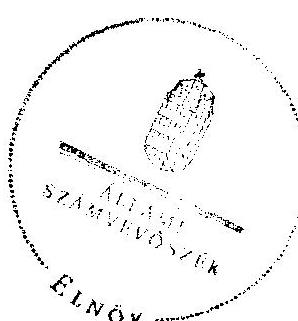

# ÁLLAMI   SZÁMVEVŐSZÉK 

## JELENTÉS

az önkormányzatok belső kontrollrendszere kialakításának, egyes kontrolltevékenységek és a belső ellenőrzés múködésének - 2013. évben induló - ellenőrzéséről Vaja

---

# Állami Számvevőszék 

Iktatószám: V-0181-070/2013.
Témaszám: 1190
Vizsgálat-azonosító szám: V064922

## Az ellenőrzést felügyelte:

Dr. Benedek Mária
felügyeleti vezető
Az ellenőrzést vezette és az ellenőrzés végrehajtásáért felelős:
Dr. Veress Tiborné
ellenőrzésvezető
A számvevőszéki jelentés összeállításában közremúködtek:
Pető Krisztina
számvevő tanácsos
Szikszainé Király Mária
számvevő tanácsos
Az ellenőrzést végezték:
Szikszainé Király Mária
Uram Ferenc
számvevő tanácsos
A témához kapcsolódó eddig készített számvevőszéki jelentések:
címe
sorszáma
Jelentés a helyi önkormányzatok fejlesztési célú támogatási rend-
1108
szerének ellenőrzéséről

---

# TARTALOMJEGYZÉK 

BEVEZETÉS ..... 5
I. ÖSSZEGZŐ MEGÁLLAPÍTÁSOK, KÖVETKEZTETÉSEK, JAVASLATOK ..... 9
II. RÉSZLETES MEGÁLLAPÍTÁSOK ..... 18

1. Az önkormányzat belső kontrollrendszerének kialakítása ..... 18
1.1. A kontrollkörnyezet ..... 18
1.2. A kockázatkezelési rendszer ..... 20
1.3. A kontrolltevékenységek ..... 20
1.4. Az információs és kommunikációs rendszer ..... 21
1.5. A monitoring rendszer ..... 21
2. A pénzügyi folyamatokban kulcsszerepet betöltő teljesítésigazolás és érvényesítés belső kontrollok működése ..... 22
3. A belső ellenőrzés működése ..... 24

## FÜGGELÉKEK

1. számú Értelmező szótár
2. számú Az értékelés módja és szempontjai

---

.

---

# RÖVIDÍTÉSEK JEGYZÉKE 

## Törvények

Áht.
ÁSZ tv.
Info tv.

Kttv.
Ktv.
Mötv.

Mvtv.
Nvtv.
Ötv.
Számv. tv.
Vagyonnyilatkozat-
tételről szóló törvény

## Rendeletek

Áhsz.

Ávr.

Bkr.

Ikr.
vagyongazdálkodási rendelet ${ }_{1}$
vagyongazdálkodási rendelet ${ }_{2}$

## Szórövidítések

adatvédelmi és adatbiztonsági szabályzat

ÁSZ
2011. évi CXCV. törvény az államháztartásról (hatályos 2012. január 1-jétől)
2011. évi LXVI. törvény az Állami Számvevőszékről
2011. évi CXII. törvény az információs önrendelkezési jogról és az információszabadságról (hatályos 2012. január 1-jétől)
2011. évi CXCIX. törvény a közszolgálati tisztviselőkről
1992. évi XXIII. törvény a köztisztviselők jogállásáról (hatálytalan 2012. március 1-jétől)
2011. évi CLXXXIX. törvény Magyarország helyi önkormányzatairól (hatályos 2012. január 1-jétől)
1993. évi XCIII. törvény a munkavédelemről
2011. évi CXCVI. törvény a nemzeti vagyonról
1990. évi LXV. törvény a helyi önkormányzatokról
2000. évi C. törvény a számvitelről
2007. évi CLII. törvény egyes vagyonnyilatkozat-tételi kötelezettségekről

249/2000. (XII. 24.) Korm. rendelet az államháztartás szervezetei beszámolási és könyvvezetési kötelezettségének sajátosságairól
368/2011. (XII. 31.) Korm. rendelet az államháztartásról szóló törvény végrehajtásáról (hatályos 2012. január 1jétől)
370/2011. (XII. 31.) Korm. rendelet a költségvetési szervek belső kontrollrendszeréről és belső ellenőrzéséről (hatályos 2012. január 1-jétől)
335/2005. (XII. 29.) Korm. rendelet a közfeladatot ellátó szervek iratkezelésének általános követelményeiről
10/2004. (V. 13.) Kt. sz. rendelet Vaja Nagyközségi Önkormányzat vagyonáról és a vagyongazdálkodás szabályairól
1/2013. (I. 9.) Kt. sz. önkormányzati rendelet Vaja Városi Önkormányzat vagyonáról és a vagyongazdálkodás szabályairól (hatályos 2013. január 9-étől)

8-16/2011. Vaja Város Polgármesteri Hivatal Közszolgálati adatvédelmi szabályzat (hatályos 2011. december 15étől)
Állami Számvevőszék

---

| Belső ellenőrzési kézikönyv | Belső Ellenőrzési Kézikönyv (hatályos 2012. április 2-ától) |
| :--: | :--: |
| 2012. évi ellenőrzési terv | Az Önkormányzatra vonatkozó 2012. évi belső ellenőrzési terv |
| 2013. évi ellenőrzési terv | Az Önkormányzatra vonatkozó 2013. évi belső ellenőrzési terv |
| gazdálkodási szabályzat | 8-5/2012. Vaja Város Önkormányzat Gazdálkodási szabályzata a kötelezettségvállalás, pénzügyi ellenjegyzés, teljesítés igazolása, érvényesítés, utalványozás és adatszolgáltatás rendjéről (hatályos 2012. március 1-jétől) |
| hivatali SZMSZ | Vaja Város Önkormányzat Polgármesteri Hivatalának szervezeti és múködési szabályzata |
| INTOSAI | International Organization of Supreme Audit Institutions (Legfőbb Ellenőrző Intézmények Nemzetközi Szervezete) |
| iratkezelési szabályzat | Vaja Város Önkormányzat Iratkezelési Szabályzata (hatályos 2012. szeptember 1-jétől) |
| ISSAI | International Standards of Supreme Audit Institutions (Legfőbb Ellenőrző Intézmények Nemzetközi Standardjai) |
| jegyző | Vaja Város Önkormányzata jegyzője |
| Kormányhivatal | Szabolcs-Szatmár-Bereg Megyei Kormányhivatal |
| Képviselő-testület | Vaja Város Önkormányzata Képviselő-testülete |
| NGM | Nemzetgazdasági Minisztérium |
| Önkormányzat | Vaja Város Önkormányzata |
| pénzkezelési szabályzat ${ }_{1}$ | 8-14/2011. Vaja Város Polgármesteri Hivatal pénzkezelési szabályzat (hatályos 2011. szeptember 1-jétől) |
| pénzkezelési szabályzat ${ }_{2}$ | 9-6/2012. Vaja Város Önkormányzat pénzkezelési szabályzata (hatályos 2012. március 1-jétől) |
| polgármester | Vaja Város Önkormányzata polgármestere |
| Polgármesteri Hivatal | Vaja Város Önkormányzat Polgármesteri Hivatala |
| stratégiai ellenőrzési terv | Szatmári Többcélú Kistérségi Társulás Belső Ellenőrzési Kézikönyvének Stratégiai ellenőrzési terv fejezete (hatályos 2010. április 1-jétől) |
| Társulás | Szatmári Többcélú Kistérségi Társulás |
| városüzemeltetési kft. | Vajai Városüzemeltető Kft. (az önkormányzat többségi tulajdonában lévő gazdasági társaság) |

---

# JELENTÉS 

## az önkormányzatok belső kontrollrendszere kialakításának, egyes kontrolltevékenységek és a belső ellenőrzés múködésének - 2013. évben induló - ellenőrzéséről Vaja

## BEVEZETÉS

Vaja város állandó lakosainak száma 2012. január 1-jén 3711 fő volt. Az Önkormányzat hattagú Képviselő-testületének munkáját egy állandó bizottság (a pénzügyi bizottság) segítette. Az Önkormányzat az önállóan múködő és gazdálkodó Polgármesteri Hivatalon kívül három önállóan múködő intézményt múködtetett és egy többségi tulajdoni hányadú gazdasági társasággal rendelkezett. A polgármester 1994 óta tölti be tisztségét. A jegyző 2011 júliusától látja el a jegyzői feladatokat. A Polgármesteri Hivatal egységes hivatalként múködik, önálló szervezeti egységekre nem tagolódott, elkülönített gazdasági szervezettel nem rendelkezett. A foglalkoztatott köztisztviselők száma 2012. január 1jén 11 fő volt. A Polgármesteri Hivatalnál 2013. január 1-jétől szervezeti változás nem volt. Az Önkormányzat a 2012. évi költségvetési beszámolója szerint 1040034 ezer Ft költségvetési bevételt ért el, valamint 891388 ezer Ft költségvetési kiadást teljesített. A 2012. december 31-i könyvviteli mérleg szerint 1630854 ezer Ft értékű eszközvagyonnal rendelkezett, a rövid lejáratú kötelezettségállománya 76362 ezer Ft volt, hosszú lejáratú kötelezettsége nem volt.

A demokratikus társadalmakban alapvető igény, hogy a közpénzeket, a közvagyont használók tevékenységükről elszámoljanak, ahhoz egyértelmű és érvényesíthető felelősségi szabályok társuljanak. Ennek a jogos igénynek az érvényesítéséhez meg kell teremteni azokat a folyamatokat, rendszereket, amelyek nélkülözhetetlenek az elszámoltatáshoz. Az elszámoltatás eredményes múködtetéséhez szükség van a megfelelő információs, kontroll, értékelési és beszámolási rendszerek kialakítására.

Magyarországon az uniós csatlakozási tárgyalások idejére nyúlnak vissza a belső kontrollrendszer szabályozásának gyökerei. Az uniós elvárásoknak megfelelő új terminológia szerinti államháztartási belső pénzügyi ellenőrzési (ÁBPE) rendszer területén a jogharmonizáció 2003-ban teljes körűen megvalósult, míg az önkormányzati alrendszerre vonatkozó, az Ötv.-ben megjelenített speciális szabályozás 2005-ben lépett hatályba. Az államháztartási belső kontrollrendszer koncepciója 2009-ben továbbfejlődött. A változások irányát mutatja, hogy a költségvetési szervek belső kontrollrendszere már magában foglalja a korszerű, felelős szervezetirányítás elemeit (kontrollkörnyezet, kockázatkezelés, kontrolltevékenység, információ és kommunikáció, monitoring) is. E kont-

---

rollrendszer szabályozása háromszintű, a törvényi előírásokat az Áht. és a Mötv., a rendeleti szintű szabályozást az Ávr. és a Bkr. tartalmazza, amelyeket útmutatói szinten az NGM által kiadott standardok és kézikönyvek támogatnak.

A belső kontrollrendszer azt a célt szolgálja, hogy a költségvetési szervek működésük és gazdálkodásuk során a tevékenységeket szabályszerűen, gazdaságosan, hatékonyan és eredményesen hajtsák végre, teljesítsék elszámolási kötelezettségeiket és megvédjék az erőforrásokat a veszteségektől, a károktól és a nem rendeltetésszerű használattól. A belső kontrollrendszer magában foglalja mindazon szabályokat, eljárásokat, gyakorlati módszereket és szervezeti struktúrákat, kockázatkezelési technikákat, kontrolltevékenységeket, amelyek segítséget nyújtanak a szervezetnek céljai eléréséhez.

Az ÁSZ a 2011-2015. évekre szóló stratégiájában hangsúlyos szerepet szánt annak, hogy szilárd szakmai alapon álló, értékteremtő ellenőrzéseivel előmozdítsa a közpénzügyek átláthatóságát, rendezettségét. A számvevőszéki ellenőrzés nemzetközi alapelvei is rögzítik, hogy a megfelelő belső kontrollrendszer minimálisra csökkenti a hibák és szabálytalanságok kockázatát.

Az ellenőrzés célja annak megállapítása volt, hogy a belső kontrollrendszer elemeinek kialakítása, a pénzügyi folyamatokban kulcsszerepet betöltő teljesítésigazolás és érvényesítés és a belső ellenőrzés szabályos múködése biztosítot-ta-e az Önkormányzatnál a közpénzfelhasználás szabályosságát, hozzájárult-e az értéket teremtő rend követelményének érvényesüléséhez.

Ennek keretében értékeltük, hogy:

- a jogszabályi előírásoknak megfelelően alakították-e ki a belső kontrollrendszer elemeit;
- a gazdálkodás folyamatában kulcsszerepet betöltő teljesítésigazolás és érvényesítés kontrolltevékenységeit megfelelően múködtették-e;
- biztosították-e a belső ellenőrzés szabályos múködését;
- amennyiben az ÁSZ tett javaslatot a 2008-2011. évek közötti ellenőrzése kapcsán az Önkormányzatnak, intézkedtek-e azok végrehajtására.

Az ellenőrzés várható hasznosulását négy szinten tervezzük. A törvényalkotás számára összegzett tapasztalatok állnak rendelkezésre a belső kontrollrendszer önkormányzati területen való kialakításáról, múködéséről és hatásairól, a belső ellenőrzés múködéséről. Ennek alapján következtetést lehet levonni arról, hogy a belső kontrollrendszer kialakítására és múködtetésére vonatkozó jelenlegi, differenciálás nélküli - jogszabályi előírások reális követelményeket támasztanak-e az eltérő adottságú települési önkormányzatok esetében, illetve indokolt-e esetleges jogszabályi módosítás kezdeményezése. Az ellenőrzés az ellenőrzött számára visszajelzést ad a belső kontrollrendszer kialakításában és múködésében fellépő hiányosságokról, javaslataival hozzájárul azok kiküszöböléséhez, amely csökkentheti a későbbi ellenőrzések gyakoriságát. Az ellenőrzés megállapításait és javaslatait más szervezetek is hasznosíthatják a rendezett gazdálkodási keretek kialakításához. A társadalom számára jelzi,

---

hogy közpénz nem maradhat ellenőrizetlenül, az ÁSZ értékteremtő rend kialakításához és megőrzéséhez hozzájáruló tevékenysége pozitív hatással lesz a szervezetről kialakított összkép formálásában. A szervezeten belül lehetőség nyílik arra, hogy a megállapítások szintetizálásával az ÁSZ a hozzáadott értéket teremtő elemző tevékenységét és tanácsadó szerepét is erősítse.

Az önkormányzatok belső kontrollrendszere kialakításának, egyes kontrolltevékenységek és a belső ellenőrzés múködésének ellenőrzéséről szóló jelentés I. fejezetének összegző része az ellenőrzés céljára ad rövid, szintetizáló összefoglalót, és tartalmazza a következtetéseket a II. fejezet részletes megállapításain alapulóan. A jelentés intézkedést igénylő megállapításait és javaslatait az ellenőrzés során feltárt, a jelentés II. fejezetében rögzített részletes megállapítások alapozzák meg.

Az ellenőrzés típusa: szabályszerűségi ellenőrzés.
Az ellenőrzött időszak: a belső kontrollrendszer kialakításának megfelelősége esetében a 2012. évre, a pénzügyi folyamatokban kulcsszerepet betöltő teljesítésigazolás és érvényesítés belső kontrollok múködésének megfelelőségét és a belső ellenőrzés szabályszerű működését a 2012. január 1. és december 31-e közötti időszak eseményeit figyelembe véve értékeltük, míg az ÁSZ javaslatainak utóellenőrzése a 2008-2011. években végzett ellenőrzések nyilvánosságra hozott jelentéseiben tett javaslatok áttekintésére terjedt ki.

# Az ellenőrzött szervezet: az Önkormányzat. 

Az ellenőrzés jogszabályi alapját az ÁSZ tv. 1. § (3) bekezdése, az 5. § (2) és (6) bekezdése, valamint az Áht. 61. §. (2) bekezdésének előírásai képezik.

Az ellenőrzés szakmai módszertana az ÁSZ hivatalos honlapján (www.asz.hu) közzétett szakmai szabályokon alapult, amely az INTOSAI által kiadott ISSAI figyelembevételével készült.

Az ellenőrzés lefolytatásához az Önkormányzat a kimutatások és a tanúsítvány elektronikus kitöltésével, valamint az ÁSZ által kért dokumentumok elektronikus megküldésével szolgáltatott adatokat. Az így rendelkezésre bocsátott adatok, információk kontrollja és a munkalapok kitöltése a helyszíni ellenőrzés keretében történt. A jelentésben használt fogalmak magyarázatát az 1. számú függelék, az ellenőrzés egyes területeinek értékelésénél alkalmazott egységes minősítési szempontokat a 2. számú függelék tartalmazza.

A belső kontrollrendszer kialakításának ellenőrzése során értékeltük a kontrollkörnyezet, a kockázatkezelési rendszer, a kontrolltevékenységek, az információs és kommunikációs rendszer, valamint a monitoring rendszer szabályozottságának megfelelőségét. A pénzügyi folyamatokban kulcsszerepet betöltő teljesítésigazolás és érvényesítés kontrollok múködése megfelelőségének minősítéséhez az állományba nem tartozók megbízási díjai, a külső szolgáltatók által végzett karbantartási, kisjavítási munkák, az egyéb üzemeltetési és fenntartási szolgáltatások, a rendszeres szociális segélyek, valamint az államháztartáson kívülre teljesített múködési és felhalmozási célú pénzeszközátadások közül kockázatelemzéssel választottuk ki az ellenőrzött kiadási jogcímeket. Az egyszerű

---

véletlen mintavétellel kiválasztott tételek ellenőrzését többlépcsős megfelelőségi tesztek útján addig végeztük, amíg elegendő és megfelelő bizonyítékot szereztünk a vizsgált folyamatok kulcskontrolljai múködésének megfelelő vagy nem megfelelő voltáról. Értékeltük az Önkormányzatnál a belső ellenőrzés múködésének szabályosságát. Az ÁSZ az Önkormányzatnál a 2011. évben a helyi önkormányzatok fejlesztési célú támogatási rendszerének ellenőrzését végezte, a nyilvánosságra hozott, 1108 számon közzétett számvevőszéki jelentésben javaslatot az Önkormányzat számára nem tett, ezért a jelen ellenőrzés keretében utóellenőrzésre nem került sor.

Az ÁSZ tv. 29. § (1) bekezdése szerint a jelentéstervezetet megküldtük a polgármester részére, aki az ÁSZ tv. 29. § (2) bekezdésében foglalt észrevételezési jogával nem élt, a jelentéstervezetre észrevételt nem tett.

---

# I. ÖSSZEGZŐ MEGÁLLAPÍTÁSOK, KÖVETKEZTETÉSEK, JAVASLATOK 

A belső kontrollrendszeren belül 2012-ben a kontrollkörnyezet, a kockázatkezelési rendszer, a kontrolltevékenységek, az információs és kommunikációs rendszer, valamint a monitoring rendszer kialakítását külön-külön és együttesen is értékeltük. A belső kontrollrendszer kialakítása az összesített értékelés alapján nem felelt meg a jogszabályi előírásoknak.

A belső kontrollrendszer egyes területei kialakításának minősítése a következő:

| Kontrollterület | Minősítés |
| :-- | :--: |
| Kontrollkörnyezet | nem   megfelelő |
| Kockázatkezelési rendszer | nem   megfelelő |
| Kontrolltevékenységek | nem   megfelelő |
| Információs és kommuni-   kációs rendszer | részben   megfelelő |
| Monitoring rendszer | nem   megfelelő |

Az információs és kommunikációs rendszer kialakítását részben megfelelőnek értékeltük, mivel az e területen megállapított kisebb szabályozásbeli hiányosságok nem veszélyeztették az információs rendszerek keretében a beszámoló rendszerek megbízható múködését.

Nem megfelelőnek értékeltük a kontrollkörnyezet, a kockázatkezelési rendszer, a kontrolltevékenységek, valamint a monitoring rendszer kialakítását, mivel az ellenőrzésünk során megállapított szabályozásbeli hiányosságok magukban hordozzák a szabálytalan múködés, valamint a korrupció kockázatát.

A belső kontrollrendszer nem megfelelő kialakítása kockázatot jelent az Önkormányzat feladatainak szabályszerű, gazdaságos, hatékony és eredményes végrehajtása során.

Az állományba nem tartozók megbízási díjaival és a külső szolgáltatók által végzett karbantartási, kisjavítási munkákkal kapcsolatos kifizetések során a pénzügyi folyamatokban kulcsszerepet betöltő teljesítésigazolás és érvényesítés belső kontrollok múködése gyenge volt, amelyhez hozzájárult, hogy a jegyző az Áht.-ban foglaltak ellenére a Polgármesteri Hivatal feladatai ellátásának részletes belső rendjét és módját SZMSZ-ben nem állapította meg. Gyengének értékeltük a két kulcskontroll együttes múködését, mert azok nem biztosították az ellenőrzésünk által feltárt hiányosságok bekövetkezésének megelőzését.

---

A számvevőszéki ellenőrzés az ellenőrzött kifizetésekkel összefüggésben a rendelkezésre bocsátott dokumentumok alapján kár bekövetkeztére utaló adatot, tényt nem állapított meg, azonban a gazdálkodásban kulcsszerepet betöltő kontrollok gyenge múködése miatt fennáll a hibák bekövetkezésének lehetősége. A nem megfelelően szabályozott és múködtetett belső kontrollok korrupciós kockázatot hordoznak.

A belső ellenőrzési feladatokat a Társulás útján látták el. A belső ellenőrzés múködése ugyan megfelelt a jogszabályi előírásoknak, azonban a belső ellenőrzések szűk területre korlátozottsága miatt nem volt pozitív visszahatással a kontrollrendszer elemeire, nem tárta fel a számvevőszéki ellenőrzés során a belső kontrollrendszer kialakításánál és a pénzügyi folyamatokban kulcsszerepet betöltő teljesítésigazolás és érvényesítés belső kontrollok múködésénél megállapított hiányosságokat.

Az ÁSZ tv. 33. § (1) bekezdésében foglaltak értelmében az ellenőrzött szervezet vezetője köteles a jelentésben foglalt megállapításokhoz kapcsolódó intézkedési tervet összeállítani, és azt a jelentés kézhezvételétől számított 30 napon belül az ÁSZ részére megküldeni. Amennyiben az intézkedési tervet határidőre nem küldi meg a szervezet, vagy az ÁSZ tv. 33. § (2) bekezdésében foglalt póthatáridő elteltével megküldött intézkedési terv továbbra sem elfogadható, az ÁSZ elnöke a hivatkozott törvény 33. § (3) bekezdés a)-b) pontjaiban foglaltakat érvényesítheti.

Az ellenőrzés intézkedést igénylő megállapításai és javaslatai:

# a polgármesternek 

1. Az Áht. 37. § (1) és az Ávr. 55. § (1) bekezdése ellenére az Önkormányzat nevében történt kötelezettségvállalásokra pénzügyi ellenjegyzés nélkül került sor.

Javaslat:
Intézkedjen, hogy az Önkormányzat nevében történt kötelezettségvállalásra az Áht. 37. § (1) bekezdésében és az Ávr. 55. § (1) bekezdésében foglaltaknak megfelelően - az Ávr. 53. §-ában meghatározott kivételekkel - kizárólag a pénzügyi ellenjegyzés után, a pénzügyi teljesítés esedékességét megelőzően, írásban kerüljön sor.
2. A számvevőszéki ellenőrzés megállapításai alapján az Önkormányzatnál a belső kontrollrendszer kialakítása összefoglalóan értékelve nem felelt meg a jogszabályi előírásoknak, a kulcskontrollok működése gyenge volt, amelyhez hozzájárult, hogy a jegyző az Áht. 10. § (5) bekezdésében foglaltak ellenére a Polgármesteri Hivatal feladatai ellátásának részletes belső rendjét és módját SZMSZ-ben nem állapította meg. A belső ellenőrzés múködése ugyan megfelelt a jogszabályi előírásoknak, azonban nem tárta fel, ezáltal nem is javíttatta ki a hiányosságokat. A megállapított szabályozásbeli és működésbeli hiányosságok magukban hordozzák a szabálytalan működés kockázatát.

---

Javaslat:
A Mötv. 115. § (1) bekezdésében foglaltak alapján kísérje figyelemmel az Önkormányzat gazdálkodásának szabályszerűségét. A Mötv. 67. § f) pontja alapján gondoskodjon a belső kontrollrendszer müködésére vonatkozó jogszabályi rendelkezések be nem tartása, valamint a teljesítésigazolás és az érvényesítés kontrollokkal összefüggésben feltárt hiányosságok, szabálytalanságok, a hivatali SZMSZ hiánya miatt az esetleges munkajogi felelősséggel kapcsolatos körülmények kivizsgálásáról, majd a vizsgálat eredményének függvényében tegye meg a szükséges munkajogi intézkedéseket.

# a jegyzőnek 

1. a kontrollkörnyezettel kapcsolatban:

A jegyző a Kttv. 130. § (1) bekezdésében foglaltak ellenére a köztisztviselők teljesítményértékelését nem készítette el.

A jegyző az Áht. 10. § (5) bekezdésében foglaltak ellenére a Polgármesteri Hivatal feladatai ellátásának részletes belső rendjét és módját hivatali SZMSZ-ben nem állapította meg.

A jegyző az Ötv. 36. § (2) bekezdés a) pontjában foglalt feladatkörében nem készítette elő a vagyongazdálkodási rendelet, módosítását, így az Önkormányzat vagyongazdálkodási rendelete nem felelt meg az Nvtv. 3. § (1) bekezdés 6. pontja, 56. §-a, 11. § (16) bekezdése, 13. § (1) bekezdése, 18. § (1) és (12) bekezdése, valamint a Mötv. 109. § (4) bekezdése előírásainak.

A jegyző a pénzkezelési szabályzat ${ }_{2}$-ben a Számv. tv. 14. § (8) bekezdésében foglaltak ellenére nem rendelkezett teljes körűen a pénzforgalom lebonyolításának rendjéről, a pénzkezelés felelősségi szabályairól, a készpénzállományt érintő pénzmozgások eljárási rendjéről és a pénzkezeléssel kapcsolatos bizonylatok rendjéről, mert nem határozta meg a házipénztáron kívüli pénzbeszedés (térítési díjak) pénzforgalmi lebonyolításának rendjét, ennek felelősségi szabályait és nem rögzítette a házipénztárban történő elszámoláshoz használandó bizonylatokat.

A Polgármesteri Hivatalban az Mvtv. 2. § (3) bekezdésében foglaltak ellenére a jegyző nem határozta meg az egészséget nem veszélyeztető és biztonságos munkavégzés követelményei megvalósításának módját.

A jegyző a Bkr. 6. § (3) bekezdésében foglalt kötelezettsége ellenére az ellenőrzési nyomvonal rendszeres aktualizálásáról nem gondoskodott, továbbá azt nem a Polgármesteri Hivatal sajátosságainak figyelembevételével készítette el, mivel a költségvetési szerv müködési folyamatainak irányítási, ellenőrzési, valamint felelősségi szintjeit nem tartalmazta.

A Kttv. 231. § (1) bekezdése ellenére a Képviselő-testület nem állapította meg a köztisztviselőkkel szembeni, a Kttv. 83. §-ában előírt hivatásetikai alapelvek részletes tartalmát, valamint az etikai eljárás szabályait, mivel a jegyző az Ötv. 36. § (2) bekezdés a) pontjában előírt feladata ellenére nem készítette elő ennek dokumentumait.

---

Javaslat:
a) Értékelje írásban a Kttv. 130. § (1) bekezdése alapján a Polgármesteri Hivatal köztisztviselőinek munkateljesítményét.
b) Készítse el az Áht. 10. § (5) bekezdése alapján a hivatali SZMSZ-t és kezdeményezze az Áht. 9. § (1) bekezdés a) pontjában foglaltakra tekintettel annak Kép-viselő-testület elé terjesztését.
c) Készítse elő a Mötv. 81. § (3) bekezdés c) pontjában foglalt feladatkörében a vagyongazdálkodási rendelet ${ }_{2}$ módosítását, és kezdeményezze a módosítás Képvi-selő-testület elé terjesztését annak érdekében, hogy az megfeleljen a Mötv. 109. § (4) bekezdésében foglaltaknak.
d) A Számv. tv. 14. § (8) bekezdésében foglaltaknak megfelelően a pénzkezelési szabályzatot egészítse ki a házipénztáron kívüli pénzbeszedés pénzforgalmi lebonyolításának rendjével, ennek felelősségi szabályaival és a házipénztárban történő elszámoláshoz használandó bizonylatok meghatározásával.
e) Határozza meg az egészséget nem veszélyeztető és biztonságos munkavégzés követelményei megvalósításának módját az Mvtv. 2. § (3) bekezdése alapján.
f) Módosítsa a kialakított ellenőrzési nyomvonalat annak érdekében, hogy az a Polgármesteri Hivatal sajátosságainak figyelembevételével tartalmazza a Bkr. 6. § (3) bekezdésében előírtakat. Intézkedjen a Bkr. 6. § (3) bekezdésében előírtaknak megfelelően az ellenőrzési nyomvonal rendszeres aktualizálásáról.
g) Készítse elő a Mötv. 81. § (3) bekezdés c) pontjában foglalt feladatkörében a köztisztviselőkkel szembeni, a Kttv. 83. §-ában foglaltak szerinti hivatásetikai alapelvek részletes tartalmának, valamint az etikai eljárás szabályainak dokumentumait és a Kttv. 231. § (1) bekezdésében foglaltakra tekintettel kezdeményezze azok Képviselő-testület elé terjesztését.
2. a kockázatkezelési rendszerrel kapcsolatban:

A jegyző - a Bkr. 7. § (2) bekezdésében foglaltak ellenére - nem mérte fel és nem állapította meg a Polgármesteri Hivatal tevékenységében, gazdálkodásában rejlő kockázatokat, nem határozta meg az egyes kockázatokkal kapcsolatban szükséges intézkedéseket, valamint azok teljesítése nyomon követésének módját.

A Vagyonnyilatkozat-tételről szóló törvény 4. § a) pontjában foglaltak ellenére a vagyonnyilatkozat-tételre kötelezettek körét a hivatali SZMSZ-ben a jegyző nem rögzítette, mert a Polgármesteri Hivatal nem rendelkezett szervezeti és múködési szabályzattal.

Javaslat:
a) Mérje fel és állapítsa meg - a Bkr. 7. § (2) bekezdésében foglaltak alapján - a Polgármesteri Hivatal tevékenységében, gazdálkodásában rejlő kockázatokat, határozza meg az egyes kockázatokkal kapcsolatban szükséges intézkedéseket, valamint azok teljesítése folyamatos nyomon követésének módját.

---

b) Készítse el a hivatali SZMSZ-t, amelyben rögzítse a Vagyonnyilatkozat-tételről szóló tv. 4. § a) pontjában foglalt előírásnak megfelelően a vagyonnyilatkozattételre kötelezettek körét és kezdeményezze az Áht. 9. § (1) bekezdés a) pontjában foglaltakra tekintettel annak Képviselő-testület elé terjesztését.
3. a kontrolltevékenységekkel kapcsolatban:

A jegyző - a Bkr. 8. § (2) bekezdés a) pontjában foglaltak ellenére - nem biztosította a pénzügyi döntések - köztük a költségvetés tervezése és a támogatásokkal való elszámolás - dokumentumainak elkészítésével kapcsolatban a folyamatba épített, előzetes, utólagos és vezetői ellenőrzést.

A jegyző - az Ávr. 53. § (2) bekezdésében foglaltak ellenére - nem határozta meg az előzetes írásbeli kötelezettségvállalást nem igénylő kifizetések rendjét annak ellenére, hogy a belső szabályozásban lehetővé tette a 100 ezer Ft-ot el nem érő kifizetések előzetes írásbeli kötelezettségvállalás nélküli teljesítését.

A jegyző az lkr. 8. § (1) bekezdésében foglalt előírást figyelmen kívül hagyva nem gondoskodott az iratkezelési szoftver által kezelt adatok biztonságáról, nem alakította ki az üzembiztonsági és adatvédelmi szabályok érvényre juttatásához szükséges eljárási szabályokat.

A jegyző az Info tv. 7. § (2)-(3) bekezdésében foglalt előírásokat figyelmen kívül hagyva az informatikai rendszer szabályozása során elmulasztotta az adatbiztonság érvényre juttatásához szükséges intézkedések megtételét, a Bkr. 8. § (4) bekezdés b) és c) pontjaiban foglaltak ellenére a hozzáférési jogosultságok vonatkozásában a felelősségi köröket nem szabályozta, továbbá a belső szabályzatban nem határozta meg a beszámolási eljárásokhoz kapcsolódóan a felelősségi köröket.

A jegyző az Ávr. 13. § (5) bekezdésében foglaltak ellenére nem határozta meg a gazdasági feladatot ellátó alkalmazottak helyettesítésének rendjét.

A jegyző a Kttv. 74. § (1) bekezdésében foglaltak ellenére jogviszony megszűnése esetére nem szabályozta a munkavállaló folyamatban lévő feladatai átadásának rendjét.

Javaslat:
a) Biztosítsa minden tevékenységre vonatkozóan a folyamatba épített, előzetes, utólagos és vezetői ellenőrzést a Bkr. 8. § (2) bekezdése alapján.
b) Rögzítse belső szabályzatban az Ávr. 53. § (2) bekezdése alapján az előzetes írásbeli kötelezettségvállalást nem igénylő kifizetések rendjét.
c) Rögzítse az iratkezelési rendszer kialakítása során az lkr. 8. § (2) bekezdése alapján az üzemeltetés és az adatbiztonság szabályait oly módon, hogy a feladatok és hatáskörök pontosan meghatározásra kerüljenek és végrehajthatók legyenek.
d) Biztosítsa az Info tv. 7. § (2)-(3) bekezdéseiben foglaltaknak megfelelően az adatbiztonság érvényesülését.

---

e) Szabályozza a Bkr. 8. § (4) bekezdés b) pontja alapján a hozzáférési jogosultságok vonatkozásában és a c) pontja alapján a beszámolási eljárásokhoz kapcsolódóan a felelősségi köröket.
f) Határozza meg az Ávr. 13. § (5) bekezdésében előírtak alapján a gazdasági feladatot ellátó alkalmazottak helyettesítésének rendjét.
g) Szabályozza a Kttv. 74. § (1) bekezdésében előírtaknak megfelelően a jogviszony megszűnése esetére a munkavállaló folyamatban lévő feladatai átadásának rendjét.
4. az információs és kommunikációs rendszerrel kapcsolatban:

A jegyző - a Bkr. 3. § d) pontjában és a 9. § (1) bekezdésében foglaltak ellenére nem alakított ki olyan rendszert, amely biztosítja, hogy a megfelelő információk a megfelelő időben eljutnak az illetékes szervezethez, szervezeti egységhez, illetve személyhez.

Az lkr. 14. § (4) bekezdésében foglaltak ellenére a jegyző az iratforgalom dokumentálásával nem biztosította, hogy az iratok szervezeten belüli útja pontosan követhető és ellenőrizhető legyen.

Javaslat:
a) Alakítson ki a Bkr. 3. § d) pontjában és a 9. § (1) bekezdésében foglaltaknak megfelelően egy olyan rendszert, amely biztosítja, hogy a megfelelő információk a megfelelő időben eljutnak az illetékes szervezethez, szervezeti egységhez, illetve személyhez.
b) Biztosítsa az lkr. 14. § (4) bekezdésében foglaltaknak megfelelően az iratforgalom dokumentálásával, hogy az iratok szervezeten belüli útja pontosan követhető és ellenőrizhető legyen.
5. a monitoring rendszerrel kapcsolatban:

A jegyző - a Bkr. 3. § e) pontjában és 10. §-ában foglaltak ellenére - nem alakított ki a Polgármesteri Hivatal tevékenységének, a célok megvalósításának nyomon követését biztosító rendszert.

A jegyző - a Bkr. 11. § (1) bekezdésében foglalt kötelezettsége ellenére - a Bkr. 1. melléklete szerinti nyilatkozatban - a 2011. évre vonatkozóan nem értékelte a Polgármesteri Hivatal belső kontrollrendszerének minőségét.

Javaslat:
a) Alakítsa ki és múködtesse a Bkr. 3. § e) bekezdésében és a 10. §-ában előírtak alapján a Polgármesteri Hivatal tevékenységének, a célok megvalósításának folyamatos nyomon követését biztosító rendszert.
b) Értékelje a Bkr. 11. § (1) bekezdése alapján a jogszabályban meghatározott keretek között a Polgármesteri Hivatal belső kontrollrendszerének minőségét a Bkr. 1. melléklete szerinti nyilatkozatban.

---

6. a pénzügyi folyamatokban kulcsszerepet betöltő kontrollokkal kapcsolatban:

A teljesítésigazolást az Ávr. 57. § (1) bekezdésének előírása ellenére ellenőrizhető okmányok hiányában nem szabályszerűen látták el és azt az Ávr. 57. § (4) bekezdésében foglaltak ellenére kijelöléssel nem rendelkező személy végezte. Mindezek miatt szabálytalanul történt a kifizetés jogosságának, összegszerűségének és a szerződés szerinti teljesítésének ellenőrzése.

Az érvényesítő az Ávr. 58. § (1) bekezdésének előírása ellenére - írásbeli kötelezettségvállalás hiányában - az összegszerűséget nem tudta ellenőrizni, továbbá a fedezet meglétének ellenőrzését nem látta el, mert a rendelkezésre álló előirányzatot túllépték. Az érvényesítő az Ávr. 58. § (2) bekezdés előírása ellenére nem jelezte az utalványozónak, hogy az Áht. 37. § (1) és az Ávr. 55. § (1) bekezdése ellenére az a Polgármesteri Hivatal nevében történt kötelezettségvállalásokra pénzügyi ellenjegyzés nélkül került sor, az Ávr. 56. § (1) bekezdés előírása ellenére a kötelezettségvállalást követően nem gondoskodtak annak nyilvántartásba vételéről, továbbá hogy az utalványrendelet nem felelt meg az Ávr. 59. § (3) bekezdés e) pontjában foglalt alaki követelménynek. Nem megfelelő főkönyvi nyilvántartásba vétel miatt a Számv. tv. 15. § (3) bekezdésében foglalt valódiság elvét nem érvényesítették.

Javaslat:
Intézkedjen - a teljesítésigazolás és az érvényesítés vonatkozásában feltárt hiányosságok megszüntetése, illetve az operatív gazdálkodás során a múködésbeli hibák megelőzése, feltárása és kijavítása érdekében - arról, hogy
a) a teljesítésigazolás során az Ávr. 57. § (1) és (3) bekezdésében előírtaknak megfelelően, ellenőrizhető okmányok alapján ellenőrizzék és igazolják a kiadások teljesítésének jogosságát, összegszerűségét, az ellenszolgáltatást is magában foglaló kötelezettségvállalás esetén az ellenszolgáltatás teljesítését, valamint a teljesítésigazolást az Ávr. 57. § (4) bekezdésében előírtak szerint az arra jogosult személy aláírásával igazolja;
b) kötelezettségvállalásra az Áht. 37. § (1) bekezdésében és az Ávr. 55. § (1) bekezdésében foglaltaknak megfelelően - az Ávr. 53. §-ában meghatározott kivételeket figyelembe véve - kizárólag a pénzügyi ellenjegyzés után, a pénzügyi teljesítés esedékességét megelőzően, írásban kerüljön sor;
c) a kifizetéseket megelőzően az érvényesítő az Ávr. 58. § (1) bekezdésében foglalt előírások figyelembevételével teljesítésigazolás alapján - az Ávr. 57. § (3) bekezdése szerinti esetben annak hiányában is - ellenőrizze az összegszerűséget, a fedezet meglétét és a megelőző ügymenetben az Áht., az Áhsz., az Ávr. előírásai és a belső szabályzatokban foglaltak betartását;
d) az érvényesítő az Ávr. 58. § (2) bekezdésében foglaltaknak megfelelően jelezze az utalványozónak, ha az Áht., az Áhsz., az Ávr. vagy a belső szabályzatokban foglaltak megsértését tapasztalja;
e) a kötelezettségvállalások nyilvántartásba vételét az Ávr. 56. § (1) bekezdésében foglalt előírásoknak megfelelően végezzék, és az utalványrendeleten az Ávr. 59. § (3) bekezdésében foglalt kötelező tartalmi elemeket tüntessék fel;

---

f) a gazdasági eseményeket a Számv. tv. 15. § (3) bekezdésében foglalt valódiság elvének betartásával vegyék nyilvántartásba.
7. a belső ellenőrzés múködésével kapcsolatban:

A stratégiai ellenőrzési terv a Bkr. 30. § (1) bekezdés f) pontjában foglalt előírás ellenére nem tartalmazta az ellenőrzési prioritásokat és az ellenőrzési gyakoriságot.

A 2013. évi ellenőrzési terv a Bkr. 31. § (4) bekezdés a) és g) pontjában foglaltak ellenére nem tartalmazta az ellenőrzési tervet megalapozó elemzések és a kockázatelemzés eredményének összefoglaló bemutatását, továbbá az ellenőrzések ütemezését.

A 2013. évre vonatkozó éves ellenőrzési terv összeállítása a Bkr. 56. § (2) bekezdésében foglalt előírás ellenére nem a jegyző írásos véleményének figyelembevételével történt, mivel a jegyző véleményt, javaslatot nem fogalmazott meg.

A 2013. évi ellenőrzési terv a Bkr. 31. § (2) bekezdésben foglaltak ellenére nem kockázatelemzés alapján felállított prioritásokon alapult.

A belső ellenőrzés javaslatainak végrehajtása érdekében a Bkr. 45. § (1)-(3) bekezdéseiben foglaltak ellenére intézkedési tervet nem készítettek.

Az elvégzett ellenőrzésekről a Bkr. 22. § (2) bekezdés b) és e) pontjában, valamint az 50. §-ában előírtak ellenére a belső ellenőrzési vezető nyilvántartást nem vezetett.

A belső ellenőrzési vezető a Bkr. 21. § (2) bekezdés d) pontjában és a 47. § (1) bekezdésében előírtak ellenére a jelentésekben szereplő megállapításokról, javaslatokról és az intézkedési tervekről nyilvántartást nem vezetett, azok végrehajtásának nyomon követéséről nem gondoskodott.

A Bkr. 48. § b) pontban foglalt előírás ellenére a 2011. évre vonatkozó éves ellenőrzési jelentés nem tartalmazta a belső kontrollrendszer öt elemének értékelését.

Javaslat:
a) Kezdeményezze, hogy a stratégiai ellenőrzési terv tartalmazza a Bkr. 30. § (1) bekezdésében előírt tartalmi elemeket.
b) Kezdeményezze, hogy az éves ellenőrzési tervek tartalmazzák a Bkr. 31. § (4) bekezdésében előírt tartalmi elemeket.
c) Intézkedjen arról, hogy az éves ellenőrzési tervet a belső ellenőrzési vezető a Bkr. 56. § (2) bekezdés előírásainak megfelelően a jegyző írásos véleményének figyelembevételével készítse el.
d) Kezdeményezze, hogy az éves ellenőrzési terv a Bkr. 22. § b) pontja, a 29. § (1) és a 31. § (2) bekezdése alapján kockázatelemzésen alapuljon.
e) Készítsen intézkedési tervet a belső ellenőrzési jelentésekben megfogalmazott javaslatok végrehajtására a Bkr. 45. § (1)-(3) bekezdéseiben foglaltaknak megfelelő tartalommal és határidőn belül.

---

f) Kezdeményezze, hogy a belső ellenőrzési vezető a Bkr. 22. § (2) bekezdés b) és e) pontjában és az 50. §-ban foglalt előírásnak megfelelően vezessen az elvégzett ellenőrzésekről nyilvántartást,
g) Kezdeményezze, hogy a belső ellenőrzési vezető a Bkr. 21. § (2) d) pontjában és a 47. § (1) bekezdésben foglalt előírás alapján vezessen nyilvántartást az ellenőrzési jelentésekben tett megállapításokról, javaslatokról, a vonatkozó intézkedési tervekről, és kövesse nyomon azok végrehajtását.
h) Kezdeményezze, hogy az éves ellenőrzési jelentések, illetve összefoglaló éves ellenőrzési jelentések a Bkr. 48. § b) pontjában foglalt előírásnak megfelelően tartalmazzák a belső kontrollrendszer öt elemének értékelését.

---

# II. RÉSZLETES MEGÁLLAPÍTÁSOK 

## 1. AZ ÖNKORMÁNYZAT BELSŐ KONTROLLRENDSZERÉNEK KIALAKÍTÁSA

A belső kontrollrendszeren belül 2012-ben a kontrollkörnyezet, a kockázatkezelési rendszer, a kontrolltevékenységek, az információs és kommunikációs rendszer, valamint a monitoring rendszer kialakítását külön-külön és együttesen is értékeltük. A belső kontrollrendszer kialakítása az összesített értékelés alapján nem felelt meg a jogszabályi előírásoknak.

### 1.1. A kontrollkörnyezet

A kontrollkörnyezet kialakítása - a 2. számú függelékben részletezett kritériumrendszer alapján végzett értékelés szerint - a jogszabályi elöírásoknak nem felelt meg, mert:

| Sorszám ${ }^{1}$ | Megállapítás | Megjegyzés |
| :--: | :--: | :--: |
| 4.,   46. | A Képviselő-testület a Ktv. 34. § (3) bekezdésében ${ }^{2}$ foglaltak ellenére nem döntött a teljesítményértékelés alapját képező célokról. A jegyző a Kttv. 130. § (1) bekezdésében foglaltak ellenére a köztisztviselők teljesítményértékelését nem készítette el. |  |
| 5. | A jegyző az Áht. 10. § (5) bekezdésében foglaltak ellenére a Polgármesteri Hivatal feladatai ellátásának részletes belső rendjét és módját hivatali SZMSZ-ben nem állapította meg. |  |
| 16. | A jegyző az Ötv. 36. § (2) bekezdés a) pontjában ${ }^{3}$ foglalt feladatkörében nem készítette elő a vagyongazdálkodási rendelet1 módosítását, így az Önkormányzat vagyongazdálkodási rendelet ${ }_{1}$-e nem felelt meg az Nvtv. 3. § (1) bekezdés 6. pontja, 5-6. §-a, 11. § (16) bekezdése, 13. § (1) bekezdése, 18. § (1) és (12) bekezdése, valamint a Mötv. 109. § (4) bekezdése előírásainak. | A Képviselő-testület az Nvtv. tv. 18. § (12) bekezdésében meghatározott határidőt túllépve ${ }^{4}$ fogadta el a vagyongazdálkodási rendelet ${ }_{2}$-t, amely a Mötv. 109. § (4) bekezdésében rögzítettek ellenére nem rendelkezett a va- |

[^0]
[^0]:    ${ }^{1}$ A megállapítás számozása az Önkormányzat által az adatszolgáltatás során kitöltött kimutatások kérdéseinek sorszámával azonos.
    ${ }^{2}$ A Ktv. 34. § (3) bekezdése hatályon kívül helyezve 2012. március 1-jétől.
    ${ }^{3}$ 2013. január 1-jétől a Mötv. 81. § (3) bekezdés c) pontja.
    ${ }^{4}$ 2013. január 9-én 1/2013.(I. 9.) Kt. számú rendeletével.

---

|  |  | gyonkezelői jogok gyakor-   lásának lehetőségéről,   ellenőrzésének szabályai-   ról, továbbá a vagyonke-   zelői jog ellenértékéről. |
| :--: | :--: | :--: |
| 21. | A pénzkezelési szabályzat ${ }_{1,2}$ a Számv. tv. 14. § (8) bekezdésében foglaltak ellenére nem rendelkezett teljes körűen a pénzforgalom lebonyolításának rendjéről, a pénzkezelés felelősségi szabályairól, a készpénzállományt érintő pénzmozgások eljárási rendjéről és a pénzkezeléssel kapcsolatos bizonylatok rendjéről. | A 2012. március 1-jétől hatályos pénzkezelési szabályzat $z$-ban határozta meg a jegyző a házipénztáron kívüli pénzbeszedés (térítési díjak) pénzforgalmi lebonyolításának rendjét, ennek felelősségi szabályait, de nem rögzítette a házipénztárban történő elszámoláshoz használandó bizonylatokat. |
| 32. | A Polgármesteri Hivatalban az Mvtv. 2. § (3) bekezdésében foglaltak ellenére a jegyző nem határozta meg az egészséget nem veszélyeztető és biztonságos munkavégzés követelményei megvalósításának módját. |  |
| 41.,   44. | A jegyző a Bkr. 6. § (3) bekezdésében foglalt kötelezettsége ellenére az ellenőrzési nyomvonal rendszeres aktualizálásáról nem gondoskodott, továbbá azt nem a Polgármesteri Hivatal sajátosságainak figyelembevételével készítette el, mivel a költségvetési szerv múködési folyamatainak irányítási, ellenőrzési, valamint felelősségi szintjeit nem tartalmazta. | Az ellenőrzési nyomvonal nevesíti a gazdasági vezetőt, a nemzetiségi önkormányzatot és elnökét, továbbá a Képviselőtestület illetékes bizottságait. Nemzetiségi önkormányzat a településen nincs, a Képviselőtestületnek egy bizottsága van, gazdasági vezető nem került kinevezésre. |
| 47. | A Kttv. 231. § (1) bekezdése ellenére a Képvi-selő-testület nem állapította meg a köztisztviselőkkel szembeni, a Kttv. 83. §-ában előírt hivatásetikai alapelvek részletes tartalmát, valamint az etikai eljárás szabályait, mivel a jegyző az Ötv. 36. § (2) bekezdés a) pontjában ${ }^{5}$ előírt feladata ellenére nem készítette elő ennek dokumentumait. |  |

[^0]
[^0]:    ${ }^{5}$ 2013. január 1-jétől Mötv. 81. § (3) bekezdés c) pont.

---

# 1.2. A kockázatkezelési rendszer 

A kockázatkezelési rendszer kialakítása - a 2. számú függelékben részletezett kritériumrendszer alapján végzett értékelés szerint - nem felelt meg a jogszabályi előírásoknak, mert:

| Sorszám | Megállapítás |
| :--: | :--: |
| 4., 8.,   10. | A jegyző - a Bkr. 7. § (2) bekezdésében foglaltak ellenére - nem mérte fel és nem állapította meg a Polgármesteri Hivatal tevékenységében, gazdálkodásában rejlő kockázatokat, nem határozta meg az egyes kockázatokkal kapcsolatban szükséges intézkedéseket, valamint azok teljesítése nyomon követésének módját. |
| 13. | A Vagyonnyilatkozat-tételről szóló törvény 4. § a) pontjában foglaltak ellenére a vagyonnyilatkozat-tételre kötelezettek körét hivatali SZMSZ-ben a jegyző nem rögzítette, mert a Polgármesteri Hivatal nem rendelkezett szervezeti és múködési szabályzattal. |

### 1.3. A kontrolltevékenységek

A kontrolltevékenységek kialakítása - a 2. számú függelékben részletezett kritériumrendszer alapján végzett értékelés szerint - a jogszabályi előírásoknak nem felelt meg, mert:

| Sorszám | Megállapítás |
| :--: | :--: |
| 1-5. | A jegyző - a Bkr. 8. § (2) bekezdés a) pontjában foglaltak ellenére - nem biztosította a pénzügyi döntések - köztük a költségvetés tervezése és a támogatásokkal való elszámolás - dokumentumainak elkészítésével kapcsolatban a folyamatba épített, előzetes, utólagos és vezetői ellenőrzést. |
| 8. | A jegyző - az Ávr. 53. § (2) bekezdésében foglaltak ellenére - nem határozta meg az előzetes írásbeli kötelezettségvállalást nem igénylő kifizetések rendjét annak ellenére, hogy a belső szabályozásban lehetővé tette a 100 ezer Ftot el nem érő kifizetések előzetes írásbeli kötelezettségvállalás nélküli teljesítését. |
| 13. | A jegyző az Ikr. 8. § (1) bekezdésében foglalt előírást figyelmen kívül hagyva nem gondoskodott az iratkezelési szoftver által kezelt adatok biztonságáról, nem alakította ki az üzembiztonsági és adatvédelmi szabályok érvényre juttatásához szükséges eljárási szabályokat. |
| $\begin{aligned} & 16- \\ & 17 . \\ & 20 . \end{aligned}$ | A jegyző az Info tv. 7. § (2)-(3) bekezdésében foglalt előírást figyelmen kívül hagyva az informatikai rendszer szabályozása során elmulasztotta az adatbiztonság érvényre juttatásához szükséges intézkedések megtételét, a Bkr. 8. § (4) bekezdés b) és c) pontjában foglaltak ellenére a hozzáférési jogosultságok vonatkozásában a felelősségi köröket nem szabályozta, továbbá belső szabályzatban nem határozta meg a beszámolási eljárásokhoz kapcsolódóan a felelősségi köröket. |
| 21. | A jegyző az Ávr. 13. § (5) bekezdésében foglaltak ellenére nem határozta meg a gazdasági feladatot ellátó alkalmazottak helyettesítésének rendjét. |

---

A jegyző a Kttv. 74. § (1) bekezdésében foglaltak ellenére jogviszony megszủnése esetére nem szabályozta a munkavállaló folyamatban lévő feladatai átadásának rendjét.

# 1.4. Az információs és kommunikációs rendszer 

Az információs és kommunikációs rendszer kialakítása - a 2. számú függelékben részletezett kritériumrendszer alapján végzett értékelés szerint részben felelt meg a jogszabályi előírásoknak.

A Polgármesteri Hivatal rendelkezett a jogszabályi előírásnak megfelelő adatvédelmi és adatbiztonsági szabályzattal. Szabályozták a kötelezően közzéteendő adatok nyilvánosságra hozatalának rendjét. Az Önkormányzat az elektronikus közzétételi kötelezettségének a 2012. évben eleget tett. A jegyző meghatározta a közérdekú adatok megismerésére irányuló igények teljesítésének rendjét és elkészítette a jogszabályi előírásoknak megfelelő tartalmú iratkezelési szabályzatot, amely 2012. szeptember 1-jétől hatályos.

Az információs és kommunikációs rendszer kialakítása az alábbi kisebb hiányosságok miatt részben felelt meg a jogszabályi előírásoknak, mert:

| Sor-   szám | Megállapítás |
| :-- | :-- |
| 1-2. | A jegyző - a Bkr. 3. § d) pontjában és a 9. § (1) bekezdésében foglaltak   ellenére - nem alakított ki olyan rendszert, amely biztosítja, hogy a megfelelő információk a megfelelő időben eljutnak az illetékes szervezethez, szervezeti egységhez, illetve személyhez. |
| 16. | Az Ikr. 14. § (4) bekezdésében foglaltak ellenére a jegyző az iratforgalom   dokumentálásával nem biztosította, hogy az iratok szervezeten belüli útja   pontosan követhető és ellenőrizhető legyen. |

### 1.5. A monitoring rendszer

A monitoring rendszer kialakítása - a 2. számú függelékben részletezett kritériumrendszer alapján végzett értékelés szerint - nem felelt meg a jogszabályi előírásoknak, mert:

| Sor-   szám | Megállapítás |
| :--: | :--: |
| 1. | A jegyző - a Bkr. 3. § e) pontjában és 10. §-ában foglaltak ellenére - nem alakított ki a Polgármesteri Hivatal tevékenységének, a célok megvalósításának nyomon követését biztosító rendszert. |
| 9. | A jegyző - a Bkr. 11. § (1) bekezdésében foglalt kötelezettsége ellenére - a Bkr. 1. melléklete szerinti nyilatkozatban - a 2011. évre vonatkozóan nem értékelte a Polgármesteri Hivatal belső kontrollrendszerének minőségét. |

A helyi önkormányzatok törvényességi felügyeletét ellátó Kormányhivatal a 2012. évben nem élt törvényességi felhívással vagy más törvényességi felügyeleti eszközzel a Képviselő-testület által alkotott rendeletekre, határozatokra vonatkozóan.

---

# 2. A PÉNZÜGYI FOLYAMATOKBAN KULCSSZEREPET BETÖLTŐ TELJESÍTÉSIGAZOLÁS ÉS ÉRVÉNYESÍTÉS BELSŐ KONTROLLOK MÜKÖDÉSE 

Az állományba nem tartozók megbízási díjaival, a külső szolgáltatók által végzett karbantartással, kisjavítással kapcsolatos kifizetések során - összefoglalóan értékelve - a pénzügyi folyamatokban kulcsszerepet betöltő teljesítésigazolás és érvényesítés belső kontrollok múködésének megfelelősége gyenge volt, mert:

| Kulcskontroll | Megállapítás |
| :--: | :--: |
| Teljesítésigazolás | A teljesítésigazolást az Ávr. 57. § (1) bekezdésének előírása ellenére ellenőrizhető okmányok hiányában nem szabályszerűen látták el és az Ávr. 57. § (4) bekezdésében foglaltak ellenére kijelöléssel nem rendelkező személy végezte. Mindezek miatt szabálytalanul történt a kifizetés jogosságának, összegszerűségének és a szerződés szerinti teljesítésének ellenőrzése is. |
| Érvényesítés | Az érvényesítő az Ávr. 58. § (1) bekezdésének előírása ellenére - írásbeli kötelezettségvállalás hiányában - az összegszerűséget nem tudta ellenőrizni, továbbá a fedezet meglétének ellenőrzését nem látta el, mert a rendelkezésre álló előirányzatot túllépték. Az érvényesítő az Ávr. 58. § (2) bekezdés előírása ellenére nem jelezte az utalványozónak, hogy az Áht. 37. § (1) és az Ávr. 55. § (1) bekezdése ellenére az Önkormányzat és a Polgármesteri Hivatal kiadási előirányzatai terhére történt kötelezettségvállalásokra pénzügyi ellenjegyzés nélkül került sor, továbbá hogy az Ávr. 56. § (1) bekezdés előírása ellenére a kötelezettségvállalást követően nem gondoskodtak annak nyilvántartásba vételéről, és hogy az utalványrendelet nem felelt meg az Ávr. 59. § (3) bekezdés e) pontjában foglalt alaki követelménynek. Nem megfelelő főkönyvi nyilvántartásba vétel miatt a Számv. tv. 15. § (3) bekezdésében foglalt valódiság elvét nem érvényesítették. |

Az állományba nem tartozók megbízási díjainak kifizetése során a 2012. évben a teljesítésigazolás és az érvényesítés kulcskontrollok müködésének megfelelősége gyenge volt, mert:

- a teljesítésigazolást az Ávr. 57. § (4) bekezdésében foglaltak ellenére nem a kötelezettségvállalásra jogosult által kijelölt személy végezte az ügyviteli, temető fenntartási, kézbesítési, karbantartási, fénymásolási és postási feladatokra kötött megbízási szerződések esetében. Emiatt - az Ávr. 57. § (1) és (3) bekezdésében a kiadás teljesítése jogosságának, összegszerűségének, valamint az ellenszolgáltatás teljesítésének elvégzése nem szabályszerűen történt meg;
- az érvényesítő az Ávr. 58. § (2) bekezdésében és a gazdálkodási szabályzatban előírtakat figyelmen kívül hagyva nem jelezte, hogy a megelőző ügymenetben a teljesítésigazolást a jegyző jogosultság hiányában végezte el az általa igazolt ügyviteli, temető fenntartási, kézbesítési, karbantartási, fénymásolási és postási feladatokhoz kapcsolódó kifizetéseknél;
- az érvényesítő az ellenőrzött tételek esetében az Ávr. 58. § (1) bekezdésében foglalt kötelezettségét, a fedezet meglétének ellenőrzését nem látta el, mert

---

az önkormányzati előirányzatot túllépték, illetve a Polgármesteri Hivatalban előirányzat nélkül történt a kifizetés érvényesítése, továbbá a kötelezettségvállalás nyilvántartásba vételének elmaradása miatt a rendelkezésre álló fedezet nem volt ellenőrizhető;

- az érvényesítő az Ávr. 58. § (2) bekezdésében rögzített kötelezettsége ellenére nem jelezte az utalványozónak, hogy a megelőző ügymenetben az utalványrendeleten a kötelezettségvállalás nyilvántartási számát nem tüntették fel, mivel az Ávr. 56. § (1) bekezdés előírása ellenére a kötelezettségvállalást követően nem gondoskodtak annak nyilvántartásba vételéről. Nem jelezte továbbá, hogy nem tartották be az Áht. 37. § (1) és az Ávr. 55. § (1) bekezdésében foglaltakat, mivel a megbízási szerződések megkötésekor az írásbeli kötelezettségvállalásra pénzügyi ellenjegyzés nélkül került sor, valamint hogy az utalványrendelet nem felelt meg a vele szemben támasztott alaki követelményeknek, mert az Ávr. 59. § (3) bekezdés e) pontjában foglaltak ellenére nem tartalmazta a megterhelendő számla számát és megnevezését.

Az ügyviteli, a kézbesítési, a karbantartási, a fénymásolási és a postási feladatokra vonatkozó kifizetéseket a Polgármesteri Hivatal állományon kívüli kifizetések elszámolására szolgáló főkönyvi számla helyett az Önkormányzat főkönyvi számlájára rögzítették, nem érvényesítve ezzel a Számv. tv. 15. § (3) bekezdésében foglalt valódiság elvét.

# A külső szolgáltatók által végzett karbantartási, kisjavítási mun- 

kákra történő kifizetések során a 2012. évben a teljesítésigazolás és az érvényesítés kulcskontrollok múködésének megfelelősége gyenge volt, mert:

- a teljesítésigazolás során az Ávr. 57. § (1) és (3) bekezdésének előírása ellenére - dokumentumok hiányában - a kifizetés jogosságának, összegszerűségének, valamint szerződés szerinti teljesítésének ellenőrzését nem végezték el a kisösszegű kifizetésnél (gumicsere), továbbá az Önkormányzat többségi tulajdonában lévő városüzemeltetési kft.-vel írásbeli kötelezettségvállalás nélkül elvégeztetett munkák esetében;
- az érvényesítő az Ávr. 58. § (1) bekezdésében előírtak ellenére a városüzemeltetési kft.-vel elvégeztetett munkák (a Polgármesteri Hivatal, a diákotthon, az egészségház és a művelődési ház karbantartására és a művelődési ház különféle munkáira kifizetett számlák) esetében ellenőrizhető okmányok - írásbeli szerződés, megrendelés, munkalap - hiányában az összegszerűséget nem szabályszerűen ellenőrizte;
- az érvényesítő az ellenőrzött tételeknél az Ávr. 58. § (1) bekezdésében foglalt kötelezettségét, a fedezet meglétének ellenőrzését nem látta el, mert az előirányzatot túllépték, továbbá a kötelezettségvállalás nyilvántartásba vételének elmaradása miatt a rendelkezésre álló fedezet nem volt ellenőrizhető;
- az érvényesítésre kijelölt személy az Ávr. 58. § (2) bekezdésében foglaltak ellenére az érvényesítés során nem jelezte az utalványozónak, hogy az Ávr. 56. § (1) bekezdésben rögzítetteket figyelmen kívül hagyva a kötelezettség keletkezésekor elmaradt a kötelezettségvállalás-nyilvántartásba vétele, valamint hogy az Áht. 37. § (1) bekezdésében rögzített írásbeli kötelezettségválla-

---

lásra nem került sor a Polgármesteri Hivatal, a diákotthon, az egészségház és a művelődési ház karbantartására, valamint a művelődési ház különféle munkái esetében, továbbá azt sem jelezte, hogy az Áht. 37. § (1) és az Ávr. 55. § (1) bekezdésében foglaltak ellenére az írásbeli kötelezettségvállalásokra az ellenőrzött tételek esetében pénzügyi ellenjegyzés nélkül került sor, és hogy az alkalmazott utalványrendelet az Ávr. 59. § (3) bekezdés e) pontjában foglaltak ellenére nem tartalmazta a megterhelendő számla számát és megnevezését;

- a főkönyvi számlaszámok kijelölése nem volt megfelelő a városüzemeltetési kft.-vel elvégeztetett munkák (a polgármesteri hivatal, a diákotthon, az egészségház és a művelődési ház karbantartására, valamint a művelődési ház különféle munkáira kifizetett számlák), valamint a tűzjelző fenntartási költségének elszámolása esetében, mert a számlák tartalmaztak egyéb üzemeltetési, felújítási és fejlesztési kiadásokat is, amelyek nem az Áhsz. 9. számú melléklet 1. g) pontjában foglaltak szerinti főkönyvi számlákon kerültek elszámolásra, így nem érvényesítették a Számv. tv. 15. § (3) bekezdésében foglalt valódiság elvét.

A számvevőszéki ellenőrzés az ellenőrzött kifizetésekkel összefüggésben a rendelkezésre bocsátott dokumentumok alapján kár bekövetkeztére utaló adatot, tényt nem állapított meg, azonban a gazdálkodásban kulcsszerepet betöltő kontrollok gyenge működése miatt fennáll a hibák bekövetkezésének kockázata. A nem megfelelően működtetett belső kontrollok korrupciós kockázatot hordoznak.

# 3. A BELSŐ ELLENŐRZÉS MŰKÖDÉSE 

Az Önkormányzat a belső ellenőrzési feladatokat - képviselő-testületi döntés alapján - a Társulás útján látta el.

A belső ellenőrzés múködése - a 2. számú függelékben részletezett kritériumrendszer alapján végzett értékelés szerint - az Önkormányzatnál megfelelt a jogszabályi előírásoknak.

Az Önkormányzat rendelkezett a jogszabályi előírásoknak megfelelő tartalmú Belső ellenőrzési kézikönyvvel. A belső ellenőrzést végző személyek a jogszabályban előírt iskolai végzettséggel, szakmai képesítéssel rendelkeztek.

A Társulás elkészítette az ellenőrzések tervezését megalapozó stratégiai ellenőrzési tervét, melynek tartalma a jogszabályi előírásoknak - az ellenőrzési prioritások és gyakoriság meghatározásának hiánya mellett - megfelelt. A Társulás az éves (összefoglaló) ellenőrzési jelentést a jegyzőnek megküldte. A 2012. évi ellenőrzési tervben foglalt ellenőrzést végrehajtották, elkészítették a jogszabályban előírt tartalmú ellenőrzési jelentést. Ellenőrzés megszakítására, felfüggesztésére a 2012. évben nem került sor. A Társulás elkészítette az Önkormányzatra vonatkozó 2013. évi ellenőrzési tervet, amelyet a Képviselő-testület határozattal jóváhagyott.

---

Az Önkormányzatnál a belső ellenőrzés múködése az alábbi kisebb hiányosságok mellett megfelel a jogszabályi elöírásoknak:

| Sorszám | Megállapítás |
| :--: | :--: |
| $7 / f$ | A stratégiai ellenőrzési terv a Bkr. 30. § (1) bekezdés f) pontjában foglalt előírás ellenére nem tartalmazta az ellenőrzési prioritásokat és az ellenőrzési gyakoriságot. |
| $8 / a$, | A 2013. évi ellenőrzési terv a Bkr. 31. § (4) bekezdés a) és g) pontjában foglaltak ellenére nem tartalmazta az ellenőrzési tervet megalapozó elem. zések és a kockázatelemzés eredményének összefoglaló bemutatását, továbbá az ellenőrzések ütemezését. |
| 10. | A 2013. évi ellenőrzési terv összeállítása a Bkr. 56. § (2) bekezdésében foglalt előírás ellenére nem a jegyző írásos véleményének figyelembevételével történt, mivel a jegyző véleményt, javaslatot nem fogalmazott meg. |
| 12. | A 2013. évi ellenőrzési terv a Bkr. 31. § (2) bekezdésben foglaltak ellenére nem kockázatelemzés alapján felállított prioritásokon alapult. |
| 23. | A belső ellenőrzés javaslatainak végrehajtása érdekében a Bkr. 45. § (1)-(3) bekezdéselben foglaltak ellenére intézkedési tervet nem készítettek. |
| 25. | Az elvégzett ellenőrzésekről a Bkr. 22. § (2) bekezdés b) és e) pontjában, valamint az 50. §-ában előírtak ellenére a belső ellenőrzési vezető nyilvántartást nem vezetett. |
| 24.,2   6. | A belső ellenőrzési vezető a Bkr. 21. § (2) bekezdés d) pontjában és a 47. § (1) bekezdésében elöírtak ellenére a jelentésekben szereplő megállapításokról, javaslatokról és az intézkedési tervekről nyilvántartást nem vezetett, azok végrehajtásának nyomon követéséről nem gondoskodott. |
| 27/b | A Bkr. 48. § b) pont bb) alpontjában foglalt előírás ellenére a 2011. évre vonatkozó éves ellenőrzési jelentés nem tartalmazta a belső kontrollrendszer öt elemének értékelését. |

Az Önkormányzat az ÁSZ-tól a 2011-2013. években integritás kérdőív kitöltésére kapott felkérést, amelyeknek nem tett eleget. Az információs rendszer szabályozása és kialakítása során feltárt hibák, a köztisztviselőkkel szembeni hivatásetikai alapelvek meghatározásának, valamint az etikai eljárás szabályainak hiánya, valamint a 2013. évi ellenőrzési terv megalapozását szolgáló kockázatelemzés elmaradása arra utal, hogy az Önkormányzatnak az integritási szemlélet érvényesítésében még fejlődést kell elérnie.

Budapest, 2013. 12 hónap 30 nap

Függelék: 2 db

Domokos László
elnök

---

# ÉRTELMEZŐ SZÓTÁR 

belső ellenőrzés
belső kontrollrendszer
belső kontrollrendszer területei
egyszerű véletlen mintavétel

Integritás

Kockázat
kockázatkezelési rendszer

Független, tárgyilagos bizonyosságot adó és tanácsadó tevékenység, amelynek célja, hogy az ellenőrzött szervezet működését fejlessze és eredményességét növelje, az ellenőrzött szervezet céljai elérése érdekében rendszerszemléletű megközelítéssel és módszeresen értékeli, illetve fejleszti az ellenőrzött szervezet irányítási és belső kontrollrendszerének hatékonyságát. (Forrás: Bkr. 2. § b) pontja)
A belső kontrollrendszer a kockázatok kezelése és tárgyilagos bizonyosság megszerzése érdekében kialakított folyamatrendszer, amely azt a célt szolgálja, hogy a múködés és gazdálkodás során a tevékenységeket szabályszerűen, gazdaságosan, hatékonyan, eredményesen hajtsák végre, az elszámolási kötelezettségeket teljesítsék, megvédjék az erőforrásokat a veszteségektől, károktól és nem rendeltetésszerű használattól. (Forrás: Áht. 69. § (1) bekezdése)
A kontrollkörnyezet, a kockázatkezelési rendszer, a kontrolltevékenységek, az információs és kommunikációs rendszer, valamint a nyomon követési (monitoring) rendszer. (Forrás: Bkr. 3. §-a)

Az alapsokaságból egyszerű véletlen kiválasztással képzett részsokaság. (Forrás: Az ÁSZ ellenőrzési mintavételezés támogatásához készült segédletének 4.1.1. pontja)
Az integritás elvek, értékek, cselekvések, módszerek, intézkedések konzisztenciáját jelenti: olyan magatartásmódot, amely meghatározott értékeknek felel meg. Az integritás a közszféra esetében a társadalom által elvárt nyilvánossági, átláthatósági, illetve jogi/etikai normáknak történő megfelelést jelenti.
(Forrás: a http://integritas.asz.hu honlapon közzétett „A 2012. évi integritás felmérés eredményeinek összefoglalója" című dokumentum 3. oldal 1. bekezdése)
A kockázat annak a valószínűségét jelenti, hogy egy vagy több esemény vagy intézkedés nem kívánt módon befolyásolja a rendszer múködését, céljainak megvalósulását. (Forrás: Javaslatok a korrupciós kockázatok kezelésére - Kockázatkezelési és ellenőrzési módszertan 35. oldal, ÁSZ)
Olyan irányítási eszközök és módszerek összessége, melynek elemei a szervezeti célok elérését veszélyeztető tényezők (kockázatok) azonosítása, elemzése, csoportosítása, nyomon követése, valamint szükség esetén a kockázati kitettség mérséklése. (Forrás: Bkr. 2. § m) pontja)

---

kontrollkörnyezet
kontrolltevékenységek
kommunikáció

Korrupció
kulcskontrollok

Lényegesség
megfelelőségi teszt

A kontrollkörnyezet alakítja ki a szervezet belső kontrollrendszerhez való viszonyát, hozzáállását, befolyásolja az alkalmazottak belső kontrollal kapcsolatos tudatosságát, magatartását. Elemei a személyes és szakmai elkötelezettség és a vezetés, valamint az alkalmazottak által vallott erkölcsi értékek; a szakmai hozzáértés iránti elkötelezettség; a felső vezetés hozzáállása - a vezetés filozófiája és tevékenységének stílusa; a szervezeti struktúra; a humánerőforrás-politika és gazdálkodási gyakorlat.
A kontrolltevékenységek azok a politikák és eljárások, amelyeket a kockázatok megoldására hoznak létre a szervezet céljainak teljesítése érdekében.
Az a tevékenység, melynek során információ továbbítása valósul meg. A kommunikációs folyamat résztvevői között tájékoztatás történik, mely során tényeket, ezek magyarázatát közlik. „A szervezetben eredményes kommunikációnak kell áramlania lefelé, horizontálisan és felfelé, a szervezet egészében és annak valamennyi elemében."
Azok a cselekmények, amelyek során a köz érdekében való eljárással megbízott és döntéshozatali felelősséggel felruházott személy a köz érdeke helyett önös vagy részérdekeket követve, mástól jogtalan vagy etikátlan előnyt elfogadva és őt jogtalan vagy etikátlan előnyhöz juttatva jár el, illetve amikor valaki a köz érdekében való eljárással megbízott és döntéshozatali felelősséggel felruházott személynek jogtalan vagy etikátlan előnyt nyújtva vagy felajánlva jogtalan vagy etikátlan előnyt kér. (Forrás: A Kormány korrupció megelőzési programja 2012-2014.)
Az azonosított kockázatok mérséklése érdekében kialakított kontrollok közül azok, amelyek elégtelen múködése esetén a szervezetet jelentős veszteség érheti, vagy a múködésükben bekövetkező hiba/hiányosság más kontrollok eredményességét csökkenti. Ezek ellenőrzése, értékelése elegendő bizonyítékot szolgáltat adott területen a kontrollrendszer értékeléséhez. Az önkormányzatok kontrollrendszere kialakításának ellenőrzése során a pénzügyi folyamatokban kulcsszerepet betöltő belső kontrollok a teljesítésigazolás és az érvényesítés.
Egy információ akkor lényeges, ha hiánya vagy téves állítása befolyásolhatja ezen információkat felhasználók döntéseit, véleményét. Az ellenőrzés során a lényegesség három szempontból értelmezhető: érték, jelleg és összefüggés szerint.
Az ellenőrzés során alkalmazott módszer - szekvenciális (megállásos) megfelelőségi teszt - lényege, hogy a kiválasztott minta ellenőrzését csak addig végezzük, amíg elegendő és megfelelő bizonyítékot nem szerzünk az ellenőrzött kulcskontroll (teljesítésigazolás, érvényesítés) múködésének megfelelő vagy nem megfelelő voltáról.

---

Monitoring (nyomon követési rendszer)
utóellenőrzés

A monitoring a különböző szintű szervezeti célok megvalósításának folyamatát kíséri figyelemmel, melynek során a releváns eseményekről és tevékenységekről (együtt: folyamatokról) rendszeres jelleggel, strukturált, döntéstámogató információkhoz jutnak a szervezet vezetői.
Az intézkedések nyomon követése érdekében elrendelt ellenőrzés, amelynek célja, hogy a belső ellenőrzés bizonyosságot szerezzen az elfogadott intézkedések végrehajtásáról vagy arról a tényről, hogy ha az ellenőrzött szerv, illetve az ellenőrzött szervezeti egység vezetője nem, vagy nem az elfogadott intézkedésnek megfelelően hajtja végre az intézkedéseket, továbbá meggyőződni arról, hogy a végrehajtott intézkedésekkel a megállapított kockázat ténylegesen megszűnt, vagy a kockázati tűréshatár alá csökkent. (Forrás: Bkr. 2. § s) pontja)

---

# Az értékelés módja és szempontjai 

## A belső kontrollrendszer kialakítása megfelelőségének értékelése az öt területre vonatkoztatva

Megfelelő a belső kontrollrendszer kialakítása, amennyiben az öt területen (kontrollkörnyezet, kockázatkezelési rendszer, kontrolltevékenységek, információs és kommunikációs rendszer, monitoring rendszer kialakítása) összesen elért és elérhető pontok százalékban kifejezett hányadosa eléri a $81 \%$-ot, és egyik terület sem kapott nem megfelelő értékelést.

Részben megfelelő a kontrollrendszer kialakítása, ha az önkormányzat teljesíti a meghatározott valamennyi főbb kritériumot (amelyeket - 10 kritérium - a program 5. számú melléklete tartalmazza), és az öt munkalapon összesen elért és elérhető pontok százalékban kifejezett hányadosa a $61 \%$-ot meghaladja, és legfeljebb egy terület értékelése nem megfelelő volt.

Nem megfelelő a belső kontrollrendszer kialakítása, amennyiben az önkormányzat nem teljesíti a meghatározott bármelyik főbb kritériumot, vagy az öt munkalapon összesen elért és elérhető pontok százalékban kifejezett hányadosa $0-60 \%$ közötti, vagy egynél több terület értékelése nem megfelelő volt.

A megfelelőség minősítése a következők szerint történik:
A minősítés - részben automatizált - a belső kontrollrendszer kialakítására vonatkozó kérdéseket tartalmazó munkalapokon, az elérhető és az elért pontszámok alapján az alábbi képlettel, számítógépes program segítségével történt, melynek összefüggése:

$$
\frac{\text { Elért pont }}{\text { Elérhető pont }} \quad \times 100=\ldots \ldots . . \%
$$

A belső kontrollrendszer egyes területei kialakítása megfelelőségénél alkalmazandó minősítés:

- nem megfelelő 0-60\%-ig
- részben megfelelő 61-80\%-ig
- megfelelő 81\% fölött.

---

# Az ellenőrzött önkormányzat belső kontrollrendszere kialakítása megfelelőségének főbb kritériumai 

| $\begin{aligned} & \text { Sor- } \\ & \text { szám } \end{aligned}$ | Kérdés: | Szempont: |
| :--: | :--: | :--: |
|  | A kontrollkörnyezet kialakítása (2. számú munkalap, kimutatás) |  |
| 1. | A polgármesteri hiva-   tal ${ }^{1}$ rendelkezik-e ala-   pító okirattal? | A polgármesteri hivatal alapító okirata az Áht. 8. § (4) bekez-   désében előírtaknak megfelelően elkészült, tartalmazza az   Ávr. 5. § (1) bekezdésében előírtakat, kiemelten a c) pont   szerinti alaptevékenységeit. |
| 2. | A polgármesteri hiva-   tal rendelkezik-e szer-   vezeti és múködési   szabályzattal? | A polgármesteri hivatal rendelkezik az Áht. 10. § (5) bekez-   désben előírt - 2010. január 1-jét követően jóváhagyott vagy   módosított - SZMSZ-szel. A költségvetési szerv feladatai ellátá-   sának részletes belső rendjét és módját - törvényben vagy   kormányrendeletben meghatározott módon és tartalommal -   szervezeti és múködési szabályzata állapítja meg. |
| 3. | Meghatározták-e a   vagyongazdálkodás   szabályait önkor-   mányzati rendeletben? | Az önkormányzat a vagyongazdálkodás szabályait önkor-   mányzati rendeletben meghatározta, és az összhangban van   az Mötv. 109. § (4) bekezdése, a Nemzeti vagyonról szóló   2011. évi CXCVI. tv. 18. § (1) bekezdése tartalmával, és a 18.   § (12) bekezdésében meghatározottak szerint az 5. § (5)-(7)   bekezdéseiben foglaltaknak megfelelően 2012. október 31-ig   azt módosították. |
| 4. | A polgármesteri hiva-   tal rendelkezik-e szám-   viteli politikával? | A polgármesteri hivatal rendelkezik az Áhsz. 8. § (3) bekez-   désben előírt - 2010. január 1-jét követően hatályba helyezett   vagy aktualizált - számviteli politikával. A jogszabályhely   rögzíti, hogy a Számv. tv. és az e rendeletben foglaltak szerint   az államháztartás szervezetének szakmai feladatai és sajátos-   ságai figyelembevételével ki kell alakítania és írásban szabályoznia számviteli politikáját. |
| 5. | A polgármesteri hiva-   tal rendelkezik-e pénz-   kezelési szabályzattal? | A polgármesteri hivatal rendelkezik az Áhsz. 8. § (4) bekezdés   d) pontjában előírt - 2010. január 1-jét követően hatályba   helyezett vagy aktualizált - pénzkezelési szabályzattal. A   jogszabályhely előírja, hogy a számviteli politika keretében el   kell készíteni a pénzkezelési szabályzatot. |
| 6. | A polgármesteri hiva-   tal rendelkezik-e leltá-   rozási és leltárkészítési   szabályzattal? | A polgármesteri hivatal rendelkezik az Áhsz. 8. § (4) bekezdés   a) pontjában előírt - 2008. január 1-jét követően hatályba   helyezett vagy aktualizált - eszközök és források leltározási és   leltárkészítési szabályzatával. |

[^0]
[^0]:    ${ }^{1}$ Polgármesteri hivatal alatt a polgármesteri hivatalt, a főpolgármesteri hivatalt, a megyei önkormányzati hivatalt és a körjegyzőséget is érteni kell.

---

| Sorszám | Kérdés: | Szempont: |
| :--: | :--: | :--: |
| 7. | A polgármesteri hivatal gazdasági szervezetének van-e ügyrendje? | A polgármesteri hivatal rendelkezik a gazdasági szervezet ügyrendjével vagy az azzal egyenértékű szabályozással (Ávr. 9. § (5) bekezdés), vagy az Ávr. 13. § (5) bekezdésében foglaltakat az SZMSZ-ben vagy más belső szabályzatban szabályozta (Áht. 10. § (5) bekezdés), és a szabályozást 2010. január 1jét követően felülvizsgálták, aktualizálták. Elfogadható az is, ha a gazdasági feladatokat a polgármesteri hivatalon belül több szervezeti egység látja el, és azoknak önálló ügyrendjük van, illetve ha a polgármesteri hivatal nem tagolódik szervezeti egységekre, és ezért önálló gazdasági szervezettel nem rendelkezik, azonban az SZMSZ-ben vagy más belső szabályozásban rögzítik az ügyrend kötelező elemeit. |
| 8. | A polgármesteri hivatal rendelkezik-e ellenőrzési nyomvonallal? | Az ellenőrzési nyomvonal, folyamatleírás a polgármesteri hivatal tevékenységeire vonatkozóan elkészült, és azt 2010. január 1-jét követően felülvizsgálták, aktualizálták. A szabályzat minta megtalálható a Pénzügyminisztérium Belső kontroll kézikönyv, 2010. 18. és a 19. számú mellékletében. A Bkr. 6. § (3) bekezdésében előírtak szerint a költségvetési szerv vezetője köteles elkészíteni és rendszeresen aktualizálni a költségvetési szerv ellenőrzési nyomvonalát, amely a költségvetési szerv múködési folyamatainak szöveges vagy táblázatba foglalt vagy folyamatábrákkal szemléltetett leírása, amely tartalmazza különösen a felelősségi és információs szinteket és kapcsolatokat, irányítási és ellenőrzési folyamatokat, lehetővé téve azok nyomon követését és utólagos ellenőrzését. |
|  | Az információ és kommunikáció szabályozása és kialakítása (5. számú munkalap, kimutatás) |  |
| 9. | Az önkormányzat eleget tett-e az elektronikus közzétételi kötelezettségének? | Az Önkormányzat az Info tv. 33. § (1) és (3) bekezdésében foglaltaknak megfelelően, saját vagy közösen múködtetett honlapon elektronikus formában bárki számára hozzáférhetően közzé tette az Info tv. 1. számú mellékletében felsoroltak közül legalább az éves költségvetését, a költségvetési beszámolóját, a Képviselő-testület rendeleteit. |
| 10. | A polgármesteri hivatal rendelkezik-e iratkezelési szabályzattal? | A polgármesteri hivatal rendelkezik az Ltv. 10. § (1) bek. c) pontjában előírt iratkezelési szabályzattal. |

# A két kulcskontroll minősítése 

A kulcskontrollok - teljesítésigazolás, érvényesítés - múködésének értékelése megfelelőségi tesztek segítségével történt. A kontrollok múködésének megfelelőségére vonatkozó következtetést az értékelő táblázatban elért súlyozott pontszám, továbbá az eredendő kockázat minősítésétől függően két vagy három kiadási jogcím alapján fogalmaztuk meg. Az értékeléshez alkalmazandó arányszámok kialakítását számítógépes program segítségével központilag az ellenőrzésben közremúködő informatikai támogató végezte az önkormányzatok által elektronikus úton megadott adatokból.

A minősítés automatizált, a megfelelőségi tesztek kitöltésével számítógépes program segítségével történik, melynek összefüggése:

---

| Elérhető pontszám: | Elért súlyozott pontszám értékelése: |
| :--: | :--: |
| $0-70$ | „gyenge" |
| $71-90$ | „jó" |
| $91-100$ | „kiváló" |

- „kiváló"a kontrollok múködése, ha megfelel a szabályozásoknak és a legmagasabb szintű elvárásoknak a múködésbeli hibák megelőzése, feltárása és kijavítása tekintetében; amennyiben a kontrollok múködésének megfelelőségét a helyszíni ellenőrzési munkalap értékelése alapján kiválónak minősítettük, azonban esetleges kisebb - az egységesen meghatározott követelményrendszerben foglalt $10 \%$-ot el nem érő mértékű - hiányosságokat tártunk fel, az összességében kiváló minősítést alátámasztó pozitív megállapításon túl ezeket a hiányosságokat a jelentésben ismertetjük a javaslataink megalapozása érdekében;
- „jó" a kontrollok múködésének megfelelősége, ha azok a megállapított kisebb (tolerálható mértékű) hiányosságok mellett kielégítik az elvárásokat a múködésbeli hibák megelőzése, feltárása, és kijavítása tekintetében, a megállapított hiányosságok nem veszélyeztették a hibák megelőzését, feltárását és kijavítását, továbbá ismertetjük azokat a területeket is, ahol az előírt ellenőrzési, egyeztetési feladatokat nem végezték el;
- „gyenge" a kontrollok múködése, ha a kontrollok múködésében túl sok hiányosság fordul elő ahhoz, hogy megbízhatónak lehessen azokat minősíteni. Ismertetjük a jelentésben azokat a területeket, ahol az előírt ellenőrzési, egyeztetési feladatokat nem végezték el, amely hiányosságok a belső kontrollok megfelelőségének „gyenge" minősítését okozták.

# A belső ellenőrzés szabályszerű múködésének értékelése 

A belső ellenőrzés múködését a 2012. évben történt ellenőrzés tervezési és végrehajtási tevékenységének tapasztalatai alapján értékeljük a munkalapok (kimutatások) kérdéseire adott válaszok alapján, melynek megállapítása az elérhető és az elért pontokból az alábbi képlettel, számítógépes program segítségével történt:

$$
\frac{\text { Elért pont }}{\text { Elérhető pont }} \quad \times 100=\ldots \ldots . . \%
$$

A belső ellenőrzés múködésének megfelelőségénél alkalmazandó minősítés:

- nem felelt meg
$0-60 \%$-ig;
- megfelel
$61-80 \%$-ig;
- jól megfelel
$81 \%$ fölött.