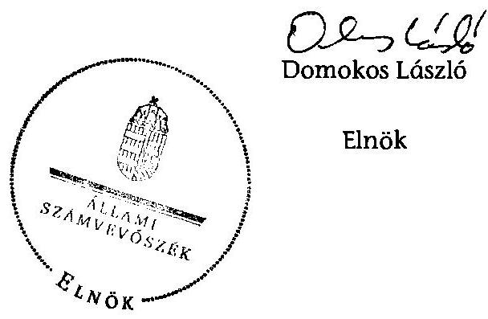

# ÁLLAMI   SZÁMVEVŐSZÉK 

## JELENTÉS

az önkormányzatok belső kontrollrendszere kialakításának, egyes kontrolltevékenységek és a belső ellenőrzés működésének - 2013. évben induló - ellenőrzéséről Vép

---

# Állami Számvevőszék 

Iktatószám: V-0182-055/2013.
Témaszám: 1190
Vizsgálat-azonosító szám: V064925

## Az ellenőrzést felügyelte:

Dr. Benedek Mária
felügyeleti vezető
Az ellenőrzést vezette és az ellenőrzés végrehajtásáért felelős:
Dr. Veress Tiborné
ellenőrzésvezető
A számvevőszéki jelentés összeállításában közreműködött:
Pető Krisztina
számvevő tanácsos
Az ellenőrzést végezték:
Buzás Zoltán
Számvevő

Dr. Halmné Harsányi Zsuzsa
számvevő tanácsos

A témához kapcsolódó eddig készített számvevőszéki jelentés:
címe
sorszáma
Jelentés a Magyar Köztársaság 2008. évi költségvetése végrehajtásának ellenőrzéséről

---

# TARTALOMJEGYZÉK 

BEVEZETÉS ..... 5
I. ÖSSZEGZŐ MEGÁLLAPÍTÁSOK, KÖVETKEZTETÉSEK, JAVASLATOK ..... 9
II. RÉSZLETES MEGÁLLAPÍTÁSOK ..... 16

1. Az önkormányzat belső kontrollrendszerének kialakítása ..... 16
1.1. A kontrollkörnyezet ..... 16
1.2. A kockázatkezelési rendszer ..... 17
1.3. A kontrolltevékenységek ..... 17
1.4. Az információs és kommunikációs rendszer ..... 18
1.5. A monitoring rendszer ..... 19
2. A pénzügyi folyamatokban kulcsszerepet betöltő teljesítésigazolás és érvényesítés belső kontrollok működése ..... 19
3. A belső ellenőrzés működése ..... 21

## FÜGGELÉKEK

1. számú Értelmező szótár
2. számú Az értékelés módja és szempontjai

---

.

---

# RÖVIDÍTÉSEK JEGYZÉKE 

## Törvények

Áht.
ÁSZ tv.
Kttv.
Mötv.

Számv. tv.
Ötv.
Vagyonnyilatkozattételről szóló törvény

## Rendeletek

Áhsz.

Ávr.

Bkr.
Ikr.

## Szórövidítések

2013. évi ellenőrzési terv
adatvédelmi szabályzat
alapító okirat
ÁSZ
Belső ellenőrzési kézikönyv
gazdasági ügyrend
gazdálkodási jogkörök szabályzata

Hivatal
hivatali SZMSZ
2011. évi CXCV. törvény az államháztartásról (hatályos 2012. január 1-jétől)
2011. évi LXVI. törvény az Állami Számvevőszékről
2011. évi CXCIX. törvény a közszolgálati tisztviselőkről
2011. évi CLXXXIX. törvény Magyarország helyi önkormányzatairól (hatályos 2012. január 1-jétől)
2000. évi C. törvény a számvitelről
1990. évi LXV. törvény a helyi önkormányzatokról
2007. évi CLII. törvény egyes vagyonnyilatkozat-tételi kötelezettségekről

249/2000. (XII. 24.) Korm. rendelet az államháztartás szervezeti beszámolási és könyvvezetési kötelezettségének sajátosságairól
368/2011. (XII. 31.) Korm. rendelet az államháztartásról szóló törvény végrehajtásáról (hatályos 2012. január 1-jétől)
370/2011. (XII. 31.) Korm. rendelet a költségvetési szervek belső kontrollrendszeréről és belső ellenőrzéséről (hatályos 2012. január 1-jétől)
335/2005. (XII. 29.) Korm. rendelet a közfeladatot ellátó szervek iratkezelésének általános követelményeiről

Vép Város Önkormányzata és Bozzai Község Önkormányzata 2013. évi ellenőrzési terve
Vép Város Önkormányzat Adatvédelmi Szabályzata (hatályos 2011. január 1-jétől)
Vép Város Önkormányzat Polgármesteri Hivatal alapító okirata
Állami Számvevőszék
Szombathelyi Kistérség Többcélú Társulásának Belső Ellenőrzési Kézikönyve
Vép Polgármesteri Hivatal Gazdasági Ügyrendje (hatályos 2012. szeptember 4-étől)
Vép Város, Bozzai Község és Nemesbőd Község Önkormányzatok pénzgazdálkodásával kapcsolatos hatásköri rendje (amely a számviteli rend V. sz. melléklete, hatályos 2012. április 2-ától, előtte Vép Város és Bozzai Község Önkormányzatok pénzgazdálkodásával kapcsolatos hatásköri rendje volt hatályban 2011. január 2-ától)
Vépi Közös Önkormányzati Hivatal (2013. január 1-jétől)
Vép Város Önkormányzata Polgármesteri Hivatalának Szervezeti és Működési Szabályzata

---

| INTOSAI | International Organization of Supreme Audit Institutions (Legfőbb Ellenőrző Intézmények Nemzetközi Szervezete) |
| :--: | :--: |
| iratkezelési szabályzat | Vép Város Önkormányzata Polgármesteri Hivatalának iratkezelési szabályzata |
| ISSAI | International Standards of Supreme Audit Institutions (Legfőbb Ellenőrző Intézmények Nemzetközi Standardjai) |
| jegyző | Vép Város Önkormányzat jegyzője |
| Képviselő-testület | Vép Város Önkormányzatának Képviselő-testülete |
| Kormányhivatal | Vas Megyei Kormányhivatal |
| leltározási szabályzat | Vép Város, Bozzai Község és Nemesbőd Község Önkormányzatok Leltározási Szabályzata (amely a számviteli rend II. sz. melléklete) |
| Önkormányzat | Vép Város Önkormányzata |
| önkormányzati SZMSZ | Vép Város Önkormányzat Képviselő-testületének Szervezeti és Működési Szabályzata |
| polgármester | Vép Város Önkormányzatának polgármestere |
| Polgármesteri Hivatal | Vép Város Önkormányzatának Polgármesteri Hivatala |
| stratégiai ellenőrzési terv | Vép Város Önkormányzat stratégiai ellenőrzési terve 2011-2015. év |
| szabálytalanságok kezel-   lésének rendje | Vép Város Jegyzőjének 1/2012. (I. 3.) számú Intézkedése a szabálytalanságok kezelésének eljárásrendjére vonatkozóan |
| számviteli rend | Vép Város, Bozzai Község és Nemesbőd Község Önkormányzatának és Intézményeinek Számviteli Politikája és Számviteli Rendje |
| Társulás | Szombathelyi Kistérség Többcélú Társulása |

---

# JELENTÉS 

## az önkormányzatok belső kontrollrendszere kialakításának, egyes kontrolltevékenységek és a belső ellenőrzés működésének - 2013. évben induló - ellenőrzéséről Vép

## BEVEZETÉS

Vép Város állandó lakosainak száma 2012. január 1-jén 3450 fő volt. Az Önkormányzat hét tagú Képviselő-testületének munkáját kettő állandó bizottság segítette. Az Önkormányzat az önállóan működő és gazdálkodó Polgármesteri Hivatalon kívül kettő önállóan működő és gazdálkodó, valamint három önállóan működő intézményt működtetett. Az Önkormányzat többségi tulajdoni hányaddal gazdasági társasággal nem rendelkezett. A polgármester a 2010. évi önkormányzati választások óta tölti be tisztségét. A jegyző 1993. július 31-től látja el a jegyzői feladatokat ${ }^{1}$. A Polgármesteri Hivatal két szervezeti egységre tagolódott: Pénzügyi Csoport és Igazgatási Csoport. A gazdasági szervezet feladatait a Pénzügyi Csoport látta el. A Polgármesteri Hivatalban foglalkoztatott köztisztviselők száma 2012. január 1-jén 13 fő volt. A Polgármesteri Hivatal jogutódjaként 2013. január 1-jén létrejött a Hivatal. Az Önkormányzat a 2012. évi költségvetési beszámolója szerint 777952 ezer Ft költségvetési bevételt ért el, valamint 751463 ezer Ft költségvetési kiadást teljesített. A 2012. december 31-i könyvviteli mérleg szerint 1422786 ezer Ft értékű eszközvagyonnal rendelkezett, a rövid lejáratú kötelezettségállománya 6640 ezer Ft volt, hosszú lejáratú kötelezettsége nem volt.

A demokratikus társadalmakban alapvető igény, hogy a közpénzeket, a közvagyont használók tevékenységükről elszámoljanak, ahhoz egyértelmű és érvényesíthető felelősségi szabályok társuljanak. Ennek a jogos igénynek az érvényesítéséhez meg kell teremteni azokat a folyamatokat, rendszereket, amelyek nélkülözhetetlenek az elszámoltatáshoz. Az elszámoltatás eredményes működtetéséhez szükség van a megfelelő információs, kontroll, értékelési és beszámolási rendszerek kialakítására.

Magyarországon az uniós csatlakozási tárgyalások idejére nyúlnak vissza a belső kontrollrendszer szabályozásának gyökerei. Az uniós elvárásoknak megfelelő új terminológia szerinti államháztartási belső pénzügyi ellenőrzési

[^0]
[^0]:    ${ }^{1}$ 2012-ben a jegyző Vép Város Polgármesteri Hivatalának bevonásával körjegyzői feladatokat látott el Bozzai és Nemesbőd Községek vonatkozásában. (Nemesbőd Község esetében 2012. április 1-jétől 2012. december 31-ig.)

---

(ÁBPE) rendszer területén a jogharmonizáció 2003-ban teljes körűen megvalósult, míg az önkormányzati alrendszerre vonatkozó, az Ötv.-ben megjelenített speciális szabályozás 2005-ben lépett hatályba. Az államháztartási belső kontrollrendszer koncepciója 2009-ben továbbfejlődött. A változások irányát mutatja, hogy a költségvetési szervek belső kontrollrendszere már magában foglalja a korszerű, felelős szervezetirányítás elemeit (kontrollkörnyezet, kockázatkezelés, kontrolltevékenység, információ és kommunikáció, monitoring) is. E kontrollrendszer szabályozása háromszintű, a törvényi előírásokat az Áht. és a Mötv., a rendeleti szintű szabályozást az Ávr. és a Bkr. tartalmazza, amelyeket útmutatói szinten az NGM által kiadott standardok és kézikönyvek támogatnak.

A belső kontrollrendszer azt a célt szolgálja, hogy a költségvetési szervek működésük és gazdálkodásuk során a tevékenységeket szabályszerűen, gazdaságosan, hatékonyan és eredményesen hajtsák végre, teljesítsék elszámolási kötelezettségeiket, és megvédjék az erőforrásokat a veszteségektől, a károktól és a nem rendeltetésszerű használattól. A belső kontrollrendszer magában foglalja mindazon szabályokat, eljárásokat, gyakorlati módszereket és szervezeti struktúrákat, kockázatkezelési technikákat, kontrolltevékenységeket, amelyek segítséget nyújtanak a szervezetnek céljai eléréséhez.

Az ÁSZ a 2011-2015. évekre szóló stratégiájában hangsúlyos szerepet szánt annak, hogy szilárd szakmai alapon álló, értékteremtő ellenőrzéseivel előmozdítsa a közpénzügyek átláthatóságát, rendezettségét. A számvevőszéki ellenőrzés nemzetközi alapelvei is rögzítik, hogy a megfelelő belső kontrollrendszer minimálisra csökkenti a hibák és szabálytalanságok kockázatát.

Az ellenőrzés célja annak megállapítása volt, hogy a belső kontrollrendszer elemeinek kialakítása, a pénzügyi folyamatokban kulcsszerepet betöltő teljesítésigazolás és érvényesítés és a belső ellenőrzés szabályos működése biztosította-e az Önkormányzatnál a közpénzfelhasználás szabályosságát, hozzájárult-e az értéket teremtő rend követelményének érvényesüléséhez.

Ennek keretében értékeltük, hogy:

- a jogszabályi előírásoknak megfelelően alakították-e ki a belső kontrollrendszer elemeit;
- a gazdálkodás folyamatában kulcsszerepet betöltő teljesítésigazolás és érvényesítés kontrolltevékenységeit megfelelően működtették-e;
- biztosították-e a belső ellenőrzés szabályos működését;
- amennyiben az ÁSZ tett javaslatot a 2008-2011. évek közötti ellenőrzése kapcsán az Önkormányzatnak, intézkedtek-e azok végrehajtására.

Az ellenőrzés várható hasznosulását négy szinten tervezzük. A törvényalkotás számára összegzett tapasztalatok állnak rendelkezésre a belső kontrollrendszer önkormányzati területen való kialakításáról, működéséről és hatásairól, a belső ellenőrzés működéséről. Ennek alapján következtetést lehet levonni arról, hogy a belső kontrollrendszer kialakítására és működtetésére vonatkozó - jelenlegi, differenciálás nélküli - jogszabályi előírások reális követelményeket

---

támasztanak-e az eltérő adottságú települési önkormányzatok esetében, illetve indokolt-e esetleges jogszabályi módosítás kezdeményezése. Az ellenőrzés az ellenőrzött számára visszajelzést ad a belső kontrollrendszer kialakításában és működésében fellépő hiányosságokról, javaslataival hozzájárul azok kiküszöböléséhez, amely csökkentheti a későbbi ellenőrzések gyakoriságát. Az ellenőrzés megállapításait és javaslatait más szervezetek is hasznosíthatják a rendezett gazdálkodási keretek kialakításához. A társadalom számára jelzi, hogy közpénz nem maradhat ellenőrizetlenül, az ÁSZ értékteremtő rend kialakításához és megőrzéséhez hozzájáruló tevékenysége pozitív hatással lesz a szervezetről kialakított összkép formálásában. A szervezeten belül lehetőség nyílik arra, hogy a megállapítások szintetizálásával az ÁSZ a hozzáadott értéket teremtő elemző tevékenységét és tanácsadó szerepét is erősítse.

Az önkormányzatok belső kontrollrendszere kialakításának, egyes kontrolltevékenységek és a belső ellenőrzés működésének ellenőrzéséről szóló jelentés I. fejezetének összegző része az ellenőrzés céljára ad rövid, szintetizáló összefoglalót, és tartalmazza a következtetéseket a II. fejezet részletes megállapításain alapulóan. A jelentés intézkedést igénylő megállapításait és javaslatait az ellenőrzés során feltárt, a jelentés II. fejezetében rögzített részletes megállapítások alapozzák meg. A helyszíni ellenőrzés lezárásáig a helyi szabályozás változásait nyomon követtük.

Az ellenőrzés típusa: szabályszerűségi ellenőrzés.
Az ellenőrzött időszak: a belső kontrollrendszer kialakításának megfelelősége esetében a 2012. évre, a pénzügyi folyamatokban kulcsszerepet betöltő teljesítésigazolás és érvényesítés belső kontrollok működésének megfelelőségét és a belső ellenőrzés szabályszerű működését a 2012. január 1. és december 31-e közötti időszak eseményeit figyelembe véve értékeltük, míg az ÁSZ javaslatainak utóellenőrzése a 2008-2011. években végzett ellenőrzések nyilvánosságra hozott jelentéseiben tett javaslatok áttekintésére terjedt ki.

# Az ellenőrzött szervezet: az Önkormányzat. 

Az ellenőrzés jogszabályi alapját az ÁSZ tv. 1. § (3) bekezdése, az 5. § (2) és (6) bekezdése, valamint az Áht. 61. §. (2) bekezdésének előírásai képezik.

Az ellenőrzés szakmai módszertana az ÁSZ hivatalos honlapján (www.asz.hu) közzétett szakmai szabályokon alapult, amely az INTOSAI által kiadott ISSAI figyelembevételével készült.

Az ellenőrzés lefolytatásához az Önkormányzat a kimutatások és a tanúsítvány elektronikus kitöltésével, valamint az ÁSZ által kért dokumentumok elektronikus megküldésével szolgáltatott adatokat. Az így rendelkezésre bocsátott adatok, információk kontrollja és a munkalapok kitöltése a helyszíni ellenőrzés keretében történt. A jelentésben használt fogalmak magyarázatát az 1. számú függelék, az ellenőrzés egyes területeinek értékelésénél alkalmazott egységes minősítési szempontokat a 2. számú függelék tartalmazza.

A belső kontrollrendszer kialakításának ellenőrzése során értékeltük a kontrollkörnyezet, a kockázatkezelési rendszer, a kontrolltevékenységek, az információs

---

és kommunikációs rendszer, valamint a monitoring rendszer szabályozottságának megfelelőségét. A pénzügyi folyamatokban kulcsszerepet betöltő teljesítésigazolás és érvényesítés kontrollok működése megfelelőségének minősítéséhez az állományba nem tartozók megbízási díjai, a külső szolgáltatók által végzett karbantartási, kisjavítási munkák, az egyéb üzemeltetési és fenntartási szolgáltatások, a rendszeres szociális segélyek, valamint az államháztartáson kívülre teljesített működési és felhalmozási célú pénzeszközátadások közül kockázatelemzéssel választottuk ki az ellenőrzött kiadási jogcímeket. Az egyszerű véletlen mintavétellel kiválasztott tételek ellenőrzését többlépcsős megfelelőségi tesztek útján addig végeztük, amíg elegendő és megfelelő bizonyítékot szereztünk a vizsgált folyamatok kulcskontrolljai működésének megfelelő vagy nem megfelelő voltáról. Értékeltük
 az Önkormányzatnál a belső ellenőrzés működésének szabályosságát. Utóellenőrzésre nem került sor, mivel az ÁSZ az Önkormányzatnál a Magyar Köztársaság 2008. évi költségvetése végrehajtásának ellenőrzését végezte, azonban a 0928 számon közzétett számvevőszéki jelentésben az Önkormányzat részére javaslatot nem fogalmazott meg.

Az ÁSZ tv. 29. § (1) bekezdése szerint a jelentéstervezetet megküldtük a polgármester részére, aki az ÁSZ tv. 29. § (2) bekezdésében foglalt észrevételezési jogával nem élt, a jelentéstervezetre észrevételt nem tett.

---

# I. ÖSSZEGZŐ MEGÁLLAPÍTÁSOK, KÖVETKEZTETÉSEK, JAVASLATOK 

A belső kontrollrendszeren belül 2012-ben a kontrollkörnyezet, a kockázatkezelési rendszer, a kontrolltevékenységek, az információs és kommunikációs rendszer, valamint a monitoring rendszer kialakítását külön-külön és együttesen is értékeltük. A belső kontrollrendszer kialakítása az összesített értékelés alapján nem felelt meg a jogszabályi előírásoknak.

A belső kontrollrendszer egyes területei kialakításának minősítése a következő:

| Kontrollterület | Minősítés |  |
| :-- | :-- | :-- |
| Kontrollkörnyezet |  | nem   megfelelő |
| Kockázatkezelési rendszer |  | nem   megfelelő |
| Kontrolltevékenységek | megfelelő |  |
| Információs és kommunikációs rendszer | megfelelő |  |
| Monitoring rendszer |  | részben megfelelő |

Megfelelőnek értékeltük a kontrolltevékenységek, továbbá az információs és kommunikációs rendszer kialakítását, mivel e kontrollterületek a jogszabályi előírásokban foglaltakat figyelembe véve kisebb hiányosságok mellett is hozzájárultak a Polgármesteri Hivatal, ezáltal az Önkormányzat céljainak eléréséhez, az információs rendszeren belül a beszámolási rendszerek megbízható működéséhez.

Részben megfelelőnek értékeltük a monitoring rendszer kialakítását, mivel az ellenőrzésünk során megállapított kisebb szabályozásbeli hiányosságok nem veszélyeztették a monitoring rendszer keretében megvalósuló folyamatos és eseti nyomon követést.

Nem megfelelőnek értékeltük a kontrollkörnyezet és a kockázatkezelési rendszer kialakítását, mivel az ellenőrzésünk során megállapított szabályozásbeli hiányosságok magukban hordozzák a szabálytalan működés, valamint a korrupció kockázatát.

A belső kontrollrendszer nem megfelelő kialakítása kockázatot jelent az Önkormányzat tevékenységeinek szabályszerű, gazdaságos, hatékony és eredményes végrehajtása során.

Az állományba nem tartozók megbízási díjaival és a külső szolgáltatók által végzett karbantartási, kisjavítási munkákkal kapcsolatos kifizetések során a pénzügyi folyamatokban kulcsszerepet betöltő teljesítésigazolás és érvényesítés belső kontrollok működése gyenge volt. Gyengének értékeltük a két kulcskontroll együttes működését, mivel azok nem biztosították a hibák megelőzését, feltárását.

A számvevőszéki ellenőrzés az ellenőrzött kifizetésekkel összefüggésben a rendelkezésre bocsátott dokumentumok alapján kár bekövetkeztére utaló adatot, tényt nem állapított meg, azonban a gazdálkodásban kulcsszerepet betöltő kontrollok gyenge működése miatt fennáll a hibák bekövetkezésének lehetősége. A nem megfelelően működtetett belső kontrollok korrupciós kockázatot hordoznak.

Az Önkormányzat a belső ellenőrzési feladatokat - képviselő-testületi döntés alapján - a Társulás útján látta el. A 2012. évben a belső ellenőrzés működése a jogszabályi előírásoknak jól megfelelt, azonban a belső ellenőrzések szűk területre korlátozottsága miatt nem tárta fel a számvevőszéki ellenőrzés során a kontrollkörnyezet, a kockázatkezelési rendszer kialakításánál és a pénzügyi folyamatokban kulcsszerepet betöltő teljesítésigazolás és érvényesítés belső kontrollok működésénél megállapított hiányosságokat.

Az ÁSZ tv. 33. § (1) bekezdésében foglaltak értelmében az ellenőrzött szervezet vezetője köteles a jelentésben foglalt megállapításokhoz kapcsolódó intézkedési tervet összeállítani, és azt a jelentés kézhezvételétől számított 30 napon belül az ÁSZ részére megküldeni. Amennyiben az intézkedési tervet határidőre nem küldi meg a szervezet, vagy az ÁSZ tv. 33. § (2) bekezdésében foglalt póthatáridő elteltével megküldött intézkedési terv továbbra sem elfogadható, az ÁSZ elnöke a hivatkozott törvény 33. § (3) bekezdés a)-b) pontjaiban foglaltakat érvényesítheti.

Az ellenőrzés intézkedést igénylő megállapításai és javaslatai:

# a polgármesternek 

A számvevőszéki ellenőrzés megállapításai alapján az Önkormányzatnál a belső kontrollrendszer kialakítása összefoglalóan értékelve nem felelt meg a jogszabályi előírásoknak, a kulcskontrollok működése gyenge volt, a belső ellenőrzés működése ugyan megfelelt a jogszabályi előírásoknak, azonban nem tárta fel, ezáltal nem is javíttatta ki a feltárt hiányosságokat. A megállapított szabályozásbeli és működésbeli hiányosságok magukban hordozzák a szabálytalan működés kockázatát.

Javaslat:
A Mötv. 115. § (1) bekezdésében foglaltak alapján kísérje figyelemmel az Önkormányzat gazdálkodásának szabályszerűségét. A Mötv. 67. § f) pontja alapján gondoskodjon a belső kontrollrendszer működésére vonatkozó jogszabályi rendelkezések be nem tartása, valamint a teljesítésigazolás, illetve az érvényesítés kontrollokkal összefüggésben feltárt hiányosságok, szabálytalanságok tekintetében az esetleges munkajogi felelősséggel kapcsolatos körülmények kivizsgálásáról, majd a vizsgálat eredményének függvényében tegye meg a szükséges munkajogi intézkedéseket.

---

# a jegyzőnek 

1. a kontrollkörnyezettel kapcsolatban:

A Polgármesteri Hivatal alapító okiratában az alaptevékenységek, azok államháztartási szakfeladat rendje szerinti megjelölése, valamint államháztartási szakágazati besorolása az Ávr. 5. § (1) bekezdés c) pontjában és az 56/2011. (XII. 31.) NGM rendeletben foglaltaknak nem felelt meg.

A hivatali SZMSZ-ben - az Ávr. 13. § (1) bekezdés c), f), g) és i) pontjában foglaltak ellenére - az ellátandó, és a szakfeladat-rend szerinti szakfeladat számmal és megnevezéssel besorolt alaptevékenységek megjelölése nem felelt meg az 56/2011. (XII. 31.) NGM rendeletben előírtaknak. A hivatali SZMSZ nem megfelelően tartalmazta az alaptevékenységet szabályozó jogszabályok megjelölését, a nevesített valamennyi munkakörhöz tartozó hatáskörök gyakorlásának módját és a helyettesítés rendjét, valamint az irányító szerv által az Ávr. 10. § (1)-(3) bekezdései szerint a költségvetési szervhez rendelt más költségvetési szervek felsorolását, továbbá a jegyző nem rögzítette azon ügyköröket, amelyek során a szervezeti egységek vezetői a költségvetési szerv képviselőjeként járhatnak el.

A jegyző a leltározási szabályzatban az Áhsz. 37. § (7) bekezdésében foglaltak ellenére a mérlegben kimutatott eszközök kétévenkénti leltározási kötelezettségét önkormányzati rendelet (határozat) nélkül írta elő.

A Képviselő-testület a Kttv. 231. § (1) bekezdés ellenére nem állapította meg a Kttv. 83. §-ában meghatározott, a köztisztviselőkkel szembeni hivatásetikai alapelvek részletes tartalmát, valamint az etikai eljárás szabályait, mivel a jegyző - az Ötv. 36. § (2) bekezdés a) pontjában előírt feladata ellenére - nem készítette elő ennek dokumentumát.

Javaslat:
a) Készítse elő a Mötv. 81. § (3) bekezdés c) pontjában foglalt feladatkörében a Hivatal alapító okiratának módosítását annak érdekében, hogy az tartalmazza az Ávr. 5. § (1) bekezdésben és az 56/2011. (XII. 31.) NGM rendeletben előírt valamennyi tartalmi elemet, és kezdeményezze az Áht. 9. § (1) a) pontjában foglaltakra tekintettel annak Képviselő-testület elé terjesztését.
b) Készítse el a Hivatal szervezeti és működési szabályzatának módosítását annak érdekében, hogy az tartalmazza az Ávr. 13. § (1) bekezdésében és az 56/2011. (XII. 31.) NGM rendeletben előírt valamennyi tartalmi elemet, és kezdeményezze az Áht. 9. § (1) bekezdés a) pontjában foglaltakra tekintettel a Képviselőtestület elé terjesztését.
c) Intézkedjen, hogy az eszközök leltározásának gyakorisága az Áhsz. 37. § (7) bekezdésének megfelelően kerüljön meghatározásra.
d) Készítse elő a Mötv. 81. § (3) bekezdés c) pontjában foglalt feladatkörében a köztisztviselőkkel szembeni - a Kttv. 83. §-a szerinti - hivatásetikai alapelvek részletes tartalmának, valamint az etikai eljárás szabályainak dokumentumait, és

---

a Kttv. 231. § (1) bekezdésében foglaltakra tekintettel kezdeményezze azok Képviselő-testület elé terjesztését.
2. a kockázatkezelési rendszerrel kapcsolatban:

A jegyző - a Bkr. 7. § (2) bekezdésében foglaltak ellenére - nem határozta meg az egyes kockázatokkal kapcsolatban szükséges intézkedések teljesítése folyamatos nyomon követésének módját.

A Vagyonnyilatkozat-tételről szóló törvény 4. § d) pontjában foglaltak ellenére a vagyonnyilatkozat-tételre kötelezettek körét - a helyi önkormányzati képviselők, a polgármester, az alpolgármester, a bizottság nem helyi önkormányzati képviselő tagjai - az önkormányzati SZMSZ-ben nem rögzítették.

Javaslat:
a) Határozza meg a Bkr. 7. § (2) bekezdésében foglaltak alapján az egyes kockázatokkal kapcsolatban szükséges intézkedések teljesítése folyamatos nyomon követésének módját.
b) Készítse elő a Mötv. 81. § (3) c) pontjában foglalt feladatkörében az önkormányzati SZMSZ módosítását annak érdekében, hogy az tartalmazza a vagyonnyilatkozat-tételről szóló törvény 4. § d) pontjában előírtak szerint a vagyonnyilatkozat-tételre kötelezettek körét, és kezdeményezze annak Képviselő-testület elé terjesztését.
3. a kontrolltevékenységekkel kapcsolatban:

A jegyző az iratkezelési rendszer kialakítása során az lkr. 8. § (2) bekezdésében foglaltak ellenére nem határozta meg az üzemeltetés és az adatbiztonság védelmének feladatai esetében a hatásköröket.

A jegyző - az Ávr. 13. § (5) bekezdésben foglaltak ellenére - belső szabályzatban nem határozta meg a gazdasági feladatot ellátó vezető és alkalmazottak helyettesítésének rendjét.

A pénzügyi ellenjegyzési és az érvényesítési feladatra jogosultakat az Ávr. 55. § (2) bekezdés a) pontjának, valamint az 58. § (4) bekezdésének előírása ellenére nem a gazdasági vezető, hanem a jegyző jelölte ki.

Javaslat:
a) Rögzítse az iratkezelési rendszer kialakítása során az lkr. 8. § (2) bekezdése alapján az üzemeltetés és az adatbiztonság szabályait oly módon, hogy a hatáskörök pontosan meghatározásra kerüljenek.
b) Határozza meg az Ávr. 13. § (5) bekezdés alapján a gazdasági feladatot ellátó vezető és alkalmazottak helyettesítésének rendjét.
c) Intézkedjen arról, hogy a pénzügyi ellenjegyzésre és érvényesítésre jogosult személyek az Ávr. 55. § (2) bekezdés a) pontjának és az 58. § (4) bekezdésének megfelelően kerüljenek kijelölésre.

---

4. az információs és kommunikációs rendszerrel kapcsolatban:

A jegyző - a Bkr. 3. § d) pontjában és a 9. § (1) bekezdésében foglaltak ellenére nem alakított ki olyan rendszert, amely biztosítja, hogy a megfelelő információk a megfelelő időben eljutnak az illetékes szervezethez, szervezeti egységhez, illetve személyhez.

Javaslat:
Alakítson ki a Bkr. 3. § d) pontjában és a 9. § (1) bekezdésében foglaltaknak megfelelően egy olyan rendszert, amely biztosítja, hogy a megfelelő információk a megfelelő időben eljutnak az illetékes szervezethez, szervezeti egységhez, illetve személyhez.
5. a monitoring rendszerrel kapcsolatban:

A jegyző - a Bkr. 3. § e) pontjában és 10. §-ában foglaltak ellenére - nem alakította ki - a szervezet gazdálkodási tevékenységét kivéve - a célok megvalósításának nyomon követését biztosító rendszert.

A jegyző - a Bkr. 11. § (1) bekezdésében foglalt kötelezettsége ellenére - a Bkr. 1. melléklete szerinti nyilatkozatban nem értékelte a 2011. évre vonatkozóan a Polgármesteri Hivatal belső kontrollrendszerének minőségét.

Javaslat:
a) Alakítsa ki és működtesse a Bkr. 3. § e) pontjában és 10. §-ában foglaltak alapján a Hivatal tevékenységének, a célok megvalósításának nyomon követését biztosító rendszert.
b) Értékelje a Bkr. 11. § (1) bekezdésében foglalt kötelezettségének megfelelően a jogszabályban meghatározott keretek között a Hivatal belső kontrollrendszerének minőségét a Bkr. 1. melléklete szerinti nyilatkozatban.
6. a pénzügyi folyamatokban kulcsszerepet betöltő kontrollokkal kapcsolatban:

A teljesítésigazolást - az Áht. 38. § (1) bekezdésében és az Ávr. 57. § (1) és (3) bekezdésében foglaltak ellenére - nem végezték el, vagy nem az arra jogosult személy végezte.

Az Ávr. 58. § (4) bekezdésében foglaltak ellenére az érvényesítőt nem a gazdasági vezető, hanem a jegyző jelölte ki.

Az érvényesítő - az Ávr. 58. § (2) bekezdésben előírtak ellenére - az utalványozónak nem jelezte, hogy a megelőző ügymenetben a teljesítésigazolás elmaradt, vagy írásbeli kijelöléssel nem rendelkező személy végezte el, valamint a Polgármesteri Hivatal kiadási előirányzatai terhére történt kötelezettségvállalásokra - az Áht. 37. § (1) bekezdésében és az Ávr. 55.
 § (1) bekezdésében foglaltak ellenére – ellenjegyzés nélkül került sor, továbbá hogy az utalvány – az Ávr. 59. § (3) bekezdés e) pontjában foglaltak ellenére – nem tartalmazta a megterhelendő fizetési számla számát és megnevezését. A kiadási pénztárbizonylaton a Számv. tv. 167. § (1) bekezdés h) pontjában előírt, a könyvelés módjára és az érintett könyvviteli számlákra történő hivatkozást

---

nem tüntették fel és a kötelezettségvállalásról vezetett nyilvántartások adattartalma nem felelt meg az Ávr. 56. § (1) bekezdésében foglalt előírásoknak.

Javaslat:
Intézkedjen – a teljesítésigazolás és az érvényesítés vonatkozásában feltárt hiányosságok megszüntetése, illetve az operatív gazdálkodás során a működésbeli hibák megelőzése, feltárása és kijavítása érdekében – arról, hogy
a) a teljesítésigazolásra kijelölt személyek az Áht. 38. § (1) bekezdésében és az Ávr. 57. § (1) bekezdésében foglaltaknak megfelelően, ellenőrizhető okmányok alapján ellenőrizzék a kiadások teljesítésének jogosságát, összegszerűségét, ellenszolgáltatást is magában foglaló kötelezettségvállalás esetében az ellenszolgáltatás teljesítését, és azt az Ávr. 57. § (3) bekezdésében foglalt módon igazolják;
b) az Ávr. 58. § (4) bekezdésében foglalt előírás alapján érvényesítésre kijelölt személyek – a kifizetéseket megelőzően teljesítésigazolás alapján – az Ávr. 57. § (3) bekezdése szerinti esetben annak hiányában is – az összegszerűségnek, a fedezet meglétének és a megelőző ügymenetben az Áht., az Áhsz., az Ávr. előírásai és a belső szabályzatokban foglaltak betartásának az ellenőrzését – az Ávr. 58. § (1)(3) bekezdése szerint – végezzék el;
c) az érvényesítő az Ávr. 58. § (2) bekezdésében foglaltak alapján jelezze az utalványozónak, ha az Áht., az Áhsz., az Ávr. vagy a belső szabályzatokban foglaltak megsértését tapasztalja;
d) az Áht. 37. § (1) és az Ávr. 55. § (1) bekezdésében foglaltaknak megfelelően a Hivatal kiadási előirányzatai terhére történt kötelezettségvállalásra – az Ávr. 53. §-ában meghatározott kivételekkel – pénzügyi ellenjegyzés után kerüljön sor;
e) az Ávr. 59. § (3)-(4) bekezdései alapján az utalványon a kötelező tartalmi elemeket tüntessék fel;
f) a bizonylaton tüntessék fel a Számv. tv. 167. § (1) bekezdés h) pontjában előírt, a könyvelés módjára és az érintett könyvviteli számlákra történő hivatkozást;
g) a kötelezettségvállalások nyilvántartását az Ávr. 56. § (1) bekezdésében foglalt előírásnak megfelelően vezessék.
7. a belső ellenőrzés működésével kapcsolatban:

A stratégiai ellenőrzési terv – a Bkr. 30. § (1) bekezdés b), d), e) és f) pontjában foglalt előírások ellenére – nem tartalmazta a belső kontrollrendszer általános értékelését, a belső ellenőrzésre vonatkozó fejlesztési és képzési tervet, a szükséges erőforrások felmérését elsősorban a létszám, a képzettség és tárgyi feltételek tekintetében, továbbá az ellenőrzési prioritásokat és az ellenőrzési gyakoriságot.

A 2013. évi ellenőrzési terv – a Bkr. 31. § (4) bekezdés a) pontjában foglaltak ellenére – nem tartalmazta az ellenőrzési tervet megalapozó elemzések és a kockázatelemzés eredményének összefoglaló bemutatását.

---

A 2011. évre vonatkozó éves ellenőrzési jelentés – a Bkr. 48. § b) pontjában foglaltak ellenére – nem tartalmazta a belső kontrollrendszer szabályszerűségének, gazdaságosságának, hatékonyságának és eredményességének növelése, javítása érdekében tett fontosabb javaslatokat, valamint a belső kontrollrendszer öt elemének értékelését.

Javaslat:
a) Kezdeményezze, hogy a stratégiai ellenőrzési terv tartalmazza a Bkr. 30. § (1) bekezdésében előírt tartalmi elemeket.
b) Intézkedjen, hogy az éves ellenőrzési tervek tartalmazzák a Bkr. 31. § (4) bekezdésében előírt tartalmi elemeket.
c) Kezdeményezze, hogy az éves ellenőrzési jelentés tartalmazza a Bkr. 48. §-ában előírt tartalmi elemeket.

---

# II. RÉSZLETES MEGÁLLAPÍTÁSOK 

## 1. AZ ÖNKORMÁNYZAT BELSŐ KONTROLLRENDSZERÉNEK KIALAKÍTÁSA

A belső kontrollrendszeren belül 2012-ben a kontrollkörnyezet, a kockázatkezelési rendszer, a kontrolltevékenységek, az információs és kommunikációs rendszer, valamint a monitoring rendszer kialakítását külön-külön és együttesen is értékeltük. A belső kontrollrendszer kialakítása az összesített értékelés alapján nem felelt meg a jogszabályi előírásoknak.

### 1.1. A kontrollkörnyezet

A kontrollkörnyezet kialakítása – a 2. számú függelékben részletezett kritériumrendszer alapján végzett értékelés szerint – a jogszabályi előírásoknak nem felelt meg, mert:

| Sorszám $^{2}$ | Megállapítás |
| :--: | :--: |
| 1. | A Polgármesteri Hivatal alapító okiratában az alaptevékenységek, azok államháztartási szakfeladat rendje szerinti megjelölése, valamint államháztartási szakágazati besorolása az Ávr. 5. § (1) bekezdés c) pontjában és az 56/2011. (XII. 31.) NGM rendeletben foglaltaknak nem felelt meg. |
| 7., 8., 10., 12. | A hivatali SZMSZ-ben – az Ávr. 13. § (1) bekezdés c), f), g) és i) pontjában foglaltak ellenére – az ellátandó, és a szakfeladat-rend szerint szakfeladat számmal és megnevezéssel besorolt alaptevékenységek megjelölése nem felelt meg az 56/2011. (XII. 31.) NGM rendeletben előírtaknak. A hivatali SZMSZ nem megfelelően tartalmazta az alaptevékenységet szabályozó jogszabályok megjelölését, a nevesített valamennyi munkakörhöz tartozó hatáskörök gyakorlásának módját és a helyettesítés rendjét, valamint az irányító szerv által az Ávr. 10. § (1)-(3) bekezdése szerint a költségvetési szervhez rendelt más költségvetési szervek felsorolását, továbbá a jegyző nem rögzítette azon ügyköröket, amelyek során a szervezeti egységek vezetői a költségvetési szerv képviselőjeként járhatnak el. |
| 25. | A jegyző a leltározási szabályzatban az Áhsz. 37. § (7) bekezdésében foglaltak ellenére a mérlegben kimutatott eszközök kétévenkénti leltározási kötelezettségét önkormányzati rendelet (határozat) nélkül írta elő. |

[^0]
[^0]:    ${ }^{2}$ A megállapítás számozása az Önkormányzat által – az adatszolgáltatás során – kitöltött kimutatások kérdéseinek sorszámával azonos

---

A Képviselő-testület a Kttv. 231. § (1) bekezdés ellenére nem állapította meg – a Kttv. 83. §-ában meghatározott – a köztisztviselőkkel szembeni 47. hivatásetikai alapelvek részletes tartalmát, valamint az etikai eljárás szabályait, mivel a jegyző – az Ötv. 36. § (2) bekezdés a) pontjában ${ }^{3}$ előírt feladata ellenére – nem készítette elő ennek dokumentumát.

# 1.2. A kockázatkezelési rendszer 

A kockázatkezelési rendszer kialakítása – a 2. számú függelékben részletezett kritériumrendszer alapján végzett értékelés szerint – a jogszabályi előírásoknak nem felelt meg, mert:

| Sorszám | Megállapítás |
| :--: | :--: |
| 10. | A jegyző – a Bkr. 7. § (2) bekezdésében foglaltak ellenére – nem határozta meg az egyes kockázatokkal kapcsolatban szükséges intézkedések teljesítése folyamatos nyomon követésének módját. |
| 13. | A Vagyonnyilatkozat-tételről szóló törvény 4. § d) pontjában foglaltak ellenére a vagyonnyilatkozat-tételre kötelezettek körét – a helyi önkormányzati képviselők, a polgármester, az alpolgármester, a bizottság nem helyi önkormányzati képviselő tagjai – az önkormányzati SZMSZ-ben nem rögzítették. |

### 1.3. A kontrolltevékenységek

A kontrolltevékenységek kialakítása – a 2. számú függelékben részletezett kritériumrendszer alapján végzett értékelés szerint – megfelelt a jogszabályi előírásoknak.

A jegyző a kontrolltevékenység részeként előírta a folyamatba épített, előzetes, utólagos és vezetői ellenőrzést. Belső szabályzatban rendezték a kötelezettségvállalás pénzügyi ellenjegyzésének és a teljesítésigazolás módját, valamint szabályozták az érvényesítés és az utalványozás rendjét. A jogszabályi előírásoknak megfelelően szabályozták az előzetes írásbeli kötelezettségvállalást nem igénylő kifizetések rendjét.

A gazdasági ügyrendben 100 ezer Ft-os, míg a szintén hatályos gazdálkodási jogkörök szabályzatában 50 ezer Ft-os értékhatárt határoztak meg. A kötelezettségvállaló kijelölte a teljesítésigazolásra jogosultakat.

A hivatali SZMSZ-ben, a gazdasági ügyrendben, valamint a köztisztviselők munkaköri leírásaiban a jegyző meghatározta az időközi és éves beszámolók elkészítésének feladatait, a felelősségi köröket, valamint a gazdasági feladatot ellátó vezetők és alkalmazottak helyettesítésének rendjét.

A jegyző kialakította a jogviszony megszűnése esetére vonatkozóan a munkavállaló folyamatban lévő feladatai átadásának rendjét.

[^0]
[^0]:    ${ }^{3}$ 2013. január 1-jétől Mötv. 81. § (3) bekezdés c) pont

---

A kontrolltevékenységek kialakítása az alábbi kisebb hiányosságok mellett megfelelt a jogszabályi előírásoknak:

| Sorszám | Megállapítás | Megjegyzés |
| :--: | :--: | :--: |
| 15. | A jegyző az iratkezelési rendszer kialakítása során az Ikr. 8. § (2) bekezdésében foglaltak ellenére nem határozta meg az üzemeltetés és az adatbiztonság védelmének feladatai esetében a hatásköröket. |  |
| 21. | A jegyző – az Ávr. 13. § (5) bekezdésben foglaltak ellenére – belső szabályzatban nem határozta meg a gazdasági feladatot ellátó vezető és alkalmazottak helyettesítésének rendjét. | A helyettesítés rendjét a munkaköri leírások tartalmazták a gazdasági feladatokat ellátó alkalmazottak esetében. |
| $\begin{aligned} & 27 . \\ & 29 . \end{aligned}$ | A pénzügyi ellenjegyzési és az érvényesítési feladatra jogosultakat az Ávr. 55. § (2) bekezdés a) pontjának, valamint az 58. § (4) bekezdésének előírása ellenére nem a gazdasági vezető, hanem a jegyző jelölte ki. |  |

# 1.4. Az információs és kommunikációs rendszer 

Az információs és kommunikációs rendszer kialakítása – a 2. számú függelékben részletezett kritériumrendszer alapján végzett értékelés szerint megfelelt a jogszabályi előírásoknak.

A jegyző meghatározta a szervezeten belüli információátadás módját, szabályozta a szervezeten kívülről érkező információk kezelésének rendjét. A Polgármesteri Hivatal rendelkezett a jogszabályi előírásoknak megfelelő adatvédelmi szabályzattal, a jegyző szabályozta a kötelezően közzéteendő adatok nyilvánosságra hozatalának rendjét. Az Önkormányzat a közzétételi kötelezettségének a 2012. évben eleget tett. A jegyző szabályozta a közérdekű adatok megismerésére irányuló igények teljesítésének rendjét. A jegyző elkészítette a jogszabályi előírásoknak megfelelő iratkezelési szabályzatot. A szabálytalanságok kezelésének rendje tartalmazta a szabálytalansági gyanú észlelésével, jelentésével kapcsolatos részletes eljárásrendet.

Az információs és kommunikációs rendszer kialakítása az alábbi kisebb hiányosságok mellett megfelelt a jogszabályi előírásoknak:

| Sorszám | Megállapítás |
| :--: | :--: |
| 2. | A jegyző – a Bkr. 3. § d) pontjában és a 9. § (1) bekezdésében foglaltak ellenére – nem alakított ki olyan rendszert, amely biztosítja, hogy a megfelelő információk a megfelelő időben eljutnak az illetékes szervezethez, szervezeti egységhez, illetve személyhez. |

---

# 1.5. A monitoring rendszer 

A monitoring rendszer kialakítása – a 2. számú függelékben részletezett kritériumrendszer alapján végzett értékelés szerint – részben felelt meg a jogszabályi előírásoknak.

A jegyző csak a gazdálkodási tevékenységre kiterjedően alakította ki a szervezet tevékenységének, céljai megvalósításának nyomon követését biztosító rendszert.

A Polgármesteri Hivatalban a 2012. évben négy alkalommal volt független belső ellenőrzés. A belső ellenőrzés javaslatai hasznosításának nyomon követését az intézkedési tervek végrehajtásáról vezetett kimutatás elkészítésével biztosították.

A monitoring rendszer kialakítása az alábbi kisebb hiányosságok miatt részben felelt meg a jogszabályi előírásoknak, mert:

| Sor-   szám | Megállapítás |
| :-- | :-- |
| 1. | A jegyző – a Bkr. 3. § e) pontjában és 10. §-ában foglaltak ellenére – nem   alakította ki – a szervezet gazdálkodási tevékenységét kivéve – a célok   megvalósításának nyomon követését biztosító rendszert. |
| 9. | A jegyző – a Bkr. 11. § (1) bekezdésében foglalt kötelezettsége ellenére – a   Bkr. 1. melléklete szerinti nyilatkozatban nem értékelte a 2011. évre vonat-   kozóan a Polgármesteri Hivatal belső kontrollrendszerének minőségét. |

A helyi önkormányzatok törvényességi felügyeletét ellátó Kormányhivatal a 2012. évben nem élt törvényességi felhívással vagy más törvényességi felügyeleti eszközzel a Képviselő-testület által
 alkotott rendeletekre, határozatokra vonatkozóan.

## 2. A PÉNZÜGYI FOLYAMATOKBAN KULCSSZEREPET BETÖLTŐ TELJESÍTÉSIGAZOLÁS ÉS ÉRVÉNYESÍTÉS BELSŐ KONTROLLOK MŰKÖDÉSE

Az állományba nem tartozók megbízási díjaival, valamint a külső szolgáltatók által végzett karbantartási, kisjavítási munkákkal kapcsolatos kifizetések során a pénzügyi folyamatokban kulcsszerepet betöltő teljesítésigazolás és érvényesítés belső kontrollok működésének megfelelősége összefoglalóan értékelve gyenge volt, mert:

| Kulcskontroll | Megállapítás |
| :--: | :--: |
| Teljesítésigazolás | A teljesítésigazolást - az Áht. 38. § (1) bekezdésében és az Ávr.   57. § (1) és (3) bekezdésében foglaltak ellenére - nem végezték   el, vagy nem az arra jogosult személy végezte. |
| Érvényesítés | Az Ávr. 58. § (4) bekezdésében foglaltak ellenére az érvényesítőt   nem a gazdasági vezető, hanem a jegyző jelölte ki.   Az érvényesítő - az Ávr. 58. § (2) bekezdésben előírtak ellenére -   az utalványozónak nem jelezte, hogy a megelőző ügymenetben |

---

a teljesítésigazolás elmaradt, vagy írásbeli kijelöléssel nem rendelkező személy végezte el, valamint a Polgármesteri Hivatal kiadási előirányzatai terhére történt kötelezettségvállalásokra az Áht. 37. § (1) bekezdésében és az Ávr. 55. § (1) bekezdésében foglaltak ellenére - ellenjegyzés nélkül került sor, továbbá hogy az utalvány - az Ávr. 59. § (3) bekezdés e) pontjában foglaltak ellenére - nem tartalmazta a megterhelendő fizetési számla számát, megnevezését. A kiadási pénztárbizonylaton a Számv. tv. 167. § (1) bekezdés h) pontjában előírt, a könyvelés módjára és az érintett könyvviteli számlákra történő hivatkozást nem tüntették fel és a kötelezettségvállalásról vezetett nyilvántartások adattartalma nem felelt meg az Ávr. 56. § (1) bekezdésében foglalt előírásoknak.

A 2012. évben az állományba nem tartozók megbízási díjaival kapcsolatos - az Önkormányzatra vonatkozó - kifizetések során a teljesítésigazolás és az érvényesítés kulcskontrollok működésének megfelelősége gyenge volt, mert:

- a teljesítésigazolás a jogszabályi előírásoknak és a belső szabályzatokban foglaltaknak megfelelően történt;
- az érvényesítést - az anyakönyvi és a házasságkötési rendezvények alkalmával a versmondási feladatok ellátására adott megbízási díjak esetében a feladat ellátására jogosulatlan személy végezte, mert az Áht. 38. § (2) bekezdésében, az Ávr. 55. § (2) bekezdés f) pontjában és az 58. § (4) bekezdésében foglaltak ellenére a gazdasági vezető helyett a jegyző jelölte ki az érvényesítőt;
- az érvényesítő az Ávr. 58. § (2) bekezdésének szabályozása ellenére nem jelezte az utalványozónak a házasságkötési rendezvények alkalmával a versmondási díj kifizetése esetében, hogy a megelőző ügymenetben a Számv. tv. 167. § (1) bekezdés h) pontjában előírtak ellenére a könyvelés módjára és az érintett könyvviteli számlákra történő hivatkozást elmulasztották, valamint azt, hogy az Áht. 37. § (1) és az Ávr. 55. § (1) bekezdésében foglaltak ellenére a kötelezettségvállalásra ellenjegyzés nélkül került sor, továbbá hogy az Ávr. 56. § (1) bekezdésében előírtak ellenére nem vezettek a kötelezettségvállalásokhoz kapcsolódóan olyan nyilvántartást, amelyből megállapítható lenne az évenkénti kötelezettségvállalás összege.

Az ellenőrzésünk megállapította, hogy a gazdasági esemény elszámolása hibás főkönyvi számlára történt, mert az állományba tartozó megbízási díjat az állományba nem tartozó megbízási díj számlára könyvelték.

A 2012. évben a külső szolgáltatók által végzett karbantartási, kisjavítási munkákkal kapcsolatos kifizetések során a teljesítésigazolás és az érvényesítés kulcskontrollok működésének megfelelősége gyenge volt, mert:

- a teljesítésigazoló a szaniter és a porszívó javítás kifizetését megelőzően az Ávr. 57. § (1) és (3) bekezdésében előírtak ellenére a teljesítés igazolását nem végezte el, ezért nem ellenőrizte és aláírásával nem igazolta a kiadás teljesítésének jogosságát, összegszerűségét, valamint az ellenszolgáltatás teljesítését;

---

- a teljesítés igazolását a tűzoltó készülékek karbantartása kifizetéseit megelőzően az Ávr. 57. § (3) bekezdésben foglaltak ellenére jegyzői kijelöléssel nem rendelkező személy végezte, ezért a kiadások jogosságának, összegszerűségének és a szerződés szerinti teljesítésének ellenőrzése az Ávr. 57. § (1) bekezdésének előírása ellenére nem szabályszerűen történt;
- az érvényesítést a külső szolgáltatók által teljesített karbantartási, kisjavítási munkákra történő kifizetések esetében jogosulatlan személy végezte, mert az Áht. 38. § (2) bekezdésében, az Ávr. 55. § (2) bekezdés f) pontjában és az 58. § (4) bekezdésében foglaltak ellenére a gazdasági vezető helyett a jegyző jelölte ki az érvényesítőt;
- az érvényesítő a tűzoltó készülékek karbantartása esetében az Ávr. 58. § (2) bekezdésében foglalt előírás ellenére nem jelezte az utalványozónak, hogy a megelőző ügymenetben a teljesítésigazolást kijelöléssel nem rendelkező személy végezte, a számítástechnikai rendszerkarbantartásra történt kifizetés esetében az utalvány nem felel meg az Ávr. 59. § (3) bekezdés e) pontjában foglalt követelménynek, mert nem tartalmazta a terhelendő fizetési számla számát és megnevezését, továbbá azt sem jelezte, hogy nem tartották be a gazdálkodási jogkörök szabályzatában foglaltakat, mert a kiadási pénztárbizonylaton nem tüntették fel a főkönyvi számla számát, továbbá a számítástechnikai rendszer és a tűzoltó készülékek karbantartása esetében az Ávr. 56. § (1) bekezdésében előírtak ellenére nem vezettek a kötelezettségvállalásokhoz kapcsolódóan olyan analitikus nyilvántartást, amelyből megállapítható lenne az évenkénti kötelezettségvállalás összege.

A számvevőszéki ellenőrzés az ellenőrzött kifizetésekkel összefüggésben a rendelkezésre bocsátott dokumentumok alapján kár bekövetkeztére utaló adatot, tényt nem állapított meg, azonban a gazdálkodásban kulcsszerepet betöltő kontrollok gyenge működése miatt fennáll a hibák bekövetkezésének kockázata. A nem megfelelően működtetett belső kontrollok korrupciós kockázatot hordoznak.

# 3. A BELSŐ ELLENŐRZÉS MŰKÖDÉSE 

Az Önkormányzat a belső ellenőrzési feladatokat - képviselő-testületi döntés alapján - a Társulás útján látta el.

A belső ellenőrzés működése - a 2. számú függelékben részletezett kritériumrendszer alapján végzett értékelés szerint - az Önkormányzatnál jól megfelelt a jogszabályi előírásoknak.

Az Önkormányzat rendelkezett jóváhagyott, a jogszabályi előírásoknak megfelelő tartalmú Belső ellenőrzési kézikönyvvel. A belső ellenőrzést végző személy a jogszabályban előírt iskolai végzettséggel, szakmai képesítéssel rendelkezett. A belső ellenőrzés elkészítette az ellenőrzések tervezését megalapozó, a jogszabályi előírásoknak részben megfelelő tartalmú stratégiai ellenőrzési tervét, valamint a 2013. évi ellenőrzési tervet.

A végrehajtott ellenőrzésekhez a belső ellenőrzési vezető által jóváhagyott ellenőrzési programok, az elvégzett ellenőrzésekről a jogszabályban előírt tartalmú jelentések készültek, és a javaslatokra minden esetben készítettek intézkedési tervet. A belső ellenőrzési vezető nyilvántartást vezetett a belső ellenőrzésekről és az intézkedések nyomon követéséről. A belső ellenőrzési vezető az Önkormányzatnál végzett ellenőrzések alapján a jogszabályban előírt tartalommal összeállított, 2011. évre vonatkozó éves ellenőrzési jelentését a jegyzőnek megküldte, amelyet a Képviselő-testület határozattal elfogadott.

Az Önkormányzatnál a belső ellenőrzés működése az alábbi kisebb hiányosságok mellett jól megfelelt a jogszabályi előírásoknak:

| Sorszám | Megállapítás | Megjegyzés |
| :--: | :--: | :--: |
| $3 / a$, d | A Belső ellenőrzési kézikönyv a Bkr. 17. § (2) bekezdés a) és d) pontjában foglaltak ellenére nem tartalmazta a bizonyosságot adó és a tanácsadó tevékenységre vonatkozó eljárási szabályokat, valamint az alkalmazott iratmintákat. | A 2013. január 1-jétől hatályos Vép Város Önkormányzati Hivatal Belső Ellenőrzési Kézikönyve már tartalmazza a bizonyosságot adó és a tanácsadó tevékenységre vonatkozó eljárási szabályokat, valamint az alkalmazott iratmintákat. |
| $7 / b$, d, e, f | A stratégiai ellenőrzési terv - a Bkr. 30. § (1) bekezdés b), d), e) és f) pontjaiban foglalt előírás ellenére - nem tartalmazta a belső kontrollrendszer általános értékelését, a belső ellenőrzésre vonatkozó fejlesztési és képzési tervet, a szükséges erőforrások felmérését elsősorban a létszám, a képzettség és a tárgyi feltételek tekintetében, továbbá az ellenőrzési prioritásokat és az ellenőrzési gyakoriságot. |  |
| $8 / a$ | A 2013. évi ellenőrzési terv - a Bkr. 31. § (4) bekezdés a) pontjában foglaltak ellenére - nem tartalmazta az ellenőrzési tervet megalapozó elemzések és a kockázatelemzés eredményének összefoglaló bemutatását. |  |
| $\begin{aligned} & 27 / a, \\ & b \end{aligned}$ | A 2011. évre vonatkozó éves ellenőrzési jelentés - a Bkr. 48. § b) pontban foglaltak ellenére - nem tartalmazta a belső kontrollrendszer szabályszerűségének, gazdaságosságának, hatékonyságának és eredményességének növelése, javítása érdekében tett fontosabb javaslatokat, valamint a belső kontrollrendszer öt elemének értékelését. |  |

Az Önkormányzat az ÁSZ-tól a 2011., 2012. és 2013. években integritás kérdőív kitöltésére kapott felkérést, amelynek a 2011. évben eleget tett. A kontrollkörnyezet, a kockázatkezelési rendszer és a monitoring rendszer szabályozása, kialakítása során feltárt hibák, a köztisztviselőkkel szembeni hivatásetikai alapelvek meghatározásának és az etikai eljárásnak a hiánya, továbbá a 2013. évi

---

ellenőrzési tervet megalapozó elemzések és a kockázatelemzés eredményének a tervben történő összefoglaló bemutatásának elmaradása arra utalnak, hogy az Önkormányzatnak az integritási szemlélet érvényesítésében még fejlődést kell elérnie.

Budapest, 2013. 12 hónap 30 nap

Függelék: $\quad 2 \mathrm{db}$

---

# ÉRTELMEZŐ SZÓTÁR 

belső ellenőrzés
belső kontrollrendszer
belső kontrollrendszer területei
egyszerű véletlen mintavétel

Integritás

Kockázat
kockázatkezelési rendszer

Független, tárgyilagos bizonyosságot adó és tanácsadó tevékenység, amelynek célja, hogy az ellenőrzött szervezet működését fejlessze és eredményességét növelje, az ellenőrzött szervezet céljai elérése érdekében rendszerszemléletű megközelítéssel és módszeresen értékeli, illetve fejleszti az ellenőrzött szervezet irányítási és belső kontrollrendszerének hatékonyságát. (Forrás: Bkr. 2. § b) pontja)
A belső kontrollrendszer a kockázatok kezelése és tárgyilagos bizonyosság megszerzése érdekében kialakított folyamatrendszer, amely azt a célt szolgálja, hogy a működés és gazdálkodás során a tevékenységeket szabályszerűen, gazdaságosan, hatékonyan, eredményesen hajtsák végre, az elszámolási kötelezettségeket teljesítsék, megvédjék az erőforrásokat a veszteségektől, károktól és nem rendeltetésszerű használattól. (Forrás: Áht. 69. § (1) bekezdése)
A kontrollkörnyezet, a kockázatkezelési rendszer, a kontrolltevékenységek, az információs és kommunikációs rendszer, valamint a nyomon követési (monitoring) rendszer. (Forrás: Bkr. 3. §-a)

Az alapsokaságból egyszerű véletlen kiválasztással képzett részsokaság. (Forrás: Az ÁSZ ellenőrzési mintavételezés támogatásához készült segédletének 4.1.1. pontja)
Az integritás elvek, értékek, cselekvések, módszerek, intézkedések konzisztenciáját jelenti: olyan magatartásmódot, amely meghatározott értékeknek felel meg. Az integritás a közszféra esetében a társadalom által elvárt nyilvánossági, átláthatósági, illetve jogi/etikai normáknak történő megfelelést jelenti.
(Forrás: a http://integritas.asz.hu honlapon közzétett „A 2012. évi integritás felmérés eredményeinek összefoglalója" című dokumentum 3. oldal 1. bekezdése)
A kockázat annak a valószínűségét jelenti, hogy egy vagy több esemény vagy intézkedés nem kívánt módon befolyásolja a rendszer működését, céljainak megvalósulását. (Forrás: Javaslatok a korrupciós kockázatok kezelésére - Kockázatkezelési és ellenőrzési módszertan 35. oldal, ÁSZ)
Olyan irányítási eszközök és módszerek összessége, melynek elemei a szervezeti célok elérését veszélyeztető tényezők (kockázatok) azonosítása, elemzése, csoportosítása, nyomon követése, valamint szükség esetén a kockázati kitettség mérséklése. (Forrás: Bkr. 2. § m) pontja)

---

kontrollkörnyezet
kontrolltevékenységek
kommunikáció

Korrupció
kulcskontrollok

Lényegesség
megfelelőségi teszt

A kontrollkörnyezet alakítja ki a szervezet belső kontrollrendszerhez való viszonyát, hozzáállását, befolyásolja az alkalmazottak belső kontrollal kapcsolatos tudatosságát, magatartását. Elemei a személyes és szakmai elkötelezettség és a vezetés, valamint az alkalmazottak által vallott erkölcsi értékek; a szakmai hozzáértés iránti elkötelezettség; a felső vezetés hozzáállása - a vezetés filozófiája és tevékenységének stílusa; a szervezeti struktúra; a humánerőforrás-politika és gazdálkodási gyakorlat.
A kontrolltevékenységek azok a politikák

 és eljárások, amelyeket a kockázatok megoldására hoznak létre a szervezet céljainak teljesítése érdekében.
Az a tevékenység, melynek során információtovábbítás valósul meg. A kommunikációs folyamat résztvevői között tájékoztatás történik, mely során tényeket, ezek magyarázatát közlik. „A szervezetben eredményes kommunikációnak kell áramlania lefelé, horizontálisan és felfelé, a szervezet egészében és annak valamennyi elemében.”
Azok a cselekmények, amelyek során a köz érdekében való eljárással megbízott és döntéshozatali felelősséggel felruházott személy a köz érdeke helyett önös vagy részérdekeket követve, mástól jogtalan vagy etikátlan előnyt elfogadva és őt jogtalan vagy etikátlan előnyhöz juttatva jár el, illetve amikor valaki a köz érdekében való eljárással megbízott és döntéshozatali felelősséggel felruházott személynek jogtalan vagy etikátlan előnyt nyújtva vagy felajánlva jogtalan vagy etikátlan előnyt kér. (Forrás: A Kormány korrupció megelőzési programja 2012-2014.)
Az azonosított kockázatok mérséklése érdekében kialakított kontrollok közül azok, amelyek elégtelen működése esetén a szervezetet jelentős veszteség érheti, vagy a működésükben bekövetkező hiba/hiányosság más kontrollok eredményességét csökkenti. Ezek ellenőrzése, értékelése elegendő bizonyítékot szolgáltat adott területen a kontrollrendszer értékeléséhez. Az önkormányzatok kontrollrendszere kialakításának ellenőrzése során a pénzügyi folyamatokban kulcsszerepet betöltő belső kontrollok a teljesítésigazolás és az érvényesítés.
Egy információ akkor lényeges, ha hiánya vagy téves állítása befolyásolhatja ezen információkat felhasználók döntéseit, véleményét. Az ellenőrzés során a lényegesség három szempontból értelmezhető: érték, jelleg és összefüggés szerint.
Az ellenőrzés során alkalmazott módszer - szekvenciális (megállásos) megfelelőségi teszt - lényege, hogy a kiválasztott minta ellenőrzését csak addig végezzük, amíg elegendő és megfelelő bizonyítékot nem szerzünk az ellenőrzött kulcskontroll (teljesítésigazolás, érvényesítés) működésének megfelelő vagy nem megfelelő voltáról.

---

Monitoring (nyomon követési rendszer)
utóellenőrzés

A monitoring a különböző szintű szervezeti célok megvalósításának folyamatát kíséri figyelemmel, melynek során a releváns eseményekről és tevékenységekről (együtt: folyamatokról) rendszeres jelleggel, strukturált, döntéstámogató információkhoz jutnak a szervezet vezetői.
Az intézkedések nyomon követése érdekében elrendelt ellenőrzés, amelynek célja, hogy a belső ellenőrzés bizonyosságot szerezzen az elfogadott intézkedések végrehajtásáról vagy arról a tényről, hogy ha az ellenőrzött szerv, illetve az ellenőrzött szervezeti egység vezetője nem, vagy nem az elfogadott intézkedésnek megfelelően hajtja végre az intézkedéseket, továbbá meggyőződni arról, hogy a végrehajtott intézkedésekkel a megállapított kockázat ténylegesen megszűnt, vagy a kockázati tűréshatár alá csökkent. (Forrás: Bkr. 2. § s) pontja)

---

# Az értékelés módja és szempontjai 

## A belső kontrollrendszer kialakítása megfelelőségének értékelése az öt területre vonatkoztatva

Megfelelő a belső kontrollrendszer kialakítása, amennyiben az öt területen (kontrollkörnyezet, kockázatkezelési rendszer, kontrolltevékenységek, információs és kommunikációs rendszer, monitoring rendszer kialakítása) összesen elért és elérhető pontok százalékban kifejezett hányadosa eléri a 81%-ot, és egyik terület sem kapott nem megfelelő értékelést.

Részben megfelelő a kontrollrendszer kialakítása, ha az önkormányzat teljesíti a meghatározott valamennyi főbb kritériumot (amelyeket - 10 kritérium - a program 5. számú melléklete tartalmazza), és az öt munkalapon összesen elért és elérhető pontok százalékban kifejezett hányadosa a 61%-ot meghaladja, és legfeljebb egy terület értékelése nem megfelelő volt.

Nem megfelelő a belső kontrollrendszer kialakítása, amennyiben az önkormányzat nem teljesíti a meghatározott bármelyik főbb kritériumot, vagy az öt munkalapon összesen elért és elérhető pontok százalékban kifejezett hányadosa 0-60% közötti, vagy egynél több terület értékelése nem megfelelő volt.

A megfelelőség minősítése a következők szerint történik:
A minősítés - részben automatizált - a belső kontrollrendszer kialakítására vonatkozó kérdéseket tartalmazó munkalapokon, az elérhető és az elért pontszámok alapján az alábbi képlettel, számítógépes program segítségével történt, melynek összefüggése:

$$
\frac{\text { Elért pont }}{\text { Elérhető pont }} \quad \times 100=\ldots \ldots . . \%
$$

A belső kontrollrendszer egyes területei kialakítása megfelelőségénél alkalmazandó minősítés:

- nem megfelelő 0-60%-ig
- részben megfelelő 61-80%-ig
- megfelelő 81% fölött.

---

# Az ellenőrzött önkormányzat belső kontrollrendszere kialakítása megfelelőségének főbb kritériumai 

| $\begin{aligned} & \text { Sor- } \\ & \text { szám } \end{aligned}$ | Kérdés: | Szempont: |
| :--: | :--: | :--: |
|  | A kontrollkörnyezet kialakítása (2. számú munkalap, kimutatás) |  |
| 1. | A polgármesteri hiva-   tal¹ rendelkezik-e ala-   pító okirattal? | A polgármesteri hivatal alapító okirata az Áht. 8. § (4) bekezdésében előírtaknak megfelelően elkészült, tartalmazza az Ávr. 5. § (1) bekezdésében előírtakat, kiemelten a c) pont szerinti alaptevékenységeit. |
| 2. | A polgármesteri hiva-   tal rendelkezik-e szer-   vezeti és működési   szabályzattal? | A polgármesteri hivatal rendelkezik az Áht. 10. § (5) bekezdésben előírt - 2010. január 1-jét követően jóváhagyott vagy módosított - SZMSZ-szel. A költségvetési szerv feladatai ellátásának részletes belső rendjét és módját - törvényben vagy kormányrendeletben meghatározott módon és tartalommal - szervezeti és működési szabályzata állapítja meg. |
| 3. | Meghatározták-e a   vagyongazdálkodás   szabályait önkor-   mányzati rendeletben? | Az önkormányzat a vagyongazdálkodás szabályait önkormányzati rendeletben meghatározta, és az összhangban van az Mötv. 109. § (4) bekezdése, a Nemzeti vagyonról szóló 2011. évi CXCVI. tv. 18. § (1) bekezdése tartalmával, és a 18. § (12) bekezdésében meghatározottak szerint az 5. § (5)-(7) bekezdéseiben foglaltaknak megfelelően 2012. október 31-ig azt módosították. |
| 4. | A polgármesteri hiva-   tal rendelkezik-e szám-   viteli politikával? | A polgármesteri hivatal rendelkezik az Áhsz. 8. § (3) bekezdésben előírt - 2010. január 1-jét követően hatályba helyezett vagy aktualizált - számviteli politikával. A jogszabályhely rögzíti, hogy a Számv. tv. és az e rendeletben foglaltak szerint az államháztartás szervezetének szakmai feladatai és sajátosságai figyelembevételével ki kell alakítania és írásban szabályoznia számviteli politikáját. |
| 5. | A polgármesteri hiva-   tal rendelkezik-e pénz-   kezelési szabályzattal? | A polgármesteri hivatal rendelkezik az Áhsz. 8. § (4) bekezdés d) pontjában előírt - 2010. január 1-jét követően hatályba helyezett vagy aktualizált - pénzkezelési szabályzattal. A jogszabályhely előírja, hogy a számviteli politika keretében el kell készíteni a pénzkezelési szabályzatot. |
| 6. | A polgármesteri hiva-   tal rendelkezik-e leltá-   rozási és leltárkészítési   szabályzattal? | A polgármesteri hivatal rendelkezik az Áhsz. 8. § (4) bekezdés a) pontjában előírt - 2008. január 1-jét követően hatályba helyezett vagy aktualizált - eszközök és források leltározási és leltárkészítési szabályzatával. |

[^0]
[^0]: ¹ Polgármesteri hivatal alatt a polgármesteri hivatalt, a főpolgármesteri hivatalt, a megyei önkormányzati hivatalt és a körjegyzőséget is érteni kell.

---

| Sorszám | Kérdés: | Szempont: |
| :--: | :--: | :--: |
| 7. | A polgármesteri hivatal gazdasági szervezetének van-e ügyrendje? | A polgármesteri hivatal rendelkezik a gazdasági szervezet ügyrendjével vagy az azzal egyenértékű szabályozással (Ávr. 9. § (5) bekezdés), vagy az Ávr. 13. § (5) bekezdésében foglaltakat az SZMSZ-ben vagy más belső szabályzatban szabályozta (Áht. 10. § (5) bekezdés), és a szabályozást 2010. január 1-jét követően felülvizsgálták, aktualizálták. Elfogadható az is, ha a gazdasági feladatokat a polgármesteri hivatalon belül több szervezeti egység látja el, és azoknak önálló ügyrendjük van, illetve ha a polgármesteri hivatal nem tagolódik szervezeti egységekre, és ezért önálló gazdasági szervezettel nem rendelkezik, azonban az SZMSZ-ben vagy más belső szabályozásban rögzítik az ügyrend kötelező elemeit. |
| 8. | A polgármesteri hivatal rendelkezik-e ellenőrzési nyomvonallal? | Az ellenőrzési nyomvonal, folyamatleírás a polgármesteri hivatal tevékenységeire vonatkozóan elkészült, és azt 2010. január 1-jét követően felülvizsgálták, aktualizálták. A szabályzat minta megtalálható a Pénzügyminisztérium Belső kontroll kézikönyv, 2010. 18. és a 19. számú mellékletében. A Bkr. 6. § (3) bekezdésében előírtak szerint a költségvetési szerv vezetője köteles elkészíteni és rendszeresen aktualizálni a költségvetési szerv ellenőrzési nyomvonalát, amely a költségvetési szerv működési folyamatainak szöveges vagy táblázatba foglalt vagy folyamatábrákkal szemléltetett leírása, amely tartalmazza különösen a felelősségi és információs szinteket és kapcsolatokat, irányítási és ellenőrzési folyamatokat, lehetővé téve azok nyomon követését és utólagos ellenőrzését. |
|  | Az információ és kommunikáció szabályozása és kialakítása (5. számú munkalap, kimutatás) |  |
| 9. | Az önkormányzat eleget tett-e az elektronikus közzétételi kötelezettségének? | Az Önkormányzat az Info tv. 33. § (1) és (3) bekezdésében foglaltaknak megfelelően, saját vagy közösen működtetett honlapon elektronikus formában bárki számára hozzáférhetően közzétette az Info tv. 1. számú mellékletében felsoroltak közül legalább az éves költségvetését, a költségvetési beszámolóját, a Képviselő-testület rendeleteit. |
| 10. | A polgármesteri hivatal rendelkezik-e iratkezelési szabályzattal? | A polgármesteri hivatal rendelkezik az Ltv. 10. § (1) bek. c) pontjában előírt iratkezelési szabályzattal. |

# A két kulcskontroll minősítése 

A kulcskontrollok - teljesítésigazolás, érvényesítés - működésének értékelése megfelelőségi tesztek segítségével történt. A kontrollok működésének megfelelőségére vonatkozó következtetést az értékelő táblázatban elért súlyozott pontszám, továbbá az eredendő kockázat minősítésétől függően két vagy három kiadási jogcím alapján fogalmaztuk meg. Az értékeléshez alkalmazandó arányszámok kialakítását számítógépes program segítségével központilag az ellenőrzésben közreműködő informatikai támogató végezte az önkormányzatok által elektronikus úton megadott adatokból.

A minősítés automatizált, a megfelelőségi tesztek kitöltésével számítógépes program segítségével történik, melynek összefüggése:

---

| Elérhető pontszám: | Elért súlyozott pontszám értékelése: |
| :--: | :--: |
| $0-70$ | „gyenge” |
| $71-90$ | „jó” |
| $91-100$ | „kiváló” |

- „kiváló” a kontrollok működése, ha megfelel a szabályozásoknak és a legmagasabb szintű elvárásoknak a működésbeli hibák megelőzése, feltárása és kijavítása tekintetében; amennyiben a kontrollok működésének megfelelőségét a helyszíni ellenőrzési munkalap értékelése alapján kiválónak minősítettük, azonban esetleges kisebb - az egységesen meghatározott követelményrendszerben foglalt 10%-ot el nem érő mértékű - hiányosságokat tártunk fel, az összességében kiváló minősítést alátámasztó pozitív megállapításon túl ezeket a hiányosságokat a jelentésben ismertetjük a javaslataink megalapozása érdekében;
- „jó” a kontrollok működésének megfelelősége, ha azok a megállapított kisebb (tolerálható mértékű) hiányosságok mellett kielégítik az elvárásokat a működésbeli hibák megelőzése, feltárása, és kijavítása tekintetében, a megállapított hiányosságok nem veszélyeztették a hibák megelőzését, feltárását és kijavítását, továbbá ismertetjük azokat a területeket is, ahol az előírt ellenőrzési, egyeztetési feladatokat nem végezték el;
- „gyenge” a kontrollok működése, ha a kontrollok működésében túl sok hiányosság fordul elő ahhoz, hogy megbízhatónak lehessen azokat minősíteni. Ismertetjük a jelentésben azokat a területeket, ahol az előírt ellenőrzési, egyeztetési feladatokat nem végezték el, amely hiányosságok a belső kontrollok megfelelőségének „gyenge” minősítését okozták.

# A belső ellenőrzés szabályszerű működésének értékelése 

A belső ellenőrzés működését a 2012. évben történt ellenőrzés tervezési és végrehajtási tevékenységének tapasztalatai alapján értékeljük a munkalapok (kimutatások) kérdéseire adott válaszok alapján, melynek megállapítása
 az elérhető és az elért pontokból az alábbi képlettel, számítógépes program segítségével történt:

$$
\frac{\text { Elért pont }}{\text { Elérhető pont }} \quad \times 100=\ldots \ldots . . \%
$$

A belső ellenőrzés működésének megfelelőségénél alkalmazandó minősítés:

- nem felelt meg
0-60%-ig;
- megfelel
61-80%-ig;
- jól megfelel
81% fölött.
