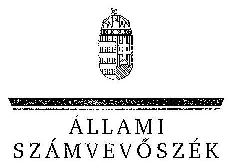
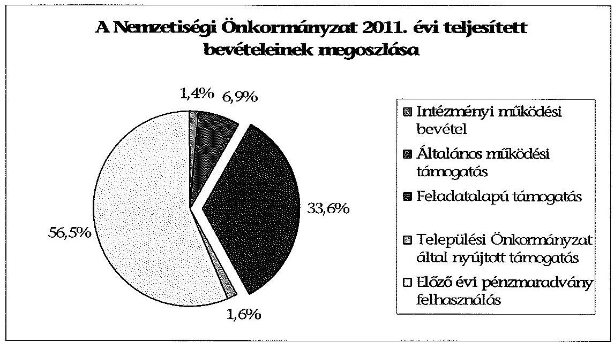
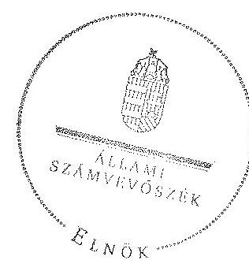

ÁLLAMI
SZÁMVEVÔSZÉK

# JELENTÉS 

a helyi kisebbségi/nemzetiségi önkormányzatok gazdálkodásának ellenőrzéséről Mágocsi Német Nemzetiségi Önkormányzat

---

# Állami Számvevőszék 

Iktatószám: V-0100-017/2013.
Témaszám: 1105
Vizsgálat-azonosító szám: V06060324

## Az ellenőrzést felügyelte:

Horváth Balázs
felügyeleti vezető
Az ellenőrzést vezette és az ellenőrzés végrehajtásáért felelős:
Preller Zsuzsanna
ellenőrzésvezető
A számvevőszéki jelentést készítették és a jelentés összeállításában közremüködtek:

Kányáné Murvai Tünde
számvevő tanácsos
Moder Beatrix
számvevő
Az ellenőrzést végezték:
Dr. Hegedűs György
számvevő tanácsos

Nagy Adrienn
számvevő

---

# TARTALOMJEGYZÉK 

BEVEZETÉS ..... 5
I. ÖSSZEGZŐ MEGÁLLAPÍTÁSOK, KÖVETKEZTETÉSEK, JAVASLATOK ..... 8
II. RÉSZLETES MEGÁLLAPÍTÁSOK ..... 14

1. A Nemzetiségi és a Települési Önkormányzat együttmúködésének szabályszerűsége ..... 14
2. A gazdálkodási feladatok ellátásának szabályszerűsége ..... 15
2.1. A költségvetésre és zárszámadásra, valamint a kincstári adatszolgáltatás rendjére vonatkozó jogszabályi előírások betartása ..... 15
2.2. A Nemzetiségi Önkormányzat gazdálkodásának szabályozottsága ..... 16
2.3. A pénzügyi kontrollok múködése ..... 17
3. A Nemzetiségi Önkormányzattal összefüggő gazdálkodási feladatok belső ellenőrzésének biztosítása ..... 18
4. A 2011. évi feladatalapú támogatás felhasználásának, elszámolásának szabályszerűsége ..... 19
5. A Nemzetiségi Önkormányzat feladatellátása ..... 19

## MELLÉKLET

1. számú A Nemzetiségi Önkormányzat 2011. évi és 2012. I. félévi gazdálkodásának fóbb adatai, mutatói

## FÜGGELÉKEK

1. számú Értelmező szótár
2. számú A pénzügyi kontrollok múködésének értékelése

---

# **Chemistry**

## **Chemical Reactions**

### **Balancing Chemical Equations**

1. **Write the unbalanced equation:**
   - Example: $$C_3H_8 + O_2 \rightarrow CO_2 + H_2O$$

2. **Balance the equation:**
   - Example: $$2C_3H_8 + 7O_2 \rightarrow 6CO_2 + 8H_2O$$

3. **Balance the equation:**
   - Example: $$2C_3H_8 + 7O_2 \rightarrow 6CO_2 + 8H_2O$$

### **Types of Reactions**

1. **Combination Reaction:**
   - Example: $$2H_2 + O_2 \rightarrow 2H_2O$$

2. **Decomposition Reaction:**
   - Example: $$2H_2O_2 \rightarrow 2H_2O + O_2$$

3. **Single Displacement Reaction:**
   - Example: $$Zn + 2HCl \rightarrow ZnCl_2 + H_2$$

4. **Double Displacement Reaction:**
   - Example: $$AgNO_3 + NaCl \rightarrow AgCl + NaNO_3$$

5. **Combustion Reaction:**
   - Example: $$CH_4 + 2O_2 \rightarrow CO_2 + 2H_2O$$

## **Stoichiometry**

### **Mole Concept**

- **Mole (mol):** The amount of substance containing as many particles (atoms, molecules, ions) as there are atoms in exactly 12 grams of carbon-12.
- **Avogadro's Number:** $$6.022 \times 10^{23}$$ particles per mole.

### **Molar Mass**

- **Molar Mass:** The mass of one mole of a substance.
- Example: The molar mass of water ($$H_2O$$) is 18.015 g/mol.

### **Calculations**

1. **Moles to Mass:**
   - Formula: $$n = \frac{m}{M}$$
   - Example: Calculate the number of moles of $$H_2O$$ in 18 grams of water.
     - $$n = \frac{18.015 \, \text{g}}{18.015 \, \text{g/mol}} = 18.015 \, \text{g/mol}$$

2. **Moles to Mass:**
   - Formula: $$m = n \times M$$
   - Example: Calculate the mass of 18.015 g of water.
     - $$m = 18.015 \, \text{g/mol} = 18.015 \, \text{g/mol}$$

## **Gas Laws**

### **Ideal Gas Law**

- **Equation:** $$PV = nRT$$
- **Variables:**
  - $$P$$: Pressure (atm)
  - $$V$$: Volume (L)
  - $$n$$: Number of moles (mol)
  - $$R$$: Ideal gas constant (0.0821 L·atm/mol·K)
  - $$T$$: Temperature (K)

### **Boyle's Law**

- **Equation:** $$P_1V_1 = P_2V_2$$
- **Variables:**
  - P₁: Pressure (atm)
  - P₂: Volume (L)
  - P₃: Pressure (atm)
  - P₁: Pressure (atm)
  - P₂: Volume (L)
  - P₃: Pressure (atm)
  - P₁: Pressure (atm)

### **Boyle's Law (Boyle's Law)**

- **Equation:** $$\frac{P_1V_1}{P_2V_2} = \frac{P_1}{V_1}$$

## **Thermochemistry**

### **Enthalpy (H)**

- **Definition:** The heat content of a system at constant pressure.
- **Equation:** $$\Delta H = q_p$$
- **Variables:**
  - $$q_p$$: Heat transferred at constant pressure.
  - $$q_p$$: Heat transferred at constant pressure.

### **Hess's Law**

- **Statement:** The enthalpy change for a reaction is the same whether it occurs in one step or multiple steps.
- **Equation:** $$\Delta H = q_p + \Delta H_0$$
- **Variables:**
  - $$q_p$$: Heat transferred at constant pressure.
  - $$q_p$$: Heat transferred at constant pressure.

## **Electrochemistry**

### **Oxidation and Reduction**

- **Oxidation:** Loss of electrons.
- **Reduction:** Gain of electrons.

### **Galvanic Cells**

- **Definition:** A cell that converts chemical energy into electrical energy.
- **Components:**
  - Anode: Oxidation occurs.
  - Cathode: Reduction occurs.
  - Salt Bridge: Connects the two half-cells.

### **Nernst Equation**

- **Equation:** $$E = E^\circ - \frac{RT}{nF} \ln Q$$
- **Variables:**
  - $$E$$: Energy (K)
  - $$E^\circ$$: Heat transferred (J)
  - $$E$$: Heat transferred (J)
  - $$Q$$: Reaction quotient

---

# RÖVIDÍTÉSEK JEGYZÉKE 

## Jogszabályok

Áht. 1
Áht. 2
ÁSZ tv.
Nek. ${ }_{1}$ tv.
Nek. 2 tv.
Számv. tv.
Áhsz.

Ámr.
Ávr.

Bkr.
támogatási kormányrendelet

Települési Önkormányzat SZMSZ-e

## Szórövidítések

ÁSZ
gazdálkodási jogkörök szabályzata ${ }_{1}$
1992. évi XXXVIII. törvény az államháztartásról (hatályos 2011. december 31-ig)
2011. évi CXCV. törvény az államháztartásról (hatályos 2011. december 31-étől)
2011. évi LXVI. törvény az Állami Számvevőszékről (hatályos 2011. július 1-jétől)
1993. évi LXXVII. törvény a nemzeti és etnikai kisebbségek jogairól (hatályos 2011. december 31-ig)
2011. évi CLXXIX. törvény a nemzetiségek jogairól (hatályos 2011. december 20-tól)
2000. évi C. törvény a számvitelről

249/2000. (XII. 24.) Korm. rendelet az államháztartás szervezeti beszámolási és könyvvezetési kötelezettségének sajátosságairól
292/2009. (XII. 19.) Korm. rendelet az államháztartás múködési rendjéről (hatályos 2011. december 31-ig)
368/2011. (XII. 31.) Korm. rendelet az államháztartásról szóló törvény végrehajtásáról (hatályos 2012. január 1jétől)
370/2011. (XII. 31.) Korm. rendelet a költségvetési szervek belső kontrollrendszeréről és belső ellenőrzésről (hatályos 2012. január 1-jétől)
a kisebbségi önkormányzatoknak a központi költségvetésből, valamint fejezeti kezelésú előirányzatból nyújtott támogatások feltételrendszeréről és elszámolásának rendjéről szóló 342/2010. (XII. 28.) Korm. rendelet (hatályon kívül helyezte a 28/2012. (III. 6.) Korm. rendelet a nemzetiségi célú előirányzatokból nyújtott támogatások feltételrendszeréről és elszámolásának rendjéről; jelenleg hatályos a 428/2012. (XII. 29.) Korm. rendelet a nemzetiségi célú előirányzatokból nyújtott támogatások feltételrendszeréről és elszámolásának rendjéről)
Mágocs Város Önkormányzat Képviselő-testületének 2/1991. (III./26.) számú rendelete az Önkormányzat Szervezeti és Múködési Szabályzatáról (módosításokkal egységes szerkezetben)

## Állami Számvevőszék

Mágocs Város Önkormányzat Polgármesteri Hivatalának szabályzata a pénzgazdálkodással kapcsolatos kötelezettségvállalás, utalványozás, érvényesítés és ellenjegyzés hatásköri rendjéről (hatályos: 2010. január 01-jétől 2011. december 31-ig)

---

gazdálkodási jogkörök szabályzata ${ }_{2}$
jegyzó
Képviselö-testület

Kincstár
Nemzetiségi Önkormányzat

Nemzetiségi Önkormányzat elnöke

Nemzetiségi Önkormányzat SZMSZ-e
polgármester
Polgármesteri Hivatal
Polgármesteri Hivatal SZMSZ-e
Támogató
Települési Önkormányzat
Települési Önkormányzat Képviselö-testülete

Mágocs Város Önkormányzat Polgármesteri Hivatalának szabályzata a pénzgazdálkodással kapcsolatos kötelezettségvállalás, utalványozás, pénzügyi ellenjegyzés és érvényesítés hatásköri rendjéről (hatályos: 2012. január 01jétől)
Mágocs Város Önkormányzatának jegyzője
Mágocsi Német Kisebbségi Önkormányzat Képviselötestülete 2011. december 31-ig, Mágocsi Német Nemzetiségi Önkormányzat Képviselö-testülete 2012. január 1jétől
Magyar Államkincstár
Mágocsi Német Kisebbségi Önkormányzat 2011. december 31-ig, Mágocsi Német Nemzetiségi Önkormányzat 2012. január 1-jétől
Mágocsi Német Kisebbségi Önkormányzat elnöke 2011. december 31-ig, Mágocsi Német Nemzetiségi Önkormányzat elnöke 2012. január 1-jétől
Mágocsi Német Nemzetiségi Önkormányzat 1/2003. (I. 9.) számú határozatával elfogadott Szervezeti és Múködési Szabályzata (módosításokkal egységes szerkezetben)
Mágocs Város Önkormányzatának polgármestere
Mágocs Város Önkormányzatának Polgármesteri Hivatala
Mágocs Város Önkormányzat Polgármesteri Hivatalának ügyrendje (hatályos: 2011. április 1-jétől)
A támogatást nyújtó Közigazgatási és Igazságügyi Minisztérium
Mágocs Város Önkormányzata
Mágocs Város Önkormányzatának Képviselő-testülete

---

# JELENTÉS   a helyi kisebbségi/nemzetiségi önkormányzatok gazdálkodásának ellenőrzéséről   Mágocsi Német Nemzetiségi Önkormányzat 

## BEVEZETÉS

Az államháztartás részét, az önkormányzati alrendszer egyik elemét képezik a nemzetiségi önkormányzatok, amelyek jogi személyek és a Nek. ${ }_{1,2}$ tv-ben meghatározott önálló feladat- és hatáskörökkel rendelkeznek. A nemzetiségi önkormányzatok az önkormányzati, illetve testületi múködtetés mellett a helyi nemzetiségi közügyek változatos formában való ellátásában vesznek részt.

A nemzetiségi önkormányzatok, illetve a települési önkormányzatok között a jelenlegi szabályozás szerint nincs alá-fölérendeltségi viszony. A nemzetiségi önkormányzatok azonban sajátos közjogi helyzetben vannak, mert a jogállásukat tekintve önkormányzatok, ám függnek a székhelyük szerinti települési önkormányzat hivatalától, amely ellátja a nemzetiségi önkormányzatok vonatkozásában a megállapodásban rögzített gazdálkodási feladatokat.

A nemzetiségek helyzete, támogatása mind hazai, mind európai uniós szinten kiemelt figyelmet kap napjainkban. A nemzetiségi önkormányzatok gazdálkodására és támogatási rendszerére vonatkozó jogszabályok a 20102012. években jelentős változásokon mentek át, amelyek érintették a feladatalapú támogatásra fordítható költségvetési keret megállapítását, az operatív gazdálkodási jogkörök szabályozását, az elkülönített könyvvezetés alkalmazását, a belső ellenőrzés szabályozását.

Az ellenőrzés célja annak értékelése volt, hogy a Nemzetiségi Önkormányzat gazdálkodási kereteinek kialakítása, gazdálkodása és feladatellátása megfelelte a hatályos jogszabályoknak.

Ennek keretében ellenőriztük, hogy:

- a Nemzetiségi Önkormányzat és a Települési Önkormányzat együttmúködésének szabályozása, a Települési Önkormányzat SZMSZ-ében, a megállapodásban előírt működési feltételek biztosítása megfelelte a jogszabályi előírásoknak;
- a felek együttműködése megfelelte a megállapodásnak a gazdálkodási feladatok szabályszerű ellátásában, ennek keretében betartották-e a Nemzetiségi Önkormányzat gazdálkodásához kapcsolódóan a költségvetésre és zárszámadásra, a gazdálkodás szabályozására, az operatív gazdálkodási jogkörök gyakorlására vonatkozó jogszabályi előírásokat;

---

- a jegyző biztosította-e a Polgármesteri Hivatal belső ellenőrzése keretében a Nemzetiségi Önkormányzattal összefüggő gazdálkodási feladatok belső ellenőrzését;
- a 2011. évi feladatalapú támogatás felhasználása, a folyósított feladatalapú támogatással történő elszámolás az előírásoknak megfelelően történt-e;
- a Nemzetiségi Önkormányzat feladatellátása összhangban volt-e a vonatkozó jogszabályi előírásokkal.

# Az ellenőrzés típusa: szabályszerűségi ellenőrzés 

Az ellenőrzött időszak: 2011. január 1. - 2012. június 30.
Ellenőrzött szervezet: Mágocsi Német Nemzetiségi Önkormányzat és a gazdálkodási feladatait ellátó Mágocs Város Önkormányzata

Az ellenőrzés jogszabályi alapja: az ÁSZ tv. 5. § (2)-(3) és (6) bekezdései
Az ellenőrzés szakmai módszertana az ÁSZ hivatalos honlapján (www.asz.hu) közzétett szakmai szabályokon alapult, amely a Legfőbb Ellenőrző Intézmények Nemzetközi Szervezete (INTOSAI) által kiadott nemzetközi standardok (ISSAI) figyelembevételével készült.

A fogalmak magyarázatát az 1. számú függelék, a pénzügyi kontrollok megfelelősége értékelésénél alkalmazott egységes minősítési szempontokat a 2. számú függelék tartalmazza.

Az ellenőrzés lefolytatásához a Települési Önkormányzat és a Nemzetiségi Önkormányzat tanúsítványok kitöltésével és a kapcsolódó dokumentumok elektronikus megküldésével szolgáltatott adatokat. A tanúsítványokon szerepeltetett adatok, információk ellenőrzése és szükség szerinti javítása a helyszíni ellenőrzés keretében történt.

Az ÁSZ az ellenőrzés megállapításait az ellenőrzött időszakban hatályos, az intézkedést igénylő megállapításokra tett javaslatokat a jelenleg hatályos jogszabályok alapján fogalmazta meg.

A Nemzetiségi Önkormányzat 2002-ben alakult, elnöke a 2010. évi helyhatósági választások óta látja el feladatát. A Nemzetiségi Önkormányzat intézményt, gazdasági társaságot és más szervezetet nem alapított, társulásban nem vett részt. A négytagú Képviselő-testület munkája segítésére bizottságot nem hozott létre. A Nemzetiségi Önkormányzat a költségvetési beszámolója szerint a 2011. évben 3052 ezer Ft költségvetési bevételt ért el és 2873 ezer Ft költségvetési kiadást teljesített. A 2012. évben 1000 ezer Ft eredeti költségvetési bevételi és kiadási előirányzatot terveztek. A 2012. I. félévi beszámolója alapján a módosított költségvetési bevételi és kiadási előirányzat 858 ezer Ft, a teljesített költségvetési bevétel 411 ezer Ft, a teljesített költségvetési kiadás 13 ezer Ft volt. A 2011. évben a Nemzetiségi Önkormányzat 1025 ezer Ft feladatalapú támogatásban részesült. A 2011. évi és 2012. I. féléves gazdálkodási adatokat részletesen az 1. számú mellékletben mutatjuk be. Az ÁSZ a Nemzetiségi Önkormányzat gazdálkodását korábban nem ellenőrizte.

---

Az ÁSZ tv. 29. § (1) bekezdése szerint a jelentéstervezetet megküldtük a polgármester és a Nemzetiségi Önkormányzat elnöke részére, akik az ÁSZ tv. 29. § (2) bekezdésében foglalt észrevételezési jogukkal nem éltek, a jelentéstervezetre észrevételt nem tettek.

---

# I. ÖSSZEGZŐ MEGÁLLAPÍTÁSOK, KÖVETKEZTETÉSEK, JAVASLATOK 

A Nemzetiségi és a Települési Önkormányzat együttmüködésének szabályozása, a Nemzetiségi Önkormányzat múködési feltételeinek biztosítása a jogszabályi előírásoknak részben felelt meg. A Települési Önkormányzat biztosította a Nemzetiségi Önkormányzat müködéséhez szükséges személyi és tárgyi feltételeket. A 2011. évben hatályos megállapodás azonban az Ámr. előírásai ellenére nem tartalmazta a költségvetési koncepció, a költségvetési rendelet véleményezésének és elfogadását követő rendelkezésre bocsátásának határidejét, a Nemzetiségi Önkormányzat költségvetésének előkészítéséhez szükséges adatok átadására és a költségvetési határozat elfogadását követő megküldésére vonatkozó előírásokat, valamint a jegyző felkérését a költségvetési és zárszámadási határozatok elkészítésére. A 2012. június 30 -án hatályos megállapodásban - az Áht. ${ }_{2}$ és a Nek. ${ }_{2}$ tv. előírásai ellenére - nem rögzítették a bevételekkel és kiadásokkal kapcsolatos ellenőrzési, finanszírozási és beszámolási feladatok részletes szabályait, a törzskönyvi nyilvántartásba vétellel, adószám igényléssel kapcsolatos határidőket, együttmúködési kötelezettséget és ezek felelőseinek kijelölését.

A Nemzetiségi Önkormányzat költségvetésére és zárszámadására vonatkozó jogszabályi előírásokat részben tartották be. A költségvetési és zárszámadási határozatokat egymással összehasonlítható szerkezetben készítették el, azonban a Nemzetiségi Önkormányzat költségvetési határozatai az Ámr. és az Áht. ${ }_{2}$ előírásai ellenére nem tartalmazták az előirányzat felhasználási tervet. A 2011. évi zárszámadási határozatot az Ámr-ben foglalt határidőn túl fogadta el a Képviselő-testület, a 2012. évi költségvetési határozat tervezetét a Nemzetiségi Önkormányzat elnöke az Áht. ${ }_{2}$-ben foglalt határidőn túl terjesztette a Kép-viselő-testület elé. A Nemzetiségi Önkormányzat elnöke a 2011. évben a kiemelt költségvetési előirányzatok felhasználásához szükséges mértékű előirányzat átcsoportosítást nem kezdeményezte, ezért a támogatásértékű müködési kiadás kiemelt előirányzatát - az Áht. ${ }_{1}$ előírása ellenére - túllépték. A 2012. I. félévben előirányzat túllépés nem volt. A jegyző a 2012. évi-költségvetéshez kapcsolódó kincstári adatszolgáltatási kötelezettségének határidőben eleget tett.

A Nemzetiségi Önkormányzat gazdálkodásának szabályozása az ellenőrzött időszakban a jogszabályi előírásoknak részben felelt meg. A gazdálkodási feladatok végrehajtását ellátó Polgármesteri Hivatal a Számv. tv-ben és az Áhsz-ben előírt gazdálkodási szabályzatokkal rendelkezett, azok hatályát a jegyző a Nemzetiségi Önkormányzat gazdálkodási feladataira kiterjesztette. A Polgármesteri Hivatal ellenőrzési nyomvonala, a szabálytalanságok kezelésének eljárásrendje, a kockázatkezelési rendszer, valamint a folyamatba épített előzetes, utólagos és vezetői ellenőrzés szabályzatainak hatálya azonban - az Ámr., az Áht.,, illetve a Bkr. előírásai ellenére - nem terjedt ki a Nemzetiségi Önkormányzat gazdálkodási feladataira. A Polgármesteri Hivatal SZMSZ-e az Ámr. és az Ávr. előírásai ellenére nem tartalmazta a nevesített munkakörökhöz kapcsolódóan a Nemzetiségi Önkormányzat gazdálkodásával kapcsolatos fel-

---

adat- és hatásköröket, a hatáskörök gyakorlásának módját, a helyettesítés rendjét és az ezekre vonatkozó felelősségi szabályokat. Az operatív gazdálkodási jogkörök kialakítása az ellenőrzött időszakban a jogszabályi előírásokkal összhangban történt.

A pénzügyi kontrollok múködése a 2011. évben a működési célú pénzeszközátadások és a dologi és egyéb folyó kiadások teljesítésénél - összességében értékelve - gyenge volt, a hibák száma a lényegességi szintet, a kritikus hibahatárt elérte. A pénzeszközátadások kifizetései során a kötelezettségvállalás és az utalvány ellenjegyzője az Ámr. előírása ellenére nem ellenőrizte a kötelezettségvállalás tárgyával összefüggő szabad előirányzat rendelkezésre állását, valamint a dologi kiadások teljesítése során az utalvány ellenjegyzóje annak ellenére ellenjegyezte a kifizetéseket, hogy azokat az utalványozó az összeférhetetlenségi szabályok megszegésével, a saját javára rendelte el. 2012. I. félévben a dologi és egyéb folyó kiadások teljesítésénél a pénzügyi kontrollok múködése jó volt. A pénzügyi ellenjegyzés és a teljesítés igazolása a jogszabályi előírásoknak megfelelően történt, azonban az érvényesítő az Ávr-ben előírt feladatait nem szabályszerűen végezte, mert úgy érvényesítette a kiadásokat, hogy nem jelezte az összeférhetetlenségi szabály utalványozás során történő megszegését. A Nemzetiségi Önkormányzatnál, a pénzügyi folyamatokban kulcsszerepet betöltő belső kontrollok múködésében feltárt hiányosságokkal összefüggésben az ellenőrzés jogosulatlan kifizetést nem állapított meg.

A Nemzetiségi Önkormányzat a 2011. évben a bevételei 33,6\%-át kitevő, 1025 ezer Ft feladatalapú támogatásban részesült, amelyet tárgyév december 31-ig a jogszabályi előírásokkal összhangban felhasznált. A támogatási kormányrendeletben hivatkozott, Áht. ${ }_{1}$-ben előírt elszámolás nem történt meg. A támogatás felhasználását, elszámolását a jogosult szervek nem ellenőrizték.

A Nemzetiségi Önkormányzat feladatellátásának tárgya összhangban volt a Nek. ${ }_{1,2}$ tv. előírásaival. Biztosította a nemzetiségi közügyek keretében az alapvető feladata ellátásához szükséges szervezeti, személyi és anyagi feltételeket. Kötelező feladatként kapcsolatot tartott fenn és megállapodást kötött civil szervezettel, önként vállalt feladatként a képviselt közösség kulturális autonómiája megerősítése tárgyában hagyományápolással és közművelődéssel kapcsolatos feladatokat látott el.

A jegyző az ellenőrzött időszakban a Polgármesteri Hivatal belső ellenőrzése keretében a Nemzetiségi Önkormányzat gazdálkodásával összefüggő végrehajtási feladatok belső ellenőrzéséről részben gondoskodott. A Polgármesteri Hivatal 2011. és 2012. évi belső ellenőrzési terveit megalapozó kockázatelemzés kiterjedt a Nemzetiségi Önkormányzat gazdálkodásával összefüggő végrehajtási feladatokra, azonban ilyen tárgyú belső ellenőrzést a 2011. évben és 2012. I. félévben nem terveztek és nem végeztek.

Az ÁSZ tv. 33. § (1) bekezdésében foglaltak értelmében az ellenőrzött szervezet vezetője köteles a jelentésben foglalt megállapításokhoz kapcsolódó intézkedési tervet összeállítani, és azt a jelentés kézhezvételétől számított 30 napon belül az ÁSZ részére megküldeni. Amennyiben az intézkedési tervet határidőre nem küldi meg a szervezet, vagy az nem elfogadható, az ÁSZ elnöke az ÁSZ tv. 33. § (3) bekezdés a)-b) pontjaiban foglaltakat érvényesítheti.

---

A helyszíni ellenőrzés megállapításainak hasznosítása mellett javasoljuk:

# a jegyzönek 

1. az együttmúködés szabályozásával kapcsolatban

A Nemzetiségi Önkormányzat és a Települési Önkormányzat együttműködését meghatározó - 2012. június 30 -án hatályos - megállapodás az Áht. 2 27. § (2) bekezdésében foglaltak ellenére nem tartalmazta a Nemzetiségi Önkormányzat bevételeivel és kiadásaival kapcsolatos ellenőrzési, finanszírozási és beszámolási feladatok ellátásának részletes szabályait, továbbá a Nek. 2 tv. 80. § (3) bekezdés a) pontja előírása ellenére a törzskönyvi nyilvántartásba vétellel és adószám igénylésével kapcsolatos határidőket, együttműködési kötelezettségeket és a felelősök konkrét kijelölését.

Javaslat
Készítse elő a megállapodás módosítását, hogy az tartalmilag feleljen meg az Áht. 2 27. § (2) bekezdésben, továbbá a Nek. 2 tv. 80. § (3) bekezdés a) pontban foglalt előírásoknak.
2. a költségvetés, zárszámadás megalkotásával és előterjesztésével kapcsolatban

A 2011. és 2012. évi költségvetés előterjesztésekor - az Ámr. 36. § (1) bekezdés k) pontja, illetve az Áht. 2 24. § (4) bekezdés a) pontjának előirása ellenére - nem mutatták be az előirányzat felhasználási tervet.

A Képviselő-testület az Ámr. 37. § (3) bekezdésében előírt határidőn túl alkotta meg a 2011. évi zárszámadási határozatot. A 2012. évi költségvetés tervezetét a Nemzetiségi Önkormányzat elnöke az Áht. 2 24. § (2) bekezdésében foglalt határidőn túl nyújtotta be a Képviselő-testületnek.

Javaslat
A költségvetés, zárszámadás szabályszerűsége érdekében a jövőben:
a) gondoskodjon az Áht. 2 27. § (2) bekezdésében foglalt előírás alapján a költségvetési határozat tervezetének előkészítéséről, hogy az Áht. 2 24. § (4) bekezdés a) pontjában foglaltaknak megfeleljen.
b) az Áht. 2 24. § (2) és az Áht. 2 91. § (1) bekezdéseiben meghatározottakkal összhangban biztosítsa a költségvetési és zárszámadási határozat tervezetek megfelelő időben történő előkészítését, hogy azt a Nemzetiségi Önkormányzat elnöke határidőben a Képviselő-testület elé terjeszthesse.
3. a kiemelt költségvetési előirányzatokkal kapcsolatban

A 2011. évi kifizetések teljesítése során a támogatásértékű múködési kiadás kiemelt előirányzatát túllépték, nem tartották be az Áht.: 12/A. § (1) bekezdésben foglalt előírást.

---

Javaslat
A jövőben az Áht. 2 34. § (6) bekezdésében foglaltaknak megfelelően készítsen előterjesztést az előirányzatok szükséges mértékű módosítására úgy, hogy azt a Nemzetiségi Önkormányzat elnöke határidőben nyújthassa be a Képviselő-testület részére az Áht. 2 36. § (1) bekezdés szerint - a meghatározott előirányzatokon belül való gazdálkodás érvényesülése érdekében.
4. a gazdálkodási feladatok szabályozottságával kapcsolatban

A Polgármesteri Hivatal SZMSZ-e 2011. évben az Ámr. 20. § (2) bekezdés h) pontja, 2012. I. félévben az Ávr. 13. § (1) bekezdés g) pontjában foglaltak ellenére nem tartalmazta nevesített munkakörökhöz tartozóan a Nemzetiségi Önkormányzat gazdálkodásával kapcsolatos feladat- és hatásköröket, a hatáskörök gyakorlásának módját, a helyettesítés rendjét, és az ezekhez kapcsolódó felelősségi szabályokat.

A Polgármesteri Hivatal szabályzatai közül a 2011. évben az Ámr. 156. § (2)-(3), 157. § (1), és az Áht. 1 121/A. § (4) bekezdéseiben, valamint a 2012. évben a Bkr. 6. § (3)-(4), a Bkr. 7. § (1) és a Bkr. 8. § (2)-(4) bekezdéseiben előírt ellenőrzési nyomvonal, szabálytalanságkezelési eljárásrend, kockázatkezelési rendszer, továbbá a folyamatba épített, előzetes, utólagos és vezetői ellenőrzés szabályozásának hatálya nem terjedt ki a Nemzetiségi Önkormányzat gazdálkodási feladataira.

Javaslat
A szabályszerű gazdálkodás biztosítása érdekében:
a) készítse elő a Polgármesteri Hivatali SZMSZ-e módosítását annak érdekében, hogy az megfeleljen az Ávr. 13. § (1) bekezdés g) pontjában foglalt előírásnak;
b) az Ávr. 13. § (3a) bekezdése alapján módosítsa a Polgármesteri Hivatal Bkr. 6. § (3)-(4), Bkr. 7. § (1) és a Bkr. 8. § (2)-(4) bekezdéseiben foglalt szabályzatait, hogy azok hatálya terjedjen ki a Nemzetiségi Önkormányzat gazdálkodási feladataira.
5. a pénzügyi kontrollok müködésével kapcsolatban

A 2011. évben a kötelezettségvállalás és az utalvány ellenjegyzője az Ámr. 74. § (3) bekezdés a) pontjában foglalt feladatát nem végezte el, mert nem ellenőrizte a kötelezettségvállalás tárgyával összefüggő szabad előirányzat rendelkezésre állását. Továbbá az utalvány ellenjegyzője nem szabályszerűen látta el az Ámr. 79. § (2) bekezdésében előírt ellenőrzési feladatát, mert annak ellenére ellenjegyezte az utalványt, hogy az utalványozó az Ámr. 80. § (2) bekezdésében foglalt összeférhetetlenségi szabályok figyelmen kívül hagyásával a saját javára rendelte el a kifizetést.

A 2012. év I. félévében az érvényesítő az Ávr. 58. § (1)-(2) bekezdése szerinti ellenőrzési és jelzési feladatát nem látta el szabályszerűen, mert az összeférhetetlenségi szabályok megszegésének az utalványozó felé történő jelzése nélkül érvényesítette a kiadás teljesítését.

---

Javaslat
Az operatív gazdálkodás múködési hibáinak megelőzése, feltárása és kijavítása érdekében gondoskodjon arról, hogy:
a) a pénzügyi ellenjegyző az Ávr. 55. § (1) bekezdés előírásának megfelelően lássa el feladatát;
b) az utalványozás során az Ávr. 60. § (2) bekezdésében foglalt összeférhetetlenségi szabályok betartásra kerüljenek;
c) az érvényesítő tegyen eleget az Ávr. 58. § (1)-(2) bekezdéseiben előírtak szerinti ellenőrzési, az utalványozó felé történő jelzési kötelezettségének.
6. A 2011. évben folyósított feladatalapú támogatás elszámolása a támogatási kormányrendelet 7. § (2) bekezdésében hivatkozott Áht. ${ }_{1}$-nek „a helyi önkormányzatok elszámolási rendjére vonatkozó rendelkezései alkalmazása" előírása ellenére nem történt meg.

Javaslat
Gondoskodjon az Áht. ${ }_{2}$ 27. § (2) bekezdésben meghatározott feladatkörében a Nemzetiségi Önkormányzat által igénybe vett feladatalapú támogatás elszámolásának elkészítéséről, figyelemmel az Áht. ${ }_{2}$ 57. § (4) bekezdésben foglaltakra.

# a polgármesternek 

A Nemzetiségi Önkormányzat és a Települési Önkormányzat együttmúködését meghatározó - 2012. június 30 -án hatályos - megállapodás az Áht. ${ }_{2}$ 27. § (2) bekezdésében foglaltak ellenére nem tartalmazta a Nemzetiségi Önkormányzat bevételeivel és kiadásaival kapcsolatos ellenőrzési, finanszírozási és beszámolási feladatok ellátásának részletes szabályait, továbbá a Nek. ${ }_{2}$ tv. 80. § (3) bekezdés a) pontja előírása ellenére a törzskönyvi nyilvántartásba vétellel és adószám igénylésével kapcsolatos határidőket, együttmúködési kötelezettségeket és a felelősök konkrét kijelölését.

A Polgármesteri Hivatal SZMSZ-e az Ávr. 13. § (1) bekezdés g) pontjában előírtak ellenére nem tartalmazta nevesített munkakörökhöz tartozóan a Nemzetiségi Önkormányzat gazdálkodásával kapcsolatos feladat- és hatásköröket, a hatáskörök gyakorlásának módját, a helyettesítés rendjét és az ezekre vonatkozó felelősségi szabályokat.

Javaslat
Terjessze a Települési Önkormányzat Képviselő-testülete elé jóváhagyásra:
a) az Áht. ${ }_{2}$ 27. § (2) bekezdésben és a Nek. ${ }_{2}$ tv. 80. § (3) bekezdés a) pontban foglalt előírás betartásával előkészített megállapodás módosítást;
b) az Ávr. 13. § (1) bekezdés g) pontjában foglalt szabályozásra figyelemmel a Polgármesteri Hivatal módosított SZMSZ-ét.

---

# a Nemzetiségi Önkormányzat elnökének 

1. A Nemzetiségi Önkormányzat és a Települési Önkormányzat együttműködését meghatározó - 2012. június 30 -án hatályos - megállapodás az Áht. 2 27. § (2) bekezdésében foglaltak ellenére nem tartalmazta a Nemzetiségi Önkormányzat bevételeivel és kiadásaival kapcsolatos ellenőrzési, finanszírozási és beszámolási feladatok ellátásának részletes szabályait, továbbá a Nek. 2 tv. 80. § (3) bekezdés a) pont elöirása ellenére a törzskönyvi nyilvántartásba vétellel és adószám igénylésével kapcsolatos határidőket, együttműködési kötelezettségeket és a felelősök konkrét kijelölését.

Javaslat
Terjessze a Képviselő-testület elé jóváhagyásra az Áht. 2 27. § (2) bekezdésben és a Nek. 2 tv. 80. § (3) bekezdés a) pontban foglalt előirás betartásával előkészített megállapodás módosítást.
2. A Képviselő-testület az Ámr. 37. § (3) bekezdésében előírt határidőn túl alkotta meg a 2011. évi zárszámadási határozatot, a 2012. évi költségvetés tervezetét. A Nemzetiségi Önkormányzat elnöke az Áht. 2 24. § (2) bekezdésében foglalt határidőn túl nyújtotta be a Képviselő-testületnek.

Javaslat
A jövőben az Áht. 2 24. § (2) és az Áht. 2 91. § (3) bekezdéseiben foglalt határidő betartásával nyújtsa be a Képviselő-testületnek a jegyző által előkészített költségvetési illetve zárszámadási határozat tervezetet.
3. a kiemelt költségvetési előirányzatokkal kapcsolatban

A 2011. évi kifizetések teljesítése során a támogatásértékű müködési kiadás kiemelt előirányzatát túllépték, nem tartották be az Áht. 1 12/A. § (1) bekezdésben foglalt előírást.

Javaslat
A jövőben terjessze a Képviselő-testület elé jóváhagyásra az Áht. 2 34. § (1) és (6) bekezdéseinek megfelelően, az előirányzatok szükséges mértékű módosításáról szóló előterjesztést.
4. A 2011. évben folyósított feladatalapú támogatás elszámolása a támogatási kormányrendelet 7. § (2) bekezdésében hivatkozott Áht. ${ }_{1}$-nek „a helyi önkormányzatok elszámolási rendjére vonatkozó rendelkezései alkalmazása" előirása ellenére nem történt meg.

Javaslat
Terjessze a Képviselő-testület elé jóváhagyásra az Áht. 2 57. § (4) bekezdés alapján összeállított, a Nemzetiségi Önkormányzat által igénybe vett feladatalapú támogatás elszámolását.

---

# II. RÉSZLETES MEGÁLLAPÍTÁSOK 

## 1. A Nemzetiségi és a Telepúlési Önkormányzat együttmúKÖDÉSÉNEK SZABÁLYSZERŰSÉGE

A Nemzetiségi Önkormányzat és a Települési Önkormányzat együttmüködésének szabályozása, a Nemzetiségi Önkormányzat müködési feltételeinek biztosítása részben felelt meg a jogszabályi előírásoknak. A megállapodások ${ }^{1}$ jóváhagyása az előírt határidők betartásával történt, azonban a 2011. december 31-én hatályos megállapodást nem módosították a jogszabályváltozásoknak megfelelően, ezért:

- az Ámr. 37. § (2) bekezdése ellenére nem tartalmazta a jegyző felkérését a költségvetési és zárszámadási határozat-tervezetek elkészítésére;
- az Ámr. 37. § (4) bekezdés a)-f) pontjai előirása ellenére nem tartalmazta a költségvetési koncepció elkészítésével, véleményezésével és rendelkezésre bocsátásával kapcsolatos határidőket, a Nemzetiségi Önkormányzat költségvetésének előkészítéséhez szükséges adatok átadására és a költségvetési határozat elfogadását követő megküldésére vonatkozó előírásokat, továbbá a költségvetési rendelet véleményezésének és elfogadását követő rendelkezésre bocsátásának határidejét.

A jegyző a 2010. évben a megállapodást felülvizsgálta és a jogszabályi előírásoknak megfelelő tartalmú megállapodás tervezetet készített, melyet a Települési Önkormányzat Képviselő-testülete jóváhagyott, azonban a Képviselő-testület határozatában úgy döntött, hogy a megállapodást nem kívánja módosítani. ${ }^{2}$

A megállapodást a felek a Nek. ${ }_{2}$ tv. előírásai szerint a 2012. évben felülvizsgálták és módosították, azonban a 2012. június 30 -án hatályos megállapodásban a jogszabályi előírásokat nem érvényesítették maradéktalanul, mert:

- az Áht. ${ }_{2}$ 27. § (2) bekezdésében foglaltak ellenére, nem rendelkeztek a Nemzetiségi Önkormányzat bevételeivel és kiadásaival kapcsolatos ellenőrzési, finanszírozási, és beszámolási feladatok ellátásának részletes szabályairól;
- a Nek. ${ }_{2}$ tv. 80. § (3) bekezdés a) pontjában foglaltak ellenére a megállapodás nem tartalmazta a törzskönyvi nyilvántartásba vétellel, az adószám igényléssel kapcsolatos határidőket, az együttműködési kötelezettséget és ezek felelőseinek konkrét kijelölését.

[^0]
[^0]:    ${ }^{1}$ A 2011.december 31-én hatályos megállapodást a Képviselő-testület a 2/2003. (I. 9.) számú, a Települési Önkormányzat Képviselő-testülete az 5/2003. (I. 29.) számú határozattal, a 2012. június 30 -án hatályos megállapodást a Képviselő-testület az 5/2012. (V. 8.) számú, a Települési Önkormányzat Képviselő-testülete a 42/2012. (IV. 24.) számú határozattal fogadta el.
    ${ }^{2}$ A Települési Önkormányzat 23/2010. (III. 30.) számú, a Képviselő testület 3/2011. (I. 31.) számú határozatai.

---

A 2012. évben a megállapodás szerinti működési feltételek módosítását a Nek. ${ }_{2}$ tv. 80. § (2) bekezdésében előírt harminc napos határidőt túllépve ${ }^{3}$ rögzítették a Települési Önkormányzat és a Nemzetiségi Önkormányzat SZMSZében.

A Települési Önkormányzat biztosította - az együttmúködés szabályozásának hiányosságai ellenére - a Nemzetiségi Önkormányzat múködéséhez szükséges személyi és tárgyi feltételeket.

# 2. A GAZDÁLKODÁSI FELADATOK ELLÁTÁSÁNAK SZABÁLYSZERŰSÉGE 

### 2.1. A költségvetésre és zárszámadásra, valamint a kincstári adatszolgáltatás rendjére vonatkozó jogszabályi előírások betartása

Az ellenőrzött időszakban a Nemzetiségi Önkormányzat költségvetésének, zárszámadásának tartalmára és jóváhagyására vonatkozó jogszabályi előírásokat részben tartották be. A Képviselő-testület az Ámr-ben előírt határidőn belül fogadta el a 2011. évi költségvetését, a költségvetési határozatot a Nemzetiségi Önkormányzat elnöke határidőben továbbította a polgármester részére. A 2011. évi költségvetési és zárszámadási határozatok egymással összehasonlítható szerkezetben készültek.

A költségvetési és zárszámadási határozatok megalkotása során a jogszabályi előírásokat nem érvényesítették maradéktalanul, mert:

- a 2011. évi költségvetési határozat ${ }^{4}$ az Ámr. 36. § (1) bekezdés k) pontjában foglaltak ellenére nem tartalmazta az előirányzat felhasználási ütemtervet;
- a 2012. évi költségvetés ${ }^{5}$ tervezetét a Nemzetiségi Önkormányzat elnöke az Áht. ${ }_{2}$ 24. § (2) bekezdésében foglalt határidőn túl nyújtotta be a Képviselőtestületnek, előterjesztésekor az Áht. ${ }_{2}$ 24. § (4) bekezdés a) pontjának előírása ellenére nem mutatta be az előirányzat felhasználási tervet.
- a 2011. évi zárszámadási határozatot ${ }^{6}$ az Ámr. 37. § (3) bekezdésében előírt határidőn túl - a Települési Önkormányzat zárszámadási rendeletének elfogadását követően - fogadta el a Képviselő-testület.

[^0]
[^0]:    ${ }^{3}$ A megállapodás szerinti múködési feltételeket - a Képviselő-testület 8/2012. (VII. 23.) számú határozatával és a Települési Önkormányzat Képviselő-testületének 9/2012. (VII. 2.) számú rendeletével - a 2012. április 24-ei szerződéskötés utáni 30 napos határidőt 60, illetve 39 nappal túllépve rögzítették a Nemzetiségi és a Települési Önkormányzat SZMSZ-ében.
    ${ }^{4}$ A Képviselő-testület 1/2011. (I. 31.) számú határozata a Nemzetiségi Önkormányzat 2011. évi költségvetéséről.
    ${ }^{5}$ A Képviselő-testület 2/2012. (II. 29.) számú határozata a Nemzetiségi Önkormányzat 2012. évi költségvetéséről.
    ${ }^{6}$ A Képviselő-testület 6/2012. (V. 8.) számú határozata a Nemzetiségi Önkormányzat 2011. évi költségvetési beszámolójáról.

---

A Nemzetiségi Önkormányzat költségvetése az ellenőrzött időszakban biztosította a tárgyévi kötelezettség vállalásához szükséges fedezetet. A költségvetési föösszegen belül a kiemelt elöirányzatok felhasználásához szükséges mértékú előirányzat átcsoportosítását a Nemzetiségi Önkormányzat elnöke - az Ámr. 68. § (3)-(4) bekezdései előirása ellenére - a 2011. évben nem kezdeményezte, így az Áht. ${ }_{1} 12 / \mathrm{A}$. § (1) bekezdésben foglaltakat figyelmen kívül hagyva nem biztosította a kiemelt előirányzatokon belüli gazdálkodást.

A támogatásértékű működési kiadás módosított előirányzata 1605 ezer Ft, a teljesített kiadás 2400 ezer Ft volt.

A 2012. évi költségvetéshez kapcsolódó, a Nemzetiségi Önkormányzatra vonatkozó kincstári adatszolgáltatási kötelezettségének a jegyző határidőben eleget tett.

# 2.2. A Nemzetiségi Önkormányzat gazdálkodásának szabályozottsága 

A Nemzetiségi Önkormányzat gazdálkodásának szabályozása az ellenőrzött időszakban részben felelt meg a jogszabályi előírásoknak. A Nemzetiségi Önkormányzat gazdálkodási feladatait ellátó Polgármesteri Hivatal a Számv. tv. és az Áhsz. által előírt gazdálkodási szabályzatokkal ${ }^{7}$ rendelkezett, azok hatályát a jegyző kiterjesztette a Nemzetiségi Önkormányzat gazdálkodási feladataira. A Polgármesteri Hivatal köztisztviselőinek munkaköri leírása a Nemzetiségi Önkormányzat gazdálkodásával kapcsolatos feladatokat tartalmazta.

A Nemzetiségi Önkormányzat gazdálkodásának szabályozása során a jogszabályi előírásokat nem érvényesítették maradéktalanul, mert:

- a Polgármesteri Hivatal szabályzatai közül az ellenőrzött időszakban az Ámr. 156. § (2)-(3), és a Bkr. 6. § (3)-(4) bekezdéseiben előírt ellenőrzési nyomvonal és szabálytalanságkezelési eljárásrend, az Ámr. 157. § (1) és a Bkr. 7. § (1) bekezdésében előírt kockázatkezelési rendszer, valamint az Áht. ${ }_{1} 121 /$ A. § (4), és a Bkr. 8. § (2)-(4) bekezdéseiben előírt folyamatba épített, előzetes, utólagos és vezetői ellenőrzés szabályzatának hatálya nem terjedt ki a Nemzetiségi Önkormányzat gazdálkodási feladataira;
- a Polgármesteri Hivatal SZMSZ-e - a 2011. évben az Ámr. 20. § (2) bekezdés h) pontjában, a 2012. évben az Ávr. 13. § (1) bekezdés g) pontjában foglaltak ellenére - nem tartalmazta a nevesített munkakörökhöz kapcsolódóan a Nemzetiségi Önkormányzat gazdálkodásával kapcsolatos feladotés hatásköröket, a hatáskörök gyakorlásának módját, a helyettesítés rendjét és az ezekre vonatkozó felelősségi szabályokat.

[^0]
[^0]:    ${ }^{7}$ Számviteli politika, számlarend, leltározási és leltárkészítési szabályzat, pénzkezelési szabályzat, eszközök és források értékelési szabályzata.

---

A Nemzetiségi Önkormányzat operatív gazdálkodási jogköreinek kialakítása - a kötelezettségvállalásra, utalványozásra, ellenjegyzésre a felhatalmazások, a szakmai teljesítést igazoló és az érvényesítést végző személyek kijelölése - az ellenőrzött időszakban a jogszabályi előirásoknak megfelelő volt. Az operatív gazdálkodással kapcsolatos feladat- és hatásköröket a megállapodások, a gazdálkodási jogkörök szabályzata ${ }_{1,2}$ és a feladatokat ellátó köztisztviselők munkaköri leírásai tartalmazták.

# 2.3. A pénzügyi kontrollok múködése 

A Nemzetiségi Önkormányzat - a 2. számú függelék szerinti, a pénzügyi kontrollok múködésének értékelésre kiválasztott három terület közül - a 2011. évben szociálpolitikai ellátásra, 2012. I. félévben szociálpolitikai ellátásra, valamint múködési és felhalmozási célú pénzeszközátadásra kiadást nem teljesített.

A Nemzetiségi Önkormányzatnál a 2011. évben a múködési célú pénzeszközátadásra, valamint a dologi és egyéb folyó kiadásokra teljesített kifizetések során a kötelezettségvállalás-ellenjegyzése, a szakmai teljesítésigazolás és az utalvány ellenjegyzés kontrollok múködésének megfelelősége - a 2. számú függelékben részletezett szempontok alapján végzett értékelés szerint, e területek költségvetési súlyának figyelembevételével - összefoglalóan értékelve ${ }^{8}$ gyenge volt, a hibák száma a lényegességi szintet, a kritikus hibahatárt elérte.

A dologi és egyéb folyó kiadások teljesítése során a kötelezettségvállalás ellenjegyzését és a szakmai teljesítésigazolást az arra jogosult személyek az Ámr. és a gazdálkodási szabályzat ${ }_{1}$ előírásainak megfelelően elvégezték. Az utalvány ellenjegyzője azonban ellenőrzési feladatát nem az Ámr. 79. § (2) bekezdésében előírtak szerint látta el, mert aláírásával ellenjegyezte a kifizetést annak ellenére, hogy az utalványozó az Ámr. 80. § (2) bekezdésében és a gazdálkodási jogkörök szabályzat ${ }_{1}$-ben rögzített összeférhetetlenségi szabályokat figyelmen kívül hagyva, a kifizetést a saját javára rendelte el.

A múködési célú pénzeszközátadásra teljesített kifizetések során a szakmai teljesítés igazolására jogosult személy a kiadások jogosságát és összegszerűségét az Ámr-ben és a gazdálkodási jogkörök szabályzat ${ }_{1}$-ben foglaltak szerint ellenőrizte és igazolta, azonban:

- a kötelezettségvállalás ellenjegyzője az Ámr. 74. § (3) bekezdés a) pontjában foglalt feladatát nem végezte el, mert nem ellenőrizte a kötelezettségvállalás tárgyával összefüggő szabad előirányzat rendelkezésre állását, ami a támogatásértékủ múködési kiadás kiemelt előirányzatának túllépéséhez vezetett;

[^0]
[^0]:    ${ }^{8}$ A kontrollok megfelelőségének értékelése során az ellenőrzött két terület egyedi értékelési pontszámait a 2011. évi Nemzetiségi Önkormányzati szintű költségvetési beszámoló teljesítési adataiból képzett súlyokkal arányosan összegeztük. A múködési és felhalmozási célú pénzeszközátadásnál $86 \%$-os, a dologi és egyéb folyó kiadások esetében $14 \%$-os súllyal számoltunk.

---

- az utalvány ellenjegyzője a szakmai teljesítésigazolás és az érvényesítés elvégzéséről meggyőződött, azonban az Ámr. 74. § (3) bekezdés a) pontjában foglalt feladatának nem tett eleget, mert nem észrevételezte, hogy a kötelezettségvállalás tárgyával összefüggő szabad előirányzat - a kötelezettségvállalás és a kifizetés időpontjában - nem állt rendelkezésre.

A Nemzetiségi Önkormányzatnál 2012. I. félévben a dologi és egyéb folyó kiadások teljesítése során a pénzügyi ellenjegyzés, a teljesítés igazolás és az érvényesítés pénzügyi kontrollok múködésének megfelelősége - a 2. számú függelékben részletezett szempontok alapján végzett értékelés szerint jó volt, mert:

- a pénzügyi ellenjegyző meggyőződött a szabad előirányzat, valamint a kifizetés tervezett időpontjában a pénzügyi fedezet rendelkezésre állásáról, továbbá a kötelezettségvállalás során a gazdálkodásra vonatkozó szabályok betartásáról;
- a feladatra kijelölt teljesítést igazoló a kiadások jogosságát, összegszerűségét, a megrendelések, szerződések teljesítését az Ávr-ben és a gazdálkodási jogkörök szabályzat ${ }_{2}$-ben foglalt előírásoknak megfelelően ellenőrizte és igazolta;
- az érvényesítő az Ávr. 58. § (1)-(2) bekezdéseiben foglalt ellenőrzési és jelzési feladatait nem szabályszerűen látta el, mert annak ellenére érvényesítette a kiadást, hogy az utalványozó az Ávr. 60. § (2) bekezdésében és a gazdálkodási jogkörök szabályzat ${ }_{2}$-ben rögzített összeférhetetlenségi szabályokat figyelmen kívül hagyva, a kifizetést a saját javára rendelte el.

A Nemzetiségi Önkormányzatnál, a pénzügyi folyamatokban kulcsszerepet betöltő belső kontrollok működésében feltárt hiányosságokkal összefüggésben az ellenőrzés jogosulatlan kifizetést nem állapított meg.

# 3. A Nemzetiségi ÖNKORMÁnyZATtal ÖSSZEFÜGGŐ GAZDÁLKODÁSI FELADATOK BELSŐ ELLENŐRZÉSÉNEK BIZTOSÍTÁSA 

A jegyző az ellenőrzött időszakban a Nemzetiségi Önkormányzat gazdálkodásával összefüggő végrehajtási feladatok belsö ellenőrzését részben biztosította.

A Polgármesteri Hivatal 2011. és 2012. évi belső ellenőrzési terveit megalapozó kockázatelemzés kiterjedt a Nemzetiségi Önkormányzat gazdálkodásával öszszefüggő végrehajtási feladatok ellátására. A Polgármesteri Hivatal belső ellenőrzése keretében azonban a Nemzetiségi Önkormányzat gazdálkodásával öszszefüggő végrehajtási feladatok belső ellenőrzését a 2011. évben és 2012. I. félévben nem tervezték, ilyen céllal belső ellenőrzést nem végeztek. ${ }^{9}$ A Nemzetiségi Önkormányzat belső ellenőrzésének feladatát a 2010. április 26-án a Telepü-

[^0]
[^0]:    ${ }^{9}$ A jegyző nyilatkozata szerint - a szűkös belső ellenőri kapacitás miatt - a Nemzetiségi Önkormányzatok ellenőrzését önkormányzati ciklusonként egy alkalommal tudják elvégezni.

---

lési Önkormányzattal megkötött megállapodás szabályozta, amely szerint a feladatellátás a Polgármesteri Hivatal hatáskörébe tartozott.

# 4. A 2011. ÉVI FELADATALAPÚ TÁMOGATÁs FELHASZNÁLÁSÁNAK, ELSZÁMOLÁSÁNAK SZABÁLYSZERŰSÉGE 

A 2011. évben a Nemzetiségi Önkormányzat 1025 ezer Ft feladatalapú támogatásban részesült, amelynek az összes bevételhez viszonyított részarányát a következő ábra szemlélteti:

A 2011. évben folyósított támogatást a jogszabályi előírásokkal összhangban a tárgyévben felhasználták. Elszámolása a támogatási kormányrendelet 7. § (2) bekezdésében hivatkozott Áht. ${ }_{1}$-nek „a helyi önkormányzatok elszámolási rendjére vonatkozó rendelkezései alkalmazása" előirrása ellenére nem történt meg. A támogatás felhasználását, elszámolását az ellenőrzésre jogosult szervek nem ellenőrizték.

## 5. A Nemzetiségi Önkormányzat feladATELLÁtása

A Nemzetiségi Önkormányzat feladatellátásának tárgya összhangban volt a Nek. ${ }_{1,2}$ tv. előírásaival. A Nemzetiségi Önkormányzat az ellenőrzött időszakban hatósági tevékenységet, közüzemi szolgáltatással összefüggő feladatot nem végzett.

A Nek. ${ }_{1}$ tv. 5/A. § (1) bekezdése és a Nek. ${ }_{2}$ tv. 10. § (1) bekezdése szerinti, a nemzetiségi érdekek védelmével és képviseletével kapcsolatos alapvető feladata ellátásához biztosította a szükséges szervezeti, személyi és anyagi feltételeket. A Nek. ${ }_{1}$ tv. 30. § (1) bekezdése és a Nek. ${ }_{2}$ tv. 115. § f) pontja alapján kötelező feladatellátás során kapcsolatot tartott fenn és megállapodást kötött civil szervezettel. A Nek. ${ }_{1}$ tv. 30/A. § (4) bekezdésében és Nek. ${ }_{2}$ tv. 116. § (2) bekezdésében

---

foglaltak alapján önként vállalt feladatot látott el a képviselt közösség kulturális autonómiája megerősítése érdekében a hagyományápolás, a közmưvelődés, és a kulturális igazgatás területén.

Budapest, 2013. 12. hónap 30. nap

Melléklet: 1 db
Függelék: 2 db

Domokos László
elnök $\Rightarrow$

2 db

---

# A Nemzetiségi Önkormányzat 2011. évi és 2012. I. félévi gazdálkodásának föbb adatai, mutatói

## A) BEVÉTELEK

|  Megnevezés | 2011. év |  |  |  | 2012. év |  | 2012. I. félév |   |
| --- | --- | --- | --- | --- | --- | --- | --- | --- |
|   | eredeti el. | módosított
el. | teljesítés | teljesítés
megoszlása
(\%) | eredeti el. | módosított
el. | teljesítés | teljesítés
megoszlása
(\%)  |
|  Intézményi müködési bevétel | 0,0 | 0,0 | 44,0 | $1,4 \%$ | 0,0 | 0,0 | 6,0 | $1,5 \%$  |
|  Általános müködési
támogatás | 500,0 | 210,0 | 210,0 | $6,9 \%$ | 1000,0 | 858,0 | 215,0 | $52,3 \%$  |
|  Feladatalapú támogatás | 0,0 | 1025,0 | 1025,0 | $33,6 \%$ | 0,0 | 0,0 | 0,0 | $0,0 \%$  |
|  Települési Önkormányzat
által nyújtott támogatás | 0,0 | 0,0 | 50,0 | $1,6 \%$ | 0,0 | 0,0 | 0,0 | $0,0 \%$  |
|  Pénzforgalmi bevételek
összesen | 500,0 | 1235,0 | 1329,0 | $43,5 \%$ | 1000,0 | 858,0 | 221,0 | $53,8 \%$  |
|  Előző évi pénzmaradvány
felhasználás | 0,0 | 1723,0 | 1723,0 | $56,5 \%$ | 0,0 | 0,0 | 190,0 | $46,2 \%$  |
|  Bevételek összesen | 500,0 | 2958,0 | 3052,0 | $100,0 \%$ | 1000,0 | 858,0 | 411,0 | $100,0 \%$  |

## B) KIADÁSOK

|  Megnevezés | 2011. év |  |  |  | 2012. év |  | 2012. I. félév |   |
| --- | --- | --- | --- | --- | --- | --- | --- | --- |
|   | eredeti el. | módosított
el. | teljesítés | teljesítés
megoszlása
(\%) | eredeti el. | módosított
el. | teljesítés | teljesítés
megoszlása
(\%)  |
|  Személyi juttatások | 0,0 | 0,0 | 0,0 | $0,0 \%$ | 0,0 | 0,0 | 0,0 | $0,0 \%$  |
|  Munkaadókat terhelő
járulékok | 0,0 | 0,0 | 0,0 | $0,0 \%$ | 0,0 | 0,0 | 0,0 | $0,0 \%$  |
|  Üzöngi és egyéb folyó
kiadások | 500,0 | 1353,0 | 473,0 | $16,5 \%$ | 1000,0 | 858,0 | 13,0 | $100,0 \%$  |
|  Támogatásértékủ müködési
kiadás, mértékok | 0,0 | 1605,0 | 2400,0 | $83,5 \%$ | 0,0 | 0,0 | 0,0 | $0,0 \%$  |
| működési kiadások
összesen | 500,0 | 2958,0 | 2873,0 | $100,0 \%$ | 1000,0 | 858,0 | 13,0 | $100,0 \%$  |
|  Felhalmozdai kiadások | 0,0 | 0,0 | 0,0 | $0,0 \%$ | 0,0 | 0,0 | 0,0 | $0,0 \%$  |
|  Kiadások összesen | 500,0 | 2958,0 | 2873,0 | $100,0 \%$ | 1000,0 | 858,0 | 13,0 | $100,0 \%$  |

---

# **Title: The Impact of Climate Change on Global Ecosystems**

## **Introduction**

Climate change is one of the most pressing environmental issues of our time. It affects ecosystems worldwide, leading to significant changes in biodiversity, habitat loss, and species extinction. This report explores the impacts of climate change on global ecosystems, focusing on key areas such as **forests**, **oceans**, and **polar regions**.

## **1. Forest Ecosystems**

Forests play a crucial role in carbon sequestration and maintaining biodiversity. However, rising temperatures and changing precipitation patterns are altering forest ecosystems. Key impacts include:

- **Increased frequency of wildfires**: Rising temperatures and drought conditions have led to more frequent and severe wildfires, destroying vast areas of forests.
- **Changes in species distribution**: Shifts in temperature and precipitation patterns are altering species distribution, leading to species extinction.
- **Insect outbreaks**: Warmer temperatures have increased the survival rates of pests like bark beetles, which are causing widespread wildfires.

## **2. Ocean Ecosystems**

Oceans absorb a significant portion of the excess heat and carbon dioxide (CO₂) produced by human activities. The consequences include:

- **Increased frequency of wildfires**: Rising sea levels and drought conditions have led to more frequent and severe wildfires, threatening species like polar bears and seals.
- **Changes in ocean currents**: Altered ocean currents are causing widespread sea-level rise, threatening species like polar bears and seals.
- **Changes in ocean currents**: Shifts in ocean currents are altering ocean currents, threatening species like polar bears and seals.

## **3. Polar Ecosystems**

Polar regions are particularly vulnerable to climate change due to their sensitivity to temperature changes. Key impacts include:

- **Melting of sea ice**: The Arctic is warming at twice the rate of the global average, leading to sea ice loss.
- **Glacial retreat**: Melting glaciers and their presence in the Arctic are altering the ocean currents, threatening species like polar bears and seals.
- **Permafrost thawing**: Thawing permafrost releases stored carbon and methane, further accelerating global warming.

## **4. Polar Ecosystems**

Polar regions are particularly vulnerable to climate change due to their sensitivity to temperature changes. Key impacts include:

- **Melting of sea ice**: Melting glaciers and their presence in the Arctic are altering sea ice levels, threatening species like polar bears and seals.
- **Glacial retreat**: Melting glaciers and their presence in the Arctic are altering sea ice levels, threatening species like polar bears and seals.

## **5. Polar Ecosystems**

Polar regions are particularly vulnerable to climate change due to their sensitivity to temperature changes. Key impacts include:

- **Melting of sea ice**: Melting glaciers and their presence in the Arctic are altering sea ice levels, threatening species like polar bears and seals.
- **Glacial retreat**: Melting glaciers and their presence in the Arctic are altering sea ice levels, threatening species like polar bears and seals.

## **Conclusion**

Climate change poses a significant threat to global ecosystems, with far-reaching consequences for biodiversity and human societies. By reducing greenhouse gas emissions, reducing greenhouse gas emissions, and reducing greenhouse gas emissions, we can protect our planet for future generations.

---

**References**

1. IPCC (Intergovernmental Panel on Climate Change). (2021). *Climate Change 2021: The Physical Science Basis*.
2. WWF (World Wildlife Fund). (2020). *Living Planet Report 2020*.
3. NASA Global Climate Change. (2022). *Vital Signs: Global Temperature*.

---

# ÉRTELMEZŐ SZÓTÁR 

feladatalapú támogatás

megállapodás
nemzetiség
nemzetiségi közügy

A támogatási évben általános múködési támogatásban részesült, és a Támogatónak a Kincstárhoz intézett, a feladatalapú támogatás utalására vonatkozó rendelkező levele keltének időpontjában múködő nemzetiségi önkormányzatoknak a támogatási kormányrendeletben rögzített feltételrendszer alapján nyújtható támogatás. A feladatalapú támogatás a nemzetiségi közügyeknek a nemzetiségi önkormányzatok által történő ellátását szolgálja. (A támogatási kormányrendelet 2. § (2) bekezdés c) pont, és 4. § (1) bekezdés alapján.)
A nemzetiségi önkormányzatnak a múködési feltételei biztosítására, továbbá a bevételeivel és a kiadásaival kapcsolatban a tervezési, gazdálkodási, ellenőrzési, finanszírozási, adatszolgáltatási és beszámolási feladatai végrehajtására a székhelye szerinti települési önkormányzattal megkötött megállapodás. (Az Áht. ${ }_{1} 66 . \S$, a Nek. ${ }_{2}$ tv. 80. § (2) bekezdés, valamint az Áht. ${ }_{2} 27 . \S$ (2) bekezdés alapján levezetett fogalom.)
Minden olyan Magyarország területén legalább egy évszázada honos népcsoport, amely az állam lakossága körében számszerú kisebbségben van és a lakosság többi részétől saját nyelve és kultúrája, hagyományai különböztetik meg, egyben olyan összetartozás-tudatról tesz bizonyságot, amely mindezek megőrzésére, történelmileg kialakult közösségeik érdekeinek kifejezésére és védelmére irányul. (A Nek. ${ }_{1}$ tv. 1. § (2) bekezdése, valamint a Nek. ${ }_{2}$ tv. 1. § (1) bekezdése alapján levezetett fogalom.)
Az egyéni és közösségi jogok érvényesülése, a nemzetiséghez tartozók érdekeinek kifejezésre juttatása - különösen az anyanyelv ápolása, őrzése és gyarapítása, továbbá a nemzetiségek kulturális autonómiájának a nemzetiségi önkormányzatok által történő megvalósítása és megőrzése - érdekében a nemzetiséghez tartozók meghatározott közszolgáltatásokkal való ellátásával, ezen ügyek önálló vitelével és az ehhez szükséges szervezeti, személyi és anyagi feltételek megteremtésével összefüggő ügy. A közhatalmat gyakorló állami és helyi önkormányzati szervekben, továbbá a nemzetiségi önkormányzati szervekben való nemzetiségi képviselethez és mindezek szervezeti, személyi és anyagi feltételeinek biztosításához kapcsolódó ügy. (A Nek. ${ }_{1}$ tv. 6/A. § 1. pontjából és a Nek. ${ }_{2}$ tv. 2. § 1. pontjából levezetett fogalom.)

---

nemzetiségi önkormányzat
pénzügyi kontrollok

Törvényben meghatározott nemzetiségi közszolgáltatási feladatokat ellátó, testületi formában múködő, jogi személyiséggel rendelkező, demokratikus választások útján törvény alapján létrehozott szervezet, amely a nemzetiségi közösséget megillető jogosultságok érvényesítésére, a nemzetiségek érdekeinek védelmére és képviseletére, a feladat- és hatáskörébe tartozó nemzetiségi közügyek települési, területi vagy országos szinten történő önálló intézésére jön létre. (A Nek. ${ }_{1}$ tv. 6/A. § (1) bekezdés 2. pontjából, valamint a Nek. ${ }_{2}$ tv. 2. § 2. pontjából levezetett fogalom.) A jelentésben e fogalmat a települési nemzetiségi önkormányzatokra leszűkítve használjuk.
A kötelezettségvállalás és az utalvány ellenjegyzése, valamint a szakmai teljesítés igazolása 2011. december 31éig, 2012. január 1-jétől a pénzügyi ellenjegyzés, a teljesítés igazolása és az érvényesítés.

---

# A PÉNZÜGYI KONTROLLOK MŰKÖDÉSÉNEK ÉRTÉKELÉSE 

A pénzügyi kontrollok működése megfelelőségének vizsgálatát többlépcsős megfelelőségi tesztek útján, megismételt eljárással, a könyvviteli tételekből vett egyszerű véletlen minta alapján végeztük. A tesztelést az értékelésre kiválasztott három terület - a dologi és egyéb folyó kiadásoknál teljesített kifizetések, az államháztartáson belülre és kívülre, múködési és felhalmozási célra teljesített pénzeszközátadások, illetve a szociálpolitikai ellátások teljesített kiadásainál végeztük el.

Az ellenőrzés során alkalmazott módszer (többlépcsős megfelelőségi teszt) lényege, hogy a kiválasztott minta ellenőrzését csak addig végezzük, amíg elegendő és megfelelő bizonyítékot nem szerzünk a vizsgált pénzügyi kontroll működésének megfelelő, vagy nem megfelelő voltáról. A megismételt eljárás alkalmazása a szándékolt hatáshoz (törvényes múködés, kitűzött célok, teljesítmények elérése, veszteséget okozó kockázatok megelőzése, mérséklése, feltárása) viszonyítva lehetővé teszi a kontrolltevékenységek tényleges hatásának vizsgálatát, ez alapján a múködés megfelelősége értékelését. Ennek keretében a számvevő bizonyosságot szerez arról, hogy a rendelkezésre álló szabályozás és dokumentumok alapján a pénzügyi kontrollokhoz szükséges - jogszabályokban előírt - ellenőrzési lépéseket végrehajtották-e.

A tesztek kiértékelése évenkénti bontásban két szinten történt. Először az egyes tevékenységi területekre meghatározott pénzügyi kontrollokat értékeltük, majd általános következtetést vontunk le a pénzügyi kontrollok együttes megfelelősége tekintetében. Az ellenőrzésre kijelölt területek kifizetéseinél a pénzügyi kontrollok múködése „kiváló", „jó" vagy „gyenge" minősítést kaphatott.

Az értékelésnél meghatározott lényegességi szint a könyvelési adatállományból vett mintanagysághoz megadott kritikus hibák száma.

A pénzügyi kontrollok múködését:

- kiválónak értékeltük abban az esetben, ha azok múködése megfelel a hibák megelőzésére és kijavítására meghatározott jogszabályi és helyi szintű szabályozásnak (eseti hibák);
- jónak minősítettük, ha a megállapított kisebb (tolerálható mértékű) hiányosságok nem veszélyeztetik az ellenőrzött területek hibáinak megelőzését és kijavítását (a hibák száma nem érte el a kritikus hibák számát, azaz a lényegességi szintet);
- gyengének értékeltük, amennyiben a kontrollok múködésében előforduló hiányosságok miatt nem biztosított a hibák megelőzése, feltárása, kijavítása (a hibák száma elérte az ellenőrzött tételektől függően megállapított kritikus hibák számát, azaz a lényegességi szintet).