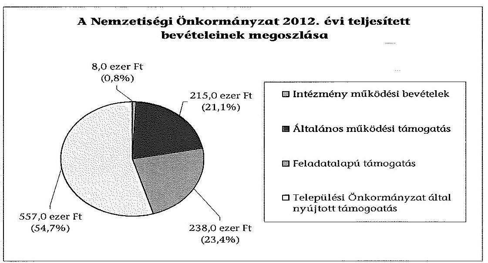
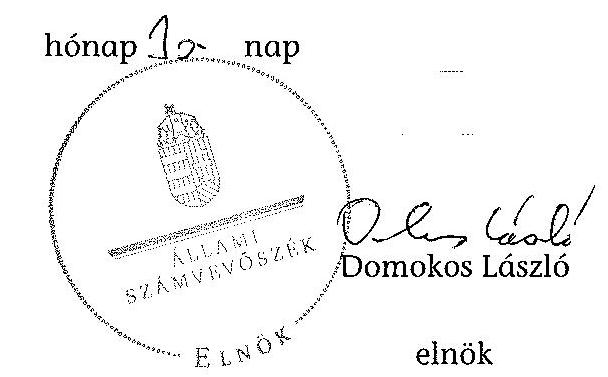
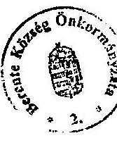
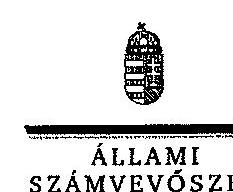
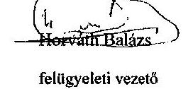

# ÁLLAMI   SZÁMVEVŐSZÉK 

## JELENTÉS

a helyi nemzetiségi önkormányzatok gazdálkodásának - 2013. évben induló - ellenőrzéséről
Berentei Cigány Nemzetiségi Önkormányzat

---

# Állami Számvevőszék 

Iktatószám: V-0145-047/2013.
Témaszám: 1201
Vizsgálat-azonosító szám: V065203

## Az ellenőrzést felügyelte:

Horváth Balázs
felügyeleti vezető
Az ellenőrzést vezette és az ellenőrzés végrehajtásáért felelős:
Pats Regina
ellenőrzésvezető
A számvevőszéki jelentést készítették és a jelentés összeállításában
közremüködtek:
dr. Győri Gabriella
számvevő
Csényi István
számvevő tanácsos
Az ellenőrzést végezték:
Csiszárné dr. Kosik Mária Várkonyi Zsolt Kristóf
számvevő tanácsos számvevő tanácsos

---

# TARTALOMJEGYZÉK 

BEVEZETÉS ..... 3
I. ÖSSZEGZŐ MEGÁLLAPÍTÁSOK, KÖVETKEZTETÉSEK, JAVASLATOK ..... 6
II. RÉSZLETES MEGÁLLAPÍTÁSOK ..... 11

1. A Nemzetiségi Önkormányzat és a Települési Önkormányzat együttműködésének szabályozása, a működési feltételek biztosítása ..... 11
2. A gazdálkodási feladatok ellátásának szabályszerűsége ..... 11
2.1. A költségvetésre és zárszámadásra, valamint a kincstári adatszolgáltatás rendjére vonatkozó jogszabályi előírások betartása ..... 11
2.2. A Nemzetiségi Önkormányzat gazdálkodásának szabályozottsága ..... 12
2.3. Az operatív gazdálkodási jogkörök kialakítása, gyakorlása ..... 13
3. A Nemzetiségi Önkormányzattal kapcsolatos gazdálkodási feladatok belső ellenőrzése ..... 14
4. A feladatalapú támogatás felhasználásának, elszámolásának szabályszerűsége, a Nemzetiségi Önkormányzat feladatellátása ..... 14

## MELLÉKLETEK

1. számú A Nemzetiségi Önkormányzat 2012. évi gazdálkodásának főbb adatai, mutatói
2. számú Berente Község Önkormányzata polgármesterének észrevételei a jelentéstervezethez
3. számú Az Állami Számvevőszék válaszlevele az észrevételekre

## FÜGGELÉKEK

1. számú Rövidítések jegyzéke
2. számú Értelmező szótár
3. számú Minősítési szempontok

---

# **Title: The Impact of Climate Change on Global Ecosystems**

## **Introduction**

Climate change is one of the most pressing environmental issues of our time. It affects ecosystems worldwide, leading to significant changes in biodiversity, habitat loss, and species extinction. This report explores the impacts of climate change on global ecosystems, focusing on key areas such as **forests**, **oceans**, and **polar regions**.

## **1. Forest Ecosystems**

Forests play a crucial role in carbon sequestration and maintaining biodiversity. However, rising temperatures and changing precipitation patterns are altering forest ecosystems. Key impacts include:

- **Increased frequency of wildfires**: Rising temperatures and drought conditions have led to more frequent and severe wildfires, destroying vast areas of forests.
- **Changes in species distribution**: Shifts in temperature and precipitation patterns are altering species distribution, leading to species extinction.
- **Insect outbreaks**: Warmer temperatures have increased the survival rates of pests like bark beetles, which are causing widespread wildfires.

## **2. Ocean Ecosystems**

Oceans absorb a significant portion of the excess heat and carbon dioxide (CO₂) produced by human activities. The consequences include:

- **Increased frequency of wildfires**: Rising sea levels and drought conditions have led to more frequent and severe wildfires, threatening species like polar bears and seals.
- **Changes in ocean currents**: Altered ocean currents are causing widespread sea-level rise, threatening species like polar bears and seals.
- **Changes in ocean currents**: Shifts in ocean currents are altering ocean currents, threatening species like polar bears and seals.

## **3. Polar Ecosystems**

Polar regions are particularly vulnerable to climate change due to their sensitivity to temperature changes. Key impacts include:

- **Melting of sea ice**: The Arctic is warming at twice the rate of the global average, leading to sea ice loss.
- **Glacial retreat**: Melting glaciers and their presence in the Arctic are rising, threatening sea ice, which are causing sea-level rise.
- **Permafrost thawing**: Thawing permafrost releases stored carbon and methane, further accelerating global warming.

## **4. Polar Ecosystems**

Polar regions are particularly vulnerable to climate change due to their sensitivity to temperature changes. Key impacts include:

- **Melting of sea ice**: Melting glaciers and their presence in the Arctic are rising, threatening sea ice loss.
- **Glacial retreat**: Melting glaciers and their presence in the Arctic are rising, threatening sea ice, which are causing sea-level rise.
- **Changes in ocean currents**: Altered ocean currents are causing widespread sea-level rise, threatening species like polar bears and seals.

## **5. Polar Ecosystems**

Polar regions are particularly vulnerable to climate change due to their sensitivity to temperature changes. Key impacts include:

- **Melting of sea ice**: Melting glaciers and their presence in the Arctic are rising, threatening sea ice loss.
- **Glacial retreat**: Melting glaciers and their presence in the Arctic are rising, threatening sea ice loss.
- **Changes in ocean currents**: Altered ocean currents are causing widespread sea-level rise, threatening species like polar bears and seals.

## **Conclusion**

Climate change poses a significant threat to global ecosystems, with far-reaching consequences for biodiversity and human societies. By reducing greenhouse gas emissions, reducing greenhouse gas emissions, and reducing greenhouse gas emissions, we can protect the planet for future generations.

---

**References**

1. IPCC (Intergovernmental Panel on Climate Change). (2021). *Climate Change 2021: The Physical Science Basis*.
2. WWF (World Wildlife Fund). (2020). *Living Planet Report 2020*.
3. NASA Global Climate Change. (2022). *Vital Signs of the Planet*.

---

# JELENTÉS   a helyi nemzetiségi önkormányzatok gazdálkodásának - 2013. évben induló ellenőrzéséről   Berentei Cigány Nemzetiségi Önkormányzat 

## BEVEZETÉS

A Nemzetiségi Önkormányzat 2010. évben alakult, elnöke a 2010. évi helyhatósági választások óta látja el feladatát. A Nemzetiségi Önkormányzat intézményt, gazdasági társaságot és más szervezetet nem alapított, illetve ezek társulásában nem vett részt. A négytagú Képviselő-testület a munkája segítésére bizottságot nem hozott létre. A Nemzetiségi Önkormányzat költségvetési beszámolója szerint a 2012. évben a módosított költségvetési bevételi és kiadási előirányzat 1018 ezer Ft, a teljesített költségvetési bevétel 1018 ezer Ft, a teljesített költségvetési kiadás 838 ezer Ft volt. A 2012. évi gazdálkodási adatokat részletesen az 1. számú mellékletben mutatjuk be.

Az Alaptörvény XXIX. cikk (1) bekezdése szerint a Magyarországon élő nemzetiségek államalkotó tényezők. Minden, valamely nemzetiséghez tartozó magyar állampolgárnak joga van önazonossága szabad vállalásához és megőrzéséhez. A hazánkban élő nemzetiségek helyi (települési és területi), valamint országos önkormányzatokat hozhatnak létre ${ }^{1}$. A helyi nemzetiségi önkormányzatok gazdálkodási feladatait jogszabályi előírás alapján a székhely szerinti helyi önkormányzat polgármesteri hivatala látja el.

A nemzetiségek helyzete, támogatása mind hazai, mind EU-s szinten kiemelt figyelmet kap napjainkban. A helyi nemzetiségi önkormányzatok gazdálkodására és támogatási rendszerére vonatkozó jogszabályok a 2010-2012. években jelentős változásokon mentek át. A települési és területi nemzetiségi önkormányzatok gazdálkodásának, a részükre juttatott költségvetési támogatások felhasználásának ellenőrzését az ÁSZ a 2012. évben sorozatjellegű ellenőrzés keretében indította el. A 2013. évi ellenőrzések e témacsoportos ellenőrzések folytatását jelentik.

Az ellenőrzés célja annak értékelése volt, hogy a Nemzetiségi Önkormányzat gazdálkodási kereteinek kialakítása, gazdálkodása és feladatellátása megfelelt-e a hatályos jogszabályoknak.

[^0]
[^0]:    ${ }^{1}$ A 2010. évben megtartott nemzetiségi önkormányzati választásokat követően 2304 települési, 58 területi és 13 országos nemzetiségi önkormányzat alakult meg.

---

Ennek keretében értékeltük, hogy:

- a Nemzetiségi Önkormányzat és a Települési Önkormányzat együttműködésének szabályozása, a működési feltételek biztosítása megfelelt-e a jogszabályi előírásoknak;
- a felek együttmúködése a gazdálkodási feladatok ellátása során megfelelt-e a közöttük létrejött megállapodásnak, betartották-e a nemzetiségi önkormányzat költségvetésére és zárszámadására, a gazdálkodás szabályozására, az operatív gazdálkodási jogkörök gyakorlására vonatkozó jogszabályi előírásokat;
- a jegyző biztosította-e a nemzetiségi önkormányzat gazdálkodásának belső ellenőrzését;
- a nemzetiségi önkormányzat feladatalapú támogatásának felhasználása, a folyósított feladatalapú támogatással történő elszámolás az előírásoknak megfelelő volt-e;
- a nemzetiségi önkormányzat feladatellátása összhangban volt-e a vonatkozó jogszabályi előírásokkal.

Az ellenőrzés várható hasznosulását négy szinten tervezzük. A törvényalkotás számára összegzett tapasztalatok állnak rendelkezésre a nemzetiségi önkormányzatok testületi döntéseinek, gazdálkodásának és a feladatalapú támogatás felhasználásának szabályszerűségéről, amelynek alapján következtetést lehet levonni arra, hogy indokolt-e jogszabályi módosítás kezdeményezése. Az ellenőrzés az ellenőrzött számára visszajelzést ad a működésében fellépő hiányosságokról, javaslataival hozzájárul azok kiküszöböléséhez, amely csökkentheti a későbbi ellenőrzések gyakoriságát. Az ellenőrzés megállapításai és javaslatai tanulságul szolgálhatnak más nemzetiségi önkormányzatok, szervezetek számára a rendezett gazdálkodási keretek kialakításához. A társadalom számára jelzi, hogy közpénz nem maradhat ellenőrizetlenül, az ÁSZ értékteremtő rend kialakításához és megőrzéséhez hozzájáruló tevékenysége pozitív hatással lesz a szervezetről kialakított összkép formálásában. Az ÁSZ szervezetén belül lehetőség nyílik arra, hogy a megállapítások szintetizálásával az intézmény a hozzáadott értéket teremtő elemző tevékenységét és tanácsadó szerepét erősítse.

A helyi nemzetiségi önkormányzatok gazdálkodásának ellenőrzéséről szóló jelentés I. fejezetének összegző része az ellenőrzés céljára adott rövid, szintetizáló összefoglalót és következtetéseket tartalmazza a II. fejezet részletes megállapításain alapulóan. A jelentés intézkedést igénylő megállapításait és javaslatait az összegzőben foglaltak mellett - az ellenőrzés során feltárt, a jelentés II. fejezetében rögzített részletes megállapítások alapozzák meg, illetve támasztják alá.

Az ellenőrzés típusa: szabályszerűségi ellenőrzés.
Az ellenőrzött időszak: 2012. január 1. - 2012. december 31. közötti időszak. Az ellenőrzés kiterjedt a helyi nemzetiségi önkormányzatnak juttatott 2012. évi támogatás 2013. évben való elszámolására is.

---

Ellenőrzött szervezet: a Berentei Cigány Nemzetiségi Önkormányzat és a gazdálkodási feladatait ellátó Berente Község Önkormányzata.

Az ellenőrzés végrehajtásának jogszabályi alapját az ÁSZ tv. 5. § (2)-(3) és (6) bekezdéseiben foglaltak képezik.

Az ellenőrzés szakmai módszertana az ÁSZ hivatalos honlapján (www.asz.hu) közzétett szakmai szabályokon alapult, amely a Legfőbb Ellenőrző Intézmények Nemzetközi Szervezete (INTOSAI) által kiadott nemzetközi standardok (ISSAI) figyelembevételével készült.

A Nemzetiségi Önkormányzat gazdálkodásának ellenőrzése során értékeltük a Települési Önkormányzat és a Nemzetiségi Önkormányzat együttmúködésének, a gazdálkodás szabályozottságának és a pénzügyi folyamatokban kulcsszerepet betöltő belső kontrollok (teljesítés igazolás és érvényesítés) múködésének megfelelőségét. A kulcskontrollokat a múködési és felhalmozási célú támogatásértékủ kiadásoknál, az államháztartáson kívülre teljesített múködési és felhalmozási célú pénzeszköz átadásoknál, a dologi kiadásokkal kapcsolatos kifizetéseknél - véletlen mintavételi eljárást alkalmazva - ellenőriztük. Ellenőriztük, hogy a jegyző biztosította-e a Nemzetiségi Önkormányzat gazdálkodásának belső ellenőrzését. Értékeltük a feladatalapú támogatások felhasználásának, elszámolásának szabályszerűségét, a Nemzetiségi Önkormányzat feladatellátása és a jogszabályi előírások összhangját.

Az ellenőrzés lefolytatásához a Nemzetiségi Önkormányzat és a gazdálkodási feladatait ellátó Települési Önkormányzat tanúsítványok és a kapcsolódó, dokumentumjegyzékben megjelölt dokumentumok elektronikus úton történő megküldésével, rendelkezésre bocsátásával szolgáltatott adatokat. Az adatszolgáltatás kontrollálása és szükség szerinti javítása a helyszíni ellenőrzés keretében történt. A minősítési szempontokat a 3. számú függelék tartalmazza.

Az ÁSZ tv. 29. § (1) bekezdése szerint a jelentéstervezetet megküldtük észrevételezésre a polgármesternek és a Nemzetiségi Önkormányzat elnökének. A Nemzetiségi Önkormányzat elnöke az ÁSZ tv. 29. § (2) bekezdésében foglalt észrevételezési jogával nem élt, a jelentéstervezetre észrevételt nem tett. A polgármester észrevételét, valamint az arra adott választ, ideértve az el nem fogadott észrevételek indokolását a jelentés 2 . és 3 . számú mellékletei tartalmazzák.

---

# I. ÖSSZEGZŐ MEGÁLLAPÍTÁSOK, KÖVETKEZTETÉSEK, JAVASLATOK 

A Nemzetiségi Önkormányzat és a Települési Önkormányzat együttmüködésének szabályozása megfelelt a jogszabályi előírásoknak. Az együttmúködés az előírt eljárásrend és határidő betartásával jóváhagyott megállapodáson alapult. A megkötött megállapodás tartalmazta a Nemzetiségi Önkormányzat müködési feltételeit és formáját, szabályozta a gazdálkodási feladatokat, azok teljesítési határidejét, felelőseit. A Települési Önkormányzat biztosította a Nemzetiségi Önkormányzat müködéséhez szükséges személyi és tárgyi feltételeket.

A Nemzetiségi Önkormányzat a költségvetésére és zárszámadására, valamint a kincstári adatszolgáltatás rendjére vonatkozó jogszabályi előírásoknak részben felelt meg. A Nemzetiségi Önkormányzat 2012. évi költségvetésének tartalma, jóváhagyása, valamint a kapcsolódó 2012. évi adatszolgáltatás szabályszerűsége megfelelt a jogszabályi előírásoknak. A 2012. évi költségvetés előterjesztésekor a Képviselő-testület részére az Áht. ${ }_{2}$ előírásainak megfelelően bemutatták az előírt mérlegeket és kimutatásokat, a költségvetési határozat azonban nem tartalmazta a költségvetés végrehajtásával kapcsolatos, az Áht. ${ }_{2}$-ben előírt hatásköröket. A jegyző a 2012. évben az Ávr.-ben és az Áhsz.ben előírt, a Nemzetiségi Önkormányzatra vonatkozó kincstári adatszolgáltatási kötelezettségének eleget tett. A Nemzetiségi Önkormányzat 2012. évi zárszámadásának tartalma megfelelt a jogszabályi előírásoknak, a zárszámadásról alkotott határozat és az elfogadott költségvetés összehasonlíthatóságát biztosították, a Nemzetiségi Önkormányzat valamennyi bevételéről és kiadásáról elszámoltak. A jegyző által elkészített 2012. évi zárszámadási határozat tervezetét a Nemzetiségi Önkormányzat elnöke az Áht. ${ }_{2}$-ben előírt határidőn túl terjesztette a Képviselő-testület elé.

A gazdálkodás szabályozottsága megfelelő volt. A gazdálkodási feladatok végrehajtását ellátó Polgármesteri Hivatal a jogszabályokban előírt szabályzatok hatályát - a szabálytalanságok kezelése eljárásrendjének kivételével - a Nemzetiségi Önkormányzat gazdálkodási feladataira kiterjesztette. Az operatív gazdálkodási jogkörök gyakorlására vonatkozó belső szabályozás rendelkezésre állt, a Polgármesteri Hivatal SZMSZ-e tartalmazta a Nemzetiségi Önkormányzat gazdálkodásával kapcsolatos munkakörökre vonatkozó rendelkezéseket. Az előírásokat a feladatokat ellátó köztisztviselők munkaköri leírásai a Nemzetiségi Önkormányzatra nem tartalmazták külön nevesítve, azokat általánosságban határozták meg.

A Nemzetiségi Önkormányzat gazdálkodása tekintetében az operatív gazdálkodási jogkörök kialakítása nem felelt meg a jogszabályi előírásoknak. A Nemzetiségi Önkormányzat elnöke, mint kötelezettségvállaló más képviselőt nem hatalmazott fel írásban a kötelezettségvállalás és utalványozás gyakorlására, emiatt az Ávr.-ben előírt összeférhetetlenségi követelmények nem érvényesültek. A Nemzetiségi Önkormányzat elnöke az együttműködési megállapodásban kijelölte a teljesítést igazoló személyt, azonban ennek alapján írá-

---

sos felhatalmazás kiadására - az Ávr.-ben foglaltak ellenére - nem került sor. A kulcsszerepet betöltő kontrollok múködésének megfelelőségét a 2012. évben a dologi kiadások teljesítése során az ellenőrzés gyengének értékelte, a hibák száma a lényegességi szintet, a kritikus hibahatárt elérte. A teljesítés igazoló személyt az Ávr.-ben foglaltak ellenére nem jelölték ki, a teljesítés igazolása nem történt meg, ezáltal a kiadások teljesítése jogosságának, összegszerűségének és az ellenszolgáltatás teljesítésének ellenőrzésére nem került sor.

Az érvényesítő 2012. március 31-étől az arra jogosult személy kijelölése alapján látta el feladatát. Jogkörének gyakorlása során nem ellenőrizte az összegszerűséget, a formai és a főkönyvi számla kijelölési szabályok betartását, valamint azt sem, hogy az Áht. ${ }_{2}$-ben, az Áhsz.-ben, az Ávr.-ben, továbbá a belső szabályzatokban foglaltakat betartották-e. Múködési és felhalmozási célú támogatásértékű kiadás, valamint működési és felhalmozási célú pénzeszközátadás államháztartáson kívülre nem történt.

A jegyző nem biztosította a Nemzetiségi Önkormányzat gazdálkodásával összefüggő végrehajtási feladatok belső ellenőrzését. A Polgármesteri Hivatal 2012. évi belső ellenőrzési tervét megalapozó kockázatelemzés - a Ber. előírása ellenére - nem terjedt ki a Nemzetiségi Önkormányzat gazdálkodásával összefüggő végrehajtási feladatokra, és azok tekintetében belső ellenőrzési feladatot a 2012. évben nem terveztek és nem végeztek. A 2012. évre vonatkozó belső ellenőrzési terv elkészítésének idején hatályos együttmúködési megállapodás a Nemzetiségi Önkormányzat belső ellenőrzésére vonatkozóan csak általános előírásokat tartalmazott.

A Nemzetiségi Önkormányzat a 2012. évben a bevételei 23,4\%-át kitevő, 238 ezer Ft összegű feladatalapú támogatásban részesült. A 2012. évi támogatás felhasználása a vonatkozó jogszabályi előírásoknak részben felelt meg. A 2012. évi feladatalapú támogatásból - nemzetiségi közfeladatnak nem minősülő - természetbeni támogatásként tanévkezdési hozzájárulást biztosítottak 150 ezer Ft értékben. A támogatás céltól eltérő felhasználásával megsértették az Áht. ${ }_{2}$-ben foglaltakat. A Nemzetiségi Önkormányzat a folyósított feladatalapú támogatás összegével a 2012. évi költségvetési határozatát nem módosította, az érintett bevételi és kiadási előirányzatok módosítására a zárszámadási határozatban került sor. A támogatási kormányrendelet ${ }_{2}$-ben előírt elszámolás nem történt meg, a támogatás felhasználását, elszámolását az ellenőrzésre jogosult szervek nem ellenőrizték. A Nemzetiségi Önkormányzat feladatellátásának tárgya a Nek. ${ }_{2}$ tv.-ben foglaltakkal részben volt összhangban. A Nek. ${ }_{2}$ tv.-ben meghatározott kötelező közfeladatok közül a képviselt közösség érdekképviseletét látták el. Önként vállalt feladatot a hagyományápolás és a társadalmi felzárkóztatás érdekében végeztek. Ezeken a feladatokon túlmenően azonban természetbeni támogatást is nyújtottak, amely nem minősül a Nek. ${ }_{2}$ tv. szerinti nemzetiségi közfeladatnak.

Az ÁSZ tv. 33. § (1) bekezdésében foglaltak értelmében az ellenőrzött szervezet vezetője köteles a jelentésben foglalt megállapításokhoz kapcsolódó intézkedési tervet összeállítani, és azt a jelentés kézhezvételétől számított 30 napon belül az ÁSZ részére megküldeni. Amennyiben az intézkedési tervet határidőre nem küldi meg a szervezet, vagy az nem elfogadható, az ÁSZ elnöke az ÁSZ tv. 33. § (3) bekezdés a)-b) pontjaiban foglaltakat érvényesítheti.

---

A helyszíni ellenőrzés megállapításainak hasznosítása mellett javasoljuk:

# a jegyzőnek 

1. a költségvetés előterjesztésével kapcsolatban

A 2012. évi költségvetési határozat nem tartalmazta az Áht. 2 23. § (2) bekezdés h) pontja szerinti finanszírozási célú pénzügyi múveletekkel kapcsolatos hatásköröket.

Javaslat
Gondoskodjon a jövőben az Áht. 2 27. § (2) bekezdésében foglalt előírás alapján a költségvetési határozat tervezetének előkészítéséről, hogy az Áht. 2 23. § (2) bekezdése h) pontjában foglaltaknak megfeleljen.
2. a gazdálkodási feladatok szabályozottságával, ellátásával kapcsolatban

A jegyző nem terjesztette ki a Nemzetiségi Önkormányzat gazdálkodási feladataira a Bkr. 6. § (4) bekezdésében előírt szabálytalanságok kezelésének eljárásrendjére vonatkozó szabályozást, mely szabályzattal a 2012. évben a Nemzetiségi Önkormányzat önállóan sem rendelkezett.

Javaslat
A gazdálkodás szabályszerűsége érdekében készítse el a Polgármesteri Hivatal szabálytalanságok kezelése eljárásrendjének módosítását az Ávr. 13. § (3a) bekezdésében foglaltak szerint, hogy a Bkr. 6. § (4) bekezdésében foglalt szabályzat hatálya kiterjedjen a Nemzetiségi Önkormányzat gazdálkodási feladataira.
3. a pénzügyi kontrollok múködésével kapcsolatban

A teljesítést igazoló személy kijelölésére az Ávr. 57. § (4) bekezdésében foglaltak ellenére nem került sor, így az Ávr. 57. § (1) bekezdésében előírt teljesítésigazolás nem volt biztosított. Az érvényesítő jogkörének gyakorlása során az Ávr. 58. § (1)-(2) bekezdésében foglaltak ellenére nem ellenőrizte, hogy a megelőző ügymenetben az Áht. 2 az Áhsz. és az Ávr. előírásait, továbbá a belső szabályzatokban foglaltakat be-tartották-e, nem jelezte, hogy a kifizetés alapját képező dokumentumon hiányzott a teljesítés igazolása.

Javaslat
Az operatív gazdálkodás múködési hibáinak megelőzése, feltárása és kijavítása érdekében gondoskodjon arról, hogy:
a) a teljesítés igazolása során az Ávr. 57. § (1) bekezdésében előírtak betartása biztosított legyen;
b) az érvényesítő tegyen eleget az Ávr. 58. § (1)-(2) bekezdésében előírt ellenőrzési és jelzési feladatának.

---

4. a feladatalapú támogatás elszámolásával kapcsolatban

A támogatás elszámolása a támogatási kormányrendelet ${ }_{2}$ 8. § (5) bekezdésében hivatkozott „a helyi önkormányzatok elszámolási és ellenőrzési rendjére vonatkozó jogszabályok rendelkezései alkalmazandóak" előírása ellenére nem történt meg.

Javaslat
Gondoskodjon az Áht. 2 27. § (2) bekezdésben meghatározott feladatkörében a Nemzetiségi Önkormányzat által igénybe vett feladatalapú támogatás elszámolásának elkészítéséről, figyelemmel az Áht. 2 57. § (4) bekezdésben foglaltakra.

# a Nemzetiségi Önkormányzat elnökének 

1. A zárszámadási határozatot a Nemzetiségi Önkormányzat elnöke az Áht. 2 91. § (1) és (3) bekezdésében előírt április 30-i határidőn túl, május 29-én terjesztette a Kép-viselő-testület elé.

Javaslat
A jövőben a jegyző által előkészített zárszámadási határozat tervezetet az Áht. 2 91. § (3) bekezdésében foglalt határidő betartásával nyújtsa be a Képviselő-testületnek.
2. A Nemzetiségi Önkormányzat elnöke, mint kötelezettségvállaló az Ávr. 52. § (7) bekezdésében és az Ávr. 59. § (1) bekezdésében foglaltak alapján más képviselőt nem hatalmazott fel írásban a kötelezettségvállalás és utalványozás gyakorlására, emiatt az Ávr. 60. § (2) bekezdésében foglalt összeférhetetlenségi követelmények nem érvényesültek.

Javaslat
Az Ávr. 60. § (2) bekezdésében foglalt összeférhetetlenség fennállása esetén írásban jelöljön ki további kötelezettségvállaló, utalványozó személyt az Ávr. 52. § (7) bekezdés és az Ávr. 59. § (1) bekezdés előírásai alapján.
3. A teljesítésigazoló kijelölése az együttmúködési megállapodásban megtörtént, azonban ennek alapján írásos felhatalmazás kiadására az Ávr. 57. § (4) bekezdésében foglaltak ellenére nem került sor.

Javaslat
Írásban jelöljön ki teljesítést igazoló személyt az Ávr. 57. § (4) bekezdései előírása alapján.
4. A 2012. évi feladatalapú támogatás elszámolása a támogatási kormányrendelet ${ }_{2}$ 8. § (5) bekezdésében hivatkozott „a helyi önkormányzatok elszámolási és ellenőrzési rendjére vonatkozó jogszabályok rendelkezései alkalmazandóak" előírása ellenére nem történt meg.

---

Javaslat
Terjessze a Képviselő-testület elé jóváhagyásra az Áht. 2 57. § (4) bekezdés alapján készített elszámolást a Nemzetiségi Önkormányzat által igénybe vett feladatalapú támogatásról.
5. A 2012. évi feladatalapú támogatásból - nemzetiségi közfeladatnak nem minősülő természetbeni támogatásként tanévkezdési hozzájárulást biztosítottak 150 ezer Ft értékben. A támogatás céltól eltérő felhasználásával megsértették az Áht. 2 57/A. § (1) bekezdés b) pontjában foglaltakat.

Javaslat
Intézkedjen a céltól eltérően felhasznált feladatalapú támogatás visszafizetéséről az Áht. 2 57/A. § (1) bekezdés alapján.

---

# II. RÉSZLETES MEGÁLLAPÍTÁSOK 

## 1. A Nemzetiségi Önkormányzat és a Telepúlési Önkormányzat EGYÜTTMÚKÖDÉSÉNEK SZABÁLYOZÁSA, A MÜKÖDÉSI FELTÉTELEK BIZTOSÍTÁSA

A Nemzetiségi Önkormányzat és a Települési Önkormányzat együttmüködésének szabályozása megfelelt a jogszabályi előírásoknak.

Az együttműködés az előírt eljárásrend és határidő betartásával jóváhagyott megállapodásokon ${ }^{2}$ alapult. A 2012. december 31 -én hatályos megállapodás tartalmazta a Nemzetiségi Önkormányzat múködési feltételeit és formáját, szabályozta a gazdálkodási feladatokat, azok teljesítési határidejét, felelőseit. A Települési Önkormányzat a Nemzetiségi Önkormányzat részére havonta igény szerint az önkormányzat feladatellátásához, müködéséhez szükséges személyi feltételeket, valamint a tárgyi, technikai eszközökkel felszerelt helyiség ingyenes használatát, biztosította. A helyiség infrastruktúrájához kapcsolódó rezsiköltségeket és a fenntartási költségeket a Települési Önkormányzat viselte.

## 2. A GAZDÁLKODÁSI FELADATOK ELLÁTÁSÁNAK SZABÁLYSZERŰSÉGE

### 2.1. A költségvetésre és zárszámadásra, valamint a kincstári adatszolgáltatás rendjére vonatkozó jogszabályi előírások betartása

A Nemzetiségi Önkormányzat a költségvetésére és zárszámadására, valamint a kincstári adatszolgáltatás rendjére vonatkozó jogszabályi előírásoknak részben felelt meg. A Nemzetiségi Önkormányzat költségvetési határozatát ${ }^{3}$ a jogszabályban előírt eljárásrend szerint, határidőben fogadták el. A 2012. évi költségvetés előterjesztésekor a Képviselő-testület részére - tájékoztatás céljából, szöveges indoklással együtt - az Áht. ${ }_{2} 24$. § (4) bekezdésében foglaltaknak megfelelően bemutatták az előírt mérlegeket és kimutatásokat. A költségvetési határozat azonban nem tartalmazta az Áht. ${ }_{2} 23$. § (2) bekezdés h) pontja szerinti finanszírozási célú pénzügyi műveletekkel kapcsolatos hatásköröket és az Áht. ${ }_{2} 34$. § (2) bekezdése szerinti esetleges felhatalmazást. A zár-

[^0]
[^0]:    ${ }^{2}$ A 2012. évben hatályos együttműködési megállapodást a Képviselő-testület a 3/2011. (I. 19.) számú, a Települési Önkormányzat Képviselő-testülete az 5/2011. (I. 27.) számú határozattal fogadta el. A Nek. ${ }_{2}$ tv. 159. § (3) bekezdésében előírtak alapján 2012. június 1-jéig felülvizsgált és módosított együttműködési megállapodást a Települési Önkormányzat Képviselő-testülete 113/2012. (IV. 5.) számú határozatával, a Képviselőtestület a 3/2012. (I. 30.) számú határozatával fogadta el.
    ${ }^{3}$ A Képviselő-testület Nemzetiségi Önkormányzat 2012. évi költségvetéséről szóló 2/2012. (I. 30.) számú határozata.

---

számadási határozatot ${ }^{4}$ a Nemzetiségi Önkormányzat elnöke az Áht. ${ }_{2}$ 91. .§ (1) és (3) bekezdésében előírt április 30-i határidőn túl, május 29 -én terjesztette a Képviselő-testület elé.

A költségvetési és zárszámadási határozatok egymással összehasonlítható szerkezetben készültek, a zárszámadási határozatban a Nemzetiségi Önkormányzat valamennyi bevételéről és kiadásáról elszámoltak.

A jegyző a 2012. évben az Ávr.-ben és az Áhsz.-ben előírt, a Nemzetiségi Önkormányzatra vonatkozó kincstári adatszolgáltatási kötelezettségének eleget tett.

# 2.2. A Nemzetiségi Önkormányzat gazdálkodásának szabályozottsága 

A Nemzetiségi Önkormányzat gazdálkodásának szabályozottsága az ellenőrzött időszakban összességében megfelelő volt. A gazdálkodási feladatok végrehajtását ellátó Polgármesteri Hivatal a 2012. évben a Számv. tv. és az Áhsz. által előírt gazdálkodási szabályzatokkal ${ }^{5}$ a Nemzetiségi Önkormányzat gazdálkodási feladataira kiterjedő hatállyal rendelkezett. A jegyző azonban nem terjesztette ki a Nemzetiségi Önkormányzat gazdálkodási feladataira a Bkr. 6. § (4) bekezdésében előírt szabálytalanságok kezelésének eljárásrendjére vonatkozó szabályozást, mely szabályzattal a 2012. évben a Nemzetiségi Önkormányzat önállóan sem rendelkezett.

Az Áht. ${ }_{2}$ 10. § (5) bekezdésében előírt, az Ávr. 13. § (2) bekezdés a) pontjában foglaltak szerint a tervezéssel, gazdálkodással, így különösen az operatív gazdálkodási jogkörök gyakorlásának módjával, eljárási és dokumentálási részletszabályaival, valamint az ezeket végző személyek kijelölésének rendjével, az ellenőrzési és adatszolgáltatási feladatok teljesítésével kapcsolatos belső előírásokat, feltételeket tartalmazó belső szabályzat rendelkezésre állt.

A Polgármesteri Hivatal SZMSZ-e tartalmazta az Ávr. 13. § (1) bekezdés g) pontjában foglaltak szerinti, a munkakörökhöz tartozó - Nemzetiségi Önkormányzat gazdálkodásával kapcsolatos - feladat- és hatáskörökre, a hatáskörök gyakorlásának módjára, a helyettesítés rendjére, az ezekhez kapcsolódó felelősségi szabályokra vonatkozó rendelkezéseket. Az előírásokat a feladatokat ellátó köztisztviselők munkaköri leírásai a Nemzetiségi Önkormányzatra nem tartalmazták külön nevesítve, azokat általánosságban határozták meg.

[^0]
[^0]:    ${ }^{4}$ A Képviselő-testület Nemzetiségi Önkormányzat 2012. évi zárszámadásáról szóló 7/2013. (V. 29.) számú határozata.
    ${ }^{5}$ Számviteli politika és a kapcsolódóan gazdálkodásra vonatkozó - leltározási és leltár-készítési-, az eszközök és források értékelési-, pénzkezelési- és számlarend - szabályzatok, ellenőrzési nyomvonal, folyamatba épített előzetes, utólagos és vezetői ellenőrzés (FEUVE) szabályozás.

---

# 2.3. Az operatív gazdálkodási jogkörök kialakítása, gyakorlása 

A Nemzetiségi Önkormányzat gazdálkodása tekintetében az operatív gazdálkodási jogkörök kialakítása nem felelt meg a jogszabályi előírásoknak. Az operatív gazdálkodási feladatokat - kötelezettségvállalás, utalványozás, ellenjegyzés, érvényesítés és teljesítés igazolása - az ellenőrzött időszakban a Települési Önkormányzattal kötött együttmúködési megállapodásban, illetve az abban meghatározottak figyelembe vételével készített Gazdálkodási szabályzat ${ }_{1,2}$-ben rögzítették.

A Nemzetiségi Önkormányzat elnöke, mint kötelezettségvállaló az Ávr. 52. § (7) bekezdésében és az Ávr. 59. § (1) bekezdésében foglaltak alapján más képviselőt nem hatalmazott fel írásban a kötelezettségvállalás és utalványozás gyakorlására, emiatt az Ávr. 60. § (2) bekezdésében foglalt összeférhetetlenségi követelmények nem érvényesültek. A teljesítésigazoló kijelölése az együttmúködési megállapodásban megtörtént, azonban ennek alapján írásos felhatalmazás kiadására az Ávr. 57. § (4) bekezdésében foglaltak ellenére nem került sor.

Az Ügyrend ${ }_{1,2}$ alapján a gazdasági vezetői feladatokat a pénzügyi főmunkatárs látja el. A gazdasági vezető írásbeli kijelölésének hiányában a jegyző volt jogosult az operatív gazdálkodási jogköröket ellátó személyek kijelölésére, a kijelölt személyek a feladatuk ellátásához előírt képesítési követelményeknek megfeleltek.

A 2011. július 1-jétől hatályos Ügyrend ${ }_{1}$ szerint a Polgármesteri Hivatal rendelkezik gazdasági szervezettel. A jegyző a gazdasági szervezet vezetőjét kijelölő dokumentum hiányában, és a Polgármesteri Hivatal 2011. június 1-jén hatályba lépett Gazdálkodási szabályzat ${ }_{1}$ szerint jogosultan jelölte ki az operatív gazdálkodási jogköröket ellátó személyeket.

A 2012. július 1-jén hatályba lépett Gazdálkodási szabályzat ${ }_{2}$ szerint az operatív gazdálkodási jogköröket ellátó személyek kijelölésére a gazdasági szervezet vezetője jogosult. A gazdasági szervezet vezetőjét kijelölő dokumentum hiányában, és a Polgármesteri Hivatali SZMSZ III fejezet 4.2.2 b pontja szerint a jegyző irányítja a Polgármesteri Hivatal operatív gazdálkodási tevékenységét.

A Nemzetiségi Önkormányzatnál a 2012. évben a dologi kiadások teljesítése során a teljesítés igazolás és az érvényesítés kulcskontrollok múködésének megfelelősége gyenge volt, a hibák száma a lényegességi szintet, a kritikus hibahatárt elérte, mert

- a teljesítést igazoló személy kijelölésére az Ávr. 57. § (4) bekezdésében foglaltak ellenére nem került sor, így az Ávr. 57. § (1) bekezdésében előírt teljesítésigazolás nem történt meg; a teljesítést igazoló személy jogszerú kijelölés hiányában nem látta el feladatát, így nem ellenőrizte és aláírásával sem igazolta a kiadás teljesítésének jogosságát, összegszerűségét és az ellenszolgáltatás teljesítését;
- az érvényesítő - jogkörének gyakorlása során - nem ellenőrizte az összegszerűséget, a formai és a főkönyvi számla kijelölési szabályok betartását, vala-

---

mint azt sem, hogy az Áht. ${ }_{2}$-ben, az Áhsz.-ben, az Ávr.-ben, továbbá a belső szabályzatokban foglaltakat betartották-e.

Múködési és felhalmozási célú támogatásértékű kiadás, valamint múködési és felhalmozási célú pénzeszközátadás államháztartáson kívülre nem történt.

# 3. A Nemzetiségi Önkormányzattal kapcsolatos gazdálkoDÁSI FELADATOK BELSŐ ELLENŐRZÉSE 

A jegyző nem biztosította a Nemzetiségi Önkormányzat gazdálkodásával összefüggő végrehajtási feladatok belső ellenőrzését. A Polgármesteri Hivatal 2012. évi belső ellenőrzési tervét megalapozó kockázatelemzés - a Ber. 21. § (2) bekezdése ellenére - nem terjedt ki a Nemzetiségi Önkormányzat gazdálkodásával összefüggő végrehajtási feladatokra, és azok tekintetében belső ellenőrzési feladatot a 2012. évben nem terveztek és nem végeztek.

A 2012. évre vonatkozó belső ellenőrzési terv elkészítésének idején hatályos együttműködési megállapodás a Nemzetiségi Önkormányzat belső ellenőrzésére vonatkozóan csak általános előírásokat tartalmazott.

Az ellenőrzéshez szolgáltatott adatok alapján 2012. évben a Kormányhivatal a Nemzetiségi Önkormányzatot illetően nem élt törvényességi felügyeleti eszközökkel.

## 4. A feladatalapú támogatás felhasználásának, elszámolásának szabályszerűsége, a Nemzetiségi Önkormányzat feladATELLÁTÁSA

A Nemzetiségi Önkormányzat a 2012. évben 238 ezer Ft összegű feladatalapú támogatásban részesült, amelynek az összes bevételhez viszonyított részarányát a következő ábra szemlélteti:

---

A Nemzetiségi Önkormányzat a 2011. évben feladatalapú támogatásban nem részesült. A Nemzetiségi Önkormányzat a folyósított 2012. évi feladatalapú támogatás összegével a 2012. évi költségvetési határozatát nem módosította, azonban döntött a támogatás felhasználási céljairól. A Nemzetiségi Önkormányzat részére nyújtott feladatalapú támogatás miatt az érintett bevételi és kiadási kiemelt előirányzatok módosítására csak a zárszámadási határozatban került sor, ezzel megsértették az Áht. 2 34. § (5)-(6) bekezdéseiben foglaltakat.

A 2012. évi támogatás felhasználása - az ellenőrzés számára rendelkezésre bocsátott dokumentumok alapján - a vonatkozó jogszabályi elöírásoknak részben felelt meg. A 2012. évi feladatalapú támogatásból - nemzetiségi közfeladatnak nem minősülő - természetbeni támogatásként tanévkezdési hozzájárulást biztosítottak 150 ezer Ft értékben. A támogatás céltól eltérő felhasználásával megsértették az Áht. ${ }_{2} 57 /$ A. § (1) bekezdés b) pontjában foglaltakat.

A 2012. évi feladatalapú támogatás elszámolása a támogatási kormányrendelet ${ }_{2}$ 8. § (5) bekezdésében hivatkozott „a helyi önkormányzatok elszámolási és ellenőrzési rendjére vonatkozó jogszabályok rendelkezései alkalmazandóak" előirása ellenére nem történt meg, azonban a zárszámadási határozat 13. számú mellékletében bemutatták a 2012. évi feladatalapú támogatás felhasználását.

A támogatás felhasználását, elszámolását az ellenőrzésre jogosult szervek nem ellenőrizték.

A Nemzetiségi Önkormányzat feladatellátásának tárgya a Nek. 2 tv.-ben foglaltakkal részben volt összhangban. A Nek. 2 tv.-ben meghatározott kötelező közfeladatok közül a képviselt közösség érdekképviseletét látták el. Önként vállalt feladatot a hagyományápolás és a társadalmi felzárkóztatás érdekében végeztek.

Ezeken a feladatokon túlmenően azonban a Nek. 2 tv. 116. § (2) bekezdésébe ütköző módon természetbeni támogatásként tanévkezdési hozzájárulást biztosítottak.

Budapest, 2013.

Melléklet: $\quad 3 \mathrm{db}$
Függelék: $\quad 3 \mathrm{db}$

---

# **Title: The Impact of Climate Change on Global Ecosystems**

## **Introduction**

Climate change is one of the most pressing environmental issues of our time. It affects ecosystems worldwide, leading to significant changes in biodiversity, habitat loss, and species extinction. This report explores the impacts of climate change on global ecosystems, focusing on key areas such as **forests**, **oceans**, and **polar regions**.

## **1. Forest Ecosystems**

Forests play a crucial role in carbon sequestration and maintaining biodiversity. However, rising temperatures and changing precipitation patterns are altering forest ecosystems. Key impacts include:

- **Increased frequency of wildfires**: Rising temperatures and drought conditions have led to more frequent and severe wildfires, destroying vast areas of forests.
- **Changes in species distribution**: Shifts in temperature and precipitation patterns are altering species distribution, leading to species extinction.
- **Insect outbreaks**: Warmer temperatures have increased the survival rates of pests like bark beetles, which are causing widespread tree mortality.

## **2. Ocean Ecosystems**

Oceans absorb a significant portion of the excess heat and carbon dioxide (CO₂) produced by human activities. The consequences include:

- **Increased frequency of wildfires**: Owing to the increase in CO₂ levels, the consequences for marine life are often felt by the sea, leading to widespread coral bleaching.
- **Changes in ocean currents**: Altered ocean currents are causing widespread coral bleaching, which is a significant problem for polar bears and seals.

## **3. Polar Ecosystems**

Polar regions are particularly vulnerable to climate change due to their sensitivity to temperature changes. Key impacts include:

- **Melting of sea ice**: The Arctic is warming at twice the rate of the global average, leading to sea ice loss.
- **Glacial retreat**: Melting glaciers and their effects on ocean currents are altering the sea's ice state, leading to sea ice loss.
- **Permafrost thawing**: Thawing permafrost releases stored carbon and methane, further accelerating global warming.

## **4. Polar Ecosystems**

Polar regions are particularly vulnerable to climate change due to their sensitivity to temperature changes. Key impacts include:

- **Melting of sea ice**: Melting glaciers and their effects on ocean currents are altering sea ice, leading to sea ice loss.
- **Glacial retreat**: Glacial retreat events are altering ocean currents, further accelerating global warming.

## **5. Polar Ecosystems**

Polar regions are particularly vulnerable to climate change due to their sensitivity to temperature changes. Key impacts include:

- **Melting of sea ice**: Melting glaciers and their effects on ocean currents are altering sea ice, leading to sea ice loss.
- **Glacial retreat**: Glacial retreat events are altering ocean currents, further accelerating global warming.

## **Conclusion**

Climate change poses a significant threat to global ecosystems, with far-reaching consequences for biodiversity and human societies. By reducing greenhouse gas emissions, reducing greenhouse gas emissions, and fostering sustainable practices, we can protect our planet for future generations.

---

**References**

1. IPCC (Intergovernmental Panel on Climate Change). (2021). *Climate Change 2021: The Physical Science Basis*.
2. WWF (World Wildlife Fund). (2020). *Living Planet Report 2020*.
3. NASA Global Climate Change. (2022). *Vital Signs of the Planet*.

---

# A Nemzetiségi Önkormányzat 2012. évi gazdálkodásának főbb adatai, mutatói 

A) Bevételek

| Megnevezés | Eredeti elöirányzat |  | Módosított   elöirányzat | Teljesités |
| :--: | :--: | :--: | :--: | :--: |
|  | ezer Ft |  |  | megoszlás |
| Intézményi múködési bevételek | 0,0 | 8,0 | 8,0 | 0,8\% |
| Általános múködési támogatás | 210,0 | 215,0 | 215,0 | 21,1\% |
| Feladatalapú támogatás | 0,0 | 238,0 | 238,0 | 23,4\% |
| Települési Önkormányzat által nyújtott támogatás | 500,0 | 557,0 | 557,0 | 54,7\% |
| Pénzforgalmi bevételek összesen | 710,0 | 1018,0 | 1018,0 | 100,0\% |
| Bevételek összesen | 710,0 | 1018,0 | 1018,0 | 100,0\% |

B) Kiadások

| Megnevezés | Eredeti elöirányzat | Módosított   elöirányzat | Teljesités |  |
| :--: | :--: | :--: | :--: | :--: |
|  |  |  |  | megoszlás |
| Dologi kiadások | 710,0 | 838,0 | 838,0 | 100,0\% |
| Müködési kiadások összesen | 710,0 | 838,0 | 838,0 | 100,0\% |
| Kiadások összesen | 710,0 | 838,0 | 838,0 | 100,0\% |

---

# **Title: The Impact of Climate Change on Global Ecosystems**

## **Introduction**

Climate change is one of the most pressing environmental issues of our time. It affects ecosystems worldwide, leading to significant changes in biodiversity, habitat loss, and species extinction. This report explores the impacts of climate change on global ecosystems, focusing on key areas such as **forests**, **oceans**, and **polar regions**.

## **1. Forest Ecosystems**

Forests play a crucial role in carbon sequestration and maintaining biodiversity. However, rising temperatures and changing precipitation patterns are altering forest ecosystems. Key impacts include:

- **Increased frequency of wildfires**: Rising temperatures and drought conditions have led to more frequent and severe wildfires, destroying vast areas of forests.
- **Changes in species distribution**: Shifts in temperature and precipitation patterns are altering species distribution, leading to species extinction.
- **Insect outbreaks**: Warmer temperatures have increased the survival rates of pests like bark beetles, which are causing widespread wildfires.

## **2. Ocean Ecosystems**

Oceans absorb a significant portion of the excess heat and carbon dioxide (CO₂) produced by human activities. The consequences include:

- **Increased frequency of wildfires**: Rising sea levels and drought conditions have led to more frequent and severe wildfires, threatening species like polar bears and seals.
- **Changes in ocean currents**: Altered ocean currents are causing widespread sea-level rise, threatening species like polar bears and seals.
- **Changes in ocean currents**: Shifts in ocean currents are altering ocean currents, threatening species like polar bears and seals.

## **3. Polar Ecosystems**

Polar regions are particularly vulnerable to climate change due to their sensitivity to temperature changes. Key impacts include:

- **Melting of sea ice**: The Arctic is warming at twice the rate of the global average, leading to sea ice loss.
- **Glacial retreat**: Melting glaciers and their presence in the Arctic are altering the ocean currents, threatening species like polar bears and seals.
- **Permafrost thawing**: Thawing permafrost releases stored carbon and methane, further accelerating global warming.

## **4. Polar Ecosystems**

Polar regions are particularly vulnerable to climate change due to their sensitivity to temperature changes. Key impacts include:

- **Melting of sea ice**: Melting glaciers and their presence in the Arctic are altering sea ice levels.
- **Glacial retreat**: Melting glaciers and their presence in the Arctic are altering sea ice levels, threatening species like polar bears and seals.
- **Changes in ocean currents**: Altered ocean currents are causing widespread sea-level rise, threatening species like polar bears and seals.

## **5. Polar Ecosystems**

Polar regions are particularly vulnerable to climate change due to their sensitivity to temperature changes. Key impacts include:

- **Melting of sea ice**: Melting glaciers and their presence in the Arctic are altering sea ice levels.
- **Glacial retreat**: Melting glaciers and their presence in the Arctic are altering sea ice levels, threatening species like polar bears and seals.
- **Changes in ocean currents**: Altered ocean currents are causing widespread sea-level rise, threatening species like polar bears and seals.

## **Conclusion**

Climate change poses a significant threat to global ecosystems, with far-reaching consequences for biodiversity and human societies. By reducing greenhouse gas emissions, reducing greenhouse gas emissions, and reducing greenhouse gas emissions, we can protect our planet for future generations.

---

**References**

1. IPCC (Intergovernmental Panel on Climate Change). (2021). *Climate Change 2021: The Physical Science Basis*.
2. WWF (World Wildlife Fund). (2020). *Living Planet Report 2020*.
3. NASA Global Climate Change. (2022). *Vital Signs of the Planet*.

---

Berente Község Önkormányzata
3704 Berente Esze Tamás utca 18
Telefon/fax: 48/411-435; e-mail: ph.e.berente.hu
Honlap: www.berente.hu
Tárgy:Berentei Cigány Nemzetiségi Önkormányzat ellenőrzése.

# ÁLLAMI SZÁMVEVŐSZÉK 

## Budapest

Apáczai Csere J. u. 10. sz.
1364

Tisztelt Cím!
A Berentei Cigány Nemzetiségi Önkormányzat 2012. évi gazdálkodásának ellenőrzési jelentéstervezetére a BCNÖ elnökével, Haga Gyulával, és A berentei Közös Önkormányzati Hivatal jegyzőjével, Fortuna Jánossal az alábbi észrevételt teszem.

Észrevételek:
I. fejezet 7. oldal:

Az ellenőrzési időszakban működő Polgármesteri Hivatal önállóan működő és gazdálkodó kv.-i szervként nem volt kötelezett gazdaságvezetői munkakör létrehozására és az az arra elöirt felsőfokú végzettségú köztisztviselő foglalkoztatására (Mivel gazdasági szervezettel nem rendelkezik. A hivatali szabályzatban nevesített gazdasági vezető valójában a jegyző. Az ügyrend ezzel ellentétes rendelkezéseit módosítottuk illetve módosítjuk.)

---

Berente Község Önkormányzata
3704 Berente Énze Tamás utca 18
Telefon/fax: 48/411-435; e-mail: pb@berente.hu
Honlap: www.berente.hu

I. fejezet 8. oldal, 2. pont 2. és 3. bekezdés:

Az előző pontban leírtak alapján a hivatalban nincs gazdasági vezető. A pü.-i ellenjegyzőt, érvényesítőt, stb. a hivatalvezető jegyző bízza meg, a képesítési előírásokkal rendelkező köztisztviselők közül.

I. fejezet 9. oldal, 4. pont:

A támogatás elszámolása az éves zárszámadás keretében megtörtént a MÁK felé.

II. fejezet 12. oldal, 2.1. pont:

Az 2012. évi elemi kv.-i beszámolóval kapcsolatos észrevételhez az alábbi megjegyzés tesszük:

2013. március 10.-3 vasárnapra esett, így a határidők betartására vonatkozó szabályok szerint a következő munkanap a beadásl határidő, melyet teljesítettünk. A kincstár által kiküldött körlevél szerint is március 11.-e volt a teljesítési határidő.

II. fejezet 2.3. pont, 13. oldal:

A BCNÖ esetében a kötelezettségvállalás és utalványozás hatáskörére elsődlegesen jogosult elnök az összeférhetetlenségi követelményekre vonatkozó előírásoknak megfelelően még az ellenőrzési időszakban írásban meghatalmazott a kötelezettségvállalás és utalványozás gyakorlására egy nemzetiségi képviselőt.

II. fejezet 4. pont, 3. bekezdés, 15. oldal:

A 14/2012.(VIII.22.) BCNÖ határozat alapján beszerzett eszközök nem minősülnek a céltól eltérő felhasználásnak:

Berentei Cigány Nemzetiségi Önkormányzat 14/2012.(VIII.22.) határozata a BCNÖ 2012. évi tanévkezdési hozzájárulási támogatásáról
A képviselő-testület 150eFt-ot hagy jóvá az ÁMK-ban tanuló cigány nemzetiségi gyermekek kulturális hagyományápolását segítő eszközök, tanszerek beszerzésére.

Az eszközlista a jkv 1. számú mellékletét képezi.

Felelős: elnök

Határidő: 2012. szeptember 31.

---

# Berente Község Önkormányzata
## 3704 Berente Esze Tamás utca 18
### Telefon/fax: 48/411-435; e-mail: picia.berente.hu
### Honlap: www.berente.hu

Kérem tisztelettel az észrevételek elfogadását.

Berente, 2013. október 16.

Tisztelettel:

Juhász József

polgármester

C:\Users\BERENT1006\Documents\ASZ.ellenkreds dokumentumahASZ észrevétel BCNÓ.docx

---

# **Title: The Impact of Climate Change on Global Ecosystems**

## **Introduction**

Climate change is one of the most pressing environmental issues of our time. It affects ecosystems worldwide, leading to significant changes in biodiversity, habitat loss, and species extinction. This report explores the impacts of climate change on global ecosystems, focusing on key areas such as **forests**, **oceans**, and **polar regions**.

## **1. Forest Ecosystems**

Forests play a crucial role in carbon sequestration and maintaining biodiversity. However, rising temperatures and changing precipitation patterns are altering forest ecosystems. Key impacts include:

- **Increased frequency of wildfires**: Rising temperatures and drought conditions have led to more frequent and severe wildfires, destroying vast areas of forests.
- **Changes in species distribution**: Shifts in temperature and precipitation patterns are altering species distribution, leading to species extinction.
- **Insect outbreaks**: Warmer temperatures have increased the survival rates of pests like bark beetles, which are causing widespread wildfires.

## **2. Ocean Ecosystems**

Oceans absorb a significant portion of the excess heat and carbon dioxide (CO₂) produced by human activities. The consequences include:

- **Increased frequency of wildfires**: Rising sea levels and drought conditions have led to more frequent and severe wildfires, threatening species like polar bears and seals.
- **Changes in ocean currents**: Altered ocean currents are causing widespread sea-level rise, threatening species like polar bears and seals.
- **Changes in ocean currents**: Shifts in ocean currents are altering ocean currents, threatening species like polar bears and seals.

## **3. Polar Ecosystems**

Polar regions are particularly vulnerable to climate change due to their sensitivity to temperature changes. Key impacts include:

- **Melting of sea ice**: The Arctic is warming at twice the rate of the global average, leading to sea ice loss.
- **Glacial retreat**: Melting glaciers and their presence in the Arctic are altering ocean currents, threatening species like polar bears and seals.
- **Permafrost thawing**: Thawing permafrost releases stored carbon and methane, further accelerating global warming.

## **4. Polar Ecosystems**

Polar regions are particularly vulnerable to climate change due to their sensitivity to temperature changes. Key impacts include:

- **Melting of sea ice**: Melting glaciers and their presence in the Arctic are altering sea ice, threatening species like polar bears and seals.
- **Glacial retreat**: Melting glaciers and their presence in the Arctic are altering ocean currents, threatening species like polar bears and seals.

## **5. Polar Ecosystems**

Polar regions are particularly vulnerable to climate change due to their sensitivity to temperature changes. Key impacts include:

- **Melting of sea ice**: Melting glaciers and their presence in the Arctic are altering sea ice, threatening species like polar bears and seals.
- **Glacial retreat**: Melting glaciers and their presence in the Arctic are altering ocean currents, threatening species like polar bears and seals.

## **Conclusion**

Climate change poses a significant threat to global ecosystems, with far-reaching consequences for biodiversity and human societies. By reducing greenhouse gas emissions, reducing greenhouse gas emissions, and reducing greenhouse gas emissions, we can protect our planet for future generations.

---

**References**

1. IPCC (Intergovernmental Panel on Climate Change). (2021). *Climate Change 2021: The Physical Science Basis*.
2. WWF (World Wildlife Fund). (2020). *Living Planet Report 2020*.
3. NASA Global Climate Change. (2022). *Vital Signs: Global Temperature*.

---

ELRök

Ikt.szám: V-0145-045/2013.

Juhász József úr
polgármester
Berente Község Önkormányzata

Berente

Tisztelt Polgármester Úr!

A Berentei Cigány Nemzetiségi Önkormányzat gazdálkodásának ellenőrzéséről készült számvevőszéki jelentéstervezetre tett észrevételeit ismételten köszönöm.

A Berentei Cigány Nemzetiségi Önkormányzat gazdálkodásának ellenőrzéséről készült számvevőszéki jelentést pontosítottuk az észrevételek feldolgozását követően. Az Állami Számvevőszék észrevételekre vonatkozó álláspontjáról a feldgyeletti vezető által készített tájékoztatást csatoltan megküldöm, eddigi türelmét köszönöm.

Tájékoztatom Polgármester urat, hogy a jelentésben – az Állami Számvevőszékről szóló 2011. évi LXVI. törvény 29. § (3) bekezdése alapján – az el nem fogadott észrevételeket szerepeltetjük az elutasítás indokának feltüntetésével együtt. Az elfogadott észrevételeket a jelentés szövegzésénél vesszük figyelembe.

Budapest, 2013. 13. hó 21. nap

Tisztelettel:

D. 11.11.19

Domokos László

Melléklet: Tájékoztatás az elfogadott és az el nem fogadott észrevételekről

1052 SÜDAPEST, AFRUZAI CSZIFC JÁNOS UTCA 10. 1364 Budapest 4. Pf. 54 Istolán. 484 0101 fax: 484 0201

---

# Tájékoztatás 

## az elfogadott és az el nem fogadott észrevételekról

A Berentei Cigány Nemzetiségi Önkormányzat (továbbiakban: Nemzetiségi Önkormányzat) gazdálkodásának ellenőrzése cimủ jelentéstervezetre az 1664-4/2013. ügyiratszámú levelében tett észrevételeit áttekintettük, azok kezeléséről az alábbiakban tájékoztatom. A levélben szereplő észrevételeket - a tárgyuk sorrendjében - a jelentéstervezet megfelelő részének (összegző, vagy részletes megállapítások), illetve pontjának megjelölésével kezeljük.
Jelentéstervezet I. fejezet 7. oldalához, valamint 8. oldal 2. pont 2. és 3. bekezdéséhez tett észrevételek
Észrevételei alapján a jelentéstervezetet felülvizsgáltuk. A levelében jelzett belső szabályozásainak összhangba hozása a jelentéstervezet megállapítása alapján indokolt. Válasza azt tartalmazza, hogy Polgármesteri Hivataluk ,,gazdasági szervezettel nem rendelkezik". Ezzel ellentétes tartalmú az átadott a 2011. július 1-jétől hatályos Berente Község Önkormányzat Polgármesteri Hivatala Ügyrendje, amely szerint a Polgármesteri Hivatal rendelkezik gazdasági szervezettel. Az ellenőrzés részére nem került átadásra a gazdasági szervezet vezetőjének kijelölő dokumentuma. A gazdasági szervezet vezetőjét kijelölő dokumentum hiányában az operatív gazdálkodási jogköröket ellátó személyek kijelölésére a jegyző jogosult. Az Összegző pontosításainak megfelelően módosítottuk a javaslatokat és a részletes megállapításokat is.
A jelentéstervezet Összegző rész 7. oldal 1. bekezdés 1. mondata az alábbiak szerint módosul:
„A kulcsszerepet betöltő kontrollok müködésének megfelelőségét a 2012. évben a dologt kiadások teljesítése során az ellenőrzés gyengének értékelte, a hibák száma a lényegességi szintet, a kritikus hibahatárt elérte."
A jelentéstervezet Összegző rész 7. oldal 2. bekezdés az alábbiak szerint módosul:
„Az érvényesitő 2012. március 31-étől az arra jogosult személy kijelölése alapján látta el feladatait. Jogkörének gyakorlása során nem ellenőrizte az összegszerüséget, a format és a fökányvi számla kijelölési szabályok betartását, valamint azt sem, hogy az Aht. $y$-ben, az Alraz.ben, az Avr.-ben, továbbá a belső szabályzatokban foglaltakat betartották-e. Müködési és felhalmozási célú támogatásértékü kiadás, valamint müködési és felhalmozási célú pénzeszközátadás államháztartáson kivülre nem történt. ".
Jelentéstervezet I. fejezet 9. oldal 4. pontjához tett észrevétel
A 2012. évben folyósított feladatalapú támogatás elszámolására vonatkozó megállapításunkat fenntartjuk, annak ellenére, hogy észrevételeben jelezte: „a támogatás elszámolása az éves sárszámadás keretében megtörtént a MÁK felé". Észrevételéhez kapcsolódóan tájékoztatjuk, hogy a támogatási kormányrendelet 7. § (2) bekezdésével kiterjesztett szabályozás szerint 2012. január 1-jei hatállyal az Áht. 57. § (3) bekezdése értelmében a helyi nemzetiségi önkormányzat is (és nemcsak a helyi önkormányzat) köteles elszámolni az általa igénybe vett támogatással.
Jelentéstervezet II. fejezet 12. oldal 2.1. pontjához tett észrevétel
Elfogadjuk a jelentéstervezet II. fejezet 12. oldal 2.1. pontjához tett észrevételét. Az észrevétel alapján szövegpontosítást teszünk. A részletes megállapítások 12. oldal harmadik bekezdését töröljük: „A jegyző a Nemzetiségi Önkormányzat 2012. évi éves elemi költségvetési beszámo-

---

# Melléklet 

a V-0145-045/2013. számú levélhez
lóját az Áhsz. 10. § (5a) bekezdésében meghatározott határidőt követöen ${ }^{1}$ nyújtotta be a Kincstár részére". A részletes megállapításokat új, harmadik bekezdéssel egészítjük ki: „A jegyző a 2012. évben az Ávr.-ben és az Áhsz.-ben elöirt, a Nemzetiségi Önkormányzatra vonatkozó kincstári adatszolgáltatási kötelezettségének eleget tett." Ezzel összhangban az öszszegző megállapításokat korrigáljuk. A 6. oldal második bekezdéséből töröljük azt, hogy „A jegyző a Nemzetiségi Önkormányzat 2012. évi éves elemi költségvetési beszámolóját az Áhsz.ben meghatározott határidőt követöen, késve nyújtotta be a Kincstár részére." és a bekezdést a következő új mondattal egészítjük ki: „A jegyző a 2012. évben az Ávr.-ben és az Áhsz.-ben elöirt, a Nemzetiségi Önkormányzatra vonatkozó kincstári adatszolgáltatási kötelezettségének eleget tett."
Jelentéstervezet II. fejezet 13. oldal 2.3. pontjához tett észrevétel
Az összeférhetetlenségi követelményekre vonatkozó megállapításunkat fenntartjuk, annak ellenére, hogy észrevételében a következőket jelezte: „A BCNÖ esetében a kötelezettségvállalás és utalványozás hatáskörére elsődlegesen jogosult elnök az összeférhetetlenségi követelményekre vonatkozó elöirásoknak megfelelöen még az ellenörzési időszakban írásban meghatalmazott a kötelezettségvállalás és utalványozás gyakorlására egy nemzetiségi képviselöt". Észrevételéhez kapcsolódóan tájékoztatjuk, hogy a gazdálkodási jogkörök gyakorlására jogosultak körét tartalmazó nyilvántartásukban és az ennek alapján képező felhatalmazó levelek között az észrevételt megalapozó dokumentum nem áll rendelkezésünkre, továbbá azt leveléhez sem csatolta. Az ellenőrzés során szolgáltatott adatok alapján a 2012. évben kizárólag az elnök volt jogosult kötelezettséget vállalni, utalványozni és teljesítést igazolni. A Nemzetiségi Önkormányzat elnöke, mint kötelezettségvállaló az Ávr. 52. § (7) bekezdésében és az Ávr. 59. § (1) bekezdésében foglaltak alapján más képviselőt nem hatalmazott fel írásban a kötelezettségvállalás és utalványozás gyakorlására, emiatt az Ávr. 60. § (2) bekezdésében foglalt összeférhetetlenségi követelmények nem érvényesültek.
Jelentéstervezet II. fejezet 15. oldal 4. pont 3. bekezdéshez tett észrevétel
A 2012. évi feladatalapú támogatás céltól eltérő felhasználására vonatkozó megállapításunkat fenntartjuk, annak ellenére, hogy észrevételében jelezte: „A 14/2012. (VIII. 22.) BCNÖ határozat alapján beszerzett eszközök nem minösülnek a céltól eltérő felhasználásnak". Észrevételéhez kapcsolódóan tájékoztatjuk, hogy a kapcsolódó dokumentumok alapján egyértelmú a jogosulatlan feladatellátás és a támogatási céltól eltérő felhasználás, mivel a testületi jegyzőkönyvből megállapítható, hogy a határozat egyértelműen tanévkezdési hozzájárulási támogatásról szól és az ellenőrzés keretében rendelkezésre bocsátott számla szerint is tanszercsomagot vásároltak. A vásárolt eszközök a számla alapján tanszerek voltak (zsírkréta, vízfesték, technika tasak 1-4. osztályosok számára, körző, számológép). A támogatás céltól eltérő felhasználásával megsértették az Áht. ${ }_{2}$ 57/A. § (1) bekezdés b) pontjában foglalt szabályozást.
Tájékoztatom, hogy a jelentéstervezethez tett észrevételeit, valamint az azokra adott válaszunkat a számvevőszéki jelentés mellékletei között szerepeltetjük.
Budapest, 2013. 12. hó 21. nap

felügyeleti vezető

[^0]
[^0]:    ${ }^{1}$ Az adatszolgáltatás benyújtására elöirt határidő 2013. március 10. Az adatszolgáltatást 2013. március 11-én teljesitették.

---

# **Title: The Impact of Climate Change on Global Ecosystems**

## **Introduction**

Climate change is one of the most pressing environmental issues of our time. It affects ecosystems worldwide, leading to significant changes in biodiversity, habitat loss, and species extinction. This report explores the impacts of climate change on global ecosystems, focusing on key areas such as **forests**, **oceans**, and **polar regions**.

## **1. Forest Ecosystems**

Forests play a crucial role in carbon sequestration and maintaining biodiversity. However, rising temperatures and changing precipitation patterns are altering forest ecosystems. Key impacts include:

- **Increased frequency of wildfires**: Rising temperatures and drought conditions have led to more frequent and severe wildfires, destroying vast areas of forests.
- **Changes in species distribution**: Shifts in temperature and precipitation patterns are altering species distribution, leading to species extinction.
- **Insect outbreaks**: Warmer temperatures have increased the survival rates of pests like bark beetles, which are causing widespread wildfires.

## **2. Ocean Ecosystems**

Oceans absorb a significant portion of the excess heat and carbon dioxide (CO₂) produced by human activities. The consequences include:

- **Increased frequency of wildfires**: Rising sea levels and drought conditions have led to more frequent and severe wildfires, threatening species like polar bears and seals.
- **Changes in ocean currents**: Altered ocean currents are causing widespread sea-level rise, threatening species like polar bears and seals.
- **Changes in ocean currents**: Shifts in ocean currents are altering ocean currents, threatening species like polar bears and seals.

## **3. Polar Ecosystems**

Polar regions are particularly vulnerable to climate change due to their sensitivity to temperature changes. Key impacts include:

- **Melting of sea ice**: The Arctic is warming at twice the rate of the global average, leading to sea ice loss.
- **Glacial retreat**: Melting glaciers and their presence in the Arctic are altering the Arctic climate, threatening species like polar bears and seals.
- **Permafrost thawing**: Thawing permafrost releases stored carbon and methane, further accelerating global warming.

## **4. Polar Ecosystems**

Polar regions are particularly vulnerable to climate change due to their sensitivity to temperature changes. Key impacts include:

- **Melting of sea ice**: Melting glaciers and their presence in the Arctic are altering sea ice levels.
- **Glacial retreat**: Melting glaciers and their presence in the Arctic are altering sea ice levels, threatening species like polar bears and seals.
- **Changes in ocean currents**: Altered ocean currents are causing widespread sea-level rise, threatening species like polar bears and seals.

## **5. Polar Ecosystems**

Polar regions are particularly vulnerable to climate change due to their sensitivity to temperature changes. Key impacts include:

- **Melting of sea ice**: Melting glaciers and their presence in the Arctic are altering sea ice levels.
- **Glacial retreat**: Melting glaciers and their presence in the Arctic are altering sea ice levels, threatening species like polar bears and seals.
- **Changes in ocean currents**: Altered ocean currents are causing widespread sea-level rise, threatening species like polar bears and seals.

## **Conclusion**

Climate change poses a significant threat to global ecosystems, with far-reaching consequences for biodiversity and human societies. By understanding the impacts of climate change on global ecosystems, we can help you reduce and mitigate the impacts of climate change.

## **References**

1. IPCC (Intergovernmental Panel on Climate Change). (2021). *Climate Change 2021: The Physical Science Basis*.
2. WWF (World Wildlife Fund). (2020). *Living Planet Report 2020*.
3. NASA Global Climate Change. (2022). *Vital Signs: Global Temperature*.

---

# RÖVIDÍTÉSEK JEGYZÉKE 

## Törvények

Alaptörvény
Áht. 1
Áht. 2
ÁSZ tv.
Nek. 1 tv.
Nek. 2 tv.
Számv. tv.

## Rendeletek

Áhsz.

Ámr.
Ávr.

Ber.

Bkr.
támogatási kormányrendelet ${ }_{1}$
támogatási kormányrendelet ${ }_{2}$

## Határozatok

Nemzetiségi Önkormányzat SZMSZ-e

## Szórövidítések

ÁSZ
EU

Magyarország Alaptörvénye
Az államháztartásról szóló 1992. évi XXXVIII. törvény (hatályos 2011. december 31-éig)
Az államháztartásról szóló 2011. évi CXCV. törvény (hatályos 2011. december 31-étől)
Az Állami Számvevőszékről szóló 2011. évi LXVI. törvény (hatályos 2011. július 1-jétől)
A nemzeti és etnikai kisebbségek jogairól szóló 1993. évi LXXVII. törvény (hatályos 2011. december 31-éig)
A nemzetiségek jogairól szóló 2011. évi CLXXIX. törvény (hatályos 2011. december 20-ától)
A számvitelről szóló 2000 . évi C. törvény
Az államháztartás szervezetei beszámolási és könyvvezetési kötelezettségének sajátosságairól szóló 249/2000. (XII. 24.) Korm. rendelet

Az államháztartás múködési rendjéről szóló 292/2009. (XII. 19.) Korm. rendelet (hatályos 2011. december 31-ig)

Az államháztartásról szóló törvény végrehajtásáról szóló 368/2011. (XII. 31.) Korm. rendelet (hatályos 2012. január 1-jétől)
A költségvetési szervek belső ellenőrzéséről szóló 193/2003. (XI. 26.) Korm. rendelet (hatályos 2011. december 31-ig)
A költségvetési szervek belső kontrollrendszeréről és belső ellenőrzéséről szóló 370/2011. (XII. 31.) Korm. rendelet (hatályos 2012. január 1-jétől)
A kisebbségi önkormányzatoknak a központi költségvetésből, valamint fejezeti kezelésű előirányzatból nyújtott támogatások feltételrendszeréről és elszámolásának rendjéről szóló 342/2010. (XII. 28.) Korm. rendelet (hatályos 2012. március 6 -áig)
A nemzetiségi célú előirányzatokból nyújtott támogatások feltételrendszeréről és elszámolásának rendjéről szóló 28/2012. (III. 6.) Korm. rendelet (hatályos 2012. március 7 -étől 2012. december 31-éig)

A Berentei Cigány Nemzetiségi Önkormányzat Szervezeti és Múködési Szabályzatáról szóló 4/2012. (I. 30.) számú képviselő-testületi határozat

Állami Számvevőszék
Európai Unió

---

Gazdálkodási szabály$\mathrm{zat}_{1}$

Gazdálkodási szabály$\mathrm{zat}_{2}$
jegyzó
Képviselö-testület

Kincstár

Kormányhivatal
Nemzetiségi Önkormányzat
Nemzetiségi Önkormányzat elnöke polgármester
Polgármesteri Hivatal

Polgármesteri Hivatali SZMSZ

Települési Önkormányzat
Települési Önkormányzat Képviselő-testülete
Úgyrend ${ }_{1}$
Úgyrend $_{2}$

A kötelezettségvállalás, az utalványozás, ellenjegyzés, a szakmai teljesítés igazolása, érvényesítés és az adatszolgáltatás rendjéről (hatályos 2011. június 1-jétől)
A kötelezettségvállalás, az utalványozás, ellenjegyzés, a szakmai teljesítés igazolása, érvényesítés és az adatszolgáltatás rendjéről (hatályos 2012. július 1-jétől)
Berente Község Önkormányzatának jegyzője
Berente Cigány Nemzetiségi Önkormányzat Képviselốtestülete
Magyar Államkincstár Borsod-Abaúj-Zemplén Megyei Igazgatósága
Borsod-Abaúj-Zemplén Megyei Kormányhivatal
Berentei Cigány Nemzetiségi Önkormányzat
Berentei Cigány Nemzetiségi Önkormányzat elnöke
Berente Község Önkormányzatának polgármestere
Berente Község Önkormányzatának Polgármesteri Hivatala
Berente Községi Önkormányzat Polgármesteri Hivatalának Szervezeti és Müködési Szabályzata (hatályos 2010. december 14-étől)
Berente Község Önkormányzata
Berente Község Önkormányzatának Képviselő-testülete
Berente Községi Önkormányzat Polgármesteri Hivatala gazdasági szervezetének gazdálkodással összefüggő feladataira (hatályos 2011. július 1-jétől)
Berente Községi Önkormányzat Polgármesteri Hivatala gazdasági szervezetének gazdálkodással összefüggő feladataira (hatályos 2012. július 1-jétől)

---

# ÉRTELMEZŐ SZÓTÁR 

feladatalapú támogatás
részesült, és a Támogatónak a Magyar Államkincstárhoz (a továbbiakban: Kincstár) intézett, a feladatalapú támogatás utalására vonatkozó rendelkező levele keltének időpontjában múködő települési és területi kisebbségi önkormányzatoknak az e rendeletben rögzített feltételrendszer alapján nyújtható támogatás. (Forrás: támogatási kormányrendelet; 2. § (2) bekezdés c) pont.)
A támogatási évben általános múködési támogatásban részesült, és a Támogatónak a Kincstárhoz intézett, a feladatalapú támogatás utalására vonatkozó rendelkező levele keltének időpontjában múködő települési és területi nemzetiségi önkormányzatoknak az e rendeletben rögzített feltételrendszer alapján nyújtható, a nemzetiségi önkormányzat által a Nek. ${ }_{2}$ tv. szerinti nemzetiségi közfeladatok ellátásához közvetlenül kötődő támogatás. (Forrás: támogatási kormányrendelet 2 . § (2) bekezdés b) pont.)
kulcskontrollok
együttmúködési megállapodás
nemzetiségi közügy

Teljesítés igazolása és az érvényesítés.
A nemzetiségi önkormányzatnak a múködési feltételei biztosítására, továbbá a bevételeivel és a kiadásaival kapcsolatban a tervezési, gazdálkodási, ellenőrzési, finanszírozási, adatszolgáltatási és beszámolási feladatai végrehajtására a székhelye szerinti települési önkormányzattal megkötött megállapodás. (Forrás: Nek. ${ }_{2}$ tv. 80. § (2) bekezdés, Áht. ${ }_{2}$ 27. § (2) bekezdés.)
Az egyéni és közösségi jogok érvényesülése, a nemzetiséghez tartozók érdekeinek kifejezésre juttatása - különösen az anyanyelv ápolása, őrzése és gyarapítása, továbbá a nemzetiségek kulturális autonómiájának a nemzetiségi önkormányzatok által történő megvalósítása és megőrzése - érdekében a nemzetiséghez tartozók meghatározott közszolgáltatásokkal való ellátásával, ezen ügyek önálló vitelével és az ehhez szükséges szervezeti, személyi és anyagi feltételek megteremtésével összefüggő ügy. A közhatalmat gyakorló állami és helyi önkormányzati szervekben, továbbá a nemzetiségi önkormányzati szervekben való nemzetiségi képviselethez és mindezek szervezeti, személyi és anyagi feltételeinek biztosításához kapcsolódó ügy. (Forrás: Nek. ${ }_{2}$ tv. 2. § 1. pont.)

---

nemzetiség
nemzetiségi önkormányzat

Minden olyan Magyarország területén legalább egy évszázada honos népcsoport, amely az állam lakossága körében számszerú kisebbségben van és a lakosság többi részétől saját nyelve és kultúrája, hagyományai különböztetik meg, egyben olyan összetartozás-tudatról tesz bizonyságot, amely mindezek megőrzésére, történelmileg kialakult közösségeik érdekeinek kifejezésére és védelmére irányul. (Forrás: Nek. 2 tv. 1. § (1) bekezdés.)
Törvényben meghatározott nemzetiségi közszolgáltatási feladatokat ellátó, testületi formában müködő, jogi személyiséggel rendelkező, demokratikus választások útján törvény alapján létrehozott szervezet, amely a nemzetiségi közösséget megillető jogosultságok érvényesítésére, a nemzetiségek érdekeinek védelmére és képviseletére, a feladat- és hatáskörébe tartozó nemzetiségi közügyek települési, területi vagy országos szinten történő önálló intézésére jön létre. (Forrás: Nek. 2 tv. 2. § 2. pont.) A jelentésben e fogalmat a települési nemzetiségi önkormányzatokra leszűkítve használjuk.

---

# MINŐSÍTÉSI SZEMPONTOK 

## 1. AZ EGYÜTTMÜKÖDÉS SZABÁLYOZÁSÁNAK, A MÜKÖDÉSI FELTÉTELEK BIZTOSÍTÁSÁNAK, A GAZDÁLKODÁSI FELADATOK ELLÁTÁSÁNAK ÉS BELSŐ ELLENÖRZÉSÉNEK, VALAMINT A FELADATALAPÚ TÁMOGATÁS FELHASZNÁLÁSA, ELSZÁMOLÁSA SZABÁLYSZERŰSÉGÉNEK ÉRTÉKELÉSE

A Nemzetiségi Önkormányzat és a Települési Önkormányzat együttműködése szabályozásának, a működési feltételek biztosításának, a gazdálkodási feladatok ellátásának, a gazdálkodási feladatok belső ellenőrzésének, a feladatalapú támogatás felhasználása, elszámolása szabályszerűségének megfelelősége minősítéséhez kritériumok kerültek meghatározásra.

Az ellenőrzés során az ellenőrzési program „II. Az ellenőrzés részletes szempontjai" 1., 2.1.-2.3. pontjaiban, a 2.4. pontból az operatív gazdálkodási jogkörök szabályozására vonatkozóan, valamint a 3-4. pontjaiban foglalt területek megfelelőségének minősítését külön-külön végeztük el. A megfelelőség minősítése az elérhető és az elért pontok alapján, számítógépes program segítségével történt, melynek összefüggése:

$$
\frac{\text { Elért pont }}{\text { Elérhető pont }} * 100=\ldots \ldots . \%
$$

Az egyes területek kialakítása, működtetése megfelelőségénél alkalmazandó minősítés:

- nem megfelelő
- részben megfelelő
- megfelelő
$0-60 \%-\mathrm{ig} ;$
$61-80 \%$-ig;
$81 \%$ felett.

## 2. A KÉT KULCSKONTROLL (TELJESÍTÉSIGAZOLÁS ÉS ÉRVÉNYESÍTÉS) ÉRTÉKELÉSE

A két kulcskontroll (teljesítésigazolás és érvényesítés) múködése megfelelőségének ellenőrzését a támogatásértékű kiadások és a pénzeszközátadások könyvviteli tételeiből az öt legnagyobb összegű kifizetés, valamint a dologi kiadások könyvviteli tételeiből szekvenciális (megállásos) megfelelőségi tesztek útján, megismételt eljárással vett minta, ezen felül a három legnagyobb összegű kifizetés egyedi ellenőrzése alapján végeztük.

A múködési és felhalmozási célú támogatásértékű kiadások, valamint a múködési és felhalmozási célú pénzeszközátadás államháztartáson kívülre kiadásai

---

közül ellenőrzésre kiválasztott öt, továbbá a dologi kiadások közül ellenőrzésre kiválasztott három legnagyobb összegű kifizetésnél a két kulcskontroll működését kifizetésenként egyedileg értékeltük.

A dologi kiadások kifizetéseinél a két kulcskontroll múködésének minősítése „kiváló", „jó" vagy „gyenge" lehet. A teljesítésigazolás és az érvényesítés múködését:

- kiválónak értékeljük abban az esetben, ha azok múködése megfelel a hibák megelőzésére és kijavítására meghatározott szabályozásnak és a legmagasabb szintű elvárásoknak;
- jónak minősítjük, ha a megállapított kisebb (tolerálható mértékű) hiányosságok nem veszélyeztetik az ellenőrzött területek hibáinak megelőzését és kijavítását;
- gyengének értékeljük, amennyiben a kontrollok müködésében túl sok hiányosság fordul elő ahhoz, hogy a kontrollok biztosítsák a hibák megelőzését, feltárását, kijavítását.