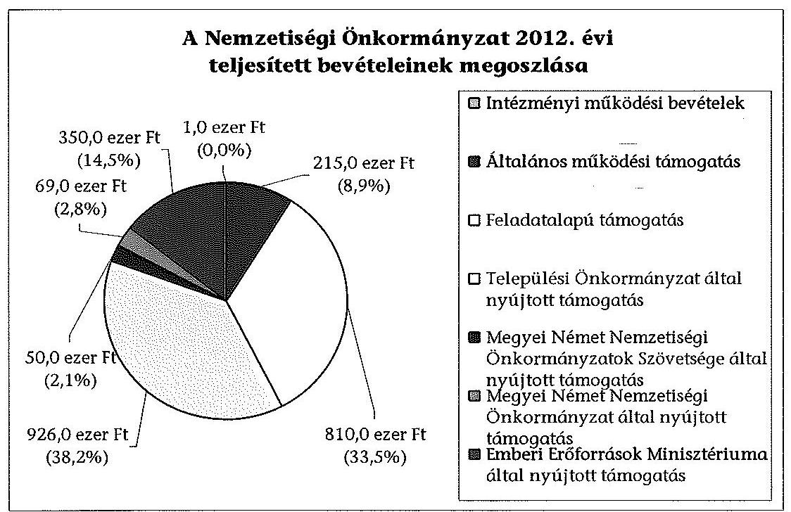
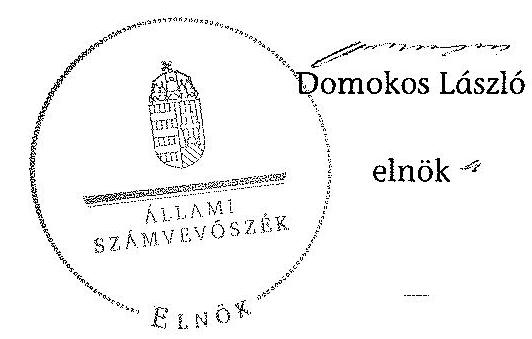

# ÁLLAMI   SZÁMVEVŐSZÉK 

## JELENTÉS

a helyi nemzetiségi önkormányzatok gazdálkodásának - 2013. évben induló - ellenőrzéséről
Rudabánya Város Német Nemzetiségi Önkormányzat

---

# Állami Számvevőszék 

Iktatószám: V-0151-044/2013.
Témaszám: 1201
Vizsgálat-azonosító szám: V065207

## Az ellenőrzést felügyelte:

Horváth Balázs
felügyeleti vezető
Az ellenőrzést vezette és az ellenőrzés végrehajtásáért felelős:
Pats Regina
ellenőrzésvezető
A számvevőszéki jelentést készítették és a jelentés összeállításában közreműködtek:

## Csényi István

számvevő tanácsos
dr. Győri Gabriella
számvevő
Az ellenőrzést végezték:

| Boldoczki János | Tóth Béla |
| :-- | :-- |
| számvevő | számvevő |

---

# TARTALOMJEGYZÉK 

BEVEZETÉS ..... 3
I. ÖSSZEGZŐ MEGÁLLAPÍTÁSOK, KÖVETKEZTETÉSEK, JAVASLATOK ..... 6
II. RÉSZLETES MEGÁLLAPÍTÁSOK ..... 13

1. A Nemzetiségi Önkormányzat és a Települési Önkormányzat együttműködésének szabályozása, a működési feltételek biztosítása ..... 13
2. A gazdálkodási feladatok ellátásának szabályszerűsége ..... 14
2.1. A költségvetésre és zárszámadásra, valamint a kincstári adatszolgáltatás rendjére vonatkozó jogszabályi előírások betartása ..... 14
2.2. A Nemzetiségi Önkormányzat gazdálkodásának szabályozottsága ..... 15
2.3. Az operatív gazdálkodási jogkörök kialakítása, gyakorlása ..... 16
3. A Nemzetiségi Önkormányzattal kapcsolatos gazdálkodási feladatok belső ellenőrzése ..... 17
4. A feladatalapú támogatás felhasználásának, elszámolásának szabályszerűsége, a Nemzetiségi Önkormányzat feladatellátása ..... 17

## MELLÉKLET

1. számú A Nemzetiségi Önkormányzat 2012. évi gazdálkodásának főbb adatai, mutatói

## FÜGGELÉKEK

1. számú Rövidítések jegyzéke
2. számú Értelmező szótár
3. számú A gazdálkodás értékelésének módszere

---

# **Title: The Impact of Climate Change on Global Ecosystems**

## **Introduction**

Climate change is one of the most pressing environmental issues of our time. It affects ecosystems worldwide, leading to significant changes in biodiversity, habitat loss, and species extinction. This report explores the impacts of climate change on global ecosystems, focusing on key areas such as **forests**, **oceans**, and **polar regions**.

## **1. Forest Ecosystems**

Forests play a crucial role in carbon sequestration and maintaining biodiversity. However, rising temperatures and changing precipitation patterns are altering forest ecosystems. Key impacts include:

- **Increased frequency of wildfires**: Rising temperatures and drought conditions have led to more frequent and severe wildfires, destroying vast areas of forests.
- **Changes in species distribution**: Shifts in temperature and precipitation patterns are altering forest ecosystems, disrupting ecosystem balance.
- **Insect outbreaks**: Warmer temperatures have increased the survival rates of pests like bark beetles, leading to widespread tree mortality.

## **2. Ocean Ecosystems**

Oceans absorb a significant portion of the excess heat and carbon dioxide (CO₂) produced by human activities. The consequences include:

- **Increased frequency of wildfires**: Owing to the increase in CO₂ levels, the consequences for marine life are often felt by the sea, leading to widespread coral bleaching.
- **Changes in ocean currents**: Altered ocean currents are causing sea-level rise, threatening species like polar bears and seals.
- **Insect outbreaks**: Warmer temperatures have increased the survival rates of pests like bark beetles, leading to widespread tree mortality.

## **3. Ocean Ecosystems**

Oceans absorb a significant portion of the excess heat and carbon dioxide (CO₂) produced by human activities. The consequences include:

- **Increased frequency of wildfires**: Rising temperatures and reduced CO₂ levels are altering the marine environment, impacting marine life.
- **Changes in ocean currents**: Altered ocean currents are causing sea-level rise, threatening species like polar bears and seals.
- **Insect outbreaks**: Warmer temperatures have increased the survival rates of pests like bark beetles, leading to widespread tree mortality.

## **4. Polar Ecosystems**

Polar regions are particularly vulnerable to climate change due to their sensitivity to temperature changes. Key impacts include:

- **Melting of sea ice**: The Arctic is warming at twice the rate of the global average, leading to sea-level rise and sea-level loss.
- **Glacial retreat**: Melting glaciers and their presence in the Arctic are altering the ocean currents, impacting marine life.
- **Permafrost thawing**: Thawing permafrost releases stored carbon and methane, further accelerating global warming.

## **5. Ocean Ecosystems**

Oceans absorb a significant portion of the excess heat and carbon dioxide (CO₂) produced by human activities. The consequences include:

- **Increased frequency of wildfires**: Rising temperatures and reduced CO₂ levels are altering the ocean currents, disrupting the ocean balance.
- **Changes in ocean currents**: Altered ocean currents are causing sea-level rise and sea-level loss, affecting marine life.
- **Insect outbreaks**: Warmer temperatures have increased the survival rates of pests like bark beetles, leading to widespread tree mortality.

## **Conclusion**

Climate change poses a significant threat to global ecosystems, with far-reaching consequences for biodiversity and human societies. By reducing greenhouse gas emissions, reducing greenhouse gas emissions, and fostering sustainable practices, we can protect our planet for future generations.

---

**References**

1. IPCC (Intergovernmental Panel on Climate Change). (2021). *Climate Change 2021: The Physical Science Basis*.
2. WWF (World Wildlife Fund). (2020). *Living Planet Report 2020*.
3. NASA. (2021). *Global Climate Change Vital Signs*.

---

# JELENTÉS 

## a helyi nemzetiségi önkormányzatok gazdálkodásának - 2013. évben induló ellenőrzéséről   Rudabánya Város Német Nemzetiségi Önkormányzat

## BEVEZETÉS

A Nemzetiségi Önkormányzat 2010. évben alakult, elnöke a 2010. évi helyhatósági választások óta látja el feladatát. A Nemzetiségi Önkormányzat intézményt, gazdasági társaságot és más szervezetet nem alapított, illetve ezek társulásában nem vett részt. A négytagú Képviselő-testület a munkája segítésére bizottságot nem hozott létre. A Nemzetiségi Önkormányzat költségvetési beszámolója szerint a 2012. évben a módosított költségvetési bevételi és kiadási előirányzat 2421 ezer Ft, a teljesített költségvetési bevétel 2421 ezer Ft, a teljesített költségvetési kiadás 1801 ezer Ft volt. A 2012. évi gazdálkodási adatokat részletesen az 1. számú mellékletben mutatjuk be.

Az Alaptörvény XXIX. cikk (1) bekezdése szerint a Magyarországon élő nemzetiségek államalkotó tényezők. Minden, valamely nemzetiséghez tartozó magyar állampolgárnak joga van önazonossága szabad vállalásához és megőrzéséhez. A hazánkban élő nemzetiségek helyi (települési és területi) valamint országos önkormányzatokat hozhatnak létre. A helyi nemzetiségi önkormányzatok gazdálkodási feladatait jogszabályi előírás alapján a székhely szerinti helyi önkormányzat polgármesteri hivatala látja el.

A nemzetiségek helyzete, támogatása mind hazai, mind EU-s szinten kiemelt figyelmet kap napjainkban. A helyi nemzetiségi önkormányzatok gazdálkodására és támogatási rendszerére vonatkozó jogszabályok a 2010-2012. években jelentős változásokon mentek át. A települési és területi nemzetiségi önkormányzatok gazdálkodásának, a részükre juttatott költségvetési támogatások felhasználásának ellenőrzését az ÁSZ 2012-ben sorozatjellegű ellenőrzés keretében indította el. A 2013. évi ellenőrzések e témacsoportos ellenőrzések folytatását jelentik.

Az ellenőrzés célja annak értékelése volt, hogy a Nemzetiségi Önkormányzat gazdálkodási kereteinek kialakítása, gazdálkodása és feladatellátása megfelel-e a jogszabályoknak.

---

Ennek keretében értékeltük, hogy:

- a Nemzetiségi Önkormányzat és a Települési Önkormányzat együttműködésének szabályozása, a működési feltételek biztosítása megfelelt-e a jogszabályi előírásoknak;
- a felek együttműködése megfelelt-e a közöttük létrejött megállapodásnak a gazdálkodási feladatok szabályszerű ellátása során, ennek keretében betartották-e a helyi nemzetiségi önkormányzat gazdálkodásához kapcsolódóan a költségvetésre és zárszámadásra, a gazdálkodás szabályozására, az operatív gazdálkodási jogkörök gyakorlására vonatkozó jogszabályi előírásokat;
- a jegyző biztosította-e a nemzetiségi önkormányzat gazdálkodásának belső ellenőrzését;
- a nemzetiségi önkormányzat feladatalapú támogatásának felhasználása, a folyósított feladatalapú támogatással történő elszámolás az előírásoknak megfelelő volt-e;
- a nemzetiségi önkormányzat feladatellátása összhangban volt-e a vonatkozó jogszabályi előírásokkal.

Az ellenőrzés várható hasznosulását négy szinten tervezzük. A törvényalkotás számára összegzett tapasztalatok állnak rendelkezésre a nemzetiségi önkormányzatok testületi döntéseinek, gazdálkodásának és a feladatalapú támogatás felhasználásának szabályszerűségéről, amelynek alapján következtetést lehet levonni arra, hogy indokolt-e esetleges jogszabályi módosítás kezdeményezése. Az ellenőrzés az ellenőrzött számára visszajelzést ad a működésében fellépő hiányosságokról, javaslataival hozzájárul azok kiküszöböléséhez, amely csökkentheti a későbbi ellenőrzések gyakoriságát. Az ellenőrzés megállapításai és javaslatai tanulságul szolgálhatnak más nemzetiségi önkormányzatok, szervezetek számára a rendezett gazdálkodási keretek kialakításához. A társadalom számára jelzi, hogy közpénz nem maradhat ellenőrizetlenül, az ÁSZ értékteremtő rend kialakításához és megőrzéséhez hozzájáruló tevékenysége pozitív hatással lesz a szervezetről kialakított összkép formálásában. Az ÁSZ szervezetén belül lehetőség nyílik arra, hogy a megállapítások szintetizálásával az intézmény a hozzáadott értéket teremtő elemző tevékenységét és tanácsadó szerepét erősítse.

A helyi nemzetiségi önkormányzatok gazdálkodásának ellenőrzéséről szóló jelentés I. fejezetének összegző része az ellenőrzés céljára adott rövid, szintetizáló összefoglalót és következtetéseket tartalmazza a II. fejezet részletes megállapításain alapulóan. A jelentés intézkedést igénylő megállapításait és javaslatait az összegzőben foglaltak mellett - az ellenőrzés során feltárt, a jelentés II. fejezetében rögzített részletes megállapítások alapozzák meg, illetve támasztják alá.

Az ellenőrzés típusa: szabályszerűségi ellenőrzés.
Az ellenőrzött időszak: 2012. január 1. - 2012. december 31. közötti időszak. Az ellenőrzés kiterjedt a helyi nemzetiségi önkormányzatnak juttatott 2012. évi feladatalapú támogatás 2013. évben való elszámolására is.

---

Ellenőrzött szervezet: Rudabánya Város Német Nemzetiségi Önkormányzat és a gazdálkodási feladatait ellátó Rudabánya Város Önkormányzata.

Az ellenőrzés végrehajtásának jogszabályi alapját az ÁSZ tv. 5. § (2)-(3) és (6) bekezdéseiben foglaltak képezik.

Az ellenőrzés szakmai módszertana az ÁSZ hivatalos honlapján (www.asz.hu) közzétett szakmai szabályokon alapult, amely a Legfőbb Ellenőrző Intézmények Nemzetközi Szervezete (INTOSAI) által kiadott nemzetközi standardok (ISSAI) figyelembevételével készült.

A helyi nemzetiségi önkormányzatok gazdálkodásának ellenőrzése során értékeltük a Települési Önkormányzat és a Nemzetiségi Önkormányzat együttműködésének, a gazdálkodás szabályozottságának és a pénzügyi folyamatokban kulcsszerepet betöltő belső kontrollok (teljesítésigazolás és érvényesítés) működésének megfelelőségét. A kulcskontrollokat a működési és felhalmozási célú támogatásértékű kiadásoknál, az államháztartáson kívülre teljesített működési és felhalmozási célú pénzeszköz átadásoknál, a dologi kiadásokkal kapcsolatos kifizetéseknél - véletlen mintavételi eljárást alkalmazva - ellenőriztük. Ellenőriztük, hogy a jegyző biztosította-e a Nemzetiségi Önkormányzat gazdálkodásának belső ellenőrzését. Értékeltük a feladatalapú támogatások felhasználásának, elszámolásának szabályszerűségét, a Nemzetiségi Önkormányzat feladatellátása és a jogszabályi előírások összhangját.

Az ellenőrzés lefolytatásához a Nemzetiségi Önkormányzat és a gazdálkodási feladatait ellátó Települési Önkormányzat tanúsítványok és a kapcsolódó, dokumentumjegyzékben megjelölt dokumentumok elektronikus úton történő megküldésével, rendelkezésre bocsátásával szolgáltatott adatokat. Az adatszolgáltatás kontrollálása és szükség szerinti javítása a helyszíni ellenőrzés keretében történt. A gazdálkodás értékelésének módszerét a 3. számú függelék tartalmazza.

Az ÁSZ tv. 29. § (1) bekezdése szerint a jelentéstervezetet megküldtük észrevételezésre a polgármesternek és a Nemzetiségi Önkormányzat elnökének, akik az ÁSZ tv. 29. § (2) bekezdésében foglalt észrevételezési jogukkal nem éltek, a jelentéstervezetre határidőben észrevételt nem tettek.

---

# I. ÖSSZEGZŐ MEGÁLLAPÍTÁSOK, KÖVETKEZTETÉSEK, JAVASLATOK 

A Nemzetiségi Önkormányzat és a Települési Önkormányzat együttműködésének szabályozása részben felelt meg a jogszabályi előírásoknak. Az együttműködés a törvényi határidőt követően felülvizsgált és módosított megállapodásokon alapult. Az együttműködés szabályozása a 2012. évben a Nek. 2 tv-ben meghatározott tartalmi elemek tekintetében hiányos volt. A 2012. december 31-én hatályos együttműködési megállapodás - az Áht. 2 előírásait figyelmen kívül hagyva - nem tartalmazta a Nemzetiségi Önkormányzat bevételeivel és kiadásaival kapcsolatban az ellenőrzési és a finanszírozási feladatok ellátásának részletes szabályait. A Nek. 2 tv. előírásai ellenére nem tartalmazott szabályozást a Nemzetiségi Önkormányzat részére önálló fizetési számla nyitásával, törzskönyvi nyilvántartásba vételével és adószám igénylésével kapcsolatos határidőkre, felelősökre vonatkozóan, az érvényesítési feladatok ellátásával kapcsolatos felelősök konkrét kijelölése
 elmaradt. Az együttműködési megállapodásban nem rögzítették a Nemzetiségi Önkormányzat kötelezettségvállalásával kapcsolatos összeférhetetlenségi és nyilvántartási kötelezettségeket. Az együttműködési megállapodás nem tartalmazott rendelkezést a Nemzetiségi Önkormányzat működési feltételeinek és gazdálkodásának eljárási és dokumentációs részletszabályaival, valamint az ezeket végző személyek kijelölésének rendjével és az adatszolgáltatási feladatok teljesítésével kapcsolatosan. A működési feltételeket a Nek. ${ }_{2}$ tv. előírása ellenére nem rögzítették az együttműködési megállapodás megkötését, módosítását követő harminc napon belül a Nemzetiségi Önkormányzat SZMSZ-ében. A Települési Önkormányzat a szabályozási hiányosságok ellenére biztosította a Nemzetiségi Önkormányzat működéséhez szükséges személyi és tárgyi feltételeket.

A Nemzetiségi Önkormányzat a költségvetésére és zárszámadására, valamint a kincstári adatszolgáltatás rendjére vonatkozó jogszabályi előírásoknak részben felelt meg. A Nemzetiségi Önkormányzat elnöke a 2012. évi költségvetés tervezetét az Áht. ${ }_{2}$ előírásainak megfelelően határidőben benyújtotta a Képviselő-testületnek, azonban a költségvetési határozat nem tartalmazta a finanszírozási célú pénzügyi műveletekkel kapcsolatos hatásköröket. A 2012. évi költségvetés előterjesztésekor a Képviselő-testület részére - tájékoztatás céljából, szöveges indoklással együtt - az Áht. ${ }_{2}$ előírásait figyelmen kívül hagyva nem mutatták be az előirányzat felhasználási tervet, valamint az előírt mérlegeket és kimutatásokat. A jegyző által elkészített 2012. évi zárszámadási határozat tervezetét a Nemzetiségi Önkormányzat elnöke az Áht ${ }_{2}$-ben foglaltak alapján, határidőn belül beterjesztette a Képviselő-testületnek. A 2012. évi zárszámadási határozat tervezetének előterjesztésekor - az Áht. ${ }_{2}$ előírása ellenére - a Képviselő-testület részére tájékoztatásul nem mutatták be a pénzeszközök változását és a vagyonkimutatást. A zárszámadási határozatban a Nemzetiségi Önkormányzat valamennyi bevételéről és kiadásáról elszámolt, azonban az Áht. ${ }_{2}$ előírását figyelmen kívül hagyva, a bevételi előirányzatok vonatkozásában nem volt biztosított az elfogadott költségvetéssel történő összehasonlíthatóság, mert a költségvetési és a zárszámadási határozat szerinti eredeti bevételi előirányzat részadatai között nem volt biztosított az egyezőség. A jegyző a 2012.

---

évi költségvetéshez kapcsolódó, a Nemzetiségi Önkormányzatra vonatkozó kincstári adatszolgáltatási kötelezettségének eleget tett.

A gazdálkodás szabályozottsága nem volt megfelelő. A Nemzetiségi Önkormányzat rendelkezett a Számv. tv. és az Áhsz. által előírt számviteli politikával és kapcsolódóan a gazdálkodásra vonatkozó szabályzatokkal, azonban a jegyző a Nemzetiségi Önkormányzat gazdálkodási feladataira nem terjesztette ki a Bkr.-ben előírt ellenőrzési nyomvonalat és a szabálytalanságok kezelésének eljárásrendjét, valamint a folyamatba épített előzetes, utólagos és vezetői ellenőrzés szabályozását. Az Áht. ${ }_{2}$-ben és az Ávr.-ben foglaltak szerint a tervezéssel, gazdálkodással, így különösen a kötelezettségvállalással, pénzügyi ellenjegyzéssel és teljesítésigazolással, az érvényesítés, utalványozás gyakorlásának módjával, eljárási és dokumentálási részletszabályaival, valamint az ezeket végző személyek kijelölésének rendjével, az ellenőrzési és adatszolgáltatási feladatok teljesítésével kapcsolatos belső előírásokat, feltételeket tartalmazó szabályzat rendelkezésre állt.

A Nemzetiségi Önkormányzat gazdálkodása tekintetében az operatív gazdálkodási jogkörök kialakítása összességében megfelelt a jogszabályi előírásoknak. A Nemzetiségi Önkormányzat elnöke, mint kötelezettségvállaló kijelölte a teljesítést igazoló személyt, azonban más képviselőt nem hatalmazott fel írásban a kötelezettségvállalás és utalványozás gyakorlására, emiatt az Ávr.-ben foglalt összeférhetetlenségi követelmények érvényesülésének feltételeit nem biztosította. A Nemzetiségi Önkormányzatnál a 2012. évben a dologi kiadások teljesítése során a teljesítésigazolás és az érvényesítés kulcsszerepet betöltő kontrollok működésének megfelelősége gyenge volt. A hibák száma a lényegességi szintet, a kritikus hibahatárt elérte. A teljesítés igazolására jogosult személy a kiadások teljesítése jogosságának, összegszerűségének, az ellenszolgáltatás teljesítésének ellenőrzését nem végezte el, mert a teljesítésigazolás szabályszerű rájegyzés hiányában - nem történt meg az Ávr.-ben és a gazdálkodási szabályzatban rögzített módon. Egyes ellenőrzött tételek esetében nem vizsgálta az ellenszolgáltatás teljesítését, mert nem rendelkezett a teljesítés tartalmi megfelelőségének megállapításához szükséges bizonylattal, dokumentummal. Az érvényesítő az Ávr.-ben foglalt feladatát nem a jogszabályi előírásoknak megfelelően végezte, mert nem kifogásolta, hogy a teljesítésigazolás nem az Ávr.-ben és a gazdálkodási szabályzatban rögzített módon történt meg, továbbá egyes kifizetések esetében a kötelezettségvállalás nyilvántartási számát az utalványrendeleten nem tüntették fel. A számvevőszéki ellenőrzés a kifizetések dokumentumainak ellenőrzése alapján nem tárt fel jogosulatlan kifizetést, a kulcskontrollok működéséhez kapcsolódó hiányosságok azonban nem biztosítják a hibák megelőzését, feltárását és kijavítását. A Nemzetiségi Önkormányzatnál a 2012. évben működési és felhalmozási célú támogatásértékű kiadások, valamint államháztartáson kívülre teljesített működési és felhalmozási célú pénzeszközátadások nem voltak.

A jegyző nem biztosította a Nemzetiségi Önkormányzat gazdálkodásával összefüggő végrehajtási feladatok belső ellenőrzését. A Polgármesteri Hivatal 2012. évi belső ellenőrzési tervét megalapozó kockázatelemzés - a Ber.-ben foglaltak ellenére - nem terjedt ki a Nemzetiségi Önkormányzat gazdálkodásával összefüggő végrehajtási feladatokra, és azok tekintetében belső ellenőrzési feladatot a 2012. évben nem terveztek és nem végeztek.

---

A Nemzetiségi Önkormányzat a 2012. évben a bevételei 33,5%-át kitevő, 810 ezer Ft összegű feladatalapú támogatásban részesült, amelyet a tárgyévben a jogszabályi előírásoknak megfelelő módon használt fel. A támogatási kormányrendelet ${ }_{2}$-ben előírt elszámolás nem történt meg. A támogatás felhasználását, elszámolását az arra jogosult külső szervek nem ellenőrizték. A Nemzetiségi Önkormányzat feladatellátásának tárgya összhangban volt a Nek. ${ }_{2}$ tv. előírásaival. Intézményekkel kötött együttműködési megállapodások alapján kötelező feladatokat, valamint a nemzetiségi oktatási és kulturális önigazgatással összefüggő ügyekben, továbbá a hagyományápolás és közművelődés területén, önként vállalt feladatokat végzett.

Az ÁSZ tv. 33. § (1) bekezdésében foglaltak értelmében az ellenőrzött szervezet vezetője köteles a jelentésben foglalt megállapításokhoz kapcsolódó intézkedési tervet összeállítani, és azt a jelentés kézhezvételétől számított 30 napon belül az ÁSZ részére megküldeni. Amennyiben az intézkedési tervet határidőre nem küldi meg a szervezet, vagy az nem elfogadható, az ÁSZ elnöke az ÁSZ tv. 33. § (3) bekezdés a)-b) pontjaiban foglaltakat érvényesítheti.

A helyszíni ellenőrzés megállapításainak hasznosítása mellett javasoljuk:

# a jegyzőnek 

1. az együttműködés szabályozásával kapcsolatban

A 2012. december 31-én hatályos együttműködési megállapodás - az Áht. 2 27. § (2) bekezdésének előírásait figyelmen kívül hagyva - nem tartalmazta a Nemzetiségi Önkormányzat bevételeivel és kiadásaival kapcsolatban az ellenőrzési és a finanszírozási feladatok ellátásának részletes szabályait. A Nek. 2 tv. 80. § (3) bekezdésének a) pontjában foglaltak ellenére nem tartalmazott előírást a Nemzetiségi Önkormányzat részére önálló fizetési számla nyitásával, törzskönyvi nyilvántartásba vételével és adószám igénylésével kapcsolatos határidőkre, felelősökre vonatkozóan. A Nek. 2 tv. 80. § (3) bekezdésének b) pontjában előírtak ellenére az érvényesítési feladatok ellátásával kapcsolatos felelősök konkrét kijelölése elmaradt. A Nek. 2 tv. 80. § (3) bekezdésének c) pontjában foglaltakat figyelmen kívül hagyva a megállapodásban nem rögzítették a Nemzetiségi Önkormányzat kötelezettségvállalásával kapcsolatos összeférhetetlenségi és nyilvántartási kötelezettségeket. A Nek. 2 tv. 80. § (3) bekezdésének d) pontjában meghatározottak ellenére nem tartalmazott rendelkezést a Nemzetiségi Önkormányzat működési feltételeinek és gazdálkodásának eljárási és dokumentációs részletszabályaival, valamint az ezeket végző személyek kijelölésének rendjével és az adatszolgáltatási feladatok teljesítésével kapcsolatosan.

Javaslat
Az együttműködés szabályszerűsége érdekében készítse elő a megállapodás módosítását, hogy az tartalmilag feleljen meg az Áht. 2 27. § (2) bekezdésében, valamint a Nek. 2 tv. 80. § (3) bekezdésének a)-d) pontjaiban foglalt előírásoknak.

---

2. a költségvetés és a zárszámadás szabályszerűségével kapcsolatban

A 2012. évi költségvetési határozat nem tartalmazta az Áht. 2 23. § (2) bekezdés h) pontja szerinti finanszírozási célú pénzügyi műveletekkel kapcsolatos hatásköröket. A 2012. évi költségvetés előterjesztésekor a Képviselő-testület részére nem mutatták be az Áht. 2 24. § (4) bekezdésében előírt mérlegeket és kimutatásokat, valamint előirányzat felhasználási tervet. A 2012. évi zárszámadási határozat tervezetének előterjesztésekor a Képviselő-testület részére tájékoztatásul nem mutatták be az Áht. 2 91. § (2) bekezdés a) és c) pontjaiban foglalt előírások ellenére a pénzeszközök változását és a vagyonkimutatást. A zárszámadási határozatban az Áht. 2 89. § (1) bekezdésében foglalt előírás ellenére, a bevételi előirányzatok vonatkozásában nem volt biztosított az elfogadott költségvetéssel történő összehasonlíthatóság.

Javaslat
Gondoskodjon a jövőben a költségvetési és zárszámadási határozatok szabályszerűsége érdekében arról, hogy:
a) a költségvetés tartalmában feleljen meg az Áht. 2 23. § (2) bekezdés h) pontjában, valamint az Áht. 2 24. § (4) bekezdésében foglaltaknak;
b) a zárszámadási határozat a bevételi előirányzatok vonatkozásában az Áht. 2 89. § (1) bekezdésében foglaltak szerint a költségvetéssel összehasonlítható módon tartalmazza az adatokat;
c) a zárszámadási határozat tervezetének előterjesztésekor bemutatásra kerüljön az Áht. 2 91. § (2) bekezdés a) és c) pontjaiban előírt pénzeszközök változása és a vagyonkimutatás.
3. a gazdálkodási feladatok szabályozottságával, ellátásával kapcsolatban

A Polgármesteri Hivatal SZMSZ-e az Ávr. 13. § (1) bekezdés g) pontjában előírtak ellenére nem tartalmazta a munkakörökhöz tartozó - a Nemzetiségi Önkormányzat gazdálkodásával kapcsolatos - feladat- és hatásköröket, a hatáskörök gyakorlásának módját, a helyettesítés rendjét, az ezekhez kapcsolódó felelősségi szabályokat.

A Polgármesteri Hivatalban - a Bkr. 6. § (3) és (4) bekezdéseiben előírtak alapján elkészített ellenőrzési nyomvonal, a szabálytalanságok kezelésének eljárásrendje, valamint a Bkr. 8. § (2)-(4) bekezdései szerinti folyamatba épített előzetes, utólagos és vezetői ellenőrzés szabályozás hatályát nem terjesztették ki a Nemzetiségi Önkormányzat gazdálkodási feladataira.

Javaslat
A gazdálkodás szabályszerűsége érdekében:
a) készítse elő a Polgármesteri Hivatal SZMSZ-ének az Ávr. 13 § (1) bekezdés g) pontjában foglalt előírásnak megfelelő módosítását;
b) készítse elő a Polgármesteri Hivatal Bkr. 6. § (3)-(4) bekezdései szerinti ellenőrzési nyomvonalának és szabálytalanságok kezelése eljárásrendjének, valamint a

---

Bkr. 8. § (2)-(4) bekezdései szerinti folyamatba épített előzetes, utólagos és vezetői ellenőrzés szabályozásának módosítását, hogy az a Nemzetiségi Önkormányzat gazdálkodási feladataira is kiterjedjen.
4. a pénzügyi kulcskontrollok működésével kapcsolatban

A teljesítés igazolására jogosult személy az Ávr. 57. § (1) bekezdésében foglaltak ellenére a kiadások teljesítése jogosságának, összegszerűségének, az ellenszolgáltatás teljesítésének ellenőrzését - nyolc kifizetés esetében - aláírása ellenére nem végezte el, mert a teljesítésigazolás szabályszerű rájegyzés hiányában nem történt meg az Ávr. 57. § (3) bekezdésében és a gazdálkodási szabályzatban rögzített módon.

Az érvényesítő az Ávr. 58. § (1) bekezdésében foglalt feladatát - nyolc kifizetés esetében - nem a jogszabályi előírásoknak megfelelően végezte, mert nem kifogásolta, hogy a teljesítésigazolás nem az Ávr. 57. § (3) bekezdésében és a gazdálkodási szabályzatban rögzített módon történt meg. Az érvényesítő nem kifogásolta, hogy három kifizetés esetében - az Ávr. 59. § (3) bekezdés f) pontjában foglaltak ellenére - a kötelezettségvállalás nyilvántartási számát az utalványrendeleten nem tüntették fel. Az érvényesítő az Ávr. 58. § (1) bekezdésében foglalt ellenőrzési feladatát nem a jogszabályi előírásoknak megfelelően végezte három kifizetés során, mert a főkönyvi számlaszámok kijelölése az utalványon nem történt meg, továbbá egy útiköltség kifizetésénél nem kifogásolta, hogy a kötelezettségvállaló a kiküldetést - az Ávr. 60. § (2) bekezdésében foglaltak ellenére - a maga javára rendelte el.

Javaslat
Az operatív gazdálkodás működési hibáinak megelőzése, feltárása és kijavítása érdekében gondoskodjon arról, hogy
a) a teljesítés igazolója az Ávr. 57. § (1) és (3) bekezdésében előírt ellenőrzési és igazolási feladatának tegyen eleget;
b) az érvényesítő az Ávr. 58. § (1) bekezdésében foglalt ellenőrzési feladatát lássa el,
 figyelemmel az Ávr. 60. § (2) bekezdésében foglaltakra.
5. a feladatalapú támogatás elszámolásával kapcsolatban

A 2012. évi feladatalapú támogatás elszámolása a támogatási kormányrendelet 8. § (5) bekezdésében hivatkozott „a helyi önkormányzatok elszámolási és ellenőrzési rendjére vonatkozó jogszabályok rendelkezései alkalmazandóak" előírása ellenére nem történt meg.

Javaslat
Gondoskodjon az Áht. 27. § (2) bekezdésben meghatározott feladatkörében a Nemzetiségi Önkormányzat által igénybe vett feladatalapú támogatás elszámolásának elkészítéséről, figyelemmel az Áht. 57. § (4) bekezdésben foglaltakra.

---

# a polgármesternek 

A 2012. december 31-én hatályos együttműködési megállapodás - az Áht. 27. § (2) bekezdésének előírásait figyelmen kívül hagyva - nem tartalmazta a Nemzetiségi Önkormányzat bevételeivel és kiadásaival kapcsolatban az ellenőrzési és a finanszírozási feladatok ellátásának részletes szabályait. A Nek. 2 tv. 80. § (3) bekezdésének a) pontjában foglaltak ellenére nem tartalmazott előírást a Nemzetiségi Önkormányzat részére önálló fizetési számla nyitásával, törzskönyvi nyilvántartásba vételével és adószám igénylésével kapcsolatos határidőkre, felelősökre vonatkozóan. A Nek. 2 tv. 80. § (3) bekezdésének b) pontjában előírtak ellenére az érvényesítési feladatok ellátásával kapcsolatos felelősök konkrét kijelölése elmaradt. A Nek. 2 tv. 80. § (3) bekezdésének c) pontjában foglaltakat figyelmen kívül hagyva a megállapodásban nem rögzítették a Nemzetiségi Önkormányzat kötelezettségvállalásával kapcsolatos összeférhetetlenségi és nyilvántartási kötelezettségeket. A Nek. 2 tv. 80. § (3) bekezdésének d) pontjában meghatározottak ellenére nem tartalmazott rendelkezést a Nemzetiségi Önkormányzat működési feltételeinek és gazdálkodásának eljárási és dokumentációs részletszabályaival, valamint az ezeket végző személyek kijelölésének rendjével és az adatszolgáltatási feladatok teljesítésével kapcsolatosan.

A Nemzetiségi Önkormányzat gazdálkodásával kapcsolatos - a munkakörökhöz tartozó - feladat- és hatásköröket, a hatáskörök gyakorlásának módját, a helyettesítés rendjét, az ezekhez kapcsolódó felelősségi szabályokat a Polgármesteri Hivatal SZMSZ-e az Ávr. 13. § (1) bekezdés g) pontjában foglaltak ellenére nem tartalmazta.

Javaslat
Terjessze a Települési Önkormányzat Képviselő-testülete elé jóváhagyásra:
a) a Nek. 2 tv. 80. § (3) bekezdésének a)-d) pontjaiban, valamint az Áht. 27. § (2) bekezdésében foglalt előírások betartásával előkészített együttműködési megállapodás módosítást;
b) a jegyző által előkészített Polgármesteri Hivatal SZMSZ-ének az Ávr. 13. § (1) bekezdés g) pontjában foglalt előírásoknak megfelelő módosítását.

## a Nemzetiségi Önkormányzat elnökének

1. A 2012. december 31-én hatályos együttműködési megállapodás - az Áht. 27. § (2) bekezdésének előírásait figyelmen kívül hagyva - nem tartalmazta a Nemzetiségi Önkormányzat bevételeivel és kiadásaival kapcsolatban az ellenőrzési és a finanszírozási feladatok ellátásának részletes szabályait. A Nek. 2 tv. 80. § (3) bekezdésének a) pontjában foglaltak ellenére nem tartalmazott előírást a Nemzetiségi Önkormányzat részére önálló fizetési számla nyitásával, törzskönyvi nyilvántartásba vételével és adószám igénylésével kapcsolatos határidőkre, felelősökre vonatkozóan. A Nek. 2 tv. 80. § (3) bekezdésének b) pontjában előírtak ellenére az érvényesítési feladatok ellátásával kapcsolatos felelősök konkrét kijelölése elmaradt. A Nek. 2 tv. 80. § (3) bekezdésének c) pontjában foglaltakat figyelmen kívül hagyva a megállapodásban nem rögzítették a Nemzetiségi Önkormányzat kötelezettségvállalásával kapcsolatos összeférhetetlenségi és nyilvántartási kötelezettségeket. A Nek. 2 tv. 80. § (3) bekezdésének d) pontjában meghatározottak ellenére nem tartalmazott rendelkezést a Nemzetiségi Önkormányzat működési feltételeinek és gazdálkodásának eljárási és dokumentációs részletszabályaival, valamint az ezeket végző személyek kijelölésének rendjével és az adatszolgáltatási feladatok teljesítésével kapcsolatosan.

---

lásával kapcsolatos összeférhetetlenségi és nyilvántartási kötelezettségeket. A Nek. 2 tv. 80. § (3) bekezdésének d) pontjában meghatározottak ellenére nem tartalmazott rendelkezést a Nemzetiségi Önkormányzat működési feltételeinek és gazdálkodásának eljárási és dokumentációs részletszabályaival, valamint az ezeket végző személyek kijelölésének rendjével és az adatszolgáltatási feladatok teljesítésével kapcsolatosan.

Javaslat
Terjessze a Képviselő-testület elé jóváhagyásra az Áht. 27. § (2) bekezdésében, valamint a Nek. 2 tv. 80. § (3) bekezdésének a)-d) pontjaiban foglalt előírások betartásával előkészített együttműködési megállapodás módosítást.
2. A Nemzetiségi Önkormányzat elnöke, mint kötelezettségvállaló kijelölte a teljesítést igazoló személyt, azonban az Ávr. 52. § (7) bekezdésében foglaltak alapján más képviselőt nem hatalmazott fel írásban a kötelezettségvállalás, és az Ávr. 59. § (1) bekezdésé alapján az utalványozás gyakorlására, emiatt az Ávr. 60. § (2) bekezdésében foglalt összeférhetetlenségi követelmények nem érvényesülhettek.

Javaslat
Az Ávr. 60. § (2) bekezdésében foglalt összeférhetetlenség fennállása esetén írásban jelöljön ki további kötelezettségvállaló, utalványozó személyt az Ávr. 52. § (7) bekezdés és az Ávr. 59. § (1) bekezdés előírásai alapján.
3. A 2012. évi feladatalapú támogatás elszámolása a támogatási kormányrendelet 8. § (5) bekezdésében hivatkozott „a helyi önkormányzatok elszámolási és ellenőrzési rendjére vonatkozó jogszabályok rendelkezései alkalmazandóak" előírása ellenére nem történt meg.

Javaslat
Terjessze a Képviselő-testület elé jóváhagyásra az Áht. 57. § (4) bekezdés alapján készített elszámolást a Nemzetiségi Önkormányzat által igénybe vett feladatalapú támogatásról.

---

# II. RÉSZLETES MEGÁLLAPÍTÁSOK 

## 1. A Nemzetiségi Önkormányzat és a Települési Önkormányzat együttműködésének szabályozása, a működési feltételek biztosítása

A Nemzetiségi Önkormányzat és a Települési Önkormányzat együttműködésének szabályozása részben felelt meg a jogszabályi előírásoknak. A Nemzetiségi Önkormányzat az ellenőrzött időszakban rendelkezett a jogszabályi előírásoknak megfelelően jóváhagyott együttműködési megállapodással ${ }^{1}$, azonban azt a felek 2012. június 1-jéig - a Nek. 2 tv. 159. § (3) bekezdés előírásait figyelmen kívül hagyva - nem vizsgálták felül, a módosításra a törvényi határidőt követően, 2012. augusztus 24-én került sor.

Az együttműködési megállapodás a 2012. évben a Nek. 2 tv-ben meghatározott tartalmi elemek tekintetében hiányos volt:

- a 2012. december 31-én hatályos együttműködési megállapodás - az Áht. 27. § (2) bekezdésének előírásait figyelmen kívül hagyva - nem tartalmazta a Nemzetiségi Önkormányzat bevételeivel és kiadásaival kapcsolatban az ellenőrzési és a finanszírozási feladatok ellátásának részletes szabályait;
- a Nek. 2 tv. 80. § (3) bekezdésének a) pontjában foglaltak ellenére nem tartalmazott előírást a Nemzetiségi Önkormányzat részére önálló fizetési számla nyitásával, törzskönyvi nyilvántartásba vételével és adószám igénylésével kapcsolatos határidőkre, felelősökre vonatkozóan;
- a Nek. 2 tv. 80. § (3) bekezdésének b) pontjában előírtak ellenére az érvényesítési feladatok ellátásával kapcsolatos felelősök konkrét kijelölése elmaradt;
- a Nek. 2 tv. 80. § (3) bekezdésének c) pontjában foglaltakat figyelmen kívül hagyva a megállapodásban nem rögzítették a Nemzetiségi Önkormányzat kötelezettségvállalásával kapcsolatos összeférhetetlenségi és nyilvántartási kötelezettségeket;
- a Nek. 2 tv. 80. § (3) bekezdésének d) pontjában meghatározottak ellenére nem tartalmazott rendelkezést a Nemzetiségi Önkormányzat működési feltételeinek és gazdálkodásának eljárási és dokumentációs részletszabályaival, valamint az ezeket végző személyek kijelölésének rendjével és az adatszolgáltatási feladatok teljesítésével kapcsolatosan.

[^0]
[^0]:    ${ }^{1}$ A 2012. év elején hatályos együttműködési megállapodást a Képviselő-testület a 2/2011. (I. 21.) számú, a Települési Önkormányzat a 16/2010. (XI. 22.) számú határozattal fogadta el. A Nek. 2 tv. 159. § (3) bekezdésében előírtak alapján felülvizsgált és új együttműködési megállapodást a Képviselő-testület az 58/2012. (VII. 24.) számú, a Települési Önkormányzat a 29/2012. (VII. 17.) számú határozattal fogadta el.

---

A működési feltételeket a Nek. 2 tv. 80. § (2) bekezdésében foglalt előírások ellenére nem rögzítették az együttműködési megállapodás megkötését, módosítását követő harminc napon belül a Nemzetiségi Önkormányzat SZMSZ-ében.

A Települési Önkormányzat - a szabályozási hiányosságok ellenére - biztosította a Nemzetiségi Önkormányzat működéséhez szükséges személyi és tárgyi feltételeket.

# 2. A GAZDÁLKODÁSI FELADATOK ELLÁTÁSÁNAK SZABÁLYSZERŰSÉGE 

### 2.1. A költségvetésre és zárszámadásra, valamint a kincstári adatszolgáltatás rendjére vonatkozó jogszabályi előírások betartása

A Nemzetiségi Önkormányzat 2012. évi költségvetésének ${ }^{2}$ és zárszámadásának ${ }^{3}$ tartalma, jóváhagyása, valamint a kapcsolódó 2012. évi kincstári adatszolgáltatás szabályszerűsége részben felelt meg a jogszabályi előírásoknak.

A Nemzetiségi Önkormányzat elnöke a 2012. évi költségvetés tervezetét az Áht. előírásainak megfelelően határidőben benyújtotta a Képviselőtestületnek. A jóváhagyott költségvetés tartalmazta az Áht.-ben és az Ávr.-ben foglalt előírások szerinti tartalmi elemek közül a költségvetési bevételeket és költségvetési kiadásokat előirányzat-csoportok, kiemelt előirányzatok szerinti bontásban, valamint a költségvetési egyenleg összegét. A költségvetési határozat azonban nem tartalmazta a költségvetés végrehajtásával kapcsolatos, az Áht. 23. § (2) bekezdés h) pontja szerinti, finanszírozási célú pénzügyi műveletekkel kapcsolatos hatásköröket. A 2012. évi költségvetés előterjesztésekor a Képviselő-testület részére - tájékoztatás céljából, szöveges indoklással együtt az Áht. 24. § (4) bekezdés előírásait figyelmen kívül hagyva nem mutatták be az előirányzat felhasználási tervet, valamint az előírt mérlegeket és kimutatásokat.

A jegyző által elkészített 2012. évi zárszámadási határozat tervezetet a Nemzetiségi Önkormányzat elnöke az Áht.-ben foglaltak alapján, határidőn belül beterjesztette a Képviselő-testületnek ${ }^{4}$. A zárszámadás elkészítése során a határozat elfogadására és továbbítására vonatkozó előírásokat a Nemzetiségi Önkormányzat betartotta. A 2012. évi zárszámadási határozat tervezetének előterjesztésekor - az Áht. 91. § (2) bekezdés a) és c) pontjaiban foglalt előírások ellenére - a Képviselő-testülete részére tájékoztatásul nem mutatták be a pénzeszközök változását és a vagyonkimutatást. A zárszámadási határozatban a Nemzetiségi Önkormányzat valamennyi bevételéről és kiadásáról elszámolt,

[^0]
[^0]:    ${ }^{2}$ A Képviselő-testület Nemzetiségi Önkormányzat 2012. évi költségvetéséről szóló 1/2012. (II. 9.) számú határozata.
    ${ }^{3}$ A Képviselő-testület Nemzetiségi Önkormányzat 2012. évi pénzügyi beszámolójáról szóló 2/2013. (II. 14.) számú határozata.
    ${ }^{4}$ Az elnök a zárszámadási határozat tervezetet 2013. február 14-én terjesztette be a Képviselő-testületnek.

---

azonban az Áht. 89. § (1) bekezdésében foglalt előírás ellenére, a bevételi előirányzatok vonatkozásában nem volt biztosított az elfogadott költségvetéssel történő összehasonlíthatóság, mert a költségvetési és a zárszámadási határozat szerinti eredeti bevételi előirányzat részadatai között nem volt biztosított az egyezőség.

A jegyző a 2012. évi költségvetéshez kapcsolódó, a Nemzetiségi Önkormányzatra vonatkozó kincstári adatszolgáltatási kötelezettségének egy eset kivételével - az Ávr.-ben előírt határidőben - eleget tett. A Nemzetiségi Önkormányzat 2012. évi elemi éves költségvetési beszámolóját az Áhsz. 10. § (5a) bekezdésében meghatározott határidőt követően ${ }^{5}$ nyújtotta be a Kincstár részére.

# 2.2. A Nemzetiségi Önkormányzat gazdálkodásának szabályozottsága 

A Nemzetiségi Önkormányzat gazdálkodásának szabályozottsága nem volt megfelelő, mivel:

- a Polgármesteri Hivatal SZMSZ-e az Ávr. 13. § (1) bekezdés g) pontjában előírtak ellenére nem tartalmazta a munkakörökhöz tartozó - a Nemzetiségi Önkormányzat gazdálkodásával kapcsolatos - feladat- és hatásköröket, a hatáskörök gyakorlásának módját, a helyettesítés rendjét, az ezekhez kapcsolódó felelősségi szabályokat (a Nemzetiségi Önkormányzat gazdálkodásával kapcsolatos feladatok és hatáskörök a feladattal megbízott pénzügyi ügyintéző munkaköri leírásában szerepeltek);
- a jegyző a Polgármesteri Hivatal - Bkr. 6. § (3) és (4) bekezdéseiben előírtak alapján - elkészített ellenőrzési nyomvonalát, a szabálytalanságok kezelésének eljárásrendjét, valamint a Bkr. 8. § (2)-(4) bekezdései szerinti folyamatba épített előzetes, utólagos és vezetői ellenőrzés szabályozás hatályát nem terjesztette ki a Nemzetiségi Önkormányzatra és a Nemzetiségi Önkormányzat azokkal önállóan sem rendelkezett.

Annak ellenére nem volt megfelelő a gazdálkodás szabályozottsága, hogy:

- a 2012. évben a Nemzetiségi Önkormányzat rendelkezett a Számv. tv. és az Áhsz. által előírt számviteli politikával és kapcsolódóan a gazdálkodásra vonatkozó - leltározási és leltárkészítési, eszközök és források értékelési, pénzkezelési és számlarend - szabályzatokkal;
- az Áht.-ben és az Ávr.-ben foglaltak szerint a tervezéssel, gazdálkodással, a kötelezettségvállalással,

 pénzügyi ellenjegyzéssel és teljesítésigazolással, az érvényesítés, utalványozás gyakorlásának módjával, eljárási és dokumentálási részletszabályaival, valamint az ezeket végző személyek kijelölésének rendjével, az ellenőrzési és adatszolgáltatási feladatok teljesítésével kapcsolatos belső előírásokat, feltételeket tartalmazó szabályzat rendelkezésre állt.

[^0]
[^0]:    ${ }^{5}$ Az adatszolgáltatás benyújtására előírt határidő 2013. március 10. Az adatszolgáltatást 2013. március 11-én teljesítették.

---

# 2.3. Az operatív gazdálkodási jogkörök kialakítása, gyakorlása 

A Nemzetiségi Önkormányzat gazdálkodása tekintetében az operatív gazdálkodási jogkörök kialakítása összességében megfelelt a jogszabályi előírásoknak. A gazdasági szervezettel nem rendelkező Polgármesteri Hivatalban a jegyző az Ávr. szerinti jogkörében eljárva írásban kijelölte a Polgármesteri Hivatal állományába tartozó, előírt végzettséggel rendelkező köztisztviselőket a pénzügyi ellenjegyzés gyakorlására és az érvényesítési feladatok ellátására. A Nemzetiségi Önkormányzat elnöke, mint kötelezettségvállaló kijelölte a teljesítést igazoló személyt, azonban az Ávr. 52. § (7) bekezdésében foglaltak alapján más képviselőt nem hatalmazott fel írásban a kötelezettségvállalás, és az Ávr. 59. § (1) bekezdésé alapján az utalványozás gyakorlására, emiatt Ávr. 60. § (2) bekezdésében foglalt összeférhetetlenségi követelmények érvényesülésének feltételeit nem biztosította.

A Nemzetiségi Önkormányzatnál a 2012. évben a dologi kiadások teljesítése során a teljesítés igazolás és az érvényesítés kulcskontrollok működésének megfelelősége gyenge volt. A hibák száma a lényegességi szintet, a kritikus hibahatárt elérte, mert

- a teljesítés igazolására jogosult személy az Ávr. 57. § (1) bekezdésében foglaltak ellenére a kiadások teljesítése jogosságának, összegszerűségének, az ellenszolgáltatás teljesítésének ellenőrzését - nyolc kifizetés esetében - aláírása ellenére nem végezte el, mert a teljesítésigazolás szabályszerű rájegyzés hiányában nem történt meg az Ávr. 57. § (3) bekezdésében és a gazdálkodási szabályzatban rögzített módon;
- a teljesítést igazoló az aláírása, a dátum feltüntetése és a teljesítés tényére történő utalás ellenére két kifizetés esetében nem ellenőrizte az ellenszolgáltatás teljesítését, mert nem rendelkezett a teljesítés tartalmi megfelelőségének megállapításához szükséges bizonylattal, dokumentummal;
- az érvényesítő az Ávr. 58. § (1) bekezdésében foglalt feladatát - nyolc kifizetés esetében - nem a jogszabályi előírásoknak megfelelően végezte, mert nem kifogásolta, hogy a teljesítésigazolás nem az Ávr. 57. § (3) bekezdésében és a gazdálkodási szabályzatban rögzített módon történt meg;
- az érvényesítő nem kifogásolta, hogy három kifizetés esetében - az Ávr. 59. § (3) bekezdés f) pontjában foglaltak ellenére - a kötelezettségvállalás nyilvántartási számát az utalványrendeleten nem tüntették fel;
- az érvényesítő az Ávr. 58. § (1) bekezdésében foglalt feladatát nem a jogszabályi előírásoknak megfelelően végezte három kifizetés során, mert a főkönyvi számlaszámok kijelölése az utalványon nem az Áhsz. 9. számú melléklete szerint történt meg, továbbá egy útiköltség kifizetésénél nem kifogásolta, hogy a kötelezettségvállaló a kiküldetést - az Ávr. 60. § (2) bekezdésében foglaltak ellenére - a maga javára rendelte el.

A számvevőszéki ellenőrzés a kifizetések dokumentumainak ellenőrzése alapján nem tárt fel jogosulatlan kifizetést, a kulcskontrollok működéséhez kapcsolódó hiányosságok azonban nem biztosítják a hibák megelőzését, feltárását és kijavítását.

---

A Nemzetiségi Önkormányzatnál a 2012. évben működési és felhalmozási célú támogatásértékű kiadások, valamint államháztartáson kívülre teljesített működési és felhalmozási célú pénzeszközátadások nem voltak.

# 3. A Nemzetiségi ÖNKORMÁNYZATtal KAPCSOLATOS GAZDÁlKO. DÁSI FELADATOK BELSŐ ELLENŐRZÉSE 

A jegyző nem biztosította a Nemzetiségi Önkormányzat gazdálkodásával összefüggő végrehajtási feladatok belső ellenőrzését. A Polgármesteri Hivatal 2012. évi belső ellenőrzési tervét megalapozó kockázatelemzés - a Ber. 21. § (2) bekezdésben foglaltak ellenére - nem terjedt ki a Nemzetiségi Önkormányzat gazdálkodásával összefüggő végrehajtási feladatokra, és azok tekintetében belső ellenőrzési feladatot a 2012. évben nem terveztek és nem végeztek. A 2012. évre vonatkozó belső ellenőrzési terv elkészítésének idején hatályos együttműködési megállapodás a Nemzetiségi Önkormányzat belső ellenőrzésére vonatkozóan nem tartalmazott előírásokat.

Az ellenőrzéshez szolgáltatott adatok alapján a 2012. évben a Kormányhivatal a Nemzetiségi Önkormányzatot illetően nem élt törvényességi felügyeleti eszközökkel.

## 4. A feladatalapú támogatás felhasználásának, elszámolásáNAK szabályszerűsége, a Nemzetiségi Önkormányzat FELADATELLÁTÁSA

A Nemzetiségi Önkormányzat a 2012. évben 810 ezer Ft összegű feladatalapú támogatásban részesült, amelynek az összes bevételből való részesedését a következő diagram szemlélteti:

---

A 2011. évi 512,6 ezer Ft összegű feladatalapú támogatást a tárgyévben felhasználták. A Képviselő-testület a folyósított 2012. évi feladatalapú támogatás összegével a 2012. évi költségvetési határozatát év közben nem módosította, nem jelölte meg a támogatás felhasználási céljait.

A 2012. évi támogatás felhasználása a vonatkozó jogszabályi előírásoknak megfelelt. A támogatás teljes összegét felhasználták, melyből nemzetiségi közfeladatokat finanszíroztak.

A 2011. évi feladatalapú támogatás elszámolása támogatási kormányrendelet ${ }_{1}$ 7. § (2) bekezdésében hivatkozott, valamint a 2012. évi feladatalapú támogatás elszámolása a támogatási kormányrendelet ${ }_{2}$ 8. § (5) bekezdésében egyaránt hivatkozott „a helyi önkormányzatok elszámolási és ellenőrzési rendjére vonatkozó jogszabályok rendelkezései alkalmazandóak" előírása ellenére nem történt meg. A támogatás felhasználását, elszámolását az ellenőrzésre jogosult külső szervek nem ellenőrizték.

A Nemzetiségi Önkormányzat feladatellátásának tárgya összhangban volt a Nek. ${ }_{2}$ tv. előírásaival. Intézményekkel kötött együttműködési megállapodások alapján a Nek. ${ }_{2}$ tv. 115. § d), e), f) és i) pontjaiban felsorolt kötelező közfeladatokat, valamint a Nek. ${ }_{2}$ tv. 116. § (2) bekezdés szerinti - a nemzetiségi oktatási és kulturális önigazgatással összefüggő ügyekben, valamint a hagyományápolás és közművelődés területén - önként vállalt feladatokat végzett.

Budapest, 2014. 11. 09.

Melléklet: $\quad 1 \mathrm{db}$
Függelék: $\quad 3 \mathrm{db}$

---

# A Nemzetiségi Önkormányzat 2012. évi gazdálkodásának főbb adatai, mutatói

A) Bevételek

|  Megnevezés | Eredeti előirányzat | Módosított | Teljesítés  |
| --- | --- | --- | --- |
|   | ezer Ft |  | megoszlás  |
|  Intézményi működési bevételek |  | 1,0 | 1,0  |
|  Általános működési támogatás | 500,0 | 215,0 | 215,0  |
|  Feladatalapú támogatás |  | 810,0 | 810,0  |
|  Települési Önkormányzat által nyújtott támogatás | 500,0 | 926,0 | 926,0  |
|  Megyei Német Nemzetiségi Önkormányzatok Szövetsége által nyújtott támogatás |  | 50,0 | 50,0  |
|  Emberi Erőforrások Minisztériuma által nyújtott támogatás |  | 350,0 | 350,0  |
|  Megyei Német Nemzetiségi Önkormányzat által nyújtott támogatás | 150,0 | 69,0 | 69,0  |
|  Pénzforgalmi bevételek összesen | 1150,0 | 2421,0 | 2421,0  |
|  Bevételek összesen | 1150,0 | 2421,0 | 2421,0  |

B) Kiadások

|  Megnevezés | Eredeti előirányzat | Módosított | Teljesítés  |
| --- | --- | --- | --- |
|   | ezer Ft |  | megoszlás  |
|  Munkaadókat terhelő járulékok és szociális hozzájárulási adó összesen |  | 15,0 | 13,0  |
|  Dologi kiadások | 1150,0 | 2406,0 | 1788,0  |
|  Működési kiadások összesen | 1150,0 | 2421,0 | 1801,0  |
|  Kiadások összesen | 1150,0 | 2421,0 | 1801,0  |

---

.

---

# RÖVIDÍTÉSEK JEGYZÉKE 

| Törvények |  |
| :--: | :--: |
| Alaptörvény | Magyarország Alaptörvénye |
| Áht. 1 | Az államháztartásról szóló 1992. évi XXXVIII. törvény (hatályos 2011. december 31-éig) |
| Áht. 2 | Az államháztartásról szóló 2011. évi CXCV. törvény (hatályos 2011. december 31-étől) |
| ÁSZ tv. | Az Állami Számvevőszékről szóló 2011. évi LXVI. törvény (hatályos 2011. július 1-jétől) |
| Nek. ${ }_{1}$ tv. | A nemzeti és etnikai kisebbségek jogairól szóló 1993. évi LXXVII. törvény (hatályos 2011. december 31-éig) |
| Nek. ${ }_{2}$ tv. | A nemzetiségek jogairól szóló 2011. évi CLXXIX. törvény (hatályos 2011. december 20-ától) |
| Számv. tv. | A számvitelről szóló 2000. évi C. törvény |
| Rendeletek |  |
| Áhsz. | Az államháztartás szervezetei beszámolási és könyvvezetési kötelezettségének sajátosságairól szóló 249/2000. (XII. 24.) Korm. rendelet |
| Ámr. | Az államháztartás működési rendjéről szóló 292/2009. (XII. 19.) Korm. rendelet (hatályos 2011. december 31-éig) |
| Ávr. | Az államháztartásról szóló törvény végrehajtásáról szóló 368/2011. (XII. 31.) Korm. rendelet (hatályos 2012. január 1-jétől) |
| Ber. | A költségvetési szervek belső ellenőrzéséről szóló 193/2003. (XI. 26.) Korm. rendelet (hatályos 2011. december 31-ig) |
| Bkr. | A költségvetési szervek belső kontrollrendszeréről és belső ellenőrzéséről szóló 370/2011. (XII. 31.) Korm. rendelet (hatályos 2012. január 1-jétől) |
| támogatási kormányrendelet ${ }_{1}$ | A kisebbségi önkormányzatoknak a központi költségvetésből, valamint fejezeti kezelésű előirányzatból nyújtott támogatások feltételrendszeréről és elszámolásának rendjéről szóló 342/2010. (XII. 28.) Korm. rendelet (hatályos 2012. március 6-áig) |
| támogatási kormányrendelet ${ }_{2}$ | A nemzetiségi célú előirányzatokból nyújtott támogatások feltételrendszeréről és elszámolásának rendjéről szóló 28/2012. (III. 6.) Korm. rendelet (hatályos 2012. december 31-éig) |
| Települési Önkormányzat SZMSZ-e | Rudabánya Város Önkormányzata Képviselő-testületének 12/2011. (V. 27.) sz. rendelete Rudabánya Város Önkormányzata képviselő-testülete és szervei Szervezeti és Működési Szabályzatáról |

---

## Határozatok

Polgármesteri Hivatal SZMSZ-e

Nemzetiségi Önkormányzat SZMSZ-e

## Szórövidítések

ÁSZ
EU
együttműködési megállapodás
gazdálkodási szabályzat
jegyző
Képviselő-testület

Kincstár
Kormányhivatal
Nemzetiségi Önkormányzat

Nemzetiségi Önkormányzat elnöke
polgármester
Polgármesteri Hivatal
SZMSZ
Települési Önkormányzat
Települési Önkormányzat Képviselő-testülete

Rudabánya Város Önkormányzatának Polgármesteri Hivatala Szervezeti és Működési Szabályzata (jóváhagyva a 5/2012. (I. 27.) Kt. határozattal, hatályos 2012. január 1-jétől)
Rudabánya Város Német Kisebbségi Önkormányzata Képviselő-testületének 2/2011. (I. 31.) sz. határozata Rudabánya Város Német Kisebbségi Önkormányzata Szervezeti és Működési Szabályzatáról

Állami Számvevőszék
Európai Unió
Rudabánya Város Önkormányzata 29/2012. (VII. 17.) számú határozatával, és a Nemzetiségi Önkormányzat Képviselő-testületének 58/2012. (VII. 24.) számú határozatával elfogadott együttműködési megállapodás
Rudabánya Város Önkormányzata Polgármesteri Hivatalának Gazdálkodási Szabályzata (hatályos 2012. január 1-jétől)
Rudabánya Város Önkormányzatának jegyzője
Rudabánya Város Német Kisebbségi Önkormányzatának Képviselő-testülete 2011. december 31-éig, Rudabánya Város Német Nemzetiségi Önkormányzatának Képviselőtestülete 2012. január 1-jétől
Magyar Államkincstár Borsod-Abaúj-Zemplén Megyei Igazgatósága
Borsod-Abaúj-Zemplén Megyei Kormányhivatal
Rudabánya Város Német Kisebbségi Önkormányzata 2011. december 31-éig, Rudabánya Város Német Nemzetiségi Önkormányzata 2012. január 1-jétől
Rudabánya Város Német Kisebbségi Önkormányzatának elnöke 2011. december 31-éig, Rudabánya Város Német Nemzetiségi Önkormányzatának elnöke 2012. január 1-jétől
Rudabánya Város Önkormányzatának polgármestere
Rudabánya Város Önkormányzatának Polgármesteri Hivatala
Szervezeti és Működési Szabályzat
Rudabánya Város Önkormányzata
Rudabánya Város Önkormányzatának Képviselőtestülete

---

# ÉRTELMEZŐ SZÓTÁR 

feladatalapú támogatás
kulcskontrollok együttműködési megállapodás
nemzetiségi közügy

A támogatási évben általános működési támogatásban részesült, és a Támogatónak a Magyar Államkincstárhoz (a továbbiakban: Kincstár) intézett, a feladatalapú támogatás utalására vonatkozó rendelkező levele keltének időpontjában működő települési és területi kisebbségi önkormányzatoknak az e rendeletben rögzített feltételrendszer alapján nyújtható támogatás. (Forrás: támogatási kormányrendelet; 2. § (2) bekezdés c) pont.)
A támogatási évben általános működési támogatásban részesült, és a Támogatónak a Kincstárhoz intézett, a feladatalapú támogatás utalására vonatkozó rendelkező levele keltének időpontjában működő települési és területi nemzetiségi önkormányzatoknak az e rendeletben rögzített feltételrendszer alapján nyújtható, a nemzetiségi önkormányzat által a Nek. ${ }_{2}$ tv. szerinti nemzetiségi közfeladatok ellátásához közvetlenül kötődő támogatás. (Forrás: támogatási kormányrendelet ${ }_{2}$ 2. § (2) bekezdés b) pont.)
Teljesítés igazolása és az érvényesítés.
A nemzetiségi önkormányzatnak
 a működési feltételei biztosítására, továbbá a bevételeivel és a kiadásaival kapcsolatban a tervezési, gazdálkodási, ellenőrzési, finanszírozási, adatszolgáltatási és beszámolási feladatai végrehajtására a székhelye szerinti települési önkormányzattal megkötött megállapodás. (Forrás: Nek. ${ }_{2}$ tv. 80. § (2) bekezdés, Áht. ${ }_{2}$ 27. § (2) bekezdés.)
Az egyéni és közösségi jogok érvényesülése, a nemzetiséghez tartozók érdekeinek kifejezésre juttatása - különösen az anyanyelv ápolása, őrzése és gyarapítása, továbbá a nemzetiségek kulturális autonómiájának a nemzetiségi önkormányzatok által történő megvalósítása és megőrzése - érdekében a nemzetiséghez tartozók meghatározott közszolgáltatásokkal való ellátásával, ezen ügyek önálló vitelével és az ehhez szükséges szervezeti, személyi és anyagi feltételek megteremtésével összefüggő ügy. A közhatalmat gyakorló állami és helyi önkormányzati szervekben, továbbá a nemzetiségi önkormányzati szervekben való nemzetiségi képviselethez és mindezek szervezeti, személyi és anyagi feltételeinek biztosításához kapcsolódó ügy. (Forrás: Nek. ${ }_{2}$ tv. 2. § 1. pont.)

---

nemzetiség
nemzetiségi önkormányzat

Minden olyan Magyarország területén legalább egy évszázada honos népcsoport, amely az állam lakossága körében számszerű kisebbségben van és a lakosság többi részétől saját nyelve és kultúrája, hagyományai különböztetik meg, egyben olyan összetartozás-tudatról tesz bizonyságot, amely mindezek megőrzésére, történelmileg kialakult közösségeik érdekeinek kifejezésére és védelmére irányul. (Forrás: Nek. 2 tv. 1. § (1) bekezdés.)
Törvényben meghatározott nemzetiségi közszolgáltatási feladatokat ellátó, testületi formában működő, jogi személyiséggel rendelkező, demokratikus választások útján törvény alapján létrehozott szervezet, amely a nemzetiségi közösséget megillető jogosultságok érvényesítésére, a nemzetiségek érdekeinek védelmére és képviseletére, a feladat- és hatáskörébe tartozó nemzetiségi közügyek települési, területi vagy országos szinten történő önálló intézésére jön létre. (Forrás: Nek. 2 tv. 2. § 2. pont.) A jelentésben e fogalmat a települési nemzetiségi önkormányzatokra leszűkítve használjuk.

---

# A GAZDÁLKODÁS ÉRTÉKELÉSÉNEK MÓDSZERE 

A helyi nemzetiségi önkormányzatok gazdálkodásának ellenőrzése keretében a nemzetiségi önkormányzat gazdálkodása kereteinek kialakítása, gazdálkodása megfelelőségének minősítéséhez az alábbi területeket értékeltük:

- a helyi nemzetiségi önkormányzat és a helyi önkormányzat együttműködése szabályozását, a megállapodásban előírt működési feltételek biztosítását;
- a helyi nemzetiségi önkormányzat jóváhagyott költségvetésére, zárszámadására, továbbá a kincstári adatszolgáltatás rendjére vonatkozó jogszabályi előírások betartását;
- a helyi nemzetiségi önkormányzat gazdálkodási feladataira vonatkozó szabályzatok jogszabályi előírások szerinti rendelkezésre állását;
- a helyi nemzetiségi önkormányzat gazdálkodása tekintetében az operatív gazdálkodási jogkörök kialakítása jogszabályi előírásoknak történő megfelelését;
- a helyi nemzetiségi önkormányzat részére folyósított feladatalapú támogatás felhasználása és elszámolása jogszabályi előírásoknak való megfelelését;
- a helyi nemzetiségi önkormányzattal összefüggő gazdálkodási feladatok tekintetében a jogszabályokban előírt belső ellenőrzés biztosítását.

A helyi nemzetiségi önkormányzat gazdálkodását az ellenőrzési program szerint a hat területhez kapcsolódóan feltett kérdésekre adott válaszok alapján értékeltük. A kérdésekhez rendelt súlyozott pontszámok alapján az elért összérték a megszerezhető maximális pontszám százalékában került kimutatásra. Ennek figyelembevételével a kialakított minősítések az alábbiak:

Megfelelő: $\quad 81 \%$-tól
Részben megfelelő: $61 \%-80 \%$
Nem megfelelő: $\quad 0 \%-60 \%$
A pénzügyi folyamatok belső kontrolljának ellenőrzése keretében a pénzügyi folyamatokban kulcsszerepet betöltő belső kontrollok - a teljesítésigazolás és az érvényesítés - működésének megfelelőségét értékeltük. A kulcskontrollok működésének értékeléséhez a kritériumokat jogszabályok határozzák meg. A kulcskontrollok működése megfelelőségének értékelése tekintetében lényeges minden olyan hiba, amely gátolja, hogy a kontrolltevékenység eredményesen működjön.

A két kulcskontroll működése megfelelőségének ellenőrzéséhez a dologi kiadások könyvelési tételeiből szekvenciális (megállásos) mintavételi eljárással választottuk ki az ellenőrizendő tételeket. A kulcskontrollok megfelelőségének vizsgálata keretében a számvevő bizonyosságot szerez arról, hogy a rendelkezésre álló szabályozás és dokumentumok alapján a teljesítésigazoláshoz és az érvényesítéshez szükséges ellenőrzési lépéseket végrehajtották-e.

A kulcskontrollok működése „kiváló", „jó" vagy „gyenge" minősítést kaphatott. Az ellenőrzési program szerint feltett kérdésekhez rendelt súlyozott pontszámok alapján elért összérték a megszerezhető maximális pontszám százalékában került kimutatásra, mely alapján kialakított minősítések a következők:

| Kiváló: | $91 \%$-tól |
| :-- | :-- |
| Jó: | $71 \%-90 \%$ |
| Gyenge: | $0 \%-70 \%$ |

A kulcskontrollok működését:

- kiválónak értékeltük abban az esetben, ha azok működése megfelelt a hibák megelőzésére és kijavítására meghatározott szabályozásnak, valamint a legmagasabb szintű elvárásoknak;
- jónak minősítettük, ha a megállapított kisebb, tolerálható mértékű hiányosságok nem veszélyeztették az ellenőrzött területek hibáinak megelőzését és kijavítását;
- gyengének értékeltük, amennyiben a kontrollok működésében túl sok hiányosság fordult elő ahhoz, hogy a kontrollok biztosítsák a hibák megelőzését, feltárását, kijavítását.
