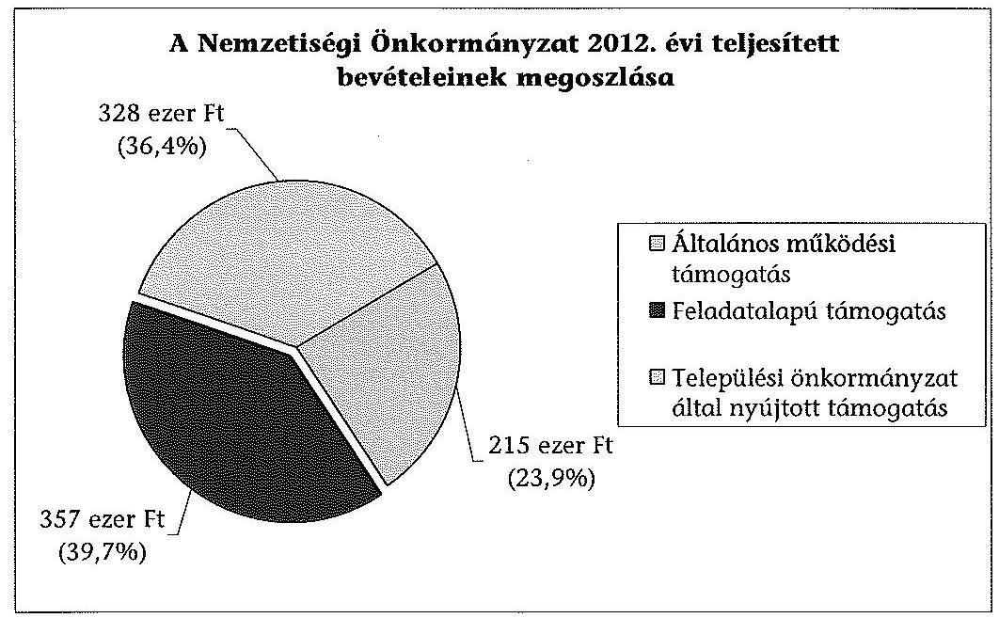
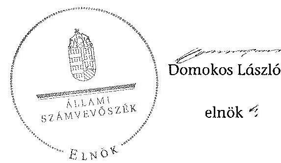

# ÁLLAMI   SZÁMVEVŐSZÉK 

## JELENTÉS

a helyi nemzetiségi önkormányzatok gazdálkodásának - 2013. évben induló - ellenőrzéséről
Tuzsér Nagyközségi Roma Nemzetiségi Önkormányzat

---

# Állami Számvevőszék 

Iktatószám: V-0163-023/2013.
Témaszám: 1179
Vizsgálat-azonosító szám: V065213

## Az ellenőrzést felügyelte:

Horváth Balázs
felügyeleti vezető
Az ellenőrzést vezette és az ellenőrzés végrehajtásáért felelős:
Korsósné Vigh Andrea
ellenőrzésvezető
A számvevőszéki jelentést készítették és a jelentés összeállításában
közreműködtek:
Molnár Istvánné
számvevő tanácsos
Papp József
számvevő tanácsos
Az ellenőrzést végezték:
Molnár Gyula Mihály
számvevő főtanácsos

Tótfalusi Zoltán
számvevő tanácsos

---

# TARTALOMJEGYZÉK 

BEVEZETÉS ..... 3
I. ÖSSZEGZŐ MEGÁLLAPÍTÁSOK, KÖVETKEZTETÉSEK, JAVASLATOK ..... 6
II. RÉSZLETES MEGÁLLAPÍTÁSOK ..... 13

1. A Nemzetiségi Önkormányzat és a Települési Önkormányzat együttműködésének szabályozása, a működési feltételek biztosítása ..... 13
2. A gazdálkodási feladatok ellátásának szabályszerűsége ..... 14
2.1. A költségvetésre és zárszámadásra, valamint a kincstári adatszolgáltatás rendjére vonatkozó jogszabályi előírások betartása ..... 14
2.2. A Nemzetiségi Önkormányzat gazdálkodásának szabályozottsága ..... 15
2.3. Az operatív gazdálkodási jogkörök kialakítása, gyakorlása ..... 16
3. A Nemzetiségi Önkormányzattal összefüggő gazdálkodási feladatok belső ellenőrzése ..... 17
4. A feladatalapú támogatás felhasználásának, elszámolásának szabályszerűsége, a Nemzetiségi Önkormányzat feladatellátása ..... 18
MELLÉKLET
5. számú A Nemzetiségi Önkormányzat 2012. évi gazdálkodásának főbb adatai, mutatói
FÜGGELÉKEK
6. számú Rövidítések jegyzéke
7. számú Értelmező szótár
8. számú A gazdálkodás értékelésének módszere

---

.

---

# JELENTÉS   a helyi nemzetiségi önkormányzatok gazdálkodásának - 2013. évben induló ellenőrzéséről   Tuzsér Nagyközségi Roma Nemzetiségi Önkormányzat 

## BEVEZETÉS

A Nemzetiségi Önkormányzat 1998. évben alakult, elnöke az 1998. évi helyhatósági választások óta látja el feladatát. A Nemzetiségi Önkormányzat intézményt, gazdasági társaságot és más szervezetet nem alapított, illetve ezek társulásában nem vett részt. A négytagú Képviselő-testület munkája segítésére bizottságot nem hozott létre. A Nemzetiségi Önkormányzat költségvetési beszámolója szerint a 2012. évben a módosított költségvetési bevételi és kiadási előirányzat 900 ezer Ft, a teljesített költségvetési bevétel 900 ezer Ft, a teljesített költségvetési kiadás 867 ezer Ft volt. A 2012. évi gazdálkodási adatokat részletesen az 1. számú mellékletben mutatjuk be.

Az Alaptörvény XXIX. cikk (1) bekezdése szerint a Magyarországon élő nemzetiségek államalkotó tényezők. Minden, valamely nemzetiséghez tartozó magyar állampolgárnak joga van önazonossága szabad vállalásához és megőrzéséhez. A hazánkban élő nemzetiségek helyi (települési és területi), valamint országos önkormányzatokat hozhatnak létre. A helyi nemzetiségi önkormányzatok gazdálkodási feladatait jogszabályi előírás alapján a székhely szerinti helyi önkormányzat polgármesteri hivatala látja el.

A nemzetiségek helyzete, támogatása mind hazai, mind EU-s szinten kiemelt figyelmet kap napjainkban. A helyi nemzetiségi önkormányzatok gazdálkodására és támogatási rendszerére vonatkozó jogszabályok a 2010-2012. években jelentős változásokon mentek át. A települési és területi nemzetiségi önkormányzatok gazdálkodásának, a részükre juttatott költségvetési támogatások felhasználásának ellenőrzését az ÁSZ a 2012. évben sorozatjellegű ellenőrzés keretében indította el. A 2013. évi ellenőrzések e témacsoportos ellenőrzések folytatását jelentik.

Az ellenőrzés célja annak értékelése volt, hogy a Nemzetiségi Önkormányzat gazdálkodási kereteinek kialakítása, gazdálkodása és feladatellátása megfelelt-e a jogszabályoknak.

---

Ennek keretében értékeltük, hogy:

- a Nemzetiségi Önkormányzat és a Települési Önkormányzat együttműködésének szabályozása, a működési feltételek biztosítása megfelelt-e a jogszabályi előírásoknak;
- a felek együttműködése megfelelt-e a közöttük létrejött megállapodásnak a gazdálkodási feladatok szabályszerű ellátása során, ennek keretében betartották-e a helyi nemzetiségi önkormányzat gazdálkodásához kapcsolódóan a költségvetésre és zárszámadásra, a gazdálkodás szabályozására, az operatív gazdálkodási jogkörök gyakorlására vonatkozó jogszabályi előírásokat;
- a jegyző biztosította-e a nemzetiségi önkormányzat gazdálkodásának belső ellenőrzését;
- a nemzetiségi önkormányzat feladatalapú támogatásának felhasználása, a folyósított feladatalapú támogatással történő elszámolás az előírásoknak megfelelő volt-e;
- a nemzetiségi önkormányzat feladatellátása összhangban volt-e a vonatkozó jogszabályi előírásokkal.

Az ellenőrzés várható hasznosulását négy szinten tervezzük. A törvényalkotás számára összegzett tapasztalatok állnak rendelkezésre a nemzetiségi önkormányzatok testületi döntéseinek, gazdálkodásának és a feladatalapú támogatás felhasználásának szabályszerűségéről, amelynek alapján következtetést lehet levonni arra, hogy indokolt-e jogszabályi módosítás kezdeményezése. Az ellenőrzés az ellenőrzött számára visszajelzést ad a működésében fellépő hiányosságokról, javaslataival hozzájárul azok kiküszöböléséhez, amely csökkentheti a későbbi ellenőrzések gyakoriságát. Az ellenőrzés megállapításai és javaslatai tanulságul szolgálhatnak más nemzetiségi önkormányzatok, szervezetek számára a rendezett gazdálkodási keretek kialakításához. A társadalom számára jelzi, hogy közpénz nem maradhat ellenőrizetlenül, az ÁSZ értékteremtő rend kialakításához és megőrzéséhez hozzájáruló tevékenysége pozitív hatással lesz a szervezetről kialakított összkép formálásában. Az ÁSZ szervezetén belül lehetőség nyílik arra, hogy a megállapítások szintetizálásával az intézmény a hozzáadott értéket teremtő elemző tevékenységét és tanácsadó szerepét erősítse.

A helyi nemzetiségi önkormányzatok gazdálkodásának ellenőrzéséről szóló jelentés I. fejezetének összegző része az ellenőrzés céljára adott rövid, szintetizáló összefoglalót és következtetéseket tartalmazza a II. fejezet részletes megállapításain alapulóan. A jelentés intézkedést igénylő megállapításait és javaslatait az összegzőben foglaltak mellett - az ellenőrzés során feltárt, a jelentés II. fejezetében rögzített részletes megállapítások alapozzák meg, illetve támasztják alá.

# Az ellenőrzés típusa: szabályszerűségi ellenőrzés 

Az ellenőrzött időszak: 2012. január 1. - 2012. december 31. közötti időszak. Az ellenőrzés kiterjedt a helyi nemzetiségi önkormányzatnak juttatott 2012. évi támogatás 2013. évben való elszámolására is.

---

Ellenőrzött szervezet: Tuzsér Nagyközségi Roma Nemzetiségi Önkormányzat és a gazdálkodási feladatait ellátó Tuzsér Nagyközségi Önkormányzat.

Az ellenőrzés végrehajtásának jogszabályi alapját az ÁSZ tv. 5. § (2)-(3) és (6) bekezdéseiben foglaltak képezik.

Az ellenőrzés szakmai módszertana az ÁSZ hivatalos honlapján (www.asz.hu) közzétett szakmai szabályokon alapult, amely a Legfőbb Ellenőrző Intézmények Nemzetközi Szervezete (INTOSAI) által kiadott nemzetközi standardok (ISSAI) figyelembevételével készült.

A helyi nemzetiségi önkormányzatok gazdálkodásának ellenőrzése során értékeltük a Települési Önkormányzat és a Nemzetiségi Önkormányzat együttműködésének, a gazdálkodás szabályozottságának és a pénzügyi folyamatokban kulcsszerepet betöltő belső kontrollok (teljesítésigazolás és érvényesítés) működésének megfelelőségét. A kulcskontrollokat a működési és felhalmozási célú támogatásértékű kiadásoknál, az államháztartáson kívülre teljesített működési és felhalmozási célú pénzeszköz átadásoknál, a dologi kiadásokkal kapcsolatos kifizetéseknél - véletlen mintavételi eljárást alkalmazva - ellenőriztük. Ellenőriztük, hogy a jegyző biztosította-e a Nemzetiségi Önkormányzat gazdálkodásának belső ellenőrzését. Értékeltük a feladatalapú támogatások felhasználásának, elszámolásának szabályszerűségét, a Nemzetiségi Önkormányzat feladatellátása és a jogszabályi előírások összhangját.

Az ellenőrzés lefolytatásához a Nemzetiségi Önkormányzat és a gazdálkodási feladatait ellátó Települési Önkormányzat tanúsítványok és a kapcsolódó, dokumentumjegyzékben megjelölt dokumentumok elektronikus úton történő megküldésével, rendelkezésre bocsátásával szolgáltatott adatokat. Az adatszolgáltatás kontrollálása és szükség szerinti javítása a helyszíni ellenőrzés keretében történt. A minősítési szempontokat a 3. számú függelék tartalmazza.

Az ÁSZ tv. 29. § (1) bekezdése szerint a jelentéstervezetet megküldtük észrevételezésre az alpolgármesternek és a Nemzetiségi Önkormányzat elnökének, akik az ÁSZ tv. 29. § (2) bekezdésében foglalt észrevételezési jogukkal nem éltek, a jelentéstervezetre határidőben észrevételt nem tettek.

---

# I. ÖSSZEGZŐ MEGÁLLAPÍTÁSOK, KÖVETKEZTETÉSEK, JAVASLATOK 

A Nemzetiségi Önkormányzat és a Települési Önkormányzat együttműködésének szabályozása nem felelt meg a jogszabályi előírásoknak. A Nemzetiségi Önkormányzat a 2012. évben rendelkezett hatályos megállapodással a Települési Önkormányzattal történő együttműködésre, azonban a megállapodás 2012. évi felülvizsgálatát, módosítását a Nek. 2 tv.-ben előírt határidőn túl végezték el. Az együttműködés szabályozása a Nek. ${ }_{2}$ tv.-ben meghatározott tartalmi elemek tekintetében hiányos volt. A megállapodás nem tartalmazta a Nemzetiségi Önkormányzat működési feltételeinek szabályozását, ennek hiányában a működési feltételeket - a Nek. ${ }_{2}$ tv.-ben előírtak ellenére - a Nemzetiségi Önkormányzat SZMSZ-ében sem rögzítették. A megállapodás az Áht. ${ }_{2}$-ben foglaltak ellenére nem tartalmazta a Nemzetiségi Önkormányzat bevételeivel és kiadásaival kapcsolatban az ellenőrzési, adatszolgáltatási és beszámolási feladatok ellátásának részletes szabályait. Nem határozták meg a Nemzetiségi Önkormányzat önálló fizetési számla nyitásával, törzskönyvi nyilvántartásba vételével és adószám igénylésével kapcsolatos határidőket és együttműködési kötelezettségeket, a felelősök konkrét kijelölésével. Nem rögzítették a Nemzetiségi Önkormányzat működési feltételeinek és gazdálkodásának eljárási és dokumentációs részletszabályaival, valamint az ezeket végző személyek kijelölésének rendjével és az adatszolgáltatási feladatok teljesítésével kapcsolatos előírásokat, feltételeket. A Települési Önkormányzat - a szabályozási hiányosságok ellenére - biztosította a Nemzetiségi Önkormányzat működéséhez szükséges személyi és tárgyi feltételeket.

A Nemzetiségi Önkormányzat 2012. évi költségvetésére és zárszámadására vonatkozó jogszabályi előírások részben érvényesültek. A Nemzetiségi Önkormányzat elnöke a 2012. évi költségvetés tervezetét az Áht. ${ }_{2}$-ben előírt határidőt túllépve nyújtotta be a Képviselő-testületnek. A jóváhagyott költségvetési határozat az Áht. ${ }_{2}$-ben előírtak ellenére nem tartalmazta a költségvetési egyenleg összegét és a finanszírozási célú pénzügyi műveletekkel kapcsolatos hatásköröket. A költségvetés előterjesztésekor a Képviselő-testület részére tájékoztatásul nem mutatták be a Nemzetiségi Önkormányzat költségvetési mérlegét közgazdasági tagolásban, valamint az előirányzat-felhasználási tervét. A jegyző a Nemzetiségi Önkormányzat 2012. évi költségvetéséhez kapcsolódó kincstári adatszolgáltatási kötelezettségeinek az előírásoknak megfelelően eleget tett. A 2012. évi zárszámadási határozat-tervezetét a Képviselő-testület határidőben jóváhagyta. E zárszámadási határozatban az Áht. ${ }_{2}$-ben előírtak ellenére az éves beszámoló alapján nem számoltak el a Nemzetiségi Önkormányzat valamennyi bevételéről és kiadásáról, mert abban az éves beszámolóhoz képest alacsonyabb bevételi és kiadási adatokat szerepeltettek és fogadtak el. A Képviselő-testület részére tájékoztatásul nem mutatták be a vagyonkimutatást és a pénzeszközök változását. A költségvetési és zárszámadási határozatok összehasonlíthatósága biztosított volt.

A gazdálkodás szabályozottsága összességében megfelelő volt. A Nemzetiségi Önkormányzat gazdálkodási feladatai végrehajtását ellátó Polgármesteri

---

Hivatal rendelkezett a Számv. tv., az Áhsz. és a Bkr. által előírt, a Nemzetiségi Önkormányzat gazdálkodási feladataira kiterjedő hatályú gazdálkodási szabályzatokkal. A Polgármesteri Hivatal SZMSZ-e az Ávr.-ben foglaltak ellenére nem tartalmazta az SZMSZ-ben nevesített munkakörökhöz tartozó - a Nemzetiségi Önkormányzat gazdálkodásával kapcsolatos - feladat- és hatásköröket, a hatáskörök gyakorlásának módját, a helyettesítés rendjét és az ezekre vonatkozó felelősségi szabályokat. A feladatok ellátásával megbízott köztisztviselők munkaköri leírásaiban rögzítették a Nemzetiségi Önkormányzat gazdálkodásával kapcsolatos feladat- és hatásköröket.

Az operatív gazdálkodási jogkörök kialakítása részben volt megfelelő. A teljesítésigazoló személy kijelölése a jogszabályi előírások szerint történt, a gazdasági vezető az Ávr.-ben meghatározott szakképesítéssel rendelkezett, azonban a pénzügyi ellenjegyzők, valamint az érvényesítők jegyző általi kijelölését 2012. március 31-étől nem módosították annak ellenére, hogy az Ávr. a kijelölést a gazdasági vezető hatáskörébe utalta. A kötelezettségvállalás rendje, valamint a kötelezettségvállalásra, utalványozásra felhatalmazás szabályozása terén a megállapodás és a gazdálkodási jogkörök szabályzata összhangja nem volt biztosított. A gazdálkodási jogkörök szabályzatában a Nemzetiségi Önkormányzat elnöke az Ávr. előírása alapján jogosulatlan személyek részére adott felhatalmazást a kötelezettségvállalásra és utalványozásra az ellenőrzött időszak egy részében. A megállapodásban a kötelezettségvállalási és utalványozási jogköröket az előírásokkal összhangban szabályozták. A teljesítésigazolás és az érvényesítés kulcskontrollok működésének megfelelőségét a dologi kiadások bizonylatainak tesztelése során az ellenőrzés gyengének értékelte, a hibák száma a lényegességi szintet, a kritikus hibahatárt elérte. A teljesítésigazoló az Áht. ${ }_{2}$ előírását megsértve nem a kifizetést megelőzően, hanem azt követően, utólag kiállított számla alapján végezte el a teljesítés igazolását, amely az Ávr. előírásai tekintetében is szabálytalan volt. Az érvényesítő nem az Ávr. előírásának megfelelően látta el feladatát, mert a kifizetés alapjául szolgáló bizonylat (számla) és teljesítésigazolás hiányában érvényesítette a kiadás teljesítését. A 2012. évi dologi kiadások három legnagyobb összegű kifizetéseinek egyedi értékelése alapján a teljesítés igazolása és az érvényesítés kulcskontrollok működése egy esetben
 megfelelő, két esetben nem megfelelő volt. A két kifizetésnél feltárt hiányosságok megegyeztek a dologi kiadások tesztelésénél azonosított hibákkal. A Nemzetiségi Önkormányzatnál a kulcskontrollok 2012. évi működésében feltárt hiányosságokkal összefüggésben az ellenőrzés jogosulatlan kifizetést nem állapított meg, azonban a kulcskontrollok működésében feltárt hiányosságok miatt nem biztosított a hibák megelőzése, feltárása és kijavítása.

A jegyző nem biztosította a Polgármesteri Hivatalnál a Nemzetiségi Önkormányzat gazdálkodásával összefüggő végrehajtási feladatok belső ellenőrzését. A Polgármesteri Hivatal 2012. évi belső ellenőrzési tervét megalapozó kockázatelemzés a Ber. előírása ellenére nem terjedt ki a Nemzetiségi Önkormányzat gazdálkodásával összefüggő végrehajtási feladatokra, azok tekintetében 2012. évi belső ellenőrzési feladatot nem terveztek és nem végeztek.

A Nemzetiségi Önkormányzat a 2011. évben 299 ezer Ft feladatalapú támogatásban részesült, amelyet a folyósítás évében felhasznált, maradványa nem keletkezett. A 2012. évi feladatalapú támogatás 357 ezer Ft volt, amelyet a

---

támogatási célokkal összhangban felhasznált. A 2011. és 2012. évi feladatalapú támogatás elszámolása a támogatási kormányrendelet ${ }_{1,2}$ előírása ellenére nem történt meg, a támogatás felhasználását, elszámolását az ellenőrzésre jogosult szervek nem ellenőrizték.

A Nemzetiségi Önkormányzat feladatellátásának tárgya összhangban volt a Nek. 2 tv. előírásaival. Kötelező közfeladata keretében a képviselt közösség érdekképviselete, esélyegyenlőségének megteremtése érdekében együttdöntési, véleményezési jogát gyakorolta. Önként vállalt közfeladatot a hagyományápolás, továbbá a településüzemeltetés és településrendezés területeken végzett.

Az ÁSZ tv. 33. § (1) bekezdésében foglaltak értelmében az ellenőrzött szervezet vezetője köteles a jelentésben foglalt megállapításokhoz kapcsolódó intézkedési tervet összeállítani, és azt a jelentés kézhezvételétől számított 30 napon belül az ÁSZ részére megküldeni. Amennyiben az intézkedési tervet határidőre nem küldi meg a szervezet, vagy az nem elfogadható, az ÁSZ elnöke az ÁSZ tv. 33. § (3) bekezdés a)-b) pontjaiban foglaltakat érvényesítheti.

A helyszíni ellenőrzés megállapításainak hasznosítása mellett javasoljuk:

# a jegyzőnek 

1. az együttműködés szabályozásával kapcsolatban

A Nemzetiségi Önkormányzat és a Települési Önkormányzat együttműködését meghatározó megállapodás felülvizsgálatát és módosítását a felek a Nek. 2 tv. 80. § (2), illetve a 159. § (3) bekezdésében előírt határidőn túl végezték el. A 2012. december 31-én hatályos megállapodás a Nek. ${ }_{2}$ tv. 80. § (1) bekezdés a)-e) és g) pontjaiban előírtak ellenére nem tartalmazta a Nemzetiségi Önkormányzat működési feltételeinek szabályozását. A működési feltételeket - a megállapodásban történő szabályozás hiányában - a Nemzetiségi Önkormányzat SZMSZ-ében sem rögzítették a Nek. ${ }_{2}$ tv. 80. § (2) bekezdésében előírtak ellenére. A megállapodás nem tartalmazta az Áht. ${ }_{2}$ 27. § (2) bekezdésében foglaltak ellenére a Nemzetiségi Önkormányzat bevételeivel és kiadásaival kapcsolatban az ellenőrzési, adatszolgáltatási és beszámolási feladatok ellátásának részletes szabályait, a Nek. ${ }_{2}$ tv. 80. § (3) bekezdés a), d) pontjaiban előírtak ellenére a Nemzetiségi Önkormányzat önálló fizetési számla nyitásával, törzskönyvi nyilvántartásba vételével és adószám igénylésével kapcsolatos határidőket és együttműködési kötelezettségeket, a felelősök konkrét kijelölésével, a Nemzetiségi Önkormányzat működési feltételeinek és gazdálkodásának eljárási és dokumentációs részletszabályaival, valamint az ezeket végző személyek kijelölésének rendjével és az adatszolgáltatási feladatok teljesítésével kapcsolatos előírásokat, feltételeket.

Javaslat
Az együttműködés szabályszerűsége érdekében:
a) készítse elő a megállapodás módosítását, hogy tartalmilag feleljen meg Áht. ${ }_{2}$ 27. § (2) bekezdésében, a Nek. ${ }_{2}$ tv. 80. § (1) bekezdés a)-e) és g) pontjaiban, valamint a Nek. ${ }_{2}$ tv. 80. § (3) bekezdés a) és d) pontjaiban foglalt előírásoknak;

---

b) készítse elő a Nemzetiségi Önkormányzat SZMSZ-ének kiegészítését a Nek. ${ }_{2}$ tv. 80. § (2) bekezdésében foglalt előírás alapján;
c) biztosítsa a jövőben a megállapodás Nek. ${ }_{2}$ tv. 80. § (2) bekezdésében előírt határidő szerinti évenkénti felülvizsgálatát.
2. a költségvetés és zárszámadás szabályszerűségével kapcsolatban

A jóváhagyott költségvetés nem tartalmazta az Áht. 2 23. § (2) bekezdés c) és h) pontjaiban előírtak ellenére a költségvetési egyenleg összegét, valamint a finanszírozási célú pénzügyi műveletekkel kapcsolatos hatásköröket. A 2012. évi költségvetés előterjesztésekor a Képviselő-testület részére tájékoztatásul nem mutatták be az Áht. 2 24. § (4) bekezdés a) pontjának előírása ellenére a Nemzetiségi Önkormányzat költségvetési mérlegét közgazdasági tagolásban, valamint az előirányzat-felhasználási tervét. A 2012. évi zárszámadási határozatban az Áht. 2 89. § (2) bekezdésében előírtak ellenére nem számoltak el a Nemzetiségi Önkormányzat valamennyi bevételéről és kiadásáról. A 2012. évi zárszámadási határozattervezet előterjesztésekor az Áht. 2 91. § (2) bekezdés a) és c) pontjaiban előírtak ellenére a Képviselő-testület részére tájékoztatásul nem mutatták be a vagyonkimutatást és a pénzeszközök változását.

Javaslat
Gondoskodjon a költségvetési határozattervezet előkészítéséről az Áht. 2 23. § (2) bekezdés c) és h), valamint az Áht. 2 24. § (4) bekezdés a) pontjának megfelelő tartalommal, továbbá a zárszámadási határozattervezet előkészítéséről az Áht. 2 89. § (2) bekezdésében és az Áht. 2 91. § (2) bekezdés a), c) pontjainak előírásai szerint.
3. a gazdálkodási feladatok szabályozottságával kapcsolatban

A Polgármesteri Hivatal SZMSZ-e az ellenőrzött időszakban hiányos volt, mert az Ávr. 13. § (1) bekezdése g) pontjában foglaltak ellenére nem tartalmazta az SZMSZben nevesített munkakörökhöz tartozó - a Nemzetiségi Önkormányzat gazdálkodásával kapcsolatos - feladat- és hatásköröket, a hatáskörök gyakorlásának módját, a helyettesítés rendjét és az ezekre vonatkozó felelősségi szabályokat.

Javaslat
Készítse elő a Polgármesteri Hivatal SZMSZ-ének módosítását, hogy az feleljen meg az Ávr. 13. § (1) bekezdése g) pontjában foglalt előírásnak.
4. a kulcskontrollok működésével kapcsolatban

A pénzügyi ellenjegyzők, valamint az érvényesítő személyek jegyző általi kijelölését 2012. március 1-jétől nem módosították, annak ellenére, hogy az Ávr. 55. § (2) bekezdés g) pontja és az Ávr. 58. § (4) bekezdés előírása a kijelölést a gazdasági vezető hatáskörébe utalta.

A teljesítésigazoló az Áht. 2 38. § (1) bekezdés előírását megsértve nem a kifizetést megelőzően, hanem azt követően, utólag kiállított számla alapján végezte el a teljesítés igazolását, így az Ávr. 57. § (1) és (3) bekezdések szerinti ellenőrzés és igazolás szabálytalan volt. Az érvényesítő nem szabályszerűen látta el az Ávr. 58. § (1) bekezdésben előírt feladatát, mert nem ellenőrizte, hogy a megelőző ügymenetben az

---

Ávr. és a gazdálkodási jogkörök szabályzata előírásait betartották-e, annak ellenére érvényesítette a kiadás teljesítését, hogy a kifizetés időpontjában nem állt rendelkezésre a kifizetés alapjául szolgáló számviteli bizonylat (számla), nem történt meg a teljesítésigazolás, továbbá az előzetes írásbeli kötelezettségvállalási dokumentum nem állt rendelkezésre.

Javaslat
Az operatív gazdálkodás működési hibáinak megelőzése, feltárása és kijavítása érdekében gondoskodjon arról, hogy:
a) az Ávr. 55. § (2) bekezdés g) pontjában és az Ávr. 58. § (4) bekezdésében előírtaknak megfelelően a pénzügyi ellenjegyzőt és az érvényesítőt a gazdasági vezető jelölje ki;
b) a teljesítésigazolás az Áht. 2 38. § (1) bekezdés szerinti időpontban (a kifizetést megelőzően) történjen meg, a teljesítés igazolása során az Ávr. 57. § (1) bekezdésében előírtaknak megfelelően okmányok alapján ellenőrizzék a kiadások teljesítésének jogosságát, összegszerűségét, az ellenszolgáltatást is magába foglaló kötelezettségvállalás esetében a szerződés, megrendelés teljesítését;
c) az érvényesítő az Ávr. 58. § (1) bekezdés szerint ellenőrizze, hogy a megelőző ügymenetben az Áht. ${ }_{2}$, az Áhsz., az Ávr. előírásait, továbbá a gazdálkodási jogkörök szabályzatában előírtakat betartották-e.
5. a feladatalapú támogatás elszámolásával kapcsolatban

A 2011. évi feladatalapú támogatás elszámolása a támogatási kormányrendelet: 7. § (2), a 2012. évi támogatás elszámolása a támogatási kormányrendelet 2 8. § (5) bekezdésében hivatkozott „a helyi önkormányzatok elszámolási és ellenőrzési rendjére vonatkozó" jogszabályok rendelkezései alkalmazása előírása ellenére nem történt meg.

Javaslat
Gondoskodjon az Áht. 2 27. § (2) bekezdésében meghatározott feladatkörében a Nemzetiségi Önkormányzat által igénybe vett feladatalapú támogatás elszámolásának elkészítéséről, figyelemmel az Áht. 2 57. § (4) bekezdésében foglaltakra.

# a polgármesternek 

1. A 2012. december 31-én hatályos megállapodás a Nek. 2 tv. 80. § (1) bekezdés a)-e) és g) pontjaiban előírtak ellenére nem tartalmazta a Nemzetiségi Önkormányzat működési feltételeinek szabályozását. A megállapodás nem tartalmazta az Áht. 2 27. § (2) bekezdésében foglaltak ellenére a Nemzetiségi Önkormányzat bevételeivel és kiadásaival kapcsolatban az ellenőrzési, adatszolgáltatási és beszámolási feladatok ellátásának részletes szabályait, a Nek. 2 tv. 80. § (3) bekezdés a), d) pontjaiban előírtak ellenére a Nemzetiségi Önkormányzat önálló fizetési számla nyitásával, törzskönyvi nyilvántartásba vételével és adószám igénylésével kapcsolatos határidőket és együttműködési kötelezettségeket, a felelősök konkrét kijelölésével, a Nemzetiségi Önkormányzat működési feltételeinek és gazdálkodásának eljárási és dokumentációs

---

részletszabályaival, valamint az ezeket végző személyek kijelölésének rendjével és az adatszolgáltatási feladatok teljesítésével kapcsolatos előírásokat, feltételeket.

Javaslat
Terjessze a Települési Önkormányzat Képviselő-testülete elé jóváhagyásra a Nek. ${ }_{2}$ tv. 80. § (1) bekezdés a)-e) és g) pontjaiban, a Nek. ${ }_{2}$ tv. 80. § (3) bekezdés a), d) pontjaiban, továbbá az Áht. ${ }_{2} 27 . \S$ (2) bekezdésében foglalt előírások betartásával a jegyző által előkészített megállapodás módosítást.
2. A Polgármesteri Hivatal SZMSZ-e az ellenőrzött időszakban hiányos volt, mert az Ávr. 13. § (1) bekezdése g) pontjában foglaltak ellenére nem tartalmazta az SZMSZben nevesített munkakörökhöz tartozó - a Nemzetiségi Önkormányzat gazdálkodásával kapcsolatos - feladat- és hatásköröket, a hatáskörök gyakorlásának módját, a helyettesítés rendjét és az ezekre vonatkozó felelősségi szabályokat.

Javaslat
Terjessze a Települési Önkormányzat Képviselő-testülete elé jóváhagyásra az Ávr. 13. § (1) bekezdés g) pontjában foglalt szabályozásra figyelemmel a jegyző által előkészített Polgármesteri Hivatal SZMSZ-ének módosítását.

# a Nemzetiségi Önkormányzat elnökének 

1. A 2012. december 31-én hatályos megállapodás a Nek. ${ }_{2}$ tv. 80. § (1) bekezdés a)-e) és g) pontjaiban előírtak ellenére nem tartalmazta a Nemzetiségi Önkormányzat működési feltételeinek szabályozását. A működési feltételeket - a megállapodásban történő szabályozás hiányában - a Nemzetiségi Önkormányzat SZMSZ-ében sem rögzítették a Nek. ${ }_{2}$ tv. 80. § (2) bekezdésében előírtak ellenére. A megállapodás nem tartalmazta az Áht. ${ }_{2} 27 . \S$ (2) bekezdésében foglaltak ellenére a Nemzetiségi Önkormányzat bevételeivel és kiadásaival kapcsolatban az ellenőrzési, adatszolgáltatási és beszámolási feladatok ellátásának részletes szabályait, a Nek. ${ }_{2}$ tv. 80. § (3) bekezdés a), d) pontjaiban előírtak ellenére a Nemzetiségi Önkormányzat önálló fizetési számla nyitásával, törzskönyvi nyilvántartásba vételével és adószám igénylésével kapcsolatos határidőket és együttműködési kötelezettségeket, a felelősök konkrét kijelölésével, a Nemzetiségi Önkormányzat működési feltételeinek és gazdálkodásának eljárási és dokumentációs részletszabályaival, valamint az ezeket végző személyek kijelölésének rendjével és az adatszolgáltatási feladatok teljesítésével kapcsolatos előírásokat, feltételeket.

Javaslat
Terjessze a Képviselő-testület elé jóváhagyásra:
a) a jegyző által - az Áht. ${ }_{2} 27 . \S$ (2) bekezdésében, a Nek. ${ }_{2}$ tv. 80. § (1) bekezdés a)-e) és g) pontjaiban, a Nek. ${ }_{2}$ tv. 80. § (3) bekezdés a), d) pontjaiban foglalt előírások betartásával - előkészített megállapodás módosítást;
b) a Nemzetiségi Önkormányzat SZMSZ-ének a Nek. ${ }_{2}$ tv. 80. § (2) bekezdésében foglaltak miatti - a megállapodás szerinti működési feltételek rögzítését tartalmazó -
 módosítását a megállapodás módosítását követő 30 napon belül.

---

2. a költségvetés szabályszerűségével kapcsolatban

A Nemzetiségi Önkormányzat elnöke a 2012. évi költségvetés tervezetét az Áht. 24. § (2) bekezdésben előírt határidőt négy nappal túllépve nyújtotta be a Képviselő-testület részére.

Javaslat
Gondoskodjon a jövőben a jegyző által előkészített költségvetés tervezetének Áht. 24. § (2) bekezdés szerinti határidőben történő beterjesztésére.
3. A 2011. évi feladatalapú támogatás elszámolása a támogatási kormányrendelet: 7. § (2), a 2012. évi támogatás elszámolása a támogatási kormányrendelet 8. § (5) bekezdésében hivatkozott „a helyi önkormányzatok elszámolási és ellenőrzési rendjére vonatkozó" jogszabályok rendelkezései alkalmazása előírása ellenére nem történt meg.

Javaslat
Terjessze a Képviselő-testület elé az Áht. 57. § (4) bekezdése alapján összeállított, a Nemzetiségi Önkormányzat által igénybe vett feladatalapú támogatás elszámolását.

---

# II. RÉSZLETES MEGÁLLAPÍTÁSOK 

## 1. A Nemzetiségi Önkormányzat És a Települési Önkormányzat Együttműködésének Szabályozása, a Működési Feltételek Biztosítása

A Nemzetiségi Önkormányzat és a Települési Önkormányzat együttműködésének szabályozása nem felelt meg a jogszabályi előírásoknak.

A Nemzetiségi Önkormányzat rendelkezett a 2012. évben hatályos megállapodással¹ a Települési Önkormányzattal történő együttműködésre. A megállapodás felülvizsgálatát és módosítását a felek a Nek. tv. 80. § (2), illetve a 159. § (3) bekezdésében előírt határidőkön² túl végezték el.

Az együttműködés szabályozása - a 2012. december 31-én hatályos megállapodás alapján - hiányos volt. A megállapodás a Nek. tv. 80. § (1) bekezdés a)-e) és g) pontjaiban előírtak ellenére nem tartalmazta a Nemzetiségi Önkormányzat működési feltételeinek szabályozását:

- a Nemzetiségi Önkormányzat működéséhez az ingyenes helyiséghasználat legalább havi 16 órában történő biztosítását;
- a Nemzetiségi Önkormányzat működéséhez szükséges tárgyi és személyi feltételek biztosítását;
- a testületi ülések előkészítésének feladatait;
- a testületi döntések és a tisztségviselők döntései előkészítésének, a testületi és tisztségviselői döntésekhez kapcsolódó nyilvántartási, sokszorosítási, postázási feladatok ellátási kötelezettségét;
- a Nemzetiségi Önkormányzat működésével, gazdálkodásával kapcsolatos nyilvántartási, iratkezelési feladatok ellátását;
- a fenti feladatellátáshoz kapcsolódó költségek viselését.

A működési feltételeket - a megállapodásban történő szabályozás hiányában a Nemzetiségi Önkormányzat SZMSZ-ében sem rögzítették a megállapodás módosítását követő harminc napon belül a Nek. tv. 80. § (2) bekezdésében előírtak ellenére.

[^0]
[^0]:    ¹ 2012. június 8-ig a Települési Önkormányzat Képviselő-testülete 24/2007. (IV. 26.) számú, a Képviselő-testület 13/2007. (V. 30.) számú határozatával elfogadott megállapodás volt érvényben. A Nek. tv. előírásai alapján felülvizsgált és módosított, 2012. június 7-étől hatályos megállapodást a Települési Önkormányzat Képviselő-testülete a 81/2012. (VI. 7.), a Képviselő-testület a 6/2012. (VI. 7.) számú határozatával hagyta jóvá.
    ² 2012. január 31-ig, illetve 2012. június 1-jéig

---

# A megállapodás a gazdálkodási feladatok szabályozása körében nem tartalmazta: 

- az Áht. 27. § (2) bekezdésében foglaltak ellenére a Nemzetiségi Önkormányzat bevételeivel és kiadásaival kapcsolatban az ellenőrzési, adatszolgáltatási és beszámolási feladatok ellátásának részletes szabályait;
- a Nek. tv. 80. § (3) bekezdés a) pontjában előírtak ellenére a Nemzetiségi Önkormányzat önálló fizetési számla nyitásával, törzskönyvi nyilvántartásba vételével és adószám igénylésével kapcsolatos határidőket és együttműködési kötelezettségeket, a felelősök konkrét kijelölésével;
- a Nek. tv. 80. § (3) bekezdés d) pontjában foglaltak ellenére a Nemzetiségi Önkormányzat működési feltételeinek és gazdálkodásának eljárási és dokumentációs részletszabályaival, valamint az ezeket végző személyek kijelölésének rendjével és az adatszolgáltatási feladatok teljesítésével kapcsolatos előírásokat, feltételeket.

A Kormányhivatal a Nek. tv. 83. § (3) bekezdésének előírása alapján 2012. június 1-jét követően nem kezdeményezett egyeztetést a megállapodás módosítása érdekében.

A Települési Önkormányzat a szabályozási hiányosságok ellenére biztosította a Nemzetiségi Önkormányzat működéséhez szükséges személyi és tárgyi feltételeket.

## 2. A Gazdálkodási Feladatok Ellátásának Szabályszerűsége

### 2.1. A költségvetésre és zárszámadásra, valamint a kincstári adatszolgáltatás rendjére vonatkozó jogszabályi előírások betartása

A Nemzetiségi Önkormányzat 2012. évi költségvetésének³ és zárszámadásának⁴ tartalma, jóváhagyása részben volt a jogszabályi előírásoknak megfelelő. A Nemzetiségi Önkormányzat elnöke a 2012. évi költségvetés tervezetét az Áht. 24. § (2) bekezdésében előírt határidőt négy nappal túllépve nyújtotta be a Képviselő-testület részére. A jóváhagyott költségvetési határozat a Nemzetiségi Önkormányzat költségvetési bevételeit és kiadásait a jogszabályi előírásoknak megfelelően tartalmazta, azonban az Áht. 23. § (2) bekezdés c) és h) pontjaiban előírtak ellenére nem rögzítette a költségvetési egyenleg összegét, valamint a finanszírozási célú pénzügyi műveletekkel kapcsolatos hatásköröket.

A 2012. évi költségvetés előterjesztésekor a Képviselő-testület részére tájékoztatásul nem mutatták be az Áht. 24. § (4) bekezdés a) pont előírása ellenére -

[^0]
[^0]:    ³ A Képviselő-testület 2/2012. (II. 15.) számú határozata a 2012. évi költségvetés elfogadásáról.
    ⁴ A Képviselő-testület 3/2013. (IV. 30.) számú határozata. 2012. évi zárszámadás elfogadásáról.

---

szöveges indoklással együtt - a Nemzetiségi Önkormányzat költségvetési mérlegét közgazdasági tagolásban, valamint az előirányzat-felhasználási tervét.

A jegyző a Nemzetiségi Önkormányzat 2012. évi költségvetéséhez kapcsolódó kincstári adatszolgáltatási kötelezettségeinek az előírásoknak megfelelően eleget tett.

A Nemzetiségi Önkormányzat elnöke határidőben benyújtotta a Képviselőtestületnek a 2012. évi zárszámadási határozat-tervezetet, amely a költségvetési határozattal összehasonlítható tartalommal és szerkezetben készült. A zárszámadási határozatban az Áht. 89. § (1) és (2) bekezdésekben előírtak ellenére - az éves költségvetési beszámoló alapján - nem számoltak el a Nemzetiségi Önkormányzat valamennyi bevételéről és kiadásáról, mert abban az éves beszámolóhoz képest alacsonyabb bevételi és kiadási adatokat szerepeltettek és fogadtak el.

A 2012. évi zárszámadási határozat a 2012. éves elemi költségvetési beszámoló adataihoz képest a költségvetési bevételek módosított előirányzatát 34 ezer Ft-tal, a teljesítést 29 ezer Ft-tal, a költségvetési kiadások módosított előirányzatát és teljesítését egy-egy ezer Ft-tal alacsonyabb összeggel tartalmazta.

A 2012. évi zárszámadási határozattervezet előterjesztésekor az Áht. 91. § (2) bekezdés a) és c) pontjai, valamint a (3) bekezdés előírása ellenére a Képviselőtestület részére tájékoztatásul nem mutatták be a vagyonkimutatást és a pénzeszközök változását.

# 2.2. A Nemzetiségi Önkormányzat gazdálkodásának szabályozottsága 

A Nemzetiségi Önkormányzat gazdálkodásának szabályozottsága az ellenőrzött időszakban összességében megfelelt a jogszabályi előírásoknak. A gazdálkodási feladatok végrehajtását ellátó Polgármesteri Hivatal a 2012. évben a Számv. tv., az Áhsz. és a Bkr. által előírt⁵ gazdálkodási szabályzatokkal a Nemzetiségi Önkormányzat gazdálkodási feladataira kiterjedő hatállyal⁶ rendelkezett.

A Polgármesteri Hivatal SZMSZ-e az Ávr. 13. § (1) bekezdés g) pontjában foglaltak ellenére nem tartalmazta az SZMSZ-ben nevesített munkakörökhöz tartozó - a Nemzetiségi Önkormányzat gazdálkodásával kapcsolatos - feladat- és

[^0]
[^0]:    ⁵ Számviteli politika és a kapcsolódó gazdálkodásra vonatkozó - leltározási és leltárkészítési-, eszközök és források értékelési-, pénzkezelési - szabályzatok és a számlarend, valamint az ellenőrzési nyomvonal, szabálytalanságok kezelésének eljárásrendje, folyamatba épített előzetes, utólagos és vezetői ellenőrzés szabályzat.
    ⁶ A leltározási és leltárkészítési, valamint a pénzkezelési szabályzat hatályát 2011. szeptember 1-jétől, a számviteli politika, az eszközök és források értékelési szabályzata, a számlarend, továbbá az ellenőrzési nyomvonal, szabálytalanságok kezelésének eljárásrendje, valamint a folyamatba épített előzetes, utólagos és vezetői ellenőrzés szabályzat hatályát 2012. november 1-jétől terjesztették ki a Nemzetiségi Önkormányzat gazdálkodási feladatainak ellátására.

---

hatásköröket, a hatáskörök gyakorlásának módját, a helyettesítés rendjét és az ezekhez kapcsolódó felelősségi szabályokat. A Nemzetiségi Önkormányzat gazdálkodásával összefüggő feladat- és hatásköröket a feladatok ellátásával megbízott köztisztviselők munkaköri leírásai az ellenőrzött időszakra vonatkozóan tartalmazták.

A Polgármesteri Hivatal gazdálkodási jogkörök szabályzata hatályát 2011. szeptember 1-jétől kiterjesztették a Nemzetiségi Önkormányzat gazdálkodási feladatainak ellátására. E szabályozás azonban az Ávr. 13. § (2) bekezdés a) pontjában előírtak ellenére nem tartalmazta az érvényesítés és a teljesítésigazolás rendjét és részletszabályait. A 2012. november 1-jétől hatályos gazdálkodási jogkörök szabályzatot kiegészítették, e hiányosságot megszüntették.

# 2.3. Az operatív gazdálkodási jogkörök kialakítása, gyakorlása 

A Nemzetiségi Önkormányzat gazdálkodása tekintetében az operatív gazdálkodási jogkörök szabályozása az ellenőrzött időszakban részben felelt meg a jogszabályi előírásoknak.

A gazdasági vezető az Ávr.-ben meghatározott szakképesítéssel rendelkezett. A Nemzetiségi Önkormányzat elnöke - mint kötelezettségvállaló - a jogszabályi előírásokkal összhangban gondoskodott a teljesítésigazoló személyek kijelöléséről.

A pénzügyi ellenjegyzők, valamint az érvényesítő személyek jegyző általi kijelölését 2012. március 1-jétől nem módosították, annak ellenére, hogy az Ávr. 55. § (2) bekezdés g) pontja és az 58. § (4) bekezdés előírása a kijelölést a gazdasági vezető hatáskörébe utalta.

A kötelezettségvállalás rendjét a 100 ezer Ft-ot el nem érő kifizetésekre⁷ vonatkozóan, valamint a kötelezettségvállalásra és utalványozásra felhatalmazást a megállapodás és a gazdálkodási jogkörök szabályzata az ellenőrzött időszakban egymással nem összhangban tartalmazta. A megállapodásban a Nemzetiségi Önkormányzat elnöke, más nemzetiségi önkormányzati képviselő kötelezettségvállalásra és utalványozásra történő felhatalmazásával a jogszabályi előírásokkal összhangban biztosította az összeférhetetlenségi követelmények érvényesüléséhez szükséges szabályozási feltételeket. A 2012. október 31-ig hatályos gazdálkodási jogkörök szabályzatában azonban e feladatok ellátására az Ávr. 52. § (7) bekezdés előírásával ellentétesen felhatalmazta a polgármestert, a jegyzőt és az aljegyzőt is.

A Nemzetiségi Önkormányzatnál a 2012. évben a dologi kiadások teljesítése során a teljesítésigazolás és az érvényesítés kulcskontrollok működé-

[^0]
[^0]:    ⁷ Az együttműködési megállapodás szerint a Nemzetiségi Önkormányzat részére kötelezettségvállalás csak írásban történhet, a gazdálkodási jogkörök szabályzatában éltek az Ávr. 53. § (1) bekezdésében foglalt lehetőséggel, mely szerint nem szükséges előzetesen írásbeli kötelezettségvállalás a 100 ezer Ft-ot el nem érő kifizetésekhez.

---

sének megfelelősége gyenge volt, mert a hibák száma a lényegességi szintet, a kritikus hibahatárt elérte:

- a teljesítésigazoló az Áht. 38. § (1) bekezdés előírását megsértve nem a kifizetést megelőzően, hanem azt követően, utólag kiállított számla alapján végezte el a teljesítés igazolását, így az Ávr. 57. § (1) és (3) bekezdések szerinti ellenőrzés és igazolás szabálytalan (formális) volt;
- az érvényesítő nem szabályszerűen látta el az Ávr. 58. § (1) bekezdésben előírt feladatát, mert nem ellenőrizte, hogy a megelőző ügymenetben az Ávr. és a gazdálkodási jogkörök szabályzata előírásait betartották-e, annak ellenére érvényesítette a kiadás teljesítését, hogy a kifizetés időpontjában nem állt rendelkezésre a kifizetés alapjául szolgáló számviteli bizonylat (számla) és nem történt meg a teljesítésigazolás.

A három legnagyobb összegű dologi kiadás teljesítését megelőzően a kulcskontrollok működése - a bizonylatok egyedi értékelése alapján - egy kifizetésnél megfelelő, két kifizetésnél nem megfelelő volt: a dologi kiadások tesztelése során feltárt hiányosságok megismétlődtek, továbbá az érvényesítő nem észrevételezte, hogy a kifizetéshez az előzetes írásbeli kötelezettségvállalási dokumentum nem állt rendelkezésre, ezért nem az Ávr. 58. § (1) bekezdés előírásának megfelelően látta el feladatát.

Működési és felhalmozási célú támogatásértékű kiadás, valamint államháztartáson kívülre történő működési és felhalmozási célú pénzeszközátadás nem volt.

A Nemzetiségi Önkormányzatnál a kulcskontrollok 2012. évi működésében feltárt hiányosságokkal összefüggésben az ellenőrzés jogosulatlan kifizetést nem állapított meg, azonban a kulcskontrollok működésében feltárt hiányosságok miatt nem biztosított
 a hibák megelőzése, feltárása és kijavítása.

# 3. A Nemzetiségi Önkormányzattal Összefüggő Gazdálkodási Feladatok Belső Ellenőrzése 

A jegyző nem biztosította a Polgármesteri Hivatalnál a Nemzetiségi Önkormányzat gazdálkodásával összefüggő végrehajtási feladatok belső ellenőrzését. A Polgármesteri Hivatal 2012. évi belső ellenőrzési tervét megalapozó kockázatelemzés a Ber. 21. § (2) bekezdés előírása ellenére nem terjedt ki a Nemzetiségi Önkormányzat gazdálkodásával összefüggő végrehajtási feladatokra, azok tekintetében belső ellenőrzési feladatot a 2012. évben nem terveztek és nem végeztek.

A megállapodásban a Nemzetiségi Önkormányzatot érintő belső ellenőrzési feladatokra nem tértek ki.

Az ellenőrzéshez szolgáltatott adatok alapján 2012. évben a Kormányhivatal a Nemzetiségi Önkormányzatot illetően nem élt törvényességi felügyeleti eszközökkel.

---

# 4. A feladatalapú támogatás felhasználásának, elszámolásának szabályszerűsége, a Nemzetiségi Önkormányzat feladatellátása 

A Nemzetiségi Önkormányzat a 2011. évben 299 ezer Ft feladatalapú támogatásban részesült, amelyet a folyósítás évében felhasznált, maradványa nem keletkezett.

A 2012. évben a Nemzetiségi Önkormányzat részére folyósított feladatalapú támogatás 357 ezer Ft volt, amelynek az összes bevételhez viszonyított részarányát a következő ábra szemlélteti:

A feladatalapú támogatás összegével a 2012. évi költségvetési határozatot módosították, megjelölték a módosításokkal érintett kiemelt kiadási előirányzatokat. A 2012. évi feladatalapú támogatást a támogatási célokkal összhangban a folyósítás évében felhasználták.

A feladatalapú támogatások elszámolása a támogatási kormányrendelet ${ }_{1} 7 . \S$ (2), illetve a támogatási kormányrendelet ${ }_{2} 8 . \S$ (5) bekezdésében hivatkozott "a helyi önkormányzatok elszámolási és ellenőrzési rendjére vonatkozó" jogszabályok rendelkezései alkalmazása előírása ellenére nem történt meg. A feladatalapú támogatások felhasználását, elszámolását az ellenőrzésre jogosult szervek nem ellenőrizték.

A Nemzetiségi Önkormányzat feladatellátásának tárgya összhangban volt a Nek. 2 tv. előírásaival a 2012. évben. A kötelező feladatok keretében a Nek. 2 tv. 115. §-a alapján a Nemzetiségi Önkormányzat illetékességi területén működő közoktatási intézmény működésével, feladatellátásával összefüggő, a képviselt közösség kulturális autonómiája megerősítését szolgáló döntési, együttdöntési jogot, valamint a képviselt közösség érdekképviselete, esélyegyenlősége megteremtése érdekében véleményt gyakorolt.

---

A Nemzetiségi Önkormányzat a Nek. 2 tv. 116. § előírásaival összhangban végzett önként vállalt feladatot a hagyományápolás terén, továbbá településüzemeltetési és településrendezési feladatok tárgyában.
Budapest, 2014. 01. hónap 0. nap

Melléklet: $\quad 1 \mathrm{db}$
Függelék: $\quad 3 \mathrm{db}$

---

# **Title: The Impact of Climate Change on Global Ecosystems**

## **Introduction**

Climate change is one of the most pressing environmental issues of our time. It affects ecosystems worldwide, leading to significant changes in biodiversity, habitat loss, and species extinction. This report explores the impacts of climate change on global ecosystems, focusing on key areas such as **forests**, **oceans**, and **polar regions**.

## **1. Forest Ecosystems**

Forests play a crucial role in carbon sequestration and maintaining biodiversity. However, rising temperatures and changing precipitation patterns are altering forest ecosystems. Key impacts include:

- **Increased frequency of wildfires**: Rising temperatures and drought conditions have led to more frequent and severe wildfires, destroying vast areas of forests.
- **Changes in species distribution**: Shifts in temperature and precipitation patterns are altering species distribution, leading to species extinction.
- **Insect outbreaks**: Warmer temperatures have increased the survival rates of pests like bark beetles, which are causing widespread damage.

## **2. Ocean Ecosystems**

Oceans absorb a significant portion of the excess heat and carbon dioxide (CO₂) produced by human activities. The consequences include:

- **Rising sea levels**: Rising sea levels are inundating coastal areas and threatening coastal ecosystems.
- **Ocean acidification**: Increased CO₂ absorption is leading to ocean acidification, harming marine life.
- **Changes in ocean currents**: Altered ocean currents are disrupting marine ecosystems.

## **3. Polar Ecosystems**

Polar regions are particularly vulnerable to climate change due to their sensitivity to temperature changes. Key impacts include:

- **Melting of sea ice**: The Arctic is warming at twice the rate of the global average, leading to sea ice loss.
- **Glacial retreat**: Melting glaciers are contributing to rising sea levels and altering coastal ecosystems.
- **Permafrost thawing**: Thawing permafrost releases stored carbon and methane, further accelerating global warming.

## **4. Polar Ecosystems**

Polar regions are particularly vulnerable to climate change due to their sensitivity to temperature changes. Key impacts include:

- **Melting of sea ice**: The Arctic is warming at twice the rate of the global average, leading to sea ice loss.
- **Glacial retreat**: Melting glaciers are contributing to rising sea levels and altering coastal ecosystems.
- **Changes in ocean currents**: Altered ocean currents are disrupting marine ecosystems.

## **5. Polar Ecosystems**

Polar regions are particularly vulnerable to climate change due to their sensitivity to temperature changes. Key impacts include:

- **Melting of sea ice**: The Arctic is warming at twice the rate of the global average, leading to sea ice loss.
- **Glacial retreat**: Melting glaciers are contributing to rising sea levels and altering coastal ecosystems.
- **Changes in ocean currents**: Altered ocean currents are disrupting marine ecosystems.

## **Conclusion**

Climate change poses a significant threat to global ecosystems, with far-reaching consequences for biodiversity and human societies. By reducing greenhouse gas emissions, we can mitigate the impacts of climate change and protect the planet for future generations.

---

**References**

1. IPCC (Intergovernmental Panel on Climate Change). (2021). *Climate Change 2021: The Physical Science Basis*.
2. WWF (World Wildlife Fund). (2020). *Living Planet Report 2020*.
3. NASA Global Climate Change. (2022). *Vital Signs: Global Temperature*.

---

# A Nemzetiségi Önkormányzat 2012. évi gazdálkodásának főbb adatai, mutatói

A) Bevételek

|  Megnevezés | Eredeti előirányzat | Módosított | Teljesítés  |
| --- | --- | --- | --- |
|   | ezer Ft |  | megoszlás  |
|  Általános működési támogatás | 210 | 215 | 215  |
|  Feladatalapú támogatás | 0 | 357 | 357  |
|  Települési önkormányzat által nyújtott támogatás | 119 | 328 | 328  |
|  Működési költségvetés bevételei | 329 | 900 | 900  |
|  Költségvetési bevételek összesen | 329 | 900 | 900  |
|  Bevételek mindösszesen | 329 | 900 | 900  |

B) Kiadások

|  Megnevezés | Eredeti előirányzat | Módosított | Teljesítés  |
| --- | --- | --- | --- |
|   | ezer Ft |  | megoszlás  |
|  Személyi juttatások | 262 | 557 | 524  |
|  Munkaadókat terhelő járulékok és szoc. hozzáj. adó | 64 | 127 | 127  |
|  Dologi kiadások | 3 | 216 | 216  |
|  Működési kiadások összesen | 329 | 900 | 867  |
|  Költségvetési kiadások összesen | 329 | 900 | 867  |
|  Finanszírozás kiadásai, aktív pénzügyi műveletek kiadásai | 0 | 0 | 33  |
|  Kiadások mindösszesen | 329 | 900 | 900  |

---
 *Living Planet Report 2020*.
3. NASA Global Climate Change. (2022). *Vital Signs: Global Temperature*.

---

# RÖVIDÍTÉSEK JEGYZÉKE 

## Törvények

Áht. 1
Áht. 2
Nek. 1 tv.
Nek. 2 tv.
Számv. tv.
Rendeletek, határozatok
Áhsz.

Ámr.
Ávr.

Ber.
Bkr.
támogatási kormányrendelet ${ }_{1}$

támogatási kormányrendelet ${ }_{2}$

Nemzetiségi Önkormányzat SZMSZ-e

## Szórövidítések

ÁSZ
EU
Jegyző
Képviselő-testület
1992. évi XXXVIII. törvény az államháztartásról (hatályos 2011. december 31-ig)
2011. évi CXCV. törvény az államháztartásról (hatályos 2011. december 31-től)
1993. évi LXXVII. törvény a nemzeti és etnikai kisebbségek jogairól (hatályos 2011. december 31-ig)
2011. évi CLXXIX. törvény a nemzetiségek jogairól (hatályos 2011. december 20-tól)
2000. évi C. törvény a számvitelről

249/2000. (XII. 24.) Korm. rendelet az államháztartás szervezetei beszámolási és könyvvezetési kötelezettségének sajátosságairól
292/2009. (XII. 19.) Korm. rendelet az államháztartás működési rendjéről (hatályos 2011. december 31-ig)
368/2011. (XII. 31.) Korm. rendelet az államháztartásról szóló törvény végrehajtásáról (hatályos 2012. január 1-jétől)
193/2003. (XI. 26.) Korm. rendelet a költségvetési szervek belső ellenőrzéséről (hatályos 2011. december 31-ig)
370/2011. (XII. 31.) Korm. rendelet a költségvetési szervek belső kontrollrendszeréről és belső ellenőrzéséről (hatályos 2012. január 1-jétől)
342/2010. (XII. 28.) Korm. rendelet a kisebbségi önkormányzatoknak a központi költségvetésből, valamint fejezeti kezelésű előirányzatból nyújtott támogatások feltételrendszeréről és elszámolásának rendjéről (hatályos 2011. december 31-ig)

28/2012. (III. 6.) Korm. rendelet a nemzetiségi célú előirányzatokból nyújtott támogatások feltételrendszeréről és elszámolásának rendjéről (hatályos 2012. január 1-jétől 2012. december 31-ig)

Tuzsér Nagyközségi Cigány Kisebbségi Önkormányzat 6/2008. (II. 13.) számú határozata a Szervezeti és Működési Szabályzatáról (hatályos 2008. február 13-tól)

Állami Számvevőszék
Európai Unió
Tuzsér Nagyközségi Önkormányzat jegyzője
Tuzsér Nagyközségi Roma Nemzetiségi Önkormányzat Képviselő-testülete

---

| Kincstár | Magyar Államkincstár Szabolcs-Szatmár-Bereg Megyei |
| :-- | :-- |
|  | Igazgatósága |
| Kormányhivatal | Szabolcs-Szatmár-Bereg Megyei Kormányhivatal |
| Nemzetiségi Önkormányzat | Tuzsér Nagyközségi Roma Nemzetiségi Önkormányzat |
| Nemzetiségi Önkormányzat elnöke | Tuzsér Nagyközségi Roma Nemzetiségi Önkormányzat |
| polgármester | elnöke |
| Polgármesteri Hivatal | Tuzsér Nagyközségi Önkormányzat polgármestere |
| Polgármesteri Hivatal | Tuzsér Nagyközségi Önkormányzat Polgármesteri Hivatala |
| Polgármesteri Hivatal | Tuzsér Nagyközségi Önkormányzat Polgármesteri Hivatala gazdálkodási jogkörök szabályzata |
| Szabályzata | Tuzsér Nagyközségi Önkormányzat |
| Települési Önkormányzat | Tuzsér Nagyközségi Önkormányzat |
| Települési Önkormányzat Képviselő-testülete | Tuzsér Nagyközségi Önkormányzat Képviselő-testülete |

---

# ÉRTELMEZŐ SZÓTÁR 

feladatalapú támogatás

A támogatási évben általános működési támogatásban részesült, és a Támogatónak a Kincstárhoz intézett, a feladatalapú támogatás utalására vonatkozó rendelkező levele keltének időpontjában működő nemzetiségi önkormányzatoknak kormányrendeletben rögzített feltételrendszer alapján nyújtható támogatás. A feladatalapú támogatás a nemzetiségi közügyeknek a nemzetiségi önkormányzatok által történő ellátását szolgálja. (A támogatási kormányrendelet ${ }_{1} 2 . \S$ (2) bekezdés c) pont, és a támogatási kormányrendelet ${ }_{2} 4 . \S$ (1) bekezdése alapján.)
kulcskontrollok megállapodás

Teljesítés igazolása és az érvényesítés.
A nemzetiségi önkormányzatnak a működési feltételei biztosítására, továbbá a bevételeivel és a kiadásaival kapcsolatban a tervezési, gazdálkodási, ellenőrzési, finanszírozási, adatszolgáltatási és beszámolási feladatai végrehajtására a székhelye szerinti települési önkormányzattal megkötött megállapodás. (Az Áht. ${ }_{1} 66 . \S$, a Nek. ${ }_{2}$ tv. 80. § (2) bekezdés, valamint az Áht. ${ }_{2} 27 . \S$ (2) bekezdés alapján levezetett fogalom.)
nemzetiségi közügy
nemzetiségi közügy
nemzetiség

Az egyéni és közösségi jogok érvényesülése, a nemzetiséghez tartozók érdekeinek kifejezésre juttatása - különösen az anyanyelv ápolása, őrzése és gyarapítása, továbbá a nemzetiségek kulturális autonómiájának a nemzetiségi önkormányzatok által történő megvalósítása és megőrzése - érdekében a nemzetiséghez tartozók meghatározott közszolgáltatásokkal való ellátásával, ezen ügyek önálló vitelével és az ehhez szükséges szervezeti, személyi és anyagi feltételek megteremtésével összefüggő ügy. A közhatalmat gyakorló állami és helyi önkormányzati szervekben, továbbá a nemzetiségi önkormányzati szervekben való nemzetiségi képviselethez és mindezek szervezeti, személyi és anyagi feltételeinek biztosításához kapcsolódó ügy. (Nek. ${ }_{2}$ tv. 2. § 1. pontjából levezetett fogalom.)
Minden olyan Magyarország területén legalább egy évszázada honos népcsoport, amely az állam lakossága körében számszerű kisebbségben van, a lakosság többi részétől saját nyelve, kultúrája és hagyományai különböztetik meg, egyben olyan összetartozás-tudatról tesz bizonyságot, amely mindezek megőrzésére, történelmileg kialakult közösségeik érdekeinek kifejezésére és védelmére irányul. (A Nek. ${ }_{2}$ tv. 1. § (1) bekezdése alapján levezetett fogalom.)

---

nemzetiségi önkormányzat

Törvényben meghatározott nemzetiségi közszolgáltatási feladatokat ellátó, testületi formában működő, jogi személyiséggel rendelkező, demokratikus választások útján, törvény alapján létrehozott szervezet, amely a nemzetiségi közösséget megillető jogosultságok érvényesítésére, a nemzetiségek érdekeinek védelmére és képviseletére, a feladat- és hatáskörébe tartozó nemzetiségi közügyek települési, területi vagy országos szinten történő önálló intézésére jön létre. (A Nek. 2 tv. 2. § 2. pontjából levezetett fogalom.)

---

# A GAZDÁLKODÁS ÉRTÉKELÉSÉNEK MÓDSZERE 

A helyi nemzetiségi önkormányzatok gazdálkodásának ellenőrzése keretében az önkormányzat gazdálkodása kereteinek kialakítása, gazdálkodása megfelelőségének minősítéséhez az alábbi területeket értékeltük:

- a helyi nemzetiségi önkormányzat és a helyi önkormányzat együttműködése szabályozását, a megállapodásban előírt működési feltételek biztosítását;
- a helyi nemzetiségi önkormányzat jóváhagyott költségvetésére, zárszámadására, továbbá a kincstári adatszolgáltatás rendjére vonatkozó jogszabályi előírások betartását;
- a helyi nemzetiségi önkormányzatra vonatkozó gazdálkodási szabályzatok jogszabályi előírások szerinti rendelkezésre állását;
- a helyi nemzetiségi önkormányzat gazdálkodása tekintetében az operatív gazdálkodási jogkörök kialakítása jogszabályi előírásoknak történő megfelelését;
- a helyi nemzetiségi önkormányzattal összefüggő feladatalapú támogatás felhasználása és elszámolása jogszabályi előírásoknak való megfelelését;
- a helyi nemzetiségi önkormányzattal összefüggő gazdálkodási feladatok tekintetében a jogszabályokban előírt belső ellenőrzés biztosítását.

A helyi kisebbségi önkormányzat gazdálkodását az ellenőrzési program munkalapjain a hat területhez kapcsolódóan feltett kérdésekre adott válaszok alapján értékeltük. A kérdésekhez rendelt súlyozott pontszámok alapján elért összérték a megszerezhető maximális pontszám százalékában került kimutatásra. Ennek figyelembevételével kialakított minősítések a következőek voltak:

| Nem megfelelő: | $0-60 \%$ |
| :-- | --: |
| Részben megfelelő: | $61-80 \%$ |
| Megfelelő: | $81 \%$-tól |

A pénzügyi folyamatok belső kontrolljának ellenőrzése keretében a pénzügyi folyamatokban kulcsszerepet betöltő belső kontrollok - a teljesítésigazolás és az érvényesítés - működésének megfelelőségét értékeltük. A kulcskontrollok működésének értékeléséhez a kritériumokat jogszabályok határozták meg. A kulcskontrollok működése megfelelőségének értékelése tekintetében lényeges minden olyan hiba, amely gátolja, hogy a kontrolltevékenység eredményesen működjön.

A két kulcskontroll működése megfelelőségének ellenőrzéséhez a dologi és egyéb folyó kiadások könyvviteli tételeiből szekvenciális (megállásos) mintavételi eljárással választottuk ki az ellenőrizendő tételeket. A kulcskontrollok meg-

---

felelőségének vizsgálata keretében a számvevő bizonyosságot szerez arról, hogy a rendelkezésre álló szabályozás és dokumentumok alapján a teljesítésigazoláshoz és az érvényesítéshez szükséges ellenőrzési lépéseket végrehajtották-e.

A kulcskontrollok működése „kiváló", „jó" vagy „gyenge" minősítést kaphatott. A munkalapon feltett kérdésekhez rendelt súlyozott pontszámok alapján elért összérték a megszerezhető maximális pontszám százalékában került kimutatásra, mely alapján kialakított minősítések a következőek voltak:

| gyenge: | $0-70 \%$ |
| :-- | :-- |
| jó: | $71-90 \%$ |
| kiváló: | $91 \%$-tól |

A kulcskontrollok működését:

- kiválónak értékeltük abban az esetben, ha azok működése megfelel a hibák megelőzésére és kijavítására meghatározott szabályozásnak, valamint a legmagasabb szintű elvárásoknak;
- jónak minősítettük, ha a megállapított kisebb, tolerálható mértékű hiányosságok nem veszélyeztetik az ellenőrzött területek hibáinak megelőzését és kijavítását;
- gyengének értékeltük, amennyiben a kontrollok működésében túl sok hiányosság fordul elő ahhoz, hogy a kontrollok biztosítsák a hibák megelőzését, feltárását, kijavítását.
