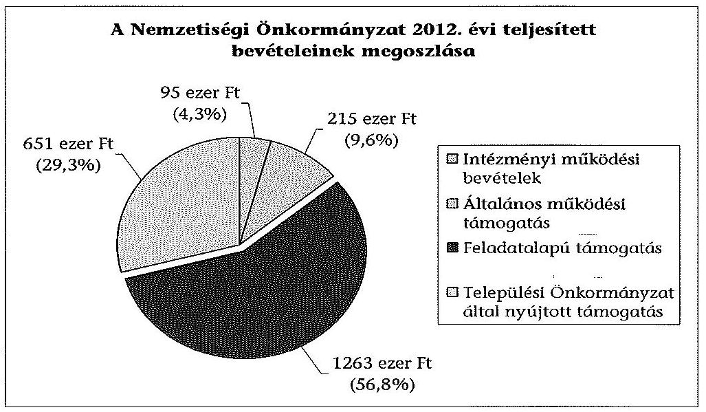
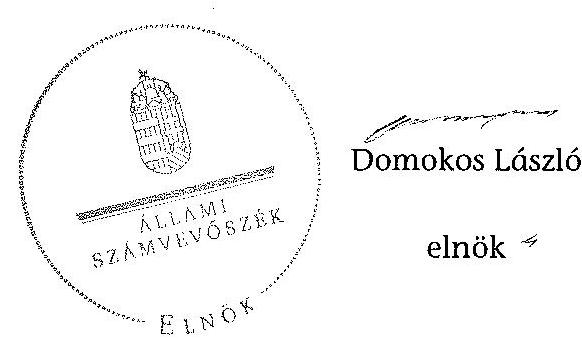

# ÁLLAMI   SZÁMVEVŐSZÉK 

## JELENTÉS

a helyi nemzetiségi önkormányzatok gazdálkodásának - 2013. évben induló - ellenőrzéséről
Visegrádi Német Nemzetiségi Önkormányzat

---

# Állami Számvevőszék 

Iktatószám: V-0164-027/2013.
Témaszám: 1179
Vizsgálat-azonosító szám: V065214

## Az ellenőrzést felügyelte:

Horváth Balázs
felügyeleti vezető
Az ellenőrzést vezette és az ellenőrzés végrehajtásáért felelős:
Korsósné Vigh Andrea
ellenőrzésvezető
A számvevőszéki jelentést készítették és a jelentés összeállításában közreműködtek:

## Molnár Istvánné

számvevő tanácsos
Papp József
számvevő tanácsos
Az ellenőrzést végezték:

| Bencsik Árpád | Komlósiné Bogár Éva |
| :-- | :-- |
| számvevő | számvevő tanácsos |

---

# TARTALOMJEGYZÉK 

BEVEZETÉS ..... 3
I. ÖSSZEGZŐ MEGÁLLAPÍTÁSOK, KÖVETKEZTETÉSEK, JAVASLATOK ..... 6
II. RÉSZLETES MEGÁLLAPÍTÁSOK ..... 14

1. A Nemzetiségi Önkormányzat és a Települési Önkormányzat együttműködésének szabályozása, a működési feltételek biztosítása ..... 14
2. A gazdálkodási feladatok ellátásának szabályszerűsége ..... 15
2.1. A költségvetésre és zárszámadásra, valamint a kincstári adatszolgáltatás rendjére vonatkozó jogszabályi előírások betartása ..... 15
2.2. A Nemzetiségi Önkormányzat gazdálkodásának szabályozottsága ..... 17
2.3. Az operatív gazdálkodási jogkörök kialakítása, gyakorlása ..... 18
3. A Nemzetiségi Önkormányzattal kapcsolatos gazdálkodási feladatok belső ellenőrzése ..... 19
4. A feladatalapú támogatás felhasználásának, elszámolásának szabályszerűsége, a Nemzetiségi Önkormányzat feladatellátása ..... 20
MELLÉKLET
5. számú A Nemzetiségi Önkormányzat 2012. évi gazdálkodásának főbb adatai, mutatói
FÜGGELÉKEK
6. számú Rövidítések jegyzéke
7. számú Értelmező szótár
8. számú A gazdálkodás értékelésének módszere

---

.

---

# JELENTÉS   a helyi nemzetiségi önkormányzatok gazdálkodásának - 2013. évben induló ellenőrzéséről   Visegrádi Német Nemzetiségi Önkormányzat 

## BEVEZETÉS

A Nemzetiségi Önkormányzat 1994. évi helyi önkormányzati választásokat követően 1995-ben alakult, elnöke a 2010. évi helyhatósági választások óta látja el feladatát. A Nemzetiségi Önkormányzat intézményt, gazdasági társaságot és más szervezetet nem alapított, illetve ezek társulásában nem vett részt. A négytagú Képviselő-testület munkája segítésére bizottságot nem hozott létre. A Nemzetiségi Önkormányzat költségvetési beszámolója szerint a 2012. évben a módosított költségvetési bevételi és kiadási előirányzat 2040 ezer Ft, a teljesített költségvetési bevétel 2224 ezer Ft, a teljesített költségvetési kiadás 2037 ezer Ft volt. A 2012. évi gazdálkodási adatokat részletesen az 1. számú mellékletben mutatjuk be.

Az Alaptörvény XXIX. cikk (1) bekezdése szerint a Magyarországon élő nemzetiségek államalkotó tényezők. Minden, valamely nemzetiséghez tartozó magyar állampolgárnak joga van önazonossága szabad vállalásához és megőrzéséhez. A hazánkban élő nemzetiségek helyi (települési és területi), valamint országos önkormányzatokat hozhatnak létre. A helyi nemzetiségi önkormányzatok gazdálkodási feladatait jogszabályi előírás alapján a székhely szerinti helyi önkormányzat polgármesteri hivatala látja el.

A nemzetiségek helyzete, támogatása mind hazai, mind EU-s szinten kiemelt figyelmet kap napjainkban. A helyi nemzetiségi önkormányzatok gazdálkodására és támogatási rendszerére vonatkozó jogszabályok a 2010-2012. években jelentős változásokon mentek át. A települési és területi nemzetiségi önkormányzatok gazdálkodásának, a részükre juttatott költségvetési támogatások felhasználásának ellenőrzését az ÁSZ a 2012. évben sorozatjellegű ellenőrzés keretében indította el. A 2013. évi ellenőrzések e témacsoportos ellenőrzések folytatását jelentik.

Az ellenőrzés célja annak értékelése volt, hogy a Nemzetiségi Önkormányzat gazdálkodási kereteinek kialakítása, gazdálkodása és feladatellátása megfelelt-e a jogszabályoknak.

---

Ennek keretében értékeltük, hogy:

- a Nemzetiségi Önkormányzat és a Települési Önkormányzat együttműködésének szabályozása, a működési feltételek biztosítása megfelelt-e a jogszabályi előírásoknak;
- a felek együttműködése megfelelt-e a közöttük létrejött megállapodásnak a gazdálkodási feladatok szabályszerű ellátása során, ennek keretében betartották-e a helyi nemzetiségi önkormányzat gazdálkodásához kapcsolódóan a költségvetésre és zárszámadásra, a gazdálkodás szabályozására, az operatív gazdálkodási jogkörök gyakorlására vonatkozó jogszabályi előírásokat;
- a jegyző biztosította-e a nemzetiségi önkormányzat gazdálkodásának belső ellenőrzését;
- a nemzetiségi önkormányzat feladatalapú támogatásának felhasználása, a folyósított feladatalapú támogatással történő elszámolás az előírásoknak megfelelő volt-e;
- a nemzetiségi önkormányzat feladatellátása összhangban volt-e a vonatkozó jogszabályi előírásokkal.

Az ellenőrzés várható hasznosulását négy szinten tervezzük. A törvényalkotás számára összegzett tapasztalatok állnak rendelkezésre a nemzetiségi önkormányzatok testületi döntéseinek, gazdálkodásának és a feladatalapú támogatás felhasználásának szabályszerűségéről, amelynek alapján következtetést lehet levonni arra, hogy indokolt-e jogszabályi módosítás kezdeményezése. Az ellenőrzés az ellenőrzött számára visszajelzést ad a működésében fellépő hiányosságokról, javaslataival hozzájárul azok kiküszöböléséhez, amely csökkentheti a későbbi ellenőrzések gyakoriságát. Az ellenőrzés megállapításai és javaslatai tanulságul szolgálhatnak más nemzetiségi önkormányzatok, szervezetek számára a rendezett gazdálkodási keretek kialakításához. A társadalom számára jelzi, hogy közpénz nem maradhat ellenőrizetlenül, az ÁSZ értékteremtő rend kialakításához és megőrzéséhez hozzájáruló tevékenysége pozitív hatással lesz a szervezetről kialakított összkép formálásában. Az ÁSZ szervezetén belül lehetőség nyílik arra, hogy a megállapítások szintetizálásával az intézmény a hozzáadott értéket teremtő elemző tevékenységét és tanácsadó szerepét erősítse.

A helyi nemzetiségi önkormányzatok gazdálkodásának ellenőrzéséről szóló jelentés I. fejezetének összegző része az ellenőrzés céljára adott rövid, szintetizáló összefoglalót és következtetéseket tartalmazza a II. fejezet részletes megállapításain alapulóan. A jelentés intézkedést igénylő megállapításait és javaslatait az összegzőben foglaltak mellett - az ellenőrzés során feltárt, a jelentés II. fejezetében rögzített részletes megállapítások alapozzák meg, illetve támasztják alá.

# Az ellenőrzés típusa: szabályszerűségi ellenőrzés 

Az ellenőrzött időszak: 2012. január 1. - 2012. december 31. közötti időszak. Az ellenőrzés kiterjedt a helyi nemzetiségi önkormányzatnak juttatott 2012. évi támogatás 2013. évben való elszámolására is.

---

Ellenőrzött szervezet: a Visegrádi Német Nemzetiségi Önkormányzat és a gazdálkodási feladatait ellátó Visegrád Város Önkormányzata.

Az ellenőrzés végrehajtásának jogszabályi alapját az ÁSZ tv. 5. § (2)-(3) és (6) bekezdéseiben foglaltak képezik.

Az ellenőrzés szakmai módszertana az ÁSZ hivatalos honlapján (www.asz.hu) közzétett szakmai szabályokon alapult, amely a Legfőbb Ellenőrző Intézmények Nemzetközi Szervezete (INTOSAI) által kiadott nemzetközi standardok (ISSAI) figyelembevételével készült.

A helyi nemzetiségi önkormányzatok gazdálkodásának ellenőrzése során értékeltük a Települési Önkormányzat és a Nemzetiségi Önkormányzat együttműködésének, a gazdálkodás szabályozottságának és a pénzügyi folyamatokban kulcsszerepet betöltő belső kontrollok (teljesítésigazolás és érvényesítés) működésének megfelelőségét. A kulcskontrollokat a működési és felhalmozási célú támogatásértékű kiadásoknál, az államháztartáson kívülre teljesített működési és felhalmozási célú pénzeszköz átadásoknál, a dologi kiadásokkal kapcsolatos kifizetéseknél - véletlen mintavételi eljárást alkalmazva - ellenőriztük. Ellenőriztük, hogy a jegyző biztosította-e a Nemzetiségi Önkormányzat gazdálkodásának belső ellenőrzését. Értékeltük a feladatalapú támogatások felhasználásának, elszámolásának szabályszerűségét, a Nemzetiségi Önkormányzat feladatellátása és a jogszabályi előírások összhangját.

Az ellenőrzés lefolytatásához a Nemzetiségi Önkormányzat és a gazdálkodási feladatait ellátó Települési Önkormányzat tanúsítványok és a kapcsolódó, dokumentumjegyzékben megjelölt dokumentumok elektronikus úton történő megküldésével, rendelkezésre bocsátásával szolgáltatott adatokat. Az adatszolgáltatás kontrollálása és szükség szerinti javítása a helyszíni ellenőrzés keretében történt. A minősítési szempontokat a 3. számú függelék tartalmazza.

Az ÁSZ tv. 29. § (1) bekezdése szerint a jelentéstervezetet megküldtük észrevételezésre a polgármesternek és a Nemzetiségi Önkormányzat elnökének, akik az ÁSZ tv. 29. § (2) bekezdésében foglalt észrevételezési jogukkal nem éltek, a jelentéstervezetre határidőben észrevételt nem tettek.

---

# I. ÖSSZEGZŐ MEGÁLLAPÍTÁSOK, KÖVETKEZTETÉSEK, JAVASLATOK 

A Nemzetiségi Önkormányzat és a Települési Önkormányzat együttműködésének szabályozása, a működési feltételek biztosítása részben felelt meg a jogszabályi előírásoknak. A Nemzetiségi Önkormányzat rendelkezett a 2012. év folyamán hatályban lévő megállapodással a Települési Önkormányzattal történő együttműködésre, amelyet a felek a Nek. ${ }_{2}$ tv.-ben előírt határidőn túl vizsgáltak felül és módosítottak. A 2012. december 31-én hatályos megállapodás az előírásoknak megfelelően szabályozta a Nemzetiségi Önkormányzat működési feltételeit, azonban a Nemzetiségi Önkormányzat a Nek. ${ }_{2}$ tv.-ben előírtak ellenére nem készítette el SZMSZ-ét, így a megállapodás szerinti működési feltételek SZMSZ-ben történő rögzítési kötelezettségének sem tett eleget. Az együttműködés szabályozása a Nek. ${ }_{2}$ tv.-ben a Nemzetiségi Önkormányzat gazdálkodási feladatai ellátásának szabályozására vonatkozóan előírt tartalmi elemek tekintetében hiányos volt. A 2012. december 31-én hatályos megállapodás nem tartalmazta a Nek. ${ }_{2}$ tv.-ben előírtak ellenére a költségvetéssel összefüggő adatszolgáltatási kötelezettségek teljesítésével, továbbá az önálló fizetési számla nyitásával, törzskönyvi nyilvántartásba vételével és adószám igénylésével kapcsolatos határidőket és együttműködési kötelezettségeket, a felelősök konkrét kijelölésével. Nem tartalmazta továbbá a Nemzetiségi Önkormányzat működési feltételeinek és gazdálkodásának eljárási és dokumentációs részletszabályaival, valamint az ezeket végző személyek kijelölésének rendjével, és az adatszolgáltatási feladatok teljesítésével kapcsolatos előírásokat, feltételeket. A Települési Önkormányzat a Nemzetiségi Önkormányzat működéséhez szükséges személyi és tárgyi feltételeket 2012. szeptember 1-jétől a szabályozás szintjén részben biztosította. A jegyző, illetve a megbízottja a Képviselő-testület 2012. évi ülésein a Nek. ${ }_{2}$ tv-ben előírt kötelezettségét elmulasztva nem vett részt, nem történt meg a Nemzetiségi Önkormányzat határozathozatali eljárásával, a határozatok, illetve jegyzőkönyvek tartalmával kapcsolatban a törvénysértések - a jegyző közreműködése általi - megelőzése, észlelése és jelzése. A Képviselő-testület 2012. évi üléseiről készített jegyzőkönyvek a Nek. ${ }_{2}$ tv. előírása ellenére nem tartalmazták az előterjesztéseket és a hozott döntéseket.

A Nemzetiségi Önkormányzat 2012. évi költségvetésére és zárszámadására vonatkozó jogszabályi előírások nem érvényesültek. A jegyző, az Áht. ${ }_{2}$ előírása ellenére nem készítette el a Nemzetiségi Önkormányzat költségvetési határozat-tervezetét, továbbá a költségvetés előterjesztésekor a Képviselőtestület részére tájékoztatásul bemutatandó mérlegeket és kimutatásokat, így a Nemzetiségi Önkormányzat elnöke azokat nem nyújtotta be a Képviselőtestületnek. A Képviselő-testület az Áht. ${ }_{2}$-ben a költségvetés előterjesztésére előírt határidőn túl, költségvetési határozattervezet hiányában (az elemi költségvetés alapján) tárgyalt, továbbá döntött a 2012. évi költségvetés elfogadásáról. E döntés azonban a költségvetési határozatra vonatkozóan az Áht. ${ }_{2}$-ben és az Ávr.-ben előírt tartalmi elemek közül egyet sem tartalmazott (az a döntés tárgyának megjelölésére és sorszámára korlátozódott). A jegyző ${ }_{1,2}$ a 2012. évben a Nemzetiségi Önkormányzattal összefüggő kincstári adatszolgáltatási kötelezettségeinek - egy kivétellel - határidőben eleget tett. A jegyző ${ }_{2}$ az Áht. ${ }_{2}$ előírása ellenére nem készítette el a Nemzetiségi Önkormányzat zárszámadási határozattervezetét, továbbá a zárszámadás előterjesztésekor a Képviselő-testület részére tájékoztatásul bemutatandó mérlegeket és kimutatásokat, így a Nemzetiségi Önkormányzat elnöke azokat nem nyújtotta be a Képviselő-testületnek. A Képviselő-testület zárszámadási határozattervezet hiányában döntött a 2012. évi zárszámadás elfogadásáról. E döntés azonban a zárszámadási határozatra vonatkozóan az Áht. ${ }_{2}$-ben és az Ávr.-ben előírt tartalmi elemeket - a költségvetéshez hasonlóan - nem tartalmazta. Így a Nemzetiségi Önkormányzat nem számolt el a 2012. évi bevételeiről és kiadásairól, továbbá a Képviselő-testület részére tájékoztatásul nem mutatták be az Áht. ${ }_{2}$-ben előírt mérlegeket, kimutatásokat, különösen a pénzeszközök változását, valamint a vagyonkimutatást.

A gazdálkodás szabályozottsága nem volt megfelelő. A gazdálkodási feladatok végrehajtását ellátó Polgármesteri Hivatal a gazdálkodási szabályzatokkal - leltározási és leltárkészítési szabályzat, eszközök és források értékelési szabályzata, pénzkezelési szabályzat, számviteli politika, számlarend - a Nemzetiségi Önkormányzatra kiterjedő hatállyal rendelkezett. A Polgármesteri Hivatal SZMSZ-e az Ávr.-ben előírtak ellenére nem tartalmazta az SZMSZ-ben nevesített munkakörökhöz tartozó - a Nemzetiségi Önkormányzat gazdálkodásával kapcsolatos - feladat- és hatásköröket, a hatáskörök gyakorlásának módját, a helyettesítés rendjét, az ezekhez kapcsolódó felelősségi szabályokat. Ezeket a feladatokat a Nemzetiségi Önkormányzat gazdálkodásával kapcsolatos feladatokat ellátó köztisztviselők munkaköri leírásaiban sem határozták meg. A gazdálkodási szabályzatban az Ávr.-ben előírtak ellenére nem határozták meg a százezer forint alatti, írásbeli kötelezettségvállalást nem igénylő kifizetések rendjét. A jegyző ${ }_{1,2}$ nem terjesztette ki a Nemzetiségi Önkormányzat
 gazdálkodási feladataira a Bkr.-ben előírt ellenőrzési nyomvonalat, szabálytalanságok kezelésének eljárásrendjét, valamint a folyamatba épített előzetes, utólagos és vezetői ellenőrzés szabályozását.

A Nemzetiségi Önkormányzat gazdálkodása tekintetében az operatív gazdálkodási jogkörök kialakítása megfelelt a jogszabályi előírásoknak. A Nemzetiségi Önkormányzat elnöke az elnökhelyettest hatalmazta fel írásban a kötelezettségvállalás és utalványozás gyakorlására. A pénzügyi ellenjegyző, az érvényesítő és a teljesítésigazoló kijelölését az arra jogosultak végezték. A Nemzetiségi Önkormányzatnál a dologi kiadások bizonylatainak a tesztelése során a teljesítésigazolás és az érvényesítés kontrollok működésének megfelelőségét az ellenőrzés gyengének értékelte, a hibák száma a lényegességi szintet, a kritikus hibahatárt elérte. A teljesítésigazoló aláírása ellenére nem látta el az Ávr.-ben előírt ellenőrzési feladatát, mert a kisösszegű (százezer Ft-ot el nem érő) pénztári kifizetéseknél a kötelezettségvállalási dokumentumok hiányában a kifizetés jogosságát, összegszerűségét és az ellenszolgáltatás teljesítésének ellenőrzését nem végezte el. Az érvényesítő nem az Ávr.-ben előírtak szerint végezte el feladatát, mert nem ellenőrizte, hogy a megelőző ügymenetben az Ávr. és a gazdálkodási szabályzat előírásait betartották-e. Nem jelezte, hogy a teljesítésigazolás szabálytalan volt, továbbá nem kifogásolta a kisösszegű kifizetések belső szabályzatban történő szabályozásának, valamint az Ávr.-ben és a gazdálkodási szabályzatban előírt kötelezettségvállalási nyilvántartás vezetésének hiányát, nem észrevételezte, hogy a kiadási pénztárbizonylatok nem tartalmazták a kötelezettségvállalás nyilvántartási számát. A 2012. évi három legnagyobb összegű dologi kiadás bizonylatainak a tételes ellenőrzése során a

---

teljesítésigazolás és az érvényesítés kulcskontrollok nem működtek megfelelően, a teljesítésigazolásnál feltárt hiányosságok megegyeztek a dologi kiadások tesztelésénél tett észrevételekkel, azonban a három legnagyobb összegű kiadás az Ávr.-ben előírtak ellenére érvényesítés nélkül került kifizetésre. Az államháztartáson kívülre teljesített működési célú pénzeszközátadás területén a teljesítésigazolás és az érvényesítés kulcskontrollok nem működtek megfelelően, a feltárt hiányosságok a dologi kiadásoknál tett észrevételekkel részben egyezőek voltak, továbbá az intézményeknek és civil szervezeteknek nyújtott támogatások kifizetését megelőzően a teljesítés igazolására és az érvényesítésre kijelölt személyek az Ávr.-ben előírt ellenőrzési feladatukat nem látták el, mert a teljesítések igazolása és az érvényesítése nem történt meg. A mulasztásból eredően az érvényesítő nem jelezte az utalványozó felé a fedezet rendelkezésre állásának a hiányát.

A jegyző ${ }_{1,2}$ nem biztosította a Polgármesteri Hivatalnál a Nemzetiségi Önkormányzat gazdálkodásával összefüggő végrehajtási feladatok belső ellenőrzését. A Polgármesteri Hivatal 2012. évi belső ellenőrzési tervét megalapozó kockázatelemzés - a Ber. előírása ellenére - nem terjedt ki a Nemzetiségi Önkormányzat gazdálkodásával összefüggő végrehajtási feladatokra, azok tekintetében 2012. évi belső ellenőrzési feladatot nem terveztek és nem végeztek.

A Nemzetiségi Önkormányzat a 2011. évben feladatalapú támogatásban nem részesült. A 2012. évben 1263 ezer Ft feladatalapú támogatást kapott, amelyet a folyósítás évében a jogszabályi előírásokkal összhangban felhasznált. A feladatalapú támogatás elszámolása a támogatási kormányrendelet ${ }_{2}$ előírása ellenére nem történt meg, a támogatás felhasználását, elszámolását az ellenőrzésre jogosult szervek nem ellenőrizték.

A Nemzetiségi Önkormányzat feladatellátásának tárgya összhangban volt a Nek. 2 tv. előírásaival. A kötelező feladatok közül a képviselt közösség érdekképviseletével, esélyegyenlőségének megteremtésével kapcsolatos feladatot látott el, a képviselt közösség kulturális autonómiájának megerősítése érdekében segítette a közösség önszerveződéseinek szervezési és működtetési feladatok ellátásával történő támogatását. Önként vállalt feladatot látott el a hagyományápolás, a közművelődés, valamint a helyi írott és elektronikus sajtó területén.

Az ÁSZ tv. 33. § (1) bekezdésében foglaltak értelmében az ellenőrzött szervezet vezetője köteles a jelentésben foglalt megállapításokhoz kapcsolódó intézkedési tervet összeállítani, és azt a jelentés kézhezvételétől számított 30 napon belül az ÁSZ részére megküldeni. Amennyiben az intézkedési tervet határidőre nem küldi meg a szervezet, vagy az nem elfogadható, az ÁSZ elnöke az ÁSZ tv. 33. § (3) bekezdés a)-b) pontjaiban foglaltakat érvényesítheti.

---

A helyszíni ellenőrzés megállapításainak hasznosítása mellett javasoljuk:

# a jegyzőnek 

1. az együttműködés szabályozásával és abban foglaltak betartásával kapcsolatban

Az együttműködési megállapodás gazdálkodási szabályok változása miatti felülvizsgálatát a Nek. 2 tv. 80. § (2) bekezdésében előírtak ellenére nem végezték el, a Nek. 2 tv. 159. § (3) bekezdésében előírt módosítást határidőn túl hajtották végre. A Nemzetiségi Önkormányzat a Nek. 2 tv. 113. § a) pontjában előírtak ellenére nem készítette el SZMSZ-ét, ezért a Nek. 2 tv. 80. § (2) bekezdésében foglaltakat figyelmen kívül hagyva a megállapodás szerinti működési feltételeket a megállapodás megkötését, módosítását követő harminc napon belül a Nemzetiségi Önkormányzat SZMSZ-ében nem rögzítették. A 2012. december 31-én hatályos megállapodásban a Nemzetiségi Önkormányzat gazdálkodási feladatai ellátásának szabályozása a Nek. 2 tv. 80. § (3) bekezdés a) és d) pontjaiban foglalt tartalmi elemek tekintetében hiányos volt. Nem tartalmazta a költségvetéssel összefüggő adatszolgáltatási kötelezettségek teljesítésével, továbbá az önálló fizetési számla nyitásával, törzskönyvi nyilvántartásba vételével és adószám igénylésével kapcsolatos határidőket és együttműködési kötelezettségeket a felelősök konkrét kijelölésével, valamint a működési feltételeinek és gazdálkodásának eljárási és dokumentációs részletszabályaival, továbbá az ezeket végző személyek kijelölésének rendjével, az adatszolgáltatási feladatok teljesítésével kapcsolatos előírásokat, feltételeket.

A Képviselő-testület ülésein, valamint a közmeghallgatáson a jegyző ${ }_{1,2}$, vagy annak megbízottja - a Nek. 2 tv. 80. § (4) bekezdésben előírt kötelezettségét elmulasztva - nem vett részt.

Javaslat
Az együttműködés szabályszerűsége érdekében:
a) készítse elő a megállapodást módosítását, hogy az tartalmilag feleljen meg a Nek. 2 tv. 80. § (3) bekezdés a) és d) pontjaiban foglalt előírásoknak;
b) készítse elő a Nemzetiségi Önkormányzat SZMSZ-ét a Nek. 2 tv. 113. § a) pontjában előírtak szerint, amely rögzíti a Nek. 2 tv. 80. § (2) bekezdése szerinti működési feltételeket is;
c) biztosítsa a jövőben a megállapodás Nek. 2 tv. 80. § (2) bekezdésében előírt határidő szerinti évenkénti felülvizsgálatát;
d) tegyen eleget a Nek. 2 tv. 80. § (4) bekezdésben foglalt kötelezettségének, a jövőben vegyen részt a Képviselő-testület ülésein és szükség esetén jelezze a törvénysértéseket.
2. a Nemzetiségi Önkormányzat működésével kapcsolatban

A Képviselő-testület 2012. évi üléseiről készített jegyzőkönyvek a Nek. 2 tv. 95. § (2) bekezdés f) és m) pontjaiban előírtak ellenére nem tartalmazták az előterjesztéseket és a hozott döntéseket.

---

Javaslat
Gondoskodjon arról, hogy a jövőben a Képviselő-testület üléseinek döntéseiről elkészített jegyzőkönyvek dokumentált formában tartalmazzák a Nek. 2 tv. 95. § (2) bekezdés f) és m) pontjaiban előírtak szerint az előterjesztéseket és a hozott döntéseket.
3. a költségvetés és zárszámadás szabályszerűségével kapcsolatban

Az Áht. 2 24. § (2) bekezdés előírása ellenére a jegyző nem készítette el a Nemzetiségi Önkormányzat költségvetési határozat-tervezetét, így az elnök azt nem nyújtotta be a Nemzetiségi Önkormányzat Képviselő-testületének. A jegyző nem tett eleget az Áht. 2 23. § (2) bekezdés a), c) és h) pontjaiban előírtaknak, mert nem mutatta be költségvetési határozatban a Nemzetiségi Önkormányzat költségvetési bevételeit és kiadásait előirányzat-csoportok, kiemelt előirányzatok szerinti bontásban, a költségvetési egyenleg összegét, valamint a finanszírozási célú pénzügyi műveletekkel kapcsolatos hatásköröket. Továbbá nem mutatta be a Képviselő-testületnek az Áht. 2 24. § (4) bekezdés a) pontjában előírtak ellenére a Nemzetiségi Önkormányzat költségvetési mérlegét közgazdasági tagolásban és az előirányzat-felhasználási tervét. A jegyző ${ }_{2}$ nem tett eleget az Áht. 2 91. § (1) bekezdésében előírtaknak, mert a Nemzetiségi Önkormányzat 2012. évi gazdálkodásáról a zárszámadási határozat tervezetét nem készítette el. Az Áht. 2 89. § (1)-(2) bekezdéseiben előírtak ellenére a 2012. évi költségvetési beszámoló alapján a költségvetés végrehajtásáról nem készítette el a Nemzetiségi Önkormányzat valamennyi bevételét és kiadását tartalmazó zárszámadást, továbbá a Képviselő-testület tájékoztatására az Áht. 2 91. § (2) bekezdés a), c) pontjaiban előírtak ellenére a pénzeszközök változását, valamint a vagyonkimutatást. A zárszámadási határozattervezet és a tájékoztató kimutatások elkészítésének és beterjesztésének hiányában a Képviselő-testület a 2012. évi zárszámadásáról az Áht. 2 91. § (1) bekezdésében előírtak ellenére az Áht. 2 89. § (1)-(2) bekezdéseiben előírt tartalomnak megfelelő határozatot nem alkotott.

Javaslat
A költségvetés szabályszerű előterjesztése és végrehajtása érdekében a jövőben gondoskodjon:
a) a költségvetési határozattervezetnek az Áht. 2 23. § (2) bekezdés a), c) és h) pontjaiban előírt tartalmú, az Áht. 2 24. § (2) bekezdésében előírt határidőre történő előkészítéséről, hogy azt a Nemzetiségi Önkormányzat elnöke az előírt határidőig be tudja nyújtani a Képviselő-testületnek;
b) a zárszámadási határozattervezetnek az Áht. 2 89. § (1)-(2) bekezdéseiben előírt tartalmú, az Áht. 2 91. § (1) bekezdésében foglalt időpont szerinti elkészítéséről, hogy azt a Nemzetiségi Önkormányzat elnöke az előírt határidőig be tudja nyújtani a Képviselő-testületnek;
c) a költségvetési és a zárszámadási határozattervezet beterjesztésekor a Képviselőtestület tájékoztatására beterjesztésre kerüljenek az Áht. 2 24. § (4) bekezdés a) pontjában, valamint az Áht. 2 91. § (2) bekezdés a), c) pontjaiban előírt mérlegek és kimutatások.

---

4. a gazdálkodási feladatok szabályozottságával kapcsolatban

A Polgármesteri Hivatal SZMSZ-e az Ávr. 13. § (1) bekezdés g) pontjában előírtak ellenére nem tartalmazta az SZMSZ-ben nevesített munkakörökhöz tartozó - a Nemzetiségi Önkormányzat gazdálkodásával kapcsolatos - feladat- és hatásköröket, a hatáskörök gyakorlásának módját, a helyettesítés rendjét, az ezekhez kapcsolódó felelősségi szabályokat. A Polgármesteri Hivatalban 2012. június 15-től a gazdálkodási szabályzat hatályát kiterjesztették a Nemzetiségi Önkormányzatra, azonban a szabályozás hiányos volt, mert - az Ávr. 53. § (2) bekezdésében előírtak ellenére - a százezer forintot el nem érő, előzetes írásbeli kötelezettségvállalást nem igénylő kifizetések rendjét nem határozták meg. A Polgármesteri Hivatalban - a Bkr. 6. § (3) és (4) bekezdéseiben előírtak alapján - elkészített ellenőrzési nyomvonal, a szabálytalanságok kezelésének eljárásrendje, valamint a Bkr. 8. § (2)-(4) bekezdései szerinti folyamatba épített előzetes, utólagos és vezetői ellenőrzés szabályozás hatályát nem terjesztették ki a Nemzetiségi Önkormányzat gazdálkodási feladatai ellátására.

Javaslat
A gazdálkodás szabályszerűsége érdekében:
a) készítse elő a Polgármesteri Hivatal SZMSZ-e módosítását, hogy az feleljen meg az Ávr. 13. § (1) bekezdés g) pontjában foglalt előírásnak;
b) terjessze ki a Polgármesteri Hivatalnak a Bkr. 6. § (3) és (4) bekezdéseiben előírtak alapján elkészített ellenőrzési nyomvonal, szabálytalanságok kezelésének eljárásrendje, valamint a Bkr. 8. § (2)-(4) bekezdései szerinti folyamatba épített előzetes, utólagos és vezetői ellenőrzés szabályozásának hatályát a Nemzetiségi Önkormányzat gazdálkodási feladatai ellátására;
c) határozza meg az Ávr. 53. § (2) bekezdésében előírtak szerint a százezer forintot el nem érő, előzetes írásbeli kötelezettségvállalást nem igénylő kifizetések rendjét.
5. a kulcskontrollok működésével kapcsolatban

Az Ávr. 57. § (1) és (3) bekezdéseiben előírt teljesítésigazolás nem történt meg, továbbá a teljesítésigazoló aláírása ellenére nem látta el az ellenőrzési feladatát, mert a kifizetés jogosságát, összegszerűségét és az ellenszolgáltatás teljesítésének ellenőrzését kötelezettségvállalási dokumentumok hiányában nem végezte el. Az érvényesítő az Ávr. 58. § (1) és (2) bekezdéseiben előírtak ellenére nem végezte el az érvényesítést, továbbá annak ellenére érvényesítette a kiadásokat, hogy nem ellenőrizte a megelőző ügymenetben az Ávr-ben és a gazdálkodási szabályzatban előírtak betartását, nem jelezte, hogy az Ávr. 57.
 § (1) bekezdésében előírtak ellenére a teljesítésigazolás szabálytalan volt, nem tárta fel a gazdálkodási szabályok érvényesítésének hiányát.

---

Javaslat
Az operatív gazdálkodás működési hibáinak megelőzése, feltárása és kijavítása érdekében gondoskodjon arról, hogy:
a) a teljesítésigazolást az Ávr. 57. § (1)-(3) bekezdésekben előírtak szerint végezzék;
b) az Ávr. 58. § (1)-(2) bekezdései alapján az érvényesítő lássa el ellenőrzési és jelzési feladatát.
6. a feladatalapú támogatás elszámolásával kapcsolatban

A 2012. évi feladatalapú támogatás elszámolása a támogatási kormányrendelet ${ }_{2}$ 8. § (5) bekezdésében hivatkozott „a helyi önkormányzatok elszámolási és ellenőrzési rendjére vonatkozó jogszabályok rendelkezései alkalmazandóak" előírása ellenére nem történt meg.

Javaslat
Gondoskodjon az Áht. ${ }_{2}$ 27. § (2) bekezdésében meghatározott feladatkörében a Nemzetiségi Önkormányzat által igénybe vett feladatalapú támogatás elszámolásának elkészítéséről, figyelemmel az Áht. ${ }_{2}$ 57. § (4) bekezdésében foglaltakra.

# a polgármesternek 

A 2012. december 31-én hatályos megállapodásban a Nemzetiségi Önkormányzat gazdálkodási feladatai ellátásának szabályozása a Nek. ${ }_{2}$ tv. 80. § (3) bekezdés a) és d) pontjaiban foglalt tartalmi elemek tekintetében hiányos volt. Nem tartalmazta a költségvetéssel összefüggő adatszolgáltatási kötelezettségek teljesítésével, továbbá az önálló fizetési számla nyitásával, törzskönyvi nyilvántartásba vételével és adószám igénylésével kapcsolatos határidőket és együttműködési kötelezettségeket a felelősök konkrét kijelölésével, valamint a működési feltételeinek és gazdálkodásának eljárási és dokumentációs részletszabályaival, továbbá az ezeket végző személyek kijelölésének rendjével, az adatszolgáltatási feladatok teljesítésével kapcsolatos előírásokat, feltételeket.

A Polgármesteri Hivatal SZMSZ-e az Ávr. 13. § (1) bekezdés g) pontjában előírtak ellenére nem tartalmazta a munkakörökhöz tartozó - a Nemzetiségi Önkormányzat gazdálkodásával kapcsolatos - feladat- és hatásköröket, a hatáskörök gyakorlásának módját, a helyettesítés rendjét, az ezekhez kapcsolódó felelősségi szabályokat.

Javaslat
Terjessze a Települési Önkormányzat Képviselő-testülete elé jóváhagyásra:
a) a jegyző által a Nek. 2 tv. 80. § (3) bekezdés a) és d) pontjaiban foglalt előírások betartásával előkészített megállapodás módosítását;
b) az Ávr. 13. § (1) bekezdés g) pontjában foglalt szabályozásra figyelemmel módosított Polgármesteri Hivatal SZMSZ-ét.

---

# a Nemzetiségi Önkormányzat elnökének 

1. A Nemzetiségi Önkormányzat a Nek. 2 tv. 113. § a) pontjában előírtak ellenére nem készítette el SZMSZ-ét, ezért a Nek. 2 tv. 80. § (2) bekezdésében előírtak ellenére a megállapodás szerinti működési feltételeket a megállapodás megkötését, módosítását követő harminc napon belül a Nemzetiségi Önkormányzat SZMSZ-ében nem rögzítették. A 2012. december 31-én hatályos megállapodásban a Nemzetiségi Önkormányzat gazdálkodási feladatai ellátásának szabályozása a Nek. 2 tv. 80. § (3) bekezdés a) és d) pontjaiban foglalt tartalmi elemek tekintetében hiányos volt. Nem tartalmazta a költségvetéssel összefüggő adatszolgáltatási kötelezettségek teljesítésével, továbbá az önálló fizetési számla nyitásával, törzskönyvi nyilvántartásba vételével és adószám igénylésével kapcsolatos határidőket és együttműködési kötelezettségeket a felelősök konkrét kijelölésével, valamint a működési feltételeinek és gazdálkodásának eljárási és dokumentációs részletszabályaival, továbbá az ezeket végző személyek kijelölésének rendjével, az adatszolgáltatási feladatok teljesítésével kapcsolatos előírásokat, feltételeket.

Javaslat
Terjessze a Képviselő-testület elé jóváhagyásra:
a) a Nek. 2 tv. 80. § (3) bekezdés a) és d) pontjaiban foglalt előírások betartásával a jegyző által előkészített megállapodás módosítást;
b) a Nemzetiségi Önkormányzatnak a Nek. 2 tv. 113. § a) pontjában előírtak szerint a jegyző által előkészített SZMSZ-ét, amely tartalmazza a Nek. 2 tv. 80. § (2) bekezdésében előírtak szerint a megállapodás szerinti működési feltételeket.
2. A 2012. évi feladatalapú támogatás elszámolása a támogatási kormányrendelet ${ }_{2}$ 8. § (5) bekezdésében hivatkozott, „a helyi önkormányzatok elszámolási és ellenőrzési rendjére vonatkozó jogszabályok rendelkezései alkalmazandóak" előírása ellenére nem történt meg.

Javaslat
Terjessze a Képviselő-testület elé az Áht. 2 57. § (4) bekezdése alapján összeállított, a Nemzetiségi Önkormányzat által igénybe vett feladatalapú támogatás elszámolását.

---

# II. RÉSZLETES MEGÁLLAPÍTÁSOK 

## 1. A Nemzetiségi Önkormányzat és a Települési Önkormányzat EGYÜTTMŰKÖDÉSÉNEK SZABÁLYOZÁSA, A MŰKÖDÉSI FELTÉTELEK BIZTOSÍTÁSA

A Nemzetiségi Önkormányzat és a Települési Önkormányzat együttműködésének szabályozása, a működési feltételek biztosítása részben felelt meg a jogszabályi előírásoknak.

A Nemzetiségi Önkormányzat rendelkezett a 2012. év folyamán hatályban lévő megállapodással ${ }^{1}$ a Települési Önkormányzattal történő együttműködésre. A 2012. január 1-jén hatályos, 2005. évben megkötött megállapodásnak a gazdálkodási szabályok változása miatti felülvizsgálatát a Nek. ${ }_{2}$ tv. 80. § (2) bekezdésében előírtak ellenére 2012. január 31-éig nem végezték el, továbbá a Nek. ${ }_{2}$ tv. 159. § (3) bekezdésében előírt módosítást a 2012. június 1-jei határidőn túl hajtották végre.

A 2012. december 31-én hatályos megállapodásban a Nek. ${ }_{2}$ tv. 80. § (1) bekezdésében előírtaknak megfelelően szabályozták a Nemzetiségi Önkormányzat működési feltételeit. A Nemzetiségi Önkormányzat a Nek. ${ }_{2}$ tv. 113. § a) pontjában előírtak ellenére nem készítette el SZMSZ-ét, ezért a Nek. ${ }_{2}$ tv. 80. § (2) bekezdésében előírtak ellenére a megállapodás szerinti működési feltételeket a megállapodás megkötését, módosítását követő harminc napon belül a Nemzetiségi Önkormányzat SZMSZ-ében nem rögzítették.

A 2012. december 31-én hatályos megállapodásban a Nemzetiségi Önkormányzat gazdálkodási feladatai ellátásának szabályozása a Nek. ${ }_{2}$ tv. 80. § (3) bekezdés a) és d) pontjaiban foglalt tartalmi elemek tekintetében hiányos volt, mert nem tartalmazta:

- a költségvetéssel összefüggő adatszolgáltatási kötelezettségek teljesítésével, továbbá az önálló fizetési számla nyitásával, törzskönyvi nyilvántartásba vételével és adószám igénylésével kapcsolatos határidőket és együttműködési kötelezettségeket a felelősök konkrét kijelölésével;

[^0]
[^0]:    ${ }^{1}$ A 2012. augusztus 31-éig hatályos megállapodást a Települési Önkormányzat Képviselő-testülete a 213/2005. számú, a Képviselő-testület a 14/2005. számú határozatával hagyta jóvá.
    A 2012. szeptember 1-jétől hatályos megállapodást a Települési Önkormányzat Képviselő-testülete a 17/2012. (I. 26.) számú határozatával elfogadta, majd a Települési Önkormányzat Képviselő-testületének 34/2012. (II. 29.) számú határozatával elfogadott önfeloszlatását követően a Települési Önkormányzat új Képviselő-testülete az előző döntést a 247/2012. (IX. 20.) számú határozatával megerősítette. A Képviselő-testület a 22/2012. (VIII. 29.) számú határozattal hagyta jóvá a megállapodást, amelyet a felek képviselői 2012. augusztus 31-én írták alá.

---

- működési feltételeinek és gazdálkodásának eljárási és dokumentációs részletszabályaival, valamint az ezeket végző személyek kijelölésének rendjével, és az adatszolgáltatási feladatok teljesítésével kapcsolatos előírásokat, feltételeket.

A Települési Önkormányzat a Nemzetiségi Önkormányzat 2012. évi működése - a Nek. 2 tv. 159. § (3) bekezdésében foglalt átmeneti rendelkezés alapján a Nek. 1 tv. 27. § (2)-(3) bekezdéseiben előírt - személyi és tárgyi feltételeit 2012. szeptember 1-jétől a szabályozás szintjén részben biztosította.

A működési feltételeket a 2012. szeptember 1-jétől hatályos megállapodásban rögzítették, azonban a személyi és tárgyi feltételek 2012. évi biztosítását a polgármester és az elnök közös nyilatkozattal nem igazolta.

A 2012. szeptember 1-jétől hatályos megállapodás a jogszabályi előírásnak megfelelően tartalmazta, hogy a jegyző, vagy annak - a jegyzővel azonos képesítési előírásoknak megfelelő - megbízottja a helyi önkormányzat megbízásából és képviseletében részt vesz a Nemzetiségi Önkormányzat Képviselőtestületi ülésein és jelzi, amennyiben törvénysértést észlel. A Nemzetiségi Önkormányzat 2012. évben megtartott nyolc Képviselő-testületi ülésén, valamint a közmeghallgatáson azonban a jegyző ${ }_{1,2}$, vagy annak megbízottja - a Nek. 2 tv. 80. § (4) bekezdésben előírt kötelezettségét elmulasztva - nem vett részt. Ennek hiányában nem történt meg a Nemzetiségi Önkormányzat határozathozatali eljárásával, a határozatok, illetve jegyzőkönyvek tartalmával kapcsolatban a törvénysértések - a jegyző közreműködése általi - megelőzése, észlelése és jelzése.

A Képviselő-testület 2012. évi üléseiről készített jegyzőkönyvek a Nek. ${ }_{2}$ tv. 95. § (2) bekezdés f) és m) pontjaiban előírtak ellenére nem tartalmazták az előterjesztéseket és a hozott döntéseket. ${ }^{2}$ A Nemzetiségi Önkormányzat Képviselőtestülete szóbeli előterjesztés alapján döntött, az így hozott „határozatok" tárgyát - azok tartalma nélkül - folyamatos sorszámmal ellátva rögzítették a jegyzőkönyvekben.

# 2. A GAZDÁLKODÁSI FELADATOK ELLÁTÁSÁNAK SZABÁLYSZERŰSÉGE 

### 2.1. A költségvetésre és zárszámadásra, valamint a kincstári adatszolgáltatás rendjére vonatkozó jogszabályi előírások betartása

A Nemzetiségi Önkormányzat 2012. évi költségvetésének, a zárszámadásának tartalma, jóváhagyása nem felelt meg a jogszabályi előírásoknak.

[^0]
[^0]:    ${ }^{2}$ Azt, hogy a Képviselő-testület 2012. évi testületi jegyzőkönyveiben rögzített 33 db határozatszámhoz és tárgyhoz tényleges határozatot nem alkottak, azokkal nem rendelkeznek, a Nemzetiségi Önkormányzat alelnöke és az aljegyző közös nyilatkozatban tanúsította.

---

A Nemzetiségi Önkormányzat 2012. évi költségvetési határozata elkészítése, elfogadása, tartalma tekintetében a jogszabályi előírások nem érvényesültek.

Az Áht. 24. § (2) bekezdés előírása ellenére a jegyző nem készítette el a Nemzetiségi Önkormányzat költségvetési határozat-tervezetét, így a Nemzetiségi Önkormányzat elnöke azt nem nyújtotta be jóváhagyásra a Képviselőtestületnek. A Képviselő-testület az Áht. 2 24. § (2) bekezdésében előírt határidőn túl, 2012. március 27-én (a 2012. évi elemi költségvetés alapján) tárgyalt a költségvetés elfogadásáról, amelyet a 9/2012. (III. 27.) határozatszámon rögzítettek.

A Nemzetiségi Önkormányzat 2012. évi költségvetése elfogadása tárgyú 9/2012. (III. 27.) számú „határozat" a jogszabályokban előírt tartalmi elemek egyikét sem tartalmazta:

- az Áht. 2 23. § (2) bekezdés a), c) és h) pontjaiban foglaltak ellenére a Nemzetiségi Önkormányzat költségvetési bevételeit és kiadásait előirányzatcsoportok, kiemelt előirányzatok szerinti bontásban, a költségvetési egyenleg összegét, valamint a finanszírozási célú pénzügyi műveletekkel kapcsolatos hatásköröket;
- az Ávr. 24. § (1) bekezdés a)-b) pontjaiban előírtak ellenére a Nemzetiségi Önkormányzat bevételeit, így különösen a központi költségvetésből származó támogatásokat, valamint a Nemzetiségi Önkormányzat kiadásait;
- az Áht. 2 24. § (4) bekezdés a) pontjában előírtak ellenére nem mutatták be a Képviselő-testületnek a Nemzetiségi Önkormányzat költségvetési mérlegét közgazdasági tagolásban és az előirányzat-felhasználási tervét.

A Nemzetiségi Önkormányzat által a 2012. évre tervezett kiadásokról készített előzetes kimutatás alapján a Polgármesteri Hivatalban a pénzügyi előadó 2012. március 5-én elkészítette a 2012. évi költségvetés tervezetét ${ }^{3}$, ez képezte alapját a Kincstár részére 2012. március 26-án megküldött Nemzetiségi Önkormányzat 2012. évi elemi költségvetésének.

A jegyző ${ }_{1,2}$ a Nemzetiségi Önkormányzattal összefüggő 2012. évi kincstári adatszolgáltatási kötelezettségét egy kivétellel - a II. negyedévi időközi költségvetési jelentést három nap késedelemmel - az előírt határidőben teljesítette.

A Nemzetiségi Önkormányzat 2012. évi zárszámadási határozatának elkészítése, elfogadása, tartalma tekintetében a jogszabályi előírások nem érvényesültek:

- a jegyző ${ }_{2}$ nem tett eleget az Áht. 2 91. § (1) bekezdésében előírtaknak, mert a Nemzetiségi Önkormányzat 2012. évi gazdálkodásáról a zárszámadási határozat tervezetét nem készítette el. Az Áht. 2 89. § (1)-(2) bekezdéseiben előírtak ellenére a 2012. évi költségvetési beszámoló alapján a költségvetés végrehajtásáról nem készítette el a Nemzetiségi Önkormányzat valamennyi bevételét és kiadását tartalmazó zárszámadást, továbbá a Képviselőtestület tájékoztatására az Áht. 2 91. § (2) bekezdés a), c) pontjaiban előírtak ellenére a pénzeszközök változását, valamint a vagyonkimutatást;

[^0]
[^0]:    ${ }^{3}$ A kiadásokat kiadási előirányzatonkénti bontásban, a bevételeket a kiadások összegzését követően egy összegben, támogatásértékű működési bevételként vette számításba.

---

- a zárszámadási határozattervezet és a tájékoztató kimutatások elkészítésének és beterjesztésének hiányában a Képviselő-testület a 2012. évi zárszámadásról az Áht. 2 91.
 § (1) bekezdésében előírtak ellenére az Áht. 2. 89. § (1)-(2) bekezdéseiben előírt tartalomnak megfelelő határozatot nem alkotott.

A zárszámadási határozattervezet hiánya miatt a Képviselő-testület a Kincstárnak benyújtott 2012. évi elemi beszámolóból tájékozódott a Nemzetiségi Önkormányzat 2012. évi gazdálkodásáról. A 2012. március 12-i jegyzőkönyvben - a 2012. évi költségvetési határozatnál ismertetett módon - a 15/2013. (III. 12.) határozatszámmal rögzítették a Nemzetiségi Önkormányzat 2012. évi beszámolóját.

# 2.2. A Nemzetiségi Önkormányzat gazdálkodásának szabályozottsága 

A Nemzetiségi Önkormányzat gazdálkodásának szabályozottsága az ellenőrzött időszakban nem volt megfelelő. A gazdálkodási feladatai végrehajtását ellátó Polgármesteri Hivatal 2012. június 15-től a Számv. tv. és az Áhsz. által előírt gazdálkodási szabályzatokkal - leltározási és leltárkészítési szabályzat, eszközök és források értékelési szabályzata, pénzkezelési szabályzat, számviteli politika, számlarend - a Nemzetiségi Önkormányzat gazdálkodási feladataira kiterjedő hatállyal rendelkezett. A jegyző ${ }_{1,2}$ a Nemzetiségi Önkormányzat gazdálkodását hiányosan szabályozta, mert:

- a Polgármesteri Hivatal SZMSZ-e az Ávr. 13. § (1) bekezdés g) pontjában előírtak ellenére nem tartalmazta az SZMSZ-ben nevesített munkakörökhöz tartozó - a Nemzetiségi Önkormányzat gazdálkodásával kapcsolatos - feladatokat és hatásköröket, a hatáskörök gyakorlásának módját, a helyettesítés rendjét, az ezekhez kapcsolódó felelősségi szabályokat;
- a Polgármesteri Hivatalban a gazdálkodási feladatokat ellátó köztisztviselők munkaköri leírásai nem tartalmazták a Nemzetiségi Önkormányzattal kapcsolatos feladatokat.

A Polgármesteri Hivatalban 2012. június 15-től a gazdálkodási szabályzat hatályát kiterjesztették a Nemzetiségi Önkormányzat gazdálkodási feladataira, azonban a szabályozás hiányos volt, mert - az Ávr. 53. § (2) bekezdésében előírtak ellenére - a százezer forintot el nem érő, előzetes írásbeli kötelezettségvállalást nem igénylő kifizetések rendjét nem határozták meg.

A Polgármesteri Hivatalban - a Bkr. 6. § (3) és (4) bekezdéseiben előírtak alapján - elkészített ellenőrzési nyomvonal, a szabálytalanságok kezelésének eljárásrendje, valamint a Bkr. 8. § (2)-(4) bekezdései szerinti folyamatba épített, előzetes, utólagos és vezetői ellenőrzés szabályozás hatályát nem terjesztették ki a Nemzetiségi Önkormányzat gazdálkodási feladataira és a Nemzetiségi Önkormányzat azokkal önálló módon sem rendelkezett.

---

# 2.3. Az operatív gazdálkodási jogkörök kialakítása, gyakorlása 

A Nemzetiségi Önkormányzat gazdálkodása tekintetében az operatív gazdálkodási jogkörök kialakítása megfelelt a jogszabályi előírásoknak, mert a kötelezettségvállalásra és az utalványozásra adott felhatalmazások, a pénzügyi ellenjegyző, teljesítésigazoló és érvényesítő személyek írásbeli kijelölése a jogszabályi előírásokkal összhangban történtek.

A Nemzetiségi Önkormányzatnál a 2012. évben a dologi kiadások teljesítése során a teljesítésigazolás és az érvényesítés kulcskontrollok működésének megfelelősége gyenge volt, a hibák száma a lényegességi szintet, a kritikus hibahatárt elérte.

- A teljesítésigazoló aláírása ellenére nem látta el az Ávr. 57. § (1) és a (3) bekezdésében előírt ellenőrzési feladatát, mert a kisösszegű pénztári kifizetéseknél ${ }^{4}$ a kifizetés jogosságának, összegszerűségének és az ellenszolgáltatás teljesítésének ellenőrzését kötelezettségvállalási dokumentumok hiányában nem végezte el.
- Az érvényesítő az Ávr. 58. § (1) bekezdésében előírtak ellenére nem ellenőrizte, hogy a megelőző ügymenetben az Ávr.-ben és a gazdálkodási szabályzatban előírtakat betartották-e. Nem jelezte, hogy az Ávr. 57. § (1) bekezdésében előírtak ellenére a teljesítésigazolás szabálytalan volt, továbbá hogy a százezer forintot el nem érő kifizetések rendjét az Ávr. 53. § (2) bekezdésében foglaltak ellenére belső szabályzatban nem rögzítették. Nem jelezte az Ávr. 56. § (1) bekezdésben, valamint a gazdálkodási szabályzatban előírt kötelezettségvállalási nyilvántartás vezetésének, a kiadási pénztárbizonylatokon az Ávr. 59. § (3) bekezdés f) pontjában és az Ávr. 59. § (4) bekezdésében előírt kötelezettségvállalási nyilvántartási szám feltüntetésének a hiányát.

A 2012. évi három legnagyobb összegű dologi kiadás bizonylatainak egyedi értékelése alapján a kifizetések teljesítését megelőzően a teljesítésigazolás és az érvényesítés kulcskontrollok nem működtek megfelelően. A feltárt hiányosságok a teljesítésigazolás kontroll működésénél megegyeztek a dologi kiadások tesztelésénél tett észrevételekkel. Az érvényesítő nem végezte el az Ávr. 58. § (1) bekezdésében előírt feladatát, mert a három legnagyobb összegű dologi kiadást ${ }^{5}$ nem érvényesítette.

A Nemzetiségi Önkormányzatnál a 2012. évben az államháztartáson kívülre teljesített működési célú pénzeszközátadások teljesítése során a teljesítésigazolás és az érvényesítés kulcskontrollok nem működtek

[^0]
[^0]:    ${ }^{4}$ A Polgármesteri Hivatalban a 2012. évben annak ellenére éltek az Ávr. 53. § (1) bekezdés a) pontjában foglalt lehetőséggel, mely szerint nem szükséges előzetes írásbeli kötelezettségvállalás a gazdasági eseményenként 100 ezer Ft-ot el nem érő kifizetések esetében, hogy e kifizetések rendjét és nyilvántartását az Ávr. 53. § (2) bekezdés előírása ellenére nem szabályozták.
    ${ }^{5}$ Összesen 157 ezer Ft-ot.

---

megfelelően, a feltárt hiányosságok részben megegyeztek a dologi kiadásoknál feltárt hiányosságokkal, továbbá

- a teljesítésigazoló egy pénztári kifizetéshez kapcsolódó öt - nemzetiségi feladatokat ellátó intézményeknek és civil szervezeteknek nyújtott, összesen 295 ezer Ft támogatás - gazdasági esemény tekintetében Ávr. 57. § (1) és (3) bekezdésében foglalt ellenőrzési és igazolási feladatát nem látta el, mert a teljesítések igazolása nem történt meg;
- az érvényesítő - a nemzetiségi feladatokat ellátó intézményeknek és civil szervezeteknek nyújtott támogatások pénztári teljesítését megelőzően - nem tett eleget az Ávr. 58. § (1)-(2) bekezdéseiben és a gazdálkodási szabályzatban előírtaknak, mert a támogatások érvényesítését nem végezte el. Az összegszerűség, a fedezet meglétének, továbbá a megelőző ügymenetben a gazdálkodási szabályok betartása ellenőrzése és igazolása hiányában az érvényesítő nem jelezte az utalványozó felé, a fedezet rendelkezésre állásának a hiányát, ezáltal az Áht. 2. 36. § (1) bekezdés előírása, továbbá a megelőző ügymenetben a gazdálkodásra - a kötelezettségvállalásra, a teljesítésigazolásra és a Számv. tv.-ben a számviteli bizonylatokra - vonatkozó szabályok megsértését.

A Nemzetiségi Önkormányzat 2012. évi elemi költségvetésében az államháztartáson belülre és kívülre átadott működési célú pénzeszközátadás címen 50 ezer Ft eredeti előirányzatot terveztek, amelyet év közben - az Áht. 2. 34. § (5) bekezdés előírása ellenére - nem módosítottak, ebből adódóan e kiadási jogcímen - az Áht. 2. 36. § (1) bekezdés előírását megsértve - az előirányzatot meghaladó összesen 340 ezer Ft kiadást teljesítettek.

A támogatás kifizetéséhez bizonylatként két testületi jegyzőkönyvet csatoltak, amely nem felel meg a Számv. tv. 167. § (1) bekezdésében - a könyvviteli elszámolást közvetlenül alátámasztó bizonylatokkal szemben támasztott alakí és tartalmi - követelményeknek, továbbá nem tekinthetők kötelezettségvállalási bizonylatnak sem. A helyi nemzetiségi szervezeteknek nyújtott támogatásokról határozat nem készült, elszámolási kötelezettséget a Képviselő-testület nem írt elő.

Az érvényesítő továbbá az államháztartáson kívülre teljesítésként működési célú pénzeszközátadások között tévesen elszámolt (valós tartalmát tekintve egyéb szolgáltatási és dologi kiadás) két kifizetés teljesítését megelőzően nem az Ávr. 58. § (1) bekezdés előírásának megfelelően látta el ellenőrzési feladatát, mert nem kifogásolta az Áhsz. 47. § (1) bekezdésében előírtak ellenére a hibás számlakijelölést.

Működési és felhalmozási célú támogatásértékű kiadás, valamint államháztartáson kívülre történő felhalmozási célú pénzeszközátadás nem történt.

# 3. A Nemzetiségi Önkormányzattal kapcsolatos gazdálkodási feladatok belső ellenőrzése 

A jegyző ${ }_{1,2}$ nem biztosította a Polgármesteri Hivatalnál a Nemzetiségi Önkormányzat gazdálkodásával összefüggő végrehajtási feladatok belső ellenőrzését. A Polgármesteri Hivatal 2012. évre vonatkozó éves ellenőrzési tervét megalapozó kockázatelemzés - a Ber. 21. § (2) bekezdés előírása ellenére - nem ter-

---

# jedt ki a Nemzetiségi Önkormányzat gazdálkodásával összefüggő végrehajtási feladatokra, azok tekintetében belső ellenőrzési feladatot a 2012. évben nem terveztek és nem végeztek. 

A 2012. augusztus 31-ig hatályos megállapodás nem tért ki a belső ellenőrzési feladatok ellátására. A 2012. szeptember 1-jétől hatályos megállapodásban előírták: „Az önkormányzati hivatal a helyi nemzetiségi önkormányzat vonatkozásában köteles a belső kontrollrendszer keretében kialakítani, működtetni és fejleszteni a kontrollkörnyezetet, a kockázatkezelési rendszert, a kontrolltevékenységeket, az információs és kommunikációs rendszert továbbá a nyomon követési rendszert. A belső ellenőrzésre a kockázatelemzéssel alátámasztott éves belső ellenőrzési tervben meghatározottak szerint kerül sor."

Az ellenőrzéshez szolgáltatott adatok alapján 2012. évben a Kormányhivatal a Nemzetiségi Önkormányzatot illetően nem élt törvényességi felügyeleti eszközökkel.

## 4. A feladatalapú támogatás felhasználásának, elszámolásának szabályszerűsége, a Nemzetiségi Önkormányzat feladatellátása

A Nemzetiségi Önkormányzat a 2011. évben feladatalapú támogatásban nem részesült. A Nemzetiségi Önkormányzat a 2012. évben 1263 ezer Ft feladatalapú támogatást kapott, amelynek az összes bevételhez viszonyított részarányát a következő ábra szemlélteti.

A 2012. évi feladatalapú támogatást a támogatási célokkal összhangban a folyósítás évében felhasználták. A támogatás elszámolása a támogatási kormányrendelet ${ }_{2}$ 8. § (5) bekezdésében hivatkozott „a helyi önkormányzatok elszámolási és ellenőrzési rendjére vonatkozó" jogszabályok rendelkezései alkalmazása előírása ellenére nem történt meg. A feladatalapú támogatás felhasználását, elszámolását az ellenőrzésre jogosult szervek nem ellenőrizték.

---

A Nemzetiségi Önkormányzat feladatellátásának tárgya összhangban volt a Nek. 2. tv. előírásaival. A Nek. 2. 115. és 116. §-ok előírásaival összhangban látott el kötelező és önként vállalt feladatokat. Kötelező feladatai keretében együttműködési megállapodásokat kötött a képviselt közösség érdekképviselete, esélyegyenlőségének megteremtése, kulturális autonómiájának megerősítése, a közösség önszerveződésének szervezési és működési feladatok ellátásával történő támogatása, valamint a képviselt közösség helyi nemzetiségi civil szervezeteivel, szerveződéseivel, helyi egyházi szervezetekkel történő kapcsolattartás segítése érdekében. Önként vállalt feladatot az írott és elektronikus sajtó, a hagyományápolás és a közművelődés terén végeztek.

Budapest, 2014. $\quad \bigcirc$. hónap $\bigcirc$. nap

Melléklet: $\quad 1 \mathrm{db}$
Függelék: $\quad 3 \mathrm{db}$

---

# **Title: The Impact of Climate Change on Global Ecosystems**

## **Introduction**

Climate change is one of the most pressing environmental issues of our time. It affects ecosystems worldwide, leading to significant changes in biodiversity, habitat loss, and species extinction. This report explores the impacts of climate change on global ecosystems, focusing on key areas such as **forests**, **oceans**, and **polar regions**.

## **1. Forest Ecosystems**

Forests play a crucial role in carbon sequestration and maintaining biodiversity. However, rising temperatures and changing precipitation patterns are altering forest ecosystems. Key impacts include:

- **Increased frequency of wildfires**: Rising temperatures and drought conditions have led to more frequent and severe wildfires, destroying vast areas of forests.
- **Changes in species distribution**: Shifts in temperature and precipitation patterns are altering forest ecosystems, disrupting ecosystem balance.
- **Insect outbreaks**: Warmer temperatures have increased the survival rates of pests like bark beetles, which are causing widespread wildfires.

## **2. Ocean Ecosystems**

Oceans absorb a significant portion of the excess heat and carbon dioxide (CO₂) produced by human activities. The consequences include:

- **Increased frequency of wildfires**: Rising sea levels and drought conditions have led to more frequent and severe wildfires, disrupting ecosystem balance.
- **Changes in ocean currents**: Altered ocean currents are altering ocean currents, disrupting ecosystem balance, and species extinction.
- **Changes in ocean currents**: Altered ocean currents are altering ocean currents, disrupting ecosystem balance, and species extinction.

## **3. Ocean Ecosystems**

Oceans absorb a significant portion of the excess heat and carbon dioxide (CO₂) produced by human activities. The consequences include:

- **Increased frequency of wildfires**: Rising
 sea levels and drought conditions have led to more frequent and severe wildfires, disrupting ecosystem balance.
- **Changes in ocean currents**: Altered ocean currents are altering ocean currents, disrupting ecosystem balance, and species extinction.

## **4. Ocean Ecosystems**

Oceans absorb a significant portion of the excess heat and carbon dioxide (CO₂) produced by human activities. The consequences include:

- **Increased frequency of wildfires**: Rising sea levels and drought conditions have led to more frequent wildfires, disrupting ecosystem balance.
- **Changes in ocean currents**: Altered ocean currents are altering ocean currents, disrupting ecosystem balance, and species extinction.

## **5. Polar Ecosystems**

Polar regions are particularly vulnerable to climate change due to their sensitivity to temperature changes. Key impacts include:

- **Melting of sea ice**: The Arctic is warming at twice the rate of the global average, affecting polar bears and seals, which are causing sea ice loss.
- **Glacial retreat**: Melting glaciers and ice in the Arctic are altering the Arctic's ocean, disrupting ecosystem balance.
- **Glacial retreat**: Melting glaciers and ice in the Arctic are altering the Arctic's ocean, disrupting ecosystem balance, and species extinction.

## **Conclusion**

Climate change poses a significant threat to global ecosystems, with far-reaching consequences for biodiversity and human societies. By understanding the impacts of climate change on global ecosystems, we can help you reduce and mitigate the impacts of climate change.

---

**References**

1. IPCC (Intergovernmental Panel on Climate Change). (2021). *Climate Change 2021: The Physical Science Basis*.
2. WWF (World Wildlife Fund). (2020). *Living Planet Report 2020*.
3. NASA Global Climate Change. (2022). *Vital Signs: Global Temperature*.

---

# A Nemzetiségi Önkormányzat 2012. évi gazdálkodásának főbb adatai, mutatói

A) Bevételek

|  Megnevezés | Eredeti előirányzat | Módosított | Teljesítés  |
| --- | --- | --- | --- |
|   | ezer Ft |  | megoszlás  |
|  Intézményi működési bevételek | 0 | 0 | 95  |
|  Általános működési támogatás | 0 | 0 | 215  |
|  Feladatalapú támogatás | 0 |  | 1263  |
|  Települési önkormányzat által nyújtott támogatás | 2040 | 2040 | 651  |
|  Költségvetési bevételek összesen | 2040 | 2040 | 2224  |
|  Bevételek mindösszesen | 2040 | 2040 | 2224  |

B) Kiadások

|  Megnevezés | Eredeti előirányzat | Módosított | Teljesítés  |
| --- | --- | --- | --- |
|   | ezer Ft |  | megoszlás  |
|  Személyi juttatások | 250 | 250 | 68  |
|  Munkaadókat terhelő járulékok és szociális hozzájárulási adó összesen | 68 | 68 | 17  |
|  Dologi kiadások | 1408 | 1408 | 1612  |
|  Működési célú pénzeszközátadások államháztartáson kívülre | 50 | 50 | 340  |
|  Működési kiadások összesen | 1776 | 1776 | 2037  |
|  Felhalmozási kiadások összesen | 250 | 250 | 0  |
|  Céltartalék | 14 | 14 | 0  |
|  Költségvetési kiadások összesen | 2040 | 2040 | 2037  |
|  Kiadások mindösszesen | 2040 | 2040 | 2037  |

---

.

---

# RÖVIDÍTÉSEK JEGYZÉKE 

## Törvények

Áht. 1
Áht. 2
Nek. ${ }_{1}$ tv.
Nek. ${ }_{2}$ tv.
Számv. tv.
Rendeletek, határozatok
Áhsz.

Ámr.
Ávr.

Ber.
Bkr.
támogatási kormányrendelet ${ }_{1}$
támogatási kormányrendelet ${ }_{2}$

Polgármesteri Hivatal SZMSZ-e
1992. évi XXXVIII. törvény az államháztartásról (hatályos 2011. december 31-ig)
2011. évi CXCV. törvény az államháztartásról (hatályos 2011. december 31-től)
1993. évi LXXVII. törvény a nemzeti és etnikai kisebbségek jogairól (hatályos 2011. december 31-ig)
2011. évi CLXXIX. törvény a nemzetiségek jogairól (hatályos 2011. december 20-tól)
2000. évi C. törvény a számvitelről

249/2000. (XII. 24.) Korm. rendelet az államháztartás szervezetei beszámolási és könyvvezetési kötelezettségének sajátosságairól
292/2009. (XII. 19.) Korm. rendelet az államháztartás működési rendjéről (hatályos 2011. december 31-ig)
368/2011. (XII. 31.) Korm. rendelet az államháztartásról szóló törvény végrehajtásáról (hatályos 2012. január 1-jétől)

193/2003. (XI. 26.) Korm. rendelet a költségvetési szervek belső ellenőrzéséről (hatályos 2011. december 31-ig)
370/2011. (XII. 31.) Korm. rendelet a költségvetési szervek belső kontrollrendszeréről és belső ellenőrzéséről (hatályos 2012. január 1-jétől)
342/2010. (XII. 28.) Korm. rendelet a kisebbségi önkormányzatoknak a központi költségvetésből, valamint fejezeti kezelésű előirányzatból nyújtott támogatások feltételrendszeréről és elszámolásának rendjéről (hatályos 2011. december 31-ig)

28/2012. (III. 6.) Korm. rendelet a nemzetiségi célú előirányzatokból nyújtott támogatások feltételrendszeréről és elszámolásának rendjéről (hatályos 2012. január 1-jétől 2012. december 31-ig)
Visegrád Város Önkormányzat Polgármesteri Hivatalának Szervezeti és Működési Szabályzata, jóváhagyta a Települési Önkormányzat Képviselő-testülete a 206/2012. (VI. 25.) számú határozatával, (hatályos 2012. július 1-jétől, előtte a Települési Önkormányzat Képviselőtestülete által a 118/2008. (VI. 24.) számú határozattal elfogadott Ügyrend volt hatályban)

---

## Szórövidítések

ÁSZ
EU
jegyző ${ }_{1}$
jegyző ${ }_{2}$

Képviselő-testület
Kincstár
Kormányhivatal
Nemzetiségi Önkormányzat
Nemzetiségi Önkormányzat elnöke
Polgármesteri Hivatal
Települési Önkormányzat
Települési Önkormányzat Képviselő-testülete

Állami Számvevőszék
Európai Unió
Visegrád Város Önkormányzatának helyettesítő jegyzője 2011. szeptember 1-jétől 2012. június 5-ig
Visegrád Város Önkormányzatának helyettesítő aljegyzője 2012. június 6-tól 2012. december 31-ig, kinevezett aljegyző 2013. január 1-jétől
Visegrádi Német Nemzetiségi Önkormányzat Képviselőtestülete
Magyar Államkincstár Pest Megyei Igazgatósága
Pest Megyei Kormányhivatal
Visegrádi Német Nemzetiségi Önkormányzat
Visegrádi Német Nemzetiségi Önkormányzat elnöke
Visegrád Város Önkormányzatának Polgármesteri Hivatala
Visegrád Város Önkormányzata
Visegrád Város Önkormányzatának Képviselő-testülete

---

# ÉRTELMEZŐ SZÓTÁR 

feladatalapú támogatás

A támogatási évben általános működési támogatásban részesült, és a Támogatónak a Kincstárhoz intézett, a feladatalapú támogatás utalására vonatkozó rendelkező levele keltének időpontjában működő nemzetiségi önkormányzatoknak kormányrendeletben rögzített feltételrendszer alapján nyújtható támogatás. A feladatalapú támogatás a nemzetiségi közügyeknek a nemzetiségi önkormányzatok által történő ellátását szolgálja. (A támogatási kormányrendelet ${ }_{1}$ 2. § (2) bekezdés c) pont, és a támogatási kormányrendelet ${ }_{2} 4 . \S$ (1) bekezdése alapján.) mader
teljesítés igazolása és az érvényesítés.
A nemzetiségi önkormányzatnak a működési feltételei biztosítására, továbbá a bevételeivel és a kiadásaival kapcsolatban a tervezési, gazdálkodási, ellenőrzési, finanszírozási, adatszolgáltatási és beszámolási feladatai végrehajtására a székhelye szerinti települési önkormányzattal megkötött megállapodás. (Az Áht. ${ }_{1} 66 . \S$, a Nek. ${ }_{2}$ tv. 80. § (2) bekezdés, valamint az Áht. ${ }_{2} 27 . \S$ (2) bekezdés alapján levezetett fogalom.)
nemzetiségi közügy Az egyéni és közösségi jogok érvényesülése, a nemzetiséghez tartozók érdekeinek kifejezésre juttatása - különösen az anyanyelv ápolása, őrzése és gyarapítása, továbbá a nemzetiségek kulturális autonómiájának a nemzetiségi önkormányzatok által történő megvalósítása és megőrzése - érdekében a nemzetiséghez tartozók meghatározott közszolgáltatásokkal való ellátásával, ezen ügyek önálló vitelével és az ehhez szükséges szervezeti, személyi és anyagi feltételek megteremtésével összefüggő ügy. A közhatalmat gyakorló állami és helyi önkormányzati szervekben, továbbá a nemzetiségi önkormányzati szervekben való nemzetiségi képviselethez és mindezek szervezeti, személyi és anyagi feltételeinek biztosításához kapcsolódó ügy. (Nek. ${ }_{2}$ tv. 2. § 1. pontjából levezetett fogalom.)
nemzetiség Minden olyan Magyarország területén legalább egy évszázada honos népcsoport, amely az állam lakossága körében számszerú kisebbségben van, a lakosság többi részétől saját nyelve, kultúrája és hagyományai különböztetik meg, egyben olyan összetartozás-tudatról tesz bizonyságot, amely mindezek megőrzésére, történelmileg kialakult közösségeik érdekeinek kifejezésére és védelmére irányul. (A Nek. ${ }_{2}$ tv. 1. § (1) bekezdése alapján levezetett fogalom.)

---

nemzetiségi önkormányzat

Törvényben meghatározott nemzetiségi közszolgáltatási feladatokat ellátó, testületi formában működő, jogi személyiséggel rendelkező, demokratikus választások útján, törvény alapján létrehozott szervezet, amely a nemzetiségi közösséget megillető jogosultságok érvényesítésére, a nemzetiségek érdekeinek védelmére és képviseletére, a feladat- és hatáskörébe tartozó nemzetiségi közügyek települési, területi vagy országos szinten történő önálló intézésére jön létre. (A Nek. 2 tv. 2. § 2. pontjából levezetett fogalom.)

---

# A GAZDÁLKODÁS ÉRTÉKELÉSÉNEK MÓDSZERE 

A helyi nemzetiségi önkormányzatok gazdálkodásának ellenőrzése keretében az önkormányzat gazdálkodása kereteinek kialakítása, gazdálkodása megfelelőségének minősítéséhez az alábbi területeket értékeltük:

- a helyi nemzetiségi önkormányzat és a helyi önkormányzat együttműködése szabályozását, a megállapodásban előírt működési feltételek biztosítását;
- a helyi nemzetiségi önkormányzat jóváhagyott költségvetésére, zárszámadására, továbbá a kincstári adatszolgáltatás rendjére vonatkozó jogszabályi előírások betartását;
- a helyi nemzetiségi önkormányzatra vonatkozó gazdálkodási szabályzatok jogszabályi előírások szerinti rendelkezésre állását;
- a helyi nemzetiségi önkormányzat gazdálkodása tekintetében az operatív gazdálkodási jogkörök kialakítása jogszabályi előírásoknak történő megfelelését;
- a helyi nemzetiségi önkormányzattal összefüggő feladatalapú támogatás felhasználása és elszámolása jogszabályi előírásoknak való megfelelését;
- a helyi nemzetiségi önkormányzattal összefüggő gazdálkodási feladatok tekintetében a jogszabályokban előírt belső ellenőrzés biztosítását.

A helyi kisebbségi önkormányzat gazdálkodását az ellenőrzési program munkalapjain a hat területhez kapcsolódóan feltett kérdésekre adott válaszok alapján értékeltük. A kérdésekhez rendelt súlyozott pontszámok alapján elért összérték a megszerezhető maximális pontszám százalékában került kimutatásra. Ennek figyelembevételével kialakított minősítések a következőek voltak:

| Nem megfelelő: | $0-60 \%$ |
| :-- | --: |
| Részben megfelelő: | $61-80 \%$ |
| Megfelelő: | $81 \%$-tól |

A pénzügyi folyamatok belső kontrolljának ellenőrzése keretében a pénzügyi folyamatokban kulcsszerepet betöltő belső kontrollok - a teljesítésigazolás és az érvényesítés - működésének megfelelőségét értékeltük. A kulcskontrollok működésének értékeléséhez a kritériumokat jogszabályok határozták meg. A kulcskontrollok működése megfelelőségének értékelése tekintetében lényeges minden olyan hiba, amely gátolja, hogy a kontrolltevékenység eredményesen működjön.

A két kulcskontroll működése megfelelőségének ellenőrzéséhez a dologi és egyéb folyó kiadások könyvviteli tételeiből szekvenciális (megállásos) mintavételi eljárással választottuk ki az ellenőrizendő tételeket. A kulcskontrollok meg-

---

felelőségének vizsgálata keretében a számvevő bizonyosságot szerez arról, hogy a rendelkezésre álló szabályozás és dokumentumok alapján a teljesítésigazoláshoz és az érvényesítéshez szükséges ellenőrzési lépéseket végrehajtották-e.

A kulcskontrollok működése „kiváló", „jó" vagy „gyenge" minősítést kaphatott. A munkalapon feltett kérdésekhez rendelt súlyozott pontszámok alapján elért összérték a megszerezhető maximális pontszám százalékában került kimutatásra, mely alapján kialakított minősítések a következőek voltak:

| gyenge: | $0-70 \%$ |
| :-- | :-- |
| jó: | $71-90 \%$ |
| kiváló: | $91 \%$-tól |

A kulcskontrollok működését:

- kiválónak értékeltük abban az esetben, ha azok működése megfelel a hibák megelőzésére és kijavítására meghatározott szabályozásnak, valamint a legmagasabb szintű elvárásoknak;
- jónak minősítettük, ha a megállapított kisebb, tolerálható mértékű hiányosságok nem veszélyeztetik az ellenőrzött területek hibáinak megelőzését és kijavítását;
- gyengének értékeltük, amennyiben a kontrollok működésében túl sok hiányosság fordul elő ahhoz, hogy a kontrollok biztosítsák a hibák megelőzését, feltárását, kijavítását.

