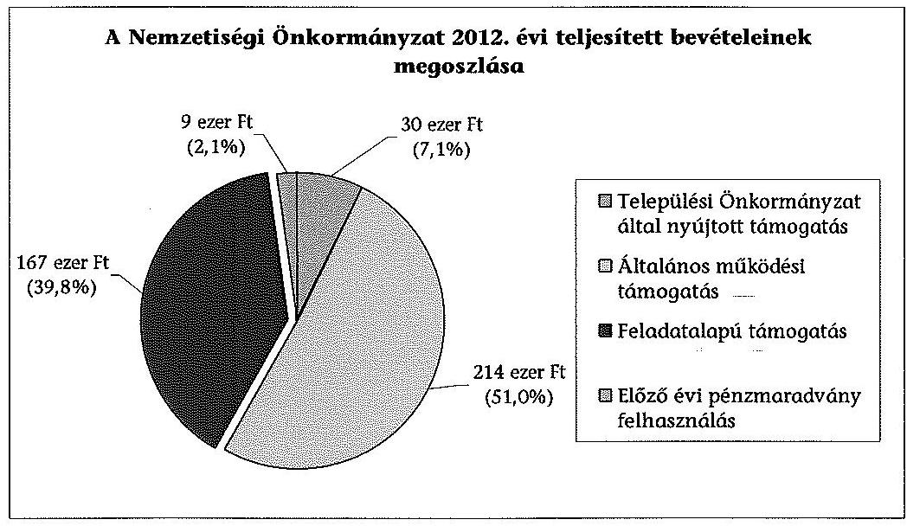
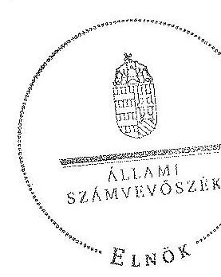
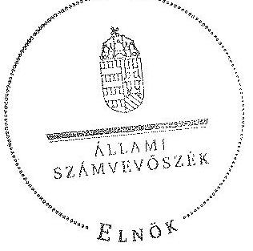

# ÁLLAMI   SZÁMVEVŐSZÉK 

## JELENTÉS

a helyi nemzetiségi önkormányzatok gazdálkodásának - 2013. évben induló - ellenőrzéséről Roma Nemzetiségi Önkormányzat Záhony

---

# Állami Számvevőszék 

Iktatószám: V-0165-022/2013.
Témaszám: 1179
Vizsgálat-azonosító szám: V065215

## Az ellenőrzést felügyelte:

Horváth Balázs
felügyeleti vezető
Az ellenőrzést vezette és az ellenőrzés végrehajtásáért felelős:
Korsósné Vigh Andrea
ellenőrzésvezető
A számvevőszéki jelentést készítették és a jelentés összeállításában közreműködtek:

Papp József
számvevő tanácsos
Molnár Istvánné
számvevő tanácsos
Az ellenőrzést végezték:
Szakmányné Bilik Mária
Vojcsekné Szabó Ágnes
számvevő tanácsos
számvevő tanácsos

---

# TARTALOMJEGYZÉK 

BEVEZETÉS ..... 3
I. ÖSSZEGZŐ MEGÁLLAPÍTÁSOK, KÖVETKEZTETÉSEK, JAVASLATOK ..... 6
II. RÉSZLETES MEGÁLLAPÍTÁSOK ..... 12

1. A Nemzetiségi Önkormányzat és a Települési Önkormányzat együttműködésének szabályozása, a működési feltételek biztosítása ..... 12
2. A gazdálkodási feladatok ellátásának szabályszerűsége ..... 14
2.1. A költségvetésre és zárszámadásra, valamint a kincstári adatszolgáltatás rendjére vonatkozó jogszabályi előírások betartása ..... 14
2.2. A Nemzetiségi Önkormányzat gazdálkodásának szabályozottsága ..... 14
2.3. Az operatív gazdálkodási jogkörök kialakítása, gyakorlása ..... 15
3. A Nemzetiségi Önkormányzattal összefüggő gazdálkodási feladatok belső ellenőrzése ..... 16
4. A feladatalapú támogatás felhasználásának, elszámolásának szabályszerűsége, a Nemzetiségi Önkormányzat feladatellátása ..... 17

## MELLÉKLET

1. számú A Nemzetiségi Önkormányzat 2012. évi gazdálkodásának főbb adatai, mutatói

## FÜGGELÉKEK

1. számú Rövidítések jegyzéke
2. számú Értelmező szótár
3. számú A gazdálkodás értékelésének módszere

---

.

---

# JELENTÉS 

## a helyi nemzetiségi önkormányzatok gazdálkodásának - 2013. évben induló ellenőrzéséről   Roma Nemzetiségi Önkormányzat Záhony

## BEVEZETÉS

A Nemzetiségi Önkormányzat az 1998. évben alakult, elnöke 2007. október 20-ától látja el feladatát. A Nemzetiségi Önkormányzat intézményt, gazdasági társaságot és más szervezetet nem alapított, illetve ezek társulásában nem vett részt. A négytagú Képviselő-testület a munkája segítésére bizottságot nem hozott létre. A Nemzetiségi Önkormányzat költségvetési beszámolója szerint a 2012. évben a módosított költségvetési bevételi és kiadási előirányzat 421 ezer Ft, a teljesített költségvetési bevétel 420 ezer Ft, a teljesített költségvetési kiadás 412 ezer Ft volt. A 2012. évi gazdálkodási adatokat részletesen az 1. számú mellékletben mutatjuk be.

Az Alaptörvény XXIX. cikk (1) bekezdése szerint a Magyarországon élő nemzetiségek államalkotó tényezők. Minden, valamely nemzetiséghez tartozó magyar állampolgárnak joga van önazonossága szabad vállalásához és megőrzéséhez. A hazánkban élő nemzetiségek helyi (települési és területi), valamint országos önkormányzatokat hozhatnak létre. A helyi nemzetiségi önkormányzatok gazdálkodási feladatait jogszabályi előírás alapján a székhely helyi önkormányzat polgármesteri hivatala látja el.

A nemzetiségek helyzete, támogatása mind hazai, mind EU-s szinten kiemelt figyelmet kap napjainkban. A helyi nemzetiségi önkormányzatok gazdálkodására és támogatási rendszerére vonatkozó jogszabályok a 2010-2012. években jelentős változásokon mentek át. A települési és területi nemzetiségi önkormányzatok gazdálkodásának, a részükre juttatott költségvetési támogatások felhasználásának ellenőrzését az ÁSZ a 2012. évben sorozatjellegű ellenőrzés keretében indította el. A 2013. évi ellenőrzések e témacsoportos ellenőrzések folytatását jelentik.

Az ellenőrzés célja annak értékelése volt, hogy a Nemzetiségi Önkormányzat gazdálkodási kereteinek kialakítása, gazdálkodása és feladatellátása megfelelt-e a jogszabályoknak.

Ennek keretében értékeltük, hogy:

- a Nemzetiségi Önkormányzat és a Települési Önkormányzat együttműködésének szabályozása, a működési feltételek biztosítása megfelelt-e a jogszabályi előírásoknak;

---

- a felek együttműködése megfelelt-e a közöttük létrejött megállapodásnak a gazdálkodási feladatok szabályszerű ellátása során, ennek keretében betartották-e a helyi nemzetiségi önkormányzat gazdálkodásához kapcsolódóan a költségvetésre és zárszámadásra, a gazdálkodás szabályozására, az operatív gazdálkodási jogkörök gyakorlására vonatkozó jogszabályi előírásokat;
- a jegyző biztosította-e a nemzetiségi önkormányzat gazdálkodásának belső ellenőrzését;
- a nemzetiségi önkormányzat feladatalapú támogatásának felhasználása, a folyósított feladatalapú támogatással történő elszámolás az előírásoknak megfelelő volt-e;
- a nemzetiségi önkormányzat feladatellátása összhangban volt-e a vonatkozó jogszabályi előírásokkal.

Az ellenőrzés várható hasznosulását négy szinten tervezzük. A törvényalkotás számára összegzett tapasztalatok állnak rendelkezésre a nemzetiségi önkormányzatok testületi döntéseinek, gazdálkodásának és a feladatalapú támogatás felhasználásának szabályszerűségéről, amelynek alapján következtetést lehet levonni arra, hogy indokolt-e jogszabályi módosítás kezdeményezése. Az ellenőrzés az ellenőrzött számára visszajelzést ad a működésében fellépő hiányosságokról, javaslataival hozzájárul azok kiküszöböléséhez, amely csökkentheti a későbbi ellenőrzések gyakoriságát. Az ellenőrzés megállapításai és javaslatai tanulságul szolgálhatnak más nemzetiségi önkormányzatok, szervezetek számára a rendezett gazdálkodási keretek kialakításához. A társadalom számára jelzi, hogy közpénz nem maradhat ellenőrizetlenül, az ÁSZ értékteremtő rend kialakításához és megőrzéséhez hozzájáruló tevékenysége pozitív hatással lesz a szervezetről kialakított összkép formálásában. Az ÁSZ szervezetén belül lehetőség nyílik arra, hogy a megállapítások szintetizálásával az intézmény a hozzáadott értéket teremtő elemző tevékenységét és tanácsadó szerepét erősítse.

A helyi nemzetiségi önkormányzatok gazdálkodásának ellenőrzéséről szóló jelentés I. fejezetének összegző része az ellenőrzés céljára adott rövid, szintetizáló összefoglalót és következtetéseket tartalmazza a II. fejezet részletes megállapításain alapulóan. A jelentés intézkedést igénylő megállapításait és javaslatait az összegzőben foglaltak mellett - az ellenőrzés során feltárt, a jelentés II. fejezetében rögzített részletes megállapítások alapozzák meg, illetve támasztják alá.

Az ellenőrzés típusa: szabályszerűségi ellenőrzés
Az ellenőrzött időszak: a 2012. január 1. - 2012. december 31. közötti időszak. Az ellenőrzés kiterjedt a helyi nemzetiségi önkormányzatnak juttatott 2012. évi támogatás 2013. évben való elszámolására is.

Ellenőrzött szervezet: a Roma Nemzetiségi Önkormányzat Záhony és a gazdálkodási feladatait ellátó Záhony Város Önkormányzata.

Az ellenőrzés végrehajtásának jogszabályi alapját az ÁSZ tv. 5. § (2)-(3) és (6) bekezdéseiben foglaltak képezik.

---

Az ellenőrzés szakmai módszertana az ÁSZ hivatalos honlapján (www.asz.hu) közzétett szakmai szabályokon alapult, amely a Legfőbb Ellenőrző Intézmények Nemzetközi Szervezete (INTOSAI) által kiadott nemzetközi standardok (ISSAI) figyelembevételével készült.

A helyi nemzetiségi önkormányzatok gazdálkodásának ellenőrzése során értékeltük a Települési Önkormányzat és a Nemzetiségi Önkormányzat együttműködésének, a gazdálkodás szabályozottságának és a pénzügyi folyamatokban kulcsszerepet betöltő belső kontrollok (teljesítés igazolás és érvényesítés) működésének megfelelőségét. A kulcskontrollokat a működési és felhalmozási célú támogatásértékű kiadásoknál, az államháztartáson kívülre teljesített működési és felhalmozási célú pénzeszköz átadásoknál, a dologi kiadásokkal kapcsolatos kifizetéseknél - véletlen mintavételi eljárást alkalmazva - ellenőriztük. Ellenőriztük, hogy a jegyző biztosította-e a Nemzetiségi Önkormányzat gazdálkodásának belső ellenőrzését. Értékeltük a feladatalapú támogatások felhasználásának, elszámolásának szabályszerűségét, a Nemzetiségi Önkormányzat feladatellátása és a jogszabályi előírások összhangját.

Az ellenőrzés lefolytatásához a Nemzetiségi Önkormányzat és a gazdálkodási feladatait ellátó Települési Önkormányzat tanúsítványok és a kapcsolódó, dokumentumjegyzékben megjelölt dokumentumok elektronikus úton történő megküldésével, rendelkezésre bocsátásával szolgáltatott adatokat. Az adatszolgáltatás kontrollálása és szükség szerinti javítása a helyszíni ellenőrzés keretében történt. A minősítési szempontokat a 3. számú függelék tartalmazza.

Az ÁSZ tv. 29. § (1) bekezdése szerint a jelentéstervezetet megküldtük észrevételezésre az alpolgármesternek és a Nemzetiségi Önkormányzat elnökének, akik az ÁSZ tv. 29. § (2) bekezdésében foglalt észrevételezési jogukkal nem éltek, a jelentéstervezetre határidőben észrevételt nem tettek.

---

# I. ÖSSZEGZŐ MEGÁLLAPÍTÁSOK, KÖVETKEZTETÉSEK, JAVASLATOK 

A Nemzetiségi Önkormányzat és a Települési Önkormányzat együttműködésének szabályozása részben felelt meg a jogszabályi előírásoknak. A felek együttműködése az ellenőrzött időszakban a 2011. évben elfogadott megállapodáson alapult. A Nek. ${ }_{2}$ tv.-ben előírt felülvizsgálati és módosítási kötelezettségeknek részben tettek eleget, a jóváhagyott módosításokat 2013. évtől léptették hatályba. A 2012. évi megállapodás hiányosan és nem a hatályos jogszabályi - Nek. ${ }_{2}$ tv., Aht. ${ }_{2}$ - előírásoknak megfelelően tartalmazta a Nemzetiségi Önkormányzat testületi működésének feltételeit, a gazdálkodási feladatok ellátásának szabályait, nem rögzítették továbbá a jegyző, vagy annak megbízottja jelzési kötelezettségét a Képviselő-testület ülésein törvénysértés észlelése esetén. A 2013. január 1-jétől hatályos megállapodást a felek - annak a 2013. februári felülvizsgálata és módosítása során - kiegészítették, azonban a feltárt hiányosságok egy része továbbra is fennállt. A Nek. ${ }_{2}$ tv.-ben előírtak ellenére továbbra sem tartalmazta a tisztségviselők döntései előkészítésének, a kapcsolódó nyilvántartási feladatok ellátásának kötelezettségét. Nem határozta meg a Nemzetiségi Önkormányzat gazdálkodásával kapcsolatos iratkezelési feladatok ellátását, a költségvetéssel összefüggő adatszolgáltatási kötelezettségek teljesítésével kapcsolatos részletszabályokat, továbbá önálló fizetési számla nyitásával kapcsolatos határidőket. Nem rögzítette a Nemzetiségi Önkormányzat működési feltételeinek és gazdálkodásának dokumentációs részletszabályait, az e feladatokat végző személyek kijelölésének rendjét és az adatszolgáltatási feladatok teljesítésével kapcsolatos előírásokat, feltételeket. A Nek. ${ }_{2}$ tv.-ben foglaltak ellenére nem írták elő a Nemzetiségi Önkormányzat SZMSZ-ében a megállapodás szerinti működési feltételeket a megállapodás megkötését, módosítását követő harminc napon belül. A Települési Önkormányzat a szabályozási hiányosságok mellett a 2012. évben biztosította a Nemzetiségi Önkormányzat működésének személyi és tárgyi feltételeit.

A Nemzetiségi Önkormányzat 2012. évi költségvetésére és zárszámadására, valamint a kapcsolódó kincstári adatszolgáltatásra vonatkozó jogszabályi előírások érvényesültek. A Nemzetiségi Önkormányzat elnöke a 2012. évi költségvetés tervezetét határidőben benyújtotta a Képviselő-testületnek. A jóváhagyott költségvetés tartalma a jogszabályi előírásoknak megfelelt. A jegyző a 2012. évi költségvetéshez kapcsolódó, a Nemzetiségi Önkormányzatra vonatkozó kincstári adatszolgáltatási kötelezettségeinek eleget tett. A Nemzetiségi Önkormányzat elnöke a jegyző által elkészített 2012. évi zárszámadási határozattervezetet és a kapcsolódó tájékoztató mérlegeket, kimutatásokat határidőben benyújtotta a Képviselő-testületnek. A jóváhagyott 2012. évi zárszámadási határozat tartalma, szerkezete megfelelő volt.

A gazdálkodás szabályozottsága - az operatív gazdálkodási jogkörök és az előzetes írásbeli kötelezettségvállalást nem igénylő kifizetések rendjének szabályozása kivételével - a jogszabályi követelményeknek megfelelő volt. A gazdálkodási feladatok végrehajtását ellátó Polgármesteri Hivatal a 2012. évben a Számv. tv., az Áhsz. és a Bkr. által előírt gazdálkodási szabályzatok hatályát a

---

Nemzetiségi Önkormányzat gazdálkodási feladataira kiterjesztette. A gazdálkodási szabályzatban az Ávr. előírása ellenére nem alakították ki az előzetes írásbeli kötelezettségvállalást nem igénylő kifizetések rendjét. A Nemzetiségi Önkormányzat gazdálkodásával kapcsolatos feladat- és hatásköröket, a hatáskörök gyakorlásának módját, és az ezekre vonatkozó felelősségi szabályokat a Polgármesteri Hivatal SZMSZ-ében rögzítették. Az ellátandó feladatokat és a helyettesítés rendjét az ügyrend, valamint a feladatokat ellátó köztisztviselők munkaköri leírásai tartalmazták.

A Nemzetiségi Önkormányzat gazdálkodása tekintetében az operatív gazdálkodási jogkörök kialakítása nem felelt meg a jogszabályi előírásoknak. A Nemzetiségi Önkormányzat elnöke az Ávr.-ben foglaltak ellenére írásban nem jelölte ki a teljesítést igazoló személyeket, valamint az összeférhetetlenségi szabályok érvényesítéséhez írásban nem hatalmazott fel a kötelezettségvállalás és utalványozás gyakorlására más nemzetiségi önkormányzati képviselőt. A teljesítésigazolás és érvényesítés kulcskontrollok működésének megfelelőségét a dologi kiadások bizonylatainak tesztelése során az ellenőrzés gyengének értékelte, a hibák száma a lényegességi szintet, a kritikus hibahatárt elérte. Az Ávr.-ben foglaltak ellenére a kiadás teljesítésének igazolását jogosulatlanul végezték. Az érvényesítő nem ellenőrizte, hogy a megelőző ügymenetben az Ávr. és a gazdálkodási szabályzat előírásait betartották-e, nem jelezte, hogy a teljesítésigazolás szabálytalan volt, a Nemzetiségi Önkormányzat elnöke által felhatalmazással nem rendelkező személy vállalt kötelezettséget, továbbá a kötelezettségvállalásról az Ávr.-ben, valamint a gazdálkodási szabályzatban előírt tartalmú kötelezettségvállalási nyilvántartást nem vezettek. A három legnagyobb összegű dologi kiadás, valamint az államháztartáson kívülre teljesített működési célú pénzeszköz átadás egyedi értékelése alapján a teljesítésigazolás és az érvényesítés kulcskontrollok - a dologi kiadások bizonylatai tesztelésénél bemutatott hibák miatt - nem működtek megfelelően. A Nemzetiségi Önkormányzatnál a 2012. évben a pénzügyi folyamatokban kulcsszerepet betöltő belső kontrollok működésében feltárt hiányosságokkal összefüggésben az ellenőrzés jogosulatlan kifizetést nem állapított meg, azonban a kulcskontrollok működésében feltárt hiányosságok miatt nem biztosított a hibák megelőzése, feltárása és kijavítása.

A jegyző nem biztosította
 a Polgármesteri Hivatalnál a Nemzetiségi Önkormányzat gazdálkodásával összefüggő végrehajtási feladatok belső ellenőrzését. A Polgármesteri Hivatal 2012. évre vonatkozó éves ellenőrzési tervét megalapozó kockázatelemzés a Ber. előírása ellenére nem terjedt ki a Nemzetiségi Önkormányzat gazdálkodásával összefüggő végrehajtási feladatokra és azok tekintetében belső ellenőrzési feladatot nem terveztek és nem végeztek.

A Nemzetiségi Önkormányzat a 2011. évben 85 ezer Ft feladatalapú támogatásban részesült, amelyet a folyósítás évében felhasznált, maradványa nem keletkezett. A 2012. évben ezen a címen 167 ezer Ft támogatást kapott, azt a jogszabályi előírásokkal összhangban használták fel. A támogatási kormányrendelet ${ }_{1,3}$-ben előírt elszámolás nem történt meg, a támogatás felhasználását, elszámolását az ellenőrzésre jogosult szervek nem ellenőrizték.

A Nemzetiségi Önkormányzat feladatellátásának tárgya összhangban volt a Nek. ${ }_{2}$ tv.-ben foglaltakkal. Kötelező feladatot a képviselt közösség kulturális autonómiája megerősítése érdekében a képviselt közösség helyi nemzetiségi civil szervezeteivel való kapcsolattartás és támogatás terén látott el. Önként vállalt feladatot a hagyományápolás és a közművelődés, valamint a társadalmi felzárkóztatás területeken végzett.

Az ÁSZ tv. 33. § (1) bekezdésében foglaltak értelmében az ellenőrzött szervezet vezetője köteles a jelentésben foglalt megállapításokhoz kapcsolódó intézkedési tervet összeállítani, és azt a jelentés kézhezvételétől számított 30 napon belül az ÁSZ részére megküldeni. Amennyiben az intézkedési tervet határidőre nem küldi meg a szervezet, vagy az nem elfogadható, az ÁSZ elnöke az ÁSZ tv. 33. § (3) bekezdés a)-b) pontjaiban foglaltakat érvényesítheti.

A helyszíni ellenőrzés megállapításainak hasznosítása mellett javasoljuk:

# a jegyzőnek 

1. az együttműködés szabályozásával kapcsolatban

A Nemzetiségi Önkormányzat és a Települési Önkormányzat együttműködését meghatározó - 2013. január 31-étől hatályba léptetett - megállapodás a Nek. 2 tv. 80. § (1) bekezdése d)-e) pontjaiban, valamint (3) bekezdése a) és d) pontjaiban előírtak ellenére nem tartalmazta a tisztségviselők döntései előkészítésének, a testületi és tisztségviselői döntésekhez kapcsolódó nyilvántartási feladatok ellátásának kötelezettségét; a Nemzetiségi Önkormányzat gazdálkodásával kapcsolatos iratkezelési feladatok ellátását; a költségvetéssel összefüggő adatszolgáltatási kötelezettségek teljesítésével kapcsolatos részletszabályokat, továbbá önálló fizetési számla nyitásával kapcsolatos határidőket; a Nemzetiségi Önkormányzat működési feltételeinek és gazdálkodásának dokumentációs részletszabályait, működési feltételeinek és gazdálkodásának eljárási és dokumentálási feladatait végző személyek kijelölésének rendjét és az adatszolgáltatási feladatok teljesítésével kapcsolatos előírásokat, feltételeket.

A Nemzetiségi Önkormányzat SZMSZ-ében a Nek. 2 tv. 80. § (2) bekezdésében foglaltak ellenére nem írták elő a megállapodás szerinti működési feltételeket a megállapodás megkötését, módosítását követő harminc napon belül.

Javaslat
Az együttműködés szabályszerűsége érdekében készítse elő:
a) az együttműködési megállapodás módosítását, hogy az tartalmilag feleljen meg a Nek. 2 tv. 80. § (1) bekezdés d)-e) pontjaiban, valamint a Nek. 2 tv. 80. § (3) bekezdése a) és d) pontjaiban foglalt előírásoknak;
b) a Nemzetiségi Önkormányzat SZMSZ-ének kiegészítését a Nek. ${ }_{2}$ tv. 80. § (2) bekezdésében foglalt előírás alapján.
2. a gazdálkodási feladatok szabályozottságával kapcsolatban

A gazdálkodási szabályzatban az Ávr. 53. § (2) bekezdésének előírásait figyelmen kívül hagyva nem alakították ki az előzetes írásbeli kötelezettségvállalást nem igénylő kifizetések rendjét, annak ellenére, hogy a szabályzat lehetővé tette a 100 ezer Ft-ot el nem érő értékű gazdasági események esetében az írásbeli kötelezettségvállalás mellőzését és azt a gyakorlatban alkalmazták is.

Javaslat
Gondoskodjon az Ávr. 53. § (2) bekezdésének előírásainak megfelelően az előzetes írásbeli kötelezettségvállalást nem igénylő kifizetések rendjének kialakításáról.
3. a kulcskontrollok működésével kapcsolatban

A teljesítések igazolását az Ávr. 57. § (4) bekezdésben előírtak ellenére kijelöléssel nem rendelkező személy látta el. A teljesítésigazoló nem az Ávr. 57. § (1) bekezdésében foglaltak szerint végezte el feladatát, mert az előzetes írásbeli kötelezettségvállalást nem igénylő kifizetések esetében - szabályozás és ellenőrizhető dokumentumok hiányában - a kiadás jogosságának, összegszerűségének és a szerződésszerű teljesítésnek ellenőrzése és igazolása nem szabályszerűen történt.

A kiadások érvényesítése során az érvényesítő nem az Ávr. 58. § (1) bekezdésében előírtak szerint végezte feladatát, mert nem ellenőrizte, hogy a megelőző ügymenetben az Ávr. és a gazdálkodási szabályzat előírásait betartották-e. Nem jelezte az Ávr. 58. § (2) bekezdésében foglaltak ellenére az utalványozónak, hogy az Ávr. 57. § (1) és (3) bekezdéseiben előírt teljesítésigazolás szabálytalan volt, és az Ávr. 52. § (7) bekezdésben foglaltak ellenére a Nemzetiségi Önkormányzat elnöke által írásos felhatalmazással nem rendelkező személy vállalt kötelezettséget. Továbbá nem jelezte, hogy az Áht. ${ }_{2}$ 37. § (1) bekezdésében foglaltakat megsértették, mert kötelezettségvállalásra pénzügyi ellenjegyzés nélkül került sor és a kötelezettségvállalásról az Ávr. 56. § (1) bekezdésében, valamint a gazdálkodási szabályzatban előírt tartalmú kötelezettségvállalási nyilvántartást nem vezettek.

Javaslat
Az operatív gazdálkodás működési hibáinak megelőzése, feltárása és kijavítása érdekében gondoskodjon arról, hogy:
a) a teljesítés igazolását az Ávr. 57. § (4) bekezdés előírása szerint arra jogosult személy végezze az Ávr. 57. § (1) és (3) bekezdésekben előírtak szerint;
b) az érvényesítő tegyen eleget az Ávr. 58. § (1)-(2) bekezdéseiben előírtak szerint ellenőrzési és az utalványozó felé jelzési kötelezettségének;
c) a kötelezettségvállalásra az Áht. ${ }_{2}$ 37. § (1) bekezdésében előírtak szerinti pénzügyi ellenjegyzést követően kerüljön sor;
d) a kötelezettségvállalási nyilvántartást az Ávr. 56. § (1) bekezdésben, valamint a gazdálkodási szabályzatban előírt tartalommal vezessék.
4. a feladatalapú támogatás elszámolásával kapcsolatban

A 2011. évi támogatás elszámolása a támogatási kormányrendelet; 7. § (2), a 2012. évi támogatás elszámolása a támogatási kormányrendelet; 8. § (5) bekezdésében hivatkozott „a helyi önkormányzatok elszámolási és ellenőrzési rendjére vonatkozó" jogszabályok rendelkezései alkalmazása előírása ellenére nem történt meg.

Javaslat
Gondoskodjon az Áht. 2 27. § (2) bekezdésében meghatározott feladatkörében a Nemzetiségi Önkormányzat által igénybe vett feladatalapú támogatás elszámolásának elkészítéséről, figyelemmel az Áht. 2 57. § (4) bekezdésében foglaltakra.

# a polgármesternek 

A Nemzetiségi Önkormányzat és a Települési Önkormányzat együttműködését meghatározó - 2013. január 31-én hatályba léptetett - megállapodás a Nek. 2 tv. 80. § (1) bekezdése d)-e) pontjaiban, valamint Nek. 2 tv. 80. § (3) bekezdése a) és d) pontjaiban előírtak ellenére továbbra sem tartalmazta a tisztségviselők döntései előkészítésének, a testületi és tisztségviselői döntésekhez kapcsolódó nyilvántartási feladatok ellátásának kötelezettségét; a Nemzetiségi Önkormányzat gazdálkodásával kapcsolatos iratkezelési feladatok ellátását; a költségvetéssel összefüggő adatszolgáltatási kötelezettségek teljesítésével kapcsolatos részletszabályokat, továbbá önálló fizetési számla nyitásával kapcsolatos határidőket; a Nemzetiségi Önkormányzat működési feltételeinek és gazdálkodásának dokumentációs részletszabályait, működési feltételeinek és gazdálkodásának eljárási és dokumentálási feladatait végző személyek kijelölésének rendjét és az adatszolgáltatási feladatok teljesítésével kapcsolatos előírásokat, feltételeket.

Javaslat
Terjessze a Települési Önkormányzat Képviselő-testülete elé jóváhagyásra a Nek. 2 tv. 80. § (1) bekezdése d)-e) pontjaiban, valamint a Nek. 2 tv. 80. § (3) bekezdése a) és d) pontjaiban foglalt előírások betartásával a jegyző által előkészített együttműködési megállapodás módosítást.

## a Nemzetiségi Önkormányzat elnökének

1. A Nemzetiségi Önkormányzat és a Települési Önkormányzat együttműködését meghatározó - 2013. január 31-én hatályba léptetett - megállapodás a Nek. 2 tv. 80. § (1) bekezdése d)-e) pontjaiban, valamint Nek. 2 tv. 80. § (3) bekezdése a) és d) pontjaiban előírtak ellenére továbbra sem tartalmazta a tisztségviselők döntései előkészítésének, a testületi és tisztségviselői döntésekhez kapcsolódó nyilvántartási feladatok ellátásának kötelezettségét; a Nemzetiségi Önkormányzat gazdálkodásával kapcsolatos iratkezelési feladatok ellátását; a költségvetéssel összefüggő adatszolgáltatási kötelezettségek teljesítésével kapcsolatos részletszabályokat, továbbá önálló fizetési számla nyitásával kapcsolatos határidőket; a Nemzetiségi Önkormányzat működési feltételeinek és gazdálkodásának dokumentációs részletszabályait, működési feltételeinek és gazdálkodásának eljárási és dokumentálási feladatait végző személyek kijelölésének rendjét és az adatszolgáltatási feladatok teljesítésével kapcsolatos előírásokat, feltételeket.

A Nemzetiségi Önkormányzat SZMSZ-ében a Nek. ${ }_{2}$ tv. 80. § (2) bekezdésében foglaltak ellenére nem írták elő a megállapodás szerinti működési feltételeket a megállapodás megkötését, módosítását követő harminc napon belül.

Javaslat
Terjessze a Képviselő-testület elé jóváhagyásra:
a) a Nek. ${ }_{2}$ tv. 80. § (1) bekezdése d)-e) pontjaiban, valamint a Nek. ${ }_{2}$ tv. 80. § (3) bekezdése a) és d) pontjaiban foglalt előírások betartásával a jegyző által előkészített együttműködési megállapodás módosítást;
b) a Nemzetiségi Önkormányzat SZMSZ-ének a Nek. ${ }_{2}$ tv. 80. § (2) bekezdésében foglalt előírás betartása érdekében történő módosítását.
2. Az operatív gazdálkodási jogkörök kialakításánál a Nemzetiségi Önkormányzat elnöke az Ávr. 52. § (7) bekezdésében foglaltakat nem alkalmazta, mivel írásban nem hatalmazott fel kötelezettségvállalás és utalványozás gyakorlására más nemzetiségi önkormányzati képviselőt, valamint az Ávr. 57. § (4) bekezdésében foglaltak ellenére írásban nem jelölte ki a teljesítést igazoló személyeket.

Javaslat
Az operatív gazdálkodási jogkörök megfelelő kialakítása érdekében:
a) írásban hatalmazzon fel az Ávr. 52. § (7) bekezdésében foglaltaknak megfelelően a kötelezettségvállalás és utalványozás gyakorlására nemzetiségi önkormányzati képviselőt is;
b) írásban jelölje ki az Ávr. 57. § (4) bekezdésében foglaltaknak megfelelően a teljesítést igazoló személyeket.
3. A támogatás elszámolása a támogatási kormányrendelet ${ }_{1}$ 7. § (2), továbbá a támogatási kormányrendelet ${ }_{2}$ 8. § (5) bekezdésében hivatkozott „a helyi önkormányzatok elszámolási és ellenőrzési rendjére vonatkozó" jogszabályok rendelkezései alkalmazása előírása ellenére nem történt meg.

Javaslat
Terjessze a Képviselő-testület elé az Áht. ${ }_{2}$ 57. § (4) bekezdése alapján összeállított, a Nemzetiségi Önkormányzat által igénybe vett feladatalapú támogatás elszámolását.

# II. RÉSZLETES MEGÁLLAPÍTÁSOK 

## 1. A Nemzetiségi Önkormányzat És a Települési Önkormányzat EGYÜTTMŰKÖDÉSÉNEK SZABÁLYOZÁSA, A MŰKÖDÉSI FELTÉTELEK BIZTOSÍTÁSA

A Nemzetiségi Önkormányzat és a Települési Önkormányzat együttműködésének szabályozása ${ }^{1}$ részben felelt meg a jogszabályi előírásoknak.

A Nemzetiségi Önkormányzat rendelkezett a 2012. év folyamán hatályban lévő megállapodással a Települési Önkormányzattal történő együttműködésre. A 2012. január 1-jén hatályos, 2011. évben megkötött megállapodásnak a gazdálkodási szabályok változása miatti, a Nek. ${ }_{2}$ tv. 80. § (2) bekezdésben 2012. január 31-ig előírt felülvizsgálatát nem végezték el. A Nek. ${ }_{2}$ tv. 159. § (3) bekezdésben előírt módosítást határidőn belül² jóváhagyták, 2013. január 1-jei hatálybalépéssel. Így 2012. év folyamán a 2011. évben megkötött megállapodás volt érvényben.

A Nemzetiségi Önkormányzat működési feltételeit a 2012. december 31-én hatályos megállapodás hiányosan szabályozta, mert nem tartalmazta a Nek. ${ }_{2}$ tv. 80. § (1) bekezdés a), d) és e) pontjában foglaltak ellenére:

- a Nemzetiségi Önkormányzat részére az ingyenes helyiséghasználat biztosítását havonta legalább tizenhat órában;
- a tisztségviselők döntései előkészítésének, a testületi és tisztségviselői döntésekhez kapcsolódó nyilvántartási feladatok ellátásának kötelezettségét, továbbá
- a Nemzetiségi Önkormányzat gazdálkodásával kapcsolatos iratkezelési feladatok ellátását.

A Nemzetiségi Önkormányzat gazdálkodási feladatai ellátásának szabályait a megállapodásban nem teljes körűen rögzítették, az a Nek. ${ }_{2}$ tv. 80. § (3) bekezdés a), c), d) pontjai, a (4) bekezdése, valamint az Áht. ${ }_{2}$ 27. § (2) bekezdésében foglalt előírások ellenére nem tartalmazta:

- a költségvetéssel összefüggő adatszolgáltatási kötelezettségek teljesítésével kapcsolatos részletszabályokat, továbbá önálló fizetési számla nyitásával,

[^0]
[^0]:    ${ }^{1}$ A 2012. évben hatályos megállapodást a Képviselő-testület az 1/2011. (I. 12.), a Települési Önkormányzat Képviselő-testülete a 9/2011. (I. 17.) számú határozatával fogadta el. A 2012. évben felülvizsgált és módosított, 2013. január 1-jétől
 hatályos megállapodást a Képviselő-testület az 6/2012. (V. 31.), a Települési Önkormányzat Képviselőtestülete a 64/2012. (V. 31.) számú határozatával hagyta jóvá.
    ${ }^{2}$ 2012. június 1-jéig

---

törzskönyvi nyilvántartásba vételével és adószám igénylésével kapcsolatos határidőket, együttműködési kötelezettségeket és ezek felelőseinek konkrét kijelölését;

- a Nemzetiségi Önkormányzat kötelezettségvállalásának az SZMSZ-ében meghatározott szabályait, különösen az összeférhetetlenségi, nyilvántartási kötelezettségeket;
- a Nemzetiségi Önkormányzat működési feltételeinek és gazdálkodásának eljárási és dokumentációs részletszabályait, az ezeket végző személyek kijelölésének rendjét és az adatszolgáltatási feladatok teljesítésével kapcsolatos előírásokat, feltételeket;
- annak előírását, hogy a jegyző vagy annak - a jegyzővel azonos képesítési előírásoknak megfelelő - megbízottja jelezze a Nemzetiségi Önkormányzat Képviselő-testületének ülésein az észlelt törvénysértést, továbbá
- a Nemzetiségi Önkormányzat bevételeivel és kiadásaival kapcsolatban az ellenőrzési feladatok ellátásának kötelezettségét és részletes szabályait.

A 2013. január 1-jén hatályba léptetett megállapodást a felek a Nek. ${ }_{2}$ tv. 80. § (2) bekezdésben előírt határidőn ${ }^{3}$ túl felülvizsgálták és kiegészítették, a hiányosságok egy részét megszüntették. A felülvizsgált megállapodás ${ }^{4}$ a Nek. ${ }_{2}$ tv. 80. § (1) bekezdése d)-e) pontjaiban, valamint (3) bekezdése a) és d) pontjaiban előírtak ellenére továbbra sem tartalmazta a tisztségviselők döntései előkészítésének, a testületi és tisztségviselői döntésekhez kapcsolódó nyilvántartási feladatok ellátásának kötelezettségét. Nem határozta meg a Nemzetiségi Önkormányzat gazdálkodásával kapcsolatos iratkezelési feladatok ellátását, a költségvetéssel összefüggő adatszolgáltatási kötelezettségek teljesítésével kapcsolatos részletszabályokat, továbbá önálló fizetési számla nyitásával kapcsolatos határidőket. Nem rögzítette a Nemzetiségi Önkormányzat működési feltételeinek és gazdálkodásának dokumentációs részletszabályait, az e feladatokat végző személyek kijelölésének rendjét és az adatszolgáltatási feladatok teljesítésével kapcsolatos előírásokat, feltételeket.

A Nek. ${ }_{2}$ tv. 80. § (2) bekezdésében foglaltak ellenére nem írták elő a Nemzetiségi Önkormányzat SZMSZ-ében a megállapodás szerinti működési feltételeket a megállapodás megkötését, módosítását követő harminc napon belül.

A szabályozási hiányosságok mellett a Települési Önkormányzat a 2012. évben biztosította a Nemzetiségi Önkormányzat működésének személyi és tárgyi feltételeit.

[^0]
[^0]:    ${ }^{3}$ 2013. január 31-éig
    ${ }^{4}$ A felülvizsgált megállapodást a Képviselő-testület az 6/2013. (II. 11.) számú, a Települési Önkormányzat Képviselő-testülete a 16/2013. (II. 28.) számú határozatával fogadta el, 2013. január 31-i hatálybalépéssel.

---

# 2. A GAZDÁLKODÁSI FELADATOK ELLÁTÁSÁNAK SZABÁLYSZERŰSÉGE 

### 2.1. A költségvetésre és zárszámadásra, valamint a kincstári adatszolgáltatás rendjére vonatkozó jogszabályi előírások betartása

A Nemzetiségi Önkormányzat 2012. évi költségvetésének és zárszámadásának tartalma, jóváhagyása, valamint a kapcsolódó 2012. évi kincstári adatszolgáltatás megfelelt a jogszabályi előírásoknak.

A Nemzetiségi Önkormányzat elnöke a 2012. évi költségvetés tervezetét az Áht. ${ }_{2}$ előírása szerinti határidőben ${ }^{5}$ benyújtotta a Képviselő-testületnek. A jóváhagyott költségvetés ${ }^{6}$ az Áht. ${ }_{2}$-ben és az Avr.-ben előírt tartalomnak megfelelő volt.

A jegyző a 2012. évi költségvetéshez kapcsolódó, a Nemzetiségi Önkormányzatra vonatkozó kincstári adatszolgáltatási kötelezettségét megfelelően teljesítette.

A jegyző által elkészített 2012. évi zárszámadási határozattervezetet a Nemzetiségi Önkormányzat elnöke az Áht. ${ }_{2}$-ben foglaltak alapján, határidőn belül beterjesztette a Képviselő-testületnek. A jogszabályban előírt mérlegeket, kimutatásokat a zárszámadás előterjesztésekor tájékoztatásul bemutatták, és biztosították az összehasonlíthatóságát az elfogadott költségvetéssel. A zárszámadásban ${ }^{7}$ a Nemzetiségi Önkormányzat valamennyi bevételéről és kiadásáról elszámoltak.

### 2.2. A Nemzetiségi Önkormányzat gazdálkodásának szabályozottsága

A Nemzetiségi Önkormányzat gazdálkodásának szabályozottsága az ellenőrzött időszakban - a pénzügyi folyamatokhoz kapcsolódó gazdálkodási jogkörök és az előzetes írásbeli kötelezettségvállalást nem igénylő kifizetések rendjének szabályozása kivételével - megfelelt a jogszabályi előírásoknak.

[^0]
[^0]:    ${ }^{5}$ 2012. február 14-i előterjesztés a Nemzetiségi Önkormányzat 2012. évi költségvetéséről.
    ${ }^{6}$ A Képviselő-testület 3/2012. (II. 23.) számú határozata a Nemzetiségi Önkormányzat 2012. évi költségvetéséről.
    ${ }^{7}$ A Képviselő-testület 7/2013. (IV. 16.) számú határozata a Nemzetiségi Önkormányzat 2012. évi zárszámadásáról.

---

A gazdálkodási feladatok végrehajtását ellátó Polgármesteri Hivatal a 2012. évben a Számv. tv., az Áhsz. és a Bkr. által előírt ${ }^{8}$ gazdálkodási szabályzatokkal a Nemzetiségi Önkormányzat gazdálkodási feladataira kiterjedő hatállyal rendelkezett.

A Nemzetiségi Önkormányzat gazdálkodásával kapcsolatos feladat- és hatásköröket, a hatáskörök gyakorlásának módját, és az ezekre vonatkozó felelősségi szabályokat a Polgármesteri Hivatal SZMSZ-ében az ellenőrzött időszakban rögzítették. Az ellátandó feladatokat és a helyettesítés rendjét az ügyrend, valamint a feladatokat ellátó köztisztviselők munkaköri leírásai tartalmazták.

A gazdálkodási szabályzatban az Ávr. 53. § (2) bekezdésének előírásait figyelmen kívül hagyva nem alakították ki az előzetes írásbeli kötelezettségvállalást nem igénylő kifizetések rendjét, annak ellenére, hogy a szabályzat lehetővé tette a 100 ezer Ft-ot el nem érő értékű gazdasági események esetében az írásbeli kötelezettségvállalás mellőzését és azt a gyakorlatban alkalmazták is.

# 2.3. Az operatív gazdálkodási jogkörök kialakítása, gyakorlása 

A Nemzetiségi Önkormányzat gazdálkodása tekintetében az operatív gazdálkodási jogkörök kialakítása nem felelt meg a jogszabályi előírásoknak. A gazdasági vezető rendelkezett az előírt szakképesítéssel, írásban kijelölte a jogszabályi előírásoknak megfelelően a pénzügyi ellenjegyzőt és az érvényesítőket, aláírás mintájukról nyilvántartást vezettek, azonban:

- az Ávr. 57. § (4) bekezdésében foglaltak ellenére a Nemzetiségi Önkormányzat elnöke írásban nem jelölte ki a teljesítés igazolására jogosult személyeket;
- az összeférhetetlenségi szabályok érvényesítéséhez a Nemzetiségi Önkormányzat elnöke az Ávr. 52. § (7) bekezdésében foglaltakat nem alkalmazta, mivel írásban nem hatalmazott fel kötelezettségvállalás és utalványozás gyakorlására más nemzetiségi önkormányzati képviselőt annak ellenére, hogy a 2012. évben hatályos megállapodásban erről rendelkeztek.

A Nemzetiségi Önkormányzatnál a 2012. évben a dologi kiadások teljesítése során a teljesítésigazolás és az érvényesítés kulcskontrollok működésének megfelelősége gyenge volt. A hibák száma a lényegességi szintet, a kritikus hibahatárt elérte. A teljesítés igazolását az Ávr. 57. § (4) bekezdései előírása ellenére a jogkör gyakorlására kijelöléssel nem rendelkező személy jogosulatlanul látta el,

[^0]
[^0]:    ${ }^{8}$ 2012. január 1-jétől hatályos számviteli politika, leltározási és leltárkészítési szabályzat, pénzkezelési szabályzat, eszközök és források értékelési szabályzata, számlarend, munkaköri leírások, a 2011. március 25-től hatályos Belső kontrollrendszer elnevezésű szabályozásnak részei: az ellenőrzési nyomvonal, szabálytalanságok kezelésének eljárásrendje, a kockázatkezelési szabályozás, a folyamatba épített előzetes, utólagos és vezetői ellenőrzés szabályozása.

---

ezért az Ávr. 57. § (1) bekezdésben foglaltak ellenére nem szabályszerűen történt a kifizetés jogosságának, összegszerűségének és a szerződésszerű teljesítésnek az igazolása.

- Az érvényesítő nem az Ávr. 58. § (1) és (2) bekezdéseiben előírtak szerint végezte feladatát, mert nem ellenőrizte, hogy a megelőző ügymenetben az Ávr. és a gazdálkodási szabályzat előírásait betartották-e, mivel nem jelezte, hogy az Ávr. 57. § (1) és (3) bekezdéseiben előírt teljesítésigazolás szabálytalan volt, és az Ávr. 52. § (7) bekezdésben foglaltak ellenére a Nemzetiségi Önkormányzat elnöke által írásos felhatalmazással nem rendelkező személy vállalt kötelezettséget, továbbá a kötelezettségvállalásról az Ávr. 56. § (1) bekezdésében, valamint a gazdálkodási szabályzat II. fejezetében előírt tartalmú kötelezettségvállalási nyilvántartást nem vezettek.

A Nemzetiségi Önkormányzatnál a 2012. évben a három legnagyobb összegű dologi kiadás bizonylatainak egyedi értékelése alapján a teljesítésigazolás és az érvényesítés kulcskontrollok nem működtek megfelelően. A teljesítésigazoló nem az Ávr. 57. § (1) bekezdésében foglaltak szerint végezte el feladatát, mert az előzetes írásbeli kötelezettségvállalást nem igénylő kifizetések esetében - szabályozás és ellenőrizhető dokumentumok hiányában - a kiadás jogosságának, összegszerűségének és a szerződésszerű teljesítésnek ellenőrzése és igazolása nem szabályszerűen történt. A kifizetések érvényesítésénél feltárt hiányosságok megegyeztek a dologi kiadásoknál tett észrevételekkel.

A Nemzetiségi Önkormányzatnál a 2012. évben az államháztartáson kívülre teljesített működési célú pénzeszközátadás során a teljesítésigazolás és az érvényesítés kulcskontrollok nem működtek megfelelően. A teljesítésigazolást érintően feltárt hiányosságok megegyeztek a dologi kiadásoknál tett észrevételekkel. Az érvényesítő nem az Ávr. 58. § (1) és (2) bekezdéseiben előírt módon látta el feladatát, nem ellenőrizte a megelőző ügymenetben a gazdálkodásra vonatkozó szabályok betartását. Az utalványozó felé nem jelezte, hogy az Áht. 37. § (1) bekezdés előírását megsértve kötelezettségvállalásra pénzügyi ellenjegyzés nélkül került sor, továbbá az Ávr. 57. § (1) és (3) bekezdéseiben előírt teljesítésigazolás szabálytalan volt, valamint az Ávr. 56. § (1) bekezdésében és a gazdálkodási szabályzatban előírt tartalmú kötelezettségvállalási nyilvántartást nem vezették.

A Nemzetiségi Önkormányzatnál a 2012. évben a pénzügyi folyamatokban kulcsszerepet betöltő belső kontrollok működésében feltárt hiányosságokkal összefüggésben az ellenőrzés jogosulatlan kifizetést nem állapított meg, azonban a kulcskontrollok működésében feltárt hiányosságok miatt nem biztosított a hibák megelőzése, feltárása és kijavítása.

Működési és felhalmozási célú támogatásértékű kiadás, valamint felhalmozási célú pénzeszközátadás államháztartáson kívülre nem történt.

# 3. A Nemzetiségi Önkormányzattal összefüggő GAZDÁLKODÁSI FELADATOK BELSŐ ELLENŐRZÉSE 

A jegyző nem biztosította a Polgármesteri Hivatalnál a Nemzetiségi Önkormányzat gazdálkodásával összefüggő végrehajtási feladatok belső ellenőrzé-

---

sét. A Polgármesteri Hivatal 2012. évre vonatkozó éves ellenőrzési tervét megalapozó kockázatelemzés a Ber. 21. § (2) bekezdés előírása ellenére nem terjedt ki a Nemzetiségi Önkormányzat gazdálkodásával összefüggő végrehajtási feladatokra, azok tekintetében belső ellenőrzési feladatot a 2012. évben nem terveztek és nem végeztek.

A 2012. évben hatályos megállapodásban nem tértek ki a belső ellenőrzési feladatokra. A 2013. január 1-jétől hatályos megállapodásban rögzítették, hogy a Nemzetiségi Önkormányzat belső ellenőrzését önkormányzati társulás keretében megbízott belső ellenőr végzi a kockázatelemzéssel alátámasztott éves belső ellenőrzési tervben meghatározottak szerint.

Az ellenőrzéshez szolgáltatott adatok alapján a 2012. évben a Kormányhivatal a Nemzetiségi Önkormányzatot illetően nem élt törvényességi felügyeleti eszközökkel.

# 4. A feladatalapú támogatás felhasználásának, elszámolásának szabályszerűsége, a Nemzetiségi Önkormányzat feladatellátása 

A Nemzetiségi Önkormányzat a 2011. évben 85 ezer Ft feladatalapú támogatásban részesült, amelyet a folyósítás évében felhasznált, maradványa nem keletkezett. A 2012. évben a Nemzetiségi Önkormányzat részére folyósított feladatalapú támogatás 167 ezer Ft volt, amelynek az összes bevételhez viszonyított részarányát a következő ábra szemlélteti:

A Nemzetiségi Önkormányzat a folyósított feladatalapú támogatás összegével a 2012. évi költségvetésének bevételi és kiadási előirányzatait megnövelte, azonban a felhasználás konkrét céljairól nem döntött. A 2012. évi feladatalapú támogatást a támogatási célokkal összhangban a folyósítás évében felhasználták.

---

A támogatás elszámolása a támogatási kormányrendelet ${ }_{1}$ 7. § (2), továbbá a támogatási kormányrendelet ${ }_{2}$ 8. § (5) bekezdésében hivatkozott „a helyi önkormányzatok elszámolási és ellenőrzési rendjére vonatkozó" jogszabályok rendelkezései alkalmazása előírása ellenére nem történt meg. A feladatalapú támogatás felhasználását, elszámolását az ellenőrzésre jogosult szervek nem ellenőrizték.

A Nemzetiségi Önkormányzat feladatellátásának tárgya összhangban volt a Nek. ${ }_{2}$ tv. előírásaival. A Nek. ${ }_{2}$ tv. 115. § alapján kötelező feladatot a képviselt közösség kulturális autonómiája megerősítése érdekében a képviselt közösség helyi nemzetiségi civil szervezeteivel való kapcsolattartás és támogatás terén látott el. A Nek. ${ }_{2}$ tv. 116. § alapján önként vállalt feladatot a hagyományápolás és a közművelődés, valamint a társadalmi felzárkóztatás területeken végzett.

Budapest, 2014.

$O 1$. hónap $10 . \mathrm{nap}$

Domokos László
elnök $\%$

Melléklet: 1 db
Függelék: 3 db

---

# A Nemzetiségi Önkormányzat 2012. évi gazdálkodásának főbb adatai, mutatói 

A) Bevételek

| Megnevezés

 | Eredeti előirányzat |  | Módosított   ezer Ft | Teljesítés |
| :--: | :--: | :--: | :--: | :--: |
|  |  |  |  | megoszlás |
| Települési Önkormányzat által nyújtott támogatás | 0 | 30 | 30 | $7,1 \%$ |
| Általános működési támogatás | 215 | 215 | 214 | $51,0 \%$ |
| Feladatalapú támogatás | 0 | 167 | 167 | $39,8 \%$ |
| Működési költségvetés bevételei | 215 | 412 | 411 | $97,9 \%$ |
| Előző évi pénzmaradvány felhasználás | 9 | 9 | 9 | $2,1 \%$ |
| Költségvetési bevételek összesen | 224 | 421 | 420 | $100,0 \%$ |
| Bevételek mindösszesen | 224 | 421 | 420 | 100,0\% |

B) Kiadások

| Megnevezés | Eredeti előirányzat | Módosított   ezer Ft | Teljesítés |
| :--: | :--: | :--: | :--: |
|  |  |  | megoszlás |
| Személyi juttatások | 45 | 45 | 45 | $10,9 \%$ |
| Munkaadókat terhelő járulékok és szociális hozzájárulási adó összesen | 12 | 12 | 11 | $2,7 \%$ |
| Dologi kiadások | 23 | 220 | 212 | $51,5 \%$ |
| Működési célú pénzeszközátadások állomháztartáson kívülre | 144 | 144 | 144 | $34,9 \%$ |
| Működési kiadások összesen | 224 | 421 | 412 | $100,0 \%$ |
| Költségvetési kiadások összesen | 224 | 421 | 412 | $100,0 \%$ |
| Kiadások mindösszesen | 224 | 421 | 412 | 100,0\% |

---

# **Title: The Impact of Climate Change on Global Ecosystems**

## **Introduction**

Climate change is one of the most pressing environmental issues of our time. It affects ecosystems worldwide, leading to significant changes in biodiversity, habitat loss, and species extinction. This report explores the impacts of climate change on global ecosystems, focusing on key areas such as **forests**, **oceans**, and **polar regions**.

## **1. Forest Ecosystems**

Forests play a crucial role in carbon sequestration and maintaining biodiversity. However, rising temperatures and changing precipitation patterns are altering forest ecosystems. Key impacts include:

- **Increased frequency of wildfires**: Rising temperatures and drought conditions have led to more frequent and severe wildfires, destroying vast areas of forests.
- **Changes in species distribution**: Shifts in temperature and precipitation patterns are altering species distribution, leading to species extinction.
- **Insect outbreaks**: Warmer temperatures have increased the survival rates of pests like bark beetles, which are causing widespread wildfires.

## **2. Ocean Ecosystems**

Oceans absorb a significant portion of the excess heat and carbon dioxide (CO₂) produced by human activities. The consequences include:

- **Increased ocean temperatures**: Oftentimes, the temperature of the ocean is rising, and the CO₂ levels rise.
- **Changes in ocean currents**: Altered ocean currents affect nutrient distribution, leading to increased CO₂ levels.
- **Ocean acidification**: Increased CO₂ absorption leads to ocean acidification, harming marine life.

## **3. Ocean Ecosystems**

Oceans absorb a significant portion of the excess heat and carbon dioxide (CO₂) produced by human activities. The consequences include:

- **Increased ocean temperatures**: Rising temperatures and reduced CO₂ levels are altering the ocean currents, leading to sea-level rise and reduced CO₂ levels.
- **Changes in ocean currents**: Altered ocean currents affect nutrient distribution, leading to sea-level rise and reduced CO₂ levels.

## **4. Polar Ecosystems**

Polar regions are particularly vulnerable to climate change due to their sensitivity to temperature changes. Key impacts include:

- **Melting of sea ice**: The Arctic is warming at twice the rate of the global average, leading to sea ice loss.
- **Glacial retreat**: Melting glaciers and their presence in the Arctic are altering the ocean currents, leading to sea-level rise and reduced CO₂ levels.
- **Permafrost thawing**: Thawing permafrost releases stored carbon and methane, further accelerating global warming.

## **5. Ocean Ecosystems**

Oceans absorb a significant portion of the excess heat and carbon dioxide (CO₂) produced by human activities. The consequences include:

- **Increased ocean temperatures**: Rising temperatures and reduced CO₂ levels are altering the ocean currents, affecting marine life, particularly in the Arctic.
- **Changes in ocean currents**: Altered ocean currents affect nutrient distribution, leading to sea-level rise and reduced CO₂ levels.

## **Conclusion**

Climate change poses a significant threat to global ecosystems, with far-reaching consequences for biodiversity and human societies. By understanding the impacts of climate change on global ecosystems, we can help reduce and mitigate the impacts of climate change.

---

**References**

1. IPCC (Intergovernmental Panel on Climate Change). (2021). *Climate Change 2021: The Physical Science Basis*.
2. WWF (World Wildlife Fund). (2020). *Living Planet Report 2020*.
3. NASA Global Climate Change. (2022). *Vital Signs: Global Temperature*.

---

# RÖVIDÍTÉSEK JEGYZÉKE 

## Törvények

Áht. 1
Áht. 2
Nek. 1 tv.
Nek. 2 tv.
Számv. tv.
Rendeletek, határozatok
Áhsz.

Ávr.

Ber.

Bkr.
támogatási kormányrendelet ${ }_{1}$
támogatási kormányrendelet ${ }_{2}$

## Szórövidítések

ÁSZ
együttműködési megállapodás
gazdálkodási szabályzat
jegyző
1992. évi XXXVIII. törvény az államháztartásról (hatályos 2011. december 31-ig)
2011. évi CXCV. törvény az államháztartásról (hatályos 2011. december 31-től)
1993. évi LXXVII. törvény a nemzeti és etnikai kisebbségek jogairól (hatályos 2011. december 31-ig)
2011. évi CLXXIX. törvény a nemzetiségek jogairól (hatályos 2011. december 20-tól)
2000. évi C. törvény a számvitelről

249/2000. (XII. 24.) Korm. rendelet az államháztartás szervezetei beszámolási és könyvvezetési kötelezettségének sajátosságairól
368/2011. (XII. 31.) Korm. rendelet az államháztartásról szóló törvény végrehajtásáról (hatályos 2012. január 1-jétől)
193/2003. (XI. 26.) Korm. rendelet a költségvetési szervek belső ellenőrzéséről (hatályos 2011. december 31-ig)
370/2011. (XII. 31.) Korm. rendelet a költségvetési szervek belső kontrollrendszeréről és belső ellenőrzéséről (hatályos 2012. január 1-jétől)
342/2010. (XII. 28.) Korm. rendelet a kisebbségi önkormányzatoknak a központi költségvetésből, valamint fejezeti kezelésű előirányzatból nyújtott támogatások feltételrendszeréről és elszámolásának rendjéről (hatályos 2011. december 31-ig)

28/2012. (III. 6.) Korm. rendelet a nemzetiségi célú előirányzatokból nyújtott támogatások feltételrendszeréről és elszámolásának rendjéről (hatályos 2012. január 1-jétől 2012. december 31-ig)

## Állami Számvevőszék

Záhony Város Önkormányzata és a Települési Cigány Kisebbségi Önkormányzat együttműködési megállapodása (hatályos 2011. január 17-től 2012. december 31-ig)
Záhony Város Önkormányzata jegyzője által 2012. január 1-jén hatályba léptetett Gazdálkodási szabályzat a kötelezettségvállalás, pénzügyi ellenjegyzés, teljesítés igazolása, érvényesítés, utalványozás és adatszolgáltatás rendjéről
Záhony Város Önkormányzatának jegyzője

---

Képviselő-testülete
Kincstár
Kormányhivatal
Nemzetiségi Önkormányzat
Nemzetiségi Önkormányzat elnöke
Nemzetiségi Önkormányzat SZMSZ-e
polgármester
Polgármesteri Hivatal
Polgármesteri Hivatal SZMSZ-e

Települési Önkormányzat
Települési Önkormányzat Képviselő-testülete
ügyrend

Roma Nemzetiségi Önkormányzat Záhony Képviselőtestülete
Magyar Államkincstár Szabolcs-Szatmár-Bereg Megyei Igazgatósága
Szabolcs-Szatmár-Bereg Megyei Kormányhivatal
Roma Nemzetiségi Önkormányzat Záhony
Roma Nemzetiségi Önkormányzat Záhony elnöke
Roma Nemzetiségi Önkormányzat Záhony Képviselőtestületének 1/2012. (I. 23.) számú határozata Szervezeti és Működési Szabályzatáról
Záhony Város Önkormányzatának polgármestere
Záhony Város Önkormányzatának Polgármesteri Hivatala
Záhony Város Önkormányzata Képviselő-testületének 12/2010. (II. 25.) számú határozattal módosított, 31/2008. (IV. 23.) számú határozata a Polgármesteri Hivatal SZMSZ-éről
Záhony Város Önkormányzata
Záhony Város Önkormányzatának Képviselő-testülete
Ügyrend Záhony Város Polgármesteri Hivatal gazdasági szervezetének gazdálkodással összefüggő feladataira (hatályos 2012. január 1-jétől)

---

# ÉRTELMEZŐ SZÓTÁR 

feladatalapú támogatás

A támogatási évben általános működési támogatásban részesült, és a Támogatónak a Kincstárhoz intézett, a feladatalapú támogatás utalására vonatkozó rendelkező levele keltének időpontjában működő nemzetiségi önkormányzatoknak kormányrendeletben rögzített feltételrendszer alapján nyújtható támogatás. A feladatalapú támogatás a nemzetiségi közügyeknek a nemzetiségi önkormányzatok által történő ellátását szolgálja. (A támogatási kormányrendelet, 2. § (2) bekezdés c) pont, és a támogatási kormányrendelet, 4. § (1) bekezdése alapján.)
kulcskontrollok megállapodás

Teljesítés igazolása és az érvényesítés.
A nemzetiségi önkormányzatnak a működési feltételei biztosítására, továbbá a bevételeivel és a kiadásaival kapcsolatban a tervezési, gazdálkodási, ellenőrzési, finanszírozási, adatszolgáltatási és beszámolási feladatai végrehajtására a székhelye szerinti települési önkormányzattal megkötött megállapodás. (Az Áht. 66. §, a Nek. 2 tv. 80. § (2) bekezdés, valamint az Áht. 27. § (2) bekezdés alapján levezetett fogalom.)
nemzetiségi közügy
nemzetiségi közügy
nemzetiség

Az egyéni és közösségi jogok érvényesülése, a nemzetiséghez tartozók érdekeinek kifejezésre juttatása - különösen az anyanyelv ápolása, őrzése és gyarapítása, továbbá a nemzetiségek kulturális autonómiájának a nemzetiségi önkormányzatok által történő megvalósítása és megőrzése - érdekében a nemzetiséghez tartozók meghatározott közszolgáltatásokkal való ellátásával, ezen ügyek önálló vitelével és az ehhez szükséges szervezeti, személyi és anyagi feltételek megteremtésével összefüggő ügy. A közhatalmat gyakorló állami és helyi önkormányzati szervekben, továbbá a nemzetiségi önkormányzati szervekben való nemzetiségi képviselethez és mindezek szervezeti, személyi és anyagi-feltételeinek biztosításához kapcsolódó ügy. (A Nek. 2 tv. 2. § 1. pontjából levezetett fogalom.)
Minden olyan Magyarország területén legalább egy évszázada honos népcsoport, amely az állam lakossága körében számszerű kisebbségben van és a lakosság többi részétől saját nyelve és kultúrája, hagyományai különböztetik meg, egyben olyan összetartozás-tudatról tesz bizonyságot, amely mindezek megőrzésére, történelmileg kialakult közösségeik érdekeinek kifejezésére és védelmére irányul. (A Nek. 2 tv. 1. § (1) bekezdése alapján levezetett fogalom.)

---

nemzetiségi önkormányzat

Törvényben meghatározott nemzetiségi közszolgáltatási feladatokat ellátó, testületi formában működő, jogi személyiséggel rendelkező, demokratikus választások útján törvény alapján létrehozott szervezet, amely a nemzetiségi közösséget megillető jogosultságok érvényesítésére, a nemzetiségek érdekeinek védelmére és képviseletére, a feladat- és hatáskörébe tartozó nemzetiségi közügyek települési, területi vagy országos szinten történő önálló intézésére jön létre. (A Nek. ${ }_{2}$ tv. 2. § 2. pontjából levezetett fogalom.)

---

# A GAZDÁLKODÁS ÉRTÉKELÉSÉNEK MÓDSZERE 

A helyi nemzetiségi önkormányzatok gazdálkodásának ellenőrzése keretében az önkormányzat gazdálkodása kereteinek kialakítása, gazdálkodása megfelelőségének minősítéséhez az alábbi területeket értékeltük:

- a helyi nemzetiségi önkormányzat és a helyi önkormányzat együttműködése szabályozását, a megállapodásban előírt működési feltételek biztosítását;
- a helyi nemzetiségi önkormányzat jóváhagyott költségvetésére, zárszámadására, továbbá a kincstári adatszolgáltatás rendjére vonatkozó jogszabályi előírások betartását;
- a helyi nemzetiségi önkormányzatra vonatkozó gazdálkodási szabályzatok jogszabályi előírások szerinti rendelkezésre állását;
- a helyi nemzetiségi önkormányzat gazdálkodása tekintetében az operatív gazdálkodási jogkörök kialakítása jogszabályi előírásoknak történő megfelelését;
- a helyi nemzetiségi önkormányzattal összefüggő feladatalapú támogatás felhasználása és elszámolása jogszabályi előírásoknak való megfelelését;
- a helyi nemzetiségi önkormányzattal összefüggő gazdálkodási feladatok tekintetében a jogszabályokban előírt belső ellenőrzés biztosítását.

A helyi kisebbségi önkormányzat gazdálkodását az ellenőrzési program munkalapjain a hat területhez kapcsolódóan feltett kérdésekre adott válaszok alapján értékeltük. A kérdésekhez rendelt súlyozott pontszámok alapján elért összérték a megszerezhető maximális pontszám százalékában került kimutatásra. Ennek figyelembevételével kialakított minősítések a következőek voltak:

| Nem megfelelő: | $0-60 \%$ |
| :-- | --: |
| Részben megfelelő: | $61-80 \%$ |
| Megfelelő: | $81 \%$-tól |

A pénzügyi folyamatok belső kontrolljának ellenőrzése keretében a pénzügyi folyamatokban kulcsszerepet betöltő belső kontrollok - a teljesítésigazolás és az érvényesítés - működésének megfelelőségét értékeltük. A kulcskontrollok működésének értékeléséhez a kritériumokat jogszabályok határozták meg. A kulcskontrollok működése megfelelőségének értékelése tekintetében lényeges minden olyan hiba, amely gátolja, hogy a kontrolltevékenység eredményesen működjön.

A két kulcskontroll működése megfelelőségének ellenőrzéséhez a dologi és egyéb folyó kiadások könyvviteli tételeiből szekvenciális (megállásos) mintavételi eljárással

 választottuk ki az ellenőrizendő tételeket. A kulcskontrollok meg-

---

felelőségének vizsgálata keretében a számvevő bizonyosságot szerez arról, hogy a rendelkezésre álló szabályozás és dokumentumok alapján a teljesítésigazoláshoz és az érvényesítéshez szükséges ellenőrzési lépéseket végrehajtották-e.

A kulcskontrollok működése „kiváló", „jó" vagy „gyenge" minősítést kaphatott. A munkalapon feltett kérdésekhez rendelt súlyozott pontszámok alapján elért összérték a megszerezhető maximális pontszám százalékában került kimutatásra, mely alapján kialakított minősítések a következőek voltak:

| gyenge: | $0-70 \%$ |
| :-- | :-- |
| jó: | $71-90 \%$ |
| kiváló: | $91 \%$-tól |

A kulcskontrollok működését:

- kiválónak értékeltük abban az esetben, ha azok működése megfelel a hibák megelőzésére és kijavítására meghatározott szabályozásnak, valamint a legmagasabb szintű elvárásoknak;
- jónak minősítettük, ha a megállapított kisebb, tolerálható mértékű hiányosságok nem veszélyeztetik az ellenőrzött területek hibáinak megelőzését és kijavítását;
- gyengének értékeltük, amennyiben a kontrollok működésében túl sok hiányosság fordul elő ahhoz, hogy a kontrollok biztosítsák a hibák megelőzését, feltárását, kijavítását.
