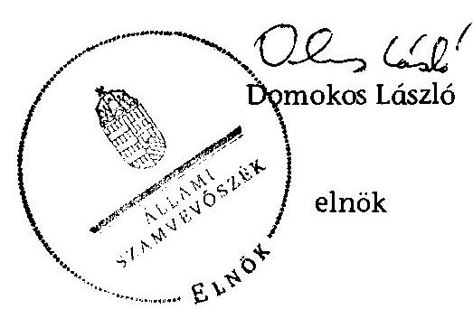

# ÁLLAMI   SZÁMVEVŐSZÉK 

## JELENTÉS

az önkormányzatok belső kontrollrendszere kialakításának, egyes
kontrolltevékenységek és a belső ellenőrzés
működésének - 2013. évben induló - ellenőrzéséről
Bőcs
13190
2013. december

---

# Állami Számvevőszék 

Iktatószám: V-0133-033/2013.
Témaszám: 1162
Vizsgálat-azonosító szám: V064904

## Az ellenőrzést felügyelte:

Dr. Benedek Mária
felügyeleti vezető
Az ellenőrzést vezette és az ellenőrzés végrehajtásáért felelős: Bíró Zsolt
ellenőrzésvezető
A számvevőszéki jelentés összeállításában közreműködött: Zaroba Szilvia
számvevő tanácsos
Az ellenőrzést végezték:
Szabóné László Mária Vörös Mária
számvevő
számvevő főtanácsos

---

# TARTALOMJEGYZÉK 

BEVEZETÉS ..... 5
I. ÖSSZEGZŐ MEGÁLLAPÍTÁSOK, KÖVETKEZTETÉSEK, JAVASLATOK ..... 9
II. RÉSZLETES MEGÁLLAPÍTÁSOK ..... 15

1. Az önkormányzat belső kontrollrendszerének kialakítása ..... 15
1.1. A kontrollkörnyezet ..... 15
1.2. A kockázatkezelési rendszer ..... 16
1.3. A kontrolltevékenységek ..... 16
1.4. Az információs és kommunikációs rendszer ..... 18
1.5. A monitoring rendszer ..... 18
2. A pénzügyi folyamatokban kulcsszerepet betöltő teljesítésigazolás és érvényesítés belső kontrollok működése ..... 19
3. A belső ellenőrzés működése ..... 21

## FÜGGELÉKEK

1. számú Értelmező szótár
2. számú Az értékelés módja és szempontjai

---

.

---

# RÖVIDÍTÉSEK JEGYZÉKE 

## Törvények

Áht.
ÁSZ tv.
Info tv.

Kttv.

Ktv.

Mötv.

Ötv.
Számv. tv.

## Rendeletek

Áhsz.

Ávr.

Bkr.

Ikr.
önkormányzati SZMSZ
vagyongazdálkodási rendelet

## Szórövidítések

adatvédelmi és adatbiztonsági szabályzat alapító okirat

ÁSZ
Belső ellenőrzési kézikönyv
belső kontrollrendszer szabályzat

2011. évi CXCV. törvény az államháztartásról (hatályos 2012. január 1-jétől)
2011. évi LXVI. törvény az Állami Számvevőszékről
2011. évi CXII. törvény az információs önrendelkezési jogról és az információszabadságról (hatályos 2012. január 1-jétől)
2011. évi CXCIX. törvény a közszolgálati tisztviselőkről (hatályos 2012. március 1-jétől)
1992. évi XXIII. törvény a köztisztviselők jogállásáról (hatálytalan 2012. március 1-jétől)
2011. évi CLXXXIX. törvény Magyarország helyi önkormányzatairól (hatályos 2012. január 1-jétől)
1990. évi LXV. törvény a helyi önkormányzatokról
2000. évi C. törvény a számvitelről
249/2000. (XII. 24.) Korm. rendelet az államháztartás szervezetei beszámolási és könyvvezetési kötelezettségének sajátosságairól
368/2011. (XII. 31.) Korm. rendelet az államháztartásról szóló törvény végrehajtásáról (hatályos 2012. január 1-jétől)
370/2011. (XII. 31.) Korm. rendelet a költségvetési szervek belső kontrollrendszeréről és belső ellenőrzéséről (hatályos 2012. január 1-jétől)
335/2005. (XII. 29.) Korm. rendelet a közfeladatot ellátó szervek iratkezelésének általános követelményeiről
Bőcs Községi Önkormányzat Képviselő-testületének 11/2012. (X. 26.) számú rendelete az Önkormányzat Szervezeti és Működési Szabályzatáról (hatályos 2012. október 26-ától)
Bőcs Községi Önkormányzat Képviselő-testületének 8/2012. (VIII. 29.) számú rendelete a vagyongazdálkodásról (hatályos 2012. augusztus 29-étől)

Bőcs Községi Önkormányzat Közszolgálati Adatvédelmi és Adatkezelési Szabályzat (hatályos 2012. június 27-étől) Bőcs Községi Önkormányzat Polgármesteri Hivatala Alapító Okirata (hatályos 2009. május 13-ától)
Állami Számvevőszék
Miskolc Kistérségi Többcélú Társulása által kidolgozott Belső Ellenőrzési Kézikönyv (hatályos 2010. június 7-étől) Belső Kontrollrendszer szabályzat (hatályos 2012. május 2-ától)

---

értékelési szabályzat
gazdasági program
gazdálkodási szabályzat
hivatali SZMSZ

INTOSAI
iratkezelési szabályzat
ISSAI
jegyző
Képviselő-testület
leltározási szabályzat

NGM
Önkormányzat
pénzkezelési szabályzat
polgármester
Polgármesteri Hivatal
stratégiai ellenőrzési
terv
számlarend
Társulás
tűzvédelmi szabályzat

Bőcs Község Önkormányzata Polgármesteri Hivatala Eszközök és Források Értékelési Szabályzata (hatályos 2004. január 12-étől)
Bőcs Község Önkormányzatának Gazdasági Programja a 2011-2014. évre
Az Önkormányzat és a Polgármesteri Hivatal Gazdálkodási Szabályzata (hatályos 2012. január 1-jétől)
Bőcs Községi Önkormányzat Polgármesteri Hivatala Szervezeti és Működési Szabályzat (hatályos 2012. szeptember 26-ától)
International Organization of Supreme Audit Institutions (Legfőbb Ellenőrző Intézmények Nemzetközi Szervezete)
Bőcs Községi Önkormányzat Polgármesteri Hivatala Iratkezelési Szabályzat (hatályos 2002. január 1-jétől)
International Standards of Supreme Audit Institutions (Legfőbb Ellenőrző Intézmények Nemzetközi Standardjai)
Bőcs Község Önkormányzatának jegyzője
Bőcs Község Önkormányzatának Képviselő-testülete
Bőcs Község Önkormányzata Polgármesteri Hivatala Leltárkészítési és Leltározási Szabályzat (hatályos 2012. január 1-jétől)
Nemzetgazdasági Minisztérium
Bőcs Község Önkormányzata
Bőcs Község Önkormányzata Polgármesteri Hivatala Pénzkezelési Szabályzat (hatályos 2012. április 1-jétől)
Bőcs Község Önkormányzatának polgármestere
Bőcs Község Önkormányzatának Polgármesteri Hivatala Miskolc Kistérségi Többcélú Társulás: Kistérségi Stratégiai Ellenőrzési Terv a 2011-2015. évekre (hatályos 2011. február 11-étől)
Bőcs Község Önkormányzata Polgármesteri Hivatala Számlarend (hatályos 2010. január 26-ától)
Miskolc Kistérségi Többcélú Társulás
Bőcs Község Önkormányzata Polgármesteri Hivatala Tűzvédelmi Szabályzat (hatályos 2012. május 14-étől)

---

# JELENTÉS 

## az önkormányzatok belső kontrollrendszere kialakításának, egyes kontrolltevékenységek és a belső ellenőrzés működésének - 2013. évben induló - ellenőrzéséről Bőcs

## BEVEZETÉS

Bőcs község állandó lakosainak száma 2012. január 1-jén 2907 fő volt. Az Önkormányzat héttagú Képviselő-testületének munkáját négy állandó bizottság segítette. Az Önkormányzat az önállóan működő és gazdálkodó Polgármesteri Hivatalon kívül öt önállóan működő intézményt működtetett, valamint három többségi tulajdoni hányadú gazdasági társasággal rendelkezett. A polgármester a 2006. évi önkormányzati választások óta tölti be tisztségét. A jegyző 2011. május 1-jétől látja el feladatait. A Polgármesteri Hivatal szervezeti egységekre nem tagolódott, elkülönített gazdasági szervezettel nem rendelkezett, a foglalkoztatott köztisztviselők száma 2012. január 1-jén 17 fő volt. Az Önkormányzat Polgármesteri Hivatalánál 2013. január 1-jétől szervezeti változás, átalakítás nem volt. Az Önkormányzat a 2012. évi költségvetési beszámolója szerint 1249949 ezer Ft tárgyévi bevételt ért el, valamint 1104643 ezer Ft tárgyévi kiadást teljesített. A 2012. december 31-i könyvviteli mérleg szerint 3100527 ezer Ft értékű eszközvagyonnal rendelkezett, a rövid lejáratú kötelezettségállománya 25776 ezer Ft volt, hosszú lejáratú kötelezettségállománya nem volt.

A demokratikus társadalmakban alapvető igény, hogy a közpénzeket, a közvagyont használók tevékenységükről elszámoljanak, ahhoz egyértelmű és érvényesíthető felelősségi szabályok társuljanak. Ennek a jogos igénynek az érvényesítéséhez meg kell teremteni azokat a folyamatokat, rendszereket, amelyek nélkülözhetetlenek az elszámoltatáshoz. Az elszámoltatás eredményes működtetéséhez szükség van a megfelelő információs, kontroll, értékelési és beszámolási rendszerek kialakítására.

Magyarországon az uniós csatlakozási tárgyalások idejére nyúlnak vissza a belső kontrollrendszer szabályozásának gyökerei. Az uniós elvárásoknak megfelelő új terminológia szerinti államháztartási belső pénzügyi ellenőrzési (ÁBPE) rendszer területén a jogharmonizáció 2003-ban teljes körűen megvalósult, míg az önkormányzati alrendszerre vonatkozó, Ötv.-ben megjelenített speciális szabályozás 2005-ben lépett hatályba. Az államháztartási belső kontrollrendszer koncepciója 2009-ben továbbfejlődött. A változások irányát mutatja, hogy a költségvetési szervek belső kontrollrendszere már magában foglalja a korszerű felelős szervezetirányítás elemeit (kontrollkörnyezet, kockázatkezelés, kontrolltevékenység, információ és kommunikáció, monitoring) is. E kontrollrendszer szabályozása háromszintű, a törvényi előírásokat az Áht. és Mötv., a rendeleti szintű szabályozást az Ávr. és a Bkr. tartalmazza, amelyeket útmutatói szinten az NGM által kiadott standardok és kézikönyvek támogatnak.

A belső kontrollrendszer azt a célt szolgálja, hogy a költségvetési szervek működésük és gazdálkodásuk során a tevékenységeket szabályszerűen, gazdaságosan, hatékonyan és eredményesen hajtsák végre, teljesítsék elszámolási kötelezettségeiket és megvédjék az erőforrásokat a veszteségektől, a károktól és a nem rendeltetésszerű használattól. A belső kontrollrendszer magában foglalja mindazon szabályokat, eljárásokat, gyakorlati módszereket és szervezeti struktúrákat, kockázatkezelési technikákat, kontrolltevékenységeket, amelyek segítséget nyújtanak a szervezetnek céljai eléréséhez.

Az ÁSZ a 2011-2015. évekre szóló stratégiájában hangsúlyos szerepet szánt annak, hogy szilárd szakmai alapon álló, értékteremtő ellenőrzéseivel előmozdítsa a közpénzügyek átláthatóságát, rendezettségét. A számvevőszéki ellenőrzés nemzetközi alapelvei is rögzítik, hogy a megfelelő belső kontrollrendszer minimálisra csökkenti a hibák és szabálytalanságok kockázatát.

Az ellenőrzés célja annak megállapítása volt, hogy a belső kontrollrendszer elemeinek kialakítása, a pénzügyi folyamatokban kulcsszerepet betöltő teljesítésigazolás és érvényesítés, és a belső ellenőrzés szabályos működése biztosította-e az önkormányzatnál a közpénzfelhasználás szabályosságát, hozzájárult-e az értéket teremtő rend követelményének érvényesüléséhez.

Ennek keretében értékeltük, hogy:

- a jogszabályi előírásoknak megfelelően alakították-e ki a belső kontrollrendszer elemeit;
- a gazdálkodás folyamatában kulcsszerepet betöltő teljesítésigazolás és érvényesítés kontrolltevékenységeit megfelelően működtették-e;
- biztosították-e a belső ellenőrzés szabályos működését;
- amennyiben az ÁSZ tett javaslatot a 2008-2011. évek közötti ellenőrzése kapcsán az Önkormányzatnak, intézkedtek-e azok végrehajtására.

Az ellenőrzés várható hasznosulását négy szinten tervezzük. A törvényalkotás számára összegzett tapasztalatok állnak rendelkezésre a belső kontrollrendszer önkormányzati területen való kialakításáról, működéséről és hatásairól, a belső ellenőrzés működéséről. Ennek alapján következtetést lehet levonni arról, hogy a belső kontrollrendszer kialakítására és működtetésére vonatkozó jelenlegi, differenciálás nélküli jogszabályi előírások reális követelményeket támasztanak-e az eltérő adottságú települési önkormányzatok esetében, illetve indokolt-e esetleges jogszabályi módosítás kezdeményezése. Az ellenőrzés az ellenőrzött számára visszajelzést ad a belső kontrollrendszer kialakításában és működésében fellépő hiányosságokról, javaslataival hozzájárul azok kiküszöböléséhez, amely csökkentheti a későbbi ellenőrzések gyakoriságát. Az ellenőrzés megállapításait és javaslatait más szervezetek is hasznosíthatják a rendezett gazdálkodási keretek kialakításához. A társadalom számára jelzi, hogy

---

közpénz nem maradhat ellenőrizetlenül, az ÁSZ értékteremtő rend kialakításához és megőrzéséhez hozzájáruló tevékenysége pozitív hatással lesz a szervezetről kialakított összkép formálásában. A szervezeten belül lehetőség nyílik arra, hogy a megállapítások szintetizálásával az ÁSZ a hozzáadott értéket teremtő elemző tevékenységét és tanácsadó szerepét is erősítse.

Az önkormányzatok belső kontrollrendszere kialakításának, egyes kontrolltevékenységek és a belső ellenőrzés működésének ellenőrzéséről szóló jelentés I. fejezetének összegző része az ellenőrzés céljára ad rövid, szintetizáló összefoglalót, és tartalmazza a következtetéseket a II. fejezet részletes megállapításain alapulóan. A jelentés intézkedést igénylő megállapításait és javaslatait az ellenőrzés során feltárt, a jelentés II. fejezetében rögzített részletes megállapítások alapozzák meg. A helyszíni ellenőrzés lezárásáig a helyi szabályozás változásait nyomon követtük.

Az ellenőrzés típusa: szabályszerűségi ellenőrzés.
Az ellenőrzött időszak: a belső kontrollrendszer kialakításának megfelelősége esetében a 2012. évre, a pénzügyi folyamatokban kulcsszerepet betöltő teljesítésigazolás és érvényesítés belső kontrollok működésének megfelelőségét és a belső ellenőrzés szabályszerű működését a 2012. január 1. és december 31-e közötti időszak eseményeit figyelembe véve értékeltük, míg az ÁSZ javaslatainak utóellenőrzése a 2008-2011. években végzett ellenőrzések nyilvánosságra hozott jelentéseiben tett javaslatok áttekintésére terjedt ki.

# Az ellenőrzött szervezet: az Önkormányzat. 

Az ellenőrzés jogszabályi alapját az ÁSZ tv. 1. § (3) bekezdése, az 5. § (2) és (6) bekezdése, valamint az Áht. 61. § (2) bekezdésének előírásai képezik.

Az ellenőrzés szakmai módszertana az ÁSZ hivatalos honlapján (www.asz.hu) közzétett szakmai szabályokon alapult, amely az INTOSAI által kiadott ISSAI figyelembevételével készült.

Az ellenőrzés lefolytatásához az Önkormányzat a kimutatások és a tanúsítvány elektronikus kitöltésével, valamint az ÁSZ által kért dokumentumok elektronikus megküldésével szolgáltatott adatokat. Az így rendelkezésre bocsátott adatok, információk kontrollja és a munkalapok kitöltése a helyszíni ellenőrzés keretében történt. A jelentésben használt fogalmak magyarázatát az 1. számú függelék, az ellenőrzés egyes területeinek értékelésénél alkalmazott egységes minősítési szempontokat a 2. számú függelék tartalmazza.

A belső kontrollrendszer kialakításának ellenőrzése során értékeltük a kontrollkörnyezet, a kockázatkezelési rendszer, a kontrolltevékenységek, az információs és kommunikációs rendszer, valamint a monitoring rendszer szabályozottságának megfelelőségét. A pénzügyi folyamatokban kulcsszerepet betöltő teljesítésigazolás és érvényesítés kontrollok működése megfelelőségének minősítéséhez az állományba nem tartozók megbízási díjai, a külső szolgáltatók által végzett karbantartási, kisjavítási munkák, az egyéb üzemeltetési és fenntartási szolgáltatások, a rendszeres szociális segélyek, valamint az államháztartáson kívülre teljesített működési és felhalmozási célú pénzeszközátadások közül kockázatelemzéssel választottuk ki az ellenőrzött kiadási jogcímeket. Az egyszerű véletlen mintavétellel kiválasztott tételek ellenőrzését többlépcsős megfelelőségi tesztek útján addig végeztük, amíg elegendő és megfelelő bizonyítékot szereztünk a vizsgált folyamatok kulcskontrolljai működésének megfelelő vagy nem megfelelő voltáról. Értékeltük az Önkormányzatnál a belső ellenőrzés működésének szabályosságát. Utóellenőrzésre nem került sor, mivel az ÁSZ az Önkormányzatnál a 2008-2011. évek között nem végzett ellenőrzést.

Az ÁSZ tv. 29. § (1) bekezdése szerint a jelentéstervezetet megküldtük a polgármester részére, aki az ÁSZ tv. 29. § (2) bekezdésében foglalt észrevételezési jogával élt, a tett észrevétel szakmai tartalmánál fogva a jelentéstervezet egyes megállapításait nem érintette.

---

# I. ÖSSZEGZŐ MEGÁLLAPÍTÁSOK, KÖVETKEZTETÉSEK, JAVASLATOK 

A belső kontrollrendszeren belül 2012-ben a kontrollkörnyezet, a kockázatkezelési rendszer, a kontrolltevékenységek, az információs és kommunikációs rendszer,
 valamint a monitoring rendszer kialakítását külön-külön és együttesen is értékeltük. A belső kontrollrendszer kialakítása az összesített értékelés alapján nem felelt meg a jogszabályi előírásoknak.

A belső kontrollrendszer egyes területei kialakításának minősítése a következő:

| Kontrollterület | Minősítés |
| :-- | :-- |
| Kontrollkörnyezet | megfelelő |
| Kockázatkezelési rendszer | megfelelő |
| Kontrolltevékenységek | megfelelő |
| Információs és kommunikációs | nem |
| rendszer | megfelelő |
| Monitoring rendszer | nem |

Megfelelőnek értékeltük a kontrollkörnyezet, a kockázatkezelési rendszer és a kontrolltevékenységek kialakítását, mivel a jogszabályi előírásokban foglaltakat figyelembe véve kisebb hiányosságok mellett is megteremtette e három kontrollterületen a szabályszerű működés lehetőségét.

Nem megfelelőnek értékeltük az információs és kommunikációs rendszer, valamint a monitoring rendszer kialakítását, mivel az ellenőrzésünk során megállapított szabályozásbeli hiányosságok magukban hordozzák a szabálytalan működés, valamint a korrupció kockázatát.

A 2012. évben az állományba nem tartozók megbízási díjaival, valamint a külső szolgáltatók által végzett karbantartási, kisjavítási munkákkal kapcsolatos kifizetések során a pénzügyi folyamatokban kulcsszerepet betöltő teljesítésigazolás és érvényesítés belső kontrollok működése gyenge volt. Gyengének értékeltük a két kulcskontroll együttes működését, mivel azok nem biztosították a hibák megelőzését és feltárását.

A számvevőszéki ellenőrzés az ellenőrzött kifizetésekkel összefüggésben a rendelkezésre bocsátott dokumentumok alapján jogosulatlan kifizetést nem tárt fel, azonban a gazdálkodásban kulcsszerepet betöltő kontrollok működésében feltárt hiányosságok miatt fennáll a hibák bekövetkezésének kockázata. A nem megfelelően működtetett belső kontrollok korrupciós kockázatot hordoznak.

Az Önkormányzat a belső ellenőrzési feladatokat a Társulás útján látta el. A 2012. évben a belső ellenőrzés működése a jogszabályi előírásoknak megfelelt, azonban a belső ellenőrzés nem tárta fel a belső kontrollrendszer kialakításának, valamint a pénzügyi folyamatokban kulcsszerepet betöltő teljesítésigazolás és érvényesítés belső kontrollok működésének hiányosságait.

Az ÁSZ tv. 33. § (1) bekezdésében foglaltak értelmében az ellenőrzött szervezet vezetője köteles a jelentésben foglalt megállapításokhoz kapcsolódó intézkedési tervet összeállítani, és azt a jelentés kézhezvételétől számított 30 napon belül az ÁSZ részére megküldeni. Amennyiben az intézkedési tervet határidőre nem küldi meg a szervezet, vagy az ÁSZ tv. 33. § (2) bekezdésében foglalt póthatáridő elteltével megküldött intézkedési terv továbbra sem elfogadható, az ÁSZ elnöke a hivatkozott törvény 33. § (3) bekezdés a)-b) pontjaiban foglaltakat érvényesítheti.

Az ellenőrzés intézkedést igénylő megállapításai és javaslatai:

# a polgármesternek 

1. Az Önkormányzat nevében történő kötelezettségvállalásra - az Áht. 37. § (1) bekezdésében és az Ávr. 55. § (1) bekezdésében foglaltak ellenére - pénzügyi ellenjegyzés nélkül került sor.

Javaslat:
Intézkedjen arról, hogy az Önkormányzat nevében történő kötelezettségvállalásra az Áht. 37. § (1) bekezdésében és az Ávr. 55. § (1) bekezdésében foglaltaknak megfelelően - az Ávr. 53. §-ában meghatározott kivételekkel - kizárólag a pénzügyi ellenjegyzés után, a pénzügyi teljesítés esedékességét megelőzően, írásban kerüljön sor.
2. A számvevőszéki ellenőrzés megállapításai alapján az Önkormányzatnál a belső kontrollrendszer kialakítása összefoglalóan értékelve nem felelt meg a jogszabályi előírásoknak, a kulcskontrollok működése gyenge volt, a belső ellenőrzés működése ugyan megfelelt a jogszabályi előírásoknak, azonban nem tárta fel, ezáltal nem is javíttatta ki a hiányosságokat. A megállapított szabályozásbeli és működésbeli hiányosságok magukban hordozzák a szabálytalan működés kockázatát.

Javaslat:
A Mötv. 115. § (1) bekezdésében foglaltak alapján kísérje figyelemmel az Önkormányzat gazdálkodásának szabályszerűségét. A Mötv. 67. § f) pontja alapján gondoskodjon a belső kontrollrendszer működésére vonatkozó jogszabályi rendelkezések be nem tartása, valamint a teljesítésigazolás, illetve az érvényesítés kontrollokkal összefüggésben feltárt hiányosságok és szabálytalanságok tekintetében az esetleges munkajogi felelősséggel kapcsolatos körülmények kivizsgálásáról, majd a vizsgálat eredményének függvényében tegye meg a szükséges munkajogi intézkedéseket.

## a jegyzőnek

1. a kontrollkörnyezettel kapcsolatban:

A hivatali SZMSZ-ben a jegyző - az Ávr. 13. § (1) bekezdés g) pontjában foglaltak ellenére - nem rögzítette a szervezeti és működési szabályzatban nevesített valamennyi munkakörhöz tartozó feladat- és hatásköröket, a hatáskörök gyakorlásának módját, a helyettesítés rendjét és az ezekhez kapcsolódó felelősségi szabályokat.

A jegyző - az Ávr. 13. § (5) bekezdésében foglaltak ellenére - nem gondoskodott a Polgármesteri Hivatal által ellátott feladatok munkafolyamatainak leírásáról.

Javaslat:
a) Készítse el a hivatali SZMSZ módosítását, és kezdeményezze az Áht. 9. § (1) bekezdés a) pontjában foglaltakra tekintettel a Képviselő-testület elé terjesztését annak érdekében, hogy az tartalmazza az Ávr. 13. § (1) bekezdésében előírt tartalmi elemeket.
b) Belső szabályzatban rendezze az Ávr. 13. § (5) bekezdése alapján a Polgármesteri Hivatal által ellátott feladatok munkafolyamatainak leírását.
2. a kockázatkezelési rendszerrel kapcsolatban:

A jegyző - a Bkr. 7. § (2) bekezdésében foglaltak ellenére - a kockázatok kezelése érdekében szükséges intézkedések teljesítése folyamatos nyomon követésének módját nem határozta meg.

Javaslat:
Határozza meg a Bkr. 7. § (2) bekezdésében foglaltak szerint a kockázatok kezelése érdekében szükséges intézkedések teljesítése folyamatos nyomon követésének módját.
3. a kontrolltevékenységekkel kapcsolatban:

A jegyző belső szabályozásban lehetővé tette a 100 ezer forintot meg nem haladó kifizetések előzetes írásbeli kötelezettségvállalás nélküli teljesítését, azonban - az Ávr. 53. § (2) bekezdésében foglaltakat figyelmen kívül hagyva - nem határozta meg az előzetes írásbeli kötelezettségvállalást nem igénylő kifizetések rendjét.

A jegyző - az Info tv. 7. § (2) bekezdésében foglalt előírásokat figyelmen kívül hagyva - az informatikai rendszer szabályozása során elmulasztotta az adatbiztonság érvényre juttatásához szükséges intézkedések megtételét.

A jegyző - a Bkr. 8. § (4) bekezdés b) pontjában foglaltak ellenére - a dokumentumokhoz és az információkhoz való hozzáférést belső szabályzatban nem szabályozta.

Javaslat:
a) Rögzítse belső szabályzatban az Ávr. 53. § (2) bekezdése alapján az előzetes írásbeli kötelezettségvállalást nem igénylő kifizetések rendjét.
b) Gondoskodjon az Info tv. 7. § (2) bekezdéseiben foglaltaknak megfelelően az adatok biztonságáról.
c) Szabályozza belső szabályzatban a felelősségi körök meghatározásával a Bkr. 8. § (4) bekezdés b) pontjának megfelelően a dokumentumokhoz és információkhoz való hozzáférést.
4. az információs és kommunikációs rendszerrel kapcsolatban:

A jegyző - az Info tv. 35. § (3) bekezdésében és az Ávr. 13. § (2) bekezdés h) pontjában foglalt előírás ellenére - a kötelezően közzéteendő adatok nyilvánosságra hozatalának rendjét nem alakította ki.

Az Önkormányzat - az Info tv. 33. § (1) és (3) bekezdésében foglaltak ellenére - az elektronikus közzétételi kötelezettségének a 2012. évben nem tett eleget.

A jegyző által elkészített iratkezelési szabályzat - az lkr. 64. §-ában foglaltak ellenére - nem tartalmazta az iratok selejtezésének, megsemmisítésének szabályait.

Javaslat:
a) Állapítsa meg - az Info tv. 35. § (3) bekezdésében, valamint az Ávr. 13. § (2) bekezdés h) pontjában foglaltaknak megfelelően - a kötelezően közzéteendő adatok nyilvánosságra hozatalának rendjét.
b) Gondoskodjon az Info tv. 33. § (1) és (3) bekezdésében foglaltaknak megfelelően az Önkormányzat elektronikus közzétételi kötelezettségének teljesítéséről.
c) Intézkedjen arról, hogy az iratkezelési szabályzat tartalmazza az lkr. 64. §-ában felsorolt tartalmi elemeket.
5. a monitoring rendszerrel kapcsolatban:

A jegyző - a Bkr. 3. § e) pontjában és 10. §-ában foglaltak ellenére - nem alakította ki a Polgármesteri Hivatal tevékenységének, a célok megvalósításának nyomon követését biztosító rendszert.

A jegyző - a Bkr. 11. § (1) bekezdésében foglalt kötelezettsége ellenére - a Bkr. 1. mellékletében foglalt nyilatkozatban nem értékelte a Polgármesteri Hivatal belső kontrollrendszerének minőségét.

Javaslat:
a) Alakítsa ki és működtesse a Bkr. 3. § e) pontjában és 10. §-ában előírtak alapján a Polgármesteri Hivatal tevékenységének, a célok megvalósításának nyomon követését biztosító rendszert.
b) Értékelje a Bkr. 11. § (1) bekezdésében előírtaknak megfelelően a jogszabályban meghatározott keretek között a belső kontrollrendszer minőségét a Bkr. 1. melléklete szerinti nyilatkozatban.
6. a pénzügyi folyamatokban kulcsszerepet betöltő kontrollokkal kapcsolatban:

A teljesítésigazolás - az Ávr. 57. § (1) és (3) bekezdésében foglaltak ellenére - nem az arra jogosult által, illetve nem szabályszerűen történt.

Az érvényesítő - az Ávr. 58. § (1) bekezdésében előírtak ellenére - nem ellenőrizte az összegszerűséget, valamint - az Ávr. 58. § (2) bekezdésében rögzítettek ellenére - az utalványozónak nem jelezte, hogy a megelőző ügymenetben a teljesítésigazolás nem szabályszerűen történt, vagy azt nem az arra jogosult végezte, továbbá hogy a kötelezettségvállalásokra - az Áht. 37. § (1) bekezdésében és az Ávr. 55. § (1) bekezdésében foglaltak ellenére - ellenjegyzés nélkül került sor, valamint hogy a bizonylatokon nem tüntették fel - az Ávr. 59. § (3) bekezdés f) pontjában és (4) bekezdésében előírtakat figyelmen kívül hagyva - a kötelezettségvállalás nyilvántartási számát, mert a 2012. évben a kötelezettségvállalásokat - az Ávr. 56. § (1) bekezdésében előírtak ellenére - nem vették nyilvántartásba.

Javaslat:
Intézkedjen - a teljesítésigazolás és az érvényesítés vonatkozásában feltárt hiányosságok megszüntetése, illetve az operatív gazdálkodás során a működésbeli hibák megelőzése, feltárása és kijavítása érdekében - arról, hogy
a) az Áht. 38. § (1) bekezdésén alapuló teljesítésigazolás során az Ávr. 57. § (1) bekezdésében előírtaknak megfelelően, ellenőrizhető okmányok alapján ellenőrizzék és igazolják a kiadások teljesítésének jogosságát, összegszerűségét, az ellenszolgáltatást is magában foglaló kötelezettségvállalás esetén annak teljesítését, valamint az Ávr. 57. § (3) bekezdése szerint a teljesítést az igazolás dátumának és a teljesítés tényére történő utalásnak a megjelölésével, az arra jogosult személy aláírásával igazolják;
b) a kifizetéseket megelőzően a teljesítésigazolás alapján - az Ávr. 57. § (3) bekezdése szerinti esetben annak hiányában is - az összegszerűségnek, a fedezet meglétének és a megelőző ügymenetben az Áht., az Áhsz., az Ávr. előírásai és a belső szabályzatokban foglaltak betartásának az ellenőrzése - az Ávr. 58. § (1)-(3) bekezdései szerint - történjen meg;
c) a kötelezettségvállalások nyilvántartását az Ávr. 56. § (1) bekezdésében foglalt előírásnak megfelelően vezessék, és az Ávr. 59. § (3)-(4) bekezdése alapján az utalványon, valamint a bevételi és kiadási pénztárbizonylatra rávezetett rendelkezésen a kötelező tartalmi elemeket tüntessék fel.
7. a belső ellenőrzés működésével kapcsolatban:

A 2013. évi ellenőrzési terv - a Bkr. 31. § (4) bekezdés a) és d) pontjában foglaltak ellenére - nem tartalmazta az ellenőrzési tervet megalapozó elemzések eredményének összefoglaló bemutatását és az ellenőrizendő időszakot, továbbá - a Bkr. 31. § (2) bekezdésében foglaltak ellenére - a 2013. évre vonatkozó éves ellenőrzési tervet kockázatelemzés nem alapozta meg.

A 2013. évre vonatkozó éves ellenőrzési terv összeállítása - a Bkr. 56. § (2) bekezdésében foglalt előírás ellenére - nem a jegyző írásos véleményének figyelembevételével történt, mivel a jegyző véleményt, javaslatot nem fogalmazott meg a terv összeállítása során.

A Bkr. 31. § (5) bekezdésében foglalt előírás ellenére a 2012. évre jóváhagyott éves ellenőrzési tervet a jegyző egyetértésének hiányában módosították.

A Bkr. 33. § (2) bekezdésének előírása ellenére az ellenőrzési programot a belső ellenőrzési vezető helyett a munkaszervezet vezetője hagyta jóvá.

A Bkr. 22. § (2) bekezdés e) pontjában és az 50. §-ban foglalt előírást figyelmen kívül hagyva a belső ellenőrzési vezető az elvégzett ellenőrzésekről nyilvántartást nem vezetett.

A Bkr. 21. § (2) bekezdés d)
 pontjában és a 47. § (1) bekezdésében foglaltak ellenére a belső ellenőrzési jelentésekben tett megállapításokat, javaslatokat, a vonatkozó intézkedési terveket és azok végrehajtását nyomon követő nyilvántartást a belső ellenőrzési vezető nem vezetett.

Javaslat:
a) Kezdeményezze, hogy az éves ellenőrzési tervek tartalmazzák a Bkr. 31. § (4) bekezdésében előírt tartalmi elemeket, továbbá azt, hogy azok - a Bkr. 22. § (1) bekezdés b) pontja, a 29. § (1) és a 31. § (2) bekezdése alapján – kockázatelemzésen alapuljanak.
b) Kezdeményezze, hogy az éves ellenőrzési terv a Bkr. 56. § (2) bekezdés előírásainak megfelelően a jegyző írásos véleményének figyelembevételével készüljön el.
c) Kezdeményezze, hogy az éves ellenőrzési terv módosítására a Bkr. 31. § (5) bekezdésében foglalt előírásnak megfelelően a jegyző egyetértésével kerüljön sor.
d) Kezdeményezze, hogy az ellenőrzési programokat a Bkr. 33. § (2) bekezdésében foglaltaknak megfelelően a belső ellenőrzési vezető hagyja jóvá.
e) Kezdeményezze, hogy a belső ellenőrzési vezető a Bkr. 22. § (2) bekezdés e) pontjában és az 50. §-ban foglalt előírásnak megfelelően vezessen az elvégzett ellenőrzésekről nyilvántartást.
f) Kezdeményezze, hogy a belső ellenőrzési vezető vezessen a Bkr. 21. § (2) bekezdés d) pontjának és a Bkr. 47. § (1) bekezdésének megfelelően a belső ellenőrzési jelentésekben tett megállapításokat, javaslatokat, a vonatkozó intézkedési terveket és azok végrehajtását nyomon követő nyilvántartást.

---

# II. RÉSZLETES MEGÁLLAPÍTÁSOK 

## 1. Az ÖNKORMÁNYZAT BELSŐ KONTROLLRENDSZERÉNEK KIALAKÍTÁSA

A belső kontrollrendszeren belül 2012-ben a kontrollkörnyezet, a kockázatkezelési rendszer, a kontrolltevékenységek, az információs és kommunikációs rendszer, valamint a monitoring rendszer kialakítását külön-külön és együttesen is értékeltük. A belső kontrollrendszer kialakítása az összesített értékelés alapján nem felelt meg a jogszabályi előírásoknak.

### 1.1. A kontrollkörnyezet

A kontrollkörnyezet kialakítása - a 2. számú függelékben részletezett kritériumrendszer alapján végzett értékelés szerint - a jogszabályi előírásoknak megfelelt.

A Polgármesteri Hivatal rendelkezett a Képviselő-testület által elfogadott alapító okirattal, amely tartalmazta az alaptevékenységeket. Az Önkormányzat rendelkezett gazdasági programmal és önkormányzati SZMSZ-szel, a Polgármesteri Hivatal pedig hivatali SZMSZ-szel. A Képviselő-testület a vagyongazdálkodás szabályait önkormányzati rendeletben meghatározta.

A szervezet megfelelő működése érdekében a Polgármesteri Hivatalban kialakították a belső szabályzatokat. A jegyző a jogszabályi előírásoknak megfelelően kialakította a Polgármesteri Hivatal számviteli politikáját, elkészítette a pénzkezelési szabályzatot, a leltározási szabályzatot, az értékelési szabályzatot, a számlarendet, valamint a bizonylati rendet. A Polgármesteri Hivatalban meghatározták az egészséget nem veszélyeztető és biztonságos munkavégzés követelményei megvalósításának módját, rendelkeztek tűzvédelmi szabályzattal. A jegyző a jogszabályi előírásoknak megfelelően elkészítette a szabálytalanságok kezelésének eljárásrendjét, valamint kialakította az Önkormányzat intézményeinek számviteli rendjét.

A Polgármesteri Hivatalban dolgozó munkatársak rendelkeztek munkaköri leírással. A jegyző elkészítette a Polgármesteri Hivatalban dolgozó köztisztviselők teljesítményértékelését, a képviselő-testület elfogadta a köztisztviselőkkel szembeni hivatásetikai alapelvek részletes tartalmát, valamint az etikai eljárás szabályait. A belső kontroll szabályzat keretében írásos formában rögzítették az ellenőrzési nyomvonalat.

---

A kontrollkörnyezet kialakítása az alábbi kisebb hiányosságok mellett megfelelt a jogszabályi előírásoknak:

| Sor-   szám $^{1}$ | Megállapítás |
| :-- | :-- |
| 4. | A Képviselő-testület - a Ktv. 34. § (3) bekezdésében foglaltak ellenére - nem   döntött a teljesítményértékelés alapját képező célokról. |
| 10. | A hivatali SZMSZ-ben a jegyző - az Ávr. 13. § (1) bekezdés g) pontjában   foglaltak ellenére - nem rögzítette a szervezeti és működési szabályzatban   nevesített valamennyi munkakörhöz tartozó feladat- és hatásköröket, a   hatáskörök gyakorlásának módját, a helyettesítés rendjét és az ezekhez   kapcsolódó felelősségi szabályokat. |
| 35. | A jegyző - az Ávr. 13. § (5) bekezdésében foglaltak ellenére - nem gondos-   kodott a Polgármesteri Hivatal által ellátott feladatok munkafolyamatainak   leírásáról. |

# 1.2. A kockázatkezelési rendszer 

A kockázatkezelési rendszer kialakítása - a 2. számú függelékben részletezett kritériumrendszer alapján végzett értékelés szerint - megfelelte a jogszabályi előírásoknak.

A jegyző felmérte és megállapította a Polgármesteri Hivatal tevékenységében, gazdálkodásában rejlő kockázatokat, meghatározta az egyes kockázatok kezelése érdekében szükséges intézkedéseket.

A kockázatkezelés során értékelték a csalás és korrupció kockázatát. A vagyon-nyilatkozat-tételre kötelezettek körét a hivatali SZMSZ-ben rögzítették, a kötelezettek a nyilatkozattételi kötelezettségüknek a jogszabályban előírt gyakorisággal eleget tettek. A szabálytalanság kezelésének módját a belső kontrollrendszer szabályzata tartalmazta.

A kockázatkezelési rendszer kialakítása az alábbi kisebb hiányosság mellett megfelelt a jogszabályi előírásoknak:

| Sor-   szám | Megállapítás |
| :--: | :-- |
| 10. | A jegyző - a Bkr. 7. § (2) bekezdésében foglaltak ellenére - a kockázatok   kezelése érdekében szükséges intézkedések teljesítésének folyamatos nyomon   követésének módját nem határozta meg. |

### 1.3. A kontrolltevékenységek

A kontrolltevékenységek kialakítása - a 2. számú függelékben részletezett kritériumrendszer alapján végzett értékelés szerint - a jogszabályi előírásoknak megfelel.

[^0]
[^0]:    ${ }^{1}$ A megállapítás számozása az Önkormányzat által az adatszolgáltatás során kitöltött kimutatások kérdéseinek sorszámával azonos.

---

A jegyző a kontrolltevékenység részeként a folyamatba épített, előzetes, utólagos és vezetői ellenőrzést a költségvetés tervezésének és a beszerzések lebonyolításának folyamatában, a vagyonhasznosítási tevékenység és a támogatások elszámolása vonatkozásában előírta. A jegyző az iratkezelés szabályozása során előírta az iratok és adatok védelmét. Szabályozták az üzemeltetés és az adatbiztonság feladatait, és meghatározták az ehhez kapcsolódó hatásköröket.

A jegyző a gazdálkodási szabályzatban meghatározta az időközi és éves beszámolók elkészítésének feladatait, a beszámolási eljárásokhoz kapcsolódó felelősségi köröket, a helyettesítés rendjét, a kötelezettségvállalás pénzügyi ellenjegyzésének és a teljesítés igazolásának módját, valamint szabályozta az érvényesítés és az utalványozás rendjét. A kötelezettségvállaló kijelölte a teljesítésigazolásra jogosultakat.

A polgármester felhatalmazást adott a kötelezettségvállalásra és utalványozásra, valamint a jegyző a pénzügyi ellenjegyzési, illetve érvényesítési feladatra kijelölt a Polgármesteri Hivatal állományába tartozó köztisztviselőket, ezzel is biztosítva az összeférhetetlenségre vonatkozó előírások érvényesülését. A pénzügyi ellenjegyzésre, valamint érvényesítésre kijelölt személyek rendelkeztek a jogszabályban előírt szakképzettséggel. A költségvetési beszámoló elkészítésével megbízott személy rendelkezett az előírt iskolai végzettséggel és a tevékenység ellátására jogosító engedéllyel.

A jegyző kialakította a munkaviszony megszűnése esetén a munkavállaló folyamatban lévő feladatai átadásának rendjét.

A kontrolltevékenységek kialakítása az alábbi kisebb hiányosságok mellett megfelelt a jogszabályi előírásoknak:

| Sorszám | Megállapítás |
| :--: | :--: |
| 8. | A jegyző belső szabályozásban lehetővé tette a 100 ezer forintot meg nem haladó kifizetések előzetes írásbeli kötelezettségvállalás nélküli teljesítését, azonban - az Ávr. 53. § (2) bekezdésében foglaltakat figyelmen kívül hagyva - nem határozta meg az előzetes írásbeli kötelezettségvállalást nem igénylő kifizetések rendjét. |
| 16. | A jegyző - az Info tv. 7. § (2) bekezdésében foglalt előírásokat figyelmen kívül hagyva - az informatikai rendszer szabályozása során elmulasztotta az adatbiztonság érvényre juttatásához szükséges intézkedések megtételét. |
| 17. | A jegyző - a Bkr. 8. § (4) bekezdés b) pontjában foglaltak ellenére - a dokumentumokhoz és az információkhoz való hozzáférést belső szabályzatban nem szabályozta. |

---

# 1.4. Az információs és kommunikációs rendszer 

Az információs és kommunikációs rendszer kialakítása - a 2. számú függelékben részletezett kritériumrendszer alapján végzett értékelés szerint - a jogszabályi előírásoknak nem felelt meg, mert:

| Sor-   szám | Megállapítás |
| :-- | :-- |
| 6. | A jegyző - az Info tv. 35. § (3) bekezdésében és az Ávr. 13. § (2) bekezdés h)   pontjában foglalt előírás ellenére - a kötelezően közzéteendő adatok nyil-   vánosságra hozatalának rendjét nem alakította ki. |
| 7. | Az Önkormányzat - az Info tv. 33. § (1) és (3) bekezdésében foglaltak elle-   nére - az elektronikus közzétételi kötelezettségének a 2012. évben nem tett   eleget. |
| 15. | A jegyző által elkészített iratkezelési szabályzat - az Ikr. 64. §-ában foglaltak   ellenére - nem tartalmazta az iratok selejtezésének és megsemmisítésének   szabályait. |

### 1.5. A monitoring rendszer

A monitoring rendszer kialakítása - a 2. számú függelékben részletezett kritériumrendszer alapján végzett értékelés szerint - a jogszabályi előírásoknak nem felelt meg, mert:

| Sor-   szám | Megállapítás |
| :--: | :--: |
| 1. | A jegyző - a Bkr. 3. § e) pontjában és 10. §-ában foglaltak ellenére - nem alakította ki a Polgármesteri Hivatal tevékenységének, a célok megvalósításának nyomon követését biztosító rendszert. |
| 9. | A jegyző - a Bkr. 11. § (1) bekezdésében foglalt kötelezettsége ellenére - a Bkr. 1. mellékletében foglalt nyilatkozatban nem értékelte a Polgármesteri Hivatal belső kontrollrendszerének minőségét. |

A helyi önkormányzatok törvényességi felügyeletét ellátó kormányhivatal törvényességi felhívással vagy más törvényességi felügyeleti eszközzel 2012-ben nem élt.

---

# 2. A PÉNZÜGYI FOLYAMATOKBAN KULCSSZEREPET BETÖLTŐ TELJESÍTÉSIGAZOLÁS ÉS ÉRVÉNYESÍTÉS BELSŐ KONTROLLOK MŰKÖDÉSE 

A 2012. évben az állományba nem tartozók megbízási díjaival, valamint a külső szolgáltatók által végzett karbantartással, kisjavítással kapcsolatos kifizetések során - összefoglalóan értékelve - a pénzügyi folyamatokban kulcsszerepet betöltő teljesítésigazolás és érvényesítés belső kontrollok működésének megfelelősége gyenge volt, mert:

| Kulcskontrollok | Megállapítás |
| :--: | :--: |
| Teljesítésigazolás | A teljesítésigazolás - az Ávr. 57. § (1) és (3) bekezdésében foglaltak ellenére - nem az arra jogosult által, illetve nem szabályszerűen történt. |
| Érvényesítés | Az érvényesítő az Ávr. 58. § (1) bekezdésében előírtak ellenére nem ellenőrizte az összegszerűséget, valamint az Ávr. 58. § (2) bekezdésében rögzítettek ellenére - az utalványozónak nem jelezte, hogy a megelőző ügymenetben a teljesítésigazolás nem szabályszerűen történt, vagy nem az arra jogosult végezte, továbbá hogy a kötelezettségvállalásokra - az Áht. 37. § (1) bekezdésében és az Ávr. 55. § (1) bekezdésében foglaltak ellenére - ellenjegyzés nélkül került sor, valamint a bizonylatokon nem tüntették fel - az Ávr. 59. § (3) bekezdés f) pontjában és (4) bekezdésében előírtakat figyelmen kívül hagyva - a kötelezettségvállalás nyilvántartási számát, mert a 2012. évben a kötelezettségvállalásokat - az Ávr. 56. § (1) bekezdésében előírtak ellenére - nem vették nyilvántartásba. |

A 2012. évben az állományba nem tartozók megbízási díjainak kifizetése során a teljesítésigazolás és az érvényesítés kulcskontrollok működésének megfelelősége gyenge volt, mert:

- a teljesítésigazoló - az Ávr. 57. § (1) bekezdésében foglaltak és aláírása ellenére - a honlap karbantartásra, a vérvételi, valamint az üdülőgondnoki feladatok ellátására teljesített kifizetéseket megelőzően - ellenőrizhető okmányok hiányában - nem ellenőrizte a megbízási szerződés teljesítését;
- az érvényesítő - az Ávr. 58. § (1) bekezdésében foglaltak és aláírása ellenére - nem ellenőrizte, és - az Ávr. 58. § (2) bekezdésében foglaltak ellenére - az utalványozónak nem jelezte, hogy az előző ügymenetben a teljesítésigazolás nem szabályszerűen történt, valamint a honlap karbantartásra, a vérvételi, valamint az üdülőgondnoki feladatok ellátására teljesített kifizetéseket megelőzően az Önkormányzat nevében vállalt kötelezettségvállalásokra - az Áht. 37. § (1) bekezdésében és az

 Ávr. 55. § (1) bekezdésében foglaltak ellenére – ellenjegyzés nélkül került sor, továbbá hogy a bizonylatokon nem tüntették fel – az Ávr. 59. § (3) bekezdés f) pontjában és (4) bekezdésében előírtakat figyelmen kívül hagyva – a kötelezettségvállalás nyilvántartási számot, mert a 2012. évben a kötelezettségvállalásokat – az Ávr. 56. § (1) bekezdésében előírtak ellenére – nem vették nyilvántartásba.

---

A 2012. évben a külső szolgáltatók által végzett karbantartási és kisjavítási munkák kifizetése során a teljesítésigazolás és az érvényesítés kulcskontrollok működésének megfelelősége gyenge volt, mert:

- a teljesítésigazolást – az Ávr. 57. § (3) bekezdésében foglaltak ellenére – a riasztó távfelügyelet havi díjához, a szervízszolgáltatás díjához, valamint az autómosáshoz kapcsolódó kifizetések vonatkozásában nem az arra jogosult személy végezte;
- a teljesítést igazoló – az Ávr. 57. § (1) bekezdésében foglaltak ellenére – a számítógép karbantartáshoz, a memória, winchester, valamint a RAM memória vásárláshoz kapcsolódó kifizetéseknél a kiadások teljesítésének jogosságát, ellenőrizhető okmányok hiányában, nem ellenőrizte;
- a teljesítést igazoló – az Ávr. 57. § (1) bekezdésében foglaltak és aláírása ellenére – az összegszerűséget, ellenőrizhető okmányok hiányában, a mérnöki tanácsadáshoz, valamint a szolgálati lakás karbantartásához kapcsolódó kifizetéseknél nem ellenőrizte;
- a teljesítést igazoló – az Ávr. 57. § (1) bekezdésének előírásait figyelmen kívül hagyva – az ellenszolgáltatások teljesítését a 2012. december 10-i mérnöki tanácsadáshoz, a szolgálati lakás karbantartásához, a 2012. február 15-i és 2012. március 26-i fénymásoló karbantartáshoz, a játszótéri mérők kialakításához, valamint a térfigyelő karbantartásához kapcsolódó kifizetéseket megelőzően, ellenőrizhető okmányok hiányában, nem ellenőrizte;
- az érvényesítő – az Ávr. 58. § (1) bekezdésében foglaltak ellenére – az összegszerűséget a mérnöki tanácsadáshoz, a szolgálati lakás karbantartásához, a játszótéri mérők kialakításához, az oltóvíz-hozam méréséhez és a térfigyelő karbantartáshoz kapcsolódó kifizetéseket megelőzően ellenőrizhető okmányok hiányában nem ellenőrizte;
- az érvényesítő – az Ávr. 58. § (2) bekezdésében rögzítettek ellenére – az utalványozónak nem jelezte, hogy a megelőző ügymenetben a teljesítésigazolás nem szabályszerűen történt, vagy nem az arra jogosult végezte, továbbá az Önkormányzat és a Polgármesteri Hivatal kiadási előirányzatai terhére történt kötelezettségvállalásokra – az Áht. 37. § (1) bekezdésében és az Ávr. 55. § (1) bekezdésében foglaltak ellenére – ellenjegyzés nélkül került sor, valamint nem jelezte, hogy a bizonylatokon nem tüntették fel – az Ávr. 59. § (3) bekezdés f) pontjában és (4) bekezdésében előírtakat figyelmen kívül hagyva – a kötelezettségvállalás nyilvántartási számot, mert a 2012. évben a kötelezettségvállalásokat – az Ávr. 56. § (1) bekezdésében előírtak ellenére – nem vették nyilvántartásba.

A számvevőszéki ellenőrzés az ellenőrzött kifizetésekkel összefüggésben a rendelkezésre bocsátott dokumentumok alapján jogosulatlan kifizetést nem tárt fel, azonban a gazdálkodásban kulcsszerepet betöltő kontrollok működésében feltárt hiányosságok miatt fennáll a hibák bekövetkezésének kockázata. A nem megfelelően működtetett belső kontrollok korrupciós kockázatot hordoznak.

---

# 3. A BELSŐ ELLENŐRZÉS MŰKÖDÉSE 

Az Önkormányzatnál a belső ellenőrzés működése – a 2. számú függelékben részletezett kritériumrendszer alapján végzett értékelés szerint – megfelelt a jogszabályi előírásoknak, azonban a belső ellenőrzés nem tárta fel a belső kontrollrendszer kialakításának, valamint a pénzügyi folyamatokban kulcsszerepet betöltő teljesítésigazolás és érvényesítés belső kontrollok működésének hiányosságait.

Az Önkormányzat a belső ellenőrzési feladatokat – képviselő-testületi döntés alapján – a Társulás útján látta el. Az Önkormányzat rendelkezett a jogszabályi előírásoknak megfelelő tartalmú Belső ellenőrzési kézikönyvvel. A kijelölt belső ellenőrzési vezető és a belső ellenőrzést végzők rendelkeztek a jogszabályban előírt végzettséggel, szakmai képesítéssel. A belső ellenőrzés elkészítette az ellenőrzések tervezését megalapozó, a jogszabályi előírásoknak megfelelő tartalmú, kockázatelemzésen alapuló stratégiai ellenőrzési tervét.

A belső ellenőrzés elkészítette az Önkormányzatra vonatkozó 2013. évi ellenőrzési tervet, amely a stratégiai tervben felállított prioritásokon alapult. A Képviselő-testület által jóváhagyott éves módosított ellenőrzési tervben foglalt ellenőrzést a belső ellenőrzés végrehajtotta, amelynek során ellenőrzési programokat és ellenőrzési jelentéseket készítettek.

Az ellenőrzöttek intézkedései alapján intézkedési tervet készítettek. A belső ellenőrzési vezető az Önkormányzatnál 2011-ben végzett ellenőrzések alapján elkészítette az éves ellenőrzési jelentést, és azt megküldték a jegyzőnek.

A belső ellenőrzés működése az alábbi kisebb hiányosságok mellett megfelelt a jogszabályi előírásoknak:

| Sorszám | Megállapítás |
| :--: | :--: |
| 8.a.   és   8.d. | A 2013. évi ellenőrzési terv – a Bkr. 31. § (4) bekezdés a) és d) pontjában foglaltak ellenére – nem tartalmazta az ellenőrzési tervet megalapozó elemzések és kockázatelemzés eredményének összefoglaló bemutatását, továbbá az ellenőrizendő időszakot. |
| 10. | A 2013. évre vonatkozó éves ellenőrzési terv összeállítása – a Bkr. 56. § (2) bekezdésében foglalt előírás ellenére – nem a jegyző írásos véleményének figyelembevételével történt, mivel a jegyző véleményt, javaslatot nem fogalmazott meg a terv összeállítása során. |
| 11. | A Bkr. 31. § (2) bekezdésében foglaltakkal ellentétben a 2013. évre vonatkozó éves ellenőrzési tervet kockázatelemzés nem alapozta meg. |
| 14. | A Bkr. 31. § (5) bekezdésében foglalt előírás ellenére a 2012. évre jóváhagyott éves ellenőrzési tervet a jegyző egyetértése nélkül módosították. |
| 19. | A Bkr. 33. § (2) bekezdésének előírása ellenére az ellenőrzési programot nem a belső ellenőrzési vezető, hanem a munkaszervezet vezetője hagyta jóvá. |

---

25. 

A Bkr. 22. § (2) bekezdés e) pontjában és az 50. §-ban foglalt előírást figyelmen kívül hagyva a belső ellenőrzési vezető az elvégzett ellenőrzésekről nyilvántartást nem vezetett.

A Bkr. 21. § (2) bekezdés d) pontjában és a 47. § (1) bekezdésében foglalt előírás ellenére a belső ellenőrzési vezető az ellenőrzési jelentésekben szereplő javaslatokról, azok végrehajtásának nyomon követéséről nyilvántartást nem vezetett.

Az Önkormányzat az ÁSZ-tól a 2011., 2012. és 2013. években integritás kérdőív kitöltésére kapott felkérést, amelynek nem tett eleget. Az információs és kommunikációs rendszer kialakításának hiányosságai, a küldemények selejtezésének, megsemmisítésének, az ügyintézési folyamatok és határidők szabályozásának hiánya, valamint a 2013. évi belső ellenőrzési terv megalapozatlansága arra utalnak, hogy az Önkormányzatnak még fejlődést kell elérnie az integritási szemlélet érvényesítésében.

Budapest, 2013. 12. hó 30. nap

Függelék: $\quad 2 \mathrm{db}$

---

# ÉRTELMEZŐ SZÓTÁR 

belső ellenőrzés
belső kontrollrendszer
belső kontrollrendszer területei
egyszerű véletlen mintavétel

Integritás

Kockázat
kockázatkezelési rendszer

Független, tárgyilagos bizonyosságot adó és tanácsadó tevékenység, amelynek célja, hogy az ellenőrzött szervezet működését fejlessze és eredményességét növelje, az ellenőrzött szervezet céljai elérése érdekében rendszerszemléletű megközelítéssel és módszeresen értékeli, illetve fejleszti az ellenőrzött szervezet irányítási és belső kontrollrendszerének hatékonyságát. (Forrás: Bkr. 2. § b) pontja)
A belső kontrollrendszer a kockázatok kezelése és tárgyilagos bizonyosság megszerzése érdekében kialakított folyamatrendszer, amely azt a célt szolgálja, hogy a működés és gazdálkodás során a tevékenységeket szabályszerűen, gazdaságosan, hatékonyan, eredményesen hajtsák végre, az elszámolási kötelezettségeket teljesítsék, megvédjék az erőforrásokat a veszteségektől, károktól és nem rendeltetésszerű használattól. (Forrás: Áht. 69. § (1) bekezdése)
A kontrollkörnyezet, a kockázatkezelési rendszer, a kontrolltevékenységek, az információs és kommunikációs rendszer, valamint a nyomon követési (monitoring) rendszer. (Forrás: Bkr. 3. §-a)

Az alapsokaságból egyszerű véletlen kiválasztással képzett részsokaság. (Forrás: Az ÁSZ ellenőrzési mintavételezés támogatásához készült segédletének 4.1.1. pontja)
Az integritás elvek, értékek, cselekvések, módszerek, intézkedések konzisztenciáját jelenti: olyan magatartásmódot, amely meghatározott értékeknek felel meg. Az integritás a közszféra esetében a társadalom által elvárt nyilvánossági, átláthatósági, illetve jogi/etikai normáknak történő megfelelést jelenti.
(Forrás: a http://integritas.asz.hu honlapon közzétett „A 2012. évi integritás felmérés eredményeinek összefoglalója" című dokumentum 3. oldal 1. bekezdése)
A kockázat annak a valószínűségét jelenti, hogy egy vagy több esemény vagy intézkedés nem kívánt módon befolyásolja a rendszer működését, céljainak megvalósulását. (Forrás: Javaslatok a korrupciós kockázatok kezelésére - Kockázatkezelési és ellenőrzési módszertan 35. oldal, ÁSZ)
Olyan irányítási eszközök és módszerek összessége, melynek elemei a szervezeti célok elérését veszélyeztető tényezők (kockázatok) azonosítása, elemzése, csoportosítása, nyomon követése, valamint szükség esetén a kockázati kitettség mérséklése. (Forrás: Bkr. 2. § m) pontja)

---

kontrollkörnyezet
kontrolltevékenységek
kommunikáció

Korrupció
kulcskontrollok

Lényegesség
megfelelőségi teszt

A kontrollkörnyezet alakítja ki a szervezet belső kontrollrendszerhez való viszonyát, hozzáállását, befolyásolja az alkalmazottak belső kontrollal kapcsolatos tudatosságát, magatartását. Elemei a személyes és szakmai elkötelezettség és a vezetés, valamint az alkalmazottak által vallott erkölcsi értékek; a szakmai hozzáértés iránti elkötelezettség; a felső vezetés hozzáállása - a vezetés filozófiája és tevékenységének stílusa; a szervezeti struktúra; a humánerőforrás-politika és gazdálkodási gyakorlat.
A kontrolltevékenységek azok a politikák és eljárások, amelyeket a kockázatok megoldására hoznak létre a szervezet céljainak teljesítése érdekében.
Az a tevékenység, melynek során információ továbbítása valósul meg. A kommunikációs folyamat résztvevői között tájékoztatás történik, mely során tényeket, ezek magyarázatát közlik. „A szervezetben eredményes kommunikációnak kell áramlania lefelé, horizontálisan és felfelé, a szervezet egészében és annak valamennyi elemében."
Azok a cselekmények, amelyek során a köz érdekében való eljárással megbízott és döntéshozatali felelősséggel felruházott személy a köz érdeke helyett önös vagy részérdekeket követve, mástól jogtalan vagy etikátlan előnyt elfogadva és őt jogtalan vagy etikátlan előnyhöz juttatva jár el, illetve amikor valaki a köz érdekében való eljárással megbízott és döntéshozatali felelősséggel felruházott személynek jogtalan vagy etikátlan előnyt nyújtva vagy felajánlva jogtalan vagy etikátlan előnyt kér. (Forrás: A Kormány korrupció megelőzési programja 2012-2014.)
Az azonosított kockázatok mérséklése érdekében kialakított kontrollok közül azok, amelyek elégtelen működése esetén a szervezetet jelentős veszteség érheti, vagy a működésükben bekövetkező hiba/hiányosság más kontrollok eredményességét csökkenti. Ezek ellenőrzése, értékelése elegendő bizonyítékot szolgáltat adott területen a kontrollrendszer értékeléséhez. Az önkormányzatok kontrollrendszere kialakításának ellenőrzése során a pénzügyi folyamatokban kulcsszerepet betöltő belső kontrollok a teljesítésigazolás és az érvényesítés.
Egy információ akkor lényeges, ha hiánya vagy téves állítása befolyásolhatja ezen információkat felhasználók döntéseit, véleményét. Az ellenőrzés során a lényegesség három szempontból értelmezhető: érték, jelleg és összefüggés szerint.
Az ellenőrzés során alkalmazott módszer - szekvenciális (megállásos) megfelelőségi teszt - lényege, hogy a kiválasztott minta ellenőrzését csak addig végezzük, amíg elegendő és megfelelő bizonyítékot nem szerzünk az ellenőrzött kulcskontroll (teljesítésigazolás, érvényesítés) működésének megfelelő vagy nem megfelelő voltáról.

---

Monitoring (nyomon követési rendszer)
utóellenőrzés

A monitoring a különböző szintű szervezeti célok megvalósításának folyamatát kíséri figyelemmel, melynek során a releváns eseményekről és tevékenységekről (együtt: folyamatokról) rendszeres jelleggel, strukturált, döntéstámogató információkhoz jutnak a szervezet vezetői.
Az intézkedések nyomon követése érdekében elrendelt ellenőrzés, amelynek célja, hogy a belső ellenőrzés bizonyosságot szerezzen az elfogadott intézkedések végrehajtásáról vagy arról a tényről, hogy ha az ellenőrzött szerv, illetve az ellenőrzött szervezeti egység vezetője nem, vagy nem az elfogadott intézkedésnek megfelelően hajtja végre az intézkedéseket, továbbá meggyőződni arról, hogy a végrehajtott intézkedésekkel a megállapított kockázat ténylegesen megszűnt, vagy a kockázati tűréshatár alá csökkent. (Forrás: Bkr. 2. § s) pontja)

---

# Az értékelés módja és szempontjai 

## A belső kontrollrendszer kialakítása megfelelőségének értékelése az öt területre vonatkoztatva

Megfelelő a belső kontrollrendszer kialakítása, amennyiben az öt területen (kontrollkörnyezet, kockázatkezelési rendszer, kontrolltevékenységek, információs és kommunikációs rendszer, monitoring rendszer kialakítása)

 összesen elért és elérhető pontok százalékban kifejezett hányadosa eléri a 81%-ot, és egyik terület sem kapott nem megfelelő értékelést.

Részben megfelelő a kontrollrendszer kialakítása, ha az önkormányzat teljesíti a meghatározott valamennyi főbb kritériumot (amelyeket - 10 kritérium - a program 5. számú melléklete tartalmazza), és az öt munkalapon összesen elért és elérhető pontok százalékban kifejezett hányadosa a 61%-ot meghaladja, és legfeljebb egy terület értékelése nem megfelelő volt.

Nem megfelelő a belső kontrollrendszer kialakítása, amennyiben az önkormányzat nem teljesíti a meghatározott bármelyik főbb kritériumot, vagy az öt munkalapon összesen elért és elérhető pontok százalékban kifejezett hányadosa 0-60% közötti, vagy egynél több terület értékelése nem megfelelő volt.

A megfelelőség minősítése a következők szerint történik:
A minősítés - részben automatizált - a belső kontrollrendszer kialakítására vonatkozó kérdéseket tartalmazó munkalapokon, az elérhető és az elért pontszámok alapján az alábbi képlettel, számítógépes program segítségével történt, melynek összefüggése:

$$
\frac{\text { Elért pont }}{\text { Elérhető pont }} \quad \times 100=\ldots \ldots . . \%
$$

A belső kontrollrendszer egyes területei kialakítása megfelelőségénél alkalmazandó minősítés:

- nem megfelelő
0-60%-ig
- részben megfelelő
61-80%-ig
- megfelelő
81% fölött.

---

# Az ellenőrzött önkormányzat belső kontrollrendszere kialakítása megfelelőségének főbb kritériumai 

| $\begin{aligned} & \text { Sor- } \\ & \text { szám } \end{aligned}$ | Kérdés: | Szempont: |
| :--: | :--: | :--: |
|  | A kontrollkörnyezet kialakítása (2. számú munkalap, kimutatás) |  |
| 1. | A polgármesteri hiva-   tal¹ rendelkezik-e ala-   pító okirattal? | A polgármesteri hivatal alapító okirata az Áht. 8. § (4) bekezdésében előírtaknak megfelelően elkészült, tartalmazza az   Ávr. 5. § (1) bekezdésében előírtakat, kiemelten a c) pont   szerinti alaptevékenységeit. |
| 2. | A polgármesteri hiva-   tal rendelkezik-e szer-   vezeti és működési   szabályzattal? | A polgármesteri hivatal rendelkezik az Áht. 10. § (5) bekezdésben előírt - 2010. január 1-jét követően jóváhagyott vagy   módosított - SZMSZ-szel. A költségvetési szerv feladatai ellátásának részletes belső rendjét és módját - törvényben vagy   kormányrendeletben meghatározott módon és tartalommal -   szervezeti és működési szabályzata állapítja meg. |
| 3. | Meghatározták-e a   vagyongazdálkodás   szabályait önkor-   mányzati rendeletben? | Az önkormányzat a vagyongazdálkodás szabályait önkormányzati rendeletben meghatározta, és az összhangban van   az Mötv. 109. § (4) bekezdésével, a Nemzeti vagyonról szóló   2011. évi CXCVI. tv. 18. § (1) bekezdésével, és a 18.   § (12) bekezdésében meghatározottak szerint az 5. § (5)-(7)   bekezdésében foglaltaknak megfelelően 2012. október 31-ig   azt módosították. |
| 4. | A polgármesteri hiva-   tal rendelkezik-e szám-   viteli politikával? | A polgármesteri hivatal rendelkezik az Áhsz. 8. § (3) bekezdésben előírt - 2010. január 1-jét követően hatályba helyezett   vagy aktualizált - számviteli politikával. A jogszabályhely   rögzíti, hogy a Számv. tv. és az e rendeletben foglaltak szerint   az államháztartás szervezetének szakmai feladatai és sajátosságai figyelembevételével ki kell alakítania és írásban szabályoznia számviteli politikáját. |
| 5. | A polgármesteri hiva-   tal rendelkezik-e pénz-   kezelési szabályzattal? | A polgármesteri hivatal rendelkezik az Áhsz. 8. § (4) bekezdés   d) pontjában előírt - 2010. január 1-jét követően hatályba   helyezett vagy aktualizált - pénzkezelési szabályzattal. A   jogszabályhely előírja, hogy a számviteli politika keretében el   kell készíteni a pénzkezelési szabályzatot. |
| 6. | A polgármesteri hiva-   tal rendelkezik-e leltá-   rozási és leltárkészítési   szabályzattal? | A polgármesteri hivatal rendelkezik az Áhsz. 8. § (4) bekezdés   a) pontjában előírt - 2008. január 1-jét követően hatályba   helyezett vagy aktualizált - eszközök és források leltározási és   leltárkészítési szabályzatával. |

[^0]
[^0]: ¹ Polgármesteri hivatal alatt a polgármesteri hivatalt, a főpolgármesteri hivatalt, a megyei önkormányzati hivatalt és a körjegyzőséget is érteni kell.

---

| Sorszám | Kérdés: | Szempont: |
| :--: | :--: | :--: |
| 7. | A polgármesteri hivatal gazdasági szervezetének van-e ügyrendje? | A polgármesteri hivatal rendelkezik a gazdasági szervezet ügyrendjével vagy az azzal egyenértékű szabályozással (Ávr. 9. § (5) bekezdés), vagy az Ávr. 13. § (5) bekezdésében foglaltakat az SZMSZ-ben vagy más belső szabályzatban szabályozta (Áht. 10. § (5) bekezdés), és a szabályozást 2010. január 1-jét követően felülvizsgálták, aktualizálták. Elfogadható az is, ha a gazdasági feladatokat a polgármesteri hivatalon belül több szervezeti egység látja el, és azoknak önálló ügyrendjük van, illetve ha a polgármesteri hivatal nem tagolódik szervezeti egységekre, és ezért önálló gazdasági szervezettel nem rendelkezik, azonban az SZMSZ-ben vagy más belső szabályozásban rögzítik az ügyrend kötelező elemeit. |
| 8. | A polgármesteri hivatal rendelkezik-e ellenőrzési nyomvonallal? | Az ellenőrzési nyomvonal, folyamatleírás a polgármesteri hivatal tevékenységeire vonatkozóan elkészült, és azt 2010. január 1-jét követően felülvizsgálták, aktualizálták. A szabályzat minta megtalálható a Pénzügyminisztérium Belső kontroll kézikönyv, 2010. 18. és a 19. számú mellékletében. A Bkr. 6. § (3) bekezdésében előírtak szerint a költségvetési szerv vezetője köteles elkészíteni és rendszeresen aktualizálni a költségvetési szerv ellenőrzési nyomvonalát, amely a költségvetési szerv működési folyamatainak szöveges vagy táblázatba foglalt vagy folyamatábrákkal szemléltetett leírása, amely tartalmazza különösen a felelősségi és információs szinteket és kapcsolatokat, irányítási és ellenőrzési folyamatokat, lehetővé téve azok nyomon követését és utólagos ellenőrzését. |
|  | Az információ és kommunikáció szabályozása és kialakítása (5. számú munkalap, kimutatás) |  |
| 9. | Az önkormányzat eleget tett-e az elektronikus közzétételi kötelezettségének? | Az Önkormányzat az Info tv. 33. § (1) és (3) bekezdésében foglaltaknak megfelelően, saját vagy közösen működtetett honlapon elektronikus formában bárki számára hozzáférhetően közzétette az Info tv. 1. számú mellékletében felsoroltak közül legalább az éves költségvetését, a költségvetési beszámolóját, a Képviselő-testület rendeleteit. |
| 10. | A polgármesteri hivatal rendelkezik-e iratkezelési szabályzattal? | A polgármesteri hivatal rendelkezik az Ltv. 10. § (1) bek. c) pontjában előírt iratkezelési szabályzattal. |

# A két kulcskontroll minősítése 

A kulcskontrollok - teljesítésigazolás, érvényesítés - működésének értékelése megfelelőségi tesztek segítségével történt. A kontrollok működésének megfelelőségére vonatkozó következtetést az értékelő táblázatban elért súlyozott pontszám, továbbá az eredendő kockázat minősítésétől függően két vagy három kiadási jogcím alapján fogalmaztuk meg. Az értékeléshez alkalmazandó arányszámok kialakítását számítógépes program segítségével központilag az ellenőrzésben közreműködő informatikai támogató végezte az önkormányzatok által elektronikus úton megadott adatokból.

A minősítés automatizált, a megfelelőségi tesztek kitöltésével számítógépes program segítségével történik, melynek összefüggése:

---

| Elérhető pontszám: | Elért súlyozott pontszám értékelése: |
| :--: | :--: |
| 0-70 | „gyenge" |
| 71-90 | „jó" |
| 91-100 | „kiváló" |

- „kiváló" a kontrollok működése, ha megfelel a szabályozásoknak és a legmagasabb szintű elvárásoknak a működésbeli hibák megelőzése, feltárása és kijavítása tekintetében; amennyiben a kontrollok működésének megfelelőségét a helyszíni ellenőrzési munkalap értékelése alapján kiválónak minősítettük, azonban esetleges kisebb - az egységesen meghatározott követelményrendszerben foglalt 10%-ot el nem érő mértékű - hiányosságokat tártunk fel, az összességében kiváló minősítést alátámasztó pozitív megállapításon túl ezeket a hiányosságokat a jelentésben ismertetjük a javaslataink megalapozása érdekében;
- „jó" a kontrollok működésének megfelelősége, ha azok a megállapított kisebb (tolerálható mértékű) hiányosságok mellett kielégítik az elvárásokat a működésbeli hibák megelőzése, feltárása, és kijavítása tekintetében, a megállapított hiányosságok nem veszélyeztették a hibák megelőzését, feltárását és kijavítását, továbbá ismertetjük azokat a területeket is, ahol az előírt ellenőrzési, egyeztetési feladatokat nem végezték el;
- „gyenge" a kontrollok működése, ha a kontrollok működésében túl sok hiányosság fordul elő ahhoz, hogy megbízhatónak lehessen azokat minősíteni. Ismertetjük a jelentésben azokat a területeket, ahol az előírt ellenőrzési, egyeztetési feladatokat nem végezték el, amely hiányosságok a belső kontrollok megfelelőségének „gyenge" minősítését okozták.

# A belső ellenőrzés szabályszerű működésének értékelése 

A belső ellenőrzés működését a 2012. évben történt ellenőrzés tervezési és végrehajtási tevékenységének tapasztalatai alapján értékeljük a munkalapok (kimutatások) kérdéseire adott válaszok alapján, melynek megállapítása az elérhető és az elért pontokból az alábbi képlettel, számítógépes program segítségével történt:

$$
\frac{\text { Elért pont }}{\text { Elérhető pont }} \quad \times 100=\ldots \ldots . . \%
$$

A belső ellenőrzés működésének megfelelőségénél alkalmazandó minősítés:

- nem felelt meg
0-60%-ig;
- megfelel
61-80%-ig;
- jól megfelel
81% fölött.
