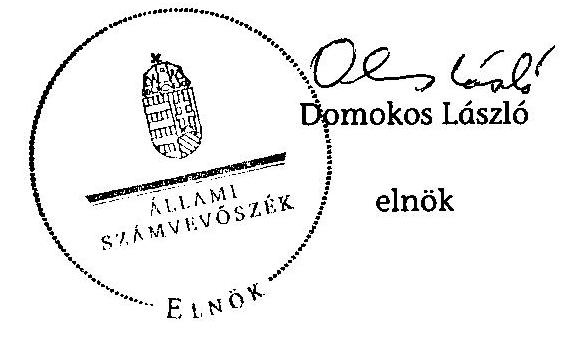
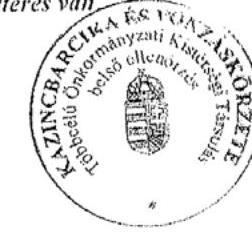

# ÁLLAMI   SZÁMVEVŐSZÉK 

## JELENTÉS

az önkormányzatok belső kontrollrendszere kialakításának, egyes
kontrolltevékenységek és a belső ellenőrzés
működésének - 2013. évben induló - ellenőrzéséről
Rudabánya
13191
2013. december

---

# Állami Számvevőszék 

Iktatószám: V-0136-036/2013.
Témaszám: 1162
Vizsgálat-azonosító szám: V064907

## Az ellenőrzést felügyelte:

Dr. Benedek Mária
felügyeleti vezető
Az ellenőrzést vezette és az ellenőrzés végrehajtásáért felelős:
Bíró Zsolt
ellenőrzésvezető
A számvevőszéki jelentés összeállításában közreműködtek:
Pappné dr. Szamosi Éva
számvevő tanácsos
Tóth Béla
számvevő
Az ellenőrzést végezték:
Boldoczki János Tóth Béla
számvevő

---

# TARTALOMJEGYZÉK 

BEVEZETÉS ..... 5
I. ÖSSZEGZŐ MEGÁLLAPÍTÁSOK, KÖVETKEZTETÉSEK, JAVASLATOK ..... 9
II. RÉSZLETES MEGÁLLAPÍTÁSOK ..... 15

1. Az önkormányzat belső kontrollrendszerének kialakítása ..... 15
1.1. A kontrollkörnyezet ..... 15
1.2. A kockázatkezelési rendszer ..... 16
1.3. A kontrolltevékenységek ..... 16
1.4. Az információs és kommunikációs rendszer ..... 17
1.5. A monitoring rendszer ..... 17
2. A pénzügyi folyamatokban kulcsszerepet betöltő teljesítésigazolás és érvényesítés belső kontrollok működése ..... 18
3. A belső ellenőrzés működése ..... 19

## MELLÉKLETEK

1. számú Az észrevételt tartalmazó polgármesteri levél
2. számú Az észrevételre vonatkozó elnöki válaszlevél

## FÜGGELÉKEK

1. számú Értelmező szótár
2. számú Az értékelés módja és szempontjai

---

.

---

# RÖVIDÍTÉSEK JEGYZÉKE 

## Törvények

Áht.
ÁSZ tv.
Htv.

Kttv.

Mötv.

Nvtv.

Ötv.
Számv. tv.

## Rendeletek

Ávr.

Bkr.
vagyongazdálkodási rendelet ${ }_{1}$
vagyongazdálkodási rendelet ${ }_{2}$

## Szórövidítések

ÁSZ
Belső ellenőrzési kézikönyv
bizonylati rend
gazdálkodási jogkörök szabályzata
gazdasági program
Hivatal
2011. évi CXCV. törvény az államháztartásról (hatályos 2012. január 1-jétől)
2011. évi LXVI. törvény az Állami Számvevőszékről
1991. évi XX. törvény a helyi önkormányzatok és szerveik, a köztársasági megbízottak, valamint egyes centrális alárendeltségű szervek feladat- és hatásköreiről
2011. évi CXCIX. törvény a közszolgálati tisztviselőkről (hatályos 2012. március 1-jétől)
2011. évi CLXXXIX. törvény Magyarország helyi önkormányzatairól (hatályos 2012. január 1-jétől)
2011. évi CXCVI. törvény a nemzeti vagyonról (hatályos 2011. december 31-étől)
1990. évi LXV. törvény a helyi önkormányzatokról
2000. évi C. törvény a számvitelről

368/2011. (XII. 31.) Korm. rendelet az államháztartásról szóló törvény végrehajtásáról (hatályos 2012. január 1-jétől)
370/2011. (XII. 31.) Korm. rendelet a költségvetési szervek belső kontrollrendszeréről és belső ellenőrzéséről (hatályos 2012. január 1-jétől)
Rudabánya Városi Önkormányzat Képviselő-testületének 5/2008. (III. 31.) sz. rendelete Rudabánya Város Önkormányzata vagyonáról és a vagyongazdálkodás szabályairól (hatályos 2012. december 31-ig)
Rudabánya Városi Önkormányzat Képviselő-testületének 2/2013. (II. 18.) sz. rendelete az Önkormányzat vagyonáról és vagyongazdálkodás szabályairól (hatályos 2013. január 1-jétől)

Állami Számvevőszék
Kazincbarcika és Vonzáskörzete Többcélú Önkormányzati Kistérségi Társulás Belső Ellenőrzési Kézikönyve (hatályos 2012. január 2-tól)
Rudabánya Város Önkormányzata Bizonylati Szabályzata (hatályos 2008. március 1-jétől)
Rudabánya Város Önkormányzata Polgármesteri Hivatalának Gazdálkodási Szabályzata (hatályos 2012. január 1-jétől)
Rudabánya Város Önkormányzat Képviselő-testületének Gazdasági Programja 2011-2014. évre
Rudabányai Közös Önkormányzati Hivatal

---

| hivatali SZMSZ | Rudabánya Város Önkormányzatának Polgármesteri Hivatala Szervezeti és Működési Szabályzata (hatályos 2012. január 1-jétől) |
| :--: | :--: |
| hivatal ügyrendje | Rudabánya Város Önkormányzatának Polgármesteri Hivatala Ügyrendje (hatályos 2011. március 1-jétől) |
| INTOSAI | International Organization of Supreme Audit Institutions (Legfőbb Ellenőrző Intézmények Nemzetközi Szervezete) |
| iratkezelési szabályzat | Rudabánya Város Önkormányzata Polgármesteri Hivatalának Iratkezelési szabályzata és Irattári terve (hatályos 2010. január 1-jétől) |
| ISSAI | International Standards of Supreme Audit Institutions (Legfőbb Ellenőrző Intézmények Nemzetközi Standardjai) |
| jegyző | Rudabánya Város Önkormányzata Polgármesteri Hivatalának címzetes főjegyzője |
| Képviselő-testület | Rudabánya Város Önkormányzatának Képviselőtestülete |
| NGM | Nemzetgazdasági Minisztérium |
| Önkormányzat polgármester | Rudabánya Város Önkormányzata |
| Polgármesteri Hivatal | Rudabánya Város Önkormányzatának polgármestere |
| szabálytalanságkezelési   szabályzat | Rudabánya Város Önkormányzatának Polgármesteri Hivatala Szervezeti és Működési Szabályzata (5/2012. (I. 27.) hat. 3. sz. melléklete „A szabálytalanságok kezelésének eljárásrendje" (hatályos 2012. január 1-jétől) |
| számlarend | Rudabánya Város Önkormányzata Polgármesteri Hivatalának Számlarendje (hatályos 2010. március 29-étől) |
| TÁMOP | Társadalmi Megújulás Operatív Program |
| TÁMOP projekt | A Dél-Cserehát és Szuha-völgyi akcióterület településeinek összefogása a mélyszegény emberek integrációja és a szervezetek közötti együttműködés fejlesztése érdekében című TÁMOP-5.1.3-09/2-2010-0046. pályázat |
| Társulás | Kazincbarcika és Vonzáskörzete Többcélú Önkormányzati Kistérségi Társulás |

---

# JELENTÉS 

## az önkormányzatok belső kontrollrendszere kialakításának, egyes kontrolltevékenységek és a belső ellenőrzés működésének - 2013. évben induló - ellenőrzéséről Rudabánya

## BEVEZETÉS

Rudabánya város állandó lakosainak száma 2012. január 1-jén 2764 fő volt. Az Önkormányzat héttagú Képviselő-testületének munkáját egy állandó bizottság segítette. Az Önkormányzat az önállóan működő és gazdálkodó Polgármesteri Hivatalon kívül öt önállóan működő intézményt működtetett, és egy többségi tulajdoni hányaddal gazdasági társasággal rendelkezett. A polgármester a 2002. évi önkormányzati választások óta tölti be tisztségét. A jegyző 2007. október 1-jétől látja el feladatait. A Polgármesteri Hivatal két szervezeti egységre tagolódott, elkülönített gazdasági szervezettel nem rendelkezett. A foglalkoztatott köztisztviselők száma 2012. január 1-jén 13 fő volt. Rudabánya székhellyel, 2013. január 1-jétől kezdődően Rudabánya, Izsófalva és Alsótelekes önkormányzatainak képviselő-testületei létrehozták a Rudabányai Közös Önkormányzati Hivatalt. Az Önkormányzat a 2012. évi költségvetési beszámolója szerint 801129 ezer Ft tárgyévi bevételt ért el, valamint 756497 ezer Ft tárgyévi kiadást teljesített. A 2012. december 31-i könyvviteli mérleg szerint 1390569 ezer Ft értékű eszközvagyonnal rendelkezett, a rövid lejáratú kötelezettségállománya 4222 ezer Ft volt, hosszú lejáratú kötelezettségállománya nem volt.

A demokratikus társadalmakban alapvető igény, hogy a közpénzeket, a közvagyont használók tevékenységükről elszámoljanak, ahhoz egyértelmű és érvényesíthető felelősségi szabályok társuljanak. Ennek a jogos igénynek az érvényesítéséhez meg kell teremteni azokat a folyamatokat, rendszereket, amelyek nélkülözhetetlenek az elszámoltatáshoz. Az elszámoltatás eredményes működtetéséhez szükség van a megfelelő információs, kontroll, értékelési és beszámolási rendszerek kialakítására.

Magyarországon az uniós csatlakozási tárgyalások idejére nyúlnak vissza a belső kontrollrendszer szabályozásának gyökerei. Az uniós elvárásoknak megfelelő új terminológia szerinti államháztartási belső pénzügyi ellenőrzési (ÁBPE) rendszer területén a jogharmonizáció 2003-ban teljes körűen megvalósult, míg az önkormányzati alrendszerre vonatkozó, Ötv.-ben megjelenített speciális szabályozás 2005-ben lépett hatályba. Az államháztartási belső kontrollrendszer koncepciója 2009-ben továbbfejlődött. A változások irányát mutatja, hogy a költségvetési szervek belső kontrollrendszere már magában foglalja

---

a korszerű, felelős szervezetirányítás elemeit (kontrollkörnyezet, kockázatkezelés, kontrolltevékenység, információ és kommunikáció, monitoring) is. E kontrollrendszer szabályozása háromszintű, a törvényi előírásokat az Áht. és a Mötv., a rendeleti szintű szabályozást az Ávr. és a Bkr. tartalmazza, amelyeket útmutatói szinten az NGM által kiadott standardok és kézikönyvek támogatnak.

A belső kontrollrendszer azt a célt szolgálja, hogy a költségvetési szervek működésük és gazdálkodásuk során a tevékenységeket szabályszerűen, gazdaságosan, hatékonyan és eredményesen hajtsák végre, teljesítsék elszámolási kötelezettségeiket és megvédjék az erőforrásokat a veszteségektől, a károktól és a nem rendeltetésszerű használattól. A belső kontrollrendszer magában foglalja mindazon szabályokat, eljárásokat, gyakorlati módszereket és szervezeti struktúrákat, kockázatkezelési technikákat, kontrolltevékenységeket, amelyek segítséget nyújtanak a szervezetnek céljai eléréséhez.

Az ÁSZ a 2011-2015. évekre szóló stratégiájában hangsúlyos szerepet szánt annak, hogy szilárd szakmai alapon álló, értékteremtő ellenőrzéseivel előmozdítsa a közpénzügyek átláthatóságát, rendezettségét. A számvevőszéki ellenőrzés nemzetközi alapelvei is rögzítik, hogy a megfelelő belső kontrollrendszer minimálisra csökkenti a hibák és szabálytalanságok kockázatát.

Az ellenőrzés célja annak megállapítása volt, hogy a belső kontrollrendszer elemeinek kialakítása, a pénzügyi folyamatokban kulcsszerepet betöltő teljesítésigazolás és érvényesítés, és a belső ellenőrzés szabályos működése biztosította-e az önkormányzatnál a közpénzfelhasználás szabályosságát, hozzájárult-e az értéket teremtő rend követelményének érvényesüléséhez.

Ennek keretében értékeltük, hogy:

- a jogszabályi előírásoknak megfelelően alakították-e ki a belső kontrollrendszer elemeit;
- a gazdálkodás folyamatában kulcsszerepet betöltő teljesítésigazolás és érvényesítés kontrolltevékenységeit megfelelően működtették-e;
- biztosították-e a belső ellenőrzés szabályos működését;
- amennyiben az ÁSZ tett javaslatot a 2008-2011. évek közötti ellenőrzése kapcsán az Önkormányzatnak, intézkedtek-e azok végrehajtására.

Az ellenőrzés várható hasznosulását négy szinten tervezzük. A törvényalkotás számára összegzett tapasztalatok állnak rendelkezésre a belső kontrollrendszer önkormányzati területen való kialakításáról, működéséről és hatásairól, a belső ellenőrzés működéséről. Ennek alapján következtetést lehet levonni arról, hogy a belső kontrollrendszer kialakítására és működtetésére vonatkozó jelenlegi, differenciálás nélküli jogszabályi előírások reális követelményeket támasztanak-e az eltérő adottságú települési önkormányzatok esetében, illetve indokolt-e esetleges jogszabályi módosítás kezdeményezése. Az ellenőrzés az ellenőrzött számára visszajelzést ad a belső kontrollrendszer kialakításában és működésében fellépő hiányosságokról, javaslataival hozzájárul azok kiküszöböléséhez, amely csökkentheti a későbbi ellenőrzések gyakoriságát. Az ellen-

---

őrzés megállapításait és javaslatait más szervezetek is hasznosíthatják a rendezett gazdálkodási keretek kialakításához. A társadalom számára jelzi, hogy közpénz nem maradhat ellenőrizetlenül, az ÁSZ értékteremtő rend kialakításához és megőrzéséhez hozzájáruló tevékenysége pozitív hatással lesz a szervezetről kialakított összkép formálásában. A szervezeten belül lehetőség nyílik arra, hogy a megállapítások szintetizálásával az ÁSZ a hozzáadott értéket teremtő elemző tevékenységét és tanácsadó szerepét is erősítse.

Az önkormányzatok belső kontrollrendszere kialakításának, egyes kontrolltevékenységek és a belső ellenőrzés működésének ellenőrzéséről szóló jelentés I. fejezetének összegző része az ellenőrzés céljára ad rövid, szintetizáló összefoglalót, és tartalmazza a következtetéseket a II. fejezet részletes megállapításain alapulóan. A jelentés intézkedést igénylő megállapításait és javaslatait az ellenőrzés során feltárt, a jelentés II. fejezetében rögzített részletes megállapítások alapozzák meg. A helyszíni ellenőrzés lezárásáig a helyi szabályozás változásait nyomon követtük.

Az ellenőrzés típusa: szabályszerűségi ellenőrzés.
Az ellenőrzött időszak: a belső kontrollrendszer kialakításának megfelelősége esetében a 2012. évre, a pénzügyi folyamatokban kulcsszerepet betöltő teljesítésigazolás és érvényesítés belső kontrollok működésének megfelelőségét és a belső ellenőrzés szabályszerű működését a 2012. január 1. és december 31-e közötti időszak eseményeit figyelembe véve értékeltük, míg az ÁSZ javaslatainak utóellenőrzése a 2008-2011. években végzett ellenőrzések nyilvánosságra hozott jelentéseiben tett javaslatok áttekintésére terjedt ki.

# Az ellenőrzött szervezet: az Önkormányzat. 

Az ellenőrzés jogszabályi alapját az ÁSZ tv. 1. § (3) bekezdése, az 5. § (2) és (6) bekezdése, valamint az Áht. 61. § (2) bekezdésének előírásai képezik.

Az ellenőrzés szakmai módszertana az ÁSZ hivatalos honlapján (www.asz.hu) közzétett szakmai szabályokon alapult, amely az INTOSAI által kiadott ISSAI figyelembevételével készült.

Az ellenőrzés lefolytatásához az Önkormányzat a kimutatások és a tanúsítvány elektronikus kitöltésével, valamint az ÁSZ által kért dokumentumok elektronikus megküldésével szolgáltatott adatokat. Az így rendelkezésre bocsátott adatok, információk kontrollja és a munkalapok kitöltése a helyszíni ellenőrzés keretében történt. A jelentésben használt fogalmak magyarázatát az 1. számú függelék, az ellenőrzés egyes területeinek értékelésénél alkalmazott egységes minősítési szempontokat a 2. számú függelék tartalmazza.

A belső kontrollrendszer kialakításának ellenőrzése során értékeltük a kontrollkörnyezet, a kockázatkezelési rendszer, a kontrolltevékenységek, az információs és kommunikációs rendszer, valamint a monitoring rendszer szabályozottságának megfelelőségét. A pénzügyi folyamatokban kulcsszerepet betöltő teljesítésigazolás és érvényesítés kontrollok működése megfelelőségének minősítéséhez az állományba nem tartozók megbízási díjai, a külső szolgáltatók által végzett karbantartási, kisjavítási munkák, az egyéb üzemeltetési és fenntartási

---

szolgáltatások, a rendszeres szociális segélyek, valamint az államháztartáson kívülre teljesített működési és felhalmozási célú pénzeszközátadások közül kockázatelemzéssel választottuk ki az ellenőrzött kiadási jogcímeket. Az egyszerű véletlen mintavétellel kiválasztott tételek ellenőrzését többlépcsős megfelelőségi tesztek útján addig végeztük, amíg elegendő és megfelelő bizonyítékot szereztünk a vizsgált folyamatok kulcskontrolljai működésének megfelelő vagy nem megfelelő voltáról. Értékeltük az Önkormányzatnál a belső ellenőrzés működésének szabályosságát. Utóellenőrzésre nem került sor, mivel az ÁSZ az Önkormányzatnál a 2008-2011. évek között nem végzett ellenőrzést.

Az Ász tv. 29. § (1) bekezdése szerint a jelentéstervezetet megküldtük
 a polgármester részére, aki az ÁSZ tv. 29. § (2) bekezdésében foglalt észrevételezési jogával élt, a jelentéstervezetre észrevételt tett. Az ÁSZ tv. 29. § (3) bekezdésében előírtaknak megfelelően a figyelembe nem vett észrevételeket és annak indokairól szóló tájékoztatást a jelentés tartalmazza (2. számú melléklet).

---

# I. ÖSSZEGZŐ MEGÁLLAPÍTÁSOK, KÖVETKEZTETÉSEK, JAVASLATOK 

A belső kontrollrendszeren belül 2012-ben a kontrollkörnyezet, a kockázatkezelési rendszer, a kontrolltevékenységek, az információs és kommunikációs rendszer, valamint a monitoring rendszer kialakítását külön-külön és együttesen is értékeltük. A belső kontrollrendszer kialakítása az összesített értékelés alapján nem felelt meg a jogszabályi előírásoknak.

A belső kontrollrendszer egyes területei kialakításának minősítése a következő:

| Kontrollterület | Minősítés |
| :-- | :--: |
| Kontrollkörnyezet | nem |
|  | megfelelő |
| Kockázatkezelési rendszer | nem |
|  | megfelelő |
| Kontrolltevékenységek | részben |
|  | megfelelő |
| Információs és kommunikációs |  |
| rendszer | nem |

Megfelelőnek értékeltük az információs és kommunikációs rendszer kialakítását, mivel a jegyző a jogszabályi előírásokban foglaltakat figyelembe véve kisebb hiányosságok mellett is megteremtette e kontrollterületen a szabályszerű működés lehetőségét.

Részben megfelelőnek értékeltük a kontrolltevékenységek kialakítását, mivel a megállapított kisebb szabályozásbeli hiányosságok nem veszélyeztették e kontrollterületen a szabályszerű működést.

Nem megfelelőnek értékeltük a kontrollkörnyezet, a kockázatkezelési rendszer, valamint a monitoring rendszer kialakítását, mivel az ellenőrzésünk során megállapított szabályozásbeli hiányosságok magukban hordozzák a szabálytalan működés, valamint a korrupció kockázatát.

A belső kontrollrendszer nem megfelelő kialakítása kockázatot jelent az Önkormányzat tevékenységeinek szabályszerű, gazdaságos, hatékony és eredményes végrehajtása során.

A 2012. évben az állományba nem tartozók megbízási díjaival, valamint a külső szolgáltatók által végzett karbantartási, kisjavítási munkákkal kapcsolatos kifizetések során a pénzügyi folyamatokban kulcsszerepet betöltő teljesítésigazolás és érvényesítés belső kontrollok működése gyenge volt. Gyen-

---

gének értékeltük a két kulcskontroll együttes működését, mivel azok nem biztosították a hibák megelőzését és feltárását.

A számvevőszéki ellenőrzés az ellenőrzött kifizetésekkel összefüggésben a rendelkezésre bocsátott dokumentumok alapján jogosulatlan kifizetést nem tárt fel, azonban a gazdálkodásban kulcsszerepet betöltő kontrollok működésében feltárt hiányosságok miatt fennáll a hibák bekövetkezésének kockázata. A nem megfelelően működtetett belső kontrollok korrupciós kockázatot hordoznak.

Az Önkormányzat a belső ellenőrzési feladatokat a Társulás útján látta el. A 2012. évben a belső ellenőrzés működése a jogszabályi előírásoknak megfelelt, azonban a belső ellenőrzés nem tárta fel a belső kontrollrendszer kialakításának, valamint a pénzügyi folyamatokban kulcsszerepet betöltő teljesítésigazolás és érvényesítés belső kontrollok működésének hiányosságait.

Az ÁSZ tv. 33. § (1) bekezdésében foglaltak értelmében az ellenőrzött szervezet vezetője köteles a jelentésben foglalt megállapításokhoz kapcsolódó intézkedési tervet összeállítani, és azt a jelentés kézhezvételétől számított 30 napon belül az ÁSZ részére megküldeni. Amennyiben az intézkedési tervet határidőre nem küldi meg a szervezet, vagy az ÁSZ tv. 33. § (2) bekezdésében foglalt póthatáridő elteltével megküldött intézkedési terv továbbra sem elfogadható, az ÁSZ elnöke a hivatkozott törvény 33. § (3) bekezdés a)-b) pontjaiban foglaltakat érvényesítheti.

Az ellenőrzés intézkedést igénylő megállapításai és javaslatai:

# a polgármesternek 

1. Az Önkormányzat nevében történő kötelezettségvállalásra - az Áht. 37. § (1) bekezdésében és az Ávr. 55. § (1) bekezdésében foglaltak ellenére - pénzügyi ellenjegyzés nélkül került sor.

Javaslat:
Intézkedjen arról, hogy az Önkormányzat nevében történő kötelezettségvállalásra az Áht. 37. § (1) bekezdésében és az Ávr. 55. § (1) bekezdésében foglaltaknak megfelelően - az Ávr. 53. §-ában meghatározott kivételekkel - kizárólag a pénzügyi ellenjegyzés után, a pénzügyi teljesítés esedékességét megelőzően, írásban kerüljön sor.
2. A polgármester mint kötelezettségvállaló - az Ávr. 57. § (4) bekezdésében foglaltak ellenére - 2012. március 31-től írásban nem jelölte ki a teljesítésigazolásra jogosult személyeket.

Javaslat:
Jelölje ki az Ávr. 57. § (4) bekezdésének megfelelően az általa történő kötelezettségvállalások esetében a teljesítés igazolására jogosult személyeket.
3. A számvevőszéki ellenőrzés megállapításai alapján az Önkormányzatnál a belső kontrollrendszer kialakítása összefoglalóan értékelve nem felelt meg a jogszabályi előírásoknak, a kulcskontrollok működése gyenge volt, a belső ellenőrzés működése

---

ugyan megfelelt a jogszabályi előírásoknak, azonban nem tárta fel, ezáltal nem is javíttatta ki a feltárt hiányosságokat. A megállapított szabályozásbeli és működésbeli hiányosságok magukban hordozzák a szabálytalan működés kockázatát.

Javaslat:
A Mötv. 115. § (1) bekezdésében foglaltak alapján kísérje figyelemmel az Önkormányzat gazdálkodásának szabályszerűségét. A Mötv. 67. § f) pontja alapján gondoskodjon a belső kontrollrendszer működésére vonatkozó jogszabályi rendelkezések be nem tartása, valamint a teljesítésigazolás és az érvényesítés kontrollokkal összefüggésben feltárt hiányosságok, szabálytalanságok tekintetében az esetleges munkajogi felelősséggel kapcsolatos körülmények kivizsgálásáról, majd a vizsgálat eredményének függvényében tegye meg a szükséges munkajogi intézkedéseket.

# a jegyzőnek (Rudabánya Város Önkormányzata vonatkozásában) 

1. a kontrollkörnyezettel kapcsolatban:

A hivatali SZMSZ-ben a jegyző - az Ávr. 13. § (1) bekezdés c) és i) pontjában foglaltak ellenére - nem rögzítette az alaptevékenységet szabályozó jogszabályok megjelölését és az irányítószerv által az Ávr. 10. § (1)-(3) bekezdései szerint a költségvetési szervhez rendelt más költségvetési szervek felsorolását.

A jegyző a számlarend által, a Számv. tv. 161. § (2) bekezdés d) pontja alapján tartalmazott bizonylati rend szükséges módosítását - a Számv. tv. 161. § (5) bekezdésében foglaltak ellenére - a törvényi változás hatálybalépését követő 90 napon belül nem végezte el.

A Képviselő-testület - a Kttv. 231. § (1) bekezdése ellenére - nem állapította meg - a Kttv. 83. §-a szerinti - a köztisztviselőkkel szembeni hivatásetikai alapelvek részletes tartalmát, valamint az etikai eljárás szabályait, mivel a jegyző - az Ötv. 36. § (2) bekezdés a) pontjában előírt feladata ellenére - nem készítette elő ennek dokumentumát.

Javaslat:
a) Módosítsa a hivatali SZMSZ-t annak érdekében, hogy az tartalmazza az Ávr. 13. § (1) bekezdésében előírt valamennyi tartalmi elemet, és kezdeményezze az Áht. 9. § (1) bekezdés a) pontjában foglaltakra tekintettel a módosítás Képviselőtestület elé terjesztését.
b) A számlarend által tartalmazott bizonylati rend szükséges módosítását a Számv. tv. 161. § (5) bekezdése alapján a törvényi változás hatálybalépését követő 90 napon belül végezze el.
c) Készítse elő a Mötv. 81. § (3) bekezdés c) pontjában foglalt feladatkörében a köztisztviselőkkel szembeni - a Kttv. 83. §-a szerinti - hivatásetikai alapelvek részletes tartalmának, valamint az etikai eljárás szabályainak dokumentumait, és a Kttv. 231. § (1) bekezdésében foglaltak érvényesülése érdekében kezdeményezze azok Képviselő-testület elé terjesztését.

---

2. a kockázatkezelési rendszerrel kapcsolatban:

A jegyző - a Bkr. 7. § (2) bekezdésében foglaltak ellenére - nem határozta meg az egyes kockázatok kezeléséhez szükséges intézkedéseket és azok teljesítése folyamatos nyomon követésének módját.

Javaslat:
Határozza meg a Bkr. 7. § (2) bekezdésében foglaltak szerint az egyes kockázatokkal kapcsolatban a szükséges intézkedéseket, valamint azok teljesítése folyamatos nyomon követésének módját.
3. a kontrolltevékenységekkel kapcsolatban:

A jegyző az Ávr. 53. § (2) bekezdésében foglaltakat figyelmen kívül hagyva annak ellenére nem határozta meg az írásbeli kötelezettségvállalást nem igénylő kifizetések rendjét, hogy a belső szabályozásban lehetővé tette a 100 ezer Ft alatti kifizetések előzetes írásbeli kötelezettségvállalás nélküli teljesítését.

A jegyző - a Bkr. 8. § (4) bekezdés b) pontjában foglaltak ellenére - belső szabályzatban nem határozta meg a dokumentumokhoz és információkhoz való hozzáférésre vonatkozó felelősségi köröket.

A jegyző - az Ávr. 13. § (5) bekezdésében foglaltak ellenére - nem határozta meg a gazdasági feladatot ellátó vezető és alkalmazottak helyettesítésének rendjét.

Javaslat:
a) Rögzítse belső szabályzatban az Ávr. 53. § (2) bekezdése alapján az előzetes írásbeli kötelezettségvállalást nem igénylő kifizetések rendjét.
b) Szabályozza a Bkr. 8. § (4) bekezdés b) pontja alapján a dokumentumokhoz és információkhoz való hozzáférés esetében a felelősségi köröket.
c) Határozza meg az Ávr. 13. § (5) bekezdésében előírtak alapján a gazdasági feladatot ellátó vezető és alkalmazottak helyettesítésének rendjét.
4. a monitoring rendszerrel kapcsolatban:

A jegyző - a Bkr. 3. § e) pontjában és 10. §-ában foglaltak ellenére - nem alakította ki a Polgármesteri Hivatal tevékenységének, a célok megvalósításának nyomon követését biztosító rendszert.

Javaslat:
Alakítsa ki és működtesse a Bkr. 3. § e) bekezdésében és 10. §-ában előírtak alapján a Polgármesteri Hivatal tevékenységének, a célok megvalósításának nyomon követését biztosító rendszert.

---

5. a pénzügyi folyamatokban kulcsszerepet betöltő kontrollok működésével kapcsolatban:

A kifizetéseket megelőzően a teljesítésigazolást - az Áht. 38. § (1) bekezdésében és az Ávr. 57. § (1) és (3) bekezdésében foglaltak ellenére - nem végezték el, vagy a teljesítésigazolás nem szabályszerűen történt.

Az érvényesítő - az Ávr. 58. § (2) bekezdésében előírtak ellenére - nem jelezte az utalványozónak, hogy a megelőző ügymenetben a teljesítésigazolás elmaradt, vagy nem szabályszerűen történt, a kötelezettségvállalásokra - az Áht. 37. § (1) bekezdésében és az Ávr. 55. § (1) bekezdésében előírtak ellenére - ellenjegyzés nélkül került sor, valamint hogy az utalványon, a kiadási pénztárbizonylaton az Ávr. 59. § (3) bekezdés f) pontjában és (4) bekezdésében előírtakat figyelmen kívül hagyva nem tüntették fel a kötelezettségvállalás nyilvántartási számát, továbbá hogy a kötelezettségvállalásról vezetett nyilvántartások adattartalma nem felelt meg az Ávr. 56. § (1) bekezdésében foglalt előírásoknak.

Javaslat:
Intézkedjen - a teljesítésigazolás és az érvényesítés vonatkozásában feltárt hiányosságok megszüntetése, illetve az operatív gazdálkodás során a működésbeli hibák megelőzése, feltárása és kijavítása érdekében - arról, hogy:
a) az Áht. 38. § (1) bekezdésén alapuló teljesítésigazolás során az Ávr. 57. § (1) bekezdésében előírtaknak megfelelően, ellenőrizhető okmányok alapján ellenőrizzék és igazolják a kiadások teljesítésének jogosságát, összegszerűségét, az ellenszolgáltatást is magában foglaló kötelezettségvállalás esetén annak teljesítését, valamint az Ávr. 57. § (3) bekezdése szerint a teljesítést az igazolás dátumának és a teljesítés tényére történő utalásnak a megjelölésével, az arra jogosult személy aláírásával igazolják;
b) a kifizetéseket megelőzően a teljesítésigazolás alapján - az Ávr. 57. § (3) bekezdése szerinti esetben annak hiányában is - az összegszerűségnek, a fedezet meglétének és a megelőző ügymenetben az Áht., az Áhsz., az Ávr. előírásai és a belső szabályzatokban foglaltak betartásának az ellenőrzése - az Ávr. 58. § (1)-(3) bekezdései szerint - történjen meg;
c) kötelezettségvállalásra - az Áht. 37. § (1) és az Ávr. 55. § (1) bekezdésében foglaltaknak megfelelően, az Ávr. 53. §-ában meghatározott kivételekkel - kizárólag a pénzügyi ellenjegyzés után, a pénzügyi teljesítést megelőzően, írásban kerüljön sor;
d) a kötelezettségvállalások nyilvántartását az Ávr. 56. § (1) bekezdésében foglalt előírásnak megfelelően vezessék, és az Ávr. 59. § (3)-(4) bekezdései alapján az utalványon, valamint a bevételi és kiadási pénztárbizonylatra rávezetett rendelkezésen a kötelező tartalmi elemeket tüntessék fel.

---

6. a belső ellenőrzés működésével kapcsolatban:

A Belső ellenőrzési kézikönyv - a Bkr 17. § (2) bekezdés c) pontjában foglaltak ellenére - nem tartalmazta a tervezés megalapozásához alkalmazott kockázatelemzési módszertan leírását.

A stratégiai ellenőrzési terv - a Bkr. 30. § (1) bekezdés c) és f) pontjában foglalt előírás ellenére - nem tartalmazta a kockázati
 tényezők értékelését és az ellenőrzési gyakoriságot.

A 2013. évi ellenőrzési terv - a Bkr. 31. § (4) bekezdés a) pontjában foglaltak ellenére - nem tartalmazta az ellenőrzési tervet megalapozó elemzések eredményének összefoglaló bemutatását. A Bkr. 31. § (2) bekezdésében foglaltakkal ellentétben a 2013. évi ellenőrzési tervet nem alapozták meg kockázatelemzés alapján felállított prioritások.

A belső ellenőrzési vezető - a Bkr. 21. § (2) bekezdés d) pontjában és a 47. § (1) bekezdésében foglaltak ellenére - a belső ellenőrzési jelentésekben tett javaslatokat nyomon követő nyilvántartást nem vezetett.

Az éves ellenőrzési jelentés - a Bkr. 48. § b) pont bb) alpontjában foglaltak ellenére nem tartalmazta a belső kontrollrendszer öt elemének értékelését.

Javaslat:
a) Intézkedjen arról, hogy a Belső ellenőrzési kézikönyv tartalmazza a Bkr 17. § (2) bekezdésében előírt tartalmi elemeket.
b) Kezdeményezze, hogy a stratégiai ellenőrzési terv tartalmazza a Bkr. 30. § (1) bekezdésében előírt tartalmi elemeket.
c) Intézkedjen, hogy az éves ellenőrzési tervek tartalmazzák a Bkr. 31. § (4) bekezdésében előírt tartalmi elemeket, továbbá az éves ellenőrzési terv a Bkr. 22. § (1) bekezdés b) pontja, a 29. § (1) és a 31. § (2) bekezdése alapján kockázatelemzésen alapuljon.
d) Kezdeményezze, hogy a belső ellenőrzési vezető vezessen a Bkr. 21. § (2) bekezdése d) pontjának és a Bkr. 47. § (1) bekezdésének megfelelően a belső ellenőrzési jelentésekben tett megállapításokat, javaslatokat, a vonatkozó intézkedési terveket és azok végrehajtását nyomon követő nyilvántartást.
e) Kezdeményezze, hogy az éves ellenőrzési jelentés tartalmazza a Bkr. 48. §-ában előírt tartalmi elemeket.

---

# II. RÉSZLETES MEGÁLLAPÍTÁSOK 

## 1. AZ ÖNKORMÁNYZAT BELSŐ KONTROLLRENDSZERÉNEK KIALAKÍTÁSA

A belső kontrollrendszeren belül 2012-ben a kontrollkörnyezet, a kockázatkezelési rendszer, a kontrolltevékenységek, az információs és kommunikációs rendszer, valamint a monitoring rendszer kialakítását külön-külön és együttesen is értékeltük. A belső kontrollrendszer kialakítása az összesített értékelés alapján nem felelt meg a jogszabályi előírásoknak.

### 1.1. A kontrollkörnyezet

A kontrollkörnyezet kialakítása - a 2. számú függelékben részletezett kritériumrendszer alapján végzett értékelés szerint - nem felelt meg, mert:

| Sorszám $^{1}$ | Megállapítás | Megjegyzés |
| :--: | :--: | :--: |
| 7.,   12. | A hivatali SZMSZ-ben a jegyző - az Ávr. 13. § (1) bekezdés c) és i) pontjában foglaltak ellenére - nem rögzítette az alaptevékenységet szabályozó jogszabályok megjelölését és az irányítószerv által az Ávr. 10. § (1)-(3) bekezdései szerint a költségvetési szervhez rendelt más költségvetési szervek felsorolását. |  |
| 16. | A jegyző - az Ötv. 36. § (2) bekezdés a) pontjában ${ }^{2}$ foglaltak ellenére - nem készítette elő határidőn belül a vagyongazdálkodási rendelet ${ }_{1}$-nek - az Nvtv. 5. § (5)-(7) bekezdései előírásainak megfelelő - módosítását, így a Képviselő-testület az Nvtv. 18. § (12) bekezdésében meghatározott határidőt túllépve fogadta el a vagyongazdálkodás szabályairól szóló új önkormányzati rendeletet. | A 2013. évben a jegyző elkészítette és a Képviselő-testület elfogadta a vagyongazdálkodási rendelet ${ }_{2}$-őt. |
| 31. | A jegyző a számlarend részét képező - a Számv. tv. 161. § (2) bekezdés d) pontjában előírt - bizonylati rend szükséges módosítását - a Számv. tv. 161. § (5) bekezdésében foglaltak ellenére - a törvényi változás hatálybalépését követő 90 napon belül nem végezte el. |  |

[^0]
[^0]:    ${ }^{1}$ A megállapítás számozása az Önkormányzat által az adatszolgáltatás során kitöltött kimutatások kérdéseinek sorszámával azonos.
    ${ }^{2}$ 2013. január 1-jétől a Mötv. 81. § (3) bekezdés c) pontja

---

A Képviselő-testület - a Kttv. 231. § (1) bekezdés ellenére - nem állapította meg - a Kttv. 83. §-a szerinti - a köztisztviselőkkel szembeni hivatásetikai alapelvek részletes tartalmát, valamint az etikai eljárás szabályait, mivel a jegyző - az Ötv. 36. § (2) bekezdés a) pontjában előírt feladata ellenére nem készítette elő ennek dokumentumát.

# 1.2. A kockázatkezelési rendszer 

A kockázatkezelési rendszer kialakítása - a 2. számú függelékben részletezett kritériumrendszer alapján végzett értékelés szerint - nem felelt meg, mert:

Sor-
szám
Megállapítás
A jegyző - a Bkr. 7. § (2) bekezdésében foglaltak ellenére - nem határozta 8., 10. meg az egyes kockázatok kezeléséhez szükséges intézkedéseket és azok teljesítése folyamatos nyomon követésének módját.

### 1.3. A kontrolltevékenységek

A kontrolltevékenységek kialakítása - a 2. számú függelékben részletezett kritériumrendszer alapján végzett értékelés szerint - a jogszabályi előírásoknak részben felelt meg.

A jegyző a kontrolltevékenység részeként előírta a folyamatba épített, előzetes, utólagos és vezetői ellenőrzést a költségvetés tervezése, a beszerzések lebonyolítása, a vagyonhasznosítási tevékenység és a támogatások elszámolása vonatkozásában. A gazdálkodási jogkörök szabályzatában meghatározta és előírta a kötelezettségvállalás pénzügyi ellenjegyzésének, valamint a kiadások teljesítésigazolásának módját, továbbá szabályozta az érvényesítés és utalványozás rendjét. A hivatal ügyrendjében a jegyző meghatározta az időközi és éves beszámolók elkészítésének feladatait és a beszámolási eljárásokhoz kapcsolódó felelősségi köröket.

A jegyző a pénzügyi ellenjegyzési és érvényesítési feladatra kijelölte a jogszabályban előírt szakképzettséggel rendelkező, a hivatal állományában dolgozó köztisztviselőt, és kialakította a jogviszony megszűnése esetére vonatkozóan a munkavállaló folyamatban lévő feladatai átadásának rendjét.

A kontrolltevékenységek kialakítása az alábbi kisebb hiányosságok miatt részben felelt meg a jogszabályi előírásoknak:

Sor-
szám
Megállapítás
A jegyző belső szabályozásban lehetővé tette a 100 ezer Ft alatti kifizetések előzetes írásbeli kötelezettségvállalás nélküli teljesítését, de az Ávr. 53. § (2) bekezdésében foglaltakat figyelmen kívül hagyva nem határozta meg az írásbeli kötelezettségvállalást nem igénylő kifizetések rendjét.

---

10. A polgármester mint kötelezettségvállaló - az Ávr. 57. § (4) bekezdésében foglaltak ellenére - nem jelölte ki 2012. március 31-ét követően írásban az önkormányzat vonatkozásában a teljesítésigazolásra jogosult személyeket.

A jegyző - a Bkr. 8. § (4) bekezdés b) pontjában foglaltak ellenére - belső szabályzatban nem határozta meg a dokumentumokhoz és információkhoz való hozzáférésre vonatkozó felelősségi köröket.

A jegyző - az Ávr. 13. § (5) bekezdésében foglaltak ellenére - nem határozta meg a gazdasági feladatot ellátó vezető és alkalmazottak helyettesítésének rendjét.

# 1.4. Az információs és kommunikációs rendszer 

Az információs és kommunikációs rendszer kialakítása - a 2. számú függelékben részletezett kritériumrendszer alapján végzett értékelés szerint megfelelte a jogszabályi előírásoknak.

A jegyző meghatározta a szervezeten belüli információátadás módját, kialakította az Önkormányzattal kapcsolatos információk külső feleknek történő átadásának rendjét. Szabályozta és kialakította a szervezeten kívülről érkező információk kezelésének és a kötelezően közzéteendő adatok nyilvánosságra hozatalának rendjét.

Az Önkormányzat az elektronikus közzétételi kötelezettségének a 2012. évben eleget tett, és a jegyző meghatározta a közérdekű adatok megismerésére irányuló igények teljesítésének rendjét. A Polgármesteri Hivatal rendelkezett a jogszabályi előírásoknak megfelelő tartalmú iratkezelési szabályzattal, melyben szabályozta az ügyintézési határidők nyomon követésének dokumentálását. A Polgármesteri Hivatal szabálytalanságkezelési szabályzata tartalmazza a szabálytalansági gyanú észlelésével és jelentésével kapcsolatos részletes eljárásrendet.

### 1.5. A monitoring rendszer

A monitoring rendszer kialakítása - a 2. számú függelékben részletezett kritériumrendszer alapján végzett értékelés szerint - nem felelt meg, mert:

| Sorszám | Megállapítás | Megjegyzés |
| :--: | :--: | :--: |
| 1. | A jegyző - a Bkr. 3. § e) pontjában és 10. §-ában foglaltak ellenére - nem alakította ki a Polgármesteri Hivatal tevékenységének, a célok megvalósításának nyomon követését biztosító rendszert. |  |
| 9. | A jegyző - a Bkr. 11. § (1) bekezdésében foglalt kötelezettsége ellenére - a Bkr. 1. mellékletében foglalt nyilatkozatban a 2011. évre vonatkozóan nem értékelte a Polgármesteri Hivatal belső kontrollrendszerének minőségét. | A jegyző 2013-ban - a Bkr. 1. mellékletében előírt nyilatkozatban - már értékelte a 2012. év vonatkozásában a belső kontrollrendszer minőségét. |

---

A helyi önkormányzatok törvényességi felügyeletét ellátó kormányhivatal törvényességi felhívással vagy más törvényességi felügyeleti eszközzel 2012-ben nem élt.

# 2. A PÉNZÜGYI FOLYAMATOKBAN KULCSSZEREPET BETÖLTŐ TELJESÍTÉSIGAZOLÁS ÉS ÉRVÉNYESÍTÉS BELSŐ KONTROLLOK MŰKÖDÉSE 

A 2012. évben az állományba nem tartozók megbízási díjaival, valamint a külső szolgáltatók által végzett karbantartással, kisjavítással kapcsolatos kifizetések során - összefoglalóan értékelve - a pénzügyi folyamatokban kulcsszerepet betöltő teljesítésigazolás és érvényesítés belső kontrollok működésének megfelelősége gyenge volt, mert:

| Kulcskontrollok | Megállapítás |
| :--: | :--: |
| Teljesítésigazolás | A kifizetéseket megelőzően a teljesítésigazolást - az Áht. 38. § (1) bekezdésében és az Ávr. 57. § (1) és (3) bekezdésében foglaltak ellenére nem végezték el, vagy a teljesítésigazolás nem szabályszerűen történt. |
| Érvényesítés | Az érvényesítő - Ávr. 58. § (2) bekezdésében előírtak ellenére - nem jelezte az utalványozónak, hogy a megelőző ügymenetben a teljesítésigazolás elmaradt, vagy nem szabályszerűen történt, és az Önkormányzat és a Polgármesteri Hivatal nevében vállalt kötelezettségvállalásokra - az Áht. 37. § (1) bekezdésében és az Ávr. 55. § (1) bekezdésében előírtak ellenére - ellenjegyzés nélkül került sor, valamint hogy az utalványon, a kiadási pénztárbizonylaton az Ávr. 59. § (3) bekezdés f) pontjában és (4) bekezdésében előírtakat figyelmen kívül hagyva nem tüntették fel a kötelezettségvállalás nyilvántartási számot, továbbá hogy a kötelezettségvállalásról vezetett nyilvántartások adattartalma nem felelt meg az Ávr. 56. § (1) bekezdésében foglalt előírásoknak. |

A 2012. évben az állományba nem tartozók megbízási díjainak kifizetése során a teljesítésigazolás és az érvényesítés kulcskontrollok működésének megfelelősége gyenge volt, mert:

- a teljesítésigazoló - az Ávr. 57. § (1) bekezdésében foglaltak és aláírása ellenére - ellenőrizhető okmányok hiányában a TÁMOP projekt keretében kifizetett megbízási díjak kifizetése esetében ${ }^{3}$ a szerződés teljesítését nem ellenőrizte;
- az érvényesítő - az Ávr. 58. § (2) bekezdésében előírtak ellenére - nem jelezte az utalványozónak, hogy a megelőző ügymenetben a teljesítésigazolás nem szabályszerűen történt, a TÁMOP projekt megbízási szerződéseinél az Önkormányzat nevében vállalt kötelezettségvállalásra ${ }^{4}$ - az Áht. 37. § (1) és az Ávr. 55. § (1) bekezdésében foglaltak ellenére - ellenjegyzés nélkül került sor, valamint az utalványon, a kiadási pénztárbizonylaton nem tüntették fel -

[^0]
[^0]:    ${ }^{3}$ a május 29-ei, a június 20-ai, a július 23-ai, a szeptember 20-ai, a december 17-ei kifizetéseknél
    ${ }^{4}$ a június 20-ai, a július 23-ai, az augusztus 22-ei, a szeptember 20-ai, az október 1-jei, az október 24-ei, a december 17-ei kifizetéseknél

---

az Ávr. 59. § (3) bekezdés f) pontjában és (4) bekezdésében előírtakat figyelmen kívül hagyva - a kötelezettségvállalási nyilvántartási számot ${ }^{5}$, továbbá a kötelezettségvállalásról vezetett nyilvántartások adattartalma nem felel meg az Ávr. 56. § (1) bekezdésében foglalt előírásoknak.

A 2012. évben a külső szolgáltatók által teljesített karbantartási, kisjavítási munkák kifizetése során a teljesítésigazolás és érvényesítés kulcskontrollok működésének megfelelősége gyenge volt, mert

- a teljesítésigazolást a fénymásoló karbantartásra teljesített kifizetést megelőzően - az Áht. 38. § (1) bekezdésében és az Ávr. 57. § (1)
 bekezdésében foglaltak ellenére – nem végezték el;
- a teljesítésigazoló – az Ávr. 57. § (1) bekezdésében előírtak ellenére – ellenőrizhető okmányok hiányában nem ellenőrizte a kiadás jogosságát a szolgálati lakás és a gépjármű karbantartásához kapcsolódó, a feladat elvégzését a számítógéprendszer-karbantartással, hibajavítással összefüggő, valamint az összegszerűséget a fogászati kezelőegység javítására és a szolgálati lakás karbantartására teljesített kifizetéseknél;
- az érvényesítő – az Ávr. 58. § (1) bekezdésében előírtak és aláírása ellenére nem ellenőrizte az összegszerűséget a fogászati kezelőegység javítására, a szolgálati lakás karbantartására és a biztonsági szoftver megújítására teljesített kifizetéseknél, valamint – az Ávr. 58. § (2) bekezdésében előírtak ellenére – nem jelezte az utalványozónak, hogy a megelőző ügymenetben a teljesítésigazolás elmaradt, vagy nem szabályszerűen történt, az Önkormányzat nevében, a fogászati kezelőegység javításával és a Polgármesteri Hivatal nevében vállalt biztonsági szoftver megújításával kapcsolatos kötelezettségvállalásokra ellenjegyzés nélkül került sor, továbbá a kötelezettségvállalásról vezetett nyilvántartások adattartalma nem felel meg az Ávr. 56. § (1) bekezdésében foglalt előírásoknak.

A számvevőszéki ellenőrzés az ellenőrzött kifizetésekkel összefüggésben a rendelkezésre bocsátott dokumentumok alapján jogosulatlan kifizetést nem tárt fel, azonban a gazdálkodásban kulcsszerepet betöltő kontrollok működésében feltárt hiányosságok miatt fennáll a hibák bekövetkezésének kockázata. A nem megfelelően működtetett belső kontrollok korrupciós kockázatot hordoznak.

# 3. A BELSŐ ELLENŐRZÉS MŰKÖDÉSE 

Az Önkormányzatnál a belső ellenőrzés működése – a 2. számú függelékben részletezett kritériumrendszer alapján végzett értékelés szerint – megfelelt a jogszabályi előírásoknak, azonban a belső ellenőrzés nem tárta fel a belső kontrollrendszer kialakításának, valamint a pénzügyi folyamatokban kulcsszerepet betöltő teljesítésigazolás és érvényesítés belső kontrollok működésének hiányosságait.

[^0]
[^0]:    ${ }^{5}$ a február 20-ai, a június 20-ai, az október 24-ei kifizetések esetében

---

Az Önkormányzat a belső ellenőrzést és annak szervezeti kereteit szabályozott módon biztosította, mivel a belső ellenőrzési feladatokat – Képviselő-testületi döntés alapján – a Társulás útján látta el, és rendelkezett a munkaszervezet vezetője által jóváhagyott Belső ellenőrzési kézikönyvvel. A belső ellenőrzési vezető és a belső ellenőrzést végzők rendelkeztek a jogszabályban előírt iskolai végzettséggel, szakmai képesítéssel és szakmai gyakorlati követelményekkel.

A Társulás elkészítette a 2012-2016. évekre vonatkozó stratégiai ellenőrzési tervét, valamint a jegyző írásos véleményének figyelembevételével a stratégiai tervben felállított prioritásokon alapuló 2013. évi ellenőrzési tervet, melyet a Képviselő-testület az Ötv.-ben foglalt határidőn belül jóváhagyott. A 2012. évi a jegyző egyetértésével módosított ellenőrzési tervben foglalt ellenőrzést végrehajtották. A végrehajtott ellenőrzéshez a belső ellenőrzési vezető által jóváhagyott ellenőrzési program készült. Az elvégzett ellenőrzésről a jogszabályban előírt tartalmú jelentést készítettek. A belső ellenőrzés által tett javaslatok alapján intézkedési terv készült. A belső ellenőrzés az elvégzett ellenőrzésekről nyilvántartást vezetett. A belső ellenőrzési vezető összeállította az Önkormányzatra vonatkozó 2011. évi ellenőrzési jelentést, melyet a Társulás munkaszervezetének vezetője a jegyzőnek megküldött.

A belső ellenőrzés működése az alábbi kisebb hiányosságok mellett megfelelt a jogszabályi előírásoknak:

| Sorszám | Megállapítás |
| :--: | :--: |
| 3.c) | A Belső ellenőrzési kézikönyv – a Bkr 17. § (2) bekezdés c) pontjában foglaltak ellenére – nem tartalmazta a tervezés megalapozásához alkalmazott kockázatelemzési módszertan leírását. |
| 7.c), f) | A stratégiai ellenőrzési terv – a Bkr. 30. § (1) bekezdés c) és f) pontjában foglalt előírás ellenére – nem tartalmazta a kockázati tényezők értékelését és az ellenőrzési gyakoriságot. |
| 8.a) | A 2013. évi ellenőrzési terv – a Bkr. 31. § (4) bekezdés a) pontjában foglaltak ellenére – nem tartalmazta az ellenőrzési tervet megalapozó elemzések eredményének összefoglaló bemutatását. |
| 11. | A Bkr. 31. § (2) bekezdésében foglaltakkal ellentétben a 2013. évi ellenőrzési tervet nem alapozták meg kockázatelemzés alapján felállított prioritások. |
| 26. | A Bkr.21. § (2) bekezdés d) pontjában és a 47. § (1) bekezdésében foglalt előírás ellenére a belső ellenőrzési vezető az ellenőrzési jelentésekben szereplő javaslatok nyomon követéséről a jogszabályban előírt tartalmú nyilvántartást nem vezetett. |
| 27.b) | Az éves ellenőrzési jelentés – a Bkr. 48. § b) pont bb) alpontjában foglaltak ellenére – nem tartalmazta a belső kontrollrendszer öt elemének értékelését. |

---

Az Önkormányzat az ÁSZ-tól a 2011., a 2012. és a 2013. évben integritás kérdőív kitöltésére kapott felkérést, amelynek 2012-ben nem tett eleget. A köztisztviselőkkel szembeni hivatásetikai alapelvek meghatározásának és az etikai eljárás szabályainak hiánya, valamint a 2013. évi ellenőrzési terv megalapozását szolgáló kockázatelemzés elmaradása arra utalnak, hogy az Önkormányzatnak még fejlődést kell elérnie az integritási szemlélet érvényesítésében.
Budapest, 2013. 12. hó 31. nap

Melléklet: $\quad 2 \mathrm{db}$
Függelék: $\quad 2 \mathrm{db}$

---

# VÁROSI ÖNKORMÁNYZAT POLGÁRMESTERE RUDABÁNYA 

$51547 / 2013$
DEC - 4202
1115-6//2013.

Tárgy: Észrevétel az Állami Számvevőszék
jelentés-tervezetére

Állami Számvevőszék

Budapest, 4.
PE: 54.
1052

Tisztelt Állami Számvevőszék!

Rudabánya Város vonatkozásában az önkormányzatok belső kontrollrendszere kialakításának, egyes kontrolltevékenységek és a belső ellenőrzés működésének ellenőrzéséről szóló jelentés-tervezetet megkaptam. A jelentés-tervezetben foglalt megállapításokat tudomásul vesszük, a hibák kijavítására készen állunk.
A jelentés-tervezetben az alábbi megállapításokat vitatjuk:

- A tervezet II. Részletes Megállapítások 1.1 pontja a Kontrollkörnyezet kialakításával foglalkozik. A 12. pontot vitatjuk, mivel a hivatali SZMSZ 7. oldalán a 3. pont a Hivatal általános feladatai című fejezet utolsó bekezdésében rögzítésre került:
„a hivatal látja el a Gvadányi József Általános Iskola és Óvoda, a Gvadányi József Művelődési Ház, Könyvtár és Teleház, valamint a Szociális Szolgáltató Központ gazdálkodási feladatait"
- 16. pont észrevétele: A rendelet-tervezet elkészült határidőre, de a képviselő-testület soron kívüli ülésen nem tárgyalta.
- 18. pont észrevétele: Az önkormányzati intézmények számviteli rendje nem készült el. Az önkormányzatnál önállóan gazdálkodó intézmények 2012-ben nem voltak, a Hivatal Számviteli rendje az összes gazdálkodó egységre, intézményre kiterjedt.

---

# VÁROSI ÖNKORMÁNYZAT POLGÁRMESTERE RUDABÁNYA 

- 44. pont észrevétele: Polgármesteri Hivatal ellenőrzési nyomvonala aktualizálásra került 2012. 01. 01-tól, amelyben elkülönülnek a működési folyamatok, az irányítási és ellenőrzési folyamatok.
A Polgármesteri Hivatal Ellenőrzési nyomvonala az alábbiakra terjed ki:
> A költségvetés tervezésének ellenőrzési nyomvonala
> Befektetett eszközök ellenőrzési nyomvonala
> Készletek, követelések, értékpapírok ellenőrzési nyomvonala
> Pénzügyi elszámolások ellenőrzési nyomvonala
> Kötelezettségek, szállítók ellenőrzési nyomvonala
> Költségvetési kiadások ellenőrzési nyomvonala
> Költségvetési bevételek ellenőrzési nyomvonala
> Az intézmény zárlati feladatai ellátásának ellenőrzési nyomvonala
> Az „Intézményi beszámolás" ellenőrzési nyomvonala
> A pénzforgalmi jelentés tájékoztató adatai
> A kiegészítő mellékletek összeállítása
- 1.3 A Kontrolltevékenységek 21. pont: A helyettesítés rendje szerepel a közszolgálati tisztviselők munkaköri leírásában, illetve a vezetők és alkalmazottak helyettesítésének korlátja az összeférhetetlenség szabályainak betartása, a képzettség és a végzettségnek való megfelelés. A rendelkezésre álló létszámkeret a lehetőségeinket behatárolja.
- A Kockázatkezelési rendszer ellenőrzésének keretében 2012. 01.02-tól hatályos Kockázatkezelési szabályzat VI. fejezetében meghatározta a kockázatok kezeléséhez szükséges intézkedéseket, valamint szabályozta a kockázatok és az intézkedések nyilvántartását (Szabályzat 2. melléklete)
- A Belső Ellenőrzés Működésével kapcsolatban a Kistérségi Belső Ellenőrzési Csoport Vezetője részletesen kifejti álláspontját, melyet levelemhez csatolok.
- Az Integritás kérdőív 2011-ben és 2013-ban kitöltésre került. Az adatszolgáltatás önkéntes volt, ezért hibaként nem róható fel, hogy 2012-ben nem került kitöltésre.

Rudabánya, 2013. november 27.

Szobota Lajos
polgármester

---

# RUDABÁNYA VÁROS ÖNKORMÁNYZATA RÉSZÉRE MEGKÜLDÖTT ÁSZ ELLENŐRZÉSI JELENTÉS TERVEZETRE A BELSŐ ELLENŐRZÉS MŰKÖDÉSÉVEL KAPCSOLATOS MEGÁLLAPÍTÁSOKRA TETT ÉSZREVÉTELEK 

Az ÁSZ jelentés tervezet 3/c. sorszámú megállapítása értelmében: "A Belső ellenőrzési kézikönyv – a Bkr. 17. § (2) bekezdése c) pontjában foglaltak ellenére – nem tartalmazta a tervezés megalapozásához alkalmazott kockázatelemzési módszertan leírását."
Az ÁSZ vizsgálathoz korábban csatolt, az észrevételhez mellékelt Belső ellenőrzési kézikönyv „A belső ellenőrzési tevékenységgel kapcsolatos egyéb előírások" című fejezet 2. mondatában rögzíti: Az alkalmazott kockázatelemzési módszertan kialakítása (Bkr. 17. § (2) bek. c) pontja) az alábbi szakkönyv útmutatása alapján történt: Dr. Galambos Péter - Dr. Fekete István: Kockázatelemzés lépésről lépésre.
A szakkönyv a belső ellenőrzés részére rendelkezésre áll, tekinthető a Belső ellenőrzési kézikönyv mellékletének.

Az ÁSZ jelentés tervezet 7.c), f. sorszámú megállapítása értelmében: A stratégiai ellenőrzési terv – a Bkr. 30. § (1) bekezdésé c) és f) pontjában foglalt előírás ellenére – nem tartalmazta a kockázati tényezők értékelését és az ellenőrzési gyakoriságot.
Az ÁSZ vizsgálathoz korábban csatolt, az észrevételhez mellékelt Stratégiai terv – a jogszabállyal összhangban – a 2. oldal c) pontjában, „A kockázati tényezők és értékelésük" című fejezetben tartalmazza a kockázati tényezők értékelését. Az ellenőrzések gyakoriságának megadását (mint követelményt) az említett jogszabályi hely nem említi. A feladat finanszírozás rendszerének keretében a belső ellenőrzési feladatok végzésére minden évben, minden önkormányzatnak forrást biztosítanak, tehát a jogszabályi előírásból következik, hogy évente kell ellenőrzést végezni.

Az ÁSZ jelentés tervezet 8.a. sorszámú megállapítása értelmében: "A Bkr. 31. § (2) bekezdésében foglaltak ellenére – a 2013. évi ellenőrzési tervet nem alapozták meg kockázatelemzés alapján felállított prioritásokkal.
Kockázatelemzés készült, melynek kivonatát az ÁSZ vizsgálathoz becsatoltam. Most az egész éves kockázatelemzést csatolom, melyben Rudabánya Város Önkormányzata a 16. oldalon szerepel. Egy vizsgálatra került sor, ez áll a prioritás élén.

Az ÁSZ jelentés tervezet 11. sorszámú megállapítása értelmében: "A 2013. évi ellenőrzési terv – a Bkr. 31. § (4) bekezdésében foglaltak ellenére – nem tartalmazta az ellenőrzési tervet megalapozó elemzések eredményének összefoglaló bemutatását. A fent említett kockázatelemzés a hiányolt elemzések eredményét adja.
A „kockázatelemzés" mint elvárás, bizonyos önkormányzati nagyságrend alatt – az időigényessége miatt – nem tűnik indokoltnak, mivel a belső ellenőrzési vezető és a jegyző ezen eszköz nélkül is meg tudja hatékonyan határozni az ellenőrzési célerületet. Célszerű lenne a Bkr. vonatkozó előírásait ebben a tekintetben rugalmasabbá tenni.

---

Az ÁSZ jelentés tervezet 26. sorszámú megállapítása értelmében: "A Bkr. 21. § (2) bekezdése d) pontjában és a 47. § (1) bekezdésében foglaltak előírása ellenére a belső ellenőrzési vezető az ellenőrzési jelentésekben szereplő javaslatok nyomon követéséről a jogszabályban előírt tartalmú nyilvántartást nem vezette.
A „Belső ellenőrzések nyilvántartása és követése" című nyilvántartás kivonatát az ÁSZ vizsgálathoz csatoltam. Most az egész éves nyilvántartást mellékelem, melyben Rudabánya Város Önkormányzata részére végzett belső ellenőrzés a 46. sorszám alatt szerepel. A nyilvántartásból kitűnik, hogy készült-e intézkedési terv és mikor lett elfogadva, illetve, hogy mikor van a teljesítési határidő és az intézkedési terv mikor teljesült.

Az ÁSZ jelentés tervezet 27/b. sorszámú megállapítása értelmében: "Az éves ellenőrzési jelentés – a Bkr. 48. § b) pont bb) alpontjában foglaltak ellenére – nem tartalmazta a belső kontrollrendszer öt elemének értékelését."
A mellékelt éves jelentésben, a b) rész utolsó mondata rögzíti: „A belső kontrollrendszer a vizsgált területek tekintetében megfelelően működik, melynek hatékonyságát az intézkedési tervek teljesítése javította."
A fentiek alapján a hiányolt értékelés a vizsgált területek tekintetében megtörtént, azonban az egész önkormányzat működését, a belső kontroll rendszer szempontjából, – kapacitás hiányában – nem állt módunkban vizsgálni.

Felhívnám a figyelmet arra, hogy a belső ellenőrzési vezető az ÁSZ vizsgálathoz Rudabánya Város Önkormányzata és Berente
 Község Önkormányzata esetében - melyek részére Kazincbarcika és Vonzáskörzete Többcélú Önkormányzati Kistérségi Társulás látja el a belső ellenőrzési feladatokat - ugyanazokat az egységesített belső ellenőrzési dokumentumokat adta át. Ennek ellenére az átadott jelentéstervezetekben foglalt értékelésben és a felsorolt hiányosságokban lényegi eltérés van.

Rudabánya. 2013.11.27.

Vinezlér Attila
belső ellenőrzési vezető

---

ELRök

Ikt. szám: V-0136-035/2013.

# Szobota Lajos úr 

polgármester
Rudabánya Város Önkormányzata

## Rudabánya

## Tisztelt Polgármester Úr!

Köszönettel megkaptam a 2013. december 4. napján az Állami Számvevőszékhez érkezett, a Rudabánya Város Önkormányzata belső kontrollrendszere kialakításának, egyes kontrolltevékenységek és a belső ellenőrzés működésének - 2013. évben induló - ellenőrzéséről készült jelentéstervezetben foglalt megállapításokra tett észrevételeit.

Tájékoztatom Polgármester urat, hogy a jelentésben - az Állami Számvevőszékről szóló 2011. évi LXVI. törvény 29. § (3) bekezdése alapján - az el nem fogadott észrevételeket szerepeltethetjük az elutasítás indokának feltüntetésével együtt.

Az Állami Számvevőszék észrevételekre vonatkozó álláspontjáról a felügyeleti vezető által készített részletes tájékoztatást csatoltan megküldöm.

Budapest, 2013. 12. hó 2. nap

Melléklet: Tájékoztatás az elfogadott és az el nem fogadott észrevételekről és azok indokairól

---

# Tájékoztatás 

az elfogadott és az el nem fogadott észrevételekről és azok indokairól

| 1. | Észrevétel: | „A tervezet II. Részletes megállapítások 1.1 pontja a Kontrollkörnyezet kialakításával foglalkozik. A 12. pontot vitatjuk, mivel a hivatali SZMSZ 7. oldalán a 3. pont a hivatal általános feladatai című fejezet utolsó bekezdésében rögzítésre került: a hivatal látja el a Gvadányi József Általános Iskola és Ovoda, a Gvadányi József Művelődési Ház, Könyvtár és Teleház, valamint a Szociális Szolgáltató Központ gazdálkodási feladatait." |
| :--: | :--: | :--: |
|  | Válasz: | Az Állami Számvevőszék az észrevételt nem fogadja el. |
|  | Indoklás: | Az észrevétel nem megalapozott. Az Önkormányzat által az Állami Számvevőszék rendelkezésére bocsátott, teljességi nyilatkozattal alátámasztott dokumentumok között szereplő hivatali SZMSZ 7. oldal 3. pontja nem tartalmazza az észrevételben szereplő intézmények felsorolását. Emiatt az Állami Számvevőszék fenntartja a jelentéstervezetben e pontban szereplő észrevételhez kapcsolódóan tett megállapítását. |
| 2. | Észrevétel: | 16. pont észrevétele: A rendelettervezet elkészítési határidőre, de a képviselő-testület soron következő ülésén nem tárgyalta. |
|  | Válasz: | Az Állami Számvevőszék az észrevételt nem fogadja el. |
|  | Indokolás: | Az észrevétel nem megalapozott. Az Önkormányzat által az Állami Számvevőszék rendelkezésére bocsátott, teljességi nyilatkozattal alátámasztott dokumentumok között nem szerepelt az a jegyző által előkészített vagyongazdálkodási rendelettervezet, amelyből megállapítható lett volna, hogy a jegyző határidőben előkészítette és olyan időpontban kezdeményezte annak képviselő-testület általi beterjesztését, hogy arról a képviselő-testület a számára előírt határidőben dönteni tudott volna. A fentiekre figyelemmel az Állami Számvevőszék fenntartja a jelentéstervezetben e pontban szereplő észrevételhez kapcsolódóan tett megállapítását. |

---

|  | Észrevétel: | „18. pont észrevétele: Az önkormányzati intézmények számviteli rendje nem készült el.   Az önkormányzatnál önállóan gazdálkodó intézmények 2012-ben nem voltak, a Hivatal Számviteli rendje az összes gazdálkodó egységre, intézményre kiterjedt." |
| :--: | :--: | :--: |
|  | Válasz: | Az Állami Számvevőszék az észrevételt részben elfogadja. |
| 3. | Indokolás: | Az észrevétel részben megalapozott. Az Önkormányzat által az Állami Számvevőszék rendelkezésére bocsátott (teljességi nyilatkozattal is alátámasztott) számviteli politika ugyan tartalmazta annak az intézményekre történő kiterjesztését, azonban a teljességi nyilatkozattal átadott hivatali SZMSZ-ben az Ávr. 13. § (1) bekezdés i) pontjában foglaltak ellenére nem sorolták fel az Önkormányzat önállóan működő költségvetési intézményeit, annak ellenére, hogy a számviteli politika szerint ezen intézmények gazdálkodási feladatait a Polgármesteri Hivatal látta el. A fent leírtakra figyelemmel az Állami Számvevőszék a jelentéstervezetben e pontban szereplő észrevételhez kapcsolódóan tett megállapítását törölte. Azonban ezzel összefüggésben lévő, a hivatali SZMSZ kötelező tartalmi elemei tekintetében megfogalmazott megállapítást (az irányítószerv által az Ávr. 10. § (1)-(3) bekezdései szerint a költségvetési szervhez rendelt más költségvetési szervek felsorolásának hiánya) és a hozzá kapcsolódó javaslatot az Állami Számvevőszék a jelen tájékoztatás 1. pontja szerint fenntartja. |
| 4. | Észrevétel: | „44. pont észrevétele: Polgármesteri Hivatal ellenőrzési nyomvonala aktualizálásra került 2012. 01. 01-től, amelyben elkülönülnek a működési folyamatok, az irányítási és ellenőrzési folyamatok.   A Polgármesteri Hivatal Ellenőrzési nyomvonala az alábbiakra terjed ki:   Költségvetési tervezés ellenőrzési nyomvonala Befektetett eszközök ellenőrzési nyomvonala,......" |
|  | Válasz: | Az Állami Számvevőszék az észrevételt elfogadja. |
|  | Indokolás: | A költségvetési szervek belső kontrollrendszeréről és a belső ellenőrzésről szóló 370/2011. (XII. 31.) Korm. rendelet (továbbiakban: Bkr.) 6. § (3) bekezdésben foglaltak szerint az ellenőrzési nyomvonal aktualizálásának elmaradására vonatkozó megállapítás és javaslat a jelentésből törlésre került, mivel a hivatkozott polgármesteri észrevétellel kapcsolatban |

---

|  |  | az Állami Számvevőszék megállapította, hogy az Önkormányzat által a számvevőszéki ellenőrzés rendelkezésére bocsátott, az észrevételben jelzett 2012. január 1-jei hatállyal aktualizált ellenőrzési nyomvonal megfelel a jogszabályban előírt követelményeknek. |
| :--: | :--: | :--: |
|  | Észrevétel: | 1.3 A kontrolltevékenységek 21. pont: A helyettesítési rendje szerepel a közszolgálati tisztviselők munkaköri leírásában, illetve a vezetők és alkalmazottak helyettesítésének korlátja az összeférhetetlenség szabályainak betartása, a képzettség és a végzettségnek való megfelelés. A rendelkezésre álló létszámkeret lehetőségeinket behatárolja." |
|  | Válasz: | Az Állami Számvevőszék az észrevételt nem fogadja el. |
| 5. | Indokolás: | Az észrevétel nem megalapozott. A 368/2011. (XII. 31.) Korm. rendelet (az államháztartásról szóló törvény végrehajtásáról rendelkező kormányrendelet, továbbiakban: Ávr.) 13. § (5) bekezdésében foglaltak szerint a költségvetési szerv szervezeti egységei által ellátott feladatok munkafolyamatainak leírását, a szervezeti egység vezetőinek és alkalmazottainak feladat- és hatáskörét, a helyettesítés rendjét, továbbá a szervezeti egység költségvetési szerven belüli belső és azon kívüli külső kapcsolattartásának módját, szabályait - ha azokról a szervezeti és működési szabályzat vagy a költségvetési szerv más szabályzata nem rendelkezik - a szervezeti egységek ügyrendje tartalmazza. Az Önkormányzat által az Állami Számvevőszék rendelkezésére bocsátott dokumentumok között szereplő hivatali SZMSZ, ügyrend és más belső szabályzat sem tartalmazta a helyettesítés rendjét. Az észrevételben hivatkozott munkaköri leírásokban ugyan szerepel, hogy „A helyettesítés rendje: A munkakör az alábbi munkaköröket helyettesítheti:....(konkrét név)" - azonban az nem jelentette a helyettesítés rendjének SZMSZ-ben, más szabályzatban, vagy ügyrendben történő meghatározását. Ennek figyelembevételével az Állami Számvevőszék fenntartja a jelentéstervezetben e pontban szereplő észrevételhez kapcsolódóan tett megállapítását. |
| 6. | Észrevétel: | „A kockázatkezelési rendszer ellenőrzésének keretében 2012. 01. 02-től hatályos Kockázatkezelési szabályzat VI. fejezetében meghatározta a kockázatok kezeléséhez szükséges intézkedéseket, valamint szabályozta a kockázatok és az intézkedések nyilvántartását (Szabályzat 2. melléklete)" |

---

|  | Válasz: | Az Állami Számvevőszék az észrevételt nem fogadja el. |
| :--: | :--: | :--: |
|  | Indokolás: | Az észrevétel nem megalapozott. A Bkr. 7. § (2) bekezdése szerint meg kell határozni az egyes kockázatokkal kapcsolatban szükséges intézkedéseket, valamint azok teljesítése folyamatos nyomon követésének módját. Az Önkormányzat által az ÁSZ rendelkezésére bocsátott dokumentumok között szereplő kockázatkezelési szabályzat általános megfogalmazásként tartalmazza, hogy ,, a költségvetési évre szóló munkaterv/célkitűzések végrehajtását megakadályozó tényezők, kockázatok azonosítását követően a kockázatok kiküszöbölésére vonatkozó válasz/intézkedés meghatározása szükséges". Azonban a kockázatkezelési szabályzatban nem határozták meg a felmért kockázatokkal kapcsolatos konkrét válaszlépéseket, intézkedéseket, (úgymint elfogadás, áthárítás, megszüntetés, kezelés), az egyes kockázati tényezők kezelésének módját. Az intézkedések folyamatos nyomon követésére kialakították a nyilvántartás formáját, azonban nem határozták meg az intézkedések nyomon követésének konkrét módszereit. Az előzőekben leírtak figyelembevételével az Állami Számvevőszék fenntartja a jelentéstervezetben e pontban szereplő észrevételhez kapcsolódóan tett megállapítását. |
| 7. | Észrevétel: | „A Belső Ellenőrzés Működésével kapcsolatban a Kistérségi Belső Ellenőrzési Csoport Vezetője részletesen kifejti álláspontját, melyet levelemhez csatolok."   „Az ÁSZ jelentéstervezet 3/c sorszámú megállapítása értelmében: A Belső ellenőrzési kézikönyv - a Bkr. 17. § (2) bekezdés c) pontjában foglaltak ellenére - nem tartalmazta a tervezés megalapozásához alkalmazott kockázatelemzési módszertan leírását. Az ÁSZ vizsgálathoz korábban csatolt, az észrevételhez mellékelt Belső ellenőrzési kézikönyv A belső ellenőrzési tevékenységgel kapcsolatos egyéb előírások című fejezet 2. mondatában rögzíti: Az alkalmazott kockázatelemzési módszertan kialakítása (Bkr. 17. § (2) bek. c) pontja) az alábbi szakkönyv útmutatása alapján történt: Dr. Galambos Péter- Dr. Fekete István: Kockázatelemzés lépésről lépésre. A szakkönyv a belső ellenőrzés részére rendelkezésre áll, tekinthető a Belső ellenőrzési kézikönyv mellékletének." |
|  | Válasz: | Az Állami Számvevőszék az észrevételt nem fogadja el. |

---

|  | Indokolás: | Az észrevétel nem megalapozott. A Bkr. 17. § (2) bekezdés c) pontjában foglalt előírás szerint a belső ellenőrzési kézikönyv tartalmazza a tervezés megalapozásához alkalmazott kockázatelemzési módszertan leírását. Az Önkormányzat által az Állami Számvevőszék rendelkezésére bocsátott dokumentumok között szereplő és az észrevételhez becsatolt Belső ellenőrzési kézikönyv a kockázatelemzési módszertan meghatározása helyett egy szakkönyvhivatkozást tartalmaz, amely azonban az Önkormányzat tevékenységei tekintetében elvégzett konkrét kockázatelemzés során alkalmazott, a hivatkozott jogszabályban előírt módszer leírását (akár a szakkönyvben foglaltakra való hivatkozással) nem helyettesítette. Ennek figyelembevételével az Állami Számvevőszék fenntartja a jelentéstervezetben e pontban szereplő észrevételhez kapcsolódóan tett megállapítását. |
| :--: | :--: | :--: |
| 8. | Észrevétel: | „Az ÁSZ jelentéstervezet 7. c), f) sorszámú megállapítása értelmében: A stratégiai ellenőrzési terv a Bkr. 30. § (1) bekezdés c) és f) pontjában foglalt előírás ellenére - nem tartalmazta a kockázati tényezők értékelését és az ellenőrzési gyakoriságot. Az ÁSZ vizsgálathoz korábban csatolt, az észrevételhez mellékelt Stratégiai terv - a jogszabállyal összhangban - a 2. oldal c) pontjában, A kockázati tényezők és értékelésük című fejezetben tartalmazza a kockázati tényezők értékelését. Az ellenőrzések gyakoriságának megadását (mint követelményt) az említett jogszabályi hely nem említi. A feladat finanszírozási rendszerének keretében a belső ellenőrzési feladatok végzésére minden évben, minden önkormányzatnak forrást biztosítanak, tehát a jogszabályi előírásból következik, hogy évente kell ellenőrzést végezni." |
|  | Válasz: | Az Állami Számvevőszék az észrevételt nem fogadja el. |
|  | Indokolás: | Az észrevétel nem megalapozott. Az Önkormányzat által az Állami Számvevőszék rendelkezésére bocsátott dokumentumok között szereplő, a Kazincbarcika és Vonzáskörzete Többcélú Önkormányzati Kistérségi Társulás 2012-2016. évekre vonatkozó Stratégiai Ellenőrzési terve 2. oldala c) pontja „a kockázati tényezők és értékelésük" címszó alatt felsorolja, hogy milyen kockázati tényezőket vettek figyelembe, azonban azok értékelését nem tartalmazta a stratégiai terv. Az Állami Számvevőszék által hivatkozott, a Bkr. 30. § (1) bekezdés f) pontja - az észrevételben foglaltakkal ellentétben - |

 indoklás pedig, hogy a belső ellenőrzést központi forrás biztosítása miatt évente kell elvégezni, nem megalapozott. Az államháztartásról szóló 2011. évi CXCV. törvény (továbbiakban: Áht.) 70. § (1) bekezdésében foglaltak alapján a költségvetési szerv vezetője köteles gondoskodni a belső ellenőrzés kialakításáról, megfelelő működtetéséről és függetlenségének biztosításáról. Ezen belül az ellenőrzések gyakoriságát maga a költségvetési szerv vezetője határozza meg. A fent leírtakra figyelemmel az Állami Számvevőszék fenntartja a jelentés-tervezetben e pontban szereplő észrevételhez kapcsolódóan tett megállapítását. |
| :--: | :--: | :--: |
|  | Észrevétel: | Az ÁSZ jelentés tervezet b. a. sorszámú megállapítása értelmében: A Bkr. 31. § (2) bekezdésében foglaltak ellenére - a 2013. évi ellenőrzési tervet nem alapozták meg kockázatelemzés alapján felállított prioritásokkal.   Kockázatelemzés készült, melynek kivonatát az ÁSZ vizsgálathoz becsatoltam. Most az egész éves kockázatelemzést csatolom, melyben Rudabánya Város Önkormányzata a 16. oldalon szerepel. Egy vizsgálatra került sor, ez áll a prioritás élén." |
|  | Válasz: | Az Állami Számvevőszék az észrevételt nem fogadja el. |
| 9 . | Indokolás: | Az észrevétel nem megalapozott. A Bkr. 31. § (2) bekezdésében foglaltak szerint az éves ellenőrzési tervnek a stratégiai ellenőrzési tervben és a kockázatelemzés alapján felállított prioritáson, valamint a belső ellenőrzés rendelkezésére álló erőforrásokon kell alapulnia. Az Állami Számvevőszék azt kifogásolta a jelentés-tervezetben, hogy a 2013. évi ellenőrzési tervet nem alapozták meg kockázatelemzés alapján felállított prioritásokkal. Az Önkormányzat által az Állami Számvevőszék rendelkezésére bocsátott, a 2012. október 26-án jóváhagyott 2013. évi ellenőrzési tervben foglalt ellenőrzési feladatokat kockázatelemzéssel nem támasztották alá, mivel az Önkormányzat által becsatolt ,,Kockázatelemzés a 2012. évi belső ellenőrzési munkatervéhez" című dokumentumban kockázatosnak értékelt területeket a jóváhagyott ellenőrzési terv nem tartalmazta. A fentiekben foglaltak figyelembevételével az Állami Számvevőszék fenntartja a jelentés-tervezetben e pontban szereplő észrevételhez kapcsolódóan tett megállapítását. |

---

|  | Észrevétel: | „Az ÁSZ jelentés tervezet 11. sorszámú megállapítása értelmében: A 2013. évi ellenőrzési terv - a Bkr. 31. § (4) bekezdésében foglaltak ellenére - nem tartalmazta az ellenőrzési tervet megalapozó elemzések eredményének összefoglaló bemutatását. A fent említett kockázatelemzés a hiányolt elemzések eredményét adja. A kockázatelemzés, mint elvárás bizonyos önkormányzati nagyságrend alatt - az időigényessége miatt - nem tűnik indokoltnak, mivel a belső ellenőrzési vezető és a jegyző ezen eszköz nélkül is meg tudja hatékonyan határozni az ellenőrzési célterületet. Célszerű lenne a Bkr. vonatkozó előírásait ebben a tekintetben rugalmasabbá tenni." |
| :--: | :--: | :--: |
|  | Válasz: | Az Állami Számvevőszék az észrevételt nem fogadja el. |
| 10. | Indokolás: | Az észrevétel nem megalapozott. A Bkr. 31. § (4) bekezdés a) pontjában foglaltak szerint az éves ellenőrzési terv tartalmazza az ellenőrzési tervet megalapozó elemzések és a kockázatelemzés eredményének összefoglaló bemutatását. Az előző pontban szereplő észrevételhez tett indokolásban jelzettek szerint a 2012. és a 2013. évek éves ellenőrzési tervei megalapozásához az Önkormányzat által az Állami Számvevőszék rendelkezésére bocsátott dokumentumok a terveket megalapozó elemzést és a kockázatelemzés eredményének összefoglaló értékelését nem tartalmazták. A belső kontrollrendszer jelenlegi jogszabályi követelménye minden, a szabályozás hatálya alá tartozó szervezetre kiterjed, nem tesz különbséget aszerint, hogy milyen típusú településnél kell azt alkalmazni. Ezért minden önkormányzatra, az eltérő adottságú települési önkormányzatokra is egyformán vonatkoznak a belső kontrollrendszer kialakítására és működtetésére vonatkozó előírások. A fentiek alapján az Állami Számvevőszék fenntartja a jelentés-tervezetben e pontban szereplő észrevételhez kapcsolódóan tett megállapítását. |
| 11. | Észrevétel: | „Az ÁSZ jelentéstervezet 26. sorszámú megállapítása értelmében: A Bkr. 21. § (2) bekezdés d) pontjában és a 47. § (1) bekezdésében foglaltak előírása ellenére a belső ellenőrzési vezető az ellenőrzési jelentésekben szereplő javaslatok nyomon követéséről a jogszabályban előírt tartalmú nyilvántartást nem vezette.   A Belső ellenőrzések nyilvántartása és követése című nyilvántartás kivonatát az ÁSZ vizsgálathoz csatoltam. Most az egész éves nyilvántartást mellékelem, amelyben Rudabánya Város Önkormányzata |

---

|  |  | részére végzett belső ellenőrzés a 46. sorszám alatt szerepel. A nyilvántartásból kitűnik, hogy készült-e intézkedési terv és mikor lett elfogadva, illetve, hogy mikor van a teljesítési határidő és az intézkedési terv mikor teljesült." |
| :--: | :--: | :--: |
|  | Válasz: | Az Állami Számvevőszék az észrevételt nem fogadja el. |
|  | Indokolás: | Az észrevétel nem megalapozott. A Bkr. 47. § (1)(2) bekezdésében foglaltak szerint a belső ellenőrzési vezető éves bontásban nyilvántartást vezet, amellyel a belső ellenőrzési jelentésekben tett megállapításokat, javaslatokat, a vonatkozó intézkedési terveket és azok végrehajtását nyomon követi. A nyilvántartásnak - az államháztartásért felelős miniszter által közzétett módszertani útmutató figyelembevétele mellett - tartalmaznia kell az ellenőrzési jelentésben szereplő javaslatot, az elfogadott intézkedési tervet, az intézkedési terv alapján végrehajtott intézkedések rövid leírását, és a végre nem hajtott intézkedések okát. Az Önkormányzat által az Állami Számvevőszék részére rendelkezésre bocsátott, a „2012. évi belső ellenőrzések nyilvántartása és követése" című dokumentum (az észrevételhez csatolt dokumentum sem) a jogszabályban foglalt előírás ellenére nem tartalmazta az ellenőrzési jelentésben szereplő javaslatokat, az intézkedési terv alapján végrehajtott intézkedések rövid leírását, a végre nem hajtott intézkedések okát. A fentiek alapján az Állami Számvevőszék fenntartja a jelentéstervezetben e pontban szereplő észrevételhez kapcsolódóan tett megállapítását. |
|  | Észrevétel: | Az ASZ jelentés tervezet 27/b sorszámú megállapítása értelmében: Az éves ellenőrzési jelentés a Bkr. 48. § b) pont bb) alpontjában foglaltak ellenére nem tartalmazta a belső kontrollrendszer öt elemének értékelését.   A melléklelt éves jelentésben, a b) rész utolsó mondata rögzíti: A belső kontrollrendszer a vizsgált területek tekintetében megfelelően működik, melynek hatékonyságát az intézkedési tervek teljesítése javította.   A fentiek alapján hiányolt értékelés a vizsgált területek tekintetében megtörtént, azonban az egész önkormányzat működését, a belső kontrollrendszer szempontjából - kapacitás hiányában - nem állt módunkban vizsgálni." |

---

|  | Válasz: | Az Állami Számvevőszék az észrevételt nem fogadja el. |
| :--: | :--: | :--: |
|  | Indokolás: | Az észrevétel nem megalapozott. A Bkr. 48. § b) pont bb) alpontjában foglalt előírás szerint az éves ellenőrzési jelentés tartalmazza a belső kontrollrendszer öt elemének értékelését. Az Önkormányzat által az Állami Számvevőszék részére rendelkezésre bocsátott dokumentum tartalmazza ugyan az észrevételben megfogalmazott ,,A belső kontrollrendszer a vizsgált területek tekintetében megfelelően működik, melynek hatékonyságát az intézkedési tervek teljesítése javította" szöveget, azonban ez nem jelentette a jogszabályi kötelezettség teljesítését, mivel a kötelezettség arra vonatkozik, hogy a belső kontrollrendszer mind az öt elemét értékelni kell a szervezet tekintetében. A fent leírtak alapján az Állami Számvevőszék fenntartja a jelentés-tervezetben e pontban szereplő észrevételhez kapcsolódóan tett megállapítását. |
|  | Észrevétel: | Az Integritás kérdőív 2011-ben és 2013-ban kitöltésre került. Az adatszolgáltatás önkéntes volt, ezért hibaként nem róható fel, hogy 2012-ben nem került kitöltésre." |
|  | Válasz: | Az Állami Számvevőszék az észrevételt nem fogadja el. |
| 13. | Indokolás: | Az észrevételhez kapcsolódóan az Állami Számvevőszék arról ad tájékoztatást, hogy a jelentéstervezetben tényként került rögzítésre, hogy az Önkormányzat az ÁSZ-tól a 2011., a 2012. és a 2013. évben integritás kérdőív kitöltésére kapott felkérést, amelynek 2012-ben nem tett eleget. A 2012. évi kérdőív kitöltésének elmaradását hibaként nem állapította meg az Állami Számvevőszék, és nem is befolyásolta a jelentéstervezetben foglalt azon megállapítást, hogy a köztisztviselőkkel szembeni hivatásatikai alapelvek meghatározásának és az etikai eljárás szabályainak hiánya, valamint a 2013. évi ellenőrzési terv megalapozását szolgáló kockázatelemzés elmaradása arra utalnak, hogy az Önkormányzatnak még fejlődést kell elérnie az integritási szemlélet érvényesítésében. |

Budapest, 2013. 19. hó 20. nap

Dr. Benedek Mária
felügyeleti vezető

---

# ÉRTELMEZŐ SZÓTÁR 

belső ellenőrzés
belső kontrollrendszer
belső kontrollrendszer területei
egyszerű véletlen mintavétel

Integritás

Kockázat
kockázatkezelési rendszer

Független, tárgyilagos bizonyosságot adó és tanácsadó tevékenység, amelynek célja, hogy az ellenőrzött szervezet működését fejlessze és eredményességét növelje, az ellenőrzött szervezet céljai elérése érdekében rendszerszemléletű megközelítéssel és módszeresen értékeli, illetve fejleszti az ellenőrzött szervezet irányítási és belső kontrollrendszerének hatékonyságát. (Forrás: Bkr. 2. § b) pontja)
A belső kontrollrendszer a kockázatok kezelése és tárgyilagos bizonyosság megszerzése érdekében kialakított folyamatrendszer, amely azt a célt szolgálja, hogy a működés és gazdálkodás során a tevékenységeket szabályszerűen, gazdaságosan, hatékonyan, eredményesen hajtsák végre, az elszámolási kötelezettségeket teljesítsék, megvédjék az erőforrásokat a veszteségektől, károktól és nem rendeltetésszerű használattól. (Forrás: Áht. 69. § (1) bekezdése)
A kontrollkörnyezet, a kockázatkezelési rendszer, a kontrolltevékenységek, az információs és kommunikációs rendszer, valamint a nyomon követési (monitoring) rendszer. (Forrás: Bkr. 3. §-a)

Az alapsokaságból egyszerű véletlen kiválasztással képzett részsokaság. (Forrás: Az ÁSZ ellenőrzési mintavételezés támogatásához készült segédletének 4.1.1. pontja)
Az integritás elvek, értékek, cselekvések, módszerek, intézkedések konzisztenciáját jelenti: olyan magatartásmódot, amely meghatározott értékeknek felel meg. Az integritás a közszféra esetében a társadalom által elvárt nyilvánossági, átláthatósági, illetve jogi/etikai normáknak történő megfelelést jelenti.
(Forrás: a http://integritas.asz.hu honlapon közzétett „A 2012. évi integritás felmérés eredményeinek összefoglalója" című dokumentum 3. oldal 1. bekezdése)
A kockázat annak a valószínűségét jelenti, hogy egy vagy több esemény vagy intézkedés nem kívánt módon befolyásolja a rendszer működését, céljainak megvalósulását. (Forrás: Javaslatok a korrupciós kockázatok kezelésére - Kockázatkezelési és ellenőrzési módszertan 35. oldal, ÁSZ)
Olyan irányítási eszközök és módszerek összessége, melynek elemei a szervezeti célok elérését veszélyeztető tényezők (kockázatok) azonosítása, elemzése, csoportosítása, nyomon követése, valamint szükség esetén a kockázati kitettség mérséklése. (Forrás: Bkr. 2. § m) pontja)

---

kontrollkörnyezet
kontrolltevékenységek
kommunikáció

Korrupció
kulcskontrollok

Lényegesség
megfelelőségi teszt

A kontrollkörnyezet alakítja ki a szervezet belső kontrollrendszerhez való viszonyát, hozzáállását, befolyásolja az alkalmazottak belső kontrollal kapcsolatos tudatosságát, magatartását. Elemei a személyes és szakmai elkötelezettség és a vezetés, valamint az alkalmazottak által vallott erkölcsi értékek; a szakmai hozzáértés iránti elkötelezettség; a felső vezetés hozzáállása - a vezetés filozófiája és tevékenységének stílusa; a szervezeti struktúra; a humánerőforrás-politika és gazdálkodási gyakorlat.
A kontrolltevékenységek azok a politikák és eljárások, amelyeket a kockázatok megoldására hoznak létre a szervezet céljainak teljesítése érdekében.
Az a tevékenység, melynek során információ továbbítása valósul meg. A kommunikációs folyamat résztvevői között tájékoztatás történik, mely során tényeket, ezek magyarázatát közlik. „A szervezetben eredményes kommunikációnak kell áramlania lefelé, horizontálisan és felfelé, a szervezet egészében és annak valamennyi elemében."
Azok a cselekmények, amelyek során a köz érdekében való eljárással megbízott és döntéshozatali felelősséggel felruházott személy a köz érdeke helyett önös vagy részérdekeket követve, mástól jogtalan vagy etikátlan előnyt elfogadva és őt jogtalan vagy etikátlan előnyhöz juttatva jár el, illetve amikor valaki a köz érdekében való eljárással megbízott és döntéshozatali felelősséggel felruházott személynek jogtalan vagy etikátlan

 előnyt nyújtva vagy felajánlva jogtalan vagy etikátlan előnyt kér. (Forrás: A Kormány korrupció megelőzési programja 2012-2014.)
Az azonosított kockázatok mérséklése érdekében kialakított kontrollok közül azok, amelyek elégtelen működése esetén a szervezetet jelentős veszteség érheti, vagy a működésükben bekövetkező hiba/hiányosság más kontrollok eredményességét csökkenti. Ezek ellenőrzése, értékelése elegendő bizonyítékot szolgáltat adott területen a kontrollrendszer értékeléséhez. Az önkormányzatok kontrollrendszere kialakításának ellenőrzése során a pénzügyi folyamatokban kulcsszerepet betöltő belső kontrollok a teljesítésigazolás és az érvényesítés.
Egy információ akkor lényeges, ha hiánya vagy téves állítása befolyásolhatja ezen információkat felhasználók döntéseit, véleményét. Az ellenőrzés során a lényegesség három szempontból értelmezhető: érték, jelleg és összefüggés szerint.
Az ellenőrzés során alkalmazott módszer - szekvenciális (megállásos) megfelelőségi teszt - lényege, hogy a kiválasztott minta ellenőrzését csak addig végezzük, amíg elegendő és megfelelő bizonyítékot nem szerzünk az ellenőrzött kulcskontroll (teljesítésigazolás, érvényesítés) működésének megfelelő vagy nem megfelelő voltáról.

---

Monitoring (nyomon követési rendszer)
utóellenőrzés

A monitoring a különböző szintű szervezeti célok megvalósításának folyamatát kíséri figyelemmel, melynek során a releváns eseményekről és tevékenységekről (együtt: folyamatokról) rendszeres jelleggel, strukturált, döntéstámogató információkhoz jutnak a szervezet vezetői.
Az intézkedések nyomon követése érdekében elrendelt ellenőrzés, amelynek célja, hogy a belső ellenőrzés bizonyosságot szerezzen az elfogadott intézkedések végrehajtásáról vagy arról a tényről, hogy ha az ellenőrzött szerv, illetve az ellenőrzött szervezeti egység vezetője nem, vagy nem az elfogadott intézkedésnek megfelelően hajtja végre az intézkedéseket, továbbá meggyőződni arról, hogy a végrehajtott intézkedésekkel a megállapított kockázat ténylegesen megszűnt, vagy a kockázati tűréshatár alá csökkent. (Forrás: Bkr. 2. § s) pontja)

---

# Az értékelés módja és szempontjai 

## A belső kontrollrendszer kialakítása megfelelőségének értékelése az öt területre vonatkoztatva

Megfelelő a belső kontrollrendszer kialakítása, amennyiben az öt területen (kontrollkörnyezet, kockázatkezelési rendszer, kontrolltevékenységek, információs és kommunikációs rendszer, monitoring rendszer kialakítása) összesen elért és elérhető pontok százalékban kifejezett hányadosa eléri a 81%-ot, és egyik terület sem kapott nem megfelelő értékelést.

Részben megfelelő a kontrollrendszer kialakítása, ha az önkormányzat teljesíti a meghatározott valamennyi főbb kritériumot (amelyeket - 10 kritérium - a program 5. számú melléklete tartalmazza), és az öt munkalapon összesen elért és elérhető pontok százalékban kifejezett hányadosa a 61%-ot meghaladja, és legfeljebb egy terület értékelése nem megfelelő volt.

Nem megfelelő a belső kontrollrendszer kialakítása, amennyiben az önkormányzat nem teljesíti a meghatározott bármelyik főbb kritériumot, vagy az öt munkalapon összesen elért és elérhető pontok százalékban kifejezett hányadosa 0-60% közötti, vagy egynél több terület értékelése nem megfelelő volt.

A megfelelőség minősítése a következők szerint történik:
A minősítés - részben automatizált - a belső kontrollrendszer kialakítására vonatkozó kérdéseket tartalmazó munkalapokon, az elérhető és az elért pontszámok alapján az alábbi képlettel, számítógépes program segítségével történt, melynek összefüggése:

$$
\frac{\text { Elért pont }}{\text { Elérhető pont }} \quad \times 100=\ldots \ldots . . \%
$$

A belső kontrollrendszer egyes területei kialakítása megfelelőségénél alkalmazandó minősítés:

- nem megfelelő 0-60%-ig
- részben megfelelő 61-80%-ig
- megfelelő 81% fölött.

---

# Az ellenőrzött önkormányzat belső kontrollrendszere kialakítása megfelelőségének főbb kritériumai 

| $\begin{aligned} & \text { Sor- } \\ & \text { szám } \end{aligned}$ | Kérdés: | Szempont: |
| :--: | :--: | :--: |
|  | A kontrollkörnyezet kialakítása (2. számú munkalap, kimutatás) |  |
| 1. | A polgármesteri hiva-   tal¹ rendelkezik-e ala-   pító okirattal? | A polgármesteri hivatal alapító okirata az Áht. 8. § (4) bekezdésében előírtaknak megfelelően elkészült, tartalmazza az Ávr. 5. § (1) bekezdésében előírtakat, kiemelten a c) pont szerinti alaptevékenységeit. |
| 2. | A polgármesteri hiva-   tal rendelkezik-e szer-   vezeti és működési   szabályzattal? | A polgármesteri hivatal rendelkezik az Áht. 10. § (5) bekezdésben előírt - 2010. január 1-jét követően jóváhagyott vagy módosított - SZMSZ-szel. A költségvetési szerv feladatai ellátásának részletes belső rendjét és módját - törvényben vagy kormányrendeletben meghatározott módon és tartalommal - szervezeti és működési szabályzata állapítja meg. |
| 3. | Meghatározták-e a   vagyongazdálkodás   szabályait önkor-   mányzati rendeletben? | Az önkormányzat a vagyongazdálkodás szabályait önkormányzati rendeletben meghatározta, és az összhangban van az Mötv. 109. § (4) bekezdésével, a Nemzeti vagyonról szóló 2011. évi CXCVI. tv. 18. § (1) bekezdésének tartalmával, és a 18. § (12) bekezdésében meghatározottak szerint az 5. § (5)-(7) bekezdéseiben foglaltaknak megfelelően 2012. október 31-ig azt módosították. |
| 4. | A polgármesteri hiva-   tal rendelkezik-e szám-   viteli politikával? | A polgármesteri hivatal rendelkezik az Áhsz. 8. § (3) bekezdésben előírt - 2010. január 1-jét követően hatályba helyezett vagy aktualizált - számviteli politikával. A jogszabályhely rögzíti, hogy a Számv. tv. és az e rendeletben foglaltak szerint az államháztartás szervezetének szakmai feladatai és sajátosságai figyelembevételével ki kell alakítania és írásban szabályoznia számviteli politikáját. |
| 5. | A polgármesteri hiva-   tal rendelkezik-e pénz-   kezelési szabályzattal? | A polgármesteri hivatal rendelkezik az Áhsz. 8. § (4) bekezdés d) pontjában előírt - 2010. január 1-jét követően hatályba helyezett vagy aktualizált - pénzkezelési szabályzattal. A jogszabályhely előírja, hogy a számviteli politika keretében el kell készíteni a pénzkezelési szabályzatot. |
| 6. | A polgármesteri hiva-   tal rendelkezik-e leltá-   rozási és leltárkészítési   szabályzattal? | A polgármesteri hivatal rendelkezik az Áhsz. 8. § (4) bekezdés a) pontjában előírt - 2008. január 1-jét követően hatályba helyezett vagy aktualizált - eszközök és források leltározási és leltárkészítési szabályzatával. |

[^0]
[^0]: ¹ Polgármesteri hivatal alatt a polgármesteri hivatalt, a főpolgármesteri hivatalt, a megyei önkormányzati hivatalt és a körjegyzőséget is érteni kell.

---

| Sorszám | Kérdés: | Szempont: |
| :--: | :--: | :--: |
| 7. | A polgármesteri hivatal gazdasági szervezetének van-e ügyrendje? | A polgármesteri hivatal rendelkezik a gazdasági szervezet ügyrendjével vagy az azzal egyenértékű szabályozással (Ávr. 9. § (5) bekezdés), vagy az Ávr. 13. § (5) bekezdésében foglaltakat az SZMSZ-ben vagy más belső szabályzatban szabályozta (Áht. 10. § (5) bekezdés), és a szabályozást 2010. január 1-jét követően felülvizsgálták, aktualizálták. Elfogadható az is, ha a gazdasági feladatokat a polgármesteri hivatalon belül több szervezeti egység látja el, és azoknak önálló ügyrendjük van, illetve ha a polgármesteri hivatal nem tagolódik szervezeti egységekre, és ezért önálló gazdasági szervezettel nem rendelkezik, azonban az SZMSZ-ben vagy más belső szabályozásban rögzítik az ügyrend kötelező elemeit. |
| 8. | A polgármesteri hivatal rendelkezik-e ellenőrzési nyomvonallal? | Az ellenőrzési nyomvonal, folyamatleírás a polgármesteri hivatal tevékenységeire vonatkozóan elkészült, és azt 2010. január 1-jét követően felülvizsgálták, aktualizálták. A szabályzat minta megtalálható a Pénzügyminisztérium Belső kontroll kézikönyv, 2010. 18. és a 19. számú mellékletében. A Bkr. 6. § (3) bekezdésében előírtak szerint a költségvetési szerv vezetője köteles elkészíteni és rendszeresen aktualizálni a költségvetési szerv ellenőrzési nyomvonalát, amely a költségvetési szerv működési folyamatainak szöveges vagy táblázatba foglalt vagy folyamatábrákkal szemléltetett leírása, amely tartalmazza különösen a felelősségi és információs szinteket és kapcsolatokat, irányítási és ellenőrzési folyamatokat, lehetővé téve azok nyomon követését és utólagos ellenőrzését. |
|  | Az információ és kommunikáció szabályozása és kialakítása (5. számú munkalap, kimutatás) |  |
| 9. | Az önkormányzat eleget tett-e az elektronikus közzétételi kötelezettségének? | Az Önkormányzat az Info tv. 33. § (1) és (3) bekezdésében foglaltaknak megfelelően, saját vagy közösen működtetett honlapon elektronikus formában bárki számára hozzáférhetően közzétette az Info tv. 1. számú mellékletében felsoroltak közül legalább az éves költségvetését, a költségvetési beszámolóját, a Képviselő-testület rendeleteit. |
| 10. | A polgármesteri hivatal rendelkezik-e iratkezelési szabályzattal? | A polgármesteri hivatal rendelkezik az Ltv. 10. § (1) bek. c) pontjában előírt iratkezelési szabályzattal. |

# A két kulcskontroll minősítése 

A kulcskontrollok - teljesítésigazolás, érvényesítés - működésének értékelése megfelelőségi tesztek segítségével történt. A kontrollok működésének megfelelőségére vonatkozó következtetést az értékelő táblázatban elért súlyozott pontszám, továbbá az eredendő kockázat minősítésétől függően két vagy három kiadási jogcím alapján fogalmaztuk meg. Az értékeléshez alkalmazandó arányszámok kialakítását számítógépes program segítségével központilag az ellenőrzésben közreműködő informatikai támogató végezte az önkormányzatok által elektronikus úton megadott adatokból.

A minősítés automatizált, a megfelelőségi tesztek kitöltésével számítógépes program segítségével történik, melynek összefüggése:

---

| Elérhető pontszám: | Elért súlyozott pontszám értékelése: |
| :--: | :--: |
| $0-70$ | „gyenge" |
| $71-90$ | „jó" |
| $91-100$ | „kiváló" |

- „kiváló" a kontrollok működése, ha megfelel a szabályozásoknak és a legmagasabb szintű elvárásoknak a működésbeli hibák megelőzése, feltárása és kijavítása tekintetében; amennyiben a kontrollok működésének megfelelőségét a helyszíni ellenőrzési munkalap értékelése alapján kiválónak minősítettük, azonban esetleges kisebb - az egységesen meghatározott követelményrendszerben foglalt 10%-ot el nem érő mértékű - hiányosságokat tártunk fel, az összességében kiváló minősítést alátámasztó pozitív megállapításon túl ezeket a hiányosságokat a jelentésben ismertetjük a javaslataink megalapozása érdekében;
- „jó" a kontrollok működésének megfelelősége, ha azok a megállapított kisebb (tolerálható mértékű) hiányosságok mellett kielégítik az elvárásokat a működésbeli hibák megelőzése, feltárása, és kijavítása tekintetében, a megállapított hiányosságok nem veszélyeztették a hibák megelőzését, feltárását és kijavítását, továbbá ismertetjük azokat a területeket is, ahol az előírt ellenőrzési, egyeztetési feladatokat nem végezték el;
- „gyenge" a kontrollok működése, ha a kontrollok működésében túl sok hiányosság fordul elő ahhoz, hogy megbízhatónak lehessen azokat minősíteni. Ismertetjük a jelentésben azokat a területeket, ahol az előírt ellenőrzési, egyeztetési feladatokat nem végezték el, amely hiányosságok a belső kontrollok megfelelőségének „gyenge" minősítését okozták.

# A belső ellenőrzés szabályszerű működésének értékelése 

A belső ellenőrzés működését a 2012. évben történt ellenőrzés tervezési és végrehajtási tevékenységének tapasztalatai alapján értékeljük a munkalapok (kimutatások) kérdéseire adott válaszok alapján, melynek megállapítása az elérhető és az elért pontokból az alábbi képlettel, számítógépes program segítségével történt:

$$
\frac{\text { Elért pont }}{\text { Elérhető pont }} \quad \times 100=\ldots \ldots . . \%
$$

A belső ellenőrzés működésének megfelelőségénél alkalmazandó minősítés:

- nem felelt meg
0-60%-ig;
- megfelel
61-80%-ig;
- jól megfelel
81% fölött.
