# JELENTÉS 

a közszolgálati média- és hírszolgáltatás új szervezeti, finanszírozási és kontrollrendszere kialakításának és múködésének ellenőrzéséről

---

# Állami Számvevőszék 

Iktatószám: V-0172-154/2013.
Témaszám: 1207
Vizsgálat-azonosító szám: V0617

## Az ellenőrzést felügyelte:

## Makkai Mária

felügyeleti vezető

## Az ellenőrzést vezette és az ellenőrzés végrehajtásáért felelős:

Böröcz Imre ellenőrzésvezető

## A számvevőszéki jelentés összeállításában közremúködtek:

Fülöppné Nagy Marianna számvevő tanácsos

Vörös Katalin számvevő tanácsos

## Az ellenőrzést végezték:

| Csordás Péterné   számvevő | Federics Adrienn   számvevő tanácsos | Fülöppné Nagy   Marianna   számvevő tanácsos |
| :-- | :-- | :-- |
| Krupánszki Dóra   számvevő | Villányi Antal   számvevő tanácsos | Vörös Katalin   számvevő tanácsos |
| Zachár Péterné   számvevő tanácsos |  |  |

A témához kapcsolódó eddig készített számvevőszéki jelentések:
címe
sorszáma
Jelentés a Magyar Televízió Közalapítvány és kapcsolódó ellenőrzés 9812 keretében a Magyar Televízió Rt. müködésének és gazdálkodásának ellenőrzéséről
Jelentés a Magyar Televízió Közalapítvány és a Magyar Televízió 0315
Rt. müködésének ellenőrzéséről
Jelentés a nemzeti hírügynökségről szóló törvényben, valamint a 0743
rádiózásról és televíziózásról szóló törvényben meghatározott köz-
szolgálati feladatellátás rendszerének ellenőrzéséről
Jelentés a Magyar Távirati Iroda Zrt. 2010. évi gazdálkodásának 1109
ellenőrzéséről

---

# TARTALOMJEGYZÉK 

BEVEZETÉS ..... 7
I. ÖSSZEGZŐ MEGÁLLAPÍTÁSOK, KÖVETKEZTETÉSEK, JAVASLATOK ..... 11
II. RÉSZLETES MEGÁLLAPÍTÁSOK ..... 20

1. A közszolgálati média új szervezeti rendszere kialakításának szabályszerűsége ..... 20
1.1. Az NZrt.-k és az MTVA közötti feladat, vagyon és humánerőforrás átadás-átvétel ..... 20
1.2. A vagyonátadás szabályszerűsége ..... 23
1.3. A humánerőforrás szükséglet meghatározása ..... 24
1.4. Az MTVA vezérigazgatója kinevezésének, az FB tagjai megválasztásának és a könyvvizsgáló megbízásának szabályszerűsége ..... 24
2. A közszolgálati média ellenőrzött szervezetei működésének szabályozottsága és szabályszerűsége ..... 25
2.1. Az alapdokumentumok elkészítése ..... 25
2.2. A Közszolgálati Kódex és szabályainak érvényesülése ..... 26
2.3. A Médiatanács MTVA kezelésével összefüggő feladatainak ellátása ..... 26
3. A közszolgálati média ellenőrzött szervezeteinél kialakított kontrollok ..... 28
3.1. Az ellenőrzött szervezetek tervezési, adatszolgáltatási és beszámolási tevékenysége ..... 28
3.2. Az MTVA kontrolling rendszerének kialakítása és múködése ..... 29
3.3. Az MTVA-nál kialakított belső kontrollok és az MTVA FB múködése ..... 30
4. A feladatok közötti forrásmegosztást biztosító rendszer szabályozottsága, a közpénzzel és a közvagyonnal való gazdálkodás szabályszerűsége ..... 32
4.1. A műsorszámok előállítására (gyártására), megrendelésére, megvásárlására, illetve a KSZKA támogatására fordítható összeg megállapítása ..... 32
4.2. Az MTVA és az NZrt.-k között létrejött szolgáltatási szerződések, valamint az NZrt.-knek átadott források ..... 34
4.3. Az MTVA vállalkozási tevékenységének bevételei és felhasználása ..... 35
4.4. Az MTVA egyes vezetői, valamint az FB elnöke és tagjai személyi juttatásainak és díjazásának megállapítása ..... 37
4.5. A vagyongazdálkodással összefüggő szabályok kialakítása, a közszolgálati médiavagyon egységes (eredményes) kezelése ..... 38
5. A közszolgálati média egységesítésének alapvető hatásai ..... 41

---

5.1. Az MTVA által átvett kötelezettségek és követelések rendezése, valamint a gyártóbázis kialakítása ..... 41
5.2. Az egységesítés és a hírgyártásban meglévő párhuzamosságok megszüntetésének hatása, a gazdaságosság alakulása ..... 43
5.3. A költséghatékonyság alakulása a közszolgálati célú műsorszámok saját gyártásánál, illetve külső beszerzésénél ..... 45
6. Az MTI NZrt. 2011-2012. évi gazdálkodása ..... 49
6.1. A Kuratórium tulajdonosi joggyakorlásának szabályszerűsége ..... 49
6.2. Az üzleti terv megalapozottsága, az árbevétel-, költség- és eredménytervek teljesülése ..... 50
6.3. Az állami támogatások és egyéb bevételek felhasználásának megalapozottsága ..... 51
6.4. Az eszköz- és forrásállományban bekövetkezett változások átvezetésének szabályszerűsége ..... 52
6.5. A létszám- és bérgazdálkodás, a személyi jellegű ráfordítások elszámolásának szabályszerűsége ..... 53
6.6. A költségek és ráfordítások elszámolásának szabályszerűsége ..... 54

---

# MELLÉKLETEK 

1. számú A közszolgálati média rendszerének 2010. június 30. előtt hatályos szervezeti felépítése
2. számú A közszolgálati média rendszerének 2011. január 01. után hatályos szervezeti felépítése
3. számú Az NZrt.-k múködéséhez nyújtott egyedi céltámogatások a 2011. és 2012. években
4/a. számú Az MTVA, illetve jogelődjének számviteli mérleg szerinti eszközének állománya a 2010-2012. évek végén (M Ft)
4/b. számú Az MTVA, illetve jogelődjének számviteli mérleg szerinti külső forrásának állománya a 2010-2012. évek végén (M Ft)
4. számú Korábbi ÁSZ ellenőrzések az MTV Zrt. ingatlan bérletének gazdálkodásával kapcsolatban
5. számú Az NMHH Médiatanácsa elnökének észrevétele
6. számú Az NMHH Médiatanácsa elnökének észrevételére adott válasz
7. számú Az MTVA megbízott vezérigazgatójának észrevétele
8. számú Az MTVA megbízott vezérigazgatójának észrevételére adott válasz
9. számú A Közszolgálati Közalapítvány kuratóriuma elnökének észrevétele
10. számú Az MTI NZrt. vezérigazgatójának észrevétele

## FÜGGELÉKEK

1. számú Értelmező szótár
2. számú A rendszerellenőrzés teljesítmény kritériumai

---

.

---

# RÖVIDÍTÉSEK JEGYZÉKE 

## Törvények, rendeletek

ÁSZ tv.
Dtv.
Ehtv.
Munka tv. ${ }_{1}$

Munka tv. ${ }_{2}$
Mttv.
NAVA-ról szóló tv.
Nhtv.

Rttv.

Számv. tv.
Bkr.
Eszkr.

## Határozatok

OGY határozat

## Szórövidítések

áfa
ÁSZ
DTV NZrt.
E Ft
FB
GKSZ
INTOSAI
ISSAI
az Állami Számvevőszékről szóló 2011. évi LXVI. törvény a műsorterjesztés és a digitális átállás szabályairól szóló 2007. évi LXXIV. törvény
az elektronikus hírközlésről szóló 2003. évi C. törvény a Munka Törvénykönyvéről szóló 1992. évi XXII. törvény (Hatályon kívül helyezte: a 2012. évi LXXXVI. törvény 90. § (2), hatálytalan: 2013. I. 1-jétől.)
a Munka Törvénykönyvéről szóló 2012. évi I. törvény a médiaszolgáltatásokról és a tömegkommunikációról szóló 2010. évi CLXXXV. törvény
a Nemzeti Audiovizuális Archívumról szóló 2004. évi CXXXVII. tv.
a nemzeti hírügynökségről szóló 1996. évi CXXVII. törvény
(Hatályon kívül helyezte: a 2010. évi CLXXXV. törvény 219. § (1) c), hatálytalan: 2011. I. 1-jétől.)
a rádiózásról és televíziózásról szóló 1996. évi I. törvény (Hatályon kívül helyezte: a 2011. évi CCI. törvény 110. §, hatálytalan: 2012. I. 1-jétől.)
a számvitelről szóló 2000 . évi C. törvény
a költségvetési szervek belső kontrollrendszeréről és belső ellenőrzéséről szóló 370/2011. (XII. 31.) Korm. rendelet
a számviteli törvény szerinti egyes egyéb szervezetek beszámoló készítési és könyvvezetési kötelezettségének sajátosságairól szóló 224/2000. (XII. 19.) Korm. rendelet
a Közszolgálati Közalapítvány, a Magyar Rádió Zrt., a Magyar Televízió Zrt., a Duna Televízió Zrt. és a Magyar Távirati Iroda Zrt. vagyona meghatározott körének a Músorszolgáltatás Támogató és Vagyonkezelő Alap részére történő átadásáról szóló 109/2010. (X. 28.) OGY határozat
általános forgalmi adó
Állami Számvevőszék
Duna Televízió Nonprofit Zártkörűen Működő Részvénytársaság
ezer forint
felügyelő bizottság
Gazdálkodási és Kezelési Szabályzat
Legfőbb Ellenőrző Intézmények Nemzetközi Szervezete
INTOSAI által kiadott nemzetközi standardok

---

| KT | Közszolgálati Testület |
| :--: | :--: |
| KKT | Közszolgálati Költségvetési Tanács |
| közös FB | az NZrt.-k közös felügyelő bizottsága |
| közszolgálati média   (közmédia) | az Mttv. által meghatározott közszolgálati médiaszolgáltatás (célok, követelmények, szervezetek) |
| Kódex | Közszolgálati Kódex |
| KSZKA | Közszolgálati Közalapítvány |
| Kuratórium | a Közszolgálati Közalapítvány Kuratóriuma |
| Médiatanács | Nemzeti Média- és Hírközlési Hatóság Médiatanácsa |
| M Ft | millió forint |
| Mrd Ft | milliárd forint |
| MR NZrt. | Magyar Rádió Nonprofit Zártkörűen Müködő Részvénytársaság |
| MTI NZrt. | Magyar Távirati Iroda Nonprofit Zártkörűen Müködő Részvénytársaság |
| MTV NZrt. | Magyar Televízió Nonprofit Zártkörűen Müködő Részvénytársaság |
| MTVA | Médiaszolgáltatás-támogató és Vagyonkezelő Alap |
| MTVA FB | az MTVA Felügyelő Bizottsága |
| NAV | Nemzeti Adó- és Vámhivatal |
| NAVA | Nemzeti Audiovizuális Archívum |
| NMHH | Nemzeti Média- és Hírközlési Hatóság |
| NZrt. | nonprofit zártkörűen múködő részvénytársaság |
| NZrt.-k | az Mttv. által meghatározott közszolgálati médiaszolgáltatók (MTV NZrt., DTV NZrt., MR NZrt., MTI NZrt.) |
| OGY | Országgyúlés |
| ORTT | Országos Rádió és Televízió Testület |
| SZMSZ | az MTVA Szervezeti és Müködési Szabályzata |

---

# JELENTÉS 

## a közszolgálati média- és hírszolgáltatás új szervezeti, finanszírozási és kontrollrendszere kialakításának és múködésének ellenőrzéséről

## BEVEZETÉS

A közszolgálati média rendszer átalakításának igénye 2010-re felerősödött. Nyilvánosságra kerültek a rendszerre vonatkozó finanszírozási, vagyonkezelési és átláthatósági problémák köztük olyan szakmai vélemény, amely szerint a közszolgálati média az összeomlás szélére került. A négy közszolgálati médiaszolgáltató (DTV NZrt. ${ }^{1}$, MTV NZrt. ${ }^{2}$, MR NZrt. ${ }^{3}$, MTI NZrt. ${ }^{4}$ ) ${ }^{5}$ felett négy különböző szervezet gyakorolta a tulajdonosi jogokat. A közszolgálati médiaszolgáltatóknál párhuzamosan és összehangolatlanul láttak el feladatokat (pl. a hírgyártásban, gyártókapacitás múködtetésében és fejlesztésében). A négy közszolgálati médiaszolgáltató együtt közel 60 telephelyen múködött, eltérő módon kezelte a több mint 46 Mrd Ft értékű eszközeit, továbbá az archívumokban tárolt közgyűjteményeket. A feladat-, munka- és hatáskörök párhuzamosságával is összefüggött, hogy a közszolgálati médiaszolgáltatók együtt közel 3500 főt foglalkoztattak. A közszolgálati médiaszolgáltatók 2010. év végére közel 20 Mrd Ft összegű kötelezettséget halmoztak fel (ennek mintegy négyötödét a MTV NZrt.).

A közszolgálati média rendszerében felmerült problémák miatt fogalmazódtak meg a közszolgálati média vagyon egységes kezelésére, megóvására és gyarapítására, a takarékos gazdálkodásra, a felesleges párhuzamosságok megszüntetésére, a vagyon hatékony kezelésére és hasznosítására, az ésszerű gazdálkodásra vonatkozó célkitűzések.

Az Országgyűlés 2010-ben átalakította a közszolgálati médiaszolgáltatás jogszabályi, szervezeti kereteit, melynek hatására 2011-től jelentős központosítás végrehajtására került sor. A közszolgálati médiaszolgáltatás erőforrásai (eszközök és humánerőforrások) egy elkülönített állami alaphoz, a Médiaszolgálta-tás-támogató és Vagyonkezelő Alaphoz (MTVA) kerültek, amely az állami támogatások felhasználásával elvégzi a műsorszámok előállítását, megrendelé-

[^0]
[^0]:    ${ }^{1}$ Duna Televízió Nonprofit Zártkörűen Működő Részvénytársaság
    ${ }^{2}$ Magyar Televízió Nonprofit Zártkörűen Múködő Részvénytársaság
    ${ }^{3}$ Magyar Rádió Nonprofit Zártkörűen Múködő Részvénytársaság
    ${ }^{4}$ Magyar Távirati Iroda Nonprofit Zártkörűen Múködő Részvénytársaság
    ${ }^{5}$ A jelentéstervezetben a nonprofit zártkörűen múködő részvénytársaságok megnevezése a jogelőd Zrt.-ket is magában foglalja.

---

sét, megvásárlását, valamint ellátja a médiaszolgáltatók tájékoztatási és egyéb tevékenységét.

A közmédia finanszírozása döntően az önálló költségvetés alapján működő alapból történik. Az MTVA bevételének meghatározó részét (a 2012-re elfogadott 77,4 Mrd Ft-os költségvetése $83,7 \%$-át) a médiaszolgáltatásokról és a tömegkommunikációról szóló 2010. évi CLXXXV. törvény (Mttv.) szerint a televízióadás vételére alkalmas készüléket használó háztartások számát alapul véve a Magyar Állam által évente fizetett közszolgálati hozzájárulás tette ki.

Az előző időszakhoz mérten a közmédia rendszerében változott a közszolgálati médiaszolgáltatást végző NZrt.-k tulajdonosi képviseletének a rendje, illetve egységesítették a múködési feltételeiket és a műsorszámaik előállításának/beszerzésének módját. Az NZrt.-k egyetlen tulajdonosa a Közszolgálati Közalapítvány ${ }^{6}$ (KSZKA) lett, amelynek kezelő szerve a Kuratórium ${ }^{7}$.

Az MTVA kezelője a Nemzeti Média- és Hírközlési Hatóság Médiatanácsa (Médiatanács) ${ }^{8}$, amely az Országos Rádió és Televízió Testület (ORTT) jogutódjaként jött létre, mint önálló jogi személy. A Médiatanács kizárólag a törvénynek alárendelt önálló szabályozó szervként nevesített új szervezet, a Nemzeti Mé-dia- és Hírközlési Hatóság (NMHH) önálló hatáskörű szerve.

A vonatkozó törvények a rendelkezésre álló források egy részének felhasználását meghatározzák. Az Mttv. új szervként létrehozta a Közszolgálati Költségvetési Tanácsot (KKT), amely döntési jogkörébe tartozik a rendelkezésre álló forrás közszolgálati médiaszolgáltatók (NZrt.-k) közötti elosztása ${ }^{9}$.

A beszámolók szerint a közmédia rendszerében alkalmazottak létszáma 20092011. között megközelítőleg 3,5 ezer főről 2,8 ezer főre, ötödével csökkent.

Az ellenőrzés célja annak értékelése volt, hogy: a közszolgálati média- és hírszolgáltatás 2010-ben megkezdett és 2011. évtől kialakított szervezeti, finanszírozási és kontrollrendszere hozzájárult-e a takarékosabb (gazdaságosabb) feladatellátáshoz, az államháztartásból nyújtott támogatás hatékonyabb felhasználásához, biztosította-e a feladatellátásban résztvevő szervezeteknél a takarékosabb gazdálkodást, eredményezte-e a médiavagyon megőrzését, gyarapítását. Az MTI NZrt. gazdálkodása szabályozott és szabályszerű volt-e.

A takarékosabb (gazdaságosabb) múködés megítéléséhez a hírműsor gyártás fajlagos költségeinek alakulását, a hatékonyság megítéléséhez a hírműsorok és saját gyártású műsorok létszámhoz viszonyított alakulását, valamint a rendelkezésre álló forrásokból készített adáspercek alakulását értékeltük. A médiava-

[^0]
[^0]:    ${ }^{6}$ A jelentéstervezetben a KSZKA megnevezés a jogelődöket is magában foglalja.
    ${ }^{7}$ A Közszolgálati Közalapítvány felállításáról szóló 80/2010. (IX. 15.) OGY határozat.
    ${ }^{8}$ A médiát és a hírközlést szabályozó egyes törvények módosításáról szóló 2010. évi LXXXII. törvény.
    ${ }^{9}$ Az MTVA forrásaiból támogatja az NZrt.-k feladatainak ellátását, támogatja és megrendelésükre elvégzi műsorszámainak előállítását, megrendelését, megvásárlását, tájékoztatási és egyéb tevékenységét.

---

gyon megőrzése és gyarapítása eredményességének megítéléséhez a médiavagyon digitalizáltsági fokának alakulását értékeltük.

Az ellenőrzés céljának elérése érdekében értékeltük, hogy az ellenőrzött szervezetek

- a közmédia új szervezeti rendszerének kialakítására vonatkozó előírásokat szabályszerűen hajtották-e végre;
- a jogszabályi előírásoknak megfelelően szabályozottan és szabályszerűen működtek-e a közmédia ellenőrzött szervezetei;
- kialakították-e a feladatellátás mérésére, ellenőrzésére alkalmas belső kontrollokat;
- a feladatok közötti forrásmegosztást biztosító rendszer szabályait kialakítot-ták-e, annak megfelelően történt-e a közpénzzel és a közvagyonnal való gazdálkodás; eredményes volt-e a médiavagyon megőrzése és gyarapítása;
- megvalósultak-e a közmédia egységesítéséből fakadó előnyök; a közszolgálati hírgyártás, hírszolgáltatás a felesleges párhuzamosságok megszüntetésének következtében takarékosabbá (gazdaságosabbá) vált-e; hatékonyabbá tette-e a saját músorgyártást a szervezeti struktúra átalakításának köszönhető létszámcsökkenés; a rendelkezésre álló források felhasználása hatékonyabbá vált-e;
- az MTI NZrt. 2011-2012. évi gazdálkodása szabályozott és szabályszerű volte.

Az MTI NZrt. 2010-ben a nemzeti hírügynökségről szóló 1996. évi CXXVII. törvényben (Nhtv.) tizenegy pontban részletezett közszolgálati feladatokat (pl.: a közérdeklődésre számot tartó hazai és külföldi eseményekről hírek, tudósítások, fényképek, adathordozók, háttéranyagok, grafikák, dokumentációs adatok szolgáltatását, rendszeres és tényszerű tájékoztatást külföldi és hazai eseményekről, archívum szakszerű kezelését stb.) látta el. Feladata 2012-ben alapvetően a hírszolgáltatás tartalmának megválasztása, annak összeállítása, szerkesztése, ellenőrzése és jóváhagyása volt. A feladatváltozással a 2010. év végéről a 2012. év végére a munkaviszony keretében foglalkoztatottak száma 315 fơről 51 főre, a számviteli mérleg főösszege 4210,4 M Ft-ról 696,1 M Ft-ra csökkent. Az Állami Számvevőszék (ÁSZ) az MTI NZrt. gazdálkodását korábban rendszeresen ellenőrizte.

Ellenőrzött idôszak: a 2011-2012. évek, valamint a helyszíni ellenőrzés befejezéséig bekövetkezett változások figyelemmel kísérése. A szervezeti átalakítás és a vagyonátadás szabályszerűségének ellenőrzése a 2010. évre is kiterjedt. Az egyes adatok változásának összehasonlításánál, az elemzések, értékelések során bázisévnek a 2010. évet tekintettük.

A helyszíni ellenőrzésre a Médiaszolgáltatás-támogató és Vagyonkezelő Alapnál, a gazdálkodására vonatkozóan a Magyar Távírati Iroda Nonprofit Zrt.-nél, a tulajdonosi joggyakorlásokra vonatkozóan a Nemzeti Média- és Hírközlési Hatóság Médiatanácsánál és a Közszolgálati Közalapítványnál került sor.

---

Az ellenőrzés jogalapját az Állami Számvevőszékről szóló 2011. évi LXVI. törvény (ÁSZ tv.) 5. § (1), (2), (3) és (5) bekezdései, az államháztartásról szóló 2011. évi CXCV. törvény 61. § (2) bekezdése és a Magyar Távirati Iroda Részvénytársaság létrehozásáról szóló 70/1997. (VII. 15.) OGY határozata mellékletének 10.6. pontja képezte. Az Országgyűlés által elfogadott társasági alapító okirat 2012. január 25 -éig tartalmazta, hogy „A részvénytársaság gazdálkodását az Állami Számvevőszék ellenőrzi". Az ÁSZ a 2012. év további időszakát - a teljes év gazdálkodása értékelésének célszerűségére tekintettel - az ÁSZ tv. 5. § (3) bekezdése alapján ellenőrizte.

Az ellenőrzés szakmai módszertana az ÁSZ hivatalos honalapján közzétett (www.asz.hu) Ellenőrzési Elvek és Standardokban foglalt szakmai szabályokon alapult, amely a Legfőbb Ellenőrző Intézmények Nemzetközi Szervezete (INTOSAI) által kiadott nemzetközi standardok (ISSAI) figyelembevételével készült. Az ellenőrzést a rendszerellenőrzés módszertanának ${ }^{10}$ alkalmazásával hajtottuk végre.

Az ÁSZ az ellenőrzés megállapításait az ellenőrzött időszakban hatályos, az intézkedést igénylő megállapításokra tett javaslatokat a jelenleg hatályos jogszabályok alapján fogalmazta meg.

A jelentéstervezetben használt egyes fogalmak magyarázatát az 1. számú függelék, a rendszerellenőrzés teljesítmény kritériumait a 2. számú függelék tartalmazza.

Az ÁSZ a 2011. évi LXVI. törvény 29. §-a szerint a jelentéstervezetet megküldte az NMHH Médiatanácsa elnökének, az MTVA megbízott vezérigazgatójának, a Közszolgálati Közalapítvány kuratóriumi elnökének és az MTI NZrt. vezérigazgatójának egyeztetésre. A beérkezett észrevételeket és az arra adott válaszokat a jelentés 6-11. számú mellékletei tartalmazzák.

[^0]
[^0]:    ${ }^{10} \mathrm{http}: / / w w w . a s z . h u / m o d s z e r t a n / m o d s z e r t a n i-u t m u t a t o-a-r e n d s z e r e l l e n o r z e s h e z /$ rendszerellenorzes-utmutato.pdf

---

# I. ÖSSZEGZŐ MEGÁLLAPÍTÁSOK, KÖVETKEZTETÉSEK, JAVASLATOK 

A közszolgálati média- és hírszolgáltatás 2010-ben megkezdett és 2011. évtől kialakított szervezeti, finanszírozási és kontrollrendszere hozzájárult a takarékosabb (gazdaságosabb) feladatellátáshoz, az államháztartásból nyújtott támogatás hatékonyabb felhasználásához. Biztosította a feladatellátásban résztvevő szervezeteknél a takarékosabb gazdálkodást, valamint a médiavagyon megőrzését, gyarapítását eredményezte.

A közszolgálati média új szervezeti rendszerének kialakítására vonatkozó előírásokat az ellenőrzött szervezetek a szervezeti átalakításkor, a humánerőforrás átcsoportosításkor, valamint az MTVA vezérigazgatójának és az MTVA Felügyelő Bizottsága (MTVA FB) tagjainak kinevezésekor szabályszerűen végrehajtották.

Az Országgyűlés (OGY) médiát és hírközlést szabályozó egyes törvényeket módosító döntése után közel hat hónappal (2011. január 1-jére) a közszolgálati média szervezeti rendszere átalakult. A létrehozott KSZKA, illetve annak Kuratóriuma (Kuratórium) által meghozott döntésekkel a közszolgálati médiaszolgáltatók nonprofit zártkörű részvénytársaságokká alakultak. A korábbi Músorszolgáltatási Alap átalakításával, tevékenységének kibővítésével elkülönített vagyonkezelő és pénzalap jött létre. Az MTVA kezelője a Médiatanács.

A Kuratórium előzetes jóváhagyásával az NZrt.-k és az MTVA a munkáltatói jogutódlás megállapodását aláírták. A feladatátadásokkal egyidejűleg 2011. január 1-jén a humánerőforrás legjelentősebb átcsoportosítása megtörtént, az NZrt.-ktől 3135 fő az MTVA állományába került. A Médiatanács elnöke a rádiózásról és televíziózásról szóló 1996. évi I. törvény (Rttv.) majd az Mttv. előírásának megfelelően nevezte ki az MTVA első, majd második vezérigazgatóját, és bízta meg az MTVA FB elnökét és tagjait. A Médiatanács a számvitelről szóló 2000. évi C. törvény (Számv. tv.) előírásától eltérően nem döntött előzetesen a könyvvizsgáló személyéről, de arról az MTVA éves beszámolójához csatolt könyvvizsgálói jelentés kézhezvételét követően értesült és azt nem kifogásolta.

A KSZKA és az NZrt.-k az OGY 2010. október 28-án hozott határozatában meghatározott vagyoni kört - a jegyzőkönyvekkel igazoltan döntő hányadában 2011-ben (29,8 Mrd Ft értékben), kisebb részben 2012-ben ( 0,1 Mrd Ft értékben) - az MTVA-nak átadták. A vagyon átadás-átvétel 2011. január 1-jét követő lebonyolításakor az együttmúködő, végrehajtó felek a közszolgálati tevékenység zökkenőmentes, folyamatos fenntartását alapkövetelménynek tekintették. A humánpolitikai, szervezési teendőket, a kötelezettségek rendezését, továbbá a gyártóbázis megteremtését elsődleges feladatként kezelték. A korábban öt szervezet által kezelt vagyonelemek átadás-átvételének jogügyletét, a gazdasági események főkönyvi és analitikus rendezését időben is összekapcsolva szervezték meg. Az NZrt.-k közfeladat-ellátásához nem szükséges vagyon MTVA-hoz történő átadására irányuló tulajdonosi kontroll az NZrt.-k vezérigazgatóinak beszámoltatásával valósult meg.

---

A vagyon átadás-átvétele - az archívumok kivételével - az analitikus nyilvántartások alapján, könyv szerinti értéken történt. Az archívumok NZrt.-k és MTVA közötti átadásakor részletes jegyzőkönyveket nem vettek fel, az egyes archívumok tartalmáról nem állt rendelkezésre minden szervezetnél teljes körű kimutatás. Az átvett eszközök (pl.: a műszaki berendezések, gépek, egyéb berendezések és felszerelések) egyedi beazonosítással történő tényleges fizikai számbavétele - vagyis az eszközök mennyiségi felvételes leltározása - a Számv. tv. alapján 2012. január 1-jétől háromévenként legalább egyszer kötelező. Az MTVA-nak legkésőbb 2014 végéig a tárgyi eszközök teljes körére vonatkozó leltározási kötelezettsége van. A leltározás hozzájárul a Közszolgálati Közalapítvány, a Magyar Rádió Zrt., a Magyar Televízió Zrt., a Duna Televízió Zrt. és a Magyar Távirati Iroda Zrt. vagyona meghatározott körének a Mú́sorszolgáltatás Támogató és Vagyonkezelő Alap részére történő átadásáról szóló 109/2010. (X. 28.) OGY határozat (OGY határozat) preambulumában megfogalmazott célkitűzés - „a vagyon hatékonyabb kezelése és hasznosítása, továbbá a vagyonnal történő ésszerű gazdálkodás" - megvalósításához.

A közszolgálati média ellenőrzött szervezetei a jogszabályi előírások alapján meghatározták a múködésük legalapvetőbb szabályait. Az ellenőrzött szervezetek elkészítették, és az arra jogkörrel rendelkezők elfogadták szervezeti és működési szabályzataikat, illetve ügyrendjeiket. A Médiatanács 2011. június 22-én az Mttv. előírásának megfelelően, a Kuratórium egyetértése mellett és az NZrt.-k vezérigazgatóinak véleményét figyelembe véve fogadta el a Közszolgálati Kódexet (Kódex). A Közszolgálati Testület (KT) a közszolgálati célok megvalósítása értékelésének módszerét kialakította, a Kódex szabályainak érvényesülését felügyelte, az Nzrt.-k vezérigazgatói által készített 2011. és 2012. évi szakmai beszámolókat elfogadta.

Az MTVA kezelőjeként az Mttv.-ben előírt alapvető feladatait a Médiatanács ellátta, de az MTVA szabályszerű működésének feltételét biztosító szabályozásokban előfordultak hiányosságok. Az MTVA múködéséhez, tevékenységéhez kapcsolódó - a 2011. évben 174, a 2012. évben 187 - döntése keretében elfogadta az MTVA 2011., 2012. és 2013. évi üzleti terveit, valamint a 2011. évi és a 2012. évi éves beszámolóit. A Médiatanács meghatározta az MTVA Gazdálkodási és Kezelési Szabályzatát (GKSZ), de az - vagy más belső szabályzat - az OGY határozat ellenére a vagyongazdálkodás elsődleges céljának (a vagyon hatékony működtetése, állagának védelme, értékének megőrzése, illetve gyarapítása a közszolgálati műsorszolgáltatás és a nemzeti hírügynökségi szolgáltatás ellátásának elősegítése érdekében) elérését biztosító részletes szabályokat nem tartalmazott. A Médiatanács elfogadta az MTVA Archiválási Szabályzatát, de a szabályzat az Mttv. és az OGY határozat előírása ellenére nem rögzítette azt, hogy az MTVA kezelésében lévő Archívum elidegenítési tilalom alatt áll. Az MTVA támogatáspolitikájáról nem döntött.

A Médiatanács az Mttv.-ben előírtaknak megfelelően a 2011. és a 2012. évi tevékenységéről szóló éves beszámolóit a tárgyévet követő év május 31 -éig beterjesztette az OGY-nek. A Médiatanács az éves beszámolókban - a közszolgálati médiaszolgáltatás kivételével - értékelte az Mttv. alapján a médiaszolgáltatás gazdasági helyzetének és pénzügyi feltételeinek alakulását.

---

A feladatellátás mérésére, ellenőrzésére alkalmas belső kontrollokat az MTVAnál kialakították. A belső kontrollok, a belső ellenőrzés és az MTVA FB tevékenysége hozzájárultak a közszolgálati médiaszolgáltatás múködtetése szabályszerűségének javításához.

A kontrolling rendszert az MTVA kialakította, fejlesztése folyamatos, ugyanakkor a 2012. július 1-jétől létrejött Kontrolling igazgatóságnak az MTVA Szervezeti és Múködési Szabályzatában (SZMSZ) előírt ügyrendjét az MTVA nem készítette el. A kontrolling rendszer a szakmai feladatellátást, valamint az integráció szakmai, gazdasági hatásait nyomon követte, értékelte. A gazdálkodás kontrollját a pénzügyi-gazdasági tervezéssel, az elfogadott tervek teljesítésének folyamatos elemzésével, értékelésével, monitoringjával biztosította. A múködés, gazdálkodás főbb mutatóiról havi és negyedéves kontrolling beszámolók készültek a Médiatanács által meghatározott eljárási rendnek, formai és tartalmi követelményeknek megfelelően. A döntéshozók (a Médiatanács, az MTVA vezérigazgatója) a rendszeres és eseti kontrolling elemzésekből származó információkat döntéseik meghozatala során hasznosították.

A jelentős közvagyonnal és közpénzzel gazdálkodó MTVA nem tartozik a költségvetési szervek belső kontrollrendszeréről és belső ellenőrzéséről szóló 370/2011. (XII. 31.) Korm. rendelet (Bkr.) hatálya alá. Ennek ellenére az MTVA létrehozta és működteti a belső ellenőrzési rendszerét. A belső ellenőrzési tevékenységet önálló szervezeti egység végzi a Vezérigazgatói Kabinet keretei között. A belső ellenőrzés tevékenységét ellenőrzési kézikönyvben szabályozták. Az ellenőrzési témakörök meghatározásához kockázatelemzést a szabályozásuk előírása ellenére a belső ellenőrzés nem készített. A belső ellenőrzésről az éves ellenőrzési jelentéseket a szabályozásukban meghatározott határidőn belül elkészítették, de azokat a tárgyévet követő év április 15-éig nem küldték meg a Médiatanácsnak és az MTVA FB-nek. A 2011. és a 2012. évben több olyan ellenőrzés volt, amelyet a Kuratórium és az MTVA között 2011-ben létrejött együttműködési megállapodás alapján folytattak le az NZrt.-knél.

Az MTVA FB az MTVA tevékenységének ellenőrzésével, múködése törvényességének biztosításával kapcsolatos feladatát ellátta. Véleményezte az MTVA üzleti terveit, éves beszámolóit, negyedéves kontrolling jelentéseit, támogatási ütemtervét és az általános pályázati feltételeit. Az MTVA FB munkaterv alapján végezte tevékenységét, üléseiről jegyzőkönyv készült, döntéseit határozatba foglalta, tevékenységéről beszámolt a Médiatanácsnak.

A Médiatanács és az MTVA a közszolgálati média rendszerében a tervezést és adatszolgáltatást megszervezte. A tervezéssel összefüggő feladatellátás részletes szabályait - amelyek a jövőre nézve átlátható módon meghatároznák a folyamatban résztvevők feladatait, a feladatok ütemezését, a végrehajtásért felelősöket, a tervezési eljárásokat és módszereket, valamint a tervezésben részvevők közötti együttműködés módját - nem alakították ki.

Az MTVA-nál felhasználható forrásokból a műsorszámok előállítására (gyártására), megrendelésére, illetve megvásárlására fordítható összeget az Mttv. előírásaival összhangban állapították meg. Az MTVA-nál a tervegyeztető megbeszéléseken elhangzottakról nem készültek írásos dokumentumok (jegyzököny-

---

vek, emlékeztetők). A KKT a közszolgálati médiaszolgáltatók 2012-2013. évi műsorszámaira rendelkezésre álló források elosztásáról döntött.

Az MTVA által az NZrt.-k részére nyújtott szolgáltatásokat tartalmazó szerződések, továbbá az NZrt.-knek átadott múködési és céltámogatások hozzájárultak azok müködőképességének fenntartásához. Az NZrt.-k részére a tervezettnek megfelelően együttesen a 2011. évben 2,2 Mrd Ft, a 2012. évben 3,0 Mrd Ft működési támogatást nyújtottak. A működőképességük biztosítása (az egyes, az MTVA-ra még át nem kötött szerződésekből eredő kötelezettségek rendezése) érdekében a Médiatanács eseti döntései alapján az NZrt.-k 2011-ben 9,0 Mrd Ft, 2012-ben 1,1 Mrd Ft egyedi céltámogatást kaptak.

Az MTVA és az NZrt.-k között 2011. január 1-jén létrejött együttmúködési megállapodások (keret-megállapodások) tartalmazták a felek feladat- és hatáskörét. A megkötött együttmúködési megállapodásokban rögzítették, hogy a felek azt kölcsönösen együttmúködve felülvizsgálják, a feladatok részletes szabályaival folyamatosan bővítik. A részletes szabályok kidolgozottsága NZrt.-nként eltérő mélységű volt.

Az MTVA számviteli nyilvántartásaiban a támogatással és a vállalkozással kapcsolatos bevételeit igen, de a vállalkozással kapcsolatos költségeit és ráfordításait a számviteli törvény szerinti egyes egyéb szervezetek beszámoló készítési és könyvvezetési kötelezettségének sajátosságairól szóló 224/2000. (XII. 19.) Korm. rendeletben (Eszkr.) előírtak ellenére nem különítette el.

Az MTVA a Számv. tv.-ben foglalt előírás ellenére önköltségszámítás rendjére vonatkozó szabályzattal nem rendelkezett. A szabályozás nélkül az MTVA egyes tevékenységei eredményessége, gazdaságossága elemzésének, értékelésének a lehetősége is korlátozott, továbbá a kalkulált költségek megalapozottsága nem igazolható.

Az MTVA 2011. január 1-jétől vagyonkezelője az NZrt.-ktől és a KSZKA-tól átvett vagyonnak, valamint a Nemzeti Audiovizuális Archívumnak (NAVA). A GKSZ az MTVA kezelésében lévő teljes vagyon tekintetében - ideértve a közszolgálati média vagyont is - lehetővé teszi a tulajdonjog átruházását. A GKSZ az Mttv. előírását külön nem nevesíti, ezért a szabályozásból nem egyértelmű, hogy a közszolgálati médiavagyon (pl.: filmalkotások, audiovizuális művek, rádiós műsorszámok) elidegenítési tilalom alatt áll. Az MTVA vagyonhasznosítási koncepcióval nem rendelkezett, azonban az ingatlanhasznosítás irányainak kijelöléséhez minden ingatlanára kiterjedő tanulmányt készíttetett, amelynek hasznosítása folyamatban van. Az egységes vagyonkezelés feltételeinek kialakítása érdekében az MTVA az átvett vagyont egységes számviteli rendszerbe integrálta és nyilvántartásba vette. Az átvett Archívum felmérése, nyilvántartásba vétele folyamatban volt.

A közszolgálati média rendszerének átalakítása eredményes volt, mert a közszolgálati médiavagyon egységes kezelésének megteremtése a közszolgálati médiavagyon megóvását és gyarapítását elősegítette. Az archív anyagok digitalizáltságának foka 2011-től 2013 augusztusáig nőtt, ezzel javult az archiválás minősége. A hangarchívum esetében a bakelit lemezek 4,0\%-át, a DATkazetták $25,0 \%$-át, az összes főrekord $8,2 \%$-át, a kottatár $3,0 \%$-át és a fotóar-

---

chívum 10,0\%-át mentették át. A szervezeti összevonást követően az átvett televíziós archívumok duplikált anyagait kiszűrték. A mozgóképarchívumban 2011. és 2013. augusztus 14-e között 38374 műsorszámot digitalizáltak. Mindezek ellenére jelentős mennyiségű médiavagyon digitalizálása még hátra van.

A közszolgálati média átalakítása lehetőséget biztosított az NZrt.-knél korábban felhalmozódott kötelezettségek összehangolt rendezésére. A Magyarország 2012. évi költségvetésről szóló törvény három közszolgálati médiaszolgáltatónak közel 3 Mrd Ft összegű köztartozását engedte el. Az NZrt.-knél maradt kötelezettségek teljesítéséhez a Médiatanács döntése alapján az MTVA a 2011-2012. években 10,1 Mrd Ft céltámogatást biztosított. Az MTVA 2011-2012ben 23,8 Mrd Ft kötelezettséget vett át az NZrt.-ktől a vagyonátadás során, ennek teljes összegét 2011-2012-ben rendezte. Az átvett kötelezettségek rendezése érdekében a szükséges hozzájárulások birtokában forgóeszköz hitelt vett igénybe azon komplex hitelfelvétel keretében, amely kiterjedt a Kunigunda utcai ingatlanvásárlás forrásának biztosítására is. Az ingatlanvásárlás indokoltságát a külső és belső szakértői anyagok is alátámasztották. A Magyarország 2012. évi költségvetéséről szóló törvény az ingatlan tulajdonjogának megszerzésével öszszefüggésben elengedte az általános forgalmi adó (áfa) fizetési kötelezettséget. A szerződés szerint az ingatlan nettó vételára 121,3 millió euró volt, ezen felül a vételár megfizetéséig felmerülő további kötelezettségek miatt 4,4 millió eurót (áfával) fizettek meg. Az ingatlanvásárlás hosszú távon hozzájárult a közszolgálati média egységes gyártóbázisának, egységes elhelyezésének megteremtéséhez.

A közszolgálati média rendszerének egységesítésével, a hírgyártásban meglévő párhuzamosságok megszüntetésével (a 2010. 12. 31-én 3461 fơről 2012. 12. 31ére 2495 főre) csökkent a foglalkoztatottak száma, amelynek hatására jelentős (3,2 Mrd Ft-os) személyi jellegű ráfordítás megtakarítást értek el.

1. számú ábra

# A közszolgálati média rendszerének átalakításából származó kiemelt megtakarítások, előnyök 

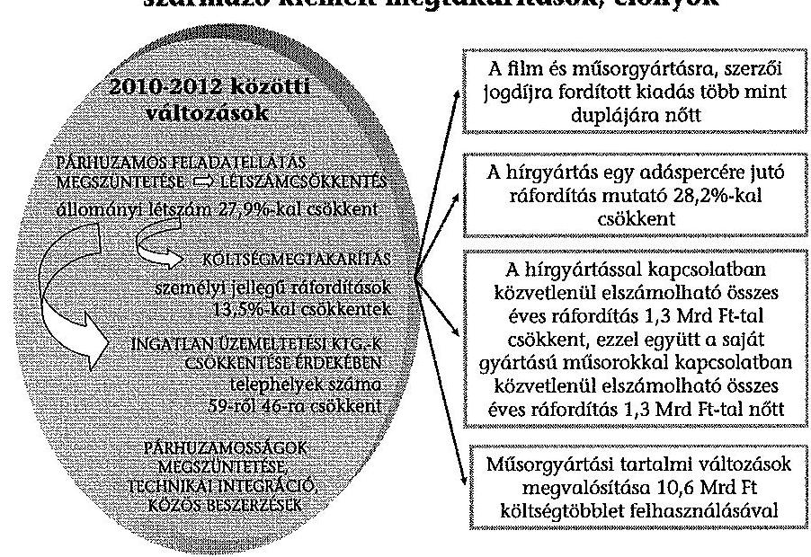

---

A közszolgálati hírgyártás, hírszolgáltatás a felesleges párhuzamosságok megszüntetésének következtében takarékosabbá - gazdaságosabbá - vált. A hírgyártás egy adáspercére jutó ráfordítás évről évre kisebb lett, a 2010. évről a 2012. évre $28,2 \%$-kal csökkent, 19,5 E Ft/percről 14,0 E Ft/percre. A saját gyártású műsorokra közvetlenül elszámolt összes éves ráfordítás 2010-ről 2012-re 7,8\%-kal, 1,3 Mrd Ft-tal ( $16,7 \mathrm{Mrd}$ Ft-ról 18,0 Mrd Ft-ra) nőtt. A növekedés a párhuzamosságok megszüntetéséből származó megtakarításnak és a minőség javításának érdekében felmerült 10,6 Mrd Ft-os költségnek az együttes hatása.

Az MTVA 2011-ben fogadta el a szerződéskötési és szerződés-nyilvántartási rendjét előíró vezérigazgatói utasítást. Az MTVA meghatározta a szerződéskötés formai szabályait, egységes szerződéskötési és nyilvántartási rendszert alakított ki. Az MTVA valamennyi szerződésének írásba foglalásával és informatikai nyilvántartásával biztosítja a szerződéses állományának áttekinthetővé, ellenőrizhetővé tételét. Az MTVA az integrációt követően a beszerzéseit tervezetten, az egységes eszközpark kialakításának igényével hajtotta végre.

A hírgyártást és a saját músorgyártást a szervezeti struktúra átalakításhoz kapcsolódó létszámcsökkentés hatékonyabbá tette. A hírgyártásban foglalkoztatottak átlagos állományi létszáma a 2010. évi 542 fơről 2012-re 294 fơre csökkent. A leadott hírműsoridő 2010-2012 között évente közel azonos volt. A hírgyártás egy fơre jutó adásperce a 2010. évi 439,6 percről 2012-re 808,7 percre nőtt, így e mutató lényegesen, $84,0 \%$-kal javult. A saját gyártású műsorok készítésében közreműködők átlagos állományi létszáma a 2010. évi 2354 fôről 2012-re 1746 fôre csökkent. A saját gyártású műsorok eredményeképpen keletkező műsorperc a 2010. évi 2031 ezer percről 2012. évre 1989 ezer percre csökkent. A saját műsorgyártásban közreműködő egy főre jutó gyártott műsorperc mutató a 2010. évi 863,0 percről 2012-re 1139,4 percre nőtt, 32,0\%-kal javult.

A rendelkezésre álló források műsorcélú felhasználása éves szinten a 2010. évi 21,0 Mrd Ft-ról 2012-re 28,0 Mrd Ft-ra nőtt, ami 33,3\%-os növekedést jelent. Ezen belül a külső gyártású műsorokra fordított források nőttek nagyobb mértékben 1,8 Mrd Ft-ról 6,8 Mrd Ft-ra. A saját gyártású műsorokra fordított források a 2010. évi 16,7 Mrd Ft-ról a 2012. évre 18,0 Mrd Ft-ra, 7,8\%-kal növekedtek. A közszolgálati médiarendszer átalakítását követően a közszolgálati médiaszolgáltatás támogatására fordított forrásokból 2011-ben 31,1\% (19,9 Mrd Ft), 2012-ben $40,2 \%$ ( $28,0 \mathrm{MrdFt}$ ) volt a saját és a külső gyártásra fordított öszszeg. A közvetlen műsorcélú forrásfelhasználás aránya nőtt.

Az ellenőrzött időszakban a Kuratórium eleget tett az Mttv.-ben előírt törvényi kötelezettségeinek, az MTI NZrt.-nél szabályszerűen gyakorolta a tulajdonosi jogait. Az MTI NZrt. 2011-2012. évi gazdálkodása alapvetően szabályozott és szabályszerű volt. A közszolgálati médiaszolgáltatás átalakítása következtében az MTI NZrt. és az MTVA együttműködési megállapodásokat kötött. A szerződések részletszabályainak kiegészítését, módosítását az MTI NZrt. kezdeményezte. Az MTI NZrt.-nek az MTVA részére vagyonkezelés céljából térítésmentesen átadott ingatlan a székhelye, de a használattal kapcsolatos szerződéssel, megállapodással (amely tisztázná mindkét fél jogait, kötelezettségeit) nem rendelkezett.

---

Az MTI NZrt. - a média szervezetrendszerének átalakulása időszakában készült - 2011. és 2012. évi üzleti terve a tervkészítés időszakában ismert információk, az előre látható folyamatok alapján megalapozott volt. Elszámolt bevételei, költségei és ráfordításai ugyanakkor meghaladták a tervezettet. Üzleti eredménye mindkét évben negatív volt (2011-ben -426,9 M Ft, 2012-ben -326,0 M Ft). Az éves beszámolókban a realizált árbevételről és a költségnövekedésekről tájékoztatást adott, az eltéréseket alátámasztotta. A költségvetési támogatás összege a 2011. évben 2608,4 M Ft, a 2012. évben 1313,0 M Ft volt. A bevételeket a közszolgálati médiaszolgáltatási alaptevékenység ellátására használta fel. Számviteli politikája, számlarendje és az alkalmazott könyvelői program biztosította a támogatások és egyéb bevételek elkülönített nyilvántartását. Az elszámolt költségek, ráfordítások tartalma megfelelt a Számv. tv. előírásainak. Az MTI NZrt. munkaviszony keretében a 2010. év végén 315 főt, a 2011. év végén 177 főt, a 2012. év végén pedig 51 főt foglalkoztatott. A 2011. és 2012. évi személyi jellegű ráfordításokat szabályszerűen számolta el. A kifizetések jogszerűségét a folyamatba épített ellenőrzéssel, vezetői kontrollal biztosította.

Az MTI NZrt.-nél a 2010. évi mérlegfőösszeg 4210,4 M Ft-ról a 2012. év végére 696,1 M Ft-ra (a 2010. évi 16,5\%-ára) csökkent. Az MTI NZrt. az ellenőrzött időszakban a Számv. tv. előírásainak megfelelően olyan könyvviteli nyilvántartást vezetett, amely az eszközökben és a forrásokban bekövetkezett változásokat a valóságnak megfelelően, zárt rendszerben, áttekinthetően mutatta be. Az MTI NZrt. eszközeinek és forrásainak a besorolása, az értékcsökkenések, értékvesztések elszámolása megfelelt a Számv. tv. előírásainak, azt a könyvvizsgáló elfogadta.

Az Állami Számvevőszékről szóló 2011. évi LXVI. törvény 33. § (1) bekezdésében foglaltak értelmében a jelentésben foglalt megállapításokhoz kapcsolódó intézkedési tervet köteles az ellenőrzött szervezet vezetője összeállítani, és azt a jelentés kézhezvételétől számított 30 napon belül az ÁSZ részére megküldeni. Amennyiben az intézkedési tervet határidőben nem küldi meg a szervezet, vagy az nem elfogadható, az ÁSZ elnöke a hivatkozott törvény 33. § (3) bekezdés a)-b) pontjaiban foglaltakat érvényesítheti.

Az ellenőrzés intézkedést igénylő megállapításai és javaslatai:

# a Nemzeti Média- és Hírközlési Hatóság Médiatanácsa Elnökének 

1. A Médiatanács meghatározta az MTVA Gazdálkodási és Kezelési Szabályzatát (GKSZ), de az az OGY határozat 13. és 14. pontjában előírtaktól eltérően a vagyongazdálkodás elsődleges céljának (a vagyon hatékony működtetése, állagának védelme, értékének megőrzése, illetve gyarapítása a közszolgálati műsorszolgáltatás és a nemzeti hírügynökségi szolgáltatás ellátásának elősegítése) elérését biztosító részletes szabályokat nem tartalmazta.

A GKSZ az MTVA kezelésében lévő teljes vagyon tekintetében - ideértve a közszolgálati média vagyont is - lehetővé teszi a tulajdonjog átruházását. A GKSZ az Mttv. 100. § (2) bekezdésének előírását külön nem nevesíti, ezért a szabályozásból nem egyértelmú, hogy a közszolgálati médiavagyon (pl. filmalkotások, audiovizuális múvek, rádiós műsorszámok) elidegenítési tilalom alatt áll. A Médiatanács elfogadta az

---

MTVA Archiválási Szabályzatát, de az az OGY határozat 5. pontjának rendelkezésétől eltérően nem rögzítette azt, hogy az MTVA kezelésében lévő Archívum elidegenítési tilalom alatt áll.

A Médiatanács az Mttv. 136. § (10) bekezdésétől eltérően az MTVA támogatáspolitikájáról - az általános támogatási elveket és eljárási rendet megfogalmazó dokumentumról - nem döntött.

Javaslat:
A vagyon hatékony működtetése, állagának védelme, értékének megőrzése, illetve gyarapítása, a közszolgálati médiavagyon és Archívum elidegenítési tilalmának az MTVA-ra vonatkozó szabályzatokban való rögzítése, valamint az MTVA támogatáspolitikájának meghatározása érdekében:
a) intézkedjen az MTVA Gazdálkodási és Kezelési Szabályzatának az OGY határozat 13. és 14. pontjának megfelelő, a vagyon hatékony működtetését, állagának védelmét, értékének megőrzését, illetve gyarapítását biztosító részletes szabályokkal való kiegészítéséről;
b) intézkedjen az MTVA Gazdálkodási és Kezelési Szabályzatában, valamint az Archiválási Szabályzatában az Mttv. 100. § (2) bekezdésének megfelelően a közszolgálati médiavagyon elidegenítési tilalmának előírásáról;
c) gondoskodjon az MTVA általános támogatási elveket és eljárási rendet megfogalmazó támogatáspolitikájának kidolgozásáráról és az Mttv. 136. § (10) bekezdésének megfelelően annak elfogadásáról.
2. A Médiatanács az Mttv. 133. § (1) bekezdésében előírtaknak megfelelően a 2011. és a 2012. évi tevékenységéről szóló éves beszámolóit a tárgyévet követő év május 31éig beterjesztette az OGY-nek. Az Mttv. 133. § (1) bekezdés d) pontja alapján a Médiatanács a beszámolókban - a közszolgálati médiaszolgáltatás kivételével - értékelte az Mttv. alapján a médiaszolgáltatás gazdasági helyzetének és pénzügyi feltételeinek alakulását.

Javaslat:
Mutassa be az OGY teljes körű tájékoztatása érdekében az Mttv. 133. § (1) bekezdés d) pontja alapján készülő beszámolóiban a közszolgálati médiaszolgáltatás gazdasági és pénzügyi feltételeinek alakulását is.
3. A közszolgálati média rendszerében a tervezést és adatszolgáltatást megszervezték, azonban a tervezéssel összefüggő feladatellátás részletes szabályait nem alakították ki. Így elmaradt a folyamatban résztvevők feladatainak, a feladatok ütemezésének, a végrehajtásért felelősöknek, valamint a tervezési eljárásoknak és módszereknek a meghatározása.

Javaslat:
Határozza meg az átláthatóbb feladatellátás érdekében a közszolgálati média rendszerében a tervezéssel és adatszolgáltatással összefüggő feladatok ellátásában részt-

---

vevők feladatainak, a feladatok ütemezésének, a végrehajtásért felelősöknek, valamint a tervezési eljárásoknak és módszereknek a részletes eljárásrendjét.

# az MTVA vezérigazgatójának 

1. Az MTVA a Számv. tv. 14. § (5) bekezdés c) pontjában foglalt előírás ellenére az önköltségszámítás rendjére vonatkozó szabályzattal nem rendelkezett. A szabályozás nélkül az MTVA egyes tevékenységei eredményessége, gazdaságossága elemzésének, értékelésének a lehetősége is korlátozott, továbbá a kalkulált költségek megalapozottsága nem igazolható.

Javaslat:
Készítse el a Számv. tv. 14. § (5) bekezdés c) pontjában előírt, az önköltségszámítás rendjére vonatkozó szabályzatot.
2. Az MTVA a számviteli nyilvántartásaiban a támogatással és a vállalkozással kapcsolatos bevételeit igen, de a vállalkozással kapcsolatos költségeit és ráfordításait az Eszkr. 8. § (9) és (10) bekezdésében előírtak ellenére nem különítette el.

Javaslat:
Intézkedjen a vállalkozási tevékenység költségeinek és ráfordításainak az Eszkr. 8. § (9) és (10) bekezdésében előírt, elkülönített számviteli nyilvántartásáról.
3. A kontrolling rendszert az MTVA kialakította, fejlesztése folyamatos, ugyanakkor a 2012. július 1-jétől létrejött Kontrolling igazgatóságnak az SZMSZ 23. § (2) bekezdés c) pontjában előírt ügyrendjét az MTVA nem készítette el.

Javaslat:
Intézkedjen az SZMSZ 23. § (2) bekezdés c) pontjában előírt ügyrend elkészítéséről és elfogadásáról.
4. Az MTVA és az NZrt.-k között 2011. január 1-jén létrejött együttmúködési megállapodások (keret-megállapodások) rögzítették a felek feladat- és hatáskörét. A megkötött együttmúködési megállapodásokban rögzítették, hogy a felek azt kölcsönösen együttműködve felülvizsgálják, a feladatok részletes szabályaival folyamatosan bővítik. A részletes szabályok kidolgozottsága NZrt.-nként eltérő mélységű volt. Az MTI NZrt.-nek az MTVA részére vagyonkezelés céljából térítésmentesen átadott ingatlan a székhelye, de a használattal kapcsolatos szerződéssel, megállapodással (amely tisztázná mindkét fél jogait, kötelezettségeit) nem rendelkezett.

Javaslat:
Vizsgálja felül az NZrt.-kkel megkötött együttműködési megállapodásokat, és szükség esetén az érintett felekkel kölcsönösen együttműködve részletes szabályokkal bővítse azokat.

---

# II. RÉSZLETES MEGÁLLAPÍTÁSOK 

## 1. A KÖZSZOLGÁLATI MÉDIA ÚJ SZERVEZETI RENDSZERE KIALAKÍTÁSÁNAK SZABÁLYSZERŰSÉGE

### 1.1. Az NZrt.-k és az MTVA közötti feladat, vagyon és humánerőforrás átadás-átvétel

Az OGY a médiát és a hírközlést szabályozó egyes törvények ${ }^{11}$ módosításáról szóló 2010. évi LXXXII. törvény 2010. július 22 -ei elfogadásával a közszolgálati médiaszolgáltatás szervezeti átalakításáról döntött. Az átalakítás 2011. január 1-jére megvalósult.
2. számú ábra
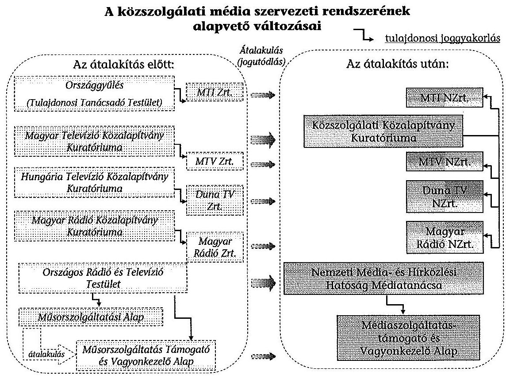

Az NZrt.-k felett 2010. november 5-étől a korlátozott alapítói, illetve részvényesi jogokat a KSZKA, a tulajdonosi jogokat annak Kuratóriuma gyakorolja. Az NZrt.-k 2010. december 1-jétől múködnek nonprofit zártkörű részvénytársasági formában. A KSZKA és az NZrt.-k alapító okiratai elkészültek, a bírósági, illetve cégbírósági bejegyzések megtörténtek. A Műsorszolgáltatási Alap átalakításá-

[^0]
[^0]:    ${ }^{11}$ A módosított törvények elsősorban a következők voltak: Ehtv., Rttv., Dtv., Nhtv.

---

val létrehozott elkülönített vagyonkezelő és pénzalap 2011. január 1-jétől Mé-diaszolgáltatás-támogató és Vagyonkezelő Alap néven múködik.

A közszolgálati média átalakítás előtti és utáni rendszerét bemutató ábrákat az 1. számú és 2 . számú mellékletek tartalmazzák.

Az Rttv. 149/C. §-a előírása szerint az MR Zrt., az MTV Zrt., a DTV Zrt., az MTI Zrt. és a KSZKA vagyonának meghatározott köre Magyar Állam tulajdonába, illetve MTVA kezelésébe kerüléséről külön országgyúlési határozatot kellett hozni. Az OGY a vonatkozó vagyoni kör átadás-átvételének tartalmáról, módjáról és idejéről 2010. október 28 -án az OGY határozatban döntött.

Az OGY döntése szerint a KSZKA tulajdonában álló NZrt.-k vagyona - a közszolgálati feladataik ellátásához szükséges vagyon, valamint a jogi személyiségükhöz közvetlenül kapcsolódó vagyoni értékủ jogosultságok kivételével - teljes egészében, térítésmentesen, valamint a KSZKA-nak az NZrt.-ken kívüli egyéb vagyona is térítésmentesen kerül a Magyar Állam tulajdonába. Az OGY-határozat előírta az NZrt.-k archívumának és a tulajdonukban álló jelmez-, díszlet, valamint kottatár, továbbá az NZrt.-k és a KSZKA tulajdonában álló ingatlanok térítésmentes átadását az MTVA részére. A döntés szerint a „...határozatban meghatározott vagyon 2011. január 1. napjával kerül átadásra".

Az NZrt.-k jegyzőkönyvvel igazolt vagyonátadásának első ütemére 2011 augusztusában és szeptemberében, második ütemére - az MTI NZrt. további vagyonának átadására - 2012 júniusában került sor.
3. számú ábra
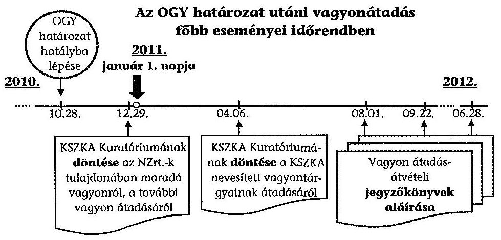

Az MTVA részére történő vagyonátadások teljesítése az átadás-átvételi jegyzőkönyvek aláírási dátuma szerint: az MR NZrt., az MTV NZrt. és az MTI NZrt. esetében 2011. augusztus 1-je, a DTV NZrt. esetében 2011. szeptember 22-e. Az MTI NZrt. a 2012. június 28 -án aláírt átadás-átvételi jegyzőkönyvvel további feladatot és vagyont adott át az MTVA részére. A jegyzőkönyvek mellékleteit az egyes fökönyvi számlákhoz kapcsolódó részletes analitikák képezték.

A Kuratórium 2011. április 6-án - 2010. december 29-én hozott határozatát felülvizsgálva - döntött arról, hogy a KSZKA feladatainak ellátásához szükséges

---

vagyonrészt meghaladó vagyonát, az OGY határozatnak megfelelően, térítésmentesen a Magyar Állam tulajdonába és az MTVA kezelésébe adja.

A vagyon átadás-átvétel 2011. január 1-jét követő lebonyolítását befolyásoló főbb tényezők:

- Az együttmúködő, végrehajtó felek a közszolgálati tevékenység folyamatos a változásokat a célközönségnél lehetőség szerint nem érzékelhető - fenntartását, a munkavállalóknak az MTVA állományába szervezését, a humánpolitikai feladatok ellátását kiemelt követelménynek tekintették.
- A múködés alapvető szervezési kérdéseinek megoldását, a kötelezettségek rendezését, valamint a gyártóbázis megteremtését elsődleges feladatokként kezelték.
- A korábban öt szervezet által kezelt vagyonelemek átadás-átvételének jogügyletét, a gazdasági események főkönyvi és analitikus rendezését időben is összekapcsolva kívánták megoldani.

Az MTVA archívuma az NZrt.-k archívumainak átvételével jött létre. Az archívumok NZrt.-k és MTVA közötti átadásakor részletes jegyzökönyveket nem vettek fel. Ez összefügg azzal, hogy az egyes archívumok tartalmáról nem állt rendelkezésre minden szervezetnél tételes, megbízható, teljes körű kimutatás. Az MTVA 2011. évi üzleti jelentésében mint adott tárgyévi feladat jelent meg a veszélyeztetett hordozók felmérése, az archívumok anyagainak átstrukturálása a költséghatékony gondozás és feldolgozás érdekében.

A KSZKA az OGY határozat alapján felhatalmazta az NZrt.-ket, hogy az Mttv. hatályba lépése (2011. január 1.) előtt létrejött egyes szerződéses jogviszonyaikból eredő jogaikat és kötelezettségeiket az MTVA-ra átruházzák. Az NZrt.-k tételes szerződés kimutatással és nyilatkozattal adták át a szerződéseket az MTVA részére. Az átvett szerződések a nyilatkozatokon található dátummal átkerültek az MTVA nyilvántartásába.

Az NZrt.-k közül az MR NZrt. és az MTI NZrt. 2011. február 9-én, az MTV NZrt. 2011. január 27-e és 2012. július 23-a között, a DTV NZrt. 2011. február 9-e és 2012. július 19-e között adta át a szerződéseket.

A Kuratórium 2010. december 16-án előzetesen jóváhagyta az NZrt.-k és az MTVA közötti munkáltatói jogutódlásra megkötendő megállapodást, amelyet a felek másnap aláírtak. A humánerőforrás legjelentősebb átrendezése 2011. január 1-jén megtörtént, az NZrt.-ktől 3135 fő ekkor az MTVA állományába került. Az MTVA az MTI NZrt.-től 2012. június 1. napjával (2012. május 14-ei megállapodással) további 127 fő munkavállalót vett át. A humánerőforrás átcsoportosítása a feladatátadásokkal egyidejűleg megtörtént.

Az MTVA 2011. július 5-étől 2013. április 19-éig három ütemben, összesen 872 föt érintő csoportos létszámcsökkentést hajtott végre.

---

A Munka tv. ${ }_{1}{ }^{12}$ 94/B. § (1) és a Munka tv. ${ }_{2}{ }^{13} 72 . \S$ (1) bekezdésére figyelemmel az I. ütemben 2011. június 29 -én, a II. ütemben 2011. november 10 -én az MTVA a munkavállalói oldal képviseletében eljáró üzemi tanáccsal megállapodást kötött. A III. ütemben a konzultációt követően a tárgyaló felek között nem jött létre megállapodás. Az MTVA a csoportos létszámcsökkentésre irányuló munkáltatói döntéseiről a Munka tv. ${ }_{1}$ 94/D. § (1)-(2) bekezdéseinek és a Munka tv. ${ }_{2} 74 . \S$ (1)-(2) bekezdéseinek megfelelően tájékoztatta a létszámcsökkentéssel érintett telephelyek szerinti munkaügyi központokat.

# 1.2. A vagyonátadás szabályszerűsége 

Az NZrt.-k és az MTVA éves beszámolóit a vagyonátadás előtti és az azt követő években is független könyvvizsgáló véleményezte. Az NZrt.-k és az MTVA éves beszámolóinak könyvvizsgálatát a 2011. évtől ugyanaz a könyvvizsgáló cég végezte. Az ellenőrzött években valamennyi szervezet beszámolójára hitelesítő (korlátozás nélküli) véleményt/záradékot adott. A vagyonátadás folyamatának külön könyvvizsgálói kontrolljára jogszabály vagy az OGY határozat kötelezettséget nem írt elő, ilyen rendelkezést a Kuratórium és a Médiatanács sem hozott.

A Kuratórium a 2010. december 29-én meghozott határozataiban ${ }^{14}$ az NZrt.-k tulajdonában maradó vagyonelemeken túl - külön részletezés nélkül - előírta a további vagyonelemek MTVA jogelődjének történő átadását. Az NZrt.-k közfel-adat-ellátásához nem szükséges vagyon MTVA-hoz történő átadására irányuló tulajdonosi kontroll az NZrt.-k vezérigazgatóinak beszámoltatásával valósult meg.

A Kuratórium 2010. december 29-ei határozatai az NZrt.-k vezérigazgatói számára előírták a vagyonátruházás végrehajtásáról szóló tájékoztatást, amelyeket a vezérigazgatók 2011. június 15 -ére összeállítottak. A könyvvizsgáló a 2011. június 30 -ai véleményeiben a tájékoztatók adattartalmát nem minősítette, a tájékoztatási kötelezettség határidőn belül történő teljesítéséről mondott véleményt. A végleges adatokat tartalmazó vagyon átadás-átvételi jegyzőkönyvek a Kuratórium tájékoztatását követő időpontban készültek.

A vagyon átadás-átvétele analitikus nyilvántartások alapján, könyv szerinti értéken történt. Az átvett eszközök (pl.: a műszaki berendezések, gépek, egyéb berendezések és felszerelések) egyedi beazonosítással történő tényleges fizikai számbavétele - vagyis az eszközök mennyiségi felvételes leltározása - a Számv. tv. alapján 2012. január 1-jétől háromévenként legalább egyszer kötelező. Az MTVA-nak legkésőbb 2014 végéig a tárgyi eszközök teljes körére vonatkozó leltározási kötelezettsége van. A leltározás hozzájárul az OGY határozat preambulumában megfogalmazott célkitúzés - „a vagyon hatékonyabb kezelése és hasznosítása, továbbá a vagyonnal történő ésszerü gazdálkodás" - megvalósításához.

[^0]
[^0]:    ${ }^{12}$ a Munka Törvénykönyvéről szóló 1992. évi XXII. törvény
    ${ }^{13}$ a Munka Törvénykönyvéről szóló 2012. évi I. törvény
    ${ }^{14}$ a 70-71/2010. és a 73-74/2010. számú határozatok

---

# 1.3. A humánerőforrás szükséglet meghatározása 

Az MTVA az Mttv. szerinti feladatai ellátásához szükséges létszámot a 2011-2013. években folyamatosan, a feladat-ellátási párhuzamosságok megszüntetésére figyelemmel alakította ki. A csoportos létszámleépítés indokaként a gazdasági racionalizálást, ezen belül a bérköltségcsökkentést, a múködtetési és munkafolyamatok ésszerúsítését és az ehhez igazodó munkavállalói létszám kialakítását határozta meg.

Az MTVA-nál a munkakörök száma 2011. június 30-a és 2013. március 31-e között 43,8\%-kal (671-ről 377-re), a munkavállalói létszám 27,9\%-kal (3149-ről 2271-re) csökkent.

Az MTVA szervezeti struktúrájának a 2011-2012. években megvalósult változásakor a fokozatosság elve érvényesült. A szervezeti változásokkal összhangban megtörtént az SZMSZ módosítása és a munkavállalók új szervezeti egységhez csoportosítása. Az SZMSZ módosításokat a Médiatanács határozattal fogadta el. Az MTVA vezérigazgatója a Médiatanács felhívására az SZMSZ-eket egységes szerkezetben kiadta és vezérigazgatói utasítással léptette hatályba.

### 1.4. Az MTVA vezérigazgatója kinevezésének, az FB tagjai megválasztásának és a könyvvizsgáló megbízásának szabályszerűsége

Az Mttv. egyes átmeneti rendelkezéseiben ${ }^{15}$ szabályozta a törvényalkotó, hogy az e törvényben meghatározott szervezetek, testületek vezérigazgatójának, vezérigazgató-helyettesének, tagjának mandátumát, illetve megbízatását e törvény hatálybelépése nem érinti. E rendelkezésnek megfelelően a 2010-ben kinevezett vagy megbízott vezérigazgató és vezérigazgató-helyettesek részére megállapított juttatásokra az Rttv. vonatkozott.

A Médiatanács elnöke az Rttv. 77. § (8) bekezdésének megfelelően az MTVA vezérigazgatójával 2010. október 21. napján határozatlan időre szóló munkaszerződést kötött. Ezt a felek az Mttv. 136. § (11) bekezdésével összhangban közös megegyezéssel, a 2011. február 7-én létrejött megállapodással, 2011. február 28 -ai hatállyal megszüntették.

Az MTVA következő vezérigazgatóját az Mttv. 136. § (11) bekezdésében foglaltakkal összhangban a Médiatanács elnöke nevezte ki, 2011. március 1jei hatállyal. A kinevezés napján a Médiatanács elnöke az MTVA vezérigazgatójával - határozatlan időtartamra - munkaszerződést kötött. Az MTVA vezérigazgatójának kinevezésekor az Mttv. 136. § (13) bekezdésében foglalt összeférhetetlenségi szabályokat betartották, a kinevezés napján a vezérigazgató a Munka tv., 191. § (2) bekezdésében a vezető állású munkavállalókra vonatkozó előírásokra is kiterjedő összeférhetetlenségi nyilatkozatot aláírta.

[^0]
[^0]:    ${ }^{15}$ az Mttv. 211. § (1) bekezdése

---

Az MTVA FB elnökét és négy tagját az Mttv. 136. § (14) bekezdésében foglaltakkal összhangban a Médiatanács elnöke bízta meg. A 2011. január 1jétől kinevezett MTVA FB elnök 2011. február 28-án az FB elnöki tisztségről lemondott. A Médiatanács elnöke az MTVA FB elnökét 2011. március 1-jétől határozott, 2011. június 1-jétől határozatlan időre bízta meg a feladatok ellátásával. Az MTVA FB összetétele, tagjainak száma többször módosult, de az Mttv. 136. § (14) bekezdésében meghatározott létszáma 2011. május 2-át követően már nem változott.

A Médiatanács a Számv. tv. 155. § (6) bekezdésében foglalt előírástól eltérően nem döntött előzetesen az MTVA könyvvizsgálójának a személyéről.

Az MTVA-nak a Médiatanács által 2011. december 14-én elfogadott és 2012. január 1. napjától hatályos GKSZ-e szerint a könyvvizsgáló kiválasztása az MTVA jogkörébe tartozik. Az MTVA vezérigazgatója közbeszerzési eljárás lefolytatását követően, 2011. december 5-én a 2011. évre, 2012. május 14-én a 2012-2013. évekre kötött szerződést a könyvvizsgálóval a feladatok ellátására.

Az MTVA éves beszámolójához csatolt független könyvvizsgálói jelentés kézhezvételét követően a Médiatanács a könyvvizsgáló személyéről értesült.

# 2. A KÖZSZOLGÁLATI MÉDIA ELLENŐRZÖTT SZERVEZETEI MÜKÖDÉSÉNEK SZABÁLYOZOTTSÁGA ÉS SZABÁLYSZERŰSÉGE 

### 2.1. Az alapdokumentumok elkészítése

## Az ellenőrzött szervezetek elkészítették és az arra jogkörrel rendelkezők elfogadták a múködés alapdokumentumait:

- A Médiatanács a 347/2011. számú határozatával fogadta el az „MTVA alapítására és müködésére vonatkozó adatokat" (alapító okirat) tartalmazó 2011. március 17-én kelt dokumentumot. Az MTVA SZMSZ-ét a Médiatanács a 830/2010. (XII. 28.) számú határozatával elfogadta, amelynek módosítására a szabályzat alapján „szükség szerint" kerül sor. Az SZMSZ a 2011-2012. években a szervezeti változásokkal összefüggésben módosult. A Médiatanács az 1820/2011. (XII. 14.) számú határozatával elfogadta és az NMHH honlapján 2012. január 5-én közzétette az MTVA GKSZ-ét. A szabályozás az elfogadását követően nem módosult.
- Az MTVA FB a 3/2011. számú határozatával, 2011. június 9. napján fogadta el az ügyrendjét, amelyen a 2011. július 7-ei módosítást követően nem változtatott.
- A Médiatanács az Mttv. 131. § (1) bekezdésének felhatalmazása alapján a 2/2010. (X. 12.) számú határozatával elfogadta, és 2011-ben kettő, 2012-ben egy alkalommal módosította ügyrendjét. Az ügyrend kizárólag az Mttv.-ben nem szabályozott ügyrendi és eljárási kérdéseket tartalmazza.
- A Kuratórium a KSZKA szervezeti és múködési szabályzatát 2010. november 5-én a 2/2010. KH számú határozatával hagyta jóvá, és a 2011-2013. években (évente egy alkalommal) módosította. A szabályzat magában foglalja a Kuratórium ügyrendjét is. A szabályzatban a Kuratórium előírta, hogy azt

---

minden év október 31-éig felülvizsgálja, illetve módosítására jogszabály változása vagy új jogszabály hatályba lépése esetén kerül sor.

# 2.2. A Közszolgálati Kódex és szabályainak érvényesülése 

A Médiatanács az Mttv. 95. § (2) bekezdésében előírtaknak megfelelően a Kuratórium egyetértése mellett és az NZrt.-k vezérigazgatóinak véleményét figyelembe véve a 791/2011. számú határozattal 2011. június 22 -én fogadta el a Kódexet. A Kódex - amely megalkotásához a Médiatanács mellett múködő Médiatudományi Intézet szakmai támogatást nyújtott - az elfogadását követően változatlan tartalommal hatályos. A 2011. június 28 -án hatályba lépett Kódex a közszolgálati médiaszolgáltatásra vonatkozó alapvető elveket és a közszolgálati célok részletes ismertetését tartalmazza.

A KT a Kódex szabályainak érvényesülését az Mttv. 95. § (5) bekezdésének megfelelően felügyelte.

A KT elnöke a 2011. és 2012. évi - az Mttv. 97. § (8) bekezdésében meghatározott - (szakmai) beszámoló készítésekor az NZrt.-k vezérigazgatóitól kérte annak értékelését, hogy az általuk vezetett médiaszolgáltató eleget tett-e a törvényben megfogalmazott, illetve a Kódexben részletezett, a közszolgálati médiaszolgáltatás céljaira és alapvető elveire vonatkozó előírásoknak. Ehhez tematikát bocsátott az NZrt.-k vezérigazgatóinak a rendelkezésére, akik az NZrt.-k 2011. és 2012. évi beszámolóit az Mttv.-ben meghatározott határidőn belül benyújtották. A KT azokat értékelte, különös tekintettel a Kódex rendelkezéseinek érvényesülésére.

A KT az Nzrt.-k vezérigazgatói által készített 2011. és 2012. évi szakmai beszámolókat elfogadta ${ }^{16}$.

A KT a közszolgálati célok megvalósítása értékelésének módszerét kialakította. Az NZrt.-k vezérigazgatói által irányított szervezetek közszolgálatisággal összefüggő feladatellátása értékelésekor több alapvető szempontot (a közmédia szabályozásának általános értékelvei és funkcionális elvárásai, tájékoztatási kötelezettsége, tartalma és múködési elvárása, a músorkészítés normái, a közmédia társadalmi jelenléte és párbeszéd képessége) vett figyelembe.

### 2.3. A Médiatanács MTVA kezelésével összefüggő feladatainak ellátása

A Médiatanács az MTVA-val összefüggő, az Mttv.-ben előírt alapvető feladatait a következők szerint látta el:

- Az Mttv. 136. § (16) bekezdésében foglaltakkal összhangban meghatározta az MTVA GKSZ-ét. A 1820/2011. (XII. 14.) számú határozatával elfogadott szabályozás 2012. január 1-jétől hatályos. Az OGY határozattal összhangban rögzíti, hogy a Magyar Állam tulajdonába adott vagyon tekintetében a

[^0]
[^0]:    ${ }^{16}$ a KT 21-22/2012. (V. 23.), a 24-25/2012. (V. 23.), valamint a 26-29/2013. (V.8.) számú határozatai

---

tulajdonosi jogok és kötelezettségek összességét az MTVA gyakorolja. A Médiatanács az NZrt.-k és a KSZKA által az MTVA részére átadott vagyon hasznosításának, a vagyonnal történő gazdálkodásnak az OGY határozat 13. pontjában előírt szabályait a GKSZ elfogadásával határozta meg. A GKSZ vagy más belső szabályzat - ugyanakkor az OGY határozat ellenére a vagyongazdálkodás elsődleges céljának (a vagyon hatékony müködtetése, állagának védelme, értékének megőrzése, illetve gyarapítása, a közszolgálati műsorszolgáltatás és a nemzeti hírügynökségi szolgáltatás ellátásának elősegítése) elérését biztosító részletes szabályokat nem tartalmaz.

- A 892/2011. (VII. 6.) számú határozattal elfogadta az MTVA Archiválási Szabályzatát. Az OGY határozat 5. pontjának rendelkezését a szabályzat nem rögzíti, ugyanis az nem tartalmazza, hogy az MTVA kezelésében lévő Archívum elidegenítési tilalom alatt áll.
- Az Mttv. 136. § (10) bekezdésében előírtaktól eltérően az MTVA támogatáspolitikájáról, amely többek között meghatározná az általános támogatási elveket és eljárási rendet, nem döntött. A támogatáspolitikához kapcsolódó (2011-2013. évek) éves támogatási tervről, a pályázati felhívások támogatáspolitikai kérdéseiről, valamint a pályázati eljárások Általános Pályázati Feltételeiről elfogadó határozatot hozott.
- Az Mttv. 136. § (10) bekezdésben előírtakkal összhangban elfogadta az MTVA 2011., 2012. és 2013. évi üzleti terveit ${ }^{17}$, valamint az MTVA határidőn belül elkészített 2011. és 2012. évi éves beszámolóit ${ }^{18}$.
- Az MTVA müködéséhez, tevékenységéhez kapcsolódva összességében a 2011. évben 174, a 2012. évben 187 döntést hozott (az OGY tájékoztatására készült beszámolók szerint). Döntései többek között a pályázati felhívások kibocsátására, a pályázatok érvényességi és teljességi vizsgálatára, a pályázati eljárásban kedvezményezetté nyilvánítottak szerződésszegéseire, a pályázatokat értékelő bírálóbizottságok megválasztására, valamint az MTVA negyedéves támogatási tevékenységéről szóló beszámolókra vonatkoztak.

Az Mttv. 98. § (7) és (8) bekezdésében előírt feladatait a Médiatanács végrehajtotta. Az MTVA vezérigazgatójával történő konzultációkat követően, 2012-ben a szükséges döntéseket ${ }^{19}$ meghozta. A műszaki, gazdasági, gazdaságossági és médiapolitikai szempontok szerinti értékelés után meghatározta az egyes közszolgálati médiaszolgáltatások által használt médiaszolgáltatási lehetőségeket, valamint a közszolgálati audiovizuális és rádiós médiaszolgáltatási lehetőségek tekintetében felülvizsgálta a közszolgálati médiaszolgáltatások által használt médiaszolgáltatási lehetőségeket.

A Médiatanács az Mttv. 133. § (1) bekezdésének megfelelően a 2011. és a 2012. évi tevékenységéről szóló éves beszámolóit (a tárgyévet követő év) május 31-éig beterjesztette az OGY-nek. A Médiatanács az éves beszámolók-

[^0]
[^0]:    ${ }^{17}$ a Médiatanács 955/2011. (VII. 19.), 1906/2011. (XII. 20.), 2222/2011. (XII. 19.) számú határozatai
    ${ }^{18}$ a Médiatanács 869/2012. (V. 16.), 749/2013. (IV. 30.) számú határozatai
    ${ }^{19}$ a Médiatanács 943/2012. (V. 23.) és a 2224/2012. (XII. 19.) számú határozatai

---

ban - a közszolgálati médiaszolgáltatás kivételével - értékelte az Mttv. 133. § (1) bekezdés d) pontja alapján a médiaszolgáltatás gazdasági helyzetének és pénzügyi feltételeinek alakulását.

# 3. A KÖZSZOLGÁLATI MÉDIA ELLENŐRZÖTT SZERVEZETEINÉL KIALAKÍTOTT KONTROLLOK 

### 3.1. Az ellenőrzött szervezetek tervezési, adatszolgáltatási és beszámolási tevékenysége

Az Mttv. 213. § (1) bekezdésében foglaltak szerint a 2011. évben az NZrt.-k a 2011. évre vonatkozó költségvetési törvényben meghatározott támogatásban részesültek. Az Mttv. ugyanebben a bekezdésében előírta, hogy az e törvényben meghatározott közszolgálati finanszírozási módot és mértéket elsőként a 2012. évre vonatkozóan kell alkalmazni. Az NZrt.-k 2011. évi költségvetési tervét az NZrt.-k állították össze ${ }^{20}$.

Az MTVA a 2011. és a 2012. évben a költségvetésének tervezését a tárgy évet megelőző évben a Nemzetgazdasági Minisztérium által kiadott tájékoztató ${ }^{21}$ alapján, az Mttv. előírásainak figyelembevételével kezdte meg. Az MTVA a következő évi üzleti tervét a költségvetése megtervezését követően, az abban kialakított tervszámokra tekintettel állította össze. A tervezett források (bevételek) meghatározását követően levonásba helyezték a továbbutalandó tételeket ${ }^{22}$, az MTVA adósságszolgálatát (kamatfizetés és tőketörlesztés) és az MTVA müködtetéséhez szükséges költségeket.

Az MTVA 2011., 2012. és 2013. évi költségvetését - az NMHH költségvetéséről szóló döntéssel egyidejúleg - az OGY az Mttv. 136. § (15) bekezdése előírásának megfelelően, törvényben ${ }^{23}$ fogadta el.

A közszolgálati média rendszerében a tervezést, adatszolgáltatás és beszámolást megszervezték ugyan, azonban a feladatellátás részletes eljárásrendjét nem határozták meg. Így elmaradt a folyamatban részvevők feladatainak, a feladatok ütemezésének, a végrehajtásért felelősöknek, a tervezési eljárásoknak és módszereknek, valamint az együttmúködés módjának egyértelmú, dokumentált meghatározása.

[^0]
[^0]:    ${ }^{20}$ A Nemzetgazdasági Minisztérium a 2011-2014. évi költségvetési tervezőmunkában való részvételt és adatszolgáltatási kötelezettséget tartalmazó 2010. október 6-ai keltű levelét a Zrt.-k részére küldte meg.
    ${ }^{21}$ Tájékoztató a 2012. évi (2011. július) és a 2013. évi (2012. május) költségvetési törvényjavaslat összeállításához szükséges feltételekről és az érvényesítendő követelményekről
    ${ }^{22}$ az NZrt.-k múködési támogatására, a Médiatanács és a Médiatanács hivatala, a KSZKA, valamint a Zenei Együttesek és az MTVA Digitalizációs Műhely részére
    ${ }^{23}$ az NMHH, valamint az NMHH Médiatanácsa 2010. évi költségvetéséről szóló 2010. évi CXLVI. törvény, az NMHH, valamint az NMHH Médiatanácsa 2012. évi költségvetéséről szóló 2011. évi CLXXXIII. törvény, az NMHH 2013. évi egységes költségvetéséről szóló CXCIV. törvény

---

Az MTVA tervezési, adatszolgáltatási és beszámolási tevékenységét ellátó szervezeti egységeinek feladatait az SZMSZ-ben, az alkalmazottak feladatait a munkaköri leírásokban rögzítették.

Az MTVA kidolgozta a 2011-2014. évekre, majd a 2013-2017. évekre szóló középtávú üzleti terveit, továbbá minden évben összeállította éves üzleti terveit. A terveket az MTVA FB véleményezte.

Az MTVA a gazdálkodásának főbb mutatóiról havi és negyedéves kontrolling beszámolókat készített a Médiatanács által meghatározott eljárási rend, formai és tartalmi követelményeknek megfelelően. A negyedéves kontrolling beszámolókat a Médiatanács - a GKSZ előírásának eleget téve - határozattal fogadta el (az MTVA FB is hasonló döntéseket hozott). A Számviteli politikájának megfelelően az MTVA negyedéves beszámolóiról 2012. 1. félévétől kezdődően a könyvvizsgáló véleményt mondott, amely szerint azok helytállóan, átlátható módon mutatták be az MTVA gazdálkodását.

Az MTVA a 2011-2012. évekre vonatkozó éves beszámolóit az Eszkr. 19. § (1) bekezdésének eleget téve független könyvvizsgáló is véleményezte, korlátozás és figyelemfelhívás nélküli, hitelesítő záradékokat adott. Az MTVA éves beszámolóit az MTVA FB a GKSZ előírásával összhangban véleményezte, határozataiban a Médiatanácsnak elfogadásra javasolta.

Az ellenőrzött időszakban az NZrt.-k vezérigazgatói a Kuratórium felé teljesítették az Mttv. 108. § (7) bekezdése szerinti beszámolási kötelezettségüket. Az Mttv. 90. § (1) bekezdés n) pontjának megfelelően a Kuratórium jóváhagyta az NZrt.-k - közös FB véleményével együtt benyújtott, közszolgálatiság teljesítéséről szóló - 2010., 2011. és 2012. évi éves beszámolóját.

# 3.2. Az MTVA kontrolling rendszerének kialakítása és müködése 

A kontrolling rendszert az MTVA kialakította, fejlesztése folyamatos, ugyanakkor a 2012. július 1-jétől létrejött Kontrolling igazgatóságnak az SZMSZ ${ }^{24}$ ben előírt ügyrendjét az MTVA nem készítette el.

A kontrolling rendszer segítségével a szakmai feladatellátást nyomon követik, értékelik. A kialakított kontrolling rendszer hozzájárult az MTVA szabályos múködéséhez. Az MTVA a gazdálkodás kontrollját a kontrolling szervezeti egység tevékenységén belül a pénzügyi-gazdasági tervezéssel, az elfogadott tervek teljesítésének folyamatos vizsgálatával, értékelésével, monitoringjával biztosította. Beszámolóival támogatta a költségek tervekhez viszonyított alakulásának, a likviditási helyzetnek, a dolgozói létszámnak, valamint az integráció szakmai, gazdasági hatásának a nyomon követését.

Az MTVA 2011-ben még nem, de a 2012. évi tevékenységről szóló szakterületi beszámolóban már a kontrolling rendszer múködését is értékelte. Ebben beszámoltak a Kontrolling igazgatóság feladatainak végrehajtásáról, a legfonto-

[^0]
[^0]:    ${ }^{24}$ 2012. július 1-jén és 2013. január 1-jén az SZMSZ 23. § (2) bekezdés c) pontja

---

sabb szervezeti-működési változásokról, a szervezeti egység erősségeiről, valamint a humánerőforrás alakulásáról és a jövőképről. A döntéshozók (a Médiatanács, az MTVA vezérigazgatója) a rendszeres havi és negyedéves beszámolókon kívül egy-egy témában (pl.: ingatlanvásárlás, hitelfelvétel, stb.) a kontrolling elemzésekből származó információkat döntéseik meghozatala során hasznosították.

# 3.3. Az MTVA-nál kialakított belső kontrollok és az MTVA FB múködése 

A jelentős közvagyonnal és közpénzzel gazdálkodó MTVA nem tartozik a Bkr. ${ }^{25}$ hatálya alá. Ennek ellenére az MTVA létrehozta és működteti a belső ellenőrzési rendszert.

Az MTVA belső ellenőrzési tevékenységét önálló szervezeti egység végzi a Vezérigazgatói Kabinet keretei között.

A belső ellenőrzés tevékenységet a jogelőd szervezetnél kialakított belső ellenőrzési szabályzatból kiinduló és 2011. március 1-jétől hatályos ellenőrzési kézikönyvben szabályozták. Hatályos stratégiai ellenőrzési tervvel az MTVA nem rendelkezik. A jogelőd által kidolgozott stratégia terv a 2009-2012. évekre vonatkozott, amelynek az MTVA tevékenységével összhangban álló aktualizálására nem került sor, annak ellenére, hogy az éves belső ellenőrzési tervekben minden évben feladatul tűzték ki. Az MTVA éves belső ellenőrzési munkaterveit a szabályozástól eltérően egy-két hónapos késedelemmel - már a tárgyévekben - készítették el, amelyeket a vezérigazgató jóváhagyott. Az éves belső ellenőrzési munkaterveket (az ellenőrzendő tevékenységek kiválasztását) megalapozó kockázatelemzéseket nem készítettek annak ellenére, hogy a Belső ellenőrzési szabályzatban előírták. A munkaterveket 2012-től az MTVA FB is elfogadta határozatával.

A 2011. és a 2012. évi munkatervekben több olyan ellenőrzést szerepeltettek, amelyeket a Kuratórium elnökének felkérésére, illetve a Kuratórium és az MTVA között 2011. június 15 -én létrejött együttmüködési megállapodás alapján folytattak le az NZrt.-knél. Az NZrt.-k tevékenységét 2013ban az MTVA az éves ellenőrzési munkaterv alapján már nem vizsgálja. A Belső ellenőrzési szabályzat az NZrt.-k ellenőrzésének lehetőségét fenntartotta. Az NZrt.-k tevékenységének belső ellenőrzését végző saját szervezeti egységek kialakítására jogszabályban meghatározott kötelezettség nincs. Az Mttv. 106. § (7) bekezdése alapján a közszolgálati médiaszolgáltató belső ellenőrzési szervezetének a közös FB irányítása alá kell tartoznia ${ }^{26}$.

[^0]
[^0]:    ${ }^{25}$ A Bkr. hatálybalépése előtt, 2011-ben az államháztartás működési rendjéről szóló 292/2009. (XII. 19.) Korm. rendelet 155-160. §-ai, valamint a költségvetési szervek belső ellenőrzéséről szóló 193/2003. (XI. 26.) Korm. rendelet tartalmaztak vonatkozó előírásokat.
    ${ }^{26}$ kialakított, múködő belső ellenőrzési szervezeti egység esetén értelmezhető előírás

---

Az SZMSZ szerint a belső ellenőrzési szervezeti egység szabályszerűségi, pénzügyi, rendszer- és teljesítményellenőrzéseket, valamint informatikai rendszerellenőrzéseket végez, a bevételek és kiadások tervezését, felhasználását és elszámolását, valamint az eszközökkel és forrásokkal való gazdálkodást vizsgálja. Az évente 21-22 belső ellenőrzés között informatikai rendszerellenőrzéseket, a bevételek és a kiadások tervezésére, elszámolására vonatkozó ellenőrzéseket nem folytattak le, az éves elemi költségvetési beszámolókra vonatkozó megbízhatósági ellenőrzéseket az MTVA vonatkozó belső szabályozásának megfelelően az MTVA mindenkori könyvvizsgálója végezte.

A belső ellenőrzésről az éves ellenőrzési jelentéseket a szabályozásukban meghatározott határidőn belül elkészítették, ugyanakkor a saját maguknak szabott követelménytől eltérően azokat a tárgyévet követő év április 15-éig nem küldték meg a Médiatanácsnak és az MTVA FB-nek. A belső ellenőrzés tevékenységéről a belső ellenőrzési vezető - az éves jelentések elkészítése mellett - több alkalommal beszámolt (tájékoztatást adott a feladatok időarányos teljesüléséről) az MTVA FB-nek.

Az ellenőrzött szervezeti egységek a belső ellenőrzés megállapításaihoz kapcsolódóan intézkedési tervet 2011-ben két esetben, 2012-ben egy esetben készítettek ${ }^{27}$. Az intézkedési tervek végrehajtásáról az érintett szervezeti egységek beszámolót nem készítettek. A belső ellenőrzés a 2011. és a 2012. években a jelentéseiben foglalt javaslatok megvalósításának ellenőrzésére utóellenőrzéseket indított, illetve folytatott le.

Az SZMSZ előírása ${ }^{28}$ ellenére a támogatások elszámolásával összefüggő új Ellenőrzési politika kidolgozásáról vagy a gyakorlatban alkalmazott - a Mûsorszolgáltatási Alap támogatások elszámolásának ellenőrzésére vonatkozó, 2007. január 31-jétől hatályos - I/2006. számú Ellenőrzési Szabályzat ${ }^{29}$ MTVA-ra vonatkozó átalakításáról, aktualizálásáról és a Médiatanács elé terjesztéséről nem gondoskodtak.

Az MTVA FB feladata az MTVA tevékenységének ellenőrzése és múködése törvényességének biztosítása volt. Az MTVA FB az ügyrendje és a GKSZ előírásainak megfelelően testületként járt el. Munkaterv alapján ${ }^{30}$ végezte tevékenységét, üléseiről jegyzőkönyv készült, döntéseit határozatba foglalta és tevékenységéről beszámolt a Médiatanácsnak. Az MTVA az FB tevékenységéhez szükséges feltételeket biztosította.

Az MTVA FB ellenőrizte az MTVA tevékenységét és múködésének törvényességét. Ülésein mindkét évben rendszeresen tárgyalta az MTVA tevékenységi beszámolóit, a Médiatanács MTVA-t érintő határozatait, az MTVA-t érintő törvényi változásokról szóló tájékoztatókat, az aktuális pénzügyi helyzetről szóló tájékoztatókat,

[^0]
[^0]:    ${ }^{27}$ az 1/2011., a 11/2011. és a 05/2012. számú ellenőrzési jelentések megállapításaira 2011. szeptember 26-án, 2011. október 4-én és 2012. november 13-án
    ${ }^{28}$ 2011. január 1-jén és 2013. január 1-jén az SZMSZ 5. § (4) bekezdése
    ${ }^{29}$ Az ORTT az Ellenőrzési szabályzat kiegészítéseit a 214/2007. (I. 30.) számú határozatával hagyta jóvá.
    ${ }^{30}$ a 2011. év I. féléve kivételével

---

a likviditási tervet és a pénzügyi jelentéseket. Célellenőrzést egyes produkciókkal kapcsolatban végzett, 2011-ben helyszíni szemlét tartott az MR és az MTVA épületeiben, 2012-ben ellenőrizte a hatályban lévő szabályzatok, vezérigazgatói utasítások GKSZ-nek való megfelelését és az MTVA szerződéskötési gyakorlatát. Az MTVA FB a 2011-2012. években elmarasztaló határozatot nem hozott.

Az MTVA FB a GKSZ-nek megfelelően véleményezte az MTVA üzleti terveit, éves beszámolóit, negyedéves kontrolling jelentéseit, támogatási ütemtervét és az általános pályázati feltételeket, valamint azokról határozatot hozott.

A kialakított belső kontrollok, a belső ellenőrzés és az MTVA FB tevékenysége hozzájárultak a közszolgálati médiaszolgáltatás müködtetése szabályszerűségének javításához.

# 4. A feladatok közötti forrásmegoszrást biztosító RendsZer szabályozottsÁGA, a KÖzPÉNZZEL És a KÖzvagyONNAL VALÓ GAZDÁLKODÁS SZABÁLYSZERŰSÉGE 

### 4.1. A müsorszámok előállítására (gyártására), megrendelésére, megvásárlására, illetve a KSZKA támogatására fordítható összeg megállapítása

Az MTVA-nál felhasználható forrásokból a műsorszámok előállítására (gyártására), megrendelésére és megvásárlására fordítható összeget az Mttv. előirásaival összhangban állapították meg. Az Mttv. 98. § (1) bekezdése alapján az NZrt.-k feladata a közszolgálati médiaszolgáltatás. Ennek megfelelően a műsorstruktúra terveket az NZrt.-k állították össze. Az MTVA a rendelkezésre álló forrásaiból az Mttv. 108. § (1) bekezdésének megfelelően támogatta az NZrt.-k feladatainak ellátását. Ehhez a műsorszámok előállítására (gyártására), megrendelésére és megvásárlására fordítható összegeket az NZrt.k műsorstruktúra terveinek és az MTVA e célra rendelkezésére álló forrásainak figyelembevételével tervezték meg. Az NZrt.-k műsorstruktúrájáról, az MTVA-nál meglévő források felosztásáról, illetve a műsorstruktúrára vetítéséről az ellenőrzött években az Mttv. 108. § (2) bekezdésének megfelelően a KKT döntött.

A KKT elnöke (az MTVA vezérigazgatója) - az NZrt.-k vezérigazgatóinak küldött értesítéssel - az Mttv. 108. § (5) bekezdésének megfelelően 2011-2012-ben évente több alkalommal összehívta a testületet. A KKT az Mttv. 108. § (4) bekezdésében előírtól eltérően 2011-ben és 2012-ben szeptember 30-át követően döntött az Mttv. 108. § (1) bekezdésében meghatározott feladatok ellátására rendelkezésre álló források elosztásáról. A KKT az Mttv. 108. § (4) bekezdésében előírtól eltérően az MTVA internetes honlapján döntéseit nem hozta nyilvánosságra.

Az MTVA 2012. január 1-jétől hatályos GKSZ-e az MTVA rendelkezésre álló forrásainak felosztásával összefüggő részletes szabályokat nem tartalmazott. Az MTVA az ellenőrzött évek alatt a tervkészítéssel kapcsolatos, hatályos belső szabályzattal nem rendelkezett.

Az MTVA nyilatkozata szerint az MTVA 2011. január 1-jétől az MTV Zrt. - 2007. október 10. napján kelt - Tervezési kézikönyve elnevezésű dokumentumot alkal-

---

mazza a tervkészítés során. Az alkalmazott Tervezési kézikönyv nem tartalmazta (nem tartalmazhatja) az MTVA-ra vonatkozóan a tervezés felelősségi körét, az elkészítés ütemezését és a feladatellátás határidejét.

Az MTVA és a Médiatanács szóbeli egyeztetést követően határozta meg az MTVA - Mttv. 137. § (1) bekezdésében előírt - feladata ${ }^{31}$ teljesítését biztosító pályázati céltámogatások éves keretösszegét. Az MTVA üzleti tervének elfogadásával az abban meghatározott e célra fordítható keretösszeget is elfogadta a Médiatanács. Elfogadta az MTVA GKSZ-ének megfelelően a 2012. évi pályáztatási ütemtervet, amely tartalmazta többek között a támogatás célját és a pályázat keretösszegét. A Médiatanács döntött az MTVA által összeállított pályázati felhívásokról.

A tervszámok meghatározását követően a gazdasági vezérigazgató-helyettesi szakterület meghatározta a mû́sorszámok elöállítására (gyártására), megrendelésére és megvásárlására fordítható keretösszeget. Ezekről a tervegyeztető megbeszéléseken tájékoztatta a gyártási és műszaki vezérigazga-tó-helyettesi szakterületet.

# Az MTVA-nál a tervegyeztető megbeszéléseken elhangzottakról nem készültek írásos dokumentumok (jegyzőkönyvek, emlékeztetők). 

A műsorszámok előállításával (gyártásával), megrendelésével és megvásárlásával összefüggő tervkészítés folyamata alatt lebonyolított belső és külső egyeztetések megtörténtéről, illetve a tervezési folyamatról a helyszíni ellenőrzés időszakában a kontrolling és a gyártási igazgató is írásban nyilatkozott. A tervek megalapozását szolgáló külső és belső tervegyeztetések lefolytatását a helyszínen bemutatott, az MTVA informatikai levelező rendszerében tárolt levelezésekkel, az NZrt.-k által elkészített és az MTVA részére megküldött éves műsorstruktúra tervekkel, valamint a gyártási szakterület által összeállított csatornánkénti tartalmakra vonatkozó költségvetésekkel támasztották alá. A tervegyeztetéseket követően az MTVA az éves műsorszámok előállítására (gyártására), megrendelésére és megvásárlására fordítható költséget és az általános műsorstruktúra tervet véglegesítette. A véglegesítést követően a műsorstruktúra tervet és a hozzá tartozó költségvetést az MTVA a KKT elé terjesztette.

Emlékeztetők, jegyzőkönyvek hiányában csak utólagos nyilatkozatok alapján volt igazolható a KSZKA támogatására fordítható összeg megállapításának szabályszerűsége és a tervezéskor figyelembe vett tényezők megalapozottsága.

Az MTVA és a KSZKA közös nyilatkozatot tett arról, hogy az ellenőrzött években a KSZKA támogatására fordítható összeg alátámasztása érdekében 2011. január 1jétől kezdődően folyamatos szóbeli egyeztetéseket folytattak a KSZKA támogatásáról.

[^0]
[^0]:    ${ }^{31}$ A közszolgálati célú műsorszámok, a közösségi médiaszolgáltatók, az elsőként filmszínházban bemutatásra szánt filmalkotások és a kortárs zeneművek támogatása, amit az MTVA-nak nyilvános pályázat útján kell biztosítania.

---

A Kuratórium a 21/2012. KH (IV. 18.) számú határozatával a KSZKA 2012. évre vonatkozó költségvetését elfogadta, majd az év során a 74/2012. KH (IX. 07.) számú határozatával módosította.

# 4.2. Az MTVA és az NZrt.-k között létrejött szolgáltatási szerződések, valamint az NZrt.-knek átadott források 

A szerződő felek feladat- és hatáskörét és az MTVA által az NZrt.-k részére nyújtott szolgáltatásokat tartalmazó szerződések, továbbá az NZrt.-knek átadott müködési és céltámogatások ${ }^{32}$ hozzájárultak azok müködőképességének fenntartásához. A megkötött szerződések szerint az MTVA az NZrt.-k részére térítésmentesen szolgáltatja többek között az NZrt.-k által meghatározott műsorszerkezethez, műsorszámokhoz, illetve a tartalomhoz a műsorok előkészítését, legyártását vagy beszerzését. Ingyenesen végzi továbbá az NZrt.-k adminisztrációs feladatainak támogatását.

Az MTVA és az NZrt.-k között 2011. január 1-jén létrejött együttmúködési megállapodások (keret-megállapodások) rögzítették a felek feladat- és hatáskörét.

A megkötött együttmúködési megállapodásokban rögzítették, hogy a felek azokat kölcsönösen együttmüködve felülvizsgálják, a feladatok részletes szabályaival folyamatosan bővítik. A részletes szabályok kidolgozottsága NZrt.-nként eltérő mélységü volt.

A 2011. január 1-jén az MR NZrt.-vel, valamint a 2011. január 26-án az MTV NZrt.-vel és a DTV NZrt.-vel, megkötött együttmúködési megállapodásokban a felek meghatározták azokat a szolgáltatás típusokat, amelyeket az MTVA folyamatosan biztosít az NZrt.-k felé. Az MTI NZrt. és az MTVA között 2012. május 14-én létrejött megállapodás II. fejezetének 4. pontjában „kölcsönösen kijelentették, hogy az MTI további, folyamatos müködését" a megállapodásban rögzített „konstrukcióval biztosítottnak látják". A 2012. május 30-án megkötött megállapodásban - a közszolgálati médiarendszer integrációjának új lépéseként - újra szabályozták a felek feladatait és hatásköreit.

Az MTVA az NZrt.-k részére nyújtott szolgáltatásait az NMHH, valamint a Médiatanács éves költségvetéséről szóló törvények mellékletében, valamint a központi költségvetésről szóló törvényben ${ }^{33}$ meghatározott költségvetési és egyéb forrásokból látja el. Az MTVA eredeti költségvetésében átutalandó tételként szerepelt az NZrt.-k múködésére tervezett támogatások összege. Az NZrt.-k a tervezettnek megfelelően megkapták (a KSZKA-n keresztül) a 2011. évben 2,2 Mrd Ft, a 2012. évben 3,0 Mrd Ft működési támogatást. Az NZrt.-k kötelezettségeik rendezése érdekében egyedi céltámogatásokat is kaptak, amelyek

[^0]
[^0]:    ${ }^{32}$ A Médiatanács eseti döntései alapján a NZrt.-k 2011-ben és 2012-ben egyedi céltámogatásokat kaptak kötelezettségeik teljesítésére.
    ${ }^{33}$ a Magyar Köztársaság 2011. évi költségvetéséről szóló 2010. évi CLXIX. törvény végrehajtásáról szóló 2012. évi CLV. törvény, Magyarország 2012. évi központi költségvetéséről szóló 2011. évi CLXXXVIII. törvény, Magyarország 2013. évi központi költségvetéséről szóló 2012. évi CCIII. törvény

---

összege 2011-ben 9,0 Mrd Ft, 2012-ben 1,1 Mrd Ft volt. A rendelkezésre álló támogatásokból 2011-ben 10,6 Mrd Ft-ot, 2012-ben 3,6 Mrd Ft-ot használtak fel. Az NZrt.-k múködéséhez tervezett támogatásokat a következő táblázat mutatja be:

1. számú táblázat

A közmédiumok müködési támogatására átutalt összegek
terv- és tényszámai
Adatok: M Ft

| $\begin{aligned} & \text { S. } \\ & \text { sz. } \end{aligned}$ | Megnevezés | 2011. |  |  | 2012. |  |  |
| :--: | :--: | :--: | :--: | :--: | :--: | :--: | :--: |
|  |  | eredeti elöirányzat | módosított elöirányzat* | teljesülés | eredeti elöirányzat | módosított elöirányzat* | teljesülés |
| 1. | MTV NZrt. | 530,0 | 5019,1 | 4868,1 | 556,0 | 1182,9 | 707,0 |
| 2. | DTV NZrt. | 450,0 | 2289,4 | 1935,2 | 556,0 | 910,0 | 910,0 |
| 3. | MR NZrt. | 425,0 | 1356,3 | 1288,9 | 556,0 | 653,4 | 624,0 |
| 4. | MTI NZrt. | 745,0 | 2503,0 | 2503,0 | 1313,0 | 1313,0 | 1313,0 |
| 5. | Öszzesen | 2150,0 | 11167,8 | 10595,2 | 2981,0 | 4059,3 | 3554,0 |

* céltámogatásokkal együtt

Forrás: MTVA
Az MTVA költségvetését többek között az NZrt.-k múködőképességének biztosítása (az egyes, az MTVA-ra még át nem kötött szerződésekből eredő kötelezettség rendezése) érdekében 2011-ben és 2012-ben is módosították. A Médiatanács eseti döntései alapján az NZrt.-k 2011-ben 9,0 Mrd Ft, 2012-ben 1,1 Mrd Ft egyedi céltámogatást kaptak. Az NZrt.-k múködéséhez nyújtott egyedi céltámogatásokat a 3. számú melléklet mutatja be.

# 4.3. Az MTVA vállalkozási tevékenységének bevételei és felhasználása 

Az MTVA és az NZrt.-k között létrejött, az ellenőrzött években hatályos együttműködési megállapodások, valamint azok mellékletei konkrétan nem nevesítették az Mttv. 108. § (8) bekezdése szerinti vállalkozási tevékenység folytatásához való jog MTVA részére történő átengedését.

Az NZrt.-k 2011. és 2012. évről szóló éves beszámolóinak kiegészítő mellékleteiben nyilvánosságra hozott információk szerint az NZrt.-k nem végeztek jellemzően kereskedelmi és egyéb vállalkozási tevékenységet. Az MTI NZrt. hírügynökségi tevékenységből származó bevétele pedig csökkent. Az MTVA 2011. és 2012. évi éves beszámolójának kiegészítő melléklete szerint a vállalkozási tevékenységgel elért bevételeinek legnagyobb hányadát a (mindkét évben az értékesítés nettó árbevételének több mint $60 \%$-át kitevő) reklámbevétel, valamint (az értékesítés nettó árbevételének 2011-ben közel 33\%-át, 2012-ben közel $24 \%$-át kitevő) kereskedelmi és szolgáltatási árbevétel tette ki. Az MTVA 2011. és 2012. évi értékesítésből származó nettó árbevételének összetételét és megoszlását a következő táblázat mutatja be:

---

# Az értékesítés nettó árbevételének összetétele és megoszlása 

| S.sz. | Megnevezés | 2011. |  | 2012. |  |
| :--: | :--: | :--: | :--: | :--: | :--: |
|  |  | Árbevétel   (M Ft) | Megoszlás   (\%) | Árbevétel   (M Ft) | Megoszlás   (\%) |
| 1. | Reklámbevételek | 2942,7 | 61,3 | 4573,1 | 62,0 |
| 2. | Szponzorbevételek | 207,5 | 4,3 | 915,4 | 12,4 |
| 3. | Kereskedelmi és   szolgáltatási bevételek | 1568,0 | 32,6 | 1763,6 | 23,9 |
| 4. | Belföldi értékesítés   összesen | 4718,2 | 98,2 | 7252,1 | 98,3 |
| 5. | Export értékesítés   árbevétele | 88,6 | 1,8 | 124,0 | 1,7 |
| 6. | Összesen | 4806,8 | 100,0 | 7376,1 | 100,0 |

Az MTVA számviteli nyilvántartásaiban a támogatási és a vállalkozással kapcsolatos bevételeit a vonatkozó jogszabályi előírásoknak megfelelően, elkülönítetten tartotta nyilván. A vállalkozással kapcsolatos költségeit és ráfordításait azonban az Eszkr. 8. § (9) és (10) bekezdésében előírtak ellenére nem különítette el.

Az MTVA írásban tett nyilatkozata szerint „Az MTVA vállalkozási bevételeit kizárólag az Mttv. 108. és 136. §-a és a Közszolgálati Kódex elöírásainak megfelelő célokra használja fel.".

Az MTVA a Számv. tv. 14. § (5) bekezdés c) pontjában foglalt előírás ellenére az önköltségszámítás rendjére vonatkozó szabályzattal nem rendelkezett. A szabályozás nélkül az MTVA egyes tevékenységei eredményessége és gazdaságossága elemzésének, értékelésének a lehetősége is korlátozott.

Az MTVA nyereségének felhasználása a közszolgálati médiaszolgáltatás végzésével vagy fejlesztésével összefüggő volt. Az MTVA feladata többek között az Mttv. 136. § (1) bekezdésének előírása szerint a közszolgálati médiaszolgáltatás támogatása. Azzal, hogy a 2012. évi nyereségét az eredménytartalékba helyezte, az MTVA a fenntartható múködését, valamint az Mttv.-ben előírt feladatának hosszú távú ellátását szolgálta.

Az MTVA - 2011. évi éves beszámolója szerint - 2011. évi mérleg szerinti eredménye negatív előjelű (veszteség) volt. A Médiatanács az MTVA 2012. évben keletkezett eredményének felosztásáról önálló határozatot nem hozott, azonban az Mttv. 136. § (10) bekezdésének megfelelően az MTVA 2012. évi éves beszámolóját a 749/2013. IV. 30.) számú határozatával elfogadta. A Médiatanács által elfogadott beszámolóban a mérleg, valamit a kiegészítő melléklet "Saját tőke" változását bemutató része már a 2012-ben keletkezett mérleg szerinti eredmény összegével a saját tőke összegét növelte (az MTVA az előző évi vesztesége miatti negatív összegű tőketartalék összegét csökkentette a 2012. évi nyereség összegével).

---

# 4.4. Az MTVA egyes vezetői, valamint az FB elnöke és tagjai személyi juttatásainak és díjazásának megállapítása 

Az MTVA vezérigazgatóinak és vezérigazgató-helyetteseinek munkabérét és juttatásait ${ }^{34}$, az MTVA FB elnökeinek és tagjainak tiszteletdiját ${ }^{35}$ az Rttv. és az Mttv. vonatkozó rendelkezéseinek megfelelően a Médiatanács elnöke állapította meg. Az MTVA a vezérigazgatónak és a vezérigazgatóhelyetteseknek, valamint az FB elnökének és tagjainak ellenőrzött „Keresetnyilvántartó lapjai" szerint a Médiatanács elnöke által megállapított munkabért és tiszteletdíjat számolta el a 2011. és a 2012. évben, valamint 2013-ban a helyszíni ellenőrzés végéig.

Az MTVA-nál az ellenőrzött időszak alatt (a 2011-2012. években) a vezérigazgatói munkakört két személy látta el. A jogszabálynak ${ }^{36}$ megfelelően az MTVA vezérigazgatója feletti teljes munkáltatói jogkörében a Médiatanács elnöke megállapította a vezérigazgatók munkabérét és juttatásait, valamint a felmentési időre és a munkaviszony megszűnésével járó juttatásokat. Az ellenőrzött években a vezérigazgató-helyettesek munkaköri feladatait hat személy látta el. Az MTVA 2011. január 1-jétől hatályos SZMSZ-e három (szolgáltatási, támogatási, gazdasági) vezérigazgató-helyettesi szakterületet határozott meg. A szolgáltatási vezér-igazgató-helyettesi státusz 2011. április 13. és 2011. június 30-a között, a gazdasági vezérigazgató-helyettesi pedig 2011. január 1. és 2011. február 6-a között nem volt betöltve. Szervezeti átalakítást követően, 2011. július 1-jétől a hatályos SZMSZ szerint négy (tartalom előállítási, gyártási és műszaki, támogatási, gazdasági) vezérigazgató-helyettesi szakterületet alakítottak ki. Az újonnan létrehozott tartalom előállítási, valamint a gyártási és műszaki vezérigazgató-helyettesi munkakörökre a Médiatanács elnöke első alkalommal 2011. július 1-jétől adott kinevezéseket.

Három vezérigazgató-helyettessel kötöttek olyan munkaszerződést, amelyben az Rttv. 77. § (9) és az Mttv. 136. § (12) bekezdésében előírt, a Médiatanács elnökének munkáltatói jogkörrel összefüggő döntési jogköre szerepelt. A vezér-igazgató-helyettesekkel megkötött többi munkaszerződésben ezt az információt nem szerepeltették.

Az MTVA FB elnökeinek és tagjainak tiszteletdíját az Mttv. 136. § (12) bekezdés rendelkezésének megfelelően a Médiatanács elnöke állapította meg, mivel a tiszteletdíj megállapítását tartalmazó kinevezési dokumentumokat a Médiatanács elnöke írta alá.

[^0]
[^0]:    ${ }^{34}$ A munkabérek és juttatások megállapításának módját az Rttv. 77. § (8) és (9) és az Mttv. 136. § (11) és (12) bekezdései szabályozzák.
    ${ }^{35}$ A tiszteletdíjak megállapításának módját az Mttv. 136. § (14) bekezdése írja elő.
    ${ }^{36}$ az Rttv. 77. § (8) bekezdése és az Mttv. 136. § (11) bekezdése

---

# 4.5. A vagyongazdálkodással összefüggő szabályok kialakítása, a közszolgálati médiavagyon egységes (eredményes) kezelése 

Az MTVA 2011. január 1-jétől vagyonkezelője az NZrt.-ktől és a KSZKA-tól átvett vagyonnak, valamint a NAVA-nak. Vagyonkezelőként a hatékonyabb vagyonkezelés és hasznosítás, továbbá a vagyonnal történő ésszerű gazdálkodás általános követelménye mellett az egyes vagyoncsoportokra eltérő jogkörökkel rendelkezik.
4. számú ábra

Az MTVA kezelésében lévő vagyon összetétele
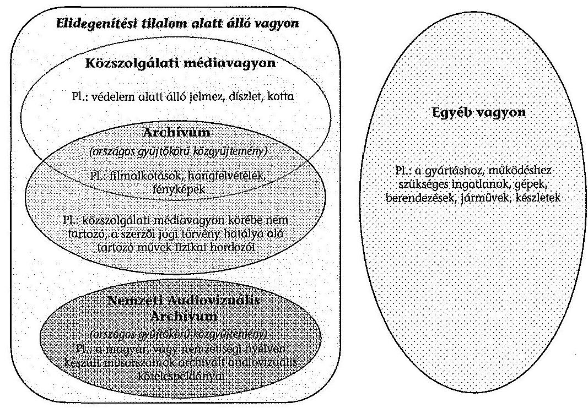

Az MTVA a vagyongazdálkodással összefüggő szabályokat a 2012. január 1jétől hatályos GKSZ-ben határozta meg. A GKSZ rögzítette, hogy az egyes vagyonelemeket, vagyontárgyakat, eszközöket - közszolgálati feladataik teljesítése céljából - az NZrt.-k ingyenesen vehetik igénybe. Előírta többek között azt is, hogy az MTVA a kezelésre átvett vagyont, illetve a gazdálkodása során szerzett vagyont versenyeztetési eljárás lefolytatását követően - bizonyos feltételek, értékhatárhoz kötött engedélyeztetési kötelezettségek mellett - elidegenítheti, bérbe adhatja, illetve hasznosításra átengedheti.

A GKSZ az MTVA kezelésében lévő teljes vagyon tekintetében - ideértve a közszolgálati média vagyont is - lehetővé teszi a tulajdonjog átruházását. Az Mttv. 100. § (2) bekezdésének előírását külön nem nevesíti, ezért a szabályozásból nem egyértelmű, hogy a közszolgálati médiavagyon (pl.: filmalkotások, audiovizuális művek, rádiós műsorszámok) elidegenítési tilalom alatt áll. Az

---

MTVA vagyonhasznosítási koncepcióval nem rendelkezett. ${ }^{37}$ A vagyongazdálkodással összefüggő részletes szabályokat (a hatékonyságot és a vagyonmegőrzést biztosító eljárásrendeket) nem alakították ki.

Az egységes vagyonkezelés feltételeinek kialakítása érdekében a vagyon átvételt követően közel egy év alatt megtörtént annak egységes számviteli rendszerbe való integrálása, egységes nyilvántartásba vétele. Az átvett Archívum felmérése és nyilvántartásba vétele a helyszíni ellenőrzés időszakában még folyamatban volt. A vagyonnal való gazdálkodás szervezeti feltételeit önálló szervezeti egységek biztosítják (Pénzügyi és számviteli, Létesítménygazdálkodási, Archívum és tartalomkereskedelmi igazgatóságok). Feladataikat a hatályos SZMSZ tartalmazza.

Az Archívum és tartalomkereskedelmi igazgatóságnak biztosítania kell az MTVA kezelésében lévő közszolgálati médiavagyon gyűjtését, rendszerezését, tárolását, védelmét, továbbá megőrzését, felújítását, restaurálását, selejtezését, feldolgozását (dokumentálását), felhasználását, szolgáltatását és digitalizálását. Az archívum kezelését hat szervezeti egység végzi, a gyűjtemény szerkezeti tagozódásának megfelelően.

Az MTVA az Archiválási szabályzatban önálló fejezetben szabályozta a televíziós, a rádiós, a hírügynökségi és a támogatási archívumok kezelését. A kellék-, a bútor- és a díszlettárakkal kapcsolatos szabályozás még nem készült el. A fegyvertárat a 253/2004. (VIII. 1.) Korm. határozat alapján kezelik. Az Archiválási szabályzat további belső utasításokra, eljárásrendre hivatkozik, amelyek közül nem készült el a fel nem használt felvételek archiválásának, valamint az archív vagyon leltározási és selejtezési belső utasítása, illetve a szabályzatban hivatkozott Értékmentő Bizottság nem alakult meg.

Az NZrt.-k és az MTVA között létrejött együttmúködési megállapodásokban az Mttv. 100. § (6) bekezdésének és az MTVA archiválási szabályzatának előírásaival összhangban rendelkeztek az NZrt.-k által megrendelt músorok és hírek tulajdonjogáról.

A vagyon megóvása és megőrzése eredményes volt, mert az átvett archív anyagok digitalizáltságának foka 2011-től 2013 augusztusáig nőtt, ezzel javult az archiválás minősége. A hangarchívum esetében a bakelit lemezek 4,0\%-át, a DAT-kazetták 25,0\%-át, az összes főrekord 8,2\%-át, a kottatár 3,0\%-át és a fotóarchívum 10,0\%-át mentették át. A szervezeti összevonást követően a DTV NZrt.-től és az MTV NZrt.-től átvett archívumok duplikált anyagait kiszűrték. A mozgóképarchívumban 2011. és 2013. augusztus 14e között 38374 műsorszámot digitalizáltak. Az Archívum felmérését követően jelentős mennyiségű médiavagyon digitalizálása még hátra van.

A Nemzeti Audiovizuális Archívumról szóló 2004. évi CXXXVII. törvény (NAVA-ról szóló tv.) rendelkezik a NAVA-ról, a törvényt alapjaiban módosította a 2011. évi CCI. tv. ${ }^{38}$, amelynek a Médiatanács feladatairól rendelkező III.

[^0]
[^0]:    ${ }^{37}$ A koncepció elkészítésének kötelezettségét a GKSZ írja elő.
    ${ }^{38}$ egyes törvények Alaptörvénnyel összefüggő módosításáról szóló 2011. évi CCI. tv.

---

fejezete sarkalatosnak minősül, így biztosítja a törvényalkotó a NAVA kezelésének kiemelt jelentőségét. A törvény módosítása szerint az MTVA vezérigazgatójának a NAVA működési szabályzatát az MTVA honlapján kell közzétennie. A NAVA rendelkezett múködési szabályzattal, amit a NAVA-ról szóló tv. 4. § (2) bekezdésében foglalt előírásától eltérően az MTVA a honlapján nem tett közzé.

Az MTVA a 2012. évben a NAVA-ról szóló tv. alapján a Magyar Nemzeti Vagyonkezelő Zrt.-től térítésmentesen vette át a NAVA-t. Az MTVA vezérigazgatója az MTVA keretei között, az MTVA 100\%-os tulajdonú társaságaként hozta létre a NAVA-val kapcsolatos hatékonyabb feladatellátás érdekében az MTVA Digitalizációs Műhely Kft.-t, 2011-ben, 500,0 E Ft törzstőkével. A NAVA-ról szóló tv. 20. § (1) bekezdése alapján az MTVA jogosult a NAVA múködését az MTVA keretei között múködő szervezet útján ellátni.

Az SZMSZ értelmében a Létesítménygazdálkodási igazgatóság feladata az ingatlangazdálkodás keretében az ingatlanhasznosítási és -gazdálkodási stratégia kidolgozása és megvalósulásának menedzselése. Az MTVA a stratégiát nem készítette el. Az ingatlanhasznosítás irányainak kijelöléséhez közbeszerzési eljárás keretében megbízott cég 2013-ban készített az MTVA minden ingatlanára kiterjedő tanulmányt. Ebben javaslatokat fogalmazott meg az egyes ingatlanok optimális hasznosíthatóságáról, bérbe adhatóságáról és fejlesztéséről, valamint bemutatta piaci értéküket. A tanulmány hasznosítása folyamatban van.

Az MTVA vagyonhasznosításból származó bevétele 2011-ben 1,4 Mrd Ft, 2012ben 1,5 Mrd Ft volt. A vagyonnal való gazdálkodás fontos szegmense a létesítménygazdálkodás, ennek feladatait önálló igazgatóság látja el a gazdasági vezérigazgató-helyettesnek alárendelve. Feladata között szerepel többek között a racionális ingatlan kihasználás biztosítása, ezen belül az ingatlanvagyon bérbeadása. Az MTVA-nak 2011-ben 186,1 M Ft, 2012-ben 148,8 M Ft bérleti dij bevétele volt. A 2013. évre tervezett bevétel 297,7 M Ft. Az MTVA 46 db ingatlan kezelését végzi, ez $164240 \mathrm{~m}^{2}$-nyi területet jelent.

Az MTVA számviteli mérlegében kimutatott eszközök, illetve források értéke jelentősen növekedett, a 2010. év végén 5,2 Mrd Ft; a 2011. év végén 28,2 Mrd Ft; a 2012. év végén 72,4 Mrd Ft volt. A legjelentősebb változás a tárgyi eszközöknél volt, ahol az év végi állományi érték a 2010. évi 0,2 Mrd Ft-ról 56,1 Mrd Ftra nőtt. Az idegen források, ezen belül a kötelezettségek is többszörösére emelkedtek, a 2010. év végi 4,2 Mrd Ft-ról 73,6 Mrd Ft-ra. A növekedés első sorban az MTVA hitelfelvételével állt összefüggésben.

Az MTVA számviteli mérlegei egyes adatainak változását a 2010-2012. években a $4 /$ a. és $4 /$ b. számú mellékletek mutatják be.

---

# 5. A KÖZSZOLGÁLATI MÉDIA EGYSÉGESÍTÉSÉNEK ALAPVETŐ HATÁSAI 

### 5.1. Az MTVA által átvett kötelezettségek és követelések rendezése, valamint a gyártóbázis kialakítása

Az MTVA az átvett kötelezettségek rendezése érdekében forgóeszköz hitelt vett igénybe azon komplex hitelfelvétel keretében, amely kiterjedt a Kunigunda utcai ingatlanvásárlás forrásának biztosítására is. A Médiatanács hozzájárulásával az MTVA a hitelt nyújtót közbeszerzési eljárás lefolytatását követően választotta ki. A Magyarország gazdasági stabilitásról szóló 2011. évi CXCIV. törvény 9. § (2) bekezdésének megfelelően a Nemzetgazdasági Minisztérium minisztere megadta hozzájárulását az adósságot keletkeztető komplex hitelfelvétel ügylethez.

A komplex hitelcsomagban 140 millió eurónak megfelelő forint hitel, 20,0 Mrd Ft forgóeszköz hitel, 4,0 Mrd Ft folyószámlahitel és 1,0 Mrd Ft bankgarancia hitel volt.

A Kunigunda utcai ingatlan megvásárlására, illetve az ingatlan bérlésére vonatkozó döntés meghozatalához az MTVA gazdaságossági számításokat végzett, továbbá külső tanácsadó céget bízott meg az azonnali ingatlanvásárlás és a bérleti konstrukció összehasonlítására. Az ingatlanvásárlás indokoltságát a külső és belső szakértői anyagok is alátámasztották. Az ingatlan adás-vétel a Médiatanács egyetértésével valósult meg. Az ingatlanvásárlás hosszú távon hozzájárult a közszolgálati média egységes gyártóbázisának és egységes elhelyezésének megteremtéséhez.

Az ÁSZ az 1998-2010. évek között hét alkalommal értékelte az MTV Zrt. ingatlanbérletének gazdálkodásra gyakorolt hatását. Az ellenőrzések során az ÁSZ megállapította, hogy „hosszú távon stabil területigény mellett előnyösebb egy ingatlan bérlete helyett (a magas bérleti dij, és a hosszú futamidő miatt) annak megvásárlása." A vonatkozó ÁSZ jelentések címeit az 5. számú melléklet mutatja be.

Az ingatlan adásvételi szerződést 2011. július 26-án kötötték meg, amelyhez a Médiatanács a 640/2011. (V. 18.) számú határozatában hozzájárult. A szerződés szerint az ingatlan nettó vételára 121,3 millió euró volt, ezen felül a vételár megfizetéséig felmerülő további kötelezettségek miatt 4,4 millió eurót (áfával) fizettek meg. Az OGY a Magyarország 2012. évi költségvetésről szóló törvény ${ }^{39}$ 71. § (4) bekezdése szerint a Kunigunda utcai ingatlan tulajdonjogának megszerzésével összefüggésben elengedte az MTVA áfa fizetési kötelezettségét.

Az OGY az NZrt.-ktől átvett kötelezettségek rendezése érdekében a Magyarország 2012. évi költségvetésről szóló törvény 71. § (1)-(3) bekezdéseiben meghatározott, a DTV NZrt., az MR NZrt. és az MTV NZrt. fennálló köztartozásait elengedte, amelyek összege közel 3 Mrd Ft-ot tett ki.

Az NZrt.-knél maradt kötelezettségek teljesítéséhez a Médiatanács döntése alapján az MTVA a 2011. évben négy alkalommal, 2012-ben két alkalommal,

[^0]
[^0]:    ${ }^{39}$ Magyarország 2012. évi központi költségvetéséről szóló 2011. évi CLXXXVIII. törvény

---

összesen 10,1 Mrd Ft céltámogatást biztosított nemzetközi tagdíjak, Nemzeti Adó- és Vámhivatal (NAV) részére fizetendő pótlékok, műsorterjesztési díjak, kamatok, belföldi megbízási díjak és peres kötelezettségek megfizetésére.

Az MTVA 2011-2012-ben 23,8 Mrd Ft kötelezettséget vett át az NZrt.ktől a vagyonátadás során, amelynek teljes összegét 2011-2012-ben rendezte. Az MTVA az átvett kötelezettségek 66,4\%-át (15,8 Mrd Ft) 2011-ben, $33,6 \%$-át ( $8,0 \mathrm{Mrd} \mathrm{Ft}$ ) 2012-ben egyenlítette ki. A szállítói kötelezettségek teljesítését folyamatosan, külön intézkedések meghozatala nélkül bevételeiből rendezte. Az átvett hiteltartozásokkal összefüggésben a hitelezőkkel tárgyalásokat folytatott le a teljesíthető fizetési feltételek elérése érdekében. A vagyonátadással átvett kötelezettségeket és azok rendezését a következő táblázat mutatja be:
3. számú táblázat

A vagyonátadással átvett kötelezettségek és azok rendezése

| Megnevezés | Összeg |
| :--: | :--: |
| Vagyonátadás során átvett szállítóállományok | 2050 |
| - DTV NZrt. | 258 |
| - MTV NZrt. | 1792 |
| NZrt.-k hitelszerződéseiből és szállítói szerződéseiből eredő tartozások átvállalása 2011-ben | 10360 |
| MTV NZrt.-től átvállalt bérleti dij tartozás 2011-ben | 5879 |
| MTV NZrt. folyószámla hitelének átvállalása 2012-ben | 1518 |
| MTV NZrt.-től átvállalt bérleti dij tartozás 2012 | 4037 |
| Összesen | 23844 |

| Megnevezés | Összeg |
| :--: | :--: |
| Átvett szállitóállományból 2011-ben rendezett | 2046 |
| Tartozásátvállalásból 2011-ben rendezett | 7911 |
| MTV NZrt.-től átvállalt bérleti dij tartozás rendezése 2011-ben | 5879 |
| Tartozásátvállalásból 2012-ben rendezett | 1518 |
| MTV NZrt.-től átvállalt bérleti dij tartozás rendezése 2012-ben | 4037 |
| 2011. évi tartozásátvállalásból 2012-ben rendezett | 2450 |
| Átvett szállitóállományból 2012-ben rendezett | 3 |
| Összesen | 23844 |

Az NZrt.-ktől 2011. évben átvett követelésállomány 1,1 Mrd Ft (ebből vevőállomány 1,0 Mrd Ft) volt. Az MTVA vevőkkel szembeni követelés állományának 2011. évi növekedéséből ( $1,6 \mathrm{Mrd}$ Ft) $60,4 \%$ származott a NZrt.-ktől átvett vevői követelésekből. Az MTVA a követelésállomány behajtása érdekében intézkedéseket tett (pl. fizetési felszólítások, egyeztetések, megállapodások, behajtás kezdeményezés). Az átvett követelések beszedésére tett intézkedések sikertelensége a felszámolás alatt lévő adósok esetében volt jellemző. A MTVA a napi ügymenetében folyamatosan és azonos módon intézkedett a követelések beszedése érdekében. Az MTVA a nyilvántartásaiban egységesen kezelte a fennálló követeléseket, így az NZrt.-ktől átvettek kezelése nem különült el.

---

# 5.2. Az egységesítés és a hírgyártásban meglévő párhuzamosságok megszüntetésének hatása, a gazdaságosság alakulása 

Az új szervezeti struktúra kialakításával és a párhuzamos feladatellátás megszüntetésével az ellenőrzött két év alatt az MTVA-nál az év végi záró létszám alapján a humánerőforrás szükséglet 27,9\%-kal csökkent. Az NZrt.-k és az MTVA év végi záró létszáma a párhuzamosságok megszüntetését megelőzően, 2010. december 31-én 3461 fő volt. A szervezeti átalakítás és a feladatok átcsoportosításának hatására a közfoglalkoztatottak nélküli záró létszám a 2011. év végére 620 fővel, majd a 2012. év végére további 346 fővel, 2495 főre csökkent. Az NZrt.-k és az MTVA év végi záró létszámának alakulását a következő táblázat mutatja be:
4. számú táblázat

Az NZrt.-k és az MTVA év végi záró létszámának alakulása 2010-2012. december 31-én

Adatok: fó

| 5.szám | Megnevezés | 2010.12 .31 . | 2011.12 .31 . | 2012.12 .31 . |
| :--: | :-- | --: | --: | --: |
| 1. | NZrt.-k összesen | 3407 | 306 | 166 |
| 2. | MTVA és jogelődje | 54 | 2535 | 2550 |
| 3. | MTVA (közfoglalkoztatottak nélkül) | 54 | 2535 | 2329 |
| 4. | Összesen: (1.+2.) | 3461 | 2841 | 2716 |
| 5. | Összesen (közfoglalkoztatottak   nélkül): (1.+3.) | 3461 | 2841 | 2495 |

Forrás: MTVA adatközlés
Az MTVA az új szervezeti struktúráját több lépcsőben hozta létre. Az NZrt.-ktől átvett munkavállalók munkakörének megnevezése NZrt.-nként eltérő volt, ezért annak felmérését követően 2011 júniusától vezettek nyilvántartást a meglévő munkakörökről. Az MTVA az alkalmazott munkaköröket 2012. január 1jétől egységesítette (ezzel a 2011. június 30-án meglévő munkakörök számát lényegében megfelezte, 347-re csökkentette).

Az MTVA és az NZrt.-k együttes személyi jellegú ráfordításai a 2010ben elszámolt 23,7 Mrd Ft-hoz képest 13,5\%-kal, 20,5 Mrd Ft-ra csökkentek 2012-re. A létszámcsökkentés személyi jellegű ráfordításokban megmutatkozó hatását a következő ábra szemlélteti ${ }^{40}$ :

[^0]
[^0]:    ${ }^{40}$ Az adatok tartalmazzák a közfoglalkoztatottak bérét is.

---

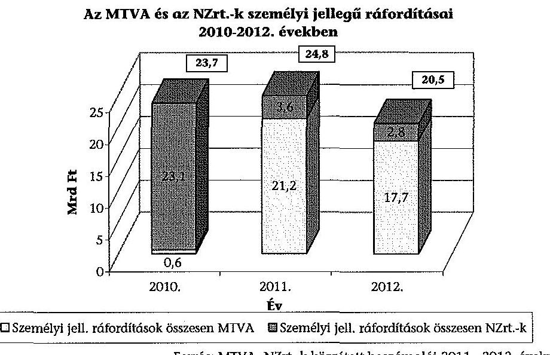

A közszolgálati médiarendszer átalakításának folyamatában fontos tényező volt az NZrt.-k technikai integrációja, ezzel együtt annak megújítása is. A Kunigunda utcai épületkomplexum lett a közszolgálati músorok gyártóbázisa, amelynek kapacitása megfelelő volt az MTVA integrációt követő személyi állományának és technikai eszközparkjának elhelyezésére.

Az integrációt megelőzően, 2010-ben az NZrt.-k összesen 59 telephelyen müködtek, a telephelyek száma a 2013. évre 46-ra csökkent. Az MTVA 20 db ingatlan esetében hozott kiadáscsökkenéssel járó döntést: 7 ingatlant bérbe adott, 9 esetben felmondta a korábbi bérleti szerződést és 3 épületet kiürített. A meghozott döntések üzemeltetési költségekre gyakorolt együttes hatása a 2012. évben még nem volt kimutatható. Az érdemi költségcsökkentő hatás 2013-tól várható.

A közszolgálati hírgyártás, hírszolgáltatás a felesleges párhuzamosságok megszüntetésének következtében az Mitv. 101. §-ában megfogalmazott célkitúzés elérésével takarékosabbá - gazdaságosabbá - vált.

A hírgyártás egy adáspercére jutó ráfordítás mutató ${ }^{41}$ a 2010. évről a 2012. évre $28,2 \%$-kal csökkent, 19,5-ről 14,0 E Ft/percre. Ezen belül 2010-ről 2011-re a mutató 19,5 E Ft/percről 19,3 E Ft/percre, 2011-ről 2012-re pedig 14,0 E Ft/percre csökkent. A közszolgálati hírgyártás egy adáspercére jutó ráfordítás mutatót a következő ábra szemlélteti:

[^0]
[^0]:    ${ }^{41}$ A hírgyártás egy adáspercére jutó ráfordítás = a közszolgálati média hírgyártásra fordított éves közvetlen ráfordítása (E Ft) / hírgyártás eredményeképpen keletkező hírmúsorok éves leadott adásperce (perc).

---

# A közszolgálati hírgyártás egy adáspercére jutó ráfordítás mutató 

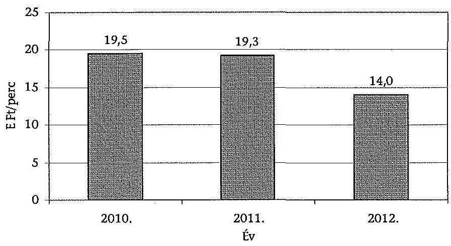

Az MTVA által a hírgyártással kapcsolatban kimutatott, közvetlenül elszámolt összes éves ráfordítás 2010-ről 2012-re 28,3\%-kal, 1,3 Mrd Ft-tal, (4,6 Mrd Ft-ról 3,3 Mrd Ft-ra) csökkent.

Az MTVA adatszolgáltatása szerint a saját gyártású músorokkal kapcsolatban közvetlenül elszámolt összes éves ráfordítás 2010-ről 2012-re 7,8\%-kal, 1,3 Mrd Ft-tal, (16,7 Mrd Ft-ról 18,0 Mrd Ft-ra) nőtt. A növekedés a párhuzamosságok megszüntetéséből származó megtakarításnak és a minőség javításának érdekében felmerült 10,6 Mrd Ft-os költségnek az együttes hatása.

### 5.3. A költséghatékonyság alakulása a közszolgálati célú mû́sorszámok saját gyártásánál, illetve külső beszerzésénél

Az MTVA 2011. és 2012. évi éves beszámolói és üzleti jelentései, a szakterületek 2012. évi beszámolói, valamint a középtávú üzleti terve szerint az MTVA az NZrt.-ktől átvett, eltérő infrastruktúrák egységes rendszerbe integrálását 2011-től folyamatosan végzi. Az MTVA a feladatait egy telephelyen kívánta megoldani az NZrt.-k által használt technikák integrációjával, valamint a technikák és technológiák megújításával. Ennek egyik feltétele a Kunigunda utcai ingatlan tulajdonjogának megszerzése volt.

A DTV NZrt. és az MTV NZrt. technikai eszközeit az MTVA 2012. első félév végéig helyezte át a gyártóbázisra. A rádiós músorok gyártását és lebonyolítását biztosító helyek és technológiák kialakítását követően, 2013-ban az MR technikai eszközeinek áttelepítése is megtörtént.

Az MTVA értékelte az NZrt.-ktől átvett eszközök egységes használatából eredő előnyöket (pl. a Hírcentrumon belül az M1 és Duna csatornák híradói és hírháttér músorainál a gyártási folyamatban az azonos technikák és lebonyolító stúdiók használatából származó előnyöket). Az MTVA a fejlesztési

---

koncepciójának meghatározásához felmérte a különböző eszközök használatából fakadó problémákat, ezek kezelésének és megszüntetésének módját.

Az MTVA az integrációt követően a beszerzéseit tervezetten, az egységes eszközpark kialakításának igényével hajtotta végre. Az MTVA 2011. évben indított beruházásainak értéke 1,7 Mrd Ft, ebből a szerződött 1,1 Mrd Ft, 2012-ben a leszerződött és elindított beruházások értéke 2,7 Mrd Ft volt. A beruházások célja többek között a közszolgálati médiaszolgáltatás minőségének és színvonalának emelése és a gyártás korszerűsítése volt.

Az üzleti tervekben szerepel az ún. csatornamenedzsment-rendszer bevezetése, amely a műsorgyártással összefüggő tervezési, tartalom előállítási és ellenőrzési folyamatokat támogatja. A rendszer az eszközpark integrációja mellett az erőforrás kihasználás további optimalizálását jelenti. Tervezik a műszaki-technikai eszközpark folyamatos és nagymértékű modernizációját.

Az MTVA 2011-ben fogadta el a szerződéskötési és szerződés-nyilvántartási rendjét a 16/2011. (VI. 24.) számú vezérigazgatói utasításban. Meghatározta a szerződéskötés formai szabályait, a szerződéskötésre irányuló eljárás egyes lépéseit és az ehhez kapcsolódó felelősséget, továbbá egységes szerződésnyilvántartási rendszert alakított ki. Az MTVA valamennyi szerződésének írásba foglalásával és informatikai nyilvántartásával biztosítja az MTVA szerződéses állományának áttekinthetővé, ellenőrizhetővé tételét.

A belső ellenőrzés 2012-ben vizsgálta a szerződéskötési folyamat szabályozottságát és annak gyakorlati alkalmazását. A vizsgálat befejezése után az MTVA megbízást adott egy szervezeti tanácsadással foglalkozó cégnek az MTVA belső folyamatainak, pl. a szerződéskötési és beszerzési folyamatainak az átvilágítására és hatékonyságnövelő intézkedések kidolgozására. Az MTVA FB megtárgyalta a jelentést, és megállapította, hogy az MTVA szerződéskötési gyakorlata jól szabályozott. A nagyszámú szerződésmintát jól alkalmazzák. Egyértelműen meghatározottak a szerződéskötésre irányuló eljárás egyes lépései és a személyi felelősség. Hibát, hiányosságot az MTV FB nem tárt fel.

A kitűzött eszközgazdálkodással kapcsolatos feladatok végrehajtásáról, ennek értékeléséről és az elért eredményekről a Kontrolling igazgatóság negyedéves beszámolókat készített a menedzsment és az MTVA FB részére. A beszámolókat az MTVA FB rendszeresen megtárgyalta.

# A hírgyártást és saját músorgyártást a szervezeti struktúra átalakításának köszönhető létszámcsökkenés hatékonyabbá tette. 

A hírgyártásban foglalkoztatottak átlagos állományi létszáma a 2010. évi 542 fơről 2011-ben 471 főre, 2012-ben 294 főre csökkent. Ebből a 2012. évben 255 fốt az MTVA-nál, 39 fốt az MTI-nél foglalkoztattak. A leadott hírműsoridő 2010-ben 238,2 ezer perc, 2011-ben 246,4 ezer perc, 2012-ben 237,7 ezer perc volt. A hírgyártás egy fôre jutó adásperc mutató ${ }^{42}$ a 2010. évi 439,6 percről 2012-re 808,7 percre nőtt, így e mutató lényegesen, 84,0\%-kal javult. A hírgyártással kapcsolatos mutató alakulását a következő diagram szemlélteti.

[^0]
[^0]:    ${ }^{42}$ A hírgyártás egy főre jutó adásperce = hírgyártás eredményeképpen keletkező hírműsorok éves leadott adás perce / hírgyártásban közreműködők létszáma.

---

Az egy főre jutó adásperc mutató alapján a hatékonyság 2011-re 19,0\%-kal, 2011-ről 2012-re 54,6\%-kal javult, amelyet a következő ábra mutat be:
7. számú ábra

Hírgyártás egy före jutó adásperc mutató 2010-2012. években
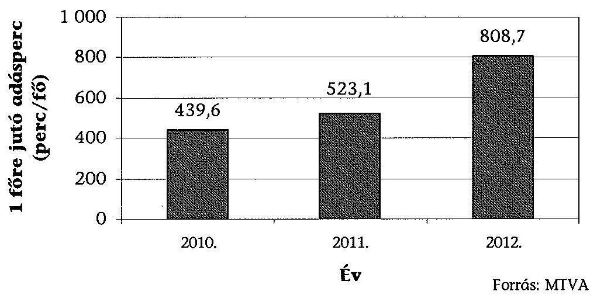

A saját gyártású műsorok készítésében közreműködők átlagos állományi létszáma a 2010. évi 2354 fơről 2011-ben 2064 före, 2012-ben 1746 före csökkent. A saját gyártású műsorok eredményeképpen keletkező műsorperc a 2010. évi 2031 ezer percről a 2011. évben 1953,7 ezer percre, a 2012. évre 1989 ezer percre csökkent. A saját músorgyártásban közremüködő egy főre jutó gyártott músorperc mutató ${ }^{43}$ a 2010. évi 863,0 percről 2012-re 1139,4 percre nőtt, ami 32,0\%-os javulást jelent. A mutató 2010-ről 2011-re 9,7\%-kal, 2011-ről 2012-re 20,4\%-kal javult. A saját gyártással kapcsolatos mutató alakulását a következő ábra szemlélteti:

[^0]
[^0]:    ${ }^{43}$ Saját műsorgyártásban közreműködő egy főre jutó gyártott műsorperc = saját kivitelezésben gyártott műsoridő perc / saját műsorgyártásban közreműködő létszám.

---

# Saját músorgyártásban közremüködő egy főre jutó gyártott músorperc mutató 2010-2012. években 

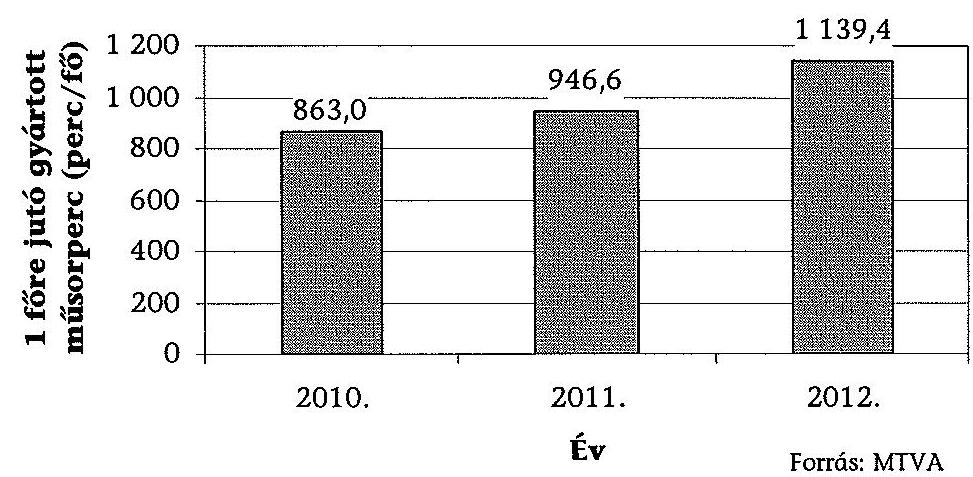

A rendelkezésre álló források músorcélú felhasználása éves szinten a 2010. évi 21,0 Mrd Ft-ról 2012-re 28,0 Mrd Ft-ra nőtt, ami 33,3\%-os növekedést jelent. Ezen belül a külső gyártású músorokra fordított források közel négyszeresére nőttek, 1,8 Mrd Ft-ról 6,8 Mrd Ft-ra. A saját gyártású músorokra fordított források a 2010. évi 16,7 Mrd Ft-ról a 2012. évre 18,0 Mrd Ft-ra, 7,8\%kal növekedtek. Az egyéb músorcélra felhasznált forrás a 2010. évi 2,5 Mrd Ftról a 2012. évre 3,2 Mrd Ft-ra, 28,0\%-kal nőtt. A músorcélú felhasználásra rendelkezésre álló évenkénti forrásokból mindhárom évben közel azonos músorpercet ( 3600 ezer músorperc, évenként $0,2 \%$-on belüli eltéréssel) állítottak elő. A felhasznált források alakulását a következő ábra szemlélteti:
9. számú ábra
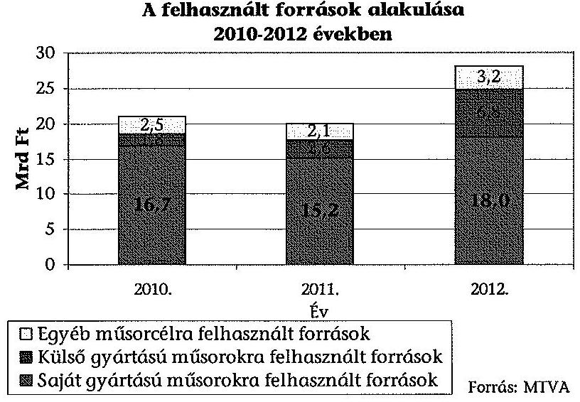

---

Az összes műsorcélú forráson belül a külső gyártásra felhasznált források aránya a 2010. évi 8,0\%-ról 2012-re 24,0\%-ra nőtt, a saját gyártásra felhasználté $80,0 \%$-ról $64,0 \%$-ra, az egyéb műsorcélra felhasználté $12,0 \%$-ról $11,0 \%$-ra csökkent.

A közszolgálati médiarendszer átalakítását követően a közszolgálati médiaszolgáltatás támogatására fordított forrásokból 2011-ben 31,1\% (19,9 Mrd Ft), 2012-ben 40,2\% ( $28,0 \mathrm{MrdFt}$ ) a saját és a külső gyártásra fordított összeg aránya. A közvetlen músorcélú forrásfelhasználás aránya nőtt.

# 6. Az MTI NZRT. 2011-2012. ÉVI GAZDÁlKODÁSA 

Az MTI NZrt. 2011-2012. évi gazdálkodása alapvetően szabályozott és szabályszerű volt. A közszolgálati médiaszolgáltatás átalakítása következtében az MTI NZrt. szervezeti és működési rendszere megváltozott. Az új helyzethez alkalmazkodva a létszám, a feladat- és a hatásköri változások miatt az alaptevékenysége ellátásához együttműködési megállapodásokat és szolgáltatási szerződéseket kötött az MTVA-val. A megkötött szerződések részletszabályainak kiegészítését, módosítását az MTI NZrt. kezdeményezte ${ }^{44}$.

### 6.1. A Kuratórium tulajdonosi joggyakorlásának szabályszerűsége

A KSZKA az MTI NZrt. vonatkozásában a Gt.-ben meghatározott alapítói, illetve részvényesi jogokat, a Kuratórium a közgyűlési jogokat gyakorolja. A Kuratórium feladatait és hatáskörét az Mttv. 90. §-a, a tulajdonosi jog gyakorlásának hatókörét a 91. § határozza meg. Az ellenőrzött időszakban a Kuratórium eleget tett az Mttv. 90-91. §-ában előírt törvényi kötelezettségeinek, az MTI NZrt.-nél szabályszerűen gyakorolta a tulajdonosi jogait.

A cégbírósági bejegyzés alapján az MTI NZrt. 2010. december 1-jétől nonprofit társaság. A Kuratórium - törvényi kötelezettségének eleget téve - 2010. december 21 -én ${ }^{45}$ megválasztotta az NZrt.-k közös FB elnökét és tagjait. Az NZrt.-k 2011. és 2012. évi éves beszámolóinak könyvvizsgálatát végző cégről 2011. február 23 -án döntött ${ }^{46}$.

A Kuratórium az MTI NZrt.-vel összefüggő, az Mttv.-ben előírt törvényi kötelezettségének a következőkben részletezett módon tett eleget:

- Az Mttv. 90. § (1) bekezdés d) pontjában foglaltakkal összhangban - az MTI NZrt. szervezeti változásainak megfelelően - a 2011-2012. években módosította az MTI NZrt. alapító okiratát.

[^0]
[^0]:    ${ }^{44}$ Az MTI NZrt. 2012 októberében javaslatot tett az MTVA-nak a megkötött együttmüködési és szolgáltatási szerződés kiegészítésére, módosítására. A módosításra a helyszíni ellenőrzés befejezéséig nem került sor.
    ${ }^{45}$ a Kuratórium 61-64/2010. (XII. 21.) számú határozatai
    ${ }^{46}$ a Kuratórium 35/2011. (II. 23.) számú határozata

---

- Az Mttv. 90. § (1) bekezdés e-f) pontjai alapján az MTI NZrt. vezérigazgatója felett a munkáltatói jogkört a 2011-2012. években szabályosan gyakorolta.
- Az MTI NZrt.-nél 2013. január 1-jétől a vezérigazgató személye változott. Az MTI NZrt. vezérigazgatójának munkaviszonya 2012. december 31-ei határnappal közös megegyezéssel szűnt meg. A Kuratórium 2012. december 12-ei dátummal munkaszerződést írt alá az új vezérigazgatóval, amelyben megállapította a munkavégzés feltételeit és a díjazás mértékét is.
- Az MTI NZrt. 2011. és 2012. évekről készített szakmai beszámolóinak ${ }^{47}$ KT által végzett értékelésén ${ }^{48}$ keresztül ellenőrizte a közszolgálati médiaszolgáltatás céljainak megvalósulását.
- Az Mttv. 90. § (1) bekezdés m) pontjában előírtaknak megfelelően a közös FB határozata és a Könyvvizsgáló véleménye alapján jóváhagyta ${ }^{49}$ az MTI NZrt. üzleti terveit.
- Az Mttv. 90. § (1) bekezdés n) pontjában foglaltakkal összhangban - és a közös FB határozatai, valamint a könyvvizsgálói vélemények alapján - jóváhagyta ${ }^{50}$ az MTI NZrt. 2011. és 2012. évi mérleg és eredménykimutatását.

Az MTI NZrt. 2011. évi vagyonátadásával összefüggésben, valamint a 2012. évi veszteségeinek rendezése miatt - a könyvvizsgáló, valamint a közös FB véleményének figyelembe vételével - a 2012. évben 1750,0 M Ft-ról 1000,0 M Ft-ra, a 2013. évben 200,0 M Ft-ra szállította le az MTI NZrt. jegyzett tőkéjét.

# 6.2. Az üzleti terv megalapozottsága, az árbevétel-, költség- és eredménytervek teljesülése 

Az MTI NZrt. - a média szervezetrendszerének átalakulása időszakában készült - 2011. és 2012. évi üzleti (gazdálkodási) terve a tervkészítés időszakában ismert információk és az elöre látható folyamatok alapján megalapozott volt. Az MTI NZrt. a 2011. évi üzleti tervét 2011. április 20-án, a 2012. évi üzleti tervét 2012. május 16-án terjesztette a Kuratórium elé, év közben a tervek nem módosultak. Az MTI NZrt. gazdálkodásának 2011. és 2012. évi főbb terv és tény adatait a következő táblázat mutatja be:

[^0]
[^0]:    ${ }^{47}$ az Mttv. 97. § (8) bekezdésében foglaltakra kiterjedő beszámoló
    ${ }^{48}$ a KT 21/2012. (V. 23.) számú, valamint a 26/2013. (V. 8.) számú határozatai
    ${ }^{49}$ a 66/2011. (IV. 20.), 39/2012. (V. 16.), 17/2013. (III. 06.) számú határozatok
    ${ }^{50}$ a Kuratórium 40/2012. (V. 16.) és 36/2013. (IV. 24.) számú határozatai

---

5. számú táblázat

Az MTI NZrt. gazdálkodásának 2011. és 2012. évi főbb terv és tény adatai

|  | Adatok: M Ft |  |  |  |
| :-- | --: | --: | --: | --: |
| Megnevezés | $\mathbf{2 0 1 1}$. év |  | 2012. év |  |
|  | Terv | Tény | Terv | Tény |
| Értékesítés árbevétele | 0,0 | 340,4 | 19,8 | 412,1 |
| Egyéb bevétel | 0,0 | 8,0 | 0,0 | 120,4 |
| Költségvetési támogatás | 2567,5 | 2608,4 | 1023,1 | 1313,0 |
| Összes költség ráfordítás | 2589,0 | 3383,7 | 1631,7 | 2171,5 |
| Üzleti eredmény | $-21,5$ | $-426,9$ | $-588,8$ | $-326,0$ |
| Mérleg szerinti eredmény | $-21,5$ | $-3071,0$ | $-657,5$ | $-382,5$ |

Forrás: MTI NZrt.
Az MTI NZrt.-nél a hírkiadás 2011-ben ingyenessé vált. Az MTI NZrt. a 2011. évre nem tervezett, a 2012. évre 19,8 M Ft árbevételt tervezett. Árbevétele mindkét évben meghaladta a tervezettet, 2011-ben 340,4 M Ft, 2012-ben 412,1 M Ft volt. Árbevétele a továbbra is fizetős szolgáltatásai, mint például az archív felvételek, a külföldi hírügynökségektől átvett és értékesített hírek, a sajátos hírügynökségi tartalmak, az előrejelzések, hátterek, elemzések vagy kronológiák értékesítésének ellenértéke. Egyéb bevételt sem a 2011., sem a 2012. évre nem tervezett. Az egyéb bevételek elszámolt összege a 2011. évben 8,0 M Ft, a 2012. évben 120,4 M Ft volt, amelyek a költségvetési céltámogatásokból, az európai uniós támogatásokból, valamint a céltartalékok felhasználásból származtak.

Az MTI NZrt. 2011. évi összes költsége és ráfordítása a tervhez mérten 794,7 M Ft-tal, a 2012. évi 539,8 M Ft-tal magasabb összegben realizálódott. A legnagyobb eltérés mindkét évben az anyagjellegủ és a személyi jellegű ráfordításoknál, valamint a vissza nem igényelhető áfánál volt.

Az MTI NZrt. 2011. évi és 2012. évi üzleti és mérleg szerinti eredménye egyaránt negatív volt. A realizált árbevételt és a költségnövekedéseket az éves beszámolóban bemutatták, az eltéréseket alátámasztották.

# 6.3. Az állami támogatások és egyéb bevételek felhasználásának megalapozottsága 

Az MTI NZrt. a bevételeket a közszolgálati médiaszolgáltatási alaptevékenység ellátására, elsősorban a személyi jellegű, valamint anyagjellegű ráfordításokra használta fel. Számviteli politikája, számlarendje és az alkalmazott könyvelői program biztosította a támogatások és egyéb bevételek elkülönített nyilvántartását.

Az NMHH, valamint az NMHH Médiatanácsa 2011. évi költségvetéséről szóló törvényben ${ }^{51}$ az MTI NZrt. 2011. évre tervezett támogatásának összege

[^0]
[^0]:    ${ }^{51}$ az NMHH, valamint az NMHH Médiatanácsa 2011. évi költségvetéséről szóló 2010. évi CXLVI. törvény 3. számú melléklete

---

745,0 M Ft volt, amely jelentősen elmaradt az MTI NZrt. 2011. évi üzleti tervében tervezett 2503,3 M Ft költségvetési támogatástól. A törvényben meghatározott támogatás (az MTVA és az MTI NZrt. megállapodása alapján) 2608,4 M Ft-ra emelkedett.

Az MTI NZrt. a 2011. év végén 185 fős létszámmal tervezte ellátni feladatait a 2012. évben, és 2523,0 M Ft költségvetési támogatási igényt mutatott ki. A 2012. év további változásokat hozott az MTI NZrt. szervezeti és múködési rendjében, a létszám átcsoportosítás és a feladatátadás következtében 2012 májusában a Kuratórium elé beterjesztett üzleti tervben 1023,0 M Ft költségvetési támogatással számolt.

A költségvetési támogatás összege a 2011. évben 2608,3 M Ft, a 2012. évben 1313,0 M Ft volt. A 2011. évi támogatásból 105,5 M Ft céltámogatás, a 2012. évben a teljes költségvetési támogatás intézményi támogatás volt. Az MTI NZrt. költségvetési támogatását a 2011. és a 2012. években a következő táblázat szemlélteti:
6. számú táblázat

Az MTI NZrt. költségvetési támogatása a 2011. és a 2012. évben

|  | Adatok: M Ft |  |
| :-- | --: | --: |
| Megnevezés | 2011. év támogatás | 2012. év támogatás |
| Intézményi múködési támogatás | 2502,8 | 1313,0 |
| Céltámogatás | 49,9 | - |
| Egyéb céltámogatás | 55,6 | - |

Forrás: MTI NZrt.
Az eredménykimutatásban bemutatott bevételek tartalma mindkét évben megfelelt a Számv. tv. előírásainak. Az MTI NZrt. 2011. és a 2012. évi éves beszámolóit a könyvvizsgáló korlátozás nélkül elfogadta.

# 6.4. Az eszköz- és forrásállományban bekövetkezett változások átvezetésének szabályszerűsége 

Az MTI NZrt. vagyongazdálkodásában, feladataiban és létszámában jelentős fordulatot jelentett az Mttv. 2011. január 1-jei hatálybalépése, valamint az OGY határozata. Feladatai 2011-ben kibővültek, szervezeti és múködési rendje megváltozott, létszáma és vagyona csökkent. A következő évben folytatódott a közszolgálati média átalakulása, 2012. június 1-jén munkáltatói jogutódlással további munkavállalókat és eszközöket adtak át az MTVA-nak.

Az MTI NZrt.-nél a 2010. évi mérlegfőösszeg 4210,4 M Ft-ról a 2011. év végére 1268,5 M Ft-ra, a 2010. évi 30,1\%-ára csökkent. A mérlegfőösszeg a 2012. év végére 696,1 M Ft-ra - a 2011. évi közel 54,9\%-ára, a 2010. évi 16,5\%-ára csökkent.

Az MTI NZrt. az ellenőrzött időszakban a Számv. tv. előírásainak megfelelően olyan könyvviteli nyilvántartást vezetett, amely az eszközökben és a források-

---

ban bekövetkezett változásokat a valóságnak megfelelően, folyamatosan, zárt rendszerben, áttekinthetően mutatta be.

Számviteli politikája a Számv. tv. 69. § előírásával összhangban rendelkezett arról, hogy az üzleti év zárásához, a beszámoló elkészítéséhez és a mérleg tételeinek alátámasztáshoz tételes, ellenőrzésre alkalmas leltárt kell készíteni. Az MTI NZrt. a 2012. évi éves beszámolójához kapcsolódó mérlegét a Számv. tv. előírásainak megfelelően, a számviteli politikájában megfogalmazottak szerint alátámasztotta tételes, ellenőrzésre alkalmas leltárral. A 2011. évről készült számviteli mérlegéhez ellenőrzésre alkalmas leltár nem minden mérlegtételhez állt rendelkezésre.

Nem állt rendelkezésre leltárkimutatás az eszközök esetében a követelésekről, az aktív időbeli elhatárolásokról, a források esetében a céltartalékokról, valamint a passzív időbeli elhatárolásokról.

Az MTI NZrt. eszközeinek és forrásainak a besorolása, értékelése, az értékcsökkenések és értékvesztések elszámolása megfelelt a Számv. tv. előírásainak, azt a könyvvizsgáló elfogadta.

Az MTI NZrt. - az MTVA-nak vagyonkezelés céljából térítésmentesen átadott ingatlanok közül - a Budapest Naphegy tér 8. szám alatti ingatlant székhelyként használja továbbra is. Az MTI NZrt. a székhely használattal kapcsolatos szerződéssel, megállapodással (amely tisztázná mindkét fél jogait és kötelezettségeit) nem rendelkezett. Az OGY határozat előírta, hogy a vagyon hasznosítására irányuló szerződést írásba kell foglalni, amely nem történt meg.

# 6.5. A létszám- és bérgazdálkodás, a személyi jellegú ráfordítások elszámolásának szabályszerűsége 

Az MTI NZrt. munkaviszony keretében a 2010. év végén 315 főt, a 2011. év végén 177 főt, 2012. május 31 -én 180 főt foglalkoztatott. A munkaviszony keretében foglalkoztatottak száma a 2012. év végére 51 fơre - a 2011. év végi adatokhoz képest $71,2 \%$-kal - csökkent. A külsős foglalkoztatottak száma a 2010. év végi 143 fơről a 2012. év végére 6 fơre változott.

A 2011. és 2012. évi személyi jellegú ráfordításokat az MTI NZrt. alapvetően szabályszerűen számolta el. A foglalkoztatottak rendelkeztek munkaszerződéssel, a kereset nyilvántartó lapok tartalmazták az évközi változásokat és a levont bérhez kapcsolódó járulékokat egyaránt. Az elszámolt személyi jellegű ráfordítások tartalmi besorolása megfelelt a Számv. tv. előírásainak.

Az MTI NZrt. humánerőforrás-gazdálkodással, bérszámfejtéssel összefüggő feladatait (megállapodás alapján) 2011. január 1-től az MTVA látja el. Az MTI NZrt. a számfejtett béreket utalja, és a könyveiben nyilvántartja. A megbízási, vállalkozási, tanácsadó szerződések alapján kifizetett járandóságokat a teljesítésigazolás alapján közvetlenül utalja. Az MTI NZrt. a kifizetések jogszerüségét a folyamatba épített ellenőrzéssel, vezetői kontrollal biztosítja.

---

# 6.6. A költségek és ráfordítások elszámolásának szabályszerűsége 

Az MTI NZrt. a 2010. év végéig alkalmazott „számítási modell" segítségével elkülönítette a közszolgálati és nem közszolgálati tevékenységek körében felmerült költségeket és ráfordításokat, valamint kimutatta a közszolgálati és nem közszolgálati feladatokkal összefüggő bevételeit. A „számítási modell" segítségével meghatározhatóvá vált a közszolgálati és nem közszolgálati tevékenységekre jutó eredmény. Az MTI NZrt. 2011-től az önköltségszámítására is alkalmas modellt a költségelszámolás változása miatt már nem alkalmazta.

## Az MTI NZrt. 2011. és 2012. évi költségeinek és ráfordításainak az elszámolása alapvetően szabályszerű volt. Az elszámolt költségek és ráfordítások tartalma megfelelt a Számv. tv. előírásainak.

Az MTI NZrt. a 2011. május 25 -én jogerőssé vált NAV határozattal 2011. január 1-jéig visszamenőleges hatállyal csoportos áfa alany lett. Az évente jelentkező le nem vonható áfa a saját tőkét csökkentette.

A csoport tagjai, így az MTI NZrt. is arányosítással határozta meg a levonható áfa nagyságát. Az arányszámot az MTVA számolta ki a támogatások és az árbevételek figyelembevételével. A csoportos áfa alanyiság, valamint az arányosítás miatt le nem vonható (egyéb ráfordításként elszámolt) adó a 2011. évben 168,0 M Ft, a 2012. évben 94,0 M Ft, míg a 2013. év első félévében 32,3 M Ft volt. A le nem vonható adóval nem csökkenthető a fizetendő áfa mértéke sem. Az egyéb ráfordítások között elszámolt áfa az MTI NZrt. üzleti eredményét, mérleg szerinti eredményét, ezáltal az eredménytartalékot is csökkenti. A csökkenő eredménytartalék a saját tőke értékét is csökkenti.

Budapest, 2013. 12. hónap 1d. nap

Melléklet: 12 db
Függelék: 2 db
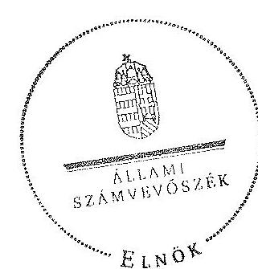

Domokos László
elnök

---

# A közszolgálati média rendszerének 2010. június 30. elôtt hatályos szervezeti felépítése 

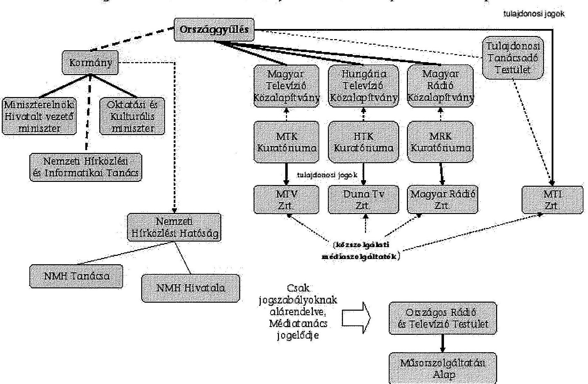

---

.

---

A közszolgálati média rendszerének 2011. január 01. után hatályos szervezeti felépítése
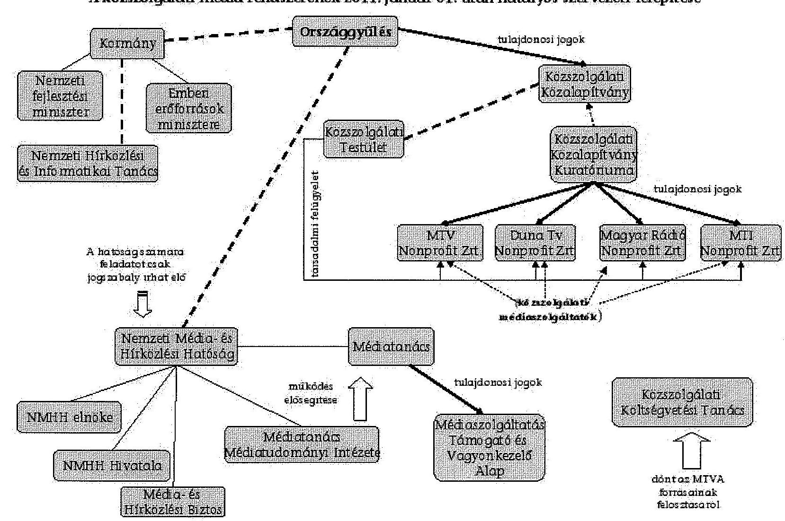

---

.

---

# Az NZrt.-k múködéséhez nyújtott egyedi céltámogatások a 2011. és 2012. években 

| Megnevezés | NMHH Média-   tanácsának   határozatai | Céltámogatás   összege 2011-   ben | NMHH Média-   tanácsának   határozatai | Céltámogatás   összege 2012-   ben |
| :--: | :--: | :--: | :--: | :--: |
| MTV NZrt. | 379/2011.   (III. 23.) | 3650,9 | 868/2012.   (V. 16.) | 151,0 |
|  | 633/2011.   (V. 18.) | 687,3 | 2223/2012.   (XII. 19.) | 475,9 |
|  | 1900/2011.   (XII. 20.) | 150,9 |  |  |
|  | 379/2011.   (III. 23.) | 1143,6 |  |  |
| DTV NZrt. | 633/2011.   (V. 18.) | 261,6 | 868/2012.   (V. 16.) | 354,0 |
|  | 955/2011.   (VII. 19.) | 80,0 |  |  |
|  | 1900/2011.   (XII. 20.) | 354,2 |  |  |
|  | 379/2011.   (III. 23.) | 383,0 |  |  |
| MR NZrt. | 633/2011.   (V. 18.) | 374,9 | 868/2012.   (V. 16.) | 68,0 |
|  | 955/2011.   (VII. 19.) | 105,0 | 2223/2012.   (XII. 19.) | 29,4 |
|  | 1900/2011.   (XII. 20.) | 68,3 |  |  |
| MTI NZrt. | 955/2011.   (VII. 19.) | 1758,0 | - | - |

---

.

---

# Az MTVA, illetve jogelődjének számviteli mérleg szerinti eszközének állománya a 2010-2012. évek végén (M Ft) 

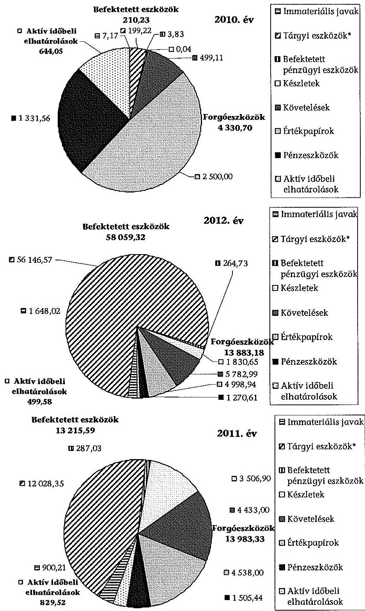
*A tárgyi eszközök értéke a Kunigunda utcai épület megvásárlását követő aktiválása eredményeként nőtt ( 43383 M Ft ).
Forrás: MTVA beszámolója

---

$\cdot$
$\cdot$
$\cdot$
$\cdot$
$\cdot$
$\cdot$
$\cdot$
$\cdot$
$\cdot$
$\cdot$
$\cdot$
$\cdot$
$\cdot$
$\cdot$
$\cdot$
$\cdot$
$\cdot$
$\cdot$
$\cdot$
$\cdot$
$\cdot$
$\cdot$
$\cdot$
$\cdot$
$\cdot$
$\cdot$
$\cdot$
$\cdot$
$\cdot$
$\cdot$
$\cdot$
$\cdot$
$\cdot$
$\cdot$
$\cdot$
$\cdot$
$\cdot$
$\cdot$
$\cdot$
$\cdot$
$\cdot$
$\cdot$
$\cdot$
$\cdot$
$\cdot$
$\cdot$
$\cdot$
$\cdot$
$\cdot$
$\cdot$
$\cdot$
$\cdot$
$\cdot$
$\cdot$
$\cdot$
$\cdot$
$\cdot$
$\cdot$
$\cdot$
$\cdot$
$\cdot$
$\cdot$
$\cdot$
$\cdot$
$\cdot$
$\cdot$
$\cdot$
$\cdot$
$\cdot

---

# Az MTVA, illetve jogelődjének számviteli mérleg szerinti külső forrásának állománya a 2010-2012. évek végén (M Ft) 

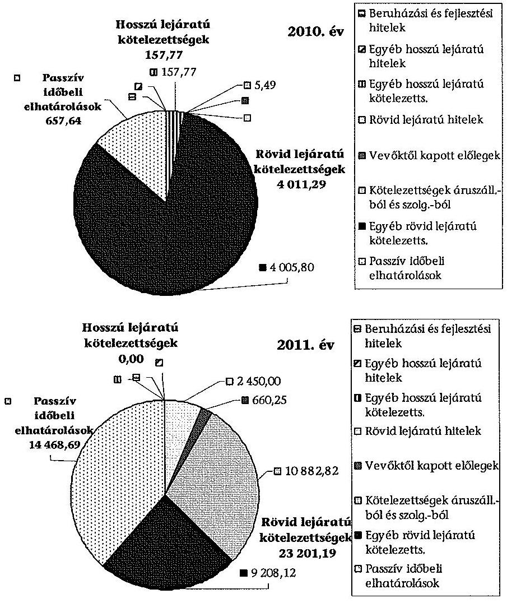
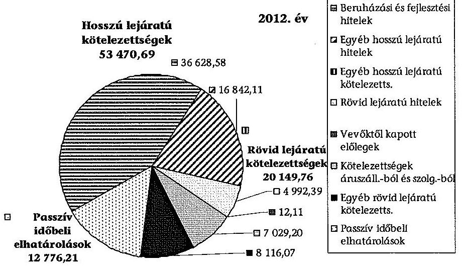

---

# **Chemistry**

## **Chemical Reactions**

### **Balancing Chemical Equations**

1. **Write the unbalanced equation:**
   - Example: $$C_3H_8 + O_2 \rightarrow CO_2 + H_2O$$

2. **Balance the equation:**
   - Example: $$2C_3H_8 + 7O_2 \rightarrow 6CO_2 + 8H_2O$$

3. **Balance the equation:**
   - Example: $$2C_3H_8 + 7O_2 \rightarrow 6CO_2 + 8H_2O$$

### **Types of Reactions**

1. **Combination Reaction:**
   - Example: $$2H_2 + O_2 \rightarrow 2H_2O$$

2. **Decomposition Reaction:**
   - Example: $$2H_2O_2 \rightarrow 2H_2O + O_2$$

3. **Single Displacement Reaction:**
   - Example: $$Zn + 2HCl \rightarrow ZnCl_2 + H_2$$

4. **Double Displacement Reaction:**
   - Example: $$AgNO_3 + NaCl \rightarrow AgCl + NaNO_3$$

5. **Combustion Reaction:**
   - Example: $$CH_4 + 2O_2 \rightarrow CO_2 + 2H_2O$$

## **Stoichiometry**

### **Mole Concept**

- **Mole (mol):** The amount of substance containing as many particles (atoms, molecules, ions) as there are atoms in exactly 12 grams of carbon-12.
- **Avogadro's Number:** $$6.022 \times 10^{23}$$ particles per mole.

### **Molar Mass**

- **Molar Mass:** The mass of one mole of a substance.
- Example: The molar mass of water ($$H_2O$$) is 18.015 g/mol.

### **Calculations**

1. **Moles to Mass:**
   - Formula: $$n = \frac{m}{M}$$
   - Example: Calculate the number of moles of $$H_2O$$ in 18 grams of water.
     - $$n = \frac{18.015 \, \text{g}}{18.015 \, \text{g/mol}} = 18.015 \, \text{g/mol}$$

2. **Moles to Mass:**
   - Formula: $$m = n \times M$$
   - Example: Calculate the mass of 18.015 g of water.
     - $$m = 18.015 \, \text{g/mol} = 18.015 \, \text{g/mol}$$

## **Gas Laws**

### **Ideal Gas Law**

- **Equation:** $$PV = nRT$$
- **Variables:**
  - $$P$$: Pressure (atm)
  - $$V$$: Volume (L)
  - $$n$$: Number of moles (mol)
  - $$R$$: Ideal gas constant (0.0821 L·atm/mol·K)
  - $$T$$: Temperature (K)

### **Boyle's Law**

- **Equation:** $$P_1V_1 = P_2V_2$$
- **Variables:**
  - P₁: Pressure (atm)
  - P₂: Volume (L)
  - P₃: Temperature (K)
  - P₁: Pressure (atm)
  - P₂: Volume (L)
  - P₃: Temperature (K)
  - P₁: Pressure (atm)

### **Boyle's Law (Boyle's Law)**

- **Equation:** $$\frac{P_1V_1}{P_2V_2} = \frac{P_1}{V} \times P_2V$$
- **Variables:**
  - P₁: Pressure (atm)
  - P₂: Volume (L)
  - P₃: Temperature (K)
  - P₁: Pressure (atm)
  - P₂: Volume (L)
  - P₁: Pressure (atm)

## **Thermochemistry**

### **Enthalpy (H)**

- **Definition:** The heat content of a system at constant pressure.
- **Change in Enthalpy (ΔH):** $$ΔH = q_p$$
- **Change in Enthalpy (ΔH1):** $$ΔH1 = q_p - q_0$$
- **Change in Enthalpy (ΔH2):** $$ΔH2 = q_0 - q_1$$
- **Enthalpy Change (ΔH1):** $$ΔH1 = q_1 - q_2$$

### **Hess's Law**

- **Statement:** The enthalpy change for a reaction is the same whether it occurs in one step or multiple steps.
- **Equation:** $$\Delta H = q_p - q_0 \Delta H1$$
- **Statement:** The enthalpy change for a reaction is the same whether it occurs in one step or multiple steps.

### **Hess's Law (Hess's Law)**

- **Statement:** The enthalpy change for a reaction is the same whether it occurs in one step or multiple steps.
- **Equation:** $$\Delta H = q_0 - q_1 \Delta H1$$
- **Statement:** The enthalpy change for a reaction is the same whether it occurs in one step or multiple steps.

## **Electrochemistry**

### **Oxidation and Reduction**

- **Oxidation:** Loss of electrons.
- **Reduction:** Gain of electrons.

### **Galvanic Cells**

- **Definition:** A cell that converts chemical energy into electrical energy.
- **Components:**
  - Anode: Oxidation occurs.
  - Cathode: Reduction occurs.
  - Salt Bridge: Connects the two half-cells.

### **Nernst Equation**

- **Equation:** $$E = E^\circ - \frac{RT}{nF} \ln Q$$
- **Variables:**
  - E: Cell potential
  - R: Ideal gas constant
  - F: Faraday constant
  - Q: Reaction quotient

---

# Korábbi ÁSZ ellenőrzések az MTV Zrt. ingatlan bérletének gazdálkodásával kapcsolatban 

9812 számú Jelentés a Magyar Televízió Közalapítvány és kapcsolódó ellenőrzés keretében a Magyar Televízió Rt. múködésének és gazdálkodásának ellenőrzéséről

0116 számú Jelentés az Állami Privatizációs és Vagyonkezelő Rt. 2000. évi múködésének és a központi költségvetés végrehajtásához kapcsolódó tevékenységének ellenőrzéséről

0233 Jelentés az Állami Privatizációs és Vagyonkezelő Rt. 2001. évi múködésének és a központi költségvetés végrehajtásához kapcsolódó tevékenységének ellenőrzéséről

0315 Jelentés a Magyar Televízió Közalapítvány és a Magyar Televízió Rt. múködésének ellenőrzéséről

0743 Jelentés a nemzeti hírügynökségről szóló törvényben, valamint a rádiózásról és televíziózásról szóló törvényben meghatározott közszolgálati feladatellátás rendszerének ellenőrzéséről

0824 Jelentés a Magyar Köztársaság 2007. évi költségvetése végrehajtásának ellenőrzéséről

1013 számú Jelentés a Magyar Nemzeti Vagyonkezelő Zrt. 2009. évi tevékenységének ellenőrzéséről

---

# **Chemistry**

## **Chemical Reactions**

### **Balancing Chemical Equations**

1. **Write the unbalanced equation:**
   - Example: $$C_3H_8 + O_2 \rightarrow CO_2 + H_2O$$

2. **Balance the equation:**
   - Example: $$2C_3H_8 + 7O_2 \rightarrow 6CO_2 + 8H_2O$$

3. **Balance the equation:**
   - Example: $$2C_3H_8 + 7O_2 \rightarrow 6CO_2 + 8H_2O$$

### **Types of Reactions**

1. **Combination Reaction:**
   - Example: $$2H_2 + O_2 \rightarrow 2H_2O$$

2. **Decomposition Reaction:**
   - Example: $$2H_2O_2 \rightarrow 2H_2O + O_2$$

3. **Single Displacement Reaction:**
   - Example: $$Zn + 2HCl \rightarrow ZnCl_2 + H_2$$

4. **Double Displacement Reaction:**
   - Example: $$AgNO_3 + NaCl \rightarrow AgCl + NaNO_3$$

5. **Combustion Reaction:**
   - Example: $$CH_4 + 2O_2 \rightarrow CO_2 + 2H_2O$$

## **Stoichiometry**

### **Mole Concept**

- **Mole (mol):** The amount of substance containing as many particles (atoms, molecules, ions) as there are atoms in exactly 12 grams of carbon-12.
- **Avogadro's Number:** $$6.022 \times 10^{23}$$ particles per mole.

### **Molar Mass**

- **Molar Mass:** The mass of one mole of a substance.
- Example: The molar mass of water ($$H_2O$$) is 18.015 g/mol.

### **Calculations**

1. **Moles to Mass:**
   - Formula: $$n = \frac{m}{M}$$
   - Example: Calculate the number of moles of $$H_2O$$ in 18 grams of water.
     - $$n = \frac{18.015 \, \text{g}}{18.015 \, \text{g/mol}} = 18.015 \, \text{g/mol}$$

2. **Moles to Mass:**
   - Formula: $$m = n \times M$$
   - Example: Calculate the mass of 18.015 g of water.
     - $$m = 18.015 \, \text{g/mol} = 18.015 \, \text{g/mol}$$

## **Gas Laws**

### **Ideal Gas Law**

- **Equation:** $$PV = nRT$$
- **Variables:**
  - $$P$$: Pressure (atm)
  - $$V$$: Volume (L)
  - $$n$$: Number of moles (mol)
  - $$R$$: Ideal gas constant (0.0821 L·atm/mol·K)
  - $$T$$: Temperature (K)

### **Boyle's Law**

- **Equation:** $$P_1V_1 = P_2V_2$$
- **Variables:**
  - P₁: Pressure (atm)
  - P₂: Volume (L)
  - P₃: Pressure (atm)
  - P₁: Pressure (atm)
  - P₂: Volume (L)
  - P₃: Pressure (atm)
  - P₁: Pressure (atm)

### **Boyle's Law (Boyle's Law)**

- **Equation:** $$\frac{P_1V_1}{P_2V_2} = \frac{P_1}{V} \times P_2V$$
- **Variables:**
  - P₁: Pressure (atm)
  - P₂: Volume (L)
  - P₃: Pressure (atm)
  - P₁: Pressure (atm)
  - P₂: Volume (L)
  - P₃: Pressure (atm)

## **Thermochemistry**

### **Enthalpy (H)**

- **Definition:** The heat content of a system at constant pressure.
- **Change in Enthalpy (ΔH):** $$ΔH = q_p$$
- **Change in Enthalpy (ΔH_2):** $$ΔH_2H_2 + q_p$$

### **Hess's Law**

- **Statement:** The enthalpy change for a reaction is the same whether it occurs in one step or multiple steps.
- **Equation:** $$\Delta H = q_p \Delta H_2$$
  - $$\Delta H$$: Heat transferred at constant pressure.
  - $$\Delta H_2$$: Heat transferred at constant pressure.

### **Hess's Law (ΔH)**

- **Statement:** The enthalpy change for a reaction is the same whether it occurs in one step or multiple steps.
- **Equation:** $$\Delta H_2H_2 + \Delta H_2 \rightarrow \Delta H_2 + H_2$$

## **Electrochemistry**

### **Oxidation and Reduction**

- **Oxidation:** Loss of electrons.
- **Reduction:** Gain of electrons.

### **Galvanic Cells**

- **Definition:** A cell that converts chemical energy into electrical energy.
- **Components:**
  - Anode: Oxidation occurs.
  - Cathode: Reduction occurs.
  - Salt Bridge: Connects the two half-cells.

### **Nernst Equation**

- **Equation:** $$E = E^\circ - \frac{RT}{nF} \ln Q$$
- **Variables:**
  - $$E$$: Energy (K)
  - $$E^\circ$$: Standard deviation (M)
  - $$R$$: Ideal gas constant (0.0821 L·atm/mol·K)
  - $$T$$: Temperature (K)
  - $$n$$: Number of electrons transferred
  - $$F$$: Faraday constant (96,485 C/mol)
  - $$Q$$: Reaction quotient

---

# 6. SZÁMÚ MELLEKLET A V-0172-154/2013. SZÁMÚ JELENTÉSHEZ 

## 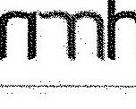

## 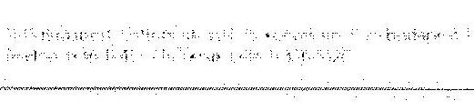

## 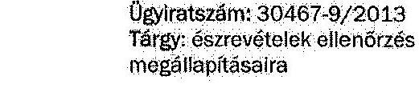

## Domokos László elnök

Állami Számvevőszék

## Budapest

Apáczai Csere János utca 10.
1052

Tisztelt Elnök Úrl
„A közszolgálati média- és hírszolgáltatás új szervezeti, finanszírozási és kontrollrendszere kialakításának és müködésének ellenőrzése" címmel elkészített számvevőszéki jelentéstervezetben a Médiatanács tevékenységével kapcsolatban felvetett megállapításokra az alábbi észrevételeket tesszük:

1. A jelentéstervezet kifogásolja, hogy a Médiatanács a számvitelről szóló 2000. évi C. törvény (Számtv.) elöírásától eltérően nem döntött előzetesen a Médiaszolgáltatás- támogató és Vagyonkezelő Alap (MTVA) könyvvizsgálójának a személyéről.

Álláspontunk szerint a tervezet figyelmen kívül hagyja, hogy a Számtv. 155. §-a nem zárja ki annak lehetőségét, hogy a legfőbb szerv a könyvvizsgáló kiválasztásának jogát közvetlenül a gazdálkodó szervre ruházza át. A Médiatanács a Gazdálkodási és Kezelési Szabályzatban (GKSZ) ezen jogkör gyakorlásával az MTVA-t bízta meg, aki közbeszerzési eljárás lefolytatását követően választotta meg a könyvvizsgálót.

Annak ellenére, hogy a fenti eljárást jogszerűnek tartjuk, nem látjuk akadályát annak, hogy eleget téve a felvetésüknek, a Médiatanács a jövőre nézve felszólítja az MTVA-t, hogy a közbeszerzési eljárás lezárását követően terjessze a Médiatanács elé jóváhagyás céljából a könyvvizsgáló megválasztására irányuló döntését.
2. A jelentéstervezet megállapítja, hogy a GKSZ a 109/2010. (X.28.) számú országgyűlési határozat (OGY határozat) 13. és 14. pontjában elöírtaktól eltérően a vagyongazdálkodás elsődleges céljának (a vagyon hatékony működtetése, állagának védelme, értékének megőrzése, illetve gyarapítása a közszolgálati médiaszolgáltatás és a nemzeti hírügynökségi szolgáltatás ellátásának elősegítése) elérését biztosító részletes szabályokat nem tartalmazza.

A fenti kifogással kapcsolatos, a jelentéstervezet 16. oldal a) pontjába tett javaslatot elfogadjuk, és megtesszük a szükséges intézkedést a GKSZ kiegészítése érdekében. Megjegyezzük ugyanakkor, hogy álláspontunk szerint a GKSZ 5. §-a jelenleg is tartalmazza az MTVA vagyongazdálkodásának alapvető szabályrendszerét.

---

# mith 

3. Az Állami Számvevőszék jelentése szerint az MTVA Archiválási Szabályzata nem tartalmazza a médiaszolgáltatásokról és a tömegkommunikációról szóló 2010. évi CLXXXV. törvénynek (Mttv.) és az OGY határozatnak megfelelően, hogy az Archívum elidegenítési tilalom alatt áll.

Az Mttv. 100. § (2) bekezdése egyértelműen kimondja, hogy az MTVA a közszolgálati médlavagyont sem részben, sem egészben nem idegenítheti el, nem ruházhatja át és nem terhelheti meg. Ennek megfelelően a GKSZ (5. §) és az Archiválási Szabályzat is kifejezetten rögzíti, hogy a müködés, a vagyonkezelés az Mttv. rendelkezései szerint zajlik. A belső szabályzatoknak pedig - mint alsóbb szintű jogforrásoknak - nem feladata a magasabb (sarkalatos törvényi) források tételes, szó szerinti megismétlése.

Ez esetben sem látjuk akadályát a javaslatban foglaltak teljesítésének, vagyis, hogy a GKSZ-ben kifejezetten rögzítésre kerüljön, hogy az Archívum elidegenítési tilalom alatt áll. A szükséges intézkedést ez irányba is megtesszük.
4. A jelentéstervezet szerint nem készült az MTVA támogatáspolitikájáról általános elveket és eljárási rendet megfogalmazó dokumentum, amelyröl a Médiatanácsnak döntenie kellett volna.

Az Mttv. 136. § (10) bekezdése rögzíti, hogy az MTVA támogatáspolitikáját a Médiatanács fogadja el. A kezelési szabályzat akként rendelkezik, hogy a Médiatanács dönt az MTVA támogatási vezérigazgatóhelyettesi területe feladatkörébe tartozó támogatásokat illető támogatáspolitika elfogadásáról. Ennek keretében jóváhagyja az MTVA Általános Pályázati Feltételeit, meghatározza a bírálóbizottságok müködésének szabályait, elfogadja az éves pályázati tervet, dönt a bírálóbizottságok tagjairól, az MTVA által elkészített pályázati felhívásokat kiírja és lezárja, dönt a kedvezményezetté nyilvánításról, a támogatási szerződések formaszóvegéről, a támogatási szerződésekben foglalt feltételek teljesítésének ellenőrzési kérdéseiről.

A fentiek alapján ez idáig az MTVA támogatáspolitikáját a Médiatanács nem egy külön dokumentum alapján fogadta el, hanem a GKSZ-ben rögzített döntések mentén, alapvetően az Általános Pályázati Feltételek, az éves pályáztatási terv és a pályázati felhívások elfogadásával. A fenti szabályzatokat, tervet és dokumentumokat az MTVA 2011-ben, 2012-ben, 2013-ban is a Médiatanács elé tárta, amelyeket a vizsgálat keretében az Állami Számvevőszék ügyintézőinek rendelkezésére bocsátott. A 2013. január 1-jén hatályba lépett új átfogó Általános Pályázati Feltételek fogalmaz meg általános alapelveket és az eljárási rendet.

Megfontolva a jelentéstervezet 16. oldal c) pontjában megfogalmazott javaslatot, ezzel kapcsolatban szintén megtesszük a szükséges lépéseket a támogatáspolitikára vonatkozó - a fentieket egységesen tartalmazó - dokumentum-tervezet kidolgozása és elfogadása érdekében.
5. A jelentéstervezet szerint a Médiatanács az éves országgyűlési beszámolójában nem értékelte a közszolgálati médiaszolgáltatás gazdasági helyzetének és pénzügyi feltételeinek alakulását.

A Médiatanács az Mttv. 133. §-ában foglaltaknak megfelelően a 2011. és 2012. évben is elkészítette és az Országgyűlés elé terjesztette az éves tevékenységéről szóló beszámolóját. Az Mttv. 133. § (1) bekezdés d) pontja előírja, hogy a „beszámolóban értékelni kell a médiaszolgáltatás gazdasági helyzetét, pénzügyi feltételeinek alakulását". A törvény tehát a „médiaszolgáltatás" és nem az egyes „médiaszolgáltatók" vonatkozásában kötelezi a Médiatanácsot a gazdasági helyezet és a pénzügyi feltételek bemutatására, így a Médiatanács a 2011. évi beszámoló V. fejezetében, illetve a 2012. évi beszámoló VI. fejezetében a médiaszolgáltatási piac gazdasági helyzetéről és pénzügyi feltételeinek alakulásáról adott számot.

---

# mith 

Egyetértve a jelentéstervezet 16. oldal 2. pontjában írt javaslattal, a Médiatanács a 2013. évi és az azt követő évekre vonatkozó tevékenységéről szóló országgyűlési beszámolóiban külön ki fog térni a közszolgálati módiaszolgáltatók gazdasági helyzetének és pénzügyi feltételeinek értékelésére.

Kérjük a fenti észrevételeink tudomásulvételét.

Budapest, 2013. december 3.

Tisztelettel:

---

# **Chemistry**

## **Chemical Reactions**

### **Balancing Chemical Equations**

1. **Write the unbalanced equation:**
   - Example: $$C_3H_8 + O_2 \rightarrow CO_2 + H_2O$$

2. **Balance the equation:**
   - Balance carbon atoms first.
   - Then balance hydrogen atoms.
   - Finally, balance oxygen atoms.
   - Balanced equation: $$C_3H_8 + 7O_2 \rightarrow 3CO_2 + 4H_2O$$

3. **Balance the equation:**
   - Balance oxygen atoms.
   - Finally, balance oxygen atoms.
   - Balanced equation: $$C_3H_8 + 7O_2 \rightarrow 3CO_2 + 4H_2O$$

### **Types of Reactions**

1. **Combination Reaction:**
   - Example: $$2H_2 + O_2 \rightarrow 2H_2O$$

2. **Decomposition Reaction:**
   - Example: $$2H_2O_2 \rightarrow 2H_2O + O_2$$

3. **Single Displacement Reaction:**
   - Example: $$Zn + 2HCl \rightarrow ZnCl_2 + H_2$$

4. **Double Displacement Reaction:**
   - Example: $$AgNO_3 + NaCl \rightarrow AgCl + NaNO_3$$

5. **Combustion Reaction:**
   - Example: $$CH_4 + 2O_2 \rightarrow CO_2 + 2H_2O$$

## **Stoichiometry**

### **Mole Concept**

- **Mole (mol):** The amount of substance containing as many particles (atoms, molecules, ions) as there are atoms in exactly 12 grams of carbon-12.
- **Avogadro's Number:** $$6.022 \times 10^{23}$$ particles per mole.

### **Molar Mass**

- **Molar Mass:** The mass of one mole of a substance.
- Example: The molar mass of water ($$H_2O$$) is 18.015 g/mol.

### **Calculations**

1. **Moles to Mass:**
   - Formula: $$n = \frac{m}{M}$$
   - Example: Calculate the number of moles of $$H_2O$$ in 18 grams of water.
     - $$n = \frac{18.015 \, \text{g}}{18.015 \, \text{g/mol}} = 18.015 \, \text{g/mol}$$

2. **Mass to Moles:**
   - Formula: $$m = n \times M$$
   - Example: Calculate the mass of 18.015 g of 18 grams of water.
     - $$m = 18.015 \, \text{g/mol} = 18.015 \, \text{g/mol}$$

## **Gas Laws**

### **Ideal Gas Law**

- **Equation:** $$PV = nRT$$
- **Variables:**
  - $$P$$ = Pressure (atm)
  - $$V$$ = Volume (L)
  - $$n$$ = Moles of gas

### **Boyle's Law**

- **Equation:** $$P_1V_1 = P_2V_2$$
- **Variables:**
  - P₁ = Pressure (atm)
  - P₂ = Volume (L)
  - P₃ = Moles of gas (L)
  - P₁ = Moles of water (L)
  - P₂ = Moles of water (L)

### **Charles's Law**

- **Equation:** $$\frac{V_1}{n} = \frac{V_2}{n} \quad \text{or} \quad \frac{V_1}{n} = \frac{V_2}{n}$$

## **Thermochemistry**

### **Enthalpy (H)**

- **Definition:** The heat content of a system at constant pressure.
- **Equation:** $$\Delta H = q_p$$
- **Variables:**
  - $$q_p$$ = Heat transferred at constant pressure.
  - $$\Delta H$$ = Heat transferred at constant pressure.

### **Hess's Law**

- **Statement:** The enthalpy change for a reaction is the same whether it occurs in one step or multiple steps.
- **Example:**
  - $$C_3H_8 + 7O_2 \rightarrow 3CO_2 + 4H_2O$$

  - $$\Delta C_3H_8 + 7O_2 \rightarrow 3CO_2 + 4H_2O$$

## **Electrochemistry**

### **Oxidation and Reduction**

- **Oxidation:** Loss of electrons.
- **Reduction:** Gain of electrons.

### **Galvanic Cells**

- **Definition:** A cell that converts chemical energy into electrical energy.
- **Components:**
  - Anode: Oxidation occurs.
  - Cathode: Reduction occurs.
  - Salt Bridge: Connects the two half-cells.

### **Nernst Equation**

- **Equation:** $$E = E^\circ - \frac{RT}{nF} \quad \text{or} \quad E^\circ = \frac{RT}{nF}$$

## **Nuclear Chemistry**

### **Radioactive Decay**

- **Definition:** The process by which unstable nuclei emit radiation to decay.
- **Types of Decay:**
  - Alpha (α) = Alpha 1 (eV)
  - Beta (β) = Alpha 2 (eV)
  - γ (γ) = Alpha 3 (eV)
  - δ (δ) = Alpha 4 (eV)
  - ε (ε) = Alpha 5 (eV)
  - β (β) = Alpha 6 (eV)
  - γ (γ) = Alpha 7 (eV)
  - δ (δ) = Alpha 8 (eV)
  - ε (ε) = Alpha 9 (eV)
  - δ (δ) = Alpha 10 (eV)
  - γ (γ) = Alpha 11 (eV)
  - δ (δ) = Alpha 12 (eV)
  - ε (ε) = Alpha 13 (eV)
  - δ (δ) = Alpha 14 (eV)
  - ε' = Alpha 15 (eV)
  - γ (γ) = Alpha 16 (eV)
  - δ (δ) = Alpha 17 (eV)
  - ε (ε) = Alpha 18 (eV)
  - δ (δ) = Alpha 19 (eV)
  - ε' = Alpha 20 (eV)
  - δ (δ) = Alpha 21 (eV)
  - ε' = Alpha 22 (eV)
  - γ (γ) = Alpha 23 (eV)
  - δ (δ) = Alpha 24 (eV)
  - ε (ε) = Alpha 25 (eV)
  - δ (δ) = Alpha 26 (eV)
  - ε' = Alpha 27 (eV)
  - δ (δ) = Alpha 28 (eV)
  - ε' = Alpha 29 (eV)
  - γ (γ) = Alpha 30 (eV)
  - δ (δ) = Alpha 31 (eV)
  - ε (ε) = Alpha 32 (eV)
  - δ (δ) = Alpha 33 (eV)
  - ε' = Alpha 34 (eV)
  - ε' = Alpha 35 (eV)
  - γ (γ) = Alpha 36 (eV)
  - δ (δ) = Alpha 37 (eV)
  - ε (ε) = Alpha 38 (eV)
  - δ (δ) = Alpha 39 (eV)
  - ε' = Alpha 40 (eV)
  - ε' = Alpha 41 (eV)
  - γ (γ) = Alpha 42 (eV)
  - δ (δ) = Alpha 43 (eV)
  - ε (ε) = Alpha 44 (eV)
  - δ (δ) = Alpha 45 (eV)
  - ε' = Alpha 46 (eV)
  - γ (γ) = Alpha 47 (eV)
  - δ (δ) = Alpha 48 (eV)
  - ε (ε) = Alpha 49 (eV)
  - δ (δ) = Alpha 50 (eV)
  - ε' = Alpha 51 (eV)
  - γ (γ) = Alpha 52 (eV)
  - δ (δ) = Alpha 53 (eV)
  - ε (ε) = Alpha 54 (eV)
  - δ (δ) = Alpha 55 (eV)
  - ε' = Alpha 56 (eV)
  - γ (γ) = Alpha 57 (eV)
  - δ (δ) = Alpha 58 (eV)
  - ε (ε) = Alpha 59 (eV)
  - δ (δ) = Alpha 60 (eV)
  - ε' = Alpha 61 (eV)
  - γ (γ) = Alpha 62 (eV)
  - δ (δ) = Alpha 63 (eV)
  - ε (ε) = Alpha 64 (eV)
  - δ (δ) = Alpha 65 (eV)
  - ε' = Alpha 66 (eV)
  - γ (γ) = Alpha 67 (eV)
  - δ (δ) = Alpha 68 (eV)
  - ε (ε) = Alpha 69 (eV)
  - δ (δ) = Alpha 70 (eV)
  - ε' = Alpha 71 (eV)
  - γ (γ) = Alpha 72 (eV)
  - δ (δ) = Alpha 73 (eV)
  - ε (ε) = Alpha 74 (eV)
  - δ (δ) = Alpha 75 (eV)
  - ε' = Alpha 76 (eV)
  - γ (γ) = Alpha 77 (eV)
  - δ (δ) = Alpha 78 (eV)
  - ε (ε) = Alpha 79 (eV)
  - δ (δ) = Alpha 79.1 (eV)
  - ε' = Alpha 79.2 (eV)
  - γ (γ) = Alpha 79.3 (eV)
  - δ (δ) = Alpha 79.4 (eV)
  - ε (ε) = Alpha 79.5 (eV)
  - ε' = Alpha 79.6 (eV)
  - γ (γ) = Alpha 79.7 (eV)
  - δ (δ) = Alpha 79.8 (eV)
  - ε (ε) = Alpha 79.9 (eV)
  - ε' = Alpha 79.10 (eV)
  - γ (γ) = Alpha 79.11 (eV)
  - δ (δ) = Alpha 79.12 (eV)
  - ε (ε) = Alpha 79.13 (eV)
  - ε' = Alpha 79.14 (eV)
  - γ (γ) = Alpha 79.15 (eV)
  - δ (δ) = Alpha 79.16 (eV)
  - ε (ε) = Alpha 79.17 (eV)
  - ε' = Alpha 79.18 (eV)
  - γ (γ) = Alpha 79.19 (eV)
  - δ (δ) = Alpha 79.20 (eV)
  - ε (ε) = Alpha 79.21 (eV)
  - ε' = Alpha 79.22 (eV)
  - γ (γ) = Alpha 79.23 (eV)
  - δ (δ) = Alpha 79.24 (eV)
  - ε (ε) = Alpha 79.25 (eV)
  - ε' = Alpha 79.26 (eV)
  - γ (γ) = Alpha 79.27 (eV)
  - δ (δ) = Alpha 79.28 (eV)
  - ε (ε) = Alpha 79.29 (eV)
  - ε' = Alpha 79.30 (eV)
  - γ (γ) = Alpha 79.31 (eV)
  - δ (δ) = Alpha 79.32 (eV)
  - ε (ε) = Alpha 79.33 (eV)
  - ε' = Alpha 79.34 (eV)
  - γ (γ) = Alpha 79.35 (eV)
  - δ (δ) = Alpha 79.36 (eV)
  - ε (ε) = Alpha 79.37 (eV)
  - ε' = Alpha 79.38 (eV)
  - γ (γ) = Alpha 79.39 (eV)
  - δ (δ) = Alpha 79.40 (eV)
  - ε (ε) = Alpha 79.41 (eV)
  - ε' = Alpha 79.42 (eV)
  - γ (γ) = Alpha 79.43 (eV)
  - δ (δ) = Alpha 79.44 (eV)
  - ε (ε) = Alpha 79.45 (eV)
  - ε' = Alpha 79.46 (eV)
  - γ (γ) = Alpha 79.47 (eV)
  - δ (δ) = Alpha 79.48 (eV)
  - ε (ε) = Alpha 79.49 (eV)
  - ε' = Alpha 79.50 (eV)
  - γ (γ) = Alpha 79.51 (eV)
  - δ (δ) = Alpha 79.52 (eV)
  - ε (ε) = Alpha 79.53 (eV)
  - ε' = Alpha 79.54 (eV)
  - γ (γ) = Alpha 79.55 (eV)
  - δ (δ) = Alpha 79.56 (eV)
  - ε (ε) = Alpha 79.57 (eV)
  - ε' = Alpha 79.58 (eV)
  - γ (γ) = Alpha 79.59 (eV)
  - δ (δ) = Alpha 79.60 (eV)
  - ε (ε) = Alpha 79.61 (eV)
  - ε' = Alpha 79.62 (eV)
  - γ (γ) = Alpha 79.63 (eV)
  - δ (δ) = Alpha 79.64 (eV)
  - ε (ε) = Alpha 79.65 (eV)
  - ε' = Alpha 79.66 (eV)
  - γ (γ) = Alpha 79.67 (eV)
  - δ (δ) = Alpha 79.68 (eV)
  - ε (ε) = Alpha 79.69 (eV)
  - ε' = Alpha 79.70 (eV)
  - γ (γ) = Alpha 79.71 (eV)
  - δ (δ) = Alpha 79.72 (eV)
  - ε (ε) = Alpha 79.73 (eV)
  - ε' = Alpha 79.74 (eV)
  - γ (γ) = Alpha 79.75 (eV)
  - δ (δ) = Alpha 79.76 (eV)
  - ε (ε) = Alpha 79.77 (eV)
  - ε' = Alpha 79.78 (eV)
  - γ (γ) = Alpha 79.79 (eV)
  - δ (δ) = Alpha 79.80 (eV)
  - ε (ε) = Alpha 79.81 (eV)
  - ε' = Alpha 79.82 (eV)
  - γ (γ) = Alpha 79.83 (eV)
  - δ (δ) = Alpha 79.84 (eV)
  - ε (ε) = Alpha 79.85 (eV)
  - ε' = Alpha 79.86 (eV)
  - γ (γ) = Alpha 79.87 (eV)
  - δ (δ) = Alpha 79.88 (eV)
  - ε (ε) = Alpha 79.89 (eV)
  - ε' = Alpha 79.90 (eV)
  - γ (γ) = Alpha 79.91 (eV)
  - δ (δ) = Alpha 79.92 (eV)
  - ε (ε) = Alpha 79.93 (eV)
  - ε' = Alpha 79.94 (eV)
  - γ (γ) = Alpha 79.95 (eV)
  - δ (δ) = Alpha 79.96 (eV)
  - ε (ε) = Alpha 79.97 (eV)
  - ε' = Alpha 79.98 (eV)
  - γ (γ) = Alpha 79.99 (eV)
  - δ (δ) = Alpha 79.900 (eV)
  - ε (ε) = Alpha 79.910 (eV)
  - ε' = Alpha 79.920 (eV)
  - γ (γ) = Alpha 79.930 (eV)
  - δ (δ) = Alpha 79.940 (eV)
  - ε (ε) = Alpha 79.950 (eV)
  - ε' = Alpha 79.960 (eV)
  - γ (γ) = Alpha 79.970 (eV)
  - δ (δ) = Alpha 79.980 (eV)
  - ε (ε) = Alpha 79.990 (eV)
  - ε' = Alpha 79.991 (eV)
  - γ (γ) = Alpha 79.992 (eV)
  - δ (δ) = Alpha 79.993 (eV)
  - ε (ε) = Alpha 79.994 (eV)
  - ε' = Alpha 79.995 (eV)
  - γ (γ) = Alpha 79.960 (eV)
  - δ (δ) = Alpha 79.970 (eV)
  - ε (ε) = Alpha 79.980 (eV)
  - ε' = Alpha 79.990 (eV)
  - ε' = Alpha 79.991 (eV)
  - γ (γ) = Alpha 79.992 (eV)
  - δ (δ) = Alpha 79.993 (eV)
  - ε (ε) = Alpha 79.994 (eV)
  - ε' = Alpha 79.995 (eV)
  - ε' = Alpha 79.996 (eV)
  - γ (γ) = Alpha 79.997 (eV)
  - δ (δ) = Alpha 79.980 (eV)
  - ε (ε) = Alpha 79.998 (eV)
  - ε' = Alpha 79.999 (eV)
  - γ (γ) = Alpha 79.999 (eV)
  - δ (δ) = Alpha 79.900 (eV)
  - ε (ε) = Alpha 79.999 (eV)
  - ε' = Alpha 79.999 (eV)
  - γ (γ) = Alpha 79.998 (eV)
  - δ (δ) = Alpha 79.999 (eV)
  - ε (ε) = Alpha 79.999 (eV)
  - ε' = Alpha 79.980 (eV)
  - γ (γ) = Alpha 79.997 (eV)
  - δ (δ) = Alpha 79.998 (eV)
  - ε (ε) = Alpha 79.999 (eV)
  - ε' = Alpha 79.999 (eV)
  - γ (γ) = Alpha 79.999 (eV)
  - δ (δ) = Alpha 79.998 (eV)
  - ε (ε) = Alpha 79.999 (eV)
  - ε' = Alpha 79.997 (eV)
  - γ (γ) = Alpha 79.998 (eV)
  - δ (δ) = Alpha 79.997 (eV)
  - ε (ε) = Alpha 79.997 (eV)
  - ε' = Alpha 79.996 (eV)
  - γ (γ) = Alpha 79.995 (eV)
  - δ (δ) = Alpha 79.995 (eV)
  - ε (ε) = Alpha 79.994 (eV)
  - ε' = Alpha 79.993 (eV)
  - γ (γ) = Alpha 79.993 (eV)
  - δ (δ) = Alpha 79.992 (eV)
  - ε (ε) = Alpha 79.991 (eV)
  - ε' = Alpha 79.990 (eV)
  - ε' = Alpha 79.989 (eV)
  - γ (γ) = Alpha 79.988 (eV)
  - δ (δ) = Alpha 79.987 (eV)
  - ε (ε) = Alpha 79.986 (eV)
  - ε' = Alpha 79.985 (eV)
  - γ (γ) = Alpha 79.984 (eV)
  - δ (δ) = Alpha 79.983 (eV)
  - ε (ε) = Alpha 79.982 (eV)
  - ε' = Alpha 79.981 (eV)
  - ε' = Alpha 79.979 (eV)
  - γ (γ) = Alpha 79.978 (eV)
  - δ (δ) = Alpha 79.977 (eV)
  - ε (ε) = Alpha 79.977 (eV)
  - ε' = Alpha 79.976 (eV)
  - γ (γ) = Alpha 79.975 (eV)
  - δ (δ) = Alpha 79.974 (eV)
  - ε (ε) = Alpha 79.973 (eV)
  - ε' = Alpha 79.972 (eV)
  - γ (γ) = Alpha 79.971 (eV)
  - δ (δ) = Alpha 79.970 (eV)
  - ε (ε) = Alpha 79.970 (eV)
  - ε' = Alpha 79.971 (eV)
  - ε' = Alpha 79.970 (eV)
  - γ (γ) = Alpha 79.970 (eV)
  - δ (δ) = Alpha 79.970 (eV)
  - ε (ε) = Alpha 79.971 (eV)
  - ε' = Alpha 79.970 (eV)
  - γ (γ) = Alpha 79.970 (eV)
  - δ (δ) = Alpha 79.970 (eV)
  - ε (ε) = Alpha 79.970 (eV)
  - ε' = Alpha 79.970 (eV)
  - γ (γ) = Alpha 79.970 (eV)
  - δ (δ) = Alpha 79.970 (eV)
  - ε (ε) = Alpha 79.970 (eV)
  - ε' = Alpha 79.970 (eV)
  - ε' = Alpha 79.970 (eV)
  - γ (γ) = Alpha 79.970 (eV)
  - δ (δ) = Alpha 79.970 (eV)
  - ε (ε) = Alpha 79.970 (eV)
  - ε' = Alpha 79.970 (eV)
  - ε' = Alpha 79.970 (eV)
  - γ (γ) = Alpha 79.970 (eV)
  - δ (δ) = Alpha 79.970 (eV)
  - ε (ε) = Alpha 79.970 (eV)
  - ε' = Alpha 79.970 (eV)
  - ε' = Alpha 79.970 (eV)
  - γ (γ) = Alpha 79.970 (eV)
  - δ (δ) = Alpha 79.970 (eV)
  - ε (ε) = Alpha 79.970 (eV)
  - ε' = Alpha 79.970 (eV)
  - ε' = Alpha 79.970 (eV)
  - γ (γ) = Alpha 79.970 (eV)
  - δ (δ) = Alpha 79.970 (eV)
  - ε (ε) = Alpha 79.970 (eV)
  - ε' = Alpha 79.970 (eV)
  - ε' = Alpha 79.970 (eV)
  - γ (γ) = Alpha 79.970 (eV)
  - δ (δ) = Alpha 79.970 (eV)
  - ε (ε) = Alpha 79.970 (eV)
  - ε' = Alpha 79.970 (eV)
  - ε' = Alpha 79.970 (eV)
  - γ (γ) = Alpha 79.970 (eV)
  - δ (δ) = Alpha 79.970 (eV)
  - ε (ε) = Alpha 79.970 (eV)
  - ε' = Alpha 79.970 (eV)
  - ε' = Alpha 79.970 (eV)
  - ε' = Alpha 79.970 (eV)
  - ε' = Alpha 79.970 (eV)
  - ε' = Alpha 79.970 (eV)
  - ε' = Alpha 79.970 (eV)
  - ε' = Alpha 79.970 (eV)
  - ε' = Alpha 79.970 (eV)
  - ε' = Alpha 79.970 (eV)
  - ε' = Alpha 79.970 (eV)
  - ε' = Alpha 79.970 (eV)
  - ε' = Alpha 79.970 (eV)
  - ε' = Alpha 79.970 (eV)
  - ε' = Alpha 79.970 (eV)
  - ε' = Alpha 79.970 (eV)
  - ε' = Alpha 79.970 (eV)
  - ε' = Alpha 79.970 (eV)
  - ε' = Alpha 79.970 (eV)
  - ε' = Alpha 79.970 (eV)
  - ε' = Alpha 79.970 (eV)
  - ε' = Alpha 79.970 (eV)
  - ε' = Alpha 79.970 (eV)
  - ε' = Alpha 79.970 (eV)
  - ε' = Alpha 79.970 (eV)
  - ε' = Alpha 79.970 (eV)
  - ε' = Alpha 79.970 (eV)
  - ε' = Alpha 79.970 (eV)
  - ε' = Alpha 79.970 (eV)
  - ε' = Alpha 79.970 (eV)
  - ε' = Alpha 79.970 (eV)
  - ε' = Alpha 79.970 (eV)

---

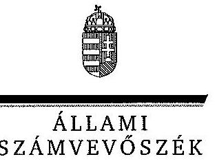

# Dr. Karas Monika úrhölgy 

elnök
Nemzeti Média- és Hírközlési Hatóság Médiatanácsa

## Budapest

## Tisztelt Elnök Úrhölgy!

A közszolgálati média- és hírszolgáltatás új szervezeti, finanszírozási és kontrollrendszere kialakításának és müködésének ellenőrzéséről készített jelentéstervezetre tett észrevételét köszönettel megkaptam.

Az Állami Számvevőszék észrevételekre vonatkozó álláspontjáról a felügyeleti vezető által készített részletes tájékoztatást mellékelten megküldöm.

Tájékoztatom Elnök úrhölgyet, hogy a számvevőszéki jelentés mellékleteként szerepeltetjük a jelentéstervezetre tett észrevételét, valamint az arra adott válaszunkat.

Budapest, 2013. 12. hó 18. nap
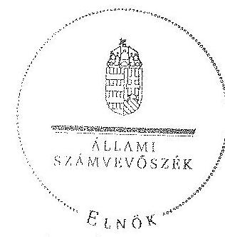

Tisztelettel:

Domokos László

Melléklet: Tájékoztatás az észrevételek kezeléséről

---

# Tájékoztatás   az észrevételek kezeléséről 

A „Jelentéstervezet a közszolgálati média- és hirszolgáltatás új szervezeti, finanszirozási és kontrollrendszere kialakításának és müködésének ellenörzéséről" címủ jelentéstervezetre vonatkozó észrevételeit áttekintettük, és annak kezeléséről - az észrevételek sorrendjében - a következtető tájékoztatást adom.

1. A jelentéstervezet helyesen tartalmazza, hogy a Médiatanács a számvitelről szóló 2000 . évi C. törvény 155. § (6) bekezdése előírásától eltérően nem döntött előzetesen a Médiaszolgáltatás- támogató és Vagyonkezelő Alap (MTVA) könyvvizsgálójának személyéről. A témában az észrevételükben leírtak és a jelentéstervezetben szerepeltetettek között nincs ellentmondás, mert az Állami Számvevőszék (ÁSZ) nem kifogásolta a könyvvizsgáló kiválasztásának eljárásrendjét, azonban a jóváhagyás a legfőbb szerv feladata. Az észrevételük szerint ezt követően a jóváhagyást ennek megfelelően fogják végezni.
2. Az észrevételükben leírtak szerint az MTVA Gazdálkodási és Kezelési Szabályzatának (GKSZ) a vagyon hatékony működtetését, állagának védelmét, értékének megőrzését, illetve gyarapítását biztosító részletes szabályokkal való kiegészítésére vonatkozó javaslatunkat elfogadták.
3. A médiaszolgáltatásokról és a tömegkommunikációról szóló 2010. évi CLXXXV. törvény (Mttv.) előírja, hogy az archiválás és az Archívum megőrzésének, kezelésének, felhasználásának részletes szabályait az Alap vezérigazgatója a Médiatanács egyetértésével, szabályzatban állapítja meg. A GKSZ és az MTVA Archiválási Szabályzata az Mttv. 100. § (2) bekezdésének előírását külön nem nevesíti, ezért a szabályozásból nem egyértelmủ, hogy a közszolgálati médiavagyon elidegenítési tilalom alatt áll. Mindez indokolja a közszolgálati médiavagyonra vonatkozó elidegenítési tilalom szabályzatban való megjelenítését, amelyet az észrevételük szerint végre fognak hajtani.
4. Az észrevételükben foglaltak megerősítik az MTVA támogatáspolitikája kidolgozásának szükségességét. A levelében leírtak szerint a szükséges intézkedéseket ennek érdekében megteszik.
5. A Médiatanács éves országgyűlési beszámolójával kapcsolatban a jelentéstervezetben tett megállapítások és az észrevételükben foglaltak között nincs ellentmondás. Egyetértünk abban, hogy a beszámolóban a médiaszolgáltatásról kell beszámolni, ezért javasoljuk, hogy az tartalmazza az ebbe beletartozó közmédia szolgáltatás gazdasági helyzetének és pénzügyi helyzetének alakulását is. A levelükben foglaltak szerint a javaslatunkat elfogadták.

---

A megtett észrevételeik mind az öt pontjában arról adnak tájékoztatást, hogy az ÁSZ által tett megállapításokat és javaslatokat elfogadják, a szükséges intézkedéseket megteszik. Mindezek miatt az észrevételek nem indokolják a jelentéstervezetben leírtak módosítását.

Budapest, 2013. 12. hó 18. nap

Makkai Mária
felügyeleti vezető

---

.

---

# TV | RÁDIÓ | HÍR | ÚJ MÉDIA 

Vezérigazgatóság
Médiaszolgáltatás-támogató és Vagyonkezelö Alap

Állami Számvevőszék

## Domokos László

elnök úr részére

## Budapest 4.

Pf. 54.
1364

## Tisztelt Elnök Úr!

Alulírott dr. Szabó László Zsolt, mint a Médiaszolgáltatás-támogató és Vagyonkezelő Alap (1016 Budapest, Naphegy tér; a továbbiakban: MTVA) megbízott vezérigazgatója az „A közszolgálati média- és hírszolgáltatás új szervezeti, finanszírozási és kontrollrendszere kialakításának és müködésének ellenőrzése" címmel elkészített számvevőszéki jelentéstervezethez kapcsolódóan a rendelkezésünkre álló törvényes határidőn belül az alábbi
észrevételeket
tesszük:

A jelentéstervezet I. Összegzö megállapítások, következtetések, javaslatok címü részéhez:
10. oldal 3. bekezdéshez: Az MTVA 2011. január 1-jén kezdte meg müködését. A müködés e fiatal szervezet számára egyszerre jelentette a struktúra felépitését, a munkavállalók számára megfelelő munkakörülmények és munkafeltételek biztosítását, a szervezet teljes szabályzó rendszere kialakításának és a közmédia rendszere teljes átalakításának megkezdését is akként, hogy elsődleges szempont az adásbiztonság fenntartása volt. Az MTVA - ennyi egyenként is jelentős feladatnak az egyszerre történő megvalósítása során - a müködéshez szükséges szabályzatoknak szinte a teljes rendszerét megalkotta, háttérjogszabályként tekintve az Mttv-t és annak részletszabályait, biztosítva ezzel müködése szabályszerűségét. Álláspontunk szerint az MTVA müködésének szabályszerűségét nem érintették az ÁsZ által jelzett inkább formai, illetve technikai jellegű hlányosságok.

A jelentéstervezet megállapítja, hogy az MTVA gazdálkodási és kezelési szabályzata (GKSZ) a 109/2010. (X.28.) számú országgyűlési határozat (a továbbiakban: GGY határozat) 13. és 14. pontjában elöírtaktól eltérően a vagyongazdálkodás elsődleges céljának (a vagyon hatékony müködtetése, állagának védelme, értékének megőrzése, illetve gyarapítása a közszolgálati médiaszolgáltatás és a nemzeti hírügynökségi szolgáltatás ellátásának elősegítése) elérését biztosító részletes szabályokat nem tartalmazza. Megjegyezzük, hogy a vagyonhasznosításra vonatkozóan az MTVA éves és középtávú üzleti tervei tartalmaznak az adott időszakra vonatkozóan javaslatokat, amelyek a Médiatanács általi elfogadást követően képezik alapját a hatékony vagyongazdálkodásnak. Ezzel együtt álláspontunk szerint a GKSZ 5-15. §-ai a vagyongazdálkodás elsődleges céljának elérését biztosítják. Fentiek ellenére természetesen nem

H-1037 Budapest
Kunigunda útja 64.

Tel.: +36 13533200
Fax.: +36 1 428-0222
www.mtva.hu

---

# TV | RÁDIÓ | HÍR | ÚJ MÉDIA 

## Vezérigazgatóság

Médiaszolgáltatás-támogató és Vagyonkezelő Alap
látjuk annak akadályát, hogy a Médiatanáccsal együttműködve a jelenlegi szabályokat részletesebben kidolgozzuk, de jelezzük, hogy a vagyonhasznosítási stratégia kidolgozás alatt áll, várhatóan 2013. december 31. napjálg elkészül és a 2014. évet már - egy formálisan is teljesnek tekinthető - vagyonhasznosítási stratégia mentén kezdhetjük meg.

A jelentéstervezet megállapítja, hogy az MTVA Archiválási Szabályzata nem rögzítette azt, hogy az MTVA kezelésében lévő Archívum elidegenítési tilalom alatt áll. Az Mttv. 100. § (2) bekezdése egyértelműen kimondja, hogy az MTVA a közszolgálati médiavagyont sem részben, sem egészben nem idegenítheti el, nem ruházhatja át és nem terhelheti meg. Ennek megfelelően a GKSZ (5. §) is és az Archiválási Szabályzat is kifejezetten rögzíti, hogy a müködés, a vagyonkezelés az Mttv. rendelkezései szerint zajlik. A belső szabályzatoknak pedig - mint alsóbb szintű jogforrásoknak - nem feladata a magasabb (sarkalatos törvényi) források tételes, szó szerinti megismétlése. Ennek ellenére nem látjuk akadályát annak, hogy az Archiválási szabályzatban kifejezetten rögzítésre kerüljön, hogy az Archívum elidegenítési tilalom alatt áll.

A jelentéstervezet megállapítja, hogy a Médiatanács az MTVA támogatáspolitikájáról nem döntött. Az Mttv. 136. § (10) bekezdése rögzíti, hogy az MTVA támogatáspolitikáját a Médiatanács fogadja el. A kezelési szabályzat akként rendelkezik, hogy a Médiatanács dönt az MTVA támogatási vezérigazgató-helyettesi területe feladatkörébe tartozó támogatásokat illető támogatáspolitika elfogadásáról. Ennek keretében jóváhagyja az MTVA általános pályázati feltételeit, meghatározza a bírálóbizottságok müködésének szabályait, elfogadja az éves pályázati tervet, dönt a bírálóbizottságok tagjairól, az MTVA által elkészített pályázati felhívásokat kiírja és lezárja, dönt a kedvezményezetté nyilvánításról, a támogatási szerződések formaszövegéről, a támogatási szerződésekben foglalt feltételek teljesítésének ellenőrzési kérdéseiről. A fentiek alapján ez idáig az MTVA támogatáspolitikáját a Médiatanács formallag valóban nem egy külön dokumentum alapján fogadta el, hanem a kezelési szabályzatban rögzített döntések mentén, alapvetően az Általános Pályázati Feltételek, az éves pályáztatási terv és a pályázati felhívások elfogadásával. A 2011. és 2012. évek az átalakítás évei voltak, így jellemzően az egyes határozatok összessége képezte az adott évre vonatkozó támogatási tervet. A támogatási területet érintő terveket, előterjesztéseket, pályázati naptárt, a fenti szabályzatokat és dokumentumokat az MTVA 2011-ben, 2012-ben, 2013-ban is a Médiatanács elé tárt, amelyeket a vizsgálat keretében az Állami Számvevőszéknek rendelkezésre bocsátottunk. A 2013. január 1-jén hatályba lépett új átfogó Általános Pályázati Feltételek fogalmazza meg az általános alapelveket és az eljárási rendet. Összegezve tehát formallag ugyan nem, de tartalmilag mindenképpen megvalósult az Mttv. 136. § (10) bekezdésében rögzített támogatáspolitika elfogadása. A jelentéstervezetben foglaltak alapján vállaljuk a 2015. évre vonatkozóan az MTVA támogatáspolitika egységes dokumentumban történő kidolgozását.
11. oldal 2. bekezdéshez: Az MTVA SZMSZ-ének többszörí módosítását követően alakult meg a Kontrolling igazgatóság, amelynek müködése az MTVA gazdálkodásának tényleges kontrollját a pénzügyi-gazdasági tervezéssel, az elfogadott tervek teljesítésének folyamatos elemzésével, értékelésével, monitoringjával biztosította. A Kontrolling igazgatóság müködése és a vonatkozó belső szabályzataink közötti teljes összhang megteremtése érdekében felülvizsgáljuk a vonatkozó belső szabályzatunkat.

H-1037 Budapest
Kunigunda útja 64.

Tel.: +36 13533200
Fax.: +36 1 428-0222

---

# TV | RÁDIÓ | HÍR | ÚJ MÉDIA 

Vezérigazgatóság
Médiaszolgáltatás-támogató és Vagyonkezelő Alap
11. oldal 3. bekezdéshez: Az MTVA belső ellenőrzése az NZrt.-k gazdálkodását külön megállapodás alapján vizsgálta. Álláspontunk szerint sem a Médiatanács, sem az MTVA FB nem rendelkezik hatáskörrel a közszolgálati médiaszolgáltató Zrt.-k gazdálkodását, müködését illetően, így ezen belső ellenőrzési jelentéseket nem kaphatta meg sem a Médiatanács, sem az MTVA FB. Egyebekben vállaljuk, hogy az MTVA-ra vonatkozó belső ellenőrzésről az éves jelentéseket a tárgyévet követő év április 15-éig megküldjük a Médiatanácsnak és az MTVA FBnek.
12. oldal 4. bekezdéshez: A számviteli törvény szerinti egyes egyéb szervezetek beszámolókészítési és könyvvezetési kötelezettségének sajátosságairól szóló 224/2000. (XII. 19.) Korm. rendelet 8. § (9) és (10) bekezdése szerint a könyvvezetés során az egyéb szervezetnek elkülönítetten kell kimutatni a rá vonatkozó sajátos gazdálkodási jogszabályban meghatározott alaptevékenységgel, valamint a vonatkozó külön jogszabály szerint meghatározott vállalkozási tevékenységgel kapcsolatos (ár)bevételeket, ráfordításokat (költségeket), kiadásokat, továbbá az egyéb szervezet úgy köteles könyvvezetését kialakítani, hogy a vonatkozó külön jogszabály szerint meghatározott vállalkozási tevékenység (ár)bevétele és ráfordításai (költségei), kiadásai az alaptevékenység bevételeltől és ráfordításaitól (költségeitől), kiadásaitól, gazdasági eseményeitől elkülönüljenek, és ezáltal megbízhatóan kimutatható legyen a vállalkozási tevékenység tárgyévi eredménye. Az MTVA számviteli nyilvántartásaiban alkalmazott analitikus kódrendszer (költséghely, költségviselő, munkaszám) lehetővé teszi az alaptevékenység és a vállalkozási tevékenység bevételeinek és ráfordításainak előírások szerinti részletezését, elkülönítését. A könyvvezetésre és bizonylatolásra vonatkozó belső szabályzatok - számviteli politika, számlarend, önköltség számítási szabályzat - és az ennek megfelelően kialakított gyakorlat biztosítja a jogszabályban meghatározott adatok megfelelő rendelkezésre állását, valamint az éves beszámoló adatainak közvetlen alátámasztását. Álláspontunk szerint az MTVA gyakorlata a hivatkozott jogszabályban megfogalmazott kötelezettségnek megfelel.
12. oldal 5. bekezdéshez: Az MTVA önköltségszámítási szabályzata 2013. november 27. napján az 5/2013. gazdasági vezérigazgató-helyettesi utasítással kiadásra került. A szabályzatot észrevételeink mellékleteként csatoljuk.
12. oldal 6. bekezdéshez: Az Mttv. 100. § (2) bekezdése egyértelműen kimondja, hogy az MTVA a közszolgálati médiavagyont sem részben, sem egészben nem idegeníthat! el, nem ruházhatja át és nem terhelheti meg. Ennek megfelelően a GKSZ (5. §) is és az Archiválási Szabályzat is kifejezetten rögzíti, hogy a működés, a vagyonkezelés az Mttv. rendelkezései szerint zajlik. A belső szabályzatoknak pedig - mint alsóbb szintű jogforrásoknak - nem feladata a magasabb (sarkalatos törvényi) források tételes, szó szerinti megismétlése. Ennek ellenére nem látjuk akadályát annak, hogy a GKSZ-ben kifejezetten rögzítésre kerüljön, hogy az Archívum elidegenítési tilalom alatt áll. A szükséges intézkedést megtesszük.

Az MTVA jelentős lépéseket tett az MTVA megalapozott ingatlanhasznosítási koncepciójának kialakítása érdekében. A sarokpontokat kijelölő jogszabályok betartása mellett a gondos és jó gazda módjára történő hasznosítást messze meghaladóan törekszik az ingatlanok hasznosítása során eljárni. A megörökölt felesleges bérleti jogviszonyainkat megszüntettük, a Kunigunda útjai

H-1037 Budapest
Kunigunda útja 64.

Tel.: +3613533200
Fax.: +36 1 428-0222

---

# TV | RÁDIÓ | HÍR | ÚJ MÉDIA 

Vezérigazgatóság
Módiaszolgáltatás-támogató és Vagyonkezelő Alap
gyártóbázis meglehetősen hátrányos kondíciókat tartalmazó bérleti jogviszonyát átfordítottuk tulajdonosi jogviszonnyá. Az állagmegóvó gazdálkodás és a megörökölt tetemes kiadások felszámolása mellett az MTVA az állami tulajdonnal való gondos és előrelátó, ugyanakkor innovatív jellegű gazdálkodást tűzte ki célul, hiszen ez részét képezi a közmédia rendszer átalakításának.

Azzal, hogy az MTVA a tulajdonában álló ingatlanok értékelése és ingatlanhasznosítási tanulmány készítése tárgyában kiírt közbeszerzési eljárás nyertesével szerződést kötött, döntést hozott arról, hogy a 2011. január 1. napja előtti konzervatív, ám pazarló, ötlettelen vagyongazdálkodással szakítva új szemléletű, innovatív jellegű, Budapest megújulási programjához illeszkedő, a közösségi tereket és funkciókat kifejezésre juttató, sőt előtérbe helyező, ugyanakkor a hagyományokat tiszteletben tartó ingatlanhasznosítási koncepció kidolgozását rendelte meg a GLOBO Menedzsment Kft-től. Ennek alapján az ingatlanállomány felmérése megtörtént, az MTVA vagyonkezelésében álló valamennyi ingatlan hasznosítása vonatkozásában külön javaslatok és tervek születtek. A közel egy éve folyamatban lévő előkészületi munka eredményeképpen elkészült tetemes mennyiségű, több kötetnyi anyagot bemutattuk az Állami Számvevőszéknek.

Az MTVA vagyonhasznosítási stratégiája jelenleg kidolgozás alatt áll, várhatóan 2013. december 31. napjáig elkészül és a 2014. évet már - egy formálisan is teljesnek tekinthető vagyonhasznosítási stratégia mentén kezdhetjük meg.

## A jelentéstervezet javaslatok az MTVA vezérigazgatójának részhez (16-17. o.):

1. Az MTVA önköltségszámítási szabályzata 2013. november 27. napján az 5/2013. gazdasági vezérigazgató helyettesi utasítással kiadásra került. A szabályzatot észrevételeink mellékleteként csatoljuk.
2. A számviteli törvény szerinti egyes egyéb szervezetek beszámolókészítési és könyvvezetési kötelezettségének sajátosságairól szóló 224/2000. (XII. 19.) Korm. rendelet 8. § (9) és (10) bekezdése szerint a könyvvezetés során az egyéb szervezetnek elkülönítetten kell kimutatni a rá vonatkozó sajátos gazdálkodási jogszabályban meghatározott alaptevékenységgel, valamint a vonatkozó külön jogszabály szerint meghatározott vállalkozási tevékenységgel kapcsolatos (ár)bevételeket, ráfordításokat (költségeket), kiadásokat, továbbá az egyéb szervezet úgy köteles könyvvezetését kialakítani, hogy a vonatkozó külön jogszabály szerint meghatározott vállalkozási tevékenység (ár)bevétele és ráfordításai (költségei), kiadásai az alaptevékenység bevételeitől és ráfordításaitól (költségeltől), kiadásaitól, gazdasági eseményeitől elkülönüljenek, és ezáltal megbízhatóan kimutatható legyen a vállalkozási tevékenység tárgyévi eredménye. Az MTVA számviteli nyilvántartásaiban alkalmazott analitikus kódrendszer (költséghely, költségviselő, munkaszám) lehetővé teszi az alaptevékenység és a vállalkozási tevékenység bevételeinek és ráfordításainak előírások szerinti részletezését, elkülönítését. A könyvvezetésre és bizonylatolásra vonatkozó belső szabályzatok - számviteli politika, számlarend, önköltség számítási szabályzat - és az ennek megfelelően kialakított gyakorlat biztosítja a jogszabályban meghatározott adatok megfelelő rendelkezésre állását,

H-1037 Budapest
Kunigunda útja 64.

Tel.: +36 13533200
Fax.: +36 1 428-0222

---

# TV | RÁDIÓ | HÍR | ÚJ MÉDIA 

Vezérigazgatóság
Médiaszolgáltatás-támogató és vagyonkezelő Alap
valamint az éves beszámoló adatainak közvetlen alátámasztását. Álláspontunk szerint az MTVA gyakorlata a hivatkozott jogszabályban megfogalmazott kötelezettségnek megfelel.
3. Az MTVA SZMSZ-ének többszöri módosítását követően alakult meg a Kontrolling igazgatóság, amelynek működése az MTVA gazdálkodásának tényleges kontrollját a pénzügyigazdasági tervezéssel, az elfogadott tervek teljesítésének folyamatos elemzésével, értékelésével, monitoringjával biztosította. A Kontrolling igazgatóság müködése és a vonatkozó belső szabályzataink közötti teljes összhang megteremtése érdekében felülvizsgáljuk a vonatkozó belső szabályzatunkat.
4. Az NZrt.-kkel a megkötött együttműködési szabályzatok felülvizsgálatát megkezdtük. Az MTVA az egyeztetés során valamennyi fél álláspontját tükröző és közös megegyezésen alapuló részletes szabályok kialakítására törekszik. A felülvizsgálat kiterjed az NZrt-k által székhelyként használt és az MTVA vagyonkezelésében lévő ingatlanokkal kapcsolatos megállapodásokra is.

## A jelentéstervezet II. Részletes megállapítások címú részhez:

29. oldal 1. bekezdéshez: Kérjük a szöveget úgy pontosítani, hogy az éves elemi költségvetési beszámolókra vonatkozó megbízhatósági ellenőrzéseket az MTVA vonatkozó belső szabályozásának megfelelően nem a belső ellenőrzés, hanem az MTVA mindenkori könyvvizsgálója végezte.
30. oldal 3. bekezdéshez: Kérjük a szöveget kiegészíteni azzal, hogy az MTVA belső ellenőrzéséhez kapcsolódóan a 2013. évben novemberig már 12 jelentéssel kapcsolatban 17 intézkedési terv készült el.
31. oldal 4. bekezdéshez: Az MTVA SZMSZ-e, valamint gazdálkodási és kezelési szabályzata az ORTT és a Músorszolgáltatási Alap dokumentumainak alapulvételével került megalkotásra. Az ellenőrzési politika tulajdonképpen az MTVA támogatási területén alkalmazott ellenőrzési szabályzattal egyezik meg. Az ellenőrzési szabályzatot még az ORTT fogadta el és az MTVA azóta is alkalmazza a pályázati úton odaltélt támogatások felhasználásának ellenőrzése során. Vállaljuk a 2007. január 31-étől hatályos Ellenőrzési szabályzat célszerűségi felülvizsgálatának elvégzését 2014. március 31. napjáig.
32. oldal 4.1 pontjának 2. bekezdéshez: A Közszolgálati Költségvetési Tanács döntéseit az MTVA internetes honlapján nyilvánosságra hoztuk.
33. oldal 4.1 pontjának 4. bekezdéshez: Vállaljuk a Tervezési kézikönyv jelentéstervezetben foglaltaknak megfelelő szempontrendszer szerinti aktualizálását 2014. május 31. napjáig.
34. oldal utolsó bekezdéshez: Hivatkozunk a 12. oldal 5. bekezdéséhez tett észrevételünkre.

---

TV | RÁDIÓ | HÍR | ÚJ MÉDIA
Vezérigazgatóság
Médiaszolgáltatás-támogató és Vagyonkezelő Alap

37. oldal 4. bekezdéshez: Az Archiválási szabályzat teljes átdolgozását tervezzük 2014. évben. Az MTVA az Archívum vonatkozásában külön leltározási szabályzattal nem rendelkezik tekintettel arra, hogy a leltározás az 5/2012. számú gazdasági vezérigazgató-helyettesi utasítással közzétett leltározási szabályzatban rögzítettek szerint, a gazdasági igazgatóság elrendelése alapján folyik az Archívumban. Tekintettel arra, hogy az egyes archívumrészek egymástól fizikailag elkülönítve, földrajzilag más helyszínen találhatók, a költözések folyamatosan zajlanak, valamint az NZrt-ktől megőrökölt állomány feltérképezése folyamatban van, az Archívumban nem folyik selejtezési tevékenység. Egyebekben az egyes archívumrészek vonatkozásában az Archiválási szabályzat tartalmaz konkrét szabályokat a selejtezésre vonatkozóan, ezért külön az Archívumra vonatkozó selejtezési szabályzattal nem rendelkezünk. Jelezni szeretnénk, hogy 2015. évtől kezdődően tervezzük az Archívumban az első selejtezési tevékenység lefolytatását, amely időpontra elkészítjük a szükséges selejtezési szabályzatot. Értékmentő Bizottság valóban még nem került felállításra, ez idáig a bizottság működésének létjogosultságát biztosító technológiai fejlesztések folytak és folynak jelenleg is. Terveink szerint 2014-ben a bizottság felállhat.

38. oldal 1. bekezdéshez: A NAVA működési szabályzatát az MTVA honlapján közzétettük.

Fentiek alapján kérjük a Tisztelt Állami Számvevőszéket, hogy észrevételeinket elfogadni és a jelentéstervezet szövegét módosítani szíveskedjenek.

Budapest, 2013. december 5.

Tisztelettel,

Dr. Szabó László Zsolt
megbízott vezérigazgató
MTVA

H-1037 Budapest
Kunigunda útja 64.

Tel.: +36 1 353 3200
Fax.: +36 1 428-0222

www.mtva.hu

---

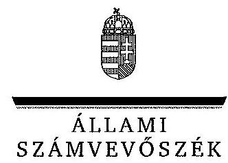

# Dr. Szabó László Zsolt úr 

megbízott vezérigazgató
Médiaszolgáltatás-támogató és Vagyonkezelő Alap

## Budapest

## Tisztelt Vezérigazgató Úr!

A közszolgálati média- és hírszolgáltatás új szervezeti, finanszírozási és kontrollrendszere kialakításának és müködésének ellenőrzéséről készitetett jelentéstervezetre tett észrevételét köszönettel megkaptam.

Az Állami Számvevőszék észrevételekre vonatkozó álláspontjáról a felügyeleti vezető által készített részletes tájékoztatást mellékelten megküldöm.

Tájékoztatom Vezérigazgató urat, hogy a jelentés szövegezése az elfogadott észrevételei figyelembevételével történik.

Budapest, 2013. 112.
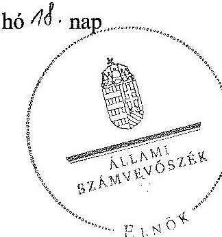

Tisztelettel:
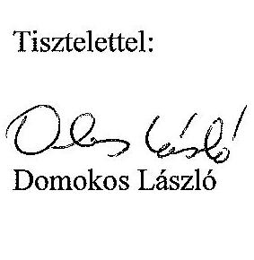

Melléklet: Tájékoztatás az elfogadott és az el nem fogadott észrevételekről

---

# Tájékoztatás   az elfogadott és az el nem fogadott észrevételekről 

A „Jelentéstervezet a közszolgálati média- és hirszolgáltatás új szervezeti, finanszírozási és kontrollrendszere kialakításának és müködésének ellenörzéséről" címủ jelentéstervezetre vonatkozó észrevételeinek egy része a Médiatanács által tett észrevételekkel megegyezett. Az észrevételeket áttekintettük, azok kezeléséről - a levelében szereplő sorrendben - a következtető tájékoztatást adom.

## A jelentéstervezet I. Összegző megállapítások, következtetések, javaslatok címú részhez:

A 10. oldal 3. bekezdése azt tartalmazza, hogy az MTVA kezelőjeként a médiaszolgáltatásokról és a tömegkommunikációról szóló 2010. évi CLXXXV. törvényben (Mttv.) előírt alapvető feladatait a Médiatanács ellátta, de az MTVA szabályszerű működésének feltételét biztosító szabályozásokban előfordultak hiányosságok. Ezeket a hiányosságokat sem a Médiatanács észrevételei, sem az MTVA észrevételei nem cáfolják, amelyet az is alátámaszt, hogy az észrevételükben jelzik, hogy ki fogják dolgozni a vagyongazdálkodás elsődleges céljának elérését biztosító részletes szabályokat. Leírták továbbá, hogy az MTVA Archiválási Szabályzatát is kiegészítik azzal, hogy az Archívum elidegenítési tilalom alatt áll, valamint kidolgozzák az MTVA támogatáspolitikáját. A leírt észrevételek a jelentéstervezet módosítását nem igénylik.

A 11. oldal 2. bekezdéséhez tett észrevételében arról tájékoztat, hogy elfogadja az Állami Számvevőszék (ÁSZ) javaslatát, és intézkedik a belső szabályzat felülvizsgálatáról. Az észrevétel a jelentéstervezet módosítását nem igényli.

A 11. oldal 3. bekezdéséhez tett észrevétele kapcsán megjegyezzük, hogy a jelentéstervezet nem tartalmaz olyat az MTVA belső ellenőrzésével kapcsolatban, hogy a külön megállapodás alapján végzett ellenőrzések jelentéseit el kellett volna küldeni az MTVA FB-nek és a Médiatanácsnak. A jelentéstervezet azt tartalmazza, amit az észrevételükben vállalnak, vagyis az MTVA-ra vonatkozó belső ellenőrzési jelentés megküldését.

Az egyértelműség érdekében a bekezdésben az utolsó két mondat sorrendjét felcseréljük az alábbiak szerint:
„A belső ellenőrzésről az éves ellenőrzési jelentéseket a szabályozásukban meghatározott határidőn belül elkészítették, de azokat a tárgyévet követő év április 15-éig nem küldték meg a Médiatanácsnak és az MTVA FB-nek. A 2011. és a 2012. évben több olyan ellenőrzés volt, amelyet a Kuratórium és az MTVA között 2011-ben létrejött együttmüködési megállapodás alapján folytattak le az NZrt.-knél. "

---

A 12. oldal 4. bekezdése azt tartalmazza, hogy az MTVA a számviteli nyilvántartásaiban a támogatással és a vállalkozással kapcsolatos bevételeit igen, de a vállalkozással kapcsolatos költségeit és ráfordításait a jogszabályi előírás ellenére nem különítette el. Az észrevételében foglaltak nem indokolják a jelentéstervezet módosítását, mivel az azt tartalmazza, hogy valóban nincsenek elkülönítve az alaptevékenység és a vállalkozási tevékenység bevételei és ráfordításai, arra csak bizonyos kódrendszer és munkaszámok alapján van lehetőség. Továbbá az ellenőrzés lefolytatása során az MTVA ezt nyilatkozatban is megerősítette, így a leírtak nem indokolják a jelentéstervezet módosítását.

A 12. oldal 5. bekezdéséhez köszönettel megkaptuk az önköltségszámítási szabályzatot, de megjegyezzük, hogy a szabályzattal a helyszíni ellenőrzés lefolytatásának ideje alatt az MTVA nem rendelkezett, tájékoztatása szerint azt 2013. november 27 -én adta ki. A javaslatot ezért változatlanul fenntartjuk, tekintettel arra, hogy a helyszíni ellenőrzés ideje alatt nem volt módunkban meggyőződni a szabályzat létezéséről és tartalmáról. Mindez nem indokolja a jelentéstervezet módosítását.

A 12. oldal 6. bekezdéséhez tett észrevételének első része kapcsán megjegyezzük, hogy az Mttv. előírja, hogy az archiválás és az Archívum megőrzésének, kezelésének, felhasználásának részletes szabályait az Alap vezérigazgatója a Médiatanács egyetértésével, szabályzatban állapítja meg. A GKSZ és az MTVA Archiválási Szabályzata az Mttv. 100. § (2) bekezdésének előírását külön nem nevesíti, ezért a szabályozásból nem egyértelmű, hogy a közszolgálati médiavagyon elidegenítési tilalom alatt áll. Mindez indokolja a közszolgálati médiavagyonra vonatkozó elidegenítési tilalom szabályzatban való megjelenítését, amelyet az észrevételük szerint végre fognak hajtani. Az észrevétel második részében az ingatlanhasznosítással kapcsolatos részletes tájékoztatást köszönjük, azonban az abban foglaltak nem indokolják a jelentéstervezet módosítását.

# A jelentéstervezet javaslatok az MTVA vezérigazgatójának részéhez (16-17. o.): 

1. Az ebben a pontban leírtakhoz válaszunk megegyezik a 12. oldal 5. bekezdéséhez tett észrevételéhez megírt válaszunkkal.
2. Az ebben a pontban leírtakhoz válaszunk megegyezik a 12. oldal 4. bekezdéséhez tett észrevételéhez megírt válaszunkkal.
3. Az ebben a pontban leírtakhoz válaszunk megegyezik a 11. oldal 2. bekezdéséhez tett észrevételéhez megírt válaszunkkal.
4. Az ehhez a ponthoz leírtak a jelentéstervezet módosítását nem indokolják, mert a levelük szerint a javaslatoknak megfelelően az intézkedéseket megkezdték.

## A jelentéstervezet II. Részletes megállapítások címú részéhez:

A 29. oldal 1. bekezdéséhez tett észrevételük összhangban van a jelentéstervezetben leírtakkal, de a még közérthetőbb megfogalmazás érdekében a szövegrészt kiegészítjük az „MTVA vonatkozó belső szabályozásának megfelelően" résszel.

---

A 29. oldal 3. bekezdéséhez az MTVA belső ellenőrzései alapján a helyszíni ellenőrzést követően készült intézkedési tervekről az ellenőrzés során nem tudtunk meggyőződni, ezért a jelentéstervezetet nem módosítjuk.

A 29. oldal 4. bekezdéséhez tett, az ellenőrzési szabályzat aktualizálásához kapcsolódó tájékoztatást - az előzmények bemutatásáról és a szabályzat tervezett felülvizsgálatáról - köszönjük, a jelentéstervezet módosítása ez alapján azonban nem indokolt.

A 30. oldal 4.1. pontjának 2. bekezdéséhez kapcsolódóan köszönjük a tájékoztatást, azonban a jelentéstervezet módosítását ez nem igényli, tekintettel arra, hogy a helyszíni ellenőrzés ideje alatt a Közszolgálati Költségvetési Tanács döntései nem szerepeltek a honlapon.

A 30. oldal 4.1. pontjának 4. bekezdéséhez kapcsolódóan köszönjük a tájékoztatást, a Tervezési kézikönyv aktualizálásával a megállapításaink hasznosulnak. A jelentéstervezet módosítását az észrevétel nem indokolja.

A 36. oldal utolsó bekezdéséhez tett észrevételükre a válaszunk megegyezik a 12. oldal 6. bekezdésére adott válaszunkkal. Az észrevétel a jelentéstervezet módosítását nem igényli.

A 37. oldal 4. bekezdéséhez kapcsolódóan köszönjük az MTVA Archiválási Szabályzatáról a részletes tájékoztatást, amelyben a tervezett intézkedésekre is kiternek, azonban a leírtak a jelentéstervezet módosítását nem indokolják.

A 38. oldal 1. bekezdéséhez kapcsolódóan köszönjük a tájékoztatást, azonban a jelentéstervezet módosítását ez nem igényli, tekintettel arra, hogy a helyszíni ellenőrzés ideje alatt a NAVA müködési szabályzata nem szerepelt a honlapon.

Tájékoztatom Vezérigazgató urat, hogy a számvevőszéki jelentés mellékleteként szerepeltetjük a jelentéstervezetre tett észrevételét, valamint az arra adott válaszunkat.

Budapest, 2013. 12 hó 18 . nap

Makkai Mária
felügyeleti vezető

---

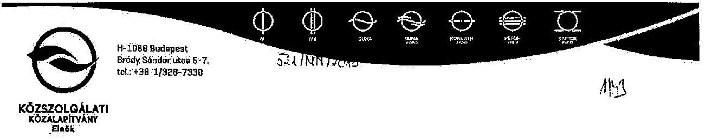

# Domokos László úr 

einök

Állami Számvevőszék

Budapest

Tisztelt Elnök Úrl

A V-0172-138/2013. számon iktatott, „A közszolgálati média- és hírszolgáltatás új szervezeti, finanszírozási és kontrollrendszere kialakításának és müködésének ellenőrzéséről" címmel készített jelentéstervezettel kapcsolatban észrevételt nem kívánok renni.

Budapest, 2013. november 27.

Tisztelettel
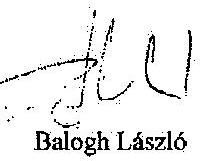

---

# **Chemistry**

## **Chemical Reactions**

### **Balancing Chemical Equations**

1. **Write the unbalanced equation:**
   - Example: $$C_3H_8 + O_2 \rightarrow CO_2 + H_2O$$

2. **Balance the equation:**
   - Example: $$2C_3H_8 + 7O_2 \rightarrow 6CO_2 + 8H_2O$$

3. **Balance the equation:**
   - Example: $$2C_3H_8 + 7O_2 \rightarrow 6CO_2 + 8H_2O$$

### **Types of Reactions**

1. **Combination Reaction:**
   - Example: $$2H_2 + O_2 \rightarrow 2H_2O$$

2. **Decomposition Reaction:**
   - Example: $$2H_2O_2 \rightarrow 2H_2O + O_2$$

3. **Single Displacement Reaction:**
   - Example: $$Zn + 2HCl \rightarrow ZnCl_2 + H_2$$

4. **Double Displacement Reaction:**
   - Example: $$AgNO_3 + NaCl \rightarrow AgCl + NaNO_3$$

5. **Combustion Reaction:**
   - Example: $$CH_4 + 2O_2 \rightarrow CO_2 + 2H_2O$$

## **Stoichiometry**

### **Mole Concept**

- **Mole (mol):** The amount of substance containing as many particles (atoms, molecules, ions) as there are atoms in exactly 12 grams of carbon-12.
- **Avogadro's Number:** $$6.022 \times 10^{23}$$ particles per mole.

### **Molar Mass**

- **Molar Mass:** The mass of one mole of a substance.
- Example: The molar mass of water ($$H_2O$$) is 18.015 g/mol.

### **Calculations**

1. **Moles to Mass:**
   - Formula: $$n = \frac{m}{M}$$
   - Example: Calculate the number of moles of $$H_2O$$ in 18 grams of water.
     - $$n = \frac{18.015 \, \text{g}}{18.015 \, \text{g/mol}} = 18.015 \, \text{g/mol}$$

2. **Moles to Mass:**
   - Formula: $$m = n \times M$$
   - Example: Calculate the mass of 18.015 g of water.
     - $$m = 18.015 \, \text{g/mol} = 18.015 \, \text{g/mol}$$

## **Gas Laws**

### **Ideal Gas Law**

- **Equation:** $$PV = nRT$$
- **Variables:**
  - $$P$$: Pressure (atm)
  - $$V$$: Volume (L)
  - $$n$$: Number of moles (mol)
  - $$R$$: Ideal gas constant (0.0821 L·atm/mol·K)
  - $$T$$: Temperature (K)

### **Boyle's Law**

- **Equation:** $$P_1V_1 = P_2V_2$$
- **Variables:**
  - P₁: Pressure (atm)
  - P₂: Volume (L)
  - P₃: Pressure (atm)
  - P₁: Pressure (atm)
  - P₂: Volume (L)
  - P₃: Pressure (atm)
  - P₁: Pressure (atm)

### **Boyle's Law (Ideal Gas Law)**

- **Equation:** $$\frac{P_1V_1}{P_2V_2} = \frac{V_1}{T_1}$$
- **Variables:**
  - P₁: Pressure (atm)
  - P₂: Volume (L)
  - P₃: Pressure (atm)
  - P₁: Pressure (atm)
  - P₂: Volume (L)
  - P₃: Pressure (atm)

## **Thermochemistry**

### **Enthalpy (H)**

- **Definition:** The heat content of a system at constant pressure.
- **Change in Enthalpy (ΔH):** $$ΔH = q_p$$
- **Change in Enthalpy (ΔH_2):** $$ΔH_2H_2 + q_1$$
- **Change in Enthalpy (ΔH_1):** $$ΔH_1H_1 + q_2$$

### **Hess's Law**

- **Statement:** The enthalpy change for a reaction is the same whether it occurs in one step or multiple steps.
- **Equation:** $$\Delta H = q_p \Delta H_2$$
- **Equation:** $$\Delta H_2H_2 \Delta H_1$$

## **Electrochemistry**

### **Oxidation and Reduction**

- **Oxidation:** Loss of electrons.
- **Reduction:** Gain of electrons.

### **Galvanic Cells**

- **Definition:** A cell that converts chemical energy into electrical energy.
- **Components:**
  - Anode: Oxidation occurs.
  - Cathode: Reduction occurs.
  - Salt Bridge: Connects the two half-cells.

### **Nernst Equation**

- **Equation:** $$E = E^\circ - \frac{RT}{nF} \ln Q$$
- **Variables:**
  - E: Cell potential
  - R: Ideal gas constant
  - F: Faraday constant
  - R_1: Reaction time (t)
  - R_2: Reaction time (s)
  - T: Temperature (K)
  - R_1: Reaction time (s)
  - R_2: Reaction time (s)
  - T_1: Temperature (K)
  - R_2: Reaction time (s)
  - T_3: Temperature (K)
  - T_1: Reaction time (s)

## **Electrochemistry**

### **Oxidation and Reduction**

- **Oxidation:** Loss of electrons.
- **Reduction:** Gain of electrons.
- **Reduction:** Gain of electrons.

### **Electrochemical Cells**

- **Definition:** A cell that converts chemical energy into electrical energy.
- **Components:**
  - Anode: Oxidation occurs.
  - Cathode: Reduction occurs.
  - Salt Bridge: Connects the two half-cells.

### **Nernst Equation**

- **Equation:** $$E = E^\circ - \frac{RT}{nF} \ln Q$$
- **Variables:**
  - E: Cell potential
  - R: Ideal gas constant
  - F: Faraday constant
  - R_1: Reaction time (t)
  - R_2: Reaction time (s)
  - T: Temperature (K)
  - R_1: Reaction time (s)
  - R_2: Reaction time (s)
  - T_1: Reaction time (s)

## **Organic Chemistry**

### **Functional Groups**

- **Alkanes:** -C=O -C=O_2 -C=O_2H -C=O_2O -C=O_2S - C=O_2O -C=O_2S - C=O_2O -C=O_2S - C=O_2S - C=O_2S - C=O_2S - C=O_2S - C=O_2S - C=O_2S - C=O_2S - C=O_2S - C=O_2S - C=O_2S - C=O_2S - C=O_2S - C=O_2S - C=O_2S - C=O_2S - C=O_2S - C=O_2S - C=O_2S - C=O_2S - C=O_2S - C=O_2S - C=O_2S - C=O_2S - C=O_2S - C=O_2S - C=O_2S - C=O_2S - C=O_2S - C=O_2S - C=O_2S - C=O_2S - C=O_2S - C=O_2S - C=O_2S - C=O_2S - C=O_2S - C=O_2S - C=O_2S - C=O_2S - C=O_2S - C=O_2S - C=O_2S - C=O_2S - C=O_2S - C=O_2S - C=O_2S - C=O_2S - C=O_2S - C=O_2S - C=O_2S - C=O_2S - C=O_2S - C=O_2S - C=O_2S - C=O_2S - C=O_2S - C=O_2S - C=O_2S - C=O_2S - C=O_2S - C=O_2S - C=O_2S - C=O_2S - C=O_2S - C=O_2S - C=O_2S - C=O_2S - C=O_2S - C=O_2S - C=O_2S - C=O_2S - C=O_2S - C=O_2S - C=O_2S - C=O_2S - C=O_2S - C=O_2S - C=O_2S - C=O_2S - C=O_2S - C=O_2S - C=O_2S - C=O_2S - C=O_2S - C=O_2S - C=O_2S - C=O_2S - C=O_2S - C=O_2S - C=O_2S - C=O_2S - C=O_2S - C=O_2S - C=O_2S - C=O_2S - C=O_2S - C=O_2S - C=O_2S - C=O_2S - C=O_2S - C=O_2S - C=O_2S - C=O_2S - C=O_2S - C=O_2S - C=O_2S - C=O_2S - C=O_2S - C=O_2S - C=O_2S - C=O_2S - C=O_2S - C=O_2S - C=O_2S - C=O_2S - C=O_2S - C=O_2S - C=O_2S - C=O_2S - C=O_2S - C=O_2S - C=O_2S - C=O_2S - C=O_2S - C=O_2S - C=O_2S - C=O_2S - C=O_2S - C=O_2S - C=O_2S - C=O_2S - C=O_2S - C=O_2S - C=O_2S - C=O_2S - C=O_2S - C=O_2S - C=O_2S - C=O_2S - C=O_2S - C=O_2S - C=O_2S - C=O_2S - C=O_2S - C=O_2S - C=O_2S - C=O_2S - C=O_2S - C=O_2S - C=O_2S - C=O_2S - C=O_2S - C=O_2S - C=O_2S - C=O_2S - C=O_2S - C=O_2S - C=O_2S - C=O_2S - C=O_2S - C=O_2S - C=O_2S - C=O_2S - C=O_2S - C=O_2S - C=O_2S - C=O_2S - C=O_2S - C=O_2S - C=O_2S - C=O_2S - C=O_2S - C=O_2S - C=O_2S - C=O_2S - C=O_2S - C=O_2S - C=O_2S - C=O_2S - C=O_2S - C=O_2S - C=O_2S - C=O_2S - C=O_2S - C=O_2S - C=O_2S - C=O_2S - C=O_2S - C=O_2S - C=O_2S - C=O_2S - C=O_2S - C=O_2S - C=O_2S - C=O_2S - C=O_2S - C=O_2S - C=O_2S - C=O_2S - C=O_2S - C=O_2S - C=O_2S - C=O_2S - C=O_2S - C=O_2S - C=O_2S - C=O_2S - C=O_2S - C=O_2S - C=O_2S - C=O_2S - C=O_2S - C=O_2S - C=O_2S - C=O_2S - C=O_2S - C=O_2S - C=O_2S - C=O_2S - C=O_2S - C=O_2S - C=O_2S - C=O_2S - C=O_2S - C=O_2S - C=O_2S - C=O_2S - C=O_2S - C=O_2S - C=O_2S - C=O_2S - C=O_2S - C=O_2S - C=O_2S - C=O_2S - C=O_2S - C=O_2S - C=O_2S - C=O_2S - C=O_2S - C=O_2S - C=O_2S - C=O_2S - C=O_2S - C=O_2S - C=O_2S - C=O_2S - C=O_2S - C=O_2S - C=O_2S - C=O_2S - C=O_2S - C=O_2S - C=O_2S - C=O_2S - C=O_2S - C=O_2S - C=O_2S - C=O_2S - C=O_2S - C=O_2S - C=O_2S - C=O_2S - C=O_2S - C=O_2S - C=O_2S - C=O_2S - C=O_2S - C=O_2S - C=O_2S - C=O_2S - C=O_2S - C=O_2S - C=O_2S - C=O_2S - C=O_2S - C=O_2S - C=O_2S - C=O_2S - C=O_2S - C=O_2S - C=O_2S - C=O_2S - C=O_2S - C=O_2S - C=O_2S - C=O_2S - C=O_2S - C=O_2S - C=O_2S - C=O_2S - C=O_2S - C=O_2S - C=O_2S - C=O_2S - C=O_2S - C=O_2S - C=O_2S - C=O_2S - C=O_2S - C=O_2S - C=O_2S - C=O_2S - C=O_2S - C=O_2S - C=O_2S - C=O_2S - C=O_2S - C=O_2S - C=O_2S - C=O_2S - C=O_2S - C=O_2S - C=O_2S - C=O_2S - C=O_2S - C=O_2S - C=O_2S - C=O_2S - C=O_2S - C=O_2S - C=O_2S - C=O_2S - C=O_2S - C=O_2S - C=O_2S - C=O_2S - C=O_2S - C=O_2S - C=O_2S - C=O_2S - C=O_2S - C=O_2S - C=O_2S - C=O_2S - C=O_2S - C=O_2S - C=O_2S - C=O_2S - C=O_2S - C=O_2S - C=O_2S - C=O_2S - C=O_2S - C=O_2S - C=O_2S - C=O_2S - C=O_2S - C=O_2S - C=O_2S - C=O_2S - C=O_2S - C=O_2S - C=O_2S - C=O_2S - C=O_2S - C=O_2S - C=O_2S - C=O_2S - C=O_2S - C=O_2S - C=O_2S - C=O_2S - C=O_2S - C=O_2S - C=O_2S - C=O_2S - C=O_2S - C=O_2S - C=O_2S - C=O_2S - C=O_2S - C=O_2S - C=O_2S - C=O_2S - C=O_2S - C=O_2S - C=O_2S - C=O_2S - C=O_2S - C=O_2S - C=O_2S - C=O_2S - C=O_2S - C=O_2S - C=O_2S - C=O_2S - C=O_2S - C=O_2S - C=O_2S - C=O_2S - C=O_2S - C=O_2S - C=O_2S - C=O_2S - C=O_2S - C=O_2S - C=O_2S - C=O_2S - C=O_2S - C=O_2S - C=O_2S - C=O_2S - C=O_2S - C=O_2S - C=O_2S - C=O_2S - C=O_2S - C=O_2S - C=O_2S - C=O_2S - C=O_2S - C=O_2S - C=O_2S - C=O_2S - C=O_2S - C=O_2S - C=O_2S - C=O_2S - C=O_2S - C=O_2S - C=O_2S - C=O_2S - C=O_2S - C=O_2S - C=O_2S - C=O_2S - C=O_2S - C=O_2S - C=O_2S - C=O_2S - C=O_2S - C=O_2S - C=O_2S - C=O_2S - C=O_2S - C=O_2S - C=O_2S - C=O_2S - C=O_2S - C=O_2S - C=O_2S - C=O_2S - C=O_2S - C=O_2S - C=O_2S - C=O_2S - C=O_2S - C=O_2S - C=O_2S - C=O_2S - C=O_2S - C=O_2S - C=O_2S - C=O_2S - C=O_2S - C=O_2S - C=O_2S - C=O_2S - C=O_2S - C=O_2S - C=O_2S - C=O_2S - C=O_2S - C=O_2S - C=O_2S - C=O_2S - C=O_2S - C=O_2S - C=O_2S - C=O_2S - C=O_2S - C=O_2S - C=O_2S - C=O_2S - C=O_2S - C=O_2S - C=O_2S - C=O_2S - C=O_2S - C=O_2S - C=O_2S - C=O_2S - C=O_2S - C=O_2S - C=O_2S - C=O_2S - C=O_2S - C=O_2S - C=O_2S - C=O_2S - C=O_2S - C=O_2S - C=O_2S - C=O_2S - C=O_2S - C=O_2S - C=O_2S - C=O_2S - C=O_2S - C=O_2S - C=O_2S - C=O_2S - C=O_2S - C=O_2S - C=O_2S - C=O_2S - C=O_2S - C=O_2S - C=O_2S - C=O_2S - C=O_2S - C=O_2S - C=O_2S - C=O_2S - C=O_2S - C=O_2S - C=O_2S - C=O_2S - C=O_2S - C=O_2S - C=O_2S - C=O_2S - C=O_2S - C=O_2S - C=O_2S - C=O_2S - C=O_2S - C=O_2S - C=O_2S - C=O_2S - C=O_2S - C=O_2S - C=O_2S - C=O_2S - C=O_2S - C=O_2S - C=O_2S - C=O_2S - C=O_2S - C=O_2S - C=O_2S - C=O_2S - C=O_2S - C=O_2S - C=O_2S - C=O_2S - C=O_2S - C=O_2S - C=O_2S - C=O_2S - C=O_2S - C=O_2S - C=O_2S - C=O_2S - C=O_2S - C=O_2S - C=O_2S - C=O_2S - C=O_2S - C=O_2S - C=O_2S - C=O_2S - C=O_2S - C=O_2S - C=O_2S - C=O_2S - C=O_2S - C=O_2S - C=O_2S - C=O_2S - C=O_2S - C=O_2S - C=O_2S - C=O_2S - C=O_2S - C=O_2S - C=O_2S - C=O_2S - C=O_2S - C=O_2S - C=O_2S - C=O_2S - C=O_2S - C=O_2S - C=O_2S - C=O_2S - C=O_2S - C=O_2S - C=O_2S - C=O_2S - C=O_2S - C=O_2S - C=O_2S - C=O_2S - C=O_2S - C=O_2S - C=O_2S - C=O_2S - C=O_2S - C=O_2S - C=O_2S - C=O_2S - C=O_2S - C=O_2S - C=O_2S - C=O_2S - C=O_2S - C=O_2S - C=O_2S - C=O_2S - C=O_2S - C=O_2S - C=O_2S - C=O_2S - C=O_2S - C=O_2S - C=O_2S - C=O_2S - C=O_2S - C=O_2S - C=O_2S - C=O_2S - C=O_2S - C=O_2S - C=O_2S - C=O_2S - C=O_2S - C=O_2S - C=O_2S - C=O_2S - C=O_2S - C=O_2S - C=O_2S - C=O_2S - C=O_2S - C=O_2S - C=O_2S - C=O_2S - C=O_2S - C=O_2S - C=O_2S - C=O_2S - C=O_2S - C=O_2S - C=O_2S - C=O_2S - C=O_2S - C=O_2S - C=O_2S - C=O_2S - C=O_2S - C=O_2S - C=O_2S - C=O_2S - C=O_2S - C=O_2S - C=O_2S - C=O_2S - C=O_2S - C=O_2S - C=O_2S - C=O_2S - C=O_2S - C=O_2S - C=O_2S - C=O_2S - C=O_2S - C=O_2S - C=O_2S - C=O_2S - C=O_2S - C=O_2S - C=O_2S - C=O_2S - C=O_2S - C=O_2S - C=O_2S - C=O_2S - C=O_2S - C=O_2S - C=O_2S - C=O_2S - C=O_2S - C=O_2S - C=O_2S - C=O_2S - C=O_2S - C=O_2S - C=O_2S - C=O_2S - C=O_2S - C=O_2S - C=O_2S - C=O_2S - C=O_2S - C=O_2S - C=O_2S - C=O_2S - C=O_2S - C=O_2S - C=O_2S - C=O_2S - C=O_2S - C=O_2S - C=O_2S - C=O_2S - C=O_2S - C=O_2S - C=O_2S - C=O_2S - C=O_2S - C=O_2S - C=O_2S - C=O_2S - C=O_2S - C=O_2S - C=O_2S - C=O_2S - C=O_2S - C=O_2S - C=O_2S - C=O_2S - C=O_2S - C=O_2S - C=O_2S - C=O_2S - C=O_2S - C=O_2S - C=O_2S - C=O_2S - C=O_2S - C=O_2S - C=O_2S - C=O_2S - C=O_2S - C=O_2S - C=O_2S - C=O_2S - C=O_2S - C=O_2S - C=O_2S - C=O_2S - C=O_2S - C=O_2S - C=O_2S - C=O_2S - C=O_2S - C=O_2S - C=O_2S - C=O_2S - C=O_2S - C=O_2S - C=O_2S - C=O_2S - C=O_2S - C=O_2S - C=O_2S - C=O_2S - C=O_2S - C=O_2S - C=O_2S - C=O_2S - C=O_2S - C=O_2S - C=O_2S - C=O_2S - C=O_2S - C=O_2S - C=O_2S - C=O_2S - C=O_2S - C=O_2S - C=O_2S - C=O_2S - C=O_2S - C=O_2S - C=O_2S - C=O_2S - C=O_2S - C=O_2S - C=O_2S - C=O_2S - C=O_2S - C=O_2S - C=O_2S - C=O_2S - C=O_2S - C=O_2S - C=O_2S - C=O_2S - C=O_2S - C=O_2S - C=O_2S - C=O_2S - C=O_2S - C=O_2S - C=O_2S - C=O_2S - C=O_2S - C=O_2S - C=O_2S - C=O_2S - C=O_2S - C=O_2S - C=O_2S - C=O_2S - C=O_2S - C=O_2S - C=O_2S - C=O_2S - C=O_2S - C=O_2S - C=O_2S - C=O_2S - C=O_2S - C=O_2S - C=O_2S - C=O_2S - C=O_2S - C=O_2S - C=O_2S - C=O_2S - C=O_2S - C=O_2S - C=O_2S - C=O_2S - C=O_2S - C=O_2S - C=O_2S - C=O_2S - C=O_2S - C=O_2S - C=O_2S - C=O_2S - C=O_2S - C=O_2S - C=O_2S - C=O_2S - C=O_2S - C=O_2S - C=O_2S - C=O_2S - C=O_2S - C=O_2S - C=O_2S - C=O_2S - C=O_2S - C=O_2S - C=O_2S - C=O_2S - C=O_2S - C=O_2S - C=O_2S - C=O_2S - C=O_2S - C=O_2S - C=O_2S - C=O_2S - C=O_2S - C=O_2S - C=O_2S - C=O_2S - C=O_2S - C=O_2S - C=O_2S - C=O_2S - C=O_2S - C=O_2S - C=O_2S - C=O_2S - C=O_2S - C=O_2S - C=O_2S - C=O_2S - C=O_2S - C=O_2S - C=O_2S - C=O_2S - C=O_2S - C=O_2S - C=O_2S - C=O_2S - C=O_2S - C=O_2S - C=O_2S - C=O_2S - C=O_2S - C=O_2S - C=O_2S - C=O_2S - C=O_2S - C=O_2S - C=O_2S - C=O_2S - C=O_2S - C=O_2S - C=O_2S - C=O_2S - C=O_2S - C=O_2S - C=O_2S - C=O_2S - C=O_2S - C=O_2S - C=O_2S - C=O_2S - C=O_2S - C=O_2S - C=O_2S - C=O_2S - C=O_2S - C=O_2S - C=O_2S - C=O_2S - C=O_2S - C=O_2S - C=O_2S - C=O_2S - C=O_2S - C=O_2S - C=O_2S - C=O_2S - C=O_2S - C=O_2S - C=O_2S - C=O_2S - C=O_2S - C=O_2S - C=O_2S - C=O_2S - C=O_2S - C=O_2S - C=O_2S - C=O_2S - C=O_2S - C=O_2S - C=O_2S - C=O_2S - C=O_2S - C=O_2S - C=O_2S - C=O_2S - C=O_2S - C=O_2S - C=O_2S - C=O_2S - C=O_2S - C=O_2S - C=O_2S - C=O_2S - C=O_2S - C=O_2S - C=O_2S - C=O_2S - C=O_2S - C=O_2S - C=O_2S - C=O_2S - C=O_2S - C=O_2S - C=O_2S - C=O_2S - C=O_2S - C=O_2S - C=O_2S - C=O_2S - C=O_2S - C=O_2S - C=O_2S - C=O_2S - C=O_2S - C=O_2S - C=O_2S - C=O_2S - C=O_2S - C=O_2S - C=O_2S - C=O_2S - C=O_2S - C=O_2S - C=O_2S - C=O_2S - C=O_2S - C=O_2S - C=O_2S - C=O_2S - C=O_2S - C=O_2S - C=O_2S - C=O_2S - C=O_2S - C=O_2S - C=O_2S - C=O_2S - C=O_2S - C=O_2S - C=O_2S - C=O_2S - C=O_2S - C=O_2S - C=O_2S - C=O_2S - C=O_2S - C=O_2S - C=O_2S - C=O_2S - C=O_2S - C=O_2S - C=O_2S - C=O_2S - C=O_2S - C=O_2S - C=O_2S - C=O_2S - C=O_2S - C=O_2S - C=O_2S - C=O_2S - C=O_2S - C=O_2S - C=O_2S - C=O_2S - C=O_2S - C=O_2S - C=O_2S - C=O_2S - C=O_2S - C=O_2S - C=O_2S - C=O_2S - C=O_2S - C=O_2S - C=O_2S - C=O_2S - C=O_2S - C=O_2S - C=O_2S - C=O_2S - C=O_2S - C=O_2S - C=O_2S - C=O_2S - C=O_2S - C=O_2S - C=O_2S - C=O_2S - C=O_2S - C=O_2S - C=O_2S - C=O_2S - C=O_2S - C=O_2S - C=O_2S - C=O_2S - C=O_2S - C=O_2S - C=O_2S - C=O_2S - C=O_2S - C=O_2S - C=O_2S - C=O_2S - C=O_2S - C=O_2S - C=O_2S - C=O_2S - C=O_2S - C=O_2S - C=O_2S - C=O_2S - C=O_2S - C=O_2S - C=O_2S - C=O_2S - C=O_2S - C=O_2S - C=O_2S - C=O_2S - C=O_2S - C=O_2S - C=O_2S - C=O_2S - C=O_2S - C=O_2S - C=O_2S - C=O_2S - C=O_2S - C=O_2S - C=O_2S - C=O_2S - C=O_2S - C=O_2S - C=O_2S - C=O_2S - C=O_2S - C=O_2S - C=O_2S - C=O_2S - C=O_2S - C=O_2S - C=O_2S - C=O_2S - C=O_2S - C=O_2S - C=O_2S - C=O_2S - C=O_2S - C=O_2S - C=O_2S - C=O_2S - C=O_2S - C=O_2S - C=O_2S - C=O_2S - C=O_2S - C=O_2S - C=O_2S - C=O_2S - C=O_2S - C=O_2S - C=O_2S - C=O_2S - C=O_2S - C=O_2S - C=O_2S - C=O_2S - C=O_2S - C=O_2S - C=O_2S - C=O_2S - C=O_2S - C=O_2S - C=O_2S - C=O_2S - C=O_2S - C=O_2S - C=O_2S - C=O_2S - C=O_2S - C=O_2S - C=O_2S - C=O_2S - C=O_2S - C=O_2S - C=O_2S - C=O_2S - C=O_2S - C=O_2S - C=O_2S - C=O_2S - C=O_2S - C=O_2S - C=O_2S - C=O_2S - C=O_2S - C=O_2S - C=O_2S - C=O_2S - C=O_2S - C=O_2S - C=O_2S - C=O_2S - C=O_2S - C=O_2S - C=O_2S - C=O_2S - C=O_2S - C=O_2S - C=O_2S - C=O_2S - C=O_2S - C=O_2S - C=O_2S - C=O_2S - C=O_2S - C=O_2S - C=O_2S - C=O_2S - C=O_2S - C=O_2S - C=O_2S - C=O_2S - C=O_2S - C=O_2S - C=O_2S - C=O_2S - C=O_2S - C=O_2S - C=O_2S - C=O_2S - C=O_2S - C=O_2S - C=O_2S - C=O_2S - C=O_2S - C=O_2S - C=O_2S - C=O_2S - C=O_2S - C=O_2S - C=O_2S - C=O_2S - C=O_2S - C=O_2S - C=O_2S - C=O_2S - C=O_2S - C=O_2S - C=O_2S - C=O_2S - C=O_2S - C=O_2S - C=O_2S - C=O_2S - C=O_2S - C=O_2S - C=O_2S - C=O_2S - C=O_2S - C=O_2S - C=O_2S - C=O_2S - C=O_2S - C=O_2S - C=O_2S - C=O_2S - C=O_2S - C=O_2S - C=O_2S - C=O_2S - C=O_2S - C=O_2S - C=O_2S - C=O_2S - C=O_2S - C=O_2S - C=O_2S - C=O_2S - C=O_2S - C=O_2S - C=O_2S - C=O_2S - C=O_2S - C=O_2S - C=O_2S - C=O_2S - C=O_2S - C=O_2S - C=O_2S - C=O_2S - C=O_2S - C=O_2S - C=O_2S - C=O_2S - C=O_2S - C=O_2S - C=O_2S - C=O_2S - C=O_2S - C=O_2S - C=O_2S - C=O_2S - C=O_2S - C=O_2S - C=O_2S - C=O_2S - C=O_2S - C=O_2S - C=O_2S - C=O_2S - C=O_2S - C=O_2S - C=O_2S - C=O_2S - C=O_2S - C=O_2S - C=O_2S - C=O_2S - C=O_2S - C=O_2S - C=O_2S - C=O_2S - C=O_2S - C=O_2S - C=O_2S - C=O_2S - C=O_2S - C=O_2S - C=O_2S - C=O_2S - C=O_2S - C=O_2S - C=O_2S - C=O_2S - C=O_2S - C=O_2S - C=O_2S - C=O_2S - C=O_2S - C=O_2S - C=O_2S - C=O_2S - C=O_2S - C=O_2S - C=O_2S - C=O_2S - C=O_2S - C=O_2S - C=O_2S - C=O_2S - C=O_2S - C=O_2S - C=O_2S - C=O_2S - C=O_2S - C=O_2S - C=O_2S - C=O_2S - C=O_2S - C=O_2S - C=O_2S - C=O_2S - C=O_2S - C=O_2S - C=O_2S - C=O_2S - C=O_2S - C=O_2S - C=O_2S - C=O_2S - C=O_2S - C=O_2S - C=O_2S - C=O_2S - C=O_2S - C=O_2S - C=O_2S - C=O_2S - C=O_2S - C=O_2S - C=O_2S - C=O_2S - C=O_2S - C=O_2S - C=O_2S - C=O_2S - C=O_2S - C=O_2S - C=O_2S - C=O_2S - C=O_2S - C=O_2S - C=O_2S - C=O_2S - C=O_2S - C=O_2S - C=O_2S - C=O_2S - C=O_2S - C=O_2S - C=O_2S - C=O_2S - C=O_2S - C=O_2S - C=O_2S - C=O_2S - C=O_2S - C=O_2S - C=O_2S - C=O_2S - C=O_2S - C=O_2S - C=O_2S - C=O_2S - C=O_2S - C=O_2S - C=O_2S - C=O_2S - C=O_2S - C=O_2S - C=O_2S - C=O_2S - C=O_2S - C=O_2S - C=O_2S - C=O_2S - C=O_2S - C=O_2S - C=O_2S - C=O_2S - C=O_2S - C=O_2S - C=O_2S - C=O_2S - C=O_2S - C=O_2S - C=O_2S - C=O_2S - C=O_2S - C=O_2S - C=O_2S - C=O_2S - C=O_2S - C=O_2S - C=O_2S - C=O_2S - C=O_2S - C=O_2S - C=O_2S - C=O_2S - C=O_2S - C=O_2S - C=O_2S - C=O_2S - C=O_2S - C=O_2S - C=O_2S - C=O_2S - C=O_2S - C=O_2S - C=O_2S - C=O_2S - C=O_2S - C=O_2S - C=O_2S - C=O_2S - C=O_2S - C=O_2S - C=O_2S - C=O_2S - C=O_2S - C=O_2S - C=O_2S - C=O_2S - C=O_2S - C=O_2S - C=O_2S - C=O_2S - C=O_2S - C=O_2S - C=O_2S - C=O_2S - C=O_2S - C=O_2S - C=O_2S - C=O_2S - C=O_2S - C=O_2S - C=O_2S - C=O_2S - C=O_2S - C=O_2S - C=O_2S - C=O_2S - C=O_2S - C=O_2S - C=O_2S - C=O_2S - C=O_2S - C=O_2S - C=O_2S - C=O_2S - C=O_2S - C=O_2S - C=O_2S - C=O_2S - C=O_2S - C=O_2S - C=O_2S - C=O_2S - C=O_2S - C=O_2S - C=O_2S - C=O_2S - C=O_2S - C=O_2S - C=O_2S - C=O_2S - C=O_2S - C=O_2S - C=O_2S - C=O_2S - C=O_2S - C=O_2S - C=O_2S - C=O_2S - C=O_2S - C=O_2S - C=O_2S - C=O_2S - C=O_2S - C=O_2S - C=O_2S - C=O_2S - C=O_2S - C=O_2S - C=O_2S - C=O_2S - C=O_2S - C=O_2S - C=O_2S - C=O_2S - C=O_2S - C=O_2S - C=O_2S - C=O_2S - C=O_2S - C=O_2S - C=O_2S - C=O_2S - C=O_2S - C=O_2S - C=O_2S - C=O_2S - C=O_2S - C=O_2S - C=O_2S - C=O_2S - C=O_2S - C=O_2S - C=O_2S - C=O_2S - C=O_2S - C=O_2S - C=O_2S - C=O_2S - C=O_2S - C=O_2S - C=O_2S - C=O_2S - C=O_2S - C=O_2S - C=O_2S - C=O_2S - C=O_2S - C=O_2S - C=O_2S - C=O_2S - C=O_2S - C=O_2S - C=O_2S - C=O_2S - C=O_2S - C=O_2S - C=O_2S - C=O_2S - C=O_2S - C=O_2S - C=O_2S - C=O_2S - C=O_2S - C=O_2S - C=O_2S - C=O_2S - C=O_2S - C=O_2S - C=O_2S - C=O_2S - C=O_2S - C=O_2S - C=O_2S - C=O_2S - C=O_2S - C=O_2S - C=O_2S - C=O_2S - C=O_2S - C=O_2S - C=O_2S - C=O_2S - C=O_2S - C=O_2S - C=O_2S - C=O_2S - C=O_2S - C=O_2S - C=O_2S - C=O_2S - C=O_2S - C=O_2S - C=O_2S - C=O_2S - C=O_2S - C=O_2S - C=O_2S - C=O_2S - C=O_2S - C=O_2S - C=O_2S - C=O_2S - C=O_2S - C=O_2S - C=O_2S - C=O_2S - C=O_2S - C=O_2S - C=O_2S - C=O_2S - C=O_2S - C=O_2S - C=O_2S - C=O_2S - C=O_2S - C=O_2S - C=O_2S - C=O_2S - C=O_2S - C=O_2S - C=O_2S - C=O_2S - C=O_2S - C=O_2S - C=O_2S - C=O_2S - C=O_2S - C=O_2S - C=O_2S - C=O_2S - C=O_2S - C=O_2S - C=O_2S - C=O_2S - C=O_2S - C=O_2S - C=O_2S - C=O_2S - C=O_2S - C=O_2S - C=O_2S - C=O_2S - C=O_2S - C=O_2S - C=O_2S - C=O_2S - C=O_2S - C=O_2S - C=O_2S - C=O_2S - C=O_2S - C=O_2S - C=O_2S - C=O_2S - C=O_2S - C=O_2S - C=O_2S - C=O_2S - C=O_2S - C=O_2S - C=O_2S - C=O_2S - C=O_2S - C=O_2S - C=O_2S - C=O_2S - C=O_2S - C=O_2S - C=O_2S - C=O_2S - C=O_2S - C=O_2S - C=O_2S - C=O_2S - C=O_2S - C=O_2S - C=O_2S - C=O_2S - C=O_2S - C=O_2S - C=O_2S - C=O_2S - C=O_2S - C=O_2S - C=O_2S - C=O_2S - C=O_2S - C=O_2S - C=O_2S - C=O_2S - C=O_2S - C=O_2S - C=O_2S - C=O_2S - C=

---

# 11. SZÁMÚ MELLÉKLET A V-0172-154/2013. SZÁMÚ JELENTÉSHEZ 

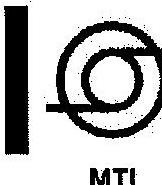

## Állami Számvevőszék

## Domokos László

elnök úr részére

Tárgy: V-0172-141/2013 számú megkeresésük

## Tisztelt Domokos László Úrl

Tájékoztatom, hogy köszönettel megkaptam „A közszolgálati média- és hírszolgáltatás új szervezeti, finanszírozási és kontrollrendszere kialakításának és müködésének ellenőrzése" címmel készített számvevőszéki jelentéstervezetet.

Az ellenőrzés megállapításainak a Magyar Távirati Iroda Nonprofit Zrt-re vonatkozó részéhez nem kívánunk észrevételt tenni.

Budapest, 2013. november 26.

Üdvözlettel:
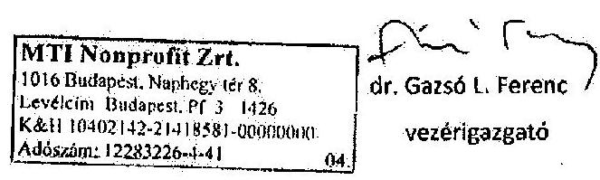

---

.

---

# ÉRTELMEZŐ SZÓTÁR 

adásperc

DAT-kazetta
közszolgálati hírgyártás
közszolgálati műsorszolgáltató
közszolgálati médiaszolgáltató

A műsorszámok időtartamára vonatkozó mértékegység, amelynek számításánál csak az első adásba kerülésüknek az időtartamát vesszük számításba, így nem tartalmazza az esetleges ismétléseket.
Digitális hangkazetta. Az egyszerủ zenei kazetta továbbfejlesztett változata. Felvételkor a kazetta saját zaját nem digitalizálják, így a felvétel jó körülmények esetén teljesen zajmentes lehet. Lejátszáskor az eredetivel majdnem teljesen megegyező minőség érhető el. Angol rövidítés: Digital Audio Tape.
Közszolgálati céllal híradók, sporthírek és időjárás előrejelzések gyártása, de a sportközvetítések és hírháttér műsorok nélkül.
Olyan műsorszolgáltató, amelynek múködését közszolgálati műsorszolgáltatási szabályzat határozza meg, feladata többségében közszolgálati műsor szolgáltatása, fenntartása alapvetően közpénzekből történik, társadalmi felügyelet alatt áll, alapvető jogait és kötelességeit e törvény állapítja meg (Rttv. 2. § 20. pont): a DTV, az MTV és az MR.
A közszolgálati médiaszolgáltatók által nyújtott médiaszolgáltatás. (Mttv. 203. § 31. pont)
Kizárólag a közszolgálati médiaszolgáltatás céljainak megvalósítására az Mttv. 84. § (1) bekezdésében nevesített médiaszolgáltató, valamint az általa létrehozott médiaszolgáltató, illetve a befolyásoló részesedése alatt álló gazdálkodó szervezet által létrehozott médiaszolgáltató (Mttv. 203. § 32. pont): a DTV, az MTI, az MTV és az MR.

---

közszolgálati médiavagyon
közszolgálatiság
médiaszolgáltató
műsor
műsoridő

A közszolgálati médiaszolgáltatók, jogelődeik, valamint az MTVA által megrendelt, bármilyen jogcímen készített, adásvétel útján beszerzett, felhasználási szerződéssel vagy egyéb megállapodás útján részben vagy egészben megszerzett vagy készített filmalkotások és más audiovizuális művek, rádiós műsorszámok, hangfelvételek és a médiaszolgáltatáshoz kapcsolódó egyéb, kulturális értéket képviselő dokumentumok, fényképek szerzői és szomszédos jogai vagy ezek bármely felhasználási jogai, valamint e műveket tartalmazó fizikai hordozók (például: lemezek, szalagok, kazetták, papíralapú dokumentumok, kották), továbbá a szerzői jogi védelem alatt álló jelmezek, kellékek, díszletek és egyéb szerzői művek, amennyiben a művel kapcsolatos szerzői és szomszédos jogok a törvény hatálybalépését megelőzően a közszolgálati médiaszolgáltatók valamelyikét vagy a törvény hatálybalépését követően az MTVA-t illetik meg vagy illették meg, valamint amelyekre vonatkozóan a közszolgálati médiaszolgáltatók e törvény hatálybalépését követően szereznek jogot. (Mttv. 203. § 33. pont)
A közszolgálati médiaszolgáltatás alapvető elvei és céljai, valamint egyéb követelményei, amelyeket az Rttv. (2326. §-ok), illetve az Mttv. rögzít (különösen a 82-83. §-ok és a 98-99. §-ok).
Az Európai Unió múködéséről szóló szerződés 56. és 57. cikkében meghatározott, önálló, üzletszerűen - rendszeresen, nyereség elérése érdekében, gazdasági kockázatvállalás mellett - végzett gazdasági szolgáltatás, amelyért egy médiaszolgáltató szerkesztői felelősséget visel, amelynek elsődleges célja műsorszámoknak tájékoztatás, szórakoztatás vagy oktatás céljából a nyilvánossághoz való eljuttatása valamely elektronikus hírközlő hálózaton keresztül. (Mttv. 203. § 40. pont)
Az a természetes vagy jogi személy, illetve jogi személyiséggel nem rendelkező gazdasági társaság, aki vagy amely szerkesztői felelősséggel rendelkezik a médiaszolgáltatás tartalmának megválasztásáért, és meghatározza annak összeállítását. A szerkesztői felelősség a médiatartalom kiválasztása és összeállítása során megvalósuló tényleges ellenőrzésért való felelősséget jelenti, és nem eredményez szükségszerűen jogi felelősséget a médiaszolgáltatás tekintetében. (Mttv. 203. § 41. pont)
Rádiós, illetve audiovizuális műsorszámok megszerkesztett és nyilvánosan, folyamatosan közzétett sorozata. (Mttv. 203. § 44. pont)
A médiaszolgáltatásban - valamely meghatározott időszak folyamán - folyamatosan közzétett műsorszámok együttes időtartama. (Mttv. 203. § 46. pont)

---

műsorszám
músorterjesztés
reklám

Hangok, illetőleg hangos vagy néma mozgóképek, állóképek sorozata, mely egy médiaszolgáltató által kialakított műsorrendben vagy műsorkínálatban önálló egységet alkot, és amelynek formája és tartalma a rádiós vagy televíziós médiaszolgáltatáséhoz hasonlítható. (Mttv. 203. § 47. pont)

Bármely átviteli rendszerrel megvalósuló elektronikus hírközlési szolgáltatás, amelynek során a médiaszolgáltató által előállított analóg vagy digitális műsorszolgáltatási jeleket a médiaszolgáltatótól az előfizető vagy felhasználó vevőkészülékéhez továbbítják, függetlenül az alkalmazott átviteli rendszertől és technológiától. Músorterjesztésnek minősül az olyan műsorterjesztés is, amelyhez az előfizető külön dí ellenében vagy más elektronikus hírközlési szolgáltatás díjával csomagban értékesített díj ellenében férhet hozzá. A tíznél kevesebb vevőkészülék csatlakoztatására alkalmas átviteli rendszer segítségével történő jeltovábbítás nem minősül műsorterjesztésnek. (Mttv. 203. § 50. pont)
Olyan - műsorszámnak minősülő - közlés, tájékoztatás, illetve megjelenítési mód, amely valamely birtokba vehető forgalomképes ingó dolog - ideértve a pénzt, az értékpapírt és a pénzügyi eszközt, valamint a dolog módjára hasznosítható természeti erőket -, szolgáltatás, ingatlan, vagyoni értékű jog értékesítésének vagy más módon történő igénybevételének előmozdítására, vagy e céllal öszszefüggésben a vállalkozás neve, megjelölése, tevékenysége népszerüsítésére vagy áru, árujelző ismertségének növelésére irányul. (Mttv. 203. § 59. pont)

---

.

---

# A rendszerellenőrzés teljesítmény kritériumai 

Akkor tekintjük a közszolgálati média rendszerének átalakítását eredményesnek, ha kimutatható, hogy a közszolgálati médiavagyon egységes kezelésének megteremtése a közszolgálati médiavagyon megóvását és gyarapítását elősegítette, azaz növelték a digitalizáltság fokát, tehát jobb minőségben végzik az archiválást.
Akkor tekintjük a közszolgálati média rendszerének átalakítását takarékosnak (gazdaságosnak), ha a közszolgálati médiaszolgáltatók közötti felesleges párhuzamosságokat megszüntették. A párhuzamosságok megszüntetésének értékelését a közszolgálati hírgyártás gazdaságosságának elemzésével végezzük, amelynek során egy mutató változását értékeljük a bázis időszaknak tekinthető 2010. és az átalakítást követő 2011-2012. évek adatainak összehasonlításán keresztül. Az összehasonlításnál alkalmazott mutató a következő:
Hírgyártás egy adáspercére jutó ráfordítás (a közszolgálati média hírgyártásra fordított éves közvetlen ráfordítása / hírgyártás eredményeképpen keletkező hírműsorok éves leadott adásperce).
Akkor minősíthető gazdaságosnak a hírgyártás, ha a „hírgyártás egy adáspercére jutó ráfordítás" mutató csökken. Az évente számított mutató változásának értékelésén túl a mutató változásában szerepet játszó tényezőket is figyelembe kell venni.
Akkor minősíthető hatékonyabbnak az új szervezeti rendszerben a feladatellátás, ha a rendelkezésre álló forrásból több outputot (adáspercet) állítottak elő. A hatékonyságot a következő mutatók alapján értékeljük:
Hírgyártás egy főre jutó adásperc (hírgyártás eredményeképpen keletkező hírműsorok éves leadott adásperce / hírgyártásban közreműködők létszáma).
Saját műsorgyártásban közreműködő egy főre jutó gyártott műsorperc (saját kivitelezésben gyártott műsoridő perc / saját műsorgyártásban közreműködő létszám).
A hírgyártás területén akkor minősíthető hatékonynak a változás, ha a „Hírgyártás egy főre jutó adásperc" mutató értéke nő. A saját műsorgyártás területén akkor minősíthető hatékonynak a változás, ha a „Saját műsorgyártásban közreműködő egy főre jutó gyártott műsorperc" mutató értéke nő. Az évente számított mutatók változásának értékelésén túl a mutatók változására ható tényezőket is értékeljük.
További hatékonysági mutatóként határoztuk meg az évente rendelkezésre álló források felhasználásának alakulását, amelynek keretében értékeljük, hogy a műsorcélú felhasználásra rendelkezésre álló forrásból mennyi outputot (adáspercet) állítottak elő; a belső gyártású műsorok fajlagos költsége hogyan alakult; a saját megrendelésre külső gyártású és vásárolt műsorok megrendelésére mennyi forrás jutott. A mutató értékelésénél figyelemmel kell lenni arra, hogy hogyan oszlott meg a forrás felhasználása a saját gyártás, külső gyártás és egyéb műsorcélú felhasználás között.