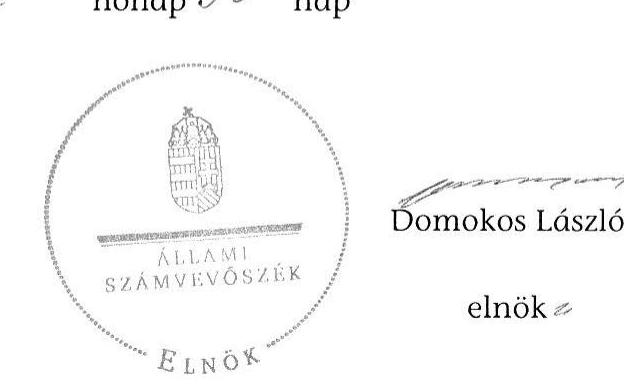

# ÁLLAMI   SZÁMVEVŐSZÉK 

## JELENTÉS

az állami vagyon feletti kontroll - Az állami vagyon feletti tulajdonosi joggyakorlással kapcsolatos tevékenységek ellenőrzéséről

---

# Állami Számvevőszék 

Iktatószám: V-0215-510/2013.
Témaszám: 1250
Vizsgálat-azonosító szám: V0657

## Az ellenőrzést felügyelte:

Dr. Horváth Margit
felügyeleti vezető
Az ellenőrzést vezette és az ellenőrzés végrehajtásáért felelős:
Balkay Attila
ellenőrzésvezető
Az ellenőrzést végezték és a számvevőszéki jelentés összeállításában közreműködtek:

| Czmarkó Frigyes | Fehér Piroska | Huszár Anna |
| :-- | :-- | :-- |
| György | számvevő gyakornok | számvevő |
| számvevő |  |  |
| Kincses Erzsébet Eszter | Komonszky Krisztina | Nagyné Lakhézi Éva |
| számvevő | számvevő | számvevő tanácsos |
| Pencz Mária | Ritecz Tibor | Szabóné László Mária |
| számvevő | számvevő tanácsos | számvevő |
| Dr. Szöllősi Zsolt | Szöllősiné Hrabóczki | Vacsora Erika |
| számvevő | Etelka | számvevő tanácsos |
|  | számvevő tanácsos |  |
| Vasváriné Molnár | Vojcsekné Szabó |  |
| Judit | Ágnes |  |
| számvevő | számvevő tanácsos |  |

## A témához kapcsolódó eddig készített számvevőszéki jelentések:

## címe

Jelentés az állami vagyon feletti tulajdonosi joggyakorlással kap- 12109 csolatos 2011. évi tevékenységek ellenőrzéséről
Jelentés az állami vagyon feletti tulajdonosi joggyakorlással kap- 1128 csolatos 2010. évi tevékenységek ellenőrzéséről
Jelentés a Magyar Nemzeti Vagyonkezelő Zrt. 2009. évi tevékeny- 1013 ségének ellenőrzéséről
Jelentés a Magyar Nemzeti Vagyonkezelő Zrt. 2008. évi tevékeny- 0929 ségének ellenőrzéséről

---

# TARTALOMJEGYZÉK 

BEVEZETÉS ..... 3
I. Összegző megállapítások, következtetések, javaslatok ..... 8
II. Részletes megállapítások ..... 16

1. Az állami vagyon feletti irányítás ..... 16
2. Az MNV tulajdonosi joggyakorlása ..... 18
2.1. Az MNV vagyongazdálkodása ..... 19
2.2. Kontrolling és monitoring ..... 22
2.2.1. A társasági portfólió ..... 22
2.2.2. Az ingatlan portfólió ..... 26
2.2.3. Ingatlanok tulajdonjogának ingyenes átruházása ..... 26
2.3. Közérdekű adatok szolgáltatása és közzététele ..... 29
3. Az MFB tulajdonosi joggyakorlása ..... 32
3.1. Stratégiai és éves tervezés ..... 32
3.2. A vagyongazdálkodás tevékenységei ..... 33
3.3. Kontrolling és monitoring ..... 38
3.4. Közérdekű adatok szolgáltatása és közzététele ..... 40
4. A Földalap feletti tulajdonosi joggyakorlás ..... 42
4.1. A Földalap vagyongazdálkodásának tervezése és beszámolása ..... 42
4.2. Az NFA belső kontrollrendszere ..... 46
5. A tulajdonosi ellenőrzés ..... 50
5.1. Az MNV tulajdonosi ellenőrző tevékenysége ..... 50
5.2. Az MFB tulajdonosi ellenőrző tevékenysége ..... 52
5.3. Az NFA tulajdonosi ellenőrző tevékenysége ..... 54
6. Az állami vagyon felett 2012-től tulajdonosi joggyakorlók által kialakított kontrollkörnyezet ..... 56
6.1. Az EMMI miniszter TB alapok feletti tulajdonosi joggyakorlása ..... 56
6.2. A GYEMSZI tulajdonosi joggyakorlása ..... 59
6.3. A NAV és az NFÜ tulajdonosi joggyakorlása ..... 62
7. A nemzeti vagyonról szóló törvényben meghatározott határidős feladatok ..... 62

---

# MELLÉKLETEK 

1. számú A Földalapba tartozó, az egyes Nemzeti Parkok vagyonkezelésben levő földrészletek nagysága
2. számú A Földalapba tartozó az állami tulajdonú erdőgazdasági társaságok kezelésében lévő területek megoszlása
3. számú Az NFA által az erdőgazdasági társaságok részére kiszámlázott díjak és befizetések
4. számú Az állami tulajdonú erdőgazdasági társaságok 2012. évi adózás előtti eredmény adatai
5. számú Az ellenőrzött szervezetek ÁSZ által el nem fogadott észrevételei

## FÜGGELÉKEK

1. számú Rövidítések jegyzéke
2. számú Értelmező szótár
3. számú A Nemzeti Parkok és az állami tulajdonú erdőgazdasági társaságok vagyonkezelése feletti kontroll
4. számú A 2012. évi zárszámadási jelentés állami vagyonnal kapcsolatos megállapításai (kivonat)

---

# JELENTÉS 

## az állami vagyon feletti kontroll Az állami vagyon feletti tulajdonosi joggyakorlással kapcsolatos tevékenységek ellenőrzéséről

## BEVEZETÉS

Az állami vagyon fogalomrendszerét 2011-ben alapvetően átrendezte Magyarország Alaptörvénye. Ennek alapján az állam és a helyi önkormányzatok tulajdonában álló vagyon nemzeti vagyon. Az Alaptörvény rendelkezéseihez igazodó Nemzeti vagyonról szóló 2011. évi CXCVI. törvény (Nvtv.) meghatározza a nemzeti vagyon rendeltetését alapvetően a közfeladat ellátásának biztosításában, a vagyongazdálkodás keretszabályait, valamint kategóriákba sorolja a nemzeti vagyont. Az Nvtv. kimondja, hogy a nemzeti vagyonról szóló törvényben meghatározott elvek mentén az állam tulajdonában álló vagyon feletti tulajdonosi joggyakorlás módját, valamint a vagyonnal való gazdálkodás szabályait az állami vagyonról szóló 2007. évi CVI. törvény (vagyontörvény vagy Vtv.) állapítja meg. Továbbá, hogy az állami tulajdonban lévő termőföldvagyon hasznosítására, vagyonkezelésére és nyilvántartására, a - kincstári vagyon ${ }^{1}$ részét képező - Nemzeti Földalap (Földalap) feletti tulajdonosi jogok gyakorlására vonatkozó szabályokat a Nemzeti Földalapról szóló 2010. évi LXXXVII. törvény (Nfatv.) állapítja meg.

A Vtv. szerint az állami vagyon felett a Magyar Államot megillető tulajdonosi jogok és kötelezettségek összességét - ha törvény eltérően nem rendelkezik - az állami vagyon felügyeletéért felelős miniszter (nemzeti fejlesztési miniszter) gyakorolja, aki e feladatát a Magyar Nemzeti Vagyonkezelő Zrt. (MNV) és a Magyar Fejlesztési Bank Zrt. (MFB), illetve a miniszter által kijelölt tulajdonosi joggyakorló szervezet útján látja el. Az MFB esetében a tulajdonosi joggyakorlás módját a Magyar Fejlesztési Bank Részvénytársaságról szóló 2001. évi XX. törvény (Mfbtv.) állapítja meg. Az Nfatv. hatálya alá tartozó Nemzeti Földalap felett a Magyar Állam nevében a tulajdonosi jogokat és kötelezettségeket az agrárpolitikáért felelős miniszter (vidékfejlesztési miniszter) a Nemzeti Földalapkezelő Szervezet (NFA) útján gyakorolja. A Vtv. 2012. január 1-jétől hatályos módosításával az Egészségbiztosítási Alap és a Nyugdíjbiztosítási Alap ellátási vagyona tekintetében a tulajdonosi jogokat az emberi erőforrások minisztere (EMMI miniszter) gyakorolja. A települési önkormányzatok fekvőbetegszakellátó intézményeinek átvételéről és az átvételhez kapcsolódó egyes törvények módosításáról szóló 2012. évi XXXVIII. törvény szerint a Magyar Államot megillető tulajdonosi jogok és kötelezettségek összességének gyakorlására 2012.

[^0]
[^0]:    ${ }^{1}$ Nfatv. 1. § (1) bekezdés alapján a Földalap a kincstári vagyon része.

---

május 1-jétől a Gyógyszerészeti és Egészségügyi Minőség- és Szervezetfejlesztési Intézet (GYEMSZI) jogosult. Az NFM miniszter által rendelettel kijelölt tulajdonosi joggyakorló szervezet volt 2012-ben - a rendeletekben ${ }^{2}$ meghatározott feladatokra kiterjedően - a Nemzeti Adó- és Vámhivatal (NAV) és a Nemzeti Fejlesztési Ügynökség (NFÜ).

Az MNV és az MFB gazdasági társaság, az NFA és a GYEMSZI központi költségvetési szerv. A négy tulajdonosi joggyakorló szervezetnél a joggyakorlás eltérő vagyoni kört érint, az MNV-nél ez minden vagyoncsoportra (ingatlanok, földterületek, gazdasági társaságok), az MFB-nél (2012-ben) 37 gazdasági társaságra, az NFA esetében a Nemzeti Földalapba (Földalap) tartozó termőföldekre, a GYEMSZI esetében a fekvőbeteg-szakellátó intézmények vagyonára vonatkozik. A Vtv. az EMMI minisztert, mint tulajdonosi joggyakorlót nevesíti az Egészségbiztosítási Alap és a Nyugdíjbiztosítási Alap ellátási vagyona tekintetében, a hivatkozott NFM rendeletek a NAV és az NFÜ tulajdonosi joggyakorlással kapcsolatos feladatait határozzák meg.

Az MNV működésére - a Vtv. eltérő rendelkezéseinek figyelembe vétele mellett - a gazdasági társaságokról szóló 2006. évi IV. törvény (Gt.) szabályait kell alkalmazni. Az MNV működése során a közgyűlés jogai a részvényesi jogok gyakorlóját - az NFM minisztert - illetik meg. Az MFB esetében a tulajdonosi jogok gyakorlására a Gt. és a Polgári törvénykönyvről szóló 1959. évi IV. törvény (Ptk.) rendelkezéseit az Nvtv.-ben, valamint az Mfbtv.-ben szabályozott eltérésekkel kell alkalmazni. Az NFA és a GYEMSZI központi költségvetési szerv, működésük során - a tulajdonosi joggyakorlás tevékenységét szabályozó törvényeken kívül - az államháztartásról szóló 2011. évi CXCV. törvény (Áht.) és az államháztartásról szóló törvény végrehajtásáról szóló 368/2011. (XII. 31.) Korm. rendelet (Ávr.) rendelkezéseit kell figyelembe venni.

Az éves költségvetési törvények XLIII. és a XLIV. fejezete határozza meg az állami vagyonnal és a Földalappal kapcsolatos bevételeket és kiadásokat ${ }^{3}$. A 2012. évi költségvetési törvény XLIII. fejezetében az állami vagyonnal kapcsolatos tervezett bevételi előirányzat 37074 M Ft , a tervezett kiadási előirányzat 110311 M Ft , e törvény XLIV. fejezetében a Földalappal kapcsolatos tervezett bevételi előirányzat 13350 M Ft , a tervezett kiadási előirányzat 17275 M Ft .

Az állami vagyonnal kapcsolatos közvetlen bevételek és kiadások elszámolásának megbízhatóságát a 2012. évi zárszámadási ellenőrzésünk keretében értékeltük. Megállapításainkat az állami vagyon kontrollrendszerének ellenőrzésében is hasznosítottuk. A zárszámadási ellenőrzésünk állami vagyonnal kapcsolatos megállapításait a 4. számú függelékben kivonatoltuk.

[^0]
[^0]:    ${ }^{2}$ A 74/2011. (XII. 14.) NFM rendelettel kijelölt tulajdonosi joggyakorló szervezet (a KIKSZ Közlekedésfejlesztési Zrt. felett a Magyar Államot megillető tulajdonosi jogok és kötelezettségek összességét gyakorló szervezet kijelöléséről szóló 74/2011. (XII. 14.) NFM rendelet) a NAV. A 87/2011. (XII. 29.) NFM rendelettel (az Új Magyarország Kockázati Tőkeprogramok és a Svájci-Magyar Együttműködési Program keretében tulajdonosi joggyakorló szerv kijelöléséről szóló 87/2011. (XII. 29.) NFM rendelet) kijelölt tulajdonosi joggyakorló szervezet az NFÜ.
    ${ }^{3}$ Az állami vagyonnal kapcsolatos bevételek és kiadások elszámolását az ÁSZ az éves zárszámadási jelentéseiben értékeli.

---

# Az ellenőrzés célja annak értékelése volt, hogy 

- a tulajdonosi joggyakorlás kontrollrendszere megfelelően támogatta-e a tulajdonosi joggyakorlással kapcsolatos tevékenységek ellátását;
- az állami vagyonnal való gazdálkodásban a tulajdonosi jogokat gyakorlók kontrollrendszere alkalmas volt-e a szabályszerű tulajdonosi joggyakorlás segítésére, továbbá az állami vagyon feletti tulajdonosi jogokat 2012-től gyakorló szervezetek a joggyakorláshoz szükséges kontroll környezetet kialakították-e;
- az állami vagyon feletti tulajdonosi joggyakorlók végrehajtották-e a nemzeti vagyonról szóló törvényben meghatározott (tulajdonosi szerkezet feltárása, átláthatósági követelmények teljesítése) határidős feladatokat;
- az MNV kialakította-e az állami vagyonba tartozó ingatlanok tulajdonjogának ingyenes átruházása szabályszerűségét biztosító kontrollkörnyezetet és nyomon követési rendszert;
- a tulajdonosi ellenőrzés támogatta-e a tulajdonosi joggyakorlás tevékenységeinek ellátását, továbbá segítette-e az állami vagyonnal való gazdálkodást;
- hasznosították-e a korábbi számvevőszéki ellenőrzés megállapításait.

Az ellenőrzés típusa: szabályszerűségi ellenőrzés volt.
Az ellenőrzött szervezetek: az NFM, a VM, az EMMI, az MNV, az MFB, az NFA és a GYEMSZI.

Ellenőrzésünk az NFM és a VM, mint tulajdonosi joggyakorlók felügyeleti tevékenységének kontrollrendszerét értékelte. Az MNV, MFB és NFA tulajdonosi joggyakorló szervezetek kontrollkörnyezetének értékelésénél ellenőrzésünk a szabályozási tevékenységekre, a kontrolltevékenységek esetében az eljárási szabályok és nyomvonalak érvényesülésére, a monitoring területén pedig a tulajdonosi ellenőrzési tevékenységére fókuszált.

Az MNV 2012. évi rábízott vagyona ${ }^{4} 13399514$ M Ft volt. Ebből 10084033 M Ft a központi költségvetési szervek vagyonkezelésében-, 1593514 M Ft az egyéb vagyonkezelőknél lévő, 1721967 M Ft a közvetlenül kezelt eszközök könyv szerinti értéke volt. Az MNV tulajdonosi joggyakorlása alá tartozó teljes társasági portfólió korrigált vagyontömege 1463870 M Ft. Az MNV rábízott vagyona társasági portfóliójának szerkezete - az Nvtv. 2011. december 31-én történt hatálybalépésével - az önkormányzati társaságok folyamatos átvétele következtében a 2012. évben megváltozott. Az MNV társasági portfoliójába (rábízott állami vagyonában) 2012. év végén 569 társasági részesedés tartozott, ebből 404 működő társasági részesedés volt, 115 felszámolás-, 50 végelszámolás alatt állt. A társaságok közül az MNV közvetlen kezelésébe 399 részesedés tartozott, ebből 232 a többségi tulajdonú része-

[^0]
[^0]:    ${ }^{4}$ Az MNV rábízott állami vagyona a Vtv. 22. § (6) bekezdése alapján a Vtv. alkalmazásában állami vagyonnak minősülő vagyon, amit az MNV - a saját vagyonától elkülönítetten -

 kezel és nyilvántart.

---

sedések száma. Vagyonkezelésben, megbízásban 170 társasági részesedés volt. Az MNV ingatlanvagyonát 2012. évben a Kormányzati intézkedések ${ }^{5}$ is befolyásolták. Az MNV vagyonkezelésének kontrolljait mintavétellel kiválasztott ingatlanok és társaságok tekintetében mértük fel és értékeltük.
2012. évben az MFB tulajdonosi joggyakorlása alá tartozó gazdasági társaságok száma 40-ről 37-re változott az Eximbank és a MEHIB egyéb tulajdonosi joggyakorlása alá vonása, valamint az ITD Hungary Zrt.nek az RFH Nonprofit Zrt.-be történő beolvadása következtében. Az MFB rábízott vagyona mérlegfőösszege 2012. év december 31-én 206 647 M Ft, eredménye -5305 M Ft volt. Az MFB 37 társasági részesedése feletti kontrollokat mintavétellel kiválasztott társaságokkal kapcsolatos tevékenységein mértük fel és értékeltük.

A Földalapba összesen 1 778 037,3075 ha földterület tartozott, melyet az NFA 2012. évi rábízott vagyonában ${ }^{6}$ 434 065 M Ft értéken tartott nyilván. Ebből 19 892 M Ft a központi költségvetési szervek vagyonkezelésében lévő-, 295 716 M Ft az egyéb vagyonkezelőknél lévő-, 122 592 M Ft a közvetlenül kezelt eszközök mérleg szerinti értéke volt. Az NFA, mint költségvetési szerv tekintetében a belső kontrollrendszerre vonatkozó szabályozásnak megfelelően ellenőriztük az öt kontrollpillér kialakítását és működését.

Az állami tulajdonú erdőgazdasági társaságok a Földalapba tartozó területeknek több mint felét kezelik, ezért ellenőrzésünk ezen társaságok vagyonkezelési tevékenységének tulajdonosi kontrollrendszerét is értékelte. A társaságok az MFB tulajdonosi joggyakorlása alatt állnak, de az MNV, valamint az NFA rábízott vagyonába tartozó ingatlanokat kezelik.

Az ellenőrzés szakmai módszertana az ÁSZ hivatalos honlapján (www.asz.hu) közzétett szakmai szabályokon alapult, amely a Legfőbb Ellenőrző Intézmények Nemzetközi Szervezete (INTOSAI) által kiadott nemzetközi standardok (ISSAI) figyelembevételével készült.

Az ÁSZ az ellenőrzés megállapításait az ellenőrzött időszakban hatályos, az intézkedést igénylő megállapításokra tett javaslatokat a jelenleg hatályos jogszabályok alapján fogalmazta meg.

Az ellenőrzés alapvetően a 2012. évi állami vagyon feletti tulajdonosi joggyakorlás kontrollrendszerét értékelte. Ezzel az új megközelítéssel átfogó képet kívánunk adni a 2012. évi tulajdonosi joggyakorlás kontrolljainak helyzetéről. Ezen keresztül rámutatunk az állami vagyon feletti joggyakorlás rendszerének problémáira. Ezt a megközelítést indokolja a tulajdonosi joggyakorló kör bővülése és a jogszabályi környezet megváltozása. Megállapításainkkal hozzá kívánunk járulni az állami vagyon feletti kontrollrendszer erősítéséhez, az évek óta

[^0]
[^0]:    ${ }^{5}$ A megyei önkormányzatok konszolidációja; a megyei önkormányzati intézmények és a Fővárosi Önkormányzat egyes egészségügyi intézményeinek átvétele; a kiemelt sportberuházások; a Bíróságok elhelyezése; a Nemzeti Közszolgálati Egyetem egységes elhelyezésében, az önkormányzati Tűzoltóságok átvételében való közreműködés; a költségvetési szervek elhelyezésének racionalizálása.
    ${ }^{6}$ Az Nfatv. 1. § (1) bekezdése szerint a Földalapba tartozó földvagyon tekinthető rábízott vagyonnak.

---

fennálló szabályozási hiányosságok, feladatelmaradások pótlásához. A feltárt rendszer és kontroll hibák kijavításával ellenőrzésünk támogatja a jó kormányzást és közvetve hozzájárul az állami vagyonnal való gazdálkodással kapcsolatos közbizalom erősítéséhez.

Az ellenőrzés során értékeltük a tulajdonosi joggyakorló szervezetek (MNV, MFB és az NFA) kontrollrendszere esetében a kontrollrendszernek - ezen belül a kockázatkezelésnek, a kontrolltevékenységeknek, az információ-áramlásnak és a monitoringnak - a szabályszerű tulajdonosi joggyakorlás támogatására való alkalmasságát. Az állami vagyon felett tulajdonosi jogokat 2012-től gyakorló szervezeteknél nem értékeltük a kontrollrendszer teljes kiépítését, esetükben az ellenőrzést a kontrollkörnyezet kialakítására korlátoztuk. Így ellenőrzésünk nem terjedt ki a tulajdonosi joggyakorlók és a tulajdonosi joggyakorló szervezetek egyedi döntéseinek minősítésére. Az EMMI miniszternek az Egészségbiztosítási Alap és a Nyugdíjbiztosítási Alap ellátási vagyona feletti, valamint a GYEMSZI-nek a települési önkormányzatoktól átvett fekvőbeteg-szakellátó intézmények feletti tulajdonosi joggyakorlással kapcsolatos tevékenységének 2012. évi ellátására sem tértünk ki, esetükben a kontrollkörnyezet kialakítását értékeltük.

Az MNV-nél, az MFB-nél és az NFA-nál ellenőriztük az Nvtv.-ben meghatározott (tulajdonosi szerkezet feltárására, átláthatósági követelmények teljesítésére vonatkozó) 2012. december 31-ig végrehajtandó feladatok teljesítését. A tulajdonosi ellenőrzés esetében az MNV-nél, az MFB-nél és az NFA-nál értékeltük a tulajdonosi joggyakorlás tevékenységei ellátásának támogatását és az állami vagyonnal való gazdálkodás segítését. Utóellenőrzés keretében az előző évi ÁSZ ellenőrzés során tett javaslataink hasznosulását értékeltük.

Az ellenőrzést az ÁSZ hatályos szervezeti szabályai, az ellenőrzési programban foglalt értékelési szempontok szerint folytattuk le. Megállapításainkat a helyszíni ellenőrzés tapasztalataira, az ellenőrzött szervezettől bekért dokumentumokra, a kitöltött tanúsítványok elemzésére, az adott időszakban hatályos jogszabályok és belső szabályzatok előírásaira alapoztuk.

Az ÁSZ az Állami Számvevőszékről szóló 2011. évi LXVI. törvény 29. §-a alapján a jelentéstervezetet észrevételezésre megküldte az ellenőrzött szervezetek vezetőinek. Az ellenőrzött szervezetek ÁSZ által el nem fogadott észrevételeit az 5. számú melléklet indokolással együtt tartalmazza.

---

# I. ÖSSZEGZŐ MEGÁLLAPÍTÁSOK, KÖVETKEZTETÉSEK, JAVASLATOK 

#### Abstract

Az állami vagyonnal való gazdálkodással és tulajdonosi joggyakorlással kapcsolatos tevékenységek ellátását a joggyakorlás kontrollrendszere korlátozottan támogatta 2012. évben. Ennek hátterében évek óta fennálló alapvető szabályozási hiányosságok, feladatelmaradások is szerepet játszottak.

Az ÁSZ a 2011. évre vonatkozó ellenőrzési ${ }^{7}$ tapasztalataival egyezően 2012-re is megállapította, hogy hiányoztak a Vtv.-ben előírt, az állami vagyonnal való gazdálkodás stratégiai és éves kereteit meghatározó Nemzeti Vagyongazdálkodási Irányelvek és az Éves Nemzeti Vagyongazdálkodási Program. Nem határozták meg a tulajdonosi jogokat gyakorló szervezetek működéséről, az állami vagyon állományának alakulásáról, az állami vagyonnal való gazdálkodás folyamatairól készített kormánybeszámoló elemeit. Az NFM a kapcsolódó intézkedési tervében 2013. december 1-i határidőt jelölt meg a szabályozások elkészítésére. Ezen feladatok végrehajtását a 2013. évre vonatkozó állami vagyon feletti tulajdonosi joggyakorlás ellenőrzése keretében értékeljük. A 2012. évi beszámoló OGY részére történő benyújtása a 2013. szeptember 30-i határidőre nem történt meg.

Az állami vagyonnal való gazdálkodásban a tulajdonosi jogokat gyakorlók kontrollrendszere részben volt alkalmas a szabályszerű tulajdonosi joggyakorlás támogatására.

Az MNV tulajdonosi joggyakorlásával kapcsolatos döntéseinek jogalapját a Vtv., valamint az Nvtv. képezi. Az MNV az egyes szervezeti egységek feladatát, hatáskörét belső szabályzataiban határozta meg. Az MNV rábízott vagyonának mérlegfőösszege 2012. december 31-én 13 399 514 M Ft, mérleg szerinti eredménye 155 609 M Ft volt.

Az MNV a rábízott vagyonra vonatkozóan a Vtv.-ben előírt éves vagyonkezelési tervét elkészítette, azt az NFM miniszter jóváhagyta. A vagyonkezelési tervben érvényesülnek a kormányzati szándékok, elképzelések, valamint a költségvetés teherbíró képessége.

Az MNV 2012. évi rábízott vagyonának beszámolóját és üzleti jelentését december 31-i fordulónappal elkészítette. A beszámoló azonban nem mutatta be a rábízott vagyon nyilvántartását és beszámolását korlátozó tényezőket, az azokból eredő kockázatokat és azok kezelését. A beszámolót a könyvvizsgáló korlátozó záradékkal látta el. A korlátozó vélemény alapja, hogy a központi költségvetési szerv, valamint egyéb vagyonkezelők vagyonkezelésében lévő egyes vagyonelemek értékét az MNV hatókörén kívül álló körülmények miatt nem tudta meghatározni; a mérlegben kimutatott vagyon-

[^0]
[^0]:    ${ }^{7}$ 12109. sz. jelentésében

---

elemek értéke néhány esetben eltért a kincstári adatszolgáltatás, illetve a kincstári vagyonkataszter adataitól; a koncessziós szerződések révén keletkezett állami vagyont nem tartalmazta teljes körűen. Az NFM miniszter a könyvvizsgálói korlátozás feloldása érdekében intézkedési terv készítését és a végrehajtásról beszámolást írt elő az MNV részére.

Az MNV a vagyongazdálkodására vonatkozó kontrolling feladatokat az MNV SZMSZ-ben, valamint a feladat- és hatáskörről szóló MNV vig. utasításban részletesen szabályozta, a rábízott vagyon tervezési és keretgazdálkodási eljárásrendjét 2013-ban kialakította.

Az MNV-re bízott társasági portfólió szerkezete 2012-ben megváltozott az önkormányzati társaságok átvétele miatt. Az MNV rábízott vagyonában lévő, közvetlenül kezelt társaságok száma 2012. december 31-én 399 db volt, amelyből 113 társaság állt felszámolás alatt. Ugyanezen időpontban a megbízásba, vagyonkezelésbe adott társaságok száma 170 db volt, közülük kettő állt felszámolási eljárás alatt. A 2012. évi gazdálkodás tervszerű irányításához szükséges vezetői információk biztosítása érdekében az MNV-nél a társaságok gazdasági adatai alapján havi jelentéseket, negyedéves és éves beszámolókat állítottak össze. A működő gazdasági társaságok adatait a Kontrolling Információs Rendszerben gyűjtötték. Ezek az adatok/információk a társasági portfólióba tartozó szervezeteket érintő tranzakciókra, a szervezetek alapadataira, a tulajdon mértékére, a vagyoni helyzetre, a működési állapotra, valamint a portfólió besorolására vonatkoztak. A portfólióba tartozó társaságokat kategóriákba sorolták a kiemelt jelentőségű többségi társaságoktól a 10%-ot meghaladó kisebbségi tulajdonban lévő állami társaságokig.

Az állami vagyon eredményes működtetése érdekében a társasági portfólió kezeléséhez az MNV a kockázatokat azonosította, azokat a monitoring rendszer kialakításakor figyelembe vette. A monitoring rendszerben a társaságok gazdálkodási kockázatának csökkentése érdekében több fokozatú riasztási rendszert épített ki az MNV. Ennek feladata a gazdálkodási mutatók és a gazdálkodási tényadatok alakulásának figyelése, valamint - ha a figyelt adat, vagy mutató a megadott túréshatárt elérte - annak jelzése volt. A bekért adatok alapján az alrendszer segítségével az MNV folyamatosan elemezte az egyes társaságok gazdálkodásának terv és tény adatait. Amennyiben azok negatív irányba jelentősen eltértek - fő szabályként 10%-os különbség esetén - indoklást kért az eltérés okairól, továbbá felmérte a teljesítési kockázatot. Az MNV meghatározta a társaságoktól elvárt értékeket, valamint a működési célú hitelek miatt a társaságok eladósodottsági szintje nem növekedhetett. Meghatározta továbbá a társaságok keresetszabályozásának elveit, az üzleti tervek tartalmát, valamint a társaságok első számú vezetőinek a prémium célkitűzési irányelveit, amely a társaság profitorientáltságától függött.

Az MNV a rábízott vagyon ingatlan elemeire az ingatlan portfólió kontrolling koncepcióját 2012. második félévében kialakította. A koncepció véglegesítéséhez az MNV analitikus nyilvántartásában található vagyonelemek típus szerint, szakterületi bontásban leválogatásra kerültek, feldolgozásuk, elemzésük a helyszíni ellenőrzés lezárásáig folyamatban volt. Ugyanakkor az MNV az állami vagyon kezelőivel korábban megkötött vagyonkezelési szerződések felülvizsgálatára, aktualizálására nem épített ki irányítási- és kontroll rendszert.

---

Nem mérte fel a vagyonkezelési szerződésállomány hiányosságainak megszüntetéséhez szükséges intézkedéseket.

Az MNV az állami vagyon ingyenes átruházásához a törvényi keretek között a feladatok irányítási rendjét, a döntési hatásköröket az SZMSZ-ében, valamint belső szabályzatában meghatározta. Az ingyenes átruházás kontrolljait nem teljes körűen alakította ki. Az ingyenesen átadott ingatlanokról vezetendő nyilvántartás tartalmát, a rögzítendő adatok körét, a szerződés nyomon követéséhez kapcsolódó feladatokat, valamint azok teljesítésének határidejét az MNV szabályozta. Ugyanakkor az ingatlanátvevők beszámoltatásának rendszerét nem alakította ki. Az MNV nyilvántartása nem támogatta a cél szerinti felhasználás és a földhivatali bejegyzés nyomon követését. A szerződéses információkat csak egyedileg, közvetlenül a szerződésekből lehet kinyerni.

Az MNV a közérdekű adatok igénylésének, szolgáltatásának és közzétételének rendjét szabályozta. A közérdekű adatok jegyzékét a helyszíni ellenőrzés ideje alatt hozzáigazította a jogszabályi előírásokhoz. Az MNV honlapján közzétették a közérdekű adatok igénylésének eljárásrendjét, valamint megteremtették a közérdekű adatok megismerésére irányuló igények elektronikus benyújtásának lehetőségét. Ugyanakkor az MNV az Ávr. szerinti közzétételi kötelezettségét nem teljes körűen teljesítette, mivel a rábízott vagyonba tartozó társaságok beszámolóinak mindössze 15%-át tette közzé honlapján. Ugyanakkor a rábízott vagyonba tartozó gazdasági társaságok éves beszámolói törvényi előírásoknak ${ }^{8}$ megfelelően bárki számára ingyenesen megismerhetők a céginformációs szolgálat honlapján.

Az MFB kidolgozta a 2011-2015. évre vonatkozó stratégiai tervét és a 2012. évi vagyonkezelési tervét. A rábízott vagyona 2012. évi beszámolóját határidőre összeállította.
 A célok és követelmények teljesítésének, a vagyonkezelés eredményességének folyamatos nyomon követése, számonkérése, a kontrolling és monitoring rendszer működtetése a társaságok havi és negyedéves adatszolgáltatása alapján az MFB gyakorlatában megvalósult. Az MFB a joggyakorlása alá eső társaságok adatszolgáltatási rendjét kialakította, az adatszolgáltatás és beszámolás alapján rendelkezett a tulajdonosi irányítást és döntéseket megalapozó információkkal. Az MFB a tulajdonosi joggyakorlással kapcsolatos belső szabályzataiban az állami vagyonnal való gazdálkodás döntési eljárásait, a tulajdonosi joggyakorlással kapcsolatos feladatokat, felelősöket, határidőket egyes területeken nem határozta meg részletesen. Az Agrár Vagyonkezelési Igazgatóság ügyrendjéből hiányoztak a társaságok vagyonkezelésével kapcsolatos konkrét feladatok és az azokhoz rendelt felelősök. A tartós tőkebefektetések eljárási rendje a gazdálkodó szervezetek minősítésére, valamint a cégdosszié vezetésére vonatkozóan nem volt kellőképp részletes. Az Általános Vagyongazdálkodási Igazgatóság ügyrendje nem részletezte a kezelt befektetésekkel kapcsolatos feladatokat. Kockázatkezelési szabályzata a rábízott vagyon körére részben terjedt ki. Az MFB tulajdonosi joggyakorlása alá tartozó gazdasági társaságokat értékvesztés alapján sorolta be kockázati kategóriákba.

[^0]
[^0]:    ${ }^{8}$ A cégnyilvánosságról, a bírósági cégeljárásról és a végelszámolásról szóló 2006. évi V. törvény 19. § (3) bekezdése alapján.

---

A rábízott vagyon közérdekű adatainak és közzétételének rendjét az MFB szabályozta. Az ellenőrzés eredményeként az MFB több feltárt hiányosságot pótolt, frissítette a honlap adatait, megjelenítette a rábízott vagyon mérlegét.

A Nemzeti Földalapba 2012. december 31-én összesen 1778 037,3075 ha térmértékű, 14778 859,32 AK értékű földterület tartozott, melyet az NFA 434065 M Ft értéken tartott nyilván. Az Nfatv.-ben foglaltak szerint a Földalap felett a Magyar Állam nevében a tulajdonosi jogokat és kötelezettségeket a VM miniszter az NFA útján gyakorolja. A feladatellátás szabályozásának hiányossága, hogy az nem rendelkezett teljes körűen az NFA rábízott állami földvagyon feletti tulajdonosi joggyakorlásának módjáról.

A Földalapba tartozó földrészletek hasznosításával kapcsolatos középtávú stratégiai tervet a BPT 2011-ben elkészítette és megküldte a VM-nek. A terv jóváhagyása a tárcaközi egyeztetések során a KIM által kért átdolgozás végrehajtásának hiánya miatt 2012-ben sem történt meg.

A földbirtok-politikai irányelvek érvényesüléséről, a Nemzeti Földalap helyzetéről és az NFA tevékenységéről szóló beszámolás tartalmi és formai hiányosságok miatt nem volt teljes körű. Az ÁSZ javaslata ${ }^{9}$ hasznosult, a Földalapba tartozó vagyont hasznosítók adatszolgáltatási kötelezettségeit az Nfatv. vhr. 2013. május 25-ei hatályú módosítása előírta.

Az NFA belső kontrollrendszerének kialakítása és működtetése a 2011. évihez képest javult, ugyanakkor 2012-ben sem volt teljes körű. Az ÁSZ javaslatának megfelelően elkészült a gazdálkodás ügyrendje. Ugyanakkor az NFA nem szabályozta a rábízott vagyon bizonylatrendjét, nem adott ki informatikai biztonsági szabályzatot ${ }^{10}$, valamint belső adatvédelmi és adatbiztonsági szabályzatot ${ }^{11}$. Nem készítette el a szabálytalanságok kezelésének eljárásrendjét ${ }^{12}$, a katasztrófa-elhárítási tervét, a működésfolytonossági tervét. Hiányos volt a kockázatkezelés, az ellenőrzési nyomvonalak kijelölése. A kötelezettségvállalási szabályzatát és a rábízott vagyon számviteli politikáját nem aktualizálta. Nem készített a közérdekű adatok közzétételére vonatkozóan belső szabályzatot, ezáltal az NFA esetenként nem a jogszabályi előírások szerinti teljes tartalommal és gyakorisággal tette közzé az adatokat.

Az NFA a 2012. augusztus 14. napjával hatályba helyezett SZMSZ-e alapján 2012-ben elindította az eljárásrendekre vonatkozó új szabályzati struktúra kialakítását (kockázatkezelési és ellenőrzési nyomvonalakat, döntési pontokat és jogköröket, ellenőrző listákat, időterveket, iratmozgást tartalmazó táblázatos folyamatleírás, folyamatábra, strukturált szöveges folyamatleírás).

[^0]
[^0]:    ${ }^{9}$ 12109. sz. jelentésében
    ${ }^{10}$ Az NFA 2013-ban elkészítette az Informatikai Biztonsági Szabályzatát.
    ${ }^{11}$ Az NFA belső adatvédelmi és adatbiztonsági szabályzatát (13/2013. (IV. 25.) számon kiadta 2013-ban.
    ${ }^{12}$ Az NFA 2013-ban kiadta a szabálytalanságok kezelésének eljárásrendjét (15/2013. (V. 13.) számon.

---

Az NFA a korábban megkötött vagyonkezelési szerződések felülvizsgálatára, aktualizálására nem épített ki irányítási- és kontrollrendszert. A Nemzeti Parkok kezelésében lévő, a Földalapba tartozó 238319,7688 ha földterület hasznosításával kapcsolatos kontrollok 2012-ben korlátozottan érvényesültek, mivel a korábban megkötött vagyonkezelési szerződésekben nem írtak elő az NFA részére történő adatszolgáltatási kötelezettséget, nem határoztak meg az NFA részére ellenőrzési jogosultságot ${ }^{13}$.

Az NFA 2012-ben felülvizsgálta a nemzeti parki igazgatóságokkal fennálló vagyonkezelési szerződéseket és a módosított 262/2010. (XI.17.) Korm. rendelet természetvédelmi célú vagyonkezelésre vonatkozó részletes előírásainak megfelelő új vagyonkezelési szerződésmintát dolgozott ki ${ }^{14}$.

A 19 erdőgazdasági társaság érvényes, korábban megkötött vagyonkezelési szerződései nem teljes körűen rendezték a vagyonkezelési díjak jogszerű és megalapozott követelését, illetve a díjak befizetését. Az ideiglenes vagyonkezelési szerződések megszüntetéséhez és a végleges szerződések megkötéséhez a vagyonkezelésbe adó NFA, a vagyonkezelő erdőgazdaságok és a tulajdonosi és felügyeleti jogokat gyakorló VM, az NFM és az MFB egyetértése szükséges. A társaságok kezelt és saját vagyonának vagyonelemeit nem határolták el, a kezelt vagyonelemeket nem különböztették meg tulajdonosi joggyakorló szerint. A társaságok kezelésében lévő 913664,3681 ha földterület hasznosításából a 2009-2011. évekre vonatkozóan mindösszesen 150,5 M Ft vagyonkezelési díjat realizált a központi költségvetés 2012-ben.

A tulajdonosi joggyakorlás kiemelten fontos kontrollja a tulajdonosi ellenőrzés. Az MNV-nél és az MFB-nél a tulajdonosi ellenőrzés működése és a tulajdonosi ellenőrzések megállapításai a tulajdonosi joggyakorlás tevékenységeinek ellátását támogatták.

Az MNV 2012-re rendelkezett a miniszter által jóváhagyott tulajdonosi ellenőrzési tervvel, az alapján lefolytatott ellenőrzések megállapításai hasznosultak, az ellenőrzési jelentésekben megfogalmazott javaslatokra intézkedési tervet készítettek. A tervekben megjelölt határidős feladatokat végrehajtották, nyomon követésük a beszámolási kötelezettségen alapult. A végrehajtásuk ellenőrzése célellenőrzések, illetve utóellenőrzések keretében valósult meg. Az ellenőrzésekről és a megtett intézkedésekről nyilvántartást vezettek. Az MFB állami vagyonnal kapcsolatos tulajdonosi ellenőrző tevékenységének jogszabályi háttere hiányos volt. Az MFB-nél a tulajdonosi ellenőrzések során feltárt szabálytalan gyakorlatokat a rábízott vagyoni körbe tartozó társaságoknál megszüntették. Az NFA a tulajdonosi ellenőrzés eljárásrendjét elnöki utasításban szabályozta, viszont az erre feladat- és hatáskörrel rendelkező szervezeti egységet csak 2012 októberében hozták létre, így 2012-ben nem végeztek tulajdonosi ellenőrzést. Az ellenőrzés földhasználókra való kiterjesztéséhez a korábbi földhaszonbérleti szerződések felülvizsgálata és módosítása nem történt meg.

[^0]
[^0]:    ${ }^{13}$ A kapcsolódó részletes megállapításokat a 3. sz. függelék tartalmazza.
    ${ }^{14}$ Az NFA a Vsztv. alapján megvásárolt földrészletekre vonatkozó új vagyonkezelési szerződéseket 2013. február-május hónapokban megkötötte a nemzeti parki igazgatóságokkal, összesen 31 ezer ha területre.

---

Sem az MNV-nél, sem az NFA-nál nem állt rendelkezésre az állami vagyongazdálkodás tulajdonosi joggyakorlásának kontrolltevékenységeit átfogóan támogató, megbízható, hiteles és teljes körű információkat szolgáltató vagyonnyilvántartás 2012-ben. A 2011. évre vonatkozó jelentésünkben a vagyon-nyilvántartási rendszerek fejlesztéséről való beszámoltatással kapcsolatban tett javaslatunk hasznosult, annak alapján az NFM a beszámoltatás rendjét kialakította és működtette. Ugyanakkor a vagyon-nyilvántartási rendszer fejlesztéséről a VM részére az NFA érdemi beszámolót nem nyújtott be.

Az állami vagyon feletti tulajdonosi jogokat 2012-től gyakorló költségvetési szervezetek (EMMI, GYEMSZI) a joggyakorláshoz szükséges kontroll környezetet részben alakították ki.

Az EMMI miniszter a TB alapok ellátási vagyona tekintetében a tulajdonosi jogokat az MNV-vel kötött megállapodások, valamint a hatályos jogszabályi előírások szerint gyakorolja. A vagyonelemeket az MNV kezeli, értékesíti. A minisztérium a tulajdonosi joggyakorlás szervezeti kereteit, a feladatellátáshoz kapcsolódó feladat- és hatásköröket nem határozta meg.

A GYEMSZI 2012. május 1-jétől jogosult az állami tulajdonú egészségügyi feladatellátást szolgáló vagyon feletti tulajdonosi joggyakorlásra. Az intézmény tulajdonosi feladatai 2012-ben tovább bővültek, amit a szabályozások csak részben tudtak követni, így a tulajdonosi joggyakorláshoz kapcsolódó kontrollkörnyezetet csak részben alakította ki. A GYEMSZI alapító okirata elavult, SZMSZ-e és ügyrendjei nem tartalmazták teljes körűen a tulajdonosi joggyakorlással kapcsolatos feladatokat és határköröket, ellenőrzési nyomvonallal nem rendelkezett, a kockázatkezelés rendszerét nem dolgozta ki. A könyvvezetési, beszámolási kötelezettséghez kapcsolódó feladat- és hatásköröket érintő szabályzatokat sem adták ki, ugyanakkor a 2012. évi rábízott vagyonáról a beszámolót a GYEMSZI elkészítette. A 2012. évben a GYEMSZI a tulajdonosi tevékenységeket is magába foglaló belső szervezetfejlesztési projektbe kezdett.

A tulajdonosi jogokat gyakorló szervezetek részére az Nvtv. 18. §-ában előírt egyedi, 2012. december 31-jéig határidős feladatok végrehajtását a célok megvalósításához szükséges, részletes eljárások hiányában késedelmes és nem teljes körű, eltérő színvonalú teljesítés jellemezte. Az NFA nem mérte fel az átláthatósági követelmények betartása érdekében elvégzendő határidős feladatait. Nem hívta fel a nemzeti vagyont szerződés alapján használók figyelmét a tulajdonosi szerkezet feltárásának kötelezettségére, az érintettek pedig nem tettek eleget erre vonatkozó tájékoztatási kötelezettségüknek ${ }^{15}$. Az MNV a 2012. december 31-ei határidőig intézkedett a társasági részesedésekre kötött vagyonkezelői szerződések megszüntetése és megbízási szerződésekre történő átkötése érdekében. Felhívta továbbá a nemzeti vagyont használó egyetlen vagyonkezelő figyelmét az Nvtv.-ben előírt tulajdonosi szerkezet feltárási kötelezettségére, melynek az eleget is tett. A többi nemzeti vagyont használó költségvetési szerv

[^0]
[^0]:    ${ }^{15}$ Az NFA 2013. október hónapban (a jogkövetkezmények ismertetése mellett) felszólította az Nvtv. előírásait nem teljesítő földhasználókat az átláthatósági nyilatkozat megtételére.

---

külön nyilatkozat nélküli ${ }^{16}$ átlátható szervezet. A felhívásnak a rábízott vagyonba tartozó társaságok a törvényi határidőre csak részben tettek eleget. Az átláthatósággal kapcsolatos vizsgálatokat az MNV a kisebbségi, valamint az örökölt, illetve ténylegesen nem működő társaságok tekintetében, ahol az érdemi befolyása nem volt biztosított, nem tudta teljes körűen lefolytatni.

A helyszíni ellenőrzés intézkedést igénylő megállapításai és javaslatai:

# a nemzeti fejlesztési miniszternek a vidékfejlesztési miniszter közreműködésével 

A 19 állami erdőgazdasági társaság ideiglenes vagyonkezelési szerződései elavultak, azokat nem aktualizálták a jogszabályi környezet változásainak megfelelően. A társaságok kezelt és saját vagyonának vagyonelemenkénti, valamint a kezelt vagyonelemek tulajdonosi joggyakorló szerinti elhatárolása nem megoldott, ami a vagyonkezelési tevékenységi tárgyának és a vagyonkezelés díjának teljes körű meghatározását nem támogatja. A társaságok az általuk kezelt állami ingatlanok és egyéb vagyonelemek értékét nem a Számv. tv. 16. § (1) bekezdésében megfogalmazott egyedi értékelés alapelvének, valamint a 23. § (2) és a 46. § (3) bekezdésben foglaltaknak megfelelően tartják nyilván.

Javaslat:
A nemzeti fejlesztési miniszter dolgozza ki - a vidékfejlesztési miniszter közreműködésével - az erdőgazdasági társaságok vagyonkezelésének kiemelt kontrolljait:

- az új vagyonkezelési szerződések megkötésével kapcsolatban;
- a társaságok kezelt és saját vagyonának vagyonelemenkénti, valamint a kezelt vagyonelemek tulajdonosi joggyakorló szerinti elhatárolására vonatkozóan;
- továbbá a vagyonkezelési díjak egyértelmű és tulajdonosi joggyakorló szervezetenkénti meghatározását tekintve;
- a társaságok által kezelt állami ingatlanok és egyéb vagyonelemek értéken történő nyilvántartása érdekében.

## a Magyar Nemzeti Vagyonkezelő Zrt. vezérigazgatójának

Az MNV az állami vagyon kezelőivel korábban megkötött vagyonkezelési szerződések felülvizsgálatára, aktualizálására nem épített ki irányítási- és kontroll rendszert. Nem mérte fel a szerződések hiányosságainak megszüntetéséhez szükséges intézkedéseket.

Javaslat:
Az MNV Zrt. a Vtv. 23. § (1) - (3) bekezdéseinek érvényesülése érdekében alakítson ki a vagyonkezelési szerződések folyamatos felülvizsgálatát biztosító kontrollrendszert.

[^0]
[^0]:    ${ }^{16}$ Az Nvt. 3. § (1) bekezdés a) pontja alapján.

---

# a Nemzeti Földalapkezelő szervezet
 elnökének

1. Az NFA a vagyonkezelési szerződések felülvizsgálatára, aktualizálására nem épített ki irányítási- és kontrollrendszert.

Javaslat:
Az NFA a Bkr. 8. § (2) bekezdése a) pontjának érvényesülése érdekében alakítson ki a vagyonkezelési szerződések folyamatos felülvizsgálatát biztosító kontrollrendszert.
2. Az NFA belső kontrollrendszerének kialakítása és működtetése a 2011. évihez képest javult, ugyanakkor 2012-ben sem felelt meg teljes körűen a Bkr. 3. § a) és 6. § (1) bekezdése b) pontjaiban foglaltaknak. Az NFA nem szabályozta a rábízott vagyon bizonylati rendjét, nem adott ki informatikai biztonsági szabályzatot, valamint belső adatvédelmi és adatbiztonsági szabályzatot. Nem készítette el a szabálytalanságok kezelésének eljárásrendjét, a katasztrófa-elhárítási tervét, a működésfolytonossági tervét. Hiányos volt a kockázatkezelés, az ellenőrzési nyomvonalak kijelölése. A kötelezettségvállalási szabályzatát és a rábízott vagyon számviteli politikáját nem aktualizálta. Nem készített a közérdekű adatok közzétételére vonatkozóan belső szabályzatot.

Javaslat:
Intézkedjen az NFA belső kontrollrendszerének teljes körű kialakításáról. Ennek keretében gondoskodjon a hiányzó szabályozások elkészítéséről és kiadásáról.

---

# II. RÉSZLETES MEGÁLLAPÍTÁSOK

## 1. Az állami VAGYON FELETTI IRÁNYÍTÁS

Az ÁSZ az állami vagyon feletti tulajdonosi joggyakorlással kapcsolatos 2011. évi tevékenységek ellenőrzéséről szóló 12109. sz. jelentésében megállapította, hogy a Vtv. 17. § (1) g) pontban előírt, az állami vagyonnal való gazdálkodás stratégiai és éves kereteit meghatározó dokumentumokat (Nemzeti Vagyongazdálkodási Irányelvek és Éves Nemzeti Vagyongazdálkodási Program) nem készítették el. Nem szabályozottak a tulajdonosi jogokat gyakorló szervezetek működéséről, az állami vagyon állományának alakulásáról, az állami vagyonnal való gazdálkodás folyamatairól készített kormánybeszámoló tartalmi elemei. A beszámoló elkészítésének eljárási rendje sem volt szabályozott.

Az NFM miniszternek az ÁSZ javasolta, hogy intézkedjen az állami vagyonnal való gazdálkodás stratégiai és éves kereteit meghatározó dokumentumok kidolgozásáról, valamint a kormánybeszámoló tartalmi elemeinek részletes meghatározásáról, a beszámoló készítés eljárásrendjének szabályozásáról. Az NFM kapcsolódó intézkedési tervében a vállalt határidő 2013. december 1. volt.

A Kormány 2013. évi II. félévi munkatervében szerepel az állami vagyonnal való gazdálkodásról szóló 254/2007. (X. 4.) Korm. rendelet módosítása. A jogszabály felülvizsgálata a helyszíni ellenőrzés ideje alatt folyamatban volt. Az NFM tájékoztatása szerint annak „módosításával kerülhet sor a tulajdonosi joggyakorlók tevékenységéről készített beszámoló tartalmi elemeinek meghatározására, valamint a beszámoló elkészítésére vonatkozó eljárási szabályok megállapítására."

2012-ben a Kormány által 2009 decemberében jóváhagyott, a Nemzeti Vagyongazdálkodási Tanács által készített Stratégia még érvényben volt. A Vtv.-ben előírt Nemzeti Vagyongazdálkodási Irányelveket és Éves Nemzeti Vagyongazdálkodási Programot nem adták ki. A Vtv. és egyéb szabályozások nem határozzák meg az Irányelvek és a Program célját és tartalmi követelményeit, időtávját, elfogadásának határidejét és felelősét. A Vtv. egyedül az MNV-t nevesíti, mint az Irányelv előkészítésének közreműködőjét és az állami vagyon fejlesztésével, hasznosításával, elidegenítésével kapcsolatos javaslat kidolgozóját, de nem határoz meg feladatokat az állami vagyon felügyeletéért felelős miniszter, az NFM és az állami vagyon felett tulajdonosi joggyakorló szervezetek (pl. MFB, miniszterek, minisztériumok, stb.) részére.

A Nemzeti Vagyongazdálkodási Irányelvek előkészítése során 2011-ben nem született kormánydöntés az Irányelvekről. Az NFM szerint az irányelvekben megfogalmazott vagyongazdálkodási elvek és célok a 2012. január 1-én hatályba lépő Nvtv-ben kerültek rögzítésre.

Az NFM 2012 szeptemberében jóváhagyott SZMSZ-e tartalmazott - a Vtv. rendelkezéseivel összhangban - az Irányelv és a Program kidolgozásával kapcsolatos feladatokat, de kidolgozó munkát az NFM 2012-ben nem végzett.

---

Az NFM tájékoztatása szerint a tulajdonosi joggyakorlás szabályozási problémáit, valamint az Éves Nemzeti Vagyongazdálkodási Program kapcsán felmerülő feladatok felülvizsgálatát az NFM a Vtv. módosítása során tervezi majd rendezni.

Az NFM a Vtv. 19. § (3) bekezdésében, valamint 347/2010. (XII. 28.) Korm. rendelet 10. § (1) bekezdésében előírt, a 2012. évi az állami vagyon állományának alakulását, az állami vagyonnal való gazdálkodás folyamatait bemutató kormánybeszámoló elkészítésének kontrollkörnyezete hiányos volt. Az NFM részletes eljárásrendet nem alakított ki, az előkészítési és egyeztetési rendben a felelősség nem került szabályozásra. A 2012. évi állami vagyongazdálkodásról szóló kormánybeszámoló kidolgozására az NFM nem rendelkezett konkrét lépésekre lebontott ütemtervvel.

A beszámoló elkészítésének határideje - a Vtv-ben foglalt OGY-nak történő benyújtási határidővel egyezően - az NFM munkatervében szeptember 30-ai határidővel szerepelt. Az állami vagyon feletti tulajdonosi joggyakorlás 2012. évi tevékenységeiről szóló beszámoló OGY benyújtása az előírt 2013. szeptember 30-ai határidőre nem történt meg.

Az NFM a 2011. évi kormánybeszámolót 2012. december 20-án nyújtotta be az Országgyűlésnek, amely az előző évek gyakorlatának megfelelően csak az MNV és az MFB beszámolását tartalmazta és nem tért ki az egyéb tulajdonosi joggyakorlók vagyongazdálkodására.

A 2012. évi kormánybeszámoló - az NFM tájékoztatása szerint - a minisztériumok beszámolóival bővítésre kerül. A bővítés eredményeképpen a Kormánybeszámoló a korábbi évek beszámolóihoz képest teljesebb, azonban - az előkészítés során az NFM rendelkezésére álló információk hiányossága miatt - nem nyújthat teljes körű képet az állami vagyonnal való gazdálkodásról. A beszámoló az állami vagyon állományára vonatkozó, a Vtv. 19. § (3). bekezdésében előírt tulajdonosi joggyakorló szervezetek teljes körére még nem terjed ki. A minisztériumok adatszolgáltatása mellett, a GYEMSZI, valamint az NFM miniszter által rendeletben kijelölt tulajdonosi joggyakorlásra feljogosított szervezetek (az NFM tájékoztatása szerint ezek száma 17) beszámolóinak benyújtására vonatkozóan az NFM intézkedést nem tett.

Az NFM a Kormány 2012. évre vonatkozó országgyűlési beszámolójának elkészítése érdekében - az ellenőrzésünk nyitóértekezletét követően - a tulajdonosi joggyakorlóktól, így minisztériumoktól, az MNV-től és az MFB-től különböző szempontok szerinti háttéranyagokat kért be. Az információkérés csak az MNV vonatkozásában tért ki a vagyongazdálkodási elvek gyakorlati alkalmazásának, hatásainak, eredményeinek bemutatási kötelezettségére is. A GYEMSZI-től, bár törvény által kijelölt tulajdonosi joggyakorló, az NFM nem kért beszámolót. Az NFÜ, illetve a NAV 2012. évre vonatkozó beszámoló készítési kötelezettségének eleget tett, azonban a NAV beszámolóját az NFM felé nem küldte meg. Az NFÜ beszámolóját 2013. május 18-án az NFM részére megküldte.

Az NFM miniszternek az állami vagyon feletti tulajdonosi joggyakorlók beszámoltatásával kapcsolatos feladatai mellett a jogszabályi környezet az MNV részére is megfogalmaz kapcsolódó általános nyilvántartási feladatokat. Az állami vagyonnal való gazdálkodásról szóló 254/2007. (X. 4.) Korm. rendelet 2011. január 1-tól hatályos 13. § (1) bekezdése szerint az MNV a Vtv. hatálya

---

alá tartozó állami vagyon egységes nyilvántartásán belül elkülönítve tartja nyilván az egyes tulajdonosi jogokat gyakorló szervezetekre (a Vtv. 3. § (1) bekezdésében meghatározott szervezetek, továbbá azok, akiket törvény a tulajdonosi jogok gyakorlására feljogosít) rábízott állami vagyont. A Vtv. 17. § (3) bekezdése rögzíti, hogy az állami vagyon feletti tulajdonosi joggyakorló köteles a kormányrendeletben meghatározott adattartalommal és módon adatszolgáltatást nyújtani az MNV részére. A hivatkozott adattartalmat jogszabályban azonban nem határozták meg. Az MNV a Vtv. hatálya alá tartozó állami vagyon egységes nyilvántartását nem vezeti ${ }^{17}$.

Az MNV az előírt kötelezettségek teljesítése érdekében 2012. év decemberében előkészítette a tulajdonosi joggyakorlók MNV felé történő jelentéstételi kötelezettségeit szabályozó kormányrendelet-, valamint belső utasítás tervezetét, amit továbbított az NFM részére. A kormányrendelet megjelenésének hiányában az adatszolgáltatás a tervezett formában nem kezdődött meg. Ugyanakkor az Országleltár Program keretében, az adatok Országleltár Portálon való megjelenítése céljából az MNV a 2012. év adatai vonatkozásában adatgyűjtést kezdeményezett a jogszabályokban kijelölt összesen 17 tulajdonosi jogokat gyakorló szervezet felé 2013 szeptemberében. A felkérésre adatszolgáltatást ellenőrzésünk lezárásáig csak az NFÜ, a Közigazgatási és Igazságügyi Minisztérium, valamint a Közlekedésfejlesztési Koordinációs Központ teljesített.

A 2011. évi tulajdonosi joggyakorlási tevékenység ellenőrzése során az ÁSZ megállapította, hogy az MNV rábízott vagyona analitikus és főkönyvi nyilvántartási rendszerei között a megalakulástól fennálló, a beszámoló elfogadását is befolyásoló problémák megoldására évente intézkedési tervek készültek, de a nyilvántartás problémái nem oldódtak meg. Ezzel kapcsolatban javasoltuk, hogy a NFM miniszter rendszeres beszámoltatással kísérje figyelemmel az MNV új integrált vagyon-nyilvántartási rendszerének kialakítását annak érdekében, hogy az biztosítsa a jogszabályokban megfogalmazott követelmények teljesítését.

Az NFM miniszter az új integrált vagyon-nyilvántartási rendszer kialakításáról kéthavi rendszerességgel teljesítési jelentés elkészítését és megküldését írta elő az MNV-nek, aminek a társaság eleget tett. A társaság határidőben készítette el jelentéseit. A projekt jelentések szerint a rendszer indulását veszélyeztető kockázat nem merült fel. Emellett az NFM 2013. évi ellenőrzési tervében - a IV. negyedévre ütemezetten - szerepelt „Az egységes állami vagyonnyilvántartás hitelességének és adatkezelési elvárásainak" ellenőrzése is.

# 2. Az MNV TULAJDONOSI JOGGYAKORLÁSA

A 2012. évben az MNV-re bízott társasági portfólió szerkezete alapvetően az önkormányzati társaságok átvétele miatt megváltozott. Az MNV rábízott vagyonában lévő, közvetlenül kezelt társaságok száma 2012. december 31-ei állapot szerint 399 db volt, amelyből 113 társaság felszámolás alatt állt. Ugyan-

[^0]
[^0]:    ${ }^{17}$ Az egységes nyilvántartásra vonatkozóan az NFM a szabályozás tervezetét 2013-ban elkészítette, kiadása még folyamatban van.

---

ezen időpontban a megbízásba, vagyonkezelésbe adott társaságok száma 170 db, amelyek közül kettő felszámolási eljárás alatt álló volt.

Az MNV ingatlanvagyonával kapcsolatos 2012. évi vagyonkezelési tevékenységét érintette a megyei önkormányzatok konszolidációja, a megyei önkormányzati intézmények és a Fővárosi Önkormányzat egyes egészségügyi intézményeinek átvétele, a kiemelt sportberuházások, a Bíróságok elhelyezése, a Nemzeti Közszolgálati Egyetem egységes elhelyezésében, az önkormányzati Tűzoltóságok átvételében való közreműködés, valamint a költségvetési szervek elhelyezésének racionalizálása.

Az MNV rábízott vagyonának mérlegfőösszege 2012. december 31-én 13399514 M Ft, mérleg szerinti eredménye 155609 M Ft volt.

# 2.1. Az MNV vagyongazdálkodása

Az MNV a Vtv. 17. § (1) bekezdés g) pontjában és az MNV SZMSZ-ének 7. § (1) bekezdés a) és b) pontjaiban előírt, a Nemzeti Vagyongazdálkodási Irányelvek, valamint az Éves Nemzeti Vagyongazdálkodási Program előkészítésében való közreműködési kötelezettségének minisztériumi megkeresés hiányában 2012-ben nem tett eleget ${ }^{18}$.

A Vtv. szabályozása hiányos, mivel nem határozza meg a Nemzeti Vagyongazdálkodási Irányelvek, valamint az Éves Nemzeti Vagyongazdálkodási Program tartalmát, célját, az elkészítési határidejét, valamint azok elfogadásának felelősét sem. Az MNV nem alakított ki olyan belső szabályozási rendszert, amelyben az állami vagyonnal való gazdálkodás tervezéséhez az állami vagyon hasznosításával, elidegenítésével kapcsolatos, a Nemzeti Vagyongazdálkodási Irányelvekre, valamint az Éves Nemzeti Vagyongazdálkodási Programra vonatkozó javaslat elkészítésével kapcsolatos feladatokat, azok felelőseit, valamint az elkészítés határidejét meghatározta volna ${ }^{19}$.

A Vtv. az állami vagyonnal való gazdálkodás tervezésével kapcsolatban stratégiai terv készítését nem írja elő. Az MNV a 2012. évben a rábízott vagyonra, valamint a rábízott vagyoni körbe tartozó társaságokra nézve nem határozta meg a tulajdonos távlati céljait, illetve koncepcióját. Nem alakított ki olyan belső szabályozást, amely az éves vagyonkezelési terv és a stratégiai terv elkészítéséhez és jóváhagyásához szükséges feladatokat, felelősöket és határidőket tartalmazta volna.

Az MNV SZMSZ-ének 7. § (1) bekezdésének s) pontja alapján az Ig. hatáskörébe tartozik az MNV vagyonkezelési tervének elkészítése és jóváhagyásra felterjesztése. Az SZMSZ 5. § (1) bek. c) pontja alapján az RJGY hatáskörébe tartozik az MNV saját vagyona éves
 üzleti tervének, valamint a rábízott vagyon éves vagyonkezelési tervének jóváhagyása a főbb összegek határozatban történő rögzítésével. Az

[^0]
[^0]:    ${ }^{18}$ Az MNV 2012-ben készített egy középtávú ingó- és ingatlan vagyonhasznosítási stratégiát, melynek bemutatása megtörtént az MNV Igazgatósága, az NFM, valamint további minisztériumok részére.
    ${ }^{19}$ A szabályozás 2013. évben már rendelkezésre állt.

---

MNV SZMSZ-e a terv vonatkozásában a Vtv.-ben foglaltakon túl egyéb rendelkezést nem tartalmazott.

A Vtv. 20. § (4) bekezdés m) pontjában előírt, a rábízott vagyonra vonatkozó éves vagyonkezelési tervet az MNV a 2012. évi költségvetési tervezési javaslatot alapul véve elkészítette, azt az RJGY jóváhagyta. A vagyonkezelési terv elkészítésének fő szempontjait a Kormányzati szándékok, elképzelések érvényesülése, valamint a költségvetés teherbíró képessége képezte.

Az MNV 2012. évi rábízott vagyonának beszámolóját és üzleti jelentését a Számv. tv. 14. § (3) bekezdésében és belső szabályzataiban foglaltaknak megfelelően ${ }^{20}$, a hatályos számviteli politikájában rögzítettekkel egyezően december 31-i fordulónappal elkészítette, azonban azt a könyvvizsgáló korlátozó záradékkal látta el.

A beszámoló a vagyonkezelési tervben megfogalmazott gazdálkodási tervek teljesülésére vonatkozó összefüggéseket bemutatta, viszont a rábízott vagyon beszámolóját érintő esetleges kockázatokat nem tárta fel ${ }^{21}$. Emellett nem tért ki a rábízott vagyon nyilvántartását és beszámolását korlátozó, azonosított tényezőkre.

A korlátozó vélemény alapja, hogy a központi költségvetési szerv, valamint egyéb vagyonkezelők vagyonkezelésében lévő egyes vagyonelemek értékét az MNV hatókörén kívül álló körülmények miatt nem tudta meghatározni; a mérlegben kimutatott vagyonelemek értéke néhány esetben eltért a kincstári adatszolgáltatás, illetve a kincstári vagyonkataszter adataitól; a koncessziós szerződések révén keletkezett állami vagyont nem tartalmazta teljes körűen.

Az RJGY az MNV 2012. évi rábízott vagyon beszámolóját, valamint üzleti jelentését jóváhagyó határozatában a könyvvizsgálói korlátozás feloldása érdekében intézkedési terv készítését, a teljesítésről kéthavonta részletes beszámoló készítését, valamint a gazdasági társaságok beszámolóiban jelzett hiányosságok kiküszöböléséért a belső ellenőrzés és a kontrolling egységek gazdasági társaságok feletti fokozottabb kontrollját írta elő ${ }^{22}$.

Az MNV 2012. évre vonatkozóan elkészítette a rábízott vagyonának pénzügyi beszámolóját, mely az NFM miniszter által jóváhagyásra került.

Az MNV tulajdonosi joggyakorlásával kapcsolatos döntéseinek jogalapját a Vtv., valamint az Nvtv. képezi, emellett az MNV az egyes szervezeti egységek feladatát, hatáskörét szabályozta ${ }^{23}$.

A Vtv. 20. §-a az MNV Ig. hatáskörébe utalja az MNV tulajdonosi joggyakorlásával kapcsolatos döntések meghozatalának a jogát, azonban azokban az

[^0]
[^0]:    ${ }^{20}$ A 27/2011. sz. MNV vig. utasítással jóváhagyott eljárásrendben szabályozta.
    ${ }^{21}$ Az NFA-nak történő átadást követően a közös tulajdonjog-gyakorlás alatt álló ingatlan vagyonra vonatkozóan az MNV végleges adattal nem rendelkezik.
    ${ }^{22}$ 2013. szeptember 11-én kelt 57/2013. (IX.11) sz. RJGY határozat
    ${ }^{23}$ A 40/2011. sz. MNV vig. utasítás alapján

---

ügyekben, amelyeket a Vtv. nem szabályoz, az MNV SZMSZ-e, valamint a belső szabályzatok ${ }^{24}$ alapján a vezérigazgató saját hatáskörben dönt. A Vtv. rendelkezik az MNV Ig. állami vagyon elidegenítésére, hasznosítására, az állami tulajdonú társaságok működtetésére vonatkozó döntéshozataláról, emellett a tulajdonosi joggyakorlással összefüggő tevékenység ellátásával kapcsolatos feladatokat, felelősségi viszonyokat az MNV belső szabályzataiban is meghatározta.

A Vtv. 2. §-a a vagyon megőrzésére, vagyongyarapítására vonatkozó elvárásokat fogalmaz meg, a vagyongazdálkodás szempontjait azonban nem határozza meg. Az MNV meghatározta a tulajdonosi joggyakorlása alá tartozó gazdasági társaságokban megtestesülő állami vagyon kezelésének célját, eredményességi kritériumait a társaságai számára kiadott tervezési irányelvekben. Hiányzik a tulajdonosi joggyakorló szerepének megfogalmazása a gazdaságtalan üzletágak tekintetében. Nem deklarált, hogy a tulajdonosi joggyakorló MNV a joggyakorlása alá tartozó társaságok esetében hogyan kívánja érvényesíteni a Gt.-ben és Vtv.-ben rögzített cégvezetési felelősséget és a közérdek érvényesülését biztosító vagyongazdálkodást.

Az MNV 2012. évre vonatkozó beszámolója, illetve üzleti jelentése egyaránt az egyes társaságokkal kapcsolatos döntéseket mutatta be, azonban a társaságokkal szemben - elsősorban a gazdaságtalan üzletágak tekintetében - megfogalmazott elvárásokat, azok teljesülését, az esetlegesen alkalmazott szankciókat nem tartalmazta.

Az MNV állami vagyonnal való 2012. évi gazdálkodása során a Vtv. 2. §-ban megfogalmazott hatékony működtetésre, a vagyongyarapításra vonatkozó elvárások nem minden esetben érvényesültek. A Vtv., valamint a vad védelméről, a vadgazdálkodásról, valamint a vadászatról szóló 1996. évi LV. törvény alapján a vadászati jog, mint vagyoni értékű jog - az MNV joggyakorlása alatt álló ingatlanok tekintetében - az MNV hatáskörébe tartozik, azonban az MNV az erdőgazdasági társaságokkal kötött vagyonkezelési szerződésekben nem rendelkezett a jog gyakorlásának átengedéséről. Ennek megfelelően a jelenleg érvényes ideiglenes vagyonkezelési szerződések a vagyoni értékű jogok vonatkozásában nem tartalmaznak fizetési kötelezettséget - kizárólag a kezelt földterület Ft/ha alapján - ezért az erdészeti társaságok a vadászati jog ellenértékére díjat nem fizettek.

Az ellenőrzött időszakban az állami tulajdonú társaságok jogutód nélküli megszüntetésének alapvető oka a társaságok bevételének visszaesése miatti fizetésképtelenség volt. Az MNV Igazgatósága határozatban döntött a társaságok végelszámolással történő megszüntetéséről. Az MNV a jogutód nélküli megszűnések kapcsán, az állami vagyonnal való gazdálkodása során a Vtv. előírásait betartotta ${ }^{25}$.

[^0]
[^0]:    ${ }^{24}$ 29/2011. sz. MNV vig. utasításban, valamint az utasítás ügyrendjében foglaltakkal összhangban
    ${ }^{25}$ Pl. a Vituki Nonprofit Kft. bevételének visszaesése a minisztériumok és költségvetési szervek megrendeléseinek megszüntetésével magyarázható. Az MNV a pénzügyi-

---

Az MNV által kötött vagyonhasznosítási, illetve vagyonkezelői szerződések jogalapját a Vtv. 23. §, 27. §, valamint a Vhr. 3. § és 10. §-ai képezik, emellett az MNV belső szabályzataiban is rendelkezett azok megkötéséről, illetve megszüntetéséről ${ }^{26}$. A Vtv. 27. § (2) bekezdése értelmében a központi költségvetési szervek vagyonkezelő díjfizetésre nem kötelezettek. A nem költségvetési szervekkel kapcsolatos vagyonkezelési, illetve vagyonhasznosítási szerződések megkötésekor, valamint a díjak mértékének megállapításakor az MNV a vagyonkezelési díjak alapját a vagyonelem nyilvántartási értéke, vagy az üzleti évben tervezett haszon képezte, illetve a szerződő felek megállapodása alapján került meghatározásra. A bérleti díjakat a helyben szokásos bérleti díjak, vagy más összehasonlításra alkalmas adatok alapján határozták meg ${ }^{27}$.

Az MNV belső szabályzataiban nem rendelkezett a vagyonkezelői díjak mértékéről, illetve összegéről. Az MNV tájékoztatása alapján, a díjak mértékének és összegének belső szabályzatokban történő meghatározása a hatályos jogszabályok erre vonatkozó rendelkezéseinek hiányával indokolható.

# 2.2. Kontrolling és monitoring 

### 2.2.1. A társasági portfólió

Az MNV a vagyongazdálkodására vonatkozó kontrolling feladatokat az MNV SZMSZ-ben, valamint a feladat- és hatáskörről szóló MNV vig. utasításban részletesen szabályozta. A 2012. évben azonban a rábízott vagyon tervezési és keretgazdálkodási eljárásrendjét nem alakította ki, a társasági portfólióra vonatkozóan elkészített monitoring szabályzatát pedig a 2012. évben ${ }^{28}$ nem léptette hatályba.

Az MNV a vagyonkezelési körébe tartozó társaságok adatszolgáltatási, valamint menedzsment riportok készítési rendjéről szóló Társasági Monitoring Szabályzatot 2012. második félévében kidolgozta. Az eljárásrend kiadására ugyanakkor nem került sor, mivel az Országleltár elkészítésének ${ }^{29}$ keretében megindult a - jelenlegi nyilvántartási rendszert kiváltó - SAP ERP integrált vagyonnyilvántartási rendszer kiépítése az MNV-nél, melynek tervezett elindulása 2014. január 1-je.
gazdasági helyzet megállapítása érdekében „fizetésképtelenségi tanácsadó" bevonását rendelte el.
${ }^{26}$ A 18/2010. sz. MNV vig. utasítás és a 46/2011. sz. vig. utasítás szerint.
${ }^{27}$ Pl. A NAV adatbázisának felhasználásával kerül meghatározásra.
${ }^{28}$ A 2013. évben lépett hatályba az MNV rábízott vagyonának tervezési és keretgazdálkodási eljárásrendje a 3/2013. sz. MNV vig. utasítással.
${ }^{29}$ Az 1172/2010. (VIII. 18.) Korm. határozat az Országleltár elkészítésével kapcsolatos időszerű intézkedésekről.

---

A 2012. év folyamán a gazdálkodás tervszerű irányításához szükséges vezetői információk biztosítása érdekében havi jelentéseket, negyedéves és éves beszámolókat állítottak össze, amelyeknek alapját a társaságok gazdasági adatai jelentették. A működő gazdasági társaságok adatait a Kontrolling Információs Rendszerben (KIR) gyűjtötték.

Az MNV Vagyonkezelési Információs Rendszere is biztosított adatokat a kontrolling rendszer működéséhez. Ezek az adatok/információk a társasági portfólióba tartozó szervezeteket érintő tranzakciókra, a szervezetek alapadataira, a tulajdon mértékére, a vagyoni helyzetre, a működési állapotra, valamint a portfólió besorolására vonatkoztak.

Az MNV a KIR rendszer vezetéséhez szükséges - a gazdasági társaságoktól bekérendő - adatok körét, az adatszolgáltatás gyakoriságát a társaságok tevékenységének jellege, jelentősége, nagysága, valamint az MNV tulajdoni hányada függvényében határozta meg, és ennek alapján a portfólióba tartozó társaságokat nyolc kategóriába sorolta.

A létrehozott kategóriák a következők: kiemelt jelentőségű többségi társaságok; az MNV közvetlen vagyonkezelésébe tartozó nem-kiemelt többségi profitorientált társaságok; az MNV közvetlen vagyonkezelésébe tartozó többségi non-profit társaságok; az MNV által megbízásba adott profitorientált társaságok; az MNV által megbízásba adott non-profit társaságok; 10\%-ot meghaladó kisebbségi tulajdonban lévő állami társaságok, 10\%-os és 10\% alatti tulajdonban lévő állami társaságok, valamint tőzsdére bevezetett társaságok.

A közvetlen vagyonkezelésű többségi kiemelt és nem-kiemelt (profitorientált és non-profit) társaságok havi gyakorisággal szolgáltattak adatot.

Ezen társaságoktól bekért főbb adatok a mérleg; az eredmény-kimutatás; a beruházások monitoringja; a vevői és szállítói állomány monitoringja; a létszám és kereseti adatok; a részesedések; a társaság, illetve a társasági csoport specifikus adatai voltak.

A negyedéves adatszolgáltatásnak - mely a mérlegből és az eredménykimutatásból állt - a 10\%-nál nagyobb részesedésű kisebbségi és az MNV által megbízásba adott társaságoknak kellett eleget tenniük. A 10\%, valamint a 10\% alatti részesedésű társaságok és a tőzsdén jegyzett társaságok adatai az auditált beszámoló megjelenése után kerültek feltöltésre a KIR-be.

Az állami vagyon eredményes működtetése érdekében a társasági portfólió kezelése során a döntések meghozatalakor a kockázatok beazonosítása megtörtént, amelyeket az MNV a monitoring rendszer kialakításakor figyelembe vett. A monitoring rendszerben a társaságok gazdálkodási kockázatának csökkentése érdekében több fokozatú, korai riasztási rendszert épített ki (KIR alrendszer), amelynek feladata a gazdálkodási mutatók és a gazdálkodási tényadatok alakulásának figyelése, valamint - ha a figyelt adat, vagy mutató a megadott tűréshatárt elérte - annak jelzése volt. A bekért adatok alapján az alrendszer segítségével az MNV folyamatosan elemezte az egyes társaságok gazdálkodása terv és tény adatait. Amennyiben azok negatív irányba jelentősen eltértek- fő szabályként 10\%-os különbség esetén - indoklást kért az eltérés okairól, továbbá felmérte a teljesítési kockázatot.

---

Havi riasztás az eladósodottság jelentős mértékű növekedésekor; a likviditás negatív irányú elmozdulásakor; a bevétel, valamint az eredmény az időarányos tervhez viszonyított elmaradásakor következett be. A negyedéves riasztási rendszerben a havi fokozatokat évente kétszer, a várható bevételek, eredmény elmaradásának; valamint a beruházások alacsony szintjének; és a várható eredménynyel korrigált saját tőke jegyzett tőke alá kerülésével egészítették ki. Az éves riasztási listába azok a társaságok kerültek, amelyeknél vagyonvesztés prognosztizálható. A havi, negyedéves és éves riasztásokból a kontrolling szakterületnek a havi jelentések részeként kellett beszámolnia az MNV vezetése számára.

A kontrolling rendszer keretében a Kontrolling, Vagyonértékelő és Könyvszakértő Igazgatóság (KVKI) a társasági portfólióért felelős területek közreműködésével
 kialakította a társaságok éves tervezési irányelveit, valamint előzetes véleményt alkotott a rábízott vagyonba tartozó társaságok üzleti tervéről, illetve éves beszámolóiról. A tervezés során az MNV általános alapelvként határozta meg a társaságok pozitív adózás előtti eredményének elérését, illetve a társaságok által elért hozamszint ${ }^{30}$ nem lehetett kevesebb az előző évinél. A többségi állami tulajdonú társaságok esetében az MNV a 2012. évi üzleti tervezéshez a gazdálkodási mutatók vonatkozásában meghatározta a társaságoktól elvárt értékeket ${ }^{31}$, valamint a működési célú hitelek miatt a társaságok eladósodottsági szintje sem növekedhetett. Meghatározta továbbá a társaságok keresetszabályozásának elveit, az üzleti tervek tartalmát, valamint a társaságok első számú vezetőinek a prémium célkitűzési irányelveit, amely a társaság profitorientáltságától függött.

A prémium-célkitűzések között szerepelt az a kritérium is, hogy az adatszolgáltatás nem megfelelő teljesítése a prémium összegének csökkentését eredményezi. Az MNV 2012. évben adatszolgáltatással kapcsolatban 15 esetben küldött ki felszólító levelet, adatszolgáltatási kötelezettség elmulasztása miatt két esetben prémiumcsökkentésre tett javaslatot.

A KVKI beszámolási (monitoring) tevékenysége a menedzsment részére a negyedéves és éves beszámolók készítésén, valamint a havi jelentések összeállításán alapult.

A havi beszámolók tájékoztató gyorsjelentések voltak a gazdálkodás helyzetéről; a negyedéves beszámolók jelentések voltak a terv teljesítéséről; az éves jelentések az éves beszámoló, a pénzügyi beszámoló és az üzleti jelentés.

Az MNV a jelentőségüknél fogva kilenc társaságra ${ }^{32}$ kiemelt figyelmet fordított, amelyek gazdálkodásáról, vagyoni, pénzügyi helyzetéről negyedévente készített részletes elemzést. Az elemzésekben negyedéves vonatkozásban bázis, terv, tény, illetve éves vonatkozásban bázis, terv, várható és előző évi tény éves értékekkel pénzügyi mutatószámokat képeztek a mérleg és eredmény-kimutatás

[^0]
[^0]:    ${ }^{30}$ Hozamszint mutatónak a saját tőke arányos adózás előtti eredményt határozta meg. (ROE)
    ${ }^{31}$ Az 513/2011.(XI. 7.) Ig. határozat.
    ${ }^{32}$ Magyar Posta Zrt., MVM csoport, Szerencsejáték Zrt., MÁV csoport, Tiszavíz Kft., Tokaj Kereskedőház Zrt., Volán csoport, Vízközmű csoport, NISZ Zrt.

---

adataiból. A kilenc társaság esetében az MNV számára a tulajdonosi irányítást és döntéseket megalapozó információk rendelkezésre álltak 2012. évben.

Az MNV-nél 2012. évben a társaságokra vonatkozó, a tulajdonosi joggyakorlással kapcsolatos kontrolling-monitoring rendszer kialakítása és működtetése csak azon működő gazdasági társaságok esetében valósult meg, amelyekben az MNV tulajdoni aránya a 10%-ot meghaladta, ezen belül is elsősorban a kiemelten kezelt társaságoknál. A felszámolás, illetve a végelszámolás alatt álló gazdasági társaságok esetében a kontrolling és monitoring rendszer működtetése nem volt értelmezhető, mivel az MNV-nek, mint tulajdonosnak nem volt ráhatása a társaság működésére.

A felszámolási eljárás alatt álló gazdasági társaságok esetében a felszámolás ideje alatt a bíróság által kijelölt felszámoló a csődeljárásról és a felszámolási eljárásról szóló 1991. évi XLIX. tv. Csőd tv.-ben meghatározott sorrendben elégítette ki a hitelezőket ${ }^{33}$, ezáltal a felszámolási eljárás végén az MNV követeléseinek várható megtérülése csekély volt.

A végelszámolási eljárás megindításáról a tulajdonosok döntöttek, illetve törvény rendelte el. Az eljárás befejezésekor a hitelezői igények kielégítését követően a megmaradt vagyon szétosztásra került a tulajdonosok között a bevitt vagyon arányában, a vagyonfelosztási javaslatnak megfelelően. Az MNV-t megillető összegeket az MNV számlájára átutalták.

Az MNV ezen társaságok esetében a felszámolók, végelszámolók időszakos tájékoztatásai, illetve a Céginformációs rendszer alapján rendelkezett információkkal a felszámolási, illetve végelszámolási eljárás állásáról.

Az örökléssel szerzett részesedések kezelésének szabályozása megtörtént. Ugyanakkor az ellenőrzött részesedések nyilvántartása nem minden esetben tükrözte a valós helyzetet. Például egy, az ellenőrzési mintába bekerült gazdasági társaság 2009-óta nem működött, de működő cégként tartották nyilván.

Az MNV a 10% alatti tulajdoni részesedésű társaságok gazdálkodásába érdemi befolyást nem tudott gyakorolni, a társaságoknak tényleges adatszolgáltatási kötelezettsége nem volt, azok adatai alapvetően az auditált beszámoló megjelenése után kerültek a KIR-be. A részesedések értékét az MNV a tulajdoni részesedésre jutó saját tőke - jegyzett tőke aránya alapján határozta meg.

A portfólió tisztítást az MNV már a 2011. évben megkezdte, a kisebbségi állami tulajdonú társaságokat csoportosította. Meghatározta azon társaságok körét, amelyek állami tulajdonban tartása indokolt és meghatározta az értékesíthető részesedések körét is. A részesedések eladását megkísérelte az MNV, de ez nem minden esetben volt eredményes a 2012. évben.

Az ellenőrzött vagyonkezelésbe adott társaság 2012. évi tevékenységéről beszámolt az MNV-nek. A társaság vagyonkezelési szerződését az Nvtv. 8. § (7), illetve 18. § (7) bekezdéseiben előírtak alapján az MNV felülvizsgálta, azt 2013.

[^0]
[^0]:    ${ }^{33}$ A felszámolási eljárás kezdő időpontjától a társaság vagyonára nézve jognyilatkozatot a tv.-i rendelkezések értelmében kizárólag a felszámoló biztos tehet.

---

januárban megszüntette. Ezt követően a társasági részesedéshez kapcsolódó tulajdonosi jogok gyakorlására megbízási szerződést kötött.

# 2.2.2. Az ingatlan portfólió 

Az MNV a rábízott vagyon ingatlan elemeire vonatkozó kontrolling-monitoring rendszer kialakítását elkezdte. Az ingatlan portfólió területén 2012-ben dokumentáltan nem végeztek rendszer szintű, átfogó kockázatelemzést, csak egyedileg, egyes ingatlanokhoz kapcsolódó intézkedések tekintetében. Az FB felkérésére az MNV áttekintette a kontrolling tevékenység rendszerét. Az ingatlan portfólió kontrolling koncepcióját 2012. második félévében kialakította. A koncepció külső szakértő bevonásával történő véglegesítéséhez az MNV analitikus nyilvántartásában található vagyonelemek típus szerint, szakterületi bontásban leválogatásra kerültek, feldolgozásuk, elemzésük a helyszíni ellenőrzés lezárásakor folyamatban volt.

A KVKI beszámolójában bemutatta az aktuális ingatlan-nyilvántartás állapotát. Ez alapján az MNV ingatlan-nyilvántartásai a 2012. év végén az ingatlan kontrolling-monitoring tevékenységére nem, vagy csak korlátozottan alkalmasak, mert a nyilvántartások nem teljesek, illetve nem naprakészek. A koncepcióban szereplő kontrolling számítások teljes körű elvégzésének feltétele a feltöltött, szükséges adatokkal kiegészített naprakész ingatlan-nyilvántartás, ugyanis az ingatlan-nyilvántartás 2012. év végi adatállománya alapján a kontrolling koncepcióban lévő kimutatások teljes körűen nem előállíthatóak.

Az ingatlan portfólióra vonatkozó tulajdonosi joggyakorlás értékelése az MNV kezelésében lévő lakóházak, vagyonkezelésbe adott ingatlanok és bérbe adott ingatlan ellenőrzésén keresztül történt.

Az MNV saját kezelésében lévő lakóházak örökléssel kerültek a Magyar Állam tulajdonába, tulajdoni lapjain a tulajdonos és a vagyonkezelő rendben feltüntetésre került. Az MNV az ingatlanok értékét és az ingatlanhoz tartozó földterületek értékét külön tartotta nyilván. A vagyonkezelésbe adott ingatlanokat még az MNV jogelődje adta vagyonkezelésbe. Az ellenőrzött mintatételek esetében a vagyonkezelési szerződések felülvizsgálata nem teljes körűen történt meg. A szerződések tartalmazták ugyan az éves vagyonkezelési díjat, azonban azok aktualizálása nem történt meg, az MNV a vagyonkezelési díjak kiszámlázásáról, valamint azok pénzügyi rendezéséről nem gondoskodott. A bérbeadással hasznosított ellenőrzött ingatlanoknál az MNV kizárólag a KVI-vel kötött bérleti szerződéseket tudta bemutatni, a szerződések aktualizálása nem történt meg, azonban a bérleti díjakat az MNV kiszámlázta.

### 2.2.3. Ingatlanok tulajdonjogának ingyenes átruházása

Az állami vagyon ingyenes átruházásának szabályait, valamint az ingyenes átadás feltételeit az Nvtv. 13. §-a, a Vtv. 36. §-a és a Vhr. 50-51. §-ai tartalmaz-

---

zák. Az MNV a kapcsolódó feladatok irányítási rendjét, a döntési hatásköröket MNV SZMSZ-ében, valamint belső szabályzatában határozta meg ${ }^{34}$.

A 2012. évi Kvtv. 5. § (3) d) bekezdése rendelkezik az ingyenesen átruházott vagyontárgyak éves költségvetésben maximalizált keretösszegének összesített bruttó forgalmi értékéről ${ }^{35}$.

A 2012. évben összesen 13845 M Ft forgalmi értékben, 124 db ingatlan ingyenes tulajdonba adásáról határozott a Kormány, azonban a szerződések/megállapodások megkötésének időbeli csúszása miatt a 2012. évi ténylegesen birtokba adott ingatlanok száma ettől eltérő. Az MNV a 2012. évben ténylegesen átadott ingatlan számára vonatkozóan információval nem rendelkezik, nyilatkozata alapján „a ténylegesen birtokba adott ingatlanok köre - a birtokbaadás átfutási idejére tekintettel - a 2012-ben megkötött megállapodások, illetve a 2012-ben meghozott Kormányhatározatokban rögzített ingatlanok körétől is eltér". Az MNV 2012. évben ingyenes ingatlan-átruházásra vonatkozóan összesen 164 db szerződést/megállapodást kötött ${ }^{36}$.

Az állami vagyon ingyenes átruházását szabályozó - Nvtv., Vtv. és Vhr. által rögzített - előírásokat az MNV belső szabályzataiba nem teljes körűen ültette át. A döntés-előkészítéshez kapcsolódó általános feladatokat, felelősöket a szervezeti szabályzók meghatározták, ugyanakkor a szabályozás nem rendelkezett ${ }^{37}$ a döntés előkészítési eljárás menetéről, a feladatokhoz kapcsolódó határidőkről.

Az MNV rábízott vagyonának a Vtv.-ben és Korm. rendeletben előírt nyilvántartási kötelezettségét az MNV belső szabályzataiban meghatározta ${ }^{38}$, az analitikus ingatlan-nyilvántartást a ForrásSQL informatikai rendszer Befektetett eszköz modulja (BEF) segítségével végezte. Az ingyenesen átadott állami ingatlanok vonatkozásában az ingatlannal és az ingatlan átruházással kapcsolatos fontosabb adatokat a VIR Szerződés-nyilvántartási modul tartalmazta.

Az MNV vagyon-nyilvántartásának alapját a három elődszervezet (ÁPV Zrt., KVI, NFA) által 2007. december 31. napjáig kezelt vagyonelemekre vonatkozó nyilvántartások képezték.

Az ellenőrzött ingatlanok ingyenes átruházását megelőzte az átvevő (önkormányzat) kezdeményezése, igénylésének benyújtása. Az ingatlanoknál indokolt esetben sor került a jogi helyzet rendezésére, vagy az önkormányzat teljes körű tájékoztatása után történt meg az ingatlan ingyenes átadása. A mintaté-

[^0]
[^0]:    ${ }^{34}$ A döntések előkészítésének és a döntésekkel kapcsolatos iratok kezelésének rendjéről szóló 30/2011. sz. MNV vig. utasítás tartalmazza.
    ${ }^{35}$ 2012. évben nem haladhatta meg a 15000 M Ft-ot.
    ${ }^{36}$ A 164 db szerződésből 157 db-ot az önkormányzatokkal, 7 db-ot társadalmi szervezetekkel kötött.
    ${ }^{37}$ Az MNV a belső kontrollok erősítése érdekében kialakítja a döntés előkészítéshez kapcsolódó eljárásrendeket.
    ${ }^{38}$ A 8/2009. sz. MNV vig. utasítással módosított és egységes szerkezetbe foglalt 46/2008. sz. MNV vig. utasítással kiadott vagyon-nyilvántartási szabályzat.

---

teleknél egy-egy esetben átjárási szolgalmi jog, valamint bérleti jog, két esetben vezetékjog meglétére hívta fel az MNV az önkormányzat figyelmét.

Az MNV nyilvántartásából a térítésmentesen átadott ingatlanok „életútja” nyomon követhető volt, azonban az ellenőrzött ingatlanok közül nyolc esetben a bruttó értéket csak jelképesen (1000, vagy 2000 Ft-ban), illetve 0 Ft bruttó értéken tartották nyilván. Az eszközök nyilvántartási értéke nem tükrözte azok forgalmi értékét, az elődszervezetektől átvett egyedi nyilvántartási értékadatok csak akkor kerültek értékbecslő által felülvizsgálatra, ha az ingatlan értékesítésére, vagy térítésmentes átadására került sor.

Az átruházást megelőzően az ingatlanok terheltségi állapotára vonatkozóan az MNV információhoz kizárólag a tulajdoni lapok lekérésével, vagy helyszíni szemlék megtartásával jutott. Az ingatlanok terheltségi állapotára (pl. bérlőkkel terhelt-e az ingatlan, a bérleti díj fizetése az előírt határidőben és összegben történt-e, stb.) vonatkozó adatok szolgáltatására az MNV nyilvántartása nem alkalmas. A szerződés nyilvántartás fejlesztését 2008-ban - az integrált vagyon-nyilvántartási rendszer fejlesztése miatt - az MNV leállította.

Az ingyenesen átadott ingatlanok kivezetésre kerültek az MNV főkönyvi nyilvántartásából. A 2012-ben átadásra ajánlott ingatlanok nettó könyv szerinti értéke összesen 4572,9 M Ft volt, amely 9272,1 M Ft-tal eltért az MNV adatszolgáltatása szerinti forgalmi értéktől (13845 M Ft). Az MNV nyilvántartása lehetőséget ad az ingyenesen átruházott ingatlanok összesítő kimutatására.

Az átadást követő elidegenítési tilalom az ellenőrzött megállapodásokban szerepelt. A földhivatali ingatlan-nyilvántartásba azonban három esetben nem került bejegyzésre.
 A szerződések nem írták elő a tulajdonjog bejegyzésének tilalmát az elidegenítési tilalom bejegyzésének elmaradása esetén.

Az ingyenesen átadott ingatlanokról vezetendő nyilvántartás tartalmát, a rögzítendő adatok körét, a szerződés nyomon követéséhez kapcsolódó feladatokat, valamint azok teljesítésének határidejét ${ }^{39}$ az MNV belső eljárásrendjében szabályozta. Ugyanakkor az MNV nyilvántartása, illetve annak kitöltése nem támogatta a cél szerinti felhasználással és földhivatali bejegyzéssel kapcsolatos kontrollokat. A szerződések nyomon követéséhez szükséges információkat csak egyedileg, közvetlenül a szerződések szövegéből lehet kinyerni.

Az ellenőrzött szerződések tekintetében a nyilvántartások a 15 éves elidegenítési tilalmat, valamint a cél szerinti felhasználási kötelmet tartalmazták. Az ingatlan további átruházásának korlátozására vonatkozó információt a nyilvántartás nem minden esetben tartalmazott. A nyilvántartás - azokban a megállapodásokban, amelyekben rögzítették a szerződő felek hozzájárulását az elidegenítési tilalom ingatlan-nyilvántartásba történő feljegyzéséhez - az elidegenítési tilalom földhivatali bejegyzéséről közvetlenül nem nyújtott tájékoztatást. Az MNV nyilvántartása nem alkalmas az ingyenes vagyonátruházás cél-

[^0]
[^0]:    ${ }^{39}$ A 47/2011. sz. MNV vig. utasítással kiadott, majd a 13/2013. sz. MNV vig. utasítással egységes szerkezetű eljárási rendben foglaltak alapján.

---

jának rögzítésére, illetve az elidegenítési tilalom földhivatali bejegyzéséről sem tartalmaz információt.

A nyilvántartás naprakész vezetését 2011. évben az FB is vizsgálta. Megállapította, hogy „a rendszer nem tesz eleget a vele szemben támasztott elvárásoknak és nem szolgáltat megbízható, naprakész, validált adatot az MNV menedzsmentje részére". Az ellenőrzés eredményeként elkészült a szerződés-menedzselésre vonatkozó új eljárásrend ${ }^{40}$. Az FB 2012. évi utóellenőrzésének javaslatai a szabályozás újbóli áttekintésére, a munkamódszerek átgondolására, a nyilvántartás állapotának teljes körűség szempontjából történő felülvizsgálatára (is) irányultak.

Az Nvtv. 13. § (4) bekezdés b) pontjában előírt az átruházott vagyon hasznosításáról történő éves beszámoltatási kötelezettség teljesülésének nyomon követését, illetve az átadott ingatlanokkal kapcsolatos monitoring feladatokat az MNV SZMSZ-ében, valamint belső szabályzataiban rögzítette ${ }^{41}$.

A beszámolási kötelezettség elmulasztása, illetve a nem cél szerinti felhasználás esetén az ellenőrzött szerződések nem minden esetben írtak elő szankcionálási lehetőséget.

Az ingatlanátvevők beszámoltatásának módszerét, adattartalmát az MNV nem alakította ki, nyomon követési rendszere az ellenőrzött időszakban hiányos volt. A beszámolási kötelezettségnek a tulajdonba vevők nem egységes nyilatkozat formájában, nem azonos információ körben és mélységben tettek eleget, illetve az elidegenítési tilalom földhivatali bejegyzésének megtörténtéről/elmulasztásáról a nyilvántartási rendszerükből információval nem rendelkeztek.

A 2010-2012. évi Korm. határozatokon illetve NVT határozaton alapuló, ingyenes átadásról szóló ellenőrzött szerződések/megállapodások mindegyike előírta a beszámolási kötelezettséget a cél szerinti felhasználásról, azonban ezen időszakot megelőző szerződések nem tartalmazták sem a beszámolási kötelezettséget, sem a cél szerinti felhasználást, továbbá szankcionálást sem írtak elő mulasztás esetén.

# 2.3. Közérdekű adatok szolgáltatása és közzététele 

Az MNV a közérdekű adatok igénylésének, szolgáltatásának és közzétételének rendjét belső szabályzatában meghatározta ${ }^{42}$. A szabályozás az Ávr.-ben ${ }^{43}$ rögzített tartalmi elemek tekintetében hiányos volt, tekintettel arra, hogy az Ávr. 8. számú mellékletében foglaltak ellenére nem tartalmazta a rábízott vagyonnal kapcsolatban a tranzakciók alakulásának, az eszközök és források mérlegének, a gazdasági társaságok éves beszámolóinak a közzétételi kötelezettségét. A hiányosságot a közérdekű adatok szolgáltatásáról és közzététel-

[^0]
[^0]:    ${ }^{40} 47/2011. sz. MNV vig. utasítás
    ${ }^{41}$ A monitoring feladatokat az MNV SZMSZ-ek, a 40/2011. sz. és 30/2012. sz. döntési hatáskörökről rendelkező, valamint a 47/2011. sz. a követelések/kötelezettségek teljesülésének nyomon követéséről kiadott MNV vig. utasítások szabályozták.
    ${ }^{42}$ A 2012. december 13-áig hatályos közérdekű adatok szolgáltatásáról és közzétételének rendjéről szóló 13/2008. sz. MNV vig. utasításban.
    ${ }^{43}$ Hatályos: 2012. január 1-jétől.

---

ének rendjéről szóló 42/2012. sz. MNV vig. utasítás 2012. december 14-ei hatálybaléptetésével megszüntették, azonban írásban, illetve munkaköri leírásban - a vezető szakmai titkár és az ügyfélszolgálati menedzser munkaköri leírásának kivételével - továbbra sem rögzítették a közérdekű adatok szolgáltatásáért felelős dolgozók közzététellel kapcsolatos kötelezettségeit ${ }^{44}$.

A vonatkozó MNV vig. utasításokban meghatározták többek között a honlap ${ }^{45}$ kialakításának szabályait, azonban a honlap megnyitásakor megjelenő oldalon nem tüntették fel az IHM rendelet 2. § (1) bekezdésében foglalt, az egységes közadat kereső rendszerre, a központi elektronikus jegyzékre mutató hivatkozást. A közérdekű adatok jegyzékének tartalma nem felelt meg az IHM rendelet 2. § (2) bekezdésében, valamint a vonatkozó MNV vig. utasításokban foglalt előírásoknak, mivel a jegyzék nem az IHM rendelet 1. számú melléklete szerinti tagolásban tartalmazta az általános közzétételi lista szerinti adatokat tartalmazó közzétételi egységeket ${ }^{46}$. A hiányosságokat a helyszíni ellenőrzés ideje alatt megszüntették.

Az MNV honlapján közzétették a közérdekű adatok igénylésének eljárásrendjét, valamint megteremtették a közérdekű adatok megismerésére irányuló igények elektronikus benyújtásának lehetőségét ${ }^{47}$.

Az MNV-nél a 2012. évben - a kapott tájékoztatás szerint - 87 db közérdekű adat megismerésére vonatkozó igénybejelentés történt, öt esetben a válaszadást elutasították. Két esetben a közzétételnek utólag eleget tettek. Az MNV az Info tv. előírásának eleget téve a 2013. január 28-án kelt, MNV/a/14680/0/2013. iktatószámú levelében tájékoztatta a Nemzeti Adatvédelmi és Információszabadság Hatóságot a 2012-ben elutasított kérelmekről, valamint az elutasítások indokairól.

Az MNV a rábízott vagyonnal kapcsolatos adatok honlapon történő frissítése során nem tett eleget az IHM rendelet 4. § a) pontjában foglalt előírásnak, mivel a közzétételi egységekben nem tüntették fel a legutolsó adatmódosítás időpontját. A hiányosságot a helyszíni ellenőrzés alatt megszüntették.

Az MNV az Ávr. 8. sz. mellékletének 8-9., 17., valamint 15. soraiban előírt közzétételi kötelezettsége ellenére honlapján nem tette közzé a 2012. év tekintetében az állami vagyonra vonatkozó mennyiségi-, érték- és területadatokat vagyoncsoportonként; a kizárólagos állami tulajdonra vonatkozó, naturáliákban meghatározott adatokat a jogszabályban előírt kategóriák szerint; a rábízott vagyon eszközeinek és forrásainak mérlegét, valamint a rábízott vagyonnal kapcsolatos tranzakciók alakulását ${ }^{48}$.

[^0]
[^0]:    ${ }^{44}$ Az MNV 2013-ban meghatározta a közzétételért felelős személyeket, egyben intézkedett a munkaköri leírások közzétételi feladatokkal való kiegészítése érdekében.
    ${ }^{45}$ A honlap elérhetősége: „www.mnvzrt.hu"
    ${ }^{46}$ Az MNV honlapján a közérdekű adatok hivatkozásra kattintva - a közzétételi egységek helyett - az adatvédelmi felelős neve és elérhetősége, az egységes adatkezelő rendszerre, a beszámolókra, valamint a TB alapok ellátási vagyonába tartozó, járulékfizetés fejében átvett gazdasági részesedésekre vonatkozó hivatkozások voltak elérhetőek.
    ${ }^{47}$ Az e-mail cím: info@mnv.hu
    ${ }^{48}$ A megállapítást a honlap 2013. szeptember 16-ai adatai alapján tettük.

---

A helyszíni ellenőrzés ideje alatt a honlapon a közérdekű adatok között közzétették - a 2012. évre vonatkozóan - a rábízott vagyonnal kapcsolatos pénzforgalmi tranzakciók adatait havonkénti bontásban és összesítve; a rábízott vagyon eszközeinek és forrásainak mérlegét; a kizárólagos állami tulajdonra vonatkozó, naturáliákban meghatározott adatokat a jogszabályban előírt kategóriák szerint; az állami vagyonra vonatkozóan pedig a vagyoncsoportok közül az MNV portfóliójába tartozó gazdasági társaságok mennyiségi- és érték adatait.

Az MNV részben tett eleget az Ávr. 8. sz. mellékletének 10. és 19. soraiban előírt közzétételi kötelezettségének, mivel a TB pénzügyi alapjai ellátási vagyonába tartozó, járulékfizetés fejében átvett gazdasági részesedéseket közzétette, azonban a honlapján nem mutatta be az ingatlanvagyon vonatkozásában a vagyonleltár adatait. A rábízott vagyonba tartozó, a 2012. évre vonatkozóan beszámoló készítési kötelezettséggel rendelkező gazdasági társaságok (454 db)$^{49}$ 15,0%-ának (68 db) a 2012. évi beszámolóját tette csak közzé, így az Ávr. 8. számú mellékletében előírt, a fentiekre vonatkozó közzétételi kötelezettségének csak részben tett eleget ${ }^{50}$. Ugyanakkor a rábízott vagyonba tartozó gazdasági társaságok éves beszámolói a cégnyilvánosságról, a bírósági cégeljárásról és a végelszámolásról szóló 2006. évi V. törvény 19. § (3) bekezdésének megfelelően bárki számára ingyenesen megismerhetőek a céginformációs szolgálat honlapján.

A hiányosságot a helyszíni ellenőrzés ideje alatt részben megszüntették, a járulékfizetés fejében az átvett ingatlanok és ingóságok 2012. évi vagyonleltárát és további 27 társaság beszámolóját közzétették.

Az MNV az Info tv. 1. sz. mellékletének III. Gazdálkodási adatok közzétételi egység 3. sorában előírtak ellenére a 2012. évben nem gondoskodott az MNV által költségvetési forrásból támogatást kapott kedvezményezettek nevének, a támogatás céljának, összegének, továbbá a támogatási program megvalósítási helyének honlapján történő közzétételéről ${ }^{51}$, azonban a helyszíni ellenőrzés ideje alatt a hiányzó adatokat pótolták.

Az Info tv. előírásának megfelelően közzétették a nettó öt M Ft-ot elérő vagy azt meghaladó szerződéseket, azok típusának, tárgyának, a szerződést kötő felek nevének, a szerződés értékének feltüntetésével, azonban a szerződések típusának meghatározása nem az Info tv. 1. számú mellékletének III. Gazdálkodási adatok közzétételi egység 4. sorában előírtak szerinti besorolás - árubeszerzés, építési beruházás, szolgáltatás megrendelés, vagyonértékesítés, vagyonhasznosítás, vagyon vagy vagyonértékű jog átadás, valamint koncesszióba adás - alapján történt.

Az MNV az Info tv. 1. sz. mellékletének III. Gazdálkodási adatok közzétételi egység 8. sorában, valamint a Kbt. 31. § (1) bekezdés e) és g) pontjaiban előírtak ellenére a 2012. évben nem tette közzé a közbeszerzési eljárások ösz-

[^0]
[^0]:    ${ }^{49}$ Forrás: a Koordinációs jogi vezető menedzser 2013. szeptember 30-án kelt tájékoztató anyaga.
    ${ }^{50}$ A megállapítást a honlap 2013. szeptember 16-ai adatai alapján tettük.
    ${ }^{51}$ Az MNV által 19 db állami tulajdonú gazdasági társaság részesült költségvetési forrásból támogatásban 7942,7 M Ft összegben a 2012. évben.

---

szegzéseit az ajánlatok elbírálásáról, valamint a megkötött szerződésekről. Nem hozta nyilvánosságra a közbeszerzési eljárás alapján megkötött szerződéseket és nem tette közzé a 92/2011. (XII. 30.) NFM rendelet ${ }^{52} 36. § (1) bekezdésében előírt éves statisztikai összegzést. A helyszíni ellenőrzés ideje alatt közzétették a 2012. évre vonatkozó éves statisztikai összegzést.

# 3. Az MFB tulajdonosi joggyakorlása 

A 2010. évben - a gazdaságfejlesztésre és az állami vagyon kezelésére vonatkozó kormányzati célokkal összhangban - a Vtv., illetve az Mfb tv. módosítása alapján az MFB tevékenységi köre, az ellátandó feladatok jellege, mértéke jelentősen módosult, kibővült. A 2010. június 17. napjától hatályos Mfb tv. 1. sz. mellékletében felsorolt gazdálkodó szervezetek állami tulajdonú részesedése tekintetében a Magyar Állam nevében a tulajdonosi jogokat az MFB gyakorolja. A 2012. évben az MFB 37 gazdasági társaságnál látott el tulajdonosi joggyakorlói feladatokat. Az MFB rábízott vagyonába tartozó társaságok jelentős része pozitív eredménnyel zárta a 2012. évi üzleti évet, saját tőkéjük emelkedett. A társaságok közül a NIF Zrt., a Garantiqa Zrt., a Regionális Fejlesztési Holding Zrt., valamint a Kincsem Kft. számolt el jelentős veszteséget. Az MFB rábízott vagyonának mérlegfőösszege 2012. év december 31-én összesen 206647 M Ft, mérleg szerinti eredménye -5305 M Ft volt.

### 3.1. Stratégiai és éves tervezés

A Vtv. 17. §
 (1) g) szerinti, a Nemzeti Vagyongazdálkodási Irányelvek, valamint az Éves Nemzeti Vagyongazdálkodási Program előkészítésére vonatkozóan a szabályozás nem egyértelmű, mivel a Vtv. közreműködőként kizárólag az MNV-t nevesíti. Az MFB, mint tulajdonosi joggyakorló szervezetre a jogszabály feladatot nem határoz meg. Az MFB 2011. évben kidolgozta a 2011-2015. évre vonatkozó stratégiai tervét.

A Kvtv., valamint a vagyonkezelők adatszolgáltatása alapján az MFB a rábízott vagyonnal kapcsolatosan 2012. évre vonatkozóan elkészítette vagyonkezelési tervét. A vagyonkezelési terv összeállításának folyamatáról belső eljárásrendben rendelkezett.

A vagyonkezelési terv módosítására 2012. év folyamán többször sor került. A módosítások elsősorban az Állami Autópálya Kezelő Zrt. saját tőkéjének a szabad pénzeszközök terhére 6 milliárd Ft-tal történő csökkenésével, a Széll Kálmán Terv kiterjesztése kapcsán az 1122/2012. (IV. 25.) sz. Korm. határozat alapján az MFB működési támogatása jogcím előirányzatainak csökkentésével, az 1428/2012. (X. 8.) Korm. határozatban előírt zárolási kötelezettség alapján a rábízott vagyon MFB-t érintő, 2012. évi kiadásainak csökkentésével, valamint a 2012. évi központi költségvetés XLIII. Az állami vagyonnal kapcsolatos bevételek és kiadások fejezet fejezeti tartalékának terhére, az Állami tulajdonú társaságok támogatása jogcímcsoport javára történő átcsoportosításával kapcsolatosak.

[^0]
[^0]:    ${ }^{52}$ A közbeszerzési és tervpályázati hirdetmények feladásának, ellenőrzésének és közzétételének szabályairól, a hirdetmények mintáiról és egyes tartalmi elemeiről, valamint az éves statisztikai összegzésről szóló NFM rendelet (hatályos: 2012. január 1-jétől).

---

A 347/2010. (XII. 28.) Korm. rendelet 3. § (1) bekezdésében előírt rábízott vagyon beszámoló készítési kötelezettséghez kapcsolódó feladatokat az MFB SZMSZ-e meghatározta. A rábízott vagyonnal kapcsolatos tevékenységeket a Számviteli Igazgatóság Ügyrendjében szabályozták ${ }^{53}$.

Az MFB a rábízott vagyonról szóló 2012. évi éves beszámolóját (mérleg, eredménykimutatás, kiegészítő melléklet) és üzleti jelentését a Számv. tv.-ben foglaltaknak megfelelően, a hatályos számviteli politikájában rögzítettekkel egyezően december 31-i fordulónappal, a vonatkozó jogszabályokban előírt határidőben elkészítette.

# 3.2. A vagyongazdálkodás tevékenységei 

Az MFB tulajdonosi joggyakorlásával kapcsolatos döntéseinek jogalapja a Vtv., illetve Mfb tv. Az MFB belső szabályzataiban nem voltak kellően részletezettek az állami vagyonnal való gazdálkodás során meghozott döntések eljárási szabályai, a tulajdonosi joggyakorlással kapcsolatos feladatok, felelősök, határidők.

A tartós tőkebefektetések, illetve a tulajdonosi joggyakorlással érintett gazdálkodó szervezetek kezelésének eljárási rendje a gazdálkodó szervezetek minősítésére, valamint a „cégdosszié" vezetésére vonatkozó eljárási szabályokat a rábízott vagyonnal való gazdálkodás tekintetében nem határozta meg részletesen.

A Vagyonkezelési Igazgatóságok ügyrendjei a tulajdonosi joggyakorlásával érintett társaságok vagyonkezelésével kapcsolatos általános feladatokat tartalmazták, az azzal kapcsolatos konkrét feladatokat, az egyes feladatokhoz rendelt felelősöket az MFB belső szabályzataiban (Üzleti döntéshozó testületek ügyrendje, MFB stratégiai Csoport adatszolgáltatási szabályzat, stb.) határozta meg.

Az Agrár Vagyonkezelési Igazgatóság ügyrendje tartalmazta a MFB tulajdonosi joggyakorlásával érintett társaságok vagyonkezelésével kapcsolatos általános feladatokat, ugyanakkor az azzal kapcsolatos konkrét feladatokat, az egyes feladatokhoz rendelt felelősöket a szabályzatban nem jelölték. Az Általános Vagyonkezelési Igazgatóság ügyrendje az igazgatóság által kezelt befektetésekkel kapcsolatos feladatokat részletesen nem határozza meg.

A Vtv. 2. §-a a vagyon megőrzésére, gyarapítására vonatkozó elvárásokat fogalmazza meg, a vagyongazdálkodás szempontjaira nem tér ki. Az MFB stratégiája tartalmazza az állami vagyon kezelésének céljait. A tulajdonosi joggyakorlása alá tartozó gazdasági társaságoknál az éves üzleti tervezés során az MFB meghatározza a jövedelmezőségi elvárásokat, a költség- és bérgazdálkodási szempontokat, a csoport szintű (köz)beszerzések preferálását. Ennek ellenőrzése a negyedéves beszámolókban történik.

Az MFB 2011-2015. évekre vonatkozó középtávú stratégiájában rögzítették például, hogy a kormányzati, társadalmi elvárásoknak való megfelelés keretében

[^0]
[^0]:    ${ }^{53}$ Az Ügyviteli utasításban a feladatok, felelősök a tv-ben szabályozott határidők betartása mellett szabályozásra kerültek.

---

az MFB kiemelten kezeli a lovassporttal foglalkozó társaságok (többek közt Kincsem Kft. egyik jogelődjének a Nemzeti Lóverseny Kft., illetve a mintában szereplő Bábolna Nemzeti Ménesbirtok Kft.) tevékenységének megőrzését, fejlesztését, mivel a magyar lovas kultúrának évezredes gyökerei vannak, lovas hagyományaink nemzeti kultúránk értékes részét képezik. A stratégia és a kormányzati céloknak alárendelten ezen társaságok működtetése, fenntartása még évekig csak külső forrás bevonásával, támogatással/tőkeemeléssel biztosítható. A távoli cél a gazdaságilag is versenyképes „lóversenyüzem" kialakítása, a támogatástól független - önmagát fenntartani képes - gazdálkodás megteremtése.

Az MFB 2012. évre vonatkozó beszámolója, illetve üzleti jelentése az egyes társaságokkal kapcsolatos döntéseket mutatta be, a társaságokkal szemben megfogalmazott elvárásokat, azok teljesülését az éves tervezés előtt megküldött tervezési köriratokban fogalmazza meg, azok ellenőrzését, szankcionálását pedig a Vezetői Információs Rendszer részét képező havi, illetve negyedéves jelentésekben mutatja be.

A gyakorlatban a támogatások esetében a cél szerinti felhasználásról a társaságok negyedéves kontrolling beszámolói tartalmaztak elszámolást.

Az MFB a 2012. évben hatályos SZMSZ-e alapján a rábízott vagyonhoz tartozó társasági részesedéseinek vagyonkezelését a Befektetési Vezérigazgatóság által, azon belül a társaságok tevékenységének megfelelően három vagyonkezelési főigazgatósággal látta el.

Az SZMSZ alapján a Befektetési Vezérigazgatóság feladatkörébe tartozik az MFB tulajdonában lévő, illetve az MFB tulajdonosi joggyakorlásával érintett befektetések tulajdonosi irányítása. Az MFB-nél a gazdálkodó szervezetekből ún. Stratégiai csoportot hoztak létre. A Stratégiai csoportba azon gazdálkodó szervezetek tartoztak, amelyek tekintetében az MFB közvetlen tulajdoni részesedése az 50%-1 szavazati mértéket meghaladta, és/vagy az Mfb tv. 3. § (5) bekezdése értelmében a Magyar Állam nevében tulajdonosi jogokat gyakorolt.

Az SZMSZ alapján az MFB-n belül létrehozott KI feladata többek közt a Vezetői Információs Rendszer működtetése, továbbfejlesztése, továbbá javaslattétel a vezetés részére a folyamatok optimalizálására, a tervtől való eltérések megszüntetésére. A KI Stratégiai csoport tagjaira vonatkozó kontrolling feladatait az MFB-nél részletesen meghatározták.

A 2012. évben hatályos Kontrolling Szabályzat/Kézikönyv alapján az MFB Csoportra vonatkozó jelentéseket, illetve elkészítésüket az MFB Csoport Adatszolgáltatásának Eljárási rendje szabályozta. A tulajdonosi joggyakorlás alá tartozó társaságok adatszolgáltatásának rendjét, az adatszolgáltatás gyakoriságát, a beszámolók beküldésének határidejét alapvetően a Stratégiai csoport adatszolgáltatásának eljárási rendjében rögzítették. A szabályozás alapján a Stratégiai csoport tagjainak havi, negyedéves, éves és eseti jellegű adatszolgáltatási kötelezettsége volt az MFB felé. Az adatszolgáltatás sajátossága, hogy az alaptevékenység alapján (pl. biztosító, tőkealap, erdőgazdaság, lótenyésztéssel/lóversennyel foglalkozó társaság, infrastruktúra társaság stb.) az egyes csoportokra vonatkozó adatszolgáltatás eltérő tartalmú lehet.

---

A társaságok havi beszámolói - a szabályozásnak megfelelően - az üzleti tevékenység és a gazdálkodás átfogó bemutatását szolgáló szöveges elemzésből, valamint a számszerű adatokat tartalmazó számviteli mérlegből, eredmény kimutatásból és a Kontrolling adatlapból állt. A Kontrolling adatlapok a célok teljesítésének mérésére, értékelésére alkalmas mutatószámokat tartalmazták.

A negyedéves beszámolók a havi beszámolókban is szereplő számszerű adatok bemutatását, valamint a társaságok tevékenységét, gazdálkodását részletesebben és átfogóbban bemutató szöveges elemzésekből álltak. A szöveges beszámolót kiegészítő számszaki adatokat a Stratégiai csoporttagok az alaptevékenységükhöz igazított táblázatrendszer keretein belül biztosították az MFB részére. A beszámolás kiterjedt a társaságok fő tevékenységeire, gazdálkodására, a bevételek, a költségek, a beruházások, az eredmény, a létszám alakulásának bemutatására. Tartalmazták továbbá az esetleges rendkívüli eseményeket, a likviditási helyzet bemutatását, a társaságok befektetéseinek alakulását, illetve az Alapítói döntést, intézkedést igénylő ügyeket is. Az I-III. negyedéves beszámoló kiegészült emellett az év végi adatok és folyamatok várható alakulását bemutató számszaki adatokkal és szöveges értékeléssel is.

Egyes társaságokra (pl. erdészeti társaságok, Kincsem Kft., Bábolna Nemzeti Ménes Birtok Kft.) vonatkozó döntések előkészítése esetén az ágazattól függően a Kontrolling adatlapon felsorolt mutatókon túl részletezőbb, illetve egyéb, az ágazat sajátosságainak megfelelő mutatók bemutatására, elemzésére is sor került.

A szabályozásban az éves adatszolgáltatás keretében a Stratégiai csoport tagjai részére a MFB felé a könyvvizsgáló által hitelesített és a társaság igazgatósága/felügyelőbizottsága által elfogadott éves beszámoló és üzleti jelentés küldését írták elő, amelynek az ellenőrzött társaságok a 2012. évre vonatkozóan eleget tettek. A társaságok által megküldött éves beszámolók - a negyedéves beszámolókhoz hasonlóan - az ágazat sajátosságainak megfelelő mutatók részletes bemutatását is tartalmazták.

A szolgáltatott adatok alapján az MFB Stratégiai csoport negyedéves, illetve éves beszámolói csoportonként strukturálva, társaságonként követték a mérlegfőösszeg, a saját tőke, az árbevétel, a pénzügyi műveletek bevétele, az adózás előtti eredmény, a működési költségek és az alkalmazotti zárólétszám bázis, terv és tény adatait. A beszámolók emellett társaságonként tartalmazták a működésre, a beruházásokra, a pénzügyi helyzetre (tőkeemelésre, támogatásokra) vonatkozó legfontosabb információkat, a tervtől való eltérések indokolásait.

A fent leírtak alapján az MFB a rábízott állami vagyonnal való gazdálkodás gazdaságosságáról, hatékonyságáról és eredményességéről a rendszeres adatszolgáltatás révén, a társaságok által szolgáltatott pénzügyi mutatószámok nyomon követésével rendelkezett a tulajdonosi irányítást és döntéseket megalapozó információkkal.

Az MFB SZMSZ-e szerint a Kockázatkezelési Főigazgatóság feladata a bankot érintő hitelezési, befektetési, piaci, likviditási és működési kockázatok felismeré-

---

se, mérése, folyamatos értékelése. A tulajdonosi joggyakorlással érintett társaságok vagyonkezelése tekintetében a Befektetési és Tulajdonosi Irányítási Főigazgatóság, az Agrár és Turisztikai Befektetési Főigazgatóság, valamint a Pénzügyi Intézményi Befektetések Főigazgatósága feladata az érintett társaságok évenkénti minősítésének elkészítése és javaslattétel az elszámolandó értékvesztés, illetve értékhelyesbítés mértékére.

Az MFB 2010-ben és 2011-ben valamennyi, a tulajdonosi joggyakorlásba került társaságot átvilágíttatta pénzügyi, jogi és informatikai szempontból. A rábízott vagyon kezelése az MFB négy szervezeti egységének feladata, az üzleti folyamatok része. A rábízott vagyon kockázatkezelését több szabályzat is tartalmazza ${ }^{54}$. Ezen túl a társaságok rendszeres beszámolói, adatszolgáltatásai alapot adnak az év közben felmerülő kockázatok felismerésére, kezelésére.

Az MFB rendelkezett Kockázatkezelési Stratégiával, Kockázatvállalási Szabályzattal, Ügyfél-kockázatvállalási Szabályzattal, Limitszabályzattal, de jellemzően ezek a szabályozások az MFB-t, azon belül az MFB csoportokat érintő üzleti kockázatvállalási tevékenység szabályozására terjedtek ki. A Kockázatvállalási Szabályzat hatálya csak abban az esetben terjed ki a rábízott vagyon körére, amennyiben az MFB közvetlen kockázatvállalást (pl. hitelezést) is végez.

A Kockázatkezelési Stratégiában az MFB-t érintő kockázatokat meghatározták, de ezek a kockázatok - pl. működési, stratégiai, befektetési típusú kockázatok jellemzően csak közvetve kapcsolódnak a tulajdonosi joggyakorlás folyamataihoz. A Bank háromszintű kockázatkezelést valósít meg a működésre vonatkozóan: Első szinten minden munkavállaló, illetve minden szervezeti egység kezeli a nála, illetve a saját tevékenységében felmerülő működési kockázatokat. A szervezeti egységek ügyrendet készítenek, melyek tartalmazzák az adott szervezeti egység szervezeti tagozódását, tevékenységét, folyamatait. A munkakörökre megállapított feladatokat a munkaköri leírások rögzítik. Második szinten az MFB funkcionális szervezeti egységei gondozzák az egyes működési kockázati típusok kezelését átfogóan szabályozó belső szabályozási dokumentumokat. Harmadik szinten a Kockázatkezelési Főigazgatóság alakítja ki illetve javaslatot tesz a működési kockázatok kezelésének elvi alapjaira, megfogalmazza és rendszeresen felülvizsgálja a működési kockázatok kezelésének stratégiáját, beszámol az MFB vezetése számára.

Az MFB tulajdoni joggyakorlásához közvetetten kapcsolódó működési kockázatkezelés alapvetően a folyamatok szabályozása, informatikai támogatása, a folyamatba épített ellenőrzés, a vezetői ellenőrzés és a négy szem elv alkalmazásán keresztül valósult meg. A különböző vezetői szinteken egységesen érvényesülő ellenőrzési funkciók és feladatok eszköze a beszámoltatás, a jelentések kérése, az aláírási jog gyakorlása, a feladatok teljesítésének ellenőrzése, valamint a vezetői információs rendszer működtetése.

A tulajdonosi joggyakorlással összefüggésben stratégiai kockázatot jelent a Stratégia és
 a stratégiai döntések alapján elkészített vagyonkezelési terv változása. A 2011-2015. évi Stratégiában foglaltakkal összhangban az MFB a

[^0]
[^0]:    ${ }^{54}$ Például az Üzleti Döntéshozó testületek ügyrendje, a Vagyonkezelési Igazgatóságok ügyrendje a Kontrolling MFB Stratégiai Csoport adatszolgáltatási szabályzata.

---

2012. évre vonatkozóan elkészítette az RV 2012. évi vagyonkezelési tervét. A terv 2012. évben két alkalommal módosult. A módosítások érintették a társaságok tőkeemelésre, támogatásra tervezett előirányzatait is.

Az MFB tulajdonosi joggyakorlásával kapcsolatos állami vagyonnal való gazdálkodás kockázatkezelése közvetlenül a társaságok évenkénti minősítése alapján történő kockázati besorolás meghatározásával történt. Az MFB az értékvesztés %-os mértéke alapján a részesedéseket 5 kategóriába sorolta. Az értékvesztés elszámolását, annak visszaírását az üzleti év mérleg-fordulónapjára vonatkozóan a mérlegkészítéskor rendelkezésre álló piaci információk alapján hajtotta végre.

A Számviteli Politika előírja, hogy az elszámolást piaci információk alapján kell végrehajtani. A tőzsdén nem jegyzett, működő gazdasági társaság esetében a piaci érték a saját tőkéből az állami befektetésre jutó rész.

Amennyiben a mérlegkészítés időpontjáig (június 30-ig) olyan esemény jut a bank tudomására, amely a piaci értéket jelentősen (tulajdonarányos saját tőke 10\%-a) csökkenti, az MFB a korrigált saját tőke értékéig számol el értékvesztést. Az értékvesztés alapján 5 minősítési kategóriába sorolja a részesedéseket: problémamentes ( $0,0 \%$ ); külön figyelendő ( $0,01-10 \%$ ); átlag alatti ( $10,01-30 \%$ ), kétes (30,01-70\%); rossz (70,01-100\%).

A társasági részesedések értékvesztéséről előterjesztés alapján a TCB, mint „Döntéshozó Testület" határozattal döntött. A minősítés eredményeként mind a nyolc ellenőrzött társaság problémamentes minősítést kapott, ugyanis a 2012. évre értékvesztést a részesedések esetében egyiknél sem számoltak el. Az értékvesztés meghatározása megfelelt a Számv. tv.-ben, a 347/2010. (XII. 28.) Korm. rendeletben, illetve az MFB Számviteli Politikájában foglaltaknak.

A kontrolling, illetve monitoring rendszer működtetésének értékeléséhez a társasági portfólióból az alábbi nyolc befektetés ellenőrzésére került sor: Bábolna Nemzeti Ménesbirtok Kft., EGERERDŐ Erdészeti Zrt.,HM VERGA Veszprémi Erdőgazdaság Zrt., KEFAG Kiskunsági Erdészeti és Faipari Zrt.,NYÍRERDŐ Nyírségi Erdészeti Zrt., Kincsem Kft., Magyar Turizmus Zrt., KvFP.

Az ellenőrzött gazdasági társaságok közül a legjelentősebb nagyságrendet a Kincsem Kft. képviselte. A társaság 2012. december 31-i névértéke 6700 M Ft, nyilvántartási (bekerülési) értéke $9296,9 \mathrm{M}$ Ft, könyv szerinti értéke $12988,8 \mathrm{M}$ Ft volt. A Számviteli politikában előírtaknak megfelelően ez a gazdasági társaság is problémamentes minősítést kapott. A gazdasági társaság a 2012. évben -948,9 M Ft mérleg szerinti eredményt, veszteséget mutatott ki. Ez nem érte el ugyan a 2012. évi üzleti tervében tervezett -1047,7 M Ft mérlegszerinti eredményt (veszteséget), de a társaság működése csak tőkeemeléssel és tulajdonosi támogatással volt biztosított. A társaság a 2011. évben 400 M Ft tőkeemelésben (amelyet 2012. évben jegyeztek be), és 500 M Ft támogatásban, a 2012. év folyamán további 500 M Ft tőkeemelésben (ebből 300 M Ft-ot tárgyévben, 200 M Ft-ot 2013. évben jegyeztek be) és 500 M Ft állami támogatásban részesült.

A Számviteli politikában meghatározták az értékhelyesbítés elszámolására vonatkozó legfontosabb rendelkezéseket a tartós részesedésekkel kapcsolatban. Az MFB ennek megfelelően az ellenőrzött társaságok közül hét esetben a 2012. évben értékhelyesbítést számolt el. Az MFB a kontrollrendszer által biztosította adatok, illetve a főkönyvi könyvelés adatai alapján a 2012. évben a társaságok könyv szerinti értékét a Számviteli politikában rögzítettek alapján számított bekerülési érték, illetve a szabályozás alapján elszámolt értékhelyesbítések összegeinek figyelembe vételével állapította meg.

A tulajdonosi joggyakorlás alatt álló társaságok vonatkozásában a társaságok minősítés alapján történő kockázati besorolása nem biztosítja azok teljes körű kezelését. A tulajdonosi joggyakorlás alatt álló társaságok minősítés alapján történő kockázati besorolása (problémamentes, külön figyelendő, átlag alatti, kétes és rossz) alapján előfordulhat, hogy az akár évekig veszteséges gazdasági társaságok folyamatosan „problémamentes" minősítést kapnak. A minősítési besorolás mellett az MFB a havi, negyedéves adatszolgáltatások, illetve a vagyonkezelők napi szintű kapcsolattartása és a felügyelőbizottságokban résztvevő banki képviselők jelzései alapján mérte az egyes társaságok működésében rejlő kockázatokat. A kockázati minősítésnek tükröznie kell az adott gazdasági társaság vagyongazdálkodásában/gazdálkodásában rejlő veszélyeket, melyek alapján a tulajdonosi joggyakorló a veszteségeket időben képes felméri és válaszlépéseket kezdeményezni.

# 3.3. Kontrolling és monitoring 

Az MFB-nél a tulajdonosi irányítást és a döntéseket megalapozó információkhoz szükséges kontrolling és monitoring rendszert kialakították, azt a szabályozásnak megfelelően működtették. Az SZMSZ-ben a monitoring adatszolgáltatás-ellenőrzési feladatokat részletesen meghatározták.

Az SZMSZ-ben szabályozottak alapján a Kockázatkezelési Főigazgatóságnak kellett szervezeti egységeivel ellátnia a kockázatvállalásokhoz kapcsolódó monitoring ellenőrzési feladatokat. Az SZMSZ alapján a Kockázatkezelési Főigazgatóság igény szerint elvégzi a közös ügyféllistán szereplő ügyfelekkel kapcsolatos monitoring információk MFB csoporton belüli megosztását. Az SZMSZ-ben a Befektetési és Tulajdonosi Irányítási Főigazgatóság, az Agrár és Turisztikai Befektetési Főigazgatóságon, valamint a Pénzügyi Intézményi Befektetések Főigazgatóság szervezeti egységeinek feladataként szerepelt az adatok, információk gyűjtése és elemzése a portfólióba tartozó társaságokról, azok gazdálkodásáról az alapdokumentáció és a társaságok működésének folyamatos monitoringjához. A Befektetési és Tulajdonosi Irányítási Főigazgatóság alá tartozó szervezeti egységek feladata volt a tulajdonosi joggyakorlással érintett társaságok minősítésének évenkénti elkészítése és az elszámolandó értékvesztés, illetve értékhelyesbítés mértékére vonatkozó javaslat tétele.

Az MFB társasági portfóliójából az ellenőrzött társaságok közül hét társaság esetében 2012. 12. 31-én az állami tulajdon hányada 100\% volt. A KvFP esetében a Magyar Állam közvetlen részesedése 90,91\% volt. A közvetett állami tulajdonra tekintettel az Nvtv. 18. § (4) bekezdésének érvényesülését az MFB külön is megvizsgálta. Az MFB tájékoztatása szerint a gazdasági társaság nem állami kisebbségi tulajdonosai Magyarországon bejegyzett, magyarországi székhelyű hitelintézetek. A kisebbségi tulajdonosok folyamatos PSZÁF felügyelet alatt állnak, a tulajdonosi szerkezet és a társaságok gazdasági tevékenysége magyarországi közhiteles nyilvántartásokból megismerhető. Így az átvilágítás eredményeként a gazdasági társaságot átlátható szervezetnek minősítették.

---

Az ellenőrzött gazdasági társaságok alapító okiratai, illetve a KvFP esetében az alapszabály a Gt. 12. § (1)-(2) bekezdéseinek megfelelően tartalmazták az abban előírt kötelező tartalmi elemeket. Elfogadásukról valamint módosításukról minden esetben Alapítói, Igazgatói és FB határozatot hoztak.

A rábízott vagyon könyvvezetése a bank saját vagyonától elkülönítetten történik. A rábízott vagyonon belül - az állami vagyon rendeltetésének megfelelően - kialakított, elkülönült nyilvántartást biztosítottak aszerint, hogy a vagyon kincstári vagy üzleti vagyonnak minősül. Az MFB-nél kialakított számviteli nyilvántartási rendszer megfelelően tartalmazta a társaságokban fennálló állami tulajdonban lévő társasági részesedést. A kialakított kontrollrendszer, illetve ehhez kapcsolódóan a társaságok havi, negyedéves, illetve éves beszámolói biztosították, hogy az MFB rendelkezzen a társaságok névértékére vonatkozó naprakész információval. A kialakított rendszer biztosította, hogy a számviteli nyilvántartások a tényleges állapotnak megfelelően tartalmazzák a társaság állami tulajdonban lévő társasági részesedésére vonatkozó legfontosabb információkat, a társasághoz kapcsolódó, adott évi pénzügyi műveletek (tőkeemelés, értékhelyesbítés, értékelési tartalék, támogatások, illetve egyéb kapcsolódó kifizetések) elszámolásait.

A gazdasági társaságok rendelkeztek a tulajdonosi joggyakorló által jóváhagyott 2012. évi üzleti tervekkel. Ugyanakkor csak két gazdasági társaságnak (a Kincsem Kft. és a Magyar Lóverseny Fogadás Szervező Kft.) volt stratégiai terve. Az üzleti tervek az egyes társaságok ágazati sajátosságainak megfelelően részletesen tartalmazták a fő tevékenységi köröket, a 2012. évben elérendő célokat, a tervezett pénzügyi, gazdasági, jövedelmezőségi, eredményességi, létszám, gazdálkodási és egyéb célkitűzéseket bázis, várható tény és terv adatait.

A gazdasági társaságok határidőben, az előírt adattartalommal, a Stratégiai csoport adatszolgáltatásának eljárási rendjéről szóló szabályzat alapján eleget tettek beszámolási kötelezettségüknek. A társaságok beszámolói alapján a Kontrolling Igazgatóság havonta tájékoztatót, a negyedéves beszámolók alapján összefoglaló jelentést készített az MFB vezetése részére. A beszámolókon keresztül az MFB rendelkezett megfelelő információval a gazdasági társaságok működéséről, a tervek teljesíthetőségéről. A célok és követelmények teljesítésének, a vagyonkezelés eredményességének folyamatos nyomon követése, számonkérése, a kontrolling és monitoring rendszer működtetése a társaságok havi és negyedéves adatszolgáltatása alapján az MFB gyakorlatában megvalósult.

Az alapítói határozatok végrehajtásáról MFB rendelkezett információval. Az üzleti tervek teljesüléséről havi, negyedéves, és éves beszámolók keretében tájékoztatták a társaságok a tulajdonost. Az MFB tájékoztatást kapott az alapító okiratok módosításáról, a tőkeemelések bejegyzéséről a cégbírósági végzés megküldésével. A tőkeemelések, támogatások felhasználásáról a gazdasági társaságok tájékoztatták a FB-t.

Az MFB irányításának egyik legfontosabb eszköze - a kontrollkörnyezet kialakítása kapcsán - a működés rendjét meghatározó belső szabályozási dokumentumok kialakítása. A tulajdonosi joggyakorlással kapcsolatos feladatokat Stratégiai csoportszintű belső szabályzatok tartalmazzák. A feladatok el-

---

látása alapesetben ahhoz a főigazgatósághoz tartozik, amely feladatkörébe az adott - az MFB portfóliójában lévő - társaság tartozik. A társaságok kezelése a tulajdonosi jogok gyakorlásán, a Társaságok irányító és ellenőrző testületeibe delegált tisztségviselők tevékenységén illetve a Társaságok minősítésén keresztül valósul meg.

Az MFB a tulajdonosi joggyakorlással érintett gazdálkodó szervezetekről a Vezetői Információs Rendszer részeként „cégdossziét" vezet, mely a társaságokkal kapcsolatos dokumentációt tartalmazza. A társaságoknál működő ügydöntő FB-ok szigorú ügyrend és munkaterv alapján a társaságok belső ellenőrző szervezeteinek segítségével rendszeresen tájékozódnak, beszámoltatják a társaság vezetését az egyes gazdasági folyamatok megvalósulásáról. Az FB előterjesztéseket, jegyzőkönyveket, határozatokat a társaságok megküldik az MFB részére, melyekből a tulajdonosi joggyakorló rendszeresen tájékozódik. Vezetői ellenőrzés keretében a vagyonkezelők rendszeresen beszámolnak felettesüknek.

A pénzügyi kontrolltevékenységek (engedélyezés, kötelezettségvállalás, utalványozás, gazdasági események bizonylati alátámasztása) az ellenőrzött társaságok vonatkozásában a belső szabályzatokban foglalt előírásoknak megfelelően kerültek végrehajtásra.

A tőkeemelések és támogatások az MFB rábízott vagyon 2012. évi vagyonkezelési tervében szerepeltek, az ellenőrzött társaságok esetében az Áht. 45. § (2) bekezdésében ${ }^{55}$ foglaltaknak megfelelően a támogatásokat és tőkeemeléseket az NFM miniszter jóváhagyta. A cél szerinti felhasználásról a társaságok negyedéves kontrolling beszámolói tartalmaztak elszámolást.

# 3.4. Közérdekű adatok szolgáltatása és közzététele 

A közérdekű adatok szolgáltatásának és közzétételének részletes rendjét az MFB-nél a közérdekű adatok megismeréséről és közzétételéről szóló elnökvezérigazgatói utasításokban szabályozták, valamint a közbeszerzésekkel kapcsolatos közzétételt közbeszerzési szabályzatokban írták elő a 2012. évben. Az MFB a közérdekű adatok közzétételével kapcsolatos feladatának eleget tett, kisebb formai hiányosságok előfordultak.

Az MFB honlapján (www.mfb.hu) közzétették a közérdekű adatok igénylésének rendjéről szóló tájékoztatót, továbbá megteremtették a közérdekű adatok megismerésére irányuló igények elektronikus benyújtásának lehetőségét.

Az MFB-hez a 2012. évben összesen 9 db közérdekű adat megismerésére vonatkozó igénybejelentés érkezett, amelyből egy kérdés ${ }^{56}$ volt összefüggésben a rábí-

[^0]
[^0]:    ${ }^{55}$ A tulajdonosi joggyakorló szervezet az állam tulajdonában álló gazdasági társaságnak az állam nevében tőkeemelést és támogatást csak az állami vagyon felügyeletéért felelős miniszter jóváhagyásával nyújthat.
    ${ }^{56}$ A rábízott vagyonba tartozó gazdasági társaságokról kértek nyilvántartott adatokat (társaság neve, értéke, az ellátott közfeladatok megnevezése). Az adatszolgáltatásnak az MFB eleget tett.

---

zott vagyonnal. A kérdésekre vonatkozó válaszadást 3 esetben utasították el, további 3 esetben részben adták meg a választ.

A vonatkozó elnök-vezérigazgatói utasításokban meghatározták többek között a honlap kialakításának szabályait. A 18/2005. (XII. 27.) IHM rendelet, valamint a vonatkozó elnök-vezérigazgatói utasítások előírását betartották, mivel
 a közérdekű adatokra való hivatkozást az MFB honlapján a megnyitáskor megjelenő oldalon helyezték el „Közérdekű információk" elnevezéssel. Az egységes közadat-kereső rendszerre, a központi elektronikus jegyzékre mutató hivatkozást az MFB a honlapján feltüntette, de nem a honlap megnyitásakor megjelenő oldalon, ahogy azt a 18/2005. (XII. 27.) IHM rendelet 2. § (1) bekezdése előírja. A közérdekű adatok jegyzékének szerkezete nem felelt meg az Info tv. 1. sz. mellékletében foglalt előírásoknak. Az Info tv. 1. sz. mellékletének III. Gazdálkodási adatok közzétételi egység 3., 4. és 8. sorában előírtak ellenére ugyanis a honlapon nem a gazdálkodási adatok között tüntették fel az MFB által költségvetési forrásból támogatást kapott kedvezményezettek nevét, a támogatás célját, összegét, továbbá a támogatási program megvalósítási helyét; a nettó öt millió Ft-ot elérő vagy azt meghaladó szerződéseket; a közbeszerzési információkat. A helyszíni ellenőrzés alatt, valamint azt követően a honlap nyitó oldalán pótolták a központi elektronikus jegyzékre mutató hivatkozást és biztosították a honlapon történő közzététel során az Info tv. 1. sz. mellékletében a gazdálkodási adatok közzétételi egységeire vonatkozóan előírt szerkezetet.

Az MFB a rábízott vagyonnal kapcsolatos adatokat a honlapon frissítette, de annak megjelenítése során nem tett eleget a 18/2005. (XII. 27.) IHM rendelet 4. § a) pontjában foglalt előírásnak, mivel a közzétételi egységekben nem tüntették fel a legutolsó adatmódosítás időpontját. A hiányosság megszüntetésére a helyszíni ellenőrzést követően intézkedtek.

Az MFB nyilvánosságra hozta az egyetlen, nettó öt millió Ft-ot meghaladó szerződését. A szerződések típusának meghatározása azonban nem az Info tv. 1. sz. mellékletének III. Gazdálkodási adatok közzétételi egység 4. sorában előírtak szerinti besorolás – árubeszerzés, építési beruházás, szolgáltatás megrendelés, vagyonértékesítés, vagyonhasznosítás, vagyon vagy vagyonértékű jog átadás, valamint koncesszióba adás – alapján történt. A megállapodást szolgáltatás megrendelés helyett megbízási szerződésként tüntette fel. A 2013. évben kötött szerződések típusának meghatározása a hivatkozott jogszabályi hely előírásának megfelelően történt.

Az MFB a rábízott vagyonról szóló 2012. évi éves beszámolót 2013. augusztus 15-ig megküldte a nemzeti fejlesztési miniszternek. Az éves beszámoló 2013. október 4-i alapítói elfogadását követően az MFB az éves beszámoló közzétételi kötelezettségének eleget tett.

---

# 4. A Földalap feletti tulajdonosi joggyakorlás 

### 4.1. A Földalap vagyongazdálkodásának tervezése és beszámolása

Az állami tulajdon feletti tulajdonosi joggyakorlást az NFA esetében nem egy meglévő szervezet átvételével, hanem teljesen új szervezet létrehozásával, a korábbi gyakorlattól eltérő, a földbirtok-politikai irányelveknek megfelelő vagyongazdálkodás kiépítésének igényével alakították ki. A 2012. évi tulajdonosi joggyakorlást is determinálta, hogy a Nfatv. hatálybalépésével, 2010. szeptember 1. napjával a költségvetési szervként alapított NFA egyidejűleg kezdte meg szervezetének kialakítását, működési erőforrásainak (költségvetési források, eszközbeszerzések, belső kontroll-és ellenőrzési rendszer kialakítása, jogszabályalkotás, stb.) megszervezését. Ez a rendelkezésére álló erőforrásoknak a párhuzamosan végzett feladatok közötti megosztásához vezetett.

Az NFA nem rendelkezik hatósági jogkörrel, a termőföldforgalmi és haszonbérleti piac körülményei között, a Polgári Törvénykönyv keretein belül létrejövő szerződéses jogviszonyokon keresztül végzi tevékenységét.
2012. december 31-én a Földalapba összesen 1 778 037,3075 ha térmértékű, 14 778 859,32 AK értékű földterület tartozott, melyet az NFA 434 065 M Ft értékben tartott nyilván. Az Nfatv. 3. § (1) bekezdésében foglaltak szerint a Földalap felett a Magyar Állam nevében a tulajdonosi jogokat és kötelezettségeket a VM miniszter az NFA útján gyakorolja.

A VM SZMSZ-ében a Földalap rábízott vagyonával való gazdálkodás tervezéséhez, a középtávú stratégiai és éves terv miniszteri jóváhagyásának előkészítéséhez kapcsolódó feladatokat, hatásköröket és felelősségi viszonyokat 2012. évre nem határozták meg.

Az Nfatv. 8. § (1) bekezdés a) pontja a Földalapba tartozó földrészletek hasznosításával kapcsolatos – a földbirtok-politikai irányelveken alapuló – középtávú stratégiai terv elkészítését határidő megjelölése nélkül a Birtokpolitikai Tanács (BPT) feladatkörébe utalta. Az NFA Kormány által elfogadott középtávú stratégiai tervvel 2012. évben nem rendelkezett, mivel a VM miniszter nem terjesztette elő a Kormány részére elfogadás céljából a Földalapba tartozó földrészletek hasznosításával kapcsolatos stratégiai tervet.

A Földalapba tartozó földrészletek hasznosításával összefüggő középtávú stratégiai tervet a BPT 2011-ben elkészítette és megküldte a VM-nek. A terv jóváhagyása a tárcaközi egyeztetések során a KIM által kért átdolgozás végrehajtásának hiánya miatt 2012-ben sem történt meg.

A BPT 44/2013. (09. 10) sz. határozatában döntött a 2014-2016. évekre vonatkozó középtávú stratégiai hasznosítási terv elkészítéséről. A határozatban a középtávú stratégiai terv kötelező tartalmi elemeit, a tervkészítés felelősét és határidejét (2013. október 31.) rögzítették.

Az Nfatv. 8. § (1) bekezdés c) pontjában foglaltaknak megfelelően a BPT véleményezte az NFA által készített, a Földalapba tartozó földrészletek hasznosításával kapcsolatos, a stratégiai terv részeként a 2011-2013-ra elkészített, évekre

---

és negyedévekre lebontott, éves tervet, amit azonban a VM miniszter az Nfatv. 6. § c) pontjában foglaltak ellenére nem hagyott jóvá.

A haszonbérleti pályáztatás útján hasznosítandó földrészletek 2012. évi országos jegyzéke nem az éves hasznosítási terv, hanem az NFA rendelkezésére álló földterületi és szerződéses nyilvántartások alapján került összeállításra.

Az NFA a középtávú stratégiai terv és az éves terv elkészítésével kapcsolatban a felelősök számára részletes eljárásrendet nem alakított ki, határidőket nem állapított meg. Az NFA az SZMSZ ${ }_{1}{ }^{57}$-ben a középtávú stratégiai terv és az éves terv elkészítésének felelősét meghatározta, azonban részletes eljárásrendet nem alakított ki, a határidőket nem rögzítette. A feladat ellátására Birtokrendezési Igazgatóság létrehozását tervezték, amelyet SZMSZ ${ }_{1}$-ben nevesítettek, de az igazgatóság nem alakult meg. A SZMSZ ${ }_{2}{ }^{58}$ alapján a középtávú stratégiai és az éves hasznosítási terv előkészítését az NFA szervezeti egységei konkrét, részletes és számon kérhető feladat- és felelősségi körök meghatározása nélkül végezték.

Az NFA szervezeti egységei aktualizált ügyrenddel – az NFA BEO és az NFA GI kivételével – nem rendelkeztek.

Az NFA egyes szervezeti egységei feladatainak, hatásköreinek és felelősségi viszonyainak részletes meghatározása céljából az NFA általános ügyrendet adott ki ${ }^{59}$, amely az NFA GI kivételével, minden szervezeti egységre vonatkozott. Az általános ügyrend gyakorlatilag a szervezeti egységenkénti ügyrendek szerepét kívánta betölteni. E szabályozási mód azonban sem a jogszabályi előírásoknak (Ávr. 13. § (5) bekezdés), sem a szervezeti egységenkénti ügyrendekre és azok tartalmára előírt követelményeknek (NFA SZMSZ ${ }_{2}$ 2-3. §) nem teljesen felelt meg.

Az általános ügyrend nem tartalmazta az egyes szervezeti egységekhez tartozó feladatok szervezeti egységen belüli lebontását, valamint nem határozta meg az igazgatóságot alkotó szervezeti egységek hatásköreit és felelősségi viszonyait.

A Földalapba tartozó rábízott földvagyonnal kapcsolatos, a 34/2011. (III. 17.) Korm. rendelet 2. § (1) bekezdése szerinti éves előzetes beszámolót az NFA határidőben ${ }^{60}$ elkészítette, viszont a végleges beszámoló, valamint az üzleti jelentés a 2013. augusztus 15-ei határidőhöz képest egy hónapos csúszással készült el.

Az Nfatv. 5. §-ában előírt az OGY-nek történő kormánybeszámoló előkészítésének, egyeztetésének rendje, tartalmi elemei és felelősségi viszonyai az NFA belső szabályzataiba nem épültek be. A Földalap tevékenységéről, tulajdonosi joggyakorlásáról a helyszíni ellenőrzés lezárásáig a 2012. év mellett a

[^0]
[^0]:    ${ }^{57}$ Az NFA elnökének 4/2010. (XI. 24.) sz. utasítása az NFA SZMSZ-ének kiadásáról (hatályos 2012. augusztus 13-áig).
    ${ }^{58}$ Az NFA elnökének 18/2012. (VIII. 14.) sz. utasítása az NFA SZMSZ-ének kiadásáról (hatályos 2012. augusztus 14-étől).
    ${ }^{59}$ A 22/2012. (XI. 12.) sz. elnöki utasítás az NFA ügyrendjéről és a 27/2012. (XII. 17.) sz. elnöki utasítás az NFA ügyrendjének módosításáról.
    ${ }^{60}$ 2013. május 31. napjáig

---

2010-2011. évekre sem készült el a Kormány beszámolási kötelezettségének alapját képező NFA beszámoló.

Az ÁSZ a 2011. évre vonatkozó ellenőrzése során javaslatot tett arra vonatkozóan, hogy az NFA készítse el a földbirtok-politikai irányelvek érvényesüléséről, a Földalap helyzetéről és az NFA tevékenységéről szóló, a 2010-2011. évekre vonatkozó beszámolót annak érdekében, hogy a Kormány beszámolási kötelezettségének eleget tudjon tenni, javaslatunk azonban nem hasznosult. A törvényben előírt beszámolót a 2010-2011. évekre vonatkozóan az NFA az ellenőrzés lezárásáig nem készítette el. Az Nfatv. 7. § (1) bekezdés f) pontjában rögzítésre került, hogy az NFA elnöke elkészíti a rábízott földvagyonról szóló éves beszámolót, azonban a beszámoló elfogadására vonatkozóan a jogszabály rendelkezést nem tartalmaz.

A BPT 45/2013. (IX. 10.) sz. határozatával döntött a beszámolók elkészítéséről (az ÁSZ 2011. évi jelentésében megfogalmazott javaslat alapján készített NFA intézkedési tervben rögzített határidő 2013. március 31-e volt). A határozat értelmében az NFA-nak – 2010. szeptember 1-jére visszamenőlegesen – 2013. október 31-i határidővel kell elkészítenie az OGY beszámolót.

A tulajdonosi joggyakorlási tevékenység jogi szabályozása, az egyes rendelkezések részletezettsége a 2012. évben sem volt teljes körű. Az Nfatv. nem rendelkezett teljes körűen az NFA rábízott állami földvagyon feletti tulajdonosi joggyakorlásának módjáról, a VM miniszter döntési hatásköréről, valamint az NFA elnökével és a BPT-vel való jogi kapcsolatáról. ${ }^{61}$

Az Nfatv. 6. § e) pontja a VM miniszter NFA költségvetési előirányzatával kapcsolatos előterjesztésekre vonatkozó döntési jogát fogalmazza meg, azonban az állami földvagyonnal kapcsolatos tulajdonosi döntési jogosultságait nem rögzíti.

Az ÁSZ az állami vagyon feletti tulajdonosi joggyakorlással kapcsolatos 2011. évi tevékenységek ellenőrzéséről szóló jelentésében megállapította, hogy az Nfatv. hatálya alá tartozó vagyonelemek hasznosítóinak adatszolgáltatási kötelezettségéről jogszabály 2011-ben nem rendelkezett. Javaslatot fogalmaztunk meg a VM miniszternek, hogy kezdeményezze a Földalapba tartozó vagyont hasznosítók adatszolgáltatási kötelezettségeinek jogszabályi előírását, annak érdekében, hogy a tényleges vagyoni helyzetről az információk rendelkezésre álljanak. Javaslatunk az Nfatv. vhr. 2013. május 25-ei hatályú módosításával realizálódott.

Az NFA tulajdonosi joggyakorlással kapcsolatos feladatait a jogszabályi előírások mellett belső szabályzataiban és eljárásrendjeiben rögzített szabályrendszer alapján végezte. A feladatellátás szabályozottságában 2012-ben javuló tendenciát állapítottunk meg. A szabályzatok és eljárásrendek a feladatok korábbinál szélesebb körét fedték le, de azok 2012-ben sem voltak teljes körűek.

Az ÁSZ 2011. évre vonatkozó ellenőrzése megállapította, hogy nem készült el az NFA vagyon-nyilvántartásának szabályzata és a gazdálkodás ügyrendje, to-

[^0]
[^0]:    ${ }^{61} 12109$ sz. az állami vagyon feletti tulajdonosi joggyakorlással kapcsolatos 2011. évi tevékenységek ellenőrzéséről szóló ÁSZ jelentés is tartalmazta a megállapítást.

---

vábbá az NFA a vagyon-nyilvántartási rendszer működtetésének felelősségi és eljárási szabályait csak részben alakította ki. Az NFA elnökének javaslatot fogalmaztunk meg arra vonatkozóan, hogy intézkedjen a hiányzó szabályozatok kiadásáról. Javaslatunk részben realizálódott, mivel a gazdálkodás ügyrendjét elkészítették, vagyon-nyilvántartási szabályzattal azonban az NFA 2012-ben sem rendelkezett, amit a VM-mel való egyeztetések elhúzódása okozott. Az NFA a szabályzat tervezetét – az ÁSZ-nak megküldött intézkedési tervében foglaltakkal összhangban – 2013. március 31-ére elkészítette.

A 2012. évben 8 db az NFA egyes feladatainak végrehajtását támogató eljárásrendet léptettek hatályba. Nem készült eljárásrend ugyanakkor a Földalapba tartozó ingatlanok nyilvános pályázat mellőzésével történő vagyonkezelésbe adására, az ingatlanok nyilvános pályázat mellőzésével történő eladására, valamint
 a telekalakítási eljárásokkal és vagyonváltozással járó birtokrendezéssel kapcsolatos feladatok ellátására vonatkozóan.

A BPT az Nfatv. alapján az állami tulajdonban lévő termőföldek feletti tulajdonosi jogok és kötelezettségek összességének a Magyar Állam nevében történő, az Nfatv.-ben meghatározott jogok gyakorlására létrehozott jogi személyiségnek nem minősülő testület. A BPT az Nfatv. 6. § (g) pontjában előírt és a VM miniszter által jóváhagyott ügyrenddel rendelkezett. Az ügyrendben a BPT feladatait az Nfatv. 8. § h) pontjában foglaltak ${ }^{62}$ kivételével rögzítették. A BPT az Nfatv. 8. § (2) bekezdése alapján ellátja továbbá a törvényben nevesített feladatai körében az NFA SZMSZ-ében részére meghatározott feladatokat, azonban ilyen feladatok meghatározására nem került sor.

Az Nfatv. a BPT határozatait megalapozó előterjesztések kötelező/megengedett formájáról nem rendelkezett. A BPT ügyrendjének V. 8. pontja alapján a BPT kivételes esetekben szóbeli előterjesztéseket is megtárgyalhat, azonban az ügyrendben arról nem rendelkeztek, hogy mi tekinthető kivételes esetnek. A szabályozottság hiányosságaiból adódóan a BPT a 2014-2016. évekre vonatkozó középtávú stratégiai hasznosítási tervének elkészítéséről, annak tartalmi elemeiről és határidejéről határozatot hozott. A középtávú stratégiai terv elkészítése az NFA jogszabályban előírt feladata, ezért kivételes esetnek nem minősíthető.

Az Nfatv. 7. § (1) bekezdésének d) pontjában fő szabályként az NFA elnökének döntési jogkörébe sorolja - a BPT javaslatának figyelembevételével - a Földalapba tartozó földrészletek hasznosításával kapcsolatos kérdéseket. Az NFA vezetősége 2012-ben a hatáskörébe tartozó termőföld-vagyont érintően minden ügyet előterjesztett a BPT-nek. Az Nfatv. 2012-ben nem tartalmazott a BPT tevékenységének ellenőrzésére vonatkozó rendelkezést.

Az NFA tulajdonosi joggyakorlása során az Nfatv. 18. § (1) bekezdés c) pontja alapján - az Nfatv.-ben meghatározott kivételek figyelembevételével az NFA a Földalapba tartozó földrészleteket nyilvános pályázat vagy árverés útján történő eladással, nyilvános pályázat útján történő haszonbérbe adással, cserével hasznosíthatja. Az Nfatv. 18. § (5) bekezdésében foglaltak szerint a

[^0]
[^0]:    ${ }^{62}$ Az Nfatv. 8. § h) pontja értelmében az NFA az MNV-vel közösen dönt a 3. § (3) bekezdés a) és b) pontjaiban meghatározott ingatlanok hasznosítási módjáról.

---

földrészlet Nfatv. szerinti hasznosításáig az NFA egy gazdasági évre terjedő megbízási szerződéseket köthet.

A 19 erdőgazdasági társaság érvényes, korábban megkötött vagyonkezelési szerződései nem teljes körűen rendezték a vagyonkezelési díjak jogszerű és megalapozott követelését, illetve a díjak befizetését. Az ideiglenes vagyonkezelési szerződések megszüntetéséhez és a végleges szerződések megkötéséhez a vagyonkezelésbe adó NFA, a vagyonkezelő erdőgazdaságok és a tulajdonosi és felügyeleti jogokat gyakorló VM, az NFM és az MFB egyetértése szükséges. A társaságok kezelt és saját vagyonának vagyonelemeit nem határolták el, a kezelt vagyonelemeket nem különböztették meg tulajdonosi joggyakorló szerint. A társaságok kezelésében lévő 913664,3681 ha földterület hasznosításából a 2009-2011. évekre vonatkozóan mindösszesen 150,5 M Ft vagyonkezelési díjat realizált a központi költségvetés 2012-ben.

Az NFA az ideiglenes szerződések helyébe lépő végleges vagyonkezelési szerződés tervezetét elkészítette és véleményezésre megküldte a VM-nek.

Az NFA 2012. évben 1411 db élő, az NFA által lebonyolított haszonbérleti pályázatok eredményeként létrejött új haszonbérleti szerződést (lemondások miatt tényleges 1416 db) és 8969 db megbízási szerződést kötött, amellyel a termőföld ideiglenes hasznosítását, művelési ágba történő tartását meg tudta valósítani. A 8969 db megbízási szerződésből 5873 db a termőföld 2012. évi, 3096 db 2013. évi hasznosítására irányult. Az 5873 db megbízási szerződésből 5207 db (88,7%) az újra kötött megbízás 68 052,8 ha termőföld területre. Az NFA a haszonbérleti szerződések esetében 1250 Ft/AK/év, a megbízási szerződések esetében 1350 Ft/AK/év földhasználati díjat állapított meg. A 2012. évre kibocsátott számlák száma az NFA által lebonyolított haszonbérleti pályázatok eredményeként létrejött új haszonbérleti szerződések alapján 3207 db, nettó 287,2 M Ft összegben (a szerződéskötés tényleges időpontjának megfelelően, többségében történt számlázás), a megbízási szerződések esetében 5911 db, nettó 1360 M Ft összegben.

Az MNV-től átvett szerződések között vannak 1250 Ft/AK/év alatti bérleti díjúak, illetve valamilyen terményben (búza, kukorica, burgonya stb.) denomináltak. Az NFA 1633 db korábbi ilyen haszonbérleti szerződést aktualizált 2012-ben. Ezekben a korábbi szerződésből eredő díjat, de legalább 1250 Ft/AK/év díjat kötöttek ki. Az MNV-től átvett szerződések tekintetében 2012-ben 16137 db számla 8818 M Ft összegben került kibocsátásra. Ezeken kívül az NFA további 365 db számlát bocsátott ki különféle vagyonkezelési, értékesítési, szolgalmi jog stb. tárgyban nettó 262 M Ft értékben.

# 4.2. Az NFA belső kontrollrendszere 

A 2011. évre vonatkozóan megállapítottuk, hogy a belső kontrollrendszer szabályozása és működése nem volt teljes körű. Az NFA elnökének javasoltuk, hogy intézkedjen az NFA belső kontrollrendszerének teljes körű kialakításáról. Javaslatunk csak részben hasznosult, mivel a kontrollrendszer kialakítása és működése 2012-ben sem volt teljes körű.

---

Az NFA-nál nehezíti a belső kontrollrendszer kialakítását és működtetését, hogy nagyszámú, egymástól eltérő ügytípusokat kezel, amelyek külön eljárásrendeket igényelnek.

A kontrollkörnyezet kialakítása a 2011. évhez képest javult, de 2012-ben sem felelt meg teljes körűen a Bkr. 3. § a) és 6. § (1) bek. b) pontjaiban foglaltaknak. Így a feladatok, a hatásköri és felelősségi viszonyok egyértelmű meghatározása 2012-ben sem volt minden tekintetben rendezett.

Az NFA kontrollkörnyezetének kialakításában és szabályozottságában bekövetkezett előrelépéshez hozzájárult, hogy 2012-ben aktualizálták az NFA BEO ügyrendjét, az Etikai Kódexet, a FEUVE-t ${ }^{63}$, a Minőségirányítási kézikönyvet, a Kockázatkezelési, valamint a Beszerzési és közbeszerzési szabályzatot.

A 2012. évben hatályba lépett több új eljárásrend mellett sem volt biztosított a belső szabályozás teljes körűsége. Nem volt szabályozott a Földalapba tartozó ingatlanok nyilvános pályázat útján történő vagyonkezelésbe adásának, és a Földalapba tartozó ingatlanok nyilvános pályázat mellőzésével történő eladásának eljárásrendje. Az NFA nem rendelkezett továbbá a rábízott vagyon bizonylati rendjével, informatikai biztonsági szabályzattal ${ }^{64}$, belső adatvédelmi és adatbiztonsági szabályzattal ${ }^{65}$, a szabálytalanságok kezelésének eljárásrendjével ${ }^{66}$, katasztrófa-elhárítási tervvel, működésfolytonossági tervvel, a közérdekű adatok közzétételére vonatkozó belső szabályzattal. A kötelezettségvállalási szabályzat és a rábízott vagyon számviteli politikájának - a 2012. évben bekövetkezett jogszabályi változásoknak megfelelő - aktualizálását nem hajtották végre.

Az NFA által 65 ezer ha nagyságrendben meghirdetett nyilvános haszonbérleti pályáztatás lebonyolításának feladatait belső eljárásrend támogatta. A pályázat értékelési szempontrendszerét a VM miniszter hagyta jóvá. Az NFA az alapján elkészítette a pályázati dokumentációt, amelyet szintén a miniszter hagyott jóvá. A pályázatok értékelési szempontrendszere a pályázati dokumentáció részét képezte, amelyet csak a már regisztrált pályázók ismerhettek meg. A szempontrendszer egyes konkrét szempontjaihoz rendelt elérhető pontszámok és a pályázó által tehető vállalások közti megfeleltethetőség nem minden esetben volt egyértelmű.

Az értékelési szempontrendszer összesen 15 kérdésből állt. A pályázó gazdálkodási tervének értékelése esetében az elérhető pontszámokat nem egyértelműen kötötték a szempontok között szereplő, a pályázó meglévő állatállományának mennyiségéhez, valamint az állatállomány beállítására, bővítésére és fejlesztésére vonatkozóan a pályázó által vállalható mennyiségekhez. A gazdálkodási tervnek a „Génmegőrzési és környezeti gazdálkodói tevékenység" értékelésénél a

[^0]
[^0]:    ${ }^{63}$ Az NFA elnökének 16/2012. (V. 24.) számú utasítása az NFA FEUVE-re vonatkozó eljárási rendje
    ${ }^{64}$ Az NFA 2013-ban elkészítette az Informatikai Biztonsági Szabályzatát.
    ${ }^{65}$ Az NFA belső adatvédelmi és adatbiztonsági szabályzatát (13/2013. (IV. 25.) számon kiadta 2013-ban.
    ${ }^{66}$ Az NFA 2013-ban kiadta a szabálytalanságok kezelésének eljárásrendjét (15/2013. (V. 13.) számon.

---

„Génmegőrzési tevékenység fejlesztése és az őshonos magyar gazdasági állatfajták megtartása, megőrzése" szempont esetében az elérhető pontszám és a pályázó által vállalható mennyiség (növénytermesztés/terület (hektár), állattenyésztés/terület (NE)) közti kapcsolat sem volt egyértelműen meghatározott.

Az NFA belső ellenőrzése a „Termőföldek hasznosítására kiadott eljárásrend és haszonbérleti pályáztatás határidőben történő megvalósításának ellenőrzése" során készített 2012. júniusi jelentésében megállapította, hogy a haszonbérleti pályáztatásnál a jogszabályok és a belső szabályzatok előírásait alapvetően betartották. Hiányosságként állapította meg, hogy a pályázat eredményéről a bírálati lapok, értékelési jegyzőkönyvek részletes szakmai indokolást nem tartalmaztak, a pályázók részére rövid lényegi tájékoztatást nyújtó értesítő leveleket küldtek. A pályázati eljárás során készített jegyzőkönyvek, egyéb dokumentumok, valamint a haszonbérleti szerződést kötő pályázó pályázata a szerződés megkötését követően az NFA irattárában került elhelyezésre.

Az NFA belső ellenőrzése a „Termőföldek hasznosítására kiadott eljárásrend és haszonbérleti pályáztatás határidőben történő megvalósításának ellenőrzése" során megállapította továbbá, hogy az ellenőrzött 80 pályázati dokumentáció iratkezelésével kapcsolatban a bírálati lapok és értékelési jegyzőkönyvek nem kerültek iktatásra, illetve csak egy esetben tartalmazott a dokumentáció iratok át-adás-átvételéről jegyzéket.

Az NFA rábízott vagyona adatainak elektronikus nyilvántartásának rendszere 2012-ben nem volt alkalmas a vagyon-nyilvántartási kormányrendeletben meghatározott adattartalom teljes körű rögzítésére.

Az NFA belső kontrollrendszerének értékeléséhez kiválasztott négy erdő és négy szántó művelési ágú ingatlan mintatétel ellenőrzése is alátámasztotta a ForrásSQL rendszer hiányosságait. A rendszerben nem lehetett rögzíteni pl. a Magyar Állam tulajdonszerzésének jogcímét és időpontját.

A 2011. évre vonatkozó ÁSZ ellenőrzés javasolta, hogy a VM miniszter rendszeres beszámoltatással kísérje figyelemmel az NFA új vagyon-nyilvántartási-, gazdálkodási és vállalatirányítási rendszerének kialakítását, annak érdekében, hogy az biztosítsa a jogszabályokban megfogalmazott követelmények teljesítését. Javaslatunk nem teljes körűen hasznosult. Az intézkedési tervben az NFA által a fejlesztésre vonatkozóan vállalt féléves jelentési kötelezettség ugyanis csak formálisan teljesült, mivel a jelentés mindössze két bekezdést tartalmazott a projektről, jelezve a fejlesztés megvalósításának várható időbeni csúszását és ennek okait. Ezért az NFA beszámolása tartalmilag nem felelt meg az ÁSZ javaslatában megfogalmazott cél érvényesítésének.

A VM a projekt heti előrehaladási jelentéseinek bekérésével követte nyomon a fejlesztés alakulását. A projektjelentések céljuknak és funkciójuknak megfelelően projektkontrollok, azok alapján nem volt kontrollálható, hogy a fejlesztés a jogszabályokban meghatározott követelményeket teljesítse.

Az új integrált nyilvántartási rendszer kialakítása 2012-ben az „EKOP-1.2.13-2011-001 sz., Integrált Nemzeti Ingatlankataszter" projekt keretében megkezdődött. A fejlesztés végrehajtásának határideje 2013. szeptember 30. volt. Az NFA tájékoztatása szerint a fejlesztés megvalósítására kötött vállalkozási szerződés értelmében a projekt véghatárideje 2014. március 15.

---

Az NFA 2012. évben hatályba léptetett kockázatkezelési szabályzata meghatározta a szervezet egészének, valamint a szervezeti egységeknek a kockázatkezelési rendszer kialakítására és működtetésére vonatkozó feladatait, amelyek végrehajtására azonban csak részben került sor. A Bkr. 3. § b) pontjában foglaltak ellenére kockázatkezelési rendszert csak az NFA BEO működtetett, kockázatkezelési mátrixot csak az NFA GI folyamataira készítettek.

A szervezeti egységek vezetői folyamatos kockázatkezelési tevékenységet nem végeztek, a hatáskörükbe tartozó kockázatok kezelésének módjait (elfogadás, áthárítás, megszüntetés, kezelés) nem határozták meg, arról nyilvántartást nem vezettek. A kockázatok felmérésére, összegyűjtésére, illetve ezek kezelésére kijelölt személy kinevezése a szervezeti egységeken belül nem történt meg, a kockázati reakciókat írásban nem határozták meg.

A kontrolltevékenységek kialakítása és működtetése részben valósult meg. Az NFA nem rendelkezett szervezeti egységei/feladatai többségének kontrolltevékenységét biztosító ellenőrzési nyomvonallal ${ }^{67}$, ezért nem tett eleget a Bkr. 6.
 § (3) bekezdésében és a belső szabályozásában foglaltaknak. Ellenőrzési nyomvonalak hiányában nem alakították ki a kontrollpontokat sem. A kontrollpontok kijelölése nélkül a FEUVE rendszer nem volt teljes körű. Az ellenőrzési nyomvonalak hiánya egyes esetekben hozzájárult a megkötött vagyonkezelői szerződések tartalmi hiányosságaihoz, valamint utalt a munkafolyamatokba épített és a vezetői ellenőrzés gyengeségeire.

Például a Pécs külterületén lévő erdő és út művelési ágú ingatlan esetében az állam tulajdoni részesedése 1/1. Az ingatlan kezelője a Mecseki Erdészeti Rt. Az 1996-ban kötött vagyonkezelői szerződés szerint a vagyonkezelő $90 \mathrm{Ft} /$ ha vagyonkezelői díjat fizet az állam részére, a vagyonkezelői díjak aktualizálása nem történt meg. A szerződés nem tartalmazta az Nfatv. vhr.-ben foglalt, az NFA által a szerződésben meghatározott vagyonkezelői díjak kétévenkénti felülvizsgálatára, a szerződés azonnali hatállyal történő felmondására, a vagyonkezelői jog vagyonkezelő általi továbbadására, valamint a földrészlet vagyonkezelőjénél az NFA által végzett tulajdonosi ellenőrzésre vonatkozó előírásokat.

Az ellenőrzésre kiválasztott nyolc ingatlanból négy ingatlant az NFA (három esetben az MNV-től, egy esetben a KKK-tól) még nem vett át. Két ingatlan közvetlen kezelésű, az átvételüknek az MNV-NFA közötti átadás-átvételi eljárás I. körében kellett volna megtörténnie, ami nem realizálódott. Az NFA az átadást a helyszíni ellenőrzés alatt kezdeményezte az MNV-nél. Két ingatlan az ún. vonalas létesítmények körébe tartozott. Az MNV és az NFA közötti megállapodás értelmében az adatok mennyiségére és azok rendezetlenségére tekintettel az átadás-átvételükre a III. körben kerül sor. Az ingatlanok átvételének elhúzódása megnehezíti a hosszú távú hasznosításukat.

Az információ és kommunikáció területén hiányosságok voltak a kommunikációs stratégia- és az iratkezelési tevékenység szabályozottságában. Az IT üzemeltetés, internethasználat, weblapon történő közzététel szabályairól az NFA nem rendelkezett. A belső információáramláshoz 2013. szeptemberéig Intranet nem állt rendelkezésre, a szabályzatokhoz, eljárásrendekhez való hozzáférést közös meghajtón biztosították. Az NFA a honlapon történő közzétételi kötelezettségének nem teljes körűen tett eleget. Az adatokat nem minden esetben az információs önrendelkezési jogról és az Info tv. 1. sz. melléklete és az Ávr. 8. sz. melléklete szerinti teljes tartalommal és gyakorisággal tette közzé. A termőföld adásvételének adatait tartalmazó hirdetmények sem kerültek folyamatosan közzétételre.

Az NFA nem rendelkezett monitoring stratégiával, a földbirtok-politikai irányelvek teljesítésének nyomon követésére alkalmas mutatószámokat nem alakított ki, ezen alapuló monitoring rendszert a 2012. évben nem működtetett.

Az NFA Ellenőrző Bizottsága (NFA EB) a 2012. évben négy bizottsági ülést tartott. Az ülések megtartására nem az NFA rendelet 1. § (3) bekezdésében rögzített időközönként került sor. Az NFA EB bizottsági ülésein a napirendi pontok - a tagok egyetértése alapján - abban az esetben is megtárgyalásra kerültek, ha a döntéshozatalt megalapozó dokumentumokat csak a bizottsági ülésen kapták meg a tagok. Az NFA EB 2012. évi munkatervét 2012. március 22-én fogadta el. A munkatervben 14 téma szerepelt, amelyből 10 ellenőrzési feladatot jelentett. Az ellenőrzési feladatokat a munkatervben határidő és felelős megjelölése nélkül határozták meg. Az NFA EB a 2012. évi tevékenységéről szóló beszámolójának tervezetét elkészítette, annak véglegesítése az előírt 2013. szeptember 31-ig nem történt meg. Az NFA EB 2012-ben az NFA termőföld-haszonbérleti pályáztatási tevékenységével kapcsolatban is végzett ellenőrzést.

# 5. A TULAJDONOSI ELLENŐRZÉS 

Az MNV-nél és az MFB-nél a tulajdonosi ellenőrzés működése és a tulajdonosi ellenőrzések megállapításai a tulajdonosi joggyakorlás tevékenységeinek ellátását támogatták. A tulajdonosi ellenőrzés során feltárt negatív tendenciák, szabálytalan gyakorlatok, kockázatos területek a tulajdonosi joggyakorlás tevékenységét befolyásolták. A tulajdonosi ellenőrzés az NFA-nál 2012-ben nem működött, így a tulajdonosi joggyakorlás tevékenységei ellátásának támogatása nem valósult meg.

A tulajdonosi ellenőrzések eredményeként az állami vagyonnal való gazdálkodás területén teljesítmény kritériumok meghatározására egyik ellenőrzött szervezetnél sem került sor.

### 5.1. Az MNV tulajdonosi ellenőrző tevékenysége

A Vhr. 20. § (1) bekezdése kimondja, hogy az állami vagyon kezelőjét, haszonélvezőjét, használóját megillető jogok gyakorlását, annak szabályszerűségét, célszerűségét az MNV ellenőrzi ${ }^{68}$. Ehhez a Vhr. 20. § (3) bekezdése alapján stratégiai és éves ellenőrzési tervet készít, amit jóváhagyásra az NFM miniszter elé terjeszt. Az éves ellenőrzési tapasztalatokról, az azok nyomán tett intézkedésekről az MNV vezérigazgatója a tárgyévet követő év május 31-ig jelentést készít az NFM miniszter részére.

A Vhr.-ben a stratégiai és éves ellenőrzési terv tartalmi követelményei, elkészítésének, illetve jóváhagyásra történő beterjesztésének a határideje nem került rögzítésre. Nem határozták meg továbbá a tervtől való eltérésre, az esetleges tervmódosításra vonatkozó eljárási szabályokat sem.

Az Ellenőrzési Igazgatóság 2012. október 8-ig egységesített igazgatóságként látta el feladatát. Az SZMSZ ${ }^{69}$ kettős irányítást és feladatellátást írt elő az ellenőrzési szervezet számára, valamint a feladatellátásra vonatkozóan hiányos szabályozást tartalmazott. A Tulajdonosi Ellenőrzési Szabályzat az Ellenőrzési Igazgatósági hatáskörbe utalt stratégiai és éves ellenőrzési terv készítési kötelezettségnél a tervek formai és tartalmi követelményeit, a tervkészítés határidejét és a készítés során követendő eljárásokat, az ellenőrzésre történő kiválasztás módszereit nem szabályozta.

Az MNV Tulajdonosi és Vezetői Ellenőrzési Igazgatósága és az Ellenőrzési Igazgatósága összevonásáról az MNV Igazgatósága a 246/2013. (IV.22.) IG sz. határozatában döntött, és megállapította az új szervezeti egység, az Ellenőrzési Igazgatóság feladatköreit. A Tulajdonosi és Vezetői Ellenőrzési Igazgatóság és az Ellenőrzési Igazgatóság feladatait a szétválást követően 2012-ben az 508/2012. (X.08.) IG számú határozattal jóváhagyott SZMSZ és a 2012. november 23-án hatályba lépett 30/2012. vezérigazgatói utasítás szabályozta.

A 2009-2014. évekre vonatkozó Tulajdonosi Stratégiai Ellenőrzési Tervet még az NVT a 818/2009. (XI. 11.) számú határozatával fogadta el. A 2012. évi Tulajdonosi Ellenőrzési Tervet a miniszter a 19/2012. (VI. 29.) számú NFM határozattal jóváhagyta. Az egyes ingatlanrendezési eljárások lefolytatásához szükséges, valamint szolgalmi, vezeték és egyéb használati jog alapítását célzó tulajdonosi hozzájárulások tárgyában központi költségvetési szervek, illetve egyéb vagyonkezelők részére a 270/2011. (V. 30.) IG sz. és 271/2011. (V. 30.) IG sz. határozatokkal megadott vagyonkezelői meghatalmazások alapján kötött szerződések és kiadott tulajdonosi hozzájárulások mintavételes ellenőrzéséről" tárgyú vizsgálatot az Ellenőrzési Igazgatóság 2012-ben megkezdte ${ }^{70}$.

Az MNV tulajdonosi joggyakorlása alá tartozó közvetlen kezelésű többségi állami tulajdonú gazdasági társaságok belső ellenőrzéséről 2011. évben felmérés készült, amelyről az Ellenőrzési Igazgatóság tájékoztatást adott az MNV Igazgatóságának. Az Ellenőrzési Igazgatóság az érintett gazdasági társaságok által megküldött belső ellenőrzési beszámolókra és belső ellenőrzési munkatervekre vonatkozó, Tulajdonosi Ellenőrzési Szabályzatban foglalt feladatait végrehajtotta.

A gazdasági társaságok által megküldött, 2012. évi belső ellenőrzési tevékenységről szóló beszámolókkal és a 2013. évi munkatervekkel kapcsolatban az Ellenőrzési Igazgatóság tájékoztató anyagot készített az MNV vezérigazgatója részére, javasolva - tekintettel az MNV társasági portfoliójában történő változásokra - új felmérés végzését az MNV tulajdonosi joggyakorlása alá tartozó közvetlen kezelésű többségi állami tulajdonú gazdasági társaságok körében. A felméréssel kapcsolatban az adatszolgáltatás folyamatos.

Az MNV tulajdonosi joggyakorlása alá tartozó 100%-os állami tulajdonú gazdasági társaságok részére kiadott Alapítói Határozatok végrehajtásának ellenőrzéséről, az Alapítói Határozatok végrehajtásáról szóló Összesítő Jelentés késedelmes elkészítésének és az MNV Igazgatóságának történő beterjesztésének oka, hogy a társaságok részéről is rendre késedelmesen kerültek megküldésre az Alapítói Határozatok végrehajtásának ellenőrzéséről készített beszámolók.

Az ellenőrzési tervben szereplő, konkrét ellenőrzések közül 2012-ben öt ellenőrzés lefolytatására nem került sor. Határidő módosítás miatt nem valósult meg továbbá az MNV tulajdonosi joggyakorlása alá tartozó közvetlen kezelésű, többségi állami tulajdonban álló gazdasági társaságok belső ellenőrzésének értékelése. Vezetőváltás miatt nem hajtották végre a vagyonkezelői meghatalmazások alapján kötött szerződések és kiadott tulajdonosi hozzájárulások mintavételes ellenőrzését. A terven felül elrendelt ellenőrzésekhez kapcsolódóan tervmódosítás nem történt. Az MNV tulajdonosi joggyakorlása alá tartozó 100,0%-os állami tulajdonú gazdasági társaságok részére kiadott Alapítói Határozatok végrehajtásának ellenőrzésénél az Alapítói Határozatok végrehajtásáról szóló Összesítő jelentéseket a Tulajdonosi Ellenőrzési Szabályzatban meghatározott határidő ${ }^{71}$ után, késedelmesen ${ }^{72}$ készítették el.

Az ellenőrzési jelentésekben megfogalmazott javaslatok alapján az érintett gazdasági társaságok - határidő és felelős megjelölésével - intézkedési tervet készítettek. A tervekben megfogalmazott határidős feladatokat végrehajtották, nyomon követésük a beszámolási kötelezettségen alapult. A végrehajtásuk ellenőrzése célellenőrzések, illetve utóellenőrzések keretében valósult meg. Az ellenőrzésekről és a megtett intézkedésekről nyilvántartást vezettek. Az átlagos ellenőri létszám (12 fő) 2012-ben sem volt arányban a vizsgálandó vagyon nagyságával.

A tulajdonosi ellenőrzések megállapításait az MNV döntéshozó szervei és testületei megismerték. Az éves ellenőrzési tapasztalatokról, az azok nyomán tett intézkedésekről az MNV vezérigazgatója 2013. május 21-én jelentést készített az NFM miniszter részére.

# 5.2. Az MFB tulajdonosi ellenőrző tevékenysége 

Az MFB tulajdonosi joggyakorlással kapcsolatos feladatai, jogainak és kötelezettségeinek köre, a joggyakorlás szabályai miniszteri rendeletben nem kerültek rögzítésre. A Vhr. hatálya nem terjed ki az MFB-re. A jogszabály VI. fejezetében rögzített, a tulajdonosi ellenőrzésre vonatkozó előírások (stratégiai és éves ellenőrzési terv készítése; az éves ellenőrzési tapasztalatokról, az azok nyomán tett intézkedésekről jelentés készítése az NFM miniszter részére) az MFB-re nem vonatkoznak. Nincs egzakt jogi szabályozás az MFB állami vagyonnal kapcsolatos tulajdonosi ellenőrző tevékenységére vonatkozóan, az Mfbtv. sem határoz meg erre vonatkozó konkrét feladatokat. Ugyanakkor az Nvtv. 10. § (2) bekezdése értelmében a „tulajdonosi joggyakorló rendszeresen ellenőrzi a nemzeti vagyon használójának a nemzeti vagyonnal való gazdálkodását". Az ellenőrzés formájáról, tartalmáról, módjáról jogszabály nem rendelkezik.

Jogi szabályozás hiányában a tulajdonosi ellenőrzés leginkább a társaságok által történő adatszolgáltatáson, a szolgáltatott adatok feldolgozásán és elemzésén, a társaságok tevékenységének monitoringján, valamint a társaságok Felügyelő Bizottságainak ellenőrző tevékenységén keresztül valósult meg.

Az MFB-t a Vtv. 2010. június 17-től hatályos módosítása jelölte ki tulajdonosi joggyakorló szervezetté. A Vtv. módosításával egyidejűleg azonban nem került sor az MFB tulajdonosi ellenőrzéssel kapcsolatos feladatainak, a feladatellátás során követendő eljárási szabályoknak a meghatározására. A jogszabályi szintű szabályozás hiánya az MFB 2012. évi tulajdonosi ellenőrzési tevékenysége során problémát okozott.

Az MFB FB az Ellenőrzési Igazgatóság 2012. évi munkatervéből törölte a Garantiqa Hitelgarancia Zrt. tevékenységének vizsgálatát. A törlésre
 a Garantiqa Hitelgarancia Zrt. elnök-vezérigazgatójának levele alapján került sor, amelyben az MFB ellenőrzési jogosultságának jogi megalapozottságát kifogásolta. Az MFB jogi szakterületének állásfoglalása szerint az MFB tulajdonosi ellenőrzési jogosultsága az Nvtv. 10. § (2) bekezdésében foglaltakat alapul véve valamennyi, (rész)tulajdonában álló gazdasági társaság vonatkozásában fennáll, azonban ez a hatályos jogszabályokból nehezen levezethető. Az MFB döntése e jogi állásfoglalás ismerete mellett született meg.

Az MFB függetlenített belső ellenőrzési szervezete - az Ellenőrzési Igazgatóság - tevékenységét éves és középtávú ellenőrzési munkaterv alapján végezte. A Belső Ellenőrzési Szabályzat 2012. évben teljes körűen szabályozza a belső ellenőrzési rendszer működését, de a tulajdonosi ellenőrzések önálló belső szabályozásának kialakítására nem került sor.

Az Ellenőrzési Igazgatóság 2012. évi munkatervében a rábízott vagyonnal kapcsolatban öt ellenőrzés szerepelt. Az éves terv módosítása, az ellenőrzések lezárásának 2013-ra történő áthúzódása a 2012. évi ellenőrzések számának csökkenéséhez vezetett. Terven felüli vizsgálatok nem történtek. A 2012. évben a rábízott vagyonnal kapcsolatban, három munkatervben szereplő és egy 2011. évről áthúzódó, munkatervben nem szereplő ellenőrzést végeztek. A rábízott vagyoni körbe tartozó gazdasági társaságok számára az ellenőrzések hasznosulásának formáját az MFB nem határozta meg.

Az Ellenőrzési Igazgatóság a 2012. évi tevékenységéről szóló tájékoztatóját 2013. február 18-án elkészítette. Az ellenőrzésekről, az azok során tett megállapításokról, a javaslatokról és a javaslatok végrehajtásáról feladatkövető táblázat formájában nyilvántartást vezettek. A tulajdonosi ellenőrzések megállapításait az MFB döntéshozó szerve és testülete negyedévente készített tájékoztatók formájában megismerte. A tulajdonosi ellenőrzések során feltárt szabálytalan gyakorlatok a rábízott vagyoni körbe tartozó társaságoknál - a rendelkezésünkre bocsátott dokumentumok alapján - megszüntetésre kerültek.

# 5.3. Az NFA tulajdonosi ellenőrző tevékenysége 

Az Nfatv. vhr. 47. § (1) bekezdése kimondja, hogy a vagyonkezelőt, a haszonbérlőt megillető jogok gyakorlását, annak szabályszerűségét, célszerűségét az NFA ellenőrzi. Ehhez kapcsolódóan éves ellenőrzési tervkészítési kötelezettséget írt elő ${ }^{73}$, valamint azt, hogy az NFA elnöke az éves ellenőrzési tapasztalatokról, az azok nyomán tett intézkedésekről a tárgyévet követő év május 31-ig jelentést készít a VM miniszter részére. A személyes adatokat nem tartalmazó (anonimizált) jelentést az NFA honlapján kell közzétenni.

A jogi szabályozás a tulajdonosi ellenőrzés szabályait hiányosan rendezte. Az éves ellenőrzési terv elkészítésének, valamint az anonimizált jelentés honlapon történő közzétételének határidejéről a jogszabály nem rendelkezett. Az Nfatv.vhr. 49. § (2) bekezdésének e) pontja az ellenőrzés megállapításai, javaslatai alapján megtett intézkedésekről a földhasználó részére előírt tájékoztatási kötelezettség határidejét, formáját szintén nem határozta meg. Nem rögzített továbbá a jogsértő magatartás felszámolásának határideje és a tájékoztatási kötelezettség be nem tartásának jogi következménye sem.

A 2012. január 1-jétől 2012. augusztus 14-ig ${ }^{74}$ terjedő időszakban nem volt elkülönült szervezeti egység a tulajdonosi ellenőrzési feladatok szervezett és összehangolt ellátására. Ebben az időszakban az Nfatv. vhr. 47. § (3) bekezdésében foglalt éves ellenőrzési terv elkészítésének feladatát és felelősét sem rögzítették belső szabályzatban. Az éves ellenőrzési terv kötelező formai és tartalmi elemeit, elkészítésének határidejét, a tervkészítés során követendő eljárásokat az NFA nem szabályozta. Nem határozta meg az anonimizált jelentés honlapon történő közzétételének határidejét sem.

A 2012. január 1-jétől 2012. augusztus 14-ig ${ }^{75}$ terjedő időszakban nem volt elkülönült szervezeti egység a tulajdonosi ellenőrzési feladatok szervezett és összehangolt ellátására. Ebben az időszakban az Nfatv. vhr. 47. § (3) bekezdésében foglalt éves ellenőrzési terv elkészítésének feladatát és felelősét sem rögzítették belső szabályzatban. Az éves ellenőrzési terv kötelező formai és tartalmi elemeit, elkészítésének határidejét, a tervkészítés során követendő eljárásokat az NFA nem szabályozta. Nem határozta meg az anonimizált jelentés honlapon történő közzétételének határidejét sem.

Az NFA 2012. októberétől lépéseket tett a haszonbérlők ellenőrzése érdekében. 2012. októberében (2 fővel) megkezdte a haszonbérleti pályázatok útján megkötött haszonbérleti szerződések tekintetében az előrehaladási jelentések kiküldését (kizárólag adatszolgáltatás). Ebben a megkötött szerződések gazdálkodási tervében vállaltak időarányos teljesítésével kapcsolatban kért adatszolgáltatást a haszonbérlőktől ${ }^{76}$, 2012. október 31. napi állapotra vonatkozóan (575 db kiküldött kérdőív).

A 2012. augusztus 14-től hatályba lépő új SZMSZ hozta létre a Tulajdonosi Ellenőrzési Osztályt, amely 2012. októberétől két fővel kezdte meg tevékenységét. A létszám 2013. áprilisára hét főre emelkedett. Az osztály felel az NFA éves ellenőrzési tervének összeállításáért, a jóváhagyott tervben előírt és szükség szerint soron kívül elrendelt ellenőrzések végrehajtásáért, továbbá a jogszabályban előírt jelentés tervezetének összeállításáért és a személyes adatokat nem tartalmazó jelentésnek az NFA honlapján történő közzétételéért.

Az NFA-nál 2013. márciusától kezdődtek meg az átfogó ellenőrzések, amelyek a pályázók útján kötött haszonbérleti szerződések ellenőrzésén túl már vagyonkezelési és átkötött szerződések vizsgálatára is kiterjedtek. 2013-ban az NFA 124 átfogó ellenőrzést tervezett.

A tulajdonosi ellenőrzések eljárásrendjét a 9/2012. (III. 21.) sz. elnöki utasításban szabályozták, ezt megelőzően a tulajdonosi ellenőrzések lefolytatására vonatkozó eljárásrenddel az NFA nem rendelkezett. Az eljárásrend hatályát a szerződéses félként szereplő földhasználókra is kiterjesztették, annak ellenére, hogy a jogalkotásról szóló 2010. évi CXXX. törvény 23. § (4)-(5) bekezdései értelmében a központi költségvetési szerv vezetője által kiadott utasítás hatálya csak a szervezet személyi állományára vonatkozhat. Az ellenőrzött használó részére intézkedési tervkészítési kötelezettséget, valamint az intézkedési terv megvalósulására vonatkozó beszámolási kötelezettséget írtak elő. Ez nincs összhangban az Nfatv. vhr. 49. § (2) bekezdés e) pontjában foglaltakkal, ami csak tájékoztatási kötelezettséget ír elő a használók részére.

A jogszabályokban és a belső szabályzatokban rögzített, a tulajdonosi ellenőrzéssel kapcsolatos előírások ellenére az NFA 2012. évre vonatkozó tulajdonosi ellenőrzési tervet nem készített. A kockázatok beazonosítását és elemzését nem végezték el. Az NFA a tulajdonosi ellenőrzés eljárásrendjét elnöki utasításban szabályozta, viszont az erre feladat- és hatáskörrel rendelkező szervezeti egység 2012. októberéig nem állt fel, így 2012-ben nem végeztek tulajdonosi ellenőrzést. Az ellenőrzés földhasználókra való kiterjesztéséhez a korábbi földhaszonbérleti szerződések felülvizsgálata és módosítása nem történt meg.

2013-ban az NFA a humán- és eszköz erőforrás megteremtésével megkezdte a tulajdonosi ellenőrzéseket, elkészítette a vonatkozó jogszabályokban előírt terveket, jelentéseket a Korm. rendeletnek megfelelően.

Az NFA-nál 2013. áprilisában elfogadták a Nemzeti Földalapba tartozó földrészletek hasznosítására vonatkozó tulajdonosi ellenőrzések eljárásrendjéről szóló Elnöki utasítást (7/2013. (IV. 2.), amely hatályon kívül helyezte a 9/2012. (III. 21.) Elnöki utasítást, valamint az NFA 2013. évre vonatkozó Éves Ellenőrzési Terve 2013. április 15. napján az NFA elnöke által jóváhagyásra került. Az NFA 2013. évre átfogó tulajdonosi ellenőrzésből 80 db-ot tervezett.

[^0]
[^0]:    ${ }^{73}$ Nfatv. vhr. 47. § (3) bekezdése
    ${ }^{74}$ Hatályban lévő SZMSZ-e értelmében
    ${ }^{75}$ Hatályban lévő SZMSZ-e értelmében

---

A 2012. évre vonatkozó az éves ellenőrzési tapasztalatokról, az azok nyomán tett intézkedésekről szóló jelentést a 2013. május 31-ei határidőre az NFA elkészítette. A jelentés az elkészítés napjáig elvégzett 2013. évi feladatokat is tartalmazta. Az anonimizált jelentés honlapon történő - az Nfatv. vhr. által előírt - közzététele azonban az ellenőrzésünk lezárásáig nem történt meg.

Az Nfatv. 14. § (2) bekezdése értelmében az NFA tevékenységét öttagú ellenőrző bizottság (NFA EB) ellenőrzi. Az Nfatv. 14. § (8) bekezdése alapján az NFA EB működéséről évente, a tárgyévet követő év szeptember 1. napjáig beszámolót készít a VM miniszter részére, az Nfatv. 14. § (10) bekezdése alapján véleményezi a Földalap helyzetéről és az NFA tevékenységéről készült éves OGY beszámolót. Az NFA EB működési rendjét, valamint működési költségei megtérítésének szabályait a 27/2010. (XI.4.) VM rendelet (NFA rendelet) tartalmazza. Az OGY beszámoló véleményezésének határidejéről, továbbá az NFA EB ellenőrzési tevékenysége során követendő eljárási szabályokról, az NFA EB beszámolójának formai és tartalmi követelményeiről jogszabály nem rendelkezik. A bizottságnak az Nfatv. 12. (2) bekezdése szerint a döntésekben résztvevő vagy arra igennel szavazó tagjai korlátlanul és egyetemlegesen felelnek a Magyar Állammal és az NFA-val szemben a jogszabályok megsértésével, s kötelezettségeik felróható megszegésével okozott károkért. Az ÁSZ 2011. évre vonatkozó jelentésében megállapította, hogy a szabályozás nem kellően részletes, ebből következően nem számon kérhető.

# 6. Az Állami VAGYON FELETT 2012-TŐL TULAJDONOSI JOGGYAKORLÓK ÁLTAL KIALAKÍTOTT KONTROLLKÖRNYEZET 

### 6.1. Az EMMI miniszter TB alapok feletti tulajdonosi joggyakorlása

2011. december 31-éig a Tbf. 3. §-a hatalmazta fel az egészségbiztosításért, illetve a nyugdíjpolitikáért felelős minisztert a tulajdonosi jogok gyakorlására az EAlap, NyÁlap (együttesen: TB alapok) vagyona tekintetében. 2012. január 1-jétől a tulajdonosi joggyakorlás a TB alapok működési és ellátási vagyona tekintetében megosztottá vált. A Vtv. 3. § (1b) bekezdése, valamint a Tbf. 3. §-ának szintén 2012. január 1-jétől hatályos módosítása értelmében az EMMI miniszter a tulajdonosi jogok gyakorlására kizárólag a TB alapok ellátási vagyona tekintetében jogosult. A Tbf. 3. §-a alapján a TB alapok működési vagyona felett a tulajdonosi joggyakorlók 2012. január 1-jétől a TB alapokat kezelő szervek (OEP és ONYF) vezetői.

A 1998. évi XCI. törvény 9. §-a előírja, hogy a TB alapok vagyonát - a működést közvetlenül szolgáló és az értékesítési tilalom alatt álló vagyonelemek kivételével - értékesíteni kell. Ez az értékesítési kötelezettség a TB Alapok ellátási vagyonával kapcsolatban is átfogóan érvényesítendő fő szabály. Ugyanakkor a TB Alapok ellátási vagyonába 2012. évben évek óta a vagyoni körbe tartozó vagyonelemek voltak.

Az EMMI miniszter a TB alapok ellátási vagyona tekintetében a tulajdonosi joggyakorlás ellátásához szükséges kontrollkörnyezetet a Bkr. 3. § a) pontjának előírása ellenére nem teljes körűen alakította ki. A tulajdonosi joggyakorlással kapcsolatos feladatok ellátásához szükséges szervezeti kereteket, a feladatellátáshoz kapcsolódó feladat- és hatásköröket nem határozta meg, a tulajdonosi joggyakorlással kapcsolatos tevékenységekre vonatkozó belső eljárásokat nem dolgozta ki.

A jogutódlással szerzett vagyonelemek értékesítését a 2001. évi LXXXIV. törvény 14. § a) pontja szerint az ÁPV Rt. útján kell végrehajtani. Az EAlap vagyonát képező, jogutódlással szerzett vagyonelemek tekintetében az 1999. évi CIX. törvény 13. § (1) bekezdése előírta, hogy az 1998. évi XCI. törvény 9. §-ában előírt, de 1999. évben nem teljesült vagyonértékesítést 2000-ben be kell fejezni. A határidő minden évben meghosszabbításra került. A 2001. évi LXXXIV. törvény 14. § a) pontja 2012. december 23-ától hatályos módosítása az értékesítés határidejét 2013. december 31-ében határozta meg.

A jogutódlással szerzett vagyonelemek értékesítésére és átmeneti vagyonkezelésére a Miniszterelnöki Hivatal politikai államtitkára és az ÁPV Rt. 1999. március 16-án kötött szerződést, melyet az egészségügyi miniszter és az ÁPV Rt. 2006. november 15-én módosított. Az MNV 2012-ben több alkalommal írásban jelezte a NEFMI-nek, hogy a szerződés egyes rendelkezései a hatályos jogszabályi előírásoknak és az ésszerű
[^0]
[^0]:    ${ }^{76}$ Az első megkötött haszonbérleti szerződés alapján a birtokba lépés 2012. február 3-a volt, a szerződésben vállaltak teljesítésére a birtokba lépéstől számított egy év volt kikötve.

---
 vagyongazdálkodás elveinek már nem felelnek meg, ezért a szerződés módosításáig, vagy új megállapodás megkötéséig az MNV-nek nem áll módjában az értékesítéssel kapcsolatos intézkedést tenni. A szerződés tartalmát illetően 2012-ben egyeztetés kezdődött, azonban a szerződés módosítására a helyszíni ellenőrzés lezárásáig nem került sor ${ }^{77}$.

A jogutódlással szerzett 68 db ingatlan és kettő részvénycsomag az 1999. március 16-án aláírt szerződés keretei között átadásra került az ÁPV Rt. részére, melyből 15 db ingatlan értékesítése nem történt meg. Ezek közül három ingatlan 2012. évi értékesítésére a kapcsolódó adminisztráció elhúzódása miatt nem került sor.

Hét esetében a bérlő az Ltv. 50. §-ára hivatkozva nem járult hozzá az ingatlan elidegenítéséhez. Három esetben az árverések eredménytelenül zárultak, kettő ingatlan lakáscsere eredményeként bérlővel lakottá vált, kettő lakás bérlője nem élt a vételi felajánlás lehetőségével, egy esetben a lakás bérlői a tulajdonjog megállapítása érdekében pert kezdeményeztek a Magyar Állammal szemben.

A szerződés az EMMI miniszter számára jogokat és kötelezettségeket határoz meg, azonban az ezzel kapcsolatos minisztériumi feladatokat, határidőket, felelősöket, valamint az intézményi kapcsolattartás módját és felelőseit az EMMI belső szabályzataiban, eljárásrendjeiben nem rögzítették.

Az EMMI miniszternek a szerződés szerint az értékesítési feltételekről, az ajánlatok értékeléséről, az átmeneti vagyonkezelésről szóló döntés tekintetében vétójoga van. Utasítást adhat a követendő értékesítési eljárásra. Képviselője a beérkezett pályázatokat értékelő bizottságban, illetve az árverésen jogosult részt venni. Az EMMI minisztert az értékesítési szerződésben vállalt garanciák és szavatosságok a

[^0]
[^0]:    ${ }^{77}$ Az MNV javasolta a feleknek (EMMI, MNV, OEP) a megállapodás módosítását, ezt azonban az értékesítés lefolytatása vonatkozásában nem szabta feltételül. A módosításra a jelentés lezárásáig nem került sor.

---

szerződés hatálybalépését követően kötelezik, illetve terhelik. Az ÁPV Rt. felhívását követő öt munkanapon belül az ingatlanokra vonatkozó meghatalmazásokat át kell adnia.

Az EMMI miniszter Vtv. 3. § (1b) bekezdése, valamint a Tbf. 3. §-a szerint a TB alapok ellátási vagyona tekintetében általánosan gyakorolja a tulajdonosi jogokat. Ugyanakkor a Vtv. 1. § (5) és (6) bekezdései alapján a TB alapok ellátási vagyonának egy köre, a követelések fejében átvett vagyonelemek felett a kedvezményezett alap kezelője gyakorolja tulajdonosi jogokat. A Vtv. 1. § (5) és (6) bekezdései, valamint a Vtv. 3. § (1b) bekezdése együttes szabályozása alapján tehát a TB alapok ellátási vagyonának követelés fejében átvett része nem tartozik az EMMI miniszter tulajdonosi joggyakorlás alá. A Vtv. szabályai mellett az EMMI miniszter 2012-ben a TB alapok ellátási vagyonának követelések fejében átvett vagyonelemei tekintetében a megkeresésre végzett tulajdonosi tevékenységeket.

Az Áht. 100. § (2) bekezdése értelmében a követelés fejében átvett vagyont az MNV részére készpénzes értékesítésre, az értékesítésig további hasznosításra át kell adni. A TB alapok követelései ellenében elfogadott vagyontárgyainak értékesítésére, illetve az értékesítésig történő hasznosítására az APEH, a társadalombiztosítást felügyelő politikai államtitkár, valamint a KVI 2000. november 30-án kötött megállapodást. A megállapodás szerint az APEH a követelések ellenében elfogadott vagyont értékesítésre, illetve az értékesítésig hasznosításra a KVI részére átadja. Az átadásról készült jegyzőkönyv egy-egy példányát az APEH az OEP és az ONYF rendelkezésére bocsátja. A megállapodás nem rendelkezik az egészségbiztosításért, illetve a nyugdíjpolitikáért felelős miniszter tájékoztatásáról, ami egyébként összhangban van a Vtv. vonatkozó szabályaival.

A Vtv. szabályozása mellett a követelések fejében átvett négy darab társasági részesedések értékesítési célú kezeléséhez az MNV 2012. július 9-én, majd 2013. március 7-én a Gt. 213. §-a szerinti képviseleti meghatalmazást kért az EMMI minisztertől. A meghatalmazások aláírására az EMMI miniszter részéről 2013. április 29-én, az MNV részéről 2013. május 8-án került sor. Az EMMI miniszter felhatalmazta az MNV-t a tagsági jogok gyakorlására (beleértve az értékesítés jogát is).

Az EMMI miniszter a TB alapok ellátási vagyona tekintetében a rábízott vagyonról szóló beszámoló elkészítésének határidejét, felelőseit nem jelölte ki. A rábízott vagyon változásáról, működtetésének hatékonyságáról és gazdaságosságáról éves beszámolót a 347/2010. (XII. 28.) Korm. rendelet 3. § (1) bekezdésének előírása ellenére nem készített ${ }^{78}$.

Az EMMI az NFM-nek az állami vagyonra vonatkozó 2012. évi kormánybeszámoló elkészítéséhez írt levele szerint kizárólag olyan gazdasági társaságok felett gyakorolja a tulajdonosi jogokat, amelyeknél a joggyakorlás az MNV-vel kötött

[^0]
[^0]:    ${ }^{78}$ Az E. Alap és az Ny. Alap ellátási vagyoni körébe tartozó - az EMMI miniszter tulajdonosi joggyakorlása alá eső - vagyon vonatkozásában az OEP-től, az ONYF-től (mint törvényes vagyonkezelőktől), illetve az MNV-től (mint szerződéses vagyonkezelőtől) nem állt az EMMI számára rendelkezésre vagyonkezelői beszámoló, valamint az ellátási vagyon 2012. évi változásáról, működtetésének hatékonyságáról és gazdaságosságáról éves beszámoló.

---

megállapodás alapján történik, így az EMMI adatszolgáltatása a rábízott vagyon változásáról nemleges volt.

Az EMMI miniszter 2012. évi rábízott vagyonra vonatkozó tulajdonosi adatszolgáltatása nem volt teljes körű. A Tbf. 5. § a) pontja szerint a TB alapokhoz tartozó vagyonnal kapcsolatos nyilvántartási feladatokat az OEP, illetve az ONYF végzi. Emellett a 347/2010. (XII. 28.) Korm. rendelet 2. § is előírja, hogy az állami vagyonról a tulajdonosi joggyakorló szervezet elkülönített nyilvántartást köteles kialakítani. Az EMMI miniszter a rábízott vagyon nyilvántartásával és adatszolgáltatásával kapcsolatos minisztériumi feladatokat nem szabályozta, azok felelőseit nem határozta meg. Az ellátási vagyonnal kapcsolatos tulajdonosi joggyakorlásról az EMMI a 2012. év vonatkozásában az NFM és az ÁSZ részére eltérő adattartalommal adott tájékoztatást.

|  | EMMI adatszolgáltatása ÁSZ felé | EMMI adatszolgáltatása NFM felé | MNV adatszolgáltatása |
| :--: | :--: | :--: | :--: |
| Jogutódlással szerzett ingatlanok | 15 db | - | 15 db |
| Követelések fejében átvett társasági részesedések | 4 db | 4 db | 4 db |

# 6.2. A GYEMSZI tulajdonosi joggyakorlása 

A Ttv. 13. §-a értelmében 2012. május 1-jétől a GYEMSZI jogosult a Magyar Államot megillető tulajdonosi jogok és kötelezettségek összességének gyakorlására az egészségügyi feladatellátást szolgáló vagyon tekintetében. A GYEMSZI tulajdonosi joggyakorlási alá tartozó szervezetek száma, illetve a vagyoni kör a 2012. évben folyamatosan nőtt.
2012. december 31-én 80 költségvetési egészségügyi intézmény, illetve azok 15 gazdasági társasága, egy alapítvány, 30 társasági részesedés, illetve tíz esetben állami tulajdonba került vagyon felett gyakorolta a tulajdonosi jogokat.

A Ttv. 13. § (2) bekezdése értelmében a törvényben meghatározott vagyoni kör tekintetében, amelyben termőföldek is vannak, a GYEMSZI a tulajdonosi joggyakorlásra irányuló tevékenységét - többek között - az Nfatv. és a végrehajtási rendelete szerint végzi. Az Nfatv. 3. § (3a) bekezdése szerint 2013. április 29-étől a GYEMSZI tulajdonosi joggyakorlásába tartozó egészségügyi intézményekhez tartozó földterületek esetében a tulajdonosi jogokat a VM miniszter az EMMI miniszterrel gyakorolja az NFA és a GYEMSZI útján.

A GYEMSZI feladatai a 2012. évben folyamatosan bővültek. Az állami egészségügyi feladatellátást szolgáló vagyon feletti tulajdonosi joggyakorlás előírásán túl az 59/2011. (IV. 12.) Korm. rendelet a 2012. évben négy alkalommal határozott meg további feladatokat számára. Az ellátandó feladatok folyamatos bővülését a szabályozások csak részben tudták követni. A GYEMSZI tulajdonosi joggyakorlása alá tartozó állami vagyonnal való gazdálkodáshoz kapcsolódó döntési mechanizmusokat, a feladat-, hatás- és felelősségi köröket érintő szabályzatok kidolgozását a 2012. évben megkezdte, azonban egy részük

---

csak a 2013. évben került kiadásra, illetve kidolgozásuk a helyszíni ellenőrzés idején folyamatban volt.

A GYEMSZI alapító okiratát 2011. május 1-jei hatállyal adta ki a NEFMI miniszter. Módosítására nem került sor. Abban az egészségügyi feladatellátást szolgáló állami vagyon feletti tulajdonosi joggyakorlás nem szerepel. Az alapító okirat módosítása indokolt az 59/2011. (IV. 12.) Korm. rendelet módosítása által bekövetkezett feladatbővülés következtében és annak tartalma szerint. ${ }^{79}$

A Gyógyszerészeti és Egészségügyi Minőség- és Szervezetfejlesztési Intézetről szóló 59/2011. (IV. 12.) Korm. rendelet 2012. január 1-jétől jelentősen és az addigitól eltérő feladatkörrel bővült. Az alapító okirat módosítása szükséges, mivel az államháztartásról szóló törvény végrehajtásáról szóló 368/2011. (XII. 31.) Korm. rendelet 5. § (1) bekezdése alapján „az alapító okirat tartalmazza a költségvetési szerv (...) c) közfeladatát és alaptevékenységét az államháztartás szakfeladatrendje szerinti bontásban, államháztartási szakágazati besorolását, (...)."

A GYEMSZI SZMSZ-ét ${ }^{80}$ 2012. január 6-án adta ki a NEFMI miniszter. Módosítására a 2012. évben nem került sor, így a 2012. évben nem tartalmazta a tulajdonosi joggyakorlással kapcsolatos feladatokat, hatásköröket, felelősöket ${ }^{81}$. A tulajdonosi jogok gyakorlásához kapcsolódó vagyonkezelési, vagyongazdálkodási, valamint műszaki és koordinációs feladatokat ellátó Intézményfelügyeleti és Műszaki Igazgatóság Ügyrendjét a 2013. évben készítették el, azonban a helyszíni ellenőrzés lezárásáig még nem adták ki.

A Ttv. 13. § (2)-(3) bekezdései értelmében a GYEMSZI a tulajdonosi joggyakorlásra irányuló tevékenységét az Áht., az Nvtv., a Vtv. és végrehajtási rendeletei, valamint az Nfatv. és végrehajtási rendeletei szerint végzi, a vagyonelemek értékesítésére a Vtv. rendelkezései szerint jogosult. A Vtv. a 2012. évben azonban az állami vagyonnal való gazdálkodással, a vagyonkezeléssel, az értékesítéssel kapcsolatosan csak az MNV feladatait nevesítette ${ }^{82}$. A GYEMSZI a Vtv. szabályozási hiányosságai ellenére a tulajdonosi joggyakorlása alá tartozó vagyonelemek értékesítésével, vagyonkezelésével, hasznosításával kapcsolatos szabályokat a 2012. november 30-án kiadott Versenyeztetési Szabályzatban meghatározta. A GYEMSZI főigazgatója 2012. április 21-én az egészségügyi intézmények közfeladatuk ellátására kapott állami vagyon hasznosítására vonatkozó iránymutatást adott ki, melyben meghatározta az állami vagyont kezelő egészségügyi intézmények jogait, a hasznosítás feltételeit, a hasznosításról vezetendő nyilvántartás, a GYEMSZI részére készítendő adatszolgáltatás formáját és tartalmát, az adatszolgáltatás határidejét.

[^0]
[^0]:    ${ }^{79}$ A GYEMSZI 2013-ban módosított alapító okirata és SZMSZ-e már tartalmazza a 841151 állami vagyonnal való gazdálkodás feladatát.
    ${ }^{80}$ A NEFMI miniszter 1/2012. (I. 6.) NEFMI utasítása a Gyógyszerészeti és Egészségügyi Minőség- és Szervezetfejlesztési Intézet SZMSZ-éről
    ${ }^{81}$ A tulajdonosi joggyakorlással kapcsolatos feladatokat, felelősöket a GYEMSZI 2013. március 15-től hatályos SzMSz-ében határozták meg.
    ${ }^{82}$ Az állami vagyonnal való gazdálkodással, a vagyonkezeléssel, az értékesítéssel kapcsolatos feladatok vonatkozásában a Vtv. rendelkezései 2013. június 28-ától minden tulajdonosi joggyakorlóra kiterjednek.

---

A rábízott vagyonról szóló beszámoló elkészítéséhez kapcsolódó szabályzatokat (számviteli politika és kapcsolódó szabályzatok, valamint a számlarend) a 2012. évben a GYEMSZI a Számv. tv. 14. § (11) bekezdése ellenére nem készítette el, azok kiadására 2013. október 1-jével került sor. A GYEMSZI 2012. november 9-én küldte meg a 347/2010. (XII. 28.) Korm. rendelet módosításának tervezetéről szóló véleményét az EMMI-nek. A véleményben jelezték, hogy a rábízott vagyon tekintetében a 347/2010. (XII. 28.) Korm. rendelet a Számv. tv. szerinti könyvvezetési és beszámoló készítési kötelezettséget ír elő, míg az Áhsz. szerint a GYEMSZI a kettős könyvvitel rendszerében módosított teljesítés szemléletű nyilvántartást köteles vezetni. A GYEMSZI a 347/2010. (XII. 28.) Korm.
 rendelet módosítását javasolta, mivel „a két területre vonatkozó elkülönített rendszerek alkalmazása aránytalanul nagy terhet róna az intézetre. Mindezekkel együtt a 347/2010. (XII. 28.) Korm. rendelet előírásainak alkalmazása nem töltené be a kívánt célt, mivel a GYEMSZI a tulajdonosi joggyakorlással kapcsolatban nem rendelkezik elkülönített forrással", azonban a jogszabály módosítására nem került sor.

A GYEMSZI SZMSZ-e szerint a Belső Ellenőrzési Főosztály a főigazgató közvetlen alárendeltségébe tartozik, így a belső ellenőrzés függetlensége biztosított. A belső ellenőrzési terv készítését megalapozó kockázatok feltérképezését, elemzését rögzítő módszertan 2012. október 11-étől, a kórházakban lefolytatandó ellenőrzések eljárásrendje 2012. július 23-ától hatályos. A GYEMSZI fenntartásában működő egészségügyi intézmények által tervezett felújítások és beruházások felmérésére, a megvalósult felújítások és beruházások ellenőrzéséhez szabályzatot adott ki a GYEMSZI főigazgatója.

A 2012. évben a GYEMSZI a Bkr. 6. § (3) bekezdésében és 7. §-ában foglalt előírások ellenére ellenőrzési nyomvonallal, kockázatkezelési eljárásrenddel nem rendelkezett. A szabálytalanságok kezelésének eljárásrendje a GYEMSZI SZMSZ-e mellékletét képezi.

A 2012. évben a GYEMSZI belső szervezetfejlesztési projektbe kezdett. A folyamatszervezési tevékenységhez kapcsolódó kockázatelemzést végeztek, meghatározták azokat az intézkedéseket, melyekkel a kockázatok bekövetkezése esetén azok hatása csökkenthető és/vagy az adott kockázat bekövetkezési valószínűsége elfogadhatóan alacsony szinten tartható. A kapcsolódó szabályzat a helyszíni ellenőrzés időszakában véleményezés alatt volt.

A GYEMSZI főigazgatója a Bkr. 6. § (1) bekezdés c) pontjának előírása ellenére nem határozta meg az etikai elvárásokat ${ }^{83}$. Az 1166/2010. (VIII. 04.) Korm. határozat ${ }^{84}$ a GYEMSZI létszámát 2011. június 30-ei hatállyal 576 főben állapította meg, a dolgozók száma - feladatátadás, önkormányzatoktól 45 fő átvétele illetve létszámleépítés miatt - 610 főre emelkedett. A GYEMSZI a feladatok ellátásához szükséges erőforrásigény felmérése kapcsán az engedélyezett létszám 84 fővel, 694 főre történő emelését kérte, azonban a létszám módosításá-

[^0]
[^0]:    ${ }^{83}$ 2013. szeptember 1-jétől a GYEMSZI-ben dolgozó kormánytisztviselők a Magyar Kormánytisztviselői Kar Hivatásetikai Kódexét tartják magukra érvényesnek.
    ${ }^{84}$ A Miniszterelnökségen, a minisztériumokban, az igazgatási és az igazgatás jellegű tevékenységet ellátó központi költségvetési szerveknél foglalkoztatottak létszámáról szóló 1166/2010. (VIII. 4.) Korm. határozat

---

ra nem került sor. A GYEMSZI-ben lefolytatott 2013. évi EMMI belső ellenőrzés megállapította, hogy „a GYEMSZI létszámgondjainak a megoldása a továbbiakban már nem halasztható".

# 6.3. A NAV és az NFÜ tulajdonosi joggyakorlása 

A tulajdonosi joggyakorlással kapcsolatos feladatokat az NFM miniszter a NAV esetében a 74/2011. (XII. 14.) NFM rendeletben, az NFÜ vonatkozásában a 87/2011. (XII. 29.) NFM rendeletben határozta meg.

A 74/2011. (XII. 14.) NFM rendelet 2. § (5) bekezdése értelmében a NAV, mint a KIKSZ Közlekedésfejlesztési Zrt. felett tulajdonosi jogokat gyakorló szervezet köteles egységes vagyonnyilvántartás érdekében az MNV-vel együttműködni és részére adatot szolgáltatni. A NAV és az MNV nem kötött megállapodást a NAV tulajdonosi joggyakorlása alá tartozó vagyonról az MNV részére történő adatszolgáltatásra vonatkozóan. A rendelet 2. § (6) bekezdése rögzíti, hogy a NAV köteles minden tárgyévet követő év március 31-ig összefoglaló jelentést küldeni az NFM miniszter részére a tulajdonosi joggyakorlással összefüggő intézkedéseiről. A tulajdonosi joggyakorlással összefüggő 2012. évi összefoglaló jelentést a NAV 2013. március 28-án elkészítette.

A NAV által készített 2012. évi összefoglaló jelentés tartalmazta a tulajdonosi joggyakorlással összefüggő intézkedéseit, a KIKSZ Közlekedésfejlesztési Zrt. 2012. évi működési költségeinek és bevételeinek várható alakulását, a közreműködő szervezeti finanszírozási konstrukció visszamenőleges átalakításának és számviteli rendezésének okán keletkező veszteség leírását, a tőkeleszállítás várható hatását a saját tőke elemeire. A 74/2011. (XII.14.) NFM rendelet nem írta elő, hogy az összefoglaló jelentésben szerepeltetni kell a társasági részesedés könyv szerinti értékét, így az erre vonatkozó adatot nem tartalmazott.

Az NFÜ a 87/2011. (XII. 29.) NFM rendelet 1 § (2) bekezdése alapján, mint a Magyar Állam tulajdonába került, és a 2011-2013. években keletkező kockázati tőkealap-jegyek feletti tulajdonosi joggyakorló, köteles minden tárgyévet követő év március 31-ig összefoglaló jelentést küldeni az NFM miniszter részére a tulajdonosi joggyakorlás megvalósulásáról és előrehaladásáról. Az NFÜ a tulajdonosi joggyakorlás megvalósulásáról és előrehaladásáról szóló 2012. évi összefoglaló jelentését elkészítette és tájékoztatása szerint 2013. március 18-án megküldte az NFM miniszter részére.

Az Új Magyarország Kockázati Tőkeprogramok és a Svájci Magyar Együttműködési Program keretében a Magyar Állam 34587 M Ft értékű tőkejegyet jegyzett le, melyre a 2012. évben 4473 M Ft, 2012. december 31-éig összesen 18566 M Ft befizetés teljesített. 2012. december 31-én az NFÜ tulajdonosi joggyakorlása alá tartozó 18566 M Ft könyv szerinti értékű tőkejegyhez 1183 M Ft elszámolt, de nem auditált értékvesztés kapcsolódott.

## 7. A NEMZETI VAGYONRÓL SZÓLÓ TÖRVÉNYBEN MEGHATÁROZOTT HATÁRIDŐS FELADATOK

Az Nvtv. 18. §-ban tételesen előírt egyedi határidős feladatok végrehajtását nem támogatta részletes szempontrendszer. A nemzeti vagyont használók tulajdonosi szerkezetének feltárásához útmutatást, a kapcsolódó nyilatkozatok

---

tartalmi, formai kellékeit, az adatszolgáltatási kötelezettség elmulasztásának esetében alkalmazandó jogkövetkezményt a jogszabály nem írta elő. Nem határozták meg, hogy a nyilatkozatok beszerzésének kötelezettsége mely szervezet felelősségébe tartozik. A gazdálkodó szervezetek tulajdonosi szerkezetének megismerhetőségénél az Nvtv. csak a pénzmosás és a terrorizmus finanszírozása megelőzéséről és megakadályozásáról szóló 2007. évi CXXXVI. törvény szerinti - 2013. július 1-ig hiányosan meghatározott - tényleges tulajdonos megismerhetőségére utalt. Ahhoz kapcsolódóan az állami tulajdonú gazdasági társaságok és azok tagjai átláthatóságának követelményét írta elő. Nem szabályozta azonban, hogy minimálisan mekkora tulajdoni hányad vagy befolyás esetén szükséges elvégezni az átláthatósági vizsgálatot. Arról sem rendelkezett, hogy a végelszámolás-, felszámolási- vagy egyéb megszűnési eljárás alatt álló cégek esetében a vizsgálat lefolytatása nem szükséges.

Az Nvtv. 8. § (7) bekezdése és a 2012. június 30-tól hatályos 18. § (7) bekezdése az állami tulajdonú társasági részesedésekre a korábbi szerződéskötési szabadság ${ }^{85}$ helyett szerződéskötési típuskényszert (megbízási szerződés) vezetett be és a szerződő partnerek körét is korlátozta. Az Nvtv. 18. § (7) bekezdése nem fűzött jogkövetkezményt ahhoz, ha 2012. december 31. napjáig nem módosították a korábban kötött vagyonkezelési szerződéseket.

Az MNV - az Nvtv. 18. §-ában előírtaknak megfelelően, mindkét portfólió területén - felmérte a tulajdonosi szerkezet feltárására, az átláthatósági követelmények teljesítésére, a vagyonkezelői szerződések megbízási szerződésre történő átkötésére vonatkozó határidős feladatokat. Meghatározta azok végrehajtásának felelőseit és időbeli ütemezését. Felhívta a nemzeti vagyont használók figyelmét az Nvtv.-ben előírt tulajdonosi szerkezet feltárási kötelezettségükre, intézkedett az átláthatósági feltételeknek való megfelelőségről és a társasági részesedésekre vonatkozó vagyonkezelői szerződések megbízási szerződésekre történő átkötéséről.

Az MNV 2012. októberi adatai szerint a portfóliójába 459 cég/társasági részesedés tartozott, a hasznosításba adott cégekkel együtt. A portfólióból 340 cégnek küldtek ki átláthatósági vizsgálat lefolytatására felkérő, eredményének bekérésére irányuló levelet. A fennmaradó 119 cég nem tartozott a vizsgálati körbe, mivel azok nem működő (végelszámolás/felszámolás alatt álló) társaságok voltak vagy időközben törlésre, értékesítésre kerültek. A 340 cégből 291 cég (85,6%) küldte meg (2012. december 17-ig) a vizsgálat eredményéről szóló nyilatkozatot az átláthatóságról. A nyilatkozatot nem küldő társaságok többnyire kisebbségi vagy egyéb, örökölt állami tulajdonú társasági részesedésekkel rendelkező társaságok (28 cég a 49 társaságból), amelyek esetenként nem fellelhetőek. A nyilatkozatot küldő, illetve a vizsgálatot lefolytató cégek közül 275 (94,5%) átláthatónak minősült, 16 cég (5,5%) átláthatósági minősítése bizonytalan volt a helytelen válaszadás miatt, illetve mivel a válaszból nem volt egyértelműen megállapítható az átláthatósága.

[^0]
[^0]:    ${ }^{85}$ A Vtv. 29. § (3) és (5) bekezdése nem határozta meg a társasági részesedésre köthető szerződések tartalmát vagy típusát.

---

A 291 társaság közül csak a többségi állami tulajdonú társaságoknak kellett a leánytársaságaikról nyilatkozniuk. A nyilatkozott 137 társaságból 48 társaságnak (35%) volt többségi tulajdonú leányvállalata, amelyekből 2 társaság (4%) nem nyilatkozott a leánytársaság átláthatóságáról, a fennmaradó 46 társaság esetében (96%) a leánytársaságok átláthatónak minősültek.

A nyilatkozatot nem küldő kisebbségi állami befolyás alatti cégek esetén az átláthatósági nyilatkozat megküldésére többszöri felszólítás ellenére sem került sor. Ezek többsége olyan társaság, amelyben az MNV egyébként sem kívánja részesedését hosszú távon fenntartani, azok többnyire öröklés útján kerültek az MNV portfóliójába, illetve értékesítésükre az MNV már többször tett kísérletet.

A nyilatkozattételi kötelezettségüket nem teljesítő cégek esetében, amelyek esetében az MNV-nek nem volt információja az átláthatóságukról, az érintett részesedések átruházására, illetve a cégek megszüntetésére irányuló, MNV által tervezett intézkedések összhangban vannak az Nvtv. 18. § (4) bekezdés alapján megtehető intézkedésekkel, így ezekkel a cégekkel összefüggésben külön intézkedési javaslatot nem tartottak szükségesnek jóváhagyni.

Az MNV Ig. 2012. december 17-én lezárta és elfogadta az állami tulajdonú gazdasági társaságok átláthatósági vizsgálatát. A vizsgálat alapján a társasági szerződés felülvizsgálatára nem volt szükség.

Az MNV a 2012. december 31-ei határidőig intézkedett a társasági részesedésekre kötött vagyonkezelői szerződések megszüntetése és megbízási szerződésekre történő átkötése érdekében. Felhívta továbbá a nemzeti vagyont használó egyetlen vagyonkezelő figyelmét az Nvtv.-ben előírt tulajdonosi szerkezet feltárási kötelezettségére, melynek az eleget is tett. A többi nemzeti vagyont használó költségvetési szerv az Nvt. 3. § (1) bekezdés a) pontja alapján, külön nyilatkozat nélküli átlátható szervezet. A felhívásnak a rábízott vagyonba tartozó társaságok a törvényi határidőre csak részben tettek eleget. Az átláthatósággal kapcsolatos vizsgálatokat az MNV a kisebbségi, valamint az örökölt, illetve a ténylegesen nem működő társaságok tekintetében, ahol az érdemi befolyása nem volt biztosított, nem tudta teljes körűen lefolytatni.

Az MFB-re csak az Nvtv. 18. § (4) bekezdése vonatkozott. Az MFB 2012. december 31-ig nem teljes körűen végezte el az előírt átláthatósági vizsgálatot. Az MFB a hiányosságot 2013 júliusában szüntette meg. A 37 gazdasági társaságból kettő gazdasági társaság - a Garantiqa Hitelgarancia Zrt. és a Kisvállalkozásfejlesztő Pénzügyi Zrt. - vonatkozásában a közvetett állami tulajdonlás szükségessé tette átláthatósági vizsgálat lefolytatását. Az MFB Ig. 2013. július 30-i ülésén megtárgyalta és tudomásul vette a két gazdasági társaság átláthatósági vizsgálatáról szóló előterjesztést. Az előterjesztés alapján a gazdasági társaságok átlátható szervezetnek minősültek, a társasági szerződések módosítására, valamint a tulajdonosi szerkezet átalakítására nem volt szükség.

Az NFA nem mérte fel az Nvtv. 18. §-ában előírt, az átláthatósági követelmények betartása érdekében elvégzendő határidős feladatait. Nem hívta fel a nemzeti vagyont szerződés alapján használók figyelmét az Nvtv. 18. § (2) bekezdésében előírt tulajdonosi szerkezet feltárási kötelezettségükre. Az érintettek pedig nem tettek eleget erre vonatkozó tájékoztatási kötelezettségüknek. Az

---
 július 1. napját megelőzően kötött szerződések felmondásának szükségességéről.

Az Nftv. 34. § (3) bekezdése alapján, a jogelőd MNV-től papír alapon átvett mintegy 42 060 darabból álló szerződés-állományra épített vagyonnyilvántartás kialakítása 2012-ben folyamatban volt. Az NFA az előd szervezetek által kötött szerződések felülvizsgálatát követően tervezi felhívni az érintetteket a nyilatkozattételre.

Az Nvtv. hatályba lépését követően a haszonbérleti pályázati kiírások 7. sz. melléklete a tulajdonosi szerkezet átláthatóságára nyilatkozattételi kötelezettséget írt elő. Az NFA-nál a pályáztatás nélkül, egy gazdasági évre szóló megbízási szerződések aláírása előtt a megbízottaknak szintén meg kellett tenniük a tulajdonosi szerkezetüket feltáró nyilatkozatot. A megbízási szerződések megkötéséhez és a megbízottak kiválasztásához alkalmazott nyilatkozat aláírásával a szerződést kötő szervezetek eleget tettek a tulajdonosi szerkezet feltárására irányuló kötelezettségnek.

Budapest, 2013.

Melléklet: $\quad 5 \mathrm{db}$
Függelék: $\quad 4 \mathrm{db}$

---

Mellékletek

---

A Földalapba tartozó, az egyes Nemzeti Parkok vagyonkezelésben levő földrészletek nagysága

|  | Erdő földrészle-   tek (ha) | Egyéb művelési ágú   földrészletek (ha) | Összesen (ha) |
| :-- | --: | --: | --: |
| Aggteleki NP | 6614,9731 | 5886,9586 | 12501,9317 |
| Balaton-felvidéki NP | 2377,7744 | 9248,9002 | 11626,6746 |
| Bükki NP | 712,7952 | 25407,4136 | 26120,2088 |
| Duna-Dráva NP | 9230,7233 | 8466,6955 | 17697,4188 |
| Duna-Ipoly NP | 3059,0706 | 12646,9874 | 15706,0580 |
| Fertő-Hanság NP | 1324,4989 | 9521,9588 | 10846,4577 |
| Hortobágyi NP | 7917,8028 | 83392,3320 | 91310,1348 |
| Kiskunsági NP | 6250,6591 | 42749,5850 | 49000,2441 |
| Kőrös-Maros NP | 1664,7869 | 28794,5047 | 30459,2916 |
| Örségi NP | 1364,4372 | 2420,2316 | 3784,6688 |
| Összesen | $\mathbf{40517,5215}$ | $\mathbf{228535,5674}$ | $\mathbf{269053,0889}$ |

---

# A Földalapba tartozó az állami tulajdonú erdőgazdasági társaságok kezelésében lévő területek megoszlása 

|  | Erdő művelési ágú földrészletek (ha) | Egyéb művelési ágú földrészletek (ha) | Összesen (ha) |
| :--: | :--: | :--: | :--: |
| Bakonyerdő Erdészeti és Faipari Zrt. | 59165,3762 | 2310,3018 | 61475,6780 |
| DALERD Délalföldi Erdészeti Zrt. | 19555,6430 | 1014,2145 | 20569,8575 |
| EGERERDŐ Erdészeti Zrt. | 72003,0919 | 1725,1171 | 73728,2090 |
| ÉSZAKERDŐ Erdőgazdasági Zrt. | 103018,9060 | 2864,9931 | 105883,8991 |
| Gemenci Erdő- és Vadgazdaság Zrt. | 32582,2294 | 2149,8363 | 34732,0657 |
| Gyulaj Erdészeti és Vadászati Zrt. | 16606,1004 | 1691,9531 | 18298,0535 |
| Ipoly Erdő Zrt. | 59938,6614 | 1308,3226 | 61246,9840 |
| Kisalföldi Erdőgazdaság Zrt. | 27266,0709 | 1543,6324 | 28809,7033 |
| KEFAG Kiskunsági Erdészeti és Faipari Zrt. | 50156,7221 | 2302,1934 | 52458,9155 |
| Mecsekerdő Zrt. | 51658,5368 | 1790,6130 | 53449,1498 |
| NEFAG Nagykunsági Erdészeti és Faipari Zrt. | 30236,0882 | 762,7184 | 30998,8066 |
| NYÍRERDŐ Nyírségi Erdészeti Zrt. | 53889,3279 | 1817,9520 | 55707,2799 |
| Pilisi Parkerdő Zrt. | 57117,4360 | 3796,5083 | 60913,9443 |
| SEFAG Erdészeti és Faipari Zrt. | 76766,1318 | 3023,4833 | 79789,6151 |
| Szombathelyi Erdészeti Zrt. | 45303,5648 | 1339,6480 | 46643,2128 |
| TAEG Tanulmányi Erdőgazdaság Zrt. | 16511,9568 | 446,4257 | 16958,3825 |
| VADEX   Mezőföldi Erdő- és Vadgazdálkodási Zrt. | 15085,8654 | 1750,1546 | 16836,0200 |
| Vértesi Erdészeti és Faipari Zrt. | 39665,5782 | 1225,1066 | 40890,6848 |
| Zalaerdő Erdészeti Zrt. | 52726,8723 | 1547,0344 | 54273,9067 |
| Összesen: | 879254,1595 | 34410,2086 | 913664,3681 |

---

Az NFA által az erdőgazdasági társaságok részére kiszámlázott díjak és befizetések adatok Ft-ban

|   | Számla összege | Befizetett összeg | Befizetés időpontja | Újra kiállított számla összege | Befizetett összeg | Befizetés időpontja  |
| --- | --- | --- | --- | --- | --- | --- |
|  Bakonyerdő Erdészeti és Faipari Zrt. | 6974073 |  |  | 3294838 | Nem fizetett semmit. Az ÁFA felszámítás módját vitatta. Hiányolta a terület adatokat is. |   |
|   | 6974073 |  |  | 3432123 |  |   |
|   | 6974073 |  |  | 6864345 |  |   |
|   |  |  |  | 6864345 |  |   |
|  Összesen: | 20922219 |  |  | 20455651 |  |   |
|  DALERD Délalföldi Erdészeti Zrt. | 1611982 |  |  | 761566 | 761566 | 2012.07.27  |
|   | 1611982 |  |  | 793298 | 793298 | 2012.07.27  |
|   | 1611982 |  |  | 1586596 | 1586596 | 2012.07.27  |
|   | 1611982 |  |  | 1586596 | 1586596 | 2012.07.27  |
|   | 1611982 |  |  |  |  |   |
|  Összesen: | 8059910 |  |  | 4728056 | 4728056 |   |
|  EGERERDŐ Erdészeti Zrt. | 6555188 |  |  | 3096940 | Nem fizetett semmit. Az ÁFA felszámítás módját vitatta. Bruttó a szerződéses ár, nem nettó. Kérte az NFA-tól az MNV-vel kötött szerződés másolatát. |   |
|   | 6555188 |  |  | 3225979 |  |   |
|   | 6555188 |  |  | 6451956 |  |   |
|   | 6555188 |  |  | 6451956 |  |   |
|   | 6555188 |  |  |  |  |   |
|  Összesen: | 32775940 |  |  | 19226831 |  |   |

---

|  ÉSZAKERDŐ Erdőgazdasági Zrt. | 9424229 | 9424229 | 2012.06.22 | 4452391 | A sztornó számlák ellenértékét már átutalták. Az új számlákat visszaküldte. Ugyanakkor kérték, hogy az általuk elutalt összeget támasszák alá olyan számlák kiállításával, amelyben pontos a terület adat (ők erről küldtek elszámolást). MNV Zrt. megállapodást hiányolja, kifogásolja az ÁFA felszámítás módját.  |
| --- | --- | --- | --- | --- | --- |
|   | 9424229 | 9424229 | 2012.06.22 | 9275816 |   |
|   |  |  |  | 9275816 |   |
|  Összesen: | 18848458 | 18848458 |  | 13728207 |   |
|  Gemenci Erdő- és Vadgazdaság Zrt. | 2239038 | 2239038 | 2012.06.25 | 1057813 | A sztornó és a későbbi számlák különbözetét, 149856 Ft-ot visszakérte.  |
|   | 2239038 | 2239038 | 2012.06.25 | 1101889 |   |
|   | 2239038 | 2239038 | 2012.06.25 | 2203778 |   |
|   |  |  |  | 2203778 |   |
|  Összesen: | 8956152 | 8956152 |  | 6567258 |   |
|  Gyulaj Erdészeti és Vadászati Zrt. | 1157544 |  |  | 546871 | 546871 | 2012.07.27  |
|   | 1157544 |  |  | 569658 | 569658 | 2012.07.27  |
|   | 1157544 |  |  | 1139315 | 1139315 | 2012.07.27  |
|   | 1157544 |  |  | 1139315 | 1139315 | 2012.07.27  |
|   | 1157544 |  |  | 1139315 | 1139315 | 2012.07.27  |
|   | 1157544 |  |  |  |   |
|  Összesen: | 5787720 |  |  | 4004424 | 4004424  |

---

|  Ipoly Erdő Zrt. | 4651844 | 2197722 | 2197722 | 2012.07.26  |
| --- | --- | --- | --- | --- |
|   | 4651844 | 2289294 | 2289294 | 2012.07.26  |
|   | 4651844 | 4578586 | 4578586 | 2012.07.26  |
|   |  | 4578586 | 4578586 | 2012.07.26  |
|  Összesen: | 13955532 | 13644188 | 13644188 |   |
|  Kisalföldi Erdőgazdaság Zrt. | 3246892 | 1533965 | 1533965 | 2012.07.31  |
|   | 3246892 | 1597880 | 1597880 | 2012.07.31  |
|   | 3246892 | 3195760 | 3195760 | 2012.07.31  |
|   | 3246892 | 3195760 | 3195760 | 2012.07.31  |
|   | 3246892 |  |  |   |
|  Összesen: | 16234460 | 9523365 | 9523365 |   |
|  KEFAG Kiskunsági | 3340683 | 1578275 | 1578275 | 2012.07.30  |
|  Erdészeti és Faipari | 3340683 | 1644036 | 1644036 | 2012.07.30  |
|  Zrt. | 3340683 | 3288074 | 3288074 | 2012.07.30  |
|   |  | 3288074 | 3288074 | 2012.07.30  |
|  Összesen: | 13362732 | 11798459 | 11798459 |   |
|  Mecsekerdő Zrt. | 6056744 | 2861454 | Álláspontjuk szerint a korábbi időszak tekintetében az MNV jogosult |   |
|   | 6056744 | 2980681 | a számlázásra. |   |
|   | 6056744 | 5961363 |  |   |
|   |  | 5961363 | 5961363 | 2012.12.06  |
|  Összesen: | 24220232 | 14764861 | 5961363 |   |
|   | 1973867 | 932536 | 932536 | 2012.12.13  |
|  NEFAG Nagykunsági | 1973867 | 971391 | 971391 | 2012.12.13  |
|  Erdészeti és Faipari | 1973867 | 1942783 | 1942783 | 2012.12.13  |
|  Zrt. |  | 1942783 | 1942783 | 2012.12.13  |
|   |  | 1942783 | 1942783 | 2012.12.13  |
|  Összesen: | 9869335 | 5789493 | 5789493 |   |

---

|  NYÍRERDŐ Nyírségi | 3539350 |  | 

 | 1672134 | 1672134 | 2012.07.27  |
| --- | --- | --- | --- | --- | --- | --- |
|  Erdészeti Zrt. | 3539350 |  |  | 1741806 | 1741806 | 2012.07.27  |
|   | 3539350 |  |  | 3483613 | 3483613 | 2012.07.27  |
|   |  |  |  | 3483613 | 3483613 | 2012.07.27  |
|  Összesen: | 10618050 |  |  | 10381166 | 10381166 |   |
|  Pilisi Parkerdő Zrt. | 3872131 |  |  | 1829353 | 1829353 | 2012.08.01  |
|   | 3872131 |  |  | 1905576 | 1905576 | 2012.08.01  |
|   | 3872131 |  |  | 3811153 | 3811153 | 2012.08.01  |
|   |  |  |  | 3811153 | 3811153 | 2012.08.01  |
|  Összesen: | 11616393 |  |  | 11357235 | 11357235 |   |
|  SEFAG Erdészeti és | 10015560 | 10015560 | 2012.06.21 | 4731761 |  |   |
|  Faipari Zrt. | 10015560 | 10015560 | 2012.06.21 | 4928918 |  |   |
|   | 10015560 | 10015560 | 2012.06.21 | 9857835 | Túlfizetése van 670331 Ft. |   |
|   |  |  |  | 9857835 |  |   |
|  Összesen: | 30046680 | 30046680 |  | 29376349 |  |   |
|  Szombathelyi Erdészeti Zrt. | 5836357 |  |  | 2757334 |  | Nem fizetett semmit. Az ÁFA felszámítás módját vitatja.  |
|   | 5836357 |  |  | 2872223 |  |   |
|   | 5836357 |  |  | 5744446 |  |   |
|   |  |  |  | 5744446 |  |   |
|  Összesen: | 17509071 |  |  | 17118449 |  |   |
|  TAEG Tanulmányi | 1086143 | 1086143 | 2012.06.21 | 513138 |  | Túlfizetése van  |
|  Erdőgazdaság Zrt. | 1086143 | 1086143 | 2012.06.21 | 534519 |  | 72694 Ft.  |
|   | 1086143 | 1086143 | 2012.06.21 | 1069039 |  |   |
|   |  |  |  | 1069039 |  |   |
|  Összesen: | 3258429 | 3258429 |  | 3185735 |  |   |

---

|  VADEX Mezőföldi | 1057189 |  | 998918 |  |   |
| --- | --- | --- | --- | --- | --- |
|  Erdő- és Vagyongazdálkodási Zrt. | 1057189 |  | 998918 |  |   |
|   | 1057189 |  | 499459 | Nem fizetett semmit. Véleménye szerint az MNV Zrt. jogosult számlázásra. |   |
|   | 1057189 |  | 520270 |  |   |
|   | 1057189 |  | 1040540 |  |   |
|   |  |  | 1040540 |  |   |
|  Összesen: | 5285945 |  | 5098645 |  |   |
|  Vértesi Erdészeti és Faipari Zrt. | 2590740 |  | 1223971 | 1223971 | 2012.07.26  |
|   | 2590740 |  | 1274970 | 1274970 | 2012.07.27  |
|   | 2590740 |  | 2549941 | 2549941 | 2012.07.27  |
|   |  |  | 2549941 | 2549941 | 2012.07.26  |
|  Összesen: | 7772220 |  | 7598823 | 7598823 |   |
|  Zalaerdő Erdészeti Zrt. | 6855593 |  | 3238864 |  |   |
|   | 6855593 |  | 3373816 | Nem fizetett semmit. Az ÁFA felszámítás módját vitatta. Bruttó a szerződéses ár, nem nettó. Kérte a számlán a hektár feltüntetését. Kimutatást küldött a területekről. |   |
|   | 6855593 |  | 6747631 |  |   |
|   |  |  | 6747631 |  |   |
|  Összesen: | 20566779 |  | 20107942 |  |   |
|  Összesen | 273513031 | 68294910 | 178892497 | 82177307 |   |

---

# Az állami tulajdonú erdőgazdasági társaságok 2012. évi adózás előtti eredmény adatai 

|  | Jegyzett   tőke   $(\mathrm{m} \mathrm{Ft})$ | Saját tőke   2012.12.31.   $(\mathrm{m} \mathrm{Ft})$ | 2012. évi   adózás előtti   eredmény   $(\mathrm{m} \mathrm{Ft})$ |
| :-- | --: | --: | --: |
| Bakonyerdő Erdészeti és Faipari Zrt. | 3115,79 | 7282,06 | 387,94 |
| DALERD Délalföldi Erdészeti Zrt. | 756,65 | 1676,98 | 7,79 |
| EGERERDŐ Erdészeti Zrt. | 1664,56 | 3643,89 | 34,29 |
| ÉSZAKERDŐ Erdőgazdasági Zrt. | 1278,67 | 4798,99 | 296,98 |
| Gemenci Erdő- és Vadgazdaság Zrt. | 1307,06 | 2577,95 | 42,82 |
| Gyulaj Erdészeti és Vadászati Zrt. | 832,65 | 1689,34 | 16,49 |
| Ipoly Erdő Zrt. | 1401,19 | 3530,92 | 89,85 |
| Kisalföldi Erdőgazdaság Zrt. | 998,45 | 2639,02 | 33,83 |
| KEFAG Kiskunsági Erdészeti és Faipari Zrt. | 1355,38 | 3777,06 | 4,98 |
| Mecsekerdő Zrt. | 1767,99 | 3069,63 | 68,86 |
| NEFAG Nagykunsági Erdészeti és Faipari Zrt. | 1064,62 | 2090,23 | 73,22 |
| NYÍRERDŐ Nyírségi Erdészeti Zrt. | 1980,23 | 6363,80 | 242,87 |
| Pilisi Parkerdő Zrt. | 2354,81 | 5794,81 | 87,48 |
| SEFAG Erdészeti és Faipari Zrt. | 2507,83 | 7252,89 | 310,14 |
| Szombathelyi Erdészeti Zrt. | 937,26 | 3991,91 | 283,44 |
| TAEG Tanulmányi Erdőgazdaság Zrt. | 1630,45 | 2326,50 | 12,02 |
| VADEX Mezőföldi Erdő- és Vadgazdálkodási | 1879,34 | 2264,29 | 11,07 |
| Zrt. | 1157,52 | 1921,37 | 156,19 |
| Vértesi Erdészeti és Faipari Zrt. | 1534,46 | 8668,12 | 663,75 |
| Zalaerdő Erdészeti Zrt. |  |  |  |
|  | Összesen: |  | 2824 |

---

# Az ellenőrzött szervezetek ÁSZ által el nem fogadott észrevételei 

## 1. Nemzeti Fejlesztési Minisztérium

### 1.1. Megállapítás

„Az NFM a Kormány 2012. évre vonatkozó országgyűlési beszámolójának elkészítése érdekében - az ellenőrzésünk nyitóértekezletét követően - a tulajdonosi joggyakorlóktól, így minisztériumoktól, az MNV-től és az MFB-től különböző szempontok szerinti háttéranyagokat kért be. Az információkérés csak az MNV vonatkozásában tért ki a vagyongazdálkodási elvek gyakorlati alkalmazásának, hatásainak, eredményeinek bemutatási kötelezettségére is. A GYEMSZI-től, bár törvény által kijelölt tulajdonosi joggyakorló, az NFM nem kért beszámolót."

## Észrevétel

„A jelentés megemlíti, hogy a GYEMSZI-re vonatkozóan az NFM nem kért beszámolót, ugyanakkor az ÁSZ-szal történt előzetes egyeztetés során ettől az ÁSZ el is tekintett.
További tisztázást igényel, hogy a jelentésben említett NAV és NFÜ beszámolója hogyan illeszkedik a Vtv. hatálya alá tartozó országgyűlési beszámolóhoz."

## El nem fogadott észrevétel indokolása

Az ÁSZ a GYEMSZI beszámolójának bekérésétől sem szóban, sem írásban nem tekintett el, nem is tekinthetett el, mivel a kormány-beszámoló elkészítése és az ennek érdekében meghozandó döntések nem az ÁSZ, hanem a minisztérium feladatát képezik. A GYEMSZI-től, mivel törvény által kijelölt tulajdonosi joggyakorló, a kormánybeszámoló teljes körűségének biztosítása érdekében az NFM-nek be kellett volna kérnie a 2012. évi beszámolót.

## 2. Vidékfejlesztési Minisztérium

### 2.1. Megállapítás

„2012. december 31-én a Földalapba összesen 1778 037,3075 ha térmértékű, 14778 859,32 AK értékű földterület tartozott, melyet az NFA 434065 M Ft értékben tartott nyilván."

---

# Észrevétel 

„Az Nfatv. a 262/2010. (XI. 17.) és a 263/2010. (XI. 17.) számú kormányrendeletek teljes körűen és részletesen rendelkeznek a Nemzeti Földlapba tartozó vagyon hasznosításáról (az NFA rábízott állami földvagyon feletti tulajdonosi joggyakorlásának módjáról). A jogi szabályozás, továbbá az NFA kapcsolódó eljárásrendjei részletesen szabályozzák a haszonbérbeadás, a termőföld-értékesítés és csere, a vagyonkezelésbe adás, valamint a megbízással történő időleges hasznosítás módját és rendjét. Ezen felül az NFA a kapcsolódó más, az állami tulajdonra, termőföldre, ingatlanügyi eljárásokra vonatkozó jogszabályokra alapozott belső szabályzataiban rendelkezett az egyéb tulajdonosi joggyakorlási aktusok (tulajdonosi hozzájárulás, szolgalmi joggal összefüggő szerződések, stb.) eljárásrendjéről."

## El nem fogadott észrevétel indokolása

A feladatellátás szabályozásának hiányosságára vonatkozó megállapítást nem módosítottuk, tekintettel arra, hogy a jelentés részletes megállapításaiban szereplő konkrét megállapítások alátámasztják, hogy az NFA külső-belső szabályozási környezete nem volt teljes körű.

### 2.2. Megállapítás

„Az NFA belső kontrollrendszerének kialakítása és működtetése a 2011. évihez képest javult, ugyanakkor 2012-ben sem volt teljes körű. Az ÁSZ javaslatának megfelelően elkészült a gazdálkodás ügyrendje. Ugyanakkor az NFA nem szabályozta a rábízott vagyon bizonylatrendjét, nem adott ki informatikai biztonsági szabályzatot, valamint belső adatvédelmi és adatbiztonsági szabályzatot. Nem készítette el a szabálytalanságok kezelésének eljárásrendjét, a katasztrófa-elhárítási tervét, a működésfolytonossági tervét. Hiányos volt a kockázatkezelés, az ellenőrzési nyomvonalak kijelölése. A kötelezettségvállalási szabályzatát és a rábízott vagyon számviteli politikáját nem aktualizálta. Nem készített a közérdekű adatok közzétételére vonatkozóan belső szabályzatot, ezáltal az NFA esetenként nem a jogszabályi előírások szerinti teljes tartalommal és gyakorisággal tette közzé az adatokat."

## Észrevétel

„A kockázatkezelési és ellenőrzési nyomvonalakat az adott tulajdonosi joggyakorlási tevékenységre vonatkozó eljárásrendek írják le. Tekintettel az NFA sokirányú, egymástól eltérő tulajdonosi joggyakorlási tevékenységére, az egységes szabályzatban (ügyrend) történő kockázatkezelési és ellenőrzési nyomvonal megállapítás nem lehetséges."

## El nem fogadott észrevétel indokolása

A kockázatkezelésre és az ellenőrzési nyomvonalakra vonatkozó észrevétel nem tartalmaz olyan új információt, amely a vonatkozó megállapítások módosítását indokolná. A BEO ügyrendjére vonatkozó észrevétel alapján a megállapítást pontosítottuk.

---

# 2.3. Megállapítás 

„Nem készített a közérdekű adatok közzétételére vonatkozóan belső szabályzatot, ezáltal az NFA esetenként nem a jogszabályi előírások szerinti teljes tartalommal és gyakorisággal tette közzé az adatokat."

## Észrevétel

„A közérdekből nyilvános adatok közzétételének és szolgáltatásának rendjét részletesen szabályozza az Nfatv. és a 262/2010. (XI. 17.) Korm. r. A hasznosítással összefüggő közzétételi kötelezettség teljesítésének tartalmát és módját az egyes eljárásrendek tartalmazzák.

## El nem fogadott észrevétel indokolása

A jelentéstervezet I. Összegző megállapítások, következtetések, javaslatok fejezetének a közérdekű adatok közzétételének
 szabályozásra vonatkozó megállapításához tett észrevételét nem áll módunkban elfogadni, mivel az NFA egységes szabályzatot nem adott ki a közérdekből nyilvános adatok közzétételének és szolgáltatásának rendjéről, valamint csak néhány eljárásrendje tért ki a közzétételi kötelezettségek teljesítésére.

### 2.4. Megállapítás

„A tulajdonosi joggyakorlási tevékenység jogi szabályozása, az egyes rendelkezések részletezettsége a 2012. évben sem volt teljes körű. Az Nfatv. nem rendelkezett teljes körűen az NFA rábízott állami földvagyon feletti tulajdonosi joggyakorlásának módjáról, a VM miniszter döntési hatásköréről, valamint az NFA elnökével és a BPT-vel való jogi kapcsolatáról ${ }^{1}$.

Az Nfatv. 6. § e) pontja a VM miniszter NFA költségvetési előirányzatával kapcsolatos előterjesztésekre vonatkozó döntési jogát fogalmazza meg, azonban az állami földvagyonnal kapcsolatos tulajdonosi döntési jogosultságait nem rögzíti.

Az ÁSZ az állami vagyon feletti tulajdonosi joggyakorlással kapcsolatos 2011. évi tevékenységek ellenőrzéséről szóló jelentésében megállapította, hogy az Nfatv. hatálya alá tartozó vagyonelemek hasznosítóinak adatszolgáltatási kötelezettségéről jogszabály 2011-ben nem rendelkezett. Javaslatot fogalmaztunk meg a VM miniszternek, hogy kezdeményezze a Földalapba tartozó vagyont hasznosítók adatszolgáltatási kötelezettségeinek jogszabályi előírását, annak érdekében, hogy a tényleges vagyoni helyzetről az információk rendelkezésre álljanak. Javaslatunk a Nfatv. vhr. 2013. május 25-ei hatályú módosításával realizálódott.

Az NFA tulajdonosi joggyakorlással kapcsolatos feladatait a jogszabályi előírások mellett belső szabályzataiban és eljárásrendjeiben rögzített szabályrendszer

[^0]
[^0]:    ${ }^{1} 12109$ sz. az állami vagyon feletti tulajdonosi joggyakorlással kapcsolatos 2011. évi tevékenységek ellenőrzéséről szóló ÁSZ jelentés is tartalmazta a megállapítást.

---

alapján végezte. A feladatellátás szabályozottságában 2012-ben javuló tendenciát állapítottunk meg. A szabályzatok és eljárásrendek a feladatok korábbinál szélesebb körét fedték le, de azok 2012-ben sem voltak teljes körűek."

# Észrevétel 

„Az NFA a tulajdonosi ellenőrzések eljárásrendjéről szóló belső szabályzata 2012. márciusában lépett hatályba a 9/2012. (III. 21.) sz. Elnöki Utasítással.

A költségvetési és humánerőforrások hiánya, valamint a szervezet kiépítésének és tevékenységének elsődlegesen a jogszerű hasznosítási állapotok visszaállításának való alárendelése miatt a tulajdonosi ellenőrzési tevékenységet csak a módosított Szervezeti és Működési Szabályzat (SZMSZ.) 2012. augusztusi hatályba lépésével tudta érdemben megkezdeni az NFA.

Az SZMSZ módosításával közvetlenül a vagyongazdálkodásért felelős elnökhelyetteshez rendelve létrehozta az NFA a Tulajdonosi Ellenőrzési Osztályt (TEO). A TEO személyi állományának feltöltése belső átcsoportosításokkal 2012. október hónapban megkezdődött, a további létszámfeltöltés a 2013. évi költségvetési törvény és az 1054/2013. (II. 13.) Korm. r. tette lehetővé.

A TEO 2012-ben - a tulajdonosi joggyakorló vidékfejlesztési miniszter döntésének megfelelően - elsősorban az NFA által meghirdetett nyilvános pályázatokon haszonbérletet elnyert gazdálkodók szerződésteljesítésének ellenőrzését kezdte meg. Ennek céljából TEO 2012. október 31. fordulónapra vonatkozóan 575 haszonbérlőnek küldött ki az időarányos teljesítményekre vonatkozó adatszolgáltatási felhívást és a beküldött előrehaladási jelentések alapján tulajdonos ellenőrzéseket végzett. A helyszíni szemléken és okmányszintű vizsgálatokon alapuló átfogó ellenőrzéseket a létszámfeltöltés után 2013. március hónapban tudták megkezdeni.

A 2012. október és 2013. május hónapok között folytatott tulajdonosi ellenőrzésekről készített jelentést az NFA határidőben benyújtotta a vidékfejlesztési miniszternek a 262/2010. (XI. 17.) Korm. r. szerint.

Az SZMSZ módosítása és a megkezdett ellenőrzések tapasztalatai alapján az NFA új eljárásrendet határozott meg, ami 2013. április hónapban hatályba lépett a 7/2013. (IV. 2.) sz. Elnöki Utasítással (ezzel egyidejűleg hatályát vesztette a korábbi eljárásrend).

Az NFA által kötött haszonbérleti szerződések ellenőrzésének esedékessége ténylegesen 2013. február 3. napjától állt be, a birtokba lépést követő első teljes gazdasági év után). Ezért 2012. évre ellenőrzési terv és kapcsolódó kockázatelemzés nem készült. A 2012. évi haszonbérleti pályázatok eredményeként megkötött szerződések ismeretében és az addig lefolytatott ellenőrzések tapasztalatai alapján a TEO éves ellenőrzési tervet készített, amit az NFA elnöke 2013. április 15-én hagyott jóvá.

Az NFA 2013-ban kiterjesztette a tulajdonosi ellenőrzést a szociális és közfoglalkoztatási földprogramok keretében megkötött vagyonkezelési szerződésekre és fokozatosan ellenőrzés alá vonja a 2010. szeptember 1. napja előtt kötött hasznosítási szerződéseket is.

---

Az NFA 2012. évben elvégezte a haszonbérleti szerződésekben alkalmazott haszonbérleti díjak felülvizsgálatát is. A haszonbérleti szerződésben foglaltak a szerződés sajátossága miatt (határozott tartamú szerződés) csak a két fél együttes akaratának megfelelően, közös megegyezéssel módosíthatók, ide értve a haszonbérleti díjat is.

Az egységes szerződésállomány és szerződéskezelés kialakítása érdekében az NFA megkereste az olyan haszonbérlőket, amelyek esetében a felülvizsgálat szerint a haszonbérleti díj nem érte el a nyilvános haszonbérleti pályázatoknál egységesen alkalmazott 1.250,-Ft/Ak/év mértéket. Ezekben az esetekben az NFA ajánlatot tett fennálló haszonbérletnek a nyilvános pályázatoknál alkalmazott egységes szerződésmintára történő átkötésére, a fenti haszonbérleti díjmértékkel.

2012-ben az NFA 53 ezer ha területen 1544 db, a jogelőd tulajdonosi joggyakorlók (ÁVŰ, ÁV Rt., ÁPV Rt. KVI, első NFA) által megkötött haszonbérleti szerződést kötött át az 1.250,- Ft/Ak/év díjmérték alkalmazásával."

# El nem fogadott észrevétel indokolása 

A jelentéstervezet I. Összegző megállapítások, következtetések, javaslatok 12. oldal 3. bekezdéséhez írt észrevételek a jelentés megállapításaira új információt, tényt nem tartalmaznak, így megállapításaink módosítását nem indokolják, mivel:

A feladatok és a rendelkezésre álló pénzügyi-humán erőforrások közötti összhang nem képezte az ellenőrzés tárgyát.

### 2.5. Megállapítás

„Sem az MNV-nél, sem az NFA-nál nem állt rendelkezésre az állami vagyongazdálkodás tulajdonosi joggyakorlásának kontrolltevékenységeit átfogóan támogató, megbízható, hiteles és teljes körű információkat szolgáltató vagyonnyilvántartás 2012-ben. A 2011. évre vonatkozó jelentésünkben a vagyonnyilvántartási rendszerek fejlesztéséről való beszámoltatással kapcsolatban tett javaslatunk hasznosult, annak alapján az NFM a beszámoltatás rendjét kialakította és működtette. Ugyanakkor a vagyon-nyilvántartási rendszer fejlesztéséről a VM részére az NFA érdemi beszámolót nem nyújtott be."

## Észrevétel

„Az NFA a 2011-ben megkezdett vagyonfelmérés és a közhiteles ingatlannyilvántartás alapján létrehozott vagyon- és szerződés-nyilvántartási adatait 2012-ben is elkülönült adatállományokban kezelte. A számviteli és pénzügyi kapcsolatok kialakítása céljából - köztes megoldásként - az éves beszámolási kötelezettség teljesítéséhez és a számlázási feladatok ellátásához szükséges adatállományokat a Forrás SQL rendszerbe töltötte be és ott kezelte.
A kialakult helyzet rendezése érdekében 2012. év elején a FÖMI és az NFA az Országleltárhoz kapcsolódó európai uniós támogatási források elnyerése céljából konzorciumként nyújtott be pályázatot. A pályázat eredményeként a 2012. április hónapjában megkötött támogatási szerződéssel mintegy 500 millió Ft forráshoz jutott az integrált vagyon- és szerződés-nyilvántartási rendszer (@VATAR) fejlesztéséhez. A fejlesztés folyamatban van, azonban a közbeszerzési eljárások elhúzódása miatt a rendszer üzembe állítására 2012-ben nem volt esély.
A vagyon- és szerződés-nyilvántartási rendszer fejlesztése két fő ágon folyik:
EKOP-1.2.13 Országleltár - Integrált Nemzeti Ingatlankataszter Projekt: a FÖMI és az NFA közös projektje; az NFA integrált vagyon- és szerződés-nyilvántartási rendszere és pénzügyi moduljai (@VATAR) fejlesztése.
NFA Központi nyilvántartó rendszer (@VATAR) adatbiztonsági és üzemeltetési szabályozása projekt.
A b) pontban megnevezett projekt biztosítja egyúttal a jelentéstervezet 11. oldal negyedik bekezdésében foglalt informatikai, adatvédelmi és adatbiztonsági kérdések végleges megoldását is.
A vagyon- és szerződés-nyilvántartási rendszer fejlesztéséről külön beszámoltatási rend nem került kialakításra, mivel a VM a kapcsolódó engedélyeztetési eljárások során és a Projekt Koordinációs Irodához delegált VM-képviselő útján nyomon követi a folyamatot."

# El nem fogadott észrevétel indokolása 

A FORRÁS SQL rendszerre vonatkozóan írtakat a jelentés II. Részletes megállapításai tartalmazzák.

Az @vatar projektre és annak nyomon követésére szintén az észrevételben foglalt lényegi információkkal kitér a jelentés a II. Részletes megállapításokban.

A jelentés nem tartalmaz olyan megállapítást, mely szerint az @vatar projekt nem fogja biztosítani a jelentéstervezet 11. oldal negyedik bekezdésében foglalt informatikai, adatvédelmi és adatbiztonsági kérdések végleges megoldását is.

## 3. Magyar Fejlesztési Bank ZRT.

### 3.1. Megállapítás

„Javaslat a nemzeti fejlesztési miniszternek a vidékfejlesztési miniszter közreműködésével: "A nemzeti fejlesztési miniszter dolgozza ki - a vidékfejlesztési miniszter közreműködésével - az erdőgazdasági társaságok vagyonkezelésének kiemelt kontrolljait."

## Észrevétele

„Alapvető probléma, hogy az erdészeti társaságok nem rendelkeznek végleges vagyonkezelési szerződéssel. A megfogalmazott javaslatok a társaságok vagyonkezelésének kontrollját írja elő, ahelyett, hogy a vagyonkezelési szerződések véglegesítését sürgetné."

---

# El nem fogadott észrevétel indokolása 

A jelentéstervezet részletesen feltárja a vagyonkezelési szerződések aktualizálásának elmaradásából adódó problémákat. A javaslat ezekre kínál megoldást, az abban szereplő kontroll tágabb értelmezésű, mivel már magába foglalja az új vagyonkezelési szerződések rendezését is, amely első helyen szerepel a miniszternek tett javaslatunkban.

## 4. Nemzeti Földalapkezelő Szervezet

### 4.1. Megállapítás

„Az NFA a korábban megkötött vagyonkezelési szerződések felülvizsgálatára, aktualizálására nem épített ki irányítási- és kontrollrendszert. A Nemzeti Parkok kezelésében lévő, a Földalapba tartozó $238319,7688$ ha földterület hasznosításával kapcsolatos kontrollok 2012-ben korlátozottan érvényesültek, mivel a korábban megkötött vagyonkezelési szerződésekben nem írtak elő az NFA részére történő adatszolgáltatási kötelezettséget, nem határoztak meg az NFA részére ellenőrzési jogosultságot."

## Észrevétele

„A korábban megkötött vagyonkezelési megállapodásokban nem írtak elő adatszolgáltatási kötelezettséget, ez úgy értelmezendő, hogy ezt az adatszolgáltatási kötelezettséget nem a megállapodás keletkezteti, hanem a számvitelről szóló jogszabályok, megállapodástól függetlenül, ezt esetleg érdemes lenne így kiegészíteni."

## El nem fogadott észrevétel indokolása

A számviteli jogszabályok nem határozzák meg a tulajdonosi joggyakorló és a vagyonkezelő közötti adatszolgáltatási kötelezettséget. A tulajdonosi joggyakorlónak kell minden esetben a vagyonkezelési szerződésben rögzítenie, a szerződés tárgya szerinti vagyonelem sajátosságait is figyelembe véve, hogy milyen adatszolgáltatási kötelezettséget, milyen formában és milyen határidőre ír elő a vagyonkezelőnek.

### 4.2. Megállapítás

„A 19 erdőgazdasági társaság érvényes, korábban megkötött vagyonkezelési szerződései nem teljes körűen rendezték a vagyonkezelési díjak jogszerű és megalapozott követelését, illetve a díjak befizetését. A társaságok kezelt és saját vagyonának vagyonelemeit nem határolták el, a kezelt vagyonelemeket nem különböztették meg tulajdonosi joggyakorló szerint."

## Észrevétele

„Az erdőgazdasági társaságokkal kötött vagyonkezelési megállapodásokat érvényesnek tünteti fel a munkaanyag, legjobb tudomásom szerint szervezet és VM álláspontja az, hogy ezek a megállapodások nem érvényesek, mivel „ideiglenes vagyonkezelési

---

szerződést" nem ismer a jogrendszerünk. Ezen észrevételt az illetékes szervezeti egységgel meg kell vitatni, nyilvánvalóan ez ügyben nem GI álláspontja mérvadó."

# El nem fogadott észrevétel indokolása 

Szerződésbeli típus-kényszert nem ismer a polgári jog, továbbá a Ptk. alapján a szerződést nem megnevezése, hanem tartalma alapján kell megítélni. Az un. ideiglenes vagyonkezelési szerződések pedig tartalmuk szerint határozatlan idejű vagyonkezelési szerződéseknek minősülnek.

### 4.3. Megállapítás

„A szerződéses kontrollok, többek között nem írják elő a vagyonkezelő NFA részére történő adatszolgáltatási kötelezettségét, vagy nem határozzák meg az NFA ellenőrzési jogosultságait (pl. a továbbhasznosítás ellenőrzése, vagy a Nemzeti Parkok által végrehajtott haszonbérleti pályázatok ellenőrzése."

## Észrevétele

„3. számú függelék 2. oldalának első bekezdésének utolsó mondata szintén a vagyonkezelési szerződések kapcsán adatszolgáltatási kötelezettség fentebb már bemutatott problematikáját veszi elő újra, azt mondom, hogy az adatszolgáltatást a számviteli jogszabályok írják elő. Ugyancsak nem GI hatásköre, és nem is mérvadó a véleményem, miszerint az NFA ellenőrzési jogosultságát ugyancsak nem, vagy nem kizárólagos módon a vagyonkezelési szerződések tartalmazhatják, hanem a Ptk. generális rendelkezései szerinti ellenőrzési jogosultság fennáll."

## El nem fogadott észrevétel indokolása

A számviteli jogszabályok nem határozzák meg a tulajdonosi joggyakorló és a vagyonkezelő közötti adatszolgáltatási kötelezettséget. A tulajdonosi joggyakorlónak kell
 minden esetben a vagyonkezelési szerződésben rögzítenie, a szerződés tárgya szerinti vagyonelem sajátosságait is figyelembe véve, hogy milyen adatszolgáltatási kötelezettséget, milyen formában és milyen határidőre ír elő a vagyonkezelőnek. Továbbá a vagyonkezelési szerződésben nem generálisan, hanem konkrétan a tulajdonosi joggyakorló ellenőrzési jogosultságát és ennek részleteit kell szintén a sajátosságoknak megfelelően rögzíteni.

### 4.4. Megállapítás

„A tulajdonosi joggyakorlás kontrollkörnyezetét a KVI által megkötött érvényes ideiglenes vagyonkezelési szerződések tartalma nem megfelelően támogatja. A tulajdonos és a vagyonkezelők jogait és kötelezettségeit a szerződések - a jogszabályi környezet bekövetkezett módosításai, változtatásai miatt - nem megfelelően határozzák meg. A szerződések jogszabályi hivatkozásai elavultak, a vagyonkezelési jogviszony tartalma vonatkozásában pedig nem felelnek meg a hatályos jogszabályi rendelkezéseknek. Így a szerződéses kontrollok, többek között nem írják elő a vagyonkezelő NFA részére történő adatszolgáltatási és fizetési kötelezettségét, vagy nem határozzák meg az NFA, mint tulajdonosi joggyakorló ellenőrzési jogosultságait (pl. továbbhasznosítás ellenőrzése)."

---

# Észrevétel 

„Ugyanezen függelék 3. oldalának első bekezdése első sora ismét deklarálja az ideiglenes vagyonkezelési szerződések érvényességét, utolsó sorai pedig a már előbb bemutatott tulajdonosi ellenőrzési jogosultság problémáját veti fel."

## El nem fogadott észrevétel indokolása

Szerződésbeli típuskényszert nem ismer a polgári jog, továbbá a Ptk. alapján a szerződést nem megnevezése, hanem tartalma alapján kell megítélni. Az un. ideiglenes vagyonkezelési szerződések pedig tartalmuk szerint határozatlan idejű vagyonkezelési szerződéseknek minősülnek.

A számviteli jogszabályok nem határozzák meg a tulajdonosi joggyakorló és a vagyonkezelő közötti adatszolgáltatási kötelezettséget. A tulajdonosi joggyakorlónak kell minden esetben a vagyonkezelési szerződésben rögzítenie, a szerződés tárgya szerinti vagyonelem sajátosságait is figyelembe véve, hogy milyen adatszolgáltatási kötelezettséget, milyen formában és milyen határidőre ír elő a vagyonkezelőnek. Továbbá a vagyonkezelési szerződésben nem generálisan, hanem konkrétan a tulajdonosi joggyakorló ellenőrzési jogosultságát és ennek részleteit kell szintén a sajátosságoknak megfelelően rögzíteni.

### 4.5. Megállapítás

„Az NFA által 65 ezer ha nagyságrendben meghirdetett nyilvános haszonbérleti pályáztatás lebonyolításának feladatait belső eljárásrend támogatta. A pályázat értékelési szempontrendszerét a VM miniszter hagyta jóvá. Az NFA az alapján elkészítette a pályázati dokumentációt, amelyet szintén a miniszter hagyott jóvá. A pályázatok értékelési szempontrendszere a pályázati dokumentáció részét képezte, amelyet csak a már regisztrált pályázók ismerhettek meg. A szempontrendszer egyes konkrét szempontjaihoz rendelt elérhető pontszámok és a pályázó által tehető vállalások közti megfeleltethetőség nem minden esetben volt egyértelmű. Az értékelési szempontrendszer összesen 15 kérdésből állt. A pályázó gazdálkodási tervének értékelése esetében az elérhető pontszámokat nem egyértelműen kötötték a szempontok között szereplő, a pályázó meglévő állatállományának mennyiségéhez, valamint az állatállomány beállítására, bővítésére és fejlesztésére vonatkozóan a pályázó által vállalható mennyiségekhez. A gazdálkodási tervnek a „Génmegőrzési és környezeti gazdálkodói tevékenység" értékelésénél a „Génmegőrzési tevékenység fejlesztése és az őshonos magyar gazdasági állatfajták megtartása, megőrzése" szempont esetében az elérhető pontszám és a pályázó által vállalható mennyiség (növénytermesztés/terület (hektár), állattenyésztés/terület (NE)) közti kapcsolat sem volt egyértelműen meghatározott."

## Észrevétel

„A jelentés 45-46. oldalán a 4.2. ponton belül a nyilvános haszonbérleti pályázati eljárással kapcsolatban tesz megállapításokat. Ennek lényege, hogy „a szempontrendszer egyes konkrét szempontjaihoz rendelt elérhető pontszámok és a pályázó által tehető vállalások közti megfeleltethetőség nem minden esetben volt egyértelmű". „A pályázó gazdálkodási tervének értékelése esetében az elérhető pontszámokat nem egyértelműen kötötték a szempontok között szereplő, a pályázó meglévő állatállományának mennyiségéhez, valamint az állatállomány beállítására, bővítésére és fejlesztésére vonatkozóan a pályázó által vállalható mennyiségekhez." Nem értünk egyet az ÁSZ munkatársai által megfogalmazottakkal. Véleményünk szerint a szempontrendszer egyes konkrét szempontjaihoz rendelt elérhető pontszámok és a pályázók által tett vállalások közti megfeleltethetőség minden esetben egyértelmű volt. A pályázatok értékelése minden esetben, a hatályos jogszabályokban, valamint a VM Miniszter által jóváhagyott belső eljárásrendben foglaltak szerint történt, a szintén a VM Miniszter által jóváhagyott pályázati dokumentáció felhasználásával."

# El nem fogadott észrevétel indokolása 

Az ÁSZ jelentés tervezetének észrevételben is hivatkozott szakaszai konkrétan fejtik ki a bírálati szempontrendszerrel kapcsolatosan megállapított problémákat, melyeket cáfoló konkrét tényt, körülményt vagy információt az észrevétel nem tartalmaz.

### 4.6. Megállapítás

„A termőföld adásvételének adatait tartalmazó hirdetmények sem kerültek folyamatosan közzétételre."

## Észrevétel

„A Rendszerfejlesztési Igazgatóság részére átadott hirdetmények minden esetben publikálásra kerültek az NFA honlapján."

## El nem fogadott észrevétel indokolása

Az ÁSZ az NFA, mint szervezet egészére és nem egyes szervezeti egységeire elkülönítetten fogalmazta meg megállapításait.

---

FÜGGELÉKEK

---

# RÖVIDÍTÉSEK JEGYZÉKE 

## Törvények

1998. évi XCI. törvény
1999. évi CIX. törvény
2001. évi LXXXIV. törvény
2012. évi Kvtv.
Alaptörvény
Áht.
ÁSZ tv.
Gt.
Info tv.

Kbt.

Ltv.

Mfbtv.

Nfatv.

Nvtv.

Ptk.
Számv. tv.
Tbf.

Ttv.

Vtv.
a társadalombiztosítás pénzügyi alapjainak 1999. évi költségvetéséről szóló 1998. évi XCI. törvény
a társadalombiztosítás pénzügyi alapjainak 2000. évi költségvetéséről szóló 1999. évi CIX. törvény
a társadalombiztosítás pénzügyi alapjai 2000. évi költségvetésének végrehajtásáról szóló 2001. évi LXXXIV. törvény
Magyarország 2012. évi központi költségvetéséről szóló 2011. évi CLXXXVIII. törvény

Magyarország Alaptörvénye
az államháztartásról szóló 2011. évi CXCV. törvény
az Állami Számvevőszékről szóló 2011. évi LXVI. törvény
a gazdasági társaságokról szóló 2006. évi IV. törvény
az információs önrendelkezési jogról és az információszabadságról szóló 2011. évi CXII. törvény (hatályos: 2012. január 1-jétől)
a közbeszerzésről szóló 2011. évi CVIII. törvény (hatályos: 2011. augusztus 21-étől)
a lakások és helyiségek bérletére, valamint az elidegenítésükre vonatkozó egyes szabályokról szóló 1993. évi LXXVIII. törvény
a Magyar Fejlesztési Bank Részvénytársaságról szóló 2001. évi XX. törvény
a Nemzeti Földalapról szóló 2010. évi LXXXVII. törvény
a nemzeti vagyonról szóló 2011. évi CXCVI. törvény (hatályos: 2011. december 31-től, kivéve a 20. § (2)-(3) bekezdéseiben meghatározott paragrafusokat)
a Polgári törvénykönyvről szóló 1959. évi IV. törvény
a számvitelről szóló 2000. évi C. törvény
a társadalombiztosítás pénzügyi alapjainak és a társadalombiztosítás szerveinek állami felügyeletéről szóló 1998. évi XXXIX. törvény
a települési önkormányzatok fekvőbeteg-szakellátó intézményeinek átvételéről és az átvételhez kapcsolódó egyes törvények módosításáról szóló 2012. évi XXXVIII. törvény
az állami vagyonról szóló 2007. évi CVI. törvény

---

# Rendeletek 

319/2010. (XII. 27.) Korm. rendelet
347/2010. (XII. 28.) Korm. rendelet

34/2011. (III. 17.) Korm. rendelet

59/2011. (IV. 12.) Korm. rendelet

74/2011. (XII. 14.) NFM rendelet

87/2011. (XII. 29.) NFM rendelet

Áhsz.

Ávr.

Bkr.

IHM rendelet

Nfatv. vhr.
vagyon-nyilvántartási
kormányrendelet
Vhr.

## Szórövidítések

AK
APEH
ÁPV Rt.
ÁSZ
az egészségbiztosítási szervekről szóló 319/2010. (XII. 27.) Korm. rendelet
a Magyar Állam nevében tulajdonosi jogokat gyakorló szervezetek rábízott állami vagyonnal kapcsolatos éves beszámoló készítési és könyvvezetési kötelezettségéről szóló 347/2010. (XII. 28.) Korm. rendelet
a Nemzeti Földalapba tartozó rábízott vagyonnal kapcsolatos éves beszámoló-készítési és könyvvezetési kötelezettségről szóló 34/2011. (III. 17.) Korm. rendelet
a Gyógyszerészeti és Egészségügyi Minőség- és Szervezetfejlesztési Intézetről szóló 59/2011. (IV. 12.) Korm. rendelet
a KIKSZ Közlekedésfejlesztési Zártkörűen Működő Részvénytársaság felett a Magyar Államot megillető tulajdonosi jogok és kötelezettségek összességét gyakorló szervezet kijelöléséről szóló 74/2011. (XII. 14.) NFM rendelet
az Új Magyarország Kockázati Tőkeprogramok és a Svájci-Magyar Együttműködési Program keretében tulajdonosi joggyakorló szerv kijelöléséről szóló 87/2011. (XII. 29.) NFM rendelet
az államháztartás szervezetei beszámolási és könyvvezetési kötelezettségének sajátosságairól szóló 249/2000. (XII. 24.) Korm. rendelet
az államháztartásról szóló törvény végrehajtásáról szóló 368/2011. (XII. 31.) Korm. rendelet (hatályos: 2012. január 1-jétől)
a költségvetési szervek belső kontrollrendszeréről és belső ellenőrzéséről szóló 370/2011. (XII. 31.) Korm. rendelet (hatályos: 2012. január 1-jétől, kivéve a 15. § (5) bekezdése, mely 2012. július 1-jétől hatályos)
a közzétételi listákon szereplő adatok közzétételéhez szükséges közzétételi mintákról szóló 18/2005. (XII. 27.) IHM rendelet (hatályos: 2008. július 1-jétől)
a Nemzeti Földalapba tartozó földrészletek hasznosításának részletes szabályairól szóló 262/2010. (XI. 17.) Korm. rendelet
a Nemzeti Földalap vagyonnyilvántartásának szabályairól szóló 11/2011. (II. 22.) Korm. rendelet
az állami vagyonnal való gazdálkodásról szóló 254/2007. (X. 4.) Korm. rendelet

Aranykorona
Adó- és Pénzügyi Ellenőrzési Hivatal
Állami Privatizációs és Vagyonkezelő Rt.
Állami Számvevőszék

---

| BEF | az MNV saját kezelésében levő eszközeinek nyilvántartása |
| :--: | :--: |
| BPT | Nemzeti Földalapkezelő Szervezet Birtokpolitikai Tanácsa |
| EAlap | Egészségbiztosítási Alap |
| EKOP | Elektronikus Közigazgatási Operatív Program |
| EMMI | Emberi Erőforrások Minisztériuma |
| EMMI miniszter | emberi erőforrások minisztere |
| FB | Felügyelő Bizottság |
| FEUVE | Folyamatba épített, előzetes, utólagos és vezetői ellenőrzés |
| Földalap | Nemzeti Földalap |
| GYEMSZI | Gyógyszerészeti és Egészségügyi Minőség- és Szervezetfejlesztési Intézet |
| ha | hektár |
| HM | Honvédelmi Minisztérium |
| IG határozat | Igazgatósági határozat |
| INTOSAI | Legfelsőbb Ellenőrző Intézmények Nemzetközi Szervezete |
| ISSAI | INTOSAI által kiadott nemzetközi standardok |
| IT | Információ Technológia |
| KI | az MFB Kontrolling Igazgatósága |
| KIM | Közigazgatási és Igazságügyi Minisztérium |
| Kincsem Kft. | Kincsem Nemzeti Lóverseny és Lovas Stratégiai Kft. |
| KIR | az MNV Kontrolling Információs Rendszere |
| KKK | Közlekedésfejlesztési Koordinációs Központ |
| KVI | Kincstári Vagyoni Igazgatóság |
| KvFP | Kisvállalkozás-fejlesztő Pénzügyi Zrt. |
| KVKI | az MNV Kontrolling, Vagyonértékelő és Könyvszakértő Igazgatósága |
| MFB | Magyar Fejlesztési Bank Zártkörűen Működő Részvénytársaság |
| MFB Ig. | MFB Igazgatósága |
| MNV | Magyar Nemzeti Vagyonkezelő Zártkörűen Működő Részvénytársaság |
| MNV Ig. | MNV Igazgatósága |
| NAV | Nemzeti Adó- és Vámhivatal |
| NE | állatállomány adatai nagyállat egységben |
| NEFMI | Nemzeti Erőforrás Minisztérium |
| NEFMI miniszter | nemzeti erőforrás miniszter |
| NFA | Nemzeti Földalapkezelő Szervezet |
| NFA BEO | Nemzeti Földalapkezelő Szervezet Belső Ellenőrzési Osztálya |
| NFA GI | Nemzeti Földalapkezelő Szervezet Gazdasági Igazgató- |

---

| NFM | Nemzeti Fejlesztési Minisztérium |
| :-- | :-- |
| NFM miniszter | nemzeti fejlesztési miniszter, az állami vagyon felügye- |
|  | letéért felelős miniszter |
| NFÜ | Nemzeti Fejlesztési Ügynökség |
| NIF Zrt. | Nemzeti Infrastruktúra Fejlesztő Zrt. |
| NyAlap | Nyugdíjbiztosítási Alap |
| NVT | Nemzeti Vagyongazdálkodási Tanács |
| OEP | Országos Egészségbiztosítási Pénztár |
| OGY | Országgyúlés |
| ONYF | Országos Nyugdíjbiztosítási Főigazgatóság |
| PSZÁF | Pénzügyi Szervezetek Állami Felügyelete |
| RJGY | Részvényesi Jogok Gyakorlója (NFM miniszter) |
| RV | Rábízott vagyon |
| SZMSZ | Szervezeti és Működési Szabályzat |
| TB alapok | Társadalombiztosítási Alapok (Egészségbiztosítási Alap |
|  | és Nyugdíjbiztosítási Alap együttesen) |
| TCB | Tulajdonosi Cenzúra Bizottság |
| vig. utasítás | vezérigazgatói utasítás |
| VIR | Vezetői Információs Rendszer |
| VM | Vidékfejlesztési Minisztérium |
| VM miniszter | vidékfejlesztési miniszter, agrárpolitikáért felelős mi- |
|  | niszter |

---

# ÉRTELMEZŐ SZÓTÁR 

állami vagyon
a) az állam tulajdonában lévő dolog, valamint dolog módjára hasznosítható természeti erő;
b) az a) pont hatálya alá tartozó mindazon vagyon, amely vonatkozásában törvény az állam kizárólagos tulajdonjogát nevesíti;
c) az állam tulajdonában lévő tagsági jogviszonyt megtestesítő értékpapír, illetve az államot megillető egyéb társasági részesedés;
d) az államot megillető olyan immateriális, vagyoni értékkel rendelkező jogosultság, amelyet jogszabály vagyoni értékű jogként nevesít;
e) az állam tulajdonában lévő pénzügyi eszközök.
a Vhr. 1. § (7) bekezdés a) pontja szerint állami vagyon használója az a természetes vagy jogi személy, jogi személyiséggel nem rendelkező szervezet, aki, vagy amely törvény vagy szerződés alapján,

 bármely jogcímen (bérlet, haszonbérlet, használat stb.) állami vagyont birtokol, használ, szedi annak hasznait, hasznosít, ide nem értve a haszonélvezőt, a b) pont szerinti vagyonkezelőt és a c) pont szerinti tulajdonosi jogok gyakorlóját.
Az Nvtv. 3. § (1) bekezdés 1. pontja szerint:
a) az állam, a költségvetési szerv, a köztestület, a helyi önkormányzat, a nemzetiségi önkormányzat, a társulás, az egyházi jogi személy, az olyan gazdálkodó szervezet, amelyben az állam vagy a helyi önkormányzat különkülön vagy együtt 100%-os részesedéssel rendelkezik, a nemzetközi szervezet, a külföldi állam, a külföldi helyhatóság, a külföldi állami vagy helyhatósági szerv és az Európai Gazdasági Térségről szóló megállapodásban részes állam szabályozott piacára bevezetett nyilvánosan működő részvénytársaság,
b) az olyan belföldi vagy külföldi jogi személy vagy jogi személyiséggel nem rendelkező gazdálkodó szervezet, amely megfelel a következő feltételeknek:
ba) tulajdonosi szerkezete, a pénzmosás és a terrorizmus finanszírozása megelőzéséről és megakadályozásáról szóló törvény szerint meghatározott tényleges tulajdonosa megismerhető,
bb) az Európai Unió tagállamában, az Európai Gazdasági Térségről szóló megállapodásban részes államban, a Gazdasági Együttműködési és Fejlesztési Szervezet tagállamában vagy olyan államban rendelkezik adóilletőséggel, amellyel Magyarországnak a kettős adóztatás elkerüléséről szóló

---

belső kontrollrendszer
egyezménye van,
bc) nem minősül a társasági adóról és az osztalékadóról szóló törvény szerint meghatározott ellenőrzött külföldi társaságnak,
bd) a gazdálkodó szervezetben közvetlenül vagy közvetetten több mint 25%-os tulajdonnal, befolyással vagy szavazati joggal bíró jogi személy, jogi személyiséggel nem rendelkező gazdálkodó szervezet tekintetében a ba), bb) és bc) alpont szerinti feltételek fennállnak;
c) az a civil szervezet és a vízitársulat, amely megfelel a következő feltételeknek:
ca) vezető tisztségviselői megismerhetők,
cb) a civil szervezet és a vízitársulat, valamint ezek vezető tisztségviselői nem átlátható szervezetben nem rendelkeznek 25%-ot meghaladó részesedéssel,
cc) székhelye az Európai Unió tagállamában, az Európai Gazdasági Térségről szóló megállapodásban részes államban, a Gazdasági Együttműködési és Fejlesztési Szervezet tagállamában vagy olyan államban van, amellyel Magyarországnak a kettős adóztatás elkerüléséről szóló egyezménye van.
A Bkr. 2. § d) pontjában hivatkozott Áht. 69. § (1) bekezdése szerint a belső kontrollrendszer a kockázatok kezelése és tárgyilagos bizonyosság megszerzése érdekében kialakított folyamatrendszer, amely azt a célt szolgálja, hogy megvalósuljanak a következő célok:
a) a működés és gazdálkodás során a tevékenységeket szabályszerűen, gazdaságosan, hatékonyan, eredményesen hajtsák végre,
b) az elszámolási kötelezettségeket teljesítsék, és
c) megvédjék az erőforrásokat a veszteségektől, károktól és nem rendeltetésszerű használattól.
egészségügyi feladatellátást szolgáló vagyon

A Ttv. 13. § (1) bekezdése szerint az egészségügyi feladatellátást szolgáló vagyonba tartozik:
a) a megyei önkormányzatok konszolidációjáról, a megyei önkormányzati intézmények és a Fővárosi Önkormányzat egyes egészségügyi intézményeinek átvételéről szóló 2011. évi CLIV. törvény, továbbá az Esztergom Város Önkormányzata egyes intézményeinek átvételéről szóló 2011. évi CLXXXVI. törvény alapján állami tulajdonba került, állami egészségügyi feladatellátást szolgáló vagyon,
b) a Ttv. alapján állami tulajdonba kerülő, az állami egészségügyi feladatellátást szolgáló vagyon,
c) a Ttv. 4. mellékletében felsorolt országos gyógyintézetek, valamint az egészségügyért felelős miniszter irányítása alá tartozó, az a) és b) pontokon túli egyéb egészségügyi szolgáltató vagyonkezelésében lévő vagyon,
d) az a)-c) pontokban meghatározott költségvetési intézmé-

---

ellenőrzési nyomvonal

FEUVE
földbirtokpolitikai irányelvek
hasznosítás
nyek állami általi átvételét követő beszerzései és beruházásai alapján létrejött vagyon,
e) 2012. október 26-ától a Kormány által meghatározott egészségügyi szolgáltató, állami tulajdonba kerülő gazdasági társaság.
A Bkr. 6. § (3) bekezdése szerint a költségvetési szerv vezetője köteles elkészíteni és rendszeresen aktualizálni a költségvetési szerv ellenőrzési nyomvonalát, amely a költségvetési szerv működési folyamatainak szöveges, táblázatokkal vagy folyamatábrákkal szemléltetett leírása és tartalmazza különösen a felelősségi és információs szinteket és kapcsolatokat, irányítási és ellenőrzési folyamatokat, lehetővé téve azok nyomon követését és utólagos ellenőrzését.
A Bkr. 8. § (2) bekezdése szerint a kontrolltevékenység részeként minden tevékenységre vonatkozóan biztosítani kell a folyamatba épített, előzetes, utólagos és vezetői ellenőrzést (FEUVE), különösen az alábbiak vonatkozásában:
a) a pénzügyi döntések dokumentumainak elkészítése (ideértve a költségvetési tervezés, a kötelezettségvállalások, a szerződések, a kifizetések, a támogatásokkal való elszámolás, a szabálytalanság miatti visszafizettetések dokumentumait is),
b) a pénzügyi kihatású döntések célszerűségi, gazdaságossági, hatékonysági és eredményességi szempontú megalapozottsága,
c) a költségvetési gazdálkodás során az előzetes és utólagos pénzügyi ellenőrzés, a pénzügyi döntések szabályszerűségi szempontból történő jóváhagyása, illetve ellenjegyzése,
d) a gazdasági események elszámolása (a hatályos jogszabályoknak megfelelő könyvvezetés és beszámolás) kontrollja.
(3) Az (2) bekezdés a), c) és d) pontjában felsorolt tevékenységek feladatköri elkülönítését biztosítani kell.
Az Nfatv. 15. § (3) bekezdés a)-s) pontjaiban meghatározott, a Nemzeti Földalapba tartozó földrészletek hasznosítására vonatkozó irányelvek.

Az Nvtv. 3. § (1) bekezdés 4. pontja szerint hasznosítás a tulajdonosi joggyakorló vagy a nemzeti vagyon használója által a nemzeti vagyon birtoklásának, használatának, hasznok szedése jogának bármely - a tulajdonjog átruházását nem eredményező - jogcímen történő átengedése, ide nem értve a vagyonkezelésbe adást, valamint a haszonélvezeti jog alapítását. Az Nvtv. 11. § (10) bekezdése szerint a nemzeti vagyon hasznosítására vonatkozó szerződés csak természetes személlyel vagy átlátható szervezettel köthető.
A Vhr. 1. § (7) bekezdés b) pontja szerint hasznosítás az állami vagyon bármely - a tulajdonjog átruházását nem

---

információ és kommunikáció
kockázatkezelés
kontrolling
eredményező - módon, jogcímen történő átadása, átengedése, ide nem értve a haszonélvezeti jog létesítését, valamint a vagyonkezelésbe adást.
A vezetés képességét a megfelelő döntések meghozatalára alapvetően befolyásolja az információ minősége, amely magában hordozza azt a követelményt, hogy az információnak megfelelőnek, időben rendelkezésre állónak, aktuálisnak, pontosnak és elérhetőnek kell lennie.
A hatékony kommunikáció lefelé, horizontálisan és felfelé irányuló információáramlatást jelent a szervezetben, annak minden részében és teljes struktúrájában.
A költségvetési szerv vezetője - a Bkr. 9. § (1) bekezdése szerint - köteles olyan rendszereket kialakítani és működtetni, melyek biztosítják, hogy a megfelelő információk a megfelelő időben eljutnak az illetékes szervezethez, szervezeti egységhez, illetve személyhez.

A Bkr. 3. § d) pontja szerint a költségvetési szerv vezetője felelős a belső kontrollrendszer keretében - a szervezet minden szintjén érvényesülő - megfelelő információs és kommunikációs rendszer kialakításáért, működtetéséért és fejlesztéséért.

A Bkr. 4. § c) pontja szerint a belső kontrollrendszer tartalmazza mindazon elveket, eljárásokat és belső szabályzatokat, melyek biztosítják, hogy megfelelő, pontos és naprakész információk álljanak rendelkezésre a költségvetési szerv működésével kapcsolatosan.

A kockázatkezelés a szervezet céljai elérésével kapcsolatos kockázatok azonosításának és elemzésének, valamint a megfelelő válaszok meghatározásának folyamata.

A Bkr. 7. §-a szerint a költségvetési szerv vezetője köteles kockázatkezelési rendszert működtetni, melynek során fel kell mérni és meg kell állapítani a költségvetési szerv tevékenységében, gazdálkodásában rejlő kockázatokat, valamint meg kell határozni az egyes kockázatokkal kapcsolatban szükséges intézkedéseket, valamint azok teljesítésének folyamatos nyomon követésének módját.

A Bkr. 2. § m) pontjában meghatározott kockázatkezelési rendszer olyan irányítási eszközök és módszerek összessége, melynek elemei a szervezeti célok elérését veszélyeztető tényezők (kockázatok) azonosítása, elemzése, nyomon követése, valamint szükség esetén a kockázati kitettség mérséklése.

Az a vezetéstámogató rendszer, amely a vezetői tervezést, ellenőrzést, valamint információ-ellátást koordinálja célorientáltan a környezeti változásokhoz igazodva.

---

kontrollkörnyezet
kontrolltevékenységek
közfeladat

A Bkr. 6. § (1) bekezdése szerint a kontrollkörnyezet alapozza meg a belső kontroll összes többi elemét a fegyelem és a struktúra biztosítása által. A szervezet vezetője köteles olyan kontrollkörnyezetet kialakítani, amelyben
a) világos a szervezeti struktúra,
b) egyértelműek a felelősségi, hatásköri viszonyok és feladatok,
c) meghatározottak az etikai elvárások a szervezet minden szintjén,
d) átlátható a humánerőforrás-kezelés.

A kontrolltevékenységek azok az elvek (politikák) és eljárások, amelyeket a kockázatok meghatározása és a szervezet céljainak elérése érdekében alakítanak ki.
A Bkr. 8. § (1) bekezdése szerint a költségvetési szerv vezetője köteles a szervezeten belül kontrolltevékenységeket kialakítani, melyek biztosítják a kockázatok kezelését, hozzájárulnak a szervezet céljainak eléréséhez.
A Bkr. 8. § (2) bekezdése alapján a kontrolltevékenység részeként minden tevékenységre vonatkozóan biztosítani kell a folyamatba épített, előzetes, utólagos és vezetői ellenőrzést (FEUVE), különösen az alábbiak vonatkozásában:
a) a pénzügyi döntések dokumentumainak elkészítése (ideértve a költségvetési tervezés, a kötelezettségvállalások, a szerződések, a kifizetések, a támogatásokkal való elszámolás, a szabálytalanság miatti visszafizettetések dokumentumait is),
b) a pénzügyi kihatású döntések célszerűségi, gazdaságossági, hatékonysági és eredményességi szempontú megalapozottsága,
c) a költségvetési gazdálkodás során az előzetes és utólagos pénzügyi ellenőrzés, a pénzügyi döntések szabályszerűségi szempontból történő jóváhagyása, illetve ellenjegyzése,
d) a gazdasági események elszámolása (a hatályos jogszabályoknak megfelelő könyvvezetés és beszámolás) kontrollja.
Az Nvtv. 3. § (1) bekezdés 7. pontja szerint a közfeladat jogszabályban meghatározott állami vagy önkormányzati feladat, amit az arra kötelezett közérdekből, jogszabályban meghatározott követelményeknek és feltételeknek megfelelve végez, ideértve a lakosság közszolgáltatásokkal való ellátását, továbbá az állam nemzetközi szerződésekben vállalt kötelezettségeiből adódó közérdekű feladatokat, valamint e feladatok ellátásához szükséges infrastruktúra biztosítását is.

A közfeladat állami, helyi, illetve kisebbségi önkormányzati feladat, amelynek ellátásáról az államnak, illetve az önkormányzatoknak kell gondoskodni. A hatályos szabályo-

---

meghatározó befolyás
monitoring

Nemzeti Földalap
zás szerint közfeladatot törvény és önkormányzati rendelet állapíthat meg.

Az MNV/MFB portfóliójába tartozó gazdasági társaság egy másik gazdasági társaságban a Ptk. 685/B. § (2)-(3) bekezdéseiben rögzített meghatározó befolyással rendelkezik. A befolyással rendelkező akkor rendelkezik egy jogi személyben meghatározó befolyással, ha annak tagja, illetve részvényese és jogosult e jogi személy vezető tisztségviselői vagy felügyelőbizottsága tagjainak többségének megválasztására, illetve visszahívására, vagy a jogi személy más tagjaival, illetve részvényeseivel kötött megállapodás alapján egyedül rendelkezik a szavazatok több mint ötven százalékával (Ptk. 685/B. § (2) bekezdés). A meghatározó befolyás akkor is fennáll, ha a befolyással rendelkező számára e jogosultságok közvetett módon (köztes vállalkozásain keresztül, a Ptk. 685/B. § (3)-(4) bekezdés szerint) biztosítottak.

A szervezet tevékenységének, a célok megvalósításának nyomon követését biztosító rendszer, amely - a Bkr. 10. §-a szerint - az operatív tevékenységek keretében megvalósuló folyamatos és eseti nyomon követésből, valamint az operatív tevékenységektől függetlenül működő belső ellenőrzésből áll.

A monitoring a projektek és programok végrehajtásának nyomon követése, mely a támogató és a kedvezményezett közti megállapodásban foglalt eljárások követését, az előrehaladás ellenőrzését és a lehetséges problémák időben történő azonosítását szolgálja. (326/2012. (XI. 16.) Korm. rendelet 3. § (1) bekezdés 23. pontja szerint)

Az Nfatv. 1. § (1) bekezdése szerint Nemzeti Földalapba tartozik az állam tulajdonában lévő, az ingatlannyilvántartásban
a) szántó, szőlő, gyümölcsös, kert, rét, legelő (gyep), nádas, erdő, fásított terület vagy halastó művelési ágban nyilvántartott terület,
b) művelés alól kivett területként nyilvántartott olyan terület (ide nem értve az Állami terület I; Állami terület II; és Állami terület III. megnevezésű művelés alóli kivett területet), amelyre az Országos Erdőállomány Adattárban erdőként nyilvántartott terület jogi jelleg ténye van feljegyezve, és az Országos Erdőállomány Adattárban foglaltak szerint elsődleges gazdasági rendeltetésű erdőnek minősül;
c) művelés alól kivett területként nyilvántartott olyan terület, amely a Nemzeti Földalapba tartozó földrészlet mező-, erdőgazdasági tevékenységét szolgálja, vagy ahhoz szükséges.

---

nemzeti vagyon

Az Nvtv. 1. § (2) bekezdése szerint a nemzeti vagyonba tartozik:
a) az állam vagy a helyi önkormányzat kizárólagos tulajdonában álló dolgok,
b) az a) pont
 hatálya alá nem tartozó, az állam vagy a helyi önkormányzat tulajdonában lévő dolog,
c) az állam vagy a helyi önkormányzat tulajdonában lévő pénzügyi eszközök, továbbá az államot vagy a helyi önkormányzatot megillető társasági részesedések,
d) az államot vagy a helyi önkormányzatot megillető bármely vagyoni értékkel rendelkező jogosultság, amelyet jogszabály vagyoni értékű jogként nevesít,
e) Magyarország határa által körbezárt terület feletti légtér,
f) az üvegházhatású gázok kibocsátási egységeinek kereskedelméről szóló törvény szerinti kibocsátási egység és légiközlekedési kibocsátási egység, valamint az ENSZ Éghajlat-változási Keretegyezménye és annak Kiotói Jegyzőkönyvének végrehajtási keretrendszeréről szóló törvény szerinti kiotói egység,
g) állami vagy helyi önkormányzati fenntartású közgyűjtemény (muzeális intézmény, levéltár, közgyűjteményként működő kép- és hangarchívum, valamint könyvtár) saját gyűjteményében nyilvántartott kulturális javak körébe tartozó dolog,
h) a régészeti lelet,
i) a nemzeti adatvagyon körébe tartozó állami nyilvántartások fokozottabb védelméről szóló törvény szerinti nemzeti adatvagyon.
Az Nvtv. 17. § (2) bekezdése szerint az e törvényben meghatározott nemzeti vagyon körébe tartozó vagyonnak minősül az e törvény hatálybalépését követően az állam vagy az önkormányzat tulajdonába kerülő vagyon.
nemzeti vagyon használója

Az Nvtv. 3. § (1) bekezdés 11. pontja szerint azon természetes személy, jogi személy vagy jogi személyiséggel nem rendelkező szervezet, aki, vagy amely állami vagyon tekintetében törvény vagy szerződés alapján, a helyi önkormányzat vagyona tekintetében törvény, a helyi önkormányzat rendelete vagy szerződés alapján bármely jogcímen nemzeti vagyont birtokol, használ, szedi annak hasznait, kivéve a tulajdonosi joggyakorló.
rábízott állami vagyon

A Vtv. 22. § (6) bekezdése alapján a Vtv. alkalmazásában állami vagyonnak minősülő vagyon, amit az MNV a saját vagyonától elkülönítetten - kezel és nyilvántart.

Az Mfbtv. 3. § (9) bekezdése szerint az a vagyon, amely felett az Mfbtv. erejénél fogva a Magyar Állam nevében az MFB gyakorolja a tulajdonosi jogokat.

---

társasági portfólió
tényleges tulajdonos
többségi tulajdon
tulajdonosi joggyakorló
tulajdonosi joggyakorló módja

Az Nfatv. 1. § (1) bekezdése szerint a Nemzeti Földalapba tartozó földvagyon tekinthető rábízott vagyonnak.

Az MNV és az MFB rábízott vagyonába tartozó állami tulajdonú társasági részesedések.
A pénzmosás és a terrorizmus finanszírozása megelőzéséről és megakadályozásáról szóló 2007. évi CXXXVI. törvény 3. § r) pontjának 2013. július 1-től hatályos rendelkezése szerint tényleges tulajdonos:
ra) az a természetes személy, aki jogi személyben vagy jogi személyiséggel nem rendelkező szervezetben a szavazati jogok vagy a tulajdoni hányad legalább huszonöt százalékával rendelkezik, ha a jogi személy vagy jogi személyiséggel nem rendelkező szervezet nem a szabályozott piacon jegyzett társaság, amelyre a közösségi jogi szabályozással vagy azzal egyenértékű nemzetközi előírásokkal összhangban lévő közzétételi követelmények vonatkoznak,
rb) az a természetes személy, aki jogi személyben vagy jogi személyiséggel nem rendelkező szervezetben - a Polgári Törvénykönyvről szóló 1959. évi IV. törvény (a továbbiakban: Ptk.) 685/B. § (2) bekezdésében meghatározott - meghatározó befolyással rendelkezik,
rc) az a természetes személy, akinek megbízásából valamely ügyleti megbízást végrehajtanak, továbbá
rd) alapítványok esetében az a természetes személy,

1. aki az alapítvány vagyona legalább huszonöt százalékának a kedvezményezettje, ha a leendő kedvezményezetteket már meghatározták,
2. akinek érdekében az alapítványt létrehozták, illetve működtetik, ha a kedvezményezetteket még nem határozták meg, vagy
3. aki tagja az alapítvány kezelő szervének, vagy meghatározó befolyást gyakorol az alapítvány vagyonának legalább huszonöt százaléka felett, illetve az alapítvány képviseletében eljár.
Az MNV/MFB portfóliójába tartozó gazdasági társaság egy másik gazdasági társaságban a szavazatok több mint ötven százalékával vagy a Ptk. 685/B. § (2)-(3) bekezdéseiben rögzített meghatározó befolyással rendelkezik.

Az Nvtv. 3. § (1) bekezdés 17. pontja szerint tulajdonosi joggyakorló az, aki a nemzeti vagyon felett az államot vagy a helyi önkormányzatot megillető tulajdonosi jogok és kötelezettségek összességének gyakorlására jogosult.

A Vtv. 3. § (1) bekezdése szerint az állami vagyon felett a Magyar Államot megillető tulajdonosi jogoknak (és kötelezettségeknek) az összességét az állami vagyon felügyeletéért

---

felelős miniszter gyakorolja, aki e feladatát az MNV, az MFB, illetve a (2) bekezdés szerinti tulajdonosi joggyakorló szervezet (pl. központi költségvetési szervek, 100%-ban állami tulajdonban álló gazdasági társaságok) útján látja el. Az Egészségbiztosítási Alap ellátási vagyona tekintetében a tulajdonosi jogokat az egészségbiztosításért felelős miniszter, a Nyugdíjbiztosítási Alap ellátási vagyona tekintetében a tulajdonosi jogokat a nyugdíjpolitikáért felelős miniszter gyakorolja.
Azon állami tulajdonban álló ingatlanok felett, amelyek egy része a Nemzeti Földalapba tartozik, a tulajdonosi jogokat a miniszter az agrárpolitikáért felelős miniszterrel közösen gyakorolja.
Az Nfatv. 3. § (1) bekezdése szerint a Nemzeti Földalap felett a Magyar Állam nevében a tulajdonosi jogokat (és kötelezettségeket) az agrárpolitikáért felelős miniszter a Nemzeti Földalapkezelő Szervezet útján gyakorolja. A Nemzeti Földalappal kapcsolatos polgári jogviszonyokban az államot az NFA képviseli.
tulajdonosi joggyakorlás és vagyongazdálkodás feladata
tulajdonosi joggyakorló
tulajdonosi ellenőrzés

A Vtv. 2. § (1) bekezdése szerint az állami vagyon rendeltetésének megfelelő - az állami feladatok ellátásához, a társadalmi szükségletek kielégítéséhez, valamint a Kormány gazdaságpolitikája megvalósításának elősegítéséhez szükséges, egységes elveken alapuló, önálló ágazatként megjelenő - hatékony, költségtakarékos, értékmegőrző, értéknövelő felhasználásának biztosítása (közvetlen felhasználás), illetve közvetett hasznosítása (beleértve a vagyoni kör változását eredményező értékesítést), valamint az állami vagyon gyarapítása (ideértve a vagyoni kör bővítését is).

Az Nvtv. 3. § (1) bekezdés 17. pontja szerint, aki a nemzeti vagyon felett az államot vagy a helyi önkormányzatot megillető tulajdonosi jogok és kötelezettségek összességének gyakorlására jogosult.

A Vhr. 1. § (1) bekezdés c) pontja szerint a tulajdonosi jogok gyakorlója a Vtv. 3. § (1) bekezdésében meghatározott szervezetek, továbbá akit törvény a tulajdonosi jogok gyakorlására feljogosít, kivéve a Nemzeti Földalapkezelő szervezetet.

Az Nfatv. 2. §-a szerint a Nemzeti Földalapba tartozó földrészlet hasznosítására és nyilvántartására, a Nemzeti Földalap feletti tulajdonosi jogok gyakorlására az e törvényben foglaltakat kell alkalmazni.

A Vhr. 20. § (2) bekezdés alapján a tulajdonosi ellenőrzés célja az állami vagyonnal való gazdálkodás vizsgálata, ennek keretében a rendeltetésellenes, jogszerűtlen, szerződésellenes, vagy a tulajdonos érdekeit sértő, illetve a központi

---

vagyonkezelő
vagyonkezelői jog
költségvetést hátrányosan érintő vagyongazdálkodási intézkedések feltárása és a jogszerű állapot helyreállítása, továbbá a vagyonnyilvántartás hitelességének, teljességének és helyességének biztosítása.
Az Nvtv. 3. § (1) bekezdés 19. pontja szerint vagyonkezelő:
a) az állam tulajdonában álló nemzeti vagyon tekintetében: aa) költségvetési szerv,
ab) helyi önkormányzat, önkormányzati társulás,
ac) önkormányzati intézmény,
ad) köztestület,
ae) az állam, az aa)-ac) alpontban meghatározott személyek együtt vagy külön-külön 100%-os tulajdonában álló gazdálkodó szervezet,
af) az ae) alpont szerinti gazdálkodó szervezet 100%-os tulajdonában álló gazdálkodó szervezet,
ag) a törvény által kijelölt egyedileg meghatározott jogi személy.
b) a helyi önkormányzat tulajdonában álló nemzeti vagyon tekintetében:
ba) önkormányzati társulás,
bb) költségvetési szerv vagy önkormányzati intézmény,
bc) köztestület,
bd) az állam, a helyi önkormányzat, a ba)-bb) alpontban meghatározott személyek együtt vagy külön-külön 100%-os tulajdonában álló gazdálkodó szervezet,
be) a bd) alpont szerinti gazdálkodó szervezet 100%-os tulajdonában álló gazdálkodó szervezet.
c) az egyházi jogi személy a tevékenysége ellátásához szükséges nemzeti vagyon tekintetében.
A Vhr. 1. § (7) bekezdés b) pontja szerint vagyonkezelő a:
ba) központi költségvetési szerv,
bb) nemzeti vagyonról szóló törvényben - a központi költségvetési szerv kivételével - vagyonkezelőként meghatározott azon személy (a továbbiakban: egyéb vagyonkezelő), amellyel az állami vagyon vagyonkezelésére a Magyar Nemzeti Vagyonkezelő Zrt. (a továbbiakban: MNV Zrt.) vagy annak jogelődje szerződést kötött, továbbá amely törvény alapján vagyonkezelőnek minősül.
A Vtv. alapján a vagyonkezelői jog az állami vagyon hasznosítására az MNV-vel kötött vagyonkezelési szerződéssel jön létre. A vagyonkezelési szerződés alapján a vagyonkezelő jogosult (vagyonkezelői jog) meghatározott, állami tulajdonba tartozó dolog birtoklására, használatára és hasznai szedésére.
Az Nfatv. alapján a vagyonkezelői jog az erre irányuló (NFA-val kötött) szerződéssel jön létre. A vagyonkezelői szerződés alapján a vagyonkezelő jogosult meghatározott földrészlet birtoklására, használatára és hasznai szedésére. A

---

vagyonkezelő köteles a földrészlet értékét megőrizni, állagának megóvásáról, jó karban tartásáról gondoskodni, továbbá - az Nfatv.-ben meghatározott esetek kivételével - díjat fizetni vagy a szerződésben előírt más kötelezettséget teljesíteni.

---

# A Nemzeti Parkok és az állami tulajdonú erdőgazdasági társaságok vagyonkezelése feletti kontroll 

## 1. A Nemzeti Parkok vagyonkezelése feletti kontroll

Az Nfatv. 19/A. § (1) bekezdése szerint a vagyonkezelői jog fő szabályként vagyonkezelési szerződés alapján (ingatlan-nyilvántartási bejegyzéssel) jön létre, de kivételesen - az Nfatv. 19/A. § (2) bekezdése alapján - törvényben történő kijelöléssel és megjelölt költségvetési szervvel is létrejöhet. A törvényen alapuló vagyonkezelői jog esetében is köteles az NFA és a vagyonkezelő határozatlan időtartamra szóló és vagyonkezelési díjmentes vagyonkezelési szerződést kötni ${ }^{1}$. Ebbe a körbe tartoznak a Nemzeti Parkok.

A 2012. év végén a Nemzeti Parkok vagyonkezelésben levő, a Földalapba tartozó földrészletek összes nagysága 269 053,0889 ha volt. Ebből összesen 40 517,5215 ha tartozott erdő, 228 535,5674 ha pedig egyéb művelési ágba. Az Nfatv. 19/A. § (2) és (3) bekezdései szerint a földrészletek vagyonkezelői jogát a Nemzeti Parkok térítésmentesen szerzik meg. A Földalapba tartozó, az egyes Nemzeti Parkok vagyonkezelésben levő földterületeket az 1. sz. melléklet mutatja be.

A Nemzeti Parkok kezelésében lévő földterületek tekintetében az NFA 2010. évi megalakulása óta csak természetvédelmi célú vagyonkezelési szerződéseket kötött. A 2013. április-július között a 10 Nemzeti Park Igazgatósággal megkötött ${ }^{2}$ szerződések összesen 30733,3202 ha térmértékű földrészlet tekintetében rendezték a védett természeti területek használatát.

A védett természeti területeken kívüli, a Nemzeti Parkok kezelésében lévő egyéb összesen 238 319,7688 ha Földalapba tartozó földterület hasznosítása, kezelése tekintetében csak a KVI-vel 1998-ban megkötött - többször, utoljára 2003-ban módosított - vagyonkezelési szerződések, illetve az MNV által 2010-ben a vadászati jogok gyakorlásával kapcsolatban megkötött szerződések érvényesek. Ezek a szerződések a földterületek tulajdonosi kontrolljait csak korlátozottan támogatták.

A Nemzeti Parkok vagyonkezelésében lévő földterületek vagyongazdálkodásának kontrollkörnyezetét a KVI által megkötött érvényes vagyonkezelési szerződések tartalma nem megfelelően támogatja. A szerződések csak a szerződés megkötése, illetve módosítása idején az adott Nemzeti Park kezelésében lévő

[^0]
[^0]:    ${ }^{1}$ Nfatv. 19/A. § (2) és (3) bekezdései
    ${ }^{2}$ A VM Környezet- és Természetvédelemért Felelős Helyettes Államtitkársággal folytatott egyeztetések eredményeként.

---

ingatlanok felsorolását tartalmazzák. A vagyonkezelő jogait és kötelezettségeit a szerződések - a jogszabályi környezet elmúlt másfél évtizedben bekövetkezett változásai miatt - nem megfelelően határozzák meg. A szerződések jogszabályi hivatkozásai elavultak, a vagyonkezelési jogviszony tartalma vonatkozásában pedig nem felelnek meg a hatályos jogszabályi rendelkezéseknek. A szerződéses kontrollok, többek között nem írják elő a vagyonkezelő NFA részére történő adatszolgáltatási kötelezettségét, vagy nem határozzák meg az NFA ellenőrzési jogosultságait (pl. a továbbhasznosítás ellenőrzése, vagy a Nemzeti Parkok által végrehajtott haszonbérleti pályázatok ellenőrzése).

A Vtv. hatálybalépését követően a vagyonkezelési szerződéseket az MNV-nek 2008. június 30-ig kellett volna felülvizsgálnia és módosítania, ami elmaradt. Az MNV csak 2010-ben kötött új vagyonkezelési szerződéseket, amelyek tárgya azonban csak a szerződésekben felsorolt ingatlanok és az azokhoz kapcsolódó vadászati jogok gyakorlására terjedt ki. Egyebekben a KVI-vel megkötött vagyonkezelési szerződések érvényesek.

Az NFA a Nemzeti Parkok vagyonkezelési tevékenységével kapcsolatban
 tulajdonosi ellenőrzést ellenőrzésünk végéig nem végzett. A tulajdonosi ellenőrzést, a vagyonkezelői tevékenységek számonkérését a szerződések tartalma nem támogatja. A tulajdonosi kontroll érvényesüléséhez szükség van arra, hogy a vagyonkezelési szerződések tartalma jogilag pontos, teljes és a számonkérésre alkalmas legyen.

# 2. AZ ÁLLAMI TULAJDONÚ ERDŐGAZDASÁGI TÁRSASÁGOK VAGYONKEZELÉSE FELETTI KONTROLL 

A 19 állami tulajdonú - a társasági részesedések tekintetében az MFB tulajdonosi joggyakorlása alá tartozó - erdőgazdasági társaság állami tulajdonú vagyonelemeket (ingatlanok, földterületek, építmények, vagyoni értékű jogok, stb.) kezel. A társaságok vagyonkezelésében lévő vagyonelemekkel való gazdálkodás kontrollrendszere nem alkalmas a tulajdonosi kontrollok gyakorlására, a vagyongazdálkodás számonkérésére.

A 19 mellett további három állami erdészeti társaság (HM Kaszó Zrt., HM VERGA Zrt. és HM Budapesti Erdőgazdaság Zrt.) van. Ezek az NFA tájékoztatása szerint az NFA-val, vagy az NFA jogelődjeivel nem kötöttek vagyonkezelési szerződést. A társaságok a HM vagyonkezelésében lévő erdőterületeken folytatják tevékenységüket. Az NFA felé jelentési kötelezettségük nincs.

A 19 erdészeti társasággal a KVI 1996-ban ideiglenes céllal egységes ún. ideiglenes vagyonkezelési szerződéseket kötött, melyek a Magyar Állam tulajdonában álló erdővagyon, és egyéb művelési ágú termőföld, ingatlan kezelésére irányultak. A szerződések tartalmi elemeit nem módosították, jellemzően csak egyes ingatlanokhoz kapcsolódó intézkedések miatt aktualizálták a szerződésekhez tartozó ingatlan listákat (pl. telekhatár rendezés miatt a kezelt vagyonból való kikerüléssel összefüggésben). A vagyonkezelési díjak alapja és mértéke nem változott, a felek jogaira és kötelezettségeire, a vagyoni értékű jogokra (pl. vadászati jog) vonatkozó rendelkezések sem módosultak.

---

A tulajdonosi joggyakorlás kontrollkörnyezetét a KVI által megkötött érvényes ideiglenes vagyonkezelési szerződések tartalma nem megfelelően támogatja. A tulajdonos és a vagyonkezelők jogait és kötelezettségeit a szerződések - a jogszabályi környezet bekövetkezett módosításai, változtatásai miatt - nem megfelelően határozzák meg. A szerződések jogszabályi hivatkozásai elavultak, a vagyonkezelési jogviszony tartalma vonatkozásában pedig nem felelnek meg a hatályos jogszabályi rendelkezéseknek. Így a szerződéses kontrollok, többek között nem írják elő a vagyonkezelő NFA részére történő adatszolgáltatási és fizetési kötelezettségét, vagy nem határozzák meg az NFA, mint tulajdonosi joggyakorló ellenőrzési jogosultságait (pl. továbbhasznosítás ellenőrzése).

Az NFA az erdőgazdasági társaságok vagyonkezelési tevékenységével kapcsolatban tulajdonosi ellenőrzést ellenőrzésünk befejezéséig nem végzett. A tulajdonosi ellenőrzést, a vagyonkezelői tevékenységek számonkérését a szerződések tartalma nem támogatja. A tulajdonosi kontroll érvényesüléséhez szükséges, hogy a vagyonkezelési szerződések tartalma jogilag pontos, teljes és a számonkérésre alkalmas legyen.
2010. évi törvényi (Vtv., Mfbtv., Nfatv.) változások miatt a 19 társaság vagyongazdálkodása felett a tulajdonosi jogok gyakorlása megosztottá vált. A társaságok az MFB tulajdonosi joggyakorlása alá tartoznak, az általuk kezelt a Földalapba tartozó földterületek felett az NFA, az egyéb ingatlanok és vagyonelemek felett pedig az MNV gyakorolja az állam tulajdonosi jogait.

Az erdőgazdaságok kezelt és saját vagyonának vagyonelemenkénti, valamint a vagyonelemek tulajdonosi joggyakorló szerinti elhatárolását a nyilvántartási adatok nem támogatják. Az MNV nem rendelkezett a jogelődje által megkötött szerződések ingatlanvagyonra vonatkozó mellékletein túl egyéb, a kezelt vagyon körébe tartozó felépítmények, építmények, ingóságok, illetve az ingatlanvagyonnal kapcsolatos vagyoni értékű jogok kimutatásaival.

Az Nfatv. 2010. évi hatályba lépését követően az MNV az NFA tulajdonosi joggyakorlása alá tartozó vagyonelemek nyilvántartási adatait három ütemben adta át az NFA-nak ${ }^{3}$. A második ütemű átadásban problémát jelentett az erdészeti társaságok vonatkozásában, hogy a szerződés ideiglenes jellege miatt több földrészlet tulajdoni lapján nem került bejegyzésre az adott társaság vagyonkezelői joga ${ }^{4}$, így a földhivatali adatok e tekintetében kontroll alapját nem képezhetik. Az erdészeti társaságoknál ezen ingatlanok saját kezelésű vagyonelemként szerepeltek, ezért azok átadása a második ütemben nem valósult meg ${ }^{5}$. Az

[^0]
[^0]:    ${ }^{3}$ I. kör: saját kezelésű (vagyonkezelésbe nem adott) vagyonelemek átadása
    II. kör: vagyonkezelésbe adott vagyonelemek átadása
    III. kör: közös tulajdoni joggyakorlás alatt álló vagyonelemek átadása, illetve a korábbi ütemtervben át nem adott, vagy feleslegesen átadott vagyonelemek átadása/átvétele
    ${ }^{4}$ Az ingatlan-nyilvántartásról szóló 1997. évi CXLI. tv a kezelői jog bejegyzésére nem ad lehetőséget.
    ${ }^{5}$ Az érintett vagyonelemek száma 4353 db , az I. kör során átadott vagyonelemek MNV általi kivezetése folyamatban van.

---

átadási eljárásokat követően e körből 6362 db olyan ingatlanról van tudomása az MNV-nek, amely még az MNV tulajdonosi joggyakorlása alatt áll. Ezen ingatlanok és ingatlan alrészletek esetében az NFA-val további egyedi egyeztetésre van szükség ${ }^{6}$.

Az Erdőgazdasági Zrt-k kezelésében felépítményes ingatlanok, továbbá az ingatlan-nyilvántartás fogalmi körébe nem tartozó felépítmény vagyonelemek (pl. hidak, töltések, burkolattal ellátott utak, zsilipek, stb.) is tartoznak. Az MNV tájékoztatása szerint: „ezek egy része állami tulajdon, ugyanakkor az Erdőgazdasági Zrt-k saját vagyonában (apport, saját forrásból létesített vagyonelem) is jelentős számban tartoznak ilyen vagyonelemek. Több olyan vagyonelemről is van tudomásunk (az illetékes Erdőgazdasági Zrt. jelzése alapján), amelyek semmiféle nyilvántartásban nem szerepelnek, nyilvántartásba vételük ún. fellelt vagyonelemként lenne indokolt, ez teljes körű helyszíni szemle, illetve vagyonértékelési eljárás lefolytatását feltételezi. Az érintett vagyonelemekkel kapcsolatos vizsgálatokat megkezdtük, ugyanakkor eredményről még nem tudunk beszámolni ${ }^{7}$."

Az erdőgazdasági társaságok esetében az ideiglenes vagyonkezelési szerződés mellékleteit képező egyéb vagyonelemek (pl. a felépítmények, építmények, valamint az ingatlan-nyilvántartás tárgyát nem képező, de a vagyonleltárban szereplő vagyonelemek, és ingatlanokhoz kapcsolódó vagyoni értékű jogok) tekintetében az MNV információi hiányosak. A végleges vagyonkezelői szerződések megkötését nehezíti továbbá, hogy a kezelt földterületeken nem kizárólag a kezelt vagyon részét képező vagyonelemek találhatók, vannak az Erdőgazdasági Társaságok saját vagyonába tartozó felépítmények, és egyéb, nem földterület jellegű vagyonelemek is. További nehézséget okoz, hogy az erdőgazdaságok saját vagyonában található felépítmények adatai az esetek többségében nincsenek összhangban az ingatlan-nyilvántartás adataival ${ }^{8}$.
2012. végén a Földalapba tartozó 1772 980,17 ha földterületből összesen 913 664,3681 ha földterület volt az állami tulajdonú erdőgazdasági társaságok kezelésében, ebből 879 254,1595 ha erdő, a többi egyéb művelési ágba tartozik. A Földalapba tartozó az állami tulajdonú erdőgazdasági társaságok kezelésében lévő területek megoszlását a 2. sz. melléklet mutatja be.

Az ideiglenes vagyonkezelési szerződések egyik alapvető hiányossága, hogy a vagyonkezelési díjak mértékét kizárólag Ft/ha-ban állapították meg, annak ellenére, hogy földterületek mellett a szerződésekben az erdészeti társaságok vagyonkezelésében vagyoni értékű jogok, illetve tárgyi eszközök is szerepeltek.

[^0]
[^0]:    ${ }^{6}$ A 2012. december 31-i állapot szerinti adatok
    ${ }^{7}$ Pl. Mecseki Erdészeti Zrt esetében fellelt ingatlannal kapcsolatos, Szombathelyi Erdészeti Zrt., Pilisi Parkerdő Zrt. esetében rendezetlen tulajdonosi jogállású felépítményes ingatlanra vonatkozó egyeztetések vannak az MFB által e célra létrehozott Munkacsoport és MNV közötti értekezlet emlékeztetői alapján.
    ${ }^{8}$ Pl: kizárólag a felépítmény található az Erdőgazdasági Társaságok saját vagyonában, vagy a felépítmény és a földterület egy része található az Erdőgazdasági Társaság vagyonában, stb.

---

Az ideiglenes vagyonkezelési szerződések az éves vagyonkezelési díjak mértékét 50-100 Ft/ha-ban határozták meg, a díjak felülvizsgálatát a szerződések külön megállapodás keretében a tárgyévet megelőző év november 30-ig írták elő, az ellenértéket két egyenlő részletben - márciusban, illetve augusztusban - kellett rendezni. A szerződések szerint a díjak a központi költségvetés központosított bevételét képezik. Sem a KVI, sem az MNV, mint a KVI jogutódja - az ideiglenes vagyonkezelési szerződések vonatkozó rendelkezései ellenére - a szerződésben foglalt díjakat évente nem vizsgálta felül. Az ideiglenes vagyonkezelési szerződéseket az erdészeti társaságok részesedései az MFB tulajdonosi joggyakorlása alá kerülésére, illetve az Nfatv. hatályba lépésére tekintettel sem aktualizálták.

Az MNV a 2009-2011. időszakban a társaságok részére a vagyonkezelési díjakról számlát nem állított ki ${ }^{9}$. Az ideiglenes vagyonkezelői szerződés szerint nemfizetés esetén a Ptk. szerinti késedelmi pótlék is megillette volna az MNV-t. Az MNV visszamenőlegesen a 2009-2011. időszakra vonatkozó elmaradt vagyonkezelési díjak vonatkozásában 2012. évben állított ki számlákat. Mind az erdészeti társaságok részesedései feletti tulajdonosi joggyakorló MFB, mind az erdőgazdasági társaságok képviselői jelezték azonban, hogy a vagyonkezelői díjak kiszámlázása az NFA részéről is megtörtént.

A vagyonkezelői díjak kiszámlázására vonatkozó eltérő álláspontokra tekintettel az MNV és az NFA 2012. december 8-án megállapodást kötött. A megállapodás alapján azonban nem rendeződött a vagyonkezelési díjak jogszerű és megalapozott követelése, illetve befizetése. Ahhoz szükség van az erdőgazdaságok kezelt és saját vagyonának vagyonelemenkénti, valamint a vagyonelemek tulajdonosi joggyakorló szerinti elhatárolására, a vagyonkezelési díjak egyértelmű meghatározására, elhatárolására és új vagyonkezelési szerződések megkötésére. Ezzel összefüggő problémákat egyes erdőgazdasági társaságok az NFA számlázásával kapcsolatban fel is vetettek (3. sz. melléklet).

A megállapodás alapján az MNV a 2009-2012. évekre kiállított számlákat visszavonta. Az NFA az erdőgazdaságok felé a 2009-2011. évekre vonatkozó vagyonkezelési díjakat pedig összesen két alkalommal számlázta.

Az NFA-MNV megállapodását megelőzően az első számlázáskor a 19 darab erdészeti társaság részére összesen 273513031 Ft vagyonkezelői díjat számlázott ki az NFA. A számlák alapján csak négy társaság teljesített befizetést 2012. júniusában összesen 68294910 Ft értékben.

A megállapodást követően az NFA - az elérhető információi alapján - újra számlákat állított ki a 2009-2011. időszak vonatkozásában a 19 társaságnak összesen 242759596 Ft értékben (a VADEX Mezőföldi Zrt. esetében a 2007., 2008. évek vonatkozásában is számláztak). Ezek alapján összesen 10 társaság, ebből kilenc a 2009-2011. évek, a Mecsekerdő Zrt. pedig a 2011. év vonatkozásában teljesített összesen 82177307 Ft összegben befizetést, az első számlázáskor már fizető négy társaság - 1 M Ft-ot nem meghaladó összes - túlfizetése mellett.

A fennmaradó öt társaság a vagyonkezelési díjat nem rendezte. A társaságok a számlázási problémákat 2012. évben jelezték az NFA részére, arra azonban visszajelzés nem érkezett. Ezek közül négy társaság vitatta az ÁFA felszámítási módját (a szerződéses ár bruttó, ennek ellenére az NFA a nettó összeget számlázta), két társaság hiányolta a számlán a terület adatok feltüntetését (ami alapján az NFA a számlát kiállította), egy társaság kérte az MNV-vel kötött szerződés másolatának megküldését és egy társaság szerint az elmaradt díjak kiszámlázására az MNV jogosult. Az NFA által az erdőgazdasági társaságok részére kiszámlázott díjakat, befizetéseket és problémákat az 3. sz. melléklet mutatja be.

A 19 állami tulajdonú erdőgazdasági társaság vagyonkezelésében lévő összesen 913664,3681 ha Földalapba tartozó földterület tekintetében, a 2009-2011. évek vonatkozásában mindösszesen 150472217 Ft vagyonkezelési díjat realizált a központi költségvetés. A 2012. évre vonatkozó díjak számlázása az NFA részéről ellenőrzésünk lezárásáig még nem történt meg. A 19
 állami tulajdonú erdőgazdasági társaság 2012. évi adózás előtti eredménye összesen 2824 M Ft volt. A társaságok 2012. évi adózás előtti eredmény adatait az 4. sz. melléklet mutatja be.

Az ideiglenes vagyonkezelési szerződések szerint a vagyonkezelők az „un. birtokügyekben" kötelesek a tulajdonosi joggyakorló szervezet előzetes hozzájárulását kérni. Ugyanakkor a szerződés más helyen lehetőséget biztosít ${ }^{10}$ az erdőgazdasági társaságok részére a vagyon továbbhasznosítására. Az ingatlanok (beleértve a földterületeket) társaságok általi továbbhasznosításáról, a kapcsolódó bevételekről az NFA és az MNV teljes körű információval nem rendelkezett.

A vad védelméről, a vadgazdálkodásról, valamint a vadászatról szóló 1996. évi LV. törvény 3. § szerint a vadászati jog - mint vagyoni értékű jog - a földtulajdon elválaszthatatlan részeként a vadászterületnek minősülő földrészlet tulajdonosát illeti meg. Az Nfatv. 3. § (2) bekezdése szerint a tulajdonosi jogok gyakorlása kiterjed a tulajdonjoghoz kapcsolódó vagyoni értékű jogok gyakorlására is. Az érvényes ideiglenes vagyonkezelési szerződések azonban kizárólag a kezelt földterület vonatkozásában rögzítik a fizetési kötelezettséget, a vagyoni értékű jogok vonatkozásában már nem rendelkeznek. Az erdészeti társaságok ebből következően a vadászati jog ellenértékére díjat nem fizettek. A vadászati jogra vonatkozóan az MNV számlát nem állított ki.

Az erdők által kezelt eszközök - az NFA-val, KVI-vel, MNV-vel kötött vagyonkezelési megállapodásban rögzített - nulla értéken szerepelnek az erdőgazdaság-

[^0]
[^0]:    ${ }^{10}$ A szerződés szerint az erdészeti társaságok a kincstári vagyonnal vállalkozási tevékenységet folytathatnak.

---

ok nyilvántartásaiban ${ }^{11}$. Az erdőgazdaságok ennek megfelelően a kezelt vagyon tekintetében „0" értéken szolgáltatnak adatot. Az MFB a rábízott vagyonban csak az erdőgazdasági társaságokban fennálló állami részesedések értékét mutatja ki, amelyet nem befolyásol a társaságok vagyonkezelésében álló ingatlanok értéke.

A Számv. tv. 46. § (3) bekezdése szerint az eszközöket és a kötelezettségeket leltározással (mennyiségi felvétellel, egyeztetéssel) ellenőrizni és - a törvényben szabályozott esetek kivételével - egyedenként értékelni kell. A 23. § (2) bekezdése szerint a vagyonkezelőnél a mérlegben eszközként kell kimutatni a - törvényi rendelkezés, illetve felhatalmazás alapján - kezelésbe vett, az állami vagy önkormányzati vagyon részét képező eszközöket is. Ezen eszközöket a kiegészítő mellékletben legalább mérlegtételek szerinti megbontásban - külön be kell mutatni.

[^0]
[^0]:    ${ }^{11}$ A problémát az ÁSZ már az állami vagyon feletti tulajdonosi joggyakorlással kapcsolatos 2011. évi tevékenységek ellenőrzéséről szóló 12109. sz. jelentése bemutatta.

---

# A 2012. évi zárszámadási jelentés állami vagyonnal kapcsolatos megállapításai (kivonat) 

Az MNV-nél az állami vagyonnal kapcsolatos bevételek kezelésére vonatkozóan szabályozási hiányosságokat állapítottunk meg. A tervezés során a terv-tény adatok alakulásának megfelelő vagyonkezelési feladatát, a keretátcsoportosítások, módosítások dokumentációs követelményét, az eljárási rendjét 2012-re ${ }^{1}$ nem tudta kialakítani. A vagyon-nyilvántartási szabályzat a számviteli és ingatlan-nyilvántartási szakterületek közötti közös feladatokat, a kapcsolattartást és az adatok egyeztetésének folyamatát nem szabályozta. Az MNV hasznosítási bevételeinek bérleti díjakra kötött szerződései 20-30 éve a jogelődök által kötött szerződések, ezért időszerű módosításuk, újrakötésük és egységesítésük.

Az NFA-nál 2012-re csak részben alakították ki a vagyon-nyilvántartási rendszer működtetésének felelősségi és eljárási szabályait. A gazdálkodás ügyrendjét 2012. negyedik negyedévében adták ki. A FEUVE rendszerének szabályzata elkészült, de a gyakorlatban nem működik teljes körűen, ezért a kontrollok érvényre jutását csak részben támogatja. A szabálytalanságok kezelésének rendje csak a 2013. év során készült el. A belső kontrollrendszer szabályozása és működése még nem teljes körű. Az előirányzatok kezelésének kontrollpontjait az NFA nem határozta meg, a bizonylatok ellenőrzésénél a négy szem elve nem minden esetben érvényesült. A rábízott vagyon beszámoló készítési feladatát az NFA vagyonnyilvántartó rendszere nem tudja kiszolgálni, mert a rendszerben nincs kialakítva az adatbázisok közötti kapcsolat. A belső kontrolltevékenységek informatikai támogatottságának kiépítése még nem zárult le, az IBSZ nem készült el, a rendszer teljes védelme még nem épült ki.

Az értékesítési bevételek ellenőrzött mintatételeinél hiányosság volt, hogy az értékesítési eljárás rendjét külön szabályzatban nem rögzítették, továbbá hiányzott a késedelmes fizetés következményének meghatározása, nem szabályozták az értékbecslő alkalmazásának a feltételeit sem. Általános hiányosság volt, hogy a kincstári értesítőn, a kiállított számlákon az ellenőrzés megtörténtét (aláírással) nem igazolták.

A kiszámlázott összeg a hasznosítási bevételek ellenőrzött tételeinek 36,2%-ánál felelt meg az adott időre a haszonbérleti szerződésből kiszámolható követeléseknek, az esetek 51,7%-ánál volt a jogosnál kisebb, illetve az esetek 12,1%-ánál magasabb volt. Az ellenőrzött haszonbérleti szerződések számlázott idő után fizetendő összes követelése 1153,1 M Ft, a kiszámlázott bérleti díj összességében 132,3 M Ft-tal volt kevesebb a szerződésből és a rendelkezésre álló dokumentáció alapján kiszámolható követelésnél. Ez az ellenőrzött haszonbérleti

[^0]
[^0]:    ${ }^{1}$ 2013-ra a szabályozás elkészült.

---

szerződésekből származó követelések 11,5%-át jelenti. A hibák elsősorban abból eredtek, hogy a szerződések adatait és nyilvántartásait a jogelőd szervezetek nem tartották naprakészen, a szerződéses adatokban (tulajdoni, illetve földhasználati viszonyok) és a nyilvántartásokban az időközben bekövetkezett változásokat sem vezették át.

A feltárt hibák alapján a Nemzeti Földalappal kapcsolatos bevételek elszámolásai csak részben feleltek meg a jogszabályi előírásoknak, ezért a bevételt korlátozott véleménnyel láttuk el.

Az Állami vagyonnal és a Nemzeti Földalappal kapcsolatos összes kiadás eredeti előirányzata 127 585,5 M Ft volt, amelyet év közben több alkalommal 132 880,7 M Ft-ra módosítottak. A 2012. évi teljesítés (137 422,5 M Ft) 3,4%-kal meghaladta a módosított előirányzatot, amit a 100%-ban állami tulajdonban lévő Nemzeti Infokommunikációs Szolgáltató Zrt. (NISZ Zrt.) 19 900,0 M Ft összegű alaptőke emelése okozott.

A NISZ Zrt. tőkeemelése a Magyar Telekom Nyrt. tulajdonában volt gazdasági társaság kivásárlására irányult. A NISZ Zrt.-nek a Magyar Állammal hatályos szolgáltatási szerződése volt az állami készenléti szervek (rendőrség, mentők, tűzoltóság, katasztrófavédelem stb.) országos lefedettségű, zárt rádiótávközlő szolgáltatás nyújtására.

Az MNV állami vagyonnal kapcsolatos kiadásokkal összefüggő feladatellátása során a vagyonértékelési kötelezettség általánosan teljesült. A monitoring rendszer működtetéséről és a feladatok ellátásáról megfelelően gondoskodtak. A gazdálkodási jogkörök személyekre bontottan meghatározottak, a kötelezettségek, a szerződések nyilvántartása és nyomon követése naprakész volt. Az MNV vagyon-nyilvántartási, illetve integrált vagyon-nyilvántartási rendszerének a kialakítása 2008. óta folyamatosan „félkész" állapotban van. Az ellenőrzött kiadások esetében az ellenőrzés hiányosságot nem tárt fel.

Az állami vagyonnal kapcsolatos kiadásoknak része volt az Ajka város lakosságának alapvető közszolgáltatásokkal való ellátásának fenntartása érdekében történő kötelezettség átvállalása 1747,6 M Ft kiadással, amit a Kormány határozatban rendelt el. A feladat teljesítésére a nemzeti fejlesztési miniszter által kiadott határozat III. pontja 2 olyan, a kötelezettség-átvállaláshoz kapcsolódó feltételt is rögzített, amely a költségvetés hosszú távú érdekeit szolgálta. A vonatkozó szerződést határidőn belül megkötötték, a vételárat - az állami részesedést nem tartalmazó - gazdasági társaságnak, mint eladónak határidőben kifizették, azonban a nemzeti fejlesztési miniszter határozata szerinti feltételeket a szerződésben nem rögzítették.

A teljesítés dokumentumait az NFM államtitkára élve a jogszabályban biztosított lehetőséggel 2012. december 18-án 2022. december 10-ig „Korlátozott terjesztésűnek" minősítette. A minősített adattartalom jelhasználása miatt az MNV a 2012. december 20-i döntését az NFM által kibocsátott RJGY határozat minősítésének megismétlésével hozta meg.

A Nemzeti Földalappal kapcsolatos kiadások esetében az NFA belső kontrolljai az előírásoknak megfelelően működtek. A Nemzeti Földalappal

---

kapcsolatos kiadások ellenőrzött tételeinek elszámolása szabályszerűen valósult meg, az NFA tevékenységével kapcsolatos vagyonértékelési kötelezettség teljesült.

Az MNV és az NFA közötti vagyonátadás két ütemben 2012-ben lezárult. Ennek során 1644568,8 ha, 13748 938,0 AK került átadás-átvételre, összesen 433 882,8 M Ft összegben.

A termőföld adásvételek a termőföldre vonatkozó elővásárlási és előhaszonbérleti jog gyakorlásának részletes szabályai alapján, jogszerűen és az NFA belső szabályzatai alapján történtek, a megvett területek tulajdoni státuszát az NFA nyilvántartása a rendelkezésre álló dokumentációknak megfelelően tartalmazta.

Az NFA működésének a költségvetési támogatása az elmúlt két évben nőtt (2011-ben 1043,9 M Ft, 2012-ben 1107,0 M Ft volt). Az NFA szervezeti struktúrája és keretei 2012-re döntően kialakultak, azonban a szervezet munkaerő feltöltöttsége a feladatok szabta igények alapján még nem volt teljes körű.
