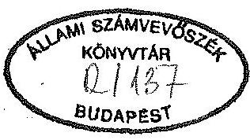
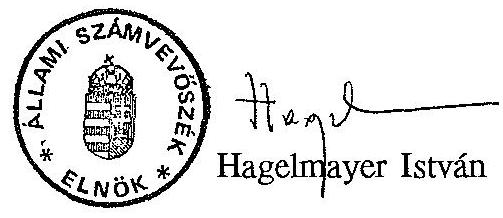
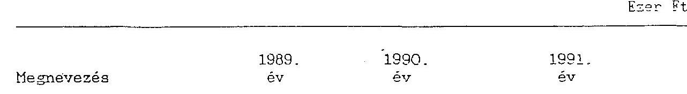
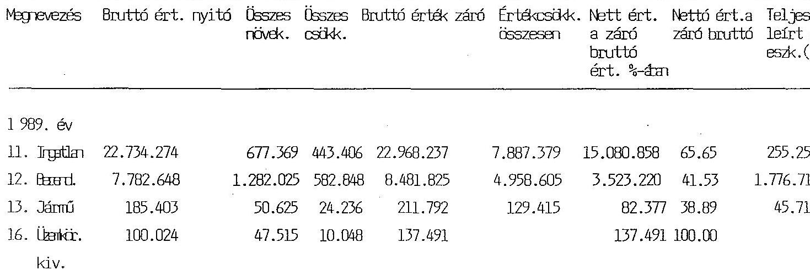
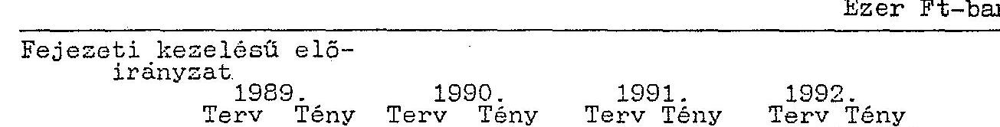
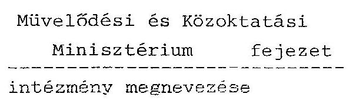

# JELENTÉS 

a Múvelődési és Közoktatási Minisztérium fejezet pénzügyi-gazdasági ellenőrzéséről

---

Az ellenőrzést vezette:

Matusek István számvevő-fötanácsos

# Az ellenőrzést végezték: 

Bakonyvári Róbertné
Deák Tamásné
Éva Katalin
Hegyesné dr. Solymosi Mária
Kalo Tamás
Dr. Mihály Sándor
Szabó József
dr. Nagy Sándor számvevő-tanácsos
számvevő
számvevő-tanácsos
számvevő
számvevő
számvevő-tanácsos
számvevő-tanácsos
külső szakértő

---

# JELENTÉS 

## a Múvelődési és Közoktatási Minisztérium fejezet pénzügyi-gazdasági ellenőrzéséről

A Magyar Köztársaság költségvetésének XVIII. fejezetét alkotó Művelődési és Közoktatási Minisztérium (továbbiakban MKM) államigazgatási feladatait és hatáskörét a többször módosított 47/1990. (IX.15.) sz. Korm.rend. szabályozza.

Az 1991. évi XCI. törvény a MKM fejezet 1992. évi kiadásait összesen 45,9 milliárd Ft-ban határozta meg, amely még magában foglalja az Országos Testnevelési és Sporthivatal (OTSH) előirányzatait is.

Az OTSH nélküli bevételi előirányzatokban a költségvetési támogatás aránya $89 \%$ ( 36,1 milliárd Ft ).

A fejezet irányítása alá 93 önálló felsőoktatási, országos jelentőségű kiemelt kulturális, művészeti és egyéb oktatási, közművelődési intézmény tartozik. Az állóeszközök bruttó értéke ezen intézményeknél 1991. év végén 38,1 milliárd Ft volt. A fejezet a vizsgált időszakban 48 kulturális vállalat felügyeletét látta el, amelyek vagyona közel 9 milliárd Ft értékủ.

A MKM irányítása alatt működő intézmények 1992. évre tervezett létszáma meghaladja a 40.000 fôt, amelyből 31.000 fôt tesz ki a felsőoktatásban dolgozók száma.

A különböző ágazati feladatokra, szakmai programokra előirányzott összeg megközelíti a 10 milliárd Ft -ot, amely összeg 51 kiemelt cél támogatását szolgálja.

A tárca három elkülönített alappal (Kulturális Alap; MKM Kutatási Alap; Felzárkózás az Európai Felsőoktatáshoz Alap) rendelkezik. Az alapok 1992. évre 5,5 milliárd forint felhasználási lehetőséggel rendelkeznek.

---

A fejezet összetettségét és sokrétűségét tükrözi, hogy az intézmények költségvetési címek szerinti csoportosítása 1-18-ig terjed. A fejezeti költségvetés 19. címét az OTSH alkotta.

A jelenlegi költségvetési tervezési rend szerint a művészeti, közművelődési és közgyűjteményi bérpolitikai keretet, az oktatási bérpolitikai keretet, valamint az általános tartalék terhére finanszírozott új feladatok kiadásainak fedezetét és a müködési hiányok részleges ellentételezését a Miniszterelnökség fejezet költségvetése tartalmazza.

A MKM-nél előirányzott cél- és normatív támogatások egy részét más fejezetek (pl. PM, IKM, Népjóléti Minisztérium), valamint központi költségvetési körön kívül használják fel ténylegesen.

Az ellenőrzés az 1989-1991. években a fejezet gazdálkodási és irányítási tevékenységének, a rendelkezésre álló pénzeszközök felhasználásának törvényességét, célszerűségét és eredményességét, valamint az 1992. évi költségvetési előirányzatok megalapozottságát vizsgálta. A létszám- és bérgazdálkodás, valamint a beruházások vonatkozásában a korábbi ellenőrzéseink óta bekövetkezett változásokat értékeltük.

Helyszíni ellenőrzésre került sor a MKM Gazdálkodó Szervezeténél és az Ellátási és Üzemeltetési Igazgatóságnál (továbbiakban: Ellátási Igazgatóság), valamint egy-egy téma erejéig 27 intézménynél, amelyek a tárca területére jutó intézményi támogatások kétharmadát reprezentálják.

# I. Részletes megállapítások 

## 1) A feladatok és a szervezeti rendszer összhangjának értékelése

A MKM feladatai a rendszerváltozással együtt járó kormányzati munkamegosztás módosulásával összefüggésben a vizsgált időszakban jelentősen és többször változtak, módosultak:
—a gyermek- és ifjúságvédelmi feladatok, a nevelési tanácsadók irányítása a népjóléti miniszter feladat- és hatáskörébe mentek át;
— az Állami Egyházügyi Hivatal 1989. évi megszűnésével az egyházak által folytatott oktatási, nevelési és működési tevékenységek állami támogatásával kapcsolatos feladatok a művelődési és közoktatási miniszter hatáskörébe kerültek;

---

- ugyancsak 1989-ben kibővült a MKM feladat- és hatásköre a sport állami irányításának ellátásával (az OTSH költségvetési előirányzatai a fejezet költségvetésében elkülönülten jelentek meg);
- a közoktatás irányítási rendjének módosulásával a MKM-től az iskolarendszeren kívüli szakmai oktatás központi irányítását, valamint az iskolarendszerủ szakmai oktatás központi irányítását 1990-ben a Munkaügyi Minisztérium vette át. A Szakképzési Alap kezelésének jogköre ugyancsak a Munkaügyi Minisztériumhoz került.

A művelődési és közoktatási miniszter feladat- és hatáskörét és az abban bekövetkezett változásokat a 47/1990. (IX. 15.) sz. kormányrendelet és annak módosításai rögzítik.

Az alaprendeletet többször módosították (137/1991. (X. 29.) Korm.r.; 151/1991. (XII. 4.) Korm.r; 168/1991. (XII. 26.) Korm.r; 169/1991. (XII. 26.) Korm.r.). A fejezet költségvetési szerkezete szempontjából a két utóbbi módosítás különösen jelentős, az OTSH a Kormány irányítása alá került 1992. január 1-jei hatállyal.

Az oktatással, kutatással, a művelődéspolitikával és az egyházakkal kapcsolatos állami feladatokat, az ágazat irányítás szakma-politikai követelményeit taglalja a Nemzeti Megújhodás Programja.

A Program végrehajtásával a MKM szakterületén olyan szerkezeti változásoknak kell végbemenni, amelyek a korábbiaktól teljesen eltérő finanszírozási rendszer kialakítását igénylik.

A Program államigazgatási funkciója nem egyértelmủ. A kiadvány a kormány programjaként jelent meg, de közlönyben kihirdetésre nem került, így kérdéses annak normajellege. A Kormány azonban deklaráltan feltétlenül meg kívánja valósítani az abban foglaltakat, így a programnak az államigazgatásban kétségtelenül meglévő szervezőereje és gazdasági kihatásai vannak. Éppen ezért nem hagyhattuk figyelmen kívül a Programban megfogalmazott feladatokat, ill. azok teljesítésének állását a minisztérium müködésének, gazdálkodásának értékelésénél.

Késik a legfontosabb törvények életbeléptetése. A Program végrehajtása vegyes képet mutat. Általában a késedelmeknek nem pénzügyi okai vannak.

Kész, de még nem került elfogadásra a közoktatási, felsőoktatási törvény. Koncepció fázisában van a múzeumi törvény, előkészités alatt áll a művelődési törvény. Ennek ellenére megkezdődött az új iskolarendszer kialakítása, de a végrehajtást megalapozó, koordináló törvény hiánya a gyakorlatban zavarokat okoz. A felsőoktatási törvény késedelme késlelteti a felsőoktatás finanszírozási rendjének változtatását és a hozzákapcsolódó alapok létrehozását.

---

Az eredmények között vehető számba az iskolák normatív támogatásának rendszere, a tankönyvkiadás új koncepciójának elfogadása, bár a folyamat pénzügyi vonatkozásban még nem tekinthető véglegesen kialakultnak.

Elkészült és tárcaközi egyeztetés fázisában van a hazai kisebbségek oktatásának és művelődésének költségvetési terve. A terv 1992-1994 között 740 millió Ft felhasználásával számol. A minisztérium önértékelése szerint ez ideig megoldatlan a kisebbségek oktatása, közművelődése. Nincs anyanyelvű szakoktatás, felsőoktatás (még a pedagógusképzés sem teljesen anyanyelvü).

Megoldatlan a nemzetiségi könyvkiadás, nemzetiségi, közművelődési egyesületek müködési költségeinek biztosítása.

Megkezdődött a regionális egyetemek, föliskolák, universitások szerveződése. A folyamat lassú kibontakozásának részbeni oka az érintett tárcák eltérő álláspontja.

Anyagi okokból még nem valósulhatott meg a magyar kultúrát támogató rendszer. Az erre irányuló szándék a kulturális mecenatúra és a közmúvelődési céltámogatás előirányzataiban fejeződik ki.

Az akadémiai kutatóhálózat egy részének a felsőoktatásba integrálása egyelőre lekerült a napirendről.

A változások érintették a MKM irányítása alá tartozó intézményhálózatot is.
Így kiemelhető pl.: a minisztérium statisztikai szervezetének leválasztása a Tudományszervezési és Informatikai Intézettől az Intézet vállalattá alakulásával összefüggésben; a Nemzetközi Kulturális Intézet megszüntetésekor annak feladatait részben a MKM Gazdálkodó Szervezete, részben a MKM Ellátási Igazgatóság vette át; az Országos Közművelődési Központ és a Népi Iparművészeti Tanács jogutódjaként - részben új feladatokkal - Magyar Müvelődési Intézet létesült 1992. január 1-jével; 1992. október 1-én a Magyar Köztársaság Müvészeti Alapja alapítvánnyá alakult át.

A feladatváltozásokkal összefüggésben a tárca vezetése új típusú (manager) minisztérium létrehozását tűzte ki célul. Ennek eredményeként - és mintegy az útkeresés jegyében - szinte folyamatosan módosult a MKM szervezeti felépítése, belső müködési rendje. A minisztérium szervezete az előkészületben lévő közművelődési, közgyűjteményi, közoktatási, felsőoktatási törvények elfogadása, valamint az államigazgatás további átalakítását célzó, folyamatban lévő munkálatok eredményeként várhatóan még tovább módosul.

Az ellenőrzött időszak kezdetén 1989. január 1-én 506 fő volt a MKM állományi létszáma. Akkor a minisztérium szervezetét a miniszter vezetésével 2 államtitkár, 2 miniszterhelyettes irányította. A minisztérium szervezetébe 1 miniszteri titkárság, 1 minisztériumi titkárság, 2 államtitkári titkárság, 2

---

miniszterhelyettesí titkárság, 2 fơcsoport, 12 főosztály, 2 főigazgatóság, 6 önálló osztály, 3 egyéb szerv, összesen 31 szervezeti egység tartozott.

Jelenleg a tárca ágazati és fejezeti tevékenységét a miniszter irányításával két államtitkár és három helyettes államtitkár fogja össze. A minisztérium szervezetét 1 miniszteri, 1-1 államtitkári titkárság, illetve államtitkári hivatal, 1 külügyi titkárság, 7 iroda (ebből 3 koordinációs iroda), 2 bizottság, 16 főosztály, 2 önálló osztály, összesen ugyancsak 31 szervezeti egység alkotja, összesen 501 fő tervezett létszámmal.

A bekövetkezett változásokat az 1991. október 1-től érvényben lévő Szervezeti és Működési Szabályzat csak részben tartalmazza.

A szabályzat tartalma nincs teljesen összhangban a tényleges szervezeti felépítéssel. (Tartalmazza pl. a Privatizációs csoportot, amely nem jött létre, hiányzik belőle az Egyházi Tulajdonrendezési Iroda és a Magyar Ekvivalencia és Információs Központ, amelyek viszont funkcionálnak.)

Nincs célszerúen elhatárolva az MKM Gazdálkodó Szervezet és az Ellátási Igazgatóság tevékenységi köre pl. a vagyonnyilvántartás, leltározás, üzemeltetés terén.

A MKM központi apparátus működéséhez szükséges tárgyi feltételeket a MKM Ellátási Igazgatóság biztosítja, amely önálló, igazgatási címbe tartozó költségvetési szerv, éves számított átlaglétszáma 422 fő. Ebből a szorosan vett ellátási feladattal 140 fő foglalkozik.

# 2) A költségvetés tervezése és végrehajtása. A pénzellátás rendje 

A szakmai feladatokban bekövetkezett jelentős változások ellenére a fejezeti költségvetési tervezésben - az általánosnak tekinthető gyakorlatnak megfelelően - továbbra is a bázisszemlélet érvényesült, a mindenkori éves költségvetési tervezési irányelvek megkötöttségeivel. A központi támogatást jelentősen kímélő intézkedések megvalósítására nem került eddig sor, mivel - a tárca véleménye szerint - a finanszírozás rendszerének átfogó átalakítása csak az ágazatot érintő törvények ismeretében lehetséges és célszerű.

Egyes területek pénzügyi feszültségeit a támogatást mérséklő központi intézkedések, zárolások fokozták, a pótlólagos támogatások mérsékelték.

A kormány utasítására 1989-ben 90,5 millió Ft, 1990-ben 8,5 millió Ft összegű, az igazgatási és gazdasági ágazatot érintő zárolásra került sor. A tárca azonban a támogatás elvonást a fejezet központi tartaléka és a nagyjavítási pénzeszközök terhére hajtotta végre. Az 1991. XII. havi 215,3 millió Ft összegủ zárolást pedig a tárca úgy teljesítette, hogy 30 millió Ft-ot az intézményektől vont el, a

---

fennmaradó összeget a központilag kezelt előirányzatok - a normatív hallgatói finanszirozási előirányzat maradványa, Békehadtest, Felzárkózás az európai felsőoktatáshoz terhére fizette be a központi költségvetésbe.

A költségvetési kiadások visszafogására irányuló központi törekvések ellenére a fejezet költségvetési kiadásainak alakulását az 1989-91-es években a dinamikus növekedés jellemezte, mivel az oktatás, a felsőoktatás kiemelt prioritást kapott. A megkülönböztetett elbírálás sem tudta azonban enyhíteni az igények és lehetőségek között egyre növekvő feszültségeket.

A fejezet központi támogatási többletei elsődlegesen a bérfejlesztési intézkedéseket és társadalombiztosítási járulék vonzatait, a hallgatói juttatásokat, ösztöndíjak emelését finanszirozták. Ugyanakkor évről évre elmaradt az inflációhoz viszonyítottan az ún. automatizmusok mértéke.

A vizsgált esetekben a bevételek nagy részét a költségvetési támogatás alkotta. Ennek aránya átlagosan 80-90\% között alakult. Az átlagosnál alacsonyabb az állami támogatás aránya az Ellátási Igazgatóságnál (50\%) és a Magyar Állami Operaháznál (60-70\%).

A fejezet központi tartalék előirányzata 1991-ben 72,5 millió Ft volt, amely $0,2 \%$-a a tervezett kiadási előirányzatnak. Az 1992. évre a tartalék előirányzata 40 millió Ft, nem jelent számottevő lehetőséget a feszültségek oldására, az előre nem tervezhető feladatok finanszírozására.

A Kormány 1991-ben a fejezeti tartalék terhére hozzájárult az igazgatási kiadások növeléséhez. A fejezet szakmai koncepciók, törvények kidolgozásával összefüggő többleteit a fejezeti tartalék egy részének átcsoportosításával finanszírozta 38,5 millió Ft összeggel, amelyből 10,4 millió Ft jutalmak kifizetésének fedezetére szolgált. A Minisztérium vezetése ezzel kívánta csökkenteni a belső bérfeszültségeket.

A tervezett fejezeti tartalék az intézményi átszervezések hatására 221 millió Ft-ra módosult, többségében müködési feltételek kiegészitő forrásaként áremelések többleteire, nem tervezett feladatokra, ORI felszámolás többleteire, kollégiumi bérleményekre nyújtva fedezetet.

Egyes területek pénzügyi gondjainak oldására a MKM - kormányelőterjesztései alapján - esetenként központi támogatást kapott. A többletigények elbírálása során az alku elv érvényesült.

Pl. az 1991. évben az intézmények müködési előirányzatainak kiegészitésére, áremelések részbeni ellentételezésére 560 millió Ft rendkívüli támogatást kapott a tárca, amelyből 304,4 millió Ft a felsőoktatási intézmények, 132,8 millió Ft a közmüvelődési és művészeti intézmények müködési feltételeit javította. Az oktatási-művészeti intézmények hiányának pótlására adott támogatás bázis jellegü, tartósan jelentkező támogatási többlet.

---

A fejezethez tartozó költségvetési szervek 1991. óta müködési költségvetésükhöz nyújtott támogatást havi egyenlő részletben kapják. A szükségletekhez igazodó szigorúbb finanszírozási rend alól kivételt képeznek a fejezeti kezelésű előirányzatok és a költségvetési szervek állóeszköz felújítási, nagyjavítási, valamint a kiemelt egyéb előirányzataik fedezetére szolgáló támogatások, amelyeket a fejezeti költségvetési számlára a negyedéves tervek alapján utal át a Pénzügyminisztérium.

A pénzellátási terven alapuló támogatást az egyes feladatok szakmai területeinek felmérései, számításai alapozták meg.

Az 1992. év május hónapban esedékes támogatási kereteknek - a központi költségvetési bevételek elégtelen teljesülése miatt - kormányhatározat alapján $70 \%$-át kapta meg a tárca. A tárca az intézmények részére a havi előirányzatnak csak $60 \%$-át utalta tovább. A költségvetési törvénytől való eltérés egyes intézményeknél finanszírozási problémákat okozott. A tárca a pénzügyminiszter sürgős intézkedését kérte az esedékes hallgatói juttatások, illetve nagyjavítási feladatok finanszírozására.A május havi visszatartott támogatás tárcaszintű összege így 487,4 millió Ft-ra módosult. Végül is a mintegy 3,5\%-os éves szintű támogatás csökkenéssel szemben a tárca $2,2 \%$-kal mérsékelte az intézmények támogatását. A különbözetet - a tárca tájékoztatása szerint - az intézmények szeptemberben visszakapják.

A fejezet egy letéti számlát is kezel, amelynek 1991. év végi egyenlege mindössze 2 millió Ft volt. A jogutód nélkül megszünt Országos Rendező Iroda elszámolásait e számlán bonyolította le a tárca.

A fejezet összes, módosított kiadási előirányzatai - nominális értékben - az 1989. évi mintegy 22 milliárd Ft-ról 1991-ig közel megkétszereződtek ( 42 milliárd Ft), az 1992. évi eredeti előirányzat 40,5 milliárd Ft. A tényleges kiadások 21 milliárd Ft-ról 1991-ben több, mint 39 milliárd Ft-ra növekedtek. (1. sz. melléklet) A kiadásokon belül a legjelentősebb tétel a béralap és járulékai, amely a működési kiadások 44,4\%-át teszi ki ( 14 milliárd Ft). A fejezethez tartozó költségvetési intézményekben dolgozók tényleges átlaglétszáma 37.528 fő, (az 1989. évhez viszonyítva 101\%), miközben a béralap módosított előirányzata közel kétszeresére ( $184 \%$-ra) nőtt (4. és 5. sz. melléklet). (Megjegyezzük, hogy 1990-ben az OTSH létszáma a fejezet létszámának része volt, előtte és utána nem.)

Erőteljesen emelkedtek a hallgatói juttatások, részben a normatív támogatások többletei és részben a hallgatói létszám növekedése miatt. A nappali tagozatos hallgatók átlaglétszáma 5856 fővel, zárólétszáma 7.905 fővel volt magasabb 1991-ben, mint 1989-ben.

A szolgáltatási kiadások 1,3 milliárdos növekedését a dologi automatizmus támogatási többletei csak részben finanszírozták. A fejezet a pénzmaradvány terhére adott többletekkel, illetve javadalom előrehozással igyekezett a feszültségeket enyhíteni a fizetési kötelezettségek időbeni teljesítése érdekében. A

---

nagyjavításokra 1991-ben fordított 1,6 milliárd Ft mindössze 0,3 milliárd Ft-tal haladta meg az 1989. évit. Az intézményi felújítási igényektől jelentősen elmaradó forrásokból a folyamatban lévő nagyjavítások és a halaszthatatlan munkák kaptak prioritást.

Az egységes pénzalap-gazdálkodás keretében a költségvetési intézmények a müködési költségvetésből, átvett pénzeszközökből, a pénzmaradványból és érdekeltségi alapokból évente 1-1,2 milliárd Ft összegű felhalmozás jellegű kiadást teljesítettek, miközben kiadást e címen alig terveztek.

A növekvő kiadásokat döntően az állami támogatás finanszírozza. A tényleges állami támogatás összege az 1989. évi 14,6 milliárd Ft-ról 1991-ben 27,1 milliárd Ft-ra növekedett és a kiadásokhoz viszonyított aránya is emelkedett ( $71 \%$-ról mintegy $77 \%$-ra).

A központi béremelések, valamint a tárca egészét érintő automatizmus ellentételezésének együttes hatásaként a béralap előirányzat 3 év alatt 4,6 milliárd Ft, a társadalombiztosítási járulék vonzata 2,1 milliárd Ft költségvetési többlettámogatást igényel.

A bevételek előirányzatainak kialakításánál általánosítható az a megállapítás, hogy mindenütt jellemző a várható saját bevételek alátervezése, aminek a túlteljesítésével az év közben adódó - az előirányzatok között nem szerepeltetett - feladatok finanszírozhatók. Bevételi tartalékot jelent a majdnem mindenütt növekvő tendenciájú vevő tartozások csökkentése. Ennek érdekében a fejezet intézményeinél kellően hatékony intézkedések nem észlelhetők.

Bevétel növelési lehetőséget jelent továbbá a rendelkezésre álló fölös kapacitások értékesítése, a szolgáltatások bővítése, s helyenként a szponzorok körének bővítése.

A központi forrásokon felül számottevő az átvett pénzeszközök bevonása a működési kiadások finanszírozásába.

A főként pályázati úton elnyert kutatási feladatokra a különböző alapokból származó és meghatározott célra fordítható átvett pénzügyi források összege mintegy 4 milliárd Ft volt 1991. évben, $77 \%$-kal haladva meg az 1989. évit. A müködési ár- és dijbevételek 22\%-kal nőttek. Az 1991. évi teljesítés 4,7 milliárd Ft volt, amely $30,5 \%$-kal haladja meg az eredeti előirányokat. (Dolgozói és ellátottak térítési díjainak emelése az igazgatási cím bevételeinél, nyelvi vizsgadíjak, tanfolyami díjak emelése a továbbképző intézeteknél, helyáremelés, különböző hasznosítások ár- és dijbevételei, bérleti díjemelés.)

Az ágazati feladatok más tárcáknál folyó tevékenységének támogatására - többnyire normatív alapon - a MKM rendszeresen pénzeszközöket utal át (pl. a szakoktatási feladatok átadása a MüM-nek, felsőoktatásban a nappali hallgatók normatív támogatá-

---

sára). A szociális szakemberképzést a Népjóléti Minisztériumtól a MKM vette át. A feladat- és pénzátadások felsőbb döntések és a vonatkozó szabályok szerint történtek.

Az előző évi pénzmaradványból és érdekeltségi alapból évente 1,6-1,7 milliárd Ft volt az igénybevétel. Ebből a fejezeti pénzmaradvány 1991. évben 378,1 millió Ft volt. A korábbi években elsődlegesen nagyjavításokhoz, áremelések miatti intézményi hiányok oldására nyújtott kiegészítő forrásokat a minisztérium.

A tárca éves költségvetési kiadási előirányzatának 75\%-a a fejezeti intézményekre bontott, működési kiadás. A fennmaradó fejezeti kezelésű előirányzatok döntő hányadát (83\%) ágazati szakmai célfeladatok, fejlesztések adják, amelyek az ágazat egészére, a különböző irányítású és fenntartású intézmények (egyházi intézmények, társadalmi szervezetek) müködéséhez nyújtanak támogatást, főképpen pályázati vagy normatív finanszírozás útján.

A szigorúbb finanszírozás és a pénzügyi feszültségek ellenére úgy a fejezet szintjén, mint az intézményeknél lehetőség volt betétek elhelyezésére, értékpapírok vásárlására is.

Az 1991. év végén fejezeti szinten 956 millió Ft volt a vásárolt kötvényekbe és kincstárjegyekbe befektetett pénzeszközök összege.

A pénzügyi adatok szerint a fejezeti pénzgazdálkodásnál a kihelyezett pénzeszközök utáni kamatbevétel 1989. évben 63,8 millió Ft, 1990-ben 73,8 millió Ft és 1991-ben 53,9 millió Ft volt.

A lekötött pénzeszközök állománya év végén 1989-ben 240,7 millió Ft, 1991ben 59,2 millió Ft volt.

A kamatbevételt illetően a főkönyvi könyvelés adatai eltérőek.
Az eltérés oka az, hogy 1991-ben és részben már 1990-ben is a kamatbevételeket az átcsoportosított pénzeszközök bevételeként könyvelte a fejezet, nem külön számlán mutatják ki a pénzpiaci műveletek bevételeit.

A fejezeti pénzellátási tevékenység év végi mérlege sem mutatja a lekötött pénzeszközök állományát, mivel azok az átcsoportosított pénzeszközök elszámolási mérlegsoron szerepelnek és nem a mérleg megfelelő során.

A pénzeszközök kamatozási célú kihelyezése a pénzintézetekhez esetenként a fejezeti költségvetési számláról áttételesen történt, az állóeszköz-fenntartási és az év végi pénzmaradvány számlák közbeiktatásával.

Még 1991. évben is előfordult, hogy a fejezeti költségvetési számláról 340,7 millió Ft átutalás történt az év végi pénzmaradvány számlára, melyből rövid lejáratú kincstárjegyet vásárolt a minisztérium.

---

A fejezeten kívül több intézménynél is tapasztalható volt, hogy a tiltó rendelkezések ellenére a MNB-n kívüli bankot vettek igénybe pénzeszközeik befektetésénél a magasabb kamatbevételt hozó kihelyezések reményében (Ybl Bank, City Bank).

#### Abstract

Pl.: a fejezeti pénzellátási tevékenység során 1992. VII. 30-án Ybl Bankba kihelyezett pénzeszköz 179 millió Ft volt ( 109 millió Ft az év végi pénzmaradvány elszámolási számláról, 70 millió Ft a Tárca Kutatási Alap számláról), további kihelyezés volt a MHB-nál 130 millió Ft összegben a közművelődési céltámogatásokra biztosított támogatásokból. A kamatot később a pénzmaradvány számlára vitték át. Az Ybl Bankhoz kihelyezett összegek sorsa az ellenőrzés befejeződésekor még bizonytalan volt.

# 3) A címzett előirányzatok és normatív támogatások folyósitása és felhasználása 

A fejezet éves költségvetésében évről évre nagyobb számban jelentkező címzett előirányzatok határozzák meg azon kiemelten kezelendő ágazati, illetve fejezeti feladatokat, amelyek anyagi megalapozását a költségvetés támogatja. Az éves költségvetési törvény a korábbiaknál részletesebben határozza meg az előirányzatok felhasználásának célját. Egyes támogatási címek az ellátandó feladatokhoz rendelten meghatározott egységösszegek, normatívák szerint kerülnek folyósításra és felhasználásra (8. és 9. sz. melléklet).

A támogatási összegek felhasználási és elszámolási rendjét egy közreadott útmutatóban részletesen szabályozták, amelyet - a szabályok változásait követve - rendszeresen újra megjelentetnek. A gazdálkodási jogkörök kialakított szabályozása lehetővé teszi a gazdasági intézkedést igénylő döntések szakszerű lebonyolítását, segíti a szervezeti egységek együttmúködését, a tett intézkedésekkel kapcsolatos felelősség esetleges megállapítását.

A címzett támogatások átadására kialakított elosztási és nyilvántartási rendszer hiányossága az, hogy nem teszi lehetővé a támogatási összegek felhasználásának nyomon követését, hatékonyságának vizsgálatát. A minisztérium - kevés kivétellel - a más fejezet részére átadott összegeket felhasználásként veszi figyelembe. A ténylegesen felhasznált összegekről nem, vagy csak esetleges információk jutnak el a MKM illetékeseihez.

A felhasználásról rendelkezésre álló információk alapján az állapítható meg, hogy:
—a címzett támogatások egy jelentős része nem került felhasználásra annak ellenére, hogy a feladatok társadalmi szükségessége kiemelt;

- a támogatások egy része felhasználásra kerül ugyan, de nem a jóváhagyott célokra. Pl. a békehadtest c. előirányzatból 1991-ben a rendelkezésre álló 92,3 millió Ft-ból a tárca 43 millió Ft-ot

---

intézményeinek müködési kiadásai kiegészítésére, 30 millió Ft-ot pedig a PM által előírt zárolásra biztosított. Az eredeti célra mindössze 7,1 millió Ft-ot fordítottak.

- A kutatásfejlesztési programokra 1990-ben előirányzott 220 millió Ft-ból 162,5 millió Ft-ot használtak fel, az 1992. évre előirányzott 405 millió Ft-ból az I. féléves felhasználás 21,6 millió Ft volt $(5,3 \%)$.
- A kulturális mecenatúrára fordítható 440 millió Ft-ból az év végi maradvány 38,5 millió Ft, közel akkora összeg, mint amennyit az év folyamán a könyvkiadás támogatására fordítottak. A felhasználásból 80 millió Ft-ot a felsőoktatási intézményekhez csoportosítottak át.
- A Felzárkózás az európai felsőoktatáshoz c. előirányzatból 1991ben közel 80 millió Ft-ot, - a XII. havi előirányzat - zárolásra ajánlottak fel. Ezen felül 253 millió Ft maradvány is jelentkezett.

A normatív támogatásoknak nincs közgazdasági tartalma, azok inkább állami támogatást biztosító egységköltségtérítéseknek tekinthetők.

A felsőoktatási hallgatók normatív támogatásának mértékét 1991 óta költségvetési törvényben határozzák meg.

Értelmezési problémákat vet fel a felsőoktatás állami támogatásának jelenlegi gyakorlata. A költségvetési törvény 1991-től az "állami felsőoktatási intézmények magyar állampolgárságú nappali tagozatos hallgatók" pénzbeni juttatásaira állapít meg normát, míg az egyházak (valamint egyéb, nem állami szervezetek) által fenntartott intézmények esetében "a felsőoktatásban részt vevő egy nappali tagozatos hallgatóra" történik a normatív állami hozzájárulás megállapítása.

Egyértelmű, hogy a gyakorlatban két, egymástól eltérő tartalmú normatív támogatásról van szó. Ilyen különbségtételt az 1990. évi IV. törvény 19. paragrafus (1) bek. nem tesz, amikor leszögezi, hogy "az állam az egyházi jogi személy nevelési-oktatási (.....) intézményei müködéséhez - külön törvény rendelkezései szerint - normatív módon meghatározott, a hasonló állami intézményekkel azonos mértékủ költségvetési támogatást nyújt." A törvények közötti ellentmondások feloldása a tárca kompetenciáját meghaladja.

A tárca elkészítette a felsőoktatás költségvetési finanszírozásának korszerűsített rendszerére, s ehhez kapcsolódóan a felsőoktatás normatív támogatásának új rendjére, valamint a tandíjakra és a tanulmányi hitelekre vonatkozó tervezetét. A tervezetek elfogadásának és elrendelésének előfeltétele a felsőoktatási törvény életbelépése.

---

Az egyéb fejezeti támogatások között kerülnek előirányzásra az egyházpolitikai célú támogatások, mint pl. a hitéleti támogatás, humánszolgáltatások támogatása, hitoktatók díjazása, ingatlanok felújítására, beruházásokhoz adott céltámogatások. Ezeken a címeken folyósított összegek 1989-ben 387; 1990-ben 988 millió Ft-ot tettek ki. Az 1991. évi összeg 2,4 milliárd Ft nagyságrendű volt. Valójában a folyósított összegek ennél nagyobbak voltak, mert a hivatkozott összegek nem tartalmazzák a tárca más előirányzataiból ide csoportosítottakat.

A költségvetési törvényben meghatározott tételeken felül a tárca 1989-91. években a fejezet egyéb jogcímeiből, esetenként a pénzmaradványból is nyújtott az egyházi intézményeknek támogatást.

A támogatások többsége a kormányzat részéről vállalt kötelezettség (pl. a Bazilika rekonstrukciójára biztosított 50 millió Ft), valamint államközi egyezményekben foglalt kötelezettségek (pl. Szerb-Görögkeleti Egyházi Múzeum felújítása) voltak. Előfordult, hogy bizonyos tételek, amelyeket a tárca saját kezdeményezésére fedezett (béremelések, a VÁNYA kedvezmény megvonásának részbeni ellentételezése, hittankönyvek előállításának segítése, lelkész lakás építése stb.) A tárca saját döntése alapján az egyházaknak átadott összegek 1989-ben további 2,7; 1990-ben 1,7; 1991-ben 9,5 millió Ft-ot tettek ki.

Az 1990. évi IV. törvény 19. paragrafus (2) bekezdése, valamint az 1990. CIV. tv. 9. paragrafus (5) bekezdése; illetve az 1991. XCI. tv. 42. paragrafus k. pontja az Országgyülésnek tartja fenn azt a jogot, hogy az általa meghatározott módon és mértékben kapjanak az egyházi jogi személyek állami támogatást, a szektorsemleges pályázatokon elnyert támogatásokon kívül. Tehát az érvényben lévő törvények nem teszik lehetővé, hogy a kormányzat év közben pótlólagos forráshoz juttassa az egyházakat. (Magyarázatát az 1990. évi IV. törvényhez csatolt indokolás szolgáltatja.)

A támogatási igények lényegesen meghaladják a minisztérium lehetőségeit, ezért a keretek felosztási tervének összeállítása az egyházak képviselőinek bevonásával történik. Döntést az Országgyúlés hoz.

Még nem megoldott az egyházi ingatlanok felújítására, beruházásra kiutalt összegek feladatonkénti elszámolásának áttekinthető, értékelő módja.

Az egyházaknál felújításra, beruházásra biztosított összegek elszámolási rendjének - az 1990. évi IV. tv. 19. paragrafusa szerint - azonosnak kell lennie az állami intézményekével. Ennek ellenére az igények elbírálása után a kereteket az egyházak egy összegben kapják meg, 1991-ig még csak utólagos elszámolási kötelezettségük sem volt. Az 1991. évi költségvetési törvény csak az "egyházi ingatlanok felújítása" jogcímet tartalmazta, elkülönített beruházási előirányzatot nem. A beruházásokat a tartalékként elkülönített 114 millió Ft-ból finanszírozták. Emiatt szorgalmazták, hogy 1992-ben már külön jogcíme legyen a beruházásoknak is. Ez megtörtént, azonban az Országgyűlés 3/1992. (II.21.)

---

határozatában e két jogcímet mégis összevonta. A jóváhagyott költségvetési törvényből nem derül ki, hogy a fejezet "kormányzati beruházások" jogcímének 885 millió Ft-jából 30 millió Ft a Pannonhalmi Apátság, további 55 millió Ft a Bazilika rekonstrukciójára szolgál. Ez csak a törvény szerves részét nem képező indokolás egyik mellékletéből állapítható meg.

A volt egyházi ingatlanok tulajdonjogi helyzetének gyorsabb ütemű rendezéséhez szükséges anyagi eszközök szűkössége is indokolja az egyházak állami támogatása egész rendszerének újragondolását. Az 1991. évi XXXII. törvény 23. paragrafusa értelmében a művelődési és közoktatási miniszter - széles körű egyeztetéssel - az egyházak állami finanszírozásának új rendjéről szóló törvény előkészítését kezdte meg.

A tankönyvkiadás és terjesztés rendszere a vizsgált időszakban alapjaiban megváltozott.

#### Abstract

Korábban az éves tankönyvkiadási terveket, az egyes tankönyvek kéziratát a művelődési tárca minisztere hagyta jóvá. Miniszteri rendelet szabályozta a közreműködők (minisztérium, OPI, tankönyvkiadó) feladatait. Azt is jogszabály írta elő, hogy a tankönyv elkészítésében közreműködők (minisztérium, OPI, tankönyvkiadó) honoráriuma mekkora lehet. A tankönyvkiadók termelési ártámogatásban részesültek. A tankönyvet előállító vállalatok forgóalapját ez a támogatás képezte.

A tankönyvellátás rendszerének megváltoztatására a minisztérium - az érdekelt szervekkel egyeztetett - javaslatot terjesztett a kormány elé. A Kormány a 2004/1991. sz. határozatával fogadta el az új koncepciót.

Ennek lényege, hogy a monopolhelyzetű kiadók dotálása helyett az állami támogatás a felhasználókhoz, az iskolákhoz kerül. A tankönyv és a felsőoktatási jegyzet szabadáras termék lett. Megvásárlásához a tanuló, hallgató állami támogatást kap.

További lényeges változások 1993-ban következnek be, amikor a közismereti tankönyveket az egyes kiadók nem minisztériumi megrendelésre, hanem saját üzleti kockázatukra állítják elő.

A MKM a Világbanktól felvenni tervezett hitel terhére pályázati úton elnyerhető támogatással kívánja a közreműködő cégeknél a forgóalap és a befektetési biztonság kettős hiányát áthidalni.

A felsőoktatási tankönyvek, jegyzetek jogcímen az 1991-ben biztosított 55 millió Ft-tal szemben a felhasználás megközelítette a 180 millió Ft-ot. A forráshoz a Kulturális mecenatúra és a felzárkózás az európai felsőoktatáshoz célkeretből csoportosítottak át.

---

# 4) A fejezet (ágazat) által kezelt alapok 

## a/ Kulturális Alap

Az 1967-ben a kormány határozatával létrehozott Kulturális Alap célja a színpad-, zene- és táncművészet, a képző-, ipari- és fotóművészet, közművelődési, filmgyártási és forgalmazási, irodalmi, könyv- és lapkiadási, közgyűjteményi, művészeti, oktatási, valamint a nemzetiségi szakterületeken az új kulturális vállalkozások, kezdeményezések felkarolása. Kiemelkedő évfordulók alkalmával az alkotók és közművelők elismerése, továbbá állománygyarapítás, nagyobb értékű hangszerek és egyéb kulturális célú szakmai beszerzések támogatása.

Az Alap forrása a kulturális járulék (ún. "giccsadó") az állami kötelező zsúrizések megszűnése miatt rohamosan csökken. Az alapból nyújtott támogatások összege évente csökken (1989-ben még több, mint 280 millió Ft került felhasználásra, 1991-ben 138 millió Ft. Az 1992. I. félévi felhasználás 89 millió Ft).

Eldöntendő az Alap további sorsa, rendeltetése. Az igen nagy mennyiségben és választékban megjelenő értéktelen, giccses, pornográf kiadványok, filmek, kazetták az Alap bevételeit jelentősen bővíthetnék. Kérdéses azonban, hogy célszerü-e továbbra is ilyen adminisztratív eszközökkel beavatkozni a kulturális termékek forgalmazásába.

## b/ MKM Kutatási Alap

Az Alap forrása a tárca felügyelete alá tartozó maradványérdekeltségủ szervezetek vállalkozói tevékenységéből származó befizetési kötelezettség, amely 1991-ben 48,4 millió Ft volt, ez kiegészült a tőke és kamatmegtérüléséből származó mintegy 32 millió Ft-tal. Az előző évi maradvánnyal együtt az év folyamán felhasználható összeg 163 millió Ft-ot tett ki.

A tényleges felhasználás 118 millió Ft volt úgy, hogy ebből az összegből 80 millió Ft-ért értékpapírt vásároltak. Az alacsony felhasználás egyik oka az, hogy 1991-re nem hirdettek pályázatot.

## c/ Felzárkózás az európai felsőoktatáshoz Alap (FEFA)

A "Felzárkózás az európai felsőoktatáshoz" c. alap az intézményeknek kiegészítő forrást jelentő világbanki hitelkonstrukció, amely 66 millió USD és 4 milliárd Ft többlet felhasználást tett lehetővé.

---

Eddig két alkalommal hirdettek pályázatot az alap támogatásának elnyerésére.

Az első pályázat során 14 általános fejlesztési programot és 10 idegen nyelvi programot fogadtak el, összesen 9,078 millió USD és 831 millió Ft összegben. Ezekből a felhasználás eddig igen csekély volt, mivel elhúzódott a pályázati szerződések aláírása, több hónapos késéssel jutott el az intézményekhez a beszerzési és utazási szabályzat.

A második pályázaton 31 fejlesztési programot fogadtak el 4 millió USD és 400 millió Ft támogatással. Az általános fejlesztési témák körében 28 nyertes pályázat volt 24,4 millió USD és 1,5 milliárd Ft összegű támogatással. A második pályázat során nem állami intézmények is jelentkezhettek, egy intézmény több pályázatot is benyújthatott.

A felsőoktatási intézmények illetékesei által széles körben tudatosított gazdasági gondok ismeretében nemcsak a maradvány nagysága érthetetlen, hanem az is, hogy az 1991-1994. évek alatt rendelkezésre álló 66 millió USA dollár + 4 milliárd Ft időarányosan rendelkezésre álló összegből mindössze 55,5 millió Ft-ot használtak fel $(1,4 \%)$. A tárca zárszámadása a szerény mértékủ felhasználás okaira nem tér ki.

# 5) A MKM Gazdálkodó Szervezete és az Ellátási Igazgatóság gazdálkodásának tapasztalatai 

A MKM Gazdálkodó Szervezete - az érvényes SzMSz szerint - a Személyi és Munkaügyi Főosztály irányításával müködik, holott a feladatok jellegüket tekintve túlnyomóan pénzügyi, gazdasági vonatkozásúak.

Belső munkamegosztás szerint a Gazdasági Osztály kezeli a lakásalapot, meghatározott gazdálkodási jogosultsággal rendelkeznek a szakosztályok a tevékenységi körükbe tartozó célok, feladatok finanszírozásával. Az Ellátási Igazgatóság biztosítja a minisztérium működésének tárgyi feltételeit, gondoskodik az ingatlanok, járművek üzemeltetéséről, felügyeli a részben önálló intézmények (pedagógus- és művészotthonok, óvodák, üdülők, vendégházak) működését. A gazdasági feladatok ilyen megosztása számos esetben ütközések és hibák forrásai.

A minisztérium saját gazdálkodásának főbb szabályait az 1991. október 1-től hatályos SzMSz tartalmazza.

A Gazdálkodó Szervezet tervezett kiadási előirányzatait a szervezeti egységek a reálisan kielégíthető szükségletek szerint tervezték meg. Az 1989. évi kiadási előirányzat 324, az 1990. évi 698, az 1991. évi 368, az 1992. évi pedig 543 millió Ft volt.

---

A ténylegesen teljesített kiadások az 1989. évi 456 millió Ft-ról 1990. évben 1.258, 1991-ben 2.721 millió Ft-ra, csaknem 6 szorosára nőttek.

Az előirányzatok dinamikus teljesitését - az infláció hatásán túl - befolyásolták a végbement szervezeti változások, az újonnan megjelent feladatok, továbbá torzította a teljesités adatait az a körülmény is, hogy a MKM Gazdálkodó Szervezet költségvetésén keresztül utalták az egyházi normatív és egyéb támogatást 1992. január 1-ig. A szükséges többleteket ezért döntően irányítószervi hatáskörben végreliajtott előirányzat-módosításokkal biztosították.

A Gazdálkodó Szerv takarékos gazdálkodására utal az a tény, hogy a szervezetet illető tényleges költségvetési kiadások mindenkor a módosított előirányzatokon belül maradtak.

A saját hatáskörű előirányzat-módosítások (48, 46 és 101 millió Ft) forrását mindenkor az előző évi pénzmaradványok és a működési célra átvett egyéb pénzeszközök képezték.

Az igénybe vett pénzmaradványt a béralap növelésére, a különböző jogcímen vállalt kötelezettségek teljesítésére és működési célra történő átadására fordították.

A költségvetési előirányzat-módosításokat a kormány engedélyével hajtották végre.
A bevételek - a kiadásoknál említett okok miatt - ugyancsak tartalmazták az egyházi támogatás összegeit.

A kiadásokkal azonos összegben előirányzott bevételek 1989-91 években ténylegesen - jórészt az említettek hatására - 470, 1286 és 2723 millió Ft-ra teljesültek.

Működési bevétele a Gazdálkodó Szervezetnek nem volt, az 1990. évi ár- és díjbevétel elenyésző, 300 ezer Ft.

A bevételekben a költségvetési támogatás aránya $88 \%$-ról $96 \%$-ra nőtt. A működési célra átvett pénzeszközök részaránya $6,5 \%$-ról $2,8 \%$-ra csökkent, abszolút értékét tekintve viszont 31 millió Ft-ról 79 millió Ft-ra nőtt.

A keletkezett éves pénzmaradvány 15 millió Ft, 28 millió Ft, illetve 1991. évben 51 millió Ft, a kötelezettségvállalással terhelt része 60-70\% között alakult.

Szabad pénzeszközök nem keletkeztek, kihelyezésre, befektetésre nem volt lehetőség.
Különböző szakmai célok támogatására szakosztályi keretek állnak rendelkezésre. Ebből 1989. évben 28 szervezeti egység 278 millió Ft-tal, 1990-ben 24 szervezeti egység 1.041 millió Ft-tal, 1991. évben 27 szervezeti egység 2.441 millió Ft-tal gazdálkodhatott.

---

A keretfelhasználás növekedésében az Egyházi Főosztályé a döntő hányad. Az Egyházi Főosztály 1989-ben 106; 1990-ben 887; 1991-ben 2.277 millió Ft felett rendelkezett.

Az utolsó évben a szakosztályi kereteknek több, mint $93 \%$-át tette ki az egyházak támogatására kiutalt összeg aránya.

A keretek felhasználását 1989-90. években szabályzat nem határozta meg, azok a "kialakult szokások szerint" funkcionáltak. A minisztérium Ellenőrzési Főosztálya által feltárt hiányosságok nyomán az illetékes helyettes államtitkár körlevélben intézkedett a szabályzatok elkészítéséről. Az egyes szervezeti egységek eltérő időpontokban tettek eleget kötelezettségeiknek.

A szabályozások ellenére megállapítható, hogy:

- további párhuzamosságok, átfedések vannak a Közoktatási Szakmai Irányítási Főosztály és a közoktatási helyettes államtitkári keretek felhasználásánál, továbbá az Etnikai és Nemzetiségi Kisebbségi Főosztály és más főosztályok által támogatott célok között;
- a nyilvántartások vezetése továbbra sem mindenütt áttekinthető (pl. Film- és Video Főosztály 1990. év);
- az elszámoltatások nem minden esetben történnek meg az előírt határidőig (pl.: Nemzeti alaptanterv 1 millió Ft);
- nem gyüjtik folyamatában a bizonylatokat;
- az Autizmus Alapítvánnyal és Kutatócsoporttal 750 ezer Ft-os megbízási szerződést kötöttek, miután az Alapítvány arról tájékoztatta a tárca vezetőjét, hogy támogatás hiányában "egy hónapon belül döntenünk kell egyes funkciók megszüntetéséről". A megbízási szerződés alaki és tartalmi szempontból nem felel meg a követelményeknek, ugyanis a Minisztérium a 750 ezer Ft megbízási díjat a szerződés megkötését követő napon (1991. december 11-én) azzal utalta át, hogy az Alapítványnak a rendelkezésre bocsátott összeggel csak 1992. október 31-ig kell elszámolnia.

A Humanisztikus Iskola Alapítványnak 1991. áprilisában úgy juttattak 490 ezer Ft-ot, hogy nem határozták meg a konkrét feladatot. Szabálytalan volt a Magyar Természetvédők Szövetségének a "Gyermekhangok a világról" c. pályázatára beérkező munkák értékelésére 1992. februárban adott 300 ezer Ft támogatás, valamint az iskolatej modellkísérletének 1 millió Ft-os támogatása, mivel nem

---

készült költségterv és nem írt elő a Minisztérium elszámolási kötelezettséget;

- a finanszírozott feladatok eredményességéről, gyakorlati hasznáról többségében nincs dokumentáció.

A vizsgált időszakban az Ellátási Igazgatóságnak finanszírozási nehézségei - a bevételek kedvező alakulása következtében - nem voltak.

Bevételeinek fő forrását a költségvetés képezi. Ez a bevételeknek átlagosan felét fedezi. Bevételei vannak a részben önálló költségvetési szervek működéséből (8-17 millió Ft között), helyiségek bérbeadásából, a hivatali étkeztetésből és az üdültetésből.

Az átmenetileg szabad pénzeszközök kötvények vásárlását is lehetővé tették. Kamatbevétel címén 115 ezer Ft - 3,4 millió Ft közötti összeget realizált.

További bevételnövelési lehetőségek rejlenek a vevőállomány visszaszorításában (369 ezer Ft-ról 8 millió Ft-ra növekedett a vevőállomány), reálisabb bérleti díjak megállapításában, a férőhelyek jobb kihasználásában.

Kiadásai között a béralap (20-24\%), a nagyjavítás (18-25\%), továbbá a beszerzés és anyagjellegủ költségek a jelentősebbek. A kiadások között számottevően 30 ezer Ft-ról 21,4 millió Ft-ra emelkedett a müködési célokra átadott pénzeszközök összege.

A gazdálkodást a minisztérium 1991. év végén ellenőrizte. A feltárt hiányosságokat - a leltárkiértékelés kivételével - megszüntették.

Az új számviteli törvénnyel összefüggésben a számlatükröt és számlarendet elkészítették, 1992. I. félévi beszámolási kötelezettségüknek eleget tettek.

A vizsgálatba bevont további intézményeknél szerzett tapasztalatainkat a 13. sz. mellékletben foglaljuk össze. Megemlítjük azonban, hogy a Magyar Állami Operaház gazdálkodásában több kifogásolni valót találtunk, amelyek további mélyebb vizsgálatát a MKM Ellenőrzési Főosztálya megkezdte.
a/ A bér- és létszámhelyzet. Az államigazgatási létszám utóvizsgálatának tapasztalatai

Az államigazgatási létszám- és bérhelyzet 1991. évi vizsgálata óta eltelt időszak folyamán a Minisztérium Gazdálkodó Szervének ez irányú tevékenységében minőségi változás nem következett be. Ebben kétségtelenül szerepe volt annak, hogy a változó feladatokhoz igazodóan folyamatosan dolgoznak a Minisztérium szervezetének és működési rendjének korszerűsítésén:

---

- az 1991. XI.15. óta érvényben lévő Szervezeti és Múködési Szabályzat a folyamatos belső szervezeti változások miatt egyre inkább elavul;
— elkészültek a névre szóló munkaköri leírások, amelyek tartalma, felépítettsége példaértékű. Nem történt azonban meg ezeknek a tartalmi elemzése, a fellelhető párhuzamosságok felszámolása, az egyes munkakörök leterheltségének felülvizsgálata;
— az ellenőrzés befejeződésének időpontjára készültek el az ügyrendek, amelyek összehangolására ezután kerülhet sor;
— az ellátandó feladatok, a meglévő szervezet és létszám egymásnak összehangolt megfeleltetésére továbbra sem került sor. Ezért az átszervezések nem mindig vezettek eredményre;
- a különböző indítékokból többször elhatározott létszámcsökkentések ellenére a minisztériumi szervezeti egységeknél engedélyezett létszám enyhén tovább növekedett (1991. évi 526 fơről 533 fơre). Az engedélyezett létszámnövekedést csak részben indokolják feladatváltozások;
— nem vizsgálták felül a tartósan betöltetlen álláshelyek fenntartásának indokoltságát. A nyilvántartások nem alkalmasak az üres álláshelyek pontos megállapítására;
— a tevékenységi körök átfogó elemzésének hiányában jellemzővé vált az ideiglenes, nem szervezetszerű megoldások alkalmazása (miniszteri biztosok, koordinációs irodák, eseti megbízások), amelyek tovább nehezítik a szervezet működésének összehangolását és gyakran költséges megoldások.

Míg 1990-ben 4 miniszteri biztos kapott különböző feladatok ellátására megbízást, 1992-ben már 8 fő tevékenykedett ilyen kiemelt hatáskörben, kiemelt bérezéssel. A belső ellenőrzés - a közigazgatási államtitkár megbízásából - foglalkozott a miniszteri biztosok alkalmaztatási feltételeivel és szinte minden megbízatás kifogásolható volt. Az ellenőrzés előtti időszakban előfordult egy összeférhetetlen megbízás is, amit megszüntettek. A miniszteri biztosok megbízásai 1,8 millió Ft-tal, 1992-ben 3,8 millió Ft-tal terhelték a tárca költségvetését.

A tárca vezetése a hatékony intézkedések megvalósítását a köztisztviselői törvény végrehajtásához és a kormányzati munka korszerűsítési programjához kívánja kapcsol-

---

ni, amelyek napirenden vannak. (A MKM Gazdálkodó Szervezet béralapja az 5/b. sz. mellékletben látható.)

A tárca által irányított intézmények létszámstruktúráját legjobban meghatározó oktatási területen szerzett tapasztalatok szerint a béralap fedezetének nagyobb hányadát a felsőoktatási intézmények költségvetésből fedezik. Saját bevételekből a jövedelmek jelentősebb emelésére azonban csak azokban a felsőoktatási intézményekben van lehetőség, ahol fizető külföldiek képzése, vagy továbbképzése folyik.

A felsőoktatási intézmények oktatói/hallgatói aránya a vizsgált időszakban alig változott, az oktatói munkakör teljesítmény követelménye nem kielégítő.

77 felsőoktatási intézményben 83.200 fő nappali tagozatos hallgató volt 1991ben, 600 fővel több mint az előző évben. Az oktatók száma 200 fővel növekedett ( 17500 fó). Az egy oktatóra jutó hallgatók száma 4,75-re "javult", ami még mindig jelentősen alacsonyabb, mint a Világbank által megkívánt mérték.

A felsőoktatásban - eltérően az alacsonyabb fokú oktatási intézményektől - kötelező óraszám nincs. A tapasztalható́ leterheltségi szintek - indokolatlanul - nagyon eltérő mértékűek és egyértelműen alacsonyak.

A vizsgált intézményeknél egy oktatási félévre jutó óraterhelés 234 óra/fő és 7 óra/fő szélső értékek között helyezkedett el. Volt, ahol 5-6 évvel ezelőtt végeztek ilyen célú vizsgálatokat, de az óraterhelések összetevőit eldönteni nem tudták.

Az intézmények egy részénél vannak törekvések a munkaterhelések mainál objektívebb alapokra helyezésére, de ezek egy hároméves program végrehajtása során eredményre eddig nem vezettek.

A vizsgált oktatási intézményeknél a fóállású munkavállalók keresete 2 év alatt több, mint másfélszeresükre növekedtek. A vezető oktatók bérének átlagos növekedése $21.070 \mathrm{Ft} /$ fő volt, az ügyvitelieké a legalacsonyabb $6.000 \mathrm{Ft} /$ fő.

A kifizetett jutalmak aránya a jövedelmeken belül átlagosan 8-10\%. A bérpótlékok összege 1989-hez viszonyítva ötszörösére növekedett.

Az óradíjak kötelező mértékét szabályozó rendelet hatályon kívül helyezése óta (1987) a fizetett óradíjak intézményenként eltérnek egymástól.

Az előadói óradíjak 150-650 Ft között; a diplomaterv bírálat díjai 150-750 között szóródnak. A díjak tanszékenként is eltérhetnek egymástól.

---

A minisztériumi ellenőrzés a szerződéses munkák vizsgálata során számos szabálytalanságot tárt fel (hiányos tartalmú szerződések, teljesítés-igazolási hiányosságok, összeférhetetlenség stb.).

# b/ Személyi jellegű kifizetések 

A MKM és a vizsgálatba bevont intézmények belföldi kiküldetésére fordított kiadásai rendre meghaladták a tervezett mértéket, mivel a tervezés során az előző évi tényleges ráfordításokat és az inflációs hatásokat figyelmen kívül hagyták. A túllépésekben közrehatott a napidíjak 1991. július 1-től történő emelése, az utazási költségek emelkedése és az, hogy - a költségvetési tervtől eltérően - a tényleges kiadások magukban foglalják az egyéb forrásokból (OTKA, egyéni kutatói megbízások, intézmények esetében az MKM terhére) megvalósult utazásokat is. A vizsgált időszakban jelentősen emelkedett a belföldi kiküldetésre fordított összeg az MKM Gazdálkodó Szervnél (4,4 szeresére), a szegedi JATE-n (3,6 szorosára).

A szúrópróbaszerűen megvizsgált elszámolások értékben pontosak voltak, a jogszabályban rögzített napidijat tartalmazták, a kiadási bizonylatok megvoltak. Alaki és tartalmi hiányosságok a költségtérítések kifizetésénél fordultak elő (pénztárbizonylatoknál). Belföldi kiküldetéseknél az utazások többségénél gépkocsit vesznek igénybe. A minisztériumban csak hivatali gépkocsi használata engedélyezett, az intézményeknél a magánkocsik használata a jellemző.

A külföldi kiküldetéseknél az éves kiküldetések tervezett költsége a vizsgált szerveknél nem volt kellően megalapozva. Előirányzatot csak a MKM tervezett, de 1989-1990. évekre azt is csak a nem rubel viszonylatokra. A felmerülő rubel elszámolású utak fedezetét átcsoportosításokkal biztosították.

A vizsgált intézmények a szűkös pénzügyi helyzetükre hivatkozva előirányzatot nem terveztek. A JATE kivételével az intézmények külföldi kiküldetéseihez szükséges kiadásaikat a minisztériumtól kért pótelőirányzattal, kisebb hányadban érdekeltségi alapjuk, év végi pénzmaradványuk terhére finanszírozták. A JATE a külföldi utaztatások mintegy $90 \%$-át KK, OTKA és MKM pályázat terhére valósította meg.

Jelentősen nőtt a vizsgált időszakban a MKM Gazdálkodó Szervezet külföldi kiküldetési költsége (201\%), a Juhász Gyula Tanárképző Főiskola ez irányú kiadása, (609\%), valamint 1990-hez viszonyítva az Országos Közoktatási Intézet kiadása (742\%). (Az utóbbi intézmény 1989-ben még nem létezett.)

Az ellenőrzött esetekben az elszámolások néhány kivételtől eltekintve szabályosak voltak.

---

Az oktatási intézményeknél jellemző hiányosság volt, hogy az elszámolásból nem állapítható meg, hogy a kiküldöttek valamilyen ellátásban részesültek-e. Az Országos Közoktatási Intézet néhány esetben pénzhiányra hivatkozva napidij nélkül indította el munkatársait.

A költségvetést terhelő reprezentációs kiadások az intézményeknél nem tekinthetők magasnak, azt általában érdekeltségi alapjukból egészítik ki. A minisztérium reprezentációs kiadása emelkedő tendenciájú. (Míg 1989-ben 734 ezer Ft volt, 1990-ben 574 ezer Ft, 1991-ben 1.167 ezer Ft, az 1992. évi előirányzat 2.110 ezer Ft). A növekedés oka az, hogy a rendezvényekre fordított összegek közel négyszeresükre növekedtek és a rendezvények száma is emelkedett (oktatási, művészeti, kulturális intézmények dolgozói részére miniszteri díjkiosztó rendezvények).

Az Ellátási Igazgatóságon csak az igazgató rendelkezik reprezentációs kerettel (10-13 ezer Ft/év). A JATE rektora, rektorhelyettese évente 12 ezer Ft -ot használhat fel, a többi vezető 3000 Ft-ot. A Juhász Gyula Tanárképző Főiskola főigazgatója évi 7000 Ft felett rendelkezik. A Széchenyi István Műszaki Főiskolán költségvetésből finanszirozott kerete a főigazgatónak és a gazdasági igazgatónak van. Az Országos Széchenyi Könyvtár ez irányú éves kiadása 15-34 ezer Ft, az Országos Közoktatási Intézeté 3-15 ezer Ft volt.

A minisztérium gépkocsihasználatának gyakorlata eltér a többi intézményétől. Jellemző a gépkocsivezetővel való igénybevétel, ún. kulcsos gépkocsi igénybevétele szórványos, magángépkocsi hivatalos használata nem engedélyezett. Az intézményeknél a saját gépkocsi hivatali használata általános.

A minisztériumi megoldás etikailag a legmegnyugtatóbb, ellenben a legköltségesebb változat.

A minisztérium kivételével elavult az intézmények személygépkocsi parkja, hasonlóképpen a teherszállító járműveké is.

A szúrópróbaszerűen ellenőrzött menetlevelek vezetêse általában szabályos volt. Részben az elöregedett járműállomány az oka a magas üzemeltetési költségeknek.

# c/ Jóléti kiadások 

Jelentősebb jóléti és szociális intézményekkel csak a minisztérium rendelkezik a vizsgált szervezetek közül. A költségvetési támogatások csökkenése miatt - a gyermekintézmények kivételével - egyre kisebb összeg jut fenntartásukra.

A hivatali üdülés költségvetési támogatásának aránya 1990-ben még $57 \%$ volt, 1991-ben $34 \%$. Az üdülés növekvő költségei miatt az igénybevétel csökken. A

---

balatoni üdülők alacsony komfort fokozata miatt kereskedelmi úton a szabad férőhelyek nehezen értékesíthetők.

A balatonszemesi üdülőt 1989-ben vette át térítés ellenében a minisztérium üdülési és népfőiskolai célokra. Az átalakítások miatt üdültetés itt még nem volt, főiskolai célokra pedig fütési lehetőségek hiányában csak korlátozottan alkalmas. A szobák nagyok, komfort nélküliek, a konyha és az étterem az utca másik oldalán van.

A budapesti vendégházak és a hivatali étkezde fenntartása költségvetési támogatást nem igényel.

A minisztérium létesítményei közé tartozik még a budapesti és soproni Nyugdijas Pedagógus Otthon,

Az üzemeltetési költségek növekedése miatt a bentlakók által térített díjak a költségek egyre kisebb hányadát fedezik. A növekvő költségvetési támogatások ellenére az ellátás színvonala romlik. Süteményt, gyümölcsöt hetente egyszer kapnak a nyugdijasok.

A jóléti és szociális intézmények közül a Művészotthonok részesülnek a legnagyobb arányú támogatásban (1989: 82\%; 1990-ben 77\%; 1991-ben 72\%).

# d/ Eszközgazdálkodás 

MKM szervezeteinek (fejezeti irányítás, Gazdálkodó Szervezet, Ellátási Igazgatóság) eszközértéke 1991. XII. 31 -én meghaladta az 1,3 milliárd Ft értéket, az 1989. évinek közel háromszorosát tette ki. Ebből az állóeszközök bruttó értéke megközelítette a 600 millió Ft-ot, a pénzeszközök értéke 318 millió Ft-ról 809 millió Ft értékre növekedett.

Az eszközökkel való gazdálkodás szabályozottsága jó. Rontja a szabályozások hatékonyságát, hogy a gazdálkodás három szervezeti egység között oszlik meg. A raktározási körülmények megfelelőek, a nyilvántartások adatai a készletekkel egyezőek. A leltározás általában - a berendezések és a használatban lévő irodai felszerelések kivételével - szabályos. A felesleges, használaton kívüli eszközök értéke a vizsgált időszakban a 46 millió Ft-ot meghaladta. A felesleges eszközök $94 \%$-át sikerült hasznosítani, kisebb részét selejtezték.

Az állóeszközök összetételüket tekintve túlnyomó részt ingatlanok ( $86 \%$ ), a berendezések $11 \%$-ot képviselnek, $2 \%$ jut a jármúvekre, a többi üzemkörön kívüli. (6. sz. melléklet)

---

Az állóeszköz-állomány bruttó értékének megtöbbszöröződésében a megszűnt szervezetek ingatlanainak átvétele volt a döntő ok, kisebb hányadot tett ki a fejlesztés, gépbeszerzés.

Az állami beruházásokat az MKM-nél is vizsgáltuk már 1991-ben. Korábbi ellenőrzésünk különösebb hiányosságot nem állapított meg, viszont kifogásolta, hogy a tárca nem rendelkezik beruházási ügyrenddel.

Az ügyrend tervezet formájában elkészült, de a beruházások rendjének várható változási miatt nem hagyták jóvá.

Kormányzati beruházásokra 1,95 milliárd Ft állt 1991-ben rendelkezésre, mivel az éves előirányzatból kellett fedezni az előző évi 124 millió Ft-os túllépést is. (7. sz. melléklet)

A keretből 1,4 milliárd Ft a tárca intézményeihez, 570 millió Ft más, nem a MKM felügyelete alá tartozó intézményekhez került átutalásra (pl. budapesti szlovák iskola, Magyarországi Német Művelődési Központ, Szerb-Horvát iskola, Katona József Színház).

Folytatódott a BKE és az ELTE összekapcsolódó kábeltelepítése és a lokális hálózatok fejlesztése. A fejezet továbbá 30 millió Ft-tal járult 1991-ben hozzá az Infrastruktúra Fejlesztési Programjához.

A gépkocsik (29-31 db) futásteljesítménye javult. Az 1989. évben teljesített 706 ezer km-rel szemben 1991-ben 802 ezer km-t teljesítettek, az 1992. évi teljesítés várhatóan meghaladja a 950 ezer km-t. Ezzel a fajlagos teljesítés járművenként 23.000 km/év-ről $32.000 \mathrm{~km} /$ év-re javul.

A MKM 1991. év közepén a Miniszterelnöki Hivatal útján a járműpark korszerűsítése keretében egy éves használatra 5 db VW Golf és 3 db VW Passat gépkocsit kapott. Eredeti terv szerint egy évi használat után a forgalmazó (Hunor Beruházási KFt) újakra cserélte volna. A Kft az eredeti elgondolását tartani nem tudta, ezért a használatban lévő gépkocsikat vételre felkínálta. A vásárlás 1992. májusban meg is történt. A MKM ezzel kapcsolatos többletköltsége 7 millió Ft volt.

Az események utólagos ismeretében indokolatlan volt a XIII. kerület Hegedűs Gyula utcai garázsüzem gyors átadása a MONIMPEX-nek.

A vonatkozó állami terület felhasználására lakások építése céljából a MONIMPEX kapott engedélyt a Fővárosi Tanácstól azzal, hogy kössön kártalanítási egyezséget a kezelővel (MKM). Az 1989. júliusban létrejött "Megállapodás" szerint összesen 16,2 millió Ft-ért a MKM átadta az ingatlant. Megjegyezzük, hogy a garázs épületét azóta sem bontották le, még ma is garázsként használják.

Új garázst a fóépület udvarán, illetve alatta építettek 37,5 millió Ft-ért. A beruházásra érvényes engedélyokirat birtokában került sor. Átadásáig, 1992.

---

júniusig a gépkocsikat a Miniszterelnöki Hivatal garázsában tárolták. Az új garázs előnye az, hogy általában nincs távolság a garázs és az igénybevételi hely között.

A MKM készleteinek értéke 1991. év végén meghaladta a 67 millió Ft-ot, amelynek többsége ( $87 \%$ ) fogyóeszköz.

A beszerzett eszközökkel és a készletekkel való gazdálkodás egyes területei hiányosan szabályozottak.

Nincs szabályozva a felső vezetők részére belföldön, vagy külföldön átadott nagyobb értékủ ajándékok tulajdonjogi helyzete. Egyetlen esetben fordult elő, hogy a miniszter nyugállományba vonulásakor egy korábban ajándékba kapott televíziós készüléket és egy videolejátszót a minisztérium állományába átadott.

Hasonlóképpen szabályozatlan a felső beosztású vezetők részére küldött nagyértékủ könyv ajándékok (tiszteletpéldányok) sorsa is. A megajándékozottak ezeket általában tulajdonukként távozásukkor magukkal viszik.

Ugyancsak újbóli szabályozást indokol a képzőmúvészeti alkotások nyilvántartása.
Az államigazgatási szerveknél nagy számban találhatók értékes művészeti alkotások. Így pl. a MKM-nél közel 800 műalkotás több, mint 4 millió Ft (nyilvántartási) értékben, közöttük ún. védett alkotások vannak.

A műalkotásokról vezetett analitikus nyilvántartásokból nem állapítható meg, hogy melyek védettek, nem tartalmaznak a mű azonosításához elégséges adatot. A nyilvántartási értékekből a mű valódi értékére következtetni nem lehet.

Az Ellátási Igazgatóság által kezelt anyagkészlet közel fele (48\%) irodaszer, több, mint $27 \%$-át festék, vegyszer tette ki, $20 \%$-ot közelít a fenntartási anyagok értéke. A készletek forgási sebessége 5,7 hónap, a gépjármúfenntartási anyagoké közel 2 év.

Az anyagkészlet $10 \%$-a elfekvő (2 éve nem mozgó).
A fogyóeszközök állománya az Ellátási Igazgatóság mérlegében 58,8 millió Ft. Ebből raktáron lévő új eszköz $2 \%, 10 \%$-a pedig művészeti alkotás.

A vizsgálatba bevont intézmények eszközgazdálkodásának értékelése a 13. sz. mellékletben található.

---

# e/ Nemzetközi kapcsolatokkal összefüggő kiadások 

A MKM müködésének kiemelt területe a nemzetközi oktatási és kulturális kapcsolatok fenntartása. A minisztérium szerepe, hatásköre ágazati szinten érvényesül, a többi tárca ez irányú feladatait kormányzati felelősséggel koordinálja.

A feladatokat megoldó korábbi szervezeti kereteket a külkapcsolatok fejlődése és változása fokozatosan szétfeszítette.

A nemzetközi kapcsolatok szakma-specifikussá váltak. A nemzetközi kapcsolatokat koordináló szervezet (NKF) fő figyelmét az ügyek operatív vitelére összpontosította. A tevékenység egyik súlyos hiányossága az volt, hogy a nemzeti megújhodás kormányprogramjához kapcsolódóan nem került kidolgozásra a MKM kulturális stratégiája.

Sikertelen volt továbbá a külügyi diplomáciai szándékok összehangolása a KüM-mel. Eltérő álláspontok alakultak ki a magyar kulturális intézetek irányítási rendszerének átalakításáról, koordinációs zavarok mutatkoztak a minisztériumon belül is az ügyek operatív vitele során. Ezen okok miatt a külkapcsolatokat átszervezték.

Az új szervezet 3 szintű struktúrában épül fel: stratégiai szint a döntési szervezet, szakmai szintek a szakfőosztályok, a szolgáltató egységek a Külügyi Titkárság osztályszintű szervei. Az új szervezet most formálódik, döntés szerint létszámbővítéssel nem járhat.

A nemzetközi kapcsolatoknál a pénzügyi felhasználás négy jogcím szerint történik: a külföldi magyar intézetek, nemzetközi kulturális kapcsolatok, külföldi hallgatók ellátása, külföldön tanuló magyar hallgatók ellátása.

A nemzetközi kapcsolatok ápolására fordított összegek az 1989. évi 577 millió Ft-ról 1991-ben 827 millió Ft-ra növekedtek. Az évenkénti előirányzat-módosítás 100-200 millió Ft közötti nagyságrendet ért el. A pénzmaradvány 50-100 millió Ft között alakult évente, ebben közrehatott az is, hogy a várható bevételeket rendszeresen alátervezték.(10. sz. melléklet)

A pénzforgalom adottságai miatt a valuta forgalma külföldi bankszámlán történik. Így a pénzmaradvány jelentős részét külföldi bankszámlákon tartják (1990-ben 47 millió Ft értékben, 1991-ben 60 millió Ft értékben.)

Jelentős változást hozott 1991-ben a volt szocialista országokban az USD elszámolásra való áttérés, amely 7 intézményt érintett. Az áttérés évének I. félévében az intézetek nem rendelkeztek a szükséges devizával, mivel a PM csak a második félévtől utalta a deviza ellátmányt.

---

A nemzetközi kapcsolatok címen felmerült kiadások 20-40\%-a járt devizafelhasználással (1989-ben 124; 1991-ben 267 millió Ft, az 1992. I. negyedévi felhasználás már 187 millió Ft.)

Kereten felüli felhasználás történt a közoktatási, kulturális, közigazgatási, és gazdasági szakterületeken. A nagymértékủ költekezés visszafogására tett kezdeményezések nem voltak eredményesek.

Jelenleg 12 országban 14 magyar kulturális intézet múködik. Az intézetek általános funkciója a magyar kultúra, művészet, nyelv és irodalom, valamint a tudomány megismertetése. Mindezeket programok, rendezvények szervezésével, a kapcsolatok kiépítésével és ápolásával kell megvalósítani.

Az 1990. évi kormányprogram szerint a magyar intézetek tevékenységét, működése körét 1991. VI. 20-ig felül kellett volna vizsgálni. A kormányprogramnak ez a pontja nem teljesült, a felülvizsgálat eddig el sem kezdődött. E közben a tárcára igen nagy nyomás nehezedik új intézetek létesítésére bilaterális együttműködés keretében (Svájc, Svédország, Anglia, Lengyelország, Spanyolország, Izrael, Törökország, az amerikai földrészen USA, Brazília a szóba jövő területek).

A 14 intézet már így is a MKF külkapcsolatokra fordított költségvetésének $40 \%$-át veszi igénybe. Devizafelhasználásban részarányuk 71-98\% között alakult.

1989-1991. között 6 kulturális intézet tevékenységét ellenőriztük (Róma, Bécs, Prága, Pozsony, Moszkva, Helsinki). A Helsinki Tájékoztatási és Kulturális Központot kivéve az intézményeknél - a tapasztalt különféle hiányosságok felszámolására, a gazdálkodás, működés javítására - különféle intézkedések váltak szükségessé.

Az ellenőrzések által javasolt intézkedések végrehajtásának áttekintéséből az állapítható meg, hogy azok többségét elmulasztották végrehajtani.

A számos kezdeményezésből csak a bécsi intézet gazdasági feladatainak számítógépes megoldása, a római Magyar Akadémiánál a rezsiköltségek arányos megtérítése és a pozsonyi építkezés előlegének összegéből mintegy 4 millió Ft visszautalása történt meg.

Annak ellenére ez a helyzet, hogy több ízben sürgetettünk eredményesebb intézkedéseket és a Moszkvai Kulturális Intézetnél észlelt hiányosságok ügyében a miniszterelnök 1991. októberében maga is intézkedéseket kért a kulturális tárca miniszterétől.

A miniszterelnöki interveniálás hatására a SUR/USD váltási kurzus veszteségei lényegesen csökkentek, új gazdasági vezetőt neveztek ki, de az igért gazdálko-

---

dási szabályzat nem készült el és nem került sor a létszám felülvizsgálatra sem. Elmaradtak az általunk kezdeményezett intézkedések is.

Jelenleg 616 fó végzi tanulmányait volt szocialista országban, a korábbiakhoz képest ez a létszám $1 / 3$-dal csökkent.

A hallgatók ellátmánya az 1989. évi 56,3 millió Ft-ról 53,8 millió Ft-ra csökkent, az egy hallgatóra jutó fajlagos költség ellenben $53 \%$-kal emelkedett. A Németországban tanulók helyzete megoldódott és akik legfeljebb 1990/91. tanévben nyertek felvételt, tanulmányaikat befejezhetik. Bizonytalanabb a volt Szovjetunióban tanulók sorsa, a tanulmányi feltételek kölcsönös garantálásának feltételei - Ukrajnát kivéve - hiányoznak.

Ez a képzési rendszer a megszünés szakaszába érkezett. Új felvételek nincsenek, legfeljebb a nemzetiségi értelmiség utánpótlásáról lehet szó. A nyugati államok részéről eddig sem volt, a jövőben sincs fogadókészség. Legfeljebb kétoldalú megállapodások keretében, részképzési rendszer biztosíthatja a speciális külföldi szakképzést.

Magyarországon a felsőoktatási intézményekben 1989-91. években 4900-5800 fő között volt a külföldi hallgatók száma, ebből a térítéses hallgatók aránya közel $50 \%$, ez az összes nappali hallgatók $7 \%$-át teszi ki.

Külföldi ösztöndíjas képzéssel a kétoldalú államközi kulturális egyezmények alapján foglalkoznak a felsőoktatási intézmények. A külföldi ösztöndíjas hallgatók száma 2.300 fơről 1.600 főre csökkent. A magyar felsőoktatás iránt egyébként változatlanul nagy a külföldi érdeklődés.

A magyar költségvetés a külföldi hallgatók ellátására 1989-ben 83 millió Ft-ot, 1991-ben 130 millió Ft-ot fordított. A külföldi hallgatók közül 180 fő orosz hallgató ösztöndiját az 1991/92. tanév végéig - az orosz fél kérésére - Magyarország biztositotta.

Az Európán kívüli régiókból érkezett hallgatók képzését eddig (közel 1000 fő) munkaterves egyezmény keretében a magyar állam vállalta, a lehetőségektől függően magyar szakemberek viszonos fogadásával összekapcsolva. A fejlődő országok a költségviselést nem vállalják át, még az utazási költséget sem biztosítják hallgatóiknak. Az előző években fogadott 200 főről a létszám az 1991/92. tanévre 70 főre csökkent.

Külön felvetést igényel a külföldi ösztöndíjas képzésben a határon túli magyarok helyzete, a képzési költségek biztosítása. Intézményesített formában 1990-ben 100 fő képzéséhez voltak adottak a feltételek. A váratlanul tömegesen jelentkező igények kielégítése nehéz feladatok elé állította a MKM apparátusát.

---

Az Etnikai és Nemzeti Kisebbségi Főosztály (ENKF) több száz fő felvételét, elhelyezését volt kénytelen intézni anélkül, hogy az ahhoz szükséges forrásokkal rendelkezett volna. Mindez éreztette kedvezőtlen hatását a minisztériumon belüli koordinációban. Végső soron különböző alapítványok (Kemény Zsigmond alapítvány, Márton Áron alapítvány) segítségével lehetett a nehézségeket áthidalni.

A képzésben résztvevők száma az igénybevett összegek, az eltérő adatok miatt azonban pontosan nem állapíthatók meg. (11. sz. melléklet).

A devizatérítéses képzésben résztvevő külföldi hallgatók száma 1989-91. között 2.400 fơről 3.000 főre emelkedett. Alapvetően az orvosi és műszaki mérnöki képzés iránt mutatkozik kereslet.

A bevételből 1000 fő körüli oktató jutott többletjövedelemhez. A bevételek szakmai utazásokra, hallgatók részképzésére nyújtott fedezetet és lehetővé tette, hogy az intézmények bekapcsolódjanak a nemzetközi felsőoktatási információs hálózat rendszerébe.

A devizabevételek 1989-ben 155; 1990-ben 227; 1991-ben 246 millió Ft-nak megfelelő összeget értek el.

# 6) A felsőoktatást támogató források felhasználása 

A nemzetközi kapcsolatok fejlődése új forrásokhoz való jutás lehetőségét is biztosítja a felsőoktatás számára.

A külső fejlesztés lehetőségei az Európai Kulturális Konvenció 1989-ben történt aláírásával, az Európa Tanács intézményeibe való bekapcsolódásával nyíltak meg, éppen olyan időszakban, amikor a belső források beszűkültek és azzal a kihívással kellett szembenézni, hogy az oktatási rendszer korszerűsítése halaszthatatlan feladat.

A külső erőforrások igénybevételével számos egyéb előny is jár: segíti az európai felsőoktatáshoz való közeledést, idegen nyelvek oktatói szintű elsajátítását, a piacgazdasági technikák megismerését, bővíti az egyetemközi kapcsolatokat, lehetővé teszi a legkorszerűbb technikai eszközök beszerzését.

A közel 3 éves időszakban a felsőoktatási intézmények hitel- és segélyprogramok keretében a PHARE-ből 3 millió ECU-hoz, a Tempus programból 33 millió ECU-hoz, a Soros Alapítványból a tárca intézményei kb. évi 800 ezer USD-hoz jutottak. Az előbbieken kívül említést érdemelnek még a bilaterális segélyfelajánlások.

Sajnos a kétoldalú segélyek elfogadását, hasznosítását több esetben az utazási költségek nehezítették, vagy tették lehetetlenné.

---

# a/ PHARE program 

A PHARE program segély jellegủ. A projektek elnyerésére csak intézmények pályázhatnak. A pályázatok célja: általános fejlesztési (informatika, környezetvédelem, könyvbeszerzés, nyelvi laboratórium, továbbképzõ központok) és nyelvi képzés támogatása.

Magyar pályázók eddig 13 pályázatot nyertek el. E pályázatok támogatására 2,8 millió ECU érkezett a Phare Program Irodához. Az eddigi kifizetés minimális volt: 23.250 ECU (külföldi szakértők, vendégtanárok tiszteletdíja.)

Az ellenőrzés idópontjában még hiányzott az alapító okirat, a folyószámla-szerződés, az adóigazolási szám. Ilyen okok miatt a fel nem használt (szinte a teljes kiutalt) keret év végén elvonásra kerülhet.

## b/ Tempus program

Ugyancsak segély jellegủ a Tempus program, amelynek célja a volt szocialista országokban a felsőoktatás átalakításának elősegítése, az EK országok felsőoktatási intézményeivel az együttműködés fejlesztése, a közös európai projektekbe való bekapcsolással. Pályázhatók egyéni ösztöndíjak is.

A program keretében 1990/91-es pályázati évben 6,2 millió ECU, 1991/92-ben 12 millió ECU, 1992/93-ban 16 millió ECU fordítható a magyar felsőoktatás fejlesztésére. A nemzeti Tempus-keret 1991/92-tól 15 millió ECU regionális kerettel egészült ki, amely lehetővé tette a 96 közös európai projektből 63-ban a magyar részvételt.

A Tempus program támogatásával 165 projekt megvalósítása van folyamatban. Támogatásával 1000 hallgató és 750 oktató vehetett részt külföldi egyetemeken különböző programokban.

## c/ Soros Alapítvány

A felsőoktatási intézmények 1989. óta pályázat útján a Soros Alapítvány támogatását is elnyerhetik. A segély-jellegủ pénzügyi forrás felhasználási lehetőségét Soros György úr és a Magyar Állam képviseletében a Művelődési Minisztérium megállapodásban rögzítette. Ezzel az 1984. óta müködő MTA Soros Alapítvány támogatási köre kibővült.

A megállapodás szerint Soros György 1989. január 1-től az addig folyósított évi 3 millió USD-n felül további 1 millió USD-ral növeli a támogatás összegét. A Magyar Állam kötelezettséget vállalt a 3 millió USD feletti támogatás Ft ellenértékének megtérítésére. Megállapodtak továbbá abban, hogy 20 millió

---

USD beruházási összegű irodaépítéshez a Magyar Állam - térítés ellenében építési telket bocsát rendelkezésre és 1998 -tól kezdődően az 1989. évi 200 millió Ft reálértékủ összeggel azonos költségvetési támogatásban részesíti az Alapítványt.

A megállapodásban foglaltak teljesítésénél a magyar fél részéről 1990-1991. években nehézségek jelentkeztek.

Az 1989-91-es időszakban az USD többletfelhasználás Ft vonzata 370,4 millió Ft összegű volt. Ebből az 1989. évi többlet törlesztésre került, az 1990-91. évi többletnek már csak egy része volt a költségvetésben biztosított, 167,7 millió Ft maradt kiegyenlítetlenül.

A helyzet rendezése érdekében a felek 1992. július 15-i hatállyal új feltételekben állapodtak meg, ezzel a korábbi megállapodás hatályát vesztette.

A Soros Alapítvány a továbbiakban a minden magyarországi alapítványt megillető kedvezményen túl semmiféle más támogatásban, kedvezményezésben nem részesül. A megállapodással a 164,7 millió Ft hiány törlesztési kötelezettsége megszűnik. A művelődési miniszter a kormány nevében tudomásul vette, hogy az Alapítvány céljára Soros György 160 millió Ft-ért megvásárolja a Budapest V. Nádor u. 9. sz. ingatlant és ezt az összeget 1992. augusztus 31-ig az átutalás napján érvényes MNB középárfolyamon számított USD átutalással egyenlíti ki. Ha a vételár meghaladja a 160 millió Ft-ot, a különbözet kiegyenlítéséről az ÁVÜ ügyvezetője gondoskodik.

A Kormány 1992. július 13-i ülésén elfogadta az aláírt megállapodást.
A megállapodásban említett ingatlanra vonatkozó adásvételi szerződés előkészítésére a METALIMPEX-ből időközben átalakult a METAL Vagyonkezelő Kft kapott meghatalmazást. Az 1992. július 31 -én aláirt szerződés szerinti vételár összege 340 millió Ft, amelyből 160 millió Ft-nak megfelelő USD 15 napon belüli átutalását vállalta a vevő. A fennmaradó 180 millió Ft az eladó engedélyezett követelésévé vált az ÁVÜ-vel szemben.

Megjegyezzük, hogy a vételárként kifizetett 160 millió Ft és az Alapítvánnyal szemben fennállt 164 millió Ft jogos költségvetési tartozás együttes összege megközelíti az épület korábban más viszonylatú értékesítéséhez megállapított korrigált vagyonértékét.

# 7) Az intézmények gazdasági társaságokban való részvételének értékelése 

A vagyon összetevőiről csak 1990. december 31-i állapotnak megfelelő adatokkal rendelkezik a tárca. A fejezet kincstári vagyona összesen 38 milliárd Ft-ot képvisel. A fejezet által alapított és szakmai felügyelete alá tartozó vállalatok vagyona 8,9 milliárd Ft

---

értékű volt. Az érvényes törvények szerint a vállalat felügyelettel járó tulajdonosi funkciók elválnak az alapító minisztériumtól.

Az ellenőrzésbe bevont 28 intézmény közül 8 vesz részt valamilyen gazdasági társaságban. a kihelyezett vagyonérték mintegy 80 millió Ft.

A gazdasági társaságban való részvétel ellenőrzéséből levonható általános következtetések a következők.

Az intézmények általában alacsony értékű részesedése csökkenti a vállalkozási kockázatot. Ugyanakkor minimális a ráhatásuk a vállalkozások üzletmenetére.

Az alacsony részvételi tőke és hozam az intézményeknek nem nyújt jelentős gazdasági hasznot.

A részvétel közérdekű motivációja nem minden esetben ismerhető fel.
A külső vállalkozásokba kihelyezett tárgyi-eszköz erőforrások többnyire készpénzben testesülnek meg, amelyek fedezetét az intézmények alaptevékenységen kívüli bevételei biztosították.

Az intézmények többsége a meglévő szellemi erőforrásait nem tudta saját szervezeti keretei között kellően hasznosítani, ezért az értékesebb, piacosítható szellemi javakat beviszik a gazdasági társaságokba. Az intézmények saját vállalkozásai szinte kiürülnek, a külső vállalkozások tevékenységi köre pedig igen gyakran csaknem teljesen lefedi a résztvevő költségvetési szervéét.

A gazdasági szabályozók, az adózási szabályok miatt egyes esetekben érdemesebb ugyanazt a tevékenységet költségvetési körön kívül elvégezni, a vállalkozások gyakori iniciálója a személyes érdekviszonyokban rejlik, a legkedvezőbb esetben legális jövedelemnövelő, létszámmegtartó hatásai miatt.

A MKM belső ellenőrzése az egyes vállalkozásokkal kapcsolatban többféle hiányosságot tárt fel a részvétel módja, feltételei és személyi összefüggései tekintetében. A minisztérium vezetése által ismert ténymegállapításokat követően szükséges intézkedéseket csak részben tette meg. (Az egyes vállalkozásokkal kapcsolatos részletesebb megállapításokat a 14. és 15. sz. mellékletek tartalmazzák.)

A vállalatok körében a privatizáció folyamata elvileg zárt rendszerben megy végbe, szabályozott módon.A fejezetre háruló feladatok megoldására speciális felkészültségű szervezetet terveztek felállítani, gazdasági helyettes államtitkár vezetésével. Mivel a személyi feltételeket nem tudták megteremteni, külső szakértőket vontak be a munkálatokba.

---

A nonprofit szféra privatizálható vállalatainak átalakítására 200 millió Ft összeget különítettek el.

Az elkülönített keret terhére, a tervezett vállalati átalakulások támogatására benyújtott igények közül a legnagyobb összeg a Hungarotoné ( 109 millió Ft ) és a Calderoni Müszer Taneszközgyártó és Forgalmazó Vállalaté ( 60 millió Ft). A támogatási jogcímek meglehetősen általános megfogalmazásúak.

Indokolt lenne a privatizálás előkészítésének, lebonyolításának folyamatába fokozott ellenőrzést beépíteni.

Az intézményi körre stratégiai elképzelést nem dolgoztak ki. A privatizációs célokra elkülönített összegek felhasználásának egyelőre konkrét címei, konkrétan meghatározott feladatai kijelölve nincsenek.

Ebből finanszírozták pl. a rektori konferenciára készült "A felsőoktatás fejlesztése 2000-ig" című tanulmányt megalapozó számításokhoz szükséges adatok, felmérések elvégzését.

A költségvetési körön belül a használati jog átadása és a bérleti jog hasznosítása jellemzö.

A 4/1991. (II. 13.) PM rendelet szerint a kormány jóváhagyása kell a költségvetési szervek vagyonának külső vállalkozásba viteléhez pl. apportként. A MKMnél a fentiek a gyakorlatban nehezen valósíthatók meg, mivel több száz ingatlan kezelői, használati, bérleti jogának minden egyes változtatása az egyedi engedélyezési eljárást rendkívül hosszadalmassá, körülményessé teszi.
8) A felügyeleti jellegű költségvetési és belső ellenőrzés értékelése. A számviteli törvény végrehajtása

A minisztérium felügyeleti jellegű ellenőrzéseit az Ellenőrzési Főosztály (EFO) látja el, amelynek jelenlegi engedélyezett létszáma 20 fő, a betöltött létszám 16 fő. Valamennyi revizor felsőfokú szakmai végzettséggel rendelkezik. A főosztály a tárcához tartozó mintegy 50 vállalat és 100 költségvetési intézmény ellenőrzését látja el.

A vizsgált időszakban az EFO jelentős létszámhiánnyal küzdött, amelynek következményeként 1989-ben 16, 1990-ben halmozottan 41, 1991-ben már 47 tervbe vett vizsgálata maradt el - a költségvetési intézmények számának közel $50 \%$-a - így a legnagyobb intézmények (BME, ELTE) ellenőrzése is egy-két évet csúszott.

A fóosztályvezető időben felismerte, a létszámhiány hátrányait, ezért pályázatok meghirdetésével és megbízásos jogviszonyban foglalkoztatottak alkalmazásával próbálta az elmaradásokat bepótolni.

---

A felügyeleti ellenőrzések rendjét - az 1988-ban, majd annak módosítása folytán az 1992. júliusában kiadott - "Ellenőrzési Főosztály Ügyrendjével", valamint az ellenőrzési és azt irányító dolgozók munkaköri leírásaival átfogóan szabályozták.

A helyszíni ellenőrzések megkezdése előtt minden esetben vizsgálati programok készültek, amelyek egyes esetekben nem vették figyelembe az intézményi beszámolókból levonható következtetéseket, nem kellő mélységben állapították meg a revizorok feladatait.

Az elvégzett vizsgálatok elsősorban pénzügyi, szabályszerűségi szempontokra terjedtek ki. Gyakori volt a programfegyelem megszegése, a megállapításokat nem minden esetben támasztották alá tényekkel. Mindezek ellenére alapvető jogszabályok betartását felügyelő - szerepét a főosztály jól betöltötte, amelyet bizonyít a jelentésekben felvetett felelősségek viszonylagosan magas (mintegy $50 \%$-os) aránya. Két intézménynél (Nemzeti Filharmónia, Magyar Táncmúvészeti Főiskola) fegyelmi és kártérítési eljárás kezdeményezése nélkül vezetöcserére került sor, 1-1 intézménynél polgári peres eljárás keretében kártérítésre kötelezték a felelőst. (Központi Múzeum Igazgatóság), illetve állásából felfüggesztették (Balatoni Gyermekközpont) vagy büntető eljárást és kártérítést kezdeményeztek (Nemzetközi Hungarológiai Központ). A felelősség felvetése minden esetben indokolt volt.

A kiemelkedő színvonalú jelentések általában néhány revizor nevéhez fűződnek.
Néhány vizsgálat lezárása az aláírást követően hosszabb (3-4 hónap) időt vett igénybe az intézkedési tervek elhúzódó - szakfőosztályok általi - véleményezése miatt.

A Minisztérium új vezetése nagy jelentőséget tulajdonít - és biztosít - az ellenőrző tevékenységnek. (Ezt bizonyítja, hogy az EFO vezetője a miniszteri értekezleteknek állandó tagja lett, a Főosztály létszámkerete 4 fővel emelkedett, s a szervezeti egységek olyan vizsgálati anyagok összefoglalásával is megbízták, amelyre szakmai szempontok elbírálása céljából volt szükség.)

Az EFO-nak a szakmai főosztályokkal való kapcsolata - törekvései ellenére - az átfogó vizsgálatok kapcsán nem volt kielégítő, sem az ellenőrzések megkezdésekor, sem a jelentések rögzítésekor.

A minisztérium függetlenített belső ellenőrzése (amely 1991. január 1-től müködik) által elvégzett vizsgálat egyharmada jelentősebb témakört ölelt fel, és hatékonyan segítette a minisztérium vezetésének munkáját. (Az SZMSZ, a munkaköri leírások, az utalványozási és kötelezettségvállalási rend kialakítása stb.)

A tárcához tartozó intézmények közül 4 szervezet belső ellenőrzési rendszerének felülvizsgálatára került sor. A Nemzeti Filharmónia és a Szépművészeti Múzeum ezen

---

tevékenysége jónak minősíthető, viszont a javaslatok megfogalmazása kapcsán nem minden esetben történt vezetői intézkedés. A Nemzeti Múzeum és a Budapesti Kamara Színház belső ellenőrzési gyakorlata és annak hatékonysága nem kielégítő.

A számvitel és a nyilvántartások vezetése terén a helyszíni ellenőrzések általában csak kisebb súlyú hibákat találtak, azokat a helyszínen szóvá is tették. A gazdálkodó szervezetek számára nagy feladatot jelentett az 1992. január 1-jei hatállyal életbe lépett új számviteli törvény megvalósítása a gyakorlatban. Erre a törvény átmenetet is biztosított. A törvény késői megjelenése mégis nagyon megnehezítette a felkészülést, a számviteli dolgozók szakmai felkészítése abban az időszakban történt, amikor már alkalmazni kellett (volna) annak előírásait.

A MKM maga mindent megtett az általa irányított szervek felkészítése érdekében, de a késedelmen változtatni nem tudott.

Az intézmények többsége a rendezőmérleget és számlatükröt elkészítette, ahol számítógépes programot alkalmaznak, azt átírták az új szabályoknak megfelelően. A számlarendek, azaz a számviteli elszámolások mélyebb szabályozásával az ellenőrzés befejezéséig még nem készültek el.

# 9) Az ágazatot érintő alapítványok 

Művelődési és közoktatási célok támogatására az elmúlt 2-3 évben nagy számban hoztak létre alapítványokat. A rendelkezésre álló - valószínűleg nem egészen teljes körű adatok szerint 7.000 magán alapítvány jött ilyen célokból létre. Ebből a Minisztérium által létrehozott alapítványok száma mintegy 40.

Az ismertté vált alapítványokról számítógépes nyilvántartást vezetnek, korlátozott adattartalommal.

A nyilvántartásban pl. nem szerepel az alapítványi vagyon, nem ismert a pénz és egyéb eszközök nagyságrendje, forrása. Nem állapítható meg a gazdálkodási, ellenőrzési rendszer belső szabályozottsága.

A minisztérium 1992. augusztusában kelt körlevelében tett kísérletet az alapítványok képviselőinek megkeresésével az adattartalmak kibővítésére.

Az alapítványokat korábban a minisztérium támogatásban részesítette, mely gyakorlat azóta sem szűnt meg maradéktalanul, amióta jogszabály tiltja.

Az elmúlt években a MKM - különböző (elsősorban költségvetési) forrásból - meghatározott feladatok lebonyolítása, segítése céljából jelentős összegekkel különféle saját

---

alapítványokat hozott létre (pl.: Pro Cultúra, Mozgókép Alap, Könyvalap, Alkotó Művészek Alapja). Jelenleg is több ilyen "alapítvány" szervezése van folyamatban.

# II. Következtetések, javaslatok 

A MKM tradicionálisan az egyik legnagyobb költségvetési fejezet, a legkiterjedtebb költségvetési intézményhálózat felügyeletét látja el, ágazati feladatköre gyakorlatilag kiterjed szinte minden településre és 6 tárca szakterületét érinti.

Az ágazat, s közelebbről a tárca által képviselt szakterületek a rendszerváltást követő időszakban erőteljes mozgásoknak, változásoknak voltak kitéve, amelyek visszatükröződtek az irányító szerv feladat- és hatáskörének és ezzel összefüggésben szervezetének gyakori és számottevő módosulásaiban is. További feladatváltozásokat indukálhatnak az államigazgatási rendszer napirenden lévő korszerűsítése és az ágazatot érintő újabb törvények megalkotása.

Mindez rendkívül összetett és újszerű feladatokat jelentett és jelent a fejezet (ágazat) irányítását ellátó vezetőknek, az apparátusnak egyaránt és a munkakapcsolatok teljes rendszerét érintette. A nagymértékű szervezeti változások, a szükséges és váratlan személycserék, az operatív ügyek nagy tömege, valamint a belső szabályozás anomáliáiból adódó működési zavarok nem kedveztek az újszerű szakmai és pénzügyi feladatok megoldásának.

Az intézményeket érintő restrikciós intézkedések (fejlesztések visszafogása, évközi elvonások) ellenére a fejezet kiadási előirányzatai és az állami támogatás összege a vizsgált időszakban töretlenül emelkedett. A tényleges kiadások nominális volumene a vizsgált 3 év folyamán $185 \%$-ot meghaladóan növekedett, a közvetlen költségvetési támogatás pedig meghaladóan, közel megkétszereződött (193,4\%). Nem igazolható tehát az a széles körben elterjedt vélemény, hogy a költségvetés a maradék elv alapján támogatta az ágazatot.

A költségvetési törvények - különösen az utóbbi években - kiemelten fejleszteni rendelik az alsó és felsőfokú oktatást és a felsőoktatáshoz kapcsolódó kutatásokat. Ezekre a célokra a költségvetés, a központi alapok és egyéb támogatási formák kiemelten juttattak pénzeszközöket. Ugyanakkor a különböző címzett támogatások, valamint a külföldi forrásokra is támaszkodó segélyprogramok, kedvezményes hitelkonstrukciók nem fedezik az igényeket. Az ezen címek terhére végrehajtott elvonások, zárolások tovább csökkentették a cél szerinti felhasználás lehetőségét, rontják az ágazati igények hitelességét. Ezen a téren a nagy elosztási rendszerek újraszabályozása, az ágazat

---

finanszírozási rendszerének új alapokra helyezése, az állami támogatások feltételeinek és arányainak megváltoztatása teremthet új helyzetet. Ezekre a módosulásokra azonban - különösen az intézmények - még nem kellően készültek (készülhettek) fel.

A fejezeten belül az átlag alatt maradt a kulturális szakterület részesedése és egyes szakterületeken igen súlyos feszültségek alakultak ki. Ebben azonban annak is szerepe van, hogy az érintett intézmények még nem mindenütt alakították ki az alkalmazkodás új stratégiáját. A szükségesnek ítélt pénzeszközök abszolút vagy relatív hiányát átmenetinek tekintve "túlélésre" rendezkedtek be, várják a költségvetés kedvezőbb helyzetét.

Általános problémát jelent a beruházási, nagyjavítási és felújítási célokra rendelkezésre álló források stagnálása, mivel e téren már a rendszerváltást megelőző években is súlyos elmaradások voltak tapasztalhatók. A többnyire régi épületállomány és az elavulóban lévő gépi eszközállomány értékvesztése egyre gyorsuló ütemủ. A ráfordítások halasztása a jövő terheit fokozza. Ugyanakkor úgy a fejezet, mint az intézmények a szabad pénzeszközeiket nem fordítják kellőképpen fejlesztésekre, nagyjavításra, felújításra, inkább azokat - esetenként még érvényben lévő jogszabályok megsértésével is kamatozó betétekbe, értékpapírokba fektették.

A fejezet, tágabban az ágazat céljaira rendelkezésre álló központi források, főként az igényekhez viszonyítva, elégtelenek. A tárca az alulról jelentkező többletigények és a költségvetési korlátok kettős szorításában próbálja a lehetőségeket rangsorolni. A fejezet költségvetési gazdálkodását a bázis alapon történő fejlesztések, a támogatást mérséklő intézkedések, a pótlólagosan adott támogatások nagymértékben behatárolták. A gazdálkodási tartalék alacsony szintje ellenére időszakonként keletkeztek átmenetileg fölös források, amelyeket kamatozásra kihelyeztek. A központi elvonásokat többnyire a fel nem használt céltámogatások terhére valósították meg.

A tárca intézményei nem minden esetben élnek azokkal a bevételi lehetőségekkel, amelyek rendelkezésre állnak. Indokolatlanul nagyvonalúak érdekeik érvényesítésében. Megállapítható, hogy nem történtek kellő erőfeszítések a hatékonyság növelése érdekében. Menedzser szemlélet még egyáltalán nem, vagy alig észlelhető az oktatás, a kultúra, a művelődés vizsgált területein. Részben a vállalkozásokhoz való állami viszony ellentmondásossága okozza a vállalkozásokban való részvétel bizonytalanságát. A vizsgált esetekben az intézmények számára a gazdasági társaságokban való részvétel előnye általában nem-, vagy alig mutatható ki, esetenként kifejezetten hátrányos. A területet érintő szponzoráció elvei tisztázatlanok.

Az ellenőrzött intézmények gazdálkodása általában szabályszerű, a célszerűség több esetben vitatható. Nagyobb súlyú gazdálkodási hiányosságok az Állami Operaháznál fordultak elő.

---

Az ellenőrzés által feltárt néhány hiányosság a személyes felelősség tisztázását és érvényesítését is indokolja.

A Nemzeti Megújhodás Programjában összefoglalt kormányzati ágazatpolitikai célkitűzések többségének megvalósítása a tervezett ütemhez képest késett. Az ellenőrzés időpontjáig a legfontosabb ágazati célok törvényelőkészítési szakaszban voltak. A késedelemnek általában nem pénzügyi okai voltak.

A törvény késedelme miatt többnyire nem merültek fel a költségvetéssel szemben azok a többletigények sem, amelyek a feladatok bővülésével, változásával együtt járnak. Nagyobb gondnak tekintjük azt, hogy nem bontakoztak még ki azok a folyamatok sem, amelyek a szakmai célok megvalósításához elengedhetetlenek.

A minisztérium vezetésének elhatározott belső fejlesztési intézkedései általában célszerűek, de következetes megvalósításukhoz az eddig tett intézkedések nem mindig elégségesek. Egyes szervezeti megoldások még bonyolultabbá teszik az irányítás rendszerét. A döntési pontok, a kívánatos megosztás helyett, egyre inkább koncentrálódnak és magasabb szintekre emelkednek. Ilyen hatalmas gazdasági volumenek és szerteágazó feladatok áttekinthető vezérléséhez a jelenleginél jobb munkamegosztás, célszerűbb és kellően felhatalmazott szervezet szükséges. Mindez a minisztérium részéről mélyebb elemzést és vizsgálatot és az így kialakított koncepció következetes megvalósítását igényli.

A megállapítások figyelembevételével a következőket javasoljuk.
A Kormány kompetenciájába tartozóan:

1) Döntést igénylő kérdés a Kulturális Alap további funkciója, célja, fenntartásának indokai.
2) Tisztázásra és szabályozásra vár a különböző minisztériumok felügyelete alá tartozó külképviseletek szervezeti konstrukciója, munkamegosztásuk és együttmúködésük.
3) Az állami, egyházi és magánjellegű felsőoktatásban résztvevők egységes, normatív támogatását az 1990. évi IV. törvénnyel összhangba hozva tartjuk célszerűnek meghatározni.
4) Nagyobb gondot kell fordítani - az államháztartási törvénnyel összhangban - a kincstári vagyon védelmére, folyamatos ellenőrzéssel kell megakadályozni annak a magánszférába kerülését.
5) Általános ellenőrzési (nem csak az MKM fejezetnél szerzett) tapasztalatok szerint nem kellően szabályozott az állami protokollal együttjáró ajándékozás gyakorlata,

---

illetve az ilyen céllal kapott ajándékok tulajdonjoga. Az alsóbb szintű reprezentációs jellegű ajándékozás korábbi szabályai is érvényüket vesztették. Indokoltnak és időszerűnek tartjuk ezen kérdések korszerű újraszabályozását.

A MKM hatáskörébe tartozóan:

1) A belső funkciók, feladatok egyértelműbb és célszerűbb elhatárolása érdekében
a) átfogó korszerűsítési programot indokolt kidolgozni a minisztérium szervezetére és működésére, az irányítási viszonyokra, az egyes szervezeti egységekre, a tanácsadó testületekre;
b) a korszerűsítéssel egybekötve összhangba kell hozni a Szervezeti és Múködési Szabályzatot és a munkaköri leírásokat, elkészítendők a hiányzó ügyrendek, ill. a meglévőket egyeztetni szükséges.
2) A költségvetés tehermentesítése érdekében célszerűnek tartjuk a tárca irányítása alá tartozó intézményhálózat felülvizsgálatát, lehetséges egyszerűsítését, átalakítását, ideértve a felsőoktatási intézmények koncentrálására vonatkozó elhatározások felgyorsítását. A szaktárcákkal együttmúködve felülvizsgálatot igényel egyes elavult profilú felsőoktatási intézmények megszüntetése, átalakítása.
3) A tárca dolgozza ki a nemzetközi kulturális kapcsolatok stratégiáját. Ennek keretében
a) a célokkal együtt határozza meg a prioritásokat, a bilaterális és multilaterális együttmúködés elveit;
b) a MKM a KüM-mel való együttműködési megállapodás előkészítése céljából kezdeményezze az időközben megszakadt tárgyalások újbóli megkezdését és maximálisan segítse elő eredményes befejezését;
c) a Minisztérium vezetése szerezzen érvényt az Állami Számvevőszék korábbi vizsgálatai alapján tett javaslatok realizálásának, különös tekintettel a külföldön működő intézetekre.
4) A részleteket is feltáró vizsgálatok ismeretében a személyi felelősség tisztázása, indokolt esetben érvényesítése szükséges
a) az egyházaknak a költségvetési törvény eljárási szabályaival ellentétes támogatása;
b) a céltámogatásoknak esetenként a céloktól eltérő felhasználása, valamint

---

c) a fejezeti költségvetési és állóeszköz-fenntartási számlákról való szabálytalan pénzkihelyezések miatt.
5) A Magyar Állami Operánál a feltárt hiányosságok a gazdálkodás egészének felülvizsgálatát indokolják, amelynek során további tisztázásra vár a gazdálkodás minősítése és a személyes felelősség kérdése.
6) Nem tartjuk kielégítőnek a belső ellenőrzés által a MUSEION Kft-vel kapcsolatban feltárt hiányosságok miatt kezdeményezett kártérítési eljárást. Indokolt a személyes felelősség megállapítása, érvényesítése.
7) A Minisztérium vezetése fordítson nagyobb gondot a rendelkezésre álló erőforrások célszerűbb és takarékosabb felhasználására. Ennek keretében jobban éljenek az ágazati célokat szolgáló különböző pénzügyi lehetőségekkel (cél- és normatív támogatások, segélyprogramok, külföldi támogatások); követeljék meg a kinnlevőségek következetesebb behajtását, a saját bevételi lehetőségek jobb kihasználását, a gazdasági szerződések során az intézményi érdekek következetes érvényesítését, a felhalmozott szellemi és tárgyi erőforrások jobb hasznosítását, továbbá a külföldi kiküldetések takarékosabb lebonyolítását (kerettúllépések, reprezentációs kiadások).
8) Belső szabályozással rendezendő a hivatali tevékenységgel összefüggésben, illetve annak során kapott nagy értékủ ajándékok tulajdonlása, hivatali állományba vétele.

Budapest, 1992. december
Melléklet: 15 db 22 lap

---

Móvelőgési és Közoktatási Minisztérium Fejezet. . intézmény megnevezése

Pénzforgalmi kiadások alakulása
ezer Ft-ban

| Megnevezés | 1989.   év | 1990.   év | 1991.   év |
| :--: | :--: | :--: | :--: |
| Móködési kiad. össz. |  |  |  |
| - eredeti elöir. | 15.144 .389 | 21.239 .463 | 28.682 .536 |
| - módosított " | 19.053 .764 | 28.583 .349 | 34.379 .821 |
| - teljesítés | 18.386 .470 | 27.354 .429 | 31.855 .011 |
| Fejlesztési kiad. |  |  |  |
| - eredeti elöir. | 116.911 | 74.175 | 67.999 |
| - módosított " | 1.596 .802 | 1.539 .805 | 2.300 .258 |
| - teljesítés | 1.049 .276 | 1.609 .465 | 2.186 .213 |
| Egyéb kiadások |  |  |  |
| - eredeti elöir. | 673.345 | 794.676 | 696.265 |
| - módosított " | 1.823 .251 | 7.106 .779 | 5.009 .729 |
| - teljesítés | 1.864 .215 | 7.731 .125 | 5.425 .838 |
| Kiadások összesen (kiegyenlítő, függő és átfutó tételek nélkül) |  |  |  |
| - eredeti elöir. | 15.934 .645 | 22.108 .314 | 29.446 .800 |
| - módosított " | 22.473 .817 | 37.229 .933 | 41.689 .808 |
| - teljesítés | 21.299 .961 | 36.695 .019 | 39.467 .062 |

---

Müvelődési és Közoktatási Minisztérium fejezet
intézmény megnevezése
3. ez. tábla
V-7- 38/1992.82.hoz

Pénzforgalmi bevételek alakulása, összetelele

|  |  |  | Ezer Ft-ban |
| :--: | :--: | :--: | :--: |
| Megnevezés | $\begin{gathered} 1989 \\ \text { év } \end{gathered}$ | $\begin{gathered} 1990 \\ \text { év } \end{gathered}$ | $\begin{gathered} 1991 \\ \text { év } \end{gathered}$ |
| Bevétel és támogatás összesen (2105 tábla 08 sor) |  |  |  |
| - eredeti elöir. | 15.372 .972 | 20.906 .696 | 28.808 .048 |
| - módosított | 17.637 .649 | 24.475 .388 | 31.678 .254 |
| - teljesítés | 17.906 .374 | 24.811 .494 | 31.825 .233 |
| Teljesítésböl |  |  |  |
| - Müködési bev. | 377.816 | 442.990 | 454.057 |
| - Ar- és dijbev. | 3.523 .305 | 4.352 .981 | 4.311 .759 |
| - Kvetési támogatás | 14.005 .253 | 20.015 .523 | 27.059 .417 |
| - Fejl. célú int.   támogatás | - | - | - |
| Atvett pénzeszk. |  |  |  |
| - eredeti elöir. | 203.039 | 838.667 | 103.989 |
| - módosított | 2.639 .080 | 10.487 .699 | 7.627 .781 |
| - teljesítés | 2.841 .306 | 11.301 .570 | 7.866 .909 |
| Előző évi pénzmar. igénybevétele |  |  |  |
| - eredeti elöir. | 253.213 | 231.181 | 315.780 |
| - módosított elöir. | 1.210 .537 | 1.298 .396 | 1.634 .869 |
| - teljesítés | 1.067 .844 | 1.106 .921 | 1.530 .768 |
| Érdekeltségi alap igénybevétele |  |  |  |
| - módosított elöir. | 624.710 | 563.419 | 212.734 |
| - teljesítés | 612.922 | 563.419 | 210.414 |

Egyeb bevételek össz.

- eredeti elöir. 213.318
- módosított elöir. 477.581
- teljesítés 502.061
255.420
535.427
652.849
214.383
501.613
536.618

Bevételek összesen
(kiegyenlítő, függő
és átfutó tételek
nélkül, 2105 tábla 19 sor)

- eredeti elöir. 29.670 .542
- módosított " 37.232 .810
- teljesítés 37.573 .760
40.099 .464
57.375 .852
58.451 .776
55.282 .800
68.749 .225
69.029 .359

Jóváhagyott tárgy- 1.585 .533
1.731 .161
2.209 .923 x
x/ A táblázat kitöltésekor jóváhagyott pénzmaradvánnyal a tárca még nem rendelkezik.

---

Müvelődési és Közoktatási
Minisztérium fejezet
4. sz. melléklet
intézmény megnevezése
$\mathrm{V}-7-32 / 1992 . \mathrm{sz} . \mathrm{hoz}$

Allományi létszám alakulása

|  |  |  | Fő |
| :--: | :--: | :--: | :--: |
| Megnevezés | 1989.   év   elöir. tény | 1990. év elöir. tény | 1991. év elöir. tény |
| - müvészeti dolgozók |  |  |  |
| - múzeumi, levéltári, könyvtári szakalk. |  |  |  |
| - oktatók, pedagógusok |  |  |  |
| - egyéb dolgozók összesen |  |  |  |
| ebböl: |  |  |  |
| - vezetők |  |  |  |
| - ügyintézők |  |  |  |
| - ügyviteli alk. |  |  |  |
| - fizikaiak |  |  |  |
| - gk. vezetők |  |  |  |
| Öszzesen | 40.078 | 37.233 | 42.35040 .39240 .21437 .528 |
| Öszzesenböl teljes munkaidöben foglalkoztatottak | 36.412 | 31.393 | 38.02234 .43635 .93931 .790 |
| Öszzesenböl   Szervezeti   egységek a/ |  |  |  |
| *   a/ A szervezeti egységek szerinti részletezés kitöltése nem kötelezö. |  |  |  |

---

Müvelődési és Közoktatási
Minisztérium fejezet
intézmény megnevezése
Béralap alakulása

Ezer Ft

Béralap össz.

- eredeti elöir.
- módosított $K$
- teljesités

Bérköltségból
teljes munkaidô- 3.959 .774
ben foglalkozt.
részmunkaidöben
foglalkoztatottak
$218.016 \quad 280.533$
$356.112$

Bérfejlesztés
összegei:
$239.555 \quad 765.948 \quad 1.287 .018$

Jutalmazásra
felhasznált össz.
$440.512 \quad 601.652 \quad 749.834$

Erdekeltségi
alapból dolgozói
ösztönzésre fel-
használt összeg
$394.888 \quad 79.408 \quad 27.550$

---

# MÉM. Gazdélkodó. Szervezete intézmény megnevezése 

## Béralap alakulása

Ezer Ft

| Megnevezés | $\begin{gathered} 1989 \\ \text { év } \end{gathered}$ | $\begin{gathered} 1990 \\ \text { év } \end{gathered}$ | $\begin{gathered} 1991 \\ \text { év } \end{gathered}$ |
| :--: | :--: | :--: | :--: |
| Béralap össz. |  |  |  |
| - eredeti előir.   - módosított E   - teljesítés | $\begin{aligned} & 110.874 \\ & 124.016 \\ & 121.010 \end{aligned}$ | $\begin{aligned} & 116.108 \\ & 142.395 \\ & 136.995 \end{aligned}$ | $\begin{aligned} & 168.033 \\ & 199.521 \\ & 187.334 \end{aligned}$ |
| Bérköltségból teljes munkaidőben foglalkozt. | 91.472 | 103.298 | 137.896 |
| részmunkaidőben   foglalkoztatottak | 1.008 | 565 | 829 |
| Bérfejlesztés összegei: | 5.280 | 16.896 | 21.228 |
| Jutalmazásra felhasznált össz. | 16.550 | 26.868 | 29.303 |
| ebből   - érdekeltségi alapból | -- | -- | -- |

---

Mũvelôdési és Közoktatási Minisztérium fejezet
intézmény megnevezése

Állóeszközállomány adatai

Ezer Ft-ban

| Megnevezés | Bruttó ért. nyitó | Üsszes | Üsszes | Bruttó érték záró | Ertékcsök | Nett ért. | Nettó ért.a | Tel.jesen |
| :--: | :--: | :--: | :--: | :--: | :--: | :--: | :--: | :--: |
|  |  |  |  |  | össze | a záró | záró bruttó | leírt áll |
|  |  |  |  |  |  | bruttó   ért. $\%$-ám |  | eszk. $(0-1$ |

1989. év

11. Irgtlan
26.004.201
3.028 .821
309.150
28.723 .872
1.786 .844
855.906 10.138 .956
855.906 10.138 .956
5.578 .208
163.570
126.538 43.61
141.336 100.00
139.995
13.854
12.513
141.336
14.735 .241
24.559 .031
24.559 .031
62,50
2.141 .822

1991.
11. Irgtlan
28.723 .872
4.502 .088
5.693 .233
27.532 .727
8.603 .074
18.929 .653
68,75
251.656
10.138 .956
1.572 .592
1.566 .559
10.144 .989
5.601 .650
4.543 .339
44,78
2.105 .288
10.138 .956
290.108
80.646
102.516
268.238
148.540
119.698
44,62
48.525
141.336
141.336
10.000
Üsszesen:
141.336
23.618
21.267
143.687
143.687
100.00
Üsszesen:
39.294 .272
6.178 .944
7.383 .575
38.089 .641
14.353 .264
23.736 .377
62,31
2.405 .469

---

Müvelödési és Közoktatási
Minisztérium fejezet
intézmény megnevezése

7. sz. melléklet
$\mathrm{V}-7-32 / 1992 . \mathrm{sz} . \mathrm{hoz}$

Beruházások adatai

Ezer Ft

| Megnevezés | $\begin{aligned} & 1989 . \\ & \text { év } \end{aligned}$ | $\begin{aligned} & 1990 . \\ & \text { év } \end{aligned}$ | $\begin{aligned} & 1991 . \\ & \text { év } \end{aligned}$ |
| :--: | :--: | :--: | :--: |
| Négsazd.beruh. | 837.831 | 1.053 .857 | 964.970 |
| Üzengazd. beruh. | 86.967 | 133.968 | 165.370 |
| Első fogyóeszk. beszerzés | 4.000 | 4.921 | 3.263 |
| Nem beruh. célú fejlesztés | 81.749 | 41.444 | 10.894 |
| Fejlesztés célú pénzeszköz átad | 39.955 | 114.576 | 36.820 |
| Összesen | 1.050 .502 | 1.348 .766 | 1.181 .317 |
| Beruházások ált. forg. adója | 139.496 | 121.604 | 95.212 |
| Mindösszesen | 1.189 .998 | 1.470 .370 | 1.276 .529 |
| Beruh. keret /millió Ft/ | 1.875 | 2.212 | 2.060 |

---

# KIMUTATAS 

## 8. sz. melléklet

V-7- 32/1992.sz.hoz
az állami költségvetésben a Müvelödési és Közoktatási Minisztérium fejezetnél elöirányzott fontosabb címzett elöirányzatokról és az ún. normativ támogatásokról

Ezer Ft-ban

Címzett
elöirányzatok
Békehadtest - - 100,0 91,9 100,0 92,3 100,0 32,6
Közoktatásfejl. szakm. 200,0 110,9 220,2 218,8 200,0 162,5 405,5 21,6 program

Felzárkózás az Euró- - 500,0 246,9 - - paifelsóokt. WB program

Kulturális
mecenatura - - 440,0 401,5 466,0 268,9
Közmüv. céltám. - - 38,0 38,0 250,0 241,6 263,0 56,1
Hallgatói
létszámemelk.
képzési több-
letre 70,0 65,0 15,7 13,6 143,0 138,1 111,0 14,2
Tankönyvkiadás
támogatása 83,4 80,7 121,8 116,0 80,8 80,8 1227,0 843,4
Orosztanárok
átképz. - - - - 250,0 24,6
Normatív finanszírozás
Felsőokt.hallg. pénzbeli 101,6 86,3 143,5 130,3 1345,2 1326,1 1190,9 876,7
Hitoktatók
díjazása - - 429,2 479,7 597,9 360,9
Humánszolg. norm.tám. - - 800,0 769,3 1149,0 750,0

---

|  |  |  | 9. ez. melléklet |
| :--: | :--: | :--: | :--: |
|  | Normativák |  | $V-7-32 / 1992 . \approx 2 . \mathrm{hoz}$ |
|  |  |  | Ft-ban |
| Megnevezés | Egységre jutó éves összege |  |  |
|  | 1990. év | 1991. év | 1992. év |

I. Egyházi, alapítványi és magániskolák támogatására

1. egy óvodai ellátottra
2. egy nemzetiségi, etnikai óvodai ellátottra (kiegészitő támogatás)
3. nappali tagozatos általános iskolai oktatásban részesülő egy tanulóra
4. alapfokú művészetoktatásban részesülठ̋ egy tanulóra
5. fogyatékos gyermekek oktatásához egy gyermekre
6. egy nappali tagozatos gimnáziumi tanulóra
7. egy nappali tagozatos szakközépiskolai, szakiskolai oktatásban részesülő tanulóra
8. szakmunkásképzés keretében elméleti oktatásban résztvevõ egy tanulóra
9. szakmunkásképzés keretében szakmunkásiskolai tanmühelyi oktatásban résztvevõ egy tanulóra
10. nemzetiségi, etnikai, két tannyelvü oktatáshoz kiegészitő hozzájárulás egy általános iskolai vagy középiskolai tanulóra
11. egy diákotthoni, externátusi ellátottra
12. felsőoktatásban résztvevõ egy nappali tagozatos hallgatóra
13. hitoktatók dijazására
II. Állami felsőoktatási intézményekben tanulók pénzbeli juttatásira
III. MKM felügyelete alá tartozó felsőoktatási intézmények tankönyvellátására

| Egységre jutó éves összege |  |
| :--: | :--: |
| 1990. év | 1991. év 1992. év |

19.000
19.000
5.000
(20.000) ${ }^{a}$
19.000
30.000
19.000
19.000
21.000
56.000
51.000
54.000
63.000
33.000
39.000
36.000
37.000
14.000
15.000
44.000
(20.000) ${ }^{a}$
53.000
62.000
60.000
72.000
84.000
$1.498 \mathrm{Ft} / \mathrm{hó} \cdot \quad 17.500 \quad 19.250$
(3 hónapra)
$3.500 \mathrm{Ft} / \mathrm{hó} \quad 48.864 \quad 60.100$
IX.-XII.-ig
3.000
3.700

---

Nemzetközi kapcsolatokra forditott összeg alakulása jogcímenként

| Megnevezés | 1989. |  | 1990. |  | 1991. |  | /eFt-ban/ |
| :--: | :--: | :--: | :--: | :--: | :--: | :--: | :--: |
|  | $\begin{gathered} \text { terv } \\ \text { mód. } \end{gathered}$ | tény | terv mód. | tény | terv mód. | tény | $\begin{gathered} 1992 . \\ \text { terv } \end{gathered}$ |
| Külföldi hallgatók ellátása | 89.544 .- | 83.805 .- | 98.884 .- | 92.864 .- | 141.536 .- | 129.734 .- | 163.394 .- |
| Külföldön tanuló magyar hallgatók ellátása | 56.313 .- | 47.319 .- | 64.975 .- | 36.132 .- | 69.389 .- | 53.796 .- | 59.900 .- |
| Nemzetközi Kulturális kapcsolatok | 240.866 .- | 243.106 .- | 303.288 .- | 287.018 .- | 312.674 .- | 309.237 .- | 306.150 .- |
| Külföldi magyar intézetek | 187.339 .- | 203.087 .- | 275.605 .- | 228.230 .- | 370.841 .- | 334.504 .- | 383.459 .- |
| Pénzmaradvány: | 37.510 .- |  | 47.375 .- |  | 36.337 .- |  |  |
| Összesen: | 611.572 .- | 577.317 .- | 742.752 .- | 644.244 .- | 894.440 .- | 827.271 .- | 912.903 .- |

# Létszám /átlag/ 

| Külföldi hallgatók ellát. | 2348 fó | 2291 fó | 2223 fó | 2084 fó | 1921 fó | 1821 fó |  |
| :--: | :--: | :--: | :--: | :--: | :--: | :--: | :--: |
| Külföldön tanuló magyar hallgatók | 1605 fó | 1418 fó | 1331 fó | 1267 fó | 1077 fó | 1012 fó |  |

---

# A nemzeti és etnikái tevékenységei kapcsolatos adatok /Ft-ban/

Bövöditések: NKF=Nemzetközi Kapcsolatok Főosztálya, NO =Nemzetiségi Osztály, HMO=Határontuli Magyarok Osztálya

|  Magnevezés | 1989. év | 1990. év | 1991. év  |
| --- | --- | --- | --- |
|  1./Nemzetiségek és etnikumok képzése, továbbképzése |  |  |   |
|  -fő | 209 | 209 | 209  |
|  -költség | NKF 802.375 | NKF 526.476,- | NKF 850.000,-  |
|  2./Határontuli magyarok képzése, továbbképzése |  |  |   |
|  -fő | 279 | 279 | 279  |
|  -költség | NKF 2.906.861,- | NKF 2.599.497,- | NKF 1.257.188,-  |
|   |  |  | HMO 262.266,-  |
|  " össz. | 2.906.861,- | 2.599.497,- | 1.519.454,-  |
|  3./Költségvetési |  |  |   |
|  -források szakosztályi keret | NKF 3.709.236,- | NKF 3.125.973,- | NKF 2.107.188,-  |
|   |  |  | HMO 3.388.000,-  |
|  Mecenatura keret | NKF 4.154.000,- | NKF 4.710.000,- | HMO 3.752.000,-  |
|   |  |  | HMO 13.000.000,-  |
|  források összesen | 7.863.236,- | 13.665.973,- | 22.247.188,-  |
|  -felhasználása | NKF 3.709.236,- | NKF 3.125.973,- | NKF 2.107.188,-  |
|  -szakosztályi keret |  |  |   |
|  Mecenatura keret | NKF 4.037.000,- |  |   |
|   |  |  | HMO 958.000,-  |
|  felhasználás összesen | 7.746.236,- | 9.913.973,- | 21.084.188,-  |
|  4./Költségvetésnyok kivéli |  |  |   |
|  -források |  |  |   |
|  Kemény Zsigmond Alapítvány |  | 44.216.000,- | 46.293.000,-  |
|  Márton Áron Alapítvány |  |  | 41.835.669,-  |
|  Egyéb alapítványok |  |  | 1.192.000,-  |
|  források összesen |  | 44.216.000,- | 89.320.669,-  |
|  -felhasználása |  |  |   |
|  Kemény Zsigmond alapítvány |  | 20.383.000,- | 41.100.000,-  |
|  Márton Áron Alapítvány |  |  | 12.606.718,-  |
|  Egyéb alapítványok |  |  | 1.192.000,-  |
|  felhasználás összesen |  | 20.383.000,- | 54.898.718,-  |

Budapest, 1992. július 8.

---

A pénzmaradvány alakulása, felhasználása
ezer Ft-ban

| Sorsz. | Megnevezés | 1989. év | 1990. év | 1991. év |
| :--: | :--: | :--: | :--: | :--: |
| 1. | Korábbi évek pénzmaradványa | 383.151 | 325.586 | 281.324 |
| 2. | Jóváhagyott előző évi pénzmaradvány | 868.407 | 1.533 .964 | 1.875 .527 |
| 3. | összes halmozott pénzmaradvány (1+2) | 1.251 .558 | 1.859 .550 | 2.156 .851 |
| 4. | Beszámolási időszakban felhaszn. pénzm. - jutalomra |  |  |  |
| 5. | - készletbeszerzésre |  |  |  |
| 6. | - szolgáltatásra |  |  |  |
| 7. | - beruházásra |  |  |  |
| 8. | - egyéb célra |  |  |  |
| 9. | 0sszesen (4-8 együtt) | 925.972 | 1.578 .226 | 1.892 .367 |
| 10. | Felhasználatlan előző évi pénzmaradváy a beszámolási időszak végén (3-9) | 325.586 | 281.324 | 264.484 |
| 11. | Tárgyidőszaki pénzmaradvány - bevételi többletböl | 268.725 | 282.585 | 331.754 |
| 12. | - kiadási megtakarításból | 1.316 .808 | 1.448 .576 | 1.878 .169 |
| 13. | 0sszesen (11+12) | 1.585 .533 | 1.731 .161 | 2.209 .923 |
| 14. | összes pénzmaradvány a tárgyidőszak végén ( $10+13$ ) | 1.911 .119 | 2.012 .485 | 2.474 .407 |
| 15. | összes pénzmaradványból kötelezettségvállalással terhelt | 1.859 .497 | 1.477 .916 | 1.874 .975 |

---

# A költségvetési gazdálkodás áttekintése a vizsgált szerveknél. A költségvetés végrehajtásának tapasztalatai 

A költségvetési gazdálkodás ellenőrzésébe bevont intézmények - szándékoltan - egymástól markánsan eltérő helyzetű és lehetőségũ intézményeket reprezentálnak. Az ellenőrzés tapasztalatai szerint gazdálkodásuk minősége, szinvonala ugyancsak nagy különbségeket mutat.

A költségvetési elöirányzatok a vizsgált gazdálkodó szervezeteknél közel kétszeresére növekedtek 1989. és 1991. években. A tényleges kiadások - ugyanebben az időszakban $138,4 \%$ és $206,5 \%$ közötti teljesítéssel realizálódtak.

A költségvetési gazdálkodás megfelelő végrehajtása valamennyi gazdálkodó szervezetnél a korábbi évek tartalékainak - felhasználatlan pénzmaradvány - igénybevételével, az előző finanszírozási módszer eredményeként ideiglenesen szabad pénzeszközök lekötéséből származó kamatbevételekkel és sok esetben többletbevétel elérésével volt megvalósítható.

Az 1991-ben bevezetett havi ütemezésű finanszírozási rendszer a pénzmaradványok fokozatos elapadásával jár és az 1992. év egyes intézményeket pénzügyi nehézségek elé állít. (Az erre utaló jelek, már az 1992. I. félévi gazdálkodás során mutatkoztak). Különösen kedvezőtlen azoknak az intézményeknek a helyzete, amelyek nem rendelkeznek saját bevétellel, vagy az minimális mértékú.

Tovább súlyosbította a körülményeket az 1992. május hónapban érvényesített javadalom csökkentés.

A bevételek előirányzatainál jellemzô az alátervezés, melynek tülteljesítéséből az év közben adódó - az előirányzatokban nem szerepeltetett feladatokat finanszirozzák.

Ez a jelenség is tanúsítja, hogy új, megfelelő tervezési módszerek kialakítására lenne szükség a hozzá tartozó fedezet biztosításával, ill. a várható saját bevételek reálisabb számbavételével.

---

Növekvő tendenciájú a vevő tartozások mértéke, ez pedig bevételi tartalékot jelent. A szerződéskötéseknél nagy figyelmet kell fordítani a meghatározott, gyorsabb pénzbevételt eredményezō fizetési módozatokra. A számlázások gyakorisága felülvizsgálatot igényel, a késedelmi kamat követeléseket érvényre kell juttatni.

A pénzmaradvány igénybevételének elemzéséből az állapítható meg, hogy évröl-évre mind nagyobb hányada volt kötelezettségvállalással terhelve. A legtöbb gazdálkodó szervezetnél 1992. évre valamennyi előző évi maradvány teljes egészében felhasználásra is került.Igy gyakorlatilag a gazdálkodás biztonságát ezeknél az intézményeknél kellő tartalék nem garantálja.

# a/ A Magyar Országos Levéltár 

A Levéltár minden gazdasági évet megelőzően megalapozottan felmérte a várható feladatokat, azok pénzügyi kihatását, figyelembevéve az előző gazdasági évre kitűzött célok megvalósulását. Előirányzatmódosításra éppen ezért szinte kizárólag az irányító szerv hatáskörében került sor, saját hatáskörben pedig az átvett pénzeszközök játszottak szerepet.

Az előirányzatmódosítások engedéllyel, megalapozottan történtek.

A bevételek közel 90\%-a költségvetési támogatás, az ár- és díjbevétel, átvett pénzeszköz együttesen sem haladja meg a 10\%-ot. Minden évben felhasználásra került az előző évi pénzmaradvány is. Feladataik zavartalan ellátását csak a szigorúan takarékos gazdálkodás tette lehetővé. Kihelyezésre, befektetésre szabad pénzeszköze a Levéltárnak nem volt. A gazdálkodás szervezettségében, szabályszerűségében szerepe van a megfelelő belsó munkakapcsolatoknak, információ áramlásnak, a munkafolyamatba épített és a vezetői ellenőrzési rendszer hatékonyságának.

## b/ Az Eszterházy Károly Tanárképzõ Fõiskola (Eger)

A Fõiskola költségvetésének tervezését, az irányszámok megállapítását nehezíti az a körülmény, hogy a tervezés időszakában számos feladat, vagy döntés még ismeretlen. Ugyanis a Fõiskolai Tanács által deklarált koncepciók rendszeresen év közben, a költségvetés összeállítása után alakulnak ki.

---

A tervezés során jórészt a bázisból kiinduló ráépítéses módszert alkalmazták és az alapelőirányzatokban nem tervezett feladatok pénzügyi feltételeit év közben irányítószervi és saját hatáskörü előirányzatmódosítások terhére biztosították. A vizsgált években jelentős pótelőirányzatokkal, többletbevételekkel, a tartalékok felhasználásával tudták csak feladataik pénzügyi feltételeit megteremteni.

A Főiskola a bevételi lehetőségei kihasználásával igyekezett pénzügyi forrásait bővíteni. (E törekvése ellenére bevételeinek több, mint $86 \%$-a költségvetési támogatás).

Növekvő tendenciájú a kintlevőségek mértéke. A behajtásukra tett intézkedések eredményessége nem kielégítő.

Az év végi pénzmaradványok főleg kiadási megtakarításokból, kisebb részben bevételi többletből származnak, kötelezettségvállalással - évente változó mértékben - általában $50-90 \%$-kal terheltek.

A Főiskolának voltak átmenetileg szabad pénzeszközei, (átlagosan évi 11,5-127 millió Ft közötti összegben), amelyek ideiglenes kihelyezésével pl. 1991-ben 5,7 millió Ft kamatbevételt ért el.

A Főiskola korábban főként a fiatalok érdekeit képviselő alapítványokat is támogatott, ezt a gyakorlatot megszüntették.

# c/ A Magyar Állami Operaház 

Az Operaház gazdálkodása számos ok miatt kifogásolható.
Főbb megállapításaink a következők:

- az Operaház költségvetési tervezése megalapozatlan,
- minden tervet meghaladóan nőtt 1992-ben a készletbeszerzés, anyag- és bérjellegü kiadás;
- az 1991. év kivételével rendszeresen alátervezték a bevételeket;
- az év végi pénzmaradványok kötelezettségvállalással teljes egészében lekötöttek, így gazdálkodási tartalékot nem képezhetnek;

---

- sorozatosan gazdaságilag előnytelen szerződéseket kötöttek az Operaház nevében;
- rendszeressé váltak a likviditási problémák:
- indokolatlanul kiterjesztették a kötelezettségvállalásra jogosultak körét és a vállalási jogkörüket;
- miközben az Operaház művészeinek egy részét tartósan nem foglalkoztatják, növekvõ számban alkalmaznak külföldi vendégművészeket;
- átgondolatlanul és előnytelen kihatásokkal engedtek át bevételi lehetőségeket;
- az új művészeti produkciók egy része sikertelenség miatt veszteségek forrásává vált;
- a belsõ ellenőrzés jelzéseit figyelmen kívül hagyták, a szükséges intézkedéseket elmulasztották.

Az általunk feltárt hiányosságok indokolják, hogy a felügyeleti szerv ellenőrzési módszerekkel tekintse át az Operaház gazdálkodásának egészét.

# d./ Az intézmények eszközgazdálkodása 

A vizsgálatba bevont intézmények közül a nyiregyházi Bessenyei György Tanárképzõ Fõiskola eszközgazdálkodása megfelelõ és jól szabályozott, egyes esetekben példamutató.

A zánkai gyermeküdülö-centrumnál a vagyonvédelem, az eszközök nyilvántartása, leltározása jelenleg megfelelő, a korábbi években viszont több, olyan súlyos hiányosság fordult elő, hogy azok miatt személyi konzekvenciákat kellett alkalmazni.

A Nemzeti Színház eszközgazdálkodása jónak mondható. A gazdasági nehézségek okozója fôként a nézõszám folyamatos csökkenése.

Az anyagkészletek között elöfordul egy 129 ezer Ft értékũ kötéláru, amelyet egy meg nem valósult rendezöi elképzeléshez szereztek be. Atlagos felhasználás mellett ez a mennyiség ö évre elegendö. A hasznosítási kísérletek nem jártak eredménnyel. Egy kilépett szervező után visszamaradt 470 ezer Ft értékü tartozást eredménytelen nyomozás miatt le kell írni veszteségként.

---

# A MKM Gazdálkodó Szervezetének érdekeltsége gazdasági társaságokban 

A MKM Gazdálkodó Szervezete két vállalkozás létrehozásában volt érdekelt. Az egyikben közvetlenül, a másikban felügyeleti jogkörben.

A Kulturbank létrehozását 1990-ben a Kormány határozta el.
a/ A Kultúrbank Rt létrehozásával a kultúra finanszírozását szolgáló bank életrehívása volt a cél, amelyet a tárca nagyértékũ ingatlan apportjával kívánt elõsegíteni.

A MKM Gazdálkodó Szervezet és a Generalinvest GMBH 1990. február 16-én 50-50\%-os részvételével megalapították a Kultúrbank Rt-t, amelyben a MKM 500 millió Ft értékũ épületapporttal vett részt, mely a Bp. V., Báthory u. 10. sz. alatti ingatlan kezelői jogának átadását jelentette. Ezért a minisztérium 500 millió Ft értékũ részvény tulajdonosává vált.

A jogügylet azonban a jelen idópontig nem valósult meg, az épület tulajdonjogában nem következett be változás, mert egyrészt a Földhivatalnál a tulajdonlapra nem került rá a végleges bejegyzés, másrészt a MKM könyveibõl sem került kivezetésre az ingatlanérték. Végül olymódon állapodott meg a Generalinvest és a MKM 1992. április 15-én, hogy az Rt létrehozását megelőző állapotot helyreállítják, amelynek érdekében a Generalinvest lemond az épületapportról.

A MKM idöközben - azzal a céllal, hogy az épület apportot visszaváltsa - átruházta részvényeit a Huniker Kft-re, akitól az 1992. április 15-i megállapodás értelmében a Generalinvest visszavásárolta azt. Ezzel a Kultúrbank Rt 100\%-os tulajdon részesévé vált.

Valójában tehát a szerzödések tárgyát képező MKM ingatlan kezelői jogában nem következett be változás, a kincstári vagyon nem került ki a vállalkozói körbe.

Ez utóbbi lehetöség azonban megfelelő jogi rendezés nélkül fennáll, a kincstári vagyon sérelme valós veszélyt jelent.

Ugyanis a Kulturbank Rt 1990. február 16-án kelt alapító okiratának 6.5 pontja szerint "Jelen

---

alapító aláírásával a Müvelődési Minisztérium részvényes hozzájárulását adja ahhoz, hogy a Társaság cégbejegyzésétől függő hatállyal az előzőekben meghatározott ingatlan tulajdonjoga az ingatlannyilvántartásban a Társaság javára minden további megkérdezése nélkül bejegyzésre kerüljön."
b/ A MKM a Központi Múzeumi Igazgatóság (KMI) megszüntetését megelőzően 1990. április 1-én jóváhagyta azt a társasági szerződést, amely a MUSKION Kft-t létrehozta a KMI 400 ezer Ft-os törzstőke részével.

Annak ellenére, hogy számos jogi, szakmai hiányosság merült fel, a KMI hivatalból nem emelt kifogást. Sőt a KMI felszámolását ellátó vezető egyúttal a KFt vezetője is volt, mint utólag kiderült.

A későbbiekben a Kft által egyébként megvásárolni szándékozott - a KMI felszámolásával feleslegessé vált - eszközök apportként történő bevitelével a törzstőke emeléséhez is hozzájárulását adta, de az ügylet nem jött létre.

A KMI megszüntetése és a Kft müködése egy sor jogilag rendezetlen és tulajdonviszonyokat érintő problémát vetett fel. Erre a MKM Ellenőrzési Főosztályának 1992. április hónapban befejezett vizsgálata derített fényt.

Megállapítása szerint a KMI megszünése után (1990. dec. 31.) a mütárgymásolás müszaki feltételeit biztosító mintegy 13 millió Ft értékű berendezés müködtetése a Kft hasznára történt, amelyért nem fizetett. Jelenleg ennek rendezésére peres eljárás van folyamatban.

A fentiek összegezéséből az a következtetés adódik, hogy az összeférhetetlenség ténye elősegítette a kincstári vagyon sérelmére elkövetett mulasztásokat. Az ellenőrzés részletesen feltárta az ügyben szereplők felelősségét és felvetette a MKM-ot terhelő felelősséget is, de ez utóbbira eddig intézkedés nem történt. Az ellenőrzés lezárását követően a MKM tájékoztatása szerint az illetékes helyettes államtitkár 1992. október 31-ig a személyes felelősség kivizsgálására intézkedést tesz.

---

# Vállalkozásokban való részvétel az intézményi körben 

## a/ Budapesti Közgazdaságtudományi Egyetem

Az ellenőrzésbe bevont intézmények közül a Budapesti Közgazdasági Egyetem a vizsgált időszakban 6 külső vállalkozásban vett részt, összesen 8,7 millió Ft értékben, amelynek fele pénzbetét, fele épületapport és nem szellemi erőforrás. A BKE az Economix Rt-vel alakitott ki szorosabb együttmúködést.

Az Ecomix Kft létrehozásakor elmulasztottak hatósági engedélyt kérni a vagyoni értékú jognak minősülő bérleti jog apportként való beviteléhez. Ez ellentétes a helyiséggazdálkodásról szó-1ó többször módosított 19/1964. (IV.15.) MT rendelettel.

Az apport-érték meghatározásánál vitatható egy 200 m'épület 30 évre szóló bérbeadásáért kért összesen 4 millió Ft összeg nagyságrendje, ami a piaci viszonyokhoz viszonyítva feltűnően alacsony.

Névhasználatért nem kötöttek ki eszmei értéken sem bizonyos díjazást. Ugyanakkor a társaságok (közöttük a Rt) a BKE és Ecomix kapcsolatában megkötött szerződésböl nem azonosítható az ellenszolgáltatás nélküli támogatásnak mi a pénzügyi forrása. A BKE az átvett pénzeszközt érdekeltségi alapjába helyezte és nem átvett pénzeszközként kezelte.

A BKE más gazdálkodó szervezetekkel kötött szerződései és megállapodásai is vitathatók. A szerződésekből nem lehet megállapítani az egyetemtől igénybevett területek nagyságát, befizetéseik nem normatív alapúak, térítményeik keverednek adományaikkal.

## b/ Müszaki Egyetem (Miskolc)

A miskolci Egyetemen is több a gazdasági társaság résztvevője. Részvétele a törvényességi követelményeket kielégítette. Az apportálásnál a BKE-hez hasonló hiányosságok fordultak elő.Az egyetem részesedése az általa alapított és idôközben jelentőssé vált külső vállalkozásokban egyre kisebb irányú.

---

# c/ A Magyar Nemzeti Galéria (MNG) 

A Galéria 1989. évtől a DOMART Kft alapításában vállalt részt 500 ezer Ft törzstőkével. Ennek fedezete a saját árés díjbevételes tevékenységek többletbevétele volt.

A társaság kulturális kereskedelmi feladatokra szerveződött, 1,1 millió Ft alaptőkével. A társaság tagjai az MNG-n kívül egy természetes személy és az ARTEMIS Gmbk. osztrák vállalkozás. A társaság székhelyéül a Budavári Palota "B" épületét jelölték meg határozatlan idôre, de erről bérbeadási szerződést nem kötöttek, az igénybe vett szolgáltatásokat nem térítették. A DOMART számlázását és nyilvántartását a MNG bonyolította le, ezért a nettó árbevételből 4.5\% jutalékban részesült, ebből képeztek jutalmat a résztvevố dolgozóknak.

A társaság tevékenységi köre több ponton átfedi a MNG tevékenységét, tehát bizonyos mértékig önmaga konkurenciáját hozta létre. Ez abból is nyilvánvaló, hogy a MNG vállalkozási tevékenységének volumene a társaság létrehozása óta csökkent. A MNG végül 1992-ben megszüntette részvételét a Kft-ben. Eddig összesen 821 ezer Ft hozama volt a vállalkozásból, azonban ezt csökkenti az a veszteség, amely az 500 ezer Ft értékủ üzletrész 150 ezer Ft-ért történő átruházásból származott, így a ténylegesnek tekinthetó hozam 470 ezer Ft volt.

## d/ A Pénzügyi és Számviteli Főiskola (PSZF)

A PSZF négy vállalkozásban vett részt, többnyire szellemi apporttal. A vállalkozásoknak általában nem volt hozama, kivéve a PSZF és SALDO Rt-t, amelyben 50 ezer Ft értékü részvénye volt a főiskolának és annak hozama az időszak folyamán $100 \%$-os volt.

A Föigazgatói Tanács 1991-ben úgy döntött, hogy a Saldo Vállalat Rt-vé való alakulásával egy-

---

idejüleg kezdeményezi a gazdasági társaságban való részvételét 1 millió Ft-os részvénnyel, amelynek fedezetét kizárólag a számviteli törvény oktatását szolgáló bevételek képezik.

# e/ A Pollack Mihály Müszaki Főiskola 

A főiskola a belsö, külső vállalkozásokkal kapcsolatos tevékenységek koordinálására Vállalkozó Irodát hozott létre. A Főiskola önálló jogi személyként Politechnikai Kft néven egyszemélyes vállalkozást hozott létre 1 millió Ft törzstőkével az érdekeltségi alap és az átmenetileg szabad pénzeszközök igénybevételével, valamint szellemi apporttal (500 ezer Ft).

A Kft kutató-tervező és szolgáltató tevékenysége a Főiskoláéval részben azonos. A Főiskola rezsi térítés ellenében biztosítja a székhelyet és a müködési feltételeket. A Kft-hez kerültek azok a szerződéses munkák, amelyek nem hátrányosak az alaptevékenységre, nem eszközigényesek, jól elválaszthatók az államilag támogatott feladatoktól.

A vállalkozás 2,9 millió Ft többletbevételhez juttatta a Főiskolát, ezen kivül előnynek tekintik a gyorsabb és egyszerűbb ügyvitelt, az elérhető többletjövedelmet és a hallgatók bevonását.