# 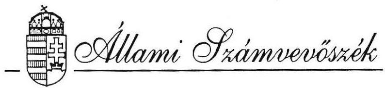 

## JELENTÉS

a Magyarországi ROMA Parlament
1991. évi gazdálkodásának ellenőrzéséről
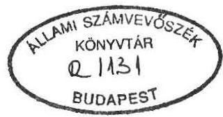

---

# Az ellenőrzést vezette: 

Dr. Elek János
főtanácsos

Az ellenőrzést végezték:

Tóth István
Gyarmati Béla
Dr. Ocsovai Sándor
Sörös István
Várlaki Pál
tanácsos
szakértő
szakértő
szakértő
szakértő

---

Állami Számvevöszék
V-1022-3/92.
Tsz: 118 .

# J e l e n t é s   a Magyarországi Roma Parlament   1991. évi gazdálkodásának ellenőrzéséről 

I .

A vizsgálat körülményei, célja, módszere

Az Állami Számvevőszékről szóló törvény értelmében az Állami Számvevőszék /továbbiakban: ASZ/ ellenőrzi az állami költségvetésböl juttatott támogatás felhasználását a társadalmi szervezeteknél. Az Országgyúlés a 6/1991.(II.11.) határozatában döntött a nemzetiségi és etnikai kisebbségi szervezetek 1991. évi állami költségvetési támogatásáról, egyben megismételte az ASZ ellenőrzési jogosultságát.

A cigányszervezetek részére - szervezeti és müködési költségeik fedezetére - az Országgyülés 1991. február 11-én 81 M Ft-ot hagyott jóvá. Az összeg felosztásáról és kiutalásáról az Országgyülés Emberi jogi, kisebbségi és vallásügyi bizottsága által kezdeményezett megbeszélésen - az érintett cigány szervezetek között 1991. február 13-án - az 1. és 2. sz. melléklet szerinti megállapodás született, s azt megküldték a PM Társadalmi Közkiadások Főosztályának, kérve a pénz szervezetenkénti kiutalását.

A megállapodásra is figyelemmel az ASZ a cigány szervezetek közül - többek között - az 1991. évre jóváhagyott állami költségvetési támogatás felhasználását, mint legnagyobb pénzfelhasználó szervezetnél, a Magyarországi Roma Parlamentnél (továbbiakban: Roma Parlament), mint önálló gazdálkodó szövetségnél ellenőrizte.

---

Az ellenőrzés célja annak értékelése volt, hogy a Roma Parlament az állami költségvetési támogatást - az Országgyülés határozatában foglaltakra is figyelemmel - az alapszabályban megfogalmazott tevékenységi célnak megfelelően használta-e fel, és ezt a célt a lehető legkisebb eszköz-, illetve pénzfelhasználással valósította-e meg, valamint mennyiben teljesítette tagszervezetei felé az állami költségvetési támogatás továbbadásával kapcsolatos kötelezettségét.

Az ellenőrzés során figyelemmel kellett lenni a kisebbségi társadalmi szervezetek sajátosságára, többek között arra, hogy a nemzetiségi és etnikai szervezetek alapvetően nonprofit érdekeltségú társadalmi szervezetek, valamint, hogy tevékenységük jelentős mértékben politikai döntési folyamatok által meghatározott.

A vizsgálat a lezárt 1991. év gazdálkodására terjedt ki. Az ellenőrzés a pénzfelhasználást a Roma Parlament irodájában található, a Roma Parlament, mint önálló jogi személy gazdálkodására vonatkozó dokumentumok alapján vizsgálta.

Az ellenőrzés nem vizsgálta a tagszervezetek gazdálkodását tekintettel arra, hogy azok bíróságon bejegyzett önálló jogi személyek.

A helyszíni ellenőrzés 1992. szeptember 10-töl 1992. október 2-ig tartott.

# II. 

Az 1991. évi tényleges pénzfelhasználás ellenőrzési tapasztalatai

A Roma Parlamentet 1991. január 19-én 13 szervezet alakította meg. A Fövárosi Bíróság 1991. február 28-án 6Pk. 65279 számon vette nyilvántartásba.

A Roma Parlament szervezetére és múködésére vonatkozó fontosabb információkat a 3. sz. melléklet tartalmazza.

---

A PM 1991. május 31-ig az állami támogatást nem az egyes szervezeteknek, hanem havonta egy összegben valamennyi tagszervezet támogatását a Roma Parlamentnek utalta, aki azt tovább utalta. A hatályos költségvetési szabályozásra is tekintettel, amely szerint a 12 M Ft-nál nagyobb költségvetési támogatást nem lehetett egy összegben kiutalni, a szervezetek újból kezdeményezték a közvetlen tagszervezetekhez való utalást. Erre 1991. júniusától került sor.

A váltás azonban azt eredményezte, hogy egyhavi költségvetési támogatással többet fizetett ki a PM. A keletkezett támogatástöbbletet a PM az 1992. évi kiutalás során levonta, míg a Roma Parlament külön kérésre 1.750 E Ft-ot még 1991-ben visszafizetett.

A fentiekre is figyelemmel a Roma Parlamenthez 34.125 E Ft állami költségvetési támogatás érkezett amelyböl 21.559 E Ft-ot adott tovább tagszervezeteinek és 12.566 E Ft-ot megtartott. Ebböl az összegböl a PM-nek túltámogatás miatt 1.750 E Ft-ot visszaküldtek. Igy a Roma Parlament 1991. évi állami költségvetési támogatása 10.816 E Ft volt.

A Roma Parlament csúcsszerv jellege miatt 1992. évben állami költségvetési támogatást nem kapott. Ezért vizsgálatunk az 1992. évet egyáltalán nem érintette.

A Roma Parlament pénzgazdálkodásának teljeskörü megítélését nehezítette az a körülmény, hogy költségvetési terve és az Országgyülés Emberi jogi, kisebbségi és vallásügyi bizottságának megküldött beszámolója a kiadásokat nem azonos részletezésben mutatta be. Tovabb nehezítette a terv és tényszámok összehasonlítását az is, hogy a terv csak a 10.500 E Ft állami költségvetési támogatással számolt és mással nem. Igy a terv nem tartalmazta a Roma Parlament által kiadott "Amaro Drom" c. újság kiadásának költségeit.

Ugyancsak a gazdálkodás megítélését nehezítette az a tény is, hogy sem az 1991-ben rendelkezésre álló forrásokat, sem a kiadásokat nem rögzítették teljeskörűen a könyvelésben.

---

# 1. A Roma Parlament 1991. évi költségvetésének bevételei, kiadásai és elemzése 

1.1. A Roma Parlament költségvetési tervét a plenáris ülés 1991. április 13-án fogadta el. Ez a terv azonban bevételként csak a 10.500 E Ft állami költségvetési támogatással számolt és 10.570 E Ft múködési kiadást tartalmazott. Nem tartalmazta a terv az egyéb bevételeket és az újság-elöállítással kapcsolatos kiadásokat.

Az Országgyúlés Emberi jogi, kisebbségi és vallásügyi bizottságához 1992. februárjában benyújtott beszámolója fentiekkel ellentétben - a Roma Parlament valamennyi bevételét és kiadását tartalmazta, ideértve a tagszervezeteknek továbbadott 21.559 E Ft állami költségvetési támogatást is.
1.2. A Roma Parlament az Országgyúlés Emberi jogi, kisebbségi és vallásügyi bizottságához benyújtott beszámolójában, szemben a készített költségvetési tervével az 1991. év valamennyi bevételét - a tagszervezeteknek továbbadott 21.559 E Ft-tal együtt - 39.139 E Ft-ban kimutatta. Ugyanakkor a Roma Parlament tényleges összes bevétele az "Amaro Drom" c. újság bevételeivel együtt, a vizsgálat megállapítása szerint 41.102 E Ft volt. A továbbadott állami támogatás levonása után a Roma Parlament által elkölthetó összes bevétele 19.543 K Ft volt.

A Roma Parlament rendelkezésére állt összes bevétel 85,3 \%-a származott az állami költségvetésböl. A fennmaradó 14,7\% pedig bankkamat, hitelfelvétel és egyéb támogatásokból.

A 16.666 E Ft állami költségvetési támogatás két jól elkülönülö forrásból eredt; $64,9 \%$ a nemzeti és etnikai kisebbségi szervezetek müködésére az Országgyúlés által jóváhagyott forrásból, 35,1 \% pedig a nemzetiségi lapok költségvetési támogatásából.

---

1.3. Az Országgyúlés Emberi jogi, kisebbségi és vallásügyi bizottságának küldött beszámolóban a Roma Parlament 39.391 K Ft kiadást tüntetett fel. Ugyanakkor a vizsgálat megállapította, hogy ez az összeg a tényleges állapottól eltért, mert:

- 1992. február 24-ig tartalmazta a Roma Parlament kiadásait;
- nem tartalmazta az "Amaro Drom" c. újság kiadásainak egy részét;
- 25.710 E Ft értékben tartalmazta a tagszervezeteknek továbbadott állami költségvetési támogatást.
A Roma Parlament bizonylattal alátámasztott tényleges kiadása 17.531 E Ft volt.
1.4. A költségvetési terv végrehajtásának ellenőrzésére, azzal összhangba álló analitikus nyilvántartási rendszert nem dolgoztak ki. Igy a tényleges kiadásoknak a költségvetési tervvel való összehasonlítására csak a vizsgálat külön kérésére készített kigyújtés útján volt lehetőség.

A tényleges pénzfelhasználást - tekintettel arra, hogy az állami költségvetési támogatást két elkülönített célra kapták - célszerűnek tartjuk a gyakorlatban is részben elkülönülö, alábbi két költségviselő szerint elemezni:

- Roma Parlament müködése,
- "Amaro Drom" c. újság kiadása.
1.4.1. A Roma Parlament költségvetési tervét a főkönyvelő által készített kimutatással összevetve a múködési kiadásokkal kapcsolatban a következök állapíthatók meg:
- A lakbérek (irodabérleti díjak) és rezsiköltségek területén a tervezetthez képest mintegy 210 E Ft megtakarítást értek el. Jelentős - 341 E Ft - megtakarítás tapasztalható a beruházási elöirányzathoz képest is. Ennek a megtakarításnak az a magyarázata, hogy több tervezett beruházás megvalósítása elmaradt (pl. videó-tv, villanyboyler).
- A müködési kiadások egyes sorainál ugyancsak jelentős megtakarítást mutat az elemzés. Ennek a megtakarításnak az oka egyes esetekben - pl. komplex rehabilitáció 857 E Ft - a tervezett feladat megvalósításának teljes elmaradása, néhány

---

esetben pedig a hibás kigyüjtés, illetve az hogy egyes kiadások az eredeti terv szerint nem voltak besorolhatók, így be kellett vezetni az egyéb múködési kiadás rovatot. Ezen a rovaton 944 E Ft kiadás van kimutatva. Itt szerepel egyebek mellett 360 E Ft tagszervezeteknek átadott, vissza nem térítendó támogatás.

# Ugyanakkor: 

- a nagy rendezvények kiadásainál - ami gyakorlatilag vendéglátási kiadást jelent - $100 \%$-ot meghaladó túllépés tapasztalható;
- 24 \%-os túllépés tapasztalható a képzési kiadásoknál, ami szintén vendéglátási kiadást takar.
- A bérjellegú kiadásoknál 800 E Ft költség-túllépés keletkezett, aminek fedeztét a korábbi megtakarítások biztosították.
- Jelentős, nem tervezett kiadást jelent, a betörés során elveszett 840 E Ft.

A Roma Parlament múködési kiadásaiként kezelt kiadások - a betörésből eredő kárral együtt - a tervezettnél 1.108 K Ft-tal magasabbak.
1.4.2. Az "Amaro Drom" c. lap kiadására a költségvetésben sem a bevételek, sem a kiadások között nem terveztek. Ennek ellenére a lapkiadás céljára különböző forrásokból 7.312 E Ft állt rendelkezésre. Ebből az összegből 6.365 E Ft-ot elköltöttek. A kiadásból 2.166 E Ft-ot a Roma Parlament bér- és bérjellegú kiadásai között tüntettek fel. A fennmaradó költség legnagyobb részét a nyomdai költségek - 3.864 E Ft - tették ki. A többi a lapelöállítással kapcsolatos egyéb költség.
1.5. A Roma Parlament összes kiadását figyelembe véve, az elfogadott költségvetési tervet - amely csak az állami költségvetési támogatással számolt - mintegy 7.000 K Ft-tal meghaladta. A vizsgálat nem találkozott olyan elöterjesztéssel, mely a költségvetés módosítását kezdeményezte volna. A költségvetés elfogadására jogosult testület a nagymértékú eltérésről csak utólag, az éves beszámolóban szerzett tudomást.

---

A kiadások együttes összetételét értékelve a vizsgálat megállapította, hogy a 17.531 E Ft-os kiadásból 5.279 E Ft-ot, ( $30 \%$-ot) tettek ki a bér- és bérjellegú kiadások. Személyek étkeztetésére és elszállásolására különbözö rendezvények kapcsán 1.599 E Ft-ot ( $9,1 \%$-ot) üzemanyag, utiköltség és egyéb költségtérítésre további 1.078 E Ft-ot ( $6,1 \%$ ) forditottak. Tehát tényleges kiadásoknak 45,2 \%-a 7.956 E Ft - valamilyen módon személyi kifizetésre került felhasználásra.

# 2. A Roma Parlament gazdálkodásának célszerűsége, eredményessége 

2.1. A pénzfelhasználás céljáról, a feladat megvalósítás szükségességéről a vizsgálat megállapítása szerint minden esetben a Roma Parlament végrehajtó szervezete, az ügyvivö testület döntött. A feladatok végrehajtását ugyanez a szervezet kérte számon. A konkrét feladatmeghatározások minden esetben összhangban voltak az alapszabályban illetve a plenáris ülés határozataiban megfogalmazott feladatokkal.
2.2. A Roma Parlament pénzgazdálkodásának eredményességét vizsgálva meg kell említeni, hogy mivel a költségvetéssel összhangban lévó analitikus nyilvántartásokat nem vezettek, így elemzó, költségtakarékosságra törekvő gazdálkodásról nem lehet beszélni. Erre utal, az elözö részben ismertetteken túl az a körülmény is, hogy a külföldi utazásokkal összefüggö pénzellátás során a költségek fedezetére biztosított pénzzel - egy eset kivételével, amikor valuta kiadásra került sor - a kiutazókat nem számoltatták el. Ezt bizonyitja, a Roma Parlament irodájába történt betörés során elveszett 840 E Ft rendezésének esete is, amikor az idöszaki pénztárjelentés szerint a pénztárban lévő pénzt a Roma Parlament főtitkárának íróasztal 'fiókjából lopták el a feljelentés szerint. A nyomozást a rendörség - gyanúsított hiányában - megszüntette. A Roma Parlament vezetése az okozott kárért való személyi felelősség kérdését nem vizsgálta.

---

A takarékos és figyelmes pénzgazdálkodás hiányára utalnak az alábbi példák is:

1991. április 30-án a Fejér megyei Független Cigány Fórumtól 250 E Ft kölcsönt vett fel a Roma Parlament, holott a saját bankszámláján 2.044 E Ft pénze volt.
1991. május 11-én a Lungo Drom Erdekvédelmi Cigányszövetségtől 100 E Ft készpénz kölcsönt vett fel a Roma Parlament,- amit 1991. V. 13-án vissza is fizetett amikor a bankszámláján 1.828 E Ft, a pénztárában pedig 157 E Ft volt. A kölcsön felvétele és visszafizetése közötti időszakban a pénztárból történt kifizetés pedig mindössze 4.700 Ft volt.
1991. VII. 29-30-án két személy a Dél-Baranyai Cigány Fórumon vett részt. A két napra 3.656 Ft étkezési költséget, és ugyanerre az útra 6.342 Ft benzinköltséget számoltak el, anélkül, hogy km teljesítmény kimutatást csatoltak volna.

Az ellenőrzés az "Amaro Drom" c. újság kiadásával és terjesztésével kapcsolatban az alábbiakat állapította meg:

Az újságnak 1991-ben 12. száma jelent meg, összesen 106 ezer példányban. Az olvasókhoz azonban, a Magyar Posta és a szerkesztőség terjesztésében összesen 12 ezer példány jutott el, a többi remittendaként megsemmisítésre került. Az újság előállítási költsége 1991-ben 6.365 E Ft volt. Egy olvasóhoz eljutott példány előállítása 530 Ft-ba került. Igy a lap előállítása eredeti célját nem érte el, csupán az előállításában közreműködőknek nyújtott személyi jövedelmet.

A nem megfelelő pénzgazdálkodásra utaló több hiányosságot rögzített az 1991. október 7-én kelt, külső szakértő által végzett vizsgálatról készített jelentés is. Annak alapján azonban a szükséges intézkedések megtételére nem került sor.

# 3. Beszámolási kötelezettség, könyvvitel, bizonylati rend 

A Roma Parlament határidőben eleget tett a mérleg és vagyonkimutatás készítéséről szóló rendeletben előírt beszámolási köte-

---

lezettségének. A beszámolót az APEH Fövárosi Igazgatósága által hitelesített naplófökönyv adatai alapján állitották össze. Tekintettel azonban arra, hogy ez a naplófökönvv nem tartalmazza a Roma Parlament valamennyi bevételét és kiadását, a beszámoló sem a valós adatokat tartalmazza.
3.1. A Roma Parlament könyvvezetésére a naplófökönyv vezetését választotta. A naplófökönyv vezetése során azonban nem tartották be a könyvvitel rendjéről szóló többször módosított 52/1988.(XII.24.)PM rendelet elöírásait. A főbb hiányosságok a következök:

- A naplófőkönyv nem tartalmazza a Roma Parlament valamennyi 1991. évi bevételét. Hiányzik a bevételek közül az "Amaro Drom" c. újság elöállításához kapott állami támogatásból 1.850 E Ft, a lapterjesztéssel kapcsolatos bevétel, továbbá az ezen pénzek kezelésére nyitott külön bankszámlán szereplő összegek utáni kamatbevétel.
- A naplófőkönyv nem tartalmazza a Roma Parlament valamennyi 1991. évi kiadását. Nem tartalmazza ugyanis az "Amaro Drom" c. újság nem bérjellegú elöállítási költségeit, mintegy 4.176 E Ft értékben.
- A naplófőkönyv vezetése során nem tartották be a gazdasági eredmények idősorrendjét, így gyakran későbbi események korábbi események előtt kerültek könyvelésre. Ez nem csak egyes hónapokon belül, de hónapok között is előfordult.
- A naplófőkönyvben gyakran szabálytalanul kiállított alapbizonylat alapján rögzítettek gazdasági eseményeket.
3.2. A Roma Parlamentnél - idöszaki pénztárjelentés kivételével a gazdasági eseményekről egyéb analitikus nyilvántartást nem vezettek, illetve ilyent a vizsgálatnak bemutatni nem tudtak. Nem vezették a szigorú számadású nyomtatványok nyilvántartását sem, annak ellenére, hogy nagy számban került sor a bevételi és kiadási pénztárbizonylatok mellett készpénzosekk felhasználására is.

---

Hiányoznak továbbá a gazdálkodással kapcsolatos fontos szabályozások:

- házipénztári pénzkezelési szabályzat,
- saját gépkocsi kiküldetési célú igénybevételének szabályzata,
- leltározási és állóeszköz-nyilvántartási szabályzatok.

A házipénztári pénzkezelési szabályzatot annak ellenére nem tudták bemutatni, hogy annak korábbi meglétét tanúsító három dokumentumot is talált az ellenörzés.
3.3. A házipénztári pénzforgalomról 1991-ben 2 db pénztárkönyv került felfektetésre. Az egyiket 1991. I. 30 és V. 22. között, a másikat 1991. V. 23 és XII. 31. között használták. A házipénztár kezelése, a pénztárkönyv vezetése nem a pénzgazdálkodás rendjére vonatkozó előírások szerint történt:

- A pénztárkönyvbe - több esetben - nem a pénzmozgás idősorrendjében vezették be a kiadásokat és bevételeket.
- Az 1991. január 30-május 22. közötti időszakban a havonta végrehajtott pénztárzárás nem szabályos, mert azt sem a pénztáros, sem a pénztárellenőr aláírásával nem hitelesítette.
- A pénztárkönyv esetenként nem a valós pénzügyi állapotot tartalmazta.

P1. A betörés során eltűnt 640 E Ft a pénztárkönyv szerint a pénztárban volt. Ugyanakkor az 1991. április 13-i Plenáris ülés jegyzökönyve és a rendőrségi nyomozási anyag szerint a pénz a főtitkár íróasztalából tünt el. A rendelkezésre álló dokumentumok szerint pedig egyértelmú, hogy a betörés időpontjában nem a főtitkár volt a pénzkezeléssel megbízott személy.

- A használatban lévő bizonylattömböket több személy kezelte, ugyanazon tömbben egyidejúleg több személy állított ki bizonylatot, köztük olyanok is voltak, akik nem a Roma Parlament dolgozói.

---

- A pénztári bizonylatokat számtalan esetben nem a befizetés idöpontjában, söt nem is a pénzmozgás idö sorrendjében állitották ki. Azonos idöpontban több - esetenként 3-4 - pénztár bizonylattömb volt használatban.
- A kiállított bizonylatok jelentős hányada nem felel meg a bizonylati rend és fegyelem követelményeinek. Több esetben már a kifizetés alapjául szolgáló bizonylat sem felel meg a jogszabályi elöírásoknak. Emellett a pénztárbizonylatokról igen gyakran hiányzik az utalványozó aláírása, de az is gyakran elöfordul, hogy azt a pénz felvevöje sem írta alá.

Pl. 1991. VII. 1-én kelt megbízási szerződésben a Roma Parlament főtitkára saját magával kötött szerződést az "Amaro Drom" c. újság szerkesztőségének vezetésére. A benzinköltségek kifizetésénél egy esetben sincs bizonylattal alátámasztva a költségfelmerülés jogossága, sem a Roma Parlament tulajdonát képező gépkocsiknál, sem a hivatalos útra igénybevett magántulajdonú gépkocsiknál. Útvonal nyilvántartást ugyanis egyik esetben sem vezettek, igy a teljesített km sem állapítható meg.

- A kiadások jogosságának ellenőrzése, a felmerült költségek indokoltságának megfelelő bizonylati alátámasztása sok esetben hiányzik.

3.4. Szabálytalanságot állapított meg az ellenőrzés a tiszteletdíjak és eseti megbízási díjak kifizetésénél és a SZJA előleg levonásánál. Az adóelöleget ugyanis minden esetben úgy vonták le, mint ahogy azt a törvény a szellemi szabadfoglalkozás alá tételesen besorolt esetekben engedélyezi. Ezeknek a kifizetéseknek nagy része azonban a vizsgálat szerint nem sorolható be a törvényben konkrétan felsorolt esetek közé.

Az 1991. október 7-én kelt, az Ellenőrzö Bizottság tagjainak részvételével Oláh Józsefné külső szakértő által végzett vizsgálatról készült jelentés a fent leírt szabálytalanságok döntö részét szintén feltárta. Javaslatot is tett a szükséges intézkedésekre, ennek ellenére a hiányosságokat nem szüntették meg.

---

# III.   J ava s l a t o k 

Osszességében megállapítható, hogy a Roma Parlament az 1991. évi állami költségvetési támogatást az alapszabályában megfogalmazott, illetve a Plenáris ülés által meghatalmazott célok megvalósitására használta fel, aminek során a takarékos gazdálkodásra való törekvés nem érvényesült. A kiadások jelentős része személyekhez kötődő kifizetéssé alakult át. Ugyanakkor pénzügyi gazdálkodásuk során több vonatkozó jogszabály előírását nem tartották be, könyvviteli és számviteli gyakorlatukban rejlő hibák miatt:

- könyvelésükből nem volt megállapítható a bevételek és kiadások tényleges összege;
- mérlegbeszámolójuk nem a valós adatokat tartalmazta;
- utazási költségtérítések kifizetése során nem tartották be a jogszabályi előírásokat;
- kötelezően előírt analitikus nyilvántartásokat nem vezettek;
- nem tartották be a számvitel bizonylati rendjéről szóló rendelet előírásait;
- személyi jövedelemadó előlegek levonásánál nem tartották be a jogszabályi előirásokat.

A jelentésben rögzített megállapítások alapján javasoljuk, hogy:

- a költségvetés és a beszámoló rendszerének egységes szerkezetét hozzák létre oly módon, hogy egyértelmüen megállapítható legyen a Roma Parlament költségvetésének végrehajtása.
- A gazdálkodás során elkerülhetetlenül szükséges belső szabályzatokat és utasításokat haladéktalanul készítsék el.
- A belföldi kiküldetés elszámolása során tartsák be a jogszabályi előírásokat.
- A jogszabályi előírásoknak megfelelően vezessék a szigorú számadású nyomtatványok nyilvántartását.

---

- A tiszteletdijak és eseti megbizási dijak kifizetése során tartsák be a magánszemélyek jövedelemadójáról szóló törvény elöirásait.
- A gazdasági események bizonylatolása során tartsák be a számvitel bizonylati rendjére vonatkozó jogszabály elöirásait.
- Gazdálkodásuk során törekedjenek a rendelkezésre álló források takarékosabb és hatékonyabb felhasználására.
- A hiányosságok megszüntetésével egyidejúleg tisztázzák az esetenként felmerülö személyes felelösség kérdését is.

Budapest, 1992. december 10.
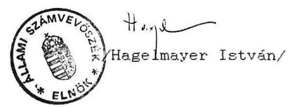

Melléklet: 3 db

---

# J e g y z ó k ö n y v

## Döntés

A cigány szervezetekre jutó 81. millió forint költségvetési támogatást az alábbiak szerint osztották fel a megjelent cigány szervezetek képviselői:

|  1./ | Roma Parlament | 48. millió forint  |
| --- | --- | --- |
|  2./ | Cigány Érdekvédelmi Szövetség | 25.  |
|  3./ | Függetlenek | 8.  |

A 2/ pont Cigány Érdekvédelmi Szövetség az alábbiak szerint oszlik meg:

|  Mo-i Cigányok Nemzetiségi Kulturális Szövetsége | 2. millió ft  |
| --- | --- |
|  Amalipe | 4.1  |
|  Hátrányos helyzetű fiatalok életmód és Szabadidő Szövetsége | 3.6  |
|  Cigány Tudományos és Művészeti Társaság | 3.6  |
|  Cigány Munko'sok Szövetsége | 3.6  |
|  Mo-i Romák Liberális Szervezete | 2.  |
|  Szocialista Cigány Szervezet | 2.  |
|  Tolna m. Független Cigány Szövetség | 1.  |
|  Magyar Független Cigány fórum | 1.3  |
|  Cigánycsalád Gondozó Hálózat | 1.  |
|  Bp.XIII.K.D.R.N.Sz. /Keresztény-demokrata/ | 0.8  |

A 3/ pont Függetlenek az alábbiak szerint oszlik meg:

|  Cigány Ifjusági Szövetség | 4.5 millió ft  |
| --- | --- |
|  FORTUNA Cigány Önsegélyező Szervezet | 2.  |
|  Fejér megyei Független Cigány Szervezet | 1.5  |
|  Összesen: | 8. millió ft  |

B u d a p e s t, 1991. február 13.

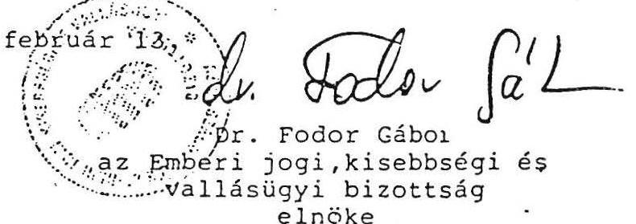

---

# 2. sz. melléklet 

Pénzügyminisztérium
Társadalmi Közkiadások
Osztálya
Német Gyuláné részére

## Nyilatkozat

A Magyar Országgyülés Emberi jogi Kisebbségi és Vallásügyi Bizottsága által 1991 február 13-ára az állami költségvetési támogatás elosztása végett összehivott cigány szervezetek értekezletén a jelenlévôk megállapodása alapján a Magyarországi ROMA Parlament és alkotó szervezetei 48 millió forintban részesülnek. A ROMA Parlament tagszervezetei ezen összeget egymásköz az alábbiak szerint osztották fel. Alulirottak kérjük a pénzügyminisztérium illetékes osztályát, hogy a csatolt birósági bejegyzéseink alapján a mellékletben szereplő bankszámlaszámainkra szíveskedjenek a szervezeteinkre jutó összeget átutalni:
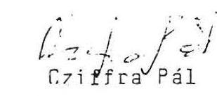
2./ Lungo Drom
(Érdekvédelmi Cigány Szervezet)
4.500 .000 Ft.
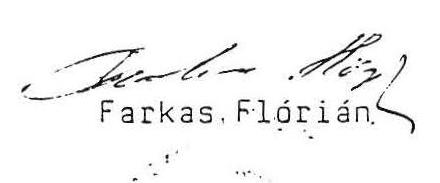

---

3./ PHRALIPE Független Cigány Szervezet
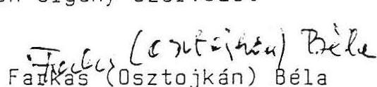

Fadkas (osztojkán) Béla
4./ Sóshartyáni Sport Egyesület
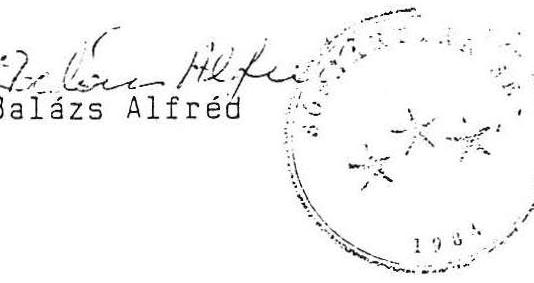
500.000 Ft.

5./ Szécsényi Cigányok Demokratikus Társasága
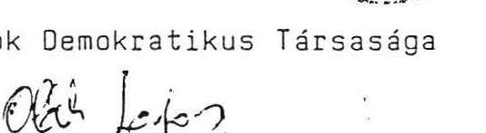
6./ Cigány Kulturális és Közmüvelődési Egyesület 1.500 .000 Ft.

Kosztics István
7./ Csongrád Megyei Cigányok Demokratikus
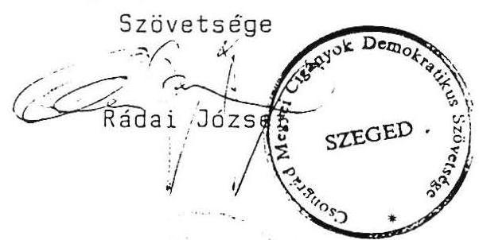
8./ Erzsébetvárosi Cigány Szervezet
500.000 Ft.

Makai István

---

9./ Magyarországi Cigányok Demokratikus Szövetsége
4.500 .000 Ft.
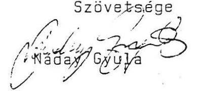
10./ Magyarországi Cigányok Igazság Szövetsége
4.500 .000 Ft.
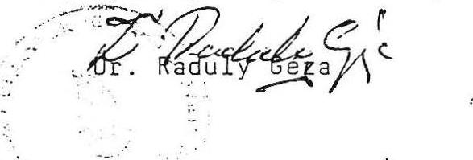
11./ Száz tagu Cigány Zenekar Budapest
4.500 .000 Ft.
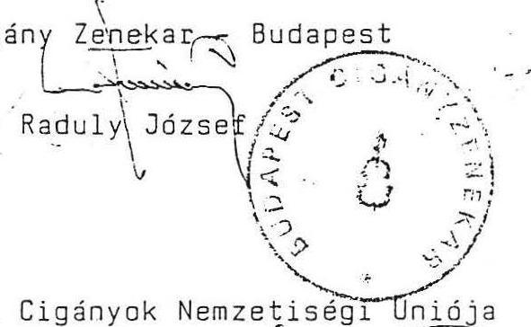
12./ Magyarországi Cigányok Nemzetiségi Uniója
4.500 .000 Ft.
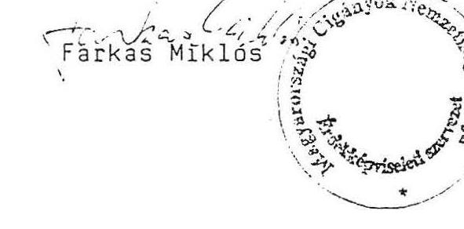
13./ Magyarországi Cigányok Egyesülete
1.500 .000 Ft.
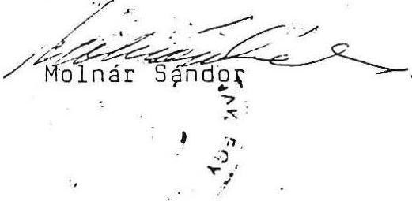
14./ Cigány Táncmüvészek Szövetsége
500.000 Ft.

---

15./ Fíi Cu Noi (Beás Egyesület)
16./ Baranya Megyei Cigányok Demokratikus Szövetsége
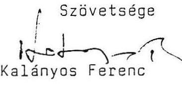
17./ Budapest XIII. ker. Cigány Nemzetiségi Szervezet
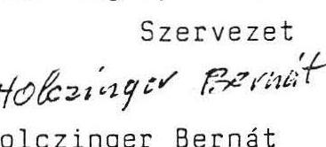

Holczinger Bernát

18./ Magyarországi ROMA Parlament
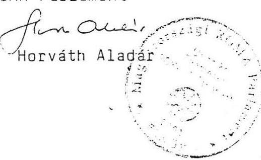

Budapest, 1991 február 13.
1.500 .000 Ft.

---

# A Roma Parlament Szervezete és müködése 

A Roma Parlament alakuló kongresszusát - 13 tagszervezet részvételével - 1991. január 19-én a Keleti pályaudvar kultúrtermében tartották. Ezen a kongresszuson fogadták el a Roma Parlament alapszabályát és választották meg az ügyintéző-képviselő szerveket:

- A Kongresszus a Roma Parlament legfőbb döntéshozó szerve. Kizárólagos hatáskörébe tartozik; az alapszabály elfogadása és módosítása; a szervezet feloszlásának kimondása; döntés más szervezettel való egyesülésről; beszámoló elfogadása; tagszervezet kizárása; ellenőrző és etikai bizottság beszámolójának elfogadása, költségvetés jóváhagyása; felszámolás esetén döntés a Roma Parlament vagyonáról. Oléseit évenként tartja.
- A parlament (plenáris ülés) a két kongresszus között a Roma Parlament Legfőbb döntéshozó szerve. Minden tagszervezetet 3 fős, de egy szavazattal rendelkező delegátus képvisel. Tagjai a parlamentnek, még az ügyvivő testület tagjai, valamint a cigány országgyűlési képviselők. A parlament dönt minden olyan ügyben, amely nem tartozik a Kongresszus kizárólagos hatáskörébe. Oléseit legalább negyedévenként tartja.
- Az ügyvezető testület a Roma Parlament végrehajtó szerve. Tagjai: az elnök, a két alelnök, a főtitkár, a szóvivő, az öt ügyvivő és a politikai ügyvivő. Oléseit szükség szerint, de legalább kéthetenként tartja.
- A Roma Parlament elsőszámú képviselöje az elnök, aki egyben irányítja az ügyvivő testületet. A Parlament irodája dolgozói felett munkáltatói jogkört gyakorol.
- Az elnököt akadályoztatása esetén - a rotáció elvének megfelelően - a két alelnök helyettesíti. A két alelnök egyéb esetben tanácsadó szerepet lát el.

---

- A parlament irodáját a fötitkár irányítja, aki munkáját az elnök utasításai alapján végzi. Az elnök felhatalmazása alapján képviseli a Roma Parlamentet és munkáltatói jogkört gyakorol.
- Az öt ügyvivõ a fôtitkár utasításai alapján összekötő szerepet tölt be az ügyvezető testület és a tagszervezetek között. Az elnök felhatalmazásával minden szinten képviselik a Roma Parlamentet.

A Roma Parlament kongresszusa Ellenörzõ bizottságot választ, melynek feladata a szervezet gazdasági ügyeinek ellenörzése. Ellenörzéseit legalább féléves gyakorisággal végzi. Tapasztalatairól írásban és szóban beszámol a kongresszusnak.

# A Roma Parlament feladata: 

- Ellátja az alkotó szervezetek képviseletét. Erdekfeltáró, érdekegyeztető és érdekközvetítő kisebbségvédelmi tevékenységet végez.
- Allást foglal a magyar Országgyülés, a Kormányzat, a települési önkormányzatok döntéseiről és nyilvánosságra hozza azt.
- Nemzetközi kapcsolatokat teremt.
- Szakmai bizottságokat állít fel.
- Folyamatosan keresi és ápolja a kapcsolatokat a magyar Országgyüléssel, a Kormánnyal, a pártokkal, a társadalmi szervezetekkel, más nemzeti és etnikai kisebbségekkel, célja megvalósítása érdekében.
- Részt vesz a hatalomgyakorlás társadalmi ellenőrzésében.