# 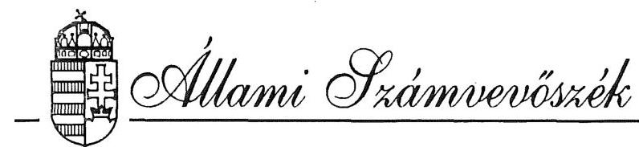 

## JELENTÉS

a Phare programból finanszírozott magyar környezetvédelmi program előkészítésének és a pénzügyi támogatások felhasználásának ellenőrzéséről
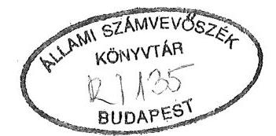

---

A vizsgálatot vezette:

Krucsai Balázs
főtanácsos

A vizsgálatot végezték:

Istvánffy Lóránt
Karsainé Dömsödi Éva
Kiss Istvánné
Pallós Gáborné
Réthelyi Jenő
Vasas Sándorné dr.

## A vizsgálatban közremúködött:

dr. Seress Marcell
dr. Szelecsényi Tibor
dr. Tardos József
tanácsos
számvevő
tanácsos
tanácsos
számvevő
tanácsos
külső munkatárs
külső munkatárs
külső munkatárs

---

# T A R T A LOM JEGYZÉK 

I. Bevezetés ..... 1. oldal
II. Megállapítások ..... 3. oldal

1. Az emberi környezet és védelmének fő jellemzői Magyarországon - az EK támogatások hasznosulásának lehetőségei ..... 3. oldal
2. A támogatásra javasolt szakágazati programok előkészítése ..... 5. oldal
3. A jóváhagyott támogatások felhasználásának ágazati irányítása és ellenőrzése ..... 9. oldal
4. A jóváhagyott támogatások felhasználása, az előirányzott feladatok (projektek) megvalósítása ..... 11. oldal
5. A program megvalósításának finanszírozása, nyilvántartása és ellenőrzése ..... 16. oldal
III. Összefoglaló következtetések és javaslatok ..... 19. oldal

---

# J E L E N T É S 

a Phare programból finanszírozott magyar környezetvédelmi program előkészítésének és a pénzügyi támogatások felhasználásának ellenőrzéséről

## I.

Bevezetés

Az Országgyűlés Környezetvédelmi Bizottsága 1991. novemberében felkérte az Állami Számvevőszéket, hogy vizsgálja meg a Phare program által nyújtott támogatások elosztását és felhasználását a környezetvédelmi tárca területén, és tapasztalatairól tájékoztassa a Bizottságot. A vizsgálat előkészítésének időszakában a nemzetközi kapcsolatok révén az ÁSZ tudomására jutott, hogy 1992-ben az Európai Közösségek (EK) Számvevőszéke is hasonló témájú vizsgálatot tervez. Jelezték, hogy e vizsgálatukhoz fel kívánják használni a magyar tapasztalatokat az Európai Közösségek Bizottsága és a Magyar Köztársaság Kormánya között - a Magyar Köztársaságnak az Európai Gazdasági Közösség által nyújtott Phare segélyprogram tárgyában - aláírt Keret Egyezmény előírásainak (16. cikk) megfelelően.

A vizsgálati program kidolgozása ezen - kettős - igény.figyelembevételével történt. A program-tervezet egyeztetésére és véglegesítésére 1992. június 2-án az EK Számvevőszéke képviselőinek és a Környezetvédelmi Bizottság elnökének részvételével került sor. Megállapodás született arról, hogy az ÁSZ az EK Számvevőszékével együttmüködve végzi a vizsgálatot és a tapasztalatokról szóló jelentést is vezető képviselőjük részvételével terjeszti az Országgyűlés Környezetvédelmi Bizottsága elé.

A vizsgálat célja - a jóváhagyott programnak megfelelően - annak megállapítása volt, hogy a környezetvédelmi szektor program előkészítésében és megvalósításában hogyan érvényesültek az országos környezetvédelmi prioritások, a közreműködő szervezetek

---

Ezen a helyzeten kíván gyökeresen változtatni és a környezetvédelem ügyét a korszerű, európai követelményekhez igazodóan rendezni a Kormány 1991-ben elfogadott "Rövid- és középtávú környezetvédelmi intézkedési terve". Az intézkedési terv - széleskörű állapotfelmérésre és kutatómunkára, a szakmai koncepciók összegezésére építve - meghatározza a rövid- és középtávon elérendő környezetvédelmi célokat (prioritásokat) és az elvégzendő feladatokat, akcióprogramokat. Ezek következetes megvalósítása szolgálhat alapul azoknak a folyamatoknak a beindításához, amelyek a környezetvédelem terén szükséges gyökeres fordulathoz vezethetnek.

Az EK által nyújtott támogatások hasznosulásának lehetőségei a szükségletek oldaláról tehát szinte korlátlanok, az emberi környezet megóvását és lehetséges javítását hatékonyan szolgáló tudatos törekvések és intézkedések nyújtotta garanciák szempontjából is rendkívül széleskörűek.

A vizsgálat lezárásáig az EK Phare Bizottsága két környezetvédelmi szakágazati program támogatásáról döntött. A Phare I. üteméről 1990. júniusában, a Phare II. üteméről pedig 1992. januárjában írták alá az ún. "Finanszírozási Megállapodás"-t. A III. ütemről szóló megállapodás az aláírás szakaszában van.

Az eddig jóváhagyott - 1991-94. között felhasználható - támogatások összege 35 millió ECU (1991-92. évi középárfolyamon számolva mintegy 3,3 milliárd forint), ami a Magyarország számára nyújtott összes Phare segély mintegy $16 \%$-át teszi ki. E támogatásoknak a környezetvédelmi feladatok megoldásában betöltött szerepe csak megközelítő pontossággal becsülhető. A magyar költségvetési és statisztikai rendszer ugyanis jelenleg nem úgy épül fel, amelyből külön - módszertanilag sem rendezett - adatgyűjtés nélkül kimutathatóak lennének a környezetvédelmi feladatokra fordított költségvetési kiadások. Ez is mutatja, hogy a jelenlegi statisztikai és információs rendszer nem megfelelő.

Az arányok érzékeltetésére két megközelítés kínálkozik. Egyrészt az ilyen jellegű állami feladatok megvalósítását szolgáló Központi Környezetvédelmi Alap és a Vízügyi Alap kiadásaihoz, másrészt a gazdálkodó' szervek környezetvédelmi beruházásaihoz történő viszonyítás. E számítások szerint a Phare támogatások az 1991-93. években elérik e két alap együttes kiadásainak ( 13,5 milliárd forint) mintegy 16-17 \%-át, a gazdálkodó szervek környezetvédelmi beruházásainak pedig közel $5 \%$-át. Ezek az arányok is jelzik, hogy Magyarországon, az adott gazdasági teljesítmény mellett, a környezetvédelemre fordítható források rendkívül szűkösek. Felhívják továbbá a figyelmet arra, hogy a támogatások célszerű és hatékony felhasználása az érintett szervek részéről a jelenleginél átgondoltabb és összehangoltabb munkát igényel.

---

A Phare támogatások mellett a környezetvédelmi szektor az egyes országok közötti kétoldalú kapcsolatok keretében is részesül eseti külföldi segélyekben. A vizsgálat lezárásának időpontjáig jóváhagyott és hosszabb távon felhasználható ilyen segélyek nagysága - a Környezetvédelmi és Területfejlesztési Minisztérium tájékoztatása szerint - mintegy 15 millió ECU-ra tehető. Felhasználásuk a Phare támogatásokkal és más forrásokkal koordináltan történik.

# 2. A támogatásra javasolt szakágazati programok előkészítése 

A szakágazati programok előkészítése és az EK Bizottság által történő jóváhagyása mindhárom program esetében több mint egy éves munkát igényelt. A legnehezebb feladat az első szakágazati program - a Phare I. ütemének - előkészítése volt.

### 2.1. A Phare I. ütemének előkészítése

Az OECD tagállamai 1989. szeptember 26-án közös nyilatkozatot adtak ki Magyarország és Lengyelország társadalmi átalakulásának gazdasági megsegítéséről és egyben felkérték az EK Bizottságát a segítségnyújtás koordinálására. (Ilymódon jött létre az EK Phare programja. Jelenleg a Közösség költségvetéséből nyújtott, vissza nem térítendő támogatás - amely továbbra is PHARE néven szerepel - kiterjed több "volt szocialista ország"-ra is.)

Az EK Bizottság akkori koncepciója szerint a műszakilag megalapozott, gyorsan megvalósítható és a lakosságot kedvezően érintő egyedi projektek részesíthetők támogatásban. Akkor még nem esett szó országos prioritásokról, átfogó környezetvédelmi programok kidolgozásáról és megvalósításáról.

Magyarországon a környezetvédelem területén dolgozók voltak azok, akik a leghamarabb hozzákezdtek e pénzügyi lehetőség kihasználásához szükséges javaslatok kidolgozásához. Ezt segítette, hogy a Környezetvédelmi és Vízgazdálkodási Minisztérium (KVM) koordinálásával már 1988 - Magyarország-EK együttműködési megállapodásának megkötése - óta dolgoztak az EK környezetvédelmi előírásaihoz való felzárkózást szolgáló feladatok kimunkálásán. Az EK szakembereivel való együttműködés révén viszonylag gyorsan tájékozódtak a támogatás feltételeiről és elnyerésének egyéb követelményeiről. Nyilvánvalóvá vált, hogy az EK konkrét feladatok (projektek) kiválasztását igényli és azok megvalósítását támogatja.

Ezekre az információkra, valamint Magyarország környezeti állapotának, feszítő gondjainak és a megoldásukra irányuló elgondolások alapos ismeretére építve a

---

KVM összegyüjtötte a kidolgozás alatt lévő és a támogatás igénylésénél szóba jöhető elgondolásokat. Alig egy hónap alatt több mint 80, különböző mélységben kidolgozott projekt javaslat állt a minisztérium rendelkezésére.

A minisztérium ezek közül válogatva 1989. november 6-án 21 projekt javaslat előzetes információs adatlapját küldte meg az EK Bizottságának. Ezek támogatási igénye 944 millió dollár (kereken 1,1 milliárd ECU) volt, közte 520 millió dollár a balatoni infrastruktúra kiépítésére, 250 millió dollár pedig a települési hulladékok kezelésére és lerakók építésére.

Ezt követően a minisztérium és az EK Bizottság között több hónapos intenzív egyeztetési munka következett, melynek keretében a javasolt projektek indokoltságát, megvalósíthatóságát vizsgálták, illetve az EK követelményeinek megfelelő formába öntését segítették. E folyamat főbb eseményeit a 2. sz. melléklet ismerteti.

A támogatásra javasolt projektek előkészítésének tartalmi elemeiről, kiválasztásuk kritériumairól és a döntésekben résztvevők köréről rendelkezésre álló dokumentumok rendkívül hiányosak. Ez elsősorban a minisztérium szervezetében és személyi állományában végbement változások következményeinek tulajdonítható.

A szakágazati program EK jóváhagyásának előkészítését a KVM Nemzetközi Kapcsolatok Főosztálya koordinálta. Vezetője egyben a Minisztertanács által létrehozott - 1989. december 22-től 1990. március 8-ig múködő - Tárcaközi Koordinációs Bizottság Környezetvédelmi és Energiaügyi Albizottságát is irányította. Tevékenysége során - szóbeli közlés szerint - együttmüködött a minisztérium illetékes főosztályaival és az érintett társminisztériumokkal.

Az előkészületi munkákról bizonyos fokig a szélesebb szakmai és politikai közvélemény is tudomást szerezhetett. Erről 1990. januárjában a KVM vezetése és az EK tényfeltáró delegációjának vezetője tájékoztatta a magyar pártok, a környezetvédelemben aktív társadalmi szervezetek és alternatív mozgalmak képviselőit. Emellett március 8. és május 10. között a KVM öt alkalommal tartott "Nemzetközi Környezetvédelmi Nyílt Nap"-ot, melyeken a programmal kapcsolatos kérdésekről is szó esett.

A támogatásra ajánlott projekteket - melyek köre az egyeztetések során állandóan változott - végülis az EK Bizottság tényfeltáró delegációja választotta ki az 1990. januárjában Magyarországon végzett helyszíni szemlék és tárgyalások után. Ezt követően már csak ezek további konkretizálása és a kért formában történő előterjesztésének kidolgozása folyt.

---

Az 1990. júniusában az új környezetvédelmi és területfejlesztési miniszter által aláirt "Finanszírozási Megállapodás" a kiválasztott 24 projekt finanszírozására 25 millió ECU felhasználását tette lehetővé ( 3. sz. melléklet). Ez a megállapodás azonban csak 1990. szeptember 3-án lépett hatályba, amikor Brüsszelben aláírták az EK Bizottsága és a Magyar Köztársaság Kormánya között a Phare támogatási programról szóló "Keretmegállapodás"-t.

A támogatott projektek túlnyomó többsége fontos környezetvédelmi feladatok (környezetvédelmi oktatás és képzés, levegőtisztaság védelem, vízminőség védelem, stb.) megoldását segíti. A tapasztalatok alapján nagy biztonsággal állítható, hogy e projektek egy része - megfelelő finanszírozási források hiányában - a Phare támogatások nélkül nem valósulhatott volna meg. Utólag azonban az már nem tisztázható, hogy tételesen melyek maradtak volna el. Tény az is, hogy egyes projektek kiválasztását - a program indításakor fennálló sajátos viszonyok miatt elsősorban nem az akkor még előkészítés és kidolgozás alatt álló országos környezetvédelmi prioritások, hanem egyéb - néha esetleges (pl. Regionális Integrált Monitoring Rendszer, vizes és füves területek védelme) - szakmai, személyi és technikai körülmények befolyásolták.

# 2.2. A Phare II. ütemének előkészítése 

A Phare II. ütemének előkészítését már a minisztérium főosztályi szintű önálló szervezeti egysége, a Phare Programiroda szervezte. Az EK korábbi támogatási koncepciójának (egyedi projektek támogatása) megfelelően 1991. január 30-án 5 témakörben pályázatot hirdetett támogatható projekt javaslatok benyújtására.

A felhívásra 202 pályázatot nyújtottak be. A pályázatokat az Ipari és Kereskedelmi, valamint a Közlekedési, Hírközlési és Vízügyi Minisztérium szakértőinek bevonásával bírálták el. Az elbírálás során az egyes szakágazatok arányos részesedését is igyekeztek érvényesíteni. Végülis 101 pályázatot minősítettek a követelményeknek megfelelőnek, melyek támogatási igénye közel 200 millió ECU volt.
1991. márciusában megérkezett az EK Phare támogatások irányelveit tartalmazó dokumentum (STRATEGY PAPER), amely a korábbiakhoz képest lényeges változásokat tartalmazott. A változás lényege, hogy egyes elszigetelt környezetvédelmi projektek ("bevásárlási lista") helyett nemzeti szinten kiválasztott átfogó programok (pl. intézményi és jogi keretek kiépítése, tudományosan megalapozott felmérésekre épülő intézkedések, stb.) támogatását helyezte előtérbe.

---

Az új támogatási koncepciónak megfelelően az EK küldöttség és a minisztérium szakfőosztályai elkészítettek egy program tervezetet, amely az alábbi területek támogatását foglalta magába:
—a környezetvédelmi oktatás, tudatformálás és a környezetvédelem kormányzati irányításának továbbfejlesztése,

- a légszennyezés csökkentésének elősegítése,
-a szilárd települési hulladékok kezelésére vonatkozó országos irányelvek kidolgozása és megvalósítása,
-a természetvédelem irányításának és finanszírozásának fejlesztése.
A támogatásra javasolt projekt szektorok (területek) kiválasztása a Kormány kidolgozás alatt álló rövid- és középtávú környezetvédelmi akcióprogramjára vonatkozó elgondolásokkal összhangban történt.

A program tervezetet minisztériumi főosztályvezetői értekezleten történt megvitatása után 1991. május 30 -án elküldték az EK Bizottságának. A javaslatot az EK Phare Bizottsága 1991. július 16 -án elfogadta.

A Phare II. üteméről szóló "Finanszirozási Megállapodás" aláírására azonban csak 1992. januárjában került sor. Az aláírás elhúzódásának okairól a magyar fél érdemi információkkal nem rendelkezik. A kiemelt területekre biztosított támogatás 10 millió ECU, amely 36 hónap alatt használható fel. (A költségek tervezett megoszlását a 4. sz. melléklet szemlélteti.)

A korábban elbírált egyedi projektekre vonatkozó pályázatokat a Phare Programirodán nyilvántartásba vették.

Szervezett, intézményes hasznosításukra azonban nem került sor. Mindössze az történt, hogy a pályázókat a támogatás elutasításáról értesítették és más irányú hasznosításukat (más környezetvédelmi segélyek elnyeréséhez, külföldi hitelek igénybevételéhez stb.) ajánlották.

# 2.3. A Phare III. ütemének előkészítése 

A III. ütem előkészítése a II. ütemmel egyidejúleg és azonos módon kezdődött. Az 1991. januárjában kibocsátott felhívásra június 30-ig 224 db pályázat érkezett, 245 millió ECU támogatási igénnyel. Az EK márciusi irányelvei szerint azonban az előkészítést új alapokra kellett helyezni. Ennek megfelelően az NGKM Segélykoordinációs Titkársága felhívta a Phare Programirodát, hogy az új feltéte-

---

leknek megfelelően készítse el az Indikatív Program környezetvédelemre vonatkozó fejezetét.

A Programiroda - a témában tartott államtitkári értekezlet iránymutatásai szerint és a szakfőosztályokkal együttmúködve - 1991. augusztus 15-re a javaslatot elkészítette. A javaslat alapvetően arra irányult, hogy az EK által nyújtott támogatások a minisztérium által kezelt Központi Környezetvédelmi Alapba (KKA) integrálódjanak. A rendelkezésre bocsátott eszközök az Alap külön számlájáról korlátozott számú, az Alap szabályai (kritériumai) szerint kiválasztott tevékenység támogatására legyenek felhasználhatók a természetes és az épített környezet védelmét szolgáló akcióprogram keretében.

A javaslat több év alatt megvalósuló célokat tartalmazott, támogatási igénye mintegy 100 millió ECU volt.

A Tárcaközi Koordinációs Bizottság a programjavaslatot több ízben is tárgyalta. Végülis az alapvető kérdésben, a támogatások KKA-ba történő integrálásában, előzetesen sikerült megállapodni. Ennek alapján az Indikatív Programot az EK és Magyarország képviselői 1992. január 31-én aláírták. A Program a környezetvédelem fejlesztésének támogatására 10 millió ECU-t irányzott elő. Az előzetesen jóváhagyott támogatási keret ismeretében a szektorprogramot tartalmában át kellett dolgozni. Ez az érintett tárcák és az EK Bizottsága között folyó több hónapos egyeztető munka eredményeként megtörtént.

A Finanszírozási Memorandum tervezete a vizsgálat időpontjáig elkészült, az EK Bizottsága azt elfogadta, aláírására azonban még nem került sor.
3. A jóváhagyott támogatások felhasználásának ágazati irányítása és ellenőrzése
3.1. A Phare I. ütemében támogatásra jóváhagyott projektek zömét gazdálkodó szervezetek vagy költségvetési és egyéb intézmények dolgozták ki, illetve kezdeményezték. A támogatás kedvezményezetteivé is ezek a szervezetek váltak. Többségükkel a Phare Programiroda "Megállapodás"-t kötött, melyben rögzítették a megvalósítandó feladat főbb paramétereit, az igénybevehető támogatás összegét és feltételeit, a kedvezményezett esetleges pénzügyi hozzájárulását és az üzemeltetéssel kapcsolatos kötelezettségvállalását.

A projektek megvalósítása kettős felügyelet alatt történik. A projektet megvalósító szervezet személyi állományából ún. projekt menedzsert neveznek ki, aki e szervezet és Phare program megbízásából a beruházói feladatokat látja el. Az EK és a magyar előírásoknak és szabályoknak (nyilvántartási, engedélyezési,

---

finanszírozási stb.) megfelelően előkészíti a megvalósítás minden előírt lépését és szervezi a gyakorlati végrehajtást. Tervezett intézkedéseit előzetesen a Phare Programirodával egyezteti és tevékenységéről havonta beszámol az Irodának.

A projekt menedzserek munkáját - a minisztérium szakmai főosztályaival együttműködve - a Phare Programiroda fogja össze. A projekt menedzserek minden érdemi intézkedését előzetesen elbírálja és jóváhagyja. Segíti a tenderkiírások elkészítését, intézi azok EK Bizottság által történő jóváhagyását és meghirdetését. Szakmai és gazdasági szempontok érvényesítésével különböző jellegű szerződéseket (szállítói, tanulmánykészítési, tanácsadási stb.) köt, végzi a finanszírozást, az előírt esetekben megszerzi az EK Budapesti Képviseletének jóváhagyását, ellenőrzi a projektek megvalósításának folyamatát, stb. Tevékenységéről rendszeresen beszámol az EK Bizottságának.

Ebben a rendszerben valójában mind a projekt menedzserek, mind a Phare Programiroda szakmai döntéselőkészítő, szervező és ellenőrző tevékenységet végez. Az érdemi döntéseket az EK szervei hozzák. A projektek megvalósításával és finanszírozásával kapcsolatos minden érdemi lépéshez (tenderkiírás és értékelés, szerződéskötés, szakértő igénybevétele stb.) előzetesen meg kell kérni az EK Bizottságának vagy Budapesti Képviseletének hozzájárulását.

A vizsgálat tapasztalatai szerint az EK Bizottságának ez a szigorú - egyben erősen egyoldalúnak és bürokratikusnak tűnő - engedélyezési rendszere a program indulásának első éveiben indokolt és szükséges volt. Lassította ugyan az ügyintézést, de hatékonyan pótolta a magyar szakemberek ismerethiányát az EK követelmények, előírások és eljárási szabályok terén, s hozzájárult a jelentősebb anyagi veszteségekkel járó kudarcok elkerüléséhez. További fenntartásának célszerűsége és hatékonysága azonban kétségesnek látszik.
3.2. A Phare II. üteme megvalósításának szervezése és eljárási rendje igazodott az EK támogatások új koncepciójához. A támogatás már nem projekt szintű, hanem néhány körülhatárolt célhoz kapcsolódik. Ennek következtében mind az elvégzendő feladatok meghatározásánál, mind a támogatás kedvezményezetteinek kiválasztásánál erőteljesebben érvényesíthetők a szakminisztérium szándékai, illetve a magyar környezetvédelmi prioritások. A kiemelt négy témacsoportra előirányzott támogatások konkrét feladatokra történő elosztásáról (projektekre való bontásáról) már nem az EK Bizottság, hanem a minisztérium szakfőosztályai döntöttek. Ezek a döntések azonban nem támaszkodnak megfelelő mértékben a szélesebb szakmai közvélemény tapasztalataira és javaslataira. A rendelkezésre álló támogatási lehetőségek, a kiírt pályázatok eredményei még ma sem kapnak megfelelő nyilvánosságot.

---

A végrehajtás folyamatára előírt széles körű egyeztetési kötelezettségek az EK szerveivel azonban továbbra is fennmaradtak. Az ezzel kapcsolatos tetemes időszükségletet némileg mérsékelheti az EK Budapesti Képviseletével kialakult jó együttmúködés.
3.3. A Phare előkészületben lévő III. üteme a támogatásokat közvetlenül a magyar környezetvédelmi rendszerbe integrálja. A támogatások - az egyeztetett elgondolások szerint - a Központi Környezetvédelmi Alap (KKA) külön számlájáról korlátozott számú, előre meghatározott kritériumok szerint kiválasztott tevékenységre használhatók majd fel.
A felhasználás a KKA által alkalmazott kiválasztási és végrehajtási kritériumok és irányelvek alapján történik, a hazai forrásokra vonatkozó szabályoknak megfelelően.

A támogatások felhasználására is vonatkozó KKA szabályok EK Bizottság által történő elfogadása esetén a programelőkészítést, annak értékelését és végrehajtását a KKA és a Phare Programiroda végzi. A támogatások felhasználásáról - számlákkal és egyéb dokumentumokkal alátámasztva - időszakos jelentéseket készítenek az EK Bizottsága részére. A magyar fél számára nagyobb mérlegelési és döntési lehetőséget nyújtó, egyben fokozottabb felelősséget is támasztó új támogatási rendszer - az EK ehhez igazodó ellenőrzési tevékenységével párosulva - jól szolgálhatja a támogatások átgondoltabb, az ország környezetvédelmi stratégiájába jobban illeszkedő felhasználását.
4. A jóváhagyott támogatások felhasználása, az előirányzott feladatok (projektek) megvalósítása

A Phare támogatások felhasználásában és az előirányzott feladatok megvalósításában az eredeti elgondolásokhoz képest jelentős lemaradás van. A vizsgálat lezárásáig érdemi felhasználás csak a Phare I. ütemére jóváhagyott támogatások körében volt.
4.1. A Phare I. ütemére jóváhagyott 25 millió ECU-t az eredeti ütemezés szerint 1991. december 31-ig tervezték felhasználni. Eddig az időpontig azonban mindössze 3,8 millió ECU kifizetésére került sor.

Az 1992. augusztus 31 -ig megkötött szerződésekben összesen 17 millió ECU-ra ( $71 \%$ ) történt kötelezettségvállalás. A tényleges kifizetések ugyanerre az időpontra 10,8 millió ECU-t tettek ki. A kifizetések $67 \%$-át beszerzésekre, $18 \%$-át építési

---

munkákra, $17 \%$-át pedig tanulmányok készíttetésére fordították. Az egyes projektekre előirányzott támogatások felhasználásáról az 5. sz. melléklet ad áttekintést.

A projektek megvalósításának és a támogatások felhasználásának jellemző folyamatait, a lemaradások fő okait jól szemléltetik azok a jelentések, amelyek a 9 tételesen megvizsgált projekt helyszíni ellenőrzéséről készültek (1. sz. melléklet). A tételesen megvizsgált 9 projekt megvalósítására eredetileg 10.630 ezer ECU-t irányoztak elő, ami a Phare I. ütemére jóváhagyott összes támogatsának ( 25 M ECU) $42,5 \%$-a volt. A különböző változatások nyomán azonban végül 8.900 ezer ECU felhasználása várható. A vizsgálat során szerzett tapasztalatokra a következő pontban visszatérünk. Az alábbiakban a kiemelten vizsgált projektek megvalósításában elért eredményeket és a tapasztalt hiányosságokat összegezzük röviden:

- A Regionális integrált monitoring (RIM) rendszer (G-124) megvalósíthatósági tanulmányának elkészítésére 1991. december 17-én szerződést kötöttek a pályázatot elnyert német Dornier GmbH céggel. A tanulmány 1992. harmadik negyedévére készül el. Kifizetés még nem történt. A rendszer megvalósítása több tárca összehangolt együttmúködését igényli. Ez azonban még nem alakult ki.
- A Fertő-tavi Nemzeti Park létesítésével (G-135) kapcsolatos építési munkák készültségi foka mintegy $40 \%$-os, a kifizetések (752,5 ezer ECU) előleggel együtt elérték a szerződéses összeg $70 \%$-át. A kutatási, oktatási és turisztikai célú eszközök beszerzésének előkészítése folyamatban van. A program megvalósítása 1993. I. negyedévében várható. Kifogásoltuk a tenderkiírástól eltérő előlegelszámolást a kivitelezővel, és a Phare források elkülönített kezelésének mellőzését.
- A Környezeti oktatási és képzési csereprogram (G-152) keretében eddig 149 fő vett részt külföldi konferencián, tanulmányúton stb. Ennek finanszírozására 234,3 ezer ECU-t fordítottak. A lebonyolításban átmeneti zavarokat okozott a projekt menedzser személyében bekövetkezett többszöri változás.
- Az emisszió-mérő hálózat korszerűsítése (A-101-A) keretében a Phare I. és II. üteme terhére összesen 3.802 ezer ECU értékủ műszerek és berendezések ( 7 db laboratóriumi mérőkocsi, egyéb laboratóriumi műszerek) beszerzésére kötöttek szállítási szerződést. Ezek egy részét az érintett környezetvédelmi felügyelőségek már megkapták, a többi szállítására 1993. június végéig kerül sor. Eredményes múködtetésüket akadályozza az ehhez szükséges pénzeszközök hiánya, amit a minisztérium és az üzemeltető még nem rendezett.

---

- Az immisszió-mérő hálózat korszerűsítése (A-101-B) érdekében 1992. június 19-én a francia SFI céggel szerződést kötöttek 14 db telepített konténer mérőállomás, 5 db mérőkocsi, továbbá laboratóriumi felszerelések, rádió- és számítástechnikai, illetve egyéb berendezések szállítására. A szerződés összege 2.973 ezer ECU, melyből $60 \%$-os előleget a szállítónak átutaltak. A berendezések szállítása 1993. I. félévében várható. A projekt megvalósítását zavarta a felhasználó egészségügyi szakemberek és a Programiroda, illetve EKB között kialakult vita.
- A Körös-völgyi holtág rehabilitációja (W-104) keretében a holtág vízminőségének javítását szolgáló kotrási- és műtárgyépítési munkálatok 1992. március 1-jén kezdődtek és előreláthatólag november 30-ig befejeződnek. Az előirányzott feladatok megvalósítására eddig 317 ezer ECU-t fizettek ki, az összes költség a szerződés szerint 836 ezer ECU-t tesz ki. Több esetben előfordult az események "utólagos" adminisztrálása, ami gondosabb munkával elkerülhető lett volna.
- Az iszapkotrás és nádaratás a Balatonon és a Velencei-tavon (W-123) program keretében 1992. március 4-én üzembehelyezték a Fertői Nádgazdaság által gyártott úszó nádarató gépet, 1992. május 5-én pedig a holland IHC Beauer cég által leszállított iszapkotrót. A próbaüzemelés sikeresen folyik. A gépek beszerzésére és a hatástanulmány készítésére fordított összeg eddig 937,8 ezer ECU-t tesz ki. Az iszapkotrás hatékonyságának megítélését zavarja a vízügyi szakemberek és a természetvédők között kialakult vita a kikotort szennyezett iszap elhelyezhetőségéről. Az utóbbi időben ez az ellentét oldódni látszik.
- Az ipari hulladéklerakó Észak-Nyugat-Magyarországon (W-113) projekt keretében eddig még csak előkészítő munkálatok történtek. 1990. májusában egy angol cég felmérte a térségben keletkező veszélyes hulladék mennyiségét (költsége 73.466 ECU), a KKA-ból 2.980 ezer Ft értékben különböző tervező munkálatokat finanszíroztak, 1993. januárjára pedig egy francia cég készít környezeti hatástanulmányt (költsége 179.550 ECU ). A létesítés költségeinek finanszírozásáról az illetékes kormányzati szervek azonban még nem döntöttek. Ezért az eredeti cél a tervezett módon és határidőben nem valósulhat meg.
- Az áttérés a fluidágyas tüzelésre az ajkai hőerőműben (E-202/1) egy kazánnál megvalósult, a másik kazánnál az év végére befejeződik. A belga, francia és német cégek által leszállított berendezések és felszerelések értéke 823 ezer ECU, kiegyenlítésük megtörtént. A berendezések üzemeltetésének kezdeti szakaszában a projekt sikeressége még nem ítélhető meg, de a

---

közreműködő szervek jó együttműködése, a beszerzett eszközök magas minősége alapján a kívánt célt nagy valószínűséggel elérik.

Az ÁSZ a feltárt hiányosságok megszüntetésére az érintetteket a projektek megvalósításáról szóló vizsgálati jelentésekben felhívta.
4.2. A projektek megvalósításának eredeti ütemezéshez viszonyított lemaradásában számos tényező játszik közre. A lemaradások alapvető oka azonban egyrészt az, hogy a magyar szakemberek nem ismerték megfelelően az EK tendereztetés, szerződéskötés követelményeit és gyakorlatát, másrészt az EK szakemberei sem rendelkeztek kellő tapasztalatokkal a szigorúan kötött engedélyezési és finanszírozási rendszer valós időszükségleteiről.

Általános tapasztalat, hogy a magyar szakemberek által elkészített tenderkiírásokat rendszeresen - esetenként több ízben is - át kellett dolgozni, mert nem feleltek meg az EK előírásainak, illetve követelményeinek. Az átdolgozás többnyire külföldi szakértők bevonásával történt.

Hasonló problémák jelentkeztek a tenderek értékelésénél is. A projekt menedzserek által szervezett értékelő bizottságok esetenként eltértek az EK által előírt értékelési módszertől, s ez az értékelés kényszerű megismétlését vonta maga után.

A tapasztalatok szerint jelentős időt igényelt a magyar és az EK szervek közötti egyeztetés, jóváhagyás mechanizmusa is. Így pl. a tenderkiírások és értékelések jóváhagyásához nem egyszer 2-3 hónapra volt szükség. Ebben nyilván szerepet játszik az ügyek nagy száma, a szükséges tájékozódás, az esetleges módosítások egyeztetésének időigénye stb. A pályázatok kiírásánál és elbírálásánál esetenként (pl. a G-124, az A-101-B jelű projektnél) szubjektívnek tűnő elemekkel is találkozott a vizsgálat.

A megvalósítás folyamatában lévő összes projektet ( 24 db ) áttekintve megállapítottuk, hogy a tendereztetés átlagosan 6-10 hónappal több időt igényelt, mint ahogyan azt eredetileg eltervezték (6. sz. melléklet).

A projektek műszaki kivitelezésére előirányzott időt sem sikerült jól meghatározni. Az eltérések azonban itt nem egyirányúak és rendkívül szóródnak. A szélső értékek +12 , illetve -14 hónap körül mozognak.
4.3. A projektek megvalósítását végző magyar szervezetek (a megbízott projekt menedzserek) nagy aktivitással és egyre hozzáértőbben szervezik a munkát. Időnként azonban átmeneti zavarokat okoz a menedzserek körében jelentkező -

---

többnyire nem a Phare programmal összefüggő okokra visszavezethető - személyi változás (Pl. G-152, A-101-B, W-113, W-123, W-104 sz. projektek.)

Általános tapasztalat, hogy a projektek megvalósítása a vállalkozó, jogi és pénzügyi önállósággal rendelkező cégeknél (pl. Középdunántúli Vízügyi Igazgatóság, Bakonyi Hőerőmű Vállalat) folyik a leggördülékenyebben. A vizsgálat során bemutatott dokumentációt, kutatási anyagok bizonyítják, hogy munkájukat műszaki hozzáértéssel, körültekintéssel és megalapozottsággal végzik.

Sokkal több problémával találkozott a vizsgálat a minisztériumi apparátus, vagy korlátozott önállósággal rendelkező költségvetési szerv által menedzselt projektek végrehajtásánál (pl. a G-124. sz., az A-101-B sz., a G-152. sz., a W-113. sz. projekt). Ezeknél a szerveknél jobban megoszlik a felelősség, nehezebben születnek meg a szükséges döntések, több egyeztetésre van szükség és mindez lassítja az ügyintézést, az érdemi előrehaladást.

Elsősorban ezen a területen merülnek fel gondok a támogatott projektek megvalósításához kapcsolódó kisebb befektetések, vagy az üzemeltetéssel kapcsolatos költségek finanszírozásában. A vizsgálat tapasztalatai szerint az ilyen jellegű pénzügyi szükségletek előzetes felmérésére és a szükséges források biztosításra az érintettek nem fordítanak megfelelő gondot. E kérdés nincs megfelelően rendezve a Phare Programiroda és a támogatást elnyert szervezet írásos "Megállapodás"-ában sem.

A projektek megvalósításának műszaki- környezetvédelmi lehetőségeit és feltételeit az esetek túlnyomó részében még a szerződéskötések előtt tisztázták. Egy részük (G-135. sz., A-101-B. sz., W-113. sz., WS-123. sz. projekt) több éves előkészítő munkával kidolgozott fejlesztési programokhoz kapcsolódott, más projekteknél pedig ún. "Megvalósíthatósági tanulmány"-t készítettek. Mindezek nyomán néhány projekt (pl a WS-113, az E-201/1) tartalmában és finanszírozási szükségleteiben is némileg módosult az eredeti elgondolásokhoz képest.

A megvalósítás során is számos nehézséggel kell megküzdeni (előkészítő munkák saját forrásból történő finanszírozása, engedélyek megszerzése, hulladéklerakó helyének kiválasztása, stb.).

A megkötött szállítási, kivitelezési, tanulmánykészítési, stb. szerződések teljesítése általában ütemes. Az esetleges módosításokról a felek megállapodtak, késedelmes teljesítés nem volt tapasztalható.

---

A kezdeti nehézségeken túljutva a projektek végrehajtása meggyorsult, számolni lehet azzal, hogy a Phare I. ütemében előirányzott feladatok 1993. végére teljesülnek.
4.4. A Phare II. ütemére jóváhagyott 10 millió ECU-ra vonatkozóan a "Finanszírozási Megállapodás" csak a négy kiemelt területen felhasználható támogatások összegét rögzítette. A támogatásban részesítendő célokról (projektekről) a szakfőosztályok javaslatai alapján a minisztérium vezetése döntött. Ennek megfelelően:
—a környezetvédelmi képzésre előirányzott 1,6 millió ECU 11 projektre
—a légszennyezés csökkentésére előirányzott 4,2 millió ECU 4 projektre

- a települési szilárd hulladék kezelésének országos programjára előirányzott 2 millió ECU 5 projektre
—a természetvédelmi igazgatásra előirányzott 1 millió ECU 7 projektre
használható fel. (Külső szakértők és könyvvizsgáló foglalkoztatására 0,6, külső munkatársak, projekt menedzserek, stb. képzésére szintén 0,6 millió ECU használható fel.)

A támogatásban részesülő célokról, az azokra előirányzott összegekről és az érintett szervezetekről a 7. sz. melléklet ad részletes áttekintést.

A projektek zöme (17) az előkészítés, illetve a feladat pontosításának szakaszában van. A többi projekt, elsősorban a Phare I. üteméhez kapcsolódók (pl. emisszió mérő hálózat korszerűsítése, levegő megfigyelő rendszer fejlesztése, stb.) esetében már a tender felhívások közzététele is megtörtént.

A rendelkezésre bocsátott 7,6 millió ECU előlegből eddig mindössze 5 millió forint ( 41.700 ECU ) összegű felhasználás történt.
5. A program megvalósításának finanszírozása, nyilvántartása és ellenőrzése

A Phare támogatások felhasználása a "Keretmegállapodás"-ban és a "Finanszírozási Megállapodások"-ban rögzített szabályoknak és követelményeknek megfelelően történik. A kialakított engedélyezési és ellenőrzési rendszer, illetve a gyakorlatban működő eljárási rend alapjában véve biztosítja ezeknek a szabályoknak a betartását.

---

5.1. A hat, illetve háromhónapos "Munkaprogram"-ok alapján átutalt előlegeket a Magyar Nemzeti Banknál nyitott devizaszámlán tartják ECU-ban. A várható kifizetések figyelembevételével az előlegek egy részét $4,5 \%$-os kamatozású folyószámlán, másik részét pedig 10-11 \%-os kamatozású lekötött (3, ill. 6 hónapra) betétként helyezik el. Az 1992. június 30 -ig elért kamatbevétel (a Phare I. ütem pénzeszközei után) 1.120 ezer ECU-t tett ki. A kamatbevételek felhasználásáról a Phare Programiroda javaslatára az EK Bizottsága dönt.

A forintban szükséges kifizetések teljesítésére az ECU-számláról ugyancsak kötelezően az MNB-nél nyitható forint folyószámlára utalják át a szükséges összegeket. Ez a számla nem kamatozik.

A projektek megvalósításával kapcsolatos szerződések tartalmazzák a teljesítmények igazolásának, elszámolásának és kifizetésének feltételeit. A megegyezés szerinti pénznemben kiállított számlákat a projekt menedzser jóváhagyása után a Phare Programiroda kijelölt projekt felelőse ellenőrzi és a szakmai feltételek teljesítése esetén jelzi a kifizethetőséget. A számla végső felülvizsgálatát az Iroda pénzügyi részlege végzi. A műszaki igazolások és a fizetési feltételek összhangja esetén intézkedik a számla összegének átutalásáról.

Az előlegek és kifizetések nyilvántartására a külföldi tanácsadók által telepített és kezelő személyzetét betanító számítógépes rendszert alkalmazzák. (Az EK részéről javasolt egységes nyilvántartási rendszer számítógépes leírása csak 1992. júliusában érkezett meg a Phare Programirodára.)
Emellett manuális nyilvántartást is vezetnek. Az alkalmazott rendszer világos, áttekinthető, biztosítja a szerződések és a kifizetések projektenkénti nyilvántartását, az időszerű halmozott adatok lekérdezését. A bankszámlák forgalmát a bankértesítők alapján folyamatosan könyvelik.

A nyilvántartásban minden egyes kifizetést ECU-ban is kimutatnak, mivel az EK-val történő elszámolás is ECU-ban történik. Az átszámítást a bank végzi a hivatalos árfolyam felhasználásával, s így minden esetben biztosítva van az egységes eljárás.

A tételesen megvizsgált projekteknél a teljesítmények igazolása, ellenőrzése és kifizetése terén az ellenőrzés súlyosabb hiányosságot nem tapasztalt. Esetenként előfordult ugyan a vállalási ár utólagos módosítása (W-104. sz. projekt), vagy az előlegek helytelen elszámolása (G-135. sz. projekt), ezek azonban indokolatlan kifizetéseket nem eredményeztek. Az 1990. december 1 - 1991. október 31 közötti pénzügyi teljesítéseket az Iroda az Ernst és Young könyvvizsgáló céggel is megvizsgáltatta, s az hiányosságot nem állapított meg.

---

Kifogásolnunk kell azonban, hogy a Phare Programiroda nem figyelt fel időben a magyar szállítókat terhelő általános forgalmiadó (ÁFA) felszámításával kapcsolatos problémákra, nem kezdeményezte azok megoldását, és ma sem segíti megfelelően az egyedi visszaigénylés lehetőségeinek kihasználását. Ez a hozzáállás eddig több mint 26 millió forintot kötött le indokolatlanul a támogatásra fordítható forrásokból. A vizsgálatot követően mintegy 15 millió forint összegű ÁFA visszaigénylésére (Fertődi Nemzeti Park, Szarvasi önkormányzat, stb.) intézkedések történtek.

A szakágazati program előkészítése során a feladatok egy részénél magyar forrásokból történő finanszírozást is előirányoztak. A Phare I. üteméhez kapcsolódóan a végrehajtásban érintett felelősök mintegy 200 millió forint összegű saját forrás rendelkezésre állásáról nyilatkoztak. Ezek a nyilatkozatok azonban nem mindig olyan személyektől származtak, akiknek arra megfelelő felhatalmazásuk volt.

A projektek végrehajtásában saját források hiánya miatt késedelem még nem következett be, de egyes költségvetési szerveknél, tapasztalataink szerint, gondot okozhat az üzemeltetési költségek finanszírozási forrásainak előteremtése. Ugyanakkor az is tapasztalható volt, hogy a végrehajtást végző szervek olyan ráfordításokat is finanszíroztak, amelyekkel a projekt indításakor nem számoltak. A megvalósítás feltételeinek nem teljeskörű feltárása alapvetően a magyar fél hibájaként minősíthető. Ezért sem tartja a vizsgálat megnyugtatónak, hogy a Phare Programiroda a projektek eredményes megvalósításához szükséges saját források rendelkezésre állását nem kíséri rendszeres figyelemmel.
5.2. A szakágazati programok kidolgozásának, jóváhagyásának és megvalósításának minden lényeges eseményéről a Phare Programiroda - 1990. március 1-jei létrehozása óta - írásos dokumentációval rendelkezik. E dokumentumok nyilvántartása és kezelése jól szervezett és naprakész.

A végrehajtásért közvetlenül felelős projekt menedżserek saját tevékenységük dokumentációjával és feladataik ellátásához szükséges egyéb dokumentumokkal rendelkeznek. Ez azonban nem teljes, rendszere szabályozatlan és projektenként meglehetősen eltérő tartalmú.

Az erősen centralizált döntési rendszerrel összefüggésben a külső ellenőrzés elsősorban az Iroda dokumentációjára támaszkodhat. Ez viszont lehetővé teszi a különböző területeken folyó előkészítő munkák, illetve a projektek megvalósításának folyamatos figyelemmel kísérését, ellenőrzését.

---

A program megvalósítását és a támogatások felhasználását figyelemmel kisérő belső ellenőrzési rendszer kialakult. Fő elemei a részkérdésekre is kiterjedően szabályozott több szintű jóváhagyási és ellenjegyzési (döntési) rendszer, illetve a felelősök (projekt menedzserek, Phare Programiroda) rendszeres beszámolói. Ezt egészítik ki az esetenként felkért szakértői és könyvvizsgálói cégek jelentései.

Ez a támogatások felhasználásához közvetlenül kapcsolódó ellenőrzési rendszer a vizsgálat tapasztalatai szerint eredményesen müködik. A túlzottan centralizált döntési rendszerrel összefüggésben azonban a túlbiztosítás jegyeit is magába foglalva lassítja a végrehajtást.

Ugyanakkor hiányolta a vizsgálat, hogy a szakminisztérium vezető testülete az elmúlt két évben egyszer sem tüzte napirendre a végrehajtás tapasztalatainak értékelését, a támogatások minél eredményesebb felhasználását segítő intézkedések kidolgozását. Ez arra utal, hogy nem érvényesül megfelelően az ágazati szakmai ellenőrzés, a támogatáshoz fúződő eredményességi követelmények következetes számonkérése.

# III. 

## Összefoglaló következtetések és javaslatok

A Phare program közel három éves működésének tapasztalatai mind az Európai Közösség Bizottsága, mind Magyarország részéről jelentős szemléleti változásról tanúskodnak.

A program indításakor a fejlett európai országok Magyarországon is a folyamatban lévő társadalmi-gazdasági átalakuláshoz kívántak gyors és a lakosságot is kedvezően érintő, konkrét eredményeket mutató támogatást nyújtani. Ez a törekvés tükröződik a műszakilag jól előkészített és gyorsan megvalósítható egyedi projektek támogatásának előtérbe helyezésében.

A környezetvédelem kérdéseivel foglalkozó magyar szakapparátus jó érzékkel és viszonylag nagy aktivitással igyekezett ezt a lehetőséget kihasználni. Alapvető motivációja az volt, hogy a súlyos gondokkal, szinte minden területen nagy feszültségekkel küszködő környezetvédelemnek minél több pénzt szerezzen. Az EK-val kötött megállapodást aláíró, alig megalakult új Kormány ebben az időszakban korszerű, az új követelményekhez igazodó környezetvédelmi koncepcióval még nem rendelkezhetett. Ilyen körülmények között a támogatások országos környezetvédelmi prioritásokkal való

---

összekapcsolásához az egyik fél oldaláról sem voltak meg a szükséges feltételek, esetlegességek is előfordultak.

Természetesnek tekinthető az is, hogy a támogatási program beindítása és megvalósítása - elsősorban az ilyen jellegű együttműködés szerény tapasztalatai miatt - rendkívül nehézkesen, vontatottan történt. Az idő előrehaladtával, a szükséges tapasztalatok megszerzésével az együttműködés kiegyensúlyozottabbá, a támogatások felhasználása szervezettebbé vált. Megújult a Phare segélyprogramot koordináló tárcaközi bizottság tevékenysége, amely mind eredményesebben segíti az ágazati érdekek és az országos gazdaságpolitikai prioritások összehangolását, az EK szerveivel való együttműködés további javítását.

A Phare program egyik nehezen mérhető, de nem lebecsülendő eredménye az a változás, amely a program előkészítésén és megvalósításán dolgozó szakemberek százainak ismereteiben és szemléletében bekövetkezett. Döntéselőkészítő és feladatmegvalósító tevékenységük szakmailag elmélyültebbé, sokoldalúbban megalapozottabbá és precízebbé vált. E folyamat további kiteljesedését azonban gátolja, hogy a Phare program által nyújtott lehetőségek (pályázati felhívások) és e lehetőségek kihasználásával kapcsolatos döntések (pályázatok elbírálása, kedvezményezettek kiválasztása, stb.) még a szélesebb szakmai közvélemény előtt sem kapnak megfelelő nyilvánosságot.

A vázolt nehézségek és ellentmondások ellenére a Phare I. ütemében jóváhagyott támogatások túlnyomó részének felhasználása fontos környezetvédelmi részcélok (víz-minőség- és levegőtisztaság védelem, hulladékkezelés stb.) megvalósítását segíti elő. A környezetvédelemnek az összes Phare támogatásokból való részesedése értékelésével a vizsgálat nem foglalkozott. Az azonban megállapítható, hogy felesleges "pénzszórás", koordinálatlanság miatti kettős finanszírozás, pazarlás nem történt. Ugyanakkor az indulás ismert körülményei között támogatáshoz jutottak periferiális vagy célszerűen csak a fejlődés későbbi szakaszában napirendre tűzhető célok, törekvések is.

Mind az EK, mind a magyar szervek felismerték, hogy a részcélok, a helyileg korlátozott hatású egyedi projektek támogatása nem a leghatékonyabb módja az ország egésze szempontjából meghatározó folyamatok (változások) kibontakoztatásának elősegítéséhez. Ez vezetett a támogatás koncepciójának (irányelveinek) Magyarország érdekeit is jobban szolgáló módosításához, az országos környezetvédelmi prioritások fokozottabb figyelembe vételéhez. A Nemzetközi Gazdasági Kapcsolatok Minisztériuma - mint a segélyprogram magyar koordinátora - elsősorban az 1992. évi program előkészítésekor szorgalmazta erőteljesebben, hogy a támogatások a már meglévő állami pénzalapokhoz való hozzájárulás révén biztosítsák a nemzeti szektor prioritások érvényesítését és a végrehajtás bürokratikus mechanizmusainak egyszerűsítését.

---

A vázolt szemléleti változás jól nyomon követhető az évenként megkötött "Finanszírozási Megállapodás"-okban, a támogatási célok és a döntési mechanizmus változásaiban. Ezek a változások azt is jelzik, hogy a Phare támogatások kezelésével kapcsolatos tevékenység a kezdeti pénzszerzési, vásárlási lehetőség kihasználásából egyre inkább szervezett keretek között folyó, a szükségleteket sokoldalúan mérlegelő gazdálkodássá válik. Ezt kedvező irányú fejlődést eredményesen segíthetné a szélesebb szakmai közvélemény tapasztalataink fokozottabb hasznosítása, az előkészítési és a döntési folyamatok nagyobb nyilvánossága. A Kormány szintén is gondoskodni kellene arról, hogy a különböző szervezeteknek nyújtott támogatásokhoz konkrét gazdasági követelmények kapcsolódjanak és azok megvalósítását számon is kérjék, ellenőrizzék.

Tapasztalataink szerint ma még az Országgyűlés sem rendelkezik teljeskörű áttekintéssel a Phare program és az egyéb külföldi segélyek által nyújtott pénzügyi lehetőségekről és azok felhasználásának eredményeiről. Ezen célszerű lenne változtatni.

A program megvalósításában számos területen eljutottak a kitűzött célok elérésének műszaki megalapozásáig, a szükséges gépek, berendezések és műszerek beszerzéséig. A további feladat ezek működésbevételéhez és folyamatos működtetéséhez szükséges feltételek megteremtése, melynek további költségvonzata van. Ezek finanszírozásáról vállalati és költségvetési forrásokból kell gondoskodni. Ez elől - mivel a folyamat gyakorlatilag kényszerpályára került - sem a költségvetési, sem a gazdálkodó szervek nem térhetnek ki.

A program indításakor az EK által bevezetett túlcentralizált döntési rendszer az elmúlt években fokozatosan rugalmasabbá vált. A döntési folyamatban bizonyos súlypont áthelyeződés következett be. A magyar Kormány a korábbiaknál lényegesen nagyobb lehetőséget kapott arra, hogy a támogatásokat környezetvédelmi akcióprogramjának szolgálatába állítsa. E változás szükségességét és indokoltságát a vizsgálat tapasztalatai is igazolják. A nagyobb lehetőség nagyobb felelősséggel is jár, melynek vállalása a magyar szakemberek által szerzett "európai közösség"-i tapasztalatokkal megalapozható. Még nem egészen tisztázódott, de remélhetőleg sor kerül arra is, hogy a döntési és ellenőrzési rendszer a támogatások felhasználási folyamatában is lényegesen egyszerűbbé, rugalmasabbá válik a korábbinál.

A vizsgálat tapasztalatai alapján az alábbiak mérlegelését ajánljuk:

# 1.) a Magyar Köztársaság Kormányának: 

- a rendelkezésére bocsátott pénzforrások hatékony felhasználása és a kitűzött célok eredményes megvalósítása érdekében intézményes formában gondoskodjék arról, hogy a támogatások felhasználásához megfelelő gazdasági követelmények

---

(elérendő célok, stb.) kapcsolódjanak és azok megvalósítását következetesen számon kérjék,
— intézkedjen a Phare támogatással kapcsolatos magyar pénzügyi kötelezettségvállalási kompetenciák jogszabályi rendezéséről,
— a Phare támogatásból és más külföldi segélyekből származó pénzforrások felhasználásáról évente - az állami költségvetés végrehajtásáról szóló beszámolójával egyidejúleg - tájékoztassa az Országgyűlést.

# 2.) A Környezetvédelmi és Területfejlesztési Minisztériumnak: 

- a Phare által támogatott programok és célok meghatározásába a döntéselőkészítés fázisában vonja be az érintett szaktárcákat, valamint a Magyar Tudományos Akadémia és az országos környezetvédelmi mozgalmak képviselőit. Hasonlóképpen működjön együtt a konkrét pályázati felhívások előkészítésében, azok elbírálásában és a kedvezményezettek kiválasztásában. E tevékenységének biztosítson a jelenleginél nagyobb nyilvánosságot,
— megfelelő formában gondoskodjék arról, hogy a Phare támogatásban részesülő szervezeteknek a támogatott cél megvalósításával, illetve a támogatások felhasználásával kapcsolatos jogai és kötelezettségei egyértelműen, számonkérhető módon meghatározásra és ellenőrzésre kerüljenek.

Az Európai Közösségek Számvevőszéke értesítette az Állami Számvevőszéket, hogy a Phare támogatási alapok kezelésére vonatkozóan olyan javaslatokat tesz az EK Bizottságának, amelyek e jelentés észrevételein alapulnak.

Budapest, 1993. január

Melléklet: 177 lap
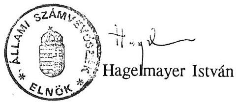

---

ALLAMI SZAMVEVOSZEK
$\mathrm{V}-14-77 / 1992-93$.

# M E L L E K L E T E K 

a PHARE programból finanszirozott magyar környezetvédelmi program elökészitésének és a pénzügyı támogatások felhasználásának ellenörzéséröl készült jelentéshez

---

# T A R 'T A L O M J E G Y Z E K 

1. sz. melléklet

A tételesen ellenőrzött projektek megvalósításáról készített vizsgálati jelentések
2. sz. melléklet

A Phare Programból finanszírozott magyar környezetvédelmi program I. üteme kialakításának kronológiája
3. sz. melléklet

Kimutatás a Phare I. ütemében támogatásra jóváhagyott projektekröl
4. sz. melléklet

A Phare II. ütemében jóváhagyott támogatás kiemelt területenkénti tervezett megoszlása
5. sz. melléklet

A Phare I. ütemben elfogadott projektekre jóváhagyott támogatások felhasználásának helyzete
6. sz. melléklet

Eltérések az eredetileg tervezett idöszükségletekhez képest a projektek megvalósítása során
7. sz. melléklet

A Phare II. ütem 1. munkaprogramjában támogatásra jóváhagyott projektek
8. sz. melléklet

A miniszteri záróészrevételeket tartalmazó levelek

---

1. sz. melléklet a

V-14-77/1992-93. sz. jelentéshez

A tételesen ellenőrzött projektek megvalósításáról készített vizsgálati jelentések

- G-124 Regionális Integrált Monitoring Rendszer
- G-135 Fertő-tavi nemzeti park létesítése
- G-152 Környezeti oktatási és képzési csereprogram
- A-101 A Emisszió-mérő hálózat korszerűsítése
- A-101 B Immisszió-mérő hálózat korszerűsítése
- W-104 Körös-völgyi holtágak rehabilitációja
- W-123 Iszapkotrás és nádaratás a Balatonon
- W-113 Ipari hulladéklerakó Eszak-Nyugat Magyarországon
- E-202 Fluidágyas tüzelésre való áttérés az Ajkai Eromuben

---

# AILAMI SZAMVEVOSZEK 

Vagyonkezelö Föcsoport
V-14-40/1992.

## Vizsgálati jelentés

a G 124 számú "Regionális Integrált Monitoring (RIM) rendszer létesítése" (tanulmány) projekt megvalósulásának helyszíni vizsgálatáról

## I.

Az ellenőrzött szervezet neve és címe:
Környezetvédelmi és Területfejlesztési Minisztérium;
PHARE Programiroda
1934 Budapest, Fö u. 44-50.

Az ellenőrzés célja annak megállapítása, hogy a projekt előkészítésében és megvalósításában közremüködő szervezetek együttmüködése és intézkedései hogyan segítették elő a kapott támogatás eredményes és gazdaságos felhasználását, a kitüzött célok elérését. A végrehajtás során betartották-e a jogszabályi előírásokat, a PHARE programban megszabott feltételeket.

Az ellenőrzött időszak: a projekt indulásától
1992. szeptember 15-ig.

Az ellenőrzést végzők neve: Pallós Gáborné tanácsos
Réthelyi Jenő számvevő
Vasas Sándorné dr. tanácsos

---

A helyszini ellenörzés kezdete és befejezése: 1992 szeptember 3 - 23.

# II. 

## Megállapítások

A projekt keretében az országban bevezetendö, a környezet- és természetvédelemmel, valamint a területfelhasználással kapcsolatos megfigyelési, katasztrófa-elhárítási és döntéselökészitö rendszerre - meghatározott üzemi mintaterületeken szerzett tapasztalatok alapján - megvalósíthatósági tanulmány készül. A projekt célja az adattárolási és visszakeresési munka, valamint a döntéshozatal egyszerüsítése.

1. A projeikt elökészitése

A Regionalis Integrált Monitoring (RIM) rendszer hazai kialakításának - múködtetésének elméleti programja az informatika nemzetközi szakértöi körében érdeklödést keltett, ezzel bekerült a PHARE segèly elsö ütemének projektjei közé.

A projekt menedzseri teendök ellátásával a RIM rendszer szerzöjét bizták meg, aki az 1978-80-as években a rendszer elvi alapjait kidolgozta.

Az elfogadott elsö - 1990. október 1 - 1991. március 31. közti idöszakra vonatkozó - munkaterv meghatározta a megvalósítás és a kifizetések ütemtervét.

E szerint a tenderdosszié (versenykiírási dokumentáció) 1990. november végére készül el, a megvalósíthatósági tanulmány elkészítési határideje 1991. augusztus, a kifizet-

---

hető díj 110.000 ECU és 170.000 ECU értékú magyar hozzájárulás. A magyar hozzájárulás a későbbi munkatervekben már nem szerepel.

A projekt szakmai előkészitéséért a projekt menedzser a felelős. Az előkészítés azonban - annak ellenére, hogy a szakmai irányítást a rendszer szerzője gyakorolta - jelentősen elhúzódott.

A személyes tárgyalásokon elhangzottakból és a belső levelezésekből kitűnt, hogy már a célmeghatározást tekintve sem volt egységes álláspont.

Ennek a bonyolult, ilyen komplexen a világon még sehol sem múködő rendszernek a megvalósítása több minisztérium koordinációját, érdekeik olyan mértékú integrációját követeli meg, amit az EK Bizottság szakértőjének (Mr. J. de Bauw) 1990. januári megállapítása szerint a környezetvédelemmel összefüggö ellenérdekek miatt igen nehéz realizálni.

Hátráltatta az előkészítést a szerző szakmai és személyes ellentéte a Környezetvédelmi és Területfejlesztési Minisztérium (KTM) szakvezetésével, elsősorban a rendszer felhasználási- rendelkezési jogosultságát illetően. 1992 január 20-i feljegyzése szerint projekt menedzseri tevékenységét felmondta. Ennek tudomásul vételéről, illetve intézkedésről nem kaptunk dokumentumot.

A mellékletben foglaltuk össze a projekt életútját eseménynaptár szerűen, a dokumentumok rövid ismertetésével. A hivatkozott dokumentumok betekintésre az Állami Számvevőszéknél rendelkezésre állnak.

---

2.) A projekt megvalósitása

A projektek megvalósitását bemutató és szervező munkaprogramokból kitünt, hogy a projekt állandó lemaradásban van.

|  | I. Munkaterv   (1990.09.12.)   szerint | Tényleges   ill. új   ütem |
| :-- | :-- | :-- |

Tenderdosszié elkészítése 1990. 11. 1991. 07.31.
Tender-meghívás 1990. 12. 1991. 09.13.
Tender kiértékelés 1991. 04. 1991. 12.09.
Szerződéskötés 1991. 04. 1991. 12.17.
Végsö jelentés 1991. 08. 1991. 11.24.

A projekt menedzser 1991 január 2-án adta át a PHARE Irodának (PMD) az angol nyelvú RIM Definición tanulmányt, a célmeghatározást és az aktualizált fejlesztési irányelveket pedig március 8-án küldte meg a közigazgatási államtitkárnak jóváhagyásra.

Ugyancsak a tenderdosszié részét képező meta-adatbázist a GEOMETRIA Térinformatikai Rendszerház KSz. készítette el a KTM megbízására.

A tendereztetés rövid listával történt. A vállalkozók listáját a projekt menedzser állította össze. Valamennyi cég külföldi volt. A projekt menedzser tájékoztatása szerint az általa ajánlott magyar vállalkozókat a PMD külföldi szakértői nem fogadták el. Erre vonatkozó dokumentumot azonban nem találtunk. Az EK Képviselet a listával egyetértett.

---

Az október 15-i határidőre 3 vállalkozótól érkezett pályázat. a tenderbontás a szabályoknak megfelelően folyt. A pályázatok értékelésére a projekt menedzser 7 tagú bizottságot javasolt, 2 fő a minisztérium, 5 fő az érintett társtárcák képviselöje volt.

A kiértékelés végül 4 tagú bíráló bizottsággal a PHARE elöírások betartásával, pontozásos rendszerben történt. A pályázatot a német Dornier GmbH nyerte, aki az angol GIBB'S és a magyar GEOMETRIA szakértöi bevonásával ajánlotta a legkedvezöbb áron elkészíteni a tanulmányt.

| Dornier | 98.000 ECU | (német) |
| :-- | :-- | :-- |
| HYDEA | 102.000 ECU | (olasz) |
| BRGM | nem minösithetö | (francia) |

Az 1991 december 17-én aláirt szerződés szerint a kiszámított befejezési határidő 1992 június 29. A tényleges munkafolyamat az 1992 január 28-29-i budapesti munkaértekezlettel kezdődött, melyen meghatározták a munkarészek tartalmát. részhatáridejét és módosították a befejezési határidőt 1992 szeptember 18-ra.

Az 1991 április 29-i munkamegbeszélésre két részjelentés készült el:

- WP 1000 létező rendszerek áttekintése a GEOMETRIA,
- WP 2000 RIM koncepció és modell a Dornier GmbH munkája.

---

A részjelentéseket a PMD - a projekt menedzser javaslatára felkért - bírálóknak küldte meg. A bírálók véleménye szerint mindkét részanyag átdolgozandó.

Az 1992 június 29-i munkamegbeszélésre

- a WP 2000 A meta-adatbázis leírása
- a WP 3000 RIM hálózat koncepciója
címú részanyagokat szállitották le. melyeket a PHARE Iroda továbbküldött a bírálóknak.

Az 1992. augusztus 26-28-i munkamegbeszélésen az üzemi mintaterületeket - Kecskemét és Veszprém - jelölték ki. A vállalkozó legutolsó szeptember 11-i levelében jelzi. hogy a magyar adatszolgáltatás késedelme miatt a tanulmány szállítási határideje 1992. november 24. lesz.
3.) A projekt finanszirozása

A rendelkezésre álló 98.000 ECU támogatási összegből a vizsgálat lezárásáig kifizetés nem történt.
4.) Következtetések

A projekt megvalósítása az eredeti ütemhez képest jelentős, több mint egy éves lemaradásban van, határidőre történő befejezésének garanciái nem ismertek, kifizetés még nem történt.

---

- A hosszan elhúzódó előkészítés és a többszöri célmódosítás arra utal, hogy a projekt megalapozottságának, müszaki-gazdasági- pénzügyi realitásának elemzése az előterjesztés szakaszában kellő alapossággal nem történt meg, a megfigyelő rendszer terjedelme a minisztériumi feladatok változásával egyidejúleg egyre bővült.
- A projekt menedzseri megbizáshoz nem kapcsolódott konkrét feladat és kötelezettség előirás. Következményként a megvalósításért elsősorban felelős projekt menedzser minden döntési ponton ott volt ugyan, de csak tanácsadói tisztet látott el. Nem segítette a projekt megvalósulását az a különleges körülmény sem, hogy a projekt menedzser egyben a RIM rendszer tervezöje és szerzője.
- A befejezési határidő teljesítését akadályozó, a német fővállalkozó felé történő magyar adatszolgáltatási késedelmet meg kell szüntetni, a szerződéses fegyelem betartására a projekt felelősei fordítsanak nagyobb figyelmet.
- Törekedni kell a jövöben arra is, hogy a helyi körülményeket jól ismerő, kellő referenciával, felkészült szakemberekkel rendelkező magyar vállalkozók is felkerülhessenek a rövid listákra, mert jelenleg jellemzően csak külföldi cégek alvállalkozóiként dolgoznak.
- A munka befejezésekor készítendő zárójelentésben javasoljuk megvizsgálni, hogy a tényleges hazai viszonyok- tendenciák figyelembevétele reális volt-e, továbbá a költségráfordítások arányosak-e a várható eredménnyel.

---

Mindezek mellett a projekt folytatása csak akkor látszik célszerűnek, ha az érintett tárcák egyetértésben, miniszteri jóváhagyással támogatják a rendszer kísérleti bevezetését. Ennek hiányában a rendszer megvalósításának és eredményes múködtetésének realitása csekély.

Budapest, 1992. október 28.

Pallós Gáborné sk. Réthelyi Jenó sk. Vasas Sándorné dr. sk. tanácsos számvevó tanácsos

---

# A G 124. KIM projekt kronológiája 

1.) A RIM projekt célját 1989-ben annak szerzoije és tervezōje, dr. Usalagovits István (akkor a KVM Informatikai osztalv vezetöje) fogalmazta meg.
A projekt egy, az északi országok által kidolgozott Integrált Monitoring (IM) rendszer honositását, fejlesztését és kiterjesztését kiván.ja megoldani.
Koncepcionalis alapjait a (iIK (Geoscience Information Kesearch) koncepció képezi, melynek szerzoije ugyancsak dr. Csalagovits István. A (iIK koncepciót nemzetközi szakértöi tórumok hitelesítették. 1989-ben ennek a GIR rendszernek környezetvedelmi hasznosítását kezdeményezte a szerzo.

A PHARE támogatásra igényt tartó projekt-tervezeteket 1990 januárjában vizsgálták felül az OECD EEC szakértők. J. de Bauw úr közvetlen értékelése szerint a RIM fejlesztésben egy, az EEC országok érdekeivel is lefedett, hosszú távú tejlesztési program alapjait látta. Annak a véleményének adott ellenben hangot, hogy az olyan mértékü funkcionális integrációt, mint amilyet a RIM kifejez, rendkívül nehez lesz realizálni a körnvezetvédelemmel összefüggö, részben azon belüli ellenerdekek miatt. Esélyt a fejlesztés sikerére csak a regionális-lokális szférában (az önkormányzatok érdekszférájában) látott. Ezért hosszabb, és a feasibility készítést, a tervezési munkákat jól megalapozó előkészületi idöt javasolt.

A PHÄKK program elsó ütemébe tehát a RIM eleve, mint definiciós és feasibility (megvalósíthatóság) készítési munka került be.

---

2.) 1990 október l2-én hagyta jóvá az KK Bizottság az első ń hónapra ( 1990 október - 1991 március) szóló munkaprogramot. Ebben a Programiroda vonalas megvalósítási ütemterve szerint a tenderdosszié kimunkálását 1990 november végére irányozták elő.
3.) 1990 végére a KVM megbízására a GÉUMETRIA Térinformatikai Rendszerház Ksz. elkészítette a KIM Metaadatbázis első változatát, amely a feasibility készítésére pályázó vállalkozók számára biztosít információs hátteret.

1991 január 2-án dr. Usalagovits István kísérőlevéllel megküldte a PHÁrK Irodának a KIM Definición tanulmanyt angol nyelven betekintés és az adminisztrációs munkák indítása céljából. A levél szerint az anyag elkészítése nem a szerzó munkaköri kötelessége, az magánvállalkozásként készült, felhasználásának jogi kereteit tisztázni kell.

A KIM Metaadatbázis bemutatására 1991 január 31-én, a KIM informatikával kapcsolatos álláspontjának kialakítása érdekében a KIM projekt kérdéseiről tartott munkamegbeszélésen (vezetője dr. Kiss Elemér közigazgatási államtitkár) került sor.

A munkamegbeszélés dr. Usalagovits István feladatául jelölte meg, hogy készítsen jelentést 1991 február 15-ig a KIM projekt alkalmazási területeiról, felhasználási lehetősegeiről. A jelentés határidőre elkészült. Ennek VI. fejezetében a tenderdosszié összeálításának

- felelőse Vertse Miklós PHÁrK Iroda
- közremúködők: szakmai témá́elelősök (területfejlesztési témafelelős: dr. Szaló Péter főo.v., környezetvédelmi témafelelős: dr. Bulla Miklós főov.)

---

4.) A tenderkiirás előkészitésének céljából 1991 március 8-án a projekt menedzser megküldte a közigazgatási államtitkárnak (dr. Misley Károly) a környezetvédelmi és a területfejlesztési szakmai témafelelősökkel már jóváhagyatott projekt célkitüzéseket, ill. aktualizált fejlesztési irányelveket.
5.) A tendereztetés rövid listával történt. 1991 szeptember 9-ére állt össze a projekt menedzser javaslata szerint a pályázatra meghívandó vállalkozók listája (német, holland, olasz, francia, spanyol, portugál, görög cégek), melyet szeptember 10-én továbbított a PHARE Iroda az EK budapesti delegációhoz.
6.) 1991 szeptember 13-án küldte ki a PHARE Iroda a vállalkozóknak a tenderdossziét. Az ajánlatok benyújtási határideje 1991 október 15. volt.
7.) A "Technikai Dosszié" nyitása október 15-én történt. A nyitáson a projekt menedzser (dr. Csalagovits István), a PHARE Iroda és a KTM képviselöi vettek részt.
A pályázatok értékelésére 4 tagú bizottság alakult, akik a vonatkozó előírásoknak megfelelően kötelesek a pályázatokat EK előirás szerinti pontozással elbírálni.
A tender-nyitásról készített emlékeztető rögzíti, hogy a felhívásra 3 cég - HYDEA (olasz), Dornier (német), BRGM (francia) - nyújtott be pályázatot. Valamennyi bírálótól a Dornier kapta a legmagasabb pontot.

Az első értékelő-tárgyalás a pontozás homogenitásának biztosítására, 1991 november 14-én volt, melyen a projekt me-

---

nedzser, a PHARE Iroda képviseletében a projeettélelös (Vértse Miklós) és a külföldi tanácsadók vezetöje (Max v.d. Sleen), valamint 2 felkért biráló vett részt.

November 27-én a PHARE Iroda képviselöi és egy biráló jelenlétében felbontották a Pénzügyi Dossziékat. A BRGM ajánlata nem volt minösíthetö, a HYDEA 102.480 ECU-ra, a Dornier 98.000 ECU-ra tett ajánlatot.
8.) 1991 december 9-én a PHARE Iroda levélben értesítette az EK budapesti képviseletét a pénzügyi dosszié felbontásáról és a gyöztes (Dornier) megnevezéséről. A gyöztes cég 2 társsal (az angol GIBB'S és a magyar GROMETRIA) vállalkozott a munkára.

A Dornier konzultáns cég a tenderében, a következö ajánlatot tette:
hónap
$\begin{array}{lllllll}1 & 2 & 3 & 4 & 5 & 6\end{array}$
WP 1000 Magyarországon meglévő rendszerek
WP 2000 META-DR
WP 3000 RIM-GIS hálózat
WP 4000 A RIM-hálózat kiterjesztése PENTAGONALR
WP 5000 Uzemi mintaterületek
WP 6000 Javaslat a menedzsmentre
9.) A szerzödést 1991 december 17-én írták alá, és erről december 20-án értesítették az EK Képviseletét.
A riportok (részdokumentációk) elkészítésének ütemezése a szerződés életbelépésétől számítva:

---

A múködó rendszerek felderítése Magyarországon és a
Hexagonálébán: 5. hét.
A RIM META-DB kiterjesztett követelményei: 11. hét.
A RIM hálózat architektúrájának megtervezése: 21. hét.
Javaslat az üzemi mintaterületekre: 25. hét.
Javaslat a menedzsmentre: 21. hét,
Összefoglaló jelentés: 26. hét
A kiszámított veghatárido 1992. június 29.
10.) A tényleges munkafoívamat az 1992 január 28-29-i. KTM-ben tartott elsó munkamegbeszéléssel kezdődött, meiven a tárgyalási összefoglaló szerint a tervezök (Dornier, GIBB'S, GEOMETRIA), a PHARE Iroda képviselöi, a projekt menedzser és a KTM illetékesei vettek részt.

A tárgyaláson munkaszervezési (pl. szükséges adatszolgaitatások), munkatervi kérdések, szállítási hataridók kerültek megvitatásra, elfogadásra.

Az aktualizált munkaterv szerint:
A múködó rendszerek felderítése Magyarországon és a
Hexagonáléban (előzetes): febr. 28.
A RIM META-DB kiterjesztett követelményei: máj. 8.
A RIM hálózat architektúrájának megtervezése: jún. 17.
Javaslat az üzemi mintaterületekre: jún. 17.
Javaslat a menedzsmentre: jún. 17.
Összefoglaló jelentés: aug. 20.
A Megvalósíthatósági Tanulmány végleges jelentésének
tervezete és megvitatása, zsúrizése
szept. 7-18.

---

11.) A KIM szempontjából szóba iöheto informacios rendszerokröl és adatbázisokról a GEOMETRIA végzi az adatavijtest. Az adatok elöteremtese informacióink szerint a tervezettnél több idöt igénvejt.
12.) A második munkamegbeszelés 1992 aprilis 29-én volt. Ezután a projekt menedzser által javasolt szakmai birálóknak küldte meg a PHARE Iroda a munkaprogram szerinti 1. és 2. beszamoló jelentést (W 1000 A létezö rendszerek áttekintése: W 2000 KIM koncepció és modell /előzetes/) vélemenyezés céljából. A véleményeżes arra irányuljon, hogy a biráló szakterületének információ-igenyeit milyen mértékben elégitené ki a KIM ajánlotta megoldás.
Véleményezési határidó május 21. A bíralatok néhány nap késéssel, május 29 -júnus 2 között érkeztek be.
13.) 1992 június 12-én a Dornier levelben értesiti a projekt menedzsert a következó munkamegbeszélés elhalasztásáról és a munka befejezésének halasztásáról.
14.) A harmadik munkamegbeszélés 1992 június 29-én volt, melyen a WP 2000 (Metaadatbázis) jelentés végleges anyagának és a WP 3000 (RIM koncepció) elözetes anyagának bemutatása történt meg. Az elkészült anyagokat a PHARE Iroda ismét birálatra adta ki.
15.) 1992 július 3-án a PHARE Iroda levélben közli a tervezö Dornier GmbH-val a 3 mintaterületet: Eszak-Magyarorszag, Közép-Dunántúl, Alföld.

---

16.) A neqyedik munkamegbeszelès, melven kijelölték az üzemi mintaterületeket (Kecskemét és Veszprém) 1992 augusztus $26-28$-án volt.
17.) 1992 szeptember 11-én a lornier GmbH levélben megküldi dr. Csalagovits istvannak a megvalósithatósági tanulmány utolsó fázisának munkatervét. A munkaterv betarthatósága érdekében fontosnak tartja, hogy az általa kért információkat a magyar fél küldje meg nekik vagy a GEOMETRIA-nak. Figyelmezteti a projekt menedzsert, hogy a július l-1 jegyzökönyvben igért, a további munkához szükséges magyar anyagok még mindig nem érkeztek be. A tanulmány november 24-i szállítása az anyagok beérkezési idejétól függ. Mellékel egy új adatgyújtó kérdőivet, melyet 5 kísérleti régió intézményei, kitöltési utasítás szerint kitöltve, küldjenek meg.

---

Állami Számvevöszėr
Vagyonkezelö Föcsopont
$V-14-41 / 1992$

Vizagálati jelentés

A PHARE Program által támogatott G-135. számú
"Fertö-tavi Nemzeti Park létesítése" projekt megvalósításának
helvszini ellenorzéséröl

1 .

Az ellenörzött szervezet neve és címe :
PHARE Programiroda
1394 Budapest Fö utca 44-50.

Fertö-tavi Nemzeti Park Igazgatóság
9400 Sopron Károlymagaslati út 14.

Az ellenörzés célja annak megállapítása, hogy a projeikt elökészitésében és megvalósításában közremüködö szervezetek együttmüködése és intézkedései hogyan segítették elö a kapott támogatás eredményes és gazdaságos felhasználását, a kitüzött célok elérését. A végrehajtás során betartották-e a jogszabályi elöírásokat, a PHARE programban megszabott feltételeket.

Az ellenörzött idöszak:
A projekt indulásától 1992. szeptember 15-ig.

---

Az ellenoræest végzök neve: Pallós Gaborné tanácsos
Kéthelyi Jeno szamvevó
Vasas Sándorné dr. tanácsos

A helysini ellenorzes kezdete es befejezese:
1992. augusztus 22. - szeptember 22.

A projekt elökészitésének, megvalósitásának folyamatát eseménynaptárszeruien a Mellékletben mutatjuk be.
A vizsgálati jelentés megállapításait, javaslatait alátámasztó dokumentumok betekintésre az Allami Szamvevoszérnél rendelkezéare állnak.

---

A vizsgálat megállapításai

Magyarország és Ausztria kormánya 1986-ban állapodtak meg a Fertö-tó területének nemzeti parkka nyilvánításáról. A megállapodás értelmében egv kutatókból álló kétoldalú bizottság kíséri figyelemmel a Nemzeti Park létrehozását. A megvalósítás érdekében elöirányozták 3500 ha terület, s hozzátartozóan a területre vonatkozó halászati és vadászati jog megvásárlását.

1. A projekt megvalósitásának elókészítése

A Körnvezetvédelmi es Területfejlesztési Minisztérium PHARE Programiroda vezetoje 1990. október 9-én levélben ertesítette a KTM Természetvédelmi es Tájvédelmi Föosztályát a PHARE segitségnyújtási keretegyezmény, valamint a finanszírozási Megállapodás aláírásáról.

E levélhez mellékelték a PHARE segély elsó ütemének reszeként jóváhagyott G-135 Fertö-tavi Nemzeti Park projekt rövid leírását, s az 1990. október 1. - 1991. március 31-i idöszakra vonatkozóan elfogadott munkaprogramot, megvalósítási és kifizetési ütemtervet.

A megvalósítás elökészítése során a projekt tartalma jelentösen változott.

Kezdetben az IUCN elöírásoknak megfelelő "naturzóna" kialakításához szükséges földterület megvásárlásáról tárgyaltak. A későbbi tárgyalásokon nyilvánvalóvá vált, hogy a PHARE források területvásárlásra nem fordíthatók, azt hazai forrásból kell biztosítani.

---

A PHARE Irodan dolgozó bolland szakértökkel egyetértés alakult ki atekintetben, hogy a rendelkezésre álló segèlyt a Nemzeti Park infrastruktúrájának kialakítására kell fordítani. Ennek megfelelöen a projeikt célkitüzéseit a következök szerint határozták meg :
I. A Nemzeti Park épületeinek ( kutatási, oktatási és bemutató létesítmények ) felépítése
II. A Nemzeti Park kutatási, oktatási és turisztikai feladatainak ellátásához szükséges eszközök beszerzése

A projeikt leírás rögziti a beszerzések, az épületrehabilitációs munkák várható idópontiját. A PHARE források felhasználására vonatkozó szabályok szerint a megvalósítás során a vállalkozókat, a szállitókat az 50000 . ECU-t meghaladó szerzödéseknél versenytárgyalások útján kell kiválasztani. Igy a megbízások odaítélesére a versenytárgyalások felolvtatása után, a tenderbontásokat követöen kerülhet sor, ami mintegy négy hónapot vesz igénybe.
Ennek megfelelöen

- a beszerzések 1991. közepére,
- az építési munkák 1991. februárjára ütemezhetök.
(Megjegyezzük, hogy ez a projekt leírás még épületrehabilitációról beszél. Nem ismeretes, hogy milyen döntési folyamat eredményeképpen, s mikor határoztak az új épületek megépitése mellett.)
Rögzítik, hogy a feladatok ütemezéséhez igazodoan az első jelentösebb kifizetések 1991-ben várhatóak, s a nagyobb mértékú kifizetés 1992-re tervezhető.
A halászati és vadászati jog megvásárlását 1991 februárjára iránvozták elő.

---

A megvalósitas teljes ráforditását 2500 ezer KCU -ban határoztak meg. Ebböl 1400 ezer KCU a PHARE forrás, s mintegy 1100 e KCU-nak megfelelö forint a magyar állam hozzájarulása. Már ez az elsö munkaprogram elhatárolja a kíizzetések ütemezésénel az építési munkákra, illetve a beszerzésekre fordítható hánvadot a PHARE forrás megosztása tekintetében; 800 ezer KCU az építési feladatokra, s 600 ezer KCU-t a beszerzésekre irányoz elő.
2. A projekt megvalósitása

A projekt megvalósításában az eredetileg tervezett ütemhez viszonyítva jelentös lemaradás van :

Munkaprogram szerint Megvalósitás tényl. (1990. 09.13.) időpontja, ill. uj ütemezése

# I. Beszerzések 

Tenderdosszié elkészitése: 1990.09.
Tender közzététel: 1991.01.
Tender kiértékelés: 1991.02.
Szerzödéskötés: 1991.02.
Megvalósítás: 1991.06.
II. Építési munkák

Tenderdosszié elkészitése: 1990.10. . 1991.11.
Tenderközzététel: 1991.01. 1992.01.
Tender kiértékelés : 1991.02. 1992.03.
Szerzödéskötés: 1991.02. 1992.03.
Megvalósítás: 1992.I. név 1993.02.
III. Vadászati, halászati jog megvásárlása
1991.02.

---

Az építési munkák megvalósítása
A PHÁRE forrásokból megvalósuló munkák általános szabálvaınak megfelelően a projekt építési munkáinak megvalósítására versenytárgyalás kiírását készítették elö. Az első tender kiírást a minisztérium megbízásából 1990. XII. 18-án a Környezetgazdálkodási Intézet készítette el.

A PHARE Programíroda megitélése szerint az Intézet által elkészített anyag nem felelt meg az EK követelményeinek, mely szerint a tenderezést a nemzetközi mérnök tanácsadó szervezet a FIDIC elöírásai alapján kell elökészíteni. Ezért saját hatáskörében döntve a tender újbóli elkészítésével külső szakértőket bízott meg. A megbízott szakértők a FIDIC elöírásoknak is megfelelö tenderdossziét 1991 november 7-re készítették el. Tehát közel 10 hónapra volt szükség a követelményeknek megfelelö tenderdosszié összeállitásához. (Az első összeállítást sem az EK Budapesti Képviseletének (EKK), sem az EK Bizottságnak nem mutatták be.)

A szakértők által elkészített - második - tenderdossziét a PHARE Iroda az EKK-nak bemutatta.

Az KKK a tenderdossziét megfelelőnek találta, s a rövid listás pályáztatással is egyetértett.

A vállalkozói rövid listát a projektmenedzser állította össze, egy 1991 januárjában, a FIDIC elöírásai szerint lefolytatott prekvalifikáció alapján.

A kiválasztott 7 vállalkozónak 1991. november 28-án küldték ki a felkéréseket. A megjelölt határidőre, 1992 január 15-re két ajánlat érkezett.

Az ajánlatok AFA nélküli összege :

- Nyirfa Kisszövetkezet 245,7 millió Ft
- Soproni Mestervonal Kft 109,2 millió Ft.

---

A hataridore beerkezett ket tendert egy hattagu bizottsag minosítette, a minden tekintetben a Soproni Mestervonal Kft ajánlatát találta megfelelőnek. (A Bizottsag elnöke a projektmenedzser, tagjai helyi szakertök voltak.) A helvszini vizsgálat során áttekintettük a nyertes vállalkozó prekvalifikációs anyagát. Ennek tanusága szerint a vállalkozó az alkalmasságát eldöntö kérdésekre pusztán formálisan válaszol, illetve az általa bevonni kívánt Fertődi Ipari Szövetkezetre hivatkozik. Az építési piacon ugyan jó híru szövetkezet azonban pályázati anyagot nem nyújtott be, így a prekvalifikációs kérdések érdemben megválaszolatlanul maradtak.

A PHARE Iroda 1992. március 3-án levélben értesítette a projekt menedzsert, hogy az KKK jóváhagyta a kiirt tender értékelését, es hozzájarult a Soproni Mestervonal Kft-vel történt szerzödéskötéshez.
A Soproni Mestervonal Kft ajánlatának megfelelően a Fertodi Szövetkezettel konzorciumban vallalta a feladat teljesitését. (Erre vonatkozoan egy háttér megállapodást is bemutatott.)

A projektmenedzser értesitését követö héten a nyertes pályázó és a Nemzeti Park vezetői egy megbeszélésen rögzítették az építési feladatot, a szerződéses összeget, a megkötötték a szerzödést.

A megkötött szerzödés azonban mind müszaki tartalmában, mind szerzödéses összegében eltér a tenderben foglaltaktól: - A kiírás, s így az ajánlat nyolc létesítményre vonatko-

---

zott. a szerzodes mellékleteként csatolt megállapodás (meivet az eredmènvhirdetést követö héten kötöttek meg) három, az eredetileg tervezett létesítménvek runkcióit részben megvalósító apillet megépitését tartalmazza.
(Elhagvták a fedett kerekpárkölcsönzö, a két csónaktároió megépitesét, a az orházzal együtt egy majorság is érül. A módosítasokat a Nemzeti Park idöközben bővülö feladatai indokolták.)

- A nyertes ajánlathoz tartozó szerzödéses összeg (AFA nélkül) "ahhez igazodoan" 109,2 millió Ft-ról 90 millió Ft-ra változott. (A 90 millió Ft közelítóleg megegyezik az építési feladatokra EUU-ban elöirányzott értékkel.) A Programiroda a szerzodést jóváhagyta.
Arról nem állt rendelkezésre dokumentum, hogy a tenderkiirástól történö eltéréshez az EKK hozzá,járult-e.

A Programiroda szerzödéskötést jóváhagyó levelében eloirta. hogy a vállalkozó készitsen részletes kivitelezési ütemtervet, ezzel összhangban számlázási tervet, valamint mutassa be a tenderkiirásban elöirt teljesítési garanciát. Kéri, hogy ezek egy-egy példányát a Programiroda részére juttassák el.

A helyszíni tájékozódás során ezen iratok egyike sem állt a Programirodán rendelkezésre.
Ezt látszik pótolni a F̣̣rto-tavi Nemzeti Park Igazgatósága részéről a Programirodára 1992. július 7-én eljuttatott kivitelezési, pénzügyi ütemterv, a számlázási terv. A Nemzeti Park Igazgatósága részéről eljuttatott "Teljesítési garancia" nem felel meg a tender elöírásának, mivel aszerint annak nem a vállalkozótól, hanem banktól kell származnia.

---

A Fertö-tavi épületek készültségi állapotát az Igazgatóság megbizásaból eljáró múszaki ellenór 1992 június 2-i jelentésében megfelelönek itélte.
Helvszini tájékozódásunk során megállapítottuk, hogy a kivitelezés az építési ütemtervnek megfelelően halad, készültségi foka idöaránvosan is eléri a tervezett mértéket. Az építési naplót, a felmérési naplót a helyszínen találtuk, a bejegyzések folyamatosak, követik az építés előrehaladását.

# Beszerzések 

A Programirodan, illetve helyszini tájékozódásunk alapján megállapítható: a projektmenedzser és a PHARE Iroda, illetve az EKK, a brüsszeli EK Bizottság' között többszöri levélváltás is történt a beszerzési tender véglegesitésével kapcsolatban. Különbözö tartalmu javaslatok készültek, a tender kiírásra azonban nem került sor.
(- 1990. augusztus 15.; a beszerzendo eszközök listája

- 1992. február 12-i kiegészités
- 1992. február 17.; a tenderdosszlét megküldtek az EK Delegációnak
- 1992. március 31-én az EKK értesítette a PHARE Irodát, hogy a tender közzététele 1992. áprilisára varható.,

Az EK Bizottságtól az EKK közvetítésével 1992. 05. 08-án kapott levél zárta le a tárgybani - több hónapon át húzódó - sorozatos, és állandóan módosuló tender elökészités folyamatát.

Intézkedésük szerint, a beszerzendő tárgyakból képezhetők, olyan csoportok, amelyek egyenkénti értéke nem haladja meg az 50000 KCU-t, s ebben az esetben nincs szükség verseny-

---

tárgyalás lefolytatására. Klegendő, ha három szállítótól proforma ajánlatot kérnek, s eközül választjảk ki a legmegfelelöbbet.

Ezzel a beszerzések kezelése a projektmenedzser hatáskörébe került, a PHARE által jóváhagvott pénzügyi keretek között. Helyszini tájékozódásunk során a Nemzeti Park igazgatója, a projektmendzser tájékoztatott bennünket arról a szándékáról, hogy a beszerzések összetételében - az eredetileg megfogalmazott célnak megfelelően - növelni kívánja a Nemzeti Park tevékenységével, a kutatással összefúggo eszközök arányát az irodai berendezések rovasara. (Az eredeti lista több olyan tételt tartalmaz, amely a szokásos berendezési tárgyak körét nem lépi túl.) Onmagasan azt is megrontolandónak tartjuk, hogy PHARE forrásokból ilyen. a szokásos irodai berendezések vasárlását finanszirozzák, de a versenyeztetés megszervezése, az ahhoz szükséges dokumentumok elökészitése még olyan további ráfordítást jelent, amely a kis értékú berendezések vásárlását indokolatlan mértékben megdrágitja.

Reálisnak, indokoltnak tarjuk az KK Bizottság döntését, s a jövöre vonatkozóan megtontolandónak látjuk, hogy ilyen típusú beszerzési javaslatok ne is kerüljenek elöterjesztésre.
3. A teljesítmények elszámolása és finanszírozása

A kifizetéseket minden esetben forintban teljesítették. Az építési munkák versenyeztetéséhez a FIDIC elöírások szerinti tenderdosszié elkészítéséért 1991. 12. 10-én kifizettek $1840,62 \mathrm{ECU}-\mathrm{t}$.

---

A PHARE forrásokból az építési munkák finanszirozására a helyszini ellenorzés lezárásáig négy kifizetést teljesitettek ;

- 1992. 04. 23.; 181910,06 ECU, azaz 18 millió Ft a szerzödéses feltételeknek megfelelö 20 \%-os mértékü előleg.

A tenderkijrás az elöleglevonas szabályaként elöirja, hogy a benyuitott szamlák és a teljes számlaérték aránvában a közbensö kifizetésekböl az eloleg meg határozott részét le kell vonni. A 60.11. pont magának, a levonas összegének meghatározására is ad számitási metódust.

A részünkre bemutatott számlákon azonban csak a 10\%-os visszatartás szerepel, az elöleg nem kerül levonásra.

- 1992.06.08.; 99576,11 ECU
- 1992.06.18.; 192698,75 ECU
- 1992.07.27.; 278342.85 ECU
(Az AFA-val növelt értéken benyújtott számláknak megfelelöen átszámitott összegek.)
Igy mindösszesen az építési munkákra elöirányzott 800000 ECU-ból a munkák mintegy 40 \%-os készültségi fokán átutalásra került 752527,77 kCU, azaz mintegy 77 millió Ft. Ez az AFA-val növelt szerzödéses összeg $70 \%$-a.

A szerzödéses feltételeknek megfelelően a kivitelezés szerzödés szerinti ára csak a mennyiségi Helmérés alapján valtozhat, tehát ha a megvalósitás során egy-egy adott munkatételböl többet számolnak el, mint amennyi az ajánlatban szerepel. Az egységárak az ajánlatban szereplö fix árnak tekintendök.

---

Kbbol következöen kiemelt jelentósége van annak, hogy a kivitelezés elörehaladás során benyújtott számlák mennyiségi megalapozottsága mellett vizsgálják, illetve figyelemmel kísérjék, annak viszonyát az ajánlatban szereplő összértékhez képest.

Helvszini tájékozódásunk során ilyen nyilvántartással sem a helyszini múszaki ellenór, sem a Programiroda projekt felelőse nem rendelkezett.

Szükségesnek látjuk, hogy

- a Programiroda, a projektmenedzser, s a vállalkozó közösen tekintse át az eddigi kifizetéseket, az elöleg beszámítás gyakorlatát, s érvényesitsék a tenderkiírásban foglaltakat.
- a müszaki ellenör végezze el a teljesitett, elismert mennyiségek összesített felmérését, s erröl adjon tájékoztatást a Programirodának.
Allapítsák meg az eddigi kifizetések és a még nem teljesített mennyiségek értékbeni hatását a szerződéses árra.

A vállalkozó értelemszerüen AFA tartalmú számlákkal számláz.

A Nemzeti Park Igazgatóság a múszaki ellenör által szignált számlát tovább küldi a PHÁRE Irodára, ahonnan forintban utalják át az Igazgatóság részére annak ellenértékét, s az Igazgatóság igy fizeti ki a vállalkozót.

Az Igazgatóság az igy kapott összeget saját folyószámláján kezeli.

Mivel az AFA visszaigényelhetósége tekintetében egyértelmú eligazítást a PHÁRE Irodától nem kapott, nem próbálkozott azok visszaigénylésével.

---

Az Igazgatósáa helvzeténél fogva (költségvetési intézmény) állandó visszaigénvló, igv a több milliós AFA visszaigénylését illetően csak akkor tudnak lépni, ha ez a kérdés egyértelmúen rendezzetté válik.
(Az AFA elszámolás kérdését teljeskörúen az összefoglaló jelentés tárgyalja.)
A vállalkozó által benyújtott számlák AFA tartalma:
1999 eFt
5915 eFt
5897 eFt. azaz
mindösszesen 11811 eFt AFA visszaigénylése var rendezésre. (A helvszini vizsgálat lezárását követöen hozta tudomásunkra a Nemzeti Park igazgatója, hogy a Programiroda utasítására kezdeményezték az AFA visszaigénylését. 1
4. A projekt megvalósításának szervezése, a külföldi tanácsadók szerepe

A projekt indításakor a minisztériumon belül a projekt felelőse a Természetvédelmi és Tájvédelmi Főosztály volt. s ennek vezetője töltötte be a projektmenedzseri runkciót.

Időközben, már a megvalósítás folyamán a környezetvédelmi és területfejlesztési miniszter a 2/1991. sz. rendeletével a Fertő-tó tájvédelmi körzetet nemzeti parkká nyilvánította, s 1991. március 1-i hatállyal annak igazgatóját bízta meg a projektmenedzseri feladatok ellátásával.

A Nemzeti Park szakmai irányítás szempontjából a minisztérium Természetvédelmi és Tájvédelmi Főosztályához tartozik.

---

A PHARK forrasbol megvalósuló feillesztés szakmai felelőse a PHARK Programiroda projekt felelöse ( projekt of fioer), illetve a helyszinen dolgozó projektmenedzser. Helvesnek, a projekt megvalósítása szempontjából hatékony megoldásnak tartjuk, hogy a projektmenedzser funkcióját egy, a helyszinen dolgozó, a projekt minél jobb megvalósításában elsősorban érdekelt szakember látja el.

A Programiroda külföldi tanácsadói az egyes projektek minden döntési szituációnál jelen vannak, az egyes testületi döntéseknél részt vesznek. Szerepük azonban a tanácsadók szerepe, az egyes döntések felelösségét a Programiroda projekt felelőse1 (a projekt offizer) és a projekt menedzserek viselik.

A projekt pénzfelhasználását egy Magyarországon is szeles körben ismert és oktatott táblázatkezeló rendszerrel végzik.

A számítógépes rendszert a külföldi tanácsadók telepítették és tanították be.
Szerepük a projekt indításánál, az EK Bizottsággal törtenó kapcsolattartásban, az angol nyelven készülő előterjesztések, beszámolók elkészítésében jelentős.
5. A magyar fél által vállalt kötelezettségek teljesítése

A magyar kormány társfinanszirozási feladatainak részeként lehetővé tette az Igazgatóság részére további területek megvásárlását és egyéb beruházás finanszírozását. A halászati és vadászati jog megvásárlása különbözö jogi kérdések miatt 1993-ban várható.

---

A viregalat idopontjáig realizálódott magvar raforditások a következok:
irodaház és területvásárlás 6 millió Kt
gépkocsi, szamitógép, CB
hálózat állatvásárlás és
egyeb
4.5 millió Kt

Osszesen
10,5 millió Ft

Folyamatban lévö ráfordítások:
védett területen lévö épü-
letek megvétele
5 millió Ft
további területvásárlások
4 millió Kt
gépkocsi vásárlás
3.6 millió Ft
területek bekerítése
2 millió Ft

Osszesen
14.6 millió Ft.

A fentieken kivül apportként bevittek a nemzeti parkda 30 millió Ft értékben 650 hektár földet.

A Nemzeti Park jelenlegi területe 12,5 ezer ha, ebböl mintegy 8,1 ezer hektár kezelöje az Igazgatóság, a többi különbözö állami szervek, illetve szövetkezetek kezelésében van.

Továbbra is megoldatlannak látszik azonban a Nemzeti Park tervek szerinti elkészülését követöen az új létesítmények 1993. évi müködtetéséhez a pénzügyi források biztosítása.

---

A Nemzeti Park igazgatója a bơvülö feladattal összefüggo. s az 1993. évi költsegvetés összeallitásakor figyelembe veendó többletköltsegeket jelezte a minsztérium közgazdasági Föosztálvának.

# 6. Következtetések 

A projekt megvalósitása az elhatározott ütemhez képest jelentös, mintegy egy éves késésben van, de megvalósitása ma már jó ütemben halad és tapasztalataink szerint nem ütközik akadályokba. Az építési feladatok müszaki készültségi foka megfelelö, a beszerzések lebonyolitása rendezett.

A hosszú elökészités és a magvalósitás elhúzódásának okai a rendszer akkori indulásában, az EK követelményeinek megfelelö eljárási tapasztalat hiányában keresendok. I a program lebonvolitói látták a forrás felhasználás mögötti felelösséget. s ezért minden lépésüket - talán uúrokratikusnak tünó - egyeztetések után tették csak meg.,

Egy következtetéseinkben csak azokra a problémakra térünk ki, amelyek a PHARE források hatékonyabb felnasznalását, a projekt eredményes megvalósitását segithetik:

1. Szükségesnek látjuk, hogy a PHARE források felhasználásánál, a célok megfogalmazásánál, s a megvalósitás során is folyamatosan érvényesüljön az a szemlélet mód, hogy pótlólagos forrás felhasználásáról van szó, s hogy az EK Bizottság felé is számot kell adnunk a segély hasznosulásáról.

---

Intxzmènves feltételeit szükséges biztosítani tehát. hogy a körnvezeti fejlesztési célok megvalósitásánál ez a segely egy többlet lehetöségként jelenjen meg, s ne a költségvetési források megtakaritásának szempontja érvényesuljön.

Ezzel egvitt a forras felhasználás hatékonysága érdekében a minisztérium fordítson figyelmet arra, hogy a PHARE támogatásból megvalósuló létesítmények üzemeltetése biztosított legyen.
2. Az építési munkák kifizetései tekintetében rendezzék az elöleg elszámolás módját a tenderkiírásban foglaltaknak megfelelöen.
A müszaki ellenor végezze el a kifizetések és az ajánlati ár közötti összehasonlító elemzést és erról tájékoztassa a programirodát.
3. A magyar szállitói teljesítéseknél éljenek az AFA visszaigénylés PM leírat szerinti módjával. Ezzel együtt a Programíroda készítsen eló egyeztetett javaslatot az így forintban keletkezo forrás felhasználásáról.
4. Annak érdekében, hogy az intézménv müködési kiadásai és a projekt finanszirozására rendelkezésre bocsájtott pénzeszközök. valamint ezek kamatai elkülöníthetőek legyenek, a Nemzeti Park Igazgatósága kezdeményezze a projekt finanszirozásra szolgáló pénzeszközök elkülönített számlán történö `kezelését.

---

5. Követendo gvakorlatnak tartjuk, hogy a projektmenedzseri funkciot helyszini szakmai felelös vezetö látja el, szükségesnek látiuk azonban, hogy ehhez követelményrendszer is kapcsolódjon.

Budapest, 1992. október 28.

Pallós Gáborné sk. Réthelvi Jenö sk. Vasas Sándorné dr. sk. tanácsos
számvevó
tanácsos

---

A G. 135. számú Fertö-tavi Nemzeti Park létesítése
projekt kronológiája

# A. ) éPítés 

1./ 1990. májusára elkészült a Fertö Nemzeti Park tervezete.
2./ 1990. október 9-én a projekt menedzseri feladatok ellátásával dr. Szabó Sándort (KTM Természet- és Tájvédelmi Fóosztály vezetöje) bizta meg a PHARE Iroda.
3./ 1990. XII. 18-ára a KGI Környezetvédelmi Intézet (Pozsgai Andárs) elkészítette a tenderdossziét.
4./ 1991. II. hóban létrehozták a Fertö-tavi Nemzeti Park Igazgatóságot, melynek igazgatója (dr. Kárpáti László) átvette a projekt menedzser feladatait.
5./ 1991. április 4-én az EK Képviselete helyszíni bejárást tartott a területen.
6./ A tenderdossziét 1991. XI. 7-re átdolgozták a PHARE Iroda által felkért mérnöktanácsadók (dr. Bögi Kárly, Szalai Gergely a FIDIC előírásának megfelelően.
7./ 1991. november 20-án terjesztette a PHARE Iroda az EK Bizottsághoz jóváhagyásra a projekt menedzser által összeállított vállalkozói rövid listát. A jóváhagyást november 26-án

---

megkapták. November 28-án kiküldték a tenderdossziékat a vállalkozókhoz, megjelölve a beküldési határidőt: 1992. január 15. 11 óra.

A versenyszabályoknak megfelelően 1991. december 16-án együttes helyszíni bejárást tartottak.
8./ 1992. január 15-re 2 vállalkozó (Nyírfa Kisszövetkezet, Soproni Mestervonal Kft) nyújtott be pályázatot.
Az elbírálásra 5 tagú bizottság alakult (vezetője: dr. Kárpáti László, tagjai: dr. Somfalvi György, Metz Beatrix, Józsa Béla, Bánki Gábor). Január 30-án az EK Képviselet elé terjesztette jóváhagyásra a PHARE Iroda a nyertes Soproni Mestervonal Kft-t.
9./ 1992. március 3-án értesítették a projekt menedzsert az EK Képviselet jóváhagyásáról. Március 5-én a projekt menedzser levélben értesíti a Kft-t az ajánlat elfogadásáról. A levélben közli, hogy a szerződés összege 80 millió forint és 5 millió forint tartalék.
Március 10-én a Kft levélben visszaigazolja a megbízást.
10./ 1992. március 11-én szerződést előkészítő, egyeztető tárgyalást tart a megbízó (dr. Kárpáti László Fertő-tavi Nemzeti Park Igazgatósága), műszaki -ellenőr (dr. Somfalvi György Erdészeti és Faipari Egyetem), tervező (Koller és társai Kft) és vállalkozó (Soproni Mestervonal Kft, Fertődi Epítőipari Szövetkezet). A tárgyaláson műszaki tartalomváltozásról (8 létesítmény helyett 3) és vállalási díj változásról ( 90 millió forint + 22,5 millió forint AFA) állapodtak meg.

---

11./ 1992. március 20-án megkötötték a szerződést. Hivatalos munkakezdés 1992. április 1., a befejezési határidő a 364. nap.

# B. ) BESZERZES 

1./ 1990. augusztus 15-én dr. Szabó Sándor 500.570 ECU becsült értékú cikklistát (gépek, eszközök stb.) állított össze.
2./ 1991. október 7. A PHARE Iroda levélben kérte a Fertő-tavi Nemzeti Park Igazgatóságát, hogy a beszerzési tender kiírásának munkálatait gyorsitsa fel.
3./ 1991. október 30. A tervezö "Koller és társai Kft" megküldte a Nemzeti Park épületeinek bútorlistáját.
4./ 1992. január 9 - február 11. között a PHARE Iroda, illetve a projekt menedzser módosításokkal összeállította a végleges beszerzési (eszköz) listát. Február 17-én a tenderdossziét a PHARE Iroda megküldte az EK Képviseletnek, ahonnan a EK Bizottsághoz továbbitották.
Az EK Képviselet március 31-én értesítette a PHARE Irodát, hogy a tender közzététele április 20-án lesz.
5./ 1992. május 8-án az EK Bizottsága úgy rendelkezett, hogy a beszerzendő eszközökböl képezzenek 50 ezer ECU alatti értékcsoportokat. Ezzel a beszerzések jelentősen felgyorsíthatók és ésszerüsíthetők.

---

6./ A projekt menedzser szeptember 9-i tájékoztatása szerint 1992-ben nem lesz érdemi beszerzés, így raktározási nehézségekkel sem kell számolni.

---

# ALLAMI SZAMVEVOSZEK 

Vagyonkezelö Föcsoport
$\mathrm{V}-14-45 / 1992$

## Vizsgálati jelentés

a PHARE program által támogatott 152. Környezeti, oktatási és képzési csereprogram címú projekt megvalósításának helyszíni ellenörzéséröl

## I.

Az ellenörzött szervezet neve és címe:

- Budapesti Müszaki Egyetem Mérnöktovábbképzö Intézet 1111 Budapest, Egry J. u. 20-22.
- PHARE Programiroda

1394 Budapest, Fö u. 44-50.

- Környezetvédelmi és Területfejlesztési Minisztérium 1394 Budapest, Fö u. 44-50.

Az ellenőrzés célja: annak megállapítása, hogy a projekt előkészítésében és megvalósításában közremüködő szervezetek együttmüködése és intézkedései hogyan segítették elö a kapott támogatás eredményes és gazdaságos felhasználását, a kitüzött célok elérését. A végrehajtás folyamatában betartották-e a jogszabályi elöírásokat, a PHARE programban megszabott feltételeket.

Az ellenőrzött időszak: a projekt indulásától, 1990. IV. negyedévtöl, 1992. szeptember 15-ig.

---

Az ellenőrzést végzők neve: Pallós Gáborné tanácsos
Vasas Sándorné dr. tanácsos
Réthelyi Jenó számvevó

A helyszíni ellenőrzés kezdete és befejezése:
1992. szeptember 7 - 25-ig.
II.

# A vizsgálat megállapításai 

Magyarországon a környezeti ismeretek oktatása és az ezzel foglalkozók képzése a korábbi években nem kapott akkora súlyt, mint például a nyugat-európai országokban. A kormány felismerte e hiányosságot, és ma már lényegesen nagyobb gondot fordít a környezeti oktatás és képzés színvonalának javítására.

A PHARE által támogatott oktatási és képzési csereprogram célja, hogy gyors fejlődést érjünk el a magyar szakemberek, egyetemi oktatók és hallgatók tudásának gyarapításában. A csereprogram lehetővé teszi, hogy a magyar jelöltek külföldön továbbképzésen, tapasztalatcserén, konferencián vehessenek részt, mely révén lehetöség adódik a környezeti problémák megfelelö kezelésére és a tudatformálásra.

A programra fordítható támogatás $0,35 \mathrm{M} E \mathrm{ECU}$, mely két ütemben használható fel. Az I. ütemre $0,25 \mathrm{M} E \mathrm{ECU}$, a II. ütemre $0,1 \mathrm{M} E \mathrm{ECU}$ támogatás fordítható.

---

Az 1. sz. mellékletben foglaltuk össze a projekt életútjait eseménynaptár szerüen, az eseményeket tartalmazó dokumentumok rövid ismertetésével.

# 1.) A projekt megvalósitásának elökészitése 

A projekt háttérfeladatainak az elvégzésére, mint például a pályázatok meghirdetése, kuratóriumi titkársági feladatok ellátása, az elöirányzat folyamatos kezelése, útijelentések. elszámolások nyilvántartása stb. a Környezetvédelmi és Területfejlesztési Minisztérium (KTM) 1990. augusztusában pályázatot írt ki. A pályázatra négyen jelentkeztek.

A pályázatok elbírálását . négytagú zsúri végezte, melynek tagjai voltak a PHARE Programiroda (PMD),
a PURATOR-HUNGARIA Kft és a Környezetvédelmi és Területfejlesztési Minisztérium (KTM) képviselöi. Az elbírálás fö szempontja volt, hogy a feladatokat a legkisebb költségráfordítással végezzék el. A pályázatok közül az 1990. októ ber 10-én felvett értékelő jegyzőkönyv szerint a Budapesti Müszaki Egyetem Mérnöktovábbképző Intézet (BME MTI) ajánlata volt a legkedvezöbb (2. sz. melléklet), mely szerint a szervezési feladatok elvégzéséért 20.000 ECU-t kértek. Az I. ütem megvalósítására a PMD és a BME MTI két szerződést kötött 1991. február 26-án.

1. A BME MTI költségeinek fedezésére 20.000 ECU értékben 91/GEN/152-01/MA számon (Technical Assistance), melyböl 15.000 ECU-t forint értékben, 5.000 ECU-t német márkában utaltak át.

---

2. A csereprogram, az utazások költségeinek a finanszírozására 230.000 ECU értékben 91/GEN/152-02/MA számon (Training Component), melynek mellékletei tartalmazzák - a SME MTI feladatait, tevékenységi körét, jelentésadási kötelezettség stb.

- a kuratórium összetételét, feladatát.

A programban résztvevők kiválasztására kuratóriumot (Advisory Board) hoztak létre a kormány, az ipar, az egyetemek és kutatóintézetek képviselöiböl. Ennek tagjait a környezetvédelmi és területfejlesztési miniszter kérte fel.

A kuratórium elnöke a KTM mindenkori belyettes államtitkára, titkára az Oktatásfejlesztési osztály vezetöje.

A kuratórium első ülését 1991. február 7-én tartotta. A kuratóriumi ülésekröl azonban 1991-ben jegyzőkönyv nem készült. Ennek következtében a pályázatok elbírálásának gyakorlatát, a hozott döntések megalapozottságát a vizsgálat értékelni nem tudta. Emellett ez nehezítette az információáramlást és a résztvevök együttmüködését, illetve a kuratórium tevékenységét. A kuratórium müködési szabályzattal nem rendelkezik.

Első alkalommal az 1992. májusi kuratóriumi ülésről készült jegyzőkönyv, illetve emlékeztető, mely tartalmazza az előző ülésen függöben maradt kérdések rendezését, a benyújtott pályázatok áttekintését, a minimum színt meghatározását és az elfogadott pályázatok felsorolását.

---

2.) A projekt megvalósításának szervezése

A csereprogramban való részvételre a pályázati felhívást a jelentkezési feltételek részletes ismertetésével a BME MTI az országos napilapokban és a teletextben tette közzé.

A program lehetőséget nyújt konferencián, tanulmányúton való részvételre a környezetvédelemmel összefüggö témákban, mintegy 15 szakterületen mint pl. vizminőség védelem, levegötisztaság védelem, hulladékok ártalmatlanítása, elhelyezése, ökológia, környezetgazdálkodás stb.

A beérkezett pályázatokat a kuratórium két felkért tagja véleményezte.

A pályázatok szakmai értékelése pontozásos rendszerben történt. Föbb értékelési szempontok szerint: iskolai végzettség, szakmai háttér, úticél, hazai hasznosítási és továbbadási lehetőség.
A pályázat végleges elfogadásáról a kuratórium dönt.

Az utaztatások 1991. áprilisában kezdődtek. 1992. augusztus végéig konferencián, tanulmányúton való részvételre 422 pályázat érkezett. A pályázatok közül a kuratórium 149-et fogadott el, melyek megfeleltek a jelentkezési feltételeknek. Az utazások elsősorban Angliába (45), Németországba (27), Hollandiába (26) történtek.

A programban résztvevök $51 \%$-a egyetemi, föiskolai oktató és az úticél fele arányban tanulmányút.
Az utazások célját (konferencia, tanulmányút stb.) és a résztvevök megoszlását a 3. sz. melléklet tartalmazza.

---

Az útijelentés egy példánya magyarul a KTM részére, egy példánya angolul a PMD részére megküldésre kerül.
3.) A projekt finanszirozása

A program finanszirozására a BME MTI a szerződésben rögzítettek szerint a Magyar Külkereskedelmi Banknál külön számlát nyitott, melyet német márkában vezetnek. A PMD a programra fordítható keretet (1991. 04. 09-én 79.644,67 ECU; 1991. 07. 08-án 102.363,18 ECU; 1992. 04. 24-én 47.333,63 ECU) a BME MTI részére átutalta. Az 1992. június 24-én felvett emlékeztető szerint az átutalt összegek kamatai növelik a rendelkezésre álló összeget.

A PMD és a BME MTI között 1991. április 24-én megkötött megállapodás szerint a BME MTI MNB egyszámlájára - a program lebonyolításával kapcsolatos költségeire - szerződés szerinti dijból 15.000 ECU forint értékét átutalták. A fennmaradó 5.000 ECU az intézet saját célú utazásaira fordítható. Ezt az összeget 1992-ben utalták át német márkában. Ennek terhére a BME oktatói a program előírásainak megfelelően (az utazás célja és bizonylatolása) vettek részt tudományos konferencián.

Az I. ütemben felhasználható támogatás (230.000 ECU) és az Intézeti külön keret (5.000 ECU) 1992. áprilisáig a BME MTI részére átutalást nyert márkában (480.504 DM). A számlaegyenleg után jóváirt kamat 3.094,12 DM. A rendelkezésre álló forrás összesen 483.598,12 DM.
Felhasználás elszámolt és folyamatban levő utakra 457.635,50 DM (4. sz .melléklet).

---

Az I. ütemböl szabad keret a bankkivonattal egyezöen $25.962,62$ DM.

A program II. ütemére ( 0.1 M ECU) a BME MTI és a PMD között a szerződést 1992. szeptemberében megkötötték.
4.) Az ügyvitel rendje, a projekt dokumentáltsága

A program megvalósításával kapcsolatos feladatokat, intézkedéseket. hatásköröket és az elvégzésükért felelős személyeket (pl. kuratóriumi titkár) a szerződések mellékleteiben részletesen rögzítették.

A projekt ügyviteiében található hiányosságokat előidézte a kuratóriumi titkár személyének gyakori változása.
A program 1990. éves kezdetétól a harmadik kuratóriumi titkár kapott kinevezést 1992. május elsején.

Az 1991. évben felmerült szervezési problémák (tájékoztatási, információs hiányok), dokumentációs hiányok (kuratóriumi jegyzőkönyv) a kuratóriumi titkár (projekt menedzser) kifogásolható feladat-értelmezésével függenek össze.

A problémák részletes feltárására a PMD az Ernst és Young céget kérte fel, amely a program állásáról az 1991. november 30-i állapotnak megfelelően jelentést készített. A jelentést a vizsgálatban érintett BME MTI-vel nem ismertették.

---

A program II. ütemére a szerzödést megkötötték. Ennek során az Ernst és Young cég jelentésében foglaltakat is figyelembe vették.

A pályázatokkal kapcsolatos teljes íratanyagot (pályázat, útijelentés, közlekedési jegyek, számlák stb.) a BME MTI sorszámozott dossziékban örzi. A dokumentáltság megfelelö, biztosítja az utólagos ellenörzést.

A program megvalósulásának folyamatában a PMD-nél dolgozó külföldi szakemberek aktívan részt vesznek, szakmai tanácsadással, szerzödések előkészítésével, aláírásával, ajánlatok kiértékelésében való közremüködésæel.

# 5.) Következtetések 

A projekt megvalósítása az eredeti ütemhez képest némi késésben van, melyet az EK Bizottság a munkaprogram elfogadásával, a pénzügyi felhasználás átütemezésével jóváhagyott. Jelenleg akadályozó tényezők nincsenek.

A kuratóriumi titkári és projekt menedzseri tevékenység összevonása, és erre a feladatra 1992. májusában új személy kinevezése tapasztalataink szerint indokolt volt.

A csereprogramban a célkitüzésnek megfelelően elsősorban egyetemi, föiskolai oktatók vesznek részt. A program eredményessége, a szemléletváltozás hatása azonban csak hosszabb időszak után mérhető le.

---

Ugyanakkor mérlegelésre ajánljuk annak lehetővé tételét, hogy a környezetvédelemben közvetlenül résztvevök (környezetvédelmi felügyelöségek, önkormányzatok szakemberei stb.) nagyobb mértékben bekapcsolódhassanak ebbe a programba, esetenként célirányos szervezéssel.

Budapest, 1992. október 28.

Pallós Gáborné sk. Réthelyi Jenó sk. Vasas Sándorné dr. sk. tanácsos számvevö tanácsos

---

# A 152. Környezeti, oktatási és képzési csereprogram kronológiája 

1. A KTM He-1305/90. sz. levelében a képzési csereprogram kapcsán felmerüló feladatok ismertetésével felkérte a BME MTI-t az ajánlatának megtételére.
2. A BME MTI 60307/90. 08. 28. sz. levelében megküldi az ajánlatát, mely tartalmazza a projekt háttér feladatainak ellátását, kuratóriumi titkársági munka végzését, a költségvetés kezelését, folyamatos mérlegkészítést.
3. A pályázatok kiértékelése az 1990. 10. 10-i bizottsági ülésen megtörtént. A jegyzőkönyv szerint a legkedvezőbb árajánlatot a BME MTI adta. Ezt a tényt a KTM He-1655/90. 10. 15-i levelében közölte az egyetemmel.
4. A BME MTI kidolgozza a csereprogramban való részvétel feltételeit, elsődleges célját, megjelöli a megpályázható témaköröket, és a jelentkezési felhívást 1991. 01. 29. és 02. 11-én országos napilapokban, a teletextben közzéteszi, és megküldi az egyetemek részére is.
5. 1991. 02. 07-én a kuratórium megtartotta alakuló ülését, melyről jegyzőkönyv nem készült.
6. 1991. 02. 26-án a PMD és a BME MTI két szerződést írt alá a projekt I. ütemének megvalósítására. 91/GEN/152-01/MA számon

---

a közremúködői szerződést (Technical Assitance) és 91/GEN/152-02/MA számon a pénzügyi lebonyolítási szerződést (Training Component).
7. A kuratórium döntése alapján 1991. áprilisában az utazások megkezdődtek.
8. A BME MTI 60010-27/91. 04. 24. számú levelében foglaltak alapján megállapodtak a PMD-vel abban, hogy a közremüködői dijböl 15.000 ECU értéket forintban, 5.000 ECU-t márkában utalnak át az egyetem részére.
9. 1991. végén a PMD felkérésére az Ernst és Young cég vizsgálatot végzett a projekt megvalósításának helyzetéről. A jelentést a PMD megkapta, de nem ismertette annak tartalmát az érintettekkel (BME MTI, KTM).
10. A BME MTI 1992. 02. 03. és 07. 16-án ismételten közzéteszi, meghirdeti a jelentkezési felhívást.
11. A PMD és a BME MTI 1992. szeptemberében aláírják a PHR-120/TAM-42/G-152-2 sz. szerződést a projekt II. ütemére.

---

# P R O T O C O L 

drawn up in the premises of the Department for Human Resources Development, Ministry for Environment and Regional Policy on the days of the 8th and the 10th of October, 1990.

The following persons are present:
Mr. Max van der Sleen Programme Officer (PMU)
Mr. András Diósi Director (PMU)
Mr. Károly Kovács Managing Director (PURATOR-HUNGARIA Ltd)
Mr.Dr.Zsigmond Lovretity General Director (Ministry for Environment and Regional Planning)

Subject: The evaluation of the tenders arrived for the organizational activities of the PHARE General Project No. 152

Dr.Zsigmond Lovretity informed the Committee that in conformity with the PMU he has launched a tender for the implementation of the organizational works of the Project No.152. The possibility of the above has been confirmed by Mr.K.Broekhuizen in writing.

Mr. Sleen mentioned in advance that the conveying of the organizational activities could not mean the transmission of the financial responsabilities of the project. The tasks in connection with the control should be solved in the frames of the Ministry.

Following the above, the tender envelopes have been marked and opened:

1. tender Hungarian Chamber of Commerce Trainig Center Ltd
2. tender Office for Postgraduate Trainig and Public Collocition of the Institute for Environment Management
3. tender Institute for Continuation Course for Engineers of the Budapest Technical University
4. tender ENVIMARK Ltd Co. for Environment and Water Management, and for Market Organization and Informatics

---

The evaluation of the tenders handed over in Hungarian took place on the 10th of October, 1990. The evaluation of the Committee members was the following.

|  Károly Kovács | stand 1. | tender 3.  |
| --- | --- | --- |
|   | stand 2. | tender 4.  |
|   | stand 3. | tender 2.  |
|   | stand 4. | tender 1.  |

|  András Diósi | stand 1. | tender 3.  |
| --- | --- | --- |
|   | stand 2. | tender 2.  |
|   | stand 3. | tender 4.  |
|   | stand 4. | tender 1.  |

|  Zsigmond Lovretity | stand 1. | tender 3.  |
| --- | --- | --- |
|   | stand 2. | tender 4.  |
|   | stand 3. | tender 1.  |
|   | stand 4. | tender 2.  |

After the totalizing of the serial numbers of position the result was the following:

|  tender 1. | 11 ponts | 40 000 ECU  |
| --- | --- | --- |
|  tender 2. | 9 ponts | 20 000 ECU + advertisement and costs of printing  |
|  tender 3. | 3 ponts | 20 000 ECU  |
|  tender 4. | 7 ponts | 29 000 ECU  |

The Committee considers the tender 3 (Budapest Technical University, Institute for Continuation Course for Engineers) advantageous and acceptable. Mr. v.d. Sleen will ask the approval from EEC Delegation in Budapest. He will also ask their position on the application of the price of competition communicated in the tender.

---

It was agreed that we would request the Institute which has been given preference to prepare the detailed draft terms of references in English which would form the basis for PMU to draw up a contract. Dr. Zsigmond Lovretity will inform the Institute concerning the above.

Mr. Sleen announced that he would act as the programme officer for the projects No.151 and No.152. He proposed for Dr. Zsigmond Lovretity to designate a person from among the staff of the Ministry for implementing the operative activites of the programme manager.

Dated as above

(Dr. Zsigmond Lovretity) (Mr. M.v.d.Sleen) (András Diósi)

(Károly Kovács)

---

A környezeti, oktatási és képzési csereprogramban résztvevok és az uticél megoszlása (ió)

|  |   |   |   |   |   |
| --- | --- | --- | --- | --- | --- |
|  résztvevő | konIerencián előadó | konIerencian résztvevo | továbbképzó tanfolyamon résztvevo | tanulmányúton résztvevő | összes résztvevő  |
|  Egyetemi, főiskolai dolgozó, oktató | 24 | 4 | 7 | 41 | 76  |
|  Kutatóintézet, akadémiai alkalmazott | 14 | 4 | 10 | 20 | 48  |
|  Felügyelőségi, vállalati dolgozó | 3 | 3 | 6 | 13 | 25  |
|  Uticél | 41 | 11 | 23 | 74 |   |
|  |   |   |   |   |   |

---

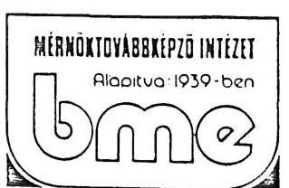

Budapest, 1992. szeptember 23. Ikt. sz.:

PHARE 152 1991. 04.10- 1992. 08. 31-ig

Számlaszám: PHARE 152 407-5020-844-49 MKB

|  Bevétel PHARE Irodától | ECU | DEM  |
| --- | --- | --- |
|  1991-ben | 182.007,85 | 373.915,-  |
|  1992-ben | 47.333,53 | 96.532,-  |
|  1992-ben Intézeti külön keret | 5.000,- | 10.057,-  |
|  Összesen: | 232.333,63 | 480.504,-  |
|   | 234.341,31 |   |
|  Számlaegyenleg után jóváírt kamatok (DEM) |  |   |
|  1991.06.30. |  | 535,26  |
|  09.28. |  | 967,73  |
|  12.31. |  | 555,64  |
|  1992.03.28. |  | 389,13  |
|  06.17. |  | 646,36  |
|   | 234.341,38 | 3.094,12  |
|  Összes bevétel: | 232.333,53 | 483.598,12  |
|  Felhasználás: |  |   |
|  1991-ben utazott és elszámolt | 95 fő | 320.610,10  |
|  1992-ben | 29 fő | 80.473,96  |
|  Jelenleg útonlévőkre kifizetve | 11 fő | 36.896,79  |
|  Későbbi utazásokhoz átutalva |  |   |
|  részvételi díj, szálláselőleg, |  |   |
|  utiköltség: |  | 10.012,43  |
|  Intézeti saját keretre felhasználva: |  | 9.642,22  |
|  Felhasználás összesen: |  | 457.635,50  |

Budapesti Műszaki Egyetem Mérnöktovábbképző Intézet, 1111 Budapest, Egry J. u. 20-22. Postai cím: 1502 Bp. Pf. 91. Csekkszámlaszám: MNB 232 - 90171 - 0928 Telefax: 181-3197 · Telex: 22-5931 muegyh · Titkárság: 166-5421, 166-4772 Tanfolyamszervezéi Osztály: 166-5432 Nemzetközi Oktatási Osztály: 185-3289 Jegyzetosztály: 166-5011/2959 m. Gazdasági Osztály: 166-5011/2958 m.

---

Bevétel összesen:
Felhasználás összesen:
1992. aug. 31-i bankegyenleg (kivonat mellékelve)

483.598,12
$457.635,50$
$25.962,62$
$============$
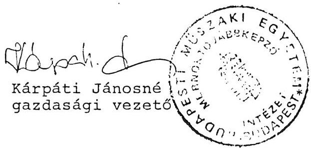

---

SME MERHOKTJV+BEKEP20 IMT

1111 BUDAPEST
SGRY JUZSEF U.20-22

RESILIETEIES
/ DETAILS /

S2-MLAKIVINAT
407-5020-844-99
DEA

STATEMENT OF ACCOUNT
02/339 OLD.
99
MAGYAR KULKERESKEDELMI BANK RT.
HUNGARIAN FOREIGN TRADE BANK LTD.

ADRI H-1821 BUDAPEST V. SZENT ISTVAN TER 11.
TELEX: 22-5941 EXT H
SAIFT CODE: MKKS HU HB TELEFON: 269-0922

VALUTA OATUM TERMELES JOVAIRAS
/ VALUE / / DEBIT / / CREDIT /

92.08.27. ELUZJ EGYENLEG / LAST BALANCE 30.184.23

SURSZAM BIZUNYLAT UGYINTEZZ UZL.KOD REGJESTEES

400 2272-0 KAKA 02 KIVITELI ENGEDELY 92.38.31. 1.687.80
401 227241 KAKA 02 OR.TUMSST LASELE 92.38.31. 1.220.19
402 2272-2 KAKA 02 KIVITELI ENGEDELY GALGS 92.38.31. 1.313.62
AZ OSSZEWEK A VALUTA OATUM/KUR VEHETIK IJENTEET IJENTBEVEMETO OSSZEG / AVAILABLE AMOUNT /: 25.962.62
AMJUNTS ARE AVAILABLE AT VALUE-OATES INDICATED ABOVE: SIZALA EGYENLEG / BOOK BALANCE /: 25.962.62

---

# AILAMI SZAMVKVOSZRK 

Vagyonkezelö Föcsoport
$\mathrm{V}-14-44 / 1992$.

## V i $s$ g a a a $t$ i i e l e n t é s

a PHARE Program által támogatott A/101-A és 605/91. számú
"Emisszió méröhálózat korszerüsítése" címü projekt
megvalósitásának helyszini ellenörzéséröl

## I.

Az ellenörzött szervezet neve és címe:
Környezetvédeimi Intézet 1113 Budapest, Aga u. 4.
PHARE Programiroda 1394 Budapest, Fö u. 44-50.

Az ellenörzés célja: annak megállapítása, hogy a projekt előkészítésében és megvalósitásában közremüködö szervezetek együttmüködése és intézkedései hogyan segítették elö a kapott támogatás eredményes és gazdaságos felhasználását, a kitüzött célok elérését. A végrehajtás folyamatában betartották-e a jogszabályi elöírásokat, a PHARE programban megszabott feltételeket.

Az ellenörzött idöszak: a projekt indulásától, 1990. IV. negyedévétöl 1992. szeptember 15-ig.

Az ellenörzést végzök neve: Istvánffy Lóránt tanácsos
Karsainé Dömsödi Eva számvevö

---

A helvszini ellenorsés kezdete és befejezése:
1992 augusztus 25 - szeptember 22.

# II. 

## Megállapitánok

A környezetvédelmi tárca a PHARE környezetvédelmi programjából a PHARE I keretében kerekítve 1,9 millió ECU-t, a PHARE II révén ismételten 1,9 millió ECU támogatást kapott a légszennyező források által kibocsátott szennyező anyagok mérését szolgáló laboratóriumok és muszerek beszerzéséhez.

A beszerzések legnagyobb tétele a 3+4, összesen 7 db mozgó, gépkocsira szerelt méró laboratórium, amelyekböl egyet a Környezetvédelmi Intézet, a többit a regionális környezetvédelmi felügyelöségek kaptak, illetve kapnak. A PHARE I program keretében megrendelt berendezéseket leszállitották és üzembehelvezésük megtörtént. A PHARE II-höz tartozóakat 1993-ban szállít.ják le. A mérökocsikat mindkét fázisban ugyanattól a cégtöl, a csehszlovák CENTER-tól rendelték meg.

A támogatással beszerzett eszközökkel a környezetvédelmi hatóság folyamatosan képes regisztrálni az ország fő szennyező forrásai által kibocsátott egészségre káros anyagokat és a közegészségügyi hálózattal együttmuködve elöirhatja a kibocsátás megengedhető felső határait.

---

Megállapitásaink a két szervezetnél átvizsgált dokumentumokra és a szóbeli tájékoztatásokra épülnek. A vizsgált szerveknél jó, készséges együttmúködést tapasztaltunk, a kért dokumentumokat rendelkezésünkre bocsátották.

A projeett életútjait az 1. sz. mellékletben foglaltuk össze eseménynaptár szeruen, a dokumentumok rövid, tartalmi ismertetésével.

1. A PHARE I-ben elfogadott projekt megvalósitására az elsó lépések 1990. oszen történtek. A végrehajtással megbizott Körnvezetvédelmi Intézet (KVI) vezetésével a magyar szakemberek ekkor kezdték összeállítani a tervezett eszközök beszerzéséhez szükséges tender múszaki mellékleteit. A szállítási szerzodéseket jó évvel később 1991 IV. negyedévében kötötték meg.

Megállapításaink szerint az első támogatási fázisnál tapasztalt hosszú átfutási idő a következö okokra vezethető vissza:
1.1. A magyar szakemberek elott a támogatás megitélésének és folvósitásának a szabályai a kezdeti időszakban még nem voltak ismeretesek. Nem volt gyakorlatuk az Európai Közösségben meghonosodott tenderezési eljárások szigorú elöirásainak az alkalmazásaban. Mindehhez hozzájárultak még a nyelvi nehézségek is (magyarról angolra fordítás szakmai értelmezési gondjai).

A PHARE Programiroda (PMD) nem fogadta el az így összeállt magyar tenderjavaslatokat és 1991 január 2-1 kelettel

---

szerzödést kötött egy holland szakértövel (DHV cégtöl), hogy segitse a tender müszaki mellékletének az összeallitását.

A tenderanyag 1991 február 28-ra készült el.
1.2. A tenderfelhivást az Európai Közösség Bizottsága (EKB) április 14-én hagyta jóvá, azaz hat héttel késöbb. A közbensö idöszakban több vitás kérdést kellett tisztázni, mivel a magyar szakértök - feltehetően nvelvi és értelmezési problémák miatt- utólag jöttek rá, hogy a holland szakértö egyes muszaki paramétert nem a kívánalmaik szerint határozott meg. Lgy például bekerült a müszaki meghatározások közé, hogy a laboratóriumi gépkocsi minimális súlya legalább 12 tonna legyen. Holott a kívánatos éppen a relative minél könnyebb súly volt.
1.3. A jóváhagyast követoen több mint három hét telt el a május 8-i meghirdetésig. Ez indokolatlanul hosszúnak tunik. Ugyancsak hosszabb idő telt el az elvárhatónál, a tenderkiértékelö bizottság július 31-i jelentésétöl az Európai közösség budapesti képviselete (EKK) által történt augusztus 22-i jóváhagyásig és még inkább a szerződések okró-ber-novemberi megkötéséig. Az okokra nem állt rendelkezésre dokumentum, de szóbeli tájékoztatás szerint több muszaki kérdést kellett még tisztázni a szerzödés megkötése előtt.

A mérökocsikat szállító UENTER cég az ajánlatát át is dolgozta a magyar felhasználók kívánságainak megfelelően. Ez a szabályok szerint megengedett az ár változtatása nélkül, amennyiben a használati érték nem változik, illetve növekszik.

---

Az ellenörzést végzök véleménye szerint a túlbonyolított úgymenet, nevezetesen, hogy minden fázis végigmegy a PMD-EKK-EKB láncolaton, éppen úgy közrejátszott a megvalósítási folyamat elhúzódásában, mint a kellö gyakorlat hiányára, az angol szaknyelv nem kellö ismeretére utaló ismételt hosszas egyeztetése a vitás muszaki kérdéseknek.
2.) A késedelmes megvalósulás lehetséges okaira a PHARE II-ben indult projekt megvalósítási folvamata is rávilágit. Az ugvanakkora értéket képviselö támogatás realizálására a tenderkiirást 1992 márciusában állitottak össze. Hat hónappal később (tehát az elozó projekthez képest feleannyi idö alatt) szeptemberben a megrendelések már ki is mentek.

A jelentós atfutási idöcsökkenés döntően annak volt köszönhetö, hogy a megszerzett gyakorlat birtokában a magyar szakértök a tendermellékleteket és a tenderértékelést úgy állitottak össze, hogy menet közben már nem merültek fel tisztázásra, hosszadalmas egyeztetésre váró problémák, a szerzödéskötést sem akadályozták megválaszolatlan kérdések.

Ugyanakkor az EKK és EKB jóváhagyási procedúrája idönként továbbra is az indokoltnál hosszabb volt, annak ellenére, hogy tisztázásra varó kérdések nem maradtak és a LOT-1 tender nyertese az elözövel megegyezett. Igy a tenderkiirást március 30-án aláirták, jóváhagyva május 13-án, meghirdetve május 22-én lett. A végleges tenderkiértékelö anyag augusztus 19-én lett kész, a jóváhagyás dátuma szeptember 18.

---

Hegjegvzendo, hogy uguanakkor az KKB kellöen rugalmas volt, amikor tudomásul vette az elso projektnel a kerettullépést, a másodiknál pedig a referencia laborhoz a keretátcsoportosítást és az újabb tenderkiirás mellózését (l. melléklet 5. és 11. pontjai).

A tenderkiértékelö bizottság javaslatait valamennyi szállító esetében elfogadták.
3.) A leszállitott eszközök átvétele, üzembehelyezése és folyamatos üzemeltetése az ellenörzés megállapítása szerint nem zavartalan, mivel a pénzügyi feltételei nem rendezettek. A gondok az alábbi okokra vezethetök vissza:
3.1. A PMD a PHARE I projektre vonatkozóan 1991 szeptember 20-i kelettel kötötte meg a 'Technikal Management Agreement-et (TMA) a projekt menedzserrel. A TMA-t aláirta a KVI igazgatója és a Környezetvédelmi Föfelügyelöség vezetöje is. Az aláirók a projekt megvalósításához szükséges feladatok elvégzésén túl vállalták, hogy magyar részröl 10 millió forinttal járulnak hozzá a projekt költségeihez. Ezt a 10 millió forintot a KVI-ben létesítendő dioxin laboratórium megépítésére adta a KTM a Környezetvédelmi Alapból. A TMA-ban nem történt utalás arra, hogy a berendezések üzembehelyezése és múködtetése jelentös költséggel jár, s azt milyen forrásból finanszirozzak. A PHARE II. fázisra 1992. szeptemberében hasonló tartalmú TMA tervezetet küldött a PMD a projekt menedzsernek. A kedvezményezett szervezetekre háruló feladatok elvégzésehez ugyancsak nincs jelen pillanatban költségfedezet. A projekt menedzser a tervezetet állásfoglalás céljából felterjesztette a KTM illetékes állam-titkár-helyetteséhez.

---

Megaliapitasunk, hogy a TMA-t a projekt menedzseren es közvetlen vezetöjen kivül helves lenne minden esetben aláiratni, illetve tudomásul vétetni azon illetékes felelös vezetövel is, aki a pénzügyi, müködtetési feltételek tekintetében rendelkezési joggal bir. Ez jelen esetben például a Környezetvédelmi és Teruletfejlesztési Minisztérium gazdálkodását felügyelö államtitkár-helyettes volna.

Felhívjuk a PMD vezetöjének a figyelmét, hogy a jövöben a hasonló tisztázatlan pénzügyi helyzetek elkerülése végett a TMA megkötésénél a fenti gyakorlatot kövesse.
3.2. A Proiektekben kedvezményezett intézmények vezetöi, saját pénzeszköz nélkül a miniszterium közgazdasági fóosztályvezetöjéhez fordultak költsegigényükkel 1991 októberében. majd megismetelve 1992 májusában. Igényüket ismételten elutasította a címzett, költségvetési forrashilanyra és arra hivatkozva, hogy az igenyrol elözetesen nem volt tudomásuk. A tárggyal kapcsolatos levelezést 2. sz. mellékletként csatoljuk.

Az ellenörzés véleménve, hogy a pénzkérö levelek nincsenek kellöen megalapozva. részletes költségvetést és egyéb alátámasztó dokumentumot nem mellékeltek. Az októberi és májuai levél ellentmondásban is van, mivel az előző 1991-92-re 4 millió Ft-ot kér, a máiusi levél PHARE I és II-re összevontan 1992-re 8,5 millió Ft-ot, holott a második fázis eszközeit csak 1993-ban szállítják le.

---

A nvi lvanvalóan nem megfelelöen dokumentált költségvetési tedezetkérelem azonban a merev elutasitást nem indokolja. mivel a PHAKE támogatással benzerzett berendezések üzembeállitása és folvamator üzemeltetése, karbantartása, a muszerek szervizelése, rendszeres hitelesítése olyan többletköltséggel jar. amelynek forrásával eddig az intézmények nem rendelkeztek.

Javasoljuk, hogy a PMD haladéktalanul kezdeményezzen a minisztérium és a kedvezmenvezett szervek illetékes vezetőinek bevonásával egyezteto tárgyalást a kérdés megnyugtató megoldására.
3.3. A vizsgálat idopontjában még nem rendeződött a referencialaboratórium helyzete. A környezetvédelmi és népjóléti tárca megállapodása alapján az emisszió és immisszió mérőhálózat közös referencia laboratóriuma a KVI-ben fog létesülni, s erre a célra az immisszió projektból 200 ezer ECU-t átadtak, amelyen belül a LUT-2-es tendercsomagból beszerzendő muszerek is a KVI-be települnek.

A laboratórium kiépitéséhez szükséges pénzügyi fedezet (a müszerbeszerzés 200 ezer ECU-ján kívül) nem áll rendelkezésre, az építkezés nem kezdődött el, a müszerek beszerzésére az ajánlati felhívás nem történt meg.

A kérdésben az elozo pontban tárgyaltakhoz hasonlóan egyeztetést és közös intézkedést látunk szükségesnek.
4.) Az eddig beszerzett eszközök múködtetésére, a projektben elhatározott célok megvalósulására még nem állnak értékel-

---

heto adatok rendelkezésre, csak hosszabb idöszak tapasztalata alapján lehet a következtetéseket levonni. Mind a méro gépkocsik, mind az egvéb muszerek a megkérdezettek egybehangzó véleménve szerint igen korszeruek és jó minöségüek.

Az ellenörzes tapasztalatai alapján megállapítható, hogy a PHARE támogatásból kiépülö országos méröhálózat munkája csak akkor lehet eredményes, ha az eszközök magas kihasználtsággal folyamatosan müködnek, rendszeresen gondoskodnak állaguk megóvásáról, a muszerek hitelesítéséröl, a mérési eredmények feldolgozásáról és az abból eredő feladatok végrehajtásáról. Szükséges az intézményes együttmuködés az egészségügyi méröhálózattal. A fenti követelmények kielégitését szolgáló részletes, az összes, gazdasági és 'személyi feltételeket magába foglaló tervezet elkészitésének a szükségességére felhívjuk a tárca vezetöinek a tligyelmét.
5.) A PHARE I és II fázisaira felhasznált, illetve szerzodéssel lekötött pénzeszközök helvzete 1992 szeptemberig a következö:

PHARE I-re beszerzett eszközökre
lekötve
1.970 .315 ECU
ebbol kifizetve
2.006 .903 ECU
tanácsadóra kifiz.
7.700 ECU
7.700 ECU
tanulmányút, tréning
19.000 ECU
19.000 ECU

PHARE II-re beszerzésre lekötve 1.832 .000 ECU
referencia labor
előiránvzat
200.000 ECU

Összesen:
4.029 .015 ECU
2.035 .603 ECU

---

A rendelkezésre álló keret, a megrendeléskor lekötött és a ténylegesen kifizetett KCU között tellelhető ellentmondás alapvetó oka az ECU és a ténvlegesen fizetendó devizanem között idöben változó árlolvamkülönbség.

Budapest, október 28.

Istvánfiv Lóránt sk.
tanácsos

Karsainé Dömsödi Eva sk.
számvevó

---

# A 101/A "Emisszió mérőhálózat korszerüsítése"   címú projekt eseménynaptára 

1.) A levegoszennyezö források által kibocsátott szennyezo anyagok mérésére szolgaló országos emisszióméró hálózatot a Körnvezetvédelmi és Vizgazdálkodási Minisztérium 1989-ben korszerüsiteni és továbbfejleszteni kívánta. Ezért megbízást adott a Körnvezetvédelmi Intézetnek (KVI), hogy készítsen erre vonatkozóan javaslatot.
Ez a javaslat képezte alapját a PHARE támogatás elnyerésére irányuló projekt kérelemnek.
2.) Az Európai Közösség brüsszeli bizottsága (EKB) által jóváhagyott projekt megvalósitására az elsö konkrét lépések akkor történtek, amikor a feladattal megbizott KVI irányitásával a magyar szakemberek 1990 öszén megkezdték a tender műszaki mellékletének az összeállítását.

A Környezetvédelmi és Területfejlesztési Minisztériumban (KTM) múködö magyar PHARE Iroda (PMD) a tender összeállítást nem fogadta el azzal az indokkal, hogy az nem felel meg az EK elöírásainak. Ezért a PMD holland szakértöket bízott meg 1991 január 2-án a tenderdosszié összeállitásában való közremüködéssel.
3.) A holland közremúködéssel elkészített tender anyagot 1991 február 28-i kelettel írta alá a KVI igazgatója. A kiírás összesen 9 db tendercsomagból - LOT-ból - állt. A

---

legnagyobb tétel a LUT-1 volt, ami 3 db emisszió mérö laboratóriumi gépkocsi beszerzését tartalmazta (a gépkocsiban vannak azok a muszerek, amelyekkel a helyszínen a kibocsátott szennyezo anyagokat, mint $\mathrm{CO}, \mathrm{NO}_{x}$, aromás szénvegyületek, por stb mérik, továbbá a regisztráló számítástechnika, rádió, valamint munkaasztalok és egyéb felszerelések). A mérökocsikból 1 db a KVI-é lesz, 1 db a veszprémi, 1 db a miskolci Körnvezetvédelmi Felügyelöség tulajdonába kerül. A további LƯT-okban számítógépes analizáló müszerek és egyè müszerek, berendezések voltak a KVI központi laboratóriuma, illetve a területi felügyelósegek részére.
A projekt a beszerzésekre 1.88 millió ECU-t irányzott elö.
4.) A tenderfelhivást 1991 április 14-én hagyták jóvá és az EKB május 8-án hirdette meg. A tenderbontás 1991 július 9-én volt. A 9 LUT-ra 29 db pályázat érkezett.

A tender kiértékelését egy 8 tagú magyar szakértö bizottság végezte el. A projekt menedzser által aláirt jelentés keltezése július 31 .
A bizottság részletes indoklással alátámasztott javaslata a tendernyertesekre LUT-onként a következó volt:

LUT-1 CENTER csehszlovák
LOT-2 Hewlett-Fackard-Controll, magyar
LOT-3 Perkin-Elmer, német
LOT-4 nem volt elfogadható pályázó
LOT-5 Compndrug, magyar
LOT-6 nem volt elfogadható pályázó
LOT-7 LAB-EX Kft. magyar
LOT-8 nem volt elfogadható pályázó
LOT-9 nem volt elfogadható pályázó

---

Az öt nyertes palyázó megajánlott ára összesen:
1.964 .278 ECU, ebböl a LUT-1 1.347 ezer ECU költségkeret: $\frac{1.880 .000 \mathrm{ECU}}{k o ̈ l t s e ́ g t u ̈ l l e ́ p e ̀ s:} \quad \begin{aligned} & 84.278 \mathrm{ECU} \quad(4,5 \%) \\ & \hline \end{aligned}$
5.) A PMD a tenderkiértékelés anvagát, tartalmával egyetértve 1991 augusztus 14-én küldte meg az EKK-nak. Kéri a költségtúllépés engedélyezését a teljes kontingens terhére.
Az EKK augusztus 22-én válaszolt. Jóváhagyta a tendernyertesek nevét és hozzájárult a többletköltség fedezéséhez. A megniusult LUT-okkal kapcsolatban közli, hogy akkor lehet megállapodni, ha a PHARE program következö fázisára a pénz rendelkezésre fog állni.
6.) A PMD a Technical Management Agreement-et (TMA) 1991 szeptember 20-an kötötte meg Pozsgai András projekt menedzserrel, illetve a KVI vezetőjével. A szerződés 1.964 ezer ECU-t irányoz elő a beszerzésekhez, míg a megvalósítás és üzemelés feltételeinek a megteremtéséhez a magyar félnek 10 millió Ft-tal kell hozzájárulnia. A megállapodás részletezi, hogy a megrendelésre kerüló tételek hova kerülnek (a KVI-hez, illetve környezetvédelmi felügyelöségekhez).
7.) A KVI felettes szervének a Környezetgazdálkodási Intézetnek a föigazgatója 1991 október 11-én levelet intézett a Környezetvédelmi és 'lerületfejlesztési Minisztérium (KTM) közgazdasági fóosztályvezetöjéhez, a TMA-ban vállalt forint hozzájárulás realizálása céljából. A levélben 1992 évre 8 millió Ft-ot kér a program végrehajtásához szükséges költségekre. A költségek a beérkező mérőkocsik és műszerek átvételénél, üzembehelyezésénél, hitelesítésénél stb. merülnek fel.

---

A levetre l991 oktober '24-i kelettel erkezik válasz a fóosztalvvezetó és a PMD vezetojének az aláírásával. Közlik, hogy sem a PHARE pénzböl. sem a KTM költségvetéséböl nincs lehetöségük ezen pénzkeret biztosítására.
8.) A tendernyertes cégekkel a szerzödéseket a PMD 1991 október 16. és december 5. között kötötte. A legnagyobb tételt jelentő mérökocsikat szállító CENTER cég többszöri müszaki tárgyalás után az ajánlatát október 23-i keltezéssel átdolgozta. A valtoztatott muszaki tartalom birtokában a szerzödést november 26-án írtak alá. Az EKD december 11-én ellenjegyezte a szerzodeseket.
9.) 1992 március és június között a német muszaki ellenorzo szervezetek (TUV-ök) tanulmányozására, valamint a megrendelt berendezések kezelésének a betanulására (tréning) az érintett szakemberek kiutaztak a helyszínekre. A treningköltségek az ajánlatokba nagyrészt be voltak építve. Utazásra, szállás és egyéb költségekre ezen kívül 19 ezer ECU-t használtak fel.
10.) A projekt a PHARE II program keretében további lehetöséget kapott a már megrendelt berendezéseken túlmenően további beszerzésekre. Erre a célra 1.9 millió ECU-t lehetett felhasználni. A projekt jelzőszáma 605/91-re változott.

A tenderkiírás 1992 március 30-i dátummal készült el, 6 LOT-ot foglalt magába

LOT-1 4 db mérökocsi Budapest, Szeged, Győr, Debrecen környezetvédelmi felügyelőségei számára
LOT-2 referencia laboratórium
LOT-3 automata dioxin mintavevó

---

LUT-4 olfactomèter (bizsmèr)
LUT-5 gáz analizáló készülèk (kiputogó gázra)
LOT-6 automata gáz analizátor (szénhidrogénekre)

A kiirást az EKB máius 13-án nagyta jóvá, május 20-án hirdették meg.
11.) A tenderbontás 1992 július 15-én volt. A magyar kiértékelö bizottság az értékelést augusztus 4-ig elvégezte. A végleges anyagot augusztus 19-re készitették el. A PMD által felterjesztett értékelö javaslatot az EKK szeptember 8-án kelt fax-ával hagyta jóvá. Ezek szerint a

LƠ-1 és 5 nyertese CENTER, csehszlovák
LUT-3 nvertese ströhlein, német
LUT-4 nyertese Projekt Research Amsterdam
LOT-6 nyertese Siemens, német

A referencia laboratoriumot illetöen az EKK úgy rendelkezett, hogy mivel egy pályázó sem adott komplett, megfelelö ajánlatot, újabb tender nélkül közvetlenül kérhetö az ajánlat a tetelekre. A pénzkeretet az immisszió projekt keretének a terhére lehet biztosítani.
12.) A PMI a tendernyertes cégekkel a szállítási szerzödéseket megkötötte, összesen 1.832 ezer ECU értékben.
13.) A projektek togadásához szükséges magyar forintköltség forrásának biztosítására a Környezetgazdálkodási Intézet fölgazgatója és a Környezetvédelmi Föfelügyelöség vezetöje közös levelet intézett a KTM közgazdasági föosztályvezetöjéhez 1992 május 22-i kelettel. 16.5 millió forintos költségigényt jeleztek.

---

A fóosztálvvezeto az igényt kezelhetetlennek és nagysagát tekintve irrealisnak minositi. A tárca költségvetésében ilyen tétel nem szerepel. Kéri a PMD-t 1992 július 22-én irt levélben, hogy tájékoztassa, milyen magyar kötelezettségvállalás van ervenyben és ki vállalt garanciát a költségek fedezésére.

A PMD augusztus 3-i válaszában arról tájékoztatja a főosztályvezetőt, hogy a kormány, illetve a tárca minisztere vállalta a magyar fél kötelezettségeit. Az igények megalapozottságának elbirálására és a kérdés rendezésére javasolja az illetékes szakmai fóosztály bevonását. Megjegyzi, hogy a kért forintösszeg kb. 4 \%-a a PHARE támogatásban kapott műszerek értékének.
14.) A PMD szeptember végén megküldte a projekt menedzsernek a PHARE II-re vonatkozó TMA tervezetét. Ebben évekre meghatározza a kedvezmenvezett intézmények és a projekt menedzser feladatait. A TMA még nem került aláírásra.

---

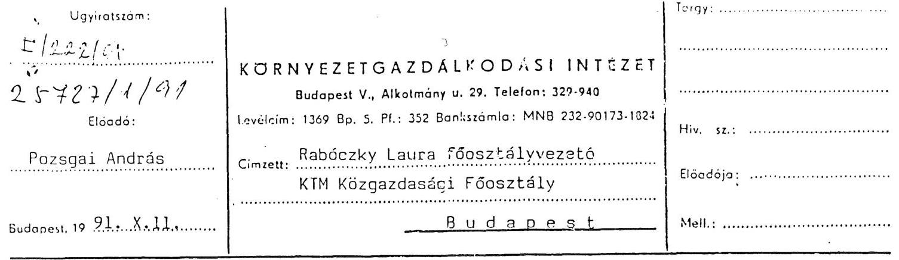

Tisztelt Főosztályvezető Asszony!

A Közös Piac és a Magyar Kormány által aláirt PHARE segályezési program keretében emisszió mérőhálózat fejlesztését elơlrányzó 131/A program megvalósítása KGI Környezetvédelmi Intézetén keresztül történik.

A program keretén belül a 2 db emisszió mérő laborkocsi /Észak-Magyarországi és a Közép-Dunántuli Felügyelőség részére/. 16 mérőmüszer a bajai, szegedi, szombathelyi, nyiregyházi, budapesti felügyelőségekre kerül beszerzésre.
A KGI Környezetvédelmi Intézete a programon belül kap 1 db emisszió mérő laborkocsit és különféle laboratóriumi analitikai müszereket. A program végrehajtásának rendjét nemzetközi előirások szabályozzák /angol nyelven/.

# Eddig elvégzett feladatok: 

- Bejelentkezés a tenderre, elözetes specifikáció elkészitése.
- A 101/A tender kiírás összeállítása, az ehhez tartozó müszaki specifikáció elkészitése.
- A tender meghirdetése.
- A beérkezett pályázatok fogadása.
- Szakértői Bizottságok létrehozása.
- A Bizottság által a pályázatok szakértői kiértékelése.
- A kiértékelés átadása a PHARE Irodának. A PHARE Iroda az Intézettel a program végrehajtására szerződést kötött.
- A szerződésben a projekt irányítása, végrehajtása érdekében a nemzetközi megállapodásoknak megfelelően kötelezettségeket ír elő.

## Föbb feladatok:

- A nyertes pályázókkal a szerződések előkészitése, megkötése.
- A szerződések alaki, tartalmi és költségvetési tartalmának ellenőrzése, erről havi jelentés készítése a PHARE Iroda részére.
- A szerződés alapján beszállított müszerek müszaki és jogi /vám/ átvétele.
- Garanciális jogok érvényesitése.
- A szerződések lejártakor zárójelentés elkészitése.

---

- A szerződéskötéstől számított öt évig a felhasználásról rendszeres jelentés készítése a PHARE Iroda részére.
- Rendszeres információ szolgáltatás a PHARE képviseleti szervek részére /Brüsszel, Bp-i Iroda/.

A program végrehajtásához szükséges költségvetési igény:
A Projekt manager költségigénye, amely magában foglalja a szerződésben elóirt feladatok teljesítését:

1991. 2,0 millió Ft
1992. 2,0 millió Ft
1993. 1,0 millió Ft
1994. 1,0 millió Ft
1995. 0,5 millió Ft

A projekttel kapcsolatos müszaki feladatok és költségigényük 1992. évre:

- A beérkező müszerek vámoltatása és müszaki átvétele /végzi: KGI Müszerügyi Szolgálat/
$2,0 \mathrm{mFt}$
- A LOT-1-ben lévő 16 db mérőmüszer üzembehelyezése, a 12 db gázelemző hitelesítése, és hiteles bizonylattal átadása a környezetvédelmi felügyelőségek részére /végzi: Müszerügyi Szolgálat/
$1,0 \mathrm{mFt}$
- A LOT-1-ben beérkező 3 db mérőkocsi müszaki átvétele. A mérőkocsik közuti vizsgáltatása, üzembehelyezése. A mérőkocsiban lévő gázelemzők hitelesítése és hiteles bizonylattal átadása a környezetvédelmi felügyelőségek részére /végzi: Müszerügyi Szolgálat/
$2,0 \mathrm{mFt}$
- A Központi Laboratóriumba érkező müszerek átvétele, kezelésének betanulása /végzi: Központi Laboratórium/
$3,0 \mathrm{mFt}$

Költségigény összesen:
$8,0 \mathrm{mFt}$

Kérem, a fentiek alapján a kormányprogramhoz kapcsolódó projekt költségvetési fedezetét biztosítani szíveskedjék.

Udvözlettel:
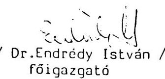

---

# KÖRNYEZETYEDELMI ES TERÜLETFEJLESZTESI 

MINISZTÉRIUM

P H A R E PROGRAMIRODA
Közgazdasági Főosztály

Dr. Endrédy István
fölgazgato
Környezetgazdálkodási Intézet
Budapest

Tisztelt Fölgazgato Úr!
Hivatkozva F/222/91 számú levelére, melyben a PHARE Air 101/A projekt végrehajtásához 8 millió forint müködési költség fedezését kéri, sajnálattal tájékoztatjuk, hogy sem a PHARE segélyböl, sem a KTM költségvetéséből nincs lehetöségünk ezen pénzkeret biztosítására.

Budapest, 1991.október 24.

Üdvözlettel:
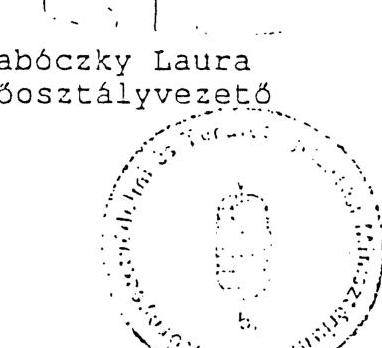

Csorba Zoltánné Főosztályvezető

---

Rabóczki Laura fôosztályvezetô asszony
KTM Közgazdasági Fôosztály

# B u d a p e s t 

Tisztelt Fôosztályvezetô Asszony!

A Közös Piac és a Magyar Kormány által aláirt PHARE segélyezési program keretében az emisszió mérőhálózat fejlesztésére (101/A) az elsõ fázisban 200 millió Ft, az 1992-ben kezdôdô második fázisban 200 millió Ft értékben érkezik mérőberendezés. A program lebonyolitását KTM kijelölés alapján a KGI Környezetvédelmi Intézete végzi.

A program két fázisán belül a Környezetvédelmi Intézet 100 millió Ft, a környezetvédelmi felügyelôségek 310 millió Ft értékü felszerelést kapnak. A segélyprogram lebonyolitása és ezen belül a mérőeszközök fogadása igen nagy megterhelést jelent az Intézet és a felügyelôségek részére.

A program fogadásához szükséges költségeket a továbbiakban kigazdálkodni nem tudjuk. Kérjük kormányzati oldalról a segélyprogram fogadásához, végrehajtásához szükséges gazdasági feltételek megteremtését.
Ennek hiányában a segélyprogram fogadása bizonytalanná válik.
Kérem a program fogadásához szükséges, a mellékletben megadott költségvetési fedezetet biztosítani szíveskedjék.

Budapest, 1992. május 22.
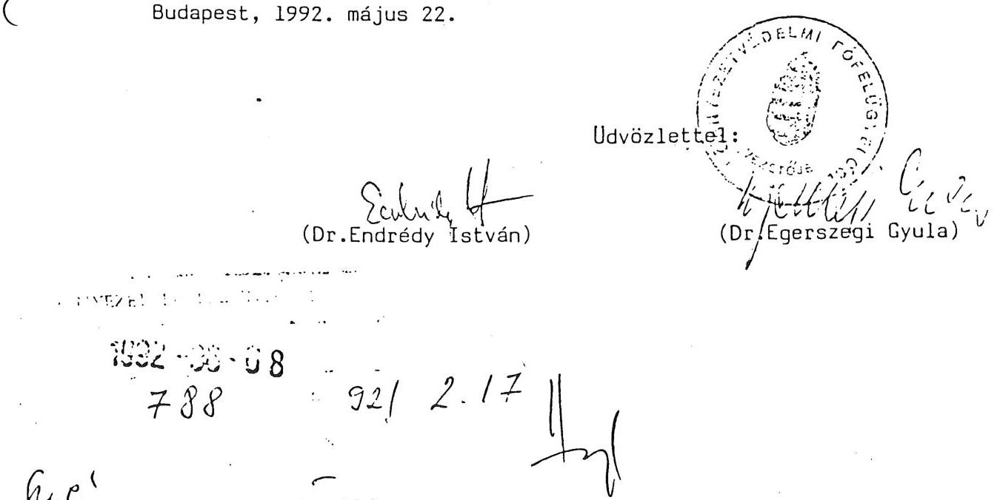

---

A PHARE 101/A "Az emisszió mérőhálózat fejlesztése" címũ program lebonyolításához szükséges költségigény a KGI részére ütemezve:
1992. PHARE I. és II. fázis
1993. PHARE I. és II. fázis
1994. PHARE I. és II. fázis
1995. PHARE I. és II. fázis
8,5 millió Ft
6 millió Ft
1 millió Ft

A fenti költségigény a program végrehajtásához elengedhetetlenül szükséges magyar fél (Környezetvédelmi és Területfejlesztési Minisztérium)ráfordítása.

Ebben a költségben szerepel a program menedzselése, a tenderek kiirásának elôkészítése, tendereztetés, szerzôdések megkötése, a leszállítások fogadása, vámoltatása, mûszaki átvétele, a mérőkocsik hatósági vizsgáztatása, a kalibrációk elvégzése, dokumentálása, a lebonyolításhoz szükséges rendszeres jelentések, dokumentumok elkészítése a PHARE Iroda ill. az EGK Brüsszeli Irodája felé.

---

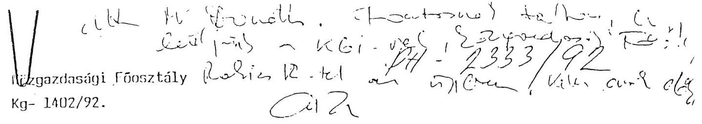

Iisorba Zoltánné asszony
fōosztályvezetō
Phare-Programiroda

Hiv.sz.: H-627/2/92.
Molléklet: 1 levél + melléklete

A Phare-program keretében érkezô emissziós mũszerekkel kapcsolatban a költségvetési gazdálkodás szabályai szerint mũködõ intézmények számára kezelhetetlen igények merülnek fel, amelyekrõl sem a Közgazdasági Fõosztály, sem a területi szervek az ezévi költségvetés összeállításakor (1991. július-szeptember) nem értesültek.

A Környezetgazdálkodási Intézet 16,5 millió forintos költségigényt jelez a program menedzselésére, a tenderek kiírásának elôkészítésére, stb.

A terülleti szervek több százezer forintos szerzõdéses ajánlatot kaptak a KGItôl a mászerek installálására, üzembehelyezésére való hivatkozással. Az ajánlatban szereplő feladatok nagyobb részét a szervek saját szakembergárdájukkal el tudják végezni, információik szerint azonban a szerzõdés aláírásának elmulasztása esetén nem kapnak mũszert.

A fentiekbenjelzett nagyságrendũ költségvetési forrás - az 1992. évi jelentôs elvonást követôen - sem a területen, sem a központban nem biztosítható, s ismereteim szerint a projekt javaslatok kidolgozásakor nem is épült be a finanszírozási források közé ilyen - nyilvánvalóan irreális - elem.

Kérem melôbbi szíves tájékoztatását arról, hogy a 101/A projekt milyen összegũ és jellegũ magyar kötelezettségeket tartalmaz; s hogy az esetleges költségvetési fedezetre ki vállalt garanciát.

Budapest, 1992. július 22.
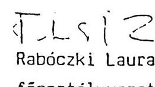

---

PHARE Programiroda
PH-2333/92

Rabóczki Laura
Főosztályvezető
Közgazdasági Főosztály

Fenti számu levelében jelzett problémával kapcsolatosan az alábbi tájékoztatást adom:

Az EK és a Magyar Kormány illetve az EK és Keresztes miniszter ur által aláirt megállapodások rögzítik a magyar fél kötelezettségeit a segélyek fogadásával kapcsolatosan. A konkrét projektre vonatkozóan egy Technikai Végrehajtási Megállapodást irt alá A KVI és a Föfelügyelöség a Programirodával, amelyben Pozsgai Andrást jelölik ki projekt managernek.

A KVI és a felügyelöségek közötti munkamegosztás olyan szakmai kérdés amelybe nem szólhat bele irodánk. Még kevésbé van lehetőségünk az emlitett pénzösszegek jogosságának felülvizsgálatára. A levélben jelzett kitétel miszerint a szerződés nélkül nem kapnak müszert nem felel meg a valóságnak.

Javaslom a kérdés rendezésére a illetékes szakmai főosztály bevonását, annak figyelembevételével hogy a PHARE keretében olyan értékü müszerekhez ( 3,8 millió ECU) jutunk amely egyedülállónak számit és ehhez képest a kért költség mintegy $4 \%$-ot tesz ki.

Budapest, 1992. aug. 3.
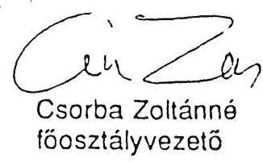

---

# AILAMI SZAMVEVOSZEK 

Vagvonkezelö Fonsopont
$\mathrm{V}-14-46 / 1992$

## Vizsgálati jelentés

a PHARE Program által támogatott A/101-B számú "Imisszió mérö hálózat korszerúsitése" címú projekt megvalósításának helyszini ellenörzéséröl

Az ellenörzött szervezet neve és címe:
Országos Tisztiióorvosi Hivatal, 1097 Budapest, Gyáli út 2-6. PHARE Programiroda, 1394 Budapest, Fö u. 44-50.

Az ellenörzés célja: annak megállapítása, hogy a projekt elökészítéseben es megvalósításában közremüködö szervezetek együttmuködése és intezkedései hogyan segítették elö a kapott támogatás eredményes és gazdaságos felhasználását, a kitüzött célok elérését. A végrehajtás folyamatában betartották-e a jogszabályi elöírásokat, a PHARE programban megszabott feltételeket.

Az ellenörzött idöszak: a projekt indulásától, 1990. IV. negyedévétól 1992. szeptember 15-ig.

Az ellenörzést végzök neve: Istvánffy Lóránt tanácsos
Karsainé Dömsödi. Eva számvevö

A helyszini ellenörzés kezdete és befejezése:
1992. augusztus 25 - szeptember 22

---

# Megállapitások 

Az egészségügyi tárca a PHARE Körnvezetvédelmi programjából a PHARE I és PHARE II összevonásával 3.6 millió ECU támogatást kapott az országos levegöminőség mérőrendszer továbbfejlesztésére. A mérőrendszer célja, hogy az ország legszennyezettebb részein folyamatosan mérje a levegö szennyezettségi fokát. Az adatok birtokában állapitja meg a körnvezetvédelmi hatóság a légszennyező források által kibocsátható szennyező anyagok megengedett értékeit. Jelenleg 13 mérőállomás müködik Budapesten és vidéken. Egyes vidéki állomások már elavultak. A projekt keretében a rendszer 19 új, korszerú mérőállomással bővül és a meglévők beintegralódnak a létrejövő új hálózatba. A tenderkiírás 3 csomagot (LƯ-ot) tartalmazott. A LƯ-1 volt a 19 méröállomás, a LOT-2 a müszer javitó és hitelesitő referencia laboratórium müszerei, a LUT-3-ban dormintavevő készülékek voltak.

Megállapításaink a két szervnél átvizsgált dokumentumokra, szíibeli és írásos kiegészítő tájékoztatókra épülnek. Az intézményeknél tapasztalt ellentétes véleményeket az írásos anyagok alapján ütköztettük. A vizsgált szerveknél jó, készséges együttmüködést tapasztaltunk, a kért dokumentumokat rendelkezésünkre bocsátották.

A mellékletben foglaltuk össze a projekt életútját eseménynaptár szerüen, az eseményeket tükrözö dokumentumok rövid tartalmi ismertetésével. Megállapításainkban e melléklet egyes pontjaira hivatkozunk. A dokumentumok az Állami Számvevőszék Vagyonkezelő Föcsoportjánál megtekinthetők.

---

1.) A projekt megvalósitásában az elsó érdemi lépést 1990 IV. negyedévében tették meg, amikor is a Népjóléti Minisztérium értesítette az Urszágos Kö́zegészségügyi Intézetet (OKI) a projekt elfogadásáról, a program főbb elgondolásairól. Ezt követően az Intézet elkészítette a fejlesztési koncepciót és a projekt keretében megvalósítandó méröállomások tenderkiírásának a vázlatát (1. és 2. pont). Megállapításunk szerint az induló elképzelésekhez viszonyítva, a projektben jelentös változások következtek be és a megvalósítás mintegy 2 éves késedelmet szenved, az indításkor feltételezett határidőhöz képest. Ezek több okra is visszavezethetők.
1.1. Az induláskor több nem reális elképzelést vázoltak fel. A méröállomások telepítésének idejét például 1991 márci-us-áprilisára tervezték, ami megvalósíthatatlan volt. A minisztérium saját pénzeszközeiböl kívánta a versenykiírás költségeit fedezni, holott ezt a támogatásból finanszirozzák. A tendervázlat és fejlesztési koncepció első változatának megvalósítása többszörösét igényelte volna a jóváhagyott támogatás összegének.
1.2. Az OKI által összeállított első tenderkiírás a PHARE Programíroda (PMD) mellett múködó holland szakértőcsoport írásos véleménye szerint nem felelt meg, az Európai Közösség Bizottsága (EKB) által támasztott követelményeknek. Szükségét látták annak, hogy a tendereztetéshez egy alapterv (angolul Master Plan, rövidítve MP) készüljön, amelynek alapján a tendert ki lehet írni. Az MP-t a dán NERI cég a magyar szakértők közremúködésével 1991 augusztusára készítette el, a tenderkiírással együtt (3., 4. pont). A tervkészítés a projekt megvalósításának átfutási idejéböl, mintegy 6 hónapot vett igénybe. Az ellenőrzés alkalmával a megkérde-

---

zettek az MP-t jónak, hasznosnak ítélték. Megállapításunk, hogy ez az alapterv feltétele volt egy sikeres projekt végrehajtásának. Bár hozzájárult az átfutási idö növekedéséhez, ugyanakkor megalapozta az EKB azon döntését, hogy a PHARE II programban elöirányzott támogatás összegével a már folyamatban lévó projekt rendelkezésre álló támogatását megnöveli, igy egy ütemben valósulhat meg az eredetileg két ütemüre tervezett fejlesztés.
1.3. Az MP-t és tenderkiirást 1991 augusztus 26-án küldte meg jóvahagyásra és megnirdetésre a PMD az Európai Közösség budapesti képviseletének (EKK). A tendert az-EKB mintegy 2 hónapos késessel november közepén hirdette meg az EK hivatalos közlönyében. A késés okát feltaró dokumentumot az ellenörzés nem talált. November 4-i kelettel faxon Brüsszel néhány kérdést intézett a tenderrel kapcsolatban a PMD-nek, amelyek azonban a kiírás figyelmesebb átolvasása után megvalaszolhatók lettek volna. A meghirdetésről a PMD nem az KKB-töl, hanem egy érdeklődő francia cégtől értesült. A PMD a 2 hónapos idószak alatt írásban nem sürgette a tender meghirdetését. Ettöl az egy esettöl eltekintve a PMD és EKB közti úgyintézés ideje nem lépte túl az elvárhatót.
1.4. Hozzáaárult a befejezési hataridó elhúzódásához, hogy a kedvezményezett intézmény szakemberei a kezdeti idöszakban nem ismerték az KK tenderezési elöírásait, így meg kellett ismételni a tenderkiértékeléseket. A magyar bizottság értékelését ugyanis nem fogadta el a PMD, illetve a dán szakértö (9, 14, 25, 28. pontok). Atnézve a dokumentumokat, valóban megállapítható, hogy - a szakmai megállapítások helyes,

---

vagy helvtelen voltat nem érintve - a bizottság formailag nem a kivánalmaknak megfelelően készítette el kiértékelését. Például az ajánlatok technikai megfeleltségét nem a tenderkiírás kritériuma szerint bírálták el, hanem szubjektív értékelésre módot adó pontozásos módszerrel. Kizárták az értékelésböl a nem megfelelönek tartott ajánlatokat, stb. A dán szakértó bevonásával készült, megismételt kiértékelések ebböl a szempontból úgy tünik, kezelhetőbbek. Mindez egyik eredendo okává vált a felhasználó és PMD között máig meglévo vitának.
1.5. Nem kimutatható, de minden bizonnyal akadályozták a gyorsabb megvalósítást az egészségügy érintett területén végbement átszervezések (pl. KOJAL-ból ANTSZ), valamint az, hogy jelenleg a harmadik projekt menedzser foglalkozik a témával.
2.) A projekt megvalósitásának folyamatában egyre erősödö vita és ellentét alakult ki a kedvezményezett intézmény szakértöi (föleg az 1992 februárjában megbízott harmadik projekt menedzser), valamint a PMD, illetve az EK döntéshozó szervei között. A vita tárgya volt, hogy a magyar szakértők a tender LOT-1 részéhez tartozó levegöminőség méröállomások szállítására más cégeket tartottak alkalmasnak, technikailag és egyéb (pl. üzemeltetési költsség, betanulás, szervíz) szempontból is a legmegfelelöbbnek, mint a PMD. Végül ez utóbbi szerv álláspontja gvozött. Az ellenörzés nem vállalkozhatott arra, hogy a vitában allást toglaljon, mivel erre a rendelkezésre álló dokumentumok nem alkalmasak, a konkrét szakismeretünk sincs meg hozzá. Az áttanulmányozott íratanyag azonban lehetöséget ad néhány következtetés levonására.

---

2.1. Részben a magyar szakértök velheto tàjèkozatlansàga a tendereztetés szigorú EK szabálvozasát illetően, részben az MP-t készító dán intézet munkatársainak kezdeti helyismeret hiánya következtében a tenderkiírásban megfogalmazott követelmények nem voltak elég szigorúak a müszaki paraméterekben, és nem tértek ki a mérórendszer valamennyi elemének követelménveire (pl. nem volt elöirva a berendezések megfelelö rendszerbeli elhelyezése, a külsö csatlakozások védelme, riasztás, a vezetékek biztonságos csatlakoztatási módozata stb. 1. lgv különbözö színvonalat képviselö ajánlatok is megfelelhettek a kiurás feltételeinek, amelyek közül nem a minoség, hanem az olcsóság döntött.
2.2. Az 1992 február lz-én megbizott harmadik projekt menedzser kezdettol fogva igen határozottan képviselte a magyar egészségugyi szakértök által kialakított álláspontot, hogy ti. a célnak legmegfelelőbb ajánlatot a CENTER nevü csehszlovak cég, másodsorban pedig a magyar MLU adta és elutasitották a véleményük szerint nem megfelelö SFI francia cégtól származó ajánlatot. Ugyanakkor ezt az álláspontot néhány dokumentumban olyan érvekkel, adatokkal támasztotta alá, amelyek nem voltak egyértelmüek, illetve eltértek az üzleti életben kialakult szabályoktól. Ezért az ellentétes álláspontot képviselö fél azokat cáfolni tudta. Így többek között a magyar kiértékelök tévesen munkálták ki az értékeIésnél az ajánlattevok árainak az összehasonlítását (24. pont). A projekt menedzser által aláirt végleges dán-magyar tenderkiértékelés elónvöket és hátrányokat taglaló értékelése nem elég meggyózó, nem a technikai oldalt állítja elñtérbe. Az MLU cégnél hátránvok közé sorolja - hibásan -, hogy az "eredet" (origin) 96 \%-os. Az EKB elöírja, hogy a

---

heszerzesre keruilo teteleknek az IKK orszagaiból illetve a PHARE kedvezményezettek köréból kell szarmazniok lezt jelenti az "eredet" meghatározás) és ezt a szállitónak garantálni kell. De arra nincs egyértelmú állásfoglalás, hogy az eredet hány százaléktól fogadható el. A $96 \%$ olyan magas, hogy gyakorlatilag a teljes mennyiséget az elöírás szerinti országokban gyártották. Az SFI-vel kötött szállítási szerződés (32. pont) műszaki mellékletét 1992 június 19-i kelettel a projeht menedzser aláirta, a szerzödés 1 hét múlva életbelépett, mégis a július 13-án EKB-hoz küldött faxában feltételhez köti az SFI szerzödés megkötését. Az MLU cégre vonatkozo megállapítása sem pontos (35. pont). Ennek következménye a FMD visszautasító levele (36. pont).
2.3. A FMD az ugvmenet során mindvégig törekedett a tendereztetésnél es a szállitási szerzödés megkötésénél az EK elöírásainak betartására. A levelekre azonnal válaszolt, illetve a hozza beérkezo anyagokat késedelem nélkül továbbította. Az átvizsgált dokumentumokból azonban azt is megállapítottuk, hogy néhány esetben a kedvezményezett intézmény kinyilvánított érdekeivel ellentétesen túlzottan ragaszkodott az EKB által felállított szabályokhoz. Olyan dokumentumot nem találtunk, amely arra utalna, hogy az EKB álláspontját megkiserelte volna a magyar szakértőkéhez közelebb vinni.

Megállapításainkat alátámasztja többek között, hogy a tenderkiértékelést továbbító levelében (29. pont) a dán-magyar kiértékelök álláspontjával (amely az MLU-t javasolja) szemben, az MLU ajánlat hátrányaira ráerósített és kétségessé tette mind a szállító cég referenciáját, mind az MLU hazai gyártási felkészültségét. Igaz az ellenkezőjét a cég sem

---

nizonvitotta meggvonoen. Az a követelmény pedig, hogv az eredet $100 \%$-ban megkivant, ahogyan a PMD a projekt menedzserhez intezett julius 13-í razaban írja (36. pont) tarthatatlan. Az MLU a B alternativ ajánlatában (francia muszerek szállitása amerikai helvett) 96 \%-os eredetet garantál. Nem találkoztunk olyan dokumentummal az EK részéről, amely ilyen nagyfokú százalékot ne tartana megfelelőnek. Ismételten arról tájékoztatta a PMD az EKB-t, hogy az MLU ajánlati áraihoz még $25 \%$ AFA-t is hozzá kell számítani, mivel az AFA elszámolás beiröldi rendezése még nem történt meg.

Megjegyzésünk ez utóbbi kérdéshez, hogy bármely magyar szállitó az AFA beszámitásával teljesen versenyképtelen, mivel a külföldi szállitások határparitáson adómentesek, a vám és illetékmentességre pedig a magyar, kormány kötelezettseget vallalt a PHARE szerzödésben. A magyar vállalkozók árai AFA mentessegének a jóváhagyása az illetékes kormányszerveknel (fénzügyminisztérium) éppen a PMD feladata lett volna. A PM megkeresésükre állást foglalt, mely szerint az AFA utólag visszaigényelhető lesz. Ez a kérdést azonban teljesköruen nem oldja meg, mivel a magyar szállitó cég kifizetése AFA-val növelt összegben történik, s az ennek megfelelö, tehát a tender ajánlati áránál $25 \%$-kal több ECU-t kell az adott árlolyamon forintra átváltani. A visszaigénylés értelemszerúen ugyancsak folyó forintban történik, amiböl automatikusan nem váltható vissza deviza.

A vizsgálat nem találkozott olyan írásos anyaggal, amely szerint a PMD az EKB tudomására hozta volna a Népjóléti Minisztérium által a PMD-hez írt május 20-án kelt levél tartalmát. Ebben a levélben a minisztérium határozottan érvel

---

a magvar fël által leginbbnak tartott es reljes összegét tekintve ugvan drágibb, de a rendelkezésre álló kereten belül maradó és a legolosobb üzemeltetési és szerviz költséget igénylo ajánlat (CENTER) elfogadása mellett (27. pont).
2.4. A dokumentumok arra utalnak, hogy az EKB a LOT-1-re vonatkozó döntésének meghozatalakor nem mérlegelte sokoldalúan a lehetséges alternativákat, hanem a szabályokat tekintve a legegyszerubb megoldást választotta. A PMD által írt levél alapján, azt néhánv feltételezéssel és nem tényadattal kiegészitve döntött (30. pont). Ilyen feltételezés, hogy az MLU eredete nem rog megfelelni, illetve hogy vélhetően egyszeru összesszerelést fog végezni. Azt a vizsgálat nem tudta megállapítani a dokumentumok alapján, hogy az EKB mennyire volt tàekozott a meroallomások beszerzése körül keletkezett vita reszleteiroi.
A dokumentumokbol ugy tunik, hogy az AFA kérdése a döntést nem befolvasolta es az üzemelési, szervizelési költségek eltérő mértékét sem mérlegelték a kiválasztásnál.

A projekt menedzser az KKB-hoz küldött 1992 június 29-i levelében kérdéseket tett fel a döntéssel kapcsolatban (34. pont). Válaszul az EKB a döntést tartalmazó levelét küldte el azzal, hogy abban megtalálja a választ a kérdéseire. Nem válaszolt azonban arra a kérdésre, hogy a PMD milyen különvéleményt adott a dán-magyar tenderkiértékeléssel szemben (ami az MLU) beszerzését javasolta), továbbá nem indokolta, hogy a magyar szakértok negatív útijelentését az SFI-vel kapcsolatban, továbbá a tender értékelések megállapításait miért nem vették tigyelembe.

---

A vizsgálat véleménve az, hogy az KKB-nek az általa is ismert dokumentumok birtokában részletesebb és körültekintöbb indoklással kellett volna döntését megalapoznia, függetlenül az adott konkrét döntéstöl. Kétséges, hogy néhány, és egymással nem is mindenben egyezó írásos anyag alapján a helyszintöl távol lehetséges-e megnyugtató, tárgyilagos döntést hozni, egy 3,6 millió ECU értékú beszerzésröl.
3.) A vizsgálat szerencsés, jó megoldásnak tartja, hogy a PHARE I és II-ben megítélt támogatás összevonásának engedélyezése után az elsó tender kiértékelését nem követte a berendezések megrendelése, hanem a magasabb összegnek megfelelően megemelt darabszámokra új - megismételt 'tendert írtak ki az előző tenderezésben megfelel't cégek számára. Ebben a kérdésben az EKB korrekten és gyorsan járt el, a magyar fél érveit elfogadta (lásd 15-20 pontok). Az újratenderezés eredmenyeként a cégek a nagyobb volumen ismeretében alacsonyabb árakat ajánlottak meg.
4.) A projekt menedzserrel a PMI 1992 június 25 -i kelettel egy Technical Management Agreementet kötött, amelyben rögzítették a méröállomás hálózat fogadásának és üzemeltetésének azokat a teladatait, amelyeket az ưrszágos Tisztiföorvosi Hivatalnak és megyei szerveinek kell elvégezni (33. pont). A megismert levélvaltasokból és a szóbeli tájékoztatásokból az ellenörzés megállapította, hogy a felkészülés késésben van, a feladatok indítása jelenleg van folyamatban. Ezúton is felhívjuk az intézmény figyelmét, hogy tegyen meg mindent annak érdekében, hogy a berendezések 1993 I. negyedéves beérkezéséig a fogadókészség maradéktalanul biztosítva legyen, s a többszáz millió forint értékú rendszer üzemét sem a

---

szakemberek. sem az üzemeltetési költségek finanszirozási forrásainak a hiánya ne akadályozza.
5.) Az ellenörzés során nem vizsgáltuk külön a pénzügyi felhasználást. mivel az eddig megrendelt berendezések esetében az elöirt 60 \%-os elöleg fizetésen kivüli ráfordítás még nem történt. Az elöleg kifizetése szabályos volt. A végleges pénzügyi elszámolás várhatóan 1993-ban fog megtörténni. Az eddigi ráfordításokat a melléklet 40. pontja tartalmazza.

Ugyancsak nem vizsgáltuk részletesebben a LOT 2 és LOT 3 tendercsomag helyzetét. A LOT 3-at vita nélkül egy magyar kisiparos nyerte. a LOT 2-ben szereplö referencia labor múszerekrol idoközben az érdekelt minisztériumok úgy döntöttek, hogy a környezetvédelmi Intézetben felállítandó referencia laboratóriumba kerülnek, az egészségügynek külön referencia laboratoriuma nem lesz.
6.) Az ellenörzés a projekt megvalósulásának folyamatában a magyar jogszabályokkal ellentétes magatartást nem tapasztalt. A PHARE programmal kapcsolatos EK elöírásokat betartottak.

A kialakult vita és ellentét kérdésében végleges álláspontot még nem lehet kialakítani tekintve, hogy a megrendelt és a vita tárgyát képezo berendezések nem érkeztek meg. Csak az üzemeltetés tapasztalatai adhatnak választ a vitatott kérdésekre. Véleményünk szerint:

- egyfelöl a PHARE Iroda részéről a magyar egészségügy és környezetvédelem helyi szakemberei által képviselt érdekek megértöbb és következetesebb képviseletével, az EK által megszabott, helyenként túl merev elöírásokkal szemben a

---

célszerűséget és a komplex gazdaságossági szempontokat szem előtt tartó álláspont érvényesítésével,

- másfelől az egészségügyi szakemberek részéről a piaci viszonyok között működő versenveztetési szabályok jobb tárgyi ismeretével, az egyes lépések átgondoltabb, tárgyszerúbb megalapozásával és végül a másik fél iránti nagyobb bizalommal
az ellentétek jó része feloldható lett volna.

Budapest. 1992. október 28.

Istváníiv Lórant sk.
tanaCsoS

Karsainé Dömsödi Eva sk. számvevő

---

# A 101-B Imisszió mérő hálózat korszerűsítése projekt eseménynaptára 

1.) A Népjóléti Minisztérium 1990 november 1-én levélben értesítette az Országos Közegészségügyi Intézet (OKI) vezetőjét, hogy a PHARE segítségnyújtás keretből támogatást fog kapni az A/101-B alprogram megvalósítására. A program az országos imisszió mérő hálózat korszerűsítésére szolgál. A cél az volt, hogy az egészségügy a meglévő hálózatot tovább fejlesztve olyan levegöminőség mérő rendszerhez jusson, amely képes lesz nagy hatékonysággal megállapítani az ország legszennyezettébb részein a levegőminőség állapotát. A program során az ország ipari régióiban 9 telepített és 3 mozgó mérőállomás kerül elhelyezésre. A minisztérium az állomások elhelyezéséhez és 1991 évi üzemeltetéséhez a szükséges pénzfedezetet biztosítja. Ezen kivül központi kezelésben tartja a tenderdosszié összeállításához, pályázatkiíráshoz stb. felmerülő költségekhez szükséges forint összeget. Az értesítés szerint az állomások elhelyezésére előreláthatólag 1991 március-áprilisban fog sor kerülni. A minisztérium munkatársát dr. Kőhalmi Margitot jelölte ki a téma vitelére.
2.) Az OKI által készített fejlesztési koncepciót és tendervázlatot a PHARE Programiroda holland szakértője nem találta megfelelőnek és további adatokat kért 1991 II. 5-én irt levelében. Úgy döntöttek, hogy meghívásos tendert írnak ki abból a célból, hogy a fejlesztési koncepció és a tenderkiírás

---

EK elöírásoknak megfelelő kidolgozására egy szakértő cég kap:on megbizást. A levél megiegyzi, hogy az EK a projektre 1.9 millió ECU-t hagyott jóvá a hálózatkiépités elsö lépcsöjére. Az OKI összeállítása ennek többszörösét igényelné.
3.) A tendert a dán National Environmental Research Institute (NERI) nevü cég nyerte meg, amellyel a PHARE Programiroda (PMD) 1991 május 15-én szerződést kötött a feladatnak megfelelő alapterv, angolul Master Plan (MP) elkészitésére. A szakértők június hónapban kezdték meg az együttmüködést a magyar szakértőkkel.
4.) A MASTER PLAN és tender dosszié 1991 augusztus 23-i dátummal készült el. A PMD augusztus 26-án továbbította az anyagot a budapesti EK képviseletnek (EKK), amely azt jóváhagyás után augusztus 30-án küldte meg Brüsszelbe az EK Bizottságnak (EKB) végleges jóváhagyásra és a tenderfelhívás hivatalos közlönyben való közzétételére.

A kiírás 3 tendercsomagot (LOT-ot) tartalmazott. A LOT-1 7 db telepített konténer levegöminőség mérőállomás és 3 mozgó mérőállomás létesitését irányozta elő. A LOT-2 egy referencia laboratórium kialakítására, a LOT-3 11 db pormintavevő készülék szállítására adott felhívást, A tender a PHARE I programban jóváhagyott projekt megvalósitására - azaz a mérőhálózat korszerűsítésének első ütemére - 1,9 millió ECU támogatást vett figyelembe. Ebböl a LOT-1-re jut az elöirányzat mintegy $85 \%-\mathrm{a}$.
5.) A PMD 1991 október 15-én a korábbi projekt menedzsert dr. Várkonyi Tibort felváltó dr. Kőhalmi Margittal aláírja a Technical Management Agreement (TMA) szerződést. A szerződés

---

a kedvezményezett intézmény és a menedzser feladatait, a felhasználó, illetve biztosítandó költségkeretet tartalmazza.
6.) Az EKB 1991 november 4-én kelt levelében néhány kérdést tett fel a tenderrel kapcsolatban. A PMD november 6-án telexben megválaszolja.
7.) A PMD egy érdeklődő francia cégtől értesült, hogy a tendert meghirdették. November 19-én faxon kéri EKB-től a tender nyilvántartási számát és a tender bontás időpontját. A meghirdetés adatairól és a további teendőkről ugyanaznap értesítette az iroda a Népjóléti Minisztériumot, illetve a projekt menedzsert.
8.) A tendert 1992. január 8-án bontották fel. Az erről szóló jegyzökönyvet január 9-én megküldték az EK budapesti képviseletének.
9.) Az értékelő bizottság az összesített szakértői véleményét február 7-én adta meg. A LOT 1 tételre vonatkozóan az értékelést pontozásos alapon végezték el a bizottság által összeállított pontozási szempontok alapján. A CENTER cég kapta a legmagasabb pontszámot, majd utána következett az MLU nevü magyar cég és az MCZ német cég. A bizottság a LOT 1-et megpályázó 24 cég közül kettőt szabálytalanság miatt, további kilencet pedig ismeretlenség és műszaki inhomogenitás miatt kizárt az értékelésből, közte a későbbi nyertes SFI francia céget is. A pályázók közül elfogadásra és szerződéskötésre a CENTER csehszlovák céget javasolták. Az érté-

---

kelést a PMD nem fogadta el és a dán Palmgren urat bízta meg, hogy segitségével az EKB szabályainak megfelelöen dolgozzák át a kiértékelö "REPORT"-ot.
10.) Mivel néhány pályázó a megajánlott berendezések eredetéről, azaz arról, hogy a berendezések az EK országából, illetve a PHARE programban résztvevökböl származnak, nem egyértelmüen nyilatkozott, így a PMD faxon a pályázókat egyértelmü nyilatkozatra szólította fel, az ajánlaton belüli tételek mélységéig.
11.) A Népjóléti Minisztérium 1992 február 12-én közölte a PMD-vel, hogy azonnali hatállyal dr. Szentgyörgyi Ildikó tisztiorvos lett a projekt menedzser dr. Köhalmi Margit helyett. Az új menedzser még aznap levélben fordul a PMD dr. Donath Bélához azzal a kéréssel, hogy miután a dán szakértök által megfelelőnek és legolcsóbbnak tartott SFI cégtől a PMD kiegészítő információkat kért a megfelelő döntés alátámasztására, a pótlólagos információs lehetőséget a magyar kiértékelök által elsö helyre sorolt CENTER cég számára is adják meg. Amennyiben a kapott információk által összehasonlítható árvetésből egyértelmüvé válik, hogy az SFI az olcsóbb, akkor az ajánlatát elfogadják.
12.) A szakértők által javasolt SFI cég megismerése céljából 1992 február 18 és 21 között magyar delegáció Párizsban és Strassbourgban megtekintette a cég által megajánlott Environnement müszergyártó telephelyét és néhány konténer mérőállomást. A delegáció szakértői jelentésükben kifogásolták a müszerek villamos- és gázbekötési módját, a konténerek közepes müszaki színvonalát. Megállapították, hogy az

---

SFI saját rendszerú mérőállomást nem tudott bemutatni. Az elektromos kialakítások a magyar elöírásoknak nem felelnek meg. A megajánlott müszerek modern készülékek, magas színvonalúak, ugyancsak jó színvonalú a rádió adatközlő rendszer. Az útijelentés csak a rendszer magasabb müszaki szinvonala mellett és megfelelö garanciákkal tartja elképzelhetőnek az SFI ajánlatának elfogadását.
13.) Az EK illetékes bizottsága 1992 február 14-én elküld egy igazolást arról, hogy az SFI az utolsó 5 évben folyamatosan részt vett kielégítő eredménnyel számos EK által finanszirozott tenderen és magas minőségü berendezéseket szállított. Az SFI-t megbízható forrásnak tekintik. Az Environnement SA közli 1992 február '20-i levelében, hogy örömmel vesz részt az SFI-vel közösen a projekt megvalósításában.
14.) A tenderkiértékelö bizottság második lépcsöben végzett értékelése az MLU-t nyilvánítja a legolcsóbbnak amennyiben az eredet megfelel a kívánalmaknak. Felhívja a figyelmet, hogy a megajánlott árhoz még AFA is járul. A második legolcsóbb megfelelö ajánlat az SFI. A projekt menedzser által aláírt "REPORT" dátuma 1992 február 28.
15.) Az EKK-t 1992 február 27-i kelettel értesítette a PMD a tenderkiértékelés eredményéről. A LOT 2 és 3 -nál a győztes esetében nem voltak problémák. A LOT 1-nél a PMD az SFI-t nevezi meg győztesnek, s a levél tartalmazza az indoklását. Ezek szerint az SFI kielégíti a tender előírásait, megfelel az eredete. A magyar MLU-nál az eredet a pótlólagosan adott információk után sem egyértelmü. Az MLU-nál problémát jelent az AFA kifizetése is.

---

A továbbiakban a levél felvetette, hogy a PHARE 1991 program 606/91 projektje értelmében további fejlesztésre van mód. A bővítésnél célszerű ugyanolyan berendezéseket vásárolni, mint amilyenek a 101/B projekt keretében megrendelésre kerülnek. Kérték annak engedélyét, hogy a 606/91 projektben elöirányzott újabb mennyiséget megrendelhessék a tender nyertestöl.
16.) Az EKB 1992 március 2-án kelt faxában válaszolt az értékelő jelentést összefoglaló PMD levélre. A válaszban kifogásolták, hogy 2 céget kizártak, mert nem adott eredetigazolást. Ezt formális eljarásnak tartják. Az iroda által adott információk alapján az MLU ajánlatát elfogadhatatlannak tartják, és jóvánagyják az SFI-ét.

Azt a javaslatot elfogadták, hogy a PMD kiadja a tender nyerteseknek a rendelést a LOT 1- és 3-ra. Azt azonban nem tartják elfogadhatónak, hogy az eredeti 1,82 M ECU költséget megemeljék 3,5 M ECU-ra. Javasolták, hogy az 1990-es ütemrészt rendeljék meg és az 1991-es ütemre írjanak ki új tendert. Az eljárást le lehet rövidíteni, ha ugyanazokat a specifikációkat kívánják előírni.
17.) A Master Plan-t készító szakértő 1992 március 5-én kelt levelében nyilatkozott, hogy szükségesnek tartja, hogy az összes mérőállomáson egységes müszerezés legyen, így a bővítést ugyanazokból kell megoldani, amit az első fázisban beszereztek.
18.) A PMD 1992 március 6-án kelt EKK-hoz írt levelében egyrészt válaszolt a 2 tenderező kizárását kifogásoló megjegyzésre, bizonyítva, hogy müszakilag sem feleltek meg az ajánlatok.

---

Másrészt érvel a PHARE II projekthez kiírandó külön tender ellen. Három alternatívát javasoltak:

- a jelenlegi ajánlat alapján a többletet rendeljék meg az SFI-töl.
- irják úgy ki a tendert, hogy a berendezések kompatibilisek legyenek az elsö fázisban beérkezókkel. Ennek veszélye, hogy az elsöt szállító Environnement cégnek ez úgy kedvez, hogy magasabb árat fog megajánlani.
- egy teljesen új tendert írjanak ki megemelt mennyiségre összevonva az elsó és a második fázist.

A két fázis együttes költsége 3,37 M ECU lesz, ami 73 \%-os növekedés az elsö fázis jóváhagyott 1,95 M ECU-jéhez képest.
19.) Az EKB 1992 március 11-i faxában azt a megoldást javasolja, hogy korlátozott tendert írjanak ki az elsön szerepelt vállalatok részére. Ezt egy nappal késöbb március 12-én pontosítják olymódon, hogy csak azok kapják meg a tender felhívást, amelyeknek az ajánlata az elsó tenderezésnél elfogadható volt technikai és eredet szempontjából, kiegészítve az elsó tenderen eredet igazolás hiány miatt kizárt 2 céggel és egy késedelmesen jelentkezettel. A tendert az összevont teljes mennyiségre a LOT-1 és 3-ra engedélyezték.
20.) A PMD az összevont tenderfelhívást (retendert) 1992 március 25-én szétküldte a kritériumoknak megfelelő 13 vállalatnak. A magyar MLU cégnek nem küldték meg. A cég reklamált, ezért utólag megengedték számára is a részvételt. A felhívást

---

március 30-án kézbesítették az MLU-nak. összesen 18 állomást telepítenek 8 megyében, a 19. állomás pedig a központba kerül.
21.) A tender bontására 1992 április 22-én került sor. Az értékelő bizottság az ajánlatok tartalmi vizsgálatához a PMD-t megkereste, hogy az SFI nyilatkozatát szerezze be arra vonatkozóan, hogy valóban egyetlen software licencdijat számol fel a 18 állomáshoz. A többi ajánlattevő ugyanis a 8 megyei Állami Népegészségügyi és Tisztiorvosi Szolgálat (ANTSZ) - a megyei KOJAL-ok utóda - számára külön-külön licencdijat számolt fel.
Az SFI április 28-án nyilatkozatában megerősítette, csak egy licencdijat számol fel.
22.) A projekt menedzser 1992 április 30-án levélben megKereste a PMD-t a software kérdésben. Kérte, hogy a versenyben lévő cégektől szerezzen be olyan nyilatkozatot, amelyben egyetértenek azzal, hogy elegendő egyetlen software licencet megvenni, mivel a mérőhálózatot egy jogi személy üzemelteti, a Népjóléti Minisztérium.
A nyilatkozatokat az iroda május elején beszerezte. Ezzel egyidőben tisztáztak egyéb tartalmi különbözöségeket is, pl. tartalékalkatrész, szerviz stb., hogy az értékeléshez az árajánlatok összehasonlíthatók legyenek.
23.) A projekt menedzser külön megkeresésére az MLU cég alternatív ajánlatot adott a francia SERES cég által szállítandó müszerek beépítésére. Ezek eredete jobban megfelel az EK elöírásoknak, az eredeti alternatívához képest. Az alternatív ajánlatról a cég 1992 április 29-én tájékoztatta faxon a PMD-t.

---

24.) A tender értékelő bizottság 1992 május 5-én a három megfelelőnek tartott és legolcsóbb ajánlatról összehasonlító
levelet küldött a PMD-nek. Ebben legolcsóbb az MLU, kb. azonos szinten van az SFI és a CENTER. A PMD az összeállítást nem fogadta el arra hivatkozva, hogy az árak összehasonlítása tévesen van kimunkálva. Pl. felszorozták az SFI licencdiját, kimaradtak a tartalék, illetve szervizköltségek.
25.) Az értékelö bizottság a kiértékelö jegyzőkönyvet május 7-i dátummal készítette el. A bizottság szerint a legolcsóbb az SFI, majd az MLU és legdrágább a CENTER. Ennek ellenére nem a legolcsóbbat, hanem a technikailag legmegfelelőbbnek tartott és a legolcsóbb üzemköltségü rendszert javasolják megvéteire. Ez a kiértékelés szerint a CENTER ajánlatban található.

A PMD a kiértékeléssel nem értett egyet és úgy döntött, hogy a kiértékelést a dán szakértők bevonásával meg kell ismételni.
26.) A projekt menedzser 1992 május 8-án kelt levelében tájékoztatja a kialakult helyzetről dr. Vass Adámot a Népjóléti Minisztérium főosztályvezetójét. Ebben kifejti a bizottság véleményét, mely szerint a műszaki szempontból optimális ajánlatot kell elfogadni és nem a legolcsóbbat, mivel az ár még így is alatta marad az EK által erre a célra biztosított keretnek. A bizottság kiértékelésével szemben a PMD kifogása, hogy a legolcsóbb SFI-nél ismételten figyelembe vették a műszaki szempontokat, amelyeket a bizottság ked-

---

vezőtlenebbnek tartott a másik két ajánlathoz képest. Másrészt kétségbe vonja a PMD az MLU által adott magyar referenciát, mivel az nem a megajánlott francia SERES müszerekre vonatkozik. A levél ezt tévesnek tartja, mivel a müszerek teljesen azonosak (kompatibilisek) a müködő hazai rendszerekben alkalmazottakkal. A bizottság nem tartja elsődlegesnek a minél több állomás létesítését az esetleg fennmaradó pénzből, hanem fontosabb szerinte a kifogástalan minőség és a legolcsóbb üzemeltetési költség.
27.) dr. Vass Adám főosztályvezető a tájékoztató levél birtokában 1992 május 14-én egyeztető megbeszélést tartott a PMD képviselöivel, majd véleményét május 20-án kelt, a PMD-hez címzett levelében foglalta össze. Ebben leszögezi, hogy a magyar szakértők véleményét elfogadja és megalapozottnak tartja. Fö feltétele a kiválasztásnak a biztonságos és gazdaságos üzemeltetés. A javasolt CENTER cég, bár nem a legolcsóbb. de a 4 legolcsóbb ajánlattevő között van és jóval a rendelkezésre álló kereten belül van az ajánlata. A továbbiakban felsorolja a kiválasztás magyar érdekeknek megfelelő indokait, többek között a legolcsóbb üzemeltetési költséget.

Magyar oldalról nem preferálják azt a lehetőséget, hogy a legolcsóbb ajánlat elfogadása esetén a pénzügyi megtakarítás újabb állomások megvásárlását teszi lehetővé.

A levélíró meggyőződése, hogy a brüsszeli központnak nem lehet érdeke, hogy egy ilyen jelentös összeggel támogatott beruházásnál a döntés a magyar felhasználó által kifejtett érvek ellenében történjék.

---

28.) A dán szakértők bevonásával 1992 május 27-i keltezéssel készült el a végleges tenderkiértékelés. Az értékelést a projekt menedzser írta alá.
Az összesen (PHARE I és II együtt) 3.600 ezer ECU keretből az anyag 2.538 ezer ECU-t állít be a LOT 1-3 ajánlat elöirányzott költségeként, 293 ezer ECU a technikai szakértök, az oktatás, a műszaki tárgyalás, tartalék stb. költségelőirányzat és végül 768 ezer ECU maradt fenn, amelyből további berendezések ill. állomások beszerzését javasolták.

A technikailag megfelelőnek értékelt ajánlatok közül (köztük a CENTER-é) a két legolcsóbbat az MLU "B" alternativát és az SFI-t hasonlították össze az előnyök és hátrányok összevetésével. E szerint az MLU előnye, hogy az árdifferencia az SFI-hez képest minimális, a szállítandó szisztéma már létezik Magyarországon, a bevezetés és fenntartás költségei minimálisak. Hátránya, hogy a termelés hazai beindítása esetleg nem elég gyors és a minőséggel problémák lehetnek. Csak $96 \%$ az EK eredet. A SERES berendezések nem azonosak a már itthon müködőkkel és csak francia jóváhagyása van. Az SFI előnye, hogy a legolcsóbb, 100 \%-ban EK eredetű, 1993-ban hasonló szisztéma fog müködni Magyarországon. Hátránya, hogy a meglévő rendszerekhez való integrálás céljából további 80 ezer ECU-s beruházásra lesz szükség. Az eltérő rendszerek nehézséget okozhatnak a kooperációban és karbantartásban.

A fenti előnyöket és hátrányokat figyelembe véve technikai szempontból az MLU "B" változat kiválasztását javasolják.

---

29.) Május 28-án a PMD elküldte az EKB-nek a kiértékelö jelentést egy összefoglaló levéllel. A levélben összehasonlítja a két szóban forgó ajánlatot. Az MLU egy jó amerikai vállalat leszármazottja, sok referenciával. Az MLU még nem termel, a legközelebbi termelő részleg Ausztriában van. Ha megnyeri a tendert, akkor létrehozza a termelő üzemet Magyarországon, amely munkalehetőséget is teremt. Kétségessé teszi, hogy a magas minőséget képes-e produkálni a szállítási idöre. Lábjegyzetben megjegyzi a levél, hogy az MLU esetében a $25 \%$ AFA fizetésre számítani kell, mivel még a kérdés nincs megoldva. A levél végezetül a LOT 1-re az SFI ajánlatának elfogadását javasolja.
30.) Az EKB 1992 június 9-i kelettel válaszol és az SFI-t fogadja el, mivel úgy látja, hogy ebben az esetben nem áll fenn, hogy a pénzért a jobb értéket kell kapni. Kétséges, hogy az MLU esetében a termelés több lenne-e, mint összeszerelés. Elfogadja az SFI rendszer integrálására a 80 ezer ECU-t. A maradék pénz elköltéséhez beleegyezését adja (5 többletállomás, 5 db áramfejlesztő, OKI részére komplett állomás stb.), de ragaszkodik új nyilvános tender kiírásához.
31.) A többlet beszerzés nyílt tendereztetésével a PMD nem értiett egyet, ezért többszöri egyeztetés és fax után az EKB beleegyezett, hogy 2 állomást az 5 helyett meg lehet rendelni az SFI-től néhány egyéb tétel mellett. Az áramfejlesztökre meghívásos helyi tender írható ki.
32.) Az SFI-vel a szerződést a LOT 1-re 1992 június 19-én írták alá. A kötés teljes összege 2.973 ezer ECU (ebben benne van a maradék pénzből utólag engedélyezett többlet). Összesen

---

14 telepitett konténer méröállomást rendeltek és 5 db mérökocsit, továbbá laboratóriumi felszereléseket és a rendszer müködtetéséhez szükséges rádió és számítástechnikai, valamint egyéb berendezéseket.
Az Országos Tisztiföorvosi Hivatalhoz kerül ezen belül 1 mérökocsi és laboratóriumi felszerelés.

A szerződést a PMD, a szállító cég írta alá és a budapesti EKK vezetöje aláírásával jóváhagyta. A szerződés mellékletét képező specifikációt aláirta a projekt menedzser.
33.) A PMD a projekt menedzserrel 1992 június 25-én kötötte meg a Technical Management Agreement-et (TMA). Ebben rögzítik a menedzser és a kedvezményezett intézmény az ANTSZ feladatait a projekt megvalósításában.

A projekt végrehajtására 3,6 millió ECU-t lehet felhasználni 1993 júliusáig. Az intézmény biztosítja az állomások fogadásához, üzembehelyezéséhez és a hálózat fenntartásához szükséges költségeket. Biztosítja továbbá a müködéshez szükséges személyzetet. A TMA dán NERI által készített melléklete részletezi az intézmény feladatait, amelyek közül legfontosabb az ellenörzö állomások létrehozása, a személyzet rendelkezésre állítása, .központi laboratórium felállítása (nem azonos a referencia laborral).
34.) A projekt menedzser 1992 június 29-én közvetlenül az EKB brüsszeli központjához fordult, amelyben kéri a döntés indoklását. Miután a szakértő magyar bizottság a CENTER-t tartotta megfelelőnek, a dán szakértőkkel kibővített bizottság az MLU-t hozta ki nyertesként és az SFI-vel szembeni ellenérveket a szakvélemény tartalmazza, ezért felvi-

---

lágosítást kér, hogy a PMD-nek volt-e különvéleménye és azt szeretné megismerni. Kérdi, hogy miért volt szükség a szakértök többhónapos munkájára, a francia SFI-nél tett látogatásra, ha a véleményeket a döntésnél nem vették figyelembe.

Válaszként az EKB július 3-án megküldte az 1992 június 9-i SFI ajánlatát elfogadó levelét azzal a megjegyzéssel, hogy kérdéseire a projekt menedzser abban megtalálja a választ.
35.) A projekt menedzser a választ nem fogadta el és július 13-án újabb faxot küldött Brüsszelbe. Ebben rögzíti, hogy szerinte csak 23 ezer ECU a különbség a két cég ajánlata között az MLU hátrányára, mivel az SFI árához még 80 ezer ECU-t hozzá kell adni a meglévő hazai MLU-tól származó rendszerek illesztésére. A javasolt MLU ajánlatban a SERES müszerek vannak, ennél az eredet kérdése és a szállítás nem jelent problémát.
Kéri ismét megfontolni ezeket, mivel addig nem hajlandó az SFI szerzödését aláirni, amíg nem tisztázódik az ügy. A fax elküldéséről tájékoztatta a menedzser a PMD-t és az ANTSZ vezetőjét.
36.) A PMD vezetője 1992 július 13-i faxában nyomatékosan kéri a projekt menedzsert, hogy csak olyan tartalmú levelet küldjön el, amely tényeken alapul.
Egyrészt az SFI-vel kötött szerződés menetét ismerte, a mellékletét aláirta.
Másrészt az MLU ajánlat "B" változatában sem 100 \%-os a megkívánt eredet és a rendszer összeállításával kapcsolatos körülmények is változatlanok.

---

37.) A PMD levélben kéri az Országos Népegészségügyi Központ (ONK) vezetőjét, hogy gondoskodjék a projekt fogadásával kapcsolatos feladatok elvégzéséről a TMA-ban leírtaknak megfelelően, mivel aggódva látják a kialakult problémákat. Sajnálattal tapasztalják, hogy a projekt menedzser még mindig bizalmatlanságot kelt a projekt iránt.
38.) Az Országos Közegészségügyi Intézet képviselöi 1992 augusztus 26-29 között Marseillesben müszaki egyeztető tárgyalásokat folytattak az SFI-nél. Az egyeztetés eredményeként a felhasználó kívánságainak megfelelően kiegészítő részeket építenek be a rendszerbe (pl. riasztó), néhány változtatást eszközölnek a megajánlott rendszerben a szerződött árat változatlanul hagyva.
38.) Az ONK vezetöje szeptember 17-i levelében tájékoztatta a PMD-t, hogy a kijelölt feladatok elvégzésével kapcsolatban a szükséges intézkedéseket megteszi. Leszögezi, hogy a marsellesi tárgyalások a szakembereket nem gyözték meg egyértelmúen. A müszereket jónak tartják, de a rendszerben sok változtatást kellett eszközölni. A projekt menedzser munkájában teljes mértékben megbízik.
40.) A PMD 1992 szeptember 24-i kimutatása szerint a projekt megvalósítására eddig kifizetésre került:
LOT 1-re 60 \% előleg SFI-nek 1.783 .8 ezer ECU
LOT 3-ra (a nyertes kisiparos nem kért előleget)
technikai segítségre kifizetés
összesen
LOT 1, 3-ra további lekötött összeg
összesen
$1.783,8$ ezer ECU
0
78,0 ezer ECU
$1.861,8$ ezer ECU
$1.345,2$ ezer ECU
$3.207,0$ ezer ECU

---

Maradvány $3.600-3.207=393$ ezer ECU
A maradványból 50 ezer ECU oktatásra, 15 ezer ECU a külföldi utazásokra, tárgyalásokra, ezen kívül a maradó összeg az áramfejlesztőkre, a LOT 2-ből a környezetvédelemnek átadandó müszerekre stb. forditható.

---

# ALLAMI SZAMVEVOSZEK 

Vagyonkezelö Föcsoport
$\mathrm{V}-14-38 / 1992$

## Vizsgálati jelentés

a PHARE Program által támogatott W-104. számú "Körös-völgyi holtágak rehabilitációja" címú projekt megvalósításának helyszíni ellenőrzéséről

## I.

Az ellenőrzött szervezet neve és címe:
Szarvas város Polgármesteri Hivatala 5540 Szarvas, Pf. 2. PHARE Programiroda 1394 Budapest, Fö u. 44-50.

Az ellenőrzés célja: annak megállapítása, hogy a projekt előkészítésében és megvalósításában közremüködő szervezetek együttmúködése, intézkedései hogyan segítették elö a kapott támogatás eredményes és gazdaságos felhasználását, a kitüzött célok elérését. A végrehajtás folyamatában betartották-e a jogszabályi elöírásokat, a PHARE programban megszabott feltételeket.

Az ellenőrzött időszak: a projekt indulásától, 1989. decemberétől 1992 október 12-ig.

Az ellenőrzést végzők neve: Karsainé Dömsödi Eva számvevő
Kiss Istvánné tanácsos

A helyszíni ellenőrzés kezdete és befejezése:
1992. augusztus 12 - 1992. szeptember 20-ig.

---

# II. 

## M e g á l l a p í t á s o k

A Körös-völgyi holtág 29 km hosszú, a Tiszántúl legnagyobb mentett ártéri holtága, mellette két nagyobb lélekszámú település: Szarvas város és Békésszentandrás község található. A vízpart mentén kb. 3500 üdülőtelek és zártkert van, de az átmenő idegenforgalom is jelentös. A holtág vízminősége azonban rossz - erre 1985-ben már halpusztulás hívta fel a figyelmet -, a nyári hónapokban a vízhozam nem kielégítő, és a mezőgazdasági, ipari, kommunális szennyezőforrások is szennyezik a vizet. A feljavított minőségú víz nagy idegenforgalmi vonzerőt jelentene, mivel ez Magyarország kedvelt üdülőterületeinek egyike.

A holtág vízminőségének javítására irányuló intézkedések 1985-ben iszapkotrással kezdődtek, de további nélkülözhetetlen munkálatok elvégzésére van szükség. Ezekre a környezetvédelmi tárca a PHARE környezetvédelmi programjából a PHARE I. keretében 850 ezer ECU támogatást kapott.

A projekt célkitűzései: a holtág vízminőségének javítása, az eutrofizáció megakadályozása, a környezet rendezése, a meder megtisztítása a lerakódott iszaptól és a folyamatos vízmozgás megvalósítása új vízi mütárgyak építésével. Mindezek révén a holtág alapvető vízgazdálkodási funkciói - belvíztározás, öntözővíz szolgáltatás - javulnak majd és be tudja tölteni jóléti szerepkörét is.

---

A W-104 projekt - egy hosszabb távú program részeként - magában foglalja: a Szarvas-békésszentandrási holtág további kotrását, 60 ezer $\mathrm{m}^{3}$ iszap elhelyezését; annaligeti keresztirányú vízkormányzó mütárgy építését; egy új alsó zsilipkapu építését a torkolati vízszint szabályozására - továbbá a tartalékkeret felhasználásával - a bikazugi vízáteresztő és a Sirató-holtág zsilip megépítését.

Megállapításaink a két szervnél átvizsgált dokumentumokra, szóbeli és írásos kiegészitő tájékoztatókra épülnek. A vizsgálat során készséges együttmüködést tapasztaltunk részükről, a kért dokumentumokat rendelkezésünkre bocsátották.

A mellékletben foglaltuk össze a projekt életútját, eseménynaptár szerüen, a történéseket tükröző dokumentumok rövid tartalmi ismertetésével. A dokumentumok az Állami Számvevőszék Vagyonkezelő Főcsoportjánál megtekinthetők.

1. A Körös vidéki Környezetvédelmi és Vízügyi Igazgatóságon (KOR-KOVIZIG) 1989. december 20-ra elkészült az a tanulmány, amely a Körös-holtágak rehabilitációját részletesen vizsgálta, alternatív megoldásokkal, költségbecsléssel. Ez alkalmas volt a PHARE támogatás megszerzése érdekében pályázati anyagként való benyújtásra. A tanulmány szerinti rehabilitációs program költségei azonban - nagyvonalú költségbecslésre támaszkodva -, jelentősen meghaladták a téma PHARE-projektként való elfogadása után rendelkezésre álló PHARE-támogatás összegét. Az Európai Közösség budapesti képviselete (EKK), valamint brüsszeli bizottsága (EKB) által is jóváhagyott W-104 kivitelezési projektet külföldi szakértők bevonásával

---

állitották össze. Ez az elözetes tanulmány munkaprogramjának csak bizonyos kimelt részeit tartalmazta.

Az induló elképzelésekhez viszonyítva, a redukáláson kívül is jelentős tartalmi módosítások következtek be. A megvalósítás az eredetileg feltételezett határidőhöz képest 19 hónapot késik. Ennek okait az alábbiakban elemezzük.
1.1. A PHARE-támogatás megpályázására készített tanulmány irreális határidőkre, nem kellően megalapozott költségbecslésre épült. Ennek hatása a késöbbiekben is megmutatkozott. Az EK szakértök is - részletes helyismeret hiányában - nagyrészt e tanulmányt használták fel alapként szakvéleményük kialakításában. Az EKB által jóváhagyott I. féléves munkaprogram kidolgozásáig - az 1990 október 1 - 1991 március 31-ig terjedő időszakra - több irreális, elvetett határidő ütemezés is készült.

Az elfogadott ütemezés a vízi mütárgy építési, betonozási munkáinak kivitelezését az 1991 január 1 - 1991 április 30. idõszakra helyezi, ami nyilvánvalóan helytelen volt, nem vették figyelembe az idójárás szabta korlátokat.
1.2. Hozzájárult a megvalósítási határidők többszöri módosításához az is, hogy sem a PMD, sem a kedvezményezett Szarvasi Városi Tanács, ill. később Onkormányzat, sem pedig a résztvevő intézmények a kezdeti időszakban nem ismerték a PHARE-projektek előkészítésére vonatkozó előírásokat, a tenderezési procedura folyamatát, feltételeit. Az ellenőrzés megállapítása szerint e tekintet-

---

ben az EK támogatás magyarországi fogadásának és felhasználásának előkészítése - az érintett felhasználók számára tájékoztató segédletek összeállításával - nem volt megalapozott.
1.3. A projekt mũszaki tartalma is többször módosult. Különösen sokszor változott az iszapkotrás projekten belüli kezelése és finanszírozási forrása. Ez visszavezethetö egyrészrõl eredeti költségelöirányzatok megalapozatlanságára; másrészrõl a PMD-EKK féléves munkaprogram készités által nyújtott módosítási lehetőségekre.
1.4. Vélhetően akadályozta az I. munkaprogram határidöinek oetartását, hogy a tenderprocedura eseményeinek ütemezése egybeesett a Holland Gazdasági Intézettel (NEI) kötött szerzödés PHARE elöírások szerinti elökészítésével és lebonyolításával. Ez nyilvánvalóan részben lekötötte a projekt menedzser és a PMD szakértöjének kapacitását. A NEI-vel kötött szerzödés a holtág rehabilitáció társadalmi-gazdasági hatásvizsgálatát irányozta elö, kiemelve az idegenforgalmi vonatkozásokat. Nem találtuk írásos nyomát annak, hogy felmerült volna ilyen jellegũ hatástanulmány elkészítésére több intézmény versenyeztetése, esetleg - az idegenforgalmi aspektusok megitélése szempontjából - országismerettel és helyismerettel bíró magyar intézmények felkérése.

A NEI vizsgálati anyag megállapításai nincsenek direkt kapcsolatban a W-104 projekt keretében megvalósuló programmal, kiegészitő információkat tartalmaznak a rehabilitáció komplex környezeti hatásaira vonatkozóan.

---

A NEI munkáját 1990 szeptember 25 és október 2 között végezte Magyarországon, szerzödése 1990 november 14 és december 5 között került aláírásra.
1.5. Nem kimutatható, de minden bizonnyal akadályozta az előkészítés lebonyolítását, hogy 1990 júniusában projekt menedzser változás történt, a KOR KOVIZIG igazgatója dr. Goda Péter átadta a megbízatást Gaál Sándor (Szarvasi Városi Tanács VB) részére. Ebben az időszakban következett be Magyarországon a rendszerváltozás is, amely politikailag is, közigazgatásilag is érintette a projekt résztvevöit, a tanácsok önkormányzatokká alakultak.
2. A projekt megvalósitásában a résztvevők a PHARE elöírásokat betartották, de a végrehajtásban jelentős határidő csúszások következtek be.
2.1. Az EKB által 1990 április 3-án elfogadott W-104 projekt versenykiírási dokumentációja 1991 január elejére készült el. A PMD az EKB jóváhagyását közel 3 hónap elteltével 1991 március 27-i levelében kérte meg. Ugyancsak hosszúnak tekinthető az EKB reagálási ideje, mivel válasza egy hónapot vett igénybe, kelte 1991 április 23.
2.2. A projekt menedzser újabb egy hónap elteltével továbbította a kiírást a rövid listán szereplő 6 cégnek (1991 május 24-én).
2.3. A tenderbontási és kiértékelési procedura jelentősebb eseményei: a tenderbontás 1991 július 11-én történt, a pályázatokat 1991 szeptember 5-ig értékelték. Az EKB jóváhagyása 1991 november 1-én kelt - újabb közel két

---

hónapos várakozást eredményezve. A projekt menedzser ezek után 1992 január 39-én küldte meg az elfogadó nyilatkozatot a tendergyőztes KOR-VIZIG részére, tehát eltelt újabb 3 hónap. A vállalkozóval a szerződés megkötésére 1992 február 20-án került sor, ugyanakkor már 1991 november 12-én tartottak egy megbeszélést a szerzödés előkészítésére, a feltételek tisztázására.

Osszefoglalva: az ellenőrzés során nem találtuk elfogadható magyarázatát annak, hogy a projekt elfogadásától a tenderkiírásig mi indokolta 11 hónap elteltét; a tenderkiértékelésre és jóváhagyásra felhasznált 4 hónapos idötartam is túlzó. A több lépcsóben részletesen előkészített projekt ellenére a vállalkozóval történő szerződéskötés miért húzódott el 1991 november 1-től 1992 február 20-ig. Mindezek az adminisztráció kezelésének lazasagára vallanak.
2.4. A projekt elfogadásakor a KOR-KOVIZIG igazgatója volt a projekt menedzser, aki tevékenységét 1990 június 26-án kelt levelében adta át az akkori Szarvas Városi Tanácsnak, mivel projekt menedzserként a vállalatát kizárta volna a tenderezési procedurából. A kezelői jog átadására a Szarvasi Onkormányzat részére viszont csak 1991 január 29-én került sor, amikor már a tender győzteseként a kivitelezési munkákra való szerződéskötéshez ez szükségessé vált.

Mindezek alapján feltehető, hogy a KOR-VIZIG a tendereljáráson való részvételhez lényegesen több információval rendelkezett mint versenytársai, helyzeti előnnyel indult.

---

A megvalósitásra vonatkozóan ebböl származó kifejezett anyagi hátrányt az ellenörzés során nem tudtunk kimutatni a rendelkezésre álló dokumentumokból. A PHARE elöírások alapelve szerint kivitelezési projektek esetében 5 millió ECU alatt a fogadó országra korlátozott nyílt pályáztatást kell meghirdetni. A W-104 meghívásos tender eljárásra az 1990 június 26-án kelt levelében dr. Goda Péter tett javaslatot, melyet az EKB 1991 április 23-án kelt levelében hagyott jóvá - miután a PMD elismerte, hogy formai hibát követtek el, mivel a rövid listás tender egyeztető tárgyalásokról jegyzőkönyvet nem vettek fel.
2.5. Ellentmondást takar az a tény is, hogy Gaál Sándor projekt menedzser a pre-qualifikációs eljárásra a kérdöíveket 1990 novemberében kiküldte az alkalmasnak tekintett 14 magyar cégnek, noha az EKB a rövid listás tendereljárás lefolytatásához csak 1991 április 23-án adta hozzáajárulását.
2.6. A PHARE elöírások szerint a tenderben megajánlott árat a pályázat elfogadása után általában már nem lehet megnövelni. Ennek ellenére a szerződéskötés előkészítése tárgyában tartott 1991. november 12-1 megbeszélésen (Szarvasi önkormányzat, PMD, KOR-VIZIG) a versenykiírási dokumentációban szereplő tizedesvessző elírásra hivatkozva az ajánlati árat, 48.388.973 Ft-ot, 745.198,- Ft-tal növelték. Az ajánlati ár növeléssel a KOR-VIZIG mindössze 460.029 Ft-tal maradt olcsóbb a Közép-Tiszavidéki VIZIG ajánlatához képest, amelyhez azonban a benyújtáskor bankgaranciát is mellékeltek.

---

A magyar vállalkozó cég kifizetése AFA-val növelt összegben történik, tehát a tender ajánlati árnál 25 \%-kal több ECU-t kell az adott árfolyamon forintra átváltani. Az AFA ugyan utólag visszaigényelhetó, de a visszatérítés értelemszerüen folyó forintban történik, ami automatikusan nem váltható át devizára.
2.7. A vállalkozó megállapodott a beruházóval, hogy a munkálatokat 1992 március 1-jén kezdik meg. A munka indítására kiadott mérnöki utasítás: 1992 március 2. Megállapodtak arról is, hogy a PHARE támogatás terhére - tekintve, hogy az ajánlati ár alacsonyabb a rendelkezésre álló keretnél - további kivitelezési munkákat végeznek el, igy a Bikazugi áteresz átépítését is,'melyre kalkulált költséget is rögzítettek.

A PHARE támogatás fennmaradt részének felhasználására azonban a PMD csak 1992 június 24-én kelt levelében tett javaslatot a az EKB-nek. Az EKB július 2-án keit levelében hagyta ezt jóvá, a szerződésmódosítás pedig 1992 augusztus 12-én történt meg.

Az ellenőrzés során nem találtunk magyarázatot arra, hogy mi okozta a szerződésmódosítás megkötésére a jegyzőkönyvi megállapodástól eltelt mintegy 10 hónapos várakozási idöt, annál is inkább, mivel a módosítással érintett létesítmények az indító projekt javaslatban szerepeltek és csak a keretösszeg betartása érdekében kerültek ki a programból.
2.8. A PMD 1992 júniusában szerződést kötött Szemerédi József konzultánssal a PHARE keret terhére a projektbe integ-

---

rálható munkák megállapítására. Tekintettel arra, hogy az elvégezhető munkák több mint fele már körvonalazódott, ez a szerződéskötés indokolatlan volt. Az EKB július 2-i levelében megkifogásolta a konzultáns foglalkoztatásának jogosságát és szerződésének engedélyezését, miközben képviselöje már 1992 június 29-én aláírta a PHARE elöírások szerinti konzultánsi szerződést. A szerződést tehát azt megelőzően írták alá a felek, hogy a munkára a PMD megkérte volna az EKB hozzájárulását, ill. az jóváhagyta volna. Vagyis tényszerűen előre eldöntött megállapodások adminisztrálása történt meg. Szemerédi József részére az 500 ECU szerződéses összeg a szerződésmódosítás aláírása után került kifizetésre.
2.9. A W-104 projekt támogatási keretösszege 850 ezer ECU, melyböl 30 ezer ECU az iszapkotrás környezeti hatásainak felmérésére vonatkozó tanulmány elkészítésére elkülönítettek. A PMD 1991 február 20-án kérte meg az EKB jóváhagyását 4 intézmény meghívására és a feladatlistára. A PMD májusban szerződést kötött az egyetlen pályázó céggel, a KGI-vel. A hatástanulmány szerződéses árához (1.894.200 Ft) képest a KGI 282.800 Ft értékú többletmunka elismerését kérte. Erre a PMD a jelentés benyújtásától számított 10 napon belül nem reagált. Ilyen esetben a jelentés és a közölt igények a PHARE elöírások szerint automatikusan elfogadottnak tekinthetők. Igy lehetséges, hogy szerződésmódosítás nélkül a KGI többletigényét számlázhatta.

---

3. A projekt kivitelezése a vállalt ütemterv szerint halad. A szerzödés szerinti 1992. november 30-i határidöre történő befejezése annak ellenére valószínüsithető, hogy a szerződésmódosításban szereplö két létesítmény épitésére csak 1992 augusztus 12-én született meg a megállapodás.
4. A W104 projekt 4 megkötött szerződése szerint, az eddigi kifizetések alakulását az alábbiak szemléltetik:
4.1. A NEI részére a "TA" keretböl 1991 02.04-én 3.388 ECU kifiz.
4.2. A KGI részére a "Study" ke- 1991 08. 12-én 10.695.65 ECU retböl 1991 11. 26-án 9.578.03 ECU (hozzáadott munka) 19911126-án 2.860.03 ECU 4.2. összesen: 23.133.96 ECU

Megjegyzés: a szerződésben rögzített 20-30-50 \% kifizetés ütemezés helyett $50 \%$ - $50 \%$-ban történt a tényleges kifizetés. a többletmunkára szerződésmódosítás nem készült.
4.3. Szemerédi J. a "TA" keretből 1992 08.18-án 500 ECU kif. konzultáns részére
4.4. A KOR-KOVIZIG részére a projektre jóváhagyott keret terhére a kifizetések és a hátralék

| 1992 | 04. | 22. | 124.314 .34 | ECU |
| :-- | :-- | :-- | :-- | :-- |
| 1992 | 05. | 07. | 94.295 .15 | ECU |
| 1992 | 05. | 25. | 55.191 .20 | ECU |
| 1992 | 07. | 06. | 43.092 .33 | ECU |

tényl.részkifizetés: 316.893,02 ECU szerződés szerinti összeg hátr.: 519.224,28 ECU

---

Megjegyzés: A kivitelezésre eredetileg jóváhagyott keretösszeg 820 ezer ECU volt, amelyet a szerzödésmódosítás engedélyezésével egyidejüleg az EKB 830 ezer ECU-re módosított. A mintegy 6.117 ECU túllépésről dokumentumot nem találtunk.
5. Az ellenőrzés során nem találtunk dokumentumot az alkalmazott szakértők kiválasztására vonatkozóan versenyeztetési eljárás lefolytatására sem a központi PHARE költségkeretből, sem a W-104 költségkeretből finanszírozott szakértőkre.
6. A rendelkezésre álló dokumentumok alapján nem találtuk kellően alátámasztottnak a W-104 kivitelezési projekt kapcsán különböző aspektusokból készített tanulmányok szükségességét.

Osszefoglalva: A segélyből megvalósított feladatok valóban hasznosak mind a helyi régió, mind az ország vízgazdálkodása, idegenforgalma szempontjából. A vízi mütárgyak megépítésével környezetünk minőségi javulását értük el - a valószínüleg határidőre elkészülö beruházás révén.
A vizsgálat azonban feltárt néhány hiányosságot.

Tapasztalatunk szerint a PHARE projektek EK által szabályozott ügymenete, többlépcsős eljárási módszere nehézkes. Az ügyintézés idöszükségletét tovább növeli, hogy a projekt mened-zser-PMD-EKK-EKB "útvonalon" oda-vissza "közlekedő" ügyiratokat a felek késlekedve továbbítják. A projekt szerződések aláírásai 3 hét - 1 hónap átfutási idővel kerültek a dokumentumokra. Megállapítható továbbá, hogy: a NEI szerződése, a vállalkozóval kötött szerződéses megállapodás és Szemerédi József konzultánsi szerződése, valamint az EKK-EKB hozzájárulását kérő és továbbító - a jelentés során kiemelt - levelek esetében az események adminisztrálása "követő" jellegű volt. Ez a tény ellentétes a szigorú PHARE procedura alkalmazásának alapvető céljával.

---

Nem megnyugtató, hogy egy ilyen 7 éves előzményekkel bíró, relatíve jól előkészített projekt bonyolításakor is - ahol a támogatás keretösszege viszonylag alacsonyabb - fellelhetők a bürokratikus kezelés, elhúzódó döntéshozatal, érdekérvényesités jelei.

Véleményünk szerint gondosabb, körültekintőbb ügyintézéssel mind a projekt menedzser, a PMD, mind az EK szervei részéről ezek elkerülhetők lettek volna.

Budapest, 1992. október 28.

Karsainé Dömsödi Eva sk. számvevó

Kiss Istvánné sk. tanácsos

---

# A W-104. Körös-völgyi holtágak rehabilitációja. projekt eseménynaptára 

1./ A projekt indítását közvetlenül megelözo esemény: 1989. december 20-ra a Körös-vidéki Környezetvédelmi és Vízügyi Igazgatóság (KOR-KOVIZIG) Vízkészletgazdálkodási Osztályán elkészült a "Szarvas-Békésszentandrási Holtág Környezetvédelmi Rehabilitációja" címũ pályázati anyag. A tanulmány célja: A PHARE támogatási keretböl finanszirozás megszerzése. 1989. december 22-én kelt kisérölevél mellékleteként magyar és angol nyelvũ projekt javaslatot adtak be a Környezetvédelmi és Vizgazdálkodási Minisztériumba (KVM).
2./ Leo Larsen kandidátus - dán Európai Közösség-i (EK) szak-értó - 1990. február 1-jén átadta a projektjavaslatról készitt tett szakvéleményét a PHARE Irodának (PMD) - melyet kiegészített az 1990. január 24-én Szarvason megtartott ténymegállapító szemle tapasztalataival. A konzultáns a tanulmányt szakmailag alátámasztottnak tekintette, a környezeti hatások vizsgálatára külföldi szakértők bevonását javasolta. Tevékenységének dijazását az EK finanszirozta.
3./ Az 1990. április 3-án írt levélben a KVM értesíti a KOR-KO-VIZIG-et, hogy a projekt a PHARE támogatást igényló indítható feladatok közé nyert besorolást.
4./ A PMD jóváhagyásra felterjesztette az N. Perty EK szakértó közremüködésével elkészített projekt adatlap gyũjteményt "az EK képviselethez (EKK), majd továbbították az EX brüsszeli

---

bizottsága (EKB) elé. Levelük dátuma: 1990. május 4. A német szakértő az előkészítés során 1990. március 21-én tartott projekt adatlap pontosító konzultációt a KVM PMD-n. Konzultánsi foglalkoztatását az EK finanszírozta.
5./ 1990. május 21. dátummal készítette el a KOR-KOVIZIG a "Kö-rös-holtágak rehabilitációja" címú szakértői vitaanyagot amely nagymértékben támaszkodik az 1./ pontban leírt tanulmányra és az EK szakértők elemzéseire. Tartalmazza a jóváhagyott projekt adatlapot, mely szerint a W-104 projektre várható PHARE keretösszeg: 850 ezer ECU, melyböl 820 ezer ECU a kivitelezési-építési munkákra használható fel, 30 ezer ECU pedig környezeti hatástanulmány (EIA) készítésére elkülönített. Az ütemezés szerint a megvalósítást 1990. április 15. 1991. november 30. közötti időszakra tervezték. A projekt manageri feladatokat ekkor: dr. Goda Péter, a KOR-KOVIZIG vezetöje vállalta magára.
6./ Az 1990. június 26-án kelt levelében a projekt manager - a KVM állásfoglalásának megfelelően - felkérte Szarvas Város Tanácsának elnökét a rehabilitációs program beruházói teendőinek ellátására, javasolta meghívásos versenytárgyalás meghirdetését. A projekt anyagok átadása után Gaál Sándor (Szarvasi Városi Tanács VB) lett a projekt manager.
7./ 1990. október 9-én keltezett levelében a PMD tájékoztatja a projekt managert az EKB által jóváhagyott féléves munkaprogram szerinti ütemezésről, amely a projekt megvalósítását 1990. július 31. - 1991. április 30. közötti időszakra ütemezi.

---

A munkaprogram egyik fontos megállapítása, hogy a PHARE keretösszegböl ( 820 ezer ECU) csak az építési munkálatok finanszírozhatók, a kotrás költségeit a Magyar Kormány fedezi.
8./ 1990. november 14-én a PMD szerződést kötött a Netherlands Economic Institute (NEI)-vel az EK szakértö javaslata alapján. A szerződés célja: társadalmi-gazdasági hatásvizsgálat, különös tekintettel az üdülési aspektusra, túrizmusra. A szerződés összege 3388 ECU. Finanszíozása a PHARE kereten belül elkülönített "Technical Assistant" (TA) alapból történt. A feladatot a NEI még a szerződéskötés előtt 1990 október 2-án teljesítette, a kifizetésre pedig 1991. február 4-én került sor.
Az összeállított hatásvizsgálat megállapításai nincsenek direkt kapcsolatban a W-104 projekt keretében megvalósuló programmal - kiegészítő anyag ez a Szarvasi Onkormányzat számára, a PHARE projekt eredményeinek minél szélesebb körü: kiaknázására.
9./ A projekt manager 1990. novemberében kiküldte az elöminősítési kérdöiveket annak a 14 magyar cégnek, amelyek műszaki-technikai kondícióik alapján a W-104 kivitelezési munkáinak elvégzésére alkalmasak lehetnek. A megadott 1990. december 10-i válaszadási határidőre 6 cég küldte vissza válaszát, jelezve, hogy a meghívásos tenderen részt kíván venni.
10./ A Környezetgazdálkodási Intézet (KGI) a projekt manager felkérésére - összeállította a PHARE követelményeknek megfelelő tenderkiírást, melyet angol fordításával együtt 1990.

---

december 22-én datált levél kíséretében továbbított Gaál Sándor a PMD-nek. 1991. január 3-án írott levelében újabb információkat közölt a projekt állásáról.
11./ A projekt manager 1990. december 20-án kelt levelében tájékoztatta a PMD-t, hogy 1985-1989. között mintegy 75 millió forint volt a rehabilitációra fordított állami támogatás. Erre hivatkozva a PMD jóváhagyását kérte az iszapkotrás PHARE támogatásból történő finanszírozására - melyet beépítettek az ĘKK -EKB következö féléves programjába, s így került jóváhagyásra. Gaál Sándor mellékelte az elöminösítés alapján kiválasztott 6 kivitelezö eimjegyzékét. Benyújtotta igényüket a PHARE II. ütemében való részvételre a müszaki ökológiai komplexitás megvalósítása érdekében.
12./ Az 1991. február 20-án írott levele szerint a PMD megkérte az EKB jóváhagyását egy Környezeti Hatástanulmány (EIA) feladatlistájára. és javaslatot tett 4 magyar intézmény tendereztetésére.

A felkérő leveleket és a feladatköri listát 1991. február 22-én postázták a 4 intézménynek, melyekre a válaszadási határidő: 1991. március 15. volt. Csak egy intézmény a KGI adott érdemi választ.
13./ 1991. március 27-én datált leveleoeṇ a PMD megkérte az EKB hozzájárulását a kivitelezési munka elvégzéséhez javított tenderkiírási dokumentáció jóváhagyására, a meghívásos `tenderre jelentkezett 6 céggel a rövid listás cendereljárás megkezdésére.

---

14./ Az EKB további információkat kért a PMD-től a rövid listás. meghívásos tendereztetés alkalmazásának indoklására, melyet az 1991. április 19-én írott fax üzenetben meg is adtak.

A PMD elismerte, hogy a rövid listás tendereztetési eljárással kapcsolatos tárgyalásokról nem vettek fel sohasem jegyzökönyvet, de gyakorlatilag valamennyi kompetens magyar cég meghívást kapott a prekvalifikációs eljárásra.
15./ Az EKB jóváhagyta a rövid listán szereplő vállalatok meghívását és a tender dokumentációt. Levelük dátuma: 1991. április 23.
16./ A PMD konzultánsi szerződést kötött a KGI-vel az EIA elkészítésére. A szerződés célja az iszapkotrás környezeti hatásainak felmérése, melyet 1.894.200, - HUF ellenértékérty keill elvégezni. A szerződő felek aláírásai 1991. május 8. 1991. május 20. között kerültek a megállapodásra. A fizetés ütemezése $20 \%-30 \%-50 \%$ mértékü volt. Finanszirozása a PHARE "Study" keretböl történt.
17./ A PMD 1991. május 10-i levelében értesíti az EKB-t, hogy az EIA összeállítására meghívott 4 intézményről egyetlen ajánlat érkezett, a KGI-töl, amely meg felelt a PHARE elöírásoknak és az elöirányzott költségkereten belül maradt. A PMD a szerződést leveléhez jóváhagyás céljából csatolta.
18./ Az 1991. évi május 24-én kelt levéllel Gaál Sándor projekt manager továbbította a kivitelezési tenderkiírást a rövid listán szereplő 6 cégnek.

---

19./ Az.EIA I. fázis munkálatairól szóló jelentést a KGI 1991. júniusában készítette el. Ebben többlet mintavételi igényeket fogalmazott meg, többlet költségtérités igénylése mellett. A PMD 10 napon belül nem reagált a benyújtott jelentésre, így a KGI a többlet igényt elfogadottnak tekintette, így került jóváhagyásra 282.800 . - HUF értékú többletmunka.
20./ A tenderbontási eljárásról készült jegyzőkönyv dátuma: 1991. július 11. Megállapítható, hogy határidöre 6 ajánlat érkezett be, melyeket az értékelö bizottság kiértékelt és az eredményt 1991. szeptember 5-én hirdette ki. A kivitelezési munkára a W-104 projekt pályázatát a KOR-VIZIG - nyerte.
21./ 1991. augusztus 12-én került kifizetésre a KGI részére az eredeti szerződéses összeg $50 \%$-a, vagyis 917.100 .- HUF a "Study contract" terhére.
22./ 1991. szeptemberében a KGI benyújtja a PMD-nek az EIA II. fázisáról szóló összefoglaló jelentését. Megállapításaik szerint az iszapkotrás környezetre gyakorolt hatása jó, az ökológiai egyensúlyt nem bontja meg, a rehabilitáció a régió környezeti és üdülési értékeit növeli.
Az EIA jóváhagyása után, 1991. november 26-án a "Study Contract"-ból kiegyenlítették az eredetī szerződés másik 50 \%-át, 947.100.-HUF-t és az I. fázisban meghatározott több-letmunkáért járó 282.800,-HUF-t.
23./ 1991. szeptember 24-én kelt levele szerint a PMD továbbította a tenderkiértékelést a EKB-nak jóváhagyása céljából. A levélben közölt információk szerint a W-104 projekt PHARE keretösszege: 829 ezer ECU-ra módosult.

---

24./ Az EKB válasza - a tendergyöztes Gyulai KOR-VIZIG-gel történö kivitelezési munkaszerzödés megkötéséhez való hozzájárulás - 1991. november 1-jén érkezett a PMD-re.
25./ 1991. november 12-én Szarvas Város Polgármesteri hivatalában szerzödéselökészitő egyeztető tárgyalás zajlott le PMD, a KOR-VIZIG és Szarvas Város képviselöinek jelenlétében. E jegyzőkönyv szerint a tenderbontási jegyzőkönyvben (lásd 20.) feltüntetett ajánlati árat formai hibára (tizedespont elírás) hivatkozva 745.198,-HUF összeggel növelték. Megállapodtak - egyéb részletek mellett - a kivitelezési munkák kezdési idöpontjáról, ami: 1992. március 1.
26./ Az 1992. január 29-én kelt megállapodás szerint a Kö-rös-holtágak kezelöje: a KOR-VIZIG átadta kezelői jogát a Szarvási Onkormányzat részére. Ez a megállapodás elöfeltétele a W-104 projekt kivitelezési munkáira vonatkozó szerzödés: megkötésének.
27./ 1992. január 29-én írott levelével a projekt manager megküldi a KOR-VIZIG a. versenytárgyalási ajánlatra vonatkozó "Elfogadó Nyilatkozatot".
28./ 1992. február 20-án létrejött a kivitelezési projektekre vonatkozó FIDIC elöírások szerinti. "Szerződéses Megállapodás" a megbízó: Szarvas Város Polgármesteri Hivatala és a Vállalkozó: KOR- VIZIG között.
29./ A kivitelezési munkák szerződés szerinti kezdési időpontja: 1992. március 1. A vonatkozó mérnöki utasítást a projeqkt műszaki ellenőre 1992. március 2-án kiadta.

---

30./ A tendergyőztes ajánlati árat összehasonlítva a W-104 PHARE keretösszeggel a PMD megállapította, hogy számottevõ maradvány áll még rendelkezésre. Ezért szerzödést kötöttek Szemerédi József konzultánssal, hogy készítsen javaslatot az eredeti tanulmány (lásd: 1.) azon komponenseiröl, amelyek integrálhatók a jelenlegi projektbe, a költségvetési keret figyelembevételével. A szerzödés összege: 500 ECU, a TA keretböl finanszirozva.

A szerződés aláírásának dátumai: 1992. június 18. Szemerédi részéről. 1992. június 24. a PMD képviselöje, végül 1992. június 29. az EKK részéről.
31./ A W-104 projekt teljes költségkerete 850 ezer ECU. Az eredeti javaslatban (1. és 5.) felsorolt feladatok bizonyos elemeit a költségkeret túllépéstöl való félelem miatt a PMD törölte, de - mint azt az 1992. június 24-én kelt levélben: közli az EKB-val a tender sikeres volt és igy előnyös financíalis feltételekkel lett megkötve a kivitelezési szerzödés. A fennmaradó költségkeret igénybevételére a PMD javasolta, hogy az elözöleg töröltekböl a két legfontosabb elemet vegyék be, nevezetesen:
Bikazugi vízáteresztő: $\quad 138.240 .-$ ECU
Sirató holtág zsilipszifon: $\quad 29.410 .-$ ECU
167.650 .- ECU AFA-val

Igy a kivitelezési munkákra felhasználandó PHARE keret: 830 ezer ECU-ra növekedne, elegendő tartalékot hagyva. A leírtak szerinti "Szerződésmódosítás" jóváhăgyását kérte a PMD az EKB-tól a már említett levelében, mellékelve a szerződés módosítást kidolgozó szakértő szerződést is (30.) jóváhăgyó aláírás végett.

---

32./ Az. EKB 1992. július 2-án kelt levelében jóváhagyta a a rehabilitáció kiterjesztésére javasolt munkák (31.) elvégzését és ezek költségigényét. Megkifogásolták azonban a Szemerédi József konzultánsi foglalkoztatására vonatkozó szerződés (30.) engedélyezését.
33./ 1992. augusztus 7-én a PMD értesíti Szemerédi József szakértőt, hogy az EKB a (30.) szerződést jóváhagyta. A szerződés összeg 1992. augusztus 18-án a PHARE TA költségkeretböl kifizetésre került.
34./ Az EKB által jóváhagyott (32.) többletmunkára vonatkozó "szerződésmódosítást" 1992. augusztus 12-én megkötötte a vállalkozó és a megbízó, az engedélyezett feltételek szerint.
35./ A W-104 projekt kivitelezési munkálatainak befejezési határideje: 1992. november 30.

---

# ALLAMI SZAMVEVOSZEK 

Vagyonkezelö Föcsoport
$\mathrm{V}-14-36 / 1992$

## Vizsgálati jelentés

a PHARE Program által támogatott W-123 számú "Iszapkotrás és nádaratás a Balatonon és a Velencei-tavon" címü projekt megva-
lósitásának helyszíni ellenőrzéséröl

## I.

Az ellenőrzött szervezet neve és címe:
Közép-dunántúli Vízügyi Igazgatóság 8001 Székesfehérvár, Balatoni út 6 .
PHARE Programiroda 1394 Budapest, Fö u. 44-50.

Az ellenőrzés célja: annak megállapítása, hogy a projekt előkészítésében és megvalósításában közremüködő szervezetek együttmüködése és intézkedései hogyan segítették a kapott támogatás eredményes és gazdaságos felhasználását, a kitüzött célok elérését. A végrehajtás folyamatában betartották-e a jogszabályi elöírásokat, a PHARE programban megszabott feltételeket.

Az ellenőrzött időszak: a projekt indulásától 1990. II. negyedévétől 1992. szeptember 15-ig.

---

Az ellenörzést végzők neve: Kiss Istvánné tanácsos
dr. Kovács Arpád számvevő igazgató
Az ellenőrzésben konzultációs segítséget adva, közremüködést vállalva részt vett Imre de Crouy-Chanel úr az EK Számvevőszéke részéről

A helyszíni ellenőrzés kezdete és befejezése:
1992. augusztus 31 - szeptember 24.

Megállapításaink a két vizsgált szervnél átvizsgált dokumentumokra, szóbeli és írásos kiegészítő tájékoztatókra és helyszíni szemlére épülnek. A vizsgált szerveknél készséges együttmüködést tapasztaltunk, a szükséges dokumentumokat késedelem nélkül rendelkezésünkre bocsátották.

# II. 

## E l ö z m é n y e k

A Közép-dunántúli Vízügyi Igazgatóság (KDT VIZIG) feladata a Balaton és a Velencei-tó vízminőségének javítása, illetve védelme.

Az országban történt korábbi ípari és mezőgazdasági, főleg termeléscentrikus ágazatfejlesztés, a közvetlen tókörnyéken és a vízgyűjtő területen a robbanásszerűen fejlődő urbanizáció, esetenként a nem kellően átgondolt idegenforgalmi fejlesztési törekvések a környezetvédelem érdekeit nem kellő súllyal vették figyelembe, vagy teljesen figyelmen kívül hagyták. Ennek követ-

---

keztében az ötvenes években még kiváló vízminőséget mutató Balatonnál fokozott mértékben nőtt az eutrofizáció és a nyolcvanas évek elejére a nyugati medencében kritikus értéket ért el. Rontotta a körülményeket a Balatont tápláló Zala folyóból bekerült nagymennyiségü lebegö hordalékanyag is, mely szintén a fenéken rakódott le.

Ezt felismerve már 1971-ben jóváhagytak egy programot, ami a vízminőségvédelmi tennivalókat határozta meg a tó teljes vízgyűjtőjére kiterjedően. A folyamatos intézkedések ellenére folytatódott - és a 80-as évek elejére fokozódott - az eutrofizálódási folyamat, azzal fenyegetve, hogy a Balaton vize üdülési használatra alkalmatlanná válik.

A vízminőségromlás megállítása és megszüntetése, ezt követően javítása érdekében a Minisztertanács 1976-ban és 1983-ban határozatot hozott, melyben részletesen előírta a rövid-, közép- és hosszútávú feladatokat. Ezek szerint 1987 végéig a vízminőségi állapot további romlását, az eutrofizálódás fokozódását kell megakadályozni. 1988-1995 között fokozatosan vízminőségjavulást kell elérni, 1995-2005 között az 1960-as évek elejének megfelelő vízminőségi állapot helyreállítását kell biztosítani. A víz minőségének javítása természetesen a vízügyi tevékenység részét képezte.

1983-tól folyamatosan készültek tanulmányok a Keszthelyi-Öböl, mint a leginkább veszélyeztetett rész megmentésére. Ezek alapján világossá vált, hogy a Kis Balaton térségének rendezését el kell végezni, hogy annak szűrő hatása érvényesüljön. Meg kell építeni Zalaegerszegen a víztisztító berendezést, ezáltal elérhető, hogy

---

csökkenjen a bejutó foszfor mennyisége és a meglévő terhelést csökkenteni kell a leülepedett, ill. a fenék közelében lebegö foszfor eltávolításával.

A foszfor és nitrogén tartalom föleg a fenék felső ( $10-15 \mathrm{~cm}$-es) rétegében koncentrálódik és táptalajt jelent a kék algáknak, amelyek a fürdésre alkalmas vízminőséget a legjobban veszélyeztetik. Ezt az iszapréteget kell megfelelő technológiájú kotrógéppel eltávolítani.

A vízügyi szervek feladata 1987-től kezdödően a nádasok kezelése, ami a nád állagának megóvását és feljavítását jelenti. A Balaton és a Velencei-tó öntisztulás folyamatában jelentős szerepe van a mintegy $20-21 \mathrm{~km}^{2}$-t kitevő nádasállománynak. A partmenti nádasok a tájképi összhatáshoz is szervesen hozzátartoznak, de ezen túlmenően a vegetációs időszakban - a vonatkozó kutatások szerint - számottevó mennyiségú foszfort és nitrogént is felhalmoznak a növekedésük során.

A nádas területek rendszeres kaszálása azért egyrészt javítja az állomány minőségét, másrészt a növénytestben felhalmozódott káros tápanyag eltávolítást tesz lehetővé.

Téli idõszakban, megfelelő jégről a nádaratás gépesítése megoldott. A jeges idõszakok rövidsége miatt azonban az állománynak csak kis része aratható le, vagy nagyon sok gépre lenne szükség, ami gazdaságtalan.

---

# III. 

## M e g á l l a p i t á s o k

1990. február 5-8 között a Környezetvédelmi és Vízgazdálkodási Minisztérium PHARE program felelöse összehívta a környezetvédelmi és vizügyi igazgatóságok és a nemzeti parkok igazgatóinak értekezletét, melyen javasolták, hogy az igazgatók a múködési területeiken végeztessék el a legsúlyosabb környezeti problémák felmérését és a megoldásokhoz szükséges programjavaslatok összeállitását az önkormányzatok, társadalmi és politikai szervek bevonásával. Ezen kivül körlevelet küldött minden vizügyi igazgatóság és nemzeti park igazgatójának, hogy, február 21-ig küldjenek projekt javaslatokat. A levél megadta a javaslatok csoportosításának és tartalmának elöirásait.
A Közép-dunántúli Vízügyi Igazgatóság az elöírásoknak megfelelően dolgozott ki egy már elözetesen elfogadott javaslatot az "Iszapkotrás és nádaratás a Balatonon és a Velencei-tavon" címmel.

1. A projekt célkitüzése: a balatoni iszaplerakódás felső rétegének hatékony eltávolítása és a nád rendszeres learatása érdekében korszerú termelékeny gépek beszerzése volt.

A pályázatban igényelt gépek speciális jellemzöi:

- nagyteljesítményü kotrógép, mely vékonyréteg kotrásra alkalmas, ( $10-20 \mathrm{~cm}$ ), nagy távolságra szállít ( 5 km ) és nagy teljesítményre képes ( $200 \mathrm{~m}^{3}$ szilárd anyag/óra),
- úszó nádarató, a teljes aratási időszak kihasználása érdekében a $0,3 \mathrm{~m}$-től 2 m mélységú vizekben jégmentes időszakban használható, teljesítménye $2500 \mathrm{~m}^{2} /$ óra.

---

2. A projeikt megvalósitásában az elsó érdemi lérést 1990 márriusában tették meg. 1990. március 2-7 között az EK Bizottság PHARE Munkacsoportjának küldöttsége Budapesten rögzitette a kiválasztott projektek adminisztrativ és pénzügyi mechanizmusának követelménveit. 1990. március 19-28 között az EK Bizottság felkért konzulense tárgyalásokat folytatott a KVM-ben és az IPM-ben az érintett projekt felelósökkel, szakértökkel a projektek EK elöírása szerinti összeállításáról. Ezután a Közép-dunántúli Vízügyi Igazgatóság munkatársai elkészítették a nádaratógép, majd aprilisban az iszapkotrógép pályázati dokumentációját. Mindkét gép úi fejlesztést igényelt, a speciális igényeket sem a piacon lévö kotrógépek, sem a nádaratógépek nem tudtak kielégiteni.
3. A projekt menedzser az elóirt határidőre, mely 1990. augusztus 15-e volt, elkészítette a tendert és augusztus 17-en a PMD átvette. Ezt az elsó tenderkiírást sem a PHARE Iroda munkatársai, sem a PMD mellett müködő holland szakértőcsoport. Magyarországon dolgozó munkatársai nem fogadták el, mivel nem felelt meg az Európai Közösség Bizottsága által támasztott követelményeknek. A holland HASKONING szakértői irodától két munkatárs - akik szebtember 25-én érkeztek Magyarországra a Vízügyi Igazgatóság munkatársaival 10 nap alatt átdolgozta a tendert az EKB elöírásainak megfelelően. Ez mindenképpen időveszteséget jelentett, de megállapításunk szerint a projekt sikeres végrehajtásának alapfeltétele a jól megfogalmazott, alaposan előkészített, minden részletet rögzítő tendermegfogalmazás.

---

3.1. A tenderkiirás kéziratban október 5-re elkészült, a PMD november közepén küldte el az EK budapesti képviseletén (EKK) keresztül Brüsszelbe, a hirdetési szöveggel együtt. A tendert az EKB mintegy 2 hónapos késéssel 1991 január végén (január 23-án) hirdette meg az EK hivatalos közlönyében. A késés okát feltáró dokumentumot az ellenörzés nem talált. December 12-én faxon Brüsszel néhány kérdést intézett a PMD-nek a tenderrel kapcsolatban, melyekre az iroda december 21-én válaszolt. A PMD a 2 hónapos időszak alatt írásban nem sürgette a tender meghirdetését.
3.2. A tenderkiírásra 10 pályázat érkezett, a dossziék felnyitása után 6 héttel az értékelés befejeződött. A tendernyitási jegyzőkönyvböl és az értékelési dokumentumokból megállapítható, hogy azok szabályszerűek voltak, mind a PMD, mind az EKB elfogadta, mivel az elöírásoknak megfeleltek.
3.3. A tenderek kiértékelése 1991. április 10-én befejeződött, az értékelő bizottság kiválasztott 3 gépet.

LOT 1 nagykotrógép kategória
az IHC holland BEAVER 600-as kotrógépe, 1.860 .000 DFL
LOT 2 kiskotrógép kategória
az IHC holland Szkréper kotrógépe, 437.500 DFL
LOT 3 nádaratógép kategória 7.500 .000 HUF + $25 \%$ AFA
Fertői Nádgazdaság Oncsörlős úszó kévézős nádaratógépe

A három gépre, - amelyek összértéke 1.115.170 ECU - nem volt pénzügyi fedezet, így a LOT 1 és LOT 3-ra kért a Vízügyi Igazgatóság jóváhagyást összesen 952.710 ECU értékben. A jóváhagyás a formai követelményeknek megfelelően, jól do-

---

kumentáltan megtörtént és ezután a szerződéseket a gépekre július 16-án írta alá a Környezetvédelmi és Területfejlesztési Minisztérium, majd augusztus 9-én az EKB.

Itt ismét mintegy 3 hónapos késés akadályozta a megvalósitást. Az anyagok elkészítése és a döntés - jelen esetben az értékelés és a szerződés aláírása - között a viszonylag hosszú idő szinte minden döntési fázisban előfordul. Ennek okai lehetnek a szakfordítás hosszú átfutási ideje, a különböző helyeken történő jóváhagyás, esetleges kisebb módosítási igények átvezetése. A késés valóságos, alapvető okát magyarázó dokumentumot az ellenőrzés nem talált.

A tenderkiírás szokásosan 2 hónapig van érvényben a beérkezési határidő után, a késedelem miatt kérni kellett a tender hosszabbítását, 1992. július 15-ig, a jóváhagyás természetesen megtörtént.
4.1. A szerződésben rögzített teljesítési határidők a magyar szokásos gyakorlathoz képest meglehetősen rövidek voltak, az iszapkotrógép szállítási határideje 1992. március 15. a nádaratógépé május 15. volt. Ilyen követelményeket a természeti, az időjárási körülmények miatt kellett előírni, mivel további késedelemmel lényegében egy évvel hosszabbodott volna a program.

A projekt menedzser irányításával a Vízügyi Igazgatóság gondos előkészítő munkáját jelzi, hogy megegyeztek a Fertői Nádgazdasággal az előszállításban, melyről december 16-án értesítették a PMD-t, annak érdekében, hogy a gép üzemi próbáit meg tudják tartani az áprilisban életbelépő nádaratási tilalom előtt.

---

A megegyezésnek megfelelően a nádaratógép 1992. március 4. és április 7. között múködött, összesen 76.5 üzemórát. Garanciában néhány kisebb módosítást kértek a gépen, ezek elkészülte után a nádaratási idény kezdetén, novemberben folytatják a gép próbaüzemét.
4.2. Az iszapkotrógép gyártása is határidőre befejeződött. A helyszíni gyári próbákon, a pénzügyi vonzatok nélküli kisebb módosítások megbeszélése miatt - amelyek az egyedi gyártású gép előállítása miatt várhatóak voltak - az üzemeltetők műszaki szakértői jelen voltak Hollandiában. A dokumentumok alapján megállapítható volt, hogy a négy kiutazó közül két fő utazását a PHARE Iroda finanszírozta. A rendelkezésre álló iratanyagokból nem volt egyértelmüen kideríthető az utazások forrása, mivel a projektre kapott támogatást teljes egészében kitöltötte a három szerződés, a nádaratógép szállítására, az iszapkotrógép szállítására és a hatástanulmány készítésére kötött szerződés (melléklet: 26.).

Az üzemeltetők képviselöinek hazautazása után a holland gyártók a hajót szétszedték, majd Magyarországra való szállítás után Siófokon szerelték össze. Az iszapkotró május óta folyamatosan dolgozik a keszthelyi öbölben. Próbaüzeme még nem fejeződött be, az év végéig a kísérleti kotrás alatt, minden tapasztalatot feljegyeznek, ezek alapján, - érvényesítve a jó munkakapcsolat lehetőségeit - a gyártó céggel konzultálva a kiértékelés után tervezik a gép müködésére a technológiai utasítás kiadását.

---

Az eddigi négy hónapos müködési tapasztalatok alapján máris bontófejjel kapcsolatos módosító javaslattal éltek az IHC felé, akik azt elfogadták és várható, hogy a közeljövöben átépítik, vagy építtetik a javaslat alapján. (Ennek célja az esetleges megszoruló fémtárgyak vagy egyéb szilárd szennyeződések könnyebb eltávolítása, valamint a nagyobb ún. "felfekvö" és "takaró" felület.)
5. Mindkét gép müködésének előkészítése az üzemeltetők részéről mind pénzügyileg, mind müszakilag igen gondos és jól szervezett volt. Ennek köszönhetó, hogy a gépek megérkezésük után fennakadás nélkül kezdték meg próbaüzemüket.
6. Az iszapkotrógép munkája megkezdése előtt az induló évben közel 5 millió Ft költséget jelentett az üzemeléshez szükséges berendezések beszerzése és elhelyezése, ebben legnagyobb a hosszú csövezeték és a tartó pontonok részaránya. Ez nem csak egyszeri költséget jelent, mivel részint kopnak, másrészt a kísérleti kotrás eredményeként bebizonyosodott, hogy nagyobb átmérőjú csövekre van szükség, így ebben az évben tervezik ezek cseréjét, aminek a költségigénye 5-6 millió Ft. A Közép-dunántúli Vízügyi Igazgatóság tájékoztatása, valamint a szúrópróbaszerúen áttekintett iratok adatai szerint ennek ellenére nincs fennakadás a gépek müködtetése területén.

Az Igazgatóság a részére lebontott pénzügyi keretből 1992-ben 21 millió Ft-ot tervezett a kotrógép üzemelésére fordítani. Mivel ez nem fedezte volna a költségeket, az ágazat még erre a célra 17 millió Ft póthitelt nyújtott a Balatoni Kirendeltségnek. Igy mód nyílt arra, hogy kicseréljék a csővezetéket, és 31 millió Ft-ot fordítsanak a kotrási munkára. Ez

---

szükséges a zagygát építésre ill. a zagyterek magasítására, rendbetételére (mivel a vízügyi engedély a meglévő zagyterekre történő iszapelhelyezésre érvényes), a bér, üzemanyag és egyéb üzemelési költségekre.

A helyszíni ellenőrzés során áttekintettük a gépek gépüzemi naplóit, melyek pontosan vezetettek és naprakészek voltak.
7.1. A balatoni iszapkotrási technológia, de esetenként maga a kotrás végzése is, - különös tekintettel az iszap elhelyezésre - vitákat és ellentéteket vált ki hosszú idő óta a környezetvédelem és a természetvédelem szakemberei és a kotrást végzők között. Szándékaikban'- mármint a fertőzött felső iszaprétegek eltávolítása igényében - ma már nincs különbség, de a megvalósítást általában viták sora kíséri.

Ennek tulajdoníthatók azok a költséges, tudományos, más körülmények között talán túlbiztosításnak tünő törekvések, melyek itt elkerülhetetlenek voltak. A projekt menedzser a Vízgazdálkodási Tudományos Kutató Intézetnél egy kutatást rendelt meg 1990. júniusában, amely a vízben oldott nehézfém koncentrációra, az üledékvizsgálatra vonatkozott. Ennek részjelentését elküldte 1990. augusztusában a PMD-nek, pár napon belül a Programiroda válaszában a kutatás kibővítését kérte. Erre már nem került sor, mivel a kutatás a Vízügyi Igazgatóság kezdeményezése volt, nem előzte meg sem tenderkiírás, sem a résztvevők meghívása ún. rövid lista alapján, azaz nem felelt meg az EKB előírásainak, így nem volt finanszírozható PHARE pénzből. A PHARE Iroda és a Vízügyi Igazgatóság munkatársainak tájékoztatása szerint ez a kisebb vita, mely a megkezdett kutatás finanszírozása körül

---

alakult ki szóban, ill. telefonon zajlott, mert erre vonatkozó iratanyagot az ellenörzés nem talált.

Egyetértés volt azonban abban, hogy megfelelö hatástanulmányra van szükség, amely választ ad azokra a kérdésekre, hogy az iszapkotrás és ennek az iszap felső rétegére koncentráló módszere a tó szempontjából a legjobb megoldás-e, az iszapelhelyezésnek milyen lehetöségei vannak, továbbá az egész környezetre milyen hatással van a tervezett kotrás, szükségesek-e további munkálatok (települések szennyvíztisztítása, a tóba folyó legnagyobb vízfolyás hordalék és szerves anyagának visszatartása stb.).
7.2. A hatástanulmány elkészitésére a ,tenderkiírás a követelményeknek megfelelően történt. Két kutatóintézet válaszolt. A pályázatok értékelését, mely szerint a tanulmány megírására a jogot az MTA Balatoni Limnológiai Kutató Intézete (MTA BLKI) nyerte, február 20-án küldték el az EKK-nak, melyre a jóváhagyó levél április 16-án érkezett meg.

A december 19-én kiírt tender értékelése 2 hónap alatt megtörtént (kiírástól értékelésig). Ugyanakkor az EK jóváhagyás szinte ugyanannyi idöt vett igénybe. Az iratanyagban nincs nyoma, hogy a magyar szerveken kívüli eljárás késedelme milyen okokra (pl. kontroll tájékozódás, adminisztratív akadályok stb) vezethető vissza.

A jóváhagyás megérkezése után április 19-én a kutatóintézet igazgatója, aki a kutatás vezetöje is volt, egy megbeszélésen határozottan állást foglalt abban a kérdésben, hogy az iszapkotrás nem lehet káros a környezetre. Véleménye megalapozottnak tekinthetö, mert az MTA BLKI csak 1980 és 1987

---

között 9 jelentést, ill. tanulmányt készített az iszapkotrás, üledékvizsgálat tárgyában. Ugyanakkor feltehető az is, hogy a Balaton vizminőségével, a teendő intézkedésekkel kapcsolatos vélemények végül is ugyanahhoz a kutatócsoporthoz kötődnek, ami talán a több oldalú megközelítés szempontjából nem előnyös.
7.3. A kutatási szerződést május 2-án írták alá, a kész jelentést a kutatóintézet 1991. augusztus 26-án adta át a PHARE Irodának.

A hatástanulmány tartalma alátámasztotta a vizügyi szervek pályázati kezdeményezésének indokoltságát, az eltervezett technológiai megoldást. Ugyanakkor összehasonlítva más korábbi kutatási dokumentumokkal, új elemeket is tartalmaz. Egyrészt egyértelmúen megállapítja, hogy az iszapkotrás csak akkor lehet eredményes, ha a tóba kerülő foszformennyiség legalább $50 \%$-kal csökken, ez a Kis Balaton rekonstrukciója 1. ütemének befejezésével és a zalaegerszegi tisztítóberendezés átadásával a mérések szerint megtörtént. Másrészt megnyugtatóan tisztázta az zagyelhelyezéssel kapcsolatos kérdéseket.

A tanulmány készítése során az érdekeltek folyamatosan konzultáltak a Tihanyi Limnológiai Intézettel.
Ezzel magyarázzák, hogy a tendert megnyert gyártóval július 15-én úgy kötötték meg a szerződést az iszapkotró fejlesztésére és szállítására, hogy az eljárás hasznosságát egyértelmüen bizonyító tanulmány még nem állt rendelkezésre. Azt augusztus 26-án adták át az irodának. Az iroda eljárását az ellenőrzést végzők kifogásolják, helytelenítik az ilyen

---

gyakorlatot, még akkor is, ha elfogadják a gépek minél előbbi használatára irányuló törekvést.
8. A keszthelyi öböl vékonyréteg kotrás próbaüzem tervét a KDT VIZIG Balatoni Vízügyi Kirendeltsége készítette és szakhatósági állásfoglalást kért a Közép-dunántúli Környezetvédelmi Felügyelöségtöl. Az állásfoglalás - melynek figyelembevétele csak ajánlott - április 28-án érkezett, melyben felsorolják azokat a területeket, melyek vizsgálata szükséges a próbaüzem alatt.

Május 28-ra készült el a Balatoni Vízügyi Kirendeltség Kutatási Programja a Keszthelyi-Oböl kísérleti kotrásához, mely tartalmazza a környezetvédelem által igényelt feladatokat is.
1992. június 30-án tartottak ugyancsak a Keszthelyi-Oböl iszapkotrása tárgyában egy megbeszélést, ahol az illetékes vízügyi igazgatóságok képviselöin kívül jelen voltak a KHVM képviselöi, a Természetvédelmi Igazgatóság, az MTA BLKI képviselöje, az ökológiai felügyelö.
Az értekezlet az emlékeztető szerint a következö föbb kérdésekben foglalt állást:

- Mivel a Zala folyón érkezö foszformennyiség a korábbinak a felére csökkent, a kotrást a sikeres próbakotrások befejezése után a jövő évben folytatni lehet.
- A jelenlegi zagyterek további felhasználása lehetséges, a természetvédelem addig nem ellenzi a kotrást, amíg a jelenlegi zagyterek befogadóképessége ezt lehetővé teszi.

---

- A természetvédelem feltétlenül támogatja azt a véleményt, hogy a Keszthelyi-Öböl kotrását a kutatások során felderített foszfordús területrészeken kell elvégezni.
- Rendkívül szükséges feladat a balatoni nádasok jelenlegi állapotának sürgös felmérése, elsősorban az ökológia szemszögéből.
- A kotrásokat és azok hatásait tudományos módszerekkel is állandóan figyelemmel kell kísérni.
- Jelenlévők egyetértettek abban, hogy a PHARE program keretében elkészült kotró a Balaton vízminőségének javítása szempontjából hasznos.

Az állásfoglalásban rögzített igények a biztonságot és a megfelelő hasznosítást szolgálják. Az Igazgatóság Balatoni Kirendeltsége által készített kutatási program alapján véleményünk szerint a természetvédelem és a környezetvédelem szakértői és a kotrást végző vízügyi szakértők között a szakmai viták lezárásának és a megegyezésnek nincs akadálya. A kutatás mérései nemcsak az iszapkotrás következtében előálló víz-minőség-változási hatások vizsgálatára, a lekotort területeken a visszatöltődés mértékének és időbeli eloszlásának mérésére terjednek ki, hanem a zagyanyag kiülepedésének, a visszafolyó zagyvíz összetételének vizsgálatára és a zagyterekben lévő anyag hasznosítási lehetőségeire is.

A mérési eredmények figyelemmel kísérése, szükség esetén a kívánt beavatkozás megtétele mellett jó hatással kell legyen a vízminőségre a két gép használata.

---

IV.

# J a v a s l a t o k 

- A tapasztalatok alapján az ellenőrzést végzők indokoltnak tartják, hogy a Programiroda figyelmét felhívják a formai követelmények betartására, így az attól történő tartózkodásra, hogy kutatási eredmények hivatalos közlése előtt kényszerítő hatású szerződéseket kössenek.
- A döntési idötartamok lerövidítése érdekében - mint általános igény - még aktivabb, ütemesebb ügyintézés követelményeinek érvényesítése, beleértve a külső (EK) kapcsolatokat is.

Budapest, 1992. október 28.

Kiss Istvánné sk. dr. Kovács Árpád sk.
tanácsos számvevő igazgató

---

# A WATKR-123 Iszapkotrás és nádaratás a Balatonon és a Velencei tavon projeekt eseménynaptára 

1.) Az BGK országaitól a Magyar Köztársaság részére nyújtott környezetvédelmi célokat szolgaló 25 millió EUU támogatás keretében 1989 novemberében a Közép-dunántúli Vízügyi Igazgatóság is nyújtott be elózetes pályázatot a Balaton és a Velencei to vizminoség javitása érdekében egymillió dollár támogatásra.

A Balaton és a velencei to Magyarország két kiemelt fontosságú idegenforgalmi bázisa. E tényt szem elott tartva, jelentös beruházásokat eszközöltek a megfelelö minoségu víz biztosítására. Az egyik probléma az, hogy a Zala folyó által hozott iszap számottevö mennyiségü foszfort és nitrogént tartalmaz, ami nyaranta alga "termelést" eredmenyez, csökkentve ezáltal a Balaton legszebb, legértékesebb részeinek üdülési vonzerejét. Az iszapot hagyományos kotrással távolitották el, ám ez nem bizonyult elég hatásosnak, mert az alkalmazott technológia túl nagy mennyiségü iszapot emelt ki.

A nád mindkét tó esetében jelentös szerepet játszik, mivel nagy mennyiségü szennyező anyagot abszorbál és nyersanyagot nyújt zsuptedél készitéséhez is. Emiatt rendszeres nádaratásra van szükség, amit vontatóra szerelt aratógéppel végeznek, kb. 60 cm mélységig. A nagyobb vízmélységben növő nádat csak akkor tudták learatni, amikor a tavak befagytak, ám az utóbbi pár évben a viszonylagosan meleg telek miatt,

---

ez nem, vagy csak igen rövid ídore következett be. Ennek ereaménve: a tavak vizminosége leromlik, a nád növekedése csökken és kevesebb nversanyag lesz a zsupredelet eloállító ipar számára.
2.) A pályázat elfogadása után l990 márciusában a Vízügyi Igazgatóság munkatársai elkészitettek a nádarató gép pályázati dokumentációját.
3.) A Közép-dunántúli vízügyi igazgatóság l990 áprilisában elkészítette az iszap kotrógep palvazati dokumentációat.
4.) A projekt menedzser l990 augusztus l-re elkészítette a két gépre együttesen a tenderkiirást.
5.) 1990 augusztus 13-án a Közép-dunántúli Vízügyi Igazgatóság küldött egy levelet a PMD-nek, amelyhez a VITUKI egy, a Balatonba jutó toxikus nehézfémek kutatási anyagának részjelentését mellékelik, egyben közölték, hogy a zárojelentés novemberre készül el.
6.) Augusztus l6-án válaszolt a Programiroda és kerte a kutatás kibövítését.
7.) 1990 december l9-ére elkészült a tenderkiírás egy olyan hatástanulmány készítésére, mely választ ad a vekonyréteg kotrással kapcsolatos környezetvédelmi kérdésekre.
8.) A rövid listás felhívásra érkezett két intézet ajánlatának értékelését 1991 február 20-án a PMD átadta az EK budapesti képviseletének (EKK), melyre a jóváhagyó levél 1991 április 16-án érkezett meg.

---

9.) A kutataisi munkat elnvert MTA Balatoni Limnológiai Kutató Intézet és a PMD kö̀zött 1991 április 19-én tartott megbeszélés emlékeztetöje szerint a Kutató Intézet igazgatójának véleménye az volt, hogy a kotrás nem lehet ártalmas a környezetre.
10.) 1991 május 2-án küldte el a PMD az EKB-nak a kutató intézet és az iroda által aláirt szerzödést, mely májius 14-én érkezett vissza.
11.) A Balatoni Limnológiai Kutató Intézet a kész jelentését 1991 augusztus 26-án adta át a PHARE Irodának.
12.) A PHARE Programirodán (PMD) egy Technical Assistance Contract keretében dolgozó HASKONING holland társaság munkatársai 1990 szeptember 21-i dátummal egy memorandumban közlik, hogy a gépekre vonatkozó tenderkiírás miért nem felel meg az Európai Közösség Bizottsága (EKB) által támasztott követelményeknek.
13.) 1990 szeptember 25. és október 5. között a HASKONING két munkatársa együtt a Vízügyi igazgatóság szakembereivel elkészíti az új tendert.
14.) 1990 november 13-án a PMD elküldte a véglegesített, angol és magyar nyelven rendelkezésre álló tenderdossziét Brüsszelbe, közzetétel céljából.
15.) 1990 december 12-én Brüsszelböl a Bizottság kisebb kiegészitó információkat kért a rendszerrel kapcsolatban, 1990 december 21-én a PMD válaszolt, megadta a kért információkat.

---

16.) 1991 jantuar 23-an a tenderkiírás megjelent az EK bizottság hivatalos lapjában (Ufficial Journal of the European Comminitis) és Magyarorszagon a Környezetvédelmi Értesítöben.
17.) A tendert 1991 február 28-án 14 órakor Székesfehérváron bontották fel, jegyzókönyvét másnap megküldték az EK-nak.
18.) Az értékelő bizottság 1991 április 10-re elkészült összesített szakértői véleményével, és megtette javaslatát az általuk legoptimálisabbnak itélt ajánlatokra, mellek közül a holland IHC 2 iszapkotrót ajánlott, egy nagykotrógépet és egy kiskotrógépet és a Fertői Nádgazdaság egy úszó nádaratógépet. Mindhárom gép új fejlesztés eredménye, gyakorlatilag prototípus ajánlatok voltak.
19.) A PMD értesítette az IHC Beauer holland céget és a Fertői Nádgazdaságot, hogy elnyerték a gyártási jogot és elküldte a szerzödéseket 1991 július 15-én, a két szerzödést 1991 augusztus 9-én írta alá - utolsóként - az EKB.
20.) A projekt menedzser 1991 december 16-án értesítette a PMD-t, hogy a nádarátógép szállítója szóban ígéretet tett az előszállításra, azaz március elején való teljesítésre, így a gép próbaüzeme megkezdhető az áprilisi kaszálási tilalom előtt.
21.) 1992 március 4-én megérkezett a nádarátógép, és megkezdték a próbaüzemet, mely április 7-ig tartott.

---

22.) 1992 marcius l7-én az IHC beauer értesítette a Közép-rhnnántúli Vizúgvi Igazgatóságot, hogy a gyártással elkészült, április 15-re tervezik a szállítások megkezdését és a helyszíni összeszerelést.
23.) 1992 április 4 - 9 között a projekt menedzser egy munkatársával Hollandiában megtekintette a gépet, megnézték a gyári próbákat.
24.) Az újra szetszerelt hajó alkatrészei és az összeszerelést irányitó holland szakemberek a aprilis 15. és 23. között összeszerelték a hajót siöfokon a Hajógyár területen, 1992 a aprilis 23-án a vezető szerelő hazautazott.
25.) Az összeszerelt iszapkotrót máius 2-án vontatták a keszthelyi öbölbe és 1992 május 5-én megkezdték a próbaüzemeltetést.
26.) A PMD 1992, szeptember 4-i kimutatása szerint a projekt megvalósítására a következö kifizetések történtek:
A projekt 3 részböl áll: nádaratógép, iszapkotrógép, hatástanulmány.
A kifizetések szabályszeruek voltak.

Hatástanulmany:
szerzodéses összeg: $\quad 30.040 .41$ ECU $\quad(2.680 .000 \mathrm{Ft})$
elsö kifizetés: 1991. 07. 12. 15.303,80 ECU (1.340.000 Ft) második kifizetés: 1991. 10. 01. 14.736,61 ECU (1.340.000 Ft)

---

IHC lezzpkntringép:
szerzödéses összerg: 818.400 .00 ECU ( 1.860 .000 DFL)
elsö kifizetés: 1991. 09. 12. 484.079 .99 ECU (1.116.000 DFL) második kifizetés: 1992. 05. 26. 323.211 .26 ECU (774.000 DFL) Maradvánv: $\quad 11.108 .75$ ECU (A DFL leértékelödött az ECU-höz képest)

Nádaratógép:
szerzödéses összeg: 104.270 .94 ECU ( 9.375 .000 HUF)
első kifizetés: 1991. 10. 25. 61.806 .39 ECU (5.625.000 HUF) második kifizetés: 1992. 03. 31. 38.655 .81 ECU ( 3.750 .000 HUF) Maradvánv: $\quad 3.808 .74$ ECU' (A HUF a szerzödéskötés és a kifizetések közötti idöben leértékelödött az ECU-höz képest)

A projektre kapott támogatás összege: 952.710 ECU
kifizetések: $\quad 937.793 .86$ ECU
maradvány: $\quad 14.917 .49$ ECU

---

Állami Számvevőszék
Vagyonkezelö Föcsoport
V-14-42/1992.

# V i z s g á l a t i j e l e n t é s 

a PHARE Program által támogatott Waste 113. számú
"Ipari hulladéklerakó Eszak-Nyugat Magyarországon" címú
projekt megvalósításának helyszíni ellenőrzéséről

Az ellenőrzött szervezet neve és címe:
Transdanubia Waste Különleges Hulladékkezelő Kft
1021 Budapest Otvös János u. 1-3.
PHARE Programiroda
1394 Budapest Fő u. 44-50.

Az ellenőrzés célja: annak megállapítása, hogy a projekt előkészítésében és megvalósításában közremüködő szervezetek együttmúködése és intézkedései hogyan segítették a kapott támogatás eredményes és gazdaságos felhasználását, a kitüzött célok elérését. A végrehajtás folyamatában betartották-e a jogszabályi elöírásokat, a PHARE programban megszabott feltételeket.

Az ellenőrzött időszak: a projekt indulásától 1990. II. negyedévétől 1992. szeptember 30-ig

Az ellenőrzést végzők neve: Istvánffy Lóránt tanácsos

Kiss Istvánné
tanácsos

A helyszíni ellenőrzés kezdete és befejezése:
1992. augusztus 25. - szeptember 21.

---

Megállapításaink e két vizsgált szervnél átvizsgált dokumentumokra, szóbeli és írásos kiegészítő tájékoztatókra és helyszíni szemlére épülnek. A vizsgált szerveknél megfelelő együttmüködést tapasztaltunk, azonban a szükséges dokumentumokat a PHARE Irodában kis késedelemmel bocsátották rendelkezésünkre.

# II. 

## Elözmények

Az 1980-as években a környezetvédelmi feladatok közül előtérbe került a hulladékkezelés. A veszélyes hulladékokra a figyelmet különböző haváriák napvilágra kerülése hívta fel. Felmerült a sürgető igény a veszélyes hulladékok megnyugtató elhelyezése kapcsán a hulladékkezelésre. Hamarosan döntések születtek a veszélyes hulladék lerakóhelyek hálózatának kialakításáról. Különböző, főleg gazdasági inézkedésekkel kezdték a vállalatokat arra kényszeríteni, hogy foglalkozzanak a termelés során keletkező hulladékkal. 1982-ben elkészült a veszélyes hulladékkezelö helyek országos hálózatának terve, 2-3 égetőmú és 6 lerakóhely szerepeltetésével. Az ipari és a környezetvédelmi tárca együttesen volt felelős ezek megvalósításáért. 1986-ra megépült a dorogi égetőmú, és tervezték a másodikat Rudabányán. Aszódon elkészült az első lerakóhely, a Dunántúlon keresték a további területeket, melyek alkalmasak a hulladék elhelyezésre. A víz- és talajviszonyok miatt merült fel Vál-Vértesacsa, mint kezelőhely. 1989-re mindkét létesítmény tervei - a rudabányai égetőmú és a vértesacsai kezelőhely - elég előrehaladott állapotban voltak. 1990. januárjában a megvalósítási tervek kidolgozására egy-egy bizottságot hoztak létre azzal a céllal, hogy pályázatot nyújtsanak be az EGK országai által adott segély egy részének elnyerésére.

---

A pályázat benyújtását, a projekt kezdeti szakaszának előkészítését az Ipari Minisztérium kezdeményezte a Környezetvédelmi és Vízgazdálkodási Minisztériummal egyeztetve, oly módon, hogy a KVM ezen létesítmények megvalósítását $30 \%$-os vissza nem fizetendő juttatással is szándékozott segíteni. A KVM Hulladékgazdálkodási Főosztálya eleinte az előkészítő bizottságokban megfigyelői státusban vett részt, azon meggondolásból, hogy az előkészítő bizottság tevékenységét folyamatosan megismerje, ugyanakkor a bizottságokban hozott döntések a KVM-et ne kössék, döntési szabadsága megmaradjon.

# III. 

## Megállapítások

1990. február 5-8. között a Környezetvédelmi és Vízgazdálkodási Minisztérium PHARE program felelőse összehívta a környezetvédelmi, vízügyi igazgatóságok és a nemzeti pákok igazgatóinak értekezletét, melyen javasolták, hogy az igazgatók a müködési területeiken végeztessék el a legsúlyosabb környezeti problémák felmérését és a megoldáshoz szükséges programjavaslatok összeállítását az önkormányzatok, valamint a társadalmi és politikai szervek bevonásával. Ezen kívül körlevelet küldött minden környezetvédel-mi- és vízügyi igazgatóság és nemzeti park igazgatójának, hogy február 21-ig küldjenek projekt javaslatokat. A levél megadta a javaslatok csoportosításának és tartalmának elöírásait. Az Ipari Minisztérium Környezetgazdálkodási Onálló Osztálya a Környezetvédelmi és Vízgazdálkodási Minisztérium bevonásával elkészítette a rudabányai égető és a Vál-Vértesacsán létesítendő veszélyes hulladéklerakó tervét, melyekből 1990. márciusában, a Budapesten tartózkodó EK Bizottság PHARE Munkacsoportja a Vál-Vértesacsához kapcsolódó javaslattervet fogadta el.

A mellékletben foglaltuk össze a projekt életútját, a történéseket tükröző dokumentumok rövid ismertetésével.

---

1./ A projekt célkitüzése: A szervetlen veszélyes hulladékok kezelése oly módon, hogy tárolásuk biztonságos legyen, a környezö levegö, talaj és víz szennyezése nélkül, megörizve a természetes környezet ökológiai egyensúlyát. A pályázat a következő összetevőkböl, mint megoldandó feladatokból állt: a hulladék előkezelése, tárolási hely kialakítása, laboratóriumi vizsgálatokhoz szükséges berendezések beszerzése. Mindennek becsült költségigénye 20 millió ECU volt, amiböl a segély összege 2,05 millió ECU, a fennmaradó összeget (17,95 millió ECU) a hazai környezetvédelemnek kellett fedeznie az 1990-es tervek szerint. A PHARE program által támogatott munkák tervezetében szerepelt első helyen egy megvalósíthatósági tanulmány készítése 1990. május 31-i határidővel, majd határidőzött feladatként környezeti hatástanulmány készítése, a tender dokumentáció elkészítése, a szerződés megkötése, a berendezések átvétele és üzembehelyezése 1991. november 30-i határidővel.
2./ A progamban szereplő határidők nem voltak tarthatók már a kezdeti szakaszban sem, hiszen a PHARE támogatás Keretmegállapodását az Európai Közösségek Bizottsága (EKB) és a Magyar Köztársaság Kormánya között 1990. szeptember 3-án irták alá Brüsszelben.
1990. szeptembertöl a tervek készítésével megbízott projekt menedzser, aki kezdetben a Környezetvédelmi és Területrejlesztési Minisztérium (KTM) munkatársa volt, a CLEAN-TECH Környezetvédelmi Kft alkalmazásában állt.
Már ekkor is gondot jelentett, hogy a veszélyes hulladékok környezetkímélő kezelése, tárolása a KTM hatáskörébe tartozik, de mivel ipari tevékenység okozza a szennyezést, az Ipari és Kereskedelmi (IKM) Minisztérium felelős érte. Ebben a projektben az IKM volt a kedvezményezett. Gyakorlatilag két

---

főhatóság volt felelős a projekt megvalósításáért. Ez a helyzet - az ellenőrzés meglátása szerint - a szokásosnál több gondot okozott a munka során a projekt menedzsernek és szerepet játszhat az azóta is meglévő és halmozódó késedelmekben.
3./ Az 1990. év végén, többek között a rendszerváltás miatt nyilvánvalóvá vált, hogy a projekt módosításra szorul. Az új Kormányprogramok 1990. szeptember végére készültek el, melynek környezetvédelmi fejezetében tételesen szerepelt a Nyu-gat-Dunántúli komplex lerakótelep megvalósítása.
A tervezési munkák folytatására csak a Kormány döntése után kerülhetett sor, így gyakorlatilag 1990. október elejétől folytatódhatott volna a munka.
Mindez nem valósult meg, mivel elözetes szóbeli jelzések után 1990. november 1-jén keltezett levelében Vértesacsa polgármestere az Iparı és Kereskedelmi Minisztériumnak jelezte, hogy a hulladéktározó létesítését népszavazás eredményéhez kötik, mind Vértesacsa, mind Vál, illetve Tabajd térségeben.
4./ Ezzel szinte elölröl kellett újra tervezni a munkát, kezdve azzal, hogy Dunántúlon újabb'4 lehetséges lerakóhelyet kellett keresni, a meglévő geológiai, hidrogeológiai adatok alapján.
1990. novemberében a Budapest Bank Rt és a CLEAN-TECH Környezetvédelmi Kft között létrejött Támogátási Szerződés többek között erre és a telepített előkezelő létesítményrendszer telephelyének kiválasztására müszaki döntéselőkészítő környezet tanulmány elkészítésére vonatkozott. Tartalmazza még a szerződés a PHARE program tender anyagainak az elkészítését, (előkezelő létesítményekre, laboratóriumi müszerekre, komplex környezetvédelmi hatástanulmány elvégzésére), továbbá a tendereztetés lebonyolításától kezdve a megvalósításig terjedő

---

tervezési, engedélyeztetési, tanulmánykészítési, lebonyolítási stb. feladatokat. A szerzödést aláirók 1991. február 15-én annak módosítását javasolták. Egyik oka, hogy az elökészítő munkák legsürgösebb részeire a tervezöi megbizásokat ki kellett adni, tekintettel arra, hogy ellenkezö esetben a PHARE programban való magyar részvétel ellehetetlenült volna. Ugyanakkor a már elkészült munkák alvállalkozóinak nem tudtak fizetni a Környezetvédelmi Alap támogatási szerzödésének aláírása hiányában.
5./ A GIBB Environmental Sciences elkészített egy gazdaságossági tanulmányt, melyet rövid listán tendereztettek. A tanulmány tendereztetése, kiértékelése és elkészítése határidöre megtörtént.
1991. május 24-i keltezésú levelében a projekt menedzser véleményezte a tanulmányt. Véleményében kifejtette, hogy a projekt team a tanulmány készítésekor magas színvonalú munkát végzett, a szakértők a 27 nagy hulladéktermelő vállalat helyszíni vizsgálatai során kellő mélységben összegyűjtötték mind a technológiákra, mind a hulladékokra vonatkozóan az adatokat, kiemelkedö színvonalon rendszerezték azokat és feltárták a vállalatok jelenlegi hulladékkezelési helyzetét is. Fentiek alapján az ellenőrzés nem vitatja ugyan a tanulmány hasznosságát, viszont ennek ellentmondani látszik a projekt menedzser egyik megállapítása, mely szerint "A tanulmány fö célkitűzése az volt, hogy megvizsgálva a jelenlegi hulladék keletkezési helyzetet megvizsgálja a nyugat-európai tapasztalatok és gyakorlatok alapján a keletkező hulladék csökkentési lehetőségeket, illetve a hulladék hasznosítási lehetőségeket. A tanulmány kiegészítését tartom szükségesnek ezen elemzések elkészítésével (az elemzés vállalatonként és hulla-

---

dék fajtánként szükséges). Az elemzések eredményét markánsan meg kell fogalmazni a studyban."
6./ 1991. július 22-én miután még nem volt előrelépés a programban, a PHARE Irodában felvett emlékeztető szerint a PMD és az Ipari és Kereskedelmi Minisztérium megállapodott abban, hogy 1991. végén visszatérnek a Vál-Vértesacsai projekt esetleges átütemezésére. Az emlékeztető szerint az előkészítési munkák 1990. júniusától való megtorpanásának a legfőbb oka, hogy minden írásos támogatás mellett a KTM forrás nem biztosított. Ennek ellenére a PHARE Iroda képviselöi megerősitették azt a magyar álláspontot, miszerint továbbra is kiemelt jelentöséget tulajdonítanak a Közép-Dunántúl térségében megvalósitandó veszélyes hulladékkezelő telepnek.

Az IKM képviselöje biztosította a PHARE Iroda szakértőit, hogy a Környezetgazdálkodási Onálló Osztály hatáskörébe tartozó vál-vértesacsai projekt előkészítési munkái mindenképpen felgyorsulnak miután az IKM az előkészítő munkákra forrást tudott szerezni. Véleménye szerint a tendereztetés és a szerződéskötés 1992. végéig lebonyolítható.
7./ A GIBB által készített tanulmány többek között rámutatott arra, hogy szükséges egy környezeti hatástanulmány készítése, melyet 1991 augusztusában tendereztettek szintén rövid listán. A szerződést mind a technikai pontszámok alapján, mind a kedvező pénzügyi ajánlat alapján a SAFEGE nyerte el. Az értékelés 1992. január 14-ére készült el, a szerződést február 28-án fogadta el és írta alá az EK budapesti képviselete (EKK). A tanulmány elkészítési határideje 1992. december 1. A

---

projekt menedzser 1992. június 1-jén keltezett jelentésében, mely a projekt helyzetére vonatkozik, a változások között jelzi, hogy a környezeti hatástanulmány elkészítési határideje az ütemtervben leírtakhoz képest 2 hónapot csúszik, azaz 1993. január 31. Ennek egyik oka, hogy a vértesacsai helyszinnel kapcsolatban meg kellett várni az önkormányzat állásfoglalását, miszerint a kompenzációs összeg későbbi kifizetése esetén is hajlandók a hulladékkezelő létesítmény befogadására. A másik ok a vizsgálandó volt szovjet katonai objektumok kijelölésének elhúzódása. A projekt megvalósítása során PHARE támogatásból ennek a két tanulmánynak a finanszírozása történt meg a vizsgálat befejezéséig.
8./ A KTM 1991. szeptemberében nyújtott először támogatást a Központi Környezetvédelmi Alapból a projekt előkészítő munkáinak finanszírozására, a hulladékkezelő̉ telep előkészítő munkáira 2.890 e Ft-ot az égető II. ütem előkészítésére 3.605 e Ft-ot az égető IV. ütem előkészítésére 3.708 e Ft-ot

A 2.890 ezer forint igénybevételét engedélyezte a KTM a TRANSDANUBIA részére. Az erre az összegre kötött vállalkozási szerződés tartalma szinte szó szerint megegyezik az 1990. november 2-i keltezéssel ellátott támogatási szerződés tartalmával, melyet a Budapest Bank Rt és a CLEAN-TECH Környezetvédelmi Kft kötött.

A szerződésben vállalt kötelezettségek teljesítése során történt előrelépés a projekt munkáiban. December elejére elkészült a TRANSDANUBIA a vállalt kötelezettségek nagyobb részével, erről jegyzökönyvét átadta megbízójának az IKM-nek. Ez a jelentés feltehetőleg nem jutott el a KTM-hez, (amely a

---

munka alapját képező szerződésre a forrást biztosította) mivel a KTM közigazgatási államtitkára 1992. május 21-i levelében kérte az anyagot betekintésre.

Mindezek figyelembevételével nem érthető az ellenőrzés számára, hogy bár már 1989-ben a kijelölt telepítési helyre az előkészítő munka, a tervezés előrehaladott állapotban volt, 1992. januárjában - mint ahogyan az IKM-nek a KTM-hez írt leveléből kitűnik - még mindig nem volt állásfoglalás a hulladéklerakó helyére vonatkozóan, konkrétan abban, hogy Vértesacsára telepíthető-e veszélyes hulladéktároló. Az igenlő állásfoglalás az IKM levele után egy héttel megszületett.
9./ A PHARE Iroda 1992. januárjában az EÉK-nak küldött levelében többször megemlítette, hogy a magyar hozzájárulás, - ami az eredeti tervek szerint 18 millió ECU volt - még nem áll rendelkezésre.

Ebben a levélben javasolta azt is, hogy 1,45 millió ECU-t tegyenek át a környezetvédelmi alapba, amit majd felhasználhatnak a jelenlegi program későbbi végrehajtására. Ezt a javaslatát megismételte az IKM-nek is azzal a megjegyzéssel, hogy elvész a pénz, amennyiben nem használják fel a jövő év végéig. Egy február 21-én keltezett levélből kitűnik, hogy az EKK nem értett egyet az áthelyezési javaslattal.

Ez évben újra kezdődtek a nehézségek a veszélyes hulladéktároló helye tekintetében is. Vértesacsa önkormányzata ugyanis csak azzal a feltétellel egyezett bele a lerakóhely telepítésébe, hogy 40 M Ft szabadon felhasználható támogatást kap. Miután ezt nem kapta meg az elöírt határidőre, visszalépett a

---

beruházástól. Az IKM azonnal figyelmeztette a KTM-et, hogy Vértesacsa jelenleg az egyetlen község a Dunántúlon, ahol egyáltalán, ha pénzügyi feltételekkel is, de beleegyeztek a hulladéklerakó telepítésébe. A környezetvédelmi államtitkár ennek ellenére nem tartotta indokoltnak, hogy Vértesacsa megkapja a feltételként szabott pénzeszközt. Végül az önkormányzattal sikerült úgy egyezkedni, hogy a kompenzációs eszköz későbbi kifizetése esetén is hajlandók a hulladékkezelő létesítmény befogadására.

Az Állami Számvevőszék kérésére 1992. augusztus 31-ére elkészített a PMD egy feljegyzést, melyben feltüntette az 1990. szeptemberében indokoltnak tartott magyar hozzájárulások összegét. Ez a "hulladék 113" projektnél 18 millió ECU. A feljegyzés időpontjában várható, nagyságrenddel kisebb tényleges hozzájárulást a következövel indokolja: "W 113. Vál-Vértesacsa: Tisztázódott, hogy a magyar támogatás nem szükséges, mert a projekt a tervezett formában és határidőre nem valósulhat meg."

A vizsgálat megállapította, hogy az IKM főosztályvezetője és a projekt menedzser együtt a PHARE Iroda szakértőivel jelen idópontig is mindent megtett, hogy a munka során tapasztalt rendkívüli nehézségek és akadályok ellẹnére keresztül vigyék, illetve megvalósítsák terveiket.
Véleményünk azonban az, hogy a jószándék ellenére, mellyel folyamatosan körülvették ezt a valóban országos jelentőségű és nemcsak a jelen számára fontos projekt sorsát, továbbá indokoltsága mellett minden azzal foglalkozó szakértő állást foglalt, az előkészítés során nem történt megfelelő és körül-

---

tekintő helyzetfelmérés abban a tekintetben, hogy valóban rendelkezésre áll-e a megvalósításhoz szükséges magyar forrás.

Kétséges, hogy a rendelkezésre álló igen rövid idő elegendő lesz-e a tendereztetéstől a müszerek beszerzéséig és az építkezés üzembehelyezéséig terjedő munkára, mivel nincs információnk arról, hogy pozitív elmozdulás történt volna a magyar támogatás biztosítása tekintetében.

Budapest, 1992. október 28.

Istvánffy Lóránt sk. $\quad$ Kiss Istvánné sk. tanácsos

- tanácsos

---

# A Waste 113 I parí hulladéklerakó Eszak-Nyugat Magyarországon projekt eseménynaptára 

1./ 1990. február 13-án az I parí Minisztérium Környezetgazdálkodási Onalló Usztálvának vezetöje feljegyzésben kért engedélyt az államtitkártól két elökészitő bizottság létrehozására azzal a céllal, hogy elozetes pályázatokat nyújtanak be az EGK országaitól a Magyar Köztársaság részére nyújtott környezetvédelmi célokat szolgáló 25 millió ECU ámogatás keretében 2 millió ECU elnyerésére. Kormánvzati döntés eredményekeppen a veszélyes hulladék égeto - és lerakóhálózat létesítményeinek elökészitése és megvalósitása az I parí Minisztérium feladata volt. E munka során hozták létre az aszódi végleges lerakót és a dorogi égetómúvet. Már folyamatban volt a rudabányai (2. számú) égetö- és a Vál-Vértesacsa-i lerakó elökészitése is. Mindkét létesítmény esetében olyan elörehaladott állapotban, hogy lehetségesnek látszott a pénzügyi támogatás elnyerése.
2./ 1990. március 2-ra elkészült a projektek dokumentációja.
3./ 1990. október 8-i keltezésú levélben értesítették a PHARE Irodát a projekt menedzser kinevezéséről.
4./ A projekt menedzser a projektben szükséges változtatásokról értesítette a PMD-t.
5./ 1990. november 1-iei keltezésú az a levél, melyben Vértesacsa polgármestere arról értesíti az I parí és Kereskedelmi Minisztériumot, hogy népszavazás eredményéhez kötik a hulladéktározó építését.

---

6./ 1990. november 2-án a Budapest bank kt támogatási szerzödést kötött a CLEAN-TECH Körnvezetvédelmi Kít-vel.
7./ 1990. november 27-én a Rudabánya-Vál-Vértesacsa projektek előkészitő bizottságába a Környezetvédelmi és Területrejlesztési Minisztérium Környezettechnológiai- és Védelmi Főosztálya egy állandó tagot delegált.
8./ A projekt menedzser és a Budapest Bank Rt megbizottjának levele a támogatási szerzödés határidőinek módosításánál 1991. február 15-i keltezésu.
9./ Vértesacsa polgármestere az IKM-nek írt levelében a lehetséges hulladéktároló megépitésére hivatkozva támogatást kért a település vízbázisának megépítéséhez 1991. február 20-án keltezett levelében.
10./ A IKM 1991. aprilis 12-i keltezéssel levelet írt a KTM-nek, melyben a veszélyes hulladék cselekvési program végrehajtása tárgyában pénzátutalást sürget, egyben javasolja, hogy a KTM által biztosított pénzt utalják át az IKM-nek, így a felelősség és a feladat egy kézben összpontosulna.
11./ 1990. november 9-én 3 cégnek küldött a PMD felkérést megvalósítási tanulmány készitésére. A kiértékelés november közepére elkészült, a szerzödést a G1BB Environmental Sciences nyerte el. A szerzödést a Magyar Kormány részéről a KTM december 13-án írta alá, az EK budapesti képviselete (EKK) január 15-én.
1991. május 24-k keltezéssel küldte el a PMD-nek a tanulmányról írt véleményét a projekt menedzser.

---

12./ 1991. julius 22 -én volt az iKM és a PHARE Iroda között az a tárgyalás. melynek emlékeztetöje szerint megállapodtak a projeikt októberi átütemezésében.
13./ 1991. augusztus 30-án a projekt menedzser egy sürgetö levelet irt a KTM-nek, melyben felhívja a figyelmet, hogy a 2 millió ECU támogatás felhasználásnak feltétele a beruházás elökészitő munkáinak folyamatos végzése, melynek forrása egyrészt Központi Környezetvédelmi Alapból nyújtható támogatás, másrészt az ipari és Kereskedelmi Minisztérium által biztosított pénz. Egyben bejelenti, hogy az országos veszélyes hulladékkezelö telep megvalósitásának elökészitő tevékenységét a TRANSDANUBIA-Waste Különleges Hulladekkezelö Kitt végzi az IKM felkerése alapján.
14./ 1991. augusztus 9-én a projekt menedzser és a PHARE Iroda munkatársai megegyeztek a környezeti hatástanulmány tendereztetésének körülményeiröl, határidők és a rövid lista résztvevöi ügyében. A felhívásokat 1991. szeptember 27-én küldték el.
15./ 1991. szeptember 24-én a GIBB Environmental Sciences munkatársai válaszoltak az általuk irt tanulmány májusban készített véleményezésére.
16./ A KTM levelet küldött 1991. szeptember 30-i keltezéssel a IKM-nek, melyben értesítette, hogy a Budapest Bank Rt felé intézkedett és a Környezetvédelmi Alapból biztosít a hulladékkezelö telep elökészítési munkáira, valamint az égetö II. ütem és az égetö IV. ütem elökészítésére, összesen 9,503 millió forintot.

---

17./ 1991. szeptember 30-i határidovel az LKM pályázatot hirdetett meghivott települések részére a dunántúli komplex hulladékkezelö telep (előkezelőtelep, lerakótelep) elökészítési munkáinak tárgyában.
18./ 1991. október 13-i keltezéssel a vértesacsai polgármester telexen küldte el a község jelentkezését a pályázatra, miután az október 13-i helyi népszavazás pozitív eredményt hozott a veszélyes hulladéktároló telepítése tárgyában.
19./ A KTM a TRANSDANUBIA-Waste Különleges Hulladékkezelö Kft részére 1991. november 15 -én hozott döntésével 2.890 ezer forint tervezési, elökészítési díj igénybevételét engedélyezte (mely része a teljes fejlesztési költségnek) a Központi Környezetvédelmi Alapból. A TRANSDANUBIA egy vállalkozási szerzödés keretében végezte a vizsgálatokat.
20./ 1991. december 4-én a TRANSDANUBIA jegyzökönyvet adott le részteljesítésérol, mely a szerzödésben rögzített munka nagy részének elvégzését tanusítja, illetve egy pont vonatkozásában szerzodés módosítást kezdeményez.
21./ 1991. december 16-ára a Dunántúli Komplex Hulladékkezelö telep környezeti hatástanulmány értékelése elkészült a bizottság a TESECO és a SAFEGE cég pénzügyi ajánlatait javasolta felbontai a technikai bírálat eredményei alapján.
22./ A tenderértékelés összefoglaló táblázatát a PMD 1992. január 7-én küldte el az EKK-nak.

---

23./ A két pénzügvi boriték felnvitása 1992. január 14-én volt, melynek eredménve, hogy a SÁFEGE ajánlata a kedvezőbb, mivel technikai pontszáma nagyobb volt, mint a TESEUO-é és árajánlata is alacsonyabb.
24./ 1992. január 14-én írt levelében az IKM sürgette a KTM-t, hogy foglaljon állást a hulladéklerakó telepítési helyére vonatkozóan. Sürgös és egyértelmü állásfoglalást lát szükségesnek részint abban a kérdésben, hogy a vértesacsai telepítéssel egyetért-e, részint abban, hogy szükségesnek látja-e hogy a hatásvizsgalati munkában figyelembe vegyenek szovjet laktanyakat.
25./ 1992. január 21-i keltezésü levelében a KTM részint egyetértett a vértesacsai telepítéssel, másrészt javasolta a volt szovjet laktanyák erre a célra való alkalmasságának felülvizsgálatát.
26./ 1992. január 22-én a PMD együtt az IKM képviselójével levelet írt az EKK-nak, melyben tájékoztatást közöl a projekt eddigi sorsáról. Eszerint az indulásnál 1990. novemberében egy hatástanulmánv készült, melyböl világossá vált, hogy a veszélyes hulladék mennyisége sokkal nagyobb, mint eleinte gondolták. Emellett a magyar hozzájárulás sem áll még rendelkezésre. A jelenlegi helyzet szerint: rendelkezésre áll egy jó hatástanulmány gazdasági kiegészítéssel (a GIBB készítettel. A környezeti hatásvizsgálat februárban kezdődik és decemberben fejeződik be. Vértesacsa az utolsó lehetséges helyszín. A magyar hozzájárulás még nem biztosított, bár az IKM kérte, hogy a bekerülési költség $30 \%$-át fedezzék a Környezetvédelmi Alapból.

---

Javasoltak, hogy tartalékoljanak 0.17 millió ECU-t a projekt tervezésére, és a tendereztetésére helyezzenek át 1.45 millió KCU-t a környezetvédelmi alapba azzal a feltétellel, hogy ugyanerre a projektre egy későbbi időben visszatehetik. Ez utóbbi javaslatról kérik az EK véleményét.
27./ 1992. Januar 31-ére elkészült a TRANSDANUBIA-Waste Különleges Hulladékkezelö Kft beszámoló jelentése.
A KTM 2.890 ezer forint felhasználását engedélyezte a Dunántúli Hulladékkezelö (Vértesacsa) előkészitő munkáira a tényleges pénzügyi teljesités 2.440 ezer forint volt. Kértek engedélyt a maradvány 1992. június 30-ig történő felhasználásához (szerzodés módosítással).

- Elvegezték a végleges lerakótelep kiválasztását (Az elözetes vizsgálatok 6 telepre vonatkoztak).
- A komplex kezelőtelep helyét kiválasztották (települések pályáztatása, pályázat elkészítése, hatósági, társadalmi egyeztetések lebonyolítása, lakossági tájékoztatók készítése, az érintett 8 település lakosai részére).
- A komplex hulladékkezelö telep létesítésére alkalmas további reménybeli területek elözetes vizsgálata sárszentmihály térsége.
- Vértesacsa további vizsgálata.
28./ Az IKM levelet küldött a PMD-nek és az EK képviseletnek a pénzalap áthelyezésének lehetöségeiről hozott állásfoglalása tárgyában. Javasolta, hogy a létesítmény projektjének előkészítési munkait a TRANSDANUBIA ütemterve szerint folytassák, mely 1992. január 20-án készült. Elfogadásra került a GIBB Environmental Sciences megvalósíthatósági tanulmányára

---

73.466 KCU. a tolvamatban lévu SAFEGE körnvezeti hatástanulmánvra 179.550 KCU. Az elökészitési munkákra további 0,17 millió ECU fordítható. A KTM a PHARE Irodával egyeztetett állásfoglalása szerint a projekt fontosságára és országos jelentöségére való tekintettel a PHARE Program III. fázisában prioritásként kell kezelni. Az új PHARE támogatással lehetöséget kell biztosítani a korábban jóváhagyott 2 millió ECU támogatásból fennmaradó, a projekt folytatásához szükséges 1,45 millió ECU felhasználására.
29./ 1992. február 21-i keltezéssel a PMD vezetöje levelet küldött az IKM-nek, melvben felhívják a figyelmét, hogy amennyiben nem használják fel a támogatást a jövö év végéig az elvész Magyarország szamara. A január 22-i levélben javasolt pénzeszköz áthelyezéssel az EKK nem ért egyet. Javaslatuk, hogy 1993. vége elött használják erre a programra a támogatást.
30./ 1992. március 20-án Vértesacsán tartott képviselöi testületi ülésén felvett jegyzökönyv szerint a polgármester a képviselö testület véleményével összhangban kifejtette, hogy csak úgy fogadják el a hulladékkezelö̀ telep építését, ha a már korábban megszabott feltételek tejesülnek, azaz megkapják az igenyelt egyszeri támogatási összeget szabad felhasználási pénzeszközként ( 40 millió forint) és üzembehelyezés után a hulladékkezelö̀ telep évi árbevételeinek 3 \%-át részesedésként megkapja a község.
31./ 1992. március 24-i keltezéssel írt egy levelet az IKM a KTM közigazgatási államtitkárának, melyben felhívja a figyelmet annak jelentöségére, hogy Vértesacsa vállalja a hulladékke-

---

relo apiteset (az egvetlen közseg Dunántúlon ahol a lakosság támngatja az építést) azért feltétlen teljesiteni kellene számára a feltételeket. A létesitményhez kapcsolódóan 1.5 millió ECU összegben rendelkezésre áll a PHARE pénz is a fizikai-kémiai elökészitéshez, amelv értelemszerúen elvész, ha az egyetlen rendelkezésre álló telephelyen nem tudják a létesítményt megépíteni.
32./ Az államtitkár 1992. április 7 -én írt levelében nem tartotta indokoltnak a feltételként támasztott pénzösszeg megitélését Vértésacsa részére a Környezetvédelmi Alapból.
33./ A KTM Közigazgatási államtitkára 1992. május 21-i levelében az iKM helvettes államtitkárától azt, kérte, hogy a Környezetvédelmi Alapból a TRANSDANUBIA-nak a múlt évbe átutalt összegért készített tanulmánytervet, valamint az 1992. márclus 31-ig teljesített feladat jelentését betekintés céljára küldje meg. (Az átutalt összeg 2.890 millió forint volt).
34./ A TRANSDANUBIA 1992. június 1 -jén keltezte javaslatát a Dunántúli Komplex Hulladékkezelö beruházás előkészítésének ütemtervéről a PHARE támogatás részbeni áthelyezésével kapcsolatosan a projekt jelenlegi helyzetére vonatkozóan. A környezeti hatásvizsgálat elsó ütemének elkészítési költsége 179.550 ECU. A környezeti hatástanulmány elkészítési határideje az ütemtervben leirtakhoz képest 2 hónapot csúszik, azaz 1993. január 31.
35./ A TRANSDANUBIA módosított ütemtervét 1992. július 7-én az TKM elfogadásra javasolta a PMD vezetőjénél - és kéri továbbítását az EKK-hoz.

---

Allami Számvevőszék
Vagyonkezelö Föcsoport
$\mathrm{V}-14-43 / 1992$.

# V I Z S G A L A T I J E L E N T E S 

a PHARE Program által támogatott 202/I. számú
"Fluidágyas kazánátalakítás az Ajkai Erömüben"
címú projekt megvalósításának helyszíni ellenőrzéséről

Az ellenőrzött szervezet neve és címe:
Ajkai Höerőmú Vállalat 8401 Ajka. Gyártelep Pf 134
PHARE Programiroda 1394 Budapest Fő u. 44-50.

Az ellenőrzés célja: Annak megállapítása, hogy a projekt előkészítésében és megvalósításában közreműködő szervezetek együttmüködése és intézkedései hogyan segítették elö a kapott támogatás eredményes és gazdaságos felhasználását, a kitüzött célok elérését. A végrehajtás folyamatában betartották-e a jogszabályi elöírásokat, a PHARE programban megszabott feltételeket.

Az ellenőrzött idöszak: a projekt indulásától, 1990. I. negyedévétöl 1992. szeptember 15-ig

Az ellenőrzést végzők neve: Istvánffy Lóránt tanácsos

Pallós Gáborné
tanácsos

A helyszíni ellenőrzés kezdete és befejezése:
1992. augusztus 25. - szeptember 22.

---

# II. 

## Megállapítások

A szénportüzelésű kazánoknál a fluidágyas technológia már régebben ismert és alkalmazott volt külföldön. Lényege, hogy a kazántér alján forró levegő befúvatásával egy nagy sebességgel áramló réteg jön létre, amelyben az elégett hamu keveredik a beadagolt tüzelőanyag részecskékkel. Ezáltal az égés tökéletesebb lesz és kevesebb levegő szennyező gázt bocsát ki a hagyományos porszéntüzeléshez képest. A magas kéntartalmú szenekhez kálciumot is adagolnak, amely a ként vegyileg leköti. (Az ajkai szén magas kálcium tartalma a külön adagolást feleslegessé teszi.) Az eljárásnak sok negatív hatása is van (pl a kazánrészek eróziója). Emiatt az nyugaton nem terjedt el széles körben. A Villamosenergiaipari Kutató Intézet (VEIKI) egy olyan hibrid technológiát dolgozott ki, amely meglévő kazánok, viszonylag egyszerú átalakításával a fluid eljárást kombinálja a hagyományossal. Ez a módszer a negatív hatásokat jelentősen lecsökkenti. Az eredményes kísérletek hatására a Magyar Villamos Múvek Tröszt (MVMT) úgy döntött, hogy a különösen nagy kén és nitrogénoxid szennyezést okozó széntüzelésű erőműveiben az eljárást alkalmazni fogja és ehhez PHARE támogatást kér. A kapott támogatás mértékét (832 ezer ECU) figyelembevéve a bevezetésre egyedül az Ajkai Hőerőmú Vállalatot (AHV) jelölték ki, ahol az eljárás megvalósításához a legkedvezőbb feltételek álltak fenn. Az öt, egyenként 100 tonna göz/óra kapacitású gözkazán tervezett átalakításából a támogatás két kazán import berendezésének a megvételére nyújtott fedezetet.

Megállapításaink a két szervezetnél átvizsgált dokumentumokra, szóbeli tájékoztatásra épülnek. A vizsgált szerveknél jó,

---

készséges együttmüködést tapasztaltunk, a kért dokumentumokat rendelkezésünkre bocsátották.

A projekt életútját a mellékletben foglaltuk össze eseménynaptárszerűen, a dokumentumok rövid tartalmi ismertetésével. A dokumentumok az Állami Számvevőszék Vagyonkezelő Főcsoportjánál megtekinthetők.
1./ A széntüzelésú erőműkazánok fluidizálási programját a MVMT már a 80-as évek végén elhatározta, de az első érdemi lépések akkor indultak be, amikor a projekt konkrét elképzeléseit összeállították, s 1990. márciusában azt az Európai Közösség Bizottságának (EKB) a megbízottjával Petry úrral részleteiben megtárgyalták. Az elképzelés az volt, hogy a támogatást az AHV-ban 1989-ben beindított első kazánátalakításnál már igénybeveszik és másodikként az 1991-ben végrehajtandó átalakításhoz használják föl. (A kazánok vállalati sorszáma 12-es és 11-es). Ez az elképzelés hamar irreálisnak bizonyult, mivel a támogatás odaítélésének az ügymenete hosszabb volt, mint azt feltételezték. Az MVMT újabb programot dolgozott ki, amely az 1991-ben sorra kerülő 11-es és 1992-re tervezett 10-es számú kazánátalakítás PHARE támogatását tűzte ki célul. Ennek a programnak az lett volna a feltétele, hogy a projekthez szükséges tenderkiírások leg- később 1990. szeptemberéig elkészüljenek. Ezt a tervet is módosítani kellett, mivel a tenderek lényegében egy évvel később 1991. augusztus végére készültek el. A csúszás miatt a 12-es és 11-es kazánokat teljes egészében saját forrásból (hitel igénybevételével) alakították át. A másodszor is módosított végleges program a támogatás igénybevételét 1992-re irányozta elő a 10-es, 9-es számú kazánokhoz.

---

Megállapításaink szerint a többszöri módosítást igénylő programcsúszás a következő okokra vezethető vissza:
1.1 A magyar szakemberek számára a támogatás megítélésének és folyósításának e szabályai ismeretlenek voltak 1990-ben. A PHARE program finanszírozási szerződését sem kötötte még meg a Kormány az EK-val, amikor az elképzeléseiket elsö ízben megfogalmazták. A későbbiekben az MVMT és a VEIKI gyakorlatlanságból olyan tenderjavaslatot állított össze, amely a PMD holland szakértői szerint nem felelt meg az előírásoknak.
1.2 Az MVMT az átfutási idöt úgy kívánta lerövidíteni, hogy rövid meghívásos tender kiírására kért lehetőséget az EK Bizottságától 1991. januárjában. Mivel szállítási tendereknél ezt általában nem alkalmazzák, az EKB nem adta meg az engedélyt. Mintegy 3-4 hónap telt el megbeszélésekkel, vitákkal a következő érdemi lépésig, azaz a nyílt tender összeállításához szükséges teendők elkezdéséig. Meg kell jegyezni, hogy a nyílt tender eredménye igazolta az EKB eljárását, mivel a LOT-1 tételt végül is olyan cég nyerte (ALVI s.a. Belgium), amelyik a meghívásos tenderjavaslatban nem szerepelt. Ara a legolcsóbb volt és technikailag is a legmagasabbra értékelték.
1.3 A folyamatba több ízben külföldi szakértők is bekapcsolódtak. Az EK energiabizottság föigazgatója, de Bow úr 1990. januárjától júliusig tárgyalt és levelezet a magyar

---

partnerekkel. A Haskoning cégtöl van der Knijff úr 1990. szeptemberében készített szakvéleményt és javaslatot. Végül a British Coal szakembere Milner úr segített a tender müszaki mellékletének az összeállításában 1991. június-augusztus között.

A dokumentumok arról tanúskodnak, hogy bár igen megnyújtotta a megvalósítás idejét a külföldi szakértők közremüködése (pl. 3/4 év telt el a Haskoning szakvéleménytől a végsö tenderösszeállításig) az mégis szükséges és hasznos volt. Az EK részéről de Bow úrnak küföldi tapasztalatok alapján aggálya volt a magyar fluidizáló technológia használhatóságát illetően. Ezeket a külföldi szakértői látogatások tisztázták, a vitatott kérdéseket rendezték. A magyar partnerek a Haskoning cég szakértőjének a javaslatait elfogadták. E szerint az átalakított 12. sz. kazán üzemi tapasztalatait megvárták és a terveket ezek figyelembevételével módosították. Változtatták a beszerzendő berendezések összetételét (mérőmüszerek helyett technológiai berendezések). Milner úr tenderösszeállítását vita nélkül elfogadták, kisebb módosítással az érdekeltek, annak alapján a tenderezés sikeres volt.
1.4 A rendelkezésre álló dokumentumok nem tükröznek valamennyi mozzanatot. Ennek következtében látszólag hónapok teltek el két érdemi lépés között (lásd: a mellékletben felsorolt iratok dátumait). Az ellenőrzés során kapott szóbeli tájékoztatás szerint ezekben az időszakokban a

---

megvalósíthatóságról és a beszerezhető berendezések specifikációjáról folytak a viták. Tekintve a fluidágyas technológia viszonylagos újszerüségét és a kevés hazai tapasztalatot, a tisztázó vitákra fordított idő indokoltságát nem kívánjuk vitatni.

Egy két esetben tapasztaltuk, hogy az EK szervezeteiben a jóváhagyások procedúrája hosszabb volt az elvárhatónál. Igy a tendernyertes British Coal tanulmányára a szerzódéskötési engedélyt az EK budapesti képviselete (EKK) 10 nap alatt adta meg (kérölevél 1991. május 17. engedély május 27.) A szállítási tender meghirdetésének kérelmét 1991. augusztus 27-én továbbították az EKK-hoz, a meghirdetés időpontja október 15.

Az EKB kellö rugalmasságot tanusított, amikor belátva azt, hogy a megitélt támogatás felhasználása 1991. végéig nem lehetséges az eredeti PHARE I. program szerint, hozzájárult a felhasználás határidejének meghosszabbitásához, a konkrét esetben 1992. végéig.
2./ Az ellenörzés megállapította, hogy az. AHV-nél a beruházást jól készítették elő. A fluidizálásra tervezett kazánoknál a felújítást, a kazántestek átalakítását időben elkezdték. A tender késedelme következtében 1992-ben két kazánt a 10-est és 9-est kell átalakítani a korábbi évi egy átalakítással szemben, hogy a vállalt ezévi befejezés megvalósuljon. Ezt a feszítettebb ütemet nagy valószínűséggel tartani fogják a helyszínen látottak alapján. Valamennyi megrendelt berendezés beérkezett. A 10-es kazán átalakítása befejeződött. A másik

---

kazánhoz beszerzett eszközöket tárolják. A szállitási, vámkezelési raktározási bizonylatok szabályszerűek. A már beépített berendezéseket kipróbálták, valamennyi rendben múködik. A még raktáron lévők mennyiségileg vannak átvéve. Hiányt, rendellenességet nem állapítottak meg, a jegyzőkönyvek tanúsága szerint. A teljesített pénzkifizetések megfelelnek a szerződésben foglaltaknak, az EKB elöírásait betartották. A projekt megvalósításához az AHV a környezetszennyezési bírság visszatérítéséből és a Magyar Villamosmúvek juttatásából mintegy 200 millió Ft-tal járul hozzá.
3./ A projekt sikerességét teljes mértékben ma még nem lehet megitélni, mivel a kitüzött célok megvalósulását - igy elsősorban a káros anyag kibocsátás jelentös csökkentését - csak hosszabb üzemidő alatt végzett ellenörző méréssorozat igazolhatja.

Vizsgálatunkból annyi tapasztalat leszúrhető, hogy a hazai tervek alapján létrehozott kombinált rendszerú fluidágyas kazánok folyamatosan üzemelnek, pozitív hatásuk érzékelhető. A PHARE pénzügyi támogatást ugyan a tervezett 1990-91. helyett 1992-ben tudták csak igénybevenni, de ez az átalakítási programban fennakadást nem okozott. A későbbi igénybevétel lehetővé tette, hogy egy továbbfejlesztett technológiához és kiérleltebb müszaki megoldásokhoz szükséges import berendezéseket szerezzenek be a projekt keretében.

Budapest, 1992. október 28.

Istvánffy Lóránt sk. tanácsos

Pallós Gáborné sk. tanácsos

---

# A 202/I "Fluidágyas kazánátalakítás az Ajkai Erömüben" című projekt eseménynaptára 

1.) A Magyar Villamos Művek Tröszt (MVMT) a széntüzelésú erőművek által kibocsátott $\mathrm{SO}_{2}$ és $\mathrm{NO}_{\mathrm{x}}$ savas gázok okozta légköri szennyezés csökkentésére a 80-as években tervezetet készített. A Villamosenergiaipari Kutató Intézet (VEIKI) kidolgozott egy olyan új hibrid eljárást, amely a fluidágyas széntüzelést a hagyományos szénportüzeléssel kombinálja. Az eljárást egy 45 tonna gőz/óra teljesítményű kazánon sikeresen kipróbálták, a gázszennyezés jelentősen csökkent. Ezért az MVMT úgy döntött 1989-ben, hogy a rendszert alkalmazni fogja többek között az Ajkai Erömü 5 db , egyenként 100 tonna gőz/óra teliesítményú kazánjainál.
2.) Az eljárás bevezetéséhez 1989 öszén az MVMT megpályázta a PHARE program támogatását. A projektet a brüsszeli EK Bizottság (EKB) 202/I. szám alatt elfogadta. A projekt két kazán fluidizálásához beszerzendő berendezésekre igényelt támogatást, a kazánok ehhez szükséges felújítását és átalakítását az MVMT saját pénzeszközeiböl, illetve a környezetvédelmi bírsag visszatérítésböl kívánta fedezni.

A megvalósítást úgy ütemezték, hogy 1990-ben az első, 1991-ben a második kazán átalakítása fog megtörténni. Időközben az erőműben 1989 decemberében elkezdték az első (12. számot viselő) kazán átalakítását. Ehhez az átalakításhoz a támogatást - ismerve a PHARE tendereztetési eljárás mecha-

---

nirmusát es atrutasi idejèt - mar nem lehetett igenybe venni. Kzért az MVMI a soron következö - 1991 ès 92-ben átalakításra kerülö - a 11-es ès lü-es sorszámú - két kazán átalakításának támogatására módosította eredeti elképzelését. Kgy-egy kazánon a teljes felújítás-átalakítás idöigénye a rendelkezésre álló kapacitásokra tekintettel közel egy év, igy évenként csak egy kazán atállitását tervezték.

A projekt 830 ezer ECU-t irányzott elö a két kazánhoz, ezen kivül egy kazán magyar telet terhelö költsége mintegy 90 millió Ft volt.
3.) Az Aikai Erömuben tolyo lluidizalási program az MVMT-nél más eromúvi fejlesztésekkel is összekapcsolódott (pl. dorogi, pecsi, oroszlányi eromuvek átalakítása, kelenföldi gázturbinás erömü bővités stb.). A teljes kérdéskör müszakigazdasagi lehetóségeinek a tisztázásához több izben került sor külföldi szakértök igénybevételére. Igy 1990 március 27-28-án Neithard Petry ur adott véleményt az MVMT elképzeléseiröl és a megvalósításhoz projekt javaslatot készített. Miután nyilvánvaló lett, hogy az energiaprojektekre megitélt segélyek összege túl kismértékú az összes beruházási igényhez képest, ezért végül az áikai Erömü kazánátalakítási projektje maradt meg.
4.) Az EK energíabizottság tölgazgatója R. De Bauw úr 1990 januárjától ismételten tárgyalt és levelezett az ipari minisztérium képviselöivel és a magyar szakemberekkel a fluidágyas technika magyarországi megvalósításáról, a VEIKI által kidolgozott technológiával kapcsolatos észrevételeiröl. Angliai tapasztalatokra hivatkozva a fluidágyas technológia

---

sok problémajára hivta fel a tigyelmet. azzal a megjegyzéssel, hogy ezeket Magyarorszagon kerüljék el. Javasolta, hogy a British Coal szénkutató intézetének szakembereit kérjék fel, hogy nyúitsanak segitséget az MVMT-nek, illetve a VEIKI-nek a projekt múszaki melléklete összeállításában. A segitségnyujtási szerzödés megkötésére abban az évben még nem került sor.
5.) Az MVMT az Ajkai Höerömu vállalat (AHV) bevonásával uj múszaki tervet dolgozott ki szeptember 15-ig a lü. és ll. számú kazánok atalakítására. A tender vázlatban környezetvédelmi mérorendszert, ventillátorokat, motorokat, ha,itómuveket és vezérlo, szabályzóeszközöket kivántak beszerezni a támogatásból.
6.) A PHARE Programiroda (PMD) külföldi szakértöi kételyeket támasztottak a program helyessége iránt, ezért a Haskoning holland cég szakértöjét A. van der Knijff urat kérték fel, hogy elemezze a Iluid technológia alkalmazását az ajkai és dorogi erómúben. A szakérto 1990 szeptember 27 és 28-án látogatást tett a két erómúben. Jelentését október elejére készítette el. Az AHV-nel kedvezőbb lehetőségeket látott a megvalósításra. Például jelentös előny a helyi bányából kikerülő szén magas kalciumtartalma. Mérőrendszer beszerzését nem tartotta indokoltnak a projekten belül. Javasolta, hogy várják meg a l2. szamu kazán üzemi tapasztalatait és a további átalakítások tervezését ettöl függöen végezzék el. A Dorogi Krómunél több probléma merült fel, ezért ott az átalakítás kevésbé lehet sikeres. Az MVMT a PMD-vel együtt a dorogi projekt halasztásáról, illetve később törléséről döntött.

---

Az MVMT masik döntése volt. hogv a tenderböl törli a környezetvédelmi mérorendszerek beszerzését és az igy felszabadult keretet technológiai berendezésekre fordítja.
7.) Az MVMT 1990 december 14-i levelében tájékoztatta a PMD-t, hogy az ajkai 12-es kazán átalakítása szempţember 30-án befejeződött és azóta folyik a próbaüzem. A kitüzött $\mathrm{SO}_{2}$ és $\mathrm{NO}_{\mathrm{x}}$ csökkentési értékeket sikerrel teljesítették. A nyert tapasztalatok birtokában a VEIKI a következö kazán átalakítását egv elönyösebb, továbbfejlesztett müszaki terv alapján fogja elvégezni. A tervezés után lehet pontosan specifikálni a tenderben szerepeltetendö eszközöket.

Javasolták, hogy az 1991 és 92-ben átalakításra kerülö kazánokhoz kapjanak támogatast úgy, hogy mindkét átalakításhoz szükséges berendezések még 1991-ben beérkezzenek a PHARE program akkor még érvényesnek vélt befejezési határidejéig. 1990 december 20-án az érdekeltek a holland szakértok bevonásával megbeszélést tartottak a PMD irodájában és rögzítették a további teendöket.
8.) Az MVMT 1991 január 8-án Gerse Lajos aláírásával (az MVMT részéről projekt menedzserként szerepelt) egy feljegyzést küldött a PMD-nek. Ebben az AHV-nál tervezett fluidágyas kazánátalakítás érdekében tett eddigi intézkedéseket ismertette. Tájékoztatja a PMD-t, hogy elkészült a 10. és 11. számú kazánok átalakításához kiírandó tender müszaki mellékletének vázlata, amelynél már figyelembe vették a 12. sz. kazán üzemi tapasztalatait. Mivel a kazánokat csak a tavasztól öszig terjedö időszakban lehet átalakítani, továbbá a beszerzendő muszaki berendezések iránt magasak a követel-

---

menyek, ezért javasoljak, hogy ne nyilt legyen a tendereztetés, hanem meghivasos. A nyilt tender hosszú átfutasa miatt a-ll. Az. kazan atalakításához már nem lehetne a támogatást igenyhe venni.

Javaslatot adnak a meghivandó cégekre.

A PMD a meghívásos tenderjavaslatot egy rövid levélbeni támogató indoklással 1991 január 10-én továbbította az EK budapesti képviseletéhez (EKK).
A rövid tenderezéshez az EKB nem járult hozzá.
9.) A PMD külföldi szakértői megállapították, hogy a VEIKI által áprilisra elkészített tender technikai melléklet nem felel meg a nemzetközi tenderezés EK szabályainak. Ezért a PMD ajánlatot kért - többek között - a British Coal-tól egy szakértó küldésere, aki áttanulmányozza a helyszínt és a fluidágyra készített magyar terveket, és segíti a tendermelléklet szabályos elkészítését. Az ajánlati felhívást a PMD 1991 május 9 -én küldte ki.
Május 17-én értékelték a beérkező ajánlatokat. A két ajánlat közül a British Coal-ét fogadták el.

A PMD még aznap levélben tájékoztatta az EKK-t a VEIKI által készített tenderdosszié problémáiról és kérte, hogy járuljanak hozzá a British Coal szakembere Mr. Milner megbízatásához.

Az EKK május 27-i faxában a hozzájárulást megadta.
10.) Az angol szakértő 1991 júniusi látogatásáról és a VEIKI tender mellékletéről kialakított véleményéről a British Coal június 27-én tájékoztatta a PMD-t.

---

11.) A szakértó elkészítette a tenderdosszié technikai mellékletére a javaslatát, amelyet az MVMT-ben áttanulmánvoztak és néhány változtatást javasoltak. Ezeket a PMD augusztus 1-én megküldte a szakértőnek.

A szakértó a véglegesnek tekintett tenderjavaslatát augusztus 14-én küldte meg az MVMT-nek és PMD-nek. Augusztus 27-én az MVMT az anyagot jóváhagyta és kérte a PMD-t a tender meghirdetéséhez szükséges intézkedések megtételére. A PMD a tenderdosszíet még aznap továbbította az EKK-nak.

Mivel időközben a 11. számú kazán átalakítása is előrehaladt, a támogatást már ennél a kazánnál sem lehetett igénybevenni. (A kazán szeptember 30-ra készült el.) Ezért a tenderdossziét annak figyelembevételével állitottak össze, hogy a támogatást a 9. és 10. számú kazánnál veszik igénybe úgy, hogy az átalakítás átfutási idejét meggyorsítva kapacitásnöveléssel és belső átszervezésekkel, mindkét kazánt 1992-ben - azaz egy év alatt - át tudják alakítani.
12.) A PMD 1991 szeptember 4-én Technical Management Agree-ment-et (TMA) kötött az AHV múszaki igazgatójával Németh Frigyessel, aki az MVMT központjától átvette a projekt menedzseri feladatokat. A TMA-ban rögzítették, hogy 832 ezer ECU támogatást kap az AHV két kazán átalakítására, míg 102 millió Ft-ot helyi forrásból fordítanak a projekt megvalósítására.
13.) A tendert Brüsszelben október 15-én hirdették meg a hivatalos közlönyben. Erről a PMD-t október 10-én értesítették.

---

A tendert november 29 -én bontotta fel a magvar és holland szakértokböl álló bizottság.
14.) A tenderkiértékelo bizottság (magvar szakértökböl állt) december 7-i kelettel irta meg jelentését a kiértékelés eredményéroi.

A LOT 1 hajtómotor, ventillátor, áramlásszabályzó tételre az ALVI nevü belga céget javasolta, a LOT 2 hajtómüvek, müködtető szerkezetekre a BERNARD nevü francia céget és végül a LOT 3 folyamatellenörzo rendszer és müszerezésre a SIEMENS német vállalatot javasolta a bizottság. Mindhárom LOT esetében a legolcsóbb ajánlatot tevö cégre került a választás és ezek voltak müszakilag is a bizottság szerint legmegfelelőbbek.

Az elfogadásra ajánlott három LOT együttes költsége 690 ezer ECU-t tett ki. A bizottság kérte, hogy a projekt költségelöirányzatából fennmaradó összeg terhére pótlólag megrendelhessek a Siemens-tol az elsönek átalakított 12. számú kazánhoz az irányitástechnikát, mivel az ott alkalmazott még régi, elavult rendszerú volt. A saját eróböl megvalósitott 11. sz. kazánnál már a korszerubbet alkalmazták, így ha elfogadják kérésüket, mind a 4 kazán korszerú, egységes iránvitástechnikával fog múködni. A LOT 3-nal 2 db helyett 3 db komplett berendezés megrendelése 133 ezer ECU többletet jelentett. A teljes ráfordítás 823 ezer ECU, belül maradt a jóváhagyott projekt elöirányzaton. Az EKB a kiértékelést és a maradvány felhasználásra vonatkozó kérelmet december végén jóváhagyta.

A szállítási szerződéseket a PMD 1992 január 16 és 29 között kötötte meg a nyertes cégekkel.

---

15.) A megrendelt eszközöket a cégek 1992 június 23-ig bezárílag hiánytalanul leszállitották. A szállitásokról az AHV folvamatos jelentést küldött a PMD-nek.

A vizsgálat idópontiában a 10 . számú kazán átalakítása megtörtént, a berendezéseket beépitették. Jelenleg a próbaüzem és ellenörzö mérések folynak. A másik - a 9. számú kazán átalakítását is a tervek szerint év végéig befejezik.

A projekt megvalósítása által elöirt eredménveket még nem lehet pontos adatok hiányában kiértékelni. Valószinűsithetö, hogy a rendszer megfelelöen fog müködni hosszabb távon is.
16.) A projekt pénzügyi felhasználása a következö:

| ALVI szállitás | 311.825 ECU |
| :-- | --: |
| BERNARD szállitás | 86.171 ECU |
| SIEMENS szállitás | 425.830 ECU |
| BRITISH COAL technikai segitség | 6.290 ECU |
| összesen: | 830.116 ECU |

A 10. számú átalakított kazán belföldi költsége:

| gépészet | 69 millió Ft |
| :-- | --: |
| irányítás | 22 millió Ft |
| bontás | 6 millió Ft |
| összes | 97 millió Ft |

A költségekböl 49 millió Ft MVMT juttatás, a többi környezetszennyezési bírságvisszatérítés.

---

2. sz. melléklet
a V-14-77/1992-93. sz. jelentéshez

# A Phare Programból finanszírozott magyar környezetvédelmi program I. üteme kialakításának kronológiája 

- A KVM koordinálásával már 1988. óta (magyar-EGK kereskedelmi és a gazdasági együttmüködési megállapodás, melynek egyik területe a környezetvédelem és a természeti erőforrásokkal való gazdálkodás) folytak olyan kutatások, tervezések, melyek az EGK környezetvédelmi előírásaihoz való felzárkózáshoz szükséges feladatokat körvonalazták.
- 1989. júliusában a 7 vezető gazdasági hatalom a párizsi csúcsértekezleten hozott határozatot Magyarország és Lengyelország támogatásáról.
- 1989. szeptember 26-án Brüsszelben "A 24-ek csoportja" nyilatkozatot adott ki Lengyelország és Magyarország gazdasági megsegítésére (6. pontban érintették a környezetvédelmet is).
- 1989. november 6-án a KVM 21 db környezetvédelmi projektjavaslat előzetes információs adatlapját küldte meg Brüsszelbe a "24-ek" Phare (Magyarország) Környezetvédelem és Energia Program vezetőjének.
- 1989. december 7-8-án Brüsszelben magyar delegáció ismertette az előzetesen kiküldött 21 projektjavaslat előkészítésének metodikáját és a magyar prioritásrendszer szempontjait. Lé-

---

nyegileg megteltek a projektek, de a közgazdasági kidolgozottságuk különbözösége miatt átdolgozást igényeltek.

- 1989. december 13-án Brüsszelben a külgyminiszteri találkozón a "24-ek" döntést hoztak a segélyakció felgyorsítására és meghatározták a segélyezendő 3 területet: - oktatás-képzés
- környezetvédelem
- vállalkozás-élénkítés
- 1989. december 22-én a Minisztertanács 1156/1989. sz. határozatában Tárcaközi Koordinációs Bizottság felállításáról rendelkezett (1990. III. 8-án lezárta munkáját).
- 1990. január 3-án a Tárcaközi Koordinációs Bizottság első ülésén - brüsszeli mintára - albizottságok felállításáról döntöttek. Az 5. sz. Albizottság a Környezetvédelmi és Energiaügyi Albizottság, melynek vezetésére dr. Zákonyi Jánost (KVM-Nemzeti Kapcsolatok főosztályvezetójét) jelölték ki. Január 5-én a KVM-ben miniszteri értekezleten nevezték ki az 5. sz. Albizottság tagjait, a másik 4. sz. Albizottságba delegált KVM-tagokat és a KVM-on belüli Phare szakterületi felelősöket.
- 1990. január 8-9-én Brüsszelben az EK Bizottságának Környezetvédelmi és Energia Program Albizottsága szakértői ülésén a KVM 2 munkatársával együtt - megvitatta az átdolgozott projektjavaslatokat és elfogadta 16 további (természetvédelmi és oktatási célú) projektjavaslat benyújtását.
- 1990. január 22-én Budapestre érkezett a "24-ek" tényfeltáró delegációja a javasolt projektek megvalósíthatóságának vizsgálatára és további javaslatok feltárására. A delegáció mun-

---

kacsoportjai január 23-25. között helyszíni szemléket és tárgyalásokat tartottak, 26-án a delegáció vezetöje ismertette a véleményüket: 1990-91-ben a benyújtott 37 környezetvédelmi és energiaügyi projektböl 19-et tartanak müszaki szempontból továbbtárgyalásra és megvalósításra érdemesnek.

- 1990. január 16-án a KVM vezetése, január 23-án a tényfeltáró delegáció vezetöje tájékoztatta a magyar pártok, környezetvédelemben aktív társadalmi szervezetek és alternatív mozgalmak képviselöit a Phare programról.
- 1990. február 5-8. között
- a KVM Phare program felelőse (a NKF'vezetője) program-team és Programíroda létrehozását javasolja;
- a környezeti és vízügyi igazgatóságok és a nemzeti parkok igazgatóinak értekezlete: az igazgatók a müködési területeiken végeztessék el a legsúlyosabb környezeti problémák felmérését és a megoldásokhoz szükséges programjavaslatok összeállítását az önkormányzatok, társadalmi és politikai szervek, mozgalmak bevonásával;
- körlevél megy minden KOVIZIG és Nemzeti Park igazgatójának, hogy február 21-ig küldjenek projektjavaslatokat. A levél megadja a javaslatok csoportosításának és tartalmának elöírásait;
- a Phare programot koordináló KVM-team ülése, ahol meghatározták az elfogadott projektek további elökészítéséhez szükséges feladatokat és felelősöket.
- 1990. március 1-jén felállítják a KVM-ben a Phare Programirodát a Nemzetközi Kapcsolatok Főosztályán müködő osztályként, osztályvezetői besorolású vezetővel és 4 érdemi ügyintézővel.

---

- 1990. március 2-7. között az EK Bizottság Phare Munkacsoportjának küldöttsége Budapesten tartózkodott. Tájékoztatták a KVM-et és az IpM-ot a kiválasztott projektek adminisztratív és pénzügyi menedzselésének EK-mechanizmusáról és követelményeiről. A Tárcaközi Bizottsággal rögzítették, hogy Magyarország 100 millió ECU-t kap, melyböl 27 millió ECU a környezetvédelem részesedése, mégpedig úgy, hogy 25 millió ECU fordítható projektekre és 2 millió ECU a Regionális Környezetvédelmi Központ felállítására.
- 1990. március 8. - május 10. között a KVM 5 alkalommal tartott "Nemzetközi Környezetvédelmi Nyílt Nap"-ot. Budapesten aláírták a Környezetvédelmi Alprogram "Finanszirozási Megállapo-dás"-át. Aláíró: Keresztes K. Sándor (KTM miniszter) és Carlo Ripa di Meana az EK Bizottság tagja.

Az alprogram tartalmazza a célkitüzéseket, a projekteket, a finanszírozást, a Phare Programíroda felelősségét és személyzeti összetételét, a megvalósítás, határidő, társfinanszírozás szempontjait és a költségeket. Az alprogramban rögzítették, hogy a Bizottság 3 külső szakértőből álló konzultánsi team részvételét fogja finanszírozni.

- 1990. március 19-28. között az EK Bizottság felkért konzulense tárgyalásokat folytatott a KVM-ben és az IpM-ben az érintett projektfelelősökkel, szakértökkel a projektek EK elöírása szerinti összeállításáról.
- 1990. április 10-14. között az EK Bizottság konzulense Budapesten és Miskolcon folytatott tárgyalásokat a miskolci szennyvíztelepre vonatkozó javaslattal kapcsolatban.

---

- Aprilisban elkészült a 25 millió ECU támogatásra besorolt projektek müszaki-pénzügyi ütemezése a projektfelelösök, szakértök bevonásával.
- 1990. július 1-jén megérkezett a KTM-be a 3 külföldi szakértö. A szakértöket a holland Haskoning cég küldte. A konzultáns céget az EK Bizottság pályázattal választotta ki. A szakértök a szerződésük szerint 18 hónapig dolgoznak a KTM Programirodán.
- 1991. júliusában az EK megnyitotta magyarországi képviseletét, ahol a vezetö helyettese egyben a Phare program felelöse.
- 1990. július 18-án megalakult az újjászervezett tárcaközi bizottság "OECO országok segítségét koordináló tárcaközi bizottság" címmel, mely a teljes magyarországi Phare program alprogramjait irányítja (elsö ülés augusztus 31-én).
- 1990. szeptember 3-án Brüsszelben aláírták a "Keretmegállapo-dás"-t "az Európai Közösségek Bizottsága és a Magyar Köztársaság Kormánya között az Európai Gazdasági Közösség által a Magyar Köztársaságnak nyújtott Phare támogatási Programról".
- 1991. január 1-jétöl a Phare Programirodát önálló szervezeti egységként a közigazgatási államtitkár felügyeli.

Budapest, 1992. október hó

---

# KIMUTATAS 

a PHARE I. ütemében támogatásra jóváhagyott projektröl

| A projekt száma és megnevezése | A támogatásban részesülö szervezet, intézmény | A jóváhagyott támogatás összege (ECU) |
| :--: | :--: | :--: |
| KOMPLEX PROJEKTEK |  |  |
| G-124 Regionális integrált monitoring (RIM) rendszer létesítése | Környezetvédelmi és Területfejlesztési Min. (KTM) | 110.000 |
| G-134 A budapesti barlangok és források védelme | a KTM Barlangtani Intézete | 1.000 .000 |
| G-135 Fertő-tavi Nemezti Park létesítése (építési munkák és beszerzés) | KTM   Fertö-tavi Nemezti Park |  |
| G-150 Vizes és füves területek védelme | KTM   Kiskunsági Nemzeti Park Hortobágyi Nemzeti Park | 1.400 .000 |
| G-151 Környezeti oktatás és képzés | KTM | 250.000 |
| G-152 Környezeti oktatás és képzés csereprogram | Kuratórium által kiválasztott pályázók | 250.000 |
| G-160 A mezőgazdaság intenzifikálásának hatása a környezetre | KTM   Földművelésügyi Minisztérium (FM) | 40.000 |
| KOMPLEX PROJEKTEK OSSZESEN: |  | $3.200 .000$ |
| LEVEGOTISZTASAG-VEDELMI PRO-   JEKTEK |  |  |
| A-101/A Emisszió-mérő hálózat korszerüsítése | Környezetvédelmi Intézet Környezetvédelmi Felügyelöségek | 1.900 .000 |
| A-101/B Imisszió-mérő hálózat korszerüsítése | Országos Közegészségügyi Intézet Közegészségügyi Hálózat | 1.900 .000 |
| A-101/C Háttér légszennyezettséget mérő hálózat korszerüsítése | Országos Meteorológiai Szolgálat | 500.000 |
| A-109 Katalizátor program | Közlekedéstudományi Intézet | 500.000 |
| LEVEGO PROJEKTEK OSSZESEN: |  | 4.800 .000 |

---

# 3. sz. melléklet folytatása a V-14-77/1992-93. sz. jelentéshez 

$-2-$

VIZMINOSEG-VEDELMI PROJEKTEK
W-104 Körös-völgyi holtágak reha-
bilitációja
Szarvasi Onkormányzat
850.000

W-123 Iszapkotrás és nádaratás a
Balatonon és a Velencei ta-
von
Közlekedési Hírközlési és
Vizügyi Min. (KHVM)
Közép-Dunántúli VIZIG
W-124/I.Mikroszennyezők meghatáro-
zása és mérése
KHVM
VITUKI
820.000

W-124/II.Hidrológiai észlelőháló-
zat korszerűsítése
KHVM
VITUKI
500.000

W-153 Felszin alatti vizkészletek
szennyezettsége
KHVM
500.000

W-154 Termálvizkészletek
KTM
KHVM
400.000

VIZMINOSEGVEDELMI PROJEKTEK
OSSZESEN:
3.920 .000

HULLADEK GAZDALKODASI PROJEKTEK

WS-113 Ipari Hulladéklerakó E-Ny.
Magyarországon
KTM
Ipari és Kereskedelmi Min.
(IKM)
2.020 .000

WS-121 Felszin alatti vízszennyező
források katasztere
KTM
1.300 .000

HULLADEKGAZDALKODASI PROJEKTEK
OSSZESEN:
3.320 .000

ENERGIA GAZDALKODASI PROJEKTEK

E-120 $\mathrm{SO}_{2}$ emisszió csökkentésének
vizsgálata három erömüben
Pécsi Hőerőmú
Oroszlányi Hőerőmú
Mátravidéki Hőerőmú
(volt: Gagarin Hőerőmú)
200.000

E-201/1 Attérés a fluidágyas tü-
zelésre az ajkai erőműben
Ajkai Hőerőmú Vállalat
1.350 .000

E-205 Geotermikus kísérleti renda
szer
Szegedi Onkormányzat
3.200 .000

E-210 Energiamegtakarítás a TAURUS
Gumigyárban
TAURUS Gumipari Vállalat
1.130 .000

ENERGIA PROJEKTEK OSSZESEN:
5.880 .000

PHARE I. UTEM JOVAHAGYOTT PROJEKTTAMOGATASOK OSSZEGE:*
21.120 .000

* Megjegyzés: Hozzáadódik még:

Technical Assistance "TA" elkülönített keretösszeg:
1.500 .000

Tartalékolt keretösszeg:
2.380 .000

Teljes jóváhagyott PHARE I. keretösszeg:
25.000 .000

---

# A Phare II. ütemében jóváhagyott támogatás kiemelt területenkénti tervezett megoszlása 

| Sorszám | A kiemelt területek megnevezése | A támogatás összege (millió ECU) |
| :--: | :--: | :--: |
| 1. | Környezetvédelmi képzés, tudatformálás és környezetgazdálkodási lehetőségek | 1.6 |
| 2. | Légszennyezés csökkentése | 4.2 |
| 3. | Települések szilárd hulladékának kezelésére irányuló országos program | 2.0 |
| 4. | Természetvédelmi igazgatás | 1,0 |
| 5. | Külsö szakértők, külsö könyvvizsgálók és külsö munkatársak képzése | 0,6 |
| 6. | Tartalék | 0,6 |
|  | O S S Z E S E N | 10,0 |

---

# 5. sz. melléklet

a V-14-77/1992-93. sz. jelentéshez

## PRÁRE 1. SZem

Az elfogadott projektekre jóváhagyott támogatások felhasználásának helyzete

|  A projekt jele és megnevezése | A projekt jóváhagyott költségvetése | kötelezettség vállalás 1992. augusztus 31. | kifizetések 1992. sug. 31-ig | kifizetés a költ négvétée X-dan  |
| --- | --- | --- | --- | --- |
|  **Altalános projekt** |  |  |  |   |
|  G-124 Regionális Integrált Monitoring (RIM) rendszer létesítése (tanulmány) | 98.000 | 98.000 | 0 | 0  |
|  G-134 A hodepezti barlangok és források védelme (építési munkák, beszerzés és tanulmány) | 1.000.000 | 786.470 | 342.974 | 34,3  |
|  G-125 Fertő-tavi nemzeti park létesítése (építési munkák és beszerzés) | 1.400.000 | 1.136.938 | 752.528 | 53,7  |
|  G-150 Vizze és füves területst védelme (tanulmány) | 188.863 | 188.862 | 188.716 | 100  |
|  G-151 Környezeti oktatás és képzés (tanulmány) | 200.000 | 194.500 | 12.145 | 6,1  |
|  G-152 Környezeti oktatás és képzés csereprogram | 250.000 | 250.000 | 249.200 | 71,0  |
|  G-100 A mezőgazdasági intenzifikálásának hatása a környezetre (tanulmány) | 40.000 | 40.000 | 25.000 | 62,5  |
|  **Levegőtesteség-védelmi projektek** |  |  |  |   |
|  A-101/A Zalenzió-mérő hálózat korszzerűsítése (beszerzés) | 1.984.280 | 1.957.467 | 2.025.623 | 100  |
|  A-101/B Zalenzió-mérő hálózat korszzerűsítése (beszerzés) | 1.950.000 | 1.909.251 | 1.803.842 | 92,5  |
|  A-101/C Hittér légszennyezettséget mérő hálózat korszzerűsítése (beszerzés) | 655.973 | 655.973 | 347.130 | 52,9  |
|  A-108 Minta projekt a magyarországi hozzállomány környezetbarátú tételére | 650.000 | 199.950 | 0 | 0  |
|  A-109 Katalizátor program (beszerzés) | 725.000 | 655.000 | 609.393 | 84,1  |
|  A-606/90 új levegővédelmi törvényhozás tervezete | 191.900 | 191.900 | 35.838 | 16,7  |
|  **Vizminőegvédelmi projektek** |  |  |  |   |
|  W-104 Körös-völgyi bultágok rehabilitációja (építési munkák) | 850.000 | 656.241 | 340.027 | 40,0  |
|  W-123 Leszékotrás és sódarítás a Balatonon és a Velencel-tavon (beszerzés) | 952.711 | 952.711 | 937.794 | 98,4  |
|  W-124/I. Mikroszennyezők meghatározása és mérése (beszerzés) | 820.000 | 61.690 | 61.446 | 7,4  |
|  W-124/II. Hídrológiai észlelőhálózat korszzerűsítése (beszerzés) | 527.440 | 524.874 | 409.682 | 77,6  |
|  W-153 Pelezik alatti viskészletek szennyezettsége (tanulmány) | 500.000 | 471.089 | 141.005 | 28,2  |
|  W-154 Termálviskészletek (tanulmány) | 602.714 | 585.145 | 450.608 | 74,7  |
|  W-190 Tabitótfalu szennyviteltestítő rendszer | 1.300.000 | 1.300.000 | 0 | 0  |
|  W-109/Z Katalizátoros üzeml teszt | 100.000 | 100.000 | 54.237 | 54,2  |
|  **Bulladékgendelkadási projektek** |  |  |  |   |
|  WZ-113 Iport hulladéklerzés 8-By. Magyarországon (beszerzés és építési munkák) | 496.406 | 252.813 | 73.263 | 14,7  |
|  WZ-121 Pelezini alatti visszennyező források katasztere (beszerzés és tanulmány) | 1.102.000 | 845.307 | 266.021 | 24,1  |
|  WZ-112 Alonlalom azektor környezeti hatástanulmány | 223.584 | 0 | 0 | 0  |
|  **Energiegendelkadási projektek** |  |  |  |   |
|  E-120 ÖSz zalenzió csökkentésének vizsgálata három előmiben (tanulmány) | 174.084 | 174.084 | 174.084 | 100  |
|  E-202/I Attérés a fiziológus tüzelés az ajkal erőmiben (beszerzés) | 840.000 | 826.765 | 833.117 | 99,1  |
|  E-202/Z Földgüvezeték hálózat bűvítése Durogon (építési munkák) | 1.000.000 | 1.000.000 | 306.973 | 30,7  |
|  E-205 Genteralkus kísérleti rendszer (tanulmány beszerzés és építési munkák) | 2.550.000 | 262.037 | 128.836 | 4,9  |
|  E-210 Energiemegtakarítás a TAUHUS Gomigyárban (beszerzés) | 600.000 | 571.142 | 227.808 | 32,9  |
|  **OJ projektek** |  |  |  |   |
|  G-170 Realizációk tanulmány | 100.000 | 63.400 | 0 | 0  |
|  G-301/90 A Központi Környezetvédelmi Alap részletes szabályozásának vázlata | 100.000 | 48.800 | 0 | 0  |
|  G-801/90 A természetvédelmi új, átfogó szabályozásának kidolgozása | 100.000 | 7.825 | 7.825 | 7,8  |
|  G-808/90 Beszerzésre a Hortobágyi Neesztl Park számára | 200.000 | 0 | 0 | 0  |
|  G-901/90 Vizügyi törvényalkotás | 200.000 | 0 | 0 | 0  |
|  G-902/90 Magyarország szennyvitelhelyezési keretterve | 1.000.000 | 0 | 0 | 0  |
|  G-903/90 A felzúni vizek megfigyelésének keretlervre | 23.772.964 | 16.999.234 | 10.803.109 | 45,44  |

1 A tartalékkeret és a kamatjővedelmek terhére engedélyezett támogatások

---

# Kltérések az eredetileg tervezett idôszükségletekhez képest a projektek megvalósítása során 

m.e: hónap

| Projekt száma és megnevezése | A projekt tende-   reztetésének   szakaszában | A projekt müszaki   kivitelezésének   szakaszában |
| :-- | :-- | :-- |

G-124 Regionális Integrált Monitoring Rendszer +6 +9

G-134 Budapesti barlangok és források védelme

G-135 Fertö-tavi nemzeti park létesítése +15

G-150 Vizes és füves terü- $\quad+8$

G-151 Környezeti oktatás és képzés programja +11

G-152 Környezeti oktatási és képzési csereprogram +6 +4

G-160 A mezögazdaság intenzifikálásának környezeti hatásai +14

A-101 A Emisszió-mérő hálózat korszerűsítése +9

A-101 B Immisszió-mérő hálózat korszerűsítése +10

---

A-101 C Háttér légszennyezettséget mérö hálózat korszerűsítése

A-109 Gépjármú katalizátor program

W-104 Körös-völgyi holtágak rehabilitációja

W-110 Miskolc város szennyvíztisztító telep

W-123 Iszapkotrás és nádaratás a Balatonon

W-124 I Külsö́ szennyezök meghatározása és mérése

W-124 II Hidrológiai észlelőhálózat korszerűsítése

W-154 Termálvíz készletek felmérése

W-113 Vál-Vértesacsai hulladéklerakó

W-121 Felszín alatti víz-
szennyező források
katasztere

E-120 $\mathrm{SO}_{2}$ emisszió csökkentésének vizsgálata három erőműben

E-202 Fluidágyas berendezések beállítása az ajkai és a dorogi erőművekben

---

E-205 Geotermikus féluzemi kisérletek ..... $+12$ ..... 2
E-210 Energia megtakarítás a Taurus Gumigyárban ..... $+5$ ..... $+4$

---

PHARR II. OTEM 1. MUNKAPROGRAMJABAN TAMOGATASRA JOVAHAGYOTT PROJEKTEK
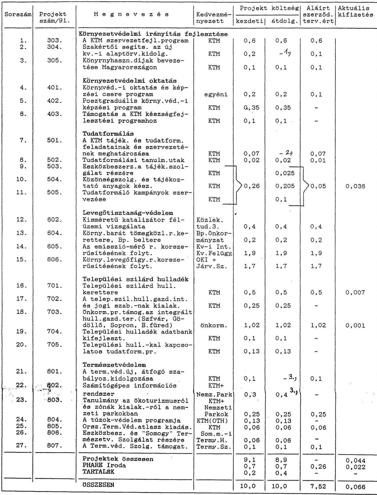

1., Törölve, ktg. áthelyezve a tartalékba
2., Törölve, ktg. áthelyezve 503, 504, 505-re
3., Athelyezve a 802-re

---

8. sz. melléklet
a V-14-77/1992-93. sz. jelentéshez

A miniszteri záróészrevételeket tartalmazó levelek

---

KORNYEZETVEDELMI ES TERULETFEJLESZTESI MINISZTER
M-267-14/1992.

Hagelmayer István úrn AK, elnök

Állami Számvevőszék
Bud a p e s t
Tisztelt Elnök Úr !

Köszönettel megkaptam és áttanulmányoztam a Phare programból finanszírozott magyar környezetvédelmi program előkészítésének és a pénzügyi támogatások felhasználásának ellenőrzéséről készített jelentést.

Ezzel kapcsolatosan tájékoztatom, hogy a megállapításokhoz, az összefoglaló követheztetésekhez és javaslatokhoz nem fũzök észrevételt. Ez utóbbiakat további munkánk során érvényesíteni fogjuk.

Végül - levelének utolsó bekezdésére utalva - tájékoztatom, hogy intézkedem hasonló esetek elkerülésére.

Budapest, 1992. december 17.
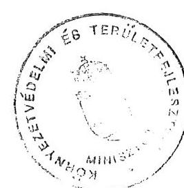

Tisztelettel:
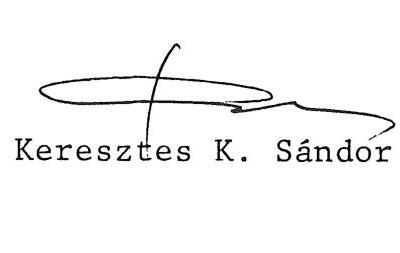

---

# MAGYAR KÖZTÁRSASÁG 

NEMZETKÖZI GAZDASÁGI KAPCSOLATOK MINISZTÉRIUMA
ALLAMTITKÁR

Budapest, 1992. december 21. B-682/1992.

Dr. Hagelmayer István úr az Állami Számvevőszék elnöke

Budapest

Tisztelt Elnök Úr!
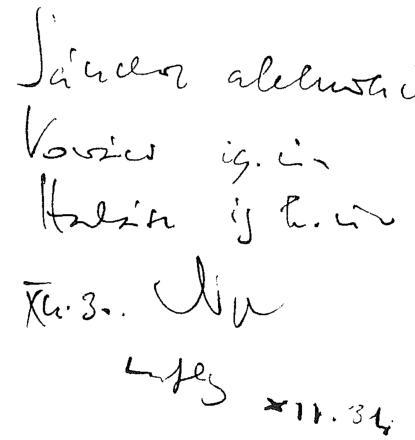

Köszönettel megkaptuk az Állami Számvevőszék által a Phare programból finanszírozott magyar környezetvédelmi program előkészítésének és a pénzügyi támogatások felhasználásának ellenőrzéséről készített jelentést.

Örömre szolgál, hogy a korábbi levelemben jelzett észrevételekkel egyetértettek, így azok egy kivétellel - bekerültek a Jelentésbe. Ugyanakkor szükségesnek tartom megjegyezni, hogy a Magyar Köztársaság Kormányának mérlegelésre ajánlott - most már - 3. ponttal kapcsolatban akkor kifejtett véleményt továbbra is fenn kívánom tartani. ${ }^{(2)}$
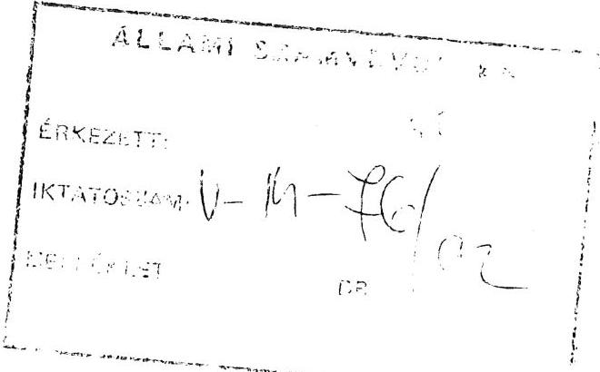
(2) Kivonut mellé́teluc.
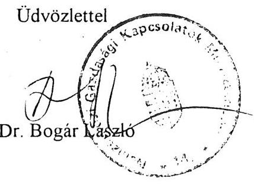

---

Kivonat dr. Bogár László államtitkár úr 1992. november 23-án kelt leveléből:
"A Magyar Köztársaság Kormányának mérlegelésre ajánlott 3. ponttal kapcsolatban a következöket szeretném megjegyezni:

A Phare program és más segélyprogramok felhasználásról szóló jelentés elkészitése az utóbbiakkal kapcsolatban komoly gondokat okozna. A kétoldalú programok a Phare-hoz képest más módon müködnek:

Nincs írásbeli kötelezettségvállalás a donor részéről a segítségnyújtás összegére vonatkozóan (az NGKM Segélykoordinációs Titkársága eröfeszitései ellenére az is kivételnek tekinthetö, hogy egyáltalán a program létéről és a támogatási területekről Memorandum született Hollandiával, Olaszországgal, előkészületben van Svájccal). Ugyancsak kivételes a mindkét fél által elfogadott eljárási rend léte.

A politikai kijelentésként elhangzó segélyfelajánlások felhasználhatósági feltételei országonként nagyon különbözöek, nincs egységes eljárási rend, nem követhetö nyomon ezen programok végrehajtása mint a Phare Programé.

Megfontolásra javaslom ezért, hogy ez az ajánlás kizárólag a Phare Programra vonatkozzék."

---

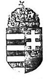

KÖZLEKEDÉSI, HÍRKÖZLÉSI ÉS VÍZÜGYI MINISZTER

Hiv.sz.: V-14-68/1992.
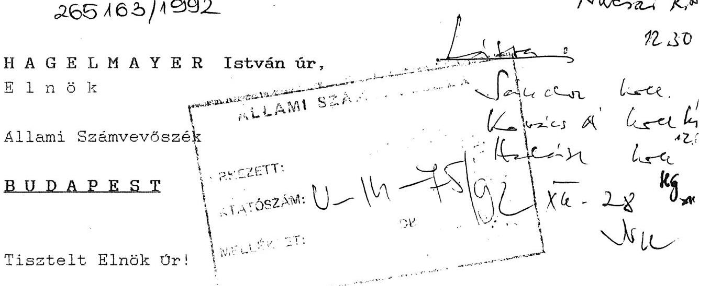

Az Allami Számvevőszéknek az EK Számvevőszékével együttmüködve elkészített "a Phare programból finanszírozott magyar környezetvédelmi program előkészítésének és a pénzügyi támogatások felhasználásának ellenőrzéséről" tárgyu jelentését áttanulmányoztuk. Eszrevételeinket a következőkben tesszük meg:

Az ASZ a Phare programból finanszirozott magyar környezetvédelmi programokra vonatkozó ellenőrzése reális, alapvetően helytálló megállapításokat tartalmaz. A jelentés az ASZ által kijelölt vizsgálati területeket kellő mélységben átvilágította, a vizsgálatból levont következtetéseket a KHVM tapasztalatai is általában megerősítik.

A jelentés II.fejezetben foglalt megállapításai közül különösen figyelemre méltónak és hangsúlyozandónak tartjuk azt, hogy a Phare programok megvalósításának szervezésében és eljárási rendjében koncepcióváltás következett be. A támogatás egyre inkább körülhatárolt célokhoz kapcsolódik, aminek következtében erőteljesebben érvényesíthetők a szakminisztériumok szándékai a magyar környezetvédelmi prioritásokkal összhangban (17.oldal közepe).