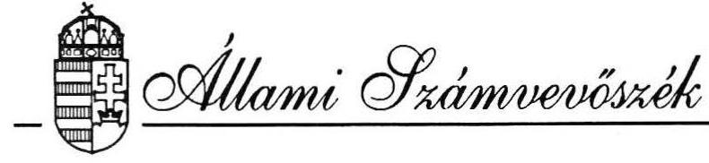
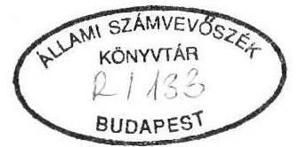
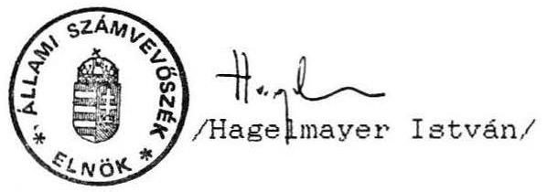
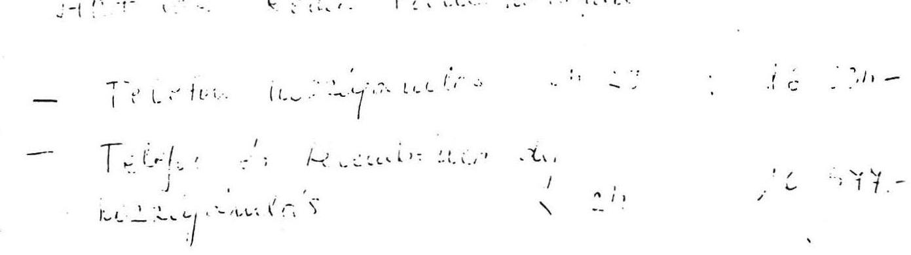

#  

## JELENTÉS

a PHRALIPE Független Cigány Szervezetnek
1991. évben juttatott állami költségvetési támogatás
felhasználásának ellenőrzéséről

---

# Az ellenőrzést vezette: 

Dr. Elek János
főtanácsos

Az ellenőrzést végezték:

Dr. Dotterweich Antal
Hoffman István
Gyarmati Béla
Dr. Velényi János
tanácsos
számvevő
szakértő
szakértő

---

Állami Számvevőszék
$\mathrm{V}-1026-2 / 92$.
Tsz: 118 .

# JELENTÉS

## a PHRALIPE Független Cigány Szervezetnek   1991. évben juttatott állami költségvetési támogatás felhasználásának ellenőrzéséről

I .

A vizsgálat körülményei, célja, módszere

Az Állami Számvevőszékről szóló törvény értelmében az Állami Számvevőszék (ASZ) ellenőrzi az állami költségvetésből juttatott támogatás felhasználását a társadalmi szervezeteknél. Az Országgyűlés 6/1991.(II.11.) sz. határozatában döntött a nemzetiségi és etnikai kisebbségi szervezetek 1991. évi állami költségvetési támogatásáról, amelyben külön is hangsúlyozta az ASZ ellenőrzési jogosultságát.
A cigány szervezetek részére - szervezeti és működési költségeik fedezésére - az Országgyűlés 1991. február 11-én 81 millió Ft-ot hagyott jóvá. Az összeg felosztásáról az Országgyűlés Emberi jogi, kisebbségi és vallásügyi bizottsága által kezdeményezett megbeszélés eredményeképp - az érintett cigány szervezetek megállapodása alapján a Roma Parlament és tagszervezetei 48 millió Ft támogatást kaptak. A Roma Parlament tagszervezeteinek döntése szerint a Phralipe Független Cigány Szervezet (továbbiakban: Szervezet) 4.5 millió Ft költségvetési támogatásban részesült.

Az ellenőrzés célja annak értékelése volt, hogy a Szervezet az állami költségvetési támogatás felhasználásában a törvényességi, a célszerűségi és az eredményességi szempontokat hogyan érvényesítette.

---

Az ellenőrzés során figyelemmel kellett lenni arra, hogy a nemzetiségi és etnikai szervezetek alapvetően nonprofit érdekeltségű szervezetek, a csoportokat tömörítő, érdekérvényesítő alaptevékenység következtében a pénzügyi kihatású intézkedések tervezése, végrehajtása nem kizárólag gazdaságossági szempontok által meghatározott.

A vizsgálat a lezárt 1991. gazdálkodási évre terjedt ki. A helyszíni vizsgálat 1992. október 5-től 22-ig tartott. Az ASZ a pénzfelhasználást a Szervezet központjában, valamint a szúrópróbaszerűen kiválasztott tagszervezetektől bekért iratanyagok alapján vizsgálta.

# II. 

A Szervezet 1991. évi költségvetésének tervezése és végrehajtása

A Szervezet felépítését és pénzügyi gazdálkodásának rendszerét az 1. sz. melléklet mutatja be.

A Szervezet éves költségvetést nem készített, a vizsgálat részére költségvetés címén csak olyan dokumentumokat tudtak rendelkezésre bocsátani, amelyek az Országgyűlés döntése alapján kapott 4,5 millió Ft tervezett felhasználására vonatkoznak, e kiadásokat pedig 1991. április 1. és december 31. közötti időszakra tervezték meg. A Szervezet saját bevételeire, összes kiadásaira kiterjedő költségvetési javaslat nem készült.

A Szervezet Választmánya 1991. február 16-i ülésén költségelosztó bizottságot hozott létre, amely február 23-i ülésén javaslatot tett az állami költségvetési támogatás felosztására a következők szerint:

- a Szervezet központi irodája és
apparátusa számára felhasználható
$2.500 .000 \mathrm{Ft}$
- 38 tagszervezet részére támogatás 1.750 .000 Ft
differenciáltan a taglétszám és a hatékonyság
figyelembevételével;
- regionális szervezeteknek
150.000 Ft
- új szervezetek létrehozására
$100.000 \mathrm{Ft}$

---

Az 1991. április 20-i választmányi ülés a bizottság javaslatát elfogadta, azonban az 1991. június 15-i választmányi ülés - miközben a szervezetek számára a pénz folyósítása megkezdődött - úgy döntött, hogy a központi iroda költségvetését 2 millió Ft-ra csökkenti, a tagszervezetek támogatását 500 E Ft-tal növeli új szervezetek létrehozása érdekében. A Közgyűlés tehát az alapszabály előírásaival ellentétben nem tárgyalta a kérdéskört, további probléma, hogy a támogatás felhasználása a június 15-i választmányi határozattól is eltérően történt, az eltérést alátámasztó testületi határozatot a vizsgálat nem lelt fel.

A Szervezet összes bevételét és kiadását a vizsgálat nem tudta megállapítani, tekintettel arra, hogy a származékos jogi személy területi szervezetek bevételeiről és kiadásairól az Országos Szervezet nem rendelkezik információkkal. A szúrópróbaszerű ellenőrzés megállapítása szerint azonban a területi szervezetek rendelkeztek a központi támogatáson túlmenően saját bevételekkel. Az Országos Szervezetnél rendelkezésre bocsátott dokumentumok alapján ugyanis 9 tagszervezet 50-200 Ft/hó összegben tagdíjfizetési kötelezettséget írt elő. Két tagszervezet dokumentális ellenőrzése alapján pedig rögzíthető, hogy a kecskeméti tagszervezet 15 E Ft összegű, a miskolci tagszervezet pedig 690 E Ft összegű bevétellel rendelkezett az Országos Szervezet útján kapott állami támogatáson túlmenően.

A Szervezet csak az Országos Szervezet bevételeiről és kiadásairól készített és bocsátott a vizsgálat rendelkezésére kimutatásokat (1. sz. és 2. sz. melléklet), ezek azonban pontatlanok.

A bevételek között helytelenül szerepel "a készpénzbefizetés házipénztárból" jogcímű 140 E Ft összeg, továbbá a "honoráriumkeret átutalása Phralipe folyóirattól" jogcímű összegek. Ez utóbbiak valójában kiadások, bevételként a folyóirattal kapcsolatos bevételeket kellett volna feltüntetni (alapítványi, minisztériumi és egyéb támogatások, összesen 2.450 E Ft). Nem szerepel bevételként a 10.325 Ft összegű "szeptember havi lakbérhozzájárulás"

---

jogcímű, a Roma Parlamenttől származó összeg, továbbá a 36.606 Ft összegű, "fénymásolási díj", szintén a Roma Parlamenttől. A kiadások összegét az említetteken túlmenően torzítja, hogy a Szervezet saját kiadásaként tüntettek fel a Roma Parlamentet terhelő kiadást is 23 E Ft összegben.

# III. 

Az állami költségvetési támogatás felhasználásának ellenőrzése

A Szervezet a 4,5 millió Ft összegű támogatás felhasználásáról 1992. február 24-én kelt levelében elszámolt a Nemzeti és Etnikai Kisebbségi Hivatalnak.

## 1. Központi iroda pénzfelhasználása

A Szervezet kimutatása szerint a központi iroda működtetésére 2.447.449 Ft-ot használt fel. Figyelemmel arra, hogy ez utóbbi összeg jogcímenkénti kimunkálásáról részletező kimutatást, analitikus nyilvántartásokat nem tudtak rendelkezésre bocsátani, ezért a vizsgálat a rendelkezésre álló alapbizonylatokból jogcímenkénti kimutatást készített. A következő összehasonlító tábla a két kigyűjtést veti össze.

| Jogcím | Szervezet   adata | Vizsgálat   /Ft/ | Eltérés |
| :-- | :--: | :--: | :--: |
| 1. Bérjellegű kiadások | 598.646 | 641.812 | +43.166 |
| 2. Központi iroda fenntartási költségei (irodabérlet, közüzemi díjak, telefon-fax, postaköltség, írógép, fénymásoló javítási költség, fénymásoló kellékek beszerzése) | 394.850 | 395.319 | +469 |
| 3. Szervezeti személygépkocsi szervizelése, javítása és benzin költség | 266.529 | 363.124 | +96.595 |
| 4. Választmányi, testületi ülések, valamint közgyűlések költségei (utazási költség és étkezési költség) | 528.370 | 805.739 | +277.369 |

---

5. Technikai berendezések irodai célra (tv, rádió, videomagnó, bútor)
6. Irodaszer, nyomtatvány, irodai munkaeszközök

| 287.587 | $88.903-198.684$ |
| :-- | :-- |
| 371.467 | $132.240-239.227$ |
| 2.447 .449 | $2.427 .137-20.312$ |

A jogcímenkénti bontást illetően a vizsgálat a Szervezet által meghatározott jogcímeket követte, mindazonáltal a főösszegben 20.312 Ft-tal alacsonyabb felhasználást állapított meg. A különbségre magyarázatul szolgál, hogy egyes ténylegesen felmerült kifizetések egy jogcím alá sem sorolhatók egyértelműen. Pl. a kiadások között a bizonylatok alapján felmerült jótékonysági gálaestre belépő 5 E Ft összegben, ezt a 2. sz. melléklet szerinti kiadások külön jogcímként nem tartalmazzák, feltehető, hogy a Szervezet kigyűjtése ilyen tételek miatt magasabb összegű a vizsgálaténál.

A szervezeti személygépkocsi szervizelése, javítása és benzin költség jogcímnél mutatkozó különbség tisztázható volt, szeptember 11-én 100 E Ft összegben sor került személygépkocsi vásárlásra, amely összeget a Szervezet az 5. sz. jogcímben szerepeltette. A vizsgálat megállapítása szerint azonban a gépkocsivásárlás nem a Központi Iroda működtetését szolgálta, a gépkocsit a Putnoki Tagszervezet részére adták át. Az összeget helyesen a tagszervezetek támogatása jogcímen kellett volna szerepeltetni.

A Központ bérjellegű kiadása - a vizsgálat megállapítása szerint - éves szinten 642 E Ft-ot jelentett, amelyből a bérnyilvántartó lapok adatai alapján az irodai alkalmazottak munkabére csupán 163 E Ft-ot, azaz 25%-ot képviselt. A bérjellegű kiadások túlnyomó része tehát különböző címeken kifizetett "tiszteletdíjat" ölel fel.

Különösen kirívó a munkabérek, tiszteletdíjak és eseti megbízási díjak kifizetésének gyakorlata, amelyek során - egy-egy kivételtől eltekintve - minden bérjellegű kifizetést "szellemi tevékenységért járó egyszeri megbízatási díj"-ként kezeltek és számfejtettek.

---

Ez a gyakorlat ellentétes az 1990. évi CII. törvénnyel, az 1990. évi LVIII. törvénnyel és az 1990. évi XX. törvénnyel módosított 1989. évi XLV. sz. törvényben foglaltakkal, amely a magánszemélyek jövedelemadójáról rendelkezik. Ellentétes, mivel a

- könyvelés rendszeres vezetése,
- tagszervezeteknek tartott előadás a tagszervezeti vezető részéről,
- közgyűlés megszervezése,
- gyors- és gépíró részéről végzett szerkesztőségi könyvtári munka,
- szerkesztőségi teendők ellátása (belső alkalmazott részéről),
- takarítás, stb.
nem minősül szellemi tevékenységért járó megbízatásnak. Ezen a címen több személynek folyósítottak rendszeresen munkabérjellegű jövedelmet, minimális SZJA előleg levonás mellett (a jövedelem 35%-a után 12% adóelőleget).

Előfordultak olyan munkadij kifizetések is, ahol egyáltalán nem vontak le adóelőleget (az adóköteles nyilatkozata, hogy éves jövedelme nem haladja meg az adómentes jövedelemadó-sávot, a kifizetéshez nem volt csatolva).

Az előzőek alapján az állapítható meg, hogy a kimutatott bérjellegű kiadások túlnyomó része nem a Szervezet Központi Irodájának működtetését szolgálta, e jogcímen történő szerepeltetésük helytelen volt.

A Központi Iroda fenntartási költségei jogcímen a Szervezet által kimutatott összeg csaknem azonos a vizsgálat által megállapított összeggel, szerepeltetése indokolt.

A Szervezeti személygépkocsi szervizelése, javítása és benzin költség jogcímen a vizsgálat által kimutatott összeg az említett korrekciókkal csaknem megegyezik a Szervezet adatával. E költségek a Szervezet Központi Irodája tulajdonában és használatában lévő személygépkocsival összefüggésben merültek fel. Az évközi javítási költség 26.500 Ft-ot tett ki, ezt követően teljes felújításra került sor 112.657 Ft összegben, annak ellenére, hogy a km-teljesítmény ekkor már 100 ezer km felett volt, fogyasztása pedig meghaladta a $13 \mathrm{l} / 100 \mathrm{~km}$-t.

---

Az előzőekre tekintettel a vizsgálat a felújításra vonatkozó döntést célszerűtlennek ítéli meg.

A választmányi, testületi ülések, valamint közgyűlések költségei a vizsgálat megállapítása szerint 505.739 Ft-ot tettek ki. A vizsgálat szerint a költségfelhasználás esetenként nagyvonalú volt, normatívák, előkalkulációk nem készültek. A Szervezet a 2. sz. melléklet szerinti kimutatása 3. pontja utolsó gondolatjeles bekezdésében szerepeltetett összeg együttesen egyezik hozzávetőleg a vizsgálat adatával, azonban ezen összegben nem csak a testületi ülések költségei, hanem egyéb reprezentációs jellegű kiadások is feltüntetésre kerültek.

A technikai berendezések irodai célra, valamint az irodaszer, nyomtatvány, irodai munkaeszköz jogcímen szerepeltetett összegek a vizsgálat megállapítása szerint lényegesen alacsonyabbak a Szervezet adatainál. Figyelemmel arra, hogy a főösszeget illetően nincs nagy különbség, így az eltérés (utazási, étkezési stb. költségek) nem megfelelő soron történő szerepeltetéséből adódik.

# 2. Tagszervezetek pénzfelhasználása 

A Szervezet által készített kimutatás szerint az állami támogatásból 41 tagszervezet részesült 2.101.551 Ft összegben. A vizsgálat a bankszámla kivonatok és a kapcsolódó bizonylatok alapján azt állapította meg, hogy 40 szervezet részesült 1.963.000 Ft összegű támogatásban. Annak megállapítása azonban, hogy mely tagszervezet ténylegesen mennyi központi támogatással rendelkezett, csak tételes teljeskörű vizsgálat alapján lett volna megvalósítható - mivel a tagszervezetek között is sor került a központi támogatás átadására - ezt azonban a rendelkezésre álló idő- és létszámkapacitás szűkössége nem tette lehetővé.

A területi szervezeteket az 1991. november 6-án kelt levéllel szólították fel elszámolásra, de csak az országos szervezet által juttatott támogatást illetően és november 30-i határidőre. E határidő megjelölés következtében a pénzfelhasználásról a választ adott szervezetek nem a teljes év vonatkozásában adtak számot, így pontos adat erről
 nem áll rendelkezésre.

---

A vizsgálat megállapítása szerint a felhívott szervezetek közül 21 szervezet nem számolt el, a részükre juttatott támogatás 998.500 Ft volt, tehát a központi támogatás felhasználásának 51%-áról semmilyen információ nem áll rendelkezésre.

A beküldött elszámolások szerint a tagszervezetek a kapott összegeket a következő főbb jogcímekre használták fel:

- iroda, terembérleti díj,
- irodaszerek beszerzése (boríték, levélpapír, postaköltség, irodagép),
- rezsiköltségek (villany, fűtés stb.),
- útiköltség térítés, gyűlések szervezési költségei,
- kulturális célú rendezvények, műsorok,
- óvodás és iskolás gyermekek támogatása.

A vizsgálat a kapott központi támogatás dokumentális ellenőrzését 3 szervezet esetében kívánta elvégezni. Az Enosi Tagszervezet a részére küldött táviratra nem válaszolt, a vizsgálat lefolytatására nem volt lehetőség.

Az ellenőrzött két tagszervezet (Miskolc, Kecskemét) esetében a költségvetési támogatást működési költségre fordították, a kiadások főbb jogcímei azonosak az általános felhasználási célokkal: irodabérlet, irodaszer, postaköltség, útiköltség.

# IV. 

A gazdálkodás törvényességének ellenőrzése

## 1. Az 1991. évi gazdálkodásról készített beszámoló

A szervezet nem tett eleget a mérleg és vagyonkimutatás készítéséről szóló, többször módosított 62/1988.(XII.24.)PM rendelet 11. paragrafus (5) bekezdésében előírt beszámolókészítési kötelezettségének, ezt a vizsgálat időpontjáig nem állította össze és nem küldte meg az elsőfokú adóhatóságnak.

Az adóbevallást elkészítették és azt az APEH Fővárosi Igazgatóságának benyújtották. A bevallásból megállapította a vizsgálat, hogy a Szervezet 1991. évben 50 E Ft nagyságrendben általános forgalmi adót igényelt vissza az Adóhivataltól, holott arra nem volt jogosult. (Ennek felismerése után az adót azonban mégsem fizették vissza.) Az eljárás ellentétes az általános forgalmi adóról szóló többször módosított 1989. évi XL. törvényben foglaltakkal, mivel 1991. évben tárgyi adómentes tevékenységet folytatott.

# 2. A könyvvezetési kötelezettség teljesítésének ellenőrzése 

A Szervezet a naplófőkönyv vezetése során nem tartotta be a könyvvitel rendjéről szóló - és 1991-ben még hatályos 52/1988.(XII.24.)PM rendelet és ennek módosítása tárgyában kiadott - 33/1989.(VIII.5.)FM rendelet 2. sz. mellékletében előírtakat, az alábbiakban részletezettek miatt:

- a hitelesített naplófőkönyv mellett egy nem hitelesített naplófőkönyvet is vezettek, amelyben a Phralipe c. újság bevételi és kiadási adatait rögzítették;
- az előírt negyedévenkénti könyvelési zárlat kimunkálását elmulasztották;
- a kronologikus könyvvezetést sem tartották be, a naplófőkönyvet egyik évről a másikra folytatólag vezették (1990-ről 1991. évre), azaz éves zárást nem eszközölték;
- kifogásolható, hogy a gazdasági műveletek rögzítése kizárólag a banki, továbbá pénztári bevételek és kiadások tételeire szorítkozott; nem könyvelték a bevételek és kiadások naplófőkönyvben előírt részletezését, a vonatkozó pénzforgalmi adatok rögzítésével egyidejűleg;
- kifogásolható továbbá, hogy a naplófőkönyvben több esetben grafitceruzával történtek adatrögzítések.

---

# 3. Az analitikus nyilvántartások vezetésének ellenőrzése 

A naplófőkönyvhöz szorosan kapcsolódó, azt alátámasztó, analitikus nyilvántartások felfektetését és vezetését - az időszaki pénztárjelentés és személyi bérkarton kivételével - elmulasztották.
Ezek a következők:

- állóeszközök egyedi nyilvántartó lapja,
- tartós használatba vett fogyóeszközök nyilvántartása,
- SZJA előleg nyilvántartása,
- szigorú számadású nyomtatványok nyilvántartása.

Az állóeszközökről leltárt nem vettek fel, melynek hiányában az eszközök állományának pontos megállapítása sem lehetséges.

A gazdálkodási tevékenységre belső szabályokat nem készítettek.

A Szervezet Ellenőrző Bizottsága 1991. szeptember hóban ellenőrzést végzett a könyvvezetés feladatai ellátása vonatkozásában. A Bizottság jelentésében hibákat, hiányosságokat, - amelyeket jelen vizsgálat megállapított - nem sorolt fel.

## 4. A számvitel bizonylati rendjének betartása

A Szervezet ügyvitelével összefüggésben az ellenőrzés vizsgálta a bizonylati rend és fegyelem megtartását, illetve az erre előírt követelmények gyakorlati érvényesülését, az 53/1988.(XII.24.)PM rendeletben foglaltak alapján.

A vizsgálat megállapította, hogy a kiállított pénztárbizonylatok jelentős hányada - alakilag és tartalmilag egyaránt - a számvitel bizonylati rendjéről szóló 53/1988.(XII.24.)PM rendelet 4. paragrafusa (1) bekezdés c/ pontjában előírtakkal ellentétes.

---

Így több esetben hiányzik a

- pénztáros aláírása,
- a kifizetést utalványozó és a
- befizető, vagy a pénzösszeg átvevőjének aláírása.

A pénzkiadások jogosságának, megfelelő alátámasztottságának, valamint a felmerült költségek indokoltságának ellenőrzése számos esetben elmaradt.

A Szervezet tulajdonát képező személygépkocsi használatával kapcsolatos üzemanyagköltségek - az év nagyrészében -, továbbá a hivatalos célra igénybevett magángépjárművek költségelszámolása sem felel meg a bizonylati rend és fegyelem előírásainak, mivel a költségfelmerülések jogossága nincs alátámasztva. Ugyanis olyan útvonal nyilvántartást, amelyekből a hivatalos úticél és a teljesített km megállapítható lenne, az esetek többségében nem vezettek. Mindezek helyett benzinszámlákat nyújtottak be, melyek alapján a pénztár költségtérítést eszközölt.

A felhasznált belföldi kiküldetési rendelvények egy része nincs szabályszerűen kitöltve, hiányzik róluk a kiküldetést elrendelő személy, valamint a kifizetést utalványozó aláírása.

A Szervezet a munkabérek kifizetésénél nem tett eleget a 33/1989.(VIII.5.)PM rendelet 2. sz. mellékletében előírtaknak, mivel a számfejtett munkabéreket nem bruttó összegben fizeti, tünteti fel, hanem nettó összegben (a különböző jogcímeken levonásra kerülő tételeket a pénztár rovaton vissza kellett volna vételezni, s a naplófőkönyvben is a megfelelő rovatban lekönyvelni).

Több esetben előfordult az is, hogy a pénztárból történő kifizetések során a kiadási pénztárbizonylat mellé a számla nem volt csatolva, melynek következtében a kifizetés jogossága nem volt vizsgálható.

---

# V. 

## Következtetések, javaslatok

Összességében megállapítható, hogy a Szervezet az 1991. évi állami költségvetési támogatást az alapszabályban megfogalmazott célokra használta fel. Ugyanakkor nem követhető egyértelműen a költségvetés tervezése, a továbbadott támogatások felhasználása, a központi iroda pénzfelhasználása a jogcímek egy részénél nagyvonalú, normatívák, előkalkulációk nem készültek. A gazdálkodásra vonatkozó jogszabályokat több esetben figyelmen kívül hagyták.

A jelentésben rögzített megállapítások alapján az ASZ az alábbiakat javasolja:

1. Javítani kell a költségvetés megalapozását, valamennyi bevételre és kiadásra kiterjedő, egész évre vonatkozó költségvetést kell készíteni. A kiadások tervezésénél azokat megalapozó részletes számításokat indokolt készíteni, figyelemmel az ésszerű költségfelhasználás szempontjaira.
2. A tagszervezeteknek nyújtott támogatások elszámoltatásának következetesen érvényt kell szerezni.
3. Biztosítani kell a gazdálkodásra vonatkozó jogszabályok maradéktalan érvényesülését. Ennek érdekében gondoskodni kell a szükséges belső szabályzatok és utasítások haladéktalan elkészítéséről.
4. Gondoskodni kell arról, hogy a pénzügyi, gazdálkodási tárgyú döntések az alapszabályban meghatározott eljárás betartásával és dokumentáltan történjenek.

---

5. Biztosítani kell a pénzkifizetések jogalapja és bizonylatai tekintetében a jogszabályi - a pénzügyi és számviteli, továbbá az SZJA törvény szerinti - előírások maradéktalan érvényesülését.

Budapest, 1992. december 17.

Melléklet: 3 db

---

# A Phralipe Független Cigány Szervezet szervezeti felépítése, és pénzügyi gazdálkodásának rendszere 

A Szervezet 1989. április 15-én állampolgári kezdeményezésre alakult Budapesten, jogi személy. Célkitűzéseit alapító és programnyilatkozata, szervezeti felépítését alapszabálya határozza meg. Az alapszabály szerint:

- a legfőbb döntéshozó szerv a Közgyűlés. Kizárólagos hatáskörébe tartozik többek között az elnök, az ügyvivő testület és az ellenőrző bizottság megválasztása és beszámoltatása, a szervezet költségvetésének és éves munkatervének elfogadása. A közgyűlés évente egyszer ülésezik;
- a Szervezetet a Választmány irányítja két közgyűlés közötti időszakban. Két közgyűlés között esetenként dönt a Szervezet pénzeszközeinek felhasználásáról. Üléseit három hónaponként tartja;
- az Országos Ügyvivő Testület a Szervezet operatív szerve, amely két Választmányi Ülés és két közgyűlés között dönt minden olyan kérdésben, amely nem tartozik a Közgyűlés, illetve a Választmány kizárólagos hatáskörébe. Éves költségvetést, munkatervet, beszámolót készít, amelyet a közgyűlés elé terjeszt. Az Országos Ügyvivő testületét a Közgyűlés választja egy évre;
- az elnök a Szervezet első számú jogi és politikai képviselője, akit a közgyűlés választ 1 évre. Felel a központi szervezet vagyonáért, munkáltatói jogot gyakorol;
- az Ellenőrző Bizottság a Közgyűlés által választott, a Szervezet gazdasági ügyeit ellenőrző testület. Ellenőrzéseit legalább félévenként tartja, amelynek eredményéről írásban beszámol a közgyűlésnek;
- a tagszervezetek az egyesülési jogról szóló törvényben foglaltak betartásával, az ország bármely pontján alakíthatók. Csatlakozó szándéknyilatkozatukat az Országos Ügyvivő Testület elfogadó nyilatkozattal nyugtázza. Ennek alapján válnak a Szervezet tagszervezeteinél származtatott jogi személyekké. A tagszervezetek gazdasági és pénzügyeiket maguk szervezik meg;
- Regionális tagszervezet jön létre, ha földrajzilag összefüggő, legkevesebb öt településen létrehozott tagszervezet tömörül;
- a Szervezet tagsága rendes, pártoló és tiszteletbeli tagokból áll. Az alapszabály szerint a rendes tagok kötelezettsége a tagdíjfizetés, de szociális helyzetre való tekintettel a tagdíjfizetési kötelezettségtől - a tagszervezet döntése alapján - el kell tekinteni.

---

# PHRALIPE 

FÜGGETLEN CIGÁNY SZERVEZET
ORSZÁGOS SZERVEZETE

Budapest
Tavaszmező u. 6.
1084
tel. - fax: 1-340-560

Phralipe Szervezet kiadások 1991. január 1 - 1991. december 31-ig
1./ A Phralipe szervezésében és közreműködésével lebonyolított program:

- Amaro Orom magazin előfizetése tagszervezeteknek (félévre 42 tagszervezetnek):
78.054.-Ft
- Margitszigeti Cigány Karneválra belépőjegyek:
3.000.-Ft
- Szolnoki Roma Nap támogatása:
30.000.-Ft
- Roma Közéleti Szabadegyetem
I. turnus
228.108.-Ft
II. turnus
250.683.-Ft
III. turnus
343.292.-Ft
IV. turnus
177.917.-Ft összesen:
1.000.000.-Ft
- Ingatlan vásárlás Mánfán:
800.000.-Ft
- 1991. július 27. Roma Szolidaritási Nap:
160.079.-Ft
2./ Tagszervezetek támogatása 1991-ben (mellékelve)
1.747.000.-Ft
3./ Közösségi kiadások:
- információs telefonszolgálat díja:
30.000.-Ft
- festmények keretezése:
37.500.-Ft
- választmányi és közgyűlési költségek:
528.370.-Ft
- utazási költségek, taxi számlák, napi díjak, étkezési díjak, testületi ülések útiköltségei:
315.840.-Ft
4./ Phralipe központi iroda működtetése:
- munkabérek, ösztöndíjak és ezek költségei (T8 és személyi jövedelemadó)
598.646.-Ft
- anyagi jellegű kiadások (bútor, nyomtatvány, technikai berendezés):
287.587.-Ft
- szolgáltatásjellegű kiadások (posta, telefon, áram, irodabérlet):
274.850.-Ft

---

- berendezések fenntartása (szolgálati személygépkocsi, írógép, fénymásológép javíttatási, üzemanyag költség és gépkocsi vételár):
- álláshirdetés:
- Phralipe vendégszállás (1991.dec - 1992. júniusig 1 hó 7.000.-Ft)

5./ Visszautalások:

- Pénzügyminisztériumnak téves többletutalás visszautalása:
- átutalás folyóiratra a szervezetből támogatásként:
- pályázati kölcsön visszautalása Autonómia Alapítványnak:

6./ Betöréskor elvitt pénz:
7./ Kintlévő pénzek (tartozások)

- Gombos Gyula (Sárospatak)

150.000.-Ft
- Budai Tiborné (Serényfalva) 40.000.-Ft
(határidő lejárt nov. 30.)
- Horváth Aladár
(határidő 1992. január 30.):
50.000.-Ft

Egész éves összkiadás:
8.466.237.-Ft

---

# PHRALIPE FÜGGETLEN CIGÁNY SZERVEZET ORSZÁGOS SZERVEZETE 

1084 Budapest, Tavaszmező u. 6.
Tel.-fax: 1340-560
3. sz. melléklet

## PHRALIPE Szervezet bevételek 1991. január 1-től 1991. december 31-ig RÉSZLETEZÉS

1./ Állami támogatás:

- 1.125.000.-Ft (1991. március 21. Állami Költségvetési Támogatás első negyedévi összegének továbbítása)
- 750.000.-Ft (1991. május 8. Állami Költségvetésből támogatás április-május hó)
- 2.625.000.-Ft (1991. július 2. Pártok és Társadalmi Szervezetek kiadási számlájáról állami támogatás)
4.500.000.-Ft Összesen
2./ Művelődési Minisztérium:
50.000.-Ft (1991. június 20. Művelődési Minisztérium támogatása)
3./ Egyéb bevételek:
- 828.635.-Ft (1991. március 5. Autonómia Alapítványtól 17.514.-DEM forintba való átutalása)
- 100.000.-Ft (1991. március 22. bérkeret átutalása Phralipe folyóiratról)
- 113.863.-Ft (1991. május 31. Roma Parlamenttől közös költségviselés címén átutalás)
- 750.000.-Ft (1991. június 19. Állami Támogatás továbbítása Roma Parlament számlaszámon keresztül)
- 80.000.-Ft (1991. június 21. Roma Parlamenttől közös költségviselés címén átutalás)
- 100.000.-Ft (1991. június 2. Magyarországi Nemzeti és Etnikai Kisebbségekért Alapítványtól Almásy téri rendezvényre)
- 35.445.-Ft (1991. augusztus 1. Roma Parlamenttől fénymásolási díj átutalása)
- 1.800.000.-Ft (1991. szeptember 18. NM évvégi elszámolása ingatlan vásárlásra és Szabadegyetem lebonyolítására)
- 50.000.-Ft (1991. december 2. AFA visszáigénylés)

---

- 122.760.-Ft (1991. szeptember 30. OTP negyedéves elszámolása)
- 100.000.-Ft (1991. október 15. Józsefvárosi Roma Önkormányzattól kölcsön)
- 75.000.-Ft (1991. október 22. honorárium bérkeret átutalása Phralipe folyóiratról)
- 74.000.-Ft (1991. november 18. honorárium bérkeret átutalása Phralipe folyóirattól)
- 84.000.-Ft (1991. december 13. honorárium bérkeret átutalása Phralipe folyóiratról)
- 140.000.-Ft (1991. november 11. készpénz befizetés házipénztárból)

Össz.bevétel: 8.869.703.-Ft
1990. évre kapott tőkésítés: 31.101.-Ft

Nyitó bankegyenleg: 320.743.-Ft
Nyitó pénztári egyenleg: 3.866.-Ft

Ezáltal mindösszesen bevétel: 9.019.270.-Ft.
4./ AMARO Drom hozzájárulása lakbér, telefon és terembérletéhez: 30.600.-Ft

| Bevétel: | 9.019.270.-Ft |
| :-- | --: |
| Kiadás: | 8.466.237.-Ft |
|

 Bankmaradvány: | $\underline{492.783 .-\mathrm{Ft}}$ |
| Pénztármaradvány: | $\underline{60.060 .-\mathrm{Ft}}$ |
