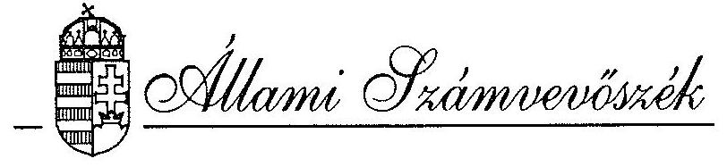
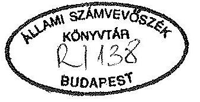
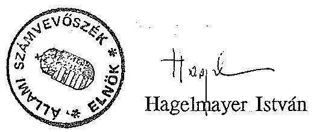
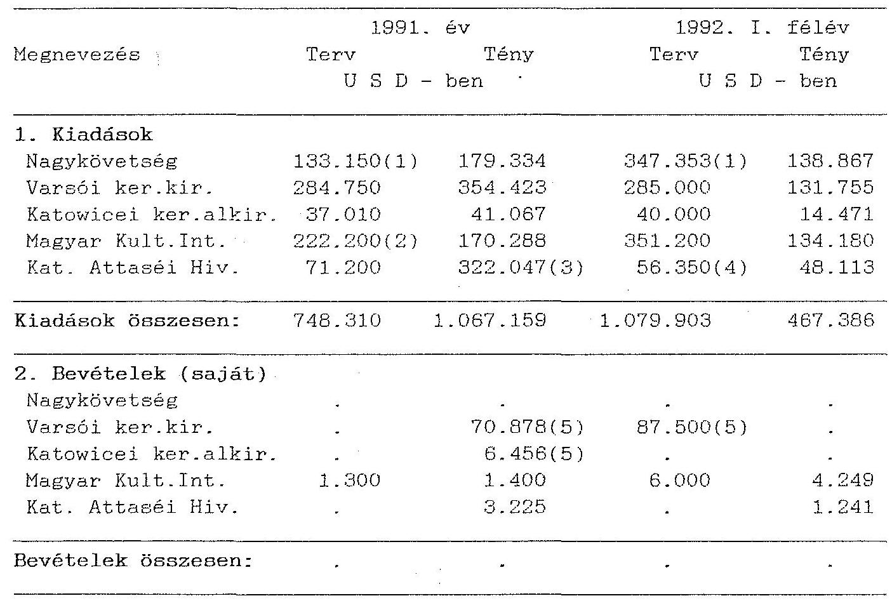

# JELENTÉS 

a Magyar Köztársaság Lengyelországban működő
külképviseleteinek pénzügyi-gazdasági ellenőrzéséről

---

# Az ellenőrzést végezték: 

Rádfai Tibor
Patai Tamás
dr. Mihály Sándor
számvevő-igazgatóhelyettes
számvevő-tanácsos
számvevő-tanácsos

Az ellenőrzést vezette:

Bihary Zsigmond
számvevő-igazgató

---

# J E L E N T É S 

## a Magyar Köztársaság Lengyelországban működő külképviseleteinek pénzügyi-gazdasági ellenőrzéséről

A Lengyelországban működő és a helyszínen ellenőrzött 5 külügyi, kereskedelmi és kulturális képviselet az 1991. évben mintegy 129,3 millió Ft kiadási előirányzattal gazdálkodott. Létszámuk összesen 182 fő, az általuk kezelt vagyon értéke mintegy 139-140 millió Ft volt.

Ellenőrzésünk célja e külképviseletek költségvetési előirányzatai tervezésének és felhasználásának, az ellátandó feladatok és erőforrások összhangjának és ezen keresztül a fejezetek irányító tevékenységének értékelése volt, célszerűségi, eredményességi és törvényességi szempontból.

Az ellenőrzés az 1990. január 1.-1992. június 30. közötti időszakra irányult és a Külügyminisztérium (KÜM), a Nemzetközi Gazdasági Kapcsolatok Minisztériuma (NGKM), a Művelődési és Közoktatási Minisztérium (MKM) és a Honvédelmi Minisztérium (HM) kapcsolatos elszámolásai mellett a Nagykövetség, a Katonai Attaséi Hivatal, a varsói és katowicei kereskedelmi kirendeltségek, valamint a varsói Magyar Kulturális Intézet gazdálkodására terjedt ki.

Itt említjük meg, hogy a nagykövetségnél a KÜM Gazdálkodási Főosztálya - 1992. szeptember első felében, közvetlenül ellenőrzésünket megelőzően - felügyeleti költségvetési ellenőrzést tartott. Ennek megállapításait ellenőrzésünk tapasztalatai alapján elfogadtuk és kiegészítettük.

---

# I. 

## Az ellenőrzés megállapításai

Lengyelországi külképviseleteink működését és gazdálkodását az elmúlt két évben elsősorban olyan tényezők befolyásolták, mint
—a megváltozott politikai, gazdasági körülmények és mindezzel szoros összefüggésben a külképviseletek szervezeti és működési feltételeinek átalakulása, illetve a további változások igényének egyre hangsúlyozottabb megfogalmazása mind a minisztériumok, mind a képviseletek részéről;
—a helyi gazdasági adottságok, amelyek közül kiemelhető a jelenleg is mintegy 70% körüli infláció.

## 1. A működés szabályozottsága, a költségvetési előirányzatok megalapozottsága

A lengyelországi külképviseletek feladatrendszere továbbra is átalakulóban van, a képviseleti tevékenységek súlypontjai (pl. nagykövetség, kulturális intézet) és módszerei (pl. kereskedelmi kirendeltségek) változnak.

A külképviseletek költségvetési tervezési módszereit jellemző eredmények és problémák a lengyelországi viszonylatban is tapasztalhatók voltak. Kiforrottabb a kiadások, hiányos, nem egyszer szabálytalanságokkal tarkított a bevételek tervezése.

## a. A működés és gazdálkodás szabályozottsága

A feladatok - csaknem valamennyi szervezetnél folyamatban levő - újrafogalmazása még csak részben, egy lehetséges új munkamegosztás, a feladatok integrálásának lehetőségei azonban nem tükröződnek a szabályzatokban.

A külképviseletek egy része működésének és gazdálkodásának szabályzatai azért is hiányosak, mert nem követték a magasabb szintű jogszabályok változását sem. Ez a szervezetek gazdálkodását kevésbé, a számviteli nyilvántartási és elszámolási rendet inkább hátrányosan érintette.

A nagykövetség működésére, gazdálkodására írásos belső szabályozás eddig nem készült. A személyzet munkaköri leírásának elkészítése folyamatban van.

---

Nem elég, hogy gyakorlatilag mindenki ismeri feladatát, amelyek kellően elhatároltak, s a vezetéssel közösen kerültek kialakításra. A hatásköröket, kötelezettségeket szabályzatban szükséges rögzíteni.

Ettől valamivel kedvezőbb a helyzet a varsói kereskedelmi kirendeltségnél és az attaséi hivatalnál.

#### Abstract

A varsói kereskedelmi kirendeltségnél összefoglalták és 1992. szeptemberétől használják a működési-gazdasági rend egyes részterületeire érvényes részletes szabályokat. Az új központi szabályozás megjelenéséig ezeknek hiánypótló szerepe van és a napi munkavégzést, az általános gazdálkodási-pénzügyi szabályzatok betartását segítik. Ennek megfelelően a kirendeltségen a szabályozottság jó, ami a gazdálkodási rend színvonalában is érezteti kedvező hatását.

Az attaséi hivatalnál az egyszerűbb gazdasági-pénzügyi feladatokhoz, a törvényes működéshez szükséges szabályzatok, pénzügyi és egyéb utasítások rendelkezésre állnak (jóváhagyott ügyrend azonban itt sincs, a részletes feladatokat a régi attaséutasítás rögzíti).

Sürgetőbb viszont a feladat a kulturális intézetnél, amely - az 1989-ben kiadott újabb szabályzat ellenére - máig egy 1982-ben kiadott alapján dolgozik (a munkaköri leírások elkészítése azonban már itt is folyik).

Az 1992. évtől a belső szabályozásoknál az előrelépést segítette a külügyi szervezetekre 1992. februárjától érvényes elszámolási szabályzat, valamint a kereskedelmi kirendeltségek hasonló ideiglenes és részleges szabályzata.

A katowicei kereskedelmi alkirendeltség jogi státusza tisztázásra és rendezésre vár. Az alkirendeltséget a fejezet költségvetése terhére tartják fenn, tekintettel arra, hogy információs és kereskedelmi, diplomáciai feladatokat is ellát. Működése során azonban nem élvezi a magyar nagykövetség kereskedelmi tanácsosi hivatalához hasonló státusz előnyeit és csak mint "a magyar vállalatok képviselete" szerepel. A kölcsönös és (helyi) lengyel érdekek egybeesése következtében az alkirendeltség státuszának bizonytalansága eddig nem befolyásolta hátrányosan működését.

# b. A költségvetési előirányzatok megalapozottsága 

Az elmúlt néhány év lengyelországi körülményei, valamint a külképviseletek feladatai és szervezeti változásai, az USD-elszámolásra való átállás különösen nehéz feltételeket teremtettek a megalapozottabb költségvetési előirányzatok kialakításához.

---

Nehezen volt tervezhető, illetve e tényszámokban kimutatható az infláció hatása is. (Az USD elszámolás időlegesen inkább kedvezően érintette a PLZ-ben kimutatott és újra USD-re számított felhasználást.)

A tapasztalható gondokhoz az érvényes szabályok, illetve kialakult gyakorlat is hozzájárult. A külképviseleteknél még hiányoznak a különféle célokra és forrásokból tervezendő kiadások egészét feltüntető költségvetések (és elszámolások) megvalósításának feltételei.

A nagykövetség sajtókerete pl. kötött előirányzat, de arra nem a nagykövetség, hanem önállóan a sajtóattasé tesz javaslatot a KÜM Sajtófőosztályának. (A Gazdálkodási Főosztály ezt csak pótlólag, mechanikusan vezeti hozzá a kiadott éves keretszámhoz.)

Kifogásolható, hogy a jóváhagyott gazdálkodási kereteken felüli további kiadásokat a többletbevételektől teszik függővé (pl. kereskedelmi kirendeltség, kulturális intézet). A kiadások minimalizálása, a bevételi lehetőségek kihasználása - tervezett és tényleges szinten - egyaránt kötelezettség. Ezt azonban helyesebb lenne egy szabályozott érdekeltséggel biztosítani a tervezési lazaságok és elszámolási szabálytalanságok eltűrése helyett.

A szakmai tevékenység és a költségvetési gazdálkodás kapcsolata Lengyelországban sem tekinthető kielégítőnek (pl. kereskedelmi kirendeltségek, vagy a nagykövetség létszám- és szervezeti változásainak hatása). A kiadások tervezésénél a csaknem kizárólagos bázisszemlélet rovására az aktuális feladatok és szervezeti változások fokozottabb figyelembe vételére van szükség.

A kulturális intézet 1992. évi - csak májusban kiérkezett - költségvetésében 10 ezer USD szerepelt beruházásra, felújításra. Július hónapban az intézet egy félreértett tájékoztatás alapján az összeget zároltnak tekintette és csak egy újabb, szeptemberi értesítés után ébredt rá, hogy az összeg mégis felhasználható. Mindezek együttes hatására az összeg 1992. évben feltehetően már nem lesz célszerűen elkölthető.

A bevételek teljes körű és szabályszerű megtervezése, elszámolása, továbbá egy erre alapozott finanszírozási terv kialakítása is elengedhetetlen egy-egy viszonylat összes ráfordításának áttekintéséhez. A bevételek túlnyomó részét 1991-ig a lengyelországi képviseletek sem tervezték meg, sőt helyenként azok tetemes részét ki sem mutatták, a kiadások nettósítására számolták el.

Különösen szembetűnő volt ez a gyakorlat a viszonylag jelentősebb bevételekkel rendelkező varsói kereskedelmi kirendeltségnél, ahol az összehason-

---

lítható és szabályos tartalmú előirányzatok kialakítását a tényleges bevételek és kiadások elszámolási rendje is kedvezőtlenül befolyásolta. Pl. a vendégszobák bevételeivel azok kiadásait 1991. végéig nettósították. (Nem is olyan régen a "hotelbevételeket" külön bankszámlán és pénztárban is kezelték, a költségvetési keretektől teljesen elkülönítve.) A vendégszobák egyes (pl. bér) kiadásai 1991. végéig a megfelelő rovaton nem is kerültek elszámolásra és bérként meg sem jelentek. Ez 1991-ben összesen 69,1 millió PLZ (bér, közterhek, jutalom) volt.

Helyes a vendégszobák bevételeit és kiadásait szembeállítani és figyelemmel kísérni, de ezt a kirendeltségi feltételek között külön analitikus nyilvántartás keretében indokolt megoldani.

Ez javasolható a kulturális intézetnél is, ahol egy bérelt lakást működtetnek vendéglakásként, de a térítési díj nem szabályozott, az igénybevétel hiteles nyilvántartása és a kapcsolatos bevételek költségvetési bevételként való elszámolása nem megoldott.

Az 1991. évben a képviseleteknek (pl. kereskedelmi kirendeltségek, kulturális intézet) felemás módon írtak elő bevételi tervszámokat. Ezek azonban (helyenként) "sor alatt" jegyezve nem képezték a képviselet költségvetésének szerves részét és a jóváhagyott kereten felüli "feltételes" kiadások "feltételes" fedezetét jelentették.

# 2. A tevékenység finanszírozása, ellátmányok és bevételek 

A külképviseletek 1990-1992. évi pénzellátása, amelyet elsősorban a költségvetési ellátmányok biztosítottak, kielégítő feltételeket teremtett azok működéséhez. Jelentősebb saját bevételekkel csak a kereskedelmi kirendeltségek rendelkeztek.

A varsói kereskedelmi kirendeltség az elmúlt években tetemes és kiegyensúlyozottan növekedő bevételeket ért el. Ezek értéke 1991-ben mintegy 162,5 ezer USD, 1992. I-III. negyedévében pedig 150,4 ezer USD összeget tett ki.

A kereskedelmi kirendeltségeknél a bevételek szerepe e viszonylatban nőtt és a további növelés lehetőségei is körvonalazódtak. Ehhez a kirendeltségek állami feladatainak megfogalmazására, ezek kereteinek meghatározására, a szolgáltatási tevékenység működési és finanszírozási feltételeinek fokozatos megteremtésére van szükség.

A kirendeltségek legjelentősebb bevételei a vállalati irodabérleti díjakból, a különféle költségtérítésekből (rezsi, telefon, telefax, dolgozói lakásköltségek stb.) és a vendég-

---

szobai bevételekből eredtek. Még nem jelentősek, de növekednek az olyan bevételek, mint pl. a kamatok, a különféle szolgáltatásokért beszedett térítések stb. is.

Lengyelországi külképviseleteinknél említésre méltó túlfinanszírozást nem tapasztaltunk. A rendelkezésre álló pénzkészletek többnyire másfél-két hónapos szükségletnek feleltek meg.

A varsói kereskedelmi kirendeltség pl. a budapesti ellátmányok mellett, különösen 1990-1991. években, a PK letétről, a vendégszobák pénztárából, a Csemege Vállalat ott maradt pénzkészletéből, egy Rbl-alapú PLZ bankszámla megszüntetéséből is átvett kisebb-nagyobb összegeket, de ez 1991-ben pl. minden kiadást és bevételt kombinálva, éves szinten csak 50 ezer USD-re tehető többletfinanszírozást eredményezett. Ez 10-15%-os mértékű volt és a mindenkor szükséges 1-2 havi tartalékot nem haladta meg.

Az NGKM helyes irányú lépéseit tükrözi, hogy Varsóba már Belgrádból, Párizsból is utaltak át ellátmányként azokon a helyeken felesleges pénzeszközöket.

A felügyeleti szervek együttműködésének szélesítésére az ösztöndíjak folyósítása is lehetőséget nyújt.A szükséges USD összeget egy 1983. évi szabályozás szerint az MKM a KÜM futárszolgálata útján juttatja el kéthavonta közvetlenül a nagykövetség ösztöndíjfelelőséhez, aki azokat kifizeti.

Az ösztöndíjak részére még 1991. májusában külön bankszámlát is nyitott a nagykövetség, de azon az ellenőrzés befejezéséig pénzmozgás nem volt.

Célszerűbb lenne, ha az ösztöndíjakat az MKM a KÜM-ön keresztül utalná át a nagykövetség ellátmányával együtt és a már több ízben javasolt finanszírozási terv keretében. Így az ösztöndíjfelelős a nagykövetség pénztárából vehetné fel a szükséges USD összegeket és oda számolna el. A forintellenérték itthon átfutó tételként lenne elszámolható.

Az attaséi hivatalnál viszont a katona hallgatók - a Hivatal gazdálkodási keretét csaknem elérő összegű - illetményére és költségeire kiadási előirányzat nem kerül jóváhagyásra, de azt ellátmányból finanszírozzák.

A valós bevételek a térítményezés szabálytalan gyakorlata miatt e viszonylatban sem voltak pontosan megállapíthatók. Ez, elsősorban a kereskedelmi kirendeltségnél, még 1991. évben is jelentős eltérést okozott a tényleges bevételi és kiadási számoknál. A bevételek elszámolása az NGKM területén pl. csak 1992. elejétől lett szabályszerűbb, ami itt is a bevételek és egyben kiadások látszólagos emelkedéséhez, a bevételi struktúra átrendeződéséhez vezetett.

---

A varsói kereskedelmi kirendeltség és részben a katowicei alkirendeltség is kiadási előirányzatait 1991-ben pl. éppen a tervezettel szemben és így többletként jelentkező bevételeivel fedezve léphette túl.

Az ilyen jelenségek a bevételek, kiadások szabályszerű elszámolását, a költségvetési bruttó elszámolási rend maradéktalan biztosítását indokolják.

Az 1991. évben a varsói kereskedelmi kirendeltség bevételeinek nagyobb fele még PLZ-ben jelentkezett, azzal az indoklással, hogy az irodákat bérlő vállalatok csak későn tudtak áttérni az USD elszámolásra. Ez a kirendeltség gazdálkodását (illetve a költségvetési érdekeket) a tapasztalatok szerint nem sértette, mert
 a befolyt összegek a kirendeltség PLZ kiadásainak fedezésére felhasználhatók voltak. Az 1992. évben az irodabérleti díjak teljes egésze és a vendégszobai bevételek is (1992. február hótól) USD-ben jelennek meg és általában csak a PLZ-ben fizetett költségek megtérítése történik ebben a pénznemben.

A vállalati irodabérletek a varsói kereskedelmi kirendeltségnél (Ft-ra átszámítva) az 1990. évi 4,7 millió Ft-ról 1991-re 6,4 millió Ft-ra emelkedtek annak ellenére, hogy az 1991. év eleji 20 vállalati képviselet helyett az év végén már csak 17 bérelt irodát. Ez a megfelelő díjkarbantartásnak tulajdonítható.

Az 1992. évben már nagyobb ütemű volt a bérlemények felmondása. Jelenleg (1992. szeptember) már csak 13 a bérletek száma. Az 1992. I-III. negyedévi ilyen bevételek mégis elérték a 73,4 ezer USD-t, vagyis a kb. 5,7 millió Ft-ot. A katowicei alkirendeltségnél két vállalat által fizetett bérleti díj éves összege valamivel több az alkirendeltség által az egész irodáért fizetett összegnél.

A vállalatok arányos mértékben fizetik a telefon, telex költségeket is, de bútorhasználat, titkárnői ügyelet, gépelés, irodaszer-ellátás stb. címén számos más szolgáltatásban is részesülnek a bérleti díj fejében. Ezek költségeit időszakonként (1-2 évenként) helyes lenne kigyűjteni és ennek alapján megvizsgálni és ellenőrizni, hogy az egyébként időszakonként karbantartott irodabérleti díjakban ezek a költségek is megtérülnek-e.

A bérleti díjak beszedése általában zökkenőmentesen, rendben folyt. A varsói kirendeltségnél pl. az 1992. október 1-i hátralék összesen 17,8 millió PLZ és 2,7 ezer USD volt, de a tételek többsége 1992. júliusában, vagy azt követően keletkezett és az ellenőrzés befejezése előtt befolyt.

---

Egy kft. 300 USD és 471,6 ezer PLZ 1992. május-szeptember hónapokban keletkezett tartozásának beszedése lehet problematikus. (Eddig a kirendeltség megfelelő intézkedéseket tett.)

A vendégszobák kihasználtsága a varsói kirendeltségnél az utóbbi években meglehetősen alacsony (kb. 20-25%-os) volt. A kapcsolatos bevételek elszámolási rendje, bizonylatolása ugyancsak megfelelő, azok elkülönítése, a kiadások rovatoktól független elszámolása azonban szabálytalan volt.
1990. végén pl. a "hotelpénztárban" 23,1 millió PLZ feküdt. Ekkor még külön bankszámlát is tartottak e bevételek elkülönített kezelésére. Rezsitérítés címén csak alkalmanként vezettek át vendégházi bevételeket a kirendeltségi pénztárba, ezeket mintegy "ellátmányként" kezelve. A bevételek többi részét a vendégszobák alkalmi és rendszeres kiadásaival nettósították.

A különféle költségtérítések kiszabásának és beszedésének rendjét az ellenőrzött képviseleteknél megfelelőnek találtuk. Ezt áttekinthető, pontos nyilvántartások támasztották alá. A pontos elszámolásokat azonban a kimutatások és azok formai kellékeinek (banki, pénztári hivatkozások, dátum, aláírások stb.) kiegészítésével (pl. a varsói kereskedelmi kirendeltségnél) hitelessé indokolt tenni, mert a jelenlegi formájukban azok nem elégítik ki a számviteli, bizonylati rend követelményeit.

A vendégszobai bevételek analitikus nyilvántartásai (kötelezettségek, előírások, ténylegesen befolyt összegek stb.) az e szempontból ellenőrzött varsói kirendeltségnél ugyancsak áttekinthetőek voltak. E nyilvántartások (hasonlóan más nyilvántartásokhoz) egységességét és hitelességét azok formai előírásával is szükséges lenne elősegíteni.

A kulturális intézet vendégszobáinak kihasználtsága megfelelő nyilvántartás (kigyűjtés, összesítés) hiányában nem volt értékelhető. (Ez az elszámolandó bevételek ellenőrzését is lehetetlenné tette.)

A hivatali személygépkocsik magáncélú, a saját járművek hivatali célú igénybevétele - a hivatali személygépkocsi parkokra tekintettel is - csak elvétve fordult elő. A kapcsolatos elszámolások - az ellenőrzött esetekben - rendben voltak.

# 3. A kiadási előirányzatok felhasználása 

A lengyelországi képviseletek gazdálkodása általában kiegyensúlyozott és szabályszerű volt. Kiadásaik a körülmények közvetlen hatására - a kereteken belül maradva - enyhén emelkedtek, mivel azok növekedését bizonyos szervezeti és létszámcsökkentési intézkedések ellensúlyozták.

---

A gazdálkodás célszerűségének további növelését azonban nem csak a régebbi feltételek között kialakított elhelyezési (pl. épület) és ellátottsági (technikai, tárgyi) körülmények korlátozták, hanem az is, hogy az egyes képviseletek felügyeletét ellátó minisztériumok egyelőre saját feladataik átrendezésén túl a feladatok tárcaközi integrációjára, összehangolására kevesebb gondot fordítottak. Így pl. pontosan az sem ismert, hogy egy-egy relációnak mekkora a költségigénye.

A különféle (HUF, PLZ, USD) alapon tervezett, átszámított és elszámolt összegek miatt a lengyelországi külképviseletek gazdálkodási keretei egyébként is csak nehezen értékelhetők és hasonlíthatók.

A feladatok ellátásához végeredményben a keretek kielégítő feltételeket biztosítottak és az 1992. évi előirányzatok időarányos részét is betartották (pl. a nagykövetségnél 58-64%-os felhasználással). Ettől eltérő helyzetet is tapasztaltunk.

A kulturális intézetnél már a bérkeret 84%-át használták fel 1992. I-III. negyedévében és ezen belül a részfoglalkozású alkalmazottak bérkereténél 113%-os, a megbízási díjaknál 188%-os volt a felhasználás.

A varsói kereskedelmi kirendeltségnél az 1991. évi előirányzatokat 69 ezer USD-vel lépték túl, a többletbevételek már említett felhasználásával. (A túllépés a nem tervezett beszerzések következménye volt és 1991. IV. negyedévére koncentrálódott.) Kisebb nagyságrendben hasonló jelenség volt megállapítható a katowicei alkirendeltségnél is. Az így fedezett beszerzések egyike sem volt feleslegesnek minősíthető, de azok jó része egy határozottabb takarékosság esetén halasztható, vagy célszerűbben megoldható lett volna.

# a. A külképviseletek működésének tárgyi feltételei 

Lengyelországi külképviseleteink elhelyezése - nagyobb részt saját tulajdonú épületekben - megfelelő színvonalú. A nagykövetség, a kereskedelmi kirendeltség épülete, valamint a katonai attasé lakása a Magyar Köztársaság tulajdonát képezi.

A nagykövetség 80,9 millió Ft értékű épülete 1950-1953. között épült. Egy 1977. december 14-én a lengyel és a magyar állam között létrejött megállapodás alapján a nagykövetség telkét a lengyel állam meghatározatlan időre ingyenes használatra átengedte a magyar államnak. A telektulajdonra vonatkozó okmányok (pl. telekkönyvi kivonat) azonban sem Varsóban, sem itthon nem állnak rendelkezésre. Az épület pedig a telekkönyvben fel sincs tüntetve.

---

Az említett 1977. évi megállapodásnak egyébként részét képezi a nagykövetség kereskedelmi tanácsosi hivatala telkének, valamint egy később kiválasztásra kerülő 4.000 m²-es teleknek is ingyenes használatba adása a magyar állam számára.

Az a terület, ahol a varsói kereskedelmi kirendeltség épülete létesült, már 1970. október 28-án úgy került bejegyzésre a KW 959 telekkönyvi számon, hogy a 2.250 m² nagyságú területet a lengyel állam örökös használatra a magyar állam kezelésébe adta. Ezt egy, az örökös használatra vonatkozó szerződésről szóló, 1971. március 17-én Varsóban a magyar nagykövet által is aláirt közjegyzői okirat szintén tartalmazza.

A kirendeltség telkén létesített épület telekkönyvezése azonban eddig nem történt meg. Így hivatalos telekkönyvezési dokumentum nem áll rendelkezésre, amely bizonyítaná, hogy az épület a magyar állam tulajdonában van (és létezik). Ellenőrzésünk idején megindították a telekkönyvezési eljárást.

A katonai attasé is egy 250 ezer USD-ért vásárolt, magyar állam tulajdonát képező ingatlanban lakik (Trakt Lubelski u. 2380. sz). A 360 m² alapterületű, családi ház jellegű, kétszintes épület kivitelét tekintve közepes színvonalú, a reprezentációs rész fogadásokra alkalmas. Adásvételi szerződése, telekkönyvi kivonata, műszaki leírása és egyéb dokumentumai a varsói attaséi hivatalban fellelhetők.

A nagykövetség külső és belső felújítása befejeződött. A rezidencia megfelelő környezetben áll, de külső felújításra szorul. Reprezentációs helyiségei kellő színvonalúak, de a lakrész három szobája kevés. (Tulajdonszerzés esetén épületbővítéssel a lakrész megfelelő nagyságúvá tehető.)

A nagykövetség technikai felszereltsége, az irodák berendezése közepes. A reprezentációs helyiségek berendezése kevés kivétellel szép, bútorzata azonban bővíthető, mivel a termek üresnek hatnak.

A varsói kereskedelmi kirendeltség hivatali helyiségeinek színvonala jó, azok kihasználtsága azonban - a létszám és a vállalati képviseletek számának csökkenése miatt - erőteljesen romlott.

A kirendeltség épületének összes hasznos területe a négy szinten 3.314 m². Az épületben 29 munkaszoba, 5 hotelszoba és gondnoki lakás van. Az első emeleten a kirendeltség, a második emeleten a vállalati képviselők vannak.

Hasonló a helyzet a katowicei alkirendeltség esetében, ahol ennek ellenére (a még alacsony bérleti díj miatt) a bérlemény feladása egyelőre nem lenne célszerű. A

---

helyiségek tatarozása és főleg az alkirendeltség környezetének rendeztetése azonban aktuális és sürgető feladat.

A varsói kereskedelmi kirendeltség kisebb értékű eszközbeszerzések mellett (IBM írógép, Facit írógép, EPSON printer, JVX teletexes TV) 1990-1991. években jelentős állóeszköz-állománnyal gyarapodott. (Telefonközpont 147 millió PLZ, telexgép 27 millió PLZ, telefax 21 millió PLZ, Canon fénymásoló 57 millió PLZ, számítógépes rendszer 78 millió PLZ.) Mindezek együttesen azt eredményezték, hogy a kirendeltség technikai színvonala, eszközellátottsága megfelel a korszerű követelményeknek, jó feltételeket teremt a működéshez, a feladatok ellátásához.

A kirendeltség számítógépes rendszerének beruházása összesen 645 ezer Ft és 4,3 ezer USD befektetését igényelte. A 3 db önálló számítógép saját programmal is működtethető, de központi számítógéppel összekötve is üzemeltethető és KopintDatorg adatok tárolására és lehívására is alkalmas. (A rendszer a kirendeltségen helyiséget bérlő vállalatoknak is számítástechnikai hátteréül is szolgálhat.)

A működő rendszert jelenleg adminisztratív, ügyviteli munkára (gépírás, szövegszerkesztés, irodabérleti díj, telefonköltség nyilvántartás, árlista aktualizálása, leltárkészítés) használják.

A számítástechnikai bázisok kiegészítését azonban célszerű lenne a minisztérium központi programja alapján alakítani és megvalósítani.

A bérleményben elhelyezett kulturális intézet technikai felszereltsége megfelelő (bár a moziterem régi hangosító berendezése már cserére érdemes). Az épület neonfelirata kb. öt éve nem működik. A földszinti üvegportál szinte semmi magyar vonatkozású tárgyat, vagy plakátot nem mutat be. Az intézet kívül-belül felújításra szorul.

A megtekintett lakások fekvése, alapterülete megfelel a reális igényeknek. Berendezéseik általában kielégítőek. A lakásokban többnyire csak kisebb kiegészítések, cserék és javítások szükségesek.

Kivételként a kulturális intézet igazgatójának lakása említhető, amelynek berendezése a közepesnél is gyengébb.

A katowicei kereskedelmi alkirendeltség vezetője saját tulajdonú lakásban lakik. Ennek fejében 150 USD/hó bérleti díjat helyettesítő költségtérítésben részesül. Ezt, az engedélyezett módon, a hó első munkanapján esedékes árfolyamon havonta PLZ-ben veszi fel. A lakás - hamarosan ugyancsak cserére szoruló - bútorzatának túlnyomó része költségvetési tulajdon.

---

A lakások többségét a DIPSERVICE-től, kisebb részét a kerületi önkormányzatoktól bérlik. Különösen ez utóbbi lakásoknál a megkötendő új szerződések a képviseletekre hátrányos feltételeket tartalmaznak (illetve tartalmaznának). Így a jelentős díjemelésen túl
—a lakások és berendezések műszaki állapotát nem a valóságos (leromlott, hiányos) helyzetnek megfelelően kívánják rögzíteni, viszont a "normaidő" előtti cseréket a bérlőnek saját költségére kellene elvégezni (pl. nagykövetség, kereskedelmi kirendeltség);
—a lakások bérbeadását megelőző állapottól függetlenül a lakásokat teljesen felújítva kívánják csak visszavenni (pl. kereskedelmi kirendeltség).

Ezekre tekintettel pl. a kereskedelmi kirendeltség e szerződéseket eddig - helyesen - nem írta alá és tárgyalásokat folytat a reálisabb feltételek elérése érdekében.

A saját és bérelt ingatlanokkal kapcsolatos gazdálkodás megkülönböztetett figyelmet érdemel részben a bérleti költségek Lengyelországban is jellemző növekedése, részben pedig a feladatok és szervezetek átrendeződése miatt. (A helyiségek kihasználtsága általában romlik.)

A bérelt lakásokból eddig a nagykövetségnél három lakást adtak le és már ez is jelentős megtakarítást fog eredményezni az 1992. évi előirányzatokból (a bérleti díjak összesen évi 191 ezer USD-t tesznek ki).

A lengyelországi külképviseletek az elmúlt egy év során csaknem kivétel nélkül nyugati típusokra cserélték le személygépkocsiparkjukat. Ennek során pl. a kereskedelmi kirendeltségnél üzemelő gépkocsik számát növelték is (egy darabbal), de a személygépkocsik száma a nagykövetségnél is magas.

A gépkocsik használatát és felügyeleti rendjét a kereskedelmi tanácsos jól szabályozta. A gépkocsik futása, elosztása, mozgásának nyilvántartása részletes, a km-adatokra és a fogyasztásra pontos adatokat szolgáltat. Eszerint
 is a gépkocsik benzinfogyasztása az 1991-1992. években - egy-két esetet kivéve - mindenhol alatta volt a megengedett normának.

A gépkocsik kilométer-teljesítménye alacsony. Ennek alapján a nagykövetségnél és a kereskedelmi kirendeltségeknél is mérlegelhető a park csökkentése és a saját gépkocsik térítéses használatának előtérbe helyezése. Ezzel a megoldással a kiadások az attaséi hivatalnál is tetemesen csökkenthetők lennének.

A kulturális intézet előtt egy üzemképtelen személygépkocsi áll. Meghibásodásának okait nem állapították meg és a további sorsáról sem intézkedtek.

---

A személygépkocsi cseréktől és egyes reprezentációs anyagoktól eltekintve a beszerzések általában a szükségletekhez igazodtak, pazarló, felesleges készleteket nem találtunk.

# b. Létszám- és bérgazdálkodás, reprezentációs kiadások 

A képviseletek létszáma Lengyelországban is mérséklődött. Ez nem járt a politikaiszakmai tevékenység szintjének és színvonalának csökkenésével, de a létszám összetétele helyenként kedvezőtlen irányban tovább változott. Az ilyen ellentmondások feloldását szervezetek és munkakörök megfelelő átrendezésével és összevonásával lehetne biztosítani.

A nagykövetségen a 3 fős létszámcsökkenés annyiban javította az arányokat, hogy a diplomatalétszám (11 fő) nem változott. Ennek ellenére az összlétszámon belüli arányok tovább lennének javíthatók a feladatok, munkakörök felülvizsgálásával, a munkamegosztás és együttműködés - többi képviselettel is számoló - javításával. A kulturális intézetnél 1990. óta az eredeti 19 fős létszám 6 fővel csökkent.

A varsói kereskedelmi kirendeltségnél a 13 magyar és a 21 lengyel alkalmazott létszáma 1992-ben egy fővel csökkent. Az összlétszámon belül (33 fő) a szakmai, érdemi létszámhoz (6 fő) képest magas a kisegítő, adminisztratív dolgozók, főként a lengyel alkalmazottak száma, ahol létszámcsökkentésre nem került sor (gépkocsivezető, adminisztrátorok, segédmunkások).

Kisebb nagyságrendben ugyanilyen probléma állapítható meg a katowicei alkirendeltségnél is.

A külképviseletek az 1990-1992. években reprezentációs kereteiket nem csak betartották, de azokból esetenként meg is takarítottak.

Az 1992. év első 3/4 évében pl. a nagykövetség kerete 30%-át, az attaséi hivatal 20%-át használta csak fel.

Ebben bizonyos előtakarékosság (pl. nagykövetség) mellett a régebben felhalmozott készletek, elsősorban italféleségekből (pl. nagykövetség, kereskedelmi kirendeltségek, attaséi hivatal) és azóta is szinten tartott, valamint ezzel számot nem vető keretek is szerepet játszottak.

A nagykövetség italraktárából 1992. június 16-án 353 üveget üledékesség és mintegy 55 liter hordós bort megtörtség miatt ki kellett selejtezni. A palackos borok 1988-ban, a hordós bor 1991-ben került a nagykövetségre. A selejtezés okaként a szakszerűtlen tárolást állapították meg, bár palackozott italok esetében az üledékesség gyártási, palackozási (tehát átvételi) hiba. (Személyi felelősség megállapítására azonban a hordós bor esetében sem került sor).

A varsói kereskedelmi kirendeltségen a reprezentációs készletek italféleségekből (bor, töményszesz) és ajándékozási célú tárgyakból (szőttes, kulacs, porcelán) ugyancsak magasak voltak. Az 1990-1991. években italból a nyitókészlet 1728-1759 db üveg között, a beszerzés 624-1122 üveg között alakult. A készlet két évi felhasználásnak felel meg, ezért feleslegesen magas. Ez állapítható meg - természetesen kisebb nagyságrendben - a katowicei alkirendeltség italkészleteiről is. Az 1992. évi beszerzések már mérsékeltebbek voltak, így a készlet enyhe csökkentése elkezdődött.

A varsói kirendeltségnél az ajándéktárgy beszerzések a felhasználáshoz képest évről-évre növekedtek. Ezért 1992-ben már nem is volt szükség nagyobb beszerzésre. A reprezentációs tárgyi készletek tényleges és nyilvántartás szerinti állománya között eltérés nem volt. A szalámi és konzerv készletek nyilvántartási adatai ugyanakkor eltértek a tényleges állapottól, amit az okozott, hogy a készlet egy részét eladták, de a nyilvántartott készletet nem csökkentették.

# 4. Vagyon- és értékvédelem, számviteli rend 

A vagyon- és értékvédelmet - több kisebb jelentőségű és néhány említésre méltóbb hiányosságtól eltekintve - általában rendben találtuk.

A pénztári és bankelszámolások a fellelt, illetve a számlakivonatokkal igazolt pénzkészletekkel megegyeztek. A pénztárakban idegen pénz és érték nem volt. A bank- és pénztári elszámolások vezetését - néhány szabályszerűnek nem minősíthető javítástól (átírástól, ceruzás bejegyzéstől) eltekintve - rendben találtuk.

Kifogásolható volt, hogy az attaséi hivatalnál 2 db összesen 2.350,8 ezer PLZ értékű bont tartottak a pénztárban.

A pénzkezelés biztonságának feltételei - az ott kezelt összegekre tekintettel - általában megfelelőek voltak. Intézkedésre van szükség azonban a nagykövetségen a pénzek tárolására szolgáló helyiség célirányosabb megválasztása, a kulturális intézetnél pedig a megfelelő helyiség rácsokkal való védelme érdekében.

A konzul páncélszekrényéből 1990. augusztusában eltűnt 5.055 USD. A páncélszekrényt a konzul és a konzuli kisegítő (a felesége) kezelte. A KÜM és a BM vizsgálata eredménytelenül zárult. A konzul elismerte, hogy szobáját és a páncélszekrényt 5-10 percekre rendszeresen nyitva és őrizetlenül hagyta. Terhére hanyag kezelést, illetve súlyos gondatlanságot róttak,

---

amiért 1992. június 12-i határozattal - túlzott méltányosságot gyakorolva - másfél havi átlagkeresetének megfelelő 30.300 Ft kártérítésre kötelezték.

A negyedévi zárlatok ellenőrzésén túl a váratlan pénztárellenőrzéseket mindegyik képviseletnél szaporítani szükséges. (Ilyennek nyomát egyedül a kulturális intézetnél találtuk, ott is csak fél éves gyakorisággal.)

A nagykövetségnél a házipénztár kiadási és bevételi pénztárforgalmának bizonylatolása (repülőlapos, sorszámozás nélküli házinyomtatványokkal) korábban sem volt szabályos, de a KÜM 1/1992. számú, a gazdálkodás rendjéről szóló utasításának hatályba lépésétől az érvényes szabályoknak sem felel meg.

Ugyanitt az ösztöndíjak pénzkezelési rendje (bizonylatolás, pénztárnapló, a futártól való pénzátvétel igazolása és az ösztöndíjfizetési jegyzék) jelentős adminisztrációs többletet okoz.

A kereskedelmi kirendeltségeknél a számviteli rend betartása az érdemi vonatkozásokat tekintve megfelelő, néhány vonatkozásban itt is indokolt a nyilvántartási rendet és fegyelmet tovább tökéletesíteni. Erre a gazdálkodás rendjének most elkészült részletes szabályozása jó alapot nyújt.

A varsói kereskedelmi kirendeltségnél pl. a vendégszobák bevételeinek bizonylatolását és nyilvántartását áttekinthetően vezették. A nyilvántartások hitelessége azonban nem biztosított és azok formája is egységesítésre szorul, célszerűbbé lenne tehető.

A kulturális intézetnél a pénztárnaplók vezetésében 1990-1992. években számos hiányosság volt tapasztalható (aláírások, számlaigazolások hiánya, könyvelés). Ezeket az MKM 1992. szeptember 3-án levélben kifogásolta. Ezeken túl mutató probléma pl., hogy az intézetnél a vendégszobák igénybevételét a pénztári bevételi bizonylatokon kívül semmi sem igazolja.

A pénz- és értékkezelés körében az új számviteli törvény szempontjából is figyelmet érdemlő tartozások és követelések analitikus nyilvántartását és kezelését az ellenőrzött esetekben rendben találtuk. Különösen nagy volt a dolgozók fizetési előlegeivel kapcsolatos forgalom a varsói kereskedelmi kirendeltségnél, ahol viszont a visszafizetések pontosak voltak.

Nem merült fel kifogás általában a tárgyi eszközök és készletek nyilvántartási rendjével kapcsolatosan sem. Az attaséi hivatalnál azonban csak 1990. szeptembere óta vezetik az anyagnyilvántartásokat elfogadhatóan. Ugyanitt az elkészült helyiségleltárívek is csak kisebb eltérésekkel tükrözik a tényleges helyzetet. Az anyag-

---

nyilvántartások rendszerét is egyszerűbbé, célszerűbbé lehetne tenni. A katowicei kereskedelmi alkirendeltségnél pl. a nyilvántartások vezetésének (ún. ideiglenes) módja rontja azok hitelességét.

A nyilvántartások új számviteli törvény szerinti átrendezése még hátra van. Az attaséi hivatalnál a kettős könyvelésre való áttéréskor a központ által kiadott ún. "összehasonlító kimutatás" eltéréseket mutat a tényleges helyzettől.

A leltári nyilvántartásokban szereplő készletek értékelése pl. a kereskedelmi kirendeltségnél ez év végén lesz egységes. A beszerzéseket addig (pl. katowicei kirendeltség) részben Ft-ban, majd USD-ben, illetve PLZ-ben tartották nyilván.

A kulturális intézetnél három éve leltároztak utoljára. A nyilvántartások ugyancsak rendezésre várnak. A könyvállomány még eszmei értékben sem szerepel az intézet leltárában, holott a könyvek között néhány valószínűleg múzeális értékű darab is van (pl. 1854. évi lengyel kiadású Lengyel Értelmező Szótár, 1910. előtt kiadott Kossuth levelezés és Petőfi Összes művei Jókai előszavával, stb.). Ezeket célszerű lenne Budapesten elhelyezni.

Az intézet 468 db mozifilm-kópiával és 192 db videókazettával rendelkezett 1992. október 6-án. Ezek a leltárban még eszmei értéken sem szerepeltek. Nincs biztonságos egyedi fényképes nyilvántartás az intézet 109 db képzőművészeti alkotásáról sem.

A reprezentációs készletek nyilvántartásait a képviseletek rendben vezették. Ezt csak az attaséi hivatalnál indokolt pontosítani (fajtánkénti regisztrálás). A kulturális intézetnél az ajándékraktár könyv- és hanglemez készletének nyilvántartását kell javítani, mert az a kiadott tárgyak tételes visszakeresését nem teszi lehetővé.

A selejtezéseket a külképviseletek megfelelő gyakorisággal végezték. A kiselejtezett tárgyak megsemmisítése azonban gyakran nem történt meg (pl. nagykövetség, varsói és katowicei kereskedelmi kirendeltségek, kulturális intézet). A megsemmisítésre elfogadható bizonylat (pl. kulturális intézetnél) nem mindig állt rendelkezésre.

Tájékoztatás szerint a kulturális intézet könyvtárából még 10-15 évvel ezelőtt selejteztek ki számos kottát, partiturát (Kadosa művek, Bánk bán), de ezeket még mindig tárolják, sőt időnként szükség is van rájuk. Ezért célszerű lenne ezeket újólag leltárba venni.

A nagykövetség az 1990. évi selejtezésből "nem szükséges", vagy "rossz állapotú" rézkarcokat, bútorokat a lengyel alkalmazottaknak adott át. Ugyanitt 1990-ben 15

---

db (150 Ft/db nyilvántartási értékű) Molnár C. Pál rézkarcot a KÜM utasítására kiselejteztek és hazaszállítottak. E tételt egy további képpel (100 Ft/db), egy terakotta szoborral (10 ezer Ft) és egy bronz szoborral (30 ezer Ft) kiegészítve 100 ezer Ft-ért eladták. (A bevételt rendben elszámolták.)

# II. 

Következtetések és javaslatok

Az elmúlt években lengyelországi külképviseleteink tevékenysége és szervezete is folyamatos átalakuláson ment keresztül. Ez feladataik változásában, tevékenységük jelenleg is tartó átalakulásában, személyi állományuk cserélődésében és csökkenésében érzékeltette pozitív hatásait.

Kapcsolataink fejlődésével a diplomáciai tevékenység élénkült, bővült. Szembetűnően fejlődött és minőségileg is kedvező irányba változott a kulturális intézet tevékenysége iránti érdeklődés. A kereskedelmi forgalom visszaesésével, stagnálásával a kereskedelmi kirendeltségek funkcióinak, szerepkörének átalakítása érdekében megtették az első lépéseket.

A külképviseletek együttműködése - a jó személyi kapcsolatoknak köszönhetően - zavartalan volt. A nagykövetség a magyar-lengyel kapcsolatok egészét érintő kérdéseket, a kereskedelmi kirendeltség a gazdasági együttműködés kétoldalú vetületeit, a kulturális intézet a helyi kulturális élet befolyásolását helyezi előtérbe. A külképviseletek gazdálkodása kiegyensúlyozottan folyt, ebben a mérsékelten emelkedő gazdálkodási keretek és a csak részben megtervezett saját bevételek egyaránt szerepet játszottak.

A gazdálkodás egészében szervezett és szabályszerű volt, de annak tökéletesítésére számos kisebb és néhány jelentősebb hiányosság felszámolásával, a további takarékosságra pedig a feladatok, szervezetek együttműködésének szélesítésével, integrálásával nyílna lehetőség. Ehhez azonban szükséges lenne a külképviseletek feladatrendszerének áttekintése, összehangolása és ezt követően a reláció ingatlan- és létszámgazdálkodási koncepciójának kidolgozása.

A kereskedelmi kirendeltségeknél, a kulturális intézetnél az új céloknak és lehetőségeknek megfelelő célszerű tevékenységek kibontakoztatása is feladat. Ez azonban

---

nem lehet akadálya a létszám további célszerű csökkentésének, a célszerűbb belső arányok megteremtésének.

A gazdálkodás 1991. óta érvényesülő kötetlenebb feltételei a képviseleteknél segítik a célszerűbb megoldások kialakítását, a feladat és szervezeti struktúra átalakításának rugalmas megoldását. Mindez ugyanakkor - az új államháztartási és számviteli törvény támasztotta igényeken túl - elkerülhetetlenné teszi részletes és korszerű szabályok rögzítését is. A lengyelországi tapasztalatok alapján is megállapítható, hogy a külképviseleteknél el kell kezdeni, illetve sürgetően be kell fejezni egy újonnan szervezett és szabályozott számviteli és gazdálkodási gyakorlat kialakítását.

Ellenőrzésünk tapasztalatai alapján a következőket javasoljuk:

# 1. A külképviseletek felügyeletét ellátó minisztériumok számára: 

a. A külképviseletek gazdálkodási kereteit a költségvetési tervezés keretében - a bevételek és kiadások maradéktalan számbavételével - úgy kell megállapítani, hogy
— egy-egy külképviselettel kapcsolatos összes bevétel és kiadás

 megtervezésre és ennek megfelelően elszámolásra kerüljön;
— az jobban igazodjon a feladat- és szervezeti változásokhoz;
— alapul szolgáljon egy, a helyi bevételekkel, átfutó kiadásokkal stb. is számoló finanszírozási terv kialakításához.
b. Az érdemi feladatok további felülvizsgálatával, integrálásával helyes lenne lépéseket tenni az érdemi és kisegítő létszámarányok javítása érdekében.
c. A személygépkocsiparkokat csökkenteni lehetne és a saját tulajdonú személygépkocsik térítéses használatát lenne célszerű előtérbe helyezni.
d. A reprezentációs készletekkel kapcsolatos előirányzatoknál figyelembe kell venni a meglévő készleteket.
e. A külképviseletek elszámolási és nyilvántartási rendjét - az új számviteli törvénnyel összefüggő feladatok és a kidolgozás alatt álló új gazdálkodási és

---

számviteli szabályzatok keretében - egységesíteni és pontosítani kell (bizonylatolás, analitikus nyilvántartások, készletértékelések stb.).
f. Intézkedni kell a kiselejezett eszközök, készletek megsemmisítése és annak bizonylatolása érdekében.

# 2. A Külügyminisztérium részére: 

a. Össze kell állítani a magyar állami tulajdonában, meghatározatlan időre szólóan ingyenes használatában levő telkek, épületek tulajdon- és használati jogát bizonyító dokumentációkat (államközi megállapodások, adásvételi szerződések, telekkönyvi bejegyzések, műszaki leírások, stb.).
b. A nagykövetségi és konzuli pénzek tárolására szolgáló helyiségeket célirányosabban lenne helyes kialakítani.
3. A Nemzetközi Gazdasági Kapcsolatok Minisztériuma részére:
a. A költségvetési bruttó elszámolási elv megsértését - az 1992. évtől már kialakuló eredményekre is támaszkodva - maradéktalanul fel kell számolni.
b. A katowicei kereskedelmi al-kirendeltség jogi státuszát felülvizsgálni és rendezni szükséges.
c. Intézkedni szükséges, hogy a kirendeltségek által vezetett analitikus nyilvántartások formailag egységesek és tartalmilag hitelesek legyenek.
d. A kirendeltségek számítástechnikai hardver- és szoftverfejlesztéseihez helyes lenne - a helyi és hazai információ igények és lehetőségek számbavételével - egységes koncepciót kialakítani és a fejlesztéseket ennek alapján koordinálni, a többirányú (általános és viszonylati kereskedelempolitika, piaci- és partnerkapcsolatokat segítő szolgáltatások stb.) hasznosítás érdekében.
e. A kereskedelmi kirendeltség(ek)nél a bevételi lehetőségek fokozottabb kiaknázása érdekében szükséges az állami feladatok kereteinek új meghatározása, a szolgáltatási tevékenység működési és finanszírozási feltételeinek kialakítása és fokozatos megteremtése.

---

# 4. A Múvelődési és Közoktatási Minisztérium részére: 

a. A varsói kulturális intézet egyik gépkocsija üzemképtelenségének okait ki kell vizsgáltatni és annak sorsáról sürgősen intézkedni indokolt.
b. A kulturális intézetnél a pénz tárolására szolgáló helyiség biztonságát javítani szükséges.
c. Az ösztöndíjakkal kapcsolatos pénzellátás és pénzkezelési rend célszerűségét javítani, felesleges adminisztrációját csökkenteni indokolt.
d. Az intézetnél a leltározások előírt gyakoriságára, a nyilvántartások kiegészítésére és a készletek rendezésére intézkedni kell.
e. Gondoskodni kell a képzőművészeti alkotások és múzeális értékek jobb védelméről.

Budapest, 1992. december

Melléklet: 2 lap

---

# Kimutatás 

a Magyar Köztársaság lengyelországi külképviseletei 1991-1992. I. félévi bevételi és kiadási előirányzatairól és azok teljesítéséről

Megjegyzés: (1) Alapelőirányzat
(2) + 3,2 millió Ft-ért PLZ
(3) Házvásárlás ellenértékével együtt
(4) 1992. éves +455 ezer Ft
(5) Az egyéb bevételekre vonatkozó számított adat

---

# Kimutatás 

a Magyar Köztársaság lengyelországi külképviseletei: alkalmazottainak létszámáról és összes illetményéről az 1992. szeptember havi állapot szerint

| Megnevezés | Magyar | alkalmazottak | Külföldi | alkalmazottak |
| :--: | :--: | :--: | :--: | :--: |
|  | létszáma | össz.illetménye | létszáma | össz.illetménye |
|  | (fő) | (USD/hó) | (fő) | (ezer PLZ/hó) |
| Nagykövetség | 19 | 30.308 | 8 | 33.065 |
| Varsói ker.kirend. | 12 | 16.206 | 19 | 55.280 |
| Katowicei ker.alkir. | 2 | 2.641 | 3 | 6.600 |
| Magyar Kult. Intézet | 4 | 3.600 | 9 | 15.926 |
| Katonai Attas. Hiv. | 2 | 1.967 | - | - |
| összesen: | 39 | 54.722 | 39 | 110.871 |

