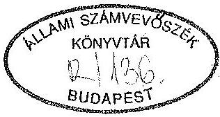
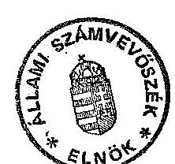

# Állami Számvevőszék

## JELENTÉS

a Magyar Demokrata Fórum
1991. évi gazdálkodása törvényességének ellenőrzéséről

---

# Az ellenőrzést vezette:

Dr. Elek János osztályvezető főtanácsos

## Az ellenőrzést végezték:

Dr. Szávai Tamás
Tóth István
Dr. Ocsovai Sándor
Sörös István
Várlaki Pál
tanácsos
tanácsos
szakértő
szakértő
szakértő

---

Állami Számvevőszék Vagyonkezelő Főcsoport V-1025-13/1992. Témaszám: 119.

# JELENTÉS

## a Magyar Demokrata Fórum   1991. évi gazdálkodása törvényességének ellenőrzéséről

I.

A vizsgálat célja, időszaka, módszere, körülményei

Az Állami Számvevőszék hivatott kizárólagosan vizsgálni a pártok gazdálkodásának törvényességét az 1990. évi LXII., és az 1991. évi XLIV. törvényekkel módosított, a pártok működéséről és gazdálkodásáról szóló 1989. évi XXXIII. törvény (továbbiakban: párttörvény) alapján.

A párttörvény 10. paragrafus (3). bekezdése szerint az Állami Számvevőszék évente legalább egyszer ellenőrzi azoknak a pártoknak a gazdálkodását, amelyek az adott évben állami költségvetési támogatásban részesültek. A Magyar Demokrata Fórum gazdálkodásának törvényessége ezúttal harmadszor került ellenőrzésre.

A Magyar Demokrata Fórum (továbbiakban: MDF) az 1990. évi általános országgyűlési választásokon elért eredménye alapján a párttörvényben előírt elosztási szabályok szerint rendszeresen állami költségvetési támogatásban részesül. Ennek megfelelően az MDF 1991. évben 158,4 millió Ft állami költségvetési támogatást kapott.

A törvényességi vizsgálat célja annak megállapítása, hogy az MDF gazdálkodása mennyiben felel meg a párttörvény elő-

---

írásainak, továbbá betartották-e a könyvvitel-, a számvitel bizonylati rendjéről szóló és a gazdálkodással összefüggő egyéb hatályos jogszabályok előírásait.

A vizsgálat a lezárt 1991. év gazdálkodására, illetve a korábbi vizsgálat alapján tett intézkedések érvényesülésére terjedt ki. Az MDF gazdálkodása törvényességének ellenőrzése a Magyar Közlöny 1991. évi 28. számában közzétett ASZ általános ellenőrzési program szempontjainak megfelelően történt.

A vizsgálat módszere helyszíni ellenőrzésen alapuló szúrópróbaszerűen választott mintavételes eljárás volt.

Az ellenőrzés az 1991. évi gazdálkodásról közzétett pénzügyi zárómérleg teljességére, pontosságára, a könyvvezetés gyakorlatára, bizonylati alátámasztottságára, a számvitel bizonylati rendjének betartására terjedt ki. A vizsgálat elsősorban arra összpontosult, hogy az MDF működéséhez szabályszerűen igénybevehető forrásokat használt-e fel, gazdálkodó tevékenysége megfelelt-e a párttörvényben megengedetteknek, betartotta-e a gazdálkodással összefüggő pénzügyi-számviteli és egyéb szabályokat.

A jelentés megállapításai az Országos Hivatalnál, a Budapesti-, és Dunántúli Területi Irodáknál, a Fejér megyei Szervezetnél, a Baranya megyei és Jász-Nagykun-Szolnok megyei Irodáknál, a Nógrád megyei Választmánynál, a Pécsi-, Székesfehérvári-, és Szolnoki Városi szervezeteknél, valamint a Budapest XI. kerületi szervezetnél lefolytatott helyszíni ellenőrzés tapasztalatain alapulnak.

# II.

Megállapítások

## 1./ Az MDF 1991. évi pénzügyi zárómérlegének ellenőrzése

A párttörvény 9. paragrafus (1) bekezdése értelmében a pártok kötelesek minden év március 31-ig az előző évi gazdálkodásuk pénzügyi kimutatását a Magyar Közlönyben

---

- a törvényben meghatározott minta szerint - közzétenni. E kötelezettségének az MDF eleget tett, a Magyar Közlöny 1992. évi 33. számában közzétette pénzügyi zárómérlegét (1. sz. melléklet).

A pénzügyi zárómérleg tartalmazza az 1991. évben bejegyzett valamennyi önálló gazdálkodásra jogosult szervezet adatát. Emellett a gazdálkodó tevékenységet nem végző szervezetektől is kielégítő információ érkezett az összesítés számára. Ezzel az adatszolgáltatás teljességét biztosították.

A pénzügyi zárómérleg azonban pontatlan, mely elsősorban a bevételek és kiadások halmozódásának nem teljeskörű kiszűréséből, valamint az egyes mérlegsorok tartalmának - a párttörvény melléklete kitöltési útmutatójának hiányából fakadó - értelmezési nehézségből adódik.

A bevételek és kiadások halmozódását alapvetően az okozta, hogy a pénzügyi zárómérleg összeállításához - az önálló pénzkezelési jogosultsággal rendelkező szervezetek számára - készített Beszámoló formanyomtatvány és a mellékelt hat oldalas kitöltési útmutató nem tudott valamennyi lehetséges változattal számolni. Figyelmen kívül maradtak az egyes helyi szervezetek közötti végleges vagy ideiglenes pénzmozgások. A helyi szervezetek ugyanis átmeneti pénzzavar esetén kölcsönökkel segítették egymást, vagy egyes közös cél érdekében felmerült egy szervezetnél jelentkező költségekhez (fütés, világítás, rendezvény stb) hozzájárulást adtak. E pénzátadások a kiszűrés lehetőségének hiányában halmozódást okoztak.

Halmozódást okozott a pénzügyi zárómérleg "C" rész "Módosított pénzmaradvány" során, hogy az év közben megszűnt és más szervezetbe beolvadt Baranya megyei Iroda a Beszámolójában 16.856 forint év végi záró pénzkészletet jelentett, holott ezt az összeget megszűnésekor átadta az utódszervezetnek.

Egyes helyi szervezetek, mint például a Dél-dunántúli Területi Iroda és Nógrád megyei Választmány a saját tulajdonú pavilon bérbeadásából befolyt bevételt nem a párt

---

gazdálkodó tevékenységéből származó bevételként, hanem magánszemélytől kapott hozzájárulásként mutatták ki.

A pénzügyi zárómérleg soronkénti tartalmának értelmezési problémája miatt a munkabéreket nem bruttó, hanem nettó módon tartalmazza a mérleg és a bérből teljesített levonásokat a pártot terhelő adóként (SZJA) és TB járulékként mutatták ki.

A Szolnoki Városi Szervezet az MTA Soros Alapítvány által juttatott adományát és az abból eszközölt kiadásokat nem mutatta ki Beszámolójában, ezért azokat a közzétett pénzügyi zárómérleg sem tartalmazza.

A pénzügyi zárómérleg az egyéb bevételek részletezését nem tartalmazza.

A belföldi jogi személyektől kapott 500 E Ft-ot meghaladó támogatások közül a Deák Ferenc Alapítványtól kapott támogatás összege a mérlegben szereplő 22.259.800 forinttal szemben csak 22.159.800 forint. A 100 E Ft eltérés oka téves összeadás volt.

A közzétett 40 millió Ft-os hitelállomány a bank hiányos adatszolgáltatása és téves könyvelés miatt nem egyezett a számviteli nyilvántartásokban kimutatottal.

A mérlegben 1990. év halmozott többleteként az 1990. évi mérlegben kimutatott 67.165.185 Ft-tal szemben 70.644.152 Ft szerepel. Az eltérés oka, hogy az 1990. évi mérleg elkészítésének időpontjára nem minden helyi szervezet éves pénzügyi beszámolója érkezett be a párt Országos Hivatalába, így az utólagosan beérkezett beszámolók eredményét már csak az 1991. évi mérlegben lehetett figyelembe venni.

A pénzügyi zárómérleg tartalmazza a párt parlamenti képviselőcsoportjának (frakciójának) a párt saját gazdálkodástól független bevételeit és kiadásait.

Az Országgyűlés Hivatala által kialakított és 1992. I. negyedévéig fennálló gyakorlatot - mely szerint a frakciók támogatására szánt összeget a pártoknak utalta - az

---

ellenőrzés az 1990. évi LVI. törvény 5. §-a (1) bekezdésében foglaltakkal ellentétesnek ítélte. Tekintettel azonban arra, hogy e témakörben az Állami Számvevőszék már jelzéssel élt az Országgyűlés Hivatala felé annak vizsgálatakor, további intézkedés megtétele nem indokolt.

# 2./ A pénzügyi zárómérleg megalapozottságát szolgáló könyvvizsgálati megállapítások

Az Országos Hivatal 1990. évtől egyszerűsített kettős könyvvitelt alkalmaz, míg a helyi szervezetek hitelesített naplófőkönyvet vezetnek. Az Országos Hivatal, melynek főkönyvi könyvelése 1991. évben számítógépre tért át, az adott évre érvényes számlatükörrel rendelkezett. Az áttérés miatt zárást és főkönyvi kivonatot csak év végén készítettek.

Az ellenőrzött önálló gazdálkodási jogkörrel felruházott helyi szervezetek - Jász-Nagykun-Szolnok megyei Iroda kivételével - könyvelésüket idősorrendben végezték és azt szabályszerűen negyedévenként zárták.

A naplófőkönyv fejrovatai nem alkalmasak arra, hogy belőlük az éves pénzügyi zárómérleg elkészítéséhez a párttörvényben előírt részletességű adatszolgáltatás készüljön. Ezért a Központ által kért Beszámoló elkészítéséhez külön részletező munkatáblát kellett kidolgozni. A vizsgálat nem tudta valamennyi adatsor helyességét tételesen ellenőrizni, mert a kitöltés alapjául szolgáló munkatáblákat a legtöbb szervezet nem őrizte meg.

## 3./ Az analitikus nyilvántartások és a bizonylati rend ellenőrzése

Az 1991. évben elkészült, valamennyi szervezeti egységre érvényes Gazdálkodási Szabályzat nagy lépést jelentett a nyilvántartási és bizonylati rend helyes alkalmazása területén. A helyi szervezetek azonban csak fokozatosan kezdtek igazodni az írásban rögzített követelményekhez.

---

Az eszközök nyilvántartása az 1991. évben még nem felelt meg mindenben az előírásoknak. Általában az értéknyilvántartás hiányzott és a kölcsönbe kapott eszközök nyilvántartása elmaradt. Leltározást a Jász-Nagykun-Szolnok megyei Iroda kivételével végeztek, de a kölcsönbe kapott vagy adott eszközök leltározása, illetve azok egyeztetése gyakran elmaradt.

A szigorú számadásra kötelezett nyomtatványok körét kijelölték és azok nyilvántartását az előírásoknak megfelelően vezették.

A bizonylatok utalványozása egyes helyi szervezeteknél a vizsgált időszakban elmaradt, nagyobb részüknél 1992. évtől áttértek a rendszeres utalványozásra.

Az elszámolásra kiadott előlegekről azon helyeken, ahol ilyen jellegű kifizetések keletkeztek, külön nyilvántartást vezettek.

A Nógrád megyei Választmánynál néhány könyvelési tételt megfelelő részletességű alapbizonylattal nem támasztottak alá.

# 4./ A gazdálkodó tevékenység ellenőrzése

Az ellenőrzés részére átadott nyilatkozatok és a helyszíni vizsgálati tapasztalatok alapján megállapítható, hogy az MDF a párttörvény 6. paragrafus (1) bekezdésében engedélyezett gazdálkodó tevékenységet folytatott. A gazdálkodó tevékenységből származó bevételek propaganda anyag árusításból, saját tulajdonú eszközök bérbeadásából, valamint felesleges eszközök értékesítéséből származtak.

Az MDF egy korlátolt felelősségű társaságot alapított, mely tevékenységéből a vizsgált időszak alatt bevétele nem származott.

Az MDF tiltott vagyoni hozzájárulást nem fogadott el, a párttörvény által tiltott vállalatot nem alapított, tiltott gazdasági, társasági formában részesedést nem szerzett, részvényt nem vásárolt.

---

A helyi szervezetek gazdálkodó tevékenységét alátámasztó dokumentumokkal - tekintettel arra, hogy önálló gazdálkodási jogkörrel rendelkeznek - az Országos Hivatal nem rendelkezik, az ilyen jellegű információk csak a helyszínen találhatók.

# 5./ Az MDF első ellenőrzésének vizsgálata

Az MDF gazdálkodó tevékenységének ellenőrzése két módon, a belső ellenőrzés és a számvizsgáló bizottságok útján valósult meg. A belső ellenőrzés szabályait az MDF Gazdálkodási Szabályzatában rögzítették. Az Országos Számvizsgáló Bizottság hatásköréről és működéséről az MDF Alapszabálya rendelkezik. Az Alapszabály IV. fejezete értelmében a helyi szervezeteknek Számvizsgáló Bizottságot kell választaniuk és ezek működési szabályait a helyi szervezeteknek kell kialakítaniuk.

Az Országos Hivatalnál a belső ellenőrzés két módon: folyamatba épített és a vezetői ellenőrzés formájában valósult meg. Ez a fajta ellenőrzés részben kiterjedt a területi irodákra is. A folyamatba épített ellenőrzés érvényesült a pénzügyi zárómérleghez készített szervezeti "Beszámolók" számszaki egyezőségének vizsgálatánál is.

Az Országos Számvizsgáló Bizottság tagjai megfogyatkozása következtében az 1991. évi ellenőrzésekről írott dokumentum nem készült. Év végével új, teljeskörű Számvizsgáló Bizottságot választottak, mely 1992. februárjától megkezdte működését.

A helyi szervezetek számvizsgáló bizottságainak munkájáról a bizottság hiányától kezdve a kifogástalan működésig a vizsgálat vegyes képet tapasztalt.

## 6./ Utóvizsgálat

Az MDF 1990. évi gazdálkodásáról a V-50-3/1991. számon készített előző számvevőszéki ellenőrzés megállapításai alapján a továbblépés érdekében az Országos Elnökség

---

1991. október 11-én Intézkedési tervet hagyott jóvá. Az Intézkedési terv kijelölte a végrehajtásért felelős személyeket.

Az 1991. évi pénzügyi zárómérleg összeállításánál sikerült biztosítani a teljességet. Minden bejegyzett szervezettől, még a gazdálkodó tevékenységet nem végzőktől is, érkezett információ az összesítés számára.

Az önálló pártként bejegyzett három szervezet az MDF Vas megyei Irodája, az MDF Győri Szervezete és az MDF Eleki Szervezete kezdeményezte a bíróságon a téves bejegyzés rendezését, melynek végrehajtásáról a jelen ellenőrzés időpontjáig visszajelzés nem érkezett az Országos Irodához.

Az Országgyűlés Hivatala a párt frakciója részére járó szakértői díjkeretet 1992. II. negyedévtől már nem az MDF számlájára utalta.

# III.

## Összefoglalás és javaslat

Az MDF 1991. évi gazdálkodása törvényességének számvevőszéki vizsgálata eredményeként megállapítható, hogy az Országos Hivatal valamennyi helyi szervezetre egységes, a különféle rendelkezések kívánalmait kielégítő gazdálkodási rendet alakított ki. Ugyanakkor a vizsgálat alapján a pénzügyi zárómérleg összeállításánál, a helyi szervezetek könyvelési gyakorlatánál, nyilvántartási és bizonylatolási rendjénél tapasztalt hiányosságok
 kiküszöbölésére a következőket javasoljuk:

- Az 1992. évi gazdálkodásról készített pénzügyi zárómérleg összeállításánál a halmozódás elkerülése érdekében teremtsék meg a feltételét annak, hogy a helyi szervezetek közötti ideiglenes (hitel) vagy végleges pénzmozgásokat kiszűrjék.

---

- Segítsék elő a pénzügyi zárómérleg elkészítéséhez szükséges, helyi szervezetek által készített Beszámoló sorai tartalmának egységes értelmezését.
- Gondoskodjanak arról, hogy a helyi szervezetek
= az ellenőrizhetőség érdekében tekintsék bizonylat értékű, megőrzendő dokumentumnak az éves gazdálkodás adatainak a Beszámoló sorai szerinti gyűjtését tartalmazó munkatáblákat;
= maradéktalanul érvényesítsék a könyveléssel, nyilvántartással és bizonylati renddel kapcsolatos jogszabályban foglaltakat.
- A helyi szervezetek számvizsgáló bizottságai rendszeresen ellenőrizzék a gazdálkodás körülményeit.

Budapest, 1993. január 5.

/Hagrimayer István/

Helléklet: 1 db

---

|  A Magyar Demokrata Fórum 1991. évi pénzügyi zárómérlege |  |  |  |  |
| :--: | :--: | :--: | :--: | :--: |
|  |  | Forintban |  |  |
| A) Tényleges bevételek |  |  |  |  |
| 1. Tagdijak |  |  | 11394083 |  |
| 2. Állami költségvetésből származó támogatás |  |  |  |  |
| 2.1. Alapösszeg |  |  | 158430000 |  |
| 2.2. Frakció szakértői díj |  |  | 23627500 |  |
|  |  | 2. összesen | 182057500 |  |
| 3. Egyéb hozzájárulások |  |  |  |  |
| 3.1. Jogi személyektől |  |  | 42156812 |  |
| - ebből 500000 Ft feletti hozzájárulás belföldiektől: |  |  |  |  |
|  | - | Deák Ferenc Alapítvány | 22259800 |  |
|  | - | Progressio Individui Alapítvány | 1000000 |  |
|  | - | ebből 100000 Ft feletti értéknek megfelelő összeg külföldiektől: |  |  |
|  |  | - Association AFODEMH Paris | 15307023 |  |
| 3.2. Jogi személynek nem minősülő gazdasági társaságoktól |  |  |  |  |
|  |  | - ebből 500000 Ft feletti hozzájárulás belföldiektől: |  |  |
|  |  | - ebből 100000 Ft feletti értéknek megfelelő összeg külföldiektől: |  |  |
| 3.3. Magánszemélyektől |  |  | 1587524 |  |
|  |  | - ebből 500000 Ft feletti hozzájárulás belföldiektől: |  |  |
|  |  | - ebből 100000 Ft feletti értéknek megfelelő összeg külföldiektől: | - |  |
| 3.3. | A párt által alapított vállalat és korlátolt felelősségű társaság nyereségéből származó bevétel |  | 1587524 |  |

A Magyar Demokrata Fórum
1991. évi pénzügyi zárómérlege

Forintban
A) Tényleges bevételek

1. Tagdijak 11394083
2. Állami költségvetésből származó támogatás
2.1. Alapösszeg 158430000
2.2. Frakció szakértői díj 23627500
2. összesen 182057500
3. Egyéb hozzájárulások
3.1. Jogi személyektől
3. ebből 500000 Ft feletti hozzájárulás belföldiektől:
3. Deák Ferenc Alapítvány 22259800
3. Progressio Individui Alapítvány 1000000
3. ebből 100000 Ft feletti értéknek megfelelő összeg külföldiektől:
3. Association AFODEMH Paris 15307023
3. Jogi személynek nem minősülő gazdasági társaságoktól
3. ebből 500000 Ft feletti hozzájárulás belföldiektől:
3. ebből 100000 Ft feletti értéknek megfelelő összeg külföldiektől:
3. Magánszemélyektől
3. ebből 500000 Ft feletti hozzájárulás belföldiektől:
3. ebből 100000 Ft feletti értéknek megfelelő összeg külföldiektől:
3. A párt propagandatevékenységéből 1217498
3. A párt gazdálkodó tevékenységéből 1587524
3. A párt propagandatevékenységéből 1217498
3. A párt az 44961834
3. A párt propagandatevékenységéből 1397438
3. A párt gazdálkodó tevékenységéből 530765
3. A párt által alapított vállalat és korlátolt felelősségű társaság nyereségéből származó bevétel

| 7. Egyéb bevétel | 21845703 |
| :--: | :--: |
| Összes bevétel | 262187323 |
| B) Tényleges kiadások |  |
| 1. Hozzájárulások juttatása |  |
| 1.1. A párt országgyűlési csoportja számára | 23307696 |
| 1.2. A párt helyi szervezetei számára* |  |
| 1.3. A párt által fenntartott vagy támogatott intézmények számára | 2986954 |
| 1.4. Más társadalmi szervezetek számára | 4466040 |
| 1.5. Külföldi intézmények, szervezetek, személyek számára | 2779077 |
| 1. összesen | 33539767 |
| 2. Személyzeti költségek |  |
| 2.1. Munkabérek | 23065458 |
| 2.2. Költségtérítések, napidíjak | 6980330 |
| 2.3. Társadalombiztosítási hozzájárulások | 13192219 |
| 2.4. Szociális és egyéb támogatások | 1305502 |
| 2. összesen | 44543509 |
| 3. Általános költségek |  |
| 3.1. Adók, illetékek | 8477982 |
| 3.2. Épületek fenntartása, karbantartása, közüzemi díjai | 12190990 |
| 3.3. Helyiségek bérlete | 14636387 |
| 3.4. Adminisztrációs és postaköltségek | 8205155 |
| 3.5. Különféle egyéb költségek | 29754955 |
| 3. összesen | 73265469 |
| 4. Sajtó- és propagandaköltségek | 25174533 |
| 5. Választásokkal kapcsolatos költségek | 14744741 |
| 6. Egyéb tevékenységgel kapcsolatos költségek | 65972441 |
| Összes kiadás | 257240460 |
| C) Tényleges pénzügyi helyzet 1991. december 31-én |  |
| Összes bevétel | 262187323 |
| Összes kiadás | 257240460 |
| Többlet 1991-ben | 4946863 |
| Halmozott többlet 1990. évből | 70644152 |
| Halmozott többlet 1991. december 31-én | 75591015 |
| Hiteltartozás | 40000000 |
| Módosított pénzmaradvány 1991. december 31-én | 35591015 |
| Für Lajos s. k., ügyvezető elnök | Kollár K. Attila s. k., gazdasági igazgató |

