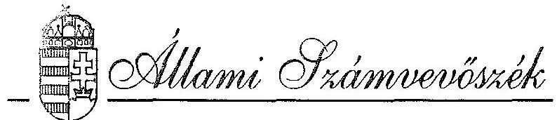
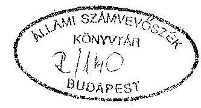
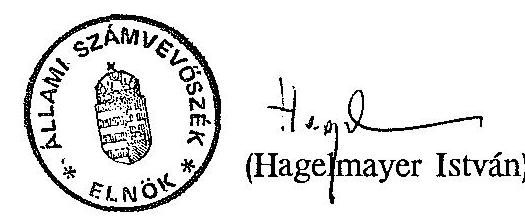

# JELENTÉS 

az önkormányzatok tulajdonába került vagyontárgyak megszerzésével, nyilvántartásával és gazdálkodásával kapcsolatos tapasztalatokról

---

# JELENTÉS 

az önkormányzatok tulajdonába került vagyontárgyak megszerzésével, nyilvántartásával és gazdálkodásával kapcsolatos tapasztalatokról

A Magyar Köztársaság Országgyűlése az 1990. évi LXV. a helyi önkormányzatokról szóló törvény megalkotásával a korábbi tanács rendszert megváltoztatva megteremtette az önkormányzati rendszerre való áttérés jogi alapjait. A törvény 107. paragrafusa egy új tulajdonformát létrehozva meghatározta az önkormányzatok közfeladatainak ellátásához, a közszolgáltatások biztosításához szükséges vagyoni kört, amely a törvény erejénél fogva a hatálybalépés napjával (1990. szeptember 30-án) továbbá, amely a későbbiekben megjelenő u.n. vagyontörvényben foglaltak alapján az önkormányzatok tulajdonába kerül.

A törvény megjelenésekor a volt tanácsok és szerveik, valamint intézményeik vagyontárgyainak könyvszerinti értéke - KSH és BM adatok szerint - 257 Md Ft, az IKV által kezelt lakásállományé 286 Md Ft , a tanácsi víz-és csatornamű vállalatoké 148 Md Ft , a fővárosi tanács egyéb közüzemi vállalatainak vagyona 85 Md Ft , az ország egyéb településein működő többi közüzemi vállalaté pedig 100 Md Ft volt. Az érték nélkül nyilvántartott utakat, hidakat, közterületeket, belterületi földeket - amelyek az önkormányzatok tulajdonába kerültek - figyelembe véve az önkormányzatok vagyona két és fél - három ezer milliárd Ft-ra tehető.

A vizsgálat annak bemutatására irányult, hogy hol tart a nemzeti vagyon jelentős hányadát kitevő, a hosszútávú működés feltételeit nagymértékben befolyásoló önkormányzati tulajdon megszerzésének, nyilvántartásának, hasznosításának folyamata. Ezért döntően a vagyonszerzésre koncentrálva a vizsgálat célja annak megállapítása volt, hogy az önkormányzatok:
— ismerik-e a tulajdonukba került vagyoni kört és ezt a vagyont a törvényi előírásoknak megfelelően adták-e át a számukra;

---

- mit tettek a törvények alapján részükre átadható állami vagyon megszerzéséért; meghozták-e azokat az intézkedéseket, amelyek a vagyonnal való gazdálkodás megalapozásához szükségesek;
- milyen mértékben, módon vállalkoznak a tulajdonukba került vagyonnal.

Az 1992. augusztus 15 - október 15 között lefolytatott helyszíni ellenőrzés az önkormányzatok megalakulásától 1992. augusztus 31-ig eltelt időszakot átfogva a fővárosi és 15 megyei, valamint 90 települési ( 6 kerületi, 30 városi, 18 nagyközségi és 36 községi) önkormányzatra terjedt ki. Ez utóbbiakban, a települési önkormányzatok 3%-ában él a lakosság 24%-a, 2.556.400 fő (részletes adatok a 2. sz. mellékletben)

A tapasztalatok összegzéséhez felhasználtuk az 1992. évi, az önkormányzatok pénz-ügyi-gazdasági tevékenysége törvényességi ellenőrzéseinek vizsgálatunkhoz kapcsolódó megállapításait, valamint a volt közös tanácsok szétválásának vagyoni megosztásával kapcsolatos korábbi ÁSZ vizsgálat tapasztalatait is. A jelentésben foglalt megállapításainkat részletes példatárral támasztottuk alá.

# I. 

## Megállapítások

## 1. Az önkormányzati vagyon kialakításának jogi szabályozottsága

Az 1990. évi LXV. a helyi önkormányzatokról szóló törvény 107. paragrafusa tételesen felsorolja azokat a vagyontárgyakat, amelyek a "törvény erejénél fogva", illetve a Vagyonátadó Bizottságok közreműködésével, döntésével kerülnek az önkormányzatok tulajdonába. Egyidejűleg felhatalmazást adott a Kormánynak, hogy külön törvényt terjesszen az Országgyűlés elé, és abban tegyen javaslatot ez utóbbi vagyoni kör átadási feltételeire. A törvény a tulajdon törzsvagyoni hányadát - abból a meggondolásból, hogy az önkormányzatok vállalkozásai ne veszélyeztethessék a kötelező feladatok ellátását - külön kezeli, a tulajdonost megillető jogok gyakorlásának szabályozását pedig a helyi képviselőtestületekre bízza. (részletesen lásd: 3 sz. melléklet)

Az önkormányzati törvénnyel egyidejűleg a tulajdoni kör teljeskörű felméréséhez, átadásához szükséges valamennyi jogszabály nem jelent meg (pl. a vagyonátadásról, az egyházi tulajdonról, a kárpótlásról, a szövetkezetekről, az államháztartásról, a számvitelről szóló törvények, ill. más jogszabályok).

---

A törvény előterjesztői a jogszabály előkészítése során nem voltak birtokában valamennyi olyan információnak, amelyek az önkormányzatok vagyonszerzését, az ezzel kapcsolatos eljárást, lebonyolítást a gyakorlati munka során döntő mértékben meghatározták. Így pl.
— Nem készült egy átfogó felmérés az önkormányzatok által megszerezhető vagyontárgyak együttes értékéről, ill. mennyiségéről.

- Nem vették figyelembe, hogy az önkormányzatok, a földhivatalok, nem rendelkeztek az ügy szempontjából elengedhetetlenül szükséges naprakész nyilvántartásokkal, továbbá, hogy sem ezeknél, sem a minisztériumoknál nem voltak biztosítottak a személyi - tárgyi feltételek.
- Figyelmen kívül hagyták, hogy kezdetben az önkormányzatok energiáját a megalakulással, az új szervezet kialakításával, a működtetési feltételek megteremtésével kapcsolatos feladatok kötötték le.

A törvény megjelenése után nem volt megfelelő információja az önkormányzatoknak, de a földhivataloknak sem arról, hogy milyen módon jegyezzék, ill. jegyeztessék át az állami tulajdont önkormányzativá, hogy mi a változás jogcíme, ki az alanya, s hivatalból, vagy kérelemre indul-e az eljárás, s kérelem esetén milyen bizonylatokkal. Mindez együttesen oda vezetett, hogy a vizsgált önkormányzatok mintegy 40%-a a "törvény erejénél fogva" meghatározást úgy értelmezte, hogy a tulajdonszerzéssel kapcsolatban nincs tennivalója. Ugyanakkor egyes önkormányzatok ugyanezen szövegre hivatkozva olyan vagyontárgyakat is bejegyeztettek a földhivatalokban, amelyek ily módon nem illették meg őket (lakásokat, önkormányzati intézményként hasznosított műemléki ingatlanokat). Az előzőekben jelzett, az önkormányzatok további vagyonszerzését meghatározó 1991. évi XXXIII. u.n.Vagyontörvény csak az önkormányzati törvény hatálybalépését követően, közel egy év elteltével 1991. augusztus 2-án jelent meg. Ez szabályozta az önkormányzatok vagyonhoz jutásának az önkormányzati törvényben foglaltakon túlmenő kérdéseit. A már említett információk hiánya mellett, újabb problémák is felvetődtek, ami a tulajdonba adást nehezítette, esetenként akadályozta. Így pl.
— az ügyek lebonyolítására, az igények benyújtására nem határoztak meg határidőket. Emiatt, valamint a Ptk. 115. paragrafusára tekintettel, miszerint a tulajdoni igények nem évülnek el, az önkormányzatok egy jó része nem tartotta szükségesnek, hogy minél előbb bejegyeztesse tulajdonjogát;

---

- nem mérték fel, hogy milyen nagyságrendű az átírandó ingatlanok száma, s hogy a földhivatalok milyen mértékben vannak leterhelve egyéb új feladattal (pl. kárpótlás);
- a földhivataloknál a tulajdoni lapokon nincsenek minden esetben átvezetve, illetve feltüntetve a használati, kezelői jogok, a műemléki jelleg, az adott földre épített épületek, esetenként még a tulajdonos személyében bekövetkezett változások sem. Ezért ezek ma még nem tekinthetők megbízható ingatlan nyilvántartásnak;
- az ideiglenesen állami tulajdonban maradó műemlékek körét meghatározó jogszabály a vagyontörvény meghozatalát követően jelentős, több hónapos késéssel jelent meg;
- az egyházi tulajdonnal kapcsolatos 1991. évi XXXII. törvény korlátozta az önkormányzatok tulajdonába adható vagyonkört, de ennek konkrét tartalma nem volt ismert;
- nem volt tisztázva a jogutódlás tartalma - mivel a tanács utódjaként nem csak egy önkormányzat jöhetett létre - és ez különösen a szétvált településeknél okozott gondot, valamint a tulajdonos, a kezelő, a bérlő jogainak meghatározásánál, a tulajdon megosztásánál;
- nem volt az önkormányzatok számára egyértelmű a leltározás ideje, módja, tartalma;
- az önkormányzatok egy része a törvényben foglaltaktól eltérően értelmezte a tulajdon keletkezésének időpontját az u.n. "nem a törvény erejénél fogva" tulajdonába kerülő vagyontárgyak esetében.

A Belügyminisztérium a jelzett problémák feloldására a VÁB-ok részére három, együttesen több, mint 100 oldalt kitevő útmutatót adott ki a vagyontörvény hatálybalépését követően (1991. szeptember; 1991. december, 1992. február hónapokban), ami önmagában is jelzi, hogy a jogszabályalkotó munka nem volt kellően előkészítve, átgondolva. Megállapításunkat alátámasztja az is, hogy az útmutatókon kívül - amelyeket a BM az önkormányzatoknak nem küldött el - számtalan egyedi állásfoglalásra is sor került. Továbbá, ha megkésve is, de - jogszabálynak nem tekinthető - leiratokat adott ki a Művelődési és Közoktatási Minisztérium (egyházi tulajdoni igények rendezéséhez) a Környezetvédelmi és Területfejlesztési Minisztérium (a védett természeti területekre és műemléki jellegű épületekre), a Közlekedési, Hírközlési és Vízügyi Minisztérium (a víziközművek, vizek, vízilétesítmények átadásával kapcsolatban).

A Művelődési- és Közoktatási Minisztérium leiratában foglalt szempontok között pl. olyan megfogalmazások is szerepeltek, amelyek egyrészt ellentétesek

---

a Ptk-nak a tulajdonra vonatkozó szabályaival, másrészt a gyakorlatban igen nehezen hajthatók végre. A tulajdonba adás nem előzheti meg a használatba adást. Az állami költségvetésből a funkcióváltás miatt igényelt összeget az egyházzal történő megállapodásba kellene foglalni. A megállapodást viszont az elidegenítési és terhelési tilalmat rögzítő határozatot követő harminc napon belül kell megkötni. Ez az időtartam túl rövid az önkormányzat által szükségesnek tartott összeg megalapozásához.

A vagyontörvényben foglaltak gyakorlati végrehajtása során sok gondot okozott az önkormányzatok körében az 51. paragrafusban megfogalmazott tájékoztatási kötelezettség és az ellenvélemény tartalom nélkülisége. Az átalakuló vállalatok ugyanis nem küldték meg a vagyontörvény 51. paragrafusa, valamint az 1989. évi XIII. tv. 15/A paragrafusában előírt, a belterületi beépített föld értékéről szóló tájékoztatást, mert ennek elmaradása nem von maga után szankciókat. Az önkormányzatok ellenvéleménye pedig (mivel nincs egyetértési joguk!) többnyire válasz nélkül marad, függetlenül attól, hogy azt a privatizációt végző Állami Vagyonügynökséghez, vagy a vállalatokhoz küldik. A gyakorlat azt tükrözi, hogy az ÁVÜ e jogszabályhelyben foglaltakat nem veszi figyelembe, s azt sem ellenőrzi, hogy a vállalatok e kötelezettségüknek eleget tesznek-e, vagy sem.

A legélesebb vita a Gyógyszertári Központok tulajdonlása körül folyik. Az 1992. évi LV. tv. szerint e tanácsi alapítású vállalatok önkormányzati tulajdonba nem adhatók. Az önkormányzatok az egészségügyi alapellátás szerves részének és önkormányzati feladatnak tekintik a lakossági gyógyszerellátást, amivel együtt jár a tulajdonjog, ezért a törvényi korlátozást alkotmányellenesnek tekintik és a Települési Önkormányzatok Szövetségén keresztül az Alkotmánybírósághoz fordultak. A vizsgálat befejezésekor az ügyben még nincs döntés.

# 2. Az önkormányzati tulajdon kialakítása 

## A) Vagyonátadás, felmérés, nyilvántartás, értékelés

A tanácsrendszer megszűnésekor a vizsgált önkormányzatoknál - egy-két kivételtől eltekintve - nem került sor a volt tanácsi vagyon írásban rögzített átadás-átvételére. Ez kizárólag az önkormányzatok tapasztalatlanságára, a jogszabályok nem kellő ismeretére, ill. figyelmen kívül hagyására vezethető vissza. Az önkormányzatok egy része abból indult ki, hogy a jogutódlás miatt a számviteli nyilvántartások folyamatosságából adódó vagyoni felelősség változatlan maradt, az intézményeknél lévő vagyon pedig nem veszhet el. Másutt azért nem került sor a vagyon átadására, mert a volt tanácselnököt választották polgármesternek, s így a "folyamatosság" - véleményük szerint - biztosított volt.

---

A tanácsok által nyilvántartott vagyontárgyak köre nem volt megszűnésükkor egyértelműen meghatározható, egyrészt mert az értékben nyilván nem tartottak nem szerepeltek a leltárban, másrészt, mert a nyilvántartások pontatlanok voltak.

Az önkormányzatok a fentiek miatt - a szétvált települések kivételével - a vagyontörvény megjelenéséig lényegében nem foglalkoztak a tulajdonukba került vagyoni kör felmérésével. A törvény hatálybalépése után kezdtek hozzá az adatgyűjtéshez, a nyilvántartás megszervezéséhez, de a helyszíni vizsgálatok idején a nyilvántartások még nem feleltek meg a törvényi, jogszabályi előírásoknak. A nyilvántartások nem tartalmazzák a naturális mértékegységben meglévő, vagy megszerzett vagyonrészeket. Egyes területeken a "nyilvántartást" a tanácsi rendszerből átvett földkönyv és számviteli főkönyvi, valamint analitikus nyilvántartás továbbvezetése jelenti. A számbavett ingatlanok könyvviteli nyilvántartásokkal való összevetése, ill. a pénzügyi információs rendszereknek megfelelő analitikus nyilvántartásba vétele és számviteli elszámolása elmaradt.

Mindezek miatt az önkormányzatok tulajdonában lévő vagyontárgyakról készült "nyilvántartások" nem megfelelőek. Az azokban szereplő, az ingatlanokra vonatkozó adatok nem reálisak, az ingó vagyon vagyontörvényben foglaltak szerinti leltározása nem történt meg.

A befektetéseik egy részéről csak utólag, jelentős késedelemmel szereztek tudomást, más részükről még ma sincs információjuk.
 Az elmaradásnak az is oka, hogy az önkormányzatok tudtak arról, hogy új kormányrendelet készül az egységes nyilvántartásról és a tulajdoni kataszterről, s várták ennek megjelenését, amire azonban csak jelentős késéssel, a helyszíni vizsgálatunk befejezését követően, 1992. novemberében került sor.

Előbbiek miatt az önkormányzati törvény 78. paragrafus (2) bekezdésében, majd később a vagyontörvényben megfogalmazott teljeskörű vagyonleltár készítési kötelezettségének a vizsgált 106 önkormányzat közül 77 egyáltalán nem tett eleget. A többi csak hiányosan a 13/1985 (IV.20)PM sz. rendelet alapján készítette el vagyonleltárát. A helyszíni vizsgálatok idején az önkormányzatok még nem foglalkoztak a számviteli törvény és a költségvetési szervek gazdálkodásáról szóló 179/1991.(XII.30.) sz. Kormányrendelet által előírt leltározási kötelezettség megszervezésével és végrehajtásával. Az ezek alapján készült vagyonleltárak értékadataiként a könyvszerinti érték lett feltüntetve, az érték nélkül nyilvántartott vagyontárgyakat pedig jellemzően csak akkor értékeltetik fel - jelentős költségvonzata miatt - amikor konkrét értékesítésükre, vagy vállalkozásba vitelükre sor kerül.

Az önkormányzatok Szervezeti és Működési Szabályzatai, ha hiányosan és átmeneti jelleggel is, de kitérnek a vagyonnal kapcsolatos feladatokra, ügyrend mélységű

---

feladatszabályozás azonban csak azoknál a nagyobb önkormányzatoknál található, ahol a vagyongazdálkodásra külön szervezetet is létrehoztak.

Így pl. a Fővárosban e tevékenység a Vállalkozási és Vagyonkezelési ügyosztály feladatát képezi, de emellett létrehozták a Fővárosi Vagyonkezelő Központ Rt-t is.

Zalaegerszegen vagyonkezelő szervezet működik, Pest megyében az önkormányzat Közgazdasági Irodája keretében alakult csoport. Kisebb településeken a testület megbízásából jellemzően a Polgármesteri Hivatal keretén belül (pl. pénzügyi szervezet) látják el ezen feladatokat.

A vagyonnal való rendelkezési jog gyakorlásának szabályairól 1991-ben 9, 1992-ben pedig további 21 önkormányzat alkotott vagyonrendeletet, amelyek zöme az önkormányzati törvény szövegét ismétli. A megalkotott vagyonrendeletek között is előfordult, hogy a törzsvagyon forgalomképtelen és korlátozottan forgalomképes körével kapcsolatban a vagyontárgyakat e kapott lehetőséggel élve - a törvénytől eltérő módon - csoportosították.

Gyulán csupán a közterületek és közutak kerültek a törzsvagyon forgalomképtelen körébe, a Békés-megyei önkormányzatnál viszont az intézmények többségét is e körbe sorolták.

A fővárosi közgyűlés által 1992-ben jóváhagyott vagyongazdálkodási rendeletben a természetvédelmi területeket és természeti emlékeket a korlátozottan forgalomképes vagyoni körbe sorolták, de a helyi jelentőségű természetvédelmi területeket a forgalomképtelen vagyoni csoportban szerepeltetik.

A vagyonrendelet megalkotásának elmulasztása esetén is lehetőségük van az önkormányzatoknak vagyontárgyaikkal rendelkezni, de a vagyonrendelet és a törzsvagyon elkülönítésének hiánya nehezíti a költségvetési terv reális elkészítését. A terv készítésekor ugyanis e nélkül nem tudják számbavenni valamennyi vagyontárgyukat, az azok révén keletkező bevételeket, kiadásokat, megnehezítve a testület számára az egyértelmű állásfoglalásokat, a tisztánlátást. E mellett a vagyonnal való rendelkezési hatáskörök kialakításának akadályát képezi és megkérdőjelezi a mérleg valódiságát is.

A vizsgált önkormányzatok döntő többsége (74%-a) nem tett eleget annak az önkormányzati törvényi előírásnak sem, hogy törzsvagyonát elkülönítetten tartsa nyilván. Az ingatlanok azonosító adatainak összegyűjtése - a földhivatali nyilvántartások pontatlansága és a hivatalok egyéb feladatokból is adódó nagymértékű leterheltsége miatt - különösen a nagyobb önkormányzatok számára hosszú időt vett igénybe, ezért több helyen külső szakértőket bíztak meg a feladat ellátásával. A földhivatalok a - különösen 1992-ben - dömping-szerűen beérkező bejegyzési igényeket - néhány kivételtől eltekintve - nem tudták kielégíteni.

---

A helyszíni vizsgálatok során felvett adatlapok bizonyítják, hogy a bejegyzési kérelemre 30 napon belül az önkormányzatok 40%-a, 60 napon belül 25%-a, 60 napon túl 20%-a kapott, 15%-a pedig egyáltalán nem kapott visszajelzést. Különösen kritikus a fővárosi tulajdonátirás helyzete. A Fővárosi Kerületek Földhivatala - az egyéb kérelmeket is figyelembe véve - mintegy másfél éves (120 ezer ügyiratos) elmaradásban van.

A földhivatalok leterheltsége, a jogszabály nem megfelelő értelmezése, az önkormányzatok felkészületlensége, a törvényi előírástól eltérő gyakorlata miatt kizárólag a kezelői jog alapján történő átírások révén egyes önkormányzatok olyan tulajdonhoz is jutottak, amelyek nem illették meg őket, más esetekben pedig jogos tulajdonuktól estek el, (pl. ha a kezelői jog bejegyzése helytelen volt, vagy nem vezették át a korábbi változásokat.)

A 106 vizsgált önkormányzat közül 23-nak törvényértelmezési, alkalmazási stb. okok miatt volt vitája a Földhivatallal, ami azt is jelzi, hogy a jelenlegi - elsősorban földnyilvántartási rendszer - továbbfejlesztésre szorul.

A Zala-megyei Önkormányzat jogelődjének kezelői joga be volt jegyezve több körzeti orvosi rendelőre, községi általános iskolára és középiskolára. Ugyanakkor több megyei feladatot ellátó intézmény ingatlanának kezelői joga rendezetlen volt, emiatt helyi önkormányzatokat juttattak tulajdonszerzési lehetőséghez.

A Csongrád-megyei Önkormányzat 1991. IV. 2-án kérte a törvény erejénél fogva tulajdonába került vagyon átvezetését, amit a Földhivatal 1991. V. 14-én meg is tett. Ezen ingatlanok között szerepelt pl. az Ópusztaszeri Emlékpark is, amelynek az önkormányzati tulajdonba kerülését későbbi törvény gátolja.

# B) A vagyontörvény alapján önkormányzati tulajdonba kerülő különböző vagyoni kör átadása. 

A volt IKV, vagy egyéb ingatlankezelő szervezet kezelésében lévő lakóépületek, vegyes rendeltetésű és nem lakás céljára szolgáló épületek a hozzájuk tartozó földdel a vagyontörvény 2. paragrafusa alapján, döntő részben VÁB döntéssel önkormányzati tulajdonba kerültek. Néhány területen azonban különböző vitás kérdések (megosztott tulajdon, kezelői jog beruházónál maradt, műemléki jelleg megítélése, vegyes tulajdonú épületek) miatt a teljes vagyonátadás még nem történt meg.

A vagyontörvény arról is rendelkezik, hogy az ingatlankezelő szerv kezelésében lévő épület a közfeladatot ellátó jogutód önkormányzat tulajdonába kerül. Ha azonban a feladatot jogutódként más államigazgatási szervezet (pl. KMBH, DEKO szerv) látja el, az épület, vagy épületrész nem kerül az önkormányzat tulajdonába, hanem továbbra is

---

állami tulajdonban marad. Ez esetben a feladatot ellátók megállapodásuk szerint válnak az épület, épületrész, az ingóságok tulajdonosává, kezelőjévé, ingyenes használójává.

E törvényhely gyakorlati végrehajtása szinte mindenütt a megyei, fővárosi önkormányzat és az érintett szervek vitáját váltotta ki és sok problémát okoz. (Vitatták a kért helyiségek számát és méreteit, épületen belüli elhelyezkedését, a feladatellátáshoz szükséges ingóságok körét stb).

A műemlékileg védett épületek átadási folyamata lassú és várhatóan elhúzódik. Ennek főbb okai, hogy
— az állami tulajdonból ideiglenesen ki nem adható műemlékekről szóló 83/1992. (V.14.) sz. Kormányrendelet késői megjelenése akadályozta a VÁB döntések meghozatalát;
—a vagyoncsoporthoz kapcsolódó eljárások sokrétűek, egyeztetés igényesek, és az épületek egy részére az egyház is tulajdonjogot kér;
— az Országos Műemlékvédelmi Hivatal az egyedi átadási feltételeket késve határozta meg, az általa igényelt adatszolgáltatás pedig rendkívül időigényes;
— bizonytalanság volt tapasztalható a "műemlék", a "műemlékjellegű" és a "városképi jelentőségű" meghatározások értelmezése körül;
— a műemlék épületben lévő intézmények működtetője és az ingatlan tulajdonosa nem mindig azonos és a két fél megállapodása még nem történt meg.

A muzeális emlékek VÁB általi átadása még nem fejeződött be, mert a muzeális emlékek származásáról, jogcíménkénti eredetéről nem áll rendelkezésre megfelelő alapnyilvántartás. A törvény által előírt újszerű nyilvántartások elkészítése a tárgyak nagy száma miatt, hosszadalmas.

Pl. Bács-Kiskun Megyei Múzeum törzsleltárában 692.944 db muzeális emléktárgy szerepel, amit az eredetük szerint újra kell csoportosítani.

A védett természeti területek átadásának helyzete a műemléki épületek átadásának állapotához hasonló. A védett természeti területen lévő építmények tulajdonba adására ugyan nem tartalmaz korlátozást a törvény, azonban a természetvédelem érdekében a terület és felépítményei egymástól nem függetleníthetők, emiatt a felépítményes ingatlanok együttes átadása fokozottabb gondosságú eljárást igényel. Az önkormányzatok igénybejelentéseiket megtették. A belterületi természetvédelmi területek döntő többségét a VÁB már átadta, a külterületi védett területeknél pedig minisztériumi

---

jóváhagyásra várnak. Több önkormányzat az előírt fenntartási és fejlesztési feltételek betarthatóságának hiányában elállt az igényléstől.

Az ingatlankezelő szervek kezelésében lévő beépítetlen földterületek önkormányzati tulajdonba adásánál a "beépítettség" fogalmának értelmezése okozott gondokat. E kérdésben a vagyontörvény 10. paragrafus (1) és az 52. paragrafus (2) bekezdésén kívül az Országos Építési Szabályzat (OÉSZ) ad eligazítást, de ennek egyes tételei helyességét (pl. ha a szóban forgó területen egy más kezelésében lévő vízakna már van, akkor az nem beépítetlen!) az önkormányzatok vitatják, mivel az ilyen kisértékű beépítettség is kizárja őket a tulajdonszerzési lehetőségből. A jogértelmezési problémákra vezethetők vissza, hogy olyan földterületekre is adtak be igényt az önkormányzatok, amelyek korábban már az önkormányzati törvény alapján tulajdonukba kerültek.

A közüzemi vállalatok tulajdonba adása a vizsgált önkormányzatok többségénél az 1991. évi mérleg, valamint a vagyonleltár alapján megtörtént. A folyamatban lévő átadások pedig, az önkormányzatok véleménye szerint - a víziközművek kivételével - várhatóan ez év végéig befejeződnek.

Az ingatlanok állami tulajdonból önkormányzati tulajdonba adásával megszűnt a közüzemek kezelői joga. Jogilag rendezetlenné vált a közüzemeknél lévő ingatlanokkal kapcsolatos vállalati intézkedési hatáskör, ill. a jogok és kötelezettségek gyakorlása. Az önkormányzati testületeknek dönteniük kellett volna a közművek üzemeltetési módjáról, a közművek üzemeltetéséhez szükséges tulajdon közüzemeknek történő átadásáról.

Az önkormányzati tulajdonba vétel után ez a folyamat több helyütt nem történt meg. Ugyanakkor, több önkormányzat már az ennek elvégzését követően lehetséges gazdasági társasággá alakítási folyamatot készíti elő, pl.
—a Főváros a tulajdonába került 14 közüzem vagyonát egyetlen esetben sem adta vissza a vállalatoknak működtetésre, ugyanakkor a Fővárosi Vagyonkezelő Központ Rt. elvégezte a vállalatok átvilágítását és javaslatokat kért a vállalatok átalakítására.

A tanácsi alapítású víziközművek egyértelműen az önkormányzatok (egy, vagy több település, megye) tulajdonába kerültek, vagy kerülnek. A regionális víziközművek tulajdonát képező nem regionális létesítmények az illetékes, megyei Vagyonátadó Bizottságok döntésével az önkormányzatok tulajdonába adhatók.

A Közlekedési, Hírközlési és Vízügyi Minisztérium 1992. III. 16-án küldte meg a Vagyonátadó Bizottságoknak azon víziközművek jegyzékét, amely tartalmazta az önkormányzati tulajdonba adható, illetve állami tulajdonban maradó létesítménye-

---

ket. Ehhez kapcsolódva úttörő jelleggel 1992. júliusában került kiadásra a 18/1992. (VII.14.) KHVM sz. rendelet a vízi közművek üzemeltetésének követelményeiről. Ezek korábbi kiadása az önkormányzatok és a VÁB-ok tulajdoni körrel kapcsolatos döntését szakmailag megalapozottabbá tehette volna és jelentős mértékben gyorsíthatta volna az átadási folyamatot.

A vagyonátadási folyamatot bonyolulttá teszi, hogy a helyi, a több települést, illetve a regionális ellátást biztosító rendszerek területileg átfedik egymást. E miatt hosszú egyeztetési eljárást kell lefolytatni a tulajdon megosztására, átadására. Ez a fővárosi, a megyei jogú városi és a városi alapítású közműveknél kisebb gondot okozott, mivel a víziközmű létesítmények és a működtető vagyon ugyanazon települési önkormányzat tulajdonába volt adható. Nem, vagy alig volt szükség más települési önkormányzattal történő egyeztetésre.

A Fővárosi VÁB 1991. december 30-án kelt határozatával adta a Fővárosi Önkormányzat tulajdonába a közműveket. Miskolc, Szeged, Debrecen megyei jogú városok önkormányzatai pedig a VÁB-ok 1992. II. félévben kiadott határozataival kapták tulajdonukba a városi vízmű vállalatok vagyonát. Gyulán a vízmű vállalat a VÁB 1992. februári határozatával a városi önkormányzat tulajdonába került.

A megyei alapítású vízi- és csatornamű vállalatok vagyonának önkormányzati tulajdonba adása jelenti a legfőbb problémát, mert igényli a települési önkormányzatok közötti, sokszori egyeztetést és együttműködést, s ezért ezen átadási folyamatok időben elhúzódtak.

Az önkormányzatok közötti vita a körül forog, hogy melyik önkormányzat, vagy az önkormányzatok mely csoportja legyen az
 üzemeltető, és az a vagyon milyen hányadát kapja meg; milyen üzemeltetési, szervezési formát alakítsanak ki; hogyan alakuljanak a víz- és csatornadíjak; hogyan tudják teljesíteni a víziközművek üzemeltetésével kapcsolatos követelményeket.

A tapasztalatok szerint a víziközműveket tulajdonba venni szándékozó önkormányzatok az üzemeltetés személyi, technikai és költségvonzatával nem foglalkoztak kellő mélységben. A fajlagos költségek rendkívüli (tízszeres eltérésű) szóródása következtében ez azt a veszélyt rejti magában, hogy a vízdíjak a kisebb települések terhére többszörösükre nőhetnek.

A minisztériumi alapítású regionális víziközmű vállalatok vagyonából átadható létesítmények VÁB döntéssel folyamatosan kerülnek az önkormányzatok tulajdonába. Vita csak az állami tulajdonban maradó, de egyes önkormányzatok által kért vagyontárgyak esetében merült fel, amelyek késleltetik a VÁB döntések jogerőre emelkedését.

---

A vagyontörvény 24. paragrafus (3) bekezdésében foglaltak megoldották a kizárólag a lakosság által, vagy nagyrészt általuk finanszírozott víziközművek tulajdonjogának a megváltozott körülményekhez igazodó újrarendezését. E szerint a létrehozott létesítmény az önkormányzat(ok) tulajdonába kerül(nek). Ugyanakkor az egyéb közműveknél (pl. gáz, villany) a korábban kialakított és jelenleg is folytatott gyakorlat szerint a kész közművet a területileg illetékes közüzemi vállalatok tulajdonába kell adni. Ez utóbbi gyakorlatot az ellenőrzött önkormányzatok, valamint a területükön élő és közmű beruházásokat finanszírozó lakosok kifogásolják.

A vizek és vízilétesítmények az önkormányzati törvény értelmében - amennyiben a tanács és szervei, valamint intézményei kezelésében vannak - a helyi önkormányzatok tulajdonába kerülnek. A vagyontörvény értelmében a VÁB a vízügyi igazgatóságok és a vízgazdálkodási társulatok kezelésében lévő állami tulajdonú vizeket és vízi létesítményeket adja át az önkormányzatoknak, amelyek így törzsvagyonba tartoznak és forgalomképtelenek.

A Közlekedési, Hírközlési és Vízügyi Minisztérium 1992. április-május hónapokban bocsátotta a VÁB-ok rendelkezésére azon vizek és vízilétesítmények jegyzékét, amelyeket az önkormányzatoknak át lehet adni. Ezeket a VÁB-ok megküldték az érintett önkormányzatoknak, azoknak azonban csak egy kis hányada élt a tulajdon igénylésével, mert ezen vagyontárgyak felújítása, fenntartása, rendszeres üzemeltetése igen nagy anyagi ráfordítást igényel. Árvíz, vagy belvízveszély esetén a védekezés költségei is őket terhelik, az önkormányzatoknak azonban az ehhez szükséges forrás nem áll rendelkezésükre.

A törvények alapján önkormányzati tulajdonba adható vagyont 42 önkormányzat utasította vissza, döntő hányadban vízilétesítményt (31 db), ill. 13 esetben egyéb, jellemzően közüzemi tulajdont. A 15 vizsgált megyében néhány város (pl. Győr, Kecskemét, Kiskőrös) és község vette önkormányzati tulajdonba ezen vagyontárgyakat, döntően olyanokat, amelyeket a szakminisztérium felajánlott.

Egy-két esetben olyan vagyont is kértek átadásra, amely nem volt a KHVM listáján (pl. Tiszaalpári Holtág). A tapasztalatok azt támasztják alá, hogy e téren lényeges vagyonátvétellel - a magas költségigények miatt - az önkormányzatok a jövőben sem számolnak.

A költségvetési üzemek a 11/1971. (III.31.) Korm.sz. rendelet szerint a tanácsok intézményei voltak, az önkormányzati törvény viszont a költségvetési üzemeket e körből kivette. Az üzemek által kezelt ingatlanok a 107. paragrafus (3) bekezdése alapján VÁB döntéssel kerülnek a helyi önkormányzatok tulajdonába.

---

A költségvetési üzemeket az önkormányzatok 1991. december 31-ig mindenhol megszüntették. Ezt követően a feladat ellátására a vizsgált önkormányzatok három egymástól eltérő tartalmú megoldást alkalmaztak:

- a megszüntetett intézmény funkcióit - csökkentett létszámmal a polgármesteri hivatal szervezetében végzik tovább (főleg kisebb településeknél);
— felszámolás után külső szervet bíztak meg a funkcióellátással;
- a költségvetési üzem vagyonából gazdasági társaságot, vagy vállalatot hoztak létre.

Az első két megoldási mód garantálja, hogy ne kerülhessenek ki vagyontárgyak az önkormányzatok tulajdonából. A harmadik változat, a Kft létrehozása azonban ilyen biztosítékot nem tartalmaz.

- A költségvetési üzemek gazdasági társasággá történő átalakítását Mezőtúr, Kunszentmárton Önkormányzatok úgy szándékoztak létrehozni, hogy a megalakítandó GT jogutódja legyen az üzemnek. A Cégbíróság ezt ellenezte és így jogutód nélküli megszüntetésre került sor, s ezáltal a tartozások, ill. veszteségek az önkormányzatokat terhelik.
- A Jász-Nagykun-Szolnok megyei önkormányzatok a Kft-ket eltérő feltételekkel alapították meg és átmenetileg ingyenes használatba adták az üzemeik vagyonának azt a részét, amelyet apportként nem tudtak, vagy nem akartak bevinni.
- Zala megyében az önkormányzatok többsége a vagyon egy részéből (20-30%) dolgozói alapítványt hozott létre, majd ezt követően a többi vagyon az alapítvány fuzionálásával Kft-vé alakult.

Folyamatban lévő beruházások tulajdonba adása során viszonylag kevés esetben igényelték az önkormányzatok a VÁB közreműködését. A vagyontörvény hatályba lépésének időpontjáig ugyanis a korábban elkezdődött beruházások döntő része már befejeződött, az elkészült létesítményeket üzembehelyezték és aktiválásukat tulajdonrendezési problémák nem befolyásolták.
Külön kell említést tenni a vagyontörvény 25. paragrafus hatálya alá tartozó fővárosi ún. "kiemelt" területekről. A kiemelt területekre a Fővárosi Önkormányzat igényét a rendeletben foglalt határidőn belül benyújtotta, de a döntéshez szükséges részletes információk összeállítása még tart. Ezért jogerős FVÁB döntéssel a Fővárosi Önkormányzat tulajdonába egyelőre csak a Feneketlen-tavi parkot adták át.

---

A másik sajátosság, hogy a fővárosi és a fővárosi kerületi önkormányzatokról szóló 1991. évi XXIV. tv. alapján az alapfokú oktatási intézményekhez, valamint az egészségügyi és szociális alapellátást biztosító intézményekhez tartozó, az önkormányzati törvény 107. paragrafus (2) bekezdése alapján a Fővárosi Önkormányzat tulajdonába került vagyont (vagyonrészt) a főváros köteles a feladatellátásért felelős kerületi önkormányzat használatába adni. A fővárosi önkormányzat közgyűlése 23/1992. (VII.30.) számú rendeletében csupán az egészségügyi feladatok ellátásának a Fővárosi Önkormányzat és a kerületi önkormányzatok közötti megosztásáról döntött, az oktatási feladatokról nem. A feladatmegosztáshoz kapcsolódóan azonban tulajdonátadásra nem került sor, az ingóságok tulajdonának és használatának a rendezése még nem történt meg.

A volt egyházi tulajdonban lévő államosított, önkormányzat használatába került ingatlanok visszaadásáról a vagyontörvény megjelenése előtt kiadott 1991. évi XXXII. tv. rendelkezik.

E törvény részletesen szabályozza, hogy az egyházak mely célokat szolgáló ingatlanokra, milyen feltételek mellett nyújthatják be igényeiket a Művelődési és Közoktatási Minisztériumhoz. A minisztérium a benyújtott kérelmek alapján, annak jogosságát esetenként nem kellő körültekintéssel vizsgálva rendelkezett a kért ingatlan elidegenítési és terhelési tilalmának földhivatali bejegyeztetése érdekében. Egyúttal felhívta az önkormányzatokat, hogy 30 napon belül állapodjanak meg az igénylővel az ingatlan átadásáról, illetve amennyiben nem tudnak megállapodni, akkor közöljék ezt és az akadályt a minisztériummal.

December végéig az MKM-hez 6500 ingatlan igénylés érkezett az egyházaktól és 3600 határozatot adtak ki, amelyek közül 45 ellen nyújtottak be fellebbezést.

A törvényalkalmazás feltételei azonban nem voltak kellően előkészítve, így a végrehajtás menete a gyakorlat során alakult ki, amelyet azonban nehezített, hogy az igénylő egyházak és a tulajdonosok, kezelők, használók nem mindig hangolták össze a funkcionalitás elvének megfelelően a konkrét esetekre vonatkozó álláspontjaikat. Ennek következménye, pl., hogy a Művelődési és Közoktatási Minisztérium által határozattal a fővárosi önkormányzatnak átadott igények közül 24 pontosítása, egyeztetése és a megállapodások előkészítése még a vizsgálat idején is folyamatban volt.

A fővárosi önkormányzat a minisztériumtól kapott elidegenítési és terhelési tilalomról szóló határozatban és annak mellékletében döntő többségében csak az ingatlan címéről, helyrajzi számáról és az igénylő egyház megnevezéséről szerzett tudomást. A főpolgármesteri hivatal szerezte be a megállapodás előkészítéséhez mindazokat a további információkat, amelyeket az 1991. évi XXXII. tv. 11. paragrafus (3) bekezdése alapján az igénylőnek kellett volna

---

biztosítani (érvényes tulajdoni lap másolat, egyházi nyilatkozat arról, hogy a kérdéses ingatlant mely időpontban és milyen funkcióval kívánja átvenni).

Tisztázatlan, hogy funkcióátvállalás esetén milyen részletezettségű nyilatkozatot fogadjon el az önkormányzat, mennyiben tudja vizsgálni azokat a garanciális elemeket, amelyek a feladat hosszú távú ellátását biztosítják. A vizsgálat időpontjában minimális volt a megállapodások száma, mert

A fővárosban a visszakért 37 ingatlan közül 18 esetben az egyház az ingatlan eddigi funkcióját nem kívánja folytatni, így a feladat további folyamatos ellátása érdekében az önkormányzat kártalanításra, csereingatlanra jogosult a központi költségvetésből. Ennek biztosításáig az önkormányzat az ingatlant átadni nem tudja. Az eddigi tárgyalások eredményeként a Fővárosi Önkormányzat részére 1992 évben 42.557.ezer Ft költségvetési kártalanítás biztosítására kerül sor.

Kecskemét megyei jogú városban összesen 38 db kártalanítási és ingatlan visszaigénylési kérelmet nyújtottak be, amiből 8 átadása befejeződött. Az eddig folyamatba helyezett egyházi ingatlan visszaadással összefüggésben 573 M Ft összegű kártalanítási igénye van a városnak, amelyről a helyszíni vizsgálat befejezéséig döntés nem született.

Győr-Moson-Sopron megyében 57 volt egyházi ingatlanra nyújtottak be igényt, amiből 4 esetben megállapodás történt.

Az egyházak többnyire ragaszkodnak korábbi ingatlanaikhoz, s csak ritkán hajlandók a cserére. A gondot ilyenkor az okozza, hogy az önkormányzatoknak nincs megfelelő csereingatlanuk és anyagi eszközük, mellyel az adott ingatlant ki tudnák váltani.

A korábban a tanácsok által alapított vállalatok privatizációjából származó bevételekre elsősorban és döntően a fővárosi, a megyei és a városi önkormányzatok tettek szert mintegy "örökségként". Az esetek egy részében úgy jutottak ilyen bevételekhez, hogy annak jogalapját csak később ismerték meg.

A nem tanácsi alapítású állami vállalatok értékesítéséről, gazdasági társasággá alakításáról az önkormányzatok 1989-92. között az ÁVÜ-től csak esetlegesen, nem rendszerezetten, az esemény bekövetkezte után eltérő módon és időben kaptak tájékoztatást.

Az állami felügyelet alatt álló vállalatok által kezelt ingatlan értékesítése, vagy gazdasági társaságba vitele esetén a belterületi föld értékének megfelelő vételárrész, illetve az apportérték 50%-a illeti meg az önkormányzatokat az 1991. évi XXXIII. tv. 51. paragrafusa alapján.

---

Az átalakulással és a privatizációval kapcsolatos, az I. fejezetben ismertetett jogértelmezési problémákon kívül, az önkormányzatok azért is hátrányos helyzetben vannak, mert
— az ÁVÜ és az önkormányzatok közötti nem kielégítő információcserék következtében az önkormányzati és az ÁVÜ földértékelés nagyságrendileg szinte minden esetben eltér egymástól. Az önkormányzatok alulértékeltnek tartják az őket megillető összeg kiszámításának alapját képező vagyonrészt, az ÁVÜ pedig a piaci viszonyokra hivatkozik.
Eltérő véleményük esetén, ha azt az ÁVÜ az értékesítésnél figyelmen kívül hagyta, csak hosszadalmas és költségigényes polgári peres eljárástól várhatnak jogorvoslatot.
— az önkormányzatok az 1992. évi LIV. törvény 1992. augusztus 29-i hatálybalépéséig nem dönthettek arról, hogy átalakulás esetén az üzletrészt pénz, vagy részvény formájában kapják meg.

A privatizációval kapcsolatos vita megoldását a BM több alkalommal is szorgalmazta. Ennek hatására az ÁVÜ 1992. szeptember 29-én elkészítette a belterületi földek értékmegállapításának önkormányzati egyeztetésére vonatkozó eljárásrendet. E tevékenység konkrét gyakorlati megvalósulását azonban a helyszíni vizsgálatok tapasztalatai még nem támasztották alá.

# 3. A Vagyonátadó Bizottságok működése, munkájuk értékelése a vagyonátadási folyamatban. 

A Vagyonátadó Bizottságokat a szükséges szakemberek felkérésével a 63/1990. (X.4.) sz. Kormány rendelet alapján hozták létre minden megyében és a fővárosban is 13-13 fővel oly módon, hogy a működésükhöz szükséges bért a BM biztosította. Ezen kívül a működésüket anyagi és személyi segítségnyújtással támogatták a köztársasági megbízotti hivatalok és a megyei önkormányzatok is.
Ez alól kivétel a főváros, ahol a FVÁB működési feltételei nehezen alakultak ki és jelenleg sem kielégítőek, ami alapvető oka a jelentős lemaradásnak.

- A FVÁB létszámának kialakításakor nem vették figyelembe, hogy a fővárosban koncentrálódik a rendezendő vagyonügyek mintegy 20%-a, s ezek összetételében nagyobb számban szerepelnek olyan témák, amelyek elintézése hosszabb időt vesz
 igénybe, ezért a 13 fős létszám ezek viszonylag gyors lebonyolításához nem elegendő.

---

A bizottság működésének tárgyi feltételei a helyszíni vizsgálat idején nem voltak megfelelőek.

Az 1991. évi XXXIII. törvény 28. paragrafus (1) bekezdése szerint a VÁB-ok feladata lett volna, hogy közöljék az önkormányzatokkal, mely vagyontárgyakat milyen feltételekkel kívánják tulajdonba adni. Ennek azonban a VÁB-ok nem tudtak eleget tenni, mert
—a telekkönyvi adatok pontatlanok voltak, mivel a volt tanácsok és az önkormányzatok a 26/1987. (VII.3.) sz. MT rendeletben előírt azon kötelezettségüknek, hogy a kezelői jogot vezessék be a telekkönyvekbe nem mindig tettek eleget.

- nem állt rendelkezésre a főhatóságoknál, tárcáknál az érintett vagyoncsoportokról a szükséges nyilvántartás, aminek az lett a következménye, hogy a VÁB-ok munkáját meghatározó listákat a vagyontörvény megjelenése után jelentős késéssel, csak 1992. év folyamán kapták meg.

A VÁB-ok működésük megkezdése után felismerték a nyilvántartási hiányosságokból eredő veszélyeket, s ezek elhárítása céljából egységes formanyomtatványon az önkormányzatoktól kérték be a szükséges adatokat. Tekintettel arra, hogy az önkormányzatok sem rendelkeztek megfelelő naprakész nyilvántartással, így az általuk közölt adatok sem voltak pontosak, a nagyobb számú ingatlannal rendelkezők pedig a kérésnek csak késve tudtak eleget tenni.

A VÁB-ok hivatalból kezdeményezték a több települést ellátó közüzemek, DEKO szervek elhelyezését szolgáló ingatlanok, a vízek és vízilétesítmények átadását. A többi vagyontárgy tulajdonba adása az önkormányzatok részéről indult. Meg kell azonban jegyezni, hogy ez utóbbiak akkor gyorsultak fel, amikor a VÁB-ok a már említett adatokat megkérték. Ezt támasztja alá, hogy
—Jász-Nagykun-Szolnok megyében pl. 1991-ben még csak 130 kérelmet intéztek, 1992-ben 1078-at, Szabolcs-Szatmár-Bereg megyében ugyanezen években 222, ill. 1097 ügyiratot intéztek.

A VÁB-ok tevékenységének tartalmát a vagyontörvény, valamint a 63/1990. (X.4.) sz. Kormányrendelet - amelyet a 36/1992 (II.21.) sz. Kormányrendelettel módosítottak - mellett a BM által kiadott, a munkát segítő - de az önkormányzatoknak át nem adott - három útmutató határozta meg. Az ügyek intézésére az államigazgatási eljárásról szóló többször módosított 1957. évi IV. törvény vonatkozik. Ez utóbbinak a VÁB-ok nem tudtak maradéktalanul eleget tenni és a saját maguk részére megszabott ütemtervet betartani, mert

---

- az önkormányzatok által beadott kérelmek hiányosak voltak;
- a vitás ügyekben az összes érintett fél meghallgatása időigényes volt és néha nem is volt megoldható;
- a már említett dokumentációk hiányossága mellett az egyedi ügyekben adott vélemények késtek.

A VÁB-ok körültekintő munkáját az elmondott hiányosságok ellenére az jellemzi, hogy az igazolások és döntések megalapozottak voltak, bár a határozatok indoklása nem mindig magyarázta meg kellő részletezettséggel a rendelkező részben foglalt döntést.

A döntések megalapozottságát támasztja alá, hogy a vizsgált 106 önkormányzat több ezer ügyében hozott VÁB határozatok közül mindössze 90 ellen nyújtottak be fellebbezést. A II. fokon eljáró BM 67 esetben a VÁB döntést erősítette meg. Az önkormányzatok a II. fokú döntések ellen csupán 12 esetben fordultak bírósághoz.

# 4. Az önkormányzatok eddigi gazdálkodási tapasztalatai és hasznosítási szándékai a tulajdonukba került vagyonnal 

Az önkormányzatoknál a helyszíni vizsgálatok során a vagyonnal való gazdálkodásnak csak kezdeti jeleit tapasztaltuk, mert
—a tulajdonba adás folyamata nem zárult le, nem ismert a vállalkozói vagyon teljes köre és mértéke;
—az önkormányzatok 71 %-a vagyonrendeletet nem készített és fejlesztési-gazdasági programmal nem rendelkezik,

- a vagyonnal való gazdálkodás feltételeinek, szervezeti kialakításának megteremtése kezdeti stádiumban van, amit helyenként befolyásol az a szemlélet, hogy az önkormányzatnak elsősorban nem vállalkoznia, hanem közszolgáltatási feladatainak kell eleget tennie;
- a helyi és kistérségi érdekek erősödése, a hosszabb távú tervezés és regionális szemlélet hiánya az együttműködési készség elmaradásához vezet;
- az elmaradott területeken - elsősorban infrastrukturális hiányok miatt - nincs megfelelő vállalkozási kedv, a kisebb településeken pedig többnyire nem ismert az olyan vagyon, amivel vállalkozni lehetne.

---

Mindezek ellenére, ha még kezdetleges formában is, de megkezdődött - főként a nagyobb településeken - a vagyonnal való gazdálkodás különféle formája.

- elsősorban a belterületi földek, a lakás és nem lakás céljára szolgáló helyiségek értékesítésére került sor;
- a vizsgált önkormányzatok 72 %-a vesz részt mintegy 500 gazdasági társaságban, de ez a szám közel sem pontos, mert az önkormányzatok nem ismerik, hogy a vállalati átalakulások révén összesen hány gazdasági társaságban szereztek tulajdoni hányadot;
- a gazdasági társaságokba bevitt vagyon a fővárosi kerületek nélkül a vizsgált körben mintegy 9,4 Md Ft értéket képvisel, amelyből 1,7 Md a fővárosi önkormányzat, 1,4 Md Szeged, 1,4 Md Debrecen, 0,4 Md Székesfehérvár, 0,4 Md Szolnok, 1,2 Md Nyíregyháza, 0,9 Md Szekszárd önkormányzata tulajdonában van.
- egy hónapnál hosszabb lejáratú értékpapírral 35 önkormányzat rendelkezett, amelyből 25 a fővárosi kerület, megye, vagy város. Kötvényt eddig 4 önkormányzat bocsátott ki (Bp.VI.ker., Sátoraljaújhely, Győr, Gödöllő), 2 pedig (Pécs, Ercsi) tervezi a kötvény kibocsátást.

A gazdálkodási tevékenységnél kifogásolható, hogy az önkormányzatoknál a gazdasági társaságokban meglévő üzletrész nyilvántartása nem naprakész, ami oda vezet, hogy esetenként a képviselőtestület tudta és jóváhagyása nélkül kerül sor bankközi pénzmozgásra. A kötvényvásárlásokról vezetett nyilvántartásból nem derül ki, hogy mennyi a kamathozadék, mi a lejárati idő, stb. A befektetett eszközök mérlegbeszámolóban való megjelenítése egy vizsgált egységnél sem felelt meg a mérlegvalódiság elvének.

# II. 

Következtetések, javaslatok

Az önkormányzatok a megalakulásuktól a helyszíni vizsgálatok időpontjáig terjedő időszak alatt nem oldották meg egyértelműen a törvények által lehetővé tett vagyonszerzésüket. Nem készítettek a vonatkozó törvényi előírásoknak maradéktalanul megfelelő vagyonleltárt. Nem, - vagy csak átmeneti jelleggel - alkottak vagyonrendeletet és nem rendelkeztek a szükséges nyilvántartással a tulajdonukban lévő, ill. a törvények

---

alapján jogosan megszerezhető vagyontárgyakról. A vagyontárgyak egy része könyvszerinti értéken szerepel a mérlegben, más része pedig - a jelenlegi szabályok szerint - csak naturáliákban van nyilvántartva, ezért nem lehet reális képet alkotni az önkormányzatok tulajdonába került vagyon teljes köréről és annak jelenlegi értékéről.

Általános tapasztalat, hogy a feltárt hiányosságok mellett az ellenőrzött önkormányzatok döntő többsége a vagyonszerzés során a törvényi előírások szerint járt el. Ebben nagy szerepe volt a VÁB-ok létrehozatalának és az önkormányzatok, valamint a VÁB-ok közötti jó kapcsolatok kialakulásának. A vagyonátadást érintő törvények és rendeletek viszonylag késői megjelenése ellenére az elmúlt két év alatt folyamatosan megteremtődött az önkormányzati tulajdon létrehozására és a vagyongazdálkodás megalapozására szolgáló jogi környezet. Így a főváros kivételével 1992. év végére a megyékben a vagyonátadás döntő hányada 85-90 %-a rendeződik. A fennmaradó rendezetlen ügyek alapvetően a műemléki, a védett természeti területen lévő, és az egyházak részére történő visszaadással érintett ingatlanok, valamint a víziközművek önkormányzati tulajdonba adásának körét érintik.

A még rendezetlen ügyek bonyolultságuknál fogva csak hosszabb átfutási idővel oldhatók meg, de - a főváros kivételével - a továbbiakban, 1993. VII. 1-től - véleményünk szerint - nem igénylik a megyei VÁB-ok decentralizált működését. A költségekkel való takarékosság is azt indokolja, hogy a még hátralévő vagyonátadásokat a FVÁB-on kívül, csak egy központi VÁB bonyolítsa le.

Az önkormányzatok a tulajdonukba került vagyon átgondolt, hosszabb távú hasznosítását célzó gazdálkodói tevékenységet általában nem folytatnak, és a vagyonellenőrzés rendszere sem alakult ki. Ebben szerepe van annak, hogy az elmúlt időszakban nem a vagyon megszerzése, hanem a működés, a szervezetkialakítás, a szakmai, személyi és technikai feltételek biztosítása állt tevékenységük előterében. A vonatkozó törvények késedelmes megjelenése, az információhiány, a személyi és tárgyi feltételek hiányosságai és a nyilvántartások részben a korábbi időszakból származó pontatlanságai is lassították a vagyonnal való gazdálkodást.

Az u.n. "kistérségi" feladatokkal összefüggő vagyonrendezések megoldatlanságában az is szerepet játszik, hogy nincs intézményesített "gazdája" az ilyen ügyek szervezésének, lebonyolításának. E téren ott van előrehaladás, ahol az érintett önkormányzatok egyike (általában a megyei!) felkarolta a konkrét probléma megoldását célzó intézkedések koordinálását.

A kialakult helyzethez hozzájárult továbbá, hogy a földhivatalok az egyidejűleg jelentkező egyéb igényeket is figyelembe véve sem személyi állományukban, sem technikai ellátottságukban nem voltak képesek kielégíteni a jelentkező igényeket. A

---

dömpingszerűen beérkezett átírási kérelmek és vagyonrendezési ügyek várhatóan 1993. évben fejeződnek be. Számítani kell azonban arra, hogy a földhivatalok leterheltsége a jövőben növekedni fog, az elintézendő ügyek száma a korábbinak többszöröse lesz, ami mind a technikai fejlesztésüket, mind a személyi állományuk megerősítését elengedhetetlenné teszi.
A helyszíni vizsgálati tapasztalatok alapján a részjelentésekben rögzített megállapításokat, valamint a törvényekben megfogalmazott vagyonátadások meggyorsítása és mielőbbi befejezése céljából tett javaslatainkat az önkormányzatok elfogadták, azokkal egyetértettek. A javaslatok figyelembevételével intézkedési terveket készítettek, több önkormányzatnál pedig már a vizsgálat idején hozzákezdtek a feltárt hiányosságok megszüntetéséhez. Az intézkedési tervekben elsősorban
—a vagyonkezeléshez és a vagyongazdálkodáshoz nélkülözhetetlen analitikus nyilvántartások kialakítását, naprakésszé tételét;
—a vagyonrendeletek megalkotását, illetve ahol ilyen volt, annak korszerűsítését és véglegesítését, az ebből adódó feladatok SZMSZ-be való beépítését;
— az önkormányzatok tulajdonába adott, de a közművek működéséhez szükséges vagyontárgyak közüzemek részére történő átadásának meggyorsítását
irányozták elő.
A további munka színvonalának növelésére, célirányosabbá, hatékonyabbá tételére a helyszínen tett javaslatok megvalósításán kívül szükségesnek tartjuk, hogy

# 1. a belügyminiszter 

— az eddigi gyakorlatnak megfelelően kísérje figyelemmel az önkormányzatok vagyonát érintő jogszabályok gyakorlati hasznosulását,
— kezdeményezze a közeljövőben megjelenő új törvények (pl. gáztörvény) olyan tartalmú kiegészítését, amellyel megnyugtató módon - a víziközműveknél alkalmazotthoz hasonlóan - rendezhetők a lakosság és az önkormányzatok által finanszírozott közművek tulajdonjogi kérdései.
—a földművelésügyi, valamint a környezetvédelmi és területfejlesztési miniszter bevonásával tegyen összehangolt intézkedéseket a műemléki épületek és a természetvédelmi területek törvényi előírások szerinti rendezésére, az átadási feltételek közlésének, kiadásának meggyorsítására,

---

- a költségvetési kiadások csökkenthetőségére is figyelemmel 1993. június 30-ig szüntesse meg a megyei VÁB-ok, 1993. december 31-ig pedig a fővárosi VÁB működését, a további a VÁB-ok hatáskörébe tartozó vagyonátadási ügyek lebonyolítására hozzon létre egy kis létszámú VÁB-ot, vagy a feladatot telepítse a köztársasági megbízottak hivatalaihoz,
-ösztönözze - a vagyonkataszter elkészítésére vonatkozó rendelethez hasonlóan - az önkormányzati vagyon még hátralévő átadásának (különös tekintettel a műemlékileg védett, a természetvédelmi területek és a víziközművek) meggyorsítását.
- a KMB-ken keresztül hívja fel az önkormányzatokat a törvényi előírások (pl. a vagyonrendelet megalkotása, a teljeskörű vagyonleltár elkészítése, naprakész nyilvántartások felfektetése stb.) betartására,

# 2. a privatizációs miniszter 

- szerezzen érvényt annak, hogy az Állami Vagyonügynökség a vállalati átalakulásokkal és a privatizációval kapcsolatos információkat a törvényekben előírt időben és módon biztosítsa az önkormányzatok számára.

## 3. a földművelésügyi miniszter

- tegye meg a földhivatali szervezetek változó körülményekhez alkalmazkodó tárgyi, személyi feltételeinek javításához, kapacitásuk növeléséhez szükséges intézkedéseket.

Budapest, 1993. január 29.

---

# Példa a tár

az önkormányzatok tulajdonába került vagyontárgyak megszerzésével, nyilvántartásával és gazdálkodásával kapcsolatos tapasztalatokról készült

V-1016-113/1992. sz. vizsgálati jelentéshez

## 1. Vagyonátadás, felmérés, nyilvántartás, értékelés, vagyonrendelet

- Pest megyében Gödöllő és Nagykáta város Önkormányzatoknál kedvezőek a tapasztalatok, ahol az önkormányzati vagyon számbavételénél a teljeskörűségre való törekvés igazolódott. (A vagyonfelmérésekről készített kimutatások a földkönyvből történő kigyűjtéssel, a földhivataloktól beszerzett
 tulajdoni lapok másolataiból, valamint a volt tanácsi intézmény-lista adataiból kerültek összeállításra, illetve rendezésre.)
- Somogy megyében Kaposvár megyei jogú város már 1990. december 14-én megtárgyalta a "Kaposvár város önkormányzati vagyonának feltárásáról" készült előterjesztést. Az előterjesztés foglalkozik az önkormányzat vagyonának meghatározásáról, fogalmilag tartalmazza a törzsvagyonon belül a forgalomképtelen és korlátozottan forgalomképes vagyoni kört. A határozat azonban nem tartalmazza a rendeletalkotás előkészítésével kapcsolatos feladatokat. A városnak jelenleg sincs vagyonrendelete.
- Baranya megyében, Túrony községben sem az ingatlanokra, sem az ingóságokra megfelelő nyilvántartásokkal nem rendelkeznek.
A korábbi székhely község önkormányzatától hiányos és értékelhetetlen alapdokumentumokat kaptak. Pl.: az állóeszközöknél az értékcsökkenés nem lett vezetve, néhány kartonon értékcsökkenés címén értéknövekedést tüntettek fel, a természetben megosztott ingóságokról átadás-átvételi jegyzőkönyvek nem készültek.
- A Hajdu-Bihar megyei Önkormányzatnak nincs leltározási szabályzata. Elmaradt 239.910 E Ft bruttó értékű állóeszköz, 4.697 E Ft értékű folyamatban lévő beruházás és 22.507 E Ft értékű készlet leltározása. Az elmaradás indokaként a megyei Önkormányzati Közgyűlés viszonylag késői - 1990. december 22-i megalakulására hivatkoznak.
- Debrecen megyei jogú városi Önkormányzat polgármesteri hivatalának ugyancsak nincs leltározási szabályzata. Nem végezték el a vagyonmérlegben szereplő alábbi eszközök leltározását:

---

- 1990. december 31-ével 19.027 E Ft bruttó értékű állóeszköz, 644.681 E Ft értékű folyamatban lévő beruházás, 31.708 E Ft értékű készlet;
- 1991. december 31-ével 28.903 E Ft bruttó értékű állóeszköz, 163.721 E Ft értékű folyamatban lévő beruházás, 33.656 E Ft értékű készlet;
- a különösen nagyértékű, 1990. december 31-i záróállományban szereplő, folyamatban lévő beruházásokat utólagosan a beruházási statisztika adatai alapján ellenőrizve 621.211 E Ft teljesítés volt kimutatható, így hiányzott 23.470 E Ft. A beruházási csoportvezető közlése szerint ez döntően annak következménye, hogy az akkori szakosztályok külön-külön kezelték saját folyamatban lévő beruházásaikat és azok év végi állományának összegző ellenőrzését senki nem végezte el.
- A 13/1985. (IV.20.) PM sz. r. alapján készült tanácsi leltárszabályzat figyelembevételével az esedékesség napján végeztek tényleges leltárfelvételt, illetve egyeztetéssel számbavételt a Pest megye, Albertirsa, Nagykáta, Biatorbágy és Gödöllő Önkormányzatoknál.
- Pilisvörösvár Önkormányzatánál a vizsgált évek zárszámadásait leltárfelvétellel egyáltalán nem dokumentálták.
- Böhönye községi Önkormányzat Polgármesteri Hivatala, mint önálló költségvetési szerv leltárt sem 1990., sem 1991. év végén nem készített. Az önkormányzat jegyzője 1992. június 30-ával rendelte el a leltár felvételét.
- Bács-Kiskun megyében ötből csak két ellenőrzött önkormányzatnál került sor a törzsvagyoni kör, ezen belül: a forgalomképtelen és korlátozottan forgalomképes vagyontárgyak megosztására.
- Kecskemét megyei jogú város és Soltvadkert nagyközség települési önkormányzatai - a helyszíni ellenőrzések időpontjáig - vagyonrendeletet nem alkottak. Soltvadkerten a különböző törvényekkel biztosított vagyontárgyak nyilvántartásba vétele még nem történt meg. A szükséges analitikus nyilvántartásokat még nem fektették fel.
- Tolna megyében a megszünt tanácsok és szerveik, valamint intézményeik kezelésében lévő ingatlanok és ingóságok továbbá a pénz és értékpapírok - önkormányzati választásokkal összefüggő - átadásáról, illetve önkormányzati tulajdonbavételéről nem készültek írásos bizonylatok.
- Fejér megyében a vagyon megszerzése, a későbbiekben pedig a vagyonnal való gazdálkodás érdekében több önkormányzat (Ercsi, Székesfehérvár, megyei Ön-

---

kormányzat) számítógépes feldolgozással tartja nyilván az önkormányzati ingatlanok legjelentősebb adatait, amelyet a változások kapcsán folyamatosan karbantartanak.

- A Fővárosi Önkormányzat 1992. VII. 25-én önkormányzati rendeletben döntött a Fővárosi Önkormányzat vagyona feletti rendelkezési jogok gyakorlásáról. E rendeletben meghatározta a törzsvagyoni kört, ezen belül a forgalomképtelen és a korlátozottan forgalomképes jellegű vagyonrészt. Forgalomképes egyéb vagyonnak tekint minden olyan önkormányzati vagyont, amely nem tartozik a törzsvagyoni körbe. A vagyon csoportosításánál alapvetően az Öt. és Vt. csoportosítása került figyelembevételre. Ettől eltérés csak a helyi jelentőségű természetvédelmi terület besorolásánál történt. E vagyoncsoportot a korlátozottan forgalomképes vagyoni körből kiemelve a forgalomképtelen vagyoni körben szerepeltetik.
- A kerületi önkormányzatok vagyonrendeletet a vizsgálat idejéig még nem alkottak.
- Békés megyében a vagyontárgyak besorolásáról rendeletet két önkormányzat, a Békés megyei és a Gyula városi készített. Gyulán a forgalomképtelen törzsvagyoni körbe csak a közterületeket és közutakat sorolták, míg a Békés megyei Önkormányzat az intézmények többségét is ide sorolta. Az önkormányzatok vagyonnyilvántartásaikat a tulajdonrendezést követően még nem módosították. A zárszámadáshoz készített leltáraik sem 1990., sem 1991. évben nem voltak teljeskörűek.
- Borsod-Abaúj-Zemplén megyében a vagyon teljes körű számbavételét csupán a megyei önkormányzat végezte el és alkotott rendeletet. Az éves zárszámadáshoz 1990. és 1991. évben egyik önkormányzat sem csatolt vagyonleltárt.
- Csongrád megyében a hat önkormányzat közül csak három készített vagyonrendeletet. (Csongrád megyei, Szeged megyei jogú városi, Ásotthalom községi). Az önkormányzati vagyon számbavételét hat önkormányzat közül kettő végezte el (Csongrád város, Szeged megyei jogú város).
- Nógrád megyében az önkormányzati vagyonról szóló rendeletet csak két önkormányzat (Nógrád megyei, Érsekvadkerti) fogadott el. Az önkormányzatok sem 1990-ben, sem 1991-ben nem csatoltak vagyonleltárt a zárszámadáshoz.
- Zala megyében - Zalaegerszeg megyei jogú város kivételével - az önkormányzatok nem készítettek a vagyonukról rendeletet, így nem került sor a vagyon Öt. szerinti megosztására.

Az önkormányzatoknál a vagyon teljes körű leltározására nem került sor, a zárszámadáshoz sem 1990. évben sem 1991. évben vagyonleltárt nem csatoltak.

---

2. Ingatlankezelő szerv kezelésében lévő lakóépületek és nem lakás céljára szolgáló helyiségek

- Somogy megyében Kaposvár város 1992. április 16-án kérte a Vagyonátadó Bizottságtól az Ingatlankezelő Vállalat kezelésében lévő ingatlanok (épületek) átadását. A VÁB 5 alkalommal foglalkozott a kérelemmel és 1992. október 1-én hozott határozatával az önkormányzat tulajdonába került 5.450 lakás és 1.000 nem lakás céljára szolgáló helyiség. A mérleg szerint 1.735 M Ft-ot tesz ki az átadott vagyon értéke.
- A Fővárosi Önkormányzat az IKV bérleményekre vonatkozó átvezetési kérelmeket folyamatosan a FVÁB-hoz benyújtotta. Nincs még döntés az oktatási intézmények, az egészségügyi intézmények és a kulturális intézmények, vállalatok IKV bérleményeiről, összesen 332 bérleményről, az összes bérlemény 62%-áról. A már meghozott bizottsági döntések egy részét a kerületi önkormányzatok megfellebbezték, mivel a határozatok tulajdoni hányad megjelölést nem tartalmaztak.
- A XIII. kerületi Önkormányzat részére eddig 1598 ingatlan tulajdonjogát igazolta a FVÁB. Nem került még tisztázásra a nem lakás céljára szolgáló helyiségeknek az egyes épületen belüli tulajdoni hányada, így a tulajdonjog sem rendezett ezekben az esetekben.
- A XV. kerületi Önkormányzat az IKV segítségével mérte fel az IKV kezelésében és az önkormányzat, vagy intézményének, közüzemének használatában lévő épületeket, épületrészeket. A felméréshez beszerezték a földhivatali tulajdoni lapmásolatokat és elkészítették a FVÁB által kért adatcsoportosítást. A kimutatást 1992. január 29-i kelttel a FVÁB lakás és egyéb ügyek albizottságához benyújtották, de arra választ még nem kaptak.
- A XIII. és XV. kerületi Önkormányzatoknál az ingatlanok számbavétele során megállapítást nyert, hogy a FŐBER és a Fővárosi Tanács által lebonyolított, célcsoportos beruházásként épült állami lakóházak kezelőjoga a beruházás befejeztével nem került a kerületi IKV javára átírásra, holott a lakóépületek egy részét ténylegesen az IKV kezelte. A lakásépítések leállítása után az építésre előkészített területek szintén a Fővárosi Tanács kezelésében maradtak.

A bérlakások üzemeltetéséről továbbra is a két kerületi önkormányzat gondoskodik és a Fővárosi Önkormányzattal semmiféle megállapodást nem kötöttek, sem a költségek megosztott viseléséről, sem az ingatlanoknak a kerületi önkormányzat részére történő használatba adásáról.

---

- Békés megyében Békéscsaba megyei jogú város és Gyula város ingatlankezelő vállalatai kezelésében lévő ingatlanok többsége az önkormányzatok tulajdonába került (Békéscsabán 509 db-ból 9 db ingatlant nem kapott meg a város).
- Borsod-Abaúj-Zemplén megyében a megyei, a Miskolc megyei jogú városi és Ózd városi Önkormányzat kérései közül csak Miskolc esetében született VÁB határozat.
- Nógrád megyében az IKV-ok kezelésében lévő ingatlanok többsége átadásra került. Ugyancsak határozott a VÁB a dekoncentrált szervek igényével kapcsolatosan, kivéve a Tűzoltóság vagyoni igényeit.

# 3. Műemlékileg védett épületek 

- Baranya megyében a műemlékileg védett épületek, építmények és a hozzá tartozó földterületek tulajdonba adása csak igen kis részben történt meg, ugyanis a műemlékek jelentős része a pécsi és a megyei önkormányzat tulajdonát érinti. Gondot okozott, hogy az Országos Műemlékvédelmi Hivatallal az egyeztetést több önkormányzat még mindig nem tudta elvégezni. Bár a vagyonátadás - ha lassan is, de - folyamatosan történik, mégis további gondokat vetett fel az önkormányzati törvény és a vagyontörvény együttes értelmezése. Az 1990. évi LXV. tv. 107. paragrafus (2) bekezdésében foglaltak szerint a Vagyonátadó Bizottság hatásköre az egyedileg védett műemléki épületekre és műemléki területekre terjed ki, míg az 1991. évi XXXIII. tv. 3-6. paragrafusa csak az egyedileg védett ingatlanokra.
A VÁB a problémával megkereste az Országos Műemlékvédelmi Hivatalt, azonban a 4895/1992. iktatószámú 1992. május 26-i levelében a Hivatal arról tájékoztatta a VÁB-ot, hogy "a két törvény közti ellentmondás feloldásában hivatalunk nem kompetens".
- Pest megye Önkormányzata 26 műemléki ingatlanra jelentett be igényt. Köztük azonban olyan épületek is vannak, amelyek a 83/1992. (V.14.) Korm.sz. rendelet szerint nem kerülhetnek ki állami tulajdonból (Gyömrő: Teleki kastély, Nagykörös: Halász-Tanárky kúria, Pomáz: Teleki kastély). Ilyen ingatlanra jelentett be igényt Biatorbágy Önkormányzata is (Sándor-Metternich kastély).

A VÁB nem döntött az igényekről, holott pl. Gödöllő 1992. február 28-án küldte el a szükséges mellékletekkel együtt kérelmét. Határozat csupán a Pomázi Teleki kastélyra érkezett, amelyben az önkormányzat igényét elutasították.

---

- A Fővárosi Önkormányzat, a közüzemek és IKV bérlemények tulajdonba adásához kapcsolódva, illetve egyes épületeknél egyéb indokok miatt egyedileg kérte a műemlékek átadását.

Az igénylések összeállításánál problémát jelentett a műemléki körbe tartozó épületek meghatározása pl. a városképi jelentőségű épületek hovatartozása. A FVÁB eddig 1 ingatlan tulajdonjogát adta át a Fővárosi Önkormányzatnak.
- Az V. és XIII. kerületi Önkormányzat a FVÁB számára a műemlékileg védett épületek jegyzékét megküldte (120 db, illetve 5 db) 1992. február és 1992. június hóban. A FVÁB az Országos Műemlékvédelmi Hivatal egyetértését kérte. Jelenleg még döntés nincs.
- Kaposvár megyei jogú város közgyűlése a 101/1992. (IV.7.) sz. határozatában kezdeményezte a VÁB-nál a város területén lévő 23 műemlék önkormányzati tulajdonba adását. Az eljárás még folyamatban van.

- Jász-Nagykun-Szolnok megyében a műemlékileg védett épületek, építmények és a hozzá tartozó földek azon ellenőrzött önkormányzatoknál, ahol ilyenek találhatók, nem a vagyontörvény előírásai szerint kerültek az önkormányzatok tulajdonába. Az önkormányzatok ugyanis a földhivataloktól kérték a tulajdonjog átvezetését és mivel a műemléki védettség a tulajdoni lapokon feltüntetve nem volt, azokat önkormányzati tulajdonba átírták.
- Borsod-Abaúj-Zemplén megyében három önkormányzat (megyei, Miskolc megyei jogú városi, Tokaj városi) kérte műemléképületek tulajdonba adását. A tulajdonba adást az OMH állásfoglalásának elhúzódása késlelteti. Tokaj város esetében 1 ingatlanra hozott a VÁB határozatot.
- Csongrád megyében a kért ingatlanokból csak néhány került átadásra (Szegeden 65 db-ból csak néhány, Csongrád megye esetében 20 db-ból 8 db), elsősorban az OMH és az önkormányzatok közötti egyeztetések következtében.
- Nógrád megyében több mint 80 db ingatlanra kértek az önkormányzatok
 tulajdonba adást, egy esetben került csak erre sor. Késés az OMH feltételrendszerének meghatározása kapcsán merült fel.
- Zala megyében az átadási eljárás lassító tényezője volt az OMH határozatainak késése.

---

# 4. Védett természeti területek 

- A Fővárosi Önkormányzat a védett természeti területek közül a közüzemi kezelésben lévő területeket a vállalati vagyonátadás részeként, abban nem elkülönítetten kapta tulajdonába. Az intézmények használatában, kezelésében lévő olyan ingatlanokat, melyek védett természeti területen helyezkednek el, a Fővárosi Önkormányzat nem kapta tulajdonába, ezekre FVÁB döntés még nincs.
- Győr-Moson-Sopron megyében a vizsgált egységek közül csak Mosonmagyaróvár városi Önkormányzatnál került sor átadásra. A VÁB a Wittmann parkot és a Szigetközi Tájvédelmi Körzet önkormányzatra eső részét a 127/1992. sz. határozatával az önkormányzat tulajdonába adta.
- Pest megyében speciális helyzetben van Tahitótfalu, Szigetmonostor, Kisoroszi Önkormányzata, ugyanis az egész Szentendrei sziget természetvédelmi terület.

A VÁB a belterületi ingatlanok körét rendezte, a külterületi ingatlanokhoz részben minisztériumi döntésre várnak, részben hiánypótlásokra való visszaadás miatt nem került sor döntésre.
A Szentendrei sziget egészére a Környezetvédelmi és Területfejlesztési Minisztérium nemzeti parkot tervez, amely a Bécs-Gönyű-Dunavonal rendezéséhez 2. szakaszként Esztergomtól Budapestig kapcsolódna. A Dunával kapcsolatos feladatokat a 28/1991. (IV.30.) Ogy. határozat tartalmazza. A fejlesztési programot 1995. végéig kell végrehajtani.
A sziget természetvédelmi jellege az önkormányzatok tulajdonszerzését nagymértékben nehezíti, de a természetvédelmi kötöttségek befolyásolják a tulajdonnal való gazdálkodást is. Ezeket elkerülni akaró Tahitótfalu Önkormányzat képviselőtestülete a természetvédelmi minősítést - a Pánkúti legelő és környéke kivételével - megszüntette.

- A Baranya megyei Orfű községi Önkormányzatot három természetvédelmi terület tulajdonlása érinti:
- Sárkány-szakadék és környéke,
- Sárkánykút és környéke,
- Hermann Ottó tó és környéke.

Gondot okozott a területek konkrét lehatárolása, ugyanis az ingatlannyilvántartás adatai szerint a területek részben a termelőszövetkezet, vagy más szervezetek (pl. MEFAG) kezelésében vannak.

---

- Borsod-Abaúj-Zemplén megyében a megyei, a tokaji és a hollóházi önkormányzat nyújtott be kérelmet. A VÁB határozata alapján a megyei és a hollóházi területeknél egészében, a tokajinál csak részben teljesültek az igények (ez utóbbinál 27-ből 7 kérelem elutasításra került).
- Csongrád megyében csak Csongrád megyének és Szeged megyei jogú városnak volt ilyen területe. A város még nem kért ilyet. A megyei kérelmek még vizsgálat alatt állnak.

5. Ingatlankezelő szervek kezelésében lévő beépítetlen belterületi földek
-A fővárosi VI. kerületi Önkormányzat területén lévő IKV kezelésű beépítetlen földterületek önkormányzati tulajdonba adásáról a FVÁB még nem hozott határozatot.

- A XIII. kerületi Önkormányzat beépítetlen földterületre vonatkozó igényét a FVÁB-hoz benyújtotta. A FVÁB az adatok pontosítása, kiegészítése miatt a kérelmet visszaadta. E témakörben FVÁB döntésre még nem került sor.
- A XV. kerületi Önkormányzat a beépítetlen földterületre vonatkozó kérelem-listát a FVÁB-hoz már a szükséges kiegészítésekkel és pontosításokkal ellátva 1992. július és augusztus hóban benyújtotta. A kérelem 103 db ingatlan adatait tartalmazza, melyekről a vizsgálat időpontjáig FVÁB döntésre még nem került sor.
- Békés megyében beépítetlen földekre három önkormányzat (pl. Békéscsaba megyei jogú város, Gyula város) nyújtott be igényt a VÁB-hoz. Békéscsabán 2 esetben a VÁB nem adta át a tulajdonjogot.
- Borsod-Abaúj-Zemplén megyében Miskolc megyei jogú város és Ózd város nyújtott be igényt beépítetlen belterületi földre. Miskolc esetében 173-ból 156-ra van VÁB döntés a tulajdonbaadásról, 17 esetben még nem született döntés. A 156 tételből 36 esetben történt fellebbezés, II. fokú döntés még nincs.
- Nógrád megyében a VÁB-hoz 796 kérelem érkezett, ebből 121 esetben az átadás megtörtént, míg 675 esetben már az Öt. alapján az önkormányzatok lettek a tulajdonosok.

6. A közművek önkormányzati tulajdonba adása
a.) Fővárosi, megyei jogú városi, városi alapítású közművek vagyonának önkormányzati tulajdonba adása:

---

- A Fővárosi VÁB 1991. december 30-án kelt határozatával adta a Fővárosi Önkormányzat tulajdonába a közműveket. A fővárosi közüzemeknél még nem történt meg a Vt. 38. paragrafusa szerinti közüzemi vagyon kialakítása. A főváros környéki térségekben előfordul olyan vízellátási változat, ahol a Fővárosi Vízművek kezelésében működő rendszerről látják el a településeket. Így a Szentendrei szigeten, Szigetmonostor és Tahitótfalu szigeten lévő részét. Szigetmonostor kérte és a FVÁB-tól meg is kapta a víziközmű vagyont. Tahitótfalu nem is kérte.
- Pécs megyei jogú városban még nem történt meg a tulajdonba adás. Ennek fő oka, hogy az önkormányzat nem alakította ki a vagyonátadás utáni működtetési szervezet formáját.
-Miskolc megyei jogú város Önkormányzata a VÁB 1992. októberi határozatával tulajdonába kapta a városi vízmű vállalat vagyonát.
- Szegeden a VÁB a megyei jogú városi Önkormányzat tulajdonába adta a városi vízműveket. Az önkormányzat még nem döntött az üzemeltetés formájáról.
- Debrecen megyei jogú város Önkormányzatának tulajdonába került a vízmű vállalat vagyona, az üzemeltetés még a korábbi működtetési formában valósul meg.
- Gyulán a vízmű vállalat kizárólag a városi önkormányzat tulajdonába került 1992. februári VÁB határozattal.
b.) A megyei alapítású víz- és csatornamű vállalatok vagyonának önkormányzati tulajdonba adásánál az önkormányzatok közötti viták a következő kérdésekben jelentkeznek:
- a közmű vagyon működtetését kizárólag csak egy-egy település végezze valamilyen formában, s ha igen, milyen hányadot kap a működtető vagyonból,
-a közmű vagyonukat a települések különböző nagyságrendű csoportja (pl. egy üzemmérnökség területe), vagy a megye összes települése együttesen üzemeltesse,
-a víz- és csatornamű vállalat volt alapítója a megye, a vagyonból (elsősorban a működtető vagyonból) milyen arányban részesedik, vagy ha az önkormányzatok nem állapodnak meg a közművagyon kérdésében, mi kerül a megyei önkormányzat tulajdonába,
- az önkormányzatok akár egyedül, akár együttesen, beleértve még a megyét is, milyen üzemeltetési, szervezeti formát alakítsanak ki (pl. gazdasági társaság, önkormányzati vállalat),

---

- a közmű vagyon önkormányzati tulajdonba kerülésével, s a működtetési forma kialakításával hogyan fognak alakulni a víz- és csatornadíjak, (A városok és a községek közötti fajlagos költségek eltérő nagysága következtében a díjak a kisebb települések terhére többszörösükre nőnek.)
- az önkormányzatok tudják-e teljesíteni a víziközművek üzemeltetésének követelményeit, s lemondanak-e a tulajdonjogukról.

Az átadás folyamatának helyzete a következő:

- Baranya, Borsod-Abaúj-Zemplén, Fejér, Győr-Moson-Sopron, Hajdu-Bihar, Jász-Nagykun-Szolnok, Nógrád, Pest, Szabolcs-Szatmár-Bereg és Zala megyékben a megyei vagyonátadó bizottságok még nem hoztak döntést a víziközmű vagyon önkormányzati tulajdonba adásáról.
- Bács-Kiskun megyében a két megyei alapítású vízmű vállalat közmű vagyona az érintett önkormányzatok tulajdonába került, a működtetői és vállalkozói vagyon arányosítással került a VÁB által átadásra. Két település ajánlotta fel a víziközművek tulajdonjogát a megyei önkormányzatnak.
- Békés megyében a víz- és csatornamű vállalat vagyonának átadását a VÁB végrehajtotta, amely 73 önkormányzatot érint. Jelenleg a vízmű önkormányzati vállalatként működik, társasággá történő átalakítását 1993-tól tervezik.
- Csongrád megyében a VÁB a települési önkormányzatoknak átadta a vagyont. 17 település önkormányzata lemondott a tulajdonról a megyei önkormányzat javára. A VÁB határozatára érkezett fellebbezések miatt a BM új eljárásra utasította a VÁB-ot. A vállalat szervezeti átalakulását csak később tervezik megoldani.
- Tolna megyében a vízmű vállalat vagyonának átadásáról hozott VÁB határozat fellebbezés miatt még nem jogerős.
c.) A minisztériumi alapítású regionális vízmű vállalatok vagyonának tekintetében a problémák a következők:
- a minisztériumi alapítású regionális vízművek által üzemeltetett, nem regionális rendeltetésű létesítmények átadása esetén nem kap az önkormányzat működtetői vagyont.
- Borsod-Abaúj-Zemplén megyében a VÁB 1992. augusztusában a miskolci önkormányzat tulajdonába adta az Észak-magyarországi Regionális Vízművek kezelésében lévő állami vagyont (Hernádmenti csúcsvízmű és az Alsózsolcai vízmű). Ezt az ÉRV megfellebbezte, az ügyben II. fokú döntés még nincs.

---

- Fejér megyében Csákvár nagyközség területén a vízművet a Dunántúli Regionális Vízművek működteti. A települési önkormányzat a vagyon átadását kérte a DRV-tól, mivel csak a település lakosságát látja el. Döntés még nincs.
- Pest megyében Pilisvörösvár igényelte a Dunamenti Regionális Vízművek kezelésében lévő állami tulajdonú vízművet. A VÁB a kérését elutasította, a település önkormányzata ez ellen fellebbezett, II. fokú döntés még nincs. Gödöllő város a szennyvíztisztító telepet kérte tulajdonába, amelyet meg is kapott, működtető vagyont azonban nem. Így pénzügyi forrás hiánya miatt lemond a tulajdonról, amely marad a DMRV kezelésében.
- Somogy megyében a vízellátást és a csatornázást kizárólag a Dunántúli Regionális Vízművek látja el. A VÁB eddig 90 települési önkormányzat részére adott ki határozatot a tulajdonba adásról. 8 önkormányzat a magas költségekre hivatkozva visszautasította a vagyont. Kaposvár város az állami tulajdonú víziközművek átadását kéri a VÁB-tól. Döntés még nem történt.
- Zala megyében a Dunántúli Regionális Vízművek kezelésében lévő állami tulajdonú víziközművekre egyelőre nem tartanak igényt az önkormányzatok. Csak egyetlen kút tulajdonba adását kérte Keszthely város.

7. A vízek és vízilétesítmények önkormányzati tulajdonba adása
-A Vt. hatálya alá tartozó vízek és vízilétesítmények a főváros területén nincsenek. Ezen létesítmények 1964. óta a Fővárosi Tanács és szervei kezelésében álltak, így az Öt. erejénél fogva a Fővárosi Önkormányzat tulajdonába kerültek. A FVÁB felhívta a figyelmet, hogy az ingatlannyilvántartásokat a főváros rendezze.

- Baranya megyében az önkormányzatok csak és kizárólag úgy kívánják ezeket a vízeket átvenni, ha olyan állami tulajdonú vizeket is kapnak, amelyek nem tartoznak a Vt. hatálya alá.
- Bács-Kiskun megyében csak Kecskemét és Kiskőrös városok önkormányzatai foglalkoztak ilyen vagyontárgyak átvételével. Kiskőrös lemondott a tulajdonlásról. Kecskemét nem utasította vissza a tulajdonbavételt, sőt VÁB döntés nélkül értékesítette az ún. Csukáséri belvízelvezető csatornák területét.
Tiszaalpár község a VIZIG előírásait elfogadva kapta meg - külön kérésre - a fel nem ajánlott Holt-Tisza ágat, ez érinti Tiszasas települést is, így a VÁB a két település közös tulajdonába adta azt.
- Békés megyében az önkormányzatok igen kis része (13) igényelte e vagyonkört, összesen 78 vízilétesítmény került átadásra (62 km csatorna, 131 ha területtel). Békéscsaba és Gyula város nem tartott igényt ezekre.

---

- Csongrád megyében csak néhány önkormányzat fogadta el a VÁB által felajánlott vagyont, így Szeged és Csongrád városok is elutasították az átvételt.
- Győr-Moson-Sopron megyében Győr és Mosonmagyaróvár város vett át állami tulajdonú vizeket és vízilétesítményeket.
- Hajdu-Bihar megyében a vizsgált önkormányzatok elutasították az átvételt. (Egyek, Újtikos, Darvas).
- Jász-Nagykun-Szolnok megyében a 6 vizsgált önkormányzatból 4 elutasította, 1 részben és 1 teljes mértékben kérte a tulajdonba adást.
- Nógrád megyében 6 önkormányzat kérte ezen vagyontárgyakat. Egy azonban nem tudta vállalni a megosztás költségeit.
- Szabolcs-Szatmár-Bereg megyében Tarpa és Nagykálló községek kaptak VÁB döntéssel közcélú vízilétesítményt.
- Zala megyében a községek nagyobb része elfogadta, míg a városok lemondtak a tulajdonról.

# 8. Költségvetési üzemek 

- A Pest megyei önkormányzatok közül Tököl, Albertirsa, Pilisvörösvár, Nagykáta önkormányzatánál működött költségvetési üzem, de azokat az önkormányzatok - képviselőtestületi határozattal - 1991-ben megszüntették. Ezt követően önálló költségvetési intézményt, vagy Kft-t létesítettek a feladatok ellátására.
- Nagykátán a költségvetési üzem jogutód nélkül szűnt meg. A feladat és a létszám egy része a GESZ-hez került. A leltározás, zárómérleg szabályosan elkészült. Az átadás-átvétel a feladatokra és eszközökre megtörtént. Az SzMSz módosítására is sor
 került.
- Tökölön jogutódlással szűnt meg a TEKÜ. Jogutódként Tököl Nagyközségért Alapítvány közbeiktatásával Településüzemeltetési Kft-t hoztak létre. A cégbíróság nem jegyezte be a társaságot. Emiatt indított peres eljárás még folyamatban van.
- Albertirsa képviselőtestületi határozattal a megszüntetett költségvetési üzem telephelyét (telek és épület) ellenszolgáltatás nélkül adta át a nem egyszemélyes Építőipari, Településüzemeltetési és Szolgáltató Kft-nek.
- Pilisvörösváron Községgondnokság néven intézménnyé alakították át a költségvetési üzemet. A leltár és zárómérleg elkészült. Az eszközök átadására dokumentálisan nem került sor.

---

- Fejér megyében a költségvetési üzemekről 4 esetben döntött a bizottság, az átalakult szervezetek a gazdasági társaságok formáinak szinte minden lehetőségét reprezentálni fogják. Az átalakulások folyamatban vannak.
- A fővárosi XIII. kerületi Önkormányzat 1991. XI. 19-én szüntette meg az Út- és Létesítménykarbantartó Üzemét. A végelszámolást a polgármesteri hivatal szabályszerűen elvégezte. A selejtezések és a behajthatatlan követelések leírása után megmaradó vagyontárgyakat az önkormányzat és a nem jogutódként létrehozott egyszemélyes Kft kapta meg.
- A XV. kerületi Önkormányzat 1991. XII. 31-el szüntette meg Költségvetési Üzemét. Az üzem általános jogutódjaként 1992. január 1-től a Ptk. 73. paragrafus (11) bekezdés alapján vállalatot létesítettek. A Költségvetési Üzem megszüntetéskori mérleg szerinti vagyona nem került az önkormányzat számviteli nyilvántartásába, hanem a vagyon egy részének átadása közvetlenül az üzem és a vállalat közötti átadás-átvétellel került a nyilvántartásokba. Az átadásra nem került vagyon pótlólagos rendezésére az önkormányzat felhívást kapott a vizsgálat során.

# 9. Volt egyházi tulajdon rendezése 

- Országos szinten 1992. évben kormányhatározat összesen 123 volt egyházi ingatlan sorsát - és az ezzel összefüggő kártalanítást - rendezte, ebből a Magyar Katolikus Egyház ingatlana volt 30 db, szerzetesrendeké 16 db, a Magyarországi Református Egyházé 52 db, a Magyarországi Evangélikus Egyházé 16 db, a Magyarországi Zsidó Hitközségek Szövetségé 3 db, a Magyarországi Román Ortodox Egyházé 2 db, a Magyarországi Baptista Egyházé 2 db, a Magyarországi Metodista Egyházé 1 db, a Budai Szerb Ortodox Egyházé 1 db.

A kártalanítás címén meghatározott összeg az 1992. évre 957.064.000 forint, az 1993. évre 483.235.000 forint, ebből az önkormányzatok kapnak 841.632.000 forintot, az egyházak 203.324.000 forintot, más jogi személyek pedig 392.843.000 forintot.

- Baranya megyében Pécs megyei jogú város Önkormányzatától az érdekelt egyházak 33 volt egyházi ingatlan átadását igényelték. Az önkormányzat és a Római Katolikus Egyház 6-6 fős tárgyaló bizottságot hozott létre. A bizottságok egyeztető tárgyalásai alapján 76 ingatlanra vonatkozóan született megállapodás, melyeket a közgyűlés a 194/1992. (VI. 4.) sz. határozatával elfogadott.

---

A Magyar Pálosrend a kolostor, a Magyar Sarutlan Karmelita Női Kanonokrend a rendház tulajdonjogát kérte. A Szent Ágoston szabályai szerint élő Miasszonyunkról nevezett női Kanonokrend Noviciátus létesítésére igényelte régi ingatlanukat, illetve egy jelenleg működő óvoda tulajdonjogát kérte. Az épületek átadásával kapcsolatban felmerült kihelyezési problémák megoldására sikerült megállapodásokat kötni.

A Pécsi Egyházmegyei Hatóság a volt iskolaépület tulajdonjogát kérte, valamint a gazdasági igazgatóság elhelyezésére egy korábban is egyházi tulajdonban lévő épület rendelkezésre bocsátását. Mindkét épület átadása 1993. december 31-ig a használók kihelyezésével, illetve új megállapodások megkötésével meg fog történni.

- Győr-Moson-Sopron megyében Mosonmagyaróvár, Szent István király u. 74. sz. alatti óvoda egyházi tulajdonba adásáért 39.480 E Ft összegű kártalanítási igénnyel lépett fel az önkormányzat. A kártalanítás jogcíme az értéknövelő beruházások forgalmi értéke, valamint 2 ellátatlan óvodacsoport elhelyezési költsége, ugyanis az egyház az átvétel után ennyi csoporttal kívánja csökkenteni az ellátottak létszámát. A megállapodás-tervezetet továbbították a minisztériumba, döntés még nem született.
- Jász-Nagykun-Szolnok megyében Kunszentmárton városi Önkormányzat 3 ingatlan esetében az érintett egyházzal megállapodott, amely azt is tartalmazza, hogy akkor adják át a Rendház tulajdonába az ingatlanokat, ha a kimutatott kártalanítási igény a költségvetésből kielégítést nyer. Egy ingatlan esetében a fellelt iratok alapján azt állítják, hogy az nem volt egyházi tulajdon. Ezért 1992. augusztus 28-i keltu kérelmükben a minisztériumtól kérték az elidegenítési és terhelési tilalom törlését.

# 10.A volt tanácsi alapítású vállalatok privatizációja 

- A Pest megyei Önkormányzatnál az 1991. évben megkezdődött privatizáció a vendéglátóipari, élelmiszerkereskedelmi tevékenységet végző állami vállalatok egyes üzleteire terjedt ki. (Pl. Pest megyei Vendéglátóipari Vállalatnál 51 db, Nyugat-Pest Megyei Élelmiszerkereskedelmi Vállalatnál 48 db, OPÁL Kereskedelmi Vállalatnál 4 db stb.) A privatizációs költségekkel csökkentett eladási ár 50%-a 1991. évben 9.198 E Ft értékben folyt be, 1992. VIII. 30-ig 18.741 E Ft privatizációs bevétel jelentette a megyei önkormányzat részesedését.

---

- A Baranya megyei Önkormányzatnál az ÁVÜ által történt tanácsi alapítású vállalat értékesítéséből 1991. évben 12.409 E Ft és 1992. I. félévben 41.767 E Ft bevétel volt.

Az önkormányzatot 1991. évben 65.462 E Ft illette meg, továbbá a Baranya megyei Ruházati Kereskedelmi Vállalat ingatlanainak értékesítéséből is megilletné az önkormányzatot 38.135 E Ft, az erre vonatkozó egyeztető tárgyalások folyamatban vannak. Az önkormányzatot 1992. I. félévben további 12.147 E Ft illette meg, azonban az "Egzisztencia-hitel" fizetési konstrukció miatt a ténylegesen befolyt összegek elmaradnak az önkormányzatot adott évre megillető összegektől.

- Győr-Moson Sopron megyében a vizsgált önkormányzatok közül 2 önkormányzatnak volt privatizációs bevétele

|  | 1991. | 1992.I.félév |
| :-- | --: | --: |
| megyei Önkormányzat | 20.680 E Ft | 36.388 E Ft |
| Mosonmagyaróvár   városi Önkormányzat | 111 E Ft | 427 E Ft |

Ezen bevételi forrás alapdokumentuma az ÁVÜ és a vevő között létrejött, jogszabályi rendelkezésen alapuló elvonás és adás-vételi szerződés.
-Somogy megyében az ÁVÜ által történő tanácsi alapítású vállalat értékesítéséből származó bevétel csak a megyei önkormányzatnál volt. Ennek összege 1991. évben 112 E Ft-ot, 1992. I. félévben 5.782 E Ft-ot tett ki.
-A Fővárosi Önkormányzat 1991. évi privatizációs bevétele 159.730 E Ft volt, melyet 8 kereskedelmi, vendéglátóipari és szolgáltató vállalat, valamint a Fővárosi Beruházási Vállalat privatizációjából kapott, 1992. I. félévben az e körbe tartozó összes bevétel 100.556 E Ft, melyből 68.012 E Ft, 63 % 1991. évről áthúzódó bevétel volt.
Az átalakulási törvény (1989. évi XIII. tv.) alapján 11 fővárosi tanácsi alapítású vállalat gazdasági társasággá történő átalakítására került sor 1992. július 30-ig. Két esetben a vállalati üzletrészt az ÁVÜ értékesíteni tudta, két vállalatnál részbeni értékesítésre került sor. A többi vállalat üzletrészeinek, részvényeinek az ÁVÜ a tulajdonosa. Ezek meghírdetése folyik. Az értékesített vállalati üzletrészekből a Fővárosi Önkormányzatnak 1992. I. félévben 434.616 E Ft tényleges bevétele volt. A 11 tanácsi alapítású vállalat átalakulása során a

---

belterületi földértékhez kapcsolódóan kapott üzletrész, részvény nyilvántartási értéke 313.064 E Ft volt.
— Budapest XIII. kerületben 4 tanácsi alapítású vállalat működött, mind a négy vállalat teljes egészében értékesítésre került, az üzletek bérleti jogát 10 évre értékesítette az ÁVÜ. A privatizációkból a kerületi önkormányzat 1991. évben egy vállalathoz kapcsolódóan 8.294 E Ft-ot, 1992. I. félévben ugyanezen vállalat kapcsán 8.768 E Ft-ot kapott. Tudomása van még egy vállalat privatizálásából részére járó 2.800 E Ft-ról, melyet azonban még nem kapott meg. A további privatizációs bevételekről információval nem rendelkezik.

# 11. Nem tanácsi alapítású vállalatok privatizációja 

-Fejér megyében a Gyár- és Gépszerelő Vállalat a Székesfehérvár, Takarodó u. 9.sz. alatti ingatlan értékét az Igazságügyi Műszaki Szakértői Intézet K-202/196/XII. sz. értékbecslésére hivatkozással 214.836 E Ft értékben jelölte meg, ez 165 Ft/m² ár. A város által megbízott GEOPLAN Mérnöki Iroda értékbecslő véleménye szerint az érték 62.842 E Ft, vagyis 700 Ft/m².
Az ÁVÜ az ingatlanhányadra eső terhekre hivatkozással az önkormányzatnak járó összeget 7.533 E Ft-ban jelölte meg.
— Az V. kerületi Önkormányzat az állami vállalatok átalakulásáról dokumentumot, ennek kapcsán az önkormányzat tulajdonába kerülő üzletrész részvényeiről iratanyagot a vizsgálat részére bemutatni nem tudott. Tájékoztatásuk szerint a gazdasági társasággá alakult vállalatok önkormányzati feltérképezése 1992. év közepén kezdődött meg.
— A XV. kerületi Önkormányzat csak néhány esetben tartotta megfelelőnek az őt megillető üzletrész, részjegy nagyságrendjét (COMPACK, Royal Butorker, Csemege Kereskedelmi Vállalat). A Polgármesteri Hivatal a kerületben földterülettel rendelkező vállalatok megtörtént átalakulásáról és a továbbiakban várható átalakulásról teljes körű, naprakész információval nem rendelkezik.

## 12. Vagyonátadó Bizottságok működése

— Bács-Kiskun megyében a bizottság - az ellenőrzés időpontjában - ismert feladatainak 95%-át elvégezte. A VÁB az értékelt időszakban összesen 2.448 határozatot hozott.

---

Ebből:
A Vagyonellenőrző Bizottság idejében (1990.IX.30. - 1991.VIII.31.)

- első fokú határozatok száma ..... 1.758
- fellebbezéssel megtámadott határozatok száma ..... 1
- első fokú határozatot megváltoztató másodfokú határozatok száma ..... -
- a bíróságnál keresettel megtámadott határozatok száma ..... 2
A Vagyonátadó Bizottság idejében:
- első fokú határozatok száma ..... 690
Ebből:
- csoportos határozatok száma: ..... 53
- csoportos határozatokkal érintett vagyonegységek száma ..... 551
- fellebbezéssel megtámadott határozatok száma ..... 13
- első fokú határozatot megváltoztató másodfokú határozatok száma ..... 3
- VÁB saját hatáskörben módosított határozatok száma ..... 3
- bíróságnál keresettel megtámadott határozatok száma ..... 2
VÁB határidő túllépés
- A fővárosi XIII. kerületi Önkormányzat FVÁB döntést kért, de még nem kapott: - 8 db műemlék jellegű épületre (1992. VI.10.)
- az un. "kiemelt" területen (Margitsziget) lévő két beépített ingatlan meghatározott tulajdoni hányadára (1992. VI.18.)
- beépítetlen területekre (1992. III.2., adatmódosítás 1992.IV.4.)

A fővárosi V. kerületi Párisi u. 6/a-6/b. - Petőfi S. u. 12. sz. műemléki ingatlanoknál a vagyonfelmérésnél jutott az önkormányzat tudomására, hogy a Magyar Állam helyett a tulajdoni lapon az Első Magyar Kézimunkafonalgyár került tulajdonosként bejegyzésre, az épületet IKV kezelte. Jelenleg jogvitásként kezeli a FVÁB.

---

# 13. Vagyonnal való gazdálkodás 

- Hajdu- Bihar megyében Debrecen megyei jogú városi Önkormányzat korlátolt felelősségű társaságokba bevitt vagyona összesen 423.050 E Ft. Ebből legjelentősebb a helybeli Városgazdálkodási Vállalatból osztrák befektetővel közösen létrehozott AKSD-Debrecen Kft-ben elhelyezett 414.000 E Ft értékű vagyon, amiből 412.120 E Ft apport és 1.880 E Ft pénztőke. Számottevő még a Hírlapkiadó Kft-ben elhelyezett 4.200 E Ft összegű, döntő részben apport vagyon is.
- Szabolcs-Szatmár-Bereg megyében a vizsgált önkormányzatok kivétel nélkül részt vesznek gazdasági társaságokban. E részvétel egyrészt a tanácsi időből fakad, másrészt az önkormányzatok vállalkozásaiból adódik. A legtöbb gazdasági társaságban a Nyíregyházi megyei jogú városi Önkormányzat van benne. A tanácsi időből 2.987 E Ft befektetést örökölt az önkormányzat, míg működési ideje alatt 12.379 E Ft befektetést eszközölt.
A befektetések csak az elmúlt évben, s ez évben hoztak hozadékot, mely összesen 2.883 E Ft volt.

A legjelentősebb összegű befektetést a Nagykállói Önkormányzat eszközölte. A helyi költségvetési üzem átalakulásakor létrejött Kft-ben 67% tulajdonhányadot szerzett, s ezért 51.159 E Ft-ot fektetett be. Ez az összeg tartalmazza a pénzbeli és a nem pénzbeli apport értékét is.
A Záhonyi Önkormányzat 1991-ben az 5/1991. Ökt. határozattal "hozta létre" a Kelet-Kapuja Kft-t.
 A határozatban a törzsőke nagyságáról, annak forrásáról nem rendelkeztek, azt csak a KMB Hivatal törvényességi észrevétele után határozták meg 1 millió Ft-ban. A Kft. a hozzá fűzött reményeket nem váltotta be, ezért 1991. szeptember 1-i hatállyal felszámolták. A felszámoláskor a Kft. vagyona már csak 696 E Ft volt.

- Az V. kerületi Önkormányzat nem szabályozta rendeletben a vagyontárgyak elidegenítésének, megterhelésének, vállalkozásba vitelének, hasznosításának rendszerét. Így a polgármesteri hivatal semmiféle dokumentummal nem rendelkezik a vagyonnal való gazdálkodásról, hasznosításról. A képviselőtestületi határozatokból megállapítható, hogy hat műemléki jellegű ingatlan elidegenítésére hoztak határozatot olymódon, hogy az ingatlanok önkormányzati tulajdonjoga rendezetlen volt, s az illetékes miniszter hozzájárulása is hiányzott.

Az önkormányzat 4 gazdasági társaságban vesz részt, a társaságban lévő tulajdoni részarány összege nem szerepel a számviteli nyilvántartásában.
Értékpapírt nem vásárolt, kötvényt nem bocsátott ki és nem is tervez kötvénykibocsátást.

---

- A XIII. kerületi Önkormányzat lakásokat és nem lakás céljára szolgáló helyiségeket, valamint beépítetlen belterületi földet értékesített. 1991. évben az értékesítésből befolyt bevétele 58.584 E Ft, 1992. évben 262.463 E Ft volt.

Az önkormányzat 9 gazdasági társaságban vesz részt. A bevitt vagyon nyilvántartási értéke 57.300 E Ft.
Értékpapírt nem vásárolt, kötvényt nem bocsátott ki és kibocsátását nem is tervezi.

- A XV. kerületi Önkormányzat a tulajdonába került vagyonból csak esetenként, kismértékben értékesített lakást és nem lakás céljára szolgáló helyiséget. 1991. évben a lakásértékesítés bevétele 33.184 E Ft volt, a nem lakás céljára szolgáló helyiség értékesítésének bevétele 16.000 E Ft. A COMPACK Vállalat átalakulása révén 1991. évben ÁVÚ-tól kapott 125 M Ft nyilvántartási értékű részjegyet a tulajdonbavételt követően azonnal értékesítette névértéken COMPACK Rt részére. A kapott összeget tartós betétként pénzintézetnél helyezte el. Az 1991. évi mérleg szerint az önkormányzat egy gazdasági társaságban vesz részt 31,8 M Ft névértékű részvénnyel. Egyéb értékpapírt nem vásároltak, kötvényt nem bocsátottak ki, s nem is terveznek.
- Az I. kerületi Önkormányzat 4 pénzintézetnél vásárolt kötvényeket, többségükben egy hónapnál hosszabb lejáratra. Az 1991. évi mérleg adatai szerint a kötvényérték év eleji állománya 105 M Ft, év végi állománya 245 M Ft volt, az ebből származó kamatbevétel összege 80 M Ft.
1992. július végéig az önkormányzat birtokába 3.820 E Ft összegű kárpótlási jegy jutott, ebből 3.689 E Ft névértékű jegyet az OTP-nél letétbe helyeztek. Az önkormányzat egy gazdasági társaságban volt érdekelt, mely 1991. júniusában felszámolásra került.

---

A vizsgálatot vezette: Dr. Saly Ferenc régióvezető főtanácsos
A vizsgálat szervezésében és az összefoglaló jelentés összeállításában részt vett:

| Csecserits Imréné | számvevő |
| :-- | :-- |
| Dr. Saly Ferenc | régióvezető főtanácsos |
| Dr. Spilák Antal | számvevő tanácsos |
| Dr. Szirota István | külső szakértő |
| Dr. Tóth Annamária | számvevő tanácsos |

A helyszíni vizsgálatot végezték:

| Fővárosi Régió | Benczik Lászlóné | számvevő tanácsos |
| :-- | :-- | :-- |
|  | Csecserits Imréné | számvevő |
|  | Dr. Katona Béláné | számvevő tanácsos |
|  | Dr. Spilák Antal | számvevő tanácsos |
|  | Dr. Szirota István | külső szakértő |
|  | Timár József | számvevő |
|  | Dr. Tóth Annamária | számvevő tanácsos |
| Baranya megye: | Dr. Nagy Ágnes | számvevő tanácsos |
|  | Dr. Koronics Károlyné | számvevő tanácsos |
| Bács-Kiskun megye: | Domján Jenő | számvevő tanácsos |
| Békés megye: | Baji Ferencné | számvevő tanácsos |
| Borsod-Abauj-Zemplén m: | Takács András | számvevő tanácsos |
| Csongrád megye: | Csiszárné dr.Kosik Mária | számvevő tanácsos |
| Fejér megye: | Dr. Gamaufné Kóbor Éva | számvevő tanácsos |
|  | Ébner Vilmosné | számvevő |
| Győr-Moson-Sopron m: | Kalmár István | számvevő tanácsos |
|  | Dr. Laczó Bálintné | számvevő |
| Hajdu-Bihar megye: | Szilágyi Sándor | számvevő tanácsos |
| Jász-Nagykun-Szolnok m: | Csomán Mihály | számvevő tanácsos |
| Nógrád megye: | Bocsi Sándor | számvevő tanácsos |
| Somogy megye: | Szita László | számvevő tanácsos |
| Szabolcs-Szatmár-Bereg m: | Bacskai János | számvevő tanácsos |
| Tolna megye: | Csekei Gyula | számvevő tanácsos |
| Zala megye: | Dr. Koller Valéria | számvevő tanácsos |

---

A V-1016-113/1992. sz. vizsgálati anyaghoz
2. sz. melléklet

# Vizsgált önkormányzatok 

A vizsgált 106 helyi önkormányzat területén 2.556.400 fő él.

| Sorszám | Vizsgált megye és önkormányzat | Település létszáma 1000 főben |
| :--: | :--: | :--: |
| 1. | Főváros:   Fővárosi Önkormányzat   I. kerület   V. kerület   VI.kerület   XIII. kerület   XV. kerület   XVII.kerület | $\begin{array}{r} 35,3 \\ 45,0 \\ 60,9 \\ 129,6 \\ 92,0 \\ 74,5 \end{array}$ |
| 2. | Baranya megye:   Megyei Önkormányzat   Pécs   Komló   Szigetvár   Szentlórinc   Orfü   Szajk   Turony | $\begin{array}{r} 168,4 \\ 30,8 \\ 12,8 \\ 7,1 \\ 0,6 \\ 0,8 \\ 0,3 \end{array}$ |
| 3. | Bács-Kiskun megye:   Megyei Önkormányzat   Kecskemét   Kiskőrös   Soltvadkert   Csengőd | $\begin{array}{r} 105,7 \\ 15.6 \\ 7.9 \\ 2.5 \end{array}$ |
| 4. | Békés megye:   Megyei Önkormányzat   Békéscsaba   Gyula   Lökösháza | $\begin{array}{r} 68,1 \\ 33,9 \\ 2,3 \end{array}$ |

---

5. 

Borsod-Abauj-Zemplén megye:
Megyei Önkormányzat
Miskolc ..... 201,1
Özd ..... 47,1
Tokaj ..... 4,7
Mezőkeresztes ..... 5,1
Hollóháza ..... 1,3
Sátoraljaujhely ..... 19,6
6. Csongrád megye:
Megyei Önkormányzat
Szeged ..... 172,5
Csongrád ..... 20,6
Felgyő ..... 1,5
7. Fejér megye:
Megyei Önkormányzat
Székesfehérvár ..... 109,6
Sárbogárd ..... 13,5
Adony ..... 3,9
Csákvár ..... 5,0
Ercsi ..... 7,9
Zámoly ..... 2,0
Soponya ..... 1,9
Csősz ..... 1,1
Bodmér ..... 0,3
8. Győr-Sopron-Moson megye:
Megyei Önkormányzat
Győr ..... 130,2
Mosonmagyaróvár ..... 31,1
Nagybajcs ..... 0,9
Kisbajcs ..... 0,7
Vének ..... 0,1
9. Hajdu-Bihar megye
Megyei Önkormányzat
Debrecen ..... 212,0
Egyek ..... 6,4
Görbeháza ..... 2,8
Újtikos ..... 1,0
10. Nógrád megye
Megyei Önkormáyzat
Salgótarján ..... 50,1
Bercel ..... 2,0
Bárna ..... 1,2
Lucfalva ..... 1,0

---

11. Jász-Nagykun-Szolnok Megyei Önkormányzat
Szolnok ..... 80,3
Mezőtúr ..... 21,1
Kunszentmárton ..... 12,2
Öcsöd ..... 4,4
Mesterszállás ..... 0,9
Tiszatenyő ..... 2,0
12. Pest megye
Megyei Önkormányzat
Gödöllő ..... 28,1
Nagykáta ..... 12,6
Albertirsa ..... 11,0
Biatorbágy ..... 7,2
Pilisvörösvár ..... 11,6
Tököl ..... 6,3
Kisoroszi ..... 0,6
Nagykovácsi ..... 3,3
Szigetmonostor ..... 1,2
Tahitótfalu ..... 3,5
13. Somogy megye:
Megyei Önkormányzat
Kaposvár ..... 72,2
Lengyeltóti ..... 3,4
Balatonföldvár ..... 2,2
Balatonfenyves ..... 2,0
Böhönye ..... 2,7
14. Szabolcs-Szatmár-Bereg megye:
Megyei Önkormányzat
Nyíregyháza ..... 117,8
Nagykálló ..... 10,0
Záhony ..... 5,0
Tarpa ..... 2.9
Tiszanagyfalu ..... 2,0
Szabolcs ..... 0,5
15. Tolna megye:
Megyei Önkormányzat
Szekszárd ..... 37,2
Tamási ..... 10,5
Nagydorog ..... 3,0
Bölcske ..... 3,2
Kalaznó ..... 0,3
Sárszentlőrinc ..... 1,2

---

16. Zala megye:
Megyei Önkormányzat
Zalaegerszeg ..... 62,2
Nagykanizsa ..... 56,6
Bókaháza ..... 0,4
Esztergályhorváti ..... 0,6
Gélye ..... 0,2
Zalaapáti ..... 1,8

---

A V-1016-113/1992. sz. vizsgálati anyaghoz
3. sz. melléklet

# Önkormányzati törvény 107. paragrafusa 

107. paragrafus (1) Az állam tulajdonából az önkormányzatok tulajdonába kerülő vagyontárgyak köre a következő:
a/ az önkormányzat közigazgatási területén levő ingatlanok, erdők és vizek törvényben meghatározott köre;
b/ a tanácsok által alapított és a tanácsok felügyelete alatt álló közüzemi célra alapított állami gazdálkodó szervezetek, továbbá a költségvetési üzemek vagyona és az e szervezetekből átalakuló gazdasági társaságokban az államot megillető vagyonrész;
c/ a lakossági szükségleteket kielégítő közművek építményei, vonalas létesítményei, berendezései a település belterületi határán belül, az állam kizárólagos tulajdonába tartozó létesítmények kivételével;
d/ a tanácsok kezelésében, illetőleg tulajdonosi irányítása alatt álló oktatási, kulturális, egészségügyi, szociális, sport- és egyéb intézmények vagyona;
e/ a tanácsi, illetőleg a tanácsi ingatlankezelő szervek kezelésében levő állami bérlakások;
f/ a középületek és a hozzájuk tartozó földek, a központi állami feladatokat szolgáló épületek kivételével;
g/ a tanács valamennyi pénzvagyona, értékpapírja és más vagyoni joga.
(2) A tanács és szervei, valamint intézményei kezelésében levő állami ingatlanok, erdők, vizek - kivéve a védett természetvédelmi területeket és a műemlékileg védett épületeket, építményeket, területeket -, pénz és értékpapírok, a törvény hatályba lépésének napján e törvény erejénél fogva a helyi önkormányzatok tulajdonába kerülnek.
(3) A külön törvényben meghatározott, állami tulajdonban levő földek, erdők, más ingatlanok, vizek, valamint az összes természetvédelem alatt álló területek és műemlékileg védett épületek, építmények, területek, továbbá a közművek létesítményei, az (1) bekezdés b./ pontjában említett szervezetek vagyonának önkor-

---

mányzati tulajdonába adására, az önkormányzatok és a vállalatok közötti megosztására, a kormány megyei (fővárosi) vagyonátadó bizottságokat hoz létre, amelyek döntenek e dolgok önkormányzati tulajdonba adásáról és a vagyoni terhek rendezéséről. A vagyonátadó bizottságban részt vesznek az épített és a természeti környezetvédelemért felelős országos szervezetek képviselői is.
(4) A vagyonátadásig a (3) bekezdésben említett vagyontárgyak csak a vagyonátadó bizottság, illetve a természeti vagy műemléki értékük miatt védett, az illetékes országos főhatóság hozzájárulásával forgalomképesek.
(5) A vagyonátadó bizottság döntésével a helyi önkormányzat tulajdonába kerül az e törvény kihirdetése napján az önkormányzat belterületéhez tartozó állami tulajdonban levő föld, a kizárólag állami tulajdonba kerülő földek kivételével.
(6) A több helyi önkormányzat szükségletét kielégítő közüzemi és kommunális vállalatok, továbbá a közművek települések közötti építményei, vonalas létesítményei, berendezései és a települések közötti helyi közutak - ha az érintett helyi önkormányzatok másként nem állapodnak meg - a vagyonátadó bizottság döntése alapján a megyei önkormányzat tulajdonába vagy az érintett települési önkormányzatok közös tulajdonába kerülnek.
