# Allami 

## JELENTÉS

az állam vállalkozói vagyona nyilvántartási és információs rendszerének ellenőrzéséről
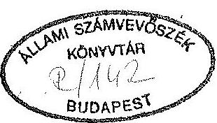

---

# A vizsgálatot vezette: 

Harsányi Sándor osztályvezető főtanácsos

A vizsgálatot végezték:

## Majorosné

dr. Locskai Noémi
Makkai Mária
Dr. Molnár Barnabás
Németh Béláné
Rundik János
Dr. Szőllősi Géza
számvevő tanácsos
számvevő tanácsos
számvevő tanácsos
számvevő tanácsos
számvevő tanácsos

---

# T A R T A L O M J E G Y Z É K 

1. BEVEZETÉS ..... 01da1
1- 4.
11. ÖSSZEFOGLALÓ MEGÁLLAPÍTÁSOK, AJÁNLÁSOK ..... 4.
1. Összefoglaló megállapítások ..... $4-9$.
2. Ajánlások a Kormánynak ..... $9-10$.
III. RÉSZLETES MEGÁLLAPÍTÁSOK ..... 11 .
1. Az ál1am vállalkozói vagyona nyilvántartási- információs rendszerének helyzete a tulajdonosokná1 ..... 11.
1.1. Állami Vagyonügynökség ..... $11-18$.
1.2. Állami Vagyonkezelő Részvénytársaság ..... $18-23$.
1.3. Tulajdonosi jogosítványokkal rendelkező tárcák ..... $23-28$.
2. A meglévő információs rendszerek hasznosíthatósága az állam vállalkozói vagyona nyilvántartásának kia lakitásához ..... 28.
2.1. Központi Statisztikai Hivatal ..... $28-31$.
2.2. Cégnyilvántartási és Céginformációs Szolgálat ..... $31-33$.
2.3. Adó- és Pénzügyi Ellenőrzési Hivatal ..... $33-36$.
2.4. F61dhivatal ..... $36-37$.
MELLÉKLETEK

---

IV. Vagyonellenőrzési Igazgatóság
$\mathrm{V}=22-42 / 1992 / 93$.
Témaszám: 133

# J E L E N T É S 

az állam vállalkozói vagyona nyilvántartási és információs rendszerének ellenőrzéséről

## I.

## BEVEZETÉS

A tervgazdaság logikájára épülő az állami vagyon nyilvántartására, változásának nyomonkövetésére alkalmas információs rendszer a piacgazdaságra való áttéréskor elvesztette létjogosultságát.

Az állam gazdálkodói vagyonával kapcsolatos nyilvántartási és információs rendszer szempontjából kiemelkedő jelentőségủ az 1992. évi XXXVIII., az államháztartásról (továbbiakban: ÁHT), az 1992. évi LIV., az időlegesen állami tulajdonban levő vagyon értékesítéséről, hasznosításáról és véde1mérő1, a tartósan állami tulajdonban maradó vállalkozói vagyon kezeléséről és hasznosításáról szóló 1992. évi LIII. törvény, valamint a 126/1992. (VIII.28.) Korm. r. a részben vagy teljesen tartósan állami tulajdonban maradó gazdálkodó szervezetekről szóló kormányrendelet.

Az ÁHT meghatározta az állami vagyon összetételét, a hivatkozott törvények és kormányrendelet (amelyeket összefoglalóan privatizációs törvénycsomagnak nevezünk) az állam vállalkozói vagyoná-

---

nak körét pedig egyértelmüen az állam tulajdonosi jogait gyakor1ó szervezetekhez (továbbiakban: tulajdonosokhoz), az Állami Vagyonügynökséghez, az Állami Vagyonkezelö Rt-hez és a meghatározott tárcákhoz rendelte.

A privatizációs törvénycsomag az ÁvU és a tulajdonosi jogokkal rendelkező tárcák számára, illetve az ÁV Rt. részére közvetve, illetve közvetlenül elöírta a hozzájuk tartozó állami vállalkozói vagyon nyilvántartási rendszere kiépítésének kötelezettségét, de erre vonatkozóan további tartalmi, illetve formai utasitást, iránymutatást nem adott.

Az állam vállalkozói vagyona nyilvántartási kötelezettsége teljeskörü teljesítésének az új tulajdonosok csak akkor tudnak eleget tenni, ha az eddigi információs rendszereket müködtetö szervezetek, KSH, Cégbíróság, APEH, Földhivatal adatbázisaira támaszkodnak, illetve azok információit felhasználhatják. Ugyanakkor csak e szervezetek adatrendszerére támaszkodva lehet kontrolláini a teljeskörüséget, a vagyonváltozás irányát, módját.

A tulajdonosok mind müködési idejüket, mind szervezettségüket, mind az állam vállalkozói vagyonára vonatkozó információs rendszerük kiépitettségét és müködtetését tekintve rendkívül eltérő helyzetben vannak. Ezért áttekintésük csak egyedi módon, adottságaikat és eltérő funkciójukat figyelembe véve volt lehetséges, és az adott helyzetben nem terjedhetett ki az információs rendszerek számítógépes fejlesztésének és müködtetésének költségeire.

Az előzőekben vázoltak indokolták a vizsgálat céljának megfogalmazását és a vizsgált szervezeti kör kiválasztását.

---

A vizsgálat célja annak megállapítása volt, hogy az állam vállalkozói vagyonáról rendelkező - 1992. július 28-án meghirdetett - törvényekhez ${ }^{1}$, továbbá a részben vagy teljesen állami tulajdonbban maradó gazdálkodó szervezetekről szóló 126/1992. (VIII.28.) Korm. rendelethez kapcsolódó információs rendszerek:

- megfelelő adátszolgáltatást tesznek-e lehetővé a tartósan, illetve időlegesen állami tulajdonban lévő szervezetekről (az országos közszolgáltató tevékenységet ellátó gazdálkodó szervezeteket is beleértve);
- a tulajdonosi jogokat gyakorlók (ÁV Rt, minisztériumok, ÁVÜ) a törvényekben meghatározott feladatokhoz kellő részletezettséggel alakítják-e ki nyilvántartási rendszereiket;
- biztosítják-e az állami vagyonelemek változásának, értékesítésének, kezelésének, hatékony müködtetésének folyamatos nyomonkövetését és ellenőrzését;
- a tulajdonosi jogokat gyakorló szervezeteknél az információs rendszer kialakításához biztosítottak-e a személyi és tárgyi feltételek;
- az állam vállalkozói vagyonának átfogó, nemzetgazdasági szintű összehangolását, összesítését milyen beszámolási, statisztikai, számviteli, pénzügyi rendszerek kapcsolatán keresztül biztosítják az érdekelt szervezetek: a Miniszterelnöki Hivatal (a továbbiakban: MH), a Pénzügyminisztérium (a továbbiakban:

[^0]
[^0]:    ${ }^{1}$ A tartósan állami tulajdonban maradó vállalkozói vagyon kezeléséről és hasznosításáról szóló 1992. évi LIII. tv. az időlegesen állami tulajdonban lévő vagyon értékesítéséről, hasznosításáról és védelméről szóló 1992. évi LIV. törvény, az állam vállalkozói vagyonára vonatkozó törvényekkel összefüggő jogszabályok módosításáról szóló 1992. évi LV. törvény.

---

PM), a Központi Statisztikai Hivatal (a továbbiakban: KSH), az Adó- és Pénzügyi Ellenőrző Hivatal (a továbbiakban: APEH), a minisztériumok, az Állami Vagyonkezelő Részvénytársaság (a továbbiakban: Áv Rt), valamint az Állami Vagyonügynökség (a továbbiakban: ÁvÜ).

A vizsgált szervezetek: Miniszterelnöki Hivatal, Pénzügyminisztérium, Közlekedési, Hírközlési és Vízügyi Minisztérium, Ipari és Kereskedelmi Minisztérium, Földmüvelésügyi Minisztérium, Igazságügyi Minisztérium, Központi Statisztikai Hivatal, Állami Vagyonkezelő Rt, Állami Vagyonügynökség.

A Pénzügyminisztériumnak, az Ipari és Kereskedelmi Minisztériumnak, a Földmüvelésügyi Minisztériumnak - az állam vállalkozói vagyonával kapcsolatos információs rendszerben múltban betöltött és jelenleg kialakult, e tekintetben sajátos helyzete miatt megváltozott tevékenységét az 1., 2. és a 3. számú mellékletben külön mutatjuk be.

A helyszíni ellenőrzés kezdetének és befejezésének határideje: 1992. október 19.-1992. december 15.
II.

ÖSSZEFOGLALÓ MEGÁLLAPÍTÁSOK, AJÁNLÁSOK

# 1. Összefoglaló megállapítások 

Az állam vállalkozói vagyonával kapcsolatos korábbi információs rendszer zárt és központilag szabályozott volt. A nemzetgazdaság majdnem $100 \%$-a állami tulajdonban volt. Ez lehetővé tette a központi szabályozást, a "vállalkozások" relati-

---

ve alacsony száma pedig gyakorlatilag módot adott a teljes körű adatszolgáltatás elrendelésére és begyűjtésére. Így a gazdasági akciókat nem követő, a piacgazdaság logikáját nélkülöző, szigorú előírásokon alapuló mérlegeket az APEH begyűjtötte és a Pénzügyi Számitástechnikai Intézet (PSZTI) feldolgozta.

Ezen elsődleges adatokon nyugvó feldolgozásokat megkapták az egységes ágazati statisztikai rendszerbe sorolt szervezetek (pl. minisztériumok, országos hatáskörű szervezetek, stb.), így azok különböző aggregáltsági szinten az állami vagyonnal kapcsolatos információkkal rendelkeztek.

Ez az integrált, központi szabályozási és feldolgozási rendszer természetszerűleg, többek között a használhatatlanság okán is felbomlott, illetve bomlik fel attól a pillanattól kezdve, amikor a piacgazdaságra való áttérés, a valódi tulajdonváltás megindult, illetve amikor a vagyon egyre inkább valós érdekviszonyokat megjelenítő gazdasági kategóriává kezdett válni.

A más gazdálkodási logikára alapozott, de önmagában kiérlelt és zárt, az állami vagyonra vonatkozó információs rendszer a piacgazdálkodásra való mind erőteljesebb áttéréssel párhuzamosan már nem volt képes kielégíteni egyetlen felhasználó igényeit sem. Azaz nem felelt meg sem a piaci szereplők, sem a különböző szintű döntéshozók (pl. Országgyűlés, Kormány, tulajdonosi jogokat gyakorló szervek), sem az ellenőrzés igényeinek.

---

A piacgazdaságra való áttérést alátámasztó, segitő törvények és törvénymódosítások ${ }^{1}$ folyamatosan és fokozatosan változtatják a feltételeket. Ezekre is támaszkodva változott a kormányzati intézményrendszer és szervezeti struktúrája is. A meglévő államigazgatási szervezetek feladata és hatásköre értelemszerüen módosult.

Az állam vállalkozói vagyona kimutatási és nyilvántartási rendszere kiépitési kötelezettségét a törvényi szabályozás részben rendezte. Az Állami Vagyonügynökség részére közvetve az Állami Vagyonkezelö Rt. - mint tulajdonos számára - elrendelte az információs rendszer kiépitési kötelezettségét. A tulajdonosi funkciókat ellátó tárcáknak azonban nincs e téren egyértelmüen elrendelt kötelezettsége.

Az ÁvÜ és a KHVM általános információs rendszerrel és benne az állam vállalkozói vagyonára és változásának mérésére adatbázissal, szervezett és szabályozott adatgyüjtési és feldolgozási rendszerrel, technikai háttérrel, információs rendszer fejlesztési elgondolással rendelkezik. Az Áv Rt az alapítása óta elte1t rövid idő alatt ehhez hasonló helyzetbe nem kerülhetett, csak az elgondolások körvonalazása történt meg.
${ }^{1}$ Az 1988. évi VI. törvény a gazdasági társaságokról, az 1989. évi XIII. törvény a gazdálkodó szervezetek és a gazdasági társaságok átalakulásáról, az 1991. évi XVIII. törvény a számvitelről, az 1991. évi LXV. törvény, a gazdasági társaságokról szóló 1988. évi VI. törvény, valamint a cégbírósági nyilvántartásról és a cégek törvényességi felügyeletéről szóló 1989. évi XXIII. törvény módosításáról, az 1992. évi LIII. törvény a tartósan állami tulajdonban maradó vállalkozói vagyon kezeléséről, és hasznosításáról, az 1992. évi LIV. törvény az időlegesen állami tulajdonban lévő vagyon értékesítéséről, hasznosításáról és védelméről, a 126/1992. (VIII.28.) Korm. r. a részben vagy teljesen tartósan állami tulajdonban maradó gazdálkodó szervezetekröl stb.)

---

Az eddig eltelt idő alatt az új tulajdonosok természetszerűleg különböző szinten építették ki információs rendszerüket. Így az a helyzet állt elő, hogy az állam gazdálkodói vagyonát nemzetgazdasági szinten tükröző régi információs rendszer már nem, az új, a piacgazdálkodás logikájának megfelelő információs rendszer pedig még nem müködik.

Abból következően, hogy az információs rendszer kialakítása az adott szervezet feladata, a különböző tulajdonosoknál meglévő rendszerek összekapcsolhatósága csak véletlenszerű lehet. Így túl azon, hogy az ÁV Rt-nek még nincs teljesen kiépült információs rendszere, a három fő tulajdonosnál koncentrálódó állami vállalkozói vagyon integrált kimutatásának potenciális lehetősége nem biztosított.

Jelenleg nincs olyan szervezet, amelynek az adattartalom minimális egysége biztosításához szükséges koordinációra felhatalmazása lenne.

Az állam vállalkozói vagyona változásának kimutatásához azonban az előzőekben felvázolt ellentmondások megoldása sem elégséges feltétel. Ugyanis - mint azt a részletes megállapítások mutat ják - ma Magyarországon nincs olyan szervezet, ahol a szervezeti változásokat folyamatosan követő, kontrollált, teljeskörű nyilvántartás működne. Így ma az állam vállalkozói vagyona ellenőrzött és teljeskörü számbavételének és változásai követésének még elvi feltételei is hiányoznak. Ez az egyik jelentős bizonytalansági tényező a vagyonkezeléshez, a privatizációhoz kötődő bevételek nagyságrendjének és elosztásának a tervezésénél. Vagyis az állam vállalkozói vagyoná-

---

val való gazdálkodásnak, a Kormány tulajdonosi szerepe megfelelö betöltésének az alapfeltétele hiányzik. Ezen túlmenően az állam vállalkozói vagyonának információs rendszere a nemzetgazdasági információs rendszerének is része. Kiépülésének hiánya miatt a nemzetgazdaság információs rendszere sem müködhet tel jes egészében.

Az állam vállalkozói vagyonára vonatkozó információs problémák lényeges jellemzője, hogy a tulajdonos és különböző információs rendszereket működtető háttér - köztük a kormányzati információs - szervezeteknél az elemi alapadatok - eltérő tartalommal és mértékben - rendelkezésre állnak. Azonban vagy az intézmény feladatköre és ebből fakadó adatszolgáltatási kötelezettsége (pl. Cégnyilvántartási és Céginformációs Szolgálat), vagy az adatrendszer titkos minősitése (pl. APEH), vagy a müködés személyi, technikai feltételei (pl. APEH, Földhivatal), akadályai az adatrendszerek integrálhatóságának.

E többségében "müvi" korlátok lebontása az adatrendszerek integrálhatósága intézményesített koordinációjának megvalósítása - legalább elvi szempontból - lehetővé tenné az állam vállalkozói vagyona és annak változásának nemzetgazdasági szintű nyilvántartását és követését.

A Kormány privatizációs stratégiájának felel meg a tulajdonosi jogok gyakorlásának, a vagyonnal való gazdálkodásnak adott rendszere. Ehhez nem épült ki az állam vállalkozói vagyonát integráltan kezelö információs rendszer. Így a privatizációs folyamathoz és a vagyonnal való gazdálkodás jövőre vonatkozó elgondolásaihoz képest, a hatásokat is kimutatni tudó információs rendszer müködése fáziskésésben van.

---

Az információs rendszerek ellentmondásai ma az ellenőrzés alapfeltételeit is veszélyeztetik, így lényegében értelmezhetetlen az ÁV Rt nemzetgazdasági átlagtól eltérő jövedelmezőségének, s az ahhoz kapcsolódó ÁSZ vizsgálat azonnal1 kezdeményezésének elöírása is, hiszen mire a jelenlegi statisztikai rendszer alapján az eltérés egyáltalán kiderülhet, több mint félév telik el, s ez - az okfeltárásra kötelezett ellenőrzés minimális 2-3 hónapos időtartamát figyelembevéve - értelmetlenné teszi az előirást.

# 2. Ajánlások a Kormánynak 

Az állam vállalkozói vagyona nagyságának megállapításához, a változás méréséhez, a nemzetgazdasági szintű gazdálkodás elemzése érdekében:

1. Biztositani kell a gazdálkodó szervezetek teljes körét tartalmazó regiszter müködtetésének feltételeit. Meg kell határozni telepítésének legcélszerübb helyét, az adatrendszer hozzáférhetőségének és felhasználásának módját.
2. Meg kell határozni a tulajdonosi jogosítványokkal rendelkező ÁVÜ-nél, ÁV Rt-nél és tárcáknál az állam vállalkozói vagyonára vonatkozó alapinformációk körét, az adatszolgáltatási kötelezettségeket és az információs rendszerek összekapcsolhatóságának módját. A szükséges jogi szabályozást ki kell adni.
3. Szabályozni kell a tulajdonosi jogokat gyakorló minisztériumoknál lévő állami vállalkozói vagyonnal kapcsolatos nyilvántartási feladatokat és beszámolási kötelezettségeket, figyelemmel az ÁVÜ-nél és az ÁV Rt.-nél müködő rendszerekre.

---

4. A tulajdonosi jogokat gyakor1ó szervezetek és az állam vállalkozói vagyonára vonatkozó információkat is feldolgozó háttérszervezetek információs rendszerei összekapcsolhatóságát akadályozó elemeket oldani, illetve felszámolni szükséges.
5. Újra kell szabályozni az állam vállalkozói vagyonára vonatkozó információs rendszereket müködtető szervezetek adatszolgáltatási kötelezettségét annak érdekében, hogy az adatáramlásban meglévő felesleges adminisztratív kötöttségek megszüntethetők legyenek és a döntéselőkészítésben, a végrehajtásban és az ellenőrzésben résztvevők megfelelő időben adatokhoz juthassanak.
6. Kezdeményezni szükséges az 1992. évi LIII. törvény 23. § (2) bekezdésének elhagyását.
7. Az ÁV Rt-nek ki kell alakítania az állam vállalkozói vagyonápak változására, hasznosítására vonatkozó féléves jelentési kötelezettség feltételeit.
8. Intézkedni kell, hogy az Állami Számvevőszék rendszeresen és automatikusan rendelkezzen mindazon információval, amely az állami statisztika egységes rendszerébe tartozó szervezeteket megillet.

---

# 111. 

## RÉSZLETES MEGÁLLAPÍTÁSOK

## 1. AZ ÁLLAM VÁLLALKOZÓI VAGYONA NYILVÁNTARTÁSI-INFORMÁCIÓS RENDSZERÉNEK HELYZETE A TULAJDONOSOKNÁL

### 1.1. Állami Vagyonügynökség

Jogi szabályozás

Az időlegesen állami tulajdonban lévő vagyon értékesítésérő1, hasznosításáról és véde1mérő1 szóló 1992. évi LIV. törvény 1992. augusztus 28-án lépett hatályba. E törvény az ÁVÜ-hőz tartozó vagyon és az ezzel kapcsolatos tevékenységét illetően, a korábbi szabályozáshoz képest nagyobb vagyoni kört jelöl, illetve többlet feladatot ír elő.

A törvény szerint a Kormány évente - az előző évi állami költségvetés végrehajtásáról szóló törvényjavaslat előterjesztésével egyidejüleg - köteles az Országgyülésnek beszámolni a Yagyonügynökség tevékenységéről, a hozzá tartozó állami vagyon alakulásáról, hasznosításának eredményéről és az Irányelvek végrehajtásáról.

A Vagyonügynökséghez tartozó állami vagyon alakulásáról - a Vagyonügynökség költségvetésétől elkülönítve - mérleget ke11 készíteni, és azt a beszámolóval egyidejüleg ke11 előterjeszteni.

A törvény nem rendelkezik a vagyonról készítendő mérleg formai és tartalmi felépítéséről. A Pénzügyminisztérium Számviteli Főosztálya ugyan készített "A privatizációs törvények-

---

ke1, azok végrehajtásával kapcsolatos számvite1i kérdésekről" címen egy összeállítást, de az sem ad érdemi eligazítást a mérlegre. A következöket tartalmazza ugyanis: "E mérleg mérlegszerű kimutatást jelöl, és nem a számvite1i törvény által meghatározott mérlegek valamelyikét".

Az ÁVÚ intézkedései az állami vagyon nyilvántartására

A törvény hatálybalépését követően az Á1lami Vagyonügynökség vezetői értekezlet keretében foglalkozott a teendőkkel.

Itt került napirendre az intézmény feladatterve. Ez előírja "a törvény hatálya alá tartozó vagyon felmérését, az adatok rendszerezését és az abban bekövetkezett változások folyamatos átvezetését, a döntéselőkészítést, a befektetői igények kielégítését és a megfelelő tájékoztatást egyaránt szolgáló információs rendszer kiépítését."

Az adatok rendszerezését, a gazdálkodási forma, ágazat és földrajzi elhelyezkedés szerinti megosztásban írja elő a feladatterv.

Nem határozza meg azonban, hogy a teljeskörü nyilvántartás elkészítése, vezetése mely szervezeti egység feladata, a már meglévő adatok mennyiben használhatók fel és mit kell tenni a teljeskörüség biztosításához.

A vagyon nyilvántartásának érdekében a munka az Informatikai Irodán kezdődött meg. A nyilvántartás felállítása - a teljeskörüség érdekében - feltételezi a törvény hatálya alá tartozó szervekre a címjegyzék előállítását és a megfelelő mérlegsorok (saját töke és annak bontása) átvételét, rögzítését.

---

A címjegyzék kialakításához az alábbi adatforrásokkal számoltak:

- APEH nyilvántartása,
- ÁVÜ saját információs rendszere,
- Szakminisztériumok címjegyzéke,
- KSH adatszolgáltatása.

Az APEH-a1 történt kapcsolatfelvétel - többszöri levélváltás után is - negatív eredménnyel zárult. Az APEH elnökének 1992. nov. 5-én kelt válaszlevele szerint az ÁvÜ által kért adatok - név és cím - átadása az adótitok miatt nem lehetséges.

A KSH-val történő kapcsolatfelvételnek a vizsgálat befejezéséig csak részben volt eredménye.

Az ÁvÜ két kéréssel fordult a KSH-hoz.. Az egyik az volt, hogy az ÁvÜ-t vegyék fel az állami statisztika egységes rendszerébe tartozó szervezetek közé az 1993. évi országos statisztikai adatgyűjtési programról (OSAP) szóló kormányrendelet kialakítása során. A másik kérés a címlista kialakításához szükséges adatok (név és cím) átadása.

Az ÁvÜ-nek az OSAP-ba való felvétele a KSH Elnökének november 10-i válaszlevele szerint nem célszerü. Ugyanis az OSAP keretében gyüjtött adat semmilyen tevékenység ellátásához szükséges célra nem használható fel, az ÁvÜ-nek pedig ehhez kell.

A vagyonra vonatkozó adatok nyilvántartásának elkészítésénél az Informatikai Iroda az 1991. év végi adatokat tekinti bázisnak. Erre az időpontra a rendezőmérlegek a cégeknél elkészültek, melyből az adatok átvezethetők.

---

A rendező mérlegek az APEH-nál és a Cégbíróságon megtalálhatók. A mérlegek számítógépes feldolgozásáról azonban döntés nincs, így az adatok egy helyröl, mágneses adathordozón való átvételére az ÁVÜ-nek nincs lehetősége. Ezért az ÁVÜ a saját adatgyüjtés szükségességével számol. Ehhez a címlista összeállítása, majd az alapján az adatlapos adatgyüjtés szükséges. Tekintettel arra, hogy ez az adatszolgáltatás önkéntes lesz, nem zárható ki, hogy nehézségek merülnek fel a végrehajtás során.

Az 1992. évi LIV. törvény és a 126/1992. (VIII.28.) Korm. rendelet hatálybalépését követően az ÁVÜ feladattervébe felvette az ÁV Rt részére történő vagyonátadás teendőit. A konkrét akták és információk átadását a tranzakciós igazgatóságok, a jogi előkészítést és lebonyolítást a Jogi Igazgatóság végezte. Sem a feladatterv, sem az ÁvÜ és ÁV Rt. közötti megállapodás nem tartalmazta azonban azoknak a részvényeknek az átadás-átvételi teendőit, amelyek az ÁvÜ-nél találhatók, de a Kormányrendelet szerint az ÁV Rt-hez tartoznak.

Az ÁVÜ-nél a nyilvántartás felülvizsgálata folyamatban van, az ÁV R̄t-vel a kapcsolatot felvették, ennek keretében rendezik a részvények átadását is.

A különbözỏ tranzakciós igazgatóságok nyilvántartásaiból az átadott társaságok adatait kivezették.

Az állami vállalatok felmérése, az alapítói jogok gyakorlása

Az 1992. évi LIV. törvény hatálya alá tartozó állami vállalatoknak legkésöbb 1993. december 31-ig kötelességük a társasági szerződést elkészíteni vagy pedig az alakuló közgyülést összehívni, azaz társasággá átalakulni.

---

A korábbi jogi szabályozás szerint az állami vállalatok nem tartoztak a Vagyonügynökséghez, csak meghatározott - jogszabályok által előirt - esetekben kerültek az intézménnyel kapcsolatba.

Az Állami Vagyonügynökségnél az alapítói jogok gyakorlásához - mely új feladat - az állami vállalatok felmérése, a feladatmeghatározás és a végrehajtás szervezetten, ütemesen bonyolódik.

Az ágazati minisztériumoktól az ÁvÜ megkérte és október hó folyamán megkapta a hozzá tartozó vállalatok listáját, az alapító okiratokat, mérlegeket, az első számú vezető személyi adatait, a peres ügyeket, a csőd vagy felszámolás alatt álló vállalatok listáját.

Megalakult a Vállalati Igazgatóság. Feladata, hogy az ÁvÜ-höz tartozó vállalatokat előkészítse a tranzakciós igazgatóság számára.

A tanácsi alapításu vállalatok körének felmérése érdekében valamennyi megyei önkormányzati hivataltól kérték a tanácsok által alapított vállalatok iratait, ennek határideje 1993. március 15 .

Az állami vállalatokkal kapcsolatos teendők (alapítói jogok gyakorlása, átalakulás, privatizáció előkészítése) érdekében a feladatokat és a végrehajtás időbeli ütemezését az ÁvÜ vezetői értekezlete határozta meg.

---

A kijelölt főbb feladatok:

- a vállalatok számbavétele, átfogó felmérése, értékelése,
- a vállalatoknál lévő állami vagyon felmérése, mégpedig az önállóan vállalkozásban müködtethető egységek szerinti bontásban,
- a vállalatok privatizációra való felkészítésének végrehajtása.

A feladatokat részleteiben írták elő, mindegyikhez határidőt rendelve, melyek a törvény által előirt határidőkhöz igazodnak. Ezen túl a végrehajtáshoz szükséges intézményen belüli munkamegosztást is rendezték és a tárgyi és személyi feltételeket is meghatározták.

Folyamatban van - a vállalatok irányítási formája szerinti ütemezésben - az ún. rövid kérdőíves vállalati felmérés, ezt követi majd a részletes adatlapos átvilágítás.

Ezen túl - a KSH, az ágazati minisztériumok és az ÁvÜ korábbi nyilvántartása szerinti vállalati lista összevetése alapján mindazon vállalatoknak körlevelet írtak, amelyek még nem nyújtottak be átalakulási tervet. Ebben kérik, hogy az átalakuláshoz szükséges előkészületeket tegyék meg, illetve készítsék el a privatizációs tervüket.

# Az ÁvÜ Privatizációs Információs Rendszere 

1992. november 2-án lépett hatályba a 13/1992. sz. Ügyvezető igazgatói utasítás az ÁvÜ számítógépes Privatizációs Információs Rendszerének (a továbbiakban: PIR) bevezetéséről. A bevezetés célja az volt, hogy a privatizációs folyamat naprakészen nyomonkövethető legyen. A felsőszintü privatizációs

---

döntésekhez a vezetés, a döntések előkészitéséhez pedig a tranzakciós ügyintézők számára megbízható, teljeskörü információ álljon rendelkezésre. Az utasítás szerint az adatok rendszerbe juttatása, folyamatos aktualizálása naprakészen az ugyancsak elkészült adatbevite1i szabályzatnak megfelelően - a felhasználók kötelessége. A PIR adatkészletének helyessége, aktualitása és integritása feletti örködés az Ellenőrzési Iroda feladata. 1992. december 31-ig a PIR müködtetése me1lett párhuzamosan folyik a korábbi rendszernek megfelelő adatrögzités is. Így a felhasználók már maguk gondoskodnak az adatok rendszerbeviteléröl, ugyanakkor - a korábbi szabályozás szerinti - ún. tranzakciós adatlapokat is kiállitják és az Informatikai Irodához eljuttatják. Az Iroda az adatbevitel helyességét ellenőrzi.

A PIR induló adatbázisa döntően a volt PSZTI vállalati mérlegadataira épül. Az adatbázis lehetővé teszi, hogy a vállalatokban lévő állami vagyon a privatizációs tranzakciókon keresztül követhető legyen.

A PIR bevezetése mellett jelenleg folyik a továbbfejlesztése is. Ennek során a társasági tranzakciók (értékesités, vagyonátadás, vagyonkezelés, tőkeemelés, lizing, társaságok egymásba alakulása, válságkezelés) rendszerbe integrálásán dolgoznak. A cél annak elérése, hogy az állami vállalatok vagyonának akár a vállalati/társasági működés, akár a különböző privatizációs technikák alkalmazása révén bekövetkezett mozgása a vagyon teljes privatizációjáig követhetö legyen.

A PIR gyakorlati müködését, jóságát, tapasztalatait a bevezetéstől eltelt rövid idő miatt megitélni még nem lehet.

---

Adatszolgáltatás

Az ÁVU számára adatszolgáltatási kötelezettséget - a beszámolón és a hozzá tartozó vagyon alakulásán kívül - jogszabály nem ír elő.

Ennek megfelelően az is szabályozatlan, hogy kinek, milyen időközönként és milyen adatokat kell szolgáltatnia.
A gyakorlat szerint - melynek ÁVU-n belüli szabálya sincs az alábbi adatszolgáltatásokat teljesítették.

Rendszeres adatszolgáltatás keretében

- havonta készül ötoldalas tájékoztató a privatizációs folyamatok állásáról;
- havonta készül a privatizációs ütem mutató;
- a Világbanknak negyedévenként szolgáltatnak adatokat, me1y a tájékoztató és a privatizációs ütem adatait tartalmazza.

Eseti adatkérés többször is előfordult, leggyakrabban az NGKM, IKM, PM és az MNB részéről.

# 1.2. Állami Vagyonkezelö Részvénytársaság 

A tartósan állami tulajdonban maradó vállalkozói vagyon kezeléséről és hasznosításáról szóló 1992. évi LIII. törvény a 126/1992. (VIII.28.) Korm. rendelet kihirdetésével lépett hatályba. Az Alapító Okirat elkészítésének határideje 1992. október 28-a volt.

---

Így az információs rendszer nem épülhetett ki, hiszen erre döntése lökészítő, döntést hozó és a végrehajtó apparátus nem állt az ÁV Rt. rendelkezésére.

A vizsgálat ezért az eddigi információnyújtás pontosságának, technikájának, felhasználásának és a jövöbeni információs rendszer kialakítási koncepciójának felmérésére irányult.

Az ÁV Rt. alapítását megelôzően tájékoztató anyagot készített a Kormány részére a hozzá tartozó gazdálkodó szervezetek (ame1yet a 126/1992. (VIII.28.) Kormányrendelet 1. sz. melléklete rögzít) tőkeszerkezetéről és az alaptőke készpénzbe1i hozzájárulási igényéről.

Alapvetően az 1991. évi rendezö mérleg és rendezö eredménykimutatás képezte az összesítés alapját, de az alábbi területeket is felmérték, úgy mint:

- a szervezetek legnagyobb hitelezői, adósai,
- a közép- és rövidtávú piaci stratégia,
- az átalakulás és privatizáció jelenlegi helyzete, középtávú terve, soron következö lépése,
- a gaż́dálkodó szervezet jelenlegi felépítése, szervezete, tagolása, figyelemmel a jelentő́s külsó érdekeltségekre is,
- a gazdálkodó szervezet vezetési sémája, az Igazgatóság és a Felügyelő Bizottság névsora, az operativ vezetés tisztségviselőjének neve, rövid szakmai életrajza.

Az összegezett információk előállítására igen rövid idő állt rendelkezésre. A személyi és tárgyi feltételek (1 fő) sem voltak elégségesek, így csak az alapszintü információk gyüjtése történt meg.

---

Az első összesítés nem ad megfelelő tájékoztatást az ÁV Rt. -hez tartozó gazdálkodó szervezetek tényleges vagyonáról, mivel abban a már társasági formában müködö szervezetek vagyona átértékelten, a vállalati formában müködö szervezetek vagyona pedig könyv szerinti értéken szerepelt.

Az ellenőrzés időszaka alatt az ÁV Rt. alaptőkéjét (jegyzett tőke) még nem határozhatták meg, így az nem volt ellenőrizhető.

Az ÁV Rt. rendeltetésszerű működésének ellenőrzése számos nehézségbe ütközik.

Az 1992. évi LIII. törvény 23. és 25. §-ai két különböző tartalmú ellenőrzési feladatot írnak elő az Állami Számvevőszék részére.

A 23. § feltételes módban fogalmaz, és előirja, hogy: "ha az ÁV Rt. fizetésképtelen vagy nyereségének (osztalékának) mértéke lényegesen alacsonyabb a nemzetgazdaságban elért nyereség vagy osztalék szintnél, az ÁSZ köteles ennek okait feltárni és azokat küllőn jelentésben összegezni. Ez végső esetben megkövetelheti az ÁV Rt-hez tartozó - a jövőbeni átalakulással együtt - összesen 163 társaság gazdálkodásának ellenőrzését.

A 25. §. a Kormány éves beszámolási kötelezettségéről rendelkezik. Ez az ÁV Rt. tevékenységéről, a törvény hatálya alá tartozó gazdálkodó szervezetek vagyonának hasznosítási módjáról, eredményeiről és az irányelvek végrehajtásáról szól. E beszámolóhoz kell mellékelni az ÁSZ elnökének jelentését az ÁV Rt. tevékenységéről.

---

A gazdálkodási tevékenység ellenőrzésénél az ÁSZ-nak okfeltáró feladata van, ame1y feltételes, mert függ az ÁV Rt. gazdálkodási eredményétől (fizetésképtelenség, nyereség, osztalékszint). Ezzel kapcsolatos, az ellenőrzés igényeit is kielégítő információrendszer kialakítása, működtetése a fizetőképesség folyamatos figyeléséhez, a gazdálkodási előirányzat kialakításához, figyelemmel kiséréséhez feltétlenül szükséges az ÁV Rt. részéről.

Megoldatlan, hogy a nemzetgazdaságban jellemzően elért nyereség vagy osztalék szintje milyen információs forrásból és mikor áll az ÁSZ rendelkezésére, hiszen ennek alapján dönthető e1, hogy a gazdálkodásra vonatkozó okfeltáró vizsgálatot végre kell-e hajtani vagy sem.

A gazdálkodó szervezetek éves beszámolójukat május 31-ig kötelesek elkészíteni. Ezért az Állami Számvevőszék Elnökének a gazdálkodással kapcsolatos okfeltáró ellenőrzés megállapításait legkorábban a tárgyévet követő november hóban lehet összefoglalni. Ez azonban ellentmond annak a törvényi kötelezettségnek, hogy az Állami Számvevőszék Elnökének az ÁV Rt. tevékenységéről szóló jelentését az előző évi állami költségvetés végrehajtásáról szóló törvényjavaslat előterjesztésével - az államháztartásról szóló törvény 53. §-a szerint legkésőbb a költségvetési évet követő nyolc hónapon belül egyidejűleg kell benyújtania.

Mindezért az 1992. évi L111. törvény 23. § (2) bekezdése végrehajthatatlan.

Az ÁV Rt-nél az ellenőrzés időszakában - 1992 decemberében kinevezett középvezetők, információs szakemberek még nem voltak. Így csak tájékozódás alapján lehetett megitélni a jövőbeni információs rendszerükre vonatkozó elgondolásokat.

---

Ennek fö elemei:

- a legsürgősebb minimál-rendszer kiépitése érdekében a gazdálkodó szervezetektől származó 1991. évi adatbázis számítógépre vitelét tervezik, ame lyek alkalmasak az elemzésekre is. A rendszer kialakítását gátolja, hogy nem eldöntött az ÁV Rt. telephelye;
- a végleges rendszer kialakítására az ÁV Rt. versenytárgyalás kiirást tervez. A versenykiírás tartalmi követelményeinek pontos megfogalmazása érdekében a PHARE program finanszirozásban a belga lbf Consulting cég egy első közelítésű javaslatot adott az információs rendszer tartalmára;
- tárgyalásokat kezdtek a céginformációs rendszerek megismerésére. Saját információs adatbázisuk felmérése, tartalmi összeállítása folyamatban van.

A Miniszterelnöki Hivataltól kapott információ szerint 1993 februárjában az ÁV Rt. jegyzett tőkéjét megállapították, a hatáskörébe tartozó szervezetek vagyonát az 1991. évi rendezőmérlegek alapján felmérték.

Az ÁV Rt. a vagyoni köréhez tartozó és már társasági formában müködő gazdálkodó szervezetek dokumentum- és iratanyagát az ÁvÜ-töl veszi át. A 4. sz. mellékletben bemutatott ÁvÜ-Áv Rt. közötti megállapodás és egyezség tervezete az átadás-átvétel keretét tartalmazza. E szerint gondoskodtak az átmeneti időszak alatti - törvény hatálybalépése és az ÁV Rt. megalapítása - ÁvÜ döntések végrehajthatóságáról is. A megállapodás tervezete szabályozza az átadás tartalmát, módját és lebonyolítás formáját, ütemezését, külön kiemeli a szakmai specifikumokat, valamint a folyamatban levő tranzakciókat.

---

Az átadási-átvételi folyamat vizsgálata során megállapítható, hogy az ÁvÜ-töl már átvett vállalkozások dokumentumai nem teljeskörüek. Hiányzik az átadási jegyzőkönyv vagy a teljességi nyilatkozat. Ez hátráltatja a mielőbbi teljes tulajdonosi körre vonatkozó információk feldolgozását és gátolhatja az Áv Rt.-t a tevékenysége, feladatköre megkezdésében is.

Ugyanakkor igaz az is, hogy az ÁV Rt. a személyi és tárgyi feltételek kiépülésével a dokumentumok tételes feldolgozására csak fokozatosan lesz alkalmas. Az átadás-átvételi eljárás jelenlegi helyzete az érintett vagyonkezelési és privatizációs ügyletek időleges leállását okozta.

Az ÁV Rt. tulajdonába került és még át nem alakult gazdálkodó szervezetek közül az ÁvÜ-nél csak azon vállalatok információs anyaga lelhető fel, amelyek már kezdeményezték átalakulásukat, az erről szóló dokumentumok átadása még nem történt meg. Ebbe a körbe tartozó vállalatokról az információt közvetlenül a gazdálkodó szervezetektől kell beszerezni.

A minisztériumoktól történő dokumentumok átvétele a Földművelésügyi Minisztériumot kivéve, még nem kezdődött meg.

# 1.3. Tulajdonosi jogosítványokkal rendelkező tárcák 

A 126/1992. (VIII.28.) Kormányrendelet 2. § (1) bekezdése szerint a 2. sz. melléklet sorolja fel a törvény hatálya alá tartozó vagyont müködtető országos közszolgáltató tevékenységet ellátó szervezeteket, amelyek tekintetében az állami tulajdonosi jogokat a tevékenység ellátásáért felelős miniszter gyakorol ja.

A tulajdonosi jogokat gyakorló miniszterek közül az Igazságügyminiszter, a Honvédelmi miniszter, a Népjóléti miniszter, a Pénzügyminiszter, a Nemzetközi Gazdasági Kapcsolatok mi-

---

nisztere, a Földmũvelésũgyi miniszter, a Miniszterelnöki Hivatal csak kevés és nem tipikusan vállalkozói tevékenységet végzõ vállalatnál rendelkezik jogosítványokkal. Bár értelemszerũ, hogy ezen szervezetek vagyona része az állam vállalkozói vagyonának, az információs rendszer szempontjából jellegũk és jelentőségũk nem indokolta a vizsgálatba való bevonásukat.

A felsorolt tárcákon kivũl jelentős állami vállalkozói vagyon feletti tulajdonosi joggal egyedũl a Közlekedési, Hírközlési és Vizügyi miniszter rendelkezik.

Közlekedési, Hírközlési és Vizügyi Minisztérium

A részben vagy tartósan állami tulajdonban maradó gazdálkodó szervezetekről szóló 126/1992. (VIII.28.) Korm. rendelet a Közlekedési, Hírközlési és Vizügyi minisztert állami tulajdonosi jogok gyakorlásával 32 vállalatnál - Magyar Állami Vasutak, GYSEV Rt., Magyar Posta Vállalat, VOLÁNBUSZ és 28 VOLÁN Vállalat - jelölte ki. A rendelet megszabta a társaság jegyzett tőkéjének és a tartós állami űzletrészek arányának legalacsonyabb mértékét is. A kijelölt vállalatok a koncesszióról szóló 1991. évi XVI.törvény hatálya alá tartozó tevékenységet végeznek.

Az 1992. évi LIII. tv. nem rendelkezik a 126/1992.(VIII.28.) Korm. rendelet alapján állami tulajdonosi jogokat ellátó miniszterek tekintetében az ÁV Rt-re azonos módon elöirt évközi és éves kötelező beszámolási kötelezettségről. Idézett tv. a miniszterek tulajdonosi joggyakorlására - a Kormány által meghatározott idópontig történő gazdasági társasággá való átalakítás, vagyonkezelés, értékesítés, gazdasági társaság alapítása vonatkozásában - az ÁV Rt-re vonatkozó szabályok megfelelö alkalmazását írja elö. A hozzá tartozó vagyon tör-

---

vényes és eredményes müködtetéséhez szükséges nyilvántartási és értékelési rendszerre vonatkozóan nem ír elö egységes sémát, azt a tulajdonosi jogot gyakorló saját hatáskörben alakítja ki.

A KHVM is saját maga tervezi kialakítani a tulajdonosi jogok gyakorlásához szükséges adatszolgáltatási rendszert a miniszterhez tartozó országos közszolgáltató tevékenységet ellátó gazdálkodó szervezetekre vonatkozóan, a számviteli törvény adta lehetőségek és egyéb ágazati sajátos körülmények indokolt figyelembevételével. Ehhez továbbra is felhasználják a korábbi évek alatt kialakított KHVM adatgyűjtési rendszerböl nyerhető adatokat. A szükséges adatszolgáltatást a KHVM 1993. évi adatgyüjtési rendszerébe beépítik. Tervezik majd ezen túli adatok bekérését is. Mindezek összeállítása folyamatban van.
1992. év során a KHVM vezetői döntéselőkészítő információs rendszere a vagyon megfigyelésére is kiterjedt. Ennek dokumentumai:

- A vagyonmegosztás alakulása a közlekedés, posta és távközlés, valamint vízgazdálkodás ágazatokban, továbbá a közlekedési eszközjavítás szakágban. Az 1989-91 évekre kiterjedő megfigyelés az 1991. december 31-ig érvényes számviteli elöírások szerinti tagozódású.
- Tájékoztató a közlekedés, posta és távközlés, a vízgazdálkodás és autójavítóipar területén müködő egyszeres könyvvitelt vezető társas és a Vállalkozási nyereségadó hatálya alá bejelentkezett egyéni vállalkozók 1991. évi gazdálkodási adatairól.
- Kijelölt szervezetek - köztük a tulajdonosi joggyakor lással érintett 32 szerv is - 1992. január 1-jei rendező mérlegeinek összesített adatai. A minisztérium saját maga szervezte meg az 1991. évi mérlegekből - az új számviteli törvény szerint - készített rendezőmérlegek feldolgozását.

---

A megfigyelés a számviteli tv. által elóirt mélységben a vagyonnal, vagyonmozgással kapcsolatos valamennyi elemre kiterjed, az az ellenőrzés igényeit is kielégiti.

- Vállalatok vagyoni helyzete 1991. december 31-én.
- Ezen túlmenően számítógépes lekérdezési rendszert alakítottak ki a leírt területekre. Ezek: pénzügyi mérlegadatok 1989-91., vagyonalakulás bemutatása 1988-91., az 1992. január 1-jei rendező mérleg főbb adatai. Az ágazat 1991. évi statisztikai évkönyvét maguk készítették el.

A minisztérium saját hatáskörben, külön kérte be a vagyont működtetőktől a tulajdonosi jog gyakorlásához szükséges információkat. Tervezik további szükséges információk bekérését is. Új elemként egy - a vagyonvédelmi előírások betartására vonatkozó - szerződésbejelentési rendszert is kialakítottak, s ezt 1992. október 19-én az érintett gazdálkodó szerveknek megküldték. A bejelentési kötelezettség kiterjed minden érintett és eddig megkötött és minden újólag megkötendő szerződésre, még azok megkötése előtt. E szerződések számítógépes feldolgozásának kialakítása most van folyamatban, a megfigyelni'szándékozott adatok adatrögzítő lapon történő nyilvántartásával.

A megfigyelési rendszerek jól szolgálják a tulajdonosi érdekek érvényesítését, mivel tartalmazzák a tulajdonosi körbe tartozó vagyonelemek induló állományát és biztosítják a bekövetkező vagyonmozgások és a társasággá alakulások elvárt alaposságú véleményezhetőségét.

A KHVM-nél gondot okoz az, hogy a gazdálkodók mérlegadatait az APEH 1992. január 1-től nem dolgozza fel és azt az ágazat feldolgozott formában nem kapja meg. A Cégbíróságon letétbe helyezett mérlegnek a minisztériumi tulajdonosok érdekeit kielégítő feldolgozása nincs elrendelve, így ma Magyarországon

---

valamennyi tulajdonosi joggyakorló saját maga szervezheti ezt majd meg. A KSH nem vállalta át az APEH által 1991. évig szolgáltatott gazdasági adatok feldolgozását.

A KHVM szerint a tulajdonosi jogokat gyakor1ó szervezetek, valamint a Kormány információs szervezetei között egységes információs kapcsolati rendszer jelenleg nem létezik.

Az 1026/1992. (V.12.) Korm. határozat 1993. június 30-ával írt elő határidőt a Kormány információs rendszerének kialakítására, a kormányzati és más közigazgatási információs rendszerek közötti kapcsolatok intézményesítésére. A KHVM 1992. augusztus 12-i keltezésű, a közigazgatás korszerűsítésére vonatkozó minisztériumi feladattervében 1992. XII. 31. belsö határidőt írt elő az ágazat javaslatainak kidolgozására.

Az "OSAP"-rendszer tervezett bevezetésével - amennyiben az minden tulajdonosi jogokat gyakor1ó szervezet információs igényét kielégiti - egy új, egységes információs rendszer lép életbe. Az "OSAP"-rendszer a párhuzamos adatfeldolgozásokat is hívátva lesz kiszűrni. A tárca ennek keretében kapcsolatban áll a KSH-val és a jövőre vonatkozó ágazati statisztikai információs rendszer működtetését az OSAP-rendszer keretében tervezi megvalósítani.

Az ágazatban ezideig csak egyes koncessziós pályázatok kiírására, illetve előkészítésére került sor. A szerződések nyilvántartásának rendszerét csak a későbbiekben alakítják ki. Koncessziós díj még nincs.

Az 1992. évi LIV. törvénnyel kapcsolatos feladatokat - figye1emmel az ÁVÜ-höz kerülő állami vagyon átadására, illetve a tulajdonosi és az alapítói jogok gyakorlására - a KHVM és ÁVÜ között 1992. szeptember 2-i keltű, közös jegyzőkönyv tartal-

---

mazta. Az ÁVÜ ügvezetó igazgatója 1992. szeptember 25-én a KHVM-hez küldött levele mellékletében külön is megfogalmazta az 1992. évi LIV. törvény alapján ÁvÜ-höz kerülő vállalatok átadásával kapcsolatos részletes ÁVÜ igényeket. A KHVM a kért anyagokat 1992. szeptember 24-ig, illetve 1992. október 19-én adta át. Ebben szerepel a KHVM adatgyüjtési rendszere keretében rendelkezésre álló 38 db pénzügyi mérleg átadása is, kü1ön jegyzék alapján. Így az ágazatba sorolt - a törvény szerint a későbbiekben átalakuló - vállalatok listáját az ÁvÜ megkapta.

Az ÁV Rt. az átvétellel kapcsolatban a tárcát a vizsgálat lezárásának idópontjáig még nem kereste meg. A Minisztériumnak tudomása van arról, hogy 1992 augusztusában a hozzátartozó vállalatoktól közvetlenül kértek be dokumentumokat. A KHVM kész a nála meglévö dokumentumok átadására.
2. A MEGLÉVŐ INFORMÁCIÓS RENDSZEREK HASZNOSÍTHATÓSÁGA AZ ÁLLAM VÁLLALKOZÓI VAGYONA NYILVÁNTARTÁSÁNAK KIALAKÍTÁSÁHOZ

Az állam, vállalkozói vagyona tulajdonosoknál történő nyilvántartása induló helyzetének meghatározásában és kontrolljának kialakításában - mind meglévő feladatkörük, mind a rendelkezésre álló vagy kifejleszthető adatrendszerek alapján kulcsszerepe a Kormányzat információs szervezeteinek van.

# 2.1. Központi Statisztikai Hivatal 

A jogi személyiségü gazdasági szervezetek számát a Központi Statisztikai Hivatal (a továbbiakban: KSH) nyilvántartási rendszere figyeli és ezekre tartalmaz információt. Tárolja a szervezet nevét, székhelyét, levelezési címét, statisztikai számjelét és egyéb olyan technikai jellegü információkat,

---

amelyek segítséget nyújtanak az adatszo1gáltatói körök kije1öléséhez, illetve lehetővé teszik a cimlisták készitését, a beérkező kérdöivek teljesség-ellenörzését és az adatok feldolgozását. 1992. augusztus 31-én ezek száma 62.383 volt.

A nem jogi személyiségű gazdasági társaságok törzsadat állományát a KSH 1990 novemberében, az egyéni vállalkozások törzsadat állományát 1992-töl az APEH-töl átvette.

A nem jogi személyiségű gazdasági társaságok és egyéni vállalkozások száma meghaladja a 638.000 . Törzsadataikat az APEH gyüjtötte, a nyilvántartási rendszer gondozása a PSZT1-nél történt.

A költségvetési rend vagy egyéb formában müködő statisztikai adatszolgáltatók nyilvántartását a PSZTI vezette. A KSH ezek közül eddig csak az egyedi statisztikai adatszolgáltatásra kijelölt központi költségvetési szervek állományát vette át.

A nem jogi személyiségű gazdasági társaságok, az egyéni vállalkozások és a költségvetési szervek átvett adatállományainak KSH vizsgálata azt mutatta, hogy a név- és címadatok nagyon hiányosak és pontatlanok, a besorolások nem következetesek, az aktualizálás nem "naprakész".

A KSH nyilvántartás alapja 1989. december 31-éig a törzskönyv volt. 1990. január 1-jei hatál1yal a törzskönyvi nyilvántartás a cégbíróságok hatáskörébe került.

A szervezetek egyedi azonosítására a törzsszám szo1gál, ame1y egy tartalom nélküli sorszám. A törzsszám a szervezet alakulásától megszűnéséig változatlan és a szervezet megszűnése után sem használható más szervezet azonosítására.

---

A KSH-APEH közös munkabizottság által kialakított adószám 11 jegyü, ame1ynek első 8 jegye törzsszám je1legü egyedi azonosító ( 7 jegy sorszám, 1 jegy az ellenörzö szám) a 9. számjegy az ÁFA kód, ame1y azt fejezi ki, hogy a gazdálkodó az általános forgalmi adó alanyaként bejelentke-zett-e az adóhatóságnál vagy sem. A 10-11. számjegy az illetékes adóhatóság kódja.
Az első 8 számjegy egyszersmind a statisztikai számjel első 8 számjegye is, vagyis a statisztikai adatszolgáltatók egyedi azonosítója.

A cégbíróságok 1992-ben szervezett adatszolgáltatásra nem vállalkoztak. Az APEH viszont adóalany nyilvántartást vezet, és nincs felhatalmazása a bejelentett adatok pontosságának okirat szintü ellenőrzésére.

Mindebböl az következik, hogy ma Magyarországon nincs sehol kontrollált, teljeskörü szervezeti nyilvántartás. A gazdálkodó szervezetek hatalmas tömegét a jelenlegi nyilvántartási rendszerek egyike sem képes kezelni.

Ez azért érdeme1 figyelmet, mert pl. az ÁvÜ vagyon nyilvántartási rendszerének kiépítésénél a hozzá tartozó vállalatok, társaságok számát ellenörizni nem lehet. A teljeskörüséget a regiszter hiányosságai miatt kimondani nem lehet, ezt a gazdálkodó szervezetek jelenlegi statisztikai és cégbírósági nyilvántartási rendszere nem biztosítja.

A KSH a nyilvántartási rendszer korszerűsitése érdekében 1992 februárjában a Kormány részére elöterjesztést készített "A külföldi müködő tőke befektetés és a vállalkozások tulajdonosi szerkezetének statisztikai megfigyeléséröl". Az elöterjesztésben foglaltakkal az IM nem értett egyet és ellenezte annak Kormány elé terjesztését.

---

Az előterjesztést a Gazdasági Kabinet tárgyalta meg és elöírta, hogy az IM biztosítsa a nyilvántartási rendszerböl származó adatok átadását 1992. szeptember 1-i határidővel. Ez a vizsgálat lezárásáig részlegesen történt meg.

A KSH kezdeményezte a tulajdonosi szerkezet, a külföldi müködö töke megfigyelését. A Gazdasági Kabinet részére készített előterjesztés, a továbbiakban a vállalkozások tulajdonosi szerkezete és a külföldi müködö tőke befektetés statisztikai megfigyeléséröl szólt. Ebben leszögezik, hogy jelenleg egyetlen államigazgatási szerv sem rendelkezik átfogó és hiteles információkkal a tulajdonosi szerkezetröl és ezen belül a külföldi müködö töke nagyságáról és a tulajdonviszonyok változásáról. A tulajdonosi körről hiteles információkkal a cégbíróságok rendelkeznek.

A mai napig nem született döntés arról, hogy a tulajdonosi szerkezetre vonatkozóan ki gyüjtse és szolgáltassa az alapadatokat. A számviteli törvény hatályba lépése óta a legteljesebb, információval a cégbíróságok rendelkeznek. Öket azonban a hatályos törvények nem kötelezik a cégek tulajdonosi szerkezetének, vagyonának, vagyonváltozásának nyilvántartására és statisztikai célokra történő átadására.

A KSH kezdeményezte a nemzetgazdasági teljesítmények adatforrásainak megteremtését. Ezt a 5. sz. melléklet mutatja be.

# 2.2. Cégnyilvántartási és Céginformációs Szolgálat 

A Cégnyilvántartási és Céginformációs Szolgálat (továbbiakban: Szolgálat) az IM Informatikai és Jogi Főosztályának szervezeti egységeként működik, létszáma 3 fő, vezetője egyben az IM Informatikai és Jogi Főosztályának is vezetője.

---

A Szolgálathoz tartozó információk egy önálló, autonom információs rendszert jelentenek. Elsődleges fontosságú a cégjegyzék információlnak cégbírói számítógépes nyilvántartása és kezelése. Ez 1992. december 31-ig válik teljesen kiépitetté. Másodsorban biztosítania kell a teljes cégnyilvántartást, (cégjegyzék, letéti mérleg, eredménykimutatás, kiegészítő me1léklet, cég aktákból kigyüjthető egyéb adatok) külsö felhasználók részére. E szolgáltatáshoz a szükséges kapacitás még nem kiépített.

E fázist a tenderpályázat alapján 1993. március 31-re tervezi az IM megvalósítani.

A müszaki megvalósítás automatikusan nem jelenti a céginformációs rendszer külső kapcsolatainak (pl. ÁVÜ, ÁV Rt, az integrálódó KSH) tisztázását. Ennek még külön koordinációs munka keretében kell - és lehet - eleget tenni.

A jelenleg meglévő információs rendszer kizárólag a cégbírák jogszabályokban elöírt feladatkörének ellátását szolgálja. Ma semmilyen jogszabály nem írja elő, hogy a Szolgálat köteles információkat nyújtani az állam vállalkozási vagyonát nyilvántartani köteles tulajdonosi szervezetek részére.

A bírósági cégnyilvántartásról és a cégek törvényességi felügyeletéről szóló 1989. évi 23. törvényerejű rendelet előírja, hogy a Szolgálat a hatóságok cégnyilvántartásában szereplő adatokat összesítse és azokat a központi államigazgatási szervek részére ingyen köteles rendelkezésre bocsátani. Másnak térítés ellenében és csak a cégjegyzékben szereplő adatokról adhat tájékoztatást.

---

Ugyanakkor az is megállapítható, hogy az állam vállalkozói vagyona tulajdonosok szerinti nyilvántartás összehangolásához, a teljeskörüség biztosításához a cégjegyzékszám, az adószám és a KSH jelzöszám összekapcsolhatóságát meg kell oldani.

A Számvitelről szóló 1991. évi XVIII. törvény számos előirása alapján a Szolgálat tevékenységén keresztül közelíthető az állam vállalkozói vagyonának információs rendszere.

Elemi adatként tartalmazza ugyanis:

- a jegyzett tőkét, mint a cégbíróságon bejegyzett tőkét;
- a cégjegyzékben megjelenő számos adatot, amely a mérleg kiegészítő mellékleteként is megjelenik;
- a cégbíróságoknál letétbe helyezett beszámolót (egyszerűsített éves beszámoló, egyszerűsített mérleg), amélynek adatai nyilvánosak;
- a kiegészítő mellékletet - amely kiegészítő és részletező adatokat, magyarázatokat, szöveges értékelést is tartalmaz és segíti többek között a vagyoni helyzet megitélését.

Mindezek szerint a Szolgálat adatbázisa egyik legfőbb kiinduló alapja lehet az állam vállalkozói vagyona tulajdonosoknál történő nyilvántartásának.

# 2.3. Adó- és Pénzügyi Ellenőrzési Hivatal 

Az állam vállalkozói vagyonára vonatkozó információs rendszer kiépítéséhez az Adó- és Pénzügyi Ellenőrzési Hivatal (továbbiakban: APEH) adatbázisának is szerepe lehet. E vagyonához kapcsolódó elsődleges adatgyűjtést ugyanis a 186/1991. (XII.30.) Korm. rendelettel módosított 55/1991.(IV.11.) Korm. rendelet 2. §-a írja elő a következők szerint:

---

"A Hivatal feladata a mérlegbeszámolók (vagyonkimutatások) adatainak ... összegzése, feldolgozása és ezekről a kormányzati gazdaságpolitika kialakításában résztvevő állami szervek, a törvényhozás részére információk szolgáltatása."

Az APEH 1991 évben feldolgozta az azévi mérlegbeszámolók adatait, az akkor még Pénzügyminisztérium felügyelete alatt álló Pénzügyi és Számitástechnikai Intézet (a továbbiakban: PSZTI) keretében.

A pénzügyminiszter 1992. január 1-jei hatállyal úgy szüntette meg a PSZTI-t, hogy részben önálló költségvetési intézményként beolvasztotta az APEH-ba. Ezzel egyidőben az APEH feladatkörét a következőkkel egészítette ki: "A Pénzügyminisztériumnak adatot szolgáltat és kielégiti a számítástechnikai és információs igényeit.

Az APEH elnökének 13/1992. utasítása alapján a PSZTI-t és az Adóelszámolási Irodát 1992. jún. 30-ával összevonták. Az új szervezet neve: Adó- és Pénzügyi Ellenőrzési Hivatal Számitástechnikai és Adóelszámolási Intézet (SZTADI), ame1ynek feladatául az adózási folyamatokkal kompatibilis központi informatikai szervezet hatékony müködtetését határozták meg.

A 186/1991.(XII.30.) Kormányrendeletrel módosított 55/1991.(IV.11.) Kormányrendelet előirja a mérlegbeszámolók feldolgozását. Az 1991. évi rendező mérleg és eredménykimutatást - a PM miniszteri értekezletének döntése értelmében nem dolgozták fel. Az indokolás szerint azért, mivel a feldolgozás fedezete az APEH költségvetésében nem áll rendelkezésre (6-7. sz. melléklet).

Így az APEH a Kormányrendeletben foglalt ezirányú kötelezettségének nem tett eleget.
Az APEH a vagyonra vonatkozó információkat beépítette az 1992. évi adóbevallások nyomtatványaiba (8. sz. melléklet).

---

Az 1992. évi társasági adókötelezettség beva11ását 1993. február 28-ra határozta meg az adózás rendjéről szóló 1991. évi LXXXV. törvény. Az ehhez szükséges könyvviteli zárlatot a társasági adóról szóló 1991. évi LXXXVI. törvény V. fejezet 19. §-ának (10) bekezdése szerint az adóalanynak 1992. december 31-ei fordulónappal az adóévet követő év február 15-éig kell elkészíteni.

A Számviteli törvény szerint:
"82. § (2) A kettős könyvviteit vezető gazdálkodó a könyvviteli számlákból ...... de legalább az éves beszámoló elkészitését megelőzően főkönyvi kivonatot köteles készíteni. Az éves beszámolót a tárgyévet követő év május 31-ig kell letétbe helyezni."

Így az APEH által kért adatszolgáltatás számos olyan gazdasági esemény hatását nem tartalmazza, amely az éves beszámolóban már szerepel. Ilyen tipikus példa az osztalék, vezetöállású dolgozók prémiuma, kártérítési igény, késedelmi kamat, értékpapírok értékvesztésének elszámolása, céltartalék képzése.

Az APEH a társasági adóbevallás adatanyagának kibővítésével kívánta a vállalkozói vagyon felmérését, az éves beszámolókhoz hasonló adatok beszerzését elősegiteni. A kibővített adattartalom azonban a korai beküldési határidő miatt lényeges eltérést mutathat a hiteles éves beszámolók tartalmától. Így feldolgozásuk a nemzetgazdasági teljesítmények becsléséhez alkalmasak.

Az éves beszámoló hitelessége, valóságtartalma, hozzáférhetősége miatt jól hasznosítható lehetne. Azonban a két érintett, éves beszámolóval rendelkező szervezet az APEH és a Cégbíróság azt nem dolgozza fel.

---

Az APEH álláspontja szerint az adóigazgatási feladatokhoz a mérlegek feldolgozására nincs szükség, mert a tárgyidőszaki adatok a májusi adóbevallásnál további 12 adat bekérése útján előállíthatók.

Az adózás rendjéről szóló módosított törvény 47. §-a szerint az adóbevallást - összesítése után - csak az állami statisztika egységes rendszerébe tartozó szervek használhatják fel: KSH, minisztériumok, Legfőbb Ügyészség, MNB, MTA, Gazdasági Versenyhivatal, Országos Munkaügyi Főfelügyelőség, Országos Társadalombiztosítási Főigazgatóság, önkormányzatok.

Eszerint az Állami Számvevőszék rendszeresen és automatikusan nem részesülhet a feldolgozott adatokból, információkból.

# 2.4. Földhivatal 

Az állam vállalkozási vagyonának része az ingatlan is. Az ingatlannyilvántartást az 1972. évi 31. tvr. és a végrehajtására kladott 27/1972. (XII.31.) MÉM rendelet szabályozza.

Többek között kimondja, hogy az ingatlannyilvántartással kapcsolatos ügyek intézése és az ingatlannyilvántartás vezetése a Földhivatal hatáskörébe tartozik.

Követelmény, hogy a nyilvános ingatlannyilvántartás az ország összes ingatlanának adatait, az ingatlanokhoz kapcsolódó jogokat a valóságos állapotnak megfelelően tartalmazza és hitelesen tanusitsa a feltüntetett adatok, bejegyzett jogok és tények fennállását, annak érdekében, hogy e jogok megfelelő törvényes védelemben részesül jenek.

---

E nyilvántartás az alapja az ingatlanforgalom lebonyolódásának és ellenőrzésének, a földeket érintő tervezésnek, a rendeltetésszerű földhasználat felülvizsgálatának, a statisztikai adatgyűjtésnek.

Az ingatlanvagyon mennyiségének, változásának nyilvántartási helyzete országosan és a fővárosban eltérő. Míg országos szinten az jellemző, hogy a beérkezett ügyiratok mintegy 9 \%-a határidőn túl intéződik el, addig a fővárosban ez az arány $66 \%$.

Az elmaradt ügyek feldolgozását és a naprakészség megteremtését meggyorsítja a PHARE program keretében biztosított támogatás, me1y lehetőséget nyújt arra, hogy 1994-re valamennyi földhivatal rendelkezzen számítógépekkel.
Ahhoz, hogy 1995-re megvalósuljon a hiteles ingatlannyilvántartás a szükséges költségfedezetet biztosítani kell.

A tisztán állami tulajdonban lévő ingatlanok kigyüjthetők és összesíthetők a központi számítógépes állományból. Azt azonban nem lehet megállapítani, hogy az újonnan létrejött Rt.-k, Kft.-k stb. földtulajdonából mennyi az állami tulajdon, mert tulajdonosként a gazdasági társaságnak neve van feltüntetve, a társaságot alapítók és a vagyoni hányad aránya azonban nincs.

Budapest, 1993. március 10.
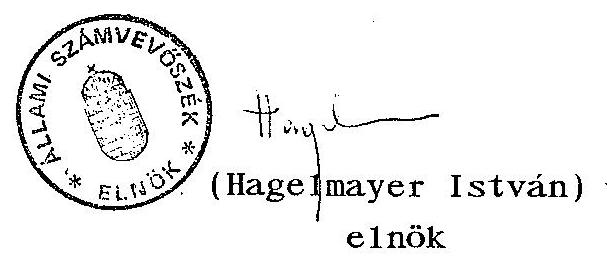

---

# M E L L É K L E T E K 

az állam vállalkozói vagyona nyilvántartási és információs rendszere c. V-22-42/1992/93. sz. Jelentéshez

Budapest, 1993. március

---

# T A R T A L O M J E G Y Z É K 

1. sz. melléklet

Pénzügyminisztérium
2. sz. melléklet

Ipari és Kereskedelmi Minisztérium
3. sz. melléklet

Földmũvelésügyi Minisztérium
4. sz. melléklet

ÁVÜ-ÁV Rt. Együttmüködési egyezség és megállapodás
5. sz. melléklet

A Központi Statisztikai Hivatal kezdeményezései a nemzetgazdasági teljesitmények adatforrásainak biztosítására
6. sz. melléklet

APEH Elnökének levele a Pénzügyminisztérium helyettes államtitkárának
7. sz. melléklet

APEH Elnökének levele valamennyi Megyei Igazgatóságnak
8. sz. melléklet

Társasági adóbevallási üres adatlap

---

# Pénzügyminisztérium 

Az információs rendszer PM-re vonatkozó jogszabályi háttere

Az állami pénzügyekröl szóló 1979. évi II. törvény hatályban lévô 52. §-ának d) pontja szerint "a számvitel feladata, hogy lehetővé tegye a gazdálkodás ellenőrzését, s összefoglaló gazdasági szánítások készítését."

A törvény 59. §-ának (1) bekezdése szerint "a pénzügyi információrendszert a népgazdasági információrendszer részeként úgy kell kialakítani, hogy segítse a pénzügyi folyamatok megtervezését és alkalmas legyen azok ellenőrzésére."

A törvény 60. §-a szerint "A mérlegbeszámolót, a költségvetési beszámolót és a pénzügyi információrendszer egyéb elemeit össze kell hangolni az állami statisztikával és a népgazdasági tervezés információrendszerével, s alkalmassá kell tenni népgazdasági számításoknak az elkészítésére is."

Az állami pénzügyekről szóló.törvény a számvite1i- és pénzügyi információrendszer fogalmi kategóriáját használja. A számvite1i információrendszer 1991. év végéig funkcionált is.

Az 1992. évi XXXVIII. tv. az államháztartásról bevezette az államháztartás információs rendszerének intézményét, anélkül, hogy körvonalazná ennek fogalmát, tartalmát. A törvény 114. paragrafusa elöírja, hogy az információs rendszer müködéséről, fejlesztéséről a Kormány gondoskodik. Ezt a feladatot a pénzügyminiszter feladat- és hatásköréről szóló, az 50/1990. (IX.15.) Korm. rendelet a következöképpen rendezi:

---

"12. § A pénzügyminiszter - a Központi Statisztikai Hivatal elnökével együttmüködve - kialakítja, szabályozza és müködteti az államháztartás minden alrendszerét magában foglaló államháztartási információs rendszert." Feladata továbbá, hogy a KSH elnökével egyetértésben szabályozza a pénzügyi folyamatokkal kapcsolatos adatszolgáltatás rendszerét. A Kormányrendelet 1991. évi módosítása a pénzügyminiszter feladatai közül hatályon kívül helyezte a mérlegbeszámolók (beszámolás) adatszolgáltatási rendszerének feladatát.

A mérlegbeszámolók adatainak összegzése, feldolgozása az APEH feladatát képezi a ma hatályos szabályozások alapján. A számviteli törvény 93. §-ának (2) bekezdése előirja, hogy 1992. és 1993. évben a területileg illetékes adóhatóságnak is le kell adni az éves beszámoló mérlegét és eredménykimutatását.

A számviteli törvény hatálybalépésével technikai és tartalmi változások következtek be a gazdálkodói szférából származó információk tekintetében.

# Technikai változás: 

- az éves beszámoló elkészítésének és leadásának határideje kitolódott a tárgyévet követő év május 31 -ére;
- az APEH-hoz csak 1992. és 1993. években ke11 benyújtani az éves beszámoló mérleg- és eredménykimutatását, a kiegészítő mellékletet pedig ezekben az években sem;
- az éves beszámoló letéti példányát a cégbíróságokhoz ke11 beadni, a cégbíróságoknak viszont ezek feldolgozására törvényi kötelezettségük nincs.

---

Tartalmi változások:

- termelési, létszám és jövedelmi adatok a mérlegben és eredménykimutatásban nem szerepelnek;
- a tulajdonosokra vonatkozó adatokat csak a kiegészitő me1léklet tartalmazza;
- megváltozott a saját vagyon fogalma és összetétele, a saját tőke (jegyzett tőke, tőketartalék, eredménytartalék, előző évek áthozott vesztesége, mérleg szerinti eredmény) kategóriát vezette be a törvény, stb.

A törvény indoklásában az információs rendszerre vonatkozóan a következő magyarázat szerepel:
"A jelenlegi számviteli rendszer egyik sajátossága az, hogy a számviteli információk képezik a nemzetgazdasági információrendszer alapvetö adatbázisát. ... elsődlegesen a gazdaságirányitás céljait szolgálták ... A piacgazdasági viszonyok között a számvitelnek a piac szereplői részére kell hasznos és szükséges, megbizható információkat szolgáltatni. ...A nemzetgazdaság számára szükséges információk biztosításához új információs rendszert szükséges kialakítani, amelyhez a könyvvitelben rögzített információk is felhasználhatók, de azok összegyüjtése, bekérése nem az éves beszámolók összesítésével oldható meg.

Az új információs rendszer megfelelő funkcionálásáig a Javas1at lehetővé teszi, hogy a beszámolók 1992-1993. években még összesítésre kerüljenek ...a jelenlegitől eltérő, megváltozott tartalommal.

---

A számviteli törvény szabályozása azt is jelenti, hogy a hatályba lépésével egyidejűleg új, a jelenlegitől rendszerében is eltérő nyereségadó törvényt kell alkotni."

A jogszabályokból az alábbi következtetések vonhatók le:

1. Az állami pénzügyekről szóló törvény és az államháztartási törvény információs rendszerre vonatkozó előírásai között nincs meg az összhang.
2. A hatályos törvények megkülönböztetnek számviteli, pénzügyi, illetve államháztartási információs rendszert. Ez utóbbiért a Kormány, illetve a KSH elnökével együttmüködve a pénzügyminiszter a felelős.
3. A számviteli törvény indokolása szerint már nincs szükség a számviteli információs rendszer müködtetésére. E helyett ki kell alakítani egy új információs rendszert. Ezt tartalmi részletezés és felelős megnevezése nélkül mondja ki.
4. A Pénzügyminisztériumban nyilvántartást a költségvetési szervekről, a kincstári vagyonról, az államadósságról, a kezességvállalásról, illetve jogcímek szerint a központi költségvetés bevételeit érintő kedvezményekről kell vezetni.

A Pénzügyminisztériumban lefolytatott konzultációk alapján tapasztaltak összegzése

1. Csak az államháztartás információs rendszerére vonatkozóan van törvényi kötelezettségük, amely a feladatköröket is megnevezi. Az államháztartás információs rendszere azonban nem képezi a jelen vizsgálat tárgyát. Valószínűsíthetően azonban pénzforgalmi szemléletü információs

---

rendszert jelent, amihez a gazdálkodói szféra a bevételeken (adó, vám, illeték, stb.) keresztül kapcsolódik. A nemzeti számlákon megjelenő információk összevont adatokat tartalmaznak, a gazdasági események elemzésére kevéssé alkalmasak.
2. A hatályos törvények és rendeletek nem írják eló a gazdálkodói szféra eredményszemléletü tényadatainak feldolgozását. A gazdasági események, a tulajdonosi szerkezet alakulására 1992-töl nincs kialakítva szabályozott információs rendszer.
3. A gazdálkodói szférát érintően a PM-ben három területről lehetett információt begyűjteni: az adóigazgatás, a csőd-, felszámolás-, megszűnés, valamint a privatizáció helyzetéről.

# 3.1. Adóigazgatás 

Az`éves beszámoló elkészítési időpontjának a tárgyévet követő május 31-i leadási határideje miatt átmeneti intézkedésként 1993. február 28-áig kell beküldeniük az adóalanyoknak elözetes adóbevallásukat. A PM egyes szakterületei az elözetes adóbevallásból kívánnak információkhoz jutni a makroszintű számításokhoz, illetve a költségvetés tervezési munkálataihoz.

Az adóigazgatásról szóló törvény szerint az APEH azonban csak az adóalap megállapításához, a mértékhez, a veszteséghez, kedvezményhez kapcsolódó információk bekérésére jogosult. Mivel azonban a kedvezmények döntően a vegyes tulajdonú szervezetekhez kötődnek, ezért úgy itélik meg, hogy az elözetes adóbevallásban kérhetnek adatokat a tu-

---

lajdonosi arányokra vonatkozóan is. A tulajdonosi helyzetröl tehát az elözetes adóbevallásból kiván a PM információhoz jutni.

Az adóbevallások feldolgozására vonatkozó konkrét igényeit a Pénzügyminisztérium még nem határozta meg az APEH-nek.
3.2. Csőd és felszámolási eljárások információs rendszere

A csődtörvény 1992. január 1-jei hatálybalépését követően a PM kialakította és megszervezte ezzel kapcsolatos makrogazdasági információs rendszerét.

Többek között az erre a célra is létrehozott tárcaközi bizottság munkamegosztása szerint:

- az Igazságügyi Minisztérium biztosítja a kezdeményezett és a folyamatban lévő csőd- és felszámolási eljárások számszerủ alakulását és struktúráját tartalmazó adatokát;
- az állami hitelezők (APEH, Vám és Pénzügyőrség Országos Parancsnoksága, Állami Fejlesztési Intézet) és a társadalombiztosítás egységes szempontrendszer alapján adnak tájékoztatást a csődtárgyalások tapasztalatairól, a megkötött egyezségekről és az adott engedményekről;
- az ágazati tárcák a kialakított saját megfigyelési rendszerük alapján elemzik az ágazatok helyzetét, tájékoztatást nyújtanak azok állásáról;
- a KSH rendelkezésre bocsátja a saját feldolgozásából származó információkat;

---

- a Pénzügyminisztérium a fentiekben részletezett körböl származó havi gyakoriságú információkat összesíti, elvégzi a bejelentett és a folyamatban lévő csőd- és felszámolási eljárás alatt lévő szervezetek 1991. évi mérlegadatai alapján a legfontosabb gazdasági mutatók (p1. termelési érték, nettó árbevétel, eredmény, vagyon, adótartozások, követelések, tartozások) összegezését és mindezek alapján értékelést, elemzést készít.

1993. évre a Kormány által jóváhagyott Országos Statisztikai Adatgyüjtési Program szerint a PM havonta ad tájékoztatást a KSH-nak a csőd- és felszámolási eljárások alá került gazdálkodó szervezetek számáról. Ezeket az adatokat a PM az Igazságügyi Minisztériumtól kapja meg.
3.3 A privatizáció helyzetéröl havi, titkosnak minősített információs jelentést kap a PM, továbbá közvetlen konzultációs kapcsolat áll fenn közte és az ÁVÜ között.
4. Egyéb tapasztalatok

- Az 1026/1992. (V.22.) Korm. határozata a közigazgatás korszerűsítéséről előirta a miniszterek számára, hogy a felelősségi körükbe tartozó területek korszerűsítési teendőinek meghatározására dolgozzanak ki javaslatokat. A Pénzügyminisztérium javaslata nem készült el, azt határidőre a Miniszterelnöki Hivatalba nem küldték meg. (Felelősét a Minisztériumban megtalálni nem lehetett, a PM Informatikai és Módszertani Intézetének igazgatója tud a feladatról, de kidolgozására a Minisztériumtól utasitást nem kapott. Azt, hogy a vizsgálat szempontjából a témának van-e jelentősége, a felelős és az el nem készült anyag hiányában megállapítani nem lehetett.)

---

- A PM által 1992. októberében kiadott cselekvési program a kormányzat 1993-94. évi gazdaságpolitikai feladatairól a statisztikai információs rendszer címszó alatt meghatározza azokat a feladatokat és célokat is, amelyek az ÁSZ vizsgálat tárgyát képeznék:
= a gazdaságpolitikai döntéshozatalhoz nélkülözhetetlen információs rendszer kiépítése,
= az üzleti élet, a vállalkozások, a külföldi befektetők számára szükséges statisztikák biztosítása.

A Cselekvési program e feladatokhoz felelőst nem rendel és időbeni ütemezését, a szabályozás módját sem határozza meg.

# összegezés 

A Pénzügyminisztériumnak törvényi kötelezettsége csak az ál1amháztartás információs rendszerének kialakításában és müködtetésében van.

A szakfőosztályok véleménye szerint szükség lenne feladataik ellátáshoz a gazdasági események alakulásának (ex-port-import), a tulajdonosi szerkezet (állami-magán, be1föl-di-külföldi, külföldi esetében az országok szerinti megoszlás) változásának megfigyelésére.

Az éves beszámoló adatainak összesítését általában nem tartják szükségesnek a megváltozott tartalma és időeltolódása miatt. A számukra szükséges információkat az 1993. február 28-áig nyújtandó előzetes adóbevallásból kivánják beszerezni. Bár ezzel kapcsolatban fenntartásaik vannak a feldolgozás idejét illetően is. Április-május előtt ezek összesítése nem

---

28-áig nyújtandó előzetes adóbeval1ásból kívánják beszerezni. Bár ezzel kapcsolatban fenntartásaik vannak a feldolgozás idejét illetően is. Április-május előtt ezek összesitése nem várható, másrészt miután előzetes adatokat tartalmaz, megbízhatóságuk is megkérdőjelezhető. A végleges adóbevallás összesitését is szükségesnek tartják munkájukhoz. Hiányo1nak egy olyan pénzügyi információs rendszert, ame1ybő1 bizonyos gazdasági eseményeket követő pénzmozgások kiolvashatók megfelelő csoportosításban, nemcsak összevont adatok formájában.

---

Ipari és Kereskedelmi Minisztérium

A részben vagy teljesen tartósan állami tulajdonban maradó gazdálkodó szervezetekről szóló 126/1992. (VIII.28.) Korm. rendelet nem jelölte ki az ipari és kereskedelmi minisztert állami tulajdonosi jogok gyakorlásával az országos közszolgáltató tevékenységet ellátó szervezeteknél. A jelzett kormányrendelet értelmében valamennyi tulajdonosi joga megszűnt az IKM-nek. Egyedi kormánydöntés értelmében egyedül a Corvin Bank Rt.-ben maradt meg az IKM tulajdonosi-részvényesi jogosultsága - $60 \%$-os állami tulajdonlás mellett. Sem az ÁvÜ-röl, sem az Áv Rt-röl szóló törvény hatálya nem terjed ki a Corvin Bank Rt-re. A Corvin Bank Rt. a 126/1992. kormányhatározatban sem szerepel. Ennek következtében a Minisztérium információs rendszere a Minisztérium szorosan vett ágazati feladataival, az ágazathoz tartozó állami vagyon privatizálásával, a csődeljárással, felszámolással, végelszámolással kapcsolatos feladatok ellátását szolgálja. A Minisztérium számára új feladatok keletkeztek az ÁV Rt megalakulását követően. A Minisztérium véleményezi az ÁV Rt-hez tartozó gazdasági társaságokban a tartós állami tulajdon fenntartását, bővítését vagy megszüntetését, a megsokszorozódott tevékenységi kör megválasztását, módosítását. Együttmüködik az ÁV Rt-vel a koncessziós pályázatok kiírásában, illetve a koncessziós szerződések szempontjainak megválasztásában. Véleményt nyilvánít az országos közszolgálati feladatokat ellátó kizárólagos vagy többségi állami tulajdonú gazdasági társaságok tevékenységének megszüntetéséről vagy ilyen társaságok létrehozásáról.

Mint az ágazatért felelős minisztériumnak, segítenie kell az ÁvÜ-vel és az ÁV Rt-vel történő együttmüködésben az időlegesen állami tulajdonban lévő vagyon értékesítését (itt új feladatai a minisztériumnak nem keletkeztek), a hazai tulajdonosok részvéte-

---

lét segitő megoldások választékának bővitését, a privatizációt övező közgazdasági környezet (adó-, vám-, és hitelrendszer) kialakítását.

Az IKM államigazgatási irányítása alatt álló mintegy 60 vállalat az 1992. évi LIV. törvény elöírásai alapján az ÁvÜ-höz került több száz vállalati tanácsi irányítású vállalattal együtt, 1992. augusztus 28-i hatállyal. Az IKM és az ÁvÜ 1992. augusztus 28-án közös jegyzőkönyvben, határidővel rögzítették az 1992. évi LIV. törvénnyel kapcsolatos közös feladatokat. A törvény az alapítói és a munkáltatói jogokat az ÁvÜ-höz delegálja.
1992. szeptember 2-án az IKM átadta az ÁvÜ-nek

- az alapítói jogok gyakorlásával kapcsolatos anyagokat (vállalatok létesítő határozatai),
- a munkáltatói jogokkal kapcsolatos vállalatvezetői személyi anyagokat, a VT-s vállalatokba delegált IKM dolgozók névsorát, a felügyelő bizottsággal müködő vállalatok listáját, e bizottságok összetételét és a bizottságokra vonatkozó iratanyagot,*a vállalati premizálási elöírásokat

1992. október 2-án az IKM átadta az ÁvÜ-nek az IKM Ellenőrzési Főosztálya által az átadott feladatkörök gyakorlása során 1992. évben végzett vizsgálatok listáját.

A vagyonátadást leírt dokumentumok átadása képezte, külön vagyonlista vagy összesítő nem készült.

A felek a két intézmény közötti további közös (privatizáció) munkára vonatkozó együttmüködési megállapodás tervezetet készítettek.

---

A közigazgatás korszerűsítésérő1 szóló 1026/1992.(V.12.) Korm. határozat alapján az IKM 1992. július 31-ig elkészítette informatikai rendszerének fejlesztési koncepcióját. A koncepció a Minisztérium jelenlegi számítógépállományáról azt állapítja meg, hogy "javarészt nem felel meg technikailag és fizikailag a követelményeknek".

Az ágazatirányításhoz szükséges statisztikai adatbázisok 1992. évben lényegesen hosszabb idő alatt készültek el és korlátozottabb mértékben állnak a Minisztérium rendelkezésére, mint a korábbi években. Ennek okát az új statisztikai és adatvédelmi törvény életbelépésének elmaradásában - ennek következtében az OSAP sem müködik -, valamint az adatszolgáltatási fegyelem rendkívüli módú fellazulásában látják. Az információs rendszerekhez szükséges havi, negyedéves és éves statisztikai adatállományok átadá-sát-átvételét folyamatosan sürgetik a KSH illetékeseinél. Az ágazat irányításhoz nélkülözhetetlen 1991. évre vonatkozó ágazati statisztikai évkönyvet a KSH az ÁSZ vizsgálat időpontjáig még nem készítette el. Nem történt meg az ágazat 1991. évi mérleg adatainak 1991. évi rendező mérleg szerinti - az 1992. és 1993. évi ágazati döntéseket megalapozó, összehasonlítást biztosító-feldolgozása sem. Folyamatban van viszont a cégnyilvántartás és a külkereskedelmi forgalom számítógépes adatfeldolgozásának igényszintű kialakítása. Az ÁVÜ információs rendszerének tartalmáról nem rendelkeznek pontos információval, mely a privatizációhoz szükséges ágazati egyeztetést nehezíti meg.

A gazdálkodó szervek mérleg adatait 1991-ig az APEH dolgozta fel és küldte meg a minisztériumoknak is. Az APEH feldolgozott adatállománya csak 1991-ig áll a tárca rendelkezésére, mivel 1992. évtől az APEH az új számviteli törvény szerint nem köteles a vállalkozások feldolgozott mérlegadatait a minisztériumok részére megadni. Az új számviteli törvény szerint a vállalkozások mérleg és pénzügyi adatai, valamint üzleti jelentése a korábbi

---

évekhez viszonyítva csak később - minden év május 31-jét követően - és csak a cégbíróságoknál állnak bármely szerv rendelkezésére. A Cégbíróság a mérlegadatok feldolgozására nem kötelezett, így csak bérmunkában - és csak jelentős késéssel - lesz módja a minisztériumnak a korábbi mélységű mérleg és pénzügyi adatok nyerésére, saját gép kapacitás hiányában. A pótlólagos feldolgozás kérdésében a Minisztérium még nem döntött, de tudatában van annak, hogy a jövőben a nemzetgazdasági számlák (p1. GDP), a közgazdasági rövid és hosszú távú modelĺezésnél szükséges adatbázisok megléte kérdésessé vált. A Minisztérium a finanszirozási lehetőségek ismeretében 1992. december 31-ig készíti el rövid távú informatikai fejlesztési feladattervét és - az összkormányzati informatikai rendszerekre és a korszerü információs technológia alapjainak IKM-ben való megteremtésére figyelemmel folyamatosan tervezi informatikai rendszere fejlesztésének koordinálását.

A Minisztérium külön statisztikai beszámolót rendelt el a következő esetekben:

- a gazdasági társasággá történő átalakulásról 1991-töl minden jelentős információt bekérnek a vállalati privatizációhoz szükséges ágazati szakvélemény kialakításához;
- a gazdasági társaságba bevitt vagyonról (1990-töl), a bérbe és lizingbe adott állóeszközökről és a leányvállalatba befektetett vagyonról;
- az 1991. évi IL. tv. hatálya alá tartozó gazdálkodó szervezetekről (csőde1járás, felszámolás, kötelezettségek).

A Minisztérium már elkészítette 1993. évi OSAP-jának tervezetét. Saját hatáskörben tervezik az energia és egyéb külön megfigyelések adatgyűjtését. A KSH-tól kapják meg - de késve - az ipar, belke-

---

reskedelem, idegenforgalom, építőipar, beruházás, munkaügy információit. A NGKM-től kapják meg a külkereskedelmi termékforgalomra vonatkozó adatokat.

A Minisztériumnak az ágazathoz tartozó vagyonról, annak jövedelmezőségéről folyamatos információt kell kapnia az ÁV Rt-től, az ÁvÜ-től szakmai javaslatai és döntései megalapozottsága érdekében. Ennek konkrét formáját e felekkel tervezett együttmüködési megállapodásban célszerű lenne rögzíteni.

---

# Földmüvelésügyi Minisztérium 

A Földmüvelésügyi Minisztérium felügyelete alá tartozó állami vállalkozói vagyon köre döntően az élelmiszeripari vállalatokból, állami gazdaságokból és állami erdőgazdaságokból, valamint a mezőgazdasági szolgáltató vállalati körből állt.

Az állami vállalkozói vagyont két fő csoportra lehet osztani a vezetési szerkezet szerint (a régi struktúrában):

- önkormányzati típusú vagyon
(1991. évi állapot kb. 230 vállalat)
- államigazgatási típusú vagyon
(kb. 100 vállalat)

Az információs rendszer tekintetében az önkormányzati típusú vállalatoknak - a régi számviteli rend előírásai szerint - a mérlegbeszámolót nem kellett megküldeni az ágazati felügyeletet ellátó minisztériumnak.

Az államigazgatási felügyelet alatt álló vállalati kör a mérlegbeszámoló jelentéseket a minisztérium szakfelügyeletet gyakorló főosztályainak küldte meg.

A Minisztérium az APEH-e1 kötött megállapodás alapján megkapta a tárca hatókörébe tartozó valamennyi általuk kiválasztott vállalat mérlegbeszámolóját. A tárca mind a két vezetési szerkezet szerint müködő vállalatának mérleg adataival rendelkezett. Az APEH-től mágneses adathordozón kapott adatbázis két szempontból volt előnyös. Egyrészt a Minisztériumnak lehetősége volt a gépi

---

adatfeldolgozásra, me1yet a minisztérium háttérintézménye az Agrárgazdasági Kutató és Informatikai Intézete végzett, másrészt az APEH részére beküldött anyagban a vállalatok bizonyos végsõ korrekciót végezhettek, és igy ez az anyag pontosabb volt, mint amit elözöleg a Minisztériumhoz eljuttattak.

A vagyonra vonatkozó adatok közül a saját vagyont, s azzal kapcsolatos fajlagos mutatószámokat évente összesítették és adták ki. Ugyancsak összesítették a földvagyonra (összes termöterület hektár és aranykorona) vonatkozó adatokat.

A Minisztérium 1992. november 2-án megküldte a Miniszterelnöki Hivatal részére a számitógépes informatikai rendszerének kialakításáról szóló, jóváhagyott koncepciót (az 1026/1992.(V.12.) Korm. határozat 9/b. pontja alapján).

A Minisztérium felügyelete alá tartozó állami vállalatok átkerülése az ÁvÜ-höz, illetve az ÁV Rt-hez

1. Az állámi gazdaságok 1985-töl 1992-ig önkormányzati típusu vezetési» forma szerint müködtek.

Az ÁvÜ Igazgatótanácsának döntése alapján 1992. II.-III. hóban államigazgatási felügyelet alá kerültek (1990. évi VII. tv. 10. paragrafus e) pontja alapján), s igy vagyonuk felett automatikusan az ÁvÜ rendelkezik. A Minisztérium átadta az ÁvÜ-nek az állami gazdaságok vezetőinek szemé1yi anyagait. Az állami gazdaságok alapító okiratait nem adták át, hanem a Minisztériumban irattározzák őket.
Az állami gazdaságok gazdálkodására vonatkozó vagyoni információkat az ÁvÜ közvetlenül a gazdaságoktól bekérte, a náluk található alapító okiratokkal együtt.

---

A 126/1992. (VIII.28.) Korm. r. 1. sz. mellékletében felsorolt Állami Gazdaságokra vonatkozó anyagot az ÁVÜ közvetlenül bocsátja az ÁV Rt részére.
2. Az időlegesen állami tulajdonban lévő vagyon értékesítésérő1, hasznosításáról és véde1mérő1 rende1kező 1992. évi LIV. tv. hatálya alá tartozó állami vállalatok tekintetében az állam tulajdonosi jogát a Vagyonügynökség gyakorolja.

A törvény végrehajtása érdekében a Minisztérium felvette a kapcsolatot az ÁvÜ-ve1, s az 1992. szeptember 1-jei jegyzőkönyv alapján 1992. szeptember 25-én írásban átadta 66 db eddig államigazgatási felügyelet alatt álló állami vállalat (zömében élelmiszeripari v.) alapítására vonatkozó dokumentumát és az 1991. évi vagyonmérleget.

A Minisztérium jelenleg építi ki az ÁvÜ-ve1 az információs rendszer szabályozását is tartalmazó együttmüködési megállapodást.
3. A részben vagy teljesen tartósan állami tulajdonban maradó gazdálkodó szervezetekről szóló 126/1992. (VIII.28.) Korm. rendelet 1. sz. mellékletében nevesítve vannak azok az állami gazdaságok, illetve erdőgazdaságok, melyek az ÁV Rt-hez kerülnek. A Minisztérium az ezekre a vállalatokra vonatkozó dokumentumokat 1992. október 26-án adta át az ÁV Rt részére.

A Minisztérium kezdeményezi a nevezett kormányrendelet módosítását, hogy az 1. sz. mellékletben lévő Zöldségtermesztési Kutató Intézet Fejlesztő Vállalat és a Gyümölcs- és Disznövénytermesztési Kutató Fejlesztő Vállalat müködtetését a költségvetési szférában lehessen biztosítani, valamint a Szikszói Állami Gazdaság bevitelét a rendelet hatálya alá, 25 \% +1 szavazat tartós állami tulajdoni résszel.

---

4. A 126/1992. (VIII.28.) Korm. rendelet 2. sz. melléklete szerint a földmüvelésügyi miniszter gyakorolja az állami tulajdonosi jogokat az alábbi három vállalat esetében:

- Állatifehérje Takarmányokat Előállító Vállalat (ATEV), - Állattenyésztési Teljesítményvizsgáló Vállalat (ÁTV), - Országos Mesterséges Termékenyítő Vállalat (OMTV).

Az ATEV eddig is államigazgatási felügyelet alatt állt, s mérlegét, illetve annak mellékleteit közvetlenül megküldte a Minisztériumnak.

A másik két vállalat jogelőd vállalatai önkormányzati típusu vállalatok voltak, melyek mérlegüket illetve a mellékleteket a APEH-nak küldték meg, és ettől a szervtől kapta meg az adatokat a Minisztérium.
1992. évben mindhárom vállalat megküldi a mérleg-beszámolóját a Minisztériumnak.

E vállalatokra vonatkozóan az új adatszolgáltatási rendszer kidolgozása folyamatban van, me1yet 1993. január 1-től kívánnak bevezetni. Ennek a rendszernek az adatbázisa szélesebb lesz az eddigieknél, ugyanis a Minisztérium tulajdonosi és felügyeleti jogaiból eredően egyrészt a vagyonra (vagyonvédelemre, vagyonértékesítésre, a vállalat átalakulására) másrészt a tevékenységi körre stb. kívánnak adatokat bekérni a vállalatoktól, s azokat feldolgozni.

A Minisztérium kivánja kezdeményezni a 126/1992.(VIII.28.) Korm. rendelet (2. sz. melléklet) módosítását, hogy a földmérési és térképészeti vállalatok a földmüvelésügyi miniszter felügyelete alá kerüljenek, minimum $25 \%+1$ szavazat tartós állami tulajdonnal.

---

5. Jelenleg a Minisztérium számítógépes rendszerében megtalálhatók az erdó- és fafeldolgozó gazdaságok, valamint állami gazdaságok és élelmiszeripari állami vállalatok 1991. évi vagyonával kapcsolatos információs anyagok.

---

# ÁVÜ - ÁV Rt   EGYÜTTMÚKÖDÉSI EGYESSÉG 

az 1992. évi LIII és LIV törvények és 126/1992 Kormányrendelet szerint az ÁV Rt-hez tartozó gazdálkodó szervezetek ÁVƯ - ÁV Rt átadás-átvétel folyamatára és az azt követỏ időszak magatartási szabályaira vonatkozóan.

1. ÁVƯ és ÁV Rt képviselőik útján kijelentik, hogy az ÁV Rt-hez tartozó gazdálkodó szervezetek ÁVƯ - ÁV Rt átadás-átvételi folyamatában mindenben törekszenek az elvárható teljességre, gyorsaságra és egyetértő álláspont kialakítására. Ennek érdekében kötött Megállapodásnak mindenben eleget tesznek.
2. Az átadás-átvételi jegyzőkönyvekben adott gazdálkodó szervezetekre ideiglenes megállapodást kötnek az ügyek folyamatos továbbvitele érdekében, mely megállapodások nem érinthetik a tulajdonosi jogok gyakorlását, azaz az idézett törvény által az ÁV Rt-hez telepített jogot illetve kötelességet.
3. Az ideiglenes megállapodások érvénye az ÁVƯ IT - ÁV Rt Igazgatóság egyiittes határozatán alapuló végleges állásfoglalás kialakításáig tart, azt követôen a továbbiakban csak a Kormány LIV törvény szerinti kötelezése alapján járhat el az ÁVƯ az ÁV Rt nevében, olyan ügyben, melyre megbízást kap.
4. Az ÁVƯ minden egyes gazdálkodó szervezet esetében a felelős örzés szabályai szerint jogosult és köteles eljárni az átadás-átvételi jegyzőkönyv aláírásáig.
Ezt követően az ÁV Rt a magyar jog általános jogutódlási gyakorlata szerint az adott gazdasági szervezet vonatkozásában minden tekintetben ÁVƯ helyébe lép, minden harmadik személlyel fennálló szerződés, megállapodás, vállalás vonatkozásában az ÁVƯ jogutódjaként helytáll, felel, és teljesít; nem az ÁVƯ képviseletében, helyében, nevében, hanem alanyi jogon, kötelezettként.

---

5. Az átadás-átvételi eljárás hibájából, elmaradt informálásból, az idézett törvény szerint átszállt jogok és kötelezettségek teljesitési feltételeinek hiányából eredó, az ÁVÜ-re, az ÁV Rt-re, valamint különösen harmadik személyre vonatkozólag az ÁVÜ és az ÁV Rt közösen minden alkalmazható eszközzel törekednek a kedvezőtlen következmények megelőzésére.

Az esetben amikor megegyezés nem jön létre, a privatizációért felelős miniszter dönt.

Egymás ellen semilyen esetben - harmadik személy érdekében álló esetet is beleértve - nem folyamadnak peres eljárási eszközhöz.

Harmadik személy által indított perben álláspontjaikat jelen Együttmüködési Egyesség szelleméből következően elvárhatóan egyeztetik, következményekért egyetemlegesen felelnek.

Minden ilyen esetben a jogutódlás szerint tulajdonba lépett ÁV Rt a hivatalos kötelezett alany, de ÁVÜ minden szükséges és lehetséges közremüködésre kötelezi magát jelen Együttmüködési Egyességben.

Budapest, 1992. október 19.

ÁVÜ képviseletében
ÁV Rt képviseletében
dr. Csepi Lajos
ügyvezető igazgató
dr. Teleki Pál
mb. vezérigazgató

---

Az 1992. évi LIII és LIV törvény és a 126/1992 sz. Kormányrendelet szerint a részben vagy teljesen tartósan állami tulajdonban maradó vagyoni kör vonatkozásában a tulajdonosi jog gyakorlása tekintetében bekövetkező változás zökkenőmentes lebonyolítása érdekében az ÁVƯ és az ÁV Rt az alábbi átadásátvételi

# MEGÁLLAPODÁST 

köti.

1. A 126/1992. Kormányrendeletben szereplő ÁV Rt vagyoni kört érintő valamennyi 1992. augusztus 28-a utáni ÁVƯ-nél történt tulajdonosi állásfoglalást, döntést, stb. ÁVƯ külön kigyüjti. Ezekröl rövid elemzést készít, melyben állást foglal azt illetően, hogy ezek a "felelős örzés" körében köteles, vagy azt meghaladó intézkedések-e.
ÁV Rt is kialakítja erre vonatkozó véleményét. Véleménykülönbség esetén az elemzést a vélemények indoklásával dr. Szabó Tamás a privatizációért felelős miniszter úr elé terjesztik.

Addig azonnali hatállyal fel kell függeszteni az augusztus 28 óta hozott döntések végrehajtását, beleértve bármilyen jellegű értesítést, publikálást is. (érintett szervezetek, személyek, hatóságok, közvélemény, stb.)

A felfüggesztés feloldható azon ügyekben, melyekben ÁVƯ - ÁV Rt egyetért. (illetve amelyek esetében dr. Szabó Tamás az illető döntést a "felelős örzés" körébe tartozónak minősíti. Ezek tekintetében az ÁV Rt Igazgatóságának - a jogutódlás tényéből következően - a következményeket illetően ugyanolyan elfogadási kötelezettsége áll fenn, mint az augusztus 28 előtt született ÁVƯ döntések vonatkozásában.)

A többi bármely más döntés (állásfoglalás, kötelezettségvállalás, szerződés, stb) csak akkor válik érvényessé, ha azokkal az ÁV Rt Igazgatóság egyetért.

---

2. Az ÁVƯ - ÁV Rt átadás-átvétel érdekében a 126/1992 Kormányrendelet 1. sz. mellékletében felsorolt gazdálkodó szervezetek vonatkozásában az ÁVƯ a dokumentumokat szervezetenként összeállítja és egyenkénti átadás-átvételi jegyzőkönyvvel előkészíti átadásra, beleértve különösen:

- az érvényes Alapitó Okiratot,
- minden rendelkezésre álló - különböző keltezésű - mérleget, átalakult (már társasági formájú) gazdálkodó szervezetre az átalakulás előtti mérleget és a javasolt, elfogadott, bejegyzett tőkestruktúrát;
- a vagyonelvonásról, vagyon apportálásról, bármely jellegű értékesítésről, vagyonátadásról, és minden oly dokumentumot, mely vagyonban bekövetkezett változásról tanuskodik;
- valamennyi idetartozó érvényes vagy lejárt tanácsadói, vagyonértékelő, auditáló, átvilágító, vagyonkezelő, stb. tevékenységre kötött, szerződést, külön összesítve a már lejárt és kifizetett, illetve folyamatban lévő szerződéseket, megjelölve a múlt és jövőbeni kifizetések forrásait (vállalattal fizettetett, ÁVƯ priv. költségből, PHARE terhére, stb.), és azok teljesítéséről szóló vagy a nem teljesítés okát igazoló dokumentumot.
- valamennyi garancia és kezességvállalási megállapodást és időpontját, a vállalt felelősség formáját (készfizetés, portfólió, stb.)
- privatizációs tranzakciókról az összes érdemleges dokumentumot időrendben (belső vezetői értekezleti előterjesztés, ÁVƯ IT előterjesztés, döntés, kiírás, ajánlat, illetve tenderkiírás, kiértékelési bizonylatok, szerződés, stb), külön figyelemfelhívással a bejegyzett akcióknál esetleges opciókra, és a folyamatban lévőknél a felelős tulajdonosi magatartásból következő lépésre, illetve jogkövetkezménnyel járó határidőkre.
- a gazdálkodó szervezettel az ÁVƯ-ben eddig foglalkozott személyek nevét, és ha már az ÁVƯ-vel nincsenek munkaviszonyban, akkor az illetékes igazgatóság adott ügyben átadásig illetékes ügyintézőjét
- ideiglenes megállapodás tervezetét
- teljességi nyilatkozatot

Az átadandó dokumentáció szervezetenként ennél kevesebb tartalmú nem lehet. Értelemszerűen kiegészül tárgybani levelezéssel és egyéb rendelkezésre álló dokumentumokkal.

---

Az átadás az adott tételre érvényesnek tekinthető, ha az átadás-átvételi jegyzőkönyvet aláirja az átadó, átvevő és az ellenőr. Átvevő és/vagy ellenőr megtagadhatja az aláirást

- minimális tartalom észlelt hiánya, különösen teljességi nyilatkozat hiánya esetén.
- ideiglenes megállapodás tervezetét illető véleménykülönbség esetén.
Átvevő és ellenőr hiánypótlást kérhet, egyedi megítélés alapján adott határidejű hiánypótlás kikötésével aláírhatja a jegyzőkönyvet. ÁVƯ felelős örzési kötelezettsége az átadás-átvételi jegyzőkönyv aláírásáig áll fenn.

Az átadás-átvételi jegyzőkönyvben kikötött ideiglenes megállapodás a folyamatban lévő ügyek súlyát, ütemezését, stb. figyelembe véve többféle lehet. A mérlegelés egyedi ügyenként történik, a javaslat egyetértés esetén határozattá válik, de véleménykülönbség esetén dr. Szabó Tamás miniszter úr eldöntését igényli.

A javaslat lehet:

- az ügy az adott jelenlegi ügyvivő személy gondozásában folytatódik, aki azonban ezen ügy szempontjából az ideiglenes megállapodás érvényességi ideje alatt nem ÁVƯ hivatali felettese, hanem az ÁV Rt menedzsmentnek irányítása alatt áll, és annak számol be.
- az üggyel foglalkozó személy az ideiglenes megállapodás időtartamára ÁVƯ-ben lévő többi feladatának végzése alól dr. Szabó Tamás minisztertól felmentett, személyre szóló megbízással rendelkezik az ügyek vitelére és ÁV Rt felé beszámolási kötelezettségre.
- minden érintett személy egyetértése esetén az üggyel foglalkozó személy az ÁVƯ-tól közös megegyezéssel kilép, ÁV Rt alkalmazottá válik.

ÁV Rt kijelenti, hogy 1 éven belül nem alkalmaz olyan személyt, aki ÁVƯnél munkaviszonyát ezen idő alatt felmondással szüntette meg.
3. 1992. október 21 -én megállapodik ÁVƯ és ÁV Rt az átadás-átvétel technikai lebonyolításának módjában, minimálisan az alábbiakban:

---

- jogkövetkezményekkel járó határidők kimutatásaiból sürgősségi sorrendet állapítanak meg
- az átadás-átvételt lebonyolító és ellenőrző személyeket minden egyes gazdálkodó szervezet dokumentumait illetően megnevezik.
- rendelkeznek az ügyiratok elhelyezéséről

4. Az ÁVÜ̉ és ÁV Rt átadás során és után (1992. augusztus 28 előtti döntések, események, dokumentumok, stb. vonatkozásában minden külön feltétel nélkül) a magyar jog általános jogutódlásra vonatkozó sajátosságait és ezzel analóg lehetőségeket alkalmazzák az ÁV Rt vagyoni kört illetően.

A teljességi nyilatkozattal ellátott, leltárszerűen átadott és ezt jegyzökönyvvel hitelesített átadás-átvétel befejezését követöen 1 hónapon belül az ÁVÜ IT és az ÁV Rt Igazgatóság (vagy általuk írásban megbízott, e testületeket képviselő legalább 5-5 fő) közös ülést tart, melyen megtárgyalják az átadást lezáró előterjesztést.

Ezen előterjesztést az ÁVÜ̉ és ÁV Rt közösen készíti el, rögzitíve az esetleges véleménykülönbségeket.

Az előterjesztés súlyponti fejezetei:

- a jövőre nézve az ÁV Rt-re, mint jogutódra tulajdonosi minőségében kötelezettségként áthárult
a.) jogi
b.) anyagi felelősségvállalások
(opciók, garanciák stb.) tételes és összefoglaló bemutatása.

5. A közös ÁVÜ IT - ÁV Rt Igazgatóság ülésen állásfoglalás születik azt illetően, hogy az ÁV Rt-hez tartozó gazdálkodó szervezetek vonatkozásában folyamatban lévő privatizációval, stb. kapcsolatos tranzakciókat az ÁV Rt folytatja, vagy pályázat utáni megbízással mással folytattatja vagy ÁVÜ-t kívánja a folytatással megbízni.

Az együttes ülés napjáig érvényes az egyedi átadás-átvételi dokumentumok ideiglenes megállapodása, az Együttmüködési Egyesség szerint.

---

6. Az ÁVƯ IT és ÁV Rt Igazgatóság megegyezésén alapuló előterjesztést dr. Szabó Tamás privatizációért felelős miniszter a Kormány elé terjeszti, Kormányrendeletben tervezet formájában, amiben felhatalmazást kér, hogy a továbbiakban is az ÁVƯ járhasson el az előterjesztésben foglalt ügyekben.

A Kormányrendelettervezet elfogadása esetén, ezen ügyekben az ÁVƯ1 pályázat alól való mentesítésre jogosult a lebonyolítás jogát illetően,és ezen tevékenységéért dijazásra tarthat igényt. E célt szolgáló előterjesztéseit döntésre az ÁV Rt ügyvezetése és az ÁV Rt Igazgatósága elé terjeszti. Tulajdonosi képviseletre, részvényesi joggyakorlásra, közgyűlésen való részvételre az átruházás nem jogosít.
7. ÁVƯ - ÁV Rt átadás-átvétel során fó szabályként az 1992. évi LIII. és LIV. törvény szerint azt kell tekinteni, hogy minden alapítói és tulajdonosi jog a 126/1992. Kormányrendelet 1. sz. mellékletét képező gazdálkodó szervezetek vonatkozásában az ÁV Rt-t illeti. Ettől eltérő megállapodás, minden egyes gazdálkodó szervezetre külön-külön készítendő átadás-átvételi jegyzőkönyvben rögzítve ideiglenes hatállyal köthető. A megállapodás a 4. pontban jelzett ÁVƯ - ÁV Rt ülés befejeztéig érvényes.

Ezt követően csak a 6. pontbanemlített Kormányrendelet szerint járhat el ÁVƯ az ÁV Rt vagyoni kört illetően.
8. Jelen megállapodás rögzíti, hogy a 6. pontban jelzett Kormányrendelet után még nyitott jogi és egyéb részletkérdéseket haladéktalanul rendezi ÁVƯ és ÁV Rt.

Budapest, 1992. október 19.

ÁVƯ képviseletében
dr. Csepi Lajos
ügyvezető igazgató

ÁV Rt képviseletében
dr. Teleki Pál
mb. vezérigazgató

---

# A Központi Statisztikai Hivatal kezdeményezései a nemzetgazdasági teljesítmények adatforrásainak biztosítására 

A statisztikáról szóló 1973. évi V. törvény 8. §-a értelmében a különböző statisztikai tevékenységek összehangolása a KSH feladata.

A Kormány 1992. január 22-én megtárgyalta az új statisztikai törvényjavaslatot. Olyan határozatot hozott, hogy a miniszterek mérjék fel az adatigényeiket. Vizsgálják felül a statisztikai adatgyüjtéseiket abból a szempontból, hogy a feltételek megváltozása milyen szervezési és jogszabályi váltożtatásokat igényel. Ezt követően a KSH elnöke készítsen összefoglaló jelentést a Kormány részére.

A KSH 1992 márciusában előterjesztést készített a Kormány részére a nemzetgazdasági teljesítmények adatforrásairól. Az előterjesztés rögzíti, hogy a gazdaságpolitika és az üzleti élet számára nélkülözhetetlenek azok a statisztikai adatok, amelyek átfogó képet adnak az ország gazdasági tel jesítményeiről, a bruttó hazai termék (GDP) változásáról, a jövedelmek keletkezésének, elosztásának főbb jellemzőiről. Bemutatja, hogy:

- a gazdaság radikális szerkezeti átalakulása miatt romlott a nemzeti számlákhoz felhasznált információk mennyisége,
- szükséges a felkészülés az Európai Közösséghez való csatlakozásra a statisztikai információs rendszer szempontjából is,

---

- az új statisztikai rendszer kialakítása egyidöben történik a kūlōnbōzō államigazgatási célú információs rendszerek létrehozásával, egy integrált adózási-pénzūgyi-statisztikai célú információs rendszer kidolgozásával.

Nagy teret szentel az elöterjesztés a gazdasági szervezetek mérlegadatai feldolgozási rendszerének megváltoztatásáról is. A számviteli törvény ugyan elöirja, hogy a vállalkozások által készített éves beszámolók mérleg és eredménykimutatásában szereplő adatokat az APEH még két évig dolgozza fel, azonban

- az adatok az űzleti év zárása után, csak a tárgyévet követő év második felében állnak majd rendelkezésre,
- a feldolgozott adatokból éppen a legfontosabb mutatók, mint pl. a hozzáadott érték, a munkajövedelem, létszám nem határozható meg.

Az elöterjesztés leszögezi, hogy a mérleg adatok feldolgozása szükséges, az államigazgatáson belüli feldolgozására intézkedni kell.

A Kormány határozatában elöirta, hogy a pénzügyminiszter bízza meg az APEH elnőkét azzal, hogy alakítsa ki az adóbevallások tartalmának és feldolgozásának rendjét, tekintettel a nemzetgazdasági teljesítmények becsléséhez szükséges információkra.

A KSH elnōkének feladatul szabta, hogy szervezzen adatgyüjtést az államigazgatási adatforrásokban nem szereplő adatokra. Az erre vonatkozó javaslatát az 1993. évre szóló Országos Statisztikai Adatgyűjtési Program keretében terjessze a Kormány elé.

---

Az 1993. évi Országos Statisztikai Adatgyüjtési Program előkészitettsége

A 163/1991. (XII.20.) Kormányrendelet 6. §-a a statisztikai tevékenységek összehangolásának elősegitésére a KSH elnökének szakmai tanácsadó, véleményező szerveként létrehozta az Országos Statisztikai Tanácsot (továbbiakban: OST).

Az OST 1992. július 1-jei ülésén elfogadták az OST ügyrendjét. Második napirendi pontként megtárgyalták azt, hogy milyen átmeneti megoldás szükséges akkor, ha az Országgyűlés nem egyidőben tárgyalja meg a statisztikáról, a személyes adatok véde1mérő1 és a közérdekủ adatok nyilvánosságáról szóló törvényt. Egyetlen célszerű megoldásként azt javasolták, hogy az 1993. évi statisztikai adatgyűjtések elrendelése kormányhatározatként történjen meg.

Az OST javaslatának is megfelelően a KSH előterjesztést készített ez év novemberében az 1993. évi országos statisztikai adatgyűjtési programról (továbbiakban: OSAP). Ennek értelmében az eddigi decentralizált gyakorlattal szemben a jövőben csak a Kormány által elrendelt kötelező erejű adatgyűjtést lehet végrehajtani.
152/1992.(XI.20.) Korm. rendeletet az 1993. évi országos statisztikai adatgyűjtési programról - a helyszíni vizsgálat 1ezárását követően - a Magyar Közlönyben kihirdették.

Az OSAP úgy épül fel, hogy az állami statisztika egységes rendszerébe tartozó szervek évente javaslatot tesznek a kötelező adatszolgáltatással járó adatgyűjtésekre, a KSH elnöke gondoskodik ezek alapján az OSAP összeállításáról. Ez a javasolt gyakorlat megfelel az új statisztikai törvény tervezetében foglaltaknak is.

---

Az 1993. évi OSAP 530 kötelezö adatszolgáltatással járó adatgyűjtést tartalmaz, ame1ynek $80 \%$-a az adatszolgáltatókat közvetlenül érintő (ún. primer) statisztikai adatgyűjtés, - a többi adminisztratív nyilvántartások vagy nem statisztikai adatállományok statisztikai célú átvétele. Az adatgyűjtések 41 \%-át a KSH, $59 \%$-át a hivatalos statisztikai szolgálat többi szerve tervezi végrehajtani. Az adatgyüjtések több mint felét változatlan formában hajtják végre. Az elrendelésre kerülő adatgyűjtések zöme teljeskörü megfigyelésen alapszik. Az összes adatgyüjtések csupán $7 \%$-a készül a reprezentativ statisztikai megfigyelés módszerével és minimális a kombinált adatgyüjtések száma is. Az adatgyüjtések zöme éves gyakoriságú.

Az OSAP kidolgozottságát az állam vállalkozói vagyona szempontjából az jellemzi, hogy a gazdasági folyamatok megfigyelésére irányuló adatgyűjtés tartalma még nem készült el, és nincs összhang az adatszolgáltatók, valamint felhasználók között, így

- a kettős és egyszerűsitett könyvvitelt vezetők mérlegbeszámolója (évenkénti, adatszolgáltató: APEH)
- a gazdálkodó szervezetek regisztere (adatszolgáltató: IM),
- az állami vállalatok privatizációja, (negyedévenkénti, adatszolgáltató: ÁVÜ)
- a vállalkozások éves adóbevallásai (évenkénti, adatszolgáltató: APEH)
tekintetében sem.

Az adatáramlás csatornái sem épültek ki még abban a formában, ami garantálná az intézmények közötti zavartalan adatátadást. Új jelenségek megfigyelésének, az új tartalmú adatállományok kiépítésének nincs rendezve az intézményi helye, szerepe, felhasználói köre.

---

A KSH az OSAP elöterjesztésében a Kormányt a fenti problémákról nem tájékoztatta. Ezek rendezése az érdekeltek egymás közötti munkakapcsolatában nem oldható fel, mivel azok vagy törvényi szabályozást vagy kormányzati döntést, illetve a pénzügyi feltételek megteremtését igénylik.

A nemzetgazdasági statisztikák adatforrásainak biztosításáról azóta a Kormány 3066/1993. sz. határozata rendelkezik.

---

Szám: 84.944/1992.

Pénzügyminisztérium
dr. Bártfai Béla Ưr
helyettes államtitkár

# Budapest 

Tisztelt Helyettes államtitkár Ưr !

A 30.045/1992. szám alatt hozzám küldött levelével kapcsolatban az alábbiakról tájékoztatom.
A rendezô mérleg feldolgozásának költségkihatásairól, eszközigényéröl, munkaerő vonzatairól a Pénzügyminisztériumot részletesen tájékoztattam. 1992. július hónapban részletesen megindokoltam a költségeket, s szük miniszteri értekezleten is tájékoztatót adtam erről, ahol dr. Kupa Mihály miniszter úr tudomásul vette, hogy a feldolgozásnak a fedezete az APEH költségvetésében nem áll rendelkezésre, s azért úgy döntött, hogy a rendezô mérleg nem kerül feldolgozásra.
Tájékoztatásom alátámasztásához mellékelem a szük miniszteri értekezleten tárgyalt költségvetést.
A levelében felvetett kérdésekre az alábbiakban tórek ki: 1992. január 1-vel, mint ahogy az Ön előtt is ismeretes kormányzati döntésnek megfelelően az APEH és a PSZTI összevonásra került. A beolvasztást követően megszûnt a számlázás a PSZTI és az APEH között.

---

A rendezőmérleg feldolgozásához szükségos fedezet az ogósz évi támogatását döntö részben kiteszi. Ezért ismóleltén me. gerősítem, hogy a rendezömérleg feldolgozására csak kïlïn fedezet biztosítása mellett kerülhet sor úgy, hogy a jelenlegi idópontban folyó munkafeladatok és a tervezoll vagyonnyilatkozatok munkafeladatait figyelembevéve hosszabb határidőt venne igénybe.

Tájékoztatom továbbá, hogy a számítástechnikai szervezet Szervezeti és Múködési Szabályzatának kidolgozása a Hivatal szabályzatának elfogadását követően megkezdődött. A kidolgozást három hónapos határidővel kell befejezni, s ennek megfelelően rövidesen elfogadásra kerül. Az elfogadást követően a Szervezeti és Múködési Szabályzatot tájékoztatásul megkiildöm.
Remélem azonban, hogy rövidesen - a szabályzat elkészülte elött - személyesen is lesz módja megismerni a PSZTI szervezetét és múködési rendjét, ahogy ezt az APEII-nál tett látogatása alkalmával jelezte.

Budapest, 1992. szeptember
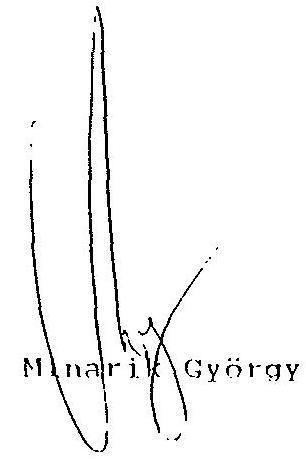

---

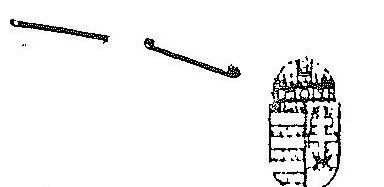

AlO- ES PENZÜGYI ELLENÖRZESI HIVATAL ELNOK

Ikt.sz: 82.823/1/1992.

A P E H
Valamennyi Megyei (Fővárosi)
Igazgatóság Vezetőjének

## Székhelyén

Tárgy: 1992. január 1-jei rendező mérlegek.

| PENZUGYI SZAMITASIECHNIKAI |
| :-- |
| INTSZET |

A 82.823/1992. június 10. számú levelemben a rendező mér-
legek feldolgozásához kapcsolódó előkészítő feladatokat határoztam meg.
A PM. Miniszteri értekezlet döntése értelmében erre a feldolgozásra nem kerül sor, ezért a rendező mérlegek irattározásáról gondoskodni kell.
A feldolgozásra előkészített példányt a megyei iktatási rendszeren keresztül bar-kóddal el kell látni (a 82.746/92.sz. Adóügyi főosztályi levél alapján a tárgykód: 5322), és az irattárba helyezését úgy kell megoldani, hogy indokolt esetben a hozzáférés, illetve a visszakeresés egyszerüen biztosítható legyen.
A második példányt - az eddigi gyakorlatnak megfelelően - az ellenőrzés, illetve az elemzés alapbizdnyataként kell kezelni.

Budapest, 1992. november " $4 "$
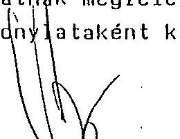

Minarik György

---

Adószám: 25-01

Adózó neve

Adózó címe

Ügyintéző neve, telefonszáma

TÁRSASÁGI ADÓ Bevallási főlap

a kettős könyvvitelt vezető adóalanyok részére

/Az 1993. február 28. - i bevalláshoz/

Az adatok ezer Ft - ban

|  Adó | Adó- nem | Köttségvetési kapcsolat | Összeg  |
| --- | --- | --- | --- |
|  01. | 101. | Kivetett társasági adó - tárgyévet megelőző év alapján (1990.) |   |
|  02. | 101. | - tárgyévi bevallás alapján (1991.) |   |
|  03. | 101. | Kivetés összesen (01 + 02) |   |
|  04. | 101. | 1992. december 20.-i feltöltés |   |
|  05. | 101. | Tárgyévet követő esedékes összeg | +  |
|  06. | 101. | Összes kötelezettség február 28.-án (03 + 04. 05) |   |

Kiegészítő adatok

|  Sor- szám | Megnevezés | Összeg (eFt) | Megosztás (%)  |
| --- | --- | --- | --- |
|  a |  |  |   |
|  07. | Jegyzett tőke 1992. december 31.-én |  |   |
|  08. | 07. sorból - állami tulajdoni hányad |  |   |
|  09. | - magántulajdoni részesedés |  |   |
|  10. | - külföldi részesedés |  |   |
|  11. | - szövetkezeti tulajdon |  |   |
|  12. | 08. sorból - többségi tartós állami tulajdoni hányad |  |   |
|  13. | - kisebbségi tartós állami tulajdoni hányad |  |   |
|  14. | Jegyzett, de be nem fizetett tőke 1992. december 31.-én |  |   |
|  15. | Ellenőrző szám (07 - 14 sorok) |  |   |

1993.

P. H.

cégszerű aláírás

---

Adószám: 412.X1.07 2 5 - 0 2

Az adózó neve

A társasági adó megállapítása a kettős könyvvitelt vezető adóalanyoknál (Az 1993. február 28.-i bevalláshoz)

|  Szászám | Megnevezés | Összeg
ezer Ft = bán  |
| --- | --- | --- |
|  a | b | c  |
|  01. | Adózás előtti eredmény (↑42.↑54.↑64) |   |
|  02. | Adózás előtti eredményt csökkentő tételek összesen *1. sz. melléklet* |   |
|  03. | Adózás előtti eredményt növelő tételek összesen *2. sz. melléklet* |   |
|  04. | Külföldről származó nem osztalék típusú jövedelem adója |   |
|  05. | Külföldről származó jövedelem |   |
|  06. | Adóalap (↑01-02+03+04-05) |   |
|  07. | Számított adó |   |
|  08. | Adókedvezmények *3_sz. melléklet*-ről |   |
|  09. | Befizetett földadó |   |
|  10. | Visszatartott adó (külföldön szerzett jövedelem után külföldön fizetett adó) |   |
|  11. | Fizetendő adó (07-08-09-10) |   |
|  12. | Adózott eredmény (↑01-11) |   |
|  13. | Eredménytartalék igénybevétele osztalékra, részesedésre |   |
|  14. | Fizetett (jóváhagyott) osztalék és részesedés |   |
|  15. | Mó Neg szerinti eredmény (↑12+13-14) |   |
|   | Kiegészítő adatok |   |
|  16. | Értékesítés nettó árbevétele összesen |   |
|  17. | 16. sorból export értékesítés nettó árbevétele |   |
|  18. | Egyéb bevételek |   |
|  19. | 18. sorból igényelt és kiutalt támogatások összege |   |
|  20. | Aktivált saját teljesítmények értéke |   |
|  21. | Anyagjellegű ráfordítások összesen (22 + 23 + 24 + 25) |   |
|  22. | 21. sorból - anyag ktg. |   |
|  23. | - igénybe vett anyagjellegű szolgáltatások |   |
|  24. | - ELÁBÉ |   |
|  25. | - alvállalkozói teljesítmények |   |
|  26. | Személyi jellegű ráfordítások összesen (27 + 28 + 29) |   |
|  27. | 12. sorból - bérköltség |   |
|  28. | - személyi jellegű egyéb kifizetések |   |
|  29. | - társadalombiztosítási járulék |   |
|  30. | Értékcsökkenési leírás |   |
|  31. | Egyéb költségek összesen |   |
|  32. | 31. sorból - bankköltség (kamat nélkül) |   |
|  33. | - biztosítási díj |   |
|  34. | - földbérleti díj |   |
|  35. | Egyéb ráfordítások összesen |   |
|  36. | 35. sorból - immateriális javak, tárgyi eszközök, értékesítésének költségei |   |
|  37. | 36. sorból - az értékesített immateriális javak és tárgyi eszközök nyilvántart. szerinti értéke |   |

---

|  Sorszám | Mégnevezés | Összeg
ezer Ft - ban  |
| --- | --- | --- |
|  a | b | c  |
|  38. | 35. sorból - céltartalék képzése |   |
|  39. | - követelések, kötelezettségek árfolyamveszteségei |   |
|  40. | - bírságok, büntetések |   |
|  41. | - fizetendő adók, illetékek, hozzájárulások |   |
|  42. | Üzemi (üzleti) tevékenység eredménye (16 + 18 = 20 - 21 - 26 - 30 - 31 - 35) |   |
|  43. | Pénzügyi műveletek bevételei összesen |   |
|  44. | 43. sorból - kapott osztalék és részesedés |   |
|  45. | - kamatbevétel pénzintézettől |   |
|  46. | - kamatbevétel más vállalkozótól, magánszemélytől |   |
|  47. | - devizakészletek árfolyamnyeresége |   |
|  48. | - valutakészletek árfolyamnyeresége |   |
|  49. | Pénzügyi műveletek ráfordításai összesen |   |
|  50. | 49. sorból - pénzintézetnek fizetendő kamat |   |
|  51. | - más vállalkozónak, magánszemélynek fizetendő kamat |   |
|  52. | - tulajdoni részesedés értékvesztése |   |
|  53. | - hosszú lejáratú értékpapírok értékvesztése |   |
|  54. | Pénzügyi műveletek eredménye (43 - 49) |   |
|  55. | Rendkívüli bevételek összesen |   |
|  56. | 55. sorból - gazd. társaságba bevitt vagyontárgyak társ. szerződésben (slapsz.-ban) meghat. értéke |   |
|  57. | - bevonás esetén a visszavásárolt saját részvény, vagyonjegy névértéke |   |
|  58. | - előző évekkel kapcsolatban visszaigényelt nyereségadó |   |
|  59. | - költségek és ráfordítások között elszámolt adók visszatérített összege |   |
|  60. | - utólag igényelhető támogatások |   |
|  61. | Rendkívüli ráfordítások összesen |   |
|  62. | 61. sorból - gazdasági társaságba bevitt vagyontárgyak nyilvántartási értéke |   |
|  63. | - térítés nélkül átadott vagyontárgyak (felszámított ÁFA-val növelt) nyilvántartási értéke |   |
|  64. | Rendkívüli eredmény (55 - 61) |   |

---

Adószám: $\square$ $\square$ $\square$ $\square$ $\square$ $\square$ $\square$ $\square$ $\square$ $\square$ $\square$ $\square$ $\square$ $\square$ $\square$ $\square$ $\square$ $\square$ $\square$ $\square$ $\square$ $\square$ $\square$ $\square$ Az adózó neve

# 4. sz. melléklet KIEGÉSZÍTÓ ADATOK

## A kettős könyvvitelt vezető adóalanyoktól

(Az 1993. február 28.-i bevalláshoz)

|  Sár-
szám | Megnevezés | Adat\% - ben illetve főben | Összeg
ezer Ft-ban  |
| --- | --- | --- | --- |
|  a. | b. | c. | d.  |
|  01. | Saját tőke összege (1992. december 31.-én) |  |   |
|  02. | 01. sorból - vagyonjegy állománya |  |   |
|  03. | Alapítól vagyon |  |   |
|  04. | 03. sorból - külföldi részesedés |  |   |
|  05. | Külföldről származó osztalék típusú jövedelem |  |   |
|  06. | Külföldről származó nem osztalék típusú jövedelem |  |   |
|  07. | Külföldi vállalkozó részére kifizetett ellenérték (ÁFA nélkül) |  |   |
|  08. | Külföldi szervezet részére kifizetett ellenérték (ÁFA nélkül) |  |   |
|  09. | A kapcsolt vállalkozásnak fizetett kamatok átlagos mértéke (\%) |  |   |
|  10. | Külföldi szervezettől levont adó összege |  |   |
|  11. | Átlagos statisztikai állományi létszám |  |   |
|  12. | Pénzeszközök |  |   |
|  13. | Hosszú lejáratú kötelezettségek |  |   |
|  14. | Rövid lejáratú kötelezettségek |  |   |
|  15. | Ellenőrző szám (01 - 14. sorok) |  |   |

---

# MINISZTERELNOKI HIVATAL 

Dr. Szabó Tamás
tárca séléúli miniszter

SZT-445/93.

Hagelmayer István elnök úr,
Állami Számvevőszék

## Budapest

## Tisztelt Elnök Úr!

Az állami vagyon nyilvántartásáról készített végleges elöterjesztéssel alapvetően egyetértünk, mindamellett, hogy továbbra sem tartalmazza a korábbi levelünkben is kifajtett problémákat a vagyon felmérése és meghatározása tekintetében. Ennek tényleges meghatározása, folyamatos vagyonszegmensenkénti nyilvántartása, le- ill. felértékelődése miatt a Kormány felé tett ajánlások 2. pontját célszerűnek tartanánk értelemszerűen kiegészíteni. (PI.: Tárcaközi Bizottság ideiglenes felállításával - a szükséges egyeztetések, felmérések elvégzése, egységes álláspont kialakítása és javaslattétel, kidolgozása érdekében -, illetve az ún. Céginformációs rendszer felállítása, valamint kibővítése és az adathozzáférhetőség szabályozása tekintetében.)

Nem világos számunkra ugyanott a 6. pont tartal:ia sem. (A bekezdés elhagyása esetén a részvényértékesítés, mint nylitpiaci múvelet, erőteljesen veszltene vonzerejéböl.)

Korábban közölt véleményünket nem mellékelték jelen összeállításhoz. Célszerünek és szükségesnek tartottuk volna azt, hiszen az érintett szervezetek, szervek végleges véleményük kialakítása során megjegyzéseinket figyelembe vehetnék.

Budapest, 1993. március 8.
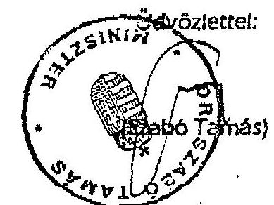

---

# MINIZZTERELNÖKI HIVATAL 

dr. Szabó Tamás
tárea nélküli miniszter
KABINETIRODÁJA

Dr. Kovács Árpád úr,
Igazgató
Állami Számvevőszék

## Budapest

## Tisztelt Igazgató Úrl

Az "Állam vállalkozói vagyona nyilvántartási és információs rendszere" címmel készített vizsgálati jelentés - véleményünk szerint - jól és helyesen közelíti és állapítja meg azokat az amomállákat, amelyek a tárgyi körben ma még feltárhatók, különös tekintettel azokra, amelyek az ÁVÜ és az ÁV Rt. illetve a KSH és a Cégbíróságok között fennállnak.

Bevezetőben még szükségesnek tartom megemlíteni, hogy az állam ún. vállalkozói vagyona alatt mindazon, a gazdálkodó szervezetnél fellelhető saját vagyont értjük, amely nemcsak az ún. állóeszközök formájában realizálódott, hanem az ún. forgóeszközöket - készpénz, anyag, félkésztermék, készáru - is, amelyek "nyomonkövetése" és regisztrálása sokszor a lehetetlenség határát súrolja, figyelembevéve azon új, piackonform rendelkezéseket és szabályozásokat, amelyek - a korábbiaknaá - bővebb teret nyújtanak az ún. idegen és saját vagyon keveredésére (pl. lizingelés útján tulajdonba kerülő vagyontárgyak, vagy az elzálogosítás következetében új tulajdonoshoz kerülő vagyon).

Ez utóbbiak felvetik azt a jelentös anomállát is, ami a jelenlegi rendszerben még kuszábbá, kibogozhatatlanabbá teszi a nyilvántartás szabályozottságát és tökéletességét:

- azonos vagyonelem több értéken is szerepelhet - elsősorban a tulajdonosváltozás eredményeképpen;

---

- egyes gazdasági folyamatok a vagyon megterheléséhez, közvetlen "feléléséhez" vezettek, s ezáltal "hatalmas vagyonszegmensek" a csőd- illetve a felszámolási eljárások útján akár tartósan, vagy végérvényesen kikerültek a kezelhető és nyilvántartható vagyontárgyak köréből.

Szakmailag erőteljesen vitatott, hogy melyek azok az egységnyi vagyonszegmensek, amelyek nyilvántartásával és egyenkénti értékesítésével még biztosítható a privatizáció folyamatossága és gyorsítása. Az ÁVŰ eddigi értékesítési tapasztalatai alapján megállapítható, hogy
a) optimális esetben a teljes vagyon megvételére együttemben kerül sor,
b) de egyre nagyobb szükség lesz az egyedi vagyontárgyakig részletezett nyilvántartás vezetésére a jobb marketing munka (pl.: a tervezett hiteljegyes privatizációnak megfelelő vagyonkinálat biztosításajérdekében.

Végezetül: általános megállapításként kell elfogadni, hogy az új számviteli törvény megalkotásával a vagyonelemek sora az ún. szellemi termékek körével is bővült, amelynek korábban a nyilvántartása alig, értéke pedig egyáltalán nem volt megoldva. Ide kell sorolni az ún. üzleti értéket is, amellyel kapcsolatos problémakört jól feszegeti az ÁVŰ eddigi értékesítési tapasztalata, ugyanakkor jelentös mértékben befolyásolja a könyvi értékelést.

Mindezen problémák figyelembevételével a jelentés kiegészítését javasoljuk, részben a vizsgálat óta eltelt időszakban lezajlott változások miatt. Ezek az AV Rt tekintetében:

1. Az induló "jegyzett tőke" hiteles összegének megállapítása megtörtént, s ezáltal az alapító okirat január hónapban benyújthatóvá vált, figyelembe véve a már átalakult és a még mindig vállalati szervezeti rendben müködő gazdálkodási szervezetek vagyonértéke között meglévő anomálát.
2. Decemberben a könyvszakértő kiválasztásra került.
3. A hatáskörébe tartozó szervezetek vagyonának megállapítása az 1991. évi rendezömériegek alapján megtörtént, figyelembevéve az átalakulás tényét.

---

4. Az ÁV Rt saját tőkeértékének, ill. tőketartalékának meghatározása folyamatban van.
5. Az ÁV Rt-t illetô részvények társaságonkénti megállapítását a cégbírósági adatokkal tervezzük ellenôrizni, az átalakult cégek cégbírósági adatainak ellenőrzése a Cégbírósági Információs Szolgálattal megkezdődött.
6. Számitógépes, naprakész adatbázis készül az átalakult társaságok decentralizált privatizációjára szánt eszközeinek nyilvántartására. Az ÁSZ féléves vagyonhasznosítási jelentéséhez ez fog információul szolgálni.
7. Az ún. ÁVÜ részvények ill. az "átadott" gazdálkodó szervezetek dokumentumainak átadása végérvényesen nem történt meg, ill. nem került rögzítésre. A hatalmas adathalmaz rögzítése, nyilvántartásba vétele folyamatosan zajlik, mindamellett, hogy a két fél között az átvételre vonatkozó Megállapodás, mint az átadás-átvétel jogosítványa mind a mai napig nem került jóváhagyásra.
8. A hiányosságok alapvető oka a személyi feltételek adottságaira vezethető vissza, s ez csak folyamatosan, hosszabb idöintervallumban javítható, a kezdeti lépések azonban már megtörténtek.
9. Az ÁV Rt előtt álló feladatok megkövetelik a minisztériumok és az ÁVÜ együttmüködését is.
10. Az ÁV Rt információs rendszerének megteremtése az I. félév legjelentősebb feladata annak érdekében is, hogy az ÁSZ ellenőrzési kötelezettségeinek (az ÁV Rt nyereségszíntjének alakulása, illetve az állam vállalkozói vagyonának változásai kapcsán) eleget tudjon tenni.

Az ÁVÜ tevékenységével kapcsolatosan alapvető gond a földhivatali nyilvántartás anomáliáinak megszüntetése. (A további megállapításokkal egyetértünk, figyelembevéve a bevezetőnkben leírtakat.)

Végezetül ki kívánjuk emelni a jelentéstervezet azon megállapítását, hogy az állami vagyon - ez esetben a vállalkozói vagyon - nyilvántartása nem teljeskörüen megoldott, elméleti kérdések tisztázásától kezdve, széleskörü rendezés szükséges és fontos. Jelenleg nincs olyan szervezet, amelynek az

---

adattartalom minimális egységének biztosításához szükséges koordinációra felhatalmazása lenne (Jelentés 6. oldal utolsó bekezdés). Egyetértve az ÁsZ Kormány felé tett ajánlásalval, javasoljuk, hogy a Cégbíróság adataira épülve, a Céginformációs Rendszer keretében kerüljön megvalósitásra a vagyonregiszter. Célszerünek tartanánk Koordinációs Bizottság létesítésével ezt megalapozni, figyelembevéve, hogy a cégjegyzék, az adó- és a KSHszámok mellett a TEÁOR bevezetésével új rendezési elvek is bevezetésre kerültek.

Budapest, 1993. február 8.
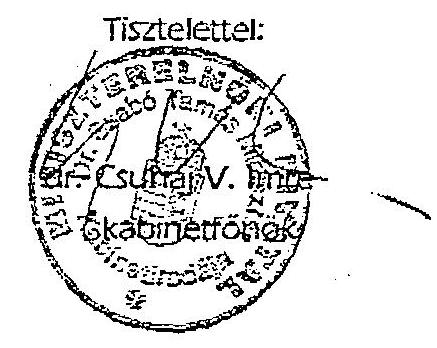

---

FÖLDMÜVELÉSÜGYI MINISZTÉRIUM KÖZIGAZGATÁSI ÁLLAMTITKÁR

$$
30091 / 2 / 93
$$

Hagelmayer István ur
elnök

Allami Számvevőszék
Budapest

Tisztelt Elnök Ur!

Az állam vállalkozói vagyona nyívantartási és információs rendszerének ellenőrzéséről készített jelentés megállapításaival egyetértek.

A gazdasági átalakulást és tulajdonos változást követő egységes információs rendszer kialakítása is müködése piacgazdasági körülmények között is elengedhetetlen.

A nemzetgazdasági szintü elemzések, az állami vagyon változással kapcsolatos kormányzati döntések csak megalapozott információs bázison születhetnek.

Az Allami Számvevőszék jelentésében megtett ajánlások elfogadását támogatom.

Budapest, 1993. február 24.
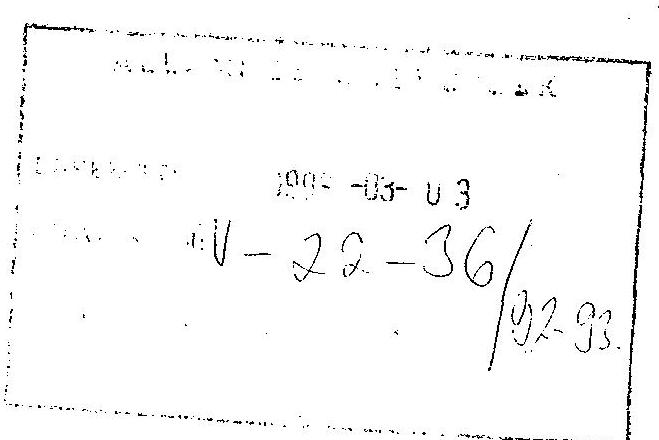
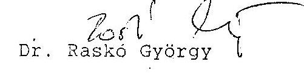

---

Higelmayer István
elnök
Állami Számvevőszék
Budapest

# Tisztelt Elnök Úr! 

Az állam vállalkozói vagyona nyilvántartási és információs rendszerének ellenőrzéséről készített jelentésben foglaltakkal általánosságban egyetértek.

A jelentés tervezetével kapcsolatos észrevételeinket a jelentés véglegesítése során zömmel figyelembe vették.

Továbbra is szükségesnek tartjuk azonban, hogy a Kormány részére megfogalmazott ajánlások egészüljenek ki a konkrét feladat megfogalmazási, ütemezési és felelősségi rendszerrel, valamint ezek kidolgozásához, működtetéséhez szükséges források megteremtésével.

A III. Részletes megállapítások c. fejezet KHVM-et érintő részénél (24. oldal 3. bekezdés utolsó mondata) kérem törölni "- a GYSEV Rt. kivételével - " szövegrészt, mivel a GYSEV is koncessziós tevékenységet végez, sőt múködésére érvényes koncessziós törvény is életben van.
A 28. oldal második bekezdésének első mondata gondolatilag az első bekezdéshez kapcsolódik, igy azt ahhoz csatolva indokolt szerepeltetni.

A második bekezdés a továbbiakban az ÁV Rt. és a tárca kapcsolatával foglalkozik, amelyhez a tervezetre adott észrevételeink között jeleztünk egy kiegészítési igényt, ami sajnálatunkra továbbra is csak részben szerepel az anyagban. Igaz, hogy az ÁV Rt-vel kapcsolatos alfejezet (23.

---

oldal 4. bekezdés) is a minisztériumoktól történő dokumentumok átvételével kapcsolatban csak a Földmưvelésügyi Minisztériumot emliti meg, mint ahonnan az átvétel megkezdődött.

Tárcánk részéről készek vagyunk, mint ahogy azt jeleztük, az ÁVÚ által közölt és a tárcával egyeztetett metodikához hasonlóan az ÁV Rt-hez sorolt és jelenleg még a tárcánál lévő dokumentumok átadására.

A Jelentéssel kapcsolatban egyéb észrevételt nem kivánok tenni.

Budapest, 1993. március " $4{ }^{\prime \prime}$
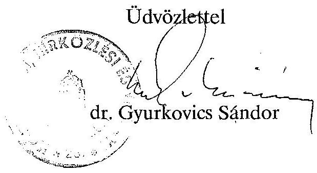

---

# PÊNZOGYMINISZTÉRIUM 

ÁLLAMTITKÁR
87.023/1993.

SÁNDOR ISTVÁn ÚR, ALELNÖK

ÁLLAMI SZÁMVEVÖSZÉK

B U D A P E S T

Tisztelt Sándor úr!
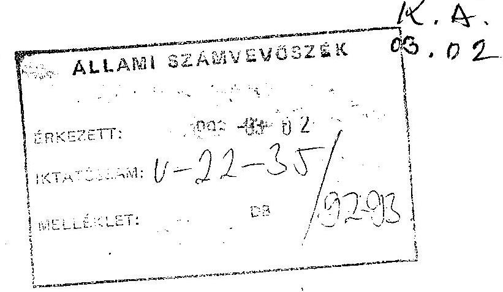
" Az állam vállalkozói vagyona nyilvántartási és információs rendszerének ellenôrzésérôl" készített jelentés tervezetet áttanulmányoztuk. Az anyag részletekre is kiterjedő, alapos, átgondolt, jól tükrözi a kezdôdő piacgazdaság információigényével és feldolgozásával kapcsolatos problémákat.

A részletes szakértői véleményt mellékelten megküldöm.

Budapest, 1993. február 11. Melléklet

Üdvözlettel:
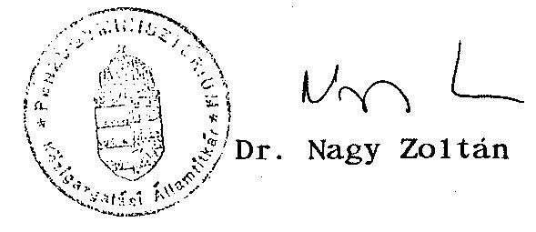

---

A jelentés pontjait követve részletes észrevételeimet a következökben foglalom össze.

1. Az összefoglaló megállapítások fejezetében szükségesnek tartjuk az állami vagyonnal kapcsolatos információrendszer megfogla1mazás helyett a vállalkozói körben lévő állami vagyont szerepeltetni, tekintettel arra, hogy a vizsgálat az állam vállalkozói vagyonára terjed ki. (4. oldal II/1.)
2. Szintén a II. fejezetben javítandó a számviteli törvény száma, amely az anyagban tévesen szerepel. A helyes hivatkozás a következő:
"az 1991. évt XVIII. törvény a számvitelröl"
2. Az Állami Vagyonügynökségnél történő nyilvántartás jogi Szabályozásával kapcsolatos fejezetben a vagyonról készítendő mérleg formai és tartalmi felépítésével kapcsolatos megállapításnál - valószínủleg nyomdai hiba miatt - a mondat egy része lemaradt. ( III./19.§.)

A mondat helyesen a következő:
"E mérleg mérlegszerű kimutatást jelöl, és nem a számviteli törvény által meghatározott mérlegek valamelyikét."

Ezen megjegyzést azért kellett tenni, mert a Vagyonügynökség esetében nem értelmezhető a konkrét eszközöket tartalmazó mérleg. Nyilvánvaló, hogy egészen más jellegủ adatokat kell tartalmaznia.
4. Az anyag részletes megállapításait tartalmazó III. fejezetben, az ÁvÜ intézkedései az állami vagyon nyilvántar-

---

tására vonatkozó résszel kapcsolatosan a következôkre szeretném felhívni a figyelmet:

Az adózás rendjéről szóló törvény egyértelmüen rendelkezik az adótitokról és az adóhatóság tudomására jutott adatok felhasználásáról.

Ennek értelmében az adózással összefüggő tényt, adatot, iratot az állami statisztika egységes rendszerébe tartozó szervek - a törvényben elöirt feltételek mellett - használhatják fel statisztikai célra. Adótitkot pedig akkor lehet kiadni, hogy azt törvény elöirja, megengedi, vagy ha az érintett hozzájárul.

Sajnálatos módon az ÁVÜ nem tartozik az állami statisztika rendszerébe tartozó szervek közé és a privatizációs törvények sem rendelkeznek arról, hogy az ÁVÜ nyilvántartási céljaira az adóhatóság adatot szolgáltasson.
5. A mérlegek teljeskörü feldolgozása 1991. év vonatkozásában történt meg, így az az idôközi jelentős változások miatt a nyilvántartási célokra nem alkalmas.

Az 1992. évi adóbevallásokban az állami vagyon utáni befizetési kötelezettség megjelenik, így az a gazdálkodói kör, amely az AVUR fizetésére kötelezett, meghatározható.

Az 1992. évi rendező mérlegek feldolgozása 1993. év elején már aktualitását vesztette. Az 1992. évről 1993. május 31-ig készülö mérlegbeszámolók nyitóadatai tartalmazzák a rendezőmérleg adatait is. Az éves mérlegbeszámolók feldolgozását a pénzügyminisztérium több főosztálya is igényelné, döntés még nem született arra, hogy csak az adóbevallások vagy a mérlegbeszámolók adatai is feldolgozásra kerüljenek.

Tekintettel arra, hogy a mérlegbeszámolók csak 1993-94. évben kerülnek az APEH-hez, az adóbevallás adatait - a kormányzati információk biztosítása érdekében - a mérlegben is szereplő adatok egy részével kibővitettük már az 1992. évi bevallásoknál. A makroszintü információk biztosítása érdekében kellett elrendelni a rendkívüli, február 28-i adóbevallást is. Az ezen feldolgozásokból származó információk, mint jeleztük - törvényi szabályozás hiányában - nem adhatók át az ÁVÜ egyedi nyilvántartási céljaira.

---

6. Az ÁV Rt.-re vonatkozó vizsgálathoz a következőkre hívom fel a figyelmet:

A $100 \%$-os állami tulajdonú gazdasági társasággá történő átalakulás esetén nincs lehetőség az átalakuló vállalat eszközeinek és kötelezettségeinek átértékelésére. Az értékelésnél erre is tekintettel kell lenni.
7. A tervezet 2. pontjának KSH bekezdésével foglalkozó részében félreérthető megállapítás található. A leírtak szerint az APEH a jogi és nem jogi személyiségủ vállalkozások törzsadatait a KSH-nak átadta, míg az egyéni vállalkozók törzsadatállományát az Adózás rendjéről szóló (Art), többször módosított, 1990. évi XCI. számú törvényre való hivatkozással nem. Az Art. az adótitok szempontjából a vállalkozási formák között nem tesz különbséget, így a hivatkozás nem helytálló.
8. A Pénzügyminisztériummal kapcsolatos vizsgálatban utalás történik arra is, hogy a számviteli törvény indoklásában jelzett új információs rendszer kialakítására vonatkozóan nincs felelős megjelölve. Ez így igaz, de a számvite1i törvény-javaslatot elfogadó, 1991. évi 3075/1991. Kormányhatározatban megjelölték ennek felelőset.
"A Kormány javasolja az Országgyülésnek a számviteli törvényt 1992. január 1-ével hatályba léptelni azzal, hogy a hatálybalépésig
a, ki kell alakítani a nemzetgazdaság információs rendszerét.
Felelős: Központi Statisztikai Hivatal elnöke..."
A Kormányhatározat ke1te: 1991. február 21.

Budapest, 1993. február 11.

---

A Magyar Köztársaság
Igazsáaügy-minisztere
$19.240 / 1993$. IM.

Hiv. sz.: V-22-30/92/93.

HAGELMAYER ISTVÁN úrnak, elnök
Állami Számvevőszék

# B U D A P E S T 

## TISZTELT ELNÖK ÚR!

Az állam vállalkozói vagyona nyilvántartási és információs rendszerének ellenôrzésérôl szóló jelentésre az alábbi észrevételeket teszem:

Nem tudok egyetérteni a tartósan állami tulajdonban maradó vállalkozói vagyon kezeléséról és hasznosításáról szóló törvény 23. § (2) bekezdésének - annak végrehajthatatlansága miatt - hatályon kívül helyezésére vonatkozó jávaslattal. A végrehajthatóság érdekében szükség esetén e bekezdés módosítását javaslom.

E törvény 31. §-ának (3) bekezdése úgy rendelkezik, hogy a kormányrendeletben meghatározott gazdálkodó szervezetek tekintetében "az e törvényben szabályozott állami tulajdonosi jogokat - a Kormány által meghatározott időpontig történő gazdasági társasággá átalakítás, valamint a vagyonkezelés, értékesítés, gazdasági társaság alapítása - nem a Vagyonkezelő Részvénytársaság, hanem a tevékenység ellátásáért felelős miniszter gyakorolja a Vagyonkezelő Részvénytársaságra vonatkozó szabályok megfelelő alkalmazásával".

---

A 31. § (3) bekezdésben a gondolatjelben lévô felsorolás példálózó jellegú. A tevékenység ellátásáért felelős miniszter a Vagyonkezeló Részvénytársaságot megilletó valamennyi tulajdonosi jogot jogosult, illetóleg köteles gyakorolni. Így a kijelölt miniszternek is feladata, hogy kialakítsa a hozzátartozó vagyon törvényes és eredményes müködéséhez szükséges nyilvántartási és értékelési rendszert.

Budapest, 1993. március 8.
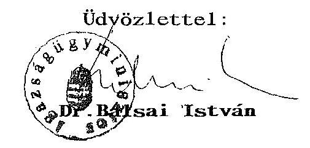
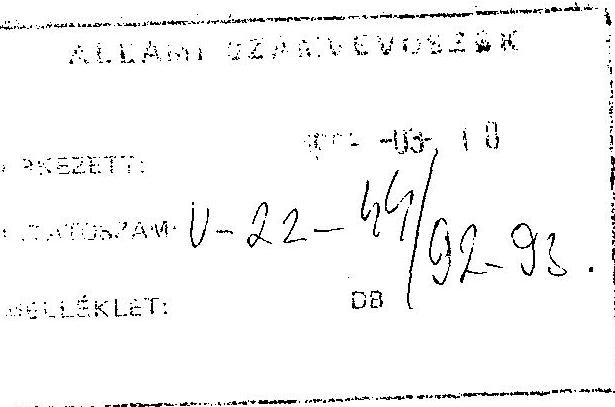

---

# Sllami Sámvevösrèk 

Budapest, 1993. március 10. $\mathrm{V}-22-43 / 1993$.

Dr. B A L S A I I S T V Á N úr igazságügyminiszter

B U D A P E S T

Tisztelt Miniszter Úr!

Köszönettel vettem az állam vállalkozói vagyona nyilvántartási és információs rendszerének ellenőrzéséről szóló jelentésre tett észrevételeit.

Ezek a "Jelentés"-ben foglalt ajánlások egy részét markánsan érintik és remélem, hogy e jelentős kérdésekkel kapcsolatosan kifejtett álláspontok előbbre viszik a közösen vállalható megoldások kimunkálását.

Ön észrevételeiben kifejti, hogy nem ért egyet a tartósan állami tulajdonban maradó vállalkozói vagyon kezeléséről és hasznosításáról szóló törvény 23. paragrafus (2) bekezdése hatályon kívül helyezésére vonatkozó számvevőszéki javaslattal.

---

E törvényhely végrehajthatóságának alapvető akadálya, hogy közgazdságilag nem értelmezhető az ÁV Rt-nél elért nyereség (osztalék) mértékének a nemzetgazdságban je1lemzően elért nyereség vagy osztalék szintjéhez való hasonlítása. Már maga a mérték és szint megjelölés is ellentmondásos, hiszen mindkettó mást jelent. Az a tény pedig, hogy az ÁV Rt-hez tartozó szervezetek tőkéje (vagyona) más struktúrájú, mint a nemzetgazdaságé, önmagában is oka lehet - az ÁV Rt gazdálkodásától függetlenül - annak, hogy az elért osztalék szintje vagy mértéke elmarad a nemzetgazdaságban je1lemzően elérthez képest. (Mindez egyébként önmagában már feltételezi azt is, hogy létezik olyan szerv, ame1y időben képes kimutatni a nemzetgazdaság je1lemző osztalékát vagy nyereségét is.)

Megértem, sőt egyetértek a törvénye1kotás olyan törekvése ive1, hogy az ÁV Rt tevékenységének valamilyen módon mért "eredményessége" mint elvárható követelmény törvényi szinten rögzitődjék. Ennek kidolgozása és törvényi kezdeményezése azonban a Kormány, és nem az Állami Számvevőszék kompetenciája.

Ebben a helyzetben tehát - amikor a jelenlegi törvényhelyi szabályozás végrehajthatatlan és más kritérium rendszer felállítása kormányzati feladat - nincs más lehetőségem, mint ajánlásom fenntartása. Természetesen amennyiben a Kormányzat egy új kritériumrendszerrel kapcsolatban szakmai véleményemet igényli, azt szívesen kifejtem.

Miniszter úr álláspontja szerint a hivatkozott törvény 31. paragrafus (3) bekezdése rendezi, hogy a tevékenység ellátásáért felelős miniszter valamennyi tulajdonosi jogot jogosult, il-

---

letve köteles gyakorolni, igy feladata, hogy kialakitsa a hozzátartozó vagyon törvényes és eredményes müködéséhez szükséges nyilvántartási és értéke1ési rendszert. Úgy vélem, ezzel a számvevöszéki jelentés ajánlásai között szereplö 3. pontban foglaltakat tekinti feleslegesnek.

Az Állami Számvevőszék azonban úgy itéli meg, hogy ez nem következik egyértelmüen a törvény szövegéből. Már pusztán az a tény, hogy az állami tulajdonosi jogok taxativ felsorolása e feladatot nem tartalmazza, az egyértelmü értelmezésének akadálya lehet. A vizsgálat tapasztalatai is azt mutatták, hogy a tárcák felfogása e kérdésben sokszinü. Bonyolítja a helyzetet továbbá, hogy az ÁV Rt-nek az állami vagyonra elöirt tájékoztatási kötelezettsége a törvény IV., az ÁV Rt gazdálkodásáról, és nem a tulajdonosi jogok gyakorlásáról szóló fejezetben található és a gazdálkodásra vonatkozó előírások a minisztériumokra nem alkalmazhatók.

Vizsgálatunk azt is feltárta, hogy önmagában véve az a törvényi előirás, hogy a tulajdonos köteles a hozzátartozó állam vállalkozói vagyona nyilvántartására, automatikusan nem biztositja azt a minimálisan szükséges információt, ame1y lehetővé teszi a döntéshozók és az ellenőrzés számára is az állam egész vállalkozói vagyona nagyságának változásának mérését. Így a privatizációs és vagyonhasznosítási folyamatok nemzetgazdasági szintü megitélhetősége, összesíthetősége sem biztosítható.

Ezért e kérdés megfelelő szakmailag mélyebb követelményeket is biztosító szabályozás kidolgozására irányuló ajánlásomat fenntartom.

---

Miniszter úr által felvetettekkel kapcsolatban - csak a szélesebb körű információ nyújtásának szándékától vezettetve jelzem -, hogy a Számvevőszéknek ezen ajánlásaival kapcsolatban az érdeke1t - tulajdonosi funkciókat ellátó - szervezetek, minisztériumok kifogást nem emeltek.

Kérem Miniszter urat kifejtett indokaim mérlegelésére és elfogadására.

Tisztelette1
Hag
(Hagelmayer István)

---

143/2/1/17 93/5.1/93

Központi Statisztikai Zióoatal

Ikt: 300-61/1/93.

Elnök

Hagelmayer István Úr
az Állami Számvevőszék
elnöke

Budapest

Tisztelt Elnök Úr!

Az ÁSZ Vagyonellenőrzési Igazgatósága által - az állam vállalkozói
vagyona nyilvántartási és információs rendszerének ellenőrzéséről -
készített jelentéssel kapcsolatban a következő észrevételt teszem.

\ KSH és az APEH között létrejött megállapodás értelmében 1992. január
ı-jétől az APEH - a jogszabályok előírása szerinti titoktartási köte-
fezettség megtartása mellett - teljeskörű hozzáférést biztosít a KSH
részére az adóalany-nyilvántartás statisztikai célú felhasználására
vonatkozóan. Így 1992-től a KSH nyilvántartási rendszere minden adó-
számmal rendelkező gazdasági szervezetet tartalmaz, beleértve az egyé-
ni vállalkozókat és a helyi költségvetési szerveket is.

A jelentésnek az átvett adatállományok tartalmára vonatkozó megállapítása helytálló, mivel az adóalanyok csak nagy késéssel vagy fel-
szólításra tesznek eleget bejelentési kötelezettségüknek.

A statisztikai szervezetek nyilvántartási rendszerének fejlesztése a
KSH egyik kiemelt fontosságú feladata. A rendszer elkészülte után al-
kalmas lesz a mintegy 800 ezer szervezet kezelésére. Az új nyilvántar-
tási rendszer - a tervek szerint - a cégnyilvántartásból venné át a
külföldi tőkebefektetésre és a vállalkozások tulajdonosi szerkezetére
vonatkozó adatokat. Az adatok átvételével kapcsolatban nagy a bizonytalanság, • mivel az IM Cégnyilvántartási és Céginformációs Szolgálatá-
tól kapott állomány hibás és hiányzik a használatot biztosító dokumentáció. A Céginformációs Szolgálat az állományt visszakérte és megígér-
te a hibák kijavítását. Az eddigi vizsgálatok alapján azonban feltéte-
lezhető, hogy a javított állomány sem fog tartalmazni a KSH részére
minden szükséges adatot.

A jelentés az 5. számú mellékletben felveti, hogy a KSH az OSAP elö-
terjesztésében nem tájékoztatta a Kormányt a nemzetgazdasági statisztikák adatformásainak problémáiról. E témában azóta kormány előter-
jesztés készült. A Kormány 3066/1993.sz. határozatában rendelkezik a
nemzetgazdasági statisztikák adatforrásainak biztosításáról.

Budapest, 1993. február 25.

ALLAMI SZÁLVEVÉSZÉK

1993-93-01

Üdvözlettel

dr. Wadovich György /

H-1525 Budapest P.O.B. 51. II., Keleti Károly u. 5-7. Telefon: 201-9246 Telex: 22-4308 stali h Telefax: +361 115 9065

---

ADÓ- ÉS PÉNZÜGYI ELLENŐRZÉSI HIVATAL ELNÖK
$264 / 1993$

Dr. Hágelmayer István úr, az Állami Számvevőszék elnöke

Budapest

Tisztelt Elnök úr!

Az állam vállalkozói vagyona nyilvántartási és információs rendszerének ellenőrzéséról készített, február 19-i keltezéssel megküldött jelentésük tervezetéhez az alábbi észrevételeket teszem.
1./ Az 1992. évi társasági adókötelezettség bevallásának rendjét nem az APEH, hanem az országgyülés határozta meg. A februári "előzetes" bevallásról az 1991. évi LXXXV. tv. (Art) 32. § (4), illetve az 1991. évi LXXXVI. tv. (TA) 19 $\$(10)$ bekezdése intézkedik.
2./ Pontatlan a 35. oldal közepén lévő, vastagon szedett bekezdés megfogalmazása, mivel nem a gazdasági eseményt, hanem annak hatását nem tartalmazza, vagy csak február 15-én megítélhető várható összegében mutatja be az "előzetes" társasági adóbevallás. A példaként felsorolt valamennyi tételhez fũződik adathely a bevallás nyomtatványain.

---

3./ Továbbra is fenntartom a február 8-án adott észrevételünkben tett azon javaslatomat, amely szerint az Adózás rendjéről szóló törvény módosítását lenne célszerú kezdeményezni az AV RT, az AVU és az APEH közötti információs kapcsolatok kiépítése érdekében. Véleményem szerint a Kormánynak tett ajánlások között ennek megfogalmazása nem eléggé konkrét.

Budapest, 1993. március
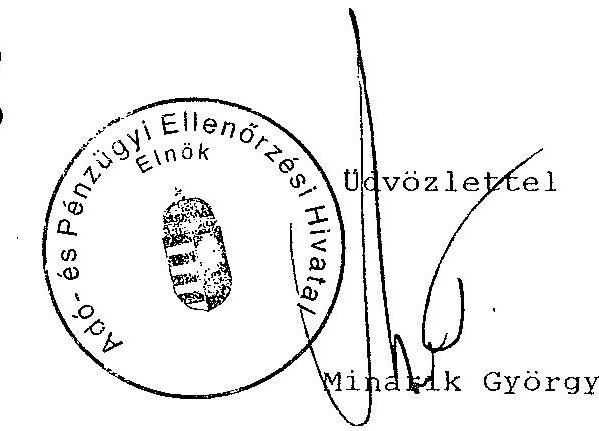