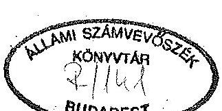
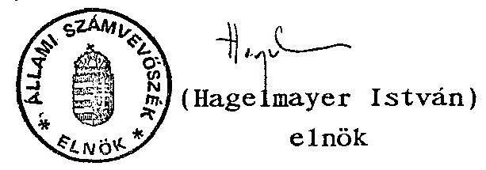
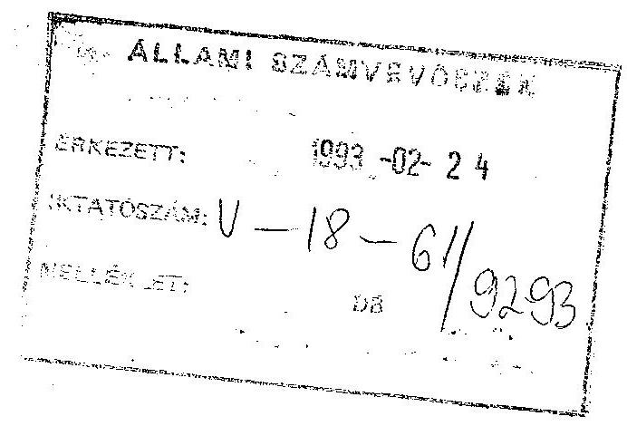
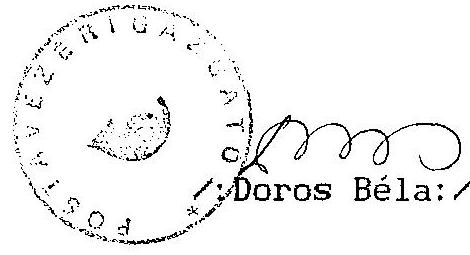
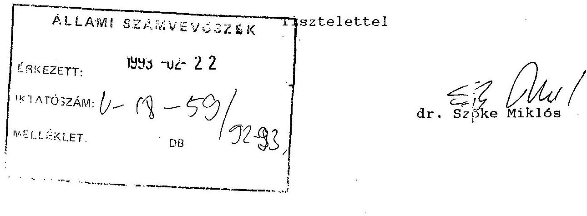
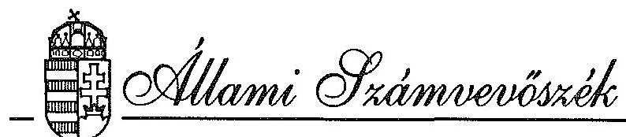
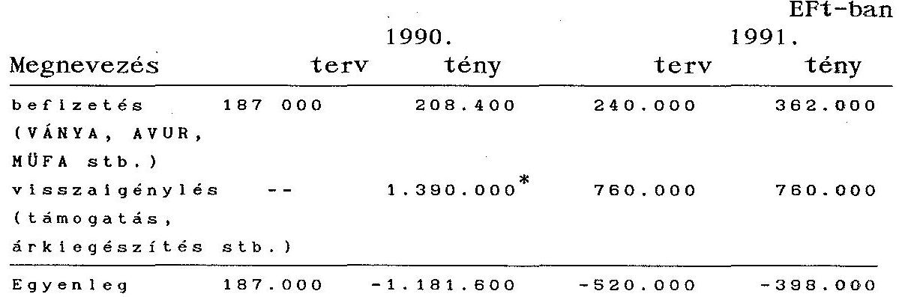
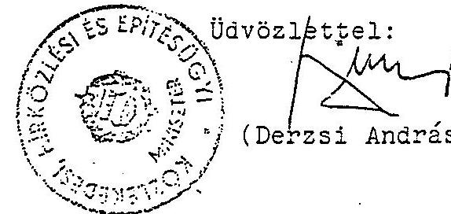
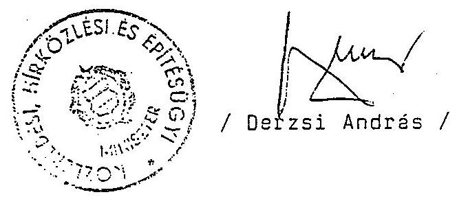
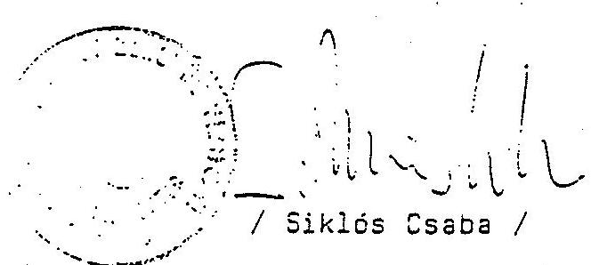

# JELENTÉS 

a Magyar Posta Vállalat 1990-1991. évi működéséről és gazdálkodásáról

---

# A vizsgálatot vezette: 

Dr. Kovácsné Dr. Pósfay Zsuzsanna osztályvezető főtanácsos

A vizsgálatot végezte:

Dr. Baki József
Benti Gabriella
Korondi János
Otta András
Podonyi László
Rideg Margit
Sólyom László
számvevő tanácsos
számvevő tanácsos
számvevő
számvevő
számvevő
számvevő tanácsos
számvevő

---

IV. Vagyonellenőrzési Igazgatóság
$\mathrm{V}-18-57 / 1992 / 93$.
Témaszám: 129 .

# BEVEZETÉS 

Az Állami Számvevőszék a Magyar Posta Vállalatnál az 1989. évi XXXVIII. törvény 2. §. (6) bekezdése alapján ellenőrizte az állami tulajdonú vállalat vagyonérték megőrző és vagyongyarapító tevékenységét.

Az ellenőrzés az állami vagyonnal történt gazdálkodásra irányult és emellett kiterjedt a Magyar Posta általános jogutódjaként 1990. január 1-jén szétválással - megalapított Magyar Posta Vállalat (továbbiakban: MPV) alapításának törvényességére, működésének jogszerűségére is. A vagyoni gazdálkodás részeként vizsgálta a jelentős veszteségtételeket (hirlapterjesztési üzletág), valamint a jelentős tőkekihelyezések (Postabank, Providencia Rt.) hozamát.

Az Magyar Posta Vállalat ellenőrzését időszerűvé tette, hogy

- államigazgatási felügyelet alatt állt és jelenleg is 100%-ban állami tulajdonú vállalat, amely az 1992. évi LIII. törvény felhatalmazása alapján kiadott 126/1992.(VIII.28.) Korm. rendelet értelmében továbbra is állami tulajdonban marad;
- jelentős szervezeti változás történt, a Posta három önálló vállalatra vált szét 1990. január 1-jétől, a Posta szervezetének korszerűsítésére vonatkozó minisztertanácsi határozat alapján.

---

A közszolgáltatások minőségének ellenőrzése különös figyelemmel történt, mert a Postánál az állami vagyonnak e része a közérdek szolgálatára rendelt. A Posta elsődleges közszolgáltatói feladatainak vizsgálata arra irányult, hogy a levélpostai küldemények felvétele, továbbítása, kézbesítése, a pénzkezelési tevékenység ellátása megfelelő színvonalon történt-e az MPV önálló működése során. A lakossági és közületi igények, szükségletek kielégítését ugyanis versenyszférára alkotott gazdasági szabályok mellett is el kell látnia a Postának. Erre figyelemmel az ellenőrzés megvizsgálta a Posta részéről az alapszolgáltatások csökkentésére irányuló törekvéseket és a lakosság jogos igényeinek érvényesíthetőségét.

Nem foglalkozott az ellenőrzés a vállalatok szétváláskori vagyonmegosztásának számviteli, számszaki helyességével. Azt az Adó- és Pénzügyi Ellenőrzési Hivatal hatósági jogkörében, a hatályban volt jogszabályoknak megfelelően 1992. július-november hónapban ellenőrizte.

Az ellenőrzés alapvetően az 1990-91. lezárt gazdálkodási évekre terjedt ki. A hírlapterjesztési üzletágban és a jelentősebb befektetéseknél (Postabank, Providencia Rt.) azonban 1992. év végéig bekövetkezett gazdasági eseményeket is figyelemmel kísérte a vizsgálat a Posta Vezérigazgatóság szintjén.

A hírlaptevékenység kiadói oldala nem volt tárgya a vizsgálatnak. A MPV-nál folytatott számvevőszéki vizsgálat célja kizárólag a vállalat, ezen belül az általa végzett hírlapkereskedelmi tevékenység ellenőrzése volt. Az állami vagyonnak ugyanis a Posta elsődleges, ún. "klasszikus postai" tevékenységeket kell szolgálnia. Az ellenőrzés az e körön kívüli hírlapterjesztésre mint legnagyobb veszteségtételre terjedt ki, amelynek fedezetét más tevékenységek bevétele képezte.

A hírlapkiadás a hozzá kapcsolódó privatizációkkal összefüggésben jelentős részben az Állami Vagyonügynökséghez kapcsolódóan vizsgálható, illetve az Állami Számvevőszék ellenőrzési körén kívül eső gazdasági társaságok működési körébe tartozik.

---

A vizsgált időszak több szempontból is rendhagyó volt:

- A gazdálkodásban a postai szolgáltatást érintő szabályozásokban jelentős és nem mindig átgondolt, egymásra épülő változások voltak,
- az ellátási kötelezettségeket érintő, a vagyonhasznosítás hatékonysága vizsgálhatóságának alapját jelentő postatörvény még nem lépett hatályba,
- a beruházási célra jóváhagyott, a költségvetési előirányzatokból megvalósuló beruházások költség-előirányzatának megszervezésére és finanszírozásának rendjére vonatkozó új kormányrendelet még a vizsgálat lezárásának időszakában is csak előkészületben volt.

Ugyanakkor a társadalmi-gazdasági környezet mind működési mechanizmusában, mind helyzetében alapvetően megváltozott. Hatása leginkább a hírlapterjesztésben szembetűnő. Összetételében szélsőségesen megváltozott, mennyiségében megnövekedett igénnyel került szembe a Posta.

A vagyon hasznosításának színvonalát csak olyan soktényezős, szakmai-tapasztalati benyomásokat összegző módon - nem mindig egzakt mutatókban rögzíthetően - lehet értékelni, amely lényegében a vállalati működés meghatározó elemeit átfogja és figyelembe veszi a környezet hatásait is.

A jelen vizsgálat az első az Állami Számvevőszék tevékenységében, amely egy ilyen nagyságrendű szervezet vagyonhasznosító tevékenységével foglalkozik. A tapasztalatok alapján, miközben az ÁSZ megkísérel bizonyos minősítő következtetéseket levonni, a további ilyen ellenőrzésekhez módszerbeni tapasztalatokat is szerez, hogy e feladatnak kialakult, begyakorlott eljárási rendszere legyen. E munkájában támaszkodhatott és támaszkodhat azokra a Német Szövetségi Számvevőszék által végzett vizsgálatok tapasztalataira is, amelyeket a két szervezet közti együttműködés során kapott, illetve kapni fog.

---

# Megállapítások 

A Magyar Posta szervezetének korszerűsítésére vonatkozó MT határozat alapján 1990. január 1-jével a Közlekedési, Hírközlési és Építésügyi Minisztérium megalapította a Magyar Posta 68 milliárd Ft értékű saját vagyonából és 72.874 fős létszámából az új vállalatokat, amelyek induló kondíciói az alábbiak voltak: Vállalat neve Saját vagyona Létszáma Magyar Posta Vállalat (MPV) 9 milliárd Ft 46.497 fő Magyar Távközlési Vállalat (MATÁV) 58 milliárd Ft 20.682 fő Magyar Műsorszóró Vállalat (MMV) 5 milliárd Ft 1.699 fő

Az MPV-nek összesen 16 vállalkozásban van befektetett vagyona. Ebből 0,7 milliárd Ft-ot a jogelődje, további 0,4 milliárd Ft-ot az új cég fektetett be. 1991. év végére - a Postabank és a Providencia Rt. tőkeemelésével - elérte a vállalkozásokba fektetett tőke az 1,1 milliárd Ft-ot.

A Posta szétválásáról rendelkező minisztertanácsi határozat kötelező előírásokat tartalmazott arról, hogy a Magyar Posta Vállalat működőképességének megőrzése érdekében az inflációt követő - megfelelő vállalati jövedelmeket realizáló - tarifapolitikát alkalmazzon és deklarálta az állami szerepvállalást. Ezek korrelációját az évenkénti gazdaságpolitikai tervekben kell/ett/ meghatározni. További előírása volt a minisztertanácsi határozatnak, hogy a beruházások támogatására 1990-ben a távközlésre előirányzott összegből 1,3 milliárd Ft-ot a MATÁV-tól kellett átcsoportosítani a Postához.

---

Az 1990. január 1-jén megalakult Magyar Posta Vállalat jogelődjének a "Magyar Posta"-nak korábbi, "tradicionális" szervezete részletes szabályzatok alapján működött. Dolgozói többsége rendelkezett postai szakképesítéssel és kellő szakmai gyakorlattal. E két tényező emberi, munkaerő oldalról biztosította az átszervezés, szétválás időszakában is a Posta fő tevékenységeinek ellátását. A lakosság és a közületek kiszolgálása a postahivatalokban, a kézbesítőszolgálatban folyamatos volt.

A szolgáltatások színvonala általánosságban kismértékben csökkent. Konkrét esetekben azonban előfordult, hogy ellátatlan maradt a lakosság, vagy csak minimális szolgáltatást kapott, mert megszüntették a postahivatalt; vagy időszakosan szünetelt a kézbesítőszolgálat. Esetenként nem a megfizetett szolgáltatást kapta az igénybevevő, mert adott helyen az expressz kézbesítés éjszaka és a munkaszüneti napokon megszűnt, a táviratokat rendszeresen nem a vállalt határidőre teljesítették. Ezek tendenciák, ezért jelzésértékűek. A postai szolgáltatások ellátásában kisebb jelentőségű eseti, egyedi hibák is előfordultak. Ezek megnyilvánultak a lakossági panaszok, a postahivatali várakozási idő, postai kártérítési ügyek növekedésében.

A Posta hagyományos szabályozottsága áthidalta működési szempontból a gyakorlatban azokat a késedelmeket, amelyek szervezete és a jogszabályok tömeges változása miatt belső szabályzatainak időszerűségében, naprakészségében bekövetkeztek. Működése során azonban voltak olyan jogi, gazdasági problémák, amelyek megoldására az ellenőrzés időpontjáig csak részlegesen, vagy egyáltalán nem került sor. Példaként említhetők a belső szabályzatok korszerűsítésének folyamata, vagy a vagyonmegosztás elhúzódása következtében - a térítésmentesen, de utólagosan - átadott állóeszközök miatti, összesen 50 millió Ft-os adókötelezettség keletkezése.

---

Az Állami Számvevőszék megállapításait a konkrét ügy súlyának érzékeltetése érdekében a tevékenység Postán belüli részarányának megjelölésével, a tevékenység árbevételének százalékában vagy ezrelékében is bemutatja. Erre azért van szükség, mert a Posta országos nagyvállalat, amelyben a több helyen előforduló eseti hibák is nagy összeget képezhetnek.

Gazdasági oldalról a Posta megállapított induló vagyona a működéshez kielégítő feltételeket nyújtott volna, ha a számára - minisztertanácsi határozatban - biztosított 1,3 milliárd Ft állami beruházási támogatáshoz 1990. év elején hozzájut. Az alapító minisztérium nem elég körültekintő intézkedései, valamint a hatályos jogszabályok ellentmondásai következtében azonban a fizetésre kötelezett MATÁV csak 1990 augusztusában, tehát három negyedévnyi késéssel utalta át több részletben a pénzt.

Az 1990. évi 0,1 milliárd Ft-os veszteség után 1991-ben a Posta nyereségessé vált, vagyonát megőrizte. A működés két és fél éve alatt gazdálkodási nehézségeinek jelentős részét megoldotta. A vizsgálat lezárásának időpontjában, 1992-ben a likviditási mutatók már jók voltak, a pénzellátás a folyó működést fedezte.

A több vállalatra szétválást követően a Postánál gazdasági veszteségek keletkeztek

- a befejezetlen beruházások (főként feleslegessé vált tervek) selejtezése miatt (130 millió Ft), továbbá
- mérsékelhető lett volna (a postai munkahibák miatti) 0,5 milliárd Ft 1990-92. évek között a hírlapterjesztés 1,3 milliárd Ft-os veszteségéből,
- a Magyar Olimpiai Bizottság sorsjegyének elszámolási hibái miatt 32 millió Ft veszteség.

---

A vállalatot 1990-1991-ben 968 millió Ft kár érte.
A károk egy részét (90,5 millió Ft) a dolgozók okozták a vállalatnak (ebből veszteségként elszámolva 32,3 millió Ft). Kamatozással összefüggő veszteség 57,5 millió Ft, elemi kár 0,8 millió Ft, stb.

A veszteségek 47%-a a hírlapterjesztésből származik (775 millió Ft), amely 1992-re 1,5 milliárd Ft-ra nőtt. Ez a hírlapterjesztési bevételek 8%-ának felel meg.
A hírlapveszteség keletkezésében meghatározó szerepe volt a jogi szabályozásnak, illetve a 11/1976. (XI.11.) KPM rendelet megfelelő módosítása hiányának. Ennek szükségességét a Posta Vállalat igazgatója 1990 áprilisában jelezte a szakminisztérium felé, az új jogszabály 1990 decemberében lépett hatályba.

A veszteségek főbb okait az MPV feltárta. Az MPV postán belüli eseti hibákat elkövetőkkel szemben - indokolt esetben - eljárt. A működési rendszerében szükségesnek ítélt belső intézkedéseket végrehajtotta, vagy előkészítésüket megkezdte. Az MPV kezdeményezte a számára a kiadókkal szerződéskötési kötelezettséget előíró miniszteri rendelet hatályon kívül helyezését. A KHVM 1990 decemberében ennek eleget tett. A hírlapterjesztés feltételei azonban nehezültek, mert a fizetőképes kereslet nem nőtt a megjelenő új lapféleségekkel arányosan. (Új sajtótermékek bevezetése a piacra kockázatos üzlet, amellett tőkeigényes, mert az infrastruktúra fejlesztését is szükségessé teszi.)

A Postának elkülönült - a vezérigazgató közvetlen irányítása alatt álló - független belső ellenőrzési rendszere van, amely folyamatosan működik. Az MPV a bank- és pénzkezelési tevékenységet ellátó postás dolgozók bizonyított részessége esetén a törvénysértőkkel szemben eljárást indított. Az ellenőrzés jelzései alapján számos hibát kijavítottak a postaszervek, jelentősebb esetekben belső szabályzatok, vezérigazgatói utasítások módosí-

---

tására is sor került. Ugyanakkor a Posta szervezeti változtatásai következtében egyes szakszolgálati tevékenységeknél tapasztalható volt a munkafolyamatba épített belső ellenőrzés hiánya vagy rendszertelenné válása. Erről az adott témák tárgyalásánál esik szó.

A Posta tevékenységei 60%-ánál önköltség típusú árakat alkalmaz a hatályos jogszabályoknak megfelelően. Árkalkulációi, tarifapolitikája szorosan követi a tényköltségeket. A tényköltségek között azonban nem mindig a valóban szükségesek merülnek fel, ami utal a gazdálkodás tartalékaira. Az MPV-nek tevékenysége bővítésére, infrastruktúrális fejlesztésekre számottevő forrásai nem képződnek, külső forrásokra van utalva.

1. A Magyar Posta Vállalat létesítésének és működésének jogszerűsége

A Magyar Posta Vállalat létesítésével kapcsolatban eljárási hibaként említendő meg, hogy a vállalat cégbejegyzés iránti kérelmének benyújtása a törvényi határidőn túl több mint 40 nappal történt. Ennek oka, hogy az alapító nem gondoskodott a cégbejegyzésről, hanem azt a határidő lejárta idején a vállalat hatáskörébe utalta.

A vizsgált időszakban a vállalat jogelődjétől "örökölt" széleskörű belső szabályozással rendelkezett, melynek áttekintése, racionalizálása azonban az eltelt három évben sem fejeződött be.

Az új Szervezeti és Működési Szabályzat a vállalat létesítését követő harmadik évben, 1992. március 1-től lépett hatályba.

---

A Postaszabályzat (1/1966. (V.15.) KPM rend.)
 korszerűsítésére a vizsgált időszakban nem került sor, annak ellenére, hogy azt a Posta Vállalat kezdeményezte a Közlekedési, Hírközlési és Vízgazdálkodási Minisztériumnál, mert az új Postatörvény előkészítésére hivatkozással lekerült a napirendről. Ezt követően a vállalat az elavultnak tekintett rendelkezéseket jogszerűtlenül - belső utasításokkal, „tájékoztatókkal” – „módosította”.
2. Gazdálkodás az állami vagyonnal
2.1. A Magyar Posta Vállalat vagyonának megőrzése és gyarapítása

A Vállalat saját vagyona az átszervezést követően 41%-kal nőtt. Tartalékvagyona azonban csökkent 17%-kal. A tartalékvagyon bevonása azért vált szükségessé, mert fedezni kellett:

- a beruházások vissza nem térülő általános forgalmi adóját,
- az egyéb fejlesztési célú kifizetéseket, az alapítványok finanszírozását.

| Vagyon alakulása: |  |  | milliárd Ft-ban |  |
| :--: | :--: | :--: | :--: | :--: |
| Megnevezés | Nyitó | 1990. év | 1991. év | 1991. nyitó   N |
| Alapítói | 8 | 8 | 8 | 100 |
| Felhalmozott | -- | 2,9 | 3,8 | --- |
| Tartalék | 1 | 1 | 0,8 | 83 |
| Saját vagyon | 9 | 11,9 | 12,6 | 141 |

A Posta alapítói vagyonát a minisztérium 7,5 milliárd Ft-ban határozta meg ±10% eltéréssel és 9 milliárd Ft-ban véglegesítette. (A ±10%-os eltérés indoka az volt, hogy a hatályos rendelet szerinti, leltárral alátámasztott 1989. évi mérleg csak a létesítési határozat kiadása után, 1990 februárjában készült el. Ezt követően váltak pontossá az értékadatok.)

---

A vonatkozó minisztertanácsi határozat a Posta működőképességének biztosítása érdekében előírta, hogy a beruházások állami támogatására 1990-ben a távközlési beruházásokra előirányzott állami támogatásból 1,3 milliárd Ft-ot csoportosítsanak át. A szervezeti szétválás következtében ezt az összeget a MATÁV-nak kellett átadni a Posta részére. A pénz átadásának időpontját nem jelölte meg pontosan sem az MT határozat, sem a későbbi minisztériumi létesítő határozat. Emiatt a MATÁV késleltette a pénz átadását 1990 szeptemberéig és ezzel likviditási gondokat okozott a Postának.

A késlekedésre alapot adott, hogy ellentétesen jelölte meg két határozat az átadandó pénz forrását. Az alapító a MATÁV létesítő határozatában a vállalat adózott eredményéből rendelte el az átadást. Ezzel szemben az 1014/1990.(I.31.) MT határozat 2. sz. melléklete a távközlésre előirányzott állami járadékfizetési kötelezettséggel járó állami alapjuttatásként nevesítette a célcsoportos beruházási támogatást.

A MATÁV saját tehermentes fejlesztési forrását nem volt hajlandó átadni a Postának. A járadékfizetési kötelezettséggel járó állami alapjuttatást viszont célcsoportos jellege miatt nem adhatta át felsőbbszintű döntések nélkül. Csak 1990 szeptemberében, miniszteri utasításra kezdte meg a MATÁV az 1,3 milliárd Ft átutalását.

Megállapítható, hogy az alapító minisztérium nem eléggé körültekintő eljárása pénzügyi gondokat idézett elő a gyakorlati vagyonmegosztás amúgy is nagy terhe mellett a MPV-nél önálló gazdálkodásának első évében. Ez annak ellenére történt, hogy az állami vállalatokról szóló 1977. évi VI. tv. végrehajtására kiadott 33/1984. (X.31.) MT rendelet 31. § (2) bekezdése úgy rendelkezik, hogy „A vállalatot olyan mértékben kell ellátni induló vagyonnal, hogy működése legalább az első tizenkét hónapban zavartalan legyen”.

---

A vállalat alapítói vagyona (az 1988. évi adatok alapján előzetesen számított vagyonmegosztás szerinti) 7,5 milliárd Ft-ról 8 milliárd Ft-ra nőtt az 1991. augusztus 2-ai keltezésű létesítő határozat módosítással.

A saját vagyon a Magyar Postától általános jogutódként átvett 1 milliárd Ft tartalékvagyonnal nőtt és így elérte a 9 milliárd Ft-ot, amely a jogelőd Magyar Posta 1989. december 31-ei mérleg szerinti vagyonának 12,5%-a.

# 2.2. Vagyonmegosztás a gyakorlatban 

A Magyar Posta vagyonának természetbeni megosztása a három utódvállalat között hosszabb folyamat volt. A felosztás alapvetően a vállalatok ágazati tevékenységének megfelelő tényleges használat figyelembevételének elvére épült.

A pénzvagyon, a követelések és a tartozások megosztása során azonban merültek fel olyan vitatott tételek, amelyekhez külső szakértők véleményét kérték az érdekeltek, illetve minisztériumi döntést igényeltek a megoldáshoz.

Legtöbb problémát a befejezetlen beruházások, valamint az ingatlanvagyon megosztása okozta.
Az ingatlanvagyon megosztását lezáró megállapodást 1992. március 30-án írta alá a három érdekelt vállalat.
1989. december 4-ei keltezéssel már központi utasítás (1126/1989. MPK) rendelkezett valamennyi középszerv részére az ingatlanvagyon megosztásával kapcsolatos elvekről és teendőkről. 1990. május 18-án azonban a három érdekelt vállalat „Együttműködési szerződés”-t kötött, amelyben „Ingatlangazdálkodás” címszó alatt a Magyar Posta ingatlanvagyonának elosztásánál alkalmazott elveket újrafogalmazták.

---

Önmagában a tartalmi pontosítás nem kifogásolható az „osztozkodás” folyamatában, az azonban igen, hogy míg az 1126/1989. MPK utasítás konkrét (bár nem reális) határidővel próbálta mederben tartani az elosztást, az „Együttműködési megállapodás” határidővel kapcsolatosan semmiféle kikötést nem tartalmazott. A folyamat elhúzódása pedig közvetve akadályozta a hatékony működés feltételeinek megteremtését.

A vagyonmegosztás végeredményeként az MPV csak mintegy nyolc hónapos késéssel jutott hozzá mindazokhoz a vagyonelemekhez, amelyeknek használatával a korábbi években is biztosított volt a klasszikus postai szolgáltatások ellátása.

A vagyonmegosztásnak azonban volt vagyoncsökkenést eredményező döntése is, amely elkerülhető lett volna. Az MPV ugyanis a vagyonmegosztást pontosító állóeszközátadásokat értékesítésként bonyolította le, amely jelentős 50 millió Ft-os (ÁFA és adóbírsága), - vagyont érintő - adófizetési kötelezettséggel járt.

# 2.3. Vagyongyarapodás külső forrásokból 

A vizsgált két év alatt a vállalat mérleg szerinti felhalmozott vagyona 3,8 milliárd Ft-tal növekedett. Ennek 54,2%-a külső fejlesztési forrásból származott.

Az MPV 1990. évi 2,85 milliárd Ft-os vagyonnövekedéséből közel fele - 1,3 milliárd Ft - a MATÁV-tól átvett beruházási forrás.

1991-ben a Vállalat vagyona 950 millió Ft-tal növekedett, és ennek 80%-a - 760 millió Ft - volt az állami költségvetésből kapott felhalmozási célú támogatás.

---

A két évben kapott beruházási célú támogatások felhasználásának célszerűségének, gazdaságosságának, szabályszerűségének megítélése érdekében a vizsgálat kiterjedt a vállalat beruházási forrásokkal kapcsolatos tervezési és döntési gyakorlatára.

# 2.4. A fejlesztési forrásigények tervezése 

Megállapítható, hogy az MPV-nak 1991. közepéig nem volt olyan saját fejlesztési koncepciója, amelyre az 1990-1991. évi beruházási támogatás iránti igényét alapozhatta volna. Mind az 1990. évi, mind az 1991. évi külső forrásból igényelt beruházási támogatás nagyságát a jogfolytonosan végzett tevékenységekre - bázisszemléletű tervezéssel - állapította meg a vállalat. Másfelől determinálták ezt az összeget a korábbi években megkötött szerződésekből folyó elkötelezettségek is.

A „jogos fejlesztési igény” megítélése az alapító minisztériumnak is gondot okozott. 1990 októberében a KHVM „átvilágította” az MPV gazdálkodását. Bár a vizsgálatot végzőnek részletekbe menő vizsgálat végzésére a rendelkezésre álló idő rövidsége miatt nem volt lehetősége, mégis olyan következtetésre jutottak, hogy a mintegy 72%-os használhatósági fokú állóeszközérték éves beruházási igénye csaknem 1,9 milliárd Ft-ban meghatározva túlzottnak tűnik. Hasonló mondható el az 1991. éves beruházási tervről is.

Az állóeszközvagyon bruttó értéke az induló mérlegadatok szerint 9,65 milliárd Ft volt.

Az Állami Számvevőszéki ellenőrzés vizsgálati tapasztalatai szerint a beruházási összeg önmagában nem minősíthető. Ahhoz, hogy megalapozottságuk fokáról képet lehessen alkotni, be kell mutatni a Vállalat fejlesztési elgondolásait. A vizsgá-

---

lat során áttekintett dokumentumokból egy állandó és nagyfokú külső fejlesztési támogatásra építő, a szolgáltatás tárgyi környezetét, eszközeit hangsúlyozó fejlesztési törekvés bontakozott ki.

A Vállalatnál 1990-91-ben általában hiányzott a fejlesztési igények alátámasztása helyzetelemzésekkel, tartalékok feltárásával, jövedelmezőségi, gazdaságossági számításokkal. Az igények számszerűsítése több esetben megelőzte a helyzetelemzést.

# 2.5. A vállalati beruházási rend 

A Magyar Posta beruházási rendjéről szóló 1064/1987. MPK. sz. központi utasítás formálisan még a vizsgálat idején - 1992. II. félévben - is hatályban volt. Rendelkezései azonban nagyrészt elavultak, illetve a megváltozott körülmények között nem alkalmazhatók. A Vállalat megkezdte ugyan a beruházási folyamat újraszabályozásának munkálatait, de az átfogó beruházási szabályzat még nem készült el.

Az utasítás pl. kimondja, hogy „Gazdaságossági számításokat a 200 millió Ft-ot meghaladó fejlesztési költségű beruházásokról kell készíteni”.
1990-1991-ben az MPV beruházási célú kifizetéseinek (összesen 3,4 milliárd Ft-nak) több mint fele a 200 millió Ft-ot el nem érő fejlesztési költségű beruházásokra történt, tehát ezeknél nem kellett számításokat végezni. Ennek ellenére a központi döntésű épületberuházásoknál - értékhatárra tekintet nélkül - arra törekedtek, hogy a legkisebb költség elve érvényesüljön, a beruházási alapadatok elbírálásához azonban nincsenek aktualizált normák.

---

Nem határozták meg egyértelműen ki végezze a gazdaságossági számításokat. A vállalati gyakorlat a beruházási döntési jogkörök tekintetében eltér az utasítástól, de a beruházási alapokmányok jóváhagyásának jogköreit az SZMSZ már újraszabályozta.

A központi beruházási számítógépes nyilvántartási rendszer a szétválás óta nem működik, mert a számítástechnikai hálózat a vagyonmegosztás során a MATÁV-hoz került. A beruházások központi nyilvántartásának nincs kialakult új rendszere.

A postai beruházások megvalósításának ellenőrzése viszont az utasítással egyezően - továbbra is vezetői feladat a beruházást lebonyolító postaszervnél. A helyszíni ellenőrzések gyakorlata sem tért el az előírásoktól. Valamennyi ellenőrzést, így a beruházások ellenőrzését is a Vállalati Ellenőrzési Osztály irányította a vizsgált években, de a beruházások legfőbb ellenőrző szerve a Szolgálatfejlesztési és Beruházási Osztály volt. (A beruházások belső ellenőrzésére vonatkozó megállapításokat a támogatások felhasználásairól szóló rész ismerteti.)
2.6. A támogatások felhasználása
2.6.1. Az 1990. évi támogatás - 1,3 milliárd Ft - felhasználása

A MATÁV 1990. VIII. 16. és 1990. XII. 20. között - 125.992 ezer Ft híján - átutalta az MPV-nek az 1,3 milliárd Ft-ot. A hiányzó összeget azért nem utalta át, mert ennyi volt az 1990-ben egymásnak kölcsönösen végzett beruházások elszámolásának egyenlege a MATÁV javára.

---

Az MPV a vonatkozó jogszabályi rendelkezéseknek megfelelően az 1.174.008 ezer Ft-ot mint véglegesen átvett pénzeszközt a felhalmozott vagyona javára elkönyvelte. A 125.992 ezer Ft-nak ugyancsak a felhalmozott vagyon javára egyéb növekedés címen történő lekönyvelése azonban nem volt alátámasztva bizonylattal.

Az MPV 1990. évi 1,7 milliárd Ft összegű beruházásaihoz használta fel a támogatást. Az összeg felhasználására vonatkozóan csak annyi kötelem volt, hogy beruházásra kellett fordítani. Az összeg felhasználását eddig nem ellenőrizte a kormányzat. A Posta Szolgáltatásfejlesztési és Beruházási Osztálya - telefoni kérésre - az 1,3 milliárd Ft felhasználásáról 1992. május 13-án küldött egy egyszerű kimutatást a KHVM-nek, ennek azonban sem tartalmára, sem megalapozottságára vonatkozóan visszajelzést nem kaptak.

Az 1,3 milliárd Ft felhasználását, valamint a beruházások forrásainak szabályszerű forrásfelhasználását 1990-ben sem az MPV Vállalati Ellenőrzési, sem Szolgáltatásfejlesztési és Beruházási, sem más osztálya nem vizsgálta.
2.6.2. Az 1991. évi támogatás - 760 millió Ft - felhasználása

Az 1991. évi állami költségvetésről szóló 1990. évi CIV. törvény a postai szolgáltatások fejlesztésére 760 millió Ft-ot irányozott elő „Vállalkozások felhalmozási támogatása” címen és 6. alcímen, a XVII. Pénzügyminisztérium fejezetben.

Az 1991. évre szóló központi támogatási igény megtervezése 1990 őszén történt. Az MPV ebben az időben még nem rendelkezett saját hosszabb távú fejlesztési koncepcióval, tehát egyszerű bázisszemléletű tervezéssel 1,5-1,8 milliárd Ft támogatást igényelt.

---

Az éves igényt a KHVM előírt tervezési formarendszerén belül témánként dokumentáltatta a Posta Vállalattal. Számítási háttérként vállalati forrás számításokat (jövedelmi számításokat) és teljeskörű vállalati beruházási információkat is kért és kapott a Minisztérium.

Ennél mélyebb számítási, elemzési anyagot
 azonban az előkészítés során a KHVM nem igényelt és nem is kapott a kívánt beruházásokról.

Utólag, 1991. júniusában-júliusában a KHVM Fejlesztési Főosztálya hiányolta az 1991. évi kormányzati beruházások (a kapott 760 millió Ft támogatási keretet kitöltő) projektlapjai mellől is a megvalósíthatósági tanulmányokat, a részleges, illetve teljeskörű gazdaságossági számításokat, a költség-eredmény elemzéseket, egyéb gazdaságossági mutatók kidolgozását, felterjesztését. Az MPV válasza az elemzések helyett szöveges indoklásokat tartalmazott. Ezt a minisztériumban tudomásul vették, annak ellenére, hogy már a Vállalat októberi minisztériumi átvilágítása is említést tesz a beruházási tervekben rejlő tartalékokról.

A költségvetési törvényjavaslatban szereplő és az Országgyűlés által jóváhagyott cél a hagyományos postai szolgáltatásokhoz kapcsolódó gépjármű- és egyéb halaszthatatlan, de nem építési célú beruházások támogatása volt a működőképesség fenntartása érdekében. Ugyanakkor az MPV a felhalmozott vagyonára javára lekönyvelt 760 millió Ft felhalmozási támogatás teljes összegét beruházásokra számolta el. A megvalósított beruházások csak részben feleltek meg az Országgyűlés által elfogadott céloknak, mert 291 millió Ft-ot épületrekonstrukcióra fordított az MPV. Az eltérésért azonban a Vállalatot nem terheli felelősség, mivel - a jogrend folyamatos változása miatt - a szabályozás, a főhatósági intézkedések és a finanszírozási magatartás ellentmondásos volt.

---

A finanszírozó pénzintézet, az AFI a támogatási keret épületrekonstrukciós felhasználására - bár a Posta beruházásait ilyen szempontból vizsgálta - nem tett észrevételt, mert a tervezés időszakában - 1990. őszén - még a fogalmak tisztázása nem történt meg, és az egyes célok új rendszer szerinti besorolása sem volt egyértelmű.

1991-ben több belső ellenőrzési vizsgálat érintette részlegesen a beruházásokat. A Szolgáltatásfejlesztési és beruházási osztály folyamatos célellenőrzést végzett az állami támogatásból részesülő ún. kormányzati beruházások műszaki teljesítése és a beruházási pénzeszközök kezelése tárgyában. Ezek, valamint az irányítószerv, a KHVM dokumentumai is igazolják, hogy az MPV-nél a fejlesztési forrásokat - köztük az állami támogatást - nem mindenkor hatékonyan használták fel.

Példaként említhető a Rákoskeresztúr 1. sz. Postahivatal, ahol a beruházási alapokmányt is módosítani kellett, mert jelentős mértékben túllépték az előirányzott költségvetést. A költségvetés túllépését a Vezérigazgatóság későn tárta fel. Intézkedését a beruházó középfokú postaszerv nem hajtotta végre, nem gazdálkodta ki a pénzt. (Az állami támogatást használta fel saját pénze helyett.)
A beruházás költségvetési előirányzatát azért nem tudták betartani, mert a beruházó olyan hibasorozatot követett el, ami nem volt korrigálható (a szerződést, a kiviteli tervet többször módosították, a fővállalkozót kihagyva az alvállalkozóval közvetlenül állapodtak meg és a fővállalkozó az ebből eredő fizetési kötelezettségeket nem vállalta el, stb.).

# 2.6.3. Az árbevétel-költség-eredmény alakulása 

A Magyar Posta Vállalat árbevétel-költség-eredmény alakulásának legfőbb mutatói a vizsgált időszakban a következők:

---

| Megnevezés | érték | tényadatok millió Ft-ban 1990 megosz1. % | érték | 1991   megosz1.   % |
| :--: | :--: | :--: | :--: | :--: |
| Összes árbevétel | 14.267 | 100,0 % | 20.238 | 100,0 % |
| Összes költség | 14.210 | 99,6 % | 18.629 | 92,0 % |
| Összes ráfordítás | 183 | 1,3 % | 1.204 | 6,0 % |
| Bruttó eredmény | -126 | -0,9 % | 405 | 2,0 % |

A vállalat 1990. évi 126 millió Ft-os vesztesége 1991. évben 405 millió Ft-os nyereségre javult. A változás, bár kedvezőbb gazdasági helyzetet jelez, nem jelentős, hiszen az 1991. évi nyereség mindössze 2 %-a az árbevételnek. (Ez a vállalkozások átlagában 10 %-os osztalékot hozó nyereségétől még igen távol áll.)

A jelzettek egyben mutatják, hogy az MPV vállalkozói, üzleti magatartásának, rugalmasságának növelése gazdaságilag lehetséges. Még akkor is, ha az elfogadott, de hatályba nem lépett postatörvény szerint az alapellátás maradéktalan biztosítása és az inflációt nem teljes mértékben követő, tehát folyamatos, szerény hatékonyságjavítási kényszert jelentő szolgáltatási árszabályozás érvényesül.
3. A hírlapterjesztési üzletág vesztesége

A Magyar Posta Vállalatnál a hírlapterjesztési tevékenység hagyományosan jelentős üzletág.

A vállalat hírlapterjesztésből származó bevétele:

- 1990-ben 3,6 milliárd Ft,
- 1991-ben 4,6 milliárd Ft volt,
amely a teljes vállalati árbevétel 25,5 %, illetve 22,6 %-a. A hírlapterjesztés előfizetéses és árus terjesztés útján valósul meg.

---

A Posta korábbi hírlapterjesztési monopóliuma megszűnt a jogszabályok módosítása következtében. A korábbi évtizedekben létrehozott és működtetett postai hírlapterjesztő hálózat azonban működik. A kapacitások nagyságrendjét érzékelteti, hogy a Hírlapkereskedelmi Igazgatóság árusítással kapcsolatos tevékenysége 19 megyei hírlapárus üzemen, 2700 árusmegbízotton és 12.500 postai és nem postai áruson keresztül valósul meg. Az előfizetéses lapellátás a Hírlap és Postaszállítási Igazgatóságon 2700 Postahivatal és 10.500 kézbesítő tevékenysége keretében történik. A MPV tehát országosan kiépített terjesztőhálózattal rendelkezik.

A terjesztési eredmények a következők voltak:

|  | 1990. év |  |  | 1991. év |  |
| :--: | :--: | :--: | :--: | :--: | :--: |
|  | milliárd |  | Index | milliárd | index |
|  | db | (előző évhez) |  | db | (előző évhez) |
| Terjesztésre átvett |  |  |  |  |  |
| példányszám | 1,2 | 0,99 |  | 1,1 | 0,91 |
| Értékesített pél- |  |  |  |  |  |
| dányszám | 1,1 | 0,97 |  | 1,0 | 0,88 |
| Ebből: |  |  |  |  |  |
| előfizetői | 0,7 | 0,95 |  | 0,6 | 0,88 |
| árusítási | 0,4 | 0,99 |  | 0,4 | 0,88 |

A MPV-nál 1990-92. években 1,5 milliárd Ft olyan hírlap-terjesztési veszteség keletkezett, amely a tevékenység üzemeltetésének nem volt szükségszerűen velejárója. E témával ezért foglalkozik a jelentés részletesebben.

# 3.1. A hírlapterjesztési veszteségek okai 

A veszteségeket a jogi rendezetlenség, a posta gyors változásokra való postai felkészületlensége és munkavégzési hibái okozták. Az okok egymással szorosan összefüggtek, együttesen hatottak.

---

E veszteségek megítélése során nem hagyható figyelmen kívül az, hogy a sok évtizeden keresztül kialakított és szabályozott rendszert felborította a jogszabályok összehangolatlan megváltoztatása. Felaprózódott a külső, kiadói környezet, és hatalmassá duzzadt a hírlapterjesztési feladat. Az érintett több tízezer postai dolgozó képtelen volt megszokott szakmai gyakorlatától következő szokásait, gondolkodásmódját megváltoztatni.

A hírlapterjesztéssel kapcsolatosan elszámolt veszteség összege 1990-1992. években összesen

1,5 milliárd Ft volt 100 %.

E veszteség megoslott a felmerülés helye szerint:

| HPI | 1,0 milliárd Ft | 68 % |
| :-- | :-- | :-- |
| HIRKER | 0,2 milliárd Ft | 14 % |
| többi igazgatóság | 0,3 milliárd Ft | 18 % |

a veszteség típusa szerint:
Hitelezési veszteség    0,7 milliárd Ft 47 %
Rendszerbeli veszteség    0,3 milliárd Ft 18 %
Eseti veszteség    0,5 milliárd Ft 35 %
Hitelezési veszteségen értendők a behajthatatlanná vált kiadói tartozások, rendszerbeli veszteségek a példányszám-eltérések, laphiányok, eseti veszteségek a remittenda feldolgozási problémák, az igénylési és az expediálási hibák.

A Postán belüli nagyságrendek érzékelése érdekében ismertetni kell, hogy a veszteségek az 1990-92. évek együttes hírlapbevételének - 15 milliárd Ft-nak - összesen mintegy 8 %-át tették ki. A Magyar Posta teljes árbevételéhez viszonyítva pedig 2 %-os arányt mutatnak. A Posta üzletbevételének 23 %-át jelenti a hírlapterjesztés, amely élőmunka igényes, időhöz kötött (napilapot reggel kell kézbesíteni) szolgáltatás. A Posta önerőből fedezte veszteségét. Erre fedezetet megnövekedett "egyéb" árbevétele nyújtott.

---

Az eseti veszteségek között szerepel a HPI által fizetett 64,8 millió Ft bírság és késedelmi kamat késedelmes fizetések miatt. Önrevízió eredményt javító végeredménye 35 millió Ft (kárcsökkenés), elmaradt haszon a meg nem valósult postai jutalék 233 millió Ft-ban.
Így a valós veszteség: 1,3 milliárd Ft.

A veszteségek évek szerinti megoszlása azt mutatja, hogy azok 1991-ben voltak a legnagyobbak, és nem sokkal kevesebb az 1992. évi.

A hírlapterjesztés ellátásához szükséges forgótőke lekötés is nőtt 1990-91-ben. Ezt jelzi a tevékenység finanszírozására 1990. március és 1992. február között rendelkezésre tartott és igénybe vett folyószámlahitel, amelynek kamata

- 1990-ben 40 millió Ft,
- 1991-ben 83 millió Ft volt.

Mintegy 1,1 milliárd Ft-ra tehető az 1990. I. félévében lekötött forgótőke-többlet a hírlap remittenda és hírlaptartozások miatt.

# 3.1.1. A veszteség szabályozási okai 

A jogszabályalkotás 1990-ben nem volt összehangolt, mert amikor az 58/1989. (VI.15.) MT sz. rendelet megszüntette a sajtókiadásban az engedélykérési kötelezettséget, még majd másfél évig, 1990. december 1-jéig hatályban maradt a 11/1976. (XI.11.) KpM rendelet, amely a Posta által terjesztésre átvett sajtótermékek átvételi kori kifizetését rendelte. Ez módot adott egyes kiadóknak arra, hogy a Postával finanszíroztassák eladhatatlan sajtótermékeiket, amelyre saját vagyonuk egésze sem nyújtott fedezetet. Következményként a remittenda arány és mennyiség megsokszorozódott, a kiadók (legtöbbje Kft) a remittendákért nem fizettek, megszűntek, felszámolták őket.

---

A hírlapterjesztési veszteségek jogi szabályozással összefüggő okai két időszakra oszlanak és több jogszabályhoz kötődnek
1990. december 1-ig tartó időszak, amelyben a 11/1976. (XI.11.) KpM sz. rendelet szerint, gyakorlatilag teljeskörű szerződéskötési kötelezettség terhelte a Posta Vállalatot majd az 1990. december 1-jétől a 96/1990.(XI.27.) Korm. rendelet szűkebb körben - az előfizetés alapján való lapterjesztésre - ír elő szerződéskötési kötelezettséget.

A sajtókiadást liberalizáló 58/1989. (VI.15.) MT rendelet megjelenése előtti időszakban a postai lapterjesztést a lapféleségek alacsony száma (320), alacsonyan meghatározott remittenda (5-10 %), lapok magas példányszáma és a kereskedelmi jelleg hiánya jellemezte. A jogszabály megjelenését követően a Posta Vállalattal szerződéses kapcsolatban álló kiadók száma 1988. júniusától 1990. év végéig 147-ről 527-re nőtt, a terjesztett lapféleségek száma pedig 970-re emelkedett.

Súlyos helyzetet teremtett a vállalat számára a 11/1976. (XI.11.) KpM sz. rendelet által meghatározott szerződéskötési kényszer, amely az ismertetett piaci változásokat követően is még egy évig hatályban volt. Ugyanis a Postának meg kellett finanszíroznia egyes kiadók hírlapkiadó tevékenységét és a behajthatatlan követelések jelentős része a magánszférába (Kft-kbe) került.

A Posta a jogi szabályozás kedvezőtlen vállalati hatásainak elhárítására már 1990. áprilisában intézkedéseket kezdeményezett a kormányzati szerveknél. Kérte a 11/1976.(XI.11.) KPM rendelet hatályon kívül helyezését. A rendeletet azonban csak 1990. december 1-jével helyezték hatályon kívül és a postai hírlapterjesztésről és a vezeték nélküli távközlési szolgáltatás engedélyezéséről szóló 96/1990. (XI.27.) Korm. rendelet ekkor lépett hatályba.

---

Megjegyzendő, hogy az előfizetéses lapok esetében a szerződéskötési kényszert az új jogszabály is fenntartotta. Kezdeményezték azonban egyes lapkiadók az előfizetők saját szervezésű gyűjtését is. A Posta a nem általa gyűjtött előfizetéses lapokat a címzetthez az egyesített postai küldeményekkel együtt juttatja el. Ez azt jelenti, hogy nem mindig reggel, hanem a nap folyamán kézbesítik a hírlapot.

# 3.1.2. A veszteségek keletkezésének belső okai és a rendezést szolgáló intézkedések 

A Posta számos esetben nem élt a kiadandó (terjesztésre átveendő) példányszám mérséklés jogi lehetőségével, amit a 11/1976. (XI.11.) KPM rendelet 6. § (1)
 bekezdése és a 4. § biztosított.

A Posta vezetése a hirlapterjesztés javítása érdekében szervezeti változtatásokat hajtott végre.

A jogi szabályozás okozta hátrányok illetékes minisztérium felé történő jelzése mellett a vállalat különböző belső intézkedéseket tett:

- szervezeti változtatással 1991. január 1-jével szétválasztotta a hírlapelőfizetés és árusítás rendszerét;
- technológiai és elszámolási változtatásokat tett a remittenda feldolgozásában;
- kintlévőségek megszüntetése érdekében egyeztető tárgyalásokat kezdeményezett, illetve peres útra terelte az ügyeket;
- a 11/1976. KPM rendelet hatályon kívül helyezését követően kidolgozta a MPV Lapterjesztési Vállalkozási Feltételeit, amelyet nyilatkozata szerint a kiadókkal évente egyeztet;
- a lapterjesztésekben közreható hírlapeltulajdonítások megakadályozására rendszeres vizsgálatokat végeznek.

---

Mindezen intézkedések azonban - a vállalati belső ellenőrzés által is feltárt hiányosságokkal összefüggésben - nem voltak kellően hatékonyak a vizsgált időszakban.

Az 1032/1990. Vezérigazgatói utasítás volt hivatva feloldani azt az ellentmondást, amely az 1990. dec. 1-ig hatályban volt 11/1976. KPM rendeletben foglalt kötelezettségek és a posta gazdasági érdekei között fennállt. A Vezérigazgatói utasítás ellentmondott a miniszteri rendeletnek, amely rendelet gazdasági károkat okozott a Postának hatályon kívül helyezéséig. Ez szabálytalan volt, de gazdaságilag kárenyhítő.

A hivatkozott vezérigazgatói utasítás pénzügyi kiegyenlítést havonta a tényleges értékesítésnek megfelelően, vagy utólag írt elő, előlegkifizetésre csak egészen kivételesen (bár nem volt megfogalmazva, hogy ez mit jelent) kerülhetett sor.

Az igazgatóságok ezen utasításnak nem minden esetben tettek eleget:

- eltérő feltételekkel, előleggel, fix átvétellel szerződtek,
- általában a szállítólevél tartalmának ismerete nélkül eszközöltek kifizetéseket,
- túlfizették a kiadókat,
- külső nyomásra és meg nem értésre visszavezethetően nem, vagy késve sikerült megvalósítani a tartozások kölcsönös beszámítását, az egyeztetések postai valós érdeknek megfelelő lezárását.

Büntető feljelentést postai károkozás vélelme alapján egy személlyel kapcsolatban eszközöltek. A nyomozást a rendőrség megtagadta. A Postán belül megállapítást nyert, hogy a visszaélések csak abban az esetben lehettek volna feltárhatóak, ha a folyamatokban tevőlegesen résztvevők, az igazgatóknak, vagy a vezérigazgatóság illetékeseinek jelentették volna, a manipulációkra kapott utasításokat egyidejűleg megtagadva.

A Posta a rendszerbeli hibák megszüntetésére szervezeti, személyi intézkedéseket tett, ezek hatása azonban csak a későbbiekben lesz értékelhető.
4. A Posta befektetéseinek hozama (Postabank, Providencia Rt, Alapítványok)

A MPV befektetéseit a vizsgált időszakra vonatkozóan az alábbi adatok szemléltetik:

Befektetett eszközök alakulása:

| Megnevezés | Nyitó | 1990. év | 1991. év | 1991/Nyitó   % |
| :--: | :--: | :--: | :--: | :--: |
| Befektetett eszközök | 738 | 895 | 1.088 | 147 |
| Ebből:   - részvény   - vagyonbe-tét GT-ben | 850 | 805 | 967 | 149 |
|  | 88 | 91 | 118 | 136 |
| Befektetett eszköz   Saját vagyon | % | 7,58 | 8,63 | - - |

A befektetések eddig nem hozták a kívánt eredményt. A tervhez képest csak az 1991. évi befektetések után 1992-ben kapott osztaléknál volt lemaradás, de az osztalék aránya végig az átlagos bankkamat alatt volt.

---

A MPV összes vállalkozásába kihelyezett vagyon után kapott osztalék és az átlagos bankkamat alakulása

|  |  | %-ban |
| :--: | :--: | :--: |
| Megnevezés | Osztalék | átlagos bankkamat |
| 1990. év | 15,73 | 23* |
| 1991. év | 8,31 | 28* |

(*MNB-től kapott információ alapján)

A MPV legjelentősebb tőkekihelyezése a Postabank Rt.-be történt. Ez a befektetés hosszabb távon megfelelő hozadékot biztosíthat.

A Postabank-i befektetés és banki szolgáltatás elemzésénél előtérbe került a postazsírós átfutó elszámolások önálló számlán keresztül történő kezelésének minél előbbi bevezetésének szükségessége. Ez jó kapcsolódást biztosíthat a bankzsíróshoz.

Az átutalási rendszer jelenleg nem zárt, kikerült a Posta ellenőrzési, visszacsatolási rendszeréből. A szolgáltatás színvonalának emelése, ezáltal a megbízói kör megtartása érdekében (nyereséges üzletág) szükséges a rendszer fejlesztése.

A zárt feldolgozási és ellenőrzési körből kikerült pénzforgalmi szolgáltatások megtartásának (visszanyerésének) gazdasági alapját, a szakosított pénzintézeti státusz biztosíthatja, amely gyakorlatilag számlavezetési jogosultságot jelent.

Az ügyfelek számlavezetési megbízásainak, átutalásainak teljesítése, a számlák közötti készpénzmentes forgalom lebonyolítása jó színvonalon csak a zsirórendszer üzemeltetésével érhető el.

---

A bevitt vagyonból a Postabank Rt. 80 %-ban, a Providencia Rt. 10 %-ban részesedik, tehát az összes befektetés 90 %-a a két egységnél található.

Három Kft.-ben van említésre érdemes vagyon, amelyek összesen 9 %-ot képviselnek a befektetésekből.

A fennmaradó 11 társaságban mindössze a befektetett tőke 1 %-a van elhelyezve. Ezek 1 millió Ft körüli betéteket jelentenek egységenként.

# 4.1. Postabank Rt., Providencia Rt. 

A MPV postahivatali infrastruktúrájára épült a Postabank Rt. és részben a Providencia Rt. lakossági tevékenységének hálózata is. Emiatt, valamint a MPV a két társaságban elhelyezett jelentős tőkéjének hozadéka miatt a vagyongyarapítás és veszteségtényezők feltárása szempontjából a társaságok kiemelten kezelendők.

Postabank Rt.

A Postabank-i üzletrész a Vállalat legjelentősebb ilyen irányú befektetése. Az önálló pénzintézet létrehozását a Posta már az 1980-as évek elején kezdeményezte.

Az 1988-ban megalakult Postabank Rt. alaptőkéjének 26,9 %-ával rendelkezett a Posta. Ennek összetétele 200 millió Ft épület és 400 millió Ft pénztőke.

A többlépcsős alaptőke emelést a Posta nem tudta követni. Jelenleg 850 millió Ft-os tőkéjével 22 %-os vagyonrésszel rendelkezik.

---

A jelenleg folyó alaptőke emelés következtében (amelyből a Posta forráshiány miatt nem kíván részvényt jegyezni), a MPV részesedése 12-13 %-ra is lecsökkenhet.

E tőkearány-csökkenés kedvezőtlenül befolyásolhatja a Postát abban, hogy tulajdonosi jogainak érvényesítésén keresztül minél jobb munkajövedelmek megállapodásokat kössön a Postabankkal. A hozadéknál jóval fontosabb a banki szolgáltatásokért kapott ellenérték üzleti alapon történő meghatározása.

A Postabanktól szolgáltatásai ellenértékeként éves szinten jelenleg kb. 1 milliárd Ft-ot kap a Posta, ezen tevékenységének jövedelmezősége jó.

A Postabank jellemzően a Posta hálózatán keresztül végzi lakossági tevékenységét, így a hálózat kifejlesztésére az indulás éveiben kisebb erőforrást kellett bevonni. Ez a tény túl a Postabank hitelkihelyezési kamatnyereségén, nagyobb osztalék kifizetését tette lehetővé. Ugyanakkor azt is figyelembe kell venni, hogy a bankok részére a legdrágább forrás a lakossági, apró tételekben, sok művelettel begyűjtött, rövid futamidejű betétállomány, amelynek kihelyezése csak rövidtávú üzletekbe lehetséges.

A Postabank az MPV hálózatát csak tevékenységének passzív műveleteihez tudja igénybe venni. A magasabb jövedelemtartalmú aktív műveletek (hitelkihelyezés, stb.) végzése már a postai hálózat közvetítő képességénél nagyobb szaktudású bankári munkát igényel, ezért ez a postahivatalokban nem végezhető. Erre a tevékenységre önálló hálózatot kellett kialakítani.

A kifizetett osztalék 1990-ig emelkedő mértéket mutatott.

| A fizetett osztalékhányad | %-ban |
| :--: | :--: |
| évi befektetés után | osztalék |
| 1988. | 12 |
| 1989. | 1,5 |
| 1990. | 20 |
| 1991. | 10 |

---

Az 1991. évi befektetés után is megfelelő nyereség képződött a Postabanknál, de a kockázati tőke emelése és egyéb üzleti megfontolások alapján a részvényesek alacsonyabb osztalék kifizetésében egyeztek meg.

Az 1991. évi befektetés után a Posta tervében szereplő 110 millió Ft-ból 85 millió Ft realizálódott.

A Posta Postabankkal kötött szerződéseinek üzleti kondíciói nem mutatnak eltérést az OTP-vel kötött azonos konstrukciójú szerződésektől.

A MPV Postabank-i befektetése az eddigi működést figyelembe véve az állami vagyon gyarapítása és megőrzése szempontjából nem kifogásolható.

Providencia Rt.

A MPV második legjelentősebb tőkekihelyezése. A jegyzett tőke 150 millió Ft, amelynek teljesítése több részletben történt, 1990-ben 35 millió Ft, 1991-ben pedig 37 millió Ft.

Eddigi működése során osztalékot nem termelt. A befektetéseknek jelenleg a dolgozók anyagi ösztönzése (jutaléka) miatt van jelentősége. A befektetés célszerűsége, hasznossága jelenleg - a Posta szempontjából - még nem minősíthető.

A kis befektetések

A kis befektetések közül PKI Hírközlési Kutató-Fejlesztési Kft., a HÍRÉP Postai és Távközlési Építőipari Kft. és a Postai és Távközlési Szociális Ellátó Kft. nem tekinthetők üzleti befektetéseknek. Ezek a Posta által korábban végzett kutatási, építési és szociális tevékenységet látják el. Osztalék-

---

ra e társaságoktól a Posta általában nem számíthat. Ezen befektetéseknek a jelentősége abban lehet, ha az egyébként is szükségszerűen ellátandó tevékenységeket az új szervezetek az anyavállalatnál olcsóbban tudják végezni.

Az előzőekben említetteken kívüli befektetések kiadói profilra jöttek létre. Néhány kivételtől eltekintve ezek eddig osztalékot nem produkáltak.

A hírlap kiadói befektetésekbe (7 kiadóvállalatba 8 millió Ft) a Posta azért szállt be, mert így látta biztosítottnak, hogy a hírlapterjesztési üzletágból továbbra is nagy részarányt tud megtartani.

Időközben kiderült, hogy hálózati adottságai révén a kiadók egyébként is elsősorban rajta keresztül értékesítenek, a kis haszon miatt értelmetlen e befektetési forma.

A versenysemlegesség szempontjait figyelembe véve a kiadói vállalati befektetések több kárt okoznak a MPV-nek, mint az onnan várható esetleges hozadék. A kiadói részesedések fokozatos értékesítésére időközben a Postánál határozat született.

# Alapítványok 

A MPV 8 alapítványának a vizsgált időszakban vagyoni eszközt nem adott át, folyó működési támogatásban részesített 1990. évben 6 db, 1991. évben pedig 7 db alapítványt. Összesen 1990-ben 84,4 millió Ft-ot, 1991-ben 97,5 millió Ft-ot folyósított a Posta alapítványoknak.

---

Az alapítványok kulturális, sport és szociális célokat szolgálnak (pl. a Posta múzeumi, zenei és a sport alapítvány). Az alapítványoknak átutalt támogatásoknak kismértékű hatása volt az MPV vagyonára.
5. A Posta elsődleges közszolgáltató tevékenységeiben hasznosuló vagyon

A szolgáltatások eljárási rendjét jogszabályok és az MPV belső utasításai, szabályzatai pontosan rögzítik. A vizsgálat nem tapasztalt jogszabályellenes, vagy szabályzatba, illetve utasításba ütköző eljárást. Ezzel szemben a jogszabályok és az MPV belső szabályozási anyagai több esetben kedvezőtlen módon rendezik a szolgáltatások eljárásait a lakosság számára. Korszerűsítésük sürgető.

Az MPV szolgáltatásainak alakulásáról tájékozódik, - s így közvetve az ezt szolgáló erőforrások hasznosulását ún. "minőségi mutatók" alkalmazásával minősíti. E mutatók alapján félévenként összesített kimutatás készül a lényeges postai szolgáltatásokról.

Azonban a minőségi mutatók alapján készült összesítőkben hibák és hiányosságok mutatkoztak. Továbbá lényegesen rontja e mutatók gyakorlati hasznosíthatóságát, hogy kidolgozásuk hiányos, illetve hibás volt. Elkészítésük olyan - 1990. évben meghaladta a 2 millió Ft-ot - jelentős költséget igényelt, amelynek hasznosulása nem volt követhető a szolgáltatás javításában.

A szolgáltatások ellenőrzésére jól kialakított rendszer van. Egyrészt a postahivatalok, illetve postaigazgatóságok rendszeres önbeszámolói tájékoztatnak a szolgáltatások alakulásáról, másrészt a Vezérigazgatóság két szervezeti egységének

---

munkaterv szerinti feladata helyszíni ellenőrzések végzése a postaigazgatóságoknál, valamint az adott postaigazgatósághoz tartozó postahivatalok közül kiválasztott egységeknél. Ezzel szemben a vezérigazgatósági ellenőrzések jelentései jellemzően rövid, számszaki kimutatások alapján tájékoztatnak a szolgáltatások alakulásáról. A feltárt hibák és hiányosságok szöveges ismertetése, azok okainak és következményeinek szöveges kifejtése rendszerint kimaradt az ellenőrzési jelentésekből.

A vagyon sajátos változata az emberi erőforrás, amelynek az MPV-nál különös jelentősége van. Az MPV a létesítő határozatában előírt postai szolgáltatások teljesítéséhez korábban a Magyar Postánál alkalmazott létszámot megkapta megalakulásakor. A továbbiakban a konkrét szakterületen és időben szükséges létszámot normaszámitással határozták meg. A hozzáértő létszámmeghatározás, valamint a különböző formában és szinten rendszeresített képzési rendszer ellenére a szolgáltatásban mutatkozott hibáknak és hiányosságoknak egy része a nem kielégítő szakember-állomány miatt következett be. A problémák nem elsődlegesen
 létszámhiányból adódtak, hanem a jelentős mértékű fluktuáció miatt (pl. a kézbesítőknél), valamint a postahivatalokban megnyilvánuló munkaszervezettség és munkafegyelem elégtelenségéből következtek.

A postai szolgáltatások lényegében teljeskörűen és folyamatosan teljesültek az MPV megalakulásától.

Az MPV közszolgáltató tevékenysége ellátásához rendelkezett a szükséges tárgyi vagyonnal és létszámmal. A közszolgáltatások ellátásának minősége az ellenőrzött időszakban nem mindenütt volt kielégítő. Ez több tényező együttes hatására következett be.

---

A lakosság által jelzett hibák és hiányosságok többnyire a postai szolgáltatásokat, azok eljárási rendjét meghatározó jogszabályok és a postai szabályzatok nem "lakosság-barát" jellegéből adódtak, továbbá a postahivatalok egy részénél mutatkozó személyi, tárgyi, szervezettségi és munkamorálbeli hiányosságokra vezethetők vissza.

A szolgáltatással kapcsolatos panaszok döntő többsége a kézbesítés hiányosságaira vonatkozik. Közönséges levélpostai küldemények késedelmes kézbesítéséből származó károkért az MPV semmilyen kártérítési felelősséggel nem tartozik; ajánlott küldemények elvesztése esetén pedig a bizonyított kártól független összeget térít, amely messze elmarad az aktuális árviszonyoktól. Az expressz küldemények soronkívüli kézbesítése nem mindig teljesül; a táviratok kézbesítése esetlegesen teljesül az előírt határidőn belül; a "sürgős" és "éjszakai kézbesítéssel" feladott táviratok kézbesítése is fennakadásokkal teljesül.

A postahivatalokban a felvételi munkahelyeken gyakori a tíz percet meghaladó várakozási idő; a postalkalmazottak szakmai és viselkedési szintje nem mindig kielégítő.

Tekintve, hogy a teljesítendő ellátási mutatókra, szolgáltatási követelményekre (például hol kell és milyen hivatalt működtetni), minőségi követelményekre nincs egzakt törvényi előírás, ezért viszonyítani csak a belső szabályokhoz, a korábbi szinthez lehet. A változó külső gazdálkodási feltételek pedig megnehezítik, hogy a vagyon, szolgáltatás érdekében működő hasznosítása szintjéről, hatékonyságáról nyilatkozni lehessen. Mindezt figyelembevéve az ellenőrzés alapján annyi rögzíthető, hogy a postán a szolgáltatás színvonala nem emelkedett, néhány területen pedig kismértékben csökkent.

---

A szolgáltatások szűkítése konkrét esetben azt jelenti, hogy

- időnként szünetel a kézbesítő szolgálat, következménye az, hogy a településen, városrészben, kerületben a lakosság és közületek nem jutnak hozzá a postai szolgáltatásokhoz;
- szűkítik a posta meghirdetett (díjban megfizettetett) "soron kívüli kézbesítő szolgálatát".

Ma még kivételes egyedi példaként említhető, hogy Mezőgyán-Nagyanté kistelepülésen a postahivatalt bezárták. Helyette a szomszéd községből "külterületi kezelő" naponta 1 óránál rövidebb ideig tartózkodik a "támponton" (jellemzően a postaláda melletti vegyesboltban). Ezt a fajta "ellátást" az MPV azonosnak ítéli és tünteti fel a korábbi postahivatal által nyújtott egésznapi szolgáltatásokkal. Megjegyzendő, a "külterületi kezelő" nem végez takarékpénztári szolgáltatásokat.

A jelenségek annak veszélyére utalnak, hogy az MPV "gazdálkodói" magatartása kiteljesedésének velejárója és a hivatkozás alapja lehet a gazdaságosság kényszere a lakossági igényekkel szemben és a szervezet számára gazdaságtalan szolgáltatások mérséklése. Ugyanis az MPV már ma is a kényszerintézkedések és hibák indoklásakor a gazdasági problémákra a jogszabályi és postaszabályzati előírásokra, a foglalkoztatási adottságokra hivatkozik. Ezek csak részben fogadhatók el. A (jog)szabályok korszerűsítése elsősorban szándék kérdése. A tapasztalatok pedig jelzik, hogy a jogszabályokban és a posta szolgáltatási eljárásokban megtalálhatók azok a kompromisszumos megoldások, amelyek az MPV gazdaságossági célkitűzései mellett a lakosság postaszolgáltatással szembeni igényét is kielégítik.

---

# Következtetések és ajánlások 

A Vállalat alapításkor megkapta azt a vagyont, amit korábban is ugyanezen tevékenységi kör ellátásához működtetett. A vagyon jelentős része tárgyi vagyon volt, amely a Posta országos hálózatának infrastruktúrájában testesült meg. A tapasztalatok alapján az a benyomás, hogy hasznosítása színvonalában érdemi változás nem következett be. A pénzvagyon beruházásra szolgáló 1990. évi 1,3 milliárd Ft-nyi részéhez 8 havi késedelemmel jutott hozzá a MATÁV-tól miniszteri utasításra. Ez a helyzet amiatt következett be, hogy a Posta szervezetének (három vállalatra) szétválasztásáról szóló MT határozat a pénz átadásának időpontját nem határozta meg, és azt az alapító minisztérium sem pontosította létesítő határozat kiadásával egyidőben. Emiatt 1990. évben likviditási zavarai voltak az MPV-nek. 1991-ben a pénzügyi helyzet konszolidálódott.

Általános tapasztalat az, hogy az MPV a szétválást követően működőképes volt, lakossági és közületi szolgáltatásait ellátta.

A rendelkezésre állt vagyoni javak hasznosítása szempontjából fontos kiemelni, hogy az MPV folyó működése - a jelzett átmeneti gondokkal - 1990. IV. negyedévétől biztosított volt.

A Vállalat kifelé - a jogszabályi előírásokat mindenkor betartva - következetesen törekedett arra, hogy a működéséhez szükséges vagyoni feltételeket illetően érdekeit maximálisan érvényesítse. Ebből a törekvésből azonban hiányzott az alátámasztó, mélyreható és egyben előretekintő helyzetelemzés mind a tevékenységeinek színvonalát, mind azok vagyoni megalapozottságát tekintve. Ez

---

megnyilvánul az 1991. évben készült fejlesztési koncepcióban, valamint abban, hogy a Vállalat nem rendelkezik aktuális középtávú gazdasági koncepcióval.

Az MPV jövőbeni működése szempontjából fontos kiemelni, hogy a Posta által 1991. májusában készített Postaforgalmi Szakágazatfejlesztési Koncepció egy részről a postaszolgálat szűkítését fogalmazza meg, gazdaságossági követelményekre hivatkozva, más oldalról olyan beruházási forrásokkal számol, amelyek saját gazdálkodásából nem képezhetők. Ezekről a központi állami beruházási mértékekről az éves állami költségvetési tervekben dönt az Országgyűlés.

Az MPV által szükségesnek vélt állami támogatások mértéke szoros összefüggésben van azzal, hogy az MPV befelé a működő szervezetre, az abban rejlő tartalékok feltárására nem fordított következetesen kellő figyelmet.
Célszerű lenne arra törekedni, hogy a megszerzett vagyon, vagyoni támogatás lehető leghatékonyabb felhasználásának rendszere biztosított legyen.

A tárgyi- és pénzvagyonon túlmenően az MPV foglalkoztatja a jogelőd vállalat személyi állományának mintegy felét. A személyi állománynak kialakult munkakultúrát kell megtestesítenie. Az MPV önálló működésének vizsgált két és fél éve alatt a képzett szakembergárda képes volt - nagyobb zavarok nélkül - a mélyreható szervezeti változások mellett is ellátni feladatát. A lakossági és közületi igénybevevőkkel közvetlenül érintkező postai dolgozók körében azonban számosan csak egy munkafolyamatra vannak kiképezve. A korábbi komplex (postasegédtiszti, postatiszti) minden munkafolyamat elvégzésére kiterjedő képesítéssel rendelkezők száma rövid időn belül nem növelhető. Ezt a gyors létszám-fluktuáció gátolja meg.

---

Az MPV rendelkezett az induláskor jogelődje által rendszeresített - több mint 500 - belső utasítással, amelyek korszerűsítése nem fejeződött be. A szabályzatok korszerűsítése azt a célt szolgálja, hogy összhangba hozza a hatályos jogszabályokkal a postaszabályzati előírásokat. Más oldalról a szabályozott munkarendben a szemlék és a felügyeleti ellenőrzések több lehetőséget adnak a szolgáltatások teljesítésének javítására, mint amennyivel eddig éltek.

Az ellenőrzés megállapításai alapján néhány fontos kérdésben a következő ajánlások tehetők.

Az Állami Számvevőszék Elnöke a feltárt hibák és hiányosságok megszüntetése, valamint a munka javítása érdekében a következőket ajánlja.

A Kormányzat és kiemelten a KHVM részére:
a) a postatörvény mielőbbi hatályba léptetése kezdeményezését;
b) Az állami beruházási támogatási jogszabályok szakaszos hatályon kívül helyezése, módosítása következtében a végrehajtásban előállt jogalkalmazási zavarok elkerülése érdekében az előkészületben lévő rendelet mielőbbi kiadását, ezen belül gondoskodva:

- az állami támogatás elnyerésének feltételeiről, eljárási, dokumentálási rendjéről;
- az odaítélt támogatás felhasználása során;
$=$ a pénzintézet (ÁFI) jogairól és kötelezettségeiről;
$=$ a felhasználó részéről kötelező eljárásról és annak dokumentálásáról;
$=$ az állami költségvetés mellékletét képező számítási anyagban meghatározott támogatási cél kötelező érvényéről és erről, valamint az odaítélt összegről szóló értesítés-

---

re kötelezett államigazgatási szerv megjelöléséről, amely a felhasználóval és finanszírozóval hivatalból közölni köteles a felhasználható összeget és az Országgyűlés által elfogadott célt.
a Magyar Posta Vállalat vezetése részére:
a) Belső Szabályzatai korszerűsítésének felgyorsítását, és jelenlegi szervezetére igazítva a munkafolyamatba épített belső ellenőrzés összefüggő rendszerének javítását.
b) A hírlapterjesztési veszteségek csökkentése, az eltulajdonításból származó károk drasztikus mérséklése érdekében hatékony, belső intézkedések kezdeményezését.
c) Megvalósítható mérhető hatékonysági intézkedések tételét annak érdekében, hogy az önköltség típusú árakban csak a valóban szükséges és indokolt ráfordítások megtérítését kelljen érvényesíteni:
$=$ a megtakarítások úgy valósuljanak meg, hogy a szolgáltatás ára elfogadható legyen és a szolgáltatások színvonalát megőrizzék;
$=$ a különféle ráfordítások belső, átfogó, széleskörű elemzésén alapuló intézkedésekkel ezek a veszteségek mérhetően csökkenjenek.
d) A vállalat likviditásának javítása érdekében egységes likviditási terv készítésének előírása megfontolását a Postaigazgatóságok számára és annak vezérigazgatósági szintű ellenőrzését.

---

e) Annak érdekében, hogy a meglévő vagyon és a megszerzett állami támogatás leghatékonyabb felhasználásának rendszere biztosított legyen, a Vállalat beruházási- és ezen belül műszaki tervkészítési gyakorlatának javítását.
= Váljon alapelvvé, hogy beruházási kiadás csak akkor eszközölhető, ha fedezete biztosított.
= Ennek érdekében a beruházási, engedélyezési szabályozást és a hatásköröket felül kell vizsgálni, az okmányürlapokat ennek megfelelően kell kialakítani.
f) Az állami beruházási támogatások felhasználásának teljeskörű dokumentálására, bizonylatolására fokozott figyelem fordítását. A költségvetési törvényben meghatározott juttatási jogcímnek megfelelését a tényleges beruházásnak.

Budapest, 1993. február

---

Vezérigazgató
Budapest XII. Krisztina krt. 6-8
Telefon (1) 156-5775 Fax (1) 155-7584
Telex 20-2920 posgen h
Postacím Budapest 1540

# Magyar Posta 

$\mathrm{V}-254 / 1993$.

Dr. Hagelmayer István úr az Állami Számvevőszék elnöke

Budapest

Tisztelt Elnök Úr!

A Magyar Posta Vállalat 1990-91. évi működéséről és gazdálkodásáról készített jelentésben a postai vélemény figyelembe vételét köszönettel vettem. A jelentés megállapításai valós problémákat vetnek fel, ugyanakkor tartalmazza az eredményeket is, reálisan mutatja be a Posta működését. A megállapítások hasznosítása mind a postai szolgáltatások, mind a gazdálkodás színvonalának növelését fogja eredményezni.

A vizsgálati anyag két megállapítását szeretném pontosítani.

1. A soron kívüli kézbesítő szolgálattal kapcsolatban az 5.oldalon szerepel, hogy adott helyen az expressz kézbesítés éjszaka és munkaszüneti napokon megszűnt, illetve a 35. oldalon megjegyzi, hogy szűkíti a Posta a soron kívüli kézbesítő szolgálatát.
A számvevőszéki megállapítás a posta által készített, a budapesti soron kívüli kézbesítőszolgálat helyzetét elemző tájékoztató jelentésben foglaltakon alapul. A jelentés foglalkozik a

---

soron kívüli kézbesítés problémáival, és javaslatot tesz az éjszakai táviratkézbesítés megszüntetésére is, ami azonban nem került elfogadásra. Az értekezleten olyan döntés született, hogy az expressz és táviratkézbesítés rendjét az új Postatörvény életbe léptetése után felül kell vizsgálni.

A Posta az expressz küldemények kézbesítését korábban sem végezte éjszaka, a munkaszüneti napokon történő kézbesítést viszont a szolgáltatás jelentős vesztesége ellenére sem szüntette meg.

A soron kívüli kézbesítő szolgálatnál tehát szolgálatszűkítés nem volt.
2. Az 5. oldal második bekezdésében részletezett megállapítások valóban jelzésértékűek, azonban tendenciózus jelenségként ezek, valamint a 35. oldalon leírtak véleményem szerint nem értékelhetők.

A korábban gazdaságtalanul üzemeltetett postahivatal (mint pl. a jelentésben konkrétan is említett Mezőgyán-Nagyanté fiókposta) megszüntetése (bezárása) és a kézbesítőszolgálat ideiglenes (kényszerű okok miatt történő) szüneteltetésének nem következménye az, hogy egész település, kerület, városrész lakossága és közülete nem jut hozzá a postai szolgáltatáshoz.

A szolgáltatások igénybevételének lehetőségét, valamint a lakosság, illetve a közületek részére érkező küldemények kézbesítését a Posta (mozgószolgálattal, összevont vagy részleges kézbesítéssel) ilyen esetekben is biztosítja.

Az említett fiókposta bezárása azért sem tekinthető "tendenciának", mert a Posta pl.: 1991. évben - részben önkormányzati hozzájárulással, részben saját forrásból - 5 olyan településen (településrészen) nyitott új postahivatalt, ahol korábban nem volt posta. (Pörböly, Zalacséb, Kisfalud, Kecskemét 7., Békéscsaba 5.).

---

Jelenleg folyik a postaügynökségi hálózat kialakítása, melynek során a közeljövőben hatályba lépő Postatörvénynek megfelelő ellátási színvonal biztosítására törekszik a Posta.

A Posta vezetése számára a feltárt hibák, hiányosságok megszüntetése, valamint a munka javítása érdekében tett ajánlásaira intézkedési tervet készítek, melyet az Állami Számvevőszéknek megküldök.

Budapest
 e s t, 1993. február 23.

Tisztelettel:

---

# Állami Fejlesztési Intézet 

Vezérigazgató
$128 / 8 / 83$
$192 / 43 \mathrm{KEI}$

Hagelmayer István úr
elnök
Állami Számvevőszék

Tisztelt Hagelmayer úr!

A Magyar Posta Vállalat működéséről és gazdálkodásáról készített véglegesített Jelentés mélyrehatóan, és sokoldalúan vizsgálja az 1990-91-es évek gazdasági átalakulása közepette alapított MPV tevékenységét.

Köszönjük, hogy a Jelentés a kormányzati beruházások kérdéskörében messzemenően figyelembe vette véleményünket, és azokat az I. fejezet Megállapításaiban részletesen szerepelteti.

A függelékben azonban (32.old) maradt egy félreérthető megállapítás, amire már a tervezetre tett észrevételünkben is kitértünk. A jelentés szerint az AFI nem járt el körültekintően akkor, amikor ellenőrzési tevékenysége alapjául a KHVM leiratát fogadta el, mivel feladata a költségvetési törvény mellékletében foglalt célok és a támogatásból megvalósított beruházások közötti összhang ellenőrzése lett volna.

Ezzel szemben az 1990. évi CIV törvény mellékletei között egy sincs, amely a "mellékletben foglalt célok és a támogatásból megvalósított beruházások közötti összhang ellenőrzésére" alkalmat adott volna, holott a tárcák és az AFI részére is a nyilvánosan közzétett törvény előírásainak betartása jelent kötelezettséget.

Kérjük ezért, hogy amennyiben erre lehetőség van, úgy a függeléket a fentiek értelmében szíveskedjenek módosítani.

Budapest, 1993. február 18.

---

KÖZLEKEDÉSI, HÍRKÖZLÉSI ÉS VÍZÜGYI MINISZTER
$351.993 / 1993$

Hagelmayer István úr.
elnök

Állami Számvevőszék
Budapest

Tisztelt Elnök Úr!

Köszönettel vettem kézhez a Magyar Posta Vállalat 1990-91. évi működéséről és gazdálkodásáról készített jelentést.

A II.fejezetben megfogalmazott következtetésekkel és javaslatokkal összességében egyetértünk. Megjegyezzük azonban, hogy a beruházási jogszabályok előkészítése és jóváhagyásra történő előterjesztése nem a KHVM feladata. Megjegyezzük továbbá, hogy a Posta-törvény javaslatát - a Kormány jóváhagyása után - a Parlament 1992. július 9-én elfogadta, hatálybaléptetése azonban a Parlament állásfoglalása alapján csak a frekvenciagazdálkodási törvény megalkotása után történhet meg.

A frekvenciagazdálkodási törvény tárgyalása folyamatban van, remélhetőleg a közeljövőben elfogadásra kerül.

---

A jelentés függelékét részletes elemző anyagnak tekintjük, hiányoljuk azonban, hogy az államtitkári egyeztetés során kifejtett szakmai álláspontunkat többségében nem vették figyelembe, ami megítélésünk szerint az anyag teljesebb tételét szolgálhatta volna.

Budapest, 1993. február

Tisztelettel

(Dr. Schamschula György)

---

Függelék a V-18-57/1992/93.sz. jelentéshez

# RÉSZLETES MEGÁLLAPÍTÁSOK 

a Magyar Posta Vállalat 1990-1991. évi működéséről és gazdálkodásáról

---

# A vizsgálatot vezette: 

Dr. Kovácsné dr. Pósfay Zsuzsanna osztályvezető főtanácsos

A vizsgálatot végezte:

Dr. Baki József
Benti Gabriella
Korondi János
Otta András
Podonyi László
Rideg Margit
Sólyom László
számvevő tanácsos
számvevő tanácsos
számvevő
számvevő
számvevő
számvevő tanácsos
számvevő

---

# A FÜGGELÉK TARTALOMJEGYZÉKE 

1. A Magyar Posta Vállalat létesítésének, cégbe- 1
jegyzésének törvényessége
1.1. A létesítő határozat
1.2. Az induló vagyon
1.3. A hatályos belső szabályozás
1.4. Az MPV Szervezeti és Működési Szabályzata
1.5. A Postaszabályzat korszerűsítésének kér- 1.6. A Posta elsődleges feladatai
1.7. Az elsődleges feladatok megjelenése a 10-11 fejlesztési programokban
1.8. A postaforgalmi szakágazat fejlesztési 11-12 koncepciója
1.9. A Postánál bekövetkezett vagyoncsökkenés és a Vállalat vagyonmegőrző tevékenysége
2. Az állami vagyonnal történt gazdálkodás el- 19 lenőrzése
2.1. A Vállalat kezelésébe adott állami vagyon értékének és összetételének változásaival kapcsolatos megállapítások
2.2. Vagyongyarapítás külső forrásokból
2.3. A vállalati beruházási rend
2.4. Az 1990. évi 1,3 milliárd Ft felhasználása
2.5. Az 1991. évi 760 millió Ft felhasználása
2.6. A Posta vagyon megőrzése saját forrásból
2.7. A Posta befektetései, alapítványai
2.8. Postabank Rt, Providencia Rt. hozama
2.9. "Kis befektetések"
2.10. Alapítványok
2.11. A vállalati vagyon gyarapítása, adóked- 43 vezmények szerepe
2.12. Postazsíró kialakítása
$50-52$

---

3. A Posta gazdálkodása ..... 53
3.1. A Vállalat gazdasági helyzete és jövedelemtermelő képessége ..... $53-55$
3.2. A Posta 1990. jan. 1-én átvett befejezet-len beruházásainak helyzete ..... $55-58$
3.3. A jövedelemtermelő képesség vizsgálata, ezen belül az árbevétel-költség-eredmény alakulása ..... 58
3.4. A Posta eredménye szolgáltatásonként ..... $59-60$
3.5. Az érdekeltségi rendszer a Vállalatnál ..... 61
3.6. Költségelemzés ..... $61-63$
3.7. Az árbevétel elemzése ..... $63-64$
3.8. Szerződéskötések vizsgálata ..... $64-65$
3.9. A tervkészítés folyamata ..... $65-66$
3.10. Az árkalkuláció ..... $66-47$
3.11. Egyéb kérdések ..... 67
3.12. A fel nem osztott költségek és a külön-féle ráfordítások ..... $68-71$
3.13. A Vállalat pénzgazdálkodási (hitel és likviditási) helyzete ..... $71-72$
3.14. A pénzügyi tervezés folyamata az MPV-nél ..... $72-73$
3.15. A Vállalat hitelhelyzete és kötelezettségei ..... $73-75$
3.16. Likviditási helyzet ..... $75-76$
3.17. Likviditási mutatók ..... $76-79$
4. A Magyar Posta elsődleges feladatainak teljesítése ..... $79-80$
4.1. A lakosság által érzékelt szolgáltatási hiányosságok ..... $80-81$
4.2. Ajánlott levélpostai küldemények elveszésével kapcsolatos panaszok ..... 81
4.3. Postahivatali megszüntetésével kapcsolatos panaszok ..... 82

---

4.4. Postahivatali felvételi munkahelyeknél a várakozási idő miatti panaszok ..... 82
4.5. Postai eljárások a szolgáltatások megfigyelésére, ellenőrzésére ..... 83
4.6. Minőségi mutatók ..... $83-87$
4.7. Vezérigazgatósági ellenőrzések ..... 87
4.8. A Vállaltellenőrzési Osztály éves ellenőrzései ..... $87-88$
4.9. A Postahivatali és Üzembiztonsági Osztály szolgáltatásokkal kapcsolatos ellenőrzései ..... $89-91$
4.10. Létszámfeltételek a szolgáltatások teljesítéséhez ..... $91-92$
4.11. Összefoglaló észrevételek ..... $93-94$
5. A hírlapterjesztési üzletág hatása a vagyonra ..... $95-97$
5.1. A hírlapterjesztéssel kapcsolatosan elszámolt kárösszegek ..... $97-98$
5.2. A hírlapterjesztés ellátásához szükséges forgótőke ..... $98-99$
5.3. A károk jogi szabályozással összefüggő okai ..... $100-101$
5.4. A jogi szabályozás hatása a Posta hírlap-tevékenységére ..... $101-102$
5.5. A károk keletkezésének egyéb okai ..... $103-105$
5.6. A hírlapterjesztési tevékenységgel kap-csolatban kárenyhítő és megelőző intézkedések ..... $106-108$
5.7. Az 1032/1990. Vezérigazgatói utasítás végrehajtásának tapasztalatai ..... $108-109$

---

IV. Vagyonellenőrzési Igazgatóság
$\mathrm{V}-18-44 / 1992 / 93$.
Témaszám: 129.

# RÉSZLETES MEGÁLLAPÍTÁSOK   a Magyar Posta Vállalat 1990-91. évi működéséről és gazdálkodásáról 

## Megállapítások

1. A Magyar Posta Vállalat létesítésének, cégbejegyzésének törvényessége
A Magyar Posta 1990. január 1-től három önálló vállalatra vált szét. Az új vállalatok induló kondíciói az alábbiak voltak:
saját vagyona átlagos állományi
létszáma
a Magyar Posta Vállalat 9 milliárd Ft 46.497 fő
a Magyar Távközlési Vállalat 58 milliárd Ft 20.682 fő
a Magyar Műsorszóró Vállalat 5 milliárd Ft 1.699 fő

A Postának 16 vállalkozásban volt befektetett $0,7 \mathrm{Md}$ Ft értékű vagyona, amit 1991. év végére - a Postabank és a Providencia Rt tőkeemelésével - 1,1 milliárd Ft-ra növelt.

A Magyar Posta Vállalat létesítését és cégbejegyzését illetően az ellenőrzés két megállapítást tett:

- a cégbejegyzési kérelmet a törvényi határidőn túl nyújtották be.
- a létesítő határozat az induló vagyont nem határozta meg konkrétan.
A tényállás a következő.

1.1. A Magyar Posta Vállalatot a Közlekedési, Hírközlési és Építésügyi Miniszter 1989. december 20-án kelt, 965.290/1989. sz. létesítő határozatával alapította a Magyar Postából történő szétválással 1990. január 1. napjával (a létesítő határozat 1. számú melléklet).

---

A létesítő határozat 1989. december 29-én kelt kísérőlevele szerint a törzskönyvi bejegyzésről egyidejűleg intézkedett az alapító.A Magyar Posta Vállalat 1990. február 21-i ágazati értekezletéről készült emlékeztető szerint azonban a kísérőlevélben foglaltaktól eltérően az alapító nem intézkedett a törzskönyvi, ill. az időközbeni változásnak megfelelően a cégbejegyzés iránt, hanem január hó végén elrendelte a vállalat számára a feladat saját hatáskörben történő elvégzését.

A minisztérium az MPV, a MATÁV és az MMV létesítő határozatait 1989. december 28-án megküldte az APEH Fővárosi Igazgatóságának, mint illetékes törzskönyvi hatóságnak azzal, hogy a vállalatokat a vállalati nyilvántartásba jegyezze be.

Az APEH Fővárosi Igazgatósága a kérelmet nem teljesítette azzal az indokkal, hogy a vállalatok bejegyzését 1990. január 1-től a Cégbíróság végzi. Az iratokat többszöri sürgetés ellenére is, csak 1990. január 11-én adták át - személyes megkeresésre - a minisztériumnak.

Az APEH Fővárosi Igazgatóságától visszahozott iratanyagot a minisztérium 1990. január 24-én adta át a három új vállalatnak a cégbírósági bejegyeztetés iránti intézkedésre.

Mindezek miatt a bejegyzés iránti kérelem a törvényi határidőn túl került benyújtásra. Az eljárás nem felelt meg az állami vállalatokról szóló 1977. évi VI. törvény (a továbbiakban: Vt.) 11. §-ának (3) bekezdésének, miszerint a vállalat létesítését a határozat kiadásától számított harminc napon belül be kell jelenteni a cégjegyzéket vezető bíróságnak. A törvény végrehajtásáról rendelkező 33/1984. (X.31.) MT rendelet 5. §-a szerint a cégbírósághoz intézett bejelentés annak a szervnek a feladata, amely a vállalat létesítésére vonatkozó határozatot hozta.

---

Az említett jogszabályokkal ellentétesen csak az 1991. március 21-i ágazati értekezleten került bejelentésre a kérelem benyújtása. A cégjegyzésre 1991. május 29-én került sor.

A létesítő határozatról azonban megállapítható, hogy az alapító rendelkezett a kötelező tartalmi elemekről a Vt. 11. §-ának megfelelően.

# 1.2. Az induló vagyon 

A létesítő határozatot vizsgálva megállapítható, hogy - a létesítő határozat tartalmazza a Vt-ben kötelezően előírt tartalmi elemeket, azonban az induló vagyon tekintetében nem konkrét:
"A vállalat induló vagyona: a vagyonmegosztó mérleg alapján pontosítjuk (az 1988. évi adatok alapján számított vagyonmegosztás szerint $7,5 \mathrm{Md} \mathrm{Ft}$, melyhez képest + $10 \%$ eltérés várható). A vállalat 1990-ben átvesz a Magyar Távközlési Vállalattól 1,3 Md Ft beruházási forrást. A vagyonmegosztásnál a hírközlési hatósági szervezet létrehozási költségeit is figyelembe kell venni."

Ezek az adatok a cégbejegyzés iránti kérelem szempontjából kezelhetetlenek voltak, mert az - értelemszerűen - a 7,5 milliárd Ft-ra terjedt ki, amelyet később, az 1991. január 28-án kelt, a Fővárosi Bíróság mint Cégbíróság 01-01-00235/03. sz. végzésével módosítottak 7.958.288.000 Ft-ra.
1.3. A vállalat működését biztosító belső szabályzatok és egyéb utasítások

---

# 1.3.1. A vizsgált időszakban hatályban lévő belső szabályozás 

A Magyar Postából szétválás útján létrejött Magyar Posta Vállalat részére "induláskor" rendelkezésére álltak a korábbi belső szabályzatok, utasítások.

1990-1991. években részben a korábbi szabályzatot használták, részben ideiglenes szabályozások voltak érvényben.

A szétválást követően összegyűjtötték a "hatályos" postai utasításokat az 1990. augusztus 30-i ágazati értekezletre. A hatályos utasítások jegyzékét 1990. november 12-én a Magyar Posta Vállalat lapjában, a Postaügyi Értesítőben (44. szám) közzétették.
Ezen jegyzék 1950-től 1990. június 30-ig terjedő időszak hatályos utasításainak szám és cím szerinti felsorolását tartalmazza. Az elnöki és együttes utasításokat, amelyek az 1990. január 1-i változások következtében minisztériumi hatáskörbe kerültek, csak tájékoztató jellegűl közli a jegyzék. A közlemény 542 db hatályos utasítást sorol fel. Az 1991-ben hozott utasításokat a Postaügyi Értesítő 1992. májusi száma tartalmazza, összesen 47 db-ot, amelyből 2 db 1990-ből származik.

A vizsgált időszakban, 1990-91-ben hozott vezérigazgatói utasításokat összevetve megállapítható, hogy az általános működési szabályokat tartalmazó vezérigazgatói utasítások ill. szabályzatok megjelenése döntően a működés második évében, 1991-ben történt.
1.4. A Magyar Posta Vállalat Szervezeti és Működési Szabályzata

A vállalat 1990-1991. években ideiglenes Szervezeti és Működési Szabályzattal rendelkezett, amelyet használtak, de csak 1992-ben léptettek hatályba.

---

Az SzMSz-el kapcsolatos helyzet az alábbiak következtében alakult ki.
A vállalat létesítő határozatának 1989. december 29-én kelt, 965520/1989. számú kísérőlevelében foglaltak szerint az alapító ideiglenesen hagyta jóvá a vállalat szervezetét, amelyet még a Magyar Posta elnök-vezérigazgatójának 1989. december 12-i javaslata tartalmazott.

A hivatkozott levél előírta továbbá, hogy "az új vállalat szervezetét az átszervezés következő ütemében tovább kell egyszerűsíteni." Az ideiglenes szervezetben az MPV 1 évig, 1990. december 31-ig működött.

Az 1990. január 1-jei szervezetmódosítást követően az 1988. júniustól érvényes Szervezeti és Működési Szabályzatnak (SzMSz) az új szervezetre is értelemszerűen alkalmazható részeit használták.
(Pl. munkaszerződés körüli jogkör, megbizási jogkör, szabadság és egyéb távollét engedélyezése, utalványozási jogkör, stb., valamint a szervezetváltozás után is megmaradó osztályok - posta, hírlap, bank és pénzforgalom, vállalati- és postahivatali ellenőrzés, jogi
 és igazgatási, munkagazdasági, pénzügyi, számviteli stb. profilja).

A Vezérigazgatóság a szervezeti egységektől kért javaslatok alapján az akkori, átmeneti szervezeti struktúrának megfelelő ideiglenes tevékenységi jegyzéket állította össze fél éven belül. Vezetői döntések alapján a jegyzékek többször módosításra, illetve tömörítésre kerültek.
A korábbi gyakorlaton alapuló feladatkör-meghatározások esetleges párhuzamosságának megszüntetésére, illetve viszonylag zárt folyamatrendszerek kialakítása érdekében -

---

saját használatra - a fő folyamatokat, az érdekelt szervezeti egységeket és azok hatáskörét tartalmazó relációs táblázatokat szerkesztett.

Ezt követte a Posta Vezérigazgatóság 1991. január 1-jei szervezet korszerűsítése (egy vezérigazgató-helyettesi munkakör megszünése, osztályok összevonása, szétválása stb.), amelyről újabb SzMSz-tervezet készült.

Az észrevételekkel módosított tervezetet az 1991. augusztusi vezérigazgatói értekezlet tárgyalta. Az akkori vezetői döntéseknek megfelelő változat a jelenlegi, ideiglenes használatba vételre a 428-15/1992. sz. jelentésen engedélyezett SzMSz. Ez az 1992. március 31-i állapotnak megfelelően tartalmazza a feladat- és hatáskörök megosztását.

Az ismertetett szervezeti változásokra is figyelemmel a vizsgált időszakban nem került hatálybaléptetésre két évig új Szervezeti és Működési Szabályzat, csak 1992-ben.

A vállalat Jogi és Igazgatási Főosztályának írásbeli nyilatkozata szerint az SzMSz átmeneti hiányából, illetve a korábbi SzMSz használatából adódóan a működésben zavarok nem keletkeztek, a postai szolgáltatások ellátása az átszervezések alatt is folyamatosan biztosított volt. Ezt a vizsgálat tapasztalatai döntően visszaigazolták.

Megjegyzendő, hogy az 1992-ben megjelent SzMSz a Magyar Posta Vállalat vezérigazgatóságának SzMSz-e, nem a teljes vállalaté, nem képez formailag egységet a középfokú postaszervek SzMSz-ével (pl. olyan módon, hogy a Magyar Posta Vállalat Szervezeti és Működési Szabályzataként a vezérigazgatóság mellett legalább - utalva a részletes szabályozásra - mellékletként tartalmazná a középfokú szervek SzMSz-ét).

---

összefoglalva megállapítható, hogy a vizsgált időszakban a Magyar Posta Vállalat széleskörű belső szabályozással rendelkezett, azonban a szétválás útján létrejött vállalat új szervezeti és működési szabályzata késedelmesen készült el.

# 1.5. A Postaszabályzat korszerűsítésének kérdései 

A Postaszabályzat korszerűsítése és hatályba léptetése az ellenőrzés időpontjáig nem történt meg. Az elavult Postaszabályzatot a szükségnek megfelelően - de formailag jogszerűtlenül - vezérigazgatói utasítással módosította a vállalat. Ennek okai a következők:

A Postaszabályzat a közlekedési és postaügyi miniszter 1/1966. (V.15.) KPM sz. rendeletével lépett hatályba. A hatálybalépést követően néhány kisebb módosításra került sor (ME, illetve KPM rendeletre1). A Postaszabályzat módosításának szükségességére vonatkozóan a vállalatnál 1990. márciusában előterjesztés készült a Vezérigazgatói értekezlet részére.

Az előterjesztés alapján hozott döntéseknek megfelelően 1990. május 11-én a Közlekedési, Hírközlési és Vízügyi Minisztériumban kezdeményezték a Postaszabályzat módosítását, amelynek rendelkezései közül az alábbiakat emelte ki:

- a 12. § (8), a 28. § (1) és (5), a 29. § (2) és az 50. § (6) bekezdésekben feltüntetett értékek, illetve értékhatárok már nem tarthatók;
- a 32. §-ban felsorolt kör - belföldi viszonylatban - a "gyorsan romló" különszolgáltatással bővült;
- az 51. § szabályait ki kell terjeszteni valamennyi társasági formára;

---

- az 53. §-ban ismertetett és helyenként elavult meghatalmazásra vonatkozó szabályokat korszerűsíteni kell.

Módosításra szorulónak ítélte a vállalat a 4/1967.(IX.24.) KPM-ÁH rendelettel kiadott Postadíjszabás egyes rendelkezéseit is. A rendelet tervezete elkészült és megtörtént annak tárcaszintű egyeztetése is.

A beérkezett észrevételeket a Minisztérium 1990. november 24-én adta vissza a Vállalatnak véleményezés céljából. Észrevételeiket 1991. január 14-én kelt levelükben terjesztették fel a minisztérium részére. A vállalat közlése szerint az új Postatörvény készítése felgyorsult, a Postaszabályzat módosítása viszont lekerült a napirendről.

A Postaszabályzat módosításának hiányában a tarthatatlannak ítélt szabályhelyeket a vállalat vezérigazgatói utasításokkal, illetve állásfoglalásokkal - lényegében jogszerűtlenül - módosította.

Megállapítható azonban, hogy a létesítő határozatban előírt elsődleges feladatok kellő súllyal jelennek meg a vállalat szervezeti felépítésében, működési szabályzatában, fejlesztési programjaiban, éves terveiben. Részleteiben ezt a témakört a következő pont tartalmazza.

# 1.6. Magyar Posta Vállalat elsődleges feladatai 

A Közlekedési, Hírközlési és Építésügyi Miniszter 1989. december 20-án kelt, 965.290/1989. sz. létesítő határozata négy elsődleges feladatot ír elő a vállalat számára

- levélpostai küldemények felvétele, továbbítása, kézbesítése (SZTJ 406-11-01);
- utalvány és csekkforgalmi szolgáltatás (SZTJ 406-13);

---

- táviratok felvétele, továbbítása, kézbesítése (SZTJ 406-21-01);
- telex szolgáltatás (SZTJ 406-21-02).

A létesítő határozat 1989. december 29-én kelt, 965.520/1989. kísérő levele szerint a létesítő a vállalat szervezetét a Magyar Posta elnök-vezérigazgatója által készített 1989. december 12-én kelt javaslata szerint "annak érdekében, hogy az átszervezés után a feladatok ellátása zavartalan legyen" ideiglenesen jóváhagyta azzal, hogy "az új vállalat szervezetét az átszervezés következő ütemében tovább kell egyszerűsíteni".
Ezen - 1990. január 1. - december 31-ig működő - szervezetben a postai és pénzforgalmi szolgáltatások a Postaforgalmi Szakosztály és a Banki és pénzforgalmi osztály tevékenységi körébe sorolhatók.
(A szervezeti táblához nem tartozik részletes feladat- és működési rend.)
1991. január 1-én lépett hatályba a postavezérigazgató 1117/1990. Vig. sz. utasítása a Magyar Posta Vállalat Vezérigazgatósága szervezetéről.

A vizsgált tevékenységhez kapcsolódó szervezeti egység a Posta-főosztály és a Banki és pénzforgalmi osztály. Az utasítás szerint a szervezeti egységek részletes feladatairól és működési rendjéről külön rendelkezés lesz a Szervezeti és Működési Szabályzatban. A vizsgált időszakban ilyen SzMSz módosítás nem lépett hatályba.

A vizsgált időszakban a Vezérigazgatóság szervezeti egységei tervezett feladatkörének tömörített, nem teljeskörű leírásai készültek el. A szervezeti változásokkal szinkronban

---

lévő teljeskörű feladatkör-leírások nem kerültek hatálybaléptetésre a vizsgált időszakban, így az nem képezhette a vizsgálat tárgyát.

A vizsgált időszakra vonatkozóan a Magyar Posta Vállalat hatályban lévőnek tekintette jogelődjét, a Magyar Posta 1988. évben kiadott SzMSz-ét. Ebben a Postaszakosztály irányítása alá tartozik a postaforgalmi, a hírlapterjesztési, csekk- és takarékközvetítő szolgálat ellátása. A vizsgált időszakban azonban ez már más szervezeti keretek között valósult meg.
1.7. Az elsődleges feladatok megjelenése a fejlesztési programokban és éves tervekben

Az elsődleges postai feladatok ellátásához szükséges fejlesztésekre a Posta terveket készített. A terveknek egy része megvalósult, más részét későbbre halasztották. Összességében megállapítható, hogy a tervekben és a kivitelezésben kellő súlyú volt a posta elsődleges feladatai ellátását szolgáló fejlesztés. A fejlesztési források korlátai mellett a súlyponti feladatok megoldására koncentráltak.

Összegszerűen:
Állóeszközfejlesztés
Megnevezés
Postaszolgálat
Hirlapfeldolgozó üzem
Nagyhivatal
Kis-középhivatal
Gépkocsi
Levélfeldolg. aut.
Mozgóposta
Bankforg. szám. techn.
Ig. döntés

MFt-ban
1990. évi terv

85 (- 48 előleg)
212 (tételes)
249 (keret)
56 (tételes)
232 ( - 14 előleg, tételes)
112 (tételes)
140 (tételes)
162 (keret)
1248

---

Üzemfejlesztés
HPI épület ..... 50
MP. Vig. épület ..... 16
Számítástechnika (Pvig.) ..... 672
Az állóeszközfejlesztési felhasználások az alábbiak voltak:
Sorsz. Megnevezés
kö1tségv. saját Nyit.
juttatásból forrásból ál1-ból

| 1. Postaszolgálat (épületek) | 268 | 175 | 250 |
| :--: | :--: | :--: | :--: |
| 2. Hirlapszolgálat |  | $150+5$ |  |
| 3. Bankszolgálat |  | 44 | 65 |
| 4. Géptechnológia | 270 |  |  |
| 5. Gépkocsi (szállítás) | 177 | 20 |  |
| 6. Üzemfejlesztés |  | 25 |  |
| 7. Oktatási célú eszköz |  | 60 |  |
| 8. Szoc. kultúr |  | 12 |  |
| 9. Záró állomány Összesen: | 707 | 486 | 315 |

1.8. A postaforgalmi szakágazat fejlesztési koncepciója
1. májusában "A postaforgalmi szakágazat fejlesztési koncepciója" címmel előterjesztés készült a vállalatnál az Igazgatótanács és az Osztályvezetői Értekezlet együttes ülésére.

A tanulmány postaszolgálatra vonatkozó részében megfogalmazott üzletpolitikai célok, a jövedelmezőségre törekvés kényszere együttjárhatnak esetenként a szolgáltatások szűkítésével. Erre utalnak a program azon részei, amelyek a kishivatalok működtetésének, nyitvatartásuk jelenlegi rendszerének, a hét végi kézbesítések szükségességének felül-

---

vizsgálatára irányulnak. A fejlesztési igények meghatározásánál a program rögzíti, hogy kiemelt jelentőséggel bír az alapszolgáltatás megfelelő színvonalon történő ellátásához szükséges fejlesztések köre. A postai alaphálózat legfőbb elemeinek a postahivatalokat, feldolgozóhivatalokat, a vasúti és közúti járműveket és azok kapcsolatrendszerét tekinti.

A szállítószolgálat legfontosabb fejlesztési célkitűzésének a kétütemű gépkocsik kiváltását, valamint a pénzszállítás biztonságának javítása érdekében a páncélautók beszerzését (1991-ben 13 db, 2000-ig további 70 db) jelöli meg.

A pénzforgalom fejlesztési tervének első ütemeként ismertette az 1990-ben a Posta Elszámoló Központba beruházott IBM nagyszámítógép és az adatfelvételezés gyorsítását célzó decentralizált adatrögzítéshez 100 db IBM PC (összesen 110 millió Ft értékben) gép beszerzését.
1995-ig 250 postahivatalba mintegy 750 terminál telepítését tervezik, amely egységes rendszert alkot. Ha ez a fejlesztés megvalósul a terv szerint, a szolgáltatás minőségét jellemző futamidő 72 órára csökken.

Összességében megállapítható, hogy az MPV által végzett elsődleges tevékenységek - bár formailag nem - tartalmilag hangsúlyosan jelennek meg a vizsgált tervévben, és fejlesztési programban.
1.9. A Magyar Posta Vállalatnál bekövetkezett vagyoncsökkenés és a Vállalat vagyonmegőrző tevékenysége

# 1.9.1. Az adatok forrásai 

A vállalatnál a vizsgált időszakban beállt vagyoncsökkenés vizsgálata (szerződés keretében és szerződésen kívül keletkezett károk, dolgozók által okozott károk stb.) a Jogi és

---

Igazgatási főosztály által a vizsgálat során írásban adott kérdésekre adott beszámolókon és mellékletein alapul.

# 1.9.2. Vagyoncsökkenés szerződéses és szerződésen kívüli károk következtében 

A jogi és igazgatási főosztály kimutatása szerint az 1990-1991. évben a Magyar Posta Vállalatot a szerződéses kapcsolatok keretében 795 millió Ft kár érte. (Ez az összeg magában foglalja a HP1 1992. évi VI. 30-án leírt 391 millió Ft összegű peresített követelést is.) Ebből az összegből összesen 15 millió Ft térült meg, de tekintettel a sok elhúzódó bírósági eljárásra, ez az összeg növekedően változó. (A nettó kár 780 millió Ft volt, az összes bevételnek 3 %-a.)

A vizsgált időszakban a Magyar Posta Vállalat szerződésen kívül összesen 173 millió Ft kárt szenvedett. (A káresetek száma: 18.708.)

A kamatozásokkal összefüggő veszteség: 58 millió Ft (33,2 %) megtérült: 40 millió Ft, folyamatban van 33 millió Ft térítése, tárgyalás alatt áll: 41 millió Ft (elemi kár: 800 ezer Ft).

A 173 millió Ft összegű káron belül 1990-91-ben a postás dolgozók károkozása volt 91 millió Ft. (Az összes bevételnek a 3,5 ezreléke volt.)

A jelentősebb kárt okozó cselekmények száma és összege:
millió Ft

| lopás: | 125 db | 1,7 |
| :-- | --: | --: |
| sikkasztás: | 280 db | 31,6 |
| hanyag kezelés: | 107 db | 13,8 |
| jármű rongálás: | 1718 db | 11,7 |
| postára adott küldemé- |  |  |
| nyekben okozott kár: | 11.144 db | 28,0 volt. |

---

A vállalati dolgozók által okozott kárból megtérült: 16 millió Ft (17,6 %), folyamatban van 29 millió Ft térülése (32,3 %), továbbá tárgyalás alatt áll 13 millió Ft (14.3 %).

Veszteségként elszámolt: 32 millió Ft (35,8 %).

A Magyar Posta Vállalat által szerződéses kapcsolataik során 1990-1991. években okozott károk összege: 10 millió Ft volt, ebből

| Szerződéssel kapcsolatos | Szerződésen kívüli |  |  |
| :--: | :--: | :--: | :--: |
| 1990 | 1991 | 1990 | 1991 |
| 2 millió Ft | 8,6 millió Ft | 87 e |  |

A szerződésen kívül okozott kár egy esethez fűződik: épületről lehulló tárgy okozta.

A vállalat szerződéses kapcsolatai
 során okozott károk fő típusai:

- értékcsomag elvesztése miatt kifizetett kártérítés,
- egyéb küldeményekkel kapcsolatos kártérítések,
- késedelmi kamat fizetése miatti veszteség.

Kiemelkedő nagyságrendű volt a hírlapterjesztéssel összefüggésben keletkezett veszteségek összege (1990-91.):

# millió Forintban 

HPI :
738,1
HIRKER:
5,3
Budapesti Pig.:
20,7
BUVIG:
9,8
Pécs:
0,9
774,8

---

A hírlapterjesztés veszteségei keletkezésének okai között szerepel az 1990-ben hatályos jogi szabályozás.
1990. decemberéig hatályban volt a 11/1976. (XI.11.) KPM sz. rendelet a postai hírlapterjesztésről, amely szerint a Postát szerződéskötési kötelezettség terhelte a kizárólagos postai hírlapterjesztési jog hatálya alá tartozó lapok tekintetében. A jogszabályok szerint a Kiadót a terjesztési díjjal csökkentett értékesítési árbevétel - az átvételi ár - illette meg, míg az eladatlan lapok átvételi árát a Kiadónak vissza kellett térítenie a Postának.
A hírlapterjesztés veszteségének jelentős részét - 0,7 milliárd Ft-ot - ezen remittenda számlák ki nem egyenlítése okozta.
A Posta részéről a lap példányszámtervére vonatkozó egyetértési jog gyakorlásának jogszabály biztosította lehetőségével való élés, a remittendák összegyűjtésének hatékonysági kérdései vetődnek fel.

A hírlapterjesztés veszteségei nagyságrendjére tekintettel az Állami Számvevőszék a vizsgálat során módosította programját és az ellenőrzést kiterjesztette a hírlap-üzletágra is.
(A megállapításokat a jelentés 5. pontja tartalmazza. A részletes vizsgálat a károkat 1992-re kiterjedően és szélesebb körben tárta fel.)
1.9.3. Megállapítható, hogy a vállalatot szerződés keretében és szerződésen kívül ért károknak (968 millió Ft) döntő hányadát (775 millió Ft) a "hírlapkárok" és a saját dolgozók károkozása (91 millió Ft) alkotják. E két kárcsoport összege 866 millió Ft, a vállalatot ért károk több mint 80%-a.

---

E két körbe nem tartozó káreset pl. az MOB-sorsjegyek ügye.

A MOB sorsjegy ügy többek között azért is figyelmet érdemel, mert rajta keresztül megfigyelhető - a hírlapkárok nagy részére is jellemző - jelenség, hogy a munkavégzés során elkövetett súlyos hibák párosulnak a rendelkezésre álló jogok gyakorlásának elmaradásával vagy nem kielégítő gyakorlásával.
A MOB-sorsjegyek értékesítése kapcsán a Magyar Posta Vállalatot 32,2 millió Ft kár érte, amely leírásra került.
Az ügy előzményeként a Magyar Posta Vállalat (MPV) és a Magyar Olimpiai Bizottság (MOB) 1989. október 26-án szerződést kötött 10 millió db sorsjegy árusítására. Az árusítás megszünésére a MOB érdekkörében felmerülő ok miatt került sor (sorsjegy hiba, visszaélési lehetőségek) 1990. július 20-án. Az árusítás megszünéséig az MPV 6.545.491 db sorsjegy után teljesített átutalást. Az MPV első végelszámolása szerint a ténylegesen értékesített darabszám azonban csak 3.547.347 db volt.
A végelszámolás helyességét vitatva a felek 1991. április 25-én megállapodtak a téves, túlfizetésből származó jogvita rendezéséről.

Az MPV által kimutatott többletként kifizetett összeg 47,5 millió Ft volt, amellyel kapcsolatban a MOB a követelés jogalapját elismerte, de mértékét vitatta.

A létrejött megállapodás szerint az új szériájú sorsjegyek értékesítéséből származó árbevételből kerül rendezésre az MPV követelése.
Ténylegesen az MPV által kimutatott összeg kisebb része térült meg ily módon, 32,2 millió Ft leírásra került.

---

Az MPV vezérigazgatójának 1991. április 5-i levele - amely az április 25-i megállapodást megelőzően követelésük ellentételezésre tesz javaslatot - szerint "A terjesztés költségeit is figyelembe véve a vállalat veszteségét ez a megoldás sem fedezi, de a köztünk lévő jó kapcsolatokra tekintettel a várhatóan így is több milliós veszteség viselését vállaljuk".
A MOB-sorsjegyek ügyében a felelősségrevonás során prémiumcsökkentésre (bruttó 20 e és 15 eFt, nem fegyelmi büntetésként) továbbá fegyelmi büntetés (megrovás) kiszabására, valamint fegyelmi büntetésnek nem minősülő írásbeli figyelmeztetésben való részesítésre került sor.

# 1.9.4. A jogérvényesítés módja a vállalatnál 

A jogi ügyek napi intézése a vállalat nagyságrendjére tekintettel decentralizált. Az igazgatóságok önálló jogi képviselettel rendelkeznek, a vezérigazgatóság Jogi és igazgatási főosztálya csak meghatározott esetekben látja el a képviseletet (pl. ha a felperes az MPV-t mint egészet jelöli meg alperesként, külön vezetői döntésre stb.). 1990-91-ben a főosztály csak 9 peres ügyben látott el jogi képviseletet.
A károk megelőzésével ill. a keletkezett kintlévőségek behajtásával kapcsolatban szabályozta a vállalat a szerződéskötések és a kintlévőségek behajtásának rendjét.

A vállalat kintlévőségei behajtásának eljárási rendjét a postavezérigazgató 1051/1990. és 1134/1991. Vig. utasításával módosított 1092/1985. MP számú üzemviteli utasítás, valamint az MPV szerződéskötési rendjéről szóló 1137/1991. Vig. utasítás V. része részletesen szabályozza. Az 1051/1990. Vig.utasítás értelmében a köztulajdon védelmi munka irányítása, ellenőrzése és összpostai szintű összefogása a Postavezérigazgatóság postahivatali ellenőrzési és

---

üzembiztonsági osztályának hatáskörébe, a középfokú postaszerveknél az ügyintézéssel kapcsolatos tevékenység az üzembiztonsági feladatokat ellátó szervezeti egységek feladatkörébe tartozik.
1.9.5. Az állam vállalatokra bízott vagyonának védelméről szóló törvény hatálya alá tartozó szerződéskötések

A vállalat a Jogi és igazgatási főosztály írásbeli nyilatkozata szerint a törvény hatálya alá tartozó szerződést nem kötött.
1.9.6. Leltárhiányok és az ehhez kapcsolódó intézkedések; a leltározás rendjének szabályozottsága
"896 Vásárolt eszközök hiányai" címen a főkönyvi kivonat 1990-ben 9,7 millió Ft-ot, 1991-ben 317 millió Ft-ot mutat, ami +307,4 millió Ft változást mutat az előző évhez képest. Ezen csoportnál is kiemelkedő helyet foglalnak el - az 1991. évi növekedésben is - a lapeltérések miatti hiányok.

Így pl. a Vállalati ellenőrzési osztály 555-4/1992. számú, a Posta Hírlapkereskedelmi Igazgatóság 1991. évi veszteség elszámolásának tárgyában végzett vizsgálat megállapítása szerint a vásárolt eszközök hiányának (57,3 millió Ft) 85%-át (49 millió Ft) a Budapesti lapeltérések alkották. A hírlapveszteség pl. az ország különböző régióiban eltérő nagyságrendű, de mindenütt jelentős arányú.

A Soproni Postaigazgatóságnál tartott, azonos tárgyú (555-1/1992. sz. jelentés) ellenőrzés kapcsán a belső ellenőrzés a 94 eFt fogyóeszköz hiány miatti veszteség mellett nagyságrendileg jelentősebb, 623 eFt összegű remittenda el-

---

térést állapított meg. A Pécsi Postaigazgatóságnál - előbbiekkel azonos tárgykörben - a vásárolt eszközök hiányaként szereplő, 33 millió Ft összegből 19,8 MFt remittenda eltérést állapított meg (még az 1990. évi eltérésből adódóan). Ezen példák is szemléltetik a "leltárhiányok" hírlapeltérésekből adódó nagyságrendjét.

A vizsgált időszakban az MPV rendelkezett leltárszabályzattal (1990-ben a sokszor módosított 1982. évi helyett új került kiadásra, amely 1991-ben módosításra került).
2. Az állami vagyonnal történt gazdálkodás ellenőrzése

Az alapítói vagyon:
7,5 milliárd Ft volt 10% eltéréssel, amelyet 1991. évben 8,0 milliárd Ft-ban véglegesített az alapító.
2.1. A Vállalat kezelésébe adott állami vagyon értékének és összetételének változásával kapcsolatos megállapítások az alábbiakban foglalhatók össze.
2.1.1. Az önálló vállalati működés vagyoni feltételeinek biztosítása

A Magyar Posta három önálló országos vállalattá szervezésével, az ezzel járó vagyonmegosztással, ill. a működőképesség egyéb feltételeivel foglalkozó legkorábbi előterjesztést 1989 augusztusában készítette a Magyar Posta Központ Közgazdasági szakosztálya.
Ebben már megfogalmazódott az az álláspont, hogy a Vállalat csak akkor tud megfelelni ellátási kötelezettségeinek, ha a Magyar Posta szervezetében a klasszikus postai tevékenységekre keresztfinanszírozással jutó fejlesztési támogatást önálló vállalatként is megkapja.

---

A Magyar Posta szervezetének korszerűsítéséről szóló MT határozat az MPV működőképességének vagyoni oldalról történő biztosításával kapcsolatosan kimondja, hogy a Vállalat működőképessége érdekében szükség van: a beruházások állami támogatására 1990-ben a távközlésre előirányzott összegből 1,3 milliárd forint átcsoportosításához

A közlekedési, hírközlési és építésügyi miniszter 1989. dec. 20-án adta ki a vállalatok létesítő határozatait. Az MPV létesítő határozata szerint a Vállalat induló vagyona az 1988. évi adatok alapján számított vagyonmegosztás szerint 7,5 milliárd Ft, amelyhez képest +10% eltérés várható; továbbá "A vállalat 1990-ben átvesz a Magyar Távközlési Vállalattól 1,3 md Ft beruházási forrást." Ez utóbbit a Magyar Távközlési Vállalat (MATÁV) létesítő határozata a következőképpen erősíti meg: "A vállalat adózott eredményéből 1990-ben átad a Magyar Posta Vállalatnak 1,3 milliárd Ft beruházási forrást." Az alapító az átadás ütemezéséről nem rendelkezett.

A vonatkozó minisztertanácsi határozat és a létesítő határozatok egymásnak ellentmondó rendelkezései akkor kezdtek nehezen kezelhető problémát okozni, amikor az 1990. évi gazdaságpolitikai program megvalósítását szolgáló feladatokról szóló határozat mellékletében a távközlésre előirányzott állami támogatás járadékfizetési kötelezettséggel járó állami alapjuttatásként jelent meg mint célcsoportos támogatás.

A MATÁV ugyanis a saját tehermentes fejlesztési forrását az adózott eredményét - nem volt hajlandó átadni a MPV felszólító leveleire. A járadékfizetési kötelezettséggel járó állami alapjuttatást viszont célcsoportos jellege miatt nem adhatta át felsőbb szintű döntések nélkül.

---

Csak 1990 szeptemberében - miniszteri utasításra - kezdte meg az 1,3 milliárd Ft átutalását.
Megállapítható, hogy az alapító minisztérium nem eléggé körültekintő eljárása súlyos pénzügyi gondokat idézett elő a gyakorlati vagyonmegosztás amúgy is óriási terhe mellett az MPV-nél önálló gazdálkodásának első évében. Ez annak ellenére történt, hogy az állami vállalatokról szóló 1977. évi VI. tv. végrehajtására kiadott 33/1984. (X.31.) MT rendelet 31. § (2) bekezdése úgy rendelkezik, hogy "A vállalatot olyan mértékben kell ellátni induló vagyonnal, hogy működése legalább az első tizenkét hónapban zavartalan legyen."

# 2.1.2. Vagyonmegosztás a gyakorlatban 

A Magyar Posta vagyonának természetbeni megosztása a három utódvállalat között hosszabb folyamat volt. A felosztás alapvetően a vállalatok ágazati tevékenységének megfelelő tényleges használat figyelembevételének elvére épült.

Legtöbb problémát a befejezetlen beruházások, valamint az ingatlanvagyon megosztása okozta.
Az ingatlanvagyon megosztását lezáró megállapodást 1992. március 30-án írta alá a három érdekelt vállalat.
1989. december 4-i keltezéssel már központi utasítás (1126/1989. MPK) rendelkezett valamennyi középszerv részére az ingatlanvagyon megosztásával kapcsolatos elvekről és teendőkről. 1990. május 18-án azonban a három érdekelt vállalat "Együttműködési szerződés"-t kötött, amelyben "Ingatlan gazdálkodás" címszó alatt a Magyar Posta ingatlanvagyonának elosztásánál alkalmazott elveket újrafogalmazták. Ami kifogásolható, hogy az "Együttműködési szerződés" határidőkkel kapcsolatosan semmiféle kikötést nem tartalmazott. A folyamat elhúzódása pedig közvetve akadályozta a hatékony működés feltételeinek megteremtését.

---

A vagyonmegosztás végeredményeként azonban az MPV hozzájutott mindazokhoz a vagyonelemekhez, amelyeknek használatával a korábbi években is biztosított volt a klasszikus postai szolgáltatások ellátása.

A vagyonmegosztásnak azonban voltak olyan vagyoncsökkenést eredményező döntései is, amelyek elkerülhetőek lettek volna. Az MPV az 1990. január 1. után bekövetkező vagyonmozgásokat - a PM-nek a nyitómérlegek helyesbítésére vonatkozó javaslata ellenére - saját hatáskörben hozott döntésekként kezelte, amelynek jelentős vagyont érintő adózási következményei voltak.

# 2.2. Vagyongyarapodás külső forrásokból 

Az MPV 1990. évi 2,85 milliárd Ft-os vagyonnövekedésének közel fele - 1,3 milliárd Ft - a MATÁV-tól átvett beruházási forrás. 1991-ben a Vállalat vagyona 950 millió Ft-tal növekedett, és ennek 80%-a - 760 millió Ft - volt az állami költségvetésből kapott felhalmozási célú támogatás.

A két évben kapott beruházási célú támogatások felhasználása célszerűségének, gazdaságosságának, szabályszerűségének megítéléséhez a vizsgálat áttekintette a Vállalat beruházási forrásokkal kapcsolatos tervezési és döntési gyakorlatát.

### 2.2.1. A fejlesztési forrásigények tervezése

Az MPV-nak 1991 közepéig nem volt olyan dokumentált saját fejlesztési koncepciója, amelyre az 1990-1991. évi beruházási támogatás iránti igényét alapozhatta volna.
Mind az 1990. évi, mind az 1991. évi külső forrásból igényelt beruházási támogatás nagyságát bázisszemléletű tervezéssel állapította meg a vállalat.

---

A "jogos fejlesztési igény" megítélése az alapító minisztériumnak is gondot okozott. 1990 októberében a KHVM "átvilágította" az MPV gazdálkodását. A vizsgálatot végzőnek azonban részletekbe menő vizsgálat végzésére az idő rövidsége miatt nem volt lehetősége. Az 1990. évi
 beruházásokról szólva a következő megállapítások találhatók a jelentésben: "Megítélésünk szerint mintegy 72%-os használhatósági fokú állóeszközérték éves beruházási igénye csaknem 1,9 milliárd Ft-ban meghatározva túlzottnak tűnik. Hasonló mondható el az 1991. éves beruházási tervről is."
"A fokozott, az állóeszközvagyonnal nem arányos fejlesztési igényt vélhetően a korábbi évek beruházási elmaradása indokolja. Megítélésünk szerint a beruházási összegek csökkentése - a tervben foglaltak tételes felülvizsgálatával - lehetséges."

Az állóeszközvagyon bruttó értéke az akkori mérlegadatok szerint 9,65 milliárd Ft volt.

Az Állami Számvevőszéki ellenőrzés vizsgálati tapasztalatai szerint az összegek és arányok önmagukban nem minősíthetők. Ahhoz, hogy megalapozottságuk fokáról képet lehessen alkotni, célszerű és érdemes megismerni a Vállalat fejlesztési szemléletét. Amennyiben azt a támogatók elfogadhatónak tartják, úgy az összegek és arányok nem tekinthetők túlzottnak.

A vizsgálat során áttekintett dokumentumokból egy állandó és nagyfokú külső fejlesztési támogatásra építő, a szolgáltatás tárgyi környezetét, eszközeit hangsúlyozó fejlesztési törekvés bontakozott ki.

A fenti fejlesztési igények realitását nemcsak az elérni kívánt célok nagyvonalú kezelése, az alapszolgáltatások körében nyújtandó többlet megfogalmazásának hiánya kérdőjelezi meg, hanem az a tény is, hogy a Vállalatnál 1990-91-ben általában hiányzott a fejlesztési igények alapos helyzetelemzésekkel, tartalékok feltárásával, jövedelmezőségi, gazdaságossági számításokkal történő alátámasztása. Az igények számszerűsítése több esetben megelőzte a helyzetelemzést.

# 2.3. A vállalati beruházási rend 

A Magyar Posta beruházási rendjéről szóló 1064/1987. MPK sz. központi utasítás formálisan még a vizsgálat idején 1992. II. félévében is hatályban volt.

1990-ben azonban sem új szervezeti és működési szabályzata (SZMSZ), sem új beruházási rendje nem volt még a Vállalatnak.
1992. január 1-től már volt ideiglenes SZMSZ-e a Vállalatnak, de új beruházási szabályzata nem.

Az 1990. és 1991. évi beruházásokat formálisan még az 1064/1987. MPK sz. központi utasítás szabályozta.
A fejlesztési pénzeszközök gondos, gazdaságos felhasználása szempontjából a vizsgálat kiterjedt arra, hogy ez a - sok részletében már elavult - szabályozás mit ír elő

- a döntések előkészítő gazdaságossági számításokkal,
- a döntési jogosultsággal,
- a beruházások nyilvántartásával, és
- a beruházások ellenőrzésével
kapcsolatban, és ezek az előírások hogyan érvényesültek a gyakorlatban.

"Gazdaságossági számításokat a 200 millió Ft-ot meghaladó fejlesztési költségű beruházásokról kell készíteni." (1064/1987. MPK. sz. utasítás 17. old.).

Megállapítható, hogy 1990-1991-ben a beruházási célú kifizetéseknek több mint fele a 200 millió Ft-ot el nem érő fejlesztési költségű beruházásokra történt, tehát formálisan sem kellett gazdaságossági számításokat végezni. Ahol a beruházás ezt az értékhatárt elérte, ott vagy még 1990 előtt hagyták jóvá az alapokmányt és kezdték el a beruházást, vagy nem gazdaságossági számítást, hanem csak indoklást készítettek a beruházás szükségességéről.

A Vállalatnál az utasítás által előírt gazdaságossági számításokat nem tartják alkalmasnak a döntések megalapozására, mivel a klasszikus postai szolgáltatások alacsony jövedelmezősége miatt a megtérülések rendkívül hosszúak. Ezért alkalmazzák gyakran a beruházás szükségességének indoklását a gazdaságossági számítások helyett. A központi döntésű épületberuházásoknál azonban törekednek arra, hogy a kivitelezés során a legkisebb költség elve érvényesüljön. Ennek biztosítására a beruházásban érintett valamennyi szakosztály a saját szempontjai szerint véleményezi az alapadatokat.

Előírt aktualizált normák azonban a véleményezéshez nincsenek, a tervezett alapadatokat tapasztalati ismeretek alapján mérlegelik.

A gazdaságossági számítások ellentmondásos helyzetéhez további adalék, hogy nincs egyértelműen meghatározva: ki végezze el a gazdaságossági számításokat. A beruházási rend előírásai szerint az a szerv köteles elvégezni, amely a beruházási alapokmányt előkészíti.

A Vállalat 1992 januárjától érvényesnek tekintett SzMSz-e viszont ezzel ellentétben már a Vállalatgazdasági osztály részletes feladatai között sorolja fel, hogy "A beruházások döntés-előkészítési folyamatában a gazdaságossági számításokat elkészíti."

A Vállalatgazdasági osztály vezetője szerint ez tévedésből került az osztály feladatai közé, az osztály csak a számítások módszerét dolgozza ki.
Tény viszont, hogy ez a téves megfogalmazás az 1992. január 1-től ideiglenesen hatályos SzMSz-ben is szerepel.

A beruházások megvalósításának döntési rendjében a vállalati gyakorlat már nem követi az utasítást.
Az utasítás szerint az 50 millió Ft-ot meg nem haladó költségelőirányzatú beruházások esetében a megvalósítás engedélyezési okmányának jóváhagyója a középfokú postaszerv igazgatója.

Az 1990-91. évi kezdésű beruházások esetében ez úgy módosult a gyakorlatban, hogy a 11 középfokú postaszerv csak az éves vállalati "közgazdasági" szabályozó alapján kiszámolt és vezérigazgatói döntéssel jóváhagyott beruházási kereten belül rendelkezik szabadsággal. Ez a keret 1990-ben összesen 300,6 millió Ft, 1991-ben 205,7 millió Ft volt. Minden egyéb beruházás központi döntésű volt, és alapokmányának jóváhagyása is a Vezérigazgatóság hatáskörébe tartozott.

A postai beruházások nyilvántartásáról ugyanakkor a hatályos beruházási rend úgy rendelkezik, hogy minden postai beruházás okmányát, módosított okmányát - tehát a középfokú postaszervek által saját hatáskörben engedélyezett beruházásokét is - engedélyezéskor központilag kódszámmal látnak el, és a kódszámmal ellátott beruházások legfontosabb adatait számítógépben tárolják.

A központi számítógépes nyilvántartási rendszer a szétválás óta nem működik, mert a számítástechnikai hálózat a vagyonmegosztás során a MATÁV-hoz került. A beruházások központi nyilvántartásának nincs kialakult új rendszere.

A postai beruházások megvalósításának ellenőrzése viszont az utasítással egyezően - továbbra is vezetői feladat a beruházást lebonyolító postaszervnél.

A helyszíni ellenőrzések gyakorlata sem tért el az előírásoktól. Valamennyi ellenőrzést, így a beruházások ellenőrzését is a Vállalati ellenőrzési osztály irányította a vizsgált években, de a beruházások legfőbb ellenőrző szerve továbbra is a Szolgáltatásfejlesztési és beruházási osztály volt.

# 2.4. Az 1990. évi támogatás - 1,3 milliárd Ft - felhasználása 

A MATÁV 1990. VIII. 16. és 1990. XII. 20. között hét részletben - 125.992 ezer Ft híján - átutalta az MPV-nek az 1,3 milliárd Ft-ot. A hiányzó összeget azért nem utalta át, mert ennyi volt az 1990-ben egymásnak kölcsönösen végzett beruházások elszámolásának egyenlege a MATÁV javára.

Az MPV a vonatkozó jogszabályi rendelkezéseknek megfelelően az 1.174.008 ezer Ft-ot mint véglegesen átvett pénzeszközt a felhalmozott vagyona javára elkönyvelte.
A 125.992 ezer Ft-nak ugyancsak a felhalmozott vagyon javára egyéb növekedés címén történő lekönyvelése azonban nem volt alátámasztva bizonylattal.

Az összeg felhasználására vonatkozóan csak annyi előírás volt, hogy beruházásra kell fordítani.
Az összeg felhasználását külső szervezet nem ellenőrizte.

A Szolgáltatásfejlesztési és beruházási osztály - telefoni kérésre - az 1,3 milliárd Ft felhasználásáról 1992. május 13-án küldött egy egyszerű kimutatást a KHVM-nek.

Tekintettel arra, hogy a Vállalat 1990. évi beruházási célú kifizetései 1,7 milliárd Ft-ot tettek ki, az 1,3 milliárd Ft felhasználása a fenti előírásnak megfelelt.

A beruházások szabályszerű forrásfelhasználását 1990-ben sem az MPV Vállalati ellenőrzési osztálya, sem Szolgáltatásfejlesztési és beruházási osztálya, sem más osztálya nem vizsgálta.
2.5. Az 1991. évi támogatás - 760 millió Ft - felhasználása

A támogatási igény
Az 1991. évre szóló központi támogatási igény megtervezése az állami költségvetési terv előkészítése keretében még 1990. őszén történt. Az MPV ebben az időben még nem rendelkezett saját hosszabb távú fejlesztési koncepcióval, tehát egyszerű bázisszemléletű tervezéssel 1,5-1,8 milliárd Ft támogatást igényelt.
A gazdasági vezérigazgató-helyettes nyilatkozata szerint:
"Az éves igényt a KHVM előírt tervezési formarendszerén belül témásítva dokumentáltatta a Posta Vállalattal. Számítási háttérként vállalati forrás számításokat (jövedelmi számításokat) és teljeskörű vállalati beruházási információkat is kért és kapott a Minisztérium."

Ennél mélyebb számítási, elemzési anyagot azonban az előkészítés során a KHVM nem igényelt és nem is kapott a kívánt beruházásokról.
1991. júniusában - júliusában azonban - amikor már javában folyt a kapott támogatás felhasználása - a KHVM Fejlesztési

Főosztálya hiányolta még az 1991. évi kormányzati beruházások (a kapott 760 millió Ft támogatási keretet kitöltő) projekt lapjai mellől is a megvalósíthatósági tanulmányokat, a részleges, illetve teljeskörű gazdaságossági számításokat, a költség-eredmény elemzéseket, egyéb gazdaságossági mutatók kidolgozását, felterjesztését.
Az MPV válasza az elemzések helyett az indoklásokat tartalmazza.

A fentiek alapján megállapítható, hogy a KHVM az MPV támogatási igényét - mint a költségvetés felé közvetítő minisztérium - nem vizsgálta meg abból a szempontból, hogy a Vállalatnál hogyan, milyen gondossággal tervezik a beruházásokat. Annak ellenére, hogy már a Vállalat októberi minisztériumi átvilágítása is említést tesz a beruházási tervekben rejlő tartalékokról.

# 2.5.1. Az Országgyűlés által jóváhagyott támogatás 

Az 1991. évi állami költségvetésről szóló 1990. évi CIV. törvény a postai szolgáltatások fejlesztésére 760 millió Ft-ot irányozott elő "Vállalkozások felhalmozási támogatása" címen és 6. alcímen, a XVII. Pénzügyminisztérium fejezetben.

Korábban a Posta beruházásai a szakminisztérium hatáskörébe tartoztak, önálló vállalatként első alkalommal az 1991. évi költségvetési törvény részesítette támogatásban.

A megváltozott beruházási fogalmi kör értelmében azonban a Posta támogatását akkor a PM fejezetben megtervezett "Vállalkozások felhalmozási támogatása" alá sorolták. A jóváhagyott előirányzatok esetében azonban a megvalósítandó konkrét beruházásokat a költségvetési törvény nem tartalmazta.

Vizsgálatunk arra irányult, hogy a Vállalat az Országgyűlés által elfogadott célokra használta-e fel az 1991. évben kapott felhalmozási támogatást?

A Vállalat különböző osztályai által a tárgykörben rendelkezésünkre bocsátott levelezésből egyértelműen nem állapítható meg, hogy az Országgyűlés által jóváhagyott felhalmozási támogatás végül is azt a célt szolgálta-e, amire szánták. Ennek tisztázásához a PM-, a KHVM- és az ÁFI-tól is kértünk információkat.

A PM-től, a KHVM-től és az ÁFI-tól kapott információk, valamint a tények összevetése alapján megállapítható, hogy bár az MPV a felhalmozott vagyona javára lekönyvelt 760 millió Ft felhalmozási támogatás teljes összegét beruházásokra számolta el, a megvalósított konkrét beruházások nem teljes egészében felelnek meg az Országgyűlés által elfogadott céloknak. Az eltérésért azonban a Vállalatot nem terheli felelősség.

A folyamatot, a körülményeket mutatja, hogy a PM 1991. februárjában a fejezetekhez - és köztük a KHVM-hez írott levelében kérte fel a tárcákat: a törvényben rögzített előirányzatokhoz tartozó beruházási célok véglegesítéséről sürgősen gondoskodjanak. Ezt követően készítette el a KHVM a felügyelete alá tartozó célok így köztük a Posta 1991. évi központi forrásból megvalósítani tervezett beruházásainak tételes jegyzékét, ami a későbbiekben az ÁFI számára a finanszírozás alapját képezte.

A készülő beruházási javaslat beküldését megelőzően az ÁFI a PM leirata alapján (1991. március 5.) 200 millió forintot folyósított előlegként, utólagos elszámolás terhe mellett a Posta számára a vállalat Postabanknál vezetett számlájára.

Mindezzel egyidejűleg az ÁFI javaslatai alapján előkészítés alatt volt a döntés arról, hogy a beruházási kategóriák változtatásával, a kormányzati beruházások fogalmának megjelenésével összhangba kerüljön a finanszírozás. Az ezt szolgáló egy csatornás ÁFI-n keresztül történő folyósításra, ellenőrzésre és információ szolgáltatásra vonatkozó kormányrendelet (78/1991. /VI.13./) azonban csak 1991. július 1-től lépett hatályba, és írta elő, hogy a kormányzati beruházások teljes körét az ÁFI finanszírozza.

Ezt követően került sor az év második felében több ezer beruházás átvételére a kereskedelmi bankoktól. Tekintettel a feladat nagyságára és a kereskedelmi bankok által jelzett likviditási gondokra, az ÁFI - a PM-mel egyetértésben - néhány esetben, ahol a beruházáshoz a vállalatok jelentős saját forrással is hozzájárultak, az átvétel időpontját 1992. január 1-re halasztotta. Ezek közé tartozott az MPV is.

A továbbiakban azonban az ismételt kérés ellenére sem került sor újabb előleg-jellegű átutalásra. Végül az MPV
 és az ÁFI között olyan megállapodás született, ami a valós teljesítmények alapján történő negyedévenkénti utólagos átutalás gyakorlatát követte.

Az PM szerint a költségvetési törvényjavaslatban szereplő és az Országgyűlés által jóváhagyott cél a hagyományos postai szolgáltatásokhoz kapcsolódó gépjármű- és egyéb halaszthatatlan, de nem építési célú beruházások támogatása volt a működőképesség fenntartása érdekében.

Ugyanakkor az MPV a 760 millió Ft-ból - a vissza nem igényelhető ÁFÁ-val együtt - összesen 291 millió Ft-ot fordított "Épületrekonstrukció"-ra. Ebből 73,5 millió Ft-ot tett ki az épületvásárlás, a többi pedig új postahivatali épületek építésére fordított felhasználás volt.
Ugyancsak a PM-tól kapott információ szerint "A támogatási keret - a költségvetési törvény mellékletében megjelölt célokra történő - felhasználását az ÁFI a beruházási okmányok, illetve a számlák beérkezésekor ellenőrzi."

---

Az ÁFI a támogatási keret fenti felhasználására nem tett észrevételt. Sőt az 1991 októberében készített vizsgálati jelentésben azt a megállapítást tette, hogy "A kormányzati beruházások előirányzata és anyagi-műszaki bontása összhangban van a KHVM 1991. februári leiratával." Az ÁFI közlése szerint az ellenőrzés alapját a KHVM által 1991. márciusában beküldött beruházási javaslat és az azzal egyező tartalmú, az MPV által megadott tételes mélységű beruházási terv képezte. Más, a részletes és számszerű ellenőrzést lehetővé tevő dokumentum nem állt az ÁFI rendelkezésére.

E megállapítás és közlés kapcsán azonban a számvevőszéki ellenőrzés részéről egy további megállapítás adódik: az ÁFI nem járt el körültekintően akkor, amikor ellenőrzési tevékenysége alapjául a KHVM februári leiratát tette meg.

Egyrészt, mert az MPV a KHVM februári leiratától némiképp eltérő felhasználási tervet nyújtott be az ÁFI-hoz és a támogatási keret felhasználása során a Vállalat ezt tartotta be és nem a KHVM februári leiratát. A Vállalatnak a módosításra vonatkozó utólagos kérelmét a KHVM elfogadta. Egyébként is a KHVM tájékoztatása szerint a februári leirat "az összeg javasolt belső bontását" tartalmazta.

Másrészt az ÁFI feladata nem a KHVM leirat és a Vállalati beruházások összhangjának, hanem a költségvetési törvény mellékletében foglalt célok és a támogatásból megvalósított beruházások közötti összhang ellenőrzése lett volna. Ebből a szempontból a KHVM februári leirata is az ÁFI-ellenőrzés tárgya lehetett volna. A februári leiratban ugyanis már szerepelt az "Épületrekonstrukció" mint felhasználási jogcím. Nincs azonban meghatározva, hogy az építési célú beruházások közül melyek sorolhatók be e fogalom alá úgy, hogy az Országgyűlés által elfogadott támogatási célok is megvalósuljanak.

---

# 2.5.2. A támogatás célszerű és szabályos felhasználásának ellenőrzése 

A beruházások rendjéről szóló 46/1984. (XI.6.) MT sz. rendelet 20-21. §-ai tartalmazzák azokat az előírásokat, amelyek a beruházások pénzügyi lebonyolítását végző - ún. finanszírozó - pénzintézetet feljogosítják, ill. kötelezik az állami pénzeszközök igénybevételével megvalósuló beruházások pénzügyi ellenőrzésére.

A kormányzati beruházások finanszírozási rendjét meghatározó, új jogszabály tervezete csak 1992. év végére készült el. Bevezetéséig bizonytalanság van a finanszírozás feltételeiben. A tapasztalatok a mielőbbi kiadást szorgalmazzák.
a) Külső ellenőrzést egyedül az ÁFI végzett a Vállalatnál. 1991 októberében a Vállalat Pénzügyi osztályán vizsgálta a kormányzati beruházásokkal kapcsolatos kifizetéseket. A vizsgálat a kifizetéseket rendben lévőnek találta.

Az ÁFI vizsgálati jelentésének információtartalma és az ÁFI által az Állami Számvevőszék megkeresésére adott tájékoztatás és a valóság között azonban ellentmondások vannak.

- Az ÁFI tájékoztatása szerint az MPV 760 millió Ft-os állami juttatásból történő támogatását a POSTABANK finanszírozta.

A vizsgálati jelentésből az derül ki, hogy az MPV önmagát finanszírozta. A POSTABANK-kal kötött finanszírozási szerződés nem létezik.

---

- A KHVM 1991. február 8-án felkérte az ÁFI-t, hogy kössön finanszírozási szerződést a kormányzati szervek beruházásaiban, a vállalkozások felhalmozási támogatásában érdekeltekkel. A felkérés ellentmond a 9/1987. (III.19.) PM sz. rendeletben foglaltaknak, mivel annak alapján a finanszírozási szerződést a számlavezető pénzintézet jogosult, ill. köteles megkötni. Az ÁFI erre a kérésre nem is kötött finanszírozási szerződést az MPV-vel.
- A kormányzati beruházások lebonyolításának egyes kérdéseiről szóló 78/1991. (VI.13.) Korm. rendelet 3. paragrafusa alapján tehát az MPV támogatása ügyében nem volt olyan jogelőd pénzintézet, amelytől az ÁFI-nak át kellett volna venni az 1991. évi kiutalt és folyamatban lévő támogatások dokumentációját 1991. július 1-ig. De e rendelet alapján sem kötött finanszírozási szerződést az MPV-vel.

Ennek ellenére az Intézet az MPV-vel történt megegyezés alapján tételesen figyelemmel kísérte a Magyar Posta Vállalat fejlesztéseit. A megegyezés nincs dokumentálva.

A fentiekből az a következtetés adódik, hogy a beruházások állami támogatásának meglehetősen szétszórt, nehezen áttekinthető jogi szabályozásában az érintettek feltehetően nem kellően igazodtak el és ebből eredően tévedéseket, mulasztásokat követtek el feladataik ellátásában. De az sem kizárt, hogy az új szabályozásra várva nem tartották fontosnak a régi eljárást alkalmazni.
b) 1991-ben már több belső ellenőrzés is vizsgálta a beruházásokat.

---

A Szolgáltatásfejlesztési és beruházási osztály folyamatos célellenőrzést végzett az állami támogatásból részesülő ún. kormányzati beruházások műszaki teljesítése és a beruházási pénzeszközök kezelése tárgyában.

Ugyancsak a Szolgáltatásfejlesztési és beruházási osztály kezdeményezésére teljeskörű célellenőrzésre került sor 1991 májusában a Rákoskeresztúr 1. sz. postahivatal beruházásnál.

Tekintettel arra, hogy a rákoskeresztúri beruházás is az ún. kormányzati beruházások közé tartozott 1991-ben az Állami Számvevőszék ellenőrzését kiterjesztette a Rákoskeresztúr 1. sz. postahivatal beruházási költségfelhasználásáról készített vállalati vizsgálati anyagra.

Az ellenőrzés célja az volt, hogy képet kapjunk a Vállalatnak az állami támogatás felhasználása során tanúsított gondosságáról, a felhasználás hatékonyságáról.

A vállalati vizsgálat elrendelésének körülményei, a vizsgálat által feltárt hibák, mulasztások, a számonkérés hiányosságai azt igazolják, hogy az MPV-nél a fejlesztési források - köztük az állami támogatás - hatékony felhasználásának szempontja a vizsgált időszakban nem érvényesült következetesen.

A belső ellenőrzés részletesen rámutatott azokra a hibákra, amelyeket a beruházó Budapesti Postalgazgatóság a beruházás folyamatában elkövetett, és amelyek a beruházási költségek nagymértékű megemelkedését eredményezték. Nem foglalkozott azonban a felelősség kérdésével. Sem az Igazgatóság, sem a Vezérigazgatóság felelősségének kérdésében nem tett konkrét észrevételt.

---

A többletköltségek finanszírozása ügyében az a döntés született, hogy központi forrásból csak az 1991-re eredetileg is előirányzott támogatást biztosítják az Igazgatóság részére. A hiányzó összeget az Igazgatóságnak saját beruházási keretéből kell kigazdálkodnia. E döntést az Igazgatóság úgy értelmezte, hogy 3,5 millió Ft-ot az ugyancsak hozzá tartozó Pestlőrinc 2. sz. postahivatal kormányzati beruházás keretéből takarított meg, és a többit gazdálkodta ki saját vállalati beruházási keretéből.
A Vezérigazgatóság erre nem tett észrevételt annak ellenére, hogy az állami támogatással való gazdálkodást központi hatáskörbe tartozó feladatnak tekintette.

A fenti ellenőrzésen kívül a Vállalati ellenőrzési osztály további három irányítószervi ellenőrzést is szervezett 1991-ben. A beruházásokat érintő megállapításaik a beruházások gazdaságosságával kapcsolatosan tett eddigi megállapításainkat támasztják alá.
2.6. A Magyar Posta Vállalat vagyonának megőrzése saját forrásból

A Vállalat saját vagyona az átszervezést követően 41 %-kal nőtt. Csökkent viszont a tartalékvagyona 17 %-kal.
1990. évben nem volt nyereség, ezért kellett bevonni a tartalékvagyonból, hogy fedezni lehessen:

- a beruházások meg nem térülő általános forgalmi adóját, - egyéb fejlesztési célú kifizetéseket,
- alapítványok finanszírozását.

---

| Vagyon alakulása: |  |  |  |  | Ft-ban |
| :--: | :--: | :--: | :--: | :--: | :--: |
| Megnevezés |  | 1990. év | 1991. év | 1991/nyitó   % |  |
| Alapító 1 | 7.958.288 | 7.958.288 | 7.958.288 | 100 |  |
| Felhalmozott | - | 2.852.989 | 3.803.402 | - |  |
| Tartalék | 1.000.000 | 1.000.000 | 830.000 | 83 |  |
| Saját vagyon | 8.958.288 | 11.811.277 | 12.591.690 | 141 |  |

A MPV saját forrásból nem tudott érdemben hozzájárulni vagyonának növeléséhez. Alacsony vagyonarányos nyeresége csak a vagyon megőrzését biztosította.

Beruházásaihoz hosszabb távon is csak az állami támogatás biztosít megfelelő alapot. A Vállalat alapszolgáltatásaiból nem képződik annyi forrás, hogy az a beruházásokra fedezetet nyújtson. Befektetéseik eddig nem hozták a kívánt eredményt.
A MPV legjelentősebb tőkekihelyezése a Postabank Rt-be történt. Ez a befektetés hosszabb távon is megfelelő hozadékot biztosíthat. Jelenleg a banki szolgáltatásokért kapott ellenértéknek nagyobb jelentősége van, mint az osztaléknak.

A Postabank-i befektetés és banki szolgáltatás elemzésénél előtérbe került a postazsíró* minél előbbi bevezetésének szükségessége.

A Providencia Rt-be eszközölt befektetés hasznossága jelenleg egyértelműen nem ítélhető meg.

[^0]
[^0]:    *Postazsíró: postán keresztül futó elszámolások zárt rendszerének kialakítása, önálló számlán (zsíró) keresztül történő elszámolás.

---

A hírlapkiadókba történt befektetések felszámolása indokolt, mivel általában nem biztosítottak elegendő nyereséget, illetve versenysemlegesség szempontjából hátrányos a MPV-nek.

Az alapítványok támogatása továbbra is célszerű.
Az elhúzódó vagyonmegosztás következtében a MPV vagyona mintegy 50 millió Ft-tal csökkent az általános forgalmi adó befizetési kötelezettség és bírság miatt.

A vagyonátadás ÁFA fizetési kötelezettsége, adóhiánya és bírsága elsősorban nem a gazdálkodástól függő, hanem a hatályos jogszabályok miatti adóteher, ami központi intézkedések - a Posta három vállalatra bontása - következtében keletkezett. (Ha átalakulás lett volna, akkor a hatályos törvények adó- és illetékmentességet biztosítanak.)

A most folyó kezelői jog megosztása (1990-ben a szétváláskor a jogszabályok nem tették lehetővé a kezelői jog megosztását) a MPV-nek mintegy 400 millió Ft eredménycsökkenést jelenthet.

A veszteség a Posta gazdálkodásától független, mert a számviteli szabályok változásának következménye.

Indokolt a nemzetközi gyakorlatnak megfelelően a postai szolgáltatásokat ÁFA szempontjából tárgyi* adómentes körbe sorolni. A MPV szolgáltatásai után kapott adókedvezményeknek nincs jelentős hatása a vagyonra.

[^0]
[^0]:    * Ez 1993. jan. 1-tól megtörtént az ÁFA tv. módosításával.

---

2.7. Az ellenőrzés kiterjedt arra, hogy vagyonváltozásban mekkora szerepet játszott a vállalkozásokba befektetett eszközök után kapott osztalék, valamint az alapítványokra fordított összeg, illetőleg milyen a Vállalat Postabankhoz kapcsolódó tevékenységének jövedelmezősége, megfelelő-e az osztalék, milyenek a Postabankkal kötött szerződések.

A MPV befektetéseit a vizsgált időszakra vonatkozóan az alábbi adatok szemléltetik:

Befektetett eszközök alakulása:

| Megnevezés | Nyitó | 1990. év | 1991. év | E Ft-ban   1991/Nyitó   % |
| :--: | :--: | :--: | :--: | :--: |
| Befektetett eszközök | 737.656 | 895.308 | 1.086.350 | 147 |
| Ebből:   - részvény | 649.850 | 804.750 | 967.250 | 149 |
| - vagyoni be-   tét GT-ben | 87.808 | 90.558 | 119.100 | 136 |
| Befektetett eszköz |  |  |  |  |
| Saját vagyon | % 8,23 | 7,58 | 8,63 | -- |

A befektetések eddig nem hozták a kívánt eredményt. A tervhez képest csak az 1991. évi befektetések után 1992-ben kapott osztaléknál volt lemaradás, de az osztalék aránya végig az átlagos bankkamat alatt volt.

A MPV összes vállalkozásába kihelyezett vagyon után kapott osztalék és az átlagos bankkamat alakulása

|  |  | %-ban |
| :-- | --: | --: |
| Megnevezés | Osztalék | átlagos bankkamat

 |
| 1990. év | 15,73 | $23^{*}$ |
| 1991. év | 8,31 | $28^{*}$ |

(MNB-tól kapott információ alapján)

---

Az osztalék és az átlagos bankkamat reális összehasonlításánál figyelembe kell azt is venni, hogy az osztalék adózott, tehát tiszta pénzt jelent, míg a bankkamatnak adótartalma is van.

A MPV adózási viszonyait figyelembe véve a nyereség kb. 30%-át fizeti be vállalkozási nyereségadóként (továbbiakban VÁNYA) és állami vagyon utáni részesedésként (továbbiakban AVUR).

Befektetéseik döntő része a MPV megalakulását (1990. január 1.) megelőzően jött létre. A vagyonmegosztás során a vállalat jellemzően a tevékenységéhez kapcsolódóakat örökölte meg.

A Vállalat 16 db társaságba eszközölt befektetést, melyből 5 db Rt., 10 db Kft. és 1 db pedig Egyesülés formájában működik. A tételes felsorolást, a befektetések összetételét és a kapott osztalékot a 2. sz. melléklet tartalmazza. (Összesen 1.086 millió Ft-ot fektetett a Posta a vállalkozásaiba. Ebből 824 millió Ft pénztőke volt.)

A bevitt tőke elsősorban pénzbetétet jelent, kivétel a Postabank-i részesedés, ahová a Vállalat 200 millió Ft értékben épületet is bevitt tárgyi apport formájában, valamint 3 kft-ben (PKI, HÍRÉP, Postai és Távközlési Szociális Ellátó) található még összesen 60 millió Ft tárgyi apport. A 3 kft a vállalat által korábban végzett építési, kutatási, szociális tevékenységet látja el.

A MPV nagyságrendjét tekintve jelentős üzleti befektetésnek csak a Postabank és Takarékpénztár Rt., valamint a Providencia Osztrák-Magyar Biztosító Rt. tekinthető.

---

A bevitt vagyonból a Postabank Rt. 80%-ban, a Providencia Rt. 10%-ban részesedik, tehát az összes befektetés 90%-a a két egységnél található.
A tárgyi apportnál együtt említett három Kft.-ben van még említésre érdemes vagyon, amelyek összesen a befektetésekből 9%-ot képviselnek.

A fennmaradó 11 társaságban mindössze a befektetett tőke 1%-a van elhelyezve. Ezek 1 millió Ft körüli betéteket jelentenek egységenként.

A társaságokban lévő jelenlegi tulajdoni hányadot a 3. sz. melléklet mutatja be, amely - a Postakocsi Kft. kivételével - az 1991. évi záróállapottal megegyezik.
2.8. Postabank Rt., Providencia Rt.

A MPV postahivatali infrastruktúrájára épült a Postabank Rt. és részben a Providencia Rt. lakossági tevékenységének hálózata is. Emiatt, valamint a MPV a két társaságban elhelyezett jelentős tőkéjének hozadéka miatt a vagyongyarapítás és veszteségtényezők feltárása szempontjából a társaságok kiemelten kezelendők.

Postabank Rt.

A Postabank-i üzletrész a Vállalat legjelentősebb ilyen irányú befektetése. Az önálló pénzintézet létrehozását a Posta már az 1980-as évek elején kezdeményezte.

Először a Posta saját pénzintézetet (bankot) kívánt létrehozni. Az új törvényi szabályozások a bankalapítási jogot a Minisztertanács hatáskörébe tették. Ezért a részvénytársasági formát választották, amelyhez azonban 1 milliárd Ft bankalaptőke szükséges.

---

Ezt a forrást a Posta nem tudta előteremteni, így több partner bevonása vált szükségessé. Az 1988-ban megalakult Postabank Rt. alaptőkéjének 26,9%-ával rendelkezett a Posta. Ennek összetétele 200 millió Ft épület és 400 millió Ft pénztőke.

A többlépcsős alaptőkeemelést a Posta nem tudta követni. Jelenleg 850 millió Ft-os tőkéjével 22%-os vagyonrésszel rendelkezik.

A jelenleg folyó alaptőkeemelés következtében (amelyből a Posta forráshiány miatt nem kíván részvényt jegyezni), a MPV részesedése 12-13%-ra is lecsökkenhet.
A Postabank jellemzően a Posta hálózatán keresztül végzi lakossági tevékenységét, így a hálózat kifejlesztésére az indulás éveiben kisebb erőforrást kell bevonni. Ez a tény túl a Postabank hitelkihelyezési kamatnyereségén, nagyobb osztalék kifizetését teheti lehetővé. Ugyanakkor azt is figyelembe kell venni, hogy a bankok részére a legdrágább forrás a lakossági, apró tételekben, sok művelettel begyűjtött, rövid futamidejű betétállomány, amelynek kihelyezése csak rövidtávú üzletekbe lehetséges.

A Postabank a MPV hálózatát csak tevékenységének passzív műveleteihez tudja igénybe venni. A magasabb jövedelemtartalmú aktív műveletek (hitelkihelyezés, stb.) végzése már a postai hálózat közvetítő képességénél nagyobb szaktudású bankári munkát igényel, ezért ez a postahivatalokban nem végezhető. Erre a tevékenységre önálló hálózatot kellett kialakítani.

---

A kifizetett osztalék 1990-ig emelkedő mértéket mutatott.
A fizetett osztalékhányad
%-ban
évi befektetés után
osztalék

| 1988. | 12 |
| :-- | :-- |
| 1989. | 15 |
| 1990. | 20 |
| 1991. | 10 |

Az 1991. évi befektetés után is megfelelő nyereség képződött a Postabanknál, de a kockázati tőke emelése és egyéb üzleti megfontolások alapján a részvényesek alacsonyabb osztalék kifizetésében egyeztek meg.

Az 1991. évi befektetés után a Posta tervében szereplő 110 millió Ft-ból 85 millió Ft realizálódott.

A hozadéknál jóval fontosabb a banki szolgáltatásokért kapott ellenérték üzleti alapon történő meghatározása.
A Postabanktól szolgáltatásai ellenértékeként éves szinten jelenleg kb. 1 milliárd Ft-ot kap a Posta, ezen tevékenységének jövedelmezősége jó.

A Posta Postabankkal kötött szerződéseinek üzleti kondíciói nem mutatnak eltérést az OTP-vel kötött azonos konstrukciójú szerződésektől.

A MPV Postabank-i befektetése az eddigi működést figyelembe véve a vagyongyarapítás és vagyonmegőrzés szempontjából elfogadható.

# Providencia Rt. 

A MPV második legjelentősebb tőkekihelyezése. A jegyzett tőke 150 millió Ft, amelynek teljesítése több részletben történik, 1990-ben 35 millió Ft, 1991-ben pedig 37 millió Ft.

---

Eddigi működése során osztalékot nem termelt. Jelenleg a dolgozók anyagi ösztönzése miatt van jelentősége.
A befektetés célszerűsége, hasznossága jelenleg egyértelműen nem ítélhető meg.

# 2.9. "Kis befektetések" 

A 2. sz. mellékletben 3-16-ig felsorolt befektetések közül a vizsgált időszakra vonatkozóan az alábbiaknál történt változás:

- Hungaropress Kft.:
a társaság alapítása 1990. februárjában;
- Pesti Műsor Kft.:
a társaság alapítása 1990. januárjában és az 1 millió Ft-os üzletrész eladása 1991. januárjában;
- AB-Beszélő Kft.:
a törzsbetét emelése 0,5 millió Ft-tal 1991. szeptemberében;
- Postakocsi Kft.:

a társaság alapítása 1990. júniusában;

- PKI Kft.:
a társaság működésének beszüntetése 1990. december 31-ével, a végelszámolás az idén zárul;
- HÍRÉP Kft.:

a társaság 50%-os üzletrészének átvétele MATÁV-tól 1991-ben.

A kis befektetések közül PKI Hírközlési Kutató-Fejlesztési Kft., a HÍRÉP Postai és Távközlési Építőipari Kft. és a Postai és Távközlési Szociális Ellátó Kft. nem tekinthetők üzleti befektetéseknek. Ezek a Posta által korábban végzett kutatási, építési és szociális tevékenységet látják el. Osztalékra e társaságoktól a Posta általában nem számíthat.

---

Ezen befektetéseknek a jelentősége abban lehet, ha az egyébként is szükségszerűen ellátandó tevékenységeket az új szervezetek az anyavállalattól olcsóbban tudják végezni.

Az előzőekben említetteken kívüli befektetések kiadói profilra jöttek létre. Néhány kivételtől eltekintve ezek eddig osztalékot nem produkáltak.

A hírlapkiadói befektetésekbe a Posta azért szállt be, mert így látta biztosítottnak, hogy a hírlapterjesztési üzletágból továbbra is nagy részarányt tud megtartani.

Időközben kiderült, hogy hálózati adottságai révén a kiadók egyébként is elsősorban rajta keresztül értékesítenek, a kis haszon miatt értelmetlen e befektetési forma.

A versenysemlegesség szempontjait figyelembe véve a kiadói vállalati befektetések több kárt okoznak a MPV-nek, mint az onnan várható esetleges hozadék.

Célszerű a kiadói részesedések fokozatos értékesítése, amelyről egyébként a Postánál határozat is született.

# 2.10. Alapítványok 

A MPV 8 alapítványának a vizsgált időszakban vagyoni eszközt nem adott át, folyó működési támogatásban részesített 1990. évben 6 db, 1991. évben pedig 7 db alapítványt. Összesen 1990-ben 84,4 millió Ft-ot,

1991-ben 97,5 millió Ft-ot folyósított a Posta alapítványoknak.
Az alapítványok kulturális, sport és szociális célokat szolgálnak, fenntartásuk továbbra is célszerű. Az alapítványok részére átutalt támogatásoknak csekély hatása van a MPV vagyonára.

---

2.11. A Vállalat vagyongyarapításra gyakorolt hatása a működés éves eredményei révén, ebben az adókedvezmények szerepe
2.11.1. Az elhúzódó vagyonmegosztás hatása az általános forgalmi adó befizetési kötelezettségre, ezáltal a vagyonra

A Magyar Posta a KÖHÉM 965.289/1989. számú határozata alapján 1989. december 31-én megszűnt.
Jogutódként

- a Magyar Posta Vállalat,
- a Magyar Távközlési Vállalat és
- a Magyar Műsorszóró Vállalat
jött létre.

A Magyar Posta vagyonát három új vállalat között kellett megosztani. A határozatot a szakminisztérium 1989. december 20-án hozta meg. A vagyonmegosztást az új vállalatok nyitómérlegének benyújtási határidejéig: 1990. március 31-ig nem tudták megfelelő pontossággal végrehajtani. (Ennek okai: nagyszámú adathalmaz, közös használatú épületek elhatárolása, stb.)

A vagyonmegosztás pontosítása 1990. őszéig megtörtént. Az adómentes átadás-átvételt a jogszabályok 1991-ben csak a nyitómérleg módosításával tették lehetővé.

A számviteli osztályvezető nyilatkozata alapján a nyitómérlegek visszamenő hatályú módosításához, olyan mértékű adatgyűjtési munkát kellett volna igénybe venni, - melynek megfelelő pontosságát nem is tudták volna biztosítani - amely munka nem áll arányban a vállalat vagyonára gyakorolt hatásával.

---

A leírtak miatt a vagyonátadást értékesítés formájában bonyolították le. A beruházások vissza nem igényelhető általános forgalmi adója miatt a MPV vagyona 33 millió Ft-tal csökkent. (Ugyanilyen arányban csökkent a Magyar Távközlési Vállalat vagyona is, mivel az átadási veszteséget megosztották.)

Az APEH Fővárosi Igazgatósága által lefolytatott adóellenőrzés, további általános forgalmi adó befizetési kötelezettséget állapított meg e témakörben.
A vagyonátadás ÁFA adóhiánya a posta gazdálkodásától független, a hatályos jogszabályok - az 1989. évi LI. törvény - miatti adóteher, ami központi intézkedések - a Posta három vállalatra bontása - következtében keletkezett. A törvény ugyanis értékesítésnek minősítette az ellenérték nélküli vagyonátadást és nem tett kivételt ilyen esetekben sem.

Összehasonlításul megjegyzendő, hogy vállalat átalakulása esetén a hatályos törvények adó- és illetékmentességet biztosítanak.

Az időbelileg hosszú folyamattá vált vagyonmegosztás miatt a MPV vagyona az ÁFA adóbírsággal együtt mintegy 50 millió Ft-tal csökkent.

A vagyonvesztés körülményei utólag egyértelműen nehezen tisztázhatók, de elgondolkoztató, hogy a Magyar Posta 76 milliárd Ft-os vagyonának megosztására milyen rövid időt kapott.
A szakminisztérium az alapító okiratban ugyan jelezte, hogy 10%-os eltérés lehetséges, de a vagyonmegosztás adómentes lezárásánál ez a tény nem került előtérbe.

---

Megosztáskor a jogszabályok már ismertek voltak, így tisztában lehetett a MPV az elhúzódó vagyonmegosztás következményeivel.

Próbálkozásuk az adómentes átadás-átvétel lehetőségére irányult. Kérelemmel éltek az APEH-hoz, a PM-hez, a KÖHÉM-hez. Az ÁFA törvény azonban nem ad módot méltányosság gyakorlására.

A vagyonmegosztás adminisztrációjának döntő hányada a MPV (mint jogutód) dolgozóira hárult. Így elképzelhető, hogy az érintettek a kisebb ráfordítást jelentő adómentes át-adás-átvétel lehetőségét várták a felsőbb szervektől, s amikor azok véglegesen elutasították ezt a lehetőséget, a nyitómérleg módosítását javasolták, már valóban nem volt célszerű ezt megtenni.
A Posta a KHVM-mel levélben közölte, hogy a nyitómérleg módosítása idő hiányában nem lehetséges.

# 2.11.2. Kezelői jog megosztásának hatása a vagyonra 

A szétváláskor a kezelői jog megosztására nem volt lehetőség. 1991. január 1-től a jogszabályok már elismerték a kezelői jog megosztását. A PM az e tárgyban küldött egyedi elbírálást 1990-ben elutasította.

A szétválást követően a közös használatú ingatlanok nagyobb részének bruttó értéke és elszámolt értékcsökkenése a MPV könyveiben és mérlegében szerepel. A másik két vállalat (MATÁV Rt, Műsorszóró Vállalat) a működtetés költségeihez százalékos hozzájárulást fizet. A MATÁV Rt-vé alakulása ill. privatizációja szükségessé teszi a nyilvántartások módosítását, hogy a vagyona reális képet mutasson.
A valamikori közös vagyon mostani megosztása, néhány számviteli, gazdálkodási problémát is felvet.

---

A közös kezelésű ingatlanok tulajdonjogának megosztása, valamint ennek az állami ingatlannyilvántartásba való bejegyzése elkerülhetetlenné teszi, hogy a MPV ingatlanainak könyvszerinti nyilvántartási értéke a bejegyzésre kerülő tulajdonjog változásának megfelelően módosításra kerüljön.

A térítésmentes átadás-átvétel esetén a jelenleg érvényes számviteli szabályok szerint a Posta az átadott ingatlanrész
 nettó értékét rendkívüli ráfordításként köteles elszámolni ÁFA fizetési kötelezettség mellett, a MATÁV-tól átvett ingatlanrészt, mint térítés nélkül kapott vagyonrészt pedig nem építheti be vagyonállományába.

- A MPV-nek a térítés nélküli vagyonátadás nettó módon mintegy 400 millió Ft eredménycsökkenést jelentene. Az amúgy is alacsony vagyonarányos nyereség ezt a veszteséget nem bírja el. A veszteség a Posta gazdálkodásától független, a számviteli szabályok változásának következménye.
- A kapott vagyonrész érték nélküli 0 számlaosztályba előírt nyilvántartása nem teszi lehetővé a Posta vagyonának reális megítélését.

# 2.11.3. Költségvetési kapcsolatok alakulása 

A MPV költségvetési kapcsolatainak vizsgálata az általános forgalmi adó fizetési ill. visszaigénylési kötelezettségből csak a vissza nem térülőkre (beruházások le nem vonható általános forgalmi adója) terjedt ki. A többi ÁFA-nak a vállalat vagyonára nincs közvetlen hatása. A TB és SZJA mint általános befizetési kötelezettség szintén nem tárgya a vizsgálatnak, így az összeállított költségvetési kapcsolatokban sem szerepelnek.

---

A MPV nettó költségvetési kapcsolatai alapján visszaigénylő. A MPV nettó költségvetésének alakulása ÁFA, SZJA és TB nélkül :

A nettó költségvetési kapcsolatnak a vállalat szempontjából kedvezőtlen csökkenését a támogatások kisebb volumene, illetve a VÁNYA fizetési kötelezettség (1990. évben veszteség; 1991-évben nyereség) belépése eredményezte.

# 2.11.4. Általános forgalmi adó hatása a vállalat vagyonára 

Általános forgalmi adó tekintetében a vállalat nettó visszaigénylő. Árbevételének 85%-a az SzTJ-406 Posta és távközlés ágazatba sorolt, amely szolgáltatások általános forgalmi adója 0%-os kulcsú.

ÁFA befizetés és visszaigénylés alakulása

|  |  | EFt-ban |
| :-- | :--: | :--: |
| Megnevezés | 1990 év | 1991 év |
| Előzetesen felszámított | 907.909 | 1.102.739 |
| Fizetendő | 409.885 | 481.614 |
| Visszaigénylés | 498.024 | 621.125 |

[^0]
[^0]:    *Ebből 1.300.000 EFt a MATÁV-on keresztül kapott támogatás.

---

A nemzetközi gyakorlat a postai szolgáltatásokat általában tárgyi adómentes körben tartja. Az ÁFA tv. 1993. jan. 1-től hatályos módosításában a törvényalkotók a Magyar Postánál is tárgyi adómentessé tették.
Ez a postának azt jelenti, hogy az éves szinten visszaigénylendő kb. félmilliárd forintjához előbb jut hozzá, ezért az előzetesen felszámított ÁFA nem okoz likviditási problémákat.
A vállalatnak fejlesztési forrása elsősorban állami támogatásból, valamint amortizációból képződik. Beruházásaik vissza nem igényelhető általános forgalmi adója sokat elvont a forrásokból, hiszen erre nem képződött elegendő eredmény.

# 2.11.5. Adókedvezmények szerepe 

A szabályzók a vállalatnak 1990. évben 95,6 millió Ft, 1991. évben pedig 158 millió Ft közvetlen adókedvezményt biztosítottak.
1990. évben az üzemanyag áremelés kompenzálása volt a legjelentősebb adókedvezményi forma.
1991. évben a VÁNYA és AVUR adókedvezmény volt a legnagyobb volumen.
1990. évben a gazdálkodás feltételrendszerében bekövetkezett változások a vállalatot kedvezőtlenül érintették.

A Postai szolgáltatások - mint közszolgálati tevékenység után 80%-os mértékű, adóvisszatartás formájában igénybe vehető adókedvezmény járt a vállalatnak 1990. július 15-ig. Ezután a teljes SzTJ-406-1. Posta szolgáltatások után járó adókedvezményt megszüntették, mivel a postai szolgáltatásokat kiemelték a kedvezményezett közszolgáltató tevékenységek köréből.

---

1990. évben a vállalatnak a költségek növekedései következtében (elsősorban bérköltség), nem volt nyeresége, így a VÁNYA és AVUR kedvezmény elvesztésének csak az előleg befizetésénél volt jelentősége. Vesztesége miatt viszont nem tudta igénybe venni az alapítványok támogatása utáni kedvezményt.
1991. évben a postai szolgáltatások után járó kedvezményezett kört visszaállították, így azt a MPV a képződött nyeresége után fizetendő adóknál igénybe tudta azt venni.

# 2.12. Postazsíró kialakítása 

A pénzátutalások a Posta jelentős üzletágát képezik, és a vállalat elsődleges feladatai közé tartozik. Az ellenőrzési program kiegészítésre került a téma jelentősége miatt, különös tekintettel a postai pénzforgalmazás és átutalási rendszer fejlesztésének fontosságára.
Az üzletág nagyságrendjét érzékelteti, hogy a készpénz befizetések 96-98%-a, a kifizetések 45-50%-a jelenleg a postán keresztül bonyolódik, ez összességében 2600-3000 milliárd Ft készpénzforgalmat jelent.

Az átutalások sokfélesége, a feladatszám növekedése következtében nem biztosítható teljeskörűen az átutalások 72 órán belüli teljesítése. Az átutalási rendszer jelenleg nem zárt, kikerült a Posta ellenőrzési, visszacsatolási rendszeréből. A rendszer viszonylagos fejletlensége miatt hosszabb távon - a megbízók más pénzintézetekhez fordulhatnak.

A szolgáltatás színvonalának emelése, ezáltal a megbízói kör megtartása érdekében (nyereséges üzletág) szükséges a postai átutalási rendszer fejlesztése, az ún. postazsíró kialakítása.

---

A jelenleg működő átutalásoknak két formáját lehet megkülönböztetni:

- Saját bankszámlára történő jóváírás.

Ebben a formában az ügyfél az ún. zöld átutalási postautalványon keresztül utalja a pénzét a bankszámlájára. Ez az átutalás célrendszerként működve elhagyja a zárt postai feldolgozási és ellenőrzési kört. Először az átutalás történik meg (gyorsaság miatt) és csak ezután végzik az ellenőrzést a bankszámlák vezetőivel. Ez később több egyeztetési nehézséget is felvethet. Egyre több ügyfél a jóváírások gyorsítása érdekében közvetlenül a számlavezető bankfiókhoz szállítja készpénzbefizetését.

- Idegen bankszámlára történő jóváírás.

Más jellegű átutalási forgalmat reprezentál, amikor az ügyfél nem saját, hanem más számlájára fizet be készpénzt, és így ró le tartozást, vagy szolgáltatásért ellenértéket.

Ez ma három formában bonyolódik. Kevésbé elterjedt az ún. fehér átutalási postautalvány (OCR). Ez általában biztosítja a 72 órás átutalási előírást, viszont a feldolgozásuk egy része a postán kívülre került.
Az ún. sárga átutalási postautalványok feldolgozása zárt rendszerben történik. Ezen belül a hagyományos sárga utalványok átfutási ideje hosszú (5-7 nap), a szolgáltatás minősége gyenge. Ezt a Posta vezetése felismerte, ezért megkezdte a szolgáltatás korszerűsítését.
A piros csíkos, sárga postai utalványok számítógépes feldolgozási rendszerűek, átfutási idejük 72 órán belüli.

A Posta törekvése az, hogy visszanyerje a zárt feldolgozási és ellenőrzési körből kikerült pénzforgalmi szolgáltatásait, s az ügyfelei részére gyors átfutási időt biztosítson.

---

Ennek technikai, technológiai-szolgáltatási és gazdasági alapját a szakosított pénzintézeti státusz biztosíthatja, amely gyakorlatilag számlavezetési jogosultságot jelent.

Ez a következő előnyöket biztosíthatja:

- A Posta alaphálózatára, elsősorban hivatali felvételi és kézbesítő, továbbá feldolgozó hálózatára épített készpénzhez kötött forgalom jó színvonalon történő bonyolítása.
- A készpénzbefizetések számlán történő jóváírása 72 órán belül megtörténhet teljeskörűen.
- A postahivatalokban befizetett készpénz bankszerű feldolgozása, a pénzszállítás, a bankok és egyéb pénzintézetek készpénzellátása, jó kiegészítő üzlete lehet a készpénzforgalomnak.

Az ügyfelek számlavezetési megbízásaik, átutalásaik teljesítése, számlák közötti készpénzmentes forgalom lebonyolítása jó színvonalon csak a zsírórendszer üzemeltetésével érhető el.

A MPV által kezdeményezett postazsíró létrehozása célszerű. Jó kapcsolódást biztosíthat a bankzsíróhoz is. A rendszer minél előbbi bevezetése indokolt.

---

# 3. A Posta gazdálkodása 

3.1. A Vállalat gazdasági helyzete és jövedelemtermelő képessége kielégítő.
Ez két tényezőn alapult:

- a Posta önköltség típusú árakat alkalmazott,
- jelentős veszteség tényezőket ellensúlyozott gazdálkodásával.

Elfogadva azt, hogy a Postának önköltség-típusú árakat kell alkalmaznia, mert szolgáltatási kötelezettségeinek csak úgy tud eleget tenni, ha árbevételei költségeire fedezetet nyújtanak, megállapítható, hogy mind költségtervezése, mind ármunkája megfelelő.

1990-ben a Vállalat veszteséges volt, 1991-ben bruttó nyeresége az árbevétel 2%-át tette ki. A költségek és ráfordítások terve 1991-re 37,8%-kal haladja meg az 1990. évi tervet, ez a szám két év inflációját rejti többek között. Ehhez hozzá kell tenni, hogy az 1990. évi terv készítésekor - a szétválás után közvetlenül - nem minden költségelemre tudták pontosan meghatározni a szükséges mértéket.

A költségek költségnemenkénti bontásban természetesen eltértek az átlagtól, de az ingadozás nem túl jelentős. Az ellenőrzés - miután bázisszemléletű tervezésnél igen nehéz kívülről vizsgálni a bázisadatok helyességét - megvizsgált néhány olyan szerződést, amelyben az MPV-nek szállítási, karbantartási szolgáltatást más vállalkozók végeztek. A mintavételes vizsgálat alapján megállapítható, hogy a Vállalat képviselői kellő gondosságot tanúsítottak a partner kiválasztása és az árelfogadás terén.

---

Hiányosságnak minősíthető azonban, hogy a Vállalat nem tesz intézményesen eleget bizonyos "kárenyhítési" kötelezettségének. A hírlapterjesztésben például nem élt - az eladhatatlan lapok - példányszám megállapítási (csökkentés) jogával. A Posta önköltségtípusú áraiban ugyanis csak az indokolt költségek megtérüléséről lehet szó. A Vállalat azonban nem készít takarékossági terveket, nem végez értékelemzést, beruházásokhoz költségcsökkentő-hatáselemzést.

Az elszámolt költségek alapján azonban az árképzési munka megfelelő. Az árbevételi terv emelkedése ezrelékes pontossággal követi a költségek emelkedését (1990-ről 1991-re). A Vállalat pénzügyi helyzete és likviditása a szétválás után zilált volt, mert nem kapta meg a szükségletnek megfelelően ütemezve az öt megillető pénzeszközöket. Folyószámlahitelt vett fel, amelyből a tényleges igény szerint hívhatott le. Még így is 1991-ben pl. a hitelkamat és a rendelkezésre tartási jutalék együttes összege elérte a 83 millió Ft-ot.

A Magyar Posta Vállalat központi számlájával kapcsolatos, a Világbank által is elfogadott módszer szerint számolt likviditási mutatók megfelelőek, javuló helyzetet mutatnak, főleg a vizsgált időszakot követő évben (1992-ben).

Rövid lejáratú kötelezettségei (egyéb passzív elsz. nélkül) csökkentek:

1990: 3.462 millió Ft
1991: 2.759 millió Ft

Elsősorban a belföldi szállítók követelései csökkentek. A postaigazgatóságok részére nincs előírva egységes likviditási tervkészítési metodika. Hasznos lenne, ha rendszeresen figyelemmel kísérnék pénzhelyzetüket és ahhoz igazítanák pénzigényeiket.

---

Jogszerűen vagyoncsökkenésként számolta el a Posta a szétváláskor átvett 628 millió Ft befejezetlen beruházásból leírt 130 millió Ft-ot a saját vagyonnal szemben. Ez a 130 millió Ft

- az összes átvett befejezetlen beruházás 21%-a
- a saját vagyon 1%-a.

Ennek részleteit a következő pontban ismerteti a jelentés.
3.2. A Magyar Posta Vállalat megalakulásakor, 1990. január 1-én átvett befejezetlen beruházások helyzete
3.2.1. Az 1990. január 1-i megalakuláskor megosztották a Magyar Posta jogutód-vállalatai között a befejezetlen beruházásokat is témák és összegek szerint. Emiatt hosszú ideig, kb. másfél évig folyt a vita és az egyezkedés, míg megszületett a végső megoldás.
A végső megoldásban az átvett befejezetlen beruházások megoszlása postaszervenként összegszerűen a következő:

| Postaszerv | millió Ft |
| :-- | --: |
| Budapesti Pig. | 147,9 |
| Pécsi Pig. | 96,5 |
| Debreceni Pig. | 53,6 |
| Miskolci Pig. | 177,2 |
| Budapest-vidéki Pig. | 37,0 |
| Soproni Pig. | 17,8 |
| Szegedi Pig. | 42,3 |
| Posta Anyag- és Értékcikkhiv. | 11,9 |
| Posta Járműtelep | 11,4 |
| Hírlap- és Postaszáll. Ig. | 32,7 |
| MPV Vig. (G.H.) | 0,1 |
| Összesen: | 628,4 |

---

Ezen beruházások mintegy háromnegyed része azóta (a vizsgált időszakban) megvalósult és szolgálja az MPV érdekeit, néhány tétel még most sem fejeződött be. A befejezetlen beruházások induló állományának értékben valamivel több, mint 20%-a, azonban selejtezés miatt veszteséggé változott.

Az átvett befejezetlen beruházások számláinak mennyisége az 1000 tételt megközelítette, ezért az ellenőrzés azokat a tételeket vizsgálta, amelyek selejtezésre, illetve értékesítésre kerültek, mert e körben keletkezhetett vagyonnövekedés, illetve a vagyonvesztés. (A szabályosan lebonyolódó beruházások nem okoznak rendkívüli vagyonváltozást.)

Rendkívüli vagyonváltozást okozott 74 tétel selejtezés és értékesítés következtében. A Magyar Távközlési Vállalatnak visszaadtak 14 tételt.
A befejezetlen beruházási tételek túlnyomó többsége a távközléstől való szétválás miatt vált feleslegessé. A Magyar Posta szétválásakor az MPV kezelésébe került ingatlanokkal kapcsolatos ügyek és témák teendőinek rendezése az MPV feladatát képezte ugyanúgy, ahogy a Magyar Távközlési Vállalat feladata volt a kezelésébe került ingatlanok, eszközök kezelése.

A selejtezett befejezetlen beruházások túlnyomó része
 műszaki terv (sok esetben részletes kiviteli terv), amelyekről a tételes vizsgálatok során kiderült, hogy e terveket "jó előre" elkészítették, sokszor csak évek múlva derült ki, hogy megvalósításukra nincs pénz.

Ezt a gyakorlatot a jövőben az MPV-nél nem kívánatos folytatni. Annak ellenére, hogy a postaszolgálat technikailag elmaradott, - megfelelő műszaki indoklás megkövetelése mellett - az igényeket a pénz lehetőségek ismeretében rangsorolni kell és azzal összhangban szabad csak a megvalósításhoz hozzáfogni. Ebbe a tervkészítés, különösen a kiviteli tervek készítése is beletartozik.

---

rólni kell és azzal összhangban szabad csak a megvalósításhoz hozzáfogni. Ebbe a tervkészítés, különösen a kiviteli tervek készítése is beletartozik.

# összefoglalva: 

A Magyar Postánál a szétválás előtt sok esetben nem volt kellően megalapozva a beruházások indítása. Rendszeresen készítettek terveket, amelyeknek a megvalósítási háttere nem volt tisztázott. Például a szegedi számítógépesítés lebonyolítása is sok szerencsétlen intézkedésre és körülményre utal - túl a jugoszláviai háborús helyzeten.

A befejezetlen beruházások selejtezéséből és a ráfordítási összeg alatti értékesítéséből eredő kár: 129.817 eFt, az értékesítéseknél a ráfordítások felett elért árból származó haszon 9.900 Ft.

Végkövetkeztetésként megállapítható, hogy a Magyar Posta Vállalatnak törekednie kell fejlesztési forrásai előzetes reális felmérésére és annak megfelelően indítani az indokolt beruházások tervezését, költségkímélő kivitelezését.

A vállalat középtávú gazdálkodási koncepciójának deklarált célja, hogy meghatározza a fejlesztési stratégia irányát. Ez konkrét fejlesztésre, beruházásra nem tesz javaslatot, azt kívánja elérni, hogy az évek során kialakított konkrét fejlesztési tervek beleilleszkedjenek a vállalat tevékenysége általános irányvonalába. A Posta középtávú gazdálkodási koncepciójáról szóló okmány tartalmilag az előzőekben vázolt célnak megfelel. Nem kifogásolható az sem, hogy a beruházások túlnyomó részét - az alapszolgáltatásokkal kapcsolatosakat - költségvetési forrásból finanszírozzák, hiszen erre árbevételei nem nyújthatnak fedezetet.

---

Megjegyzendő azonban, hogy a számtalan helyen leírt támogatási igény biztosítására semmi garancia nincs, hiszen arról a támogatást nyújtó, illetve elbíráló szervekkel még érdemi tárgyalások nem folytak.

Vannak a Postán belül olyan vélemények, hogy ezt a koncepciót érdemes lenne aktualizálni. Ezzel az ellenőrzés is egyetért.
3.3. A jövedelem-termelő képesség vizsgálata, ezen belül az ár-bevétel-költség-eredmény alakulása

A Magyar Posta Vállalat címben jelzett legfőbb mutatói a vizsgált időszakban a következőképpen alakultak.

| Megnevezés | érték | tényadatok millió Ft-ban |  |  |
| :--: | :--: | :--: | :--: | :--: |
|  |  | $\begin{gathered} \text { megoszl. } \\ \% \end{gathered}$ | érték | $\begin{gathered} 1991 \\ \text { megoszl. } \end{gathered}$ |
| Összes árbevétel | 14.267 | $100,0 \%$ | 20.238 | $100,0 \%$ |
| Összes költség | 14.210 | $99,6 \%$ | 18.629 | $92,0 \%$ |
| Összes ráfordítás | 183 | $1,3 \%$ | 1.204 | $6,0 \%$ |
| Bruttó eredmény | $-126$ | $-0,9 \%$ | 405 | $2,0 \%$ |

A vállalat 1990. évi 126 millió Ft-os vesztesége 1991. évben 405 millió Ft-os nyereségre javult. A változás, bár kedvezőbb gazdasági helyzetet jelez, nem jelentős, hiszen az 1991. évi nyereség mindössze $2 \%$-a az árbevételnek, ez a vállalatoktól elvárt ( $10 \%$ ) osztalékmérték nyereségétől még igen távol áll.

---

# 3.4. Magyar Posta Vállalat eredménye szolgáltatásonként 

| Szolgáltatás |  |  |  |  |
| :--: | :--: | :--: | :--: | :--: |
| megnevezése |  |  |  |  |
| Postaforgalmi és egyéb postai szolg. |  | $+$ | 407,7 | $+726,7$ |
| TV díjbeszedés |  | $+$ | 39,4 | - 49,8 |
| Nemzetközi p.forg.szolg. |  | $+$ | 31,1 | $+45,2$ |
| Postai szolgáltatások össz. |  | $+$ | 478,2 | $+722,1$ |
| Árusítós hírlap terj. |  | - | 131,7 | $-203,2$ |
| Előfizetéses hírlap terje. |  | - | 954,0 | $-702,6$ |
| Egyéb hírlap terj. |  | $+$ | 98,8 | $+280,0$ |
| Hírlap terjesztés összesen |  | - | 986,9 | - 625,8 |
| Belföldi postautalvány |  | - | 9,1 | - 103,5 |
| Banki közvetítő szolg. |  | $+$ | 375,8 | $+892,9$ |
| Egyéb pénzforgalmi szolg. |  | $+$ | 16,6 | $+41,2$ |
| Pénzforgalmi közv. tev. össz. |  | $+$ | 383,3 | $+830,6$ |
| Postai távíró-, távmásoló szolg. |  | - | 230,8 | - 150,4 |
| Távbeszélő szolg. |  | $+$ | 230,6 | $+139,5$ |
| Távközlési szolgáltatások össz. |  | - | 0,6 | - 10,9 |
| Szállítási tevékenység |  | - | 50,9 | - 46,2 |
| Alaptevékenység összesen |  | - | 176,1 | $+869,8$ |
| Ipari tevékenység |  | - | 35,9 | - 50,4 |
| Építőipari tevékenység |  | - | 17,1 | - 5,3 |
| Belker tevékenység |  | $+$ | 58,6 | $+169,5$ |
| Egyéb tevékenység |  | $+$ | 78,4 | $+358,5$ |
| Alaptevékenységen kívül össz. |  | $+$ | 84,0 | $+472,3$ |
| Tevékenységek összesen |  | - | 92,1 | $+1342,1$ |
| Különféle bev. és ráf. egyenlege |  | - | 34,2 | - 936,6 |
| Vállalati eredmény |  | - | 126,3 | $+405,5$ |

Az előző táblázat bemutatja a vizsgált időszak eredményeinek szolgáltatás-fajtánkénti megoszlását.

A táblázattal és a témával kapcsolatban tehető megállapítások:
a)

A Magyar Posta Vállalat nem kötelezett a 7. számlaosztály (tevékenységek) vezetésére, ezért az árbevételek és a költségek csak költséghelyenként (munkahelyenként, (hivatalonként) jelentkeznek. Az árbevétel elsődlegesen ott keletkezik, ahol pl. egy táviratot feladnak, költségek több helyen merülnek fel a továbbítás, végül a kézbesítés helyén. A postaszervek átszámítás útján részesülnek az árbevételből, végzett szolgáltatásaik költségei fedezetére. Az egyes tevékenységek eredményessége így átszámítással kimutatható.

Az árbevételeket és a költségeket sok éves tapasztalati módszerek alapján kialakított szabályzat szerint (bizonyos naturáliák és pótlékkulcsok alapján) felosztják a tevékenységek között. A tevékenységekről közölt eredményadatok tehát másodlagos, származtatott értékek. A postai szolgáltatások együttes haszna valójában csak a vállalati mérleg szerinti összes eredmény alapján vizsgálható.

A vizsgált időszakra vonatkozóan a bevétel és költség átcsoportosításokról különböző belső szabályzatok intézkednek, pl:

- 1059/91. Vezérigazgatói utasítás és kiegészítése
- A költségfelosztás új módszere 1991. c. anyag
- az Üzletpolitikai osztály vezetőjének folyamatosan kiadott utasításai az árbevétel-átcsoportosításokra vonatkozóan, melyből 12 db-ot az ellenőrzésnek bemutattak.
b)

Megállapítható, hogy a vállalat rendszeresen megvizsgálja az egyes tevékenységek eredménycsökkenésének okait. Árterv előterjesztésekben hasznosítja a Posta az elemzés eredményeit, melyek főbb típusokként a szolgáltatások mennyiségének változását, a költségtényezők növekedését (infláció), az alkalmazott költségfelosztás nem tökéletes módját tárják fel.

---

# 3. 5. Érdekeltségi rendszer a vállalatnál 

Az érdekeltségi rendszert és a közgazdasági szabályozókat évről évre vezérigazgatói utasítások szabályozzák. Lényege:

- a postaigazgatóságok önálló szervezeti egységek, amelyeknek bevételeikből kell fenntartaniuk magukat,
- ún. költséghányadot írnak elő az igazgatóságok részére, amelynek az a szelleme, hogy az esetleges többletköltségeket többlet-árbevétel révén kompenzálják.

Az Igazgatóságoknak diktált költséghányadot előíró módszer önmagában nem ösztönöz takarékosságra, mert ha "megkeresi" a cég a költségnövekedés árbevételét, az egyben szolgáltatási díj emelést is jelenthet, amely egy közszolgálatot ellátó vállalatnál nem kívánatos.

Az előírt és a tényleges hányad igazgatóságonként nem tér el egymástól számottevően és kimutatható az is, hogy a korrekcióval számolt és a korrekció nélkül számolható költséghányad csupán minimális eltérést mutat.

### 3.6. Költségelemzés

Az ellenőrzés megállapításait a vállalat által összeállított kimutatásra alapozta, amely

- egyrészt a vizsgált időszak terv és tényadatai elemzését tette lehetővé,
- másrészt számszakilag bemutatta a költségterv készítését egyik évről a másikra.

---

A központi tervezés alapvetően bázisszemléletű. A bázisévben több alkalommal figyelik, feldolgozzák és elemzik a várható költségalakulást. Ez az egyik kiinduló pontja a tervévi adatok tervezésének. (Némely tételnél még báziskiegészítés is lehet.) Számításba veszik még a terv-évi volumenváltozás hatását, az infláció hatását, de nem veszik figyelembe a takarékosságból nyerhető megtakarításokat.

A tényadatokat elemezve megállapítható, hogy a vállalatösszesen adatoknál költségnem-bontásban felsorolva

- a közvetlen anyagköltségek az átlagos infláció felett emelkedtek, alapvetően az építési és épületgépészeti anyagok nagyobb árnövekedés miatt,
- a fogyóeszközöknél az előző évihez magas tényadat a postahivatalok fokozott kisgépesítésének eredménye a műszaki elmaradás gyorsabb csökkentése érdekében,
- a munkabér és közterhei az inflációt megközelítően nőttek, de még így is igen alacsonyak a keresetek,
- az anyagköltség tény indexe 1991/1990 években csak 133,8 %, 1991-ben a tervteljesítési index $93,4 \%$, tehát a tervezés pontos volt,
- a vállalkozásba adott eszközjavítás összege jelentősen nem változott (néhány nagyobb szerződést másutt vizsgáltunk),
- a bérjellegű egyéb költséginél említésre méltó, hogy
- rendkívül keveset költöttek találmányok és újítások díjazására,
- ugyanitt jelentősen nőttek az étkeztetési költségek,

---

- a nem anyagjellegű szolgáltatásnál jelentősen nőttek (mintegy kompenzálásként) a jóléti költségek, a reklám propagandaköltségek az új vállalati image kialakítása érdekében, az egyesüléseknek nyújtott támogatások, melyek mögött tulajdonképpen a Posta régi kulturális és sportszervei vannak, a fűtési díjak az energiaárak drasztikus emelése miatt,
- az említettek eredőjeként is az 1991. évi összes költség $131,1 \%$-a az 1990. évinek,
- rendkívül megnőttek 1991-ben a különféle ráfordítások ( $637,7 \%$ ) alapvetően a be nem hajtható követelések leírása miatt, melyet külön pontban részletez a jelentés.

Összefoglalóan megállapítható, hogy a vizsgált időszakban

- a költségek tervszerűen alakultak (106,7, ill. 102,2 \%), - az 1991. évi költségek az infláció általános mértékénél alacsonyabb mértékben nőttek 1990-hez képest ( $131,1 \%$ ).

# 3.7. Az árbevétel elemzése 

Az 1991. évi árbevételi terv tervezése korrektül történt, ugyanis követte a költség és ráfordítás-változás alakulását.

A tényösszegek sem haladták meg számottevően a tervadatokat, a tervteljesítési viszonyszám

- 1990-ben $104,7 \%$,
- 1991-ben $107,6 \%$.

Előzőekből az következik, hogy az árbevétel tervezése hűen követte a költségtervet, nem volt igény sem terv-, sem tényszinten ezen túlmenően korrekciókra.

---

A tényadatok viszonylag szorosan követik a tervadatokat, tehát a tervezés és az árpolitika jó összhangban van a költségek elismertetését és saját forrásból történő fedezését illetően.

# 3.8. Szerződéskötések vizsgálata 

A bázisszemléletű tervezésnél (és annak a tényadatokban való követésénél)

- viszonylag egyszerű követni a tervév tervadatainak kialakítását,
- szinte lehetetlen követni és bírálni a bázisadatok indokoltságát.

Be kell látni azonban, hogy ilyen méretű és ilyen speciális feladatot ellátó vállalatnál központi szinten nem lehet más módszerrel dolgozni. (Alsóbb szinten ez nem így van.)

Az ellenőrzés kiterjedt a Posta részére végzett szállítmányozásnál (MÁV, BKV, Volán stb.), továbbá a vállalkozásba adott eszközjavítás-karbantartásnál

- a költségek alakulására, továbbá
- a szerződésállomány korrektségének vizsgálatára
abból a szempontból, hogy egyenrangú partnerként érvényesíteni lehetett-e a Posta érdekeit.

A vállalkozásba adott eszközjavítás összege az egyéb anyagjellegű költségek között jelentős (mintegy harmada) volt ( 56158,56169 fők. szám), mérsékelt emelkedést mutatott 1991-re 1990-hez képest: $+7,6 \%$-ot.

---

A szállítmányozási költségeknél (5616. fők. számlák) ugyanez a részarány jóval szerényebb:
 11,3, illetve 12,8%, az emelkedés jóval nagyobb: +28,6%, de ez is még az infláció mértéke alatt van.

Az ellenőrzésnek bemutattak számos, a fentiekkel kapcsolatos szerződésanyagot.

Az ellenőrzött szerződések alapján az a következtetés vonható le, hogy a karbantartási szerződések előkészítésénél megfelelő gondossággal járt el a Posta.

# 3.9. A tervkészítés folyamata 

A Postánál az éves tervek készítése két szinten folyik. A vezérigazgatóság lényegében bázisszemléletben tervezi a költségeket, az árbevételeket és a nyereséget úgy, ahogy az korábban bemutatásra került.

A postaigazgatóságoknál központi utasítások szerint, bizonyos költségnemeknél normák, normatívák alkalmazásával készül a saját tervük. Ilyen normák pl.:

- amortizációs norma az értékcsökkenés számításánál,
- létszámnorma a bérköltségek meghatározásánál,
- anyagnorma gyártás- és felújítás jellegű munkáknál,
- üzemanyagnormák a járműveknél,
- fűtőanyagnorma,
- tervezett (redukált) létszám a szociális költségek tervezéséhez.

Az éves tervkészítést a vizsgált időszakban vezérigazgatói utasítások szabályozták.

---

A tervezéshez a változások várható hatását mérik fel:

- vállalaton kívülről a szabályozóváltozások hatását, az infláció várható mértékét,
- vállalaton belülről a feladatbővüléseket és szűküléseket.

Fontos tervinformáció még a bázisévi várható tervteljesítés, amely az előző év terveit tartalmazza.
Egyidejűleg kidolgozásra kerül a postaszolgálatok gazdálkodását befolyásoló belső érdekeltségi rendszer, amely elvárt költséghányadokat ír elő.

A postaigazgatóságok előzőek alapján (is) elkészítik saját gazdasági tervüket. A vállalati és postaszervi terveket összhangba hozzák írásos elemzéssel és megtárgyalással. Ezekről készült 1990. évi és 1991. évi anyagokat az ellenőrzés rendelkezésére bocsátották. Fontos, általánosítható megállapítás, hogy míg az első évben szinte semmilyen tervmutatót nem tudtak a központi elképzeléssel azonosan tervezni, a második évben az összhang majdnem kifogástalan volt.

# 3. 10. Az árkalkuláció 

Az MPV szolgáltatásainak díjai egyrészt hatósági maximált, másrészt szabad árformába tartoznak. Az árbevételek

- 40%-a hatósági,
- 60%-a szabad
árformába tartozó tevékenységből származik.

A hatósági díjas küldemények a következők:

- belföldi levélposta,
- belföldi csomag,
- táviratok,
- belföldi postautalványok.

---

Az összes többi tevékenység szabad árformába tartozik. Az árjavaslatok készítésének igénye meglévő, illetve a gazdasági prognózisok szerint várható egyensúlyhiányok feloldására merül fel. A vizsgált időszakban a folyamatos infláció ellenére is a Posta év elején, egyszer él az árváltoztatások lehetőségével. Az áremelést a szabadáras szolgáltatások terén nehéz érvényesíteni, mert a szerződő partnerek csak akkor járulnak hozzá, ha az árváltoztatást (emelést) elbírják.

Az ellenőrzés alapján megállapítható volt, hogy az árképzési munka megfelelő, az áremelések a szükséges mértékűek. E véleményt a költségelemzésnél korábban bemutatottak igazolják.

# 3.11. Egyéb kérdések 

A költségek rendszeres elemzését (és a terv esetleges módosítását) a várható teljesítés megállapításakor, évente legalább három alkalommal elvégzi a Posta:

- az I. félév után,
- az I-III. negyedév után és
- december hónapban.

A Posta a következő évi tervet a december hónapban kimutatott várható teljesítésre alapozza. A várható teljesítésről írásos elemző anyag készül, amely szükség szerint intézkedési javaslatot is tartalmaz határidők és felelősök megjelölésével. Az ellenőrzés ezt a módszert megfelelőnek találja.

---

3.12. A fel nem osztott költségek és a különféle ráfordítások vizsgálata

A fel nem osztott költségek vizsgálata arra irányult, hogy mivel érte el a Vállalat a fel nem osztott költségek nagymértékű csökkenését 1991-ben 1990-hez viszonyítva.

A fel nem osztott költségek összege

| 1990-ben | 5,1 milliárd Ft |
| :-- | :-- |
| 1991-ben | 3,1 milliárd Ft |
| összesen | 2,0 milliárd Ft volt a csökkenés. |

Megállapította az ellenőrzés, hogy a változás oka nem költségcsökkenés, hanem az elszámolástechnikai, azaz költség-átcsoportosítás. 1990-ben még régi szabályozás szerint a költséghelyeken elkülönítették a közvetlen és a közvetett költségeket. A közvetett költségeket a közvetlen bér és bérjárulék együttes összege, mint vetítési alap alapján osztották fel a postai szolgáltatásokra, a közvetett költségek a fel nem osztott költségek közé kerültek.

A könyvvitel rendjéről szóló 52/1988. (XII.24.) PM rendelet nem határozza meg kötelezően az önköltségszámítás rendjét, viszont nem engedi megnyitni a 7. számlaosztályt. A Posta úgy döntött saját hatáskörben, hogy 1991-től az egy adott költséghelyen a szolgáltatások érdekében felmerült összes költséget közvetlennek tekinti.
Emiatt csökkentek a fel nem osztott költségek.

---

# A különféle ráfordítások vizsgálata 

A vállalatnál 1991-ben a különböző ráfordítások (89. számlacsoport) értéke több mint 1 milliárd Ft-tal haladta meg az 1990. évi értéket.
millió Ft-ban

|  |  | 1990. | 1991. | változás |
| :--: | :--: | :--: | :--: | :--: |
| 8923 | Hitelezési veszteség | 8,4 | 379,8 | +371,1 |
| 8941 | Eszközök káresetek |  |  |  |
|  | miatt vesztesége | 5,0 | 7,8 | +2,8 |
| 8942 | Postaküldemények miatti |  |  |  |
|  | kártérítés | 5,8 | 9,7 | +3,9 |
| 8943 | Egyéb káresetek miatti |  |  |  |
|  | veszteség | 0,8 | 9,5 | +8,7 |
| 896 | Vásárolt eszközök hiány | 9,7 | 317,1 | +307,7 |
| 8971 | Idegeneknek fizetett bírságok, |  |  |  |
|  | büntetések | 32,4 | 73,2 | +40,8 |
| 8998 | Vegyes különféle ráfordítások | 84,9 | 214,4 | +129,5 |
| Együtt: |  | 147,0 | 1011,2 | +964,2 |

Az előzőekben felsoroltak, kiemelve a melléklet számaiból, egyértelműen a Posta működési körében felmerült - de nemcsak a Postának felróható okból keletkezett - felesleges többletráfordítások (a 8998. sz. nem teljes összegben)

| 1990-ben | 147 millió Ft |
| :--: | :--: |
| 1991-ben | 1011 millió Ft |
| együtt | 1158 millió Ft, |

amely az 1991. évi (405 millió Ft) nyereségnek majdnem a háromszorosa.

A hírlapterjesztési üzletágban keletkezett veszteség vizsgálatáról az ellenőrzés külön fejezetben számol be. Ehelyütt a különféle ráfordításoknak a vizsgált időszaki változásaival kapcsolatos megállapítások kerültek ismertetésre.

---

Az ellenőrzés részletesen két számlán elszámolt ráfordításokat vizsgált:

|  |  | 8923 |  |
| :-- | :--: | :--: | :--: |
|  | 1990 | 1991 | változás |
| 8923 | 8,4 | 379,5 | +371,1 |
| 8998 | 84,9 | 214,4 | +129,5 |
| Együtt: | 93,3 | 593,9 | +500,6 |

Az 1991. évi elszámolt veszteség nagy része a Vállalat 1990. évi hírlapterjesztési tevékenységével függött össze.

A leírt összegek részletezése:

Sorszám Tárgy
Összeg

1. Felszámolás alatt lévő szervezeteknél jelentkezett követelések
2. MOB sorsjegy elszámolás (egyértelműen postai hiba)
3. Fizetési meghagyásra még be nem nyújtott tételek (postai hiba)
4. Banki fizetésképtelenség miatti leírás
5. Megszünt, be sem jegyzett céggel (Hungaropop) szembeni követelés (részben postai hiba)
6. Számlaviták, kései számlázások (részben postai hiba)

Együtt:
69.955 eFt
32.175 eFt
38.452 eFt
16.984 eFt
117.217 eFt
5.992 eFt
285.705 eFt

Ez a veszteség alapvetően egy a Posta vállalati érdekeit sértő (a kiadókat finanszírozó), időben meg nem szüntetett jogszabály következménye, azonban vannak benne postai hibákra, szervezetlenségre visszavezethető károk.

---

Ezen kívül vannak még jogos kifogások miatt elengedett tartozások összesen 61.276 ezer Ft értékben.
A Hírlap és Postaszállítás Igazgatóságnál 1991-ben a 8998. számlán a vegyes különféle ráfordítások között 95 millió Ft került elszámolásra, amely többek között

- a kiadókkal szemben nem érvényesíthető
veszteségeket 7 millió Ft
- önreviziós veszteségeket 19 millió Ft
- határidőn túli pótremittendát 12 millió Ft
- 1990. évi le nem számlázott
kiadói díjkülönbözeteket 9 millió Ft
- elszámolási díjrendezést 22 millió Ft
- helytelen felmérés miatt 13 millió Ft
ráfordítást tartalmaz.

Összefoglalóan megállapítható, a hírlapterjesztés és annak elszámolása terén a már említett külső (rendeleti) problémán túl számos postai hiba adódott amiatt, hogy a Vállalat szétválásával egyidejűleg nem tudott a bekövetkezett mennyiségi növekedésből és szerződési kör változásból adódó többletfeladatokon úrrá lenni.
3.13. A vállalat pénzgazdálkodási (hitel és likviditási) helyzete

A vállalat kezelésében jelentős mennyiségű idegen pénz is megfordul, mert pénzküldemények továbbításával, belkereskedelmi tevékenységgel és bankszolgálati tevékenységgel is foglalkozik. Ilyenek pl.:

- csekk- és pénzutalvány befizetések,
- pénzküldemények kézbesítése (magán, vállalati: táppénz, családi pótlékfizetés, nyugdíj),
- előfizetési díjak beszedése,
- bélyeg, képeslap, totó-lottó árusítás.

---

Ezek az összegek nem játszanak szerepet a posta pénzgazdálkodásában, mert ezeket elkülönítve (zömüket naponta elkülönítve) kezelik, tehát a Posta részére rendelkezésre álló pénzként nincsenek és nem is lehetnek kimutatva.

Minimális kivételt jelentenek

- a beszedett TV-előfizetési díjak, amellyel havonta számolnak el,
- a hírlapterjesztésnél a közületek éves közlöny és folyóirat előfizetései, amelynek összegyűlt összegéből 50%-ot az év elején egy összegben, a továbbiakban havonta utalják át a kiadónak (az 50% az év elején 200 millió Ft körül van).

A pénzgazdálkodás decentralizált. Ez azt jelenti, hogy a postaigazgatóságoknak önfinanszírozóknak kell lenniük, bevételükből fedezik kiadásukat, hitelt nem vehetnek fel, pénzt csak a vezérigazgatóságtól kérhetnek, amely hitelt vehet fel, ha a kérés teljesítésére a saját pénzkészletük nem elég.

A Vezérigazgatóság számlavezető bankja a Postabank.

# 3. 14. Pénzügyi tervezés folyamata az MPV-nél 

A pénzügyi tervezés alapja az éves gazdasági terv.
A tervezés két lépcsőben történik:

- postaszervi szinten,
- Magyar Posta vállalati szinten (központi számla).

A postaszolgálatok pénzgazdálkodásukat a pénzügyi terv alapján koordinálják. A pénzügyi tervet havonta értékelik, amelyről a Pvig. Pénzügyi osztály részére adatot szolgáltatnak a Pénzügyi osztály vezetőjének 0701/1991. sz. rendelkezése alapján. A pénzügyi adatszolgáltatás havonta összesítésre

---

kerül, amely alapján áttekintik a postaszolgálatok havi pénzforgalmát és a bankszámlák záró állományát, ez az alapja az operatív pénzügyi intézkedésnek.

A központi számla - Magyar Posta Vállalat elszámolási számlája - a postaszintű pénzforgalmat bonyolítja. A pénzügyi fedezetet a postaszolgálatok befizetései teremtik meg. Az adók és járulékok elszámolása is vezérigazgatósági szinten történik a postaszolgálatok számadásai és befizetései alapján. A postaszolgálatok pénzügyi rendszerét 1991. évben az 1008/1991., 1992. évben 1042/1992. Vig. utasítás szabályozta.

A központi számlához kapcsolódóan folyószámlahitel szerződés megkötésére került sor. 1991. évben a rendelkezésre tartott hitel 400 millió Ft volt. A hitelfelvétel oka alapvetően a Magyar Posta 3 vállalattá történő szétválása miatti vagyonmegosztás pénzügyi rendezésének elhúzódása. A folyószámla hitelt 1992. február 29-vel felmondták. Ezek után pl. 1992. június 30-án a központi bankszámla záróállománya már pozitív, 589 millió Ft volt.

A postaszolgálatok pénzügyi tervezése speciális, mivel a szolgáltatás árbevétele pénzügyileg

- postahivatalon keresztül (készpénzben)
- telepi számlákon keresztül
realizálódik.

# 3.15. A Vállalat hitelhelyzete és kötelezettségei 

A Vállalatnak a vizsgált időszakban klasszikus értelemben vett - mérlegben kimutatott - hiteltartozása nincsen, hanem az előzőekben leírt folyószámla készenléti-hitel konstrukcióval élt. A pillanatnyi hitelhelyzetet a központi számla negatív egyenlege mutatta. 1991-ben például a következők szerint:

---

1991. évi központi bankszámla záróállomány millió Ft-ban

| 1990. december | 31-i záróállomány | -326 |
| :--: | :--: | :--: |
| 1991. január | 31-i záróállomány | -351 |
| 1991. február | 28-i záróállomány | -373 |
| 1991. március | 31-i záróállomány | -120 |
| 1991. április | 30-i záróállomány | -124 |
| 1991. május | 31-i záróállomány | -303 |
| 1991. június | 30-i záróállomány | -365 |
| 1991. július | 31-i záróállomány | -223 |

 |
| 1991. augusztus | 30-i záróállomány | - 232 |
| 1991. szeptember | 30-i záróállomány | - 347 |
| 1991. október | 31-i záróállomány | - 176 |
| 1991. november | 29-i záróállomány | - 134 |
| 1991. december | 31-i záróállomány | - 155 |

Az 1991-ben fizetett

- hitelkamat 73 millió Ft
- a rendelkezésre tartási jutalék 10 millió Ft
összesen 83 millió Ft
volt.
A mérlegben szereplő ún. rövidlejáratú kötelezettségek, illetve annak részletezései a vizsgált időszakban a következők szerint alakultak.

Rövidlejáratú kötelezettségek

|  | 1990. év   eFt | 1991. év   eFt |
| :-- | :--: | :--: |
| Belföldi szállítók | 2.157.268 | 1.316.987 |
| Külföldi szállítók | 67.370 | 95.221 |
| Beruházási szállítók | -- | 26.640 |
| Jövedelemszámolási számla | 644.936 | 727.041 |
| TB kötelezettség | 417.116 | 393.696 |
| Adótartozás | 175.250 | 199.115 |
| Egyéb passzívák összesen | 27.186.278 | 51.562.932 |
|  | 30.648.218 | 54.321.632 |

---

Az egyéb passzívák bontása

| 4771 | Belföldi pénzforgalmi | 25.840.434 | 50.318.424 |
| :--: | :--: | :--: | :--: |
|  | közvetítő tevékenység |  |  |
| 4772 | Külföldi pénzforgalmi | -20.586 | -64.692 |
|  | közvetítő tevékenység |  |  |
| 4773 | Számadási eltérésekből eredő kötelezettségek | 32.744 | 25.817 |
| 4774 | Megbízásos nyomtatvány | 92.853 | 188.938 |
|  | árusítás |  |  |
| 4775 | Hirlapérjesztés elszámolása | -270.459 | -630.896 |
| 4777 | Egyéb passzív elsz. | -39.502 | 23.091 |
| 332 | Hirlapelőfizetések | 1.547.406 | 1.702.225 |
| 3352 | Vevőktől kapott előlegek | -- | 25 |
| 337 | Külföldi Eurocsekk Közp. | 821 | -- |
| 3899 | Egyéb aktív és passzív p.-i elszámolások | 2.567 | -- |
| Összesen: |  | 27.186.278 | 51.562.932 |

Az előző táblázatból látható, hogy a szállítók állománya egyik évről a másikra némiképp csökkent. Kétszeresére nőtt a belföldi pénzforgalmi tevékenység záróállománya. (Ez tulajdonképpen az elkülönített idegen pénz.)

Ezzel szemben áll az egyéb aktívákon belül a postahivatali pénztárakon szereplő összeg túlnyomó része.

# 3.16. Likviditási helyzet 

A Magyar Posta Vállalat likviditási helyzete az utóbbi időben stabilizálódott, nagyobb problémái szétválást követően voltak, amikor nem a szükségletei szerinti ütemezésben kapta meg az elosztott pénzeszközökből az őt illető részt.

---

A Posta korábbi jó likviditásának következménye, hogy jelenleg nincs kialakult formájú egységes likviditási tervkészítési metodika. A postaigazgatóságok saját szisztémájuk szerint veszik számba várható bevételeiket és kiadásaikat, a központi pénzügyi osztályon kockás füzetben veszik számba ugyanezen adatokat.

A likviditás ellenőrzése a központi számláról vezetett vezérigazgatósági nyilvántartásból történt. A központi számlán jóval kevesebb bevételi jogcím és kiadni való szerepel, mint az igazgatóságiakon, vagy amennyi megszokott egy kisebb vállalatnál.
A Vezérigazgatóságon e központi számlához kapcsolódó likviditási tervek havonta készülnek.

A nyitó állomány (rendszerint negatív) tényadatához hozzászámolták a várható bevételeket (baloldal), ebből levonták az esedékes kiadásokat (jobboldal) és képezték a (rendszerint negatív) egyenlegeket.

# 3.17. Likviditási mutatók 

Az ellenőrzés a MPV likviditását megvizsgálta a Világbank által elfogadott módszerekkel is. A vizsgálat részben mérlegadatok alapján, részben a központi bankszámlára készített havi likviditási mérlegekre épült, kiemelve ötöt közülük. Ezen likviditási mérlegekből kitűnik, hogy milyen vállalatszintű problémák vannak, amelyek a központi számlán csapódnak le.

---

Érték MFt-ban
1990. 1991.
A. HITELHÁNYAD (eladósodottság)
(mérlegadatokból)
Rövid lejáratú kötelezettségek
5.111*
4.272*
Hosszú lejáratú tartozások
Saját vagyon
11.811
12.592
Hitelhányad:
0,43 0,34
összes tartozás
összes saját vagyon =

* Postahivatali pénztárak (idegen pénz) nélkül

# B. ADÓSSÁGSZOLGÁLATI MUTATÓ (mérlegadatokból) 

összes realizált pénzjövedelem
kamattörlesztés
251,5
a) 9. számlaosztály (halmozásmentes)
követel forgalma: összes árbévétel
14.756,0 20.823,0
b) hitelek törlesztett kamatai
39,6 82,8

|  | 1990. | 1991. | 1991. | 1992. | 1992. |
| :--: | :--: | :--: | :--: | :--: | :--: |
|  | dec. | május | okt. | dec. | június |

C. CASH-FLOW INDEX
(likviditási mérlegek alapján)
likvid eszközök
likvid források

| Nyitó likvid |  |  |  |  |  |  |
| :--: | :--: | :--: | :--: | :--: | :--: | :--: |
| pénzeszközök | -393.988 | -124.364 | -347.044 | -134.224 | 480.615 |  |
| Várható tárgyidő- |  |  |  |  |  |  |
| szaki bevételek | 827.000 | 396.717 | 401.300 | 391.500 | 433.435 |  |
| Szüks. kifizetések | 826.241 | 429.554 | 353.132 | 407.000 | 445.662 |  |
| CASH-FLOW INDEX | 0,524 | 0,634 | 0,154 | 0,632 | 2,051 |  |

---

A likviditási mutatók a következőket tükrözik

Az eladósodottság a vizsgált időszakban alacsony volt. A Vállalatnak hosszú lejáratú hiteltartozása nem volt és a már említett folyószámlahitel sem jelentkezett önálló mérlegtételként. De a rövidlejáratú kötelezettségek mértéke elérte (szállítók, adótartozás, stb.) a saját vagyon 43, illetve 34 %-át.
A Postára nem lehet adaptálni változatlanul a világbanki adósságszolgálati mutatót, mert

- nincsenek hosszú lejáratú hitelek,
- a rövidlejáratú hitelek sem mutathatók ki a szokásos módon (a folyószámlahitel konstrukció miatt),
ezért a realizált jövedelemmel szemben hiteltörlesztések nem, csak kamat- és készenléti díjfizetések állíthatók szembe.

A világbanki adósságszolgálati mutató azt tükrözi, hogy a realizált bevétel közel 400-szorosa, illetve több mint 250-szerese a törlesztéseknek. E törlesztési terhek más oldalról vizsgálva igen nagyok, likviditási gondokat azonban nem okoznak, maga az index rendkívül kedvező számokat mutat.

Az úgynevezett cash-flow indexet a vezérigazgatósági bankszámlára készített havi likviditási tervekre számolták. Itt a nyitó likvid pénzeszközöknél (a házi pénztárral nem számolva) világosan látszik a folyószámla-hitel következtében negatívvá vált hónap végi bankszámla egyenleg a vizsgált időszakban. A rendelkezésre álló eszközök csupán 52,4, 63,4, 15,4, 63,2 %-át teszik ki a szükségletnek. Ezek a mutatók igen rossz helyzetet jeleztek 1990-91-ben.

---

Miután a szétválás praktikus befejeztével a vizsgált időszak végére stabilizálódott a vállalat pénzügyi helyzete, a példaképp bemutatott 1992. júniusi mutató adatai között már pozitív a nyitó likvid pénzeszközök előjele, és a mutató is jóval túl van a törtszámokon. Jelzi, hogy kétszer annyi pénz áll rendelkezésre, mint a tárgyhavi szükséglet. Ebből következik, hogy a vizsgált időszakban volt csak a vállalat nehéz helyzetben, az ezt követő időben és jelenleg pénzügyi gondjai nincsenek.
4. A Magyar Posta elsődleges feladatai teljesítésének ellenőrzése

A Magyar Posta Vállalat (a továbbiakban MPV) elsődleges feladatait a LÉTESÍTŐ HATÁROZAT írja elő. A vizsgálat e dokumentum alapján tekintette feladatának

1. a levélpostai küldemények felvételének, továbbításának és kézbesítésének;
2. az utalvány- és csekkforgalmi szolgáltatásnak;
3. a táviratok felvételének, továbbításának és kézbesítésének;
4. a telex szolgáltatásnak
az ellenőrzését. A dokumentumok tanúsága és az illetékesek tájékoztatása alapján a telex-szolgáltatás a Magyar Posta szétválását követően a Magyar Távközlési Vállalat feladata lett. (Az 1076/1990. Vezérigazgatói Utasítás a Magyar Posta Vállalat, a Magyar Távközlési Vállalat és a Magyar Műsorszóró Vállalat között létrejött Együttműködési Szerződésben foglaltak végrehajtásáról.)

A szolgáltatások teljesítésére precízen kidolgozott eljárások készültek; a teljesítések színvonaláról adatszolgáltatással és különböző ellenőrzési módszerrel győződnek meg.

---

A Magyar Posta vállalattá alakulását követően tovább alkalmazta a hagyományosan bevált postai szolgáltatás-technológiai folyamatokat és a szolgáltatások minőség-ellenőrzésére kialakított eljárásokat.
A vizsgálati jelentés megállapításaiban azokra a szolgáltatási hiányosságokra tér ki, amelyek feltételei vagy adottak voltak, vagy a MPV által célszerűen alakíthatóak. A szolgáltatási hiányosságokat az alábbi csoportosításban mutatjuk be:

- A lakosság által érzékelt szolgáltatási hiányosságok, amelyek közvetlenül a panaszbejelentésekben jelennek meg.
- A MPV által alkalmazott eljárások a szolgáltatások megfigyelésére, ellenőrzésére.
4.1. A lakosság által érzékelt szolgáltatási hiányosságok

A kézbesítéssel kapcsolatos panaszok

Az összesen kézbesített levélpostai küldemény-mennyiséghez viszonyítva nem jelentős számú panasz érkezett a kézbesítések késedelmes teljesítéséről. Az átvizsgált dokumentumok alapján ennek postai hibából adódó okai

- a kézbesítés szüneteltetésére,
- a kézbesítői helyettesítésekre,
- a soron kívüli kézbesítés csökkent mértékű teljesítésére,
- a postafiókokba késéssel vagy tévesen történő elhelyezésekre
vezethetők vissza.
Erőteljesebben kifogásolható az ajánlott küldemények késedelmes kézbesítése, az MPV - a postáról és távközlésről szóló 1964. évi II. törvény (a továbbiakban Posta törvény) 14. § (2) bekezdés értelmében - nem felel a szolgáltatás

---

késedelmes teljesítéséből eredő kárért (romlandó árut tartalmazó csomag kivételével), közvetett kárért, az elmaradt haszonért.

Az MPV eljárása a Posta törvény betartásával, szabályszerűen történt az elutasított kérelmek ügyintézésekor.

Ilyen mennyiségű és tartalmú panasz esetében a vizsgálat nem tartja etikusnak a kártérítés elutasítását azokban az esetekben, amikor dokumentáltan tudja bizonyítani a címzett vagy a feladó a - posta hibájából késedelmes kézbesítésből eredő kárát.

Nehezményezi a vizsgálat, hogy nem minden esetben hívták fel a panaszos figyelmét a biztonságosabb kézbesítést garantáló postai szolgáltatások igénybevételére, például a "B-ajánlott" szolgáltatási lehetőségre.

Nem tudja elfogadni a vizsgálat a "kézbesítőszolgálat szünetelése" gyakorlatot, amely a panaszok tanúsága szerint nemcsak külterületi kézbesítéseknél fordul elő.
4.2. Ajánlott levélpostai küldemények elveszésével kapcsolatos panaszok

Ajánlott küldemények elveszése, és ezért kártérítési igény benyújtása a MPV-hoz, a statisztikai összesítőkben ellenőrizhető volt. Az esetek száma az összesen feladott ajánlott küldeményhez viszonyítva nem jelentős, de - túl azon, hogy maga a tény nehezen fogadható el - a belföldi kártérítés összege (mivel régen állapították meg, nem fedezte a ténylegesen előidézett károkat. Az "A 1. Postaszabályzat" 90. § értelmében ugyanis belföldi küldeményre 200 Ft-ig terjedően, külföldi küldeményekre 60 arany frank volt fizethető a vizsgált időszakban.

---

# 4.3. Postahivatali megszüntetésével kapcsolatos panaszok 

Postahivatali megszüntetését nehezményező, további fenntartásukat kérelmező beadványok érkeztek a vizsgált időszakban. Az ügyiratok tanúsága szerint mind Budapesten, mind kisebb településeken a MPV megszüntetett postahivatalokat, fiókpostákat további fenntartásuk gazdaságtalanságát említve indoklásul. A MPV a panaszok megválaszolásakor, döntésének megalapozottságául a "Tervezési irányelvek és mutatók a postaforgalmi végrehajtó szervek hálózatának fejlesztéséhez" postai dokumentumra hivatkozott.

A vizsgálat észrevétele a hivatkozott dokumentummal kapcsolatban az alábbi:

- a címe alapján "irányelv", amelyet nem kötelező alkalmazni, tehát megtévesztő az arra - mint kógens szabályra - hivatkozás;
4.4. Postahivatali felvételi munkahelyeknél a várakozási idő miatti panaszok

Lakossági panaszok jelzik, hogy a postahivatalokban hosszú várakozási időt kell tudomásul venniük az ügyfeleknek (pl. a 20.012/91., 307-68/92. számú ügyek).

A vizsgálat nem tud egyetérteni a MPV e tárgybani válaszaival, intézkedéseivel. Valóban lehet hivatkozni a "várakozási idő" minőségi mutatóra, amely tükrözi a MPV vezetésének tájékozottsági igényét a postahivatalok felvételi munkahelyeinél érvényesülő tényleges időszükségletekről, azonban e "mutatók" értékeinek realitása empirikus alapon vitatható.

Nem válasz a várakozási idő hosszát panaszlónak, hogy a fővárosban üzemelő postahivatalok többsége évtizedekkel ezelőtt épült és bővítésükre az épület adottságai miatt nincs lehetőség. Ez akkor lenne hivatkozási alap, ha a postahivatal valamennyi felvevő munkahelye működne, tehát a területi adottság ki lenne használva.

---

# 4.5. A Postai eljárások a szolgáltatások megfigyelésére, ellenőrzésére 

A
 MPV hierarchiájának mindhárom szintjén előírt rendszerességgel és meghatározott tartalommal készülnek statisztikai kimutatások, valamint szöveges beszámolók, tájékoztatók az adott időszakban teljesített szolgáltatásokról. Ezek fokozatos összesítésénél, tervszerű feldolgozásánál értesülnek a szolgáltatások színvonalának alakulásáról a MPV felső vezetői. Az információ-tömörítvényeknek alapvetően két forrása van, úgymint: postahivatalok és igazgatóságok „önbevallásai” alapján szolgáltatott információk, és a különböző ellenőrzések során szerzett információk.

### 4.6. Minőségi mutatók

Kiemelkedő szerepet töltenek be a postaigazgatóságok adatösszesítői alapján és külön elrendelt felmérések alapján készülő „minőségi mutatók”. Ezen mutatók szerepe, hogy reálisan jelezzék a közönségszolgálati, a szakmai tevékenység minőségét és erről a MPV vezetése részére megfelelő tájékoztatást nyújtsanak. Az 1044/1988. MPK számú központi utasítás tartalmazza, hogy milyen mutatókat kell elkészíteni, mely gyakorisággal, mely időpontokban, milyen módszerrel. Ugyancsak ez az utasítás jelöli ki a mutatók elkészítésében résztvevő szervezeteket. A Posta Kísérleti Intézet (PKI) feladatául írja elő

- a szolgáltatások minőségi mutatóinak értékelését az igazgatóságok önértékelései alapján;
- a várakozási idő mérését a felvevőszolgálatban;
- a levélpostai küldemények átfutási idejének vizsgálatát;

---

- a csomagok átfutási idejének megállapítását a Posta Elszámoló és Statisztikai Hivatal (PESH) statisztikai adatszolgáltatásának felhasználásával;
- a kártérítési mutatók képzését a PESH adatszolgáltatása alapján.

A korábbi években Magyar Posta szervezeteként működött PKI 1990. évben Kft. formájában működött (PKI Hírközlési Kutató-Fejlesztő Kft.) és tekintélyes összegért vállalta a minőségi mutatók elkészítését. Megbízást kapott továbbá az 1044/1988. MPK sz. utasítás felülvizsgálatára is. A PKI Kft. alábbi munkavállalásait vizsgáltuk:

| Szerződés száma | Szerződés címe | Vállalkozási |
| :--: | :--: | :--: |
| a PKI Kft.-nél |  | díj |
| 222/90. | "Minőségi mutatók évi alakulásának vizsgálata a postaforgalmi szállítás és hírlapszolgálatban" | 1.620.000 Ft (ÁFA nélkül) |
| 224/90. | "Az 1044/1988. MP utasítás felülvizsgálata" | 350.000 Ft (ÁFA nélk.) |

A 222/1990. PKI Kft. szerződésszámú vállalkozási összegből 1.450.000 Ft az 1990. I. félévére kiterjedő „várakozási idő vizsgálat” elvégzéséért számított összeg.

A PKI Kft. által elvégzett munkák teljesítését az illetékes csoportvezető igazolta.
Megállapítható, hogy egyik szerződés teljesítése sem kifogástalan. A 224/1990. PKI Kft. sz. szerződés teljesítéseként átadott anyag nem a szerződés címében, és a feladatokat részletező mellékletében vállaltakat teljesíti. Elmaradt a „nemzetközi tapasztalatok, eredmények, mérési rendszerek felkutatása, összehasonlítása az 1044/1988. MP utasítással” vállalás teljesítése. Lényegében az 1044/1988. új

---

- némileg módosított - változatát készítették el. A változtatások közül kifogásolható a „kézbesítőszolgálat hibájából késedelmesen kézbesített távíratok és expressz küldemények száma” c. mutató megszüntetése. Nem szolgálja a mutatók készítésével szándékolt célt, ha „a panaszok számának… alakulásáról csak éves értékelés keretében kell beszámolni”. A Vezérigazgatóság által megszüntethetőnek tartott „várakozási idő” mérését (50.088/1990.), arról mutatók készítését változatlanul tartalmazza az utasítás. Az ehhez jelzett „objektív mérés” költsége nem ismeretes. Az eddigi - szubjektív jelleget erősen tükröző - mutatók készítése irreálisan magas költségigényű, ha ahhoz közeli vagy magasabb költségigényű az új eljárással készítése e mutatóknak, akkor egyet lehet érteni elhagyásukkal. Valójában nem utasítás és mérés kérdése a postahivatali felvételi várakozási idő, hanem a postahivatal vezetőjének munkaszervezési képessége, munkafegyelmet megkövetelő eljárása.

Az 1990. évi minőségi mutatókról készített anyag a mellékletek nélkül nem hasznosítható. A megállapítások túlságosan tömörek. Az elemző anyagrész pontatlanul fogalmazott több helyen számítva arra, hogy hasznosítói úgyis értik.

Valótlan állítást tartalmaz a 3. oldal, amikor „féléves szinten mért idők”-ről ír. Január és február hónapokban egyáltalán nem volt mérés; gyakorlatilag május és június két hónapra koncentrálódtak a mérések. A július hónapban is végzett mérések (?) nemcsak nem tartoznak az I. félévhez, hanem az eredmények beszámítása torzítja is az I. félévre szánt beszámolót.

A kártérítések alakulására a 15. oldalon téves - éppen ellentétes - megállapításokat közöltek, túl azon, hogy nem is arra vonatkoznak amire állítják.

Az 1044/1988. MP sz. utasítás a levélpostai küldemények átfutási idejének vizsgálatát első ízben 1989. évben teljesítendőnek írja elő, majd ezt követően két évenként elvégzendőnek. A méréshez öt egymást követő napot ír elő. Az 1991. évi - soron következő - mérés az ÁSZ ellenőrének adott szóbeli tájékoztatás szerint azért maradt el, mert az új - NEC - levélfeldolgozó üzembehelyezése időigényes volt; emiatt mérésre nem alkalmas „átmeneti időszak” volt.

Ellentmondó, hogy a fenti elhárító körülmény ellenére 1991. évben a „budapesti átfutási idők vizsgálata” a PKI Kft. teljesítéseként elkészült. Az abban alkalmazott mérési időszak lecsökkent öt napról kettőre (október 28-29-re).

Az anyag „elemzések” fejezetéből megtudható, hogy mindössze 35.252 db közönséges levélpostai küldeményt tartottak értékelhetőnek, amely kb. a fele volt a mérésre szánt mennyiségnek. A megállapítás szerint ennek oka az volt, hogy „vagy egyáltalán nem volt a küldeményen bélyegzőlenyomat, vagy olvashatatlan volt”. A vizsgálat ezt a tényt önmagában elégtelen szolgáltatásnak minősíti. Az olvasható keletbélyegző mind a feladónak, mind a címzettnek gyakran jelentőséggel bír.

Az anyag „tapasztalatok értékelése” pontjában olyan problémákat jelez, amelyek egy része szervezetlenségre mutat. Felszámolásuk a helyi vezetés képességének és készségének megkövetelésével elérhető.

A vizsgálat érthetetlennek tartja a MPV vezetésének a minőségi mutatókkal kapcsolatos állásfoglalásait. A minőségi mutatók kimutatott értékeit és megállapításait akkor is elfogadják, ha azok hibásak (kártérítések), vagy legalábbis kétségesek (várakozási idők). A jónak és szükségesnek tartott minőségi mutatók eltörlésével is egyetértenek (várakozási idők mérését 1990. II. félévétől nem készíttetik: a „levélpostai küldemények átfutási ideje” országos mutató 1989. óta nem készült).
Ugyanígy érthetetlen, hogy egyetértés volt az 1044/1988. MP sz. központi utasítás felülvizsgálatának szükségességében (PKI Kft. megbízást kapott erre), majd az alig változott utasítást megfelelőnek minősítették („elfogadó nyilatkozattal” átvették és kifizették a PKI Kft. teljesítését), és végezetül változatlanul az eredeti 1044/1988. MP utasítás alapján készültek a minőségi mutatók a vizsgálat időpontjáig.

---

A MPV 1991. évi szervezetmódosítása óta az előző évben PKI Kft. a MPV szervezete lett Posta Fejlesztési Intézet (PFI) néven. A PFI Vezérigazgatóságon belüli szakmai felettes szerve, irányítója az ugyancsak 1991. évben létesített Szolgáltatásfejlesztési és Beruházási Osztály. Az osztály vezetője tagja annak a Fejlesztési Tanácsnak, amely felveti, jóváhagyja a postaforgalmi szolgáltatások fejlesztésére, minőségi követelményeire készítendő munkákat, és végül elbírálja az elkészült munkákat. Az ilyen tartalmú feladatok teljesítésére a PFI rendszeresen felkért. Lényeges kiegészítő információ mindehhez, hogy a Szolgáltatásfejlesztési és Beruházási Osztály és a PFI vezetője azonos személy.
Ezt a funkcióhalmozást, mint vezetési eljárást az ellenőrzés nem tartja összeférhetőnek.

# 4.7. Vezérigazgatósági ellenőrzések 

A szolgáltatások teljesítésének színvonaláról meggyőződhet a Vezérigazgatóság az éves ellenőrzési tervek megfelelő tervezésével, illetve azok teljesítésével. A két - nevében is ellenőrzési profilú - osztály a szolgáltatások minőségi teljesítéséért első helyen felelős szakosztályokat bevonja mind az ellenőrzési terv összeállításába, mind az ellenőrzés lefolytatásába, abban közreműködésüket igényelve.
4.8. A Vállalatellenőrzési Osztály összefogásában megvalósuló éves ellenőrzései

A Vállalatellenőrzési Osztály irányítószervi ellenőrzései során a postaigazgatóságok 5 évenkénti revíziója teljesül. A szakterületek szerinti részletes vizsgálati megállapításokat a szakosztályok részjelentései tartalmazzák. Az abban foglaltakat közvetlenül a vizsgált postaigazgatóságnál érvényesítik. A Vállalatellenőrzési Osztály ellenőrzési jelentésében - a szakosztályi részjelentések alapján - lényegre szorítkozó tájékoztatást ad az igazgatóság területén tapasztalt szolgáltatás-teljesítésekről.

A szolgáltatások ellenőrzésére kialakított rendszer elvileg jó, hiszen a szakosztályok közvetlen (területen megvalósuló) tapasztalatai lehetőséget biztosítanak a szükséges intézkedések elrendelésére és az azok teljesítéséről utóellenőrzéssel való meggyőződésre.

A gyakorlatban azonban az ellenőrzések nem oly mértékben éltek a helyszíni vizsgálódás adta lehetőségekkel, mint arra mód lett volna. Nem tértek ki valamennyi szolgáltatás minősítéséhez rendszeresített mutató vizsgálatára; gyakran megelégedtek az előző ellenőrzés óta bekövetkezett változásoknak csupán számszerű közlésével; az elemző értékelésről, a tényhelyzet okainak és következményeinek kifejtéséről többnyire lemondtak.

Hiányolható, hogy az irányítószervi ellenőrzés során nem vizsgálták elemző módon a soron kívüli kézbesítés problémáit, amelyeket a vezérigazgatósági jelentésekben a szolgáltatások neuralgikus részének említettek. Megelégedtek néhány soros adatközléssel, amely csupán a számszerű változtatásokat mutatta ki. A helyszíni vizsgálatok során e tárgyban megszerezhető és/vagy pontosítható információkról mondtak le ezáltal.

A vizsgált dokumentumok közül az 1991. október 2-i keltezésű, „A soron kívüli kézbesítőszolgálat helyzete a Budapesti Postaigazgatóság területén” című jelentés elemző módon sorra veszi mindazokat a tárgyi és személyi elégtelenségeket, amelyek alig teljesítővé teszik a távíratok, távirati utalványok, valamint expressz különszolgáltatással feladott küldemények soronkívüli kézbesítését. Az a tény, hogy még Budapesten is csak korlátozottan tud eleget tenni ebbéli kötelezettségeinek a MPV, s hogy szolgáltatásainak csökkentését tervezi a jövőben: szolgáltatási színvonalcsökkenés.

---

# 4.9. A Postahivatali Ellenőrzési és Üzembiztonsági osztály szolgáltatásokkal kapcsolatos ellenőrzései 

Az osztály ellenőrzési tevékenységei közül az elsődleges postai tevékenységek minőségével kapcsolatos kiemelkedő feladatok a következők voltak:

- a középfokú (igazgatósági) ellenőrzés irányítása,
- a szakmai vizsgálati tevékenység irányítása,
- postai küldeményekkel kapcsolatos kártérítési eljárás szabályainak kidolgozása, irányítása,
- postahivatali (helyi) ellenőrzés általános szabályainak kidolgozása a különböző szakterületek ellenőrzésének összehangolása, irányítása,

Az osztály ellenőrzési tevékenységének eredményeként a postaszabályok állandó kontrollja valósul meg. Ily módon gyakran végződnek az ellenőrzések szabály(zat)módosítással, vagy új szabályok meghatározásával. A vizsgált időszakban mind a postahivatali ellenőrzéseket, mind a postaigazgatóságok ellenőrzését illetően sor került vezérigazgatói utasítás kiadására.

A postahivatali (helyi) ellenőrzéssel kapcsolatos megállapításaik alapján a hivatalvezetők személyéhez kötött ellenőrzési feladatokat módosították oly módon, hogy a hivatalvezetők önállóságát növelték; a keretszabályozást helyezték előtérbe (1085/1990. sz. Vezérig. Ut.). Ezt követően valamennyi postaigazgatóság V-VI. osztályú postahivatalánál megvizsgálták a postahivatali (helyi) ellenőrzések megszervezését és végrehajtását. Ellenőrzési tapasztalatuk az volt, hogy a hivatalvezetők nem éltek az 1085/1990. sz. Vezérig. utasításban részükre megadott - személyükhöz kötött ellenőrzések csökkentésével. Az ellenőrzési feladatok átcsoportosítását jellemzően nem végezték el; „a helyi ellenőrzés hatékonysága nem fokozódott és a végrehajtás továbbra is hiányos”. A revizori megállapítások részletezéséből kitűnik, hogy az ellenőrzési feladatok „leadásának” elmaradásában reális hivatkozása volt a hivatalvezetőknek, hogy nincsenek alkalmas középvezetők, akikre átruházhatnák feladataikat.

A postahivatali (helyi) ellenőrzésekre az előző bekezdésben idézett megállapítás ellenére a Postahivatali Ellenőrzési és Üzembiztonsági Osztály kezdeményezte az 1092/1991. sz. Vezérig. utasítás kiadását, amelyben a középfokú (igazgatósági) ellenőrzések ritkítására került sor; a korábban 2 évenkénti szemle időszakot 3 évenkéntire csökkentették.

Az osztály a minőségi mutatók alakításában, értékelésében jelentős szerepet kapott.

Az 1044/1988. sz. MP utasítás felülvizsgálatához és az 1990. évi minőségi mutatókhoz fűzött vizsgálati észrevételeinket a vizsgálati jelentés „Minőségi mutatók” c. pontjában ismertettük.

Az osztály kártérítési feladataival kapcsolatos véleményünket a panaszügyintézéseknél és a minőségi mutatóknál írott észrevételeink tartalmazzák. Lényegét megismételve: a Posta törvény és postaszabályzat alapján jártak el a levélpostai kárbejelentések intézésekor, de hiányolható a Posta hibájából késedelmes kézbesítésekkor az összegszerűen bizonyított károk méltányosságból történő megtérítése elmaradása. Mivel a „B-ajánlott” küldemények nagyobb biztonságot jelentenek - a szállítás során is tételes kezelésük által -, ezért hiányoljuk, hogy nem hívták fel valamennyi elutasított kárigény megválaszolásakor az ügyfél figyelmét erre a postai szolgáltatásra.

Lényeges információveszteségnek
 tartjuk, hogy az illetékességből ügyintézésre továbbított panaszokról - sem tartalmuk megalapozottságát, sem a postai eljárás helyességét tekintve - nem marad ismeretük.

---

A káresetek bekövetkezési gyakoriságának csökkentése érdekében - ennek az osztálynak részeként - 1992. október 1-től csoport alakult. E szervezet postai küldeményekkel kapcsolatos kártérítést megelőző feladatai - szándék szerint segíteni fogják a káresemények okainak feltárását, és a korábbiaknál teljesebb információismeret alapján a szükséges eljárások megtételéhez segíthetnek. (1985-től ezeket a feladatokat a HPI látta el országos hatáskörrel.)
4.10. Létszám feltételek a szolgáltatások teljesítéséhez

Az MPV szolgáltatásainak teljesítése jelentős mértékben létszámigényes. A szolgáltatásban dolgozók munkakörük betöltésének feltételeként megfelelő szakképesítést kell szerezzenek.

A vizsgált időszakban az 1098/1987. sz. Postaoktatási Utasításban, és a MPV kollektív szerződésében előírt módon kellett eleget tenniük a munkavállalóknak a szakképesítésük megszerzésének. A kollektív szerződés szerint csak kivételes esetben, a szolgáltatás fennakadásának elkerülése végett alkalmazható olyan dolgozó, aki a képesítési előírásoknak nem felel meg. Ez esetben viszont a munkakör betöltése csak átmeneti lehet, a munkavállalónak meghatározott ideig a hiányzó képesítést meg kell szereznie.

Az MPV oktatási rendszerével biztosítja a fentiekben előírt képesítések megszerzését. Ennek formái: iskolarendszerű oktatás (Budapesten és az ország 17 megyéjében összesen 20 postaforgalmi szakközépiskola és Győrben főiskola); különféle postai tanfolyamok (középiskolai végzettségűeknek posta-segédtiszti és postatiszti tanfolyamok, három fokozatú tanfolyam a kézbesítők, kezelők részére).

---

Az MPV-nak nehézségeket kellett leküzdenie ahhoz, hogy a létszámnorma alapján meghatározott és előírt képesítéssel rendelkező személyi állománnyal működhessen. Törekvése ellenére nem sikerült teljes mértékben.

A postalkalmazotti létszám biztosítására jellemzően alkalmazott módszer volt a vizsgált időszakban, hogy adott - betöltendő - munkakörök ellátására felvettek jelentkezőket, akiket kb. 5 hetes munkahelyi betanítással alkalmassá tettek egy adott munkakör betöltésére. Ezt követően - 6-12 hónapon belül - esti vagy levelező postaforgalmi (vagy egyéb postai) tanfolyamon kiképezték őket egyéb munkakörök ellátására is.

Az MPV - szolgáltató jellegéből adódóan - tekintélyes élőmunka költséggel működik. Ehhez járul a vállalati képzések ugyancsak tekintélyes költsége. Hátrányosan érinti az MPV-ot, hogy az 1988. évi XXIII. törvény értelmében a középfokú szakoktatási intézményekben tanulók gyakorlati oktatásának költségeihez köteles hozzájárulni, ugyanakkor valamennyi vállalati képzését önmaga kell finanszíroznia. Erre vonatkozó kedvező elbírálás érdekében 1991. márciusában az MPV kérelemmel fordult a KHVM, MÜM és PM illetékeseihez. A kért kivételes elbírálást mind ez ideig nem kapta meg.

A vizsgálat - tekintettel a MPV egész lakosságot érintő közszolgáltató tevékenységére, a minőségi szolgáltatáshoz megfelelő képzettségű létszám szükségességére - indokoltnak tartja a MPV kérésének teljesítését.

Az MPV foglalkoztatáspolitikáját jellemző még, hogy a postaforgalom területén több ezer fő "rész-foglalkoztatású" munkavállalót alkalmaz. Jelentős volt a nyugdíjas postásdolgozók foglalkoztatása.

---

# 4.11. Összefoglaló észrevételek 

A szolgáltatással kapcsolatos panaszok döntő többsége a kézbesítés hiányosságaira vonatkozik. Közönséges levélpostai küldemények és késedelmes kézbesítéséből származó károkért a MPV semmilyen kártérítési felelősséggel nem tartozik; ajánlott küldemények elveszése esetén pedig a bizonyított kártól független összeget térít, amely messze elmarad az aktuális árviszonyoktól. Az expressz küldemények soron kívüli kézbesítése nem mindig teljesül; a távíratok kézbesítése esetlegesen teljesül az előírt határidőn belül; a "sürgős" és "éjszakai kézbesítéssel" feladott távíratok kézbesítése is fennakadásokkal teljesül.

A postahivatalokban a felvételi munkahelyeken gyakori a tíz percet meghaladó várakozási idő; a postalkalmazottak szakmai és viselkedési szintje nem mindig kielégítő.

A lakosság számára évtizedek óta megszokott, általuk igénybe vett postahivatalok, fiókposták szűntek meg.

Fenti hiányosságok és kényszerintézkedések indoklásául a MPV alapvetően három tényre hivatkozik. Ezek: gazdasági problémák, jogszabályi és postaszabályzati előírások, foglalkoztatási adottságok. Ezek csak részben akceptálhatók. A (jog)szabályok korszerűsítése elsősorban szándék kérdése. A jogszabályokban és a posta szolgáltatási eljárásaiban meg kellene találni azt a kompromisszumos megoldást, amely a MPV gazdaságossági célkitűzései mellett a lakosság postaszolgáltatással szembeni igényét is kielégíti. Nem csekély eredmény lenne elérhető anyagi ráfordítás nélkül is.

---

Ilyen megoldásokat érintő megállapításaink az alábbiak:

A postahivatalokban és a küldemények továbbításában, feldolgozásában résztvevő szervezetekben a munkaszervezés és a munkamorál megteremtése, jobbítása olyan tartalékokat jelent, amelyek nem számottevő anyagi ráfordítással lényeges anyagi és erkölcsi hasznot hozhatnának a MPV-nak. Ehhez korszerűsített szempontok szerint alkalmas vezetői kiválasztás szükséges.

A szemlék és a felügyeleti ellenőrzések több lehetőséget adnának a szolgáltatások teljesítésének jobbítására, mint amennyivel éltek.

Az önbevallással felterjesztett adatok hitelesebbek lennének, ha szúrópróba jelleggel az ellenőrzés is megnézné/mérné azokat.

A panaszok tartalmi megalapozottságáról és ügyintézéséről legalább a vezérigazgatósági szinten mutatkozó esetekben teljeskörű informáltságot lehetne elérni az illetékességből intézkedő szervezettől visszajelzést igényelve.

A szolgáltatások egészéről pontosabb képet lehetne nyerni, ha a szakosztályok által intézett és archivált panaszokról összesített információ-bázis állna rendelkezésre.

Az elfogulatlanságot jobban biztosító irányítás és munkavégzés lenne, ha nem egyszemélyi vezetés érvényesülne a minőségi mutatók és egyéb, szolgáltatásról készülő anyagok kijelölésében, megbízásában és teljesítésében.

---

# 5. A hírlapterjesztési üzletág hatása a vagyonra 

A hírlapterjesztési üzletág folyamatos vesztesége miatt az ÁSZ ellenőrzése kiterjedt 1992. évre is. A teljes időszakra vonatkozó megállapítások az alábbiak.

A Magyar Posta Vállalat (továbbiakban: MPV) 1990. január 1-jével jött létre a Magyar Postából történő szétválással. Önálló vállalatként tevékenységi köre három fő üzletágra épül:

- küldeményforgalom (a hagyományos postai szolgáltatások),
- pénzközvetítő tevékenység és
- hírlapterjesztés.

A vállalat hírlapterjesztésből származó bevételei:

- 1990-ben 3.634 millió Ft,
- 1991-ben 4.580 millió Ft,
amely a teljes vállalati árbevétel 25,5 %, illetve 22,6 %-a. A hírlapterjesztés előfizetéses és árus terjesztés útján valósul meg.

A terjesztési eredmények a következők voltak:

|  | 1990. év |  |  | 1991. év |  |
| :--: | :--: | :--: | :--: | :--: | :--: |
|  | milliárd   db | index   (előző évhez) |  | milliárd   db | index   (előző évhez) |
| Terjesztésre átvett |  |  |  |  |  |
| példányszám | 1,2 | 0,99 |  | 1,1 | 0,91 |
| Értékesített pél- |  |  |  |  |  |
| dányszám | 1,1 | 0,97 |  | 1,0 | 0,88 |
| Ebből: |  |  |  |  |  |
| előfizető | 0,7 | 0,95 |  | 0,6 | 0,88 |
| árusítási | 0,4 | 0,99 |  | 0,4 | 0,88 |

---

Az MPV megalakításakor még konszolidált politikai-gazdasági és kiadói kapcsolatok voltak. 1990. év során változott a helyzet, amennyiben

- kiadók száma jelentősen megnőtt,
- a központi támogatások részükre megszüntek, illetve az újak már nem kaptak, a kiadók likviditása megromlott,
- a lapok árai jelentősen emelkedtek, emiatt nőtt az eladhatatlan lapok száma,
- ehhez képest a jogi szabályozás összehangolatlanná vált.

Az MPV-nál 1990-92. években 1,5 milliárd Ft olyan kár keletkezett, amely a tevékenység üzemeltetésének nem volt szükségszerűen velejárója. Ezen összegeket a 89. Egyéb ráfordítások számlacsoportban számolták el.

Hírlapterjesztési károk egyik előidézője az volt, hogy a jogszabályalkotás nem volt összehangolt, mert amikor az 58/1989. (VI.15.) MT sz. rendelet megszüntette a sajtókiadásban az engedélykérési kötelezettséget, még majd másfél évig, 1990. december 1-jéig hatályban maradt a 11/1976. (XI.11.) KPM rendelet, amely a Posta által terjesztésre átvett sajtótermékek átvételkori kifizetését rendezte.

Ez módot adott egyes kiadóknak arra, hogy a Postával finanszíroztassák eladhatatlan sajtótermékeiket, amelyre saját vagyonuk egésze sem nyújtott fedezetet.

Az engedélykérési kötelezettség megszűnte következtében rövid időn belül rohamosan nőtt a lapféleségek száma (320-ról 970-re), valamint a kiadványok száma a háromszorosára. Emiatt az eladatlan lapok (remittenda) időbeni, pontos elszámolása lehetetlenné vált.

---

A hírlapterjesztés elszámolási zavarainak okai a következők voltak:

- a remittenda arány és mennyiség megsokszorozódott,
- a kiadók (legtöbbje Kft) a remittendákért nem fizettek, megszüntek, felszámoltak,
- jelentős postai munkahibák keletkeztek mind a vezetés folyamatossága, mind a végrehajtás terén.

A károk egy részét a jogi rendezetlenség, más részét a postai felkészületlenség, valamint a postai munkahibák okozták és ezek az okok legnagyobbrészt együttesen hatottak.

# 5.1. A hírlapterjesztéssel kapcsolatosan elszámolt kárösszegek 

A címben megfogalmazott összegeket mérlegek és főkönyvi kivonatok alapján a "Hírlapveszteségek 1990, 1991, 1992. években" című 4.sz. melléklet tartalmazza.

A táblázat e veszteségeket oszlopcímekben igazgatóságok szerint, sorcímekben időszakonként, azon belül fajtánként (hitelezési veszteség, rendszerbeli, eseti károk) részletezi. Hitelezési veszteségen értendők a behajthatatlanná vált kiadói tartozások, rendszerbeli károk a példányszám-eltérések, laphiányok, eseti károk a remittenda feldolgozási problémák, az igénylési és az expediálási hibák.

A hírlapterjesztési táblázatban közölt kárösszegek főbb számai:
1990-1992. végösszesen:  1,5 milliárd Ft 100 %
ebből: HPI 1,0 milliárd Ft 68 %
HIRKER 0,2 milliárd Ft 14 %
többi igazgatóság 0,3 milliárd Ft 18 %
Hitelezési veszteség 0,7 milliárd Ft 47 %
Rendszerbeli kár 0,3 milliárd Ft 18 %
Eseti kár 0,5 milliárd Ft 35 %

---

Az eseti károk között szerepel a HPI által fizetett 64,8 millió Ft bírság és késedelmi kamat késedelmes fizetések miatt. Önrevizió eredményt javító végeredménye 35 millió Ft (kárcsökkenés), elmaradt haszon a meg nem valósult postai jutalék 233 millió Ft-ban.
Így a valós kár: 1,3 milliárd Ft.

A veszteségek évek szerinti megoszlása azt mutatja, hogy az elszámolt károk 1991-ben voltak a legnagyobbak, nem sokkal kevesebb lesz az 1992. évi.

E veszteségek megítélése során nem hagyható figyelmen kívül az, hogy a sok évtizeden keresztül kialakított és szabályozott rendszert felborította a jogszabályok összehangolatlan megváltoztatása. Felaprózódott a külső, kiadói környezet, és hatalmassá duzzadt a hírlapterjesztési feladat. Több tízezer postai dolgozó gondolkodásának, napi szakmai gyakorlatából következő szokásainak kellett volna szinte azonnal megváltoznia.
5.2. A hírlapterjesztés ellátásához szükséges forgótőke 1990-91-ben

Egy vállalaton belül végzett valamely tevékenység finanszírozása egyrészt összefügg valamennyi más egyéb tevékenységével, másrészt megállapítható a tevékenység következtében speciálisan lekötött pénzeszközök fajtája és mennyisége.

Ilyen speciálisan lekötött pénzeszközök az előre megfinanszírozott lapmaradványok (mert a teljes átvett példányszámot kifizette a Posta), továbbá a visszaszámlázott, de még ki nem fizetett remittendák értéke. Itt szerepelhetne még az eladásra átvett példányszámok befektetési értéke, csök-

---

kentve a már eladott példányszámok értékével. Ez utóbbi összegre vonatkozóan az ellenőrzés nem kapott adatokat a Postától.

Az előző összegekről az ellenőrzés 1990. évi évközi adatokat kapott jellemzésül, melyet a következő tábla szemléltet. E tábla tartalmazza a lekötött pénzeket lényegében kompenzáló, ki nem fizetett postai szállítói tartozásokat, illetve a beszedett előlegeket is.

A hírlapterjesztésre lekötött forgótőke
millió Ft-ban 1990.
I. félév III. n.év

| előre megfinanszírozott lapmaradványok | 650 | nincs adat |
| :-- | --: | --: |
| visszaszámlázott, de (még) ki nem fize-   tett remittendák | 490 | 900 |
| Lekötött pénz együtt | 1.140 | … |
| tartozások hírlapszállítóknak | 32 | 800 |
| beszedett hírlapelőfizetések | 1.070 | nincs adat |
| kompenzálás együtt | 1.102 | … |

A táblázatból látható, hogy a lekötött forgótőkét 1990. I. félévében kompenzálták, a továbbiakban és 1991-ben e tevékenység finanszírozására is szükséges volt az 1990.
 március és az 1992. február között rendelkezésre tartott és igénybevett folyószámlahitel.

A (teljes) hitel kamata

- 1990-ben 40 millió Ft,
- 1991-ben 83 millió Ft
volt.
A hirlapszállítóknak fizetett késedelmi kamat és bírság 3 év alatt 65 millió Ft-ot tett ki.

---

5.3. A károk jogi szabályozással összefüggő okai

A vizsgálat megállapítása szerint a vállalat hírlap-üzletágában a károk keletkezésének egyik oka a vizsgált évben hatályos jogi szabályozás volt.

A hírlap-tevékenység jogi szabályozása a vizsgált időszakban

A Postáról és a távközlésről szóló 1964. évi II. tv. a hírlapterjesztést - állami monopóliumként - Magyar Posta kizárólagos feladatává tette.
Ezzel összhangban került kibocsátásra a 11/1976. (XI.11.) KPM sz. rendelet, amely mind a kiadó, mind a Posta számára szerződéskötési kötelezettséget határozott meg.

Alapvető változást jelentett a sajtókiadásban az 58/1989. (VI.15.) MT sz. rendelet megjelenése, amely a lapalapításoknál már csak bejelentési kötelezettséget írt elő.

A lapkiadás liberalizálása következtében ugrásszerűen megnőtt a kevés tőkével nagyösszegű (fedezetlen) szerződést kötő kiadók száma, amelyektől a Posta vesztesége nem térül meg.
1990. évben 3,6 milliárd Ft összegű remittendából 0,7 milliárd Ft vált (részben vagy teljesen) behajthatatlanná. Ezt veszteségként kellett elszámolnia a Postának. Egyes külföldi országokkal ellentétben Magyarországon ugyanis nem írja elő jogszabály kötelezően a kiadónak lapalapítás feltételeként például a legalább 3 havi lapszámot fedező saját tőkét. Új lapok bevezetése a piacra mindenütt idő- és tőkeigényes.

A 11/1976. (XI.11.) KPM sz. rendeletet csak egy évvel később, 1990. december 1-ével helyezte hatályon kívül a postai hírlapterjesztésről és a vezeték nélküli távközlési szolgáltatás engedélyezéséről szóló 96/1990. (XI.27.) Korm. rendelet.

---

A rendelet 2. §-a szerint a Posta Vállalat és az időszaki lap kiadója között - a lap belföldi előfizetés alapján való terjesztésére - továbbra is szerződéskötési kötelezettség áll fenn.

Az 1990-91. évben tehát két időszak választható el egymástól: az 1990. december 1-ig tartó időszak, amelyben a 11/1976. (XI.11.) KPM sz. rendelet szerinti, széleskörű szerződéskötési kötelezettség terhelte a Posta Vállalatot és az 1990. december 1-jét követő időszak, amelyben a 96/1990. (XI.27.) Korm. sz. rendelet szűkebb körben - az előfizetés alapján való lapterjesztésre - ír elő szerződéskötési kötelezettséget.
5.4. A jogi szabályozás hatása a Posta Vállalat hírlaptevékenységére

Az 58/1989. (VI.15.) MT rendelet megjelenése előtti időszakban a postai lapterjesztést a lapféleségek alacsony száma (320), alacsonyan meghatározott remittenda (5-10 %), lapok magas példányszáma és a kereskedelmi jelleg hiánya jellemezte. A jogszabály megjelenését követően a Posta Vállalattal szerződéses kapcsolatban álló kiadók száma 1988. júniusától 1990. év végéig 147-ről 527-re nőtt, a terjesztett lapféleségek száma pedig 970-re emelkedett.

A szerződéskötési kötelezettségben lévő Magyar Posta Vállalatnál szerződéskötő félként megjelentek - a sok esetben alacsony (1 millió Ft) alaptőkével létrejött - Kft-k. A szerződéskötő felek, valamint lapféleségek számának növekedése a szerződéskötési kötelezettség fennállása mellett új helyzetet teremtett és új követelményeket állított a Posta Vállalat elé (a megnövekedett lapféleségek terjesztése, remittendák összegyűjtése stb.).

---

Súlyos helyzetet teremtett a vállalat számára a 11/1976. (XI.11.) KPM sz. rendelet által meghatározott szerződéskötési kényszer, amely az ismertetett piaci változásokat követően is még 1 évig hatályban volt.

A jogszabály szerint a Kiadót a terjesztési díjjal csökkentett értékesítési árbevétel illette meg, míg az eladatlan lapok árát később, a szerződésben meghatározott módon és időn belül térítette vissza a Postának.
A lapok árának folyamatos emelése következtében összegszerűen is nőtt a kár, amit fokozott az eladhatatlan lapok darabszámának növekedése.

A hírlapveszteség tárgyilagos megítélhetősége érdekében hangsúlyozni szükséges, hogy több hátrányos tényező egyidejű hatása felfokozta - a részben már korábban is megvolt kár okok következményeit.
Míg egyik oldalon szerződéskötési kényszer és az átvett lapok árának átvételkori megtérítése állt fenn, a másik oldalon az eladatlan lapok árának későbbi visszatérítése, gyakran kis alaptőkével létrejött kft-k álltak, ahol a visszatérítés érvényesítése lehetetlen volt (kft-k megszűntek, más néven újjáalakultak stb.). Ezek a károk "hitelezési veszteség" címen szerepelnek a Posta Vállalat főkönyvi kivonatában. A jogi szabályozás folytán tehát az állami vállalatként működő Magyar Posta Vállalat mintegy megfinanszírozta egyes kiadók hírlaptevékenységét és a behajthatatlan követelések jelentős része a magánszférába (Kft-kbe) került.

Később a 96/1990. (XI.27.) Korm. rendelet szűkítette a szerződéskötési kényszer körét, azonban az előfizetések esetében továbbra is fenntartotta azt.

---

5.5. A károk keletkezésének egyéb okai

A vizsgálat megállapítása szerint a hírlap-üzletágban keletkezett károk a jogi szabályozáson túl a vállalat részéről jogosultságai teljeskörű kihasználásának hiányából és munkahibákból erednek.

# 5.5.1. A vállalat részére rendelkezésre állt jogi eszközök 

A 11/1976. (XI.11.) KPM rendelet 6. §-ának (1) bekezdése szerint a lap példányszámtervét a Kiadó, - a tényleges szükséglet alapján, az előfizetésgyűjtés eredményét is figyelembe véve - a Postával egyetértésben alakítja ki.

A jogszabály 4. §-a a példányszámigénylések posta általi igénylésének egyes eseteiről rendelkezik.

A Posta számos esetben nem élt a kiadandó (terjesztésre átveendő) példányszám mérséklés jogi lehetőségével. Emiatt nem fogadható el kimentésként a vállalat álláspontja a 11/1976. (XI.11.) KPM rendelet 6. §-ának (1) bekezdésével kapcsolatban, amely szerint e szakaszt csak az akkori politikai, gazdasági körülmények figyelembevételével, nevezetesen az 1989-ig tartó papírhiánnyal és a Minisztertanács Tájékoztatási Hivatalának akkori tevékenységével összefüggésben lehet értelmezni.

A jogszabályszövegből ezek nem következnek, és a megváltozott piaci körülmények mellett a hatályban maradt szerződéskötési kényszerrel szemben éppen e jog gyakorlása (a példányszám igénylések mellett) ellensúlyozhatta volna valamilyen mértékig annak hátrányait.

---

5.5.2. A hírlap-tevékenységet ellátó postai szervezet

A Posta vezetése a hírlapterjesztés javítása érdekében szervezeti változtatásokat hajtott végre.
A vizsgált időszakban a hírlaptevékenységet szervezeti oldalról vizsgálva, két szakasz különíthető el:

- 1990. január 1-től 1991. január 1-ig a tevékenység fő szerve a Hírlap és Postaszállítási Igazgatóság volt;
- az 1990. októberi Igazgató Tanács által elfogadott átszervezési javaslat alapján döntés született a hírlapelőfizetés és árusítás 1991. január 1-vel történő elkülönítésére, Hírlapkereskedelmi Igazgatóság és megyei Hírlapárusító üzemek létrehozására.

A Hírlap és Postaszállítási Igazgatóság az expediáláson kívül csak az előfizetéses lapellátással kapcsolatos országos feladatokat látja el.

A Hírlapkereskedelmi Igazgatóság árusítással kapcsolatos tevékenysége 19 megyei hírlapárus üzemen, 2700 árusmegbízotton és 12.500 postai és nem postai áruson keresztül valósul meg,
míg az előfizetéses lapellátás a Hírlap és Postaszállítási Igazgatóság a 2700 Postahivatal és 10.500 kézbesítő tevékenysége keretében történik. A MPV tehát országosan kiépített terjesztőhálózattal rendelkezik.
5.5.3. Vállalati belső ellenőrzési vizsgálatok

A hírlapüzletág területén a Posta belső ellenőrzése számos hiányosságot tárt fel, amelyek munkavégzési hibákból eredtek. Keletkezésükhöz a folyamatba épített ellenőrzés hatékonyságának hiánya nagymértékben hozzájárult. A hiányosságok megszüntetésére a Posta vezetése 1991-92. években intézkedéseket tett, melynek eredményei később mérhetők.

---

A feltárt típushibák a következők voltak.
A vállalati belső ellenőrzés a Budapesti, a Budapest-vidéki és a Soproni Postaigazgatóságnál tartott ellenőrzése során megállapította, hogy a lapmaradványok értékének helytelen meghatározása miatt az 1989. évi mérlegben kimutatott maradvány összeg nem a tényleges értéket tartalmazza. Ez kihatással volt az eredmény alakulására is. Nem egységesen történt az igazgatóságoknál az árusdíjelőleg bevételként történő elszámolása sem.
Számos munkahibát állapított meg a belső ellenőrzés a hírlapterjesztés új számviteli rendjének alkalmazását vizsgálva a Hírlap- és Postaszállítási Igazgatóságnál.
A remittenda elszámolások nehézségeivel kapcsolatban a postahivatalokat jelölte meg a láncszerű folyamat kiindulási pontjaként. A végelszámolások egy hónapos, esetenként öt hónapos lemaradást mutattak. Az előleg és végelszámolások között nagy különbségek jelentkeztek - több mint 10 millió Ft-os túlfizetések - amelyekkel kapcsolatban gyakori munkahibákat állapított meg a belső ellenőrzés.

Hiányosságokat állapított meg az ellenőrzés az 1032/1990. Vig. ut. betartása során. Nem minden esetben tettek eleget annak a rendelkezésnek, hogy új lapokra és alkalmi kiadványokra előleg nem folyósítható, azok csak bizományba vehetők át.
Bizományosi megállapodásban vállalt részelszámolások alkalmával minden esetben túlfizették a kiadókat.

Ezen tényekre alapozza a számvevőszéki vizsgálat a munkavégzési hibákra és folyamatba épített ellenőrzés hiányosságaira vonatkozó megállapítását.

A postai dolgozók eseti mulasztásaiból származó hibák megszüntetésére utóbb intézkedések történtek a vezetés részéről.

---

5.6. A hírlapterjesztési tevékenységgel kapcsolatos kárenyhítő, illetve megelőzési intézkedések
5.6.1. Az ellenőrzés megállapítása szerint a Postát ért hírlapkár megelőzése, illetve enyhítése érdekében tett vállalati intézkedések a vizsgált időszakban nem voltak kellően hatékonyak. Nem hárították el a zavarokat a lapkiadásban bekövetkezett változások következtében hirtelen ugrásszerűen megnövekedett lapféleségek és a korábbinál 3-4 szer nagyobb tömegű remittenda mennyiség kezelésében.
Arányát tekintve a károk 47 %-a származik a Posta általi lap meghitelezéséből, és 18 %-a rendszerbeli hibákból, 35 % a vállalat dolgozóinak eseti hibáiból. Peresített mintegy 0,4 milliárd Ft kiadói tartozás, melynek megtérülése kétséges az adós szervezetek megszűnte miatt.

# 5.6.2. A jogi szabályozás vállalati hatásaival kapcsolatos intézkedések 

A Magyar Posta Vállalat 1990. áprilisában a Közlekedési, Hírközlési és Építésügyi Minisztériumhoz fordult a 11/1976. (XI.11.) KPM rendelet hatályon kívül helyezése tárgyában, ismertetve a szabályozással összefüggésben a vállalatnál keletkezett nehézségeket.

A Postán belüli nagyságrendek reális érzékelése érdekében ismertetni kell, hogy a veszteségek az 1990-92. évek együttes hírlapbevételének - 15 milliárd Ft-nak - összesen mintegy 8 %-át tették ki. A Magyar Posta teljes árbevételéhez viszonyítva pedig 2 %-os arányt mutatnak. A Posta üzletbevételének 23 %-át jelenti a hírlapterjesztés, amely élőmunka igényes, időhöz kötött (napilapot reggel kell kézbesíteni) szolgáltatás. A Posta önerőből fedezte veszteségét. Erre fedezetet megnövekedett egyéb árbevétele nyújtott.

---

Közbenső intézkedésként ismert a Minisztérium Postai Önálló osztályának Po-65/90. számú levele, amelyben 1990. augusztus 17-én a Minisztérium Jogi és Igazgatási Főosztályának megküldte a rendelet hatályon kívül helyezésének tervezetét az államigazgatási egyeztetéssel összefüggő feladatok kezdeményezésére.

A postai hírlapterjesztésről és a vezeték nélküli távközlési szolgáltatás engedélyezéséről szóló 96/1990. (XI.27.) Korm. rendelet 1990. december 1-jén lépett hatályba.

Megállapítható, hogy a kiadás liberalizálásától a hírlapterjesztésre vonatkozó jogszabály hatályon kívül helyezéséig eltelt 1 év időtartam alatt, illetve azzal összefüggésben keletkezett a hírlapkár döntő hányada.

Megjegyzendő, hogy az előfizetéses lapok esetében a szerződéskötési kényszert az új jogszabály is fenntartotta. Kezdeményezték azonban egyes lapkiadók az előfizetők saját szervezésű gyűjtését is. A Posta a nem általa gyűjtött előfizetéses lapokat a címzetthez az egyesített postai küldeményekkel együtt juttatja el. Ez azt jelenti, hogy nem mindig reggel, hanem a nap folyamán kézbesítik a hírlapot.

# 5.6.3. Vállalati belső intézkedések 

A vállalat jelezte a jogi hátrányokat az illetékes minisztériumnak és emellett különböző belső intézkedéseket tett:

- szervezeti változtatással 1991. január 1-jével szétválasztotta a hírlapelőfizetés és árusítás rendszerét;
- technológiai és elszámolási változtatásokat tett a remittenda feldolgozásában;

---

- kintlévőségek megszüntetése érdekében egyeztető tárgyalásokat kezdeményezett, illetve peres útra terelte az ügyeket;
- a 11/1976. KPM rendelet hatályon kívül helyezését követően kidolgozta a MPV Lapterjesztési Vállalkozási Feltételeit, amelyet nyilatkozata szerint a kiadókkal évente egyeztet;
- a lapeltérésekben közreható hírlapeltulajdonítások megakadályozására rendszeres vizsgálatokat végeznek.

Mindezen intézkedések azonban - a vállalati belső ellenőrzés által is feltárt hiányosságokkal is összefüggésben - nem voltak kellően hatékonyak a vizsgált időszakban.
5.7. Az 1032/1990. Vezérigazgatói utasítás végrehajtásának tapasztalatai

Az 1032/1990. Vezérigazgatói utasítás volt hivatva feloldani azt az ellentmondást, amely az 1990. dec. 1-ig hatályban volt 11/1976.
 KPM rendeletben foglalt kötelezettségek és a posta gazdasági érdekei között fennállt. A Vezérigazgatói utasítás ellentmondott a miniszteri rendeletnek, amely rendelet gazdasági károkat okozott a Postának hatályon kívül helyezéséig. Ez szabálytalan volt, de gazdaságilag kárenyhítő.

A hivatkozott vezérigazgatói utasítás pénzügyi kiegyenlítést havonta a tényleges értékesítésnek megfelelően, vagy utólag írt elő, előlegkifizetésre csak egészen kivételesen (bár nem volt megfogalmazva, hogy ez mit jelent) kerülhetett sor.

---

Az igazgatóságok ezen utasításnak nem minden esetben tettek eleget:

- eltérő feltételekkel, előlegekkel, fix átvételekkel szerződtek,
- általában a szállítólevél tartalmának ismerete nélkül eszközöltek kifizetéseket,
- túlfizették a kiadókat,
- külső nyomásra és meg nem értésre visszavezethetően nem, vagy késve sikerült megvalósítani a tartozások kölcsönös beszámítását, az egyeztetések postai valós érdeknek megfelelő lezárását.

Büntető feljelentést a postai károkozásokkal kapcsolatban egy személlyel, a budapest-vidéki igazgatóhelyettessel kapcsolatban eszközöltek, ahol a nyomozást a rendőrség megtagadta. Az ügyészségi felülvizsgálat kezdeményezéséhez a vezérigazgató nem járult hozzá.

A Postán belül már korábban "egyértelmű megállapítást nyert, hogy a visszaélések csak abban az esetben lettek volna feltárhatók, ha a folyamatokban tevőlegesen résztvevők (a hírlaposztályon a szerződésekkel, azok nyilvántartásával, a teljesítések ellenőrzésével, az utalványozás ellenjegyzésével foglalkozók) azt az igazgatósági gazdasági igazgatóhelyettesnek, az igazgatónak vagy a vezérigazgatóság illetékeseinek jelentették volna, a manipulációkra kapott utasításokat egyidejűleg megtagadva."

Az Állami Számvevőszék ezt a megállapítást nem vitatja, bár az előzőekben vázolt magatartás külső okaira nem kapott magyarázatot.

Budapest, 1993. február

---

Állami Számvevőszék

MELLÉKLETEK
az ÁSZ V-18-57/1992/93. sz. Jelentéséhez

Budapest, 1993. február

---

# TARTALOMJEGYZÉK 

1. sz. melléklet A Magyar Posta Vállalat 965.290/1989. sz. létesítő határozata
2. sz. melléklet Kimutatás a befektetett eszközök összetételéről, osztalékáról
3. sz. melléklet A Magyar Posta Vállalat tőkekihelyezéseiben a tulajdoni hányad alakulása
4. sz. melléklet A Posta hírlapterjesztési tevékenysége veszteségei 1990., 1991. és 1992. években

---

KÖZLEKEDÉSI, HÍRKÖZLÉSI ÉS ÉPÍTÉSÜGYI MINISZTER

965 520/1989.

Dr. Kertész Pál, a Magyar Posta Vállalat vezérigazgatója

Budapest

Kedves Kertész Úr!

A Magyar Posta Vállalat 965 290/1989. számú létesítő határozatát mellékelten megküldöm. A törzskönyvi bejegyzés iránt egyidejűleg intézkedtem.

A vállalat szervezetét a Magyar Posta elnök-vezérigazgatója által készített 1989. december 12-én kelt javaslat szerint - a postáról és a távközlésről szóló 1964. évi II. törvény 6. § (1) bekezdés a/pontja alapján - annak érdekében, hogy az átszervezés után a feladatok ellátása zavartalan legyen, ideiglenesen jóváhagyom azzal, hogy az új vállalat szervezetét az átszervezés következő ütemben tovább kell egyszerűsíteni.

Budapest, 1989. december 29.

Melléklet: 1 db

---

KÖZLEKEDÉSI, HÍRKÖZLÉSI ÉS ÉPÍTÉSÜGYI
MINISZTER
965.290/1989

# LÉTESÍTŐ HATÁROZAT 

Az állami vállalatokról szóló - módosított - 1977. évi VI. törvény 10. §-a, valamint a 42. §-a (1) bekezdésének a/ pontja alapján, a Magyar Posta szétválásával - 1990. január 1. napjával - új vállalatot alapítok. A vállalat létesítő határozatát a - módosított - 33/1984. (X.31.) MT rendelet 4. §-ának (1) bekezdése alapján - figyelemmel az 1977. évi VI. törvény 11. §-ában foglaltakra is - az alábbiak szerint adom ki:

A vállalat neve: Magyar Posta Vállalat
A vállalat székhelye: Budapest, XII., Krisztina krt. 6-8.
A vállalat alapítója: a közlekedési, hírközlési és építésügyi miniszter

Az alapítás módja: szétválással a Magyar Postából
A vállalat általános vezetését igazgató látja el, aki vezérigazgató cím használatára jogosult.

A vállalat tevékenységi köre:
4212 Posta és távközlés
-levélpostai küldemények felvétele, továbbítása, kézbesítése (SZTJ 406-11-01)

- utalvány és csekkforgalmi szolgáltatás (SZTJ 406-13)
- táviratok felvétele, továbbítása, kézbesítése (SZTJ 406-21-01)
- telex-szolgáltatás (SZTJ 406-21-02)
- csomagküldemények felvétele, továbbítása, kézbesítése (SZTJ 406-11-02)
- postabélyegek és egyéb postai értékcikkek kibocsátása és forgalomba hozatala (SZTJ 406-11-03) államigazgatási feladatok kivételével
- hírlápterjesztési szolgáltatás (SZTJ 406-12)
- egyéb postai szolgáltatás (SZTJ 406-19)
- távmásoló szolgáltatás (SZTJ 406-21-04)
- távbeszélő forgalom lebonyolítása (SZTJ 406-22-01)
- posta és távközlési tervezési szolgáltatás (SZTJ 406-4)
- egyéb posta és távközlési szolgáltatás (SZTJ 406-9)

1412 Gépek és gépi berendezések javítása
4121 Tehergépjármű közlekedés
4122 Autóbuszközlekedés

---

7419 Mérési tevékenység
1422 Közlekedési eszközök javítása
1442 Híradás- és vákuumtechnikai termékek javítása
2111 Termelő és szolgáltató építmények építése
2114 Épületfenntartás és korszerűsítés
2124 Földalatti és egyéb építmények kivitelezése
2131 Építési szakipar
2132 Építési és épületgépészeti szerelőipar
2211 Építőipari tervezés
2221 Beruházás és építményfenntartás szervezése, lebonyolítása és beruházási fővállalkozás
4171 Garázstevékenység, parkolás, járműmegőrzés
4179 Egyéb közlekedési szolgáltatás
7111 Gépi adatfeldolgozó rendszerek tervezése és szoftver ellátás
7112 Gépi adatfeldolgozás
7412 Mérésügyi, biztonságtechnikai szolgáltatás
7413 Tárolás, raktározás, ingatlanőrzés
7414 Csomagolás, anyagmozgatás
7417 Általános műszaki fejlesztési szolgáltatás
8452 Tanfolyami egyéb szakmai oktatás
9142 Postai és távközlési kutatás, kísérleti fejlesztés
7423 Egyéb gazdasági jellegű szolgáltatás
7521 Kereskedelmi, hitelbanki és egyéb pénzügyi szolgáltatás
A vállalat elsődleges feladataként írom elő:
4211 Posta és távközlés

- levélpostai küldemények felvétele, továbbítása, kézbesítése (SZTJ 406-11-01)
- utalvány és csekkforgalmi szolgáltatás (SZTJ 406-13)
- táviratok felvétele, továbbítása, kézbesítése (SZTJ 406-21-01)
- telex-szolgáltatás (SZTJ 406-21-02)

A vállalat induló vagyona: a vagyonmegosztó mérleg alapján pontosítjuk (az 1988. évi adatok alapján számított vagyonmegosztás szerint 7,5 mdFt, melyhez képest +10% eltérés várható).
A vállalat 1990-ben átvesz a Magyar Távközlési Vállalattól
1,3 mdFt beruházási forrást.
A vagyonmegosztásnál a hírközlési hatósági szervezet létrehozási költségeit is figyelembe kell venni.

---

A vállalat köteles biztosítani a Magyar Posta jogutód vállalatai és a hírközlési hatósági szervezet dolgozói részére az őket 1989. december 31-i állapot szerint megillető postai kedvezményeket.

Budapest, 1989. december 30.

---

# A Magyar Posta Vállalat igazgatósági és egyéb 

## középfokú szervei:

1/ Magyar Posta Vállalat Budapesti Igazgatósága (Budapesti Postaigazgatóság) Budapest, V., Váci u. 34.

2/ Magyar Posta Vállalat Budapest-vidéki Igazgatósága (Budapest-vidéki Postaigazgatóság) Budapest, V., Váci u. 34.

3/ Magyar Posta Vállalat Debreceni Igazgatósága (Debreceni Postaigazgatóság) Debrecen, Bethlen Gábor u. 1.

4/ Magyar Posta Vállalat Miskolci Igazgatósága (Miskolci Postaigazgatóság) Miskolc, Kazinczi u. 16.

5/ Magyar Posta Vállalat Pécsi Igazgatósága (Pécsi Postaigazgatóság) Pécs, Jókai u. 10.

6/ Magyar Posta Vállalat Soproni Igazgatósága (Soproni Postaigazgatóság) Sopron, Széchenyi tér 7-10.

7/ Magyar Posta Vállalat Szegedi Igazgatósága (Szegedi Postaigazgatóság) Szeged, Lenin krt. 43.

8/ Magyar Posta Vállalat Anyag és Értékcikk Hivatala (Posta Anyag és Értékcikk Hivatal) Budapest, V., Magyar u. 40.

9/ Magyar Posta Vállalat Elszámoló Központja (Posta Elszámoló Központ) Budapest, XII., Krisztina krt. 6-8.

10/ Magyar Posta Vállalat Hírlap- és Postaszállítási Igazgatósága (Hírlap- és Postaszállítási Igazgatóság) Budapest, V., József nádor tér 1.

11/ Magyar Posta Vállalat Járműtelepe (Posta Járműtelep) Budapest, XIV., Egressi út 35-51.

---

# KÖZLEKEDÉSI, HÍRKÖZLÉSI ÉS VÍZÜGYI 

MINISZTER
988.044/1990.

## HATÁROZAT

Az állami vállalatokról szóló - többször módosított 1977. évi VI. törvényben, valamint a végrehajtásáról rendelkező 33/1984. (X.31.) MT rendeletben foglaltak alapján a Magyar Posta Vállalat 965.290/1989. számú létesítő határozatának mellékletét az alábbiak szerint kiegészítem:
(A Magyar Posta Vállalat igazgatóságai és egyéb középfokú szervei:)

12/ Magyar Posta Vállalat
Hírlapkereskedelmi Igazgatósága
(Posta Hírlapkereskedelmi Igazgatóság)
Budapest, V., Váci utca 34.
Kur. 1260
Budapest, 1990. december 

/Siklós Csaba/

---

| Sor- Megnevezés szám |  | Befektetett eszközök (mFt) |  |  | Befektetett eszközök (mFt) |  |  | Kapott osztalék |  | :--: | :--: | :--: | :--: | :--: | :--: | :--: | :--: | :--: | :--: | :--: | :--: | :--: |  |  |  | (1990. dec. 31-i állapot) |  | (1991. dec. 31-i állapot) | (dec.31-i állapot) |  |  | összesen ebből apport |  | összesen ebből apport | 1990. | 1991. |  |  |  |  | pénztőke |  | pénztőke |  |  |  | 1. Postabank és Takarékpénztár Rt. | 725,0 | 525,0 | 200,0 | 850,0 | 650,0 | 200,0 | 78,75 | 138,75 |  | 2. Providencia Osztrák-Magyar Biztosító Rt. | 75,0 | 75,0 | - | 112,5 | 112,5 | - | - | - |  | 3. TNT Mailfast Kft. | 2,0 | 0,9 | 1,1 | 2,0 | 0,9 | 1,1 | - | - |  | 4. Hungaropress Kft. | 0,5 | 0,5 | - | 0,5 | 0,5 | - | - | - |  | 5. Mai Nap Kiadó Rt. | 3,6 | 3,6 | - | 3,6 | 3,6 | - | - | - |  | 6. Heti Világgazdaság Kiadói Rt. | 0,85 | 0,85 | - | 0,85 | 0,85 | - | 0,13 | 0,14 |  | 7. Hírhozó Kiadó és Szolgáltató Kft. | 1,0 | 1,0 | - | 1,0 | 1,0 | - | - | - |  | 8. Pesti Műsor Lap- és Könyvkiadó Kft. | 1,0 | 1,0 | - | - | - | - | - | - |  | 9. Rakéta Könyvkiadó Kft. | 0,5 | 0,5 | - | 0,5 | 0,5 | - | 0,5 | 0,25 |  | 10. AB-Beszélő Kiadó Kft. | 0,5 | 0,5 | - | 1,0 | 1,0 | - | - | - |  | 11. Postakocsi Könyvkiadó Kft. | 0,175 | 0,175 | - | 0,175 | 0,175 | - | - | - |  | 12. PKI Hírközlési Kutató-Fejlesztő Kft. | 18,2 | 5,5 | 12,7 | 18,2 | 5,5 | 12,7 | - | 1,66 |  | 13. HÍREP Postai és Távközlési Építőipari Kft. | 20,47 | 16,5 | 3,97 | 49,51 | 33,0 | 16,51 | - | - |  | 14. Postai és Távközlési Szociális Ellátó Kft. | 46,08 | 13,92 | 32,16 | 46,08 | 13,92 | 32,16 | - | - |  | 15. Novindel Rt. (Pécs) | 0,3 | 0,3 | - | 0,3 | 0,3 | - | - | - |  | 16. Árpád Üzletház Egyesülés | 0,43 | 0,43 | - | 0,43 | 0,43 | - | - | - | 

---

# A Magyar Posta Vállalat tőkekihelyezése gazdasági társaságokba

| Megnevezés | Vállalati tőke kihelyezés | Tőke arány | A társaság jellemző tevékenysége | A tevékenységet korábban a vállalat végezte-e | A társaság létszámában a volt vállalati alkalmazottak aránya | A befektetett tőke utáni hozadék az 1990. évi tevékenység után (mFt) |
|---|---|---|---|---|---|---|
|  | (mFt) | % |  |  | % |  |
| 1. | 2. | 3. | 4. | 5. | 6. | 7. |
| 1. Postabank és Takarékpénztár Rt. |  | 21,25 |  |  |  |  |
| 2. Providencia Osztrák-Magyar Biztosító Rt. |  | 15,0 |  |  |  |  |
| 3. Heti Világgazdaság Rt. |  | 5,7 |  |  |  |  |
| 4. Mai Nap Kiadó Rt. |  | 3,0 |  |  |  |  |

  |
|  5. Novindel Rt. |  | 0,3 |  |  |  |   |
|  6. HÍRÉP Építőipari Kft. | 49,51 | 100,0 | Épületfenntartás | igen | 100,0 | -  |
|  7. PT. Szociális Ellátó Kft. | 46,08 | 48,0 | Munkahelyi vendéglátás, üdültetés | igen | 100,0 | -  |
|  8. PKI Kutató-Fejlesztő Kft. | 18,2 | 10,0 | Kutatás-fejlesztés | igen | 100,0 | 1,65  |
|  9. TNT Mailfast Kft. | 2,0 | 50,0 | Küldemény feldolgozás | - | - | -  |
|  10. Hírhozó Kiadó és Szolgáltató Kft. | 1,0 | 16,7 | Lap és könyvkiadás | - | - | -  |
|  11. AB - Beszélő Kiadó Kft. | 1,0 | 4,8 | Lapkiadás | - | - | -  |
|  12. Hungaropress Sajtóterjesztő Kft. | 0,5 | 33,3 | Hírlapterjesztés | - | - | -  |
|  13. Rakéta Könyvkiadó Kft. | 0,5 | 50,0 | Lap és könyvkiadás | - | - | 0,25  |
|  14. Postakocsi Könyvkiadó Kft. | 0,35 | 33,3 | Lap és könyvkiadás | - | - | -  |
|  15. Árpád Üzletház Egyesülés | 0,13 | 4,4 | Üzletház üzemeltetés | - | - | -  |

---

# 4. sz. melléklet

## Tíz-áspartosággal 1950. 1951. 1952. éveben

|  Lék | Napok | 01 | 02 | 03 | 04 | 05 | 06 | 07 | 18 | 19 | Imm.  |
| --- | --- | --- | --- | --- | --- | --- | --- | --- | --- | --- | --- |
|  am |  | Sp. I.G. | Pászt
F.G. | Beberend
F.G. | Láshalat
F.G. | Fölvöd | Sopron
F.G. | Szeged
F.G. | H.P.I | HZSERM | sem  |
|  1950 |  | 0 | 0 | 0 | 0 | 0 | 227 | 493 | 31870 | 0 | 32320  |
|  1951 |  |  |  |  |  |  |  |  |  |  |   |
|  1952 |  |  |  |  |  |  |  |  |  |  |   |
|  1953 |  |  |  |  |  |  |  |  |  |  |   |
|  1954 |  |  |  |  |  |  |  |  |  |  |   |
|  1955 |  |  |  |  |  |  |  |  |  |  |   |
|  1956 |  |  |  |  |  |  |  |  |  |  |   |
|  1957 |  |  |  |  |  |  |  |  |  |  |   |
|  1958 |  |  |  |  |  |  |  |  |  |  |   |
|  1959 |  |  |  |  |  |  |  |  |  |  |   |
|  1960 |  |  |  |  |  |  |  |  |  |  |   |
|  1961 |  |  |  |  |  |  |  |  |  |  |   |
|  1962 |  |  |  |  |  |  |  |  |  |  |   |
|  1963 |  |  |  |  |  |  |  |  |  |  |   |
|  1964 |  |  |  |  |  |  |  |  |  |  |   |
|  1965 |  |  |  |  |  |  |  |  |  |  |   |
|  1966 |  |  |  |  |  |  |  |  |  |  |   |
|  1967 |  |  |  |  |  |  |  |  |  |  |   |
|  1968 |  |  |  |  |  |  |  |  |  |  |   |
|  1969 |  |  |  |  |  |  |  |  |  |  |   |
|  1970 |  |  |  |  |  |  |  |  |  |  |   |
|  1971 |  |  |  |  |  |  |  |  |  |  |   |
|  1972 |  |  |  |  |  |  |  |  |  |  |   |
|  1973 |  |  |  |  |  |  |  |  |  |  |   |
|  1974 |  |  |  |  |  |  |  |  |  |  |   |
|  1975 |  |  |  |  |  |  |  |  |  |  |   |
|  1976 |  |  |  |  |  |  |  |  |  |  |   |
|  1977 |  |  |  |  |  |  |  |  |  |  |   |
|  1978 |  |  |  |  |  |  |  |  |  |  |   |
|  1979 |  |  |  |  |  |  |  |  |  |  |   |
|  1980 |  |  |  |  |  |  |  |  |  |  |   |
|  1981 |  |  |  |  |  |  |  |  |  |  |   |
|  1982 |  |  |  |  |  |  |  |  |  |  |   |
|  1983 |  |  |  |  |  |  |  |  |  |  |   |
|  1984 |  |  |  |  |  |  |  |  |  |  |   |
|  1985 |  |  |  |  |  |  |  |  |  |  |   |
|  1986 |  |  |  |  |  |  |  |  |  |  |   |
|  1987 |  |  |  |  |  |  |  |  |  |  |   |
|  1988 |  |  |  |  |  |  |  |  |  |  |   |
|  1989 |  |  |  |  |  |  |  |  |  |  |   |
|  1990 |  |  |  |  |  |  |  |  |  |  |   |
|  1991 |  |  |  |  |  |  |  |  |  |  |   |
|  1992 |  |  |  |  |  |  |  |  |  |  |   |
|  1993 |  |  |  |  |  |  |  |  |  |  |   |
|  1994 |  |  |  |  |  |  |  |  |  |  |   |
|  1995 |  |  |  |  |  |  |  |  |  |  |   |
|  1996 |  |  |  |  |  |  |  |  |  |  |   |
|  1997 |  |  |  |  |  |  |  |  |  |  |   |
|  1998 |  |  |  |  |  |  |  |  |  |  |   |
|  1999 |  |  |  |  |  |  |  |  |  |  |   |

 |  |  |  |   |
|  2000 |  |  |  |  |  |  |  |  |  |  |   |
|  2001 |  |  |  |  |  |  |  |  |  |  |   |
|  2002 |  |  |  |  |  |  |  |  |  |  |   |
|  2003 |  |  |  |  |  |  |  |  |  |  |   |
|  2004 |  |  |  |  |  |  |  |  |  |  |   |
|  2005 |  |  |  |  |  |  |  |  |  |  |   |
|  2006 |  |  |  |  |  |  |  |  |  |  |   |
|  2007 |  |  |  |  |  |  |  |  |  |  |   |
|  2008 |  |  |  |  |  |  |  |  |  |  |   |
|  2009 |  |  |  |  |  |  |  |  |  |  |   |
|  2010 |  |  |  |  |  |  |  |  |  |  |   |
|  2011 |  |  |  |  |  |  |  |  |  |  |   |
|  2012 |  |  |  |  |  |  |  |  |  |  |   |
|  2013 |  |  |  |  |  |  |  |  |  |  |   |
|  2014 |  |  |  |  |  |  |  |  |  |  |   |
|  2015 |  |  |  |  |  |  |  |  |  |  |   |
|  2016 |  |  |  |  |  |  |  |  |  |  |   |
|  2017 |  |  |  |  |  |  |  |  |  |  |   |
|  2018 |  |  |  |  |  |  |  |  |  |  |   |
|  2019 |  |  |  |  |  |  |  |  |  |  |   |
|  2020 |  |  |  |  |  |  |  |  |  |  |   |
|  2021 |  |  |  |  |  |  |  |  |  |  |   |
|  2022 |  |  |  |  |  |  |  |  |  |  |   |
|  2023 |  |  |  |  |  |  |  |  |  |  |   |
|  2024 |  |  |  |  |  |  |  |  |  |  |   |
|  2025 |  |  |  |  |  |  |  |  |  |  |   |
|  2026 |  |  |  |  |  |  |  |  |  |  |   |
|  2027 |  |  |  |  |  |  |  |  |  |  |   |
|  2028 |  |  |  |  |  |  |  |  |  |  |   |
|  2029 |  |  |  |  |  |  |  |  |  |  |   |
|  2030 |  |  |  |  |  |  |  |  |  |  |   |
|  2031 |  |  |  |  |  |  |  |  |  |  |   |
|  2032 |  |  |  |  |  |  |  |  |  |  |   |
|  2033 |  |  |  |  |  |  |  |  |  |  |   |
|  2034 |  |  |  |  |  |  |  |  |  |  |   |
|  2035 |  |  |  |  |  |  |  |  |  |  |   |
|  2036 |  |  |  |  |  |  |  |  |  |  |   |
|  2037 |  |  |  |  |  |  |  |  |  |  |   |
|  2038 |  |  |  |  |  |  |  |  |  |  |   |
|  2039 |  |  |  |  |  |  |  |  |  |  |   |
|  2040 |  |  |  |  |  |  |  |  |  |  |   |
|  2041 |  |  |  |  |  |  |  |  |  |  |   |
|  2042 |  |  |  |  |  |  |  |  |  |  |   |
|  2043 |  |  |  |  |  |  |  |  |  |  |   |
|  2044 |  |  |  |  |  |  |  |  |  |  |   |
|  2045 |  |  |  |  |  |  |  |  |  |  |   |
|  2046 |  |  |  |  |  |  |  |  |  |  |   |
|  2047 |  |  |  |  |  |  |  |  |  |  |   |
|  2048 |  |  |  |  |  |  |  |  |  |  |   |
|  2049 |  |  |  |  |  |  |  |  |  |  |   |
|  2050 |  |  |  |  |  |  |  |  |  |  |   |
|  2051 |  |  |  |  |  |  |  |  |  |  |   |
|  2052 |  |  |  |  |  |  |  |  |  |  |   |
|  2053 |  |  |  |  |  |  |  |  |  |  |   |
|  2054 |  |  |  |  |  |  |  |  |  |  |   |
|  2055 |  |  |  |  |  |  |  |  |  |  |   |
|  2056 |  |  |  |  |  |  |  |  |  |  |   |
|  2057 |  |  |  |  |  |  |  |  |  |  |   |
|  2058 |  |  |  |  |  |  |  |  |  |  |   |
|  2059 |  |  |  |  |  |  |  |  |  |  |   |
|  2060 |  |  |  |  |  |  |  |  |  |  |   |
|  2061 | 

 |  |  |  |  |  |  |  |  |  |   |
|  2062 |  |  |  |  |  |  |  |  |  |  |   |
|  2063 |  |  |  |  |  |  |  |  |  |  |   |
|  2064 |  |  |  |  |  |  |  |  |  |  |   |
|  2065 |  |  |  |  |  |  |  |  |  |  |   |
|  2066 |  |  |  |  |  |  |  |  |  |  |   |
|  2067 |  |  |  |  |  |  |  |  |  |  |   |
|  2068 |  |  |  |  |  |  |  |  |  |  |   |
|  2069 |  |  |  |  |  |  |  |  |  |  |   |
|  2070 |  |  |  |  |  |  |  |  |  |  |   |
|  2071 |  |  |  |  |  |  |  |  |  |  |   |
|  2072 |  |  |  |  |  |  |  |  |  |  |   |
|  2073 |  |  |  |  |  |  |  |  |  |  |   |
|  2074 |  |  |  |  |  |  |  |  |  |  |   |
|  2075 |  |  |  |  |  |  |  |  |  |  |   |
|  2076 |  |  |  |  |  |  |  |  |  |  |   |
|  2077 |  |  |  |  |  |  |  |  |  |  |   |
|  2078 |  |  |  |  |  |  |  |  |  |  |   |
|  2079 |  |  |  |  |  |  |  |  |  |  |   |
|  2080 |  |  |  |  |  |  |  |  |  |  |   |
|  2081 |  |  |  |  |  |  |  |  |  |  |   |
|  2082 |  |  |  |  |  |  |  |  |  |  |   |
|  2083 |  |  |  |  |  |  |  |  |  |  |   |
|  2084 |  |  |  |  |  |  |  |  |  |  |   |
|  2085 |  |  |  |  |  |  |  |  |  |  |   |
|  2086 |  |  |  |  |  |  |  |  |  |  |   |
|  2087 |  |  |  |  |  |  |  |  |  |  |   |
|  2088 |  |  |  |  |  |  |  |  |  |  |   |
|  2089 |  |  |  |  |  |  |  |  |  |  |   |
|  2090 |  |  |  |  |  |  |  |  |  |  |   |
|  2091 |  |  |  |  |  |  |  |  |  |  |   |
|  2092 |  |  |  |  |  |  |  |  |  |  |   |
|  2093 |  |  |  |  |  |  |  |  |  |  |   |
|  2094 |  |  |  |  |  |  |  |  |  |  |   |
|  2095 |  |  |  |  |  |  |  |  |  |  |   |
|  2096 |  |  |  |  |  |  |  |  |  |  |   |
|  2097 |  |  |  |  |  |  |  |  |  |  |   |
|  2098 |  |  |  |  |  |  |  |  |  |  |   |
|  2099 |  |  |  |  |  |  |  |  |  |  |   |
|  2100 |  |  |  |  |  |  |  |  |  |  |   |
|  2101 |  |  |  |  |  |  |  |  |  |  |   |
|  2102 |  |  |  |  |  |  |  |  |  |  |   |
|  2103 |  |  |  |  |  |  |  |  |  |  |   |
|  2104 |  |  |  |  |  |  |  |  |  |  |   |
|  2105 |  |  |  |  |  |  |  |  |  |  |   |
|  2106 |  |  |  |  |  |  |  |  |  |  |   |
|  2107 |  |  |  |  |  |  |  |  |  |  |   |
|  2108 |  |  |  |  |  |  |  |  |  |  |   |
|  2109 |  |  |  |  |  |  |  |  |  |  |   |
|  2110 |  |  |  |  |  |  |  |  |  |  |   |
|  2111 |  |  |  |  |  |  |  |  |  |  |   |
|  2112 |  |  |  |  |  |  |  |  |  |  |   |
|  2113 |  |  |  |  |  |  |  |  |  |  |   |
|  2114 |  |  |  |  |  |  |  |  |  |  |   |
|  2115 |  |  |  |  |  |  |  |  |  |  |   |
|  2116 |  |  |  |  |  |  |  |  |  |  |   |
|  2117 |  |  |  |  |  |  |  |  |  |  |   |
|  2118 |  |  |  |  |  |  |  |  |  |  |   |
|  2119 |  |  |  |  |  |  |  |  |  |  |   |
|  2120 |  |  |  |  |  |  |  |  |  |  |   |
|  2121 |  |  |  |  |  |  |  |  |  |  |   |
|  2122 |  |  |  |  |  |  |  |

 |  |  |   |
|  2123 |  |  |  |  |  |  |  |  |  |  |   |
|  2124 |  |  |  |  |  |  |  |  |  |  |   |
|  2125 |  |  |  |  |  |  |  |  |  |  |   |
|  2126 |  |  |  |  |  |  |  |  |  |  |   |
|  2127 |  |  |  |  |  |  |  |  |  |  |   |
|  2128 |  |  |  |  |  |  |  |  |  |  |   |
|  2129 |  |  |  |  |  |  |  |  |  |  |   |
|  2130 |  |  |  |  |  |  |  |  |  |  |   |
|  2131 |  |  |  |  |  |  |  |  |  |  |   |
|  2132 |  |  |  |  |  |  |  |  |  |  |   |
|  2133 |  |  |  |  |  |  |  |  |  |  |   |
|  2134 |  |  |  |  |  |  |  |  |  |  |   |
|  2135 |  |  |  |  |  |  |  |  |  |  |   |
|  2136 |  |  |  |  |  |  |  |  |  |  |   |
|  2137 |  |  |  |  |  |  |  |  |  |  |   |
|  2138 |  |  |  |  |  |  |  |  |  |  |   |
|  2139 |  |  |  |  |  |  |  |  |  |  |   |
|  2140 |  |  |  |  |  |  |  |  |  |  |   |
|  2141 |  |  |  |  |  |  |  |  |  |  |   |
|  2142 |  |  |  |  |  |  |  |  |  |  |   |
|  2143 |  |  |  |  |  |  |  |  |  |  |   |
|  2144 |  |  |  |  |  |  |  |  |  |  |   |
|  2145 |  |  |  |  |  |  |  |  |  |  |   |
|  2146 |  |  |  |  |  |  |  |  |  |  |   |
|  2147 |  |  |  |  |  |  |  |  |  |  |   |
|  2148 |  |  |  |  |  |  |  |  |  |  |   |
|  2149 |  |  |  |  |  |  |  |  |  |  |   |
|  2150 |  |  |  |  |  |  |  |  |  |  |   |
|  2151 |  |  |  |  |  |  |  |  |  |  |   |
|  2152 |  |  |  |  |  |  |  |  |  |  |   |
|  2153 |  |  |  |  |  |  |  |  |  |  |   |
|  2154 |  |  |  |  |  |  |  |  |  |  |   |
|  2155 |  |  |  |  |  |  |  |  |  |  |   |
|  2156 |  |  |  |  |  |  |  |  |  |  |   |
|  2157 |  |  |  |  |  |  |  |  |  |  |   |
|  2158 |  |  |  |  |  |  |  |  |  |  |   |
|  2159 |  |  |  |  |  |  |  |  |  |  |   |
|  2160 |  |  |  |  |  |  |  |  |  |  |   |
|  2161 |  |  |  |  |  |  |  |  |  |  |   |
|  2162 |  |  |  |  |  |  |  |  |  |  |   |
|  2163 |  |  |  |  |  |  |  |  |  |  |   |
|  2164 |  |  |  |  |  |  |  |  |  |  |   |
|  2165 |  |  |  |  |  |  |  |  |  |  |   |
|  2166 |  |  |  |  |  |  |  |  |  |  |   |
|  2167 |  |  |  |  |  |  |  |  |  |  |   |
|  2168 |  |  |  |  |  |  |  |  |  |  |   |
|  2169 |  |  |  |  |  |  |  |  |  |  |   |
|  2170 |  |  |  |  |  |  |  |  |  |  |   |
|  2171 |  |  |  |  |  |  |  |  |  |  |   |
|  2172 |  |  |  |  |  |  |  |  |  |  |   |
|  2173 |  |  |  |  |  |  |  |  |  |  |   |
|  2174 |  |  |  |  |  |  |  |  |  |  |   |
|  2175 |  |  |  |  |  |  |  |  |  |  |   |
|  2176 |  |  |  |  |  |  |  |  |  |  |   |
|  2177 |  |  |  |  |  |  |  |  |  |  |   |
|  2178 |  |  |  |  |  |  |  |  |  |  |   |
|  2179 |  |  |  |  |  |  |  |  |  |  |   |
|  2180 |  |  |  |  |  |  |  |  |  |  |   |
|  2181 |  |  |  |  |  |  |  |  |  |  |   |
|  2182 |  |  |  |  |  |  |  |  |  |  |   |
|  2183 |  |  |  |  |  |  |  |  |  |  |   |
|  2184 |  |

 |  |  |  |  |  |  |  |  |   |
|  2185 |  |  |  |  |  |  |  |  |  |  |   |
|  2186 |  |  |  |  |  |  |  |  |  |  |   |
|  2187 |  |  |  |  |  |  |  |  |  |  |   |
|  2188 |  |  |  |  |  |  |  |  |  |  |   |
|  2189 |  |  |  |  |  |  |  |  |  |  |   |
|  2190 |  |  |  |  |  |  |  |  |  |  |   |
|  2191 |  |  |  |  |  |  |  |  |  |  |   |
|  2192 |  |  |  |  |  |  |  |  |  |  |   |
|  2193 |  |  |  |  |  |  |  |  |  |  |   |
|  2194 |  |  |  |  |  |  |  |  |  |  |   |
|  2195 |  |  |  |  |  |  |  |  |  |  |   |
|  2196 |  |  |  |  |  |  |  |  |  |  |   |
|  2197 |  |  |  |  |  |  |  |  |  |  |   |
|  2198 |  |  |  |  |  |  |  |  |  |  |   |
|  2199 |  |  |  |  |  |  |  |  |  |  |   |
|  2200 |  |  |  |  |  |  |  |  |  |  |   |
|  2201 |  |  |  |  |  |  |  |  |  |  |   |
|  2202 |  |  |  |  |  |  |  |  |  |  |   |
|  2203 |  |  |  |  |  |  |  |  |  |  |   |
|  2204 |  |  |  |  |  |  |  |  |  |  |   |
|  2205 |  |  |  |  |  |  |  |  |  |  |   |
|  2206 |  |  |  |  |  |  |  |  |  |  |   |
|  2207 |  |  |  |  |  |  |  |  |  |  |   |
|  2208 |  |  |  |  |  |  |  |  |  |  |   |
|  2209 |  |  |  |  |  |  |  |  |  |  |   |
|  2210 |  |  |  |  |  |  |  |  |  |  |   |
|  2211 |  |  |  |  |  |  |  |  |  |  |   |
|  2212 |  |  |  |  |  |  |  |  |  |  |   |
|  2213 |  |  |  |  |  |  |  |  |  |  |   |
|  2214 |  |  |  |  |  |  |  |  |  |  |   |
|  2215 |  |  |  |  |  |  |  |  |  |  |   |
|  2216 |  |  |  |  |  |  |  |  |  |  |   |
|  2217 |  |  |  |  |  |  |  |  |  |  |   |
|  2218 |  |  |  |  |  |  |  |  |  |  |   |
|  2219 |  |  |  |  |  |  |  |  |  |  |   |
|  22110 |  |  |  |  |  |  |  |  |  |  |   |
|  22111 |  |  |  |  |  |  |  |  |  |  |   |
|  22112 |  |  |  |  |  |  |  |  |  |  |   |
|  22113 |  |  |  |  |  |  |  |  |  |  |   |
|  22112 |  |  |  |  |  |  |  |  |  |  |   |
|  22113 |  |  |  |  |  |  |  |  |  |  |   |
|  22114 |  |  |  |  |  |  |  |  |  |  |   |
|  22114 |  |  |  |  |  |  |  |  |  |  |   |
|  22115 |  |  |  |  |  |  |  |  |  |  |   |
|  22115 |  |  |  |  |  |  |  |  |  |  |   |
|  22116 |  |  |  |  |  |  |  |  |  |  |   |
|  22116 |  |  |  |  |  |  |  |  |  |  |   |
|  22117 |  |  |  |  |  |  |  |  |  |  |   |
|  22117 |  |  |  |  |  |  |  |  |  |  |   |
|  22118 |  |  |  |  |  |  |  |  |  |  |   |
|  22118 |  |  |  |  |  |  |  |  |  |  |   |
|  22119 |  |  |  |  |  |  |  |  |  |  |   |
|  22120 |  |  |  |  |  |  |  |  |  |  |   |
|  22119 |  |  |  |  |  |  |  |  |  |  |   |
|  221210 |  |  |  |  |  |  |  |  |  |  |   |
|  221211 |  |  |  |  |  |  |  |  |  |  |   |
|  221212 |  |  |  |  |  |  |  |  |  |   |
|  221212 |  |  |  |  |  |  |  |  |  |   |
|  221213 |  |  |  |  |  |  |  |  |  |   |
|  221213 |  |  |  |  |  |  |  |  |  |   |
|  221213 |  |  |  |  |  |  |  |  |  |   |
|  221214 | 

 |  |  |  |  |  |  |  |  |   |
|  221214 |  |  |  |  |  |  |  |  |  |   |
|  221214 |  |  |  |  |  |  |  |  |  |   |
|  221215 |  |  |  |  |  |  |  |  |  |   |
|  221215 |  |  |  |  |  |  |  |  |  |   |
|  221216 |  |  |  |  |  |  |  |  |  |   |
|  221216 |  |  |  |  |  |  |  |  |  |   |
|  221217 |  |  |  |  |  |  |  |  |  |   |
|  221218 |  |  |  |  |  |  |  |  |  |   |
|  221218 |  |  |  |  |  |  |  |  |  |   |
|  221219 |  |  |  |  |  |  |  |  |   |
|  221219 |  |  |  |  |  |  |  |  |   |
|  2212110 |  |  |  |  |  |  |  |  |   |
|  2212111 |  |  |  |  |  |  |  |  |   |
|  2212111 |  |  |  |  |  |  |  |  |   |
|  2212112 |  |  |  |  |  |  |  |  |   |
|  221212 |  |  |  |  |  |  |  |  |   |
|  221212 |  |  |  |  |  |  |  |   |
|  221212 |  |  |  |  |  |  |  |   |
|  221212 |  |  |  |  |  |  |  |   |
|  221212 |  |  |  |  |  |  |  |   |
|  221212 |  |  |  |  |  |  |  |   |
|  221213 |  |  |  |  |  |  |  |   |
|  221213 |  |  |  |  |  |  |  |   |
|  221213 |  |  |  |  |  |  |  |   |
|  221213 |  |  |  |  |  |  |  |   |
|  221214 |  |  |  |  |  |  |   |
|  221214 |  |  |  |  |  |  |   |
|  221214 |  |  |  |  |  |  |  |   |
| 221214 |  |  |  |  |  |  |  |   |
| 221215 |  |  |  |  |  |  |   |
| 221215 |  |  |  |  |  |  |   |
| 221216 |  |  |  |  |  |  |   |
| 221217 |  |  |  |  |  |  |   |
| 221217 |  |  |  |  |  |  |   |
| 221218 |  |  |  |  |  |  |   |
| 221218 |  |  |  |  |  |  |   |
| 221219 |  |  |  |  |  |  |   |
| 221219 |  |  |  |  |  |  |   |
| 2212110 |  |  |  |  |  |  |   |
| 2212111 |  |  |  |  |  |  |   |
| 2212112 |  |  |  |  |  |  |   |
| 221212 |  |  |  |  |  |  |   |
| 221212 |  |  |  |  |  |  |   |
| 221212 |  |  |  |  |  |  |   |
| 221212 |  |  |  |  |  |  |   |
| 221212 |  |  |  |  |  |  |   |
| 221212 |  |  |  |  |  |  |   |
| 221212 |  |  |  |  |  |  |   |
| 221212 |  |  |  |  |  |  |   |
| 221213 |  |  |  |  |  |  |   |
| 221213 |  |  |  |  |  |  |   |
| 221213 |  |  |  |  |  |  |   |
| 221213 |  |  |  |  |  |  |   |
| 221214 |  |  |  |  |  |  |   |
| 221214 |  |  |  |  |  |  |   |
| 221215 |  |  |  |  |  |  |   |
| 221214 |  |  |  |  |  |  |   |
| 221216 |  |  |  |  |  |  |   |
| 221217 |  |  |  |  |  |  |   |
| 221218 |  |  |  |  |  |  |   |
| 221219 |  |  |  |  |  |  |   |
| 221219 |  |  |  |  |  |  |   |
| 221218 | 

 |  |  |  |  |  |   |
| 221219 |  |  |  |  |  |  |   |
| 22122110 |  |  |  |  |  |  |   |
| 221212 |  |  |  |  |  |  |   |
| 2212111 |  |  |  |  |  |  |   |
| 221212 |  |  |  |  |  |  |   |
| 221212 |  |  |  |  |  |  |   |
| 221213 |  |  |  |  |  |  |   |
| 221213 |  |  |  |  |  |  |   |
| 221213 |  |  |  |  |  |  |   |
| 221213 |  |  |  |  |  |  |   |
| 221214 |  |  |  |  |  |  |   |
| 221214 |  |  |  |  |  |  |   |
| 221215 |  |  |  |  |  |  |   |
| 221214 |  |  |  |  |  |  |   |
| 221215 |  |  |  |  |  |  |   |
| 221216 |  |  |  |  |  |  |   |
| 221217 |  |  |  |  |  |  |   |
| 221218 |  |  |  |  |  |  |   |
| 221218 |  |  |  |  |  |  |   |
| 221219 |  |  |  |  |  |  |   |
| 221219 |  |  |  |  |  |  |   |
| 221219 |  |  |  |  |  |  |   |
| 2212214 |  |  |  |  |  |  |   |
| 2212111 |  |  |  |  |  |   |
| 221212 |  |  |  |  |  |   |
| 221212 |  |  |  |  |  |   |
| 221213 |  |  |  |  |  |  |   |
| 221214 |  |  |  |  |  |  |   |
| 221213 |  |  |  |  |  |   |
| 221213 |  |  |  |  |  |   |
| 221214 |  |  |  |  |  |   |
| 221215 |  |  |  |  |  |   |
| 221214 |  |  |  |  |  |   |
| 221215 |  |  |  |  |  |   |
| 221215 |  |  |  |  |  |   |
| 221216 |  |  |  |  |  |   |
| 221217 |  |  |  |  |  |   |
| 221218 |  |  |  |  |  |   |
| 221218 |  |  |  |  |  |   |
| 221219 |  |  |  |  |  |   |
| 221219 |  |  |  |  |  |   |
| 2213 |  |  |  |  |  |   |
| 2212214 |  |  |  |  |   |
| 221214 |  |  |  |  |  |   |
| 221214 |  |  |  |  |  |   |
| 221214 |  |  |  |  |  |   |
| 221215 |  |  |  |  |   |
| 221217 |  |  |  |  |   |
| 221218 |  |  |  |  |   |
| 221215 |  |  |  |  |   |
| 221218 |  |  |  |  |   |
| 221219 |  |  |  |  |   |
| 2213 |  |  |  |   |
| 221213 |  |  |  |  |   |
| 221214 |  |  |  |  |   |
| 221219 |  |  |  |   |
| 221214 |  |  |  |  |   |
| 221214 |  |  |  |  |   |
| 221215 |  |  |  |  |   |
| 221216 |  |  |  |   |
| 221214 |  |  |  |   |
| 221217 |  |  |  |   |
| 221215 |  |  |  |  |   |
| 221218 |  |  |  |   |
| 221218 |  |  |  |  |   |
| 221213 |  |  |  |   |
| 221216 |  |  |  |   |
| 221213 |  |  |  |   |
| 221219 |  |  |  |  |   |
| 221214 |  |  |  |   |
| 221214 |  |  |  |   |
| 221214 |  |  |   |
| 221214 |  |  |  |   |
| 221214 |  |  |  |   |
| 221214 |  |  |  |   |
| 2213 |  |  |  |   |
| 221215 |  |  |  |   |
| 221215 |  |  |  |   |
| 221215 |  |  |  |   |
| 221216 |  |  |  |   |
| 221217 |  |  |  |   |
| 221217 |  |  |  |   |
| 221216 |  |  |  |   |
| 221217 |  |  |   |
| 221218 |  |  |  |   |
| 221218 |  |  |   |
| 221218 |  |  |  |   |
| 221218 |  |  |   |
| 221219 |  |  |  |   |
| 2213 |  |  |  |   |
| 2213 |  |  |  |   |
| 2213 |  |  |  |   |
| 2213 |  |  |   |
| 221214 |  |  |   |
| 2213 |  |  |   |
| 2213 |  |  |  |   |
| 2213 |  |  |  |   |
| 2214 |  |  |  |   |
| 2214 |  |  |  |   |
| 2214 |  |  |  |   |
| 2214 |  |  |  |   |
| 2214 |  |  |  |   |
| 2214 |  |  |  |   |
| 2214 |  |  |  |   |
| 2214 |  |  |  |   |
| 2215 |  |  |  |   |
| 2215 |  |  |  |   |
| 2215 |  |  |  |   |
| 2215 |  |  |  |   |
| 2215 |  |  |  |   |
| 2215 |  |  |  |   |
| 2215 |  |  |  |   |
| 2216 |  |  |  |   |
| 2216 |  |  |   |
| 2216 |  |  |  |   |
| 2216 |  |  |  |   |
| 2217 |  |  |  |   |
| 2217 |  |

