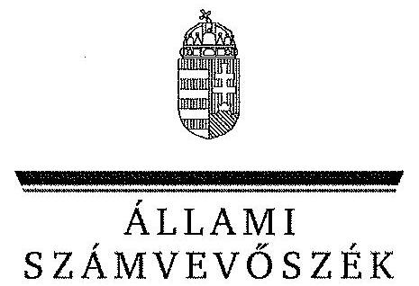

ÁLLAMI
SZÁMVEVÔSZÉK

# JELENTÉS 

a Gazdasági Versenyhivatal
múködésének és gazdálkodásának ellenôrzéséről

---

# Állami Számvevőszék 

Iktatószám: V-0115-236/2013.
Témaszám: 1150
Vizsgálat-azonosító szám: V0626

## Az ellenőrzést felügyelte:

## Makkai Mária

felügyeleti vezető
Az ellenőrzést vezette és az ellenőrzés végrehajtásáért felelős:
Horváthné Herbáth Mária
ellenőrzésvezető
A számvevőszéki jelentés összeállításában közreműködtek:
Imre Zsuzsanna
számvevő
Vértényi Gábor
számvevő
Dr. Zelei Andrásné
számvevő
Az ellenőrzést végezték:

| Imre Zsuzsanna | Vértényi Gábor | Dr. Zelei Andrásné |
| :-- | :-- | :-- |
| számvevő | számvevő | számvevő |

A témához kapcsolódó eddig készített számvevőszéki jelentések:
címe
sorszáma
Jelentés a Gazdasági Versenyhivatal múködésének ellenőrzéséről 0453

---

# TARTALOMJEGYZÉK 

BEVEZETÉS ..... 3
I. ÖSSZEGZŐ MEGÁLLAPÍTÁSOK, KÖVETKEZTETÉSEK, JAVASLATOK ..... 6
II. RÉSZLETES MEGÁLLAPÍTÁSOK ..... 17

1. Az intézmény múködésének szabályossága, az átszervezések közfeladatellátással való összhangja ..... 17
1.1. A GVH múködésének és az elnök feladatellátásának szabályszerűsége ..... 17
1.2. Az intézménynél végrehajtott átszervezések összhangja az ellátandó feladatokkal ..... 23
2. A GVH gazdálkodásának szabályszerűsége ..... 25
2.1. A feladatváltozások bevételekre és kiadásokra gyakorolt hatása ..... 25
2.2. Az előirányzat felhasználáshoz kapcsolódó korlátozó intézkedések pénzgazdálkodásra gyakorolt hatása ..... 28
2.3. A pénzügyi kötelezettségek teljesítésének és a fizetőképesség fenntartására tett intézkedések értékelése ..... 28
2.4. A feladatellátást biztosító vagyon változásának értékelése ..... 33
2.5. A személyi feltételek és a feladatellátás összhangja ..... 34
3. A GVH feladatellátásának szabályszerűsége ..... 36
3.1. Az alapító okirat és az SZMSZ összhangja a feladatellátásra vonatkozó jogszabályokkal ..... 36
3.2. A feladatellátás intézményi szabályozottsága, szabályszerűsége ..... 37
3.3. A Versenykultúra Központ feladatellátásának szabályszerűsége ..... 43
3.4. A belső ellenőrzések javaslatainak hasznosulása a feladatellátás során ..... 51
4. A 2004. évi ÁSZ ellenőrzés javaslatainak hasznosulása ..... 53

---

# MELLÉKLETEK 

1. számú A GVH létszámadatai szervezeti egységenként a 2008-2012. években
2. számú A GVH finanszírozására felhasználható bírság és eljárási díj bevételek
3. számú A GVH kiemelt költségvetési adatai a 2008-2012. években
4. számú Az előirányzat módosítások alakulása az ellenőrzött időszakban
5. számú A GVH likviditási mutatóinak alakulása az ellenőrzött időszakban
6. számú A GVH tevékenységéhez kapcsolódó közhatalmi bevételek és a követelésállomány alakulása 2008-2012. években
7. számú A GVH vagyonának összetétele 2008-2012. években
8. számú A GVH tevékenységéhez kapcsolódó közhatalmi bevételek felhasználása
9. számú A GVH szervezeti ábrája
10. számú A GVH eljárásainak alakulása az ellenőrzött időszakban
11. számú A teljesített bevételek összetételének változása a 2008. és 2012. években
12. számú A teljesített kiadások összetétele az ellenőrzött időszakban
13. számú A beérkezett panaszok elutasításának okai az ellenőrzött időszakban
14. számú A beérkezett bejelentések elutasításának okai az ellenőrzött időszakban
15. számú A GVH versenyfelügyeleti eljárásainak összetétele ügytípusok szerint a 2008-2012. években
16. számú A Versenykultúra Központ feladataira fordított kiadások a 2008-2012. közötti időszakban
17. számú A GVH elnökének észrevétele
18. számú A GVH elnökének észrevételére adott válasz

## FÜGGELÉKEK

1. számú Rövidítések jegyzéke
2. számú Fogalomtár

---

# JELENTÉS 

## a Gazdasági Versenyhivatal müködésének és gazdálkodásának ellenőrzéséről

## BEVEZETÉS

A Gazdasági Versenyhivatalt (GVH) az Országgyưlés a piaci verseny fenntartásához fűződő közérdek, továbbá az üzleti tisztesség követelményeit betartó vállalkozások és a fogyasztók érdekeinek védelmére hozta létre. A Hivatal jogállását és alapfeladatait a tisztességtelen piaci magatartás és a versenykorlátozás tilalmáról szóló 1996. évi LVII. törvény (Tpvt.) rögzíti.

A Gazdasági Versenyhivatalnak a verseny védelme érdekében végzett feladatai három területre - a versenyfelügyeletre a versenypártolásra, valamint a versenykultúra fejlesztésére - terjednek ki.

Versenyfelügyeleti eljárást a Hivatal a hatáskörébe tartozó, a versenytörvényben és a közösségi versenyszabályokban tilalmazott piaci magatartások elkövetésének gyanúja esetén hivatalból indít. Ilyenek a fogyasztói döntések tisztességtelen befolyásolása, a gazdasági erőfölénnyel való visszaélés és a versenykorlátozó megállapodások. A hivatalból indítandó eljárások megalapozásához, a piaci szereplők által szolgáltatott bejelentések, panaszok, szóbeli folyamodványok, valamint az ágazati vizsgálatok nyújtanak információt. A versenyfelügyeleti eljárás során a Hivatal - amennyiben jogsértést állapít meg - bírságot szabhat ki, illetve piaci szereplőket eltilthat bizonyos tevékenységektől. A Gazdasági Versenyhivatal - jellemzően a vállalkozások közötti összefonódás engedélyezéséhez kapcsolóan - kérelemre induló versenyfelügyeleti eljárásokat is lefolytat, de a kérelem benyújtásának elmulasztása esetén hivatalból is eljárhat.

A versenypártolás keretében az intézmény feladata az állami döntések befolyásolása a verseny érvényesülése érdekében. E tevékenység legfontosabb formáját a Hivatalhoz egyeztetésre érkezett jogszabálytervezetek, koncepciók véleményezése jelenti.

A versenykultúra fejlesztés a versenyjoggal, illetve a versenypolitikai összefüggésekkel kapcsolatos tájékozottság növelését, valamint a versenypolitikával foglalkozó tudományos infrastruktúra segittését célozza. A versenykultúra fejlesztéséhez kapcsolódó feladatokat a Gazdasági Versenyhivatal önálló szervezeti egysége a Versenykultúra Központ (GVH VKK) látja el.

A Gazdasági Versenyhivatal élén az elnök áll, aki irányítja az intézmény tevékenységét, felel a jogszabályoknak megfelelő müködésért és képviseli a Hivatalt. Munkáját két elnökhelyettes segíti, akik közül az egyik a Versenytanács

---

elnöki teendőit látja el. A másik elnökhelyettes feladata a szakmai irodák irányítása és felügyelete.

A Gazdasági Versenyhivatal a Kormánytól független költségvetési szerv, az állami költségvetés szerkezeti rendjében önálló fejezet, tevékenységét kizárólag az Országgyűlésnek alárendelten végzi.

Az intézmény feladatellátásához a 2008 és 2012 közötti időszakban összesen 12 574,8 M Ft állt rendelkezésre, amiből 10 684,9 M Ft-ot használtak fel.

Az Állami Számvevőszék (ÁSZ) átfogó jelleggel utoljára a 2004. évben ellenőrizte a Gazdasági Versenyhivatal tevékenységét, a fejezet előirányzatainak teljesülését évente a zárszámadási ellenőrzések keretében tekintette át.

Jelen ellenőrzés a 2012. évi zárszámadás ellenőrzéséhez kapcsolódóan kiterjedt a közfeladatot ellátó intézmény múködésének, feladatellátásának, pénzügyi és vagyoni helyzetének 2008-2012 közötti időszakot érintő értékelésére, valamint az Állami Számvevőszék 2004. évi átfogó ellenőrzésének utóellenőrzésére. A Gazdasági Versenyhivatal feladatellátását érintő ellenőrzés az eljárások jogszabályi és belső szabályoknak való megfelelőségére irányul, nem sértve a Hivatal versenyfelügyeleti függetlenségét. Az ellenőrzésről készült jelentéssel az Állami Számvevőszék a társadalom részéről kiemelt érdeklődéssel kísért versenytevékenység és a közpénzekkel való gazdálkodás objektív bemutatását célozza. Emellett a média bevonásával széleskörű, közérthető szakmai tájékoztatást kíván nyújtani a közvélemény számára.

Az ellenőrzés célja annak értékelése volt, hogy:

- a Gazdasági Versenyhivatal intézményi múködése az ellenőrzött időszakban megfelelt-e a jogszabályoknak, az átszervezések összhangban álltak-e az ellátandó közfeladatokkal;
- a vonatkozó jogszabályok alapján szabályszerű volt-e a Hivatal gazdálkodása;
- feladatellátása megfelelt-e az irányadó jogszabályi előírásoknak;
- hasznosultak-e a Gazdasági Versenyhivatal múködésének ellenőrzése tárgyában készült 2004. évi ÁSZ jelentés javaslatai.

Az ellenőrzés típusa: szabályszerűségi ellenőrzés.
Az ellenőrzést az ÁSZ 2013. évi első félévi ellenőrzési terve alapján, a számvevőszéki ellenőrzés szakmai szabályai szerint és a nemzetközi standardok figyelembe vételével végeztük. Az ellenőrzés végrehajtása során a megállapítások megalapozásához felhasználtuk az ellenőrzött szervezettől bekért dokumentumokat, az általa készített tanúsítványokat és nyilatkozatokat. Továbbá figyelembe vettük a Magyarország 2012. évi költségvetése végrehajtásának ellenőrzése során tett megállapításokat. A feladatellátás jogszabályoknak való megfelelését az elutasított panaszokból és bejelentésekből, valamint a versenyfelügyeleti eljárásokból egyszerű véletlen mintavétellel kiválasztott ügyek áttekintésével értékeltük. A Versenykultúra Központ működésének érté-

---

keléséhez a kiadások - statisztikai mintavétellel kiválasztott - tételeinek szabályosságát, feladatellátáshoz való kapcsolódását ellenőriztük.

Az ellenőrzés jogszabályi alapját az Állami Számvevőszékről szóló 2011. évi LXVI. törvény 1. § (3) bekezdésében, a pénzügyi szabályszerűségi ellenőrzés tekintetében az Állami Számvevőszékről szóló törvény 5. § (2)-(6) bekezdéseiben, valamint az államháztartásról szóló 2011. évi CXCV. törvény 61. § (2) bekezdésében foglalt előírások képezték.

Az ÁSZ a 2011. évi LXVI. törvény 29. §-a szerint a jelentéstervezetet megküldte a GVH elnökének egyeztetésre. A beérkezett észrevételeket és az azokra adott választ a jelentés 17-18. számú mellékletei tartalmazzák.

---

# I. ÖSSZEGZŐ MEGÁLLAPÍTÁSOK, KÖVETKEZTETÉSEK, JAVASLATOK 

A Gazdasági Versenyhivatal feladata, hogy versenyfelügyeleti eljárásaival, az állami döntéseket befolyásoló versenypártolással, valamint a versenykultúra fejlesztése érdekében kifejtett tevékenységével hozzájáruljon a piaci verseny szabadságának és tisztaságának védelméhez. Az intézmény feladatkörét alapvetően a versenytörvény ${ }^{1}$ határozza meg. Ezen túl a Hivatal más jogszabályok (pl. a kereskedelmi-, a reklám- a fogyasztókkal szembeni tisztességtelen kereskedelmi gyakorlat tilalmáról szóló törvények) által meghatározott tevékenységet is végez.

A hosszú és középtávú célokat, a célok eléréséhez szükséges tevékenységeket, valamint a feladatok határidejét tartalmazó hivatali stratégiával a Gazdasági Versenyhivatal nem rendelkezett az ellenőrzött időszakban. A stratégiáról szóló döntés az SZMSZ alapján az elnök feladatkörébe tartozik, aki 2012. január 5 -én fogadta el a stratégia megalapozásaként a Hivatal küldetésnyilatkozatát.

Az éves célkitűzéseket a Hivatal szakmai tervei tartalmazták, amelyekben 2008 - 2010 között a feladatok 50\%-ához nem rendeltek konkrét tevékenységeket. A 2011-2012 közötti időszakban ez az arány 13\%-ra csökkent. A 20112012. évi munkatervek kivételével nem rögzítették a feladatok végrehajtásának határidejét és felelőseit. A versenykultúrához kapcsolódó feladatok ellátásának önállóan elkészített éves munkatervei sem tartalmazták - a számon kérhetőség és a hatékony forrásfelhasználás biztosítása érdekében - a felelősöket, a határidőket és az adott feladat ellátására felhasználható keretösszegeket.

Elnöki hatáskörbe tartozik a Hivatal tevékenységének irányítása, képviselete, az Országgyűlés felé történő beszámolás, az intézményen belüli beszámoltatás. Ezeket a jogosultságait a Gazdasági Versenyhivatal elnöke az ellenőrzött időszakban a jogszabályoknak megfelelően gyakorolta. A szabályszerű múködés, ehhez kapcsolódóan a belső szabályozottság biztosítása - irányítói jogosultságként - szintén a Hivatal mindenkori elnökének feladata. A Hivatal elnöki pozíciójának betöltésében 2010. november 1-jétől változás történt.

Az intézmény múködésének szabályozottsága az ellenőrzött időszakban hiányos volt. A gazdálkodás megszervezését és az ellátandó feladatokat érintő jogszabályváltozásokat az alapító okiraton nem teljes körűen, illetve nem az előírt határidőben vezették át. Az SZMSZ-ben nem jelenítették meg a reklámtörvényben rögzített 2008. évi feladatváltozást, késedelmesen vezették át a 2010. év eleji szervezeti változásokat.

[^0]
[^0]:    ${ }^{1}$ A tisztességtelen piaci magatartás és a versenykorlátozás tilalmáról szóló 1996. évi LVII. törvény

---

A gazdálkodásra vonatkozó szabályzatok is hiányosak voltak. A kötelezettségvállalásra vonatkozó szabályzatok 2011-ig nem tartalmazták teljes körűen a jogosultak aláírás mintáit, azokról naprakész nyilvántartás sem állt rendelkezésre. Az ellenőrzött időszakban - a jogszabályi előírásoktól eltérően ${ }^{2}$ - nem szabályozták azon értékhatárt el nem érő kifizetések rendjét, amelyek esetében a kötelezettségvállalást nem kell írásba foglalni. 2010. április 1-jéig a Hivatal csak a közbeszerzési törvény hatálya alá tartozó beszerzések rendjét szabályozta.

A versenyfelügyeleti eljárás lefolytatásának teljes folyamatát egységes szabályzatban rögzítették. 2011-től a versenytörvényben nem rögzített szóbeli megkeresések kezelését is szabályozták. Külön utasításban rendelkeztek a közösségi versenyjog alkalmazásához kapcsolódó belső eljárásrendről, amelyet azonban nem aktualizáltak. A feladatellátás szabályozottságát érintő legjelentősebb hiányosság, hogy az ellenőrzött időszakban nem gondoskodtak a GVH Versenykultúra Központ pályáztatási tevékenységének szabályozásáról, amelynek hiánya nem megfelelő gyakorlat kialakulásához vezetett.

Intézményi múködése során a Gazdasági Versenyhivatal ellátta a versenytörvényben meghatározott feladatait, azonban az eljárások lebonyolításakor nem tartotta be maradéktalanul a versenytörvényben meghatározott határidőket, valamint a belső szabályzatok vonatkozó előírásait. A szabályzatok alkalmazását, érvényesítését, valamint a kontrollok múködését akadályozta az ügyiratok hiányos iktatása, a szabályzatok egységes szerkezetbe foglalásának és a korábbi szabályzatok hatályon kívül helyezésének elmaradása.

Az eljárások szabályszerűségének értékelését indokolta, hogy az ellenőrzött időszakban a Hivatalhoz érkezett 7218 panasz $88 \%$-át, valamint az 1170 bejelentés $83 \%$-át elutasították. Az eljárások lebonyolítása az elutasított panaszok esetében az ellenőrzött tételek $62 \%$-ában, az elutasított bejelentések $90 \%$ ában felelt meg maradéktalanul a versenytörvény vonatkozó előírásainak. A szabálytalanságok alapvetően a törvényben meghatározott határidők betartásának hiányából adódtak.

A Hivatal 2008-2012 között 652 versenyfelügyeleti eljárást folytatott le. A versenyfelügyeleti eljárások szabályszerűsége - a határidők be nem tartása, valamint a saját kezdeményezésű eljárásokat megalapozó vizsgálati koncepció hiánya miatt - az ellenőrzött ügyek $43 \%$-ában felelt meg a versenytörvényben és a belső szabályzatokban foglaltaknak.

A Versenytanács határozatainak 25\%-a ellen az ügyfelek felülvizsgálati kérelmet nyújtottak be. Ezek döntő többségét a bíróság elutasította. A felülvizsgálati kérelmekhez kapcsolódó bírósági eljárások elhúzódása, valamint az eltérő bírósági joggyakorlat azonban késleltette a bírságból származó közhatalmi bevételek felhasználhatóságát.

[^0]
[^0]:    ${ }^{2}$ Ámr. ${ }_{1}$ 134.§, Ámr. ${ }_{2}$ 72.§, Ávr.53.§

---

A Versenytanács határozatai ellen benyújtott felülvizsgálati kérelmek alapján az elsőfokú bíróság 46 esetben az ügyfelek javára 4854 M Ft bírság visszafizettetéséről, és 1628 M Ft késedelmi pótlék megfizetéséről döntött.

A Hivatal fellebbezése nyomán a másodfokú bíróság - a Gazdasági Versenyhivatal javára - 4097,6 M Ft bírság és 444,1 M Ft késedelmi pótlék visszafizetésére kötelezte az ügyfeleket. Ezek a bírságbevételek átlagosan két év elteltével kerültek vissza a nemzetgazdasági számlára.

Azokhoz a lezárult ügyekhez kapcsolódóan, amikor a bíróság az ismételt eljárásban is az ügyfél javára döntött 391,3 M Ft késedelmi pótlékfizetési kötelezettség keletkezett.

Az ismétlődő jogsértések nagyságrendjének alakulása az ellenőrzött időszakban nem változott, e téren a Hivatal nem tudott kimutatható eredményt elérni.

A Gazdasági Versenyhivatal versenypártolási tevékenysége során a feladatkörét érintő jogszabálytervezetek, koncepciók véleményezésével ellátta a versenytörvényben előírt feladatát.

# A Gazdasági Versenyhivatal versenykultúra fejlesztésével kapcsolato 

tos feladatait a 2005. évtől önálló szervezeti egysége a Versenykultúra Központ (GVH VKK) látja el. A GVH Versenykultúra Központ jogállása az ellenőrzött időszakban többször is változott. 2009. január 1. és 2009. december 31-e között részjogkörű szervezeti egységként, majd 2010. január 1-jétől a költségvetési szervek jogállásáról és gazdálkodásáról szóló törvény hatályon kívül helyezéséig jogi személyiségű szervezeti egységként működött. Jogi személyiségű státusza 2010 októberében megszűnt.

A GVH Versenykultúra Központ feladatkörébe tartozik: a versenykultúra fejlesztésével kapcsolatos tevékenységek elvégzése, a szervezeti egység keretein belül működő Regionális Oktatási Központ (ROK) és a Közép-európai Versenyügyi Kezdeményezés keretében zajló programok szervezése, szakmai előkészítése, valamint a Hivatal szakkönyvtárának működtetése.

A GVH Versenykultúra Központ a versenykultúra fejlesztés feladatait részben más szervezetek versenykultúra fejlesztő tevékenységének pályázati úton történő támogatásával valósította meg. Az ellenőrzött időszakban 84 pályázónak összesen 572,1 M Ft támogatást nyújtottak jelentős koncentráció mellett. A teljes pályázati összeg $51 \%$-ának a pályázók $13 \%$-a volt a kedvezményezettje. A helyszíni ellenőrzés 15 pályázatot érintett, amelyhez 79,3 M Ft támogatás kifizetése kapcsolódott.

Törvényi, illetve rendeleti szintű szabályozás ${ }^{3}$ a Gazdasági Versenyhivatal szervezeti egységének pályázati tevékenységére csak a 2012. évtől vonatkozott. A 2010. évtől azonban a pénzügyi kihatással bíró jogszabályban nem szabályozott kérdéseket belső szabályzatban kellett rendezni ${ }^{4}$. Az ellenőrzött időszakban

[^0]
[^0]:    ${ }^{3}$ Áht. 48 -56.§, Ávr.66-100.§
    ${ }^{4}$ Ámr 2 . 20.§, Ávr.13. § (2) bekezdés

---

a Hivatal nem gondoskodott a GVH Versenykultúra Központ pályáztatási tevékenységének belső szabályozásáról. Erre is visszavezethető, hogy a GVH Versenykultúra Központ - a pályázati felhívásokban, a támogatási szerződésekben foglaltak megsértésével - számos szabálytalanságot követett el.

A pályázatok befogadása során rendszerbeli hibaként nem volt megbízhatóan dokumentált a pályázatok beadásának ideje, formai bírálatuk megtörténte, a bíráló bizottság tagjainak felhatalmazása, valamint - egy kivétellel - a bírálók hiteles véleménye és a javaslata a támogatás összegéről. Az ellenőrzött pályázatok ötödrészében a benyújtott pályázat témája nem felelt meg a pályázati kiírásnak. Több esetben támogattak olyan pályázatot, amelynek elnagyolt költségtervéből nem lehetett megítélni a költségigény nagyságrendjének és öszszetételének megalapozottságát. Az igényeltnél alacsonyabb összeg megítélése esetén nem követeltek meg sem a megvalósíthatóságra vonatkozó pályázói nyilatkozatot, sem módosított költségtervet.

A támogatási döntéseket a pályázati felhívásban rögzitetthez képest rendszerint késedelmesen hozták meg (esetenként 59-129 nappal is túllépve a határidőt). A döntésekről hiteles dokumentáció, jegyzőkönyv nem állt rendelkezésre.

Több esetben a támogatási szerződéseket is a felhívásban rögzített határidőn túl kötötték meg. Egy esetben a támogatási szerződés aláírásának dátuma korábbi volt, mint a pályázat aláírásának és benyújtásának időpontja. A megvalósítási határidőn túli szerződésmódosításhoz is hozzájárultak. Előfordult, hogy amikor a kedvezményezett a módosított határidőre sem teljesített, az eredeti szerződést megszüntették, majd ugyanazon feladatra, azonos támogatási öszszegben, későbbi teljesítési határidővel új szerződést kötöttek.

Késedelmes és hiányos szakmai és pénzügyi beszámolók esetén sem alkalmaztak szankciókat, a beszámolók hiteles szakmai bírálatának dokumentumait több esetben nem tudták az ellenőrzés rendelkezésére bocsátani. Az ellenőrzött pályázatok 20\%-ánál nem kérték számon teljes körűen a költségek igazolására szolgáló bizonylatok érvénytelenítését. Az elszámolás során befogadtak és finanszíroztak a pályázati cél megvalósításához közvetlenül nem kapcsolódó infrastruktúra-fenntartási - költségeket, a támogatási szerződésben rögzített korlátot meghaladó eszközbeszerzéseket. A költségek elszámolásához elfogadták a számviteli előírásoknak nem megfelelő bizonylatok felhasználását is. A magánszemélyekkel kötött támogatási szerződések feladatainak ellátása - a Hivatal, mint kifizető járulékfizetési kötelezettsége miatt - a szerződésekben rögzítettnél nagyobb összegű forrásfelhasználással járt.

A GVH Versenykultúra Központ a felsőoktatási intézmények szakirodalmi könyvtárfejlesztését 44,9 M Ft-tal támogatta. A támogatást nem nyílt pályázat keretében, hanem kijelölés alapján nyújtották, ezzel korlátozták a támogatásban részesíthetők körét. A könyvek átvételéről, azaz a tényleges teljesítésről nem győződtek meg.

A GVH Versenykultúra Központ az ellenőrzött időszakban 1919,5 M Ft-t fordított feladatainak ellátására, amelynek forrása 2008-2011. között döntően a versenytörvényben meghatározott célokra felhasználható közhatalmi bevétel, ezt követően költségvetési támogatás volt.

---

A GVH Versenykultúra Központ kiadásai a versenykultúra és a tudatos fogyasztói döntéshozatal kultúrájának fejlesztéséhez kapcsolódtak. A versenytörvénnyel ellentétesen azonban $70,1 \mathrm{M}$ Ft összegben a Hivatal általános múködését szolgáló folyóirat, adathordozó beszerzéseket is finanszíroztak a szervezeti egység költségvetéséből az ellenőrzött időszakban.

A GVH Versenykultúra Központ összes kifizetéséből 691,0 M Ft volt a szervezeti egység keretein belül múködő Regionális Oktatási Központ kiadása. Ennek 93\%-át az OECD-vel 2005-ben, illetve 2011-ben kötött - a Hivatalra aránytalan finanszírozási terheket rovó - együttmúködési megállapodásokban vállalt kötelezettségek tették ki. A megállapodás keretében az ellenőrzött időszakban 225 M Ft-ot támogatásként adtak át az OECD-nek. Ugyanezen időszakban az OECD mindössze 24,1 M Ft-tal járult hozzá a Regionális Oktatási Központ kiadásaihoz.

A belső ellenőrzés a 2008-2012 közötti időszakban hét alkalommal ellenőrizte a Gazdasági Versenyhivatal feladatellátását, amelyből öt esetben fogalmaztak meg javaslatokat. Az ellenőrzés által feltárt hibák egy része - a rendszeres utóellenőrzések ellenére - ismétlődött.

A 2008-2010. évek belső ellenőrzési jelentéseiben megfogalmazott javaslatok alapján intézkedési terveket nem tudtak az ellenőrzés rendelkezésére bocsátani. A későbbi, feladatellátásra vonatkozó ellenőrzésekhez kapcsolódóan három esetben készült intézkedési terv. Ezek közül a GVH Versenykultúra Központ által nyújtott támogatások kezelésére vonatkozó intézkedést nem hajtották végre. A pályáztatási tevékenységet a belső ellenőrzés 2008-2011 közötti időszak minden évében ellenőrizte. A 2012. évi utóellenőrzés megállapítása szerint ennek ellenére a VKK-ra vonatkozó korábban feltárt hiányosságok többsége továbbra is fennállt. A belső ellenőrzés által feltárt hiányosságok egy részét a helyszíni ellenőrzés lezárásáig megszüntették (pl. a munkaidő-nyilvántartó rendszert alakítottak ki, szabályozták a külföldi kiküldetéseket).

Az átszervezések eredményeként az intézménynél az ellenőrzött időszakban létrejött az önálló Ügyfélszolgálati Iroda, valamint megtörtént a szakmai irodák szakterületi felosztásának átalakítása. Az átszervezések megalapozottak voltak, megvalósításukkal elérték a kitűzött célokat. Csökkent az ügyintézési idő, valamint a szakmai munkát végzők egyéb, többnyire adminisztratív tevékenységekből adódó leterheltsége, miközben hivatali szinten a létszám nem változott.

A 2011 márciusában létrejött Ügyfélszolgálati Iroda kialakításának célja a szakmai irodák leterheltségének csökkentése volt. Az átszervezést követően a panaszoknak és a folyamodványoknak mindössze $8 \%$-át intézték a szakmai irodák, a korábbi több mint $20 \%$ helyett. A szakmai irodák a más intézmény hatáskörébe tartozó panaszok 79\%-ának áttételéről határidőben gondoskodtak, a korábbi $26 \%$ helyett. Az átszervezést követő évben a Hivatalnál a 30 napon belül elintézett panaszok aránya a 2010. évi $45 \%$-ról $67 \%$-ra nőtt. Ugyanakkor a szakmai irodák 2012-ben a bejelentéseknek csak 68\%-át intézték el határidőben a 2010. évi $89 \%$ helyett.

---

A 2012-ben történt a legnagyobb átszervezés, amelynek keretében a szakmai irodákat az ágazati rend helyett az eljárások típusa szerint alakították át. Az átalakítás célja a fúziós ügyek elintézési idejének csökkentése volt. Az átszervezés eredményeként 2011-ről 2012-re az egyszerűsített fúziós eljárásokban a vizsgáló eljárásának átlagos hossza 24\%-kal, a Versenytanács eljárásának átlagos hossza $75 \%$-kal csökkent.

Az intézmény engedélyezett létszámkerete egy alkalommal - 2009-ben emelkedett az előző évi 120 fơről 125 főre. A létszámkeret feltöltöttsége 91-99\% között ingadozott az ellenőrzött időszakban. A Hivatal a feladatok maradéktalan ellátása érdekében az átmenetileg üres álláshelyek miatt hiányzó kapacitásokat többnyire különböző kedvezményes foglalkoztatások keretében alkalmazott munkavállalókkal biztosította. A személyi feltételek a szakmai területeken alapvetően igazodtak az ellátandó feladatokhoz.

Az ellenőrzött időszakban 49 magánszeméllyel kötöttek megbízási szerződést, amelyek alapján - járulékokkal együtt - mindösszesen 73,0 M Ft-ot fizettek ki. Az ellenőrzött tételek alapján a megbízási szerződések tárgyát képező tevékenységek egyediek, időszakosak, vagy időben rendszertelenül ellátandóak voltak. A teljesítéseket szabályszerűen igazolták. Ugyanakkor az ellenőrzött megbízási szerződések három esetben ügyviteli feladat ellátására irányultak, ami a köztisztviselők jogállásáról szóló törvénybe ${ }^{5}$ ütközött. Egy esetében a Hivatal közbeszerzési eljárás lefolytatása nélkül kötött szerződést, annak ellenére, hogy annak értéke meghaladta a 8 M Ft-os közbeszerzési értékhatárt. A Hivatal ezzel megsértette a közbeszerzési törvényben ${ }^{6}$ előírt közbeszerzési eljárás lefolytatásának kötelezettségét.

A Gazdasági Versenyhivatal feladatai 2008-2012 közötti időszakban egyrészt jogszabályok által meghatározottan, másrészt a piaci változások, a versenykultúra fejlődése következtében változtak. A jogszabályváltozások hatáskörbővülést, szűkülést és megszűnést egyaránt eredményeztek.

A hatáskör-bővülés - a Hivatal által intézett ügyek számának alakulása alapján - nem jelentett olyan jellegű feladatnövekedést az intézmény számára, ami kapacitásbővítést, ezáltal pótlólagos forrásigényt indokolt volna. Ugyanakkor a megszűnő, illetve szűkülő feladatkörök sem alapoztak meg forráscsökkentést. A feladatváltozások nem befolyásolták a bevételek és a kiadások nagyságrendjét és összetételét.

A Gazdasági Versenyhivatal múködését az ellenőrzött időszakban alapvetően költségvetési támogatás, emellett a versenytörvény hatályos rendelkezései ${ }^{7}$ szerint felhasználható célú és mértékű közhatalmi bevétel (bírság, eljárási díj) finanszírozta. A nemzetgazdasági számlára befolyt, tevékenységéhez kapcsolódó közhatalmi bevételekből - a versenytörvény által meghatározott módon és mértékben - az intézmény előirányzat-módosításként részesült.

[^0]
[^0]:    ${ }^{5}$ A köztisztviselők jogállásáról szóló 1992. évi XXIII. törvény 1. § (9) bekezdés
    ${ }^{6}$ A közbeszerzésekről szóló törvény 2003. évi CXXIX. törvény 240. § (1) bekezdés
    ${ }^{7}$ Tpvt. 43/A. §

---

Az ellenőrzött időszak bevételeinek 68,4\%-át ( $8605,3 \mathrm{M}$ Ft-ot) a költségvetési támogatás, $21,2 \%$-át ( $2662,0 \mathrm{M}$ Ft-ot) az előirányzat-módosítással igénybe vett közhatalmi bevételek tették ki. 2008-ról 2011-re a bevételeken belül a költségvetési támogatások részesedése 73,8\%-ről 54,7\%-ra csökkent, majd 2012-ben 74,6 \%-ra emelkedett. Az összes bevételből a közhatalmi bevételek aránya ugyanakkor a 2008. évi 17,7\%-ról 2011-re 35,3\%-ra nőtt, majd 2012-ben jelentősen $7,4 \%$-ra csökkent. A bevételi előirányzatok teljesítésének arányaiban bekövetkező eltolódások azonban nem a feladatváltozásokhoz, hanem a közhatalmi bevételek felhasználhatóságára vonatkozó jogszabályváltozásokhoz kapcsolódtak. A versenytörvény módosítása miatt a 2012. évtől a Gazdasági Versenyhivatal - a költségvetési támogatás egyidejű növelése mellett - a tevékenységéhez kapcsolódó bírságbevételekből nem részesült.

A kiadási előirányzatok teljesítése az ellenőrzött időszak egészére vonatkozóan 10 684,9 M Ft, a módosított előirányzatoknak átlagosan 85\%-a volt. A kiemelt kiadási előirányzatok összegében, arányaiban a feladatváltozásokhoz egyértelműen kapcsolódó módosulások nem történtek.

Az intézmény pénzgazdálkodását az előirányzat felhasználáshoz kapcsolódó évközi korlátozó intézkedések nem befolyásolták. Az Országgyűlés az ellenőrzött időszakban a Hivatal bevételi és kiadási főösszegét nem csökkentette. A Gazdasági Versenyhivatalt előirányzat zárolás, illetve maradványtartási kötelezettség elrendelése nem érintette.

A Gazdasági Versenyhivatal likviditása az ellenőrzött időszakban kiegyensúlyozott, a fizetőképessége folyamatosan biztosított volt. Előirányzatkeret előrehozásra nem volt szükség az intézménynél. A Hivatal tartozásait határidőben kiegyenlítette, szállítói állománya alacsony volt. Fizetőképességét sem szállítói kötelezettségek teljesítésének elmaradása, sem a mérlegben kimutatott elenyésző követelések nem befolyásolták.

# A Gazdasági Versenyhivatal közhatalmi tevékenységéből eredő követelések (bírság, pótlék, perköltség) a nemzetgazdasági beszámoló mérlegében jelentek meg. 

A közhatalmi tevékenységéhez kapcsolódó követelések tekintetében a GVH analitikus nyilvántartó hely. Ezekhez a követelésekhez kapcsolódóan 20082012 években, nemzetgazdasági szinten összesen 3294,2 M Ft veszteség keletkezett. A veszteség oka a behajthatatlan követelések leírása, valamint a kétessé vált követelésekre elszámolt értékvesztés. A behajthatatlan követelések 1270,4 M Ft-os összegének 94,3\%-a a 2010. évi és 2011. évi követelésállomány értékeléséből származott, amelyek leírása a 2011. évben történt. A 2011. évi leírás több mint harmada olyan korábbi években keletkezett követelésből adódott, ahol a kötelezettek időközben felszámolás alá kerültek. A Hivatal határidőn túli követelés-bejelentése miatt a felszámolók ezeket nem vették nyilvántartásba. Ezzel a Hivatal a részleges behajtás lehetőségét is elveszítette. Az ellenőrzött időszakban a kétes követelésállományhoz kapcsolódóan 2023,8 M Ft értékvesztést számoltak el. Ezekben az esetekben az ügyfelek ellen felszámolási eljárás folyik, ezért kétséges a behajtás sikere.

---

Az ellenőrzött időszakban a Gazdasági Versenyhivatal nem tett meg mindent a hátralékok behajtása érdekében, annak ellenére, hogy a versenytörvény a követelések behajtásával kapcsolatban is előír számára kötelezettségeket ${ }^{8}$. A Hivatal több alkalommal késedelmesen tett intézkedéseket a köztartozás behajtása végett ${ }^{9}$. A nyilvántartott követelésekre elszámolt veszteségek nagyságrendjéhez a követelés-kezelés folyamatának nem megfelelő szabályozottsága, valamint a szabályok hiányos végrehajtása is hozzájárult.

A 2011. évet megelőzően hiányzott a követeléskezeléssel járó feladatok egységes szabályozása. A vezetőváltással előrelépés történt a követeléskezelés javítása érdekében. Megtörtént a korábbi időszak behajthatatlan követeléseinek számviteli kezelése, a 2011 májusától kialakított szabályozás a teljes követeléskezelési folyamatot lefedi, azonban jelenleg is fennálló hiányosság a végrehajtás folyamatához kapcsolódó határidők meghatározása. A felelős szervezeti egységek adatellenőrzésének, valamint a követelések behajtását végző Nemzeti Adó- és Vámhivatallal történő egyeztetések gyakorisága nem biztosítja a nyilvántartás pontosságát, az információk megfelelő kontrollját.

A Hivatal ügykövetésre készült, de a követelés-nyilvántartásra is alkalmazott informatikai rendszeréből a követelések múltra vonatkozó adatai csak bonyolult szưrési rendszeren keresztül nyerhetők ki, ami hibalehetőséget hordoz. Bár az adatok a rendszerben rendelkezésre állnak, statikus múltbeli időpontra vonatkozó szűrések listák közvetlenül nem állíthatók elő.

A követeléskezelés kontrollja nem biztosított, a feladatra nem alakítottak ki felelős munkakört, illetve szervezeti egységet.

A Gazdasági Versenyhivatal vagyonának értéke és összetétele jelentős mértékben megváltozott az ellenőrzött időszakban. A teljes eszközállományon belül a befektetett eszközök aránya 37\%-ról 66\%-ra nőtt, míg a forgóeszközöké $63 \%$-ról $34 \%$-ra csökkent. A teljes vagyon értéke - a mérlegadatok alapján 256,6 M Ft-ról több mint kilencszeresére, 2436,1 M Ft-ra nőtt. A vagyon nagyságában és összetételében bekövetkezett változások nem a feladatváltozásokkal kapcsolatban merültek fel, hanem a székház vagyonkezelésbe vételéhez, annak korszerűsítéséhez kapcsolódóan, valamint a feladatellátás színvonalának, biztonságának növelése érdekében megvalósult fejlesztések következtében.

A Gazdasági Versenyhivatal 2004. évi ellenőrzéséhez kapcsolódóan az Állami Számvevőszék által a bírságok visszatartó erejének fokozására és a versenykultúra fejlesztésének törvényi szabályozására tett javaslatok megvalósultak. A 2009-től bevezetett informatikai rendszer a bírságok illetve az azokhoz kapcsolódó követelések nyilvántartását is támogatja. 2011-től átfogóan szabályozták a követeléskezelés folyamatát.

Az Állami Számvevőszékről szóló 2011. évi LXVI. törvény 33. § (1) bekezdésében foglaltak értelmében a jelentésben foglalt megállapításokhoz kapcsolódó

[^0]
[^0]:    ${ }^{8}$ 2012. február 1-ig: a Tpvt. 90. § (5) bekezdése, 2012. február 1-től a 90/A. § (1) bekezdése.
    ${ }^{9}$ Az adózás rendjéről szóló 2003. évi XCII. törvény 161 § (1) bekezdés.

---

intézkedési tervet köteles az ellenőrzött szervezet vezetője összeállítani, és azt a jelentés kézhezvételétől számított 30 napon belül az ÁSZ részére megküldeni. Amennyiben az intézkedési tervet határidőben nem küldi meg a szervezet, vagy az nem elfogadható, az ÁSZ elnöke a hivatkozott törvény 33. § (3) bekezdés a)-b) pontjaiban foglaltakat érvényesítheti.

Az ellenőrzés intézkedést igénylő megállapításai és javaslatai:

# A GVH elnökének 

1. A GVH az ellenőrzött időszakban az SZMSZ előírása ellenére nem rendelkezett - a hosszú és középtávú célokat, a célok eléréséhez szükséges tevékenységeket, valamint a feladatok határidejét tartalmazó - hivatali stratégiával.

Javaslat:
Intézkedjen a GVH hosszú és középtávú célokat, a célok eléréséhez szükséges tevékenységeket, valamint a feladatok határidejét tartalmazó stratégiájának elkészítéséről.
2. A GVH ellátandó feladatait és a gazdálkodás megszervezését érintő jogszabályváltozásokat az alapító okiraton és az SZMSZ-en nem teljes körűen és nem az előírt határidőben vezették át. Az SZMSZ-ben nem jelenítették meg a reklámtörvényben rögzített 2008. évi feladatváltozást, késedelmesen vezették át a 2010. év eleji szervezeti változásokat.

Javaslat:
Intézkedjen az alapító okirat és az SZMSZ módosításáról annak érdekében, hogy azok maradéktalanul tartalmazzák a GVH jogszabályban előírt feladatait, valamint a feladatok ellátásának rendjét.
3. Az ellenőrzött időszakban - az Ámr 2 20. § (3) és az Ávr. 13. § (2) bekezdéseinek előírásai ellenére - a GVH nem gondoskodott a VKK pályáztatási tevékenységének belső szabályozásáról, valamint a pályáztatási tevékenység során több esetben is szabálytalanul járt el.

A pályázati felhívásokban, a támogatási szerződésekben foglaltak megsértésével a VKK számos szabálytalanságot követett el. A pályázatok befogadás során nem volt megbízhatóan dokumentált a pályázatok beérkezésének ideje, formai bírálatuk megtörténte, a bírálók hiteles véleménye. A támogatási döntéseket a pályázati felhívásban rögzítettekhez képest rendszerint késedelmesen hozták meg. Több esetben a támogatási szerződéseket is a felhívásban rögzített határidőn túl kötötték meg. Késedelmes és hiányos szakmai és pénzügyi beszámolók esetén nem alkalmaztak szankciókat.

Az ellenőrzött időszakban 84 pályázónak összesen 572,1 M Ft támogatást nyújtott a GVH jelentős koncentráció mellett. A helyszíni ellenőrzés 15 pályázatot érintett, amelyhez 79,3 M Ft támogatás kifizetése kapcsolódott. A GVH Versenykultúra Központ a pályázati felhívásokban, a támogatási szerződésekben foglaltak megsértésével számos szabálytalanságot követett el.

---

Javaslat:
a) Intézkedjen a VKK pályáztatási tevékenységének teljes körű szabályozásáról és azok érvényesülését biztosító kontrollokról.
b) Vizsgálja meg a VKK pályáztatási tevékenységével kapcsolatban feltárt szabálytalanságok körülményeit, amennyiben a felelősségre vonás feltételei fennállnak, tegye meg a szükséges intézkedéseket.
c) Intézkedjen, hogy az ellenőrzött időszak valamennyi támogatási szerződéséhez kapcsolódó, teljes körű pályáztatási tevékenységet ellenőrizze a belső ellenőrzés.
4. A GVH a szakmai feladatai ellátásának éves szakmai terveiben nem minden esetben határozta meg konkrétan a feladatokat, továbbá - a 2011-2012. évi munkatervek kivételével - a végrehajtás határidejét és felelőseit. A VKK versenykultúrához kapcsolódó feladatok ellátásának éves munkatervei nem tartalmazták a felelősöket, határidőket és az adott feladat ellátására felhasználható keretösszegeket

Javaslat:
Intézkedjen a GVH éves szakmai terveiben és a VKK munkaterveiben az egyes feladatokhoz meghatározott szakmai felelős, megvalósítási határidő, valamint a felhasználható keretösszeg hozzárendeléséről a számon kérhetőség és a hatékony forrásfelhasználás érdekében
5. A nyilvántartott követelésekre elszámolt veszteségek nagyságrendjéhez a követeléskezelés folyamatának nem megfelelő szabályozottsága, valamint a szabályok hiányos végrehajtása is hozzájárult. A 2011. évet megelőzően hiányzott a követeléskezeléssel járó feladatok egységes szabályozása. A 2011 májusától kialakított szabályozás a teljes követeléskezelési folyamatot lefedi, azonban jelenleg is fennálló hiányosság a végrehajtás folyamatához kapcsolódó határidők meghatározása. A GVH követelésnyilvántartásra is alkalmazott informatikai rendszerében - bár az adatok rendelkezésre állnak - azonban múltbeli időpontra vonatkozó szűrések és listák megbízható adattartalommal nem állíthatók elő. A követeléskezelés kontrollja nem biztosított, a feladatra nem alakítottak ki felelős munkakört, illetve szervezeti egységet.

Javaslat:
Intézkedjen a követeléskezelés kontrolljainak kialakításáról, az eljárási határidők szabályzatban történő meghatározásáról, az ügyviteli rendszerben történő pontos nyilvántartásáról, nyomon követéséről, felelős kijelöléséről a követeléskezelés kontrollja, illetve a bírságokból, eljárási díjakból keletkező követelések behajtásának hatékonysága érdekében.
6. Az OECD-vel 2005-ben, illetve 2011-ben kötött együttműködési megállapodások a GVH-ra aránytalan finanszírozási terheket rónak. Az ellenőrzött időszakban a megállapodásban vállalt kötelezettségek teljesítésére 641,2 M Ft-ot fordítottak. Ugyanezen időszakban az OECD mindössze 24,1 M Ft-tal járult hozzá a ROK kiadásaihoz.

---

Javaslat:
Fontolja meg az OECD-vel kötött együttműködési megállapodás felülvizsgálatának, illetve újratárgyalásának kezdeményezését a GVH-ra nézve aránytalan, egyoldalú finanszírozási terhek megváltoztatása, mérséklése érdekében.
7. A behajthatatlan követelések 1270,4 M Ft-os összegének 94,3\%-a a 2010. évi és 2011. évi követelésállomány értékeléséből származott, amelyek leírása a 2011. évben történt. A 2011. évi leírásnak több mint a harmada (448,3 M Ft) olyan korábbi években keletkezett követelésből adódott, ahol a kötelezettek időközben felszámolás alá kerültek. A Hivatal határidőn túli követelés-bejelentése miatt a felszámolók ezeket nem vették nyilvántartásba. Ezzel a Hivatal a részleges behajtás lehetőségét is elveszítette.

Javaslat:
Intézkedjen a követelés leírásoknál tapasztalt határidőn túli követelés-bejelentés körülményeinek kivizsgálásáról, és amennyiben a vizsgálat eredménye indokolja, hozza meg a szükséges munkajogi intézkedéseket.
8. Az ellenőrzött megbízási szerződések három esetben ügyviteli feladat ellátására irányultak, ami a köztisztviselők jogállásáról az ellenőrzött megbízási szerződések három esetben ügyviteli feladat ellátására irányultak, ami a köztisztviselők jogállásáról szóló törvénybe ${ }^{10}$ ütközött. Egy esetében a Hivatal közbeszerzési eljárás lefolytatása nélkül kötött szerződést, annak ellenére, hogy annak értéke meghaladta a 8 M Ft-os közbeszerzési értékhatárt. A Hivatal ezzel megsértette a közbeszerzési törvényben ${ }^{11}$ előírt közbeszerzési eljárás lefolytatásának kötelezettségét.

Javaslat:
Intézkedjen a megbízási szerződések megkötése körülményeinek kivizsgálásáról és annak eredménye függvényében hozza meg a szükséges munkajogi intézkedéseket.

[^0]
[^0]:    ${ }^{10}$ A köztisztviselők Jogállásáról szóló 1992. évi XXIII. törvény 1. § (9)
    ${ }^{11}$ A közbeszerzésekről szóló törvény 2003. évi CXXIX. törvény 240. § (1)

---

# II. RÉSZLETES MEGÁLLAPÍTÁSOK 

## 1. AZ INTÉZMÉNY MÜKÖDÉSÉNEK SZABÁLYOSSÁGA, AZ ÁTSZERVEZÉSEK KÖZFELADATELLÁTÁSSAL VALÓ ÖSSZHANGJA

### 1.1. A GVH múködésének és az elnök feladatellátásának szabályszerűsége

A GVH feladatkörét alapvetően a Tpvt. határozta meg az ellenőrzött időszakban. A feladatellátás Tpvt.-n kívüli jogalapjait az árak megállapításáról szóló 1990. évi LXXXVII. törvény, a fogyasztókkal szembeni tisztességtelen kereskedelmi gyakorlat tilalmáról szóló 2008. évi XLVII. törvény (Fttv.), a gazdasági reklámtevékenység alapvető feltételeiről és egyes korlátairól szóló 2008. évi XLVIII. törvény (Grt.) és a kereskedelemről szóló 2005. évi CLXIV. törvény (Kertv.) tartalmazta.

A GVH az ellenőrzött időszakban a Tpvt.-ben előírt mindhárom feladatkörébe tartozó tevékenységkört (a versenyfelügyeletet, a versenypártolást, valamint a versenykultúra fejlesztését) ellátta. Az eljárások lebonyolításának szabályszerűsége azonban - a 3. pontban részletezettek szerint - nem felelt meg maradéktalanul a Tpvt., valamint a belső szabályzatok vonatkozó előírásainak.

A Hivatal feladatának ellátása során az ellenőrzött időszakban összesen 7218 panasz és 1170 bejelentés ügyében intézkedett, emellett 652 versenyfelügyeleti eljárást folytatott le. A versenyfelügyeleti eljárások jellemzően hivatalból, kisebb részben kérelemre indultak.

A GVH ágazati vizsgálatot indított, amennyiben az adott ágazatban a piaci folyamatok a verseny sérülésére, torzulására utaltak. A vizsgálat során a piaci szereplőktől összegyűjtött információk részletes elemzésének eredményeként jelentés készült.

A 2008-2012. közötti időszakban mindössze három - ebből egy, az ellenőrzött időszakban indított - ágazati vizsgálat zárult le. Ezen ágazati vizsgálatok során a GVH nem azonosított olyan körülményt, amely versenyfelügyeleti eljárás indítását tette volna szükségessé. A vizsgálati eredmények alapján a GVH javaslatot tett a lakás-takarékpénztárra vonatkozó jogszabályi környezet pontosítására, fejlesztésére, valamint a folyószámla-piaci váltás megkönnyítésével kapcsolatos állami beavatkozásokra

A versenypártolás feladatát a GVH a feladatkörét érintő, tervezett intézkedés és jogszabály-koncepció, illetve jogszabály tervezet véleményezésével látta el ${ }^{12}$. A Tpvt. ezt a feladatot az elnök hatáskörébe rendeli.

[^0]
[^0]:    ${ }^{12}$ Tpvt. 36. § (3)

---

A versenykultúra fejlesztéshez kapcsolódó feladatokat a GVH önálló szervezeti egysége a GVH Versenykultúra Központ (GVH VKK) látta el. A GVH VKK feladatellátásának szabályszerűségét a Jelentés 3. pontjában értékeltük.

Kiemelt feladatköreinek ellátásán túl a Tpvt. 92. § (1) bekezdésének és az 1978. évi 2. törvényerejű rendelet ${ }^{13} 5$. §-ának felhatalmazása alapján a GVH az ellenőrzött időszakban egy közérdekü keresetet is indított.

A 2011-ben indított közérdekű kereset a fogyasztók széles körét érintő, vagy jelentős hátrányt okozó szabálysértés miatt, ingatlanok adás-vételét közvetítő internetes oldalakat üzemeltető vállalkozások általános szerződési feltételeivel kapcsolatban. A helyszíni ellenőrzés lezárásáig a per nem fejeződött be.

A jogalkalmazás kiszámíthatóságát növelte a Tpvt. alapján a GVH jogalkotási gyakorlatát ismertető hat közlemény ${ }^{14}$ kiadása.

A Gazdasági Versenyhivatal elnökének hatáskörébe tartozik a Hivatal tevékenységének irányítása, képviselete, az Országgyűlés felé történő beszámolás, az intézményen belüli beszámoltatás, amely jogosultságait a jogszabályoknak megfelelően gyakorolta. Az elnök egy személyben felel az intézmény jogszabályoknak megfelelő működéséért. ${ }^{15}$.

Az elnök a Hivatal tevékenységének irányítása ${ }^{16}$ keretében kialakította az intézmény szervezeti felépítését. (9. sz. melléklet) Feladatkörébe tartozott az alapító okirat meghatározása, az intézmény szervezeti és működési szabályzatának megállapítása, valamint a Versenytanács SZMSZ-ének jóváhagyása ${ }^{17}$.

Az alapító okiratot az ellenőrzött időszakban három alkalommal módosították, az ellátandó feladatokat, a gazdálkodás megszervezésének módját, valamint az alapító okirat tartalmi elemeit előíró jogszabályváltozásokhoz kapcsolódóan.

A gazdálkodás megszervezéséhez kapcsolódó jogszabályváltozásokat követő módosításokat a GVH alapító okiratán nem végezték el határidőben.

A 2008. évtől részjogkörű költségvetési egységként működő GVH VKK jogállásának változását az alapító okiratban csak a 2009. december 22-étől hatályos módosításkor rögzítették. A Kt. ${ }^{18}$ 4. §-ában felsorolt tartalmi elemeknek az alapító okirat a 2009. június 1-jei határidőn túl, csak 2009.december-22-étől felelt meg teljes mértékben.

[^0]
[^0]:    ${ }^{13}$ A Polgári Törvénykönyv módosításáról és egységes szövegéről szóló 1977. évi IV. törvény hatálybalépéséről és végrehajtásáról szóló 1978. évi 2. törvényerejű rendelet.
    ${ }^{14}$ Tpvt. 36. § (6)
    ${ }^{15}$ Tpvt. 36. §-a, Áht. ${ }_{1} 49 . \S$ és 93. §, ezután az Áht. ${ }_{2} 9 . \S$-a
    ${ }^{16}$ Tpvt. 36. § (1)
    ${ }^{17}$ Tpvt. 36. § (1) c), Áht. ${ }_{1} 49 . \S$ (5) c) és 93. § (1) a), Áht. ${ }_{2} 9 . \S$ (1) a), e)
    ${ }^{18}$ A költségvetési szervek jogállásáról és gazdálkodásáról szóló 2008. évi CV törvény (Kt.)

---

A Tpvt. 36. § (1) bekezdés f) pontjában előírt versenykultúrával összefüggő feladatokat, az elnök az önálló szervezeti egységként működő Versenykultúra Központ múködésének megszervezésével látta el.

A szervezeti egységek közötti feladatok felosztása, valamint a felelősök alá- és fölérendeltségi viszonya egyértelmű. A jogszabályokban rögzített feladatváltozásokat, valamint a szervezeti változásokat azonban nem a hatálybalépést követöen, és nem minden esetben vezették át az SZMSZben.

A 2010. január 1-jétől kialakított Pénzügyi Szolgáltatások Irodája és Informatikai és Iratirányítási Csoport (3. sz. kimutatás) az SZMSZ-be csak annak a 2010. április 1-jei módosításával került be.

A GVH elnöke a Hivatal gazdálkodásának megszervezése keretében meghatározta a GVH fejezet, valamint a GVH intézmény éves költségvetési tervét, ennek keretében jóváhagyta a létszám előirányzatát ${ }^{19}$.

A gazdálkodás szabályozottsága egyes szabályzatok hiányosságai miatt az ellenőrzött időszakban nem volt teljes körü.

A kötelezettségvállalás szabályozása a GVH elnökének e témakörben kiadott utasításai alapján történt ${ }^{20}$. A szabályzatok mellékletei a 2008.-2010. években hiányosan tartalmazták a jogosultak aláírás-mintáit, s azokról naprakész nyilvántartás sem állt rendelkezésre ${ }^{21}$. A hiányzó aláírás-minták a KVI-nél rendelkezésre álltak aláírási címpéldány formájában. A hiányosságot a 4/Eln/2011 számú belső utasítással 2011. március 21-i hatállyal pótolták. 2013. március 1-jétől a Hivatal rendelkezett az aláírásra jogosultakról és azok aláírás-mintájáról.

Az ellenőrzött időszakban - a vonatkozó jogszabályokkal ellentétben - a GVH nem szabályozta azon értékhatárt el nem érő kifizetések rendjét, amelyek esetében a kötelezettségvállalást nem kell írásba foglalni. ${ }^{22}$

A GVH Főtitkárának 2013. szeptember 4-i Nyilatkozata alapján (6. pont) az értékhatárt el nem érő kifizetések esetén is írásban történt a kötelezettségvállalás.

A 2008. és 2009. évi belső utasítások ${ }^{23}$ csak a közbeszerzésekről szóló törvény ${ }^{24}$ hatálya alá tartozó beszerzésekről rendelkezett, mivel a beszerzések teljes körű

[^0]
[^0]:    ${ }^{19}$ Áht. ${ }_{1}$ 49. § (5) l), Áht. ${ }_{2} 43 . \S$ (1)
    ${ }^{20}$ Az 5/Eln./2007 és a 2010. május 15 -től a 4/Eln/2011 számú utasítással módosított 16/Eln./2010 számú belső utasítások
    ${ }^{21}$ 292/2009. (XII. 19.) Korm. rendelet (Ámr. ${ }_{2}$ ) 80. § bekezdésében és az államháztartásról szóló törvény végrehajtásáról szóló 368/2011. (XII. 31.) Korm. rendelet (Ávr.) 60. §
    ${ }^{22}$ Az államháztartás múködési rendjéről szóló 217/1998. (XII. 30) Korm. rendelet (Ámr. ${ }_{1}$ ) 134. §-a, az Ámr. ${ }_{2}$ 72. §-a és az Ávr. 53. §-a
    ${ }^{23}$ 3/Eln./2008 évi belső utasítása a Hivatal Közbeszerzési Szabályzatáról
    ${ }^{24}$ A közbeszerzésekről szóló 2003. évi CXXIX. tv.

---

szabályozását az Ámr 2010. január 1-jei hatálybalépése tette kötelezővé. A 2010. április 1-jétől hatályos 10/Eln./2010. évi belső utasítás már a GVH valamennyi beszerzésére vonatkozó eljárásrendet tartalmazta.

A hivatali telefonok használatának szabályozottsága 2010. május 1jétől ${ }^{25}$ lett teljes körü, azonban - elkülönítés hiányában - a magáncélú vezetékes telefonhívások költségét a közpénzből gazdálkodó Hivatal viseli.

A reprezentációs kiadások elszámolását 2010 októberétől ${ }^{26}$ szabályozták, amelyben meghatározták az általános szabályokat és a vezetői reprezentáció havi keretösszegét.

A gépjármúvek igénybevételének és használatának rendjéről szóló szabályzat ${ }^{27}$ az ellenőrzött időszakban teljes egészében tartalmazta a cél szerinti és hatékony felhasználás követelményeit.

A szabályzatok alkalmazását, érvényesítését, valamint a kontrollok múködését, a folyamatok nyomon követhetőségét az alábbiakban felsoroltak nehezítették:

- Az új szabályzatok hatályba léptetésekor az ellenőrzött időszakban nem minden esetben helyezték hatályon kívül a korábbi szabályzatokat. A szabályzatok ilyen típusú áttekintésére és a szükségtelen szabályzatok hatályon kívül helyezésére 2013 áprilisában ${ }^{28}$ került sor.
- Két, a helyszíni ellenőrzés idején már nem hatályos elnöki utasítást (SZMSZ: 2/Eln./2008. évi belső utasítás; alapító okirat: 1/Eln./2009. évi belső utasítás) az aláírást megelőző időponttal léptettek hatályba.
- A módosításokat nem külön elnöki utasításban, hanem más szabályzatok egyéb rendelkezései között adták ki. Például SZMSZ módosítást tartalmaz a Gazdasági Versenyhivatal iratkezelési szabályzatáról szóló 13/Eln./2011. utasítás 55. §-a.
- Az elnök utasításait a GVH szervezetén belül nem a Jat. által a Hivatalos értesítőben való közzétételkor előírt ${ }^{29}$ módon jelölték (X/Eln./Évszám. rendszerben). Így 2011 óta minden elnöki utasításnak két azonosítója van.

Például a 13/Eln./2011. utasítás azonos az 1/2012. (I. 13.) GVH utasítással.
Az ellenőrzött időszakban a hatósági ügyeken kívüli iratok nyomon követését, kontrollját egyaránt nehezítette, hogy nem volt teljes körű ezen ügyiratok iktatása ${ }^{30}$ (pl. éves célkitűzések, belső ellenőrzés iratai, együttműködési megál-

[^0]
[^0]:    ${ }^{25}$ 14/Eln./2010. belső utasítás, 10/2011. (XI. 10.) GVH utasítás [2011. XI. 1-jétől]
    ${ }^{26}$ 19/Eln./2010. belső utasítás, 8/2012. (IV. 25.) GVH utasítás [2012. IV. 13-ától]
    ${ }^{27}$ 10/Eln./2004. belső utasítás, 15/Eln./2010. belső utasítás [2010. V. 1-jétől]
    ${ }^{28}$ A Gazdasági Versenyhivatal elnökének 5/2013. (IV. 24.) GVH utasítása egyes utasítások módosításáról, illetve hatályon kívül helyezéséről
    ${ }^{29}$ A jogalkotásról szóló 2010. évi CXXX. törvény (Jat.) 27. § (2), 28/B. § (1) a)
    ${ }^{30}$ A közfeladatot ellátó szervek iratkezelésének általános követelményeiről szóló 335/2005. (XII. 29.) Korm. rend. 14. § (1)

---

lapodások). Egyes hiányzó iratokról nem volt egyértelműen megállapítható, hogy hiányoznak vagy el sem készültek (pl. a belső ellenőrzési jelentésekhez kapcsolódó intézkedési tervek). További hiányosság, hogy egyes - feltételezhetően kiadmányozásra került - ügyiratokat (pl. elnöki utasítások, ${ }^{31}$ egyes éves célkitűzések és együttműködési megállapodások) csak elektronikusan tudtak a helyszíni ellenőrzés rendelkezésére bocsátani. A GVH elnökének nyilatkozata alapján ezeket aláírt, hiteles formában nem tudták átadni.

Az elnök a vezetői beszámoltatás ${ }^{32}$ keretében eseti jelleggel vezetői (Szűkített Vezetői Értekezlet, később Hivatalvezetői Értekezlet), továbbá 2011. április 20ától heti rendszerességgel Irodavezetői Értekezletet ${ }^{33}$ tartott. Az Elnökhelyettesi Titkárság 2012. október 1-jétől kéthavi rendszerességgel Összesített jelentést köteles készíteni a panasszal kapcsolatos eljárások helyzetéről ${ }^{34}$. Az elnök minden évben beszámoltatta a szervezeti egységeket a tevékenységükről és a GVH gazdasági szervezetének vezetőjét az éves gazdálkodásról.

A GVH elnöke minden évben határidőben megküldte a belső ellenőrzési tevékenységről szóló tájékoztatóját a jogszabályban megjelölt miniszternek ${ }^{35}$. Ugyanakkor hiányosság volt, hogy a vonatkozó jogszabállyal ${ }^{36}$ ellentétesen a 2008-2010. években nem gondoskodott intézkedési terv készítéséről, illetve az ellenőrzött szervezeti egységek vezetőitől nem kérte azt számon.

Az elnök évente elkészítette a Gazdasági Versenyhivatal tevékenységéről és a gazdasági verseny tisztaságának és szabadságának érvényesüléséről szóló beszámolóját ${ }^{37}$, amelyet az Országgyülés (a helyszíni ellenőrzés lezárásáig a 2007-2011 évekről) minden évben elfogadott ${ }^{38}$.

A GVH eljárásai során több ágazati jogszabály ${ }^{39}$ írt elő más hatóságokkal való együttműködési kötelezettséget. A Hivatal az ágazati jogszabályoknak megfelelően megkötötte az együttmüködésről szóló megállapodásokat a társhatóságokkal (fogyasztóvédelmi hatóság, Magyar Energia Hivatal, Nemzeti Mé-dia- és Hírközlési Hatóság, Pénzügyi Szervezetek Állami Felügyelete, vasúti

[^0]
[^0]:    ${ }^{31}$ A Hivatal egyes eljárásai során alkalmazandó belső ügyintézési rendről szóló 9/Eln./2005. évi belső utasítás
    ${ }^{32}$ Áht. 9. § (1) $f$ )
    ${ }^{33}$ 1/Eln./2007. évi utasítás 28-29. pont, 5/Eln./2010. évi belső utasítás 28-29. pont
    ${ }^{34}$ 3/2011. (III. 29.) GVH utasítás 28/B. §
    ${ }^{35}$ A költségvetési szervek belső ellenőrzéséről szóló 193/2003. (XI. 26.) Korm. rend. Ber. § 37. (3), A költségvetési szervek belső kontrollrendszeréről és belső ellenőrzéséről szóló 370/2011. (XII. 31.) Korm. rend. 54. §
    ${ }^{36}$ A költségvetési szervek belső ellenőrzéséről szóló 193/2003. (XI. 26.) Korm. rend. Ber. § 29.§
    ${ }^{37}$ Tpvt. 36. § (1) c)
    ${ }^{38}$ 76/2009. (IX. 24.) OGY határozat, 100/2010. (X. 21.) OGY határozat, 78/2011. (X. 19.) OGY határozat, 76/2012. (XI. 16.) OGY határozat
    ${ }^{39}$ Az elektronikus hírközlésről szóló 2003.évi C. törvény, a villamos energiáról szóló 2007. évi LXXXVI. törvény, a vasúti közlekedésről szóló 2005. évi CLXXXII. törvény és az Fttv.

---

igazgatási szerv). A megállapodásokban előírt, éves gyakoriságú felülvizsgálatot azonban a felek nem teljesítették.

Az ellenőrzött időszakban a GVH nem rendelkezett közép és hosszú távú hivatali stratégiával, annak ellenére, hogy annak készítését az SZMSZ az elnök feladatköréhez rendelte ${ }^{40}$.

A GVH elnöke 2012. január 5-én elfogadta a GVH stratégiát megalapozó küldetésnyilatkozatát.

A küldetésnyilatkozat szerint a GVH a kartellekkel szembeni fellépést tekinti a legfontosabb feladatának. További stratégai céljai közé tartozik az ügyfélbarát, a hatékony, transzparens és kiszámítható múködés, valamint az önkéntes jogkövető magatartás elősegítése.

A küldetésnyilatkozat ugyanakkor nem teljesíti a stratégiától elvárt követelményeket, mert nem tartalmazza a célok eléréséhez szükséges tevékenységeket, a feladatok és részfeladatok határidejét.

A Hivatal 2008-2010. évekre készített éves szakmai tervei az ellátandó feladathoz 50\%-ához nem rendeltek konkrét tevékenységeket, nem határozták meg a feladatok elvégzésének határidejét, illetve felelőseit. Ezeket a szakmai terveket aláírt formában nem tudták az ellenőrzés részére átadni. A 2011 és 2012. évi célkitűzéseket a korábbiaknál részletesebben, szervezeti egységenkénti felelőst és határidőt előírva határozták meg, azonban a feladatok 13\%-ánál ebben az időszakban is hiányzott a célok és a tevékenységek konkretizálása (pl. ágazati vizsgálat kitűzése cél nélkül).

Az ellenőrzött időszakban a GVH versenypártolási munkatervvel ${ }^{41}$ nem rendelkezett.

A versenypártolási munkaterv elkészítésének koordinálása az Elnökhelyettesi Titkárság, majd a Jogi Iroda, végül a Versenypolitikai Iroda feladata volt.

A versenykultúrához kapcsolódó feladatokat ellátó GVH VKK éves munkaterveit elkészítette, és azokat a honlapján folyamatosan nyilvánosságra hozta. Az éves munkatervek nem tartalmazták a felelősöket, a határidőket, valamint az adott feladat ellátására felhasználható keretösszegeket. Ez akadályozza a feladatok számon kérhetőségét és a hatékony forrásfelhasználást.

A munkatervekben meghatározott feladatok nem valósultak meg maradéktalanul.

A szervezeti egység a 2012. évben a munkatervben meghatározott idegen nyelvű szakkönyv magyar nyelvre történő fordítását, valamint a felsőoktatási intézmények szakkönyvtáralnak támogatását nem teljesítette.

[^0]
[^0]:    ${ }^{40}$ 1/Eln./2007. utasítás 3.11.1. pontja, 5/Eln./2010. utasítás 3.11. pontja
    ${ }^{41}$ 5/Eln./2010. évi belső utasítás 16.4. pontja (19.9.)

---

# 1.2. Az intézménynél végrehajtott átszervezések összhangja az ellátandó feladatokkal 

Az ellenőrzött időszakban a GVH szervezeti felépítését hat esetben módosították, amelyből kettő járt jelentősebb átszervezéssel. A változtatásokat - egy kivétellel - 2010. november 2-a után az új elnök rendelte el.

A két legfontosabb változás az önálló Úgyfélszolgálati Iroda (ÚSZI) létrehozása és a szakmai irodák szakterületi felosztásának megváltoztatása volt.

A létszám szervezeti egységcsoportok közötti felosztása egy alkalommal, 2011ben változott érdemben. Az ÜSZI létrehozása miatt a Főtitkárság létszáma növekedett a szakmai irodáké terhére. (1. sz. melléklet)

A 2011. március 16-i módosítással a Főtitkár felügyelete alatt jött létre az Úgyfélszolgálati Iroda. A szervezeti egység fő feladata általános tájékoztatást adni a Hivatal tevékenységével kapcsolatban. Külön utasításban foglaltak szerint ellátni - többek között - a panasszal és a szóbeli folyamodvánnyal, valamint a más hatóságtól vagy bíróságtól érkező, illetve az áttett beadvánnyal kapcsolatos feladatokat.

Az ÜSZI kialakításának célja az volt, hogy csökkenjen a szakmai irodák leterheltsége és a GVH teljesíteni tudja a Tpvt. 2011. január 2-i módosítása alapján ${ }^{42}$ a panaszokkal kapcsolatos ügyintézés meggyorsítására és egyszerűsítésére tett előírásokat.

Az új előírás alapján rövidült a panasz áttételére rendelkezésre álló idő. Ha az adott ügyben más hatóság jogosult eljárni, akkor azt a korábbi tíz munkanap helyett nyolc napon belül kell áttenni a másik hatósághoz. A panasz elbírálására rendelkezésre álló időt ugyanakkor a Tpvt. már nem határozza meg. A jogszabály módosítása lehetőséget teremtett arra is, hogy a nyilvánvalóan alaptalan panaszt mellőzzék ${ }^{43}$.

Az elnök az önálló szervezeti egységként múködő ÜSZI kialakításáról az erőforrásokat és azok szükségességét bemutató előterjesztések alapján döntött ${ }^{44}$. Az ÜSZI vezetőjét a változtatások hatásáról beszámoltatta ${ }^{45}$, a panaszkezelés hatékonyságának nyomon követésére rendszeres jelentéstételi kötelezettséget vezetett be.

Az átszervezés csökkentette a szakmai irodák leterheltségét, azok az átszervezést követően már csak a panaszok és a folyamodványok $8 \%$-át intézték, a korábbi több mint $20 \%$ helyett. A szakmai irodák által más hatósághoz határidőn belül áttett panaszos ügyek aránya a 2010. évi 26\%-ról 2012-ben 79\%-ra nőtt. A panaszok elintézésére a Tpvt.-ben előírt határidő megszűnése miatt a

[^0]
[^0]:    ${ }^{42}$ A médiaszolgáltatásokról és a tömegkommunikációról szóló 2010. évi CLXXXV. törvény 228. § (3) bekezdése módosította a Tpvt. 43/I. §-át
    ${ }^{43}$ a jogszabályokban általánosan használt fogalom, jelentése figyelmen kívül hagyás
    ${ }^{44}$ Emlékeztető a hivatalvezetői értekezlet 2011. I. 10. napján megtartott üléséről
    ${ }^{45}$ Emlékeztető a hivatalvezetői értekezlet 2011. IV. 18. napján megtartott üléséről

---

panaszok egy részével kapcsolatos ügyintézést felfüggesztik. Emiatt a panaszos ügyek kezelésének átlagos hossza 54 napról 60 napra nőtt. Az ügyek többségét azonban rövid időn belül lezárták. A 30 napon belül elintézett panaszok aránya 2010. évről $45 \%$-ról 2012 -re $68 \%$-ra nőtt.

A panaszok elintézésére vonatkozó határidőt a jogszabályból törölték, ezért a panaszok egy részét, amennyiben további intézkedés vélelmezhető a Hivatal legfeljebb egy évre függőbe helyezi. Ez idő alatt dönthet az ügy további vizsgálatáról, ellenkező esetben automatikusan lezárásra kerül.

Ugyanakkor - a szakmai irodák feladataként - a bejelentések határidőben történő elintézésének aránya 2010. évi $89 \%$ helyett 2012-re 68\%-ra csökkent.

2012 márciusában történt a legnagyobb átszervezés a GVH-ban. A szakmai irodákat az ágazati rend helyett az eljárások típusa alapján alakították át. Megszűnt a Termelő és Szolgáltató Ágazatok Irodája, a Hálózatos Ágazatok Irodája és a Pénzügyi Szolgáltatások Irodája, helyette létrejött az Antitröszt Iroda és a Fúziós Iroda. Az átalakítás célja a fúziós ügyek elintézési idejének csökkentése volt ${ }^{46}$.

Az átszervezéssel elérték a kitűzött célt, 2011-ről 2012-re az egyszerűsített fúziós eljárásokban a vizsgáló eljárásának átlagos hossza $24 \%$-kal, a Versenytanács eljárásának átlagos hossza $75 \%$-kal csökkent.

A további átalakítások kisebb jelentőséggel bírtak, az elnöki döntések előkészítésére, az ügyiratkezelés egyszerűsítésére és a szakmai munka támogatására irányultak.

Az átszervezésekkel elérték a kitűzött célokat. Hivatali szinten az átszervezések nem jártak létszámváltozással, ugyanakkor csökkentették az ügyintézési időt, valamint a szakmai munkát végzők egyéb, többnyire adminisztratív tevékenységekből adódó leterheltségét.

[^0]
[^0]:    ${ }^{46}$ Emlékeztető a hivatalvezetői értekezlet 2011. XI. 7. napján megtartott üléséről

---

# 2. A GVH GAZDÁLKODÁSÁNAK SZABÁLYSZERŰSÉGE 

### 2.1. A feladatváltozások bevételekre és kiadásokra gyakorolt hatása

A 2008-2012 közötti időszakban a GVH feladatai egyrészt jogszabályok által meghatározott feladatkör bővülés-szűkülés-megszűnés, másrészt a piaci változásokkal, a versenykultúra fejlődése miatt módosultak.

Az uniós jogharmonizációhoz kapcsolódóan, a magyar fogyasztóvédelmi szabályozás 2008. évi átalakításával életbe lépett a fogyasztókkal szembeni tisztességtelen kereskedelmi gyakorlat tilalmáról szóló törvény, ${ }^{47}$ valamint az új reklámtörvény ${ }^{48}$, amelyek hatáskörváltozást jelentettek a GVH számára.

Az Fttv. 10. § (3) bekezdése alapján az intézmény hatásköre bővült. A tisztességtelen kereskedelmi gyakorlat tilalmának megsértése esetén amennyiben az a gazdasági versenyt érdemileg befolyásolja - 2008. szeptember 1-jétől a GVH jár el.

Az új reklámtörvény szerint a GVH a vállalkozások közötti viszonyokban közzétett megtévesztő reklámok esetében jár el.

A 2012. évi CXXVIII. törvény ${ }^{49}$ a szakmaközi szervezetek egyes megállapodásai, döntései és összehangolt magatartása esetén mentességet biztosít a Tpvt. hatálya alól. Ugyanakkor ezekben az esetekben előzetesen értesíteni kell az agrárpolitikáért felelős minisztert, aki a GVH bevonásával megosztott hatáskörben vizsgálja meg, hogy a megállapodások összeegyeztethetők-e a vonatkozó uniós vagy hazai jogszabályokkal.
2009. június 1-jétől egyes termékek árának ${ }^{50}$ előzetes bejelentésével összefüggő, 2009. október 1-jétől pedig a jelentős piaci erővel bíró nagykereskedők által készítendő etikai kódexek jóváhagyására vonatkozó hatásköre megszűnt a Hivatalnak.
2012. augusztus 1-jétől szükült a GVH eljárási hatásköre a beszállítóval szembeni piaci erővel való visszaélés esetén ${ }^{51}$. A Hivatal eljárása nem alkal-

[^0]
[^0]:    ${ }^{47}$ A fogyasztókkal szembeni tisztességtelen kereskedelmi gyakorlat tilalmáról szóló 2008. évi XLVII. törvény (Fttv.)
    ${ }^{48}$ 2008. évi XLVIII. törvény a gazdasági reklámtevékenység alapvető feltételeiről és egyes korlátairól 24. § (2) bekezdés
    ${ }^{49}$ A szakmaközi szervezetekről és az agrárpiaci szabályozás egyes kérdéseiről szóló 2012. évi CXXVIII. törvény
    ${ }^{50}$ Az árak megállapításáról szóló 1990. évi LXXXVII. törvény 3-6. §., 18. §.
    ${ }^{51}$ A kereskedelemről szóló 2005. évi CLXIV. tv. 7. §

---

mazható a mezőgazdasági és élelmiszeripari termékeket termelő, feldolgozó átalakító szervezetek esetében ${ }^{52}$.

A változások nem jelentettek olyan jellegü feladatnövekedést a Hivatal számára, ami kapacitásbővítést, ezáltal pótlólagos forrásigényt indokolt volna. A 2008 évi feladatkör bővüléssel azonban nem növekedett a bejelentések, a panaszok, illeve a hivatalból indult ügyekből lefolytatott versenyfelügyeleti eljárások száma, hanem az azt követő két évben még csökkentek is. (10. sz. melléklet). A megszűnő, illetve szűkülő feladatkörök sem alapoztak meg forráscsökkentést. A bevételek és a kiadások nagyságának és összetételének változása alapvetően nem a feladatváltozásokhoz kapcsolódott.

A GVH müködésének finanszírozása az ellenőrzött időszakban alapvetően költségvetési támogatásból, emellett a Tpvt. 43/A. §-ának hatályos rendelkezései szerint felhasználható bírság-, és eljárási díjbevételekből történt. A jogszabály alapján - a 2011. év végéig - a Hivatal a bírság, valamint az eljárási díj bevételekből évenként változó számítási alap és mérték figyelembe vételével részesült. (2. sz. melléklet)
2012. január 1-jétől - a Tpvt. 43/A. §-ának módosításával - a GVH bírságbevételekből nem részesedik. Erre való tekintettel, a költségvetési támogatás összege megemelkedett. A GVH eljárásaiért fizetendő igazgatási szolgáltatási díj teljes összege ugyanakkor az intézmény saját bevételévé vált, amelyet a múködésével kapcsolatos kiadások fedezésére használhat fel.

A Hivatal költségvetési javaslatai, és az ennek megfelelően jóváhagyott eredeti elöirányzatai alapvetően az intézmény müködését biztosító költségvetési támogatások összegét tartalmazták. 2008-2012 között a GVH Országgyűlés által jóváhagyott eredeti előirányzatainak összege 2011-ig csökkenő összegben összesen $8351,8 \mathrm{M}$ Ft volt.

Az eredeti előirányzatok összege a 2008. és 2009. évben közel azonos mértékű volt. A 2010. évi 244,6 M Ft összegű előirányzat-csökkentés alapvetően a járulékfizetési kötelezettségek csökkenéséhez, az előző évi egyszeri feladatok elmaradásához, valamint a ROK müködésének a korábbi költségvetési támogatás helyett a közhatalmi bevételekből történő finanszírozásához kapcsolódott. A 2011. évben az eredeti előirányzat további 132 M Ft-os csökkentése alapvetően a jutalom előirányzat elvonása, valamint a cafeteria rendszer egységesítése miatt történt. Ugyanakkor a Tpvt. 43/A. §-ának változása miatt megnövekedett közhatalmi bevételek biztosították a feladatellátás finanszírozását. Mivel a GVH a 2012. évtől a Tpvt. módosítása alapján bírságbevételből már nem részesült, költségvetési támogatásának eredeti előirányzata 1087,2 M Ft-tal emelkedett a támogatási összeg $63,8 \mathrm{M} \mathrm{Ft}$ összegű csökkentése és a bírság bevételek Tpvt. szerinti módosítása miatt. (3. sz. melléklet)

[^0]
[^0]:    ${ }^{52}$ A beszállítókkal szemben alkalmazott tisztességtelen forgalmazói magatartás tilalmáról szóló 2009. évi XCV. törvény 2. §.

---

A bevételi előirányzat-módosítások összege 2008-2012 között 4223,0 M Ft volt. Így a GVH módosított bevételi előirányzata az ellenőrzött időszakban öszszesen 12574,8 M Ft volt. (4. sz. melléklet)

Az előirányzat-módosítás összegének 6\%-a (253,5 M Ft) támogatásként, kormányrendeletekben meghatározott kiadások (pl. kereset kiegészítés, prémium évek programban résztvevők juttatásai) finanszírozására kormányzati hatáskörben történt.

A felügyeleti, irányítószervi, illetve intézményi hatáskörü előirány-zat-módosítások egyaránt a GVH elnökének hatáskörébe tartoztak, aki a fejezet felügyeletét is ellátta. A 2008-2012 közötti előirányzat módosítások 25,0\%a (1056,9 M Ft) - intézményi hatáskörben - az előző évi maradványok felhasználásához, 4,1\%-a (175,1 M Ft) egyéb bevételekhez kapcsolódott.

Az ellenőrzött időszak előirányzat-módosításainak 63,0\%-a, (2 662 M Ft öszszegben) a Tpvt. 43/A. §-a szerinti közhatalmi bevételek felhasználásából adódott. 2012-ig a jogszabályban rögzített mértékű bírság és eljárási díj bevételeket intézményi, illetve irányítószervi ${ }^{53}$. hatáskörben végrehajtott elői-rányzat-módosításként kapta a GVH.

A felhasználható közhatalmi bevételek nagyságrendje egyrészt a nemzetgazdasági számlára befolyt összegtől, másrészt a felhasználható rész évenként változó mértékétől függött. Az előirányzat-módosítások 2010. és 2011. évi növekedése döntően (79,8-, illetve 75,6\%-ban) a közhatalmi bevételek jogszabályváltozásból adódó emelkedésének tudható be.

A bevételi előirányzatok teljesítése 12575,3 M Ft volt, ami mindössze 0,5 M Ft-tal haladta meg a módosított előirányzatot. Az ellenőrzött időszak átlagában a bevételek 68,4\%-a volt költségvetési támogatás, 21,2\%-át az elői-rányzat-módosítással igénybe vett közhatalmi bevételek tették ki. A fennmaradó $10,4 \%$ maradvány-felhasználásból, egyéb bevételekből, pénzeszközátvételekből adódott. A bevételek összetételében az egyes években jelentős változások figyelhetők meg. 2008-ról 2011-re 73,9\%-ről 54,7\%-ra csökkent a bevételeken belül a költségvetési támogatások részesedése, majd 2012-ben 74,6\%-ra emelkedett. A közhatalmi bevételek aránya a 2008. évi 19,7\%-ról 2011-re 35,3\%-ra nőtt, majd 2012-ben 7,4\%-ra csökkent (11. sz. melléklet). A bevételi előirányzatok teljesítésének arányaiban bekövetkező eltolódások azonban nem a feladatváltozásokhoz, hanem a közhatalmi bevételek felhasználhatóságára vonatkozó jogszabályváltozásokhoz kapcsolódtak.

A kiadási előirányzatok teljesítése az ellenőrzött időszak egészére vonatkozóan 10 684,9 M Ft, a módosított előirányzatoknak 85\%-a volt. A 2008-2012 közötti időszak átlagában a kiadási előirányzatok 65,0\%-át a személyi juttatások és a munkaadókat terhelő járulékok, $22,1 \%$-át a dologi és egyéb folyó kiadások tették ki. A működési célú pénzeszközátadások, az egyéb kiadások és az előző évi előirányzat maradvány átadások együttes összege az öt év kiadásainak 9,0 \%-át sem érte el. A felhalmozási kiadások az összes kiadáson belül át-

[^0]
[^0]:    ${ }^{53}$ A 2010. VIII.15-től az Ámr. ${ }_{2}$ 59/A. §-a szerint

---

lagosan mindössze 4,0\%-ot tettek ki. (12. sz. melléklet). Arányuk 2012-ben volt a legmagasabb $15,3 \%$ ( $354,9 \mathrm{MFt}$ ), ami a Hivatal ügyirat-kezelési és a székház biztonságtechnikai berendezéseinek megvalósításához kapcsolódott. A kiemelt kiadási előirányzatok összegében, arányaiban a feladatváltozásokhoz egyértelműen kapcsolódó változások nem történtek.

Összességében megállapítható, hogy a feladatváltozásokkal összefüggésben a bevételi és kiadási előirányzatok tényleges teljesítésének értékében, arányaiban nem voltak lényeges változások az ellenőrzött idöszakban.

# 2.2. Az előirányzat felhasználáshoz kapcsolódó korlátozó intézkedések pénzgazdálkodásra gyakorolt hatása 

A Tpvt. 33. §-a alapján a GVH költségvetésének kiadási és bevételi főösszegeit kizárólag az Országgyűlés csökkentheti. Az Országgyűlés az ellenőrzött időszakban a Hivatal által összeállított, pénzügyminiszterrel, illetve nemzetgazdasági miniszterrel egyeztetett költségvetési javaslat bevételi és kiadási főösszegét nem csökkentette.

Az Áht. ${ }_{1}$ 38/A. §-ának felhatalmazása alapján a Kormány a központi költségvetésben előirányzatokat zárolhat, csökkenthet, illetve törölhet. Az ellenőrzött időszakban a GVH-t előirányzat zárolás nem érintette.

Amennyiben a költségvetési szervnél előirányzat maradvány keletkezik év végére, a Kormány maradványtartási kötelezettséget rendelhet el. Az ellenőrzött időszakban a GVH részére maradványtartási kötelezettség elrendelése nem történt.

### 2.3. A pénzügyi kötelezettségek teljesítésének és a fizetőképesség fenntartására tett intézkedések értékelése

A GVH likviditása az ellenőrzött időszakban kiegyensúlyozott, a fizetőképessége folyamatosan biztosított volt. A rendelkezésére álló bevételei - költségvetési támogatások és közhatalmi bevételek - folyamatosan fedezetet nyújtottak kötelezettségei határidőben történő teljesítésére.

---

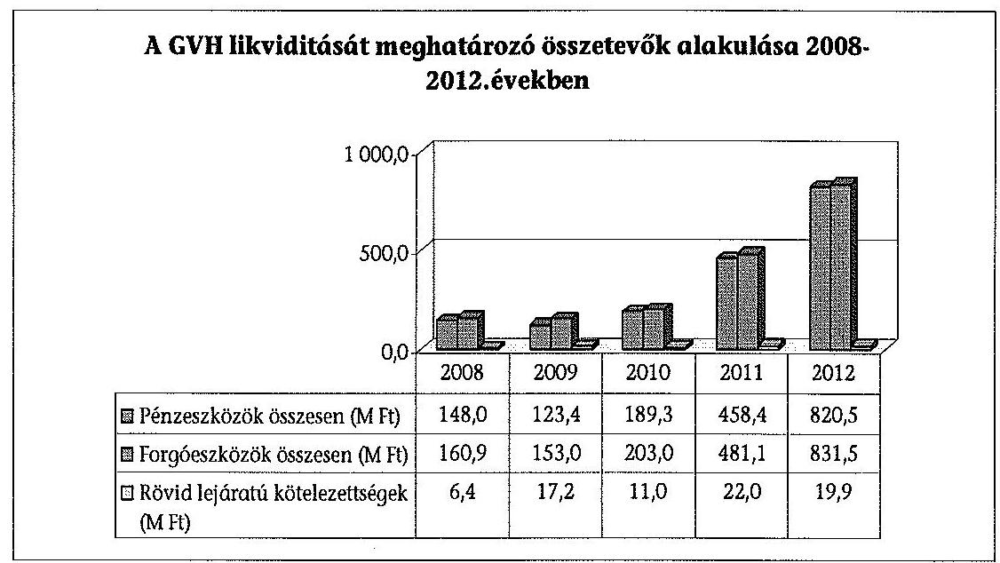

A GVH fizetőképességét az ellenőrzött időszakban a likviditási mutatók növekvő tendenciája jellemezte (5. sz. melléklet). A Hivatal rendelkezésére álló - a forgóeszközök több mint $80 \%$ át kitevő - pénzeszközállomány mindenkor többszöröse volt a fennálló rövid lejáratú kötelezettségeknek.

A szállítói állomány a 2008. és 2012. években igen alacsony - 6,4-22,0 M Ft közötti összeg - volt. A GVH tartozásait határidőben kiegyenlítette, a müködésének folyamatos fenntartásában a szállítói kötelezettségek zavarokat nem okoztak. A Hivatalnak - likviditásának köszönhetően nem volt szüksége előirányzat-keret előrehozásra.

A GVH mérlegében kimutatott követelések összege az ellenőrzött időszakban elenyésző volt a forgóeszközállományon belül, így nem befolyásolta a Hivatal fizetőképességét. Követeléseiből mindössze 2012. évben került sor behajthatatlan perköltség leírására $0,7 \mathrm{M}$ Ft összegben.

A követelések értéke a munkavállalóknak tartósan adott lakás célú munkáltatói kölcsönöknek a mérleg fordulónapját követő egy éven belül esedékes törlesztő részletét és a versenyfelügyeleti eljárásokhoz kapcsolódó, GVH-t megillető, meg nem fizetett perköltségeket tartalmazta.

A Hivatal bevételeinek - a költségvetési támogatáson túl - jelentős hányadát (21,2\%-át) a közhatalmi bevételek - versenyfelügyeleti, eljárási, ágazati és végrehajtási bírság - tették ki.

A Tpvt. megsértésének következményeként a Hivatal szankcionálhat. E szerint a versenyfelügyeleti bírság megfizetésére kötelezheti azt, aki a törvény rendelkezéseit megsérti. Az eljárási bírság azt az ügyfelet sújtja, aki a GVH vizsgálata során a valós tényállás feltárását meghiúsítja. Az ágazati bírság az ágazati vizsgálatban való akadályoztatást szankcionálja. Végül a végrehajtási bírság kiszabásával egyidejűleg az eljáró versenytanács az ügyfelet meghatározott cselekmény elvégzésére, vagy meghatározott magatartás tanúsítására kötelezi.

---

Ezek a bevételek közvetlenül nem voltak részei a GVH költségvetési gazdálkodásának, mivel költségvetési bevételként a nemzetgazdasági számlára folytak be. A GVH a Tpvt.-ben meghatározott mértékben felhasználható közhatalmi bevételeit előirányzat módosítás keretében a Kincstár által vezetett nemzetgazdasági számláról hívta le, az ebből finanszírozható kötelezettségvállalásai teljesítésére.

A meg nem fizetett bírságokból eredő követelések a nemzetgazdasági elszámolások mérlegében jelentek meg. A követelés adott évi nagyságrendje a GVH fizetőképességét közvetlenül nem érintette, mivel mindig az előző év(ek) befolyt bevételeinek évenként változó összegét használhatta fel. Közvetve - a tárgyévet követő időszakokban - hatást gyakorolt a GVH módosított előirányzatként megjelenő bevételére.

A GVH a közhatalmi tevékenységéből eredő követelések tekintetében analitikus nyilvántartó hely ${ }^{54}$. A nemzetgazdasági elszámolások könyvviteli mérlegéhez a követelésállományról adatot kell szolgáltatnia a Magyar Államkincstár felé. A Hivatalnak - követelés nyilvántartási és adatszolgáltatási kötelezettségén túl - a Tpvt. ${ }^{55}$ a követelés behajtásával kapcsolatosan is fogalmaz meg kötelezettséget.

A GVH által kivetett bírságokból akkor keletkezik nyilvántartandó követelés, ha a bírság kivetése jogerőssé válik és az eljárás alá vont nem indított jogorvoslati eljárást a végrehajtás felfüggesztésére, vagy ha indított, azt jogerősen elutasította a bíróság. A GVH általi követeléskezelés a jogorvoslati kérelmek és a bírósági döntések eljárásai miatt sajátos, esetenként időben elhúzódó folyamat.

A GVH által nyilvántartott követelésekhez kapcsolódóan 2008-2012 években, nemzetgazdasági szinten összesen 3294,2 M Ft veszteség keletkezett, amelyből 1270,4 M Ft-ot tettek ki a behajthatatlan követelésként leírt tételek, 2023,8 M Ft pedig a kétessé vált követelésekre elszámolt értékvesztés. (6. sz. melléklet)

A 2011. évi jelentős összegű leírás a követelésállomány 2010. évi értékeléséből eredő 448,3 M Ft, és a 2011 évi értékelésből eredő 749,6 M Ft összegét tartalmazta. A 448,3 M Ft összegű követelésállományban, 2000-2010 években jogerőre emelkedett határozatokban megállapított követelések szerepeltek. Ezen esetekben - néhány kis összegű követelés kivételével - a kötelezettek időközben felszámolási eljárás alá kerültek. A Hivatal általi határidőn túli követelés bejelentés miatt a felszámolók ezeket a követeléseket nem vették nyilvántartásba, ezzel a GVH a részleges behajtás lehetőségét is elveszítette. A 2011. évi értékelés alapján leírt követeléseket keletkeztető határozatok dátuma 2001-2011 közötti volt.

A behajthatatlanná minősített, leírt követeléseken keletkezett veszteségeken túl az ellenőrzött időszakban további 2023,8 M Ft értékvesztés került elszámolásra a kétessé vált követelésekre. A követelések minősítésére a nemzetgazdasági el-

[^0]
[^0]:    ${ }^{54}$ A kincstári elszámolások beszámolási és könyvvezetési kötelezettségének sajátosságairól szóló 240/2003. (XII.17.) Korm. rendelet 12.§ (4) bekezdése.
    ${ }^{55}$ 2012. február 1-ig: 90. § (5), 2012. február 1-től : 90/A. § (1).

---

számolások mérlegének összeállításához kiadott útmutató alapján került sor. A kétes követelések jellemzően a felszámolási eljárás alá került kötelezettekkel szembeni követeléseket tartalmazták, amely esetekben kétséges a behajtás sikeressége.

A Hivatal által nyilvántartott követelések nagyságrendje számtalan tényező függvénye; befolyásolja a piaci szereplők jogszabálykövető magatartása, a benyújtott kérelmek száma, a piac összetétele, aktuális állapota. A követelésbehajtás eredményessége viszont a teljes körű szabályozástól és az azt megfelelő informatikai kontrollal támogatott végrehajtó szervezettől függ.

A GVH az ellenőrzött időszakban nem tett meg mindent a behajtás sikerének érdekében.

Az ellenőrzött tételek elemzése kapcsán felmerült a felvitt adatok ellenőrzésének, illetve a követeléssel kapcsolatos határidők, események kontrolljának szükségessége. A GVH által nyilvántartott követelésekre elszámolt veszteségek nagyságrendje a folyamat nem megfelelő szabályozottságára, illetve a szabályok hiányos végrehajtására utal.

A GVH 2011. évet megelőzően különböző utasításokban szabályozta a követeléskezeléssel járó feladatokat. Így a Versenytanács SZMSZ-ben rendelkezett a végrehajtás elindításáról, illetve ezzel kapcsolatos feladatairól. A Költségvetési Iroda feladatát az ügyrendjükben rögzítették.

A GVH eljárásaival összefüggésben keletkező követelések és az ezekkel kapcsolatban felmerülő fizetési kötelezettségek nyilvántartásának, teljesítésének, illetve végrehajtásának rendjéről szóló 7./Eln./2011. utasítás 2011 májusától hatályos. Az utasítással a GVH pótolta korábbi hiányosságát, egységes rendszerben, részletesen szabályozta a követeléssel kapcsolatos adatfelviteli és behajtási feladatokat és felelősséget, a követelések minősítésének és a behajthatatlanság megállapításának szabályait.

A vezetőváltással előrelépés történt a követeléskezelés javítása érdekében. Megtörtént a korábbi időszak behajthatatlan követeléseinek számviteli kezelése, a 2011 májusától kialakított szabályozás a követeléskezelési folyamat egészét lefedi. Az ellenőrzés azonban jelenleg is fennálló, a követelés behajtás eredményességét befolyásoló hiányosságokat tárt fel.

- A szabályzat csak a követelésekkel kapcsolatosan bekövetkezett események nyilvántartásban történő rögzítésének határidejét írja elő. Több § rendelkezik különböző területek intézkedési kötelezettségeiről, ellenben nem határozza meg a végrehajtás folyamatához kapcsolódó határidőket.
- A nyilvántartás pontosságának, teljes körűségének és naprakészségének biztosítása érdekében a szabályozás csak negyedéves rendszerességgel ír elő hibalista küldést az érintett szervezeti egységek részére. A hibalista készítésének jelenlegi gyakorisága nem biztosítja a nyilvántartás pontosságát, naprakészségét.
- A GVH a felszámolási eljárás alatt nem álló kötelezett esetében, az adók módjára behajtható követelések (versenyfelügyeleti, eljárási és végrehajtási

---

bírságok, valamint az ezekhez kapcsolódó késedelmi pótlékok) behajtása érdekében megkeresi a Nemzeti Adó- és Vámhivatalt (NAV). A szabályzat évente csak egy alkalommal ír elő egyeztetési kötelezettséget a behajtások állásának nyomon követése érdekében, ami nem biztosítja a NAV-tól származó információk megfelelő kontrollját.

A behajtás sikerének érdekében a GVH 2011 májusa óta egy külső cég (Complex) közremúködését veszi igénybe. Az általuk szolgáltatott cégfigyelő rendszer segíti a felszámolás alá került vállalkozások megismerését, ezáltal a bírság megfizetése iránti igény időben történő érvényesítését.

A behajtás eredményességének másik fontos eleme a megbízható nyilvántartási rendszer. A GVH nyilvántartási rendszerének fejlesztése 2008-ban befejeződött. Az új nyilvántartási rendszerben (GovSys rendszer) 2009. január 1-jétől rögzítésre kerültek a 2008. év és az azt megelőző években keletkezett követelések is. A GVH nyilvántartási rendszerének egyik követelménye, hogy az adattartalom és a lekérdezési, szưrési lehetőségek biztosítsák a szükséges, naprakész és pontos információt valamennyi külső és belső szervezeti egység részére.

A követelésállomány nyilvántartására szolgáló ügyregiszter bírság-nyilvántartási moduljának adathiányaira - 80 ellenőrzött tételből 35 esetben hiányzott a határozat dátuma - a belső ellenőrzés is felhívta a figyelmet.

Az ellenőrzés a követeléskezelésnél figyelendő események függvényében a végrehajtás határidejének a betartására fókuszált.

Ennek során az informatikai rendszerből leszűrt 2009. január 1-e óta leírt és még élő követelésekből 10-10 db véletlenszerűen kiválasztott minta elemzése történt meg.

A végrehajtás elindításának, illetve a NAV megkeresés határidejének a pontos betartása lényeges szerepet játszik a behajtás sikerességében. Az adók módjára behajtandó köztartozásnak minősülő fizetési kötelezettséget megállapító, illetve nyilvántartó szerv az Art. ${ }^{56} 161 \S$ (1) bekezdése alapján a jogszabályban meghatározott határidőben ${ }^{57}$ megkeresi az adóhatóságot behajtás végett. Az ellenőrzött mintatételeknél e határidő túllépése négy esetben fordult elő. Az informatikai rendszerben több alkalommal hiányosan rögzítették a követeléskezeléshez kapcsolódó adatokat, eseményeket (pl. végzés száma, jogerőre emelkedés dátuma).

A GVH a nemzetgazdasági elszámolások mérlegének összeállításához negyedévente szolgáltat adatot az általa nyilvántartott követelésállományról.

A GVH ügykövetésre készült, de követelés-nyilvántartásra is alkalmazott informatikai rendszeréből a követelések múltra vonatkozó adatai csak bonyolult szưrési rendszeren keresztül nyerhető́k ki, ami hibalehetőséget hordoz. Bár az

[^0]
[^0]:    ${ }^{56}$ 2003. évi XCII.törvény az adózás rendjéről.
    ${ }^{57}$ 2011. december 31-ig: a negyedévet követő hó 15 napjáig;, 2012. január 1-től: a fizetési határidő lejártát követő 15 nap elteltével.

---

adatok a rendszerben rendelkezésre állnak, statikus múltbeli időpontra vonatkozó szűrések listák közvetlenül nem állíthatók elő.

# A GVH az ellenőrzött időszakban nem alakította ki a követeléskezelés megfelelő informatikai és szervezeti kontrollját. 

### 2.4. A feladatellátást biztosító vagyon változásának értékelése

A GVH vagyona - értéke és összetétele - jelentős mértékben változott az ellenőrzött időszakban. A teljes eszközállományon belül a befektetett eszközök aránya $37 \%$-ról $66 \%$-ra nőtt, míg a forgóeszközöké $63 \%$-ról $34 \%$-ra csökkent. A teljes vagyon értéke - a mérlegadatok alapján - 256,6 M Ft-ról több mint kilencszeresére $2436,1 \mathrm{M}$ Ft-ra nőtt. (7. sz. melléklet) A változást alapvetően a székház 2010. évi vagyonkezelésbe vétele és fejlesztése ( $1419,1 \mathrm{M} \mathrm{Ft}$ ), illetve az elszámolási számlákon levő összeg növekedése ( $672,5 \mathrm{M} \mathrm{Ft}$ ) okozta.

A Hivatal befektetett eszközeinek meghatározó részét a tárgyi eszközei (ingatlan, gépek, járművek), kisebb hányadát az immateriális javak (szoftverhasználati jogok) képezték. A befektetett pénzügyi eszközök a dolgozóknak nyújtott lakáskölcsönök éven túli lejáratú részét tartalmazták, amelyek értéke elenyésző és folyamatosan csökkenő volt.

Az immateriális javak állományát kizárólag vagyoni értékű jogok (szoftver licencek) alkották. Alapvetően a Hivatal 2012. évi informatikai rendszereinek megújításához kapcsolódó beszerzések eredményeként ezek nettó értéke 13,0 M Ft-ról 382,3\%-kal 62,7 M Ft-ra emelkedett.

Az új, integrált ügyiratkezelő és ügyviteli rendszer (GovSys), illetve az ezzel kapcsolatos irodai, hálózati és levelező szoftver licencek (MS Office 2010 és Exchange 2010) értéke összesen 63,4 M Ft-tal növelte ezen eszközök bruttó értékét. A beszerzéssel az immateriális javak használhatósági foka $24 \%$-ról $66 \%$-ra nőtt.

A Hivatal tárgyi eszközállományának 79,2 M Ft-ról 1541,2 M Ft-ra történő növekedését alapvetően az általa korábban is használt székház és a hozzákapcsolódó telek összesen 1275,6 M Ft nettó értéken történő, ingatlanok vagyonkezelésbe vétele eredményezte.

A Budatest V. Alkotmány utca 5-7. sz. irodaépület vagyonkezelési jogának a GVH részére történt átadására vonatkozó szerződést (460019-1998-0100) 2010. március 4-én kötötték meg az MNV Zrt.-vel, az állami vagyonról szóló 2007. évi CVL törvény 23.§ (1) bekezdésének megfelelően.

A gépek, berendezések, felszerelések fejlesztésére az ellenőrzött időszakban 197,4 M Ft-ot fordított a Hivatal, amivel a használhatósági fokuk a 2008. évi $22 \%$-ról 2012 -re $47 \%$-ra nőtt. Az eszközbeszerzések alapvetően az új ügyiratkezelő és ügyviteli nyilvántartó rendszerhez szükséges, valamit személyi használatú számítástechnikai eszközöket tartalmaztak. A kartellek feltárása érdekében alkalmazott rajtaütések hatékonyságának növelése érdekében fejlett számítástechnikai tükörmásoló berendezéseket szereztek be.

---

A gépjármúvek állományának értéke 21,1 M Ft-ról 5,6 M Ft-ra, használhatósági fokuk - a 30,2 M Ft-os beszerzés ellenére - a 2008. évi 34,0\%-ról 12,0\%-ra csökkent.

A forgóeszközök mérlegértéke 160,9 M Ft-ról 416,8\%-kal 831,5 M Ft-ra nőtt, alapvetően a pénzeszközök - előirányzat-maradványból származó - növekedése miatt. A követelések értéke nem volt számottevő, készlet- és értékpapírállománnyal a Hivatal nem rendelkezett.

A saját tőke az ellenőrzött időszakban 93,4 M Ft-ról 1593,6 M Ft-ra nőtt, alapvetően a székház 2010. évi vagyonkezelésbe vétele, az átalakításához kapcsolódó beruházások miatt.

A költségvetési tartalékok összege minden évben a tárgyidőszak előirányzat maradványát tartalmazta.

A kötelezettségek mérlegértéke 2008-ról 2012-re 33,1 M Ft-tal nőtt a szállítói kötelezettségek és az egyéb passzív pénzügyi elszámolások értékének növekedése miatt. A szállítók felé 30 napon túli kötelezettségek nem álltak fenn. Az egyéb passzív pénzügyi elszámolások növekedésének oka a tárgyévet követő évben indult fúziós eljárásokhoz kapcsolódóan 2012-ben befizetett szolgáltatási díj, illetve a 2011. és a 2012. évben a nemzetközi programok devizában érkezett, fel nem használt támogatása.

Összességében a GVH vagyonának nagyságában és összetételében bekövetkezett változások nem a feladatváltozásokkal kapcsolatban merültek fel, hanem a székház átvételéhez, annak korszerűsítéséhez kapcsolódóan, valamint a feladatellátás színvonalának, biztonságának növelése érdekében.

# 2.5. A személyi feltételek és a feladatellátás összhangja 

A GVH engedélyezett létszámkerete egy alkalommal 2009-ben az előző évi 120 fơről 125 fôre emelkedett. (1. sz. melléklet)

Az átlagos statisztikai állományi létszám 114-124 fő, a költségvetési létszámkeret feltöltöttsége 91-99\% között ingadozott, amely az egyes szervezeti egységcsoportoknál nem különbözött érdemben.

Az Intézmény a 2008. év végén nem rendelkezett üres álláshellyel, a létszámkeret 2009. évi növelése után ez 2-8 db között ingadozott. Tartósan üres álláshely nem volt 2008-2012 között.

Az ellenőrzött időszakban az SZMSZ nem tartalmazta a szervezeti egységek engedélyezett létszámát, ${ }^{58}$ amit az 5/2013. GVH utasítás 2013. április 24-étől pótolt (Tartósan üres álláshely: ha a költségvetési engedélyezett létszámkeret (álláshely) - december 31-től visszaszámolva - 4 hónapot meghaladóan betöltetlen ${ }^{59}$ ).

[^0]
[^0]:    ${ }^{58}$ 2009. január 1-jétől kötelezö: Ámr. ${ }_{1}$ 13/A. § (3) e), Ámr. ${ }_{2}$ 20. § (2) e), Ávr. 13. § (1) e)
    ${ }^{59}$ Tájékoztató az államháztartás szervezetei [...]. évi éves költségvetési beszámoló öszszeállítására szolgáló [...]. elnevezésű beszámoló-garnitúrák összeállításához

---

A Hivatal a feladatok maradéktalan ellátásának érdekében az átmenetileg üres álláshelyek miatt hiányzó kapacitásokat általában a különböző kedvezményes foglalkoztatások keretében alkalmazott munkavállalókkal biztosította.

A prémiuméves programban foglalkoztatottak ${ }^{60}$ létszáma 3-6 fő, az ösztöndíjas foglalkoztatottaké 5-7 fő volt év végén.

Egy esetben - a főtitkári poszt betöltetlensége miatt - ideiglenesen új munkakört hoztak létre. Az elnöki tanácsadó munkaköri leírása tartalmazta a hivatalszervezéssel és a GVH VKK-val kapcsolatos - eredetileg főtitkári hatáskörként meghatározott - feladatok ellátását is.

Az ellenőrzött időszakban 49 magánszeméllyel kötöttek megbízási szerződést, amelyek alapján - járulékokkal együtt - mindösszesen 73,0 M Ft-ot fizettek ki. Az összeg 32-32\%-át a hivatali adminisztráció, illetve szakmai munkához kapcsolódó, $25 \%$-át tolmácsolási és fordítási feladatok tették ki. A további $11 \%$-ot szervezésre, előadások tartására, illetve egyéb feladatok elvégzésére fizették ki. A kifizetett összeg $49 \%$-át a GVH VKK, $17 \%$-át a ROK $34 \%$-át a Hivatal ügyeivel kapcsolatos feladatokra költötték.

A külső megbízással történő foglalkoztatás összhangban volt az Ámr. ${ }_{2}$ 82. § (3) bekezdésében és az Ávr. 50. § (2) bekezdés c) pontjában foglalt előírásokkal. Az ellenőrzött tételek alapján a szerződések tárgyát képező feladatok egyediek (irattárazás), időszakosak (tanácsadás peres és nem peres eljárásokhoz) vagy időben rendszertelenül ellátandóak (pl. fordítás, tolmácsolás) voltak. A teljesítéseket szabályszerűen igazolták.

Három magánszeméllyel kötött megbízási szerződés esetében az azokban előírt feladatok ügyviteli feladat ellátására irányultak, ami a köztisztviselők jogállásáról szóló 1992. évi XXIII. törvény 1. § (9) bekezdésébe ütközött.

Az MB200906 számú, 2009. március 2-án kötött megbízási szerződésben rögzített feladat a 2008. évi Panasz- Bejelentések Központi irattárnak történő átadása, ügyregiszterből történő kivezetése, adategyeztetés volt. Az MB201015 számú, 2010. december 19-én kötött megbízási szerződésben rögzített feladat a bírságnyilvántartás adminisztrációs feladatainak ellátása volt. Az MB201103 számú, 2011. október 28-án kötött megbízási szerződésben rögzített feladatok a humánpolitikai dokumentumok rendezésére, személyi iratok rendszerezésére és irattárazására irányultak.

Egy ellenőrzött szerződés esetében a GVH közbeszerzési eljárás lefolytatása nélkül kötött szerződést, annak ellenére, hogy annak értéke meghaladta a 8 M Ftos közbeszerzési értékhatárt.

Az MB201008 számú, 2010. június 25-án kötött megbízási szerződés tárgya „a Gazdasági Versenyhivatal megalakításának 20. évfordulójára a GVH eddigi éves országgyưlési beszámolói alapján készülő kiadvánnyal kapcsolatos feladatok" ellátása. A

[^0]
[^0]:    ${ }^{60}$ A prémiumévek programról és a különleges foglalkoztatási állományról szóló 2004. évi CXXII. törvény

---

megbízási díj 12 M Ft volt (a megbízás időtartama: 2010. június 28 -ától október 31 -éig tartott).

A Hivatal ezzel elmulasztotta a Kbt. 240. § (1) bekezdésében előírt közbeszerzési eljárás lefolytatásának kötelezettségét.

# 3. A GVH feladATELLÁTÁsáNAK SZABÁLYSZERŰSÉGE 

### 3.1. Az alapító okirat és az SZMSZ összhangja a feladatellátásra vonatkozó jogszabályokkal

A GVH alapító okirata a Hivatal közfeladatként „a gazdasági verseny tisztaságának és szabadságának biztositásá"-t írta elő. Azonban a Tpvt. ennél szűkebben, azt rögzíti, hogy a Hivatal ellátja a „versenyfelügyeleti feladatokat", továbbá „mindazokat a feladatokat, amelyeket az európai közösségi versenyszabályok a tagállami versenyhatóság hatáskörébe utalnak".

Az ellenőrzött időszakban történt jogszabályváltozások a Hivatal hatáskörét és ezáltal az alaptevékenységébe tartozó feladatokat is érintették. Az Fttv. és a reklámtörvény ${ }^{61}$ 2008. szeptember 1-jei hatályba lépése módosította a GVH fogyasztóvédelmi hatáskörét. Bővülést jelentettek 2012. szeptember 1-jétől a szakmaközi szervezetek piacszervezési intézkedéseinek mentesítésével összefüggő feladatok ${ }^{62}$ Ugyanakkor 2009. június 1-tőlmegszűnt az egyes termékek árának előzetes bejelentésével összefüggő, 2009. október 1-jétől a jelentős piaci erővel bíró nagykereskedők által készítendő etikai kódexek jóváhagyásának ${ }^{63}$ feladata.

A Hivatal a törvényekben előírt feladat-, illetve hatáskörváltozásokat nem vezette át a GVH az alapító okiratán. A dokumentum az ellenőrzött időszakban és a helyszíni ellenőrzés lezárásakor sem a hatályos törvényeknek megfelelően tartalmazta a Hivatal alaptevékenységébe tartozó feladatokat. ${ }^{64}$

A GVH Szervezeti és Múködési Szabályzata (SZMSZ) meghatározta a feladatok ellátásának rendjét. A törvényekben előírt feladatváltozásokat kettő kivételével átvezették az SZMSZ-en. Hiányoznak belőle a Grt.-ben megfogalmazott, a nem fogyasztók felé irányuló reklámokkal kapcsolatos, illetve a szakmaközi szervezetek piacszervezési intézkedéseinek mentesítésével összefüggő feladatok.

[^0]
[^0]:    ${ }^{61}$ A gazdasági reklámtevékenység alapvető feltételeiről és egyes korlátairól szóló 2008. évi XLVIII. törvény
    ${ }^{62}$ Szakmaközi tv. 7-8. §
    ${ }^{63}$ A közigazgatási hatósági eljárás és szolgáltatás általános szabályairól szóló 2004. évi CXL. törvény módosításáról szóló 2008. évi CXI. törvény hatálybalépésével és a belső piaci szolgáltatásokról szóló 2006/123/EK irányelv átültetésével összefüggő törvénymódosításokról szóló 2009. évi LVI. törvény 343. §.
    ${ }^{64}$ Ámr. ${ }_{1}$ 10. § (6), Ámr. ${ }_{2}$ 12. § (3), Ávr. 5. §

---

# 3.2. A feladatellátás intézményi szabályozottsága, szabályszerűsége 

A GVH - a versenykultúra fejlesztésével összefüggő pályáztatás kivételével - az ellátandó feladatok megosztását és folyamatait teljes körüen szabályozta.

A versenyfelügyeleti tevékenységgel kapcsolatosan a Hivatalhoz érkezett panaszok és bejelentések elintézésének rendjét a Tpvt. 43/H-43/I. §-ai, a versenyfelügyeleti eljárás lefolytatásának rendjét a Tpvt. 67-80. §-ai rögzítették. A versenyfelügyeleti eljárás indításának jogalapjait a Tpvt. és más jogszabályok határozták meg. A GVH versenyfelügyeleti eljárásaira a Ket. ${ }^{65}$ szabályai vonatkoztak, kivéve, ha az ügyfajtára a Tpvt. eltérő szabályokat állapított meg.

A versenyfelügyeleti eljárás indításának Tpvt.-n kívüli jogalapjait az árak megállapításáról szóló 1990. évi LXXXVII. törvény, a fogyasztókkal szembeni tisztességtelen kereskedelmi gyakorlat tilalmáról szóló 2008. évi XLVII. törvény (Fttv.), a gazdasági reklámtevékenység alapvető feltételeiről és egyes korlátairól szóló 2008. évi XLVIII. törvény (Grt.), valamint a kereskedelemről szóló 2005. évi CLXIV. törvény (Kertv.) tartalmazta.

A hivatali feladatok megosztását az SZMSZ-ben, folyamatait belső eljárásrendekben rögzítették. Annak érdekében, hogy az eljárás alá vontak a GVH eljárásait jobban megismerhessék, a GVH és a VT elnöke közös közleményeket adott ki, amelyeket a GVH honlapján nyilvánosságra hoztak.

A versenyfelügyeleti eljárás lefolytatásának szabályait egységes szabályzatban ${ }^{66}$ rögzítették, amely a GVH-hoz érkező megkeresésektől az ügy befejezéséig tartó, jogszabályokban meghatározott, hivatali feladatokat szabályozta. A szabályzat a törvényekben rögzített eljárásrendnek megfelelően és korlátokon belül, eljárásonként határozta meg a belső határidőket, a döntési pontokat és a dokumentálás rendjét. A szabályzatot a törvényi változásoknak megfelelően módosították.

A panaszok és a szóbeli megkeresések hatékonyabb kezelése, feldolgozása érdekében 2011. március 16-ától új panaszkezelési rendszert vezettek be. Ennek keretében a Tpvt.-ben nem rögzített szóbeli megkeresések (az-án. folyamodványok) kezelését is szabályozták. A 3/Eln/2011. számú utasítás ${ }^{67}$ a panaszkezelést és a Tpvt.-ben nem nevesített, szóbeli megkeresések elintézésének rendjét is szabályozta, ezzel bővítette a dokumentált információgyűjtés lehetőségeit.

[^0]
[^0]:    ${ }^{65}$ A közigazgatási hatósági eljárás és szolgáltatás általános szabályairól szóló 2004. évi CXL. törvény (Ket.) 13. § (2) e)
    ${ }^{66}$ A Hivatal egyes eljárásai során alkalmazandó belső ügyintézési rendjéről szóló 9/Eln./2005. számú elnöki utasítás
    ${ }^{67}$ A panasszal és a jogsértés miatt a Gazdasági Versenyhivatal eljárását kezdeményező szóbeli folyamodvánnyal, valamint a más hatóságtól vagy bíróságtól a Gazdasági Versenyhivatalhoz érkező vagy áttett ilyen beadvánnyal összefüggő eljárás rendjéről szóló 3./Eln./2011. számú elnöki utasítás

---

Külön utasításban rögzítették a közösségi versenyjog alkalmazását szükségessé tevő eljárások, illetve a Bizottsággal és a tagállami versenyhatóságokkal való együttmúködés szabályait.

A GVH 2010. április 1-jétől ${ }^{68}$ ún. informátori díjat szolgáltat a kőkemény kartellről nélkülözhetetlen információt szolgáltató természetes személyeknek.

A törvényben foglalt feltételek teljesülése esetén a díj összege az eljáró versenytanács által az adott ügyben kiszabott bírság 1\%-a, de legfeljebb 50 M Ft.

Az informátori díj szolgáltatásának szabályairól szóló Tpvt. módosítás ${ }^{69}$ hatálybalépésével egy időben adták ki a GVH informátori díjigényekkel összefüggő belső eljárásrendjét.

# Az elutasított panaszok kezelése 

Az ellenőrzött időszakban 7218 db panasz érkezett a Hivatalhoz. Egy-egy panasz többféle ügyet is tartalmazhatott, ezért többféle eljárási cselekményt is maga után vonhatott. A panaszok alapján összesen 206 db versenyfelügyeleti eljárás indult. A panaszok 14\%-a esetében az ügyet részben vagy egészben áttették a hatáskörrel vagy illetékességgel rendelkező hatósághoz, míg 88\%-ban elutasításra kerültek.

A panaszok elutasításának leggyakoribb oka a GVH hatáskörének hiánya volt (36\%), valamint az, hogy a cselekmény nem sérti a GVH által alkalmazott jogszabályi rendelkezéseket (35\%). További elutasítás indoka lehetett, ha az ügyet korábban elbírálták vagy elbírálása folyamatban volt (14\%), ha csekély súlyú, vagy versenyhatású (9\%), illetve egyéb körülmény merült fel 6\%).(13. sz. melléklet)

Az ellenőrzés értékelte az elutasított panaszokkal kapcsolatos eljárások szabályszerűségét az elutasítások magas száma ( 6369 db ), részaránya, és a panasz elutasítása elleni jogorvoslati lehetőség hiánya miatt.

## Az elutasított panaszokkal kapcsolatos eljárások lebonyolítása 62\%ban megfelelt, $32 \%$-ban részben felelt meg, $6 \%$-ban nem felelt meg a Tpvt-ben és a belső eljárásrendben megfogalmazott követelményeknek. A szabálytalanságok 2011-ig a törvényben meghatározott határidők be nem tartásából, valamint az eljárás dokumentáltságának hiányosságaiból fakadtak.

Az aktákból hiányzott annak dokumentálása, hogy elutasítás előtt a vizsgáló a panaszosnak küldendő értesítés tervezetét legkésőbb az eljárás megkezdésétől számított 28. napon jóváhagyás érdekében az elnökhelyettes elé felterjesztette.

[^0]
[^0]:    ${ }^{68}$ A tisztességtelen piaci magatartás és a versenykorlátozás tilalmáról szóló 1996. évi LVII.törvény 79/A §-a
    ${ }^{69}$ A tisztességes eljárás védelméről, valamint az ezzel összefüggő törvénymódosításokról szóló 2009. évi CLXIII. törvény 31. §

---

A panasz elutasítása ellen nincs jogorvoslati lehetőség, így annak megalapozottságát a bírósági felülvizsgálatok eredményét figyelembe véve nem lehetett értékelni. Az értékelést - az ugyanazon a témában benyújtott bejelentés elutasítása esetén - a jogorvoslatkérés bírósági döntéseire alapoztuk. Az elutasított panaszokkal azonos témában benyújtott és elutasított bejelentések 13\%-a ellen nyújtottak be az ügyfelek felülvizsgálati kérelmet. Ezek 76\%-át a bíróság elutasította. Az eseteknek mindössze $24 \%$-ában utasította a GVH-t új eljárás lefolytatására vagy versenyfelügyeleti eljárás indítására.

Az ellenőrzött időszakban 15649 db folyamodvány érkezett a Hivatalhoz, ami átlagosan havi 261 db megkeresést jelentett. A folyamodványok dokumentálásának rendjét jogszabály nem írta elő. Annak a GVH által kialakított rendszere az utólagos összesítést, általános következtetések levonására alkalmas ellenőrzést nem tett lehetővé.

A helyszíni ellenőrzés alapján a tisztességtelen kereskedelmi gyakorlattal kapcsolatos folyamodvány $64 \%$-ának elintézési módja általános tájékoztatás, $16 \%$ának a panaszírásba foglalásának kérése, $20 \%$-ának pedig más hatósághoz való átirányítás volt.

# Elutasított bejelentések kezelése 

Az ellenőrzött időszakban a GVH-hoz beérkezett bejelentések száma 1170 db volt, számuk évente folyamatosan és jelentősen - a 2008. évi 336 db-ról 57\%kal 144 db-ra - csökkent. Egy-egy bejelentés - a panaszhoz hasonlóan - többféle ügyet is tartalmazhatott, ezért akár többféle eljárási cselekményt is maga után vonhatott. A bejelentések alapján összesen 174 db versenyfelügyeleti eljárás indult. A bejelentések $83 \%$-át ( 966 db ) részben, vagy egészben elutasították.

A bejelentés elutasításának leggyakoribb oka az volt, hogy a cselekmény nem sértette a GVH által alkalmazott jogszabályi rendelkezéseket ( $52 \%$ ), a GVH hatásköre a cselekményre nem terjedt ki ( $28 \%$ ). Az elutasítás további oka volt, ha: az ügy csekély súlyú, vagy versenyhatású (14\%), korábban elbírált vagy elbírálása folyamatban volt (5\%). Az esetek 1\%-ában az elutasítás egyéb ok alapján történt. (14. sz. melléklet)

A helyszíni ellenőrzés alapján az elutasított bejelentésekkel kapcsolatos eljárások lebonyolítása 90\%-ban megfelelt, 10\%-ban részben felelt meg a Tpvt.-ben és a belső eljárásrendben megfogalmazott követelményeknek. A szabálytalanságok elsősorban a törvényben meghatározott határidők túllépéséből fakadtak.

Amennyiben a GVH a bejelentésben foglaltakkal kapcsolatban nem volt jogosult eljárni, a bejelentést megküldte a hatáskörrel és illetékességgel rendelkező hatóságnak. Az áttételről minden esetben értesítették a bejelentőt. Az ügyek 86\%-a (a 2008. és 2009. években) a belső eljárásrendben ${ }^{70}$ elöírt 15 napos határidőn túl került áttételre.

[^0]
[^0]:    ${ }^{70}$ 9/Eln./2005. évi belső utasítás 2. § 2.2., 2.6.

---

Ha az ügyindítás megalapozása 60 napnál hosszabb elővizsgálati időt igényelt, a vizsgáló - az ügyek 20\%-ában - késedelmesen ${ }^{71}$ kérte az elnökhelyettestől az elintézési határidő meghosszabbítását. Az ügyek 10\%-ában a 60 napos határidőn túl értesítették a bejelentőt a határidő hosszabbításról. A bejelentőnek küldendő végzés tervezetét az esetek 13\%-ában szintén határidőn túl terjesztette a vizsgáló az elnökhelyettes elé.

A GVH a bejelentést elutasító végzést az esetek 10\%-ában a törvényi határidőn túl ${ }^{72}$ küldte meg a bejelentőnek.

Az ügyfél a bejelentés ügyében a GVH vizsgálója által hozott elutasító végzés felülvizsgálatát kérheti a bíróságon ${ }^{73}$. A bejelentést elutasító vizsgálói végzéssel szemben az esetek 17\%-ában nyújtottak be felülvizsgálati kérelmet. A bírósági döntések alapján a GVH a bejelentések többségét megalapozottan és szabályszerűen utasította el, a bíróság a Hivatal döntését a felülvizsgálati kérelmek $89 \%$-ában helyben hagyta.

# Versenyfelügyeleti eljárások 

A 2008-2012 közötti időszakban a GVH 652 db versenyfelügyeleti eljárást zárt le. Ezekből 478-at az ellenőrzött időszakban, 174-et korábban indított. A lezárult versenyfelügyeleti eljárások jellemzően a fogyasztók megtévesztéséhez (44,3\%), az összefonódások ellenőrzéséhez ( $28,7 \%$ ), a gazdasági erőfölénnyel való visszaéléshez illetve a gazdasági versenyt korlátozó megállapodásokhoz kapcsolódtak ( 10,1 és $6,9 \%$ ) (15. sz. melléklet). Ezen túl további 165 db eljárást indítottak, amelyek az ellenőrzött időszakban nem zárultak le.

A helyszíni ellenőrzés alapján az ügyzáró döntéssel zárult versenyfelügyeleti eljárások lebonyolítása 43\%-ban felelt meg, 43\%ban részben felelt meg, 14\%-ban nem felelt meg a Tpvt.-ben és belső eljárásrendben megfogalmazott követelményeknek. A szabálytalanságok elsősorban a törvényben vagy a belső eljárásrendben meghatározott határidők be nem tartásából, illetve a saját kezdeményezésú eljárást megalapozó vizsgálati koncepció hiányából fakadtak.

A bírósági határozatok ${ }^{74}$ alapján a hatósági határidő (akár több mint egy éves) késedelme sem jogvesztő hatású, ezért nem alapozza meg a GVH határozatának vagy végzésének hatályon kívül helyezését vagy módosítását. Azonban a jogállamisághoz fűződő jogbiztonság alkotmányos elve megköveteli, hogy a közhatalmat gyakorló közigazgatási hatóságok az érdemi döntést a jogszabályokban meghatározott határidőn belül hozzák meg. ${ }^{75}$

[^0]
[^0]:    ${ }^{71}$ 9/Eln./2005. évi belső utasítás 2. § 2.7.
    ${ }^{72}$ Tpvt. 43/H. § (8)-(9)
    ${ }^{73}$ Tpvt. 43/H. § (11)
    ${ }^{74}$ Legfelsőbb Bíróság Kf.IV.27.929/1998/4. és a Fővárosi Ítélőtábla 2.Kf.27.280/2008/7. számú ítélete
    ${ }^{75}$ Ket. 4. § (1)

---

A helyszíni ellenőrzés tapasztalatai alapján az előírt esetekben az eljárás megalapozásához lefolytatták a tagállamok közötti kereskedelem érintettsége egyeztetést. A vizsgálati jelentés tartalmazta az előírt információkat és megállapításokat, elvégezték annak egyeztetését is. A vizsgálati jelentés alapján a Versenytanács meghozta a határozatát, amelyet minden esetben nyilvánosságra hozott a GVH honlapján. A versenyfelügyeleti, az eljárási és a végrehajtási bírság kiszabásakor a Tpvt. előírásai (61. §, 78. §, 78/A. §, 90. §) szerint jártak el.

A GVH versenyfelügyeleti eljárásainak hatását - így a feladatellátását is - jellemzi a visszatérő ügyek nagyságrendje, illetve tendenciája. A GVH közleményei alapján „visszaesésnek", ismétlődő jogsértésnek minősül, ha a GVH Versenytanácsa határozatában olyan jogsértést állapít meg, amely magatartás célja vagy hatása lényegében megegyezik a korábbi jogsértő magatartáséval.

Az ellenőrzött időszakban a versenyfelügyeleti eljárás során visszaesőnek minősített esetek száma évente nem változott, átlagosan 25 db volt, ami azt mutatja, hogy ezen a területen a GVH nem tudott kimutatható eredményt elérni.

A GVH az esetek 81\%-ában sújtotta bírsággal a visszaesőket. Legtöbb bírságot a GVH - a stratégiája szerint leginkább büntetendő - gazdasági versenyt korlátozó megállapodások (kartellek) esetében szabtak ki ( 4745 M Ft ). A leggyakoribb jogsértés - a fogyasztók megtévesztése és üzletfelek döntésének tisztességtelen befolyásolása - esetében a kiszabott bírság összesen 1903 M Ft volt.

A bírsággal sújtott visszaesők száma a legmagasabb ( 80 db ) a fogyasztók megtévesztése és üzletfelek döntésének tisztességtelen befolyásolása esetében volt. A gazdasági versenyt korlátozó megállapodásnál 20 db , míg a gazdasági erőfölénynyel való visszaélésnél csak 3 ilyen eset volt.

# A bíróság a Versenytanács a határozatait és az eljárást megszüntető 

végzéseit döntő többségében helyben hagyta. A bíróság a VT határozatai ellen indított felülvizsgálati kérelmek $89 \%$-át, az eljárást megszüntető végzések ellen indított kérelmek $99 \%$-át elutasította.

A VT az eljárást megszüntető végzéseinek átlagosan 12\%-a ellen indítottak felülvizsgálati kérelmet. Egy kivételével (1\%) a bíróság az összes kérelmet elutasította. A VT határozatainak átlagosan $25 \%$-a ellen indítottak felülvizsgálati kérelmet. A Versenytanács határozatát a bíróság átlagosan $89 \%$-ban helybenhagyta, $7 \%$ ban módosította. Az új eljárásra kötelezés, illetve a hatályon kívül helyezés a lezárult ügyek 2-2\%-ban fordult elő.

A legtöbb felülvizsgálati kérelem (a kérelmek 81\%-a)a fogyasztók tisztességtelen befolyásolása esetében hozott döntések ellen irányult. A leggyakrabban (57\%ban) a gazdasági versenyt korlátozó megállapodások ügyében hozott döntést támadták meg bíróság előtt.

A felülvizsgálat eredményeként a bíróság dönthet a bírság visszafizetéséről, amelyhez kapcsolódóan az ügyfél számára késedelmi pótlékot kell fizetni. Az ellenőrzött időszakban a bírósági felülvizsgálatok alapján 4854 M Ft bírságot kellett visszafizetni, ehhez kapcsolódó jogszabályi következményként 1628 M Ft késedelmi pótlékot megfizetni az ügyfe-

---

lek részére. Az elsőfokú bíróság határozata alapján visszafizetendő bírság és a megfizetendő késedelmi pótlék összege 6482 M Ft volt.

Az ügyfelek javára történő döntést követően a Hivatal fellebbezett, és a másodfokú bírósági eljárás során részben a GVH, részben az ügyfelek javára döntöttek. Az ügyek egy része nem zárult le az ellenőrzött időszakban.

A másodfokú bírósági eljárásokat követően - a GVH javára történt döntések nyomán - az ügyfeleknek 4541,7 M Ft-ot (4097,6 M Ft bírságot és 444,1 M Ft késedelmi pótlékot) ismételten be kellett fizetniük a nemzetgazdasági számlára. Ebből 2012. december 31-ig jogerőssé vált határozatok alapján 1366,9 M Ft (1197,6 M Ft bírság és 169,3 M Ft késedelmi pótlék), majd a 2013. évben további 2900,0 M Ft bírság térült meg. A fennmaradó 274,8 M Ft öszszegü követelést a meg nem fizetett késedelmi pótlék keletkeztette.

Az eltérő bírósági joggyakorlatnak, valamint a bírósági eljárások több éves elhúzódásának köszönhetően a költségvetésből kikerült 4 Mrd Ft-ot meghaladó bírság átlagosan két év elteltével került vissza a nemzetgazdasági számlára.

Azokhoz a lezárt ügyekben, amelyeknél az elsőfokú bíróság ügyfelek javára hozott döntését helyben hagyták, a visszafizetett 547,1 M Ft bírsághoz kapcsolódóan az ellenőrzött időszakban 391,3 M Ft késedelmi pótlékot kellett fizetni az ügyfelek számára.

Az új bírósági eljárásokkal és jogerős döntéssel érintett 11 ügyben az eljárás alá vontak számára megfizetett késedelmi pótlék visszajár. Az ügyfeleket meg nem illető 1169 M Ft késedelmi pótlékból az ellenőrzött időszakban mindössze 169 M Ft térült meg. A 11 ügy esetében az első és a második bírósági határozat között átlagosan 1,8 év, a VT határozattól számítva átlagosan 4,5 év telt el.

# Versenypártolás 

A versenypártolás érdekében az elnöknek egyeztetésre küldött ${ }^{76}$ a GVH feladatkörét érintő, tervezett intézkedésekkel és jogszabály-koncepciókkal, illetve tervezetekkel kapcsolatos belső feladatok ellátásának rendjét az SZMSZ-ben szabályozták.

2010-ig a véleményezett dokumentumok további sorsának nyomon követése - ami az SZMSZ alapján az irodavezetők feladata volt - nem valósult meg. A nyomon követés hiányában a GVH véleményének hasznosulása a 2008-2010 évek esetében nem volt értékelhető.

Az egyeztetésre küldött dokumentumok száma a 2008. évi 360 db-ról folyamatosan - átlagosan évi 25\%-kal - 2012-re 115 db-ra csökkent. A 2011-2012. években a véleményezésre küldött dokumentumok $28 \%$-ában, illetve $34 \%$-ában fogalmazott meg észrevételt a GVH. A nyomon követés alapján 2011-ben az észrevételezett jogszabály-tervezetek, koncepciók, tervezett intézkedések 55\%-

[^0]
[^0]:    ${ }^{76}$ Tpvt. 36. § (3)

---

ában, 2012-ben 54\%-ában még részlegesen sem vették figyelembe a Hivatal észrevételeit.

# Versenykultúra 

A versenykultúrával kapcsolatos feladatokat a Versenykultúra Központ látta el, amelyet főtitkár vezetett.

### 3.3. A Versenykultúra Központ feladatellátásának szabályszerűsége

## A múködés szabályozottsága

A GVH elnöke ${ }^{77}$ a GVH versenykultúrát és a tudatos fogyasztói döntéshozatal kultúráját fejlesztő tevékenységének irányítása keretében az ezzel kapcsolatos feladatok ellátására önálló szervezeti egységet hozott létre.

Az SZMSZ a GVH Versenykultúra Központ (GVH VKK) feladatkörébe utalta a versenykultúra fejlesztésével kapcsolatos munkák elvégzését, illetve koordinálását; az OECD-GVH Magyar Budapesti Versenyügyi Regionális Oktatási Központ (ROK) és a Közép-európai Versenyügyi Kezdeményezés keretében zajló programok szervezését és szakmai előkészítését, valamint a GVH szakkönyvtárának múködtetését.

Az SZMSZ 2010. március 31-éig nem tartalmazta részletesen GVH által az OECD-vel 2005. február 16-án létrejött Együttmúködési megállapodásban vállalt feladatok ellátásának rendjét.

Az SZMSZ a kifogásolt időszakban azt írta elő, hogy a GVH VKK feladatai közé tartozik a ROK és a Közép-európai Versenyügyi Kezdeményezés keretében zajló programok szervezésével és szakmai előkészítésével kapcsolatos feladatok ellátása.

A GVH VKK a feladatait a főtitkár vezetésével, évente 4-6 fő munkatárssal, valamint számos támogató funkció terén a GVH további szervezeti egységeinek segítségével látta el. A GVH VKK 2010. január 1-jétől október 12-éig önálló jogi személyiségű szervezeti egységként múködött.

A GVH VKK minden évben nyújtott pályázati úton támogatást, alapvetően a versenykultúra fejlesztése érdekében végzett feladatokhoz. A 2008-2011. években a pályázatokra vonatkozó jogszabályi rendelkezések a GVH közhatalmi bevételekből nyújtott támogatásaira nem vonatkoztak

A pályázati tevékenység törvényi, illetve rendeleti szintű szabályozása - az Áht. 2 48-56. § és az Ávr. 66-100. §-ai - csak a 2012. évtől vonatkozott a GVH ez irányú tevékenységére.

A GVH VKK által kiírt pályázatok célja a versenykultúra fejlesztésével kapcsolatos feladatok (támogatás $92 \%$-a) és a fiatal szakembereknek, felsőoktatási intézmé-

[^0]
[^0]:    ${ }^{77}$ Tpvt. 36. § (1) f)

---

nyek hallgatóinak támogatása volt (1\%). Ezen túl a GVH VKK - nem pályázati úton - támogatta a felsőoktatási intézmények szakkönyvtárainak fejlesztését is $(7 \%)$.

A GVH az ellenőrzött időszakban nem gondoskodott a GVH VKK pályáztatási tevékenységének belső szabályozásáról, noha 2010. évtől a pénzügyi kihatással rendelkező, jogszabályban nem szabályozott kérdéseket belső szabályzatban kellett rendezni. ${ }^{78}$ A GVH VKK az ellenőrzött időszak összesen 1919,5 M Ft értékű kiadásainak 32\%-ából ( $621,7 \mathrm{M}$ Ft) nyújtott támogatás döntő részét ( $93 \%$ ) pályázati úton bocsátotta a kedvezményezettek rendelkezésére.

# A belső ellenőrzés minden évben felhívta a figyelmet a pályáztatási tevékenység szabályozatlanságára és a szabálytalanságokra. 

A belső ellenőrzés feltárta a pályázati felhívások hiányosságát, a pályázatok formai szakmai és pénzügyi bírálatainak nem megfelelő (nem hiteles) dokumentáltságát, a késedelmes bírálatokat és szerződéskötéseket, a pályázatok teljesítését elfogadó bírálatok hiteles dokumentálásának hiányát, valamint a dokumentumkezelés (iktatás, érkeztetés) problémáit.

A pályáztatás belső eljárásrendjének hiánya nem megfelelő gyakorlat kialakulásához vezetett, illetve nehezítette a számonkérést hibák, hiányosságok esetén.

## A feladatellátás szabályszerűsége

A helyszíni ellenőrzés alapján a szervezeti egység az SZMSZ-ben rögzített fő feladatait kisebb hiányosságokkal ellátta, azonban a pályáztatási tevékenység során számos egyedi és rendszerbeli szabálytalanságot követett el.

A versenykultúra fejlesztésével kapcsolatos, munkatervben meghatározott feladatainak a GVH VKK csak részben tett eleget. A 2012. évi munkatervben meghatározott feladatok közül nem valósult meg az idegen nyelvű szakkönyv magyar nyelvre történő fordítása, valamint a felsőoktatási intézmények szakkönyvtárainak támogatása.

Az idegen nyelvű szakkönyv fordítása - a GVH vezetőjének tájékoztatása szerint a könyv szerzőjével való megállapodás eredménytelensége miatt nem valósult meg.

A GVH a versenykultúra fejlesztésével kapcsolatos feladatait részben más szervezetek versenykultúra fejlesztő tevékenységének pályázati úton való támogatásán keresztül látta el.

Az ellenőrzött időszakban a versenykultúra fejlesztéssel kapcsolatos pályázatok keretében 84 pályázónak nyújtottak összesen 572,1 M Ft támogatást. A támogatások jelentős koncentrációt mutattak. A pályázók 13\%-a volt a kedvezményezettje a teljes pályázati összeg 51\%-ának.

[^0]
[^0]:    ${ }^{78}$ Ámr. 2 20. § (3), Ávr. 13. § (2)

---

A helyszíni ellenőrzés során ellenőrzött 15 pályázathoz 79,3 M Ft támogatás kifizetése kapcsolódott, ami a versenykultúra fejlesztésével kapcsolatos támogatások $14 \%$-át tette ki.

Az ellenőrzött időszakban történt kifizetésekből mintavétellel kiválasztott 7 pályázati felhíváshoz (2006., 2008-2010. évek) kapcsolódóan összesen 15 nyertes pályázat ellenőrzésére került sor. A 2008. előtti pályázati kiírások keretében támogatott két pályázat esetében csak az ellenőrzött időszakba eső kifizetések szabályszerűségének ellenőrzése történt meg.

A GVH a versenykultúra fejlesztésével kapcsolatosan 3-5 pályázatot írt ki évente, hasonló témákkal. A pályázati felhívásokban kihirdetett feltételek és eljárások évente közel azonosak voltak. Pályázati útmutatót a 2009. évi kiírásokhoz készítettek, amely nem volt összhangban a 2009. évi pályázati kiírásokkal és a támogatási szerződésekkel. Utóbbival ellentétben a pályázati útmutató alapján a pályázó elszámolhatott rezsiköltséget.

A pályázatok befogadása során rendszerbeli hiba volt, hogy a pályázati dokumentációk nem tartalmazták a postai bélyegzővel ellátott borítékokat. Ennek hiányában nem volt ellenőrizhető a postai feladás időpontja, azaz a pályázat beadásának ideje. Két esetben a pályázatok nem tartalmazták a pályázó összeférhetetlenségre és érintettségre vonatkozó nyilatkozatát ${ }^{79}$.

Az ellenőrzött pályázati anyagok nem tartalmaztak dokumentumot arra vonatkozóan, hogy a pályázatoknak - a felhívásokban előírt - formai bírálata megtörtént.

A szakmai bírálatok dokumentációjából hiányoztak a - pályázati felhívásokban előírt - háromfős bíráló bizottság összetételét, a tagok felhatalmazását igazoló iratok. A pályázati dokumentációk - egy kivételével nem tartalmazták a szakmai bírálók bírálati lapokon aláírt véleményét, valamint javaslatát a támogatás összegéről.

Befogadtak és támogattak három olyan pályázatot, amelynek célja nem felelt meg a pályázati kiírásnak.

A GVH több esetben támogatott olyan pályázatot, amelynek költségterve nem volt elég részletes ahhoz, hogy a költségek nagyságának és összetételének megalapozottsága megítélhető legyen.

Az MTA Közgazdaságtudományi Intézet által a GVH VKK 3/2009. számú pályázati kiírásra benyújtott két pályázatában az igényelt és elnyert támogatási összeg 12-12 M Ft volt. A költségtervek egyformán általánosak voltak, a költségek 55\%át szolgáltatásként, $41 \%$-át munkabér és járulékaiként nevesítették.

Az igényeltnél alacsonyabb összegben megítélt támogatások esetén nem követeltek meg pályázói nyilatkozatot arról, hogy csökkentett támogatással is képes a pályázatban foglaltak megvalósítására, továbbá nem kérték be a módosított megvalósítási ütemtervet és költségtervet sem.

[^0]
[^0]:    ${ }^{79}$ Knyt. 14. §

---

A 3/2009. sz. kiírás keretében például a GVH az ELTE Kuncz Ödön Jogi Tudásközpontnak az igényelt 9,2 M Ft $54 \%$-át 5 M Ft támogatást ítélt meg. A támogatási szerződés melléklete azonban nem tartalmazott új munkatervet.

A GVH 13-ból 10 esetben a pályázati felhívásban rögzítetthez képest késedelmesen hozta meg a támogatási döntést és értesítette a pályázót.

A szervezeti egység VKK 2/2008. sz. kiírására érkezett pályázatok esetében pl. a GVH 59-129 naptári nappal lépte túl a felhívásban rögzített határidőt.

A pályázati döntésekről nem állt rendelkezésre jegyzőkönyv, vagy egyéb hiteles dokumentáció, csak a GVH főtitkárának levele, amelyben a pályázókat értesítette a támogatás összegéről.

A támogatási szerződéseket öt esetben - többségében 2008-ban - a pályázati felhívásban rögzített szerződéskötési határidőn túl kötötték meg. Ugyanakkor nem minden pályázati felhívás tartalmazott szerződéskötési határidőt.

A VKK 2/2008. és a VKK 2/2009. számú pályázati kiírások esetében, a pályázat befogadásától számított 30 napon belül kellett volna a szerződéskötéseknek megtörténni, ezzel szemben GVH 42-187 naptári nap késedelemmel kötötte meg a szerződéseket.

Egy esetben a támogatási szerződés aláírásának dátuma korábbi volt, mint a módosított pályázat aláírásának és benyújtásának időpontja.

A Transparency International Magyarország Alapítvány pályázatát 2008. szeptember 5-én írták alá, amelyet a GVH szeptember 18-án érkeztetett. Ugyancsak szeptember 5-i dátummal aláírva az Alapítvány módosított pályázatot nyújtott be, 2008. október 9-i iktatással 9170 számon érkeztetve. A két pályázat közötti eltérés, hogy az eredeti forintban a módosított változat euróban adta meg a pénzügyi adatokat. A GVH a pályázóval az eredeti és a módosított pályázat aláírását megelőzően 2008. szeptember 2-ai dátummal 145 E Ft összegben kötött támogatási szerződést. A szerződés mindkét fél által aláírt példányát 2008. október 9-én, 9169 számon érkeztették.

A GVH négy esetben hozzájárult a támogatási szerződésben rögzített határidőn túli szerződésmódosításhoz. Egy esetben, amikor a támogatott a módosított határidőre sem tudta teljesíteni a vállalt feladatot, az eredeti szerződést megszüntették, majd ugyanarra a feladatra, azonos támogatási összegben, későbbi teljesítési határidővel új szerződést kötöttek.

A Századvég Politikai Iskola Alapítvánnyal az 5/2006. kiírás alapján 2007. január 22-én kötött 7,7 M Ft összegű támogatási szerződés teljesítésének határidejét késedelmesen módosították. A pályázó a módosított teljesítési határidőre (2007. november 15.) sem teljesített, így a Támogatási szerződést 2008. január 10-én megszüntették. Ugyanezen a napon a felek új szerződést kötöttek az eredeti pályázati feladatra, változatlan támogatási összeggel, amelyben a megvalósítási határidő 2008. február 29. volt. A pályázó a szakmai beszámolóját a GVH-nál 2008. augusztus 19-én nyújtotta be.

A szakmai és pénzügyi beszámolók késedelmes benyújtása esetén (öt pályázat) nem alkalmazták a támogatási szerződések a szerződésszegések

---

következményeire vonatkozó szankcióit. A teljesítéseket elfogadták, és a támogatás teljes összegét folyósították.

A GVH több pályázat esetében nem tudta az ellenőrzés rendelkezésére bocsátani a beszámolók szakmai bírálatának dokumentumait.

Az ellenőrzött 15 pályázati dokumentációból három esetben nem állt rendelkezésre aláírással is ellátott szakmai bírálati lap. Nyolc esetben csak aláírás nélküli kitöltött bírálati nyomtatványokat tartalmazott a dokumentáció. Négy esetben semmilyen, a szakmai bírálat megtörténtére utaló dokumentumot nem tudtak bemutatni.

Egy esetben a szerződésben rögzített összegnél nagyobb értékú fizetési kötelezettsége keletkezett a GVH-nak a támogatott feladat ellátása érdekében. A magánszemélyekkel kötött szerződés esetében az intézménynek, mint kifizetőnek járulékfizetési kötelezettsége keletkezett. A Költségvetési Iroda vezetőjének nyilatkozata szerint a 2008-2010. években a magánszemélyekkel kötött szerződések támogatási összege nem tartalmazta a kifizetőt terhelő közterhek összegét. A járulékfizetési kötelezettség pótlólagosan terhelte a GVH-t.

Az 5/2006 számú kiírás keretében a GVH egy magánszeméllyel 10 M Ft értékű támogatási szerződést kötött. Ennek keretében 2007. évben 4,8 M Ft részkifizetést teljesített. Ezután 2008. évben a pályázó részére bruttó 5,2 M Ft nem rendszeres személyi juttatást számfejtett. A GVH a személyi juttatás után - a támogatási öszszegen felül - 1,4 M Ft járulékot fizetett.

Az ellenőrzés rendelkezésére bocsátott dokumentumok alapján a hiányos szakmai és pénzügyi beszámolók ellenére a GVH hat esetben teljesítettnek értékelte a szerződést.

Például az MTA Közgazdaságtudományi Intézete a VKK 3/2009. számú kiírás keretében vállalta, hogy az elkészített kiadványból 50 kötetet térítésmentesen átad a GVH részére. A HVG-Orac Lap- és könyvkiadó Kft. A VKK 3/2010. számú kiírás keretében vállalta, hogy az elkészült könyvből 2-2 példányt térítésmentesen eljuttat a felsőfokú intézmények részére. A pályázati anyagok egyikében sem állt rendelkezésre az átadás-átvétel igazolása.

A GVH három esetben nem kérte számon teljes körűen a pénzügyi beszámolók értékelésekor a felmerült költségek igazolására szolgáló bizonylatok érvénytelenítését a támogatási szerződésben előírt záradék feltüntetésével. A záradék hiányában fennállt a lehetősége annak, hogy ugyanazon bizonylatokat más támogatások elszámolásához is igénybe vették.

Rendszeresen előfordult, hogy a GVH - a pályázati felhívásokban és támogatási szerződésekben rögzítettektől eltérően - a pénzügyi elszámolás keretében a pályázati cél megvalósításához közvetlenül nem kapcsolódó költségek (pl. infrastruktúra fenntartás) elszámolását is elfogadta.

A VKK a 2/2008. számú kiíráshoz kapcsolódó pályázatban és elszámolásban infrastruktúra fenntartási költség elszámolását is elfogadta: az MTA Közgazdaságtudományi Intézettől 1,4 M Ft, az Infrapont Gazdasági Tanácsadó Kft.-től 0,8 M Ft, az Agrárgazdasági Kutató Intézettől 0,6 M Ft értékben. A 3/2009. számú

---

kiírás keretében az ELTE Kuncz Ödön Jogi Tudásközpontja számolt el infrastruktúra fenntartási költséget $0,6 \mathrm{M}$ Ft összegben.

Három esetben a GVH a támogatási szerződéssel ellentétesen elfogadta 100 E Ft-ot meghaladó értékú eszközbeszerzés (vagyoni értékű jog vásárlásának) elszámolását.

Ezekre az esetekre a VKK 3/2009. számú pályázati kiírás esetén került sor. Az Osiris Kiadó Kft. a költségtervben előírt fordítási díj helyett a pályázó a lefordított mű felhasználási jogának megvásárlását számolta el 3,0 M Ft+áfa értékben. Az ELTE Kuncz Ödön Jogi Tudásközpont 2,9 M Ft, a HVG-Orac Lap- és könyvkiadó Kft. 1,9 M Ft-értékben számolta el felhasználói jog megszerzésének ellenértékét.

A GVH - a támogatási szerződéssel ellentétesen - a költségek elszámolásaként a számviteli elöírásoknak nem megfelelő, dokumentumok, bizonylatok felhasználását is elfogadta.

Például az Agrárgazdasági Kutató Intézettől a GVH a VKK a 2/2008. számú kiíráshoz kapcsolódóan 2,5 M Ft személyi és a rezsiköltségek összegéről benyújtott nyilatkozatot is elfogadott az elszámolás bizonylataként. Az ELTE Kuncz Ödön Jogi Tudásközpont a VKK 3/2009. számú kiíráshoz kapcsolódó elszámolásához csoportos banki átutalás dokumentumát nyújtotta be, amelyből nem volt megállapítható, hogy mely összeg kapcsolódik a pályázathoz.

A GVH a pályáztatási tevékenységéhez kapcsolódó közzétételi kötelezettségeinek ${ }^{80}$ csak részben tett eleget. Az ellenőrzött időszakban a GVH VKK a pályázati felhívásait, a befogadott pályázatok fő adatait, a kapcsolódó elszámolásokat és az esetek többségében az elkészült termékeket is közzétette saját honlapján. A pályázati elszámolások adatai azonban nem voltak megtalálhatók a www.kozpenzpalyazat.gov.hu honlapon

A GVH VKK a felsőoktatáshoz kapcsolódó szakirodalmi könyvtárfejlesztés támogatására az ellenőrzött időszakban összesen 44,9 M Ft-ot fordított. A támogatást nem nyílt, - minden érintett számára azonos módon megismerhető és elérhető - pályázat keretében, hanem kijelölés alapján nyújtotta, ezzel korlátozta a támogatásban részesíthetők körét.

A GVH 2009. és 2012. évben nem nyújtott ilyen típusú támogatást. A fennmaradó három évben a támogatott intézmények köre egy-egy támogatott kivételével azonos volt. Az intézmény tájékoztatása szerint 2012-től ilyen típusú támogatási rendszert nem múködtetnek.

A 2008. és 2010. években a könyvtártámogatásra fordítandó összegekről, a támogatandó intézményekről, valamint intézményenként a támogatási összegekről szóló döntésről hiteles, aláírt dokumentumot, jegyzőkönyvet nem tudtak az ellenőrzés rendelkezésére bocsátani. A 2011. évi támogatásról szóló főtitkári döntés dokumentuma rendelkezésre állt.

[^0]
[^0]:    ${ }^{80}$ Knyt. 5. §, a közpénzekből nyújtott támogatások átláthatóságáról szóló 2007. évi CLXXXI. törvény végrehajtásáról szóló 67/2008. (III. 29.) Korm. rend. 2. § (4)

---

Az érintett intézményeket levélben értesítették a szakkönyv-beszerzésekre fordítható támogatási összegekről és a támogatott szakkönyvek listájáról. Az elszámoláskor a felsőoktatási intézmények általi szakkönyv beszerzésekről a számla kiállítása a GVH részére történt. Az elszámolásokhoz hiányzott a felsőoktatási intézmények igazolása a szakkönyvek állományba vételéről, így a GVH a tényleges teljesítésről nem győződött meg.

A GVH VKK keretein belül múködő ROK - az OECD-vel közös versenyügyi témájú kutatás és az idegen nyelvű szakkönyv-kiadás kivételével - ellátta az SZMSZ-ben meghatározott feladatait. A ROK és a Közép-európai Versenyügyi Kezdeményezés keretében évente 7-10 nemzetközi szakmai rendezvényt szervezett, vagy látta el azok szakmai előkészítési feladatait, részben Magyarországon, részben külföldön.

A GVH VKK a Hivatal szakkönyvtárát folyamatosan múködtette és bővítette. Az ellenőrzött időszakban a szakkönyvtár állományát 420 db kiadvánnyal növelte.

# A GVH VKK forrásfelhasználásának szabályszerűsége 

A 2008-2011. években a GVH VKK éves kötelezettségvállalásai nem kerültek előzetesen megtervezésre annak ellenére, hogy a felhasználható források összegére vonatkozó információ a költségvetési év kezdetén rendelkezésre állt. A közhatalmi bevételek igénybevételéhez szükséges előirányzat módosításokra a tényleges kötelezettségvállalások alapján került sor.

A GVH a Tpvt. 43/A. §-a alapján felhasználható források 64,5\%-ban, 3022,8 M Ft összegben vállalt kötelezettséget. (8. sz. melléklet) Ebből - a hivatali múködés finanszírozása mellett - 1905,2 M Ft biztosította a GVH VKK kötelezettségvállalásainak forrását ${ }^{81}$.

A versenykultúra fejlesztésének feladatait ellátó szervezeti egység tényleges kiadásai az ellenőrzött időszakban az alábbiak szerint alakultak:

| Megnevezés | Évek |  |  |  |  | E Ft |
| :--: | :--: | :--: | :--: | :--: | :--: | :--: |
|  | 2008 | 2009 | 2010 | 2011 | 2012 | összesen |
| VKK kiadásai | 301516 | 208918 | 385081 | 216565 | 116427 | 1228507 |
| ROK kiadásai | 141328 | 88334 | 178814 | 136377 | 146131 | 690984 |
| GVH VKK kiadásai összesen | 442844 | 297252 | 563895 | 352942 | 262558 | 1919491 |

Forrás: a GVH adatszolgáltatása
A bemutatott kiadások a tényleges pénzügyi teljesítéseket jelentik, amelyek forrását az előző évi előirányzat maradvány és a tárgyévi előirányzat adták. A kötele-

[^0]
[^0]:    ${ }^{81}$ A VKK keretein belül múködő ROK kiadásait 2010-ig költségvetési támogatás finanszírozta

---

zettségvállalás és a tényleges kiadások közötti különbözet az előző évi és tárgyévi előirányzat maradványok állományváltozásából adódott.

A GVH által a Versenykultúra Központ és a szervezeti egység keretein belül működő ROK kiadásai jellemzően a versenykultúra és a tudatos fogyasztói döntéshozatal kultúrájának fejlesztéséhez kapcsolódtak (16. sz. diagram). Azonban a Tpvt. 43/A. §-ával ellentétesen - szakkönyvtár fejlesztése jogcímen - a GVH általános müködését szolgáló beszerzéseket is a GVH VKK költségvetésböl finanszíroztak.

A GVH-nál felmerült összes folyóirat, kiadvány, jogtár előfizetést, valamint adathordozó beszerzést a GVH VKK költségvetéséből fedezték. A GVH VKK szakkönyvtárfejlesztésre 75,1 M Ft-ot számolt el, amelyből könyvbeszerzés jogcímen mindösszesen 5,0 M Ft kiadás szerepelt.

Az ellenőrzött, értékhatárt meghaladó kötelezettségvállalások kiadási tételei esetén - egy kivétellel - megtörtént a kötelezettségvállalás írásba foglalása.

A GVH VKK a 2009. évben kifizetett 456 E Ft értékű nyomdai munka esetében nem tudta bemutatni a keretszerződés alapján készített írásbeli megrendelést.

A GVH VKK tevékenységének ellátása érdekében kötött szerződéseknél a kötelezettségvállalás és annak pénzügyi ellenjegyzése a jogszabályoknak megfelelően történt. Azonban a belső eljárásrendben előírt ún. szakmai ellenjegyzés megfelelősége nem volt ellenőrizhető, mert a kötelezettségvállalás, az érvényesítés és az utalványozás rendjéről szóló elnöki utasítás a 2010-2012. években nem tartalmazta a szakmai ellenjegyzésre jogosultak körét és aláírás-mintáját.

A 2010. május 15 -től hatályos elnöki utasítás alapján a szakmai ellenjegyzésre a GVH VKK jóváhagyott munkatervében megjelölt szakmai felelősök jogosultak. Az ellenőrzött szerződéseken látható szignálásokat az aláírás-minták hiányában nem lehetett azonosítani.

A kiadások utalványozását megelőző szakmai teljesítés igazolása, a kiadások utalványozása, érvényesítése, valamint az utalvány pénzügyi ellenjegyzése az arra jogosult munkatárs által írásban megtörtént.

A GVH az ellenőrzött időszakban a ROK kiadásaira 691,0 M Ft-ot fizetett ki. Ennek közel 93\%-át ( 641,2 M Ft-ot) közvetlenül az OECD-vel kötött együttmúködési megállapodásokban vállalt feladatok teljesítésére fordítottak, a további $7 \%$ a bankköltségek, a külföldi kiküldetések és a kiadványok költségeinek fedezetét biztosította.

A GVH-nak, mint autonóm államigazgatási szervnek ${ }^{82}$ a nemzetközi együttmúködési megállapodások megkötéséhez nem volt szüksége az Országgyűlés (OGY) előzetes jóváhagyására.

[^0]
[^0]:    ${ }^{82}$ A központi államigazgatási szervekről, valamint a Kormány tagjai és az államtitkárok jogállásáról szóló 2010. évi XLIII. törvény 1§ (3) bekezdés c.)pont

---

Az OGY az ellenőrzött szervezetet érintő jogosítványait az intézmény beszámolójának, költségvetésének, illetve a feladatkörét meghatározó törvények elfogadásával gyakorolta.

Ugyanakkor az OECD-vel kötött megállapodás egyoldalúan és kizárólag a GVH-ra nézve állapított meg finanszírozási kötelezettséget. A ROK kiadásainak 58\%-a a nemzetközi szemináriumok költségeit finanszírozta, 35\%-át az OECD részére támogatásként átadott összeg tette ki.

A GVH az OECD-vel kötött Együttmúködési megállapodásokban vállalta - többek között - a közép-, kelet- és délkelet-európai országok szakemberei számára szemináriumok, képzési programok szervezését, lebonyolítását és az ezzel kapcsolatos költségek kifizetését.

Az OECD mindössze 24,1 M Ft-tal járult hozzá a ROK kiadásaihoz a 2010-2012. években, a ROK szemináriumokon résztvevők utazási költségének támogatásával. Ezen túl a GVH VKK az európai unós bírák részére szervezett nemzetközi szemináriumok költségeinek részbeni fedezetére 44,1 M Ft összegben nyert európai uniós támogatást.

# 3.4. A belső ellenőrzések javaslatainak hasznosulása a feladatellátás során 

Az elnök gondoskodott GVH belső ellenőrzésének kialakításáról, ${ }^{83}$ ennek keretében sor került a gazdálkodás szabályszerűségének és hatékonyságának ellenőrzésére. ${ }^{84}$

A belső ellenőr az elvégzett ellenőrzések hasznosításáról minden évben nyilvántartást vezetett.

A 2008-2010. évek belső ellenőrzési jelentéseinek javaslatai alapján készített intézkedési tervet ${ }^{85}$ nem tudtak az ellenőrzés rendelkezésére bocsátani. Az előbbi három évben összesen tizenkét, javaslatot is tartalmazó belső ellenőrzési jelentés készült. A belső ellenőrzés által feltárt hibák egy része - a rendszeres utóellenőrzések ellenére - ismétlődött.

A belső ellenőrzési feladatokat 2011. április 30-ig egy fő megbízással, ezt követően egy másik személy köztisztviselői jogviszonyban látta el. Csak jelentéstervezet formájában tudtak az ellenőrzés rendelkezésére bocsátani hét, 2008-ban végzett belső ellenőrzési jelentést. Nem tudták átadni a négy, 2008-ban végzett belső ellenőrzés jelentésének az ellenőr által aláírt példányát. Húsz 2008. és 2009. évi belső ellenőri jelentés mellől hiányzott a megismerési záradék, amely igazolná, hogy a jelentés tervezetét az ellenőrzött szervezet vezetőjével egyeztették. ${ }^{86}$

A belső ellenőrzés működésének szabályszerűsége az ellenőrzött időszakban helyreállt. A 2008. évi zárszámadás ellenőrzése során feltárt hiányosságokat a

[^0]
[^0]:    ${ }^{83}$ Áht. 270. § (1)
    ${ }^{84}$ Áht. 149. § (5) e) és f), Áht. 2 9. § (1) $f$ )
    ${ }^{85}$ Ber. 29. § (1)
    ${ }^{86}$ Ber. 28. § (2), (8)

---

2011. évre megszüntették. A belső ellenőrzés szabályszerűségét az ÁSZ a 2011. évi zárszámadáshoz kapcsolódó ${ }^{87}$ és a 2012. évi zárszámadás ${ }^{88}$ ellenőrzése során megfelelőnek ítélte.

Továbbra is fennálló szabálytalanság, hogy a belső ellenőrzés iratait nem tartják nyilván az iktatókönyvekben ${ }^{89}$. Az iktatás hiánya miatt nem lehetett megállapítani, hogy a 2008-2010. évek belső ellenőrzéseihez kapcsolódó intézkedési tervek és egyéb belső ellenőrzéssel kapcsolatos dokumentációk az irattárból hiányoznak vagy el sem készültek.

Az ellenőrzött időszakban 42 db belső ellenőrzést végeztek. A belső ellenőrzések közül hét érintette közvetlenül a feladatellátást, amelyből öt ellenőrzési jelentés tartalmazott javaslatokat.

A GVH VKK pályáztatáshoz kapcsolódó tevékenységét a belső ellenőrzés a 20082011 közötti időszak minden évében ellenőrizte. Konkrét javaslatokat tett a szabálytalanságok megszüntetésére, valamint a pályázati tevékenység belső eljárásrendjének kialakítására. Ennek ellenére a 2012. évi utóellenőrzés megállapította, hogy VKK-ra vonatkozó korábban feltárt hiányosságok többsége továbbra is fennáll.

Már a 2008. évi ellenőrzés javasolta, hogy ki kell alakítani a Hivatal stratégiai célkitűzéseit. Javasolta továbbá az ügyintézési határidők nyomon követése érdekében az iratkezelési nyilvántartások hiánytalan vezetését.

A belső ellenőrzés visszatérően javaslatot tett a belső szabályzatok (pl. SZMSZ, belső eljárási rendről készített szabályzat) aktualizálására, valamint a teljes körű követelésállomány - köztük a versenyfelügyeleti díjak és bírságok - nyilvántartására alkalmas számítógépes program bevezetésére.

A munkaidő-nyilvántartás hiányosságát a 2008. évi ellenőrzést követően a 2010. évi utóellenőrzés ismételten megállapította, továbbá javasolta, hogy a hatályos elnöki utasítások közzétételi rendjének szabályozását.

A panaszkezelés javítása érdekében a belső ellenőrzés javasolta a beadványokkal együtt érkezett, a Hivatal munkáját érintő kritikák összegyűjtését.

A feladatellátásra vonatkozó, javaslatot is tartalmazó belső ellenőrzési jelentések nyomán két esetben készült intézkedési terv. Az intézkedési terveket nem hajtották teljes körűen végre, mert a GVH VKK által nyújtott támogatások kezelésére vonatkozó belső eljárás szabályzatát az elnök nem adta ki. A feladatellátást érintő belső ellenőrzési jelentésekben tett javaslatok utóellenőrzését elvégezték.

[^0]
[^0]:    ${ }^{87}$ Jelentés a belső kontrollrendszer és a belső ellenőrzés szabályszerűségének a zárszámadási ellenőrzésbe bevont központi költségvetési intézményeknél lefolytatott ellenőrzéséről, 2012. szeptember [1298]
    ${ }^{88}$ Jelentés Magyarország 2012. évi központi költségvetése végrehajtásának ellenőrzéséről, 2013. augusztus [13080]
    ${ }^{89}$ A közfeladatot ellátó szervek iratkezelésének általános követelményeiről szóló 335/2005. (XII. 29.) Korm. rend. 14. § (1)

---

A belső ellenőrzés az utóellenőrzések során folyamatosan felhívta a figyelmet a hiányosságokra. Ezek közül a legsúlyosabb, a helyszíni ellenőrzés idején is fennálló, a feladatellátást érintő hiba, hogy hiányzik a GVH VKK által nyújtott támogatások kezelésére vonatkozó, az elnök által jóváhagyott szabályzat. További hiányosság, hogy a Hivatal stratégiai tervének elkészítése a helyszíni ellenőrzés lezárásáig nem fejeződött be.

A belső ellenőrzés által feltárt, visszatérő szabálytalanságok egy részét a helyszíni ellenőrzés lezárásáig megszüntették. 2012. december 1-jétől elektronikus beléptető és munkaidő-nyilvántartó rendszert vezettek be. Elkészült a külföldi kiküldetések elszámolásának, valamint a GVH eljárásaival összefüggésben keletkező követelések nyilvántartásának, teljesítésének, illetve végrehajtásának szabályozása.

# 4. A 2004. ÉVI ÁSZ ELLENŐRZÉS JAVASLATAINAK HASZNOSULÁSA 

Az ÁSZ a GVH-nál az 1996.-2004. július 30. időszakra kiterjedően átfogó ellenőrzés keretében értékelte az intézmény belső szabályozottságát, müködésének, feladatellátásának eredményességét és hatékonyságát.

Az ÁSZ a 2004. évi 0453. számú a Gazdasági Versenyhivatal müködéséről szóló jelentésében a következő javaslatokat tette a Hivatal részére:

- kezdeményezze a bírságok visszatartó erejének fokozását célzó törvényi módosításokat;
- korszerűsítse a bírságok nyilvántartását, biztosítsa azok áttekinthetőségét és teljes körűségét, ezen belül a visszaesők definiálását és lekérdezhetőségét;
- kezdeményezze a hiteles és átlátható versenykultúra kiépítése és az ehhez kapcsolódó források biztosítása érdekében a feladat törvényi meghatározását;
- gondoskodjon az SZMSZ aktualizálásáról és a gazdálkodási szabályzatok teljes körűvé tételéről.

Az Állami Számvevőszékről szóló 2011. június 30-ig hatályos 1989. évi XXXVIII. törvény nem írta elő az intézkedési terv készítésének kötelezettségét az ellenőrzött szervezet számára.

A GVH a javaslatok hasznosulását szolgáló intézkedési tervet nem tudott az ellenőrzés rendelkezésére bocsátani. A 6. számú tanúsítványon tett nyilatkozat szerint: „A vezetőváltás során 2010. november 2-3. napján átadott dokumentumok között nem szerepelt 2004. évi ÁSZ jelentéshez kapcsolódó Intézkedési terv, de a Jelentés javaslataira készült intézkedések végrehajtásának dokumentációja bemutatja a javaslatok jelentős mértékủ érvényre jutását." Annak ellenére, hogy intézkedési tervek nem álltak rendelkezésre a 2004. évi ÁSZ ellenőrzés által tett javaslatok alapvetően megvalósultak.

A bírságok visszatartó erejének fokozását célzó törvényi módosítások megtörténtek a Tpvt. 78. §-nak 2005. november 1-jétől hatályos módosítá-

---

sával és kiegészítésével. A módosítások és kiegészítések a törvény szövegének pontosításán túl az alábbi lényeges változásokat tartalmazták:

- A bírság megfizetéséért a vállalkozáson kívül a vállalatcsoport is felel. A törvény ezzel felelőssé tett olyan vállalkozásokat is, akik ugyan az eljárásban nem vettek részt, de a jogi formában is intézményesült gazdasági kapcsolatuk szorossága vélelmezhetővé teszi a felelősségüket.
- A törvény lehetővé tette a GVH részére az engedékenységi politika kialakítását. (A jogsértés felderítésében hatékonyan közreműködő jogsértő vállalkozás esetén alkalmazandó bírságkiszabási politika.)

A bírságok nyilvántartásának korszerűsítése, áttekinthetősége és teljes körüsége, valamint a visszaesők definiálása és lekérdezhetősége érdekében a GVH Elnöke 7/Eln./2011. szám alatt kiadta a Gazdasági Versenyhivatal eljárásaival összefüggésben keletkező követelések és az ezekkel kapcsolatban felmerülő fizetési kötelezettségek nyilvántartásának, teljesítésének, illetve végrehajtásának rendjéről szóló belső utasítását. A GVH követelés-nyilvántartásra is alkalmazott informatikai rendszerében - bár az adatok rendelkezésre állnak múltbeli időpontra vonatkozó szűrések és listák megbízható adattartalommal nem állíthatók elő.

A hiteles és átlátható versenykultúra kiépítéséhez kapcsolódó feladatok pontos meghatározása és az ellátásához szükséges források biztosítása érdekében 2005. november 1-jétől a Tpvt. 36. §-a az f) ponttal kiegészítésre a 43/A. §-a beiktatásra került.

Budapest, 2014. O/ hó 0.5 nap
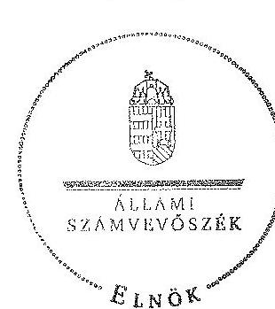

Domokos László
elnök

Melléklet: $\quad 18 \mathrm{db}$
Függelék: $\quad 2 \mathrm{db}$

---

# A GVH létszámadatai szervezeti egységenként a 2008-2012. években

|  Év | Megnevezés | Versenytanács | Szakmai Irodák | Elnök közvetlen | Fötítkárság | Összesen  |
| --- | --- | --- | --- | --- | --- | --- |
|  2008. | Költségvetési engedélyezett létszámkeret (fő) | 13 | 69 | 18 | 20 | 120  |
|   | Átlagos statisztikai létszám (fő) | 11 | 67 | 18 | 19 | 115  |
|   | Költségvetési létszámkeret feltöltöttsége (\%) |  |  |  |  | 95,8\%  |
|  2009. | Költségvetési engedélyezett létszámkeret (fő) | 16 | 67 | 19 | 23 | 125  |
|   | Átlagos statisztikai létszám (fő) | 16 | 66 | 19 | 23 | 124  |
|   | Költségvetési létszámkeret feltöltöttsége (\%) |  |  |  |  | 99,2\%  |
|  2010. | Költségvetési engedélyezett létszámkeret (fő) | 15 | 69 | 15 | 26 | 125  |
|   | Átlagos statisztikai létszám (fő) | 15 | 64 | 13 | 24 | 116  |
|   | Költségvetési létszámkeret feltöltöttsége (\%) |  |  |  |  | 92,8\%  |
|  2011. | Költségvetési engedélyezett létszámkeret (fő) | 20 | 51 | 19 | 35 | 125  |
|   | Átlagos statisztikai létszám (fő) | 20 | 47 | 17 | 35 | 119  |
|   | Költségvetési létszámkeret feltöltöttsége (\%) |  |  |  |  | 95,2\%  |
|  2012. | Költségvetési engedélyezett létszámkeret (fő) | 19 | 53 | 17 | 36 | 125  |
|   | Átlagos statisztikai létszám (fő) | 17 | 47 | 15 | 35 | 114  |
|   | Költségvetési létszámkeret feltöltöttsége (\%) |  |  |  |  | 91,2\%  |

Fonrás: a GVH adatszolgáltatása

---

# A GVH finanszírozására felhasználható bírság és eljárási díj bevételek ${ }^{1}$ 

| Időszak | Felhasználható források |  | Felhasználás célja |
| :--: | :--: | :--: | :--: |
|  | Számításának alapja | Mértéke |  |
| $\begin{aligned} & 2008.01 .01- \\ & 2009.05 .31 . \end{aligned}$ | az előző évben befolyt bírság összege | $5 \%$ | versenykultúra fejlesztése |
|  | az előző évben befolyt eljárási díj és eljárási bírság összege | $100 \%$ | versenyfelügyeleti és ágazati vizsgálatokkal kapcsolatos feladatok ellátása |
| $\begin{aligned} & 2009.06 .01 .- \\ & 2009.12 .31 . \end{aligned}$ | előző két évben befolyt bírság összegének egy évre számított átlaga | $10 \%$ | versenykultúra fejlesztése |
|  | az előző évben befolyt eljárási díj és eljárási bírság összege | $100 \%$ | versenyfelügyeleti és ágazati vizsgálatokkal kapcsolatos feladatok ellátása |
| $\begin{aligned} & 2010.01 .01 .- \\ & 2011.06 .17 . \end{aligned}$ | az előző két évben befolyt bírság összegének egy évre számított átlaga | $\begin{gathered} 25 \% \\ \text { ebből } \end{gathered}$ | versenykultúra fejlesztése |
|  |  | $5 \%$ | ROK finanszírozása |
|  | az előző évben befolyt eljárási díj és eljárási bírság összege | $100 \%$ | versenyfelügyeleti és ágazati vizsgálatokkal kapcsolatos feladatok ellátása |
| $\begin{aligned} & 2011.06 .18 .- \\ & 2011.12 .31 . \end{aligned}$ | az előző évben befolyt eljárási díj összege | $100 \%$ | a GVH müködésével kapcsolatos kiadások fedezése |
|  | az előző két évben befolyt bírság összegének egy évre számított átlaga | $\begin{gathered} 25 \% \\ \text { ebből: } \end{gathered}$ | versenykultúra fejlesztése |
|  |  | $5 \%$ | ROK finanszírozása |
| $\begin{aligned} & 2012.01 .01- \\ & \text { től } \end{aligned}$ | Igazgatási szolgáltatási díj | $100 \%$ | a GVH a müködésével kapcsolatos kiadások fedezése (saját bevétel) |

[^0]
[^0]:    ${ }^{1}$ Tpvt. 43/A. § alapján

---

# A GVH kiemelt költségvetési adatai a 2008-2012. években

|  Évek | Megnevezés | Előirányzat |  | Teljesítés  |
| --- | --- | --- | --- | --- |
|   |  | Eredeti | Módosított |   |
|   |  |  | M Ft-ban |   |
|  2008. | Kiadás | 1 652,8 | 2 399,1 | 2 242,2  |
|   | Bevétel | 0,0 | 627,3 | 627,3  |
|   | Támogatás | 1 652,8 | 1 771,8 | 1 771,8  |
|  2009. | Kiadás | 1 652,4 | 2 121,4 | 1 977,4  |
|   | Bevétel | 0,0 | 430,0 | 430,0  |
|   | Támogatás | 1 652,4 | 1 691,4 | 1 691,4  |
|  2010. | Kiadás | 1 407,8 | 2 465,5 | 2 268,5  |
|   | Bevétel | 0,0 | 1 017,4 | 1 017,4  |
|   | Támogatás | 1 407,8 | 1 448,1 | 1 448,1  |
|  2011. | Kiadás | 1 275,8 | 2 392,0 | 1 873,2  |
|   | Bevétel | 0,0 | 1 083,7 | 1 083,6  |
|   | Támogatás | 1 275,8 | 1 308,3 | 1 308,3  |
|  2012. | Kiadás | 2 363,0 | 3 196,8 | 2 323,6  |
|   | Bevétel | 0,0 | 811,1 | 811,7  |
|   | Támogatás | 2 363,0 | 2 385,7 | 2 385,7  |
|  Összesen | Kiadás | 8 351,8 | 12 574,8 | 10 684,9  |
|   | Bevétel | 0,0 | 3 969,5 | 3 970,0  |
|   | Támogatás | 8 351,8 | 8 605,3 | 8 605,3  |

Forrás: GVH éves költségvetési beszámoló "23" számú űrlap adatai

---

# Az előirányzat módosítások alakulása az ellenőrzött időszakban

|  Évek | Eredeti előirányzat | Előirányzat módosítás |  |  |  |  |  |  |  |   |
| --- | --- | --- | --- | --- | --- | --- | --- | --- | --- | --- |
|   |  | Kormányzati hatáskörben | Felügyeleti/Irányítószervi hatáskörben |  |  | Intézményi hatáskörben |  |  |  |   |
|   |  |  | Tpvt. 43/A. §-a szerinti célokra* | Egyéb | Összesen | Tpvt. 43/A. §-a szerinti célokra* | Előirányzat maradvány felhasználás (intézményi) | Egyéb | Összesen | Módosított előirányzat  |
|  2008. | 1652,8 | 119,0 | 0,0 | 0,0 | 0,0 | 472,7 | 104,1 | 50,5 | 627,3 | 746,3  |
|  2009. | 1652,4 | 39,0 | 0,0 | 0,0 | 0,0 | 263,6 | 156,8 | 9,6 | 430,0 | 469,0  |
|  2010. | 1407,8 | 40,3 | 286,1 | 3,1 | 289,2 | 558,1 | 143,9 | 26,2 | 728,2 | 1057,7  |
|  2011. | 1275,8 | 32,5 | 843,5 | 2,6 | 846,1 | 0,0 | 197,1 | 40,5 | 237,6 | 1116,2  |
|  2012. | 2363,0 | 22,7 | 238,0 | 69,8 | 307,8 | 0,0 | 455,0 | 48,3 | 503,3 | 833,8  |
|  Összesen | 8351,8 | 253,5 | 1367,6 | 75,5 | 1443,1 | 1294,4 | 1056,9 | 175,1 | 2526,4 | 4223,0  |

*a közhatalmi bevételekből származó előirányzat módosítások 100%-ra teljesültek

*Forrás: GVH éves költségvetési beszámoló "23" számú űrlap adatai*

|  Évek | Előirányzat módosítás hatáskörönkénti megoszlása (%) | Összesen (%)  |
| --- | --- | --- |
|   | Kormányzati hatáskör | Felügyeleti/Irányítószervi  |
|  2008. | 15,9 | 0,0  |
|  2009. | 8,3 | 0,0  |
|  2010. | 3,8 | 27,3  |
|  2011. | 2,9 | 75,8  |
|  2012. | 2,7 | 36,9  |
|  Összesen | 6,0 | 34,2  |

---

# A GVH likviditási mutatóinak alakulása az ellenőrzött időszakban

|  Évek | Pénzeszközök | Forgóeszközök | Rövid lejáratú kötelezettségek | Likviditási mutató
(Forgóeszközök/Rövid lejáratú kötelezettségek) | Likviditási gyorsráta (Pénzeszközök /Rövid lejáratú kötelezettségek)  |
| --- | --- | --- | --- | --- | --- |
|   | M Ft |  |  |  |   |
|  2008. | 148,0 | 160,9 | 6,4 | 25,1 | 23,1  |
|  2009. | 123,4 | 153,0 | 17,2 | 8,9 | 7,2  |
|  2010. | 189,3 | 203,0 | 11,0 | 18,5 | 17,2  |
|  2011. | 458,4 | 481,1 | 22,0 | 21,9 | 20,8  |
|  2012. | 820,5 | 831,5 | 19,9 | 41,8 | 41,2  |

Fonás: GVH éves költségvetési beszámoló "01" számú úriap adatai

---

# A GVH tevékenységéhez kapcsolódó közhatalmi bevételek és a követelésállomány alakulása 2008-2012. években

|  Megnevezés | Évek |  |  |  |  | Összesen  |
| --- | --- | --- | --- | --- | --- | --- |
|   | 2008. | 2009. | 2010. | 2011. | 2012. |   |
|  Nemzetgazdasági számlára befolyt bírság, pótlék és perköltség bevételek | 2053,1 | 6283,5 | 2417,8 | 2796,0 | 2052,1 | 15602,5  |
|  Követelésekre elszámolt értékvesztés tárgyévi állományváltozása* | 7,0 | 1010,0 | $-185,2$ | 1026,4 | 165,6 | 2023,8  |
|  Behajthatatlan, leírt követelések | 7,0 | 21,8 | 1,8 | 1197,9 | 41,9 | 1270,4  |
|  Veszteségek a követelések értékeléséből és leírásából | 14,0 | 1031,8 | $-183,4$ | 2224,3 | 207,5 | 3294,2  |
|  Év végi teljes értékủ követelés állomány | 909,3 | 1261,6 | 942,2 | 371,8 | 414,9 | -  |
|  Év végi kétes követelés állomány | 17,2 | 1027,2 | 842,0 | 1868,4 | 2034,0 | -  |
|  Követelés állomány összesen** | 926,5 | 2288,8 | 1784,2 | 2240,2 | 2448,9 | -  |

*Kétes követelések 2008. január 1-i állománya: 10,2 M Ft* * A GVH-nál december 31-én nyilvántartott követelések Forrás: a GVH adatszolgáltatása

---

# A GVH vagyonának összetétele 2008-2012. években*

|  Megnevezés | 2008. | 2009. | 2010. | 2011. | 2012. | Adatok M Ft-ban  |
| --- | --- | --- | --- | --- | --- | --- |
|   |  |  | Ev |  |  | Változás
(2012/2008) \%  |
|  IMMATERIÁLIS JAVAK | 13,0 | 8,2 | 4,1 | 4,6 | 62,7 | 482,3  |
|  TÁRGYI ESZKÖZÖK | 79,2 | 69,5 | 1325,0 | 1318,5 | 1541,2 | 1946,0  |
|  BEFEKTETETT PÉNZÜGYI ESZKÖZÖK | 3,5 | 2,0 | 1,9 | 1,1 | 0,7 | 20,0  |
|  BEFEKTETETT ESZKÖZÖK ÖSSZESEN | 95,7 | 79,7 | 1331,0 | 1324,2 | 1604,6 | 1676,7  |
|  KÉSZLETEK | 0,0 | 0,0 | 0,0 | 0,0 | 0,0 | 0,0  |
|  KÖVETELÉSEK | 2,0 | 5,5 | 1,2 | 1,0 | 2,8 | 140,0  |
|  ÉRTÉKPAPÍROK | 0,0 | 0,0 | 0,0 | 0,0 | 0,0 | 0,0  |
|  PÉNZESZKÖZÖK | 148,0 | 123,4 | 189,3 | 458,4 | 820,5 | 554,4  |
|  EGYÉB AKTÍV PÉNZÜGYI ELSZÁMOLÁSOK | 10,9 | 24,1 | 12,5 | 21,7 | 8,2 | 75,2  |
|  FORGÓESZKÖZÖK ÖSSZESEN | 160,9 | 153,0 | 203,0 | 481,1 | 831,5 | 516,8  |
|  ESZKÖZÖK ÖSSZESEN | 256,6 | 232,7 | 1534,0 | 1805,3 | 2436,1 | 949,4  |
|  SAJÁT TÖKE | 93,4 | 71,5 | 1325,5 | 1308,4 | 1593,6 | 1706,2  |
|  TARTALÉKOK | 156,8 | 143,9 | 197,0 | 455,0 | 803,0 | 512,1  |
|  KÖTELEZETTSÉGEK | 6,4 | 17,3 | 11,5 | 41,9 | 39,5 | 617,2  |
|  FORRÁSOK ÖSSZESEN | 256,6 | 232,7 | 1534,0 | 1805,3 | 2436,1 | 949,4  |

*adatok december 31. Forrás: GVH éves költségvetési beszámoló "01' számú űrlap adatai

---

# A GVH tevékenységéhez kapcsolódó közhatalmi bevételek felhasználása ${ }^{1}$

|  Évek | Tárgyévi |  |  | A felhasználás jogosultjai |  |  |   |
| --- | --- | --- | --- | --- | --- | --- | --- |
|   | Keret | Felhasználás | Fel nem
használt
keret | Hivatal | ROK | VKK | Felhasználás
összesen  |
|   | Adatok M Ft |  |  |  |  |  |   |
|  2008. | 416,9 | 382,8 | 34,1 | 32,4 | - | 350,4 | 382,8  |
|  2009. | 345,9 | 169,4 | 176,5 | 17,5 | - | 151,9 | 169,4  |
|  2010. | 1218,6 | 720,2 | 498,4 | 115,8 | 141,8 | 462,6 | 720,2  |
|  2011. | 1554,6 | 599,4 | 955,2 | 334,9 | 115,6 | 148,9 | 599,4  |
|  Összesen | 3536,0 | 1871,8 | 1664,2 | 500,6 | 257,4 | 1113,8 | 1871,8  |

Forrás: a GVH adatszolgáltatása

[^0] [^0]: ${ }^{1}$ A Tpvt. 43/A.§-a alapján

---

# A Gazdasági Versenyhivatal szervezeti ábrája ${ }^{1}$ 

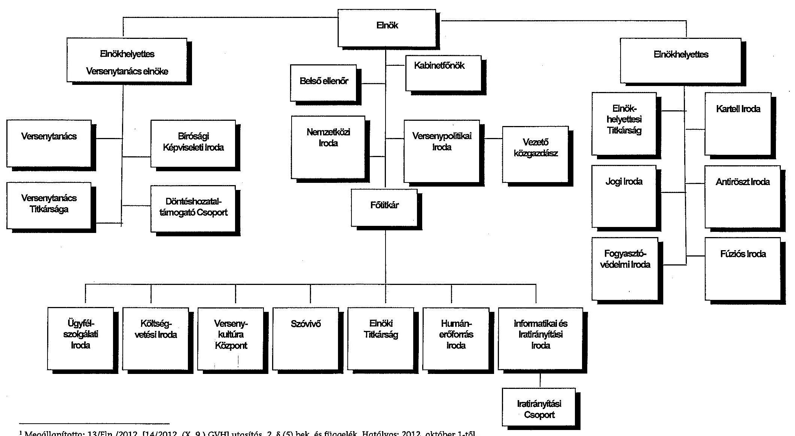

[^0]
[^0]:    ${ }^{1}$ Megállapította: 13/Eln./2012. [14/2012. (X. 9.) GVH] utasítás, 2. § (5) bek. és függelék. Hatályos: 2012. október 1-től.

---

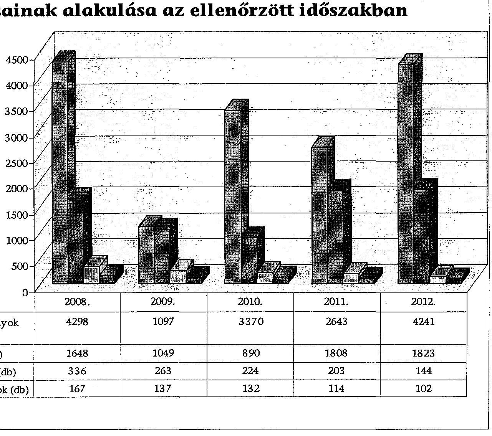

# A GVH eljárásainak alakulása az ellenőrzött időszakban

|  I. GYH-hoz érkezett szóbeli folyamodványok (db) | 2008. | 2009. | 2010. | 2011. | 2012.  |
| --- | --- | --- | --- | --- | --- |
|  GYH-hoz érkezett panaszok száma (db) | 4298 | 1097 | 3370 | 2643 | 4241  |
|  GYH-hoz érkezett bejelentések száma (db) | 1648 | 1049 | 890 | 1808 | 1823  |
|  Lefolytatott versenyfelügyeleti eljárások (db) | 336 | 263 | 224 | 203 | 144  |
|  **Forrás:** a GVH adatszolgáltatása |  |  |  |  |   |

---

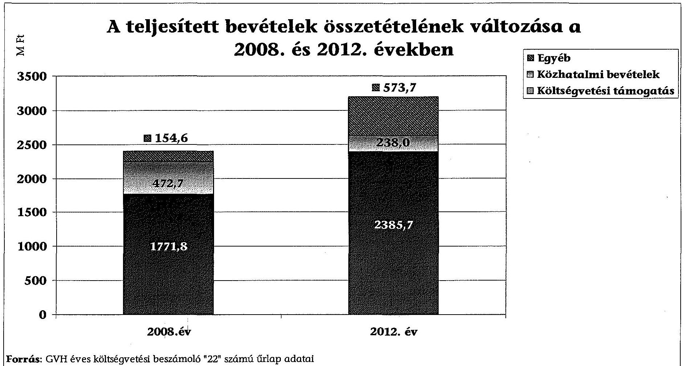

# A teljesített bevételek összetételének változása a 2008. és 2012. években

|  Térdelem | Egyéb  |
| --- | --- |
|  GVEH | 573.7  |
|  KÖZHATALPHI | 238.0  |
|  KÖLTEVÉGVELEG | 1771.8  |
|  KÖLTEVÉGVELEG | 2385.7  |
|  **2008. év** | **2012. év**  |

**Forrás:** GVH éves költségvetési beszámoló "22" számú űrlap adatai

---

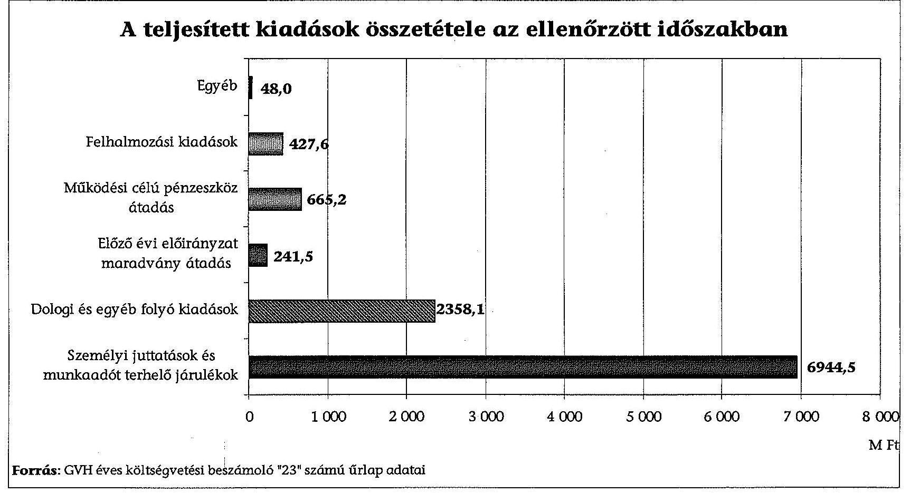

# A teljesített kiadások összetétele az ellenőrzött időszakban

|  Ildózat | 2000 | 2001 | 2002 | 2003 | 2004 | 2005 | 2006 | 2007 | 2008 | 2009 | 2010 | 2011 | 2012 | 2013 | 2014 | 2015 | 2016 | 2017 | 2018  |
| --- | --- | --- | --- | --- | --- | --- | --- | --- | --- | --- | --- | --- | --- | --- | --- | --- | --- | --- | --- |
|  Egyéb | 48,0 | 427,6 | 665,2 | 241,5 | 2358,1 | 6944,5 | 7 000 | 6 000 | 7 000 | 6 000 | 7 000 | 6 000 | 6 000 | 6 000 | 6 000 | 6 000 | 6 000 | 6 000 | 7 000  |
|  Felhalmozási kiadások | 427,6 | 665,2 | 241,5 | 2358,1 | 6944,5 | 7 000 | 6 000 | 7 000 | 6 000 | 6 000 | 6 000 | 6 000 | 6 000 | 6 000 | 6 000 | 6 000 | 6 000 | 6 000 | 7 000  |
|  Működési célú pénzeszköz átadás | 665,2 | 2358,1 | 2358,1 | 6944,5 | 7 000 | 6 000 | 6 000 | 6 000 | 6 000 | 6 000 | 6 000 | 6 000 | 6 000 | 6 000 | 6 000 | 6 000 | 6 000 | 6 000 | 6 000  |
|  Előző évi előirányzat maradvány átadás | 241,5 | 2358,1 | 2358,1 | 6944,5 | 7 000 | 6 000 | 6 000 | 6 000 | 6 000 | 6 000 | 6 000 | 6 000 | 6 000 | 6 000 | 6 000 | 6 000 | 6 000 | 6 000 | 6 000  |
|  Dologi és egyéb folyó kiadások | 2358,1 | 2358,1 | 2358,1 | 6944,5 | 7 000 | 6 000 | 6 000 | 6 000 | 6 000 | 6 000 | 6 000 | 6 000 | 6 000 | 6 000 | 6 000 | 6 000 | 6 000 | 6 000 | 6 000  |
|  Személyi juttatások és munkaadót terhelő járulékok | 0 | 1 000 | 2 000 | 3 000 | 4 000 | 5 000 | 6 000 | 6 000 | 6 000 | 6 000 | 6 000 | 6 000 | 6 000 | 6 000 | 6 000 | 6 000 | 6 000 | 6 000 | 6 000  |
|  Forrás: GVH éves költségvetési beszámoló "23" számú űrlap adatai |  |  |  |  |  |  |  |  |  |  |  |  |  |  |  |  |  |  |   |

---

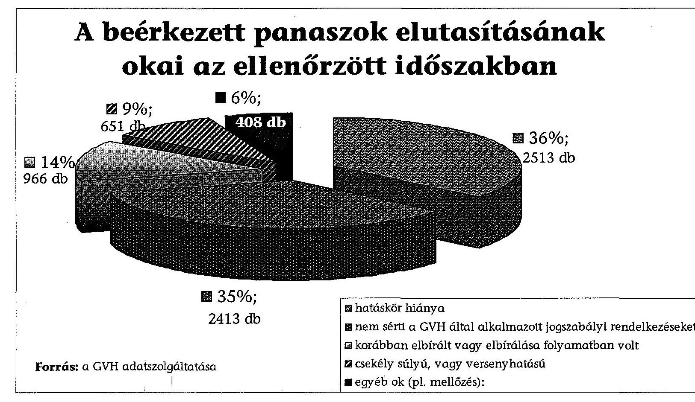

# A beérkezett panaszok elutasításának okai az ellenőrzött időszakban 

$\square 35 \%$;
2413 db

Forrás: a GVH adatszolgáltatása

■ hatáskör hiánya
■ nem sérti a GVH által alkalmazott jogszabályi rendelkezéseket
■ korábban elbírált vagy elbírálása folyamatban volt
■ csekély súlyú, vagy versenyhatású
■egyéb ok (pl. mellőzés):

---

# A beérkezett bejelentések elutasításának okai az ellenőrzött időszakban 

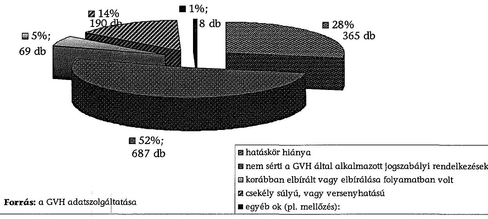

---

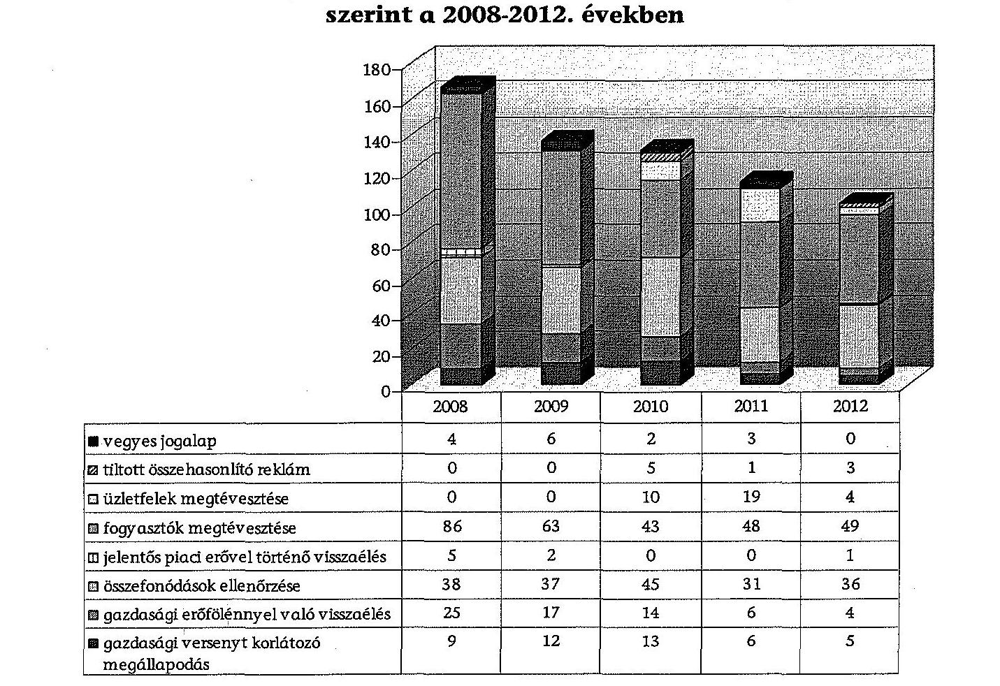

# A GVH versenyfelügyeleti eljárásainak összetétele ügytípusok szerint a 2008-2012. években

|   | 2008 | 2009 | 2010 | 2011 | 2012  |
| --- | --- | --- | --- | --- | --- |
|  vegyes jogalap | 4 | 6 | 2 | 3 | 0  |
|  tiltott összehasonlító reklám | 0 | 0 | 5 | 1 | 3  |
|  üzletfelek megtévesztése | 0 | 0 | 10 | 19 | 4  |
|  fogyasztók megtévesztése | 86 | 63 | 43 | 48 | 49  |
|  jelentős piacl erővel történő visszaélés | 5 | 2 | 0 | 0 | 1  |
|  összefonódások ellenőrzése | 38 | 37 | 45 | 31 | 36  |
|  gazdasági erőfölénnyel való visszaélés | 25 | 17 | 14 | 6 | 4  |
|  gazdasági versenyt korlátozó megállapodás | 9 | 12 | 13 | 6 | 5  |

Forrás: a GVH adatszolgáltatása

---

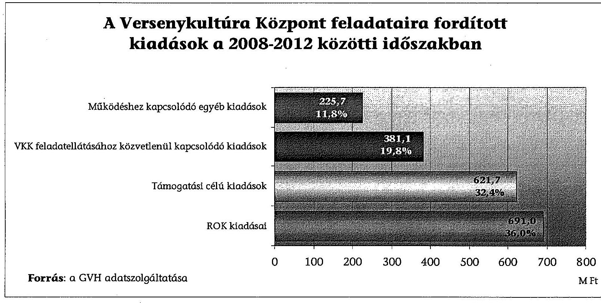

# A Versenykultúra Központ feladataira fordított kiadások a 2008-2012 közötti időszakban

|  Különéshez kapcsolódó egyéb kiadások | 225,7  |
| --- | --- |
|  Vekelátáolata a közvetlenül kapcsolódó kiadások | 381,1  |
|  Támogatási célú kiadások | 621,7  |
|  ROK kiadása | 32,4%  |
|  **Forrás:** a GVH adatszolgáltatása | 691,0  |

---

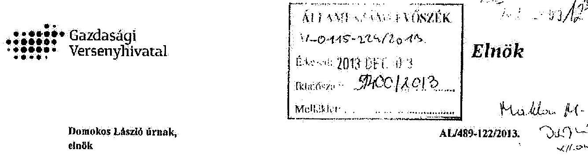

Állami Számvevôszék

# Tisztelt Elnök Úr! 

Küszönettel kézhez vettem „A Gazdasági Versenyhivatal müködéséhez és gazdálkodásának ellenôrzésérôl" szóló számvevôszéki jelentéstervezetet.

A T. Számvevôszék jelentése számos értékes megállapítást és javaslatot tartalmaz, melyek meggyôzôdésem szerint segitik a Gazdasági Versenyhivatal munkájának továbbfçileszlését. Mindazonáltal néhány kérdésben észrevételt kivánok tenni, melyek a Hivatal utóbbi három évben tett crôfeszítéseinek markánsabb megjelenitését célozzák és pozitív irányú értékelését segithetik clô a végleges jelentésben.

Remélem, hogy együttmüködéstink a jövöben is hasonlóan eredményes lesz.

Budapest, 2013.12.02.
Tisztelettel:
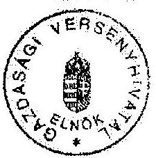

Dr. Juhasz Miklos

Melléklet: Észrevételek az Állami Számvevôszék jelentéstervezetéhez

---

# Melléklet: Észrevételek az Állami Számvevőszék jelentéstervezetéhez 

## Általános megjegyzések a jelentéstervezethez

A dokumentuin nem említi a 2010. novemberében lezajlott vezetöváltást. Az ilyen jellegủ változások az ÁSZ gyakorlatában magas szintủ kockázati besorolással járó események, ezért szükségesnek tartanám ezt is kiemelni a jelentésben. Kérem ezért, hogy a vezetői összefoglalóban derüljön ki, hogy az egyes intézkedések, illetve ezek elmulasztása 2010. november előtt vagy után születtek.

A vezctőváltást véleményem szerint a jelentéstervezet egyes alrészeiben, illetve megállapításaiban is szükséges megjelentetni, mivel jó néhány területen jelentős előremozdulás történt 2010. novemberét követően. Ez különösen a VKK-val kapcsolatos megállapítások, a GVII stratégiájának és éves szakmai tervezésének, valamint a követeléskezelés szabályozottságának és nyilvántartásának tárgyában tett megállapítások esetében lenne fontos. Kiemelném azt is, hogy 2011. évi jelentős összegű leírás (12. és 30. oldal) az új vezetőség intézkedése volt, tekintettel arra, hogy a korábbi vezetőség a követelések a behajthatatlan követelések számviteli kezeléséről végrehajtása érdekében a szükséges intézkedések megtételéről nem gondoskodott. Szintén fontosnak tartanám kihangsúlyozni, hogy a Versenykultúra Központ pályáztatási rendszerét és útmutatóját teljes mértékben átdolgoztuk 2013-ban, nagymértékben reflektálva a belső ellenőrzés megállapításaira és az ÁSZ helyszíni vizsgálata során tett észrevételckre.

A versenytörvény szabályainak maradéktalan betartásáról tett megállapítások kapcsán álláspontom szerint a vizsgálat pusztán formai (határidős, illetve helyenként dokumentációs) hiányosságokat talált, a szakmai munka érdemére vonatkozóan nincs a jelentésben semmilyen megállapítás. A jelentés maga is rögzíti, hogy a bírói gyakorlat szerint a határidők túllépése kisebb súlyú mulasztás, melyek nem okozták egyetlen esetben sem a GVH döntésének hatályon kívül helyezését. A formai hiányosságok túlhangsúlyozása és ez alapján statisztikai adatok nyilvánosságra hozatala a valósághoz képest jóval negatívabb képet fest a GVII szakmai munkájáról, ezért kémém a szakmai munkára vonatkozó megállapítások pontosítását.

A határidők betartásával kapcsolatban fontosnak tartom kiemelni, hogy az időszerűségi mutatók javítása kifejezett célom, s e téren a fúziós és fogyasztóvédelmi ügyek tekintetében számszerüsíthetően is kifejezhető az előre lépés. A fúziós ügyek felgyorsítását a jelentés is elismeri. A fogyasztóvédelmi ügyek tekintetében elmondható, hogy ahhoz képest, hogy 2010-ben még 2008-ban indított ügyeket vizsgált a hivatal, 2012 év végére már minden korábbi évben indult ügyben lezárult a vizsgálat, 2013ban pedig minden korábbi évben indult ügyben megszületik a versenytanácsi döntés is. Az antithöszt ügyek tekintetében is hasonló pozitív tendenciát tud felmutatni a Hivatal (természetesen figyelembe véve azt, hogy az ilyen típusú ügyek átfutási ideje jóval hosszabb): 2013-ban minden 2011-ben indult ügyben lezárult a vizsgálat.

A jelentéstervezet egyáltalán nem tér ki a GVII-nak az OECD általi átvilágításra (2008-2009). A vizsgálat során átadtuk azt az anyagot, amely hivatalba lépésemkor a Hivatal informatikai hálózatán ezzel kapcsolatosan megtalálható volt. Mindezt azért is tartom fontosnak, mert az több, az ÁSZ vizsgálat által is említett problémát feltárt, s azt követően több intézkedésre is sor került.

Az OECD-GVH ROK együttműködési megállapodás kapcsán szükségesnek látom a külön egyeztetést, mellyel kapcsolatosan keresni fogom.

---

# Megjegyzések a vezetői összefoglalóhoz 

A vezetői összefoglaló a részletes megállapításokhoz képest sok helyütt túl általánosító, ezért a GVHra nézve a valóságosnál sokkal kedvezőtlenebb képet fest, mint ami a részletes megállapításokból kirajzolódik. Figyelemmel arra is, hogy a jelentésből a nyilvánosságban és a médiában valószínűleg leginkább a vezetői összefoglalóban szereplő megállapítások fognak majd terjedni, ezért mindenképpen szükségesnek tartom a vezetői összefoglalóban lévő általános megállapítások óvatosabb és tényszerübb megfogalmazását.
6. oldal 2. bekezdés: hosszú és középtávú célok kapcsán nem tesz említést a jelentés arról, hogy 2012ben elfogadásra került a Hivatal versenypártolási stratégiája, 2013-ban pedig a versenylclügyeleti cljárás-inditási stratégiája.
6. oldal 5. bekezdés: az intézmény müködésének szabályozottsága, lásd a részletes megjegyzésekben
7. oldal 2. bekezdés: „az ellenőrzött időszakban nem gondoskodtak a Versenykultúra Központ pályáztatási tevékenységének szabályozásáról". Szükségesnek tartom chelyütt azt is megjeleníteni, hug a Versenykultúra Központ pályáztatási rendszerét és útmutatóját teljes mértékben átdolgoztuk 2013-ban.
7. oldal 3. bekezdés: „nem tartotta be maradéktalanul a versenytörvény vonatkozó előírásait", kérem a mondatot pontosítani azzal, hogy „nem tartotta be maradéktalanul a versenytörvényben meghatározott határidőket".
7. oldal 3. bekezdés 2. mondat: „, az ügyiratok hiányos iktatása"-t kérem pontosítani „a szabályzatok hiányos iktatása" -ra, mivel a hatósági cljáráshoz kapcsolódó ügyiratok esetén iktatási hiányosságok nem kerültek feltárásra. A mondat további részciboz lásd a részletes megjegyzéseket.
7. oldal 4. bekezdés: Az „elutasították" szó használata panaszokra vonatkozóan nem pontos a részletes megjegyzésekben kifejtettek szerint. „Az cljárások lebonyolítása az elutasított panaszok esetében az ellenőrzött tételek $62 \%$-ban [...] felelt meg maradéktalanul a versenytörvény vonatkozó előírásainak. A szabálytalanságok [...] határidők betartásának hiányából adódtak." Sem a Tpvt. sem más törvény nem tartalmaz a panaszok elintézésére vonatkozó határidőt (Tpvt. 43/I. §.). Ezzel kapcsolatosan fontosnak tartom rögzíteni azt is, hogy a 2011-ben életbe lépett utasításban fektetliink le olyan határidőket, melyeket a Hivatal munkájában követendőnek tartunk. A kialakított rendszer célja az volt, hogy a Hivatalhoz évente érkező több mint 2000 panasz kezelésére és az értékes panaszok kiszűrésére minél gyorsabban kerüljön sor. Így például az évente meghatározott prioritásos témákban kapott panaszok haladéktalanul jutnak el a vizsgáló irodákhoz.
8. oldal 7. bekezdés: „A teljes pályázati összeg $51 \%$-ának pályázók $13 \%$-a volt a kedvezményezettje", valamint az ezt követő megállapítások esetében szükségesnek tartanám kihangsúlyozni, hogy a megállapítások alapjául szolgáló mintatétel kizárólag 2011 elötti pályázatokból származik, vagyis sem 2011-es, sem pedig 2012-es pályázat nem volt ellenőrizve.
9. oldal 5. bekezdés: „A támogatást nem nyílt pályázat keretében, hanem kijelölés alapján nyújtották, ezzel korlátozták a támogatásban részesíthetők körét." megállapítást szükséges kiegészíteni azzal, hogy a pályázatok kedvezményezetli köre az összes olyan magyarországi felsőoktatási intézményt lefedte, amely jogász vagy közgazdász képzést folytat.
10. oldal 3. bekezdés: „a 2012. évi utóellenőrzés megállapítása szerint [...]"-től kezdődő rész nem egyértelmü, hogy a VKK tevékenységére vagy egyéb belső ellenőri megállapításokra vonatkozik.
11. oldal 2. bekezdés - három megbízási szerződés törvénybe ütközése kapcsán:

A köztisztviselők jogállásáról szóló 1992. évi XXIII. törvény 1. § (9) bekezdése értelmében a „közigazgatási szerv közhatalmi, irányítási, ellenőrzési és felügyeleti hatáskörének gyakorlásával

---

közvetlenül összefüggő, valamint ügyviteli feladat ellátására kizárólag közszolgálati jogviszony létesíthetơ". A megállapítások szerint ezekben a megbízási szerzödésekben ügyviteli feladatok ellátására került sor, ugyanakkor a Ktv. 1. § (8) b) pontja „közhatalmi, irányítási, ellenőrzési és felügyeleti tevékenység gyakorlásához kapcsolódó ügyviteli feladat" ellátása esetén írta elő közszolgálati jogviszony létesítćsét, ügykezelői minősćgben. A hivatkozott szerződések esetileg jelentkező adatrögzítési, iratrendezési, iratmozgatási feladatok ellátására köttettek, olyan feladatokról van tchát szó, amely nem töltenek ki egy ügykezelői munkakört, időben rendszertelenül jelentkeznek, ellátásuk nem igényel különösebb szakképesítést, nem kapcsolódnak konkrét ügyintézési folyamathoz, valójában tehát egyéb adminisztratív jellegű kisegítő feladatok eseti ellátása történt. Erre közszolgálati jogviszonyt létesíteni nem lehet, ill. nem is jelentett volna költséghatékony, ésszerű megoldást.
11. oldal 2. bekezdés - közbeszerzési eljárás kapcsán: A közbeszerzési törvény alkalmazásánál a várható beszerzés nettó összegét kell figyelembe venni, amely a kifogásolt szerzödés esetében 7,2 MFt volt. Továbbá a létrehozott mű olyan kiadványnak tekinthető, amelynél a Ktv. 243.§ i) pontja szerint nem kell alkalmazni a Kbt-ben maghatározott eljárások egyikét sem.
12. oldal 6. bekezdés: „A hívatal határidőn túli követelés-bejelentése miatt a felszámolók ezeket nem vették nyilvántartásba. Ezzel a Hivatal a részleges behajtás lehetőségét is elveszítette." Egyrészt a megállapítás annyiban nem helyes, hogy 20 esetben, összesen 137924766 Ft-nyi követelést nyilvántartásba vett a felszámoló. Másrészt a teljes képhez az is hozzátartozik, hogy a felszámoló által nyilvántartásba vett követelésből sem térült meg semmi, tekintettel arra, hogy a GVH követelései a Csődtörvény alapján hátra vannak sorolva, és az is ritka, hogy a GVIJ befizetett regisztrációs díj egy részét visszakapja.
12. oldal utolsó bekezdés: „Az ellenőrzött időszakban a Gazdasági Versenyhivatal nem tett meg mindent a hátralékok behajtása érdekében, annak ellenére, hogy a versenytörvény a követelések behajtásával kapcsolatban is előír számára kötelezettségeket.". 2011. évtől kezdődő számos előrelépés történt a követeléskezelés javítására - ahogy azt a jelentés is máshol részletezi -, ezért ezt a mondatot kérjük pontosítani pl. a következőre: „Az ellenőrzött időszakban, és különösen 2011-től a Gazdasági Versenyhivatal számos lépést tett annak érdekében, hogy a hátralékok behajtásával kapcsolatos versenytörvényi kötelezettségének eleget tegyen."
13. oldal 2. bekezdés: „A Hivatal követelés- nyilvántartásra is alkalmazott informatikai rendszerében - bár az adatok rendelkezésre állnak - múltbeli időpontra vonatkozó szürések és listák megbízható adattartalommal nem állíthatók elő." Megerősítem, hogy az informatikai rendszerből kinyerhetőek a múltbeli időpontra vonatkozó szürések is.

---

# Megjegyzések a javaslatokhoz 

Az 1. számú javaslathoz:
A GVII elnöke részben már 2012-ben (versenypártolási és hosszú távú stratégia), 2013-tól pedig maradéktalanul eleget tett az SZMSZ elöirásának, s meghatározta a GVH hosszú- és középtávú stratégiáját, melyek elérhetöek a honlapon is. Az, éves célkitüzések, mint rövidtávú célmeghatározások nem szükséges, hogy részletes határidőt tartalmazzanak a naptári éven belül, hiszen erre minden kijelölt szervezeti egység (melynek kijelölése 2012 és 2013-ban teljes körüen megtörtént) saját munkatervet dolgozhat ki.

Kérem ezért a javaslat pontosabb megfogalmazását és iránymutatást a javaslat megvalósitásához.
A 3. számú javaslathoz a következő megjegyzést teszem:
A hivatkozott 84 pályázó $572,1 \mathrm{M}$ Ft támogatása összesen 235 támogatási szerződés alapján került folyósitásra az alábbi évek szerinti elosztásban:

| 2008.évben: | 53 db |
| :-- | :-- |
| 2009.évben: | 78 db |
| 2010.évben: | 86 db |
| 2011.évben: | 18 db |
| 2012.évben: | 0 db |
| Összesen: | 235 db |

A javaslat szerint tehát 235 darab pályázat ellenőrzését kellene elvégeznie a Hivatalnak 2014-ben. Ez egyrészt azt jelentené, hogy 5-6 évvel a pályázat lebonyolítását, elszámolás befogadását, a támogatás folyósítását követően tenne a belső ellenőrzés észrevételeket. Másrészt jelentős humán eröforrás ráfordítása is szükséges lenne, s álláspontom szerint az ellenőrzés során feltárt, jellemzően rendszerbeli, a pályáztatási rend müködési folyamatait érintő hibák jövőbeni teljes mértékủ elkerüléséhez, azaz az előírásoknak minden tekintetben megfelelő eljárásrend kialakításához az ÁSZ ellenőrzést követően tett megállapítások, továbbá a 2011., 2012., 2013. évek belső tapasztalatai és belső ellenőrzése elegendő információt szolgáltatnak.

Kérjük ezért, hogy a befektetett munka és eredmény szempontjait is figyelembe véve a 2011-2012. évi pályázatok ellenőrzése szerepeljen a javaslatban, tekintettel arra is, hogy ezeket nem érintette az ÁSZ helyszíni vizsgálata. Amennyiben a T. Számvevőszék ezek ellenére szükségesnek tartja a teljes időszak vizsgálatát, természetesen ezt is kivitelezi a Hivatal a megfelelő eröforrások biztosításával.

## Az 5. számú javaslathoz:

Újólag rögzítem, hogy az informatikai rendszerböl kinyerhetőek a múltbeli időpontra vonatkozó szürések is.

---

# Részletes megjegyzésck a jelentés II. fejezetéhez 

1. Az intézmény müködésénck szabályossága, az átszervezések közfeladat ellátással való üsszhangja
18. oldal 2. bekezdés: A közérdekủ keresetet nem a Tpvt. 92. §-a alapján indította a GVH, hanem a fogyasztókkal szemben alkalmazott tisztességtelen általános szerzödési feltétel megtámadására vonatkozó PTKé-beli szabályok (1978. évi 2. tvr. 5. §) alapján.
18. oldal utolsó bekezdés: „....módosításokat a GVH alapító okiratán nem végezték el határidőben" szöveg cészt követő részhez:
19. oldal utolsó elöti bekezdés: A jogszabályok valóban elöirták az értékhatárt el nem érő kifizetések szabályozásának szükségességét, ugyanakkor a korábbi kötelezettségvállalási szabályzat is megemlékezik ezekről. Ez a szabályzat ugyan előirja, hogy nem szükséges ezekhez elózetes írásbeli kötelezettségvállalás, de összességében nem veszi ki ezt a kategóriát a szabályzat hatálya alól, ezért a szabályok egy része értelmezhetően vonatkozott ezekre is és ennek megfelelően járt el a Hivatal.
19. oldal utolsó bekezdés: Beszerzési szabályzat kötelező elkészitését az Ámr 2010. január 1-jétől hatályos rendelkezései irták elő, ezért 2008. és 2009. évben csak közbeszerzési szabályzattal rendelkezlünk.
20. oldal-a szabályzatokra vonatkozó felsoroláspontok

- A teljesen új, korábbit felváltó szabályzatok esetén jellemzően megtörtént a korábbi szabályok hatályon kívül helyezése. Módosítások esetén ez jogilag nem szükséges, a zavart legfeljebb a módosítás mellett néhány esetben szintén elfogadott egységes szerkezetű szöveg megléte okozhatott, de ez nem új utasítás volt, e minősége a rendelkező részekből ki is derült.
- A harmadik felsoroláspontban félkövéren kiemelt rész vonatkozásában lásd a fenti pont második francia bekezdésében írt megjegyzés vonatkozó részét. Ez alapján kérem a megállapítás törlését.
- A szabályzatok egységes szerkezetbe foglalására vonatkozó észrevétellel kapcsolatban nem tartjuk megfelelő módszemek pl. egy nagyobb terjedelmű szabályzat kisebb, adott esetben jelentéktelen módosításai során az egész szabályzat hatályon kívül helyezését és újbóli megállapítását. Egy olyan hivatalnál, ahol jogszabályok, adott esetben eltérő időbeli hatállyal történő alkalmazásának napi gyakorlata van, ez szükségtelen, ilyen formalizmus alkalmazása inkább zavaró és diszfunkcionális lenne.

## 22. oldal lap teteje - együttmüködési megállapodások éves felülvizsgálata

Az éves felülvizsgálat nem egyoldalú kötelezettség, azaz nem kizárólag a GVH-án múlik ennek megtörténte, valamint azokban az esetekben, ahol nincs szükség a megállapodás módosítására, a felülvizsgálat megtörténte akkor sem látszik, ha egyébként a felek rendszeres kapcsolatban vannak egymással.
22. oldal a küldetésnyilatkozat egy több évre (ha nem a szervezet teljes élettartamára) szóló dokumentum, ebben természetszerűleg nem szerepelhetnek sem részletes feladatok, sem azokhoz kapcsolódó határidők. A GVH elnökeként részben már 2012-ben (versenypártolási és hosszú távú stratégia), 2013-tól pedig maradéktalanul eleget tettem az SZMSZ előírásának, s meghatároztam a GVH hosszú- és középtávú stratégiáját, melyek elérhetőek a honlapon is. Az éves célkitüzések, mint rövidtávú célmeghatározások nem szükséges, hogy részletes határidőt tartalmazzanak a naptári éven belül, hiszen erre minden kijelölt szervezeti egység (melynek kijelölése 2012 és 2013-ban teljes körűen megtörtént) saját munkatervet dolgozhat ki. Végezetül, a versenypártolási tevékenység

---

munkatervének elkészitésének kötelezettsége az SzMSz hivatkozott pontjából nem következik. Ennek legfőbb indoka, hogy a feladat alapvetően követő, a kormányzati javaslatokra reagáló jellege folytán munkaterv készítése nem is feltétlenül kivitelezhető vagy szükséges.

# A GVH gazdálkodásának szabályszcrüsége 

25. oldal második bekezdés - „Az új reklámtörvény...." A korábbi reklámtörvényhez képest az „új" reklámtörvény hatálya a vállalkozások közötti viszonyokban közzétett reklámokra szükült a megtévesztő reklámok tekintetében - egyebekben nem történt változás, így különösen a bíróság és a GVH közötti hatáskörmegosztás is megmaradt. Mindezért ezt a bekezdést javaslom vagy törölni, vagy csak annyit kellene meghagyni, hogy a reklámtörvény hatálya a vállalkozások közötti viszonyokban közzétett reklámokra szükült a megtévesztő reklámok tekintetében.
26. oldal harmadik bekezdés: „... A GVH eljárásaiért fizetendő igazgatási szolgáltatási dij..." ( pontosító észrevétel)
26. oldal ötödik bekezdés: „... 2011. évben az eredeti előirányzat további $132,0 \mathrm{~m} \mathrm{Ft}$-os csökkenésére az elfogadott költségvetési javaslat indokolása nem ad magyarázatot." A csökkentés az államháztartásért felelős miniszter által meghatározott jogcímeken történt kötelező jelleggel, melynek az indokolásban való részletezésére az NGM által meghatározott kötelező tartalmi elemek nem biztosítottak lehetőségel. A jogcímek az alábbiak voltak:

- EHO megszünćse: $0,2 \mathrm{MFt}$
- Jutalom előirányzatának elvonása: $95,3 \mathrm{MFt}$
- Cafetéria rendszer egységesitése miatti elvonás: $27,3 \mathrm{MFt}$
- Intézményi dologi kiadások $5 \%$-os csökkentése: $8,8 \mathrm{MFt}$
-Állományba nem tartozók juttatásának csökkentése: $0,4 \mathrm{MFt}$

26. oldal ötödik bekezdés: Az utolsó mondatban szereplő 1087,2 MFt összeg a támogatási összeg 63,8 MFt összegủ csökkenésének (fejezeti kezelésű előirányzat elvonása) és a bírság bevételek Áht. szerinti módosítása miatt 1.151,0 MFt összegủ növekedésénck az egyenlcgc. (pontosító észrevétel)
27. oldal 2. bekezdés: a 2011. évi leírás összege két év leírásának összevont összegét tartalmazza: a 2010. évi mérleghez kapcsolódóan 2011. április 20-án, a 2011. évi mérleghez 2012. április 24-én történt meg a leírás jóváhagyása. (pontosító észrevétel)
28. oldal első bekezdés (2011-es szabályozás)

- első felsoroláspontban a határidők szabályozásának hiányával összefüggésben szükséges megjegyezni, hogy a jogszabályból eredő határidők (így pl. ha egy végrehajtási cselekményt haladéktalanul kell megtenni) nem szerepelnek a belső szabályzatokban. Amennyiben azt a T. Számvevőszék szükségesnek tartja, természetesen beépítjük a törvényi határidőket is a szabályzatokba.

## - harmadik felsoroláspont:

- a NAV részére átadott követelések esetében az évenként többszöri egyeztetés a behajtás eredményességét nem befolyásolja. Az átadott követelésekről - amennyiben olyan eljárási cselekmény történik, amely érdemben befolyásolja a behajtás állását - a NAV soron kívül tájékoztatja a Hivatalt.
- a NAV-val kötött megállapodás nem egyszer évente ír clő cgycztctćsi kötelezettséget, hanem azt írja, hogy a felek időközönként, előzetes konzultációt követően központilag egyeztetik az átadott ügyeket, illetve a NAV évente egyszer tájékoztatja a GVH-t az átadott követelések helyzetéről. Ezen túlmenően

---

az átadott ügyekben folyamatosan érkeznek a tájékoztatások (egy évben több mint 60 tájékoztatást kaptunk).

# 31. oldal - nyilvántartási rendszer 

- Minden múltbéli időpontra vonatkozó lista megbizható adattartalommal elöállítható, ezért ezt a megállapítást törölni javaslom.
- A nyilvántartott követelések kezelése azért hiányos, mivel 2011. évet megelőzően egyáltalán nem foglalkozott a Hivatal a követeléskezeléssel. A jelenlegi vezetés e körben tett erőfeszitéseit nem rögzíti a jelentéstervezet.

### 2.5 A személyi feltételek és a feladatellátás összhangja

34. oldal - „Három magánszeméllyel kötött meghizási szerzödés..."

Lásd a vezetői összefoglalóban tett általános észrevételt. Részletes magyarázatul szolgálhat például, hogy az MB201103 számú, 2011. október 28 -án kötött, humánpolitikai dokumentumok rendezésére, személyi iratok rendszerezésére és irattár részére történő átadására szóló megbízási szerződés megkötését indokolta, hogy a humánerőforrás munkatárs (Kalas Bcáta) távozását követően a 2011. augusztus 31-i munkakör átadáshoz kapcsolódó személyügyi iratok átvételekor több doboz olyan irattározásra nem került személyügyi iratot talált a feladatot átvevő vezető, amelynek kezelése és tárolása nem a közszolgálati jogviszonnyal összefüggő adatkezelésre és a közszolgálati nyilvántartásra vonatkozó szabályokról szóló 233/2001. (XII. 10.) Korm. rendeletben és a közszolgálati nyilvántartás egyes kérdéseiről szóló 7/2002. (III.12.) BM rendeletben, valamint a Hivatal Közszolgálati Adatvédelmi Szabályzatában foglaltak szerint került sor. A nagy mennyiségú rendezetlen iratanyag átvétele haladéktalanul szükségessé tette a személyi iratok kezelésében jártas külső munkaerő bevonását, mivel azok áttekintésére, személyi anyaghoz rendelésére és irattárazásra történő előkészítésére megfelelő belső kapacitással - lásd. távozó HR munkatárs - a Hivatal nem rendelkezett. A feladat sürgősségét indokolta, hogy az ömlesztve és helytelenül tárolt iratok között munkaügyi, vagyonnyilatkozat-tétellel kapcsolatos levelezés és több eredeti, személyes adatot tartalmazó vagy kiadmányozott irat volt.
35. oldal: „Egy ellenőrzött szerződés esetében a GVH közbeszerzési eljárás lefolytatása nélkül kötött szerződést, annak ellenére, hogy annak értéke meghaladta a 8 MFt-os közbeszerzési értékhatárt." A közbeszerzési törvény alkalmazásánál a várható beszerzés nettó összegét kell figyelembe venni, amely a kifogásolt szerződés esetében 7,2 MFt volt. Továbbá a létrehozott mű olyan kiadványnak tekinthető, amelynél a Ktv. 243.§ i) pontja szerint nem kell alkalmazni a Kbt-ben maghatározott eljárások egyikét sem.

## 2. A GVII feladatellátásának szabályszerűsége

36. oldal 4. bekezdés: „A GVH eljárásaira a Ket" szövegrész helyesen: „A GVH versenyfelügycleti eljárásaira a Ket". (pontosítás)
37. oldal 2. bekezdés: Álláspontom szerint az uniós iránymutatások nyomán nem kellett az eljárási jellegü utasitást frissíteni, hiszen a hivatkozott iránymutatások nem eljárási, hanem anyagi jellegü kérdésekről szólnak, melyek nem az eljárásrend tárgyai.

## 37. oldal: elutasitott panaszok (valamint a 7. és 24. oldal)

- a 2011. januári 'fipvt. módosítás nyomán a panaszokkal kapcsolatos ügyintézés nem minősül közigazgatási hatósági eljárásnak, és így nem vonatkoznak rá a közigazgatási törvényi határidők. Ezzel ellentétben a jelentéstervezet a panaszok „elutasítása" körében határidő elhúzódást említ, holott

---

határidő betartási kötelezettsége a GVH-nak panaszok körében 2011. januártól nem volt. Mindezért a, közigazgatási eljárásokban szokásos 30 napos ügyintézési határidő, mint benchmark használata is félrevezető.
-Szintén félrevezető az „elutasítás" szó használata. A Tpvt. panaszkezelésre vonatkozó szabályai csupán arra kötelezik a vizsgálót, hogy a panaszban foglaltak alapján a szükséges intézkedéscket megtegye (Tpvt. 43/1.§). Ennek megfelelően a GVH nem hoz formális döntést a panaszok tárgyában, azokat piaci jelzésként kezeli és kizárólag áttétel vagy versenyfelügyeleti eljárás indításakor értesíti a panaszost. A panaszos eljárással kapcsolatos belső utasítás szerint is legfeljebb csak lezárásról beszélhetünk.

- Nem világos, hogy mit takar a „részben megfelelt" és a „nem felelt meg" kategória.
- A példaként kiemelt „hiba" egy a belső eljárásrendben lefektetett belső határidő betartásának dokumentálását említi. Egy ilyen jellegű hiba véleményem szerint nem minősíthető érdeminek, ezért elhagyását javaslom.

# 38. oldal: elutasitott bejelentések 

- A vonatkozó táblázatban az szerepel, hogy az elutasítás oka többségében, hogy „a cselekmény nem sértette a GVH által alkalmazott jogszabályi rendelkezéseket". Ezt pontosítani szükséges a következőre: „a GVH által alkalmazott jogszabályi rendelkezések megsértése nem volt valószínűsíthető".
-Nem világos, hogy mit takar a „részben megfelelt" kategória.

## 39. oldal: versenyfelügyeleti eljárások

- Túlágosan erős, esetlegesen félrevezető megállitásnak tartom, hogy a versenyfelügyeleti eljárások $43 \%$-a során került a versenytörvény és a belső szabályzat betartására. A jelentés a határidő túllépéseket a törvény és szabályzat be nem tartásaként értékeli, pont ugyanúgy, mint egy érdemi jogszabálysértést (amilyenre a jelentésben konkrétan nem is történik említés). Teszi ezt mindazok után, hogy szintén megállapításra került, hogy „a bírósági határozatok alapján a hatósági határidő (akár több mint egy éves késedelme sem jogvesztő hatású, ezért nem alapozza meg a GVH határozatának vagy végzésének hatályon kívül helyezését és módosítását" - lásd például Fővárosi Törvényszék 2.Kf.649.891/2013/4. számú ítélet, illetve Legfelsőbb Bíróság Kf.IV. 27.929/1998/4. A belső szabályzatnak való nem megfelelés (koncepció, belső határidő) és a jogszabályoknak való nem megfelelés sem minősíthető ugyanolyan súlyú problémának, viszont nem egyértelmű, hogy ezek milyen súllyal lettek figyelembe véve a százalékok számításánál.
- Nem világos mit takar a „részben megfelelt" és a „nem felelt meg" kategória.

41. oldal 1. bekezdés: Az elsőfokú bíróság nem dönthet a késedelmi kamat visszafizetéséről, csak arról, hogy csökkenti a bírságot, és ennek jogszabályi következménye a késedelmi kamat fizetési kötelezettség (pontosítás).

### 3.3 A Versenykultúra Központ feladatellátásának szabályszcrüsége

43. oldal: a jelentés az éves tanulmányi versenyt is a pályázati támogatásokhoz sorolja, holott az eltérő jellegéből fakadóan nem feltétlenül ezek között kezelendő.
44. oldal: a jelentés megjegyzi, hogy a GVH VKK nem tett eleget a 2012. évi munkatervben meghatározott azon feladatának, hogy idegen nyelvű szakkönyvet jelentet meg. Megjegyzendő, hogy a

---

2012. évi munkalervben az alábbiak szerepeltek: „A GVH VKK 2012 során megkezdte az előkészületcit Robert H. Bork: The antitrust paradox: a policy at war with itself cimú könyve (Free Press, 1993) magyar nyolvü megjelentetésének." A GVH VKK tehát nem vállalta a könyv 2012. évi megjelentetését. Ezen felül már az ÁSZ vizsgálat folytatása során jeleztük a vizsgálatot folytatóknak, és dokumentumokkal támasztottuk alá, hogy a GVH VKK-nak közel egy év cgycztctésinformációszerzés alatt sikerült kideritenie, ki rendelkezik a kiválasztott idegen nyelvü szakkönyv szerzői jogaival, majd végül magával a szerzővel vette fel a kapcsolatot, aki sajnos elzárkózott a szakkönyv magyar nyelvü megjelentetésétől (mondván, hogy elötte érdemes lenne tartalmilag aktualizálni a könyvet, amelyet nem tud vállalni). ${ }^{1}$ Ezen felül a GVH VKK korábban sem minden évben jelentetelt meg idegen nyelvü szakkōnyvet. Egy munkaterv véleményem szerint jellegéből adódóan nem szánon kérhető, amennyiben a tervezett lépésck küldő okokból hiúsulnak meg, ezért legfeljebb az éves beszámoló tárgya lehet a meghiúsulás magyarázata.
44. oldal: a jelentés kijelenti, hogy a pályázatok keretében 84 pályázó kapott támogatást, Az ÁSZ vizsgálat ugyanakkor nem tér ki arra, hogy a pályázatok keretében összesen hány pályázó nyújtott be pályázatot, illetve hány olyan szervezet van, amely az említett években szakmailag alkalmas lehetett volna arra, hogy a versenykultúra fejlesztés körébe tartozó programot valósítson meg és így pályázati úton nyújtott támogatás kedvezményezettje lehessen, így arra sem tért ki a vizsgálat, hogy az említett 84 pályázó ezen kömek mekkora részét tenné ki.
44. oldal: a jelentés leírja, hogy a postai bélyegzővel ellátott borítékok hiányában a postai fcladás és a beérkezés időpontja nem volt ellenörizhető. Az elektronikus iktatókönyv alapján ugyanakkor a beérkezés időpontja visszakövethető.
47. oldal harmadik bekezdés: 100 c Ft összeget meghaladó eszközbeszerzések tiltása nem a vagyonértékủ jogok nyilvántartásba vételére vonatkozott, itt elsősorban az informatikai eszközök beszerzésének a korlátozása volt a cél, éppen azért, hogy ne kerüljön olyan kiadás elszámolásra, amely nem csak a projekt megvalósitását célozza. Idegen nyelvủ könyv kiadásával kapcsolatban a felhasználási jog jogosan felmerülö a projekt megvalósitását szolgáló kiadás volt.
47. oldal 3. bekezdés „... a számviteli előírásoknak nem megfelelő, dokumentumok, bizonylatok felhasználását is elfogadta."

- Az Agrárgazdasági Kutató a számviteli bizonylatok kiegészítéseként, a GVH kérésére, hiánypótlásként nyújtotta be a kifogásolt nyilatkozatokat. A hiánypótlási kérés éppen azért történt, hogy eldönthető legyen, megalapozott volt-e a kiadások pénzügyi beszámolóban való szerepeltetése.
- ELTE Kuncz Ödön Jogi Tudásközpont: hiánypótlásként küldték a pénzügyi teljesités bizonylatait, amely tartalmazta a fizetćsi jegyzéket, a csoportos beszedési megbízást, a járulékok utalásáról szóló átutalásokat a pályázó szervezet gazdálkodási föosztályának vezetője nyilatkozatával együtt. Amely megerősítette, hogy a pénzügyi teljesités bizonylatai tartalmazzák a támogatás terhére elszámolt összegeket is.

47-48. oldal: a jelentés leírja, hogy a könyvtártámogatásban részesülő intézmények részére a GVH VKK a támogatást nem pályázat keretében, hanem kijelölés alapján nyújtotta. A vizsgálat ugyanakkor nem terjedt ki arra, hogy hány, a könyvtártámogatás feltételeinek - versenypolitiküt-versenyjogot oktató egyetemek, illetve föiskolák - megfelelő intézmény (könyvtár) müködött az említett években, és a támogatásban részesülő intézmények ezen kört teljesen lefedték. Továbbá fontosnak tartom rögzíteni, hogy jelenleg már nem ez a rendszer müködik.

[^0]
[^0]:    ${ }^{1}$ A szerző, Robert H. Bork 2012. december 19-én elhunyt.

---

50. oldal: Javítani javaslom a ROK-ról szóló fejezet utolsó bekezdés, utolsó mondatát: „Ezen túl a GVIH VKK az európai uniós bírak részére szervezett nemzetközi szemináriumok költségeinek túlnyomó részére $44,1 \mathrm{M}$ Ft összegben nyert curópai uniós támogatást".

# 3.4 A belsö ellenörzések javaslatainak hasznosulása a feladatellátás során 

51. oldal 2. bekezdése: „Húsz 2008. és 2009. évi belső ellenőri jelentés mellől hiányzott a megismerési záradék,..."

A 2009. évi ellenőrzési jelentésekhez kapcsolódó 5 db (1-4/2009; 2-1-1-4/2009; 2-2-1-4/2009; 3-14/2009; 4-1-6/2009) megismerési záradék PDF formátumban, elektronikusan a 2010. évi megismerési záradékokkal együtt került átadásra.

## Mellékletek:

## $1 / 2$ számú melléklet:

2010. január 01-től kezdődően volt hatályos az a rendelkezés, hogy az előző két évben befolyt bírság összegének egy évre számított átlaga $25 \%$-a versenykultúra fejlesztése, cbből $5 \%$ ROK finanszírozása (pontosító észrevétel)

## 1/6 számú melléklet

A táblázat 6 sorában szereplő összegek nemcsak a teljes értékủ követcléseket tartalmazzák, az összegekben a határidőn túli követclések összege is szerepel.

## 1/8. számú melléklet:

A bírságbevételekre vonatkozó 2012. január 1-jétől hatályos Áht. rendelkezések miatt a táblázat 2012. évi sora adatot nem tartalmazhat, vagy az egész sor törlendő.

## 2/5. számú melléklet:

Az „clutasítás" szó helyett a „lezárás" szó a helyes kifejezés.

---

.

---

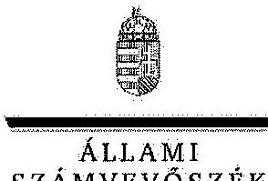

ELNÖK

# Dr. Juhász Miklós úr 

elnök
Gazdasági Versenyhivatal

## Budapest

## Tisztelt Elnök Úr!

A Gazdasági Versenyhivatal müködésének és gazdálkodásának ellenőrzéséről készült jelentéstervezetre tett észrevételeit köszönettel megkaptam.

Az Állami Számvevőszék észrevételekre vonatkozó álláspontjáról a felügyeleti vezető által készített részletes tájékoztatást csatoltan megküldöm.

Tájékoztatom Elnök urat, hogy a számvevőszéki jelentés az elfogadott észrevételei figyelembevételével készül.
Budapest, 2013. év 12. hó 23 nap
Tisztelettel:
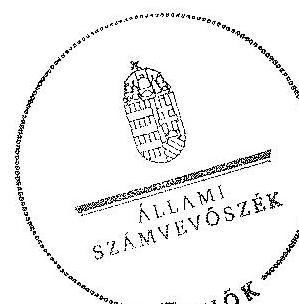

Domokos László

Melléklet: Tájékoztatás az elfogadott és az el nemhogadott észrevételekről

---

# Tájékoztatás   az elfogadott és az el nem fogadott észrevételekröl 

A Gazdasági Versenyhivatal müködésének és gazdálkodásának ellenőrzéséről készült jelentéstervezetre az AL/489-122/2013. iktatószámú levelében tett észrevételeit köszönettel megkaptuk. Az észrevételeket áttekintettük, azok kezeléséről a következő tájékoztatást adom.

## Általános megjegyzések

Az Állami Számvevőszék (ÁSZ) ellenőrzése - amint az a GVH részére megküldött programban is szerepel - szabályszerűségi ellenőrzés volt. Az egyeztetésre megküldött jelentéstervezet bevezető része is tartalmazta, hogy a Gazdasági Versenyhivatal feladatellátását érintő ellenőrzés az eljárások jogszabályi és belső szabályoknak való megfelelőségére irányult, nem sértve a Hivatal versenyfelügyeleti függetlenségét. Megállapításainkat - az Állami Számvevőszék elnöke által elfogadott ellenőrzési program alapján - az előzetesen bekért adatokra, valamint a helyszíni ellenőrzés során áttekintett dokumentumokra alapoztuk.

A jó müködés alapja - bármely területen - a rend, ami ez esetben a szabályoknak való megfelelést jelenti, amit az észrevételeik szerint a GVH is fontosnak tart. Ezért ellentmondásos, hogy a feltárt hiányosságokat „pusztán formai" kérdésnck tekintik. A szabályszerűségi ellenőrzés lényege, hogy megállapítja a szabályoknak való megfelelést vagy nem megfelelést. Ebből következően a szabályszerűséggel kapcsolatos megállapítások, hiányosságok nem (nem lehetnek) túlhangsúlyozottak. A számvevőszéki ellenőrzés által feltárt problémák esetében, amennyiben az ellenőrzött időszakban, vagy a helyszíni ellenőrzés időszakában dokumentált intézkedés történt, azt megjelenítettük a jelentéstervezetben.

Az elektronikus formában átadott, aláírások nélküli OECD átvilágítás anyaga nem az ÁSZ ellenőrzés megállapításait tükrözi, ezért nem szerepeltetjük a jelentéstervezetben. A GVHOECD együttmüködési megállapodással kapcsolatos megállapításainkat és javaslatunkat az észrevételében nem kifogásolja. Tájékoztatjuk, hogy az egyértelműség érdekében az ezzel kapcsolatos javaslatunkat a következőre pontosítjuk:
„Fontolja meg az OECD-vel kötött együttmüködési megállapodás felülvizsgálatának, illetve újratárgyalásának kezdeményezését a GVH-ra nézve aránytalan, egyoldalú finanszírozási terhek megváltoztatása, mérséklése érdekében".

A vezetőváltásra vonatkozó információval az összegző megállapítások elnöki hatáskörre vonatkozó részét a következők szerint kiegészítjük: „A Hivatal elnöki pozíciójának betöltésében 2010, november 1-jétól változás történt."

---

# Megjegyzések a vezetői összefoglaló részhez 

Az összefoglaló az ellenőrzött területek fő és tényszerủ megállapításait tartalmazza. Amennyiben a részletes megállapítások között elfogadott észrevételek a lényegi megállapítást is érintik azt az összefoglalóban a továbbiakban jelzett módon megjelenítjük.

## 6. oldal 2. bekezdés

A helyszíni ellenőrzés megállapítása és az átadott dokumentumok alapján az ellenőrzött időszakban a GVH tevékenységét átfogó közép és hosszú távú hivatali stratégia nem készült. A „GVH versenvfelügyeleti eljárás-inditási stratégiája" elnevezésủ dokumentum eljárásrendi elemeket tartalmaz, a versenyfelügyeleti eljárás megindításának szempontjait, folyamatait rögzíti. A dokumentum nem tartalmazza a versenyfelügyeleti terület részletes helyzetértékelését, a megvalósítandó mérhető célokat, a szükséges beavatkozások területének és eszközeinek meghatározását, a szükséges beavatkozások személyi, tárgyi, szakmai, anyagi és szervezeti feltételeit, valamint a megvalósítás, a nyomon követés és az értékelés alapelveit, rendszerét. A dokumentum tartalma alapján a címmel ellentétben eljárásrendnek tekinthető, és nem stratégiának. A versenypártolási prioritásokat tartalmazó dokumentum a versenyfelügyeleti eljárás-indítási stratégiához hasonlóan nem tartalmaz mérhető célokat, a szükséges beavatkozás személyi, tárgyi, anyagi és szervezeti feltételeit, valamint a megvalósítás nyomon követését.

## 7. oldal 2. bekezdés

A Versenykultúra Központ pályáztatási tevékenységére vonatkozóan a helyszíni ellenőrzés lezárásáig belső szabályzat nem készült. A hivatkozott pályáztatási útmutató nem a GVH pályáztatási tevékenységének belső eljárásrendjét, határidőit, felelőseit tartalmazza, hanem a pályázók számára nyújt segítséget a pályázatok beadásához.

## 7. oldal 3. bekezdés

A tevékenység szabályosságának megítélésére vonatkozó megállapításunkat a következők szerint pontosítjuk „az eljárások lebonyolításakor nem tartotta be maradéktalanul a versenytörvényben meghatározott határidőket, valamint a belső szabályzatok vonatkozó elöírásait".

## 7. oldal 3. bekezdés 2. mondat

Az ügyiratok hiányos iktatására vonatkozó megállapítás módosítására vonatkozó észrevételét nem fogadjuk el. A helyszíni ellenőrzés megállapításai szerint nem csak a szabályzatok, hanem a belső ellenőrzés iratainak, intézkedési terveinek, az együttmüködési megállapodásoknak az iktatása is hiányos volt. Így egyes hiányzó iratokról nem volt egyértelmúen megállapítható, hogy hiányoztak, vagy el sem készültek.

---

# 7. oldal 4 bekezdés 

A Tpvt. 43/I. §-a 2011. január 1-jétől módosult. A jelenleg hatályos rendelkezések valóban nem tartalmaznak határidőt a panaszok elintézésére. A 2011. január 1-je előtti időszakra vonatkozóan azonban a Tpvt. 43/A. § (2) és (3) bekezdése is rögzített határidőket. A jogszabályváltozás miatt a panaszok intézésének szabályosságára vonatkozó értékelésünket a változás előtti és utáni időszakra vonatkozó hatályos jogszabályok alapján külön munkalapokon végeztük el.

## 8. oldal 7. bekezdés

A VKK működése szabályszerűségének értékeléséhez kiválasztott mintatételek között nem szerepelt 2011-ben, illetve 2012-ben kiírt pályázat. A mintában ugyanakkor volt több olyan 2010. évben kiírt pályázat, amelyek pénzügyi elszámolására 2011-ben került sor. A pályázatok koncentráltságára vonatkozó megállapítás nem csak a tételesen ellenőrzött, hanem az ellenőrzött időszakban nyújtott pályázatokra vonatkozott.

## 9. oldal 5. bekezdés

A felsőoktatási intézmények könyvtártámogatásához nyújtott támogatások - észrevételükkel ellentétben - nem fedték le a közgazdász-képzést folytató intézmények teljes körét, fóiskolák például a támogatásban nem részesültek. A kijelölés alapján nyújtott támogatásokra vonatkozó megállapításunkban a támogatásban részesíthetők körének korlátozását kifogásoltuk.

A 10. oldal 3. bekezdésének megállapítását a VKK-ra vonatkozóan egyértelműsítettük.
A 11. oldal 2. bekezdéséhez tett észrevétele kapcsán véleményünk a következő. Az ellenőrzött megbízási szerződések három esetben ügyviteli feladat ellátására vonatkoztak, ami a köztisztviselők jogállásáról szóló 1992. évi XXIII. törvénybe ütközött. Az észrevétel szerint a megbízási szerződések nem kapcsolódnak konkrét ügyintézési folyamathoz, valójában egyéb adminisztratív jellegű kisegítő feladatok eseti ellátása történt. A megbízási szerződések - az észrevétellel ellentétben - sem elnevezésükben, sem tartalmukban nem egyéb adminisztratív jellegű, hanem ügyviteli feladatokra vonatkoztak, amelyeket közszolgálati jogviszony keretében, ügykezelői minőségben lehet ellátni.
11. oldal 2. bekezdéséhez tett észrevétele alapján a jelentéstervezetet nem tudjuk kiegészíteni. A rendelkezésre bocsátott ellenőrzési dokumentum szerint (201008. számú megbízási szerződés) a megbízás összege $12,0 \mathrm{M} \mathrm{Ft}$ volt, ami meghaladta a 2010. évben a szolgáltatásokra vonatkozó közbeszerzési értékhatárt. Továbbá a beszerzés tárgya nem tartozik a közbeszerzési kivételek közé.

## 12. oldal 6. bekezdés

A nyilvántartásba vett követelésekkel kapcsolatos tájékoztatást köszönjük, de ez nem indokolja a megállapítás módosítását. A határidőben való bejelentés szabályszerűségi kérdés, annak elmulasztására az nem ad felmentést, hogy észrevételük szerint a bejelentett követelésből nem

---

térült meg semmi. A felszámolók felé határidőn túli követelés bejelentésre vonatkozó megállapítás a Költségvetési Iroda 2011. április 20-ai AL/710/2011. számú elnök úr felé benyújtott feljegyzésében, valamint az ellenőrzés számára átadott kimutatásban egyaránt szerepel. Megállapításunkban a követelés teljes behajtásának bizonytalanságára is utaltunk.

# 12. oldal utolsó bekezdés 

A követeléskezeléshez kapcsolódó észrevételét figyelembe véve az összegző megállapításokat a következők szerint kiegészítjük: „A vezetőváltással előrelépés történt a követeléskezelés javitása érdekében. Megtörtént a korábbi időszak behajthatatlan követeléseinek számviteli kezelése, a 2011 májusától kialakitott szabályozás a teljes követeléskezelési folyamatot lefedi...".

A 13. oldal 2. bekezdésének megjegyzéséhez, valamint az 5. számú javaslathoz kapcsolódóan tájékoztatjuk, hogy a számvevők helyszíni ellenőrzési tapasztalatai alapján a megállapítást a következőkre pontosítjuk: „a Hivatal ügykövetésre készült, de követelés-nyilvántartásra is alkalmazott informatikai rendszeréböl a követelések múltra vonatkozó adatai csak bonyolult szürési rendszeren keresztül nyerhetők ki, ami hibalehetőséget hordoz. Bár az adatok a rendszerben rendelkezésre állnak, statikus múltbeli idöpontra vonatkozó szürések listák közvetlenül nem állíthatók elö".

## Javaslatokat érintő megjegyzések

Az 1. számú javaslatot változatlanul fenntartjuk a vezetői összefoglaló 6. oldal 2. bekezdéséhez tett észrevételre adott indokok miatt.

A 3. számú javaslat c) pontját - amelyre az észrevétel vonatkozik - fenntartjuk. Ezt egyrészt az indokolja, hogy a VKK pályáztatási tevékenysége nem szabályozott, ezért az ellenőrzésből nyert további tapasztalatok segítik a még pontosabb szabályozást. Másrészt a pályáztatási tevékenységet a belső ellenőrzés 2008-2011 közötti időszak minden évében ellenőrizte. A 2012. évi utóellenőrzés megállapítása szerint ennek ellenére a VKK-ra vonatkozó korábban feltárt hiányosságok többsége továbbra is fennállt, ami arra is utalhat, hogy még nem minden probléma ismert. A rendelkezésre álló erőforrások mellett a javaslat megvalósítását az intézkedési tervben a Hivatal ütemezi.

Az 5. számú javaslatot fenntartjuk, a vezetői összefoglaló 13. oldal 2. bekezdéshez tett észrevételre adott válasszal egybehangzóan.

## Részletes megjegyzések a jelentéstervezet II. fejezetéhez

A 18. oldal 2. bekezdéséhez tett észrevételét elfogadtuk, azzal a jelentéstervezetet kiegészítjük: „Kiemelt feladatköreinek ellátásán túl a Tpvt. 92. § (1) bekezdésének, és az 1978. évi 2. törvényerejü rendelet 5. §-ának felhatalmazása alapján a GVH az ellenőrzött időszakban egy közérdekü keresetet is inditott."

A 18. oldal utolsó bekezdésére vonatkozó megjegyzés nem szerepel az anyagban (befejezetlen mondat).

---

A 19. oldal utolsó előtti bekezdéséhez írt magyarázat ellentmondásos. Megállapítják, hogy a kötelezettségvállalási szabályzatuk is előírja, hogy az értékhatárt el nem érő kifizetésekhez nem szükséges írásbeli kötelezettségvállalás. Ez esetben viszont megállapításunkkal összhangban szabályozniuk kellett volna ezen kifizetések rendjét, illetve a szabályzatban szerepeltetni, hogy ezekben az esetekben is írásbeli kötelezettségvállalást követelnek meg a kifizetésekhez.

A 19. oldal utolsó bekezdését - az észrevételt figyelembe véve - a következők szerint pontosítjuk: „A 2008. és 2009. évi belső utasítások csak a közbeszerzésekről szóló törvény hatálya alá tartozó beszerzésekről rendelkezett, mivel a beszerzések teljes körü szabályozását az Ámr 2010. január 1-jei hatálybalépése tette kötelezövé."

A 20. oldalon a szabályzatokra vonatkozó megállapításokat a következők szerint pontosítjuk:
„Az új szabályzatok hatályba léptetésekor az ellenőrzött idôszakban nem minden esetben helyezték hatályon kivül a korábbi szabályzatokat.

A módosításokat nem külön elnöki utasításban, hanem más szabályzatok egyéb rendelkezései között adták ki. Például SZMSZ módosítást tartalmaz a Gazdasági Versenyhivatal iratkezelési szabályzatáról szóló 13/Eln./2011. utasítás 55. §-a."

A 22. oldal együttmúködési megállapításokra vonatkozó pontosítása a következő: " éves gyakoriságú felülvizsgálatot azonban a felek nem teljesítették".

A 22. oldalon a stratégiát érintő álláspontunk azonos a levelünkben a 6. oldal 2. bekezdéséhez már leírtakkal. A munkatervek határidők és felelősök megjelölése nélkül nem számon kérhetők, nem teszik lehetővé a folyamatos vezetői kontrollt. A versenypártolási tevékenységhez kapcsolódóan is fontos a folyamatok szabályozása, belső határidők és a felelősök meghatározása. Amennyiben ezt nem munkaterv keretében kívánja a GVH meghatározni, akkor az SZMSZ ennek megfelelő pontosítása szükséges.

A 25. oldal második bekezdését a következőre módosítjuk: „Az új reklámtörvény szerint a GVH a vállalkozások közötti viszonyokban közzétett megtévesztô reklámok esetében jár el".

A 26. oldal harmadik bekezdésében igazgatási szolgáltatási dïjat tüntetünk fel.
A 26. oldal ötödik bekezdéséhez kapcsolódó észrevételt elfogadjuk, a leírtakat a kiegészítést figyelembe véve pontosítjuk.

A 30. oldal második bekezdésében szerepel, hogy a 2011. évi leírás összege két év leírásának összevont egyenlegét tartalmazza.

A 31. oldal első bekezdéséhez tett észrevételével kapcsolatos álláspontunk, hogy mivel a követeléskezelést érintően több jogszabály is előír határidőket (Tpvt., Art.), ezért azok betartásának biztosítékaként célszerű azokat a belső szabályzatban is rögzíteni.

---

A 31. oldal harmadik bekezdéséhez kapcsolódóan az az álláspontunk, hogy a Kincstár felé a követelésekhez kapcsolódó adatszolgáltatási kötelezettség megalapozottsága érdekében a NAV-val történő egyeztetést legalább az adatszolgáltatási kötelezettség gyakoriságához igazodóan tartjuk szükségesnek.

A 31. oldalon a követelés-nyilvántartásra vonatkozó észrevétel alapján a megállapítást a 13. oldal 2. bekezdésével azonosan fogalmazzuk meg. A 2011. évet követő időszak követeléskezelésre vonatkozó intézkedéseit az összegző 13. oldalával összhangban jelenítjük meg.

A 34. oldalon a három megbízási szerződésre vonatkozó észrevételükre a válaszunk megegyezik a 11. oldal 2. bekezdéséhez leírtakkal.

A 11. oldal 2. bekezdéséhez, illetve a 35 . oldalhoz kapcsolódó észrevételével a jelentéstervezetet nem tudjuk kiegészíteni. A rendelkezésre bocsátott ellenőrzési dokumentum szerint (201008. számú megbízási szerződés) a megbízás összege $12,0 \mathrm{M} \mathrm{Ft}$ volt, ami meghaladta a 2010. évben a szolgáltatásokra vonatkozó közbeszerzési értékhatárt. Továbbá a beszerzés tárgya nem tartozik a közbeszerzési kivételek közé.

A 36. oldal 4. bekezdését észrevételüknek megfelelően pontosítjuk, a versenyfelügyeleti kifejezést beépítjük a megállapításba.

A 37. oldal 2. bekezdésére vonatkozó észrevétele alapján a bekezdés 2. mondatát elhagyjuk. A jelentéstervezetet az alábbiak szerint módosítjuk: „Külön utasításban rögzítették a közösségi versenyjog alkalmazását szükségessé tevö eljárások, illetve a Bizottsággal és a tagállami versenyhatóságokkal való együttmüködés szabályait."

A 37. oldalt érintően az elutasított panaszok kezelésére vonatkozó álláspontunkat az összefoglaló rész 7. oldalának 4. bekezdéséhez kapcsolódó kiegészítés tartalmazza. A részletes megállapítások között az elutasított panaszok ügyintézési határidejére vonatkozó megállapításnál kiemeljük, hogy azok a 2011 előtti időszakra vonatkoznak.

Az elutasítás kifejezés alkalmazásának használatát kifogásolják. Észrevételezzük, hogy a GVH elnöki beszámolójában a Hivatal is az elutasítás kifejezést alkalmazza azokra a beadványokra, amelyek nem szolgálnak versenyfelügyeleti eljárás alapjául (GVH elnöki beszámoló 2010. évi 19. oldal), ezért a leírtakon nem változtatunk.

A mintatételek - az ellenőrzési programban előre meghatározott szempontok alapján végzett értékelése szerint amennyiben az elért pontszám az elérhető pontszám $0-60 \%$-a közé esik az eljárás szabályszerűsége nem megfelelő, $61-80 \%$ között részben megfelelő, 81-100\% között megfelelő (az elutasított panaszok, az elutasított bejelentések és a lebonyolított versenyfelügyeleti eljárások esetén). A belső határidők betartása a mintatételeknél nem egy esetben fordult elő.

---

A 38. oldalt érintően az elutasított bejelentésekre vonatkozó észrevételt nem tudjuk figyelembe venni. A melléklet a 14. sz. tanúsítvány adataiból készült. A GVH a tanúsítványt ezzel a szöveggel fogadta el és töltötte ki.

A 39. oldalhoz kapcsolódóan, a versenyfelügyeleti eljárások minősítésére vonatkozó tájékoztatást az előzőekben megtettük. A minősítés az ellenőrzési programban rögzített szempontok alapján történt.

A 41. oldal első bekezdését észrevételüket figyelembe véve az alábbiak szerint módosítjuk: „A felülvizsgálat eredményeként a biróság dönthet a birság visszafizetéséröl, amelyhez kapcsolódóan az ügyfél számára késedelmi pótlékot kell fizetni. Az ellenőrzött időszakban a birósági felülvizsgálatok alapján 4854 M Ft birságot kellett visszafizetni, ehhez kapcsolódó jogszabályi következményként 1628 M Ft késedelmi pótlékot megfizetni az ügyfelek részére."

A 43. oldal első megjegyzésével kapcsolatban úgy véljük, hogy amennyiben az összes kiírt pályázatot meg kívánjuk jeleníteni, akkor az éves tanulmányi verseny is ide sorolandó, még akkor is, ha eltérő jellegủ volt.

A 43. oldal következő megjegyzéséhez: A 2012. évi munkaterv I. fejezet 2. pontjának a címe: Idegen nyelvű szakkönyv fordítása magyar nyelvre, valamint megjelentetése. A munkatervben - mint azt a jelentés korábbi részében (22. oldal) kifogásoltuk - nem szerepelt sem felelős, sem határidő a feladat elvégzésére. Részbekezdésben a feladat elmaradásának okát megjelenítjük az alábbiak szerint: „Az idegen nyelvü szakkönyv forditása - a GVH vezetöjének tájékoztatása szerint - a könyv szerzöjével való megállapodás eredménytelensége miatt nem valósult meg."

A 44. oldal első megjegyzésében leírtakkal kapcsolatban le kell szögeznünk, hogy teljesen félreértelmezik az ÁSZ ellenőrzését, feladatát. Annak megállapítása, hogy hány olyan szervezet van, amelyik szakmailag alkalmas lehetett volna arra, hogy a versenykultúra fejlesztés körében programot valósítson meg nem volt tárgya jelen ellenőrzésnek, mint ahogy az sem, hogy a 84 pályázó ezen körnek mekkora részét tenné ki. Sajnálatos, hogy a GVH akinek a versenykultúra fejlesztése az egyik feladata - nem tért ki ezekre a kérdésekre a véleményében. A jelentéstervezetben szereplő megállapítást az észrevétel nem vitatja.

A pályázati felhívás szerint a pályázatokat postai úton kellett benyújtaniuk a pályázóknak. Amennyiben a borítékok nem állnak rendelkezésre, nem ellenőrizhető a postai feladás ténye és időpontja. A szövegezést a következők szerint pontosítjuk: „...nem volt ellenörizhető a postai feladás idöpontja, azaz a pályázat beadásának ideje."

A 47. oldal harmadik bekezdéséhez kapcsolódó észrevételt nem áll módunkban elfogadni. A támogatási szerződésekben a 100 ezer Ft-ot meghaladó eszközbeszerzések körét nem szűkítették le a tárgyi eszközök (esetleg azon belül is az informatikai eszközök) beszerzésére, ezért a szerződés szövegezése alapján a tiltás valamennyi 100 ezer Ft feletti eszközbeszerzésre kiterjedt.

---

Az Agrárgazdasági Kutatót érintően a pénzügyi beszámolóban feltüntetett rezsiköltségek és személyi kifizetések összegéről a pénzügyi rendezést, illetve a felmerülést igazoló számviteli bizonylatokat nem adták át az ellenőrzés részére, csak a pályázó által kiállított nyilatkozatot.

Az ELTE Kuncz Ödön Jogi Tudásközpont pályázatához kapcsolódóan továbbra is fenntartjuk azt a megállapítást, hogy a csoportos beszedési megbízásból a pályázathoz tartozó kifizetés ténye nem volt megállapítható, a pályázó főosztályvezetőjének nyilatkozata pedig nem tekinthető bizonylatnak.

A 47-48. oldal megjegyzéséhez tájékoztatom, hogy az ellenőrzésnek nem volt célja, illetve feladata a versenyjogot oktató intézmények felmérése. Nyílt pályázat esetén a pályázati feltételeket nem teljesítő intézmények kiszűrése megítélésünk szerint a pályáztató feladata. Észrevételüket figyelembe véve ugyanakkor a kapcsolódó belső bekezdést kiegészítjük a következők szerint: „Az intézmény tájékoztatása szerint 2012-tól ilyen típusú támogatási rendszert nem müködtetnek."

Az 50. oldal észrevételéhez tájékoztatom, hogy az ellenőrzésnek nincs számszerủ információja a nemzetközi szemináriumok teljes költségéről, ezért nem tehetünk megállapítást a támogatás arányára. Szóbeli információt arra vonatkozóan nyújtottak a Hivatalnál, hogy a támogatást a szemináriumi költségek részbeni fedezetére kapták. A bírák szó elé beillesztjük az „európai uniós" szövegrészt.
51. oldal 2. bekezdéséhez tett megjegyzésben szerepel, hogy 5 db 2009. évi belső ellenőrzési jelentés megismerési záradéka a 2010. évi megismerési záradékokkal került átadásra. A vizsgálati dokumentációs rendszerünkben szerepelnek a hivatkozott ellenőrzési jelentések, azonban aláírt megismerési záradék nélkül.

Az I/2. számú melléklet adatait észrevételük alapján pontosítjuk.
Az I/6. számú melléklethez fűződő észrevételük nem egyértelmű. A táblázat 6. sorában azok a teljes értékủ követelések szerepelnek (akár határidőn túliak) amelyre értékvesztést nem számoltak el.

Az I/8. számú melléklet 2012. évi sorát töröljük.
A 2/5. számú mellékletet - az elutasítás kifejezés helyett lezárás alkalmazása - a korábban kifejtett okok miatt nem javítjuk.

Tájékoztatom Elnök urat, hogy a számvevőszéki jelentés mellékleteként szerepeltetjük a jelentéstervezethez tett észrevételeit, valamint az azokra adott válaszunkat.
Budapest, ${ }^{2013}$ év drc. hó 23 nap
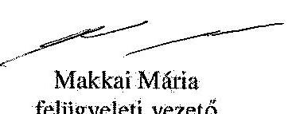

---

.

---

# RÖVIDÍTÉSEK JEGYZÉKE 

## Törvények

Áht. 1
Áht. 2
Fttv.
Grt.
Jat.
Kbt.
Kertv.
Ket.

Kt.

Ktv.
reklámtörvény
Szakmaközi tv.
Tpvt., versenytörvény

## Rendeletek

Ámr. 1
Ámr. 2
Ávr.
Ber.
Bkr.

## Szórövidítések

ÁSZ
ELTE
EU
GVH, Hivatal
GVH VKK
KVI
MTA
NAV

1992. évi XXXVIII. törvény az államháztartásról
2011. évi CXCV. törvény az államháztartásról

A fogyasztókkal szembeni tisztességtelen kereskedelmi gyakorlat tilalmáról szóló 2008. évi XLVII. törvény
a gazdasági reklámtevékenység alapvető feltételeiről és egyes korlátairól szóló 2008. évi XLVIII. törvény
A jogalkotásról szóló 2010. évi CXXX. törvény
2003. évi CXXIX. törvény a közbeszerzésekről

A kereskedelemről szóló 2005. évi CLXIV. törvény
A közigazgatási hatósági eljárás és szolgáltatás általános szabályairól szóló 2004. évi CXL. törvény
A költségvetési szervek jogállásról és gazdálkodásáról szóló 2008. évi CV. törvény
A köztisztviselők jogállásáról szóló 1992. évi XXIII. törvény
A gazdasági reklámtevékenység alapvető feltételeiről és egyes korlátairól szóló 2008. évi XLVIII. törvény
A szakmaközi szervezetekről és az agrárpiaci szabályozás egyes kérdéseiről szóló 2012. évi CXXVIII. törvény
A tisztességtelen piaci magatartás és a versenykorlátozás tilalmáról szóló 1996. évi LVII. törvény

Az államháztartás múködési rendjéről szóló 217/1998. (XII. 30.) Korm. rendelet

Az államháztartás múködési rendjéről szóló 292/2009. (XII. 19.) Korm. rendelet

Az államháztartásról szóló törvény végrehajtásáról szóló 368/2011. (XII. 31.) Korm. rendelet
A költségvetési szervek belső ellenőrzéséről szóló 193/2003. (XI. 26.) Korm. rendelet
A költségvetési szervek belső kontrollrendszeréről és belső ellenőrzéséről szóló 370/2011 (XII.31.) Korm. rendelet

Állami Számvevőszék
Eötvös Lóránd Tudományegyetem
Európai Unió
Gazdasági Versenyhivatal
Gazdasági Versenyhivatal Versenykultúra Központ szervezeti egysége
Költségvetési Iroda
Magyar Tudományos Akadémia
Nemzeti Adó- és Vámhivatal

---

| OECD | Organisation for Economic Cooperation and   Development (Gazdasági Együttmüködési és Fejlesztési   Szervezet) |
| :-- | :-- |
| OGY | Országgyưlés |
| ROK | OECD-GVH Budapesti Versenyügyi Regionális Oktatási   Központ |
| SZMSZ | szervezeti és múködési szabályzat |
| ÜSZI | Ügyfélszolgálati Iroda |
| VT | Versenytanács |

---

# FOGALOMTÁR 

ágazati vizsgálat
bejelentés
engedékenységi politika
fúzió
folyamodvány
gazdasági erőfölénynyel való visszaélés

Az ármozgások vagy más piaci körülmények alapján az adott ágazathoz tartozó valamely piacon a verseny torzulása, vagy korlátozásának gyanúja esetén a GVH elnöke által a piaci folyamatok megismerése és értékelése céljából indított vizsgálat. (Tpvt. 43/C. § (1) bekezdéséből levezetett fogalom)
A GVH által közzétett formátumú, megfelelően kitöltött űrlapon benyújtott beadvány jogszabályba ütköző magatartás észleléséről.
(A Tpvt. 43/H. § (1) bekezdéséből levezetett fogalom)
A GVH azon tevékenysége, amelynek révén a VT a vállalkozás részére a bírság kiszabását mellőzi, vagy a bírságot csökkenti, amennyiben a gazdasági versenyt korlátozó megállapodást vagy összehangolt magatartást (pl.: vételi vagy eladási árak rögzítése, piac felosztása) a vállalkozás a GVH-nak felfedi.
(A Tpvt. 11. és 78/A. §-ából levezetett fogalom).
Két vagy több vállalkozás összefonódása összeolvadással, beolvadással vagy egyéb módon.
(Tpvt. 23. §-ából levezetett fogalom).
Jogsértés miatt a GVH eljárását kezdeményező, szóbeli (személyes vagy telefonos) meghallgatás.
(3/Eln/2011.(III. 29.) utasítás 3. §-ából levezetett fogalom)
A gazdasági erőfölénnyel való visszaélés különösen az alábbiakat jelenti:

- az üzleti kapcsolatokban tisztességtelenül vételi vagy eladási árakat megállapítani, vagy más módon indokolatlan előnyt kikötni, vagy hátrányos feltételek elfogadását kikényszeríteni;
- a termelést, a forgalmazást vagy a műszaki fejlődést a fogyasztók, üzletfelek kárára korlátozni;
- indokolatlanul elzárkózni az ügylet jellegének megfelelő üzleti kapcsolat létrehozásától, illetve fenntartásától;
- a másik fél gazdasági döntéseit indokolatlan előny szerzése céljából befolyásolni;
- az árut az ár emelését megelőzően vagy az ár emelkedésének előidézése céljából, vagy egyébként indokolatlan előny szerzésére, illetve versenyhátrány okozására alkalmas módon a forgalomból indokolatlanul kivonni, illetőleg visszatartani;
- az áru szolgáltatását, átvételét más áru szolgáltatásától, átvételétől, továbbá a szerződéskötést olyan kötelezettségek vállalásától függővé tenni, amelyek természetüknél fogva, illetve a szokásos szerződési gyakorlatra figyelemmel nem tartoznak a szerződés tárgyához;
- azonos értékű vagy jellegű ügyletek esetén az üzletfeleket indokolatlanul megkülönböztetni, ideértve olyan árak, fizetési határidők, megkülönböztető eladási vagy vételi feltételek vagy

---

gazdasági erőfölényben lévő szereplő a piacon

Gazdasági versenyt korlátozó megállapodás (kartell)
kökemény kartell (hardcore cartel)
megtévesztő reklám
összehasonlító reklám
módszerek alkalmazását, amelyek egyes üzletfeleknek hátrányt okoznak a versenyben;

- a versenytársaknak az érintett piacról való kiszorítására vagy a piacra lépésük akadályozására alkalmas, nem a versenytársakéhoz viszonyított nagyobb hatékonyságon alapuló, túlzottan alacsony árakat alkalmazni;
- a piacra lépést más módon indokolatlanul akadályozni; vagy
- a versenytárs számára indokolatlanul hátrányos piaci helyzetet teremteni, vagy gazdasági döntéseit indokolatlan előny szerzése céljából befolyásolni.
(A Tpvt. 21. §-ából levezetett fogalom.)
Aki gazdasági tevékenységét a piac többi résztvevőjétől nagymértékben függetlenül folytathatja, anélkül, hogy piaci magatartásának meghatározásakor érdemben tekintettel kellene lennie versenytársainak, szállítóinak és üzletfeleinek vele kapcsolatos piaci magatartására.
(A Tpvt. 22. § (1) bekezdéséből levezetett fogalom.)
A vállalkozások közötti megállapodás és összehangolt magatartás, valamint a vállalkozások egyesülési jog alapján létrejött szervezetének, köztestületének, egyesülésének és más hasonló szervezetének a döntése, amely a gazdasági verseny megakadályozását, korlátozását vagy torzítását célozza, vagy ilyen hatást fejthet, illetve fejt ki. Nem minősül ilyennek a megállapodás, ha egymástól nem független vállalkozások között jön létre.
(A Tpvt. 11. § (1) bekezdéséből levezetett fogalom.)
Olyan, a versenytársak közötti megállapodás vagy összehangolt magatartás, amely közvetlenül vagy közvetve vételi vagy az eladási árak rögzítésére, a piac felosztására - beleértve a versenytárgyalási összejátszást is -, vagy a termelési, az eladási kvóták meghatározására irányul
(Recommendation of the Council concerning Effective Action Against Hard Core Cartels - OECD C(98)35/FINAL, GVH elnökének és VT elnökének 1/2012. Közleménye)
Minden olyan reklám, amely bármilyen módon - beleértve a megjelenítését is - megtéveszti vagy megtévesztheti azokat a személyeket, akik felé irányul, vagy akiknek a tudomására juthat, és megtévesztő jellege miatt befolyásolhatja e személyek gazdasági magatartását, vagy ebből eredően a reklámozóéval azonos vagy ahhoz hasonló tevékenységet folytató más vállalkozás jogait sérti vagy sértheti. (Grt. 3. §-a)
Olyan reklám, amely közvetve vagy közvetlenül felismerhetővé tesz más, a reklámozóéval azonos vagy ahhoz hasonló tevékenységet folytató vállalkozást vagy ilyen vállalkozás által előállított, forgalmazott vagy bemutatott, a reklámban szereplő áruval azonos vagy ahhoz hasonló rendeltetésű árut. (Grt. 3. §-a )

---

panasz
tisztességtelen verseny
üzleti döntések tisztességtelen befolyásolása
vállalkozások összefonódása (koncentrációja)

Versenytanács

Bejelentésnek nem minősülő beadvány (Tpvt. 43/ I. § (1) bekezdés)
A gazdasági tevékenység tisztességtelen folytatása, amely különösen a versenytársak, üzletfelek, valamint a fogyasztók törvényes érdekeit sértő vagy veszélyeztető módon, vagy az üzleti tisztesség követelményeibe ütköző módon történhet.
(A Tpvt. 2. §-ából levezetett fogalom.)
A gazdasági versenyben az üzletfelek megtévesztése, amely különösen ha,

- az áru ára, lényeges tulajdonsága - így különösen összetétele, használata, az egészségre és a környezetre gyakorolt hatása, valamint kezelése, továbbá az áru eredete, származási helye, beszerzési forrása vagy módja - tekintetében valótlan tényt vagy valós tényt megtévesztésre alkalmas módon állítanak, az árut megtévesztésre alkalmas árujelzővel látják el, vagy az áru lényeges tulajdonságairól bármilyen más, megtévesztésre alkalmas tájékoztatást adnak;
- elhallgatják azt, hogy az áru nem felel meg a jogszabályi előírásoknak vagy az áruval szemben támasztott szokásos követelményeknek, továbbá, hogy annak felhasználása a szokásostól lényegesen eltérő feltételek megvalósítását igényli;
- az áru értékesítésével, forgalmazásával összefüggő, az üzletfél döntését befolyásoló körülményekről - így különösen a forgalmazási módról, a fizetési feltételekről, a kapcsolódó ajándékokról, az engedményekről, a nyerési esélyről - megtévesztésre alkalmas tájékoztatást adnak;
- különösen előnyös vásárlás hamis látszatát keltik.
(Tpvt. 8. §-ából levezetett fogalom.)
Vállalkozások összefonódása áll fenn, ha
- két vagy több előzőleg egymástól független vállalkozás összeolvad, vagy egyik a másikba beolvad, vagy a vállalkozás része a vállalkozástól független másik vállalkozás részévé válik,
- egy vállalkozás vagy több vállalkozás közösen közvetlen vagy közvetett irányítást szerez további egy vagy több, tőle független vállalkozás egésze vagy része felett, vagy
- több, egymástól független vállalkozás közösen hoz létre általuk irányított olyan vállalkozást, amely egy önálló vállalkozás valamennyi funkcióját tartósan képes ellátni.
(Tpvt. 23. § (1) bekezdéséből levezetett fogalom.)
A GVH-n belül múködő - sajátos helyzetű -, független, döntéshozó testület, amely versenyfelügyeleti ügyekben a GVH versenyfelügyeleti eljárásait érdemben lezáró határozatokat hoz, illetve elbírálja a vizsgálók által a versenyfelügyeleti eljárás során hozott végzései ellen benyújtott jogorvoslati kérelmeket.
(Tpvt. 47. §, 72-74. §, 77. § és 82. §-aiból levezetett fogalom.)