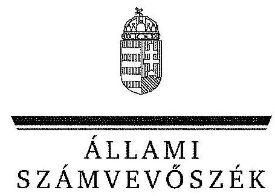
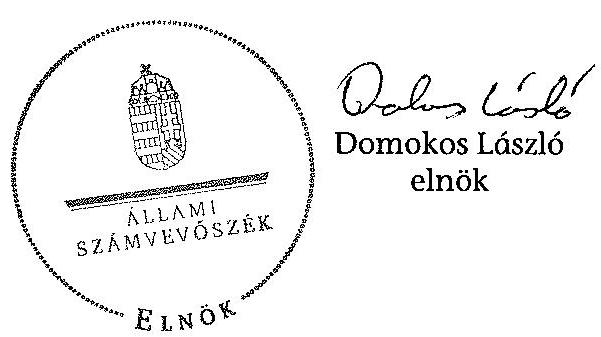
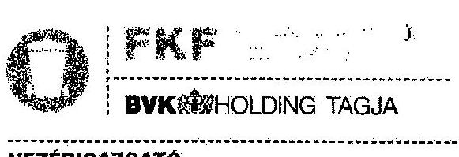
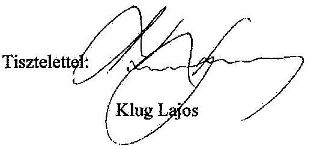
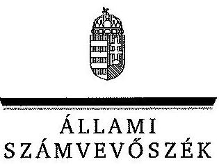
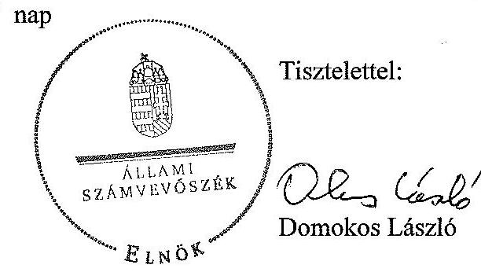
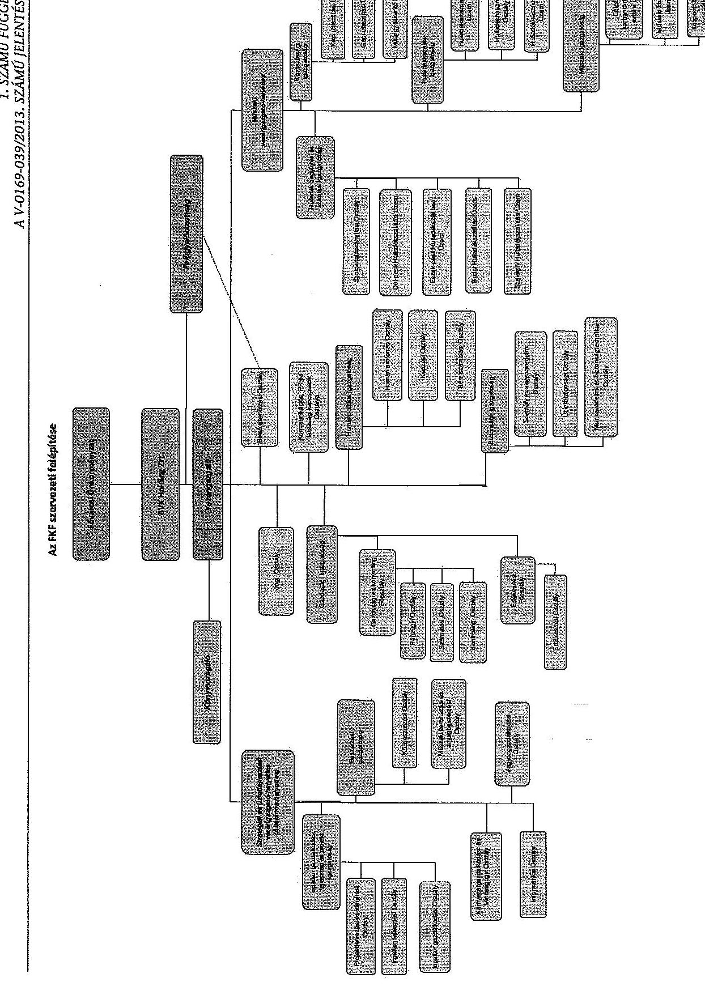

ÁLLAMI
SZÁMVEVŐSZÉK

# JELENTÉS 

az önkormányzatok többségi tulajdonában lévő gazdasági társaságok közfeladat-ellátásának ellenőrzéséről

Fővárosi Közterület-fenntartó Zrt.

---

# Állami Számvevőszék 

Iktatószám: V-0169-039/2013.
Témaszám: 1204
Vizsgálat-azonosító szám: V065301

## Az ellenőrzést felügyelte:

## Makkai Mária

felügyeleti vezető

## Az ellenőrzést vezette és az ellenőrzés végrehajtásáért felelős:   Klinga László ellenőrzésvezető

A számvevőszéki jelentés összeállításában közremüködtek:

## Budai Éva Renner Andrea   számvevő

Az ellenőrzést végezték:

## Bozsik Tamás   számvevő   Budai Éva   számvevő

Renner Andrea
számvevő

## A témához kapcsolódó eddig készített számvevőszéki jelentések:

## címe

Jelentés Budapest Főváros Önkormányzatának egyes hatósági díjak megállapítására irányuló tevékenysége ellenőrzéséről
Jelentés Budapest Főváros Önkormányzata költségvetési gazdálko- 1046
dásában kialakított belső kontrollok múködésének 2010. évi ellen-
őrzéséről
Jelentés Budapest Főváros Önkormányzat költségvetési és pénzügyi 1113
egyensúlyi helyzetének elemzése, a költségvetés-tervezés és a zár-
számadás-készítés folyamatában kialakított belső kontrollok mú-
ködésének 2011. évi ellenőrzéséről
Jelentés a Budapesti Közlekedési Zrt. gazdálkodásának ellenőrzéséröl

---

# TARTALOMJEGYZÉK 

BEVEZETÉS ..... 11
I. ÖSSZEGZŐ MEGÁLLAPÍTÁSOK, KÖVETKEZTETÉSEK, JAVASLATOK ..... 14
II. RÉSZLETES MEGÁLLAPÍTÁSOK ..... 24

1. A Fővárosi Önkormányzat közfeladat-ellátásának megfelelősége ..... 24
1.1. A közfeladat-ellátás választott módja, az ahhoz szükséges
közvagyon rendelkezésre bocsátása ..... 24
1.2. Az önkormányzati és a tulajdonosi irányítás megítélése ..... 27
2. Az FKF közfeladat-ellátással kapcsolatos tevékenysége ..... 30
2.1. Az FKF szervezeti kialakítása, szabályozottsága ..... 30
2.2. Az FKF vagyonnyilvántartása ..... 33
2.3. A gazdasági évek ráfordításainak és bevételeinek alakulása ..... 34
2.4. Az FKF eredményének alakulására ható tényezők feltárása ..... 39
2.5. Az FKF folyamatos üzemmenetének, likviditásának biztosítása ..... 42
3. A Fővárosi Önkormányzat és a BVK tulajdonosi jogainak érvényesülése ..... 44
3.1. Az FKF-től származó információk elemzése, hasznosítása ..... 44
3.2. A Közgyűlés és a BVK tulajdonosi intézkedései ..... 46
4. Az ÁSZ korábbi, a többségi tulajdonú gazdasági társaságok közfeladat- ellátását, gazdálkodását, pénzügyi helyzetét érintő javaslataira tett intézkedések ..... 49
4.1. A Fővárosi Önkormányzat intézkedési terve és annak hasznosulása ..... 49

---

# MELLÉKLETEK 

1. számú Tanúsítvány az FKF Zrt. 2008-2012. évi szállítói kötelezettségeinek alakulásáról
2. számú Tanúsítvány az FKF Zrt. 2008-2012. évi hitelállományának alakulásáról
3. számú Tanúsítvány a Fővárosi Önkormányzat Főpolgármesteri Hivatal által végzett tulajdonosi ellenőrzésekről
4. számú Tanúsítvány az FKF Zrt. társaságnál végzett szakértői ellenőrzésekről
5. számú Tanúsítvány az FKF Zrt. által vállalt mérlegen kívüli kötelezettségek alakulásáról
6. számú Tanúsítvány korábbi számvevőszéki jelentéssel lezárt ellenőrzései során a többségi tulajdonú gazdasági társaságok közfeladat-ellátására, gazdálkodására, pénzügyi helyzetére az ÁSZ jelentésben megfogalmazott javaslatok hasznosulásáról
7. számú Az FKF Zrt. észrevétele
8. számú Az FKF Zrt. észrevételére adott válasz
9. számú Budapest Főváros Önkormányzatának észrevétele

## FÜGGELÉKEK

1. számú Az FKF szervezeti felépítése

---

# RÖVIDÍTÉSEK JEGYZÉKE 

## EU-s joganyagok

75/442/EGK irányelv
1994/62/EK irányelv
2005/842/EK bizottsági határozat

2006/12/EK irányelv
2008/96/EK irányelv
2008/98/EK irányelv

## Törvények

ÁSZ tv.
Gt. tv.
Hgt. 1
Hgt. 2

Mötv.

Ötv.

Ptk.
Számv. tv.
Taktv.

Tao tv.
Vagyon tv.
a hulladékokról
a csomagolásról és a csomagolási hulladékról
a Bizottság határozata az EK-Szerződés 86. cikke (2) bekezdésének az általános gazdasági érdekú szolgáltatások müködtetésével megbízott vállalkozásoknak közszolgáltatással járó ellentételezés formájában megítélt állami támogatásokra történő alkalmazásáról
a hulladékokról
a közúti infrastruktúra közlekedésbiztonsági kezeléséről
a hulladékokról és egyes irányelvek hatályon kívül helyezéséről
az Állami Számvevőszékről szóló 2011. évi LXVI. törvény (hatályos: 2011. július 1-jétől)
a gazdasági társaságokról szóló 2006. évi IV. törvény
a hulladékgazdálkodásról szóló 2000. évi XLIII. törvény (hatálytalan: 2013. január 1-jétől)
a hulladékról szóló 2012. évi CLXXXV. törvény (hatályos: 2013. január 1-jétől, kivéve a 95. § (6) bekezdése, ami 2015. január 1-jén lép hatályba)

Magyarország helyi önkormányzatairól szóló 2011. évi CLXXXIX. törvény (hatályos: 2012. január 1-jétől, kivéve a 144. § (2) bekezdésben meghatározott paragrafusok, amelyek 2012. április 15 -én, a (3) bekezdésben meghatározott paragrafusok, amelyek 2013. január 1-jén léptek hatályba, a (4) bekezdésben meghatározott paragrafusok a 2014. évi általános önkormányzati választások napján lépnek hatályba)
a helyi önkormányzatokról szóló 1990. évi LXV. törvény (hatálytalan: a 2014. évi általános önkormányzati választások napjától)
a Polgári Törvénykönyvről szóló 1959. évi IV. törvény
a számvitelről szóló 2000. évi C. törvény
a köztulajdonban álló gazdasági társaságok takarékosabb müködéséről szóló 2009. évi CXXII. törvény
a társasági adóról és az osztalékadóról szóló 1996. évi LXXXI. törvény
a nemzeti vagyonról szóló 2011. évi CXCVI. törvény (hatályos: 2011. december 31-étől, kivéve a 20. § (2) bekezdésben meghatározott paragrafusok, amelyek 2012. január 1-jétől, a (3) bekezdésben meghatározott paragrafusok 2013. január 1-jétől, a (4) bekezdésben meghatározott paragrafus 2012. március 2-ától léptek hatályba)

---

## Rendeletek

SZMSZ $_{1}$

SZMSZ $_{2}$
vagyongazdálkodási rendelet ${ }_{1}$
vagyongazdálkodási rendelet ${ }_{2}$

48/1994. (VIII. 1.) Főv. Kgy. rendelet
61/2002. (X. 18.) Főv. Kgy. rendelet

34/2008. (VII. 15.) Főv. Kgy. rendelet

64/2008. (III. 28.) Korm. rendelet

## Szórövidítések

AB
Alapító Okirat
áfa
ÁSZ
bérpolitikai irányelvek

BIG
BKK Közút
BVK
CEMI
EU
FB

Budapest Főváros Önkormányzatának 7/1992. (XII. 28.) Főv. Kgy. rendelete az Önkormányzat Szervezeti és Múködési Szabályzatáról (hatályos: 1992. március 26-ától)
Budapest Főváros Önkormányzatának 55/2010. (XII. 9.) Főv. Kgy. rendelete a Fővárosi Önkormányzat Szervezeti és Müködési Szabályzatáról (hatályos: 2011. január 1-jétől)
Budapest Főváros Önkormányzatának 75/2007. (XII. 28.) Főv. Kgy. rendelete a Fővárosi Önkormányzat vagyonáról, a vagyontárgyak feletti tulajdonosi jogok gyakorlásáról (hatályos: 2008. február 1-jétől)
Budapest Főváros Önkormányzatának 22/2012. (III. 14.) Főv. Kgy. rendelete Budapest Főváros Önkormányzatának vagyonáról, a vagyonelemek feletti tulajdonosi jogok gyakorlásáról (hatályos: 2012. március 15-étől)
a föváros köztisztaságáról (hatályos: 1994. szeptember 1jétől)
a települési szilárdhulladék-gazdálkodással összefüggő önkormányzati feladatokról, különösen a települési szilárd hulladékkal kapcsolatos hulladékkezelési közszolgáltatásról (hatályos: 2002. október 18-ától, hatálytalan: 2013. május 1-jétől)
a fövárosi helyi közutak kezelésének és üzemeltetésének szakmai szabályairól, továbbá az útépítések, a közterületet érintő közmű-, vasút-, és egyéb építések és az útburkolatbontások szabályozásáról (hatályos: 2008. augusztus 1jétől)
a települési hulladékkezelési közszolgáltatási díj megállapításának részletes szakmai szabályairól (hatályos: 2008. április 1-jétől)

Alkotmánybíróság
az FKF Zrt. Alapító Okirata és annak módosításai
általános forgalmi adó
Állami Számvevőszék
a Közgyűlés 1809/2010. (X. 27.) határozatával elfogadott egyszemélyes tulajdonú fővárosi társaságok bérpolitikai irányelveire vonatkozó előterjesztés
az FKF biztonsági igazgatósága
Budapesti Közlekedési Központ Közút Zártkörűen Múködő Részvénytársaság
BVK Holding Budapesti Városüzemeltetési Zártkörűen Múködő Részvénytársaság
CEMI (Central European Management Intelligence) Korlátolt Felelősségű Társaság
Európai Unió
az FKF Zrt. Felügyelőbizottsága

---

| FKF | Fővárosi Közterület-fenntartó Zártkörűen Müködő Részvénytársaság |
| :--: | :--: |
| FKF SZMSZ-e | Fővárosi Közterület-fenntartó Zrt. Szervezeti és Müködési Szabályzata, amely a 2008-2013. év I. félév közötti időszak során nyolc alkalommal módosult |
| FKFI Kft. | FKFI Fővárosi Közterület-fenntartó és Ingatlankezelő Korlátolt Felelősségű Társaság |
| föjegyzö | Budapest Főváros Önkormányzatának Főjegyzője |
| Fővárosi Önkormányzat főpolgármester | Budapest Főváros Önkormányzata   Budapest Főváros Önkormányzatának Főpolgármestere |
| Főpolgármesteri Hivatal | Budapest Főváros Önkormányzatának Főpolgármesteri Hivatala |
| Hálózat Alapítvány | Hálózat - Budapesti Díjfizetőkért és Díjhátralékosokért Alapítvány |
| HHM | Fővárosi Hulladékhasznosító Mú |
| Igazgatóság | az FKF Igazgatósága |
| javadalmazási szabály-   zat $_{1}$ | a Fővárosi Közterület-fenntartó Zrt. vezetői javadalmazási szabályzata (hatályos: 2003. december 10-étől) |
| javadalmazási szabály-   zat $_{2}$ | a Fővárosi Közterület-fenntartó Zrt. vezetői javadalmazási szabályzata (hatályos: 2010. április 29-étől) |
| KEOP | Környezet és Energia Operatív Program |
| közfeladat | 2008. január 1-je és 2011. szeptember 30-a között: a hulladékkezelési, a köztisztasági és a közútkezelési közszolgáltatások együttesen, 2011. október 1-jétől a hulladékkezelési és a köztisztasági közszolgáltatások együttesen |
| Közgyűlés | Budapest Főváros Önkormányzatának Közgyűlése |
| Keretszerződés | a Fővárosi Önkormányzat és az FKF Zrt. között létrejött, 2009. január 1-jétől hatályos Közszolgáltatási Keretszerződés és annak módosításai |
| NAV | Nemzeti Adó- és Vámhivatal |

---

.

---

# FOGALOMTÁR 

adózott eredmény
altmarki kritériumok
elismert vállalatcsoport
eredménytartalék
kompenzáció

Az adózás előtti eredménynek az adózás előtti eredményt növelő és csökkentő tételekkel, a társasági adófizetési kötelezettséggel és az adókedvezményekkel módosított összege.
Az Európai Közösségek Bírósága az Altmark GmbH ügyében hozott ítéletében úgy határozott, hogy a közszolgáltatással járó ellentételezés nem minősül az Európai Közösséget létrehozó Szerződés 87. cikke értelmében vett állami támogatásnak, amennyiben négy kritérium teljesül. (1) A kedvezményezett vállalkozásnak közszolgáltatási kötelezettséggel kell rendelkeznie, és e kötelezettségeket világosan meg kell határozni. (2) Az ellentételezés kiszámításához alapul vett paramétereket objektív és átlátható módon előre meg kell határozni. (3) Az ellentételezés nem haladhatja meg a közszolgáltatási kötelezettségek biztosításához szükséges költség egy része vagy egésze fedezéséhez szükséges összeget, figyelembe véve a kapcsolódó elismervényeket és az ésszerü nyereséget. (4) Ha speciális esetben a közszolgáltatási kötelezettséget biztosító vállalkozást nem olyan közbeszerzési eljáráson választották ki, amely lehetővé tenné a közösség számára a legkisebb költséget jelentő szolgáltatást nyújtani képes ajánlattevő kiválasztását, az ellentételezés mértékét azon költségek elemzése alapján kell meghatározni, amelyek fejében egy átlagos, jól vezetett és közlekedési eszközökkel rendelkező vállalkozás biztosította volna e kötelezettségeket (Európai Közösségek Bizottsága 2005/842/EK számú határozata).
A számviteli törvényben foglaltak szerint összevont (konszolidált) éves beszámoló készítésére köteles gazdasági társaság (uralkodó tag) és az a részvénytársaság, illetve korlátolt felelősségű társaság, amely felett az uralkodó tag a számviteli törvény alapján meghatározó befolyással rendelkezik (ellenőrzött társaság), egységes üzleti céljaik megvalósítására uralmi szerződés kötése útján elismert vállalatcsoportként történő működésükről határozhatnak (Gt. tv. 55. § (1) bekezdés).
A saját tőke változó eleme, elsősorban a tárgyévet megelőző évek mérleg szerinti eredményének a halmozott összegét mutatja.
A közszolgáltatási kötelezettség ellátásának ellentételezéseként a közszolgáltató részére önkormányzat költségvetése terhére teljesítendő kifizetés és/vagy önkormányzat, mint árhatóság által megállapított tarifa (Keretszerződés 3.1. o) pontja).

---

közfeladat
közszolgáltatási szint
közvetett tulajdon, illetve közvetett befolyás
mérleg szerinti eredmény
tulajdonosi joggyakorló

Jogszabályban meghatározott állami vagy önkormányzati feladat, amit az arra kötelezett közérdekből, jogszabályban meghatározott követelményeknek és feltételeknek megfelelve végez, ideértve a lakosság közszolgáltatásokkal való ellátását, továbbá az állam nemzetközi szerződésekben vállalt kötelezettségeiből adódó közérdekủ feladatokat, valamint e feladatok ellátásához szükséges infrastruktúra biztosítását is (Vagyon tv. 3. § (1) bekezdés 7. pont).
A közszolgáltatási szintek minőségi kategóriát jelentenek. A köztisztasági ágazatnál az első szint a jogszabályokban előírtaknak megfelelő minimális feladatellátást, a második szint alacsony többletráfordítás mellett javuló minőségű, a harmadik szint az optimálisnak tartott színvonalú közszolgáltatást tartalmazta. A közútkezelési ágazat esetében az első szint az előző évi bázist, a második szint a szakmai szempontból elengedhetetlen feladatokat, a harmadik szint az átlagos minőséget (állagmegóvó, tervszerű, megelőző karbantartást) tartalmazta.
Egy vállalkozás tulajdoni hányadának, illetőleg szavazati jogának a vállalkozásban tulajdoni részesedéssel, illetőleg szavazati joggal rendelkező más vállalkozás (köztes vállalkozás) tulajdoni hányadán, szavazati jogán keresztül történő gyakorlása. A közvetett tulajdon, a közvetett befolyás arányának megállapításához a közvetett tulajdonnal, közvetett befolyással rendelkezőnek a köztes vállalkozásban fennálló szavazati jogát vagy tulajdoni hányadát meg kell szorozni a köztes vállalkozásnak a vállalkozásban fennálló szavazati vagy tulajdoni hányada közül azzal, amelyik a nagyobb. Ha a köztes vállalkozásban fennálló szavazati vagy tulajdoni hányad az ötven százalékot meghaladja, akkor azt egy egészként kell figyelembe venni (a tőkepiacról szóló 2001. évi CXX. törvény 5. § (1) bekezdés 84. pont).
A mérleg szerinti eredmény az osztalékra, részesedésre, a kamatozó részvények kamatára igénybe vett eredménytartalékkal növelt, a jóváhagyott osztalékkal, részesedéssel, a kamatozó részvények kamatával csökkentett tárgyévi adózott eredmény, egyezően az eredménykimutatásban ilyen címen kimutatott összeggel (Számv. tv. 39. § (2) bekezdés).
Aki a nemzeti vagyon felett az államot vagy a helyi önkormányzatot megillető tulajdonosi jogok és kötelezettségek összességének gyakorlására jogosult (Vagyon tv. 3. § (1) bekezdés 17. pont).

---

üzemi eredmény

Az üzemi tevékenység eredménye kétféle módon állapítható meg:
a) összköltség eljárással: az üzleti évben elszámolt értékesítés nettó árbevételének, az eszközök között állományba vett saját teljesítmények értékének, az egyéb bevételeknek, valamint az üzleti évben elszámolt anyagjellegű ráfordítások, személyi jellegű ráfordítások, értékcsökkenési leírás és egyéb ráfordítások együttes összegének különbözeteként;
b) forgalmi költség eljárással: az üzleti évben elszámolt értékesítés nettó árbevételének és az értékesítés közvetlen költségei, az értékesítés közvetett költségei különbözetének, valamint az egyéb bevételek és az egyéb ráfordítások különbözetének összevont értékeként (Számv. tv. 71. § (1) bekezdés a)-b) pontok).

---

.

---

# JELENTÉS 

## az önkormányzatok többségi tulajdonában lévő gazdasági társaságok közfeladat-ellátásának ellenőrzéséről Fôvárosi Közterület-fenntartó Zrt.

## BEVEZETÉS

Az FKF alaptevékenysége Budapest Főváros közigazgatási területén a szilárd hulladék gyűjtése, ártalmatlanítása, hasznosítása, a közterületek tisztántartása, valamint 2011. október 1-jéig a Fővárosi Önkormányzat tulajdonában és ellátási felelősségében lévő utak, hidak, mütárgyak és forgalomtechnikai létesítmények üzemeltetése, fenntartása és fejlesztése volt.

Az FKF a hulladékkezelési közfeladat ellátása során több mint 830 ezer háztartásból, mintegy 20 ezer gazdálkodó szervezettől, valamint a közterületi gyűjtőedényekből a települési szilárd hulladékot rendszeresen begyűjti és elszállítja, továbbá megszervezi a lakosság által a lomtalanítás során összegyűjtött hulladék, illetve a lakossági veszélyes hulladék elszállítását. Az FKF 16 lakossági hulladékgyűjtő udvart, szelektív hulladékgyűjtő szigeteket és házhoz menő rendszeres szelektív begyűjtő járatokat üzemeltet. Az FKF a települési szilárd hulladék ártalmatlanítását a Dunakeszin és Pusztazámoron található hulladéklerakókban lerakással, a Fővárosi Hulladékhasznosító Múben a hulladék energiatartalmának kinyerésével végzi.

Az FKF köztisztasági közfeladat-ellátása során eltávolítja a Fővárosi Önkormányzat tulajdonában vagy kezelésében lévő épületek és építmények felületéről a plakátokat, falragaszokat és falfirkákat. Takarítja a Főváros közigazgatási határán belüli, közel 25,0 millió $\mathrm{m}^{2}$ szilárd, hézagmentes burkolattal ellátott közterületet, az ingatlanhoz nem csatlakozó közjárdákat és közlépcsőket. Elvégzi a közterületen kialakított kerékpárutak, 73 db alul- és felüljáró, a Dunahidak és a budapesti Várhegy-alagút takarítását, síkosság és hó mentesítését.

A közútkezelési közszolgáltatási kötelezettség keretében az FKF 2011. október 1jéig üzemeltette, fenntartotta és fejlesztette a Fővárosi Önkormányzat tulajdonában lévő 1043 km hosszú közutat és a kerületi önkormányzati tulajdonú, a közösségi közlekedés által igénybe vett utakat. Ellátta továbbá a hozzájuk tartozó közúti jelzőlámpák, útburkolati jelek, vezetőkorlátok, zajvédő falak, vízelvezető rendszerek és egyéb úttartozékok karbantartási, ellenőrzési és fejlesztési feladatait, valamint négy forgalomirányító központ múködtetését.

Az FKF alaptevékenységei mellett a kiegészítő tevékenységei között megtalálható a hulladékgyűjtő gépjárművek felépítményeinek szervizelése, labormunkák

---

végzése, épület bérbeadás, valamint az intézményeknél, cégeknél keletkező nem szokványos hulladékok ártalmatlanítása.

Az FKF az ellenőrzési időszakban 100\%-os tulajdoni hányaddal rendelkezett az ingatlankezelési tevékenységre létrehozott FKFI Kft.-ben, amely 2011. június 15től Agglomerációs Hulladékkezelő Kft. néven, nem veszélyes hulladék gyűjtése főtevékenységi körrel működött tovább. Az FKF-nek 2009-től a Budapesti Energiaügynökség Nonprofit Kft.-ben 50\%-os tulajdoni részesedése volt, amely 2011. szeptember 26-án végelszámolással megszűnt.

Az FKF 100\%-os fővárosi önkormányzati tulajdonban volt 2011. december 14éig. A Fővárosi Önkormányzat 100\%-os tulajdonát képező BVK Holding Budapesti Városüzemeltetési Zrt. alapítását követően az FKF-et a BVK-ba apportálták a Közgyűlés döntése alapján. A BVK feladataként határozták meg, hogy a Főváros tulajdonosi érdekeinek megfelelően irányítsa és ellenőrizze a tagvállalatokat, optimálissá tegye a vállalatcsoport múködését, érvényesítse a csoport nagyságából eredő piaci előnyöket, és javítsa a vállalatok múködésének hatékonyságát.

Az ellenőrzött időszakban a főpolgármester és a főjegyző személye is egy alkalommal változott, a főpolgármester a 2010. évi önkormányzati választások óta tölti be tisztségét, a helyszíni ellenőrzés időszakában a munkakört betöltő főjegyző 2010. december 20-ától látja el feladatait. Az ellenőrzött időszakban az FKF vezérigazgatójának személye két alkalommal, a gazdasági vezérigazgatóhelyettes személye hat alkalommal, a stratégiai és a műszaki vezérigazgatóhelyettesek személye három alkalommal, a BVK vezérigazgatójának személye 2012. október 3-án változott.

Az FKF-nél részvénytársasági közgyűlés nem működött. Ügyvezető szerve az Igazgatóság volt 2010. október 27-ig, amikor a Közgyűlés az Igazgatóság helyett egy vezető tisztségviselő (vezérigazgató) alkalmazását határozta el.

A BVK gazdálkodását nem ellenőriztük. A BVK esetében az ellenőrzés az FKF feletti tulajdonosi joggyakorlási tevékenységre terjedt ki.

Az ÁSZ a Fővárosi Önkormányzat többségi tulajdonában lévő gazdasági társaságok közül a 2011. évben a Budapesti Közlekedési Zrt. (BKV Zrt.) gazdálkodását és az FKF Zrt. közútfenntartási feladatellátásának gazdaságosságát, eredményességét ellenőrizte.

Az ellenőrzés indokoltsága: Az önkormányzati tulajdonú gazdasági társaságok teljes körű ellenőrzésének lehetőségét az ÁSZ törvény 2011. január 1-jétől hatályos módosítása teremtette meg. Az ellenőrzés feltárja, hogy az önkormányzat a közfeladat-ellátási kötelezettségének eredményesen tett-e eleget, a feladatellátáshoz rendelt közvagyon múködtetését a tulajdonostól elvárható gondossággal szervezte-e meg. A feladatot ellátó gazdasági társaság a közszolgáltatási szerződésben foglaltak betartásával, folyamatosan biztosította-e a közfeladat ellátását. A gazdasági társaság a közvagyon használatával biztosí-totta-e a szolgáltatás folytatásának feltételeit. Az önkormányzat tulajdonosi felügyelete hogyan járult hozzá a közfeladat eredményes ellátásához.

---

A megállapítások alapján megfogalmazott számvevőszéki javaslatok hasznosítása elősegíti a meglévő hibák megszüntetését, a jobb feladatellátást.

# Az ellenőrzés célja annak értékelése volt, hogy 

- a Fővárosi Önkormányzat a jogszabályi előírások figyelembevételével dön-tött-e az ellenőrzésre kerülő közfeladat megszervezéséről, az ellátás módjáról, a tulajdonostól elvárható gondossággal felügyelte-e a társaság feladatellátását, a gazdasági társaság rendelkezésére bocsátotta-e a közfeladat ellátásához a szükséges közvagyont, és biztosította-e a tulajdonosi jogok afeletti érvényesülését, a társaság vagyonvesztése esetén intézkedett-e a további vagyonvesztés megakadályozásáról;
- az FKF teljesítette-e a tulajdonos önkormányzat részéről meghatározott célokat és feladatokat a rendelkezésre álló erőforrások felhasználásával, végre-hajtotta-e a közfeladat-ellátási szerződés előírásait, betartotta-e a vagyonnal történő gazdálkodásra vonatkozó jogszabályi rendelkezéseket.

Az ellenőrzés típusa: szabályszerűségi ellenőrzés
Az ellenőrzött időszak: A 2008-2012. évek, valamint a helyszíni ellenőrzés befejezéséig bekövetkezett változások figyelemmel kísérése.

Az ellenőrzés jogalapját az Állami Számvevőszékről szóló 2011. évi LXVI. törvény 5. § (3)-(5) bekezdései képezik.

Az ÁSZ a 2011. évi LXVI. törvény 29. §-a szerint a jelentéstervezetet megküldte az FKF Zrt. vezérigazgatójának, Budapest Főváros Önkormányzata főpolgármesterének és a BVK Holding Zrt. vezérigazgatójának egyeztetésre. A törvényes határidőn belül az FKF Zrt. és Budapest Főváros Önkormányzata küldte meg észrevételét. A beérkezett észrevételeket és az azokra adott választ a jelentés 7-9. számú mellékletei tartalmazzák.

---

# I. ÖSSZEGZŐ MEGÁLLAPÍTÁSOK, KÖVETKEZTETÉSEK, JAVASLATOK 

Budapest Főváros Önkormányzatának Közgyűlése (Közgyűlés) a települési szilárd hulladék gyűitésével, kezelésével, ártalmatlanításával, hasznosításával, a közterületek tisztántartásával kapcsolatos feladatok, valamint az önkormányzat tulajdonában, illetve ellátási felelősségében lévő közutak közútkezelői, üzemeltetési, fenntartási és fejlesztési közfeladatainak ellátásáról az Ötv. előirásainak figyelembevételével döntött. A Közgyűlés a fővárosi szilárd-hulladék-gazdálkodás, köztisztaság és közútkezelés szabályairól rendeleteket alkotott. A Fővárosi Önkormányzat az ellenőrzött időszakban a közfeladatai ellátásának módját és mértékét a keret- és az ezen alapuló éves köztisztasági és közútkezelési szerződésekben határozta meg.

A Fővárosi Önkormányzat 2011-2014. évi gazdasági programja célként tűzte ki, hogy a BVK és a Fővárosi Önkormányzat tulajdonában lévő egyes közműközszolgáltató társaságok elismert vállalatcsoportként működjenek, valamint az FKF piacbővülést érjen el. A Fővárosi Önkormányzat az első célkitűzést megvalósította, a hulladékkezelési közszolgáltatási tevékenység piacbővülését az FKF az agglomerációs területek bevonásával tervezte megvalósítani, ennek érdekében a 2013. évben tárgyalásokat kezdeményezett az agglomerációban található önkormányzatokkal. Az FKF az ellenőrzött időszakban rendelkezett a Fővárosi Önkormányzat gazdasági programjával és a Keretszerződéssel összehangolt vállalati stratégiával, továbbá középtávú beruházási programmal.

A Közgyűlés a 2008. évben a közfeladatok ellátásáról az FKF-fel kötött 1993. évi közútkezelési megbízási, az 1998. évi hulladékgazdálkodási és a 2001. évi köztisztasági közszolgáltatási szerződésekben gondoskodott. A Fővárosi Önkormányzat az EU 2005/842/EK bizottsági határozatának való megfelelőség érdekében a 2008. évben felülvizsgálta közszolgáltatási szerződéseit. A Fővárosi Önkormányzat és az FKF 2009. január 1-jétől hatályos, az Európai Bizottság által megállapított altmarki kritériumoknak megfelelő tízéves Keretszerződést kötött a hulladékgazdálkodási, köztisztasági és közútkezelési feladatok ellátására. A Keretszerződésben előírták a közszolgáltatási tevékenységek ellátásának feladatait, mennyiségi követelményeit, módját és gýakoriságát, továbbá az adatszolgáltatási kötelezettséget. A Közgyűlés a hulladékkezelési díjat 2012-ig rendeletben írta elő, 2013-tól a hulladékgazdálkodási díjat a nemzeti fejlesztési miniszter határozza meg. A köztisztasági és közútkezelési feladatok ellátásának szintjét és a kompenzáció mértékét a Keretszerződésen alapuló éves szerződésekben, az év közben felmerülő többletfeladatokat és ezek fedezetét az éves szerződések módosításaiban határozták meg.

A Fővárosi Önkormányzat a közfeladatok ellátásához szükséges közvagyont biztosította, azt 1996-ban, a Fővárosi Közterület-fenntartó Vállalat részvénytársasággá alakulásakor az FKF-be apportálta. Az alapításkori saját tőke 20 967,7 millió Ft volt, ami a közútkezelési ágazat kiválásának következtében a 2011. évben 2855,9 millió Ft-tal csökkent. Az FKF az ellenőrzött időszakban rendelkezett a társasági formájára kötelezően előírt jegyzett tőkének

---

megfelelő összegű saját tőkével, a Fővárosi Önkormányzatnak a vagyonvesztés megelőzése, a csődveszély elkerülése érdekében intézkedési kötelezettsége nem volt.

A közfeladatok ellátásának fedezetét 2008-ban a szerződéseknek megfelelően a hulladékkezelési közszolgáltatás díjbevétele, valamint az éves szerződésekhez mellékelt közútkezelési tételrend és köztisztasági árkalkuláció alapján a Fővárosi Önkormányzatnak kiszámlázott ellenérték biztosította. A 2009. évtől a hulladékkezelési tevékenység bevételén túl a közútkezelési és köztisztasági éves szerződésekben meghatározott kompenzáció volt a közfeladat-ellátás kiadásainak a forrása. A Fővárosi Önkormányzat a köztisztasági feladatok ellátásáért az ellenőrzött időszakban összesen 29 289,3 millió Ft-ot, a közútkezelési feladatok ellátásáért a 2008-2011. években 13489,0 millió Ft-ot fizetett az FKFnek.

A Keretszerződés a közszolgáltatási tevékenységek között a keresztfinanszírozást lehetővé tette, az éves szerződésekben az FKF és a Fővárosi Önkormányzat meghatározta annak mértékét. A Keretszerződés előírásainak megfelelően a köztisztasági és közútkezelési éves szerződések tartalmára, a közszolgáltatás éves szintjére és a kompenzáció összegére az FKF a 2009. évtől javaslatot készített a Fővárosi Önkormányzatnak. A Közgyűlés az ellenőrzött időszakban - a késedelmes előterjesztés miatt - a közszolgáltatások szintjéről és a kompenzációról a döntést, a Keretszerződésben előírt, az októberi benyújtást követő 30 napon belüli határidőt elmulasztva, a költségvetési rendeletek elfogadását követően, az azokban meghatározott előirányzattal azonos összegben hozta meg. Minden évben a közszolgáltatások első szintjének megrendeléséről döntöttek, a II. és III. közszolgáltatási szinteket, mint döntési lehetőséget - a 2009. év kivételével - az előterjesztésekben nem mutatták be. Az éves szerződések megkötésére a Keretszerződés előírása ellenére minden évben a tárgyévi költségvetés kihirdetését követő 30 napon túl került sor. Az FKF-nek a köztisztasági és közútkezelési kompenzáció felhasználásáról a Keretszerződés szerint beszámolási kötelezettsége volt, amelynek a 2012. év kivételével határidőn belül eleget tett. Az ellenőrzött időszakban a Fővárosi Önkormányzat a Keretszerződésben biztosított ellenőrzési jogával nem élt, a kompenzáció elszámolást, illetve annak megalapozottságát nem ellenőrizték.

A Fővárosi Önkormányzat a gazdasági társaságok feletti tulajdonosi jogok gyakorlásának szabályait a vagyongazdálkodási rendelet ${ }_{1,2}$-ben határoztta meg. Az FKF feletti tulajdonosi jogokat a 2008-2010. években a Gazdasági Bizottság, 2011-től a Közgyűlés, majd a Fővárosi Önkormányzat 2011. decemberi döntését követően a BVK gyakorolta. A Gazdasági Bizottság a 20092010. években a tulajdonosi jogok gyakorlásáról az SZMSZ ${ }_{1}$-ben előírt beszámolási kötelezettségének nem tett eleget. A tulajdonosi jog gyakorlója többek között az Alapító Okirat módosításáról, a társasági forma változásáról, a vezető tisztségviselők megválasztásáról és díjazásáról, az osztalékelőleg fizetéséről, az éves beszámoló elfogadásáról és a részvények kezeléséről a vagyongazdálkodási rendelet ${ }_{1,2}$ elöírásainak megfelelően döntött.

A Közgyűlés a hulladékkezelési közszolgáltatási díj megállapításának módját a 2002. évi többször módosított rendeletben határozta meg, a kalkulációs sémát, a díjszámítás módszertanát és a díjképletet a Keretszerződés tartalmaz-

---

ta. A hulladékkezelési díj megállapítása nem felelt meg a Keretszerződés előírásainak, mivel a nyereségelemek a 2010-2012. években tartalmaztak összesen 1610,8 millió Ft-os társasági adófizetési kötelezettséget, annak ellenére, hogy az a kompenzáció számítás módszere címú mellékletben a nyereség elemek között nem szerepelt. A Hálózat Alapítvány támogatását a 2008-2009. években a tervezett nyereség, a 2010-2011. években a várható költségek részeként a Hgt., rendelkezése ellenére a díjba beépítették. Az ÁSZ „Budapest Főváros Önkormányzata gazdálkodásában kialakított belső kontrollok müködésének 2010. évi ellenőrzéséről" készült jelentésében tett javaslatnak megfelelően az FKF a 2012. évtől a Hálózat Alapítvány támogatását megszüntette. A hulladékkezelési közfeladatok teljesítéséről a Fővárosi Önkormányzatnak készített beszámoló a díjkalkulációval egyező szerkezetű utókalkulációt nem tartalmazott, ezért a tapasztalatokat a következő évi díjjavaslat elfogadásánál nem tudták figyelembe venni. A 2009. évtől az FKF-nek az éves köztisztasági szerződések tartalmára és a szolgáltatási szintekre vonatkozó, a Fővárosi Önkormányzat részére készített javaslatai a díjképzést, illetve a kompenzáció összegét meghatározó tételeket a Keretszerződésben előírtak szerint nem mutatták be. A Fővárosi Önkormányzat a díjképzés megalapozottságát nem ellenőrizte, a Közgyűlés a javaslatokat elfogadta.

A 2008-2010. években az Igazgatóság, a 2011. évtől a főpolgármester hatáskörébe tartozott a vezérigazgató prémium feladatainak kitűzése és a teljesítés elfogadása. A célkitűzések között minden évben első helyen állt a tervezett eredmény teljesítése. A célfeladatok között szerepelt továbbá a tervezett beruházások, a közszolgáltatási szerződésekben meghatározott teljesítmények megvalósítása, valamint lakossági elégedettségmérések készítése. A vezérigazgató prémium célkitűzése a 2008-2010. években éves bruttó személyi alapbére 100\%-a, a 2011-2012. években $40 \%$-a volt. Az értékelések alapján a célkitűzések minden évben teljesültek, a vezérigazgatói prémium teljes összegét kifizették.

Az FKF a Számv. tv.-ben előírtaknak megfelelően a számviteli politika keretében elkészítette értékelési, leltározási és önköltségszámítási szabályzatát. Az FKF számlarendjének hatályba lépését, továbbá az eszközök és források leltározási, az eszközök selejtezési, valamint az eszközök és források értékelési szabályzatában a 2009. évben a hatályba lépést visszamenőlegesen, az aláírást megelőző keltezéssel jelölték meg. A visszamenőleges hatályba léptetés következtében a mérleg valódiságát befolyásoló jogtalan intézkedés nem történt. Az FKF a bizonylati rend készítési kötelezettségének az ellenőrzött időszakban a Számv. tv. előírása ellenére nem tett eleget.

Az FKF önköltségszámítási szabályzata tartalmazta a költségkalkulációhoz szükséges felosztási lépéseket és a tevékenységek szűkített önköltségének meghatározását. Azonban nem részletezte és különítette el a közvetlen önköltség tételeit, ezért az önköltség elszámolása nem volt átlátható, nem alapozta meg az árképzéshez szükséges előkalkulációt, továbbá nem biztosította az elszámoltathatóságot. A szabályozás és a kontrolling rendszer hiányosságai miatt a hulladékdíj, valamint a köztisztasági és közútkezelési kompenzáció összegére tett javaslatot megalapozó közvetlen önköltség nem felelt meg a Keretszerződésben előírtaknak. Az FKF 2013-tól hatályos új önköltségszámítási szabályzata tartalmazza tételesen a kalkulációs séma elemeit a közvetlen önköltség szintjén, a tevékenységek szűkített önköltségének

---

osztókalkulációját, továbbá az alkalmazandó költségfelosztási módszerek részletes eljárási szabályait.

Az FKF a számviteli politika keretében 2009-től és 2010-től hatályos szabályzatainak aktualizálását a közútfenntartási ágazat kiválásának és a gazdasági ve-zérigazgató-helyettesi ágazat 2012. júliusi megszünésének tekintetében nem hajtotta végre. Az FKF 2008-ban hatályos és 2009-ben életbe léptetett új eszközök és források leltározási szabályzata a vezérigazgató feladataként és felelősségeként írta elő a mérleg valódiságát alátámasztó leltározás elvégeztetését. A Számv. tv. előírása ellenére 2008-2011 között a háromévente kötelező menynyiségi leltárfelvétel - az anyagok kivételével - az FKF-nél nem történt meg, a 2012. évi mennyiségi leltárfelvétel során 2023 tétel többletet és 1710 tétel hiányt tártak fel, a többlet nettó értéke 119,0 millió Ft, a hiány nettó értéke 1,7 millió Ft volt, amit számviteli nyilvántartásukban elszámoltak. Az FKF a számviteli politikájában, illetve az eszközök és források értékelési szabályzatában a közszolgáltatást el nem ismerő vevők tartozásaival kapcsolatos értékvesztés elszámolásának módját nem rögzítette, ennek ellenére a követelés lejárttá válásának pillanatától 100\%-os értékvesztést számolt el. Az FKF saját tulajdonú vagyonát, annak értékét és változásait a Számv. tv. előírásának megfelelően az éves beszámoló készítését biztosító számlarendben foglaltak alapján tartotta nyilván.

Az FKF eszközállománya a 2008. január 1-jei 49 858,3 millió Ft-ról 2010-re 57 947,5 millió Ft-ra, 16,2\%-kal nőtt, majd 2012-re 53411,7 millió Ft-ra, 7,8\%kal csökkent. A 2010-ig tartó emelkedést a tervezettől elmaradó beruházások és a magasabb kamatbevételek miatti pénzeszköz növekedés, az azt követő csökkenést a közútfenntartási ágazat kiválása okozta. A befektetett eszközök bruttó értékének 2008. évről 2012. évre történő 15677,4 millió Ft-os növekedése - a fejlesztések ellenére - elmaradt az eszközök után elszámolt 25391,1 millió Ft értékcsökkenés összegétől, mely következtében a befektetett eszközök nettó értéke 4126,3 millió Ft-tal csökkent.

Az FKF összes bevétele a 2008. évi 53252,7 millió Ft-ról 2011-re 63400,7 millió Ft-ra, 19,1\%-kal nőtt, majd a közútfenntartási ágazat kiválása miatt 2012-re 60359,7 millió Ft-ra, 4,8\%-kal csökkent. Az FKF egyéb tevékenységéből származó árbevétele a 2008. évi 409,2 millió Ft-ról 2012-re 91,7 millió Ft-ra, 77,6\%-kal csökkent, ami 2012-ben az összes bevétel 0,2\%-a volt. Az FKF összes ráfordítása a 2008. évi 53228,2 millió Ft-ról 2011-re 60604,1 millió Ft-ra, 13,9\%-kal nőtt, majd a közútfenntartási ágazat kiválása miatt 2012-re 58 850,6 millió Ft-ra, 2,9\%-kal csökkent.

Az FKF-nél 2008-ról 2012-re a személyi jellegú ráfordítások a 3277 fơről 3009 főre történő, 8,2\%-os létszámcsökkenés ellenére 12590,1 millió Ft-ról 14 120,4 millió Ft-ra, 12,2\%-kal nőttek. A létszám változását a 2008-2012. évi szervezeti átalakulásokkal kapcsolatos létszám racionalizálás, a közútfenntartási ágazat kiválása okozta létszámcsökkenés, továbbá a 2010. évi létszámnövelés együttes hatása eredményezte. A személyi juttatások növekedését a 2008. évi $7,8 \%$-os, valamint a 2009. évi soron kívüli bérfejlesztés, továbbá a dolgozók szociális ellátása, az iskolakezdési támogatás, a saját üdülő meg nem térített költségei, a korengedményes öregségi nyugdíjhoz kapcsolódó kifizetések és a cafetéria keretében adott juttatások emelkedése okozta.

---

A Közgyűlés 2002. évi rendelete a hulladékszállítás irányadó díjtételének 50\%ában érvényesíthető kedvezményt vezetett be, az ingatlantulajdonos írásbeli, indoklással ellátott nyilatkozata alapján, ha az önálló lakóingatlant az illetékes kerületi önkormányzattól származó igazolás szerint legfeljebb két személy lakja. A Fővárosi Önkormányzat az FKF díjkedvezményből felmerülő költségei megtérítésének szabályairól a 64/2008. (III. 28.) Korm. rendeletben foglaltak ellenére nem rendelkezett. A díjkedvezmény a 2008-2012. évek között az FKF nyilvántartása alapján 2907,5 millió Ft bevétel elmaradást eredményezett. Az FKF a költségeinek kompenzálását nem kezdeményezte, a Fővárosi Önkormányzat pedig azt nem térítette meg.

A Közgyűlés 2002. évi rendelete nem volt összhangban a Hgt. ${ }_{1}$ előírásaival, mivel választási lehetőséget teremtett az FKF részére a hulladékkezelési közszolgáltatásból eredő követeléseinek adók módjára vagy polgári úton történő behajtására. A Hgt. ${ }_{1}$ rendelkezései ellenére az FKF hulladékkezelési közszolgáltatásból eredő követeléseit 2009. júliustól 2012. júniusig külső megbízott kezelte. Az AB 2010. évi határozatával magasabb szintű jogszabállyal ellentétesnek mondta ki és megsemmisítette a Közgyűlés rendeletének szabályozását. Az FKF a Hgt. ${ }_{1}$ előírásának 2012 júniusától eleget tett.

Az FKF a költséghatékonyság növelése érdekében reorganizációs koncepciót dolgozott ki a 2007-2010. évekre. A koncepció és a CEMI tanulmány alapján az FKF az intézkedések eredményeként a 2008-2009. évekre 1739,5 millió Ft megtakarítást mutatott ki.

Az FKF működésének 2011. évi átvilágítását követően csökkentették a vezetői szintek számát, létszám racionalizálást hajtottak végre, a javítóbázisokat és a kapcsolódó raktárakat átszervezték, összevonták, a készlet-nyilvántartási rendszert átalakították, teljes körű leltározást végeztek, a járatrendszert felülvizsgálták, valamint a belső ellenőrzést és a biztonsági igazgatóságot megerősítették. Az intézkedések összesített eredményhatása meghaladja a kettő milliárd Ft-ot. Az FKF-nél a vagyon védelme szempontjából kockázatot jelentett, hogy a 20082011. években mennyiségi leltárfelvételt nem végeztek, továbbá a külső és belső ellenőrzések a vagyoni helyzetet befolyásoló szabálytalanságokat tártak fel.

Az FKF gazdálkodása az ellenőrzött időszak minden évében nyereséges, saját tőkehelyzete stabil volt. Az FKF adózott eredménye a 2008. évben 7,8 millió Ft, a 2009. évben 1525,8 millió Ft, a 2010. évben 705,2 millió Ft, a 2011. évben 2337,8 millió Ft, a 2012. évben 1248,8 millió Ft volt. Az adózott eredmény 2008-ról 2009-re történő emelkedését a hulladékkezelési díj, valamint a köztisztasági és közútkezelési kompenzáció emelkedése okozta. A 2008-2012. években az adózott eredmény ágazati felosztása - az önköltségszámítás szabályozásának hiányosságai miatt - nem volt szabályszerü, átlátható és elszámoltatható.

Az FKF a Fővárosi Önkormányzat döntése alapján a 2008-2011. években közérdekű felajánlás jogcímen 922,0 millió Ft-tal támogatta a Hálózat Alapítványt, amelyet a rendkívüli ráfordítások között elszámolt. A fővárosi színházaknak és a látványsportokra átadott 1030,5 millió Ft-os adományt az FKF a 2011-2012. években a Tao. tv. rendelkezései szerint egyrészt ráfordításként el-

---

számolta, másrészt azzal a befizetendő társasági adó összegét a törvényben elszámolható mértékig csökkentette.

Az FKF likviditási helyzete 2008-2012 között stabil, pénzgazdálkodása kiegyensúlyozott volt, múködési hitel felvételére nem volt szükség. Az FKF a HHM rekonstrukciójához 2005-ben három fejlesztési célú kölcsönt vett igénybe, az ellenőrzött időszakban a tőke- és kamatfizetési kötelezettségének határidőn belül eleget tett.

A Fővárosi Önkormányzat az FKF részvételével 2012-ben a KEOP keretében „Fővárosi házhoz menő szelektív hulladékgyüjtési rendszer kialakítása" címmel EU pályázatot nyert. A projekt költségvetése 5167,6 millió Ft, amelyből a KEOP támogatás összege 4392,5 millió Ft ( $85 \%$ ), míg az önerő 775,1 millió Ft (15\%). A projekt megvalósításaként a Fővárosi Önkormányzat a 2012. évi közbeszerzési eljárást követően a 2013. év első félévében több mint 230 ezer hulladékgyűjtő edény használati jogát adta át az FKF-nek. Az FKF a Főváros területén megkezdte a háznál történő lakossági szelektív hulladékgyűjtési rendszer bevezetését.

Az ellenőrzött időszakban az üzleti terv elkészítéséről az Alapító Okirat előírásával összhangban az Igazgatóság, illetve a vezérigazgató gondoskodott. A Fővárosi Önkormányzat az FKF 2008-2011. évi üzleti terveit felülvizsgálat nélkül elfogadta. A BVK az FKF 2012. évi üzleti tervét felülvizsgálta, és azt az elfogadás előtt négy alkalommal módosításra visszaküldte.

A vagyongazdálkodási rendelet ${ }_{1,2}$ szabályozásának megfelelően a 2008-2009. évi számviteli beszámolót a Gazdasági Bizottság, a 2010. évi éves és a 2011. évi - szétválásra vonatkozó - közbenső beszámolót a Közgyűlés, a 2011. és 2012. éves beszámolókat a BVK fogadta el. Az üzleti jelentések és a közszolgáltatási beszámolók alapján az FKF a közszolgáltatási feladatait ellátta. Az FKF 2008-2011. évi számviteli beszámolóinak kiegészítő mellékleteiben a Keretszerződésben foglaltak ellenére nem kezelte elkülönítetten a közszolgáltatási és az egyéb tevékenységeit. A 2010. október 27-étől hatályban lévő Alapító Okirat szabályozása ellenére a vezérigazgató havi jelentéseit az FB ülésekre csak 2011. március 21-étől terjesztették be, a Fővárosi Önkormányzatnak pedig nem küldték meg.

Az FKF a Keretszerződésben előírt közszolgáltatási beszámoló készítési kötelezettségeinek eleget tett, azonban az elkészített éves jelentések a Keretszerződés előírásai ellenére az eredménykimutatást és a mérlegadatokat nem tartalmazták. Az FKF a Fővárosi Önkormányzatnak a hulladékkezelési tevékenységéről - a díjjavaslattal egyidejűleg - értékelő beszámolót készített, továbbá a 2011. évtől a köztisztasági tevékenységéről hetente elektronikus levélben tájékoztatást adott. A Főpolgármesteri Hivatalban a beküldött beszámolók megalapozottságát, valódiságát nem ellenőrizték. A Közgyűlés a 2008-2010. években a közszolgáltatási kötelezettségek teljesítéséről az üzleti jelentést az FKF számviteli beszámolójával együtt fogadta el. A 2011. évtől a számviteli beszámolót az FKF a BVK-nak, míg a közszolgáltatások teljesítéséről történő beszámolót a Fővárosi Önkormányzatnak nyújtotta be. A Fővárosi Közgyűlés az FKF 2011. évi közszolgáltatási beszámolóját a Keretszerződésben előírt határidőt túllépve fogadta el.

---

A Fővárosi Önkormányzat éves belső ellenőrzési munkatervét megalapozó kockázat elemzés a 2008-2011. években az FKF-re nem terjedt ki. A 2012. évi kockázatelemzés tartalmazta az FKF kockázati besorolását, azonban a kockázati érték alapján ellenőrzésre nem jelölték ki. A főjegyző 2010-ben bejelentés alapján, 2011-ben a Pénzügyi Ellenőrző Bizottság határozata alapján célellenőrzés lefolytatását rendelte el az FKF-nél. Az FKF mindkét jelentés javaslatainak hasznosítására intézkedési tervet készített, és az intézkedések végrehajtásáról beszámolt a főjegyzőnek. A Fővárosi Önkormányzat nem élt a Keretszerződésben biztosított lehetőségével, a 2008-2012. években a közfeladatok ellátásának rendszeres, szervezett helyszíni ellenőrzéséről - a köztisztasági feladatellátás kivételével - nem gondoskodott. Az FKF belső ellenőrzése a 2008-2012. évek között 150 belső ellenőrzési jelentést készített, amelyek kiterjedtek az FKF összes tevékenységére.

A Fővárosi Önkormányzat részére a 2008-2010. években az FKF osztalékot nem fizetett. A Fővárosi Önkormányzat éves költségvetési rendeleteiben elrendelt osztalékbevétel teljesítésére a 2011. évre vonatkozóan a BVK Igazgatósága 6370,0 millió Ft, a 2012. évre 1500,0 millió Ft osztalék fizetéséről határozott. Az FKF eredménytartaléka a döntések hatására a 2010. évről a 2012. évre 4283,4 millió Ft-tal csökkent.

Az ÁSZ a Fővárosi Önkormányzat többségi tulajdonában lévő gazdasági társaságok közül a 2011. évben a BKV Zrt. gazdálkodását és az FKF Zrt. közútfenntartási feladatellátásának gazdaságosságát, eredményességét ellenőrizte. A Fővárosi Önkormányzatnál a 2011. évben végzett ÁSZ ellenőrzések során tett javaslatokra készített intézkedési tervekben foglaltakat végrehajtották.

Az Állami Számvevőszékről szóló 2011. évi LXVI. törvény 33. § (1) bekezdésében foglaltak értelmében a jelentésben foglalt megállapításokhoz kapcsolódó intézkedési tervet köteles az ellenőrzött szervezet vezetője összeállítani, és azt a jelentés kézhezvételétől számított 30 napon belül az ÁSZ részére megküldeni. Amennyiben az intézkedési tervet határidőben nem küldi meg a szervezet, vagy az nem elfogadható, az ÁSZ elnöke a hivatkozott törvény 33. § (3) bekezdés a)-b) pontjaiban foglaltakat érvényesítheti.

Az ellenőrzés intézkedést igénylő megállapításai és javaslatai:

# A főjegyzönek 

1. A Közgyűlés - előterjesztés hiányában - a köztisztasági és közútkezelési közszolgáltatások szintjéről és a kompenzációról a döntést - a Keretszerződés 6.1. pontjában előírt határidőt elmulasztva - a költségvetési rendeletek elfogadását követően, az azokban meghatározott előirányzat függvényében hozta meg. Az éves köztisztasági és közútkezelési szerződések megkötésére a döntést követően, a Keretszerződés 6.1. pontja előírása ellenére az ellenőrzött időszakban a tárgy évi költségvetés kihirdetését követő harminc napon túl került sor. A Közgyűlés minden évben a közszolgáltatások első szintjének megrendeléséről döntött, a II. és III. közszolgáltatási szintet, mint döntési lehetőséget - a 2009. év kivételével - az előterjesztésekben nem mutatták be.

---

Javaslat:
Intézkedjen a köztisztasági közszolgáltatás szintjéről és a kompenzációról szóló előterjesztések időben történő előkészítéséről annak érdekében, hogy a Közgyűlés a Keretszerződés 6.1. pontjában előírt határidőn belül döntsön, valamint biztosítson a Közgyűlésnek döntési alternatívát azzal, hogy az előterjesztésben bemutatja a választható közszolgáltatási szinteket.
2. A 2009. évtől az FKF-nek az éves köztisztasági szerződések tartalmára és a szolgáltatási szintekre készített javaslatai mindhárom javasolt szintre kizárólag az elvégzendő feladatok mennyiségi értékeit, változó költségeit és rendelkezésre állási diját tartalmazta. A dijképzést, illetve a kompenzáció összegét meghatározó tételeket, így a tevékenységek bázis évi állandó és változó költségeit, a strukturális változások hatását, a költségnemek szerinti árindexet, valamint az ésszerű nyereség összegét és tartalmát - a Keretszerződés 2. számú mellékletében foglaltak ellenére - nem mutatták be. A Fővárosi Önkormányzat a dijképzés megalapozottságát nem ellenőrizte.

Javaslat:
Intézkedjen arról, hogy az éves köztisztasági szerződések tartalmára és a közszolgáltatási szintekre készített javaslat a Keretszerződés 2. számú melléklete szerint tartalmazza a dijképzést, illetve a kompenzációt meghatározó tételeket.
3. A Fővárosi Önkormányzat nem élt a Keretszerződésben biztosított lehetőségével, a 2008-2012. években a közfeladatok ellátásának rendszeres helyszíni ellenőrzéséről a köztisztasági feladatellátás kivételével - nem gondoskodott, az ellenőrzések gyakoriságát és feladatait nem határozta meg, a személyi feltételeket nem biztosította. A Főpolgármesteri Hivatalban az FKF beszámolóinak és a kompenzáció elszámolásnak a megalapozottságát, valódiságát nem ellenőrizték.

Javaslat:
Intézkedjen a közfeladatok ellátása rendszeres helyszíni ellenőrzéséről, valamint arról, hogy a közszolgáltatási beszámolót a Főpolgármesteri Hivatal ellenőrzését követően terjesszék a Közgyűlés elé elfogadásra.

# Az FKF vezérigazgatójának 

1. A 2012. évre vonatkozó kompenzáció elszámolást az FKF a Keretszerződés 9.5. pontjában meghatározott határidőt követően, 2013. július 29-én küldte meg a Fővárosi Önkormányzatnak.

Javaslat:
Intézkedjen arról, hogy a kompenzáció elszámolást a Keretszerződés 9.5. pontjában foglaltaknak megfelelően, az FKF auditált éves beszámolóját követő 30 napon belül, de legkésőbb minden naptári év június 30-ig megküldjék a Fővárosi Önkormányzatnak.
2. Az FKF a Számv. tv. 55. § (1)-(2) bekezdésének előírásai ellenére a számviteli politikájában, illetve az eszközök és források értékelési szabályzatában a közszolgáltatást el

---

nem ismerő vevők tartozásaival kapcsolatos értékvesztés elszámolásának módját nem rögzítette, ennek ellenére a követelés lejárttá válásának pillanatától 100\%-os értékvesztést számolt el.

Javaslat:
Intézkedjen a közszolgáltatást el nem ismerő vevők tartozásaival kapcsolatos értékvesztés elszámolásának a szabályozásáról.
3. Az FKF a bizonylati rend készítési kötelezettségének az ellenőrzött időszakban a Számv. tv. 161. § (2) bekezdés d) pontjának előirása ellenére nem tett eleget.

Javaslat:
Intézkedjen a bizonylati rend elkészítéséről.
4. Az FKF a számviteli politika keretében 2009-től és 2010-től hatályos eszközök és források értékelési, valamint a selejtezési és leltározási szabályzatait a közútfenntartási ágazat kiválásának és a gazdasági vezérigazgató-helyettesi ágazat 2012. júliusi megszünésének tekintetében nem aktualizálta.

Javaslat:
Intézkedjen az eszközök és források értékelési, valamint a selejtezési és leltározási szabályzatok felülvizsgálatáról annak érdekében, hogy azokban a hatáskörökre és a felelősségi körökre vonatkozó szabályok összhangban legyenek az FKF hatályos SZMSZ-ével.
5. Az FKF a közszolgáltatási beszámoló készítési kötelezettségének eleget tett, azonban az elkészített éves jelentések nem követték a Keretszerződés 3. számú mellékletében előírt struktúrát, mivel az eredménykimutatást és a mérlegadatokat nem tartalmazták.

Javaslat:
Intézkedjen arról, hogy a közszolgáltatási beszámoló a Keretszerződés 3. számú mellékletében előírt struktúra szerint tartalmazza az eredménykimutatást és a mérlegadatokat.
6. A 2008-2012. években az FKF adózott eredmény ágazati felosztása - az önköltségszámítás szabályozásának hiányosságai miatt - nem volt szabályszerű, átlátható és elszámoltatható.

Javaslat:
Intézkedjen az egyes ágazatokat érintő költségelszámolások esetében az átláthatóság és az elszámoltathatóság biztosításáról.
7. A hulladékkezelési közfeladatok teljesítéséről a Fővárosi Önkormányzatnak készített beszámoló a dijkalkulációval egyező szerkezetű utókalkulációt nem tartalmazott, ezért a tapasztalatokat a következő évi díjavaslat elfogadásánál nem tudták figyelembe venni.

---

Javaslat:
Intézkedjen arról, hogy a tevékenységek teljesítéséről készített beszámoló az előkalkulációval egyező szerkezetű, ellenőrzött utókalkulációt is tartalmazzon.

---

# II. RÉSZLETES MEGÁLLAPÍTÁSOK 

## 1. A Fővárosi ÖNKORMÁNYZAT KÖZFELADAT-ELLÁTÁSÁNAK MEGFELELŐSÉGE

### 1.1. A közfeladat-ellátás választott módja, az ahhoz szükséges közvagyon rendelkezésre bocsátása

A települési szilárdhulladék gyüjtésével, kezelésével, ártalmatlanításával, hasznosításával, a közterületek tisztántartásával kapcsolatos feladatok, valamint az önkormányzat tulajdonában, illetve ellátási felelősségében lévő közutak közútkezelői, üzemeltetési, fenntartási és fejlesztési közfeladatainak ellátása az Ötv. 63/A. §-a ${ }^{1}$ értelmében a Fővárosi Önkormányzat törvényi kötelezettsége.

A Közgyűlés az SZMSZ ${ }_{1,2}$-ben előírta az ellenőrzött közfeladatok ellátásának kötelezettségét. A 75/442/EGK EU irányelven alapuló Hgt. ${ }_{1}$ felhatalmazása alapján a Fővárosi Önkormányzat rendeletben szabályozta a települési szilárdhulladék-gazdálkodással összefüggő önkormányzati feladatokat és a hulladékkezelési közszolgáltatást. A Közgyűlés a helyi közutak kezelésének és üzemeltetésének szakmai szabályait a 2008/96/EK irányelven alapuló, a közúti közlekedésről szóló 1988. évi I. törvény és a helyi közutak kezelésének szakmai szabályairól szóló 5/2004. (I. 28.) GKM rendelet felhatalmazása alapján alkotott önkormányzati rendeletben határozta meg. A Közgyűlés a köztisztaság fenntartása, az ingatlanok tisztán tartása szabályait a főváros köztisztaságáról szóló rendeletben írta elő.

A Közgyűlés a 2008. évtől a vagyonrendelet ${ }_{1}$-ben ${ }^{2}$ mindhárom közszolgáltatás ellátására kizárólagos jogot biztosított az FKF-nek.

A Fővárosi Önkormányzat 2008-2010. évi költségvetési rendeleteivel együtt évente jóváhagyott hétéves fejlesztési tervei a központi támogatásból finanszírozott út- és hídfelújításokon kívül stratégiai célokat a szilárdhulladék-kezelési, a köztisztasági és a közútkezelési feladatellátásra nem tartalmaztak. A 20112014. évi gazdasági program célként tüzte ki, hogy a BVK és a Fővárosi Önkormányzat tulajdonában lévő egyes közmú-közszolgáltató társaságok elismert vállalatcsoportként müködjenek, valamint az FKF piacbővülést érjen el. A Fővárosi Önkormányzat az első célkitűzést megvalósította, a hulladékkezelési közszolgáltatási tevékenység piacbővülését az FKF az

[^0]
[^0]:    ${ }^{1}$ 2013. január 1-jétől az Mötv. 23. § (4) bekezdése írja elő.
    ${ }^{2}$ 2008. július 15-étől a vagyongazdálkodási rendelet ${ }_{1}$ 3. számú melléklet 12. pontja mindhárom, 2012. március 15-étől a vagyongazdálkodási rendelet ${ }_{2}$ 4. számú melléklet 13. pontja a köztisztasági és a hulladékkezelési közfeladatok ellátására biztosít kizárólagos jogot az FKF-nek.

---

agglomerációs területek bevonásával tervezte megvalósítani, ennek érdekében a 2013. évben tárgyalásokat kezdeményezett az agglomerációban található önkormányzatokkal.

A Fővárosi Önkormányzat az ellenőrzött időszakban a települési szilárdhulla-dék-kezelésével, a közterületek tisztántartásával összefüggő, valamint a közútkezelői, üzemeltetési, fenntartási és fejlesztési közfeladatai ellátásának módját és mértékét a keret- és az ezen alapuló éves köztisztasági és közútkezelési szerződésekben határozta meg.

A Közgyűlés a 2008. évben a közfeladatok ellátásáról az FKF-fel kötött 1993. évi közútkezelési megbízási, az 1998. évi hulladékgazdálkodási és a 2001. évi köztisztasági közszolgáltatási szerződésekben gondoskodott. A köztisztasági feladatellátás mennyiségét és a fizetendő díjat a 2008. évi éves szerződésben, a közútkezelés éves mértékét az évente készített tételrendben ${ }^{3}$ határozták meg. A 2008. évben a köztisztasági éves szerződést két alkalommal, a tételrendet négyszer módosították a feladatellátás mennyiségi változásai miatt.

A Fővárosi Önkormányzat az EU 2005/842/EK bizottsági határozatának való megfelelőség érdekében a 2008. évben felülvizsgálta a közszolgáltatási szerződéseit. A Fővárosi Önkormányzat és az FKF - 2008. júliusban - 2009. január 1-jétől hatályos, az Európai Bizottság által megállapított altmarki kritériumoknak megfelelő tízéves Keretszerződést kötött a hulladékgazdálkodási, köztisztasági és közútkezelési feladatok ellátására. A Keretszerződés megkötéséről szóló döntést megelőzően a Fővárosi Önkormányzat a feladatellátás módjára, alternatív lehetőségeire számításokat, összehasonlító elemzéseket nem készített. A Keretszerződést háromszor módosították, a 2011. évi - legjelentősebb - változtatás során a közútkezelési feladatokra vonatkozó rendelkezéseket a szerződésből törölték.

A feladatellátás szintjét és a kompenzáció mértékét az éves köztisztasági és közútkezelési szerződésekben, az év közben felmerülő többletfeladatokat és ezek fedezetét az éves szerződések módosításaiban határozták meg. A közútkezelési éves szerződést a 2009. évben kétszer, a 2010. évben egyszer, a köztisztasági éves szerződést a 2010. és a 2011. évben is egyszer módosították.

A Keretszerződésben előírták a hulladékkezelési tevékenység feladatait, mennyiségi követelményeit, a feladatellátás módját, a közszolgáltatás teljesítésének gyakoriságát, valamint az adatnyilvántartás és adatszolgáltatás kötelezettséget. A Keretszerződés tartalmazta a köztisztasági feladat ellátásához alkalmazandó technológiákat, a mennyiségi, rendelkezésre állási és biztonsági követelményeket és a helyszíni ellenőrzések lehetőségét. Az FKF a Keretszerződés szerint 2011-ig köteles volt gondoskodni arról, hogy a létesítmények jegyzékében tételesen felsorolt utak, járdák, hidak, felül- és aluljárók és egyéb létesítmények a biztonságos közlekedésre alkalmasak legyenek, közvetlen környezetük pedig esztétikus és kulturált legyen. Feladatai közé tartozott az útburkolatok és úttartozékok fenntartása, a közutak ellenőrzése, útellenőri szolgálat múködtetése, a hídellenőrzés és hídszemle és a forgalomirányítási eszközök vizsgálata.

[^0]
[^0]:    ${ }^{3}$ Út-, híd-, műtárgy-, forgalomtechnikai létesítmények üzemeltetési és fenntartási feladatainak 2008. évi pénzügyi előirányzata

---

A Fővárosi Önkormányzat a közfeladatok ellátásához szükséges közvagyont biztosította, azt 1996-ban, a Fővárosi Közterület-fenntartó Vállalat részvénytársasággá alakulásakor az FKF-be apportálta. Az alapításkori saját tőke 20967,7 millió Ft volt. A közútkezelési ágazat kiválásának következtében 2011-ben a saját tőke 2855,9 millió Ft-tal csökkent, a Fővárosi Önkormányzat jóváhagyása alapján átadott eszközöket a szétválási vagyonmérleg és vagyonleltár tartalmazta. A vagyonra vonatkozóan az alapítói, részvényesi és társasági jogokat az Alapító Okiratban meghatározták.

A Fővárosi Önkormányzat az ellenőrzött időszakban az FKF-nek működési és felhalmozási célú pénzeszközt nem adott át. A közfeladatok ellátásának fedezetét 2008-ban a hulladékkezelési közszolgáltatás díjbevétele és az éves szerződésekhez mellékelt közútkezelési tételrend és köztisztasági árkalkuláció alapján a Fővárosi Önkormányzatnak kiszámlázott ellenérték biztosította. A 2009. évtől a hulladékkezelési tevékenység bevételén túl a közútkezelési és köztisztasági éves szerződésekben meghatározott kompenzáció volt a közfeladat ellátás kiadásainak a forrása. A kompenzáció számítás módszerét a Keretszerződés 2. számú melléklete tartalmazta. A Fővárosi Önkormányzat a köztisztasági feladatok ellátásáért - számla ellenében - az ellenőrzött időszakban összesen 29 289,3 millió Ft-ot, a közútkezelési feladatok ellátásáért a 2008-2011. években 13489,0 millió Ft-ot fizetett az FKF-nek.

A Keretszerződés a közszolgáltatási tevékenységek között a keresztfinanszírozást lehetővé tette, az éves szerződésekben az FKF és a Fővárosi Önkormányzat meghatározta annak mértékét. A Keretszerződés előírásainak megfelelően a köztisztasági és közútkezelési közszolgáltatás éves szintjét és a kompenzáció összegét a 2009. évtől az FKF - minden év október 10-ig benyújtott, több szintet tartalmazó - javaslata alapján az éves szerződésekben határozták meg. A Fővárosi Önkormányzatnak az igényelt szintről a tervezetek kézhezvételétől számított 30 napon belül kellett döntenie. A Közgyűlés - a késedelmes előterjesztés miatt - a közszolgáltatások szintjéről és a kompenzációról a döntést - a Keretszerződés 6.1. pontjában előírt határidőt elmulasztva a költségvetési rendeletek elfogadását követően, az azokban meghatározott előirányzattal azonos összegben hozta meg. Minden évben a közszolgáltatások első szintjének megrendeléséről döntöttek, a II. és III. közszolgáltatási szinteket, mint döntési lehetőséget - a 2009. év kivételével - az előterjesztésekben nem mutatták be. Az éves szerződések megkötésére a Keretszerződés 6.1. pontja előírása ellenére minden évben a tárgy évi költségvetés kihirdetését követő 30 napon túl került sor.

Az FKF-nek a 2009. évtől a kompenzációról - a Keretszerződésben rögzítettek alapján - az auditált éves beszámolót követően 30 napon belül, de legkésőbb minden naptári év június 30 -ig elszámolási kötelezettsége keletkezett. Az FKF a kompenzációval - a 2012. évi kivételével - határidőben elszámolt. A Fővárosi Önkormányzat a Keretszerződésben biztosított ellenőrzési jogával nem élt, a kompenzáció elszámolást, illetve annak megalapozottságát a Főpolgármesteri Hivatalban nem ellenőrizték. A Fővárosi Önkormányzat a 2009-2011. évekre a kompenzáció elszámolásokat elfogadta. A 2012. évre vonatkozó kompenzáció elszámolást az FKF a Keretszerződésben megha-

---

tározott határidőt követően, 2013. július 29-én küldte meg a Fővárosi Önkormányzatnak.

# 1.2. Az önkormányzati és a tulajdonosi irányítás megítélése 

A Fővárosi Önkormányzat a gazdasági társaságok feletti tulajdonosi jogok gyakorlásának szabályait a vagyongazdálkodási rendelet ${ }_{1,2}{ }^{-}$ ben határozta meg. A tulajdonosi jogokat a 2008-2010. években a Gazdasági Bizottság, a vagyongazdálkodási rendelet; 52. §-ában felsorolt jogok tekintetében pedig közvetlenül a Közgyűlés gyakorolta. A vagyonrendelet; 2009. szeptember 9-ei módosítása a Közgyűlés, 2010. november 3-ai módosítása a főpolgármester hatáskörébe utalta az FB tagjainak, a vezérigazgatónak a megválasztására és díjazásuk megállapítására vonatkozó tulajdonosi jogokat.

A vagyongazdálkodási rendelet ${ }_{1}$ 2011. január 1-jei változásával a tulajdonosi jogok gyakorlása a Közgyűlés, a Fővárosi Önkormányzat 2011. december 14-i döntésével pedig a BVK hatáskörébe került. A főpolgármester volt továbbra is jogosult - a BVK Igazgatósága javaslatának figyelembevételével - a tisztségviselők megválasztására és díjazásuk megállapítására. A tulajdonosváltozás miatt az Alapító Okiratot 2012. február 22-én módosították, melyben a Közgyűlés saját hatáskörébe vonta a részvényes BVK egyes jogait.

Az Alapító Okiratban foglaltak szerint a Közgyűlés határozott - a BVK javaslata alapján - a működési forma megváltoztatásáról, a szervezeti forma átalakulásáról, az Alapító Okirat módosításáról, osztalékelőleg fizetéséről, a részvények kezeléséről, ingatlanok, vagyoni értékű jogok elidegenítéséről, az alaptőke felemeléséről és leszállításáról, valamint a javadalmazási szabályzat jóváhagyásáról.

Az SZMSZ ${ }_{1}$ 5. számú melléklete előírta, hogy minden bizottságnak évente be kell számolnia a Közgyűlésnek az átruházott feladat- és hatáskörének ellátásáról. A Gazdasági Bizottság a 2009-2010. években beszámolási kötelezettségének nem tett eleget.

Az Igazgatóság tagjainak száma a 2008-2010 évek között 7-9 fő volt. A Közgyűlés 2010. október 27-én az Igazgatóságot megszüntette, helyette egy vezető tisztségviselő - vezérigazgató - alkalmazását határozta el. A Fővárosi Önkormányzat a 2008-2012. években a Közgyűlés képviselői közül tagot delegált az FB-be. A 2011. évtől a BVK kijelölt munkatársa az FB üléseken részt vett, továbbá az ülések jegyzőkönyveit megküldték a BVK-nak.

A Közgyűlés a hulladékkezelési közszolgáltatási díjat és megállapításának módját a 61/2002. (X. 18.) Főv. Kgy. rendeletben határozta meg ${ }^{4}$. A hulladékkezelési díj megállapítására szolgáló kalkulációs sémát, a díjszámítás módszertanát és a díjképletet a Keretszerződés 2. számú melléklete tartalmazta. Az FKF az ellenőrzött időszak minden évében javaslatot nyújtott be a hulladékkezelési díj következő évi mértékére a Fővárosi Önkormányzatnak. A számítások alapja a tárgyév időarányos teljesítési adata volt. A hulladékkezelési díj megálla-

[^0]
[^0]:    ${ }^{4}$ A 2013. évtől a Hgt. ${ }_{2}$ rendelkezései szerint a hulladékgazdálkodási közszolgáltatási díjat a nemzeti fejlesztési miniszter állapítja meg.

---

pítása nem felelt meg a Keretszerződés előírásainak, mivel a nyereségelemek a 2010-2012. években tartalmaztak összesen 1610,8 millió Ft-os társasági adófizetési kötelezettséget, annak ellenére, hogy az a Keretszerződés „Kompenzáció számítás módszere" című mellékletében a nyereség elemek között nem szerepelt. A Hálózat Alapítvány támogatását a 2008-2009. években a tervezett nyereség, a 2010-2011. években a várható költségek részeként a díjba beépítették. Ezzel a szilárdhulladék-kezelés hatósági díjában a Hgt. ${ }_{1}$ 25. § (1)-(4) bekezdéseinek rendelkezése ellenére szociális elemet érvényesítettek. Az ÁSZ 2011. évi jelentésében ${ }^{5}$ tett javaslatnak megfelelően a 2012. évtől a Hálózat Alapítvány támogatását megszüntették.

A Fővárosi Önkormányzat által a Hgt. ${ }_{1}$ előírásai szerint a 2008-2010. évekre külső szakértővel, a 2011-2012. évekre a Főpolgármesteri Hivatal munkatársaival a hulladékkezelési díj megállapításához készíttetett részletes költségelemzések a kimutatott költségek, ráfordítások valódiságát a számviteli nyilvántartások alapján - a 2010. év kivételével - nem vizsgálták, az előterjesztésben szereplő díjavaslatot minden évben a Közgyűlésnek elfogadásra ajánlották. A Közgyűlés a 2008-2009. és 2011. évekre vonatkozó díjavaslatot elfogadta, a 2010. évre a hulladékkezelési díjat az előző évi szinten tartotta. A 2012. évben a díjat háromszor módosították.

A Fővárosi Önkormányzat 2011. decemberben a 2012. évre 2,8\%-os díjemelést hagyott jóvá. A Közgyűlés a döntését 2012. január 31-i hatállyal visszavonta, mivel az egyes törvények Alaptörvénnyel összefüggő módosításáról szóló 2011. évi CCI. törvény 196. § (2) bekezdésében előírtak szerint a hulladékkezelési díj mértéke a 2012. évben nem haladhatta meg a 2011. évre megállapított legmagasabb értékét. A hulladékkezelési díjat - a Hgt. 2012. április 7-i változásában megengedett mértékben - 2012. július 6-ától az FKF javaslatának megfelelően újra módosították.

A hulladékkezelési közfeladatok teljesítéséről készített beszámoló a díjkalkulációval egyező szerkezetú utókalkulációt nem tartalmazott, ezért a Fővárosi Önkormányzat a tapasztalatokat a következő évi díjjavaslat elfogadásánál nem tudta figyelembe venni.

Az ellenőrzött időszakban a köztisztasági és közútkezelési közszolgáltatások esetében kéttényezős díjat vezettek be, amelyet a rendelkezésre állási és a mennyiségi paraméterekkel arányos szolgáltatásarányos díjak összegéből képeztek. Az FKF-nél a közszolgáltatások speciális jellegéből adódóan az ellenőrzött időszakban a rendelkezésre állási díj 40-90\% volt.

A köztisztasági ágazat feladatainak mennyiségi és díjtételeit az ellenőrzött időszakban az éves szerződések tartalmazták. A 2009. évtől az FKF az éves köztisztasági szerződések tartalmára és a szolgáltatási szintekre a Fővárosi Önkormányzatnak készített javaslatai mindhárom javasolt szintre kizárólag az elvégzendő feladatok mennyiségi értékeit, változó költségeit és rendelkezésre állási díját tartalmazta. A díjképzést, illetve a kompenzáció összegét megha-

[^0]
[^0]:    ${ }^{5}$ a 1046. számú, „Jelentés Budapest Főváros Önkormányzata gazdálkodásában kialakított belső kontrollok müködésének 2010. évi ellenőrzéséről" című jelentésben a főpolgármesternek tett 1. számú javaslat

---

tározó tételeket, így a tevékenységek bázis évi állandó és változó költségeit, a strukturális változások hatását, a költségnemek szerinti árindexet, valamint az ésszerű nyereség összegét és tartalmát - a Keretszerződés 2. számú mellékletében foglaltak szerint - nem mutatták be. A Fővárosi Önkormányzat a dijképzés megalapozottságát nem ellenőrizte, a Közgyűlés a javaslatokat elfogadta.

A 2008. évben a közútkezelési tevékenység körében elvégzett munkák egységárát egységárgyűjtemény tartalmazta. A 2009. évtől a Keretszerződésben meghatározták a közútkezelési közszolgáltatások kompenzáció számításának alapelveit.

Az ÁSZ a közútkezelési feladatok 2009-2010. évi ellátásának ellenőrzése ${ }^{6}$ során megállapította a Keretszerződés 7.2. c) pontjában előírt egységárgyűjtemény, valamint a szolgáltatás ellenértéke műszaki és közgazdasági szempontú ellenőrzésének hiányát. A Fővárosi Önkormányzat a javaslatok hasznosítására a 20122013. években intézkedett.

Az FKF-re vonatkozó anyagi ösztönzési rendszer szabályozását a 2008-2009. évekre a javadalmazási szabályzat ${ }_{1}$ tartalmazta. A Taktv. 5. § (3) bekezdésének felhatalmazása alapján elkészített javadalmazási szabályzat ${ }_{2} 2010$. április 29én lépett hatályba. A Közgyűlés az egyszemélyes tulajdonú gazdasági társaságok bérpolitikai irányelveit - amely kiterjedt a gazdasági társaságok összes vezetőjére - 2010. október 10-én fogadta el. A BVK Igazgatósága 2012. áprilisban hagyta jóvá - a Fővárosi Önkormányzat bérpolitikai irányelvével összhangban elkészített - a BVK és a tulajdonában álló társaságok ösztönzési szabályzatát ${ }^{7}$.

A 2008-2010. években az Igazgatóság, a 2011. évtől a főpolgármester hatáskörébe tartozott a vezérigazgató prémium feladatainak kitűzése és teljesítésének elfogadása ${ }^{8}$. A célkitüzések között minden évben első helyen állt a társaság üzleti tervében szereplő́ tervezett eredmény teljesítése. A célfeladatok között szerepelt továbbá a tervezett beruházások megvalósítása, a közszolgáltatási szerződésekben meghatározott teljesítmények megvalósítása, valamint lakossági elégedettségmérések készítése. A vezérigazgató prémium célkitűzése a 2008-2010. években éves bruttó személyi alapbére 100\%-a, a 20112012. években $40 \%$-a volt.

A prémium feladatok teljesítését a 2008-2009. évekre a vezérigazgatóhelyettesek, a 2010. évre a humánpolitikai igazgató ${ }^{9}$, a 2011. évre és a 2012. év I. félévére a vezérigazgató - a gazdasági igazgató számszaki adatokra vonatkozó ellenjegyzése mellett - saját maga értékelte. Az értékelések szerint a célkitüzések minden évben teljesültek, azokat az Igazgatóság, illetve a fő-

[^0]
[^0]:    ${ }^{6} 1113$ számú jelentés „Budapest Főváros Önkormányzata költségvetési és pénzügyi egyensúlyi helyzetének elemzése, a költségvetés-tervezés és a zárszámadás-készités folyamatában kialakított belső kontrollok müködésének 2011. évi ellenőrzéséről".
    ${ }^{7}$ 90/2012. (IV. 04.) számú igazgatósági határozat
    ${ }^{8}$ A 2011. évtől a BVK-nak javaslattételi kötelezettsége volt a prémium feladatokra és értékelésükre.
    ${ }^{9}$ Az értékelés időpontjára a vezérigazgató munkaviszonya megszűnt.

---

polgármester elfogadta, ennek alapján a vezérigazgatói prémium teljes összegét kifizették. ${ }^{10}$

Az FKF vezérigazgatójának a 2008. évben 14,7 millió Ft, a 2009. évben 15,0 millió Ft, a 2010. évben 12,5 millió Ft, a 2011. évben 5,2 millió Ft, a 2012. évben 7,0 millió Ft prémiumot fizettek ki.

# 2. Az FKF KÖZFELADAT-ELLÁTÁSSAL KAPCSOLATOS TEVÉKENYSÉGE 

### 2.1. Az FKF szervezeti kialakítása, szabályozottsága

Az FKF SZMSZ-e szervezeti átalakulások következtében az ellenőrzött időszakban hét alkalommal módosult. Változott az ellátandó közfeladatok köre, az FKF ügyvezető szerve, a tulajdonos személye, a vezérigazgató és vezér-igazgató-helyettesek közvetlen irányítása alá tartozó szervezeti egységek köre, valamint az osztályok száma, elnevezése és feladatai.

Az FKF a vagyonnal történő gazdálkodás kereteit, a felelősöket, értékhatárokat és eljárási szabályokat az Alapító Okiratban, az FKF SZMSZ-ében, az eszközök és források leltározási szabályzatában, az eszközök és források értékelési szabályzatában és az eszközök selejtezési szabályzatában meghatározta.

Az FKF a Számv. tv. 14. § (5) bekezdés a) pontjában előírtaknak megfelelően rendelkezett eszközök és források leltározási szabályzatával. A 2008-ban hatályos és a 2009-ben életbe léptetett új szabályzat a vezérigazgató feladataként és felelősségeként írta elő a mérleg valódiságát alátámasztó leltározás elvégeztetését. A Számv. tv. 69. § (3) bekezdés előírása ellenére 2008-2011 között az FKFnél a háromévente kötelező mennyiségi leltárfelvétel nem történt meg. Az FKF tárgyi eszközeinek teljes körű, vonalkódos leltárfelvételére vállalkozási szerződést kötöttek 2012. október 8 -án. A leltárfelvétel során 2023 tétel többletet és 1710 tétel hiányt tártak fel, amit számviteli nyilvántartásukban elszámoltak.

A Számv. tv. 14. § (5) bekezdés b) pontjában előírtaknak megfelelően az FKF elkészítette az eszközök és források értékelési szabályzatát, a jelenleg érvényes szabályzatot 2009-ben léptették hatályba. Az értékelési szabályzat a Számv. tv. előírásaival és a számviteli politikával összhangban biztosította a vagyon értékének meghatározását.

Az FKF a számviteli politikájában és az eszközök és források értékelési szabályzatában írta elő a követelések minősítésének, az értékvesztés elszámolásának szabályait. Az FKF a Számv tv. 55. § (1)-(2) bekezdésének előírásai ellenére a számviteli politikájában, illetve az eszközök és források értékelési szabályzatá-

[^0]
[^0]:    ${ }^{10}$ Az FKF vezérigazgatója a 2010. október 28. és december 31. közötti időszakra a teljesítmény prémiumról lemondott.

---

ban a közszolgáltatást el nem ismerő vevők ${ }^{11}$ tartozásaival kapcsolatos értékvesztés elszámolásának lehetőségét nem rögzítette, ennek ellenére a követelés lejárttá válásának pillanatától $\mathbf{1 0 0 \%}$-os értékvesztést számolt el. Az elszámolt értékvesztés összege 2008-ban 251,0 millió Ft, 2009-ben 127,8 millió Ft, 2010-ben 143,8 millió Ft, 2011-ben 159,3 millió Ft, 2012-ben 169,3 millió Ft volt.

Az FKF-nél az eszközök selejtezési szabályzatában előírták, hogy a leltározás alkalmával el kell végezni a készletek minősítését a feleslegessé válás, a selejtezhetőség és az értékesíthetőség szempontjából. Az FKF-nél az ellenőrzött időszakban folyamatosan selejteztek, az engedélyezés a vezérigazgató, a lebonyolítás a selejtezési bizottság feladata volt.

Az FKF a tulajdon megőrzése és védelme érdekében 2008. május 26 -ától hatályba helyezte a személy- és vagyonvédelmi szabályzatát, majd 2012. december 3-ától külön szabályzatban rögzítette a feleslegessé vált vagyontárgyak hasznosításának előírásait.

Az FKF a feleslegessé vált tárgyi eszközök (gépjárművek, cél- és munkagépek, felépítmények) hasznosításának és értékesítésének komplex végrehajtását a 2010. március 17-e és 2011. június 30-a közötti időszakban megbízási szerződés keretében végeztette. A szolgáltatás igénybevételének díja 8,7 millió Ft volt. A tárgyi eszközök selejtezésének vizsgálata tárgyában 2011-ben készült belső ellenőrzési jelentés szabálytalan alkatrész kiszereléseket, selejtezési eljárások és feleslegessé vált eszközértékesítések elmaradását, valamint hasznosított, leselejtezett tárgyi eszközök állományból történő törlésének, számviteli rendezésének az elmaradását állapította meg. A feleslegessé vált tárgyi eszközök értékesítésének elmaradásából 8,2 millió Ft+áfa bevétel nem realizálódott a belső ellenőri jelentés szerint.

# Az FKF-nél a gazdasági események elszámolásának szabályozottságát a számviteli politika, a számlarend, az eszközök értékelési, a pénzkezelési és az önköltségszámítási szabályzat biztosította. 

Az FKF rendelkezett a Számv. tv. 161. § (1) bekezdése által előírt számlarenddel. Bizonylati rend készítési kötelezettségének az ellenőrzött időszakban a Számv. tv. 161. § (2) bekezdés d) pontjának előírása ellenére nem tett eleget.

A FKF számlarendjének, az eszközök és források leltározási, az eszközök selejtezési, valamint az eszközök és források értékelési szabályzatának kelte 2009. december 30. volt. A szabályzatok hatályba léptetése érvénytelen volt, mivel azokat az FKF visszamenőlegesen, az aláírást megelőzően, 2009. január 1-jével léptette hatályba. A szabályzatok 2009. december 30-án hatályba léptek. A visszamenőleges hatályba léptetés következtében a mérleg valódiságát befolyásoló jogtalan intézkedés nem történt.

[^0]
[^0]:    ${ }^{11}$ Az ingatlantulajdonos a 61/2002. (X. 18.) Főv. Kgy. rendelet 14. § (1) bekezdésében foglaltak szerint köteles a közszolgáltatás igénybevételére. A (4) bekezdésben foglaltak alapján, ha az ingatlantulajdonos bejelentési kötelezettségének nem tett eleget, az FKF jogosult lakóegységenként minimálisan egy db 110 literes tartály heti egyszeri ürítését vélelmezni, és ennek megfelelő díjat számlázni.

---

Az FKF a Számv. tv. 14. § (5) bekezdés c) pontjának és (7) bekezdésének megfelelően készített önköltségszámítási szabályzatot. Az önköltségszámítási szabályzat tartalmazta a költségkalkulációhoz szükséges felosztási lépéseket és a tevékenységek szükített önköltségének ${ }^{12}$ meghatározását. Azonban nem részletezte és különítette el a közvetlen önköltség ${ }^{13}$ tételeit, ezért az önköltség elszámolása nem volt átlátható, nem alapozta meg az árképzéshez szükséges előkalkulációt, továbbá nem biztosította az elszámoltathatóságot.

Az FKF megbízásából a KPMG könyvvizsgáló és adótanácsadó társaság 2012 decemberében szakértői véleményt adott ki az FKF önköltségszámítási rendszeréhez kapcsolódó utókalkuláció áttekintéséről. A véleményben megállapították, hogy az FKF önköltségszámítási szabályzata a közvetlen önköltség szintjét nem részletezi, valamint a szabályzat nem húzza meg az egyértelmú határvonalat a közvetlen és a szükített önköltség között, így nem lehetséges annak pontos megítélése, hogy az egyes költségeket hova is sorolják be. Megállapították továbbá, hogy az FKF a gyakorlatban az önköltségszámítási szabályzattól eltérően hajtja végre önköltségének utókalkulációs folyamatát, annak ellenére, hogy az utókalkuláció folyamatrendszerét elsősorban az önköltségszámítási szabályzat hivatott meghatározni.

Az FKF a Számv. tv. 51. §-ában foglaltakkal ellentétesen a 2011. évi éves beszámolójában az utókalkuláció során 1296,7 millió Ft összegben ártalmatlanítási és rekultivációs költségek fedezetére képzett céltartalékot szerepeltetett az egyes ártalmatlanítók szolgáltatásai szükített önköltségének részeként.

A szabályozás és a kontrolling rendszer hiányosságai miatt a hulladékdíj, valamint a köztisztasági és közútkezelési kompenzáció összegére tett javaslatot megalapozó közvetlen önköltség nem felelt meg a Keretszerződésben elöírtaknak.

Az FKF új önköltségszámítási szabályzata 2013. augusztus 1-jével lépett hatályba. Az új szabályzat tételesen megadja a kalkulációs séma elemeit a közvetlen önköltség szintjén, a tevékenységek szükített önköltségének osztókalkulációját, továbbá az alkalmazandó költségfelosztási módszerek részletes eljárási szabályait.

Az FKF a számviteli politika keretében a 2009-től és 2010-től hatályos eszközök és források értékelési, valamint eszközök selejtezési és leltározási szabályzatait a közútfenntartási ágazat kiválásának és a gazdasági vezér-igazgató-helyettesi ágazat 2012. júliusi megszünésének tekintetében nem aktualizálta.

Az FKF az ellenőrzött időszakban évenként elkészítette üzleti tervét, rendelkezett vállalati stratégiával és középtávú beruházási programmal, amelyeket a Fővárosi Önkormányzat gazdasági programjával és a Keretszerződéssel összehangoltak.

[^0]
[^0]:    ${ }^{12}$ közvetlen önköltség + felosztott üzemi általános költség
    ${ }^{13}$ a felmerüléskor elszámolt költség termékegységre jutó része

---

Az FKF 2008 szeptemberétől hatályos stratégiájában a hulladékkezelés legfontosabb területei a terjeszkedés, a szelektív gyűités fokozása, a lerakásra kerülő hulladék mennyiségének csökkentése és a hulladékok hasznosítási arányának növelése volt. A köztisztasági stratégiai cél a technikai kiszolgáló háttér korszerűsítése volt, a közútfenntartási és -kezelési stratégiai célként a költséghatékony üzemeltetés fogalmazódott meg. Az FKF stratégiája 2009-ben stratégiatérképpel egészült ki, amely célja az írott stratégia operatív szintre történő lefordítása volt. A 2011. évben fogalmazódott meg a HHM fejlesztése, a dunakeszi hulladéklerakó müködésének biztosítása, a hulladékudvarok alapterületének növelése és a háznál történő szelektív hulladékgyűités kísérleti jellegű beindítása.

Az FKF 2013-2016. évekre vonatkozó stratégiája a BVK-val egyeztetett irányelvek mentén készült, amelyben kiemelt projektként szerepelt a pusztazámori hulladéklerakó méretének bővítése, az észak-pesti hulladéklerakó létesítése és két válogató mű építése.

Az üzleti tervben bemutatták az FKF stratégiájából levezetett tervezési irányokat, a jogszabályi környezetet, a közszolgáltatási terveket, a várható eredményt, a likviditási és mérlegtervet, a munkaerő gazdálkodás tervszámait, valamint a kiemelt, az alap- és az áthúzódó beruházásokat.

Az FKF a 2006-2010-es és a 2010-2014-es időszakra készített beruházási programot, melyekben meghatározták az FKF beruházási politikáját, elképzeléseit és azok ütemezését, a műszaki tartalmat és a fedezetet szolgáló forrásokat.

# 2.2. Az FKF vagyonnyilvántartása 

Az FKF a saját tulajdonú vagyonát, annak értékét és változásait a Számv. tv. 161. § (1) bekezdés előírásának megfelelően az éves beszámoló készítését biztosító számlarendben foglaltak alapján tartotta nyilván.

A vagyoni helyzetet jellemző főbb, könyvviteli mérleg szerinti adatok 2008. és 2012. december 31. között a következők voltak:

|  |  |  |  |  |  | Adatok: millió Ft-ban |  |
| :--: | :--: | :--: | :--: | :--: | :--: | :--: | :--: |
| Megnevezés | 2008.01 .01 | 2008.12 .31 | 2009.12 .31 | 2010.12 .31 | 2011.12 .31 | 2012.12 .31 | 2013.03 .31 |
| Befektetett eszközök | 36938,9 | 36928,4 | 38675,2 | 37653,4 | 35409,5 | 33277,6 | 32654,1 |
| ebből tárgyi eszközök | 36649,5 | 36620,1 | 37792,8 | 36282,6 | 34948,4 | 32970,0 | 32369,4 |
| Porgóeszközök | 12561,3 | 14187,8 | 16341,5 | 20058,8 | 22142,5 | 20017,3 | 20626,5 |
| Aktív idóbeli elhatárolások | 358,1 | 483,3 | 194,1 | 235,3 | 328,0 | 116,8 | 53,6 |
| ESZKÖZÖK ÖSSZESEN | 49858,3 | 51599,5 | 55210,8 | 57947,5 | 57880,0 | 53411,7 | 53334,2 |
| Saját tőke | 38608,3 | 38616,1 | 40141,9 | 40847,0 | 33958,6 | 33706,8 | 33840,2 |
| Céltartalékok | 1080,8 | 3116,2 | 5417,7 | 7252,9 | 9098,0 | 10935,3 | 11151,5 |
| Kötelezetiségek | 7851,9 | 7719,1 | 7137,3 | 7436,5 | 12987,9 | 7129,8 | 6702,6 |
| Passzív idóbeli elhatárolások | 2317,3 | 2148,1 | 2513,9 | 2411,1 | 1835,5 | 1639,8 | 1639,9 |
| FORRÁSOK ÖSSZESEN | 49858,3 | 51599,5 | 55210,8 | 57947,5 | 57880,0 | 53411,7 | 53334,2 |

Az FKF eszközállományának 2010-ig tartó emelkedését a tervezettől elmaradó beruházások és a magasabb kamatbevételek miatti pénzeszköz növekedés, az azt követő csökkenést a közútfenntartási ágazat kiválása okozta.

A céltartalékok a 2008. január 1-jei 1080,8 millió Ft-ról 2012. december 31re 9854,5 millió Ft-tal, 911,8\%-kal nőttek, amelynek oka a hulladéklerakók és a HHM rekultivációjához kapcsolódó, jogszabályi előírásoknak megfelelően növekvő céltartalék képzés volt.

---

Az FKF hosszú lejáratú kötelezettségeinek állománya a 2008. január 1-jei 3362,6 millió Ft-ról 2011-re 455,9 millió Ft-ra, 86,4\%-kal csökkent, amely a HHM füstgáztisztító berendezéséhez és annak rekonstrukciójához kapcsolódott. Az FKF-nek 2012. december 31-én hosszú lejáratú kötelezettsége nem volt. A rövid lejáratú kötelezettségek állománya a 2008. január 1-jei 4489,3 millió Ft-ról 2011-re 12 532,0 millió Ft-ra, 179,2\%-kal nőtt, majd 2012re 7129,9 millió Ft-ra, 43,1\%-kal csökkent. A rövid lejáratú kötelezettségek a szállítói állományt, a tulajdonos felé fizetendő osztalékot és az egyéb rövid lejáratú fizetési kötelezettségeket tartalmazták. Az FKF szállítói állománya a 2008. január 1-jei 1663,3 millió Ft-ról 2011. december 31-re 3092,6 millió Ft-ra, $85,9 \%$-kal nőtt, majd a közútfenntartási ágazat kiválásának hatására 2012. december 31-ére 2336,5 millió Ft-ra, $24,4 \%$-kal csökkent (1. számú melléklet). A kötelezettségek összege 2011. december 31-én elérte a 12 987,9 millió Ft-ot, melyet a rövid lejáratú kötelezettségek között szereplő, az osztalékfizetésből év végén fennmaradt 6086,0 millió Ft okozott.

Az FKF a passzív időbeli elhatárolások között halasztott bevételként mutatta ki a HHM-mel kapcsolatos fejlesztési célú támogatások összegét, amelyet a kapcsolódó tárgyi eszközök amortizációjának elszámolásával párhuzamosan feloldott. A mérlegben kimutatott halasztott bevétel a 2008. évi 2064,2 millió Ft-ról 2012. december 31-re 545,0 millió Ft-tal, 26,4\%-kal csökkent.

Az FKF mérlegen kívüli kötelezettségei között 2010-2011-ben 200,0 millió Ft, 2012-ben 300,0 millió Ft összegű készfizető kezességvállalás szerepelt, a HHMben keletkező villamos energia szerződés szerinti értékesítésével kapcsolatban. Az FKF megbízásából a bankgaranciát a Budapest Bank adta ki (5. számú melléklet).

# 2.3. A gazdasági évek ráfordításainak és bevételeinek alakulása 

Az FKF összes ráfordítása a 2008. évi 53228,2 millió Ft-ról 2011-re 60604,1 millió Ft-ra, 13,9\%-kal nőtt, majd a közútfenntartási ágazat kiválása miatt 2012-re 58850,6 millió Ft-ra, 2,9\%-kal csökkent. Az FKF az önköltségszámítási szabályzat hiányosságai miatt a ráfordításait az ágazatok, tevékenységek között nem tudta szabályszerűen felosztani.

Az FKF a hajtó-, és kenőanyag beszerzéseket az éves üzleti tervek és a közbeszerzési szabályzat alapján készített közbeszerzési tervek szerint végezte. Az üzemanyag, a gép és gépjármú kenőanyagok, valamint az üzemanyagkártyás beszerzés tárgyában indított közbeszerzések lebonyolítása az ellenőrzött időszakban szabályszerű volt. Az FKF közösségi, nyílt közbeszerzés keretében az üzemanyagot a Mol Nyrt.-től, a gépjármú és gépipari kenőanyagot a MOL-LUB Kft.-től szerezte be.

Az FKF-nél a személyi jellegü kifizetések az ellenőrzött időszakban a közútfenntartási ágazat kiválásáig a létszámcsökkenés ellenére folyamatosan nőttek. A 2007-ben kezdődő szervezeti átszervezésekkel kapcsolatos létszám racionalizálás hatására a létszám a 2008. évi 3277 fơről 2012-re 3009 főre, 8,2\%kal csökkent. A közútfenntartási ágazat kiválása 293 fővel csökkentette a lét-

---

számot, továbbá az FKF 2012-ben 54 fő szellemi foglalkozású munkavállalót érintő létszámcsökkentést hajtott végre. A létszámcsökkentéseket követően a szolgáltatások teljesítésének, valamint a munkaügyi előírásoknak való megfelelés érdekében 2010. III. negyedévben szükségessé vált a létszám növelése, amely következtében a 2010. év végi záró létszám 147 fővel emelkedett.

A személyi jellegű ráfordítások a 2008. december 31-ei 12 591,0 millió Ft-ról 2012-re 14120,4 millió Ft-ra, 12,2\%-kal nőttek. A bérköltség a 2008. évi 8117,1 millió Ft-ról 2012-re 9410,4 millió Ft-ra, 21,6\%-kal nőtt. A magas bérköltséget 2008-ban a Keretszerződésben megváltozott feladatokhoz és elvárásokhoz kapcsolódó, a magasabban kvalifikált munkakörökben biztosított magasabb jövedelem, továbbá a munkavállalók átlagos besorolási bérének 7,8\%os emelése és a HHM dolgozói esetében kiemelt 10\%-os bérfejlesztés eredményezte. A bérköltség a 2009. évi 8368,6 millió Ft-ról 2010. december 31-re 9540,8 millió Ft-ra, 14,0\%-kal nőtt. Az FKF 2009-ben soron kívüli bérfejlesztést hajtott végre a gépjármú-fenntartó és a közúti gyorskarbantartók körében, a kézi úttisztításhoz és a hulladékkezeléshez kapcsolódó területeken a megfelelő képzettséggel és gyakorlattal rendelkező munkaerő megtartása érdekében.

A megbízási díjak a 2008. évi 80,8 millió Ft-ról 2012-re 44,6 millió Ft-ra, $44,8 \%$-kal csökkentek. A saját dolgozónak fizetett megbízási díjak, amelyek a hómunkások bérkifizetésének adminisztrációs munkájához kapcsolódtak a 2008-as 23,1 millió Ft-os összegről 2012-re 10,7 millió Ft-tal, 46,3\%-kal nőttek.

A személyi jellegú egyéb kifizetések a 2008. évi 1570,5 millió Ft-ról 2012re 1746,9 millió Ft-ra, 11,2\%-kal nőttek. A növekedést a dolgozók szociális ellátása, az iskolakezdési támogatás, a saját üdülő meg nem térített költségei, a korengedményes öregségi nyugdíjhoz kapcsolódó kifizetések és a cafetéria keretében adott növekvő juttatások okozták. Az FKF a választható béren kívüli juttatásokat 2010-től cafetéria rendszerben biztosította. Keretösszege 2010-ben nettó 325000 Ft , 2011-ben nettó 390000 Ft , 2012-ben nettó 410000 Ft volt, amely következtében a bérjárulékok a 2008. évi 2902,5 millió Ft-ról 2012-re 2963,1 millió Ft-ra, 2,1\%-kal nőttek.

A jutalom jogcímen kifizetett összegek a 2008. évi 735,0 millió Ft-ról 2012-re 522,1 millió Ft-ra, 29,0\%-kal csökkentek. A kifizetések a szervezeti átalakítások megvalósításhoz kapcsolódtak, amelyek forrását a bérmegtakarítás biztosította. A munkaszerződésekben az alacsony alapbér mellett prémiumot határoztak meg. A prémiumok összege a 2008. december 31-ei 489,2 millió Ft-ról 2012-re a javadalmazási szabályzat ${ }_{2}$-ben megfogalmazott prémiumcsökkentések hatására 246,7 millió Ft-ra, 49,6\%-kal visszaesett. A vezérigazgatói prémium a javadalmazási szabályzat ${ }_{1}$ szerint az éves személyi alapbér 150,0\%-ig terjedhetett, a 2010-től hatályos javadalmazási szabályzat ${ }_{2}$ ben 100\%-ra, majd a bérpolitikai irányelvekben foglaltak szerint 40\%-ra csökkent. Végkielégítésre a 2008-2012. években összesen 304,1 millió Ft-ot fizettek ki, összege a 2008. évi 116,6 millió Ft-ról 2012. december 31-re 34,1 millió Ft-ra, 70,8\%-kal csökkent. A végkielégítések a személyi változásokhoz és a folyamatos létszám racionalizáláshoz kapcsolódtak.

---

Az FKF közfeladat ellátáshoz kapcsolódó három legjellemzőbb eszközcsoportja a HHM műszaki berendezései, a hulladéklerakók ${ }^{14}$ és a közfeladat ellátásban résztvevő járművek. Az FKF az ellenőrzött időszakban a lineáris értékcsökkenési elszámolást havonta könyvelte. A 100 ezer Ft egyedi beszerzési érték alatti immateriális javak és tárgyi eszközök bekerülési értékét a használatba vételkor egy összegben elszámolta. A befektetett eszközök bruttó értékének a 2008. évről a 2012. évre történő 15677,4 millió Ft-os növekedése - a fejlesztések ellenére - elmaradt az eszközök után elszámolt 25391,1 millió Ft értékcsökkenés összegétől, amely következtében a befektetett eszközök nettó értéke 4126,3 millió Ft-tal csökkent.

A befektetett eszközök bruttó értéke a 2008. január 1-jei 69 405,6 millió Ft-ról 2012. december 31-re 85083,0 millió Ft-ra, 22,6\%-kal nőtt, nettó értéke a 2008. január 1-jei 36938,9 millió Ft-ról 2012. december 31-re 32812,6 millió Ft-ra, 11,2\%-kal csökkent. A közútkezelési ágazat 2011. évi kiválása az FKF befektetett eszközei nettó értékének 2057,7 millió Ft-os csökkenését eredményezte.

Az FKF egyéb ráfordításai a 2008. évi 21152,3 millió Ft-ról 2012-re 27699,1 millió Ft-ra, 31,0\%-kal nőttek. A folyamatos növekedést és a tervadatok túllépését 2008-ban a készletek tervezettnél magasabb összegű selejtezése, 2009-ben az áfa kulcs változása, az ellenőrzött időszak további szakaszában pedig a céltartalékok tervezetthez képest magasabb összegű képzése okozta.

A pénzügyi műveletek ráfordításai a 2008. évi 292,9 millió Ft-ról 2012. december 31-ére 27,7 millió Ft-ra, 90,5\%-kal csökkentek. A visszafogott tervezés mellett 2010-ben 170,5\%-on, 2011-ben 178,0\%-on teljesültek, melyet mindkét évben a devizás kötelezettségek árfolyamvesztesége és az átértékelési különbözetének növekedése okozott.

A rendkívüli ráfordítások a 2008. évi 597,5 millió Ft-ról 2012-re 650,3 millió Ft-ra, 8,8\%-kal nőttek. Az alultervezés következtében a rendkívüli ráfordítások 2008-ban 117,6\%-on, 2009-ben 103,5\%-on, 2010-ben 99,5\%-on, 2011-ben 527,9\%-on, 2012-ben 1060,8\%-on teljesültek. A növekedést 2009-ig a Hálózat Alapítvány részére történő kifizetés, 2011-től a színházak és a látványsport támogatása eredményezte.

Az egyéb, a rendkívüli és a pénzügyi műveletek ráfordításainak elszámolása során az FKF betartotta a Számv. tv. 81. § (1)-(5) bekezdéseiben, a 83. § (3) bekezdésben, illetve a 85. § (1)-(3) és (5)-(6) bekezdéseiben és a 86. § (6) bekezdésben, a számviteli politikában, továbbá a számlarendben előírtakat.

A 61/2002. (X. 18.) számú Főv. Kgy. rendelet 33. §-a a hulladékszállítás irányadó díjtételének 50\%-ában érvényesíthető kedvezményt vezetett be, ha az ingatlantulajdonos írásbeli, indoklással ellátott nyilatkozata alapján az önálló lakóingatlant (családi házat) az illetékes kerületi önkormányzattól származó igazolás szerint legfeljebb két személy lakja. Az FKF a kedvezmény alkalmazását és eljárásrendjét az ügyfélszolgálati tevékenység szabályzatában határozta meg.

[^0]
[^0]:    ${ }^{14}$ Dunakeszi, Pusztazámor, Hulladék Hasznosító Mú

---

A Közgyűlés rendelete nem volt összhangban a 64/2008. (III. 28.) Korm. rendelet 3. § (5) bekezdésével, amely szerint, ha az önkormányzat díjkedvezményt állapít meg, a felmerülő költségeket a közszolgáltató számára köteles megtéríteni. Az 50\%-os díjkedvezmény 2008 és 2012 között az FKF nyilvántartása alapján 2907,5 millió Ft bevétel elmaradást eredményezett. A Közgyűlés által bevezetett 50\%-os hulladékdíj kedvezmény önkormányzati megtérítését az FKF nem kezdeményezte, a Fővárosi Önkormányzat pedig nem kompenzálta azt.

Az FKF a közfeladat ellátásával kapcsolatos bevételeit elkülönített fókönyvi számokon tartotta nyílván, amelyek alakulását és a tervezettől való eltérését az FKF az ellenőrzött időszakban a havi kontrolling- és üzleti jelentéseiben, valamint a kiegészítő mellékletekben elemezte.

Az FKF összes bevétele a 2008. évi 53252,7 millió Ft-ról 2011-re 63 400,7 millió Ft-ra, 19,1\%-kal nőtt, majd a közútfenntartási ágazat kiválása miatt 2012-re 60359,7 millió Ft-ra, 4,8\%-kal csökkent. Az FKF összes bevétele 2008-ban 723,3 millió Ft-tal, 1,3\%-kal, 2012-ben 114,7 millió Ft-tal, 0,2\%-kal alacsonyabb volt, 2009-ben 1256,8 millió Ft-tal, 2,1\%-kal, 2010-ben 1508,8 millió Ft-tal, 2,4\%-kal, 2011-ben 386,5 millió Ft-tal, 0,6\%-kal magasabb volt a tervezettnél.

Az FKF bevételeinek összetétele az ellenőrzött időszakban megváltozott. Az értékesítés nettó árbevételében a hulladékkezelési tevékenység aránya 2008. január 1jéről 2012-re 77,6\%-ról 85,4\%-ra nőtt, amelyet a közútfenntartási ágazat kiválása okozott. Az összes bevételen belül 2008. január 1-jéről 2012. december 31-re az értékesítés nettó árbevételének aránya 64,8\%-ról 59,6\%-ra csökkent, míg az egyéb bevételek aránya 33,7\%-ról 38,5\%-ra nőtt, ami 7085,0 millió Ft egyéb bevétel növekedést jelentett.

Az értékesítés nettó árbevétele alakulásának főbb adatai a 2008-2012. években:

| Megnevezés | 2008. | 2009. | 2010. | 2011. | 2012. |
| :--: | :--: | :--: | :--: | :--: | :--: |
| Hulladékkezelési tevékenység | 28144,0 | 29913,0 | 30320,6 | 30399,2 | 30740,7 |
| Közúttisztítási tevékenység | 3906,4 | 4854,0 | 5710,0 | 5441,8 | 5160,2 |
| Közútfenntartási tevékenység | 2629,5 | 3747,0 | 4818,0 | 3131,5 | - |
| Ipari és egyéb tevékenység | 409,2 | 51,8 | 102,5 | 119,3 | 91,7 |
| Ertékesítés nettó árbevétele | 35089,1 | 38565,8 | 40951,1 | 39091,8 | 35992,6 |
| Összes bevétel | 53252,7 | 61826,9 | 64235,5 | 63400,7 | 60359,7 |

Az értékesítés nettó árbevétele a 2008. évtől a 2011. évre 4002,7 millió Fttal, 11,4\%-kal nőtt, majd a közútfenntartási ágazat kiválása miatt 2012. december 31-re 3099,2 millió Ft-tal, 7,9\%-kal csökkent. Az árbevétel növekedését a hulladékkezelési díj 2008. évi 13,7\%-os, 2009. évi 14,4\%-os, 2011. évi 5,3\%-os és 2012. évi 2,8\%-os áremelkedése eredményezte. A 2010. évben áremelés nem volt.

A hulladékkezelési tevékenység árbevétele a 2008. évi 28144,0 millió Ft-ról 2012-re 30740,7 millió Ft-ra, 9,2\%-kal, az közúttisztítási tevékenység árbevétele a 2008. évi 3906,4 millió Ft-ról 2012-re 5160,2 millió Ft-ra, 32,1\%-kal nőtt. A közútfenntartási tevékenység a 2008. évi 2629,5 millió Ft-ról 2011-re 3131,5 millió Ft-ra, 19,1\%-kal nőtt. Az FKF egyéb tevékenységéből származó

---

árbevétele a 2008. évi 409,2 millió Ft-ról 2012-re 91,7 millió Ft-ra, 77,6\%-kal csökkent, ami 2012-ben az összes bevétel $0,2 \%$-a volt. Az ipari és egyéb tevékenységekből származó árbevétel csökkenését a megrendelések számának csökkenése okozta.

Az egyéb bevételek a közútfenntartási ágazat kiválása ellenére a 2008. évi 17 172,7 millió Ft-ról 2012-re 23 267,6 millió Ft-ra, 35,5\%-kal nőttek, amit a növekvő értékesítés nettó árbevétele hatására emelkedő követelésértékesítési ellenérték okozott. A rendkívüli bevételek összege a 2008. évi 0,2 millió Ft-ról 2012-re 133,5 millió Ft-ra nőtt. A rendkívüli bevételek 2008-ban $0,1 \%$-on, 2009-ben 133,3\%-on, 2012-ben 713,9\%-on teljesültek. Az FKF 2010-ben és 2011-ben rendkívüli bevételt nem tervezett. A 2012. évi tülteljesítést a hitelezők által elengedett kötelezettségek, a leltártöbblet és a fellelt anyagok számviteli elszámolása okozta. Az FKF-nél a pénzügyi múveletek bevételei a 2008. december 31-ei 944,9 millió Ft-ról 2011-re 1072,8 millió Ft-ra, 13,5\%-kal nőttek a lekötött pénzeszközök vártnál magasabb átlagos pénzállománya és a magas kamatbevételek miatt. A pénzügyi műveletek bevételei a kamatbevételek mérséklődése és a közútfenntartási ágazat kiválása miatt 2012. december 31-re 904,4 millió Ft-ra csökkentek.

A lejárt követelések értéke a 2008. december 31-ei 846,2 millió Ft-ról, 2012. december 31-re 311,4 millió Ft-tal, $36,8 \%$-kal nőtt, amellyel párhuzamosan az elszámolt értékvesztés 2012. december 31-re 183,6 millió Ft-tal, 39,3\%-kal emelkedett. Az elszámolt értékvesztés a közszolgáltatás igénybevételét megtagadó partnerek után elszámolt összegeket is tartalmazta. A kinnlevőség növekedésének oka, a fizetési hajlandóság csökkenése és a felszámolási eljárások számának növekedése mellett, a hulladékszállítás díjának az emelkedése volt. Az FKF a lejárt követeléseit a közszolgáltatás, illetve az egyéb gazdasági tevékenység keretében végzett szolgáltatásnyújtásból eredő követelésre elkülönítve kezelte.

A nem lakossági közszolgáltatás keretében keletkezett lejárt követeléseket az FKF maga kezelte. A budapesti lakossággal és a nem egyedi szerződéssel rendelkező gazdálkodó szervezetekkel kapcsolatos közszolgáltatási hulladékkezelési díj számlázását a Díjbeszedő Holding Zrt. végezte. Az FKF a Díjbeszedő Holding Zrt. szolgáltatásaiért az ellenőrzött időszakban 2088,6 millió Ft-ot fizetett. A közszolgáltatási hulladékbevételből származó követelésvásárlást (faktorálást) a Díjbeszedő Faktorház Zrt. végezte.

A 61/2002. (X.18.) Főv. Kgy. rendelet 32. § (9) bekezdése választási lehetőséget teremtett az FKF részére, hogy az adók módjára történő behajtást vagy a polgári úton történő behajtást alkalmazza. Az FKF a Hgt. ${ }_{1} 26$. § (1) bekezdése ellenére a hulladékkezelési közszolgáltatásból eredő követeléseit az adók módjára történő behajtás helyett 2009. július 1-jétől 2012. júniusig külső megbízott ${ }^{15}$ kezelte.

A közszolgáltató vagy a követelés egyéb jogosultja a díjhátralék adók módjára történő behajtását a Hgt. ${ }_{1}$ előirása alapján a települési önkormányzat jegyzőié-

[^0]
[^0]:    ${ }^{15}$ Credit Controll Kft.

---

nél, a Hgt. ${ }_{2}$ elöírása alapján a NAV-nál kezdeményezhette. Az FKF a külső megbízottnak 2009-ben 10,0\%-os, 2010. május 7 -től 7,0\%-os díjat fizetett a behajtások után, mely az FKF adatszolgáltatása alapján átlagosan évi 15,0 millió Ft jutalék kifizetést jelentett.

Az AB 173/2010. (IX. 30.) határozatával magasabb szintű jogszabállyal ellentétesnek mondta ki és a határozatának közzétételével megsemmisítette a Közgyűlés 61/2002. (X. 18.) számú rendeletének 32. § (9) bekezdését. Az FKF a Hgt. előírásának csak 2012 júniusától tett eleget.

# 2.4. Az FKF eredményének alakulására ható tényezők feltárása 

Az FKF gazdálkodása az ellenőrzött időszak minden évében nyereséges, saját tőkehelyzete stabil volt.

Az FKF a költséghatékonyság növelése érdekében reorganizációs koncepciót dolgozott ki a 2007-2010. évekre. A koncepció alapján végrehajtott 82 fős létszámleépítés a 2007. évben 52,3 millió Ft, a 2008. évben 223,3 millió Ft megtakarítást eredményezett. A koncepció a 2008. évben beintegrálódott a - CEMI tanulmány alapján - megkezdett projektekbe.

Az FKF múködésének átvilágításáról 2007-ben készített CEMI tanulmány a költségek csökkentése, illetve a múködési hatékonyság növelése érdekében többek között a létszám, a vezetői szintek és a vezetők számának csökkentését, továbbá az FKF alaptevékenységéhez szorosan nem kötődő tevékenységek kiszervezését, a jármű állomány racionalizálását, a gépkihasználtság növelését, a hulladék és a köztisztasági járatok átszervezését, valamint a belső szállítmányozás kiszervezését irányozta elő.

A 2008. évben - az FKF belső ellenőrzési jelentésének adatai szerint ${ }^{16}$ - a javasolt projektek elindítása 503,5 millió Ft, a 2009. évben 778,3 millió Ft megtakarítást eredményezett. A reorganizációs program keretében végrehajtott létszámcsökkentésből a 2009. évben további 234,4 millió Ft megtakarítás keletkezett. A reorganizációs program és a 2008-ban elindított projektek 2010. évi hatását bemutató számításokat az FKF nem készített.

Az FKF 2011-ben - külső szakértők bevonásával - átvilágította múködését. A tapasztalatok alapján az eredményesség és átláthatóság javításának érdekében a múködési hatékonyság növelését, új vállalati stratégia kialakítását, szervezeti és személyi változtatásokat, valamint belső ellenőrzések és biztonsági intézkedések elrendelését tervezték.

Az FKF-nél 2011-ben csökkent a vezetői szintek száma, 2012-ben a szellemi foglalkozásúakat érintő létszám-racionalizálást hajtottak végre. A 2011-2012. években a javítóbázisokat és a kapcsolódó raktárakat átszervezték, összevonták. A korábban elkülönülten, csak a köztisztasági, illetve a hulladékkezelési ágazat célgépeit kiszolgáló javító műhelyek helyett komplex javító

[^0]
[^0]:    ${ }^{16}$ BEO-13/2010. számú, „A CEMI Kft.-vel kötött szerződések létrejöttének, végrehajtásának, eredményességének vizsgálata" című belső ellenőrzési jelentés

---

bázisok jöttek létre. A korábbi kilenc műhelyt öt telephelyre vonták össze. Az átszervezés eredményeként 70 fő karbantartói, illetve karbantartáshoz kapcsolódó egyéb munkahelyet szüntettek meg. A racionalizálás folytatásaként az Ecseri úti telephelyen egy komplex beruházás kezdődött meg. Az FKF az anyag kivételezés, leltározás és készletnyilvántartás rendszerét átalakította. Az alkatrész költség a 2010. évi 1354,3 millió Ft-ról 2012-re 602,6 millió Ft esett vissza. Az FKF-nél a 2012. év második félévében teljes körü, tételes leltározást végeztek, ennek keretében a teljes tárgyi eszköz állományt leltározták és vonalkóddal látták el. A hulladékmennyiség csökkenése miatt a hulladékürítéssel kapcsolatos járatrendszert felülvizsgálták, ami - az FKF kimutatásai szerint - 80,0 millió Ft költségmegtakarítást eredményezett.

A belső ellenőrzés a 2011-2012. években az FKF beszerzéseit, közbeszerzéseit is ellenőrizte.

Az útszóró só beszerzésével kapcsolatban a belső vizsgálatok feltárták, hogy az FKF korábban szabálytalan versenyeztetési eljárással döntött a beszerzésről és emellett elmulasztotta a só beszállitásoknál a súlyellenőrzést. A szállítmányok ellenőrző mérésére csak a 2010. év II. félévétől került sor. Az FKF tájékoztatása szerint mintegy 300-500 millió Ft kár keletkezett. Az FKF intézkedett az érintett telephelyeken mérlegek telepítéséről, a só szállítmányok tömegének ellenőrzéséről. Az ügyben büntető feljelentést tettek, az eljárás jelenleg is folyamatban van.

A belső ellenőrzés vizsgálata alapján a hó eltakarításban részt vevő dolgozók részére a védőital taxival történő kiszállitását átszervezték. Az új rendszer szerint a kiszállítást az FKF saját gépjárműveivel, illetve dolgozóival oldotta meg, amivel az FKF tájékoztatása szerint 10,0 millió Ft-ot meghaladó megtakarítást értek el évenként.

A Közgyűlés a 76/2011. (I. 31.) számú határozatával elfogadta a tulajdonában lévő társaságokra nézve kötelező érvényű biztonsági stratégiát, ennek alapján az FKF 2011. szeptember 1-jével a biztonsági munkát szabályozó belső normákat felülvizsgálta, a biztonság védelmét ellátó BIG-et átszervezte. A BIG az FKF alaptevékenységének gazdasági és technológiai folyamataira, nyereséges múködésére kiható ügyekben folytatott és folytat jelenleg is vizsgálatokat.

A BIG célellenőrzés során megállapította, hogy az alvállalkozók a hulladék egy részét a 2010-2011. években illegálisan szállították be az FKF lerakóhelyeire. Az FKF intézkedett az alvállalkozók illegális tevékenységének megszüntetéséről.

Az FKF a belső ellenőrzés és a BIG vizsgálatai alapján az illetékes hatóságoknál 11 ügyben kezdeményezte eljárás megindítását hűtlen kezelés, csalás, vesztegetés és lopás gyanúja miatt.

Az FKF-nél a vagyon védelme szempontjából kockázatot jelentett, hogy a 2008-2011. években nem végeztek mennyiségi leltárfelvételt, továbbá az ellenőrzések a vagyoni helyzetet befolyásoló szabálytalanságokat tártak fel.

A belső folyamatok átszervezésével - az FKF kimutatásai szerint - a 2010. évi 661,9 millió Ft-ról 2012-re 425,7 millió Ft-ra csökkent a rezsianyagok

---

(védőital, irodaszer, tisztítószer, műszaki anyagok, stb.) költsége. A külső vállalkozók által végzett karbantartási költségek a 2010. évi 165,7 millió Ft-ról 2012-re 56,9 millió Ft-ra, a tervezői, szakértői díjak (a BVK díjának kiszűrésével) a 2010. évi 397,0 millió Ft-ról 158,2 millió Ft-ra mérséklődtek.

Az FKF a BVK szakmai szervezetével együttműködve átalakította reklám és propaganda tevékenységét. Mindezek eredményeként a reklám és propaganda költség a 2010. évi 487,4 millió Ft-ról 2012-re 277,9 millió Ft-ra csökkent.

Az FKF a hulladékot három telephelyre szállította. A dunakeszi lerakóban a fajlagos költség a 2012. évben $9189 \mathrm{Ft} /$ tonna, a pusztazámori lerakóhelyen $9665 \mathrm{Ft} /$ tonna volt. Az A.S.A. Magyarország Kft.-nek a gyáli hulladéklerakásért szerződés szerint a 2012. évben 5550-5880 Ft/tonna díjat fizetett az FKF.

A Dunakeszi hulladéklerakó a Magyar Állam tulajdona, az FKF feltöltési joggal rendelkezik. A Pusztazámori hulladéklerakó területe Pusztazámor Község Önkormányzata tulajdonában van, az FKF-nek üzemeltetési joga van. A gyáli hulladéklerakó az A. S. A. Magyarország Kft. tulajdona.

A HHM villamos energia és hő értékesítésből származó bevétele a 2008. évi 3515,4 millió Ft-ról 2012-re 2772,9 millió Ft-ra csökkent, összes költsége és ráfordítása a 2008. évi 6710,4 millió Ft-ról 2012-re 5804,4 millió Ft-ra mérséklődött, a hulladék mennyiségének csökkenése mellett. A hulladékártalmatlanítás fajlagos költsége a 2008. évről a 2012. évre 16722 ezer Ft/tonnáról 14900 ezer Ft/tonnára csökkent.

Az üzleti tervekben az ellenőrzött időszak minden évében pozitív üzemi eredményt terveztek, ami a 2008. év kivételével megvalósult. Az FKF az ellenőrzött időszakban a tervezett és elért eredmény alakulását a számviteli és közszolgáltatási beszámolóban és az éves kompenzáció elszámolásban értékelte, a terv- és tényadatok közötti eltéréseket számszerűen és okszerú magyarázattal is bemutatta. A kontrolling rendszer és az önköltségszámítás sajátosságai miatt a 2008-2012. években a Számv. tv. szerinti eredménykimutatás sorainak megfelelő, az üzemi eredmény tevékenységekre történő elkülönítését tartalmazó kimutatásokat, elemzéseket nem készítettek, kizárólag az adózott eredményt bontották meg tevékenységekre.

Az adózott eredmény tevékenységekre bontását a 2008-2012. években az FKF kontrolling szervezeti egysége elkészítette, azonban a kiegészítő mellékletben csak a 2011-2012. évi adatokat tették közzé.

Az FKF adózott eredménye a 2008. évben 7,8 millió Ft, a 2009. évben 1525,8 millió Ft, a 2010. évben 705,2 millió Ft, a 2011. évben 2337,8 millió Ft, a 2012. évben 1248,8 millió Ft volt. Az adózott eredmény 2008-ról 2009-re történő emelkedését a hulladékkezelési díj, valamint a köztisztasági és közútkezelési kompenzáció emelkedése okozta. A 2008-2012. években az adózott eredmény ágazati felosztása - az önköltségszámítás szabályozásának hiányosságai miatt - nem volt szabályszerű, átlátható és elszámoltatható.

Az FKF-nél a pénzügyi műveletek eredménye a 2008. évi 652,0 millió Ft-ról 2011-re 27,1\%-kal, 828,9 millió Ft-ra, 2012-re 34,5\%-kal, 876,7 millió Ft-ra nőtt, amelyet a kamatok és egyéb kamatjellegú bevételek emelkedése, vala-

---

mint az árfolyamveszteség és a fizetendő kamatok csökkenése együttesen okozott.

A rendkívüli eredmény az ellenőrzött időszak minden évében negatív volt, a veszteség a 2008. évi 597,3 millió Ft-ról 2011-re 8,5\%-kal, 552,3 millió Ft-ra, 2012-re 13,6\%-kal, 516,9 millió Ft-ra csökkent. A rendkívüli bevételek összege a 2012. évben 133,5 millió Ft volt, amelyet a hitelezők által elengedett kötelezettségek, a leltár többlet és a fellelt anyagok számviteli elszámolása okozott. A rendkívüli ráfordítások tartalmát a 2008-2012. években a következő táblázat szemlélteti:

|  |  | Adatok: millió Ft-ban |  |  |  |
| :-- | --: | --: | --: | --: | --: |
| Megnevezés | $\mathbf{2 0 0 8 .}$ | $\mathbf{2 0 0 9 .}$ | $\mathbf{2 0 1 0 .}$ | $\mathbf{2 0 1 1 .}$ | $\mathbf{2 0 1 2 .}$ |
| Hálózat Alapítvány támogatás | 426,0 | 300,0 | 170,0 | 26,0 | 0,0 |
| Szakszervezeti támogatás | 26,0 | 30,0 | 25,0 | 30,0 | 27,0 |
| Színházak támogatása | 0,0 | 0,0 | 0,0 | 450,0 | 300,0 |
| Látványsport támogatása | 0,0 | 0,0 | 0,0 | 51,6 | 228,9 |
| Egyéb támogatás | 145,5 | 104,0 | 81,6 | 47,3 | 94,4 |
| Rendkívüli ráfordítások | $\mathbf{5 9 7 , 5}$ | $\mathbf{4 3 4 , 0}$ | $\mathbf{2 7 6 , 6}$ | $\mathbf{6 0 4 , 9}$ | $\mathbf{6 5 0 , 3}$ |

Az FKF a Fővárosi Önkormányzat döntése alapján közérdekű felajánlás jogcímen támogatta a Hálózat Alapítványt. A fővárosi színházaknak és a látványsportokra átadott 1030,5 millió Ft-os adományt ${ }^{17}$ az FKF a 2011-2012. években a Tao. tv. rendelkezései szerint egyrészt ráfordításként számolta el, másrészt a befizetendő társasági adó összegét a törvényben elszámolható mértékig csökkentette.

# 2.5. Az FKF folyamatos üzemmenetének, likviditásának biztosítása 

Az FKF az ellenőrzött időszakban havi bontásban készített az éves üzleti tervre alapozott likviditási tervet, a havi kontrolling jelentésben bemutatta likviditási helyzetét és az évközi változásokat. Az FKF az éves beszámolók kiegészítő mellékleteiben és az üzleti jelentésekben bemutatta a Számv. tv. 88. § (2) bekezdése szerinti likviditási helyzetet, illetve a Számv. tv. 95. § (6) bekezdés szerinti likviditási kockázatot. A Fővárosi Önkormányzat részére készített negyedéves közszolgálati beszámolók a likviditási helyzetre vonatkozóan adatközlést nem tartalmaztak.

Az FKF likviditási helyzete 2008-2012 között stabil, pénzgazdálkodása kiegyensúlyozott volt, múködési hitelt nem vett igénybe. Az FKF kiegyensúlyozott pénzgazdálkodását és stabil likviditását megalapozta a lakossági hulladékkezelésből keletkező bevétel.

[^0]
[^0]:    ${ }^{17}$ 2011-ben két fővárosi színházat és egy látvány-csapatsportot, 2012-ben nyolc fővárosi színházat és három látvány-csapatsportot támogattak.

---

A lakossági hulladékkezelési díj ellenértékének pénzügyi realizálása a Díjbeszedő Faktorház Zrt.-vel kötött szerződésnek megfelelően havonta történt. A közútkezelési és a köztisztasági feladatok kompenzációját a 2009. évtől a Fővárosi Önkormányzat biztosította havi ütemezett finanszírozással. A gazdálkodó szervezetek, intézmények részére végzett kommunális tevékenység, a szelektív hulladékkezelés valamint az ipari, és egyéb tevékenységek bevételének kiszámlázását és pénzügyi realizálását az FKF végezte az ellenőrzött időszakban.

Az FKF az ellenőrzött időszakban a HHM rekonstrukciójához 2005-ben felvett fejlesztési célú kölcsönöket törlesztette (2. számú melléklet). Az idegen forrás törlesztésére vonatkozó számításokat az FKF a beruházás megkezdésekor elkészítette. Az FKF az ellenőrzött időszakban a felvett kölcsönök tőkeés kamatfizetési kötelezettségének határidőre eleget tett.

A HHM rekonstrukciója 18 113,1 millió Ft-ból valósult meg. Az FKF a Fővárosi Önkormányzattól egyrészt EIB hitelből biztosított 2260,0 millió Ft-ot, másrészt 606,8 millió Ft saját forrás fedezetű kölcsönt, a Környezetvédelmi Alap Céltartalékból pedig 1810,1 millió Ft kamatmentes visszatérítendő támogatást kapott. A folyósított kölcsönök visszafizetése 15 egyenlő részletben, minden év március 15én és szeptember 15 -én volt esedékes. A kölcsönök lejárati ideje 2013. szeptember.

Az FKF az ellenőrzött időszakban folyamatosan rendelkezett szabad pénzeszközzel. A befektetett pénzeszközök állománya a 2008. évi 8324,3 millió Ftról 2011-re 13 966,6 millió Ft-ra nőtt, 2012-re 12870,4 millió Ft-ra csökkent. Ebből a bankbetétek állománya a 2008. évi 8267,0, millió Ft-ról a 2011. évre 13 938,5 millió Ft-ra nőtt, 2012-re 12844,0 millió Ft-ra csökkent. A bankbetétek összege fedezetet jelentett a megképzett céltartalékok és az FKF egy havi likviditási szükségletének összegére.

Az FKF-nél az átmeneti szabad pénzeszközöket eredményt növelően, megbízhatóan hasznosították. Az FKF 2008-ban öt határidős és opciós ügyletet kötött, amelyekből összesen 153,0 millió Ft nyereséget realizált. A 2009. évtől a szabad pénzeszközeit kamatozó banki betétként fektette be.

Az FKF 2008-2012 között önkormányzati, hazai, illetve EU-s támogatást nem kapott.

A Fővárosi Önkormányzat 2012-ben EU pályázatot nyert az FKF részvételével. A KEOP-1.1.1/B/10-11-2011-0002 számú „Fővárosi házhoz menő szelektív hulladékgyűjtési rendszer kialakítása" címú projekt előkészítő dokumentumai részletesen tartalmazták a pénzügyi-gazdaságossági, megtérülési számításokat és a megvalósíthatósági terveket. A projekt költségvetése 5167,6 millió Ft, amelyből a KEOP támogatás összege 4392,5 millió Ft (85\%), míg az önerő 775,1 millió Ft (15\%).

A fejlesztést azok az EU-s előírások (1994/62/EK irányelv, 2006/12/EK irányelv, 2008/98/EK irányelv) és hazai jogszabályok (Hgt.,, Hgt. ${ }_{2}$ ) teszik szükségessé, amelyek a képződő hulladék csökkentését tűzték ki célul. A jogszabályok előírásai alapján 2020-ig legalább a háztartásokból származó papír-, műanyag és üveghulladék esetében az újra használatra való előkészítést és az újrafeldolgozást tömegében átlagosan minimum $50 \%$-ra kell növelni.

---

A projekt keretében hulladékgyűjtő járműveket és hulladékgyűjtő edényeket szereznek be. A lakossági házhoz menő szelektív hulladékgyűjtési rendszert a kötelező közszolgáltatás keretében folyamatosan vezetik be. A lakosság számára az új szolgáltatás díjmentes, ugyanakkor igénybe vétele kötelező. A projekt része a szemléletformáló kommunikáció, a megvalósításához szükséges kötelező megelőzési elem és a kapcsolódó szolgáltatások is. Az eszközök a Fővárosi Önkormányzat tulajdonában maradnak. A szelektív hulladékgyűjtésre vonatkozó közszolgáltatás ellátása, a projekt során létrejövő hulladékgazdálkodási eszközök jelenlegi rendszerbe történő integrálása és üzemeltetése az FKF feladata.

A projekt megvalósításaként a Fővárosi Önkormányzat a 2012. évi közbeszerzési eljárást követően a 2013. év első félévében több mint 230 ezer hulladékgyűjtő edény használati jogát adta át az FKF-nek. Az FKF a Főváros területén megkezdte a háznál történő lakossági szelektív hulladékgyűjtési rendszer bevezetését.

Az FKF gondoskodott a kötelezettségek határidőre történő teljesítéséről, azok alakulását a havonta készített kontrolling jelentésekben részletesen bemutatta.

Az FKF-nek az ellenőrzött időszakban 25-40 millió Ft közötti lejárt tartozása volt, mivel az alvállalkozók felé - a szerződésekben foglaltak szerint - az elvégzett szolgáltatás árbevételének befolyását követően kellett fizetési kötelezettségét teljesítenie.

# 3. A FÖVÁrosi ÖNKORMÁNYZAT És a BVK TULAJDONOSI JOGAINAK ÉRVÉNYESÜLÉSE 

### 3.1. Az FKF-től származó információk elemzése, hasznosítása

Az FKF gazdálkodására vonatkozó tulajdonosi tájékoztatást az ellenőrzött időszakban az Alapító Okirat, az FKF SZMSZ-e és a Keretszerződés szabályozta.

Az ellenőrzött időszakban az üzleti terv elkészítéséről az Alapító Okirat előírásával összhangban az Igazgatóság, illetve a vezérigazgató gondoskodott. A Fővárosi Önkormányzat az üzleti tervek és jelentések tartalmára és elfogadásának rendjére szabályozással nem rendelkezett. A BVK a 2012. évtől a kontrolling szabályzatában meghatározta az üzleti terv készítésének folyamatát, az üzleti tervek benyújtásának, előterjesztésének és elfogadásának rendjét, a szakterületi tervezési folyamatokat. A Fővárosi Önkormányzat az FKF 2008-2011. évi üzleti terveit felülvizsgálat nélkül elfogadta. A BVK az FKF 2012. évi üzleti tervét felülvizsgálta, és azt az elfogadás előtt négy alkalommal módosításra visszaküldte.

A vagyongazdálkodási rendelet ${ }_{1,2}$ szabályozásának megfelelően a 2008-2009. évi számviteli beszámolót a Gazdasági Bizottság, a 2010. évi éves és a 2011. évi - szétválásra vonatkozó - közbenső beszámolót a Közgyűlés, a 2011. és 2012. éves beszámolókat a BVK fogadta el.

Az üzleti jelentések és a közszolgáltatási beszámolók alapján az FKF a közszolgáltatási feladatait ellátta. Az FKF a 2008-2011. évi számviteli be-

---

számolóinak kiegészítő mellékleteiben a Keretszerződés 13.3 pontjában foglaltak ellenére nem kezelte elkülönítetten a közszolgáltatási és az egyéb tevékenységeit, azokat először a 2012. évi kiegészítő melléklet mutatta be. Az üzleti jelentésekben az FKF árbevételét megosztották hulladékkezelés, köztisztaság, közútfenntartás és HHM melléktermék értékesítés jogcímekre, de azokon belül nem különítették el, hogy mekkora összegek tekinthetők a közszolgálati és mekkorák a nem közszolgálati tevékenységek ellenértékének.

A könyvvizsgáló ${ }^{18}$ az FKF 2008., 2011. és 2012. évi számviteli beszámolójáról megállapította, hogy az megbízható, valós képet ad a társaság vagyoni, pénzügyi és jövedelmi helyzetéről, és megfelel a Számv. tv.-ben foglaltaknak és az általános számviteli alapelveknek. A könyvvizsgáló az FKF-nél folyamatban lévő, gazdálkodást érintő vizsgálatok, nyomozások miatt a 2009. évre korlátozott véleményt adott ki, a 2010. évre a véleménynyilvánítást elutasította. A 2009. évre vonatkozó véleményében figyelemfelhívással élt arra, hogy a Keretszerződésben nem rögzítették egyértelműen a kompenzáció elszámolásának módszerét, a 2010-2011. évekre vonatkozókban arra, hogy a kompenzáció elszámolást a tulajdonosnak a beszámolót megelőzően kell elfogadnia. A könyvvizsgálói megállapításokat figyelembe véve az FKF elkészítette a közszolgáltatások kompenzációszámításának metodikáját, és azt a 20092011. években az éves beszámolóval egyidejűleg a Fővárosi Önkormányzat elé terjesztették elfogadásra.

Az Igazgatóság 2008. március és 2010. október között - az Alapító Okirat előírásainak megfelelve - az FKF gazdálkodásáról, vagyoni és pénzügyi helyzetéről, üzletpolitikájáról jelentéseket készített, és azokat az FB-nek negyedévente, a tulajdonosnak évente átadta. A 2010. október 27. és 2012. február 22. között hatályban lévő Alapító Okirat és a 2011. január 1. és 2012. július 31. között hatályban lévő FKF SZMSZ szabályozása értelmében a vezérigazgatónak havonta volt jelentéskészítési kötelezettsége az FB és a tulajdonos részére. A jelentéseket az FB ülésekre csak 2011. március 21-étől terjesztették be, továbbá azokat a Fővárosi Önkormányzatnak nem küldték meg. Az Alapító Okirat 2012. február 22-i változásakor előírt negyedéves tájékoztatási kötelezettséget a vezérigazgató az FB-nek és a BVK-nak is teljesítette.

A tulajdonos és az FB felé benyújtandó beszámolók gyakoriságára vonatkozó szabályozás hatályba lépését az ellenőrzött időszakban az Alapító Okirat és az FKF SZMSZ-e eltérő idöpontokra tette, a változásokat a két szabályzat nem azonos időponttal kezelte.

A közszolgáltatási feladatok teljesítéséről a Fővárosi Önkormányzat a 2008. évre a hulladékkezelési közszolgáltatási szerződésben éves, a közútkezelési megbízási szerződésben a feladatellátás teljesítéséről negyedéves adatszolgáltatási kötelezettséget határozott meg, amelyeknek az FKF eleget tett. A köztisztasági közszolgáltatási szerződésben adatszolgáltatási kötelezettséget nem írtak elő.

[^0]
[^0]:    ${ }^{18}$ Az FKF éves beszámolóinak könyvvizsgálója a 2008-2010. években az EX ASSE Könyvvizsgáló, Adó- és Pénzügyi, Gazdasági Tanácsadó Zrt., a 2011. évben a C. C. Audit Könyvvizsgáló Kft., a 2012. évben a BDO Magyarország Könyvvizsgáló Kft. volt.

---

A 2009. évtől a Keretszerződés a közszolgáltatási kötelezettségek teljesítéséről negyedéves, illetve éves beszámolási kötelezettséget írt elő. A Keretszerződés 3. számú melléklete meghatározta a negyedéves és éves jelentések tartalmát és az elkészítendő táblázatokat. Az FKF a közszolgáltatási beszámoló készítési kötelezettségének eleget tett, azonban az elkészített éves jelentések nem követték a Keretszerződés 3. számú mellékletében előírt struktúrát, mivel az eredménykimutatás és mérleg adatokat nem tartalmazták. A Keretszerződés a közszolgáltatási díj megállapításához a hulladékkezelési tevékenység teljesítéséről az előző évre, illetve az adott év első naptári félévére vonatkozóan értékelő beszámoló készítését rendelte el, az FKF a beszámolót minden évben elkészítette. Az éves köztisztasági szerződés a 2011. évtől heti tájékoztatási kötelezettséget írt elő, az FKF az adatszolgáltatást elektronikus levélben teljesítette. A Főpolgármesteri Hivatalban a beküldött beszámolók megalapozottságát, valódiságát nem ellenőrizték.

A Közgyűlés a 2008-2010. években a közszolgáltatási kötelezettségek teljesítéséről az üzleti jelentést az FKF számviteli beszámolójával együtt fogadta el. A 2011. évtől a számviteli beszámolót az FKF a BVK-nak, míg a közszolgáltatások teljesítéséről történő beszámolót a Fővárosi Önkormányzatnak nyújtotta be. A Fővárosi Közgyűlés az FKF 2011. évi közszolgáltatási beszámolóját a Keretszerződésben előírt határidőt túllépve ${ }^{19}$, nem a benyújtást követő első ülésén fogadta el.

A BVK a 2012. évtől a tulajdonosi érdekek érvényesítése érdekében vállalatcsoport szintű szabályozási környezetet alakított ki, amelynek keretében szabályozták az adatszolgáltatások rendjét is. Az FKF a kontrolling rendszer keretében havi, illetve negyedéves bontásban szolgáltatott adatot például a számviteli eredménye és a likviditási helyzete alakulásáról. A vállalatcsoport szintű tulajdonosi ellenőrzési szabályzat előírásának megfelelően a 2012. évtől az FKF a folyó külső és belső ellenőrzésekről negyedévente beszámolót készített a BVK felé. A BVK az adatszolgáltatást felhasználva negyedéves és éves vállalatcsoport szintű jelentéseket készített, amit a Közgyűlésnek bemutatott.

# 3.2. A Közgyűlés és a BVK tulajdonosi intézkedései 

A Fővárosi Önkormányzat éves belső ellenőrzési munkatervét megalapozó kockázat elemzés a 2008-2011. években az FKF-re nem terjedt ki. A 2012. évi kockázatelemzés tartalmazta az FKF kockázati besorolását, azonban a kockázati érték alapján ellenőrzésre nem jelölték ki.

A főjegyző 2010-ben bejelentés alapján, 2011-ben a Pénzügyi Ellenőrző Bizottság határozata alapján célellenőrzés lefolytatását rendelte el az FKF-nél (3. számú melléklet).

A 2010. évben a központosított tankolási rendszer kialakítására kiírt közbeszerzési eljárás alapján elnyert megbízás körülményeinek és teljesítésének ellenőrzését végezték el. A jelentésben két szabályszerűségi és három célszerűségi javaslatot fogalmaztak meg, amelyek a közbeszerzés törvényben és a belső szabályzatban

[^0]
[^0]:    ${ }^{19}$ Az 1575/2012. (IX. 13.) Főv. Kgy. határozattal fogadták el.

---

foglalt előírásainak szigorú betartására, a közbeszerzés szakmai elbírálásához tapasztalattal és kellő felkészültséggel rendelkező szakember megbízására, a közbeszerzési osztály feladatvállalásának felülvizsgálatára és az ajánlattevő mérlegbeszámolója adatainak figyelembevételére irányultak.

A 2011. évben három darab 2009. szeptember 1-jén kötött kutatási szerződés szabályosságának ügyében végeztek célvizsgálatot. A jelentésben megállapították, hogy a szerződés nem tartalmaz a vállalkozóval szembeni biztosítékokat (kötbér, késedelmi kamat), a számlázás nem a szerződésben meghatározott módon történt, és az FKF által kifizetett díj nem állt összhangban a teljesítéssel. A belső ellenőrzéssel egy időben a kutatási szerződésekkel kapcsolatban a Nemzeti Nyomozó Iroda hűtlen kezelés gyanúja miatt nyomozást folytatott.

A Fővárosi Önkormányzat belső ellenőrzése mindkét jelentésben előírta az intézkedési terv készítésének, továbbá annak végrehajtásáról történő beszámolásnak a kötelezettségét. Az FKF a jelentések javaslatainak hasznosítására intézkedési terveket készített, és az intézkedések végrehajtásáról beszámolt a főjegyzőnek.

A Fővárosi Önkormányzat nem élt a Keretszerződésben biztosított lehetőségével, a 2008-2012. években a közfeladatok ellátásának rendszeres, szervezett helyszíni ellenőrzéséről - a köztisztasági feladatellátás kivételével - nem gondoskodott, az ellenőrzések gyakoriságát, feladatait nem határozta meg, és a személyi feltételeket nem biztosította. A hulladékkezelési és közútkezelési közfeladatok ellátásának helyszíni ellenőrzése esetileg, megkeresésre vagy bejelentésre történt.

A BVK részéről tulajdonosi ellenőrzésre az ellenőrzött időszakban nem került sor. A Fővárosi Önkormányzat és a BVK az FKF-nél külső szakértővel ellenőrzést nem végeztetett.

Az FKF belső ellenőrzése a 2008-2012. évek között 150 belső ellenőrzési jelentést készített, az ellenőrzések kiterjedtek az FKF összes tevékenységére. A belső ellenőrzések a 2011. évben a beszerzési, közbeszerzési eljárások ellenőrzése során szabálytalanságokat tártak fel, ezek alapján az FKF büntető feljelentéseket tett. A vizsgálatok jelenleg is folyamatban vannak.

Az FKF a közszolgáltatási tevékenységgel kapcsolatban a 2008. évben külső szakértői ellenőrzést nem végeztetett. A 2008. évben a Keretszerződés EU szabályozásnak való megfelelőségére, a 2009. évben a közszolgáltatások transzferár-kérdéseire, a 2011. évben a kompenzáció számlázási és könyvelési szabályaira, a 2012. évben adóátvilágításra és az utókalkulációs rendszerre vonatkozóan készíttettek külső szakértői jelentéseket. A 2009-2011. évi ellenőrzések javaslatainak hasznosítására az FKF intézkedett, a 2012. évi ellenőrzésekhez kapcsolódó intézkedések a helyszíni ellenőrzés ideje alatt folyamatban voltak (4. számú melléklet).

A Fővárosi Önkormányzat a hulladékkezelési díjmegállapításhoz a Hgt. ${ }_{1}$-ben előírt részletes költségelemzés elkészítésére ugyanazzal a külső szakértővel kötött szerződést a 2008. évben 1,14 millió Ft+áfa, a 2009. évben pedig 1,06 millió Ft+áfa összegben. A szerződésekben meghatározott feladatokat a szolgáltató

---

teljesítette. A Fővárosi Önkormányzat a szerződésekkel kapcsolatos közzétételi kötelezettségének eleget tett.

A Keretszerződésben a közfeladat ellátása és a vagyon védelme érdekében garanciákat rögzítettek, meghatározták a szerződés megszüntetésének, rendkívüli felmondásának eseteit, előírták a gépjármü-, vagyon- és felelősségbiztosítás fenntartását, valamint a közszolgáltatási kötelezettségek teljesítése veszélyeztetésének megakadályozására terhelési korlátot rendeltek el a közszolgáltató eszközein. A Keretszerződésben késedelmi, meghiúsulási és teljesítmény kötbért kötöttek ki a rendelkezésre állási, mennyiségi, minőségi, valamint biztonsági követelmények szándékos megsértése esetére. Kötbér megállapítására az ellenőrzött időszakban nem került sor.

A 2008-2012. években az FKF az adózott eredményének ${ }^{20}$ felhasználására az éves beszámolók jóváhagyásra történő előterjesztésével egyidejűleg tett javaslatot a tulajdonosnak. Az elkészített javaslatok megfeleltek az Alapító Okiratban foglalt előírásoknak. Az FB az eredmény felhasználására tett javaslatokat minden évben véleményezte.

A 2008-2009. években a Gazdasági Bizottság, a 2010. évben a Közgyűlés a mérleg szerinti eredmény eredménytartalékba ${ }^{21}$ helyezését az előterjesztéseknek megfelelően elfogadta, ezekben az években osztalékfizetésre nem került sor.

A Közgyűlés 2011. decemberben - a Budapest Közlekedési Központ (BKK) Közút kiválásához kapcsolódó közbenső beszámoló elfogadásakor - 284,0 millió Ft összegű osztalékelőleg kifizetéséről határozott az FKF eredménytartalékának terhére. A 2011. évre vonatkozóan a BVK Igazgatósága 6370,0 millió Ft osztalék fizetését rendelte el oly módon, hogy az osztalék megfizetése 2337,8 millió Ft összegben az adózott eredmény, 4032,2 millió Ft összegben az eredménytartalék terhére történjen. A 2012. évben az FKF a mérleg szerinti eredmény eredménytartalékba helyezését javasolta, azonban a BVK Igazgatósága 1500,0 millió Ft osztalék fizetéséről határozott, amiből 251,2 millió Ft az eredménytartalékot terhelte.

A Fővárosi Önkormányzat a 2011. és 2012. évi költségvetési rendeleteiben osztalékbevételt tervezett a BVK tagvállalatoként az FKF-től. A BVK a Fővárosi Önkormányzatnak - a tagvállalatoktól elvont eredményből - a 2011. évben 7631,3 millió Ft, a 2012. évben 2134,4 millió Ft osztalékot fizetett.

[^0]
[^0]:    ${ }^{20}$ Az FKF adózott eredménye 2008-ban 7,8 millió Ft, 2009-ben 1525,8 millió Ft, 2010ben 705,2 millió Ft, 2011-ben 2337,8 millió Ft, 2012-ben 1248,8 millió Ft volt.
    ${ }^{21}$ Az FKF eredménytartaléka a 2008. évben 5 551,4 millió Ft, a 2009. évben 5 559,1 millió Ft, a 2010. évben 7084,9 millió Ft, a 2011. évben 2 936,1 millió Ft, a 2012. évben 2684,3 millió Ft volt.

---

Az FKF eredménytartaléka a 2010. évről a 2012. évre az osztalék kivétele miatt 4283,4 millió Ft-tal csökkent.

Az FKF az ellenőrzött időszak minden évében nyereséges volt, rendelkezett a társasági formájára kötelezően előírt jegyzett tőkének megfelelő összegű saját tőkével ${ }^{22}$, ezért a Fővárosi Önkormányzatnak a vagyonvesztés megelőzése, a csődveszély elkerülése érdekében, valamint a Gt. tv. 51. §-a szerinti intézkedési kötelezettsége nem volt.

# 4. Az ÁSZ KorÁbbi, a TöbbsÉGi TulaJdonú GAZDASÁGi TÁrsasÁGOK KÖZFELADAT-ELLÁTÁSÁT, GAZDÁLKODÁSÁT, PÉNZÜGYI HELYZETÉT ÉRINTŐ JAVASLATAIRA TETT INTÉZKEDÉSEK 

### 4.1. A Fővárosi Önkormányzat intézkedési terve és annak hasznosulása

Az ÁSZ a Fővárosi Önkormányzat többségi tulajdonában lévő gazdasági társaságok közül a 2011. évben a Budapesti Közlekedési Zrt. gazdálkodását és az FKF közútfenntartási feladatellátásának gazdaságosságát, eredményességét ellenőrizte.

A „Budapest Főváros Önkormányzata költségvetési és pénzügyi egyensúlyi helyzetének elemzése, a költségvetés-tervezés és a zárszámadás-készités folyamatában kialakitott belső kontrollok müködésének 2011. évi ellenőrzéséről" készült számvevőszéki jelentésben az ÁSZ az FKF által ellátott közútfenntartási feladatokra vonatkozóan 17 célszerűségi és egy szabályszerűségi javaslatot, „a Budapesti Közlekedési Zrt. gazdálkodásának ellenőrzéséről" készített jelentésben hat célszerűségi javaslatot fogalmazott meg a főpolgármesternek, illetve a főjegyzőnek (6. számú melléklet).

A javaslatok realizálása érdekében a főjegyzö - a felelősöket és határidőket tartalmazó - intézkedési terveket készített, amelyeket az ÁSZ elnöke elfogadott. A főjegyző az intézkedési terveket tájékoztatásul bemutatta a Közgyűlésnek.

A főjegyző a „Budapest Főváros Önkormányzata költségvetési és pénzügyi egyensúlyi helyzetének elemzése, a költségvetés-tervezés és a zárszámadás-készités folyamatában kialakitott belső kontrollok müködésének 2011. évi ellenőrzéséről" készült számvevőszéki jelentéshez kapcsolódó intézkedési tervet egy alkalommal „a Budapesti Közlekedési Zrt. gazdálkodásának ellenőrzéséről" készült számvevőszéki jelentéshez kapcsolódó intézkedési tervet három alkalommal módosította az ÁSZ elnöke általi elfogadást követően. A módosításokat a Közgyűlésnek tájékoztatásul bemutatták, azonban az ÁSZ elnökének nem küldték meg.

[^0]
[^0]:    ${ }^{22}$ Az FKF-nél a saját tőke/jegyzett tőke aránya 2008-ban 2,3; 2009-ben 2,4; 2010-ben 2,4; 2011-ben 2,2; 2012-ben 2,2 volt.

---

A Fővárosi Önkormányzatnál a 2011. évben végzett ÁSZ ellenőrzések során tett javaslatokra készített intézkedési tervekben foglaltakat végrehajtották.

Budapest, 2014. 04 hó 03 nap.

Melléklet: 9 db
Függelék: 1 db

---

# 1. SZÁMÚ MELLÉKLET

## A V-0169-039/2013. SZÁMÚ JELENTÉSHEZ

### Tanúsítvány

a PKF Zrt. 2009-2012. évi szállítói kötelezettségeinek alakulásáról

|  Sor-
szám | Szállítási kötelezettségek lejárat
szeretei | 2008. december 31. | 2009. december 31. | 2010. december 31. | 2011. december 31. | 2012. december 31.  |
| --- | --- | --- | --- | --- | --- | --- |
|   | 1 | 2 | 3 | 4 | 5 | 6  |
|  1. | Márleg szerinti szállítói kötelezettség
összesen | 2 519 903,0 | 2 811 354,0 | 2 847 577,0 | 2 052 572,0 | 2 336 478,0  |
|  2. | - ebből átülemesési megállapodással
bőttett |  |  |  |  |   |
|  3. | Lejárt szállítói tartozás | 2 515,0 | 2 366,2 | 2 466,7 | 2 670,3 | 2 222,7  |
|  4. | - 30 nap alatt | 2 487,0 | 2 228,0 | 2 368,8 | 2 635,5 | 2 177,5  |
|  5. | - 31 és 60 nap között | -0,7 | 12,4 | 60,5 | -0,5 | 1,4  |
|  6. | - 61 és 90 nap között | -0,3 | -4,4 | 8,4 | -5,8 | 2,4  |
|  7. | - 91 és 380 nap között | 29,5 | 30,2 | 24,3 | 41,1 | 41,4  |
|  8. | - éven túl |  |  |  |  |   |
|  9. | 60 napom túl lejárt szállítói tartozás
összesen | 28,7 | 29,1 | 32,6 | 35,3 | 43,8  |

Nyilatkozat: A tanúsítványban szereplő adatok valódizágát igazolom.

Klášfika súlyozata:

Fővárosi Közlerület-fenntartó Zrt. 44.

Vida István gazdasági igazgató

Videi István gazdasági igazgató

1. SZÁMÚ MELLÉKLET

1. SZÁMÚ MELLÉKLET

1. SZÁMÚ MELLÉKLET

1. SZÁMÚ MELLÉKLET

1. SZÁMÚ MELLÉKLET

1. SZÁMÚ MELLÉKLET

1. SZÁMÚ MELLÉKLET

1. SZÁMÚ MELLÉKLET

1. SZÁMÚ MELLÉKLET

1. SZÁMÚ MELLÉKLET

1. SZÁMÚ MELLÉKLET

1. SZÁMÚ MELLÉKLET

1. SZÁMÚ MELLÉKLET

1. SZÁMÚ MELLÉKLET

1. SZÁMÚ MELLÉKLET

1. SZÁMÚ MELLÉKLET

1. SZÁMÚ MELLÉKLET

1. SZÁMÚ MELLÉKLET

1. SZÁMÚ MELLÉKLET

1. SZÁMÚ MELLÉKLET

1. SZÁMÚ MELLÉKLET

1. SZÁMÚ MELLÉKLET

1. SZÁMÚ MELLÉKLET

1. SZÁMÚ MELLÉKLET

1. SZÁMÚ MELLÉKLET

1. SZÁMÚ MELLÉKLET

1. SZÁMÚ MELLÉKLET

1. SZÁMÚ MELLÉKLET

1. SZÁMÚ MELLÉKLET

1. SZÁMÚ MELLÉKLET

1. SZÁMÚ MELLÉKLET

---

.

---

### 2. SZÁMÚ MELLÉKLET A V-0169-039/2013. SZÁMÚ JELENTÉSHEZ

|  Dorszám | Hítsi célja | Igánybevett hitel
összega | Tősetörlesztés
kezdő
kilipontja | Kamatfizetés
kezdő
kilipontja | Hítsi lejáratának
kilipontja | 2008. évben
törlesztett
tőke összega | 2008. évben
megfizetett
kamat és
egyéb díjas
összene | 2008.12.31-án
fennálló
tartozás | 2009. évben
törlesztett
tőke összega | 2009. évben
megfizetett
kamat és
egyéb díjas
összene | 2009.12.31-én
fennálló
tartozás  |
| --- | --- | --- | --- | --- | --- | --- | --- | --- | --- | --- | --- |
|   |  | 1 | 2 | 3 | 4 | 5 | 6 | 7 | 8 | 9 | 10  |
|  1. |  |  |  |  |  |  |  |  |  |  |   |
|  2. |  |  |  |  |  |  |  |  |  |  |   |
|  3. |  |  |  |  |  |  |  |  |  |  |   |
|  4. |  |  |  |  |  |  |  |  |  |  |   |
|  5. |  |  |  |  |  |  |  |  |  |  |   |
|  6. | Működési célú hitelsk összesen | 0,0 | 0,0 | 0,0 | 0,0 | 0,0 | 0,0 | 0,0 | 0,0 | 0,0 | 0,0  |
|  7. | Főv. tulajd. kölcsön EIB hitel (9040065,67 Eurst.) | 3 260 021 267,5 | 2 008 | 2 008 | 2 013 | 227 571 530,0 | 84 289 123,0 | 1 593 045 149,0 | 304 301 318,0 | 35 966 693,0 | 1 304 182 936,0  |
|  8. | Főv. tulajd. kölcsön | 606 760 497,0 | 2 608 | 2 008 | 2 013 | 80 901 400,0 | 22 164 924,0 | 404 606 997,0 | 89 901 400,0 | 8 197 470,0 | 323 605 097,0  |
|  9. | M.Á. K. KAC hitel | 1 810 580 000,0 | 2 608 | 2 013 | 2 013 | 352 016 000,0 | 1 448 004 000,0 | 362 016 000,0 | 1 086 048 000,0 |  |   |
|  10. |  |  |  |  |  |  |  |  |  |  |   |
|  11. |  |  |  |  |  |  |  |  |  |  |   |
|  12. |  |  |  |  |  |  |  |  |  |  |   |
|  13. |  |  |  |  |  |  |  |  |  |  |   |
|  14. |  |  |  |  |  |  |  |  |  |  |   |
|  15. |  |  |  |  |  |  |  |  |  |  |   |
|  16. |  |  |  |  |  |  |  |  |  |  |   |
|  17. |  |  |  |  |  |  |  |  |  |  |   |
|  18. |  |  |  |  |  |  |  |  |  |  |   |
|  19. |  |  |  |  |  |  |  |  |  |  |   |
|  20. |  |  |  |  |  |  |  |  |  |  |   |
|  21. |  |  |  |  |  |  |  |  |  |  |   |
|  22. | Fejlesztési célú hitelsk összesen: | 4 675 861 764,5 |  |  |  |  | 670 488 920,0 | 106 444 047,0 | 8 455 619 148,0 | 747 218 718,0 | 44 184 165,0  |
|   | Nyilatkozat: A tanúsítványban szereplő adatok valódiságát igazolom |  |  |  |  |  |  |  |  |  |   |
|   | Kaldítás kilipontja: 2013.08.02. |  |  |  |  |  |  |  |  |  |   |

1. oldal, összesen: 2

Fővárosi Közterület-fenntartó Zrt. 44.

---

# 2. SZÁMÚ MELLÉKLET A V-0169-039/2013. SZÁMÚ JELENTÉSHEZ

## Tanúsítvány

|  Sorszám | 2010. évben törlesztett tőke összege | 2010. évben megfizetett kamat és egyéb díjak összena | 2010.12.31-én fennálló tartozás | 2011. évben törlesztett tőke összege | 2011. évben megfizetett kamat és egyéb díjak összena | 2011.12.31-én fennálló tartozás | 2012. évben törlesztett tőke összege | 2012. évben megfizetett kamat és egyéb díjak összena | 2012.12.31-én fennálló tartozás | További tőketörlesztési kötelezettségek  |
| --- | --- | --- | --- | --- | --- | --- | --- | --- | --- |
|   |  |  |  |  |  |  |  |  | 2013. év  |
|  11 | 12 | 13 | 14 | 15 | 16 | 17 | 18 | 19 | 21  |
|  1. |  |  |  |  |  |  |  |  |   |
|  2. |  |  |  |  |  |  |  |  |   |
|  3. |  |  |  |  |  |  |  |  |   |
|  4. |  |  |  |  |  |  |  |  |   |
|  5. |  |  |  |  |  |  |  |  |   |
|  6. | 0,0 | 0,0 | 0,0 | 0,0 | 0,0 | 0,0 | 0,0 | 0,0 | 0,0  |
|  7. | 306 167 949,0 | 13 173 636,0 | 1 007 969 481,0 | 296 960 770,0 | 14 684 341,0 | 750 027 771,0 | 398 932 929,0 | 7 110 934,0 | 351 104 843,0  |
|  8. | 60 601 400,0 | 5 341 631,0 | 242 704 197,0 | 80 801 400,0 | 3 495 381,0 | 161 802 797,0 | 80 901 357,0 | 1 642 249,0 | 80 901 397,0  |
|  9. | 362 016 000,0 |  | 724 032 000 | 382 016 000,0 |  | 362 016 000,0 | 362 016 000,0 |  | 0,0  |
|  10. |  |  |  |  |  |  |  |  |   |
|  11. |  |  |  |  |  |  |  |  |   |
|  12. |  |  |  |  |  |  |  |  |   |
|  13. |  |  |  |  |  |  |  |  |   |
|  14. |  |  |  |  |  |  |  |  |   |
|  15. |  |  |  |  |  |  |  |  |   |
|  16. |  |  |  |  |  |  |  |  |   |
|  17. |  |  |  |  |  |  |  |  |   |
|  18. |  |  |  |  |  |  |  |  |   |
|  19. |  |  |  |  |  |  |  |  |   |
|  20. |  |  |  |  |  |  |  |  |   |
|  21. |  |  |  |  |  |  |  |  |   |
|  22. | 749 074 949,0 | 10 015 167,0 | 1 974 705 678,0 | 735 878 170,0 | 18 179 722,0 | 1 273 856 588,0 | 841 850 225,0 | 8 703 183,0 | 432 008 240,0  |

Nyilatkozat: A tanúsítványban szereplő adatok valódíságát igazolom

Kiéltéka időpontja: 2013.08.02.

P.H.

Vida Istorff gazdasági igazgató

2. oldal. 058235401: 2

Fővárosi Közterület-fenntartó Zrt. 44.

---

1992/93 وباكس

A Fővárosi Önkormányzat Képségkmesteri Hivatal által végzett tulajdonosi ellenőrzésekről*

|  Buregína | Év | Az ellenőrzés címe | Az ellenőrzési felújítási szervezet | Az ellenőrzés kötelekési ellátásra vonatkozó javaslatot | A javaslatokra kell feltédeníteni | Intézkedés feltételeje (kollenszeres) | Az intézkedés megvetőelékének idejefogás időpontja (kollenszeres)  |
| --- | --- | --- | --- | --- | --- | --- | --- |
|   |  | 1 | 2 | 3 | 4 | 5 | 6  |
|  1. | 2008. |  |  |  |  |  |   |
|  2. | 2009. |  |  |  |  |  |   |
|  3. | 2009. |  |  |  |  |  |   |
|  4. | 2009. |  |  |  |  |  |   |
|  5. | 2010. | Ellenőrzőci jelentés a Fővárosi Önkormányzat kizárólagos tulajdonosnak levő Fővárosi Közterület-fevetleni 2/1-nél (1001 Budapest, 10000 u. 1.) felújítások vizsgálatáti bejelentésben semertelen közbeszerzési eljárás alapján idejedi megbízás körülményeinek és teljesítésének ellenőrzése. |  | Kökségvesési Revizori Ggyesztály |  | Nem volt ilyen javaslat |   |
|  6. | 2010. |  |  |  |  |  |   |
|  7. | 2011. | Ellenőrzőci jelentés a Fővárosi Önkormányzat kizárólagos tulajdonosnak levő Fővárosi Közterület-fevetleni 2/1-nél (1001 Budapest, 10000 u. 1.) felújítások vizsgálatáti bejelentésben semertelen közbeszerzési eljárás alapján idejedi megbízás körülményeinek és teljesítésének ellenőrzése. |  | Beteli Ellenőrzőci Osztály |  | Nem volt ilyen javaslat |   |
|  8. | 2011. |  |  |  |  |  |   |
|  9. | 2012. | Ellenőrzőci jelentés a Fővárosi Önkormányzat kizárólagos tulajdonosnak levő Fővárosi Közterület-fevetleni 2/1-nél (1001 Budapest, 10000 u. 1.) felújítások vizsgálatáti bejelentésben semertelen közbeszerzési eljárás alapján idejedi megbízás körülményeinek és teljesítésének ellenőrzése. |  | Beteli Ellenőrzőci Osztály |  | Nem volt ilyen javaslat |   |
|  10. | 2012. |  |  |  |  |  |   |
|  11. | 2012. | Ellenőrzőci jelentés a SVK Holding SA rendszerellenőrzéséről |  | Beteli Ellenőrzőci Osztály |  | Nem volt ilyen javaslat |   |
|  12. | 2013. |  |  |  |  |  |   |
|  13. | 2013. |  |  |  |  |  |   |

- A tulajdonos beteli ellenőrző szervezetek, vagy megbízott által végzett, vagyoni érinti ellenőrzések megjegyzési, érvényelvét az ellenőrzői időszak bármelyik évében háromnál több ellenőrzés vagy egy ellenőrzésen belül a közbözleti-vilálására több javaslatot kell az ellenőrzőci felújítási szervezet, a szent felvétlenben azzal, hogy a szexzívszobó felől kell

Nyilatkozza: A tervzelősényben szereplő adatok valósítójáti igazoljon.

Külöves időpontja:

*Lerinté: 2013.06.23*

*2013.06.23*

---

# TANÚSÍTVÁNY

A FKF Z/L társaságnál végzett szakértői ellenőrsésekről

|  Sorszám | Év | Az ellenőrzés címe | Az ellenőrzés közlender-ellátásra vonatkozó javaslatal | A javaslatokra tett intézkedések | Intézkedés határidője (évfizitsághat) | Az intézkedés megvalósításának tényleges időpontja (évfizitsághat)  |
| --- | --- | --- | --- | --- | --- | --- |
|  1. |  |  |  |  |  |   |
|  2. |  |  |  |  |  |   |
|  3. |  |  |  |  |  |   |
|  4. |  |  |  |  |  |   |
|  5. |  |  |  |  |  |   |
|  6. |  |  |  |  |  |   |
|  7. |  |  |  |  |  |   |
|  8. |  |  |  |  |  |   |
|  9. |  |  |  |  |  |   |
|  10. |  |  |  |  |  |   |
|  11. |  |  |  |  |  |   |
|  12. |  |  |  |  |  |   |
|  13. |  |  |  |  |  |   |
|  14. |  |  |  |  |  |   |
|  15. |  |  |  |  |  |   |
|  16. |  |  |  |  |  |   |
|  17. |  |  |  |  |  |   |
|  18. |  |  |  |  |  |   |
|  19. |  |  |  |  |  |   |
|  20. |  |  |  |  |  |   |
|  21. |  |  |  |  |  |   |
|  22. |  |  |  |  |  |   |
|  23. |  |  |  |  |  |   |
|  24. |  |  |  |  |  |   |
|  25. |  |  |  |  |  |   |
|  26. |  |  |  |  |  |   |
|  27. |  |  |  |  |  |   |
|  28. |  |  |  |  |  |   |
|  29. |  |  |  |  |  |   |
|  30. |  |  |  |  |  |   |
|  31. |  |  |  |  |  |   |
|  32. |  |  |  |  |  |   |
|  33. |  |  |  |  |  |   |
|  34. |  |  |  |  |  |   |
|  35. |  |  |  |  |  |   |
|  36. |  |  |  |  |  |   |
|  37. |  |  |  |  |  |   |
|  38. |  |  |  |  |  |   |
|  39. |  |  |  |  |  |   |
|  40. |  |  |  |  |  |   |
|  41. |  |  |  |  |  |   |
|  42. |  |  |  |  |  |   |
|  43. |  |  |  |  |  |   |
|  44. |  |  |  |  |  |   |
|  45. |  |  |  |  |  |   |
|  46. |  |  |  |  |  |   |
|  47. |  |  |  |  |  |   |
|  48. |  |  |  |  |  |   |
|  49. |  |  |  |  |  |   |
|  50. |  |  |  |  |  |   |
|  51. |  |  |  |  |  |   |
|  52. |  |  |  |  |  |   |
|  53. |  |  |  |  |  |   |
|  54. |  |  |  |  |  |   |
|  55. |  |  |  |  |  |   |
|  56. |  |  |  |  |  |   |
|  57. |  |  |  |  |  |   |
|  58. |  |  |  |  |  |   |
|  59. |  |  |  |  |  |   |
|  60. |  |  |  |  |  |   |
|  61. |  |  |  |  |  |   |
|  62. |  |  |  |  |  |   |
|  63. |  |  |  |  |  |   |
|  64. |  |  |  |  |  |   |
|  65. |  |  |  |  |  |   |
|  66. |  |  |  |  |  |   |
|  67. |  |  |  |  |  |   |
|  68. |  |  |  |  |  |   |
|  69. |  |  |  |  |  |   |
|  70. |  |  |  |  |  |   |
|  71. |  |  |  |  |  |   |
|  72. |  |  |  |  |  |   |
|  73. |  |  |  |  |  |   |
|  74. |  |  |  |  |  |   |
|  75. |  |  |  |  |  |   |
|  76. |  |  |  |  |  |   |
|  77. |  |  |  |  |  |   |
|  78. |  |  |  |  |  |   |
|  79. |  |  |  |  |  |   |
|  80. |  |  |  |  |  |   |
|  81. |  |  |  |  |  |   |
|  82. |  |  |  |  |  |   |
|  83. |  |  |  |  |  |   |
|  84. |  |  |  |  |  |   |
|  85. |  |  |  |  |  |   |
|  86. |  |  |  |  |  |   |
|  87. |  |  |  |  |  |   |
|  88. |  |  |  |  |  |   |
|  89. |  |  |  |  |  |   |
|  90. |  |  |  |  |  |   |
|  91. |  |  |  |  |  |   |
|  92. |  |  |  |  |  |   |
|  93. |  |  |  |  |  |   |
|  94. |  |  |  |  |  |   |
|  95. |  |  |  |  |  |   |
|  96. |  |  |  |  |  |   |
|  97. |  |  |  |  |  |   |
|  98. |  |  |  |  |  |   |
|  99. |  |  |  |  |  |   |
|  100. |  |  |  |  |  |   |
|  101. |  |  |  |  |  |   |
|  102. |  |  |  |  |  |   |
|  103. |  |  |  |  |  |   |
|  104. |  |  |  |  |  |   |
|  105. |  |  |  |  |  |   |
|  106. |  |  |  |  |  |   |
|  107. |  |  |  |  |  |   |
|  108. |  |  |  |  |  |   |
|  109. |  |  |  |  |  |   |
|  110. |  |  |  |  |  |   |
|  111. |  |  |  |  |  |   |
|  112. |  |  |  |  |  |   |
|  113. |  |  |  |  |  |   |
|  114. |  |  |  |  |  |   |
|  115. |  |  |  |  |  |   |
|  116. |  |  |  |  |  |   |
|  117. |  |  |  |  |  |   |
|  118. |  |  |  |  |  |   |
|  119. |  |  |  |  |  |   |
|  120. |  |  |  |  |  |   |
|  121. |  |  |  |  |  |   |
|  122. |  |  |  |  |  |   |
|  123. |  |  |  |  |  |   |
|  124. |  |  |  |  |  |   |
|  125. |  |  |  |  |  |   |
|  126. |  |  |  |  |  |   |
|  127. |  |  |  |  |  |   |
|  128. |  |  |  |  |  |   |
|  129. |  |  |  |  |  |   |
|  130. |  |  |  |  |  |   |
|  131. |  |  |  |  |  |   |
|  132. |  |  |  |  |  |   |
|  133. |  |  |  |  |  |   |
|  134. |  |  |  |  |  |   |
|  135. |  |  |  |  |  |   |
|  136. |  |  |  |  |  |   |
|  137. |  |  |  |  |  |   |
|  138. |  |  |  |  |  |   |
|  139. |  |  |  |  |  |   |
|  140. |  |  |  |  |  |   |
|  141. |  |  |  |  |  |   |
|  142. |  |  |  |  |  |   |
|  143. |  |  |  |  |  |   |
|  144. |  |  |  |  |  |   |
|  145. |  |  |  |  |  |   |
|  146. |  |  |  |  |  |   |
|  147. |  |  |  |  |  |   |
|  148. |  |  |  |  |  |   |
|  149. |  |  |  |  |  |   |
|  150. |  |  |  |  |  |   |
|  151. |  |  |  |  |  |   |
|  152. |  |  |  |  |  |   |
|  153. |  |  |  |  |  |   |
|  154. |  |  |  |  |  |   |
|  155. |  |  |  |  |  |   |
|  156. |  |  |  |  |  |   |
|  157. |  |  |  |  |  |   |
|  158. |  |  |  |  |  |   |
|  159. |  |  |  |  |  |   |
|  160. |  |  |  |  |  |   |
|  161. |  |  |  |  |  |   |
|  162. |  |  |  |  |  |   |
|  163. |  |  |  |  |  |   |
|  164. |  |  |  |  |  |   |
|  165. |  |  |  |  |  |   |
|  166. |  |  |  |  |  |   |
|  167. |  |  |  |  |  |   |
|  168. |  |  |  |  |  |   |
|  169. |  |  |  |  |  |   |
|  170. |  |  |  |  |  |   |
|  171. |  |  |  |  |  |   |
|  172. |  |  |  |  |  |   |
|  173. |  |  |  |  |  |   |
|  174. |  |  |  |  |  |   |
|  175. |  |  |  |  |  |   |
|  176. |  |  |  |  |  |   |
|  177. |  |  |  |  |  |   |
|  178. |  |  |  |  |  |   |
|  179. |  |  |  |  |  |   |
|  180. |  |  |  |  |  |   |
|  181. |  |  |  |  |  |   |
|  182. |  |  |  |  |  |   |
|  183. |  |  |  |  |  |   |
|  184. |  |  |  |  |  |   |
|  185. |  |  |  |  |  |   |
|  186. |  |  |  |  |  |   |
|  187. |  |  |  |  |  |   |
|  188. |  |  |  |  |  |   |
|  189. |  |  |  |  |  |   |
|  190. |  |  |  |  |  |   |
|  191. |  |  |  |  |  |   |
|  192. |  |  |  |  |  |   |
|  193. |  |  |  |  |  |   |
|  194. |  |  |  |  |  |   |
|  195. |  |  |  |  |  |   |
|  196. |  |  |  |  |  |   |
|  197. |  |  |  |  |  |   |
|  198. |  |  |  |  |  |   |
|  199. |  |  |  |  |  |   |
|  200. |  |  |  |  |  |   |
|  201. |  |  |  |  |  |   |
|  202. |  |  |  |  |  |   |
|  203. |  |  |  |  |  |   |
|  204. |  |  |  |  |  |   |
|  205. |  |  |  |  |  |   |
|  206. |  |  |  |  |  |   |
|  207. |  |  |  |  |  |   |
|  208. |  |  |  |  |  |   |
|  209. |  |  |  |  |  |   |
|  210. |  |  |  |  |  |   |
|  211. |  |  |  |  |  |   |
|  212. |  |  |  |  |  |   |
|  213. |  |  |  |  |  |   |
|  214. |  |  |  |  |  |   |
|  215. |  |  |  |  |  |   |
|  216. |  |  |  |  |  |   |
|  217. |  |  |  |  |  |   |
|  218. |  |  |  |  |  |   |
|  219. |  |  |  |  |  |   |
|  220. |  |  |  |  |  |   |
|  221. |  |  |  |  |  |   |
|  222. |  |  |  |  |  |   |
|  223. |  |  |  |  |  |   |
|  224. |  |  |  |  |  |   |
|  225. |  |  |  |  |  |   |
|  226. |  |  |  |  |  |   |
|  227. |  |  |  |  |  |   |
|  228. |  |  |  |  |  |   |
|  229. |  |  |  |  |  |   |
|  230. |  |  |  |  |  |   |
|  231. |  |  |  |  |  |   |
|  232. |  |  |  |  |  |   |
|  233. |  |  |  |  |  |   |
|  234. |  |  |  |  |  |   |
|  235. |  |  |  |  |  |   |
|  236. |  |  |  |  |  |   |
|  237. |  |  |  |  |  |   |
|  238. |  |  |  |  |  |   |
|  239. |  |  |  |  |  |   |
|  240. |  |  |  |  |  |   |
|  241. |  |  |  |  |  |   |
|  242. |  |  |  |  |  |   |
|  243. |  |  |  |  |  |   |
|  244. |  |  |  |  |  |   |
|  245. |  |  |  |  |  |   |
|  246. |  |  |  |  |  |   |
|  247. |  |  |  |  |  |   |
|  248. |  |  |  |  |  |   |
|  249. |  |  |  |  |  |   |
|  250. |  |  |  |  |  |   |
|  251. |  |  |  |  |  |   |
|  252. |  |  |  |  |  |   |
|  253. |  |  |  |  |  |   |
|  254. |  |  |  |  |  |   |
|  255. |  |  |  |  |  |   |
|  256. |  |  |  |  |  |   |
|  257. |  |  |  |  |  |   |
|  258. |  |  |  |  |  |   |
|  259. |  |  |  |  |  |   |
|  260. |  |  |  |  |  |   |
|  261. |  |  |  |  |  |   |
|  262. |  |  |  |  |  |   |
|  263. |  |  |  |  |  |   |
|  264. |  |  |  |  |  |   |
|  265. |  |  |  |  |  |   |
|  266. |  |  |  |  |  |   |
|  267. |  |  |  |  |  |   |
|  268. |  |  |  |  |  |   |
|  269. |  |  |  |  |  |   |
|  270. |  |  |  |  |  |   |
|  271. |  |  |  |  |  |   |
|  272. |  |  |  |  |  |   |
|  273. |  |  |  |  |  |   |
|  274. |  |  |  |  |  |   |
|  275. |  |  |  |  |  |   |
|  276. |  |  |  |  |  |   |
|  277. |  |  |  |  |  |   |
|  278. |  |  |  |  |  |   |
|  279. |  |  |  |  |  |   |
|  280. |  |  |  |  |  |   |
|  281. |  |  |  |  |  |   |
|  282. |  |  |  |  |  |   |
|  283. |  |  |  |  |  |   |
|  284. |  |  |  |  |  |   |
|  285. |  |  |  |  |  |   |
|  286. |  |  |  |  |  |   |
|  287. |  |  |  |  |  |   |
|  288. |  |  |  |  |  |   |
|  289. |  |  |  |  |  |   |
|  290. |  |  |  |  |  |   |
|  291. |  |  |  |  |  |   |
|  292. |  |  |  |  |  |   |
|  293. |  |  |  |  |  |   |
|  294. |  |  |  |  |  |   |
|  295. |  |  |  |  |  |   |
|  296. |  |  |  |  |  |   |
|  297. |  |  |  |  |  |   |
|  298. |  |  |  |  |  |   |
|  299. |  |  |  |  |  |   |
|  300. |  |  |  |  |  |   |
|  301. |  |  |  |  |  |   |
|  302. |  |  |  |  |  |   |
|  303. |  |  |  |  |  |   |
|  304. |  |  |  |  |  |   |
|  305. |  |  |  |  |  |   |
|  306. |  |  |  |  |  |   |
|  307. |  |  |  |  |  |   |
|  308. |  |  |  |  |  |   |
|  309. |  |  |  |  |  |   |
|  310. |  |  |  |  |  |   |
|  311. |  |  |  |  |  |   |
|  312. |  |  |  |  |  |   |
|  313. |  |  |  |  |  |   |
|  314. |  |  |  |  |  |   |
|  315. |  |  |  |  |  |   |
|  316. |  |  |  |  |  |   |
|  317. |  |  |  |  |  |   |
|  318. |  |  |  |  |  |   |
|  319. |  |  |  |  |  |   |
|  320. |  |  |  |  |  |   |
|  321. |  |  |  |  |  |   |
|  322. |  |  |  |  |  |   |
|  323. |  |  |  |  |  |   |
|  324. |  |  |  |  |  |   |
|  325. |  |  |  |  |  |   |
|  326. |  |  |  |  |  |   |
|  327. |  |  |  |  |  |   |
|  328. |  |  |  |  |  |   |
|  329. |  |  |  |  |  |   |
|  330. |  |  |  |  |  |   |
|  331. |  |  |  |  |  |   |
|  332. |  |  |  |  |  |   |
|  333. |  |  |  |  |  |   |
|  334. |  |  |  |  |  |   |
|  335. |  |  |  |  |  |   |
|  336. |  |  |  |  |  |   |
|  337. |  |  |  |  |  |   |
|  338. |  |  |  |  |  |   |
|  339. |  |  |  |  |  |   |
|  340. |  |  |  |  |  |   |
|  341. |  |  |  |  |  |   |
|  342. |  |  |  |  |  |   |
|  343. |  |  |  |  |  |   |
|  344. |  |  |  |  |  |   |
|  345. |  |  |  |  |  |   |
|  346. |  |  |  |  |  |   |
|  347. |  |  |  |  |  |   |
|  348. |  |  |  |  |  |   |
|  349. |  |  |  |  |  |   |
|  350. |  |  |  |  |  |   |
|  351. |  |  |  |  |  |   |
|  352. |  |  |  |  |  |   |
|  353. |  |  |  |  |  |   |
|  354. |  |  |  |  |  |   |
|  355. |  |  |  |  |  |   |
|  356. |  |  |  |  |  |   |
|  357. |  |  |  |  |  |   |
|  358. |  |  |  |  |  |   |
|  359. |  |  |  |  |  |   |
|  360. |  |  |  |  |  |   |
|  361. |  |  |  |  |  |   |
|  362. |  |  |  |  |  |   |
|  363. |  |  |  |  |  |   |
|  364. |  |  |  |  |  |   |
|  365. |  |  |  |  |  |   |
|  366. |  |  |  |  |  |   |
|  367. |  |  |  |  |  |   |
|  368. |  |  |  |  |  |   |
|  369. |  |  |  |  |  |   |
|  370. |  |  |  |  |  |   |
|  371. |  |  |  |  |  |   |
|  372. |  |  |  |  |  |   |
|  373. |  |  |  |  |  |   |
|  374. |  |  |  |  |  |   |
|  375. |  |  |  |  |  |   |
|  376. |  |  |  |  |  |   |
|  377. |  |  |  |  |  |   |
|  378. |  |  |  |  |  |   |
|  379. |  |  |  |  |  |   |
|  380. |  |  |  |  |  |   |
|  379. |  |  |  |  |  |   |
|  381. |  |  |  |  |  |   |
|  382. |  |  |  |  |  |   |
|  383. |  |  |  |  |  |   |
|  384. |  |  |  |  |  |   |
|  385. |  |  |  |  |  |   |
|  386. |  |  |  |  |  |   |
|  387. |  |  |  |  |  |   |
|  388. |  |  |  |  |  |   |
|  389. |  |  |  |  |  |   |
|  390. |  |  |  |  |  |   |
|  391. |  |  |  |  |  |   |
|  392. |  |  |  |  |  |   |
|  393. |  |  |  |  |  |   |
|  394. |  |  |  |  |  |   |
|  395. |  |  |  |  |  |   |
|  396. |  |  |  |  |  |   |
|  397. |  |  |  |  |  |   |
|  398. |  |  |  |  |  |   |
|  399. |  |  |  |  |  |   |
|  400. |  |  |  |  |  |   |
|  401. |  |  |  |  |  |   |
|  402. |  |  |  |  |  |   |
|  403. |  |  |  |  |  |   |
|  404. |  |  |  |  |  |   |
|  405. |  |  |  |  |  |   |
|  406. |  |  |  |  |  |   |
|  407. |  |  |  |  |  |   |
|  408. |  |  |  |  |  |   |
|  409. |  |  |  |  |  |   |
|  410. |  |  |  |  |  |   |
|  411. |  |  |  |  |  |   |
|  412. |  |  |  |  |  |   |
|  413. |  |  |  |  |  |   |
|  414. |  |  |  |  |  |   |
|  415. |  |  |  |  |  |   |
|  416. |  |  |  |  |  |   |
|  417. |  |  |  |  |  |   |
|  418. |  |  |  |  |  |   |
|  419. |  |  |  |  |  |   |
|  420. |  |  |  |  |  |   |
|  421. |  |  |  |  |  |   |
|  422. |  |  |  |  |  |   |
|  423. |  |  |  |  |  |   |
|  424. |  |  |  |  |  |   |
|  425. |  |  |  |  |  |   |
|  426. |  |  |  |  |  |   |
|  427. |  |  |  |  |  |   |
|  428. |  |  |  |  |  |   |
|  429. |  |  |  |  |  |   |
|  430. |  |  |  |  |  |   |
|  431. |  |  |  |  |  |   |
|  432. |  |  |  |  |  |   |
|  433. |  |  |  |  |  |   |
|  434. |  |  |  |  |  |   |
|  435. |  |  |  |  |  |   |
|  436. |  |  |  |  |  |   |
|  437. |  |  |  |  |  |   |
|  438. |  |  |  |  |  |   |
|  439. |  |  |  |  |  |   |
|  440. |  |  |  |  |  |   |
|  441. |  |  |  |  |  |   |
|  442. |  |  |  |  |  |   |
|  443. |  |  |  |  |  |   |
|  444. |  |  |  |  |  |   |
|  445. |  |  |  |  |  |   |
|  446. |  |  |  |  |  |   |
|  447. |  |  |  |  |  |   |
|  448. |  |  |  |  |  |   |
|  449. |  |  |  |  |  |   |
|  450. |  |  |  |  |  |   |
|  451. |  |  |  |  |  |   |
|  452. |  |  |  |  |  |   |
|  453. |  |  |  |  |  |   |
|  454. |  |  |  |  |  |   |
|  455. |  |  |  |  |  |   |
|  456. |  |  |  |  |  |   |
|  457. |  |  |  |  |  |   |
|  458. |  |  |  |  |  |   |
|  459. |  |  |  |  |  |   |
|  460. |  |  |  |  |  |   |
|  457. |  |  |  |  |  |   |
|  459. |  |  |  |  |  |   |
|  461. |  |  |  |  |  |   |
|  462. |  |  |  |  |  |   |
|  463. |  |  |  |  |  |   |
|  464. |  |  |  |  |  |   |
|  465. |  |  |  |  |  |   |
|  466. |  |  |  |  |  |   |
|  467. |  |  |  |  |  |   |
|  467. |  |  |  |  |  |   |
|  468. |  |  |  |  |  |   |
|  469. |  |  |  |  |  |   |
|  470. |  |  |  |  |  |   |
|  471. |  |  |  |  |  |   |
|  472. |  |  |  |  |  |   |
|  473. |  |  |  |  |  |   |
|  474. |  |  |  |  |  |   |
|  475. |  |  |  |  |  |   |
|  476. |  |  |  |  |  |   |
|  477. |  |  |  |  |  |   |
|  478. |  |  |  |  |  |   |
|  479. |  |  |  |  |  |   |
|  480. |  |  |  |  |  |   |
|  481. |  |  |  |  |  |   |
|  482. |  |  |  |  |  |   |
|  483. |  |  |  |  |  |   |
|  484. |  |  |  |  |  |   |
|  485. |  |  |  |  |  |   |
|  486. |  |  |  |  |  |   |
|  487. |  |  |  |  |  |   |
|  488. |  |  |  |  |  |   |
|  489. |  |  |  |  |  |   |
|  490. |  |  |  |  |  |   |
|  491. |  |  |  |  |  |   |
|  492. |  |  |  |  |  |   |
|  493. |  |  |  |  |  |   |
|  494. |  |  |  |  |  |   |
|  495. |  |  |  |  |   |
|  496. |  |  |  |  |  |   |
|  497. |  |  |  |  |   |
|  498. |  |  |  |  |   |
|  499. |  |  |  |  |   |
|  500. |  |  |  |  |   |
|  501. |  |  |  |  |   |
|  502. |  |  |  |  |   |
|  503. |  |  |  |  |   |
|  504. |  |  |  |  |   |
|  505. |  |  |  |  |   |
|  506. |  |  |  |  |   |
|  507. |  |  |  |  |   |
|  508. |  |  |  |  |   |
|  509. |  |  |  |  |   |
|  510. |  |  |  |  |   |
|  511. |  |  |  |  |   |
|  512. |  |  |  |  |   |
|  513. |  |  |  |  |   |
|  514. |  |  |  |  |   |
|  515. |  |  |  |  |   |
|  516. |  |  |  |  |   |
|  517. |  |  |  |  |   |
|  518. |  |  |  |  |   |
|  519. |  |  |  |   |
|  520. |  |  |  |   |
|  517. |  |  |  |  |   |
|  518. |  |  |  |  |   |
|  521. |  |  |  |   |
|  522. |  |  |  |  |   |
|  522. |  |  |  |   |
|  523. |  |  |  |   |
|  524. |  |  |  |   |
|  524. |  |  |  |   |
|  525. |  |  |  |   |
|  526. |  |  |  |   |
|  527. |  |  |  |   |
|  528. |  |  |  |   |
|  529. |  |  |  |   |
|  531. |  |  |  |   |
|  529. |  |  |  |   |
|  532. |  |  |  |   |
|  529. |  |  |  |   |
|  533. |  |  |  |   |
|  534. |  |  |  |   |
|  533. |  |  |  |   |
|  535. |  |  |  |   |
|  535. |  |  |   |
|  536. |  |  |  |   |
|  537. |  |  |   |
|  537. |  |  |   |
|  538. |  |  |   |
|  538. |  |  |   |
|  539. |  |  |  |   |
|  540. |  |  |   |
|  542. |  |  |   |
|  539. |  |  |   |
|  541. |  |  |   |
|  543. |  |  |   |
|  543. |  |  |   |
|  543. |  |  |   |
|  543. |  |  |   |
|  543. |  |  |   |
|  543. |  |  |   |
|  544. |  |  |   |
|  544. |  |  |   |
|  545. |  |  |   |
|  545. |  |  |   |
|  546. |  |  |   |
|  547. |  |  |   |
|  557. |  |  |   |
|  558. |  |  |   |
|  559. |  |  |   |
|  559. |  |  |   |
|  559. |  |  |   |
|  5510. |  |  |   |
|  5511. |  |  |   |
|  5522. |  |  |   |
|  5524. |  |  |   |
|  560. |  |  |   |
|  5524. |  |  |   |
|  553. |  |  |   |
|  553. |  |  |   |
|  553. |  |  |   |
|  554. |  |  |   |
|  554. |  |  |   |
|  554. |  |  |   |
|  555. |  |  |   |
|  556. |  |  |   |
|  557. |  |  |   |
|  560. |  |  |   |
|  558. |  |  |   |
|  562. |  |  |   |
|  562. |  |  |   |
|  562. |  |  |   |
|  563. |  |  |   |
|  563. |  |  |   |
|  564. |  |  |   |
|  57. |  |  |   |
|  57. |  |  |   |
|  57. |  |  |   |
|  58. |  |  |   |
|  58. |  |  |   |
|  58. |  |  |   |
|  59. |  |  |   |
|  59. |  |  |   |
|  59. |  |  |   |
|  59. |  |  |   |
|  59. |  |  |   |
|  59. |  |  |   |
|  60. |  |  |   |
|  61. |  |  |   |
|  62. |  |  |   |
|  62. |  |  |   |
|  62. |  |  |   |
|  63. |  |  |   |
| 63. |  |  |   |
|  64. |  |  |   |
|  64. |  |  |   |
|  65. |  |   |
|  66. |  |  |   |
|  67. |  |  |   |
|  68. |  |   |
|  68. |  |  |   |
|  69. |  |   |
| 611. |  |  |   |
|  62. |  |   |
|  62. |  |   |
| 62. |  |   |
| 63. |  |   |
| 63. |  |   |
|  64. |  |   |
| 64. |  |   |
|  65. |  |   |
| 66. |  |   |
|  67. |  |   |
|  68. |  |   |
| 69. |  |   |
|  69. |  |   |
| 612. |  |   |
| 63. |  |   |
| 64. |  |   |
| 62. |  |   |
|  63. |  |   |
|  64. |  |   |
| 65. |  |   |
| 66. |  |   |
| 67. |  |   |
|  68. |  |   |
|  69. |  |   |
| 62. |  |   |
| 62. |  |   |
| 63. |  |   |
| 63. |  |   |
| 64. |  |   |
| 64. |  |   |
| 67. |  |   |
| 68. |  |   |
| 69. |  |   |
| 614. |  |   |
| 62. |  |   |
| 63. |   |
| 63. |  |   |
| 64. |  |   |
| 68. |  |   |
| 69. |  |   |
| 610. |  |   |
| 62. |  |   |
| 62. |  |   |
| 62. |  |   |
| 63. |   |
| 63. |  |   |
| 64. |   |
| 64. |  |   |
| 64. |   |
| 65. |  |   |
| 66. |  |   |
| 67. |  |   |
| 62. |   |
| 63. |   |
| 64. |  |   |
| 68. |  |   |
| 63. |   |
| 65. |  |   |
| 67. |  |   |
| 68. |  |   |
| 69. |  |   |
| 61. |  |   |
| 62. |  |   |
| 62. |   |
| 63. |  |   |
| 62. |   |
| 63. |   |
| 64. |  |   |
| 64. |   |
| 65. |  |   |
| 62. |   |
| 62. |   |
| 63. |   |
| 63. |   |
| 64. |   |
| 64. |  |   |
| 65. |   |
| 66. |   |
| 67. |   |
| 68. |  |   |
| 69. |  |   |
| 68. |  |   |
| 69. |   |
| 61. |   |
| 62. |   |
| 62. |   |
| 62. |  |   |
| 62. |   |
| 63. |   |
| 63. |   |
| 63. |   |
| 64. |  |   |
| 64. |   |
| 64. |  |   |
| 64. |   |
| 65. |  |   |
| 62. |   |
| 62. |   |
| 62. |   |
| 63. |   |
| 63. |   |
| 64. |   |
| 65. |  |   |
| 64. |   |
| 65. |  |   |
| 62. |   |
| 62. |  |   |
| 62. |   |
| 62. |   |
| 63. |   |
| 63. |   |
| 63. |   |
| 64. |   |
| 64. |   |
| 64. |   |
| 65. |   |
| 62. |   |
| 62. |   |
| 62. |   |
| 62. |   |
| 63. |   |
| 64. |   |
| 63. |   |
| 64. |   |
| 65. |   |
| 64. |   |
| 65. |   |
| 62. |   |
| 62. |   |
| 63. |   |
| 63. |   |
| 64. |   |
| 64. |  |   |
| 65. |  |   |
| 64. |  |   |
| 65. |   |
| 66. |  |   |
| 66. |  |   |
| 67. |  |   |
| 67. |  |   |
| 68. |  |   |
| 68. |  |   |
| 69. |  |   |
| 69. |  |   |
| 611. |   |
| 62. |   |
| 62. |   |
| 62. |   |
| 62. |   |
| 62. |   |
| 63. |   |
| 63. |   |
| 63. |   |
| 64. |  |   |
| 63. |   |
| 64. |   |
| 64. |   |
| 64. |   |
| 65. |  |   |
| 62. |   |
| 62. |   |
| 62. |   |
| 62. |   |
| 62. |   |
| 63. |   |
| 63. |   |
| 6

---

5. SZÁMÚ MELLÉKLET A V-0169-039/2013. SZÁMÚ JELENTÉSHEZ

Tanúsítvány FKF Zrt. által vállalt, módosan kivált kötelezettségek alakulásáról

|  |   |   |   |   |   |   |   |   |   |   |   |   |   |   |   |   |   |   |   |   |   |   |   |   |   |   |   |   |   |   |   |   |   |   |   |   |   |   |   |   |   |   |   |   |   |   |   |   |   |   |   |   |   |   |   |   |   |   |   |   |   |   |   |   |   |   |   |   |   |   |   |   |   |   |   |   |   |   |   |   |   |   |   |   |   |   |   |   |   |   |   |   |   |   |   |   |   |   |   |   |

---

6. SZÁMÚ MELLÉKLET A V-0169-039/2013. SZÁMÚ JELENTÉSHEZ

TAKÓSÍTZÁNY

Széklo valvonalakorát jelenékeső/székli ellenénksed eszkö a többségi felajátort gazdasági lénezésből lételekénk ellátására, gazdálkodására, gazabaját beosztotta az ÁBE jelentésben megfogalmazott jelentésbe beosztva

|  Nyilvánt | Visszéklet megnevezése ** | Jelenékeső | Záradási | Típusok | Székeség  |
| --- | --- | --- | --- | --- | --- |
|   |  | Székeség |  |  |   |
|  1 |  | 2. | 3. | 4. | 5.  |
|   |  | 1. | 4. Pártyáz

---

# 7. SZÁMÚ MELLÉKLET A V-0169-039/2013. SZÁMÚ JELENTÉSHEZ 

## FKF

## BVK@SHOLDING TAGJA

## 1081 Budapest, Attitio u. 7. 1459 Budapest, Pt 637

TEK +3814598700
FAX +3814598801
WESL
E-MAIL
vezerig@fkl.hu

## 1081 Budapest, Attitio u. 7.

1459 Budapest, Pt 637
TEK +3814598700
FAX +3814598801
WESL
E-MAIL
vezerig@fkl.hu

Állami Számvevőszék

## Domokos László

elnök úr részére

1052 Budapest,
Anáczai Csere János u. 10.

Hivatkozási szám: V-0169-037/2013
ÁLLAMISZÁTVEVÖSZÉK

## Érke:cti: 2013 NOV 27

Iktatószám: 50560/2013
$V-0169-039 / 2013$
Tárgy: Az Önkormányzatok többségi tulajdonában lévő gazdasági.
Társaságok közfeladat-ellátásának ellenőrzéséről - Fővárosi Közterületfenntartó Zrt. - készített Számvevőszéki jelentéstervezethez az alábbi észrevételeket, pontositásokat tesszük:

1. A Jelentéstervezet 14. oldalán szereplő megállapítás szerint:
„A Hulladékkezelési dij megállapítása nem felelt meg a Keretszerzödés elöirásainak, mivel a nyereségelemek a 2010 - 2012. években tartalmaztak összesen 1610, 8 millió Ft-os társasági adófizetési kötelezettséget, annak ellenére, hogy az a kompenzáció számítás módszere címü mellékletben a nyereségelemek között nem szerepelt."

A megállapítást elfogadjuk.
Véleményünk szerint a Keretszerződés 2. számú mellékletének 5.3. pontja (A tarifába építhető költségek meghatározása) a hulladékkezelés teljes költségeit alkotó ráfordítások között nevesíti a kapcsolódó vissza nem téríthető adókat. A nyereségelemek közé beépített tételek adózás utáni értelemben kerültek meghatározásra, így a hozzájuk kapcsolódó nyereségadó velük együtt, de külön soron történő feltüntetése a jobb átláthatóságot célozta.
2. A jelentéstervezet 14. oldalán szereplő megállapítás szerint:
„Az FKF önköltségszámítási szabályzata tartalmazta a költségkalkulációhoz szükséges felosztási lépéseket és a tevékenységek szükitett önköltségének meghatározását. Azonban nem részletezte és különitette el a közvetlen önköltség tételeit, ezért az önköltség elszámolása nem volt átlátható, nem alapozta meg az árképzéshez szükséges elökalkulációt, továbbá nem biztosította az elszámoltathatóságot. A szabályozás és a kontrolling rendszer hiányosságai miatt a hulladékdij, valamint a köztisztasági és közütkezelési kompenzáció összegére tett javaslatot megalapozó közvetlen önköltség nem felelt meg a Keretszerzödésben elöirtaknak."

---

A megállapítást tudomásul vesszük.
Az FKF 2013. augusztus 1-én kiadott új önköltségszámítási szabályzata és a kontrolling rendszerekben végrehajtott fejlesztések biztosítják a megállapításban rögzített hiányosságok teljes körű kiküszöbölését. A Társaság 2013. évi beszámolóiban már a jogszabályok szerinti megalapozottsággal kerülnek rögzítésre az adatok.
3. A jelentéstervezet 15 . oldalán szereplő szöveg szerint:
„A Számv. tv. elöirása ellenére 2008 és 2011 között a három évente kötelezö mennyiségi leltárfelvétel az FKF-nél nem történt meg."

A jelentésben leírtakat elfogadjuk.
Meg kívánjuk jegyezni, hogy a Társaság a leltározást az anyagok körében minden évben elvégezte.
4. A jelentéstervezet 17. oldalán tett megállapítással kapcsolatban:
„Az FKF a Keretszerzödésben elöirt Közszolgáltatási Beszámoló készitési kötelezettségeinek eleget tett, azonban az elkészitett éves jelentések a Keretszerzödés elöirásal ellenére az eredménykimutatást és a mérlegadatokat nem tartalmazták."

A fenti megállapítást elfogadjuk.
Tájékoztatom, hogy a Fővárosi Közgyűlés 1377/2013 (09.03.) számú határozatával elfogadta a Közszolgáltatási Keretszerződés 4. számú módosítását, melyet a felek 2013. 10. 18-án aláirtak. A módosítás szerint az éves Közszolgáltatói Beszámoló benyújtási határideje a Számviteli Beszámoló tulajdonos általi elfogadását követő 30 nap, így fentiek megoldódtak.

Tisztelettel tájékoztatom Elnök Urat, hogy a jelentéstervezetben foglaltakra tekintettel megkezdtük az abban tett észrevételekkel kapcsolatos feladatok meghatározását. A végleges jelentés készhez vételét követően az Intézkedési Tervet elkészítjük, és azt követően a szükséges intézkedéseket megtesszük, melyet természetesen megküldünk az Ön részére is.

Kérem, engedje meg, hogy a vizsgálat során tapasztalt segitő együttműködésüket és szakmai útmutatásukat ezúton is megköszönjem.

Budapest, 2013. november 27.
Tisztelettel:

---

ELNÖK

# Klug Lajos úr 

vezérigazgató
Fővárosi Közterület-fenntartó Zrt.

## Budapest

## Tisztelt Vezérigazgató Úr!

A „Jelentéstervezet az önkormányzatok többségi tulajdonában lévő gazdasági társaságok közfel-adat-ellátásának ellenőrzéséről - Fővárosi Közterïlet-fenntartó Zrt." címủ jelentéstervezetre tett észrevételeit köszönettel megkaptam.

Az Állami Számvevőszék észrevételekre vonatkozó álláspontjáról a felügyeleti vezető által készített részletes tájékoztatást csatoltan megküldöm.

Tájékoztatom Vezérigazgató urat, hogy a számvevőszéki jelentés az elfogadott észrevételei figyelembevételével készül.

Budapest, 2019. 12. hó 23 nap

Melléklet: Tájékoztatás az elfogadott és az el nem fogadott észrevételekről

---

# Tájékoztatás 

## az elfogadott és az el nem fogadott észrevételekről

A „Ielentéstervezet az önkormányzatok többségi tulajdonában lévő gazdasági társaságok közfel-adat-ellátásának ellenőrzéséről - Fővárosi Közterület-fenntartó Zrt." címủ jelentéstervezetre a 11/64174-0002/2013. iktatószámú levelében tett észrevételeket áttekintettük, azokat a következők szerint kezeljük:

1. Az észrevételben a jelentéstervezet 14. oldalán szereplő megállapítást, miszerint „A hulladékkezelési dij megállapítása nem felelt meg a Keretszerzödés elöírásainak, mivel a nyereségelemek a 2010-2012. években tartalmazták a hulladékkezelési tevékenység összesen 1610,8 millió Ft-os társasági adófizetési kötelezettségét, annak ellenére, hogy az a kompenzáció számítás módszere címü mellékletben a nyereség elemek között nem szerepelt." elfogadták. Véleményük szerint a Keretszerződés 2. számú mellékletének 5.3. pontja a hulladékkezelés teljes költségeit alkotó ráfordítások között nevesíti a kapcsolódó vissza nem térítendő adókat, ami tényszerủ. A jelentéstervezetben tett megállapítás módosítása nem indokolt, mivel észrevételük a tarifába építhető költségekre vonatkozik, az ÁSZ megállapítás pedig azt tartalmazza, hogy a Keretszerződés előírása alapján a társasági adó a nyereségelemek között nem szerepeltethető.
2. A jelentéstervezet 14. oldalán az önköltségszámítás szabályozásával összefüggő, a közvetlen önköltség Keretszerződésben előírtakkal ellentétes meghatározására tett megállapítást tudomásul vették, az arra tett intézkedésről tájékoztatnak. A megállapítás módosítása nem indokolt.
3. A jelentéstervezet 15. oldalán szereplő szöveget, miszerint „A Számv. tv. elöirása ellenére 2008-2011 között a háromévente kötelezö mennyiségi leltárfelvétel az FKF-nél nem történt meg." elfogadták, azt nem vitatják. Az anyagok leltározásához kapcsolódóan a jelentéstervezetben a következőket szerepeltetjük:
„A Számv. tv. elöirása ellenére 2008-2011 között a háromévente kötelezö mennyiségi leltárfelvétel - az anyagok kivételével - az FKF-nél nem történt meg,"
4. A jelentéstervezet 17. oldalán szereplő megállapítást, miszerint, „Az FKF a Keretszerződésben elöirt közszolgáltatási beszámoló készitési kötelezettségeinek eleget tett, azonban az elkészitett éves jelentések a Keretszerzödés elöírásai ellenére az eredménykimutatást és mérlegadatokat nem tartalmazták." elfogadják, az arra tett intézkedésről tájékoztatnak. A megállapítás tényszerüsége nem vitatott, annak módosítása nem indokolt.

---

Tájékoztatom Vezérigazgató urat, hogy a számvevőszéki jelentés mellékleteként szerepeltetjük a jelentéstervezethez tett észrevételeit, valamint az azokra adott válaszunkat.

Budapest, 2013. ducenst hó 73 nap

Makkai Mária
felügyeleti vezető

---

.

---

# BUDAPEST 

## FÖVÁROSI ÖNKORMÁNYZAT FÖPOLGÁRMESTERE

| Jld. szám: | 70/559-124/2013. |
| :--: | :--: |
| Tárgy: | A V-0169-028/2013. számú   számvevőszéki jelentés észrevételezése |

Állami Számvevőszék
Domokos László elnök úr részére

## Tisztelt Elnök Úr!

Köszönettel vettem az „önkormányzatok többségi tulajdonában lévő gazdasági társaságok közfeladat-ellátásának ellenörzéséről, - Fövárosi Közterület-fenntartó Zrt." szóló jelentésük tervezetét, amelynek észrevételezésére - figyelemmel a jogszabályi előírásokra - T. Elnök úr 15 napot biztosított.

Tájékoztatom, hogy a 2008-2012. évekre kiterjedő vizsgálatukat rendkívül alaposnak ítéljük meg, megállapításaikat és javaslataikat elfogadjuk, a jelentés-tervezetre észrevételt nem teszünk.

Munkájukat megköszönöm.

Budapest, 2013. december „" „

Tisztelettel:

Tarlós István

## 1052 Budapest, Városház utca 9-11. | levélcím: 1840 Budapest | telefon: 06-1-327-1023| fax: 06-1-327-1519, e-mail: tarlosi@budapest.hu]

---

1. SZÁMÓ FÜCCELÉK A V-0169-039/2013. SZÁMÓ JELENTÉSHEZ

Az FKF szunvaszti felépítése

Az FKF szunvaszti felépítése

Az FFF szunvaszti felépítése

|   |  |  |  |  |  |  |  |  |  |  |  |  |  |  |  |  |  |  |  |  |  |  |  |  |  |  |  |  |  |  |  |  |  |  |  |  |  |  |  |  |  |  |  |  |  |  |  |  |  |  |  |  |  |  |  |  |  |  |  |  |  |  |  |  |  |  |  |  |  |  |  |  |  |  |  |  |  |  |  |  |  |  |  |  |  |  |  |  |  |  |  |  |  |  |  |  |  |  |  | 