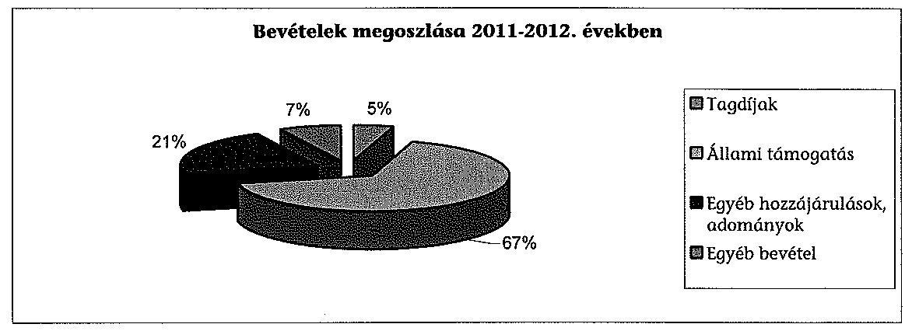
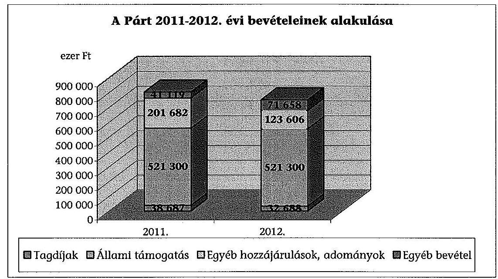
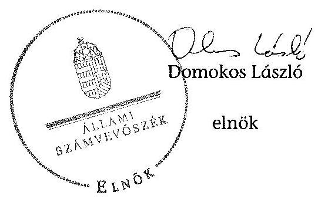
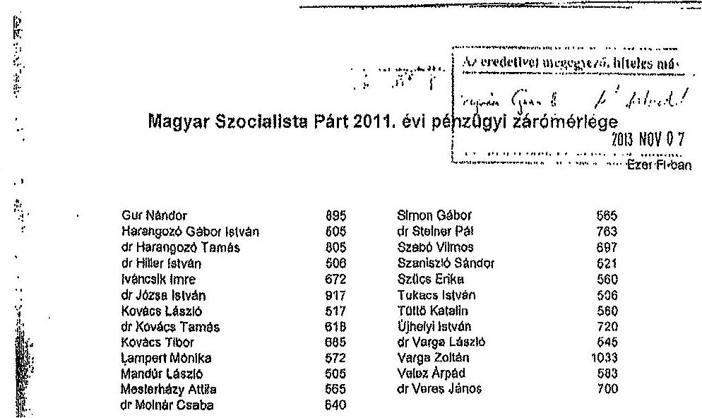
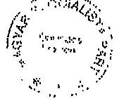
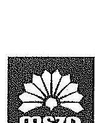
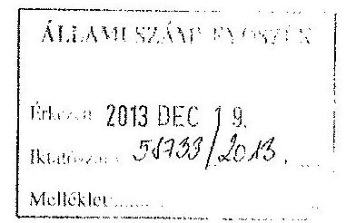
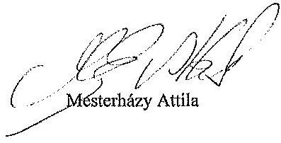
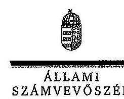
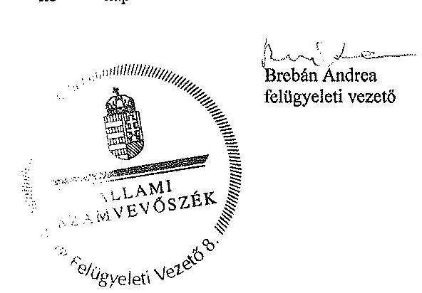

# ÁLLAMI   SZÁMVEVÔSZÉK 

## JELENTÉS

az MSZP gazdálkodása -
A Magyar Szocialista Párt 2011-2012. évi gazdálkodása törvényességének ellenőrzéséről

---

# Állami Számvevőszék 

Iktatószám: V-0346-170/2014.
Témaszám: 1380
Vizsgálat-azonosító szám: V0659

## Az ellenőrzést felügyelte:

## Brebán Andrea

felügyeleti vezető
Az ellenőrzést vezette és az végrehajtásáért felelős:
Solymár Ágnes
ellenőrzésvezető
A számvevőszéki jelentés összeállításában közremúködtek:
Bencsik Árpád
számvevő
Huszárné Borbás Melinda
számvevő
Szöllősi Zsolt
számvevő
Vörös Katalin
számvevő tanácsos
Az ellenőrzést végezték:

| Bencsik Árpád | Huszárné Borbás | Szöllősi Zsolt |
| :-- | :-- | :-- |
| számvevő | Melinda | számvevő |
|  | számvevő |  |
| Vörös Katalin |  |  |
| számvevő tanácsos |  |  |

---

# A témához kapcsolódó eddig készített számvevôszéki jelentések: 

## címe

Jelentés a Magyar Szocialista Párt 1991. évi gazdálkodása törvé- 156 nyességének ellenôrzéséről
Jelentés a Magyar Szocialista Párt 1992-1993-1994. évi gazdálko- 278 dása törvényességének ellenőrzéséről
Jelentés a Magyar Szocialista Párt 1995-1996. évi gazdálkodása 352 törvényességének ellenőrzéséről
Jelentés a Magyar Szocialista Párt 1997-1998 évi gazdálkodása 004 törvényességének ellenőrzéséről
Jelentés a Magyar Szocialista Párt 1999-2000. évi gazdálkodása 0134 törvényességének ellenőrzéséről
Jelentés a Magyar Szocialista Párt 2001-2002. évi gazdálkodása 0353 törvényességének ellenőrzéséről
Jelentés a Magyar Szocialista Párt 2003-2004. évi gazdálkodása 0561 törvényességének ellenőrzéséről
Jelentés a Magyar Szocialista Párt 2005-2006. évi gazdálkodása 0747 törvényességének ellenőrzéséről
Jelentés a Magyar Szocialista Párt 2007-2008. évi gazdálkodása 0950 törvényességének ellenőrzéséről
Jelentés a Magyar Szocialista Párt 2009-2010. évi gazdálkodása 1205 törvényességének ellenőrzéséről

---

.

---

# TARTALOMJEGYZÉK 

BEVEZETÉS ..... 5
I. ÖSSZEGZŐ MEGÁLLAPÍTÁSOK, KÖVETKEZTETÉSEK, JAVASLATOK ..... 7
II. RÉSZLETES MEGÁLLAPÍTÁSOK ..... 12

1. A Párt gazdálkodásáról szóló 2011-2012. évi beszámolók ..... 12
1.1. A teljes ellenőrzött időszakra érvényes megállapítások ..... 12
1.1.1. Bevételek ..... 12
1.1.2. Kiadások ..... 14
2. A Pártnak a beszámoló összeállítására és az azt alátámasztó
könyvvezetésére vonatkozó belső szabályozása és gyakorlata ..... 15
2.1. A számviteli rendszer szabályozása ..... 15
2.2. A könyvvezetés összhangia a jogszabályokban és a belső
szabályzatokban előírt követelményekkel ..... 17
2.3. A bizonylati elv és fegyelem, a bizonylati rend érvényesülésének
ellenőrzése ..... 18
2.4. A Pártra jellemző speciális területek ..... 19
3. A Párt bevételszerző gazdálkodó tevékenysége az ellenőrzött években ..... 19
3.1. A Párt gazdálkodásának szabályozottsága ..... 19
3.2. A Párt vagyonának elemei ..... 19
4. A gazdálkodással összefüggő, egyéb jogszabályokban foglalt előírások
betartása ..... 22
4.1. A foglalkoztatás szabályszerűsége ..... 22
4.2. Személyi jellegű kifizetésekre vonatkozó jogszabályok betartása ..... 22
4.3. Az adózási, társadalombiztosítási és egyéb jogszabályok
rendelkezéseinek érvényesítése ..... 24
5. A belső kontroll rendszer ..... 26
5.1. Az ellenőrzés rendszerének szabályozottsága, múködése,
eredményessége ..... 26
5.2. A pénzügyi-számviteli informatikai rendszer szabályozottsága és
belső kontrolljainak működtetése ..... 29
6. Az előző számvevőszéki ellenőrzés megállapítására tett intézkedések ..... 31

---

# MELLÉKLETEK 

1. számú A Magyar Szocialista Párt 2011. évi pénzügyi zárómérlege
2. számú A Magyar Szocialista Párt - A pártok múködéséről és gazdálkodásáról szóló törvény szerinti beszámolója
3. számú A Magyar Szocialista Párt elnökének észrevételei a jelentéstervezethez
4. számú Az Állami Számvevőszék válaszlevele az észrevételekre

---

# RÖVIDÍTÉSEK JEGYZÉKE 

| Art. | Az adózás rendjéről szóló - többször módosított - 2003. évi XCII. törvény |
| :--: | :--: |
| Áfa tv. | Az általános forgalmi adóról szóló - többször módosított - 2007. évi CXXVII. törvény |
| ÁSZ tv. | Az Állami Számvevőszékről szóló - többször módosított 1989. évi XXXVIII. törvény és az Állami Számvevőszékről szóló 2011. évi LXVI. törvény |
| Civil tv. | Az egyesülési jogról, a közhasznú jogállásról, valamint a civil szervezetek múködéséről és támogatásáról szóló 2011. évi CLXXV. törvény |
| Gjt. | A gépjármúadóról szóló 1991. évi LXXXII. törvény |
| Munka tv. | A Munka Törvénykönyvéről szóló - többször módosított 1992. évi XXII. törvény és a Munka Törvénykönyvéről szóló 2012. évi I. törvény |
| párttörvény | A pártok múködéséről és gazdálkodásáról szóló - többször módosított - 1989. évi XXXIII. törvény |
| Számv. tv. | A számvitelről szóló - többször módosított - 2000. évi C. törvény |
| Szja tv. | A személyi jövedelemadóról szóló - többször módosított 1995. évi CXVII. törvény |
| Tbj. tv. | A társadalombiztosítás ellátásaira és a magánnyugdíra jogosultakról, valamint e szolgáltatások fedezetéről szóló - többször módosított - 1997. évi LXXX. törvény |
| Egyéb rövidítések   alapszabály ${ }_{1}$ | A Magyar Szocialista Párt Alapszabálya, 2009. március 21 -től hatályos |
| alapszabály ${ }_{2}$ | A Magyar Szocialista Párt Alapszabálya, 2011. november 12 -től hatályos |
| ÁSZ | Állami Számvevőszék |
| gazdálkodási szabály-   zat $_{1}$ | A Magyar Szocialista Párt Alapszabályának 3. számú melléklete, a Választmány által 2007. szeptember 22-én elfogadott Gazdálkodási Szabályzat |
| gazdálkodási szabály-   zat $_{2}$ | A Magyar Szocialista Párt Alapszabályának 3. számú melléklete, az Országos Párttanács által 2011. december 7 -én elfogadott Gazdálkodási Szabályzat |
| KPEB | Központi Pénzügyi Ellenőrző Bizottság |
| NAV | Nemzeti Adó- és Vámhivatal |
| OK | Országos Központ |
| Párt | Magyar Szocialista Párt |
| Párt számviteli szabály-   zatai | A Párt számviteli szabályzatain a számvitelről szóló 2000. évi C. törvényben előírt számviteli politika, az eszközök és a források leltárkészítési és leltározási szabályzata, az eszközök és a források értékelési szabályzata, a pénzkezelési szabályzat, továbbá a számlarend értendő. |
| PEB | Pénzügyi Ellenőrző Bizottság |

---

SZMSZ Szervezeti és Müködési Szabályzat

---

# JELENTÉS 

## az MSZP gazdálkodása A Magyar Szocialista Párt 2011-2012. évi gazdálkodása törvényességének ellenőrzéséről

## BEVEZETÉS

Az Állami Számvevőszékről szóló 2011. évi LXVI. törvény 5. § (11) bekezdés a) pontja, valamint a pártok múködéséről és gazdálkodásáról szóló 1989. évi XXXIII. törvény (párttörvény) 10. § (1) bekezdése alapján a pártok gazdálkodása törvényességének ellenőrzésére az Állami Számvevőszék (ÁSZ) jogosult. Az ÁSZ a rendszeres költségvetési támogatásban részesülő pártok gazdálkodását a párttörvény 10. § (3) bekezdésében előírtak szerint kétévenként ellenőrzi. Előzőleg az ÁSZ a Magyar Szocialista Párt (Párt) 2009-2010. évi gazdálkodása törvényességét ellenőrizte. A Párt a 2011. és 2012. évben egyaránt 521300 ezer Ft költségvetési támogatásban részesült.

Az ellenőrzés célja volt annak megállapítása, hogy:

- a Párt által készített és a Magyar Közlönyben közzétett éves beszámolók a törvényi előírásoknak megfeleltek-e, a könyvvezetéssel és a valósággal megegyező adatokat tartalmaztak-e;
- a könyvvezetés és a gazdálkodás során betartották-e a számvitelről szóló 2000. évi C. törvény és az egyéb jogszabályok rendelkezéseit, a belső előírásokat;
- a Párt a múködéséhez szabályszerűen igénybe vehető forrásokat használt-e fel, a párttörvényben engedélyezett gazdálkodó tevékenységet folytatott-e;
- a Párt az ÁSZ előző ellenőrzése során feltárt hiányosságok megszüntetésére tett-e intézkedéseket, az intézkedések hatására megszűntek-e a hibák, hiányosságok.

Az ellenőrzött időszak: 2011. január 1 - 2012. december 31.
Az ellenőrzés típusa: pénzügyi-szabályszerúségi ellenőrzés
Az ellenőrzés körülményeit illetően rögzíteni szükséges, hogy:

- a párttörvény 1. sz. melléklete szerinti beszámoló mintához magyarázatot, útmutatót nem készítettek a jogalkotók, így ennek kitöltése pártonként - kialakított számviteli politikájuknak megfelelően - eltérő lehet;
- a beszámoló minta a számviteli törvény rendelkezéseivel nem harmonizál, nem felel meg sem a mérleg, sem az eredménykimutatás követelményeinek.

---

Az ellenőrzés hasznosulása: az ellenőrzés a gazdálkodás szabályszerűségének bemutatásával hozzájárul ahhoz, hogy a társadalom objektív képet alkothasson a pártok múködéséről. Az ellenőrzés eredménye elősegítheti, hogy a törvényalkotók konkrét lépéseket tegyenek a pártok finanszírozására vonatkozó szabályozások megváltoztatása, átláthatóbbá, ellenőrizhetőbbé tétele irányába. Az ellenőrzött szervezetek szintjén a hiányosságok, szabálytalanságok feltárása, az ennek kapcsán megfogalmazott megállapítások elősegíthetik a pártok szabályszerű gazdálkodását. A gazdálkodás szabályszerűségének bemutatásával az ellenőrzés értékteremtő módon járul hozzá az ÁSZ stratégiai céljainak megvalósításához.

Az ÁSZ a párttörvény módosításáig a jelenleg hatályos rendelkezéseknek megfelelő - egységes módszertani alapokra helyezett - gyakorlattal folytatja a pártok gazdálkodása törvényességének ellenőrzését. Az ellenőrzést az ÁSZ a pénz-ügyi-szabályszerűségi ellenőrzés módszertani szabályai szerint végezte.

Az ellenőrzési feladatok szempontrendszerét az ÁSZ kockázatelemzéssel alapozta meg. Az ellenőrzésnél az átfogó lényegességi küszöb mértékét a Párt által közzétett pénzügyi beszámolók bevételi főösszegének 2\%-ában határozta meg. Specifikus lényegességi küszöböt alkalmaztunk az egyéb hozzájárulások és adományok esetében, tekintettel a párttörvény 9. § (2) bekezdésében előírt nevesítési kötelezettség értékhatáraira (belföldi jogi és magánszemélytől kapott hozzájárulás, adomány 500 ezer Ft felett, külföldi jogi és magánszemélytől kapott hozzájárulás, adomány 100 ezer Ft felett).

A Párttól bekért adatok előzetes elemzése és a 2011-2012. évi főkönyvi könyvelési adatok alapján tervezte meg az ÁSZ a statisztikai mintavételi eljárást, valamint a tételes ellenőrzést. Az ellenőrzési kockázat - ÁSZ követelménynek megfelelő - 5\%-os szinten tartásához az eredendő kockázatot alacsonynak, a belső kontroll kockázatot közepesnek minősítettük. Tételesen ellenőriztük a bevételek közül az egymillió Ft feletti tételeket, valamint a beszámolóban kötelezően nevesítendő, értékhatárt elérő egyéb hozzájárulásokat, adományokat. Az ellenőrzött évekre vonatkozóan a bizonylati rend és fegyelem ellenőrzéséhez a mintát az ellenőrzési program szerint IDEA programmal, statisztikai mintavétel módszerével választottuk ki.

Az ÁSZ tv. 29. § (1) bekezdése szerint a jelentéstervezetet megküldtük észrevételezésre a Párt elnökének. A Párt elnöke az ÁSZ tv. 29. § (2) bekezdésében foglalt észrevételezési jogával élt. A Párt elnökének észrevételét, valamint az arra adott választ, ideértve az el nem fogadott észrevételek indokolását a jelentés 3. és 4. számú mellékletei tartalmazzák.

---

# I. ÖSSZEGZŐ MEGÁLLAPÍTÁSOK, KÖVETKEZTETÉSEK, JAVASLATOK 

A Párt a 2011. és 2012. évi beszámolóit a párttörvényben előírt határidőn belül és formában nyilvánosságra hozta. A Párt a beszámoló összeállításának rendjét, a hatályos számviteli politikájában és a hozzákapcsolódó számlarendjében szabályozta. A nyilvánosságra hozott beszámolók összeállítása során érvényesültek Számv. tv. alapelvei. A beszámolókban szereplő adatok levezethetők voltak a főkönyvi kivonatokból, és az azokhoz kapcsolódó analitikus nyilvántartásokból. A Párt 2011-2012. évi gazdálkodásáról, pénzügyi helyzetéről a megjelentetett éves beszámolók megbízható és valós képet adtak. Az ellenőrzés során a 2011. és 2012. évi pénzügyi zárómérlegben szereplő híbák előjeltől független összege nem haladta meg az ÁSZ által elfogadott, a bevételi főösszegre vetített $2 \%$-os lényegességi szintet.

A Párt számviteli szabályzatai csak részben feleltek meg a Számv. tv. és a párttörvény vonatkozó előírásainak. A Párt 2012. január 1-jétől hatályos számviteli politikáját a számviteli szolgáltatást végző és a könyvvezetést támogató program változása miatt módosította. A számviteli politika a pénzügyi zárómérleg összeállítását és az azt alátámasztó könyvvezetést a Számv. tv-ben foglaltaknak megfelelően szabályozta, kivéve a párttörvény szerinti nem pénzben nyújtott vagyoni hozzájárulást, amelynek értékelési módját nem határozta meg. A könyvvezetés módjára vonatkozó előírások közül a helyi szervezetek pénzeszközöket érintő gazdasági műveletek alapbizonylatainak megküldési határidejére vonatkozó szabályozás nem felelt meg a Számv. tv. előírásainak. Az elszámoláshoz a bizonylatok megküldésének határidejét, tárgyhót követő 15-e helyett a tárgy negyedévet követő 15 -éig írta elő. A szabályozási hiányosság miatt az ellenőrzésre kiválasztott 288 db 2011-ben könyvelt alapbizonylat $67,7 \%$-át, a 2012-ben könyveltből kiválasztott 249 db -nak pedig $69,1 \%$-át vette a Párt késve nyilvántartásba. Ennek következtében évközben nem volt biztosított az eszközökben és forrásokban bekövetkezet változások folyamatos könyvviteli nyilvántartása, ami nem felelt meg a Számv. tv.-ben előírtaknak.

Az eszközök és források értékelési szabályzata a Számv. tv.-ben előírtaknak megfelelően tartalmazta az eszköz- és forráscsoportok választott értékelési eljárásait 2011. év végéig. A Számv. tv.-ben előírt számlarendet és a számlatükröt a Párt évente aktualizálta. A 2012. január 1-jétől hatályos számlarend módosítását a könyvviteli szolgáltató, illetve a könyvvezetést támogató program változása is indokolta. A számlarendhez kapcsolódóan a vizsgált időszakban rendelkezett bizonylati szabályzattal és bizonylati albummal. A számlarend megfelelt a Számv. tv.-ben előírt egységes számlakeret követelményeinek, tartalmazta a Számv. tv.-ben foglalt elemeket. A korábbi ÁSZ ellenőrzés során a szabályzatra vonatkozóan feltárt hiányosságot a párt kijavította, a pénzügyi zárómérleg 6. sor egyéb bevételek sor helyett az elengedett kölcsöntartozást helyesen, a 4. sor egyéb hozzájárulások, adományok alatt mutatja ki.

---

A könyvvezetést a számviteli politikának megfelelően, a kettős könyvvitel rendszerében, 2011-ben a főkönyvelőség, 2012-től a számviteli szolgáltatást végző cég végezte.

A pénzügyi zárómérleget alátámasztó könyvvezetésben a Számv. tv.-ben szabályozott számviteli alapelvek érvényesültek. A számlakijelölés gyakorlata összhangban volt a Számv. tv. vonatkozó előírásaival. Az ellenőrzött 537 db-os mintában 2011-ben egy téves kontírozás (nyomdai munka) ellenértékét a múködési kiadások helyett politikai kiadásként kellett volna nyilvántartásba venni. Az ellenőrzött mintában egy 2012. évi politikai hirdetés számláján a vállalkozó $30 \%$ engedményt adott, amit a Párt a párttörvényt megsértve adományként nem számolt el. A Párt a 2011. évi beszámolójában tévesen 4399 ezer Ft összegű, az Országos Nyugdíjbiztosítási Főigazgatóságtól származó adományt nevesített, annak ellenére, hogy a jogügylet nem volt ingyenes. A hiba nem haladta meg az ÁSZ által elfogadott, a pénzügyi zárómérleg bevételi főösszegre vetített $2 \%$-os lényegességi szintet, ezért nem minősül lényeges hibának.

Az éves zárások előtt a Párt a Számv. tv. rendelkezéseivel, valamint a leltározási és leltárkészítési szabályzat előírásával összhangban dokumentáltan elvégezte a befektetett eszközök, a követelések és kötelezettségek egyeztetéses leltározását. Az ellenőrzött években a Pártnak mennyiségi felvételes leltározási kötelezettsége nem volt. Az eszközök és források értékelését a Számv. tv. rendelkezésének megfelelően végezte. A leltározásokat a szabályzatban, valamint a leltározási ütemtervben előírt rendben hajtotta végre.

A gazdasági események számviteli nyilvántartásokban történő rögzítése során a Párt részben tartotta be a Számv. tv.-ben előírt bizonylati elvet. A nyilvántartásba vett bizonylatok között előfordultak olyanok, amelyek nem feleltek meg a Számv. tv.-ben meghatározott alaki és tartalmi követelményeknek. A 2011. évre vonatkozóan az ellenőrzött bizonylatok $2,8 \%$-a nem felelt meg az utalványozásra vonatkozó rendelkezésnek, 2,4\%-át nem ellenőrizték. A 2012. évre vonatkozó, ellenőrzött alapdokumentumok $5,2 \%$-a nem felelt meg az utalványozásra vonatkozó rendelkezéseknek, $16,5 \%$-át nem ellenőrizték. Nem felelt meg a jogszabályi előírásoknak, hogy az ellenőrzött pénztár kiadási bizonylatokon 2011-ben egy dokumentumról hiányzott az összeg átvételét igazoló aláírás, négy dokumentumon az átvevő aláírása helyett szignó szerepelt, 2012-ben egy bizonylatról hiányzott az összeg átvételét igazoló aláírás, három bizonylaton pedig az átvevő aláírása helyett szignó szerepelt. A számviteli alapbizonylatok hibái a könyvvezetés és az éves pénzügyi zárómérleg valódiságát nem befolyásolta.

Az ÁSZ előző jelentésében megfogalmazott felhívásra a Párt intézkedett, amelylyel a feltárt hiányosságokat megszüntette.

---

Az ellenőrzött időszakban a Párt 1552040 ezer Ft bevételből gazdálkodott, amelynek megoszlását az 1. számú ábra mutatja be.

1. számú ábra

A Párt gazdálkodó, bevételszerző tevékenysége során - könyvviteli nyilvántartásai szerint - betartotta a párttörvényben előírt forrásszerzési és gazdálkodási tilalmakat. Bevételei tagdijfizetésből, a párttörvény szerinti állami támogatásból, egyéb hozzájárulásokból és adományokból, a tulajdonában álló ingatlanok bérbe adásából, tárgyi eszközök értékesítéséből, költségtérítésekből, káresemények miatti bevételekből, valamint kamatbevételekből és diszkontkincstárjegy eladásból álltak.

A Párt más államtól, költségvetési szervtől, állami vállalattól, állami részvétellel múködő gazdasági társaságtól, közvetlen költségvetési támogatásban vagy költségvetési szervi támogatásban részesülő alapítványtól nem fogadott el vagyoni hozzájárulást, valamint névtelen adományt. A Párt az ellenőrzött időszakban könyvviteli nyilvántartásai szerint csak a párttörvényben engedélyezett forrásból származó költségvetési támogatást fogadott el. A párttörvényben nem engedélyezett gazdálkodó tevékenységet nem folytatott, gazdasági társaságban részesedést nem szerzett, vállalatot nem alapított, egyszemélyes kft.-je nem volt.

A Pártnál a személyi jellegú kifizetések szabályszerű munkaszerződéseken alapultak, amelyek tartalma megfelelt a Munka Törvénykönyve előírásainak. Mindkét ellenőrzött évben a Párt 36 teljes munkaidős, 2011-ben 16, 2012-ben 11 részmunkaidős munkatársat, 2011-ben 11, 2012-ben egy nyugdíjas munkavállalót alkalmazott, 2011-ben egy tiszteletdíjas, 2012-ben egy főt megbízással foglalkoztatott. A munkabérek számfejtése, kifizetése munkaszerződésekkel, a hatályos Tbj. törvénnyel, az Szja. törvénnyel és egyéb jogszabályokkal összhangban történt. Az egyéni bér- és járulék nyilvántartásokat vezették, amelyek megegyeztek a főkönyvi könyveléssel és bevallásokkal. A munkavállalóknak adómentes mértékben étkezési utalványt, a munkába járáshoz bérlettérítést és gépkocsi költség elszámolást, továbbá iskolakezdési támogatást biztosítottak.

A hivatali és a magántulajdonú gépjármú hivatali célú használatát, elszámolási rendjét szabályozták, az érintettekkel a saját gépjármú használatára meg-

---

állapodást kötöttek. A magánszemélyek tulajdonában álló gépjármú hivatalos célú használata költségtérítésénél a szabályzatnak és jogszabálynak megfelelően az Szja tv.-ben előírt tartalmú kiküldetési rendelvényt alkalmazták. A Párt, a dolgozóknak - területi szövetségenként eltérően - munkába járással összefüggően helyközi tömegközlekedési eszközre szóló bérlet hozzájárulást fizetett az előírt mértékig.

Az adózási és a társadalombiztosítási jogszabályok előírásainak a Párt munkáltatói és kifizetői jogkörével összefüggésben a havi és az éves adatszolgáltatási bejelentési, adó- és járulék nyilvántartási, levonási, bevallási, adatszolgáltatási kötelezettségének eleget tett. A kötelező nyilvántartásokat vezették, melyek megegyeztek a főkönyvi könyveléssel és bevallásokkal. A Párt a Tbj. tv. előírásainak eleget téve, határidőben teljesítette a foglalkoztatottak biztosítási jogviszonyában történt változások bejelentését. A Pártnak a 2011-2012. évekre vonatkozó - adó-, illeték-, és járulék bevallást és befizetést tartalmazó folyószámla - kivonatok szerint hátraléka nem volt. A Párt feladatai teljesítéséhez 2011. év első negyedévéig négy saját tulajdonú gépkocsit üzemeltetett, amelyekhez kapcsolódó adóbevallási és fizetési kötelezettségnek a Gjt. előírásai szerint eleget tett. A Pártnak általános forgalmi adó bevallási és fizetési kötelezettsége csak az OK gazdálkodó tevékenységéhez kapcsolódóan keletkezett, melyeket határidőben teljesített. A reprezentációs kiadások elkülönített nyilvántartása szerint 2011-ben a Pest Megyei területi Szövetség lépte túl az Szja tv-ben szabályozott adómentes értékhatárt, amely után az adó- és járulékfizetést a Szja tv-nek megfelelően, szabályszerűen teljesítették.

A belső ellenőrzést a hatályos belső szabályzatokban összehangoltan szabályozták. Az Alapszabályban, a gazdálkodási szabályzatban rögzítették a vezetői ellenőrzés kereteit, amely - 2011 decemberéig - a pénztárnok, azt követően az országos elnökség, illetve a Pártigazgató felelősségi körébe tartozott. Az ellenőrző testületek (KPEB, megyei és helyi PEB-ek) éves munkatervek alapján végezték tevékenységüket. Az ellenőrzések eredményéről beszámolót készítettek a Kongresszusnak. A testületek ellenőrzési tevékenységükkel a gazdálkodás szabályszerűségét, a törvényes működést segítették. Az ellenőrzések során hiányosságot nem tártak fel. A vezetői ellenőrzés a kötelezettségvállalás és utalványozás folyamatán keresztül - 2011-ben az ellenőrzött bizonylatok 97,2\%-ában, 2012-ben $94,8 \%$-ban -, és a munkáltatói jog gyakorlásán keresztül érvényesült mindkét évben.

Az Országos Elnökség elfogadta a Párt informatikai biztonsági szabályzatát és belső adat- és információvédelmi szabályzatát. A szabályozás tartalmazza az infrastruktúrához, a hardverhez, az adathordozókhoz, a dokumentumokhoz, a szoftverekhez, a kommunikációhoz és a személyekhez kapcsolódó védelmi intézkedéseket. Tartalmazza továbbá az elektronikus adatok kezelésére, feldolgozására, tárolására, mentésére és megőrzésére vonatkozó előírásokat. A gazdálkodási adatok biztonságáról rendszeres mentéssel és a dolgozónkénti hozzáférési jogosultság korlátozásával biztosított volt az informatikai rendszerek kontrolljainak múködtetése. A Párt rendelkezett az informatikai eszközökön kezelt dokumentumtípusok és adatbázisok teljes körű, naprakész nyilvántartásával.

---

Az ÁSZ tv. 33. § (1) bekezdésében foglaltak értelmében az ellenőrzött szervezet vezetője köteles a jelentésben foglalt megállapításokhoz kapcsolódó intézkedési tervet összeállítani, és azt a jelentés kézhezvételétől számított 30 napon belül az ÁSZ részére megküldeni. Amennyiben az intézkedési tervet határidőre nem küldi meg a szervezet, vagy az nem elfogadható, az ÁSZ elnöke az ÁSZ tv. 33. § (3) bekezdés a)-b) pontjaiban foglaltakat érvényesítheti.

A helyszíni ellenőrzés megállapításainak hasznosítása mellett javasoljuk:

# a párt elnökének 

1. A számviteli politika a pénzügyi zárómérleg összeállítását és az azt alátámasztó könyvvezetést a Számv. tv-ben foglaltaknak megfelelően szabályozta, kivéve a párttörvény szerinti nem pénzben nyújtott vagyoni hozzájárulást, amelynek értékelési módját nem határozta meg.

Javaslat:
Egészítse ki a párttörvény 4. § (5) bekezdésében előírt, nem pénzben nyújtott vagyoni hozzájárulások bekerülési értékére vonatkozó szabályokkal a számviteli szabályozásait a Számv. tv. 57-68. §-ában előírtak figyelembe vételével.
2. A könyvvezetés módjára vonatkozó előírások közül a helyi szervezetek pénzeszközöket érintő gazdasági műveletek alapbizonylatainak megküldési határidejére vonatkozó szabályozás nem felelt meg a Számv. tv. előírásainak. Az elszámoláshoz a bizonylatok megküldésének határidejét, tárgyhót követő 15 -e helyett a tárgy negyedévet követő 15 -éig írta elő. A szabályozási hiányosság miatt az ellenőrzésre kiválasztott 288 db 2011-ben könyvelt alapbizonylat $67,7 \%$-át, a 2012 -ben könyveltből kiválasztott 249 db -nak pedig $69,1 \%$-át vette a Párt késve nyilvántartásba.

Javaslat:
Szabályozza a számviteli politikában a Számv. tv. 165. § (3) bekezdésben meghatározott határidőknek megfelelően a helyi szervezetek elszámolását.

---

# II. RÉSZLETES MEGÁLLAPÍTÁSOK 

## 1. A PÁrt GAZDÁlKodÁsÁról SZÓLÓ 2011-2012. ÉVI BESZÁmolók

### 1.1. A teljes ellenőrzött időszakra érvényes megállapítások

A Párt a 2011. évi beszámolóját 2012. április 27-én a Magyar Közlöny Hivatalos Értesítője 19. számában, a 2012. évi beszámolóját 2013. április 30-án a Magyar Közlöny Hivatalos Értesítője 19. számában jelentette meg a párttörvény 9. § (1) bekezdésében előírt határidőn belül, a párttörvény 1. számú mellékletében meghatározott minta szerint (1-2. számú melléklet). A Párt mindkét évi beszámolóját az internetes honlapján is közzétette.

A helyi és területi szervezetek valamint az OK gazdálkodási adatait a kettős könyvvitel rendszerében, a 2011. évben az OK főkönyvelőségén, majd megbízási szerződés alapján külső könyvviteli szolgáltatónál rögzítették. A könyvelések konszolidált adataiból december 31-ei fordulónappal állították össze a Párt éves beszámolóit. A beszámolók összeállítása során érvényesültek Számv. tv. 15-16. §-ában megfogalmazott alapelvek.

Mindkét év beszámolóiban szereplő adatok levezethetők voltak a főkönyvi kivonatokból, illetve a főkönyvi számlákból és az azokhoz kapcsolódó analitikus nyilvántartásokból. A Párt 2011-2012. évi gazdálkodásáról, pénzügyi helyzetéről megbízható és valós képet adtak a megjelentetett éves beszámolók. Az ellenőrzés során a 2011. és 2012. évi pénzügyi zárómérlegben szereplő hibák előjeltől független összege nem haladta meg az ÁSZ által elfogadott, a bevételi főösszegre vetített $2 \%$-os lényegességi szintet.

### 1.1.1. Bevételek

A tagdíffizetési kötelezettséget az alapszabály ${ }_{1,3}$ 49. §-a rögzítette. Az alapszabály ${ }_{1,2}$ szerint a tagdíjak mértékéről a párttag és a pártszervezet állapodik meg. A tagdíjak beszámoló szerinti adatai mindkét évben megegyeztek a főkönyvi könyvelésben és azt alátámasztó analitikus nyilvántartásban ezen a jogcímen szereplő összeggel. A könyvelésben szereplő tagdíj összegét és a befizető nevét a bevételi pénztárbizonylat, illetve a bankkivonat, vagy azokhoz csatolt alapbizonylat tartalmazta. A főkönyvi számla és a beszámoló sor csak a tagdíjak fogalomkörébe tartozó összegeket tartalmazott. Egyetlen esetben, 2012-ben téves könyvelés miatt 1050 Ft-ot (telefon költség visszatérítést) a tagdíj főkönyvi számlán szerepeltettek, az egyéb bevételek főkönyvi számla helyett. A hiba nem haladta meg az ÁSZ által elfogadott, a pénzügyi zárómérleg bevételi főösszegre vetített $2 \%$-os lényegességi szintet $(0,1 \%)$ ezért nem minősült lényegesnek.

Az állami költségvetésből származó támogatásokat a főkönyvi könyvelésben kimutatott és a bankszámla kivonaton szereplő, a Magyar Államkincs-

---

tár által ténylegesen átutalt összeggel egyezően mutatták be a párttörvény szerinti beszámolójukban. A 2011. évről közzétett költségvetési támogatás összege megegyezett a Magyar Köztársaság 2011. évi költségvetésének végrehajtásáról szóló 2012. évi CLV. törvényben foglaltakkal. A 2012. évi közzétett költségvetési támogatás összege megegyezett a Magyarország 2012. évi központi költségvetésének végrehajtásáról szóló 2013. évi CXCIII. törvényben meghatározott öszszeggel. A Párt a 2011. és 2012. évben egyaránt 521300 ezer Ft költségvetési támogatásban részesült.

Az egyéb hozzájárulások, adományok beszámolósor adattartalmát a Párt, a párttörvény 1. számú mellékletében előírt minta szerint részletezte. A Pártnak ezen a jogcímen mindkét évben belföldi jogi személyektől, jogi személynek nem minősülő belföldi gazdasági társaságtól és belföldi magánszemélyektől származott bevétele. Az ellenőrzött időszakban a közzétett beszámolók alapján a Párt külföldi jogi személyektől, jogi személynek nem minősülő gazdasági társaságtól és külföldi magánszemélyektől adományt nem fogadott el. A Párt a főkönyvi nyilvántartását a párttörvényben meghatározott jogcímek és értékhatár szerinti bontásban alakította ki. A beszámolósor részadatainak értéke mindkét év vonatkozásában megegyezett a kapcsolódó főkönyvi számlák egyenlegével, az egyes beszámolósorok oda nem tartozó bevételt nem tartalmaztak.

Az egyéb hozzájárulások, adományok belföldi jogi személyektől jogcímen mindkét év beszámolójában a párttörvény 9. § (2) bekezdés előírásának megfelelően, az adományozókat nevesítve 500 ezer Ft felett (2011. évben huszonegy, 2012. évben tizenöt) a támogatás összegével együtt szerepeltették. A beszámoló sor tartalmazta a párttörvény 4. § (5) bekezdésében előírtakkal összhangban az önkormányzati és az egyéb tulajdonú bérelt ingatlanok tényleges és a piaci bérleti dijának különbözeteként kapott nem pénzbeli vagyoni hozzájárulás értékét. Az ingatlanhasználati díj formájában kapott nem pénzbeli vagyoni hozzájárulások értéke a 2011. évben 63745 ezer Ft, a 2012. évben 37076 ezer Ft volt. Mindkét ellenőrzött évben a beszámolósor adata egyezett a vonatkozó főkönyvi számlák összesített egyenlegével. A Párt tévesen a 2011. évi beszámolójában 4399 ezer Ft összegű, az Országos Nyugdíjbiztosítási Főigazgatóságtól származó adományt nevesített. A Párt az ingatlanbérlet kapcsán nevesített öszszeget az Országos Nyugdíjbiztosítási Főigazgatóság jogelődjével 1994. december 13-án kötött megállapodás szerint az általa a jogelőd szervezet részére birtokba adott ingatlan ellenértékeként kapta. Ennek következtében a jogügylet nem volt ingyenes, ezért a kapott 4399 ezer Ft összeg nem minősült adománynak. A 2011. évben az Országos Nyugdíjbiztosítási Főigazgatóságtól származó tévesen bemutatott nevesített adomány miatt az ingatlanhasználati díj formájában kapott nem pénzbeli vagyoni hozzájárulások értéke a 63745 ezer Ft-ról 59346 ezer Ft-ra csökken. A hiba nem haladta meg az ÁSZ által elfogadott, a pénzügyi zárómérleg bevételi főösszegre vetített $2 \%$-os lényegességi szintet, ezért nem minősül lényeges hibának.

A 2011. és a 2012. évi beszámolókban az egyéb hozzájárulások, adományok jogi személyiségnek nem minősülő gazdasági társaság mérlegsoron a Párt által közzétett adatok a vonatkozó főkönyvi nyilvántartásban szereplő összegekkel megegyeztek.

---

Az egyéb hozzájárulások, adományok belföldi magánszemélyektől címen mindkét év beszámolójában a párttörvény 9. § (2) bekezdés előírásának megfelelően feltüntették az 500 ezer Ft feletti összeget adományozó személyek nevét és az adományozott összeget. A 2011. évben negyvenegy, a 2012. évben harminchét belföldi magánszemély adományozott 500 ezer Ft-ot meghaladó öszszeget a Pártnak 27934 ezer Ft, illetve 25252 ezer Ft összegben. A beszámolósorok összegét a Párt mindkét évben alátámasztotta a főkönyvi számlákkal és az analitikus nyilvántartásokkal, a beszámolósoron közölt összegek a vonatkozó főkönyvi számlák egyenlegével megegyeztek.

Az egyéb bevételek között az értékpapír és banki kamatokból származó kamatbevételeket, az eszközök értékesítéséből és bérbeadásából, a rendkívüli bevételekből, valamint a költségtérítésből származó bevételeket tartották nyilván a hatályos számlarenddel összhangban. A beszámoló sor összege megegyezett az analitikus nyilvántartásokkal és a kapcsolódó főkönyvi számlákon kimutatott bevétellel. A Párt a beszámoló sor összegét az ellenőrzött években alátámasztotta a főkönyvi számlákkal és az analitikus nyilvántartásokkal.

# 1.1.2. Kiadások 

Az éves pénzügyi zárómérlegek az egyes pénzügyi zárómérleg sorok adatának kiszámításánál figyelembe vett főkönyvi számlák egyenlegével, illetve összesített forgalmával egyező összegben tartalmazták a kiadásokat.

Támogatás egyéb szervezeteknek beszámoló soron közölt támogatást a Párt mindkét évben bíróságon bejegyzett szervezetek részére nyújtotta. Mindkét évben a beszámoló soron szereplő összeg megegyezett az analitikus nyilvántartásokban és a kapcsolódó főkönyvi számlákon kimutatott kiadásokkal.

A múködési kiadások beszámolósoron a hatályos számlarenddel összhangban a Párt mindkét évben az anyagköltségeket, a működéshez kapcsolódó igénybevett szolgáltatásokat (pl. közüzemi díjakat), a bérköltséget és annak járulékait, valamint a személyi jellegű kifizetések együttes összegét szerepeltette. A beszámolósor adata mindkét évben egyezett a főkönyvi számlák egyenlegeinek összesített adatával, érvényesült a működési kiadások jogcímeinek azonossága.

Az eszközbeszerzés beszámolósoron a Párt hatályos számlarendjével összhangban mindkét évben az immateriális javak, az ingatlanok és kapcsolódó vagyoni értékű jogok, továbbá a berendezések, felszerelések növekedés forgalmának összesített adatát mutatta ki. A beszámolókban közölt összegek a kapcsolódó főkönyvi számlák adataiból levezethetők voltak, az adatok mindkét évben egyeztek a főkönyvi számlák egyenlegeinek összesített adatával.

A politikai tevékenység kiadásai között a Párt hatályos számlarendjében előírtak alapján propaganda kiadások, nemzetközi tagdíjak, munkabérek és járulékai, valamint személyi jellegű egyéb kifizetések elszámolására került sor. A beszámoló sor adata mindkét évben egyezett a főkönyvi számlák egyenlegeinek összesített adatával. Mindkét évben a beszámolósoron közölt összegek megegyeztek a vonatkozó főkönyvi számlák egyenlegeinek összesített adatával.

---

Az ellenőrzött években érvényesült a politikai tevékenység kiadása jogcímeinek azonossága, következetes elszámolása.

Az egyéb kiadások között a Párt hatályos számlarendjében meghatározottak szerint bankköltséget, árfolyamveszteséget, hitelkamatot, illetéket, közjegyzői díjat, kerekítés miatti eltéréseket mutatott ki. A beszámoló sor adata mindkét évben megegyezett a vonatkozó főkönyvi számlák összevont egyenlegével. Az ellenőrzött években érvényesült az egyéb kiadások jogcímeinek azonossága, következetes elszámolása.

# 2. A PÁrtnak a beszámoló ÖsszeÁllítására és az azt alátáMASZTÓ KÖNYVVEZETÉSÉRE VONATKOZÓ BELSŐ SZABÁLYOZÁSA ÉS GYAKORLATA 

### 2.1. A számviteli rendszer szabályozása

A Párt számviteli szabályzatai csak részben feleltek meg a Számv. tv. és a párttörvény vonatkozó előírásainak.

A Párt a pénzügyi zárómérleg összeállítását és az azt alátámasztó könyvvezetést a Számv. tv. 14. § (3)-(4) bekezdéseiben előírt számviteli politikában szabályozta. A Számv. tv. 3. § (3) bekezdése 5. pontjával összhangban szabályozta a megbízható és valós képet lényegesen befolyásoló hiba nagyságát, valamint a Számv. tv. 154. § (5) bekezdésének megfelelően az ismételt közzétételre vonatkozó előírást. A könyvvezetés módjára vonatkozó előírások közül a helyi szervezetek elszámolásának, a számviteli alapbizonylatok megküldésének határidejére vonatkozó szabályozás nem felelt meg a Számv. tv. 12. § (2) és a 165. § (3) bekezdés a) pontjának. A helyi szervezetek elszámolásának határidejét, tárgyhót követő 15 -e helyett a tárgy negyedévet követő 15 -éig írta elő. A szabályzat az eszközök bekerülési értékét a Számv. tv. előírásainak megfelelően szabályozta, kivéve a nem pénzben nyújtott vagyoni hozzájárulást. Erre vonatkozó rendelkezéseket az eszközök és források értékelési szabályzata sem tartalmazott. A szabályzatban pontosításra került a működési és a politikai tevékenység kiadásainak meghatározása. E kiadásokat 2012-től nem főkönyvi számlánként, hanem a kiadás célját figyelembe véve veszi nyilvántartásba a Párt politikai vagy működési kiadásként.

A Párt rendelkezett a Számv. tv. 14. § (5) bekezdésében a számviteli politikához előírt leltározási és selejtezési szabályzattal, eszközök és források értékelési szabályzattal, pénzkezelési szabályzattal. A Pártnak gazdálkodása sajátosságai miatt önköltség számítási szabályzatot nem kellett készítenie.

A leltározási és selejtezési szabályzat tartalma összhangban volt a Számv. tv. 69. §-ában foglaltakkal. A leltár eltérések főkönyvi elszámolására vonatkozóan a szabályzat rögzítette, hogy az eltéréseket az analitikában és a főkönyvi könyvelésben is javítani kell, de az eltérések elszámolásának módját a szabályzat nem írta elő. A Párt a leltározási és selejtezési szabályzatban a mennyiségi felvételes leltározásra vonatkozó előírást a Számv. tv. 69. § (3) bekezdésének megfelelően (három évre) változtatta.

---

Az eszközök és források értékelési szabályzata a Számv. tv. 57-68. §ában előírtaknak megfelelően tartalmazta az eszköz- és forráscsoportok választott értékelési eljárásait (kivéve a nem pénzben nyújtott hozzájárulások értékelését). Erre vonatkozó rendelkezéseket az eszközök és források értékelési szabályzata sem tartalmazott. Az eszközök és források értékelési szabályzatában a Párt rendelkezett a terven felüli értékcsökkenés elszámolásáról. A Párt ellentmondásosan szabályozta az értékvesztés elszámolásának szabályait, ugyanis az eszközök és források értékelésének szabályzata tartalmazott előírásokat az értékvesztés elszámolására, míg a számviteli politikában a Párt azt rögzítette, hogy „az értékvesztés lehetőségével a Párt nem él".

A párt a Számv. tv. 14. § (5) bekezdés d) pontjában előírt pénzkezelési szabályzattal az ellenőrzött években rendelkezett. A szabályzat 2011. január 1 2012. november 30-a között tartalmazta a Számv. tv. 14. § (8)-(9) bekezdéseiben, majd 2012. december 1-jétől a Számv. tv. 14. § (8) bekezdésében szabályozott tartalmi elemeket. A Párt az utalványozók, a bankszámla feletti rendelkezésre jogosultak névsorát, aláírási mintáját nem mellékelte a szabályzathoz, azt a pénztárban helyezték el. A pénzkezelési szabályzat előírásai az OK-ra vonatkoztak, a területi szervezetek részére mintaként szolgált.

A Számv. tv. 161. §-ában előírt számlarendet és a számlatükröt a Párt évente aktualizálta. A 2012. január 1-jétől hatályos számlarend módosítását a könyvviteli szolgáltató, illetve a könyvvezetést támogató program változása is indokolta. A számlarendhez kapcsolódóan a vizsgált időszakban a Párt rendelkezett bizonylati szabályzattal és bizonylati albummal. A számlarend részben felelt meg a Számv. tv. 160. §-ában előírt, egységes számlakeret követelményeinek, mivel nem tartalmazta minden számlához a Számv. tv. 161. § (2) bekezdésében foglalt elemeket, azaz az egyes számlák értékének növelő és csökkentő jogcímeit - a Számv. tv. 161. § (2) bekezdés b) pontja rendelkezésétől eltérően nem teljes körűen írta elő. A Számv. tv. 161. § (3) bekezdés előírásainak érvényesüléséhez az analitikus nyilvántartások és főkönyvi könyvelés értékadatainak egyeztetési kötelezettségét a számlarend előírta, annak módját részletesen nem szabályozta. A Párt kijelölte az egyéb bevételek, a működési kiadások, az eszközbeszerzések, a politikai tevékenység és az egyéb kiadások főkönyvi számláit.

A párt az ÁSZ előző ellenőrzése során feltárt vonatkozó hibákat javította. A 2011. szeptember 22-ei hatállyal módosított számlarendje már tartalmazta, hogy a Párt területi szervezeteitől kapott nem pénzbeli támogatás OK-nál könyvelt összegét a pénzügyi zárómérleg összeállítása során, figyelmen kívül kell hagyni. Továbbá a 2012. január 1-jétől hatályos számlarendjében az elévült kötelezettségeket, mint adományokat, a párttörvény szerinti beszámolóban a 6. sor egyéb bevételek cím helyett a 4. sor egyéb hozzájárulások között rendelte kimutatni.

---

# 2.2. A könyvvezetés összhangja a jogszabályokban és a belső szabályzatokban előírt követelményekkel 

A választott könyvvezetés kialakított rendje az ellenőrzött években részben felelt meg a Számv. tv. 159. §-ában foglaltaknak. A gazdálkodási szabályzat 4. pontjában előírtakkal összhangban központosított volt az alapbizonylatok feldolgozásának rendje és számviteli nyilvántartásba vétele. A könyvvezetést a számviteli politikának megfelelően a kettős könyvvitel rendszerében, az alapbizonylatok számítógépes feldolgozásával 2011-ben az OK fökönyvelősége, 2012-től számviteli szolgáltatást végző cég végezte. A nem megfelelő szabályozásra is visszavezethető, hogy az ellenőrzésre kiválasztott 288 db 2011-ben könyvelt alapbizonylat $67,7 \%$-át, a 2012-ben könyveltből kiválasztott 249 db nak pedig $69,1 \%$-át vette a Párt késve nyilvántartásba. Ennek következtében évközben nem volt biztosított az eszközökben és forrásokban bekövetkezet változások folyamatos könyvviteli nyilvántartása, ami nem felelt meg a Számv. tv. 159. §-ában előírtaknak.

A Párt könyvvezetését támogató könyvelő program 2012-ben megváltozott a tevékenységet ellátó változása következtében. Az ellenőrzött években alkalmazott könyvelő programok törzsadat-állományát a gazdasági változásoknak megfelelően évente aktualizálták. Az ellenőrzés igényeinek megfelelően minden szükséges adat lekérdezhető volt. A Számv. tv. 15-16. §-aiban szabályozott számviteli alapelvek érvényesültek a pénzügyi zárómérleget alátámasztó könyvvezetésben. A számlakijelölés gyakorlata összhangban volt a Számv. tv. 160. § (1)-(3) bekezdés egységes számlakeretre vonatkozó számlarendi előírásokkal. Az ellenőrzött 537 db-os mintában 2011-ben téves kontírozás miatt egy tétel (nyomdai munka) ellenértékét a múködési kiadások helyett politikai kiadásként kellett volna nyilvántartásba venni. A számla mellé csatolt dokumentum szerint politikai célú kiadvány készült, ezért a politikai kiadások számlaszámra kellett volna kontírozni. Az ellenőrzött mintában egy 2012. évi politikai hirdetés számláján a vállalkozó $30 \%$ ( 25,2 ezer Ft) engedményt adott, amit a Párt a párttörvény 4. § (5) bekezdését megsértve adományként nem számolt el.

Az eszközök bekerülési értékét a Párt a Számv. tv. 47-51. § rendelkezései szerint határozta meg. Az eszközök értékcsökkenésének elszámolása megfelelt a Számv. tv. 52-53. §-ai és a számviteli politika előírásainak. A Párt a nem pénzbeli vagyoni hozzájárulásokat egyedileg értékelte. A Párt az egyes főkönyvi számlákhoz kapcsolódó analitikus nyilvántartásokat (immateriális javak, aktivált tárgyi eszközök, követelések, kötelezettségek, munkabérek, adományok) a számviteli előírásoknak és a számviteli politikában előírtaknak megfelelően vezette. A főkönyvi számlák és az analitikus nyilvántartások között az értékadatok számszerú egyeztetése a Számv. tv. 161. § (3) bekezdése és a számlarend előírásai szerint, a pénzügyi zárást megelőzően megtörtént.

Az éves zárások előtt a Párt a Számv. tv. 69. § (1) és (2) bekezdések rendelkezéseivel, valamint a leltározási és leltárkészítési szabályzat előírásával összhangban dokumentáltan elvégezte a befektetett eszközök, a követelések és kötelezettségek egyeztetéses leltározását. Az ellenőrzött években a Pártnak mennyiségi felvételes leltározási kötelezettsége nem volt. Az eszközök és forrá-

---

sok értékelését a Számv. tv. 46. § (3) bekezdése rendelkezésének megfelelően végezte. A leltározásokat a szabályzatban, valamint a leltározási ütemtervben előírt rendben hajtották végre.

A zárlati munkálatok végrehajtása során a Számv. tv. 164. § (1)-(2) bekezdésben, valamint a számviteli politikában előírt határidőket betartották. Az év végi zárlatnál a Számv. tv. 165. § (4) bekezdés előírásának megfelelően gondoskodtak a főkönyvi könyvelés, az analitikus nyilvántartások és a bizonylatok adatai közötti egyeztetés és ellenőrzés logikailag zárt rendszerben való végrehajtásáról.

A pénzkezelés gyakorlata megfelelt a Számv. tv. 14. § (8) bekezdésben foglaltaknak és a pénzkezelési szabályzat előírásainak, kivéve a pénzkezelési szabályzat 5.2.2. pontjában előírt, a pénztári kifizetés bizonylatolására vonatkozó rendelkezéseit. Az ellenőrzött mintatételek alapján a bizonylati fegyelmet a Párt 2011-ben öt esetben, 2012-ben négy esetben sértette meg. Az egyes pénztárosi feladatkört ellátók nem csak utalványozásra jogosult személy utalványozásával ellátott kiadási pénztárbizonylat alapját fizettek ki a pénztárból összeget. Előfordult továbbá, hogy a kiadási pénztárbizonylaton az átvevő aláírásával nem igazolta az összeg átvételét, vagy azt csak szignálta. Nem minden kiadási pénztárbizonylaton szerepelt az ellenőr aláírása. Az ÁSZ jogosulatlan kifizetést nem tárt fel.

# 2.3. A bizonylati elv és fegyelem, a bizonylati rend érvényesülésének ellenőrzése 

A Párt a gazdasági események elszámolására és nyilvántartására alkalmazott bizonylatok körét a számlarend részeként elkészített bizonylati szabályzatban rögzítette. A Párt gazdálkodási szabályzata és a területi szervezetek hatályos SZMSZ-e határozta meg a gazdálkodással kapcsolatos feladat- és hatásköröket. A pénzkezelési szabályzat előírta többek között a számlavezetés és készpénzkezelés, a bizonylatok kiállításának, feldolgozásának eljárásait, valamint a kötelezettségvállalás és utalványozás rendjét.

A gazdasági események számviteli nyilvántartásokban történő rögzítése során a Párt részben tartotta be a Számv. tv. 165. § (1)-(2) bekezdésében szabályozott bizonylati elvet. A nyilvántartásba vett bizonylatok között előfordultak olyanok, amelyek nem feleltek meg a Számv. tv. 167. §-ában előírt alaki és tartalmi követelményeknek. Az ellenőrzésre kijelölt minta a Párt könyvviteli nyilvántartásában szerepelt. Nem felelt meg a Számv. tv. 167. § c) bekezdésében előírt alaki és tartalmi követelményeknek, hogy az ellenőrzött bizonylatok közül a 2011. évre vonatkozó, ellenőrzött alapdokumentumok 2,8\%-a nem felelt meg az utalványozásra vonatkozó rendelkezésnek, 2,4\%-át nem ellenőrizték, az ellenőrzést végző személy aláírása nem szerepelt a dokumentumon. A 2012. évre vonatkozó, ellenőrzött alapdokumentumok 5,2\%-a nem felelt meg az utalványozásra vonatkozó rendelkezéseknek, 16,5\%-át nem ellenőrizték, az ellenőrzést végző személy aláírása nem szerepelt a dokumentumon, vagy az alapbizonylatot kiállító, könyvelő és az ellenőrzést végző személye megegyezett. Nem felelt meg a jogszabályi előírásoknak továbbá, hogy az ellenőrzött pénztár kiadási bizonylatokon 2011-ben egy dokumentumról az összeg ( 9350 Ft ) átvételét

---

igazoló aláírás, 4 dokumentumon az átvevő aláírása helyett szignó szerepelt, 2012-ben 1 bizonylatról hiányzott az összeg ( 5335 Ft ) átvételét igazoló aláírás, 3 bizonylaton pedig az átvevő aláírása helyett szignó szerepelt. Az ellenőrzés során feltár hiányosságok a könyvvezetés és az éves pénzügyi zárómérleg valódiságát nem befolyásolta.

A Számv. tv. 167. § (1) bekezdésében rögzített alaki-tartalmi előírások be nem tartása a könyvvezetés valódiságát nem befolyásolta. A Párt a szigorú számadású bizonylatok nyilvántartását a Számv. tv. 168. § (3) bekezdésében foglalt rendelkezésének és a pénzkezelési szabályzat előírásainak megfelelően vezette. A Párt a bizonylatok megőrzéséről a Számv. tv. 169. § előírásának megfelelően gondoskodott. Évente ellenőrizte, hogy az elmentett pénzügyi, számviteli adatállományokból a Számv. tv. 169. §-a szerinti megőrzési időn belül az adatok teljes körűen előállíthatók-e.

# 2.4. A Pártra jellemző speciális területek 

A Párt 2011-ben 45 db , 2012-ben 44 db az állami vagyonról szóló 2007. évi CVI. törvény 67. és 68. §-ának szabályai alapján megszerzett ingatlannal rendelkezett. A Párt az e törvény szabályai szerint megszerzett ingatlanok közül a Zalaszentgrót, Dózsa György út 9. szám alatti ingatlant bérbe adta. Ennek az ingatlannak a megvásárlásához a Párt a Magyar Fejlesztési Bank Zrt.-től a 68. § (1) bekezdése szerinti kedvezményes pénzkölcsönt nem vett igénybe. Az ingatlan vételárát a Párt és az MNV Zrt. között létrejött, SZT-27950. számú szerződés szerint egy összegben fizette meg. A szerződés szerint az ingatlanhoz kapcsolódó jogok és hasznok a vevőt illetik meg, ezért az ingatlan hasznosítása jogszerűen történt. A Párt az ellenőrzött két évben a megszerzett ingatlanokat teljes körűen a törvényben meghatározott rendeltetési célnak megfelelően, a párt működési feltételeinek biztosítása érdekében használta.

## 3. A PÁrt beVÉTELSZERző GAZDÁlKODÓ TEVÉKENYSÉGE AZ ELLENÖRZÖTT ÉVEKBEN

### 3.1. A Párt gazdálkodásának szabályozottsága

A Párt gazdálkodására vonatkozó szabályokat a mindenkori hatályos alapszabály 3. sz. melléklete szerinti gazdálkodási szabályzat rögzíti. Az ellenőrzött időszakban a gazdálkodási szabályzat ${ }_{1,2}$ meghatározta a bevételek jogcímeit, a gazdálkodó tevékenységének jogcímeit nem nevesítette. A szabályozás összhangban volt a párttörvény 4-6. §-aiban foglaltakkal.

### 3.2. A Párt vagyonának elemei

A Párt vagyona 2011. december 31-éről 2012. december 31-ére 4,5\%-kal (100 148 ezer Ft-tal) csökkent. A vagyoncsökkenést legnagyobb mértékben az ingatlanok év végi állományának változása ( $-91156,8$ ezer Ft) okozta. Hozzájárult a változáshoz a követelések (-7234 ezer Ft) és a pénzeszközök (4839 ezer Ft) év végi állományának csökkenése.

---

A Párt év végi eszközállományának változását az 1. számú táblázat mutatja be.

1. számú táblázat

Adatok ezer Ft-ban

| Megnevezés | 2011. december 31. | 2012. december 31. |
| :-- | :--: | :--: |
| Szellemi termékek | 1593,0 | 2341,6 |
| Ingatlanok | 2023989,9 | 1932833,1 |
| Gépek, berendezések | 10479,1 | 8842,8 |
| Beruházások | 0 | 246,9 |
| Hosszúlejáratú kölcsönök, | 158,0 | 87,2 |
| bankbetétek | 0 | 94,4 |
| Készletek | 18379,0 | 11145,0 |
| Követelések | 173905,0 | 169066,0 |
| Pénzeszközök | 0 | 3699,0 |
| Aktív időbeli elhatárolások | $\mathbf{2 2 2 8 5 0 4 , 0}$ | $\mathbf{2 1 2 8 3 5 6 , 0}$ |

Az ellenőrzött időszakban a Párt vagyonának elemei a párttörvény 4. § (1) bekezdése szerinti forrásokból képződtek. A Párt saját bevételei tagdijfizetésből, egyéb hozzájárulásokból és adományokból, a tulajdonában álló ingatlanok bérbe adásából, tárgyi eszközök értékesítéséből, költségtérítésekből, káresemények miatti bevételekből, valamint kamatbevételekből és diszkont-kincstárjegy eladásból álltak. A bevételek meghatározó része, 2011. évben 64,9\%-a, 2012. évben $69,6 \%$-a állami támogatásból származott. 2011. évben a bevételek 4,8\%a tagdijból, $25,2 \%$-a belföldi magánszemélyektől és jogi személyektől származó egyéb hozzájárulásokból, adományokból, 5,1\%-a egyéb bevételekből származott. A 2012. évben a bevételek 4,4\%-át tagdijak, 16,5\%-át belföldi magánszemélyektől és jogi személyektől származó egyéb hozzájárulások, adományok, $9,5 \%$-át az egyéb bevételek tették ki. Az egyéb hozzájárulások, adományok 2011-ben 68,3\%-a, 2012-ben 69,6\%-a magánszemélyektől származott. A Párt bevételeinek alakulását a 2. számú ábra mutatja be.

---

A Párt 2011-2012. években kedvezményes összegű bérleti díj fizetése mellett használt önkormányzati és egyéb tulajdonú ingatlanokat. 2011-ben 63 db , 2012-ben 40 db ingatlan esetében a párttörvény 4. § (5) bekezdésében előírtak szerint meghatározta a kedvezményes díjtétel, illetve a tényleges piaci ár közötti különbözet összegét.

A Párt az ellenőrzött években könyvviteli nyilvántartásai és nyilatkozata szerint a párttörvény 4. § (2)-(3) bekezdéseiben meg nem engedett forrásból származó vagyoni hozzájárulást állami vállalattól, állami részvétellel működő gazdasági társaságtól, közvetlen költségvetési támogatásban vagy költségvetési szervi támogatásban részesülő alapítványtól, más államtól vagyoni hozzájárulást, továbbá névtelen adományt nem fogadott el. A Párt az ellenőrzött időszakban könyvviteli nyilvántartásai szerint csak a párttörvény 5. § (2) bekezdésében engedélyezett forrásból származó költségvetési támogatást fogadott el.

A Párt az ellenőrzött időszakban a párttörvény 6. §-ában meg nem engedett gazdálkodó tevékenységet nem folytatott, gazdasági társaságban részesedést nem szerzett, egyszemélyes kft.-t, vállalatot nem alapított, egyszemélyes kft.-je nem volt, más gazdasági társaságban tulajdoni részesedéssel nem rendelkezett, a párttörvény által tiltott értékpapírt nem vásárolt.

A Párt gazdálkodásából származó - a korábbiakban bemutatott - bevételek megegyeztek az egyéb bevételek főkönyvi számláinak egyenlegével. A gazdálkodó tevékenységre vonatkozó, annak jogszerűségét igazoló szerződések, egyéb dokumentumok az ellenőrzés során rendelkezésre álltak.

---

# 4. A gazdÁlkodÁSSAL ÖSSZEFÜGGŐ, EGYÉB JOGSZABÁLYOKBAN FOGLALT ELŐÍRÁSOK BETARTÁSA 

### 4.1. A foglalkoztatás szabályszerűsége

Az ellenőrzött időszakban a Párt feladatai ellátásához munkaviszony és megbízásos jogviszony keretében az alábbi összetételben foglalkoztatott munkavállalókat:

Adatok: főben

| Évek | Teljes   munkaidős | Részmun-   kaidős | Nyugdíjas | Megbízási szer-   ződéssel foglal-   koztatottak | Tiszteletdíjas |
| :--: | :--: | :--: | :--: | :--: | :--: |
| 2011. | 36 | 16 | 11 | 0 | 1 |
| 2012. | 36 | 11 | 1 | 1 | 0 |

A munkaerő-foglalkoztatás szabályszerű munkaszerződéseken alapult, amelyek tartalma megfelelt a Munka tv. 76. § (1)-(6) bekezdésében foglaltaknak. A pénzügyi- számviteli területen dolgozók megfelelő szakmai végzettséggel, gyakorlattal rendelkeztek, a munkaköri leírásokban a helyettesítést szabályozták. A foglalkoztatáshoz kapcsolódó bejelentési, nyilvántartási, számfejtési és kifizetői feladatokat a Párt egészére az OK fökönyvelősége biztosította 2011. év végéig, ezt követően külső szolgáltató végezte megbízási szerződés alapján a könyvelési és a munkaügyi feladatokat.

A munkaszerződéseket a munkáltatói jogokat gyakorló az alapszabály 26. § 5. e) pontjában felhatalmazott pártigazgató írta alá.

A Párt a foglalkoztatottakat az Art. 16. § (4) bekezdése előírásának megfelelően bejelentette.

Az ellenőrzött időszakban a teljes- és részmunkaidős, a nyugdíjasok, valamint a megbízással foglalkoztatottak munkabérének számfejtése, kifizetése a munkaszerződéssel, a hatályos Tbj. tv., az Szja. tv. és egyéb jogszabályokkal összhangban történt. Az egyéni bér- és járulék nyilvántartásokat vezették, amelyek megegyeztek a főkönyvi könyveléssel és bevallásokkal. Az Art. 46. § (1) bekezdésben, valamint a Tbj. tv. 47. § (3) bekezdésben szabályozott igazolásokat a Párt határidőben kiadta.

### 4.2. Személyi jellegú kifizetésekre vonatkozó jogszabályok betartása

A személyi jellegű kifizetésekre kiadott szabályzatok előírásai összhangban álltak a jogszabályok és más belső szabályzatok rendelkezéseivel. Ezek: a külföldi kiküldetés elszámolásának szabályzata (hatályos: 2011. január 1-jétől, majd 2012. január 1-jétől), a telefonszolgáltatás használati rendje, amely a cégtelefonok magáncélú használata megtérítésének módját tartalmazta (hatályos:

---

2011. január 1-jétől, majd 2012. július 1-jétől), a protokoll és vendéglátási szabályzat (hatályos: 2011. január 1-jétől, majd 2012. január 1-jétől).

A Párt a hivatali és a saját tulajdonú személygépkocsik hivatali célú használatának és elszámolásának rendjét 2011. november 1-jei hatállyal aktualizált belföldi kiküldetések elszámolásának szabályzatában rögzítette.

A Párt tulajdonában lévő hivatali gépjárműveket ${ }^{1}$ a belső szabályozásnak megfelelően, csak hivatalos célú utazásokhoz használták, a szabályzatban megjelölt vezető engedélyével, útnyilvántartás vezetése mellett. A futásteljesítményről vezetett nyilvántartások, a kizárólagos hivatali használatot biztosító követelménynek megfeleltek. Az Szja tv. 70. § (1) - (2) bekezdés szerinti magánhasználat nem merült fel. A Párt személygépkocsi tulajdonlással, használattal kapcsolatos költséget elszámolt, így cégautó adó fizetési kötelezettsége keletkezett.

A magánszemélyek tulajdonában álló gépjármú hivatalos célú használata költségtérítésénél a szabályzatnak és jogszabálynak megfelelően az Szja tv. 3. § 83. pontjában előírt tartalmú kiküldetési rendelvényt alkalmazták. A gépkocsik tulajdonosaival kötött megállapodásban rögzítették az elszámolható üzemanyagköltséget. Az üzemanyag költségtérítések a Pártnál normatív mértékkel teljesültek. Az üzemanyag költséget a kiküldetési rendelvényben feltüntetett km-távolság szerint, a közúti gépjárművek, az egyes mezőgazdasági, erdészeti és halászati erőgépek üzemanyag- és kenőanyag fogyasztásának igazolása nélkül elszámolható mértékéről szóló 60/1992. (IV. 1.) Korm. rendelet 4. § (2) (3) bekezdésben rögzített alapnorma-átalány alapján meghatározott üzemanyag mennyiség és a NAV által közzétett üzemanyagár szorzatával számították. Az Szja tv. 3. számú melléklet II/ 6. pontjában meghatározott igazolás nélkül elszámolható költségek közül $9 \mathrm{Ft} / \mathrm{km}$ általános személygépkocsi normaköltséget is figyelembe vettek.

Az Szja tv. 7. § (1) bekezdés r) pontja előírásának megfelelően a hivatali, üzleti utazás költségtérítést kiküldetési rendelvény alapján rendelték el és a jövedelem számításánál ennek megfelelően vették figyelembe, mert a térített összeg nem haladta meg a jogszabályban meghatározott, igazolás nélkül elszámolható mértéket. A kiküldetési rendelvény megfelelt a Számv. tv. 168. § (1) bekezdésben foglaltaknak.

A személyi jellegű egyéb kifizetések között, az utazási költségtérítés címen az évente két kiemelt nagy rendezvény, kibővített vezetőségi ülések alkalmával és egyéb rendezvényeken való részvétel esetén engedélyezték vonat II. osztályú menetjegy és IC pótjegy elszámolását az OK-ban.

A Párt, a dolgozóknak - területi szövetségenként eltérően - munkába járással összefüggően helyközi tömegközlekedési eszközre szóló bérlet hozzájárulást fizetett a Párt Pest Megyei Területi Szövetségnél kettő dolgozónak, illetve munkába járás gépkocsi költségeit fizette az OK-ban a 39/2010. (II. 26.) Korm. rendeletben előírt mértékig.

[^0]
[^0]:    ${ }^{1} 2011$ áprilisáig, mert akkor az utolsó hivatali gépjármú is értékesítésre került.

---

Az Szja tv. 1. számú mellékletében szabályozott adómentes béren kívüli juttatások közül a Borsod és Csongrád megyei Területi Szövetség adott normatív öszszegben étkezési utalványt (1. számú melléklet 8.17. pont). Az OK a 2012. évben iskolakezdési támogatás kifizetéséről határozott a munkavállalók részére. Ennek kifizetése szabályos számla alapján történt, arról az Szja tv. 1. számú melléklet 8.30. pontjában előírt adattartalmú nyilvántartást vezettek. Az ellenőrzött időszakban képernyő előtti munkát végző dolgozónak védőszemüveggel kapcsolatosan igény nem merült fel, így az Szja tv. 1. számú melléklet 9.2. pontja alapján adómentes juttatásnak minősülő elszámolásánál a képernyő előtti munkavégzés minimális egészségügyi és biztonsági követelményeiről szóló 50/1999. (XI. 3.) EüM rendelet előírása szerint nem történt.

# 4.3. Az adózási, társadalombiztosítási és egyéb jogszabályok rendelkezéseinek érvényesítése 

A Párt munkáltatói és kifizetői jogkörével összefüggésben az ellenőrzött időszakban folyamatosan eleget tett a személyi jövedelemadóról, a társadalombiztosításról és az egészségügyi ellátásról, valamint az adózás rendjéről szóló hatályos törvényi előírásoknak. A munkabérekhez és kifizetői kötelezettségekhez kapcsolódó - Art. és Tbj. tv. jogszabályokban előírt havi és éves - bejelentési, adó- és járulék nyilvántartási, levonási, bevallási, adatszolgáltatási kötelezettségét teljesítette. A Pártnak a 2011-2012. évekre vonatkozóan az ellenőrzés rendelkezésére bocsátott adó-, illeték-, és járulék bevallást és befizetést tartalmazó folyószámla-kivonatok szerint hátraléka nem volt.

Az Art. 1. számú mellékletében előírt határidőre benyújtották az adóbevallást, míg az Art. 2. számú melléklet I. Határidők fejezet 1. és 5. pontja alapján a levont adót és járulékot havi rendszerességgel határidőben megfizették. A Tbj. tv. 50. § (1) bekezdése előírásait teljesítették.

A kötelező nyilvántartásokat vezették, melyek megegyeztek a főkönyvi könyveléssel és bevallásokkal. A Párt a Tbj. tv. 44. § (5) bekezdésében foglaltaknak eleget téve határidőben teljesítette a foglalkoztatottak biztosítási jogviszonyában történt változások bejelentését. Az ellenőrzött időszakban a társadalombiztosítási egyéni nyilvántartó lapokat a Tbj. tv. 46. §-a szerint vezették és az előírt határidőben az adatszolgáltatást teljesítették. A belső kontrollok működésének eredményeként feltárt hibákat önellenőrzés keretében megszűntették.

Az OK-ban és a 20 területi szövetségnél a 2012. évben a havi bevallás a kifizetésekkel, juttatásokkal összefüggő adatokról, járulékokról és egyéb adókról (1208A havi bevallás) 9 alkalommal, illetve az ÁFA bevallás, adatszolgáltatás önellenőrzésére (a 1265 bevalló lapon) 6 esetben került sor.

A Párt az előírt adatszolgáltatásokat és igazolásokat az adóhatóság és a magánszemélyek részére az Art. 46. § (1) bekezdésének, valamint a Tbj. tv. 47. § (3) bekezdésének megfelelően, határidőben teljesítette.

A Párt feladatai teljesítéséhez 2011. év első negyedévéig négy saját tulajdonú gépkocsit üzemeltetett és eleget tett a Gjt. 17/A.-17/G. §-ok előírásai szerinti adóbevallási és fizetési kötelezettségének.

---

A Pártnak a Jókai utcai székházban keletkezett telefon továbbszámlázása miatt az OK esetében keletkezett általános forgalmi adó bevallási és fizetési kötelezettsége, melyeket határidőben teljesített.

A 2011. január 1-jétől, illetve 2012. január 1-jétől hatályos protokoll és vendéglátási szabályzat rendelkezett a reprezentációs kiadások elszámolásának rendjéről. A reprezentációs kiadások értéke, amelyet külön főkönyvi számlaszámon tartottak nyilván, a 2011. évben a Pest Megyei Területi Szövetség esetében meghaladta az Szja tv. 69. § (7) bekezdés b) pontja szerinti mértéket. Az előírt adót 2012. május 11 -én befizették, így a Párt eleget tett adó- és járulékfizetési kötelezettségének. Az elszámolt reprezentációs költségek igazoltan a Párt tevékenységével összefüggő rendezvényekhez, eseményekhez kapcsolódtak. Üzleti ajándékok elszámolására nem került sor az ellenőrzött időszakban.

A 2011. január 1-jétől, majd 2012. július 1-jétől hatályos telefonszolgáltatás használati rendjében rögzítetteket mindkét ellenőrzött évben betartották. A hivatali telefonok magáncélú használatából eredően adó- és járulékfizetési kötelezettsége nem keletkezett a Pártnak, mivel a magáncélú használat értékét - az Szja tv. 69. § (12) bekezdés alapján a telefonköltség 20\%-át - a telefont használók megfizették.

A Pártnak a foglalkoztatás elősegítéséről és a munkanélküliek ellátásáról szóló 1991. évi IV. törvény 41/A. $\S^{2}$-a szerinti rehabilitációs hozzájárulás fizetési kötelezettsége nem keletkezett, mert az általa foglalkoztatottak száma megyei területi szövetségenként, illetve az OK esetében külön-külön a 20 főt nem haladta meg.

A 2011-2012. években a NAV a Pártot nem ellenőrizte. 2012-ben az OK-nál és a Budapesti Területi Szövetségnél került sor társadalombiztosítási szerv ${ }^{3}$ által lefolytatott ellenőrzésre. Az ellenőrzést végző szervezet a 2012. évi ellenőrzései során a pénzügyi, számviteli előírások, valamint az elszámolási kötelezettség betartását, a táppénz elszámolásának, bevallásának, a nyilvántartási és bejelentési kötelezettségeknek és az egészségbiztosítási pénzellátások szabályszerűségeit ellenőrizte, hiányosságot nem tárt fel.

[^0]
[^0]:    ${ }^{2}$ 2012. január 1-jétől a megváltozott munkaképességű személyek ellátásairól és az egyes törvények módosításáról szóló 2011. évi CXCI. törvény 23. §-a
    ${ }^{3}$ Budapest Főváros Kormányhivatala Egészségbiztosítási Pénztár Szakigazgatási Szerve Ellenőrzési Főosztály Kifizetőhely Ellenőrzési Osztály

---

# 5. A Belső Kontroll Rendszer 

### 5.1. Az ellenőrzés rendszerének szabályozottsága, múködése, eredményessége

A Párt kontrollrendszerét a 2011. évig hatályos alapszabály ${ }^{4}$ 2011-ben és 2012ben a hatályos alapszabály 3. számú melléklete a gazdálkodási szabályzat ${ }_{1,2}$ valamint a pénzkezelési szabályzat és az SZMSZ szabályozta.

A pénzkezelési szabályzat a pénztár ellenőr feladatait-, míg az SzMSz az OK apparátus irányítását és ellenőrzését tartalmazta.

A belső kontrollok múködését a könyvelési szolgáltatást végző szervezettel kötött megbízási szerződésben rögzített előírással erősítették, amely szerint a megbízott belső ellenőrzési tervet készít és a megbízó képviselőjével az ellenőrzést együtt folytatja le.

A Párt két döntéshozó országos hatáskörű szerve a Kongresszus és a Választmány. Az alapszabály 16. § 1. bekezdés d. pontja szerint a Kongresszus megválasztja és beszámoltatja az alapszabályban meghatározott országos testületeket és tisztségviselőket. A Választmány feladata az alapszabály 21. § 1. bekezdés f) pontjában foglaltak szerint, a kétévente megtartott tisztújító Kongreszszus között megüresedő KPEB elnök és testületi tagok kinevezése, valamint az r) pontban ${ }^{5}$ foglaltaknak megfelelően elfogadja a Párt éves költségvetését, dönt annak módosításáról, továbbá elfogadja a költségvetési beszámolót. A hivatkozott bekezdés $s)^{6}$ pontja értelmében dönt a pártszervezetek pénzügyi támogatásának elosztási elveiről és a z) pont szerint elfogadja a gazdálkodási szabályzatot. A döntéshozó országos hatáskörű szervek ellátták az alapszabályban előírt feladataikat.

A Párt országos hatáskörű irányító testülete az Országos Elnökség. Az alapszabály 24. § 2. bekezdés i)-k) terjedő pontjában rögzítettek szerint az Országos Elnökség gyakorolja a Párt vagyona feletti tulajdonosi jogokat, ezen belül dönt gazdasági társaság alapításáról, megszüntetéséről vagy bármely más gazdálkodó szervezet alapításáról, valamint hosszú lejáratú hitelfelvételről és kötelezettségvállalásról. Elfogadja az OK gazdálkodási rendjére vonatkozó szabályokat, s jóváhagyja a Párt ügyviteli szabályzatát, jóváhagyja az OK költségvetését és az annak végrehajtásáról szóló beszámolót. Az ellenőrzött évek alatt az Országos Elnökség elfogadta, módosította a gazdálkodásra vonatkozó szabályzatokat.

Az alapszabály előírja, hogy választott ellenőrző testületeket kell létrehozni a Párt központi és a területi szövetségeinek szintjén, valamint a helyi

[^0]
[^0]:    ${ }^{4}$ Az alapszabály módosítását követően kikerült a pénztárnok feladataival együtt, hogy megszervezi és múködteti a gazdálkodás belső ellenőrzési rendszerét.
    ${ }^{5}$ Hatályon kívül helyezte a Párt Kongresszusa a 2011. november 12-ei döntésével.
    ${ }^{6}$ Hatályon kívül helyezte a Párt Kongresszusa a 2011. november 12-ei döntésével az új alapszabály 25/A § (3) bekezdése a Párttanácshoz delegálta.

---

szervezetek döntésétől függően helyi szinten. A Párt gazdálkodását ellenőrző legfőbb testület a KPEB, amelynek feladat- és hatáskörét az alapszabály 31. §a határozza meg. A KPEB feladata ellenőrizni a pártvagyon kezelésének és a Párt központi szervei, valamint országos intézményei, vállalkozásai gazdálkodásának szabályszerűségét; véleményezni a központi költségvetés tervezetét és a költségvetési beszámolót; a Párt gazdálkodási rendjére vonatkozó szabályokat; tevékenységéről köteles beszámolni a Kongresszusnak. Tevékenységét az SZMSZ-e és az éves munkaterve ${ }^{7}$ alapján végzi. Az SZMSZ nem szabályozta a KPEB ellenőrzési tevékenységét, annak módját, dokumentálásának rendjét, továbbá azt, hogy mely testület, illetve vezető tisztségviselő - a testület tagjain kívül - kezdeményezheti KPEB ellenőrzés lefolytatását. A KPEB a lefolytatott ellenőrzések során szabálytalanságot nem tárt fel.

Az alapszabály 12. § 4. c) pontja alapján a területi szövetségek küldöttgyűlései vagy küldöttértekezletei a gazdálkodás ellenőrzésére PEB-eket választanak. A területi szövetségek PEB-einek feladatait a megyei területi szövetségek SZMSZ-ei tartalmazzák az alapszabály és a gazdálkodási szabályzat előírásainak megfelelően. A budapesti PEB feladatainak ellátásának szervezeti és múködési rendjét külön SZMSZ-ben határozta meg. Az ellenőrzésbe vont négy megyében, Budapesten, illetve a főváros kilenc kerületében működött PEB. A munkaterveknek megfelelően az ellenőrzéseket lefolytatták, szabálytalanságot, hiányosságot nem tártak fel. Az ellenőrzések a következő gazdálkodási területekre terjedtek ki: költségvetési tervek és beszámolók véleményezése, pénztárellenőrzés, tagdíjbefizetés és tiszteletdíj befizetés helyzete, pártszervezet gazdálkodása, a pénzforgalom, a nyilvántartások vezetése, a bizonylatok tartalmi és alaki megfelelősége, gazdálkodás szabályszerűsége, bizonylatolás rendje, tagdíjnyilvántartás, továbbá tagdíjbefizetések és képviselői hozzájárulások alakulása.

A Párt 2010. július 10-ei, majd ezt követően 2012. március 31-ei - tisztújító Kongresszusán megválasztotta a Párt vezető tisztségviselőit, az országos testületek (Választmány, Országos Elnökség, Országos Egyeztető és Etikai Bizottság, KPEB) tagjait. A legfőbb ellenőrző testület beszámolt a 2010. és a 2011. évi munkájáról.

A KPEB 2012. március 16-ai ülésén készítette elő a beszámolóját a Kongresszus részére, amelyben az alapszabályból fakadó kötelezettségének megfelelően véleményezte az éves költségvetést, a 2011. évi zárszámadást, a pénzügyi beszámolót és a 2010. évi választásokra fordított kiadásokat. A beszámolók esetében a KPEB kiemelt figyelmet fordított a Párt ingatlanvagyonának és az ehhez kapcsolódó hitelállomány alakulására.

A KPEB a Párt 2011. és 2012. évi költségvetési koncepcióját véleményezte a Választmány elfogadásról szóló döntése előtt. A 2012. évben a KPEB az előző ÁSZ ellenőrzés tapasztalatairól tájékoztatták a KPEB tagjait és egyben elfogadták a beszámolót. A 2011. és 2012. évi munkatervekben a testület feladata volt tájékoztatni a Párt Országos Elnökségének két KPEB-ülés közötti döntéseiről, be-

[^0]
[^0]:    ${ }^{7}$ 2011. évi munkaterv elfogadása 2010. 12. 17-ei, míg a 2012. évi munkaterv elfogadása 2011. 12. 09-ei ülésén történt.

---

számolni a PEB-ekkel történő együttműködés eredményeiről, előkészíteni az alapszabály módosítását.

Az alapszabályban, a gazdálkodási szabályzat ${ }_{1,2}$-ban rögzítették a vezetői ellenőrzés kereteit, amely a pártigazgató, a pénztárnok tevékenységét, ${ }^{8}$ továbbá a meghatározott kötelezettségvállalási, utalványozási jogkörök gyakorlását foglalja magában. Az alapszabály 26. § 5. e) pontja, a gazdálkodási szabályzat ${ }_{1,2} 22$. pontja alapján a pártigazgató gyakorolja a munkáltatói jogkört a Párt alkalmazottai fölött. Az alapszabály 26. § 5. pontja alapján a pártigazgató gondoskodik az Országos Elnökség határozatainak végrehajtásáról, a területi szövetségek elnökei értekezletének összehívásáról és vezeti az OK szervezetét. A pénztárnok - 2011 decemberéig - az alapszabály 33. § 1. bekezdése szerint felelős volt a párt vagyonának kezeléséért, gyarapításáért és a gazdálkodására vonatkozó törvények betartásáért, illetőleg betartatásáért. Ezen belül kezelte a Párt vagyonát, gondoskodott az éves költségvetés és az Országos Elnökség tulajdonosi jogkörben hozott döntéseinek végrehajtásáról. A 2012. évtől ezeket a feladatokat az alapszabályban rögzítettek szerint az országos elnöksége látta el, illetve a Pártigazgató felelősségi körébe rendelte, gazdálkodási szabályzat ${ }_{2}$ 8. pont előírása szerint.

A vezetői ellenőrzés a kötelezettségvállalás és utalványozás folyamatán keresztül (2011-ben az ellenőrzött bizonylatok 97,2\%-ában, 2012-ben 94,8\%ban), és a munkáltatói jog gyakorlásán keresztül érvényesült mindkét évben. Az utalványozásra és bankszámla feletti rendelkezésre jogosultak aláírás mintáiról és a pénztárosi felelősségvállalási nyilatkozatokról nyilvántartást könyvelési helyenként vezettek. A gazdasági tevékenységet ellátók körében az OKban a pénztárnok, illetve a pártigazgató gyakorolta a munkáltatói jogokat, kiadta a munkaköri leírásokat, napi operatív kapcsolatban beszámoltatta az alkalmazottakat. A pénztárellenőrzést a pénzkezelési szabályzat 3.2. pontja szerint minden pénztárellenőrzéskor elvégezte.

A munkafolyamatba épített ellenőrzés feladatait a Párt gazdálkodási szabályzata, az OK és területi szövetségek pénzkezelési szabályzata és a könyvelést végzők munkaköri leírásai tartalmazzák. A gazdálkodási szabályzat 3435. pontja szerint az OK a számviteli, pénzügyi, adózási, hatósági, kapcsolattartási, munkaügyi, társadalombiztosítási, banki és minden más gazdasági tevékenységgel összefüggő feladatot lát el. A 36. pont alapján a gazdálkodási apparátuson belüli utalványozási, aláírási rendet és jogosultságot a pénztárnok, majd 2012-től a főkönyvelőség vezetője határozza meg. A munkafolyamatba épített ellenőrzés keretében az utalványozási jogosultságok ellenőrzését az OK főkönyvelőségének munkatársai végezték 2011 decemberéig, majd ezek az előírások 2011. december 7-én hatályba helyezett gazdálkodási szabályzatból kikerültek.

A 2009. január 1-jétől hatályos - többször módosított ${ }^{9}$ - pénzkezelési szabályzat 3.2. pontja értelmében az OK-ban a pénztárellenőri feladatokat a munkaköri

[^0]
[^0]:    ${ }^{8} 2011$ decemberével a pénztárnok beosztás megszűnt.
    ${ }^{9}$ Az ellenőrzött időszakra vonatkozóan 2001. július 10-től módosított, majd 2011. december 1-jétől hatályos pénzkezelési szabályzat.

---

leírásban rögzítettek szerint az azzal megbízott személy látta el, akit Párt pénztárnoka, majd 2012-től a főkönyvelőség vezetője jelölt ki. A pénztárellenőrzést a kiválasztott területi szövetségeknél és az OK-nál a pénzkezelési szabályzatban meghatározott gyakorisággal (pénztárzáráskor, év utolsó napján), az előírt tartalmi követelmények szerint végezték. Az ellenőrzés tényét a pénztárellenőr időszaki pénztárjelentés, bevételi és kiadási pénztárbizonylaton aláírásával dokumentálta. A pénztárosra vonatkozó összeférhetetlenségi szabályok a 20112012. években érvényesültek.

A területi szövetségek 2009. január 1-jétől hatályos pénzkezelési szabályzata szerint az elnök vagy az általa megbízott személy javaslata alapján a pénztárnok, 2011. december 1-jétől a pártigazgató köteles a pénztárost, valamint annak helyettesét megbízni. A pénztárellenőr feladata volt a bizonylatok alaki és tartalmi ellenőrzése, valamint a pénztárjelentés helyességének és a kimutatott pénzkészlet meglétének ellenőrzése.

2012 májusában a Párt megbízási szerződést kötött a könyvelési és a bérszámfejtési feladatok ellátására egy külső szolgáltatóval, amely szerződésben rögzítették, hogy a szolgáltató elkészíti a belső ellenőrzési tervet. A szerződésnek megfelelően a tervet elkészítették, azt a Párt Főkönyvelőségének vezetője jóváhagyta. A belső ellenőrzési tervben foglalt konszolidált főkönyv ellenőrzését, analitikákkal történő összevetését a szolgáltató gazdasági vezetője elvégezte és aláírásával igazolta. (Külön dokumentumot az ellenőrzésről nem készítettek.)

A PEB-ek belső ellenőrzési munkája a gazdálkodás és könyvvezetés törvényességét elősegítette, a Párt beszámolójában szabályozási hiányosságaira, múködésbeli szabálytalanságra megállapítást nem tettek.

# 5.2. A pénzügyi-számviteli informatikai rendszer szabályozottsága és belső kontrolljainak múködtetése 

Az Országos Elnökség 2011. október 19-i ülésén elfogadta a Párt informatikai biztonsági szabályzatát és belső adat- és információvédelmi szabályzatát. A két szabályzatot hatályba léptették 2011. október 20-ától.

A szabályozás tartalmazta az infrastruktúrához, a hardverhez, az adathordozókhoz, a dokumentumokhoz, a szoftverekhez, a kommunikációhoz és a személyekhez kapcsolódó védelmi intézkedéseket.

A Párt főkönyvi és folyószámla könyvelésére saját tulajdonú DOS operációs rendszerrel múködő programot használtak 2011. év végéig, ezt követően - a könyvelési feladatokat ellátó - szolgáltató által biztosított ASTRA nevű könyvelési programcsomaggal látták el. Mindkét használt programcsomag felhasználói leírásával rendelkeztek, amelyek a rendszerek múködését a bizonylatok feldolgozási menetét, listázását, továbbá biztonsági intézkedések (adatok mentési eljárását is) tartalmazták.

Az OK-nál rendszeresített bérszámfejtő program egy magánszemély tulajdonát képezte, amelyet 1989-ben a Párt részére felhasználásra átadott. A program a hatályos jogszabályoknak megfelelt. Az OK főkönyvelőségén Kulcs-Soft tárgyieszköz-nyilvántartó, illetve számlázó programot használtak. A Párt a

---

szolgáltatótól történő megvásárlásával a két szoftverre használati jogot szerzett.

A szolgáltató külön díjazás fejében a szoftverek frissítését vállalta, amelyek a jogszabályi előírásoknak megfeleltek. A 2012. évtől a Nexon program használatával biztosították a bérszámfejtést. A 2011. évben eljárásrend a hozzáférési jogosultságok megállapítására, kiosztására, módosítására és visszavonására a pénzügyi, számviteli szoftverek esetében nem készült, míg a 2012. évben a szolgáltató, mint külső szerv saját maga szabályozta saját dolgozóira a hozzáférési jogosultságokat.

2012-től az ASTRA programcsomag biztosítása, használata a szolgáltató feladata volt. A Párt és a szolgáltató között létrejött megbízási szerződés 1. pontja tartalmazta, hogy a szolgáltató megismerte a Párt gazdálkodására vonatkozó jogszabályokat és belső szabályzatokat - köztük az informatikai biztonsági szabályzatot is - és ezeket elfogadja. A biztonsági szabályzat tartalmazta az elektronikus adatok kezelésére, feldolgozására, tárolására, mentésére és megőrzésére vonatkozó előírásokat. A pénzügyi-számviteli szoftverek mentési eljárásait az ASTRA programcsomag leírásának 24. oldala tartalmazta. A feldolgozott anyagok mentése több vonalon, biztonsági mentéssel együtt történt. Az adatokat egyidejűleg több adathordozóra mentették, fizikailag más helyen tárolták, ezzel biztosított volt informatikai katasztrófa esetére az adatok ismételt elérhetősége.

A Párt informatikai biztonsági szabályzata tartalmazta a számítógép hálózatára vonatkozóan a hálózat használati szabályzatot és a jelszókezelési szabályzatot is. Az OK főkönyvelőségén 2011-ben a főkönyvi könyvelési rendszer, bérszámfejtő program, valamint a tárgyieszköz-nyilvántartó és számlázó program külön-külön számítógépekre volt telepítve, amelyek a Párt számítógéphálózatához nem csatlakoztak. A 2012. évtől a könyvelést végző szolgáltatónál minden dolgozó egyedi jelszóval rendelkezett, a munkaviszony megszüntetésével a jelszót a rendszergazda törölte. A Párt rendelkezett az informatikai eszközökön kezelt dokumentumtípusok és adatbázisok teljes körű, naprakész nyilvántartásával.

A főkönyvi és folyószámla könyvelési rendszerből az ellenőrzési lista (napló) 2012-től lekérhető volt. A könyvelt tételek azonosítóinak egy mezője - 2011-ig és azt követően az ASTRA programcsomag esetében is - tartalmazta az utolsó módosítás keltét, tehát megállapítható volt mikor végezték azon az utolsó műveletet. Minden területi szövetség (megye) könyvelését a szolgáltató végzi. Az alkalmazott könyvelő és bérszámfejtő programok zárt rendszerủek voltak, a jogszabályi követelményeknek megfeleltek.

Az informatikai biztonsági szabályzatát és belső adat- és információvédelmi szabályzatát az OK főkönyvelőségének minden dolgozója dokumentáltan megismerte, a szolgáltató pedig a megbízási szerződésben rögzítette ezeknek az ismeretét. A könyvelési feladatokat ellátó szolgáltató rendelkezett a hozzáférési jogosultságok személyenkénti nyilvántartásával.

---

# 6. Az elöző számvevőszéKi ellenőrzés megÁllapít ÁSÁra tett INTÉZKEDÉSEK 

Az ÁSZ ellenőrzés az előző jelentésben ${ }^{10}$ egy pontban tett felhívást a Párt részére. A Párt elnöke az intézkedési tervét az ÁsZ tv. 33. § (1) bekezdésében foglaltak értelmében, határidőben 2012. március 7 -én megküldte az ÁSZ elnöke részére.

A felhívás teljesítésére a Párt elnöke az OK fökönyvelőségének munkatársait utasította, hogy az éves beszámoló összeállítása során érvényesítsék Számv. tv. 15. § (3), valamint a 15. § (5) bekezdésben foglalt valódiság és következetesség elvét a beszámoló megbízhatósága érdekében. A felhívás hasznosult, a Párt az ÁSZ előző ellenőrzése során feltárt hibákat javította.

Budapest, 4.514. év 01 . hónap 04 . nap

Melléklet: $\quad 4 \mathrm{db}$

[^0]
[^0]:    ${ }^{10}$ Jelentés a Magyar Szocialista Párt 2009-2010. évi gazdálkodása törvényességének ellenőrzéséről. (1205)

---

.

---

# Magyar Szocialista Párt 2011. évi pénkügyi zárómárlaga 700. NÖV 07

Ezer Fi-ban

## Bevételsk:

|  1 | Tagdíjak | 38 687  |
| --- | --- | --- |
|  2 | Állami költségvetésből származó támogatás | 521 300  |
|  3 | Képviselő csoportnak nyújtott állami támogatás |   |
|  4 | Egyéb hozzájárulások, adományok | 201 682  |
|  4.1. | Jogi személyekről | 63 971  |
|   | 4.1.1. Belittödtekről (500.000 forint felettí hozzájárulás nevesítve) |   |
|   | Budapest X. ker Pény u. Pitec Kft | 6016  |
|   | Budapest V. ker Önkormányzat | 8326  |
|   | Budapest VI. ker Önkormányzat | 2005  |
|   | Budapest X. ker Kötényel Vagyonkezelő Zrt | 6771  |
|   | Budapest XIII. ker Vagyonkezelő Zrt | 552  |
|   | Budapest XV. ker Petide Holding Zrt | 1800  |
|   | Budapest XVI. ker Önkormányzat | 3357  |
|   | Budapest XIX. ker Önkormányzat | 6567  |
|   | Kelticke Városi Önkormányzat | 736  |
|   | Kecskemét Nyugdíjbiztosítási Fölgesgelfőség | 4399  |
|   | Békés Városi Önkormányzat | 629  |
|   | Mór Városi Önkormányzat | 836  |
|   | Debrecen Civis Ház Zrt | 2223  |
|   | Eger Városi Önkormányzat | 1522  |
|   | Heves Teltarékodóveltezzel Kft | 1530  |
|   | Vás Városfejlesztő Kft | 571  |
|   | Dunakeszl Városi Önkormányzat | 821  |
|   | Szpolence Városi Önkormányzat | 1059  |
|   | Cegtöd Városi Önkormányzat | 1102  |
|   | Nagykörös Városi Önkormányzat | 1708  |
|   | Nagykerüres Városi Önkormányzat | 1298  |
|   | 4.1.2. Külföldiekről (100.000 forint felettí hozzájárulás nevesítve) |   |
|  4.2. | Jogi személynek nem minősülő gazdasági társaságról | 22  |
|   | 4.2.1. Belittödtekről (500.000 forint felettí hozzájárulás nevesítve) |   |
|   | 4.2.2. Külföldiekről (100.000 forint felettí hozzájárulás nevesítve) |   |
|  4.3. | Magánszemélyekről | 137 689  |
|   | 4.3.1. Belittödtekről (500.000 forint felettí hozzájárulás nevesítve) |   |
|   | Bénségi Tamás | 1543  |
|   | Bihary Gábor | 602  |
|   | Solóval László | 506  |
|   | dr Bolka László | 1036  |
|   | Burány Sándor | 577  |
|   | Felser János | 841  |
|   | Picsor Adam | 680  |
|   | dr Gosztolya Ferenc | 615  |
|   | 137 689 |   |
|   | dr Mokár Zsolt | 684  |
|   | Móritz Eszter | 668  |
|   | dr Nemény András | 525  |
|   | Nyakó István | 663  |
|   | Orsi Gergely | 545  |
|   | Pákoszi Gábor | 642  |
|   | Puch László | 528  |
|   | dr Simon Gábor | 600  |

---

4.3.2. Költitdilektól ( 100.000 forint feletú hozzájárulás neveaitve)
5. Párt állal alapitott vállalatok és Kft-ék nyereségéből származó bevétel
6. Egyéb bevétalek

Összes bevétel gazdasági évben:

Kladások:

1. Támogatás a párt országgyölési csoportja számára
2 Támogatás egyéb̉̉ szarveknek
3. Vállalkozások alapitásáca forditott összegek
4 Eszközbeszerzés
5 Milkódési kladások
6 Politikai tevékenység kladása
7 Egyéb kladások

Összese kladás gazdasági évben:
729869
'Kelt: Budapest, 2012.04.23.

Tukacs István
KPED elnök

---

# Magyar Szociálista Párt

1000 Budapest Jézet v. 4.

A pártok működéséről és gazdálkodáséről szóló törvény szerinti beszámolója

## BEVÉTELEK

### 1012. ÉV

|  A közzétett adatokat könyvvizsgáló nem ellenőrizte !" | A közzétett adatokat könyvvizsgáló nem ellenőrizte !" |   |
| --- | --- | --- |
|  1. |  |   |
|  2. |  |   |
|  3. |  |   |
|  4. |  |   |
|  5. |  |   |
|  6. |  |   |
|  7. |  |   |
|  8. |  |   |
|  9. |  |   |
|  10. |  |   |
|  11. |  |   |
|  12. |  |   |
|  13. |  |   |
|  14. |  |   |
|  15. |  |   |
|  16. |  |   |
|  17. |  |   |
|  18. |  |   |
|  19. |  |   |
|  20. |  |   |
|  21. |  |   |
|  22. |  |   |
|  23. |  |   |
|  24. |  |   |
|  25. |  |   |
|  26. |  |   |
|  27. |  |   |
|  28. |  |   |
|  29. |  |   |
|  30. |  |   |
|  31. |  |   |
|  32. |  |   |
|  33. |  |   |
|  34. |  |   |
|  35. |  |   |
|  36. |  |   |
|  37. |  |   |
|  38. |  |   |
|  39. |  |   |
|  40. |  |   |
|  41. |  |   |
|  42. |  |   |
|  43. |  |   |
|  44. |  |   |
|  45. |  |   |
|  46. |  |   |
|  47. |  |   |
|  48. |  |   |
|  49. |  |   |
|  50. |  |   |
|  51. |  |   |
|  52. |  |   |
|  53. |  |   |
|  54. |  |   |
|  55. |  |   |
|  56. |  |   |
|  57. |  |   |
|  58. |  |   |
|  59. |  |   |
|  60. |  |   |
|  61. |  |   |
|  62. |  |   |
|  63. |  |   |
|  64. |  |   |
|  65. |  |   |
|  66. |  |   |
|  67. |  |   |
|  68. |  |   |
|  69. |  |   |
|  70. |  |   |
|  71. |  |   |
|  72. |  |   |
|  73. |  |   |
|  74. |  |   |
|  75. |  |   |
|  76. |  |   |
|  77. |  |   |
|  78. |  |   |
|  79. |  |   |
|  80. |  |   |
|  81. |  |   |
|  82. |  |   |
|  83. |  |   |
|  84. |  |   |
|  85. |  |   |
|  86. |  |   |
|  87. |  |   |
|  88. |  |   |
|  89. |  |   |
|  90. |  |   |
|  91. |  |   |
|  92. |  |   |
|  93. |  |   |
|  94. |  |   |
|  95. |  |   |
|  96. |  |   |
|  97. |  |   |
|  98. |  |   |
|  99. |  |   |
|  100. |  |   |
|  101. |  |   |
|  102. |  |   |
|  103. |  |   |
|  104. |  |   |
|  105. |  |   |
|  106. |  |   |
|  107. |  |   |
|  108. |  |   |
|  109. |  |   |
|  110. |  |   |
|  111. |  |   |
|  112. |  |   |
|  113. |  |   |
|  114. |  |   |
|  115. |  |   |
|  116. |  |   |
|  117. |  |   |
|  118. |  |   |
|  119. |  |   |
|  120. |  |   |
|  121. |  |   |
|  122. |  |   |
|  123. |  |   |
|  124. |  |   |
|  125. |  |   |
|  126. |  |   |
|  127. |  |   |
|  128. |  |   |
|  129. |  |   |
|  130. |  |   |
|  131. |  |   |
|  132. |  |   |
|  133. |  |   |
|  134. |  |   |
|  135. |  |   |
|  136. |  |   |
|  137. |  |   |
|  138. |  |   |
|  139. |  |   |
|  140. |  |   |
|  141. |  |   |
|  142. |  |   |
|  143. |  |   |
|  144. |  |   |
|  145. |  |   |
|  146. |  |   |
|  147. |  |   |
|  148. |  |   |
|  149. |  |   |
|  150. |  |   |
|  151. |  |   |
|  152. |  |   |
|  153. |  |   |
|  154. |  |   |
|  155. |  |   |
|  156. |  |   |
|  157. |  |   |
|  158. |  |   |
|  159. |  |   |
|  160. |  |   |
|  161. |  |   |
|  162. |  |   |
|  163. |  |   |
|  164. |  |   |
|  165. |  |   |
|  166. |  |   |
|  167. |  |   |
|  168. |  |   |
|  169. |  |   |
|  170. |  |   |
|  171. |  |   |
|  172. |  |   |
|  173. |  |   |
|  174. |  |   |
|  175. |  |   |
|  176. |  |   |
|  177. |  |   |
|  178. |  |   |
|  179. |  |   |
|  180. |  |   |
|  181. |  |   |
|  182. |  |   |
|  183. |  |   |
|  184. |  |   |
|  185. |  |   |
|  186. |  |   |
|  187. |  |   |
|  188. |  |   |
|  189. |  |   |
|  190. |  |   |
|  191. |  |   |
|  192. |  |   |
|  193. |  |   |
|  194. |  |   |
|  195. |  |   |
|  196. |  |   |
|  197. |  |   |
|  198. |  |   |
|  199. |  |   |
|  200. |  |   |
|  201. |  |   |
|  202. |  |   |
|  203. |  |   |
|  204. |  |   |
|  205. |  |   |
|  206. |  |   |
|  207. |  |   |
|  208. |  |   |
|  209. |  |   |
|  210. |  |   |
|  211. |  |   |
|  212. |  |   |
|  213. |  |   |
|  214. |  |   |
|  215. |  |   |
|  216. |  |   |
|  217. |  |   |
|  218. |  |   |
|  219. |  |   |
|  220. |  |   |
|  221. |  |   |
|  222. |  |   |
|  223. |  |   |
|  224. |  |   |
|  225. |  |   |
|  226. |  |   |
|  227. |  |   |
|  228. |  |   |
|  229. |  |   |
|  230. |  |   |
|  231. |  |   |
|  232. |  |   |
|  233. |  |   |
|  234. |  |   |
|  235. |  |   |
|  236. |  |   |
|  237. |  |   |
|  238. |  |   |
|  239. |  |   |
|  240. |  |   |
|  241. |  |   |
|  242. |  |   |
|  243. |  |   |
|  244. |  |   |
|  245. |  |   |
|  246. |  |   |
|  247. |  |   |
|  248. |  |   |
|  249. |  |   |
|  250. |  |   |
|  251. |  |   |
|  252. |  |   |
|  253. |  |   |
|  254. |  |   |
|  255. |  |   |
|  256. |  |   |
|  257. |  |   |
|  258. |  |   |
|  259. |  |   |
|  260. |  |   |
|  261. |  |   |
|  262. |  |   |
|  263. |  |   |
|  264. |  |   |
|  265. |  |   |
|  266. |  |   |
|  267. |  |   |
|  268. |  |   |
|  269. |  |   |
|  270. |  |   |
|  271. |  |   |
|  272. |  |   |
|  273. |  |   |
|  274. |  |   |
|  275. |  |   |
|  276. |  |   |
|  277. |  |   |
|  278. |  |   |
|  279. |  |   |
|  280. |  |   |
|  281. |  |   |
|  282. |  |   |
|  283. |  |   |
|  284. |  |   |
|  285. |  |   |
|  286. |  |   |
|  287. |  |   |
|  288. |  |   |
|  289. |  |   |
|  290. |  |   |
|  291. |  |   |
|  292. |  |   |
|  293. |  |   |
|  294. |  |   |
|  295. |  |   |
|  296. |  |   |
|  297. |  |   |
|  298. |  |   |
|  299. |  |   |
|  300. |  |   |
|  301. |  |   |
|  302. |  |   |
|  303. |  |   |
|  304. |  |   |
|  305. |  |   |
|  306. |  |   |
|  307. |  |   |
|  308. |  |   |
|  309. |  |   |
|  310. |  |   |
|  311. |  |   |
|  312. |  |   |
|  313. |  |   |
|  314. |  |   |
|  315. |  |   |
|  316. |  |   |
|  317. |  |   |
|  318. |  |   |
|  319. |  |   |
|  320. |  |   |
|  321. |  |   |
|  322. |  |   |
|  323. |  |   |
|  324. |  |   |
|  325. |  |   |
|  326. |  |   |
|  327. |  |   |
|  328. |  |   |
|  329. |  |   |
|  330. |  |   |
|  331. |  |   |
|  332. |  |   |
|  333. |  |   |
|  334. |  |   |
|  335. |  |   |
|  336. |  |   |
|  337. |  |   |
|  338. |  |   |
|  339. |  |   |
|  340. |  |   |
|  341. |  |   |
|  342. |  |   |
|  343. |  |   |
|  344. |  |   |
|  345. |  |   |
|  346. |  |   |
|  347. |  |   |
|  348. |  |   |
|  349. |  |   |
|  350. |  |   |
|  351. |  |   |
|  352. |  |   |
|  353. |  |   |
|  354. |  |   |
|  355. |  |   |
|  356. |  |   |
|  357. |  |   |
|  358. |  |   |
|  359. |  |   |
|  360. |  |   |
|  361. |  |   |
|  362. |  |   |
|  363. |  |   |
|  364. |  |   |
|  365. |  |   |
|  366. |  |   |
|  367. |  |   |
|  368. |  |   |
|  369. |  |   |
|  370. |  |   |
|  371. |  |   |
|  372. |  |   |
|  373. |  |   |
|  374. |  |   |
|  375. |  |   |
|  376. |  |   |
|  377. |  |   |
|  378. |  |   |
|  379. |  |   |
|  380. |  |   |
|  381. |  |   |
|  382. |  |   |
|  383. |  |   |
|  384. |  |   |
|  385. |  |   |
|  386. |  |   |
|  387. |  |   |
|  388. |  |   |
|  389. |  |   |
|  390. |  |   |
|  391. |  |   |
|  392. |  |   |
|  393. |  |   |
|  394. |  |   |
|  395. |  |   |
|  396. |  |   |
|  397. |  |   |
|  398. |  |   |
|  399. |  |   |
|  400. |  |   |
|  401. |  |   |
|  402. |  |   |
|  403. |  |   |
|  404. |  |   |
|  405. |  |   |
|  406. |  |   |
|  407. |  |   |
|  408. |  |   |
|  409. |  |   |
|  410. |  |   |
|  411. |  |   |
|  412. |  |   |
|  413. |  |   |
|  414. |  |   |
|  415. |  |   |
|  416. |  |   |
|  417. |  |   |
|  418. |  |   |
|  419. |  |   |
|  420. |  |   |
|  421. |  |   |
|  422. |  |   |
|  423. |  |   |
|  424. |  |   |
|  425. |  |   |
|  426. |  |   |
|  427. |  |   |
|  428. |  |   |
|  429. |  |   |
|  430. |  |   |
|  431. |  |   |
|  432. |  |   |
|  433. |  |   |
|  434. |  |   |
|  435. |  |   |
|  436. |  |   |
|  437. |  |   |
|  438. |  |   |
|  439. |  |   |
|  440. |  |   |
|  441. |  |   |
|  442. |  |   |
|  443. |  |   |
|  444. |  |   |
|  445. |  |   |
|  446. |  |   |
|  447. |  |   |
|  448. |  |   |
|  449. |  |   |
|  450. |  |   |
|  451. |  |   |
|  452. |  |   |
|  453. |  |   |
|  454. |  |   |
|  455. |  |   |
|  456. |  |   |
|  457. |  |   |
|  458. |  |   |
|  459. |  |   |
|  460. |  |   |
|  461. |  |   |
|  462. |  |   |
|  463. |  |   |
|  464. |  |   |
|  465. |  |   |
|  466. |  |   |
|  467. |  |   |
|  468. |  |   |
|  469. |  |   |
|  470. |  |   |
|  471. |  |   |
|  472. |  |   |
|  473. |  |   |
|  474. |  |   |
|  475. |  |   |
|  476. |  |   |
|  477. |  |   |
|  478. |  |   |
|  479. |  |   |
|  480. |  |   |
|  481. |  |   |
|  482. |  |   |
|  483. |  |   |
|  484. |  |   |
|  485. |  |   |
|  486. |  |   |
|  487. |  |   |
|  488. |  |   |
|  489. |  |   |
|  490. |  |   |
|  491. |  |   |
|  492. |  |   |
|  493. |  |   |
|  494. |  |   |
|  495. |  |   |
|  496. |  |   |
|  497. |  |   |
|  498. |  |   |
|  499. |  |   |
|  500. |  |   |
|  501. |  |   |
|  502. |  |   |
|  503. |  |   |
|  504. |  |   |
|  505. |  |   |
|  506. |  |   |
|  507. |  |   |
|  508. |  |   |
|  509. |  |   |
|  510. |  |   |
|  511. |  |   |
|  512. |  |   |
|  513. |  |   |
|  514. |  |   |
|  515. |  |   |
|  516. |  |   |
|  517. |  |   |
|  518. |  |   |
|  519. |  |   |
|  520. |  |   |
|  521. |  |   |
|  522. |  |   |
|  523. |  |   |
|  524. |  |   |
|  525. |  |   |
|  526. |  |   |
|  527. |  |   |
|  528. |  |   |
|  529. |  |   |
|  530. |  |   |
|  531. |  |   |
|  532. |  |   |
|  533. |  |   |
|  534. |  |   |
|  535. |  |   |
|  536. |  |   |
|  537. |  |   |
|  538. |  |   |
|  539. |  |   |
|  540. |  |   |
|  541. |  |   |
|  542. |  |   |
|  543. |  |   |
|  544. |  |   |
|  545. |  |   |
|  546. |  |   |
|  547. |  |   |
|  548. |  |   |
|  549. |  |   |
|  550. |  |   |
|  551. |  |   |
|  552. |  |   |
|  553. |  |   |
|  554. |  |   |
|  555. |  |   |
|  556. |  |   |
|  557. |  |   |
|  558. |  |   |
|  559. |  |   |
|  560. |  |   |
|  561. |  |   |
|  562. |  |   |
|  563. |  |   |
|  564. |  |   |
|  565. |  |   |
|  566. |  |   |
|  567. |  |   |
|  568. |  |   |
|  569. |  |   |
|  570. |  |   |
|  571. |  |   |
|  572. |  |   |
|  573. |  |   |
|  574. |  |   |
|  575. |  |   |
|  576. |  |   |
|  577. |  |   |
|  578. |  |   |
|  579. |  |   |
|  580. |  |   |
|  581. |  |   |
|  582. |  |   |
|  583. |  |   |
|  584. |  |   |
|  585. |  |   |
|  586. |  |   |
|  587. |  |   |
|  588. |  |   |
|  589. |  |   |
|  590. |  |   |
|  591. |  |   |
|  592. |  |   |
|  593. |  |   |
|  594. |  |   |
|  595. |  |   |
|  596. |  |   |
|  597. |  |   |
|  598. |  |   |
|  599. |  |   |
|  5910. |  |   |
|  5911. |  |   |
|  592. |  |   |
|  593. |  |   |
|  594. |  |   |
|  595. |  |   |
|  596. |  |   |
|  597. |  |   |
|  598. |  |   |
|  599. |  |   |
|  5911. |  |   |
|  5912. |  |   |
|  5913. |  |   |
|  5914. |  |   |
|  5915. |  |   |
|  5916. |  |   |
|  5917. |  |   |
|  5918. |  |   |
|  5919. |  |   |
|  5920. |  |   |
|  5921. |  |   |
|  5922. |  |   |
|  5923. |  |   |
|  5924. |  |   |
|  5925. |  |   |
|  5926. |  |   |
|  5927. |  |   |
|  5928. |  |   |
|  5929. |  |   |
|  5930. |  |   |
|  5931. |  |   |
|  5932. |  |   |
|  5933. |  |   |
|  5934. |  |   |
|  5935. |  |   |
|  5936. |  |   |
|  5937. |  |   |
|  5938. |  |   |
|  5939. |  |   |
|  5940. |  |   |
|  5941. |  |   |
|  5942. |  |   |
|  5943. |  |   |
|  5944. |  |   |
|  5945. |  |   |
|  5946. |  |   |
|  5947. |  |   |
|  5948. |  |   |
|  5949. |  |   |
|  5950. |  |   |
|  5951. |  |   |
|  5952. |  |   |
|  5953. |  |   |
|  5954. |  |   |
|  5955. |  |   |
|  5956. |  |   |
|  5957. |  |   |
|  5958. |  |   |
|  5959. |  |   |
|  5960. |  |   |
|  5961. |  |   |
|  5962. |  |   |
|  5963. |  |   |
|  5964. |  |   |
|  5965. |  |   |
|  5966. |  |   |
|  5967. |  |   |
|  5968. |  |   |
|  5969. |  |   |
|  597. |  |   |
|  598. |  |   |
|  599. |  |   |
|  599. |  |   |
|  599. |  |   |
|  599. |  |   |
|  599. |  |   |
|  599. |  |   |
|  599. |  |   |
|  599. |  |   |
|  599. |  |   |
|  599. |  |   |
|  599. |  |   |
|  599. |  |   |
|  599. |  |   |
|  599. |  |   |
|  599. |  |   |
|  599. |  |   |
|  599. |  |   |
|  599. |  |   |
|  599. |  |   |
|  599. |  |   |
|  599. |  |   |
|  599. |  |   |
|  599. |  |   |
|  599. |  |   |
|  599. |  |   |
|  599. |  |   |
|  599. |  |   |
|  599. |  |   |
|  599. |  |   |
|  599. |  |   |
|  599. |  |   |
|  

---

# 2. SZÁMÚ MELLÉKLET A V-0346-170/2014. SZÁMÚ JELENTÉSHEZ

|  S.S. |  |   |
| --- | --- | --- |
|  6.5.1. | - Bultikójelző (500 000 Ft fejeit hozzájárulás nevesítve) | 84 636  |
|   | Amóz Sándor | 500  |
|   | Szalvok László | 504  |
|   | Dr. Bizka László | 1 040  |
|   | Barátig Sándor | 797  |
|   | Dr. Gecsi István | 830  |
|   | Dr. Havasgező Tamás | 764  |
|   | Dr. Hiller István | 506  |
|   | Dr. Jórós István | 916  |
|   | Dr. Kovács Tamás | 560  |
|   | Dr. Lénvari Mónika | 658  |
|   | Dr. Riemény András | 662  |
|   | Dr. Szemens Ison | 352  |
|   | Dr. Mónár Zsolt | 1 122  |
|   | Dr. Simon Gábor | 716  |
|   | Dr. Verge László | 554  |
|   | Dr. Vérge János | 817  |
|   | Dr. Ulhels István | 726  |
|   | Gajda Péter | 557  |
|   | Grinód Fényi | 1 071  |
|   | Gromol Gita | 1 071  |
|   | Griz Mónitv | 561  |
|   | Havasgező Gábor István | 502  |
|   | Harsong Gitt | 1 081  |
|   | Iczincok Isten | 506  |
|   | Kovács László | 516  |
|   | Kizsésit Tibor | 500  |
|   | Mónitv László | 504  |
|   | Bezszolásy Fülis | 504  |
|   | Kivétő István | 515  |
|   | Poch László | 515  |
|   | Simon Gábor | 554  |
|   | Szabó Vörros | 720  |
|   | Tehajd Csaba | 1 171  |
|   | Tükess István | 558  |
|   | Verge Zoltán | 729  |
|   | Vérge Ávódi | 503  |
|   | Vörszét György | 546  |
|   | Bultitól megfeszítésének | 50 795  |
|  6.5.2. | - Fizeteljesítési (50 000 Ft fejeit hozzájárulás nevesítve) | 0  |
|  6.5.3. | 3. part által alapítók vállalai és tök nyereségtől és kínmól benítsi | 0  |
|  6. | Egyéb bevétel | 71 086  |
|  7. | Összes bevétel a gazdasági évben | 742 252  |

Keltezés: Budapest, 2013. április 12.

Vélsz Árpád párhigazgató

P.fi. Tőkköz István K.P.Ö. Vásik

---

# Magyar Szociálista Párt

1204 Budapest, Jóhol 11. 6.

A pártok működéséről és gazdálkodáséről szóló törvény szerinti beszámolója:

**KIADÁSOK**

2012. ÉV

|  "A bőzsébét adatokkal könyvvizsgáló nem ellentételeje" |  |   |
| --- | --- | --- |
|  Pár | A tábló megnevezése | adatok E Ft-ben  |
|  szám |  |   |
|  1. | Támogatók a pári országosítást amonrója számára |   |
|  2. | Támogatók egyéb szervozotoknát | 42  |
|  3. | Utánzkodások elapítására fordított összegyűjtő |   |
|  4. | Müködési kiadások | 257 870  |
|  5. | Nyaküdasszolgáló | 2 194  |
|  6. | Pszthol javábarosító kiadások | 257 841  |
|  7. | Egyéb kiadások | 94 000  |
|  8. | Évlenek kiadás a gazdasági árban | 340 000  |

Kelvzés: Budapest, 2012. április 12.

Válos Árpád párfőgazgató

P.H.

Tuhova István KP103 sírák

---

.

---

Állami Számvevőszék
Domokos László
elnök
részére

Budapest

Hivatkozási szám: V-0346-141/2013.

Tisztelt Elnök Úr!

Köszönettel kézhez vettük és áttekintettük az MSZP gazdálkodása - A Magyar Szocialista Párt
2011-2012. évi gazdálkodása törvényességi ellenőrzéséről szóló Jelentéstervezet nem publikus
munkapćldányát.

A rögzítettekkel, a megállapításokkal és a javaslatokkal döntően egyetértünk, azonban néhány
esetben szeretnénk megjegyzésünket, észrevételünket megtenni.

A Jelentéstervezet I. Összegző megállapítások, következtetések, javaslatok c. fejezetének a
„könyvvezetés"-re vonatkozó részében (8. oldal)

- az Országos Nyugdíjfolyósító Főigazgatóságtól származó juttatást a valós helyzet ismerete
nélkül - óvatosságból - könyveltük adománynak, tekintettel arra, hogy a bérbeadó az adott
juttatás nem ingyenes voltát pártunkkal nem közölte.

A Jelentéstervezet I. Összegző megállapítások, következtetések, javaslatok c. fejezetének a
„bizonylati elv"-re vonatkozó részében (8. oldal)

- a teljesítésigazolás hiányával nem értünk egyet, tekintettel arra, hogy a pártunk
gazdálkodására vonatkozó jogszabályok a teljesítésigazolás meglétét nem írják elő.
A Számviteli törvény 167.§ (1) bekezdésének c. pontja szerint a könyvviteli elszámolást
közvetlenül alátámasztó bizonylat általános alaki és tartalmi kellékei a következők: „... a
gazdasági műveletet elrendelő személy vagy szervezet megjelölése, az utalványozó és a
rendelkezés végrehajtását igazoló személy, valamint... aláírása"
A végrehajtást igazoló személy aláírása nem azonos az Áht-ban meghatározott
teljesítésigazolással, mely a pártok gazdálkodására nem vonatkozó szabályban szerepel.

A Jelentéstervezet I. Összegző megállapítások, következtetések, javaslatok c. fejezetének
„javasoljuk a párt elnökének" megjelölésű részének (11. oldal)

1. pont:
- A figyelemfelhívást megköszönve kiegészítjük a számviteli szabályozásunkat a párttörvény
4. § (5) bekezdésében előírt, nem pénzben nyújtott vagyoni hozzájárulások bekerülési
értékére vonatkozó szabályozással, a Számv. tv. 57-58. §-ban írtak figyelembevételével;

---

# 2. pont: 

- 2011. december 7. napjától 2012. június 30. napjáig Brecskáné Nagy Mária továbbra is a párt képviseletére jogosult volt, melyet a mellékelt Fővárosi Törvényszék által kiállított végzés tartalmaz.
- A Számv. tv. 14. § (12) bekezdése szerint: „A számviteli politika elkészitéséért, módosításáért a gazdálkodó képviseletére jogosult személy felelős." E szabály a felelősség kérdését rendezi, a felelősség tehát - függetlenül a hatályos szabályzat aláirójának személyétől - az aktuális képviseletre jogosult személyt terheli. A képviseletre jogosult személy objektív felelőssége áll fenn, függetlenül attól, hogy ő adta-e ki a szabályzatot, avagy még az az elődje időszakában készült.
Álláspontunk szerint tehát önmagában az a tény, hogy a gazdálkodó képviseletére jogosult személy a felelős a számviteli politika, illetve - bár ez a törvényi szövegben nem szerepel az annak részét képező értékelési szabályzat elkészítéséért és módosításáért nem jelenti azt, hogy
- kizárólag a jogosult személyében bekövetkezett változás miatt a számviteli politikát, vagy annak bármelyik részét módosítani szükséges, illetve azt sem, hogy
- a szabályzat a felelős személyében bekövetkezett változás okán hatályát vesztené;

## 3.pont:

- A számviteli alapbizonylatok megküldésének határidejét a Számv. tv. előírásának megfelelő módon újraszabályozzuk.

A Jelentéstervezet II. Részletes megállapítások c. fejezetének „Az egyéb hozzájárulások, adományok"-ra vonatkozó részében (13. oldal)

- Az Országos Nyugdíjfolyósító Főigazgatóságtól származó juttatás elemzésénél 1. a 8. oldali megjegyzésünket.
- Elírásra került a nem pénzbeli vagyoni hozzájárulások értéke, mely 63.745 e Ft-ról helyesen 59.346 e Ft-ra csökken.

A Jelentéstervezet II. Részletes megállapítások c. fejezetének a 2. 2.1. „A számviteli rendszer szabályozása pontjá"-nál (15. oldal)

- A szabályzatok hatályosságával kapcsolatosan észrevételtünket 1. a 11. oldali megjegyzésünknél;
- Mint azt a 11. oldali megjegyzéseinknél már jeleztük, a számviteli alapbizonylatok megküldésének határidejét a Számv. tv. előírásának megfelelő módon újraszabályozzuk, s megköveteljük a tárgyhót követő 15 -ei határidő betartását.

---

A Jelentéstervezet II. Részletes megállapítások c. fejezetének a 2. 2.1. „A számviteli rendszer szabályozása pontja" ${ }^{\text {n }}$ nál (16. oldal)

- A leltározási és selejtezési szabályzattal, eszközök és források értékelési szabályzattal és a pénzkezelési szabályzattal kapcsolatos észrevételünket l. a 11. oldali megjegyzésünknél.

A Jelentéstervezet II. Részletes megállapítások c. fejezetének a 2. 3. „A bizonylati elv és fegyelem, a bizonylati rend érvényesülésének ellenörzése" rézzen (18-19. oldal)

- A teljesítésigazolás hiányával kapcsolatos észrevételünket l. a 11. oldali megjegyzésünknél.

Tisztelettel kérjük, hogy észrevételeinket a Jelentés véglegesítésénél figyelembe venni szíveskedjenek.

Budapest, 2013. december 18.

---

.

---

ELNÖK

Iktazám: V-0346-171/2014.

Mesterházy Attila úr
elnők

Magyar Szocialista Párt

Budapest

Tiszteit Elnök Úr!

Az MSZP gazdálkodása - A Magyar Szocialista Párt 2011-2012. évi gazdálkodása törvényességének ellenőrzéséről készült számvevőszéki jelentéstervezetre tett észrevételeit köszönettel megkaptam.

Az Állami Számvevőszék észrevételekre vonatkozó álláspontjáról a felügyeleti vezető által készített tájékoztatást csatoltan megküldöm.

Tájékoztatom Elnök urat, hogy a jelentéstervezetre tett észrevételeit - az Állami Számvevőszékről szóló 2011. évi LXVI. törvény 29. § (3) bekezdése alapján - valamint az azokra adott válaszokat a számvevőszéki jelentés mellékleteként szerepeltetjük.

Budapest, 2014. év 01. hó 04. nap

Melléklet: Tájékoztatás az elfogadott és az el̈ ütem fơpadoté észrevételekről

VÉSZ BUDAPEST, APÁGEM CSZVE JÁNOS UTCA 10. 1304 Budapest 4. P. 54 telefon: 484 8181 fax: 484 8281

---

# Tájékoztatás 

## az elfogadott és az el nem fogadott észrevételekről

Az MSZP gazdálkodása - A Magyar Szocialista Párt (Párt) 2011-2012. évi gazdálkodása törvényességének ellenőrzéséről címủ jelentéstervezetre a 2013. december 18-i dátummal megküldött levelében tett észrevételeit áttekintettük, azok kezeléséről az alábbiakban tájékoztatom. A levélben szereplő észrevételeket - a tárgyuk sorrendjében - a jelentéstervezet megfelelő részének (összegző, vagy részletes megállapítások), illetve pontjának megjelölésével kezeljük.
Jelentéstervezet I. összegző megállapítások, következtetések, javaslatok fejezet 8. oldalán a „a könyvvezetés"-re tett észrevétel
Az észrevételt nem fogadjuk el. Megállapításunkat fenntartjuk, mivel a Párt csereingatlant adott az ingyenes használatért.
Észrevétele szerint az óvatosság számviteli alapelvét érvényesítette beszámolója összeállításakor, amikor az Országos Nyugdíjfolyósító Föigazgatóságtól (ONYF) származó juttatást 300 nm ingatlan használatát - adománynak tekintette, mivel az ONYF nem közölte a juttatás nem ingyenes voltát. Ugyanakkor a Párt pénztárnoka 1994. október 25-i elözetes nyilatkozata szerint a Párt hozzájárult a Kecskemét Május 1. tér 3. sz. alatti ingatlanra vonatkozó, a Párt részére bejegyzett ingyenes használati jogának az ONYF tulajdonába adásáról a felkínált ingatlan használatának biztosításáért cserébe. Így a Párt az ONYF tájékoztatása nélkül is tudott a juttatás ellentételezéséről, ahogy ez a részletes megállapítások 1.1.1. pontjában is leírásra került.
Jelentéstervezet I. összegző megállapítások, következtetések, javaslatok fejezet 8. oldalán „a bizonylati elv"-re tett észrevétel
Az észrevételt elfogadjuk, a jelentéstervezetben a téves értelmezés elkerülése érdekében a teljesítésigazolásra vonatkozó megállapításokat törölttük.
Jelentéstervezet I. összegző megállapítások, következtetések, javaslatok fejezet 8. oldalán a „javasoljuk a párt elnökének" részre tett észrevételek

## 1. pont

Észrevétele nem igényli a jelentés módosítását, mert az csak a megfogalmazott javaslatra tervezett megoldást tartalmazza.

## 2. pont

Észrevételét elfogadjuk el, a jelentéstervezetben az értékelési szabályzatra vonatkozó megállapítást és javaslatot törölttük.

## 3. pont

Észrevétele nem igényli a jelentés módosítását, mert az csak a megfogalmazott javaslatra tervezett megoldást tartalmazza.
Jelentéstervezet II. részletes megállapítások c. fejezetének „Az egyéb hozzájárulások, adományok" pontra tett észrevételek

## Az 1. francia bekezdés

Az észrevételt nem fogadjuk el az összegző részhez kapcsolódó indoklásunk alapján. Megállapításunkat fenntartjuk, mivel a Párt csereingatlant adott az ingyenes használatért.

---

# A 2. francia bekezdés 

Észrevétele alapján a hivatkozott számot javitottuk.
Jelentéstervezet II. részletes megállapítások c. fejezetének „A számviteli rendszer szabályozása pont"-ra tett észrevételek
Az 1. francia bekezdés
Az észrevételt elfogadjuk és a kapcsolódó megállapítást töröltük.

## A 2. francia bekezdés

Észrevétele nem igényli a jelentés módosítását, mert az csak a megfogalmazott javaslatra tervezett megoldást tartalmazza.
Jelentéstervezet II. részletes megállapítások c. fejezetének „A számviteli rendszer szabályozása pont"-ra tett észrevétel
Az észrevételt elfogadjuk és a kapcsolódó megállapítást töröltük.
Jelentéstervezet II. részletes megállapítások c. fejezetének „A bizonylati elv és fegyelem, a bizonylati rend érvényesülésének ellenőrzése" részre tett észrevétel
Az észrevételt elfogadjuk, a jelentéstervezetben a teljesítésigazolásra vonatkozó megállapításokat töröltük.

Budapest, év hó nap
