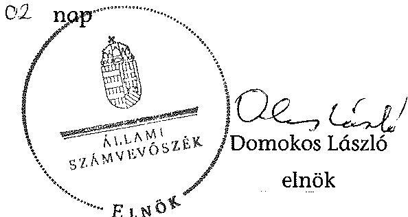
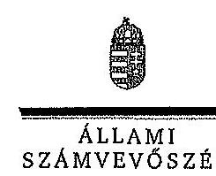
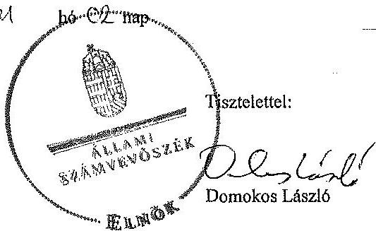
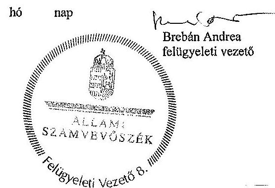

# ÁLLAMI   SZÁMVEVŐSZÉK 

## JELENTÉS

a Gyarapodó Magyarországért Alapítvány gazdálkodása A Gyarapodó Magyarországért Alapítvány 2011-2012. évi gazdálkodása törvényességének ellenőrzéséről

---

# Állami Számvevőszék 

Iktatószám: V-0349-053/2013.
Témaszám: 1383
Vizsgálat-azonosító szám: V0662

## Az ellenőrzést felügyelte:

## Brebán Andrea

felügyeleti vezető

## Az ellenőrzést vezette és az végrehajtásáért felelős:

## Solymár Ágnes

ellenőrzésvezető

## A számvevőszéki jelentés összeállításában közremúködtek:

## Kacsér Lajos

számvevő

## Kiss Rita Teréz

számvevő tanácsos

## Nagy Adrienn

számvevő

## Ritecz Tibor

számvevő tanácsos

## Az ellenőrzést végezték:

| Kacsér Lajos | Kiss Rita Teréz | Nagy Adrienn |
| :-- | :-- | :-- |
| számvevő | számvevő tanácsos | számvevő |

## Ritecz Tibor

számvevő tanácsos

---

# TARTALOMJEGYZÉK 

BEVEZETÉS ..... 5
I. ÖSSZEGZŐ MEGÁLLAPÍTÁSOK, KÖVETKEZTETÉSEK, JAVASLATOK ..... 7
II. RÉSZLETES MEGÁLLAPÍTÁSOK ..... 11

1. Az alapítvány gazdálkodásának törvényessége ..... 11
1.1. Az alapítvány alapítása ..... 11
1.2. A kuratórium működése ..... 11
1.3. Az alapítvány bevételei ..... 12
1.4. Az alapítvány ráfordításai ..... 13
2. Az éves beszámolók ..... 15
2.1. A számviteli beszámolók ..... 15
2.2. A mérleg ..... 16
2.3. Az eredménykimutatás ..... 18
3. A könyvvezetés szabályozottsága ..... 18
4. A könyvvezetés gyakorlata ..... 19
5. Az alapítvány ellenőrzési rendszere ..... 20
6. Az alapítvány által létrehozott szervezet ..... 21

## Mellékletek

1. számú Egyszerűsített éves beszámoló mérlege a kettős könyvvitelt vezető egyéb szervezetek részére - 2011. év
2. számú Egyszerűsített éves beszámoló mérlege a kettős könyvvitelt vezető egyéb szervezetek részére - 2012. év
3. számú A Gyarapodó Magyarországért Alapítvány kuratóriumi elnökének észrevételei a jelentéstervezethez
4. számú Az Állami Számvevőszék válaszlevele az észrevételekre

---

# **Title: The Impact of Climate Change on Global Ecosystems**

## **Introduction**

Climate change is one of the most pressing environmental issues of our time. It affects ecosystems worldwide, leading to significant changes in biodiversity, habitat loss, and species extinction. This report explores the impacts of climate change on global ecosystems, focusing on key areas such as **forests**, **oceans**, and **polar regions**.

## **1. Forest Ecosystems**

Forests play a crucial role in carbon sequestration and maintaining biodiversity. However, rising temperatures and changing precipitation patterns are altering forest ecosystems. Key impacts include:

- **Increased frequency of wildfires**: Rising temperatures and drought conditions have led to more frequent and severe wildfires, destroying vast areas of forests.
- **Changes in species distribution**: Shifts in temperature and precipitation patterns are altering species distribution, leading to species extinction.
- **Insect outbreaks**: Warmer temperatures have increased the survival rates of pests like bark beetles, which are causing widespread wildfires.

## **2. Ocean Ecosystems**

Oceans absorb a significant portion of the excess heat and carbon dioxide (CO₂) produced by human activities. The consequences include:

- **Increased frequency of wildfires**: Rising sea levels and drought conditions have led to more frequent and severe wildfires, threatening species like polar bears and seals.
- **Changes in ocean currents**: Altered ocean currents are causing widespread sea-level rise, threatening species like polar bears and seals.
- **Changes in ocean currents**: Shifts in ocean currents are altering ocean currents, threatening species like polar bears and seals.

## **3. Polar Ecosystems**

Polar regions are particularly vulnerable to climate change due to their sensitivity to temperature changes. Key impacts include:

- **Melting of sea ice**: The Arctic is warming at twice the rate of the global average, leading to sea ice loss.
- **Glacial retreat**: Melting glaciers and their presence in the Arctic are altering the ocean currents, threatening species like polar bears and seals.
- **Permafrost thawing**: Thawing permafrost releases stored carbon and methane, further accelerating global warming.

## **4. Polar Ecosystems**

Polar regions are particularly vulnerable to climate change due to their sensitivity to temperature changes. Key impacts include:

- **Melting of sea ice**: Melting glaciers and their presence in the Arctic are altering sea ice levels.
- **Glacial retreat**: Melting glaciers and their presence in the Arctic are altering sea ice levels, threatening species like polar bears and seals.
- **Changes in ocean currents**: Altered ocean currents are causing widespread sea-level rise, threatening species like polar bears and seals.

## **5. Polar Ecosystems**

Polar regions are particularly vulnerable to climate change due to their sensitivity to temperature changes. Key impacts include:

- **Melting of sea ice**: Melting glaciers and their presence in the Arctic are altering sea ice levels.
- **Glacial retreat**: Melting glaciers and their presence in the Arctic are altering sea ice levels, threatening species like polar bears and seals.
- **Changes in ocean currents**: Altered ocean currents are causing widespread sea-level rise, threatening species like polar bears and seals.

## **Conclusion**

Climate change poses a significant threat to global ecosystems, with far-reaching consequences for biodiversity and human societies. By understanding the impacts of climate change on global ecosystems, we can help you reduce and mitigate the impacts of climate change.

---

**References**

1. IPCC (Intergovernmental Panel on Climate Change). (2021). *Climate Change 2021: The Physical Science Basis*.
2. WWF (World Wildlife Fund). (2020). *Living Planet Report 2020*.
3. NASA Global Climate Change. (2022). *Vital Signs: Global Temperature*.

---

# RÖVIDÍTÉSEK JEGYZÉKE 

## Jogszabályok rövidítése:

350/2011. (XII.30.) Korm. rendelet
gazdálkodás rendjéről szóló kormányrendelet
gazdasági társaságokról szóló törvény
Kbt.
pártalapítványi törvény
párttörvény
Ptk.
számviteli rendelet
Számv. tv.

## Szórövidítések:

alapító
alapítvány
ÁSZ
FB
Jobbik
kuratórium
SZMSZ

A civil szervezetek gazdálkodása, az adománygyűjtés, és a közhasznúság egyes kérdéseiről szóló 350/2011. (XII.30.) Korm. rendelet (Hatálybalépés: 2012. január 1.)
Az alapítványok gazdálkodási rendjéről szóló 115/1992. (VII. 23.) Korm. rendelet (2012. január 1-jével hatályon kívül helyezte a 350/2011. (XII. 30.) Korm. rendelet)
Gazdasági társaságokról szóló 2006. évi IV. törvény
A közbeszerzésekről szóló 2011. évi CVIII. törvény
A pártok múködését segítő tudományos, ismeretterjesztő, kutatási, oktatási tevékenységet végző alapítványokról szóló 2003. évi XLVII. törvény

A pártok múködéséről és gazdálkodásáról szóló 1989. évi XXXIII. törvény

A Polgári Törvénykönyvről szóló 1959. évi IV. törvény az Szt. szerinti egyes egyéb szervezetek beszámolókészítési és könyvvezetési kötelezettségének sajátosságairól szóló 224/2000. (XII. 19.) Korm. rendelet
A számvitelről szóló 2000 . évi C. törvény
Jobbik Magyarországért Mozgalom
Gyarapodó Magyarországért Alapítvány
Állami Számvevőszék
Felügyelő Bizottság
Jobbik Magyarországért Mozgalom
Gyarapodó Magyarországért Alapítvány Kuratóriuma
Szervezeti és múködési szabályzat

---

# **Title: The Impact of Climate Change on Global Ecosystems**

## **Introduction**

Climate change is one of the most pressing environmental issues of our time. It affects ecosystems worldwide, leading to significant changes in biodiversity, habitat loss, and species extinction. This report explores the impacts of climate change on global ecosystems, focusing on key areas such as **forests**, **oceans**, and **polar regions**.

## **1. Forest Ecosystems**

Forests play a crucial role in carbon sequestration and maintaining biodiversity. However, rising temperatures and changing precipitation patterns are altering forest ecosystems. Key impacts include:

- **Increased frequency of wildfires**: Rising temperatures and drought conditions have led to more frequent and severe wildfires, destroying vast areas of forests.
- **Changes in species distribution**: Shifts in temperature and precipitation patterns are altering forest ecosystems, disrupting ecosystem balance.
- **Insect outbreaks**: Warmer temperatures have increased the survival rates of pests like bark beetles, which are causing widespread wildfires.

## **2. Ocean Ecosystems**

Oceans absorb a significant portion of the excess heat and carbon dioxide (CO₂) produced by human activities. The consequences include:

- **Increased frequency of wildfires**: Rising sea levels and drought conditions have led to more frequent and severe wildfires, disrupting ecosystem balance.
- **Changes in ocean currents**: Altered ocean currents are altering ocean currents, disrupting ecosystem balance, and species extinction.
- **Changes in ocean currents**: Altered ocean currents are altering ocean currents, disrupting ecosystem balance, and species extinction.

## **3. Ocean Ecosystems**

Oceans absorb a significant portion of the excess heat and carbon dioxide (CO₂) produced by human activities. The consequences include:

- **Increased frequency of wildfires**: Rising sea levels and drought conditions have led to more frequent and severe wildfires, disrupting ecosystem balance.
- **Changes in ocean currents**: Altered ocean currents are altering ocean currents, disrupting ecosystem balance, and species extinction.

## **4. Ocean Ecosystems**

Oceans absorb a significant portion of the excess heat and carbon dioxide (CO₂) produced by human activities. The consequences include:

- **Increased frequency of wildfires**: Rising sea levels and drought conditions have led to more frequent wildfires, disrupting ecosystem balance.
- **Changes in ocean currents**: Altered ocean currents are altering ocean currents, disrupting ecosystem balance, and species extinction.

## **5. Polar Ecosystems**

Polar regions are particularly vulnerable to climate change due to their sensitivity to temperature changes. Key impacts include:

- **Melting of sea ice**: The Arctic is warming at twice the rate of the global average, leading to sea ice loss.
- **Glacial retreat**: Melting glaciers and their presence in the Arctic are rising, impacting ocean currents, impacting species extinction.
- **Glacial retreat**: Melting glaciers and their presence in the Arctic are altering ocean currents, impacting sea ice, impacting species extinction.

## **Conclusion**

Climate change poses a significant threat to global ecosystems, with far-reaching consequences for biodiversity and human societies. By understanding the impacts of climate change on global ecosystems, we can help you reduce and mitigate the impacts of climate change.

## **References**

1. IPCC (Intergovernmental Panel on Climate Change). *Climate Change 2021: The Physical Science Basis*. Intergovernmental Panel on Climate Change.
2. WWF (World Wildlife Fund). *Living Planet Report 2020*. World Wildlife Fund.
3. NASA Global Climate Change. *Global Climate Change Vital Signs*. National Aeronautics and Space Administration.

---

# JELENTÉS 

## a Gyarapodó Magyarországért Alapítvány gazdálkodása A Gyarapodó Magyarországért Alapítvány 2011-2012. évi gazdálkodása törvényességének ellenőrzéséről

## BEVEZETÉS

A pártok működését segítő tudományos, ismeretterjesztő, kutatási, oktatási tevékenységet végző alapítványokról szóló 2003. évi XLVII. törvény (pártalapítványi törvény) alapján a pártok a politikai kultúra fejlesztése érdekében tudományos, ismeretterjesztő, kutatási és oktatási tevékenységük elősegítésére a pártok múködéséről és gazdálkodásáról szóló 1989. évi XXXIII. törvényben (párttörvény) meghatározott mértékű költségvetési támogatásra jogosult alapítványt hozhatnak létre.

A Jobbik Magyarországért Mozgalom a törvényi rendelkezéseknek megfelelően 2011-ben létrehozta a Gyarapodó Magyarországért Alapítványt (alapítvány). Az alapítvány alapító okirat szerinti célja a politikai kultúra fejlesztése a magyar nemzettudat, a nemzeti elkötelezettség és a keresztény identitás jegyében; a Jobbik Magyarországért Mozgalom által vállalt és képviselt értékekhez és politikai értékrendhez kapcsolódó tudományos, kutatási és oktatási tevékenység végzése; oktatások, előadások, konferenciák, rendezvények, alapítványi díjak és ösztöndíjak létrehozása és ezen ösztöndíjak odaítélése azon pályázóknak, akiket a felsorolt célok megvalósítására a kuratórium alkalmasnak talál.

Az alapítvány a törvényi előírásoknak megfelelően a 2011. és 2012. évben egyaránt 211300 ezer Ft költségvetési támogatásban részesült.

A pártalapítványi törvény 4. § (2) bekezdése alapján az alapítvány gazdálkodása törvényességének ellenőrzésére az Állami Számvevőszék (ÁSZ) jogosult. A 4. § (4) bekezdése alapján az ÁSZ kétévenként ellenőrzi azoknak az alapítványoknak a gazdálkodását, amelyek e törvény szerint költségvetési támogatásban részesültek. Az alapítvány ellenőrzésére első alkalommal került sor.

Az ellenőrzés célja volt az alapítvány 2011-2012. évi gazdálkodása törvényességének értékelése, amelynek keretében ellenőrizzük:

- az alapítvány gazdálkodásának és éves jelentéseinek törvényességét;
- az éves számviteli beszámolók jogszabályi előírásoknak való megfelelééét;

---

- az alapítvány könyvvezetésében a számvitelről szóló 2000. évi C. törvény, a pártalapítványok könyvvezetésére vonatkozó egyéb jogszabályi rendelkezések, valamint belső előírások betartását.

Az ellenőrzött időszak: 2011. január 1. - 2012. december 31.
Az ellenőrzés hasznosulása: az ellenőrzés a gazdálkodás szabályszerűségének bemutatásával hozzájárul ahhoz, hogy a társadalom objektív képet alkothasson a pártalapítványok múködéséről. Az ellenőrzés eredménye elősegítheti, hogy a törvényalkotók konkrét lépéseket tegyenek a pártalapítványok finanszírozására vonatkozó szabályozások megváltoztatása, átláthatóbbá, ellenőrizhetőbbé tétele irányába. Az ellenőrzött szervezetek szintjén a hiányosságok, szabálytalanságok feltárása, az ennek kapcsán megfogalmazott megállapítások elősegíthetik a pártalapítványok szabályszerű gazdálkodását. A gazdálkodás szabályszerűségének bemutatásával az ellenőrzés értékteremtő módon járul hozzá az ÁSZ stratégiai céljainak megvalósításához.

Az ellenőrzést a pénzügyi-szabályszerúségi ellenőrzés módszertani szabályai szerint végeztük. Az ellenőrzés szakmai módszertana az ÁSZ hivatalos honlapján (www.asz.hu) közzétett szakmai szabályokon alapul, amely a Legfőbb Ellenőrző Intézmények Nemzetközi Szervezete (INTOSAI) által kiadott nemzetközi standardok (ISSAI) figyelembevételével készült.

Az ÁSZ tv. 29. § (1) bekezdése szerint a jelentéstervezetet megküldtük észrevételezésre a kuratórium elnökének. A kuratórium elnöke az ÁSZ tv. 29. § (2) bekezdésében foglalt észrevételezési jogával élt. A kuratórium elnökének észrevételét, valamint az arra adott választ, ideértve az el nem fogadott észrevételek indokolását a jelentés 3. és 4. számú mellékletei tartalmazzák.

---

# I. ÖSSZEGZŐ MEGÁLLAPÍTÁSOK, KÖVETKEZTETÉSEK, JAVASLATOK 

Az alapító okirat tartalma és előírásai megfeleltek a Ptk., a párttörvény és a pártalapítványi törvény rendelkezéseinek. Az alapító okiratban nevesítették az alapítvány cél szerinti tevékenységeit, szabályozták a kuratórium feladat- és hatáskörét, a képviseleti jogok gyakorlásának módját. Az ellenőrzött időszakban az alapító okiratot két alkalommal módosították. Az alapító okirat a Ptk. rendelkezései szerint rendelkezett az alapítvány képviseletéről, az ellenőrzött időszakban a képviseleti jogot a kuratórium elnöke gyakorolhatta.

A kuratórium az ellenőrzött időszakban törvényesen működött, az alapítvány gazdálkodásával kapcsolatban az alapító okiratban előírtaknak megfelelően határozataival döntött. Az alapítvány SZMSZ-e az alapító okirattal összhangban tartalmazta a kuratórium elnökének feladat-, hatás és felelősségi köreit, az FB múködésére vonatkozó rendelkezéseket. A kuratórium feladataként az SZMSZ-ben előírták az éves költségvetés elkészítését, az alapító okiratban ez a feladat nem szerepelt. Az SZMSZ az alapítvány gazdálkodását, a vagyon felhasználási módját illetően a Ptk.-val és az alapító okirattal összhangban lévő rendelkezéseket tartalmazott. Az SZMSZ a képviseleti jog szabályozása, illetve a bankszámla feletti rendelkezés tekintetében összhangban volt az alapító okirattal. A kuratórium - az előírásoknak megfelelően - döntött az alapítvány költségvetéseinek, illetve éves beszámolóinak elfogadásáról.

Az alapítvány a párttörvényben foglaltak alapján jogosult volt költségvetési támogatásra. Az alapítvány az ellenőrzött időszak éves beszámolóiban összesen 435671 ezer Ft bevételt mutatott ki, melynek 97,0\%-a költségvetési támogatás volt. A Magyar Államkincstár által - a párttörvény 9/A. (2) bekezdésének megfelelően - kiutalt támogatás összege, a 2011-2012. években azonos nagyságú, évente 211300 ezer Ft volt. Az alapító okirat - a törvényi szabályozással összhangban - lehetővé tette az alapítvány számára csatlakozók által befizetett támogatások, adományok elfogadását a pártalapítványi törvény előírásai figyelembe vételével. Az alapítvány az ellenőrzött években magán- és jogi személyektől támogatásban nem részesült.

Az alapítvány az ellenőrzött időszak éves beszámolóiban összesen 168532 ezer Ft ráfordítást számolt el. A ráfordítások 86,9\%-a az alapítványi célok megvalósítása érdekében merült fel - közvetlen és közvetett célszerinti ráfordításként -, a működési kiadások 13,1\%-ot tettek ki. Az alapítványnak az ellenőrzött időszakban közbeszerzés lefolytatási kötelezettsége nem keletkezett.

Az alapítvány célszerinti feladatellátását egyedi támogatási kérelmekre, tevékenységével összhangban lévő támogatások nyújtásával, kutatásokkal, tanulmányok megrendelésével és egyéb tevékenységekkel végezte. Az alapítvány által nyújtott támogatások összege a célszerinti ráfordításainak $52,6 \%$-át tette ki.

---

Az ellenőrzött támogatások odaítéléséről a kuratórium az alapító okiratban előírtaknak megfelelően minden alkalommal határozattal döntött, azonban két esetben a döntését a szerződés megkötését követően hozta meg. A megkötött szerződések szabályosak voltak. Az elszámolásnál hét ellenőrzött támogatás esetében az elszámolás pontos időpontja nem volt megállapítható. A többi esetben a támogatottak betartották az elszámolásra vonatkozó beszámolókészítési, bizonylatolási előírásokat, a szerződésekben kikötött elszámolási határidőket. A kuratórium a támogatások elszámolásának elfogadásáról minden esetben szabályosan, határozatával döntött.

A kuratórium az éves költségvetésekben állapította meg a múködési és az alapítvány célszerinti tevékenységének feladataira fordítható összegeket. Az alapítvány a részére biztosított állami költségvetési támogatást a párttörvényben meghatározott célokra fordította.

Az alapítvány az egyszerúsített éves beszámolókat és a pártalapítványi törvény szerinti éves jelentéseket mindkét ellenőrzött évben a belső szabályzatban előírt formában elkészítette. A 2011. évi beszámolónál az elfogadás határideje, a 2012. évi beszámolónál az elkészített eredménykimutatás tagolása azonban nem felelt meg maradéktalanul a számviteli rendelet előírásainak. A 2011. évi beszámoló kuratóriumi elfogadása 27 nappal a határidőn túl történt. A 2012. évi beszámoló készítésénél az alapítvány nem vette figyelembe, hogy a számviteli rendelet 5. számú mellékletében az eredménykimutatás sorainak tagolása, számozása megváltozott. A beszámolókat a könyvvizsgáló hitelesítette, a kuratórium és az FB érvényes határozatokkal elfogadta. Az éves jelentések közzététele megtörtént. A 2012. évi jelentés Hivatalos Értesítőben történő közzétételének határideje öt nappal a pártalapítványi törvényben előírt határidőn túl történt.

Az éves beszámolók megbízható, valós adatokat tartalmaztak, azok elkészítésénél érvényesítették az Számv. tv-ben megfogalmazott alapelveket. A mérleg és eredménykimutatás sorok adatai megegyeztek a kapcsolódó analitikus és főkönyvi nyilvántartások adataival, az év végi főkönyvi kivonatokból levezethetőek voltak. A mérlegben kimutatott eszközök és források értékadatai leltárral alátámasztottak voltak. Az eredménykimutatásban kimutatott bevételeket és ráfordításokat az előírásoknak megfelelően elkülönítették, számviteli bizonylatokkal alátámasztották. A kötelezettségvállalás, utalványozás, teljesítésigazolás szabályait érvényesítették.

Az alapítvány rendelkezett a jogszabályokban előírt, a könyvvezetés és a beszámoló elkészítésének rendjét meghatározó számviteli politikával és az ahhoz kapcsolódó szabályzatokkal. Az alapítvány kuratóriuma a 2011. évi megalakulásakor jóváhagyott számviteli szabályzatokat az ellenőrzött időszakban nem módosította. Az ellenőrzés megállapította, hogy a számviteli politikában a beszámoló készítésének időpontjára vonatkozóan kettő eltérő határidő is szerepelt. A számviteli szabályzatok megfeleltek a jogszabályi előírásoknak.

A könyvvezetést a vonatkozó jogszabályok és belső előírások betartásával, a kettős könyvvitel rendszerében végezték. Az ellenőrzött bizonylatoknál a

---

könyvelés időpontjának rögzítését kivéve érvényesítették az Számv. tv. bizonylatokra vonatkozó alaki és tartalmi követelményeit. Az alapítvány házipénztárt az ellenőrzött időszakban nem múködtetett. A bankszámla feletti rendelkezési jog gyakorlása az ellenőrzött időszakban megfelelt az alapító okiratban és a pénzkezelési szabályzatban előírtaknak. Az alapítvány gazdálkodása a 2012. évben megfelelt a 350/2011. (XII.30.) Korm. rendelet előírásainak. A számviteli politikában meghatározott, a könyvviteli zárlattal kapcsolatos feladatokat az éves beszámoló elkészítését megelőzően a zárlati ütemterv előkészítésének kivételével - elvégezték, de a leltározás határidőn túl készült el.

Az alapítvány ellenőrzési rendszere hozzájárult a törvényes múködéshez és gazdálkodáshoz. Az FB az alapító okiratban és ügyrendjében előírt ellenőrzési tevékenységét ellátta, ellenőrizte és jóváhagyta az alapítvány költségvetéseit, éves beszámolóit és jelentéseit. Az alapítvány az éves beszámolók ellenőrzésével független könyvvizsgálókat bízott meg. A könyvvizsgálók az éves beszámolókat auditálták és hitelesítették. A vezetői ellenőrzést a kuratórium elnöke a munkáltatói jogkör gyakorlása, a képviseleti jog, a kötelezettségvállalás, az utalványozás és a bankszámla feletti rendelkezés során látta el. Az alapítvány kuratóriuma - a sajátosságokból adódó arányossági szempontokra figyelemmel - nem hozott létre saját független belső ellenőrzést.

Az alapítvány az ellenőrzött időszakban nem hozott létre a gazdasági társaságokról szóló törvény, illetve a Ptk. hatálya alá tartozó szervezetet.

Az ÁSZ tv. 33. § (1) bekezdésében foglaltak értelmében az ellenőrzött szervezet vezetője köteles a jelentésben foglalt megállapításokhoz kapcsolódó intézkedési tervet összeállítani, és azt a jelentés kézhezvételétől számított 30 napon belül az ÁSZ részére megküldeni. Amennyiben az intézkedési tervet határidőre nem küldi meg a szervezet, vagy az nem elfogadható, az ÁSZ elnöke az ÁSZ tv. 33. § (3) bekezdés a)-b) pontjaiban foglaltakat érvényesítheti.

A helyszíni ellenőrzés megállapításainak hasznosítása mellett javasoljuk:

# az alapítvány kuratóriumának 

1. A 2011. évi beszámolónál az elfogadás határideje, a 2012. évi beszámolónál az elkészített eredménykimutatás tagolása nem felelt meg maradéktalanul a számviteli rendelet előírásainak.

Javaslat:
Intézkedjen, hogy a számviteli rendelet 6. § előírásának megfelelő beszámolót állítsanak össze.

---

2. A könyvvezetésben a könyvelés időpontjának rögzítését a Számv. tv. 167. § (1) bekezdés i) pontjában foglaltak ellenére a bizonylatokon nem szerepeltették.

Javaslat:
Intézkedjen, hogy a bizonylatokon rögzítsék a Számv. tv. 167. § (1) bekezdésében előírt alaki és tartalmi elemeket.

---

# II. RÉSZLETES MEGÁLLAPÍTÁSOK 

## 1. Az alapíitvány gazdálkodásáNAK TÖRVÉNYESÉGE

### 1.1. Az alapítvány alapítása

Az alapító okiratot 2011. február 15-én írta alá az alapító. A Fővárosi Bíróság az alapítványt a 2011. március 29-én jogerőre emelkedett végzésével vette nyilvántartásba. Az ellenőrzött időszakban a Jobbik az alapító okiratot két alkalommal módosította. Az első módosításra az alapítvány székhelyének, céljainak, vagyonfelhasználásának változása miatt került sor. A második változás a kuratórium tagjait, illetve az FB tagjait és múködését érintette.

Az első módosítás változásainak átvezetését a Fővárosi Törvényszék 2012. február 7-én hozott végzésével rendelte el. Az alapító által 2012. november 28-án történt második módosítást a Fővárosi Törvényszék a helyszíni ellenőrzés időpontjáig még nem jegyezte be.

Az alapító okirat tartalma és előírásai megfeleltek a Ptk., a párttörvény és a pártalapítványi törvény rendelkezéseinek. Az alapító okiratban nevesítették az alapítvány cél szerinti tevékenységeit, szabályozták a kuratórium feladat- és hatáskörét, a képviseleti jogok gyakorlásának módját. Az alapítvány alapító okiratában foglalt célok és a cél érdekében meghatározott tevékenységek összhangban voltak a párttörvény 9/A. § (1) bekezdésében előírtakkal. Az alapító okirat a jogszabályi előírásokkal összhangban tartalmazta az alapítvány céljára rendelt vagyon kezelésére és felhasználására vonatkozó alapvető rendelkezéseket.

Az alapító okirat a Ptk. rendelkezései szerint rendelkezett az alapítvány képviseletéről, ez alapján az ellenőrzött időszakban a képviseleti jogot a kuratórium elnöke gyakorolhatta. Az alapító okirat alapján az alapítvány bankszámlái felett a kuratórium elnökének önálló rendelkezési joga, akadályoztatása estén az elnök írásbeli meghatalmazása alapján a kuratórium további két tagjának együttesen rendelkezési joga volt. A banki bejelentő karton az alapító okirattal összhangban tartalmazta az aláírásra jogosultakat.

### 1.2. A kuratórium múködése

Az alapítványnál a képviseleti jog gyakorlása a Ptk.-val, az alapító okirattal és az SZMSZ előírásaival összhangban történt. A kuratórium az alapítvány gazdálkodásával kapcsolatban az alapító okiratban előírtaknak megfelelően határozataival döntött.

Az alapítvány SZMSZ-ét a kuratórium 2011. április 1-jén fogadta el 2/2011. számú határozatával. Az SZMSZ az alapító okirattal összhangban tartalmazta a kuratórium elnökeinek feladat-, hatás és felelősségi köreit, a FB müködésére

---

vonatkozó rendelkezéseket. A kuratórium feladataként az SZMSZ-ben előírták az éves költségvetés elkészítését, az alapító okiratban ez a kuratórium feladataként nem szerepelt.

Az SZMSZ az alapítvány gazdálkodásával, vagyon felhasználási módját illetően a Ptk.-val és az alapító okirattal összhangban lévő rendelkezéseket tartalmazott. Az SZMSZ a képviseleti jog szabályozása, illetve a bankszámla feletti rendelkezés tekintetében összhangban volt az alapító okirattal. A banki aláírásra bejelentettek köre az alapító okirat és az SZMSZ előírásaival összhangban volt. Az SZMSZ-t indokolt esetben, egy alkalommal az alapító okirat változásával összhangban módosították.

Az alapító okirat 2012. november 28 -án történt alapító általi módosítása szerint a kuratórium tagjainak száma négy főre bővült, és a kuratórium ülése akkor határozatképes, ha legalább három tag jelen van. Ezzel összhangban került sor az SZMSZ 2012. december 17 -ei módosítására, mert eddig az időpontig a határozatképességet két fő kuratóriumi tag jelenlétéhez kötötték.

A kuratórium a 2011. évben kilenc, a 2012. évben 22 alkalommal ülésezett és összesen 140 érvényes határozatot hozott. A kuratórium működése megfelelt az alapító okirat és az SZMSZ előírásainak, mind az ülések gyakorisága, mind a döntéshozatal módja tekintetében. Az alapítvány szabályozása szerint vezette a kuratóriumi ülésekre vonatkozó nyilvántartásait (jegyzőkönyv, határozatok tára).

Az alapító okiratban és az SZMSZ-ben rögzítettek alapján a kuratóriumnak szükség szerinti gyakorisággal, de legalább negyedévente kell üléseznie.

A kuratórium - az SZMSZ előírásának megfelelően - döntött az alapítvány költségvetéseinek elfogadásáról. A költségvetések mindkét évben tartalmazták az alapítvány költségvetési forrásból származó és egyéb bevételeit, illetve a 2011. évben a cél szerinti tevékenységek közvetlen és közvetett ráfordításait, valamint a működtetéssel összefüggő költségeit. A 2012. évi költségvetés összevontan, személyi jellegű, egyéb, illetve pénzügyi műveletek ráfordításai sorokat tartalmazott. Év közben a költségvetés alakulását a kuratórium napirendi pont keretében nem tárgyalta, az éves költségvetések módosítására nem került sor. A kuratórium - az alapító okiratban, illetve az SZMSZ-ben előírtaknak megfelelően - mindkét évben határozattal döntött az alapítvány éves beszámolójának elfogadásáról.

# 1.3. Az alapítvány bevételei 

Az alapítvány a párttörvény 9/A. § (3) bekezdésében foglaltak alapján jogosult volt költségvetési támogatásra. Az alapítvány az ellenőrzött időszak éves beszámolóiban összesen 435671 ezer Ft bevételt mutatott ki, melynek 97,0\%-a költségvetési támogatás volt. A kiutalt támogatás összege és annak folyósítása megfelelt a párttörvény 9/A. § (2) és (5) - (6) bekezdéseiben foglalt rendelkezéseknek.

A Magyar Államkincstár által - a párttörvény 9/A. (2) bekezdésének megfelelően - kiutalt támogatás összege, a 2011-2012. években azonos

---

nagyságú, évente 211300 ezer Ft volt. A beszámolókban kimutatott összegek ezzel megegyeztek.

Az alapítvány 2011-2012. évi bevételeinek alakulását, összetételét az alábbi kimutatás tartalmazza, ezer Ft -ban:

| Megnevezés | 2011. | 2012. | Összesen |
| :-- | --: | --: | --: |
| Költségvetési támogatás | 211300 | 211300 | 422600 |
| Kapott kamatok (pénzeszköz-lekötés) | 4318 | 8750 | 13068 |
| Különféle egyéb bevételek (kerekítés) | 1 | 2 | 3 |
| Összes bevétel | $\mathbf{2 1 5 6 1 9}$ | $\mathbf{2 2 0 0 5 2}$ | $\mathbf{4 3 5 6 7 1}$ |

Az alapító okirat - a törvényi szabályozással összhangban - lehetővé tette az alapítvány számára csatlakozók által befizetett támogatások, adományok elfogadását a pártalapítványi törvény előírásai figyelembe vételével. Az alapítvány az ellenőrzött években magán- és jogi személyektől támogatást nem kapott, a fenti táblázatban szereplő jogcímeken kívül egyéb bevételben nem részesült.

# 1.4. Az alapítvány ráfordításai 

Az alapítvány az ellenőrzött időszak éves beszámolóiban összesen 168532 ezer Ft ráfordítást számolt el. A ráfordítások 86,9\%-a (146 393 ezer Ft) az alapítványi célok megvalósítása érdekében merült fel közvetlen és közvett célszerinti ráfordításként -, a múködési kiadások 13,1\%-ot (22 139 ezer Ft) tettek ki.

Az alapítvány 2011. és 2012. évi célszerinti közvetlen és közvetett ráfordításait a következő táblázat tartalmazza, ezer Ft-ban:

| Megnevezés | 2011. | 2012. | Összesen |
| :-- | --: | --: | --: |
| Nyújtott támogatások | 7900 | 69152 | 77052 |
| Ebből: |  |  |  |
| - szervezeteknek nyújtott támogatás | 7900 | 67872 | 75772 |
| - magánszemélyeknek nyújtott támogatás | - | 1280 | 1280 |
| Kutatás, tanulmányok | 960 | 43978 | 44938 |
| Rendezvények | - | 449 | 449 |
| Egyéb igénybe vett szolgáltatás | - | 5873 | 5873 |
| Egyéb (dijak, bérek, járulékok közvetett   célszerinti) | 260 | 17821 | 18081 |
| Összes célszerinti ráfordítás | $\mathbf{9 1 2 0}$ | $\mathbf{1 3 7 2 7 3}$ | $\mathbf{1 4 6 3 9 3}$ |

Az alapítvány célszerinti feladatellátását - egyedi támogatási kérelmekre történő - tevékenységével összhangban lévő támogatások nyújtásával,

---

kutatásokkal, tanulmányok megrendelésével és egyéb tevékenységekkel végezte.

Az alapítvány által nyújtott támogatások összege a célszerinti ráfordításainak $52,6 \%$-át tette ki. Az alapítvány az ellenőrzött időszakban támogatásainak $98,3 \%$-át szervezeteknek, $1,7 \%$-át magánszemélyeknek nyújtotta.

A támogatások ${ }^{1}$ odaítéléséről a kuratórium az alapító okiratban előírtaknak megfelelően minden alkalommal határozattal döntött, azonban két esetben a döntését a szerződés megkötését követően hozta meg. A kuratóriumi jegyzőkönyvekben rögzítették a támogatott nevét, a támogatás célját és összegét. A szerződések tartalmazták a támogatott nevét, a támogatás célját és összegét, folyósításának módját és határidejét, az elszámolás feltételeit, a visszafizetés követelményét.

A 2011. évben két támogatás esetében a támogatási szerződések megkötése néhány nappal megelőzte a kuratóriumi döntés időpontját. A 2011. július 25 -én megkötött 4000,0 ezer Ft-os támogatási szerződés esetében a kuratóriumi döntést 2011. augusztus 3 -án hozták meg, a 2011. szeptember 15-én megkötött 3800,0 ezer Ft-os támogatási szerződéssel kapcsolatban a kuratórium 2011. szeptember 20 -án döntött.

A támogatások folyósítása a szerződésekben foglaltak szerinti módon történt. A támogatottak betartották az elszámolásra vonatkozó beszámoló készítési, bizonylatolási előírásokat. A támogatottak szöveges beszámolók készítésével, illetve hitelesített számlamásolatok csatolásával tettek eleget elszámolási kötelezettségüknek. Amennyiben a támogatottak nem számoltak el a támogatás teljes összegével, az alapítvány a maradványösszegeket visszafizettette. A támogatottak betartották a szerződésekben kikötött elszámolási határidőket, hét eset kivételével. A hét ellenőrzött támogatás esetében a szöveges beszámolók dátumot nem tartalmaztak, így az elszámolás pontos időpontja nem volt megállapítható. Egy támogatott a teljes támogatási összeggel határidőig nem tudott elszámolni, halasztási kérelemmel élt, amelyet a kuratórium határozatával jóváhagyott. A kuratórium a támogatások elszámolásának elfogadásáról minden esetben szabályosan, határozatával döntött. ${ }^{2}$

Az Erdélyi Magyar Ifjak „itthon ma" nevú portál létrehozására a 2012. évben 3200,0 ezer Ft támogatásban részesült. A támogatásról elkészített dátum nélküli beszámolója alapján 2093,2 ezer Ft-ról tudott elszámolni, így kérték a támogatási szerződés meghosszabbítását. A kuratórium 157/2013. (11. 06.) számú határozatával az elszámolást részlegesen elfogadta. Feltételként kikötötték, hogy amennyiben a támogatott 30 napon belül nem tud elszámolni a támogatási összeg fennmaradó részével, akkor köteles a hiányzó, számlákkal alá nem támasztott támogatási összeget visszautalni.

[^0]
[^0]:    ${ }^{1}$ A támogatások ellenőrzése mintavétellel, három db 2011. évi, illetve 18 db 2012. évi támogatás áttekintésével történt meg.
    ${ }^{2}$ A 2012. évi támogatások elszámolásainak elfogadása jellemzően a 2013. évben, ebből három a helyszíni ellenőrzés idején történt.

---

Az alapítvány munkatársai a támogatásokkal kapcsolatban helyszíni ellenőrzést nem dokumentáltak, a célok megvalósulását az elszámolásra benyújtott dokumentumok áttekintésével, azok elfogadásával, bizonylati szinten ellenőrizték. A rendezvények, programok, illetve szoboravatás esetében az alapítvány munkatársai a helyszíni programokon részt vettek.

A kuratórium az éves költségvetésekben állapította meg a múködési és az alapítvány célszerinti tevékenységének feladataira fordítható összegeket. A költségvetés a 2011. évben tartalmazta a cél szerinti tevékenységek közvetlen és közvetett ráfordításait, valamint a múködtetéssel összefüggő költségeit. A 2012. évi költségvetés ettől eltérően, összevont személyi jellegű, egyéb, illetve pénzügyi műveletek ráfordításai sorokat tartalmazott. A kuratórium a tevékenységéhez kapcsolódó tanulmányok esetében a megrendelésekről folyamatosan döntött.

Az alapítványnak az ellenőrzött időszakban nem keletkezett közbeszerzés lefolytatási kötelezettsége.

A 2012. évben az alapítvány tevékenységéhez kapcsolódó tanulmányok esetében az éves költségvetési törvényben a szolgáltatás megrendelésére előírt 8,0 millió Ft nemzeti közbeszerzési értékhatárt meghaladták. Az alapítvány indokoltan, közbeszerzési eljárás lefolytatása nélkül kötött vállalkozói szerződéseket a politikai tanulmányok, elemzések készítésére. A politikai tanulmányok, elemzések tárgyában megvalósított beszerzések a Kbt. 9. § (5) bekezdés f) pontja értelmében mentesültek a közbeszerzési eljárási kötelezettség alól, mert a szerződések eredményét nem kizárólag az alapítvány hasznosította, hanem meghatározott körben szétosztották

Az alapítvány a párttörvény 9/A. § (1) bekezdésében meghatározott célokra fordította az állami költségvetési támogatást.

# 2. Az ÉVES BESZÁmolók 

### 2.1. A számviteli beszámolók

Az alapítvány beszámolási kötelezettségének mindkét évben - a számviteli rendelet 6. § (7) bekezdésével összhangban - egyszerúsített éves beszámoló formájában tett eleget. Az egyszerúsített éves beszámoló mindkét ellenőrzött évben mérlegből és eredménykimutatásból állt. Az alapítvány egyszerúsített éves beszámolóit a számviteli politikájában megjelölt formában, a számviteli rendelet 4. és 5. számú melléklete alapján készítette el. A számviteli rendelet 5. számú melléklete 2012. január 1-jétől megváltozott. A 2012. évi beszámoló készítésénél azonban ezt nem vette figyelembe és az eredménykimutatást az előző évi formátumban készítette el.

Az eredménykimutatásban szerepeltetett adattartalom tartalmazta a módosított számviteli rendelet mellékletében előírt adatokat, azonban nem a megváltozott melléklet szerinti tagolással és sorszámozással.

Az egyszerűsített éves beszámolókat - a Számv. tv. 20. § (6) bekezdésében előírtaknak megfelelően - a képviseletre jogosult kuratóriumi elnök írta alá. Az

---

SZMSZ-ben előírtaknak megfelelően a beszámolókat a kuratórium és az FB határozattal elfogadta.

A kuratórium azonban a 2011. évi beszámolót - a számviteli rendelet 20. § (5) pontja ellenére - 27 nappal a határidőn túl fogadta el. ${ }^{3}$ A 2012. évi beszámoló elfogadása határidőben megtörtént.

Az alapítvány az egyszerűsített éves beszámoló összeállítása során érvényesítette a Számv. tv. 15-16. §-aiban foglalt számviteli alapelveket. Az éves beszámolók adatai az év végi főkönyvi kivonatok, illetve a kapcsolódó analitikák adataiból levezethetőek voltak. A szabályzatokban ${ }^{4}$ megjelölt egyeztetések bizonyíthatóan megtörténtek. A mérleg és az eredménykimutatás soraihoz kapcsolódó főkönyvi számlák, az analitikus nyilvántartások adataival megegyeztek. A beszámolók megbízható, valós képet nyújtottak az alapítvány gazdálkodásáról. A beszámolók nem tartalmaztak lényegességi szintű, illetve az alapítvány szabályzatában megjelölt jelentős összegű hibát. Az alapítvány egyszerűsített éves beszámolóit könyvvizsgáló felülvizsgálta, azokat hitelesítő záradékkal látta el.

Az alapítvány a 2011. és 2012. évi gazdálkodásával kapcsolatban elkészítette a pártalapítványi törvény 3/A. § (1)-(3) bekezdése szerinti jelentéseit. Az SZMSZben előírtaknak megfelelően az éves jelentéseket a kuratórium és az FB határozattal elfogadta.

A jelentések közzétételi kötelezettségének az alapítvány a pártalapítványi törvény 3/A. § (5) bekezdésében előírtak alapján a Magyar Közlöny Hivatalos Értesítőjében és a saját honlapján is eleget tett. E törvény 3/A. § (5) bekezdésének előírása ellenére, a 2012. évi jelentés öt nappal a törvényi határidőn túl jelent meg a Hivatalos Értesítőben ${ }^{5}$. A többi esetben a határidőt betartották.

Az alapítvány 2013.november 14-i nyilatkozata szerint az alapítvány a jogszabályban foglalt határidő előtt több nappal intézkedést tett a megjelentetés érdekében.

Az alapítvány a törvényi előírásnak ${ }^{6}$ eleget téve, mindkét évi ellenőrzött egyszerúsített éves beszámolóját az Országos Bírósági -Hivatal részére határidőben megküldte.

# 2.2. A mérleg 

Az ellenőrzött években a mérlegsorok adatai megegyeztek a kapcsolódó analitikus és főkönyvi nyilvántartások összesített adataival. Az éves mérlegekben kimutatott eszközök és források értékadatait a Számv. tv. 69. § (1)

[^0]
[^0]:    ${ }^{3}$ 49/2012.(06.27.) kuratóriumi határozat
    ${ }^{4}$ számviteli politika H. pontja, számlarend
    ${ }^{5}$ Hivatalos Értesítő 33. száma, 2013.július 5.
    ${ }^{6} \mathrm{~A}$ civil szervezetek bírósági nyilvántartásáról és az ezzel összefüggő eljárási szabályokról szóló 2011. évi CLXXXI. törvény 105. § (1) bekezdés

---

bekezdés előírásának megfelelően, a leltározási szabályzat szerinti leltárakkal alátámasztották. A leltározás elvégzését tételes leltárral, leltárösszesítővel, leltárjegyzőkönyvvel dokumentálták.

A leltározás elvégzése azonban mindkét ellenőrzött évben - a számviteli politikában előírt - beszámoló készítési határidőn túl történt. ${ }^{7}$

Az alapítvány az ellenőrzött időszakban immateriális javakkal és befektetett pénzügyi eszközökkel nem rendelkezett. A tárgyi eszközök mérleg szerinti nettó értéke mindkét évben 0 Ft volt. A 2011. évben tárgyi eszköz beszerzés nem történt. A 2012. évben a tárgyi eszközökön belül kisértékű tárgyi eszköz beszerzésére került sor. A szabályozásnak megfelelően egy összegben megtörtént a terv szerinti értékcsökkenés elszámolása, így a nettó érték 0 Ft volt. Terven felüli értékcsökkenést nem számoltak el. Az alapítvány a tárgyi eszközök értékét az egyedi nyilvántartás adataiból készített leltározási listával támasztotta alá. A pénzeszközök értékét bankszámláknál év végi bankkivonatok, a követelések és kötelezettségek, az aktív és passzív idóbeli elhatárolások értékét év végi tételes kimutatások támasztották alá.

Az ellenőrzött időszakban a befektetett eszközöknél az egyedi nyilvántartás, az aktiválás, az értékelés, a terv szerinti értékcsökkenés elszámolása összhangban volt a belső szabályzatok ${ }^{8}$ előírásaival. A főkönyvi kimutatásban, illetve az egyedi nyilvántartásban szereplő eszközök értéke megegyezett a mérlegben kimutatott tárgyi eszköz értékével.

A kisértékú tárgyi eszközök beszerzése során a kötelezettségvállalás szabályait betartották. Értékesítés és selejtezés az alapítvány nyilatkozata szerint nem történt.

Az egyszerűsített éves beszámolóban a forgóeszközökön belül a rövid lejáratú követelések között mindkét évben elismert követeléseket szerepeltettek.

Elszámolásra adott előleg határidőben való elszámolása megtörtént. Munkavállalóval szembeni követelés határidőre történő elszámolása egy esetben nem történt meg. Ezt elismert követelésként szerepeltették.

A pénzeszközök között a bankszámlákon rendelkezésre álló pénzeszközöket az év végi bankkivonatok egyenlegeivel megegyezően mutatták ki.

A mérlegben az induló tőkét az alapító okirat által meghatározott induló vagyon értékének megfelelően mutatták ki.

Az aktív és passzív időbeli elhatárolások elszámolása szabályos volt, az elszámolást számlák és analitikus nyilvántartások dokumentálták.

[^0]
[^0]:    ${ }^{7}$ Számviteli politika szerint a zárlati időpont április 30., a leltározási jegyzőkönyv dátuma 2012. május 14 és 2013. május 22.
    ${ }^{8}$ a számviteli politika, az eszközök és források értékelésének szabályzata, a számlarend és a leltározási szabályzat

---

Aktív időbeli elhatárolások között a következő évben esedékes, de a tárgyévre vonatkozó bevételeket (kamatbevétel), passzív időbeli elhatárolások között a következő évben esedékes, tárgyévre vonatkozó kötelezettségeket mutatták ki.

A 2012. évi mérlegben a várható kötelezettségekre képzett céltartalékot leltárral és analitikus nyilvántartással alátámasztva mutatták ki.

A rövid lejáratú kötelezettség állománya mindkét évben december hónapra számfejtett munkabérhez kapcsolódó adó és járulék kötelezettséget tartalmazott, a 2011. évben ezen túl szállítói állománnyal is rendelkeztek. A mérlegsort szállítói számlákkal és analitikus kimutatással alátámasztották.

# 2.3. Az eredménykimutatás 

Az ellenőrzött időszakban az eredménykimutatás sorok adatai az év végi főkönyvi kivonatok, illetve a vonatkozó főkönyvi és részletező számlák összesített adataival megegyeztek.

Az eredménykimutatásban szereplő bevételeket és ráfordításokat könyvelési alapbizonylatokkal (szerződések, szállítói számlák, bér, feladások, bankbizonylatok) támasztották alá. Az adott sorokon a kimutatott bevétel és ráfordítás fogalomkörébe tartozó tételek szerepeltek.

Az alapítványnak mindkét évben bevétele meghatározóan az állami támogatás volt. Egyéb bevételként kamatbevételt és kerekítésből adódó különféle egyéb bevételt számolt el.

A ráfordítások elszámolásánál érvényesítették a kötelezettségvállalás, a teljesítésigazolás és a banki aláírás szabályait. A szerződéseket - a belső szabályozással ${ }^{9}$ összhangban - minden esetben a kuratórium elnöke kötötte meg. Az utalványozást a belső szabályozásban ${ }^{10}$ előírtak szerint végezték. A kifizetéseket az utalványozásra jogosult személyek minden esetben engedélyezték. A számviteli politikában a számviteli bizonylatok alaki és tartalmi kellékei között az utalványozó és a rendelkezés végrehajtását igazoló személy aláírását írták elő. A gyakorlatban a kifizetett számláknál ennek megfelelően jártak el. A banki utalásokat megelőzően a rendelkezési joggal felruházottak a tételek kifizethetőségét aláírásukkal igazolták.

## 3. A KÖNYVVEZETÉS SZABÁLYOZOTTSÁGA

Az alapítvány gazdálkodásának, könyvvezetésének belső szabályozási rendszere a Számv. tv. által kötelezően előírt szabályozáson alapult. Az alapítvány a Számv. tv. 14. § (3)-(5) bekezdéseinek és az alapítványi sajátosságoknak megfelelő számviteli politikával, eszközök és a források értékelési, valamint leltárkészítési és leltározási szabályzatával, pénzkezelési szabályzattal, továbbá a Számv. tv. 161. § (1)-(2) bekezdéseiben előírt számlarenddel rendelkezett, melyeket a kuratórium fogadott el. Az alapítvány

[^0]
[^0]:    ${ }^{9}$ SZMSZ előírásával
    ${ }^{10}$ SZMSZ-ben és a számviteli politikában

---

házipénztár kezelési szabályzatot is alkotott, de házipénztárt az ellenőrzött időszakban nem múködtetett, mely megfelel̇t a pénzkezelési szabályzatban rögzítetteknek.

Az alapítvány kuratóriuma a megalakuláskor ${ }^{11}$ jóváhagyott számviteli szabályzatokat az ellenőrzött időszakban nem módosította. Az alapítvány szabályzatainak módosítását sem jogszabályi, sem gazdálkodási változás nem indokolta. Az ellenőrzés a számviteli politikában hibát talált, mivel a szabályzat kettő dátumot - a tárgyévet követő március 31-ét és április 30-át - is meghatározott az éves beszámoló elkészítésének időpontjára. A számviteli szabályzatok megfeleltek a jogszabályi előírásoknak.

# 4. A KÖNYVVEZETÉS GYAKORLATA 

A könyvvezetést a vonatkozó jogszabályok és belső előírások betartásával a kettős könyvvitel rendszerében, a számviteli bizonylatok számítógépes feldolgozásával végezték. A könyvvezetést külső könyvelő cég végezte. A feladatokat ellátó személy rendelkezett a Számv. tv. 151. § (1) bekezdésben előírt képesítéssel, a könyvviteli szolgáltatást végzők nyilvántartásában szerepelt.

A könyvelési rendszerből az ellenőrzéshez szükséges adatok lekérdezhetők voltak, az alkalmazott számítógépes könyvelő program az ellenőrzött időszakban nem változott. A számlakijelölés gyakorlata a jogszabályokkal és a belső előírásokkal összhangban volt. A gazdasági eseményeket idősorrendben rögzítették, a könyvelt tételek alapbizonylatai megtalálhatóak voltak, de a könyvviteli nyilvántartásokban történt rögzítés időpontja a Számv. tv. 167 § (1) bekezdés i) pontja ellenére nem került rögzítésre. A főkönyvi és analitikus nyilvántartások kapcsolata megfelelő volt. A könyvviteli elszámolást alátámasztó bizonylatok Számv. tv. 167. § (1) bekezdésében előírt alaki és tartalmi követelményei - a könyvelés időpontjának rögzítését kivéve érvényesültek.

Az alapítvány házipénztárt az ellenőrzött időszakban nem múködtetett. Készpénzforgalom hiányában szigorú számadású nyomtatványokat sem használtak, azokról nyilvántartást nem vezettek.

A bankszámla feletti rendelkezési jog gyakorlása az ellenőrzött időszakban megfelelit az alapító okiratban és a pénzkezelési szabályzatban előírtaknak, mely szerint a bankszámla felett a kuratóriumi elnök, illetve akadályoztatása esetén két kuratóriumi tag együttesen rendelkezett. A banki átutalásokat elektronikus úton az alapítvány elnöke teljesítette.

A könyvvezetésben a 2011. évben a gazdálkodás rendjéről szóló kormányrendelet 3. § (2) bekezdésében és az 5. §-ában előírtaknak megfelelően az alapítványi célú tevékenység közvetlen és közvetett (működési jellegű) költségeit az analitikus és főkönyvi könyvelés keretében elkülönítették. A

[^0]
[^0]:    ${ }^{11}$ A kuratórium a 3/2011. számú határozatával 2011. április 1-jén jóváhagyta a számviteli szabályzatokat.

---

költségek elkülönítése a 2012. évben megfelelt a számviteli rendelet 6. és 8. § előírásainak. A költségek típusát a könyvelési alapbizonylatokon feltüntették.

Az alapítvány az ellenőrzött időszakban adományt nem gyújtött, gazdálkodása a 2012. évben megfelelt a 350/2011. (XII.30.) Korm. rendelet 2-4. § előírásainak.

Az alapítvány működéséről honlapján ${ }^{12}$ keresztül tájékoztatta a lakosságot, éves költségvetését úgy tervezte meg, hogy kiadásai és bevételei - az előző évi pénzmaradványt is figyelembe véve - egyensúlyban legyenek.

A számviteli politikában meghatározott, a könyvviteli zárlattal kapcsolatos feladatokat az éves beszámoló elkészítését megelőzően - a zárlati ütemterv előkészítésének kivételével - elvégezték, de a leltározás határidőn túl készült el.

A számviteli politikában az éves zárlati teendők között írták elő tárgyév november 30-ig zárlati ütemterv készítését, melyben az éves zárlati teendőket, valamint azok elvégzésének időpontját szükséges rögzíteni. Az ellenőrzött időszakban zárlati ütemterv dokumentáltan nem készült.

A könyvviteli számlákból főkönyvi kivonatot készítettek, és elvégezték az eszköz-, forrás- és eredmény-számlák technikai zárását. Az ellenőrzött időszakban a leltározási szabályzat előírásainak megfelelően, a tárgyi eszközök leltár felvételi íveit az analitikus nyilvántartásokkal egyeztették és dokumentáltan kiértékelték. Az egyéb eszköz és a forrás tételeket a főkönyvi számláknak az analitikus nyilvántartásokkal, és a könyvelés helyességét igazoló egyéb okmányokkal (bankkivonatok, szerződések) történt egyeztetése útján leltározták, a belső szabályzatnak megfelelően dokumentálták.

# 5. Az alapíivány ElLENŐrZÉsi RENDSZERE 

Az alapítvány belső ellenőrzési szabályzatot és belső ellenőrzési munkatervet nem készített. Független belső ellenőrt az alapítvány nem alkalmazott, tekintettel az alapítvány sajátosságaira, más alkalmazott ellenőrzési megoldásokra, az ügyek és bizonylatok kis számára.

A vezetői és a folyamatba épített ellenőrzés szabályait a számviteli politikában rögzítették. Önálló munkaköri leírások nem készültek, mert a munkaszerződésekben határozták meg a munkakör tartalmát. A munkaszerződések nem tartalmazták a munkakörökhöz tartozó munkafolyamatba épített ellenőrzési feladatokat. Ez nem jelentett kockázatot, mert a feladatokat a szabályzatokban tételesen meghatározták. A vezetői ellenőrzést a kuratórium elnöke a munkáltatói jogkör gyakorlása, a képviseleti jog, a kötelezettségvállalás, az utalványozás és a bankszámla feletti rendelkezés során megfelelően ellátta. A kuratórium számonkérési és beszámoltatási jogát az üléseken gyakorolta.

[^0]
[^0]:    ${ }^{12}$ www.gyarapodomagyarorszagert.hu

---

Az alapító az alapító okiratban háromtagú $\mathbf{F B}$-t jelölt ki, szabályozta feladat-, jog- és hatáskörét, megnevezte elnökét. Az alapítvány az FB múködésének szabályait ügyrendben határozta meg. Az FB ügyrendje szerint legalább évente kétszer ülésezik, az ülésekről jegyzökönyvek készültek. Az FB az alapítvány költségvetését, beszámolóját és jelentését mindkét évben ellenőrizte, és módosító javaslat nélkül jóváhagyta.

Az éves költségvetések, az éves beszámolók és jelentések ellenőrzésén kívül az FB más dokumentált ellenőrzési tevékenységet nem folytatott.

Az alapítvány az éves számviteli beszámolók ellenőrzésével független könyvvizsgálót bízott meg. A könyvvizsgáló az éves beszámolókat auditálta és hitelesítette. A megbízási szerződések alapján összeférhetetlenség nem volt megállapítható.

A könyvelő céggel kötött szerződés nem írt elő az alapítvány részére végzendő ellenőrzési feladatokat, rögzítette az alapítvány ellenőrzési jogát, a hibák javításához kapcsolódó szavatossági kötelezettséget, valamint a Ptk. szerinti kárfelelősséget. Más szerződést az alapítvány a könyvelő céggel nem kötött.

Az alapítvány az ellenőrzött években nem múködtetett házipénztárt, így a házipénztár kezelési szabályzat 3.9, 3.10, 3.12 pontjaiban jelzett pénztárellenőrt a kuratórium nem jelölte ki, és ellenőrzésre sem volt szükség.

# 6. AZ ALAPÍTVÁNY ÁLTAL LÉTREHOZOTT SZERVEZET 

Az alapítvány - az ellenőrzött időszakban történt megalakulása óta - a gazdasági társaságokról szóló törvény, illetve a Ptk. hatálya alá tartozó szervezetet nem hozott létre.

Budapest, 2014 év 01 hónap

Melléklet: $\quad 4 \mathrm{db}$

---

.

---

Adószám: 18208423-1-43
Béjegyzö szerv: Fövárosi Bíróság
Ragisztrációs szám: 11.333

Gyarapodó Magyarországért Alapítvány
1113 Budapest, Villányi út 20/B fart. 35.

Egyszerűsített éves beszámoló mérlege
a kettős könyvvitelt vezető egyéb szervezetek részére

A mérleg fordulósapja: 2011. december 31.

Budapest, 2012. június 27.

A gazdálkodó
képvizetője

P.h.

---

# 1. SZÁMÚ MELLÉKLET

A V-0349-053/2013. SZÁMÚ JELENTÉSHEZ

Gyarapodó Magyarországért Alapítvány

Oldal: 1

Adószám: 18208423-1-43

Regisztrációs szám: 11.333

Egyszerűsített éves beszámoló mérlege a kettős könyvviteli vezető egyéb szervezetele részére

A módog fordulőmegye: 2011. december 31.

|  |   |   |   |
| --- | --- | --- | --- |
|  01. |  |  |   |
|  02. | I. Immateriális javak | 0 | 0  |
|  03. | II. Tárgyi eszközök | 0 | 0  |
|  04. | III. Balakintett adományi eszközök | 0 | 0  |
|  05. | IV. Tárgyi eszközök | 0 | 0  |
|  06. | I. Készletök | 0 | 0  |
|  07. | II. Követelítők | 0 | 6  |
|  08. | III. Értékpapírok | 0 | 0  |
|  09. | IV. Pénészzközök | 0 | 205 851  |
|  10. | V. Pénészzközök | 0 | 0  |
|  11. | VI. Pénészzközök | 0 | 0  |
|  12. | VII. Pénészzközök | 0 | 0  |
|  13. | I. Induló tőke / regyzeti tőke | 0 | 2 200  |
|  14. | II. Tőkeváltozás / Érszámény | 0 | 0  |
|  15. | III. Lakottó tartalék | 0 | 0  |
|  16. | IV. Értékelési tartalék | 0 | 0  |
|  17. | V. Tárgyővi úrsámény alapterékanyelgből (különszerű tevékenységből) | 0 | 202 684  |
|  18. | VI. Tárgyővi úrsámény vállalkozási tevékenységből | 0 | 0  |
|  19. | VII. Tárgyővi úrsámény vállalkozási tevékenységből | 0 | 0  |
|  20. | VIII. Tárgyővi úrsámény vállalkozási tevékenységből | 0 | 0  |
|  21. | I. Hátraizvuk közrésztrények | 0 | 0  |
|  22. | II. Hosszú lejáratú kötelezettségek | 0 | 0  |
|  23. | III. Rövid lejáratú kötelezettségek | 0 | 659  |
|  24. | IV. Tárgyővi kötelezettségek | 0 | 0  |
|  25. | V. HABRÁSOK ÉSZKÖRÖK | 0 | 205 843  |

---

Adószám: 18208423-1-43
Bejegyzö szerv: Pővárosi Bíróság
Registerézés szám: 11.333

Gyarapodó Magyarországért Alapítvány
1113 Budapest, Villányl út 20/B fart. 35.

Eredménykimutatás - Alaptevékenység
a kettős könyvvitelt vezető egyéb szervezetek részére

Beszámolási időszak: 2011. március 29. - 2011. december 31.

Budapest, 2012. június 27.

A gazdálkodó
képviselője

P.h.

---

# 1. SZÁMÚ MELLÉKLET

A V-0349-053/2013. SZÁMÚ JELENTÉSHEZ

Gyarapodó Magyarországért Alapítvány

Oldal: 1

Adószám: 18308433-1-43 Regisztrációs szám: 11.335 Erodmányhintutatás - Alaptováhunység a kettős könyvviteli vezető egyéb szervezetele részére Beszámolási időszak: 2011. március 29. - 2011. december 31.

|  SZÁMÚ |  |  |   |
| --- | --- | --- | --- |
|  1. | Értékelátás nettó áthavétele | 0 | 0  |
|  2. | Aküvelő saját teljesítmények értéke | 0 | 0  |
|  3. | Egyéb bevétatek | 0 | 211 301  |
|  3.A. | Előből támogatások | 0 | 211 301  |
|  3.A.A. | - alapítói | 0 | 0  |
|  3.A.B. | - központi költségvetési | 0 | 211 300  |
|  3.A.C. | - helyi önkormányzati | 0 | 0  |
|  3.A.D. | - egyéb | 0 | 1  |
|  3.A.D.1. | - jogi személyleltől | 0 | 0  |
|   | =500 E Ft felatti hozzájárulás különböző | 0 | 0  |
|   | =100 E Ft felatti hozzájárulás különböző | 0 | 0  |
|  3.A.D.2. | - jogi személynek nem minősülő GT | 0 | 0  |
|   | =500 E Ft felatti hozzájárulás különböző | 0 | 0  |
|   | =100 E Ft felatti hozzájárulás különböző | 0 | 0  |
|  3.A.D.3. | - magáncsomélytől | 0 | 0  |
|   | =500 E Ft felatti hozzájárulás különböző | 0 | 0  |
|   | =100 E Ft felatti hozzájárulás különböző | 0 | 0  |
|  3.A.D.4. | - egyéb bevételt növelő tételek | 0 | 1  |
|  4. | Pénzügyi műveletek bevételai | 0 | 4 318  |
|  5. | Bendelvidi bevétatek | 0 | 0  |
|  5.A. | Előből támogatások | 0 | 0  |
|  5.A.A. | - alapítói | 0 | 0  |
|  5.A.B. | - központi költségvetési | 0 | 0  |
|  5.A.C. | - helyi önkormányzati | 0 | 0  |
|  5.A.D. | - egyéb | 0 | 0  |
|  6. | Togdíjok | 0 | 0  |
|  7. | Egyéb bevétele | 0 | 211 301  |
|  8. | Anybájtellogó ráfordítások | 0 | 1 831  |
|  9. | Személyi jellegű ráfordítások | 0 | 3 203  |
|  10. | Értékcsekkénési leírás | 0 | 0  |
|  11. | Egyéb ráfordítások | 0 | 7 901  |
|  12.A. | Előből - nyújtott támogatások | 0 | 7 900  |
|  13. | Pénzügyi műveletek ráfordításai | 0 | 0  |
|  14. | Rendelvidi ráfordítások | 0 | 0  |
|  15. | Egyéb bevétele | 0 | 12 915  |
|  16. | Átlagzáró felépítésre felhívjuk | 0 | 12 915  |
|  17. | Adatlenzési késviszentség | 0 | 0  |

---

# Gyarapodó Magyarországóri Alapítvány 

Adószámi
$18238433-1-43$
Kegtartóckó szám: 11:333
Hozdan lényi kamatátáa - Alapítvólanyyóg a. hetiôo lólnyvvittolt vezetö egyéb szervszatáti vórokra
Bezzároolód időszak: 2011. évúciós 29. - 2011. éjszámbar 31.

---

# **Title: The Impact of Climate Change on Global Ecosystems**

## **Introduction**

Climate change is one of the most pressing environmental issues of our time. It affects ecosystems worldwide, leading to significant changes in biodiversity, habitat loss, and species extinction. This report explores the impacts of climate change on global ecosystems, focusing on key areas such as **forests**, **oceans**, and **polar regions**.

## **1. Forest Ecosystems**

Forests play a crucial role in carbon sequestration and maintaining biodiversity. However, rising temperatures and changing precipitation patterns are altering forest ecosystems. Key impacts include:

- **Increased frequency of wildfires**: Rising temperatures and drought conditions have led to more frequent and severe wildfires, destroying vast areas of forests.
- **Changes in species distribution**: Shifts in temperature and precipitation patterns are altering species distribution, leading to species extinction.
- **Insect outbreaks**: Warmer temperatures have increased the survival rates of pests like bark beetles, which are more likely to cause pests like bark beetles.

## **2. Ocean Ecosystems**

Oceans absorb a significant portion of the excess heat and carbon dioxide (CO₂) produced by human activities. The consequences include:

- **Increased frequency of wildfires**: Owing to the increase in CO₂ levels, the consequences for marine life are more frequent and severe.
- **Changes in ocean currents**: Altered ocean currents affect nutrient distribution, leading to sea-level rise and loss of marine food.
- **Insect outbreaks**: Warmer temperatures have increased the survival rates of pests like bark beetles, which are more likely to cause pests like bark beetles.

## **3. Ocean Ecosystems**

Oceans absorb a significant portion of the excess heat and carbon dioxide (CO₂) produced by human activities. The consequences include:

- **Increased frequency of wildfires**: Rising temperatures and reduced CO₂ levels are altering the marine life of the ocean, leading to sea-level rise and loss of marine food.
- **Changes in ocean currents**: Altered ocean currents are altering the marine life of the ocean, leading to sea-level rise and loss of marine food.
- **Insect outbreaks**: Warmer temperatures have increased the survival rates of pests like bark beetles, which are more likely to cause pests like bark beetles.

## **4. Polar Ecosystems**

Polar regions are particularly vulnerable to climate change due to their sensitivity to temperature changes. Key impacts include:

- **Melting of sea ice**: The Arctic is warming at twice the rate of the global average, leading to sea-level rise and loss of marine food.
- **Glacial retreat**: Melting glaciers and their presence in the Arctic are altering the ocean's ocean currents, leading to sea-level rise and loss of marine food.
- **Permafrost thawing**: Thawing permafrost releases stored carbon and methane, further accelerating global warming.

## **5. Global Ecosystems**

Global Ecosystems are particularly vulnerable to climate change due to their sensitivity to temperature changes. Key impacts include:

- **Melting of sea ice**: The Arctic is warming at twice the rate of the global average, leading to sea-level rise and loss of marine food.
- **Glacial retreat**: Melting glaciers and their presence in the Arctic are altering the ocean's ocean currents, leading to sea-level rise and loss of marine food.
- **Permafrost thawing**: Thawing permafrost releases stored carbon and methane, further accelerating global warming.

## **Conclusion**

Climate change poses a significant threat to global ecosystems, with far-reaching consequences for biodiversity and human societies. By reducing greenhouse gas emissions, reducing greenhouse gas emissions, and implementing sustainable practices, we can protect our planet for future generations.

## **References**

1. IPCC (Intergovernmental Panel on Climate Change). *Climate Change 2021: The Physical Science Basis*. Intergovernmental Panel on Climate Change.
2. WWF (World Wildlife Fund). *Living Planet Report 2020*. World Wildlife Fund.
3. NASA Global Climate Change. *Vital Signs*. National Aeronautics and Space Administration.

---

Adószám: 18208423-1-43
Bejegyzö szerv: Fövánesi Bíróság
Nyilvántartást szám: 11.333

# Gyarapodó Magyarországért Alapítvány

1113 Budapest, Villányi út 20/B fest. 35.

## Egyszerűsített éves beszámoló mérlege a kettős könyvvitelt vezető egyéb szervezetek részére (4. melléklet)

A mérleg fordulónapja: 2012. december 31.

Budapest, 2013. május 22.

P.h.

[BüBo program]

---

# 2. SZÁMÚ MELLÉKLET A V-0349-053/2013. SZÁMÚ JELENTÉSHEZ

## Gyarapodó Mégyarországhát Alapítvány

### 1

|  Adószám: | 10208423-1-43  |
| --- | --- |
|  Nyilvázhatási szám: | 11.333  |
|  Egyszerűsített éves beszámoló mérlege a kötüls könyvviteli vezető egyéb szervezatek részére (4. melléklet) |   |

### 2

|  Adószám | 2013. május 22. |  |   |
| --- | --- | --- | --- |
|  A. Békéscsem szokás | 0 | 0 | 0  |
|  02. I. Immenszékes javas | 0 | 0 | 0  |
|  03. II. Tárgyi eszközök | 0 | 0 | 0  |
|  04. III. Befektetési pénzügyi eszközök | 0 | 0 | 0  |
|  05. IV. Forgófiászközök | 288 857 | 274 492 |   |
|  06. I. Készletek | 0 | 0 | 0  |
|  07. II. Követésfejük | 6 | 18 |   |
|  08. III. Értékpapírok | 0 | 0 | 0  |
|  09. IV. Pénzeszközök | 205 851 | 274 384 |   |
|  10. V. Árónvalékok és eszközök | 35 | 5 |   |
|  11. I. SZÁMÚ ÉRTEKPISZÖK | 265 445 | 274 491 |   |
|  12. II. Tárgyi eszközök | 204 858 | 269 339 |   |
|  13. I. Infektiótólás / Javaszlátólás | 2 200 | 2 200 |   |
|  14. II. Tőlevektőlő / Jóvalékok | 0 | 202 684 |   |
|  15. III. Lefektiói tartalék | 0 | 0 | 0  |
|  16. IV. Értékelési tartalék | 0 | 0 | 0  |
|  17. V. Tárgyővi szolmány alaptevékenységből (kötészerủ tevékenységből) | 202 684 | 64 435 |   |
|  18. VI. Tárgyővi szolmány vállalkozási tevékenységből | 0 | 0 | 0  |
|  19. V. Készletek | 0 | 0 | 0  |
|  20. VI. Követésfejük | 689 | 7 080 |   |
|  21. I. Hátraszuvallát kötelezettségük | 0 | 0 | 0  |
|  22. II. Hosszú lejáratú kötelezettségük | 0 | 0 | 0  |
|  23. III. Rövid lejáratú kötelezettségük | 529 | 2 200 |   |
|  24. IV. Pénzési szálmánytólás | 492 | 1 450 |   |
|  25. V. FELTÁNÓK TÖLEKKÉSZÖK | 205 945 | 274 493 |   |

Budapest, 2013. május 22.

A gazdálhatási kötelezettsége

P.H.

[Editor program]

---

2. SZÁMÚ MELLÉKLET A V-0349-053/2013. SZÁMÚ JELENTÉSHEZ

Gyarapadó Magyarországért Alapítvány

Oldal: 2

Adáskár: 18208423-1-43 Nyilvántartási szám: 31.331 Egyezerúsített hozzátaló eredménykimutatása a kettőt könyvtiszt vezető egyéb szervezet részére (S. melléklet) Beszámolási időszak: 2012. január 01.- 2012. december 11.

|  ID | NEMÉR | 2012. január 01. | 2013. január 01. | 2014. január 01. | 2015. január 01. | 2016. január 01.  |
| --- | --- | --- | --- | --- | --- | --- |
|  1. | Szabadító nettó kihavárás | 0 | 0 | 0 | 0 | 0  |
|  1.1 | Atdyelt adó népedesésnek értéke | 0 | 0 | 0 | 0 | 0  |
|  2. | Egyéb bevételék | 211 301 | 211 302 | 0 | 0 | 211 301  |
|  2.A. | Ebbelő támogatások | 0 | 0 | 0 | 0 | 0  |
|  2.A.A. | - alapvető | 0 | 0 | 0 | 0 | 0  |
|  2.A.B. | - közzentő költségvetési | 211 300 | 211 300 | 0 | 0 | 211 300  |
|  2.A.C. | - helyi önkormányzati | 0 | 0 | 0 | 0 | 0  |
|  2.A.D. | - egyéb | 1 | 2 | 0 | 0 | 1  |
|  2.A.D.1. | - jogi személyektől | 0 | 0 | 0 | 0 | 0  |
|   | =600 E Ft feletti hozzájárulás kellőbbből | 0 | 0 | 0 | 0 | 0  |
|   | =100 E Ft feletti hozzájárulás kellőbbből | 0 | 0 | 0 | 0 | 0  |
|  2.A.D.2. | - jogi személynek erős másletölt ÖT | 0 | 0 | 0 | 0 | 0  |
|   | =600 E Ft feletti hozzájárulás kellőbbből | 0 | 0 | 0 | 0 | 0  |
|   | =100 E Ft feletti hozzájárulás kellőbbből | 0 | 0 | 0 | 0 | 0  |
|  2.A.D.3. | - magaszemmélyeit | 0 | 0 | 0 | 0 | 0  |
|   | =600 E Ft feletti hozzájárulás kellőbbből | 0 | 0 | 0 | 0 | 0  |
|   | =100 E Ft feletti hozzájárulás kellőbbből | 0 | 0 | 0 | 0 | 0  |
|  2.A.D.4. | - egyéb becsétét növelő átadék | 1 | 2 | 0 | 0 | 1  |

2012. január 01. 2013. május 22.

Bazlapest, 2013. május 22.

A gazdálinoló képviselője

P.H.

[Kélre program]

---

# 2. SZÁMÚ MELLÉKLET

A V-0349-053/2013. SZÁMÚ JELENTÉSHEZ

## Gyarapodó Magyarországért Alapítvány

**Oldal:** 3

**Adószám:** 18208423-1-45

**Nyilvántartási szám:** 11.333

**Egyszerüsített beszámoló eredménytámutatása a kettőt könyvviteli vezető egyéb szervezet részére (5. melléklet)**

**Bezámolási időszak:** 2012. január 01. - 2012. december 31.

|  Adózás |  |  |  |  |  |  |   |
| --- | --- | --- | --- | --- | --- | --- | --- |
|  N | M | F | M | F | M | F | M  |
|  A. | Főszögzi műveletek bevételét | 4 218 | 5 750 | 0 | 0 | 4 218 | 5 750  |
|  2. | Resekkváll bevételét | 0 | 0 | 0 | 0 | 0 | 0  |
|  3.A. | Előálló támogatások | 0 | 0 | 0 | 0 | 0 | 0  |
|  3.A.A. | - elződött | 0 | 0 | 0 | 0 | 0 | 0  |
|  3.A.B. | - kárgyított költségvetési | 0 | 0 | 0 | 0 | 0 | 0  |
|  3.A.C. | - helyi önkormányzati | 0 | 0 | 0 | 0 | 0 | 0  |
|  3.A.D. | - egyéb | 0 | 0 | 0 | 0 | 0 | 0  |
|  6. | Tisztítási | 0 | 0 | 0 | 0 | 0 | 0  |
|  A. | Érintéi bevételét | 11 010 | 11 010 | 0 | 0 | 11 010 | 11 010  |
|   | elözőt - különesítő tevékenység bevételét | 0 | 0 | 0 | 0 | 0 | 0  |
|  7. | Anyagfeljogó előzetimások | 2 791 | 56 621 | 0 | 0 | 2 791 | 56 621  |
|  8. | Személyi jellegű előzetimások | 2 245 | 29 599 | 0 | 0 | 2 245 | 29 599  |
|   | elnök vezető statisztentiális juttatást | 0 | 0 | 0 | 0 | 0 | 0  |
|  9. | Értékesítékonási leírás | 0 | 114 | 0 | 0 | 0 | 114  |
|  10. | Egyéb előzetimások | 7 901 | 69 266 | 0 | 0 | 7 901 | 69 266  |
|  10.A | elnök - nyújtott támogatások | 7 900 | 69 152 | 0 | 0 | 7 900 | 69 152  |
|  11. | Főszögzi műveletek előzetimást | 0 | 0 | 0 | 0 | 0 | 0  |
|  12. | Resekkváll előzetimások | 0 | 0 | 0 | 0 | 0 | 0  |

**Budapest, 2012. május 22.**

**A gazdálkodó képviselője**

**P. Al.**

**(Külön program)**

---

### 2. SZÁMÚ MELLÉKLET A V-0349-053/2013. SZÁMÚ JELENTÉSHEZ

#### Gyarapodé Magyarországért Alapítvány

Oldal: 4

#### Adószám:

15250423-1-93

#### Nyilváztartási szám:

11.355

#### Egyezerüjötté beszámoló eredményhíznutatása a kettős könyvviteli vezető egyéb szervezet részére (S. melléklet)

Teszzenéttel időtérek: 2012. január 01. - 2013. óceánkív 51.

|  1000/100 |  |  |  |  |  |  |  |  |  |  |  |  |  |  |  |  |  |  |  |  |  |  |  |  |  |  |  |  |  |  |  |  |  |  |  |  |  |  |  |  |   |
| --- | --- | --- | --- | --- | --- | --- | --- | --- | --- | --- | --- | --- | --- | --- | --- | --- | --- | --- | --- | --- | --- | --- | --- | --- | --- | --- | --- | --- | --- | --- | --- | --- | --- | --- | --- | --- | --- | --- | --- | --- | --- | --- | --- | --- |
|   |  |  |  |  |  |  |  |  |  |  |  |  |  |  |  |  |  |  |  |  |  |  |  |  |  |  |  |  |  |  |  |  |  |  |  |  |  |  |  |  |  |   |
|  01. |  |  |  |  |  |  |  |  |  |  |  |  |  |  |  |  |  |  |  |  |  |  |  |  |  |  |  |  |  |  |  |  |  |  |  |  |  |  |  |  |  |  |   |
|   |  |  |  |  |  |  |  |  |  |  |  |  |  |  |  |  |  |  |  |  |  |  |  |  |  |  |  |  |  |  |  |  |  |  |  |  |  |  |  |  |  |  |   |
|   |  |  |  |  |  |  |  |  |  |  |  |  |  |  |  |  |  |  |  |  |  |  |  |  |  |  |  |  |  |  |  |  |  |  |  |  |  |  |  |  |  |  |   |
|   |  |  |  |  |  |  |  |  |  |  |  |  |  |  |  |  |  |  |  |  |  |  |  |  |  |  |  |  |  |  |  |  |  |  |  |  |  |  |  |  |  |  |   |
|   |  |  |  |  |  |  |  |  |  |  |  |  |  |  |  |  |  |  |  |  |  |  |  |  |  |  |  |  |  |  |  |  |  |  |  |  |  |  |  |  |  |  |   |
|   |  |  |  |  |  |  |  |  |  |  |  |  |  |  |  |  |  |  |  |  |  |  |  |  |  |  |  |  |  |  |  |  |  |  |  |  |  |  |  |  |  |  |   |
|   |  |  |  |  |  |  |  |  |  |  |  |  |  |  |  |  |  |  |  |  |  |  |  |  |  |  |  |  |  |  |  |  |  |  |  |  |  |  |  |  |  |  |  |   |
|   |  |  |  |  |  |  |  |  |  |  |  |  |  |  |  |  |  |  |  |  |  |  |  |  |  |  |  |  |  |  |  |  |  |  |  |  |  |  |  |  |  |  |  |   |
|   |  |  |  |  |  |  |  |  |  |  |  |  |  |  |  |  |  |  |  |  |  |  |  |  |  |  |  |  |  |  |  |  |  |  |  |  |  |  |  |  |  |  |  |   |
|   |  |  |  |  |  |  |  |  |  |  |  |  |  |  |  |  |  |  |  |  |  |  |  |  |  |  |  |  |  |  |  |  |  |  |  |  |  |  |  |  |  |  |  |  |   |
|   |  |  |  |  |  |  |  |  |  |  |  |  |  |  |  |  |  |  |  |  |  |  |  |  |  |  |  |  |  |  |  |  |  |  |  |  |  |  |  |  |  |  |  |  |   |
|   |  |  |  |  |  |  |  |  |  |  |  |  |  |  |  |  |  |  |  |  |  |  |  |  |  |  |  |  |  |  |  |  |  |  |  |  |  |  |  |  |  |  |  |  |   |
|   |  |  |  |  |  |  |  |  |  |  |  |  |  |  |  |  |  |  |  |  |  |  |  |  |  |  |  |  |  |  |  |  |  |  |  |  |  |  |  |  |  |  |  |  |   |
|   |  |  |  |  |  |  |  |  |  |  |  |  |  |  |  |  |  |  |  |  |  |  |  |  |  |  |  |  |  |  |  |  |  |  |  |  |  |  |  |  |  |  |  |  |   |
|   |  |  |  |  |  |  |  |  |  |  |  |  |  |  |  |  |  |  |  |  |  |  |  |  |  |  |  |  |  |  |  |  |  |  |  |  |  |  |  |  |  |  |  |  |   |
|   |  |  |  |  |  |  |  |  |  |  |  |  |  |  |  |  |  |  |  |  |  |  |  |  |  |  |  |  |  |  |  |  |  |  |  |  |  |  |  |  |  |  |  |  |   |
|   |  |  |  |  |  |  |  |  |  |  |  |  |  |  |  |  |  |  |  |  |  |  |  |  |  |  |  |  |  |  |  |  |  |  |  |  |  |  |  |  |  |  |  |  |   |
|   |  |  |  |  |  |  |  |  |  |  |  |  |  |  |  |  |  |  |  |  |  |  |  |  |  |  |  |  |  |  |  |  |  |  |  |  |  |  |  |  |  |  |  |  |   |
|   |  |  |  |  |  |  |  |  |  |  |  |  |  |  |  |  |  |  |  |  |  |  |  |  |  |  |  |  |  |  |  |  |  |  |  |  |  |  |  |  |  |  |  |  |   |
|   |  |  |  |  |  |  |  |  |  |  |  |  |  |  |  |  |  |  |  |  |  |  |  |  |  |  |  |  |  |  |  |  |  |  |  |  |  |  |  |  |  |  |  |  |   |
|   |  |  |  |  |  |  |  |  |  |  |  |  |  |  |  |  |  |  |  |  |  |  |  |  |  |  |  |  |  |  |  |  |  |  |  |  |  |  |  |  |  |  |  |  |   |
|   |  |  |  |  |  |  |  |  |  |  |  |  |  |  |  |  |  |  |  |  |  |  |  |  |  |  |  |  |  |  |  |  |  |  |  |  |  |  |  |  |  |  |  |  |   |
|   |  |  |  |  |  |  |  |  |  |  |  |  |  |  |  |  |  |  |  |  |  |  |  |  |  |  |  |  |  |  |  |  |  |  |  |  |  |  |  |  |  |  |  |  |  |   |
|   |  |  |  |  |  |  |  |  |  |  |  |  |  |  |  |  |  |  |  |  |  |  |  |  |  |  |  |  |  |  |  |  |  |  |  |  |  |  |  |  |  |  |  |  |  |   |
|   |  |  |  |  |  |  |  |  |  |  |  |  |  |  |  |  |  |  |  |  |  |  |  |  |  |  |  |  |  |  |  |  |  |  |  |  |  |  |  |  |  |  |  |  |  |   |
|   |  |  |  |  |  |  |  |  |  |  |  |  |  |  |  |  |  |  |  |  |  |  |  |  |  |  |  |  |  |  |  |  |  |  |  |  |  |  |  |  |  |  |  |  |  |   |
|   |  |  |  |  |  |  |  |  |  |  |  |  |  |  |  |  |  |  |  |  |  |  |  |  |  |  |  |  |  |  |  |  |  |  |  |  |  |  |  |  |  |  |  |  |  |   |
|   |  |  |  |  |  |  |  |  |  |  |  |  |  |  |  |  |  |  |  |  |  |  |  |  |  |  |  |  |  |  |  |  |  |  |  |  |  |  |  |  |  |  |  |  |  |   |
|   |  |  |  |  |  |  |  |  |  |  |  |  |  |  |  |  |  |  |  |  |  |  |  |  |  |  |  |  |  |  |  |  |  |  |  |  |  |  |  |  |  |  |  |  |  |   |
|   |  |  |  |  |  |  |  |  |  |  |  |  |  |  |  |  |  |  |  |  |  |  |  |  |  |  |  |  |  |  |  |  |  |  |  |  |  |  |  |  |  |  |  |  |  |   |
|   |  |  |  |  |  |  |  |  |  |  |  |  |  |  |  |  |  |  |  |  |  |  |  |  |  |  |  |  |  |  |  |  |  |  |  |  |  |  |  |  |  |  |  |  |  |   |
|   |  |  |  |  |  |  |  |  |  |  |  |  |  |  |  |  |  |  |  |  |  |  |  |  |  |  |  |  |  |  |  |  |  |  |  |  |  |  |  |  |  |  |  |  |  |   |
|   |  |  |  |  |  |  |  |  |  |  |  |  |  |  |  |  |  |  |  |  |  |  |  |  |  |  |  |  |  |  |  |  |  |  |  |  |  |  |  |  |  |  |  |  |  |  |   |
|   |  |  |  |  |  |  |  |  |  |  |  |  |  |  |  |  |  |  |  |  |  |  |  |  |  |  |  |  |  |  |  |  |  |  |  |  |  |  |  |  |  |  |  |  |  |  |   |
|   |  |  |  |  |  |  |  |  |  |  |  |  |  |  |  |  |  |  |  |  |  |  |  |  |  |  |  |  |  |  |  |  |  |  |  |  |  |  |  |  |  |  |  |  |  |  |   |
|   |  |  |  |  |  |  |  |  |  |  |  |  |  |  |  |  |  |  |  |  |  |  |  |  |  |  |  |  |  |  |  |  |  |  |  |  |  |  |  |  |  |  |  |  |  |  |   |
|   |  |  |  |  |  |  |  |  |  |  |  |  |  |  |  |  |  |  |  |  |  |  |  |  |  |  |  |  |  |  |  |  |  |  |  |  |  |  |  |  |  |  |  |  |  |  |   |
|   |  |  |  |  |  |  |  |  |  |  |  |  |  |  |  |  |  |  |  |  |  |  |  |  |  |  |  |  |  |  |  |  |  |  |  |  |  |  |  |  |  |  |  |  |  |  |   |
|   |  |  |  |  |  |  |  |  |  |  |  |  |  |  |  |  |  |  |  |  |  |  |  |  |  |  |  |  |  |  |  |  |  |  |  |  |  |  |  |  |  |  |  |  |  |  |   |
|   |  |  |  |  |  |  |  |  |  |  |  |  |  |  |  |  |  |  |  |  |  |  |  |  |  |  |  |  |  |  |  |  |  |  |  |  |  |  |  |  |  |  |  |  |  |  |  |   |
|   |  |  |  |  |  |  |  |  |  |  |  |  |  |  |  |  |  |  |  |  |  |  |  |  |  |  |  |  |  |  |  |  |  |  |  |  |  |  |  |  |  |  |  |  |  |  |  |   |
|   |  |  |  |  |  |  |  |  |  |  |  |  |  |  |  |  |  |  |  |  |  |  |  |  |  |  |  |  |  |  |  |  |  |  |  |  |  |  |  |  |  |  |  |  |  |  |  |   |
|   |  |  |  |  |  |  |  |  |  |  |  |  |  |  |  |  |  |  |  |  |  |  |  |  |  |  |  |  |  |  |  |  |  |  |  |  |  |  |  |  |  |  |  |  |  |  |  |   |
|   |  |  |  |  |  |  |  |  |  |  |  |  |  |  |  |  |  |  |  |  |  |  |  |  |  |  |  |  |  |  |  |  |  |  |  |  |  |  |  |  |  |  |  |  |  |  |  |   |
|   |  |  |  |  |  |  |  |  |  |  |  |  |  |  |  |  |  |  |  |  |  |  |  |  |  |  |  |  |  |  |  |  |  |  |  |  |  |  |  |  |  |  |  |  |  |  |  |  |   |
|   |  |  |  |  |  |  |  |  |  |  |  |  |  |  |  |  |  |  |  |  |  |  |  |  |  |  |  |  |  |  |  |  |  |  |  |  |  |  |  |  |  |  |  |  |  |  |  |  |  |   |
|   |  |  |  |  |  |  |  |  |  |  |  |  |  |  |  |  |  |  |  |  |  |  |  |  |  |  |  |  |  |  |  |  |  |  |  |  |  |  |  |  |  |  |  |  |  |  |  |  |  |   |
|   |  |  |  |  |  |  |  |  |  |  |  |  |  |  |  |  |  |  |  |  |  |  |  |  |  |  |  |  |  |  |  |  |  |  |  |  |  |  |  |  |  |  |  |  |  |  |  |  |  |  |   |
|   |  |  |  |  |  |  |  |  |  |  |  |  |  |  |  |  |  |  |  |  |  |  |  |  |  |  |  |  |  |  |  |  |  |  |  |  |  |  |  |  |  |  |  |  |  |  |  |  |  |  |   |
|   |  |  |  |  |  |  |  |  |  |  |  |  |  |  |  |  |  |  |  |  |  |  |  |  |  |  |  |  |  |  |  |  |  |  |  |  |  |  |  |  |  |  |  |  |  |  |  |  |  |  |  |   |
|   |  |  |  |  |  |  |  |  |  |  |  |  |  |  |  |  |  |  |  |  |  |  |  |  |  |  |  |  |  |  |  |  |  |  |  |  |  |  |  |  |  |  |  |  |  |  |  |  |  |  |  |  |   |
|   |  |  |  |  |  |  |  |  |  |  |  |  |  |  |  |  |  |  |  |  |  |  |  |  |  |  |  |  |  |  |  |  |  |  |  |  |  |  |  |  |  |  |  |  |  |  |  |  |  |  |  |  |  |  |   |
|   |  |  |  |  |  |  |  |  |  |  |  |  |  |  |  |  |  |  |  |  |  |  |  |  |  |  |  |  |  |  |  |  |  |  |  |  |  |  |  |  |  |  |  |  |  |  |  |  |  |  |  |  |  |  |  |  |  |  |  |  |  |  |  |  |  |  |  |  |  |  |  |  |  |  |  |  |  |  |  |  |  |  |  |  |  |  |  |  |  |  |  |  |  |  |  |  |  |  |  | 

---

.

---

Domokos László úr
elnök
Állami Számvevőszék

Tisztelt Elnök Úr!
Köszönettel vettük „A Gyarapodó Magyarországért Alapítvány gazdálkodása - A Gyarapodó Magyarországért Alapítvány 2011-2012. évi gazdálkodása törvényességének ellenőrzéséről" készített számvevőszéki jelentéstervezetet. A jelentéstervezet áttanulmányozása után az alábbi két észrevételt tennénk.
Az „Összegző megállapítások, következtetések, javaslatok" fejezetben olvasható, hogy „Az ellenőrzött támogatások odalttéléséről a kuratórium az alapító okiratban elöírtaknak megfelelően minden alkalommal határozattal döntött, azonban két esetben a döntését a szerződés megkötését követően hazta meg". Ezzel összefüggésben közöljük, hogy kuratóriumi döntés és felhatalmazás nélkül egyetlen esetben sem került sor támogatási szerződés megkötésére. A megállapítás alapját képező dátumsorrendet nem vitatjuk, azonban annak oka egyszerü elírás, tévesztés volt. A hibát elismerjük, azonban fontosnak tartjuk hangsúlyozni, hogy annak oka nem a szabályok be nem tartása, hanem adminisztrációs hiba volt.
Szintén fenti fejezetben szerepel, hogy „az elszámolásnál hét ellenőrzött támogatás esetében az elszámolás pontos idöpontja nem volt megállapítható." Ezen megállapítást nem vitatjuk, de hozzáfüzné́nk, hogy jelen formájában alkalmas arra, hogy azt a képzetet keltse, miszerint alapítványunk ezáltal mulasztást követett volna el. Megjegyeznénk, hogy gyakorlatunkban az elszámolások esetében jellemzően nem értelmezhető egyetlen dátum, még ha valamely dokumentumon szerepel is, mivel gyakran több részletben, több körös javítások, hiánypótlások után kerülnek a beszámolók elfogadásra. Kérjük, fenti megállapítás kiegészitésének megfontolását, mely egyértelművé tenné, hogy késedelmes elszámolás nem állapítható meg.
Egyéb vonatkozásban a jelentéstervezet megállapításait elfogadjuk, javaslatalkat köszönjük, és azokkal összefüggésben, a vonatkozó jogszabályban részünkre meghatározott feladatok határidőre történő teljesítésének akadályát nem látjuk.

Budapest, 2013. 12. 18.

Tisztelettel:

Szalpa Gábor
Gyarapodó Magyarországért Alapítvány
1113 Budapest, Villányi út 20/8.
Adószám: 18208423-1-43
Nyilvántartási azóm: 11333

---

# **Title: The Impact of Climate Change on Global Ecosystems**

## **Introduction**

Climate change is one of the most pressing environmental issues of our time. It affects ecosystems worldwide, leading to significant changes in biodiversity, habitat loss, and species extinction. This report explores the impacts of climate change on global ecosystems, focusing on key areas such as **forests**, **oceans**, and **polar regions**.

## **1. Forest Ecosystems**

Forests play a crucial role in carbon sequestration and maintaining biodiversity. However, rising temperatures and changing precipitation patterns are altering forest ecosystems. Key impacts include:

- **Increased frequency of wildfires**: Rising temperatures and drought conditions have led to more frequent and severe wildfires, destroying vast areas of forests.
- **Changes in species distribution**: Shifts in temperature and precipitation patterns are altering species distribution, leading to species extinction.
- **Insect outbreaks**: Warmer temperatures have increased the survival rates of pests like bark beetles, which are causing widespread wildfires.

## **2. Ocean Ecosystems**

Oceans absorb a significant portion of the excess heat and carbon dioxide (CO₂) produced by human activities. The consequences include:

- **Increased frequency of wildfires**: Oftentimes, the temperature of the ocean is rising, and the CO₂ levels rise.
- **Changes in ocean currents**: Altered ocean currents affect nutrient distribution, leading to increased CO₂ levels.
- **Insect outbreaks**: Warmer temperatures have increased the survival rates of pests like bark beetles, which are causing widespread wildfires.

## **3. Ocean Ecosystems**

Oceans absorb a significant portion of the excess heat and carbon dioxide (CO₂) produced by human activities. The consequences include:

- **Increased frequency of wildfires**: Rising temperatures and reduced CO₂ levels are altering the ocean currents, leading to sea-level rise and reduced CO₂ levels.
- **Changes in ocean currents**: Altered ocean currents affect nutrient distribution, leading to sea-level rise and reduced CO₂ levels.

## **4. Polar Ecosystems**

Polar regions are particularly vulnerable to climate change due to their sensitivity to temperature changes. Key impacts include:

- **Melting of sea ice**: The Arctic is warming at twice the rate of the global average, leading to sea ice loss.
- **Glacial retreat**: Melting glaciers and their presence in the Arctic are altering the ocean currents, leading to sea-level rise and reduced CO₂ levels.
- **Permafrost thawing**: Thawing permafrost releases stored carbon and methane, further accelerating global warming.

## **5. Ocean Ecosystems**

Oceans absorb a significant portion of the excess heat and carbon dioxide (CO₂) produced by human activities. The consequences include:

- **Increased frequency of wildfires**: Rising temperatures and reduced CO₂ levels are altering the ocean currents, affecting marine life, particularly in the Arctic.
- **Changes in ocean currents**: Altered ocean currents affect nutrient distribution, leading to sea-level rise and reduced CO₂ levels.

## **Conclusion**

Climate change poses a significant threat to global ecosystems, with far-reaching consequences for biodiversity and human societies. By understanding the impacts of climate change on global ecosystems, we can help you reduce and mitigate the impacts of climate change.

---

**References**

1. IPCC (Intergovernmental Panel on Climate Change). (2021). *Climate Change 2021: The Physical Science Basis*.
2. WWF (World Wildlife Fund). (2020). *Living Planet Report 2020*.
3. NASA Global Climate Change. (2022). *Vital Signs: Global Temperature*.

---

ELNÖK

Ikt.szám: V-0349-052/2013.

Szabó Gábor úr
kuratóriumi elnök
Gyarapodó Magyarországért Alapítvány

Budapest

Tisztelt Elnök Úr!

A Gyarapodó Magyarországért Alapítvány gazdálkodása - A Gyarapodó Magyarországért Alapítvány 2011-2012. évi gazdálkodása törvényességének ellenőrzéséről készült számvevőszéki jelentéstervezetre tett észrevételeit köszönettel megkaptam.

Az Állami Számvevőszék észrevételekre vonatkozó álláspontjáról a felügyeleti vezető által készített tájékoztatást csatoltan megküldöm.

Tájékoztatom Elnök urat, hogy a jelentéstervezetre tett észrevételeit - az Állami Számvevőszékről szóló 2011. évi LXVI. törvény 29. § (3) bekezdése alapján - valamint az azokra adott válaszokat a számvevőszéki jelentés mellékleteként szerepeltetjük.

Budapest, 2014. év

Melléklet: Tájékoztatás az elfogadott és az el nem fogadott észrevételekről

1052 BUDAPEST, AVRUZIA CSERZ JÁRZÚ ÚTCA 10. 1264 Budapest 4. Pl. 54 Istétrie. 484 0101 Tel. 484 5581

---

# Tájékoztatás 

## az elfogadott és az el nem fogadott észrevételekröl

A Gyarapodó Magyarországért Alapítvány gazdálkodása - A Gyarapodó Magyarországért Alapítvány 2011-2012. évi gazdálkodása törvénvességének ellenôrzéséről címü jelentéstervezetre a 2013. december 19-i dátummal megküldött levelében tett észrevételeit áttekintettük, azok kezeléséről az alábbiakban tájékoztatom.

## Jelentéstervezet Összegzö megállapítások, következtetések, javaslatok fejezetben leírtakhoz tett észrevételek

A kuratóriumi döntést megelőzően megkötött szerződésekkel kapcsolatban tett észrevétel nem igényli a jelentéstervezet módosítását, ahhoz csak magyarázatul szolgál.
A hét ellenőrzött támogatás elszámolási határidejével kapcsolatban az észrevétel a megállapítást nem vitatja, az észrevétel nem igényli a jelentéstervezet módosítását, ahhoz csak magyarázatul szolgál. A jelentéstervezet tényként állapította meg, hogy hét elszámolás pontos ideje nem volt megállapítható és nem tartalmaz olyan megállapítást, ami a késedelmes elszámolásra vagy a kuratóriumi feladatellátás hiányosságaira utalna.
Budapest, év
