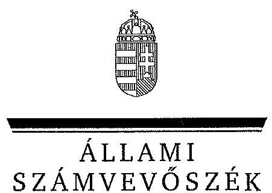
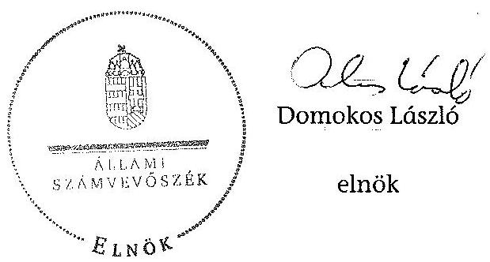
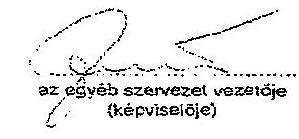
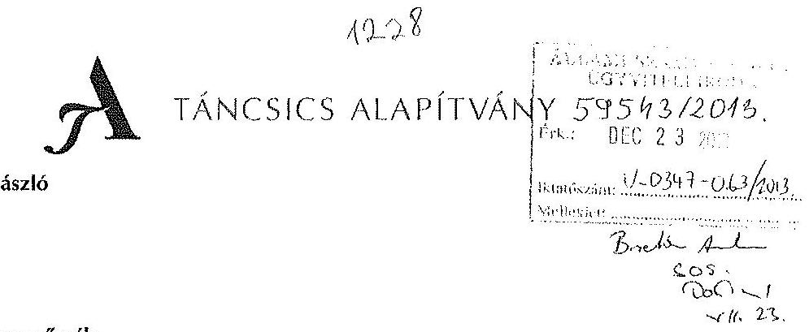
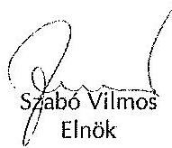
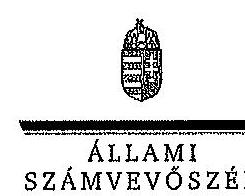
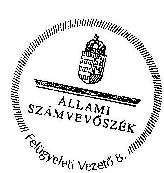

ÁLLAMI
SZÁMVEVŐSZÉK

# JELENTÉS 

a Táncsics Mihály Alapítvány gazdálkodása A Táncsics Mihály Alapítvány 2011-2012. évi gazdálkodása törvényességének ellenőrzéséről

---

# Állami Számvevôszék 

Iktatószám: V-0347-065/2013.
Témaszám: 1381
Vizsgálat-azonosító szám: V0660

## Az ellenôrzést felügyelte:

## Brebán Andrea

felügyeleti vezető
Az ellenőrzést vezette és az végrehajtásáért felelős:
Solymár Ágnes
ellenőrzésvezető
A számvevőszéki jelentés összeállításában közremüködtek:
Fórián Erika
számvevő tanácsos
Perlusz Krisztina
számvevő
Robák Ferencné
számvevő tanácsos
Vlasits Ágnes
számvevő

## Az ellenőrzést végezték:

Fórián Erika
Számvevő tanácsos

## Perlusz Krisztina

Számvevő

## Robák Ferencné

számvevő tanácsos

## Vlasits Ágnes

számvevő

## A témához kapcsolódó eddig készített számvevőszéki jelentések:

## címe

Jelentés a Táncsics Mihály Alapítvány 2003-2004. évi gazdálkodása 0566 törvényességének ellenőrzéséről
Jelentés a Táncsics Mihály Alapítvány 2005-2006. évi gazdálkodása 0751 törvényességének ellenőrzéséről
Jelentés a Táncsics Mihály Alapítvány 2007-2008. évi gazdálkodása 0954 törvényességének ellenőrzéséről
Jelentés a Táncsics Mihály Alapítvány 2009-2010. évi gazdálkodása 1203
törvényességének ellenőrzéséről

---

# TARTALOMJEGYZÉK 

BEVEZETÉS ..... 5
I. ÖSSZEGZŐ MEGÁLLAPÍTÁSOK, KÖVETKEZTETÉSEK, JAVASLATOK ..... 7
II. RÉSZLETES MEGÁLLAPÍTÁSOK ..... 11

1. Az alapítvány gazdálkodásának törvényessége ..... 11
1.1. A kuratórium működése ..... 11
1.2. Az alapítvány bevételei ..... 12
1.3. Az alapítvány ráfordításai ..... 13
2. Éves beszámolók ..... 16
1.4. A számviteli beszámolók ..... 16
1.5. A mérleg ..... 17
1.6. Az eredménykimutatás ..... 18
3. A könyvvezetés szabályozottsága ..... 18
4. A könyvvezetés gyakorlata ..... 20
5. Az alapítvány ellenőrzési rendszere ..... 22
6. Az alapítvány által létrehozott szervezet ..... 23

## MELLÉKLETEK

1. számú Kettős könyvvitelt vezető egyéb szervezetek egyszerűsített éves beszámolójának mérlege - 2011. év
2. számú Kettős könyvvitelt vezető egyéb szervezetek egyszerűsített éves beszámolójának eredménykimutatása - 2011. év
3. számú Kettős könyvvitelt vezető egyéb szervezetek egyszerűsített éves beszámolójának mérlege - 2012. év
4. számú Kettős könyvvitelt vezető egyéb szervezetek egyszerűsített éves beszámolójának eredménykimutatása - 2012. év
5. számú A Táncsics Mihály Alapítvány kuratóriumi elnökének észrevételei a jelentéstervezethez
6. számú Az Állami Számvevőszék válaszlevele az észrevételekre

---

# **Title: The Impact of Climate Change on Global Ecosystems**

## **Introduction**

Climate change is one of the most pressing environmental issues of our time. It affects ecosystems worldwide, leading to significant changes in biodiversity, habitat loss, and species extinction. This report explores the impacts of climate change on global ecosystems, focusing on key areas such as **forests**, **oceans**, and **polar regions**.

## **1. Forest Ecosystems**

Forests play a crucial role in carbon sequestration and maintaining biodiversity. However, rising temperatures and changing precipitation patterns are altering forest ecosystems. Key impacts include:

- **Increased frequency of wildfires**: Rising temperatures and drought conditions have led to more frequent and severe wildfires, destroying vast areas of forests.
- **Changes in species distribution**: Shifts in temperature and precipitation patterns are altering species distribution, leading to species extinction.
- **Insect outbreaks**: Warmer temperatures have increased the survival rates of pests like bark beetles, which are more likely to cause pests like bark beetles.

## **2. Ocean Ecosystems**

Oceans absorb a significant portion of the excess heat and carbon dioxide (CO₂) produced by human activities. The consequences include:

- **Increased frequency of wildfires**: Rising sea levels and drought conditions have led to more frequent and severe wildfires, destroying vast areas of oceans.
- **Changes in ocean currents**: Altered ocean currents are causing sea levels to decline, threatening species like polar bears and seals.
- **Insect outbreaks**: Warmer temperatures have increased the survival rates of pests like bark beetles, which are more likely to cause pests like bark beetles.

## **3. Ocean Ecosystems**

Oceans absorb a significant portion of the excess heat and carbon dioxide (CO₂) produced by human activities. The consequences include:

- **Increased frequency of wildfires**: Rising sea levels and drought conditions have led to more frequent and severe wildfires, destroying vast areas of oceans.
- **Changes in ocean currents**: Altered ocean currents are causing pests like bark beetles, which are more likely to cause pests like bark beetles.

## **4. Ocean Ecosystems**

Oceans absorb a significant portion of the excess heat and carbon dioxide (CO₂) produced by human activities. The consequences include:

- **Increased frequency of wildfires**: Rising sea levels and drought conditions have led to more frequent and severe wildfires, destroying vast areas of oceans.
- **Changes in ocean currents**: Altered ocean currents are causing pests like bark beetles, which are more likely to cause pests like bark beetles.

## **5. Polar Ecosystems**

Polar regions are particularly vulnerable to climate change due to their sensitivity to temperature changes. Key impacts include:

- **Melting of sea ice**: The Arctic is warming at twice the rate of the global average, leading to sea ice loss.
- **Glacial retreat**: Melting glaciers and ice in the Arctic are rising, threatening species like polar bears and seals, which are more likely to cause sea ice loss.
- **Glacial retreat**: Melting glaciers and ice in the Arctic are altering the Arctic climate, affecting species like bark beetles, which are more likely to cause sea ice loss.

## **Conclusion**

Climate change poses a significant threat to global ecosystems, with far-reaching consequences for biodiversity and human societies. By reducing greenhouse gas emissions and reducing greenhouse gas emissions, we can protect the planet for future generations.

## **References**

1. IPCC (Intergovernmental Panel on Climate Change). (2021). *Climate Change 2021: The Physical Science Basis*.
2. WWF (World Wildlife Fund). (2020). *Living Planet Report 2020*.
3. NASA Global Climate Change. (2022). *Vital Signs: Global Temperature*.

---

# RÖVIDÍTÉSEK JEGYZÉKE 

| Törvények |  |
| :--: | :--: |
| ÁSZ tv. | 2011. évi LXVI. törvény az Állami Számvevőszékről |
| Gt. | A gazdasági társaságokról szóló 2006. évi IV. törvény |
| Kbt. $_{1}$ | A közbeszerzésekről szóló 2003. évi CXXIX. törvény (hatályos 2012. január 1-jéig) |
| Kbt. $_{2}$ | A közbeszerzésekről szóló 2011. évi CVIII. törvény |
| pártalapítványi törvény | A pártok múködését segitő tudományos, ismeretterjesztő, kutatási, oktatási tevékenységet végző alapítványokról szóló 2003. évi XLVII. törvény |
| párttörvény | A pártok múködéséről és gazdálkodásáról szóló 1989. évi XXXIII. törvény |
| Ptk. | A Polgári Törvénykönyvről szóló 1959. évi IV. törvény |
| Számv. tv. | A számvitelről szóló 2000 . évi C. törvény |
| Rendeletek alapítványok gazdálkodási rendjéről szóló kormányrendelet számviteli rendelet | Az alapítványok gazdálkodási rendjéről szóló 115/1992.(VII. 23.) Korm. rendelet |
|  | A számviteli törvény szerinti egyes egyéb szervezetek beszámolókészítési és könyvvezetési kötelezettségének sajátosságairól szóló 224/2000. (XII. 19.) Korm. rendelet |
| Egyéb rövidítések alapítvány | Táncsics Mihály Alapítvány |
| áfa | Általános forgalmi adó |
| ÁSZ | Állami Számvevőszék |
| éves beszámoló | Egyszerúsített éves beszámoló |
| FB | Felügyelőbizottság |
| Kft. | Kapcsolat.hu Kommunikációs és Szolgáltató Nonprofit Korlátolt Felelősségű Társaság |
| MSZP | Magyar Szocialista Párt |
| SZMSZ | Szervezeti Múködési Szabályzat |

---

# **Title: The Impact of Climate Change on Global Ecosystems**

## **Introduction**

Climate change is one of the most pressing environmental issues of our time. It affects ecosystems worldwide, leading to significant changes in biodiversity, habitat loss, and species extinction. This report explores the impacts of climate change on global ecosystems, focusing on key areas such as **forests**, **oceans**, and **polar regions**.

## **1. Forest Ecosystems**

Forests play a crucial role in carbon sequestration and maintaining biodiversity. However, rising temperatures and changing precipitation patterns are altering forest ecosystems. Key impacts include:

- **Increased frequency of wildfires**: Rising temperatures and drought conditions have led to more frequent and severe wildfires, destroying vast areas of forests.
- **Changes in species distribution**: Shifts in temperature and precipitation patterns are altering species distribution, leading to species extinction.
- **Insect outbreaks**: Warmer temperatures have increased the survival rates of pests like bark beetles, which are causing widespread wildfires.

## **2. Ocean Ecosystems**

Oceans absorb a significant portion of the excess heat and carbon dioxide (CO₂) produced by human activities. The consequences include:

- **Increased frequency of wildfires**: Owing to the increase in CO₂ levels, the consequences for marine life are often felt by the sea, leading to widespread sea-level rise.
- **Changes in ocean currents**: Altered ocean currents affect nutrient distribution, leading to increased ocean temperatures.
- **Insect outbreaks**: Warmer temperatures have increased the survival rates of pests like bark beetles, which are causing widespread wildfires.

## **3. Ocean Ecosystems**

Oceans absorb a significant portion of the excess heat and carbon dioxide (CO₂) produced by human activities. The consequences include:

- **Increased frequency of wildfires**: Rising temperatures and reduced CO₂ levels are altering the marine life cycle, leading to widespread sea-level rise.
- **Changes in ocean currents**: Altered ocean currents are altering species distribution, leading to sea-level rise.
- **Insect outbreaks**: Warmer temperatures have increased the survival rates of pests like bark beetles, which are causing widespread wildfires.

## **4. Polar Ecosystems**

Polar regions are particularly vulnerable to climate change due to their sensitivity to temperature changes. Key impacts include:

- **Melting of sea ice**: The Arctic is warming at twice the rate of the global average, leading to sea-level rise.
- **Glacial retreat**: Melting glaciers and their presence in the Arctic are altering the ocean currents, leading to widespread sea-level rise.
- **Permafrost thawing**: Thawing permafrost releases stored carbon and methane, further accelerating global warming.

## **5. Polar Ecosystems**

Polar regions are particularly vulnerable to climate change due to their sensitivity to temperature changes. Key impacts include:

- **Melting of sea ice**: Melting glaciers and their presence in the Arctic are altering the ocean currents, affecting species distribution, habitat loss, and species extinction.
- **Glacial retreat**: Melting glaciers and their presence in the Arctic are altering the ocean currents, affecting species distribution, habitat loss, and species extinction.

## **Conclusion**

Climate change poses a significant threat to global ecosystems, with far-reaching consequences for biodiversity and human societies. By understanding the impacts of climate change on global ecosystems, we can help you reduce the impact of climate change on global ecosystems.

---

# JELENTÉS   a Táncsics Mihály Alapítvány gazdálkodása A Táncsics Mihály Alapítvány 2011-2012. évi gazdálkodása törvényességének ellenőrzéséről 

## BEVEZETÉS

A pártok múködését segítő tudományos, ismeretterjesztő, kutatási, oktatási tevékenységet végző alapítványokról szóló 2003. évi XLVII. törvény (pártalapítványi törvény) alapján a pártok a politikai kultúra fejlesztése érdekében tudományos, ismeretterjesztő, kutatási és oktatási tevékenységük elősegítésére a pártok múködéséről és gazdálkodásáról szóló 1989. évi XXXIII. törvényben (párttörvény) meghatározott mértékű költségvetési támogatásra jogosult alapítványt hozhatnak létre.

A Magyar Szocialista Párt (MSZP) a törvényi rendelkezéseknek megfelelően 2003-ban létrehozta a Táncsics Mihály Alapítványt (alapítvány). Az alapítvány céljainak megvalósítása érdekében, fő tevékenységként segíti az MSZP múködését. Alapító okirat szerinti céljai: elősegíteni az MSZP alkotmányban biztosított, a népakarat kialakításában, valamint kinyilvánításában történő hatékony közreműködését, szélesíteni az állampolgárok tájékozódását a magyar társadalmat érintő társadalmi és politikai kérdésekről, a szociáldemokrácia elméleti megközelítéseiről, ösztönözni a magyar politikai kultúra színvonalának emelését, a demokrácia elveinek és gyakorlatának erősítését, bátorítani a magyar és a globális kulturális értékek, valamint a tudományos eredmények tiszteletben tartását és elfogadtatását, előmozdítani a szociáldemokrata gondolkodás fejlődését és a szociáldemokrata eszmeiség terjesztését, segíteni a nemzeti érdekeknek a változó körülményeknek megfelelő időszerű megfogalmazását, különös figyelmet fordítva Magyarország uniós tagságából következő feladatokra.

Az alapítvány a törvényi előírásoknak megfelelően a 2011. és a 2012. években egyaránt 259800 ezer Ft költségvetési támogatásban részesült.

A pártalapítványi törvény 4. § (2) bekezdése alapján az alapítvány gazdálkodása törvényességének ellenőrzésére az Állami Számvevőszék (ÁSZ) jogosult. A 4. § (4) bekezdése alapján az ÁSZ kétévenként ellenőrzi azoknak az alapítványoknak a gazdálkodását, amelyek e törvény szerint költségvetési támogatásban részesültek. Az ÁSZ legutóbb 2011-ben az alapítvány 20092010. évi gazdálkodásának törvényességét ellenőrizte, jelentésében intézkedést igénylő javaslatot nem fogalmazott meg.

---

Az ellenőrzés célja volt az alapítvány 2011-2012. évi gazdálkodása törvényességének értékelése, amelynek keretében ellenőriztük:

- az alapítvány gazdálkodásának és éves jelentéseinek törvényességét;
- az éves számviteli beszámolók jogszabályi előírásoknak való megfelelését;
- az alapítvány könyvvezetésében a számvitelről szóló 2000. évi C. törvény, a pártalapítványok könyvvezetésére vonatkozó egyéb jogszabályi rendelkezések, valamint belső előírások betartását.

Az ellenőrzött időszak: 2011. január 1. - 2012. december 31.
Az ellenőrzés hasznosulása: az ellenőrzés a gazdálkodás szabályszerűségének bemutatásával hozzájárul ahhoz, hogy a társadalom objektív képet alkothasson a pártalapítványok múködéséről. Az ellenőrzés eredménye elősegítheti, hogy a törvényalkotók konkrét lépéseket tegyenek a pártalapítványok finanszírozására vonatkozó szabályozások megváltoztatása, átláthatóbbá, ellenőrizhetőbbé tétele irányába. Az ellenőrzött szervezetek szintjén a hiányosságok, szabálytalanságok feltárása, az ennek kapcsán megfogalmazott megállapítások elősegíthetik a pártalapítványok szabályszerű gazdálkodását. A gazdálkodás szabályszerűségének bemutatásával az ellenőrzés értékteremtő módon járul hozzá az ÁSZ stratégiai céljainak megvalósításához.

Az ellenőrzést a pénzügyi-szabályszerüségi ellenőrzés módszertani szabályai szerint végeztük. Az ellenőrzés szakmai módszertana az ÁSZ hivatalos honlapján (www.asz.hu) közzétett szakmai szabályokon alapul, amely a Legfőbb Ellenőrző Intézmények Nemzetközi Szervezete (INTOSAI) által kiadott nemzetközi standardok (ISSAI) figyelembevételével készült.

Az ÁSZ tv. 29. § (1) bekezdése szerint a jelentéstervezetet megküldtük észrevételezésre az alapítvány kuratóriumi elnökének. A kuratórium elnöke az ÁSZ tv. 29. § (2) bekezdésében foglalt észrevételezési jogával élt. A kuratórium elnökének észrevételét, valamint az arra adott választ, ideértve az el nem fogadott észrevételek indokolását a jelentés 5. és 6. számú mellékletei tartalmazzák.

---

# I. ÖSSZEGZŐ MEGÁLLAPÍTÁSOK, KÖVETKEZTETÉSEK, JAVASLATOK 

Az alapító párt az ellenőrzött időszakban az alapító okiratot három alkalommal módosította. A kuratórium a 2011. évben az alapító okirat változását követően az SZMSZ-t késedelmesen módosította, a 2012. évben pedig nem aktualizálta az értékhatárokra vonatkozóan a kötelezettségvállalás rendjében történt változásnak megfelelően. A kuratórium az ellenőrzött időszakban az alapító okirat előírásainak megfelelően múködött. A kuratórium vagyont érintő határozatai, valamint a költségvetési támogatás felhasználása az ellenőrzött tételek alapján a pártalapítványi törvényben és az alapító okiratban egyaránt megfogalmazott tudományos, ismeretterjesztő, kutatási, oktatási célok megvalósítására irányultak.

Az alapítvány éves munka- és pénzügyi terv alapján gazdálkodott, amelynek teljesítését a kuratórium figyelemmel kísérte, a munkaszervezet vezetőjét beszámoltatta az ülések közötti időszak gazdasági eseményeiről. Az alapítvány az ellenőrzött években 580614 ezer Ft bevételt mutatott ki, amelynek 90,2\%-a ( 523600 ezer Ft) a központi költségvetésből származott. Az alapítvány kizárólag magánszemélyektől kapott összesen 90 ezer Ft támogatást. A csatlakozói adományok a pártalapítványi törvénynek megfelelően az alapítvány pénzforgalmi számlájára a magánszemélyek pénzforgalmi számlájáról érkeztek, a támogatók beazonosíthatóak voltak. A csatlakozói adományok elfogadásáról minden alkalommal döntött a kuratórium.

Az alapítvány 1066615 ezer Ft összegű ráfordítást számolt el, amelynek $89,9 \%$-át ( 958509 ezer Ft) a cél szerinti feladatok megvalósításának közvetlen költségei, $10,1 \%$-át ( 108106 ezer Ft) a múködés során felmerült költségek tették ki. A célszerinti kifizetések szervezetek részére nyújtott támogatásokat és saját szervezeti keretek között végzett tevékenységek kiadásait tartalmazták.

Az alapítvány feladatát a létrehozott gazdasági társaságán keresztül is ellátta. A 2006. évben alapított Kapcsolat.hu Kommunikációs és Szolgáltató Nonprofit Kft. (Kft.) internetes portált múködtetett, amely az alapítvány és az iránta érdeklődők közötti kapcsolattartást és információáramlást segítette elő. Az alapítvány a portál üzemeltetésére 2011-ben 25600 ezer Ft-ot, 2012-ben 23469 ezer Ft-ot fizetett ki a Kft. részére. A Kft. ellenőrzött időszakban felhalmozott vesztesége miatt az alapítványnak 118871 ezer Ft értékvesztést kellett elszámolnia. A veszteség okainak feltárása az ellenőrzés rendelkezésére álló eszközökkel nem volt lehetséges. Ezért a Kft. részére költségvetési forrás felhasználásával biztosított pénzeszközök az alapítvány alapító okirat szerinti céljaira történő felhasználása nem volt igazolható. Az alapítvány kuratóriuma a Kft.-nél az alapítói jogokat gyakorolta. A Kft. negatív üzleti eredménye miatt 2012 májusában döntött a Kft. jegyzett tőkéjének 96000 ezer Ft-ról 8000 ezer Ft-ra történő leszállításáról. Tulajdonosi jogkörében döntött a személyi változásokról, az üzemeltetési szerződés módosításáról, a Kft. 2011. és 2012. évi gazdálkodásáról szóló, Számv. tv. szerinti beszámolóinak elfogadásáról.

---

A támogatott szervezetekkel a kuratórium elnöke szerződést kötött, részükre a támogatásokat a szerződésekben foglaltak szerint folyósították. Egy ellenőrzött szerződés esetében fordult elő, hogy az alapítvány munkaszervezete anélkül utalta át a támogatás második részletét, hogy a kedvezményezett teljesítette volna szerződésben vállalt kötelezettségét és a támogatás első részletével elszámolt volna. A kapott támogatásokról a kedvezményezettek elszámolást készítettek, az ellenőrzött támogatottak közül öt ( $9,8 \%$ ) határidőn túl számolt el. A késedelmes elszámolások közül egy meghaladta a 30 napos késedelmet.

Az alapítvány munkaszervezete elszámolási, illetve teljesítési hiányosságok miatt felszólította a kedvezményezetteket az elszámolások hiányosságainak pótlására. Amennyiben a kedvezményezett nem számolt el a támogatás teljes felhasználásáról, a fel nem használt részt a munkaszervezet visszafizettette. Az alapítvány igazgatója a benyújtott elszámolások lezárásaként a támogatottakat írásban értesítette azok elfogadásáról.

Az alapítvány eleget tett éves beszámolókészítési kötelezettségének, az egyszerúsített éves beszámolókat mindkét évben a jogszabályi előírásoknak és a belső szabályzatoknak megfelelően állította össze. A beszámolók összeállítása során a Számv. tv-ben szabályozott alapelveket - a valódiság elvét kivéve érvényesítette. A követelések és a passzív időbeli elhatárolások tételein belül egy 20,6 ezer Ft-os tételt leltárral nem támasztottak alá. Ez a 2012. évi beszámolóban feltárt hiba nem haladta meg a lényegességi szintet. A beszámolókat a felügyelőbizottság (FB) véleményezte, a könyvvizsgáló hitelesítő záradékkal látta el, a kuratórium elfogadta. Az ellenőrzött években az éves beszámoló mérlegadatait - a 20,6 ezer Ft-os tétel kivételével - az eszközök és a források leltárkészítési és leltározási szabályzata előírásai alapján készített leltárral támasztották alá. Az eredménykimutatásban a bevételeket és ráfordításokat a főkönyvi könyvelés alapbizonylataival, az analitikával megegyezően mutatták ki. Az alapítvány a 2011. és a 2012. évi gazdálkodásáról szóló éves jelentéseit a pártalapítványi törvény előírásai szerint elkészítette, a Hivatalos Értesítőben és internetes honlapján határidőben közzétette.

Az alapítvány könyvvezetése és az éves beszámolók elkészítésének belső szabályozási rendszere a Számv. tv. által kötelezően előírt szabályozáson alapult. A szabályzatok módosítását a kuratórium jóváhagyta. A számviteli szabályzatok a leltározási szabályzat kivételével megfeleltek a jogszabályoknak. A leltározási szabályzatban a leltározás öt évenkénti gyakoriságát nem módosították annak ellenére, hogy a 2012. január 1-jétől módosult a Számv. tv. előírása és az a mennyiségi felvétellel történő leltározás gyakoriságát legalább három évben határozta meg.

Az ellenőrzött időszakban a kettős könyvvezetést megbízás alapján külső számviteli szolgáltató végezte. A 2011. év június 1-jétől az alapítvány egy másik szolgáltatót bízott meg a könyvelési feladatok ellátásával. A gazdasági eseményeket mindkét évben, idősorrendben, zárt rendszerben rögzítették könyvelési alapbizonylatokkal alátámasztva, a jogszabályok és a belső előírások betartásával. A 2011. évben hatályos, az alapítványok gazdálkodási rendjéről szóló kormányrendelet előírásának megfelelően, a számviteli

---

nyilvántartásban elkülönítették az alapítványi célú tevékenység közvetlen és az alapítvány kezelő szervének közvetett költségeit.

A házipénztári nyilvántartások vezetése szabályszerű volt, a záró pénzkészlet nem haladta meg a Számv. tv-ben és a belső szabályozásban előírt mértéket. A szigorú számadású nyomtatványok nyilvántartását nem vezették, azokról az év végén összesített kimutatás készült.

A beszerzések és a ráfordítások elszámolásánál a mintavétellel kiválasztott gazdasági események ellenőrzése megállapította, hogy a valódiság, következetesség elve érvényesült. A bizonylatok alaki és tartalmi kellékeire vonatkozó Számv. tv. által előírt követelmények nem érvényesültek az utalványozás elmaradása miatt. A 2011. évben az ellenőrzött bizonylatok 11,9\%-ánál, a 2012. évben 3,0\%-ánál hiányzott az utalványozó aláírása. A 2012. évi ellenőrzött mintatételek 7,5\%-ánál (a működéssel összefüggő kiadásokhoz kapcsolódóan) hiányzott az alapítvány belső szabályozásának előírása ellenére a rendelkezés végrehajtását igazoló aláírás. A könyvelés rögzítésének dátuma és az aláírás a dokumentumokon szerepelt. A számlakijelölések megfelelőek voltak.

Az alapítványnál az ellenőrzési feladatokat az alapító okiratban, az SZMSZ-ben és a belső szabályzatokban, valamint a munkaköri leírásokban határozták meg. Az FB az alapító okiratban foglaltaknak megfelelően mindkét évben vizsgálta az éves költségvetést, az éves beszámolót és az alapítványi tevékenységről készített szakmai beszámolót. A pénzügyi irányítási és ellenőrzési feladatok magukban foglalták a pénzügyi döntések dokumentumainak elkészítését, az előzetes és utólagos pénzügyi ellenőrzést, a határozatok és döntések szabályszerűségi szempontú jóváhagyását, az időszakban hatályos jogszabályoknak megfelelő könyvvezetést és beszámoló készítést.

A vezetői ellenőrzést a kuratórium elnöke és az alapítvány igazgatója a képviseleti jog és a munkáltatói jogkör gyakorlása, valamint a bankszámla feletti rendelkezés során megfelelően látta el. A kötelezettségvállalási jog gyakorlása a ráfordítások esetében megfelelő volt, a tárgyi eszközök beszerzése során egy esetben nem felelt meg az alapító okiratban foglaltaknak. A munkafolyamatba épített ellenőrzés az utalványozás és a rendelkezés végrehajtásának igazolása gyakorlásának hiányosságai miatt nem működött teljes körűen. Az alapítvány a nyújtott támogatások felhasználását az ellenőrzött időszakban kizárólag dokumentumok alapján ellenőrizte, helyszíni ellenőrzést nem végzett.

Az ÁSZ tv. 33. § (1) bekezdésében foglaltak értelmében az ellenőrzött szervezet vezetője köteles a jelentésben foglalt megállapításokhoz kapcsolódó intézkedési tervet összeállítani, és azt a jelentés kézhezvételétől számított 30 napon belül az ÁSZ részére megküldeni. Amennyiben az intézkedési tervet határidőre nem küldi meg a szervezet, vagy az nem elfogadható, az ÁSZ elnöke az ÁSZ tv. 33. § (3) bekezdés a)-b) pontjaiban foglaltakat érvényesítheti.

---

A helyszíni ellenőrzés megállapításainak hasznosítása mellett javasoljuk:

# az alapítvány kuratóriumának 

1. A bizonylatok alaki és tartalmi kellékeire vonatkozó Számv. tv. által előírt követelmények nem érvényesültek az utalványozás elmaradása miatt. A 2011. évben az ellenőrzött bizonylatok 11,9\%-ánál, a 2012. évben 3,0\%-ánál hiányzott az utalványozó aláírása. A 2012. évi ellenőrzött mintatételek 7,5\%-ához nem kapcsolódott a rendelkezés végrehajtását igazoló aláírás.

Javaslat:
Intézkedjen a Számv. tv. 167. § (1) bekezdésben előírt tartalmi kellékek bizonylatokon való feltüntetéséről.
2. Az Alapítvány a 2011. és a 2012. években nem vezette a Számv. tv. 168. § (3) bekezdésben foglaltak ellenére a szigorú számadás alá vont nyomtatványok nyilvántartását, azokról kizárólag összesítő kimutatást készített a 2011. és a 2012. években.

Javaslat:
Gondoskodjon a Számv. tv. 168. § (3) bekezdésében foglaltak szerinti nyilvántartás vezetéséről.
3. Az Alapítvány az eszközök és a források leltárkészítési és leltározási szabályzatában a leltározás öt évenkénti gyakoriságát nem módosították annak ellenére, hogy 2012. január 1-jétől módosult a Számv. tv. 69. § (3) bekezdésének előírása és az a mennyiségi felvétellel történő leltározás gyakoriságát legalább három évben határozta meg.

Javaslat:
Gondoskodjon az eszközök és források leltárkészítési és leltározási szabályzatának módosításáról a Számv. tv. 69. § (3) bekezdésében foglaltaknak megfelelően.
4. A kuratórium a 2011. évben az alapító okirat változását követően az SZMSZ-t késedelmesen módosította, a 2012. évben pedig nem aktualizálta az értékhatárokra vonatkozóan a kötelezettségvállalás rendjében történt változásnak megfelelően.

Javaslat:
Aktualizálja az alapítvány hatályos alapító okiratának megfelelően az SZMSZ-ét, a kötelezettségvállalás értékhatárainak vonatkozásában.

---

# II. RÉSZLETES MEGÁLLAPÍTÁSOK 

## 1. Az alapítVÁNY GAZDÁlKODÁSÁNAK TÖRVÉNYESGÉGE

### 1.1. A kuratórium múködése

Az ellenőrzött időszakban az MSZP az alapítvány alapító okiratát három alkalommal módosította.

- 2011 októberében egy kuratóriumi tag és egy felügyelő bizottsági tag, illetve az MSZP elnökének személyében történt változás miatt történt módosítás. Megnevezték továbbá azt az alapítványt, melynek támogatására kell fordítani „az alapítvány egyéb módon, (nem egyesítéssel) történő megszünése esetén a megszünéskor meglévő tiszta vagyont". „A kuratórium tagjait az alapítvány tiszteletdijban és költségtérítésben részesíti, amelyet az Alapítvány költségei között kell elszámolni" szabály módosult, miszerint „tiszteletdijban és költségtérítésben részesítheti";
- 2011 novemberében a kuratóriumi elnök személyében történt változás;
- 2012 júniusában egy felügyelő bizottsági tag személyében történt változás. A kötelezettségvállalás alapvető rendjében a „kivételesen indokolt esetben a kuratórium elnöke a kuratórium elözetes hozzájárulása nélkül is eseti kötelezettségvállalást tehet akkor, ha ez a pénzügyi terv végrehajtását nem veszélyezteti" szabály összeghatára a gazdasági évenkénti mindösszesen 2000 ezer Ft-ról 12000 ezer Ft-ra módosult.

Az alapító okiratok módosításának bírósági bejegyzése megtörtént.
Az alapító okirat a Ptk. 74/C. § (4) bekezdésének megfelelően megjelölte az alapítvány képviseletére jogosult személyt. Az SZMSZ és az alapítvány belső szabályzatai az alapító okirattal összhangban szabályozták a képviseleti jog gyakorlását. A képviseleti jog gyakorlása megfelelt a Ptk., az alapító okirat és a belső szabályzatok előírásainak.

Az alapítvány SZMSZ-e rögzítette a kuratórium és az alapítvány munkaszervezetének feladat-, hatás- és felelősségi köreit. Az SZMSZ az alapítványi célra rendelt vagyon felhasználását, a képviseleti jog és a bankszámla feletti rendelkezési jog gyakorlását az alapító okirat előírásaival összhangban rögzítette. A banki aláírásra bejelentettek köre megfelelt az alapító okirat, az SZMSZ és a pénzkezelési szabályzat előírásainak.

A kuratórium az SZMSZ-t a 2011. év novemberi alapító okirat módosítása után késedelemmel, csak a 2012. január 1-jei hatállyal aktualizálta. Törölte a szabályzatban az alapítvány elnökének, mint az alapítvány képviselójének nevét, csak a funkciót megjelölve. A kuratórium a 2012 júniusában történt alapító okirat módosítás után az SZMSZ-t nem aktualizálta.

---

Ennek következtében a helyszíni ellenőrzés idején is hatályos SZMSZ a kuratórium elnöke eseti kötelezettségvállalásainak összeghatárát még 2000 ezer Ft-ban határozta meg az alapító okiratban meghatározott 12000 ezer Ft helyett.

Az ellenőrzött időszakban a kuratórium az alapítvány vagyonkezelését és gazdálkodását érintő döntéseit az alapító okirat vonatkozó előírásainak megfelelően hozta meg. A cél szerinti tevékenységet, múködést, tulajdonosi befektetést, pénzeszközlekötést érintő döntések a pártalapítványi törvényben és az alapító okiratban megjelölt cél szerinti tevékenységek ellátását szolgálták.

A kuratórium mindkét évben megtárgyalta és elfogadta az éves munka- és pénzügyi tervet, az éves szakmai és pénzügyi beszámolót, valamint az alapítvány belső szabályzatainak módosításait. Évente hat-hat alakalommal, összesen tizenkétszer ülésezett. A kuratóriumi ülések határozatképesek voltak, összesen 176 határozatot hoztak, minden esetben az üléseken jelenlévő kuratóriumi tagok egybehangzó szavazatával. A kuratóriumi ülésekről készített jegyzőkönyvek, valamint a határozatok tára megfelelt az alapító okirat és az SZMSZ előírásainak.

Az alapítvány éves munka- és pénzügyi tervei tartalmazták a bevételeket, a várható ráfordításokat az alapítvány feladatainak minden fő területére vonatkozóan, valamint a múködtetés során felmerülő költségeket. A kuratórium az ülések között eltelt időszakban végzett tevékenységekről minden alkalommal beszámoltatta a munkaszervezet vezetőjét.

A kuratórium a pénzügyi tervben megtervezte a ráfordításokat a Táncsics Akadémia, a szakpolitikai központ, a Demokrata Körök közélet klubhálózatának és a Kapcsolat.hu portál múködtetésére, a Táncsics Életmú Díj kiadására, szakpolitikai konferenciák szervezésére, az együttmúködési megállapodások és pályázatok alapján támogatott szervezetek támogatásaira és az alapítvány múködésére. Bevételi tervei között a költségvetési támogatásokat, a kamatbevételeket és az előző év pénzmaradványát szerepeltette.

# 1.2. Az alapítvány bevételei 

Az ellenőrzött időszakban az alapítvány az éves beszámïlóiban összesen 580614 ezer Ft bevételt mutatott ki. Az alapítvány bevételei döntő többségükben, a 2011. évben közel 89,4\%-ban, a 2012. évben 91,0\%-ban a központi költségvetési támogatásból származtak. Az alapítvány nem végzett vállalkozási tevékenységet, abból származó bevétele nem volt.

---

Az alapítvány bevételei a 2011. és a 2012. évi éves beszámolók szerint:

|  |  | Adatok ezer Ft-ban |  |
| :-- | --: | :--: | :--: |
| Megnevezés | $\mathbf{2 0 1 1 .}$ | $\mathbf{2 0 1 2 .}$ | Együtt |
| Költségvetési támogatás | $263800^{*}$ | 259800 | 523600 |
| Csatlakozói adományok | 66 | 24 | 90 |
| Fel nem használt támogatás   visszafizetése | 1076 | 32 | 1108 |
| Pénzügyi műveletek bevétele | 30046 | 25770 | 55816 |
| Összesen | 294988 | 285626 | 580614 |

* A 2011. évi beszámolóban kimutatott költségvetési támogatás összegében 4000 ezer Ft a Számv. tv. alapján előző időszakokra elszámolt időbeli elhatárolás.

Az alapítvány a párttörvény 9/A. § (3) bekezdésében foglaltak alapján jogosult volt a költségvetési támogatásra. Az alapítványnak kiutalt támogatás összege megfelelt a párttörvény 9/A. § (4) és (5) bekezdésében foglalt rendelkezésnek. A központi költségvetési támogatás folyósítása a párttörvény 9/A. § (2) bekezdésének megfelelően, naptári negyedévenként történt. A támogatás jóváírása a 2011. évben minden negyedév negyedik, a 2012. évben minden negyedév harmadik napján történt meg.

A pártalapítványi törvény 3. § (2) bekezdése és az alapító okirat előírása alapján a kuratórium jóváhagyta a csatlakozóktól kapott támogatásokat és betartotta a (3) bekezdés rendelkezését, a támogató csatlakozók a bankszámla kivonatok alapján egyértelműen beazonosíthatóak voltak, a támogatást a csatlakozók pénzforgalmi számlájáról az alapítvány pénzforgalmi számlájára történő átutalással nyújtották. A csatlakozók nem jelölték meg adományaik konkrét célját, az alapítvány alapító okiratában meghatározott feladatokra volt felhasználható, ezzel igazodott a párttörvény 9/A. § (1) bekezdésében és az alapító okiratban meghatározott célokhoz. A pártalapítványi törvény 3. § (4) bekezdésének megfelelően nem kellett a csatlakozóktól kapott támogatásokat közzétenni, mert azok belföldi támogatóktól származtak és összegük nem haladta meg az ötszázezer forintot.

# 1.3. Az alapítvány ráfordításai 

Az alapítvány a párttörvény 9/A. § (1) bekezdésében és az alapító okiratban meghatározott célokra fordította az állami költségvetési támogatás és a csatlakozóktól kapott felajánlások összegét. A kuratórium az alapítvány által végzendő cél szerinti tevékenységekről a munka- és pénzügyi terv keretében, annak elfogadásával, továbbá egyedi határozatokkal döntött. Az alapítvány a 2011. évben 422896 ezer Ft, a 2012. évben 643719 ezer Ft, összesen 1066615 ezer Ft költséget és ráfordítást számolt el.

---

Az alapítvány költségei és ráfordításai a 2011. és a 2012. évi éves beszámolók szerint:

| Megnevezés | 2011. év |  | 2012. év |  | Összesen |  |
| :-- | --: | --: | --: | --: | --: | --: |
|  | ezer Ft | $\%$ | ezer Ft | $\%$ | ezer Ft | $\%$ |
| Cél szerinti | 382741 | 90,5 | 575768 | 89,4 | 958509 | 89,9 |
| Múködési | 40155 | 9,5 | 67951 | 9,6 | 108106 | 10,1 |
| Összesen | 422896 | 100,0 | 643719 | 100,0 | 1066615 | 100,0 |

Az alapítvány cél szerinti feladatainak megvalósítására a 2011. évben 382741 ezer Ft-ot, a 2012. évben 575768 ezer Ft-ot fordított. Az alapítvány múködési költségként az alkalmazottak juttatásait, az igénybevett szolgáltatásokat számolta el a 2011. évben 40155 ezer Ft, a 2012. évben 67951 ezer Ft értékben. A két évben együttesen a cél szerinti tevékenység ráfordításainak ( 958509 ezer Ft) és a múködési költségek ( 108106 ezer Ft) aránya $89,9 \%-10,1 \%$ volt.

A 2011. évben cél szerinti tevékenységén belül az alapítvány közéleti-politikai képzése valósult meg a Táncsics Akadémián, előadássorozatot szervezett a Táncsics Nyitott Egyetem és a Táncsics Esték keretein belül, szakpolitikai központot múködtetett, pályázatot hirdetett tanulmányírásra és a Demokrata Körök támogatására, életmúdíjat adományozott, múködtette a kapcsolat.hu portált. A 2012. évben szakpolitikai múhelymunka indításáról döntött a kuratórium, folytatódott a Táncsics Esték programsorozat, az alapítvány életmúdíjat adományozott, rendezvényeket, konferenciákat szervezett, képzési programot indított, pályázatot hirdetett a Demokrata Körök támogatására.

Az alapítvány az ellenőrzött időszakban az alapító okirattal összhangban, az ún. együttmúködő bázisszervezetekkel kötött együttmúködési megállapodások, illetve egyedi kérelmek alapján nyújtotta támogatásait. A kuratórium a támogatások nyújtásának feltételeit a 2010. január 12-től hatályos pályázatkezelési szabályzatban határozta meg.

A kuratórium a támogatásokról minden esetben, az alapító okirat előírásainak betartásával, szabályosan döntött. A támogatási kérelmek elbírálásáról szóló kuratóriumi határozatok egyértelmúen beazonosíthatóak voltak.

Az alapítvány munkaszervezete a támogatási kérelmeket a pályáztatási szabályzat által előírt adatlap egyidejú kitöltésével fogadta be, ezzel együtt terjesztette a kuratórium elé. A kuratórium döntéséről a támogatottakat a munkaszervezet vezetője írásban értesítette, a kedvezményezettekkel szerződést kötöttek. A szerződéseket minden esetben a képviseletre jogosult kuratóriumi elnök írta alá.

Az alapítvány betartotta a pályázatkezelési szabályzat rendelkezéseit a támogatásnyújtás feltételeire, a szerződéskötésre és elszámoltatásra vonatkozóan. Az együttmúködési megállapodásokban, támogatási szerződésekben megjelölte a támogatott nevét, a támogatási célt, a támogatás összegét, a folyósítás, az elszámolás határidejét, módját, valamint a

---

szerződésszegés esetén alkalmazandó szankciókat. Az együttműködési megállapodásokat, támogatási szerződéseket a kuratóriumi határozatok tartalmával egyezően kötötték.

Az alapítvány az ellenőrzött támogatásokat a szerződésben meghatározott összegekben és határidőben folyósította.

Az alapítványi iroda munkatársai ellenőrizték a szerződés szerinti felhasználások szabályosságát az elszámoláshoz beküldött pénzügyi és szakmai beszámolók, a támogatott szervezet által hitelesített és záradékolt bizonylatok, valamint a kifizetéseket igazoló bankszámlakivonatok és pénztárbizonylatok alapján.

Az ellenőrzött támogatottak 58,8\%-a (30 támogatás) határidőben, 9,8\%-a (5 támogatás) határidőn túl, késedelmesen számolt el, 31,4\%-ánál (16 támogatás) a helyszíni ellenőrzés időszakában az elszámolás nem volt esedékes. A késedelmes elszámolások közül egy esetben, a 2011. évben haladta meg a 30 napos késedelmet.

A több részletben utalt támogatásoknál a következő átutalás feltétele volt, hogy a kedvezményezett számoljon el a korábbi támogatási összeg felhasználásáról. Egy szerződés esetében fordult elő, hogy az alapítvány munkaszervezete a nélkül utalta át a támogatás második részletét, hogy a kedvezményezett a támogatás első részletével elszámolt volna.

Az ellenőrzött támogatási szerződések tartalmazták a szerződésszegés esetére vonatkozó szankciókat, amelyek kiterjedtek a késedelmes elszámolásokra és a szerződéses céltól eltérő felhasználásra. Az alapítvány munkaszervezete elszámolási, illetve teljesítési hiányosságok miatt az ellenőrzött szerződések 19,6\%-a (10 támogatás) esetében szólította fel a kedvezményezetteket az elszámolások hiányosságainak pótlására. Az ellenőrzött támogatások 7,8\%ánál (4 támogatás) fordult elő, hogy a kedvezményezett nem számolt el a támogatás teljes felhasználásáról, emiatt a fel nem használt részt a munkaszervezet visszafizettette.

Az alapítvány igazgatója a benyújtott elszámolások lezárásaként a támogatottakat írásban értesítette azok elfogadásáról. Az ellenőrzött elszámolások megfeleltek a jogszabályi, szerződési és a belső szabályzati előírásoknak. Az elszámolásokhoz csatolt számlák alátámasztották a támogatás célszerinti felhasználását.

A 2011. évben az alapítvány a Kbt. 122. § (1) bekezdés i) pontja értelmében ajánlatkérőnek minősült a törvény hatálya alá tartozó beszerzések tekintetében. A 2011. évben az alapítványnál a nemzeti értékhatárt elérő értékű beszerzés nem volt.

A 2012. évben az alapítvány a Kbt. 2 6. § (1) bekezdés c) pontja értelmében ajánlatkérőnek minősült a törvény hatálya alá tartozó beszerzések tekintetében. Az alapítványnak az ellenőrzött időszakban egy vállalkozási szerződése volt, amely a Kbt. 2 szerinti 8 millió Ft összegű nemzeti közbeszerzési értékhatárt meghaladta.

---

A kuratórium hirdetmény nélküli meghívásos eljárás keretében három vállalkozó közül választotta ki a képzési programjába illeszkedő tevékenység lebonyolítóját. Az ajánlattételi felhívás tartalmazta a $\mathrm{Kbt}_{2}$ a 87. § (1) bekezdésében előírtakat. A felhívás az ajánlattételi határidőt a $\mathrm{Kbt}_{2} 88 . \S$ (2) bekezdésének megfelelően határozta meg.

Az alapítvány az ajánlattételi felhívásban meghatározott bírálati szempont alapján, a legalacsonyabb összegű ellenszolgáltatást kérő jelentkezővel vállalkozói szerződést kötött 12000 ezer Ft+áfa értékben.

# 2. Éves besZámolók 

### 1.4. A számviteli beszámolók

Az alapítvány a Számv. tv. 9. § (2) bekezdése szerinti egyszerúsített éves beszámolóit a kettős könyvvitel rendszerében, a számviteli politikában ${ }^{1}$ meghatározott formában, a számviteli rendelet előírásait betartva készítette el. A beszámolókat a Számv. tv. 20. § (6) bekezdésének megfelelően a képviseletre jogosult kuratóriumi elnök írta alá.

Az alapítvány 2011. és 2012. évi egyszerúsített éves beszámolóit a választott könyvvizsgáló hitelesítő záradékkal látta el. A beszámolókat az FB mindkét évben felülvizsgálta és véleményezte. A beszámolókat a kuratórium egyhangú döntéssel fogadta el.

A 2011. évben teljes körűen érvényesültek a beszámoló összeállítására vonatkozó Számv. tv-ben foglalt alapelvek. A 2012. évben a Számv. tv. 15. § (3) bekezdése szerinti valódiság elve sérült a követeléseknél és a passzív időbeli elhatárolásoknál.

A 2012. évben üzemanyagkártya miatt előleget egyéb követelések között mutattak ki 100 ezer Ft összegben. A 2013. január 3-án kelt, 2590228677 számú egyenlegközlő levél az összegből csak 79,4 ezer Ft-ot támasztott alá, mivel december hónapban 20,6 ezer Ft felhasználásra került. A 20,6 ezer Ft-ot helytelenül a passzív időbeli elhatárolások közé könyvelték az egyéb követelések helyett.

A beszámolók ellenőrzésénél feltárt megbízhatósági hibák összege a 2012. évben nem érte el a lényegességi szintet, illetve az alapítvány számviteli politikájában megjelölt jelentős összegű hibát.

Az alapítvány elkészítette a pártalapítványi törvény 3/A. § (1) bekezdése szerinti éves jelentését, amely tartalmazta a törvény 3/A. § (3) bekezdésében előírt kötelező elemeket. Az alapítvány a pártalapítványi törvény 3/A. § (5) bekezdésében előírt határidőt betartva az éves beszámolókat is tartalmazó éves jelentéseit mindkét évben a Magyar Közlöny Hivatalos Értesítőjében nyilvánosságra hozta.

[^0]
[^0]:    1 4/2010 (01.12), illetve 29/2012 (04.19) számú kuratóriumi határozatokkal jóváhagyott szabályzatok voltak érvényben az ellenőrzött időszakban.

---

A 2011. évi beszámoló 2012. június 8 -án, a 2012. évi beszámoló 2013. június 12én jelent meg a Magyar Közlöny mellékleteként megjelenő Hivatalos Értesítőben.

# 1.5. A mérleg 

Az alapítvány mérlegfőösszege a 2011. évről ( 629325 ezer Ft) a 2012. évre (266 339 ezer Ft) 57,7\%-kal ( 362986 ezer Ft) csökkent.

Az alapítvány 2012. évi beszámolójának mérlege tévesen tartalmazta „az eszközök (aktívák) összesen" előző évi adatát ( 636170 ezer Ft) a források összértékétől eltérően. A 2011. évi beszámolóban a mérleg főösszege mind az eszközök, mind a források egyező értéke 266339 ezer Ft volt.

Az ellenőrzött években a mérlegsorok adatai megegyeztek a kapcsolódó analitikus és főkönyvi nyilvántartások összesített adataival. Az éves mérlegekben kimutatott eszközök és források értékadatait a Számv. tv. 69. § előírásával összhangban, a leltározási szabályzat szerint elkészített leltárakkal alátámasztották.

A 2012. évben a beszámolóban kimutatott követelések és a passzív időbeli elhatárolások alátámasztottsága nem volt megfelelő. Az üzemanyagkártya használata miatti helytelen könyvelés miatt az éves beszámoló mérlegfőösszege az eszköz és forrás oldalon is 20,6 ezer Ft-tal magasabb volt, mint amit a dokumentumok alátámasztottak.

Az alapítvány az immateriális javak és tárgyi eszközök állományát, valamint az értékcsökkenést a megfelelő részletezettségben mutatta ki. Az ellenőrzött időszakban az immateriális javak és tárgyi eszközök, befektetett pénzügyi eszközök egyedi nyilvántartása és az állomány-változások (beruházás, aktiválás, terv szerinti értékcsökkenés, értékvesztés) elszámolása összhangban volt a belső szabályzatok - a számviteli politika és a számlarend - előírásaival. A befektetett pénzügyi eszközök értékelése megfelelő volt.

A pénzeszközök mérlegben kimutatott értéke megegyezett az év végi pénztárjelentés záró állomány és a záró bankkivonatok egyenlegeinek összegével. A pénzeszközök állománya a 2010. évi 551008 ezer Ft-ról 194152 ezer Ft-ra csökkent.

Az aktív időbeli elhatárolásként mutatták ki - többek között - a 2011. évben (2160 ezer Ft) két egyesület 2007. évi, illetve 2009. évi el nem számolt támogatását. A 2160 ezer Ft Ft-ból 2000 ezer Ft-ot (2010. évi) bírósági határozaton alapuló kuratóriumi döntés alapján, behajthatatlanság miatt a 2012. évben hitelezési veszteségként leírták, ezért a 2012. évi mérlegben már csak 160 ezer Ft-ot mutattak ki.

A követeléseknél és a passzív időbeli elhatárolásnál feltárt megbízhatósági hiba ellenére a mindkét év beszámolójának vonatkozásában érvényesült a teljesség elve, szerepelt a mérlegben valamennyi vagyontárgy, követelés és kötelezettség, az eszközök és források értékelése során betartották az óvatosság és a valódiság elvét, az ellenőrzött éveket érintő értékcsökkenést elszámolták.

---

# 1.6. Az eredménykimutatás 

Az ellenőrzött időszakban az eredménykimutatás adatai a főkönyvi kivonatok, illetve a vonatkozó főkönyvi és részletező számlák összesített adataival megegyeztek. Az eredménykimutatás sorai az adott sorokon kimutatható bevételek, illetve ráfordítások fogalomkörébe tartozó tételeket tartalmazták.

Az eredménykimutatás többi bevételi során a Számv. tv. 77. § (3) bekezdés b) pontjának megfelelően az egyéb csatlakozói hozzájárulások, az egyéb bevételként elszámolt fel nem használt, visszautalt támogatások, illetve a pénzügyi műveletek bevételeit megfelelő értékben, elkülönítetten mutatták ki. A beszámolókban kimutatott bevételek a főkönyvi kivonat adataival és a bankkivonatok értékeivel megegyeztek, szerződésekkel, így bizonylattal alátámasztottak voltak.

Az eredménykimutatásban kimutatott ráfordításokat könyvelési alapbizonylatokkal (szerződések, szállítói számlák, bérfeladások) támasztották alá.

Az eszközök beszerzése során - egy kivétellel - mindkét évben betartották a pénzkezelési szabályzatban rögzített kötelezettségvállalásra vonatkozó előírásokat. Egy 2012. április 19-én beszerzett 139,7 ezer Ft eszközbeszerzésnél a kötelezettség vállalás dokumentumát (megrendelő) az alapítvány igazgatója írta alá. Az alapító okirat VIII. 5. pontja szerint az alapítvány képviseletében kötelezettséget a Kuratórium, továbbá Kuratórium elnöke vállalhat.

Az utalványozás a 2011. évben az ellenőrzött tételek 11,9\%-ánál, a 2012. évben 3,0\%-ánál nem valósult meg a bérek és közterheik utalványozásának elmaradása miatt.

## 3. A KÖNYVVEZETÉS SZABÁLYOZOTTSÁGA

A könyvvezetés és az éves beszámolók elkészítésének belső szabályozási rendszere a Számv. tv. által kötelezően előírt szabályozáson alapult. Az alapítvány a Számv. tv. 14. § (3)-(5) bekezdései előírásával összhangban rendelkezett a kuratórium által elfogadott számviteli politikával. A 2010. évben készített számviteli politikát 2012. év április 19-én módosították.

A számviteli politikát a Számv. tv. 14. § (3) bekezdésével összhangban, az alapítványi sajátosságoknak megfelelően alakították ki. Szabályozta a zárlati munkákat, az időbeli elhatárolások körét, az értékcsökkenés elszámolásának és az eszközök-források értékelésének szabályait, valamint az alapítványi célú tevékenység közvetlen és közvetett költségeinek elkülönített nyilvántartási rendjét.

A pártalapítvány sajátosságaihoz igazodóan, és a Számv. tv. előírásainak megfelelően a számviteli politikában rögzítették a könyvvezetés módját, az évközi és év végi zárlatok időpontját, feladatait.

---

Az alapítvány a számviteli politikájához kapcsolódóan elkészítette az eszközök és források leltárkészítési és leltározási szabályzatát, a pénzkezelési szabályzatot, az eszközök és források értékelési szabályzatát.

Az eszközök és a források leltárkészítési és leltározási szabályzatában is figyelembe vették az alapítvány gazdálkodási sajátosságait. A szabályzat megfelelően tartalmazta a mérlegtételeket alátámasztó leltárakat, a leltározással kapcsolatos feladatokat, a mennyiségi felvétellel és egyeztetéssel leltározandó eszközök és források körét. A leltározási szabályzatban előírt öt évenkénti leltározási gyakoriságot nem módosították, annak ellenére, hogy a 2012. január 1-jétől módosult a Számv. tv. 69. §-a, amelynek (3) bekezdése a mennyiségi felvétellel történő leltározás gyakoriságát legalább három évben határozta meg, a folyamatos mennyiségi nyilvántartás vezetése esetén is.

A Számv. tv. 14. § (5) bekezdés b) pontja értelmében a számviteli politika keretében elkészítették az eszközök és források értékelési szabályzatát. A szabályzat tartalmazta az eszközök bekerülési (beszerzési, előállítási) értékének meghatározását, nyilvántartását. Rögzítették benne a nyilvántartási érték változásának lehetséges eseteit, azok tartalmának meghatározását, az év végi értékelés módját, módszereit, valamint az állományból történő kivezetés feltételeit, a követelések értékelésének szabályait.

A pénzkezelési szabályzat megfelelt a Számv. tv. 14. § (8) bekezdése rendelkezéseinek. Az alapítvány pénzkezelési szabályzatában a napi készpénz záró állomány maximális mértékét a Számv. tv. 14. § (9) bekezdésével összhangban határozta meg. Az utalványozási jogkört kiterjesztette, amelynek értelmében az alapítványi igazgatónak a kuratórium által jóváhagyott és az elnök által aláírt kötelezettségvállalások teljesítésének esetében korlátlan utalványozási jogot biztosított. A szabályzat rendelkezett a szigorú számadás alá vont bizonylatok köréről, nyilvántartási szabályairól. Az alapítvány a pénzeszközeinek forgalmát - a készpénzben teljesítendő fizetési kötelezettségeit kivéve - bankszámlán bonyolította.

A számlarend - az alapítványi működési sajátosságait figyelembe véve - a Számv. tv. 161. §-a szerint tartalmazta a főkönyvi számlák és az analitikus nyilvántartások kapcsolatát, a bizonylati rendet, a számlatükörben az alkalmazásra kijelölt számlák számjelét és megnevezését, a számlák tartalmát, a növekedésék és csökkenések jogcímeit, a számlákat érintő gazdasági eseményeket, azok más számlákkal való kapcsolatát. A számlarendet az alapítvány 2012. április 19-én érvényes kuratóriumi határozattal módosította.

A számlarend mellékletét képező számlatükör az alkalmazásra megjelölt és alkalmazott számlákat tartalmazta. Rendelkezett a főkönyvi számlákhoz kapcsolódó analitikáról, az analitikus nyilvántartások tartalmának, formájának meghatározásáról és a főkönyvi egyeztetés módjáról a Számv. tv. 161. § (2) bekezdés c) pontja értelmében. A számlakapcsolat ellenőrzési pontjait kijelölték. Meghatározták az évközi és év végi zárlattal kapcsolatos feladatokat, a főkönyvi kivonat készítésének időszakait.

Az alapítvány szabályzatainak módosítását a jogszabályi változáson túl a kuratórium elnökének és az alapítvány igazgatójának személyében

---

bekövetkezett változások indokolták. A kuratórium a szabályzatok módosításait jóváhagyta.

# 4. A KÖNYVVEZETÉS GYAKORLATA 

Az ellenőrzött időszakban az alapítvány könyvvezetését, bérszámfejtését, éves beszámolóinak összeállítását szerződéses megbízással számviteli szolgáltató szervezet végezte. A könyvviteli szolgáltató 2011. év július 1-jétől változott. A könyvvezetést a kettős könyvvitel rendszerében, az alapbizonylatok számítógépes feldolgozásával, az ellenőrzött időszakban a számviteli szolgáltatást végző változása miatt nem azonos könyvelési programmal végezték. A kialakított számítógépes könyvelési rendszerből az ellenőrzéshez szükséges adatokat biztosították.

A számlakijelölés gyakorlata összhangban volt a Számv. tv. és a számlarend előírásaival. A gazdasági eseményeket idősorrendben rögzítették.

A pénzforgalmi bizonylatokhoz a kifizetés, illetve átutalás alapbizonylatait (szerződések, számlák), a vegyes bizonylatok alapján könyvelt tételekhez részletező kimutatásokat, bizonylatokat csatoltak.

Az alapítvány a Számv. tv. 161. § (2) bekezdés c) pontjában elrendeltekkel összhangban a számlarendjében szabályozta a főkönyvi számlákhoz rendelt analitikák körét, tartalmát, vezetésük rendjét. Az időszakban a számlarendben előírt egyedi és részletező nyilvántartásokat vezették, az év végi záráshoz a főkönyvi kivonatot az analitikus nyilvántartások és a főkönyvi számlák egyeztetése alapján állították össze.

Az immateriális javak és tárgyi eszközök egyedi nyilvántartó lapjait naprakészen, a személyi jellegű kifizetésekről egyénenkénti, az adóhatósággal szembeni kötelezettségről havonkénti elkülönített nyilvántartást vezettek. A szállítókkal szembeni kötelezettséget a zárt rendszerủ főkönyvi könyvelés keretében tételesen, a kuratórium által megítélt támogatásokat és azok pénzügyi teljesítését folyamatosan nyilvántartották.

Az alapítvány a házipénztár kezelését, a pénztári nyilvántartások vezetését és ellenőrzését a pénzkezelési szabályzat szerint végezte. A-házipénztárt az alapítvány székhelyén múködtették. A havi pénztári zárásokat dokumentálták. A házipénztár napi záró készpénz állománya nem háladta meg a szabályzatban előírt összeget. A bankszámla feletti rendelkezési jog gyakorlása az alapító okirat és az SZMSZ rendelkezéseivel összhangban történt.

A 2011. évben a könyvvezetésben - az alapítványok gazdálkodási rendjéről szóló kormányrendelet 3. § (2) bekezdésében előírtaknak megfelelően - az alapítványi célú tevékenység közvetlen és közvetett (működési jellegű) költségeit a főkönyvi könyvelés keretében elkülönítették. A költségek típusát a könyvelési alapbizonylatokon feltüntették. A kialakított számítógépes könyvelési rendszerből az ellenőrzéshez szükséges adatokat biztosították.

Az alapítvány a számlakijelölésekre vonatkozó előírásokat és a bizonylati rendjét számviteli politikájában és az ahhoz kapcsolódóan elkészített egyéb számviteli és gazdálkodási szabályzataiban határozta meg. A könyvelés módja,

---

a számlakijelölések gyakorlata a jogszabályi és belső szabályozásoknak megfelelően az érintett könyvviteli számlákra történő hivatkozással valósult meg. A könyvvezetésben a Számv. tv. 165. § (4) bekezdés előírására figyelemmel biztosították a főkönyvi könyvelés és a bizonylatok adatai közötti egyeztetés és ellenőrzés lehetőségét.

A számviteli nyilvántartásban a könyvelt és ellenőrzésbe vont gazdasági műveleteket bizonylatokkal támasztották alá a Számv. tv. 165. § (1) - (2) bekezdésében foglalt előírásoknak megfelelően. Az egyes gazdasági események bizonylatainak adatait a Számv. tv. 165. § (3) bekezdésében meghatározott időpontig rögzítették. A főkönyvi és analitikus nyilvántartások kapcsolata megfelelő volt. Az ellenőrzött időszakban a főkönyvi számlákhoz kapcsolódóan az immateriális javak és aktivált tárgyi eszközök, a szállítók, a vevők, a bevételek, a bankszámla és a készpénzforgalom, az egyéni bérek- és járulékok analitikus nyilvántartását vezették.

Az ellenőrzött tételekhez minden esetben megfelelő alapbizonylatok kapcsolódtak. A Számv. tv. 167. § (1) bekezdés előírásainak megfelelően a könyvelési bizonylatok alaki követelményeit teljes körűen, tartalmi követelményeit részben érvényesítették könyvvezetésben. Az ellenőrzött pénzforgalmi bizonylatokhoz a kifizetés, illetve átutalás alapbizonylatait (szerződések, számlák), a vegyes bizonylatok alapján könyvelt tételekhez részletező kimutatásokat, bizonylatokat csatoltak. A könyvelés rögzítésének dátuma és az aláírás a dokumentumokon szerepelt. A számlakijelölések megfelelőek voltak. A valódiság, következetesség elve érvényesült.

A beszerzések és a ráfordítások elszámolásánál részben érvényesítették a Számv. tv. 167. § (1) bekezdés c) pontjában előírt rendelkezés végrehajtásának igazolását. A 2011. évben az alapítvány gazdálkodási szabályzatai nem rögzítették a rendelkezés végrehajtása igazolására jogosult személyt. Ennek ellenére valamennyi ellenőrzött bizonylaton, ezen belül az 55,2\%-ot kitevő működési költségek körében is, szerepelt az alapítvány igazgatójának aláírása. Az ellenőrzött bizonylatok $44,8 \%$-a a támogatások kifizetését tartalmazta, amelyek érvényesítését az alapítvány támogatási szabályzata előírásának megfelelően végezte az igazgató. A 2012. évben a szabályzatok előírták az alapítvány igazgatójának igazolási kötelezettségét, de ennek ellenére az ellenőrzött bizonylatok $7,5 \%$-ánál elmaradt a rendelkezés végrehajtásának igazolása, ez a működési kiadásokat érintette és jellemzően a mobilszolgáltatóknak kifizetett számlákhoz kapcsolódott.

Az egyszerűsített éves beszámolók elkészítését megelőzően a számviteli politikában megjelölt könyvviteli zárlati feladatokat elvégezték. A szabályzatban rögzített év végi zárlati feladatok tartalmazták a Számv. tv. 164. § (1) bekezdésében előírt, a számlák technikai lezárására vonatkozó rendelkezéseket. A mérleg- és eredményszámlákat év végén lezárták. Az immateriális javak és tárgyi eszközök éves terv szerinti és terven felüli értékcsökkenését elszámolták.

A számviteli politika előírásai szerint az alapítvány a pénzmozgás bizonylatai közül a pénztári bizonylatokat havonta, a bankszámlaforgalom bizonylatait a banki értesítés megérkezésekor, az egyéb eszközöket érintő tételeket pedig a

---

tárgyhót követő hónap 15-ig. Az egyéb gazdasági eseményeket havonta, illetve legkésőbb a tárgyhót követő hó 15 -ig rögzítették.

A bizonylatok feldolgozási rendje megfelelt a Számv. tv. 165. § (3) bekezdés a) és b) pontjának.

Az alapítvány teljes körű könyvviteli zárást a tárgyévet követő év március 31-ig elvégezte. Év végén az aktiválásokat, értékcsökkenési leírást, az értékvesztés összegeit, az aktív és passzív elszámolásokat lekönyvelték. A szabályozásokban előírt leltározást elvégezték, könyvelendő leltáreltérés a 2011-2012. években nem volt.

A teljes körű könyvviteli zárlathoz év végén a folyamatos könyvelés teljessé tétele érdekében a kiegészítő, helyesbítő, egyeztető, összesítő könyvelési munkákat és a számlák lezárását elvégezték.

Évközi főkönyvi kivonatot az alapítvány 2011. első félévében a könyvelő váltása miatt készített. A főkönyvi kivonatot a 2011. és a 2012. év végén dokumentáltan elkészítették.

A szigorú számadás alá vont bizonylatok körét a pénzkezelési szabályzatban határozták meg, azokról a Számv. tv. 168. § (3) bekezdésének megfelelő nyilvántartást nem vezettek.

A korábbi könyvelő által a 2011. június 1-jén átadott dokumentumok ellenőrzésére nem volt lehetőség és csak az átadás után derült ki, hogy a dokumentumok köre nem volt teljes.

# 5. Az alapíitvány ellenőrzési RENDSZERE 

Az alapító MSZP az alapító okiratban előírta a kuratórium - az alapítvány tevékenységével kapcsolatos - éves beszámolási kötelezettségét. A kuratórium kötelezettségének eleget tett. Beszámolt az alapítvány előző évi múködéséről, vagyoni helyzetének és gazdálkodásának legfontosabb adatairól.

Az alapító az alapítvány működésének és gazdálkodásának ellenőrzésére ötfős FB-t jelölt ki. Az alapító okiratban meghatározta működésének szabályait, feladat- és hatáskörét. Az FB mindkét évben - az alapító okirat rendelkezéseinek megfelelően - a kuratóriumi jóváhagyást megelőzően, véleményezte az éves munka- és pénzügyi terveket, a számviteli beszámolókat és könyvvizsgálói jelentéseket, az alapítvány éves tevékenységéről készített jelentéseket. Az FB egy tagja alkalmanként meghívottként vett részt a kuratórium ülésein. Az FB üléseiről feljegyzés készült, a feljegyzések tartalmazták az FB határozatokat. Az FB saját döntése vagy az alapító írásbeli felkérése alapján célvizsgálatot nem tartott. Az FB saját ügyrenddel nem rendelkezett, múködésének szabályait az alapító az alapító okiratban határozta meg.

Az alapítvány függetlenített belső ellenőrt nem foglalkoztatott. A folyamatba épített vezetői és utólagos ellenőrzésre és a belső ellenőrzésre vonatkozó általános szabályokat, a feladatok szabályszerű végrehajtását, a

---

vagyongazdálkodási folyamatok ellenőrzési feladatait az alapító okirat, az alapítvány szabályzatai és az alkalmazottak munkaköri leírásai tartalmazták.

A pénzügyi irányítási feladatok magukban foglalták a pénzügyi döntések dokumentumainak (pénzügyi terv, kötelezettségvállalások, szerződések, kifizetések, visszafizetések) elkészítését, az ellenőrzési feladatok az előzetes és utólagos pénzügyi ellenőrzést, a határozatok és döntések szabályszerűségi szempontú jóváhagyását, illetve ellenjegyzését.

A vezetői ellenőrzés a képviseleti, a bankszámla feletti rendelkezési jog, valamint a munkáltatói jogkör gyakorlása során teljes körűen működött. A kötelezettségvállalási jog gyakorlása a ráfordítások esetében megfelelő volt, a tárgyi eszközök beszerzése során egy esetben nem felelt meg az alapító okiratban foglaltaknak. A munkafolyamatba épített ellenőrzés a rendelkezés végrehajtását igazoló és utalványozási jogkör gyakorlása során nem működött teljes körűen. Az alapítvány alkalmazottai a támogatott szervezeteket a benyújtott pénzügyi elszámolás alapján pénzügyi szempontból ellenőrizték. A támogatás céljának megfelelő felhasználás tartalmi ellenőrzése dokumentumok alapján történt.

A pályázatkezelési szabályzat a támogatás szerződésszerű felhasználását és hasznosulását helyszíni ellenőrzés keretében is lehetővé tette, az alapítvány a 2011-2012. években helyszíni ellenőrzést nem végzett. 2011. június 1-jén az alapítvány új céget bízott meg a könyvvezetési feladatok ellátásával. A megbízási szerződés a 2012. március 1-jétől hatályos módosítása tartalmazza a megbízott anyagi felelősségét a rá felróható okból történt anyagi károkozásért. A könyvvezetést ellátó cégekkel megkötött szerződésekben az alapítvány nem írt elő alapítói ellenőrzési jogosultságot. A számviteli feladatok ellenőrzését a könyvelést végző cégek saját hatáskörben végezték.

A kuratórium az éves beszámolók ellenőrzésével független könyvvizsgálót bízott meg. A könyvvizsgálóval megkötött szerződés tartalmazta az éves beszámolók ellenőrzésével kapcsolatos feladatokat és kiterjedt a pénzügyi és számviteli folyamatok ellenőrzésére. Ezen feladatokat a könyvvizsgáló teljesítette, az ellenőrzött időszakban szabálytalanságot, hiányosságot nem tárt fel.

# 6. AZ ALAPÍTVÁNY ÁLTAL LÉTREHOZOTT SZERVEZET 

A kuratórium a 2006. évben elsődlegesen az alapítvány alapító okiratában megfogalmazott feladataival összhangban, kapcsolatépítő és kommunikációs programja keretében, közösségi internetes portál múködtetésére hozta létre a Kft-t. A kuratórium az alapítói jogokat megfelelően gyakorolta, a gazdasági társaságokról szóló 2006. évi IV. törvény (Gt.) 168. § (1) bekezdésében előírt tájékoztatási kötelezettségének eleget tett. Az alapítvány kuratóriuma tulajdonosi jogkörében:

- a Kft. negatív üzleti eredménye miatt 2012 májusában döntött a Kft. jegyzett tőkéjének 96000 ezer Ft-ról 8000 ezer Ft-ra történő leszállításáról;

---

- a Kft. alapító okiratát az ellenőrzött időszakban - személyi változások miatt - kétszer módosította;
- felülvizsgáltatta a Kft. pénzügyi helyzetét és döntött az internetes portál múködtetésével kapcsolatos üzemeltetési szerződés módosításáról;
- a Kft. 2011. és 2012. évi gazdálkodásáról szóló, Számv. tv. szerinti beszámolóit határidőben elfogadta.

Az alapítvány a portál üzemeltetésére a 2011. évben 25600 ezer Ft-ot, 2012ben 23469 ezer Ft-ot fizetett ki a Kft. részére.

A Kft. részére pénz- és egyéb eszközátadás nem történt, ezért a Kft.-nek elszámolási kötelezettsége nem volt.

A Kft. - a korábbi évekhez hasonlóan - a 2011-2012. években is veszteségesen gazdálkodott, ezért az alapítvány az ellenőrzött időszakban a számviteli politikájában meghatározottak szerint a 2011. és a 2012. években 118871 ezer Ft összegű értékvesztést számolt el a tulajdoni hányadára. A veszteség okainak feltárása az ellenőrzés rendelkezésére álló eszközökkel nem volt lehetséges. Ezért a Kft. részére költségvetési forrás felhasználásával biztosított pénzeszközök az alapítvány alapító okirat szerinti céljaira történő felhasználása nem volt egyértelműen igazolható.

Az alapítvány számviteli politikája szerint „értékvesztést kell elszámolni, ha a gazdasági társaságokban lévő részesedések és a hosszú lejáratú értékpapírok piaci értéke tartósan - egy éven túl - a könyv szerinti érték alá csökken és ez a különbözet jelentős összegű. Jelentős összegű különbözetnek számít, ha a könyvszerinti érték $20 \%$ át meghaladja a különbözet". Ennek megfelelően az alapítvány a 2011. évben 59853 ezer Ft, a 2012. évben 59018 ezer Ft értékvesztést számolt el a Kapcsolat.hu részesedése után.

Budapest, 2014. év 01. hónap 07. nap

Melléklet: $\quad 6 \mathrm{db}$

---

# 1. SZÁMÚ MELLÉKLET A V-0347-065/2013. SZÁMÚ JELENTÉSHEZ

## 1 8 1 8 1 8 0 9 9 4 9 9 5 8 9 0 1

Stalisztikai számú vagy adószám (csakbazámúszám)

Táncsícs Mihály Alapítvány 1066. Budapest, Jókal u. 6.

## KETTŐS KÖHYVVITELT VEZETŐ EGYÉS SZERVEZETEK EGYSZERŰSÍTETT ÉVES BESZÁMOLÓJÁNAK MÉRLEGE

|  A tiási megnevezése | Előző év | Előző év(ek) helyekevés | Tárgyév  |
| --- | --- | --- | --- |
|  A. BEFEKTETETT ESZKÖZÖK | 186 882 | 0 | 126 277  |
|  I. Immateriális javak | 608 |  | 149  |
|  II. Tárgyi eszközök | 1 521 |  | 1 325  |
|  III. Befektetett pénzügyi eszközök | 184 656 |  | 124 803  |
|  IV. Befektetett eszközök értékhelyekevésése |  |  |   |
|  B. FORGÓESZKÖZÖK | 551 038 | 0 | 500 564  |
|  I. Készletek | 28 |  | 28  |
|  II. Követelések | 2 |  |   |
|  III. Értékpapírok |  |  |   |
|  IV. Pénzeszközök | 561 008 |  | 500 536  |
|  C. AKTÍV IDŐBELI ELHATÁROLÁSOK | 9 329 |  | 2 484  |
|  ESZKÖZÖK (AKTÍVÁK) ÖSSZESEN: | 747 249 | 0 | 629 325  |
|  D. SAJÁT TÖKE | 734 444 | 0 | 608 538  |
|  I. Induló tőke/jegyzett tőke | 1 000 |  | 1 000  |
|  II. Tőkeváltozás | 658 410 | 0 | 733 444  |
|  alaptevékenységből | 658 410 |  | 733 444  |
|  vállalkozási tevékenységből |  |  |   |
|  III. Lekötött tartalék |  |  |   |
|  IV. Értékelési tartalék |  |  |   |
|  V. Tárgyévt eredményt | 75 034 | 0 | -127 908  |
|  alaptevékenységből | 75 034 |  | -127 908  |
|  vállalkozási tevékenységből |  |  |   |
|  E. CÉLTARTALÉKOK |  |  |   |
|  F. KÖTELEZETTSÉGEK | 5 236 | 0 | 7 511  |
|  I. Hátrasorolt kötelezettségek |  |  |   |
|  II. Hosszú lejáratú kötelezettségek |  |  |   |
|  III. Rövid lejáratú kötelezettségek | 6 236 |  | 7 511  |
|  C. PASSZÍV IDŐBELI ELHATÁROLÁSOK | 7 569 |  | 15 278  |
|  FORRÁSOK ÖSSZESEN: | 747 249 | 0 | 629 325  |

Budapesti, 2012. május 08.

Az egyedi számúak előírása

---

.

---

2. SZÁMÓ MELLÉKLET A V-0347-065/2013. SZÁMÓ JELENTÉSHEZ

1161131181010141010161017 (Főintézőtartásai vagy erősszám főtestkazámításraim)

Tánosícs Mihály Alapítvány 1065, Budapest, Jókai u. 5.

KETTŐS KÖNYVVITELT VEZETŐ EGYÉG SZERVEZETEK EGYSZERŰSÍTETT ÉVES BESZÁMOLÓJÁNAK EREGNÉNYKUNUTATÁSA

|  A tárol megnevezése | Előző év | Előző év(ek) helyrebb/ásai | Tárgyév  |
| --- | --- | --- | --- |
|   | Alaptav. | Váll.tev. | Összes  |
|  1. Értékesítési nettó árbevétele | 74 |  | 74  |
|  2. Akitvált saját teljesítményeik értéke |  |  |   |
|  3. Egyéb bevételek | 409 393 | 0 | 409 393  |
|  Állami költségvetésből származó támogatás | 404 874 | 0 | 404 874  |
|  -olaszámogatás | 404 874 |  | 404 874  |
|  -mondátumszányos kiegészítő tám. -eseti támogatás |  |  |   |
|  Egyéb hozzájárulások | 190 | 0 | 190  |
|  -jogi személyeklői | 0 | 0 | 0  |
|  = 500 eFt feletti hozzájárulás belfölditői |  |  |   |
|  = 100 eFt feletti hozzájárulás külfölditői |  |  |   |
|  -jogi személynek nem minősülő GT | 0 | 0 | 0  |
|  = 500 eFt feletti hozzájárulás belfölditői |  |  |   |
|  = 100 eFt feletti hozzájárulás külfölditői |  |  |   |
|  -magánszemélytól | 190 | 0 | 190  |
|  = 500 eFt feletti hozzájárulás belfölditői | 190 |  | 190  |
|  = 100 eFt feletti hozzájárulás külfölditői |  |  |   |
|  Egyéb bevételt növelő tételek | 4 329 |  | 4 329  |
|  4. Pénzügyi műveletek bevételei | 27 206 |  | 27 206  |
|  5. Renciklós bevételek |  |  | 0  |
|  ebből egyéb |  |  | 0  |
|  A. ÖSSZES BEVÉTEL (133+3+4=5) | 436 672 | 0 | 436 672  |

2011. ÉV állatok 65-ben

1. Értékesítési nettó árbevétele 74 74 74 0 0 0 0 0 0 0 0 0 0 0 0 0 0 0 0 0 0 0 0 0 0 0 0 0 0 0 0 0 0 0 0 0 0 0 0 0 0 0 0 0 0 0 0 0 0 0 0 0 0 0 0 0 0 0 0 0 0 0 0 0 0 0 0 0 0 0 0 0 0 0 0 0 0 0 0 0 0 0 0 0 0 0 0 0 0 0 0 0 0 0 0 0 0 0 0 0 0 0 0 0

---

### 2. SZÁMÚ MELLÉKLET A V-0347-065/2013. SZÁMÚ JELENTÉSHEZ

|  1. Anyagjellegű ráfordítások | 87 543 | 87 543 |  |  |  | 77 163 |  | 77 163  |
| --- | --- | --- | --- | --- | --- | --- | --- | --- |
|  2. Személyi jellegű ráfordítások | 105 476 | 106 476 |  |  |  | 36 038 |  | 36 038  |
|  3. Értékcsökkenési leírás | 10 880 | 10 880 |  |  |  | 1 138 |  | 1 138  |
|  4. Egyéb ráfordítások | 94 015 | 94 015 |  |  |  | 248 703 |  | 248 703  |
|  -nyújtott támogatások | 81 305 | 81 305 |  |  |  | 247 264 |  | 247 264  |
|  5. Páradógv. műveletek ráfordításai | 62 724 | 62 724 |  |  |  | 59 853 |  | 59 853  |
|  6. Rendkívüli ráfordítások |  |  | 0 |  |  |  |  | 0  |
|  B. KIADÁSOK, RÁFORD.ÖSSZ.(1+2+3+4+5+6) | 361 638 | 0 | 361 638 | 0 | 0 | 0 | 422 896 | 0  |
|  C. ADÓZÁS ELŐTTI EREDMÉNY (A-B) | 76 034 | 0 | 76 034 | 0 | 0 | 0 | -127 008 | 0  |
|  D. Adófizetési kötelezettség |  |  |  |  |  |  |  |   |
|  E. TÁRGYÉVI EREDMÉNY (C-D) | 75 034 | 0 | 75 034 | 0 | 0 | 0 | -127 008 | 0  |

Budapest, 2012. május 09.

Az egyéb szervezet vezetője (képviselője)

---

# 19119190949958901

Szközökai számjai vagy adószám (csakászánilagzám)

Táncsícs Mihály Alapítvány 1066. Budapest, Jókal u. 8.

KETTŐS KÖNYVVITELT VEZETŐ EGYÉB SZERVEZETEK EGYSZERŰSÍTETT ÉVES BESZÁMOLÓJÁNAK MÉRLEGE

2012. ÉV adatok Eth-ben

|  A félal megnevezése | Előző év | Előző év(ek) helyesbítése | Tárgyév  |
| --- | --- | --- | --- |
|  A. BEFEKTETETT ESZKÖZÖK | 126 277 | 0 | 71 250  |
|  I. Immateriális javak | 140 |  | 70  |
|  II. Tárgyi eszközök | 1 335 |  | 5 395  |
|  III. Befektetett pénzügyi eszközök | 124 803 |  | 65 785  |
|  IV. Befektetett eszközök értékhelyesbítése |  |  |   |
|  B. FORGÓESZKÖZÖK | 500 564 | 0 | 194 280  |
|  I. Köszletek | 28 |  | 28  |
|  II. Követelések |  |  | 160  |
|  III. Értékpapírok |  |  |   |
|  IV. Pénzeszközök | 500 536 |  | 194 152  |
|  C. AKTÍV IDŐBELI ELHATÁROLÁSOK | 9 329 |  | 909  |
|  ESZKÖZÖK (AKTÍVÁK) ÖSSZESEN: | 636 170 | 0 | 266 339  |
|  D. SAJÁT TÖKE | 606 636 | 0 | 248 443  |
|  I. Induló tőke/Jegyzett tőke | 1 000 |  | 1 000  |
|  II. Tőkeváltozás | 733 444 | 0 | 606 536  |
|  - alaptevékenységből | 733 444 |  | 606 536  |
|  - vállalkozási tevékenységből |  |  |   |
|  III. Lekötött tartalék |  |  |   |
|  IV. Értékelési tartalék |  |  |   |
|  V. Tárgyévi eredmény | -127 908 | 0 | -368 093  |
|  - alaptevékenységből | -127 908 |  | -368 093  |
|  - vállalkozási tevékenységből |  |  |   |
|  E. CÉLTARTALÉKOK |  |  |   |
|  F. KÖTELEZETTSÉGEK | 7 511 | 0 | 13 090  |
|  I. Hátrasorolt kötelezettségek |  |  |   |
|  II. Hosszú lejáratú kötelezettségek |  |  |   |
|  III. Rövid lejáratú kötelezettségek | 7 511 |  | 13 090  |
|  G. PASSZÍV IDŐBELI ELHATÁROLÁSOK | 15 278 |  | 4 806  |
|  FORRÁSOK ÖSSZESEN: | 620 325 | 0 | 266 339  |

Táncsícs Mihály Alapítvány 1066. Budapest, Jókal utca 8. Adószám: 18181809-1-42

Előző év(ek) helyesbítése

Tárcsícs Mihály Alapítvány 1066. Budapest, Jókal utca 8. Adószám: 18181809-1-42

Előző év(ek) helyesbítése

1

---

.

---

# 4. SZÁMÚ MELLÉKLET A V-0347-065/2013. SZÁMÚ JELENTÉSHEZ

## TÁTISZÁTATÁRIAJÁTÁRIAJÁTÁRIAJÁTÁRIAJÁTÁRIAJÁTÁRIAJÁTÁRIAJÁTÁRIAJÁTÁRIAJÁTÁRIAJÁTÁRIAJÁTÁRIAJÁTÁRIAJÁTÁRIAJÁTÁRIAJÁTÁRIAJÁTÁRIAJÁTÁRIAJÁTÁRIAJÁTÁRIAJÁTÁRIAJÁTÁRIAJÁTÁRIAJÁTÁRIAJÁTÁRIAJÁTÁRIAJÁTÁRIAJÁTÁRIAJÁTÁRIAJÁTÁRIAJÁTÁRIAJÁTÁRIAJÁTÁRIAJÁTÁRIAJÁTÁRIAJÁTÁRIAJÁTÁRIAJÁTÁRIAJÁTÁRIAJÁTÁRIAJÁTÁRIAJÁTÁRIAJÁTÁRIAJÁTÁRIAJÁTÁRIAJÁTÁRIAJÁTÁRIAJÁTÁRIAJÁTÁRIAJÁTÁRIAJÁTÁRIAJÁTÁRIAJÁTÁRIAJÁTÁRIAJÁTÁRIAJÁTÁRIAJÁTÁRIAJÁTÁRIAJÁTÁRIAJÁTÁRIAJÁTÁRIAJÁTÁRIAJÁTÁRIAJÁTÁRIAJÁTÁRIAJÁTÁRIAJÁTÁRIAJÁTÁRIAJÁTÁRIAJÁTÁRIAJÁTÁRIAJÁTÁRIAJÁTÁRIAJÁTÁRIAJÁTÁRIAJÁTÁRIAJÁTÁRIAJÁTÁRIAJÁTÁRIAJÁTÁRIAJÁTÁRIAJÁTÁRIAJÁTÁRIAJÁTÁRIAJÁTÁRIAJÁTÁRIAJÁTÁRIAJÁTÁRIAJÁTÁRIAJÁTÁRIAJÁTÁRIAJÁTÁRIAJÁTÁRIAJÁTÁRIAJÁTÁRIAJÁTÁRIAJÁTÁRIAJÁTÁRIAJÁTÁRIAJÁTÁRIAJÁTÁRIAJÁTÁRIAJÁTÁRIAJÁTÁRIAJÁTÁRIAJÁTÁRIAJÁTÁRIAJÁTÁRIAJÁTÁRIAJÁTÁRIAJÁTÁRIAJÁTÁRIAJÁTÁRIAJÁTÁRIAJÁTÁRIAJÁTÁRIAJÁTÁRIAJÁTÁRIAJÁTÁRIAJÁTÁRIAJÁTÁRIAJÁTÁRIAJÁTÁRIAJÁTÁRIAJÁTÁRIAJÁTÁRIAJÁTÁRIAJÁTÁRIAJÁTÁRIAJÁTÁRIAJÁTÁRIAJÁTÁRIAJÁTÁRIAJÁTÁRIAJÁTÁRIAJÁTÁRIAJÁTÁRIAJÁTÁRIAJÁTÁRIAJÁTÁRIAJÁTÁRIAJÁTÁRIAJÁTÁRIAJÁTÁRIAJÁTÁRIAJÁTÁRIAJÁTÁRIAJÁTÁRIAJÁTÁRIAJÁTÁRIAJÁTÁRIAJÁTÁRIAJÁTÁRIAJÁTÁRIAJÁTÁRIAJÁTÁRIAJÁTÁRIAJÁTÁRIAJÁTÁRIAJÁTÁRIAJÁTÁRIAJÁTÁRIAJÁTÁRIAJÁTÁRIAJÁTÁRIAJÁTÁRIAJÁTÁRIAJÁTÁRIAJÁTÁRIAJÁTÁRIAJÁTÁRIAJÁTÁRIAJÁTÁRIAJÁTÁRIAJÁTÁRIAJÁTÁRIAJÁTÁRIAJÁTÁRIAJÁTÁRIAJÁTÁRIAJÁTÁRIAJÁTÁRIAJÁTÁRIAJÁTÁRIAJÁTÁRIAJÁTÁRIAJÁTÁRIAJÁTÁRIAJÁTÁRIAJÁTÁRIAJÁTÁRIAJÁTÁRIAJÁTÁRIAJÁTÁRIAJÁTÁRIAJÁTÁRIAJÁTÁRIAJÁTÁRIAJÁTÁRIAJÁTÁRIAJÁTÁRIAJÁTÁRIAJÁTÁRIAJÁTÁRIAJÁTÁRIAJÁTÁRIAJÁTÁRIAJÁTÁRIAJÁTÁRIAJÁTÁRIAJÁTÁRIAJÁTÁRIAJÁTÁRIAJÁTÁRIAJÁTÁRIAJÁTÁRIAJÁTÁRIAJÁTÁRIAJÁTÁRIAJÁTÁRIAJÁTÁRIAJÁTÁRIAJÁTÁRIAJÁTÁRIAJÁTÁRIAJÁTÁRIAJÁTÁRIAJÁTÁRIAJÁTÁRIAJÁTÁRIAJÁTÁRIAJÁTÁRIAJÁTÁRIAJÁTÁRIAJÁTÁRIAJÁTÁRIAJÁTÁRIAJÁTÁRIAJÁTÁRIAJÁTÁRIAJÁTÁRIAJÁTÁRIAJÁTÁRIAJÁTÁRIAJÁTÁRIAJÁTÁRIAJÁTÁRIAJÁTÁRIAJÁTÁRIAJÁTÁRIAJÁTÁRIAJÁTÁRIAJÁTÁRIAJÁTÁRIAJÁTÁRIAJÁTÁRIAJÁTÁRIAJÁTÁRIAJÁTÁRIAJÁTÁRIAJÁTÁRIAJÁTÁRIAJÁTÁRIAJÁTÁRIAJÁTÁRIAJÁTÁRIAJÁTÁRIAJÁTÁRIAJÁTÁRIAJÁTÁRIAJÁTÁRIAJÁTÁRIAJÁTÁRIAJÁTÁRIAJÁTÁRIAJÁTÁRIAJÁTÁRIAJÁTÁRIAJÁTÁRIAJÁTÁRIAJÁTÁRIAJÁTÁRIAJÁTÁRIAJÁTÁRIAJÁTÁRIAJÁTÁRIAJÁTÁRIAJÁTÁRIAJÁTÁRIAJÁTÁRIAJÁTÁRIAJÁTÁRIAJÁTÁRIAJÁTÁRIAJÁTÁRIAJÁTÁRIAJÁTÁRIAJÁTÁRIAJÁTÁRIAJÁTÁRIAJÁTÁRIAJÁTÁRIAJÁTÁRIAJÁTÁRIAJÁTÁRIAJÁTÁRIAJÁTÁRIAJÁTÁRIAJÁTÁRIAJÁTÁRIAJÁTÁRIAJÁTÁRIAJÁTÁRIAJÁTÁRIAJÁTÁRIAJÁTÁRIAJÁTÁRIAJÁTÁRIAJÁTÁRIAJÁTÁRIAJÁTÁRIAJÁTÁRIAJÁTÁRIAJÁTÁRIAJÁTÁRIAJÁTÁRIAJÁTÁRIAJÁTÁRIAJÁTÁRIAJÁTÁRIAJÁTÁRIAJÁTÁRIAJÁTÁRIAJÁTÁRIAJÁTÁRIAJÁTÁRIAJÁTÁRIAJÁTÁRIAJÁTÁRIAJÁTÁRIAJÁTÁRIAJÁTÁRIAJÁTÁRIAJÁTÁRIAJÁTÁRIAJÁTÁRIAJÁTÁRIAJÁTÁRIAJÁTÁRIAJÁTÁRIAJÁTÁRIAJÁTÁRIAJÁTÁRIAJÁTÁRIAJÁTÁRIAJÁTÁRIAJÁTÁRIAJÁTÁRIAJÁTÁRIAJÁTÁRIAJÁTÁRIAJÁTÁRIAJÁTÁRIAJÁTÁRIAJÁTÁRIAJÁTÁRIAJÁTÁRIAJÁTÁRIAJÁTÁRIAJÁTÁRIAJÁTÁRIAJÁTÁRIAJÁTÁRIAJÁTÁRIAJÁTÁRIAJÁTÁRIAJÁTÁRIAJÁTÁRIAJÁTÁRIAJÁTÁRIAJÁTÁRIAJÁTÁRIAJÁTÁRIAJÁTÁRIAJÁTÁRIAJÁTÁRIAJÁTÁRIAJÁTÁRIAJÁTÁRIAJÁTÁRIAJÁTÁRIAJÁTÁRIAJÁTÁRIAJÁTÁRIAJÁTÁRIAJÁTÁRIAJÁTÁRIAJÁTÁRIAJÁTÁRIAJÁTÁRIAJÁTÁRIAJÁTÁRIAJÁTÁRIAJÁTÁRIAJÁTÁRIAJÁTÁRIAJÁTÁRIAJÁTÁRIAJÁTÁRIAJÁTÁRIAJÁTÁRIAJÁTÁRIAJÁTÁRIAJÁTÁRIAJÁTÁRIAJÁTÁRIAJÁTÁRIAJÁTÁRIAJÁTÁRIAJÁTÁRIAJÁTÁRIAJÁTÁRIAJÁTÁRIAJÁTÁRIAJÁTÁRIAJÁTÁRIAJÁTÁRIAJÁTÁRIAJÁTÁRIAJÁTÁRIAJÁTÁRIAJÁTÁRIAJÁTÁRIAJÁTÁRIAJÁTÁRIAJÁTÁRIAJÁTÁRIAJÁTÁRIAJÁTÁRIAJÁTÁRIAJÁTÁRIAJÁTÁRIAJÁTÁRIAJÁTÁRIAJÁTÁRIAJÁTÁRIAJÁTÁRIAJÁTÁRIAJÁTÁRIAJÁTÁRIAJÁTÁRIAJÁTÁRIAJÁTÁRIAJÁTÁRIAJÁTÁRIAJÁTÁRIAJÁTÁRIAJÁTÁRIAJÁTÁRIAJÁTÁRIAJÁTÁRIAJÁTÁRIAJÁTÁRIAJÁTÁRIAJÁTÁRIAJÁTÁRIAJÁTÁRIAJÁTÁRIAJÁTÁRIAJÁTÁRIAJÁTÁRIAJÁTÁRIAJÁTÁRIAJÁTÁRIAJÁTÁRIAJÁTÁRIAJÁTÁRIAJÁTÁRIAJÁTÁRIAJÁTÁRIAJÁTÁRIAJÁTÁRIAJÁTÁRIAJÁTÁRIAJÁTÁRIAJÁTÁRIAJÁTÁRIAJÁTÁRIAJÁTÁRIAJÁTÁRIAJÁTÁRIAJÁTÁRIAJÁTÁRIAJÁTÁRIAJÁTÁRIAJÁTÁRIAJÁTÁRIAJÁTÁRIAJÁTÁRIAJÁTÁRIAJÁTÁRIAJÁTÁRIAJÁTÁRIAJÁTÁRIAJÁTÁRIAJÁTÁRIAJÁTÁRIAJÁTÁRIAJÁTÁRIAJÁTÁRIAJÁTÁRIAJÁTÁRIAJÁTÁRIAJÁTÁRIAJÁTÁRIAJÁTÁRIAJÁTÁRIAJÁTÁRIAJÁTÁRIAJÁTÁRIAJÁTÁRIAJÁTÁRIAJÁTÁRIAJÁTÁRIAJÁTÁRIAJÁTÁRIAJÁTÁRIAJÁTÁRIAJÁTÁRIAJÁTÁRIAJÁTÁRIAJÁTÁRIAJÁTÁRIAJÁTÁRIAJÁTÁRIAJÁTÁRIAJÁTÁRIAJÁTÁRIAJÁTÁRIAJÁTÁRIAJÁTÁRIAJÁTÁRIAJÁTÁRIAJÁTÁRIAJÁTÁRIAJÁTÁRIAJÁTÁRIAJÁTÁRIAJÁTÁRIAJÁTÁRIAJÁTÁRIAJÁTÁRIAJÁTÁRIAJÁTÁRIAJÁTÁRIAJÁTÁRIAJÁTÁRIAJÁTÁRIAJÁTÁRIAJÁTÁRIAJÁTÁRIAJÁTÁRIAJÁTÁRIAJÁTÁRIAJÁTÁRIAJÁTÁRIAJÁTÁRIAJÁTÁRIAJÁTÁRIAJÁTÁRIAJÁTÁRIAJÁTÁRIAJÁTÁRIAJÁTÁRIAJÁTÁRIAJÁTÁRIAJÁTÁRIAJÁTÁRIAJÁTÁRIAJÁTÁRIAJÁTÁRIAJÁTÁRIAJÁTÁRIAJÁTÁRIAJÁTÁRIAJÁTÁRIAJÁTÁRIAJÁTÁRIAJÁTÁRIAJÁTÁRIAJÁTÁRIAJÁTÁRIAJÁTÁRIAJÁTÁRIAJÁTÁRIAJÁTÁRIAJÁTÁRIAJÁTÁRIAJÁTÁRIAJÁTÁRIAJÁTÁRIAJÁTÁRIAJÁTÁRIAJÁTÁRIAJÁTÁRIAJÁTÁRIAJÁTÁRIAJÁTÁRIAJÁTÁRIAJÁTÁRIAJÁTÁRIAJÁTÁRIAJÁTÁRIAJÁTÁRIAJÁTÁRIAJÁTÁRIAJÁTÁRIAJÁTÁRIAJÁTÁRIAJÁTÁRIAJÁTÁRIAJÁTÁRIAJÁTÁRIAJÁTÁRIAJÁTÁRIAJÁTÁRIAJÁTÁRIAJÁTÁRIAJÁTÁRIAJÁTÁRIAJÁTÁRIAJÁTÁRIAJÁTÁRIAJÁTÁRIAJÁTÁRIAJÁTÁRIAJÁTÁRIAJÁTÁRIAJÁTÁRIAJÁTÁRIAJÁTÁRIAJÁTÁRIAJÁTÁRIAJÁTÁRIAJÁTÁRIAJÁTÁRIAJÁTÁRIAJÁTÁRIAJÁTÁRIAJÁTÁRIAJÁTÁRIAJÁTÁRIAJÁTÁRIAJÁTÁRIAJÁTÁRIAJÁTÁRIAJÁTÁRIAJÁTÁRIAJÁTÁRIAJÁTÁRIAJÁTÁRIAJÁTÁRIAJÁTÁRIAJÁTÁRIAJÁTÁRIAJÁTÁRIAJÁTÁRIAJÁTÁRIAJÁTÁRIAJÁTÁRIAJÁTÁRIAJÁTÁRIAJÁTÁRIAJÁTÁRIAJÁTÁRIAJÁTÁRIAJÁTÁRIAJÁTÁRIAJÁTÁRIAJÁTÁRIAJÁTÁRIAJÁTÁRIAJÁTÁRIAJÁTÁRIAJÁTÁRIAJÁTÁRIAJÁTÁRIAJÁTÁRIAJÁTÁRIAJÁTÁRIAJÁTÁRIAJÁTÁRIAJÁTÁRIAJÁTÁRIAJÁTÁRIAJÁTÁRIAJÁTÁRIAJÁTÁRIAJÁTÁRIAJÁTÁRIAJÁTÁRIAJÁTÁRIAJÁTÁRIAJÁTÁRIAJÁTÁRIAJÁTÁRIAJÁTÁRIAJÁTÁRIAJÁTÁRIAJÁTÁRIAJÁTÁRIAJÁTÁRIAJÁTÁRIAJÁTÁRIAJÁTÁRIAJÁTÁRIAJÁTÁRIAJÁTÁRIAJÁTÁRIAJÁTÁRIAJÁTÁRIAJÁTÁRIAJÁTÁRIAJÁTÁRIAJÁTÁRIAJÁTÁRIAJÁTÁRIAJÁTÁRIAJÁTÁRIAJÁTÁRIAJÁTÁRIAJÁTÁRIAJÁTÁRIAJÁTÁRIAJÁTÁRIAJÁTÁRIAJÁTÁRIAJÁTÁRIAJÁTÁRIAJÁTÁRIAJÁTÁRIAJÁTÁRIAJÁTÁRIAJÁTÁRIAJÁTÁRIAJÁTÁRIAJÁTÁRIAJÁTÁRIAJÁTÁRIAJÁTÁRIAJÁTÁRIAJÁTÁRIAJÁTÁRIAJÁTÁRIAJÁTÁRIAJÁTÁRIAJÁTÁRIAJÁTÁRIAJÁTÁRIAJÁTÁRIAJÁTÁRIAJÁTÁRIAJÁTÁRIAJÁTÁRIAJÁTÁRIAJÁTÁRIAJÁTÁRIAJÁTÁRIAJÁTÁRIAJÁTÁRIAJÁTÁRIAJÁTÁRIAJÁTÁRIAJÁTÁRIAJÁTÁRIAJÁTÁRIAJÁTÁRIAJÁTÁRIAJÁTÁRIAJÁTÁRIAJÁTÁRIAJÁTÁRIAJÁTÁRIAJÁTÁRIAJÁTÁRIAJÁTÁRIAJÁTÁRIAJÁTÁRIAJÁTÁRIAJÁTÁRIAJÁTÁRIAJÁTÁRIAJÁTÁRIAJÁTÁRIAJÁTÁRIAJÁTÁRIAJÁTÁRIAJÁTÁRIAJÁTÁRIAJÁTÁRIAJÁTÁRIAJÁTÁRIAJÁTÁRIAJÁTÁRIAJÁTÁRIAJÁTÁRIAJÁTÁRIAJÁTÁRIAJÁTÁRIAJÁTÁRIAJÁTÁRIAJÁTÁRIAJÁTÁRIAJÁTÁRIAJÁTÁRIAJÁTÁRIAJÁTÁRIAJÁTÁRIAJÁTÁRIAJÁTÁRIAJÁTÁRIAJÁTÁRIAJÁTÁRIAJÁTÁRIAJÁTÁRIAJÁTÁRIAJÁTÁRIAJÁTÁRIAJÁTÁRIAJÁTÁRIAJÁTÁRIAJÁTÁRIAJÁTÁRIAJÁTÁRIAJÁTÁRIAJÁTÁRIAJÁTÁRIAJÁTÁRIAJÁTÁRIAJÁTÁRIAJÁTÁRIAJÁTÁRIAJÁTÁRIAJÁTÁRIAJÁTÁRIAJÁTÁRIAJÁTÁRIAJÁTÁRIAJÁTÁRIAJÁTÁRIAJÁTÁRIAJÁTÁRIAJÁTÁRIAJÁTÁRIAJÁTÁRIAJÁTÁRIAJÁTÁRIAJÁTÁRIAJÁTÁRIAJÁTÁRIAJÁTÁRIAJÁTÁRIAJÁTÁRIAJÁTÁRIAJÁTÁRIAJÁTÁRIAJÁTÁRIAJÁTÁRIAJÁTÁRIAJÁTÁRIAJÁTÁRIAJÁTÁRIAJÁTÁRIAJÁTÁRIAJÁTÁRIAJÁTÁRIAJÁTÁRIAJÁTÁRIAJÁTÁRIAJÁTÁRIAJÁTÁRIAJÁTÁRIAJÁTÁRIAJÁTÁRIAJÁTÁRIAJÁTÁRIAJÁTÁRIAJÁTÁRIAJÁTÁRIAJÁTÁRIAJÁTÁRIAJÁTÁRIAJÁTÁRIAJÁTÁRIAJÁTÁRIAJÁTÁRIAJÁTÁRIAJÁTÁRIAJÁTÁRIAJÁTÁRIAJÁTÁRIAJÁTÁRIAJÁTÁRIAJÁTÁRIAJÁTÁRIAJÁTÁRIAJÁTÁRIAJÁTÁRIAJÁTÁRIAJÁTÁRIAJÁTÁRIAJÁTÁRIAJÁTÁRIAJÁTÁRIAJÁTÁRIAJÁTÁRIAJÁTÁRIAJÁTÁRIAJÁTÁRIAJÁTÁRIAJÁTÁRIAJÁTÁRIAJÁTÁRIAJÁTÁRIAJÁTÁRIAJÁTÁRIAJÁTÁRIAJÁTÁRIAJÁTÁRIAJÁTÁRIAJÁTÁRIAJÁTÁRIAJÁTÁRIAJÁTÁRIAJÁTÁRIAJÁTÁRIAJÁTÁRIAJÁTÁRIAJÁTÁRIAJÁTÁRIAJÁTÁRIAJÁTÁRIAJÁTÁRIAJÁTÁRIAJÁTÁRIAJÁTÁRIAJÁTÁRIAJÁTÁRIAJÁTÁRIAJÁTÁRIAJÁTÁRIAJÁTÁRIAJÁTÁRIAJÁTÁRIAJÁTÁRIAJÁTÁRIAJÁTÁRIAJÁTÁRIAJÁTÁRIAJÁTÁRIAJÁTÁRIAJÁTÁRIAJÁTÁRIAJÁTÁRIAJÁTÁRIAJÁTÁRIAJÁTÁRIAJÁTÁRIAJÁTÁRIAJÁTÁRIAJÁTÁRIAJÁTÁRIAJÁTÁRIAJÁTÁRIAJÁTÁRIAJÁTÁRIAJÁTÁRIAJÁTÁRIAJÁTÁRIAJÁTÁRIAJÁTÁRIAJÁTÁRIAJÁTÁRIAJÁTÁRIAJÁTÁRIAJÁTÁRIAJÁTÁRIAJÁTÁRIAJÁTÁRIAJÁTÁRIAJÁTÁRIAJÁTÁRIAJÁTÁRIAJÁTÁRIAJÁTÁRIAJÁTÁRIAJÁTÁRIAJÁTÁRIAJÁTÁRIAJÁTÁRIAJÁTÁRIAJÁTÁRIAJÁTÁRIAJÁTÁRIAJÁTÁRIAJÁTÁRIAJÁTÁRIAJÁTÁRIAJÁTÁRIAJÁTÁRIAJÁTÁRIAJÁTÁRIAJÁTÁRIAJÁTÁRIAJÁTÁRIAJÁTÁRIAJÁTÁRIAJÁTÁRIAJÁTÁRIAJÁTÁRIAJÁTÁRIAJÁTÁRIAJÁTÁRIAJÁTÁRIAJÁTÁRIAJÁTÁRIAJÁTÁRIAJÁTÁRIAJÁTÁRIAJÁTÁRIAJÁTÁRIAJÁTÁRIAJÁTÁRIAJÁTÁRIAJÁTÁRIAJÁTÁRIAJÁTÁRIAJÁTÁRIAJÁTÁRIAJÁTÁRIAJÁTÁRIAJÁTÁRIAJÁTÁRIAJÁTÁRIAJÁTÁRIAJÁTÁRIAJÁTÁRIAJÁTÁRIAJÁTÁRIAJÁTÁRIAJÁTÁRIAJÁTÁRIAJÁTÁRIAJÁTÁRIAJÁTÁRIAJÁTÁRIAJÁTÁRIAJÁTÁRIAJÁTÁRIAJÁTÁRIAJÁTÁRIAJÁTÁRIAJÁTÁRIAJÁTÁRIAJÁTÁRIAJÁTÁRIAJÁTÁRIAJÁTÁRIAJÁTÁRIAJÁTÁRIAJÁTÁRIAJÁTÁRIAJÁTÁRIAJÁTÁRIAJÁTÁRIAJÁTÁRIAJÁTÁRIAJÁTÁRIAJÁTÁRIAJÁTÁRIAJÁTÁRIAJÁTÁRIAJÁTÁRIAJÁTÁRIAJÁTÁRIAJÁTÁRIAJÁTÁRIAJÁTÁRIAJÁTÁRIAJÁTÁRIAJÁTÁRIAJÁTÁRIAJÁTÁRIAJÁTÁRIAJÁTÁRIAJÁTÁRIAJÁTÁRIAJÁTÁRIAJÁTÁRIAJÁTÁRIAJÁTÁRIAJÁTÁRIAJÁTÁRIAJÁTÁRIAJÁTÁRIAJÁTÁRIAJÁTÁRIAJÁTÁRIAJÁTÁRIAJÁTÁRIAJÁTÁRIAJÁTÁRIAJÁTÁRIAJÁTÁRIAJÁTÁRIAJÁTÁRIAJÁTÁRIAJÁTÁRIAJÁTÁRIAJÁTÁRIAJÁTÁRIAJÁTÁRIAJÁTÁRIAJÁTÁRIAJÁTÁRIAJÁTÁRIAJÁTÁRIAJÁTÁRIAJÁTÁRIAJÁTÁRIAJÁTÁRIAJÁTÁRIAJÁTÁRIAJÁTÁRIAJÁTÁRIAJÁTÁRIAJÁTÁRIAJÁTÁRIAJÁTÁRIAJÁTÁRIAJÁTÁRIAJÁTÁRIAJÁTÁRIAJÁTÁRIAJÁTÁRIAJÁTÁRIAJÁTÁRIAJÁTÁRIAJÁTÁRIAJÁTÁRIAJÁTÁRIAJÁTÁRIAJÁTÁRIAJÁTÁRIAJÁTÁRIAJÁTÁRIAJÁTÁRIAJÁTÁRIAJÁTÁRIAJÁTÁRIAJÁTÁRIAJÁTÁRIAJÁTÁRIAJÁTÁRIAJÁTÁRIAJÁTÁRIAJÁTÁRIAJÁTÁRIAJÁTÁRIAJÁTÁRIAJÁTÁRIAJÁTÁRIAJÁTÁRIAJÁTÁRIAJÁTÁRIAJÁTÁRIAJÁTÁRIAJÁTÁRIAJÁTÁRIAJÁTÁRIAJÁTÁRIAJÁTÁRIAJÁTÁRIAJÁTÁRIAJÁTÁRIAJÁTÁRIAJÁTÁRIAJÁTÁRIAJÁTÁRIAJÁTÁRIAJÁTÁRIAJÁTÁRIAJÁTÁRIAJÁTÁRIAJÁTÁRIAJÁTÁRIAJÁTÁRIAJÁTÁRIAJÁTÁRIAJÁTÁRIAJÁTÁRIAJÁTÁRIAJÁTÁRIAJÁTÁRIAJÁTÁRIAJÁTÁRIAJÁTÁRIAJÁTÁRIAJÁTÁRIAJÁTÁRIAJÁTÁRIAJÁTÁRIAJÁTÁRIAJÁTÁRIAJÁTÁRIAJÁTÁRIAJÁTÁRIAJÁTÁRIAJÁTÁRIAJÁTÁRIAJÁTÁRIAJÁTÁRIAJÁTÁRIAJÁTÁRIAJÁTÁRIAJÁTÁRIAJÁTÁRIAJÁTÁRIAJÁTÁRIAJÁTÁRIAJÁTÁRIAJÁTÁRIAJÁTÁRIAJÁTÁRIAJÁTÁRIAJÁTÁRIAJÁTÁRIAJÁTÁRIAJÁTÁRIAJÁTÁRIAJÁTÁRIAJÁTÁRIAJÁTÁRIAJÁTÁRIAJÁTÁRIAJÁTÁRIAJÁTÁRIAJÁTÁRIAJÁTÁRIAJÁTÁRIAJÁTÁRIAJÁTÁRIAJÁTÁRIAJÁTÁRIAJÁTÁRIAJÁTÁRIAJÁTÁRIAJÁTÁRIAJÁTÁRIAJÁTÁRIAJÁTÁRIAJÁTÁRIAJÁTÁRIAJÁTÁRIAJÁTÁRIAJÁTÁRIAJÁTÁRIAJÁTÁRIAJÁTÁRIAJÁTÁRIAJÁTÁRIAJÁTÁRIAJÁTÁRIAJÁTÁRIAJÁTÁRIAJÁTÁRIAJÁTÁRIAJÁTÁRIAJÁTÁRIAJÁTÁRIAJÁTÁRIAJÁTÁRIAJÁTÁRIAJÁTÁRIAJÁTÁRIAJÁTÁRIAJÁTÁRIAJÁTÁRIAJÁTÁRIAJÁTÁRIAJÁTÁRIAJÁTÁRIAJÁTÁRIAJÁTÁRIAJÁTÁRIAJÁTÁRIAJÁTÁRIAJÁTÁRIAJÁTÁRIAJÁTÁRIAJÁTÁRIAJÁTÁRIAJÁTÁRIAJÁTÁRIAJÁTÁRIAJÁTÁRIAJÁTÁRIAJÁTÁRIAJÁTÁRIAJÁTÁRIAJÁTÁRIAJÁTÁRIAJÁTÁRIAJÁTÁRIAJÁTÁRIAJÁTÁRIAJÁTÁRIAJÁTÁRIAJÁTÁRIAJÁTÁRIAJÁTÁRIAJÁTÁRIAJÁTÁRIAJÁTÁRIAJÁTÁRIAJÁTÁRIAJÁTÁRIAJÁTÁRIAJÁTÁRIAJÁTÁRIAJÁTÁRIAJÁTÁRIAJÁTÁRIAJÁTÁRIAJÁTÁRIAJÁTÁRIAJÁTÁRIAJÁTÁRIAJÁTÁRIAJÁTÁRIAJÁTÁRIAJÁTÁRIAJÁTÁRIAJÁTÁRIAJÁTÁRIAJÁTÁRIAJÁTÁRIAJÁTÁRIAJÁTÁRIAJÁTÁRIAJÁTÁRIAJÁTÁRIAJÁTÁRIAJÁTÁRIAJÁTÁRIAJÁTÁRIAJÁTÁRIAJÁTÁRIAJÁTÁRIAJÁTÁRIAJÁTÁRIAJÁTÁRIAJÁTÁRIAJÁTÁRIAJÁTÁRIAJÁTÁRIAJÁTÁRIAJÁTÁRIAJÁTÁRIAJÁTÁRIAJÁTÁRIAJÁTÁRIAJÁTÁRIAJÁTÁRIAJÁTÁRIAJÁTÁRIAJÁTÁRIAJÁTÁRIAJÁTÁRIAJÁTÁRIAJÁTÁRIAJÁTÁRIAJÁTÁRIAJÁTÁRIAJÁTÁRIAJÁTÁRIAJÁTÁRIAJÁTÁRIAJÁTÁRIAJÁTÁRIAJÁTÁRIAJÁTÁRIAJÁTÁRIAJÁTÁRIAJÁTÁRIAJÁTÁRIAJÁTÁRIAJÁTÁRIAJÁTÁRIAJÁTÁRIAJÁTÁRIAJÁTÁRIAJÁTÁRIAJÁTÁRIAJÁTÁRIAJÁTÁRIAJÁTÁRIAJÁTÁRIAJÁTÁRIAJÁTÁRIAJÁTÁRIAJÁTÁRIAJÁTÁRIAJÁTÁRIAJÁTÁRIAJÁTÁRIAJÁTÁRIAJÁTÁRIAJÁTÁRIAJÁTÁRIAJÁTÁRIAJÁTÁRIAJÁTÁRIAJÁTÁRIAJÁTÁRIAJÁTÁRIAJÁTÁRIAJÁTÁRIAJÁTÁRIAJÁTÁRIAJÁTÁRIAJÁTÁRIAJÁTÁRIAJÁTÁRIAJÁTÁRIAJÁTÁRIAJÁTÁRIAJÁTÁRIAJÁTÁRIAJÁTÁRIAJÁTÁRIAJÁTÁRIAJÁTÁRIAJÁTÁRIAJÁTÁRIAJÁTÁRIAJÁTÁRIAJÁTÁRIAJÁTÁRIAJÁTÁRIAJÁTÁRIAJÁTÁRIAJÁTÁRIAJÁTÁRIAJÁTÁRIAJÁTÁRIAJÁTÁRIAJÁTÁRIAJÁTÁRIAJÁTÁRIAJÁTÁRIAJÁTÁRIAJÁTÁRIAJÁTÁRIAJÁTÁRIAJÁTÁRIAJÁTÁRIAJÁTÁRIAJÁTÁRIAJÁTÁRIAJÁTÁRIAJÁTÁRIAJÁTÁRIAJÁTÁRIAJÁTÁRIAJÁTÁRIAJÁTÁRIAJÁTÁRIAJÁTÁRIAJÁTÁRIAJÁTÁRIAJÁTÁRIAJÁTÁRIAJÁTÁRIAJÁTÁRIAJÁTÁRIAJÁTÁRIAJÁTÁRIAJÁTÁRIAJÁTÁRIAJÁTÁRIAJÁTÁRIAJÁTÁRIAJÁTÁRIAJÁTÁRIAJÁTÁRIAJÁTÁRIAJÁTÁRIAJÁTÁRIAJÁTÁRIAJÁTÁRIAJÁTÁRIAJÁTÁRIAJÁTÁRIAJÁTÁRIAJÁTÁRIAJÁTÁRIAJÁTÁRIAJÁTÁRIAJÁTÁRIAJÁTÁRIAJÁTÁRIAJÁTÁRIAJÁTÁRIAJÁTÁRIAJÁTÁRIAJÁTÁRIAJÁTÁRIAJÁTÁRIAJÁTÁRIAJÁTÁRIAJÁTÁRIAJÁTÁRIAJÁTÁRIAJÁTÁRIAJÁTÁRIAJÁTÁRIAJÁTÁRIAJÁTÁRIAJÁTÁRIAJÁTÁRIAJÁTÁRIAJÁTÁRIAJÁTÁRIAJÁTÁRIAJÁTÁRIAJÁTÁRIAJÁTÁRIAJÁTÁRIAJÁTÁRIAJÁTÁRIAJÁTÁRIAJÁTÁRIAJÁTÁRIAJÁTÁRIAJÁTÁRIAJÁTÁRIAJÁTÁRIAJÁTÁRIAJÁTÁRIAJÁTÁRIAJÁTÁRIAJÁTÁRIAJÁTÁRIAJÁTÁRIAJÁTÁRIAJÁTÁRIAJÁTÁRIAJÁTÁRIAJÁTÁRIAJÁTÁRIAJÁTÁRIAJÁTÁRIAJÁTÁRIAJÁTÁRIAJÁTÁRIAJÁTÁRIAJÁTÁRIAJÁTÁRIAJÁTÁRIAJÁTÁRIAJÁTÁRIAJÁTÁRIAJÁTÁRIAJÁTÁRIAJÁTÁRIAJÁTÁRIAJÁTÁRIAJÁTÁRIAJÁTÁRIAJÁTÁRIAJÁTÁRIAJÁTÁRIAJÁTÁRIAJÁTÁRIAJÁTÁRIAJÁTÁRIAJÁTÁRIAJÁTÁRIAJÁTÁRIAJÁTÁRIAJÁTÁRIAJÁTÁRIAJÁTÁRIAJÁTÁRIAJÁTÁRIAJÁTÁRIAJÁTÁRIAJÁTÁRIAJÁTÁRIAJÁTÁRIAJÁTÁRIAJÁTÁRIAJÁTÁRIAJÁTÁRIAJÁTÁRIAJÁTÁRIAJÁTÁRIAJÁTÁRIAJÁTÁRIAJÁTÁRIAJÁTÁRIAJÁTÁRIAJÁTÁRIAJÁTÁRIAJÁTÁRIAJÁTÁRIAJÁTÁRIAJÁTÁRIAJÁTÁRIAJÁTÁRIAJÁTÁRIAJÁTÁRIAJÁTÁRIAJÁTÁRIAJÁTÁRIAJÁTÁRIAJÁTÁRIAJÁTÁRIAJÁTÁRIAJÁTÁRIAJÁTÁRIAJÁTÁRIAJÁTÁRIAJÁTÁRIAJÁTÁRIAJÁTÁRIAJÁTÁRIAJÁTÁRIAJÁTÁRIAJÁTÁRIAJÁTÁRIAJÁTÁRIAJÁTÁRIAJÁTÁRIAJÁTÁRIAJÁTÁRIAJÁTÁRIAJÁTÁRIAJÁTÁRIAJÁTÁRIAJÁTÁRIAJÁTÁRIAJÁTÁRIAJÁTÁRIAJÁTÁRIAJÁTÁRIAJÁTÁRIAJÁTÁRIAJÁTÁRIAJÁTÁRIAJÁTÁRIAJÁTÁRIAJÁTÁRIAJÁTÁRIAJÁTÁRIAJÁTÁRIAJÁTÁRIAJÁTÁRIAJÁTÁRIAJÁTÁRIAJÁTÁRIAJÁTÁRIAJÁTÁRIAJÁTÁRIAJÁTÁRIAJÁTÁRIAJÁTÁRIAJÁTÁRIAJÁTÁRIAJÁTÁRIAJÁTÁRIAJÁTÁRIAJÁTÁRIAJÁTÁRIAJÁTÁRIAJÁTÁRIAJÁTÁRIAJÁTÁRIAJÁTÁRIAJÁTÁRIAJÁTÁRIAJÁTÁRIAJÁTÁRIAJÁTÁRIAJÁTÁRIAJÁTÁRIAJÁTÁRIAJÁTÁRIAJÁTÁRIAJÁTÁRIAJÁTÁRIAJÁTÁRIAJÁTÁRIAJÁTÁRIAJÁTÁRIAJÁTÁRIAJÁTÁRIAJÁTÁRIAJÁTÁRIAJÁTÁRIAJÁTÁRIAJÁTÁRIAJÁTÁRIAJÁTÁRIAJÁTÁRIAJÁTÁRIAJÁTÁRIAJÁTÁRIAJÁTÁRIAJÁTÁRIAJÁTÁRIAJÁTÁRIAJÁTÁRIAJÁTÁRIAJÁTÁRIAJÁTÁRIAJÁTÁRIAJÁTÁRIAJÁTÁRIAJÁTÁRIAJÁTÁRIAJÁTÁRIAJÁTÁRIAJÁTÁRIAJÁTÁRIAJÁTÁRIAJÁTÁRIAJÁTÁRIAJÁTÁRIAJÁTÁRIAJÁTÁRIAJÁTÁRIAJÁTÁRIAJÁTÁRIAJÁTÁRIAJÁTÁRIAJÁTÁRIAJÁTÁRIAJÁTÁRIAJÁTÁRIAJÁTÁRIAJÁTÁRIAJÁTÁRIAJÁTÁRIAJÁTÁRIAJÁTÁRIAJÁTÁRIAJÁTÁRIAJÁTÁRIAJÁTÁRIAJÁTÁRIAJÁTÁRIAJÁTÁRIAJÁTÁRIAJÁTÁRIAJÁTÁRIAJÁTÁRIAJÁTÁRIAJÁTÁRIAJÁTÁRIAJÁTÁRIAJÁTÁRIAJÁTÁRIAJÁTÁRIAJÁTÁRIAJÁTÁRIAJÁTÁRIAJÁTÁRIAJÁTÁRIAJÁTÁRIAJÁTÁRIAJÁTÁRIAJÁTÁRIAJÁTÁRIAJÁTÁRIAJÁTÁRIAJÁTÁRIAJÁTÁRIAJÁTÁRIAJÁTÁRIAJÁTÁRIAJÁTÁRIAJÁTÁRIAJÁTÁRIAJÁTÁRIAJÁTÁRIAJÁTÁRIAJÁTÁRIAJÁTÁRIAJÁTÁRIAJÁTÁRIAJÁTÁRIAJÁTÁRIAJÁTÁRIAJÁTÁRIAJÁTÁRIAJÁTÁRIAJÁTÁRIAJÁTÁRIAJÁTÁRIAJÁTÁRIAJÁTÁRIAJÁTÁRIAJÁTÁRIAJÁTÁRIAJÁTÁRIAJÁTÁRIAJÁTÁRIAJÁTÁRIAJÁTÁRIAJÁTÁRIAJÁTÁRIAJÁTÁRIAJÁTÁRIAJÁTÁRIAJÁTÁRIAJÁTÁRIAJÁTÁRIAJÁTÁRIAJÁTÁRIAJÁTÁRIAJÁTÁRIAJÁTÁRIAJÁTÁRIAJÁTÁRIAJÁTÁRIAJÁTÁRIAJÁTÁRIAJÁTÁRIAJÁTÁRIAJÁTÁRIAJÁTÁRIAJÁTÁRIAJÁTÁRIAJÁTÁRIAJÁTÁRIAJÁTÁRIAJÁTÁRIAJÁTÁRIAJÁTÁRIAJÁTÁRIAJÁTÁRIAJÁTÁRIAJÁTÁRIAJÁTÁRIAJÁTÁRIAJÁTÁRIAJÁTÁRIAJÁTÁRIAJÁTÁRIAJÁTÁRIAJÁTÁRIAJÁTÁRIAJÁTÁRIAJÁTÁRIAJÁTÁRIAJÁTÁRIAJÁTÁRIAJÁTÁRIAJÁTÁRIAJÁTÁRIAJÁTÁRIAJÁTÁRIAJÁTÁRIAJÁTÁRIAJÁTÁRIAJÁTÁRIAJÁTÁRIAJÁTÁRIAJÁTÁRIAJÁTÁRIAJÁTÁRIAJÁTÁRIAJÁTÁRIAJÁTÁRIAJÁTÁRIAJÁTÁRIAJÁTÁRIAJÁTÁRIAJÁTÁRIAJÁTÁRIAJÁTÁRIAJÁTÁRIAJÁTÁRIAJÁTÁRIAJÁTÁRIAJÁTÁRIAJÁTÁRIAJÁTÁRIAJÁTÁRIAJÁTÁRIAJÁTÁRIAJÁTÁRIAJÁTÁRIAJÁTÁRIAJÁTÁRIAJÁTÁRIAJÁTÁRIAJÁTÁRIAJÁTÁRIAJÁTÁRIAJÁTÁRIAJÁTÁRIAJÁTÁRIAJÁTÁRIAJÁTÁRIAJÁTÁRIAJÁTÁRIAJÁTÁRIAJÁTÁRIAJÁTÁRIAJÁTÁRIAJÁTÁRIAJÁTÁRIAJÁTÁRIAJÁTÁRIAJÁTÁRIAJÁTÁRIAJÁTÁRIAJÁTÁRIAJÁTÁRIAJÁTÁRIAJÁTÁRIAJÁTÁRIAJÁTÁRIAJÁTÁRIAJÁTÁRIAJÁTÁRIAJÁTÁRIAJÁTÁRIAJÁTÁRIAJÁTÁRIAJÁTÁRIAJÁTÁRIAJÁTÁRIAJÁTÁRIAJÁTÁRIAJÁTÁRIAJÁTÁRIAJÁTÁRIAJÁTÁRIAJÁTÁRIAJÁTÁRIAJÁTÁRIAJÁTÁRIAJÁTÁRIAJÁTÁRIAJÁTÁRIAJÁTÁRIAJÁTÁRIAJÁTÁRIAJÁTÁRIAJÁTÁRIAJÁTÁRIAJÁTÁRIAJÁTÁRIAJÁTÁRIAJÁTÁRIAJÁTÁRIAJÁTÁRIAJÁTÁRIAJÁTÁRIAJÁTÁRIAJÁTÁRIAJÁTÁRIAJÁTÁRIAJÁTÁRIAJÁTÁRIAJÁTÁRIAJÁTÁRIAJÁTÁRIAJÁTÁRIAJÁTÁRIAJÁTÁRIAJÁTÁRIAJÁTÁRIAJÁTÁRIAJÁTÁRIAJÁTÁRIAJÁTÁRIAJÁTÁRIAJÁTÁRIAJÁTÁRIAJÁTÁRIAJÁTÁRIAJÁTÁRIAJÁTÁRIAJÁTÁRIAJÁTÁRIAJÁTÁRIAJÁTÁRIAJÁTÁRIAJÁTÁRIAJÁTÁRIAJÁTÁRIAJÁTÁRIAJÁTÁRIAJÁTÁRIAJÁTÁRIAJÁTÁRIAJÁTÁRIAJÁTÁRIAJÁTÁRIAJÁTÁRIAJÁTÁRIAJÁTÁRIAJÁTÁRIAJÁTÁRIAJÁTÁRIAJÁTÁRIAJÁTÁRIAJÁTÁRIAJÁTÁRIAJÁTÁRIAJÁTÁRIAJÁTÁRIAJÁTÁRIAJÁTÁRIAJÁTÁRIAJÁTÁRIAJÁTÁRIAJÁTÁRIAJÁTÁRIAJÁTÁRIAJÁTÁRIAJÁTÁRIAJÁTÁRIAJÁTÁRIAJÁTÁRIAJÁTÁRIAJÁTÁRIAJÁTÁRIAJÁTÁRIAJÁTÁRIAJÁTÁRIAJÁTÁRIAJÁTÁRIAJÁTÁRIAJÁTÁRIAJÁTÁRIAJÁTÁRIAJÁTÁRIAJÁTÁRIAJÁTÁRIAJÁTÁRIAJÁTÁRIAJÁTÁRIAJÁTÁRIAJÁTÁRIAJÁTÁRIAJÁTÁRIAJÁTÁRIAJÁTÁRIAJÁTÁRIAJÁTÁRIAJÁTÁRIAJÁTÁRIAJÁTÁRIAJÁTÁRIAJÁTÁRIAJÁTÁRIAJÁTÁRIAJÁTÁRIAJÁTÁRIAJÁTÁRIAJÁTÁRIAJÁTÁRIAJÁTÁRIAJÁTÁRIAJÁTÁRIAJÁTÁRIAJÁTÁRIAJÁTÁRIAJÁTÁRIAJÁTÁRIAJÁTÁRIAJÁTÁRIAJÁTÁRIAJÁTÁRIAJÁTÁRIAJÁTÁRIAJÁTÁRIAJÁTÁRIAJÁTÁRIAJÁTÁRIAJÁTÁRIAJÁTÁRIAJÁTÁRIAJÁTÁRIAJÁTÁRIAJÁTÁRIAJÁTÁRIAJÁTÁRIAJÁTÁRIAJÁTÁRIAJÁTÁRIAJÁTÁRIAJÁTÁRIAJÁTÁRIAJÁTÁRIAJÁTÁRIAJÁTÁRIAJÁTÁRIAJÁTÁRIAJÁTÁRIAJÁTÁRIAJÁTÁRIAJÁTÁRIAJÁTÁRIAJÁTÁRIAJÁTÁRIAJÁTÁRIAJÁTÁRIAJÁTÁRIAJÁTÁRIAJÁTÁRIAJÁTÁRIAJÁTÁRIAJÁTÁRIAJÁTÁRIAJÁTÁRIAJÁTÁRIAJÁTÁRIAJÁTÁRIAJÁTÁRIAJÁTÁRIAJÁTÁRIAJÁTÁRIAJÁTÁRIAJÁTÁRIAJÁTÁRIAJÁTÁRIAJÁTÁRIAJÁTÁRIAJÁTÁRIAJÁTÁRIAJÁTÁRIAJÁTÁRIAJÁTÁRIAJÁTÁRIAJÁTÁRIAJÁTÁRIAJÁTÁRIAJÁTÁRIAJÁTÁRIAJÁTÁRIAJÁTÁRIAJÁTÁRIAJÁTÁRIAJÁTÁRIAJÁTÁRIAJÁTÁRIAJÁTÁRIAJÁTÁRIAJÁTÁRIAJÁTÁRIAJÁTÁRIAJÁTÁRIAJÁTÁRIAJÁTÁRIAJÁTÁRIAJÁTÁRIAJÁTÁRIAJÁTÁRIAJÁTÁRIAJÁTÁRIAJÁTÁRIAJÁTÁRIAJÁTÁRIAJÁTÁRIAJÁTÁRIAJÁTÁRIAJÁTÁRIAJÁTÁRIAJÁTÁRIAJÁTÁRIAJÁTÁRIAJÁTÁRIAJÁTÁRIAJÁTÁRIAJÁTÁRIAJÁTÁRIAJÁTÁRIAJÁTÁRIAJÁTÁRIAJÁTÁRIAJÁTÁRIAJÁTÁRIAJÁTÁRIAJÁTÁRIAJÁTÁRIAJÁTÁRIAJÁTÁRIAJÁTÁRIAJÁTÁRIAJÁTÁRIAJÁTÁRIAJÁTÁRIAJÁTÁRIAJÁTÁRIAJÁTÁRIAJÁTÁRIAJÁTÁRIAJÁTÁRIAJÁTÁRIAJÁTÁRIAJÁTÁRIAJÁTÁRIAJÁTÁRIAJÁTÁRIAJÁTÁRIAJÁTÁRIAJÁTÁ

---

|  1. Anyagjellegű ráfordítások | 77 163 | 77 163 |  |  |  | 137 697 |  | 137 697  |
| --- | --- | --- | --- | --- | --- | --- | --- | --- |
|  2. Bizetélyi jellegű ráfordítások | 36 038 | 36 038 |  |  |  | 84 469 |  | 84 469  |
|  Ebből: vezető gaztságoknak jutsa | 9 365 | 9 365 |  |  |  | 8 796 |  | 8 796  |
|  3. Értékcsökkenési lelkés | 1 135 | 1 135 |  |  |  | 2 318 |  | 2 318  |
|  4. Egyéb ráfordítások | 248 703 | 248 703 |  |  |  | 360 219 |  | 360 219  |
|  -nyújtott támogatások | 247 294 | 247 294 |  |  |  | 358 317 |  | 358 317  |
|  5. Pénztigyi műveletek ráfordításai | 59 863 | 59 863 |  |  |  | 59 026 |  | 59 026  |
|  6. Rendkívüli ráfordítások |  | 0 |  |  |  |  |  | 0  |
|  B. KIADÁSOK, RÁFORD.ÖSSZ.(1+2+3+4+5+6) | 422 896 | 0 | 422 896 | 0 | 0 | 0 | 643 718 | 0  |
|  C. ADÓZÁS BLÓTTI EREDMÉNY (A-B) | -127 905 | 0 | -127 905 | 0 | 0 | 0 | -368 093 | 0  |
|  D. Adófiereket kötelezettség |  |  |  |  |  |  |  |   |
|  E. TÁRGYÉVI EREDMÉNY (C-D) | -127 905 | 0 | -127 905 | 0 | 0 | 0 | -368 093 | 0  |

Budapest, 2013. május 08.

1085 Budapest, Jókiú utca 6. Adószám: 18181000-1-42

---

# Tisztelt Elnök Úr! 

Az Állami Számvevőszék által 2013. novemberében lefolytatott helyszíni ellenőrzés mely során minden, a kollégái által kért iratot rendelkezésre bocsátottunkeredményeként keletkezett 2013. december 12-i keltezésű, a Táncsics Mihály Alapítvány 2011-2012. évi gazdálkodása törvényességének ellenőrzéséről szóló számvevőszéki jelentéstervezetet köszönettel áttanulmányoztuk. Észrevételt egy részlet tekintetében kívánunk tenni:

A 11. oldal 1.1 pont első alpontjában jelzett 2011. októberi Alapító Okirat módosítására az egyik kuratóriumi tag és az egyik felügyeló bizottsági tag személyében történt változás, valamint egy korábbi tag mandátumának meghosszabbítása miatt került sor.

Egyidejűleg köszönjük munkájukat, és kellemes Karácsonyi Ünnepeket kívánunk!

Budapest, 2013. december 19.

Tisztelettel:

TÁNCSICS ALAPÍTVÁNY
Tel.: 354-5474, Fax.: 354-5479, e-mail: info@tancsicsalapitvany.hu

---

# **Title: The Impact of Climate Change on Global Ecosystems**

## **Introduction**

Climate change is one of the most pressing environmental issues of our time. It affects ecosystems worldwide, leading to significant changes in biodiversity, habitat loss, and species extinction. This report explores the impacts of climate change on global ecosystems, focusing on key areas such as **forests**, **oceans**, and **polar regions**.

## **1. Forest Ecosystems**

Forests play a crucial role in carbon sequestration and maintaining biodiversity. However, rising temperatures and changing precipitation patterns are altering forest ecosystems. Key impacts include:

- **Increased frequency of wildfires**: Rising temperatures and drought conditions have led to more frequent and severe wildfires, destroying vast areas of forests.
- **Changes in species distribution**: Shifts in temperature and precipitation patterns are altering species distribution, leading to species extinction.
- **Insect outbreaks**: Warmer temperatures have increased the survival rates of pests like bark beetles, which are causing widespread wildfires.

## **2. Ocean Ecosystems**

Oceans absorb a significant portion of the excess heat and carbon dioxide (CO₂) produced by human activities. The consequences include:

- **Increased frequency of wildfires**: Rising sea levels and drought conditions have led to more frequent and severe wildfires, threatening species like polar bears and seals.
- **Changes in ocean currents**: Altered ocean currents are causing widespread sea-level rise, threatening species like polar bears and seals.
- **Changes in ocean currents**: Shifts in ocean currents are altering ocean currents, threatening species like polar bears and seals.

## **3. Polar Ecosystems**

Polar regions are particularly vulnerable to climate change due to their sensitivity to temperature changes. Key impacts include:

- **Melting of sea ice**: The Arctic is warming at twice the rate of the global average, leading to sea ice loss.
- **Glacial retreat**: Melting glaciers and their presence in the Arctic are altering the ocean currents, threatening species like polar bears and seals.
- **Permafrost thawing**: Thawing permafrost releases stored carbon and methane, further accelerating global warming.

## **4. Polar Ecosystems**

Polar regions are particularly vulnerable to climate change due to their sensitivity to temperature changes. Key impacts include:

- **Melting of sea ice**: Melting glaciers and their presence in the Arctic are altering sea ice levels, threatening species like polar bears and seals.
- **Glacial retreat**: Melting glaciers and their presence in the Arctic are altering sea ice levels, threatening species like polar bears and seals.

## **5. Polar Ecosystems**

Polar regions are particularly vulnerable to climate change due to their sensitivity to temperature changes. Key impacts include:

- **Melting of sea ice**: Melting glaciers and their presence in the Arctic are altering sea ice levels, threatening species like polar bears and seals.
- **Glacial retreat**: Melting glaciers and their presence in the Arctic are altering sea ice levels, threatening species like polar bears and seals.

## **Conclusion**

Climate change poses a significant threat to global ecosystems, with far-reaching consequences for biodiversity and human societies. By reducing greenhouse gas emissions, reducing greenhouse gas emissions, and reducing greenhouse gas emissions, we can protect our planet for future generations.

---

**References**

1. IPCC (Intergovernmental Panel on Climate Change). (2021). *Climate Change 2021: The Physical Science Basis*.
2. WWF (World Wildlife Fund). (2020). *Living Planet Report 2020*.
3. NASA Global Climate Change. (2022). *Vital Signs: Global Temperature*.

---

ELNOK

Ikt.szám: V-0347-064/2013.

Szabó Vilmos úr
kuratóriumi elnök
Táncsics Mihály Alapítvány

Budapest

Tisztelt Elnök Úr!

A Táncsics Mihály Alapítvány gazdálkodása - A Táncsics Mihály Alapítvány 2011-2012. évi gazdálkodása törvényességének ellenőrzéséről készült számvevőszéki jelentéstervezetre tett észrevételeit köszönettel megkaptam.

Az Állami Számvevőszék észrevételekre vonatkozó álláspontjáról a felügyeleti vezető által készített tájékoztatást csatoltan megküldöm.

Tájékoztatom Elnök urat, hogy a jelentésben - az Állami Számvevőszékről szóló 2011. évi LXVI. törvény 29. § (3) bekezdése alapján - az el nem fogadott észrevételeket szerepeltetjük az elutasítás indokának feltüntetésével együtt. Az elfogadott észrevételeket a jelentés szövegezésénél figyelembe vesszük.

Budapest, 20th. év OA. hónap OP. nap

Tisztelettel:

Melléklet: Tájékoztatás az elfogadott és az el nem fogadott észrevételekről

1952 BUDAPEST, AFRICAN COURT. HOROS UTCK 10. 1364 Budapest 4. Pl. 54 telefon: 494 9191 fax: 494 9291

---

# Tájékoztatás 

## az elfogadott és az el nem fogadott észrevételekröl

A Táncsics Mihály Alapítvány gazdálkodása - A Táncsics Mihály Alapítvány 2011-2012. évi gazdálkodása törvénysségének ellenőrzéséről címủ jelentéstervezetre a 2013. december 19-i dátummal megküldött levelében tett észrevételeit áttekintettük, azok kezeléséről az alábbiakban tájékoztatom.

## Jelentéstervezet 11. oldal 1.1. pont első alpontjában jelzett 2011. októberi Alapitó Okirat módosítással kapcsolatban tett észrevétel

Az észrevétel nem igényli a jelentéstervezet módosítását. A hivatkozott pont az Alapitó Okiratban bekövetkezett változásokat részletezi. A kuratóriumi és felügyelő bizottsági tag változását a jelentéstervezet megállapítja. A mandátum meghosszabbítása azért nem került említésre, mert az nem eredményezett személyi változást.
Tájékoztatom, hogy a jelentéstervezethez tett észrevételét, valamint az azokra adott válaszunkat a számvevőszéki jelentés mellékletei között szerepeltetjük.
Budapest, év hónap nap

Brebán Andrea
felügyeleti vezető