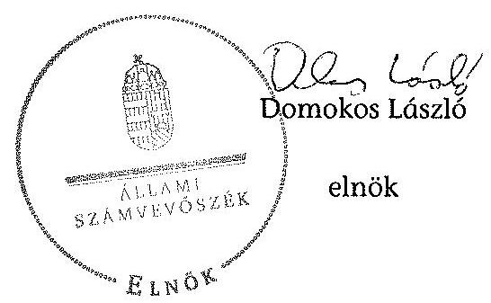

# ÁLLAMI   SZÁMVEVŐSZÉK 

## JELENTÉS

az Ökopolisz Alapítvány gazdálkodása -
Az Ökopolisz Alapítvány 2010-2012. évi gazdálkodása törvényességének ellenőrzéséről

---

# Állami Számvevőszék 

Iktatószám: V-0351-054/2013.
Témaszám: 1385
Vizsgálat-azonosító szám: V0664
Az ellenőrzést felügyelte:
Brebán Andrea
felügyeleti vezető
Az ellenőrzést vezette és az ellenőrzés végrehajtásáért felelős:
Solymár Ágnes
ellenőrzésvezető
A jelentéstervezet összeállításában közreműködtek:
Eigner György Zoltán
számvevő tanácsos
Liziczai Imréné
számvevő
Az ellenőrzést végezték:
Czékus Balázs Imre
számvevő
Eigner György Zoltán
számvevő tanácsos

Czmarkó Frigyes György
számvevő
Liziczai Imréné
számvevő

---

# TARTALOMJEGYZÉK 

BEVEZETÉS ..... 5
I. ÖSSZEGZŐ MEGÁLLAPÍTÁSOK, KÖVETKEZTETÉSEK, JAVASLATOK ..... 7
II. RÉSZLETES MEGÁLLAPÍTÁSOK ..... 11

1. Az alapítvány gazdálkodásának törvényessége ..... 11
1.1. Az alapítvány alapítása ..... 11
1.2. A kuratórium működése ..... 12
1.3. Az alapítvány bevételei ..... 13
1.4. Az alapítvány ráfordításai ..... 13
2. Éves beszámolók ..... 16
2.1. A számviteli beszámolók ..... 16
2.2. A mérleg ..... 17
2.3. Az eredménykimutatás ..... 18
3. A könyvvezetés szabályozottsága ..... 19
4. A könyvvezetés gyakorlata ..... 20
5. Az alapítvány ellenőrzési rendszere ..... 21
6. Az alapítvány által létrehozott szervezet ..... 23
MELLÉKLETEK
7. számú Számviteli beszámoló - 2010.
8. számú Számviteli beszámoló - 2011.
9. számú Számviteli beszámoló - 2012.

---

.

---

# RÖVIDÍTÉSEK JEGYZÉKE 

## Jogszabályok

Cvtv.
gazdasági társaságokról szóló törvény
Korm. rendelet
pártalapítványi törvény
párttörvény
Ptk.
Számv. tv.
számviteli rendelet

Az egyesülési jogról, a közhasznú jogállásról, valamint a civil szervezetek működéséről és támogatásáról szóló 2011. évi CLXXV. törvény
Gazdasági társaságokról szóló 2006. évi IV. törvény
Az alapítványok gazdálkodási rendjéről szóló 115/1992. (VII. 23.) Korm. rendelet (hatályon kívül helyezte a 350/2011. (XII. 30.) Korm. rendelet, hatálytalan 2012. január 1. óta)
A pártok működését segítő tudományos, ismeretterjesztő, kutatási, oktatási tevékenységet végző alapítványokról szóló 2003. évi XLVII. törvény
A pártok működéséről és gazdálkodásáról szóló 1989. évi XXXIII. törvény
Polgári Törvénykönyvről szóló 1959. évi IV. törvény
A számvitelről szóló 2000. évi C. törvény
A számviteli törvény szerinti egyes egyéb szervezetek beszámolókészítési és könyvvezetési kötelezettségének sajátosságairól szóló 224/2000. (XII. 19.) Korm. rendelet

## Szórövidítések

alapító
alapítvány
alapító okirat $_{1}$
alapító okirat $_{2}$
ÁSZ
éves beszámoló
FB
kuratórium
NGM
SZMSZ $_{1}$
SZMSZ $_{2}$
ügyrend $_{1}$
ügyrend $_{2}$
ügyvezető igazgató

Lehet Más a Politika párt
Ökopolisz Alapítvány
Az Ökopolisz Alapítvány alapító okirata (hatályos 2011. június 8-ig)
Az Ökopolisz Alapítvány módosított alapító okirata (hatályos 2011. június 8-ától)
Állami Számvevőszék
Egyszerűsített éves beszámoló
Ökopolisz Alapítvány Felügyelő Bizottsága
Ökopolisz Alapítvány Kuratóriuma
Nemzetgazdasági Minisztérium
Ökopolisz Alapítvány Szervezeti és Működési Szabályzata (hatályos 2011. július 1-jétől 2012. október 1-jéig)
Ökopolisz Alapítvány Szervezeti és Működési Szabályzata (hatályos 2012. október 1-jétől)
Az Ökopolisz Alapítvány Kuratóriumának ügyrendje (hatályos 2010. szeptember 30-ától)
Az Ökopolisz Alapítvány Kuratóriumának módosított ügyrendje (hatályos 2011. szeptember 15-étől)
Az Ökopolisz Alapítvány munkaszervezetének ügyvezető igazgatója (2011. június 1-jétől)

---

# 4

---

# JELENTÉS 

## az Ökopolisz Alapítvány gazdálkodása Az Ökopolisz Alapítvány 2010-2012. évi gazdálkodása törvényességének ellenőrzéséről

## BEVEZETÉS

A pártok működését segítő tudományos, ismeretterjesztő, kutatási, oktatási tevékenységet végző alapítványokról szóló 2003. évi XLVII. törvény (pártalapítványi törvény) alapján a pártok a politikai kultúra fejlesztése érdekében tudományos, ismeretterjesztő, kutatási és oktatási tevékenységük elősegítésére a pártok működéséről és gazdálkodásáról szóló 1989. évi XXXIII. törvényben (párttörvény) meghatározott mértékű költségvetési támogatásra jogosult alapítványt hozhatnak létre.

A Lehet Más a Politika a törvényi rendelkezéseknek megfelelően 2010-ben létrehozta az Ökopolisz Alapítványt (alapítvány). Az alapítvány alapító okirat szerinti célja az állampolgári tájékoztatás és tájékozódás javítása, a politikai kultúra fejlesztése és a közjó szolgálata, kiemelten az ökopolitikai gondolkodásmód elterjesztése, az ökopolitikai alternatívák megfogalmazása, valamint az ökopolitika képviseletének elősegítése a fenntarthatóság, a közügyekben való állampolgári részvétel és az igazságosság széleskörű népszerűsítése révén.

Az alapítvány a törvényi előírásoknak megfelelően a 2010. évben 40178 ezer Ft, a 2011. és 2012. évben egyaránt 80400 ezer Ft költségvetési támogatásban részesült.

A pártalapítványi törvény 4. § (2) bekezdése alapján az alapítvány gazdálkodása törvényességének ellenőrzésére az Állami Számvevőszék (ÁSZ) jogosult. A 4. § (4) bekezdése alapján az ÁSZ kétévenként ellenőrzi azoknak az alapítványoknak a gazdálkodását, amelyek e törvény szerint költségvetési támogatásban részesültek. Az alapítvány ellenőrzésére első alkalommal került sor.

Az ellenőrzés célja az alapítvány 2010-2012. évi gazdálkodása törvényességének értékelése volt, amelynek keretében ellenőriztük:

- az alapítvány gazdálkodásának és éves jelentéseinek törvényességét;
- az éves számviteli beszámolók jogszabályi előírásoknak való megfelelését;
- az alapítvány könyvvezetésében a számvitelről szóló 2000. évi C. törvény, a pártalapítványok könyvvezetésére vonatkozó egyéb jogszabályi rendelkezések, valamint belső előírások betartását.

---

Az ellenőrzött időszak: 2010. augusztus 6. - 2012. december 31.
Az ellenőrzés hasznosulása: az ellenőrzés a gazdálkodás szabályszerűségének bemutatásával hozzájárul ahhoz, hogy a társadalom objektív képet alkothasson a pártalapítványok működéséről. Az ellenőrzés eredménye elősegítheti, hogy a törvényalkotók konkrét lépéseket tegyenek a pártalapítványok finanszírozására vonatkozó szabályozások megváltoztatása, átláthatóbbá, ellenőrizhetőbbé tétele irányába. Az ellenőrzött szervezetek szintjén a hiányosságok, szabálytalanságok feltárása, az ennek kapcsán megfogalmazott megállapítások elősegíthetik a pártalapítványok szabályszerű gazdálkodását. A gazdálkodás szabályszerűségének bemutatásával az ellenőrzés értékteremtő módon járul hozzá az ÁSZ stratégiai céljainak megvalósításához.

Az ellenőrzést a pénzügyi-szabályszerűségi ellenőrzés módszertani szabályai szerint végeztük. Az ellenőrzés szakmai módszertana az ÁSZ hivatalos honlapján (www.asz.hu) közzétett szakmai szabályokon alapul, amely a Legfőbb Ellenőrző Intézmények Nemzetközi Szervezete (INTOSAI) által kiadott nemzetközi standardok (ISSAI) figyelembevételével készült.

Az ÁSZ a 2011. évi LXVI. törvény 29. § (1) bekezdése szerint a jelentéstervezetet megküldte egyeztetésre az alapítvány kuratóriumi társelnökeinek, akik az ÁSZ tv. 29. § (2) bekezdésében foglalt 15 napos észrevételezésre küldött válaszlevélben a jelentéstervezetre észrevételt nem tettek.

---

# I. ÖSSZEGZŐ MEGÁLLAPÍTÁSOK, KÖVETKEZTETÉSEK, JAVASLATOK 

Az alapító az alapítványt 2010-ben a törvényi rendelkezéseknek megfelelően hozta létre. Az alapító okirat tartalma és előírásai összhangban voltak a Ptk., a párttörvény és a pártalapítványi törvény rendelkezéseivel. Tartalmazta az alapítvány céljait, az alapítványi vagyon felhasználásának, és a képviseleti jog gyakorlásának módját, továbbá a kuratórium és az alapítvány működésének főbb szabályait. Az alapító az alapító okiratot az ellenőrzött időszakban egy alkalommal módosította. A módosítást személyi változások indokolták.

Az alapító az SZMSZ ${ }_{1,2}$-ben szabályozta alapítvány jogállását, tevékenységi körét, felépítését, a vezetők és az alkalmazottak feladat-, jog-, és hatáskörét, a kötelezettségvállalással és a képviseleti jogokkal kapcsolatos eljárásrendet. A kuratórium ügyrendjé ${ }_{1,2}$-ben az alapító okirattal összhangban szabályozták a kuratóriumi tagok jelölésének, visszavonásának, a tagság megszűnésének szabályait, továbbá a kuratórium feladatát, és hatáskörét. Meghatározták a kurátorok jogát és kötelezettségét, az alapítvány képviseletének szabályait, az ülések gyakoriságát, résztvevőit, összehívását, napirendjét. Rendelkeztek a határozathozatal módjáról, annak dokumentálásáról, valamint az elnök hatásköréről, feladatáról és az alapító tájékoztatására vonatkozó kötelezettségéről.

A kuratórium az ellenőrzött években törvényesen működött. Az alapítványi célok megvalósulását szolgáló határozatait az alapító okiratnak megfelelő gyakorisággal, határozatképes üléseken hozta meg. A képviseleti és a bankszámla feletti rendelkezési jog gyakorlása megfelelt az alapító okirat ${ }_{1,2}$ és az SZMSZ ${ }_{1,2}$ előírásainak. Az alapítvány gazdálkodása a kuratórium által elfogadott költségvetésen alapult. A kuratórium folyamatosan követte az alapítvány gazdálkodását a költségvetés teljesítésének ellenőrzésével, és az ügyvezető igazgató beszámoltatásával.

Az ellenőrzött években az alapítvány összes bevétele 213706 ezer Ft volt, melynek 94,0%-át a költségvetési támogatás tette ki. Az alapítvány az 2010-2012. évek beszámolóiban összesen 147891 ezer Ft ráfordítást számolt el. A ráfordítások 51,8%-a (76613 ezer Ft) az alapítványi célok megvalósítása érdekében merült fel - közvetlen és közvetett célszerinti ráfordításként -, a működési kiadások 48,2%-ot (71278 ezer Ft) tettek ki.

Az ellenőrzött támogatások odaítéléséről a kuratórium az alapító okirat ${ }_{1,2}$, az SZMSZ ${ }_{1,2}$, valamint 2011-2012. évi támogatási irányelvek alapján döntött. A szerződéseket a képviseletre jogosult kuratóriumi elnök és az ügyvezető kötötte meg, melyben a nyújtott támogatás felhasználásának szakmai és pénzügyi elszámolásáról rendelkezett. A pályázati szabályzatban előírtaktól eltérően a határidő és költségátcsoportosítások engedélyezését követően a szerződéseket nem minden esetben módosították.

---

A támogatottak - egy kivételével - betartották az elszámolásra vonatkozó beszámolókészítési, és bizonylatolási előírásokat. A pályázatok szakmai és pénzügyi elszámolását a szabályzatoknak megfelelően minden esetben felülvizsgálták. A kuratórium döntött a felülvizsgált szakmai és pénzügyi beszámolók elfogadásáról. A támogatások célja és felhasználása megfelelt a pártalapítványi törvény előírásainak.

Az alapítvány az egyszerűsített éves beszámolókat és a pártalapítványi törvény szerinti éves jelentéseket a jogszabályi előírásoknak és a belső szabályzatoknak megfelelően határidőben elkészítette, nyilvánosságra hozta. A beszámolókat a könyvvizsgáló hitelesítette, az FB véleményezte, a kuratórium érvényes határozatokkal elfogadta. A beszámolók megbízható, valós képet nyújtottak az alapítvány gazdálkodásáról.

A mérleg és eredménykimutatás sorok adatai megegyeztek a kapcsolódó analitikus és főkönyvi nyilvántartások adataival, melyek az év végi főkönyvi kivonatokból levezethetőek voltak. A mérlegben kimutatott eszközök és források értékadatai számviteli bizonylatokkal alátámasztottak voltak. Az eredmény kimutatásban kimutatott bevételeket és ráfordításokat a Korm. rendelet és a Cvtv. előírásainak megfelelően mutatták be.

Az alapítvány rendelkezett a Számv. tv.-ben előírt, a könyvvezetés és a beszámoló elkészítésének rendjét meghatározó számviteli politikával és az ahhoz kapcsolódó szabályzatokkal.

A gazdálkodási szabályzatok a Számv. tv.-ben meghatározott tartalmi követelményeknek részben feleltek meg. A számviteli politikában a Számv. tv. előírásait figyelmen kívül hagyva nem határozták meg az évközi és év végi zárlatok időpontját, feladatait, az ellenőrzés, az önellenőrzés által feltárt, előző évet, éveket érintő jelentős hibák elszámolására és értékelésére vonatkozó szabályokat, a behajthatatlan követelések értékelésének szempontjait. A leltárkészítési, leltározási és selejtezési szabályzatban a Számv. tv. előírásait figyelmen kívül hagyva nem határozták meg a leltározás bizonylati rendjét, továbbá nem rendelkeztek a források leltározásáról. A pénzkezelési szabályzatban a Számv. tv. előírásai ellenére nem határozták meg a bankszámlán történő pénzforgalom lebonyolításának szabályait. A számlarend nem tartalmazta a Számv. tv. előírásai ellenére a főkönyvi számlák és az analitikus nyilvántartás kapcsolatát. Az ellenőrzött években a számlarendben foglaltakat alátámasztó bizonylati rendet nem alakították ki, továbbá nem szabályozták a konkrét, illetve a nem konkrét célra kapott magán adományok felhasználásának elkülönített nyilvántartását. Az eszközök és források értékelési szabályzatában nem rögzítették az állományból történő kivezetés feltételeinek előírásait.

Az alapítvány könyvvezetését a kettős könyvvitel rendszerében külső könyvelő cég végezte, amelynek könyvelője a könyvviteli szolgáltatást végzők nyilvántartásában szerepelt. Az ellenőrzött bizonylatok Számv. tv.-ben előírt alaki és tartalmi követelményeknek - a könyvelő aláírása, a könyvelés dátuma, valamint az ellenőrzést igazolók aláírásainak hiánya miatt - nem feleltek meg.

---

Az alapítvány ellenőrzési rendszerének kialakítása és működtetése a belső szabályozásnak részben felelt meg. A kuratórium a döntéseit az alapító okirat ${ }_{1,2}$ és az SZMSZ ${ }_{1,2}$ előírásainak megfelelően hozta, a költségvetés alakulását figyelemmel kísérte, az éves beszámolók ellenőrzésével független könyvvizsgálót bízott meg. Az FB az alapító okirat ${ }_{1,2}$-ben előírt ellenőrzési tevékenységét csak az éves beszámolók véleményezése során látta el. A belső ellenőrzés SZMSZ ${ }_{2}$-ben előírt kialakítása és működtetése nem történt meg. A vezetői és a folyamatba épített ellenőrzés nem minden esetben a belső szabályzatokban előírtaknak megfelelően működött, mert nem látták el teljes körűen az utalványozással és a rendelkezés végrehajtásának igazolásával kapcsolatos feladatokat. A pénzkezelési szabályzat előírása ellenére nem jelölték ki a pénztárellenőrt.

Az alapítvány az ellenőrzött időszakban sem a gazdasági társaságokról szóló törvény hatálya, sem a Ptk. hatálya alá tartozó szervezetet nem hozott létre.

Az Állami Számvevőszékről szóló 2011. évi LXVI. törvény 33. § (1) bekezdésében foglaltak értelmében a jelentésben foglalt megállapításokhoz kapcsolódó intézkedési tervet köteles az ellenőrzött szervezet vezetője összeállítani, és azt a jelentés kézhezvételétől számított 30 napon belül az ÁSZ részére megküldeni. Amennyiben az intézkedési tervet határidőben nem küldi meg a szervezet, vagy az nem elfogadható, az ÁSZ elnöke a hivatkozott törvény 33.§ (3) bekezdés a)-b) pontjaiban foglaltakat érvényesítheti.

A helyszíni ellenőrzés megállapításainak hasznosítása mellett javasoljuk:

# az alapítvány kuratóriumának: 

1. A számviteli politikában a Számv. tv. 164. § (1)-(2) bekezdéseinek előírásait figyelmen kívül hagyva nem határozták meg az évközi és év végi zárlatok időpontját, feladatait, a Számv. tv. 14. § (4) bekezdés előírása ellenére az ellenőrzés és az önellenőrzés által feltárt, előző évet, éveket érintő jelentős hibák elszámolására és értékelésére vonatkozó szabályokat, a Számv. tv. 3. § (4) bekezdés 10. pont előírásának figyelembe vételével a sajátosságok szerint megjelölve a behajthatatlan követelések értékelésének szempontjait.

Javaslat:
Egészítse ki a számviteli politikát:
a) a Számv. tv. 164. § (1)-(2) bekezdései előírásainak érvényesítése érdekében az évközi és év végi zárlatok időpontjának, feladatainak meghatározásával;
b) a Számv. tv. 14. § (4) bekezdés előírásainak figyelembe vételével az ellenőrzés, az önellenőrzés által feltárt, az előző évet, éveket érintő jelentős hibák elszámolása és értékelése szabályaival;
c) a Számv. tv. 3. § (4) bekezdés 10. pont előírásának figyelembe vételével az alapítvány sajátosságainak megfelelően a behajthatatlan követelések értékelési szempontjaival.

---

2. A leltárkészítési, leltározási és selejtezési szabályzatban a Számv. tv. előírásait figyelmen kívül hagyva nem határozták meg a leltározás bizonylati rendjét, továbbá nem rendelkeztek a források leltározásáról.

Javaslat:
Egészítse ki a leltárkészítési, leltározási és selejtezési szabályzatot a leltározás bizonylati rendjével, továbbá a források leltározási szabályaival annak érdekében, hogy a leltár eleget tegyen a Számv. tv. 14. § (5) bekezdés a) pontja és a 69. § előírásainak.
3. A pénzkezelési szabályzatban a Számv. tv. előírásai ellenére nem határozták meg a bankszámlán történő pénzforgalom lebonyolításának szabályait. A pénzkezelési szabályzat előírása ellenére nem jelölték ki a pénztárellenőrt.

Javaslatok:
a) Egészítse ki a pénzkezelési szabályzatot a Számv. tv. 14. § (8) bekezdés előírásának megfelelően a bankszámlán történő pénzforgalom eljárásrendjével.
b) Intézkedjen a pénzkezelési szabályzat előírása alapján pénztárellenőr kijelöléséről a Számv. tv. 14. § (8) bekezdésben foglaltak biztosítása érdekében.
4. A számlarend nem tartalmazta a Számv. tv. előírásai ellenére a főkönyvi számlák és az analitikus nyilvántartás kapcsolatát. Az ellenőrzött években a számlarendben foglaltakat alátámasztó bizonylati rendet nem alakították ki, továbbá nem szabályozták a konkrét, illetve a nem konkrét célra kapott magán adományok felhasználásának elkülönített nyilvántartását.

Javaslat:
Egészítse ki a számlarendet:
a) a főkönyvi és az analitikus nyilvántartások kapcsolatának szabályaival a Számv. tv. 161. § (2) bekezdés c) pontja előírásának megfelelően;
b) a bizonylati rend szabályaival a Számv. tv. 161. § (2) bekezdés d) pontja előírásának megfelelően;
c) a konkrét, illetve az alapító okirat szerinti célokra kapott magán adományok felhasználásának, a Számv. tv. 161/A. § (2) bekezdése előírásának megfelelő nyilvántartása szabályozásával.
5. Az ellenőrzött bizonylatok a Számv. tv. 167. § (1) bekezdés c) és i) pontjaiban előírt alaki és tartalmi követelményeknek - könyvelő aláírása, könyvelés dátuma, valamint az ellenőrzést igazoló aláírása - nem feleltek meg.

Javaslat:
Intézkedjen, hogy tüntessék fel a bizonylatokon a Számv. tv. 167. § (1) bekezdésben előírt alaki és tartalmi elemeket.

---

# II. RÉSZLETES MEGÁLLAPÍTÁSOK 

## 1. Az alapítvány gazdálkodásának törvényessége

### 1.1. Az alapítvány alapítása

Az alapító 2010-ben a törvényi rendelkezéseknek megfelelően hozta létre az alapítványt, a nyilvántartásba vételét elrendelő végzés 2010. augusztus 6-án emelkedett jogerőre.

Az alapító okirat ${ }_{1,2}$ tartalma és előírásai megfeleltek a Ptk., a párttörvény és a pártalapítványi törvény rendelkezéseinek. Nevesítette az alapítvány cél szerinti tevékenységeit, tartalmazta az induló vagyonát, a vagyongyarapodása formáit, forrásait, az alapítvány csatlakozás, a támogatás eljárásrendjét, az alapítvány megszűnése esetén a vagyon felhasználásával kapcsolatos kötelezettségeit, továbbá az alapítvány gazdálkodása főbb szabályait. Rendelkezett a kuratórium feladat és hatásköréről, működéséről, az alapítvány nyilvántartásaival összefüggő alapvető elvárásokról, a képviseleti jogok gyakorlásának módjáról. Szabályozta az FB feladat-, jog-, és hatáskörét. Az alapítvány célja, valamint a cél elérése érdekében - az alapító okiratban meghatározott tevékenységek megfeleltek a párttörvény 9/A. § (1) bekezdésében foglaltaknak.

Az alapítvány alapító okirat ${ }_{1,2}$ szerinti célja „az állampolgári tájékoztatás és tájékozódás javítása, a politikai kultúra fejlesztése és a közjó szolgálata, kiemelten az ökopolitikai gondolkodásmód elterjesztése, az ökopolitikai alternatívák megfogalmazása, valamint az ökopolitika képviseletének elősegítése a fenntarthatóság, a közügyekben való állampolgári részvétel és az igazságosság széleskörű népszerűsítése révén".

Az alapító az alapító okirat ${ }_{1}$-ot az ellenőrzött években egy alkalommal módosította. A módosítás a képviseletet ellátók személyét, az alapítvány székhelyét, a gazdálkodásáról készített jelentési kötelezettséget, annak tartalmát, a kuratórium létszámát, a kuratóriumi elnökök és tagok személyét és kijelölésük időtartamát, a kuratórium hatáskörét, az elnökök feladatát, felelősségét és képviseleti jogát (ideértve a bankszámla feletti rendelkezési jogát is), illetve az FB tagjai kijelölésének időtartamát érintette.

Az alapítvány SZMSZ ${ }_{1}$-e tartalmazta a kuratórium, az elnök és az ügyvezető igazgató hatásköre, felelősségi köre elhatárolásával, illetve az ügyvezető kötelezettségvállalásával kapcsolatos részletszabályokat. Az SZMSZ ${ }_{2}$ az alapító okirat ${ }_{2}$-tal összhangban rögzítette az alapítvány jogállását, tevékenységi körét, felépítését, a kuratórium és a felügyelő bizottság feladat- és hatáskörét, az alapítvány alkalmazottainak feladatait, felelősségét, a helyettesítés rendjét. Meghatározták a képviseleti jogot, a munkakörökhöz rendelten az aláírási jogot, rendelkeztek az alapítványi cél megvalósításához kapcsolódó gazdálkodási tevékenységről, a szolgáltatások igénybevétele rendjéről, a

---

nyilvántartásról és az iratkezelés, a nyilvánosság biztosítása és az iratbetekintés szabályairól, valamint a titoktartási kötelezettségről.

Az alapítvány a céljaira rendelt vagyon felhasználási módját az alapító okirat ${ }_{1,2}$ és az SZMSZ ${ }_{2}$ a pártalapítványi törvény 3/A. § továbbá a Ptk.74/B (1) bekezdés c) pontja előírásainak megfelelően szabályozta.

# 1.2. A kuratórium működése 

A képviseleti jog szabályozása és gyakorlása a Ptk., az alapító okirat ${ }_{1,2}$ és az SZMSZ ${ }_{1,2}$ előírásaival összhangban történt. A kuratórium a képviseleti jogot az SZMSZ ${ }_{1,2}$, és az alapító okirat ${ }_{1,2}$ előírásaival összhangban szabályozta.

Az alapítványt az SZMSZ ${ }_{1}$ alapján a kuratóriumi elnök egy másik kuratóriumi taggal, illetve az ügyvezetővel, az SZMSZ ${ }_{2}$ alapján a kuratóriumi elnökök együttesen, vagy valamelyik elnök az ügyvezetővel, vagy az ügyvezető a gazdasági munkatárssal együtt képviseli. Az SZMSZ ${ }_{1,2}$ értékhatárhoz kötötten, de eltérő módon rögzítette az ügyvezető kötelezettségvállalási szabályait.

Az SZMSZ ${ }_{2}$ a bankszámla feletti rendelkezési jogot a kuratóriumi elnökök és az ügyvezetőn kívül a gazdasági munkatárs részére is biztosította az ügyvezetővel történő együttes aláírással. A számlavezető banknál bejelentettek köre megfelelt az alapító okirat ${ }_{1,2}$ előírásainak.

A kuratórium ügyrend ${ }_{1,2}$-je az alapító okirattal összhangban szabályozta a kuratórium tagjai jelölésének, visszavonásának, a tagság megszűnésének szabályait, a kuratórium feladatát, hatáskörét, a kurátorok jogát és kötelezettségét, az alapítvány képviseletének szabályait, az ülések gyakoriságát, résztvevőit, összehívását, napirendjét, határozathozatal módját, annak dokumentálását, valamint az elnök hatáskörét és feladatát és az alapító tájékoztatására vonatkozó kötelezettségét.

Az ügyrend ${ }_{1,2}$ alapján a kuratórium határozatképes, ha tagjai többsége jelen van, határozatait nyílt szavazással, a jelenlévő tagok egyszerű szótöbbségével hozza meg, szavazategyenlőség esetében az elnök dönt. Határozathozatal meghatározott döntésekhez kapcsolódóan ülés tartása nélkül írásban is történhet, melynek eljárásrendjét, dokumentálását szabályozták. A módosítást és az ügyrend ${ }_{2}$ hatályba helyezését a kuratórium létszámának növekedése (9 tagú lett), másrészt a feladat- és hatásköre változása, illetve döntését érintő változtatások indokolták.

Az alapítvány 2010-ben hét ülésen 24, a 2011. és 2012. években 16 ülésen 108, az alapító okirat ${ }_{1,2}$ előírásainak megfelelő határozatot hozott.

A kuratórium - az alapító okirat ${ }_{1,2}$ előírásának megfelelően - döntött az alapítvány költségvetéseinek elfogadásáról. A költségvetések tartalmazták az alapítvány bevételeit és kiadásait. A kiadásokat alapítványi célú tevékenység közvetlen és közvetett költségei, valamint a kezelőszervezet költségei és egyéb közvetett működési költségek szerinti bontásban fogadták el.

A kuratórium a 2012. évben módosította az alapítvány költségvetését, melynek során az általános tartalék terhére tárgyi eszköz beszerzésére csoportosított át 300 ezer Ft-ot.

---

A munkaszervezet vezetője rendszeresen tájékoztatta a kuratóriumot a költségvetés alakulásáról.

# 1.3. Az alapítvány bevételei 

Az alapítvány a párttörvény 9/A. § (3) bekezdésében foglaltak alapján jogosult volt központi költségvetési támogatásra. Az alapítvány az ellenőrzött évek beszámolóiban összesen 213706 ezer Ft bevételt mutatott ki, melynek 94,0%-a központi költségvetési támogatás volt. A kiutalt támogatás összege és annak folyósítása megfelelt a párttörvény 9/A. § (2) és (5) - (6) bekezdéseiben foglalt rendelkezéseknek.

Az alapítvány bevételeinek alakulását és összetételét a 2010-2012. években az alábbi táblázat tartalmazza:

| Megnevezés | 2010. év   (ezer Ft) | 2011. év   (ezer Ft) | 2012. év   (ezer Ft) | Összesen   (ezer Ft) |
| :-- | :--: | :--: | :--: | :--: |
| Költségvetési támogatás | 40178 | 80400 | 80400 | 200978 |
| Cél szerinti tevékenység   bevétele | - | 2106 | 1017 | 3127 |
| Kapott kamatok   (pénzeszköz lekötésből) | 318 | 3374 | 4363 | 8055 |
| Egyéb bevétel | 3 | 172 | 1371 | 1546 |
| Összesen | $\mathbf{40499}$ | $\mathbf{8 6052}$ | $\mathbf{8 71 5 1}$ | $\mathbf{2 1 3 7 0 6}$ |

Az alapítvány az ellenőrzött években a költségvetési támogatásból adott évben fel nem használt összeget a következő év programjainak megvalósítása érdekében (2010-ben 37687 ezer Ft-ot, 2011-ben 64588 ezer Ft-ot, 2012-ben 54966 ezer Ft-ot) a Számv. tv. előírásait betartva elhatárolt.

Az alapító okirat ${ }_{1,2}$ - a törvényi szabályozással összhangban - lehetővé tette az alapítvány számára a csatlakozók által befizetett támogatások, adományok elfogadását, azonban az alapítvány az ellenőrzött években támogatást, adományt nem kapott.

Az alapítvány cél szerinti tevékenységei bevételeként tréningek képzési díjaként 3127 ezer Ft-ot számolt el, egyéb bevételei az előző évben nyújtott támogatások visszautalásából keletkezett. Az átmenetileg szabad pénzeszközök lekötéséből az ellenőrzött években összesen 8055 ezer Ft kamatbevételt realizált.

### 1.4. Az alapítvány ráfordításai

Az alapítvány az ellenőrzött időszak éves beszámolóiban összesen 147891 ezer Ft ráfordítást számolt el. Az összes ráfordítás 51,8%-a

---

(76 613 ezer Ft) az alapítványi célok megvalósítása érdekében - közvetlen és közvetett célszerinti ráfordításként - merült fel, a működési kiadások 48,2%-ot (71 278 ezer Ft) tettek ki.

Az alapítvány működési kiadásainak mértékét jelentősen befolyásolta az, hogy a munkaszervezetet a 2011. évben alakították ki, a létszám a 2010. évihez viszonyítva háromszorosára nőtt, továbbá az, hogy a felmerült általános költségek egy részét csak részben osztották fel a saját szervezésű programokra.

A kuratórium az éves költségvetésekben állapította meg a működési és a célszerinti tevékenységének feladataira fordítható keretösszegeket, továbbá döntött a kapcsolódó szerződések megkötéséről.

Az alapítvány célszerinti közvetlen és közvetett költségeit, ráfordításait a 2010-2012. években az alábbi táblázat tartalmazza:

| Megnevezés | 2010. év   (ezer Ft) | 2011. év   (ezer Ft) | 2012. év   (ezer Ft) | Összesen   (ezer Ft) |
| :-- | :--: | :--: | :--: | :--: |
| Nyújtott támogatások | - | 11129 | 14138 | 25267 |
| Oktatás, képzés | - | 6063 | 12539 | 18602 |
| Kutatási program | - | 2675 | 11131 | 13806 |
| Fesztivál, konferencia | - | 4372 | 1936 | 6308 |
| Társadalmi részvétel   műhely program | - | 1159 | 2282 | 3441 |
| Egyéb programok,   rendezvények | - | 991 | 3000 | 3991 |
| Támogatási program   (helyi fenntarthatósági   kezdeményezések) | - | - | 5198 | 5198 |
| Célszerinti közvetlen   ráfordítás | - | $\mathbf{26 3 8 9}$ | $\mathbf{50224}$ | $\mathbf{7 6 6 1 3}$ |

Az alapítvány célszerinti feladatellátását, a pályázati koncepciójával összhangban lévő célszerinti ráfordítások 43,5\%-át pályázati/egyedi kérelmekre való támogatások nyújtásával és 56,5\%-át saját szervezeti keretei között megvalósított oktatással, képzésekkel, fesztivál, konferencia és egyéb rendezvényekkel, kutatásokkal, helyi fenntarthatósági kezdeményezésekkel, (tanulmányok készíttetése) és egyéb tevékenységekkel végezte. Az alapítvány a 2011-2012. években támogatást civil szervezeteknek nyújtott, az alapítás évében mindössze 2492 ezer Ft működési ráfordítást számolt el.

Az egyedi kérelmek alapján nyújtott támogatások összege az ellenőrzött években összesen 8050 ezer Ft-ot tett ki, melyek programokhoz, rendezvényekhez kapcsolódtak. Az alapítvány az ellenőrzött években pályázatok keretében, illetve egyedi kérelmek alapján összesen 33317 ezer Ft támogatást nyújtott.

Az alapítvány az egyedi kérelemre nyújtott támogatások eljárásrendjét nem szabályozta, a 2011. és 2012. évi pályáztatásra vonatkozóan külön

---

szabályzatot készített. A kuratórium a támogatások odaítéléséről az alapító okirat ${ }_{1,2}$-ban, ügyrendje előírásai szerinti módon döntött. A beérkezett pályázatok elbírálásáról készült jegyzőkönyvekben rögzítették a pályázó azonosítóját, nevét, a pályázat címét, a támogatás összegét, eredményét, illetve az esetleges elutasítás indokolását. A kuratórium a beterjesztett bíráló bizottsági javaslat figyelembevételével döntött a pályázatokról. A megkötött szerződéseket a képviseleti jog szabályozásával összhangban a kuratóriumi elnök és az ügyvezető írta alá.

A szerződések tartalmazták a kuratóriumi döntés számát, a támogatás célját, mértékét, folyósításának módját és határidejét, az elszámoláshoz benyújtandó beszámoló készítést, a benyújtandó pénzügyi dokumentumok körét és kellékeit, a támogatás felhasználásának ellenőrzését, a szerződésszegések eseteit és következményeit. A szerződésekben előírták, hogy a programok dokumentumain és a kiadványokon az alapítványt támogatóként szerepeltetni szükséges. A 2011. évben a szabályozás hiánya miatt nem, a 2012. évben nyújtott pályázati támogatásoknál a támogatási szerződéseket már a támogatott záradékolási kötelezettségének előírásával kötötték.

A 2012. évi szerződések 45,6\%-a tartalmazta a projekt kezdési időpontjával egyező, a szerződéskötés időpontját megelőző, hatálybalépési időpontot annak érdekében, hogy megakadályozzák a keletkezett dokumentumok vissza dátumozása lehetőségét.

A pályázati szabályzattól eltérően a támogatott projektek befejezési határidejének változásának, illetve költségátcsoportosítás engedélyezését követően a szerződéseket nem módosították 2011. évben, a 2012. évben egy pályázat kivételével a szabályzatnak megfelelően jártak el.

A pályázati támogatásokat a szerződésekben foglaltak szerinti módon két részletben folyósították (előlegként a támogatás $90 \%$-át, a szakmai és pénzügyi beszámoló elfogadását követően a fennmaradó $10 \%$-ot). Az alapítvány az előleget a szerződés aláírását követően a szerződésben előírt időpontban, míg a fennmaradó összeget a szerződésben előírt ${ }^{1}$ határidőn túl teljesítette. A pályázatok szakmai és pénzügyi elszámolását - három pályázat kivételével - a szabályzatnak megfelelően minden esetben dokumentáltan felülvizsgálták. A támogatottak - egy támogatott kivételével - betartották az elszámolásra vonatkozó előírásokat. A 2012. évben egy támogatott többszöri felszólítás ellenére sem számolt el, ezért az alapítvány - a támogatási szerződésnek megfelelően - élt a szerződésben biztosított inkasszós jogával. A 2011. évben két pályázó - a hiánypótlásra történt felszólítást követően - a folyósított előleget visszautalta.

Az elszámolási határidőt az ellenőrzött években a támogatottak 84\%-a betartotta (nyolc ellenőrzött támogatás kivételével) a szerződésekben kikötött, illetve 2011. évben a munkaszervezet vezetője engedélyével módosított elszámolási határidőket (leghosszabb túllépés 59 nap volt). Az alapítvány a határidő túllépést nem szankcionálta. A kuratórium a felülvizsgált szakmai és

[^0]
[^0]:    ${ }^{1}$ a beszámoló elfogadását követő öt munkanapon belül.

---

pénzügyi beszámolók elfogadásáról minden esetben döntött. Az alapítvány munkatársai az ellenőrzött években a pályázattal nyújtott támogatások ( 50 db ) ellenőrzése során a célok megvalósulását dokumentumok alapján ellenőrizték, három alkalommal két pályázónál a helyszínen is ellenőrizték a teljesítést.

Az alapítvány egyedi kérelemre a 2011., és a 2012. évben az ökopolitikai nyári egyetem rendezvényét támogatta 2750 ezer Ft-tal, illetve 3000 ezer Ft-tal, továbbá a 2012. évben két kedvezményezett részére összesen 2300 ezer Ft támogatás odaítéléséről döntött. A támogatottakkal kötött szerződések a kuratóriumi határozatokkal összhangban voltak, a folyósított támogatással négy, az ÁSZ helyszíni ellenőrzése alatt folyamatban lévő projekt kivételével elszámoltak. A beszámoló elfogadásáról egyedileg, a 2011. évi támogatásról az éves költségvetés elfogadásával döntött kuratórium.

Az alapítványnak az ellenőrzött években közbeszerzési eljárás lefolytatási kötelezettsége nem keletkezett.

# 2. ÉVES BESZÁMOLÓK 

### 2.1. A számviteli beszámolók

Az alapítvány 2010-2012. években, határidőben elkészítette a pártalapítványi törvény 3/A. § (1) bekezdése szerinti éves jelentését, annak részeként a 3/A. § (3) bekezdés a)-g) pontjaiban és a számviteli politikában előírtak figyelembevételével a számviteli beszámolót, a költségvetési támogatás felhasználására vonatkozó kimutatást, a vagyon felhasználásával kapcsolatos kimutatást, a cél szerinti juttatások kimutatását, a központi költségvetési szervtől kapott támogatás mértékét, az alapítvány egyes vezető tisztségviselőinek nyújtott juttatások értékét, illetve összegét, valamint az alapítvány tevékenységéről szóló rövid tartalmi beszámolót.

Az alapítvány az ellenőrzött években a számviteli politikában meghatározott formában, a kettős könyvvitel rendszerében egyszerűsített éves beszámoló készítésével eleget tett beszámolókészítési kötelezettségének. A számviteli rendelet 6. §(6) bekezdésével összhangban az alapítvány egyszerűsített éves beszámolói mérlegből és eredménykimutatásból álltak, melyeket a 20. § (1) bekezdésben előírt határidőben készítettek el.

Az alapítvány az ellenőrzött években a számviteli rendelet 19. § (1) bekezdésében előírtak alapján könyvvizsgálatra nem volt kötelezett, azonban a számviteli politikában rögzítetteket betartva - saját döntése alapján - a 2011., és a 2012. években alkalmazott független könyvvizsgáló az egyszerűsített éves beszámolókat mindkét évben hitelesítő záradékkal látta el.

Az alapítvány a pártalapítványi törvény 3/A. § (5) bekezdésében előírt - június 30-i határidejű - közzétételi kötelezettségének eleget tett. Az éves jelentéseket a Magyar Közlöny Hivatalos Értesítőjében a törvényben előírt határidőben közzétették, a honlapon megjelentették. Az alapítvány a civil szervezetek bírósági nyilvántartásáról és az ezzel összefüggő eljárási szabályokról szóló

---

2011. évi CLXXXI. törvény 39. § (1) bekezdése előírásának eleget téve a 2011., és a 2012. évi beszámolókat az Országos Bírósági Hivatal részére megküldte.

Az FB az alapító okirat ${ }_{1,2}$ előírásának megfelelően az egyszerűsített éves beszámolókat az ellenőrzött években írásban véleményezte, a kuratóriumnak elfogadásra javasolta. A kuratórium a beszámolókat a pártalapítványi törvény 3/A. § (2) bekezdése előírásának megfelelően érvényes kuratóriumi határozattal elfogadta. Az egyszerűsített éves beszámolókat a Számv. tv. 20. § (6) bekezdésében előírtak szerint a képviseletre jogosultak írták alá.

Az alapítvány az ellenőrzött években az egyszerűsített éves beszámoló összeállítása során érvényesítette a Számv. tv. 15-16. §-aiban foglalt számviteli alapelveket. Az éves beszámolók adatai az év végi főkönyvi kivonatok illetve a kapcsolódó analitikák adataiból levezethetőek voltak. A mérleg és az eredménykimutatás soraihoz kapcsolódó főkönyvi számlák, az analitikus nyilvántartások adataival megegyeztek.

A beszámolók megbízható, valós képet nyújtottak az alapítvány gazdálkodásáról.

# 2.2. A mérleg 

Az ellenőrzött években a Számv. tv. 69. § (2) bekezdés előírása szerint a főkönyvi könyvelés és az analitikus nyilvántartások adatai közötti egyeztetést a mérleg fordulónapjára vonatkozóan elvégezték. A mérlegtételek alátámasztásához az Számv. tv. 69. § (1) bekezdése előírásának megfelelő leltárdokumentációt elkészítették.

Az alapítvány a leltározási szabályzatban csak az eszközök leltározási módját szabályozta, a források leltározási módjáról a Számv. tv. 14. § (5) bekezdés a) pontja előírása ellenére nem rendelkezett.

Az ellenőrzött években a befektetett eszközök közül az immateriális javak (szoftverek, licencek), és a tárgyi eszközök esetében a leltározási szabályzatban előírt leltározást mennyiségi felvétellel végrehajtották. A forgóeszközök közül a követelések esetében a leltározási szabályzat szerinti analitika és főkönyv egyeztetését, valamint a pénzeszközök esetében a mennyiségi felvételt és értékbeni egyeztetéseket dokumentáltan - keltezéssel, aláírással ellátott leltárakkal - elvégezték.

Az ellenőrzés a bekért számviteli bizonylatok (leltárfelvételi jegyzőkönyv, év végi bankkivonat, szállítói folyószámla kivonat, stb.) alapján megállapította, hogy a mérleg eszközök és források adatai valós értéket mutattak.

A tárgyi eszközöknél a számviteli politikában - amely az eszközök és források értékelésének szabályozását is magában foglalta - rögzítettekkel összhangban volt az egyedi nyilvántartás, az aktiválás és a terv szerinti értékcsökkenés elszámolása. A főkönyvi kimutatásban, illetve az egyedi nyilvántartásban szereplő eszközök értéke megegyezett a mérlegben kimutatott eszközök értékével. Az ellenőrzött időszakban az immateriális javak és tárgyi eszközök egyedi nyilvántartása és az állományváltozások

---

(aktiválások, terv szerinti értékcsökkenés) elszámolása összhangban volt a belső szabályzatok - a számviteli politika, a számlarend, a tárgyi eszközök besorolása és a leltározási szabályzat - előírásaival. Az eszközök beszerzése során betartották az SZMSZ-ben előírt kötelezettségvállalás szabályait.

Az egyszerűsített éves beszámoló a forgóeszközökön belül az ellenőrzött években a munkavállalókkal szembeni, illetve - 2011 és 2012-ben - egyéb elismert követeléseket, valamint a pénzeszközöket mutatták ki. A pénzeszközök között a bankszámlákon rendelkezésre álló pénzeszközöket az év végi bankkivonatok egyenlegeivel megegyezően, illetve a házipénztárban lévő pénzkészletet az év végi pénztárjelentés záró állományával megegyezően mutatták ki. Az aktív időbeli elhatárolások között a Számv. tv. 32. § (1) bekezdése, valamint az értékelési szabályzat 9. pontja előírásának megfelelően a 2010. évben a telefonok magáncélú használatából a mérleg fordulónapját követően esedékes bevételeket, a 2012. évben a házipénztár szoftver éves terméktámogatási díjából a 2013. évre vonatkozó díjat mutatták ki.

A mérleg forrás oldala a saját tőkén belül a Számv. tv. 35. § (1) bekezdése előírásának megfelelően tartalmazta - az alapító okirat ${ }_{1}$ által rögzített értéknek megfelelően - az induló tőkét, továbbá az előző évi eredménynek megfelelően a tőkeváltozást, valamint a tárgyévi eredményt.

A kötelezettségek között az ellenőrzött években rövidlejáratú kötelezettséget mutattak ki, amely a szállítói tartozások értékét, és az év végi adó- és járuléktartozásokat tartalmazta. Az alapítványnak év végén lejárt (fizetési határidőn túli) szállítói állománya nem volt. Az egyéb kötelezettségállomány a Számv. tv. 43. § (1) bekezdés előírása és az értékelési szabályzat 8. pontja előírásának megfelelően a december hónapra számfejtett munkabért, kapcsolódó adó- és járulékkötelezettséget tartalmazta.

Az ellenőrzött években a Számv. tv. 44. § (2) bekezdés előírása alapján passzív időbeli elhatárolásként mutatták ki a költségek (ráfordítások) ellentételezésére - visszafizetési kötelezettség nélkül - kapott, pénzügyileg rendezett, egyéb bevételként elszámolt költségvetési támogatás összegéből az adott évben költséggel, ráfordítással nem ellentételezett összeget.

Az aktív és passzív időbeli elhatárolások elszámolása szabályos volt, az elszámolást szállítói számlák és analitikus nyilvántartások támasztották alá.

# 2.3. Az eredménykimutatás 

Az ellenőrzött években az eredménykimutatás sorok adatai a főkönyvi kivonatok, illetve a vonatkozó főkönyvi és részletező számlák összesített adataival megegyeztek. Az alapítvány a bevételeit és a ráfordításait a Korm. rendelet ${ }^{2} 3$. § (2) bekezdésében és az 5. §-ában előírtaknak, 2012. január 1-jétől a Cvtv. 19. §-ában előírtakat betartva, a 20. §-ában előírtaknak megfelelő bontásban mutatta ki.

[^0]
[^0]:    ${ }^{2}$ Hatályon kívül helyezte a 350/2011. (XII. 30.) Korm. rendelet, hatálytalan 2012. január 1. óta.

---

Az eredménykimutatásban szereplő bevételeket és ráfordításokat könyvelési alapbizonylatokkal (szerződések, szállítói számlák, bér, bank- és pénztárbizonylatok) támasztották alá. A bevételeken belül a költségvetésből származó, valamint az egyéb (oktatásokhoz, rendezvényekhez kapcsolódó képzési, részvételi díjak, étkezési hozzájárulások) bevételeket elkülönítetten kezelték. A költségvetési támogatások, a támogatáson kívüli egyéb bevételek és a pénzügyi műveletek bevételének összege megegyezett a vonatkozó bankkivonatok összesített értékével.

A ráfordítások elszámolásánál a belső szabályozás előírásainak megfelelően érvényesítették a kötelezettségvállalás szabályait. A szerződéseket - az alapító okirat ${ }_{1,2}$ valamint az SZMSZ ${ }_{1,2}$ előírásaival összhangban - minden esetben a kuratórium elnöke és az ügyvezető kötötte meg. A rendelkezés végrehajtásának igazolása és az utalványozás hiányosságait a 4. pont tartalmazza részletesen.

# 3. A KÖNYVVEZETÉS SZABÁLYOZOTTSÁGA 

Az alapítvány gazdálkodásának, könyvvezetésének és az éves beszámolói elkészítésének belső szabályozási rendszere a Számv. tv. által kötelezően előírt szabályozáson alapult. Az alapítvány a Számv. tv. 14. § (3)-(5) bekezdései előírásai alapján rendelkezett számviteli politikával, annak mellékletét képező eszközök és a források leltárkészítési, leltározási és selejtezési szabályzattal, eszközök és források értékelési szabályzatával, pénzkezelési szabályzattal, továbbá a Számv. tv. 161. § (1)-(2) bekezdéseiben előírt számlarenddel. A szabályzatokat a 2011. évben a kuratórium jóváhagyásával, a jogszabályi változásokkal aktualizált szabályzatokat a 2012. évben a kuratóriumi elnök aláírásával adták ki. Az ellenőrzés a számviteli szabályzatoknak a Számv. tv. és a számviteli rendelet előírásaival való összhangjában hiányosságokat tapasztalt.

A számviteli politikában nem határozták meg:

- a Számv. tv. 164. § (1)-(2) bekezdései előírásai ellenére az évközi és év végi zárlatok időpontját, feladatait;
- a Számv. tv. 14. § (4) bekezdés előírását figyelmen kívül hagyva az ellenőrzés, az önellenőrzés által feltárt, előző évet, éveket érintő jelentősebb hibák elszámolási és értékelési szabályait;
- a Számv. tv. 3. § (4) bekezdés 10. pontja előírását figyelmen kívül hagyva a behajthatatlan követelések értékelésének szempontjait.

A számvitel politika mellékletét képező leltárkészítési, leltározási és selejtezési szabályzatban - a Számv. tv. 69. § előírását figyelmen kívül hagyva - nem határozták meg a leltározás bizonylati rendjét, továbbá a Számv. tv. 14. § (5) bekezdés a) pontja előírását figyelmen kívül hagyva nem rendelkeztek a források leltározásáról. Az eszközök és források értékelési szabályzatában nem rögzítették az állományból történő kivezetés feltételeinek előírásait. A pénzkezelési szabályzatban a Számv. tv. 14. § (8) bekezdés előírása ellenére nem határozták meg a bankszámlán történő pénzforgalom lebonyolításának szabályait. A számlarend nem tartalmazta a

---

Számv. tv. 161. § (2) bekezdés c. pontja előírása ellenére a főkönyvi számlák és az analitikus nyilvántartás kapcsolatát.

Az ellenőrzött években - a Számv. tv. 161. § (2) bekezdés d) pontja ellenére - a számlarendben foglaltakat alátámasztó bizonylati rendet nem alakították ki, továbbá nem szabályozták a Számv. tv. 161/A. § (2) bekezdése előírása ellenére a konkrét, illetve a nem konkrét célra kapott magán adományok felhasználásának elkülönített nyilvántartását.

# 4. A KÖNYVVEZETÉS GYAKORLATA 

A könyvvezetést a hiányos belső szabályozás ellenére a vonatkozó jogszabályi előírások betartásával, a kettős könyvvitel rendszerében, a számviteli bizonylatok számítógépes feldolgozásával végezték. A könyvvezetést és az egyszerűsített éves beszámolók összeállítását, valamint a bérszámfejtést külső könyvelő cég ${ }^{3}$ végezte. A könyvvezetéssel és a beszámoló elkészítésével megbízott személy rendelkezett a Számv. tv. 151. § (1) bekezdésében előírt képesítéssel, szerepelt az NGM által közzétett könyvviteli szolgáltatást végzők nyilvántartásában.

A könyvelési rendszerből az ellenőrzéshez szükséges adatok lekérdezhetők voltak. Az alkalmazott számítógépes könyvelő program ${ }^{4}$ az ellenőrzött időszakban nem változott. A bizonylatokon történő számlakijelölés gyakorlata a számlarenddel összhangban volt, azonban a Számv. tv. 166. § (6) bekezdésében foglaltak ellenére az alkalmazott kijelölés nem időtálló. A gazdasági eseményeket idősorrendben rögzítették, a könyvelt tételek alapbizonylatai megtalálhatóak voltak. A könyvviteli elszámolást alátámasztó bizonylatok Számv. tv. 167. § (1) bekezdésben előírt alaki és tartalmi követelményeknek, a c) és i) pontokban előírtak - a könyvelő aláírása, a könyvelés dátuma, valamint az utalványozó és az ellenőr aláírása - figyelmen kívül hagyása miatt nem feleltek meg.

Az ellenőrzött években a bankbizonylatokon, illetve a pénztári bizonylatokon az ellenőri, valamint a könyvelői aláírás nem szerepelt. Az alapítvány az ellenőrzött években - a pénzkezelési szabályzatban foglaltakkal ellentétben - pénztárellenőri feladatok ellátására megbízást nem adott. A 2011. évi kiadások, ráfordítások ellenőrzött számviteli bizonylatainak 23,8%-a esetében (31 bizonylat összesen 1384 ezer Ft összegű kiadásánál) hiányzott az utalványozó és a 38,5%-a esetében (50 bizonylat összesen 4183 ezer Ft összegű kiadásánál) a rendelkezés végrehajtását igazoló aláírása. A vizsgált bizonylatok körében az ellenőrzés jogszerűtlen kifizetést nem tárt fel.

A könyvviteli zárlattal kapcsolatos feladatokat az éves beszámoló elkészítését megelőzően elvégezték. Ennek keretében elszámolták a tárgyi eszközök éves terv szerinti értékcsökkenését, megállapították és lekönyvelték az időbeli elhatárolásokat. A könyvviteli számlákból főkönyvi kivonatot készítettek, és elvégezték az eszköz-, forrás- és eredmény-számlák technikai

[^0]
[^0]:    ${ }^{3}$ Adiuto Fortis Kft. 2010. november 15-én kelt vállalkozási szerződés alapján.
    ${ }^{4}$ Kulcs-Soft könyvelési szoftver

---

zárását. A leltározás az ellenőrzött években teljes körű volt. A szabályozás hiánya ellenére minden főkönyvi számlát egyeztettek az analitikus nyilvántartással és a főkönyvvel. A bankszámlán rendelkezésre álló pénzeszközök, a kötelezettségek, a passzív időbeli elhatárolások egyeztetéses leltározását elvégezték.

Az alapítvány házipénztárának működtetése során a pénzkezelési szabályzatban előírtakat - a pénztárellenőr kijelölése kivételével - betartották. A pénzforgalom nyilvántartása - bevételi, kiadási pénztárbizonylat, pénztárjelentés - 2011. év szeptemberéig manuális feldolgozással, azt követően szoftver használatával elektronikusan történt. A pénztárban alkalmazott szigorú számadású nyomtatványok nyilvántartása, azok vezetése megfelelt az Számv. tv. 168. § (3) bekezdésében előírtaknak. Az utólagos elszámolásra adott előlegek kiadásának, valamint azok visszavezetésének, elszámolásának analitikus nyilvántartása megfelelő volt.

A bankszámla feletti rendelkezési jog gyakorlása az ellenőrzött időszakban megfelelt az alapító okirat ${ }_{1,2}$-ben, az SZMSZ ${ }_{2}$-ben és a 2012. évtől hatályos pénzkezelési szabályzatban előírtaknak. A banki átutalásokat internet alapú banki szolgáltatásra kötött szerződés alapján - elektronikus úton teljesítették.

A könyvvezetésben - a Korm. rendelet ${ }^{5}$ 3. § (2) bekezdésében és az 5. §-ában előírtaknak megfelelően - az alapítványi célú tevékenység közvetlen és közvetett (működési jellegű) költségeit a főkönyvi könyvelés keretében - a 2011. évtől elkülönítették. A költségek típusát - szoftver segítségével, részlegszámokkal paraméterezik a bizonylatokat az elektronikus nyilvántartásban - a könyvelési alapbizonylatokon feltüntették.

Az alapítvány az éves költségvetési tervét az alapító okirat ${ }_{1,2}$ előírásainak megfelelően készítette el, amely alakilag és tartalmilag megfelelő. Az alapítvány honlapján és Magyar Közlöny Hivatalos Értesítőjében az éves jelentés megjelent. Az alapítvány az ellenőrzött években adományt nem gyűjtött, csatlakozói támogatást nem kapott.

# 5. Az alapítvány ellenőrzési rendszere 

Az alapítvány ellenőrzési rendszerének kialakítása és működtetése a belső szabályozásnak részben felelt meg. Az ellenőrzésre vonatkozó feladatokat az alapító okirat ${ }_{1,2}$-ban, az SZMSZ ${ }_{1,2}$-ben, a gazdálkodási szabályzatokban, a munkaköri leírásokban részben meghatározták.

Az alapítvány vagyonkezelését és gazdálkodását érintő kuratóriumi döntések az alapító okirat ${ }_{1,2}$ és a belső szabályzatokkal összhangban voltak. A kuratórium - az alapító okirat ${ }_{1,2}$-nek és az SZMSZ ${ }_{2}$ előírásainak megfelelően rendszeresen beszámoltatta az ügyvezető igazgatót az alapítvány

[^0]
[^0]:    ${ }^{5}$ Hatályon kívül helyezte a 350/2011. (XII. 30.) Korm. rendelet, hatálytalan 2012. január 1. óta.

---

tevékenységéről, működéséről, továbbá figyelemmel kísérte a költségvetés teljesítését.

Az alapító az alapítvány működésének és gazdálkodásának ellenőrzésére - az alapító okirat ${ }_{1,2}$-ben, az SZMSZ ${ }_{2}$-ben meghatározottak alapján - háromtagú FB-t jelölt ki, szabályozta a feladat-, jog- és hatáskörét, megnevezte az elnökét. Az FB az ellenőrzött években ügyrendet nem készített. Az FB az ellenőrzött években az alapító okirat ${ }_{1,2}$-ben, az SZMSZ ${ }_{1,2}$-ben előírt működési szabályokat részben betartotta, mert a kuratóriumi döntést megelőzően írásban véleményezte az éves beszámolókat. Az FB legalább egy tagja tanácskozási joggal minden alkalommal részt vett a kuratórium ülésein, így követte az alapítvány feladatellátásának szabályosságát. Az alapító az alapító okiratban és az SZMSZ ${ }_{2}$-ben évente kettő ülés megtartását írta elő, melynek az FB az ellenőrzött években nem tett eleget. Az FB az ellenőrzött években ellenőrzési tevékenységet - az alapítvány adatszolgáltatása alapján - nem végzett.

Az alapító az SZMSZ ${ }_{2}$-ben az ügyvezető igazgató feladataként előírta a független belső ellenőrzés megszervezését, működtetését, a feltárt hiányosságok, szabálytalanságok megszüntetését. Az előírás ellenére az ellenőrzött években a független belső ellenőrzés szervezeti kereteit nem alakították ki, belső ellenőrzés az alapítványnál nem volt.

A vezetői és a folyamatba épített ellenőrzés a belső szabályzatokban előírtakat részben betartva működött. Az ügyvezető igazgató az SZMSZ ${ }_{1,2^{-}}$ ben előírtaknak megfelelően gyakorolta a munkáltatói jogkörét, az alapítvány munkaszervezete valamennyi dolgozója számára kiadta a munkaköri leírást. A kiadások teljesítése során feltárt - az utalványozást és a rendelkezés végrehajtásának igazolását is érintő - hiányosságokat részletesen a 4. pont tartalmazza. A pénzkezelési szabályzatban rögzítették a pénztárellenőr feladatait, azonban az alapítványnál a munkaköri leírások alapján kijelölt pénztárellenőr nem volt.

A számviteli szolgáltató céggel kötött szerződés nem írt elő a megbízott részére ellenőrzési feladatokat, és nem rögzítette a hibák javításához kapcsolódó szavatossági, kötelezettséget, valamint a Ptk. szerinti kárfelelősséget. A könyvvezetésre kötött szerződésben nem szabályozták a megbízott anyagi felelősségét.

Független könyvvizsgáló alkalmazását csak az SZMSZ ${ }_{2}$-ben írták elő. A 2011. évi számviteli beszámoló auditálásával megbízott könyvvizsgáló alkalmazására - a számviteli politikában rögzítetteknek megfelelően kuratóriumi döntés alapján került sor. A független könyvvizsgáló a 2011., és a 2012. évi beszámolókat hitelesítő záradékkal látta el, az éves könyvvizsgálói jelentéseket a kuratórium határozattal elfogadta.

---

# 6. Az alapítvány által létrehozott szervezet 

Az alapítvány az ellenőrzött években sem a gazdasági társaságokról szóló törvény hatálya, sem a Ptk. hatálya alá tartozó szervezetet nem hozott. létre.

Budapest, 2014 év ő. hónap ő. nap

Melléklet: $\quad 3 \mathrm{db}$

---

.

---

Ökopolisz Alapítvány Statisztikai számjel: 18139558-9499-509-11 Bírósági végzés száma: Pk 60.048/2010/4

# I. Számviteli beszámoló

|  Ökopolisz Alapítvány |  |  | 2010.08.06. - 2010.12.31.  |
| --- | --- | --- | --- |
|  Egyszerűsített éves beszámoló - Mérleg |  |  | időszak  |
|   |  |  | Ezer  |
|   |  |  | HUF  |
|  Sorszám | A tétel megnevezése | Előző év(fe) | Előző év(ek) módosítása  |
|  a | b | c | d  |
|  1 | A. Befektetett eszközök (2.+3.+4.+5. sor) | 0 | 0  |
|  2 | I. IMMATÉRIÁLIS JAVAK | 0 | 0  |
|  3 | II. TÁRGYI ESZKÖZÖK | 0 | 0  |
|  4 | III. BEFEKTETETT PÉNZÜGYI ESZKÖZÖK | 0 | 0  |
|  5 | IV. BEFEKTETETT ESZKÖZÖK ÉRTÉKHELYESBÍTÉSE | 0 | 0  |
|  6 | B. Forgóeszközök (7.+8.+9.+10. sor) | 0 | 0  |
|  7 | I. KÉSZLETEK | 0 | 0  |
|  8 | II. KÖVETELÉSEK | 0 | 0  |
|  9 | III. ÉRTÉKPAPÍROK | 0 | 0  |
|  10 | IV. PÉNZESZKÖZÖK | 0 | 0  |
|  11 | C. Aktív időbeli elhatárolások | 0 | 0  |
|  12 | ESZKÖZÖK ÖSSZESEN (01.+06.+11. sor) | 0 | 0  |
|  13 | D. Saját tőke (14.+15.+16.+17.+18.+19. sor) | 0 | 0  |
|  14 | I. INDULÓ TÖKE | 0 | 0  |
|  15 | II. TÖKEVÁLTOZÁS | 0 | 0  |
|  16 | III. LEKÖTÖTT TARTALÉK | 0 | 0  |
|  17 | IV. ÉRTÉKELÉSI TARTALÉK | 0 | 0  |
|  18 | V. TÁRGYÉVI ÉREDMÉNY ALÁPTEVÉKENYSÉGBŐL | 0 | 0  |
|  19 | VI. TÁRGYÉVI ÉREDMÉNY VÁLLALKOZÁSI | 0 | 0  |
|  20 | E. Céltartalékok | 0 | 0  |
|  21 | F. Kötelezettségeit (22.+23.+24. sor) | 0 | 0  |
|  22 | I. HÁTRASOROLT KÖTELEZETTSÉGEK | 0 | 0  |
|  23 | II. HOSSZÚ LEJÁRATÚ KÖTELEZETTSÉGEK | 0 | 0  |
|  24 | III. RÖVID LEJÁRATÚ KÖTELEZETTSÉGEK | 0 | 0  |
|  25 | G. Posszív időbeli elhatárolások | 0 | 0  |
|  26 | FORRÁSOK ÖSSZESEN (13.+20.+21.+25. sor) | 0 | 0  |
|   | Keltezés: 2011.02.28. |  |   |

Rauschenberger Péter a kuratórium elnöke

Hámori Ferenc a kuratórium elnökhelyeztese Oldal: 2 / 12

---

# 1. SZÁMÚ MELLÉKLET

A V-0351-054/2013. SZÁMÚ JELENTÉSHEZ

Ökopolisz Alapítvány 2010.08.06. - 2010.12.31. Egyszerűsített éves beszámoló - Eredménykimutatás Időszak

|  A tétel megnevezése | Előző év | Tárgyév  |
| --- | --- | --- |
|   | Alapítvány: Változtány: Összes | Alapítvány: Változtány: Összes  |
|  1. Értékesítés nettó árbevétele |  | 0  |
|  2. Aktivált saját teljesítmények értéke |  | 0  |
|  3. Egyéb bevételek |  | 2 494  |
|  ebből támogatások |  | 2 491  |
|  alapító |  | 0  |
|  központi költségvetési |  | 2 491  |
|  helyi önkormányzati |  | 0  |
|  egyéb |  | 0  |
|  4. Pénzügyi műveletek bevételei |  | 318  |
|  5. Rendkívüli bevételek |  | 0  |
|  ebből támogatások |  | 0  |
|  alapító |  | 0  |
|  központi költségvetési |  | 0  |
|  helyi önkormányzati |  | 0  |
|  egyéb |  | 0  |
|  6. Tagdíjak |  | 0  |
|  A. ÖSSZES BEVÉTEL (1±2+3+4+5+6) |  | 2 812  |
|  7. Anyagjellegű ráfordítások |  | 222  |
|  8. Személyi jellegű ráfordítások |  | 2 149  |
|  9. Értékcsökkenési leírás |  | 120  |
|  10. Egyéb ráfordítások |  | 1  |
|  11. Pénzügyi műveletek ráfordításai |  | 0  |
|  12. Rendkívüli ráfordítások |  | 0  |
|  B. ÖSSZES RÁFORDÍTÁS (7+8+9+10+11+12) |  | 2 492  |
|  C. ADÓZÁS ELŐTTI EREDMÉNY (A-B) |  | 320  |
|  I. Adófizetési kötelezettség |  | 0  |
|  E. TÁRGYÉVI EREDMÉNY (C-I) |  | 320  |

Keltezés: 2011.02.28.

Rauschenberger Péter a kuratórium elnöke

Hámori Ferenc a kuratórium elnökhelyettese

Oldal: 3 / 12

---

Ökopolosz Alapítvány 2013.03.01. - 2011.12.31. Szűkített éves beszámoló - Mérőeg

Ítaszár Öge-HUF

|  Sorszám | A tábl magnózeźése | Kifrá év(é) | Kifrá év(ék) | Tárgyév
 |
| --- | --- | --- | --- | --- |
|  a | b | c | d | e  |
|  1 | A. Befektetett eszközök (2 +4, +1, +5, sor) | 364 | 0 | 2 728  |
|  2 | I. IMMATERIÁLIS JAVAK | 0 | 0 | 510  |
|  3 | II. TÁRGYI ESZKÖZÖK | 456 | 0 | 3 109  |
|  4 | III. BEFEKTETETT PÉNZÜGYI ESZKÖZÖK | 0 | 0 | 0  |
|  5 | IV. BEFEKTETETT ESZKÖZÖK ÉRTÉKHÜLYESÍTÉSE | 0 | 0 | 0  |
|  6 | V. Forgóvalóság (7, +9, +9, +10, sor) | 38 438 | 0 | 71 254  |
|  7 | I. KÉSZPÉNZLEK | 0 | 0 | 0  |
|  8 | II. KÖVETELÉSEK | 20 | 0 | 1 842  |
|  9 | III. ÉRTÉKPAPÍROK | 0 | 0 | 0  |
|  10 | IV. PÉNZESZKÖZÖK | 39 430 | 0 | 29 312  |
|  11 | C. ÁTÍRÁNY időbeli elhatárolások | 3 | 0 | 0  |
|  12 | ESZKÖZÖK ÖSSZESEN (91, +66, +11, sor) | 39 805 | 0 | 73 982  |

|  13 | D. Saját tőke (14, +15, +16, +17, +18, +19, sor) | 620 | 0 | 4 612  |
| --- | --- | --- | --- | --- |
|  14 | I. INDULÓ TŐKE | 500 | 0 | 500  |
|  15 | II. TŐKEVÁLTOZÁS | 0 | 0 | 320  |
|  16 | III. LEKÖTÖTT ÉRTEKTARTALÉK | 0 | 0 | 0  |
|  17 | IV. A BEFIZETÉSRE VÁRÓ TŐKE | 0 | 0 | 0  |
|  18 | V. TÁRGYÉVI EREDMÉNY-ALÁÍRVÉKÉRÍTÉGÖLÖ | 320 | 0 | 3 792  |
|  19 | VI. TÁRGYÉVI EREDMÉNY-VÁLTOZÁSOK ÁTÉRTÉKELÉSÉBŐL | 0 | 0 | 0  |
|  20 | E. ÉRTÉKELÉSI TARTALÉKOK | 0 | 0 | 0  |
|  21 | F. Kötelezettségek (22, +23, +24, sor) | 1 226 | 0 | 2 825  |
|  22 | I. HÁTRASOROLT KÖTELEZETTSÉGEK | 0 | 0 | 0  |
|  23 | II. HOSSZÚ LEJÁRATÚ KÖTELEZETTSÉGEK | 0 | 0 | 0  |
|  24 | III. RÖVID LEJÁRATÚ KÖTELEZETTSÉGEK | 1 325
 | 0 | 2 825  |
|  25 | G. Patzits időbeli elhatárolások | 37 780 | 0 | 66 245  |
|  26 | FORRÁSOK ÖSSZESEN (13, +20, +21, +25, sor) | 39 805 | 0 | 73 982  |

Keltezés: 2012.04.30.

Scheneck-Ernsthal a kuratórium távesinöke

Róns Péter a kuratórium távesinöke

2012.04.30.

---

# 2. SZÁMÚ MELLÉKLET A V-0351-054/2013. SZÁMÚ JELENTÉSHEZ

|  Okopolis Alapítvány | 2011.01.01.-2011.12.31.  |
| --- | --- |
|  Egyszerűített éves beszámoló-eredménykimutatás | Módok  |

## 2. Szám 11.11.2013. 12.11.2013. 13.11.2013. 14.11.2013. 15.11.2013. 16.11.2013. 17.11.2013. 18.11.2013. 19.11.2013. 20.11.2013. 21.11.2013. 22.11.2013. 23.11.2013. 24.11.2013. 25.11.2013. 26.11.2013. 27.11.2013. 28.11.2013. 29.11.2013. 30.11.2013. 31.11.2013. 32.11.2013. 33.11.2013. 34.11.2013. 35.11.2013. 36.11.2013. 37.11.2013. 38.11.2013. 39.11.2013. 40.11.2013. 41.11.2013. 42.11.2013. 43.11.2013. 44.11.2013. 45.11.2013. 46.11.2013. 47.11.2013. 48.11.2013. 49.11.2013. 41.11.2013. 40.11.2013. 41.11.2013. 42.11.2013. 43.11.2013. 44.11.2013. 45.11.2013. 46.11.2013. 47.11.2013. 48.11.2013. 49.11.2013. 41.11.2013. 40.11.2013. 41.11.2013. 42.11.2013. 43.11.2013. 44.11.2013. 45.11.2013. 46.11.2013. 47.11.2013. 48.11.2013. 49.11.2013. 41.11.2013. 40.11.2013. 41.11.2013. 42.11.2013. 43.11.2013. 44.11.2013. 45.11.2013. 46.11.2013. 47.11.2013. 48.11.2013. 49.11.2013. 41.11.2013. 40.11.2013. 41.11.2013. 42.11.2013. 43.11.2013. 44.11.2013. 45.11.2013. 46.11.2013. 47.11.2013. 48.11.2013. 49.11.2013. 41.11.2013. 40.11.2013. 41.11.2013. 42.11.2013. 43.11.2013. 44.11.2013. 45.11.2013. 46.11.2013. 47.11.2013. 48.11.2013. 49.11.2013. 41.11.2013. 40.11.2013. 41.11.2013. 42.11.2013. 43.11.2013. 44.11.2013. 45.11.2013. 46.11.2013. 47.11.2013. 48.11.2013. 49.11.2013. 41.11.2013. 40.11.2013. 41.11.2013. 42.11.2013. 43.11.2013. 44.11.2013. 45.11.2013. 46.11.2013. 47.11.2013. 48.11.2013. 49.11.2013. 41.11.2013. 40.11.2013. 41.11.2013. 42.11.2013. 43.11.2013. 44.11.2013. 45.11.2013. 46.11.2013. 47.11.2013. 48.11.2013. 49.11.2013. 41.11.2013. 42.11.2013. 43.11.2013. 44.11.2013. 45.11.2013. 46.11.2013. 47.11.2013. 48.11.2013. 49.11.2013. 41.11.2013. 42.11.2013. 43.11.2013. 44.11.2013. 45.11.2013. 46.11.2013. 47.11.2013. 48.11.2013. 49.11.2013. 41.11.2013. 42.11.2013. 43.11.2013. 44.11.2013. 45.11.2013. 46.11.2013. 47.11.2013. 48.11.2013. 49.11.2013. 41.11.2013. 42.11.2013. 43.11.2013. 44.11.2013. 45.11.2013. 46.11.2013. 47.11.2013. 48.11.2013. 49.11.2013. 41.11.2013. 42.11.2013. 43.11.2013. 44.11.2013. 45.11.2013. 46.11.2013. 47.11.2013. 48.11.2013. 49.11.2013. 41.11.2013. 42.11.2013. 43.11.2013. 44.11.2013. 45.11.2013. 46.11.2013. 47.11.2013. 48.11.2013. 49.11.2013. 41.11.2013. 42.11.2013. 43.11.2013. 44.11.2013. 45.11.2013. 46.11.2013. 47.11.2013. 48.11.2013. 49.11.2013. 41.11.2013. 42.11.2013. 43.11.2013. 44.11.2013. 45.11.2013. 46.11.2013. 47.11.2013. 48.11.2013. 49.11.2013. 41.11.2013. 42.11.2013. 43.11.2013. 44.11.2013. 45.11.2013. 46.11.2013. 47.11.2013. 48.11.2013. 49.11.2013. 41.11.2013. 42.11.2013. 43.11.2013. 44.11.2013. 45.11.2013. 46.11.2013. 47.11.2013. 48.11.2013. 49.11.2013. 41.11.2013. 42.11.2013. 43.11.2013. 44.11.2013. 45.11.2013. 46.11.2013. 47.11.2013. 48.11.2013. 49.11.2013. 41.11.2013. 42.11.2013. 44.11.2013. 45.11.2013. 46.11.2013. 47.11.2013. 48.11.2013. 49.11.2013. 41.11.2013. 42.11.2013. 44.11.2013. 45.11.2013. 46.11.2013. 47.11.2013. 48.11.2013. 49.11.2013. 41.11.2013. 40.11.2013. 42.11.2013. 43.11.2013. 44.11.2013. 45.11.2013. 46.11.2013. 47.11.2013. 48.11.2013. 49.11.2013. 41.11.2013. 42.11.2013. 44.11.2013. 45.11.2013. 46.11.2013. 47.11.2013. 48.11.2013. 49.11.2013. 41.11.2013. 42.11.2013. 43.11.2013. 44.11.2013. 45.11.2013. 46.11.2013. 47.11.2013. 48.11.2013. 49.11.2013. 41.11.2013. 42.11.2013. 43.11.2013. 44.11.2013. 45.11.2013. 46.11.2013. 47.11.2013. 48.11.2013. 49.11.2013. 41.11.2013. 42.11.2013. 44.11.2013. 45.11.2013. 46.11.2013. 47.11.2013. 48.11.2013. 49.11.2013. 41.11.2013. 42.11.2013. 44.11.2013. 45.11.2013. 46.11.2013. 47.11.2013. 48.11.2013. 49.11.2013. 41.11.2013. 42.11.2013. 43.11.2013. 44.11.2013. 45.11.2013. 46.11.2013. 47.11.2013. 48.11.2013. 49.11.2013. 41.11.2013. 42.11.2013. 43.11.2013. 44.11.2013. 45.11.2013. 46.11.2013. 47.11.2013. 48.11.2013. 49.11.2013. 41.11.2013. 42.11.2013. 43.11.2013. 44.11.2013. 45.11.2013. 46.11.2013. 47.11.2013. 48.11.2013. 49.11.2013. 41.11.2013. 42.11.2013. 43.11.2013. 44.11.2013. 45.11.2013. 46.11.2013. 47.11.2013. 48.11.2013. 49.11.2013. 41.11.2013. 42.11.2013. 44.11.2013. 45.11.2013. 46.11.2013. 47.11.2013. 48.11.2013. 49.11.2013. 41.11.2013. 42.11.2013. 44.11.2013. 45.11.2013. 46.11.2013. 47.11.2013. 48.11.2013. 49.11.2013. 41.11.2013. 42.11.2013. 43.11.2013. 44.11.2013. 45.11.2013. 46.11.2013. 47.11.2013. 48.11.2013. 49.11.2013. 41.11.2013. 42.11.2013. 44.11.2013. 45.11.2013. 46.11.2013. 47.11.2013. 48.11.2013. 49.11.2013. 41.11.2013. 42.11.2013. 44.11.2013. 43.11.2013. 44.11.2013. 43.11.2013. 44.11.2013. 42.11.2013. 43.11.2013. 44.11.2013. 42.11.2013. 43.11.2013. 44.11.2013. 45.11.2013. 44.11.2013. 42.11.2013. 43.11.2013. 44.11.2013. 44.11.2013. 43.11.2013. 44.11.2013. 43.11.2013. 43.11.2013. 44.11.2013. 43.11.2013. 43.11.2013. 43.11.2013. 43.11.2013. 43.11.2013. 43.11.2013. 43.11.2013. 43.11.2013. 43.11.2013. 43.11.2013. 43.11.2013. 43.11.2013. 43.11.2013. 43.11.2013. 43.11.2013. 43.11.2013. 43.11.2013. 43.11.2013. 43.11.2013. 43.11.2013. 43.11.2013.
 13.11.2013. 13.11.2013. 13.11.2013. 13.11.2013. 13.11.2013. 13.11.2013. 13.11.2013. 13.11.2013. 13.11.2013. 13.11.2013. 13.11.2013. 13.11.2013. 13.11.2013. 13.11.2013. 13.11.2013. 13.11.2013. 13.11.2013. 13.11.2013. 13.11.2013. 13.11.2013. 13.11.2013. 13.11.2013. 13.11.2013. 13.11.2013. 13.11.2013. 13.11.2013. 13.11.2013. 13.11.2013. 13.11.2013. 13.11.2013. 13.11.2013. 13.11.2013. 13.11.2013. 13.11.2013. 13.11.2013. 13.11.2013. 13.11.2013. 13.11.2013. 13.11.2013. 13.11.2013. 13.11.2013. 13.11.2013. 13.11.2013. 13.11.2013. 13.11.2013. 13.11.2013. 13.11.2013. 13.11.2013. 13.11.2013. 13.11.2013. 13.11.2013. 13.11.2013. 13.11.2013. 13.11.2013. 13.11.2013. 13.11.2013. 13.11.2013. 13.11.2013. 13.11.2013. 13.11.2013. 13.11.2013. 13.11.2013. 13.11.2013. 13.11.2013. 13.11.2013. 13.11.2013. 13.11.2013. 13.11.2013. 13.11.2013. 13.11.2013. 13.11.2013. 13.11.2013. 13.11.2013. 13.11.2013. 13.11.2013. 13.11.2013. 13.11.2013. 13.11.2013. 13.11.2013. 13.11.2013. 13.11.2013. 13.11.2013. 13.11.2013. 13.11.2013. 13.11.2013. 13.11.2013. 13.11.2013. 13.11.2013. 13.11.2013. 13.11.2013. 13.11.2013. 13.11.2013. 13.11.2013. 13.11.2013. 13.11.2013. 13.11.2013. 13.11.2013. 13.11.2013. 13.11.2013. 13.11.2013.
 13.11.2013. 13.11.2013. 13.11.2013. 13.11.2013. 13.11.2013. 13.11.2013. 13.11.2013. 13.11.2013. 13.11.2013. 13.11.2013. 13.11.2013. 13.11.2013. 13.11.2013. 13.11.2013. 13.11.2013. 13.11.2013. 13.11.2013. 13.11.2013. 13.11.2013. 13.11.2013. 13.11.2013. 13.11.2013. 13.11.2013. 13.11.2013. 13.11.2013. 13.11.2013. 13.11.2013. 13.11.2013. 13.11.2013. 13.11.2013. 13.11.2013. 13.11.2013. 13.11.2013. 13.11.2013. 13.11.2013. 13.11.2013. 13.11.2013. 13.11.2013. 13.11.2013. 13.11.2013. 13.11.2013. 13.11.2013. 13.11.2013. 13.11.2013. 13.11.2013. 13.11.2013. 13.11.2013. 13.11.2013. 13.11.2013. 13.11.2013. 13.11.2013. 13.11.2013. 13.11.2013. 13.11.2013. 13.11.2013. 13.11.2013. 13.11.2013. 13.11.2013. 13.11.2013. 13.11.2013. 13.11.2013. 13.11.2013. 13.11.2013. 13.11.2013. 13.11.2013. 13.11.2013. 13.11.2013. 13.11.2013. 13.11.2013. 13.11.2013. 13.11.2013. 13.11.2013. 13.11.2013. 13.11.2013. 13.11.2013. 13.11.2013. 13.11.2013. 13.11.2013. 13.11.2013. 13.11.2013. 13.11.2013. 13.11.2013. 13.11.2013. 13.11.2013. 13.11.2013. 13.11.2013. 13.11.2013. 13.11.2013. 13.11.2013. 13.11.2013. 13.11.2013. 13.11.2013. 13.11.2013. 13.11.2013. 13.11.2013. 13.11.2013. 13.11.2013. 13.11.2013. 13.11.2013. 13.11.2013.
 43.11.2013. 43.11.2013. 43.11.2013. 43.11.2013. 43.11.2013. 43.11.2013. 43.11.2013. 43.11.2013. 43.11.2013. 43.11.2013. 43.11.2013. 43.11.2013. 43.11.2013. 43.11.2013. 43.11.2013. 43.11.2013. 43.11.2013. 43.11.2013. 43.11.2013. 43.11.2013. 43.11.2013. 43.11.2013. 43.11.2013. 43.11. 43.11.2013. 43.11.2013. 43.11.2013. 43.11.2013. 43.11.2013. 43.11.2013. 43.11.2013. 43.11.2013. 43.11.2013. 43.11.2013. 43.11.2013. 43.11.2013. 43.11.2013. 43.11.2013. 43.11.2013. 43.11.2013. 43.11.2013. 43.11.2013. 43.11.2013. 43.11.2013. 43.11.2013. 43.11.2013.
 43.11.2013. 43.11.2013. 43.11.2013. 43.11.2013. 43.11.2013. 43.11.2013. 43.11.2013. 43.11.2013. 43.11.2013. 43.11.2013. 43.11.2013. 43.11.2013. 43.11.2013. 43.11.2013. 43.11.2013. 43.11.2013. 43.11.2013. 43.11.2013. 43.11.2013. 43.11.2013. 43.11.2013. 43.11.2013. 43.11.2013. 43.11.2013. 43.11.2013. 43.11.2013. 43.11.2013. 43.11.2013. 43.11.2013. 43.11.2013. 43.11.2013. 43.11.2013. 43.11.2013. 43.11.2013. 43.11.2013. 43.11.2013. 43.11.2013. 43.11.2013. 43.11.2013. 43.11.2013. 43.11.2013. 43.11.2013. 43.11.2013. 43.11.2013. 43.11.2013. 43.11.2013. 43.11.2013. 43.11.2013. 43.11.2013. 43.11.2013. 43.11.2013. 43.11.2013. 43.11.2013. 43.11.2013. 43.11.2013. 43.11.2013. 43.11.2013. 43.11.2013. 43.11.2013. 43.11.2013. 43.11.2013. 43.11.2013. 43.11.2013. 43.11.2013. 43.11.2013. 43.11.2013. 43.11.2013. 43.11.2013. 43.11.2013. 43.11.2013. 43.11.2013. 43.11.2013. 43.11.2013. 43.11.2013. 43.11.2013. 43.11.2013. 43.11.2013. 43.11.2013. 43.11.2013. 43.11.2013. 43.11.2013. 43.11.2013. 43.11.2013. 43.11.2013. 43.11.2013. 43.11.2013. 43.11.2013. 43.1.2013. 43.11.2013. 43.11.2013. 43.11.2013. 43.11.2013. 43.11.2013. 43.11.2013. 43.11.2013. 43.11.2013. 43.11.2013. 43.11.2013. 43.11.2013. 43.11.2013. 43.11.2013. 43.11.2013. 43.11.2013. 43.11.2013. 43.11.2013. 43.11.2013. 43.11.2013. 43.11.2013. 43.11.2013. 43.11.2013. 43.11.2013. 43.11.2013. 43.11.2013. 43.11.2013. 43.11.2013. 43.11.2013. 43.11.2013. 43.11.2013. 43.11.2013. 43.11.2013. 43.11.2013. 43.11.2013. 43.11.2013. 43.11.2013. 43.11.2013. 43.11.2013. 43.11.2013. 43.11.2013. 43.11.2013. 43.11.2013. 43.11.2013. 43.11.2013. 43.11.2013. 43.11.2013. 43.11.2013. 43.11.2013. 43.11.2013. 43.11.2013. 43.11.2013.

---

Ökopolisz Alapítvány Statisztikai számjel: 18139558-9499-569-01 Bíróság) végzés száma: Pk.60.048/2010/4

# I. Számviteli beszámoló

|  Ökopolisz Alapítvány |  |  | 2012.01.01.- 2012.12.31. |   |
| --- | --- | --- | --- | --- |
|  Egyszerűsített éves beszámoló - Mérleg "A" |  |  | időszak |   |
|   |  |  | Ezenhír |   |
|   | A tétel megnevezése | Előző év | Előző évek módosításai | Tárgyév  |
|  1 | A. Befektetett eszközök (2.+3.+4.+5. sor) | 2 728 | 0 | 1 629  |
|  2 | I. IMMATERIÁLIS JAVAK | 629 | 0 | 379  |
|  3 | II. TÁRGYI ESZKÖZÖK | 2 369 | 0 | 1 250  |
|  4 | III. BEFEKTETETT PÉNZÜGYI ESZKÖZÖK | 0 | 0 | 0  |
|  5 | IV. BEFEKTETETT ESZKÖZÖK ÉRTÉKHELYESBÍTÉSÉ | 0 | 0 | 0  |
|  6 | B. Forgóeszközök (7.+8.+9.+10. sor) | 71 354 | 0 | 68 221  |
|  7 | I. KÉSZLETTEK | 0 | 0 | 0  |
|  8 | II. KÖVETELÉSEK | 1 941 | 0 | 1 389  |
|  9 | III. ÉRTÉKPAPÍROK | 0 | 0 | 0  |
|  10 | IV. PÉNZESZKÖZÖK | 68 312 | 0 | 66 832  |
|  11 | C. Aktív időbeli elhatárolások | 0 | 0 | 10  |
|  12 | ESZKÖZÖK ÖSSZESEN (1.+6.+11. sor) | 73 982 | 0 | 69 860  |
|  13 | D. Saját tőke (14.+15.+16.+17.+18.+19. sor) | 4 612 | 0 | 11 327  |
|  14 | I. INDULÓ TŐKE | 500 | 0 | 500  |
|  15 | II. TŐKEVÁLTOZÁS | 320 | 0 | 4 512  |
|  16 | III. LEKÖTÖTT TARTALÉK | 0 | 0 | 0  |
|  17 | IV. ÉRTÉKELÉSI TARTALÉK | 0 | 0 | 0  |
|  18 | V. TÁRGYÉVI EREDMÉNY ALAPTEVÉKENYSÉGBŐL | 3 792 | 0 | 6 715  |
|  19 | VI. TÁRGYÉVI EREDMÉNY VÁLLALKOZÁSI TEVÉKENYSÉGBŐL | 0 | 0 | 0  |
|  20 | E. Célterhelések | 0 | 0 | 0  |
|  21 | F. Kötelezettségek (22.+23.+24. sor) | 2 825 | 0 | 1 924  |
|  22 | I. HÁTRASOROLT KÖTELEZETTSÉGEK | 0 | 0 | 0  |
|  23 | II. HOSSZÚ LEJÁRATÚ KÖTELEZETTSÉGEK | 0 | 0 | 0  |
|  24 | III. RÖVID LEJÁRATÚ KÖTELEZETTSÉGEK | 2 825 | 0 | 1 924  |
|  25 | G. Passzív időbeli elhatárolások | 66 545 | 0 | 56 609  |
|  26 | FORRÁSOK ÖSSZESEN (13.+20.+21.+25. sor) | 73 982 | 0 | 69 860  |

Keltezés: 2013. 05.20.

ÖKÖPOLISZ ALAPÍTVÁNY 1000 Budapest, Bázis-2. Bálintok 10.20.13. -1. Átkozóró: 1813958-1-42

Schnuck Erzsébet a kuratórium tőrzéknőke

Újvári Erzsébet ügyvezető

Oldal: 2 / 17

---

# 3. SZÁMÚ MELLÉKLET A V-0351-054/2013. SZÁMÚ JELENTÉSHEZ

|  Összebítsz Alapítvány
Sztototikai számok: 18139558-9499-509-01
Dinóségi végzés számú: Fk.00.048/2010/4 |  |  |  |  |  |  |  |  |  |  |  |  |  |  |  |  |  |  |  |  |  |  |  |  |  |  |  |  |  |  |  |  |  |  |  |  |  |  |  |  |  |  |  |  |  |  |  |  |  |  |  |  |  |  |  |  |  |  |  |  |  |  |  |  |  |  |  |  |  |  |  |  |  |  |  |  |  |  |  |  |  |  |  |  |  |  |  |  |  |  |  |  |  |  |  |  |  |  |  | 
