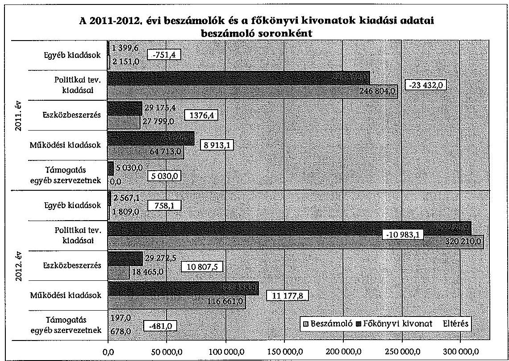
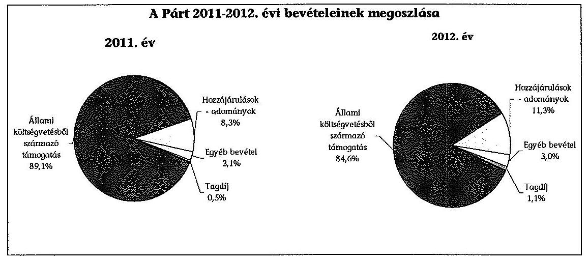
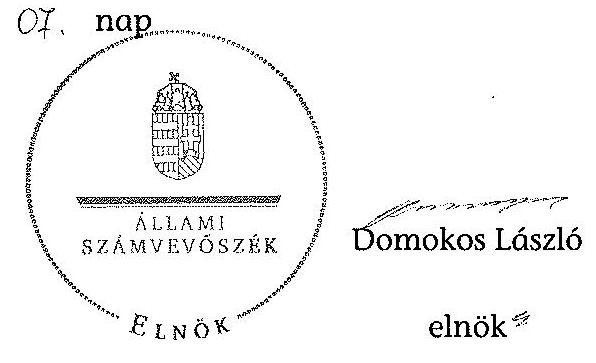

# ÁLLAMI   SZÁMVEVŐSZÉK 

## JELENTÉS

a Jobbik gazdálkodása -
A Jobbik Magyarországért Mozgalom 2011-2012. évi gazdálkodása törvényességének ellenőrzéséről

---

# Állami Számvevőszék 

Iktatószám: V-0348-076/2013.
Témaszám: 1382
Vizsgálat-azonosító szám: V0661
Az ellenőrzést felügyelte:
Brebán Andrea
felügyeleti vezető
Az ellenőrzést vezette és az ellenőrzés végrehajtásáért felelős:
Solymár Ágnes
ellenőrzésvezető
A számvevőszéki jelentés összeállításában közremüködtek:
Komonszky Krisztina
számvevő
Szabó Leonóra Ildikó
számvevő
Szabóné László Mária
számvevő
Az ellenőrzést végezték:

| Fekete Győr László | Komonszky Krisztina | Szabó Leonóra Ildikó |
| :-- | :-- | :-- |
| számvevő | számvevő | számvevő |
| Szabóné László Mária | Tóth Sándor |  |
| számvevő | számvevő |  |

A témához kapcsolódó eddig készített számvevőszéki jelentés:
címe
sorszáma
Jelentés a Jobbik Magyarországért Mozgalom 2009-2010. évi gaz- 1206 dálkodása törvényességének ellenőrzéséről

---

# TARTALOMJEGYZÉK 

BEVEZETÉS ..... 5
I. ÖSSZEGZŐ MEGÁLLAPÍTÁSOK, KÖVETKEZTETÉSEK, JAVASLATOK ..... 7
II. RÉSZLETES MEGÁLLAPÍTÁSOK ..... 12

1. A Párt gazdálkodásáról szóló 2011-2012. évi beszámolók ..... 12
1.1. A teljes ellenőrzött időszakra érvényes megállapítások ..... 12
1.2. Bevételek ..... 13
1.3. Kiadások ..... 15
2. A Pártnak a beszámoló összeállítására és az azt alátámasztó
könyvvezetésre vonatkozó belső szabályozása és gyakorlata ..... 16
2.1. A számviteli rendszer szabályozása ..... 16
2.2. A könyvvezetés összhangia a jogszabályokban és a belső
szabályzatokban előírt követelményekkel ..... 18
2.3. A bizonylati elv és fegyelem, a bizonylati rend érvényesülésének
ellenőrzése ..... 20
2.4. A pártra jellemző speciális területek ..... 20
3. A Párt bevételszerző gazdálkodó tevékenysége az ellenőrzött években ..... 21
3.1. A Párt gazdálkodásának szabályozottsága ..... 21
3.2. A Párt vagyonának elemei ..... 21
4. A gazdálkodással összefüggő egyéb jogszabályokban foglalt előírások
betartásának ellenőrzése ..... 22
4.1. A foglalkoztatás szabályszerűsége ..... 22
4.2. Személyi jellegű kifizetésekre vonatkozó jogszabályok betartása ..... 23
4.3. Az adózási, társadalombiztosítási és egyéb jogszabályok
rendelkezéseinek érvényesítése ..... 24
5. A belső kontroll rendszer ..... 24
5.1. Az ellenőrzés rendszerének szabályozottsága, múködése,
eredményessége ..... 24
5.2. A pénzügyi-számviteli informatikai rendszer szabályozottsága és
belső kontrolljainak múködtetése ..... 25
6. Az előző számvevőszéki ellenőrzés megállapításaira tett intézkedések ..... 25

---

# MELLÉKLETEK 

1. számú A Jobbik Magyarországért Mozgalom 2011. évi beszámolója
2. számú A Jobbik Magyarországért Mozgalom 2012. évi beszámolója
3. számú A Jobbik Magyarországért Mozgalom 2011. évi módosított pénzügyi beszámolója
4. számú A Jobbik Magyarországért Mozgalom 2012. évi módosított pénzügyi beszámolója
5. számú A 2011-2012. évi beszámolókban közzétett és a főkönyvi könyvelés szerinti nevesített, belföldi magánszemélyektől kapott adományok közötti eltérések

---

# RÖVIDÍTÉSEK JEGYZÉKE 

## Törvények

ÁSZ törvény párttörvény

Számv. tv.
Szja tv.

## Szórövidítések

alapszabály
ÁSZ
bizonylatkezelési szabályzat
értékelési szabályzat

Gazdasági Igazgató
leltározási szabályzat

Párt
Párt elnöke
pénzkezelési szabályzat
PGSZ
számlarend
számviteli politika
számvizsgáló bizottság
az Állami Számvevőszékről szóló 2011. évi LXVI. törvény a pártok múködéséről és gazdálkodásáról szóló 1989. évi XXXIII. törvény
a számvitelről szóló 2000 . évi C. törvény
a személyi jövedelemadóról szóló 1995. évi CXVII. törvény

Jobbik Magyarországért Mozgalom Alapszabálya
Állami Számvevőszék
Jobbik Magyarországért Mozgalom Bizonylatkezelési szabályzat
Jobbik Magyarországért Mozgalom Eszközök és források értékelési szabályzata
Jobbik Magyarországért Mozgalom Gazdasági Igazgatója
Jobbik Magyarországért Mozgalom Eszközök és források
leltárkészítési és leltározási szabályzata
Jobbik Magyarországért Mozgalom
Jobbik Magyarországért Mozgalom elnöke
Jobbik Magyarországért Mozgalom Pénzkezelési szabályzata
Jobbik Magyarországért Mozgalom Pénzügyi és Gazdálkodási Szabályzata
Jobbik Magyarországért Mozgalom Számlarend
Jobbik Magyarországért Mozgalom Számviteli politika
Jobbik Magyarországért Mozgalom Számvizsgáló Bizottsága

---

.

---

# JELENTÉS   a Jobbik gazdálkodása A Jobbik Magyarországért Mozgalom 2011-2012. évi gazdálkodása törvényességének ellenőrzéséről 

## BEVEZETÉS

Az ÁSZ törvény 5. § (11) bekezdés a) pontja, valamint a párttörvény 10. § (1) bekezdése alapján a pártok gazdálkodása törvényességének ellenőrzésére az ÁSZ jogosult. Az ÁSZ a rendszeres költségvetési támogatásban részesülő pártok gazdálkodását a párttörvény 10. § (3) bekezdésében előírtak szerint kétévenként ellenőrzi. Előzőleg az ÁSZ a Párt 2009-2010. évi gazdálkodása törvényességét ellenőrizte. A Párt a 2011. évben 448000,0 ezer Ft, a 2012. évben 447 894,0 ezer Ft költségvetési támogatásban részesült.

Az ellenőrzés célja volt annak megállapítása, hogy:

- a Párt által készített és a Magyar Közlöny mellékletét képező Hivatalos Értesítőben közzétett éves beszámolók a törvényi előírásoknak megfeleltek-e, a könyvvezetéssel és a valósággal megegyező adatokat tartalmaztak-e;
- a könyvvezetés és a gazdálkodás során betartották-e a Számv. tv. és az egyéb jogszabályok rendelkezéseit, a belső előírásokat;
- a Párt a működéséhez szabályszerűen igénybe vehető forrásokat használt-e fel, a párttörvényben engedélyezett gazdálkodó tevékenységet folytatott-e;
- a Párt az ÁSZ előző ellenőrzése során feltárt hiányosságok megszüntetésére tett-e intézkedést, az intézkedések hatására megszűntek-e a hibák, hiányosságok.

Az ellenőrzött időszak: 2011. január 1. - 2012. december 31.
Az ellenőrzés típusa: pénzügyi-szabályszerúségi ellenőrzés
Az ellenőrzés körülményeit illetően rögzíteni szükséges, hogy:

- a párttörvény 1. sz. melléklete szerinti beszámoló mintához magyarázatot, útmutatót nem készítettek a jogalkotók, így ennek kitöltése pártonként - kialakított számviteli politikájuknak megfelelően - eltérő lehet;
- a beszámoló minta a Számv. tv. rendelkezéseivel nem harmonizál, nem felel meg sem a mérleg, sem az eredmény-kimutatás követelményeinek.

---

Az ellenőrzés hasznosulása: az ellenőrzés a gazdálkodás szabályszerűségének bemutatásával hozzájárul ahhoz, hogy a társadalom objektív képet alkothasson a pártok múködéséről. Az ellenőrzés eredménye elősegítheti, hogy a törvényalkotók konkrét lépéseket tegyenek a pártok finanszírozására vonatkozó szabályozások megváltoztatása, átláthatóbbá, ellenőrizhetőbbé tétele irányába. Az ellenőrzött szervezetek szintjén a hiányosságok, szabálytalanságok feltárása, az ennek kapcsán megfogalmazott megállapítások elősegíthetik a pártok szabályszerű gazdálkodását. A gazdálkodás szabályszerűségének bemutatásával az ellenőrzés értékteremtő módon járul hozzá az ÁSZ stratégiai céljainak megvalósításához.

Az ÁSZ a párttörvény módosításáig a jelenleg hatályos rendelkezéseknek megfelelő - egységes módszertani alapokra helyezett - gyakorlattal folytatja a pártok gazdálkodása törvényességének ellenőrzését. Az ÁSZ ellenőrzést a pénzügyiszabályszerűségi ellenőrzés módszertani szabályai szerint végezte.

Az ellenőrzési feladatok szempontrendszerét kockázatelemzéssel alapoztuk meg. Az ellenőrzésnél az átfogó lényegességi küszöb mértékét a Párt által közzétett pénzügyi beszámolók bevételi főösszegének 2,0\%-ában határoztuk meg. Specifikus lényegességi küszöböt alkalmaztunk az egyéb hozzájárulások és adományok esetében, tekintettel a párttörvény 9. § (2) bekezdésében előírt nevesítési kötelezettség értékhatáraira (belföldi jogi és magánszemélytől kapott hozzájárulás, adomány 500 ezer Ft felett, külföldi jogi és magánszemélytől kapott hozzájárulás, adomány 100 ezer Ft felett).

A Párttól bekért adatok előzetes elemzése és a 2011-2012. évi főkönyvi könyvelési adatok alapján tervezte meg az ÁSZ a statisztikai mintavételi eljárást, valamint a tételes ellenőrzést. Az ellenőrzési kockázat - ÁSZ követelménynek megfelelő - 5\%-os szinten tartásához az eredendő és a belső kontroll kockázatot magasnak minősítettük. Tételesen ellenőriztük a bevételek és kiadások közül az egymillió Ft feletti tételeket, valamint a beszámolóban kötelezően nevesítendő, értékhatárt elérő egyéb hozzájárulásokat, adományokat. Az ellenőrzött évekre vonatkozóan a bizonylati rend és fegyelem ellenőrzéséhez a mintát az IDEA programmal, statisztikai mintavétel módszerével választottuk ki.

Az ÁSZ tv. 29. § (1) bekezdése szerint a jelentéstervezetet megküldtük észrevételezésre a Párt elnökének. A Párt elnöke az ÁSZ tv. 29. § (2) bekezdésében foglalt észrevételezési jogával nem élt.

---

# I. ÖSSZEGZŐ MEGÁLLAPÍTÁSOK, KÖVETKEZTETÉSEK, JAVASLATOK 

A Párt a 2011. és 2012. évi beszámolóit a párttörvényben előírt határidőn belül és formában nyilvánosságra hozta. A közzétett beszámolók nem feleltek meg a törvényi előírásoknak, nem a könyvvezetéssel és a valósággal megegyező adatokat tartalmaztak.

A Párt megsértette a Számv. tv-ben előírt, az éves beszámoló alátámasztására vonatkozó szabályt, mivel a beszámolókban szereplő bevételi és kiadási fóöszszegek adatai nem egyeztek meg a főkönyvi számlák összesített egyenlegeivel, a főkönyvi kivonatokkal. A beszámolók és a főkönyvi kivonatok között fennálló, a beszámoló bevételi főösszegére vetített eltérések a kiadások esetében mindkét évben meghaladták a 2,0\%-ot (2011-ben 7,9\%, 2012. évben 6,8\% volt). A 2011-2012. évi beszámolók és a főkönyvi kivonatok kiadási adatait beszámoló soronként az alábbi diagram mutatja be:

A közzétett beszámolók egyik évben sem mutattak megbízható és valós képet a Párt gazdálkodásáról, mivel a Számv. tv. valódiság elvét megsértve a 2011. évi beszámoló 8863,9 ezer Ft-tal több kiadást tartalmazott, mint amit a bizonylatok és a főkönyvi kivonat alátámasztottak. A Számv. tv. teljesség elvének előírása ellenére az egyéb hozzájárulások, adományok soron egyik évben sem teljesítették teljes körűen és a valóságnak megfelelően a nevesítési kötelezettségüket. A 2011-2012. évi mintatételek ellenőrzése alapján a főkönyvi kivonat a

---

Párt gazdálkodásáról megbízható és valós képet mutatott, ezért a Párt a helyszíni ellenőrzés időszakában, a hiba feltárását követően intézkedett a módosított beszámolók elkészítésére és azok közzétételére.

A 2012. november 30-ig alkalmazott pénzkezelési és leltározási szabályzat, valamint a 2011-2012. években hatályos számviteli politika, és számlarend tartalma nem felelt meg a Számv. tv. előírásainak. A számviteli szabályozás rendszere - az előző ÁSZ ellenőrzés felhívásaira tett intézkedések következtében - a 2012. évben módosult. A módosított számviteli politika és az annak keretében elkészített szabályzatok, valamint a számlarend a Számv. tv. előírásaival összhangban voltak.

A könyvvezetés és a gazdálkodás során a Számv. tv. rendelkezéseit és a belső előírásokat nem tartották be teljes körűen. Téves könyvelés miatt a Párt a 2011. évben az ellenőrzött főkönyvi számlákon egy esetben nem csak az ott elszámolható tételt szerepeltette. A Párt a számlarend és a kontírozás összhangját nem biztosította, mivel a számlarend nem tartalmazta az alkalmazásra kijelölt számlák számjelét és megnevezését. A 2011. évben nyolc ellenőrzött bevétel esetében nem a kontírozás során kijelölt főkönyvi számra történt a könyvelés. Az utalványozás rendje a 2011. évben az ellenőrzött tételek 4,0\%-ánál nem felelt meg a belső szabályzatok előírásainak, mivel a Párt elnökének meghatalmazása ellenére a pártigazgató önállóan, nem a Párt gazdasági igazgatójával együtt rendelte el a kifizetést.

A bizonylati elv és fegyelem nem a Számv. tv. előírásainak megfelelően érvényesült. A Számv. tv. előírása ellenére a számviteli nyilvántartásokba nem csak szabályszerűen kiállított bizonylat alapján jegyeztek be adatokat. A tagdíjak és adományok befizetési bizonylatai az azonosításhoz szükséges adatokat tartalmazták, azonban az azokról vezetett nyilvántartások, a párt belső szabályzata előírásának ellenére, nem tartalmazták az előírt adatokat. A szigorú számadású bizonylatok nyilvántartása nem felelt meg a Számv. tv. előírásainak, mivel nem biztosította az ellenőrizhetőséget. A könyvviteli zárlatra vonatkozó dokumentumot nem adtak át, így a Számv. tv. szerinti könyvviteli zárlat feladatait nem végezték el. A bizonylatok feldolgozási rendjére vonatkozóan a Számv. tv-ben, illetve a számviteli politikában előírtak betartása a készpénzforgalom esetén nem volt megállapítható, mivel a könyvviteli nyilvántartásokban való rögzítés dátumát egyetlen esetben sem rögzítették a bizonylaton.

A Párt leltározási kötelezettségnek a Számv. tv. előírása ellenére nem teljes körűen tett eleget. A csak értékben kimutatott eszközök és kötelezettségek leltározása keretében végzett egyeztetésről dokumentum nem készült. A mennyiségi nyilvántartások ellenőrzése során a leltározás időpontja nem volt dokumentált, a leltár értékelésére, hitelesítésére vonatkozó dokumentumot nem tudtak az ellenőrzés rendelkezésére bocsátani.

Az ellenőrzött időszakban a Párt - a módosított beszámolók adatai szerint 1032144 ezer Ft bevételből gazdálkodott. Gazdálkodó, bevételszerző tevékenysége során betartotta a párttörvényben előírt forrásszerzési és gazdálkodási tilalmakat. A párttörvényben nem engedélyezett gazdálkodó tevékenységet nem folytatott, gazdasági társaságban részesedést nem szerzett, vállalatot nem alapított, egyszemélyes kft-éje nem volt. Az ellenőrzött befizetési bizonyla-

---

tok alapján a Párt költségvetési szervtől, állami vállalattól, állami részvétellel működő gazdasági társaságtól, közvetlen költségvetési támogatásban vagy költségvetési szervi támogatásban részesülő alapítványtól nem fogadott el vagyoni hozzájárulást, valamint névtelen adományt.

Az ellenőrzött időszakban nyolc munkavállalót alkalmazott és öt főt megbízással foglalkoztatott. A Párt a foglalkoztatás szabályszerűségét nem teljes körűen biztosította, mivel a megbízásos jogviszony keretében foglalkoztatott munkavállalók bejelentése a 2012. évben nem történt meg, azonban a Párt adó- és járulék levonási, bevallási és befizetési kötelezettségének eleget tett. Az elmulasztott bejelentést a Párt a helyszíni ellenőrzés időszakában pótolta.

A személyi jellegú kifizetésekre vonatkozó jogszabályi előírásokat betartották. A munkabérek, megbízási díjak számfejtése és kifizetése a szerződésekkel és a hatályos jogszabályokkal összhangban történtek.

A Párt az ellenőrzött időszakban adó- és járulék levonási és nyilvántartási, valamint adatszolgáltatási kötelezettségének eleget tett. A befizetési kötelezettségét az időszakban viszont hiányosan teljesítette. Az adózási és társadalombiztosítási jogszabályok rendelkezései közül a hivatali telefonok magáncélú használatához kapcsolódó havi adó és járulék bevallási és befizetési kötelezettségeit a Párt a 2011-2012. években nem teljesítette. A hivatali telefonok használatához kapcsolódó bevallási kötelezettségét a Párt a helyszíni ellenőrzés időszakában pótolta.

A Párt az ellenőrzés rendszerének szabályozását kialakította, azonban a belső ellenőrzés rendszere nem biztosította a Párt gazdálkodásának, könyvvezetésének és a beszámoló készítésének törvényességét. A számvizsgáló bizottság feladatait és a vezetői és munkafolyamatba épített ellenőrzést belső szabályzataiban rögzítette. Az ellenőrzött időszakban a számvizsgáló bizottság a belső szabályzatok előírása ellenére ellenőrzési kötelezettségeinek nem tett eleget, a 2011-2012. évekre vonatkozóan munkatervet nem készített, ellenőrzést nem végzett.

A Párt az alkalmazott pénzügyi-számviteli szoftverek esetében a hozzáférési jogosultságok megállapítására, kiosztására, módosítására és visszavonására vonatkozó eljárásrend kidolgozására nem intézkedett. A hozzáférési jogosultságok személyenkénti nyilvántartásával nem rendelkeztek. Az alkalmazott pénzügyi-számviteli szoftverek mentési eljárásait nem szabályozta.

Az ÁSZ által tett felhívásokra hat esetben határidőre, egy pontban határidőn túl intézkedtek, kettő felhívás részben, kettő pedig nem hasznosult. Az ÁSZ felhívások ellenére a leltározást és zárást nem hajtották végre szabályszerűen és teljes körűen, nem tartották be a bizonylati elvet és fegyelmet, valamint a 2009-2010. évi nem pénzbeli vagyoni hozzájárulással kapcsolatban az éves beszámoló felülvizsgálatára vonatkozó felhívást.

Az Állami Számvevőszékről szóló 2011. évi LXVI. törvény 33. § (l) bekezdésében foglaltak értelmében a jelentésben foglalt megállapításokhoz kapcsolódó intézkedési tervet köteles az ellenőrzött szervezet vezetője összeállítani, és azt a jelentés kézhezvételétől számított 30 napon belül az ÁSZ részére megküldeni.

---

Amennyiben az intézkedési tervet határidőben nem küldi meg a szervezet, vagy az nem elfogadható, az ÁSZ elnöke a hivatkozott törvény 33.§ (3) bekezdés a)-b) pontjaiban foglaltakat érvényesítheti.

A helyszíni ellenőrzés megállapításainak hasznosítása mellett javasoljuk:

# a Párt elnökének 

1. A Párt a 2011. és 2012. évi beszámolóit a párttörvényben előírt határidőn belül és formában nyilvánosságra hozta. A közzétett beszámolók nem feleltek meg a törvényi előírásoknak, nem a könyvvezetéssel és a valósággal megegyező adatokat tartalmaztak. Ezért a Párt a helyszíni ellenőrzés időszakában, a hiba feltárását követően intézkedett a módosított beszámolók elkészítésére és azok közzétételére.

Javaslat:
Tegye közzé a párttörvény 9. § (1) bekezdésben előírt módon és a párttörvény 1. számú mellékletében előírt formában és tartalommal a 2011. és 2012. évre vonatkozó módosított beszámolókat.
2. Az utalványozás rendje a 2011. évben az ellenőrzött tételek 4,0\%-ánál nem felelt meg a belső szabályzatok előírásainak, mivel a Párt elnökének meghatalmazása ellenére a pártigazgató önállóan, nem a Párt gazdasági igazgatójával együtt rendelte el a kifizetést.

Javaslat:
Érvényesítse a PGSZ-ben előírt utalványozás rendjét, hogy az Országos Elnökség mindkét kijelölt tagja engedélyezze a kifizetést a Számv. tv. 165. § (2) bekezdés és a 167. § (1) bekezdés c) pontjában előírtak betartása érdekében.
3. A bizonylati elv és fegyelem nem a Számv. tv. előírásainak megfelelően érvényesült. A Számv. tv. 165. § (2) bekezdés előírása ellenére a számviteli nyilvántartásokba nem csak szabályszerűen kiállított bizonylatok alapján jegyeztek be adatokat. A szigorú számadású bizonylatok nyilvántartása nem felelt meg a Számv. tv. 168. § (3) bekezdésében foglalt előírásnak, mivel nem biztosította az ellenőrizhetőséget. A készpénzforgalom esetében nem volt megállapítható a könyvviteli nyilvántartásokban való rögzítés dátuma, mert azokat a Számv. tv. 167. § (1) bekezdésben előírtak ellenére a bizonylatokon nem rögzítették.

Javaslat:
a) Gondoskodjon a bizonylati elv és fegyelem érvényesítésére a Számv. tv. 165. § előírásainak megfelelően.
b) Intézkedjen a Számv. tv. 168. § (3) bekezdésében előírtak szerinti szigorú számadású bizonylatok nyilvántartásának kialakításáról.
c) Intézkedjen a Számv. tv. 167. § (1) bekezdésben előírt tartalmi kellékek bizonylatokon való feltüntetéséről.

---

4. A Párt leltározási kötelezettségnek a Számv. tv. 69. § (1) bekezdésének előírása ellenére nem teljes körűen tett eleget. A csak értékben kimutatott eszközök és kötelezettségek egyeztetéssel elvégzett leltározásáról - a Számv. tv. 69. § (1) bekezdését megsértve - dokumentáció nem készült.

Javaslat:
Intézkedjen a leltározás teljes körű végrehajtására, annak Számv. tv. 69. §-ában előírtak szerinti dokumentálására.

---

# II. RÉSZLETES MEGÁLLAPÍTÁSOK 

## 1. A PÁrt GAZDÁlKODÁSÁról SZÓLÓ 2011-2012. ÉVI BESZÁmolók

### 1.1. A teljes ellenőrzött időszakra érvényes megállapítások

A Párt az ellenőrzött évek gazdálkodási beszámolóit a párttörvény 9. § (1) bekezdésében előírt határidőn belül, a párttörvény 1. számú mellékletében előírt formában és tartalommal tette közzé ${ }^{1}$, illetve honlapján is nyilvánosságra hozta (1-2. számú melléklet). A Párt beszámolóját a Párt elnöke írta alá.

A Párt a számviteli és egyéb szabályzatokban nem határozta meg a beszámoló sorok és a főkönyvi számlák kapcsolatát. A szabályozás hiányában a könyvelő iroda mindkét évre vonatkozóan készített kimutatást a beszámoló sorok és a főkönyvi számok összefüggéseiről. A mintatételek ellenőrzése során megállapítottuk, hogy a főkönyvi könyvelésben rögzített adatok bizonylatokkal alátámasztottak.

A főkönyvi kivonat és az analitikus nyilvántartások adatai megegyeztek. Mindkét év beszámolóját jellemző hibákat, hiányosságokat tártunk fel, mivel a Párt megsértette a Számv. tv. 20. § (1) bekezdésében előírt, az éves beszámoló alátámasztására vonatkozó szabályt: a beszámolóban szereplő bevételi és kiadási főösszegek adatai nem egyeztek meg a főkönyvi számlák összesített egyenlegeivel, a főkönyvi kivonattal. Az év végi főkönyvi kivonatokból egyértelműen sem a 2011. évi, sem a 2012. évi beszámoló adatai nem voltak levezethetők.

A Párt által közzétett beszámolók egyik évben sem mutattak megbízható és valós képet a Párt gazdálkodásáról, mivel a beszámoló összeállításánál megsértették a Számv. tv. 15. § (3) és a 16. § (3) bekezdéseiben foglalt valódiság és teljesség számviteli alapelveit.

A valódiság elvét sértette, hogy a 2011. évi beszámoló 8863,9 ezer Ft-tal több kiadást tartalmazott, mint amit a bizonylatok és a főkönyvi kivonat alátámasztottak.

A teljesség elvét sértették meg azzal, hogy a beszámolóban - az 1.2. pontban részletezettek szerint - az egyéb hozzájárulások, adományok egyik évben sem a főkönyvi kivonatnak és a valóságnak megfelelő összegben kerültek bemutatásra, hiányos volt a nevesítendő adományozók felsorolása.

[^0]
[^0]:    ${ }^{1}$ A Párt a 2011. évi beszámolót 2012. április 23-án, a Hivatalos Értesítő 18. számában, a 2012. évi beszámolót 2013. április 26-án, a Hivatalos Értesítő 19. számában jelentette meg.

---

A 2011. és a 2012. évi beszámolók összeállításával összefüggésben feltárt és számszerúsített, a főkönyvi kivonatok és a beszámolók között fennálló eltérések előjeltől független összege a bevételi oldalon 1291,7 ezer Ft, illetve 1090,4 ezer Ft volt, ami a bevételi főösszeg $0,3 \%$-át tette ki mindkét évben. A kiadási oldalon feltárt hibák előjeltől független összege 2011. évben 39 502,9 ezer Ft, 2012. évben 34 207,5 ezer Ft, ami a bevételi főösszeg százalékában 2011. évben 7,9\%, 2012. évben 6,8\% volt. A közzétett beszámolóhoz képest kimutatott, a beszámoló bevételi főösszegére vetített hiba mértéke a 2011-2012. években a kiadási oldalon meghaladta az átfogó lényegességi küszöböt.

A Párt a helyszíni ellenőrzés időszakában, a hiba feltárását követően intézkedett a módosított beszámoló elkészítésére és azok közzétételére (3-4. számú melléklet).

# 1.2. Bevételek 

A határidőben közzétett 2011. és 2012. évi beszámoló adatai nem egyeztek meg a kapcsolódó főkönyvi számlák adataival. A 2011. és a 2012. évekre közzétett beszámolók bevételei és az azokat alátámasztó főkönyvi kivonat adatai közötti eltéréseket az alábbi táblázat tartalmazza:

| Megnevezés | Adatok ezer Ft-ban |  |  |  |  |  |
| :--: | :--: | :--: | :--: | :--: | :--: | :--: |
|  | 2011. év   Főkönyvi   kivonat | Eltérés | Beszámoló | 2012. év   Főkönyvi   kivonat | Eltérés |  |
| BEVÉTELEK | 501805,0 | 503015,5 | $-1210,5$ | 528060,0 | 529129,0 | $-1069,0$ |
| Tagdíj | 2321,0 | 2393,3 | $-72,3$ | 5670,0 | 5852,5 | $-182,5$ |
| Allami költségvetésből származó támogatás | 448000,0 | 448 025,0 | $-25,0$ | 447 894,0 | 447 894,0 | 0,0 |
| Egyéb hozzájárulások, adományok ebből: | 40881,0 | 41 981,5 | $-1100,5$ | 58874,0 | 59676,9 | $-802,9$ |
| Jogi személyektől: | 150,0 | 208,9 | $-58,9$ | 51,0 | 212,8 | $-161,8$ |
| Belföldiektől (nevesitve 500 ezer Ft felett) | 150,0 | 208,9 | $-58,9$ | 51,0 | 201,6 | $-150,6$ |
| Külföldtól (nevesitve 100 ezer Ft alatt) | 0,0 | 0,0 | 0,0 | 0,0 | 11,2 | $-11,2$ |
| Jogi személyiséggel nem rendelkezőktől: | 40,0 | 0,0 | 40,0 | 0,0 | 0,0 | 0,0 |
| Belföldiektől (nevesitve 500 ezer Ft felett) | 40,0 | 0,0 | 40,0 | 0,0 | 0,0 | 0,0 |
| Külföldiektől (nevesitve 100 ezer Ft felett) | 0,0 | 0,0 | 0,0 | 0,0 | 0,0 | 0,0 |
| Magánszemélyektől: | 40691,0 | 41772,6 | $-1081,6$ | 58823,0 | 59464,1 | $-641,1$ |
| Belföldiektől (nevesitve 500 ezer Ft felett) | 40274,0 | 41356,2 | $-1082,2$ | 58726,0 | 59377,8 | $-651,8$ |
| Külföldiektől (nevesitve 100 ezer Ft felett) | 417,0 | 416,4 | 0,6 | 97,0 | 86,3 | 10,7 |
| Egyéb bevétel | 10603,0 | 10615,7 | $-12,7$ | 15622,0 | 15705,6 | $-83,6$ |
| Eltérés elöjeltől függetlenül |  |  | 1291,7 |  |  | 1090,4 |

A tagdíj mértékét a helyi alapszervezetek szervezeti és működési szabályzatai tartalmazták. A tagdíjak analitikus nyilvántartását a Párt vezette, melynek adata megegyezett a főkönyvi könyvelésben rögzített adatokkal. A főkönyvi számlához banki, postai és készpénzes bevételi bizonylatok kapcsolódtak, amelyek tartalmazták az analitikus nyilvántartáshoz szükséges azonosítási adatokat. Tagdíjként a főkönyvi könyvelésben csak a tagdíjak fogalomkörébe tartozó összegeket számoltak el.

---

A párttörvény 5. § (2) bekezdése alapján az állami költségvetésböl származó támogatás egyezett a költségvetési törvényekben ${ }^{2}$ meghatározott öszszegekkel. Az előző ÁSZ ellenőrzés felhívásának eredményeként a Nemzetgazdasági Minisztérium a párttörvény 4. § (4) bekezdése alapján a Párt költségvetési támogatását 106008 Ft-tal csökkentette. A névtelen adomány központi költségvetésbe történő befizetéséről a Párt 2012. március 14-én gondoskodott.

Az egyéb hozzájárulások, adományok beszámoló sor adattartalmát a Párt a párttörvény mellékletében meghatározott minta előírásainak megfelelően tovább részletezte. A Pártnak a vizsgált években belföldi jogi személyektől, jogi személynek nem minősülő gazdasági társaságoktól, valamint belföldi és külföldi magánszemélyektől származott ezen a jogcímen bevétele.

A 2011-2012. évi beszámolókban az egyéb hozzájárulások, adományok beszámolósoron nevesítve jelentek meg a párttörvény 9. § (2) bekezdésében meghatározott összeghatárokon felüli, külföldi magánszemélyektől származó adományok. A Párt belföldi, illetve külföldi jogi személyektől és jogi személynek nem minősülő gazdasági társaságtól a Párt a párttörvény 9. § (2) bekezdésében meghatározott összeghatárokon felüli adományt, hozzájárulást nem kapott. A Párt, az 500 ezer Ft-ot meghaladó, belföldi magánszemély közül kettő személy kivételével az adományozó nevét és a támogatás összegét nem a bizonylatokkal alátámasztott összegekkel hozta nyilvánosságra, továbbá három adományozó esetében a nevesítési kötelezettségét nem teljesítette. A 2011-2012. évi beszámolókban közzétett és a főkönyvi könyvelés szerint belföldi magánszemélyektől kapott adományok közötti eltéréseket az 5. számú melléklet tartalmazza. Az adományozók által befizetett összegek adományozók szerinti összesítéséről, a nevesítési határ értékével való összevetéséről nem állt rendelkezésre dokumentum.

Az egyéb hozzájárulások, adományok beszámolósor nem tartalmazott a hozzájárulásokat részletező sor eredete, vagy jogcíme szerint nem ebbe a sorba tartozó összeget. A mintatételek ellenőrzése alapján az egyéb hozzájárulások, adományok között nem pénzbeli vagyoni hozzájárulást nem számoltak el.

Az egyéb bevételek jogcímeit belső szabályzat nem tartalmazta. A főkönyvi könyvelés szerint kamatbevételeket, kártérítéseket és kerekítési különbözeteket szerepeltettek az egyéb bevételek soron.

[^0]
[^0]:    ${ }^{2}$ Magyarország 2011. évi költségvetéséről szóló 2010. évi CLXIX. törvény és Magyarország 2012. évi költségvetéséről szóló 2011. évi CLXXXVIII. törvény

---

# 1.3. Kiadások 

A 2011. és 2012. évi beszámoló kiadási adatai sem egyeztek meg a kapcsolódó főkönyvi számlák adataival. A 2011. és a 2012. évekre közzétett beszámolók kiadásai és az azokat alátámasztó főkönyvi kivonatok adatai közötti eltéréseket az alábbi táblázat tartalmazza:

|  |  |  |  |  | Adatok ezer Ft-ban |  |
| :--: | :--: | :--: | :--: | :--: | :--: | :--: |
| Megnevezés | 2011. év   Főkönyvi   kivonat |  | Eltérés | Beszámoló | 2012. év   Fő̉könyvi   kivonat | Eltérés |
| KIADÁSOK | 341 467,0 | 332 603,1 | 8863,9 | 457823,0 | 469 102,3 | $-11279,3$ |
| Támogatás egyéb szervezetnek | 0,0 | 5030,0 | $-5030,0$ | 678,0 | 197,0 | 481,0 |
| Múködési kiadások | 64713,0 | 73626,1 | $-8913,1$ | 116661,0 | 127838,8 | $-11177,8$ |
| Eszközbeszerzés | 27799,0 | 29 173,4 | $-1376,4$ | 18463,0 | 29272,5 | $-10807,5$ |
| Politikai tevékenység kiadásai | 246 804,0 | 223 372,0 | 23432,0 | 320210,0 | 309226,9 | 10983,1 |
| Egyéb kiadások | 2151,0 | 1399,6 | 751,4 | 1809,0 | 2567,1 | $-758,1$ |
| Eltérés elöjeltöl függetlenül |  |  | 39505,9 |  |  | 34207,5 |

Egyéb szervezetnek nyújtott támogatásként helyesen csak bírósági nyilvántartásban szereplő szervezeteknek nyújtott támogatást számoltak el. A Párt az Országos Elnökség 2011. 06. 29/I. határozata alapján 5000,0 ezer Ft-tal hozzájárult a Vác Alsóvárosi Református Misszió Egyesület templomépítéséhez, valamint 30,0 ezer Ft-tal támogatta a HU.MANI Alapítványt. A 2012. évben a főkönyvi könyvelés adatai szerint 197,0 ezer Ft támogatást nyújtottak egyéb szervezeteknek, melyből a Párt 150,0 ezer Ft-tal támogatta a Kecelhegy Lovassport Egyesületet, 40,0 ezer Ft-tal a II. ker. Készenléti Szolgálat Tủzoltó Egyesületet és 7,0 ezer Ft-tal a Mogyoródi Közösségi Könyvtárat. A hozzájárulásokról az Országos Elnökség döntött.

Müködési kiadásként kizárólag a Párt számviteli politikájában meghatározott működési tevékenységgel kapcsolatosan felmerült kiadásokat számoltak el. A múködési kiadások között a Párt müködéséhez kapcsolódó anyagköltségeket, igénybevett szolgáltatásokat (szállítási, posta, telefon, internet, karbantartási javítási, számviteli szolgáltatás költségek), személyi juttatásokat, az ehhez kapcsolódó adó- és járulékköltségeket és az értékcsökkenést számolták el. A mintatételek között önkormányzati ingatlanokra vonatkozó kedvezményes bérleti díj igénybevételére utaló bizonylat nem volt. Az ellenőrzött években a müködési kiadások jogcímeinek azonossága érvényesült.

Eszközbeszerzésként az értékelési szabályzatban és a számlarendben meghatározott kiadásokat számolták el.

Politikai tevékenység kiadásaként kizárólag a Párt számviteli politikája szerint, egyedileg politikai tevékenységgel kapcsolatosan felmerült kiadásoknak minősített kiadásokat számolták el. Az egyedi elbírálás ellenére az ellenőrzött években érvényesült a politikai kiadások jogcímeinek azonossága.

Egyéb kiadásként kizárólag a beszámoló sorok és a főkönyvi számok összefüggéseiről készített kimutatásban meghatározott kiadásokat, (postaköltséget, ügyvédi díjat, perköltséget, késedelmi kamatot, kerekítés miatt eltéréseket) számoltak el. Az ellenőrzött években érvényesült az egyéb kiadások jogcímeinek azonossága.

---

# 2. A PÁrtnak a beszámoló ÖsszeÁllítására És az azT alÁtáMASZTÓ KÖNYVVEZETÉSRE VONATKOZÓ BELSŐ SZABÁLYOZÁSA ÉS GYAKORLATA 

### 2.1. A számviteli rendszer szabályozása

A Párt a Számv. tv. 14. § (3) és (5) bekezdéseiben és a 161. §-ában előírt szabályzatokkal rendelkezett, azokat a Párt elnöke adta ki. A számviteli politika általános része és a számviteli politika keretében elkészített leltározási szabályzat, értékelési szabályzat, illetve pénzkezelési szabályzat, valamint a számlarend 2010. május 6 -án lépett hatályba.

Az előző ÁSZ ellenőrzés felhívására a számviteli szabályozást a 2012. évben módosították. A pénzkezelési szabályzat, a leltározási szabályzat, a bizonylatkezelési szabályzat, a selejtezési szabályzat alkalmazását 2012. december 1-jével írták elő. A következetesség elvének érvényesülése érdekében a számviteli politikát, az értékelési szabályzatot, a számlarendet és a számlatükröt 2013. január 1-jétől alkalmazzák.

Az ellenőrzött időszakban hatályos számviteli politika a Számv. tv. előírásai szerint tartalmazta a könyvvezetés módját, a beszámoló elkészítésekor és a könyvvezetés során érvényesítendő számviteli alapelveket, az év végi zárlat időpontját és feladatait, az éves beszámoló készítésének időpontját, valamint a módosított beszámoló ismételt közzétételének előírását.

A számviteli politika a Számv. tv. 14. § (4) bekezdésének előírása ellenére nem tartalmazta, hogy a Párt mit tekint a számviteli elszámolás szempontjából jelentősnek, nem jelentősnek, illetve a számviteli elszámolás és az értékelés szempontjából lényegesnek, nem lényegesnek ${ }^{3}$. Mivel a saját tőke értékének lényeges változását a számviteli politika nem definiálta, a megbízható és valós képet lényegesen befolyásoló hiba meghatározása sem felelt meg a Számv. tv. 3. § (3) bekezdés 5. pontjában foglaltaknak. A számviteli politikában rögzített, a Párt által meghatározott, megbízható és valós képet lényegesen befolyásoló hiba definíciója nem értelmezhető, mivel annak minősítik a feltárt hibákat, ha összevont és göngyölített hatásukra a feltárás évét megelőző év beszámolójában kimutatott tartalék legalább 20\%-kal változik. A párttörvény szerinti beszámolóban azonban a tartalékot nem kell kimutatni4.

A számviteli politikában meghatározták a jelentős összegű hibát, azonban az a Számv. tv. 14. § (3) bekezdésének előírása ellenére - a 2011-2012. évi gazdálkodási adatokat figyelembe véve - nem felelt meg a Párt adottságainak. A

[^0]
[^0]:    ${ }^{3}$ Az értékelési szabályzat tartalmazta, hogy az értékelés szempontjából a Párt mit tekint jelentősnek.
    ${ }^{4}$ A 2013. január 1-jétől alkalmazott számviteli politika tartalmazza, hogy a Párt mit tekint lényegesnek és nem lényegesnek, jelentősnek és nem jelentősnek. A megbízható és valós képet lényegesen befolyásoló hiba meghatározása megfelel a Számv. tv. előírásainak.

---

számviteli politika jelentős összegű hibának minősítette az egy évben feltárt, egy évre vonatkozó hibák hatását, ha az meghaladja az 500000,0 ezer Ft-ot ${ }^{5}$.

A számviteli politika a múködési, és egyéb költség besorolását meghatározta, azonban a politikai kiadásra vonatkozóan nem tartalmazott egyértelmű előírásokat. Politikai költségnek tekintenek minden olyan költséget, amit a Párt annak minősít, ami a költségek egyedi elbírálása miatt nem biztosítja az egyes években a beszámoló sorok tartalmának azonosságát, így a következetesség elvének érvényesülését. Az eszközbeszerzés és az egyéb kiadások fogalomkörét a számviteli politikában nem rögzítették ${ }^{6}$.

A számviteli politika a Számv. tv. 17. § (1) bekezdésének előírása ellenére nem tartalmazta az éves beszámoló készítésének rendjét ${ }^{7}$.

A 2012. június 27 -ei keltezéssel kiadott, 2013. január 1-jétől hatályos számviteli politika tartalma megfelel a Számv. tv. előírásainak.

A leltározási szabályzat tartalmazta a leltározás ütemezését, módját, bizonylati rendjét, valamint a leltár eltérések megállapításának és rendezésének módját. A csak értékben nyilvántartott eszközök és kötelezettségek egyeztetéssel megvalósuló leltározásának rendjét, dokumentálását nem szabályozta.

A 2012. december 1-jétől alkalmazott leltározási szabályzat a leltározási dokumentumok feldolgozási és megőrzési módjáról, a leltár technikai feltételeinek, eszközeinek biztosításáról, a leltározás előkészítése során elvégzendő feladatokról, a leltározási egységek (körzetek) kijelöléséről, a leltári eltérések fókönyvi elszámolásáról, illetve a leltározás dokumentálásáról a Számv. tv. előírásaival összhangban rendelkezik.

Az eszközök és források értékelési szabályzata tartalmazta az eszközcsoportok és forráscsoportok választott értékelési eljárásait, a Párt részére nyújtott nem pénzbeli vagyoni hozzájárulás értékelését, az eszközök bekerülési értékének meghatározását, az amortizációs politika elemeit.

A pénzkezelési szabályzat tartalmazta a pénzforgalom lebonyolításának rendjét, a pénzkezelés tárgyi feltételeit és felelősségi szabályait, a készpénzben és bankszámlán tartott pénzeszközök közötti forgalom előírásait, a készpénzállományt érintő pénzmozgások jogcímeit, eljárási rendjét, a napi készpénz záró állomány maximális mértékét, a készpénzállomány ellenőrzésekor követendő

[^0]
[^0]:    ${ }^{5}$ A Párt 2011. évi beszámolója szerint az összes bevétel a 2011. évben 501 804,0 ezer Ft, a 2012. évben 528060,0 ezer Ft, az összes kiadás a 2011. évben 341 467,0 ezer Ft, a 2012. évben 457 823,0 ezer Ft volt. A 2013. január 1-jétől alkalmazott számviteli politikában meghatározott jelentős hiba meghatározása megfelel a Számv. tv. előírásainak.
    ${ }^{6}$ A 2013. január 1-jétől alkalmazott számviteli politikában a politika és egyéb kiadások fogalmát definiálták.
    ${ }^{7}$ A 2013. január 1-jétől alkalmazott számviteli politika tartalmazza az éves beszámoló készítésének rendjét. A Párt a párttörvény és a Számv. tv. közötti összhang megteremtése érdekében a 2012. június 27 -én kiadott számviteli politikában rögzítette, hogy a könyvelési adatok ellenőrzése érdekében a Párt a Számv. tv. szerinti beszámolót is elkészíti.

---

eljárást, az ellenőrzés gyakoriságát, a pénzszállítás feltételeit, a pénzkezeléssel kapcsolatos bizonylatok rendjét és a pénzforgalommal kapcsolatos nyilvántartási szabályokat.

A pénzkezelési szabályzat 2012. december 1-jéig nem felelt meg a Számv. tv. 14. § (8) bekezdésében előírtaknak, mivel a pénztárossal szemben támasztott követelményeket, az összeférhetetlenséget, illetve a házipénztár létesítésének, kialakításának feltételeit nem tartalmazta.

A pénzkezelési szabályzathoz mellékletként nem csatolták az utalványozók, a bankszámla feletti rendelkezésre jogosultak névsorát, aláírás mintáját.

A kialakított számlarend megfelelt a Számv. tv. 160. §-ában előírt egységes számlakeret követelményeinek, figyelembe vette a Párt működési sajátosságait. A Számv. tv. 161. § (2) bekezdésének előírása ellenére azonban nem tartalmazta minden alkalmazásra kijelölt számla számjelét és megnevezését, a számla tartalmát, ha az a számla megnevezéséből egyértelműen nem következik, továbbá a számla értéke növekedésének, csökkenésének jogcímeit, a számlát érintő gazdasági eseményeket, azok más számlákkal való kapcsolatát, a főkönyvi számla és az analitikus nyilvántartás kapcsolatát, illetve a számlarendben foglaltakat alátámasztó bizonylati rendet. Nem jelölték ki az egyéb bevételek, a működési kiadások, az eszközbeszerzések, a politikai tevékenység és az egyéb kiadások kapcsolódó főkönyvi számláit sem ${ }^{8}$.

Az eszközbeszerzés, illetve az egyéb kiadások és bevételek körét, ismérveit a számlarendben rögzítették. A számlarendben határozták meg az eszközök és források minősítési szempontjait.

A számlarend rendelkezett az analitikus nyilvántartások tartalmának, formájának meghatározásáról, azonban a főkönyvi egyeztetés módjáról nem. A Számv. tv. 161. § (3) bekezdése előírásának érvényesüléséhez nem jelölték ki az analitikus nyilvántartások és a főkönyvi könyvelés közötti ellenőrzési pontokat ${ }^{9}$.

A 2012-ben kiadott, de 2013. január 1-jétől hatályos számlarend és számlatükör tartalma összhangban volt a Számv. tv. előírásaival.

# 2.2. A könyvvezetés összhangja a jogszabályokban és a belsö szabályzatokban elöírt követelményekkel 

A Párt a Számv. tv. 159. § és a számviteli politika előírásaival összhangban kettős könyvvitelt vezetett. A könyvvezetésben - a teljesség számviteli alapelv kivételével - érvényesültek a Számv. tv. 15. § szerinti és a 16. § (1)-(5) bekezdésekben szabályozott számviteli alapelvek. A könyvvezetés gyakorlatában annak

[^0]
[^0]:    ${ }^{8}$ A 2013. január 1-jétől alkalmazandó számlarend szabályozza a Számv. tv. 161. § (2) bekezdésében előírtakat.
    ${ }^{9}$ A 2013. január 1-jétől alkalmazandó számlarend rendelkezett a főkönyvi egyeztetés módjáról, az analitikus nyilvántartások és a főkönyvi könyvelés közötti ellenőrzési pontokról.

---

ellenére érvényesítették a következetesség elvét, hogy a számviteli politika értelmében a politikai kiadások besorolása egyedi elbírálás alapján történt. A Párt a 2011. évben egy esetben az ellenőrzött főkönyvi számlán nem csak az ott elszámolható tételt szerepeltette. A 2011. évben jogi személytől kapott 40,0 ezer Ft értékű adományt tévesen az Adomány belföldi jogi személytől 500,0 ezer Ft felett elnevezésű főkönyvi számlára könyveltek.

A számlakijelölés gyakorlata összhangban volt a Számv. tv. 160. §-a szerinti, egységes számlakeretre vonatkozó előírásokkal. A Párt a számlarend és a kontírozás összhangját nem biztosította. A 2011. évben nyolc ellenőrzött bevétel esetében nem a kontírozás során kijelölt főkönyvi számra történt a könyvelés ${ }^{10}$. A beszámolót - a feltárt eltérések és hibák nagysága alapján - a főkönyvi könyvelés nem támasztotta alá.

Az eszközök bekerülési értékét a Számv. tv. 47-51. § szabályai szerint határozták meg, az értékcsökkenés elszámolása megfelelt a Számv. tv. 52-53. §, a számviteli politika és az értékelési szabályzat előírásainak. A mintatételek között nem pénzbeli vagyoni hozzájárulásra utaló bizonylat nem volt.

A könyvviteli nyilvántartások vezetése során a pénzeszközöket érintő, bankszámlaforgalommal kapcsolatos gazdasági események és az egyéb gazdasági műveletek esetében betartották a Számv. tv. 165. § (3) bekezdés a) és b) pontjában, valamint a belső előírásokban meghatározott határidőket. A készpénzforgalom könyvviteli nyilvántartásokban való rögzítésének dátumát - az ellenőrzött tételek vonatkozásában - egyetlen esetben sem rögzítették a könyvviteli bizonylaton, így a Számv. tv. 165. § (3) bekezdés a) pontjában, illetve a belső előírásokban meghatározott határidők betartása nem volt megállapítható.

Az analitikus nyilvántartásokat vezették. A tagdíjakról és az adományokról vezetett nyilvántartások a befizető nevét, a befizetés dátumát és összegét, a bizonylat azonosító adatait tartalmazták, azonban a párt belső előírása ellenére az adományozó lakcímét vagy bankszámlaszámát nem. Az analitikus nyilvántartások és a főkönyvi könyvelés között az értékadatok számszerű egyeztetése a számviteli politika előírásainak megfelelően megtörtént.

A Számv. tv. 69. § (1) bekezdésében előírt leltározási kötelezettségnek a Párt csak a mennyiségi nyilvántartások ellenőrzésével tett eleget, azonban a leltározás időpontja nem volt dokumentált. A leltározási lista alapján eltérést nem állapítottak meg. A leltározási szabályzata értelmében a leltár értékelésére, hitelesítésére a Párt vezetője jogosult, azonban erre vonatkozó dokumentumot nem tudtak az ellenőrzés rendelkezésére bocsátani. A csak értékben kimutatott eszközök és kötelezettségek leltározás keretében történő egyeztetésről - az eszközök és források leltárkészítési és leltározási szabályzatával összhangban, azonban a Számv. tv. 69. § (1) bekezdését megsértve - dokumentáció nem készült.

[^0]
[^0]:    ${ }^{10}$ A kontírozás során a 9741112 Adomány magánszemélytől 500,0 E Ft felett főkönyvi számla került kijelölésre, azonban a könyvelés a 9741111 Adomány magánszemélytől 500,0 E Ft alatt főkönyvi számra történt.

---

A könyvviteli zárlatra vonatkozó dokumentumot nem tudtak az ellenőrzés rendelkezésére bocsátani. Így a Párt a Számv. tv. 164. § (1) bekezdésének előírásától eltérően a könyvviteli zárlathoz az üzleti év végén a folyamatos könyvelés teljessé tétele érdekében végzett kiegészítő, helyesbítő, egyeztető, összesítő könyvelési munkákat és a számlák technikai lezárását nem végezte el.

A Párt az alkalmazott pénzügyi-számviteli szoftverek esetében a hozzáférési jogosultságok megállapítására, kiosztására, módosítására és visszavonására vonatkozó eljárásrend kidolgozására nem intézkedett. A hozzáférési jogosultságok személyenkénti nyilvántartásával nem rendelkeztek. Az alkalmazott pénzügyi-számviteli szoftverek mentési eljárásait nem szabályozta.

A pénzkezelés szabályszerűségét a pénzkezelési szabályzat előírásaival összhangban biztosították. A banki kifizetések engedélyezése során a bankszámla feletti rendelkezésre jogosultak írtak alá. Az utalványozás rendje a 2011. évben az ellenőrzött tételek $4,0 \%$-ánál nem felelt meg a belső előírásoknak, mivel a Párt elnökének meghatalmazása ellenére a pártigazgató önállóan, nem a Párt gazdasági igazgatójával együtt rendelte el a kifizetést.

# 2.3. A bizonylati elv és fegyelem, a bizonylati rend érvényesülésének ellenőrzése 

A Számv. tv. 165. § (1)-(2) bekezdéseiben előírt bizonylati elv és fegyelem a gazdasági események bizonylati alátámasztottságában, a kiállított vegyes bizonylatok megalapozottságában, a gazdasági események (műveletek) időrendiségében érvényesült. A Számv. tv. 165. § (2) bekezdése ellenére azonban a számviteli nyilvántartásokba nem csak szabályszerűen kiállított bizonylat alapján jegyeztek be adatokat, mivel a bizonylatok nem minden esetben feleltek meg az általános alaki és tartalmi követelményeknek.

Az ellenőrzött bizonylatok a Számv. tv. 167. § (1) bekezdés e) pontjában előírtak ellenére a 2011. évben a bevételi tételek 9,0\%-ánál, a 2012. évben 2,7\%ánál nem tartalmazták a (megtörtént) gazdasági művelet tartalmának leírását vagy megjelölését. Az ellenőrzött bizonylatokon a Számv. tv. 167. § (1) bekezdés h) pontját megsértve a 2011. évben a bevételi tételek $24,4 \%$-ánál, a 2012. évben $0,9 \%$-ánál nem szerepelt az érintett könyvviteli számlákra történő hivatkozást. A Számv. tv. 167. § (1) bekezdés i) pontja ellenére a 2011. évben az ellenőrzött tételek $8,8 \%$-ánál, a 2012. évben $13,5 \%$-ánál a könyvviteli nyilvántartásokban történt rögzítés időpontját a bizonylatok nem tartalmazták.

A szigorú számadású bizonylatok nyilvántartása nem felelt meg a Számv. tv. 168. § (3) bekezdésében foglalt előírásnak, mivel nem biztosította az ellenőrizhetőséget. A bizonylatok megőrzéséről a Számv. tv. 169. § előírásai szerint gondoskodtak.

### 2.4. A pártra jellemző speciális területek

A Párt az állami vagyonról szóló 2007. évi CVI. törvény 67. § (2) és 68. § (1) bekezdése szerint megszerzett ingatlannal nem rendelkezett. A helyi/kerületi

---

szervek vagyonnal, bizonylattal nem rendelkeztek. A Párt a 2011-2012. években könyvviteli szolgáltatót nem váltott.

# 3. A PÁrt bevéteLSZERző GAZDÁlKODÓ teVÉkenysÉge az EllenÖrzötT ÉVEKben 

### 3.1. A Párt gazdálkodásának szabályozottsága

A Párt gazdálkodási rendjét az ellenőrzött időszakban az alapszabály, a PGSZ, illetve a Számv. tv-ben előírt szabályzatok határozták meg.

Az alapszabályban rögzítették a Párt bevételi jogcímeit, külön nevesítve a helyi és alapszervezeteket megillető bevételeket. A PGSZ és a számviteli szabályzatok tartalmazták a gazdálkodás végrehajtásának rendjét. A szabályozás összhangban volt a párttörvény 4-6. §-aiban előírt korlátozásokkal.

### 3.2. A Párt vagyonának elemei

A Párt vagyona 2011. január 1-jéhez képest 2012. december 31-ére több mint ötszörösére nőtt. A növekedést a pénzeszközök értékének változása határozta meg, amit az állami költségvetésből származó támogatás 2010. évről 2011. évre történő, több mint 200000,0 ezer Ft-os emelkedése okozott. A Párt eszközei értékének alakulását a következő táblázat mutatja be:

|  | Adatok ezer Ft-ban |  |
| :-- | :--: | :--: |
| Megnevezés | $\mathbf{2 0 1 1}$. január 1. | $\mathbf{2 0 1 2}$. december 31. |
| Szellemi termékek | 0,0 | 471,9 |
| Ingatlanok | 0,0 | 19539,6 |
| Gépek, berendezések | 435,9 | 13207,8 |
| Követelések | $2399,8$ | 16358,5 |
| Pénzeszközök | 70023,5 | 330451,9 |
| Összesen | $\mathbf{7 2 8 5 9 , 2}$ | $\mathbf{3 8 0 0 2 9 , 7}$ |

A Párt vagyonának elemei a párttörvény 4. § (1) bekezdés szerinti bevételekből képződtek, azaz a tagok által fizetett díjakból, a párttörvény 5. § (2) bekezdésének megfelelő állami költségvetésből juttatott támogatásból, jogi személyek, magánszemélyek vagyoni hozzájárulásából, valamint a 2012. évben a párttörvény 6. § (1)-(4) bekezdéseiben engedélyezett gazdálkodó tevékenységből származott ${ }^{11}$. A Párt főkönyvi kivonat szerinti bevételeinek évenkénti megoszlását az alábbi diagram szemlélteti:

[^0]
[^0]:    ${ }^{11}$ A 2011. évben a Pártnak gazdálkodó tevékenységből nem származott bevétele.

---

A Párt bevételeinek több mint 95,0\%-át a központi költségvetésből kapott támogatás és az adományok tették ki. A fennmaradó részt a tagdíjak, illetve az egyéb bevételek alkották. Az egyéb bevételek a 2011. évben 97,3\%-ban, a 2012. évben 98,1\%-ban a Párt bankszámláján jóváírt kamatokat tartalmazták. Az egyéb bevételekbe ezen kívül kártérítés címén kapott összeg, illetve 2012-ben termék értékesítéséből befolyt összeg szerepelt.

Az ellenőrzött bizonylatok alapján a Párt a párttörvény 4. §-a szerint tiltott szervezettől vagyoni hozzájárulást, más államtól támogatást, névtelen adományt nem fogadott el, nem pénzbeli vagyoni hozzájárulást nem kapott. Az adományok könyvelés bizonylatai tartalmazták az adományozó nevét és címét, vagy nevét és bankszámlaszámát. A Párt kizárólag a párttörvény 6. §ában engedélyezett gazdálkodó tevékenységet folytatott, a gazdálkodó tevékenységére vonatkozó, annak jogszerüségét igazoló szerződések, egyéb dokumentumok rendelkezésre álltak.

# 4. A GAZDÁLKODÁSSAL ÖSSZEFÜGGŐ EGYÉB JOGSZABÁLYOKBAN FOGLALT ELŐÍRÁSOK BETARTÁSÁNAK ELLENŐRZÉSE 

### 4.1. A foglalkoztatás szabályszerűsége

A Párt a 2011. évben munkavállalókat nem foglalkoztatott, megbízási szerződést nem kötött. A 2012. évben nyolc fő munkavállaló felvételére került sor. A munkaerő foglalkoztatása munkaviszony keretében, munkaszerződés megkötése mellett történt. A munkaszerződések megfeleltek a Munka Törvénykönyvéről szóló 1992. évi XXII. törvény 76. § (1)-(6) bekezdéseiben ${ }^{12}$ foglalt előírásoknak, azok mindegyikét a munkáltatói jogkör gyakorlója írta alá.

A Párt a 2012. évben a munkaviszony keretében foglalkoztatottakat az adózás rendjéről szóló 2003. évi XCII. törvény 16. § (4) bekezdésében foglalt előírásoknak megfelelően, határidőben bejelentette. A Párt a munkaviszony keretében foglalkoztatott munkavállalók mellett, feladatai ellátásához, a 2012. évben megbízásos jogviszony keretében öt fő magánszemélyt foglalkoztatott. A meg-

[^0]
[^0]:    ${ }^{12}$ 2012. július 1-től a Munka Törvénykönyvéről szóló 2012. évi I. törvény 42-47. §-ai.

---

bízásos jogviszony keretében foglalkoztatott munkavállalók bejelentése a 2012. évben nem történt meg ${ }^{13}$.

A munkabérek, megbízási díjak számfejtésére, kifizetésére a munkaszerződésekben, illetve megbízási szerződésekben foglaltaknak megfelelően, a hatályos jogszabályi ${ }^{14}$ előírások figyelembe vételével minden esetben sor került.

# 4.2. Személyi jellegú kifizetésekre vonatkozó jogszabályok betartása 

A Párt a munkavállalókat megillető juttatásokat, költségtérítéseket nem szabályozta.

Az ellenőrzött időszakban a személyi jellegú kifizetések között kiküldetési-, reprezentációs- és telefonköltséget, valamint egyéb személyi jellegű kifizetéseket számoltak el. A 2012. évben a munkavállalók részére az utazási költségeket kiküldetési rendelvény alapján térítették meg. A költségek megtérítéséhez az Szja tv. 3. § 83. pontjában előírt tartalmú kiküldetési rendelvényt alkalmazták. Szabályzatban nem írták elő, azonban a hivatalos utazások elszámolásához a magántulajdonú gépjármú forgalmi engedélyét és a vezetői engedély másolatát csatolták. A költségtérítések a közúti gépjárművek, az egyes mezőgazdasági, erdészeti és halászati erőgépek üzemanyag- és kenőanyag-fogyasztásának igazolás nélkül elszámolható mértékéről szóló 60/1992. (IV.1.) Korm. rendelet 2. § (1) bekezdés b) pontjában szabályozott normatív mértékkel és az Szja tv. 7. § (1) bekezdés r) pontjában foglalt előírásnak megfelelően teljesültek. A belföldi hivatalos kiküldetést teljesítő munkavállaló élelmezési költségtérítéséről szóló 278/2005. (XII. 20.) Korm. rendelet alapján napidíj kifizetésére nem került sor, mert a kiküldetések időtartama a hat órát nem haladta meg.

A múködési és politikai célú reprezentációs kiadásokat az ellenőrzött időszakban a személyi jellegű kifizetések között elkülönítetten tartották nyilván. Az elszámolt reprezentációs költség értéke egyik évben sem haladta meg az Szja tv. 70. § (2) bekezdés a) pontja szerinti ${ }^{15}$ mértéket, ezért a Pártnak adóés járulékfizetési kötelezettsége nem keletkezett. Az elszámolt reprezentációs költségek a Párt tevékenységével összefüggő rendezvényekhez, eseményekhez kapcsolódtak.

A 2011-2012. években a hivatali telefonok használatának rendjét szabályzatban nem rögzítették. A telefonhasználatból eredő adó- és járulékfizetési kötelezettséget az Szja tv. 70. § (5) bekezdés ca) pontjában rögzítettek alapján határozták meg.

[^0]
[^0]:    ${ }^{13}$ A helyszíni ellenőrzés alatt a bejelentést pótolták.
    ${ }^{14}$ A társadalombiztosítás ellátásaira és a magánnyugdíjra jogosultakról, valamint e szolgáltatások fedezetéről szóló 1997. évi LXXX. törvény, Szja tv., az egészségügyi hozzájárulásról szóló 1998. évi LXVI. törvény; az egyes adótörvények és azzal összefüggő egyéb törvények módosításáról szóló 2011. évi CLVI. törvény; a szakképzési hozzájárulásról és a képzés fejlesztésének támogatásáról szóló 2011. évi CLV. törvény;
    ${ }^{15}$ 2012. január 1-jétől Szja tv. 70. § (2a) bekezdés.

---

A munkavállalók részére az Szja tv-ben nevesített béren kívüli juttatást nem állapítottak meg, munkába járással kapcsolatos utazási költségtérítés elszámolására nem került sor.

# 4.3. Az adózási, társadalombiztosítási és egyéb jogszabályok rendelkezéseinek érvényesítése 

A Párt az ellenőrzött időszakban adó- és járulék levonási és nyilvántartási, valamint adatszolgáltatási kötelezettségének eleget tett.

A Párt a hivatali telefonok magáncélú használatához kapcsolódó havi adó- és járulék bevallási és befizetési kötelezettségeit a 2011. évben nem teljesítette. A 2011. évhez kapcsolódó bevallási kötelezettségei teljesítésére a helyszíni ellenőrzés időszakában sor került.

A Párt a 2012. évben havi adó- és járulék bevallási- és befizetési kötelezettségeinek részben tett eleget. Az alkalmazottak és a megbízási szerződéssel való foglalkoztatásához kapcsolódó adó- és járulék levonási, bevallási és befizetési kötelezettségeit a jogszabályokban foglaltaknak megfelelően teljesítette, azonban a hivatali telefonok magáncélú használatához kapcsolódó adókötelezettségek teljesítésére a helyszíni ellenőrzés időszakában került sor. Emiatt az adók- és járulékok bevallása és befizetése a főkönyvi nyilvántartás adataival az ellenőrzött években nem egyezett meg. Szakképzési hozzájárulás bevallási és befizetési kötelezettségeit a szakképzési hozzájárulásról és a képzés fejlesztésének támogatásáról szóló 2011. évi CLV. törvény alapján határidőben teljesítette.

Az ellenőrzött időszakban a Párt saját tulajdonú gépkocsival nem rendelkezett, gazdálkodó tevékenységével összefüggésben áfa kötelezettsége nem keletkezett. A foglalkoztatás elősegítéséről és a munkanélküliek ellátásáról szóló 1991. évi IV. törvény 41/A. §-a ${ }^{16}$ alapján a Pártnak rehabilitációs hozzájárulás fizetési kötelezettsége nem volt. A NAV, vagy társadalombiztosítási szerv által lefolytatott ellenőrzésre a vizsgált időszakban nem került sor.

## 5. A Belső Kontroll RENDSZER

### 5.1. Az ellenőrzés rendszerének szabályozottsága, múködése, eredményessége

A Párt gazdálkodásának, működésének, valamint pénzügyi és számviteli tevékenységének ellenőrzési rendszerét az alapszabályban, a PGSZ-ben és a pénzkezelési szabályzatban rögzítette. A Párt alapszabályában, az Jobbik Magyarországért Mozgalom Országos Elnökségének Szervezeti és Múködési Szabályzatában, valamint a Jobbik Magyarországért Mozgalom Országos Hivatalának Úgyrendjében a döntéshozó, irányító és ellenőrző szervek, testületek feladat- és hatáskörét meghatározták.

[^0]
[^0]:    ${ }^{16}$ 2012. január 1-től a megváltozott munkaképességű személyek ellátásairól és egyes törvények módosításáról szóló 2011. évi CXCI. törvény 23. §-a.

---

A Párt vagyonkezelésének és pénzügyeinek folyamatos ellenőrzésére az alapszabály és a PGSZ szerint a számvizsgáló bizottság volt jogosult, feladatait az alapszabály 158. §-a nevesítette.

Az ellenőrzött időszakban a számvizsgáló bizottság az alapszabályban és a PGSZ-ben meghatározott feladatait részben teljesítette, mivel a 2011-2012. évekre vonatkozóan munkatervet nem készítettek, konkrét ellenőrzés lefolytatására nem került sor, csak a 2010. és 2011. évi beszámolót, és a 2012. évi költségvetés tervezetet fogadta el, valamint a PGSZ tervezetét véleményezte.

A vezetői és munkafolyamatba épített ellenőrzés rendszerét a Párt szabályozta. A pénzkezelési szabályzatban a készpénzállomány ellenőrzésére jogosultak körét, az ellenőrzés módját rögzítették. A készpénzforgalom vezetői ellenőrzésére dokumentáltan nem került sor.

A Párt 2011. január 1-jétől egy fő pénztárellenőrt bízott meg. A pénztárellenőr személye az ellenőrzött időszakban nem változott. A pénzkezelési szabályzatban az ellenőrzések gyakoriságának meghatározására nem került sor. Az ellenőrzés módját a pénzkezelési szabályzat 7.2 pontjában rögzítették. Az évközi pénztárellenőrzések során eltérést nem tapasztaltak. Az alkalmazottak munkaköri leírásaiban ellenőrzési feladatok ${ }^{17}$ meghatározására sor került.

A párt ellenőrzés rendszere - szabályozási és működésbeli hiányosságai miatt - a Párt gazdálkodásának, könyvvezetésének és a beszámoló készítésének törvényességét az ellenőrzött időszakban nem segítette. A pénzügyi-számviteli tevékenység ellátására a Párt külső könyvviteli szolgáltatóval szerződést kötött. A Párt a 2011-2012. években az éves beszámolók auditálásával, folyamatos ellenőrzési tevékenység végzésével független könyvvizsgálót nem bízott meg.

# 5.2. A pénzügyi-számviteli informatikai rendszer szabályozottsága és belső kontrolljainak múködtetése 

A Párt az alkalmazott pénzügyi-számviteli szoftverek esetében a hozzáférési jogosultságok megállapítására, kiosztására, módosítására és visszavonására vonatkozó eljárásrend kidolgozására nem intézkedett. A hozzáférési jogosultságok személyenkénti nyilvántartásával nem rendelkeztek. Az alkalmazott pénz-ügyi-számviteli szoftverek mentési eljárásai nem voltak szabályozottak. A külső könyvviteli szolgáltatóval kötött szerződés 8.9. pontja értelmében a Könyvelő Iroda gondoskodott az általa kezelt adatok biztonságáról.

## 6. AZ ELŐZŐ SZÁMVEVŐSZÉKI ELLENŐRZÉS MEGÁLLAPÍTÁSAIRA TETT INTÉZKEDÉSEK

A Párt az előző ÁSZ ellenőrzés 11 pontos felhívására intézkedési tervet készített. A felhívásokra hat esetben határidőre, egy pontban határidőn túl intézkedtek.

[^0]
[^0]:    ${ }^{17}$ Számlák, számlakísérők, szerződések, gazdasági eseményekhez tartozó anyagok ellenőrzése.

---

Az intézkedési tervben megfogalmazottak közül kettő intézkedés nem, kettő részben teljesült.

A Párt az intézkedési tervben megadott határidőn túl, 2012. július 31-e után, az ÁSZ helyszíni ellenőrzésének időszakában gondoskodott a 2009-2010. évi módosított beszámolóinak a közzétételéről.

A párttörvény szabályozásának megfelelően a 106008 Ft névtelen adomány központi költségvetésbe történő befizetése 2012. március 14 -én megtörtént. Az előző ÁSZ ellenőrzés megállapításaira készített intézkedési tervnek megfelelően a számviteli szabályozásokat 2012. június 27 -ei keltezéssel módosították. A számviteli szabályozásra vonatkozó felhívásokat teljes körűen hasznosították.

A 2012. december 1-jétől alkalmazott pénzkezelési szabályzatban rögzítették, hogy a Párt egyetlen központi pénztárat múködtet. A Számv. tv. 165. § (4) bekezdése ellenére a főkönyvi könyvelés, az analitikus nyilvántartások és a bizonylatok adatai közötti egyeztetés és ellenőrzés lehetőségének logikailag zárt rendszerben való biztosításáról nem gondoskodtak.

A Számv. tv. 69. § és 164. § (1) bekezdésben előírt szabályszerű és teljes körű leltározás és zárás végrehajtásának a Párt elnöke nem szerzett érvényt, a kizárólag értékben nyilvántartott eszközöket és forrásokat a 2012. évben sem leltározta dokumentálható módon.

A Párt elnöke a Számv. tv. 165. § (1) bekezdésében foglalt bizonylati elv és fegyelem, a bizonylatolás 167. § (1) bekezdésében megfogalmazott alaki és tartalmi követelmények teljesítésére nem intézkedett. Az ellenőrzött bizonylatok a 2012. évben nem tartalmazták minden esetben a gazdasági művelet tartalmának leírását vagy megjelölését, az érintett könyvviteli számlákra történő hivatkozást. A könyvviteli nyilvántartásokban történt rögzítés időpontját a pénztárbizonylatok nem tartalmazták. A 2011-2012. évi ellenőrzött bizonylatokat teljes körűen az ellenőrzés rendelkezésére bocsátották, így bizonylat megőrzési kötelezettségét a Párt a helyszíni ellenőrzés időpontjáig teljesítette.

A nem pénzbeli vagyoni hozzájárulás értékének meghatározását a 2012. október 17-én jóváhagyott PGSZ tartalmazta, azonban a 2009-2010. évi nem pénzbeli vagyoni hozzájárulással kapcsolatban az éves beszámoló felülvizsgálatát a Párt nem végezte el.

Budapest, 2014. év 0.1 . hónap

Melléklet: $\quad 5 \mathrm{db}$

---

# V. Közlemények 

Pártok beszámolói
A Jobbik Magyarországért Mozgalom 2011. évi beszámolója
Bevételek
ezer forintban

1. Tagdíjak ..... 2321
2. Állami költségvetésböl származó támogatás ..... 448000
3. Képviselöcsoportnak nyújtott állami támogatás ..... 0
4. Egyéb hozzájárulások, adományok ..... 40880
4.1. Jogi személyektól ..... 150
4.1.1. Belföldiektól (nevesitve 500 ezer Ft felett) ..... 150
4.1.2. Küiföldiektól (nevesitve 100 ezer Ft felett) ..... 0
4.2. Jogi személyiséggel nem rendelkezöktől ..... 40
4.2.1. Belföldiektól (nevesitve 500 ezer Ft felett) ..... 40
4.2.2. Küiföldiektól (nevesitve 100 ezer Ft felett) ..... 0
4.3 Magánszemélyektól ..... 40690
4.3.1. Belföldiektól (nevesitve 500 ezer Ft felett) ..... 40274
Dr. Apáti István ..... 1029
Balczo Zoltán ..... 1069
Bana Tibor ..... 966
Baráth Zsolt ..... 622
Berthu Szilvia ..... 631
Bödecs Barnabás ..... 647
Farkas Gergely ..... 755
Dr. Gyenes Géza ..... 621
Gyöngyösi Márton ..... 595
Dr. Gyüre Csaba ..... 1083
Hegedős Lorántné ..... 755
Dr. Kiss Sándor ..... 536
Kulcsár Gergely ..... 588
Magyar Zoltán ..... 592
Dr. Nyikos László ..... 832
Schön Péter ..... 562
Dr. Staudt Gábor ..... 545
Szilágyi György ..... 640
Volner János ..... 500
Vona Gábor ..... 666
Forral Richárd ..... 620

---

4.3.2. Külföldiektól (nevesítve 100 ezer Ft felett) ..... 416
Frank Christina Doncsecz ..... 368
5. A párt által alapított vállalat és korlátolt felelősségủ társaság nyereségéből ..... 0
6. Egyéb bevétel ..... 10603
Összes bevétel a gazdasági évben ..... 501804
Kiadások
ezer forintban

1. Támogatás a párt országgyưlési csoportja számára ..... 0
2. Támogatás egyéb szervezeteknek ..... 0
3. Vállalkozások alapításárára fordított összeg ..... 0
4. Müködési kiadások ..... 64713
5. Eszközbeszerzés ..... 27799
6. Politikal tevékenység kiadásai ..... 246804
7. Egyéb kiadások ..... 2151
Összes kiadás a gazdasági évben ..... 341467
Budapest, 2012. április 23.

---

# A Jobbik Magyarországért Mozgalom 2012. évi beszámolója 

| Beszámolósor | Megnevezés | Ezer forintban |
| :--: | :--: | :--: |
| BEVÉTELEK |  |  |
| 1. | Tagdijek | 5670 |
| 2. | Központi költségvetésböl származó támogatás | 447894 |
| 3. | Képviselöl csoportnak nyújtott állami támogatás | 0 |
| 4. | Egyéb hozzájárulások, adományok | 58874 |
| 4.1. | Jogi személyektől | 51 |
| 4.1.1. | Belföldiektől (az 500000 forint feletti hozzájárulás nevesitve) | 51 |
| 4.1.2. | Kilföldiektől (a 100000 forint feletti hozzájárulás nevesitve) | 0 |
| 4.2. | Jogi személynek nem minősülő gazdasági társaságtól | 0 |
| 4.2.1. | Belföldiektől (az 500000 forint feletti hozzájárulás nevesitve) | 0 |
| 4.2.2. | Kilföldiektől (a 100000 forint feletti hozzájárulás nevesitve) | 0 |
| 4.3. | Magánszemélyektől | 58823 |
| 4.3.1. | Belföldiektől (az 500000 forint feletti hozzájárulás nevesitve) | 58726 |
|  | Apáti István | 1043 |
|  | Balczó Zoltán | 1104 |
|  | Baloghné dr. Seres Krisztina | 529 |
|  | Bana Tibor | 954 |
|  | Baráth Zsolt | 780 |
|  | Bertha Szilvia | 793 |
|  | Dúró Dóra | 503 |
|  | Farkas Gergely | 682 |
|  | Ferenczi Gábor | 743 |
|  | Gyenes Géza | 512 |
|  | Gyöngyőzi Márton | 660 |
|  | Gyüre Csaba | 915 |
|  | Hegedűs Lőrántné | 1320 |
|  | Kiss Sándor | 1281 |
|  | Lázár Tamás | 836 |
|  | Lenhardt Balázs | 740 |
|  | Magyar Zoltán | 720 |
|  | Novák Elő́d | 610 |
|  | Nyikos László | 966 |
|  | Schön Péter | 532 |
|  | Sneider Tamás | 1198 |
|  | Staudt Gábor | 516 |
|  | Szilágyi György | 636 |
|  | Szávay István | 512 |
|  | Volner János | 500 |
|  | Vona Gábor | 1032 |
|  | Vágó Sebestyén | 733 |
|  | Zskó László | 580 |
|  | Z. Kárpát Dániel | 947 |

---

| 2830 |  | HIVATALOS ÉRTESÍTŐ - 2013. évi 19. szám |  |
| :--: | :--: | :--: | :--: |
| 4.3.2. | Kiállóidiektől (a 100000 forint feletti hozzájárulás nevezitve) | 97 |  |
| 5. | A párt által alapított vállalat és korlátolt felelősségú társaság nyerezégéből származó bevétel |  | 0 |
| 6. | Egyéb |  | 15622 |
|  | Összes bevétel a gazdasági évben |  | 528060 |
| Beszámolónni | Megnevezés |  | Eser forditban |
| KIADÁSOK |  |  |  |
| 1. | Támogatás a párt országgyúlési csoportja számára |  | 0 |
| 2. | Támogatás egyéb szervezeteknek |  | 678 |
| 3. | Vállalkozások alapitására forditott összeg |  | 0 |
| 4. | Működési kiadások |  | 116661 |
| 5. | Eszközbeszerzés |  | 18465 |
| 6. | Politikai tevékenység kiadásai |  | 320210 |
| 7. | Egyéb kiadások |  | 1809 |
|  | Összes kiadás a gazdasági évben |  | 457823 |

Budapest, 2013. április 26.

---

A Jobbik Magyarországért Mozgalom 2011. évi módosított pénzügyi beszámolója
Bevételek
Adatok ezer forintban

1. Tagdijak ..... 2393
2. Állami költségvetésböl származó támogatás ..... 448026
3. Képviselöi csoportnak nyújtott állami támogatás ..... 0
4. Egyéb hozzájárulások, adományok ..... 41982
4.1 Jogi személyektöl ..... 209
4.1.1 Belföldiektöl (nevesitve 500 E Ft felett) ..... 209
4.1.2 Külföldiektöl (nevesitve 100 E Ft felett) ..... 0
4.2 Jogi személyiséggel nem rendelkezőktöl ..... 0
4.2.1 Belföldiektöl (nevesitve 500 E Ft felett) ..... 0
4.2.2 Külföldiektöl (nevesitve 100 E Ft felett) ..... 0
4.3 Magánszemélyektöl ..... 41773
4.3.1 Belföldiektöl (nevesitve 500 E Ft felett) ..... 41366
Balczó Zoltán ..... 1069
Bana Tibor ..... 970
Baráth Zsolt ..... 661
Bertha Szilvia ..... 663
Bödecs Barnabás ..... 693
Dr.Apáti István ..... 1039
Dr.Gyenes Géza ..... 621
Dr.Gyüre Csaba ..... 1130
Dr.Kiss Sándor ..... 536
Dr.Lenhardt Balázs ..... 607
Farkas Gergely ..... 755
Forral Richárd ..... 620
Gyöngyösi Márton Balázs ..... 595
Hegedüs Lórántné ..... 795
Kulcsár Gergely ..... 588
Magyar Zoltán ..... 652
Murányi Levente ..... 936
Nyikos László ..... 832
Schön Péter ..... 548
Silhavy Máté ..... 656
Staudt Gábor ..... 525
Szilágyi György ..... 583
Volner János ..... 600
Vona Gábor ..... 704
4.3.2 Külföldiektöl (nevesitve 100 E Ft felett) ..... 417
Frank Christina Doncsecz ..... 368
5. A párt által alapított vállalat és korlátolt felelősségủtársaság nyereségéböl ..... 0

---

3. SZAMÚ MELLÉKLET A V-0348-076/2013. SZAMÚ JELENTÉSHEZ
6. Egyéb ..... 10816
Összes bevétel a gazdasági évben ..... 503016

---

Kiadások
Adatok ezer forintban

1. Támogatás a párt országgyülési csoportja számára ..... 0
2. Támogatás egyéb szervezeteknek ..... 5030
3. Vállalkozások alapítására fordított összeg ..... 0
4. Müködési kiadások ..... 73626
5. Eszközbeszerzés ..... 29175
6. Politikai tevékenység kiadásai ..... 223372
7. Egyéb kiadások ..... 1400
Összes kiadás a gazdasági évben ..... 332603
Budapest, 2013. november 15.

---

.

---

A Jobbik Magyarországért Mozgalom 2012. évl módosított pénzügyi beszámolója
Bevételek
Adatok ezer forintban

1. Tagdijak ..... 5853
2. Állami költségvetésböl származó támogatás ..... 447894
3. Képviselöi csoportnak nyújtott állami támogatás ..... 0
4. Egyéb hozzájárulások, adományok ..... 59677
4.1 Jogi személyektöl ..... 213
4.1.1 Belföldiektöl (nevesitve 500 E Ft felett) ..... 202
4.1.2 Küföldiektöl (nevesitve 100 E Ft felett) ..... 11
4.2 Jogi személyiségei nem rendelkezőktöl ..... 0
4.2.1 Belföldiektöl (nevesitve 500 E Ft felett) ..... 0
4.2.2 Küföldiektöl (nevesitve 100 E Ft felett) ..... 0
4.3 Magánszemélyektöl ..... 59464
4.3.1 Belföldiektöl (nevesitve 500 E Ft felett) ..... 59378
Balczó Zoltán ..... 1104
Bana Tibor ..... 966
Baráth Zsolt ..... 797
Bertha Szilvia ..... 725
Bödecs Barnabás ..... 532
Dr.Apáti István ..... 1007
Dr.Gyenes Géza ..... 512
Dr.Gyüre Csaba ..... 962
Dr.Lenhardt Balázs ..... 735
Dürő Dóra ..... 513
Farkas Gergely ..... 706
Ferenczi Gábor ..... 743
Gyöngyösi Márton Balázs ..... 764
Hegedüs Loránt Gézáné ..... 920
Kiss Sándor ..... 1004
Lázár Tamás ..... 704
Magyar Zoltán ..... 690
Murányi Levente ..... 516
Novák Elöd ..... 589
Nyikos László ..... 966
Sneider Tamás ..... 1198
Szabó Gábor ..... 512
Szávay István ..... 512
Szilágyi György ..... 623
Vágó Sebestyén ..... 643
Volner János ..... 500
Vona Gábor ..... 1032
Zakó László ..... 679
Zalga - Kárpát Dániel ..... 931
4.3.2 Küföldiektöl (nevesitve 100 E Ft felett) ..... 86

---

4. SZAMÚ MELLÉKLET A V-0348-076/2013. SZAMÚ JELENTÉSHEZ
5. A párt által alapított vállalat és korlátolt felelősségủ
társaság nyereségéből ..... 0
6. Egyéb ..... 15705
Összes bevétel a gazdasági évben ..... 529129

---

Kladások
Adatok ezer forintban

1. Támogatás a párt országgyülési csoportja számára ..... 0
2. Támogatás egyéb szervezeteknek ..... 197
3. Vállalkozások alapítására fordított összeg ..... 0
4. Müködési kiadások ..... 127839
5. Eszközbeszerzés ..... 29272
6. Politikai tevékenység kiadásai ..... 309227
7. Egyéb kiadások ..... 2567
Összes kiadás a gazdasági évben ..... 469102
Budapest, 2013. november 15.

---

.

---

A 2011-2012 évi beszámolókban közzétett és a főkönyvi könyvelés szerinti nevesített, belföldi magánszemélyektől kapott adományok közötti eltérések:

| Adományozó neve | Adatok ezer Ft-ban |  |  |  |
| :--: | :--: | :--: | :--: | :--: |
|  | 2011. év adomány összege |  | 2012. év adomány összege |  |
|  | Beszámolóban nyilvánosságra hozott | Fökönyvi könyvelés szerint | Beszámolóban nyilvánosságra hozott | Fökönyvi könyvelés szerint |
| Baloghné dr.Sebestyén Krisztina | 0 | 0 | 529 | 0 |
| Bana Tibor | 966 | 970 | 954 | 966 |
| Baráth Zsolt | 622 | 661 | 780 | 797 |
| Bertha Szilvia | 631 | 663 | 793 | 725 |
| Bödecs Barnabás | 647 | 693 | 0 | 532 |
| Dr.Apáti István | 1029 | 1039 | 1043 | 1007 |
| Dr.Gyüre Csaba | 1083 | 1130 | 915 | 962 |
| Dr.Kiss Sándor | 536 | 536 | 1281 | 1004 |
| Dr.Lenhardt Balázs | 0 | 607 | 740 | 735 |
| Dúró Dóra | 0 | 0 | 503 | 513 |
| Farkas Gergely | 755 | 755 | 682 | 706 |
| Ferenczi Gábor | 0 | 0 | 743 | 743 |
| Gyöngyösi Márton Balázs | 595 | 595 | 660 | 784 |
| Hegedús Lórántné | 755 | 795 | 1320 | 920 |
| Lázár Tamás | 0 | 0 | 836 | 704 |
| Magyar Zoltán | 592 | 652 | 720 | 690 |
| Murányi Levente | 0 | 936 | 0 | 516 |
| Novák Előd | 0 | 0 | 610 | 589 |
| Schön Péter | 562 | 548 | 532 | 0 |
| Silhavy Máté | 0 | 656 | 0 | 0 |
| Staudt Gábor | 545 | 525 | 516 | 0 |
| Szabó Gábor | 0 | 0 | 0 | 512 |
| Szilágyi György | 640 | 583 | 636 | 623 |
| Vágó Sebestyén | 0 | 0 | 733 | 643 |
| Vona Gábor | 666 | 704 | 1032 | 1032 |
| Zakó László | 0 | 0 | 580 | 679 |
| Zsiga Kárpát Dániel | 0 | 0 | 947 | 941 |
| Összesen | 10624 | 17378 | 18085 | 17323 |