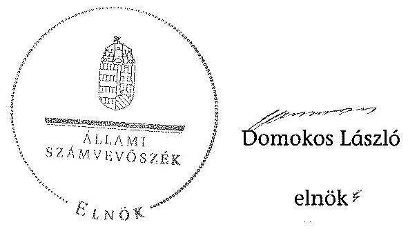
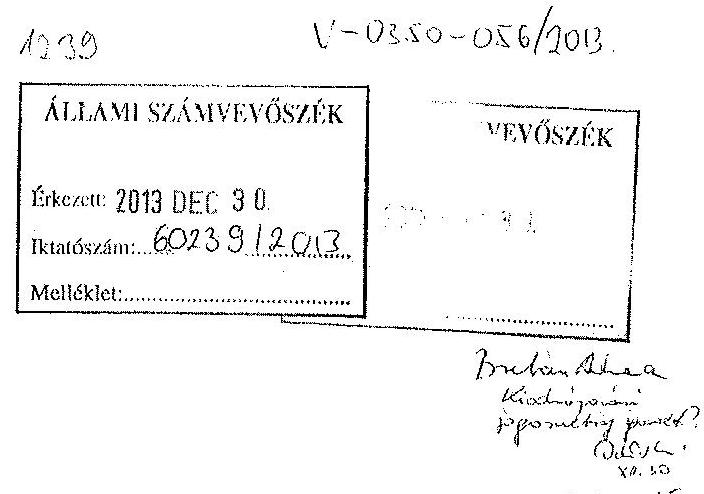
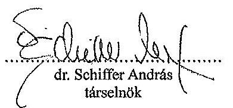
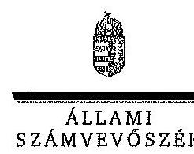
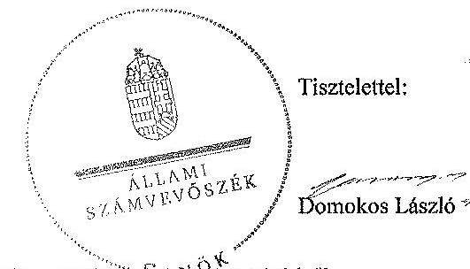
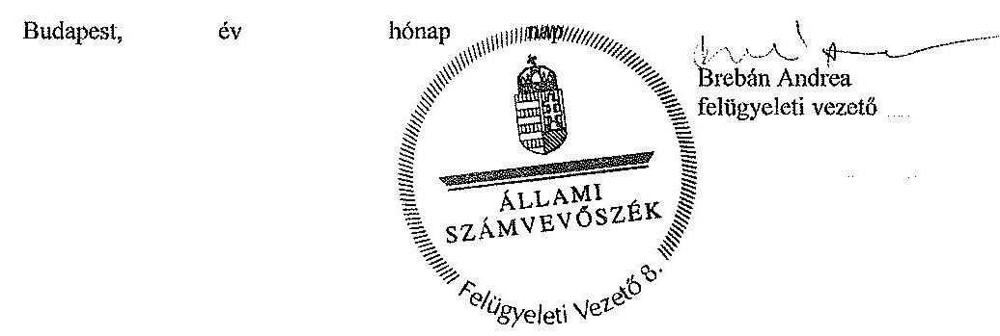

# ÁLLAMI   SZÁMVEVŐSZÉK 

## JELENTÉS

az LMP gazdálkodása -
A Lehet Más a Politika 2011-2012. évi gazdálkodása törvényességének ellenőrzéséről

---

# Állami Számvevőszék 

Iktatószám: V-0350-053/2013.
Témaszám: 1384
Vizsgálat-azonosító szám: V0663

## Az ellenőrzést felügyelte:

## Brebán Andrea

felügyeleti vezető

## Az ellenőrzést vezette és az végrehajtásáért felelős:

## Solymár Ágnes

ellenőrzésvezető
A számvevőszéki jelentés összeállításában közreműködtek:
Gelencsér Zoltán
számvevő tanácsos
Hegyes Mária
számvevő tanácsos
Köllődné Gátai Mária
számvevő
Vasváriné Molnár Judit
számvevő
Vámos Imre
számvevő

## Az ellenőrzést végezték:

Gelencsér Zoltán
számvevő tanácsos
Vasváriné Molnár
Judit
számvevő

Hegyes Mária
számvevő tanácsos
Vámos Imre
számvevő

## Köllődné Gátai Mária

számvevő

A témához kapcsolódó eddig készített számvevőszéki jelentés:
címe
sorszáma
Jelentés a Lehet Más a Politika 2009-2010. évi gazdálkodása törvényességének ellenőrzéséről 1207

---

# TARTALOMJEGYZÉK 

BEVEZETÉS ..... 5
I. ÖSSZEGZŐ MEGÁLLAPÍTÁSOK, KÖVETKEZTETÉSEK, JAVASLATOK ..... 7
II. RÉSZLETES MEGÁLLAPÍTÁSOK ..... 9

1. A Párt által közzétett éves beszámolók ellenőrzése ..... 9
2. A Pártnak a beszámoló összeállítására és az azt alátámasztó
könyvvezetésre vonatkozó belső szabályozása és gyakorlata ..... 9
3. A Párt bevételszerző gazdálkodó tevékenysége az ellenőrzött években ..... 10
4. A belső kontrollrendszer ellenőrzése ..... 10
5. Az előző ellenőrzés megállapításaira tett intézkedések ..... 11
MELLÉKLETEK
6. számú A Lehet Más a Politika társelnökének észrevételei a jelentéstervezethez
7. számú Az Állami Számvevőszék válaszlevele az észrevételekre

---

.

---

# RÖVIDÍTÉSEK JEGYZÉKE 

## Törvények

ÁSZ tv.
párttörvény
Számv. tv.

## Egyéb rövidítések

Alapszabály
ÁSZ
Hivatalos Értesítő
OV
Párt
SZB
szóvivő

Az Állami Számvevőszékről szóló 2011. évi LXVI. törvény
A pártok működéséről és gazdálkodásáról szóló - többször módosított - 1989. évi XXXIII. törvény
A számvitelről szóló - többször módosított - 2000. évi C. törvény

Lehet Más a Politika Párt alapszabálya
Állami Számvevőszék
Magyar Közlöny Hivatalos Értesítő elnevezésű melléklete
Lehet Más a Politika Párt Országos Választmánya
Lehet Más a Politika Párt
Lehet Más a Politika Párt Számvizsgáló Bizottsága
Lehet Más a Politika Párt képviseletére jogosult személy

---

.

---

# JELENTÉS   az LMP gazdálkodása -   A Lehet Más a Politika 2011-2012. évi gazdálkodása törvényességének ellenőrzéséről 

## BEVEZETÉS

Az Állami Számvevőszékről szóló 2011. évi LXVI. törvény 5. § (11) bekezdés a) pontja, valamint a pártok működéséről és gazdálkodásáról szóló 1989. évi XXXIII. törvény (párttörvény) 10. § (1) bekezdése alapján a pártok gazdálkodása törvényességének ellenőrzésére az Állami Számvevőszék (ÁSZ) jogosult. Az ÁSZ a rendszeres költségvetési támogatásban részesülő pártok gazdálkodását a párttörvény 10. § (3) bekezdésében előírtak szerint kétévenként ellenőrzi. Előzőleg az ÁSZ a Lehet Más a Politika (Párt) 2009-2010. évi gazdálkodása törvényességét ellenőrizte. A Párt a 2011. és a 2012. évben egyaránt 249,2 M Ft költségvetési támogatásban részesült.

Az ellenőrzés célja annak megállapítása volt, hogy:

- a Párt által készített és a Magyar Közlönyben közzétett éves beszámolók a törvényi előírásoknak megfeleltek-e, a könyvvezetéssel és a valósággal megegyező adatokat tartalmaztak-e;
- a könyvvezetés és a gazdálkodás során betartották-e a számvitelről szóló 2000. évi C. törvény és az egyéb jogszabályok rendelkezéseit, a belső előírásokat;
- a Párt a működéséhez szabályszerűen igénybe vehető forrásokat használt-e fel, a párttörvényben engedélyezett gazdálkodó tevékenységet folytatott-e;
- a Párt az ÁSZ előző ellenőrzése során feltárt hiányosságok megszüntetésére tett-e intézkedést, az intézkedések hatására megszűntek-e a hibák, hiányosságok.

Az ellenőrzött időszak: 2011. január 1- 2012. december 31.
Az ellenőrzés típusa: pénzügyi-szabályszerűségi ellenőrzés
Az ellenőrzés körülményeit illetően rögzíteni szükséges, hogy:

- a párttörvény 1. sz. melléklete szerinti beszámoló mintához magyarázatot, útmutatót nem készítettek a jogalkotók, így ennek kitöltése pártonként - kialakított számviteli politikájuknak megfelelően - eltérő lehet;
- a beszámoló minta a számviteli törvény rendelkezéseivel nem harmonizál, nem felel meg sem a mérleg, sem az eredménykimutatás követelményeinek.

---

Az ellenőrzés hasznosulása: az ellenőrzés a gazdálkodás szabályszerűségének bemutatásával hozzájárul ahhoz, hogy a társadalom objektív képet alkothasson a pártok működéséről. Az ellenőrzés eredménye elősegítheti, hogy a törvényalkotók konkrét lépéseket tegyenek a pártok finanszírozására vonatkozó szabályozások megváltoztatása, átláthatóbbá, ellenőrizhetőbbé tétele irányába. Az ellenőrzött szervezetek szintjén a hiányosságok, szabálytalanságok feltárása, az ennek kapcsán megfogalmazott megállapítások elősegíthetik a pártok szabályszerű gazdálkodását. A gazdálkodás szabályszerűségének bemutatásával az ellenőrzés értékteremtő módon járul hozzá az ÁSZ stratégiai céljainak megvalósításához.

Az ÁSZ a párttörvény módosításáig a jelenleg hatályos rendelkezéseknek megfelelő - egységes módszertani alapokra helyezett - gyakorlattal folytatja a pártok gazdálkodása törvényességének ellenőrzését. Az ellenőrzést a pénzügyi-szabályszerűségi ellenőrzés módszertani szabályai szerint végeztük.

Az ellenőrzési feladatok szempontrendszerét kockázatelemzéssel alapoztuk meg. Az ellenőrzésnél az átfogó lényegességi küszöb mértékét a Párt által közzétett pénzügyi beszámolók bevételi főösszegének 2,0%-ában határoztuk meg. Specifikus lényegességi küszöböt alkalmaztunk az egyéb hozzájárulások és adományok esetében, tekintettel a párttörvény 9. § (2) bekezdésében előírt nevesítési kötelezettség értékhatáraira (belföldi jogi és magánszemélytől kapott hozzájárulás, adomány 500 ezer Ft felett, külföldi jogi és magánszemélytől kapott hozzájárulás, adomány 100 ezer Ft felett). Az ellenőrzési kockázat - ÁSZ követelménynek megfelelő - 5%-os szinten tartásához az eredendő és a belső kontroll kockázatot magasnak minősítettük. Az ellenőrzés végrehajtása azonban meghiúsult.

Az ÁSZ tv. 29. § (1) bekezdése szerint a jelentéstervezetet megküldtük észrevételezésre a Párt képviseletére jogosultnak. A Párt társelnöke az ÁSZ tv. 29. § (2) bekezdésében foglalt észrevételezési jogával nem élt. A Párt társelnökének észrevételező levelét, valamint az arra adott választ, ideértve az el nem fogadott észrevételek indokolását a jelentés 1. és 2. számú mellékletei tartalmazzák.

---

# I. ÖSSZEGZŐ MEGÁLLAPÍTÁSOK, KÖVETKEZTETÉSEK, JAVASLATOK 

A Párt mindkét ellenőrzött évben a párttörvényben előírt határidőn túl tette közzé beszámolóját a Hivatalos Értesítőben. Honlapján a 2012. évi beszámolóját késve, csak a helyszíni ellenőrzés ideje alatt tette közzé. A párttörvény a beszámoló közzétételének elmulasztására vonatkozóan nem tartalmaz szankciót. ${ }^{1}$

A bizonylatok, a számviteli nyilvántartások és a Párt gazdálkodását meghatározó hatályos szabályzatok hiánya miatt - az előző ellenőrzés során feltárt hiányosságok megszüntetésére irányuló intézkedések ellenőrzését kivéve - az ellenőrzési programban meghatározott feladatokat teljesíteni nem lehetett, az ellenőrzés végrehajtása meghiúsult. Ezért az ÁSZ tv. 1. § (5) bekezdése és az ügyészségről szóló 2011. évi CLXIII. törvény 5. §-ának (2) bekezdése alapján a Fővárosi Főügyészség felé jelzéssel éltünk.

A Párt megsértette a Számv. tv. előírásait, mivel az ÁSZ ellenőrzés részére nem adta át az ellenőrzött két év könyvvezetésének elektronikus számviteli nyilvántartását, a 2011. évre vonatkozó főkönyvi kivonatot, a mérleget alátámasztó leltárakat, és az analitikus nyilvántartásokat. Hiányosan adták át a 2012. évre vonatkozó papír alapú számviteli nyilvántartásokat és a 2012. évi gazdálkodás eredeti dokumentumait. A Párt gazdálkodását meghatározó szabályzatok nem voltak hatályosak, azok elfogadásáról az OV nem hozott határozatot. A vezetői kontrolltevékenység, valamint az informatikai rendszer működtetése dokumentumok hiánya miatt nem volt ellenőrizhető.

Az ÁSZ 2012-ben ellenőrizte a Párt 2009-2010. évi gazdálkodásának törvényességét. A Párt a hiányosságok megszüntetésére intézkedési tervet készített, azonban az abban foglaltakat nem hajtották végre, a megállapított hiányosságok továbbra is fennálltak.

Az ÁSZ tv. 33. § (1) bekezdésében foglaltak értelmében az ellenőrzött szervezet vezetője köteles a jelentésben foglalt megállapításokhoz kapcsolódó intézkedési tervet összeállítani, és azt a jelentés kézhezvételétől számított 30 napon belül az ÁSZ részére megküldeni. Amennyiben az intézkedési tervet határidőre nem küldi meg a szervezet, vagy az nem elfogadható, az ÁSZ elnöke az ÁSZ tv. 33. § (3) bekezdés a)-b) pontjaiban foglaltakat érvényesítheti.

[^0]
[^0]:    ${ }^{1}$ Az ÁSZ a szabályozási hiányosságok megszüntetése érdekében évek óta szorgalmazza a párttörvény beszámoló szabályozására vonatkozó részének módosítását.

---

A helyszíni ellenőrzés, intézkedést igénylő megállapításai és felhívásai:

# a Párt képviseletére jogosultnak 

1. A bizonylatok, a számviteli nyilvántartások és a Párt gazdálkodását meghatározó hatályos szabályzatok hiányoztak.

Javaslatok:
a) Intézkedjen a hiányzó dokumentumok megszerzéséről, a Számv. tv. 159. § szerinti könyvvezetési kötelezettség teljesítéséről, a Számv. tv. 164. § szerinti zárlati feladatok elvégzéséről és önellenőrzés körében indokolt esetben a beszámoló helyesbítéséről, ismételt közzétételéről.
b) Vizsgálja ki a feltárt hiányosságokkal kapcsolatos felelősségre vonás lehetőségét, intézkedjen a felelősség érvényesítése érdekében.
c) Gondoskodjon a Számv. tv. 14. § (3), továbbá (5) bekezdésben, valamint 161. § (1) bekezdésben és a 161/A. §-ban előírt - a gazdálkodás sajátosságainak is megfelelő - számviteli szabályzatok elkészítéséről és az Alapszabálya szerinti elfogadásáról.
2. Az ÁSZ 2012-ben ellenőrizte a Párt 2009-2010. évi gazdálkodásának törvényességét. A Párt a hiányosságok megszüntetésére intézkedési tervet készített, azonban az abban foglaltakat nem hajtották végre, a megállapított hiányosságok továbbra is fennálltak.

Javaslat:
Biztosítsa az ÁSZ ellenőrzések során feltárt hiányosságok megszüntetését és gondoskodjon arról, hogy az ÁSZ megállapításaira tett intézkedési tervben foglaltak hasznosuljanak.

---

# II. RÉSZLETES MEGÁLLAPÍTÁSOK 

## 1. A PÁrt ÁLTAL KÖZZÉTETT ÉVES BESZÁMOLÓK ELLENŐRZÉSE

A párttörvény 9. § (1) bekezdésében foglaltak szerint „A pártok kötelesek minden év április 30-áig az előző évi gazdálkodásukról szóló beszámolót (zárszámadást) a Magyar Közlönyben, valamint saját honlappal rendelkező pártok a honlapjukon is" közzétenni.

A Párt a 2011. évi gazdálkodásáról szóló beszámolóját 2012. május 8-án a Hivatalos Értesítő 20. számában, a 2012. évi beszámolót 2013. május 8-án a Hivatalos Értesítő 21. számában - a párttörvény 9. § (1) bekezdésében előírt határidőn túl - tette közzé. A Párt internetes honlapján kizárólag a 2011. évi beszámolója volt elérhető, a 2012. évi beszámolót a helyszíni ellenőrzés megkezdéséig nem tették közzé².

A beszámoló megalapozottsága az adatszolgáltatás hiányossága miatt nem volt ellenőrizhető. A Párt az ÁSZ ellenőrzés részére nem adta át a két év könyvvezetésének elektronikus számviteli és analitikus nyilvántartásait, a 2011. évre vonatkozó főkönyvi kivonatot, a 2011. évi beszámoló elkészítésekor kinyomtatott főkönyvi kartonokat, a 2012. évre vonatkozóan a saját tőke elemeit és a kötelezettségeket tartalmazó főkönyvi számviteli nyilvántartásokat (kartonokat).

A beszámolók összeállítása során a Párt megsértette a Számv. tv. 15-16. §-ában megfogalmazott alapelveket. A Párt beszámolójának elkészítése a Számv. tv. 8. § (5) bekezdése alapján „a gazdálkodó legföbb irányító (vezető) szervén, ügyvezető szervén és felügyelő testületén belül a tagok együttes kötelezettsége - a külön jogszabályban meghatározott hatáskörükben eljárva - annak biztosítása, hogy az éves beszámoló, az egyszerűsített éves beszámoló [...] összeállítása és nyilvánosságra hozatala e törvény előírásainak megfelelően történjen." Az Alapszabály 27. § 2. pont c) bekezdése alapján a pénzügyi vezető felelős „a Párt éves mérlegének, költségvetési és gazdálkodási beszámolójának elkészítéséért és a választmány elé való benyújtásáért."

## 2. A PÁRTNAK A BESZÁMOLÓ ÖSSZEÁLLÍTÁSÁRA ÉS AZ AZT ALÁTÁMASZTÓ KÖNYVVEZETÉSRE VONATKOZÓ BELSŐ SZABÁLYOZÁSA ÉS GYAKORLATA

A Párt a 2011-2012. évi gazdálkodását meghatározó - a Számv. tv. 14. § (3), továbbá (5) bekezdés a), b), d), valamint 161. § (1) bekezdésében és a 161/A §-ában előírt - hatályos számviteli szabályzatokkal nem rendelkezett, mivel azok elfogadásáról az OV nem hozott határozatot.

[^0]
[^0]:    ${ }^{2}$ A Párt a párttörvény szerinti 2012. évi beszámolóját a helyszíni ellenőrzés ideje alatt honlapján pótlólag közzétette.

---

A Számv. tv. 14. § (12) bekezdése értelmében a számviteli politika, az eszközök és források leltárkészítés és leltározási, az értékelési és a pénzkezelési szabályzat elkészítéséért, módosításáért, továbbá a Számv. tv. 161. § (4) bekezdése szerint a számlarend összeállításáért, folyamatos karbantartásáért a Párt képviseletére jogosult szóvivők a felelősek, a pénzügyi

 és gazdálkodási szabályzatok kialakításáért és aktualizálásáért az Alapszabály 27. § e. pontja alapján a Párt pénzügyi vezetője a felelős.

A számviteli rendszer szabályozottságára vonatkozó ellenőrzési feladatok a hatályos szabályzatok hiányában nem hajthatók végre. A könyvvezetéshez, a számviteli nyilvántartásokhoz kapcsolódó dokumentumok, valamint a hatályos belső szabályzatok hiánya miatt a 2011-2012. évekre vonatkozó könyvvezetés jogszabályi előírásokkal és a belső szabályzatokkal való összhangja, a bizonylati elv, fegyelem és a bizonylati rend érvényesülése, valamint a Pártra jellemző speciális területek nem voltak ellenőrizhetőek.

A Párt megsértette a Számv. tv. 169. §-ában előírt, a bizonylatok megőrzésére vonatkozó szabályokat, mivel azokat sem olvasható, sem elektronikus formában nem őrizte meg.

# 3. A Párt bevételszerző gazdálkodó tevékenysége az ellenőrzött években 

A párt vagyonára vonatkozó ellenőrzési feladatok sem voltak végrehajthatóak, mivel a párt megsértette a Számv. tv. 15. § (2)-(4) és (6) bekezdés, 69. § (1)-(2) és (4) bekezdés, 159. §, 160. § (2) bekezdés d) pont, 164. § (2) bekezdés, 165. § (4) bekezdés, 169. § (1)-(2) és (5) bekezdés rendelkezéseit. A számviteli alapelvek közül nem érvényesült a teljesség, a valódiság, a világosság és a folytonosság elve. A beszámoló elkészítéséhez, a mérleg tételeinek alátámasztásához nem készült a mérleg fordulónapjára az eszközöket és forrásokat tartalmazó leltár. A Párt nem vezetett olyan nyilvántartást a tulajdonában levő eszközökről és forrásokról, a gazdasági műveletekről, amely az eszközökben és a forrásokban bekövetkezett változásokat a valóságnak megfelelően, folyamatosan, zárt rendszerben, áttekinthetően mutatta. A 2012. évre vonatkozóan a 4. számlaosztály főkönyvi kartonjait, valamint a 2011. évi főkönyvi kivonatot a Párt nem tudta az ellenőrzés rendelkezésére bocsátani. A főkönyvi könyvelés, az analitikus nyilvántartások és a bizonylatok adatai közötti egyeztetés és ellenőrzés lehetősége logikailag zárt rendszerben nem volt biztosított. A Párt a beszámolót alátámasztó nyilvántartások, bizonylatok megőrzéséről teljes körűen nem gondoskodott, az elektronikus formában végzett könyvelés összes adatának késedelem nélküli előállítása, folyamatos leolvashatósága nem volt biztosított.

## 4. A belső kontrollrendszer ellenőrzése

A vezetői kontrollok, valamint az informatikai rendszer működtetése szabályozottságának és dokumentáltságának hiányában a belső kontrollrendszer megalapozott ellenőrzése nem volt lefolytatható.

---

# 5. Az előző ellenőrzés megállapításaira tett intézkedések 

Az ÁSZ a párttörvény 10. § (3) bekezdése értelmében ellenőrizte a Párt 2009-2010. évekre vonatkozó gazdálkodásának törvényességét. A 2012-ben megjelent ÁSZ jelentés - a párttörvény 10. § (4) bekezdésében foglaltak alapján - öt pontban hívta fel a Párt képviseletére jogosult figyelmét a Párt gazdálkodása törvényességének helyreállítására. A korábbi ÁSZ ellenőrzés intézkedést igénylő megállapításai és javaslatai nem hasznosultak annak ellenére, hogy a hibák kijavítására 2012. május 3-án intézkedési tervet készített:

- A Párt a párttörvény 9. § (1) bekezdésében meghatározott - a beszámoló közzétételére vonatkozó - április 30-i határidőt a 2012. évi beszámoló közzétételékor továbbra sem tartotta be, beszámolóját honlapján késve, csak a helyszíni ellenőrzés ideje alatt, a Hivatalos Értesítőben csak határidőn túl, 2013. május 8-án tette közzé.
- A Párt számviteli politikájának, és számlarendjének módosítását jóváhagyásra az OV elé nem terjesztették be a 2012-2013. években.
- A Számv. tv. 14. § (8)-(9) bekezdésének előírását megsértve, a Párt továbbra sem rendelkezett pénzkezelési szabályzatában a napi készpénzállomány maximális mértékének meghatározásáról.

A könyvvezetésre vonatkozó további két javaslat hasznosulása - a számviteli bizonylatok és a könyvvezetés dokumentumainak hiánya miatt - nem volt ellenőrizhető.

Budapest, 2014. év 0. hónap 8. nap

Melléklet: $\quad 2 \mathrm{db}$

---

.

---

1364 Budapest 4.
Pf: 54

Kiegészítések az ÁSZ 2013. december 6-án megküldött, V-0350-045/2103 sz. jelentéstervezethez

Az Állami Számvevőszék (ÁSZ) által megküldött jelentéstervezetet ebben a formájában és tartalmában elfogadni nem tudjuk, mert az közel nem fedi a helyszíni ellenőrzés tapasztalatait, az ott elhangzott állításokat és bizonyítékokat nem ismerteti.

Legfontosabb megállapításunk, hogy egy audit során írásos, szóbeli és szemmel észrevehető bizonyítékok felvételéből állapítják meg a vizsgált események, tevékenységek tartalmi és formai megvalósulását.
A jelentéstervezet teljes egészében kihagyja a helyszíni szemle munkáját, az ott tett szóbeli megállapításokat, és még az írásban tett megállapítások egy részét is.

Tételesen:

1. a pénzügyi, gazdálkodási tevékenységek folytonossága megszakadt, mert tételes átadás-átvételre sem a pénzügyi tevékenység, sem a könyvelési anyagok tekintetében nem került sor. A könyvelési anyagok párt által alá nem írt átadás-átvételi példányát bemutattuk, ennek jegyzőkönyvezésére nem került sor.
2. A pénzügyi vezető november 11-én írásbeli nyilatkozatot tett az ÁSZ által kért, de be nem küldött, fel nem lelt dokumentumok hiányának okairól. A nyilatkozat ténye nem lett megemlítve a jelentésben. A nyilatkozatból is kiderül, ami az ellenőrzés során is nyilvánvalóvá lett, hogy a hiányzó, 2011-12-es dokumentumok során az átadási, illetve adatmegőrzési kötelezettséget az előző könyvelő elmulasztotta, ezügyben, ahogy a jelentéstervezet is megfogalmazza, vizsgáljuk az előző pénzügyi vezetés és könyvelés számviteli, illetve büntetőjogi felelősségének a kérdését.
3. Nincs megemlítve a jelentéstervezetben, hogy a jelenlegi vezetés a 2012-es évre vonatkozóan rendkívüli könyvvizsgálatot rendelt el, ennek eredményei alapján megkezdtük a 2012-es esztendő anyagának a rendbe tételét. Annak ellenére nincs megemlítve ez a tény, hogy a helyszíni szemle bekérte az erre vonatkozó összes iratot.
4. A jelentéstervezet leírja, hogy a párt az összes gazdálkodási szabályzata tekintetében nem rendelkezik hatályos példánnyal. Azon túl, hogy ez leírt nyilatkozatban nem szerepelt, az átadott szabályzatok mintegy felében nem is igaz. Ezekben az esetekben rendelkezünk a hatályba léptető országos választmányi határozattal, kétségtelen, kinyomtatott, aláírt példányokkal nem,

---

ugyanakkor a helyszíni szemle egyetlen esetben sem mutatott rá, hogy ezeket a belső szabályozásokat ne alkalmaztuk volna, netán megsértettük volna. A szemlén jelzett problémát azóta orvosoltuk, a 2013. december 11-i országos választmányi ülés az összes, alkalmazott gazdálkodás szabályzatot megerősítette, a döntésről szóló, nyomtatott és aláírt dokumentumot csatoljuk.
5. Egyik legfőbb kérdésünk, hogy, ha és amennyiben a helyszíni szemlén az ellenőrzési program szerinti adatfelvétel megtörtént, akkor a szemle miért nem fejeződött be, bármilyen hosszúságú „hibalista" felállításával akár, miért született meg november 13-án a szemle befejezését jelentő ellenőrzésvezetői döntés? Fontos körülmény, hogy erről miért nem tesz említést a helyszíni szemle?
6. Végképp nem látjuk tisztán, hogy az előző vizsgálat során elkészített, ismertetett, végrehajtott, és végrehajtásában elfogadott intézkedési terv „megnyitására" milyen alapon került sor, ennek az intézkedési tervnek a megvalósítását, az arról szóló beszámolót a közigazgatásban elvárható általános elintézési határidőn belül miért nem ellenőrizte az ÁSZ.

Mindezek alapján nem látjuk be, a párt életéből adódó, a gazdálkodási területre is kiterjedő nehézségek ellenére miért nem fejeződött be a vizsgálat, ez a tény miért nincs megindokolva, a dokumentációs hiányok miatt a számviteli tv értelmében még a vizsgálat ideje alatt is adatmegőrzési kötelezettséggel rendelkező könyvelő bevonása az ellenőrzési projektbe miért nem történt meg, a NAV ellenőrzéseknél egyébként megszokott módon. Miért elégedett meg az ellenőrzés azzal, hogy az ellenőrök által látott felszólító levelet a pénzügyi vezető kiküldte (aminek egyébként ugyanúgy semmilyen érdemi haszna nem volt, mint korábbi felszólítási kísérleteinknek).

Mindezen felsorolt tények megemlítése mellett tudjuk csak elfogadni a jelentést azzal, hogy a jelentés szellemének megfelelően megkezdtük a papiros alapú bizonylatok alapján az érintett évek újrakönyvelését (amelyet érdemben remélhetőleg jövő év február 28-ig be is zárunk), az ÁSZ által a korábbi ellenőrzésen elfogadott, így kiinduló pontul szolgáló 2010. évi záró főkönyvi kivonat segítségével. Az újra könyvelés, és az ehhez kapcsolódó, esetlegesen szükséges önrevíziót követően természetesen ugyanolyan nyitottsággal hajlandóak vagyunk folytatni az ellenőrzést, mint amilyen nyitottsággal azt eddig is tettük.

Budapest, 2013. december 20.

---

# Az Országos Választmány 20131211/1. határozata 

Az OV az alább felsorolt, gazdálkodásra vonatkozó szabályzatokat megerősíti, és felkéri az OV-titkárt, hogy a hitelesítést a megerősítő határozat rávezetésével együtt tegye meg.

1. Az LMP tagdíjbeszedésével és nyilvántartásával kapcsolatos szabályzata
2. Az LMP beszerzési szabályzata
3. Az LMP területi szervezetek gazdálkodásának szabályzata
4. Bizonylati szabályzat
5. Az LMP elszámolásra adott előlegekkel kapcsolatos szabályzata
6. Értékelési szabályzat
7. Az LMP kiküldetéssel kapcsolatos szabályozása
8. Az LMP - központi pénzkezelési szabályzat
9. Leltározási szabályzat
10. Selejtezési szabályzat
11. Szabályzat a kötelezettség vállalására és az utalványozásra
12. Számlarend

## Vida Attila

Országos Választmány titkára
2013-12-20

---

# **Title: The Impact of Climate Change on Global Ecosystems**

## **Introduction**

Climate change is one of the most pressing environmental issues of our time. It affects ecosystems worldwide, leading to significant changes in biodiversity, habitat loss, and species extinction. This report explores the impacts of climate change on global ecosystems, focusing on key areas such as **forests**, **oceans**, and **polar regions**.

## **1. Forest Ecosystems**

Forests play a crucial role in carbon sequestration and maintaining biodiversity. However, rising temperatures and changing precipitation patterns are altering forest ecosystems. Key impacts include:

- **Increased frequency of wildfires**: Rising temperatures and drought conditions have led to more frequent and severe wildfires, destroying vast areas of forests.
- **Changes in species distribution**: Shifts in temperature and precipitation patterns are altering species distribution, leading to species extinction.
- **Insect outbreaks**: Warmer temperatures have increased the survival rates of pests like bark beetles, which are more likely to cause pests like bark beetles.

## **2. Ocean Ecosystems**

Oceans absorb a significant portion of the excess heat and carbon dioxide (CO₂) produced by human activities. The consequences include:

- **Increased frequency of wildfires**: Rising sea levels and drought conditions have led to more frequent and severe wildfires, destroying vast areas of oceans.
- **Changes in ocean currents**: Altered ocean currents are causing sea levels to decline, threatening species like polar bears and seals.
- **Insect outbreaks**: Warmer temperatures have increased the survival rates of pests like bark beetles, which are more likely to cause pests like bark beetles.

## **3. Ocean Ecosystems**

Oceans absorb a significant portion of the excess heat and carbon dioxide (CO₂) produced by human activities. The consequences include:

- **Increased frequency of wildfires**: Rising sea levels and drought conditions have led to more frequent and severe wildfires, destroying vast areas of oceans.
- **Changes in ocean currents**: Altered ocean currents are causing pests like bark beetles, which are more likely to cause pests like bark beetles.

## **4. Ocean Ecosystems**

Oceans absorb a significant portion of the excess heat and carbon dioxide (CO₂) produced by human activities. The consequences include:

- **Increased frequency of wildfires**: Rising sea levels and drought conditions have led to more frequent and severe wildfires, destroying vast areas of oceans.
- **Changes in ocean currents**: Altered ocean currents are causing pests like bark beetles, which are more likely to cause pests like bark beetles.

## **5. Polar Ecosystems**

Polar regions are particularly vulnerable to climate change due to their sensitivity to temperature changes. Key impacts include:

- **Melting of sea ice**: The Arctic is warming at twice the
 rate of the global average, leading to sea ice loss.
- **Glacial retreat**: Melting glaciers and their presence in the Arctic are rising, threatening species like polar bears and seals.
- **Changes in ocean currents**: Altered ocean currents are causing sea levels to decline, destroying vast areas of oceans.

## **Conclusion**

Climate change poses a significant threat to global ecosystems, with far-reaching consequences for biodiversity and human societies. By reducing greenhouse gas emissions and reducing greenhouse gas emissions, we can protect the planet for future generations.

---

**References**

1. IPCC (Intergovernmental Panel on Climate Change). (2021). *Climate Change 2021: The Physical Science Basis*.
2. WWF (World Wildlife Fund). (2020). *Living Planet Report 2020*.
3. NASA Global Climate Change. (2022). *Vital Signs: Global Temperature*.

---

# Dr. Schiffer András úr 

társelnök
Lehet Más a Politika

## Budapest

## Tisztelt Társelnök Úr!

A Lehet Más a Politika gazdálkodása - A Lehet Más a Politika 2011-2012. évi gazdálkodása törvényességének ellenőrzéséről készült számvevőszéki jelentéstervezetre tett észrevételeit köszönettel megkaptam.

Az Állami Számvevőszék észrevételekre vonatkozó álláspontjáról a felügyeleti vezető által készített tájékoztatást csatoltan megküldöm.

Tájékoztatom Társelnök urat, hogy a jelentéstervezetre tett észrevételeit - az Állami Számvevőszékről szóló 2011. évi LXVI. törvény 29. § (3) bekezdése alapján - valamint az azokra adott válaszokat a számvevőszéki jelentés mellékleteként szerepeltetjük.

Budapest, 2014. év 01. hónap 08. nap

Melléklet: Tájékoztatás az elfogadott és az el nem fogadott észrevételekről

---

# Tájékoztatás 

## az elfogadott és az el nem fogadott észrevételekről

A Lehet Más a Politika gazdálkodása - A Lehet Más a Politika (Párt) 2011-2012. évi gazdálkodása törvényességének ellenőrzéséről című jelentéstervezetre 2013. december 20-i dátummal az ÁSZ részére megküldött a „Kiegészítések az ÁSZ 2013. december 6-án megküldött, V-0350-045/2013. sz. jelentéstervezethez" című levélre az alábbiakban tájékoztatom.

## A levél felvezető szövegében tett észrevételek

Az ÁSZ törvény 32. § (1) bekezdése szerint az Állami Számvevőszék az általa végzett ellenőrzésekről jelentést készít, amely a feltárt tényeket, az ezeken alapuló megállapításokat, következtetéseket tartalmazza és nem a helyszíni ellenőrzés lefolytatásáról szóló tájékoztatást.

## Tételes észrevételek

## 1. pont

Észrevétele nem igényli a jelentéstervezet módosítását, ahhoz csak magyarázatul szolgál. A számvitelről szóló 2000. évi C. törvény (számviteli törvény) 15. § (1) bekezdése szerint a beszámoló elkészítésekor és a könyvvezetés során abból kell kiindulni, hogy a szervezet a belátható jövőben is fenn tudja tartani működését, folytatni tudja tevékenységét, nem várható a működés beszüntetése vagy bármilyen okból történő jelentős csökkenése. Mivel a Párt nem szűnt meg, ezért a pénzügyi, gazdálkodási tevékenységének folytonossága nem szakadt meg. A korábbi könyvelővel való kapcsolattartás és a könyvelési dokumentumok átadás-átvételének problémái nem jelentik a pénzügyi, gazdálkodási tevékenység folytonosságának megszakadását. A korábbi könyvelő és a Párt között könyvelési anyagok tételes átvétel-átadása az észrevételező levél szerint sem történt meg. A Párt részéről alá nem írt átadás-átvételi jegyzőkönyv pedig nem tekinthető hiteles dokumentumnak.

## 2-3. pontok

Észrevétele nem igényli a jelentéstervezet módosítását, ahhoz csak magyarázatul szolgál. A számviteli törvény 12. § (1) bekezdése szerint könyvvezetési kötelezettsége a gazdálkodónak van. A számviteli törvény 169. § (1) bekezdése szerint szintén a gazdálkodó kötelezettsége az üzleti évről készített beszámoló, valamint az azokat alátámasztó leltár, főkönyvi kivonat, vagy más a törvény követelményeinek megfelelő nyilvántartás olvasható formában történő megőrzése. A 2013. november 13-án felvett jegyzőkönyv, illetve a csatolt nyilatkozat tartalmazza a rendkívüli könyvvizsgálatra vonatkozó nyilatkozatot azzal, hogy az nem zárult le. Arra vonatkozó nyilatkozatot nem tettek az ÁSZ részére, hogy az előző pénzügyi vezetés büntetőjogi felelősségét vizsgálnák és erre vonatkozó megállapítást a jelentéstervezet sem tartalmazott.

## 4. pont

Észrevétele nem igényli a jelentéstervezet módosítását, ahhoz csak magyarázatul szolgál. A 2013. november 13-án felvett jegyzőkönyv, illetve a csatolt nyilatkozat tartalmazza, hogy 11 szabályzat elfogadásáról nem döntött az Országos Választmány (OV). Illetve további 11 szabályzat elfogadásának időpontját megadta a Párt. Az OV által jóváhagyott szabályzatok szövegei viszont és az OV határozatok hiteles példányai nem álltak rendelkezésre, emiatt a döntések tényleges megtörténtéről és annak pontos tartalmáról nem lehetett meggyőződni. A hiteles szabályzatok és választmányi határozatok, továbbá a könyvelési alapdokumentumok és

---

Melléklet
a V-0350-052/2013. számú levélhez
számviteli nyilvántartás hiányzó iratai miatt nem lehetett a szabályozások gyakorlati alkalmazását ellenőrizni.
Az Országos választmány 20131211/1. számú határozata 12 szabályzat hatályosságáról hozott döntést. A hitelesített szabályzatok nem kerültek csatolásra, így a határozat szerinti hitelesítés végrehajtásáról nem lehet meggyőződni. A helyszíni ellenőrzésnél a Párt által kiadott nyilatkozat szerint kötelezően elkészítendő számviteli törvény 14. § (3) bekezdése szerinti számviteli politika és a 14. § (5) bekezdés d) pontja szerinti pénzkezelési szabályzat érvényességét és hatályosságát megalapozó döntésről dokumentum nem állt rendelkezésre. A megküldött határozat továbbra sem tartalmaz ezen kötelező szabályzatokkal kapcsolatos döntést. További hét szabályzat - köztük a szervezeti és működési szabályzat - vonatkozásában pedig a hatályosság és érvényesség határozattal szintén nem került rendezésre.

# 5. pont 

Észrevétele nem igényli a jelentés módosítását, mert az csak kérdéseket tartalmaz.
Az ÁSZ ellenőrzés hibalista felállításával fejeződött be. Az ÁSZ ellenőrzési tapasztalatai alapján a jelentéstervezetben leírja a hiányzó dokumentumok körét, és ezek hiánya alapján felsorolja a hibákat, így a számviteli törvény több ponton történő megsértését.

## 6. pont

Észrevétele nem igényli a jelentés módosítását, mert az csak kérdéseket tartalmaz.
Az ÁSZ törvény 33. § (7) bekezdése szerint az ellenőrzött szervezet által elkészített intézkedési tervben foglaltak megvalósítását az Állami Számvevőszék utóellenőrzés keretében ellenőrizheti. Az ÁSZ törvény az utóellenőrzés lefolytatására nem ír elő határidőt.

## A tételes észrevételeket követően tett észrevételek

## 1. bekezdés

Észrevétele nem igényli a jelentés módosítását, a Tételes észrevételek 5. pontnál leírt indoklás miatt.

## 2. bekezdés

Észrevétele nem igényli a jelentés módosítását, mert az csak a megfogalmazott javaslatokra tervezett megoldásokat tartalmazza.

