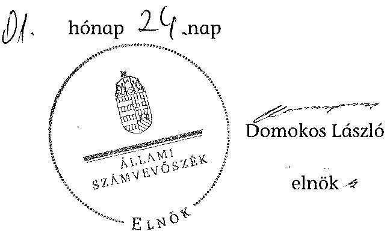

# ÁLLAMI   SZÁMVEVŐSZÉK 

## JELENTÉS

a helyi kisebbségi/nemzetiségi önkormányzatok gazdálkodásának ellenőrzéséről
Hőgyészi Roma Nemzetiségi Önkormányzat

---

# Állami Számvevőszék 

Iktatószám: V-0097-015/2014.
Témaszám: 1105
Vizsgálat-azonosító szám: V06060321

## Az ellenőrzést felügyelte:

Horváth Balázs
felügyeleti vezető
Az ellenőrzést vezette és az ellenőrzés végrehajtásáért felelős:
Preller Zsuzsanna
ellenőrzésvezető
A számvevőszéki jelentést készítették és a jelentés összeállításában közremüködtek:

Kányáné Murvai Tünde
számvevő tanácsos
Moder Beatrix
számvevő
Az ellenőrzést végezték:
Kardos Mihály
Kamonszky Krisztina
számvevő

---

# TARTALOMJEGYZÉK 

BEVEZETÉS ..... 5
I. ÖSSZEGZŐ MEGÁLLAPÍTÁSOK, KÖVETKEZTETÉSEK, JAVASLATOK ..... 8
II. RÉSZLETES MEGÁLLAPÍTÁSOK ..... 15

1. A Nemzetiségi és a Települési Önkormányzat együttmúködésének szabályszerűsége ..... 15
2. A gazdálkodási feladatok ellátásának szabályszerűsége ..... 15
2.1. A költségvetésre és zárszámadásra, valamint a kincstári adatszolgáltatás rendjére vonatkozó jogszabályi előírások betartása ..... 15
2.2. A Nemzetiségi Önkormányzat gazdálkodásának szabályozottsága ..... 17
2.3. A pénzügyi kontrollok múködése ..... 18
3. A Nemzetiségi Önkormányzattal összefüggő gazdálkodási feladatok belső ellenőrzése ..... 20
4. A Nemzetiségi Önkormányzat feladatellátása ..... 20

## MELLÉKLET

1. számú A Nemzetiségi Önkormányzat 2011. évi és 2012. I. félévi gazdálkodásának fóbb adatai, mutatói

## FÜGGELÉKEK

1. számú Értelmező szótár
2. számú A pénzügyi kontrollok múködésének értékelése

---

.

---

# RÖVIDÍTÉSEK JEGYZÉKE 

## Jogszabályok

Áht. 1
Áht. 2
ÁSZ tv.
Nek. ${ }_{1}$ tv.
Nek. ${ }_{2}$ tv.
Számv. tv.
Ámr.
Ávr.

Ber.
Bkr.
támogatási kormányrendelet

Települési Önkormányzat SZMSZ-e

## Szórövidítések

ÁSZ
gazdálkodási jogkörök szabályzata
jegyzó
1992. évi XXXVIII. törvény az államháztartásról (hatályos 2011. december 31-ig)
2011. évi CXCV. törvény az államháztartásról (hatályos 2011. december 31-től)
2011. évi LXVI. törvény az Állami Számvevőszékről (hatályos 2011. július 1-jétől)
1993. évi LXXVII. törvény a nemzeti és etnikai kisebbségek jogairól (hatályos 2011. december 31-ig)
2011. évi CLXXIX. törvény a nemzetiségek jogairól (hatályos 2011. december 20-tól)
2000. évi C. törvény a számvitelről

292/2009. (XII. 19.) Korm. rendelet az államháztartás múködési rendjéről (hatályos 2011. december 31-ig)
368/2011. (XII. 31.) Korm. rendelet az államháztartásról szóló törvény végrehajtásáról (hatályos 2012. január 1-jétől)
193/2003. (XI. 26.) Korm. rendelet a költségvetési szervek belső ellenőrzéséről (hatályos 2011. december 31-ig)
370/2011. (XII. 31.) Korm. rendelet a költségvetési szervek belső kontrollrendszeréről és belső ellenőrzéséről (hatályos 2012. január 1-jétől)
a kisebbségi önkormányzatoknak a központi költségvetésből, valamint fejezeti kezelésű előirányzatból nyújtott támogatások feltételrendszeréről és elszámolásának rendjéről szóló 342/2010. (XII. 28.) Korm. rendelet (hatályon kívül helyezte a 28/2012. (III. 6.) Korm. rendelet a nemzetiségi célú előirányzatokból nyújtott támogatások feltételrendszeréről és elszámolásának rendjéről; jelenleg hatályos a 428/2012. (XII. 29.) Korm. rendelet a nemzetiségi célú előirányzatokból nyújtott támogatások feltételrendszeréről és elszámolásának rendjéről)
Hőgyész Nagyközség Önkormányzata Képviselőtestületének 6/2011. (IV. 29.) számú rendelete az Önkormányzat Szervezeti és Múködési Szabályzatáról (hatályos 2011. április 29-től)

## Állami Számvevőszék

Hőgyész Nagyközség Önkormányzata Polgármesteri Hivatala Kötelezettségvállalás, utalványozás, ellenjegyzés, érvényesítés rendjének szabályzata, hatályos: 2010. október 1-jétől, illetve 2012. január 1-jétől

Hőgyész Nagyközség Önkormányzatának jegyzője

---

| Képviselő-testület | Hőgyészi Cigány Kisebbségi Önkormányzat Képviselốtestülete 2011. december 31-ig, Hőgyészi Roma Nemzetiségi Önkormányzat Képviselő-testülete 2012. január 1jétől |
| :--: | :--: |
| Nemzetiségi Önkormányzat | Hőgyészi Cigány Kisebbségi Önkormányzat 2011. december 31-ig, Hőgyészi Roma Nemzetiségi Önkormányzat 2012. január 1-jétől |
| Nemzetiségi Önkormányzat elnöke | Hőgyészi Cigány Kisebbségi Önkormányzat elnöke 2011. december 31-ig, Hőgyészi Roma Nemzetiségi Önkormányzat elnöke 2012. január 1-jétől |
| Nemzetiségi Önkormányzat SZMSZ-e | Hőgyészi Roma Nemzetiségi Önkormányzat 16/2012. (V. 31.) számú határozata a Szervezeti és Müködési Szabályzatról |
| polgármester   Polgármesteri Hivatal | Hőgyész Nagyközség Önkormányzatának polgármestere Hőgyész Nagyközség Önkormányzatának Polgármesteri Hivatala |
| Polgármesteri Hivatal SZMSZ-e | Hőgyész Nagyközség Önkormányzata Polgármesteri Hivatalának 2011. június 15 -én hatályba helyezett Szervezeti és Müködési Szabályzata (Ugyrendje) |
| Támogató | A támogatást nyújtó Közigazgatási és Igazságügyi Minisztérium |
| Települési Önkormányzat | Hőgyész Nagyközség Önkormányzata |
| Települési Önkormányzat Képviselő-testülete | Hőgyész Nagyközség Önkormányzatának Képviselőtestülete |

---

# JELENTÉS   a helyi kisebbségi/nemzetiségi önkormányzatok gazdálkodásának ellenőrzéséről   Hőgyészi Roma Nemzetiségi Önkormányzat 

## BEVEZETÉS

Az államháztartás részét, az önkormányzati alrendszer egyik elemét képezik a nemzetiségi önkormányzatok, amelyek jogi személyek és a Nek. ${ }_{1,2}$ tv-ben meghatározott önálló feladat- és hatáskörökkel rendelkeznek. A nemzetiségi önkormányzatok az önkormányzati, illetve testületi müködtetés mellett a helyi nemzetiségi közügyek változatos formában való ellátásában vesznek részt.

A nemzetiségi önkormányzatok, illetve a települési önkormányzatok között a jelenlegi szabályozás szerint nincs alá-fölérendeltségi viszony. A nemzetiségi önkormányzatok azonban sajátos közjogi helyzetben vannak, mert a jogállásukat tekintve önkormányzatok, ám függnek a székhelyük szerinti települési önkormányzat hivatalától, amely ellátja a nemzetiségi önkormányzatok vonatkozásában a megállapodásban rögzített gazdálkodási feladatokat.

A nemzetiségek helyzete, támogatása mind hazai, mind európai uniós szinten kiemelt figyelmet kap napjainkban. A nemzetiségi önkormányzatok gazdálkodására és támogatási rendszerére vonatkozó jogszabályok a 2010-2012. években jelentős változásokon mentek át, amelyek érintették a feladatalapú támogatásra fordítható költségvetési keret megállapítását, az operatív gazdálkodási jogkörök szabályozását, az elkülönített könyvvezetés alkalmazását, a belső ellenőrzés szabályozását.

Az ellenőrzés célja annak értékelése volt, hogy a Nemzetiségi Önkormányzat gazdálkodási kereteinek kialakítása, gazdálkodása és feladatellátása megfelelte a hatályos jogszabályoknak.

Ennek keretében ellenőriztük, hogy:

- a Nemzetiségi Önkormányzat és a Települési Önkormányzat együttmúködésének szabályozása, a Települési Önkormányzat SZMSZ-ében, a megállapodásban előírt működési feltételek biztosítása megfelelte a jogszabályi előírásoknak;
- a felek együttműködése megfelelte a megállapodásnak a gazdálkodási feladatok szabályszerű ellátásában, ennek keretében betartották-e a Nemzetiségi Önkormányzat gazdálkodásához kapcsolódóan a költségvetésre és zárszámadásra, a gazdálkodás szabályozására, az operatív gazdálkodási jogkörök gyakorlására vonatkozó jogszabályi előírásokat;

---

- a jegyző biztosította-e a Polgármesteri Hivatal belső ellenőrzése keretében a Nemzetiségi Önkormányzattal összefüggő gazdálkodási feladatok belső ellenőrzését;
- a 2011. évi feladatalapú támogatás felhasználása, a folyósított feladatalapú támogatással történő elszámolás az előírásoknak megfelelően történt-e;
- a Nemzetiségi Önkormányzat feladatellátása összhangban volt-e a vonatkozó jogszabályi előírásokkal.

Az ellenőrzés típusa: szabályszerűségi ellenőrzés
Az ellenőrzött időszak: 2011. január 1. - 2012. június 30.
Ellenőrzött szervezet: Hőgyészi Roma Nemzetiségi Önkormányzat és a gazdálkodási feladatait ellátó Hőgyész Nagyközség Önkormányzata

Az ellenőrzés jogszabályi alapja: az ÁSZ tv. 5. § (2)-(3) és (6) bekezdései
Az ellenőrzés szakmai módszertana az ÁSZ hivatalos honlapján (www.asz.hu) közzétett szakmai szabályokon alapult, amely a Legfőbb Ellenőrző Intézmények Nemzetközi Szervezete (INTOSAI) által kiadott nemzetközi standardok (ISSAI) figyelembevételével készült.

A fogalmak magyarázatát az 1. számú függelék, a pénzügyi kontrollok megfelelősége értékelésénél alkalmazott egységes minősítési szempontokat a 2. számú függelék tartalmazza.

Az ellenőrzés lefolytatásához a Települési Önkormányzat és a Nemzetiségi Önkormányzat tanúsítványok kitöltésével és a kapcsolódó dokumentumok elektronikus megküldésével szolgáltatott adatokat. A tanúsítványokon szerepeltetett adatok, információk ellenőrzése és szükség szerinti javítása a helyszíni ellenőrzés keretében történt.

Az ÁSZ az ellenőrzés megállapításait az ellenőrzött időszakban hatályos, az intézkedést igénylő megállapításokra tett javaslatokat a jelenleg hatályos jogszabályok alapján fogalmazta meg.

A Nemzetiségi Önkormányzat 1999-ben alakult, elnöke a 2010. évi helyhatósági választások óta látja el feladatát. A Nemzetiségi Önkormányzat intézményt, gazdasági társaságot és más szervezetet nem alapított, illetve ezek társulásában nem vett részt. A négytagú Képviselő-testület munkája segítésére bizottságot nem hozott létre. A Nemzetiségi Önkormányzat a költségvetési beszámolója szerint a 2011. évben 422 ezer Ft költségvetési bevételt ért el és 421 ezer Ft költségvetési kiadást teljesített. A Nemzetiségi Önkormányzat a 2011. évben feladatalapú támogatásban nem részesült. A 2012. évben 314 ezer Ft eredeti költségvetési kiadási és bevételi előirányzatot terveztek, az előirányzatok módosítására nem került sor. A 2012. I. félévi beszámolója alapján a teljesített költségvetési bevétel 266 ezer Ft, a teljesített költségvetési kiadás 235 ezer Ft volt. A 2011. évi és a 2012. I. féléves gazdálkodási adatokat részletesen az 1. számú mellékletben mutatjuk be. Az ÁSZ a Nemzetiségi Önkormányzat gazdálkodását korábban nem ellenőrizte.

---

Az ÁSZ tv. 29. § (1) bekezdése szerint a jelentéstervezetet megküldtük a polgármester és a Nemzetiségi Önkormányzat elnöke részére, akik az ÁSZ tv. 29. § (2) bekezdésében foglalt észrevételezési jogukkal nem éltek, a jelentéstervezetre észrevételt nem tettek.

---

# I. ÖSSZEGZŐ MEGÁLLAPÍTÁSOK, KÖVETKEZTETÉSEK, JAVASLATOK 

#### Abstract

A Nemzetiségi és a Települési Önkormányzat együttmúködésének szabályozása és múködési feltételeinek biztosítása az ellenőrzött időszakban kisebb tartalmi hiányosságok kivételével - a jogszabályi előírásoknak megfelel. A felek együttmúködése a jogszabályokban előírt határidők betartásával jóváhagyott megállapodásoknak megfelelt. A Települési Önkormányzat biztosította a Nemzetiségi Önkormányzat múködéséhez szükséges személyi és tárgyi feltételeket. A 2011. december 31 -én hatályos megállapodásban az Ámr-ben foglaltak ellenére nem szabályozták a költségvetés megalkotása során ellátandó - a költségvetési koncepcióval, a költségvetési határozattal és a költségvetési rendelettel kapcsolatos - feladatokat, a munkamegosztást és a határidőket. A 2012. június 1-jétől hatályos megállapodás a Nek. ${ }_{2}$ tv. előírásai ellenére nem tartalmazta a gazdálkodással kapcsolatos eljárási és dokumentációs feladatot végző személyek kijelölésének rendjét, illetve az adatszolgáltatási feladatok teljesítésével kapcsolatos előírásokat.

A Nemzetiségi Önkormányzat költségvetésére és zárszámadására vonatkozó jogszabályi előírásokat részben tartották be. A költségvetési és zárszámadási határozatokat egymással összehasonlítható szerkezetben készítették el, azokat változatlan formában építették be a Települési Önkormányzat költségvetési és zárszámadási rendeleteibe. A 2011. költségvetési, illetve zárszámadási határozatot Ámr.-ben előírt határidőn túl fogadta el a Képviselő-testület. A Nemzetiségi Önkormányzat elnöke az Áht. ${ }_{2}$-ben előírt határidőn túl terjesztette a Képviselő-testület elé a 2012. évi költségvetési határozat tervezetet. A határidő túllépések nem akadályozták a Települési Önkormányzat rendelettervezeteinek határidőben történő benyújtását. A 2011. és 2012. évi költségvetési határozat előterjesztésekor az Ámr. és az Áht. ${ }_{2}$ előírását figyelmen kívül hagyva mérlegszerűen nem mutatták be a múködési célú költségvetés bevételeit és kiadásait, tájékoztatásul szöveges indoklással a Nemzetiségi Önkormányzat költségvetési mérlegét, továbbá az előirányzat felhasználási tervét. A költségvetési föösszegen belül a kiemelt előirányzat felhasználáshoz szükséges mértékű előirányzat átcsoportosításáról a 2011. évben - az előirányzat módosítás előterjesztésének hiányában - a Képviselő-testület nem gondoskodott. A 2011. évben előirányzat nélkül teljesítettek múködési célú pénzeszköz átadást, figyelmen kívül hagyva az Áht. ${ }_{1}$-ben foglalt - a kiemelt előirányzatokon belüli gazdálkodásra vonatkozó - előírást. A Nemzetiségi Önkormányzat beszámoló adatai alapján 2012. I. félévben biztosították a kiemelt előirányzatokon belüli gazdálkodást. A jegyző 2012. I. félévben a Nemzetiségi Önkormányzatra vonatkozó kincstári adatszolgáltatási kötelezettségének határidőben eleget tett.

A Nemzetiségi Önkormányzat gazdálkodásának szabályozása nem felelt meg a jogszabályi előírásoknak. A 2011. évben a Nemzetiségi Önkormányzat gazdálkodási feladatait ellátó Polgármesteri Hivatal rendelkezett a Számv. tv. által előírt gazdálkodási szabályzatokkal, melyek hatálya kiterjedt a Nemzetiségi Önkormányzat gazdálkodási feladataira. A Nemzetiségi Önkormányzat 2012. január 1-től nem rendelkezett a könyvvezetését, éves költségvetési be-

---

számolóját megalapozó saját, vagy a Települési Önkormányzattól elkülönített, a Számv. tv.-ben előírt szabályzatokkal, a Polgármesteri Hivatal 2012. január 1-jétől hatályos szabályzatainak előírásai a Nemzetiségi Önkormányzat gazdálkodási feladataira nem terjedtek ki. A Polgármesteri Hivatal ellenőrzési nyomvonala és kockázatkezelési szabályzata kiterjedt a Nemzetiségi Önkormányzat gazdálkodási feladataira, azonban az Ámr., az Áht.,, illetve a Bkr. előírásai ellenére a szabálytalanságok kezelésének eljárásrendjét, valamint a folyamatba épített előzetes, utólagos és vezetői ellenőrzést nem szabályozták. A Polgármesteri Hivatal SZMSZ-e - az Ámr., illetve az Ávr. előírása ellenére nem tartalmazta nevesített munkakörökhöz tartozó - a Nemzetiségi Önkormányzat gazdálkodásával kapcsolatos - feladat- és hatáskörökre, a hatáskörök gyakorlásának módjára, a helyettesítés rendjére, az ezekhez kapcsolódó felelősségi szabályokra vonatkozó előírásokat. A 2011. évben és 2012. I. félévben a Nemzetiségi Önkormányzat gazdálkodásával kapcsolatos feladatok és hatáskörök a feladattal megbízott köztisztviselő munkaköri leírásában nem szerepeltek.

A Nemzetiségi Önkormányzat gazdálkodása tekintetében az operatív gazdálkodási jogkörök kialakítása részben felelt meg a jogszabályi előírásoknak. A 2011. évben az érvényesítésre kijelölt személy nem rendelkezett az előírt iskolai végzettséggel és szakképesítéssel. A kötelezettségvállalás, ellenjegyzés, teljesítésigazolás, érvényesítés, utalványozás gyakorlásának módjával, eljárási és dokumentációs részletszabályaival, valamint az ezeket végző személyek kijelölésének rendjével kapcsolatos belső előírásokat, feltételeket 2012. I. félévben az Ávr. előírása ellenére a jegyző helyett a polgármester szabályozta. A jegyző a pénzügyi ellenjegyzésről, az arra jogosultak kijelöléséről nem rendelkezett. Az érvényesítésre az Ávr. előírásai ellenére a jegyző helyett a Nemzetiségi Önkormányzat elnöke adott megbízást, a kijelölt személy nem tartozott a Polgármesteri Hivatal köztisztviselői állományába, és nem rendelkezett az előírt képesítéssel.

A pénzügyi kontrollok múködése a 2011. évben a működési célú pénzeszközátadások, valamint a dologi és egyéb folyó kiadások, 2012. I. félévben a dologi és egyéb folyó kiadások teljesítésénél - összességében értékelve - gyenge volt, a hibák száma a lényegességi szintet, a kritikus hibahatárt elérte. Az ellenőrzött időszakban az Ámr., illetve az Ávr. előírása ellenére a kötelezettségvállalásokról nyilvántartást nem vezettek, így a szakmai teljesítés igazolója 2012. I. félévben a teljesítés igazolója - az írásbeli kötelezettségvállalást nem igénylő kifizetések esetében ellenőrizhető okmányok hiányában nem szabályszerűen látta el az ellenőrzési feladatait. A 2011. évben az utalvány ellenjegyzője nem az Ámr. előírásainak megfelelően látta el feladatait, mert annak ellenére ellenjegyezte az utalványt, hogy a szakmai teljesítésigazolás nem szabályszerűen történt, valamint nem tartották be a kötelezettségvállalások nyilvántartására vonatkozó szabályokat. A 2012. I. félévben a kötelezettségvállalás pénzügyi ellenjegyzését a pénzügyi ellenjegyző kijelölésének hiányában nem végezték el, az érvényesítés nem szabályszerűen történt, mert azt - az Ávr-ben foglaltak ellenére - jogszerű kijelöléssel és a jogszabályban előírt képesítéssel nem rendelkező személy végezte. A számvevőszéki ellenőrzés az ellenőrzött kifizetésekkel összefüggésben a rendelkezésre bocsátott dokumentumok alapján jogosulatlan kifizetést nem tárt fel, a pénzügyi kontrollok múködéséhez kapcso-

---

lódó hiányosságok miatt azonban a hibák megelőzése, feltárása és kijavítása nem biztosított.

A Nemzetiségi Önkormányzat feladatellátásának tárgya összhangban volt a Nek. ${ }_{1,2}$ tv. előírásaival, biztosította az alapvető feladataihoz szükséges szervezeti, személyi és anyagi feltételeket. Kötelező feladatai körében ellátta a képviselt közösség érdekképviseletével, esélyegyenlőségének megteremtésével kapcsolatos feladatokat, kapcsolatot tartott és megállapodásokat kötött más települési nemzetiségi önkormányzatokkal, oktatási intézményekkel, egyházi és egyéb szervezetekkel, egyesületekkel. Önként vállalt feladatként ösztöndíjat alapított, valamint a képviselt közösség kulturális autonómiája megerősítése érdekében a hagyományápolás területén látott el feladatokat.

Az ellenőrzött időszakban az Áht. ${ }_{1}$, illetve az Áht. 2 ellenére - a Polgármesteri Hivatal belső ellenőrzése keretében - a Nemzetiségi Önkormányzat gazdálkodásával összefüggő végrehajtási feladatok belső ellenőrzését a jegyző̉ nem biztosította. A Polgármesteri Hivatal 2011. és 2012. évi belső ellenőrzési terveit a Ber. előírása ellenére kockázatelemzés nem alapozta meg. Az éves belső ellenőrzési tervek nem tartalmaztak a Nemzetiségi Önkormányzat gazdálkodásával összefüggő végrehajtási feladatokra irányuló ellenőrzéseket, ilyen céllal belsö ellenőrzést nem végeztek.

Az ÁSZ tv. 33. § (1) bekezdésében foglaltak értelmében az ellenőrzött szervezet vezetője köteles a jelentésben foglalt megállapításokhoz kapcsolódó intézkedési tervet összeállítani, és azt a jelentés kézhezvételétől számított 30 napon belül az ÁSZ részére megküldeni. Amennyiben az intézkedési tervet határidőre nem küldi meg a szervezet, vagy az nem elfogadható, az ÁSZ elnöke az ÁSZ tv. 33. § (3) bekezdés a)-b) pontjaiban foglaltakat érvényesítheti.

A helyszíni ellenőrzés megállapításainak hasznosítása mellett javasoljuk:

# a jegyzőnek 

1. az együttmúködés szabályozásával kapcsolatban

A 2012. június 30 -án hatályos megállapodás nem tartalmazta a Nek. 2 tv. 80. § (3) bekezdés d) pontjában foglaltak ellenére a gazdálkodással kapcsolatos eljárási és dokumentációs feladatot végző személyek kijelölésének rendjét, az adatszolgáltatási feladatok teljesítésével kapcsolatos előírásokat.

Javaslat
Készítse elő a megállapodás módosítását, hogy az tartalmilag feleljen meg a Nek. ${ }_{2}$ tv. 80. § (3) bekezdés d) pontjában foglalt előírásnak.
2. a költségvetés, zárszámadás előterjesztésével kapcsolatban

A Képviselő-testület az Ámr. 37. § (3) bekezdésében előírt határidőn túl alkotta meg a 2011. évi zárszámadási határozatát. A Nemzetiségi Önkormányzat elnöke az Áht. 2 24. § (2) bekezdésében foglalt határidőn túl terjesztette a 2012. évi költségvetési határozat tervezetet a Képviselő-testület elé.

---

A 2012. évi költségvetés előterjesztésekor az Áht. 2 24. § (4) bekezdés a) pontjában foglalt előírás ellenére a Képviselő-testület részére nem mutatták be tájékoztatásul szöveges indoklással a Nemzetiségi Önkormányzat költségvetési mérlegét közgazdasági tagolásban és az előirányzat felhasználási tervét.

Javaslat
A költségvetés, zárszámadás szabályszerűsége érdekében a jövőben
a) a költségvetési és zárszámadási határozat tervezetek megfelelő időben történő előkészítésével és továbbításával biztosítsa, hogy azokat az Áht. 2 24. § (3), illetve az Áht. 3 91. § (1) bekezdésében foglalt határidőn belül a Nemzetiségi Önkormányzat elnöke a Képviselő-testület elé terjeszthesse;
b) gondoskodjon arról, hogy a Nemzetiségi Önkormányzat költségvetési határozatai tartalmazzák az Áht. 2 24. § (4) bekezdésében foglaltak adatokat.
3. a kiemelt előirányzatokkal kapcsolatban

A 2011. évi múködési célú pénzeszközátadások teljesítése jóváhagyott előirányzat nélkül történt, ezáltal nem tartották be az Áht. 1 12/A. § (1) bekezdésben foglalt, a jóváhagyott kiemelt előirányzatokon belüli gazdálkodásra vonatkozó előírást.

Javaslat
A jövőben készítsen előterjesztést az előirányzatok szükséges mértékű módosítására az Áht. 2 34. § (6) bekezdésben foglaltaknak megfelelően úgy, hogy a Nemzetiségi Önkormányzat elnöke azt határidőben benyújthassa a Képviselő-testület részére - az Áht. 2 36. § (1) bekezdés szerint - a meghatározott előirányzatokon belüli gazdálkodás érvényesülése érdekében.
4. a gazdálkodási feladatok szabályozottságával kapcsolatban

A Polgármesteri Hivatal SZMSZ-e az Ávr. 13. § (1) bekezdés g) pontjában foglaltak ellenére nem tartalmazta nevesített munkakörökhöz tartozóan a Nemzetiségi Önkormányzat gazdálkodásával kapcsolatos feladat- és hatásköröket, a hatáskörök gyakorlásának módját, a helyettesítés rendjét és az ezekre vonatkozó felelősségi szabályokat.

A Nemzetiségi Önkormányzat nem rendelkezett a 2012. évre vonatkozóan a könyvvezetését, éves költségvetési beszámolóját megalapozó saját, vagy a Települési Önkormányzattól elkülönített, a Számv. tv. 14. § (3)-(4) bekezdéseiben és (5) bekezdés a), b) és d) pontjaiban előírt számviteli politikával és kapcsolódó szabályzatokkal (eszközök és források leltárkészítési és leltározási, eszközök és források értékelési, pénzkezelési), valamint az a Számv. tv. 161. § (1) bekezdésében előírt számlarenddel. A Polgármesteri Hivatal 2012. január 1-jétől hatályos szabályzatainak előírásai a Nemzetiségi Önkormányzat gazdálkodási feladataira nem terjedtek ki.

A Polgármesteri Hivatalban az ellenőrzött időszakban nem szabályozták az Ámr. 156. § (3) bekezdés, illetve a Bkr. 6. § (4) bekezdés előírása ellenére a szabálytalanságok kezelésének eljárásrendjét, valamint az Áht. 1 121/A. § (4) bekezdés és a Bkr.

---

8. § (2)-(4) bekezdései ellenére a folyamatba épített előzetes, utólagos és vezetői ellenőrzést.

Javaslat
A szabályszerű gazdálkodás érdekében
a) készítse elő az Ávr. 13. § (1) bekezdés g) pontjában foglaltaknak megfelelően a Polgármesteri Hivatal SZMSZ-ének módosítását;
b) gondoskodjon a Számv. tv. 14. § (3)-(4) bekezdéseiben és az (5) bekezdés a), b) és d) pontjaiban, valamint Számv. tv. 161. § (1) bekezdésében előírt a Nemzetiségi Önkormányzat könyvvezetésének és beszámoló készítésének szabályozásáról;
c) készítse el a Nemzetiségi Önkormányzat gazdálkodási feladataira is kiterjedő - a Bkr. 6. § (4), a Bkr. 8. § (2)-(4) bekezdéseiben előírtaknak megfelelő - szabálytalanságok kezelésének rendjét és a folyamatba épített előzetes, utólagos és vezetői ellenőrzés szabályozását;
9. az operatív gazdálkodási feladatok ellátásával kapcsolatban

A 2012. I. félévben az Ávr. 13. § (2) bekezdés a) pontja ellenére a kötelezettségvállalás, ellenjegyzés, teljesítésigazolás, érvényesítés, utalványozás gyakorlásának módjával, eljárási és dokumentációs részletszabályaival, valamint az ezeket végző személyek kijelölésének rendjével kapcsolatos belső előírásokat, feltételeket nem a jegyző, hanem a polgármester szabályozta.

Az Ávr. 55. § (2) bekezdés g) pontja ellenére a jegyző a pénzügyi ellenjegyző írásbeli kijelöléséről nem gondoskodott, valamint az Ávr. 58. § (4) bekezdése ellenére az érvényesítői feladatokat ellátó személyt a jegyző helyett a Nemzetiségi Önkormányzat elnöke jelölte ki. Az érvényesítésre kijelölt Nemzetiségi Önkormányzati képviselő nem rendelkezett az Ávr. 55. § (3) bekezdésében előírt iskolai végzettséggel és szakképesítéssel.

Javaslat
Az operatív gazdálkodási feladatok szabályszerű ellátása érdekében
a) intézkedjen az Ávr. 13. § (2) bekezdés a) pontjában foglaltak szerint a Nemzetiségi Önkormányzat operatív gazdálkodásával kapcsolatos szabályozás elkészítéséről;
b) gondoskodjon az Ávr. 55. § (2) bekezdés g) pont előírása alapján a pénzügyi ellenjegyzö, illetve az Ávr 58. § (4) bekezdésben előírt iskolai végzettségű érvényesítői feladatokat ellátó személyek írásbeli kijelöléséről.
6. a pénzügyi kontrollok múködésével kapcsolatban

Az Ávr. 56. § (1) bekezdésében foglaltak ellenére a kötelezettségvállalásokról nyilvántartást nem vezettek, így a teljesítésigazoló 2012. I. félévben az előzetes írásbeli kötelezettségvállalást nem igénylő kifizetések esetében ellenőrizhető okmányok hiá-

---

nyában igazolta a kifizetések jogosságát, összegszerűségét, az ellenszolgáltatást is magában foglaló kifizetés esetében annak teljesítését, ezért az Ávr. 57. § (1) bekezdésében foglalt feladatait nem szabályszerűen látta el. Az Ávr. 58. § (4) és az Ávr. 55. § (3) bekezdéseiben foglaltak ellenére az érvényesítési feladatokat nem a jegyző által kijelölt, a jogszabályban előírt képesítéssel rendelkező köztisztviselő látta el, ezért az Ávr. 58. § (1) bekezdésében foglalt - az összegszerűség, a fedezet meglétének, a teljesítésigazolás elvégzésének és a megelőző ügymenetben a jogszabályok, továbbá a belső szabályzatokban foglaltak betartásának ellenőrzésére vonatkozó feladatokat nem szabályszerűen látták el.

Javaslat
Az operatív gazdálkodás múködési hibáinak megelőzése, feltárása és kijavítása érdekében gondoskodjon arról, hogy:
a) az Ávr. 56. § (1) bekezdésében foglaltaknak megfelelően vezessék a kötelezettségvállalások nyilvántartását;
b) a teljesítésigazoló az Ávr. 57. § (1) bekezdésében foglaltak szerint lássa el feladatát;
c) az érvényesítést az Ávr. 55. § (3) és az Ávr. 58. § (4) bekezdésében foglaltaknak megfelelően kijelölt köztisztviselő végezze.

# a polgármesternek 

1. A Nemzetiségi Önkormányzat és a Települési Önkormányzat együttműködését meghatározó - 2012. június 30 -án hatályos - megállapodás nem tartalmazta a Nek. ${ }_{2}$ tv. 80. § (3) bekezdés d) pontjában foglaltak ellenére a gazdálkodással kapcsolatos eljárási és dokumentációs feladatot végző személyek kijelölésének rendjét, az adatszolgáltatási feladatok teljesítésével kapcsolatos előírásokat.

Javaslat
Terjessze a Települési Önkormányzat Képviselő-testülete elé jóváhagyásra a Nek. ${ }_{2}$ tv. 80. § (3) bekezdés d) pontjában foglalt előirás betartásával előkészített megállapodás módosítást.
2. A Polgármesteri Hivatal SZMSZ-e az Ávr. 13. § (1) bekezdés g) pontjában foglaltak ellenére nem tartalmazta nevesített munkakörökhöz tartozóan a Nemzetiségi Önkormányzat gazdálkodásával kapcsolatos feladat- és hatásköröket, a hatáskörök gyakorlásának módját, a helyettesítés rendjét és az ezekre vonatkozó felelősségi szabályokat.

Javaslat
Terjessze a Települési Önkormányzat Képviselő-testülete elé jóváhagyásra az Ávr. 13. § (1) bekezdés g) pontjában foglalt szabályozásra figyelemmel a Polgármesteri Hivatal SZMSZ-ének módosítási javaslatát.

---

# a Nemzetiségi Önkormányzat elnökének 

1. A Nemzetiségi Önkormányzat és a Települési Önkormányzat együttműködését meghatározó - 2012. június 30 -án hatályos - megállapodás nem tartalmazta a Nek. 2 tv. 80. § (3) bekezdés d) pontjában foglaltak ellenére a gazdálkodással kapcsolatos eljárási és dokumentációs feladatot végző személyek kijelölésének rendjét, az adatszolgáltatási feladatok teljesítésével kapcsolatos előírásokat.

Javaslat
Terjessze a Képviselő-testület elé jóváhagyásra a Nek. ${ }_{2}$ tv. 80. § (3) bekezdés d) pontjában foglalt előírás betartásával előkészített megállapodás módosítást.
2. A Képviselő-testület az Ámr. 37. § (3) bekezdésében előírt határidőn túl alkotta meg a 2011. évi zárszámadási határozatát, valamint a Nemzetiségi Önkormányzat elnöke az Áht. ${ }_{2}$ 24. § (2) bekezdésében foglalt határidőn túl terjesztette a 2012. évi költségvetési határozat tervezetet a Képviselő-testület elé.

Javaslat
A jövőben az Áht. ${ }_{2}$ 24. § (3), valamint az Áht. ${ }_{2}$ 91. § (3) bekezdésében foglalt határidő betartásával nyújtsa be a Képviselő-testületnek a jegyző által előkészített költségvetési és zárszámadási határozat tervezetet.
3. A 2011. évi müködési célú pénzeszközátadások teljesítése jóváhagyott előirányzat nélkül történt, ezáltal nem tartották be az Áht.: 12/A. § (1) bekezdésben foglalt, a jóváhagyott kiemelt előirányzatokon belüli gazdálkodásra vonatkozó előírást.

Javaslat
A jövőben terjessze a Képviselő-testület elé jóváhagyásra az Áht. ${ }_{2}$ 34. § (6) bekezdésének megfelelően, az előirányzatok szükséges mértékű módosításáról szóló előterjesztést.

---

# II. RÉSZLETES MEGÁLLAPÍTÁSOK 

## 1. A Nemzetiségi és a Telepúlési Önkormányzat együttmúKÖDÉSÉNEK SZABÁLYSZERŰSÉGE

A Nemzetiségi Önkormányzat és a Települési Önkormányzat együttmúködésének szabályozása és a Nemzetiségi Önkormányzat müködési feltételeinek biztosítása - a megállapodások ${ }^{1}$ kisebb tartalmi hiányosságai ellenére - megfelelt a jogszabályi előírásoknak. A felek együttmúködése a jogszabályokban előírt határidők betartásával jóváhagyott megállapodásoknak megfelelt. A Települési Önkormányzat - a megállapodásokban, a Települési Önkormányzat SZMSZ-ében ${ }^{2}$ és a Nemzetiségi Önkormányzat SZMSZ-ében ${ }^{3}$ előírt módon - biztosította a Nemzetiségi Önkormányzat müködéséhez szükséges személyi és tárgyi feltételeket.

Az együttműködés szabályozása során a jogszabályi előírásokat nem érvényesítették maradéktalanul, mert

- a 2011. december 31-én hatályos megállapodásban az Ámr. 37. § (4) bekezdésének a)-b) és d)-f) pontjai ellenére nem szabályozták a költségvetés megalkotása során - a költségvetési koncepcióval, a költségvetési határozattal és a költségvetési rendelettel kapcsolatos - ellátandó feladatokat, a munkamegosztást és a határidőket;
- a 2012. június 1. napjától hatályos megállapodás nem tartalmazta a Nek. ${ }_{2}$ tv. 80. § (3) bekezdés d) pontjában előírt, a gazdálkodással kapcsolatos eljárási és dokumentációs feladatot végző személyek kijelölésének rendjét, illetve az adatszolgáltatási feladatok teljesítésével kapcsolatos előírásokat.

## 2. A GAZDÁLKODÁSI FELADATOK ELLÁTÁSÁNAK SZABÁLYSZERŰSÉGE

### 2.1. A költségvetésre és zárszámadásra, valamint a kincstári adatszolgáltatás rendjére vonatkozó jogszabályi előírások betartása

A Nemzetiségi Önkormányzat 2011. és 2012. évi költségvetésének, a 2011. évi zárszámadásának tartalmára és jóváhagyására, valamint a kapcso-

[^0]
[^0]:    ${ }^{1}$ A 2011. évben és 2012. június 1-jéig hatályos megállapodást a Képviselő-testület a 10/2011. (IV. 6.) számú, a Települési Önkormányzat Képviselő-testülete a 37/2011. (IV. 28.) számú határozattal fogadta el. A Nek. 2 tv. 159. § (3) bekezdésében előírtak alapján 2012. június 1-jéig felülvizsgált és módosított megállapodást a Képviselő-testület a 17/2012. (V. 31.) számú, a Települési Önkormányzat Képviselő-testülete a 41/2012. (V. 31.) számú határozattal fogadta el.
    ${ }^{2}$ a Települési Önkormányzat SZMSZ-ének 54-55. §-ai
    ${ }^{3}$ a Nemzetiségi Önkormányzat SZMSZ-ének III. fejezete

---

lódó 2012. évi adatszolgáltatásra vonatkozó jogszabályi előírásokat részben tartották be. A költségvetési és zárszámadási határozatok azonos szerkezetben készültek, azokat változatlan formában építették be a Települési Önkormányzat költségvetési, illetve zárszámadási rendeletébe.

A költségvetési és zárszámadási határozatok megalkotása során a jogszabályi előírásokat nem érvényesítették maradéktalanul, mert:

- a 2011. évi költségvetési határozatot ${ }^{4}$ a Képviselő-testület az Ámr. 37. § (3) bekezdésében előírt határidőn túl ${ }^{5}$ fogadta el, azonban a határidő túllépés nem akadályozta a Települési Önkormányzat rendelettervezetének határidőben történő benyújtását. A határozat-tervezetben az Ámr. 36. § (1) bekezdés i) és k) pontjaiban foglaltak ellenére mérlegszerűen nem mutatták be a múködési célú költségvetési bevételeket és kiadásokat, valamint nem készült az év várható bevételi és kiadási előirányzatainak teljesüléséről előirányzat-felhasználási ütemterv; a Nemzetiségi Önkormányzat elnöke az Áht. ${ }_{2}$ 24. § (2) bekezdésében előírt határidőn túl terjesztette a Kép-viselő-testület elé a Nemzetiségi Önkormányzat 2012. évi költségvetési határozat tervezetét ${ }^{6}$, az előterjesztéskor az Áht. ${ }_{2} 24$. § (4) bekezdés a) pontjában foglalt előírás ellenére nem mutatták be tájékoztatásul, szöveges indoklással, a Nemzetiségi Önkormányzat költségvetési mérlegét közgazdasági tagolásban és az előirányzat felhasználási tervet;
- a 2011. évi zárszámadási határozat ${ }^{7}$ tartalma a jogszabályi előírásoknak megfelelő volt, azonban a Képviselő-testület a zárszámadási határozatot 15 nappal az Ámr. 37. § (3) bekezdésében előírt határidőn ${ }^{8}$ túl, 2012. április 25én alkotta meg, de ez nem akadályozta - a jóváhagyott zárszámadási határozatot változatlan tartalommal beépítve tartalmazó - zárszámadási rende-let-tervezet ${ }^{9}$ határidőben történő beterjesztését.

A Nemzetiségi Önkormányzat költségvetése az ellenőrzött időszakban biztosította a tárgyévi kötelezettség vállalásához szükséges fedezetet. A költségvetési főösszegen belül a kiemelt előirányzat felhasználáshoz szükséges mértékű előirányzat átcsoportosításáról a 2011. évben - az előirányzat módosítás előterjesztésének hiányában - a Képviselő-testület nem gondoskodott. A 2011. évben összesen 140 ezer Ft értékben ${ }^{10}$ előirányzat nélkül teljesítettek múködési célú

[^0]
[^0]:    ${ }^{4}$ A Nemzetiségi Önkormányzat 2011. évi költségvetéséről szóló 4/2011. (II. 18.) számú határozata. A Települési Önkormányzat a 2011. évi költségvetését határidőn túl, 2011. február 25 -én, az 1/2011. (II. 25.) számú rendelettel fogadta el.
    ${ }^{5} 2011$. február 18.
    ${ }^{6}$ A Nemzetiségi Önkormányzat 2012. évi költségvetését a Képviselő-testület a 7/2012. (III. 12.) számú határozatával fogadta el.
    7 A Nemzetiségi Önkormányzat 2011. évi költségvetési beszámolójáról szóló 14/2012. (IV. 25.) számú határozat.
    ${ }^{8} 2012$. április 10.
    ${ }^{9}$ A Települési Önkormányzat a 2011. évi zárszámadását 2012. április 27-én, a 7/2012. (IV. 27.) számú rendeletével fogadta el.
    ${ }^{10}$ A zárszámadási határozat szerinti előirányzat nélküli kifizetéseket az okozta, hogy tévesen a dologi kiadások kifizetését müködési célú pénzeszköz átadásként könyvelték.

---

pénzeszköz átadást, figyelmen kívül hagyva az Áht. ${ }_{1}$ 12/A. § (1) bekezdésben foglalt - a kiemelt előirányzatokon belüli gazdálkodásra vonatkozó - előírást. A Nemzetiségi Önkormányzat beszámoló adatai alapján 2012. I. félévben biztosították a kiemelt előirányzatokon belüli gazdálkodást.

A jegyző a Települési Önkormányzat 2012. évi költségvetéshez kapcsolódó, a Nemzetiségi Önkormányzatra vonatkozó kincstári adatszolgáltatási kötelezettségének határidőben eleget tett.

# 2.2. A Nemzetiségi Önkormányzat gazdálkodásának szabályozottsága 

A Nemzetiségi Önkormányzat gazdálkodásának szabályozása az ellenőrzött időszakban nem felelt meg a jogszabályi előírásoknak.

- A 2011. évben a Nemzetiségi Önkormányzat gazdálkodási feladatait ellátó Polgármesteri Hivatal rendelkezett a Számv. tv. által előírt számviteli politikával és kapcsolódó szabályzatokkal, valamint számlarenddel, melyek hatálya kiterjedt a Nemzetiségi Önkormányzat gazdálkodási feladataira.
- A 2012. január 1-jétől az államháztartás szervezetének minősülő́ Nemzetségi Önkormányzat nem rendelkezett a 2012. évre vonatkozóan a könyvvezetését, éves költségvetési beszámolóját megalapozó saját, vagy a Települési Önkormányzattól elkülönített, a Számv. tv. 14. § (3)-(4) bekezdéseiben, valamint az (5) bekezdés a), b), d) pontjaiban előírt számviteli politikával és kapcsolódó szabályzatokkal (eszközök és források leltárkészítési és leltározási, eszközök és források értékelési, pénzkezelési), valamint a Számv. tv.161. § (1) bekezdésében előírt számlarenddel. A Polgármesteri Hivatal 2012. január 1-jétől hatályos szabályzatainak előírásai a Nemzetiségi Önkormányzat gazdálkodási feladataira nem terjedtek ki.
- A Polgármesteri Hivatal az ellenőrzött időszakban rendelkezett a Nemzetiségi Önkormányzat gazdálkodási feladataira vonatkozó ellenőrzési nyomvonallal, kockázatkezelési szabályzattal, azonban nem szabályozták az Ámr. 156. § (3) bekezdés, illetve a Bkr. 6. § (4) bekezdés előírása ellenére a szabálytalanságok kezelésének eljárásrendjét, valamint az Áht. ${ }_{1} 121 /$ A. § (4) bekezdés és a Bkr. 8. § (2)-(4) bekezdései ellenére a folyamatba épített, előzetes, utólagos és vezetői ellenőrzést.
- Az ellenőrzött időszakban a Polgármesteri Hivatal SZMSZ-e - az Ámr. 20. § (2) bekezdés h) pontjában, illetve az Ávr. 13. § (1) bekezdés g) pontjában foglaltak ellenére - nem tartalmazta a nevesített munkakörökhöz tartozóan a Nemzetiségi Önkormányzat gazdálkodásával kapcsolatos fel-adat- és hatáskörökre, a hatáskörök gyakorlásának módjára, a helyettesítés rendjére, az ezekhez kapcsolódó felelősségi szabályokra vonatkozó előírásokat. A Nemzetiségi Önkormányzat gazdálkodásával kapcsolatos feladatok és hatáskörök a köztisztviselők munkaköri leírásaiban nem szerepeltek.

A Nemzetiségi Önkormányzat operatív gazdálkodási jogköreinek kialakítása során a 2011. évben a kötelezettségvállaló, utalványozó, a kötelezettségvállalás és utalvány ellenjegyzó, valamint az érvényesítést végző személyek kijelölése a jogszabályi előírásoknak megfelelően történt, azonban - az

---

Áht. 74/A. § (3) bekezdése előírása alapján - a Nemzetiségi Önkormányzat elnöke által az érvényesítésre kijelölt Nemzetiségi Önkormányzati képviselő nem rendelkezett az Ámr. 19. § (1) bekezdésében előírt iskolai végzettséggel és szakképesítéssel.

A kötelezettségvállalás, pénzügyi ellenjegyzés, teljesítésigazolás, érvényesítés, utalványozás gyakorlásának módjával, eljárási és dokumentációs részletszabályaival, valamint az ezeket végző személyek kijelölésének rendjével kapcsolatos belső előírásokat, feltételeket 2012. I. félévben az Ávr. 13. § (2) bekezdés a) pontja ellenére nem a jegyző, hanem a polgármester szabályozta.

Az Ávr. 55. § (2) bekezdés g) pontja ellenére a jegyző a pénzügyi ellenjegyző írásbeli kijelöléséről nem gondoskodott, valamint az Ávr. 58. § (4) bekezdése ellenére az érvényesítői feladatokat ellátó személyt - a jogszabályi előírás változását figyelmen kívül hagyva - a jegyző helyett továbbra is a Nemzetiségi Önkormányzat elnöke jelölte ki, és a kijelölt személy az nem tartozott a Polgármesteri Hivatal köztisztviselői állományába ${ }^{11}$, nem rendelkezett az Ávr. 55. § (3) bekezdésében előírt képesítéssel.

# 2.3. A pénzügyi kontrollok múködése 

A Nemzetiségi Önkormányzat - a 2. számú függelék szerinti értékelésre kiválasztott három terület közül, a könyvviteli tételei alapján - a 2011. évben múködési célú pénzeszközátadásra, valamint dologi és egyéb folyó kiadásokra, 2012. I. félévben a dologi és egyéb folyó kiadásokra teljesített kifizetést.

A Nemzetiségi Önkormányzatnál a 2011. évben a múködési célú pénzeszközátadásra, valamint a dologi és egyéb folyó kiadásokra teljesített kifizetések során a szakmai teljesítésigazolás és az utalvány ellenjegyzés pénzügyi kontrollok múködésének megfelelősége - a 2. számú függelékben részletezett szempontok alapján végzett értékelés szerint, e területek költségvetési súlyának figyelembevételével - összefoglalóan értékelve ${ }^{12}$ gyenge volt, a hibák száma a lényegességi szintet, a kritikus hibahatárt elérte, mert:

- az Ámr. 75. § (1) bekezdésében foglaltak ellenére a kötelezettségvállalásokról nyilvántartást nem vezettek, így a szakmai teljesítésigazoló az előzetes írásbeli kötelezettségvállalást nem igénylő kifizetések esetében ellenőrizhető okmányok hiányában igazolta a kifizetések jogosságát, összegszerűségét, ellenszolgáltatást is magában foglaló kifizetés esetében az ellenszolgáltatás szakmai teljesítését, ezért az Ámr. 76. § (1) bekezdésében foglalt feladatait nem szabályszerűen látta el;

[^0]
[^0]:    ${ }^{11}$ A Nemzetiségi Önkormányzat elnöke az érvényesítési feladatok ellátására egy nemzetiségi önkormányzati képviselőt jelölt ki.
    ${ }^{12}$ A kontrollok megfelelőségének értékelése során az ellenőrzött két terület egyedi értékelési pontszámait a 2011. évi Nemzetiségi Önkormányzati szintű költségvetési beszámoló teljesítési adataiból képzett súlyokkal arányosan összegeztük. A müködési és felhalmozási célú pénzeszközátadásnál 33\%-os, a dologi és egyéb folyó kiadások esetében $67 \%$-os súllyal számoltunk.

---

- az utalvány ellenjegyzője annak ellenére ellenjegyezte az utalványt, hogy a szakmai teljesítésigazolás nem szabályszerűen történt, az érvényesítést a jogszabályban előírt képesítéssel nem rendelkező személy végezte, valamint nem tartották be a gazdálkodásra - a kötelezettségvállalások nyilvántartásba vételére - vonatkozó előírást, ezért az Ámr. 79. § (2) bekezdésben előírt ellenőrzési feladatát nem szabályszerűen látta el.

A kötelezettségvállalás ellenjegyzése kontrolltevékenység minősítését a 2011. évben teljesített kifizetéseknél nem végeztük el, mert az ellenőrzött kifizetések gazdasági eseményenként nem haladták meg a 100 ezer Ft-ot, amelyek tekintetében - az Ámr. 72. § (13)-(14) bekezdései alapján, a belső szabályozásban rögzítettek szerint - éltek az írásbeli kötelezettségvállalás mellőzésének lehetőségével. Ezért a kötelezettségvállalás ellenjegyzését, valamint az ellenjegyzó által az Ámr. 75. § (4) bekezdésében foglaltak alapján - ellátandó ellenőrzési feladatokat nem kellett elvégezni.

A Nemzetiségi Önkormányzatnál 2012. I. félévben a dologi és egyéb folyó kiadások teljesítése során a pénzügyi ellenjegyzés, a teljesítés igazolása és az érvényesítés pénzügyi kontrollok megfelelősége - a 2. számú függelékben részletezett szempontok alapján végzett értékelés szerint - gyenge volt, a hibák száma a lényegességi szintet, a kritikus hibahatárt elérte, mert:

- a kötelezettségvállalás pénzügyi ellenjegyzése keretében ellátandó ellenőrzési feladatokat az Ávr. 55. § (1) bekezdésében foglaltak ellenére - a pénzügyi ellenjegyzó írásbeli megbízásának hiányában - nem végezték el;
- az Ávr. 56. § (1) bekezdésében foglaltak ellenére a kötelezettségvállalásokról nyilvántartást nem vezettek, így a teljesítésigazoló az előzetes írásbeli kötelezettségvállalást nem igénylő kifizetések esetében ellenőrizhető okmányok hiányában igazolta a kifizetések jogosságát, összegszerűségét, ellenszolgáltatást is magában foglaló kifizetés esetében annak teljesítését, ezért az Ávr. 57. § (1) bekezdésében foglalt feladatait nem szabályszerűen látta el;
- az Ávr. 58. § (4) és 55. § (3) bekezdéselben foglaltak ellenére az érvényesítési feladatokat nem a jegyző által kijelölt, a Polgármesteri Hivatal állományába tartozó, a jogszabályban előírt képesítéssel rendelkező köztisztviselő látta el, ezért az Ávr. 58. § (1) bekezdésében foglalt - az összegszerűség, a fedezet meglétének, a teljesítésigazolás elvégzésének, és a megelőző ügymenetben a jogszabályok, továbbá a belső szabályzatokban foglaltak betartásának ellenőrzésére vonatkozó - feladatokat nem szabályszerűen látták el.

A Nemzetiségi Önkormányzatnál az ellenőrzött időszakban, a pénzügyi folyamatokban kulcsszerepet betöltő belső kontrollok működésében feltárt hiányosságokkal összefüggésben, az ellenőrzött tételek vonatkozásában az ellenőrzés jogosulatlan kifizetést nem állapított meg. A pénzügyi kontrollok müködéséhez kapcsolódó hiányosságok miatt azonban a hibák megelőzése, feltárása és kijavítása nem biztosított.

---

# 3. A Nemzetiségi ÖNKORMÁNYZATTAI ÖSSZEFÜGGŐ GAZDÁlKODÁSI FELADATOK BELSŐ ELLENŐRZÉSE 

A jegyző az ellenőrzött időszakban az Áht. ${ }_{1}$ 121/B. § (4) bekezdése, illetve az Áht. 2 70. § (1) bekezdése előirása ellenére nem biztosította a Nemzetiségi Önkormányzat gazdálkodásával összefüggő végrehajtási feladatok belsö ellenőrzését. A Polgármesteri Hivatal 2011. és 2012. évi belső ellenőrzési terveit a Ber. 21. § (2) bekezdése előírása ellenére kockázatelemzés nem alapozta meg. Az éves belső ellenőrzési tervek nem tartalmaztak a Nemzetiségi Önkormányzat gazdálkodásával összefüggő végrehajtási feladataira irányuló ellenőrzéseket, ilyen céllal belső ellenőrzést nem végeztek.

## 4. A Nemzetiségi Önkormányzat feladATELLÁTása

A Nemzetiségi Önkormányzat feladatellátásának tárgya összhangban volt a Nek. ${ }_{1,2}$ tv. előírásaival. Az ellenőrzött időszakban hatósági tevékenységet, közüzemi szolgáltatással összefüggő feladatot nem végzett. A Nemzetiségi Önkormányzat a Nek. ${ }_{1}$ tv. 5/A. § (1) bekezdés és a Nek. ${ }_{2}$ tv. 10. § (1) bekezdés szerinti, a nemzetiségi érdekek védelmével és képviseletével kapcsolatos alapvető feladata ellátásához biztosította a szükséges szervezeti, személyi és anyagi feltételeket. Kötelezö feladatai körében ellátta a képviselt közösség érdekképviseletével, esélyegyenlőségének megteremtésével kapcsolatos feladatokat, a Nek. ${ }_{1}$ tv. 30. § (1) és Nek. ${ }_{2}$ tv.115. § f) pontjában foglaltak alapján kapcsolatot tartott és megállapodásokat kötött más települési nemzetiségi önkormányzatokkal, oktatási intézményekkel, egyházi és egyéb szervezetekkel, egyesületekkel. Önként vállalt feladatként a Nek. ${ }_{1}$ tv. 30/A. § (4) bekezdésében, illetve a Nek. ${ }_{2}$ tv. 116. § (1) bekezdés c) pontjában és a (2) bekezdésében foglaltak alapján ösztöndíjat alapított, valamint a képviselt közösség kulturális autonómiája megerősitése érdekében a hagyományápolás területén látott el feladatokat.

Budapest, 2014.

Melléklet: $\quad 1 \mathrm{db}$
Függelék: $\quad 2 \mathrm{db}$

---

# A Nemzetiségi Önkormányzat 2011. évi és 2012. I. félévi gazdálkodásának föbb adatai, mutatói 

## A) BEVÉTELEK

| Megnevezés | 2011. év |  |  |  | 2012. év |  | 2012. 1. félév |  |
| :--: | :--: | :--: | :--: | :--: | :--: | :--: | :--: | :--: |
|  | eredeti el. | módosított   el. | teljesités | teljesités   megoszlása   (\%) | eredeti el. | módosított   el. | teljesités | teljesités   megoszlása   (\%) |
| Intézményi müködési bevétel | 0,0 | 0,0 | 0,0 | $0,0 \%$ | 0,0 | 0,0 | 1,0 | $0,4 \%$ |
| Általános müködési   támogatás | 210,0 | 210,0 | 210,0 | $49,8 \%$ | 214,0 | 214,0 | 214,0 | $80,4 \%$ |
| Települési Önkormányzat   által nyújtott támogatás | 100,0 | 100,0 | 100,0 | $23,7 \%$ | 100,0 | 100,0 | 51,0 | $19,2 \%$ |
| Müködési célú pénzeszköz   árvétel | 0,0 | 2,0 | 2,0 | $0,5 \%$ | 0,0 | 0,0 | 0,0 | $0,0 \%$ |
| Pénzforgalmi bevételek   összesen | 310,0 | 312,0 | 312,0 | 73,9\% | 314,0 | 314,0 | 266,0 | 100,0\% |
| Előző évi pénzmaradvány   felhasználás | 110,0 | 110,0 | 110,0 | $26,1 \%$ | 0,0 | 0,0 | 0,0 | $0,0 \%$ |
| Bevételek összesen | 420,0 | 422,0 | 422,0 | 100,0\% | 314,0 | 314,0 | 266,0 | 100,0\% |

## B) KIADÁSOK

|  | 2011. év |  |  |  | 2012. év |  | 2012. 1. félév |  |
| :--: | :--: | :--: | :--: | :--: | :--: | :--: | :--: | :--: |
| Megnevezés | eredeti el. | módosított   el. | teljesités | teljesités   megoszlása   (\%) | eredeti el. | módosított   el. | teljesités | teljesités   megoszlása   (\%) |
| Személyi juttatások | 0,0 | 0,0 | 0,0 | $0,0 \%$ | 0,0 | 0,0 | 0,0 | $0,0 \%$ |
| Munkaadókat terhelő   járulékok | 0,0 | 0,0 | 0,0 | $0,0 \%$ | 0,0 | 0,0 | 0,0 | $0,0 \%$ |
| Dologi és egyéb folyó   kiadások | 420,0 | 422,0 | 281,0 | $66,7 \%$ | 294,0 | 294,0 | 235,0 | 100,0\% |
| Támogatásértékủ müködési   kiadás | 0,0 | 0,0 | 0,0 | $0,0 \%$ | 0,0 | 0,0 | 0,0 | $0,0 \%$ |
| Müködési célú   pénzeszközátadás | 0,0 | 0,0 | 140,0 | $33,3 \%$ | 20,0 | 20,0 | 0,0 | $0,0 \%$ |
| Müködési kiadások   összesen | 420,0 | 422,0 | 421,0 | 100,0\% | 314,0 | 314,0 | 235,0 | 100,0\% |
| Felhalmozási kiadások | 0,0 | 0,0 | 0,0 | $0,0 \%$ | 0,0 | 0,0 | 0,0 | $0,0 \%$ |
| Kiadások összesen | 420,0 | 422,0 | 421,0 | 100,0\% | 314,0 | 314,0 | 235,0 | 100,0\% |

---

.

---

# ÉRTELMEZŐ SZÓTÁR 

feladatalapú támogatás

A támogatási évben általános múködési támogatásban részesült, és a Támogatónak a Kincstárhoz intézett, a feladatalapú támogatás utalására vonatkozó rendelkező levele keltének időpontjában múködő nemzetiségi önkormányzatoknak a támogatási kormányrendeletben rögzített feltételrendszer alapján nyújtható támogatás. A feladatalapú támogatás a nemzetiségi közügyeknek a nemzetiségi önkormányzatok által történő ellátását szolgálja. (A támogatási kormányrendelet 2. § (2) bekezdés c) pont, és 4. § (1) bekezdés alapján.)
megállapodás
nemzetiség
nemzetiségi közügy

A nemzetiségi önkormányzatnak a múködési feltételei biztosítására, továbbá a bevételeivel és a kiadásaival kapcsolatban a tervezési, gazdálkodási, ellenőrzési, finanszírozási, adatszolgáltatási és beszámolási feladatai végrehajtására a székhelye szerinti települési önkormányzattal megkötött megállapodás. (Az Áht. ${ }_{1} 66 . \S$, a Nek. ${ }_{2}$ tv. 80 § (2) bekezdés, valamint az Áht. ${ }_{2} 27 . \S$ (2) bekezdés alapján levezetett fogalom.)
Minden olyan Magyarország területén legalább egy évszázada honos népcsoport, amely az állam lakossága körében számszerú kisebbségben van és a lakosság többi részétől saját nyelve és kultúrája, hagyományai különböztetik meg, egyben olyan összetartozás-tudatról tesz bizonyságot, amely mindezek megőrzésére, történelmileg kialakult közösségeik érdekeinek kifejezésére és védelmére irányul. (A Nek. ${ }_{1}$ tv. 1. § (2) bekezdése, valamint a Nek. ${ }_{2}$ tv. 1. § (1) bekezdése alapján levezetett fogalom.)
Az egyéni és közösségi jogok érvényesülése, a nemzetiséghez tartozók érdekeinek kifejezésre juttatása - különösen az anyanyelv ápolása, őrzése és gyarapítása, továbbá a nemzetiségek kulturális autonómiájának a nemzetiségi önkormányzatok által történő megvalósítása és megőrzése - érdekében a nemzetiséghez tartozók meghatározott közszolgáltatásokkal való ellátásával, ezen ügyek önálló vitelével és az ehhez szükséges szervezeti, személyi és anyagi feltételek megteremtésével összefüggő ügy. A közhatalmat gyakorló állami és helyi önkormányzati szervekben, továbbá a nemzetiségi önkormányzati szervekben való nemzetiségi képviselethez és mindezek szervezeti, személyi és anyagi feltételeinek biztosításához kapcsolódó ügy. (A Nek. ${ }_{1}$ tv. 6/A. § 1. pontjából és a Nek. ${ }_{2}$ tv. 2. § 1. pontjából levezetett fogalom.)

---

nemzetiségi önkormányzat
pénzügyi kontrollok

Törvényben meghatározott nemzetiségi közszolgáltatási feladatokat ellátó, testületi formában müködő, jogi személyiséggel rendelkező, demokratikus választások útján törvény alapján létrehozott szervezet, amely a nemzetiségi közösséget megillető jogosultságok érvényesítésére, a nemzetiségek érdekeinek védelmére és képviseletére, a feladat- és hatáskörébe tartozó nemzetiségi közügyek települési, területi vagy országos szinten történő önálló intézésére jön létre. (A Nek. 1 tv. 6/A. § (1) bekezdés 2. pontjából, valamint a Nek. 2 tv. 2. § 2. pontjából levezetett fogalom.) A jelentésben e fogalmat a települési nemzetiségi önkormányzatokra leszűkítve használjuk.
a kötelezettségvállalás és az utalvány ellenjegyzése, valamint a szakmai teljesítés igazolása 2011. december 31éig, 2012. január 1-jétől a pénzügyi ellenjegyzés, a teljesítés igazolása és az érvényesítés.

---

# A PÉNZÜGYI KONTROLLOK MŰKÖDÉSÉNEK ÉRTÉKELÉSE 

A pénzügyi kontrollok működése megfelelőségének vizsgálatát többlépcsős megfelelőségi tesztek útján, megismételt eljárással, a könyvviteli tételekből vett egyszerű véletlen minta alapján végeztük. A tesztelést az értékelésre kiválasztott három terület - a dologi és egyéb folyó kiadásoknál teljesített kifizetések, az államháztartáson belülre és kívülre, múködési és felhalmozási célra teljesített pénzeszközátadások, illetve a szociálpolitikai ellátások teljesített kiadásainál végeztük el.

Az ellenőrzés során alkalmazott módszer (többlépcsős megfelelőségi teszt) lényege, hogy a kiválasztott minta ellenőrzését csak addig végezzük, amíg elegendő és megfelelő bizonyítékot nem szerzünk a vizsgált pénzügyi kontroll működésének megfelelő, vagy nem megfelelő voltáról. A megismételt eljárás alkalmazása a szándékolt hatáshoz (törvényes múködés, kitűzött célok, teljesítmények elérése, veszteséget okozó kockázatok megelőzése, mérséklése, feltárása) viszonyítva lehetővé teszi a kontrolltevékenységek tényleges hatásának vizsgálatát, ez alapján a múködés megfelelősége értékelését. Ennek keretében a számvevő bizonyosságot szerez arról, hogy a rendelkezésre álló szabályozás és dokumentumok alapján a pénzügyi kontrollokhoz szükséges - jogszabályokban előírt - ellenőrzési lépéseket végrehajtották-e.

A tesztek kiértékelése évenkénti bontásban két szinten történt. Először az egyes tevékenységi területekre meghatározott pénzügyi kontrollokat értékeltük, majd általános következtetést vontunk le a pénzügyi kontrollok együttes megfelelősége tekintetében. Az ellenőrzésre kijelölt területek kifizetéseinél a pénzügyi kontrollok múködése „kiváló", „jó" vagy „gyenge" minősítést kaphatott.

Az értékelésnél meghatározott lényegességi szint a könyvelési adatállományból vett mintanagysághoz megadott kritikus hibák száma.

A pénzügyi kontrollok múködését:

- kiválónak értékeltük abban az esetben, ha azok múködése megfelel a hibák megelőzésére és kijavítására meghatározott jogszabályi és helyi szintű szabályozásnak (eseti hibák);
- jónak minősítettük, ha a megállapított kisebb (tolerálható mértékű) hiányosságok nem veszélyeztetik az ellenőrzött területek hibáinak megelőzését és kijavítását (a hibák száma nem érte el a kritikus hibák számát, azaz a lényegességi szintet);
- gyengének értékeltük, amennyiben a kontrollok múködésében előforduló hiányosságok miatt nem biztosított a hibák megelőzése, feltárása, kijavítása (a hibák száma elérte az ellenőrzött tételektől függően megállapított kritikus hibák számát, azaz a lényegességi szintet).