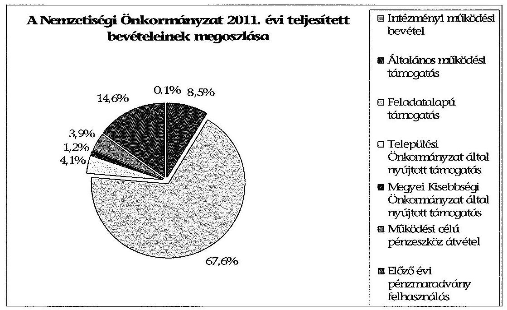
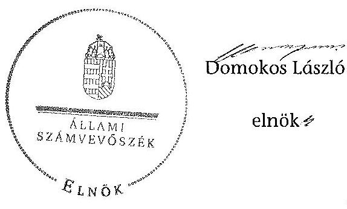

# ÁLLAMI   SZÁMVEVÔSZÉK 

## JELENTÉS

a helyi kisebbségi/nemzetiségi önkormányzatok gazdálkodásának ellenőrzéséről
Hőgyészi Német Nemzetiségi Önkormányzat

---

# Állami Számvevőszék 

Iktatószám: V-0098-017/2014.
Témaszám: 1105
Vizsgálat-azonosító szám: V06060322

## Az ellenőrzést felügyelte:

Horváth Balázs
felügyeleti vezető
Az ellenőrzést vezette és az ellenőrzés végrehajtásáért felelős:
Preller Zsuzsanna
ellenőrzésvezető
A számvevőszéki jelentést készítették és a jelentés összeállításában közremüködtek:

Ujvári Józsefné
számvevő tanácsos
Moder Beatrix
számvevő
Az ellenőrzést végezték:
Kardos Mihály
számvevő

Komonszky Krisztina
számvevő

---

# TARTALOMJEGYZÉK 

BEVEZETÉS ..... 5
I. ÖSSZEGZŐ MEGÁLLAPÍTÁSOK, KÖVETKEZTETÉSEK, JAVASLATOK ..... 7
II. RÉSZLETES MEGÁLLAPÍTÁSOK ..... 15

1. A Nemzetiségi és a Települési Önkormányzat együttmúködésének szabályszerűsége ..... 15
2. A gazdálkodási feladatok ellátásának szabályszerűsége ..... 16
2.1. A költségvetésre és zárszámadásra, valamint a kincstári adatszolgáltatás rendjére vonatkozó jogszabályi előírások betartása ..... 16
2.2. A Nemzetiségi Önkormányzat gazdálkodásának szabályozottsága ..... 17
2.3. A pénzügyi kontrollok múködése ..... 18
3. A Nemzetiségi Önkormányzattal összefüggő gazdálkodási feladatok belső ellenőrzése ..... 19
4. A 2011. évi feladatalapú támogatás felhasználásának, elszámolásának szabályszerűsége ..... 20
5. A Nemzetiségi Önkormányzat feladatellátása ..... 20

## MELLÉKLET

1. számú A Nemzetiségi Önkormányzat 2011. évi és 2012. I. félévi gazdálkodásának főbb adatai, mutatói

## FÜGGELÉKEK

1. számú Értelmező szótár
2. számú A pénzügyi kontrollok múködésének értékelése

---

# **Title: The Impact of Climate Change on Global Ecosystems**

## **Introduction**

Climate change is one of the most pressing environmental issues of our time. It affects ecosystems worldwide, leading to significant changes in biodiversity, habitat loss, and species extinction. This report explores the impacts of climate change on global ecosystems, focusing on key areas such as **forests**, **oceans**, and **polar regions**.

## **1. Forest Ecosystems**

Forests play a crucial role in carbon sequestration and maintaining biodiversity. However, rising temperatures and changing precipitation patterns are altering forest ecosystems. Key impacts include:

- **Increased frequency of wildfires**: Rising temperatures and drought conditions have led to more frequent and severe wildfires, destroying vast areas of forests.
- **Changes in species distribution**: Shifts in temperature and precipitation patterns are altering species distribution, leading to species extinction.
- **Insect outbreaks**: Warmer temperatures have increased the survival rates of pests like bark beetles, which are more likely to cause pests like bark beetles.

## **2. Ocean Ecosystems**

Oceans absorb a significant portion of the excess heat and carbon dioxide (CO₂) produced by human activities. The consequences include:

- **Increased frequency of wildfires**: Rising sea levels and drought conditions have led to more frequent and severe wildfires, destroying vast areas of oceans.
- **Changes in ocean currents**: Altered ocean currents are causing sea levels to decline, threatening species like polar bears and seals.
- **Insect outbreaks**: Warmer temperatures have increased the survival rates of pests like bark beetles, which are more likely to cause pests like bark beetles.

## **3. Ocean Ecosystems**

Oceans absorb a significant portion of the excess heat and carbon dioxide (CO₂) produced by human activities. The consequences include:

- **Increased frequency of wildfires**: Rising sea levels and drought conditions have led to more frequent and severe wildfires, destroying vast areas of oceans.
- **Changes in ocean currents**: Altered ocean currents are causing pests like bark beetles, which are more likely to cause pests like bark beetles.

## **4. Ocean Ecosystems**

Oceans absorb a significant portion of the excess heat and carbon dioxide (CO₂) produced by human activities. The consequences include:

- **Increased frequency of wildfires**: Rising sea levels and drought conditions have led to more frequent and severe wildfires, destroying vast areas of oceans.
- **Changes in ocean currents**: Altered ocean currents are causing pests like bark beetles, which are more likely to cause pests like bark beetles.

## **5. Polar Ecosystems**

Polar regions are particularly vulnerable to climate change due to their sensitivity to temperature changes. Key impacts include:

- **Melting of sea ice**: The Arctic is warming at twice the rate of the global average, leading to sea ice loss.
- **Glacial retreat**: Melting glaciers and their presence in the Arctic are rising, threatening species like polar bears and seals.
- **Changes in ocean currents**: Altered ocean currents are causing sea levels to decline, destroying vast areas of oceans.

## **Conclusion**

Climate change poses a significant threat to global ecosystems, with far-reaching consequences for biodiversity and human societies. By understanding the impacts of climate change on global ecosystems, we can help you reduce and mitigate the impacts of climate change.

---

**References**

1. IPCC (Intergovernmental Panel on Climate Change). (2021). *Climate Change 2021: The Physical Science Basis*.
2. WWF (World Wildlife Fund). (2020). *Living Planet Report 2020*.
3. NASA Global Climate Change. (2022). *Vital Signs: Global Temperature*.

---

# RÖVIDÍTÉSEK JEGYZÉKE 

## Jogszabályok

Áht. 1
Áht. 2
ÁSZ tv.
Nek. 1 tv.
Nek. 2 tv.
Számv. tv.
Ámr.
Ávr.

Ber.
Bkr.
támogatási kormányrendelet

Települési Önkormányzat SZMSZ-e

## Szórövidítések

ÁSZ
gazdálkodási jogkörök szabályzata ${ }_{1}$
1992. évi XXXVIII. törvény az államháztartásról (hatályos 2011. december 31-ig)
2011. évi CXCV. törvény az államháztartásról (hatályos 2011. december 31-től)
2011. évi LXVI. törvény az Állami Számvevőszékről (hatályos 2011. július 1-jétől)
1993. évi LXXVII. törvény a nemzeti és etnikai kisebbségek jogairól (hatályos 2011. december 31-ig)
2011. évi CLXXIX. törvény a nemzetiségek jogairól (hatályos 2011. december 20-tól)
2000. évi C. törvény a számvitelről

292/2009. (XII. 19.) Korm. rendelet az államháztartás múködési rendjéről (hatályos 2011. december 31-ig)
368/2011. (XII. 31.) Korm. rendelet az államháztartásról szóló törvény végrehajtásáról (hatályos 2012. január 1-jétől)
193/2003. (XI. 26.) Korm. rendelet a költségvetési szervek belső ellenőrzéséről (hatályos 2011. december 31-ig)
370/2011. (XII. 31.) Korm. rendelet a költségvetési szervek belső kontrollrendszeréről és belső ellenőrzéséről (hatályos 2012. január 1-jétől)
a kisebbségi önkormányzatoknak a központi költségvetésből, valamint fejezeti kezelésű előirányzatból nyújtott támogatások feltételrendszeréről és elszámolásának rendjéről szóló 342/2010. (XII. 28.) (hatályon kívül helyezte a 28/2012. (III. 6.) Korm. rendelet a nemzetiségi célú előirányzatokból nyújtott támogatások feltételrendszeréről és elszámolásának rendjéről; jelenleg hatályos a 428/2012. (XII. 29.) Korm. rendelet a nemzetiségi célú előirányzatokból nyújtott támogatások feltételrendszeréről és elszámolásának rendjéről)
Hőgyész Nagyközség Önkormányzata Képviselőtestületének 6/2011. (IV. 29.) számú rendelete az Önkormányzat Szervezeti és Múködési Szabályzatáról (hatályos 2011. április 29-től)

## Állami Számvevőszék

Hőgyész Nagyközség Önkormányzata Polgármesteri Hivatala Kötelezettségvállalás, utalványozás, ellenjegyzés, érvényesítés rendjének szabályzata (hatályos: 2010. október 1-jétől)

---

gazdálkodási jogkörök szabályzata ${ }_{2}$
jegyzó
Képviselő-testület

Nemzetiségi Önkormányzat

Nemzetiségi Önkormányzat elnöke

Nemzetiségi Önkormányzat SZMSZ ${ }_{1}$

Nemzetiségi Önkormányzat SZMSZ $_{2}$
polgármester
Polgármesteri Hivatal
Polgármesteri Hivatal SZMSZ-e

Támogató
Települési Önkormányzat
Települési Önkormányzat Képviselő-testülete

Hőgyész Nagyközség Önkormányzata Polgármesteri Hivatala Kötelezettségvállalás, utalványozás, ellenjegyzés, érvényesítés rendjének szabályzata (hatályos: 2012. január 1-jétől)
Hőgyész Nagyközség Önkormányzatának jegyzője
Hőgyészi Német Kisebbségi Önkormányzat Képviselőtestülete 2011. december 31-ig, Hőgyészi Német Nemzetiségi Önkormányzat Képviselö-testülete 2012. január 1jétől
Hőgyészi Német Kisebbségi Önkormányzat 2011. december 31-ig, Hőgyészi Német Nemzetiségi Önkormányzat 2012. január 1-jétől
Hőgyészi Német Kisebbségi Önkormányzat elnöke 2011. december 31-ig, Hőgyészi Német Nemzetiségi Önkormányzat elnöke 2012. január 1-jétől
Hőgyészi Német Kisebbségi Önkormányzat 13/2006. (X. 12.) számú, valamint a 38/2010. (X. 14.) számú határozatokkal módosított $1 / 1995$. (I. 12.) számú határozata a Szervezeti és Múködési Szabályzatról
Hőgyészi Német Nemzetiségi Önkormányzat 26/2012. (V. 29.) számú határozata a Szervezeti és Múködési Szabályzatról
Hőgyész Nagyközség Önkormányzatának polgármestere Hőgyész Nagyközség Önkormányzatának Polgármesteri Hivatala
Hőgyész Nagyközség Önkormányzatának polgármestere és jegyzője által 2011. június 15 -én kiadott Hőgyész Nagyközség Önkormányzata Polgármesteri Hivatalának Szervezeti és Múködési Szabályzata (Úgyrendje)
A támogatást nyújtó Közigazgatási és Igazságügyi Minisztérium
Hőgyész Nagyközség Önkormányzata
Hőgyész Nagyközség Önkormányzatának Képviselőtestülete

---

# JELENTÉS   a helyi kisebbségi/nemzetiségi önkormányzatok gazdálkodásának ellenőrzéséről   Hőgyészi Német Nemzetiségi Önkormányzat 

## BEVEZETÉS

Az államháztartás részét, az önkormányzati alrendszer egyik elemét képezik a nemzetiségi önkormányzatok, amelyek jogi személyek és a Nek. ${ }_{1,2}$ tv-ben meghatározott önálló feladat- és hatáskörökkel rendelkeznek. A nemzetiségi önkormányzatok az önkormányzati, illetve testületi müködtetés mellett a helyi nemzetiségi közügyek változatos formában való ellátásában vesznek részt.

A nemzetiségi önkormányzatok, illetve a települési önkormányzatok között a jelenlegi szabályozás szerint nincs alá-fölérendeltségi viszony. A nemzetiségi önkormányzatok azonban sajátos közjogi helyzetben vannak, mert a jogállásukat tekintve önkormányzatok, ám függnek a székhelyük szerinti települési önkormányzat hivatalától, amely ellátja a nemzetiségi önkormányzatok vonatkozásában a megállapodásban rögzített gazdálkodási feladatokat.

A nemzetiségek helyzete, támogatása mind hazai, mind európai uniós szinten kiemelt figyelmet kap napjainkban. A nemzetiségi önkormányzatok gazdálkodására és támogatási rendszerére vonatkozó jogszabályok a 2010-2012. években jelentős változásokon mentek át, amelyek érintették a feladatalapú támogatásra fordítható költségvetési keret megállapítását, az operatív gazdálkodási jogkörök szabályozását, az elkülönített könyvvezetés alkalmazását, a belső ellenőrzés szabályozását.

Az ellenőrzés célja annak értékelése volt, hogy a Nemzetiségi Önkormányzat gazdálkodási kereteinek kialakítása, gazdálkodása és feladatellátása megfelelte a hatályos jogszabályoknak.

Ennek keretében ellenőriztük, hogy:

- a Nemzetiségi Önkormányzat és a Települési Önkormányzat együttmúködésének szabályozása, a Települési Önkormányzat SZMSZ-ében, a megállapodásban előírt működési feltételek biztosítása megfelelt-e a jogszabályi előírásoknak;
- a felek együttműködése megfelelt-e a megállapodásnak a gazdálkodási feladatok szabályszerű ellátásában, ennek keretében betartották-e a Nemzetiségi Önkormányzat gazdálkodásához kapcsolódóan a költségvetésre és zárszámadásra, a gazdálkodás szabályozására, az operatív gazdálkodási jogkörök gyakorlására vonatkozó jogszabályi előírásokat;

---

- a jegyző biztosította-e a Polgármesteri Hivatal belső ellenőrzése keretében a Nemzetiségi Önkormányzattal összefüggő gazdálkodási feladatok belső ellenőrzését;
- a 2011. évi feladatalapú támogatás felhasználása, a folyósított feladatalapú támogatással történő elszámolás az előírásoknak megfelelően történt-e;
- a Nemzetiségi Önkormányzat feladatellátása összhangban volt-e a vonatkozó jogszabályi előírásokkal.

Az ellenőrzés típusa: szabályszerűségi ellenőrzés
Az ellenőrzött időszak: 2011. január 1. - 2012. június 30.
Ellenőrzött szervezet: Hőgyészi Német Nemzetiségi Önkormányzat és a gazdálkodási feladatait ellátó Hőgyész Nagyközség Önkormányzata

Az ellenőrzés jogszabályi alapja: az ÁSZ tv. 5. § (2)-(3) és (6) bekezdései
Az ellenőrzés szakmai módszertana az ÁSZ hivatalos honlapján (www.asz.hu) közzétett szakmai szabályokon alapult, amely a Legfőbb Ellenőrző Intézmények Nemzetközi Szervezete (INTOSAI) által kiadott nemzetközi standardok (ISSAI) figyelembevételével készült.

A fogalmak magyarázatát az 1. számú függelék, a pénzügyi kontrollok megfelelősége értékelésénél alkalmazott egységes minősítési szempontokat a 2. számú függelék tartalmazza. Az ellenőrzés lefolytatásához a Települési Önkormányzat és a Nemzetiségi Önkormányzat tanúsítványok kitöltésével és a kapcsolódó dokumentumok elektronikus megküldésével szolgáltatott adatokat. A tanúsítványokon szerepeltetett adatok, információk ellenőrzése és szükség szerinti javítása a helyszíni ellenőrzés keretében történt.

Az ÁSZ az ellenőrzés megállapításait az ellenőrzött időszakban hatályos, az intézkedést igénylő megállapításokra tett javaslatokat a jelenleg hatályos jogszabályok alapján fogalmazta meg.

A Nemzetiségi Önkormányzat 1995-ben alakult, elnöke a 2006. évi helyhatósági választások óta látta el feladatát. A Nemzetiségi Önkormányzat intézményt, gazdasági társaságot és más szervezetet nem alapított, társulásban nem vett részt. A négytagú Képviselő-testület munkája segítésére bizottságot nem hozott létre. A Nemzetiségi Önkormányzat költségvetési beszámolója szerint a 2011. évben 2463 ezer Ft költségvetési bevételt ért el és 1794 ezer Ft költségvetési kiadást teljesített. A 2012. I. félévi beszámolója alapján a teljesített bevétel 426 ezer Ft, a teljesített kiadás 370 ezer Ft volt. A 2011. évi és a 2012. I. féléves gazdálkodási adatokat részletesen az 1. számú mellékletben mutatjuk be. Az ÁSZ a Nemzetiségi Önkormányzat gazdálkodását korábban nem ellenőrizte.

Az ÁSZ tv. 29. § (1) bekezdése szerint a jelentéstervezetet megküldtük a polgármester és a Nemzetiségi Önkormányzat elnöke részére, akik az ÁSZ tv. 29. § (2) bekezdésében foglalt észrevételezési jogukkal nem éltek, a jelentéstervezetre észrevételt nem tettek.

---

# I. ÖSSZEGZŐ MEGÁLLAPÍTÁSOK, KÖVETKEZTETÉSEK, JAVASLATOK 

#### Abstract

A Nemzetiségi és a Települési Önkormányzat együttmúködésének szabályozása és múködési feltételeinek biztosítása az ellenőrzött időszakban kisebb tartalmi hiányosságok kivételével - a jogszabályi előírásoknak megfelel. A felek együttmúködése a jogszabályokban előírt határidők betartásával jóváhagyott megállapodásoknak megfelelt. A Települési Önkormányzat biztosította a Nemzetiségi Önkormányzat múködéséhez szükséges személyi és tárgyi feltételeket. A 2011. december 31 -én hatályos megállapodásban az Ámr. előírása ellenére a költségvetés megalkotása során ellátandó - a költségvetési koncepcióval, a költségvetési határozattal és a költségvetési rendelettel kapcsolatos - feladatokat és határidőket nem rögzítették. A 2012. június 30 -án hatályos megállapodás a Nek. ${ }_{2}$ tv. előírása ellenére nem tartalmazta a költségvetéssel összefüggő adatszolgáltatási feladatok rendjére, felelősökre, határidőkre vonatkozó előírásokat, valamint a gazdálkodással kapcsolatos eljárási és dokumentációs feladatokat végző személyek kijelölésének rendjét. A Nek. ${ }_{2}$ tv. előírása ellenére a Nemzetiségi Önkormányzat SZMSZ ${ }_{1,2}$-ben nem rögzítették a megállapodás szerinti múködési feltételeket.

A Nemzetiségi Önkormányzat költségvetésére és zárszámadására vonatkozó jogszabályi előírásokat nem tartották be. A költségvetési és zárszámadási határozatok az Áht. ${ }_{1}$-ben foglaltak ellenére eltérő szerkezetben, egymással nem összehasonlítható módon készültek. A 2011. évi költségvetési határozat az Áht. ${ }_{1}$-ben és az Ámr-ben foglaltak ellenére a bevételi és kiadási előirányzatokat nem a jogszabályokban előírt csoportosításban tartalmazta, továbbá nem tartalmazta a tárgyévi költségvetési bevételek és kiadások különbözeteként a költségvetési hiány összegét, a bevételi és kiadási előirányzatok mérlegszerű bemutatását, valamint az előirányzat felhasználási ütemtervet. A 2011. évi zárszámadási határozatot a Képviselő-testület az Ámr-ben előírt határidőn túl alkotta meg, a késedelem azonban nem akadályozta a Települési Önkormányzat zárszámadási rendelet-tervezetének határidőben történő benyújtását. A 2012. évi költségvetési határozat tervezetét a Nemzetiségi Önkormányzat elnöke az Áht. ${ }_{2}$-ben előírt határidőn túl terjesztette a Képviselő-testület elé, amelyben az Áht. ${ }_{2}$ előírása ellenére nem mutatták be a Nemzetiségi Önkormányzat költségvetési mérlegét közgazdasági tagolásban és az előirányzat felhasználási tervet. Az ellenőrzött időszakban biztosították a kiemelt előirányzatokon belüli gazdálkodást. A jegyző a 2012. évi költségvetéshez kapcsolódó, a Nemzetiségi Önkormányzatra vonatkozó kincstári adatszolgáltatási kötelezettségének határidőben eleget tett.

A Nemzetiségi Önkormányzat gazdálkodásának szabályozása nem felelt meg a jogszabályi előírásoknak. A 2011. évben a Polgármesteri Hivatal Számv. tv. által előírt gazdálkodási szabályzatainak hatálya kiterjedt a Nemzetiségi Önkormányzat gazdálkodási feladataira, 2012-ben azonban a könyvvezetését, éves költségvetési beszámolóját megalapozó saját, vagy a Települési Önkormányzattól elkülönített, a Számv. tv.-ben előírt szabályzatokkal nem rendelkezett, a Polgármesteri Hivatal 2012. január 1-jétől hatályos szabályzata-

---

Inak előírásai a Nemzetiségi Önkormányzat gazdálkodási feladataira nem terjedtek ki.

A Polgármesteri Hivatal az ellenőrzött időszakban rendelkezett a Nemzetiségi Önkormányzat gazdálkodási feladataira kiterjesztett ellenőrzési nyomvonallal, kockázatkezelési szabályzattal, azonban az Ámr., az Áht.,, illetve a Bkr. előírásai ellenére nem készítették el a szabálytalanságok kezelésének rendjét, valamint a folyamatba épített előzetes, utólagos és vezetői ellenőrzés szabályozását. A Polgármesteri Hivatal SZMSZ-e az Ámr. és az Ávr. előírásai ellenére nem tartalmazta a nevesített munkakörökhöz kapcsolódóan a Nemzetiségi Önkormányzat gazdálkodásával kapcsolatos feladat- és hatáskörök gyakorlásának módját, a helyettesítés rendjét, és a felelősségi szabályokat.

Az operatív gazdálkodási jogkörök kialakítása a 2011. évben a jogszabályi előírásoknak megfelelően történt. A 2012. I. félévben a kötelezettségvállalás, pénzügyi ellenjegyzés, teljesítésigazolás, érvényesítés, utalványozás gyakorlásának módjával, eljárási és dokumentációs részletszabályaival, valamint e jogköröket gyakorlók kijelölésének rendjével kapcsolatos belső előírásokat, feltételeket az Ávr. előírásai ellenére a jegyző helyett a polgármester szabályozta. A jegyző az Ávr. előírása ellenére a pénzügyi ellenjegyző kijelöléséről nem gondoskodott, az érvényesítők egyikének kijelölése nem felelt meg az Ávr. előírásának, mert szabálytalanul, a Nemzetiségi Önkormányzat elnöke bízta meg a feladattal.

A pénzügyi kontrollok múködése az ellenőrzött időszakban a múködési célú pénzeszközátadások és a dologi és egyéb folyó kiadások teljesítésénél - öszszességében értékelve - gyenge volt, a hibák száma a lényegességi szintet, a kritikus hibahatárt elérte. A 100 ezer Ft feletti kötelezettségvállalást a 2011. évben nem foglalták írásba. Az ellenőrzött időszakban az Ámr. illetve az Ávr. előírása ellenére a kötelezettségvállalásokról nyilvántartást nem vezettek, így a szakmai teljesítés igazolója - 2012. I. félévben a teljesítés igazolója - az írásbeli kötelezettségvállalást nem igénylő kifizetések esetében ellenőrizhető okmányok hiányában nem szabályszerűen látta el az ellenőrzési feladatait. A 2011. évben az utalvány ellenjegyzője nem az Ámr. előírásainak megfelelően látta el feladatait, mert annak ellenére ellenjegyezte az utalványt, hogy a szakmai teljesítésigazolás nem szabályszerűen történt, valamint nem tartották be a 100 ezer Ft feletti kötelezettségvállalások írásba foglalására és nyilvántartására vonatkozó szabályokat. A 2012. I. félévben a kötelezettségvállalás pénzügyi ellenjegyzését a pénzügyi ellenjegyző kijelölésének hiányában nem végezték el, az érvényesítés nem volt szabályszerű, mert azt - az Ávr-ben foglaltak ellenére - jogszerű kijelöléssel nem rendelkező személy végezte. A számvevőszéki ellenőrzés az ellenőrzött kifizetésekkel összefüggésben a rendelkezésre bocsátott dokumentumok alapján jogosulatlan kifizetést nem tárt fel, a pénzügyi kontrollok múködéséhez kapcsolódó hiányosságok miatt azonban a hibák megelőzése, feltárása és kijavítása nem biztosított.

A Nemzetiségi Önkormányzat a 2011. évben 1666 ezer Ft feladatalapú támogatásban részesült, amelyet 2012. június 30 -ig a jogszabályi előírásokkal összhangban használt fel. A támogatási kormányrendeletben hivatkozott, Áht.,-ben előírt elszámolás nem történt meg. A támogatás felhasználását az ellenőrzésre jogosult szervezetek nem ellenőrizték.

---

A Nemzetiségi Önkormányzat feladatellátásának tárgya összhangban volt a Nek. ${ }_{1,2}$ tv. előírásaival, biztosította az alapvető feladata ellátásához szükséges szervezeti, személyi és anyagi feltételeket. Kötelező feladatai körében kapcsolatot tartott a nemzetiségi egyesületekkel, más szervezetekkel, támogatta a lakosság önszerveződő közösségeinek tevékenységét, továbbá a Települési Önkormányzat által fenntartott oktatási intézmény vonatkozásában véleményezési, együttdöntési jogokat gyakorolt. Önként vállalt feladatként helyi sajtókiadványt támogatott, valamint a képviselt közösség kulturális autonómiája megerősítése érdekében a hagyományápolás területén látott el feladatokat.

Az ellenőrzött időszakban az Áht. ${ }_{1}$, illetve az Áht. 2 ellenére - a Polgármesteri Hivatal belső ellenőrzése keretében - a Nemzetiségi Önkormányzat gazdálkodásával összefüggő végrehajtási feladatok belső ellenőrzését a jegyző nem biztosította. A Polgármesteri Hivatal 2011. és 2012. évi belső ellenőrzési terveit megalapozó kockázatelemzés - a Ber-ben foglaltak ellenére - nem készült. Az éves belső ellenőrzési tervek nem tartalmaztak a Nemzetiségi Önkormányzat gazdálkodásával összefüggő végrehajtási feladatokra irányuló ellenőrzéseket, ilyen céllal belső ellenőrzést nem végeztek.

Az ÁSZ tv. 33. § (1) bekezdésében foglaltak értelmében az ellenőrzött szervezet vezetője köteles a jelentésben foglalt megállapításokhoz kapcsolódó intézkedési tervet összeállítani, és azt a jelentés kézhezvéteiétől számított 30 napon belül az ÁSZ részére megküldeni. Amennyiben az intézkedési tervet határidőre nem küldi meg a szervezet, vagy az nem elfogadható, az ÁSZ elnöke az ÁSZ tv. 33. § (3) bekezdés a)-b) pontjaiban foglaltakat érvényesítheti.

A helyszíni ellenőrzés megállapításainak hasznosítása mellett javasoljuk:

# a jegyzönek 

1. az együttműködés szabályozásával kapcsolatban

A 2012. június 30 -án hatályos megállapodásban a Nek. 2 tv. 80. § (3) bekezdés a) és d) pontjaiban foglaltak ellenére nem rendelkeztek a költségvetéssel összefüggő adatszolgáltatási kötelezettségek teljesítésével kapcsolatos feladatok rendjéről, a határidőkre vonatkozó előírásokról és a feladatok felelőseinek kijelöléséről, valamint a gazdálkodással kapcsolatos eljárási és dokumentációs feladatot végző személyek kijelölésének rendjéről.

A Nek. 2 tv. 80. § (2) bekezdése ellenére a Nemzetiségi Önkormányzat SZMSZ ${ }_{2}$-ben nem rögzítették a megállapodás szerinti müködési feltételeket.

Javaslat
Az együttműködés szabályszerűsége érdekében:
a) készítse elő a megállapodás módosítását, hogy tartalmilag feleljen meg a Nek. ${ }_{2}$ tv. 80. § (3) bekezdés a) és d) pontjában foglalt előírásoknak;
b) készítse elő a Nemzetiségi Önkormányzat SZMSZ-ének módosítását, hogy az megfeleljen a Nek. ${ }_{2}$ tv. 80. § (2) bekezdésében foglalt előírásnak.

---

2. a költségvetési és zárszámadási határozatokkal kapcsolatban

A Képviselő-testület az Ámr. 37. § (3) bekezdésében előírt határidőn túl alkotta meg a 2011. évi zárszámadási határozatát. A Nemzetiségi Önkormányzat elnöke az Áht. 2 24. § (2) bekezdésében foglalt határidőn túl terjesztette a 2012. évi költségvetési határozat tervezetet a Képviselő-testület elé.

A 2011. évi költségvetési határozat és a 2011. évi zárszámadási határozat összehasonlíthatóságát - az Áht. 18. §-ában foglaltakkal ellentétesen - nem biztosították, mert a bevételeket és a kiadásokat eltérő csoportosításban mutatták be.

A 2012. évi költségvetés előterjesztésekor az Áht. 2 24. § (4) bekezdés a) pontjában foglalt előírás ellenére a Képviselő-testület részére nem mutatták be tájékoztatásul szöveges indoklással a Nemzetiségi Önkormányzat költségvetési mérlegét közgazdasági tagolásban és az előirányzat felhasználási tervét.

Javaslat
A költségvetési és zárszámadási határozatok szabályszerűsége érdekében a jövőben:
a) a költségvetési és zárszámadási határozat tervezetek megfelelő időben történő előkészítésével és továbbításával biztosítsa, hogy azokat az Áht. 2 24. § (3), illetve az Áht. 2 91. § (1) bekezdésében foglalt határidőn belül a Nemzetiségi Önkormányzat elnöke a Képviselő-testület elé terjeszthesse;
b) gondoskodjon arról, hogy a Nemzetiségi Önkormányzat költségvetési határozatai tartalmazzák az Áht. 2 24. § (4) bekezdés a) pontjában foglalt adatokat, továbbá az Áht. 2 89. § (1) bekezdésében foglaltak szerint, biztosítsa a költségvetési és zárszámadási határozatok összehasonlíthatóságát.
3. a gazdálkodási feladatok szabályozottságával kapcsolatban

A Nemzetiségi Önkormányzat a 2012. évre vonatkozóan a könyvvezetését, éves költségvetési beszámolóját megalapozó saját, vagy a Települési Önkormányzattól elkülönített, a Számv. tv. 14. § (3)-(4) bekezdéseiben, valamint (5) bekezdés a), b), d) pontjaiban és Számv. tv.161. § (1) bekezdésében előírt szabályzatokkal (számviteli politika, eszközök és források leltárkészítési és leltározási, eszközök és források értékelési, pénzkezelési szabályzat, számlarend) nem rendelkezett, a Polgármesteri Hivatal 2012. január 1-jétől hatályos szabályzatainak előírásai a Nemzetiségi Önkormányzat gazdálkodási feladataira nem terjedtek ki.

Az Ámr. 20. § (2) bekezdés h) pontjában, valamint az Ávr. 13. § (1) bekezdés g) pontjában foglaltak ellenére a Polgármesteri Hivatal SZMSZ-e nem tartalmazta nevesített munkakörökhöz tartozóan a Nemzetiségi Önkormányzat gazdálkodásával kapcsolatos feladat- és hatásköröket, a hatáskörök gyakorlásának módját, a helyettesítés rendjét.

A Polgármesteri Hivatalban - a Bkr. 6. § (4) bekezdése és a Bkr. 8. § (2)-(4) bekezdéseiben előírtak ellenére - nem rendelkeztek a szabálytalanságok kezelésének eljárásrendjével, valamint a folyamatba épített előzetes, utólagos és vezetői ellenőrzés szabályozásával.

---

# Javaslat 

A szabályszerű gazdálkodás biztosítása érdekében:
a) gondoskodjon a Számv. tv. 14. § (3)-(4) bekezdéseiben és az (5) bekezdés a), b) és d) pontjaiban, valamint Számv. tv. 161. § (1) bekezdésében előírtak szerint a Nemzetiségi Önkormányzat könyvvezetésének és beszámoló készítésének szabályozásáról;
b) készítse elő az Ávr. 13. § (1) bekezdés g) pontjában foglaltaknak megfelelően a Polgármesteri Hivatal SZMSZ-ének módosítását;
c) készítse el a Nemzetiségi Önkormányzat gazdálkodási feladataira is kiterjedő - a Bkr. 6. § (4), a Bkr. 8. § (2)-(4) bekezdéseiben előírtaknak megfelelő - szabálytalanságok kezelésének rendjét és a folyamatba épített, előzetes, utólagos és vezetői ellenőrzés szabályozását.
4. az operatív gazdálkodási feladatok ellátásával kapcsolatban

A 2012. I. félévben az Ávr. 13. § (2) bekezdés a) pontja ellenére a kötelezettségvállalás, pénzügyi ellenjegyzés, teljesítésigazolás, érvényesítés, utalványozás gyakorlásának módjával, eljárási és dokumentációs részletszabályaival, valamint az ezeket végző személyek kijelölésének rendjével kapcsolatos belső előírásokat, feltételeket nem a jegyző szabályozta, az erre vonatkozó szabályzatot a polgármester adta ki és léptette hatályba.

Az Ávr. 55. § (2) bekezdés g) pontja ellenére a jegyző a pénzügyi ellenjegyző írásbeli kijelöléséről nem gondoskodott, továbbá az Ávr. 58. § (4) bekezdése ellenére az érvényesítői feladatokat ellátó személyek egyikét a jegyző helyett szabálytalanul, a Nemzetiségi Önkormányzat elnöke jelölte ki.

Javaslat
A gazdálkodás szabályszerűsége érdekében:
a) az Ávr. 13. § (2) bekezdés a) pontjában foglaltaknak megfelelően alakítsa ki a kötelezettségvállalás, pénzügyi ellenjegyzés, teljesítés igazolás, érvényesítés, utalványozás gyakorlásának módját, eljárási és dokumentációs részletszabályait;
b) az Ávr. 55. § (2) bekezdés g) pontja előírásának megfelelően gondoskodjon a pénzügyi ellenjegyző írásban történő kijelöléséről, továbbá az Ávr. 58. § (4) bekezdésének megfelelően jelölje ki az érvényesítői feladatokat ellátó személyeket.
5. a pénzügyi kontrollok múködésével kapcsolatban

A pénzügyi ellenjegyzés keretében ellátandó ellenőrzési feladatokat az Ávr. 55. § (1) bekezdésében foglaltak ellenére - a pénzügyi ellenjegyző írásbeli megbízásának hiányában - nem végezték el.

Az Ávr. 56. § (1) bekezdésében foglaltak ellenére a kötelezettségvállalásokról nyilvántartást nem vezettek, így a teljesítés igazoló az előzetes írásbeli kötelezettségvállalást nem igénylő kifizetések esetében ellenőrizhető okmányok hiányában igazolta a

---

kifizetések jogosságát, összegszerűségét, ellenszolgáltatást is magába foglaló kifizetések esetében az ellenszolgáltatás teljesítését, ezért az Ávr. 57. § (1) bekezdésében foglalt feladatait nem szabályszerűen látta el.

Az érvényesítést az Ávr. 58. § (4) bekezdésében foglaltak ellenére - figyelemmel az Ávr. 55. § (2) bekezdés g) pontjára - nem a jegyző által kijelölt, a Polgármesteri Hivatal állományába tartozó köztisztviselő látta el, ezért az Ávr. 58. § (1) bekezdése ellenére szabályszerűen nem ellenőrizték az összegszerűséget, a fedezet meglétét, a teljesítés igazolás elvégzését, a megelőző ügymenetben a jogszabályok, továbbá a belső szabályzatokban foglaltakat betartását.

Javaslat
Az operatív gazdálkodás működési hibáinak megelőzése, feltárása és kijavítása érdekében
a) gondoskodjon az Ávr. 55. § (1) bekezdésének megfelelően a pénzügyi ellenjegyzés elvégzéséről;
b) az Ávr. 56. § (1) bekezdésében foglaltaknak megfelelően biztosítsa a kötelezettségvállalás nyilvántartásának vezetését és a teljesítés igazolás Ávr. 57. § (1) bekezdésében foglaltaknak megfelelő ellátását;
c) tegye meg a szükséges intézkedést, hogy az érvényesítést szabályszerűen, az Ávr. 58. § (4) bekezdése által előírt, az Ávr. 55. § (2) bekezdés g) pontjában foglaltaknak megfelelően kijelölt köztisztviselő végezze, az Ávr. 58. § (1) bekezdésben előírt feladatok szabályszerű elvégzéséhez.
6. a feladatalapú támogatás elszámolásával kapcsolatban

A 2011. évben folyósított feladatalapú támogatás elszámolása a támogatási kormányrendelet 7. § (2) bekezdésében hivatkozott Áht. ${ }_{1}$-nek „a helyi önkormányzatok elszámolási rendjére vonatkozó rendelkezései alkalmazása" előirása ellenére nem történt meg.

Javaslat:
Gondoskodjon az Áht. 2 27. § (2) bekezdésben meghatározott feladatkörében a Nemzetiségi Önkormányzat által igénybe vett feladatalapú támogatás elszámolásának elkészítéséről, figyelemmel az Áht. 2 57. § (4) bekezdésben foglaltakra.

# a polgármesternek 

A 2012. június 30-án hatályos megállapodásban a Nek. 2 tv. 80. § (3) bekezdés a) és d) pontjában foglaltak ellenére nem rendelkeztek a költségvetéssel összefüggő adatszolgáltatási kötelezettségek teljesítésével kapcsolatos feladatok rendjéről, a határidőkre vonatkozó előírásokról és a feladatok felelőseinek kijelöléséről, valamint a gazdálkodással kapcsolatos eljárási és dokumentációs feladatot végző személyek kijelölésének rendjéről.

---

Az Ámr. 20. § (2) bekezdés h) pontjában, valamint az Ávr. 13. § (1) bekezdés g) pontjában foglaltak ellenére a Polgármesteri Hivatal SZMSZ-e nem tartalmazta nevesített munkakörökhöz tartozóan a Nemzetiségi Önkormányzat gazdálkodásával kapcsolatos feladat- és hatásköröket, a hatáskörök gyakorlásának módját, a helyettesítés rendjét.

Javaslat
Terjessze a Települési Önkormányzat Képviselő-testülete elé jóváhagyásra:
a) a Nek. 2 tv. 80. § (3) bekezdés a) és d) pontjaiban foglalt előírás betartásával előkészített megállapodás módosítást;
b) az Ávr. 13. § (1) bekezdés g) pontjában foglalt szabályozásra figyelemmel - a jegyző által előkészített - Polgármesteri Hivatal SZMSZ-ének módosítását.

# a Nemzetiségi Önkormányzat elnökének 

1. A 2012. június 30 -án hatályos megállapodásban a Nek. 2 tv. 80. § (3) bekezdés a) és d) pontjában foglaltak ellenére nem rendelkeztek a költségvetéssel összefüggő adatszolgáltatási kötelezettségek teljesítésével kapcsolatos feladatok rendjéről, a határidőkre vonatkozó előírásokról és a feladatok felelőseinek kijelöléséről, valamint a gazdálkodással kapcsolatos eljárási és dokumentációs feladatot végző személyek kijelölésének rendjéről.

A Nek ${ }_{2}$ tv. 80. § (2) bekezdése ellenére a Nemzetiségi Önkormányzat SZMSZ ${ }_{2}$-ben nem rögzítették a megállapodás szerinti müködési feltételeket

Javaslat
Terjessze a Képviselő-testület elé jóváhagyásra:
a) a Nek. 2 80. § (3) bekezdés a) és d) pontjaiban foglalt előírások betartásával előkészített megállapodás módosítást;
b) a Nek. 2 tv. 80. § (2) bekezdésben foglaltakkal összhangban módosított Nemzetiségi Önkormányzati SZMSZ-t.
2. A Képviselő-testület az Ámr. 37. § (3) bekezdésében előírt határidőn túl alkotta meg a 2011. évi zárszámadási határozatát. A Nemzetiségi Önkormányzat elnöke az Áht. ${ }_{2}$ 24. § (2) bekezdésében foglalt határidőn túl terjesztette a 2012. évi költségvetési határozat tervezetet a Képviselő-testület elé.

Javaslat
A jegyző által előkészített költségvetési és zárszámadási határozattervezeteket a jövőben az Áht. 2 24. § (3) bekezdésében, illetve az Áht. 2 91. § (1) bekezdésében foglalt határidő betartásával nyújtsa be a Képviselő-testületnek;
3. A 2011. évben folyósított feladatalapú támogatás elszámolása a támogatási kormányrendelet 7. § (2) bekezdésében hivatkozott Áht. 1 -nek „a helyi önkormányzatok

---

elszámolási rendjére vonatkozó rendelkezései alkalmazása" elöírása ellenére nem történt meg.

Javaslat
Terjessze a Képviselő-testület elé jóváhagyásra az Áht. 57. § (4) bekezdés alapján összeállított, a Nemzetiségi Önkormányzat által igénybe vett feladatalapú támogatás elszámolását.

---

# II. RÉSZLETES MEGÁLLAPÍTÁSOK 

## 1. A Nemzetiségi és a Települési Önkormányzat együttmüködésének szabályszzerüsége

A Nemzetiségi Önkormányzat és a Települési Önkormányzat együttmüködésének szabályozása, a Nemzetiségi Önkormányzat múködési feltételeinek biztosítása az ellenőrzött időszakban - a megállapodások kisebb tartalmi hiányossága ellenére - megfelelt a jogszabályi előírásoknak. A felek együttműködése a jogszabályokban előírt határidők betartásával jóváhagyott megállapodásoknak ${ }^{1}$ megfelelt.

Az együttműködés szabályozása során a jogszabályi előírásokat nem érvényesítették maradéktalanul, mert:

- a 2011. december 31-én hatályos megállapodásban a költségvetési koncepcióval, a költségvetési határozattal és a költségvetési rendelettel kapcsolatos feladatok, azok felelőseinek kijelölése és a határidők meghatározása nem felelt meg az Ámr. 37. § (4) bekezdés a)-f) pontjaiban foglalt előírásoknak;
- a 2012. június 30 -án hatályos megállapodásban a Nek. 2 tv. 80. § (3) bekezdés a) és d) pontjában foglaltak ellenére nem rendelkeztek a költségvetéssel összefüggő adatszolgáltatási kötelezettségek teljesítésével kapcsolatos feladatok rendjéről, a határidőkre vonatkozó előírásokról és a feladatok felelőseinek kijelöléséről, valamint a gazdálkodással kapcsolatos eljárási és dokumentációs feladatot végző személyek kijelölésének rendjéről.
- A Nek. ${ }_{2}$ tv. 80. § (2) bekezdésében foglaltak ellenére a Nemzetiségi Önkormányzat $\mathrm{SZMSZ}_{2}$-ben nem rögzítették a megállapodás szerinti múködési feltételeket.

A Települési Önkormányzat - a szabályozási hiányosságok ellenére - biztosította és folyamatosan fenntartotta a Nemzetiségi Önkormányzat müködésének tárgyi és személyi feltételeit.

[^0]
[^0]:    ${ }^{1}$ A 2011-ben hatályos megállapodást a Képviselő testület az 51/2010. (XI. 22.) számú, a Települési Önkormányzat Képviselő-testülete a 101/2010. (XII. 22.) számú határozattal, módosítását a 14/2011. (III. 17.) számú, illetve a 25/2011. (III. 31.) számú határozattal fogadta el. A Nek. ${ }_{2}$ tv. 159. § (3) bekezdésébe előírtak alapján 2012. június 1-jéig felülvizsgált és módosított megállapodást a Képviselő-testület a 27/2012. (V. 29.) számú, a Települési Önkormányzat Képviselő-testülete a 39/2012. (V. 31.) számú határozattal fogadta el.

---

# 2. A GAZDÁLKODÁSI FELADATOK ELLÁTÁSÁNAK SZABÁLYSZERŰSÉGE 

### 2.1. A költségvetésre és zárszámadásra, valamint a kincstári adatszolgáltatás rendjére vonatkozó jogszabályi előírások betartása

A Nemzetiségi Önkormányzat a 2011. és a 2012. évi költségvetésének és a 2011. évi zárszámadásának tartalmára, jóváhagyására vonatkozó jogszabályi előírásokat nem tartotta be:

- a 2011. évi költségvetési határozat ${ }^{2}$ - az Áht. ${ }_{1}$ 69. § (1) bekezdés a), az Ámr. 36. § (1) bekezdés a)-b) pontjainak előírása ellenére - a bevételi előirányzatokat nem forrásonként és főbb jogcím-csoportonkénti bontásban, a kiadási előirányzatokat nem kiemelt előirányzatonként tartalmazta, továbbá az Ámr. 36. § (1) bekezdés ec), i) és k) pontjaiban foglaltak ellenére nem tartalmazta a tárgyévi költségvetési bevételek és kiadások különbözeteként a költségvetési hiány összegét, a bevételi és kiadási előirányzatok mérlegszerű bemutatását, valamint az előirányzat-felhasználási ütemtervet;
- a 2011. évi költségvetési határozat és a 2011. évi zárszámadási határozat ${ }^{3}$ összehasonlíthatóságát - az Áht. ${ }_{1}$ 18. §-ában foglaltakkal ellentétesen - nem biztosították, mert a bevételeket és a kiadásokat eltérő csoportosításban mutatták be;
- a Képviselő-testület a zárszámadási határozatot 16 nappal az Ámr. 37. § (3) bekezdésében előírt határidőn ${ }^{4}$ túl, 2012. április 26-án alkotta meg, azonban ez nem akadályozta - a változatlan tartalommal beépített, jóváhagyott zárszámadási határozatot tartalmazó - zárszámadási rendelettervezet ${ }^{5}$ határidőben történő beterjesztését;
- a 2012. évi költségvetési határozat ${ }^{6}$ tervezetét a Nemzetiségi Önkormányzat elnöke az Áht. ${ }_{2}$ 24. § (2) bekezdésében előírt határidőn túl terjesztette a Kép-viselő-testület elé, az előterjesztéskor az Áht. 2 24. § (4) bekezdés a) pontjában foglalt előirás ellenére nem mutatták be tájékoztatásul, szöveges indoklással, a Nemzetiségi Önkormányzat költségvetési mérlegét közgazdasági tagolásban és az előirányzat felhasználási tervet.

A 2011. évben és 2012. I. félévben a Nemzetiségi Önkormányzat elnöke biztosította a kiemelt előirányzatokon belüli gazdálkodást. A jegyzö 2012. I. félévben

[^0]
[^0]:    ${ }^{2}$ A Képviselő-testület Nemzetiségi Önkormányzat 2011. évi költségvetéséről szóló 6/2011. (II. 3.) számú határozata.
    ${ }^{3}$ A Képviselő-testület Nemzetiségi Önkormányzat 2011. évi költségvetésének végrehajtásáról szóló 19/2012. (IV. 26.) számú határozata.
    ${ }^{4}$ 2012. április 10.
    ${ }^{5}$ A Települési Önkormányzat a 2011. évi zárszámadását 2012. április 27-én, a 7/2012. (IV. 27.) számú rendeletével fogadta el.
    ${ }^{6}$ A Képviselő-testület Nemzetiségi Önkormányzat 2012. évi költségvetéséről szóló 12/2012. (III. 12.) számú határozata.

---

a Nemzetiségi Önkormányzatra vonatkozó kincstári adatszolgáltatási kötelezettségének határidőben eleget tett.

# 2.2. A Nemzetiségi Önkormányzat gazdálkodásának szabályozottsága 

A Nemzetiségi Önkormányzat gazdálkodásának szabályozása az ellenőrzött időszakban nem felelt meg a jogszabályi előírásoknak.

A 2011. évben a Nemzetiségi Önkormányzat gazdálkodási feladatait ellátó Polgármesteri Hivatal a Számv. tv. által előírt gazdálkodási szabályzatokkal ${ }^{7}$ rendelkezett, amelyek hatálya kiterjedt a Nemzetiségi Önkormányzat gazdálkodási feladataira. A gazdálkodás szabályozása során nem érvényesültek maradéktalanul a jogszabályi előírások, mert:

- a Nemzetiségi Önkormányzat a 2012. évre vonatkozóan a könyvvezetését, éves költségvetési beszámolóját megalapozó saját, vagy a Települési Önkormányzattól elkülönített, a Számv. tv. 14. § (3)-(4) bekezdéseiben, valamint (5) bekezdés a), b), d) pontjaiban és Számv. tv.161. § (1) bekezdésében előírt szabályzatokkal (számviteli politika, eszközök és források leltárkészítési és leltározási, eszközök és források értékelési, pénzkezelési szabályzat, számlarend) nem rendelkezett, a Polgármesteri Hivatal 2012. január 1-jétől hatályos szabályzatainak előírásai a Nemzetiségi Önkormányzat gazdálkodási feladataira nem terjedtek ki;
- az ellenőrzött időszakban a Polgármesteri Hivatal SZMSZ-e - az Ámr. 20. § (2) bekezdés h) pontjában, illetve az Ávr. 13. § (1) bekezdés g) pontjában foglaltak ellenére - nem tartalmazta nevesített munkakörökhöz kapcsolódóan a Nemzetiségi Önkormányzat gazdálkodásával kapcsolatos feladat- és hatásköröket, a hatáskörök gyakorlásának módját, a helyettesítés rendjét, és a kapcsolódó felelősségi szabályokat;
- nem szabályozták az Ámr. 156. § (3) bekezdés, illetve a Bkr. 6. § (4) bekezdés előírása ellenére a szabálytalanságok kezelésének eljárásrendjét, valamint az Áht. ${ }_{1} 121 /$ A. § (4) bekezdés és a Bkr. 8. § (2)-(4) bekezdései ellenére a folyamatba épített, előzetes, utólagos és vezetői ellenőrzést.

A Nemzetiségi Önkormányzat operatív gazdálkodási jogköreinek kialakítása, a kötelezettségvállaló, utalványozó, a kötelezettségvállalás és az utalvány ellenjegyző, a szakmai teljesítést igazoló, valamint az érvényesítést végző személyek kijelölése a 2011. évben a jogszabályi előírásoknak megfelelően történt.

A 2012. I. félévben az Ávr. 13. § (2) bekezdés a) pontja ellenére a kötelezettségvállalás, pénzügyi ellenjegyzés, teljesítésigazolás, érvényesítés, utalványozás gyakorlásának módjával, eljárási és dokumentációs részletszabályaival, valamint az ezeket végző személyek kijelölésének rendjével kapcsolatos belső előírá-

[^0]
[^0]:    ${ }^{7}$ Számviteli politika, számlarend, leltározási és leltárkészítési szabályzat, pénzkezelési szabályzat, eszközök és források értékelési szabályzata.

---

sokat, feltételeket nem a jegyzö szabályozta, az erre vonatkozó szabályzatot a polgármester adta ki és léptette hatályba.

A 2012. június 1-jétől hatályos megállapodás az operatív gazdálkodási jogkörök jogosultjait munkakörökhöz rendelve meghatározta, a jogosultak megbízásának, kijelölésének rendjét tartalmazta.

Az Áht. 2 37. § (2) bekezdése és az Ávr. 55. § (2) bekezdés g) pontja ellenére a jegyző a pénzügyi ellenjegyző írásbeli kijelöléséről nem gondoskodott, továbbá Áht. 2 38. § (2) bekezdése illetve az 58. § (4) bekezdése ellenére az érvényesítői feladatokat ellátó személyek egyikét a jegyző helyett, szabálytalanul, a Nemzetiségi Önkormányzat elnöke jelölte ki.

# 2.3. A pénzügyi kontrollok múködése 

A Nemzetiségi Önkormányzat - a 2. számú függelék szerinti értékelésre kiválasztott három terület közül a könyvviteli tételei alapján - múködési célú pénzeszközátadásra, valamint dologi és egyéb folyó kiadásokra teljesített kifizetést.

A Nemzetiségi Önkormányzatnál a 2011. évben a múködési célú pénzeszközátadásokra, valamint a dologi és egyéb folyó kiadásokra teljesített kifizetések során a kötelezettségvállalás ellenjegyzése, a szakmai teljesítésigazolás és az utalvány ellenjegyzés kontrollok müködésének megfelelősége - a 2. számú függelékben részletezett szempontok alapján végzett értékelés szerint, ezen területek költségvetési súlyának figyelembevételével - öszszefoglalóan értékelve ${ }^{8}$ gyenge volt, a hibák száma a lényegességi szintet, a kritikus hibahatárt elérte, mert:

- az Ámr. 74. § (1) bekezdésében foglaltak ellenére a 100 ezer Ft feletti kötelezettségvállalást nem foglalták írásba ${ }^{9}$, ennek hiányában a kötelezettségvállalás ellenjegyzöje az ellenőrzési feladatát nem végezte el;
- az Ámr. 75. § (1) bekezdésében foglaltak ellenére a kötelezettségvállalásokról nyilvántartást nem vezettek, így a szakmai teljesítésigazoló az előzetes írásbeli kötelezettségvállalást nem igénylő kifizetések esetében ellenőrizhető okmányok hiányában igazolta a kifizetések jogosságát, összegszerűségét, ellenszolgáltatást is magában foglaló kifizetés esetében az ellenszolgáltatás szakmai teljesítését, ezért az Ámr. 76. § (1) bekezdésében foglalt feladatait nem szabályszerűen látta el;
- az utalvány ellenjegyzöje annak ellenére ellenjegyezte a kiadások teljesítését, hogy a szakmai teljesítésigazolás nem volt szabályszerű, valamint a

[^0]
[^0]:    ${ }^{8}$ A kontrollok megfelelőségének értékelése során az ellenőrzött két terület egyedi értékelési pontszámait a 2011. évi Nemzetiségi Önkormányzati szintű költségvetési beszámoló teljesítési adataiból képzett súlyokkal arányosan összegeztük. A müködési és felhalmozási célú pénzeszközátadásnál $23 \%$-os, a dologi és egyéb folyó kiadások esetében $77 \%$-os súllyal számoltunk.
    ${ }^{9}$ Az ellenőrzött kifizetések teljesítésére vállalt kötelezettség összege egy dologi kiadás esetében haladta meg a kötelezettségvállalás írásba foglalását igénylő százezer forintos értékhatárt.

---

megelőző ügymenetben nem tartották be a gazdálkodásra - a kötelezettségvállalások nyilvántartásának vezetésére - vonatkozó szabályokat, ezért feladatát nem az Ámr. 79. § (2) bekezdésében foglalt előírás szerint látta el.

A Nemzetiségi Önkormányzatnál 2012. I. félévben a múködési célú pénzeszközátadások és a dologi és egyéb folyó kiadások teljesítése során a pénzügyi ellenjegyzés a teljesítésigazolás és az érvényesítés pénzügyi kontrollok müködésének megfelelősége - a 2. számú függelékben részletezett szempontok alapján végzett értékelés szerint ezen területek költségvetési súlyának figyelembevételével - összefoglalóan értékelve ${ }^{10}$ gyenge volt, a hibák száma a lényegességi szintet, a kritikus hibahatárt elérte, mert:

- a kötelezettségvállalás pénzügyi ellenjegyzése keretében ellátandó ellenőrzési feladatokat az Ávr. 55. § (1) bekezdésében foglaltak ellenére - a pénzügyi ellenjegyzó írásbeli megbízásának hiányában - nem végezték el;
- az Ávr. 56. § (1) bekezdésében foglaltak ellenére a kötelezettségvállalásokról nyilvántartást nem vezettek, így a teljesítés igazoló az előzetes írásbeli kötelezettségvállalást nem igénylő kifizetések esetében ellenőrizhető okmányok hiányában igazolta a kifizetések jogosságát, összegszerűségét, ellenszolgáltatást is magába foglaló kifizetések esetében az ellenszolgáltatás teljesítését, ezért az Ávr. 57. § (1) bekezdésében foglalt feladatait nem szabályszerűen látta el;
- az érvényesítést az Ávr. 58. § (4) bekezdésében foglaltak ellenére - figyelemmel az Ávr. 55. § (2) bekezdés g) pontjára - nem a jegyző által kijelölt, a Polgármesteri Hivatal állományába tartozó köztisztviselő látta el, ezért az Ávr. 58. § (1) bekezdése ellenére szabályszerűen nem ellenőrizték az összegszerűséget, a fedezet meglétét, a teljesítés igazolás elvégzését, a megelőző ügymenetben a jogszabályok, továbbá a belső szabályzatokban foglaltakat betartását.

A Nemzetiségi Önkormányzatnál az ellenőrzött időszakban, a pénzügyi folyamatokban kulcsszerepet betöltő belső kontrollok működésében feltárt hiányosságokkal összefüggésben, az ellenőrzött tételek vonatkozásában az ellenőrzés jogosulatlan kifizetést nem állapított meg. A pénzügyi kontrollok müködéséhez kapcsolódó hiányosságok miatt azonban a hibák megelőzése, feltárása és kijavítása nem volt biztosított.

# 3. A Nemzetiségi Önkormányzattal öSSZefüGGŐ GAZDÁlKODÁSI FELADATOK BELSŐ ELLENŐRZÉSE 

A jegyző az ellenőrzött időszakban az Áht. ${ }_{1}$ 121/B. § (4) bekezdése, illetve az Áht. 2 70. § (1) bekezdése előírása ellenére nem biztosította a Nemzetiségi

[^0]
[^0]:    ${ }^{10}$ A kontrollok megfelelőségének értékelése során az ellenőrzött két terület egyedi értékelési pontszámait a 2012. I. félévi Nemzetiségi Önkormányzati szintű költségvetési beszámoló teljesítési adataiból képzett súlyokkal arányosan összegeztük. A müködési és felhalmozási pénzeszközátadásnál $12 \%$-os, a dologi és folyó kiadások esetében $88 \%$-os súllyal számoltunk.

---

# Önkormányzat gazdálkodásával összefüggő végrehajtási feladatok belsö ellenörzését. 

A Polgármesteri Hivatal 2011. és 2012. évi belső ellenőrzési terveit megalapozó kockázatelemzés - a Ber. 21. § (2) bekezdésében foglaltak ellenére - nem készült. Az éves belső ellenőrzési tervek nem tartalmaztak a Nemzetiségi Önkormányzat gazdálkodásával összefüggő végrehajtási feladatok ellátására irányuló ellenőrzéseket, ilyen céllal belső ellenőrzést nem végeztek.

## 4. A 2011. ÉVI FELADATALAPÚ TÁMOGATÁs FELHASZNÁLÁSÁNAK, ELSZÁMOLÁSÁNAK SZABÁLYSZERÜSÉGE

A Nemzetiségi Önkormányzat a 2011. évben 1666 ezer Ft feladatalapú támogatásban részesült. A feladatalapú támogatás összes bevételhez viszonyított részarányát a következő ábra szemlélteti:

A 2011. évben folyósított támogatást 2012. június 30-ig a jogszabályi előírásokkal összhangban használták fel. A feladatalapú támogatás felhasználásának elszámolása a támogatási kormányrendelet 7. § (2) bekezdésében hivatkozott Áht. ${ }_{1}$-nek „a helyi önkormányzatok elszámolási rendjére vonatkozó rendelkezései alkalmazása" előírása ellenére nem történt meg. A támogatás felhasználását az ellenőrzésre jogosult szervezetek nem ellenőrizték.

## 5. A Nemzetiségi ÖNKORMÁNYZAT FELADATELLÁTÁSA

A Nemzetiségi Önkormányzat feladatellátásának tárgya összhangban volt a Nek. ${ }_{1,2}$ tv. előírásaival. Az ellenőrzött időszakban hatósági tevékenységet, közüzemi szolgáltatással összefüggő feladatot nem végzett.

A Nemzetiségi Önkormányzat a Nek. ${ }_{1}$ tv. 5/A. § (1) bekezdés és a Nek. ${ }_{2}$ tv. 10. § (1) bekezdés szerinti, a nemzetiségi érdekek védelmével és képvi-

---

seletével kapcsolatos alapvető feladata ellátásához biztosította a szükséges szervezeti, személyi és anyagi feltételeket. Kötelezö feladatai körében ellátta a képviselt közösség érdekképviseletével, az esélyegyenlőségének megteremtésével kapcsolatos feladatokat, a Nek. 1 tv. 30. § (1) és a Nek. 2 tv. 115. § f) pontjában foglaltak alapján kapcsolatot tartott nemzetiségi egyesületekkel, más szervezetekkel, támogatta a lakosság önszerveződő közösségeinek tevékenységét, továbbá a Települési Önkormányzat által fenntartott oktatási intézmény vonatkozásában véleményezési, együttdöntési jogokat gyakorolt. Önként vállalt feladatként a Nek. 1 tv. 30/A. § (4) bekezdésében, illetve a Nek. 2 tv. 116. § (2) bekezdésében foglaltak alapján helyi sajtókiadványt támogatott, valamint a képviselt közösség kulturális autonómiája megerősítése érdekében a hagyományápolás területén látott el feladatokat.

Budapest, 2014. 9 hónap 24 . nap

Melléklet: 1 db
Függelék: 2 db

---

.

---

# A Nemzetiségi Önkormányzat 2011. évi és 2012. I. félévi gazdálkodásának föbb adatai, mutatói

## A) BEVÉTELEK

|  Megnevezés | 2011. év |  |  |  | 2012. év |  | 2012. I. félév |   |
| --- | --- | --- | --- | --- | --- | --- | --- | --- |
|   | eredeti el. | módosított
el. | teljesítés | teljesítés
megoszlása
(\%) | eredeti el. | módosított
el. | teljesítés | teljesítés
megoszlása
(\%)  |
|  Intézményi müködési bevétel | 0,0 | 0,0 | 3,0 | $0,1 \%$ | 0,0 | 2,0 | 2,0 | $0,3 \%$  |
|  Általános müködési
támogatás | 210,0 | 210,0 | 210,0 | $8,5 \%$ | 214,0 | 214,0 | 214,0 | $50,2 \%$  |
|  Feladatalapú támogatás | 0,0 | 1666,0 | 1666,0 | $67,6 \%$ | 0,0 | 0,0 | 0,0 | $0,0 \%$  |
|  Teleptilési Önkormányzat
által nyújtott támogatás | 100,0 | 100,0 | 100,0 | $4,1 \%$ | 100,0 | 100,0 | 50,0 | $11,7 \%$  |
|  Megyei Nemzetiségi
Önkormányzat által nyújtott
támogatás | 0,0 | 20,0 | 29,0 | $1,2 \%$ | 0,0 | 0,0 | 0,0 | $0,0 \%$  |
|  Fejezeti kezelésú
előirányzatból kapott
támogatás | 0,0 | 0,0 | 0,0 | $0,0 \%$ | 0,0 | 71,0 | 71,0 | $16,7 \%$  |
|  Müködési célú pénzeszköz
árvétel | 0,0 | 95,0 | 95,0 | $3,9 \%$ | 160,0 | 0,0 | 0,0 | $0,0 \%$  |
|  Felhalmozási bevételek | 0,0 | 0,0 | 0,0 | $0,0 \%$ | 0,0 | 89,0 | 89,0 | $20,9 \%$  |
|  Pénzforgalmi bevételek
összesen | 310,0 | 2101,0 | 2103,0 | $85,4 \%$ | 474,0 | 476,0 | 426,0 | $100,0 \%$  |
|  Kiadó évi pénzmassdvány
felhazendáá | 360,0 | 360,0 | 360,0 | $14,6 \%$ | 669,0 | 669,0 | 0,0 | $0,0 \%$  |
|  Bevételek összesen | 670,0 | 2461,0 | 2463,0 | $100,0 \%$ | 1143,0 | 1145,0 | 426,0 | $100,0 \%$  |

## B) KIADÁSOK

|  Megnevezés | 2011. év |  |  |  | 2012. év |  | 2012. I. félév |   |
| --- | --- | --- | --- | --- | --- | --- | --- | --- |
|   | eredeti el. | módosított el. | teljesítés | teljesítés megoszlása (\%) | eredeti el. | módosított el. | teljesítés | teljesítés megoszlása
(\%)  |
|  Személyi juttatások | 0,0 | 0,0 | 0,0 | $0,0 \%$ | 0,0 | 0,0 | 0,0 | $0,0 \%$  |
|  Munkinadókat terhelő
híruákok | 0,0 | 0,0 | 0,0 | $0,0 \%$ | 0,0 | 0,0 | 0,0 | $0,0 \%$  |
|  Dologi és egyéb folyó
kiadások | 510,0 | 1515,0 | 1391,0 | $77,5 \%$ | 745,0 | 747,0 | 326,0 | $88,1 \%$  |
|  Támogatásértékủ müködési
kiadás | 0,0 | 0,0 | 0,0 | $0,0 \%$ | 0,0 | 0,0 | 0,0 | $0,0 \%$  |
|  Müködési célú
pénzeszközátadás | 160,0 | 404,0 | 403,0 | $22,5 \%$ | 398,0 | 398,0 | 44,0 | $11,9 \%$  |
|  Tartulék | 0,0 | 542,0 | 0,0 | $0,0 \%$ | 0,0 | 0,0 | 0,0 | $0,0 \%$  |
|  Müködési kiadások
összesen | 670,0 | 2461,0 | 1794,0 | $100,0 \%$ | 1143,0 | 1145,0 | 370,0 | $100,0 \%$  |
|  Felhalmozási kiadások | 0,0 | 0,0 | 0,0 | $0,0 \%$ | 0,0 | 0,0 | 0,0 | $0,0 \%$  |
|  Kiadások összesen | 670,0 | 2461,0 | 1794,0 | $100,0 \%$ | 1143,0 | 1145,0 | 370,0 | $100,0 \%$  |

---

.

---

# ÉRTELMEZŐ SZÓTÁR 

feladatalapú támogatás
megállapodás
nemzetiség
nemzetiségi közügy

A támogatási évben általános múködési támogatásban részesült, és a Támogatónak a Kincstárhoz intézett, a feladatalapú támogatás utalására vonatkozó rendelkező levele keltének időpontjában múködő nemzetiségi önkormányzatoknak a támogatási kormányrendeletben rögzített feltételrendszer alapján nyújtható támogatás. A feladatalapú támogatás a nemzetiségi közügyeknek a nemzetiségi önkormányzatok által történő ellátását szolgálja. (A támogatási kormányrendelet 2. § (2) bekezdés c) pont, és 4. § (1) bekezdés alapján.)
A nemzetiségi önkormányzatnak a múködési feltételei biztosítására, továbbá a bevételeivel és a kiadásaival kapcsolatban a tervezési, gazdálkodási, ellenőrzési, finanszírozási, adatszolgáltatási és beszámolási feladatai végrehajtására a székhelye szerinti települési önkormányzattal megkötött megállapodás. (Az Áht. ${ }_{1} 66 . \S$, a Nek. 2 tv. 80 § (2) bekezdés, valamint az Áht. 27. § (2) bekezdés alapján levezetett fogalom.)
Minden olyan Magyarország területén legalább egy évszázada honos népcsoport, amely az állam lakossága körében számszerú kisebbségben van és a lakosság többi részétől saját nyelve és kultúrája, hagyományai különböztetik meg, egyben olyan összetartozás-tudatról tesz bizonyságot, amely mindezek megőrzésére, történelmileg kialakult közösségeik érdekeinek kifejezésére és védelmére irányul. (A Nek. ${ }_{1}$ tv. 1. § (2) bekezdése, valamint a Nek. 2 tv. 1. § (1) bekezdése alapján levezetett fogalom.)
Az egyéni és közösségi jogok érvényesülése, a nemzetiséghez tartozók érdekeinek kifejezésre juttatása - különösen az anyanyelv ápolása, őrzése és gyarapítása, továbbá a nemzetiségek kulturális autonómiájának a nemzetiségi önkormányzatok által történő megvalósítása és megőrzése - érdekében a nemzetiséghez tartozók meghatározott közszolgáltatásokkal való ellátásával, ezen ügyek önálló vitelével és az ehhez szükséges szervezeti, személyi és anyagi feltételek megteremtésével összefüggő ügy. A közhatalmat gyakorló állami és helyi önkormányzati szervekben, továbbá a nemzetiségi önkormányzati szervekben való nemzetiségi képviselethez és mindezek szervezeti, személyi és anyagi feltételeinek biztosításához kapcsolódó ügy. (A Nek. ${ }_{1}$ tv. 6/A. § 1. pontjából és a Nek. 2 tv. 2. § 1. pontjából levezetett fogalom.)

---

nemzetiségi önkormányzat
pénzügyi kontrollok

Törvényben meghatározott nemzetiségi közszolgáltatási feladatokat ellátó, testületi formában múködő, jogi személyiséggel rendelkező, demokratikus választások útján törvény alapján létrehozott szervezet, amely a nemzetiségi közösséget megillető jogosultságok érvényesítésére, a nemzetiségek érdekeinek védelmére és képviseletére, a feladat- és hatáskörébe tartozó nemzetiségi közügyek települési, területi vagy országos szinten történő önálló intézésére jön létre. (A Nek., tv. 6/A. § (1) bekezdés 2. pontjából, valamint a Nek. 2 tv. 2. § 2. pontjából levezetett fogalom.) A jelentésben e fogalmat a települési nemzetiségi önkormányzatokra leszűkítve használjuk.
a kötelezettségvállalás és az utalvány ellenjegyzése, valamint a szakmai teljesítés igazolása 2011. december 31éig, 2012. január 1-jétől a pénzügyi ellenjegyzés, a teljesítés igazolása és az érvényesítés.

---

# A PÉNZÜGYI KONTROLLOK MÜKÖDÉSÉNEK ÉRTÉKELÉSE 

A pénzügyi kontrollok működése megfelelőségének vizsgálatát többlépcsős megfelelőségi tesztek útján, megismételt eljárással, a könyvviteli tételekből vett egyszerủ véletlen minta alapján végeztük. A tesztelést az értékelésre kiválasztott három terület - a dologi és egyéb folyó kiadásoknál teljesített kifizetések, az államháztartáson belülre és kívülre, múködési és felhalmozási célra teljesített pénzeszközátadások, illetve a szociálpolitikai ellátások teljesített kiadásainál végeztük el.

Az ellenőrzés során alkalmazott módszer (többlépcsős megfelelőségi teszt) lényege, hogy a kiválasztott minta ellenőrzését csak addig végezzük, amíg elegendő és megfelelő bizonyítékot nem szerzünk a vizsgált pénzügyi kontroll működésének megfelelő, vagy nem megfelelő voltáról. A megismételt eljárás alkalmazása a szándékolt hatáshoz (törvényes múködés, kitűzött célok, teljesítmények elérése, veszteséget okozó kockázatok megelőzése, mérséklése, feltárása) viszonyítva lehetővé teszi a kontrolltevékenységek tényleges hatásának vizsgálatát, ez alapján a múködés megfelelősége értékelését. Ennek keretében a számvevő bizonyosságot szerez arról, hogy a rendelkezésre álló szabályozás és dokumentumok alapján a pénzügyi kontrollokhoz szükséges - jogszabályokban előírt - ellenőrzési lépéseket végrehajtották-e.

A tesztek kiértékelése évenkénti bontásban két szinten történt. Először az egyes tevékenységi területekre meghatározott pénzügyi kontrollokat értékeltük, majd általános következtetést vontunk le a pénzügyi kontrollok együttes megfelelősége tekintetében. Az ellenőrzésre kijelölt területek kifizetéseinél a pénzügyi kontrollok múködése „kiváló", „jó" vagy „gyenge" minősítést kaphatott.

Az értékelésnél meghatározott lényegességi szint a könyvelési adatállományból vett mintanagysághoz megadott kritikus hibák száma.

A pénzügyi kontrollok múködését:

- kiválónak értékeltük abban az esetben, ha azok múködése megfelel a hibák megelőzésére és kijavítására meghatározott jogszabályi és helyi szintű szabályozásnak (eseti hibák);
- jónak minősítettük, ha a megállapított kisebb (tolerálható mértékű) hiányosságok nem veszélyeztetik az ellenőrzött területek hibáinak megelőzését és kijavítását (a hibák száma nem érte el a kritikus hibák számát, azaz a lényegességi szintet);
- gyengének értékeltük, amennyiben a kontrollok múködésében előforduló hiányosságok miatt nem biztosított a hibák megelőzése, feltárása, kijavítása (a hibák száma elérte az ellenőrzött tételektől függően megállapított kritikus hibák számát, azaz a lényegességi szintet).