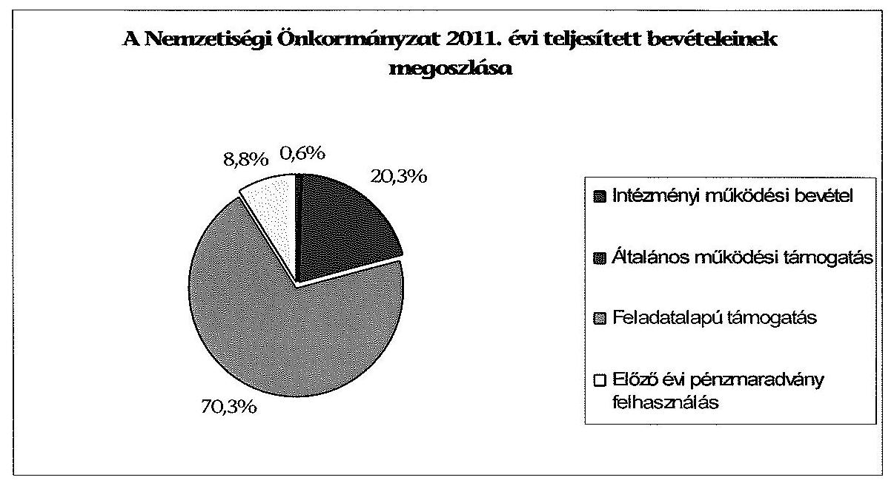
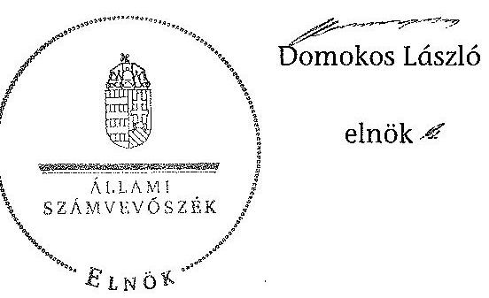

# ÁLLAMI   SZÁMVEVŐSZÉK 

## JELENTÉS

a helyi kisebbségi/nemzetiségi önkormányzatok gazdálkodásának ellenőrzéséről
Német Nemzetiségi Önkormányzat Jánossomorja

---

# Állami Számvevőszék 

Iktatószám: V-0102-019/2014.
Témaszám: 1105
Vizsgálat-azonosító szám: V06060326

## Az ellenőrzést felügyelte:

Horváth Balázs
felügyeleti vezető
Az ellenőrzést vezette és az ellenőrzés végrehajtásáért felelős:
Preller Zsuzsanna
ellenőrzésvezető
A számvevőszéki jelentést készítették és a jelentés összeállításában közreműködtek:

Ujvári Józsefné
számvevő tanácsos
Moder Beatrix
számvevő
Az ellenőrzést végezték:
Dr. Eke-Pekács Tibor
Széibel Gáborné
számvevő tanácsos
számvevő

---

# TARTALOMJEGYZÉK 

BEVEZETÉS ..... 5
I. ÖSSZEGZŐ MEGÁLLAPÍTÁSOK, KÖVETKEZTETÉSEK, JAVASLATOK ..... 8
II. RÉSZLETES MEGÁLLAPÍTÁSOK ..... 16

1. A Nemzetiségi és a Települési Önkormányzat együttműködésének szabályszerűsége ..... 16
2. A gazdálkodási feladatok ellátásának szabályszerűsége ..... 16
2.1. A költségvetésre és zárszámadásra, valamint a kincstári adatszolgáltatás rendjére vonatkozó jogszabályi előírások betartása ..... 16
2.2. A Nemzetiségi Önkormányzat gazdálkodásának szabályozottsága ..... 18
2.3. A pénzügyi kontrollok működése ..... 19
3. A Nemzetiségi Önkormányzattal összefüggő gazdálkodási feladatok belső ellenőrzése ..... 20
4. A 2011. évi feladatalapú támogatás felhasználásának, elszámolásának szabályszerűsége ..... 21
5. Nemzetiségi Önkormányzat feladatellátása ..... 21

## MELLÉKLET

1. számú A Nemzetiségi Önkormányzat 2011. évi és 2012. I. félévi gazdálkodásának főbb adatai, mutatói

## FÜGGELÉKEK

1. számú Értelmező szótár
2. számú A pénzügyi kontrollok működésének értékelése

---

.

---

# RÖVIDÍTÉSEK JEGYZÉKE 

## Jogszabályok

Áht. 1
Áht. 2
ÁSZ tv.
Knyt. tv.

Nek. ${ }_{1}$ tv.
Nek. 2 tv.
Számv. tv.
Ámr.
Ávr.

Ber.
Bkr.
támogatási kormányrendelet

Települési Önkormányzat SZMSZ-e

## Szórövidítések

ÁSZ
gazdálkodási jogkörök szabályzata
jegyző
1992. évi XXXVIII. törvény az államháztartásról (hatályos 2011. december 31-ig)
2011. évi CXCV. törvény az államháztartásról (hatályos 2011. december 31-től)
2011. évi LXVI. törvény az Állami Számvevőszékről (hatályos 2011. július 1-jétől)
2007. évi CLXXXI. törvény a közpénzekből nyújtott támogatások átláthatóságáról (hatályos 2008. április 30-tól)
1993. évi LXXVII. törvény a nemzeti és etnikai kisebbségek jogairól (hatályos 2011. december 31-ig)
2011. évi CLXXIX. törvény a nemzetiségek jogairól (hatályos 2011. december 20-tól)
2000. évi C. törvény a számvitelről

292/2009. (XII. 19.) Korm. rendelet az államháztartás működési rendjéről (hatályos 2011. december 31-ig)
368/2011. (XII. 31.) Korm. rendelet az államháztartásról szóló törvény végrehajtásáról (hatályos 2012. január 1-jétől)
193/2003. (XI. 26.) Korm. rendelet a költségvetési szervek belső ellenőrzéséről (hatályos 2011. december 31-ig)
370/2011. (XII. 31.) Korm. rendelet a költségvetési szervek belső kontrollrendszeréről és belső ellenőrzéséről (hatályos 2012. január 1-jétől)
a kisebbségi önkormányzatoknak a központi költségvetésből, valamint fejezeti kezelésű előirányzatból nyújtott támogatások feltételrendszeréről és elszámolásának rendjéről szóló 342/2010. (XII. 28.) Korm. rendelet (hatályon kívül helyezte a 28/2012. (III. 6.) Korm. rendelet a nemzetiségi célú előirányzatokból nyújtott támogatások feltételrendszeréről és elszámolásának rendjéről; jelenleg hatályos a 428/2012. (XII. 29.) Korm. rendelet a nemzetiségi célú előirányzatokból nyújtott támogatások feltételrendszeréről és elszámolásának rendjéről)
Jánossomorja Város Önkormányzata Képviselőtestületének 7/2011. (IV. 29.) rendelete a Szervezeti és Működési Szabályzatról

Állami Számvevőszék
Jánossomorja Város Önkormányzatának a Gazdálkodási jogkörök gyakorlásának, Kötelezettség vállalások nyilvántartásának Szabályzata (hatályos 2010. január 1-től)
Jánossomorja Város Önkormányzatának 2012. augusztus 31-ig hivatalban lévő jegyzője

---

Képviselő-testület Kistérségi társulás Nemzetiségi Önkormányzat
Nemzetiségi Önkormányzat elnöke
Nemzetiségi Önkormányzat SZMSZ-e
polgármester
Polgármesteri Hivatal
Polgármesteri Hivatal SZMSZ-e

Támogató
Települési Önkormányzat
Települési Önkormányzat Képviselő-testülete

Német Nemzetiségi Önkormányzat Képviselő-testülete
Mosonmagyaróvári Többcélú Kistérségi Társulás
Német Nemzetiségi Önkormányzat Jánossomorja
Német Nemzetiségi Önkormányzat Jánossomorja elnöke
Német Nemzetiségi Önkormányzata Jánossomorja Képviselő Testületének 1/2011. (I. 10.) határozata az NNÖ Szervezeti és Működési Szabályzatáról
Jánossomorja Város Önkormányzatának polgármestere
Jánossomorja Város Önkormányzatának Polgármesteri Hivatala
Jánossomorja Város Önkormányzata Képviselőtestületének 25/2006. (IV. 27.) Kt. határozata a Polgármesteri Hivatal Szervezeti és Működési Szabályzatáról
A támogatást nyújtó Közigazgatási és Igazságügyi Minisztérium
Jánossomorja Város Önkormányzata
Jánossomorja Város Önkormányzatának Képviselőtestülete

---

# JELENTÉS   a helyi kisebbségi/nemzetiségi önkormányzatok gazdálkodásának ellenőrzéséről Német Nemzetiségi Önkormányzat Jánossomorja 

## BEVEZETÉS

Az államháztartás részét, az önkormányzati alrendszer egyik elemét képezik a nemzetiségi önkormányzatok, amelyek jogi személyek és a Nek. ${ }_{1,2}$ tv-ben meghatározott önálló feladat- és hatáskörökkel rendelkeznek. A nemzetiségi önkormányzatok az önkormányzati, illetve testületi működtetés mellett a helyi nemzetiségi közügyek változatos formában való ellátásában vesznek részt.

A nemzetiségi önkormányzatok, illetve a települési önkormányzatok között a jelenlegi szabályozás szerint nincs alá-fölérendeltségi viszony. A nemzetiségi önkormányzatok azonban sajátos közjogi helyzetben vannak, mert a jogállásukat tekintve önkormányzatok, ám függnek a székhelyük szerinti települési önkormányzat hivatalától, amely ellátja a nemzetiségi önkormányzatok vonatkozásában a megállapodásban rögzített gazdálkodási feladatokat.

A nemzetiségek helyzete, támogatása mind hazai, mind európai uniós szinten kiemelt figyelmet kap napjainkban. A nemzetiségi önkormányzatok gazdálkodására és támogatási rendszerére vonatkozó jogszabályok a 2010-2012. években jelentős változásokon mentek át, amelyek érintették a feladatalapú támogatásra fordítható költségvetési keret megállapítását, az operatív gazdálkodási jogkörök szabályozását, az elkülönített könyvvezetés alkalmazását, a belső ellenőrzés szabályozását.

Az ellenőrzés célja annak értékelése volt, hogy a Nemzetiségi Önkormányzat gazdálkodási kereteinek kialakítása, gazdálkodása és feladatellátása megfelelte-e a hatályos jogszabályoknak.

Ennek keretében ellenőriztük, hogy:

- a Nemzetiségi Önkormányzat és a Települési Önkormányzat együttműködésének szabályozása, a Települési Önkormányzat SZMSZ-ében, a megállapodásban előírt működési feltételek biztosítása megfelelt-e a jogszabályi előírásoknak;
- a felek együttműködése megfelelt-e a megállapodásnak a gazdálkodási feladatok szabályszerű ellátásában, ennek keretében betartották-e a Nemzetiségi Önkormányzat gazdálkodásához kapcsolódóan a költségvetésre és zár-

---

számadásra, a gazdálkodás szabályozására, az operatív gazdálkodási jogkörök gyakorlására vonatkozó jogszabályi előírásokat;

- a jegyző biztosította-e a Polgármesteri Hivatal belső ellenőrzése keretében a Nemzetiségi Önkormányzattal összefüggő gazdálkodási feladatok belső ellenőrzését;
- a 2011. évi feladatalapú támogatás felhasználása, a folyósított feladatalapú támogatással történő elszámolás az előírásoknak megfelelően történt-e;
- a Nemzetiségi Önkormányzat feladatellátása összhangban volt-e a vonatkozó jogszabályi előírásokkal.

Az ellenőrzés típusa: szabályszerűségi ellenőrzés.
Az ellenőrzött időszak: 2011. január 1. - 2012. június 30.
Ellenőrzött szervezet: Német Nemzetiségi Önkormányzat Jánossomorja és a gazdálkodási feladatait ellátó Jánossomorja Város Önkormányzata.

Az ellenőrzés jogszabályi alapja: az ÁSZ tv. 5. § (2)-(3) és (6) bekezdései.
Az ellenőrzés szakmai módszertana az ÁSZ hivatalos honlapján (www.asz.hu) közzétett szakmai szabályokon alapult, amely a Legfőbb Ellenőrző Intézmények Nemzetközi Szervezete (INTOSAI) által kiadott nemzetközi standardok (ISSAI) figyelembevételével készült.

A fogalmak magyarázatát az 1. számú függelék, a pénzügyi kontrollok megfelelősége értékelésénél alkalmazott egységes minősítési szempontokat a 2. számú függelék tartalmazza.

Az ellenőrzés lefolytatásához a Települési Önkormányzat és a Nemzetiségi Önkormányzat tanúsítványok kitöltésével és a kapcsolódó dokumentumok elektronikus megküldésével szolgáltatott adatokat. A tanúsítványokon szereplő adatok, információk ellenőrzése és szükség szerinti javítása a helyszíni ellenőrzés keretében történt.

Az ÁSZ az ellenőrzés megállapításait az ellenőrzött időszakban hatályos, az intézkedést igénylő megállapításokra tett javaslatokat a jelenleg hatályos jogszabályok alapján fogalmazta meg.

A Nemzetiségi Önkormányzat 1995-ben alakult, elnöke a 2010. évi helyhatósági választások óta látja el feladatát. A Nemzetiségi Önkormányzat intézményt, gazdasági társaságot és más szervezetet nem alapított. A négytagú Képviselő-testület munkája segítésére bizottságot nem hozott létre. A Nemzetiségi Önkormányzat a költségvetési beszámolója szerint a 2011. évben 1033 ezer Ft költségvetési bevételt ért el és 693 ezer Ft költségvetési kiadást teljesített, a pénzmaradvány összege 340 ezer Ft volt. A 2012. évben 654 ezer Ft eredeti költségvetési bevételi és kiadási előirányzatot tervezett. A 2012. év I. félévi beszámolója alapján a teljesített költségvetési bevétel 615 ezer Ft, a teljesített költségvetési kiadás 473 ezer Ft volt. A 2011. évi és a 2012. I. féléves gazdálkodási adatokat részletesen az 1. számú mellékletben mutatjuk be. Az ÁSZ a Nemzetiségi Önkormányzat gazdálkodását korábban nem ellenőrizte.

Az ÁSZ tv. 29. § (1) bekezdése szerint a jelentéstervezetet megküldtük a polgármester és a Nemzetiségi Önkormányzat elnöke részére, akik az ÁSZ tv. 29. § (2) bekezdésében foglalt észrevételezési jogukkal nem éltek, a jelentéstervezetre észrevételt nem tettek.

---

# I. ÖSSZEGZŐ MEGÁLLAPÍTÁSOK, KÖVETKEZTETÉSEK, JAVASLATOK 

#### Abstract

A Nemzetiségi és a Települési Önkormányzat együttműködésének szabályozása, a Nemzetiségi Önkormányzat működési feltételeinek biztosítása az ellenőrzött időszakban - kisebb tartalmi hiányosságok kivételével - a jogszabályi előírásoknak megfelel. A felek együttműködése a jogszabályokban előírt határidők betartásával jóváhagyott megállapodásoknak megfelelt. A 2012. május 31-éig hatályos megállapodás megfelelt a jogszabályi előírásoknak, a 2012. június 30-án hatályos megállapodásban azonban az Áht. ${ }_{2}$-ben foglaltak ellenére nem rendelkeztek a Nemzetiségi Önkormányzat bevételeivel és kiadásaival kapcsolatos ellenőrzési feladatok ellátásáról, továbbá - a Nek. ${ }_{2}$ tv. előírása ellenére - a Nemzetiségi Önkormányzat kötelezettségvállalásaihoz kapcsolódó nyilvántartási kötelezettségről. A Nek. ${ }_{2}$ tv. előírása ellenére a Nemzetiségi Önkormányzat SZMSZ-ét nem módosították a 2012. június 30-án hatályos megállapodás szerinti működési feltételekkel. A Települési Önkormányzat - a szabályozási hiányosságok ellenére - biztosította a Nemzetiségi Önkormányzat működésének tárgyi és személyi feltételeit.

A Nemzetiségi Önkormányzat költségvetésére és zárszámadására vonatkozó jogszabályi előírásokat részben tartották be. A 2011. évi költségvetési határozat az Áht. ${ }_{1}$-ben és az Ámr-ben, a 2012. évi költségvetési határozat az Áht. ${ }_{2}$-ben és az Ávr-ben foglaltak ellenére a Nemzetiségi Önkormányzat bevételeit nem forrásonként részletezve, a költségvetési kiadásait nem kiemelt előirányzatok szerinti bontásban tartalmazta. A Települési Önkormányzat 2011. évi költségvetési rendeletébe nem a Nemzetiségi Önkormányzat költségvetési határozatában jóváhagyott költségvetési előirányzat összegét építették be. A költségvetési és zárszámadási határozat összehasonlíthatóságát az Áht. ${ }_{1}$-ben foglaltak ellenére nem biztosították, mert a bevételeket és a kiadásokat eltérő szerkezetben mutatták be. A jegyző a Nemzetiségi Önkormányzat 2012. I. negyedévi időközi költségvetési és a 2012. I. és II. negyedévi mérlegjelentésével kapcsolatos adatszolgáltatási kötelezettségének az Ávr-ben előírt határidőn túl, késedelmesen tett eleget.

A Nemzetiségi Önkormányzat gazdálkodásának szabályozottsága az ellenőrzött időszakban részben volt megfelelő. A Nemzetiségi Önkormányzat gazdálkodási feladatait ellátó Polgármesteri Hivatal a Számv. tv. által előírt szabályzatokkal rendelkezett, amelyek hatálya kiterjedt a Nemzetiségi Önkormányzat gazdálkodási feladataira. A Polgármesteri Hivatal SZMSZ-e az Ámr. és az Ávr. előírása ellenére nem tartalmazta a nevesített munkakörökhöz kapcsolódóan a Nemzetiségi Önkormányzat gazdálkodásával kapcsolatos feladat és hatáskörökre, a hatáskörök gyakorlásának módjára a helyettesítés rendjére, az ezekhez kapcsolódó felelősségi szabályokra vonatkozó előírásokat. A jegyző a Polgármesteri Hivatal szabályzatai közül az ellenőrzött időszakban az Ámr-ben, a Bkr-ben és az Áht. ${ }_{1}$-ben előírt ellenőrzési nyomvonal, szabálytalanságkezelési eljárásrend, a kockázatkezelési rendszer, valamint a folyamatba épített előzetes, utólagos és vezetői ellenőrzés szabályzatainak hatályát nem terjesztette ki a Nemzetiségi Önkormányzat gazdálkodási feladataira.

---

Az operatív gazdálkodási jogkörök szabályozása az ellenőrzött időszakban nem felelt meg a jogszabályi előírásoknak. A jegyző az Ámr-ben és az Ávr-ben foglaltak ellenére nem gondoskodott a Nemzetiségi Önkormányzat gazdálkodásával kapcsolatos jogkörgyakorlás módjának, eljárási és dokumentációs részletszabályainak meghatározásáról, valamint a feladatokat ellátó személyek kijelölésének rendjével kapcsolatos szabályozásról. A jegyző az Ámr-ben és az Ávr-ben foglaltak ellenére az érvényesítést végző személy, valamint az Áht. ${ }_{2}$ előírása ellenére a pénzügyi ellenjegyző írásbeli kijelöléséről nem gondoskodott.

Az ellenőrzött időszakban a pénzügyi kontrollok működése a működési célú pénzeszközátadás, a dologi és egyéb folyó kiadások teljesítésénél összefoglalóan értékelve gyenge volt, a hibák száma a lényegességi szintet, a kritikus hibahatárt elérte. Az Ámr-ben foglaltak ellenére a 2011. évben a dologi és egyéb folyó kiadások kötelezettségvállalásait nem foglalták írásba. A működési célú pénzeszközátadás során a kötelezettségvállalás ellenjegyzője nem tartotta be az Ámr-ben előírt összeférhetetlenségi követelményt, mert saját javára látta el az ellenjegyzésre irányuló feladatot. Az utalvány ellenjegyzője a feladatait nem szabályszerűen végezte, mert annak ellenére ellenjegyezte a kiadást, hogy az érvényesítést írásbeli kijelöléssel nem rendelkező személy jogosulatlanul végezte,
 valamint nem észrevételezte a kötelezettségvállalás ellenjegyzőjének összeférhetetlenségét. A 2012. I. félévben az Áht. ${ }_{2}$ és az Ávr. előírása ellenére a dologi és egyéb folyó kiadások 100 ezer Ft alatti kifizetéseire írásbeli kötelezettségvállalás nélkül, illetve az írásbeli kötelezettségvállalásokra - a pénzügyi ellenjegyző kijelölésének hiányában - pénzügyi ellenjegyzés nélkül került sor. A teljesítés igazolója az Ávr-ben foglaltak ellenére a kiadások jogosságának, összegszerűségének és - ellenszolgáltatást is magában foglaló kifizetések esetén - az ellenszolgáltatás teljesítésének ellenőrzését nem végezte el. Az érvényesítést a feladatra kijelöléssel nem rendelkező személy jogosulatlanul végezte, így a kifizetések összegszerűségének, a fedezet meglétének, a megelőző ügymenetben a jogszabályok és belső szabályzatokban foglalt előírások betartásának ellenőrzése szabályszerűen nem történt meg.

Az ellenőrzött időszakban a Nemzetiségi Önkormányzatnál a pénzügyi folyamatokban kulcsszerepet betöltő belső kontrollok működésében feltárt hiányosságokkal összefüggésben, az ellenőrzött tételek vonatkozásában az ellenőrzés jogosulatlan kifizetést nem állapított meg, a pénzügyi kontrollok működéséhez kapcsolódó hiányosságok miatt azonban nem biztosított a hibák megelőzése, feltárása és kijavítása.

A Nemzetiségi Önkormányzat a 2011. évben 726 ezer Ft feladatalapú támogatásban részesült, amelyet 2012. június 30-ig a Nek. ${ }_{1,2}$ tv. előírásaival összhangban, nemzetiségi közügyek ellátása érdekében használtak fel, azonban a működési célú pénzeszközátadásról szóló döntéshozatal során nem tartották be a Knyt. tv-ben előírt összeférhetetlenségi követelményeket, mert olyan szervezet részére nyújtottak támogatást, melynek képviselője egyben a Nemzetiségi Önkormányzat elnökhelyettese volt. A feladatalapú támogatásnak a támogatási kormányrendeletben hivatkozott, Áht. ${ }_{1}$-ben előírt elszámolása nem történt meg. A támogatás felhasználását az ellenőrzésre jogosult szervezetek nem ellenőrizték.

---

A Nemzetiségi Önkormányzat feladatellátásának tárgya összhangban volt a Nek. ${ }_{1,2}$ tv. előírásaival. Biztosította az alapvető feladata ellátásához szükséges szervezeti, személyi és anyagi feltételeket. Kötelező feladatai körében ellátta a képviselt közösség érdekképviseletével, az esélyegyenlőségének megteremtésével kapcsolatos feladatokat. Önként vállalt feladatként a képviselt közösség kulturális autonómiája megerősítése érdekében feladatokat látott el a hagyományápolás és közművelődés területén.

Az ellenőrzött időszakban az Áht. ${ }_{1}$, illetve az Áht. ${ }_{2}$ ellenére - a Polgármesteri Hivatal belső ellenőrzése keretében - a Nemzetiségi Önkormányzat gazdálkodásával összefüggő végrehajtási feladatok belső ellenőrzését a jegyző nem biztosította. A Polgármesteri Hivatal 2011. és 2012. évi belső ellenőrzési terveit megalapozó kockázatelemzés - a Ber. előírása ellenére - nem terjedt ki a Nemzetiségi Önkormányzat gazdálkodásával összefüggő végrehajtási feladatok ellátására. A 2011. és a 2012. években a belső ellenőrzési tervek nem tartalmaztak a Nemzetiségi Önkormányzat gazdálkodásával összefüggő végrehajtási feladatokra irányuló ellenőrzést, ilyen céllal belső ellenőrzést nem végeztek.

Az ÁSZ tv. 33. § (1) bekezdésében foglaltak értelmében az ellenőrzött szervezet vezetője köteles a jelentésben foglalt megállapításokhoz kapcsolódó intézkedési tervet összeállítani, és azt a jelentés kézhezvételétől számított 30 napon belül az ÁSZ részére megküldeni. Amennyiben az intézkedési tervet határidőre nem küldi meg a szervezet, vagy az nem elfogadható, az ÁSZ elnöke az ÁSZ tv. 33. § (3) bekezdés a)-b) pontjaiban foglaltakat érvényesítheti.

A helyszíni ellenőrzés megállapításainak hasznosítása mellett javasoljuk:

# a jegyzőnek 

1. az együttműködés szabályozásával kapcsolatban

A Nemzetiségi Önkormányzat és a Települési Önkormányzat együttműködését meghatározó - 2012. június 30-án hatályos - megállapodásban az Áht. 27. § (2) bekezdésében foglaltak ellenére nem rendelkeztek a Nemzetiségi Önkormányzat bevételeivel és kiadásaival kapcsolatos ellenőrzési feladatok ellátásáról, továbbá a Nek. 2 tv. 80. § (3) bekezdés c) pontja előírása ellenére a Nemzetiségi Önkormányzat kötelezettségvállalásaihoz kapcsolódó nyilvántartási kötelezettségekről.

A Nek. 2 tv. 80. § (2) bekezdésében foglaltak ellenére a Nemzetiségi Önkormányzat SZMSZ-ében nem rögzítették a megállapodás szerinti működési feltételeket a megállapodás megkötését, módosítását követő harminc napon belül.

---

Javaslat
Az együttműködés szabályszerűsége érdekében
a) készítse elő a megállapodás módosítását, hogy az tartalmilag feleljen meg az Áht. 2 27. § (2) bekezdésében, továbbá a Nek. 2 tv. 80. § (3) bekezdés c) pontban foglalt előírásoknak;
b) készítse elő a Nemzetiségi Önkormányzat SZMSZ-ének módosítását, hogy megfeleljenek a Nek. 2 tv. 80. § (2) bekezdésében foglalt előírásnak.
2. a költségvetés és zárszámadás szabályszerűségével kapcsolatban

A 2011. és 2012. évi költségvetési határozatokban - az Ámr. 36. § (1) bekezdés a)b) pontjai, az Áht. 1. 69. § (1) bekezdés a) pontja, illetve az Áht. 2 23. § (2) bekezdés a) pontja, valamint az Ávr. 24. § (1) bekezdés a) pontja előírásai ellenére - a Nemzetiségi Önkormányzat költségvetési bevételeit nem bevételi forrásonként, főbb jogcím-csoportonkénti részletezettségben, valamint a költségvetési kiadásait nem kiemelt előirányzatok szerinti bontásban mutatták be.

A Nemzetiségi Önkormányzat 2011. évi költségvetési és zárszámadási határozatának az összehasonlíthatóságát - az Áht. 1 18. §-ában foglaltakkal ellentétben - nem biztosították, mert a bevételeket és a kiadásokat eltérő csoportosításban mutatták be.

Javaslat
A költségvetési, zárszámadási határozatok szabályszerűsége érdekében a jövőben:
a) gondoskodjon az Áht. 2 27. § (2) bekezdésében foglalt előírás alapján a költségvetési határozat tervezetének megfelelő előkészítéséről, hogy az Áht. 2 23. § (2) bekezdése a) pontjában, valamint az Ávr. 24. § (1) bekezdése a) pontjában foglaltaknak megfeleljen;
b) biztosítsa az Áht. 2 89. § (1) bekezdésében foglaltakra figyelemmel a zárszámadási határozat-tervezet költségvetéssel összehasonlítható módon történő előkészítését.
3. a kincstári adatszolgáltatási kötelezettség teljesítésével kapcsolatban

A jegyző a Nemzetiségi Önkormányzat 2012. I. negyedévi időközi költségvetési, a 2012. I. és II. negyedévi mérlegjelentésével kapcsolatos adatszolgáltatási kötelezettségének az Ávr. 169. § (2) és az Ávr. 170. § (5) bekezdéseiben előírt határidőn túl tett eleget.

Javaslat
A jövőben az adatszolgáltatási kötelezettségeinek az Ávr. 169. § (2) és az Ávr. 170. § (5) bekezdéseiben előírt határidő betartásával tegyen eleget.

---

4. a gazdálkodási feladatok szabályozottságával kapcsolatban

A Polgármesteri Hivatal szabályzatai közül a 2011. évben az Ámr. 156. § (2)-(3), 157. § (1), és az Áht. 1 121/A. § (4) bekezdéseiben, valamint a 2012. évben a Bkr. 6. § (3)-(4), 7. § (1) és 8. § (2)-(4) bekezdéseiben előírt ellenőrzési nyomvonal, szabálytalanságkezelési eljárásrend, kockázatkezelési rendszer, továbbá a folyamatba épített előzetes, utólagos és vezetői ellenőrzés szabályozásának hatálya nem terjedt ki a Nemzetiségi Önkormányzat gazdálkodási feladataira.

A Polgármesteri Hivatal SZMSZ-e 2011. évben az Ámr. 20. § (2) bekezdés h), 2012. I. félévben az Ávr. 13. § (1) bekezdés g) pontjában foglaltak ellenére nem tartalmazta nevesített munkakörökhöz tartozóan a Nemzetiségi Önkormányzat gazdálkodásával kapcsolatos feladat- és hatáskörökre, a helyettesítés rendjére, az ezekhez kapcsolódó felelősségi szabályokra vonatkozó előírásokat.

Javaslat
A szabályszerű gazdálkodás biztosítása érdekében
a) az Ávr. 13. § (3a) bekezdése alapján módosítsa a Polgármesteri Hivatal Bkr. 6. § (3)-(4), a 8. § (2)-(4) bekezdéseiben foglalt szabályzatait, valamint a Bkr. 7. §-ában foglalt kockázatkezelési rendszert, hogy azok hatálya terjedjen ki a Nemzetiségi Önkormányzat gazdálkodási feladataira;
b) készítse elő a Polgármesteri Hivatal SZMSZ-e módosítását, hogy az megfeleljen az Ávr. 13. § (1) bekezdés g) pontjában foglalt előírásnak.
5. az operatív gazdálkodási feladatok ellátásával kapcsolatban

Az operatív gazdálkodási jogkörök kialakítása az ellenőrzött időszakban nem felelt meg a jogszabályi előírásoknak, mert a jegyző az Ámr. 20. § (3) bekezdés a) pontjában, a 2012. I. félévben az Ávr. 13. § (2) bekezdés a) pontjában foglalt előírás ellenére nem gondoskodott a Nemzetiségi Önkormányzat gazdálkodásával - különösen a kötelezettségvállalás, az ellenjegyzés, a szakmai teljesítésigazolás, az érvényesítés, az utalványozás gyakorlásának módjával, eljárási és dokumentációs részletszabályaival, valamint ezeket végző személyek kijelölésének rendjével -kapcsolatos szabályozásról.

A jegyző az Ávr. 58. § (4) bekezdésében foglaltak ellenére az érvényesítést végző személy, valamint az Ávr. 55. § (2) bekezdés g) pontja ellenére a pénzügyi ellenjegyzést végző személy írásbeli kijelöléséről nem gondoskodott.

Javaslat:
Az operatív gazdálkodási feladatok szabályszerű ellátása érdekében
a) intézkedjen az Ávr. 13. § (2) bekezdés a) pontjában foglaltak szerint a Nemzetiségi Önkormányzat gazdálkodásával kapcsolatos szabályozás elkészítéséről;
b) írásbeli felhatalmazással jelölje ki az Ávr. 55. § (2) bekezdés g) pontjában előírtaknak megfelelően a pénzügyi ellenjegyzőt, illetve az Ávr. 58. § (4) bekezdése szerint az érvényesítői feladatokat ellátó személyt.

---

6. a pénzügyi kontrollok működésével kapcsolatban

Az Áht. 2 37. § (1) bekezdésében foglaltak ellenére a kötelezettségvállalásokat nem foglalták írásba, a kötelezettségvállalások pénzügyi ellenjegyzése - az arra jogosult kijelölésének hiányában - az Ávr. 55. § (1) bekezdésében foglaltak ellenére nem történt meg.

A teljesítés igazolásával megbízott személy - az Ávr. 57. § (3) bekezdésében foglaltak ellenére - a kiadások jogosságának, összegszerűségének, ellenszolgáltatást is magába foglaló kifizetés esetében az ellenszolgáltatás teljesítésének ellenőrzését nem végezte el, a teljesítés igazolása nem történt meg.

Az érvényesítést a feladatra kijelöléssel nem rendelkező személy jogosulatlanul végezte, ezért - az Ávr. 58. § (1) bekezdés előírása ellenére - szabályszerűen nem történt meg a kifizetés összegszerűségének, a fedezet meglétének, valamint annak ellenőrzése, hogy a megelőző ügymenetben a jogszabályok és a belső szabályzatokban foglalt előírásokat betartották-e.

Javaslat
Az operatív gazdálkodás működési hibáinak megelőzése, feltárása és kijavítása érdekében
a) kezdeményezze, hogy a kötelezettségvállalásokat az Áht. 2 37. § (1) bekezdésének megfelelően - az Ávr. 53. § (1) bekezdése figyelembevételével - foglalják írásba, és biztosítsa az Ávr. 55. § (1) bekezdéseiben előírt pénzügyi ellenjegyzés keretében előírt ellenőrzési feladatok végrehajtását;
b) biztosítsa a teljesítés igazolása során az Ávr. 57. § (3) bekezdésében előírt feladatok teljes körű ellátását;
c) biztosítsa az érvényesítés során az Ávr. 58. § (1) bekezdésében előírt feladatok szabályszerű végrehajtását.
7. A feladatalapú támogatás felhasználásával és elszámolásával kapcsolatban

A feladatalapú támogatás felhasználása során a működési célú pénzeszközátadásról szóló döntéssel a Knyt. tv. 6. § (1) bekezdés e) pontjában foglaltak ellenére olyan szervezetet támogattak, melynek képviselője egyben a Nemzetiségi Önkormányzat elnökhelyettese volt.

A 2011. évben folyósított feladatalapú támogatás felhasználásának elszámolása a támogatási kormányrendelet 7. § (2) bekezdésében hivatkozott Áht. ${ }_{1}$-nek „a helyi önkormányzatok elszámolási rendjére vonatkozó rendelkezései alkalmazása” előírása ellenére nem történt meg.

Javaslat
A feladatalapú támogatás szabályos felhasználása, elszámolása érdekében a jövőben:
a) gondoskodjon arról, hogy a feladatalapú támogatások felhasználásakor tartsák be a mindenkori hatályos jogszabályi előírásokat, így a Knyt. tv. 6. § (1) bekezdés

---

e) pontjában foglalt összeférhetetlenségi követelményekre vonatkozó szabályokat is;
b) készítse elő az Áht. 2 27. § (2) bekezdésben meghatározott feladatkörében a Nemzetiségi Önkormányzat által igénybe vett feladatalapú támogatás elszámolását, figyelemmel az Áht. 2 57. § (4) bekezdésben foglaltakra.

# a polgármesternek 

A Nemzetiségi Önkormányzat és a Települési Önkormányzat együttműködését meghatározó - 2012. június 30-án hatályos - megállapodásban az Áht. 2 27. § (2) bekezdésében foglaltak ellenére nem rendelkeztek a Nemzetiségi Önkormányzat bevételeivel és kiadásaival kapcsolatos ellenőrzési feladatok ellátásáról, továbbá a Nek. 2 tv. 80. § (3) bekezdés c) pontja előírása ellenére a Nemzetiségi Önkormányzat kötelezettségvállalásaihoz kapcsolódó nyilvántartási kötelezettségekről.

A Polgármesteri Hivatal SZMSZ-e 2011. évben az Ámr. 20. § (2) bekezdés h), 2012. I. félévben az Ávr. 13. § (1) bekezdés g) pontjaiban foglaltak ellenére nem tartalmazta nevesített munkakörökhöz tartozóan a Nemzetiségi Önkormányzat gazdálkodásával
 kapcsolatos feladat- és hatáskörökre, a helyettesítés rendjére, az ezekhez kapcsolódó felelősségi szabályokra vonatkozó előírásokat.

Javaslat
Terjessze a Települési Önkormányzat Képviselő-testülete elé jóváhagyásra:
a) az Áht. 2. 27. § (2) bekezdésben és a Nek. 2. tv. 80. § (3) bekezdés c) pontban foglalt előírás betartásával előkészített megállapodás módosítást;
b) a Polgármesteri Hivatal SZMSZ-e módosítását annak érdekében, hogy az megfeleljen az Ávr. 13. § (1) bekezdés g) pontjában foglalt előírásnak.

## a Nemzetiségi Önkormányzat elnökének

1. A Nemzetiségi Önkormányzat és a Települési Önkormányzat együttműködését meghatározó - 2012. június 30-án hatályos - megállapodásban az Áht. 2. 27. § (2) bekezdésében foglaltak ellenére nem rendelkeztek a Nemzetiségi Önkormányzat bevételeivel és kiadásaival kapcsolatos ellenőrzési feladatok ellátásáról, továbbá a Nek. 2. tv. 80. § (3) bekezdés c) pontja előírása ellenére a Nemzetiségi Önkormányzat kötelezettségvállalásaihoz kapcsolódó nyilvántartási kötelezettségekről.

A Nek. 2. tv. 80. § (2) bekezdésében foglaltak ellenére a Nemzetiségi Önkormányzat SZMSZ-ében nem rögzítették a megállapodás szerinti működési feltételeket a megállapodás megkötését, módosítását követő harminc napon belül.

---

Javaslat
Terjessze a Képviselő-testület elé jóváhagyásra:
a) az Áht. 2. 27. § (2) bekezdésben és a Nek. 2. tv. 80. § (3) bekezdés c) pontban foglalt előírás betartásával előkészített megállapodás módosítást;
b) a Nek. 2. tv. 80. § (2) bekezdés előírásainak betartásával előkészített Nemzetiségi Önkormányzat SZMSZ-ének módosítását.
8. A feladatalapú támogatás felhasználása során a működési célú pénzeszközátadásról szóló döntéssel a Knyt. tv. 6. § (1) bekezdés e) pontjában foglaltak ellenére olyan szervezetet támogattak, melynek képviselője egyben a Nemzetiségi Önkormányzat elnökhelyettese volt.

Javaslat
Biztosítsa, hogy a feladatalapú támogatások felhasználásakor tartsák be a mindenkori hatályos jogszabályi előírásokat, így a Knyt. tv. 6. § (1) bekezdés e) pontjában foglalt összeférhetetlenségi követelményekre vonatkozó szabályokat is.
9. A 2011. évben folyósított feladatalapú támogatás elszámolása a támogatási kormányrendelet 7. § (2) bekezdésében hivatkozott Áht. 1-nek „a helyi önkormányzatok elszámolási rendjére vonatkozó rendelkezései alkalmazása” előírása ellenére nem történt meg.

Javaslat
Terjessze a Képviselő-testület elé jóváhagyásra az Áht. 2. 57. § (4) bekezdés alapján összeállított, a Nemzetiségi Önkormányzat által igénybe vett feladatalapú támogatás elszámolását.

---

# II. RÉSZLETES MEGÁLLAPÍTÁSOK 

## 1. A Nemzetiségi és a Települési Önkormányzat együttműködésének szabályszerűsége

A Nemzetiségi Önkormányzat és a Települési Önkormányzat együttműködésének szabályozása, a Nemzetiségi Önkormányzat működési feltételeinek biztosítása az ellenőrzött időszakban - a megállapodások kisebb tartalmi hiányossága ellenére - megfelelte a jogszabályi előírásoknak. A felek együttműködése a jogszabályokban előírt határidők betartásával jóváhagyott megállapodásoknak ${ }^{1}$ megfelel.

A 2012. május 31-éig hatályos megállapodás megfelelte a jogszabályi előírásoknak, a 2012. évben az együttműködés szabályozása során a jogszabályi előírásokat azonban nem érvényesítették maradéktalanul, mert:

- a 2012. június 30-án hatályos megállapodásban az Áht. 2. 27. § (2) bekezdésében foglaltak ellenére nem rendelkeztek a Nemzetiségi Önkormányzat bevételeivel és kiadásaival kapcsolatos ellenőrzési feladatok ellátásáról, továbbá a Nek. 2. tv. 80. § (3) bekezdés c) pontja előírása ellenére a Nemzetiségi Önkormányzat kötelezettségvállalásaihoz kapcsolódó nyilvántartási kötelezettségekről;
- a Nek. 2. tv. 80. § (2) bekezdésében foglaltak ellenére a 2012. június 30-án hatályos megállapodás megkötését, módosítását követő harminc napon belül a Nemzetiségi Önkormányzat SZMSZ-ében nem rögzítették a megállapodás szerinti működési feltételeket.

A Települési Önkormányzat - a szabályozási hiányosságok ellenére - biztosította a Nemzetiségi Önkormányzat működésének tárgyi és személyi feltételeit

## 2. A GAZDÁLKODÁSI FELADATOK ELLÁTÁSÁNAK SZABÁLYSZERŰSÉGE

### 2.1. A költségvetésre és zárszámadásra, valamint a kincstári adatszolgáltatás rendjére vonatkozó jogszabályi előírások betartása

A Nemzetiségi Önkormányzat 2011. és 2012. évi költségvetésének a 2011. évi zárszámadásának tartalmára, jóváhagyására, valamint a kapcso-

[^0]
[^0]:    ${ }^{1}$ A 2011. évben és 2012. május 31-ig hatályos megállapodást a Képviselő-testület a 2/2011. (I. 10.) számú, a Települési Önkormányzat Képviselő-testülete a 100/2010. (XII. 8.) számú határozattal fogadta el. A Nek. 2. tv. 159. § (3) bekezdésében előírtak alapján 2012. június 1-jéig felülvizsgált és módosított megállapodást a Képviselő-testület a 7/2012. (V. 30.) számú, a Települési Önkormányzat Képviselő-testülete a 41/2012. (V. 9.) számú határozattal fogadta el.

---

ló 2012. évi adatszolgáltatásra vonatkozó jogszabályi előírásokat részben tartották be. 

A költségvetési és zárszámadási határozatok megalkotása során a jogszabályi előírásokat nem érvényesítették maradéktalanul, mert:

- a 2011. évi költségvetési határozat ${ }^{2}$ a Nemzetiségi Önkormányzat bevételi előirányzatait - az Ámr. 36. § (1) bekezdés a) pontjában foglaltak ellenére - nem forrásonként és főbb jogcím-csoportonkénti bontásban, a kiadási előirányzatait - az Áht. 69. § (1) bekezdés a), illetve az Ámr. 36. § (1) bekezdés b) pontja ellenére - nem kiemelt előirányzatonként tartalmazta;
- az Ámr. 36. § (6) bekezdésében foglaltak ellenére a Települési Önkormányzat 2011. évi költségvetési rendeletébe ${ }^{3}$ nem a Nemzetiségi Önkormányzat költségvetési határozatában jóváhagyott költségvetési előirányzat összegét építették be, mert a költségvetési rendelet szerinti bevételi és kiadási főösszegek 291,5 ezer Ft-tal meghaladták a költségvetési határozatban elfogadott főösszegeket;
- a 2012. évi költségvetési határozat ${ }^{4}$ az Áht. 2. 23. § (2) bekezdés a) pontjában előírtak ellenére a Nemzetiségi Önkormányzat költségvetési bevételeit és költségvetési kiadásait előirányzat-csoportok, kiemelt előirányzatok szerinti bontásban nem mutatta be;
- a Nemzetiségi Önkormányzat 2011. évi költségvetési és zárszámadási határozatának ${ }^{5}$ összehasonlíthatóságát - az Áht. 18. §-ában foglaltakkal ellentétesen - nem biztosították, mert a bevételeket és a kiadásokat eltérő szerkezetben mutatták be.

A Képviselő-testület a 2011. illetve 2012. évi költségvetési, és a 2011. évi zárszámadási határozatot a jogszabályok által előírt határidőn belül elfogadta és továbbította a polgármester részére.

A jegyző a Nemzetiségi Önkormányzat 2012. I. negyedévi időközi költségvetési és a 2012. I. és II. negyedévi mérlegjelentésével kapcsolatos kincstári adatszolgáltatási kötelezettségének az Ávr. 169. § (2), és a 170. § (5) bekezdés szerinti határidőn túl ${ }^{6}$ tett eleget.

[^0]
[^0]:    ${ }^{2}$ A Képviselő-testület 5/2011. (I. 31.) számú határozata a Nemzetiségi Önkormányzat 2011. évi költségvetéséről.
    ${ }^{3}$ A Települési Önkormányzat Képviselő-testületének 1/2011. (II. 18.) számú rendelete Jánossomorja Város Önkormányzatának 2011. évi költségvetéséről.
    ${ }^{4}$ A Képviselő-testület 2/2012. (II. 1.) számú határozata a Nemzetiségi Önkormányzat 2012. évi költségvetéséről.
    ${ }^{5}$ A Képviselő-testület 6/2012. (IV. 2.) számú határozata a Nemzetiségi Önkormányzat 2011. évi költségvetésének végrehajtásáról.
    ${ }^{6}$ A 2012. I. negyedévi időközi költségvetési jelentést az április 20-i határidőn túl, 2012. április 23-án, a 2012. I. és II. negyedévi időközi mérlegjelentést az április 25-i és július 25-i határidőn túl, 2012. április 27-én, illetve július 27-én teljesítette.

---

# 2.2. A Nemzetiségi Önkormányzat gazdálkodásának szabályozottsága 

A Nemzetiségi Önkormányzat gazdálkodásának szabályozásáról az ellenőrzött időszakban a jegyző részben gondoskodott.

Az ellenőrzött időszakban a Nemzetiségi Önkormányzat gazdálkodási feladatait ellátó Polgármesteri Hivatal a Számv. tv. által előírt gazdálkodási szabályzatokkal ${ }^{7}$ rendelkezett, melyek hatálya kiterjedt a Nemzetiségi Önkormányzat gazdálkodási feladataira.

A Nemzetiségi Önkormányzat gazdálkodásának szabályozása során a jegyző a jogszabályi követelményeket nem érvényesítette maradéktalanul, mert:

- az ellenőrzött időszakban Polgármesteri Hivatal szabályzatai közül az Ámr. 156. § (2)-(3), és a Bkr. 6. § (3)-(4) bekezdésében előírt ellenőrzési nyomvonal és szabálytalanságkezelési eljárásrend, az Ámr. 157. § (1) és a Bkr. 7. § (1) bekezdésében előírt kockázatkezelési rendszer, valamint az Áht. 121/A. § (4), és a Bkr. 8. § (2)-(4) bekezdésében előírt folyamatba épített, előzetes, utólagos és vezetői ellenőrzés szabályzatainak hatályát nem terjesztette ki a Nemzetiségi Önkormányzat gazdálkodási feladataira;
- a Polgármesteri Hivatal SZMSZ-e - a 2011. évben az Ámr. 20. § (2) bekezdés h) pontjában, a 2012. évben az Ávr. 13. § (1) bekezdés g) pontjában foglaltak ellenére - nem tartalmazta a nevesített munkakörökhöz kapcsolódóan a Nemzetiségi Önkormányzat gazdálkodásával kapcsolatos feladat- és hatásköröket, a hatáskörök gyakorlásának módját, a helyettesítés rendjét és a kapcsolódó felelősségi szabályokat.
- Az operatív gazdálkodási jogkörök kialakítása az ellenőrzött időszakban nem felelt meg a jogszabályi előírásoknak. A jegyző a 2011. évben az Ámr. 20. § (3) bekezdés a) pontjában, 2012. I. félévben az Ávr. 13. § (2) bekezdés a) pontjában foglalt előírás ellenére nem gondoskodott a Nemzetiségi Önkormányzat gazdálkodásával - így különösen a kötelezettségvállalás, az ellenjegyzés, a szakmai teljesítésigazolás, az érvényesítés, az utalványozás gyakorlásának módjával, eljárási és dokumentációs részletszabályaival, valamint ezeket végző személyek kijelölésének rendjével - kapcsolatos belső előírások, feltételek belső szabályzatban ${ }^{8}$ történő rendezéséről.

[^0]
[^0]:    ${ }^{7}$ Számviteli politika, számlarend, leltározási és leltárkészítési szabályzat, pénzkezelési szabályzat, eszközök és források értékelési szabályzata.
    ${ }^{8}$ A Polgármesteri Hivatal az ellenőrzött időszakban rendelkezett a gazdálkodási jogkörök szabályzatával, de annak rendelkezései nem terjedtek ki a Nemzetiségi Önkormányzat gazdálkodási feladataira, és a szabályzatban foglaltak megismeréséről a Nemzetiségi Önkormányzat által tett nyilatkozat sem pótolta a szabályozás kiterjesztésének hiányát. A gazdálkodási jogkörök szabályzatát az Ávr. 2012. évi hatályba lépését követően nem módosították.

---

A jegyző a 2011. évben az Ámr. 77. § (4) bekezdésében, 2012. I. félévben az Ávr. 58. § (4) bekezdésében foglaltak ellenére az érvényesítést végző személy, 2012. I. félévben az Ávr. 55. § (2) bekezdés g) pontja ellenére a pénzügyi ellenjegyző írásbeli kijelöléséről nem gondoskodott.

A Nemzetiségi Önkormányzat elnöke írásbeli megbízást adott a kötelezettségvállalás, utalványozás és a szakmai teljesítés igazolás jogkörök gyakorlására.

# 2.3. A pénzügyi kontrollok működése 

A Nemzetiségi Önkormányzat - a 2. számú függelék szerinti értékelésre kiválasztott három terület közül - a 2011. évben működési célú pénzeszközátadásra valamint dologi és egyéb folyó kiadásokra, 2012. I. félévben dologi és egyéb folyó kiadásokra teljesített kifizetést.

A Nemzetiségi Önkormányzat 2011. évi működési célú pénzeszközátadása és a dologi és egyéb folyó kiadások teljesítése során a kötelezettségvállalás-ellenjegyzése, a szakmai teljesítésigazolás és az utalvány ellenjegyzés kontrollok működésének megfelelősége - a 2. számú függelékben részletezett szempontok alapján végzett értékelés szerint, e területek költségvetési súlyának figyelembevételével - összefoglalóan értékelve ${ }^{9}$ gyenge volt, a hibák száma a lényegességi szintet, a kritikus hibahatárt elérte, mert:

- az Ámr. 74. § (1) bekezdésében és a belső szabályozásban ${ }^{10}$ foglaltak ellenére a százezer forintot el nem érő dologi és egyéb folyó kiadások kötelezettségvállalásait nem foglalták írásba;
- a működési célú pénzeszközátadásokra teljesített kifizetés során a kötelezettségvállalás ellenjegyzője nem tartotta be az Ámr. 80. § (2) bekezdésében előírt összeférhetetlenségi követelményt ${ }^{11}$, így nem szabályszerűen látta el az Ámr. 74. § (3) bekezdés c) pontjában előírt ellenőrzési feladatait;
- az utalvány ellenjegyzője az Ámr. 79. § (2) bekezdésében foglalt ellenőrzési feladatait nem végezte el, mert annak ellenére ellenjegyezte a kiadást, hogy az érvényesítést - írásbeli kijelölés hiányában - arra jogosultsággal nem rendelkező személy végezte, továbbá nem észrevételezte a kötelezettségvállalás ellenjegyzőjének összeférhetetlenségét.

A szakmai teljesítésigazolás szabályszerűen történt,
 az arra kijelölt személy ellenőrizte a kiadások teljesítésének jogosságát, összegszerűségét, a megrendelések, szerződések teljesítését.

[^0]
[^0]:    ${ }^{9}$ A kontrollok megfelelőségének értékelése során az ellenőrzött két terület egyedi értékelési pontszámait a 2011. évi Nemzetiségi Önkormányzati szintű költségvetési beszámoló teljesítési adataiból képzett súlyokkal arányosan összegeztük. A működési és felhalmozási célú pénzeszközátadásnál $48 \%$-os, a dologi és egyéb folyó kiadások esetében $52 \%$-os súllyal számoltunk.
    ${ }^{10}$ A 2012. május 31-ig hatályos megállapodás rendelkezése szerint „kötelezettségvállalás kizárólag ellenjegyzés után, írásban történhet".
    ${ }^{11}$ A kötelezettségvállalás ellenjegyzője a támogatásban részesített Fúvós Egyesület képviselőjeként saját javára látta el a támogatási szerződés ellenjegyzését.

---

A Nemzetiségi Önkormányzatnál 2012. 1. félévben a dologi és egyéb folyó kiadások során a pénzügyi ellenjegyzés, a teljesítés igazolása és az érvényesítés kontrollok működésének megfelelősége gyenge volt, a hibák száma a lényegességi szintet, a kritikus hibahatárt elérte, mert:

- az Áht. ${ }_{2}$ 37. § (1) bekezdésében foglaltak ellenére a 100 ezer Ft alatti beszerzések esetében kötelezettségvállalásokat nem minden esetben foglalták írásba ${ }^{12}$;
- az írásba foglalt kötelezettségvállalások pénzügyi ellenjegyzése - az arra jogosult kijelölésének hiányában - az Áht. ${ }_{2}$ 37. § (1)-(2) és az Ávr. 55. § (1) bekezdésében foglaltak ellenére nem történt meg;
- a teljesítés igazolásával megbízott személy - az Ávr. 57. § (3) bekezdésében foglaltak ellenére - a kiadások jogosságának, összegszerűségének, ellenszolgáltatást is magába foglaló kifizetés esetében az ellenszolgáltatás teljesítésének ellenőrzését nem végezte el, a teljesítés igazolása nem történt meg;
- az érvényesítést - az Ávr. 58. § (1) és (4) bekezdésében foglaltak ellenére - a feladatra kijelöléssel nem rendelkező személy jogosulatlanul végezte, ezért nem szabályszerűen történt meg a kifizetés összegszerűségének, a fedezet meglétének, valamint annak ellenőrzése, hogy a megelőző ügymenetben a jogszabályokban és a belső szabályzatokban foglalt előírásokat betartották-e.

Az ellenőrzött időszakban a Nemzetiségi Önkormányzatnál a pénzügyi folyamatokban kulcsszerepet betöltő belső kontrollok működésében feltárt hiányosságokkal összefüggésben, az ellenőrzött tételek vonatkozásában az ellenőrzés jogosulatlan kifizetést nem állapított meg, a hiányosságok miatt azonban nem biztosított a hibák megelőzése, feltárása és kijavítása.

# 3. A Nemzetiségi Önkormányzattal Összefüggő Gazdálkodási Feladatok Belső Ellenőrzése 

A jegyző az ellenőrzött időszakban az Áht. ${ }_{1}$ 121/B. § (4) bekezdése, illetve az Áht. ${ }_{2}$ 70. § (1) bekezdése előírása ellenére a Polgármesteri Hivatal belső ellenőrzése keretében nem gondoskodott a Nemzetiségi Önkormányzat gazdálkodásával összefüggő végrehajtási feladatok belső ellenőrzéséről.

A Polgármesteri Hivatal 2011. és 2012. évi belső ellenőrzési terveit megalapozó kockázatelemzés - a Ber. 21. § (2) bekezdése ellenére - nem terjedt ki a Nemzetiségi Önkormányzat gazdálkodásával összefüggő végrehajtási feladatokra, ${ }^{13}$ a 2011. és a 2012. évben ilyen céllal belső ellenőrzést nem terveztek és nem végeztek.

[^0]
[^0]:    ${ }^{12}$ A 2012. május 31-ig, és a 2012. június 1-jétől hatályos megállapodás rendelkezései szerint „kötelezettségvállalás kizárólag ellenjegyzés után, írásban történhet".
    ${ }^{13}$ A jegyző nyilatkozata szerint a Nemzetiségi Önkormányzat gazdálkodási kockázatát - szerény forrásaira tekintettel - alacsonynak ítélték, ezért a kockázatelemzésbe nem vonták be.

---

# 4. A 2011. Évi Feladatalapú Támogatás Felhasználásának, Elszámolásának Szabályszerűsége 

A Nemzetiségi Önkormányzat a 2011. évben 726 ezer Ft feladatalapú támogatásban részesült, melynek összes bevételhez viszonyított részarányát a következő ábra szemlélteti:

A 2011. évben folyósított támogatás 66,5\%-át (483 ezer Ft-ot) a tárgyévben, a fennmaradó 243 ezer Ft-ot 2012. I. félévben a támogatási kormányrendelet és a Nek. ${ }_{1,2}$ tv. előírásaival összhangban, nemzetiségi közügyek ellátása érdekében használtak fel, azonban a 2011. évben a 320 ezer Ft működési célú pénzeszközátadásról szóló döntéshozatal során (melyből 200 ezer Ft forrása a feladatalapú támogatás volt) megsértették a Knyt. tv. 6. § (1) bekezdés e) pontjában foglaltakat, mert olyan szervezet részére nyújtottak támogatást, melynek képviselője egyben a Nemzetiségi Önkormányzat elnökhelyettese volt.

A Képviselő-testület a 8/2011. (VIII. 8.) CKÖ számú határozatával az összeférhetetlenség fennállása ellenére támogatásban részesítette a Jánossomorjai Fúvós Egyesületet. A Knyt. tv. 15. § (1) bekezdése szerint az e döntés alapján kötött támogatási szerződés semmis, azonban a 15. § (4) bekezdésben foglaltakra tekintettel a semmisség jogkövetkezménye nem alkalmazható, mert a támogatási szerződésben foglaltak már megvalósultak.

A feladatalapú támogatás felhasználásának elszámolása a támogatási kormányrendelet 7. § (2) bekezdésében hivatkozott Áht. ${ }_{1}$-nek „a helyi önkormányzatok elszámolási rendjére vonatkozó rendelkezései alkalmazása" előírása ellenére nem történt meg. A támogatás felhasználását az ellenőrzésre jogosult szervezetek nem ellenőrizték.

## 5. Nemzetiségi Önkormányzat Feladatellátása

A Nemzetiségi Önkormányzat feladatellátásának tárgya összhangban volt a Nek. ${ }_{1,2}$ tv. előírásaival. Az ellenőrzött időszakban hatósági tevékenységet,

---

közüzemi szolgáltatással összefüggő feladatot nem végzett. A Nemzetiségi Önkormányzat a Nek. ${ }_{1}$ tv. 5/A. § (1) bekezdése és a Nek. ${ }_{2}$ tv. 10. § (1) bekezdés szerinti, a nemzetiségi érdekek védelmével és képviseletével kapcsolatos alapvető feladata ellátásához biztosította a szükséges szervezeti, személyi és anyagi feltételeket.

Kötelező feladatai körében ellátta a képviselt közösség érdekképviseletével, az esélyegyenlőségének megteremtésével kapcsolatos feladatokat, a Nek. ${ }_{1}$ tv. 30. § (1) bekezdése és a Nek. ${ }_{2}$ tv. 115. § f) pontjában foglaltak alapján támogatta nemzetiségi oktatást és a lakosság önszerveződő közösségeinek tevékenységét. Önként vállalt feladatként, a Nek. ${ }_{1}$ tv. 30/A. § (4) bekezdésében, illetve a Nek. ${ }_{2}$ tv. 116. § (2) bekezdésében foglaltak szerint, a képviselt közösség kulturális autonómiája megerősítése érdekében feladatokat látott el a hagyományápolás és közművelődés területén.
Budapest, 2014. 01. hónap 24. nap

Melléklet: 1 db
Függelék: $\quad 2 \mathrm{db}$

---

# A Nemzetiségi Önkormányzat 2011. évi és 2012. I. félévi Gazdálkodásának Főbb Adatai, Mutatói 

## A) Bevételek

| Megnevezés | 2011. év |  |  |  | 2012. év |  | 2012. I. félév |  |
| :--: | :--: | :--: | :--: | :--: | :--: | :--: | :--: | :--: |
|  | eredeti el. | $\begin{gathered} \text { módosított } \\ \text { el. } \end{gathered}$ | teljesítés | teljesítés megoszlása (\%) | eredeti el. | $\begin{gathered} \text { módosított } \\ \text { el. } \end{gathered}$ | teljesítés | teljesítés megoszlása (\%) |
| Intézményi működési bevétel | 0,0 | 6,0 | 6,0 | 0,6\% | 0,0 | 0,0 | 0,0 | 0,0\% |
| Általános működési támogatás | 600,0 | 210,0 | 210,0 | 20,3\% | 314,0 | 314,0 | 275,0 | 44,7\% |
| Feladatalapú támogatás | 0,0 | 726,0 | 726,0 | 70,3\% | 0,0 | 0,0 | 0,0 | 0,0\% |
| Pénzforgalmi bevételek összesen | 600,0 | 942,0 | 942,0 | 91,2\% | 314,0 | 314,0 | 275,0 | 44,7\% |
| Előző évi pénzmaradvány felhasználás | 91,0 | 91,0 | 91,0 | 8,8\% | 340,0 | 340,0 | 340,0 | 55,3\% |
| Bevételek összesen | 691,0 | 1033,0 | 1033,0 | 100,0\% | 654,0 | 654,0 | 615,0 | 100,0\% |

## B) Kiadások

|  | 2011. év |  |  |  | 2012. év |  | 2012. I. félév |  |
| :--: | :--: | :--: | :--: | :--: | :--: | :--: | :--: | :--: |
| Megnevezés | eredeti el. | módosított   el. | teljesítés | teljesítés   megoszlása   (\%) | eredeti el. | $\begin{gathered} \text { módosított } \\ \text { el. } \end{gathered}$ | teljesítés | teljesítés   megoszlása   (\%) |
| Személyi juttatások | 0,0 | 0,0 | 0,0 | 0,0\% | 0,0 | 0,0 | 0,0 | 0,0\% |
| Munkaadókat terhelő járulékok | 0,0 | 0,0 | 0,0 | 0,0\% | 0,0 | 0,0 | 0,0 | 0,0\% |
| Dologi és egyéb folyó kiadások | 691,0 | 691,0 | 373,0 | 53,8\% | 484,0 | 484,0 | 473,0 | 100,0\% |
| Támogatásértékű működési kiadás | 0,0 | 342,0 | 320,0 | 46,2\% | 100,0 | 170,0 | 0,0 | 0,0\% |
| Működési kiadások összesen | 691,0 | 1033,0 | 693,0 | 100,0\% | 584,0 | 654,0 | 473,0 | 100,0\% |
| Felhalmozási kiadások | 0,0 | 0,0 | 0,0 | 0,0\% | 0,0 | 0,0 | 0,0 | 0,0\% |
| Kiadások összesen | 691,0 | 1033,0 | 693,0 | 100,0\% | 584,0 | 654,0 | 473,0 | 100,0\% |

---

.

---

# Értelmező Szótár 

feladatalapú támogatás
megállapodás
nemzetiség
nemzetiségi közügy

A támogatási évben általános működési támogatásban részesült, és a Támogatónak a Kincstárhoz intézett, a feladatalapú támogatás utalására vonatkozó rendelkező levele keltének időpontjában működő nemzetiségi önkormányzatoknak a támogatási kormányrendeletben rögzített feltételrendszer alapján nyújtható támogatás. A feladatalapú támogatás a nemzetiségi közügyeknek a nemzetiségi önkormányzatok által történő ellátását szolgálja. (A támogatási kormányrendelet 2. § (2) bekezdés c) pont, és 4. § (1) bekezdés alapján.)
A nemzetiségi önkormányzatnak a működési feltételei biztosítására, továbbá a bevételeivel és a kiadásaival kapcsolatban a tervezési, gazdálkodási, ellenőrzési, finanszírozási, adatszolgáltatási és beszámolási feladatai végrehajtására a székhelye szerinti települési önkormányzattal megkötött megállapodás. (Az Áht. ${ }_{1} 66 . \S$, a Nek. ${ }_{2}$ tv. 80. § (2) bekezdés, valamint az Áht. ${ }_{2} 27 . \S$ (2) bekezdés alapján levezetett fogalom.)
Minden olyan Magyarország területén legalább egy évszázada honos népcsoport, amely az állam lakossága körében számszerű kisebbségben van és a lakosság többi részétől saját nyelve és kultúrája, hagyományai különböztetik meg, egyben olyan összetartozás-tudatról tesz bizonyságot, amely mindezek megőrzésére, történelmileg kialakult közösségeik érdekeinek kifejezésére és védelmére irányul. (A Nek. ${ }_{1}$ tv. 1. § (2) bekezdése, valamint a Nek. ${ }_{2}$ tv. 1. § (1) bekezdése alapján levezetett fogalom.)
Az egyéni és közösségi jogok érvényesülése, a nemzetiséghez tartozók érdekeinek kifejezésre juttatása - különösen az anyanyelv ápolása, őrzése és gyarapítása, továbbá a nemzetiségek kulturális autonómiájának a nemzetiségi önkormányzatok által történő megvalósítása és megőrzése - érdekében a nemzetiséghez tartozók meghatározott közszolgáltatásokkal való ellátásával, ezen ügyek önálló vitelével és az ehhez szükséges szervezeti, személyi és anyagi feltételek megteremtésével összefüggő ügy. A közhatalmat gyakorló állami és helyi önkormányzati szervekben, továbbá a nemzetiségi önkormányzati szervekben való nemzetiségi képviselethez és mindezek szervezeti, személyi és anyagi feltételeinek biztosításához kapcsolódó ügy. (A Nek. ${ }_{1}$ tv. 6/A. § 1. pontjából és a Nek. ${ }_{2}$ tv. 2. § 1. pontjából levezetett fogalom.)

---

nemzetiségi önkormányzat
pénzügyi kontrollok

Törvényben meghatározott nemzetiségi közszolgáltatási feladatokat ellátó, testületi formában működő, jogi személyiséggel rendelkező, demokratikus választások útján törvény alapján létrehozott szervezet, amely a nemzetiségi közösséget megillető jogosultságok érvényesítésére, a nemzetiségek érdekeinek védelmére
 és képviseletére, a feladat- és hatáskörébe tartozó nemzetiségi közügyek települési, területi vagy országos szinten történő önálló intézésére jön létre. (A Nek. ${ }_{1}$ tv. 6/A. § (1) bekezdés 2. pontjából, valamint a Nek. ${ }_{2}$ tv. 2. § 2. pontjából levezetett fogalom.) A jelentésben e fogalmat a települési nemzetiségi önkormányzatokra leszűkítve használjuk.
a kötelezettségvállalás és az utalvány ellenjegyzése, valamint a szakmai teljesítés igazolása 2011. december 31-ig, 2012. január 1-jétől a pénzügyi ellenjegyzés, a teljesítés igazolása és az érvényesítés.

---

# A PÉNZÜGYI KONTROLLOK MŰKÖDÉSÉNEK ÉRTÉKELÉSE 

A pénzügyi kontrollok működése megfelelőségének vizsgálatát többlépcsős megfelelőségi tesztek útján, megismételt eljárással, a könyvviteli tételekből vett egyszerű véletlen minta alapján végeztük. A tesztelést az értékelésre kiválasztott három terület - a dologi és egyéb folyó kiadásoknál teljesített kifizetések, az államháztartáson belülre és kívülre, működési és felhalmozási célra teljesített pénzeszközátadások, illetve a szociálpolitikai ellátások teljesített kiadásainál végeztük el.

Az ellenőrzés során alkalmazott módszer (többlépcsős megfelelőségi teszt) lényege, hogy a kiválasztott minta ellenőrzését csak addig végezzük, amíg elegendő és megfelelő bizonyítékot nem szerzünk a vizsgált pénzügyi kontroll működésének megfelelő, vagy nem megfelelő voltáról. A megismételt eljárás alkalmazása a szándékolt hatáshoz (törvényes működés, kitűzött célok, teljesítmények elérése, veszteséget okozó kockázatok megelőzése, mérséklése, feltárása) viszonyítva lehetővé teszi a kontrolltevékenységek tényleges hatásának vizsgálatát, ez alapján a működés megfelelősége értékelését. Ennek keretében a számvevő bizonyosságot szerez arról, hogy a rendelkezésre álló szabályozás és dokumentumok alapján a pénzügyi kontrollokhoz szükséges - jogszabályokban előírt - ellenőrzési lépéseket végrehajtották-e.

A tesztek kiértékelése évenkénti bontásban két szinten történt. Először az egyes tevékenységi területekre meghatározott pénzügyi kontrollokat értékeltük, majd általános következtetést vontunk le a pénzügyi kontrollok együttes megfelelősége tekintetében. Az ellenőrzésre kijelölt területek kifizetéseinél a pénzügyi kontrollok működése „kiváló", „jó" vagy „gyenge" minősítést kaphatott.

Az értékelésnél meghatározott lényegességi szint a könyvelési adatállományból vett mintanagysághoz megadott kritikus hibák száma.

A pénzügyi kontrollok működését:

- kiválónak értékeltük abban az esetben, ha azok működése megfelel a hibák megelőzésére és kijavítására meghatározott jogszabályi és helyi szintű szabályozásnak (eseti hibák);
- jónak minősítettük, ha a megállapított kisebb (tolerálható mértékű) hiányosságok nem veszélyeztetik az ellenőrzött területek hibáinak megelőzését és kijavítását (a hibák száma nem érte el a kritikus hibák számát, azaz a lényegességi szintet);
- gyengének értékeltük, amennyiben a kontrollok működésében előforduló hiányosságok miatt nem biztosított a hibák megelőzése, feltárása, kijavítása (a hibák száma elérte az ellenőrzött tételektől függően megállapított kritikus hibák számát, azaz a lényegességi szintet).
