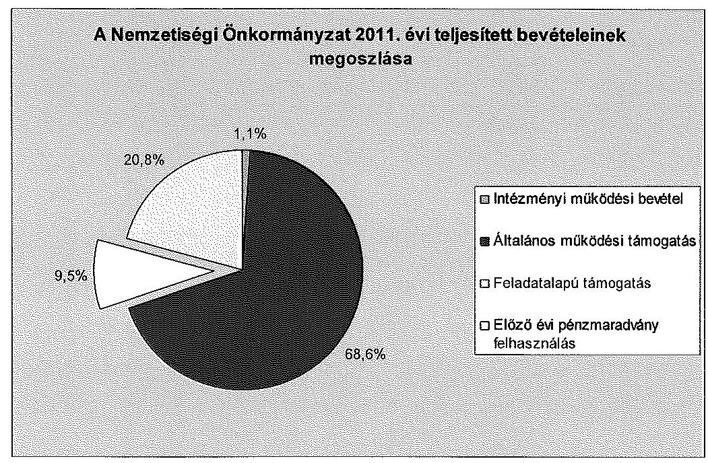
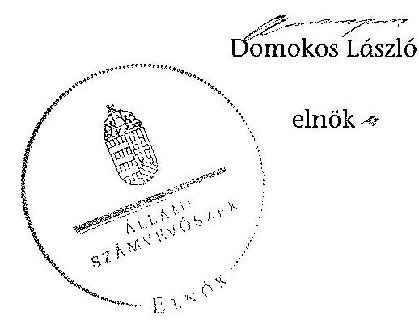

ÁLLAMI
SZÁMVEVŐSZÉK

# JELENTÉS 

a helyi kisebbségi/nemzetiségi önkormányzatok gazdálkodásának ellenőrzéséről
Jánossomorjai Roma Nemzetiségi Önkormányzat

---

# Állami Számvevőszék 

Iktatószám: V-0101-016/2014.
Témaszám: 1105
Vizsgálat-azonosító szám: V06060325

## Az ellenőrzést felügyelte:

Horváth Balázs
felügyeleti vezető
Az ellenőrzést vezette és az ellenőrzés végrehajtásáért felelős:
Preller Zsuzsanna
ellenőrzésvezető
A számvevőszéki jelentést készítették és a jelentés összeállításában közremüködtek:

Kányáné Murvai Tünde
számvevő tanácsos
Moder Beatrix
számvevő
Az ellenőrzést végezték:
Dr. Eke-Pekács Tibor
Széibel Gáborné
számvevő tanácsos
számvevő

---

# TARTALOMJEGYZÉK 

BEVEZETÉS ..... 5
I. ÖSSZEGZŐ MEGÁLLAPÍTÁSOK, KÖVETKEZTETÉSEK, JAVASLATOK ..... 8
II. RÉSZLETES MEGÁLLAPÍTÁSOK ..... 15

1. A Nemzetiségi és a Települési Önkormányzat együttmúködésének szabályszerűsége ..... 15
2. A gazdálkodási feladatok ellátásának szabályszerűsége ..... 16
2.1. A költségvetésre és zárszámadásra, valamint a kincstári adatszolgáltatás rendjére vonatkozó jogszabályi előírások betartása ..... 16
2.2. A Nemzetiségi Önkormányzat gazdálkodásának szabályozottsága ..... 17
2.3. A pénzügyi kontrollok múködése ..... 18
3. A Nemzetiségi Önkormányzattal összefüggő gazdálkodási feladatok belső ellenőrzése ..... 19
4. A 2011. évi feladatalapú támogatás felhasználásának, elszámolásának szabályszerűsége ..... 20
5. A Nemzetiségi Önkormányzat feladatellátása ..... 20

## MELLÉKLET

1. számú A Nemzetiségi Önkormányzat 2011. évi és 2012. I. félévi gazdálkodásának főbb adatai, mutatói

## FÜGGELÉKEK

1. számú Értelmező szótár
2. számú A pénzügyi kontrollok múködésének értékelése

---

.

---

# RÖVIDÍTÉSEK JEGYZÉKE 

## Jogszabályok

Áht. 1
Áht. 2
ÁSZ tv.
Nek. ${ }_{1}$ tv.
Nek. ${ }_{2}$ tv.
Számv. tv.
Szoctv.
Ámr.
Ávr.

Ber.
Bkr.
támogatási kormányrendelet

Települési Önkormányzat SZMSZ-e

## Szórövidítések

ÁSZ
gazdálkodási jogkörök szabályzata
jegyzó
1992. évi XXXVIII. törvény az államháztartásról (hatályos 2011. december 31-ig)
2011. évi CXCV. törvény az államháztartásról (hatályos 2011. december 31-től)
2011. évi LXVI. törvény az Állami Számvevőszékről (hatályos 2011. július 1-től)
1993. évi LXXVII. törvény a nemzeti és etnikai kisebbségek jogairól (hatályos 2011. december 31-ig)
2011. évi CLXXIX. törvény a nemzetiségek jogairól (hatályos 2011. december 20-tól)
2000. évi C. törvény a számvitelről
1993. évi III. törvény a szociális igazgatásról és a szociális ellátásról
292/2009. (XII. 19.) Korm. rendelet az államháztartás múködési rendjéről (hatályos 2011. december 31-ig)
368/2011. (XII. 31.) Korm. rendelet az államháztartásról szóló törvény végrehajtásáról (hatályos 2012. január 1től)
193/2003. (XI. 26.) Korm. rendelet a költségvetési szervek belső ellenőrzéséről (hatályos 2011. december 31-ig)
370/2011. (XII. 31.) Korm. rendelet a költségvetési szervek belső kontrollrendszeréről és belső ellenőrzéséről (hatályos 2012. január 1-től)
a kisebbségi önkormányzatoknak a központi költségvetésből, valamint fejezeti kezelésű előirányzatból nyújtott támogatások feltételrendszeréről és elszámolásának rendjéről szóló 342/2010. (XII. 28.) Korm. rendelet (hatályon kívül helyezte a 28/2012. (III. 6.) Korm. rendelet a nemzetiségi célú előirányzatokból nyújtott támogatások feltételrendszeréről és elszámolásának rendjéről; jelenleg hatályos a 428/2012. (XII. 29.) Korm. rendelet a nemzetiségi célú előirányzatokból nyújtott támogatások feltételrendszeréről és elszámolásának rendjéről)
Jánossomorja Város Önkormányzata Képviselőtestületének 7/2011. (IV. 29.) számú rendelete az Önkormányzat Szervezeti és Múködési Szabályzatáról

## Állami Számvevőszék

Jánossomorja Város Önkormányzatának a Gazdálkodási jogkörök gyakorlásának, Kötelezettség vállalások nyilvántartásának Szabályzata (hatályos 2010. január 1-től)
Jánossomorja Város Önkormányzatának 2012. augusztus 31-ig hivatalban lévő jegyzője

---

| Képviselő-testület | Jánossomorjai Cigány Kisebbségi Önkormányzat Képvise-lö-testülete 2011. december 31-ig, Jánossomorjai Roma Nemzetiségi Önkormányzat Képviselő-testülete 2012. január 1-től |
| :--: | :--: |
| Kistérségi társulás | Mosonmagyaróvári Többcélú Kistérségi Társulás |
| Kincstár | Magyar Államkincstár |
| Nemzetiségi Önkormányzat | Jánossomorjai Cigány Kisebbségi Önkormányzat 2011. december 31-ig, Jánossomorjai Roma Nemzetiségi Önkormányzat 2012. január 1-től |
| Nemzetiségi Önkormányzat elnöke | Jánossomorjai Cigány Kisebbségi Önkormányzat elnöke 2011. december 31-ig, Jánossomorjai Roma Nemzetiségi Önkormányzat elnöke 2012. január 1-jétől |
| Nemzetiségi Önkormányzat SZMSZ-e | Jánossomorjai Cigány Kisebbségi Önkormányzat Képviselö Testületének 1/2011. (I. 12.) határozata a Szervezeti és Müködési Szabályzatáról |
| polgármester | Jánossomorja Város Önkormányzatának polgármestere |
| Polgármesteri Hivatal | Jánossomorja Város Önkormányzatának Polgármesteri Hivatala |
| Polgármesteri Hivatal SZMSZ-e | Jánossomorja Város Önkormányzata Képviselötestületének 25/2006. (IV. 27.) Kt. határozata a Polgármesteri Hivatal Szervezeti és Müködési Szabályzatáról |
| Támogató | A támogatást nyújtó Közigazgatási és Igazságügyi Minisztérium |
| Települési Önkormányzat | Jánossomorja Város Önkormányzata |
| Települési Önkormányzat Képviselö-testülete | Jánossomorja Város Önkormányzatának Képviselőtestülete |

---

# JELENTÉS   a helyi kisebbségi/nemzetiségi önkormányzatok gazdálkodásának ellenőrzéséről Jánossomorjai Roma Nemzetiségi Önkormányzat 

## BEVEZETÉS

Az államháztartás részét, az önkormányzati alrendszer egyik elemét képezik a nemzetiségi önkormányzatok, amelyek jogi személyek és a Nek. ${ }_{1,2}$ tv-ben meghatározott önálló feladat- és hatáskörökkel rendelkeznek. A nemzetiségi önkormányzatok az önkormányzati, illetve testületi müködtetés mellett a helyi nemzetiségi közügyek változatos formában való ellátásában vesznek részt.

A nemzetiségi önkormányzatok, illetve a települési önkormányzatok között a jelenlegi szabályozás szerint nincs alá-fölérendeltségi viszony. A nemzetiségi önkormányzatok azonban sajátos közjogi helyzetben vannak, mert a jogállásukat tekintve önkormányzatok, ám függnek a székhelyük szerinti települési önkormányzat hivatalától, amely ellátja a nemzetiségi önkormányzatok vonatkozásában a megállapodásban rögzített gazdálkodási feladatokat.

A nemzetiségek helyzete, támogatása mind hazai, mind európai uniós szinten kiemelt figyelmet kap napjainkban. A nemzetiségi önkormányzatok gazdálkodására és támogatási rendszerére vonatkozó jogszabályok a 2010-2012. években jelentős változásokon mentek át, amelyek érintették a feladatalapú támogatásra fordítható költségvetési keret megállapítását, az operatív gazdálkodási jogkörök szabályozását, az elkülönített könyvvezetés alkalmazását, a belső ellenőrzés szabályozását.

Az ellenőrzés célja annak értékelése volt, hogy a Nemzetiségi Önkormányzat gazdálkodási kereteinek kialakítása, gazdálkodása és feladatellátása megfelelte a hatályos jogszabályoknak.

Ennek keretében ellenőriztük, hogy:

- a Nemzetiségi Önkormányzat és a Települési Önkormányzat együttmúködésének szabályozása, a Települési Önkormányzat SZMSZ-ében, a megállapodásban előírt működési feltételek biztosítása megfelelte a jogszabályi előírásoknak;
- a felek együttműködése megfelelte a megállapodásnak a gazdálkodási feladatok szabályszerű ellátásában, ennek keretében betartották-e a Nemzetiségi Önkormányzat gazdálkodásához kapcsolódóan a költségvetésre és zár-

---

számadásra, a gazdálkodás szabályozására, az operatív gazdálkodási jogkörök gyakorlására vonatkozó jogszabályi előírásokat;

- a jegyző biztosította-e a Polgármesteri Hivatal belső ellenőrzése keretében a Nemzetiségi Önkormányzattal összefüggő gazdálkodási feladatok belső ellenőrzését;
- a 2011. évi feladatalapú támogatás felhasználása, a folyósított feladatalapú támogatással történő elszámolás az előírásoknak megfelelően történt-e;
- a Nemzetiségi Önkormányzat feladatellátása összhangban volt-e a vonatkozó jogszabályi előírásokkal.

Az ellenőrzés típusa: szabályszerűségi ellenőrzés.
Az ellenőrzött időszak: 2011. január 1. - 2012. június 30.
Ellenőrzött szervezet: Jánossomorjai Roma Nemzetiségi Önkormányzat és a gazdálkodási feladatait ellátó Jánossomorja Város Önkormányzata.

Az ellenőrzés jogszabályi alapja: az ÁSZ tv. 5. § (2)-(3) és (6) bekezdései.
Az ellenőrzés szakmai módszertana az ÁSZ hivatalos honlapján (www.asz.hu) közzétett szakmai szabályokon alapult, amely a Legfőbb Ellenőrző Intézmények Nemzetközi Szervezete (INTOSAI) által kiadott nemzetközi standardok (ISSAI) figyelembevételével készült.

A fogalmak magyarázatát az 1. számú függelék, a pénzügyi kontrollok megfelelősége értékelésénél alkalmazott egységes minősítési szempontokat a 2. számú függelék tartalmazza.

Az ellenőrzés lefolytatásához a Települési Önkormányzat és a Nemzetiségi Önkormányzat tanúsítványok kitöltésével és a kapcsolódó dokumentumok elektronikus megküldésével szolgáltatott adatokat. A tanúsítványokon szerepeltetett adatok, információk ellenőrzése és szükség szerinti javítása a helyszíni ellenőrzés keretében történt.

Az ÁSZ az ellenőrzés megállapításait az ellenőrzött időszakban hatályos, az intézkedést igénylő megállapításokra tett javaslatokat a jelenleg hatályos jogszabályok alapján fogalmazta meg.

A Nemzetiségi Önkormányzat 2006-ban alakult, elnöke a 2010. évi helyhatósági választások óta látja el feladatát. A Nemzetiségi Önkormányzat intézményt, gazdasági társaságot és más szervezetet nem alapított. A négytagú Képviselő-testület munkája segítésére bizottságot nem hozott létre. A Nemzetiségi Önkormányzat a költségvetési beszámolója szerint a 2011. évben 452 ezer Ft költségvetési bevételt ért el és 133 ezer Ft költségvetési kiadást teljesített, a pénzmaradvány összege 319 ezer Ft volt. A 2012. évben 528 ezer Ft eredeti költségvetési bevételi és kiadási előirányzatot tervezett. A 2012. I. félévi beszámolója alapján a teljesített költségvetési bevétel 594 ezer Ft, a teljesített költségvetési kiadás 336 ezer Ft volt. A 2011. évi és a 2012. I. féléves gazdálkodási

---

adatokat részletesen az 1. számú mellékletben mutatjuk be. Az ÁSZ a Nemzetiségi Önkormányzat gazdálkodását korábban nem ellenőrizte.

Az ÁSZ tv. 29. § (1) bekezdése szerint a jelentéstervezetet megküldtük a polgármester és a Nemzetiségi Önkormányzat elnöke részére, akik az ÁSZ tv. 29. § (2) bekezdésében foglalt észrevételezési jogukkal nem éltek, a jelentéstervezetre észrevételt nem tettek.

---

# I. ÖSSZEGZŐ MEGÁLLAPÍTÁSOK, KÖVETKEZTETÉSEK, JAVASLATOK 

A Nemzetiségi Önkormányzat és a Települési Önkormányzat együttmüködésének szabályozása és múködési feltételeinek biztosítása az ellenőrzött időszakban - kisebb tartalmi hiányosságok kivételével - a jogszabályi előírásoknak megfelelt. A felek együttmúködése a jogszabályokban előírt határidők betartásával jóváhagyott megállapodásoknak ${ }^{1}$ megfelelt. A 2011. december 31én hatályos megállapodás tartalmazta a jogszabályban előírtakat. A 2012. június 30 -án hatályos megállapodásban az Áht. ${ }_{2}$-ben foglaltak ellenére nem rendelkeztek a Nemzetiségi Önkormányzat bevételeivel és kiadásaival kapcsolatos ellenőrzési feladatok ellátásáról, továbbá a Nek. ${ }_{2}$ tv. előirása ellenére a Nemzetiségi Önkormányzat kötelezettségvállalásaihoz kapcsolódó nyilvántartási kötelezettségekről. A megállapodás szerinti múködési feltételeket a Nek. ${ }_{2}$ tv. előirása ellenére a Nemzetiségi Önkormányzat SZMSZ-ében nem rögzítették.

A költségvetésre és zárszámadásra, a kincstári adatszolgáltatás rendjére vonatkozó jogszabályi előírásokat részben tartották be. A 2011. évi költségvetési határozat az Ámr-ben és az Áht. ${ }_{1}$-ben, a 2012. évi költségvetési határozat az Áht. ${ }_{2}$-ben és az Ávr-ben foglaltak ellenére a Nemzetiségi Önkormányzat költségvetési bevételeit nem forrásonként részletezve, a költségvetési kiadásokat nem kiemelt előirányzatok szerinti bontásban tartalmazta. A 2011. évi költségvetési és zárszámadási határozat az Áht. ${ }_{1}$-ben foglaltak ellenére eltérő szerkezetben, egymással össze nem hasonlítható módon készült. A 2011. évi zárszámadási határozatot az Ámr-ben előírt határidőn túl fogadta el a Képviselőtestület, azonban a határidő túllépés nem akadályozta a Települési Önkormányzat zárszámadási rendelet-tervezetének határidőben történő benyújtását. A 2011. évben és 2012. I. félévben biztosították a tárgyévi kötelezettség vállalásához szükséges fedezetet, illetve a kiemelt előirányzatokon belüli gazdálkodást. A jegyző a Nemzetiségi Önkormányzat 2012. I. negyedévi időközi költségvetési és a 2012. I. és II. negyedévi mérlegjelentésével kapcsolatos adatszolgáltatási kötelezettségének az Ávr. előírása ellenére határidőben nem tett eleget.

A Nemzetiségi Önkormányzat gazdálkodásának szabályozása az ellenőrzött időszakban részben felelt meg a jogszabályi előírásoknak. A 2011. évben és 2012. I. félévben a Nemzetiségi Önkormányzat gazdálkodási feladatait ellátó Polgármesteri Hivatal a Számv. tv. által előírt szabályzatokkal rendelkezett, amelyek hatálya kiterjedt a Nemzetiségi Önkormányzat gazdálkodási feladataira. A Polgármesteri Hivatal SZMSZ-e az Ámr. és az Ávr. előírása ellenére nem tartalmazta a nevesített munkakörökhöz kapcsolódóan a Nemzetiségi Önkor-

[^0]
[^0]:    ${ }^{1}$ A 2011. évben és 2012. június 1-jéig hatályos megállapodást a Képviselő-testület a 2/2011. (I. 12.) számú, a Települési Önkormányzat Képviselő-testülete a 100/2010. (XII. 8.) számú határozattal fogadta el. A Nek. ${ }_{2}$ tv. 159. § (3) bekezdésében előírtak alapján 2012. június 1-jéig felülvizsgált és módosított megállapodást a Képviselő-testület a 8/2012. (V. 21.) számú, a Települési Önkormányzat Képviselő-testülete a 41/2012. (V. 9.) számú határozattal fogadta el.

---

mányzat gazdálkodásával kapcsolatos feladat- és hatásköröket, a hatáskörök gyakorlásának módját, a helyettesítés rendjét és az ezekre vonatkozó felelősségi szabályokat. A köztisztviselők munkaköri leírásai nem tartalmaztak a Nemzetiségi Önkormányzat gazdálkodásával kapcsolatos feladatokat. A jegyző a Polgármesteri Hivatal szabályzatai közül az ellenőrzött időszakban az Ámr-ben, a Bkr-ben, továbbá az Áht. ${ }_{1}$-ben előírt ellenőrzési nyomvonal, szabálytalanságkezelési eljárásrend, és kockázatkezelési rendszer, illetve a folyamatba épített, előzetes, utólagos és vezetői ellenőrzés szabályzatainak hatályát nem terjesztette ki a Nemzetiségi Önkormányzat gazdálkodási feladataira.

Az operatív gazdálkodási jogkörök kialakítása az ellenőrzött időszakban nem felelt meg a jogszabályi előírásoknak. A jegyző az Ámr-ben és az Ávr-ben foglaltak ellenére nem gondoskodott a Nemzetiségi Önkormányzat gazdálkodásával kapcsolatos jogkörgyakorlás módjának, eljárási és dokumentációs részletszabályainak meghatározásáról, valamint a feladatokat ellátó személyek kijelölésének rendjével kapcsolatos szabályozásról. Az ellenőrzött időszakban a jegyző az érvényesítést végző személyt, a Nemzetiségi Önkormányzat elnöke a szakmai teljesítés, illetve a teljesítés igazolóit írásban nem jelölte ki. A jegyző 2012. I. félévben az Ávr. előírásai ellenére a pénzügyi ellenjegyző írásbeli kijelöléséről nem gondoskodott.

Az ellenőrzött időszakban a pénzügyi kontrollok múködése a működési célú pénzeszközátadások és a dologi és egyéb folyó kiadások teljesítésénél - öszszességében értékelve - gyenge volt, a hibák száma a lényegességi szintet, a kritikus hibahatárt elérte. Az ellenőrzött időszakban a kötelezettségvállalásokat az Ámr-ben, illetve az Áht. ${ }_{2}$-ben foglaltak ellenére nem foglalták írásba, belső szabályzatban nem rendelkeztek a 100 ezer Ft-ot el nem érő, írásbeli kötelezettségvállalást nem igénylő kifizetések rendjéről. A 2011. évben a szakmai teljesítésigazolást, a 2012. évben a teljesítés igazolását kijelöléssel nem rendelkező személyek jogosulatlanul végezték, így nem szabályszerűen történt meg a kiadások jogosságának, összegszerűségének, ellenszolgáltatást is magában foglaló kifizetés esetében a szerződésszerű teljesítésnek az ellenőrzése és igazolása. A 2011. évben az utalvány ellenjegyzést és az érvényesítést, 2012. I. félévben az érvényesítést a feladatra kijelöléssel nem rendelkező személy, jogosulatlanul végezte, így az Ámr-ben, illetve az Ávr-ben foglaltak ellenére a kifizetéseket megelőzően nem szabályszerűen történt meg az érvényesítés és az utalvány ellenjegyzése.

A pénzügyi folyamatokban kulcsszerepet betöltő belső kontrollok múködésében feltárt hiányosságokkal összefüggésben, az ellenőrzött tételek vonatkozásában az ellenőrzés jogosulatlan kifizetést nem állapított meg, a pénzügyi kontrollok múködéséhez kapcsolódó hiányosságok miatt azonban nem biztosított a hibák megelőzése, feltárása.

A Nemzetiségi Önkormányzat a 2011. évben a bevételei 9,5\%-át kitevő, 43 ezer Ft összegű feladatalapú támogatásban részesült, amelyet 2012. június 30 -ig a Nek. 1 tv. előírásaival összhangban használtak fel. A támogatási kormányrendeletben hivatkozott Áht. ${ }_{1}$-ben előírt elszámolás nem történt meg. A támogatás felhasználását az ellenőrzésre jogosult szervezetek nem ellenőrizték.

---

A Nemzetiségi Önkormányzat feladatellátásának tárgya részben volt összhangban a Nek. ${ }_{1,2}$ tv-ben foglalt előírásokkal. A nemzetiségi közügyek keretében biztosította az alapvető feladata ellátásához szükséges szervezeti és múködési feltételeket, önként vállalt feladatokat látott el a hagyományápolás területén, azonban a Képviselő-testület a 2011. évben a Nek. ${ }_{1}$ tv-ben és a Szoctv-ben foglaltak ellenére önkormányzati hatósági jogkörbe tartozó ügyben jogosulatlanul döntött.

Az ellenőrzött időszakban az Áht. ${ }_{1}$, illetve az Áht. ${ }_{2}$ ellenére - a Polgármesteri Hivatal belső ellenőrzése keretében - a Nemzetiségi Önkormányzat gazdálkodásával összefüggő végrehajtási feladatok belső ellenőrzését a jegyző nem biztosította. A Polgármesteri Hivatal 2011. és 2012. évi belső ellenőrzési terveit megalapozó kockázatelemzés a Ber-ben foglaltak ellenére nem terjedt ki a Nemzetiségi Önkormányzat gazdálkodásával összefüggő végrehajtási feladatainak ellátására, a 2011. évben és 2012. I. félévben ilyen céllal belső ellenőrzést nem terveztek és nem végeztek.

Az ÁSZ tv. 33. § (1) bekezdésében foglaltak értelmében az ellenőrzött szervezet vezetője köteles a jelentésben foglalt megállapításokhoz kapcsolódó intézkedési tervet összeállítani, és azt a jelentés kézhezvételétől számított 30 napon belül az ÁSZ részére megküldeni. Amennyiben az intézkedési tervet határidőre nem küldi meg a szervezet, vagy az nem elfogadható, az ÁSZ elnöke az ÁSZ tv. 33. § (3) bekezdés a)-b) pontjaiban foglaltakat érvényesítheti.

A helyszíni ellenőrzés megállapításainak hasznosítása mellett javasoljuk:

# a jegyzőnek 

1. az együttműködés szabályozásával kapcsolatban

A Nemzetiségi Önkormányzat és a Települési Önkormányzat együttmúködését meghatározó - 2012. június 30 -án hatályos - megállapodásban az Áht. 2 27. § (2) bekezdésében foglaltak ellenére nem rendelkeztek a Nemzetiségi Önkormányzat bevételeivel és kiadásaival kapcsolatos ellenőrzési feladatok ellátásáról, továbbá a Nek. 2 tv. 80. § (3) bekezdés c) pont előírása ellenére a Nemzetiségi Önkormányzat kötelezettségvállalásaihoz kapcsolódó nyilvántartási kötelezettségekről.

A Nek. 2 tv. 80. § (2) bekezdésében foglaltak ellenére a megállapodás megkötését, módosítását követő harminc napon belül a Nemzetiségi Önkormányzat SZMSZében nem rögzítették a megállapodás szerinti müködési feltételeket.

Javaslat
Az együttműködés szabályozása érdekében készítse elő:
a) a megállapodás módosítását, hogy az tartalmilag feleljen meg az Áht. 2 27. § (2) bekezdésében, továbbá a Nek. 2 tv. 80. § (3) bekezdés c) pontban foglalt előírásoknak;
b) a Nemzetiségi Önkormányzat SZMSZ-ének módosítását, hogy megfeleljenek a Nek. 2 tv. 80. § (2) bekezdésében foglalt előírásnak.

---

2. a költségvetés, zárszámadás szabályszerűségével kapcsolatban

A 2012. évi költségvetési határozat az Áht. 2 23. § (2) bekezdés a) pontja, valamint az Ávr. 24. § (1) bekezdés a) és b) pontjában foglaltak ellenére a Nemzetiségi Önkormányzat költségvetési bevételeit - így különösen a normatív hozzájárulásokat, támogatásokat, központi költségvetésből származó egyéb költségvetési támogatásokat - nem forrásonként részletezve, a költségvetési kiadásait nem kiemelt előirányzatok szerinti bontásban tartalmazta.

A Képviselő-testület az Ámr. 37. § (3) bekezdésében előírt határidőn túl alkotta meg a 2011. évi zárszámadási határozatát, amely - az Áht. 18. §-ban foglalt előírás ellenére - nem volt összehasonlítható a költségvetési határozattal.

Javaslat
A költségvetés, zárszámadás szabályszerűsége érdekében a jövőben:
a) gondoskodjon az Áht. 2 27. § (2) bekezdésében foglalt előírás alapján a költségvetési határozat tervezetének előkészítéséről, hogy az Áht. 2 23. § (2) bekezdése a) pontjában, valamint az Ávr. 24. § (1) bekezdése a) és b) pontjában foglaltaknak megfeleljen;
b) az Áht. 2 89. § (1) bekezdése alapján biztosítsa a zárszámadási határozat tervezet költségvetéssel összehasonlítható módon történő előkészítését annak érdekében, hogy azt a Nemzetiségi Önkormányzat elnöke - az Áht. 2 91. § (1) bekezdésében előírtakra figyelemmel - határidőben a Képviselő-testület elé terjeszthesse.
3. a kincstári adatszolgáltatási kötelezettség teljesítésével kapcsolatban

A jegyző a Nemzetiségi Önkormányzat 2012. I. negyedévi időközi költségvetési, a 2012. I. és II. negyedévi mérlegjelentésével kapcsolatos adatszolgáltatási kötelezettségének az Ávr. 169. § (2) bekezdésében és az Ávr. 170. § (5) bekezdésében előírt határidőn túl tett eleget.

Javaslat
A jövőben az adatszolgáltatási kötelezettségeinek az Ávr. 169. § (2) és az Ávr. 170. § (5) bekezdéseiben előírt határidő betartásával tegyen eleget.
4. a gazdálkodási feladatok szabályozottságával kapcsolatban

A Polgármesteri Hivatal SZMSZ-e a 2011. évben az Ámr. 20. § (2) bekezdése h) pontja, 2012. I. félévben az Ávr. 13. § (1) bekezdés g) pontjában foglaltak ellenére nem tartalmazta nevesített munkakörökhöz tartozóan a Nemzetiségi Önkormányzat gazdálkodásával kapcsolatos feladat- és hatásköröket, a hatáskörök gyakorlásának módját, a helyettesítés rendjét, és az ezekhez kapcsolódó felelősségi szabályokat.

A Polgármesteri Hivatal szabályzatai közül a 2011. évben az Ámr. 156. § (2)-(3), 157. § (1), és az Áht. 1 121/A. § (4) bekezdéseiben, valamint a 2012. évben a Bkr. 6. § (3)-(4), 7. § (1) és 8. § (2)-(4) bekezdéseiben előírt ellenőrzési nyomvonal, szabálytalanságkezelési eljárásrend, kockázatkezelési rendszer, továbbá a folyamatba épített

---

előzetes, utólagos és vezetői ellenőrzés szabályozásának hatálya nem terjedt ki a Nemzetiségi Önkormányzat gazdálkodási feladataira.

Az operatív gazdálkodási jogkörök kialakítása során a jegyző a 2011. évben az Ámr. 20. § (3) bekezdés a) pontjában, 2012. I. félévben az Ávr. 13. § (2) bekezdés a) pontjában foglalt előírás ellenére nem gondoskodott a Nemzetiségi Önkormányzat gazdálkodásával - így különösen a kötelezettségvállalás, az ellenjegyzés, a szakmai teljesítésigazolás, az érvényesítés, az utalványozás gyakorlásának módjával, eljárási és dokumentációs részletszabályaival, valamint az ezeket végző személyek kijelölésének rendjével - kapcsolatos szabályozásról.

Javaslat
A szabályszerű gazdálkodás biztosítása érdekében:
a) készítse elő a Polgármesteri Hivatal SZMSZ-e módosítását annak érdekében, hogy az megfeleljen az Ávr. 13. § (1) bekezdés g) pontjában foglalt előírásnak;
b) az Ávr. 13. § (3a) bekezdése alapján módosítsa a Polgármesteri Hivatal Bkr. 6. § (3)-(4), a 8. § (2)-(4) bekezdéseiben foglalt szabályzatokat, valamint a Bkr. 7. §ában foglalt kockázatkezelési rendszert, hogy azok hatálya kiterjedjen a Nemzetiségi Önkormányzat gazdálkodási feladataira;
c) intézkedjen az Ávr. 13. § (2) bekezdés a) pontjában foglaltak szerint a Nemzetiségi Önkormányzat gazdálkodásával kapcsolatos szabályozás elkészítéséről.
5. az operatív gazdálkodási feladatok ellátásával kapcsolatban

A jegyző az Ávr. 55. § (2) bekezdés g) pontja és az 58. § (4) bekezdés előírása ellenére nem jelölte ki írásban a pénzügyi ellenjegyzőt és az érvényesítőt.

Javaslat
Írásbeli felhatalmazással jelölje ki az Ávr. 55. § (2) bekezdés g) pontjában előírtaknak megfelelően a pénzügyi ellenjegyzőt, illetve az Ávr. 58. § (4) bekezdései szerint az érvényesítői feladatokat ellátó személyt.
6. a pénzügyi kontrollok múködésével kapcsolatban

Az Áht. 37. § (1) bekezdésében foglaltak ellenére 2012. I. félévben a kötelezettségvállalást nem foglalták írásba,.

A teljesítésigazolást kijelölés hiányában jogosulatlanul végezték, így - az Ávr. 57. § (1) bekezdésében foglaltak ellenére - a kiadások jogosságának, összegszerűségének, ellenszolgáltatást is magában foglaló kifizetés esetében az ellenszolgáltatás teljesítésének ellenőrzése és igazolása szabályszerűen nem történt meg.

Az érvényesítést a feladatra kijelöléssel nem rendelkező személy jogosulatlanul végezte, ezért - az Ávr. 58. § (1) bekezdésében foglaltak ellenére - szabályszerűen nem történt meg a kifizetés összegszerűségének, a fedezet meglétének, valamint annak ellenőrzése, hogy a megelőző ügymenetben a jogszabályokban és a belső szabályzatokban foglalt előírásokat betartották-e.

---

Javaslat
Az operatív gazdálkodás múködési hibáinak megelőzése, feltárása és kijavítása érdekében:
a) kezdeményezze, hogy a kötelezettségvállalásokat az Áht. 2 37. § (1) bekezdésében előírtak szerint foglalják írásba;
b) gondoskodjon az Ávr. 57. § (1) bekezdésében előírt ellenőrzési feladatok szabályszerű ellátásáról;
c) biztosítsa az Ávr. 58. § (1) bekezdésében előírt ellenőrzési feladatok szabályszerű végrehajtását.
7. a feladatalapú támogatás elszámolásával kapcsolatban

A 2011. évben folyósított feladatalapú támogatás elszámolása a támogatási kormányrendelet 7. § (2) bekezdésében hivatkozott Áht. 1 -nek „a helyi önkormányzatok elszámolási rendjére vonatkozó rendelkezései alkalmazása" előirása ellenére nem történt meg.

Javaslat
Gondoskodjon az Áht. 2 27. § (2) bekezdésben meghatározott feladatkörében a Nemzetiségi Önkormányzat által igénybe vett feladatalapú támogatás elszámolásának elkészítéséről, figyelemmel az Áht. 2 57. § (4) bekezdésben foglaltakra.

# a polgármesternek 

A Nemzetiségi Önkormányzat és a Települési Önkormányzat együttműködését meghatározó - 2012. június 30 -án hatályos - megállapodásban az Áht. 2 27. § (2) bekezdésében foglaltak ellenére nem rendelkeztek a Nemzetiségi Önkormányzat bevételeivel és kiadásaival kapcsolatos ellenőrzési feladatok ellátásáról, továbbá a Nek. 2 tv. 80. § (3) bekezdés c) pont előirása ellenére a Nemzetiségi Önkormányzat kötelezettségvállalásaihoz kapcsolódó nyilvántartási kötelezettségekről.

A Polgármesteri Hivatal SZMSZ-e az Ávr. 13. § (1) bekezdés g) pontjában előírtak ellenére nem tartalmazta nevesített munkakörökhöz tartozóan a Nemzetiségi Önkormányzat gazdálkodásával kapcsolatos feladat- és hatásköröket, a hatáskörök gyakorlásának módját, a helyettesítés rendjét és az ezekre vonatkozó felelősségi szabályokat.

Javaslat
Terjessze a Települési Önkormányzat Képviselő-testülete elé jóváhagyásra:
a) az Áht. 2 27. § (2) bekezdésben és a Nek. 2 tv. 80. § (3) bekezdés c) pontban foglalt előírás betartásával előkészített megállapodás módosítást;
b) a Polgármesteri Hivatal SZMSZ-e módosítását annak érdekében, hogy az megfeleljen az Ávr. 13. § (1) bekezdés g) pontjában foglalt előírásnak.

---

# a Nemzetiségi Önkormányzat elnökének 

1. A Nemzetiségi Önkormányzat és a Települési Önkormányzat együttműködését meghatározó - 2012. június 30 -án hatályos - megállapodásban az Áht. 2 27. § (2) bekezdésében foglaltak ellenére nem rendelkeztek a Nemzetiségi Önkormányzat bevételeivel és kiadásaival kapcsolatos ellenőrzési feladatok ellátásáról, továbbá a Nek. 2 tv. 80. § (3) bekezdés c) pont előírása ellenére a Nemzetiségi Önkormányzat kötelezettségvállalásaihoz kapcsolódó nyilvántartási kötelezettségekről.

A Nek. 2 tv. 80. § (2) bekezdésében foglaltak ellenére a megállapodás megkötését, módosítását követő harminc napon belül a Nemzetiségi Önkormányzat SZMSZében nem rögzítették a megállapodás szerinti müködési feltételeket.

Javaslat
Terjessze a Képviselő-testület elé jóváhagyásra:
a) az Áht. 2 27. § (2) bekezdésben és a Nek. 2 tv. 80. § (3) bekezdés c) pontban foglalt előírás betartásával előkészített megállapodás módosítást;
b) a Nemzetiségi Önkormányzat SZMSZ-ének a Nek. 2 tv. 80. § (2) bekezdése előírásainak betartásával előkészített módosítását.
2. A Képviselő-testület az Ámr. 37. § (3) bekezdésében előírt határidőn túl alkotta meg a 2011. évi zárszámadási határozatát.

Javaslat
A jövőben az Áht. 2 91. § (3) bekezdésre figyelemmel határidőben nyújtsa be a Kép-viselő-testületnek a jegyző által előkészített zárszámadási határozat tervezetét.
3. A Nemzetiségi Önkormányzat elnöke, mint kötelezettségvállaló a 2012. I. félévben az Ávr. 57. § (4) bekezdésében foglalt előírásnak nem tett eleget, nem jelölte ki a teljesítés igazolóit.

Javaslat
Írásban jelölje ki az Ávr. 57. § (4) bekezdésében foglaltak alapján a teljesítés igazolására jogosult személyeket.
4. A 2011. évben folyósított feladatalapú támogatás elszámolása a támogatási kormányrendelet 7. § (2) bekezdésében hivatkozott Áht.,-nek „a helyi önkormányzatok elszámolási rendjére vonatkozó rendelkezései alkalmazása" előírása ellenére nem történt meg.

Javaslat
Terjessze a Képviselő-testület elé jóváhagyásra az Áht. 2 57. § (4) bekezdés alapján összeállított, a Nemzetiségi Önkormányzat által igénybe vett feladatalapú támogatás elszámolását.

---

# II. RÉSZLETES MEGÁLLAPÍTÁSOK 

## 1. A Nemzetiségi és a Települési Önkormányzat együttmüködésének szabályszERüsége

A Nemzetiségi Önkormányzat és a Települési Önkormányzat együttmúködésének szabályozása - a kisebb hiányosságok ellenére - megfelelte jogszabályi előírásoknak. A felek együttmúködése a jogszabályokban előírt határidők betartásával jóváhagyott megállapodásoknak ${ }^{2}$ megfelel.

A testületi múködéshez igazodó helyiséghasználatra, a postai, kézbesítési, sokszorosítási feladatok ellátására és az ezzel járó költségek viselésének módjára vonatkozóan a Települési Önkormányzat SZMSZ-e tartalmazott előírásokat.

A 2011. december 31-én hatályos megállapodásban rögzítették a Nemzetiségi Önkormányzat gazdálkodása végrehajtásának rendjét, az ehhez kapcsolódó feladatellátás jogosultjainak, kötelezettjeinek kijelölését, a jegyző felkérését a költségvetési (zárszámadási) határozattervezet elkészítésére vonatkozóan, továbbá a költségvetés megalkotása során ellátandó feladatokat, munkamegosztást és határidőket.

Az együttműködés szabályozása során a jogszabályi előírásokat azonban nem érvényesítették maradéktalanul, mert:

- a 2012. június 30 -án hatályos megállapodásban az Áht. 2 27. § (2) bekezdésében foglaltak ellenére nem rendelkeztek a Nemzetiségi Önkormányzat bevételeivel és kiadásaival kapcsolatos ellenőrzési feladatok ellátásáról, továbbá a Nek. 2 tv. 80. § (3) bekezdés c) pontja előírása ellenére a Nemzetiségi Önkormányzat kötelezettségvállalásaihoz kapcsolódó nyilvántartási kötelezettségekről;
- a Nek. 2 tv. 80. § (2) bekezdésében foglaltak ellenére a megállapodás megkötését, módosítását követő harminc napon belül a Nemzetiségi Önkormányzat SZMSZ-ében nem rögzítették a 2012. június 30 -án hatályos megállapodás szerinti múködési feltételeket.

A Települési Önkormányzat az ellenőrzött időszakban - a szabályozási hiányosságok ellenére - biztosította a Nemzetiségi Önkormányzat müködésének személyi és tárgyi feltételeit.

[^0]
[^0]:    ${ }^{2}$ A 2011. évben és 2012. június 1-jéig hatályos megállapodást a Képviselő-testület a 2/2011. (I. 12.) számú, a Települési Önkormányzat Képviselő-testülete a 100/2010. (XII. 8.) számú határozattal fogadta el. A Nek. 2 tv. 159. § (3) bekezdésében előírtak alapján 2012. június 1-jéig felülvizsgált és módosított megállapodást a Képviselő-testület a 8/2012. (V. 21.) számú, a Települési Önkormányzat Képviselő-testülete a 41/2012. (V. 9.) számú határozattal fogadta el.

---

# 2. A GAZDÁLKODÁSI FELADATOK ELLÁTÁSÁNAK SZABÁLYSZERŰSÉGE 

### 2.1. A költségvetésre és zárszámadásra, valamint a kincstári adatszolgáltatás rendjére vonatkozó jogszabályi előírások betartása

A Nemzetiségi Önkormányzat 2011. és 2012. évi költségvetésének, a 2011. évi zárszámadásának tartalmára és jóváhagyására, valamint a kapcsolódó 2012. évi adatszolgáltatásra vonatkozó jogszabályi előírásokat részben tartották be.

A költségvetési és zárszámadási határozatok megalkotása során a jogszabályi előírásokat nem érvényesítették maradéktalanul, mert:

- a 2011. évi költségvetési határozat ${ }^{3}$ az Ámr. 36. § (1) bekezdésének a) pontjában foglaltak ellenére a Nemzetiségi Önkormányzat bevételi előirányzatait nem bevételi forrásonként, fơbb jogcím csoportonkénti bontásban, továbbá az Ámr. 36. § (1) bekezdésének b) pontjában, valamint az Áht. ${ }_{1} 69 . \S$ (1) bekezdésének a) pontjában foglaltak ellenére a kiadási előirányzatokat nem kiemelt előirányzatonként részletezve tartalmazta;
- a Képviselő-testület az Ámr. 37. § (3) bekezdésében előírt határidőn túl alkotta meg a 2011. évi zárszámadási határozatát ${ }^{4}$, amely - az Áht. ${ }_{1}$ 18. §-ban foglalt előírás ellenére - nem volt összehasonlítható a költségvetési határozattal, mert a határozatok eltérő csoportosításban tartalmazták a bevételeket és a kiadásokat ${ }^{5}$;
- a 2012. évi költségvetési határozat ${ }^{6}$ az Áht. ${ }_{2}$ 23. § (2) bekezdés a) pontja, valamint az Ávr. 24. § (1) bekezdés a) és b) pontjában foglaltak ellenére a Nemzetiségi Önkormányzat költségvetési bevételeit - így különösen a normatív hozzájárulásokat, támogatásokat, központi költségvetésből származó egyéb költségvetési támogatásokat - nem forrásonként részletezve, valamint a költségvetési kiadásait nem előirányzat-csoportok, kiemelt előirányzatok szerinti bontásban tartalmazta.

A Nemzetiségi Önkormányzat elnöke a költségvetés előirányzatai felhasználásához szükséges mértékben kezdeményezte azok módosítását, biztosította a tárgyévi fizetési kötelezettség vállalásához szükséges fedezet meglétét.

[^0]
[^0]:    ${ }^{3}$ A Képviselő-testület 4/2011. (I. 31.) CKÖ számú határozata.
    ${ }^{4}$ A Képviselő-testület 7/2012. (IV. 18.) JRNÖ számú határozata.
    ${ }^{5}$ A 2011. évi költségvetési határozat bevételi előirányzata központi támogatást ( 500 ezer Ft), és előző évi pénzmaradványt ( 94 ezer Ft) tartalmazott. A 2011. évi zárszámadási határozat támogatásértékű bevételekből ( 452 ezer Ft) állt. A 2011. évi költségvetési határozat a kiadásokat konkrétan megnevezte (irodaszer, nyomtatvány, kiküldetés, rászoruló családok támogatása, cigány gyermekek támogatása, bankköltség, karácsonyi ünnepség, családok támogatása, reprezentáció, telefonköltség, rendezvények költségei, általános tartalék (összesen 594 ezer Ft). A 2011. évi zárszámadási határozat a kiadásokat egy összegben ( 133 ezer Ft) tartalmazta.
    ${ }^{6}$ A Képviselő-testület 2/2012. (I. 6.) JRNÖ számú határozata.

---

A jegyző a Nemzetiségi Önkormányzat 2012. I. negyedévi időközi költségvetési és a 2012. I. és II. negyedévi mérlegjelentésével kapcsolatos adatszolgáltatási kötelezettségének az Ávr. 169. § (2) bekezdésében és a 170. § (5) bekezdésében előírt határidőn túl ${ }^{7}$ tett eleget.

# 2.2. A Nemzetiségi Önkormányzat gazdálkodásának szabályozottsága 

A Nemzetiségi Önkormányzat gazdálkodásának szabályozásáról az ellenőrzött időszakban a jegyző részben gondoskodott.

A 2011. évben és 2012. I. félévben a Nemzetiségi Önkormányzat gazdálkodási feladatait ellátó Polgármesteri Hivatal a Számv. tv. által előírt gazdálkodási szabályzatokkal ${ }^{8}$ rendelkezett, amelyek hatálya kiterjedt a Nemzetiségi Önkormányzat gazdálkodási feladataira.

A Nemzetiségi Önkormányzat gazdálkodásának szabályozása során a jegyző a jogszabályi követelményeket nem érvényesítette maradéktalanul, mert:

- a Polgármesteri Hivatal szabályzatai közül az ellenőrzött időszakban az Ámr. 156. § (2)-(3), és a Bkr. 6. § (3)-(4) bekezdéseiben előírt ellenőrzési nyomvonal és szabálytalanságkezelési eljárásrend, az Ámr. 157. § (1) és a Bkr. 7. § (1) bekezdésében előírt kockázatkezelési rendszer, valamint az Áht. ${ }_{1}$ 121/A. § (4), és a Bkr. 8. § (2)-(4) bekezdéseiben előírt folyamatba épített, előzetes, utólagos és vezető ellenőrzés szabályzatainak hatályát nem terjesztette ki a Nemzetiségi Önkormányzat gazdálkodási feladataira;
- a Polgármesteri Hivatal SZMSZ-e - a 2011. évben az Ámr. 20. § (2) bekezdés h) pontjában, a 2012. évben az Ávr. 13. § (1) bekezdés g) pontjában foglaltak ellenére - nem tartalmazta a nevesített munkakörökhöz tartozóan a Nemzetiségi Önkormányzat gazdálkodásával kapcsolatos feladat- és hatásköröket, a hatáskörök gyakorlásának módját, a helyettesítés rendjét és a kapcsolódó felelősségi szabályokat. A Polgármesteri Hivatal köztisztviselőinek munkaköri leírása nem tartalmazott a Nemzetiségi Önkormányzat gazdálkodásával kapcsolatos feladatokat.

Az operatív gazdálkodási jogkörök kialakítása az ellenőrzött időszakban nem felelt meg a jogszabályi előírásoknak, mert a jegyző a 2011. évben az Ámr. 20. § (3) bekezdés a) pontjában, 2012. I. félévben az Ávr. 13. § (2) bekezdés a) pontjában foglalt előírás ellenére nem gondoskodott a Nemzetiségi Önkormányzat gazdálkodásával - így különösen a kötelezettségvállalás, az ellenjegyzés, a szakmai teljesítésigazolás, az érvényesítés, az utalványozás gya-

[^0]
[^0]:    ${ }^{7}$ A 2012. I. negyedévi időközi költségvetési jelentést az április 20-i határidőn túl, 2012. április 23-án, a 2012. I. és II. negyedévi időközi mérlegjelentést az április 25-i és július 25-i határidőn túl, 2012. április 27-én, illetve július 27-én teljesítette.
    ${ }^{8}$ Számviteli politika, számlarend, leltározási és leltárkészítési szabályzat, pénzkezelési szabályzat, eszközök és források értékelési szabályzata.

---

korlásának módjával, eljárási és dokumentációs részletszabályaival, valamint az ezeket végző személyek kijelölésének rendjével - kapcsolatos szabályozásról ${ }^{9}$.

Az operatív gazdálkodással kapcsolatos feladat- és hatásköröket a megállapodásokban részben meghatározták, azonban:

- a jegyző - a 2011. évben az Ámr. 77. § (4) bekezdésében, 2012. I. félévben az Ávr. 58. § (4) bekezdésében foglaltak ellenére - írásban nem jelölte ki az érvényesítést végző személyt;
- a Nemzetiségi Önkormányzat elnöke, mint kötelezettségvállaló a 2011. évben az Ámr. 76. § (5) bekezdésében, 2012. I. félévben az Ávr. 57. § (4) bekezdésében foglalt előírásnak nem tett eleget, nem jelölte ki a (szakmai) teljesítés igazolóit;
- a jegyző 2012. I. félévben az Ávr. 55. § (2) bekezdés g) pontja ellenére a pénzügyi ellenjegyző írásbeli kijelöléséről nem gondoskodott.

# 2.3. A pénzügyi kontrollok múködése 

A Nemzetiségi Önkormányzat - a 2. számú függelék szerinti értékelésre kiválasztott három terület közül - a 2011. évben múködési célú pénzeszközátadásra, valamint dologi és egyéb folyó kiadásokra, 2012. I. félévben dologi és egyéb folyó kiadásokra teljesített kifizetést.

A Nemzetiségi Önkormányzatnál a 2011. évi múködési célú pénzeszközátadások, valamint a dologi és egyéb folyó kiadások teljesítése során a kötelezettségvállalás ellenjegyzése, a szakmai teljesítésigazolás és az utalvány ellenjegyzése kontrollok múködésének megfelelősége - a 2. számú függelékben részletezett szempontok alapján végzett értékelés szerint, e területek költségvetési súlyának figyelembevételével - összefoglalóan értékelve ${ }^{10}$ gyenge volt, a hibák száma a lényegességi szintet, a kritikus hibahatárt elérte, mert:

- az Ámr. 74. § (1) bekezdésében foglaltak ellenére a kötelezettségvállalást nem foglalták írásba, az ellenőrzött időszakban belső szabályzatban nem rendelkeztek a 100 ezer Ft-ot el nem érő, írásbeli kötelezettségvállalást nem igénylő kifizetések rendjéről;
- az Ámr. 76. § (1) és (3) bekezdésében foglaltak ellenére a szakmai teljesítésigazolást kijelöléssel nem rendelkező személyek, jogosulatlanul végezték, így a kiadások jogosságának, összegszerűségének, ellenszolgáltatást is magában

[^0]
[^0]:    ${ }^{9}$ A Polgármesteri Hivatal az ellenőrzött időszakban rendelkezett a gazdálkodási jogkörök szabályzatával, de annak rendelkezései nem terjedtek ki a Nemzetiségi Önkormányzatra. A gazdálkodási jogkörök szabályzatát nem módosították az Ávr. 2012. évi változásainak megfelelően.
    ${ }^{10}$ A kontrollok megfelelőségének értékelése során az ellenőrzött két terület egyedi értékelési pontszámait a 2011. évi Nemzetiségi Önkormányzati szintű költségvetési beszámoló teljesítési adataiból képzett súlyokkal arányosan összegeztük. A müködési célú pénzeszközátadásnál $48 \%$-os, a dologi és egyéb folyó kiadások esetében $52 \%$-os súllyal számoltunk.

---

foglaló kifizetés esetében a szerződésszerű teljesítésnek az ellenőrzése és igazolása nem szabályszerűen történt meg;

- az Ámr. 79. § (1) bekezdésében foglaltak ellenére az utalvány ellenjegyzését kijelöléssel nem rendelkező személy jogosulatlanul végezte, továbbá -a kötelezettségvállalások írásba foglalásának hiánya miatt - nem tartották be a gazdálkodásra vonatkozó, az Ámr. 74. § (1) bekezdésében foglalt szabályokat. A kijelöléssel nem rendelkező utalvány ellenjegyzó - az Ámr. 79. § (2) bekezdése előírásait figyelmen kívül hagyva - annak ellenére ellenjegyezte az utalványt, hogy a szakmai teljesítésigazolást és az érvényesítést arra kijelöléssel nem rendelkező személyek végezték.

A Nemzetiségi Önkormányzatnál 2012. I. félévben a dologi és egyéb folyó kiadások teljesítése során a pénzügyi ellenjegyzés, a teljesítés igazolása és az érvényesítés kontrollok megfelelősége - a 2. számú függelékben részletezett szempontok alapján végzett értékelés szerint - gyenge volt, a hibák száma a lényegességi szintet, a kritikus hibahatárt elérte, mert:

- az Áht. 2 37. § (1) bekezdésében foglaltak ellenére a kötelezettségvállalást nem foglalták írásba;
- az Ávr. 57. § (1) bekezdésében foglaltak ellenére a teljesítésigazolást kijelöléssel nem rendelkező személyek jogosulatlanul végezték, így a kiadások jogosságának, összegszerűségének, ellenszolgáltatást is magában foglaló kifizetés esetében az ellenszolgáltatás teljesítésének ellenőrzése és igazolása szabályszerűen nem történt meg;
- az érvényesítést - az Ávr. 58. § (1) és (4) bekezdéseiben foglaltak ellenére - a feladatra kijelöléssel nem rendelkező személy jogosulatlanul végezte, ezért nem szabályszerűen történt meg a kifizetés összegszerűségének, a fedezet meglétének, valamint annak ellenőrzése, hogy a megelőző ügymenetben a jogszabályokban és belső szabályzatokban foglalt előírásokat betartották-e.

A pénzügyi folyamatokban kulcsszerepet betöltő belső kontrollok múködésében feltárt hiányosságokkal összefüggésben, az ellenőrzött tételek vonatkozásában az ellenőrzés jogosulatlan kifizetést nem állapított meg, a pénzügyi kontrollok működéséhez kapcsolódó hiányosságok miatt azonban nem biztosított a hibák megelőzése, feltárása.

# 3. A Nemzetiségi Önkormányzattal összefüGGŐ GAZDÁlKODÁSI FELADATOK BELSŐ ELLENŐRZÉSE 

A jegyző az ellenőrzött időszakban az Áht. 1 121/B. § (4) bekezdése, illetve az Áht. 2 70. § (1) bekezdése előírása ellenére nem biztosította a Polgármesteri Hivatal belső ellenőrzése keretében a Nemzetiségi Önkormányzat gazdálkodásával összefüggő végrehajtási feladatok belső ellenőrzését. A Polgármesteri Hivatal 2011-2012. évi belső ellenőrzési terveit megalapozó kockázatelemzés - a Ber. 21. § (2) bekezdése ellenére - nem terjedt ki a Nemzetiségi Önkormányzat gazdálkodásával összefüggő végrehajtási feladatok ellátására, 2011. évben és 2012. I. félévben erre irányuló ellenőrzést nem terveztek és nem végeztek.

---

# 4. A 2011. ÉVI FELADATALAPÚ TÁMOGATÁs FELHASZNÁLÁSÁNAK, ELSZÁMOLÁSÁNAK SZABÁLYSZERŰSÉGE 

A Nemzetiségi Önkormányzat a 2011. évben 43 ezer Ft összegű feladatalapú támogatásban részesült, melynek összes bevételhez viszonyított részarányát a következő ábra szemlélteti:

A 2011. évben folyósított támogatást a támogatási kormányrendelet és a Nek. 1 tv. előírásaival összhangban, nemzetiségi közügyek ellátása érdekében 2012. június 30-ig felhasználták. A támogatás elszámolása a támogatási kormányrendelet 7. § (2) bekezdésében hivatkozott Áht.,-nek „a helyi önkormányzatok elszámolási rendjére vonatkozó rendelkezései alkalmazása" előírása ellenére nem történt meg. A támogatás felhasználását az ellenőrzésre jogosult szervezetek nem ellenőrizték.

## 5. A Nemzetiségi Önkormányzat feladATELLÁtása

A Nemzetiségi Önkormányzat feladatellátásának tárgya részben volt összhangban a Nek. ${ }_{1,2}$ tv. előírásaival. A 2011. évben és 2012. I. félévben a Nek. ${ }_{1}$ tv. 5/A. § (1) bekezdés és a Nek. 2 tv. 10. § (1) bekezdés szerinti, a nemzetiségi érdekek védelmével és képviseletével kapcsolatos alapvető feladata ellátásához biztosította a szükséges szervezeti és múködési feltételeket, a Nek. 1 tv. 30/A. § (4) bekezdése alapján önként vállalt feladatot látott el a hagyományápolás területén, azonban a Képviselő-testület a 2011. évben a Nek. ${ }_{1}$ tv. 30./B § (1) bekezdésében, valamint a Szoctv. 4/A. § (1) bekezdésében és a 45. §-ában foglaltak ellenére önkormányzati hatósági jogkörbe tartozó kérdésben, hatáskör nélkül jogosulatlanul döntött támogatás kifizetéséről ${ }^{11}$. A Nemzetiségi Önkormányzat

[^0]
[^0]:    ${ }^{11}$ A Képviselő-testület 9/2011. (III. 10.) CKÖ számú és a 13/2011. (XI. 17.) CKÖ számú határozatai.

---

az ellenőrzött időszakban közüzemi szolgáltatással összefüggő feladatot nem végzett.

Budapest, 2014. 01. hónap 24. nap

Melléklet: $\quad 1 \mathrm{db}$
Függelék: $\quad 2 \mathrm{db}$

---

.

---

# A Nemzetiségi Önkormányzat 2011. évi és 2012. I. félévi gazdálkodásának föbb adatai, mutatói 

## A) BEVÉTELEK

|  |   |   |   |   |   |   |   |   |
| --- | --- | --- | --- | --- | --- | --- | --- | --- |
|  Megnevezés | 2011. év |  |  |  | 2012. év |  | 2012. I. félév |   |
|   | eredeti el. | módosított   el. | teljesítés | teljesítés   megoszlása   (\%) | eredeti el. | módosított   el. | teljesítés | teljesítés   megoszlása   (\%)  |
|  Intésményt müködési bevétel | 0,0 | 5,0 | 5,0 | $1,1 \%$ | 0,0 | 0,0 | 0,0 | $0,0 \%$  |
|  Általános müködési   támogatás | 500,0 | 310,0 | 310,0 | $68,6 \%$ | 209,0 | 275,0 | 275,0 | $46,3 \%$  |
|  Feladatslapsi támogatás | 0,0 | 43,0 | 43,0 | $9,5 \%$ | 0,0 | 0,0 | 0,0 | $0,0 \%$  |
|  Müködési célú pénzeszköz   átvétel | 0,0 | 0,0 | 0,0 | $0,0 \%$ | 0,0 | 0,0 | 0,0 | $0,0 \%$  |
|  Pénzforgalmi bevételek   összesen | 500,0 | 358,0 | 358,0 | 79,2\% | 209,0 | 275,0 | 275,0 | 46,3\%  |
|  Előző évt pénzmaradvány   felhasználás | 94,0 | 94,0 | 94,0 | $20,8 \%$ | 319,0 | 319,0 | 319,0 | $53,7 \%$  |
|  Bevételek összesen | 594,0 | 452,0 | 452,0 | 100,0\% | 528,0 | 594,0 | 594,0 | 100,0\%  |

## B) KIADÁSOK

|  |   |   |   |   |   |   |   |   |
| --- | --- | --- | --- | --- | --- | --- | --- | --- |
|  Megnevezés | 2011. év |  |  |  | 2012. év |  | 2012. I. félév |   |
|   | eredeti el. | módosított   el. | teljesítés | teljesítés   megoszlása   (\%) | eredeti el. | módosított   el. | teljesítés | teljesítés   megoszlása   (\%)  |
|  Személyi juttatások | 0,0 | 0,0 | 0,0 | $0,0 \%$ | 0,0 | 0,0 | 0,0 | $0,0 \%$  |
|  Munkaadókat tethelő   kizulékok | 0,0 | 0,0 | 0,0 | $0,0 \%$ | 0,0 | 0,0 | 0,0 | $0,0 \%$  |
|  Dokaji és egyéb folyó   kiadások | 300,0 | 50,0 | 29,0 | $21,8 \%$ | 65,0 | 131,0 | 112,0 | $33,3 \%$  |
|  Támogatásértékủ müködési   kiadás, tartalékok | 294,0 | 402,0 | 104,0 | 78,2\% | 463,0 | 463,0 | 224,0 | $66,7 \%$  |
|  Müködési kiadások   összesen | 594,0 | 452,0 | 133,0 | 100,0\% | 528,0 | 594,0 | 336,0 | 100,0\%  |
|  Felhalmozási kiadások | 0,0 | 0,0 | 0,0 | $0,0 \%$ | 0,0 | 0,0 | 0,0 | $0,0 \%$  |
|  Kiadások összesen | 594,0 | 452,0 | 133,0 | 100,0\% | 528,0 | 594,0 | 336,0 | 100,0\%  |

---

.

---

# ÉRTELMEZŐ SZÓTÁR 

feladatalapú támogatás

A támogatási évben általános múködési támogatásban részesült, és a Támogatónak a Kincstárhoz intézett, a feladatalapú támogatás utalására vonatkozó rendelkezõ levele keltének idópontjában múködő nemzetiségi önkormányzatoknak a támogatási kormányrendeletben rögzített feltételrendszer alapján nyújtható támogatás. A feladatalapú támogatás a nemzetiségi közügyeknek a nemzetiségi önkormányzatok által történő ellátását szolgálja. (A támogatási kormányrendelet 2. § (2) bekezdés c) pont, és 4. § (1) bekezdés alapján.)
megállapodás
nemzetiség
nemzetiségi közügy

A nemzetiségi önkormányzatnak a múködési feltételei biztosítására, továbbá a bevételeivel és a kiadásaival kapcsolatban a tervezési, gazdálkodási, ellenőrzési, finanszírozási, adatszolgáltatási és beszámolási feladatai végrehajtására a székhelye szerinti települési önkormányzattal megkötött megállapodás. (Az Áht. ${ }_{1} 66 . \S$, a Nek. ${ }_{2}$ tv. 80. § (2) bekezdés, valamint az Áht. ${ }_{2} 27 . \S$ (2) bekezdés alapján levezetett fogalom.)
Minden olyan Magyarország területén legalább egy évszázada honos népcsoport, amely az állam lakossága körében számszerú kisebbségben van és a lakosság többi részétől saját nyelve és kultúrája, hagyományai különböztetik meg, egyben olyan összetartozás-tudatról tesz bizonyságot, amely mindezek megőrzésére, történelmileg kialakult közösségeik érdekeinek kifejezésére és védelmére irányul. (A Nek. ${ }_{1}$ tv. 1. § (2) bekezdése, valamint a Nek. ${ }_{2}$ tv. 1. § (1) bekezdése alapján levezetett fogalom.)
Az egyéni és közösségi jogok érvényesülése, a nemzetiséghez tartozók érdekeinek kifejezésre juttatása - különösen az anyanyelv ápolása, őrzése és gyarapítása, továbbá a nemzetiségek kulturális autonómiájának a nemzetiségi önkormányzatok által történő megvalósítása és megőrzése - érdekében a nemzetiséghez tartozók meghatározott közszolgáltatásokkal való ellátásával, ezen ügyek önálló vitelével és az ehhez szükséges szervezeti, személyi és anyagi feltételek megteremtésével összefüggő ügy. A közhatalmat gyakorló állami és helyi önkormányzati szervekben, továbbá a nemzetiségi önkormányzati szervekben való nemzetiségi képviselethez és mindezek szervezeti, személyi és anyagi feltételeinek biztosításához kapcsolódó ügy. (A Nek. ${ }_{1}$ tv. 6/A. § 1. pontjából és a Nek. ${ }_{2}$ tv. 2. § 1. pontjából levezetett fogalom.)

---

nemzetiségi önkormányzat
pénzügyi kontrollok

Törvényben meghatározott nemzetiségi közszolgáltatási feladatokat ellátó, testületi formában múködő, jogi személyiséggel rendelkező, demokratikus választások útján törvény alapján létrehozott szervezet, amely a nemzetiségi közösséget megillető jogosultságok érvényesítésére, a nemzetiségek érdekeinek védelmére és képviseletére, a feladat- és hatáskörébe tartozó nemzetiségi közügyek települési, területi vagy országos szinten történő önálló intézésére jön létre. (A Nek. ${ }_{1}$ tv. 6/A. § (1) bekezdés 2. pontjából, valamint a Nek. ${ }_{2}$ tv. 2. § 2. pontjából levezetett fogalom.) A jelentésben e fogalmat a települési nemzetiségi önkormányzatokra leszűkítve használjuk.
a kötelezettségvállalás és az utalvány ellenjegyzése, valamint a szakmai teljesítés igazolása 2011. december 31éig, 2012. január 1-jétől a pénzügyi ellenjegyzés, a teljesítés igazolása és az érvényesítés.

---

# A PÉNZÜGYI KONTROLLOK MÜKÖDÉSÉNEK ÉRTÉKELÉSE 

A pénzügyi kontrollok működése megfelelőségének vizsgálatát többlépcsős megfelelőségi tesztek útján, megismételt eljárással, a könyvviteli tételekből vett egyszerű véletlen minta alapján végeztük. A tesztelést az értékelésre kiválasztott három terület - a dologi és egyéb folyó kiadásoknál teljesített kifizetések, az államháztartáson belülre és kívülre, múködési és felhalmozási célra teljesített pénzeszkózátadások, illetve a szociálpolitikai ellátások teljesített kiadásainál végeztük el.

Az ellenőrzés során alkalmazott módszer (többlépcsős megfelelőségi teszt) lényege, hogy a kiválasztott minta ellenőrzését csak addig végezzük, amíg elegendő és megfelelő bizonyítékot nem szerzünk a vizsgált pénzügyi kontroll működésének megfelelő, vagy nem megfelelő voltáról. A megismételt eljárás alkalmazása a szándékolt hatáshoz (törvényes múködés, kitűzött célok, teljesítmények elérése, veszteséget okozó kockázatok megelőzése, mérséklése, feltárása) viszonyítva lehetővé teszi a kontrolltevékenységek tényleges hatásának vizsgálatát, ez alapján a múködés megfelelősége értékelését. Ennek keretében a számvevő bizonyosságot szerez arról, hogy a rendelkezésre álló szabályozás és dokumentumok alapján a pénzügyi kontrollokhoz szükséges - jogszabályokban előírt - ellenőrzési lépéseket végrehajtották-e.

A tesztek kiértékelése évenkénti bontásban két szinten történt. Először az egyes tevékenységi területekre meghatározott pénzügyi kontrollokat értékeltük, majd általános következtetést vontunk le a pénzügyi kontrollok együttes megfelelősége tekintetében. Az ellenőrzésre kijelölt területek kifizetéseinél a pénzügyi kontrollok múködése „kiváló", „jó" vagy „gyenge" minősítést kaphatott.

Az értékelésnél meghatározott lényegességi szint a könyvelési adatállományból vett mintanagysághoz megadott kritikus hibák száma.

A pénzügyi kontrollok múködését:

- kiválónak értékeltük abban az esetben, ha azok múködése megfelel a hibák megelőzésére és kijavítására meghatározott jogszabályi és helyi szintű szabályozásnak (eseti hibák);
- jónak minősítettük, ha a megállapított kisebb (tolerálható mértékű) hiányosságok nem veszélyeztetik az ellenőrzött területek hibáinak megelőzését és kijavítását (a hibák száma nem érte el a kritikus hibák számát, azaz a lényegességi szintet);
- gyengének értékeltük, amennyiben a kontrollok múködésében előforduló hiányosságok miatt nem biztosított a hibák megelőzése, feltárása, kijavítása (a hibák száma elérte az ellenőrzött tételektől függően megállapított kritikus hibák számát, azaz a lényegességi szintet).