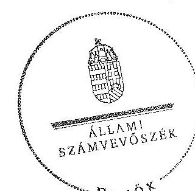

# ÁLLAMI   SZÁMVEVÔSZÉK 

## JELENTÉS

a helyi kisebbségi/nemzetiségi önkormányzatok gazdálkodásának ellenőrzéséről
Mátraverebélyi Roma Nemzetiségi Önkormányzat

---

# Állami Számvevőszék 

Iktatószám: V-0096-042/2014.
Témaszám: 1105
Vizsgálat-azonosító szám: V06060320

## Az ellenőrzést felügyelte:

Horváth Balázs
felügyeleti vezető
Az ellenőrzést vezette és az ellenőrzés végrehajtásáért felelős:
Preller Zsuzsanna
ellenőrzésvezető
A számvevőszéki jelentést készítették és a jelentés összeállításában közremüködtek:

Kányáné Murvai Tünde
számvevő tanácsos
Dr. Láng Ágnes
számvevő
Az ellenőrzést végezték:
Kányáné Murvai Tünde
Ujvári Józsefné
számvevő tanácsos
számvevő tanácsos

---

# TARTALOMJEGYZÉK 

BEVEZETÉS ..... 5
I. ÖSSZEGZŐ MEGÁLLAPÍTÁSOK, KÖVETKEZTETÉSEK, JAVASLATOK ..... 8
II. RÉSZLETES MEGÁLLAPÍTÁSOK ..... 14

1. A Nemzetiségi és a Települési Önkormányzat együttmúködésének szabályszerűsége ..... 14
2. A gazdálkodási feladatok ellátásának szabályszerűsége ..... 15
2.1. A költségvetésre és zárszámadásra, valamint a kincstári adatszolgáltatás rendjére vonatkozó jogszabályi előírások betartása ..... 15
2.2. A Nemzetiségi Önkormányzat gazdálkodásának szabályozottsága ..... 16
2.3. A pénzügyi kontrollok múködése ..... 17
3. A Nemzetiségi Önkormányzattal összefüggő gazdálkodási feladatok belső ellenőrzése ..... 18
4. A Nemzetiségi Önkormányzat feladatellátása ..... 18

## MELLÉKLET

1. számú A Nemzetiségi Önkormányzat 2011. évi és 2012. I. félévi gazdálkodásának főbb adatai, mutatói

## FÜGGELÉKEK

1. számú Értelmező szótár
2. számú A pénzügyi kontrollok múködésének értékelése

---

.

---

# RÖVIDÍTÉSEK JEGYZÉKE 

## Jogszabályok

Áht. 1
Áht. 2
ÁSZ tv.
Nek. 1 tv.
Nek. 2 tv.
Számv. tv.
Ámr.
Ávr.

Bkr.

Ber.
támogatási kormányrendelet

Települési Önkormányzat SZMSZ-e

## Szórövidítések

ÁSZ
jegyzó $_{1}$
jegyzó $_{2}$
jegyzó $_{3}$
jegyzó $_{4}$

1992. évi XXXVIII. törvény az államháztartásról (hatályos 2011. december 31-ig)
1993. évi CXCV. törvény az államháztartásról (hatályos 2011. december 31-től)
1994. évi LXVI. törvény az Állami Számvevőszékről (hatályos 2011. július 1-jétől)
1995. évi LXXVII. törvény a nemzeti és etnikai kisebbségek jogairól (hatályos 2011. december 31-ig)
1996. évi CLXXIX. törvény a nemzetiségek jogairól (hatályos 2011. december 20-tól)
1997. évi C. törvény a számvitelről
292/2009. (XII. 19.) Korm. rendelet az államháztartás müködési rendjéről (hatályos 2011. december 31-ig)
368/2011. (XII. 31.) Korm. rendelet az államháztartásról szóló törvény végrehajtásáról (hatályos 2012. január 1-jétől)
370/2011. (XII. 31.) Korm. rendelet a költségvetési szervek belső kontrollrendszeréről és belső ellenőrzéséről (hatályos 2012. január 1-jétől)
193/2003. (XI. 26.) Korm. rendelet a költségvetési szervek belső ellenőrzéséről (hatályos 2011. december 31-ig)
a kisebbségi önkormányzatoknak a központi költségvetésből, valamint fejezeti kezelésű előirányzatból nyújtott támogatások feltételrendszeréről és elszámolásának rendjéről szóló 342/2010. (XII. 28.) Korm. rendelet (hatályon kívül helyezte a 28/2012. (III. 6.) Korm. rendelet a nemzetiségi célú előirányzatokból nyújtott támogatások feltételrendszeréről és elszámolásának rendjéről; jelenleg hatályos a 428/2012. (XII. 29.) Korm. rendelet a nemzetiségi célú előirányzatokból nyújtott támogatások feltételrendszeréről és elszámolásának rendjéről)
Mátraverebély Községi Önkormányzat Képviselőtestületének 13/2011. (VII. 14.) számú rendelete az Önkormányzat Szervezeti és Müködési Szabályzatáról (hatályos 2011. július 14-től)

## Állami Számvevőszék

Mátraverebély Községi Önkormányzat 2008. február 1-től 2011. február 28-ig hivatalban lévő jegyzője
Mátraverebély Községi Önkormányzat 2011. március 1től július 31-ig hivatalban lévő jegyzője
Mátraverebély Községi Önkormányzat 2011. augusztus 29-től 2012. szeptember 15-ig hivatalban lévő jegyzője
Mátraverebély Községi Önkormányzat 2012. november 1-

---

| Képviselő-testület | jétől hivatalban lévő jegyzője |
| :--: | :--: |
|  | Mátraverebély Cigány Kisebbségi Önkormányzat Képvi-selő-testülete 2011. december 31-ig, Mátraverebélyi Roma Nemzetiségi Önkormányzat Képviselő-testülete 2012. január 1-jétől |
| Nemzetiségi Önkormányzat | Mátraverebély Cigány Kisebbségi Önkormányzat 2011. december 31-ig, Mátraverebélyi Roma Nemzetiségi Önkormányzat 2012. január 1-jétől |
| Nemzetiségi Önkormányzat elnöke | Mátraverebély Cigány Kisebbségi Önkormányzat elnöke 2011. december 31-ig, Mátraverebélyi Roma Nemzetiségi Önkormányzat elnöke 2012. január 1-jétől |
| Nemzetiségi Önkormányzat SZMSZ-e | Mátraverebély Cigány Kisebbségi Önkormányzat Képvi-selő-testületének 3/2011. (V. 12.) határozata a CKÖ Szervezeti és Müködési Szabályzatáról |
| polgármester | Mátraverebély Községi Önkormányzat polgármestere |
| Polgármesteri Hivatal | Mátraverebély Község Polgármesteri Hivatala |
| Polgármesteri Hivatal SZMSZ-e | Mátraverebély Községi Önkormányzat Képviselötestületének 13/2011. (VII. 14.) számú rendelete az Önkormányzat Szervezeti és Müködési Szabályzatáról 3. számú függeléke |
| Támogató | A támogatást nyújtó Közigazgatási és Igazságügyi Minisztérium |
| Települési Önkormányzat | Mátraverebély Községi Önkormányzata |
| Települési Önkormányzat Képviselö-testülete | Mátraverebély Községi Önkormányzat Képviselö-testülete |

---

# JELENTÉS   a helyi kisebbségi/nemzetiségi önkormányzatok gazdálkodásának ellenőrzéséről   Mátraverebélyi Roma Nemzetiségi Önkormányzat 

## BEVEZETÉS

Az államháztartás részét, az önkormányzati alrendszer egyik elemét képezik a nemzetiségi önkormányzatok, amelyek jogi személyek és a Nek. ${ }_{1,2}$ tv-ben meghatározott önálló feladat- és hatáskörökkel rendelkeznek. A nemzetiségi önkormányzatok az önkormányzati, illetve testületi múködtetés mellett a helyi nemzetiségi közügyek változatos formában való ellátásában vesznek részt.

A nemzetiségi önkormányzatok, illetve a települési önkormányzatok között a jelenlegi szabályozás szerint nincs alá-fölérendeltségi viszony. A nemzetiségi önkormányzatok azonban sajátos közjogi helyzetben vannak, mert a jogállásukat tekintve önkormányzatok, ám függnek a székhelyük szerinti települési önkormányzat hivatalától, amely ellátja a nemzetiségi önkormányzatok vonatkozásában a megállapodásban rögzített gazdálkodási feladatokat.

A nemzetiségek helyzete, támogatása mind hazai, mind európai uniós szinten kiemelt figyelmet kap napjainkban. A nemzetiségi önkormányzatok gazdálkodására és támogatási rendszerére vonatkozó jogszabályok a 2010-2012. években jelentős változásokon mentek át, amelyek érintették a feladatalapú támogatásra fordítható költségvetési keret megállapítását, az operatív gazdálkodási jogkörök szabályozását, az elkülönített könyvvezetés alkalmazását, a belső ellenőrzés szabályozását.

Az ellenőrzés célja annak értékelése volt, hogy a Nemzetiségi Önkormányzat gazdálkodási kereteinek kialakítása, gazdálkodása és feladatellátása megfelelte a hatályos jogszabályoknak.

Ennek keretében ellenőriztük, hogy:

- a Nemzetiségi Önkormányzat és a Települési Önkormányzat együttmúködésének szabályozása, a Települési Önkormányzat SZMSZ-ében, a megállapodásban előírt múködési feltételek biztosítása megfelelt-e a jogszabályi előírásoknak;
- a felek együttmúködése megfelelt-e a megállapodásnak a gazdálkodási feladatok szabályszerű ellátásában, ennek keretében betartották-e a Nemzetiségi Önkormányzat gazdálkodásához kapcsolódóan a költségvetésre és zár-

---

számadásra, a gazdálkodás szabályozására, az operatív gazdálkodási jogkörök gyakorlására vonatkozó jogszabályi előírásokat;

- a jegyző biztosította-e a Polgármesteri Hivatal belső ellenőrzése keretében a Nemzetiségi Önkormányzattal összefüggő gazdálkodási feladatok belső ellenőrzését;
- a 2011. évi feladatalapú támogatás felhasználása, a folyósított feladatalapú támogatással történő elszámolás az előírásoknak megfelelően történt-e;
- a Nemzetiségi Önkormányzat feladatellátása összhangban volt-e a vonatkozó jogszabályi előírásokkal.

Az ellenőrzés típusa: szabályszerűségi ellenőrzés.
Az ellenőrzött időszak: 2011. január 1. - 2012. június 30.
Ellenőrzött szervezet: Mátraverebélyi Roma Nemzetiségi Önkormányzat és a gazdálkodási feladatait ellátó Mátraverebély Községi Önkormányzat.

Az ellenőrzés jogszabályi alapja: az ÁSZ tv. 5. § (2)-(3) és (6) bekezdései.
Az ellenőrzés szakmai módszertana az ÁSZ hivatalos honlapján (www.asz.hu) közzétett szakmai szabályokon alapult, amely a Legfőbb Ellenőrző Intézmények Nemzetközi Szervezete (INTOSAI) által kiadott nemzetközi standardok (ISSAI) figyelembevételével készült. A fogalmak magyarázatát az 1. számú függelék, a pénzügyi kontrollok megfelelősége értékelésénél alkalmazott egységes minősitési szempontokat a 2. számú függelék tartalmazza.

Az ellenőrzés lefolytatásához a Települési Önkormányzat és a Nemzetiségi Önkormányzat tanúsítványok kitöltésével és a kapcsolódó dokumentumok elektronikus megküldésével szolgáltatott adatokat. A tanúsítványokon szerepeltetett adatok, információk ellenőrzése és szükség szerinti javítása a helyszíni ellenőrzés keretében történt.

Az ÁSZ az ellenőrzés megállapításait az ellenőrzött időszakban hatályos, az intézkedést igénylő megállapításokra tett javaslatokat a jelenleg hatályos jogszabályok alapján fogalmazta meg.

A Nemzetiségi Önkormányzat 1993-ban alakult, elnöke a 2010. évi helyhatósági választások óta látja el feladatát. A Nemzetiségi Önkormányzat intézményt, gazdasági társaságot és más szervezetet nem alapított, illetve társulásban nem vett részt. A négytagú Képviselő-testület munkája segitésére bizottságot nem hozott létre. A Nemzetiségi Önkormányzat a költségvetési beszámolója szerint a 2011. évben 210 ezer Ft költségvetési bevételt ért el és 210 ezer Ft költségvetési kiadást teljesített. A Nemzetiségi Önkormányzat a 2011. évben feladatalapú támogatásban nem részesült. A 2012. évben 215 ezer Ft eredeti költségvetési bevételi és kiadási előlrányzatot tervezett. A 2012. I. félévi beszámolója alapján a teljesített költségvetési bevétel 215 ezer Ft, a teljesített költségvetési kiadás 3 ezer Ft volt. A 2011. évi és a 2012. I. féléves gazdálkodási adatokat részletesen az 1. számú mellékletben mutatjuk be. Az ÁSZ a Nemzetiségi Önkormányzat gazdálkodását korábban nem ellenőrizte.

---

Az ÁSZ tv. 29. § (1) bekezdése szerint a jelentéstervezetet megküldtük a polgármester és a Nemzetiségi Önkormányzat elnöke részére, akik az ÁSZ tv. 29. § (2) bekezdésében foglalt észrevételezési jogukkal nem éltek, a jelentéstervezetre észrevételt nem tettek.

---

# I. ÖSSZEGZŐ MEGÁLLAPÍTÁSOK, KÖVETKEZTETÉSEK, JAVASLATOK 

#### Abstract

A Nemzetiségi és a Települési Önkormányzat együttmüködésének szabályozása nem felelt meg a jogszabályi előírásoknak, az ellenőrzött időszakban az önkormányzatok képviselő-testületei által elfogadott megállapodással nem rendelkeztek. Megállapodás hiányában az Áht. ${ }_{2}$ előírása ellenére 2012. június 30 -ig nem rögzítették a Nemzetiségi Önkormányzat bevételeivel és kiadásaival kapcsolatban a tervezési, gazdálkodási, ellenőrzési, finanszírozási, adatszolgáltatási és beszámolási feladatok részletes szabályait. A Nek. ${ }_{2}$ tv-ben foglaltak ellenére nem jelölték ki a Nemzetiségi Önkormányzat költségvetése előkészítéséért és megalkotásáért, a költségvetéssel összefüggő adatszolgáltatásért, az önálló fizetési számla nyitásáért, az érvényesítési feladatok ellátásáért, valamint a múködési feltételek biztosításáért felelős személyeket. Nem írták elő a Nemzetiségi Önkormányzat ülésein részt vevő jegyző, illetve az általa megbízott személy jelzési kötelezettségét törvénysértés észlelése esetén. A Települési Önkormányzat SZMSZ-ében előírt működési feltételek biztosítása - a könyvvezetési feladatok ellátásának kivételével - a jogszabályi előírásoknak megfelelt. A Települési Önkormányzat - az együttmúködést szabályozó megállapodás hiánya ellenére - biztosította a Nemzetiségi Önkormányzat müködéséhez szükséges helyiséghasználatot, valamint a postai, kézbesítési, gépelési, sokszorosítási feladatokat, és viselte az ezzel járó költségeket.

A Nemzetiségi Önkormányzat költségvetése és zárszámadása, továbbá a 2012. évi adatszolgáltatás tekintetében nem tartották be a jogszabályi előírásokat. A jegyző, a Nemzetiségi Önkormányzat 2011. évi költségvetésének tervezetét nem határidőben készítette elő, ezért a Nemzetiségi Önkormányzat a költségvetési határozatot az Ámr-ben előírt határidőn túl fogadta el, így azt a Nemzetiségi Önkormányzat elnöke nem határidőben továbbította a jegyző, részére. Azonban ez nem akadályozta - a változatlan tartalommal beépített jóváhagyott költségvetési határozatot tartalmazó - költségvetési rendelettervezet határidőben történő beterjesztését. A jegyző, az Ámr-ben foglaltak ellenére a Nemzetiségi Önkormányzat 2011. évi zárszámadási határozat tervezetét nem készítette elő, emiatt arról a Képviselő-testület határozatot nem hozott. A Települési Önkormányzat Képviselő-testülete ennek következtében - az Ámr. előirása ellenére - a 2011. évi zárszámadási rendeletét a Nemzetiségi Önkormányzat zárszámadási határozatának beépítése nélkül alkotta meg. A jegyzö ${ }_{3}$ a Nemzetiségi Önkormányzatra vonatkozó kincstári adatszolgáltatási kötelezettségének késve tett eleget. A jegyző a Nemzetiségi Önkormányzat 2012. évi költségvetésének tervezetét nem határidőben készítette elő, ezért azt a Nemzetiségi Önkormányzat elnöke az Áht. ${ }_{2}$ szerinti határidőn túl nyújtotta be a Képviselőtestületnek. A 2012. évi költségvetési határozat nem tartalmazta az Áht. ${ }_{2}$ és az Ávr. előírásai ellenére a Nemzetiségi Önkormányzat költségvetési bevételeit és költségvetési kiadásait előirányzat-csoportok, kiemelt előirányzatok szerinti bontásban, a költségvetési egyenleg összegét, valamint tájékoztatásul a Nemzetiségi Önkormányzat költségvetési mérlegét közgazdasági tagolásban és az előirányzat felhasználási tervet.

---

A Nemzetiségi Önkormányzat gazdálkodását az ellenőrzött időszakban nem szabályozták. A jegyző ${ }_{2}$ nem készített a Számv. tv. és az Áht. ${ }_{2}$ előírása szerinti, a Nemzetiségi Önkormányzat gazdálkodási sajátosságait is tartalmazó belső szabályzatokat. A jegyzö ${ }_{2}$ a Polgármesteri Hivatal SZMSZ-ét az Ávr-ben foglaltak ellenére nem egészítette ki a nevesített munkakörökhöz tartozó - a Nemzetiségi Önkormányzat gazdálkodásával kapcsolatos - feladat- és hatáskörökre, a hatáskörök gyakorlásának módjára, a helyettesítés rendjére és a felelősségi szabályokra vonatkozó előírásokkal. A Nemzetiségi Önkormányzat múködéséhez kapcsolódóan a 2011. évben és 2012. I. félévben az Ámr-ben, az Áht. ${ }_{2}$-ben és az Ávr-ben foglaltak ellenére az operatív gazdálkodási jogköröket nem alakították ki, azok gyakorlóit nem jelölték ki.

A pénzügyi kontrollok múködésének megfelelősége a 2011. évben a számviteli nyilvántartások hiánya miatt, 2012. I. félévben utalványozandó kiadás hiányában nem volt értékelhető. A 2011. évi kifizetésekre pénzügyi kontrollok nélkül került sor. A pénzügyi kontrollok múködésének hiánya a kifizetések jogszerüségében, a számviteli nyilvántartások vezetésében és a beszámoló készítésében szabálytalanságokat eredményezett. A Nemzetiségi Önkormányzat gazdálkodási tevékenységében feltárt szabálytalanságokért a jegyző ${ }_{1,2,3}$ a felelős, azonban fegyelmi eljárás a közszolgálati jogviszony megszűnése miatt nem kezdeményezhető.

A Nemzetiségi Önkormányzat feladatellátásának tárgya részben volt összhangban a Nek. ${ }_{1,2}$ tv. előírásaival. A nemzetiségi oktatási és kulturális önigazgatással összefüggő ügyekben, valamint a hagyományápolás és a közművelődés területén önként ellátott feladatai a törvényi előírásoknak megfeleltek. A Nek. ${ }_{1,2}$ tv. szerinti, a nemzetiségi érdekek védelmével és képviseletével kapcsolatos alapvető feladata ellátásához szükséges szervezeti és személyi feltételeket azonban - megállapodás és a gazdálkodás szabályozásának hiányában - nem biztosította teljes körűen, továbbá a 2011. évben a költségvetési támogatásból magánszemély részére történő kifizetés a Nek. ${ }_{1}$ tv. előírásaival ellentétesen történt.

Az ellenőrzött időszakban az Áht. ${ }_{1}$-ben, illetve az Áht. ${ }_{2}$-ben foglaltak ellenére a Polgármesteri Hivatal belső ellenőrzése keretében - a Nemzetiségi Önkormányzat gazdálkodásával összefüggő végrehajtási feladatok belső ellenőrzését a jegyzö ${ }_{1,2,3}$ nem biztosította. A Polgármesteri Hivatal 2011. és 2012. évi ellenőrzési terveit megalapozó kockázatelemzés az Ber. előírása ellenére nem terjedt ki a Nemzetiségi Önkormányzat gazdálkodásával összefüggő végrehajtási feladatokra, erre irányuló belső ellenőrzést nem terveztek és nem végeztek az ellenőrzött időszakban.

Az ÁSZ tv. 33. § (1) bekezdésében foglaltak értelmében az ellenőrzött szervezet vezetője köteles a jelentésben foglalt megállapításokhoz kapcsolódó intézkedési tervet összeállítani, és azt a jelentés kézhezvételétől számított 30 napon belül az ÁSZ részére megküldeni. Amennyiben az intézkedési tervet határidőre nem küldi meg a szervezet, vagy az nem elfogadható, az ÁSZ elnöke az ÁSZ tv. 33. § (3) bekezdés a)-b) pontjaiban foglaltakat érvényesítheti.

---

A helyszíni ellenőrzés megállapításainak hasznosítása mellett javasoljuk:

# a jegyzőnek 

1. az együttmúködési megállapodással kapcsolatban

A Nemzetiségi Önkormányzat és a Települési Önkormányzat nem rendelkezett mindkét önkormányzat Képviselö-testülete által elfogadott a Nek. 2 tv. 80. § (2) bekezdése szerinti megállapodással. Az Áht. 2 27. § (2) bekezdésében előírtak ellenére nem határozták meg a Nemzetiségi Önkormányzat bevételeivel és kiadásaival kapcsolatban a tervezési, gazdálkodási, ellenőrzési, finanszírozási, adatszolgáltatási és beszámolási feladatok ellátásának részletes szabályait.

Javaslat
Készítse elő a Nek. 2 tv. 80. § (2) bekezdés szerinti megállapodást, hogy az tartalmilag feleljen meg az Áht. 2 27. § (2) bekezdésében, a Nek. 2 tv. 80. § (3) bekezdés a)-b) és d) pontjaiban, valamint a Nek. 2 tv. 80. § (4) bekezdésben foglalt előírásoknak.
2. a költségvetéssel, zárszámadással kapcsolatban

A jegyző, a Nemzetiségi Önkormányzat 2012. évi költségvetésének tervezetét nem készítette elő határidőben. A 2012. évi költségvetési határozat nem tartalmazta az Áht. 2 23. § (2) bekezdés a), c) pontja ellenére a költségvetési bevételeit és költségvetési kiadásait előirányzat-csoportok, kiemelt előirányzatok szerinti bontásban, a költségvetési egyenleg összegét. Nem tartalmazta továbbá az Áht. 2 24. § (4) bekezdés a) pontja szerinti előírás ellenére tájékoztatásul a költségvetési mérleget közgazdasági tagolásban, valamint az előirányzat felhasználási tervet. A jegyző, az Ámr. 37. § (3) bekezdésében foglaltak ellenére a Nemzetiségi Önkormányzat 2011. évi zárszámadási határozat tervezetét nem készítette elő. A Települési Önkormányzat Kép-viselő-testülete az Ámr. 36. § (6) bekezdés előirása ellenére a Nemzetiségi Önkormányzat zárszámadási határozatának beépítése nélkül alkotta meg a 2011. évi zárszámadási rendeletét.

Javaslat
Gondoskodjon a jövőben az Áht. 2 27. § (1) bekezdésében foglalt előírás alapján a Nemzetiségi Önkormányzat az Áht. 2 23. § (2) bekezdés a) és c) pontjainak, az Áht. 2 24. § (4) bekezdése, illetve Áht. 2 91. § (2) bekezdése és az Ávr. 24. § (1) bekezdés a) pontjának megfelelő költségvetési, illetve zárszámadási határozat tervezetének előkészítéséről, hogy azt a Nemzetiségi Önkormányzat elnöke az Áht. 2 24. § (3), illetve az Áht. 2 91. § (1) bekezdésében foglalt határidőig be tudja nyújtani a Képviselőtestületnek.
3. a kincstári adatszolgáltatással kapcsolatban

A jegyző, a Települési Önkormányzat 2012. évi költségvetéséhez kapcsolódó, a Nemzetiségi Önkormányzatra vonatkozó kincstári adatszolgáltatási kötelezettségét az Ávr. 33. § (1) bekezdésében - a jóváhagyott elemi költségvetésre -, az Ávr. 169. § (2) bekezdésében és az Ávr. 170. § (5) bekezdésében - a költségvetési év első három

---

hónapjáról szóló időközi költségvetési és mérlegjelentésre vonatkozóan - előírt határidőn túl teljesítette.

Javaslat
A jövőben a Nemzetiségi Önkormányzatra vonatkozó kincstári adatszolgáltatási kötelezettségének az Ávr. 33. § (1), 169. § (2) és 170. § (5) bekezdéseiben foglalt határidőben tegyen eleget.
4. a gazdálkodási feladatok szabályozottságával kapcsolatban

A jegyző ${ }_{3}$ a 2012. I. félévben nem készített az Áht. 2 27. § (2) bekezdése szerinti tervezési, gazdálkodási, ellenőrzési, finanszírozási, adatszolgáltatási és beszámolási feladatok teljesítésével kapcsolatos, a Polgármesteri Hivatalra vonatkozó, továbbá a Nemzetiségi Önkormányzat gazdálkodási feladataira is kiterjedő belső szabályzatokat.

A Nemzetiségi Önkormányzat a Számv. tv. 14. § (3) és (5) bekezdése, a Számv. tv. 161. § (1) bekezdésében foglaltak ellenére nem rendelkezett számviteli politikával és a kapcsolódó - eszközök és források leltározási és leltárkészítési, eszközök és források értékelési és pénzkezelési - szabályzatokkal, valamint számlarenddel.

Az Ámr. 156. § (2)-(3), 157. § (1) bekezdéseiben és az Áht. 1 121/A. § (4) bekezdésében, valamint a 2012. évben a Bkr. 6. § (3)-(4), a Bkr. 7. § (1) és a Bkr. 8. § (2)-(4) bekezdéseiben előírtak ellenére a Nemzetiségi Önkormányzat nem rendelkezett ellenőrzési nyomvonallal, a szabálytalanságok kezelésének eljárásrendjével, a kockázatkezelési rendszerrel, valamint a folyamatba épített előzetes, utólagos és vezetői ellenőrzés szabályozásával.

A jegyző ${ }_{3}$ a Polgármesteri Hivatal SZMSZ-ét az Ávr. 13. § (1) bekezdés g) pontjában foglaltak ellenére nem egészítette ki a nevesített munkakörökhöz tartozó - a Nemzetiségi Önkormányzat gazdálkodásával kapcsolatos - feladat- és hatáskörökre, a hatáskörök gyakorlásának módjára, a helyettesítés rendjére és a felelősségi szabályokra vonatkozó előírásokkal.

A Nemzetiségi Önkormányzat múködéséhez kapcsolódóan a 2011. évben az Ámr. 20. § (3) bekezdés a) pontjában, a 2012. I. félévben az Áht. 2 10. § (5) bekezdésében és az Ávr. 13. § (2) bekezdés a) pontjában foglaltak ellenére az operatív gazdálkodási jogköröket nem alakították ki, azok gyakorlóit nem jelölték ki.

Javaslat
A gazdálkodási feladatok szabályozottsága, szabályszerűsége érdekében
a) készítse elő a Polgármesteri Hivatal SZMSZ-ének módosítását, figyelemmel az Ávr. 13. § (1) bekezdés g) pontjában foglaltakra;
b) készítse el a Számv. tv. 14. § (3) és (5), a 161. § (1) bekezdéseiben előírt számviteli szabályzatokat, valamint a Bkr. 6. § (3)-(4), 7. § (1) és a 8. § (2)-(4) bekezdéseiben meghatározott szabályozásokat;

---

c) intézkedjen a Nemzetiségi Önkormányzat müködéséhez kapcsolódóan az Áht. 2 10. § (5) bekezdésében és az Ávr. 13. § (2) bekezdés a) pontjában foglaltak szerinti operatív gazdálkodási jogkörök kialakításáról, azok gyakorlóinak kijelöléséről.

# a polgármesternek 

A Nemzetiségi Önkormányzat és a Települési Önkormányzat nem rendelkezett mindkét önkormányzat Képviselő-testülete által elfogadott megállapodással. Az Áht. 27. § (2) bekezdésében előírtak ellenére nem határozták meg a Nemzetiségi Önkormányzat bevételeivel és kiadásaival kapcsolatban a tervezési, gazdálkodási, ellenőrzési, finanszírozási, adatszolgáltatási és beszámolási feladatok ellátásának részletes szabályait. A Nek. 2 tv. 80. § (3) bekezdés a)-b) és d) pontjaiban foglaltak ellenére nem jelölték ki a Nemzetiségi Önkormányzat költségvetése előkészítéséért és megalkotásáért, a költségvetéssel összefüggő adatszolgáltatásért, az önálló fizetési számla nyitásáért, az érvényesítési feladatok ellátásáért, valamint a müködési feltételek biztosításáért felelős személyeket. A Nek. 2 tv. 80. § (4) bekezdésben foglaltakat figyelmen kívül hagyva nem írták elő a jegyző, illetve a jegyző megbízásából a Nemzetiségi Önkormányzat ülésein résztvevő személy jelzési kötelezettségét törvénysértés észlelése esetén.

A jegyző, a Polgármesteri Hivatal SZMSZ-ét az Ávr. 13. § (1) bekezdés g) pontjában foglaltak ellenére nem egészítette ki a nevesített munkakörökhöz tartozó - a Nemzetiségi Önkormányzat gazdálkodásával kapcsolatos - feladat- és hatáskörökre, a hatáskörök gyakorlásának módjára, a helyettesítés rendjére és a felelősségi szabályokra vonatkozó előírásokkal.

Javaslat
Terjessze a Települési Önkormányzat Képviselő-testülete elé jóváhagyásra:
a) az Áht. 2 27. § (2), a Nek. 2 tv. 80. § (3) bekezdés a)-b) és d) pontjaiban, valamint a Nek. 2 tv. 80. § (4) bekezdésében foglalt előírások betartásával a jegyző által előkészített, a Nek. 2 tv. 80. § (2) bekezdés szerinti megállapodást;
b) az Ávr. 13. § (1) bekezdés g) pontjában foglalt szabályozásra figyelemmel a jegyző által elkészített Polgármesteri Hivatal módosított SZMSZ-ét.

## a Nemzetiségi Önkormányzat elnökének

1. A Nemzetiségi Önkormányzat és a Települési Önkormányzat nem rendelkezett mindkét önkormányzat Képviselő-testülete által elfogadott megállapodással. Az Áht. 27. § (2) bekezdésében előírtak ellenére nem határozták meg a Nemzetiségi Önkormányzat bevételeivel és kiadásaival kapcsolatban a tervezési, gazdálkodási, ellenőrzési, finanszírozási, adatszolgáltatási és beszámolási feladatok ellátásának részletes szabályait. A Nek. 2 tv. 80. § (3) bekezdés a)-b) és d) pontjaiban foglaltak ellenére nem jelölték ki a Nemzetiségi Önkormányzat költségvetése előkészítéséért és megalkotásáért, a költségvetéssel összefüggő adatszolgáltatásért, az önálló fizetési számla nyitásáért, az érvényesítési feladatok ellátásáért, valamint a müködési feltételek biztosításáért felelős személyeket. A Nek. 2 tv. 80. § (4) bekezdésben foglaltakat figyelmen kívül hagyva nem írták elő a jegyző, illetve a jegyző megbízásából a Nemzeti-

---

ségi Önkormányzat ülésein résztvevő személy jelzési kötelezettségét törvénysértés észlelése esetén.

Javaslat
Terjessze a Képviselő-testület elé jóváhagyásra az Áht. 2 27. § (2), a Nek. 2 tv. 80. § (3) bekezdés a)-b) és d) pontjaiban, valamint a Nek. 2 tv. 80. § (4) bekezdésében foglalt előírások betartásával előkészített, a Nek. 2 tv. 80. § (2) bekezdés szerinti megállapodást.
2. A jegyző a Nemzetiségi Önkormányzat 2012. évi költségvetésének tervezetét nem határidőben készítette elő, ezért a Nemzetiségi Önkormányzat elnöke az Áht. 2 24. § (2) bekezdésében foglalt határidőn túl terjesztette a Képviselő-testület elé. A jegyzö3 az Ámr. 37. § (3) bekezdésében foglaltak ellenére a Nemzetiségi Önkormányzat 2011. évi zárszámadási határozat tervezetét nem készítette elő, emiatt arról a Képvi-selő-testület az Ámr. 37. § (3) bekezdésében foglaltak ellenére határozatot nem hozott.

Javaslat
A jövőben a jegyző által előkészített költségvetési és zárszámadási határozat tervezeteket az Áht. 2 24. § (3), illetve 91. § (3) bekezdésében foglalt határidő betartásával nyújtsa be a Képviselő-testületnek.
3. A Nemzetiségi Önkormányzat elnöke az operatív gazdálkodási jogkörök kialakításának hiányában az Ávr. 57. §. (4) bekezdésének előírása ellenére írásban nem jelölte ki a teljesítés igazoló személyeket.

Javaslat
Írásban jelölje ki az Ávr. 57. § (4) bekezdésében foglaltak alapján a teljesítés igazolására jogosult személyeket.

---

# II. RÉSZLETES MEGÁLLAPÍTÁSOK 

## 1. A Nemzetiségi és a Telepúlési Önkormányzat együttmúKÖDÉSÉNEK SZABÁLYSZERŰSÉGE

A Nemzetiségi Önkormányzat és a Települési Önkormányzat az ellenőrzött időszakban a Képviselő-testületek által elfogadott együttmüködést szabályozó megállapodással nem rendelkezett. Megállapodás hiányában a jogszabályi előírásokat nem érvényesítették, mert:

- az Áht. ${ }_{1}$ 66. §-a előírása ellenére 2011. december 31-éig nem rögzítették a Nemzetiségi Önkormányzat gazdálkodása végrehajtásának rendjét, az ehhez kapcsolódó feladatellátás jogosultjainak, kötelezettjeinek kijelölését, az Ámr. 37. § (2) bekezdés előírása ellenére a jegyző felkérését a költségvetési (zárszámadási) határozattervezet elkészítésére vonatkozóan, az Ámr. 37. § (4) bekezdés a)-f) pontjaiban foglaltak ellenére nem szabályozták a költségvetési koncepció és a költségvetési határozat elkészítésének, elfogadásának feladatait, az azokkal kapcsolatos határidőket;
- az Áht. ${ }_{2}$ 27. § (2) bekezdésében foglaltak ellenére 2012. június 30 -ig nem határozták meg a Nemzetiségi Önkormányzat bevételeivel és kiadásaival kapcsolatban a tervezési, gazdálkodási, ellenőrzési, finanszírozási, adatszolgáltatási és beszámolási feladatok részletes szabályait;
- a Nek. ${ }_{2}$ tv. 80. § (3) bekezdés a)-b) és d) pontjaiban foglaltak ellenére nem rögzítették a Nemzetiségi Önkormányzat költségvetése előkészítéséért és megalkotásáért, a költségvetéssel összefüggő adatszolgáltatásért, az önálló fizetési számla nyitásáért, az érvényesítési feladatok ellátásáért, valamint a múködési feltételek biztosításáért felelősök konkrét kijelölését;
- a Nek. ${ }_{2}$ tv. 80. § (4) bekezdésben foglaltakat figyelmen kívül hagyva nem írták elő a jegyző, illetve a jegyző megbízásából a Nemzetiségi Önkormányzat ülésein résztvevő személy jelzési kötelezettségét törvénysértés észlelése esetén.

A Települési Önkormányzat - az együttműködést szabályozó megállapodás hiánya ellenére - biztosította a Nemzetiségi Önkormányzat müködéséhez szükséges helyiséghasználatot, valamint a postai, kézbesítési, gépelési, sokszorosítási feladatokat és viselte az ezzel járó költségeket.

---

# 2. A GAZDÁLKODÁSI FELADATOK ELLÁTÁSÁNAK SZABÁLYSZERŰSÉGE 

### 2.1. A költségvetésre és zárszámadásra, valamint a kincstári adatszolgáltatás rendjére vonatkozó jogszabályi előírások betartása

A Nemzetiségi Önkormányzat 2011. és 2012. évi költségvetésének ${ }^{1}$ tartalma, jóváhagyása, a 2011. évi zárszámadása, valamint a kapcsolódó 2012. évi adatszolgáltatás szabályszerűsége során nem tartották be a jogszabályi előírásokat, mert:

- a jegyző ${ }_{1}$ a Nemzetiségi Önkormányzat 2011. évi költségvetésének tervezetét nem határidőben készítette elő, ezért a Nemzetiségi Önkormányzat a költségvetési határozatot az Ámr. 37. § (3) bekezdésében előírt határidőn túl fogadta el, így azt a Nemzetiségi Önkormányzat elnöke nem az Ámr. 37. § (4) bekezdés d) pontja szerinti határidőben továbbította a jegyzö ${ }_{1}$ részére. Azonban mindez nem akadályozta meg - a változatlan tartalommal beépített jóváhagyott költségvetési határozatot tartalmazó - költségvetési rendelettervezet határidőben történő beterjesztését;
- a 2011. évi költségvetési határozat az Áht. ${ }_{1} 69$. § (1) bekezdés a) pontja ellenére nem tartalmazta a tárgyévi költségvetés bevételeit és kiadásait, a kiadásokon belül kiemelt előirányzatonként és jogcímenként, valamint az Ámr. 36. § (1) bekezdés k) pontjában foglaltak ellenére az év várható bevételi és kiadási előirányzatainak teljesüléséről készített előirányzatfelhasználási ütemtervet;
- a jegyzö ${ }_{2}$ a Nemzetiségi Önkormányzat 2012. évi költségvetésének tervezetét nem készítette elő határidőben, ezért a Nemzetiségi Önkormányzat elnöke az Áht. ${ }_{2}$ 24. § (2) bekezdése szerinti határidőn túl², 2012. március 28 -án nyújtotta be a Képviselő-testületnek;
- a 2012. évi költségvetési határozat nem tartalmazta az Áht. ${ }_{2}$ 23. § (2) bekezdés a) pontja ellenére a Nemzetiségi Önkormányzat költségvetési bevételeit és költségvetési kiadásait előirányzat-csoportok, kiemelt előirányzatok szerinti bontásban, az Áht. ${ }_{2}$ 23. § (2) bekezdés c) pontja ellenére a költségvetési egyenleg összegét, valamint az Áht. ${ }_{2} 24$. § (4) bekezdés a) pontja szerinti előírás ellenére tájékoztatásul a Nemzetiségi Önkormányzat költségvetési mérlegét közgazdasági tagolásban és az előirányzat felhasználási tervét;
- a Nemzetiségi Önkormányzat 2011. évi. illetve 2012. I. félévi fizetési kötelezettség vállalásához szükséges fedezet rendelkezésre állt ${ }^{3}$;

[^0]
[^0]:    ${ }^{1}$ A Képviselő-testület Nemzetiségi Önkormányzat 2011. évi költségvetéséről szóló 1/2011. (II. 28.) számú, valamint 2012. évi költségvetéséről szóló 1/2012. (III. 28.) számú határozatai.
    ${ }^{2}$ A központi költségvetésről szóló törvény hatálybalépését követő 45. nap.
    ${ }^{3}$ A 2011. évben a Nemzetiségi Önkormányzatnak a központi költségvetésből kapott támogatáson kívül más bevétele nem volt. A Képviselő-testület a 2011. évi költségvetésben nem határozta meg a kiadási előirányzatokat jogcímek szerint, és a felhaszná-

---

- a jegyző ${ }_{2}$ az Ámr. 37. § (2) bekezdésében foglaltak ellenére a Nemzetiségi Önkormányzat 2011. évi zárszámadási határozat tervezetét nem készítette elő, emiatt arról a Képviselő-testület az Ámr. 37. § (3) bekezdésében foglaltak ellenére határozatot nem hozott. A Települési Önkormányzat Képviselőtestülete ennek következtében - az Ámr. 36. § (6) bekezdés előírása ellenére a 2011. évi zárszámadási rendeletét a Nemzetiségi Önkormányzat zárszámadási határozatának beépítése nélkül alkotta meg;
- a jegyző ${ }_{2}$ a Települési Önkormányzat 2012. évi költségvetéséhez kapcsolódó, a Nemzetiségi Önkormányzatra vonatkozó kincstári adatszolgáltatási kötelezettségét az Ávr. 33. § (1) bekezdésében a jóváhagyott elemi költségvetésre, az Ávr. 169. § (2) bekezdésében, valamint az Ávr. 170. § (5) bekezdésében a költségvetési év első három hónapjáról szóló időközi költségvetési és mérlegjelentésre vonatkozóan az előírt határidőn túl teljesítette.

# 2.2. A Nemzetiségi Önkormányzat gazdálkodásának szabályozottsága 

A Nemzetiségi Önkormányzat gazdálkodását az ellenőrzött időszakban nem szabályozták. Az ellenőrzött időszakban a Polgármesteri Hivatal a Számv. tv. 14. § (3) és (5) bekezdése, a Számv. tv. 161. § (1) bekezdésében foglaltak szerinti, valamint az Áht. 2 27. § (2) bekezdése szerinti - a Nemzetiségi Önkormányzat gazdálkodási feladataira is kiterjedő hatályú - szabályzatokkal ${ }^{4}$ nem rendelkezett ${ }^{5}$. A Polgármesteri Hivatal SZMSZ-e az Ámr. 20. § (2) bekezdés h) pontjában, valamint az Ávr. 13. § (1) bekezdés g) pontjában foglaltak ellenére nem tartalmazta a nevesített munkakörökhöz tartozó - a Nemzetiségi Önkormányzat gazdálkodási feladataival kapcsolatos - feladat- és hatáskörökre, a hatáskörök gyakorlásának módjára, a helyettesítés rendjére és a felelősségi szabályokra vonatkozó előírásokat. A jegyzơ, ${ }_{1,3,3}$ az Ámr. 156. § (2)-(3), a 157. § (1) és az Áht. 1 121/A. § (4) bekezdéseiben, illetve a Bkr. 6. § (3)-(4), 7. § (1) és 8. § (2)-(4) bekezdéseiben előírtak szerinti ellenőrzési nyomvonal, szabálytalanságok kezelésének eljárásrendje, kockázatkezelési rendszer és folyamatba épített, előzetes, utólagos és vezetői ellenőrzés szabályozásának elkészítéséről nem gondoskodott ${ }^{6}$.

A Nemzetiségi Önkormányzat múködéséhez kapcsolódóan a 2011. évben az Ámr. 20. § (3) bekezdés a) pontjában, 2012. I. félévben az Ávr. 13. § (2) bekezdés a) pontjában foglaltak ellenére a jegyző ${ }_{2}$ az operatív gazdálkodási jogköröket - a kötelezettségvállalás, ellenjegyzés, teljesítésigazolás, érvényesítés
lást megelőzően is csak arról döntött, hogy milyen feladatellátás érdekében használja fel a rendelkezésre álló pénzeszközt.
${ }^{4}$ A Számv. tv. 14. § (3) és (5) bekezdése szerinti számviteli politika és kapcsolódó szabályzatok (leltározási és leltárkészítési, eszközök és források értékelési, pénzkezelési), valamint a 161. § (1) bekezdése szerinti számlarend.
${ }^{5}$ A Polgármesteri Hivatal 2006. január 1-jétől hatályba helyezett leltárkészítési és leltározási szabályzatának előírásait nem terjesztették ki a Nemzetiségi Önkormányzat gazdálkodási feladataira.
${ }^{6}$ A jegyzơ, 2012. július 1-je és a helyszíni ellenőrzés befejezése közötti időszakban sem készítette el a hivatkozott szabályzatokat.

---

és utalványozás - nem alakította ki, azok gyakorlóit nem jelölte ki. A Nemzetiségi Önkormányzat elnöke az operatív gazdálkodási jogkörök kialakításának hiányában az Ávr. 57. §. (4) bekezdésének előírása ellenére írásban nem jelölte ki a teljesítésigazoló személyeket.

# 2.3. A pénzügyi kontrollok múködése 

A pénzügyi kontrollok múködésének megfelelősége értékeléséhez kiválasztott terület ${ }^{7}$ (dologi és egyéb folyó kiadások) kiadásai közül a 2011. évre vonatkozóan - a 2. számú függelékben ismertetett - megfelelőségi teszt nem készült, mert a Polgármesteri Hivatal a Nemzetiségi Önkormányzat által teljesített kiadások bizonylatait (számlákat) a Számv. tv. 15. § (2) bekezdésében foglaltak ellenére a számviteli nyilvántartásában nem rögzítette ${ }^{8}$. A Nemzetiségi Önkormányzat 2012. I. félévben mindössze egy alkalommal teljesített kiadást ${ }^{9}$, melyet a jogszabályi előírások alapján ${ }^{10}$ nem kellett utalványozni.

A Nemzetiségi Önkormányzatnál a dologi és egyéb folyó kiadások teljesítése során a 2011. évben a kötelezettségvállalás ellenjegyzése, a szakmai teljesítés igazolása és az utalvány ellenjegyzése, 2012. I. félévben a pénzügyi ellenjegyzés, a teljesítésigazolás és az érvényesítés pénzügyi kontrollok múködésének megfelelősége - az értékeléshez szükséges mintavétel feltételeinek hiánya miatt - nem volt értékelhető.

Az operatív gazdálkodási jogkörök kialakításának, és múködtetésének, valamint a Nemzetiségi Önkormányzat bevételi és kiadási alapbizonylatai főkönyvi nyilvántartásba vételének hiánya miatt - az ellenőrzés megállapítása szerint - a 2011. évi teljesített kiadások összege 4538 Ft-tal eltért a költségvetési beszámolóban kimutatott kiadások összegétől. A 2011. június 7 -én magánszemély részére, postai úton átutalt 50 ezer Ft összegủ kiadás teljesítésének jogszerüségét dokumentumokkal nem támasztották alá.

A Számv. tv. 15. § (2) és a 165. § (1), (3) bekezdésében meghatározott teljesség elve számviteli alapelv és a számviteli fegyelem betartása, valamint az Áht. ${ }_{1} 121 /$ A. $\S^{11}$ szerinti folyamatba épített, előzetes, utólagos és vezetői ellenőr-

[^0]
[^0]:    ${ }^{7}$ Az ellenőrzött időszakban szociálpolitikai ellátásra, múködési és felhalmozási célú pénzeszközátadásra kiadást nem teljesítettek.
    ${ }^{8}$ A Polgármesteri Hivatal a Nemzetiségi Önkormányzat részére folyósított központi támogatást elszámolta bevételként, majd annak Nemzetiségi Önkormányzat részére történő átadását követően - mint véglegesen átadott pénzeszközt - elszámolta a kiadásai között. A 2011. évi támogatást a Nemzetiségi Önkormányzat elnöke a Polgármesteri Hivatal házipénztárából készpénzben vette át. A Nemzetiségi Önkormányzat által teljesített kiadásokat a Polgármesteri Hivatal nem számolta el a teljesítésnek megfelelő kiadási jogcímen, annak ellenére, hogy a Nemzetiségi Önkormányzat elnöke az azokról szóló bizonylatokat részükre átadta.
    ${ }^{9}$ A 2012. I. félévben 2700 Ft pénzintézeti szolgáltatási dij kifizetésére került sor.
    ${ }^{10}$ Az Ávr. 59. § (5) bekezdésének b) pontja alapján nem kell utalványozni a fizetési bankszámla vezetésével, valamint a számlavezető által felszámított díjakkal kapcsolatos kiadásokat.
    ${ }^{11}$ 2012. január 1-jétől az Áht. ${ }_{2}$ 69. § (2) bekezdése szabályozza.

---

zés működtetése a költségvetési szerv vezetőjének a feladata, ezért a Nemzetiségi Önkormányzat gazdálkodási tevékenységében feltárt szabálytalanságokért a jegyzö ${ }_{1,2,3}$ a felelős. A jegyző ${ }_{1,2,3}$ közszolgálati jogviszonyának megszűnése miatt fegyelmi eljárás nem kezdeményezhető.

# 3. A Nemzetiségi Önkormányzattal összefüggő GAZDÁlkodÁSI FELADATOK BELSŐ ELLENŐRZÉSE 

A jegyzö ${ }_{1,2,3}$ az ellenőrzött időszakban az Áht. ${ }_{1}$ 121/B. § (4) bekezdése, illetve az Áht. ${ }_{2} 70 . \S$ (1) bekezdése előirása ellenére nem biztosította a Polgármesteri Hivatal belső ellenőrzése keretében a Nemzetiségi Önkormányzat gazdálkodásával összefüggő végrehajtási feladatok belsö ellenőrzését. A Polgármesteri Hivatal 2011-2012. évi belső ellenőrzési terveit megalapozó kockázatelemzés - a Ber. 21. § (2) bekezdése ellenére - nem terjedt ki a Nemzetiségi Önkormányzat gazdálkodásával összefüggő végrehajtási feladatokra, 2011. évben és 2012. I. félévben erre irányuló ellenőrzést nem terveztek és nem végeztek.

## 4. A Nemzetiségi Önkormányzat feladATELLÁtása

A Nemzetiségi Önkormányzat feladatellátásának tárgya részben volt összhangban a Nek. ${ }_{1,2}$ tv. előírásaival, annak ellenére, hogy a nemzetiségi oktatási és kulturális önigazgatással összefüggő ügyekben, valamint a hagyományápolás és a közművelődés területén önként ellátott feladatai a törvényi előírásoknak megfeleltek. A Nek. ${ }_{1}$ tv. 5/A. § (1) bekezdése és a Nek. ${ }_{2}$ tv. 10. § (1) bekezdés szerinti, a nemzetiségi érdekek védelmével és képviseletével kapcsolatos alapvető feladata ellátásához szükséges szervezeti és személyi feltételeket azonban megállapodás és a gazdálkodás szabályozásának hiányában - nem biztosította teljes körűen, továbbá a 2011. évben a költségvetési támogatásból magánszemély részére történő kifizetés ellentétes volt a Nek. ${ }_{1}$ tv. 6/A. § 1. pontjában és a 30/A. §-ában foglaltakkal.

Budapest, 2014.
Dl. hónap 24 nap

Domokos László
elnök 4

Melléklet: 1 db
Függelék: 2 db

---

# A Nemzetiségi Önkormányzat 2011. évi és 2012. I. félévi gazdálkodásának főbb adatai, mutatói

A) BEVÉTELEK

|  Megnevezés | 2011. év |  |  |  | 2012. év |  | 2012. I. félév |   |
| --- | --- | --- | --- | --- | --- | --- | --- | --- |
|   | eredeti el. | módosított
el. | teljesítés | teljesítés
megoszlása
(\%) | eredeti el. | módosított
el. | teljesítés | teljesítés
megoszlása
(\%)  |
|  Intézményi müködési bevétel | 0,0 | 0,0 | 0,0 | 0,0\% | 0,0 | 0,0 | 0,0 | 0,0\%  |
|  Általános müködési
támogatás | 210,0 | 210,0 | 210,0 | 100,0\% | 215,0 | 215,0 | 215,0 | 100,0\%  |
|  Feladatalapú támogatás | 0,0 | 0,0 | 0,0 | 0,0\% | 0,0 | 0,0 | 0,0 | 0,0\%  |
|  Müködési célú pénzeszköz átvétel | 0,0 | 0,0 | 0,0 | 0,0\% | 0,0 | 0,0 | 0,0 | 0,0\%  |
|  Pénzforgalmi bevételek összesen | 210,0 | 210,0 | 210,0 | 100,0\% | 215,0 | 215,0 | 215,0 | 100,0\%  |
|  Előző évi pénzmaradvány felhasználás | 0,0 | 0,0 | 0,0 | 0,0\% | 0,0 | 0,0 | 0,0 | 0,0\%  |
|  Bevételek összesen | 210,0 | 210,0 | 210,0 | 100,0\% | 215,0 | 215,0 | 215,0 | 100,0\%  |

B) KIADÁSOK

|  Megnevezés | 2011. év |  |  |  | 2012. év |  | 2012. I. félév |   |
| --- | --- | --- | --- | --- | --- | --- | --- | --- |
|   | eredeti el. | módosított el. | teljesítés | teljesítés megoszlása (\%) | eredeti el. | módosított el. | teljesítés | teljesítés megoszlása
(\%)  |
|  Személyi juttatások | 0,0 | 0,0 | 0,0 | 0,0\% | 0,0 | 0,0 | 0,0 | 0,0\%  |
|  Munkosdókat terhelő járulékok | 0,0 | 0,0 | 0,0 | 0,0\% | 0,0 | 0,0 | 0,0 | 0,0\%  |
|  Önlogi és egyéb folyó kiadások | 210,0 | 210,0 | 210,0 | 100,0\% | 215,0 | 215,0 | 3,0 | 100,0\%  |
|  Támogatásértékủ müködési kiadás, tartalékok | 0,0 | 0,0 | 0,0 | 0,0\% | 0,0 | 0,0 | 0,0 | 0,0\%  |
|  Müködési kiadások összesen | 210,0 | 210,0 | 210,0 | 100,0\% | 215,0 | 215,0 | 3,0 | 100,0\%  |
|  Felhalmozási kiadások | 0,0 | 0,0 | 0,0 | 0,0\% | 0,0 | 0,0 | 0,0 | 0,0\%  |
|  Kiadások összesen* | 210,0 | 210,0 | 210,0 | 100,0\% | 215,0 | 215,0 | 3,0 | 100,0\%  |

*A 2011. évi adat a Települési Önkormányzat költségvetési beszámolóáival azonos. A 2011. évi számúak alapján a teljesített kiadás 205 ezer Fi volt.

---

.

---

# ÉRTELMEZŐ SZÓTÁR 

feladatalapú támogatás a támogatási évben általános múködési támogatásban részesült, és a Támogatónak a Kincstárhoz intézett, a feladatalapú támogatás utalására vonatkozó rendelkező levele keltének időpontjában múködő nemzetiségi önkormányzatoknak a támogatási kormányrendelet ${ }_{1,2}$-ben rögzített feltételrendszer alapján nyújtható támogatás. A feladatalapú támogatás a nemzetiségi közügyeknek a nemzetiségi önkormányzatok által történő ellátását szolgálja. (A támogatási kormányrendelet 2. § (2) bekezdés c) pont, és 4. § (1) bekezdés alapján.)
megállapodás
nemzetiség
nemzetiségi közügy

A nemzetiségi önkormányzatnak a múködési feltételei biztosítására, továbbá a bevételeivel és a kiadásaival kapcsolatban a tervezési, gazdálkodási, ellenőrzési, finanszírozási, adatszolgáltatási és beszámolási feladatai végrehajtására a székhelye szerinti települési önkormányzattal megkötött megállapodás. (Az Áht. ${ }_{1} 66 . \S$, a Nek. ${ }_{2}$ tv. 80. § (2) bekezdés, valamint az Áht. ${ }_{2} 27 . \S$ (2) bekezdés alapján levezetett fogalom.)
Minden olyan Magyarország területén legalább egy évszázada honos népcsoport, amely az állam lakossága körében számszerú kisebbségben van és a lakosság többi részétől saját nyelve és kultúrája, hagyományai különböztetik meg, egyben olyan összetartozás-tudatról tesz bizonyságot, amely mindezek megőrzésére, történelmileg kialakult közösségeik érdekeinek kifejezésére és védelmére irányul. (A Nek. ${ }_{1}$ tv. 1. § (2) bekezdése, valamint a Nek. ${ }_{2}$ tv. 1. § (1) bekezdése alapján levezetett fogalom.)
Az egyéni és közösségi jogok érvényesülése, a nemzetiséghez tartozók érdekeinek kifejezésre juttatása - különösen az anyanyelv ápolása, őrzése és gyarapítása, továbbá a nemzetiségek kulturális autonómiájának a nemzetiségi önkormányzatok által történő megvalósítása és megőrzése - érdekében a nemzetiséghez tartozók meghatározott közszolgáltatásokkal való ellátásával, ezen ügyek önálló vitelével és az ehhez szükséges szervezeti, személyi és anyagi feltételek megteremtésével összefüggő ügy. A közhatalmat gyakorló állami és helyi önkormányzati szervekben, továbbá a nemzetiségi önkormányzati szervekben való nemzetiségi képviselethez és mindezek szervezeti, személyi és anyagi feltételeinek biztosításához kapcsolódó ügy. (A Nek. ${ }_{1}$ tv. 6/A. § 1. pontjából és a Nek. ${ }_{2}$ tv. 2. § 1. pontjából levezetett fogalom.)

---

nemzetiségi önkormányzat
pénzügyi kontrollok

Törvényben meghatározott nemzetiségi közszolgáltatási feladatokat ellátó, testületi formában múködő, jogi személyiséggel rendelkező, demokratikus választások útján törvény alapján létrehozott szervezet, amely a nemzetiségi közösséget megillető jogosultságok érvényesítésére, a nemzetiségek érdekeinek védelmére és képviseletére, a feladat- és hatáskörébe tartozó nemzetiségi közügyek települési, területi vagy országos szinten történő önálló intézésére jön létre. (A Nek. ${ }_{1}$ tv. 6/A. § (1) bekezdés 2. pontjából, valamint a Nek. ${ }_{2}$ tv. 2. § 2. pontjából levezetett fogalom.) A jelentésben e fogalmat a települési nemzetiségi önkormányzatokra leszúkítve használjuk.
a kötelezettségvállalás és az utalvány ellenjegyzése, valamint a szakmai teljesítés igazolása 2011. december 31éig, 2012. január 1-jétől a pénzügyi ellenjegyzés, a teljesítés igazolása és az érvényesítés.

---

# A PÉNZÜGYI KONTROLLOK MÜKÖDÉSÉNEK ÉRTÉKELÉSE 

A pénzügyi kontrollok működése megfelelőségének vizsgálatát többlépcsős megfelelőségi tesztek útján, megismételt eljárással, a könyvviteli tételekből vett egyszerű véletlen minta alapján végeztük. A tesztelést az értékelésre kiválasztott három terület - a dologi és egyéb folyó kiadásoknál teljesített kifizetések, az államháztartáson belülre és kívülre, múködési és felhalmozási célra teljesített pénzeszközátadások, illetve a szociálpolitikai ellátások teljesített kiadásainál végeztük el.

Az ellenőrzés során alkalmazott módszer (többlépcsős megfelelőségi teszt) lényege, hogy a kiválasztott minta ellenőrzését csak addig végezzük, amíg elegendő és megfelelő bizonyítékot nem szerzünk a vizsgált pénzügyi kontroll működésének megfelelő, vagy nem megfelelő voltáról. A megismételt eljárás alkalmazása a szándékolt hatáshoz (törvényes múködés, kitűzött célok, teljesítmények elérése, veszteséget okozó kockázatok megelőzése, mérséklése, feltárása) viszonyítva lehetővé teszi a kontrolltevékenységek tényleges hatásának vizsgálatát, ez alapján a múködés megfelelősége értékelését. Ennek keretében a számvevő bizonyosságot szerez arról, hogy a rendelkezésre álló szabályozás és dokumentumok alapján a pénzügyi kontrollokhoz szükséges - jogszabályokban előírt - ellenőrzési lépéseket végrehajtották-e.

A tesztek kiértékelése évenkénti bontásban két szinten történt. Először az egyes tevékenységi területekre meghatározott pénzügyi kontrollokat értékeltük, majd általános következtetést vontunk le a pénzügyi kontrollok együttes megfelelősége tekintetében. Az ellenőrzésre kijelölt területek kifizetéseinél a pénzügyi kontrollok múködése „kiváló", „jó" vagy „gyenge" minősítést kaphatott.

Az értékelésnél meghatározott lényegességi szint a könyvelési adatállományból vett mintanagysághoz megadott kritikus hibák száma.

A pénzügyi kontrollok múködését:

- kiválónak értékeltük abban az esetben, ha azok múködése megfelel a hibák megelőzésére és kijavítására meghatározott jogszabályi és helyi szintű szabályozásnak (eseti hibák);
- jónak minősítettük, ha a megállapított kisebb (tolerálható mértékű) hiányosságok nem veszélyeztetik az ellenőrzött területek hibáinak megelőzését és kijavítását (a hibák száma nem érte el a kritikus hibák számát, azaz a lényegességi szintet);
- gyengének értékeltük, amennyiben a kontrollok múködésében előforduló hiányosságok miatt nem biztosított a hibák megelőzése, feltárása, kijavítása (a hibák száma elérte az ellenőrzött tételektől függően megállapított kritikus hibák számát, azaz a lényegességi szintet).